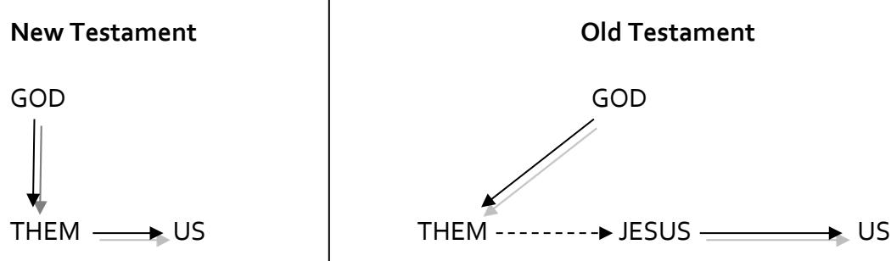

**bible study resources** 

# **1 Samuel**

**© St Helen's, Bishopsgate. All rights reserved**

### **1 Samuel – an introduction**

#### **Introduction: The promise and perils of studying 1 Samuel in Central Focus: –**

#### **a. A few promises to claim**

- the Old Testament scriptures can make us 'wise for salvation' (2 Timothy 3.14-15)

- the Old Testament scriptures teach us about God's Son and God's plan (Luke 24.45-47)

- the Old Testament scriptures are God-breathed and able to 'teach, reprove, correct and train us in righteousness' (2 Timothy 3.16)

- the Old Testament scriptures are full of examples for us (1 Corinthians 10.6; Hebrews 11)

- the Old Testament scriptures were written for our instruction to give us hope (Romans 15.4)

#### **b. A few perils to avoid**

- the Old Testament scriptures are often and easily distorted, leading to destruction (2 Peter 3.16)
- the Old Testament scriptures are often less-familiar ground, so mistakes are harder to spot
- the Old Testament scriptures are 'an extra step' away from us:

#### **c. Therefore…**

- as always, we need to ask 'What is *God* saying?' rather than 'What am *I* hearing?'

| I. Where do 1 and 2 Samuel come in the Bible story?                   |  |  |
|--------------------------------------------------------------------------|--|--|
| or 'When' is God speaking?                                            |  |  |
| a. What is happening in Israel before 1 Samuel? Hint: Judges 21.25    |  |  |
| b. What is happening in Israel after 2 Samuel? Hint: 2 Samuel 7.12-16 |  |  |
| Therefore, 1 and 2 Samuel must be about c.                            |  |  |
|                                                                          |  |  |

### *II. What is the content of 1 Samuel?* or *'What' is God saying?*

#### **a. Who are the characters?**

- the 3 main characters in the book provide its 3 big sections: –

| Section 1 | Chapters 1–7  | The story of Samuel (and Eli)  |
|-----------|---------------|--------------------------------|
| Section 2 | Chapters 8–15 | The story of Saul (and Samuel) |

**Section 3** Chapters 16–31 The story of David (and Saul)

| b. What are the characters like – good, bad or a mixed bag?                                                                                                                                                                      |  |  |
|----------------------------------------------------------------------------------------------------------------------------------------------------------------------------------------------------------------------------------------|--|--|
| i. Talk about each of the characters (including Eli) in turn, listing some of their good and bad moments in 1 Samuel, and then try and come up with a statement that summarises them (be as tabloid or broadsheet as you like!): |  |  |
| Eli is                                                                                                                                                                                                                                 |  |  |
| Samuel is                                                                                                                                                                                                                              |  |  |
| Saul is                                                                                                                                                                                                                                |  |  |
| David is                                                                                                                                                                                                                               |  |  |

#### **b. What are the themes?**

Hannah's prayer is crucial to 1 Samuel – it introduces us to the following key themes: –

### **i. God shows grace to His needy, faithful children**

e.g. Hannah (ch 1), Israel (lots), Samuel (ch7) and David (ch 17ff.)

**ii. God brings low the mighty and cuts off the wicked**

e.g. Eli and his sons (ch 2-4), the Philistines (lots), Goliath (ch 17) and Saul (ch13)

**iii. God gives strength to His king and exalts the power of His anointed**

### e.g. Samuel (sort of, in chapter 7), Saul (sort of) and David (in particular) *III. What is the purpose of 1 Samuel?*

or *'Why' is God speaking?*

### **a. God wrote 1 Samuel to teach us** *how* **He will achieve His purposes in the world**

'The wicked shall be cut off in darkness for not by might shall a man prevail.'

*1 Samuel 2.9* 

'This day the LORD will deliver you into my hand, and I will strike you down and cut off your head. And I will give the dead bodies of the host of the Philistines this day to the birds of the air and to the wild beasts of the earth, that all the earth may know that there is a God in Israel, and that all this assembly may know that the LORD saves not with sword and spear. For the battle is the LORD's, and he will give you into our hand.'

*1 Samuel 17.46-47*

- this statement not only explains the purpose of David's victory over Goliath, it also unlocks the message of the whole book of 1 Samuel:–

- *1–7 God can and will work to achieve His purposes of salvation and judgement* i.e. chapters 1–7 are written to show us God's sovereign power and grace
- *8–15 God will not work through human power and worldly might*  i.e. chapters 8–15 are written to show us how God will not work
- *16–31 God will work through His godly, anointed king*  i.e. chapters 16–31 are written to show us the character of the king through whom God will achieve His purposes

*Big question: what does this passage teach me about how God does His work?* 

**b. God wrote 1 Samuel to teach us** *how* **(and how not!) to respond to Him and His king**

*Big question: what does this passage about how to respond to God and His king?*

### *IV. What is the relevance of 1 Samuel today?*

### or *'What does God have to say to us'?*

### **a. Thinking about how God works**

*'The battle belongs to the LORD'* (1 Samuel 17.47). In what ways do our attitudes and practices suggest that we don't *fully* believe this statement?

*'Man looks on the outside'* (1 Samuel 16.7). In what ways do we continue to be impressed by human power and worldly might? How does that hinder our relationship with God?

*'The LORD will give strength to His king and exalt the power of His anointed'* (1 Samuel 2.10). Spend some time as a group praying that God will use our studies in 1 Samuel to teach us more about His ultimate king, the Son of David (Matthew 1.1) – Jesus Christ.

### **b. Thinking about our response to God**

- There are many 'wrong' responses to God in 1 Samuel: have you ever been guilty of pride (2.3), contempt (2.17), neglecting a duty (3.13), manipulation (4.4), defiance (4.8-10), complacency (6.19), idolatry (7.3), rejecting God as king (8.7), failing to heed God's warnings (8.19), impatience (13.8-14), rejecting God's word (15.23), defiance (17.45), opposing God's king (e.g. ch 19)?

1 Samuel was written to guard us from making these mistakes; pray that God might humble and change us as we study this great book together.

- There are many 'right' responses to God in 1 Samuel: dependent prayer (1.10), praise (2.1), wholehearted repentance (7.3-4), renewing the kingdom (11.14), obedience (12.20), confidence in God (14.6), concern for God's glory (17.26), deep love for God's king (18.1-3), gathering to the king (22.2).

1 Samuel was written to train us in righteousness so that we might respond to God in this way; pray that God will correct, transform and inspire us through our studies.

### *V. Five resolutions for making the most of five months in 1 Samuel:*

### **1.Read, read and read again**

There are 31 chapters in 1 Samuel and a similar number of days in each month! If we read one chapter of 1 Samuel a day over the next few months, we will have read through the book five times. For many of us, this will be the only time that we study 1 Samuel in small groups in our life – let's make the most of it!

### **2. Have a think about what you read**

Here's a short list of suggestions: make a note of the major events of each chapter – see if you can learn them; build up a more detailed character profile for each of the main characters of the book; make up your own outline of the book – is it the same as this one or different? Why?

#### **3. It's all about Hannah**

1 Samuel is not all about Hannah at all, it's all about God, obviously! But Hannah's prayer is deliberately put very near the start of the book to set the theological agenda of the book. That means that we should be able to ask of every chapter in the book: *how does this relate to the content of Hannah's prayer?* The answer to this question will go a long way in helping us see what God wants us to learn about Himself and His purposes from each of the chapters.

#### **4. Read one book on 1 Samuel**

If you were only going to read one (short) book on 1 Samuel, we'd probably recommend Dale Ralph Davis' '1 Samuel: Looking on the Heart' published by Christian Focus. It costs less than £10, avoids getting bogged down in technical argument and is very heart-warming.

Possibly even better (but a bit longer!) is a series of transcribed sermons by John Woodhouse, entitled '1 Samuel: Looking for a Leader' in Crossway's 'Preaching the Word' series. Brilliant!

#### **5. Pass it on**

1 Samuel contains some of the best narrative writing in all literature. If you have children / grandchildren / godchildren / nieces and nephews, why not make a point of telling them some of the stories that you are reading in 1 Samuel? As you relate the *story* to them, try and highlight the main *lesson* that God wants us to learn from the chapter. It will do them the world of good but it will also help you to 'cement' the lesson in your own mind and heart.

### **1 Samuel 1.1–4.1a**

# **Introduction**

The book of Judges ends with the depressing words, 'In those days there was no king in Israel. Everyone did what was right in his own eyes' (Judges 21.25). The year is about 1050BC and Israel has just experienced 200 years of 'extraordinary social upheaval, verging at times on anarchy' (John Woodhouse, *1 Samuel: Looking for a Leader,* pp.18-19) in the period of the judges. As the book of 1 Samuel begins, there is no stable political authority in Israel and we are soon to learn that the priesthood is also in a mess. But, by the end of chapter 3, God will have provided for His people a prophet through whom His people can hear His word. That simple 'before and after' observation reveals the two major themes of this first section of 1 Samuel – God's gracious provision of a prophet and His judgement of a corrupt priesthood.

# **Structure of passage**

Our passage has four major units, set out below. Taken together they highlight two major themes – God's gracious provision of Samuel as a prophet for Israel and His just judgement of the priestly house of Eli. The author deliberately interweaves these two motifs (seen most clearly in 2.11-36) and the notes therefore follow a more thematic approach. The chapters can usefully be studied either sequentially or thematically but on balance I think that a thematic approach will allow for a more focused coverage of the material on this occasion.

| 1 Samuel 1       |                   | The grace of God to Hannah                                 |
|------------------|-------------------|------------------------------------------------------------|
|                  | 1.1-2             | Introduction to key characters                             |
|                  | 1.3-7             | Scene 1: Year after year at Shiloh: distress and torment   |
|                  | 1.8-18            | Scene 2: One special day in Shiloh: prayer and a turning   |
|                  | 1.19-20           | point Scene 3: Back in Ramah: answered prayer              |
|                  | 1.21-28           | Scene 4: Samuel worships in Shiloh: a vow honoured         |
| 1 Samuel 2.1-10  |                   | Hannah praises the LORD of salvation                       |
|                  | 2.1-3             | Hannah praises the LORD who has saved her                  |
|                  | 2.4-8             | Hannah praises the LORD who rules everything               |
|                  | 2.9-10            | Hannah praises the LORD who will exalt His king            |
| 1 Samuel 2.11-36 |                   |                                                            |
|                  |                   | The LORD blesses and the LORD rejects                      |
|                  | 2.11              | Samuel ministers in God's presence                         |
|                  | 2.12-17           | The shocking sins of the worthless sons of Eli             |
|                  | 2.18-21           | Samuel ministers in God's presence                         |
|                  | 2.22-25           | The shocking sins of the worthless sons of Eli             |
|                  | 2.26              | Samuel grows in stature before God and man                 |
|                  | 2.27-36           | The judgement of ineffectual Eli and his worthless sons |
|                  | 1 Samuel 3.1-4.1a | The LORD raises up and establishes a prophet in Israel     |
|                  | 3.1               | The rarity of the word of the LORD                         |
|                  | 3.2-10            | The LORD calls Samuel                                      |
|                  | 3.11-18           | The LORD's message of judgement through Samuel             |

3.19-4.1a The LORD establishes Samuel as Israel's prophet

### **Text notes**

All of the important action in these three chapters is centred on Shiloh. It was in Shiloh that (i) Israel assembled and built the tabernacle (Joshua 18.1); (ii) Joshua apportioned the land to each of the tribes of Israel (Joshua 18.10); (iii) Israel once assembled to make war (Joshua 22.12); and (iv) Israel enjoyed an annual 'feast' to the LORD (Judges 21.19). Shiloh therefore symbolised, to a certain extent, the promises made by God to Abraham in Genesis 12.1-3. In our passage Shiloh is the place where Hannah prays (1 Samuel 1.9), the place where Samuel serves the LORD (1.24), the site of Hophni and Phinehas' sin (1.3; 2.14), the home of the ark of the LORD (3.3 – the ark will become a major player in the narrative of chapters 4-7) and the venue where Samuel is established as God's prophet (3.21). So what? It is through Samuel the prophet and not through the corrupt priesthood that God will work to continue the fulfilment of His promises.

### **1. The LORD is a God of unexpected grace – praise Him**

The book of Samuel is dominated by three leading figures: Samuel (chapters 1–7), Saul (chapters 8–14) and David (chapters 15–31), but as always in the Bible the main character in the narrative is God. There is a place for asking how the stories we read in 1 Samuel serve 'as examples for us' (1 Corinthians 10.6), but our first question must always be, 'What does this passage teach me about God?' We are prompted to ask that question here in particular because Hannah's prayer in 2.1-10 (which is all about God) serves as an interpretative grid for the events on either side – chapters 1-3 are designed to teach us about the grace that God showed not just to Hannah but also to Israel. It is in the light of what we learn about God that we are able to learn from the positive example of Hannah and the negative example of Eli and his sons.

### **i) Salvation for Hannah**

Hannah's prayer in 2.1-10 has three parts: she first rejoices in the 'salvation' (2.1) that she enjoyed in chapter 1 by praising God for exalting her 'strength' (2.1 – the Hebrew word is 'horn', a symbol of strength); second, she praises God for His character and dealings with Israel; finally, she rejoices that God will give strength to His king and exalt the 'power' (the word is 'horn' as in 2.1) of His anointed Messiah. The repetition of the word 'horn' is significant – it teaches us that we are to view Hannah's 'salvation' in chapter 1 as a picture of the LORD's general dealings with Israel, and of the work that He will do through His anointed king in particular.

It is no surprise therefore that the details of chapter 1 emphasise God's grace to Hannah. Hannah's own name means 'grace' but at the start of the book, she seems to know little of God's grace. One of the covenant blessings was that there would not be a barren man or woman in Israel (Deuteronomy 7.14) but Hannah was childless. That was pain enough but her distress was increased by Peninnah's taunts (1.6-7), Elkanah's insensitivity (1.8), and Eli's inaccurate rebuke (1.9-16). At this point Hannah has nothing going for her – she is married to a nobody (having considered Eli's ancestry and geographical origins, one writer says of Elkanah 'the most significant thing about him is his insignificance!') and cannot provide him with an heir.

But Hannah knows that her God is the 'LORD of hosts', the Almighty One. And so she asks for a son, vowing to give him straight back to the LORD's service (no 'razor' will touch the child's head, marking the child out as a Nazirite, the last judge in Israel, cf. Judges 13.5).

In His grace, the LORD answers Hannah's prayer and gives her a son. It is not the only time in the Bible that God has granted a child to a barren woman (cf. Sarai / Sarah, Gen 11.30; Rebekah, Gen 15.20-26; Rachel, Gen 29.31-30.24; Manoah's wife, Judges 13; and much later Elizabeth, Luke 1.5-25 and in a different way, Mary herself who will give birth in Bethlehem Ephrathah (Micah 5.2) – Elkanah's ancestral home). Each time God's sovereign provision has emphasised His generosity and faithfulness to His word as each child proves central to the outworking of His covenant promises to His people – what will become of Samuel?

#### **ii) Salvation for Israel**

As with Hannah, so with Israel – God had demonstrated His grace to them in the past (Hannah's prayer in 2.1-2 echoes Moses' post-exodus prayer in Exodus 15.1-2), and now He will do so again, in three particular ways.

#### **a. A prophet is established**

God's provision of a prophet for Israel is the major note of grace in these chapters. Before Samuel's call, 'the word of the LORD was rare… there was no frequent vision' in Israel (3.1). This is not just a statement of fact but an expression of God's judgement on a corrupt priesthood (2.11-36) and a disobedient people (Judges 21.25) cf. Amos 8.11-12. But in His kindness, from very unexpected beginnings and despite the ineptitude of Eli (his 'dim' eyesight in 3.1 is a reflection of his own spiritual state – not quite blind, but getting there), God gives Israel a prophet. His grace is seen at every turn: the miraculous provision of the child (and at least six others for Hannah, because God is *that* gracious, 2.21); Samuel's growth in stature (2.36); God's persistence in calling him (3.1-10 – this is all God's initiative), and in Samuel's established status at the end of the passage (3.19-4.1a – Samuel knows God personally (cf. 3.7), is recognised as a prophet by all Israel and is the means by which God's word comes to His people. Many years later, first John the Baptist and then Jesus Himself are likewise established as prophets of God (cf. Luke 2.40).

#### **b. A priest is promised**

We will see shortly that God rightly vows to act in judgement against the family of Eli the priest for their complacency, irreverence and immorality. But in 2.35 God promises, 'I will raise up for myself a faithful priest, who shall do according to what is in my heart and in my mind. And I will build him a sure house and he shall go in and out before my anointed forever.' The promise is itself an act of grace to Israel. It is fulfilled in three ways. First, Samuel himself is styled as a priest as well as a prophet – he trains under Eli, (2.11); he wears a linen ephod, (2.18), and he is 'faithful' (the word translated 'faithful' in 2.35 is the same as the word translated 'established' in 3.20). Second, when Eli's descendant Abiathar is expelled from the priesthood by Solomon in 1 Kings 2.27, 'thus fulfilling the word of the LORD that He had spoken concerning the house of Eli in Shiloh', he is replaced by Zadok (1 Kings 2.35) whose line continues to serve as priests until the exile. But neither Samuel nor Zadok serve faithfully 'forever' (1 Samuel 2.35) – Samuel's own 'line' fails (8.1-3), and Zadok's family serve only until the exile. The Old Testament text itself therefore points us forward to a greater priest, one who would serve as a 'faithful' priest forever, Jesus Himself (Hebrews 2.17; 7.25-26).

#### **c. A king will be exalted**

The end of Hannah's prayer in 2.10 is extraordinary. 'The LORD… will give strength to His king and exalt the power of His anointed.' While the idea of a king has not been entirely absent up to this point in the Old Testament (e.g. Genesis 17.6, 16; 49.10; Deuteronomy 17.14-20), this is the first mention of a king who will be 'anointed' (the word is 'Messiah'). In some ways the rest of the book of 1 Samuel (and indeed of the rest of the Bible) seeks to answer the question, 'Who is this king?' We know the answer.

Within the context of 1 Samuel specifically, Samuel is a judge (the hint of 1.11 reaches its fulfilment in 7.2-17) who first prefigures and later anoints God's first messiah David.

# **2. The LORD is a God who knows and by Him actions are weighed – do not be proud**

Carefully inter-woven with the account of the rise of Samuel as a prophet of God is the equally significant story of the decline of Eli and his house as priests of God (see especially the structure of 2.11-36, but notice also 1.3).

### **i) The sins of Eli and his sons**

When praying before the LORD in chapter 1, Hannah feared that Eli considered her a 'worthless woman' (1.16). Now we meet two men who really are 'worthless' – Eli's own sons (2.12; they are, literally, 'sons of Belial', just like the ghastly men of Gibeah in Judges 19.22; 20.13). The sins of Hophni and Phinehas were both ceremonial (2.13-17) and sexual (2.22-25). At the time of a sacrifice a worshipper was required to present both the breast and the right leg of the animal to the priests as a gift (Leviticus 7.28- 36), but Eli's sons demanded more, sending a servant to take extra meat (2.14), even before the fat had been burned to God (2.15). Thus they 'treated the offering of the LORD with contempt' (2.17), distressingly appropriate for these priests 'did not know the LORD' (2.12; cf. Pharoah in Exodus 5.2). Not content with this 'very great' sin (2.17), Eli's sons also slept with the women who were tending the tabernacle (2.22).

The text makes it clear that these sins were not one-off lapses of otherwise godly men – they were habitual (notice the use of the word 'custom' in 2.13; the tense of the verbs also emphasises the regularity of their crimes). Eli himself knew what was happening (2.22) and got as far as lamenting their behaviour (2.23-25), but ultimately he did nothing to 'restrain' their blasphemy (3.13), and so he too is guilty before the LORD. It is a sad reflection of how little we expect of church leaders today that we are not more shocked and distressed by the actions of Eli and his family, but we should be. God had 'revealed' Himself to their house, 'chosen' them, and 'given' them so much (2.27-28). But they had treated the LORD with contempt (2.29) – why? Ultimately, Eli chose to honour his sons 'above' the LORD (the 'yourselves' of 2.29 suggests that Eli himself also fed on the stolen sacrifices).

#### **ii) The judgement of Eli and his sons**

The sons of Eli are condemned by the narrator (2.12) and by their father (2.23-24), but ultimately the whole family is condemned by the 'man of God' in 2.27-34, and also by God Himself, speaking through His prophet Samuel, in 3.11-18. The sins of the Elides are so great that their family will be decimated and excluded from the priesthood forever. To be clear, this is not the end of the priesthood per se. God had promised Aaron that the priesthood would remain with his sons by statute forever (Exodus 29.9); he reiterated the same promise to Aaron's grandson Phinehas (a different one!) in Numbers 25.11-13. This promise remains and is inherited by Zadok in 1 Kings 2, but from this moment on the house of Eli is permanently excluded from it.

The terrible judgement promised in 2.30-34 and 3.14 falls initially in 4.12-22, and then more fully in the massacre of 22.6-23, for 'the wicked shall be cut off in darkness... [and] the adversaries of the LORD shall be broken to pieces; against them He will thunder in heaven' (2.9-10).

### **Application**

The first concern of 1 Samuel is not to teach us *moral* lessons but *theological* – it is written to teach us about God. Chapter 1 contains *some* lessons for us about trusting God in the midst of suffering but we are not Hannah. Neither are we Samuel – chapter 3 is not written to teach us how to discern 'the call of God' on our life. The placement and theology of Hannah's prayer in the centre of the narrative confirms that all three chapters are written primarily to teach us about God.

### **1. Beware the arrogance of pride, 1 Samuel 2.3**

Hannah's prayer begins with an assertion of the LORD's holiness and justice, 'There is none holy like the LORD… for the LORD is a God of knowledge and by Him actions are weighed' (2.2-3) and ends with a further statement of His judgement (2.10). In between (2.4-8), Hannah prays generally about the character of God. This is not a God who allows His proud, arrogant, mighty adversaries to get away with it – He is a God who will weigh their actions and bring them low, for the whole world is in His hands, He is the Creator and judge of all. These chapters present the reader with a live example of God's actionweighing justice in His dealings with Eli and his sons.

The appeal of 2.3 is therefore very fitting. 'Talk no more so very proudly, let not arrogance come from your mouth; for the LORD is a God of knowledge, and by Him actions are weighed.' Hannah is not talking to Peninnah alone – the first two verbs are plural, as is the word 'your'. The author intends that his readers will be humbled by what they learn of the LORD's knowledge and judgement in these chapters. Humans become proud because of their strength (v4), their material prosperity (v5), their successful family life (v5), and their wealth (v7). In their pride, like Hophni and Phinehas, many sin greatly in the sight of God, treating Him with contempt and honouring other things (including our children?) more than we honour God. Be warned for the LORD is a God of knowledge – He is not fooled by outward appearance but will weigh humanity according to our actions.

This is a very apposite lesson in the context of 1 Samuel in particular. Saul looks great on the outside, but the LORD looks on the heart (1 Samuel 16.7; as David laments Saul's death in 2 Samuel 1, he refers to him five times as 'the mighty' one; cf. 2.4). Even the hulking Goliath is unable to resist the strength of God's exalted king (2.10). Indeed 2 Samuel ends with the proud king David being brought low (2 Samuel 24). John Stott wrote, 'Pride is more than the first of seven deadly sins; it is itself the essence of all sin' for pride seeks to exalt self in the place of God. Stott continued, 'At every stage of our Christian development and in every sphere of our Christian discipleship, pride is the greatest enemy and humility the greatest friend.' Beware the arrogance of *your* pride.

### **2. Praise the God of salvation**

Hannah's song begins very personally, '*My* heart exults in the LORD; *my* strength is exalted in the LORD; *my* mouth derides my enemies, because *I* rejoice in your salvation' (2.1), but before long she is praising the LORD for His protective blessing of *all* His people, 'He raises up the poor from the dust… He will guard the feet of His faithful ones' (2.8-9). She concludes by asserting the means by which the LORD will bring ultimate salvation to His people, 'He will give strength to His king and exalt the power of His anointed' (2.10). Hannah's song (an echo of Deborah's in Judges 5) finds its closest counterpart is

the song of Mary in Luke 1.46-55. Thereforen the context of the whole Bible, 1 Samuel 1-3 should leave the Christian praising God that He has already fulfilled the promise of 2.10 in the person of His Son the LORD Jesus.

The grace of God demonstrated in the salvation that came to Hannah and to Israel is seen yet more clearly in the salvation won for God's people by Jesus. He too came from unexpected origins. He too is the voice of God into a world that deserves His silence. He is the King of 2.10, the faithful priest of 2.35 and the perfect prophet anticipated in the person of Samuel in 3.20. Praise the speaking God for His salvation.

#### **3. Trust the God who guards His faithful ones**

In a secondary way, we are able also to learn from the way that Hannah responds to God in chapter 1. She was in deep distress, but she knew her God to be the LORD of Hosts and so she persevered in praying to Him. She discovered that God *always* guards the feet of His faithful ones. Of course, He does not promise that all His people will be able to conceive (presumably there were many other childless women in Israel at the time – Hannah's story is recorded not because it is typical, but because it is exceptional and because of Samuel's significance in the history of Israel), nor does God promise that He will remove any other cause of our personal distress. But He does promise that He will work *all things* together for the good of those who love Him (Romans 8.28), and that if we trust in Him with our whole heart, He will make our paths 'straight' (Proverbs 3.3-5). Therefore cast all you anxieties on the LORD because He cares for you (1 Peter 5.7).

### **As you study this passage the LORD wants you to…**

… humble yourself before Him, praise Him for His salvation and trust in Him always for He is the God of judgement and salvation.

# **1 Samuel 4.1–7.17**

### **Introduction**

No sooner is Samuel established as the LORD's prophet (3.19-4.1a) than he disappears from the narrative until 7.3. This is not because an 'ark' narrative and a 'Samuel' narrative have been bolted together by a careless editor but to make a vital point: when God's word is ignored or side-lined, things go disastrously wrong. Thus chapters 1–7 of 1 Samuel have a relatively simple structure:

| 1.1–4.1a | Yahweh prepares Samuel to lead Israel through crisis (3.11) |
|----------|-------------------------------------------------------------|
| 4.1–7.1  | The crisis unfolds                                          |
| 7.2–17   | Samuel successfully leads Israel out of crisis              |

# **Structure of passage**

The behaviour of Israel and its consequences are deliberately contrasted between chapters 4 and 7. In chapter 4, Israel is 'struck down' by the Philistines (4.2, 3, 10) and resorts to superstition in an effort to manipulate Yahweh's hand (4.3); the Philistines 'hear' (4.6) and the final result is Ichabod (4.21). In chapter 7, however, the Philistines are 'struck down' by Israel (7.10) who do not manipulate God but repent and ask Him to deliver them (7.3, 8); again the Philistines 'hear' (7.7) but the result this time is Ebenezer (7.12) – not the departure of God and His glory, but His glorious help. Thus the structure deliberately emphasises what we might call the divine turning point of the narrative (5.1-5): God is the sovereign LORD before whom none can stand – He does not need anyone, not even Samuel, to achieve His purposes.

| 1 Samuel 4      | Total defeat and disgrace for Israel and God                    |
|-----------------|-----------------------------------------------------------------|
| 4.1–11          | The defeat happens                                              |
| 4.12–22         | The defeat is reported                                          |
| 1 Samuel 5–7.1  | Total victory and vindication for God and Israel                |
| 5.1-5           | The absolute supremacy of Yahweh …                              |
| 5.6-7.1         | … before whose heavy hand none can stand                        |
| 1 Samuel 7.2–17 | A lesson learned: Samuel leads Israel to repentance and victory |

### **Text notes**

# **1. Total defeat and disgrace for Israel and God, 4.1–22**

### **i. Defeat for Israel**

Chapter 4 makes for very depressing reading in Israel. The usual turn of events in the promised land is that when Israel's army lines up against opposition, the LORD gives His people victory. But not this time (4.2). The elders ask the right question, 'Why has *the LORD* defeated us today…?' but regrettably they do not wait for an answer. Leviticus 26.17 and Deuteronomy 28.25 held the answer – this is God's judgement on a rebellious people. In the book of Judges defeats of this sort are often followed by heartfelt repentance and divine deliverance (e.g. Judges 3.9, 15; 4.3; 6.6,7; 10.10, 12) but on this occasion the elders resort instead to 'rabbit foot theology' (the phrase belongs to Dale Ralph Davis) believing that the mere presence of the ark will give them victory. This understanding is confirmed by the reference to the incident in Jeremiah 7.2, 14 where Israel makes the same mistake about the temple.

'The ark of the covenant of the LORD of Hosts who is enthroned on the cherubim' (4.4) was of great importance to Israel, symbolising *God's revelation* (it contained the Ten Commandments), *His rule*  (He was said to be 'enthroned' on the cherubim), and *His relationship with Israel* (the mercy seat on the ark was a place of atonement). But the ark was no lucky charm. On hearing of its arrival the Philistines were first terrified (they had heard of the exodus, cf. Exodus 15.16), but then bold enough to fight once more. We might at this moment expect an Israelite victory (for now *the LORD of Hosts* was *with* them) but instead the Philistines inflict an even heavier defeat (4.6-10).

### **ii. Disgrace for God**

The ark is not only crucial to these chapters (it is mentioned 37 times!), but also to Israel: where the ark went, God went; what happened to the ark happened to God. That is why the capture of the ark is greeted with such horror in Shiloh – it causes the whole city to cry out (4.13), Eli to fall from his seat and die (4.17-18), and Phinehas' wife to die in childbirth (4.21). Notice that even though Eli heard of the death of his sons and Phinehas' wife heard of the death of her husband, in both cases it is specifically the capture of the ark that causes their death – the departure of God and His glory from Israel is even more serious than the death of their closest kin. By naming her son Ichabod, Phinehas's wife probably 'taught more theology in her death than Phinehas had done in his whole life' (Dale Ralph Davis, p55).

Not only was the ark captured, it was also carried to Ashdod and set up in the temple in order that Yahweh might pay homage to the victorious Dagon (5.2). Israel had been told to have no other gods before the LORD, but now the LORD Himself was bowing down to Dagon, and all His promises with Him – the LORD's humiliation is complete.

Except of course, readers of 1 Samuel know differently. He had promised that He would do something so dramatic in Israel that it would make the ears of all who heard of it 'tingle' (3.11). He had promised the decimation of Eli's house, and named the death of Hophni and Phinehas as a confirmatory sign (2.34). Therefore, even in the midst of all the carnage, we see the LORD's hand at work, fulfilling His promises, just as He always does (Joshua 21.45; 1 Samuel 3.19).

### **2. Total victory and vindication for God and Israel, 5.1–7.16**

### **i. Vindication for Yahweh, 5.1–5**

We are meant to laugh. The mighty Dagon, the conquering deity is found prostrate before the LORD (since its capture, the ark has only been called 'the ark of God', now once again it is the ark of the covenant keeping LORD, 5.3). Even after a helping hand Dagon is again humbled before the LORD – just as Goliath will later fall before David. A bit like Humpty-Dumpty, Dagon is beyond repair – this time he is headless and handless as well (5.3-5).

### **ii. Victory for Israel, 5.6–7.17**

The irony is immense: Dagon has lost his 'hands', but now the 'hand' of the LORD will fall against the Philistines (5.6, 9, 11; 6.5). As he records the ensuing victory of the LORD the writer deliberately echoes language from chapter 4 – the 'cry' of 5.10 and 5.12 matches the 'cry' of 4.13; the 'heavy' hand of the LORD in 5.6 matches the 'great' (same word) defeat of 4.17, and the 'great blow' of 6.19 matches the 'great slaughter' (same word) of 4.10. The point is that the LORD is effecting a complete reversal of chapter 4 because He is the LORD of great reversals – 'His adversaries will be broken to pieces' (2.10); notice also the use of the word 'thunder' in 7.10 to echo 2.10.

The residents of Ashdod, Gath and Ekron all treat the ark like a ticking bomb (5.6-11), and in turn they feel the weight of the hand of the LORD against them, their gods and their land (6.5b). Finally, the decision is made to return the ark to Israel – the 'test' set by the Philistines in 6.7-12 may need a little explanation to an urban audience but it is really very simple: cattle are very unlikely to walk directly *away* from their young but this time they do so. But why the great detail about the ark's return to Israel? The text itself suggests the answer: the ark's return to Israel is like a re-run of the Exodus narrative. The vocabulary does the work: 'send away' and 'empty' in 6.3 match Exodus 5.1 and Exodus 3.21, 22; 11.2, 3 respectively. Pharoah and the Egyptians are named specifically in 6.6 and their defeat is referenced in 4.8. In addition, the result of the cow-test is that something is 'known' about God (6.9; cf. Exodus 6.7); further, the gold mice and tumours that accompany the ark echo the plundering of the Egyptians in Exodus 12.35-36, and its journey on a 'highway' (6.12) foreshadows the new exodus of Isaiah 40.3-5. The big point is that even though the LORD had looked defeated, this God has the power to raise the dead (2.6) and can never be thwarted.

### **3. A lesson learned: Samuel leads Israel to repentance and victory, 7.2–16**

### **i. Samuel is further established as leader over Israel**

In chapter 3 Samuel was established as the prophet over Israel (3.19–4.1); now in chapter 7 his position is strengthened as he functions as prophet to Israel, priest for Israel and judge of Israel.

#### **a. Prophet**

Samuel delivers the word of the Lord to Israel in 7.3, calling them to wholehearted repentance and single-minded service of God.

#### **b. Priest**

Samuel both cries out to the LORD for Israel in effective prayer (7.4, 8, 9) and performs Levitical sacrifices for them (7.9 – the burnt offering 'made atonement', Leviticus 1.4).

#### **c. Judge**

Four times the text emphasises that Samuel 'judged' Israel (7.6, 15, 16, 17) – stressing in particular the geographical spread ('he went on a circuit year by year… and judged Israel in *all* these places', 7.16) and the duration ('*all* the days of his life', 7.15) of his work. Under his leadership, Israel is functioning well in chapter 7: the people are serving the Lord only (7.4) and their enemies have been subdued (7.13). The only fly in the ointment is that phrase 'all the days of his life' – what will happen when Samuel is too old to lead God's people?

#### **ii. The people respond rightly to God**

As well as cementing Samuel's role as prophet, priest and judge, chapter 7 also illustrates the right response to the self-sufficient and all-conquering God of chapters 5–6. The detail will be considered below under Application but it is heartening, for once, to see Israel getting it right as they put away their idols and serve God only (7.4).

### **Application**

The major turning point in the narrative comes in 5.1–5 as the LORD works alone to humiliate Dagon because the writer's first concern in these chapters is once again to teach us about God.

### **1. The glorious self-sufficiency of the invincible LORD.**

The passage begins (4.1) and ends (7.12) in Ebenezer – it is the story of a dramatic reversal of fortunes for Israel as defeat turns to victory but the most significant point is about *how*, or rather *by whom*  victory is achieved: 'Till now the LORD has helped us' (7.12). This point is highlighted by the narrative of

chapter 5 – there is not a single Israelite soldier in sight as the LORD first humbles Dagon and then wreaks havoc across the whole of the land of Philistia.

There is a children's song that goes, 'God has no hands but our hands to do his work today, he has no feet but our feet to lead others in his way…' As we read 1 Samuel 4–7 it is harder to imagine a grosser misrepresentation of God. God does not need the Israelite army to achieve His purposes; He does not even need Samuel (notice that God works despite Samuel's absence in chapters 4–6, and even when Samuel returns in chapter 7, it is *the LORD* who 'thundered with a mighty sound that day against the Philistines,' 7.12). By the same token, the LORD does not need us either individually or as a church in order to accomplish His will. It is worth reading that last sentence again because although it is something we 'know', our pride may suggest that we do not really believe it. God sometimes chooses to work *through* His people, but He never *needs* us. He is invincible, self-sufficient and sovereign.

Neither is God's power something that we can manage or coerce. The Israelites are a little crass in their superstition about the ark in chapter 4 but many do something similar today. Pagan religions offer sacrifices or recite mantras or perform religious duties in an effort to harness their god's power, and we can be tempted to do something similar. We think that God will hear our prayers *because of* our many words (Matthew 6.7) or *because* we organise an all-night prayer meeting but prayer is not a slot machine by which we bend the will of God to give us what we want – He is the sovereign LORD of all and He always achieves His purposes.

### **2. The right response to the invincible LORD.**

The chapters deliberately provide three differing responses to the sovereign LORD. As readers we are meant to learn from them.

### **a. The folly of defying God**

Much of the theology of these chapters is spoken either by or to the leaders of the Philistines; they know a surprising amount about God (4.7-8; 5.7, 11); they know His name (6.2) and something about guilt offerings (6.4), and they are in no doubt about His power (5.7; 6.5). That is why they seek to 'give glory to the God of Israel' (6.5) – the mice are gold because of its value and there are five because there are five Philistine rulers and towns. The offering represents *all* the Philistines and signals a comprehensive victory for the LORD.

The question of 6.6 is therefore apposite: 'Why should you harden your hearts as the Egyptians and Pharoah hardened their hearts?' And yet, no sooner has the ark returned than the Philistines choose to attack Israel (7.7). Their defeat is decisive (7.10) and despite repeated efforts (e.g. chapters 13–14), they remain subdued for as long as Samuel lived. This is the lesson of 2.10 once again – the LORD *will* thunder against His enemies – make sure that you are not one of them.

#### **b. The peril of over-familiarity with God**

The men of Beth-Shemesh are a curious bunch. When the ark first arrives in town, they rejoice (6.13) and make multiple offerings to the LORD (6.14-15). But then some choose to 'look upon the ark' (6.19), whereupon seventy are struck down. These men were not Philistines but Israelites – they 'offered burnt offerings and sacrificed sacrifices … to the LORD' their covenant God (6.15). But then… Theirs is the sin of over-familiarity. If only they had lived in the light of their theology, things would have been very different. We would do well to let their question echo around our own heart and mind, 'Who is able to stand before the LORD, this holy God?' (6.20).

### **c. The wisdom of whole-hearted repentance and service of God**

In contrast to the Philistines and the men of Beth-Shemesh (and indeed in contrast to their own behaviour in chapter 4, see Structure) stand the rest of the people of Israel – it takes them a while to get around to it (twenty years to be precise, 7.2!), but eventually they lament before the LORD. Only then did Samuel address them. The language of his appeal is striking: *if* they are returning to the LORD *with all their heart*, they should get rid of their idols and serve the LORD *only* (7.3).

Samuel clearly wants to be sure that the Israelites' lament is not just the 'worldly grief [that] produces death' (2 Corinthians 7.10), but genuine repentance. Therefore he calls upon them to 'put away' their idols (presumably this means that they had been engaging in idolatry for the last 20 years), to direct their heart to the LORD and to serve Him *only* (the only is emphatic and very unusual in the OT).

The people respond in exactly the way that Samuel demands, confessing their sin to the LORD (7.4-5). Moreover, when the Israelites were frightened by the imminent Philistine attack, they did not on this occasion send for the ark but pleaded with Samuel to pray on their behalf so that the LORD might save them from the 'hand' of the Philistines (7.8). Thus the Israelites (in chapter 7 at least) model to the reader the *right response* to the self-sufficient, invincible LORD. There is none holy like the LORD… there is no rock like our God… He will guard the feet of His faithful ones (2.2, 9), therefore humble yourself before Him truly, serve Him only and trust in Him always (cf. e.g. Mark 1.14-15; 8.34-38).

### **3. Praise God for Jesus**

Samuel does a great job in chapter 7: as God's prophet, he calls God's people to repentance; as priest, he offers sacrifices to the LORD and cries out to the LORD on the people's behalf; as judge, he leads God's people into a time of peace. But notice the hint of a flaw in Samuel's position: 'Samuel judged Israel all the days of his life' (1 Samuel 7.15). How could it be any other way? Samuel was just a man, born in Adam – death would master him in the end. As such Samuel points beyond himself to Jesus. The positive comparison is clear: Jesus is the ultimate prophet of God's people for He is the final word of God to mankind (John 3.34; Acts 3.22-26; Hebrews 1.1-3); He is also the ultimate priest of God's people, for He not only offered Himself as the final sacrifice to God but He prays constantly for His people (Hebrews 7.25-26; 10.10); finally, He is the ultimate leader of God's people for to Him God has given all authority in heaven and on earth (Matthew 28.18) and the name that is above every name (Philippians 2.9-11). But the contrast between Samuel and Jesus is equally important: Jesus will never need to be replaced for He will never again die – alleluia!

### **As you study this passage God wants you to...:**

Recognise the glorious self-sufficiency of the invincible God, humbling yourself before Him truly, serving Him only and trusting Him always.

# **1 Samuel 8.1–22**

# **Introduction**

Chapter 8 begins the second major section of 1 Samuel. If in chapters 1–7, *the LORD leads Israel through His prophet-judge Samuel*, now in chapter 8–15, *the LORD provides Israel with a king 'like the nations'.* Section 1 showed that God is the self-sufficient ruler of all who will fulfil His purposes by humbling His enemies and graciously providing for His people. It taught further that things work 'well' for Israel when the people show their trust in the LORD by listening to the leader that He has provided (chapter 7); when they ignore him, disaster follows (chapter 4). Tragically, they are about to make the same mistake again – in chapter 4 they looked to the ark for security; now in chapter 8 they look to a king. On both occasions, they would have been better off looking to God!

# **Structure of passage**

John Woodhouse highlights 2 cycles of to-and-fro conversation in the chapter (verses 4-18 and 19-22). The same pattern is followed in each:

i. The people talk to Samuel (verses 4-5 and verse 19)

ii. Samuel talks to the LORD (verse 6 and verse 21)

iii. The Lord talks to Samuel (verses 7-9 and verse 22a)

iv. Samuel talks to the people (verses 10-18 and verse 22b)

It is also helpful to notice a slightly more thematic structure:

- **1-9 The request for a king** 
	- 1-3 The problem
	- 4-5 The proposal
	- 6-9 The problem with the proposal

**10-18 The warning about 'their' king**

**19-22 The determination to have a king**

### **Text notes**

### **1. The request for a king, verses 1–9**

Chapter 8 begins with the sound of alarm bells. Gone are the secure and just days of Samuel's rule over Israel (7.13–16) as like Eli before him, Samuel has become 'old' and handed over (some of) his responsibilities to two maleficent sons. Eli's sons 'took' meat at the time of sacrifice (2.14-16), Samuel's 'took' bribes (8.3). Judges in Israel were supposed to 'hate a bribe' (Exodus 18.21), but Joel and Abijah received them. They could not have been more different to their father for Samuel had 'judged' Israel wisely (7.15, 16, 17) but they chose instead to pervert 'justice' in pursuit of selfish gain (the word used for 'justice' in 8.3 matches the word 'judged' in chapter 7).

In chapter 7 the people of Israel had responded to adversity by pleading with Samuel to 'cry out to the LORD' for them in the hope that He might save them – they would have done well to repeat their request here. Sadly, however, they chose instead (there is a deliberate contrast between the two responses) to come up with their own proposal to solve the problem (just as they had done in the episode with the ark in chapter 4). It will not go any better this time.

It is worth highlighting that there is nothing wrong with the request for a king *per se*. Several times already in the Old Testament, God has foretold that Israel would one day have a king (Genesis 17.6; 35.11; 49.10) who would destroy her enemies (Numbers 24.17-19). God had also given careful stipulations about the type of king that should rule over Israel: he would be different to most kings because he would be a king of Yahweh's choosing; he would not accumulate a large cavalry, a large harem or large personal wealth; he would however be a man of Yahweh's law (Deuteronomy 17.14-20).

But while a monarchy may be a part of God's plan for the future (although it is perplexing that they should desire a hereditary system of government at this juncture after their experiences with Eli and Samuel!), the request of Israel's elders here is wrong because of the motivation that lies behind it – the text highlights 2 flaws in their desire.

### **a. The rejection of God**

It is hard to see exactly what lies behind Samuel's initial umbrage (v6) – is he peeved *personally* because Israel have rejected *him as judge*, or is he displeased *righteously* because they have rejected the 'judge' that God had provided and requested a king to 'judge' over them instead? Whatever Samuel's gripe, the LORD reveals the real issue, saying, '*Me* (emphatic) they have rejected from being king over them' (8.7). It is not the first time that Israel have rejected the LORD for they have made a habit of it (8.8; see for example Exodus 32; 1 Samuel 7.3), but their sin is shocking nonetheless. A king to rule *under* God is no bad thing, but Israel want a king to rule *instead of* God.

1 Samuel 12.8–12 provides a useful commentary on these events and confirms our interpretation of them. On many previous occasions in their history, Israel had 'cried out' to the LORD for help when faced with adversity and He had graciously delivered them (most recently in chapter 7); but this time, facing the military threat of Nahash the king of the Ammonites (a threat hinted at in 8.20), they did not 'cry out' to God but demanded a king of their own instead when really 'the LORD [their] God was [their] king.' This was the people of God rejecting their God by failing to trust Him to fight their battles for them (as in Deuteronomy 20.4; Judges 4.14; 1 Samuel 7.10, 14).

### **b. The rejection of distinctive living**

Much is often made of Israel's desire for a king 'like all the nations' (8.5, 19-20). The phrase itself is not necessarily negative (see its use in Deuteronomy 17.14) but if we are in any doubt about its use in verse 5, their real intention is clarified in verses 19-20. By *definition* Israel *is* different to the other nations of the world – 'did any people ever hear the voice of a god speaking out of the midst of the fire… and live?' (Deuteronomy 4.32-40). Further, Israel is different by *command* – the Law repeatedly highlighted the need for Israel to be distinctive to the nations around them (e.g. Exodus 19.5-6; Leviticus 20.26; Deuteronomy 4.6; 26.19). But Israel's request is not just to have a king like the other nations but actually to *be like* the other nations around them – the request for a king is the political equivalent of the Baals and Ashorath of 7.3. This was the people of God rejecting their calling to be 'a royal priesthood, a holy nation'.

### **2. The warning about 'their' king, verses 10–18**

The LORD responds to Israel's misguided request by telling Samuel to warn them of the 'ways' that their king will pursue. The word translated 'ways' in verse 11 is literally the word 'justice', the same word that was translated 'custom' in 2.13 – the king of Israel's choosing will be just like the sons of Eli. As they 'took' meat and Samuel's sons 'took' bribes, this king will 'take' their sons (v11), their daughters (v13), the best of their fields, vineyards and olive orchards (v14), a tenth of their harvest (v15), their servants and the best of their young men and donkeys (v16) and a tenth of their flocks (v17). His desire

will be to take 'from' the people 'for himself' and his servants. The summary is bleak: 'you shall be his slaves' (v17). A good king treats his subjects as 'brothers' (Deuteronomy 7.20), but under the king of their choosing Israel will be 'slaves' just as they were slaves of Pharaoh in Egypt.

When things reach their lowest ebb Israel will finally 'cry out' because of their king (v18), as they should have done in verse 4, but by then it will be too late. Many times in their history, the LORD has heard the 'cries' of His people and responded with saving grace (e.g. Exodus 2.23, 24; 1 Samuel 7.9b) but this time He will not answer them. The language of verse 18 highlights the problem – this is not a king chosen by the LORD (Deuteronomy 17.15), He says but '*your* king whom *you* have chosen *for yourselves.*'

### **3. The determination to have a king, verses 19–22**

A wise people would heed a gracious warning (Proverbs 12.15) from their loving LORD, 'but the people refused to obey the voice of Samuel' (v19). Samuel had been established as the LORD's prophet, the LORD had let 'none of his words fall to the ground' (3.19) but this time roles would be reversed. Instead of the people 'obeying' the words of Samuel, he is now required to 'obey' them (v22).

God's diagnosis of the people's request (v7) helps us to understand his threefold acquiescence to their request (v.'s 7, 9 and 22) – this is not an act of mercy but of judgement as the sovereign LORD hands them over to their evil desire (cf. Romans 1.24, 26, 28 to see that the LORD regularly acts in this way). It is wise to be careful what we ask for.

# **Application**

### **1. The rejection of God and His rule**

Chapter 8 of 1 Samuel is set alongside chapter 7 to highlight the people's contrasting response to crisis. In chapter 7 they heed the prophet's words, repent of their sin, commit to serve the LORD only and trust in Him to deliver them. In chapter 8 they ignore His prophet, reject His rule over them and refuse to be the distinctive nation of His election. We are meant to learn from their mistake.

The LORD Jesus is the King of God's choosing – He has defeated mankind's greatest enemies through the cross (Colossians 2.14–15) and He rules over His people by His word so that we might enjoy the blessings of His kingdom forever. Yet we live in a world that continues to reject Him and sadly, the church is not immune from imitating the world's mistake.

### **a. Following other leaders?**

When confronted with moments of individual and corporate need, our society is quick to look for human solutions – we expect politicians, scientists, doctors, other 'experts' and even educators to solve our ills. The irony is immense: even though we have been let down by politicians, journalists and the police, we continue as a society to look to the same people as 'saviours', and follow them as our 'leaders.' Even when times are not hard, most in our society choose to live for someone or something other than the God who made them – they live for work, relationships, pleasure, or fitness and body image. But however much our idols promise, they fail to deliver – companies sack their workers or demand so much that other areas of life suffer; momentary pleasure gives way to emptiness; relationships end or fail to satisfy; health fails and illness strikes.

All Christians will be able to recognise seeds of the same idolatry in our own heart – indeed the NT assumes that idolatry will be a constant danger (cf. 1 John 5.21) . We know that the Lord Jesus is the perfect leader and that He only wants what is best for us, and yet we continue to harden our heart to His voice and listen to other leaders instead. In good times we can be more attentive to the voice of our boss than to the voice of our King. And in times of difficulty, we can be quick to look to other people and their human solutions for 'salvation' rather than to cry out to the LORD our God. Have you noticed us being tempted as a church to put our trust in things or people other than God and His king? And what about personally – in what are you tempted to place your trust in a moment of need? Conversely, what does it look like to put our trust in Jesus at times like that? It certainly looks like 'trusting in the LORD with all our heart' and praying to Him, but what else? Part of the answer must be continuing to listen to Him and to behave in ways that are pleasing to Him even if we do not want to or our position will not be strengthened by doing so.

#### **b. Living like other people?**

We will see in 1 Peter that God has made followers of Jesus into a new Israel, 'a chosen race, a royal priesthood, a holy nation, a people for His own possession' (1 Peter 2.9). As such, we are to live distinctive 'holy' lives, abstaining from the passions of the flesh and seeking to honour Him in every area of our life (e.g. 1 Peter 1.15; 2.11-12). But all too often we fail to live out our distinctive identity as God's chosen people, preferring to blend in with the people around us – serving their idols and mirroring their behaviour. What are the ways in which we are most guilty of that as a church family? Do you think we have any blind-spots in this area? And how about for you personally? It is striking that Israel's sin in chapter 8 is at the level of *motivation –* there was nothing wrong with their desire for a king but their reason for wanting a king was wrong. Are there ways in which we do the right thing but for the wrong reasons?

### **2. Praise God for Jesus**

The life of Jesus could hardly contrast more with the bleak warnings about the behaviour of the king of Israel's choosing in 1 Samuel 8.10-18. He is not a king 'like the nations', for His kingdom is not of this world (John 18.36). Further, He is not a king who 'takes' in service of 'Himself'. Rather, He did not consider equality with God as something to be used for His own advantage but was willing to become a slave and to 'give' His life as a ransom for many. He came not to have 'servants' but to 'serve' (Mark 10.45). His 'justice' is perfect (Romans 3.21-26; Acts 17.31). Praise God for His self-sacrificing, self-giving, servant King.

### **As you study this passage God wants you to...:**

See the horror of rejecting God's rule in a desire to fit in with those around you and praise Him for His perfect servant King Jesus.

### **1 Samuel 9.1–11.15**

### **Introduction**

God is the all-sufficient ruler and rescuer of His people (chapters 1-7) but Israel think that they know better. They have angered their prophet and their God by rejecting God's rule and demanding a king of their own (chapter 8) so that they can be 'like the nations' (8.20). God has acquiesced to their demand (made first by the elders (8.4-5) but then repeated by all the people (8.19-20)) and will give them a king (8.22) but He has warned them that the king of *their* choosing will first 'take' from them and ultimately enslave them (8.10-18). We might have expected Samuel to appoint the king at the end of chapter 8, but instead he sends the people home (8.22) and we are left wondering how the story will develop.

# **Structure of passage**

This is another fairly long passage but it holds together as the account of how the Lord worked to grant the people their request for a king (8.5, 19-20). It is wonderful to see God acting in this way: His people have rejected Him, and yet He graciously works to provide them with a king who will save them from their adversaries.

| 9.1-27  |            | The Sovereign Lord provides Saul as the leader of His people |
|---------|------------|--------------------------------------------------------------|
|         | v 1-14  | Narrative begins: Saul's meanderings                         |
|         | v 15-17 | Theological insertion: the Lord's plan revealed              |
|         | v 18-27    | Narrative continues: Saul honoured by Samuel                 |
| 10.1-27 |            | The Sovereign Lord reveals Saul as the leader of His people  |
|         | v. 1       | The word made known to Saul                                  |
|         | v 2-16     | The word confirmed to Saul                                   |
|         | v 17-27 | The word revealed to Israel                                  |
| 11.1-15 |            | The Sovereign Lord empowers Saul as the leader of His people |
|         | v 1-13     | The LORD works salvation for Israel                          |
|         | v 14-15    | The kingdom is renewed by Israel                             |

### **Text notes**

### **1. The Sovereign LORD provides Saul as the leader of Israel, 9.1-27**

Chapter 9 begins with a puzzle – the reader expects to find Samuel appointing a king over Israel (8.22) but instead we are introduced to another nobody. Kish's introduction deliberately echoes the story of Elkanah from 1.1 – it begins in Hebrew with the same phrase, 'a certain man'; we are told of four generations of ancestry but there is nothing significant about his breeding; the focus soon shifts from father to son. The point of comparison is that as Samuel was the answer to Hannah's prayers, so Saul is the answer to Israel's request in chapter 8 (Saul's name literally means 'asked for').

Saul himself is a very impressive young man – literally head and shoulders above all others in Israel and very handsome… on the outside at least, he is everything you could want in a leader. But for now he is on a simple errand for his father, trying to find some lost donkeys. Several of the details of the narrative are perplexing: (1) Is there any significance to Saul finding himself in Zuph (v5 – this is the land of Samuel's great-great-great grandfather; cf.1.1)? (2) How does Saul's servant know where the man of God lives if he doesn't (v6)? (3) Why does his servant have some money when Saul has none (v7-8)? (4) Who is this 'seer' anyway (v11 – Samuel is not named until v14)? (5) Is there anything significant about the women out to draw water (v12; cf. Genesis 24.1-61; 29.1-20; Exodus 2.15-21)? (6) Is it not a bit convenient that Samuel happens to be in town and just around the corner (v12-13)? (7) Is something important about to happen (notice the urgency conveyed by the women's phrases 'just ahead', 'hurry', 'just now', 'today', 'as soon as', 'now' and 'immediately' in verses 12-13)? But for now, as readers, our big question is 'What on earth is going on and what does it have to do with anything?' Certainly, things seem to be a bit all over the place, but we are about the learn that in God's economy that is never the case!

Verses 15-17 break the flow of the narrative which is picked up at verse 18. They are a deliberate theological insertion into the narrative that serve to interpret the events on either side. They begin in Hebrew with an emphatic 'Now Yahweh' because they will tell us what *God* is doing in the midst of the apparent irrelevance and mystery of verses 1-13. God has already informed Samuel that Saul is to be the leader over God's people Israel. But notice why God is providing a leader – not because of the request of the people in chapter 8 but because He has heard the cry of His people (cf. Exodus 2.23; 3.7). Saul will 'save' (note the word) God's people from the hand of the Philistines (v16). All of the detail of verses 1-13 and of 18-27 (Saul must have been very confused by the treatment he received in 18-27; even he did not have the 'word of God' revealed to him until 10.1) is to be understood through this grid. Notice the double reference to God as the covenant-keeping 'LORD' in verses 15 and 17 and God's own triple reference to Israel as 'My people' in verse 16: God is providing a leader for His people in order that they might be saved.

### **2. The Sovereign LORD reveals Saul as the leader of Israel, 10.1-27**

Chapter 9 ended with Samuel instructing Saul to allow his servant to pass ahead in order that Samuel might 'make known to [Saul] the word of God' (9.27). Chapter 10 reveals how God's word is first made known to Saul (verse 1), then confirmed to him (verses 2-16) before finally being disclosed to the whole of Israel (verses 17-27).

### **a. The word made known to Saul, verse 1**

The chapter starts with Samuel and Saul alone and the LORD anointing Saul as leader over His heritage, Israel, in order that he might save them from their enemies (v1). In the light of chapter 8, we should notice that as in 9.16 Saul is not referred to as 'king' but as 'prince' or perhaps better 'leader' (the word has no royal connotation in Hebrew). For now at least God wants us to remember that Saul is not *His choice* as the ruler over Israel but rather a symbol of the people's rejection of Him.

### **b. The word confirmed to Saul, verses 2-16**

Three signs will confirm to Saul the reality of his appointment (verses 2, 3-4 and 5-6). Each sign echoes a detail from earlier in the narrative: 'anxious' in 10.2 echoes 9.5; 'bread' in 10.3-4 echoes 9.7, and he will meet the prophets 'as soon as [he] enters the city' which echoes the explicit language of 9.13 – all of this is further confirmation that the LORD has been superintending every detail of the events thus far. There are echoes too of Genesis in the references to Rachel's tomb and Bethel, both of which call to mind God's promises to Abraham. Even though Saul has been 'asked for' by the people, the faithful LORD is still working to fulfil His promises – a staggering revelation of His graciousness in the light of their rejection of Him in chapter 8.

Everything happens just as Samuel promised – only the Sovereign LORD could have known this level of detail even before the events occurred. Most space is given to the fulfilment of the third sign – Saul's encounter with the prophets. But even though we as readers now know the significant role that Saul will take on within Israel, others are still confused. Indeed, so great is the confusion about Saul's behaviour that a new proverb is coined: 'Is Saul also among the prophets?' is another way of saying, 'We have no idea what is happening here' (verses 11-12)! Even Saul's uncle is left in the dark about Saul's new role in God's kingdom (verses 13-16).

#### **c. The word revealed to Israel, verses 17-27**

Everything changes in another grand assembly at Mizpah (cf. 7.5-12). The episode begins with another reminder from Samuel of the people's gross sin in rejecting God as their king. The LORD, the God of Israel had saved His people repeatedly, most notably from slavery in Egypt (v18), but Israel had rejected their 'saving' God, ironically, for the sake of gaining a king who might lead them in battle (v19; cf. 8.20). Normal practice would be for such an accusation from God's prophet to be followed by a statement of judgement, a fear confirmed by a process of lot-drawing that closely resembles events after Achan's sin in Joshua 7.14, 16.

But in the event, the detail of the lot-drawing, along with the LORD's revelation of Saul's hiding place (v22), serve to highlight that the sovereign LORD has again been at work, overruling the lottery in order that His 'chosen' one might lead His people (v24). But notice that it is the people, and not the LORD or Samuel, who proclaim Saul to be king (end of v24) – there is still some ambiguity about Israel's new leader. What is clear, however, is that Saul is to be a man under authority; that is why Samuel announces and writes up 'the rights and duties of the kingship' – probably very similar in content to Deuteronomy 17.14-20. The phrase 'rights and duties of the kingship' is literally 'the *justice* of the kingship'. Samuel had already warned the people of the sort of 'justice' or 'ways' that *their chosen king* would give them (8.11). Now he reasserts the 'justice' with which any leader of God's kingdom *should* conduct himself. Notice too that the assembly ends not upon Saul's say-so but Samuel's, as he sends each one back to their home (v25) – for now at least Saul is a man under God's word.

### **3. The Sovereign LORD empowers Saul as the leader of Israel, 11.1-15**

Reaction to Saul at the end of chapter 10 was mixed: some 'mighty men' had their hearts touched by God and supported him while others, 'worthless fellows' (like Hophni and Phinehas in 2.12), questioned his ability to save. 'How can this man save us?' they had asked, and their question is about to be answered!

The situation is bleak. The Ammonites are perennial enemies of Israel (cf. Deuteronomy 23.3-6; Judges 3.13; 11.1-33) and Nahash (whose name means 'serpent', cf. Genesis 3) is determined to bring disgrace upon 'all Israel' (11.2; God had rolled the 'disgrace' of Israel away in Joshua 5.9 – Nahash wants to roll it back into place). Strangely, even though 'all the people' had proclaimed Saul king in 10.24, no-one now thinks to request his help; nevertheless, as he hears of Jabesh's plight he is angered. Again, the detail emphasises the LORD's sovereign control of events. It is the 'Spirit of the LORD' who 'rushes' on Saul to empower him to 'save' God's people. From this moment on, Saul operates like something of a 'superjudge' – the Spirit 'rushes' on him (for the third time, v6 cf. 10.6, 10) as He had 'rushed' upon Samson three times in Judges (14.6, 19; 15.14); he cuts a yoke of oxen to pieces to summon an army (v7 is reminiscent of Judges 19.29 although the details are very different); when the army is assembled, Saul divides it into three companies (v11, cf. Judges 7.16); finally Saul is described implicitly as a 'saviour'

(verses 3, 9, 13; cf. Othniel and Ehud in Judges 3.9, 15). The result is 'salvation' for the people of Jabesh but all are clear that it is the LORD's doing (v13) for He is the one who empowered His servant Saul (v6).

The chapter ends with a trip to Gilgal (verses 13-14) – the location must be significant because Gilgal is named explicitly three times and referenced as 'there' four more times in the space of two verses. That is because it was at Gilgal that the people of Israel first encamped in the Promised Land and where Joshua circumcised the wilderness generation and celebrated the first Passover in the land (Joshua 5.1- 12). Clearly the 'renewal of the kingdom' that happens in verses 14 and 15 with many offerings and much celebration is to be understood as another significant 'renewal' of Israel's relationship with her covenant LORD.

# **Application**

These three chapters consist of much detail and not a little intrigue but there is only one key player at work – the LORD God Himself. The chapters were written to teach Israel about her God and to call her to renew her commitment to Him.

### **1. Behold your God – awesome in sovereign power**

Two particular aspects of the LORD's sovereign power are demonstrated in the chapters:

### **a. His Sovereign power controls human history**

When you think of the level of detailed planning and control of events that was necessary for the LORD to engineer the 'chance' encounter between Samuel and Saul in 9.18, it is somewhat bewildering. The donkeys had to go missing; Saul had to pursue them in Zuph; the servant had to know where Samuel lived; the boy had to have a quarter of a shekel of silver in his pocket; Saul had to agree to his servant's suggestion; Samuel had to be in town for a sacrifice on that exact day; Saul had to bump into the women who 'happened' to know where Samuel was at that precise moment; God had to speak to Samuel directly to reveal His purposes to him – and so the list goes on. The events in and of themselves looked mundane, irrelevant and coincidental but all the while the Sovereign LORD was quietly orchestrating them in order to achieve His purposes. The same could be said of Nahash's behaviour in chapter 11 – what on earth made Nahash willing to wait a week before attacking the city? But God sovereignly controls every decision of every man's heart (Proverbs 16.9; 20.24) and works them all out in accordance with His purposes.

This realisation produces in God's people neither a resigned fatalism nor a despondent passivity but quiet confidence – whatever our trial, the LORD will work all things out for our good in order that we might be conformed to the likeness of His Son (Romans 8.28).

### **b. His Sovereign power and grace achieve His salvation**

The people of Israel were sinful and stupid in chapter 8 – first they rejected their God, then they rejected His gracious warning about their actions. But because He is a gracious God, they remained His people (9.16); He still heard their cry and He still worked to provide them with a 'Saviour' (9.16; 10.1; 11.3, 9, 13) – we are reminded that it was while we were still sinners that Christ died for us (Romans 5.8), and that God continues to assure us of salvation not because of us but despite us (Romans 7.24-25).

Such is God's power that no enemy can stand against Him as Nahash discovered to his cost – His Spirit rushed on Saul; His dread fell on the people and His wrath dispersed His enemies (note the contrast between Israel's army that assembles 'as one man' in 11.7 and Nahash's army that are scattered 'so that no two of them were left together' in 11.11).

Nothing and no-one can derail God's plan to save His people – praise God for that (e.g. Acts 2.24; Romans 8.29-39, especially verses 38 and 39)!

### **2. Renew our commitment to the kingdom**

There can only be one right response to the God who works in sovereign power to save His people and achieve His purposes and that is to renew our commitment to His kingdom (11.14). When we consider His sovereign power, it seems strange that we live so often with very little regard to Him. When we consider His sovereign grace, it seems strange that we are so reluctant to entrust every detail of our lives to Him. These chapters therefore humble us and motivate us to renew our allegiance to our sovereign, gracious Lord. We do that by praying for God's kingdom to come and seeking it 'first' in our life (Matthew 6.10, 33). Of course, that is much easier said than done so it is worth considering: What else am I seeking in life at the moment? What have I forgotten about God that makes me pursue something other than Him and His kingdom? How does this priority shape my prayers for other Christians and for my family?

### **As you study this passage God wants you to...**

Marvel at the LORD's sovereign control of human history for the salvation of His people and renew your commitment to His kingdom.

# **1 Samuel 12.1-15.35 Introduction and Context**

The verdict on Saul's kingship remains to be seen at this point in the narrative. His beginnings were inauspicious to say the least, his reign resulting from the rebellious attitude of the people of Israel (see 8.7), and his pastoral skills leaving something to be desired (see 9.4 and 10.22). However, his initial ignorance of the things of God and his reluctance to lead have given way to a decisive (if somewhat dictatorial!) leadership style resulting in an emphatic victory over the Ammonites. The dissenting voices have gone quiet and the people are unanimously in favour of their new king. The narrative rests on a knife-edge at this point then. Will Saul continue on his upward trajectory or will the early seeds of inadequacy flourish into full-blown failure? We are about to find out.

# **Structure**

| 12.1-25 1-6 7-12 13-15 16-25 |      | The monarchy is instituted but will it last? The prophet Samuel has been blameless The people have rejected their righteous, saving God The king and the people must now obey the LORD's voice The people fear the LORD who will not forsake His people |
|------------------------------------------|------|---------------------------------------------------------------------------------------------------------------------------------------------------------------------------------------------------------------------------------------------------------------------|
| 13.1-14.52                               |      | The LORD saves Israel through its dependent prince and despite its independent                                                                                                                                                                                      |
|                                          | King |                                                                                                                                                                                                                                                                     |
| 13.1-7                                   |      | Saul and the Philistines: the people are afraid                                                                                                                                                                                                                     |
| 13.8-15a                                 |      | Saul and Samuel: the king disobeys (already)                                                                                                                                                                                                                        |
| 13.15b-23                                |      | Saul and the Philistines: the odds look hopeless                                                                                                                                                                                                                    |
| 14.1-23                                  |      | a man of faith and The LORD saves Israel through Jonathan –                                                                                                                                                                                                      |
| 14.24-46                                 |      | a foolish and action The LORD refuses to answer Saul –                                                                                                                                                                                                           |
| 14.47-52                                 |      | disobedient king A surprising verdict on Saul's reign                                                                                                                                                                                                               |
| 15.1-35                                  |      | The LORD rejects Saul for rejecting His word again                                                                                                                                                                                                                  |
| 1-3                                      |      | The LORD commands the destruction of Amalek                                                                                                                                                                                                                         |
| 4-9                                      |      | Saul routs Amalek but rejects the word of the LORD                                                                                                                                                                                                                  |
| 10-23                                    |      | The LORD rejects Saul for rejecting His word                                                                                                                                                                                                                        |
| 24-35                                    |      | Saul repents inadequately and the LORD regrets making Saul king                                                                                                                                                                                                     |

### **Text notes:**

# **1. The monarchy is instituted but will it last? 12.1-25**

This section constitutes a formal ratification of the institution of Kingship in the nation of Israel and as such this section represents a transition in the overall leadership of the nation. As is normal on these occasions (see also Deut 31-32 and Joshua 24) the previous leader, in this case Samuel, calls the people together to remind them of their obligations and to call them back to the LORD. The repetition of the Hebrew word for 'now' gives us help in establishing the sub-divisions within the section.

### **The prophet Samuel has been blameless (12.1-6)**

The ESV heading of this section, *Samuel's farewell address*, does not do justice to what is actually going on here. Samuel still has a significant role to play in the life of Israel, but not as its overall ruler. So, in this pseudo-court-room setting Samuel is establishing his blamelessness in his role as judge (see v.11) so that he might continue on in his role as prophet. The emphasis seems to be on the fact that Samuel has never 'taken' from the people in contrast to the new king who will do exactly that (8:10-18). His sons remain with the people rather than over them as the overall leadership passes on but Samuel's vindication paves the way for him to continue in his prophetic role. This is significant given the importance of the Word of the LORD in the rule of his kingdom and its relationship to the kings. Even though the king is being installed the LORD still rules ultimately through his word.

#### **The people have rejected their righteous saving God (12.7-12)**

Whilst Samuel's blamelessness has been established, the people's guilt over a number of generations is similarly established. A cycle is repeated twice in which the people find themselves in a predicament (the second time through their own sin) and cry out to the Lord who then provides them with a rescuer. The first cycle has Moses and Aaron and the second cycle has a selection of Judges. Verse 12 represents a culpable departure from this cycle in that the people refuse to even cry out to the LORD for help when Nahash of the Ammonites comes against them, but declare instead 'No, but a king shall reign over us' when the LORD is doing an excellent job already! We have considered this rebellion already, but it does not bode well that Samuel decides to focus on it at the formal ratification of the institution.

#### **The King and the people must now obey the LORD's voice (12.13-15)**

The (anti?) climax of the people's rebellion is the call to 'behold the king whom you have chosen' (v.13). Immediately the fates of the people and their king becomes intertwined as the implications of their failure to fear the LORD, serve him, obey his voice and not rebel against him are outlined. The equation is simple enough: if both parties obey then all will go well with them and if not it won't. The people have chosen this course for themselves and now they must stick to it. When it is contrasted with the Davidic covenant of 2 Samuel 7 however it does not leave us feeling optimistic for the future of the Saulide dynasty.

### **The people fear the LORD who will not forsake his people (12.16-25)**

This section starts with 'Now therefore stand still...' as did vv.7-12, stressing the import of what the LORD is about to do and in this case it constitutes a terrifying act of judgement. An entirely unseasonal thunder storm is enough to leave the people quaking in their boots in recognition of their sin and failure and asking for mercy from God. There are echoes of Exodus 19 here and it seems a fitting basis upon which to base their commitment to the agreement that is being formed here. If the LORD is happy to bring about obedience through filling his people with right fear of him, he is also happy to do so by reassuring them of his purposes to retain a people for himself. Ultimately, it seems that the LORD is committed to his people, not because of their obedience but because of his reputation. If things seem fragile at this point because of what we know of the hearts of the king and his people, we and they should be reassured that ultimately the LORD's purposes will prevail. Certainly that is how Samuel, as the LORD's intermediary, sees it as promises to keep on praying for *and* instructing the people in the right way.

Overall then, this section represents a clear outlining of the terms upon which the monarchy will proceed at this point. The terms of the agreement and the pedigree of the people do not bode well, but the pedigree of the LORD and his prophet give cause for ultimate hope.

# **2. The LORD saves Israel through its dependent prince and despite its independent King, 13.1-14.52**

A precise structure for this section is hard to nail down, but there is an evident compare and contrast exercise going on between Saul and his son, Jonathan. Dale Ralph-Davis helpfully observes 3 acts of faith and wisdom on Jonathan's part (13.2-4; 14.1-15; 14.27-30) and three contrasting acts of faithlessness and folly on Saul's part (13.8-15; 14.24; 14.36-44), with the people of Israel caught up in their respective successes and failures (Dale Ralph-Davis, *1 Samuel – Looking on the Heart,* p.116).

#### **An independent king**

Saul's progress in these chapters represents a steady downward spiral. Whilst the ESV is nervous about limiting Saul's reign to two years, as a reading of all the text we have suggests, it is possible that this was the full extent of his reign in a theological sense given his rejection in 15.28. Not a promising prelude. We then see him take credit for his sons military success but fail nonetheless to inspire courage in the hearts of his people (13.7). All of this precedes his most significant failure of all. Samuel's instructions in 10.8 are clear enough, but Saul, motivated by fear of man, decides to take matters into his own hands and on the seventh day of waiting he offers his sacrifices. Ironically the sacrifices represent his attempt to seek the LORD's favour. He gets through the burnt offering but significantly, he never makes it to the peace offering before Samuel arrives on the scene. Regardless of whether Samuel arrives by his promised deadline (and there is no reason to suggest that we aren't still within the allotted seven day period), Saul's actions demonstrate a wilful disregard for the words of God's prophet and a troubling independent streak. Given the last chapter's solemn warning concerning obedience to the LORD's commands, it is no surprise that Samuel reacts the way that he does in v.13. It is a devastating fall at the first hurdle for Israel's new king and the consequences are dire. The LORD wants a king who will sit on the throne forever, but it will be a king who is "after his own heart" (v.14) and Saul's failure to live in line with the word of the LORD demonstrates vividly that this is not the case.

Saul's independent and foolish streak then continues to wreak havoc throughout these chapters. In the midst of battle when Jonathan is leading the people to victory at the hand of the LORD (14.1-23), Saul, keeps company with a descendent of a corrupt line of priests (14.3) and decides to bypass the Deuteronomic convention of a priestly address prior to battle (see Deut 20:1-4). He then sees fit for no apparent reason to lay an oath on his people that leaves the people as "hard pressed" as they were at the hands of the Philistines (See 13.6 and 14.24 – it is equally likely that the oath is the cause of the pressure – see the NIV translation – as it is the result of it as with the ESV), and in his determination to vindicate himself he nearly kills the one true saviour that the LORD has raised up for his people on that day (14.44). The silence from the LORD that he receives in response to his requests for guidance (14.37) speaks volumes for his future as king. He is stubborn, independent, foolish, proud and most seriously of all, unwilling to listen. It is no surprise that his royal line has no future.

#### **A dependent prince**

It is no surprise that Saul's line has no future, until we consider the prince who would have ascended to the throne at Saul's death as Jonathan represents a wonderful foil to all of Saul's inadequacy. There is hardly a more admirable demonstration of faith in the Bible than that which we see from Jonathan in these chapters with 14.6 representing the pinnacle. He seems humble where Saul is concerned for his reputation among people (13.3-4). He has faith in the face of adversity (14.6) where Saul lacks faith in the face of adversity (13.11). He is active in pursuit of victory for the LORD (14.1-14) where Saul is passive (14.2 – especially disappointing given that Saul's purpose as King was to defeat the Philistines (9.16)). He is wise (14.29-30) where Saul is foolish (14.24). He is honest (14.43 – if a little ironic!) where Saul is dishonest (13.4). He is an instrument for blessing in the hands of the LORD (14.23) where Saul is an

instrument for curse (14.24). He is everything that Saul should have been and such a positive portrait serves only to heighten the sense of disappointment we feel that Saul has failed so badly. His story has, however, served to show for us exactly why Saul could not continue. If Saul's portrait stood alone, we might be tempted to make excuses for him and to ask why the LORD seems so harsh in condemning his minor slip-ups. Jonathan shows us that Saul's slip-ups are not minor however. When contrasted with Jonathan's dependent faith, Saul's misdemeanours are shown up in all their horror. If we have sadness for Jonathan that he will not one day share the throne, it is not a sadness he himself shares. Later passages will show Jonathan as a humble follower of God's chosen king. He is a great model to follow.

### **A surprising verdict on Saul's reign**

14.47-52 serves as a summary of Saul's reign and it is surprisingly positive. 'Wherever he turned he routed them' (14.47). It seems that he was a great military leader just as Israel had hoped for (8.20). The contrast could not be more stark therefore between what constitutes a great earthly king and what constitutes a great heavenly king. Military victory is one thing but the LORD is looking for something more from his king. This goes some way to explaining why Saul is unable to defeat Israel's greatest enemy, the Philistines, the end for which he was anointed (9.16). It further highlights God's grace to his people that regardless of the failure of their king he will still provide a means of defeating that enemy.

### **15.1-35: The LORD rejects Saul for rejecting his word again**

Chapter 15 could equally well represent the start of a new section in the narrative and commentators go both ways on where to draw the line. 14.47-52 served as something of a summary of Saul's reign and there is something to be said for contrasting Saul with David from this point onwards. However this episode marks the conclusion of Saul's reign (from God's point of view) and Samuel's departure (15.35) draws a line under Saul's kingship. Whilst Saul's sin is similar in character here to that which he committed in chapter 13, the camera focuses in here on the motivations of his heart.

### **An independent king...again (15.1-9)**

The eight-fold repetition of the verbal root of 'to listen' (not always observable in translation – v.1, 4, 14, 19, 22 [x2], 24) stresses the point that the LORD is looking for a king who will hear his word and respond in obedience. Therefore, Saul's selective hearing is all the more culpable.

#### **A hardened heart (10-21)**

The word of the LORD comes to Samuel and he and his prophet are both filled with regret and sadness (see below for thoughts on the LORD's regret). Saul however knows no such thing and is thoroughly persuaded of the correctness of his own actions. He is presented with the evidence of his own omission (15.14) *and* a divine oracle condemning his actions but twice he protests his own righteousness (15.13 and 20). It is only once the final verdict has been delivered that he demonstrates any kind of remorse

[The declaration that the LORD "will not... have regret" (v.29) sandwiched between a two-fold declaration that the LORD regretted that he anointed Saul king (vv.11 and 35) is somewhat confusing at first read. However, the suggestion that the author contradicts himself does a huge disservice to an otherwise sophisticated piece of literature and the Holy Spirit himself! A straightforward answer is found when we consider the semantic range of a word. It is possible that the LORD could be filled with regret in the sense of sadness at a course of events, whilst not regretting in the sense of not wanting to change his mind. Both of these sentiments are possible in a God who does not change but has feelings nonetheless.]

#### **An inadequate contrition (22-35)**

The declaration that Saul has been rejected as king (v.23) understandably devastates him, but even then it doesn't move his heart in a godward direction. vv.24-25 seem a step in the right direction, but Samuel discerns his heart and refuses to allow him the possibility of restoration. Saul's petulant grasp and subsequent disclosure (v.30) show him to be a man concerned more for his reputation than the LORD's. The prophet is left to complete the work that this king failed to complete and his permanent departure from the king's side represents the worst judgement possible for an Israelite monarch.

# **Application**

### **Praise God for his perfect King Jesus**

There is something frightening about the intertwining of the fates of the king and his people in chapter 12 as the terms of Saul's monarchy are laid out, especially given the failure of Israel and their best efforts in the past. The declaration that the obedience of the king and his people will determine their collective fate does not bode well when we consider the chapters that follow. Where he goes they go and vice versa. No doubt there are deferred applications for the role of leaders in any sphere of life (church, government) but it does suggest that the fate of humanity is tied up in the king it chooses to follow and their subsequent obedience or disobedience. Which King will you follow?

The characterisation that so pervades this section gives us a deep and rich picture of what this ideal king will look like, in large part through giving us the anti-type. The true king will above all be someone who listens to and obeys the word of the LORD, but we could add to that humility, honesty, selflessness, fear of God, courage, pro-activity, faith, wisdom, discernment and much else besides. No doubt there are lessons to be learnt for any leader in any sphere again, but supremely these events point us to the ultimate king, the Lord Jesus. He is all of these things in abundance and we must praise God for the provision of a king who can truly succeed in teaching and instructing us in righteousness and who will go out and defeat our enemies for us. If our fate is tied up with that of our king then it is a wonderful thing to have a king who never failed. Praise the LORD for his commitment to his own name such that, rather than forsake his people, he provides for us a king who was marked by constant obedience all of the time (Hebrews 4.15). Whatever temptation was laid before him, he only ever followed the will of his Father perfectly (Luke 4.1-12, 22.42; Phil 2.7-9) and as his people we reap the benefits of his perfect life and leadership.

### **Pursue obedience to that perfect King**

This is a very secondary application compared to the above but appropriate nonetheless. As we watch Saul fail to obey the word of the LORD we learn something about the nature of the obedience that God wants from us. We cannot pick and choose which bits of His word we obey (Matthew 5.48). Partial obedience is disobedience. Even well-intentioned disobedience (see 13.12 or 15.15) is still disobedience. Saul *may* have been wriggling or he may have been sincere – either way, He was sinning (15.22-23). This should keep us from an attitude that thinks we might know better than God even when he's spoken clearly on an issue. "I know I'm not supposed to go out with/marry a non-Christian but I can't see how else they are going to become a Christian." "I know that I'm not supposed to hoard up treasure for myself on earth, but in the current financial climate how else can I be sure of a secure future?" "I know the LORD says that I need to take responsibility for my family but this promotion will mean they'll want for nothing." No doubt we can all think of variations on this theme but as we think on the true King who obeyed no matter how foolish it looked or how costly it was, thoughts of knowing better than God should quickly disappear.

### **God's aim in this passage is to cause us to long for a king who can truly lead us into godly obedience and ultimate victory.**

# **1 Samuel 16–17**

#### **Initial discussion**

1. Summarise what we know so far from 1 Samuel about the 'kingship' of Saul? What hints have we had that God will provide Israel with a different king (2.10; 13.14; 15.28)?

2. The theme of *rejection* unites much of 1 Samuel 8–15. Who has rejected whom in the chapters?

### **1. The unlikeliness of God's chosen king, chapter 16**

| v 1     | God's agenda is moving on to a new king                                           |
|---------|-----------------------------------------------------------------------------------|
| v2-7a   | God's new king will not be impressive by worldly standards – i.e. not like Saul   |
| v 7b | God's new king will be in accordance with His own heart, cf. 13.14; 2 Samuel 7.21 |
| v 8-13  | God's new king is David, anointed by the Spirit 'from that day forward'           |
| v 14-23 | God's old king approves of God's new king!                                        |

# **Application: How do you 'see' – like Samuel who makes the mistake of Israel in 8.19, or like God?**  Isaiah 53.1-3 cf. 61.1-3 and Mark 6.1-6 cf. Mark 1.9-11

### **2. The invincibility of God's chosen king, chapter 17**

Goliath is a formidable enemy, a bully and a 'God-derider' 17.4-7, 10, 25, 26, 36, *43*, 45 Saul is a failing king, unable / unwilling to lead God's people 8.20; 9.16; 17.2, *11* (cf. 2.10)

David is vindicated as God's victorious king by defeating God's mocking enemy

famous first words 17.26

remembering the faithful LORD 17.36-37

coming in the name of the LORD 17.45 cf. Psalm 118.26; Matthew 21.9; 23.39

victory over a great enemy 17.44 cf. 1 Corinthians 15.57

#### **Application: What do you know?**

i. A lesson for *the world* – God is real and His king is unstoppable; dare you revile Him? cf. 1 Corinthians 15.57; Revelation 19.11-16 ii. A lesson *for Israel* – God saves not by might but through weakness, v28, 33, 42, 47, 50 cf. Luke 23.35-38; Revelation 5.5-6; 1 Corinthians 1.25; 2 Corinthians 12.7-10

### **Group discussion**

#### **1. Evaluation**

a. In which ways does our society 'look on the outward appearance' in its evaluation of (i) Jesus; (ii) human leaders (in business / politics etc.)?

b. In which ways do we as Christians make similar mistakes in our evaluation of Jesus and church leaders?

#### **2. Knowledge**

What difference should the victory of Jesus over sin, death and the devil make to our approach to life?

### **3. Weakness**

a. How does the 'weakness' of Jesus on the cross reveal the power of God?

b. What difference does God's plan to work through a 'weak' king make to our understanding of (i) the Christian life in general, and (ii) Christian ministry in particular?

# **1 Samuel 18 Introduction and context**

David is now firmly established within the narrative as the LORD's chosen king, having been anointed by Samuel (16.13) and having defeated the enemy of the LORD (chapter 17) just as the king was supposed to do (see 9.16). He is even loved by Saul (16.21) such is the extent of his success. It seems clear that the LORD has raised up the successor to Saul, but that leaves an obvious tension within the text. How will David find his way to the throne and how will the various characters respond to that promised ascent?

During the course of this chapter David makes steps forward in his movement towards the throne with the help of the LORD (note the threefold repetition of the fact that "the LORD was with" David – vv.12, 14 and 28), but the focus seems to land on the response of the people. Six times we are told that someone loved David (vv.1, 3, 16, 20, 22, 28) as most of the nation is drawn to their king-to-be, but Saul feels differently. His reactions to David include envy (vv.8-9), anger (v.8), fear (vv.12, 15, 29) and murderous intent (throughout!). However, to take against the LORD's anointed is a dangerous business as Saul's downward trajectory continues in contrast to David's.

# **Structure**

| 18.1-5:   | The humble love of Jonathan for the LORD's anointed         |
|-----------|-------------------------------------------------------------|
| 18.6-16:  | The selfish hatred of Saul for the LORD's anointed          |
| 18.17-30: | Saul intended it for evil but the LORD intended it for good |

# **Text notes:**

# **1. The humble love of Jonathan for the LORD's anointed, 18.1-5**

Immediately preceding these verses we have been told about David's victory over Israel's arch-enemies, the Philistines. It is the job that the King was supposed to carry out, but that Saul failed to do. The significance would have been there for all to see. Jonathan's reaction to the sudden elevation of David is nonetheless remarkable and speaks of a man whose heart is well attuned to the LORD's purposes. Twice we are told that Jonathan loved David "as his own soul" (vv.1 and 3) and to some extent this should come as no surprise given their common faith and commitment to doing the LORD's will whatever the risk to their own well-being. A comparison of 14.1-15 and 17.26-54 shows they have much in common. When we consider the fact that David will ascend the throne where Jonathan would have, the love demonstrates a remarkable humility and submission to the LORD's will. As John Woodhouse states, the text is emphasising "unity where there was every reason for rivalry" (Woodhouse, *1 Samuel,* p.348)

The extent of Jonathan's allegiance is noteworthy as well. The combination of making a covenant with David (v.3. the details of which become clearer in 20.8, 16 and 22.8) whilst passing on his royal robe, armour, sword, bow and belt makes for a powerful act of devotion. Whether Jonathan was aware of the symbolic significance of his action is debated, but it seems hard to read Jonathan's action as anything other than an abdication, especially in light of David's kingly achievement immediately prior to this episode. Not only does Jonathan give up his own place for the LORD's anointed (in contrast to Saul who takes David in order to serve his own purposes), but he ties himself inextricably to him. When we note the fact that the LORD is so obviously with David it makes sense that Jonathan should be drawn to him. It is hard to see him as anything other than a model for how we should respond to the LORD's anointed.

# **2. The selfish hatred of Saul for the LORD's anointed, 18.6-16**

Because of the presence of the LORD with him David enjoys success in everything he puts his hand to and inevitably the people take to him (v.5). The women greet him and Saul in much the same way as Saul was greeted shortly after his anointing (10.5) and his battle achievements have caught their eye. Regardless of the intent of the women who wrote the song of v.7, Saul reads it as a threat to his position and perhaps sees in David the embodiment of Samuel's prophecy in 15.28. Unlike his son Jonathan who makes way for the LORD's anointed, Saul's heart is concerned for his own position and glory as has been the case all along. The narrative begins by telling us that "he took David" (18.2) as Samuel prophesied he would (8.11) and it was always going to be downhill from there. He is hardened in his rebellion by the presence of a harmful spirit sent from the LORD (v.10) and it results in at least two attempts on David's life just within this sub-section. How far Saul has moved from the initial love his displayed for David (16.21)

David himself continues on as a model of loyalty – remaining with the king despite the fact that he has already thrown a javelin at him once already (v.11), and going into dangerous conflict at the command of his king. The LORD continues to honour that faithfulness by remaining with him (v.14) and the people continue to grow in their affection for the king who can defeat their worst enemies (v.16). A king who is beyond reproach in his actions and prospered by the LORD in all he does is a truly terrifying prospect for those who oppose him (v.15).

# **3. Saul intended it for evil but the LORD intended it for good. The rise and fall of Kings 18.17-30**

Saul's plans to harm David grow in their sophistication, as his concern for his own reputation causes him to seek a more subtle means of disposing of David. Rather than standing against the Philistines as God's king should, now Saul is standing with them in opposition to David. Also rather than leading people in righteousness it seems that he is happy to let his daughter become a means for leading David astray such that he incurs the displeasure of the LORD and defeat at the hands of the Philistines (the term translated "snare" is used three times in the Torah to describe the dangers of idols and idol worship – Exodus 23.33, 34.12 and Deut 7.16 – and Michal seems to have inclinations in that direction – see 19.13. See Bergen, *1,2 Samuel,*p204). He is deceitful to his closest servants, reckless with his daughters, persistent in doing evil and looks approvingly on an opportunity for murder. Saul could not be less kingly in his behaviour.

David, on the other hand, is regal in everything he does. He is humble in his assessment of his place and worthiness to take the king's daughter in marriage, which thwarts Saul in his first attempt at leading David to his death. He is also loyal to the king in pursuing his enemies and king-like in his victory over them. Lastly, where Saul is "pleased" (More literally – "it was right in his eyes") to discover Michal's love for David because he sees an opportunity for sin, David is "pleased" because of the opportunity it represents for service. There is no doubt over which of these two men represents the ideal king or indeed which of them the LORD is with.

Of particular note though is the way the LORD uses the events as they unfold. Saul's intention is to destroy David at the hands of the Philistines but because of the LORD's presence with David (v.28) he enjoys remarkable success over the Philistines. The result of this is that he finds himself married to the king's daughter and with a name that is highly esteemed, not to mention that he is already the beloved of Saul's servants, and the whole nation, and wearing the robe of the heir to the throne. By the end of this entire episode the LORD has taken the evil plans of Saul and turned them on their head such that his anointed is as close to the throne as he could be. No wonder Saul is "even more afraid of David" and

"David's enemy continually" (v.29). The LORD knows how to use the wicked plans of his enemies to exalt his anointed.

# **Application**

### **A King you can love**

This portrait of David is compelling and it is understandable that so many people find him to be exactly that. He is the kind of king that Israel longs for and the fact that the LORD is so evidently with him is what makes him so appealing. Ultimately of course he throws our eyes forward to the King who fulfils this story. Jesus Christ was the ultimate man of integrity, faithfulness, loyalty and humility. He did not revile when he was reviled (1 Peter 2.23) nor did he exalt himself to the highest place (Philippians 2.6-7), but he did defeat his enemies despite their best efforts to destroy him (Colossians 2.15). He achieved all of this because the LORD was with him in all that he did, giving him success all along the way and he is the God who is able to take the wicked plans of men and to use them to achieve his victory (Acts 4.10- 12). This truly is a King who is worthy of our allegiance and love and a God who can be trusted to achieve his purposes even through the worst of circumstances. So no matter how bad things might look, or how strong the opposition might seem, this King will always triumph.

### **Do you love this King?**

Time and again we are told that the natural response to this kind of kingly behaviour is love. How much more should this be the case for the King who not only defeats our enemies but who does it by laying down his own life for us (see Luke 7.36-50; 1 Peter 1.8)? There is always a part of us that will cling to our position as Saul did, but the ultimate futility of that kind of behaviour, as demonstrated by Saul, should warn us against hanging on and the compelling rule of the true king should lure us away from our own throne and towards his. The only right response to King Jesus is to take off our own garments of power and to covenant with him. To pledge our whole life to him in service is the most appropriate thing we can do and it will be the case that as we knit our souls to his so we will share in his victory and find pleasure in his service. In what part of your life are you refusing to give him your allegiance? In what way do you find the prospect of his rule unlovely? Whatever it is, consider again the King who calls for your allegiance and the God he serves and give up your aspirations to self-rule and submit to his lead.

**As you study this passage the LORD wants you to love King Jesus whom he has exalted and turn your back on all other pretenders to his throne, and enjoy the victory he has won.** 

# **1 Samuel 19–20**

# **Introduction**

The LORD has torn the kingdom of Israel from Saul and given it to David (1 Samuel 15.28). 'The tension through the rest of the book of 1 Samuel arises from the fact that the king who had been rejected by God (Saul) was still in power, while the king who had been chosen by God (David) was yet to begin his reign' (John Woodhouse, *1 Samuel: Looking for a Leader*, p367). Initially Saul loved David (16.21), but love turned all too easily to jealousy, rage and murderous intent (18.8-10, 11, 17, 21, 25, 29). In chapters 19 and 20, Saul's hostility becomes increasingly open and desperate, but through it all the LORD's anointed King is protected by God and served by Saul's own son and daughter.

### **Structure**

| 1 Samuel 19 | The LORD's King enjoys His sovereign protection                 |
|-------------|-----------------------------------------------------------------|
| 1–7         | Deliverance 1: Saved by means of Jonathan                       |
| 8–10        | Deliverance 2: Saved from a spear                               |
| 11–17       | Deliverance 3: Saved by means of Michal                         |
| 18–24       | Deliverance 4: Saved by God and God                             |
|             | alone                                                           |
| 1 Samuel 20 | The LORD's King is full of grace and is to be served faithfully |
| 1–11        | Narrative: Serving the king                                     |
| 12–18       | Narrative break: The king who is to be served                   |
| 19-42       | Narrative: Serving the king                                     |
|             |                                                                 |

### **Text notes**

# **1. The LORD's King enjoys His sovereign protection, 1 Samuel 19**

Chapter 19 begins with a covert meeting in which Saul, desperate to cling on to power for himself and his line for as long as possible (see 20.31), instructs his son and *all* his servants to kill David. But David has been anointed by the LORD as His king and will therefore be protected by Him, as the rest of chapters 19 and 20 demonstrate.

### **a. Opposition to the LORD and His anointed**

Saul's opposition to David is irrational (why oppose someone who has done good to you? v4), it is immoral (David is innocent, v5), it is personal (Saul calls David his 'enemy' in v17) and it is symbolic – in rejecting the one through whom 'the LORD worked a great salvation for all Israel' (v5), Saul is setting himself directly against God. We may by now be familiar with Saul's rejection of the LORD and His purposes but it remains shocking.

The 'harmful spirit' sent by the LORD upon Saul (v9) does not lessen his responsibility. Remember that the spirit was sent upon Saul as an act of divine judgement in response to his sin (15.35; 16.14). Saul's situation is similar to Pharoah's in Exodus – here is a man who has hardened his own heart against the LORD and whom God has then 'handed over' to more sin (cf. Romans 1.18-32). Saul stands as a 'type' of all those who reject the LORD and His anointed king (cf. Psalm 2.1-3).

#### **b. Protection by the LORD of His anointed**

The focus of the chapter however does not lie with Saul's opposition itself. Rather, Saul's hostility is the occasion for the revelation of the LORD's sovereign protection of His king. Within the chapter the LORD works four deliverances for David.

First, he uses Saul's own son Jonathan (verses 1-7). There is no doubt where Jonathan's devotion *ought*  to lie in human and political terms (he is referred to as Saul's son in v1, and calls Saul 'my father' three times in v2-3), but his 'delight' in David (Saul had *claimed* to delight in David in 18.22, but Jonathan really does, 19.1) prompts Jonathan to defend David in the boldest terms. His appeal pressed 'rational, moral and theological considerations' upon Saul (Dale Ralph Davis, p55), and caused Saul to 'swear on oath' that David would not be put to death (v6) – not yet anyway!

The second episode (verses 8-10) is striking chiefly for what it reveals about Saul – in verse 8 David 'strikes' the Philistines with the result that they 'flee' before him. But in verse 10, Saul 'strikes' the spear with the result that David is forced to 'flee'. The words are the same in both cases – Saul is treating God's true king as God's enemy! But he plots in vain – David is getting pretty good at spear-dodging! The sadness is that David will never again return to Saul's court – he will be on the run for the rest of Saul's life.

In the third episode (verses 11-17), the LORD uses Saul's daughter to protect David. Like Jonathan, Michal loves David. Like Jonathan, Michal therefore takes David's side – choosing even to lie for him (the text does not condone lying, it merely tells us what happened) in order that David might escape. The presence of an idol in David's house is surprising, but perhaps Michal's use of it (the old pillow under the duvet trick) reveals the worth she ascribes to it!

Finally, the LORD intervenes directly to protect David from Saul's murderous clutches. Three times in verses 19-21, the LORD's spirit overpowers Saul's servants to such an extent that rather than killing David, they are left prophesying. Then in verses 22-24, the Spirit of God does exactly the same to Saul. Saul is left naked (devoid of kingly apparel and utterly humbled) and frustrated. The word 'prophesied' takes its meaning from the context – in 3.20-21 it described how Samuel brought the word of the LORD to Israel, but in 18.10 it meant little more than 'raved'. It is not clear exactly what Saul and his servants were doing here, but it is abundantly clear that Saul has been utterly overpowered by the LORD and that his schemes against David are futile. The LORD has anointed His king and none can stand against him (cf. Psalm 2.4-6).

David reflected on the experiences of this chapter in Psalm 59 (see especially verses 1-2, 16-17) – he knew that this was not a series of 'lucky escapes' but a sovereign work of the LORD who stands behind the rule of His king. If the One who is enthroned in heaven made David, or for that matter, Jesus Himself King, then opposition to His anointed is utterly futile – the wise will kiss the Son lest he be angry with them (Psalm 2.10-12; cf. Philippians 2.9-11).

### **2. The LORD's king is full of grace, 1 Samuel 20**

On one level, chapter 20 is simply another extended 'escape narrative' akin to the four in chapter 19. But the time and space given to the narrative suggests that it must be something more – and indeed it is. The clue comes in verses 12-17 – notice that the narrative could have continued quite happily from verse 11 to verse 18 but the writer slows down and inserts 12-17 to explain the surrounding narrative to his readers. Those verses teach us that this is not in the first instance a chapter about faithful Christian friendship but a chapter that reveals to us the nature of the LORD's king and something of what it means to serve him.

### **i) Behold your king**

Before we consider Jonathan's (remarkable) response to David, we need to reflect on what the chapter teaches us about David himself as Jonathan's service of David springs from his recognition of who he is. *'May the LORD be with you, as He has been with my father' (v13)*

This is more than a general blessing; it is a recognition that David is God's rightful king. The ESV translates the first half of the sentence as a prayer but it may equally well be a promise, 'The LORD *will* be with you.' But it is the tense of the second half of the sentence that is particularly striking as Jonathan recognises something that Saul has yet to grasp. The LORD is no longer with Saul – the epoch has shifted; David is God's king now.

#### *'Do not cut off your steadfast love from my house forever' (v15)*

It is unclear whether Jonathan fully comprehends his own words but he acknowledges that there will be something 'forever' about the rule of David and his house (cf. v17).

*'When the LORD cuts off every one of the enemies of David from the face of the earth' (v15)* Jonathan is convinced that the rule of the Davidic king will not be weak and local but victorious and global. David knew something of that power, Solomon perhaps knew a little more, but it is in great David's greater Son that the words reach their ultimate fulfilment.

#### *'Show me the steadfast love of the LORD' (v14)*

In verse 8 David asked Jonathan to show him 'steadfast love' (i.e. to act in line with the covenant that the two had cut in 18.3). But now Jonathan seeks an assurance that King David will also show 'steadfast love' to him. All Israelites knew that 'the LORD, the LORD, a God merciful and gracious, slow to anger and abounding in *steadfast love* and faithfulness' (Exodus 34.6), and now Jonathan was asking David to display the LORD's own steadfast love towards him. Significant for us is that David agrees to do so. It would be natural for a new king like David to wipe out all of his potential adversaries and political opponents (cf. Baasha in 1 Kings 15.27-30, Zimri in 1 Kings 6.8-13 and Jehu in 2 Kings 10.1-11 for biblical examples), but David will not be that kind of king (see 2 Samuel 9.1; 21.5 for proof). He will be faithful to his people; he will keep his word; he will be full of grace (cf. John 1.14).

The rest of the chapter reveals two other qualities in David that are worthy of note. Consider first his innocence. David knew that he had been anointed by God as king of Israel. He must have been tempted to undermine Saul or even to conspire against him in order that he might ascend to the throne more quickly. But he was patient and remained faithful to Saul until the end. In verse 1 he can ask, 'What have I done? What is my guilt? And what is my sin before your father that he seeks my life?' It is hard not to be reminded of another king, innocent and yet opposed to the point of death (John 18.38; 19.4, 6).

Notice also David's humility. Three times in verses 7 and 8 he refers to himself as Jonathan's 'servant'. In one sense that is appropriate – Jonathan is the son of the king, the crown prince and the next in line to the throne. But both David and Jonathan know who the real king is / will be, and therefore David's patient willingness to defer to Jonathan highlights for us his humility. Again, we may think that we know of another king who would become known for his humble service of others (cf. John 13; Mark 10.45).

#### **ii) Devoted to the king**

Jesus said, 'If anyone comes to me and does not hate his own father and mother and wife and children and brothers and sisters, yes, even his own life, he cannot be my disciple' (Luke 14.26), because for followers of Jesus, He must take fundamental precedence over all other human relationships. In 1 Samuel 20 Jonathan displays exactly that devotion to God's anointed king David. Saul knows what has happened – in verse 30 he says, 'Do I not know that you have *chosen* the Son of Jesse…?' Saul had wanted Jonathan to conspire with him to have David killed but Jonathan had a higher loyalty. He loved David (v17; cf. 18.1, 3) and had covenanted to demonstrate 'steadfast love' to him always.

The extent of Jonathan's commitment to David is humbling. Remember that Jonathan stands as the next in line to the throne. As Saul makes clear to him (v30), all that Jonathan has to do is stand back and let Saul have David killed and the throne will belong to Jonathan. But Jonathan is not one for seeking his own kingdom (Matthew 6.33) and is willing even to risk his own life (v33) in defence (v32) and service of David. The detail of Saul's attack in verse 33 may ring some bells: as David before him, now too Jonathan has a spear thrown at him by Saul – choosing to follow God's king always involves suffering like him (cf. Mark 8.34). We even find Jonathan praying that the LORD would 'take vengeance on David's enemies' (v16) – has he joined the dots and realised that his own father is in their number?

# **Application**

### **1. The LORD's protection of His king**

The application, as ever, flows out of the main teaching points of the chapters.

It is wonderfully true that the name of the LORD is a strong tower, the righteous run into it and they are safe (Proverbs 18.10). It is equally true that God is our refuge and strength, a very present help in trouble (Psalm 46.1). He alone is the rock of His people, our fortress and our salvation (Psalm 62.2). And in a very secondary way, it would not be wrong to remind ourselves of those personal encouragements as we read of God's protection of David in 1 Samuel 19. However, David's primary characterisation in the narrative has been as God's anointed king. In that sense there is something very *untypical* about David in chapter 19 – God is working to protect not an average Israelite but His chosen Messiah. The primary application therefore is to the LORD's protection of the rule of the LORD Jesus.

Every king on earth may conspire together and plot against Jesus; indeed, on the day that Jesus was crucified, Herod and Pontius Pilate became friends (Luke 23.12; cf. Acts 4.24-28). But the rule of Jesus is not threatened by such opposition; He is not left quaking in his boots. In fact, He who sits in the heavens laughs at such futile hostility; He holds them in derision. For God has installed Jesus as His king. And even though Jesus was truly forsaken on the cross as He bore the Father's wrath in the place of His people, nevertheless the LORD raised Him from the dead and has given to Him all authority in heaven and on earth. Every knee will bow before Him and every tongue will confess that He is LORD – to the glory of God the Father (Psalm 2.1-6; Matthew 28.18; Philippians 2.9-11). The security that comes to the Christian in 1 Samuel 19 is in the first instance derivative – we are safe because we are on the side of the King who will reign forever.

### **2. The LORD's king is worthy of devoted service**

In the text notes, we observed that looking at David in chapter 20 gives us a glimpse of 'the Son of David' (Matthew 1.1), Jesus Himself. It is right therefore that we stop and marvel at the humility, the innocence, the permanent rule and the steadfast love of God's anointed king, Jesus. It is worth giving time to this in the groups – perhaps consider His humility in washing His disciples' feet (John 13); His sinless response to the abuse that He endured in His march to the cross (1 Peter 2.22-24); His victorious resurrection (Philippians 2.9-11), and His eternally steadfast love (Romans 8.38-39).

It is particularly important to consider these aspects of Jesus' character in a passage that encourages us to be Jonathan-like in our service of Him. Jonathan's response to David flowed out of what he knew about him and his rule. So it will be with us. Devoted service to Jesus does not arise from challenge alone; it arises from conviction about His identity and the nature of His gracious rule over His people.

#### **3. So let us learn how to serve the LORD's king**

Jesus is to take precedence over all other people and things; he is to take priority over even our own life (Luke 14.26). His claim on us is absolute. He is not merely to be a part of our life, even a prominent part, He is to be preeminent – our greatest love. Perhaps we think that if we were faced with a big and obvious choice like Jonathan, Jesus would have our primary allegiance, but until we face that situation, we cannot know how we would react. What we do know is how we are getting on day by day in the smaller decisions of life. Is Jesus the supreme affection of your heart today? What is currently competing with Him for your love? Is there a person, a thing, an ambition, or a pleasure that you are unwilling to surrender to Him? The particular challenge for Jonathan in these chapters was family – would he put his earthly family before God's king? In which ways are you tempted to put family before Jesus? What does it look like when you do that? How does the idolatry of family manifest itself in your life, if at all?

Consider again the kind of king that Jesus is. Remember that, as you come to Jesus, you come to a king who *is* good and who alone is truly able to give you the things that your idols promise. He is a kind Lord, a gentle teacher and a faithful friend. So repent of your idolatry and commit yourself to Him afresh because He loves you.

### **Purpose**

**In this passage God wants us to marvel at his king, rest in the certainty of his rule, and commit ourselves to serving him above all things.** 

# **1 Samuel 21-23 Introduction and Context**

At the beginning of chapter 21 King David is on the run from King Saul, a state of affairs that will carry on until the end of the book (see 21.10a). Saul has become increasingly hardened in his attitude towards David such that it is no longer safe for him to dwell in the royal palace. Whilst David's geographical proximity to the throne will increase significantly his recognition as heir to that throne is also growing steadily. Samuel has anointed him (16.13), Jonathan has acknowledged it and submitted himself to David's reign (18.4 and 23.17), David has married into the royal family (18.27) and Saul himself is tormented by the fact (20.31). That recognition will only continue to grow from this point. Despite the LORD's ultimate plan to elevate David to the throne of Israel he is about to enter a period of real hardship and opposition. The question seems to be, how will things go for the King and his followers during this time?

# **Structure**

| 21.1-15  | The LORD provides for his King in desperate situations   |
|----------|----------------------------------------------------------|
| 22.1-5   | The King provides for his people in desperate situations |
| 22.6-19  | The anti-King who kills his people even when all is well |
| 22.20-23 | The King provides for his people in desperate situations |
| 23.1-29  | The LORD provides for his King in desperate situations   |

### **Text notes:**

# **1. The Lord provides for his King in desperate situations (part 1), 21.1-15**

### **David in Nob, (21.1-9)**

David makes his way to Nob, which is now established as "the city of priests" (22.19) after the probable destruction of the sanctuary at Shiloh in chapter 4. Quite why he makes the journey is not explicitly stated but the provision that he finds there is fit for a king. Initially Ahimelech is surprised by David's appearance, alone and unarmed. He then allows David to take the holy bread which he has "on hand" (the repetition of "hand" and its significance will become more obvious as the section moves on) in contravention of the command that this bread was only to be eaten by the priests (Lev 24.9). It is possible that Ahimelech is demonstrating compassion for a person in need, but John Woodhouse suggests that the key reason for Ahimelech's capitulation is "that it was *David* making the request" (Woodhouse, *1 Samuel,* p410. his Emphasis). When Christ recounts these events (Mark 2.23-27), he sees not only a compassionate purpose to the law being worked out, but a demonstration of what it means to be the authoritative Son of Man. The LORD is, through Ahimelech, providing for his King therefore. This provision continues as David is given a sword fit for a king – symbolic of both defeat of the Philistines and enmity with Saul – in keeping with his status at this moment.

The only down note in this episode is the presence of Doeg the Edomite. The full implications of his witnessing these events will be played out later, but it is the first taste of the opposition that the LORD's anointed will face whilst on the run. However, even at this apparently down-beat moment , we receive what seems to be a hint of the LORD's sovereignty over events as we are informed that Doeg is "detained before the LORD" (21.7).

#### **David at Gath (21.10-15)**

David must have been desperate to head to Philistine country in order to find sanctuary but it is a plan that backfires. With more insight than they are probably aware of, the servants of king Achish declare they have in their presence "David the king of the land" (21.11). Understandably David fears the implications of this realisation and "pretended to be insane in their *hands*" (21.13) in a desperate attempt to escape. It works, but with the help of Psalms 56 ("you have delivered my soul from death" 56.13) and 34 ("I sought the LORD and he answered me and delivered me from all my fears" 34.4), both written by David in light of these events, we can see that this was an act of trust in the LORD and an act of wonderful rescue for his anointed. The LORD has truly provided for his King in a desperate situation at the hands of his enemies and he will continue to do so as we see with the provision of the prophet Gad (22.5) and numerous other examples as the book continues on.

# **2. The King provides for his people in desperate situations, 22.1-5 and 22.20-23**

David's time alone is about to end, but rather than being joined by an elite group of able warriors as we might hope, David is joined by a motley bunch of malcontents. Rather than them supplying his need the opposite seems to be the case. Firstly his family come out to join him in his cave, no doubt fearing for their well-being in light of their association with David. They are quickly followed by a needy collective of 400 over whom David becomes captain. The last to join their group sometime later is Abiathar, the last of the priestly family who has narrowly escaped death. This speaks volumes for the kind of King the LORD esteems. He is not appealing to the strong or self-sufficient, rather to those who are needy and know it. This has and always will be the case with the people of God's King. Jesus spent his time with "tax-collectors and sinners" (Matt.9.10, 11.19; Luke 15.1 etc.). Paul says of the Corinthians, "not many of your were wise according to worldly standards, not many were powerful, not many were of noble birth" (1 Cor 1.27) and that is as true of his church today as it was back then.

Not only does he draw in the weak and needy, but rather than take from them as Saul has done he provides for their need. His family who are probably too old to hike around the countryside of Israel in flight from Saul are found refuge in Moab (probably on the basis that David's great grandmother Ruth was a Moabitess). The people who are disillusioned with the rule of Saul find a leader they can follow. And the priest who is under a sentence of death finds safekeeping in the care of a king who will protect him. The last seven words of chapter 22 are some of the most comforting in the Bible when we consider the king in whom they find their fulfilment.

### **3. The anti-King who kills his people even when all is well, 22.6-19**

Sandwiched between these demonstrations of kingly care is the account of Saul and his massacre of the people of Nob. So much in this section concerning Saul stands in stark contrast to David. Superficially he has all the trappings of successful rule. Unlike David who is stuck in a cave with a rag-tag bunch of followers, Saul is sat "under a tamarisk tree on the height with his spear in his hand" (22.6) surrounded by servants and advisors. However, despite appearances and unlike David, Saul is riddled with insecurities (22.8), rejected by his family (22.8) and followed on the basis of empty promises (22.7). In contrast with the section that follows on (23.1-29) he is in the dark when it comes to information concerning David or a word from the LORD (22.8) and his closest companion is Doeg the Edomite, a foreigner who lies and murders, rather than his own son whose allegiance is clearly with David (23.17-18). Most seriously of all however Saul kills his followers where David saves his.

However appealing it might seem to be one of Saul's followers with his promises of prosperity and power (22.7), the reality of life under his rule is very different. His awareness of the insecurity of his rule causes him to question the allegiance of those who follow him, even the most loyal of servants, David himself (22.14). Then, with little concern for justice or truth, he carries out the total destruction of a town of people who have done him no harm (22.17). It seems that when Saul's position of power is threatened he can find it in himself to totally destroy a people, something he failed to do when the LORD asked it of him (remember 1 Samuel 15). Worse still though, these are the priests of the LORD who serve in his sanctuary and, whilst this line of priests has been under the sentence of death since early in 1 Samuel (2.31-32), Saul still shows a wilful disdain for their position. It is an amazing thing that the Lord's sovereignty over affairs can even be demonstrated through the murderous intentions of a hostile king, but this should not dull us to the fact that life in the kingdom of this king is truly deathly.

# **4. The Lord provides for his King in desperate situations (part 2), 23.1-29**

Three separate incidents are recorded in quick succession, David and the rescue of Keilah (1-13), David comforted by Jonathan (14-19) and David and the betrayal of the Ziphites (20-29). In each it is clear that the LORD's anointed faces hostility from the LORD's enemies, but the protective hand of the LORD is clearly evident in all three episodes.

### **David and the rescue of Keilah (1-13)**

Whilst Saul is carrying out the massacre at Nob, David is doing what the true king should do, defeating the Philistines who threaten the people of Keilah. Having saved them, he is then saved himself from Saul who comes to besiege David. In both instances the means of his rescue is not military might, but the word of the LORD which comes to him (through Gad 22.5). Like a good king should he enquires of the LORD, twice in each instance, and then responds obediently to what he hears. In the first instance (1-5) the Philistines are given into David's **hand** and in the second (6-13) David is not given into Saul's **hand** despite his expectation to the contrary.

### **David comforted by Jonathan (14-19)**

This mini-section starts with a summary of how life is for David at the moment but contained within that summary is the key bit of information that explains everything that happens to David. Despite Saul's efforts "God did not give him into his **hand**" (23.14). There have been and will be various different hands at work in this narrative, but behind them all is the LORD who protects and provides for his king.

This episode is no exception as David's **hand** is strengthened in God by Jonathan who appears briefly to remind David what the word of the LORD has been concerning his future. He is truly a faithful friend who encourages David in what the LORD has already said.

### **David and the betrayal of the Ziphites (20-29)**

Despite the intention of the Ziphites to surrender David "into the King's **hand**" (23.20), it seems the LORD has other plans. We don't know how but a word makes it to David and the pursuit begins but just at the crucial moment a messenger comes to Saul which draws him away. By now there is no doubt who is responsible for this great salvation. The LORD in whose hand David safely resides (see Psalm 54.4).

# **Application**

### **The Kings who promise much but end up killing**

King Saul has established himself as a 'type' of any rule that sets itself up in opposition to the LORD, whether that rule is summed up in a person, an institution or a worldview. This section has some painful lessons to teach us about the results of giving our allegiance to earthly kings who stand in opposition to God's own king. Whilst there will always be superficial attraction to following their lead – prosperity, power and a place in the in-crowd – ultimately their rule is insecure and unsuccessful and results in the death of their subjects. There is only one king who can be trusted to rule justly, selflessly and to the point where he lays down his life for our sake (see John 10.1-18) and this section warns us to stick with him whatever the attraction of his rivals.

### **The King who was opposed and protected**

Whilst there is only one King who can be trusted to rule rightly and defeat our enemies, that doesn't mean that his life was going to be plain sailing, quite the opposite in fact. As with David, so too Jesus underwent extreme opposition all the days of his earthly ministry (Luke 4.29-30, 6.11, 9.53, 22.1-6). However,this was not a reflection of the fact that God had abandoned him. At any point he could have called on legions of angels (Matt 26.52) but he followed faithfully in the footsteps that the LORD had laid out for him. It is easy to be ashamed of this King who suffered and died and preached humility and gentleness rather than power and pride but this is the King that the LORD truly esteems and we should beware the temptation to portray him in a way that denies his earthly weakness. In truth that is where his strength is really seen (1 Cor 1.18-25) and the God who kept him and strengthened him gets all of the glory for that.

### **The followers who recognise their own weakness and join the life of suffering**

The collective that forms around David is a wonderful example to us of what kind of people Jesus is looking for to follow him. He is not looking for those who are strong in the eyes of the world or who think they have lots to offer him. Rather he is looking for those who are needy and know it (Luke 5.29- 32). A right view of ourselves determines our suitability to follow Jesus. More than that though Jesus is looking for those who are willing to deny self, take up their cross and follow him (Mark 8.34). Just as those followers of David abandoned their homes for caves, experienced the hostility of his enemies and engaged with him in his battles, so too Jesus followers are called to walk the footsteps of a crucified king. The Christian life will not be easy, requiring sacrifice and encountering hostility. It will be safe in the end however, because just as David's followers found safety in the midst of troubles with David, so too the followers of Jesus can rest assured that he will never leave us or forsake us, indeed he will be with us right up to "the end of the age" (Matt 28.20). Those who take refuge in the King find that they enjoy the same protection from God that he himself enjoys. King David himself draws out this point in Psalm 34 where he moves from meditating on the protection he enjoyed to meditating on the protection that all of the LORD's people can enjoy. "The LORD redeems the life of his servants; none of those who take refuge in him will be condemned" (Ps 34.22). Peter quotes from Psalm 34 in his first letter to make exactly the same point (1 Peter 3.8-17). Even in the face of opposition God's people can rest assured that he will provide for them and protect them as they have need. "Even if you suffer for righteousness' sake, you will be blessed" (1 Pet 3.14).

### **God's purpose for us in this passage is that in humility we forsake all other kings and lay down our lives to join the King on the path of suffering, knowing that he will keep us safe on the way.**

# **1 Samuel 24-26**

# **Introduction and Context**

Since chapter 18 David has been living under the threat of death. His nemesis Saul has determined that David should die (20.31), rallied the military might of the nation against him (23.8), murdered or attempted to murder anyone who he thinks has allegiance to David (20.33 and 22.16-17), and attempted to murder David himself no less than five times. David has been forced to flee from his home and to take up residence in caves in the wildernesses of Israel with only the waifs and strays of Israel for company. The only thing he has to cling onto is the anointing of the LORD and the implicit promise vocalised by Jonathan that "you shall be King over Israel" (23.17). His circumstances are about to take a significant turn however. Where Saul has always had the advantage over David in their game of cat and mouse, now the advantage moves to David. The question that presents itself at this point is: will the LORD's anointed trust the LORD to achieve his purposes his way, or will he take matters into his own hands? To put the question in the terms of Hannah's prayer will he prevail by might or in the LORD's strength (2.9-10)?

### **Structure**

The sandwich structure of this section is plain to see with two similar incidents placed either side of David's run in with Nabal. The point this structure makes is that David learns a crucial lesson in the middle incident that transforms his attitude and behaviour. The lesson is that he can trust the LORD to take vengeance on Saul and establish his Kingdom. He need not take matters into his own hands. By ch. 26 he is putting this lesson into practice.

### **1 Samuel 24 – David fails to trust the LORD completely to give him the Kingdom**

| 24.1-7    | The LORD gives Saul into David's hand: rebellious intent and remorseful repentance   |
|-----------|--------------------------------------------------------------------------------------|
| 24.8-15   | David declares his innocence, his enemy's guilt and commits his cause to the LORD |
| 24. 16-22 | Saul declares his guilt, David's innocence and commits his cause to a man            |

### **1 Samuel 25 – The sovereign LORD shows that vengeance belongs to him**

| 25.1-13  | The faithful King and the foolish "King"                        |
|----------|-----------------------------------------------------------------|
| 25.14-35 | The LORD keeps his King from bloodguilt through a godly servant |
| 25.36-43 | Vengeance belongs to the LORD                                   |

### **1 Samuel 26 – David trusts the LORD completely to give him the Kingdom**

| 26.1-12        | The LORD gives Saul into David's hand: obedient intent and a trusting demeanour |
|----------------|---------------------------------------------------------------------------------|
| 26.13-20/22-24 | David declares his innocence, his enemy's guilt and commits his cause to the    |
|                | LORD                                                                            |
| 26.21/25       | Saul declares his own foolishness and David's innocence                         |

### **Text notes**

# **1. David fails to trust the LORD completely to give him the Kingdom, 1 Samuel 24**

As noted above this chapter represents the first of two very similar incidents in the life of David. In both he finds himself presented with an opportunity to decide the fate of his pursuer Saul. The author of 1 Samuel is at pains for us to see the similarities, ordering the material as he does and drawing out the repetitions that he does. The suggestion that these two chapters in fact represent the same event

retold does not stand up however. Too many of the important details are different and it does not take a great deal of imagination to entertain the thought that Saul might renege on his word and make all the same mistakes again. He has not represented a paragon of wisdom and integrity thus far in the narrative (see 19.6).

### **Saul's life in David's hands**

The LORD's sovereignty is evident in Saul finding his way into David's cave but that does not legitimise the interpretation that David's men give to the event. Whilst the LORD did promise David that he would give his enemies into his hands (23.4) he was talking about the Philistines in that context and in no way permitted an attack on King Saul. David, seemingly spurred on by their word, carries out what can only be interpreted as an act of revolution against the LORD's anointed. He cuts off a corner of Saul's royal robe, a symbol of Saul's authority (see 18.4). He is immediately convicted of the error of his ways. Just because the LORD has placed Saul into his hands does not mean that David can begin to take matters into his own hands when it comes to his ascent to the throne. Certainly not if it requires him to strike out at the King. Whilst David's action has been symbolic such that he is innocent of bloodguilt, by his own admission his thinking has not been in line with God's. His chastisement of his men is a step in the right direction though.

### **David's innocence**

Whilst it was a near miss, David can declare his innocence before Saul with integrity. The piece of robe in his hand (v.11) indicates that the opportunity to strike Saul was his - an opportunity Saul would have taken unhesitatingly! – but he passed it up. His posture before Saul and his declaration "My lord, the king" suggest that he is as loyal as ever and whist he has plenty of reason on one level to strike out at Saul, no wickedness has come out of him today (v.13). Even Saul declares that he is "more righteous than I" (v.17).

The reason for this obedience becomes clear however. Whilst David needs some help to clarify his thinking as regards Saul's ultimate future, at this stage he trusts the LORD. He will not strike Saul because he is the *LORD's* anointed (v.10) and in the final reckoning he knows it is the LORD before whom he will have to stand (v.12). It is not as though he believes that Saul is above the law as he hopes that he will meet vengeance (v.12), he just knows that it is not his place to decide on Saul's fate.

### **Saul's guilt**

As is the norm by now, the contrast between Saul and David could not be starker. Where David found it in him to ignore the words of men, David perceives that Saul is being manipulated by the "words of men" (v.9 see also 26.19 – Will Saul ever learn whose voice he should obey?! Remember 15.23). Saul is pursuing the innocent with maximum force whilst David lets the guilty walk free. Lastly, whilst David will not put out his hand against the LORD's anointed, Saul is actively seeking to kill the one who he knows will "surely be king" (v.20). Even he is sufficiently convicted by the preceding events to admit his guilt and resign himself (temporarily) to the inevitable future (v.20). Even then, however, we discover that he is not concerned for the glory of the LORD such that he puts his trust in him. Rather his concern is still for himself such that he commits his cause to David. There can be little doubt that Saul deserves vengeance so the question is: how will it come about?

# **2. The sovereign LORD shows that vengeance belongs to him, 1 Samuel 25**

**The faithful king and the foolish "king."**

As Samuel's death is reported it appears that any hope of reconciliation between Saul and David or Saul and the LORD depart with him and David heads out into the wilderness of Paran. Whilst there it seems that David does what the LORD's anointed should do. He acts as a good shepherd, guarding not only the people of Israel but their sheep too (25.7)! Our hopes for Nabal are not high after his introduction in v.3 but he truly lives up to his name in how he treats David. He is truly 'worthless' (25.17 - remember Eli's sons – 2.12). What is most striking about Nabal however is the close resemblance the author wants us to see that he has with Saul (See R.P. Gordon, *David's rise and Saul's demise: Narrative analogy in 1 Samuel 24-26*, Tyndale Bulletin 31, 37-64 for a detailed exposition of the analogy). We are given warning by the locations mentioned at the beginning of the chapter. Maon is where Saul nearly caught David in 23.24 and Carmel is where Saul erected his stele in celebration of his victory over the Amalekites (15.12). The comparisons then come thick and fast. Both men refer to David as the "son of Jesse" as a belittling term (25.10 and 20.27, 30; 22.8, 13). Both are alienated from their family and servants (25.17, 25 and 19.11-17;20.1-42; 22.8). Both live like Kings (25.36 – an interesting way for the author to describe Nabal's feast) and both are marked out by their folly (25.25 and 26.21). Saul (uniquely in 1&2 Samuel) refers to David as "my son" in 24.16 and 26.17,21,25 and David refers to himself as "your son David" (25.8) when addressing Nabal. Saul's verdict on his behaviour towards David in 24.17, "you have repaid me *good*, whereas I have repaid you *evil*," is echoed in David's verdict on Nabal's behaviour towards him in 25.21, "he has returned me *evil* for *good*." We could go on.

The point of all of this is that, when David is confronted by Nabal's animosity, he is facing the same situation that he has faced with Saul all along. The episode will expose David's heart and teach him a valuable lesson.

#### **The LORD keeps his King from bloodguilt through a godly servant**

David's reaction to Nabal's obtuse rejection does not cover him in glory. His sense of injustice is appropriate but his plan of action is not and the red mist that has descended is plain to see. Swearing an oath when under pressure has dangerous precedent (14.24) and even within the oath (25.22) there is a deep irony that gets us to the heart of David's issue. Will God deal with David's enemies or will David deal with David's enemies (cf. 24.12-13)?

Abigail's godliness, humility and submission are a tonic in the midst of this testosterone driven drama! She is truly a messenger from the LORD (25.32). She is not self-righteous (25.24), she is determined that no moral iniquity be carried out (25.26), and most importantly of all she recognises that the LORD is the one who will establish David's house (25.28) . He need not "save with [his] own hand" (25.26, 31) or by "taking vengeance himself" (25.31). She successfully treads a fine line in which she submits to the LORD, his King and even her own foolish husband, on whose behalf she is acting. She is a model of godly submission to the LORD's will achieving his purposes not by might but in the LORD's strength (remember 2.9). David can and does learn a great deal!

To his credit David steps back from his rashly conceived oath (contrast him with Saul in chapter 14) and reflects on what has happened. He can see the LORD's hand at work in saving him from bloodguilt (25.33) not by might but by the words and actions of Abigail. They have a profound effect on him as we will see in the next chapter.

#### **Vengeance belongs to the LORD**

The point is simply and elegantly made. Vengeance belongs to the LORD. It takes only ten days for the LORD to avenge David and it is swift, effective and David has nothing to do with it. It is a powerful message to David that he can trust the LORD to establish his kingdom and deal with his enemies. The LORD's anointed must not be someone who takes matters into his own hands.

Abigail herself provides us with a wonderful example of how the LORD treats those who honour him. She has submitted herself to the LORD's anointed, even though it might prove costly and she is rewarded by being invited to join his family as his wife. Freed from a foolish, harsh, badly behaved husband she finds herself cleaved to the only one who can save her from her enemies.

# **3. David trusts the LORD completely to give him the kingdom, 1 Samuel 26**

### **Saul's life in David's hands**

So here we are again. The important details are almost identical and the LORD's hand is discernible behind the scenes (26.12). The key question is: what will David do with the opportunity that the LORD has laid before him? Abishai lays out the way a mighty man would act by offering to "pin him to the earth" (26.8 n.b. the verbal echo of 18.11), but David knows now that this is not the way of the LORD's anointed. Two key truths underpin his decision. Firstly he knows that no-one can strike the LORD's anointed and remain guiltless (26.9), and he must avoid blood-guilt. Secondly he knows that the LORD will take vengeance (26.10). In what constitutes a powerful act of faith David walks away with two symbolic pieces of Saul's property (26.12). He takes the very spear with which Saul tried to pin him to the wall, which speaks powerfully of the vengeance that Saul deserves. He also takes the water jug from which Saul drinks, symbolic of David's power over Saul's life.

#### **David's innocence and Saul's guilt**

As David stands at the top of the hill away from Saul, his innocence could not be more vividly displayed. Both of the pieces of Saul's property speak of his power and in some sense his right to have killed Saul. However, he has not availed himself of that opportunity. His innocence is heightened by the fact that Saul is doubly culpable. Not only does he continue to pursue David unjustly and with disproportionate might (26.20), but he does so despite the fact that David had mercy on him last time. When compared to Saul's servants who have failed him spectacularly (26.15-16) David is a servant that Saul should trust rather than pursue to death.

So, despite Saul's attempts to persuade David back they part company never to meet again. David knows that Saul's fate is sealed. This is not because he has the upper hand on him now, but because he knows that he can trust the LORD to deal with his enemies and establish his Kingdom without him needing to take an ungodly course of action.

### **Application**

### **"When he suffered, he did not threaten, but continued entrusting himself to him who judges justly" (1 Peter 2:23)**

We learn a powerful lesson about the LORD in this section that he is just and judges justly. Throughout the book of 1 Samuel we see the humble being lifted up, but we also see the proud being brought low. These chapters only serve to emphasise that point. Importantly though, not only does the LORD always do what is right but he does it according to his agenda and in his timing. Not even the Son knew the day or hour of the day of the LORD to judge the world but an absence of knowledge is not an excuse for ungodliness. Our job is to be faithful in the work the LORD has given us to do while we wait (Matthew 24.36-51).

In David we see the LORD's anointed who had to restrain his natural urge to avenge and learn obedience, but in Christ we see one who never let his personal pride or sense of injustice cause him to take matters into in his own hands. Quite the opposite. He consistently turned the other cheek when he was abused, refused to call down the heavenly armies that were at his disposal (Matt 26.53) and was merciful to those who killed him (Luke 23.34). He was not interested in a demonstration of earthly power and might because his kingdom is not of this world nor will it be established by worldly methods (John 18.36). He truly trusted the LORD and of him it can truly be said that he was innocent. This is wonderful news because it means that he can bear our sins in his body and he can truly lead us into righteousness as we die to sin and live to righteousness (1 Peter 2.24). He is everything we need from a King.

### **"...if when you do good and suffer for it you endure, this is a gracious thing in the sight of God." (1 Peter 3.20)**

Christ sets us a wonderful example in this according to 1 Peter but it an example that we also see embodied in the person of Abigail. So often we are tempted to follow the example of the world when it comes to our behaviour, especially when we are treated unjustly. The Christian who lives in a dog-eatdog world needs to know that vengeance belongs to the LORD and he can be trusted such that we need not feel compelled to take matters into our own hands. This is not to say that we should not avail ourselves of a justice system or contend for justice in the public square, but we do not do those things with the same vengeful attitude that the world does or out of a desire to see our personal kingdom established. Rather we love our enemies (Matt 5.44) and seek to overcome evil with good (Romans 12:19-21). When we do not see justice done as will be the case for the person who follows in the footsteps of Christ, we need not be concerned. Rather we should entrust ourselves to the one who judges justly.

Strikingly this is how the Kingdom of God is going to be established. "Not by might, nor by power, but by my spirit, says the LORD of hosts" (Zechariah 4.6). Just as David was required to pursue godliness and trust the LORD to establish his Kingdom so the people of God are required to "do good" in a world that is hostile and antagonistic. The temptation will always be to grab at power and use worldly methods in our ministry (2 Cor. 4.2). As we avoid the lies, manipulation and power-games that mark out every other kingdom and pursue love and good so we will "silence the ignorance of foolish people" (1 Pet. 2.15) and cause them to "glorify God on the day of his visitation" (1 Pet. 2.12). This is the pattern that Christ set down for us and we have the privilege of walking in his footsteps.

**God's purpose for us is to trust the King who trusts the LORD to achieve his purposes his way and to follow in his footsteps – "...not by might shall a man prevail...The LORD... will give strength to his King." (1 Sam 2.9-10)** 

# **1 Samuel 27–29 Introduction and Context**

Throughout this section the question has been hanging in the air, how is the LORD going to establish the King after his own heart on the throne of Israel? Now increasingly the end looks nigh for Saul as the LORD demonstrates his sovereignty over events and fills David with confidence that, "the LORD will strike him, or his days will come to die, or he will go down into battle and perish" (26.10). We are not there yet however and soon the question becomes whether or not David will hold his nerve, wait on the LORD and trust his purposes to work out in his time.

# **Structure**

Not for the first time in 1 Samuel the author makes use of a sandwich structure to make his point and contrast the life of Saul and David. In this instance he makes clear that this is what he is doing by taking events out of chronological sequence. Geographical references make it clear that Saul's visit to the medium of En-Dor takes place as Philistine forces gather at Shunem (28.4). This is much further North and closer to the scene of the final battle (31.1) than Aphek which is where the Philistine forces are located at the beginning of chapter 29. The point is that chapter 28 (the eve of the battle) must have taken place after chapter 29 (en route to the battle) chronologically, but the author has seen fit to insert it before in the narrative. Naturally this raises the question, why? What point is he trying to make?

### **27.1-28.2 David's heart leads him to the land of the Philistines – a conflicted King**

- 1-7 David at home with the Philistines?
- 8-12 David killing off God's enemies?

### **28.3-25 The LORD fully and finally abandons Saul – a failed King**

- 1-6 A deathly silence
- 7-14 A disastrous decision
- 15-19 A decisive verdict
- 20-25 A defeated King

#### **29.1-11 The LORD spares David the consequences of his action – an innocent King**

- 1-5 The Philistines distrust David and send him away
- 6-11 Achish declares David innocent but frees him to serve his king

# **Text notes**

# **1a. David's heart leads him to the land of the Philistines – a conflicted**

### **King, 27.1-28.2**

Having just witnessed the manner in which the LORD protected David and the power that he has to defeat Saul at any given moment – chapters 24 and 26 – David's words at the beginning of chapter 27 come as something of a disappointment. We can understand his distrust of Saul, but his declaration that he might "perish" (27.1) at the hands of Saul cuts against his more confident previous declaration that Saul will surely "perish" (26.10) at the hand of the LORD. Is David's faith wavering here? Seeking refuge among the Philistines is somewhat controversial for the LORD's anointed. But whilst he finds protection for himself and his entourage there we can't help wondering if there was a more appropriate course of action available to him. Lastly, whilst in Philistine country there is a layer of deceit (27.10) and

self-interest (27.11) that leaves us feeling uncomfortable as a reader. Is this really conduct becoming a man after the LORD's heart, who has experienced the protection and help that David has received? At the same time however there is plenty to commend in this episode. The act of heading to the Philistines for refuge must have required a certain amount of faith from David and the fact that he effectively plunders a city from the Philistines for "the kings of Judah to this day" (27.6) must be a good thing. Despite being in exile he continues to do what kings should do and defeats the enemies of God in obedience to the LORD's command from Moses' day (see Numbers 33.50-56; Deuteronomy 7.1-5; 20.16-18). He also does it all in such a way as to ingratiate himself to an enemy king who gives him an unprecedented position of trust. The combination of Achish's appointment of David as "the guard of my head" (a literal translation of the ESV's "my bodyguard for life" 28.2), memories of David's history with the heads of Philistines (17.51-54), and David's ambiguous statement, "you shall know what your servant can do" leave us wondering if David might have a bigger plot in mind.

The passage is riddled with ambiguity such that it is difficult to discern where David's heart is in all of this. Whilst he has not departed from the LORD's will explicitly, much in the story sits uncomfortably. Of particular note is the fact that he has failed to consult with the LORD at any point as is his normal practice. Is David just beginning to take matters into his own hands? Has he forgotten that it is the LORD who will give strength to his King (2.10)? Is David beginning to tip-toe down the path that Saul has walked so disastrously?

# **2. The LORD fully and finally abandons Saul – a failed King, 28.3-25**

When we see the desperate situation that Saul finds himself in we realise that David has a little way to go before he can be considered to have departed from the protection the providence of the LORD. An absence of the Word of the LORD is disastrous at any time (3.1) but for a King it is a particularly serious fate (see 12.14). The death of Samuel, the failure of the Urim, the absence of dreams and the inability of the prophets (28.3-6) all serve to highlight just how cut off this king is. If ever there was a time for Saul to cast himself on God's mercy and ask for forgiveness this was it, but that is not Saul's way. As has always been the case Saul takes matters into his own hands, and breaks the commandments of the LORD to achieve his ends (see Leviticus 19.31; 20.6,27; Deut 18.10-12 for commands concerning necromancy and mediums). Indeed he breaks the commandments of the LORD in order to hear *from* the LORD and even has the gall to swear *by* the LORD that the medium won't be punished for her crime (28.10). Having achieved his goal in summoning Samuel he then bows down and pays homage as if everything is alright (28.14). Samuel is less than impressed.

After Saul has given his rationale for dragging Samuel up from the grave, Samuel first of all points out the irony of God's enemy (a damning description of Saul) turning to God's prophet for a word (28.16). He goes on, but there is very little to be said that has not been said before. The kingdom has been torn from Saul's hand because of his previous sin and now he is going to be given into the hand of the Philistines together with his family and people. The LORD will strike him down in battle as David had predicted.

Saul's story is deeply tragic and despite the justice of his situation and integrity of the LORD in how he has dealt with him there is something heart-wrenching about witnessing his fate. As he falls to the ground we can feel his fear and cannot help but feel some sadness for the king who finds himself unable to move (28.20), obeying a necromancer (28.22), and feasting like a king but for his last meal on earth (28.24). It is a dark scene as they slip away into the night (28.25) and it should send a shiver down our spines as we consider the fate of the one to whom much was given but who delivered only failure and disobedience (cf. Luke 19.25; 2 Thess 1.8-9).

After two episodes of our section we have a problem however. David's self-constructed plot has set him on a collision course with a God-ordained plan to deliver judgement on Saul for his sin. If nothing

changes then David will find himself complicit in the death of the LORD's anointed king. Will the LORD spare Saul one more time? Will David follow in the footsteps of Saul, taking his own initiative to his own demise? We read on.

# **1b. The LORD spares David the consequences of his action – an innocent King, 29.1-11**

We rejoin David, Achish and the Philistine forces at Aphek where they had previously begun to muster and knowing what we know about Saul's fate has created significant tension. Surely the LORD's anointed can't possibly go to war against the LORD's people and even worse, be complicit in the inevitable death of the King? Fortunately for David it appears that the LORD is more than able to resolve this dilemma David has created for himself. Bitter memories of doubling-crossing Hebrews (14.21) and a sage estimation of David's reputation cause the Philistine commanders to send David and his men back "lest in battle he become an adversary to us" (29.4). The possibility is plain for everyone to see except for Achish who protests David's innocence but the commanders are insistent. When we consider the LORD's sovereign hand directing previous events (28.19) it is hard not to think that he has overruled to spare his servant David a terrible fate. He acts in judgement against those who refuse to hear his words but he is compassionate to his faithful servant, even if his motives have been mixed. The contrast with the LORD's treatment of hardened Saul at this point is very striking.

Not only does he spare David a terrible fate, but he allows him to walk away with his reputation entirely intact. It is hard to know whose benefit the three-fold declaration of David's innocence is for (29.3, 6, 9) or quite why the author is so keen to labour the point so heavily – "blameless as an angel of God"!! – but either way David's reputation is unstained after his little sojourn to Philistine territory. The Hebrews cannot hold it against him but neither can the Philistines and the LORD's anointed walks away free of blood-guilt with an enhanced reputation. Indeed, as we will discover in our next section, he is freed up to go and deal with the Amalekites, the very thing Saul failed to do to his demise. Remarkably the LORD will achieve his plans to judge his enemy, raise his anointed to the throne and all of that despite the errant hearts of all parties.

# **Application**

### **Marvel at the gracious sovereignty of the LORD for his fallible people**

There is no-one in the history of the LORD's purposes (with the exception of his perfect son) who has ever engaged in the LORD's work with pure motives and there are plenty of examples of people who have ploughed in without taking the time to consult with the LORD and to discern his will. This is the everyday stuff of the people of God and so it is wonderful to see that despite these failings the LORD graciously overrules to achieve his purposes and even works through them for the good of those people. Who knows whether David ever really knew how close to disaster he was? How many times have we taken decisions that could have shipwrecked our faith or led to other kinds of disaster? Have we ever seen our own folly turn out for good because of the LORD's hand guiding events? That is what our God is like and because we have a gracious God we need not be anxious that one day he might let us go. Our God is for his people to the point where he even takes our weakness and sin and turns into an opportunity for our good and his glory. It is a liberating state of affairs that should cause us to give thanks to him for the knowledge that he will keep us safe, achieve his purposes and ultimately exalt us with his perfect King (Romans 8.28).

Whilst these verses encourage us with the way the LORD deals so kindly with errant people, they also turn our eyes to the King who never wandered from the will of the LORD or took matters into his own hands. Whenever the pressure was on Jesus his first instinct was to find a quiet place and pray (Luke 3.21; 6.12; 9.18; 11.1 and supremely 22.41-44) and his chief desire was always to do the will of his Father (Luke 22.42). He is an amazing example for us. More than that though, he is God's perfect saviour. Whenever I fail to seek wisdom from the LORD, and whenever I refuse to submit to his perfect will, I know he will not count it against me. This is not because the LORD is satisfied with mediocrity, but because he is satisfied with Christ and his perfection. In Christ I too can know that the LORD is satisfied with me. Praise the LORD.

#### **Tremble at the judgement of the LORD on the hard-hearted**

The fate of Saul is a very sobering series of events which has a dual effect on us as readers who trust in Christ. Firstly, it encourages us that the LORD is consistent in his treatment of those who refuse to submit to his ways. Often we find ourselves on the receiving end of their rebellion and we wonder if justice will ever be done (see Psalm 10, Revelation 6.10). No doubt that was how David must have felt as Saul pursued him. The good news of this story is that the proud and arrogant will be brought low and the LORD will bring justice on his enemies. This is not to say that we should rejoice in their suffering and indeed this glimpse of the desperate state of hardened rebellion should fill our hearts with compassion for the lost, but there is good news in the ultimate judgement of evil and the relief that it will bring for God's people (Romans 12.19; Rev 20.7-10).

Our second response should be to feel the warning of it. There is just a hint that David might be beginning to walk the path that Saul has been walking for much of 1 Samuel. It is all too easy for an independent streak to develop in our hearts as we forget to listen to what the LORD has to say to us and to consult with him as we make our plans and decisions. Perhaps we consider ourselves mature and able to make the right call on our own. Perhaps we consider ourselves self-sufficient and not in need of the counsel of others (Proverbs 11.14; 24.6). Perhaps we seek counsel in places that the LORD has warned us against. Bad habits are easily formed. We can trust that the LORD will keep us from that path but one way he will do that is by confronting us with the horror of it when we see where it heads ultimately. Let's be those who keep coming to the LORD in humility and prayerfulness, putting sin to death and striving to submit to his will and his will alone (see 1 Sam 15.22 and Heb 12.12-17).

**God's purpose for us from this passage is that we might always cast ourselves on his mercy, striving to listen to him and pursue his plans and purposes rather than our own.** 

# **1 Samuel 30-31**

### **Introduction and Context**

Ever since chapter 16 the lives of David and Saul have been integrally linked. David's star has been steadily on the rise whilst Saul's demise has been slow and certain. It has not always been possible to see this when we look with our eyes as David has found himself hiding in caves on the run, whilst Saul has continued to enjoy all the trappings of royal life. However, the book of 1 Samuel has been all about looking at things according to God's heart and so throughout there has been an underpinning of certainty that the LORD "will give strength to his King" (2.10) and that his adversaries "shall be broken into pieces" (2.10). Now, in our final section we get to "see" that that is the case as David enjoys great victory and the spoils of war whilst Saul is brought low in the most vivid way possible. Whilst David's enthronement is yet to come, him and Saul's respective trajectories seem to be coming to their end.

### **Structure**

Not for the first time we are presented with a simple compare and contrast exercise in these two closing chapters. The book closes on a triumphant note for David who defeats God's enemies, the Amalekites and "gives" the spoils of war to the people. In contrast Saul is defeated by God's enemies, the Philistines, and his people die with him as their towns are plundered.

#### **30.1-31: The faithful King who triumphs with his people**

- 1-15: The King who trusts God when faced by his enemies
- 16-31: The King who gives to his people as he defeats God's enemies

### **31.1-13: The abandoned King who dies with his people**

1-13: The King, cut off from God, defeated and plundered by his enemies

### **Text notes**

### **1. The faithful King who triumphs with his people, 30.1-31**

### **The King who trusts God when faced by his enemies, 30.1-15**

Having recently been set free from the dilemma of whether or not to fight with the Philistines against Saul, David and his merry band make their way back home to Ziklag. What they find on their return is far from merry as the Amalekites, Israel's long-standing enemies (see Numbers 14.43-45; Judges 6.33; most importantly of all 1 Samuel 15!) have plundered their town of people and burnt it to the ground. Saul's failure in 1 Samuel 15 has come back to haunt David as the Amalekites raid the Negeb, exactly as David had pretended to do in chapter 27 (27.10). Like Saul before him he is in "great distress" (compare 30.6 and 28.15) and this moment represents one of David's greatest tests. Not only must he confront personal tragedy but he must lead a group who now turn their bitterness on him (compare 30.6 and 22.2) as they respond to the LORD's enemies.

It is a test which he passes with flying colours. In contrast to Saul (and indeed in contrast to his previous behaviour in chapter 27 – lesson learnt!), his first instinct is to strengthen himself in the LORD and consult with him (27.6-8). Also unlike Saul, he receives a clear answer from the LORD comforting and

reassuring him of the victory. They set out in faith but without any concrete information about who the aggressors are or where they might be found. God's providential hand is seen in the provision of a stray Egyptian slave who directs David as he finds refuge with him. The LORD's anointed trusts in the LORD and the LORD goes with him.

#### **The King who gives to his people as he defeats God's enemies, 16-31**

The victory over the Amalekites that ensues is decisive, devastating and all about David. His name is mentioned six times in vv.16-20 and every single time it is to highlight his successful actions in battle. The people rightly declare that "this is David's spoil" (30.20) as they look at the plunder. Here is God's King leading God's people, fighting their battles for them (see 8.20) and rescuing those who are his from the hands of his enemies. He is exactly what Israel was looking for in a king.

When David considers this victory, however, he sees it through a different set of eyes. When he considers the plunder he describes it as that which "the LORD has given us." He goes on, "He (the LORD) has preserved us and given into our hand the band that came against us." (30.23). It is this perspective that both exemplifies his royal credentials and enables him to demonstrate the generous leadership that he does as the "wicked and worthless fellows" (see also 2.12; 10.27; 25.17,25) try to take what they think they deserve. David is determined that these "brothers" (30.23) should not be divided or deprived and so he determines to divide the spoil equally regardless of effort expended. It is a true act of grace and all of God's people benefit from the godly rule of this King. Indeed David makes it a "rule" (30.25) for all Israel to share alike in contrast to Eli's sons (2.13 – same word translated "custom") and Saul (8.11 – there translated "ways"), both of whom only ever took. The rule is immediately put into practice as David sends part of the spoil to the elders of Judah (30.26-31). Everyone benefits from the generous rule of this King, whatever the extent of their labours in his "vineyard" (see Matthew 20.1-16).

### **The abandoned king who dies with his people, 31.1-13**

### **1-13: The King, cut off from God, defeated and plundered by his enemies**

The ESV's "Now" at the beginning of 31.1 is an attempt to communicate the sense contained within the Hebrew that these events occur at the same time as the events of the previous chapter. So whilst David is achieving a great victory over God's enemies, Saul is suffering defeat the hands of God's enemies, and it is an awful defeat. The Philistines, Saul's long-standing enemies, now have him "pressed hard" (31.3) such that he is badly wounded by them. Having experienced stony silence from the LORD when he sought a word from him he now knows that he is not protected from his enemies. He can only conclude that the LORD is not with him (compare 18.12-16). Saul's demise is not complete however as he faces the indignity of either death at the hands of his servant or torture and humiliation at the hands of his enemies (31.4). Thanks to the unwillingness of his servant to kill the LORD's anointed he is driven to the lowest end of all, suicide. Even then his humiliation is not complete as the Philistines take his body and armour, and hang them in a pagan temple in the heart of enemy territory (31.8-10). There is no hope without God in a pagan temple in the heart of pagan territory (compare 5.1-5). Saul's end is truly desperate and awful and serves as a vivid picture of what happens to the one who refuses to rule as the LORD would have them rule.

Questions regarding the difference between the account of Saul's death given in chapter 31 and that given by the Amalekite in 2 Samuel 1 naturally arise and a couple of resolutions are possible. The first is that the Amalekite's assistance in Saul's death is left out of chapter 31 as an unnecessary extra detail (the Amalekite himself acknowledges that Saul had already stabbed himself. See 2 Sam 1.6-8), the emphasis in that chapter being on Saul's culpability in his own death. The second is that the Amalekite is lying to David in 2 Samuel 1 in order to win his favour. This is entirely possible given that all would

have known of Saul's hostility to David and the fact that he turns up with Saul's crown and armlet as gifts for David. Either solution resolves any perceived problems and it is hard to be more definitive than that.

Saul is not the only one to suffer as a consequence of his failure. All of those who have served under him get dragged down with him. His servant knows only to follow his master and so falls on his own sword in a display of haunting solidarity (31.5). His people, "the men of Israel," have no choice but to flee just like the Amalekites fled in the last chapter (30.7). They abandon their cities and have to watch as their property is plundered by the Philistines (31.7), all the more striking when contrasted with the fortunes of those who follow David (30.24-25). Lastly and perhaps most tragically of all, Saul's sons are all killed in the battle. We know that Jonathan has only ever been loyal to Saul and his service has been exemplary but the fallout from Saul's disastrous reign reaches even him. The king who was given responsibility for his people and those who gave their allegiance to him find themselves in a deadly pact and 31.6 makes salutary reading.

The inhabitants of Jabesh-Gilead, perennially on the fringe of life in Israel (see Judges 21 and 1 Samuel 11), attempt a daring rescue of Saul's body as a final mark of their gratitude for his earlier rescue of them (31.11-13). It is a touching mark of affection for the one who was the LORD's anointed, and yet the peaceful resting place that he is assigned only serves to highlight the extent of his fall. Compare Saul's situation at the end of the verse 13 with these words from 22.6: "Saul was sitting at Gibeah under the *tamarisk tree* on the height with his spear in his hand and all his servants were standing about him." How the mighty have fallen.

# **Application**

### **The glorious king who gives abundant life**

King David is magnificent in this chapter and in him we see a resplendent portrait of Jesus. His victory is total and he leads his people into that victory, sharing the spoils that belong to him. He trusts in God alone and as a result receives great blessing and victory from God. He is not even put off by the grumbling and failures of his people. Despite the fact that they turn on him and treat him poorly he still goes out and fights for them achieving total victory on their behalf. He excludes no-one who binds themselves to him but gives lavishly and evenly to all in his kingdom and he is concerned that his people should be at peace with one another. Victory, justice, generosity, love, peace, security and forgiveness are all marks of David's kingdom and he points us forward to the one who embodied those qualities with his every action.

### **The abundant life enjoyed in the kingdom of God's glorious king**

Chapter 30 gives us a wonderful glimpse of what life is like for those who pledge their allegiance to the LORD's chosen king. We have had some happy pictures of what life in the kingdom of God's king is like, but there is something ultimate and abundant about this victory and its spoils. We see in it a pointer to our present enjoyment of the blessing of Christ's victory over Satan now (Luke 10.18; Colossians 1.13-14, 2.15) and of the gifts that he pours out in light of that victory (Mark 10.29-30; Acts 2.33; 1 Cor 12.4-6; Ephesians 4.7-11). We also see in this climactic scene a picture of God's ultimate victory over Satan (Revelation 20.10) and all of God's enemies (Revelation 20.10, 21.8) and the ensuing paradise he will provide for all of his people (Revelation 21-22).Only Jesus can turn the most desperate defeat into the most magnificent victory and only Jesus can bring about this kind of unified peaceful kingdom where everyone benefits abundantly from the victory that he has won. All of this should create in us a longing to be found in his kingdom, a determination to join ourselves to his cause and a thankfulness for all that he has given us.

### **The end of life in the kingdom of those who oppose God**

Saul's demise and that of those with him, despite its horror, is just a foretaste of the end that awaits Satan and those in his kingdom. The stench of death is there throughout chapter 31 and it is death that is the signature of Satan's kingdom (cf. John 8.44). He leads anyone who follows him in that direction in direct opposition to Christ's purposes to bring life and those who go that way will find themselves ultimately deprived of every good thing. There have been instances in 1 Samuel where being on Saul's side has looked attractive and other instances where we have seen a less attractive picture, but in chapter 31 we see the ultimate destination. No matter how much someone enjoys life apart from Christ now, and even if they enjoy it until the day they die, this chapter shows us that it will come to an end one day. And that day will be an awful one. Whenever we are tempted by all that the world has to offer and the superficial attractiveness of sin we can bring to mind chapter 31 of 1 Samuel and be warned in light of it.

The only comfort of this truth is that we can know that God's enemies will ultimately be defeated. The one who pursues and harasses the true King and who kills and harasses his followers will not ultimately triumph and nor will his efforts continue indefinitely. One day it will all come to an end and the reign of Christ will last forever. The ultimate happy ending.

### **God's purpose for us from this passage is that we might stick with Christ to the end and enjoy every blessing we have in him, never tempted to leave his kingdom.**