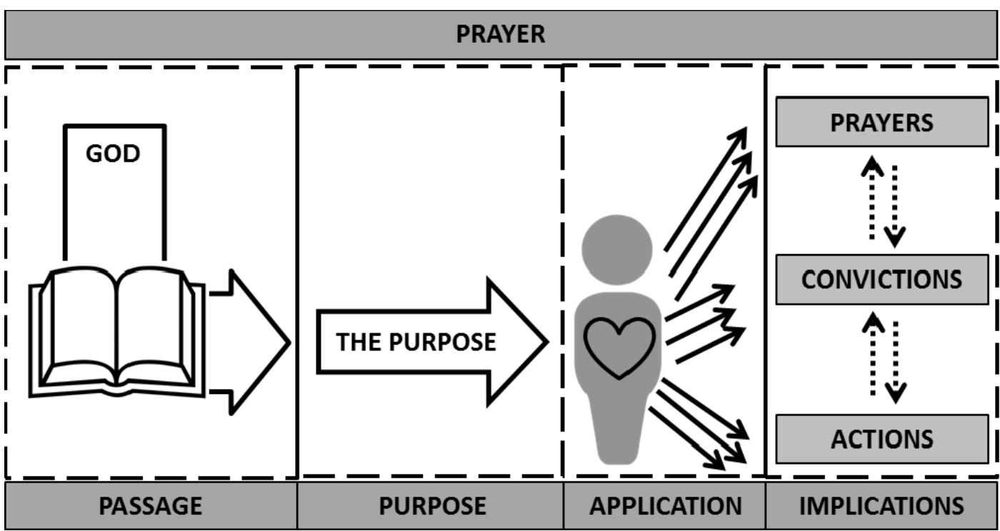
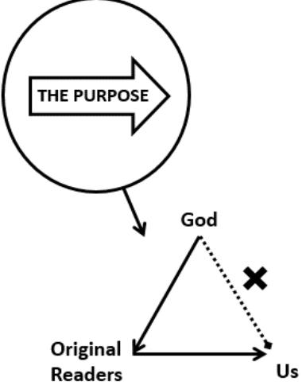
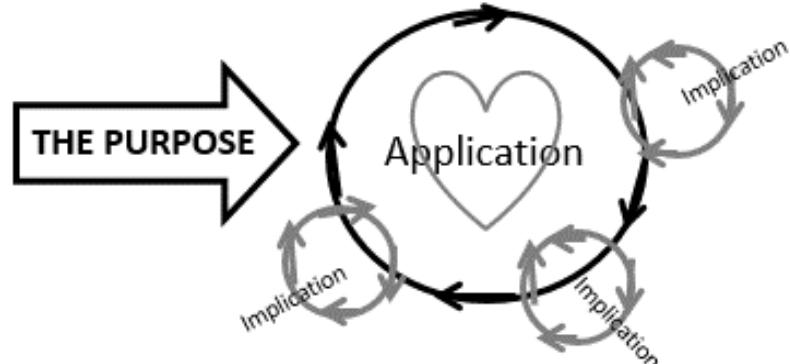
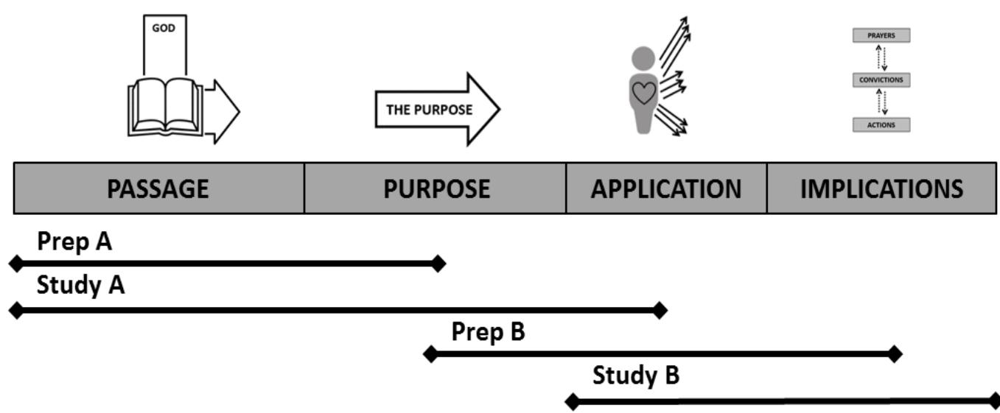
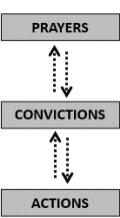

**bible study resources** 

# **1 Thessalonians**

**© St Helen's, Bishopsgate. All rights reserved**

# **Hearing and responding to God's word**

This term we will study 1 Thessalonians together at the Partnership. Our aim is not to accumulate academic knowledge but rather to be established in our faith (1 Thess 3:2), to stand fast in the Lord (1 Thess 3:8) and to be kept blameless at the coming of our Lord Jesus Christ (1 Thess 5:23). To help us do this we are going to study the same passage over 2 weeks so we have good time to work together at both **hearing** rightly what God is saying to us and **responding** rightly to it.

Paul expects change to take place in the lives of the Thessalonians as the gospel is taught (cf 1 Thess 4:1–2). However, in our desire to rightly respond God's word we can often try to shortcut the process and end up applying either minor points from the passage or even something completely wrong! Our aim is to "encourage one another and build one another up" (1 Thess 5:11) and to be "taught by God" (1 Thess 4:9) as we allow the word of God be at work in us as believers (cf 1 Thess 3:13). We have tried to show what this looks like in practice in the diagram and explanation below.

## **PASSAGE: EXPECT TO HEAR GOD SPEAK**

Biblical 'application' starts by understanding what God is saying. We need to listen carefully to God's voice and to do this we take great care in studying God's written word together. We are not here to share opinions on the passage or our own 'interpretations', rather we are seeking to hear God's voice clearly and authoritatively.

Studying the Bible like this takes time so we encourage everyone to spend at least one hour before each study reading the passage and using the prep questions (or Toolkit – see back of booklet) to kick start this thinking process. And because this is a spiritual exercise we must pray for God's help as we do this.

## **PURPOSE: IDENTIFY THE PURPOSE**

The next step in hearing and responding is to try and grasp God's 'purpose' in giving us this bit of Scripture. To do this we first need to see why the author, inspired by God, included this passage and what was their intended purpose for the original readers. We often call this the 'author's purpose'. Having prayerfully thought about 'what' the passage is saying, its 'meaning' and 'context' we then need to ask why the original readers needed to hear this. It's important we do this carefully so we rightly hear what God is saying to us today. If we jump straight to 'us' the danger is we lose the real impact of what God is saying. The process is illustrated in the diagram. After this we carefully think how we are in similar (or contrasting) circumstances to the original readers. Then we will start to see the relevance of 'the purpose' for us today. Working like this forces

us to slow down in our 'application' and thus see more clearly what are primary and what are secondary 'applications'. Furthermore, as we work in the same direction as the author's purpose we will see richer and more meaningful applications.

## **APPLICATION: THE PURPOSE CHANGING OUR 'HEART-MIND'**

The engine of Christian growth is God's word changing and re-shaping our belief system/our world-view/our 'hearts and minds'. (See Ephesians 4.19–24; Philippians 2.5; James 5.8; Romans 8.5–6, etc). As we repent and believe God's word, he changes us at the core of our being, the control-centre of our lives. In this booklet we refer to this as 'heart-mind' change. God does it but he does it as we pray and obediently bring our outlook, our ambitions, etc in line with his.

When considering 'application' of a passage it is easy to jump straight to considering changes in our external actions. But usually the purpose of the passage will be much bigger than that—it will change how we see God, his work, the world, etc. It is important that we pause, pray and think hard about how the purpose changes our heart-minds. This change will then work itself out in all kinds of 'implications.

With just one big 'heart-mind' change there could be countless implications.

For example, as we come to realise that "Jesus Christ is Lord" there are no immediate actions for us to take, however once we grasp this at a 'heart-mind' level we realise it fundamentally changes the way we view the world. To help we can use diagnostic questions like the following to process this truth: how does this compare to what we believe? Why do we find this so hard to believe/ love? What in our lives shows we don't believe this? How does this help me understand the world around me? What might change in my convictions/actions if I really believed this?

#### **1. Implications: working out the change in practice**

The last step is allowing the big 'heart-mind' change(s) to spin out into 'implications'. As you can see in the main diagram the multiple arrows coming out of the 'heart-mind' change show there are countless ways in which God's purpose impacts the way we pray, think and act. Once we reach this stage we should have prayerfully heard God speak clearly, done some serious thinking on how 'the purpose' changes us deeply, and as a result these implications will flow naturally from the passage.

The diagram below shows how as we circle around the big application applying it deeply to our 'heart-minds' we will inevitably spin out into 'implications'. We need to realise that many specific implications or practicalities may look very different for different people. This is why working together at Partnership can be a great way to build one another up.

To continue the example above understanding deeply that "Jesus Christ is Lord" at a 'heart-mind' level should change the way we view our lives. We are not living now to "get what we can" rather we are living for the Lord Jesus. This big heart-mind change might for one person make them more confident to pray and for another might bring deep comfort in the face of ridicule and for still another might make them more urgent in evangelism.

#### **2. Prayer**

This final step isn't really a step, it is a constant reminder that at every point we need to pray and ask for God's help. We need to pray as we study the passage, think of the purpose, meditate on the application and live out the implications. This year let's "pray without ceasing" (1 Thess 5:17) asking God to teach us (cf 1 Thess 4:9) as His Gospel is proclaimed (1 Thess 2:9).

#### **3. Format**

We'll focus on understanding the passage in the first week and then in the second week focus on responding to the passage and prayer. Hopefully this format will give us more time to help each other consider the application and implications of what God is saying to us and more time to pray in response and more time to pray for each other's workplace mission fields. The newformat is really just a way for us to give more time to all that we normally do in Bible study. Experience shows that we often squeeze application and prayer into a rushed two minutes at the end of a study. Please don't be worried about the change but please do come expecting to be changed by God this year. The structure of the studies and prep is outlined in the diagram below. We have arranged it in such a way that even if you don't make it every week you will still be able to benefit hugely. So please come as often as you can and don't panic if you miss study A.

# **Study 1A: 1 Thessalonians 1:1–2:12**

**Pray** Ask for God's help to hear him speak as you read the passage.

**Read** Read through the passage slowly at least twice

The first part of 1 Thessalonians (1:1–3:10) sees Paul giving thanks for God's work in the Thessalonians. The structure is broken up by reference to "brothers" and follows a pattern of:

- a) thanks
- b) situation from the Thessalonians perspective
- c) situation from Paul & co.'s perspective (a: 1.2-3; b: 1.4–10; c: 2.1–12 and a: 2.13; b: 2.14–16; c: 2:17–3:10).
- 1. What convinces Paul & co. that God has done a genuine gospel work amongst the Thessalonians? (List as many as you can from the whole passage)

|        | Evidence of genuine gospel work |
|--------|---------------------------------|
| 1:2–3  |                                 |
| 1:4–10 |                                 |
| 2:1–12 |                                 |

2. Read Acts 17:1–15 to see something of how the Thessalonians became Christians and the spiritual climate at the time. Try to imagine what life would be like for them as much as possible. With that in mind, why might Paul want to remind them of the authenticity of what has happened to them and what they've experienced?

- 3. Sum up what this passage teaches us about:
	- a) being a genuine Christian

b) genuine Christian ministry

4. Pray and give thanks to God for his work in your life and in the lives of others, and for those who taught you the gospel.

# **Study 1B: 1 Thessalonians 1:1–2:12**

**Pray** Ask for God's help as you respond to what you heard God say. **Read** Read through the passage again.

1. What did your Partnership group conclude was the purpose of the passage and the reason Paul & co. wrote it? Go back and remind yourself where this came from in the passage.

- 2. In what areas should the purpose of this passage shape our 'heart-minds'? (Your Partnership group should have already sent around a few ideas, but these questions should help:
	- § How should this shape our understanding of genuine gospel work?How am I tempted to doubt the gospel work I see is actually a genuine work of God?
	- § How am I tempted to understand authentic gospel work differently to Paul & co.?How might I try to do gospel work differently to Paul & co.?
	- § What might change in my convictions/actions if I really believed what this passage says about gospel ministry?)
- 
- 3. Pause and pray for God to change/re-shape your 'heart-mind' through what you've heard in his word.

| THE PURPOSE |  |  |
|-------------|--|--|
|             |  |  |
|             |  |  |

4. How will grasping the purpose of this passage at a 'heart-mind' level impact you this week in the following areas:

#### **My prayers**

[For myself, family, Partnership group, unbelieving colleagues, contacts, friends, etc]

#### **My convictions**

[Everyday thinking, attitudes, instincts, priorities, ambitions, beliefs, emotional responses]

#### **My actions**

[Big and small behaviours. At home, atwork and at church]

5. Carve out time this week to pray along these lines for yourself and your Partnership group as you prepare to meet again.

**Going further**: come back later in the week and revisit this application prep. How have things gone? Where does your 'heart-mind' still need to change/be persuaded of the truth?

**Prayer points** Response to passage:

Workplace ministry:

## **Study 2A: 1 Thessalonians 2:13–3:10**

**Pray** Ask for God's help to hear him speak as you read the passage.

**Read** Read through the passage slowly at least twice.

In 2:13–3:10 Paul continues giving thanks for the Thessalonians' faith. In the previous section (1:1–2:12) Paul focused on God's work in the Thessalonians while they were there, but he now turns to what's happened since they left.

1. What are they thankful for in 2:13? What reasons do they have to be thankful according to 2:14–16, 3:7–9?

2. Why is Paul so concerned about seeing the Thessalonians? (Note: there is more than one reason!) What have Paul & co. done to address these concerns?

- 3. What is life like for the Thessalonians according to the passage? How does Paul expect to support their faith given this context (think back to 2:13 and see how it is worked out in the rest of the passage)?
- 4. Sum up what this passage teaches us about:
	- a) Expectations for Christian life (Think from both the Thessalonians and Paul's perspective)
	- b) The role and goal of gospel ministry
- 5. Give thanks for the word of God which is at work in you and pray that we might all stand fast in the Lord.

# **Study 2B – 1 Thessalonians 2:13–3:10**

**Pray** Ask for God's help as you respond to what you heard God say.

**Read** Read through the passage again.

- 1. What did your Partnership group conclude was the purpose of the passage and the reason Paul & co. wrote it? Go back and remind yourself where this came from in the passage.
- 2. In what areas should the purpose of this passage change our 'heart-minds'? (Your Partnership group should have already sent around a few ideas). These questions should help:
	- § How should this passage shape my understanding of the Christian life?
	- § How am I tempted to view the Christian life differently to Paul?
	- § Do I really believe the word of God is at work? Why? Why not?
	- § Do I believe it is sufficient to keep me standing fast in the Lord until the last day? Why? Why not?
	- § What might change in my convictions/actions if I really believed what this passage says about gospel ministry?)
- 3. Pause and pray for God to cause the truth of this passage to grip our hearts and minds.
- 4. How will grasping the purpose of this passage at a 'heart-mind' level impact you this week in the following areas:

#### **My prayers**

[For myself, family, Partnership group, unbelieving colleagues, contacts, friends, etc.]

#### **My convictions**

[Everyday thinking, attitudes, instincts, priorities, ambitions, beliefs, emotional responses]

#### **My actions**

[Big and small behaviours. At home, at work and at church]

5. Carve out time this week to pray along these lines for yourself and your Partnership group as you prepare to meet again.

**Going further:** come back later in the week and revisit this application prep. How have things gone? Where does your 'heart-mind' still need to change/be persuaded of the truth?

## **Study 3A: 1 Thessalonians 3:10–4:12**

- **Pray** Ask for God's help to hear him speak as you read the passage.
- **Read** Read through the passage slowly at least twice.
- 1. Read 3:10–13 and put Paul & co.'s prayer into your own words. What exactly does Paul want for the Thessalonians?

2. What two things does Paul & co. want the Thessalonians do so "more and more" in 4:1–12? What motivations are given for living like this throughout the passage?

3. How do these actions explain what'sinvolved in the prayer of 3:10–13 being answered?

4. How should this passage shape the Thessalonians' approach to the Christian life—both in their ambitions and practice? Why does Paul want this for them?

5. Pray for you and your group to be shaped by this passage. Possibly use your answer to question 1 to do so.

# **Study 3B: 1 Thessalonians 3:10–4:12**

**Pray** Ask for God's help as you respond to what you heard God say.

**Read** Read through the passage again.

- 1. What did your Partnership group conclude was the purpose of the passage and the reason Paul & co. wrote it? Go back and remind yourself where this came from in the passage.
- 2. In what areas should the purpose of this passage change our 'heart-minds'? The questions should help:
	- § How should this passage shape my understanding of the Christian life?
	- § How are my views of holiness and Christian love changed by this passage?
	- § In what ways do I find it hard to put these exhortations into practice?
	- § How will the motivations given in the passage and Paul& co.'s earlier example in ch1–3 help me live like this?
	- § How should my life look different to those around me as a result of this?)
- 3. Pause and pray for God to cause the truth of this passage to grip our hearts and minds.
- 4. How will grasping the purpose of this passage at a 'heart-mind' level impact you this week in the following areas:

#### **My prayers**

[For myself, family, Partnership group, unbelieving colleagues, contacts, friends, etc]

#### **My convictions**

[Everyday thinking, attitudes, instincts, priorities, ambitions, beliefs, emotional responses]

#### **My actions**

[Big and small behaviours. At home, at work and at church]

5. Carve out time this week to pray along these lines for yourself and your Partnership group as you prepare to meet again.

**Going further:** come back later in the week and revisit this application prep. How have things gone? Where does your 'heart-mind' still need to change/be persuaded of the truth?

# **Study 4A: 1 Thessalonians 4:13 – 5:11**

**Pray** Ask for God's help to hear him speak as you read the passage.

**Read** Read through the passage slowly at least twice.

Having established the Thessalonians in genuine Christian faith (1:1–3:10) and exhorted them in genuine Christian love (3:11- 4:12), Paul & co. now move on to explain genuine Christian hope.

#### 1. Using the table below, what difference does the coming of Jesusmake on life now?

|                                                                                            | 4:13–18 | 5:1–11 |
|--------------------------------------------------------------------------------------------|---------|--------|
| ACTION What are Paul & co. calling for?                                                 |         |        |
| REASON Why might this be important given what life is like for the Thessalonians? |         |        |
| MOTIVATION Because when Christ returns…                                                 |         |        |

- 2. Using your answers to question 1, summarise what Christian hope actually is and explain what difference it makes to life now.
- 3. What will it mean for the Thessalonians to put 4:18 and 5:11 into action?
- 4. Considering the rest of the letter (especially the prayers of 3:10–13 and 5:23–24), why is having a clearer understanding of Christian hope so important for the Thessalonians?
- 5. Pray for yourself and your group to be truly encouraged by Christian hope.

# **Study 4B: 1 Thessalonians 4:13–5:11**

**Pray** Ask for God's help as you respond to what you heard God say.

**Read** Read through the passage again.

- 1. What did your Partnership group conclude was the purpose of the passage and the reason Paul & co. wrote it? Go back and remind yourself where this came from in the passage.
- 2. In what areas should the purpose of this passage change our 'heart-minds'? These questions should help:
	- § How should this passage shape my understanding of Christian hope?
	- § How prominent is the return of Jesus in my thinking?
	- § In what ways am I tempted to grieve or approach life generally like an unbeliever? How does the return of Jesus help change this?
	- § Am I looking forward to the return of Jesus?
	- § Would I use the return of Jesus to encourage a fellow believer? Why? Why not?)
- 3. Pause and pray for God to cause the truth of this passage to grip our hearts and minds.
- 4. How will grasping the purpose of this passage at a 'heart-mind' level impact you this week in the following areas:

#### **My prayers**

[For myself, family, Partnership Group, unbelieving colleagues, contacts, friends, etc.]

## **My convictions**

[Everyday thinking, attitudes, instincts, priorities, ambitions, beliefs, emotional responses]

## **My actions**

[Big and small behaviours. At home, at work and at church]

5. Carve out time this week to pray along these lines for yourself and your Partnership group as you prepare to meet again.

**Going further:** come back later in the week and revisit this application prep. How have things gone? Where does your 'heart-mind' still need to change/be persuaded of the truth?

## **Study 5A:1 Thessalonians 5:12–5:28**

**Pray** Ask for God's help to hear him speak as you read the passage.

**Read** Read through the passage slowly at least twice.

1. Think carefully aboutthe instructions given in 5:12–22 using the table below.

|         | What are Paul & co. calling for? | Why might this important given the themes of the letter? | How will this lead to the Thessalonians being "blameless at the coming of the Lord Jesus Christ"? |
|---------|-------------------------------------|-------------------------------------------------------------|------------------------------------------------------------------------------------------------------------|
| 5:12–14 |                                     |                                                             |                                                                                                            |
| 5:14    |                                     |                                                             |                                                                                                            |
| 5:15    |                                     |                                                             |                                                                                                            |
| 5:16–18 |                                     |                                                             |                                                                                                            |
| 5:19–22 |                                     |                                                             |                                                                                                            |

2. Compare the prayer in 5:23–24 to the one in 3:11–13. What is the same? What is different?

3. Why is this prayer so important? How does it reveal Paul & co.'s true desire for the Thessalonians?

4. Pray 5:23–24 "without ceasing" for yourself and your Partnership group.

# **Study 5B: 1 Thessalonians 5:12–5:28**

**Pray** Ask for God's help as you respond to what you heard God say.

**Read** Read through the passage again.

- 1. What did your Partnership group conclude was the purpose of the passage and the reason Paul & co. wrote it? Go back and remind yourself where this came from in the passage.
- 2. In what areas should the purpose of this passage change our 'heart-minds'? These questions should help:
	- § How should this passage shape my approach to life? To others?
	- § How does this challenge my understanding of God's work and mine? Where might I have tipped the scales in the wrong way?
	- § Am I idle, fainthearted or weak? Why? Why not?
	- § What might change in my convictions/actions if I really believed what this passage is exhorting me to do?)
- 3. Pause and pray for God to cause the truth of this passage to grip our hearts and minds.
- 4. How will grasping the purpose of this passage at a 'heart-mind' level impact you this week in the following areas:

#### **My prayers**

[For myself, family, Partnership group, unbelieving colleagues, contacts, friends, etc.]

#### **My convictions**

[Everyday thinking, attitudes, instincts, priorities, ambitions, beliefs, emotional responses]

#### **My actions**

[Big and small behaviours. At home, at work and at church]

5. Carve out time this week to pray along these lines for yourself and your Partnership group as you prepare to meet again.

**Going further:** come back later in the week and revisit this application prep. How have things gone? Where does your 'heart-mind' still need to change/be persuaded of the truth?

# **Study 7: Thessalonians unwrapped**

- **Pray** Ask for God's help to hear him speak as you review the whole of 1 Thessalonians.
- **Read** Read through thewhole of 1 Thessalonians (or listen to the audio version).
- 1. Summarise as far as possible what we have learnt about:

## **Genuine faith**

(What is faith? Why is it important? How is it established?)

**Genuine love** (What is Christian love? Love to what end? Why is it important?)

## **Genuine hope**

(What is Christian hope? Why is it such a good thing? How could you explain hope to a non-believer?)

## **Holiness**

(What is holiness? Why is it important? What motivates holiness?)

2. What have been the two or three biggest 'heart-mind' changes God has brought about in you this term?

3. Pray for ongoing change as we apply the whole book of 1 Thessalonians.

# **Appendix: a basic Bible study toolkit**

[Recommended reading: *Dig Deeper*, Nigel Beynon and Andrew Sach (IVP, 2005)]

The 'tools' are ways of helping us understand the Bible for ourselves. Each tool helps us slow down and pay careful attention to what God is saying in his word. We are not trying to apply a formula to hearing God speak but we are seeking to listen carefully to what he has to say through his written word.

The **Structure tool** is often the best place to start— 'how does this break into sections?' Then look at various details of the passage using other tools, but always heading for the same end goal. What is the overall point? (**Author's purpose tool**), how does it fit with the flow of argument in 1 Thessalonians (**Context tool**) and what will it mean for my life? (**So what? tool**). Even if we don't explicitly mention these four tools in the prep questions, you should use them! (We need to grasp firm conclusions about what God is saying to us!)

| Author's purpose tool | Dig Deeper!, chapter 2. The biggest question we can ever ask of a passage in the Bible is simply: why did the author write this?                                                                   |
|--------------------------|----------------------------------------------------------------------------------------------------------------------------------------------------------------------------------------------------------|
| Context tool             | Dig Deeper!, chapter 3. Words come within sentences, sentences in paragraphs, paragraphs in chapters, chapters in sections… Rip something out of context and you'll miss what God is saying. |
| Structure tool           | Dig Deeper!, chapter 4. How has the author broken down his material into sections? How do these sections fit together?                                                                             |
| 'So what?' tool          | Dig Deeper!, chapter 17. What difference does this make to my life? How will it work out in particular situations I am facing at the moment?                                                    |

## **Here's a quick recap of the rest of the toolkit:**

| Linking words tool | Dig Deeper!, chapter 5. Whenever you see a 'therefore' ask what it's there for! And the same goes for words like 'because', 'so that', 'for' etc.                 |
|--------------------|-------------------------------------------------------------------------------------------------------------------------------------------------------------------------|
| Parallels tool     | Dig Deeper!, chapter 6. Look out for when it says the same thing twice in different words. That gives you two chances to understand what the author is saying. |

| Narrator's comment tool | Dig Deeper!, chapter 7. Sometimes the author breaks into his narrative to explain what's going on (a kind of "pssst, reader, make sure you                                                                                                 |
|----------------------------|--------------------------------------------------------------------------------------------------------------------------------------------------------------------------------------------------------------------------------------------------|
| Vocabulary tool            | understand this…") Dig Deeper!, chapter 8. Mostly you can find what words mean by looking them up in a dictionary. But be alert in case the author is using a familiar word in a special or unusual way.                             |
| Translations tool          | Dig Deeper!, chapter 9. Check passages across different translations. If there are important differences, try to find out more!                                                                                                            |
| Tone and feel tool         | Dig Deeper!, chapter 10. As we come to the Bible, we should not only pay attention to the point that is being made, but also how it is being made. What feelings does the passage evoke?                                                |
| Repetition tool            | Dig Deeper!, chapter 11. Sometimes the author says something more than once to make sure we don't miss it. Sometimes the author says something more than once to make sure we don't miss it. Look for repetition.                    |
| Quotation/allusion tool | Dig Deeper!, chapter 12. When the author quotes or alludes to another part of the Bible, we should look up the original context of his quotation. What connection is being made?                                                        |
| Genre tool                 | Dig Deeper!, chapter 13. There are many types of genre in the Bible— songs, prophecies, proverbs, laments, visions, speeches, parables, historical narrative. Identifying the genre is very important to how we interpret a passage. |
| Copycat tool               | Dig Deeper!, chapter 14. Is the author being prescriptive or merely descriptive? Is he holding up a pattern of life to imitate or avoid?                                                                                                   |
| The 'Who am I?' tool       | Dig Deeper!, chapter 16. With which character (if any) does the author intend us to identify ourselves?                                                                                                                                    |