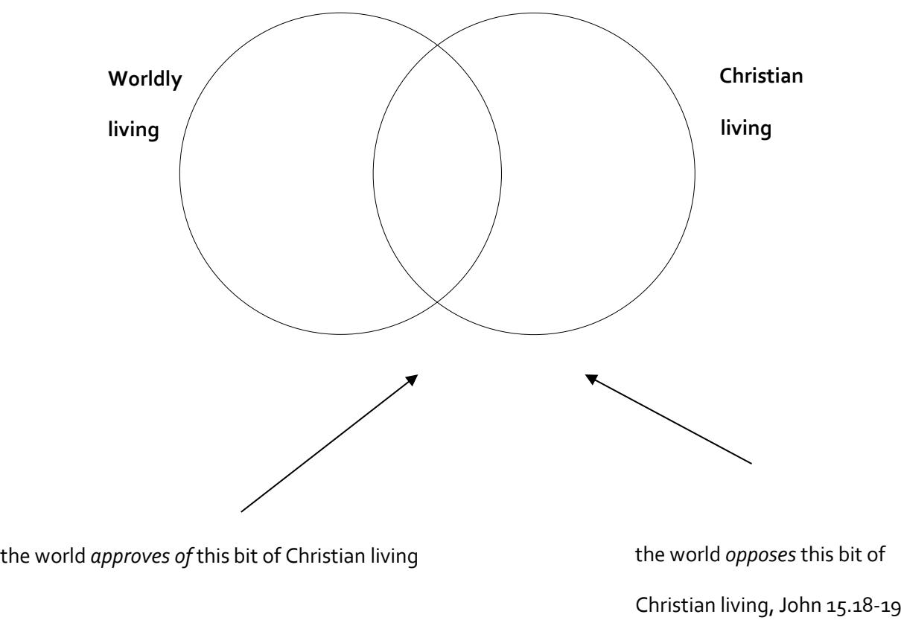

**bible study resources** 

# **1 Peter**

**© St Helen's, Bishopsgate. All rights reserved**

# **An introduction to the book of 1 Peter**

The aim of this paper is to enable you, as a leader, to familiarise yourself with the message, purpose and structure of 1 Peter before we begin studying it in SLOB (leaders) groups. As with all our Bible study, our aim in studying the letters of the New Testament is to *hear what God is saying in order that we might be changed by Him*.

There are at least four general questions to ask as we try to understand what God is saying through any letter. If you have not yet done so, pray for God's help, read through 1 Peter a couple of times, and then have a go at answering these questions in the light of what you read:

#### **i. What do we learn about the author? Who is he? What is his situation?**

**ii. What do we learn about the readers? Who are they? What is their situation?**

**iii. What are the main themes of the letter? Which ideas are repeated? What precisely does the author say about these major ideas?**

**iv. What is the structure of the letter?**

**v. What is the purpose of the author? What is he trying to achieve? Does he summarise his purpose in a sentence? What is the tone of the letter?**

The remainder of this paper is written in extended note form. As you read through it, please do so with an open Bible, checking references and testing our conclusions – there may well be additional points that you want to add to this sheet as you begin to familiarise yourself with the letter. It will be particularly helpful to take some time to reflect on the application questions that are raised along the way.

### **1.** *Why* **was the letter written?**

**We do not have to guess because Peter tells us the reason**

'By Silvanus, a faithful brother as I regard him, I have written briefly to you, exhorting and declaring that this is the true grace of God. Stand firm in it.' *1 Peter 5.12*

**So the** *whole letter* **aims to** a … declare the true grace of God

b … exhort Peter's readers to stand firm in it

**Therefore, we have two questions to ask of every passage in 1 Peter:**

a. How does this passage *declare the true grace of God*?

b. How does this passage *exhort Christians to stand firm for Jesus*?

### **2.** *Why* **does Peter need to write to** *these people* **in** *this way?*

- **What do these verses tell us about what life was like for Peter's readers?**
	- 1.1 1.6 1.17 2.11-12 2.15 2.19-20 3.9 3.16-17 4.3-4 4.12-16 4.19 5.9-10

*As we work through the above references, it becomes clear that God's people were suffering, verbally and sometimes physically, for doing good – that is why Peter has to encourage them to stand firm in the true grace of God.* 

### **Understanding the spiritual state of Peter's audience helps us apply the letter today**

*It is written to encourage Christians to stand firm for Christ, even when it results in suffering.* 

## **3.** *How* **does Peter encourage his readers to stand firm in God's grace? Which** *truths* **does he use to strengthen** *them* **in** *their* **faith?**

- **This is an important question because God will use the** *same truths* **to encourage** *our groups* **in** *our faith* **today. As a matter of principle, we want our studies in 1 Peter to emphasise the same truths as Peter.**
	- **As we read and re-read 1 Peter, we see that Peter emphasises three main truths:**
		- Ø He talks a lot about our *identity* as Christians: what has God done for us as Christians?How should we think of ourselves (as individuals and as a church)?
		- Ø He talks a lot about our *lifestyle* as Christians: how does God want us to live as His people in the world (as individuals and as a church)?
		- He talks a lot about our *mission* as Christians: what is God's purpose for us on earth while we wait to join Him in heaven?
	- **To put it differently, Peter's message is, '***You are different, so be different, in order to make a difference for God in the world.'*
	- In the next section of the paper, we will consider exactly what God says to us about each of those themes in turn (identity, lifestyle and mission).

# **A. Our Christian IDENTITY**

There are many ways that we can answer the question, 'Who are you?' We might speak in terms of our family, or our race, or our profession. The way that we answer the question will reveal what we think is important in our life and will determine the way that we live. But how does God want us to think about ourselves? What is a Christian's self-identity?

### **i. We are** *God's elect who inherit* **– our relationship with God**

- **We are** *elect* **– we have a position of great privilege**
	- 1.1 *elect* means 'chosen'

in the Old Testament, Israel was 'chosen' (Gen 12.3; Deut 7.7) now, all Christians are 'chosen'

1.10-12 the OT prophets longed to know what we know

the OT prophets were serving us

even angels long to understand the salvation we share

- 2.9 these names come from Exodus 19.6 and Isaiah 43.20-21 in the OT, they applied to Israel, now they apply to all Christians
- 2.10 these phrases come from Hosea 1.9 and 2.23 in Hosea, they applied to God's people Israel, now they apply to us
- **We will** *inherit* **– we have been given a great future**
	- 1.3-4 Through Jesus' resurrection, God has given us new birth into

a living hope; and

an inheritance that is better than any other

1.5 Our inheritance is being 'kept' for us

We are being 'kept' for our inheritance

- **We** *rejoice* **– our future inheritance makes us rejoice in the present**
	- 1.6-8 We rejoice greatly and love Jesus even as we suffer (cf. 4.13)

#### **Question: How does knowing this help Peter's readers to stand firm in suffering?**

### **ii. We are** *exiles who suffer* **– our relationship with the world**

- **We are** *exiles* **– this world is not our true home**
	- 1.1,17; 2.11 In the Old Testament, Israel was exiled by God as punishment for sin

We are not under judgment, but we experience 'exile' anyway

This is because this world is not our 'real home'

[N.B. The point is not just about 'real estate' (i.e. *where* do we belong?) but about 'people' (i.e. *who* are our real people? cf. 1.18; 2.11-12) and 'values' (*how* will we live? cf. 2.11-12; 4.3-4 etc.)]

### **We** *suffer* **– following in the footsteps of Jesus**

1.6; 4.3 etc. We have seen lots of verses in 1 Peter about Christian suffering

Peter speaks most about suffering for being Christian

Some people in the 'world' will respect our faith, some will oppose it

- 4.12-14 We are to expect to suffer just for taking the name of Jesus
- 2.21 Even though Jesus did no wrong, He suffered

We are called to 'follow in His footsteps'

- 4.15 We are to make sure that we do not suffer for wrongdoing
- 4.13 It is a privilege to suffer for Jesus
- 4.19 Even when we suffer, we are to continue to do good (see also 4.9)

#### **Questions: 1. How might suffering tempt us to give up 'standing firm for Jesus'?**

- if we think that this world is our home, we will seek the approval of this world
- if we think that this world is our home, we will live by the standards of this world

#### **2. How will knowing that God calls us to be 'exiles who suffer' help us?**

### **iii. We are a** *family who love and grow* **– our relationship with each other**

- **We are a** *family* **– we are not on our own in the Christian life**
	- § 1.3, 23 Becoming a Christian is to be 'born again'
	- 1.14 All Christians are 'children' of God
	- 1.17 All Christians call on God as our 'Father'

This means that all Christians are 'brothers' and 'sisters' to each other

#### **We are to be a family that** *love each other* **– God saved us for this reason**

1.22 God gave us new birth *so that* we might love one another

'Sincere brotherly love'

'Love one another earnestly'

'Love one another from a pure heart'

This priority is repeated in 2.17, 3.8 and 4.8

2.1 We are to put away *everything* that spoils loving relationships

#### **Question: How should we think of 'church'? How important is it to God?**

- it is impossible to be a 'solo' Christian
- this is not a commitment to *attending church*, but to *loving Christians*
- **NOTICE the importance of God's word in a church family**
	- 1.23 God works through His word to give new birth
	- 2.2-3 God works through His word to give spiritual growth

*This is why teaching God's word is central to mission and to church life*

### **iv. We are a** *temple who praise* **– another part of our relationship with the world**

- *We* **are** *the temple,* **2.4-10**
	- the temple of the Old Testament was very important
		- it was the place that God dwelt
		- it was the place where people met with God
		- it was the centre of God's mission to the world
	- as we come to Jesus, God builds us together as His new temple
- *We proclaim* **the excellencies of our God, 2.9**
	- § we do this when we meet together as church
	- § we do it as we tell the world about our glorious saviour and Lord
	- § (and God may use our teaching of His word to make more Christians see 1.23-25)

#### **Questions: How does knowing this help Peter's readers to stand firm in suffering?**

- Peter's readers might have felt a very long way from God

#### **Have you noticed anything else that Peter says about our identity?**

### **B. Our Christian LIFESTYLE**

- In the light of their IDENTITY, Peter wants his readers to adopt a Christian LIFESTYLE
- The order is important: we do not live to please God *in order to become* Christians

we live to please God *because He has already made us* Christians

Three extended passages in 1 Peter specify the lifestyle that God wants from His children

### **1. The obedient life of 1.13–2.3**

The original language contains five commands, and alongside each command is at least one reason to obey it – go through the verses identifying the commands and the reasons. In each case, work out why Peter gives *that particular reason* as a motivation for obeying *that particular command.* 

**a. Set your hope fully on heaven 1.13** 

… by being prepared for action

… and by being sober-minded

*Question: What is the 'therefore' there for? What is the link between verses 3-12 and verse 13?* 

*What would it mean for your group to set their hope fully on heaven?* 

#### **b. Copy the character of God 1.14-16**

Every day in the life of a Christian is a day upon which I have a choice to make. Today, will I choose to conform my life to my 'former passions' or to my Father's holiness?

*Question: In which areas does your life not yet reflect the holiness of God?* 

**c. Conduct yourselves with fear 1.17-21**

- fear God (not the fear that I may not be saved, but right, awe-filled humility)

- because He has ransomed you by the precious blood of Jesus

**d. Love God's people earnestly from the heart 1.22-25**

- because that is why God saved you

*Question: What would a Central Focus group that 'loved one another earnestly from a pure heart' look like?*

**e. Crave the milk of God's word 2.1-3** 

- because that is how you grow up

*Question: Is there evidence of hunger for God's word in your life and in your group?*

### **ii. The attractive life of 1 Peter 2.11–4.11**

| a. The principle: a negative and a positive |                                           | 2.11-12 |
|---------------------------------------------|-------------------------------------------|---------|
| the negative:                               | abstain from the passions of the flesh…   |         |
|                                             | … because they wage war against your soul |         |
| the positive:                               | keep your conduct honourable              |         |

*Question: Do I realise that sin is that serious and that harmful?* 

#### **b. The principle in detail: submit to God's ordering of the world 2.13**

God has always been in charge of the world

When we sin, we stray from God's authority like lost sheep – see 2.25

As Christians, we 'choose to put ourselves under' whichever authorities God creates

#### **c. The principle applied in five specific areas of life: 2.13ff.**

- citizens submit to their government, 2.13-17

- servants submit to their master, 2.18-20

- wives submit to their husbands, 3.1-6

- husbands are considerate to their wives, 3.7

- young men submit to their elders, 5.5

*Questions: 1. Am I living a submissive life even when I am being wronged?*

*2. In which way is my group tempted to 'insubordination' in these areas?*

**d. The summary: set apart Christ as Lord in your heart, 3.15**

*Question: Am I setting apart Christ as Lord in my heart?*

**e. Note the inclusion of 'glorify' and 'glory' in 2.12 and 4.11 – verses at the beginning and end of this section of the letter. Living in this attractive way will bring glory to God.**

### **iii. The 'persevering life' of 4.12-5.14**

The word 'beloved' at 4.12 marks a new section of the letter, as it did in 2.11. The section picks up on and develops some of the themes which have been evident already in 1 Peter – especially the themes of suffering and glory. In particular, the fiery trials of chapter one are linked explicitly with the experience of sharing in Christ's sufferings (ch2) while we wait for glory.

 **Suffering is to be expected as a normal part of Christian experience (4.12-19) and is in fact a 'blessed' experience**

 **Right relationships in the church (especially between the elders and the young men) will come under strain in times of suffering but a church with exemplary leaders will be the best environment in which to persevere in the face of suffering (5.1-5)**

 **Suffering is a great challenge to humility, and the devil would like to use it to destroy God's people. Resist him, pray, and the God of all grace will strengthen you to persevere (5.6-14)**

## **C. Our Christian MISSION**

God does not just tell us to grit our teeth and wait for heaven, *He has a purpose for us in the world*

# **i. Our 'good lives' can change the world!**

**It is true that some will persecute us even though we do good, 3.13-14 (2.20; 4.3-4)**

|  | But even then: | this is a 'gracious thing' in God's eyes   | 2.19-20 |
|---|----------------|--------------------------------------------|---------|
|   |                | God's eyes are on the righteous            | 3.12    |
|   |                | God hears our prayers                      | 3.12    |
|   |                | We are blessed by God                      | 4.14    |
|   |                | The Spirit of glory and of God rests on us | 4.14    |

**But God will use our good lives to 'win' some people for Himself**

| § | Our opponents will be silenced                     | 2.15      |
|---|----------------------------------------------------|-----------|
| § | Our opponents will be put to shame                 | 3.16      |
| § | Some of our opponents will even become Christians! | 2.12; 3.1 |

### **ii. Our 'words' can change the world!**

- **When we declare God's praise, 2.9**
- **When we answer the questions generated by our lives, 3.15**

#### *Question: Am I ready to speak for Christ?*

my **LIFE** makes people ask questions – it attracts people to Jesus (3.1)

my **WORDS** are how God makes people Christians – God works through His word (1.23)

*Questions: 1. What goes wrong if I concentrate only on (a) my words or (b) my lifestyle?*

> *2. How would knowing Christians' mission encourage Peter's readers to stand firm in the grace of God?*

# **4. What is the structure of the book?**

The above 'overview' of 1 Peter is structured in a predominantly thematic style. That is helpful, but we also want to see how the different bits of the book fit together in order. The notes will follow this broad structural outline for the book.

| 1.1–2.10 | Christian identity in relation to God and the world The true grace of God – |                      |                                    |
|----------|--------------------------------------------------------------------------------|----------------------|------------------------------------|
|          | 1.1-2                                                                          | Introduction –       | identity revealed                  |
|          | 1.3-12                                                                         | Identity explained – | saved but suffering                |
|          | 1.13-2.10                                                                      | Identity lived out   |                                    |
|          |                                                                                | 1.13-21              | My relationship with God           |
|          |                                                                                | 1.22-2.3             | Our relationship with God's people |
|          |                                                                                | 2.4-2.10             | Our relationship with God's world  |
|          |                                                                                |                      |                                    |

**2.11–4.11 Stand firm in the true grace of God – Christian living in the world and the church** 

- 2.11-12 Principle: godly living for God's glory
- 2.13-3.7 Godly living in particular areas of life
- 3.8-4.11 Godly living in general life

| 4.12–5.14 | Stand firm in the true grace of God – even in the midst of suffering |  |
|-----------|----------------------------------------------------------------------|--|
|           |                                                                      |  |

- 4.12-19 Appropriate expectations and understanding our suffering
- 5.1-6 Appropriate leaders and members in a suffering church
- 5.7-11 Appropriate conduct during our suffering
- 5.12-14 Purpose statement

# **1 Peter 1.1–12**

# **Introduction**

The goal of Peter's letter is stated at the end of it. 'I have written briefly to you, exhorting and declaring that this is the true grace of God. Stand firm in it.' (5.12). Peter's original readers were finding that their Christian identity was not only a source of great joy (1.6, 8), but also of genuine and painful trials (1.6). They were marginalised in their society, alienated in their relationships, and experiencing slander and opposition as well as some physical opposition (see 4.4, as well as e.g. 2.18). Peter therefore wants to remind his readers of the true grace of God that has already been at work in their lives in order that they will be strengthened to stand firm for Him in the present and bring Him glory as they point others to their hope. At the heart of it all, Peter says is the person and work of the Lord Jesus – as we understand Him, and his relationship to the world, and set ourselves to follow His example, we will understand what it means to live as those who are born again through His resurrection and so are aliens and strangers in the world.

1 Peter 5.12 can also be used to identify a structure for the letter:

| 1.1-2.10  | The true grace of God – Christian identity in relation to God and the world  |
|-----------|---------------------------------------------------------------------------------|
| 2.11-4.11 | Standing firm in God's true grace – Christian living in the world and in church |
| 4.12-5.14 | Standing firm in God's true grace – even in the midst of suffering              |

For now, it may not always seem that being a Christian is a good thing – being an exile, a stranger, a sufferer is not great fun. However, when those trials are thought of both as the *product* of the wonderful new birth which God has given us, as the *means* by which God grows us (and proves the genuineness of our faith), and as the *way* that God works through us in the world, we can begin to see them as an expression of the grace of God. We must not lose the tone of grace (1.2, 10, 13; 3.7; 4.10; 5.5, 10, 12), mercy (brackets the first main section 1.3; 2.10) and praise (1.3; 2.9; 4.11; 5.10 – cf. 2.12) that dominates the letter despite the trials and difficulties of Christian living in a hostile world.

This fits in well with Psalm 34, which shares many themes with 1 Peter:

- i Both start with blessing God (Ps 34.1; 1 Peter 1.3)
- ii The one who seeks the Lord is not put to shame (Ps 34.5; 1 Peter 2.6)
- iii The faithful fear the Lord (Ps 34.7, 10, 11; 1 Peter 1.17; 2.17)
- iv God hears the cries of the righteous (Ps 34.17; 1 Peter 3.12)
- v There are many afflictions for the righteous (Ps 34.19; 1 Peter 1.6)

vi The servants of the Lord are redeemed (Ps 34.22; 1 Peter 1.18; 2.16)

One major difference, however, is that in Psalm 34 David is celebrating his deliverance *from* 'exile' (v4), whereas in 1 Peter we are delivered *into* 'exile' (1.17), and will remain in exile until we 'obtain the outcome of our faith, the salvation of our souls' (1.9). It is not that we suffer for a little while and then 'normal' Christian living resumes – normal Christian living consists of a hope-filled, suffering life.

# **Structure**

The structure is fairly straightforward, but divisions within verses 3–12 should not be pressed too hard because they read as one long sentence in the original:

| 1.1-2   | Christian identity   |  |
|---------|----------------------|--|
| 1.3-5   | Christian new birth  |  |
| 1.6-9   | Christian experience |  |
| 1.10-12 | Christian privilege  |  |

# **Text notes**

### **1. Christian identity, verses 1–2**

In the opening verses of his letter Peter grounds his readers' identity in vertical and horizontal terms – an understanding of Christian identity that will dominate the letter.

#### **i) In relation to God, Christians are elect**

The Christian has been *chosen* by God – each person of the Trinity is involved in this work:

#### *a. According to the foreknowledge of God the Father*

God the Father, who is also the Christian's Father (1.17) has taken the initiative to bring the Christian into His family. He did not just 'know in advance' the decision that they would make about Him – the word *foreknowledge* conveys the idea that God 'chose in advance to set His love personally upon each and every individual Christian'.

#### *b. In the sanctification of the Spirit*

The Father's choice was worked out in history by the activity of God the Holy Spirit who works to sanctify each believer by the gospel so that they are cleansed from sin and consecrated to God's service.

#### *c. For obedience to Jesus Christ and for sprinkling with His blood*

Specifically, the Spirit desires God's people to obey the Son who in turn marks them out as His own by sprinkling them with His blood (see Exodus 24 where 'sprinkling' is as much a mark of ownership as the application of forgiveness to the individual worshipper).

The election of the believer is fundamental to their identity – it is because we know that we belong to God that we are motivated to obey Him. And it is because we belong to Him that we will also experience a permanent 'exile' in this life. This is significant – in the Old Testament, the exile was a consequence of God's judgment on the disobedience of His people (e.g. Jeremiah 16.6-11), but here in 1 Peter, the 'exile' of the believer is the consequence of their 'election'.

#### **ii) In relation to the world, Christians are exiles**

Peter describes his readers as exiles of the 'dispersion' (the term was used to describe Jews scattered outside the boundaries of Palestine. It is worth noting here that because of the preponderance of OT language in the letter, many early theologians presumed that the readers were all Jewish. More recently, the language of, e.g. 1.14, 18 has persuaded some that the readers were all Gentiles. Actually the text does not require us to choose – Peter is writing to all Christians (scattered throughout modern-day Turkey) whatever their racial background.) He wants them to know that as surely as they are 'elect', they will experience 'exile' in the world. That is, they are not the same as the world but strangers in it, and away from their true home in heaven.

Again, the exile of the believer is fundamental to their identity. The necessary consequence of the Christian's election by God is that their relationship with the world has changed – this world is no longer their true home, and as such they will never again be a part of it. Their 'exile' is an objective fact which results in a daily subjective experience of alienation from the world.

These two aspects to our identity help us to understand the 'mixed' reaction to Christian living that 1 Peter will highlight. Because Christians are distinct from the world, we live to please God not man. At times, our godliness is attractive to the world (2.12; 3.1); at times it provokes their disdain (e.g. 4.4). It can be represented diagrammatically thus:

### **2. Christian new birth, verses 3–5**

From 1.3 to 2.10 Peter explains the grace-given identity of God's New Testament people. Although our present experience in the world is one of alienation and exile, thanks to the death and resurrection of Jesus, we are in fact the true people of God, the new Israel, the fulfilment of all God's promises to Israel. All of this is thanks to God's mercy (note the inclusion of *mercy* that frames the section in 1.3 and 2.10).

Verses 3-12 read as one long sentence in the original and everything flows from the main clause at the start of verse 3 – *blessed be the God and Father of our Lord Jesus Christ.* In other words, everything that we read in verses 3–12 should motivate us to praise God – our application will therefore necessarily follow those lines.

The focus of verses 3–5 in particular is the new birth that is given to Christians as a result of their union with Jesus Christ – His resurrection life flows to us with the result that we are 'born again' into two things:

#### *a. A living hope, verse 3*

The resurrection of Jesus to life marks the beginning of God's new creation; through that same resurrection, Christians participate now in God's new creation. Because Jesus rose again from the dead, those who share his new life by new birth will participate fully in it in the future. Christians therefore live now with that certain hope before their lives. It is a 'living' hope in the sense that it consists of 'life' with God in His new creation.

#### *b. An imperishable inheritance, verse 4*

The inheritance that awaits God's people is wonderful, and contrasts greatly with the other things in which we are tempted to place our hopes for the future. Peter stresses both its quality and its permanence. It is 'untouched by death, unstained by evil, unimpaired by time'. We do not yet experience that inheritance in all its fullness, but the alienated Christian needs to know that it is nevertheless entirely secure – God himself keeps it in heaven *for us*. Exile will end one day.

Reassuringly, the inheritance is not the only thing that is kept – we ourselves are *guarded* (through faith) by God's power while we wait for our inheritance. What a comfort! There would not be much point having a secure future inheritance if we do not make it that far – but God will ensure that we do! Praise be, then, to the God and Father of our Lord Jesus Christ because in His great mercy, He has given us a great hope, an eternal inheritance and a guarantee that we will receive it.

### **3. Christian experience, verses 6–9**

This section focuses on the present experience of believers which is marked chiefly by joy (1. 6, 8). Christian experience is further defined by three 'although' statements:

#### *a. We rejoice in our salvation – even though we suffer trials, verse 6*

Remarkably, Peter believes that Christians can, do and should rejoice in the salvation that awaits them even though they have to endure various (literally 'multi-coloured') trials while on earth. The exact nature of the trials is not specified at this stage (probably because Peter is writing to Christians scattered far and wide facing a variety of difficulties), but some specific examples will be given as the letter progresses. What Peter wants to do, however, is to give his readers a new perspective upon their trials. As horrible as the experience of 'trials' may be now, believers know that they last for only 'a little while' (1.6) and will soon give way to the experience of our eternal inheritance.

Peter asserts that genuine faith is tested faith (1.7). It is easy in the midst of suffering to assume that God allows us to suffer because we have failed Him. Far from it – the fact that we persevere in faith and hope while we suffer actually proves that our faith is genuine. (NB: The 'testing' of verse 7 is not to be thought of as an examination of our faith which we might fail but more like a 'kite mark' which demonstrates that our faith has been proven to be genuine. Thus Peter does not intend his readers to spend time worrying about whether their faith is genuine, but to be assured that their faith has already been demonstrated to be genuine because they persevered under trial. Of course, if a Christian has *never* experienced subjectively the exile that is objectively theirs in Christ, it may be time to raise a few questions…)

#### *b. Our faith is more precious than gold – even though it is tested by fire, verse 7*

Genuine faith is far more precious than any earthly treasure such as gold. In some ways gold is like faith – it is tested by fire to burn off its impurities. But unlike faith, gold perishes – it will not last into eternity, nor can it buy salvation (1.18). By contrast, genuine faith will result in 'praise and glory and honour' for our saviour Jesus Christ when He returns – even more incredibly, Peter will go on to say that believers will be given a share in Jesus' own glory as we receive 'the unfading crown of glory' (5.4) on that day.

#### *c. We love Jesus – even though we have not seen him, verse 8*

It is normal Christian experience to love Jesus, even in trials, and even though we (unlike Peter himself) have not seen Him in the flesh. More, we believe in Him and rejoice greatly in Him as we contemplate the 'glory' that awaits us – thus, believers find joy in life by taking their eyes off their outward circumstances and focusing instead on Jesus. As they do so, they begin to 'obtain' now in the present the ultimate goal of their faith – salvation.

### **4. Christian privilege, verses 10-12**

#### **1 Peter**  St Helen's Bishopsgate 2013 Page 22 of 68

Christians are greatly privileged because they have had revealed to them the good news which has been longed for by many (including angels, v12). Specifically, the Old Testament prophets spoke of the salvation which is now enjoyed by Christians. They searched their Scriptures and the revelation they were receiving from the 'Spirit of Christ in them' (1.11) and they knew of a Messiah who would suffer and then be glorified (e.g. Isaiah 53.11-12). But they did not know exactly *who* the Messiah would be or *when* He would come – information that is now known by Christians. As such, the prophets served not themselves but New Testament Christians (1.12) and spoke not of their own experiences but of 'the *grace* that was to be' given to Christians when Jesus finally came. The thought here is staggering and would sustain Peter's readers in the midst of their suffering – men like Isaiah wrote the Old Testament for them! This means that the gospel that Peter's readers heard preached to them by Spirit-empowered men (1.12) was not some new or strange philosophy but was in fact 'the true grace of God' (5.12), the fulfilment of every Old Testament promise and the culmination of God's gracious revelation through history.

Finally, notice the pattern that Peter highlights here – the prophets predicted a Messiah who would first experience suffering and then glory. Peter has already told us that the life of the Christian will follow the same pattern – we suffer now (1.6) but will enjoy a glorious inheritance in the future (1.3-5). The link between Jesus' pattern of life and our own will be developed further as the letter continues but we can already see that the order is crucial – neither Christ nor His people receive the crown of glory without first receiving the crown of thorns.

# **Application**

Groups often struggle to apply passages that contain *indicatives* rather than *imperatives* – i.e. passages that make statements about God but do not contain direct commands about our response to Him. Two general comments:

a. Bible writers always tell us truths about God for a reason. It is therefore worth asking: *Why does this writer convey these truths to this audience at this point in the book?* In 1 Peter: *How will these truths help Peter's readers to stand firm in the grace of God?*

b. God desires to transform our thinking as well as our behaviour. Indeed, the best way to produce lasting change in behaviour is by transforming the thinking that produces the behaviour – anything else is mere surface change. It is therefore worth asking: *How does this truth compare with what (a) the world, (b) the Christian world, (c) St Helen's people, (d) we typically think?* In this passage in particular: *Peter wants us to stand firm (in part) because of the inheritance that awaits us – what are the other things in which we might be tempted to (a) place our confidence, (b) live for, (c) rejoice in?*

#### **1. Christian identity**

There are many ways that we 'define' ourselves today – genetically, relationally, professionally, nationally… but Christians should think of themselves as 'elect exiles'. In relation to the world, we are strangers and exiles – until we realise that we are not a part of the world, we will continue to live by the standards of the world and seek the approval of the world. But in relation to God, we are elect, set apart for obedience to Jesus – until we realise that we belong to God and are people of a future inheritance, we will never 'stand fast' in God's true grace. What makes it difficult to think of ourselves in these terms *before any other?* Which thought processes / practices do we need to be developing to help us ground our identity in the right place?

#### **2. Christian praise**

Peter's chief aim in these verses is to cause us to bless or praise God for the mercy that He has given to us, and in particular for the new life that is ours in Christ. We are now a people of hope, a people with a certain, eternal inheritance – let's not gloss over this or minimise it… Praise God for the specific qualities of our inheritance – there's nothing else like it in the world.

All of this is made possible through the resurrection of Jesus Christ from the dead. Praise God therefore for the willingness of Christ to die for His people and for the reality of His resurrection. What will it look like to maintain our praise of the God and Father of our Lord Jesus Christ through the next 24 hours, the next week and the next few months? One suggestion is to write out a prayer that turns the objective truths of this passage into your own words of praise, and use the prayer daily for a week.

#### **3. Christian expectation**

If we have the right expectations of the Christian life, we are better equipped to persevere in it. Suffering for Christ is not temporary, a mistake, or even an expression of our Father's displeasure. Instead, we can rejoice in it, confident that our perseverance under trial both demonstrates the genuine nature of our faith, and will result in praise for Jesus when he returns. How will believing these things help us to 'rejoice with joy that is inexpressible and filled with glory'? Note – the readers don't need to be told that they are exiles; they need to be told that God achieves His purposes despite, and indeed through, their experience of exile.

#### **4. Christian privilege**

Remember the privilege of when we live – all that those OT Spirit-filled prophets strained to know (but did not) has been revealed to us in the gospel that was preached to us. What those prophets did know is that they were *our* servants – praise God!

**As we study this passage God wants us to stand firm in His grace by praising God for our new identity, our hope and inheritance, and our privilege despite our experience of suffering.** 

### **1 Peter 1.13–2.3**

# **Introduction**

Peter is writing so that his readers will stand firm in the grace of God despite an experience on earth that is characterised by exile and suffering. In 1.3–12 Peter described that 'grace' to us – it consists of God's mercy, by which He has given to His children new birth into a living hope and to the imperishable inheritance of heaven. The Christian hope is so powerful that it enables believers to rejoice even though now their faith separates them from the world and causes them to suffer. Peter now describes the difference that the true grace of God should make in the lives of those who receive it – he does so with a sequence of five imperatives (1.13, 15, 17, 22; 2.2 – the ESV translates two additional verbs as imperatives (1.14; 2.1) but they are participles in the original and are better translated as such).

NB: Notice Peter's regular use of Exodus terminology through the section: lit. 'girding the loins of your minds' (1.13, cf. Ex 12.11); being the holy people of God (1.14-16, cf. Ex 19.6); redemption from slavery by the blood of the lamb (1.18-19, cf. Ex 12.5-7); citation of Isaiah 40.6-8 to indicate the fulfilment of new Exodus promises (1.24-25; 2.9); being a priestly kingdom (2.9; cf. Ex 19.6). Peter wants his readers to see that their experience of suffering does not mean that they are out of step with the grace of God.

# **Structure**

The five imperatives yield the structure of the passage – notice that on each occasion Peter gives at least one motivation for obeying the command. The first three commands focus on the individual believer's relationship with God; the focus then moves to relationships within the church which will be both formed and strengthened by God's word:

| 1.13    | Set your hope fully on the future         |
|---------|-------------------------------------------|
| 1.14-16 | Be holy like your father                  |
| 1.17-21 | Fear God until you finish                 |
| 1.22-25 | Love your Christian family from the heart |
| 2.1-3   | Crave the milk of God's word              |

# **Text notes**

### **1. Set your hope fully on the future, verse 13**

As those who have been born into a 'living hope' (1.3), Peter's readers are to set their own hope *fully*  (completely, unreservedly) on the grace (synonym for 'salvation' in 1.9; cf. 1.5) to be brought to them at the revelation of Jesus Christ (hope occurs again in 1.21). The command rules out all *alternative* hopes and all *additional* hopes in which society may encourage us to place our confidence – money, success, family, education, relationships etc.

Two things are worth highlighting. First, do not lose the force of the 'therefore' – it is when we are persuaded of the quality of the salvation described in verses 3–12 that we will be strengthened to obey the command of verse 13. Second, the rest of verse 13 gives us the two ways by which we will grow in our ability to obey this command:

#### *a) By preparing our minds for action*

In the same way that the Passover generation 'girded their loins' in preparation for their imminent and hasty departure from Egypt, so Christians today are to gird the loins of their minds for the task at hand. Notice therefore that obeying this command will not 'just happen', but will require a settled mental determination to orientate our mind toward everything that we will receive when the Lord Jesus returns.

#### *b) By being sober-minded*

This thought is related to the last. Peter's readers will need to be clear thinking and selfcontrolled if their trials and temptations are not to move them from a hope-filled lifestyle (cf. 4.7; 5.8).

### **2. Be holy like your Father, verses 14-16**

The command of verse 15 is based on the reality of verse 14. Peter can describe his readers as 'obedient children' because the new birth of verse 3 has made them into a new people – God's children who have been cleansed and equipped to obey Jesus Christ (verse 2). This new identity will transform their behaviour – just as ignorance of God inevitably leads to worldly passions (1.14), so now their relational knowledge of God will lead them to want to conform to His character. Why would any Christian now want

to live a life that conforms to the passions of their former ignorance when they can instead have the privilege of imitating the character of their Father in heaven? No part of life is exempt from Peter's all-encompassing charge: 'be holy in *all* your conduct'.

It is interesting that Peter presumes that his readers will face an on-going battle against the passions of their pre-Christian days – but they will not want to make the same mistake as Israel by 'returning to Egypt'. Their new status as God's redeemed children will now shape their behaviour (this mirrors the pattern of the Mosaic covenant in which the laws of Israel (Peter here cites Leviticus 11.44) flow from their redemption in Exodus).

# **3. Fear God until you finish, verses 17–21**

With this command, Peter returns once again to the language of the exile. The inevitable result of knowing God as Father (verse 17) is that Christians become exiles on earth. This is true *geographically* (this world is not their true home, heaven is – the place where Jesus is finally revealed and we are able to see Him face to face, cf. 1.7, 13; 4.13; 5.1), *relationally* (as one who has been born again, my true family now consists of God's people) and *sociologically* (Christian living necessarily isolates believers from those around them). Strikingly, the behaviour fitting for those who know God as Father is 'fear' (1. 17). This is not the fear of those who doubt their salvation (remember verses 3–5) but the reverent humility of those who comprehend something of the awesome majesty of God (cf. Exodus 19–20). Peter gives his readers three reasons to conduct themselves with this righteous fear of God throughout their life on earth:

#### *i. Because God your Father is an impartial judge, verse 17*

Christians will never become complacent, even though we know God as our Father. As well as seeking to imitate His holiness, we remember that He is our judge. He will weigh our deeds, not to determine whether or not we are saved, but to determine the level of our reward in heaven (cf. e.g. Luke 19.11– 27). Peter's readers might be tempted to fear those who oppose them (cf. 3.6, 14), but is it God our Father whom we should fear (perhaps Peter remembered Jesus teaching the same thing in Luke 12.4– 5).

#### *ii. Because the precious blood of Jesus has redeemed us from a futile way of life, verses 18–19*

Believers in Jesus have moved from one family (our forefathers and their futile ways) into another (the family of our Father the living God) through the precious blood of the Lord Jesus. We fear God because, even though we are in exile, we have been ransomed:

 *From a futile way of life:* unlike other passages which emphasise the result of Jesus' death in judicial terms or even relational terms, Peter here emphasises that Jesus' death has brought us out of the meaningless and purposeless life (cf. Isaiah 52.3) that we inherited from our forefathers (contrast the new inheritance that we have in Christ, 1.3-4).

- *With the precious blood of Christ:* silver or gold could not redeem us (cf. 1.7) but the blood of Jesus can – it is imperishable and incomparably precious. Is it the thing to which I give *greatest* value in my life?
- *By a substitutionary sacrifice:* Jesus' death is likened to the sacrifice of an unblemished (Passover) lamb. Only an unblemished lamb could substitute for a sin-blemished people.

How could we fail to fear such a mighty and generous God?

#### *iii. Because God sent Jesus and raised Him so that we would have faith and hope in Him, verses 20–21*

The redemption accomplished through Jesus was no accident or plan B. God planned and chose (cf. God's *foreknowledge* of the believer in 1.1–2) before the foundation of the world to send Jesus into the world 'in the last times' (i.e. the time between Jesus' incarnation (1.20) and His return (1.13)) *for the sake of* those who would come to believe in Him. God's purpose in doing so (notice the *so that* in verse 21) was that we might put our faith and hope (cf. 1.13) in God. Christians fear God because we have the staggering privilege of being the beneficiaries of His eternal plan. We fear Him, believe in Him and hope in Him because He went to the trouble of sending and raising Jesus for precisely that purpose!

### **4. Love your Christian family from the heart, verses 22–25**

If verses 14-21 focus on the reader's *personal relationship with God*, the focus now moves to the horizontal outworking of that relationship within the church as Peter concentrates on his readers' *relationships with each other*. The primary social context of the Christian is not the society within which we live but the church into which they have been born again by obeying the truth of the gospel.

God's desire is that His people should *love one another earnestly from a pure heart.* Each part of the phrase magnifies the force of the command. This love will not be superficial, hypocritical or insincere but profound, pure and practical. Peter again cites two motivations for obeying this command:

#### *i. Because God's purpose in saving us was that we love one another, verse 22*

Perhaps surprisingly to us, Peter presents sincere love within the Christian family as being a key part of God's reason for saving us. God enabled our souls to be purified by our obedience to the gospel message so that we might love each other. He desires not just that we assent intellectually to the truths of the gospel but that our relationships are transformed by them. It is impossible, therefore, to be an individualistic Christian.

#### *ii. Because we have been born again by the living and abiding word of God, verses 23–25*

Believers have been born again by God's living and enduring word. Because the word is living, it can give us life; because it is abiding (the word is 'imperishable', cf. verses 4, 18), it can give us a life that is eternal. Everything in creation withers and perishes but the word of God remains forever. Peter cites Isaiah to make his point: Isaiah 40 looks forward to the redemption of Israel in accordance with the promise of God's eternal word. New Testament believers have experienced the redemption for which Isaiah longed because they have heard the enduring word of which Isaiah spoke – the gospel of Jesus Christ (1.25).

Peter's readers can draw confidence therefore, once again, from the fact that they have received the salvation of which the prophets spoke. Because they have been born again into the redeemed community Isaiah anticipated, it is right that they should love each other.

### **5. Crave the milk of God's word, chapter 2, verses 1–3**

The Christian's life is not only generated by God's word, it is also sustained by it. Despite their suffering, God's people have 'tasted' His goodness in the gospel that has been preached to them. They are not therefore to leave His word behind but to go on craving it every bit as much as a baby longs for milk in order that it may grow. In feeding on God's word in this way, Christians will 'grow up' until they receive ultimate 'salvation' on the last day (cf. 1.5, 9). One great hindrance to Christian growth is relationships in the church that are marked by 'malice, deceit, hypocrisy, envy and slander.' God's people are therefore to lay aside every expression of each of those destructive vices in order that they might concentrate on being the people that God wants them to be. The suffering Christian is alienated from society but should find the church to be a place of love and spiritual growth.

# **Application**

The imperatives of the section yield the application: 'hope', 'be holy', 'fear', 'love', 'long for', but we will need to make the effort on each occasion to tie the *imperative* in with the *indicative* motivations.

#### **1. Your relationship with heaven: Hope fully**

Believers have been given a wonderful hope of a glorious inheritance (1.1–12); therefore, we are to train ourselves to set our hope *fully* on the grace we will receive when Christ returns. Our culture encourages us to hope for holidays, houses, relationships, children, career advancement, success and fame and it is easy for believers to be *intoxicated* as we breathe that air. But Peter wants us to be *sober-minded* – to train ourselves to think clearly about the transient and failing nature of the world's hopes and to concentrate instead on our eternal inheritance. How will we do that? Perhaps we could make a list of all the things that we have and want in life that will be destroyed when the Lord Jesus returns, and another list of the things that will survive that day. It is futile to invest our hope in things that will be destroyed. More positively, time spent thinking about the quality of our eternal inheritance will rubbish the world in our eyes. How will you keep the hope of heaven central in your own mind this week?

#### **2. Your relationship with God: Be holy in all your conduct and fear Him**

In His grace, God has redeemed us from a futile life to be His children – we are therefore to be holy like Him and to live in reverent fear of Him. The details of what a 'holy' life looks like will come as we read on in 1 Peter, but for now it is enough to ask if there is *any* area of life in which our conduct fails to imitate the holiness of our Father in heaven. Peter is reminding us that we face a fundamental choice in every area of our life – do we want to be conformed to the passions of our pre-Christian life, or do we want to be conformed to the character of our Father? Christians have the enormous privilege of being *like* our God and Father – it is not a privilege to take lightly.

Likewise, as Peter will go on to say, we have a choice about whom we will fear – will we fear our Father and therefore allow Him to shape our behaviour, or will we fear those around us and allow them to call the shots (3.14)?

#### **3. Your relationship with God's people: Love them**

We are children together in God's family and therefore we are to love one another without pretence (1.22). This is more than cocktail party superficiality. This is the rejection of all relationship-damaging attitudes and envies. Because we are children of God, because we have a certain salvation in front of us, we do not want to live like the world, we want to grow up in our salvation – and so we crave the word which brought us to birth and will nourish us always.

#### **4. Your relationship with God's word: Crave it**

God's word gave us new spiritual life and is the means by which we can grow up in our salvation; we are therefore to crave it. How would you best characterise your attitude to God's word at the moment? If it is something less than 'craving', why is that? What have we forgotten about God and His word that makes us complacent about our 'intake'? Which practical steps do we need to take to improve our attitude and actions in this area?

**As we study this passage and in the light of our new identity and future as Christians, God wants us to hope in heaven, to imitate and fear Him, to love one another and to crave His word.** 

# **Introduction**

Peter wants suffering Christians to know the true grace of God and to stand firm in it until they are 'restored, confirmed, strengthened and established' on the day of the Lord (5.10-12). To do so, they will need to understand their twin identity: horizontally, they are exiles in this world who will need to keep battling against 'corruption within, and temptations and afflictions from without' (Leighton); vertically, however, believers are God's elect, possessors of a living hope and an eternal inheritance which brings them joy despite their suffering. Secure in this identity and hope, God's children will set their hope fully on the new creation, imitate His holiness, fear Him, love one another earnestly and crave the truth of His word (1.13–2.3).

2.4-10 offers the fullest explanation so far of the fundamental distinction between the church and the world. The world rejects Jesus (2.4, 7), does not believe (2.7) and disobeys the word (2.8). By contrast, Christians come to Jesus (2.4) and believe in Him (2.6, 7), just as in verse 3 we tasted that the Lord is good. Consequentially, we live (2.5), will not be put to shame (2.6) and receive honour (2.7), while the world knows only God's destructive judgement (2.8). So it is response to Jesus, and not genetic descent that now defines the people of God.

As people come to Jesus, God does something remarkable – He builds us together to be a new temple, a new Israel, a new priesthood in order that we might offer the spiritual sacrifice of declaring His praise to the world. Notice the change in mood: 1.13–2.3 consisted of five imperatives – commands that God's people are to obey; but now the verb is in the indicative – this is something that *God* is doing as He brings people to His Son. This is a crucial reminder for Peter's readers – they might be scattered and opposed, but they are not separated from God and His purposes. Rather, the purposes and promises of God spelt out throughout the Old Testament find their glorious fulfilment *in them.* Confident in this identity, Peter's readers will stand firm in the grace of God – offering spiritual sacrifices to God, declaring His praises and living good lives in the world (cf. 2.11–12).

# **Structure**

- 2.4-8 You are God's living temple because of your response to Jesus
- 2.9-10 You are God's chosen people to declare His praises

### **1. You are God's living temple because of your response to Jesus, verses 4–8**

Verses 4-5 set the theme, and thus the basic polarity of the paragraph: a contrast between those who reject Christ, the divinely elect, living stone, and hence are themselves rejected, and those who come to that living stone, and are thereby constituted as the new temple of God.

The verses tell us two things about Jesus:

#### *i. Jesus is a living stone:*

**Text notes** 

He is described as *living* because He has been raised from the dead (1.3) and as a stone because He is divine – in the Old Testament, God himself is the 'Rock' (e.g. Deuteronomy 32.4; Isaiah 8.14– 15; 26.4). It is worth noting that, as in 2.3, a divine title (there it was 'Lord') is applied to Jesus without embarrassment.

#### *ii. Jesus was rejected by men but vindicated by God*

Like Peter's readers, Jesus knows what it is to be rejected by men (this is probably a reference to the ongoing rejection of Christ rather than a more limited comment on the crucifixion). At the same time, Jesus himself was 'chosen' by God (fulfilling the role of Israel as God's Son and servant – cf. 1.19-20) and is 'precious' to him. Thus it is Jesus Himself who has established the pattern of Christian experience for elect exiles: horizontally – he was rejected by men; vertically – he was chosen by God.

The verses also tell us two things about those who come to Jesus:

#### *i. As believers come to Jesus, they also become 'living stones', verse 5a*

Believers are living stones (i.e. stones who have been born again into a living hope through Jesus' resurrection) who are built together by God into a spiritual house (2.5). As noted above, it is crucial that this verb is not a command but an assurance – the verses are not a challenge to Christians to become a spiritual house but a promise of what God is doing in us.

#### *ii. As believers come to Jesus, they become a holy priesthood to offer spiritual sacrifices, verse 5b*

God's purpose in building us into a spiritual house is that we might be a holy priesthood (dedicated to the service of God; mediators between God and the world – fulfilling Isaiah 61.6), and in particular that we might offer 'spiritual sacrifices' to God. We need not speculate about the nature of these sacrifices here – Peter will define them for us in verse 9b.

Verses 6–8 consist of three Old Testament quotations which spell out the consequences of our response to Jesus: the first explains the positive consequence of believing in Jesus, while the second and third focus on the negative consequences that follow rejecting Him.

#### *i. No shame for the believer, verses 6–7a*

Quoting Isaiah 28.16 and building on 2.4, Peter emphasizes the importance of Jesus in the divine building plan. (There is some debate about whether Jesus is here described as 'cornerstone' or 'capstone'. It is probably the former but the meaning is the same – without him, there is no building project!) Those who trust in Jesus will *never* be put to eternal shame, but rather will receive honour from God himself. The encouragement for Peter's readers is obvious. Whatever circumstances I face in life today, vindication awaits and so I stand firm in the true grace of God.

#### *ii. Rejecting Jesus is futile, verse 7b*

Peter quotes Psalm 118.22 to emphasise the futility of rejecting Christ. Man may have tossed Him to one side and considered Him worthless, but God has established Jesus as the 'cornerstone' of His new household. The peoples have plotted in vain (cf. Psalm 2.1–6). The precise consequence of Christ's vindication for those who have rejected Him is spelt out in verse 8.

#### *iii. Those who reject Jesus will themselves fall, verse 8*

Quoting Isaiah 8.14 this time, Peter emphasizes the effect that Jesus has on the world – those who will not believe in Jesus are nevertheless tripped up by Him. They will stumble and fall for all eternity because they 'disobey the word'. Note that 'disobedience' to God's word is paralleled with failing to 'believe' God's word in verse 7: the gospel is a command to be obeyed and not just a series of propositions to be accepted.

[NB: Unbelievers were 'destined' for their disobedience to the gospel – the verb is passive suggesting that God destined them for this unbelief. This thought is further emphasised because Peter uses the same verb for 'destined' as he used in verse 6 to describe God's 'laying' of Jesus as the cornerstone. Although some Christians disagree, it seems unavoidable that God destines unbelievers for hell every bit as much as he destines Jesus for His foundational position in God's household.]

### **2. You are God's chosen people to declare His praises, verses 9-10**

This whole section from 2.4–10 contains one of the largest collections of Old Testament images anywhere in the New Testament. Verse 9 consists of four titles that describe God's people (taken from Exodus 19.6 and Isaiah 43.21) and a purpose clause. Verse 10 consists of two descriptions of the fundamental change that has happened in these believers (taken from Hosea 2.23).

Peter's readers and all New Testament Christians are themselves the fulfilment of everything that Old Testament Israel should have been:

#### *i. A chosen race (Isaiah 43.20)*

In Isaiah 43, God promised to do a 'new thing' – to reverse the exile and establish for Himself a new multinational people who would declare His praise to the world (see Isaiah 43.21). The New Testament church *is* that new Israel – God's elect people (cf. 1.1). They are constituted as a race not because they share the same genetic heritage or live in the same land but because they share a common origin – new birth through the resurrection of Jesus.

#### *ii. A royal priesthood (Exodus 19.6)*

Israel was supposed to be a community dedicated to the priestly service of Yahweh their King (teaching the world about Him and praying for it) and thereby mediating between God and His world. The New Testament church fulfils the same role today.

#### *iii. A holy nation (Exodus 19.6)*

Israel was chosen out of the world for God's special use and purposes; they were to reflect the character of their holy God to the world (cf. 1.16). The New Testament church *is* that nation today. No longer are Christians Greek, Roman, Jewish or British in the first instance; rather they have been chosen out of the world to be a new nation whose life will imitate their holy God.

#### *iv. A people for His own possession (probably drawn from Isaiah 43.21)*

The community of Christians no longer belong to themselves and are therefore no longer free to determine their own conduct. Like Israel before them, they now belong to God Himself.

The privileges of Peter's readers are legion, but the emphasis lies on God's purpose in constituting His children as His new Israel. The divine intention is that His people *proclaim His excellencies*. The phrase is adapted from Isaiah 43.21, and probably refers to both corporate worship and evangelism. What is proclaimed in church ought also to be proclaimed in the context of everyday life among the nations (notice the context of our praise in 2.12 – the ultimate goal is that as we praise God and lead good lives in the world, the nations themselves come to glorify God). The final phrase *'who called you* 

*out of darkness into his marvellous light'* is not just a description of the God that we praise, but a hint of the content of our praise – God's redeeming work in Christ.

Verse 10 explains something of the result of God's call from darkness to light: the creation of a people that did not before exist; the recipients of a mercy (note the inclusio with 1.3) that was not previously dispensed (cf. Hosea 1.9; 2.23). God's people today might be persecuted, but they are nothing less than the true people of God – everything that Israel was supposed to be. What is striking is that the positive phrases in Hosea refer to God's faithful remnant, to be restored after the exile – here they refer to God's faithful people while they live in exile in a pagan world.

# **Application**

#### **1. Remember Jesus**

It may be obvious to say but it is all about Jesus! He is both the very centre of God's eternal plan and the determining factor in someone's eternal destiny. Do not underestimate His significance.

The commentator Goppelt writes: 'Christ is laid across the path of humanity on its course into the future. In the encounter with him each person is changed: one for salvation, another for destruction... One cannot simply step over Jesus to go on about the daily routine and pass him by to build a future. Whoever encounters him is inescapably changed through the encounter. Either one sees and becomes a living stone or one stumbles as a blind person over Christ and comes to ruin.'

#### **2. Remember who you are**

In His grace, God has chosen us to be among His new people; He has made us alive and incorporated us into His new household. Our status in God's eyes is not insecure – as we come to Jesus, it is sealed forever. We *have* received mercy and been set apart for His special use. We are a royal priesthood, a holy nation. Once again in 1 Peter, it is as God's people remember who we are and how we fit into His eternal purposes that we will be motivated to live for Him.

#### **3. Remember that you will be vindicated**

True Christian experience follows the road of suffering walked by Jesus. We will be maligned by our friends and colleagues even for doing good. The resulting stigma and shame we feel from them puts real pressure on us to conform to the culture around us. Believers suffer trials of various kinds while living as exiles in the world, but such trials are temporary. In the final analysis, God will not allow His people to be put to shame. Our future hope strengthens us to stand firm.

#### **4. Remember the reason for your rescue**

This is the primary application of the passage:

i) Often we think of a church service as a religious concert; or we sing our praises to God in a lacklustre way; we are distracted and disinterested. But our corporate praise of God is of foundational importance. It is the very reason that God constituted us as His new people. As you approach church this Sunday (and every week) take a moment to remember who you are. As you join with others in singing, renew your efforts to reflect on the content of the words of the songs. If you become distracted by things around (as can so often happen) remember the reason why you are singing. You are declaring the excellencies of the God who has rescued you and all the people singing with you.

ii) In particular, God established us to praise Him in order that His name might be magnified among the nations. Spend some time meditating on the excellencies of God in order that you might be motivated rightly to praise Him to the world in the coming week. Read through 1 Peter 1- 2 afresh with an eye to what it shows us about God's character and what he has done for us in Christ. Evangelism can be described in many different ways. The emphasis here is on proclaiming the excellencies of God. How does this emphasis refresh your perspective on evangelism?

**As we study this passage God wants us to declare His excellencies to the world because in coming to Jesus, the watershed of humanity, we have been made both the new temple and the new Israel.**

## **1 Peter 2.11–25**

# **Introduction**

'Beloved' in 2.11 marks a major new section in the letter which runs right the way through to 4.11 (note the next 'beloved' in 4.12). 2.11-12 sets the pattern for the believer's lifestyle which is then explicated in greater detail through the section. Reminding his readers of their identity as exiles in the world, Peter urges them to fight against sin and live such a good life in our hostile world that opponents of Christ are won to him. As they do so, God will be glorified (note the inclusio at 2.12 and 4.11). From 2.13-3.7 the focus is on living within the structures of society in such a way that the gospel is commended as its opponents are silenced. From 3.8-4.11, Peter elaborates further on the need for Christians to respond in a godly way to unjust suffering (a theme introduced in 2.19). You could summarise the whole section like this:

#### *Persevere in good living in a hostile world, imitating Christ and fearing Him, to bring*

#### *glory to God as you win others for him and as you wait for the end of all things.*

In His *grace* God has drawn his straying sheep back to Himself (2.25); He has given them a new identity and purpose in the world (2.11-12) and He has given them his Son to suffer for them and as an example to emulate (2.21). To *stand firm in the grace of God*, even while they suffer, believers will need to remember who they are (2.11; cf. 1.3–2.10); to remember that the end of all things is near (4.7); to remember that Christ himself suffered unjustly (2.21-24); to remember that the risen Jesus rules high over all (3.22). Then they will not fear the world (3.14), but will 'sanctify Christ as Lord in their heart' (3.15) and will live for the will of God (4.2). Such counter-cultural living will beg questions from outsiders (3.15) and will, ultimately, silence the enemies of Christ (2.12, 15; 3.16).

### **Structure**

| 2.11-12  | Persevere in living an honourable life in a hostile world and God will be glorified |
|----------|-------------------------------------------------------------------------------------|
| 2.13-17  | Everyone, remain subject to the structures of society, especially the government    |
| 2.18- 25 | Slaves, remain subject to your masters, even the bad ones                           |
| 2.19-20  | Because it's a gracious thing                                                       |
| 2.21-25  | Because you've been called to imitate Christ                                        |

# **Text notes**

# **1. Persevere in living an honourable life in a hostile world, and God will be glorified, verses 11–12**

This opening sentence of the section introduces its major theme. Christians are exiles (1.1) and aliens in the world (in the sense that the place in which they live is not their true home, and that the people among whom they live are not their true people). They may lack many social and legal rights as a result and be open to harassment from all sides; nevertheless, they are to make sure that their behaviour does not give others an excuse to perpetrate such abuse. Rather, by abstaining from sin, and pursuing a good life, they will silence their opponents and be the means by which those very same opponents are found glorifying God on the last day.

Peter urges his *beloved* (they are loved by God and by Peter) readers to live lives that are appropriate to their identity. They have been redeemed from the world and are in exile. Negatively, therefore, they are to go on abstaining (present tense – because it's a constant necessity) from the desires of the world (i.e. their own 'former' passions, 1.14). Peter highlights the world's *desires* (spelt out in chapter 4), and not just the world's *behaviour* because of the violence that such desires inflict upon the soul. Positively, they are to maintain (present tense again) honourable (the sense is 'noble', 'praiseworthy', 'beautiful') conduct among the people of the world of which they are no longer a part.

The effect of such behaviour is twofold:

**i) Enemies are silenced:** Even though believers live 'good lives', Peter assumes that there will be those who malign them as 'evildoers'. Christians who persevere in their beautiful conduct will leave their opponents with no legitimate charge against them. (The point is implicit here, but is made explicit later in the section: their opponents will be silenced (2.15), and shamed (3.16)). Even more than that, as we will see later in the letter, some of these opponents will be caused to reconsider their rejection of Christ (cf. 3.1–2).

**ii) God is glorified:** Peter's particular focus is that opponents will end up glorifying God 'on the day of visitation'. The same phrase occurs at Isaiah 10.3 (along with a similar phrase at Jeremiah 6.15; cf. Luke 19.44) where it refers to the Day of Judgement. On that day God will be glorified by former opponents of His people who have been won for Christ by means of His people's godly living. (Of course, as 1.23 taught us, godliness is never the *sufficient* cause of someone's conversion – God gives new birth by His word, but it may however be the *primary* cause. The godly living of God's people prompts unbelievers to ask questions (3.15-16); in reply, the believers proclaim the gospel which saves them.)

Consider the hope that Peter is holding out for these persecuted Christians and how powerful it would have been for them. Not in every case, but in some, the very people who persecute and oppose them might be *converted* as a direct result of their good behaviour, and therefore, best of all, God will be glorified. Godliness is not incidental or secondary to evangelism; even if I go a whole year at work without a clear evangelistic opportunity, God can and will still be glorified in and through my conduct.

[It's worth nothing that, on the one hand, Peter assumes that the behaviour that is appropriate for Christians will be recognised and appreciated by unbelievers (presumably, that's why they are won over by it – cf. 3.1-2); indeed, such behaviour reflects the priority of 2.9. On the other hand, however, Peter is not blind to the reality of Christian suffering; he knows that some will be persecuted even when they display good behaviour (e.g. 2.20b; 3.14, 17). Either way, believers must persevere in such behaviour.]

# **2. Everyone, remain subject to the structures of society, especially the government, verses 13–17**

The sections that follow (2.13-17; 2.18-25; 3.1-6; 3.7; cf. 5.5) give examples of the sort of honourable conduct that Christians are to exhibit in the world (2.11-12). The general exhortation of 2.13, *'Be subject for the Lord's sake to every human institution'* is something of a heading for the whole. A believer's society, employer (& even husband) might well be opposed to the gospel; however, the Christian will remember that the order and institutions of society have been put in place by God himself and therefore will not live in a way that undermines those structures (however great the pressure, and however great the temptation). Rather, the believer will subordinate himself or herself to the God-given societal order.

Historically, some cultures have deified their leaders (e.g. the cult of the Roman emperor), while others have disparaged and demeaned their office (e.g. John Major!). 1 Peter 2.13–17 challenges both extremes. Christians will be motivated to honour their leaders but will not worship them – the emperor is a human creature to whom subordination is due as an example of general Christian subordination within a society. Peter's advice would be as necessary for those who saw no contradiction between worshipping Jesus as Lord and participating in the emperor cult as for those who felt that Christ's lordship precluded loyalty to the civil administration.

Peter is not calling for unquestioning and unconditional obedience to whatever anyone (even government) asks. Subjection is *'for the Lord's sake'*. If a governor (or one of his emissaries, 2.14) commands a Christian to do something which the Lord forbids (e.g. murder), or forbids a Christian from doing something which the Lord requires (e.g. evangelism), then the Christian's higher allegiance to the Lord will win the day. Paul Achtemeier summarises it neatly, 'Where civic and Christian good intersect, the Christian is to perform it; where they diverge, the Christian is to follow God's will, not the emperor's decrees. The former will keep

the Christian from unnecessary difficulty with civil authorities; the latter virtually guarantees such difficulty.' Nevertheless, these exceptions should not be allowed to dull the force of Peter's challenging command. Unless and until the government commands disloyalty to Christ, they are to be obeyed, even when I think that they are wrong or small-minded, and even when no-one is watching!

Peter's expectation is that if the believer persists in doing good, their ignorant opponents will be silenced (v15), because it is the God-given job of the rulers to reward good behaviour, and to punish only evil (v14). Again, this does not suggest the removal of every opponent (look at Jesus), but persistent good behaviour will silence the *ignorant* opponent, if not the malicious.

Living good lives of self-subordination within society will mean using any freedom that I have for good, rather than for evil v16. Because the Christian is not a man-pleaser, he will not only 'submit' to the authorities when their eye is on him (i.e. when there is a speed camera around!), but always.

Verse 17 is a useful summary: all are to receive the respect that they deserve. All humans, including emperors, will be honoured; fellow Christians are members of the same family and will be loved accordingly; God alone will be feared (cf. 3.14).

### **3. Servants, remain subject to your masters, even the bad ones, verses 18–25**

The second specific application of the principle in verses 11-12 is addressed to slaves (note that in verse 16 all Christians are slaves of God – we should therefore expect some secondary application from these verses to non-slave Christians, at least in terms of our attitudes). Although we are not to read the worst examples of 18th Century slavery back into the text (economically speaking, first Century slaves were often better off than free men – prompting some to sell themselves into slavery; further, some masters were good and gentle, 2.18), nevertheless, the lot of a slave was not a happy one: they were defined as a chattel; they were denied citizenship and therefore excluded from the class of 'humanity'; their marriages had no legal force; their children belonged to their master; their testimony was only valid in court if extracted under torture; they could not receive a legacy; they were often demeaned and subjected to harsh treatment. It was not uncommon therefore for slaves to attack their masters, to attempt to flee, and to squabble with fellow slaves who attempted to please their master.

It is into that context that Peter commands all slaves to subordinate themselves to their masters *with all respect* (the Greek word is 'fear' and in 1 Peter refers to the Christian slaves fear *of God*, rather than of their master – 1.17; 2.17; 3.2, 16 – cf. 2.19). Christian slaves behave willingly in this way because they are conscious of God – His providential ordering of society and His will for their lives. That the slaves' motivation comes from their attitude to God (and not their master's goodness, 2.18) again places a limitation on the extent of their obedience. If a master requires them to do something of which God would not approve, the slave is to resist, even if such resistance leads to suffering (this is the case with all

Christians in other parts of the letter – e.g. 3.13-14, 16; 4.3-4). In the rest of this paragraph, Peter gives two further reasons for the slaves' willing subordination, even when it causes them to suffer:

#### *i) Because it is a 'gracious thing' in God's sight, verses 19–20*

These verses explain why a slave must submit even to a perverse master. The phrase, 'this is a gracious thing' (lit. this is a grace – cf. 5.12) brackets the verses. It may seem lunacy in the eyes of the world to endure unjust suffering patiently, but Christians are not a part of this world. The God to whom we belong (v9) views it as a 'grace' for us to imitate his Son in this way, and so we do. There is little point in suffering for doing evil (v20a), because anyone can do that – but to endure the sorrows of unjust suffering is something that only the grace of God can empower us to do… no wonder that living like this makes the world sit up and take notice, (2.12). (It also leads to the blessing of God – a big theme as we go on, e.g. 3.9, 14; 4.14.)

#### *ii) Because Christians are called to imitate the suffering Christ, verses 21–25*

These verses explain precisely why God considers the patient endurance of unjust suffering to be a 'gracious thing'. Christians are called to follow in the footsteps of the Christ who persevered in godliness in the face of much provocation and suffering. His death on the cross not only saves His people (He suffered 'for us' in verse 21, and thereby 'heals' us in verse 24, and returns us to our Shepherd in verse 25), but also establishes the blueprint for our life and especially for the way that we are to respond to unjust suffering. He conducted himself with all the integrity of Isaiah's suffering servant (note the following allusions: verse 22 = Isaiah 53.9; verse 23 = Isaiah 53.7; verse 24 = Isaiah 53.4, 5, 11; verse 25 = Isaiah 53.6). In word and deed Jesus was innocent of all sin. 'Like a lamb that is led to the slaughter, so he opened not his mouth.' There was no muttering of curses under his breath. There was no standing up for his rights or earthly vindication. There were no threats. Instead, Jesus was convinced of His father's eschatological justice; He knew that He would receive ultimate vindication in glory; and so He entrusted Himself to His Father in heaven and allowed his unjust suffering to continue. That astonishing obedience is the template for Christians to follow in life, especially at the time that it will be most difficult to do so – when we are being violated and receiving unjust treatment from others.

No Christian has sufficient internal resources to live in this way, but the death of Jesus is not just an example. He died in order that we might '*live to righteousness*' (probably the 'honourable conduct' of v12). His death has not only brought to us spiritual healing (primarily in terms of our restored relationship with God, as verse 25 makes clear) but it also empowers us to endure sorrow in a way that is pleasing to our Father. (Peter does not make it explicitly clear *how* the death of Jesus empowers the believer here, but is probably thinking of God's promise to Ezekiel that the Spirit will come and dwell within the new covenant believer and enable them to walk in His ways (Ezekiel 36.27)).

# **Application**

#### **1. Identity**

Once again, the question of my self-identity is foundational to my response to God's word. Who am I? Do I really think of myself as an 'exile', a mere 'refugee' in this world? Only if I do so will I be willing to live in accordance with the calling that I have received (2.21).

#### **2. Perspective**

God has providentially ordered society. When my society opposes Christians, God does not mandate a Christian-led revolution; rather, He mandates godliness in the face of suffering. Only if I trust in his ultimate vindication of His people (as Christ did) will I be able to sit loose to my 'rights' in this world and recognise that any unjust suffering I endure is, ultimately, His will.

#### **3. Pride**

Our verses contain many tricky issues and throw up many awkward ethical dilemmas: is it ever right for a Christian to sue their employer for sexism or racism? But we need to admit that one major reason why we struggle with the teaching of these verses is not that we are uncertain of their meaning or application but that we are proud. We do not like serving others. We do not like obeying laws with which we disagree, or laws that we consider petty (speed limits?!). We do not like suffering and often think that we deserve something better from God.

#### **4. Value**

It is a gracious thing in the eyes of God when I endure unjust suffering, even if it does not come naturally to me. Moreover, my godly living in the world in general is of *enormous value* in God's eyes. He does not care only about the number of evangelistic conversations I have. He cares about who I am and how I live in this hostile world. The world will sometimes hate me for living to please God – but it makes God smile, so I carry on regardless!

#### **5. Christ**

I need to keep my eyes fixed on both the example (2.21) and the achievement (2.24–25) of the cross if I am to live honourably in this way.

#### **6. Witness**

As Christians set themselves to live honourable lives in the world, God will use us to win to Himself some of those who oppose us. The privilege and potential of a group of Christians embracing the life that God here describes is vast. We would do well to pray not just for the grace to live as God says but also that He would use our honourable living to bring others to know Him.

**As we study this passage, God wants us to live honourable lives, submit to every human institution, endure unjust suffering and emulate Christ's example so that others might be won for Him to His glory.**

# **1 Peter 3.1–7**

# **Introduction**

This whole section of the letter is governed by the summary statement in 2.11–12 and by the specific command in 2.13. While the dominant note of 1.1–2.10 was the Christians' *identity* as elect exiles in the world, the focus in this section is on the Christians' *engagement* with the world in general, and with a hostile world in particular. As the Christian perseveres in honourable conduct and good deeds, God is glorified (2.12; 4.1), God's people are blessed (e.g. 3.9), gospel enemies are silenced (2.15) and shamed (3.16) or converted (2.12). Peter repeatedly calls on believers to do good deeds among the Gentiles in spite of injustice and opposition with the hope that unbelievers will be won for Christ. To live in this radically distinctive way, Christians will need to keep their eyes fixed upon the example of their Shepherd, the Lord Jesus Christ, whose life and death left the template that they are to follow in life.

The immediate context is 2.13 – 'be subject for the Lord's sake to every human institution'. Peter applied that principle first to citizens and then to slaves; now he applies it to wives and husbands, defining for each group what it means for them to abstain from worldly passions and be honourable. Typically, Peter's advice is directed at the 'weaker' party in a relationship – there is no command here to emperors, governors or masters and while husbands *are* addressed, the advice given to them is much briefer and focuses on the importance of recognising the weaker position of a Christian wife.

# **Structure**

Live honourably among the Gentiles, doing good by being subject for the Lord's sake to every human institution; specifically:

- 3.1–6 Wives be subject to your husband with the aim of winning him
- 3.7 Husbands be understanding towards your wife and show her honour

# **Text notes**

**1. Wives – be subject to your husband with the aim of winning him, 3.1–6**

#### **a. Be subject to your husband for the Lord's sake, verses 1–2**

'Likewise' links this section closely to 2.13 and 2.18. As all Christians are to subject themselves to every human institution, Christian wives are to subject themselves to their own husbands. As in 2.13, this obedience is *for the Lord's sake* and as in 2.18, it is to be with *fear* (the word translated 'respect' in 2.18 and 3.2 is the same as the word translated 'fear' in 1.17 – Peter has fear of God in mind). The wife is to subject herself to her husband even if he is not a Christian (i.e. he does not obey the word of the gospel, 1.2, 14, 22).

Interestingly, even though Peter's goal is for these unbelieving men to *obey the word*, his instruction to the wives is that they seek to win them *without a word* (3.1). Peter is not saying that a non-Christian can be converted without ever hearing the gospel (new birth comes through the living and abiding word of God, 1.22–23); he is saying, however, that although godly living will not be the *sufficient means* for conversion, it may in the experience of the unbeliever be God's *primary* means. The thought is that it may be inappropriate or counter-productive for the 'weaker' wife to be preaching to the 'stronger' husband – not least because consistent godly living will often win a hearing for the gospel in a way that over-zealous proclamation might not.

Peter neither allows exceptions to his command nor does he make the wife's submission dependent on her husband's right behaviour. However she is treated, the wife is to submit to her husband in the Lord (as with slaves, the wife's primary loyalty is to the Lord and she must therefore never use submission to her husband as an excuse for sin). In addressing women directly, Peter is departing from his culture's normal practice – presumably because he has a high view of women and expects them to take responsibility for their own spiritual life (like all his readers, Peter wants these women to crave God's word, 2.2). Submission will not necessarily mean *agreement* with a husband on every issue – some of these husbands were unbelievers; neither does it mean passivity – the wife will hope and pray for change in her husband, but she will stop short of preaching at him, and a long way short of nagging him. Her desire for his transformation will express itself in godly living, costly submission and prayer. (Sadly, it may need to be stated explicitly that no wife needs to submit to physical or mental abuse – if the state has afforded a woman protection against abuse, she is entirely justified in availing herself of that protection; even if the state will not help, physical abuse can be thought of as 'constructive desertion' (1 Corinthians 7.15) and a victim is thereby entitled to leave the marriage.)

So what is submission? John Piper defines it in this way: 'It is the disposition to follow a husband's authority and an inclination to yield to his leadership. It is an attitude that says, "I delight for you to take the initiative in our family. I am glad when you take responsibility for things and lead with love. I don't flourish when you are passive and I have to make sure the family works."' Such behaviour is not weak or a 'betrayal of other women' but beautiful and very precious in the sight of God – whether or not it is valued by the wider culture.

#### **b. Pursue the right kind of beauty, verses 3–4**

The wife who recognises that she is the weaker vessel (cf. 3.7) may be tempted to try and impress or manipulate her husband by means of external beauty (the specific items of outward adornment mentioned here were all features of the women of godless Jerusalem in Isaiah 3.18-24; the thought seems to be that a godly wife will not imitate the standards of the idolatrous world). She should seek instead to adorn herself with the inner beauty of a quiet and gentle spirit – it is interesting that the best way to achieve an open, honourable, good life (2.12) is by focussing on the internal and unseen motivations and priorities of the heart (the 'new' heart of the Christian is a heart of love, 1.22). A 'gentle' wife is a wife who does not insist on her rights and is not pushy; a 'quiet' wife is peaceful and not rebellious. Such a wife has a beauty that is as imperishable as God's word (1.23) and the inheritance that awaits her (1.4); this is a beauty that is 'precious' to God as His own Son is 'precious' in 2.4. This divine perspective will strengthen a wife to persevere in godliness even if she can see very little change or progress in her unbelieving husband.

#### **c. Follow the example of the holy women of the past, verses 5–6**

Peter reinforces his point by appealing, not to the pattern of creation or of intra-Trinitarian relationships as Paul does, but to the example of another 'sojourner' or exile – Sarah. Her hope in God was demonstrated by her obedience to her husband. While it is certainly true that not everything in her life was exemplary, she remains an outstanding example of not fearing anything that is frightening but instead doing what is good and continuing to trust in God's promises, even in the most difficult of circumstances. Sarah is only recorded as calling Abraham 'lord' once, (Genesis 18.12), and it seems more a term of general respect than of particular submission. In Genesis 12, however, Sarah obeys the fearful Abraham by allowing herself to be passed off as his sister and taken as Pharaoh's wife. She is very beautiful (12.14) but does not use her beauty to manipulate, choosing instead to obey her husband with a gentle and quiet spirit, even though doing so put her in a very frightening situation. (The word translated *frightening* in 1 Peter 3.6 is very strong – translated 'terror' elsewhere in the Bible.)

A similar incident happens in Genesis 20 – just as Abraham is the father of all who have faith, so Sarah is the mother of Christian women who do good and honour their husbands with costly obedience. The Christian woman will thus trust God to keep His promises and to vindicate her (cf. Jesus in 2.23); she will fear Him rather than her circumstances, or even the opinion of other women who see her behaving in this way.

### **2. Husbands – be understanding towards your wife and show her honour, 3.7**

Unlike governing authorities, masters and wives, Peter now addresses people who have authority, though it is noticeable that even here his focus is upon the acknowledgement of the one in the weaker position. Husbands are to be considerate in the use of their authority towards their wife because they fear God (the 'likewise' of 3.7 once again refers back to 2.13 and 2.17). They are not to exploit their wife's 'weaker' position (probably a reference either to relative physical strength) but to honour her. This honour could

include their use of time, energy, money and words but is primarily a matter of attitude – he will never take her for granted, look down on her, belittle her or treat her dismissively but will esteem her both in public and in private.

The reason for treating a wife in this way is that Christian wives are *'heirs with you of the grace of life'*. Whatever difference of role exists between husband and wife within marriage, there is no difference when it comes to God's grace – they have both been honoured by him. Husband and wife alike have a certain inheritance that can never perish, spoil or fade (1.4) since both have been born again of imperishable seed (1.23) and both are being built into God's house. This equality of standing before the Lord motivates a husband to be understanding towards his wife and show her honour.

Verse 7b carries a further encouragement for husbands to live in this way. Honouring his wife will mean that his prayers are not hindered. When taken with 3.12a which also talks about prayer (cf. 4.7) it appears that treating his wife inconsiderately or dishonourably actually 'blocks' the husband's prayer – God chooses not to hear such prayers. No sane husband would cut himself off from his Father in heaven like that. Does this mean that a husband cannot expect to have an effective ministry or be of any use to the Lord if at the same time he is dishonouring his wife? It would seem so.

# **Application**

As sojourners and exiles in the world we are to live honourably among the Gentiles, doing good by being subject for the Lord's sake to every human institution.

Christian wives will therefore strive after the inward beauty of a gentle and quiet spirit and submit to their husbands, even when it is costly to do so. They will trust God that he will bring about His purposes in His way (for them and for their husbands) and believe that this godly attitude is precious in His sight, even if it is not valued by their husbands. It will be particularly hard for Christian women to do that in a culture which despises the idea of submission in general, and within marriage in particular. But Christian women are 'elect exiles' – and therefore they will ensure that their attitudes and behaviour are informed by God and not by the people around them.

Christian husbands will recognise that both they and their wives are heirs of grace and therefore treat their wife with understanding and honour, in public and in private. A husband's manliness in the Bible is not found in domineering patriarchy, physical prowess or career success but in a thousand daily moments of honouring and exalting his wife. If my prayers appear to remain unanswered, I should reconsider the way I treat my wife.

A marriage that reflects the priorities of Peter's letter may not win any prizes in the eyes of the world; indeed, it may be despised by feminist women and chauvinistic men alike. It will however be very beautiful in the eyes of God and will be the *best and most satisfying way* for any couple to live.

All, whether married or not, should seek to honour this good conduct among the Gentiles by Christians who are married, encouraging the married to behave in this way and praying for them to do so even when it is costly in a culture which despises it. Further, all in God's family will exalt and value the qualities in which God delights above any others – it would be gruesome if a church mirrored the world's high regard for external beauty and adornment above inner beauty.

Two further (secondary) questions for those hoping to get married at some point in the future:

- i. Am I working now to become the husband / wife that God may want me to be in the future?
- ii. Am I looking for the same qualities in a husband / wife as God?

**As we study this passage God wants us to live honourably among the Gentiles, specifically by letting Him shape and mould our understanding of gender, marriage, beauty and strength.** 

# **1 Peter 3.8–17**

# **Introduction**

Having addressed three groups within the church (servants, wives, husbands), Peter turns again to address the Christian community as a whole. He highlights both the way that they are to relate to one another within the Christian family (3.8) and especially the way that they are to respond to the persecution that they experience at the hands of a hostile world (3.9ff). Very often, 'honourable conduct' (2.12) will win the respect of outsiders, but sometimes, it will invoke their hostility – as it did with Jesus. Even when persecuted for doing good, Christians are to follow the example of Christ, knowing that God wants them to persevere in doing good and that He will bless them for doing so. Peter quotes extensively from Psalm 34 to reiterate his point – a Psalm all about God's deliverance of the oppressed and therefore of special relevance to Peter's readers.

# **Structure**

| 3.8–12  | Everyone: be a peacemaker, in church and in the world.                          |
|---------|---------------------------------------------------------------------------------|
|         | a. In the church, subject yourselves to one another (3.8)                    |
|         | b. In the world, even when opposed, bless and God will bless you (3.9-12) |
| 3.13–17 | Suffering Christians: fear Christ not man and defend your hope.                 |

# **Text notes**

### **1. Everyone: be a peacemaker, in church and in the world, verses 8–12**

#### **a. In the church, subject yourselves to one another, verse 8**

Verse 8 marks the end (note Peter's 'finally') of the material that is explicitly dependent on the commands of 2.11-12 and 2.13, even though the section as a whole runs to 4.11. Christians are all children of the same heavenly Father (1.17) and are therefore a 'people' (2.9-10), a 'brotherhood' (2.17). As members of the same family, it is right that they love one another (cf. 1.22). The five qualities of verse 8 all emphasise the mutual self-subjection (cf. 2.13) that God wants to see in his church.

\* '*unity of mind*' – not unanimity of thought but pursuit of a common goal (cf. Phil 2.2; 4.2).

\* '*sympathy*' – we laugh with those who laugh and, perhaps especially here, we mourn with those who mourn. When you suffer, I am not simply to thank my lucky stars that it is you and not I who suffers, but to enter into the experience with you. All for one and one for all!

\* '*brotherly love*' – Christians are much more than members of the same club or supporters of the same team, we are family; our commitment and affection toward each other is therefore not compartmentalised and goal-oriented but from the heart.

\* '*a tender heart*' – from the same root as the word 'compassion'; Christians will be 'softlyspleened' towards each other. The suggestion again is that our love is not superficial.

\* '*a humble mind*' – like Jesus (Matthew 11.29); the opposite of pride.

In other words, when Peter commanded believers to 'be subject for the Lord's sake to every human institution', his concern was not pragmatic: live like this because it works. What is asked of Christians in relation to their hostile culture grows out of the way that God wants them to live with each other. Their love will make the Christian community attractive and win some to Christ (cf. 2.11–12; 3.1). Perhaps Peter has to mention these five qualities specifically here (after his general comment in 1.22) because when a church is persecuted from the outside, it can wreak havoc on their internal relationships.

#### **b. In the world, even when opposed, bless and God will bless you, verses 9-12**

Although verses 8 and 9 are all part of one sentence in the original, Peter moves the discussion on in verse 9 to re-introduce a theme that will dominate all the way to 4.19 (already hinted at in 2.19). The world will often admire the Christian life and be silenced by it, even won by it, but not always. Sometimes, even when the Christian lives honourably, they will be opposed. Even in those circumstances, Peter says, the believer is to keep their conduct pure. Far from retaliating, the believer is to imitate Jesus and 'bless' his opponents instead (2.21–23; cf. 'Father, forgive them, for they know not what they are doing', Luke 23.34).

To 'bless' someone is to ask God to bestow His grace and favour upon them. It may seem counter-intuitive to bless one's opponents, but that is the life to which the Christian has been called (same phrase as 2.21); I bless my opponents knowing that it is in doing so that I also obtain (the word is 'inherit' as in 1.4; cf. the compound form of the word in 3.7) a blessing – not just from man, but from God himself. (NB: Peter is obviously not suggesting that I earn my salvation in this way – salvation comes through the mercy of God alone (1.3), by the death (1.19) and resurrection (1.3) of Jesus, through his word (1.23); even the fact that I persevere until the end is the work of God (1.5). Nevertheless, my Christian life is the evidence that I have been born again and the assurance of God's blessing, both now and in eternity, is only for those who persevere in the life of faith – cf. James 2.17 etc.)

To demonstrate further the logic of verse 9, Peter introduces a lengthy quotation from Psalm 34.12–16. The Psalm reflects on David's experience in 1 Samuel 21 [will be familiar to those of us who studied 1 Samuel last term] – in that chapter, God's king David is persecuted despite his righteous behaviour. In the Psalm, he recounts his experience of the Lord's deliverance and encourages others believers to take refuge in the Lord and continue a life of doing good, even when opposed. Unsurprisingly, Peter sees a clear parallel with the situation of his own readers and quotes the Psalm to the same end. As he does so, he makes just one change of note (the additional change from the second to third person is probably because he is quoting from the LXX): he adds a 'for' at the start of verse 12 so that the quotation explicitly matches the logic of verse 9: live like this FOR this is how you obtain God's blessing.

The blessing that the believer enjoys from God is both temporal and eternal. In the present, the eyes of the Lord are on me (suggesting not just His observation but His favour – the opposite is that the face of the Lord is against me); further, his ears are attentive to my prayers (picking up on the theme of 3.7b and 4.7). Eternally, I inherit life (cf. 3.7 where to be an heir of life has a clear eternal focus).

### **2. Suffering Christians: fear Christ not man and defend your hope, verses 13–17**

The logic of verses 13-22 flows on directly from verse 12. Because the eyes of the Lord are on the righteous, there is no-one who can bring ultimate harm on God's people (the question of 3.13 expects the answer, 'No-one!'). Even the experience of unjust suffering (3.14a) is not an exception to this rule, because Christians who suffer unjustly know God's blessing and favour (3.14a). There follows from Peter some advice about how to deal with such unjust suffering (3.14b-16) since it may correspond to God's will (3.17). The ultimate reason that God's faithful people cannot be harmed is then given in 3.18-22. Although unjust suffering was also visited upon Jesus (3.18), it was a suffering for the benefit of those who follow him (3.19- 21) and resulted in his ultimate vindication (3.22). Christians should persist in doing good even when they suffer unjustly because they too, like Jesus, will in the end be vindicated.

It is worth noting that as Peter addresses the subject of unjust suffering, he assumes that it is a potential problem for *all Christians* and not just for those in slavery (2.20-21). The Christian who suffers unjustly is to remain assured of God's on-going and eternal blessing (3.14; cf. 4.14). Drawing on Isaiah 8.12-13, Peter explains how Christians are to react to suffering imposed on them because of their faith. They are to guard against the temptation to fear those who have the potential to harm them (cf. the wife in 3.6). In Isaiah, the Lord encouraged His faithful, oppressed people to fear Him instead and to trust in His promise of ultimate deliverance. Peter's readers are now to do the same. Fascinatingly however, whereas Isaiah said, 'But the LORD of Hosts, Him you shall regard as holy. Let Him be your fear, and let Him be your dread', Peter now says, 'In your hearts regard *Christ* the Lord as holy' – thereby substituting the name of Jesus for the name of the LORD Almighty Himself. Negatively then, the suffering Christian must not fear man. Positively, he is to honour the Lord Jesus from the heart (all true godliness is from the heart in 1 Peter – see 1.22; 3.4) in all his conduct, fearing Him. Such godliness will be demonstrated not only in the 'honourable conduct' of 2.11-12ff., but in a readiness to explain the hope (3.15, cf. 1.3, 13; 3.5) that drives the Christian's conduct in the world.

Note that the obligation laid on Christians in 3.15b is fairly extensive: *always* ready to give an answer to *anyone* that asks about our hope. This command is the missing logical link between the good conduct of 2.12 and the potential conversion of Christ's opponents in 2.12 and 3.2. As unbelievers witness Christians persevering in good living, even in the face of suffering, they ask those Christians about their hope, hear the gospel, believe and are saved. Note further however, that even the Christian's evangelism is to be done in a godly, ethical, honourable way (3.16). As in 1.17, 2.18, and 3.2, the 'respect' that Peter encourages is in fact fear of God, while the gentleness speaks of an attitude and manner towards others (gentleness is not just for wives!). Even if the Christian's opponents are not converted as a result of this 'honourable conduct', they will be 'shamed'. It is hard to determine exactly what sort of 'shame' Peter has in mind – most likely, it is the eternal shame of 2.6. Either way, the believer is to keep going with good conduct and clear speaking because it is 'better' in God's sight (and often the world's) to suffer for good behaviour than for poor conduct (2.20; cf. 4.12-19).

# **Application**

#### **1. Mutual subjection in the church**

The world is a place where people lord it over one another but the church is to be a place where Christians seek deliberately to make themselves a slave to all. Persecution from outside the church tests Christian unity, but godliness of heart is able to maintain it. How many church quarrels would have been avoided if Christians pursued a unity of goal and mind? How much more attractive would the church look to outsiders if they observed us sharing one another's burdens and joys? How ugly is the pride that destroys this harmony? What would a 3.8 Central Focus group look like?

#### **2. The principle of non-retaliation**

The natural reaction when someone either speaks or acts against me is to seek to get my own back, to teach the offender a lesson, to stand up for my rights and to obtain immediate justice. How perplexing then to be told by Peter that we should respond by asking God to lavish His favour upon Christ's opponent instead! Nevertheless, it makes sense to heed Peter's advice. There is no greater prize than the blessing of God. Do I really believe that it is better to suffer unjustly and know God's blessing than to live at peace without it? How highly do I prize the favour of the Lord (3.12a), the privilege of prayer (3.12b), and indeed eternal life itself (3.10)? Where my treasure is, there my heart will be also.

#### **3. How do I help my suffering Christian friend to persevere in godliness?**

When a Christian friend is suffering for their faith, we will want to do whatever we can to comfort them and ease their pain but Peter suggests four further ways in which we can help their perspective:

- *i. DO NOT fear man.* How can I help my friend in this area? (cf. Luke 12.1-12)
- *ii. DO fear Christ.* How will what I have learnt in 1 Peter help me to fear Christ 'in my heart'?
- *iii. DO BE ready to give an answer.* How can I help myself to make progress in this area?
- *iv. DO MAINTAIN godliness of manner and speech,* even when telling others of Jesus.

Then my friend will not only be doing what is 'better' (3.17) but also what obtains a 'blessing' (3.14a).

**As we study this passage, God wants His people to seek peace in church, to bless those who oppose us, confident that we will know the blessing of God and shame our opponents.** 

# **1 Peter 3.18–4.11**

# **Introduction**

Peter is writing to believers who face the constant danger of unjust suffering for their faith. Such suffering might make them feel like God's enemies but exactly the opposite is true. As they persevere in living good lives in their hostile world, knowing that they are elect exiles, so they experience 'the true grace of God' (5.12). If they are to stand firm in this grace of God, they will need to keep their eyes fixed on the example of Christ, not only in His suffering (2.21; 3.18), but also in His resurrection and ascension to glory (3.22). Christ now reigns in heaven at the right hand of God – everything is subject to Him.

Through their union with Him, believers share not only in Christ's sufferings, but also in His victory. They have broken with their sinful past (4.1) and now live in the spirit (4.6). In the world, therefore, they live not for human passions but for the will of God (4.2), even if the world derides their self-control (4.4). In the church, remembering that the end of the world will come soon (4.7), believers continue to love one another (4.8-9) and to serve (4.10-11), all to the glory of God (4.11).

# **Structure**

- 3.18-22 Christ who suffered unjustly now reigns victorious
- 4.1-11 Living out Christ's victory as Christians…
	- a. … in an unbelieving world, by living to please God, not your flesh, 4.1-6
	- b. … in the church, by loving each other and serving to the glory of God, 4.7-11

# **Text notes**

### **1. Christ who suffered unjustly now reigns victorious, 3.18–22**

These verses are not as hard as we think. As ever with passages that appear complex at first glance, the trick is to keep our eyes on the big picture. The paragraph begins with the death and resurrection of Jesus (3.18) and ends with His exaltation (3.22) – it is highly likely therefore that the material in the middle (3.1921) is related. The big point is that Christians who suffer unjustly have nothing to fear (3.14) and can endure (3.17) because of their union with Jesus. He too suffered unjustly, but now reigns in glory. As those who benefit from His death (3.18) and resurrection (3.21), we can stand firm, knowing that our temporary suffering will also end in glory.

**Verse 18:** Christians may be victims of injustice, but need to remember that we ourselves are the *unjust*  ones for whom Christ had to die. Despite our sin, however, Christ's death accomplished its intended purpose – it 'brought' us to God (cf. 2.24–25). Christians do not suffer as those who are apart from God, they suffer as those who have been brought to Him. Christ achieved this great work by means of His death and resurrection (end of 3.18; cf. 1.3, 19-20) – it is as the risen and glorified Christ that Jesus brings us to God (3.18) and proclaims His victory (3.19).

[It is interesting to note that Christ 'suffered' and 'died' 'in the flesh' (3.18, cf. 4.1) and Christians too 'suffer in the flesh' but will 'live in the Spirit' (4.6).]

**Verses 19-22:** Just within verse 19, commentators disagree about the meaning of 'in which', the function of 'and' (the one that is untranslated in the ESV!), the identity of the 'spirits', the place of and reason for their imprisonment, the direction of Christ's journey (ascent or descent) and the time it occurred, and the content of the proclamation! Given that Peter has Genesis 6 in mind (note the reference to Noah in verse 20), it is most likely that the 'spirits' mentioned in verse 19 are the fallen angels of Genesis 6.1–4, who are in 'prison' (with Satan; cf. Revelation 20.7) awaiting final judgement, because they 'disobeyed' God by having sexual relations with women. In and through and by means of His 'journey' through death and resurrection to ascension (the context suggests that Peter has this 'journey' in mind rather than a literal physical descent to hell for which there is no other scriptural warrant), Christ proclaims His victory over all evil spirits (3.22).

Believers need not fear those who oppose them because Christ's victory over all evil has already been proclaimed – there is no possibility that evil might win. Christ reigns as Lord already! We are not to think that there was some other journey carried out by Christ between his death and resurrection; neither are we to think that he went to offer salvation to the deceased enemies of God (otherwise, what would be the point of standing firm in the grace of God in this life?). As it is throughout the NT, the focus is on the death, resurrection and ascension of Christ. By means of His exaltation, Christ proclaims His glorious victory over all evil powers (those from Genesis 6 are in view in verse 19, but all evil powers are in view by verse 22).

The particular reason that Christians themselves can be confident in the face of suffering is highlighted in verses 20-21. In the same way that the ark saved Noah and his family from the waters that destroyed God's enemies, so too the death, resurrection and ascension of Jesus save Christians from the judgement that Christ's ascension proclaims to the evil spirits. We need not fear our enemies (3.14), or even judgment itself (unlike God's enemies, 4.5) because we participate in the victory of Christ over evil. We do so by means of our baptism. That is not because baptism itself washes us physically clean (3.21)

but because it symbolises dependence on the saving activity of Christ (to my mind, it makes little difference whether baptism is an 'appeal' to God or a 'pledge' – either way, the emphasis here is on the human response to God and the gospel). The parallel with the ark is helpful. Of course, it was not the ark that saved Noah, it was God. But building and getting into the ark was the means by which Noah demonstrated his belief in the word that had been preached to him. So too with baptism. By itself, it saves no-one. But as the means by which an adult (or the parent of a baby!) demonstrates their belief in the word that has been preached to them, it can be said to 'save' them.

In all this, try to avoid major discussions about infant baptism. And try to avoid getting too lost in discussions about 1 Enoch and naughty angels. Jesus, who suffered unjustly is now risen and ascended and reigns in glory. As those who share in His victorious resurrection life (1.3, 22), we are to live in the light of it.

### **2. Living out Christ's victory as Christians, 4.1-11**

#### **a) … in an unbelieving world, by living to please God, not your flesh, 4.1-6**

Let's return to the big picture. The objective of Peter's letter is to instruct his readers about who they are in Christ, so that a new way of seeing themselves might both encourage them and motivate their behaviour and life choices. Having explained in 3.18-22 that suffering, even suffering to death, is not sign of weakness or defeat, now he urges his readers to arm themselves with the same determination and resolve that Jesus had, so that they might abstain from their fleshly desires (cf. 2.11). Before their conversion, they may have spent time gratifying their sinful desires, but that time is now gone. Because Christ is victorious, Peter's readers are now free to live in accordance with the will of God (4.2), rather than in conformity to the expectations of society (4.2-3). It is true that such 'exile-living' will bring the contempt of the culture (4.4), but the believer persists, confident that God's final judgement will destroy their enemies and vindicate their own obedience (4.5-6), just as the resurrection defeated Jesus' enemies and vindicated Him.

In particular, (4.1) the Christian who suffers like Christ did can be encouraged that they have 'ceased from sin'. Peter does not mean that Christians never sin. Rather, their willingness to persevere in Christian living, even in the face of suffering, is evidence that they have made a decisive break with sin in their life. Their 'direction of travel' has changed – they no longer live to gratify their human passions (such as those in verse 3) but to please God. Thus, far from being evidence of unfaithfulness to God, suffering for the gospel is a key evidence of conversion.

The persecutors themselves may look strong now, but on the last day, when they have to give a legal account to Jesus for their life, their behaviour and speech will be seen for what it is. Christians can therefore adopt the same attitude as that of Jesus on the way to the cross, who 'continued to entrust himself to him who judges justly' (2.23).

Verse 6 is not easy to grasp, but it helps when we realise, along with most modern commentators, that the 'preaching' referred to in 4.6 is different to the 'proclamation' of 3.19. Here in 4.6, Peter is explaining that the coming judgement was part of the motivation that caused the Apostles and others to preach the good news of Jesus to those Christians who have now died. The Apostles preached to them (while they were still alive), in order that even though they would die physically (as all men who were once in Adam die), they might live new resurrection life. The point then is to encourage embattled Christians, and to assure them that their faith, despite their rejection by unbelievers and the death that has overtaken some of their fellow believers, has not been in vain. Rather, the same judgement that will require an account from the opponents of Peter's readers will also result in the vindication of all Christians – even those killed for their faith. Just as Jesus was killed in the flesh but made alive in the Spirit (3.18), so too will be the experience of His followers.

#### **b) … in the church, by loving each other and serving to the glory of God, 4.7-11**

This paragraph serves as the conclusion of the middle section of the letter (2.11–4.11), and ends, appropriately, with praise (4.11b). While the bulk of this section has concerned itself with how Christians relate to hostile pagans, Peter returns now to his strong emphasis on the way that Christians relate to one another (1.22; 3.8 etc).

The suffering Christian knows that the events of the end-time have already begun among them (in the resurrection of Jesus, 1.3, and in their own new birth, 1.3, 22), and is thereby motivated to live a disciplined life (4.7), in loving community (4.8-9) serving in every possible way (4.10-11a), not only for the sake of their prayers (4.7, cf. 3.7; 3.12), but also for the glory of God (4.11).

**i) Earnest love for other Christians:** a love that can be quickly cooled, or that only flourishes when the going is good is of little use in a suffering Christian community. But earnest love enables Christians to bear with the faults and sins of each other, and thereby 'covers' them (cf. Proverbs 10.12; Matthew 18.21-22; 1 Corinthians 13.4-7). The particular form of love that Peter has in his mind is *hospitality* (4.9). When we remember that Peter's readers were not only spiritual exiles (away from their home in heaven), but also social exiles (actively persecuted by the people among whom they lived), it is easy to see why Peter stresses the necessity of patient, loving, Christian community.

**ii) Serving other Christians:** every Christian has been given at least one gift of God's grace (not in this context referring to salvation but to specific spiritual gifts); whatever that gift is, they are to use it in service of others (not for their own benefit or aggrandisement), in God's strength (not their own), and for His glory (again, not their own). In mentioning just two specific gifts, Peter is probably suggesting that all gifts fall into one of two categories: gifts that involve speech, and gifts that involve actions, although he doesn't develop the distinction here. What is clear is that the motivation that will drive the appropriate use of our gifts is the Christian's desire that *in everything*  God will be glorified – which is, of course, exactly what he deserves (verse 11b).

# **Application**

#### **1. The death of Jesus**

3.18 should leave us marvelling at all that the penal substitutionary death of Jesus achieved. By Jesus' suffering, we have been brought to God; this point, of course, would be particularly encouraging to Peter's suffering readers. Your intimacy with God is not dependent on either your present performance or (and this is particularly in view here) your present circumstances, but on the death of Jesus. It worked!

#### **2. The resurrection and ascension of Jesus**

If suffering Christians need to remember the example of Jesus as God's suffering servant, we need also to remember His ultimate victory over all forces of evil. Whoever opposes me now has already been subjected to Jesus who is the ultimate winner! I can persevere, therefore, entrusting myself to Him because I know that my suffering will last for only a little while (5.10). How can we best remind ourselves of this security that we enjoy in Christ?

#### **3. Christian living in the world**

Christ's exaltation not only provides me with an example to imitate but has also achieved in me a decisive break with the life of sin. I no longer need to please my flesh but can now live to please God. The fact that I suffer as I do so is not proof that I am not a Christian, actually it is evidence that I am. Practically, it will help me if I use my suffering as an occasion to think about the future judgement of God, and to praise God for my own salvation from it. What would it look like in practice to do that? For reflection: to what extent am I living for the will of God at the moment?

#### **4. Christian living in the church**

Peter again emphasises that enduring love and mutual service are the essential hallmarks of the Christian community. A clear vision of the end, and a clear passion for the glory of God will make an enormous difference to my conduct in the church. I am to seek that the Lord Jesus be glorified *in everything*. What changes do I need to make?

**As we study this passage God wants His people to embrace and to live out the victory of Christ over unjust suffering and evil, both in the world and in the church.**

# **1 Peter 4.12-19**

# **Context and themes**

Verse 12 begins the final section of Peter's letter (marked by 'beloved', as at 2.11). The section picks up on and develops some of the themes which have been evident already in 1 Peter – especially the themes of suffering and glory. In particular, the fiery trials of chapter one are linked explicitly with the experience of sharing in Christ's sufferings (2.4, 21-25) while we wait for glory.

4.12-19 itself is dominated by Christian suffering: suffering tests Christians but should not surprise them (4.12); it is a participation in the sufferings of Christ (4.13a) and is therefore a cause for joy (4.13b), and is a way of glorifying God (4.16), providing it is genuine Christian suffering (4.15); it is also the beginning of the final judgement (4.17), and in some sense anticipates the judgement that awaits those who oppose the gospel in this life (4.18); therefore, believers should imitate the example of Jesus (2.23) and entrust themselves to God while doing good (4.19). One feature of the current section is that is explains something of the relationship that the Christian believer enjoys with each person of the glorious Trinity (a relationship sketched out in 1.2).

While we have seen a good amount about Christian suffering already, there are at least two new ideas in this section, so it is not a simple recapitulation. First, suffering will come to the believer simply because they take the name of Christ (4.14, 16); and second, although Christian suffering is not punitive, it nonetheless represents the beginning of God's final judgement (4.17).

# **Structure**

- 12-15 Christian suffering: a strange surprise or an excuse to rejoice?
- 16-19 Christian suffering: a source of shame or a glorious privilege?

# **Text notes**

### **1. Christian suffering: a strange surprise or an excuse to rejoice? verses 12–15**

Peter now returns to the theme of Christian suffering which has already been highlighted in the letter (e.g. 1.6; 2.19; 3.14). It is Christian suffering that will make it especially difficult for Christians to stand firm in the true grace of God (5.12) and therefore it merits closer attention. Although suffering has been in view throughout the letter, the dominant note of 1.1-2.10 was the *mercy* of God (see the inclusio of 'mercy' in 1.3 and 2.10); the focus in 2.11-4.11 was upon a lifestyle that will bring *glory* to God (see the inclusio of 'glorify / glory' in 2.12 and 4.11) but now *suffering* is the dominant topic (see the inclusio of 'suffering' in 4.13 and 5.10).

In particular, Peter focuses upon his readers' attitude to the sort of unjust suffering that he anticipated in 3.14 – even though the trials are 'painful' (the word suggests intense agony), they are not surprising. The negative imperative of 4.12 'don't be surprised' is in the present tense, suggesting that Peter's readers are not experiencing the paralysing shock of a particular trial, but rather the on-going perplexity that arises from a continuing problem. Although the unbelievers were 'surprised' by the Christians' behaviour in 4.4, the Christians themselves are not to be 'surprised' when they suffer as a result of their behaviour.

Instead of being surprised, Peter's readers are to rejoice in their suffering. We know already that it is 'normal' for Christians to suffer – the suffering Christ has left His people an example (2.21), but here Peter gives two further reasons that Christians should rejoice even when they suffer:

#### *a) A future motivation: sharing in Christ's suffering now so that I also share in His glory, v13*

The Christian can 'rejoice rejoicingly' because their willingness to share in the suffering of Christ in the present is good evidence of His work in them. Obviously, the Christian's suffering does not *earn* their future glory, but their perseverance is the necessary evidence that they have broken decisively with their past (cf. 4.1) and that they are walking the road first walked by Christ – a path of earthly suffering followed by eternal, heavenly joy.

#### *b) A present motivation: sharing in Christ's suffering means the Spirit of glory rests on me, v14*

The Old Testament looked forward to a Messiah upon whom the Spirit of God would rest (e.g. Isaiah 11.2-3). As John the Baptist saw the Spirit 'descend from heaven like a dove' and 'remain' (John 1.32) upon Jesus of Nazareth, it was clear that God's promise had been fulfilled. Now, incredibly, Christians are told that as they suffer for the name of Christ, they are *blessed* (cf. 3.9, 14) because that same Spirit of God rests *on them* (4.14) – and points them ahead to the *glory* that they will enjoy when Christ returns (cf. 5.4). The power of the Spirit, along with the inheritance He promises enables the Christian to rejoice even while suffering.

But as in 2.20 and 3.17, Peter wants his readers to be absolutely clear about the *kind* of suffering under discussion. He has very little comfort for those who suffer because of their own sin and wrong-doing (v15) – it is crucial that accusations of evil-doing against the Christian community (e.g. 2.12) are unfounded. (The list of wrongs in verse 15 would have come under the jurisdiction of the authorities – appointed by God to punish evil – 2.14). The promise of verse 13 and the assurance of verse 14 is directed rather at those who suffer 'for the name of Christ' (4.14). The experience of many of our brothers and sisters all over the world bears out the truth of Peter's point – merely taking the name of Christ is sufficient cause for some to insult and abuse God's people (cf. John 15.18ff).

# **2. Christian suffering: a source of shame or a glorious privilege? verses 16–19**

The Christian faces the constant temptation to fear man more than Christ (3.14) but it seems that Christian suffering in particular will tempt the believer to be *ashamed* (4.16) – perhaps ashamed of Christ's words; perhaps ashamed of His people; perhaps just ashamed of Him. So the suffering Christian will face a daily choice – will I be ashamed of my Lord today or will I *glorify* God because I have the privilege of taking the name of Christ? (The Christian longs for those around them to glorify God on the day of visitation (2.12) – but as we endure suffering for Christ, so we are able to *glorify* Him today.)

Peter motivates his readers to make the right choice by reminding them of the contrasting experiences of believers and unbelievers, now and eternally.

|                    | 'The household of God'          | 'The ungodly'              |
|--------------------|---------------------------------|----------------------------|
| PRESENT experience | Suffering – God's discipline    | No suffering               |
| ETERNAL experience | Eternal inheritance (1.3; 4.13) | The worst suffering of all |

Christian believers endure God's discipline now (that is the sense of the word 'judgement' in verse 17 – God never punishes His children because Christ has taken our penalty already on the cross, cf. 3.18; fiery trials 'test' Christians (4.12) and in some sense anticipate or point forward to the final judgement but they do not condemn us; (cf. Hebrews 12.3-11); see also 1.6-7: trials 'test' or 'prove' the reality of a Christian's faith but carry no hint of condemnation). We know, however, that we will have great cause for rejoicing when Christ returns (1.3-5; 4.13). Unbelievers, by contrast, may enjoy a slightly easier life now (in the sense that they will not be persecuted for taking the name of Christ), but their eternal fate is too gruesome for words.

Although Peter leaves the precise fate of the unbeliever hanging as a question in both v17 and v18, the logic of verse 17, along with the quotation of Proverbs 11.31 in verse 18 requires that the fate of the unbeliever beyond the grave is *worse* than the suffering endured by Christians in this life. When we consider Nero's practice of dipping Christians in tar and lighting them as candles in his garden along with the contemporary martyrdom of 171 000 Christians a year, the agonies of hell do not even bear thinking about.

Peter's aim in all this is to motivate his Christian readers to respond wisely to their experience of suffering. They are to reject the temptation to be ashamed (4.16) and instead to glorify in Christ's name. In short, they are to respond to suffering like Jesus did (4.19; see also 2.23, cf. Luke 23.46) and entrust themselves to God. Once again, the present tense of the very indicates the constant necessity of the task. Wonderfully, the God to whom Christians are to entrust themselves is the 'Faithful Creator'. Could there be anyone better to whom I could entrust myself? He has all the power of the Creator and all the commitment to his people of the Faithful One. As I entrust myself to Him, I can be confident that He will guard me and bring me home.

Christians will not only trust their God, but they will continue to do good – even if it increases their suffering. Persecution should not lead them to disobey the authorities, or their masters, nor their husbands, nor to stop loving their wives, or one another, nor to abuse their persecutors; nor to sin. Instead they are to live good lives among the pagans, declaring God's praises. All because they are following their Lord and Good Shepherd and are united with him, both in his sufferings and in his glory – their Lord who died to bring them to God (2.24-25; 3.18).

# **Application**

#### **1. Rejoice in suffering**

As hard as this is to do, and as counter-intuitive as it seems, suffering for being a Christian should not stop the Christian from rejoicing, and indeed should, in some sense be a cause for rejoicing. It should remind us that we are God's people and cause us to praise Him for who He is and for what He has done. In the heat of the moment, how can we help each other to rejoice in suffering without sounding glib or twee?

#### **2. Trust God for the future**

Our Creator God is faithful to his word and his promises. He will bring us to our glorious inheritance. He will bring about His justice for the injustices we might face now. Christ has shown us how to react to unjust suffering, and it is not by getting angry at our Father in heaven, or by getting bitter, but by entrusting our cause to Him.

**3. Keep doing good**

If and when we face suffering, we will be tempted to seek revenge, to slip into a martyr-ish passivity, or to withdraw from the world and hide in a Christian ghetto. But the one who follows the example of Christ will instead continue to do good – even if it increases the opposition he or she is facing. Far from withdrawing from the world, therefore, the Christian will remain a public presence for Christ in the world – longing that our godly endurance and good behaviour will win some to Christ (2.12).

**As we study this passage, God wants to prepare us to suffer for Him – we are not to be surprised by trials but to rejoice in them; we are not to be ashamed of Christ but to glory in the privilege of taking His name, trusting our Father, doing good, shunning hell and persevering for heaven.** 

# **1 Peter 5.1–14**

# **Introduction**

Peter's letter ends as it began – it was addressed to elect exiles of the dispersion (1.1) and ends with greetings from 'She who is at Babylon, who is likewise chosen' (5.13); it began with 'grace and peace' (1.2) and ends in the same way (5.12, 14). Peter's concern throughout the letter has been that believers might understand the true grace of God and so be strengthened to stand firm in it (5.12). So why does he end by talking about church leadership?

Of course, the church is not a new topic in 1 Peter. As those who are born again (1.3), Christians are children of the same heavenly Father (1.14, 17) and so will love one another deeply from the heart (1.22; 3.8; 4.8). Additionally, as those who have come to Christ (2.4), Christians are living stones whom God himself is building *together* as a spiritual house to offer Him spiritual sacrifices (2.5-8). Further, as those who have received mercy, Christians are the new Israel, God's royal priesthood, commissioned to declare His praises to the world (2.9-10). God desires His people *together* (see 3.8 and 4.8 again) to live distinctively for Him in service of His mission to the world. Perhaps that explains Peter's address to the elders of the church in 5.1-4. Effective pastoral leadership is absolutely essential if a church experiencing the trials of 4.12-19 will stand firm in the true grace of God.

# **Structure**

The main part of the passage is structured around three imperatives, each of which is accompanied by a *future-focused* motivation.

- 1-4 Elders: shepherd the flock through suffering in order to receive the crown of glory
- 5-7 Non-elders: Humble yourselves so that God may exalt you
- 8-11 All: Resist the devil and God will establish you
- 12-14 This is the grace of God for elect exiles. Stand firm in it

# **Text notes**

# **1. Elders: shepherd the flock through suffering in order to receive the crown of glory, verses 1–4**

Peter's address to elders is something of a surprise. They weren't mentioned in the opening greeting, and those who have been specifically addressed so far in the letter have been those who are in the weakest position, with little power (i.e. servants and wives). The context must provide the key, specifically 4.17 where we are told that it is time for judgement to begin at the household of God. The background to that passage in Malachi 3 suggests that the refining of God's household will begin with its leaders – the house of Levi (cf. Ezekiel 9.5-6). Peter wants the elders of the church to be blameless in the present so that they receive the crown of glory when the real Shepherd of God's people appears.

Peter is not embarrassed by his apostolic authority (1.1), but chooses here to identity himself with the local church elders. He is not asking them to do anything that he is not already personally doing – he is a fellow elder, a fellow sharer in Christ's sufferings (cf. John 21.18-19 where Peter discovered that 'shepherding' God's people would lead to his death) and a fellow partaker in the glory that will be revealed at Christ's return.

The elders are to *shepherd the flock of God* (5.2) – a concept rich in both OT and NT background (e.g. Numbers 27, Psalm 23, Ezekiel 34 as well as John 10, John 21 and Acts 20.28). In Ezekiel 34 the leaders of Israel face God's judgment for failing to shepherd the flock, using them for their own gain, and letting them become prey for wild beasts; in John 10 Jesus criticises the Pharisees for behaving in the same way – these elders are to be radically different (note that Peter uses the three main NT words for church leaders interchangeably – the same people are elders / presbyters, shepherds / pastors, and overseers / bishops). Shepherding the flock necessarily involves exercising oversight but God desires godly oversight – specifically:

#### *a) 'Not under compulsion, but willingly, as God would have you':*

The first of three 'not…but' qualifications concerns the elders' attitude to their role. Although elders must not be forced into their position of leadership by others, God desires that they enter into it freely. This is especially important in a persecuted church – leaders are likely to be among the first to suffer and must not run away at the first sign of trouble (cf. the hired man in John 10.12), but last the course.

#### *b) 'Not for shameful gain, but eagerly':*

Rather than serving their flock for their own gain (cf. Ezekiel 34 and Paul's warning to the Ephesian elders in Acts 20.33-35), the elder is to serve eagerly. 'Eagerly' is often used in contemporary secular writing to refer to a benefactor of a city who enthusiastically provides time and money for civic duties – 'The proper attitude of an elder is an eagerness to give, not a desire to get' (Karen Jobes).

#### *c) 'Not domineering, but being examples':*

Finally, just as Jesus came to serve and leave an example to His flock (e.g. John 13), so his undershepherds are to shun worldly attitudes of domineering leadership (cf. Mark 10.43-45) and to set a further example to them. They will not govern by power or force, but by example. In 1 Peter, it is particularly striking that elders should be designated as 'examples'. Earlier in the letter, Christ himself is the example for the Christian to imitate (2.21), but now, in His physical absence, the elder shares that role as he becomes a mini-Christ to those in his care, modelling to them how to stand firm in the true grace of God.

Verse 4 encourages the elders to fulfil their task well. When Jesus the chief Shepherd appears, they will receive an *unfading crown of glory*. Abstaining from the passions of the flesh and doing good even through suffering is worth it for elders.

### **2. Non-elders: humble yourselves so that God may exalt you, verses 5–7:**

Peter turns at this point from those who are elders to those who are not ('younger' here probably refers not to age, but to the group not addressed in 1–4. Non-elders are to subject themselves willingly to their church leaders because God instituted the authority structures in the church every bit as much as in society (cf. 2.13, 18; 3.1, 7). But all believers are to clothe themselves with humility (5.5b is an address to all – it will take humility for non-elders to be submissive to their church leaders, but elders will need the same virtue if they are to lead sacrificially (cf. 5.3).

All are to be humble (thinking of others more highly than themselves, cf. Philippians 2.1-11) because '*God opposes the proud but gives grace to the humble*' (Proverbs 3.34). Once again, a stark lifestyle choice is put before Peter's readers – will they choose to be humble, or will they be among those that God opposes? The Christian life is really very simple when considered on those terms! Obviously, Peter is not trying to rob the Christian of their assurance (cf. 1.3-5), but once again he is highlighting the link between a Christian's identity and behaviour. Every decision of every day, every attitude and every action are fundamental expressions of who I understand myself to be. Am I an elect exile, or am I of the world? Precisely *because* I am an elect exile, I *will* clothe myself with humility, and resist the temptation to look after number one. When the alternative is considered it is clear that although there is a daily decision to be made, there is really no alternative.

Believers are not just to be humble before one another but supremely beneath '*the mighty hand of God*' (which in many OT references refers to God's redeeming power at work in rescuing His people from Egypt – e.g. Exodus 13.9, Deuteronomy 3.24; 4.34; 5.15; 7.19; 9.26; 11.2). Peter is thus reminding his readers of their ransom from futility (1.18) and encouraging them to live humbly under God's care while they await their future exaltation. The way that the Christian humbles himself under God's hand is *by* casting *all* his anxieties upon his Redeemer in prayer, confident of His care. Once again, therefore, the believer is an imitator of Christ – the one who cast His cares continually upon His Father in prayer, most particularly in the Garden of Gethsemane.

Again, the Christian's response to suffering is a fundamental expression of who they are and where they are going. Believers are 'to accept, though not to seek, difficult circumstances as a part of God's deliverance, neither railing against God nor raging against those causing the difficulty, but rather blessing those who insult and injure….' (Jobes). We do so by praying, and casting our anxieties on our Father, the Mighty One. Further, we do so confident that at the proper time in salvation history God will exalt those who have been humble in this way.

## **3. All: resist the devil and God will establish you, verses 8–11**

Again Peter reminds his readers of the need to be sober-minded (cf. 1.13; 4.7). This time, however, the threat comes not from the temptations of pagan living, but from the devil himself, '*a roaring lion*' who seeks to devour the sheep. As those who are 'sober-minded', Peter's readers are to be watchful: rather than being "drowsy and drunken" as unbelievers might be, they are to be awake to the danger. The image is especially appropriate, because when a lion is on the prowl neither shepherd nor sheep will slumber, even for an instant. (cf. Ezekiel 34 and John 10).

How does the devil seek to devour people? The context, especially in verse 9b, suggests that it is through the suffering and persecution that always comes to believers. Believers are, therefore, to resist the evil one (5.9a), knowing that their sufferings are not unique, but common to all believers everywhere (5.9b – cf. Revelation 2.10). The reference to the devil helps to colour in the picture of 4.17. While it is true that God uses sovereignly-appointed suffering to refine his people, that is not a complete picture. There is in some Christian suffering another unseen player. In that sense, Job's experience of suffering at the devil's hands (as part of God's good plans) is not unusual. However, we must realise that the motive behind such sufferings is different. The devil brings suffering for our destruction, while God's plan is that we will be refined (1.6-7; 2 Corinthians 12.7).

This in turn helps us to see the seriousness of suffering. Knowing that it is God's will for us to suffer, we might be tempted just to sit back and let it happen. The reminder of the devil's involvement in some suffering reminds us to be proactive in the face of suffering, and to resist his attacks by remaining 'firm in your faith.' Again, the stark choice is before us. The only way to avoid all persecution would be to abandon the gospel. Instead, we resist the devil, remaining resolute in our faith, standing firm in the grace of God, and trusting God's promise of future deliverance (5.10).

Echoing 1.1-7, Peter reminds his readers that although believers suffer now, the God of all grace will restore, confirm, strengthen, and establish (note the cumulative force of these verbs) them for all eternity. In the light of this eternal hope, even a lifetime of suffering is relatively trivial.

Even though Christian suffering is inevitable, God will complete His work at the end. This is a God that it is possible to trust – the God of *all* grace, whose power and dominion is eternal.

## **4. This is the grace of God for elect exiles. Stand firm in it, verses 12–14**

The letter closes with a deliberate echo of 1.1-2. It is likely that Silas carried the letter from Rome, but by calling the city 'Babylon' Peter is reminding his readers that this is a letter of exile – to exiles from exiles. He has written the whole letter to show his readers the true grace of God. The life of God's elect exiles, from start to finish, is a life of grace – even though the world is hostile, we are to stand firm in grace as we await our imperishable inheritance.

# **Application**

#### **1. Be humble**

Leaders are to serve willingly as an example to others and the congregation is to submit to their lead. All are to cast themselves on God as the One who cares. Try and come up with a list of ways in which the sin of pride might manifest itself first in Christian leaders, and then in congregations. Make sure that you do not settle for the easy answers alone – what are the ways in which *you* struggle in this way?

#### **2. Resist the devil**

Be alert to the devil's desire to devour us when suffering comes. Remember that our suffering lies within God's sovereign will and that He promises to guard all His people for heaven. Let us continue to stand firm in our faith in Him. How might we be in danger of falling asleep and responding to our suffering like unbelievers rather than setting our hope on the future with a sober mind? How can we help our believing friends to respond proactively to the suffering in their life, and thereby to resist the devil?

#### **3. Stand firm in God's grace**

Do not be moved from the grace of God but stand firm in it. Re-read 1 Peter to remind yourself of God's true grace and how it should transform your life.

**As we study this passage, God wants us to stand firm in His grace by humbly living under His mighty hand, resisting the devil, knowing that He will exalt us at the proper time.**