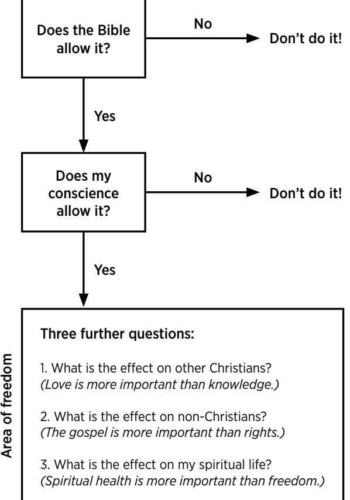

## ESV Expository Commentary

VOL. X

Romans–Galatians

### EDITORS

*Iain M. Duguid James M. Hamilton Jr. Jay Sklar*

# EX POSITORY

# *Commentary*

VOL. X

*Romans–Galatians*

Romans *Robert W. Yarbrough* 2 Corinthians *Dane Ortlund*

1 Corinthians *Andrew David Naselli*

Galatians *Frank Thielman*

*The ESV Bible Expository Commentary, Volume 10: Romans–Galatians*

Copyright © 2020 by Crossway

Published by Crossway

1300 Crescent Street Wheaton, Illinois 60187

All rights reserved. No part of this publication may be reproduced, stored in a retrieval system, or transmitted in any form by any means, electronic, mechanical, photocopy, recording, or otherwise, without the prior permission of the publisher, except as provided for by USA copyright law. Crossway® is a registered trademark in the United States of America.

Cover design: Jordan Singer

First printing 2020

Printed in Italy

Figure 2.2 taken from *Authentic Church* by Vaughan Roberts. Copyright © 2011 by Vaughan Roberts. Used by permission of InterVarsity Press, P.O. Box 1400, Downers Grove, IL 60515, USA. www.ivpress.com.

Unless otherwise indicated, Scripture quotations are from the ESV® Bible (The Holy Bible, English Standard Version®), copyright © 2001 by Crossway, a publishing ministry of Good News Publishers. Used by permission. All rights reserved.

Scripture quotations marked CSB are from the *The Christian Standard Bible*®. Copyright © 2017 by Holman Bible Publishers. Used by permission. Christian Standard Bible® and CSB® are federally registered trademarks of Holman Bible Publishers.

The Scripture quotation marked GW is from *GOD'S WORD*®, © 1995 God's Word to the Nations. Used by permission of God's Word Mission Society.

The Scripture quotation marked JPS is from the Jewish Publication Society's 1917 English translation of the Hebrew Bible.

The Scripture quotation marked LEB is from the *Lexham English Bible*. Copyright © 2012 by Logos Bible Software.

The Scripture quotation marked MESSAGE is from *THE MESSAGE*. Copyright © 1993, 1994, 1995, 1996, 2000, 2001, 2002 by Eugene H. Peterson. Used by permission of NavPress. All rights reserved. Represented by Tyndale House Publishers, Inc.

Scripture quotations marked NASB are from *The New American Standard Bible*®. Copyright © The Lockman Foundation 1960, 1962, 1963, 1968, 1971, 1972, 1973, 1975, 1977, 1995. Used by permission.

Scripture quotations marked NET are from *The NET Bible*® copyright © 2003 by Biblical Studies Press, L.L.C. www.netbible.com. All rights reserved. Quoted by permission.

Scripture quotations marked NETS are from *A New English Translation of the Septuagint*, © 2007 by the International Organization for Septuagint and Cognate Studies, Inc. Used by permission of Oxford University Press. All rights reserved.

Scripture quotations marked NIV are from The Holy Bible, New International Version®, NIV®. Copyright © 1973, 1978, 1984, 2011 by Biblica, Inc.™ Used by permission. All rights reserved worldwide.

Scripture quotations marked NLT are from *The Holy Bible, New Living Translation*, copyright © 1996, 2004. Used by permission of Tyndale House Publishers, Inc., Wheaton, IL, 60189. All rights reserved.

There are also brief citations of the *Common English Bible* (CEB), the *King James Version* (KJV), the *New International Reader's Version* (NIrV), the *New King James Version* (NKJV), the *New Revised Standard Version* (NRSV), and the *Revised Standard Version* (RSV)*.*

Scripture quotations marked AT are the author's translation.

All emphases in Scripture quotations have been added by the authors.

Hardcover ISBN: 978-1-4335-4664-8

Crossway is a publishing ministry of Good News Publishers.

| LEGO |    | 31 | 30 | 29 | 28 | 27 |   | 26 | 25 | 24 | 23 | 22 |   | 21 | 20 |
|------|----|----|----|----|----|----|---|----|----|----|----|----|---|----|----|
| 15   | 14 |    | 13 | 12 | 11 | 10 | 9 | 8  | 7  | 6  | 5  | 4  | 3 | 2  | 1  |

| Figures9                                   |
|--------------------------------------------|
| Preface to the ESV Expository Commentary11 |
| Contributors13                             |
| Abbreviations 15                        |
| 2 Corinthians395 Dane Ortlund           |
| Galatians567 Frank Thielman             |
| Scripture Index653                         |
|                                            |

# [TABLES](#page-5-0)

| Romans |                                                                                                  |  |
|--------|--------------------------------------------------------------------------------------------------|--|
| 1.1    | Significant Words in Romans28                                                                    |  |
| 1.2    | Paul's Uses of "We Know" in Romans51                                                             |  |
|        | 1 Corinthians                                                                                    |  |
| 2.1    | The Farming Metaphor in 1 Corinthians 3:5–9242                                                   |  |
| 2.2    | The Construction Metaphor in 1 Corinthians 3:9–15243                                             |  |
| 2.3    | Toolbox for Skillful Shepherding260                                                              |  |
| 2.4    | Christians and Non-Christians in 1 Corinthians 6:1–11262                                         |  |
| 2.5    | Paul's Rebuttal of a Corinthian Slogan270                                                        |  |
| 2.6    | Paul's Illustrations of Staying in One's Situation282                                            |  |
| 2.7    | Was It Always Idolatrous for Corinthian Christians to Eat Eidōlothyta in an Idol's Temple?293 |  |
| 2.8    | Typology for the People of God in 1 Corinthians 10:1–4302                                        |  |
| 2.9    | Structure of 1 Corinthians 10:17306                                                              |  |
| 2.10   | Headship and Submission in 1 Corinthians 11:3314                                                 |  |
| 2.11   | Diversity in Unity in 1 Corinthians 12335                                                        |  |
| 2.12   | Contrasts in 1 Corinthians 13:8–13347                                                            |  |
| 2.13   | What Is Unintelligible vs. What Is Intelligible in 1 Corinthians 14:1–25354                   |  |
| 2.14   | Tongues vs. Prophecy in 1 Corinthians 14:2–4355                                                  |  |
| 2.15   | Translating Third-Person Imperatives in 1 Corinthians 14:26–30, 35359                         |  |
| 2.16   | Implications of 1 Corinthians 12:27364                                                           |  |
| 2.17   | The Dead vs. Christ in 1 Corinthians 15:20–23375                                                 |  |

| 2.18 | Sown vs. Raised in 1 Corinthians 15:42–44381                |  |
|------|-------------------------------------------------------------|--|
| 2.19 | Adam vs. Christ in 1 Corinthians 15:45–49382                |  |
| 2.20 | Natural vs. Spiritual Wordplay in 1 Corinthians 15:44–46383 |  |

### *2 Corinthians*

| 3.1 | References to Pain in 2 Corinthians 2:1–4423             |  |
|-----|----------------------------------------------------------|--|
| 3.2 | Paul's Metaphor of the Corinthians as a Letter437        |  |
| 3.3 | If-Then Pattern in 2 Corinthians 3:7–11443               |  |
| 3.4 | Parallels between 2 Corinthians 3:7 and 3:13446          |  |
| 3.5 | God's Power in Jars of Clay 458                          |  |
| 3.6 | The New Age in the Midst of the Old Age484               |  |
| 3.7 | Three Descriptions of the Corinthians' Temptation532     |  |
| 3.8 | Paul's Statements of Purpose in 2 Corinthians 11:7–11534 |  |

# [FIGURES](#page-5-0)

| 1 Corinthians |                                                      |  |  |  |  |  |
|---------------|------------------------------------------------------|--|--|--|--|--|
| 2.1           | Comparative Length of 1 Corinthians Sections .213 |  |  |  |  |  |
| 2.2           | Christian Decision Making in 1 Corinthians 8–10310   |  |  |  |  |  |

# [PREFACE](#page-5-0)

### TO THE ESV EXPOSITORY COMMENTARY

The Bible pulsates with life, and the Spirit conveys the electrifying power of Scripture to those who lay hold of it by faith, ingest it, and live by it. God has revealed himself in the Bible, which makes the words of Scripture sweeter than honey, more precious than gold, and more valuable than all riches. These are the words of life, and the Lord has entrusted them to his church, for the sake of the world.

He has also provided the church with teachers to explain and make clear what the Word of God means and how it applies to each generation. We pray that all serious students of God's Word, both those who seek to teach others and those who pursue study for their own personal growth in godliness, will be served by the ESV Expository Commentary. Our goal has been to provide a clear, crisp, and Christ-centered explanation of the biblical text. All Scripture speaks of Christ (Luke 24:27), and we have sought to show how each biblical book helps us to see the "light of the knowledge of the glory of God in the face of Jesus Christ" (2 Cor. 4:6).

To that end, each contributor has been asked to provide commentary that is:

- *exegetically sound*—self-consciously submissive to the flow of thought and lines of reasoning discernible in the biblical text;
- *biblically theological*—reading the Bible as diverse yet bearing an overarching unity, narrating a single storyline of redemption culminating in Christ;
- *globally aware*—aimed as much as possible at a global audience, in line with Crossway's mission to provide the Bible and theologically responsible resources to as many people around the world as possible;
- *broadly reformed*—standing in the historical stream of the Reformation, affirming that salvation is by grace alone, through faith alone, in Christ alone, taught in Scripture alone, for God's glory alone; holding high a big God with big grace for big sinners;
- *doctrinally conversant*—fluent in theological discourse; drawing appropriate brief connections to matters of historical or current theological importance;
- *pastorally useful*—transparently and reverently "sitting under the text"; avoiding lengthy grammatical/syntactical discussions;
- *application-minded*—building brief but consistent bridges into contemporary living in both Western and non-Western contexts (being aware of the globally diverse contexts toward which these volumes are aimed);

• *efficient in expression*—economical in its use of words; not a word-byword analysis but a crisply moving exposition.

In terms of Bible translation, the ESV is the base translation used by the authors in their notes, but the authors were expected to consult the text in the original languages when doing their exposition and were not required to agree with every decision made by the ESV translators.

As civilizations crumble, God's Word stands. And we stand on it. The great truths of Scripture speak across space and time, and we aim to herald them in a way that will be globally applicable.

May God bless the study of his Word, and may he smile on this attempt to expound it.

—The Publisher and Editors

# [CONTRIBUTORS](#page-5-0)

### *Editors*

IAIN M. DUGUID PhD, University of Cambridge Professor of Old Testament, Westminster Theological Seminary

JAMES M. HAMILTON JR.

PhD, The Southern Baptist Theological Seminary Professor of Biblical Theology, The Southern Baptist Theological Seminary; Preaching Pastor, Kenwood Baptist Church, Louisville

### JAY SKLAR

PhD, University of Gloucestershire Professor of Old Testament, Covenant Theological Seminary

### *Authors*

ANDREW DAVID NASELLI PhD, Trinity Evangelical Divinity School Associate Professor of Systematic Theology and New Testament, Bethlehem Seminary *(1 Corinthians)*

### DANE ORTLUND

PhD, Wheaton College Senior Pastor, Naperville Presbyterian Church, Naperville, IL *(2 Corinthians)*

#### FRANK THIELMAN

PhD, Duke University Presbyterian Chair of Divinity, Beeson Divinity School *(Galatians)*

ROBERT W. YARBROUGH PhD, University of Aberdeen Professor of New Testament, Covenant Theological Seminary *(Romans)*

# [ABBREVIATIONS](#page-5-0)

### *General*

- AT Author's Translation
- b. born
- c. circa, about, approximately
- cf. confer, compare, see
- ch., chs. chapter(s)
	- diss. dissertation
	- ed(s). editor(s), edited by, edition
		- e.g. for example
	- esp. especially
	- et al. and others
	- etc. and so on
	- ff. and following
	- Gk. Greek
	- Hb. Hebrew
- ibid. *ibidem*, in the same place i.e. that is lit. literal, literally LXX Septuagint mg. marginal reading NT New Testament OT Old Testament repr. reprinted rev. revised (by) s.v. *sub verbo* (under the word) trans. translator, translated by v., vv. verse(s) vol(s). volume(s)
	- vs. versus

#### *Bibliographic*

| AcBib | Academia Biblica                                                                                                                                                                                       |
|-------|--------------------------------------------------------------------------------------------------------------------------------------------------------------------------------------------------------|
| ACCI  | Areopagus Critical Christian Issues                                                                                                                                                                    |
| ACCS  | Ancient Christian Commentary on Scripture                                                                                                                                                              |
| ApOTC | Apollos Old Testament Commentary                                                                                                                                                                       |
| ASBT  | Acadia Studies in Bible and Theology                                                                                                                                                                   |
| BBR   | Bulletin for Biblical Research                                                                                                                                                                         |
| BDAG  | Bauer, W., F. W. Danker, W. F. Arndt, and F. W. Gingrich. A Greek-English Lexicon of the New Testament and Other Early Christian Literature. 3rd ed. Chicago: University of Chicago Press, 1999. |
| BECNT | Baker Exegetical Commentary on the New Testament                                                                                                                                                       |
| BKnS  | Bible Knowledge Series                                                                                                                                                                                 |

- BNTC Black's New Testament Commentaries
- *BrillDAG* Montanari, Franco. *The Brill Dictionary of Ancient Greek*. Edited by Madeleine Goh and Chad Schroeder. Leiden: Brill, 2015.
	- *BSac Bibliotheca Sacra*
	- BTCP Biblical Theology for Christian Proclamation
	- *CBQ Catholic Biblical Quarterly*
		- *CL* Danker, Frederick William. *The Concise Greek-English Lexicon of the New Testament.* Chicago: University of Chicago Press, 2009.
	- CNTC Calvin's New Testament Commentaries
	- ConcC Concordia Commentary
	- COQG Christian Origins and the Question of God
		- *CTJ Calvin Theological Journal*
		- *DBSJ Detroit Baptist Seminary Journal*
		- EBS Encountering Bible Studies
		- EBT Explorations in Biblical Theology
		- *EDB Eerdmans Dictionary of the Bible.* Edited by David Noel Freedman. Grand Rapids, MI: Eerdmans, 2000.
- EGGNT Exegetical Guide to the Greek New Testament
	- FC Fathers of the Church
	- FET Foundations of Evangelical Theology
	- HTA Historisch Theologische Auslegung
	- IBC Interpretation: A Bible Commentary for Teaching and Preaching
	- *IBMR International Bulletin of Missionary Research*
		- ICC International Critical Commentary
		- *JBL Journal of Biblical Literature*
	- *JETS Journal of the Evangelical Theological Society*
	- *JGRChJ Journal of Greco-Roman Christianity and Judaism*
		- *JMM Journal of Markets and Morality*
		- *JRS Journal of Roman Studies*
		- *JSNT Journal for the Study of the New Testament*
		- KTB Knowing the Bible
		- LCL Loeb Classical Library
	- LNTS The Library of New Testament Studies
		- LSJ Liddell, Henry George, Robert Scott, and Henry Stuart Jones. *A Greek-English Lexicon*. 9th ed. with revised supplement. Oxford: Clarendon, 1996.
- MacNTC MacArthur New Testament Commentary
	- *MSJ The Master's Seminary Journal*
- NACSBT NAC Studies in Bible and Theology
- NICNT New International Commentary on the New Testament
- *NIDNTTE New International Dictionary of New Testament Theology and Exegesis.* Rev. ed. Edited by Moisés Silva. 4 vols. Grand Rapids, MI: Zondervan, 2014.
	- NIGTC New International Greek Testament Commentary
	- NIVAC NIV Application Commentary
		- *NovT Novum Testamentum*
- NovTSup Supplements to Novum Testamentum
	- *NPNF*1 *Nicene and Post-Nicene Fathers*, Series 1
	- NSBT New Studies in Biblical Theology
		- *NTS New Testament Studies*
		- *OCD Oxford Classical Dictionary*. Edited by Simon Hornblower and Antony Spawforth. 4th ed. Oxford: Oxford University Press, 2012.
		- *OTP Old Testament Pseudepigrapha.* Edited by James H. Charlesworth. 2 vols. New York: Doubleday, 1983, 1985.
	- P.Oxy. Grenfell, Bernard P., et al., eds. *The Oxyrhynchus Papyri.* London: Egypt Exploration Fund, 1898–.
	- PBM Paternoster Biblical Monographs
	- PNTC Pillar New Testament Commentary
		- SBG Studies in Biblical Greek
		- *SBJT Southern Baptist Journal of Theology*
			- SD Studies and Documents
- SNTSMS Society for New Testament Studies Monograph Series
	- SNTW Studies of the New Testament and Its World
		- SSBT Short Studies in Biblical Theology
		- *STR Southeastern Theological Review*
		- TIC Theology in Community
			- *TJ Trinity Journal*
	- TNTC Tyndale New Testament Commentaries
	- *TynBul Tyndale Bulletin*
		- WBC Word Biblical Commentary
		- *WTJ Westminster Theological Journal*

| WUNT  | Wissenschaftliche Untersuchungen zum Neuen Testament |
|-------|------------------------------------------------------|
| ZECNT | Zondervan Exegetical Commentary on the New Testament |

#### *Books of the Bible*

| Gen.      | Genesis         | Jonah    | Jonah           |
|-----------|-----------------|----------|-----------------|
| Ex.       | Exodus          | Mic.     | Micah           |
| Lev.      | Leviticus       | Nah.     | Nahum           |
| Num.      | Numbers         | Hab.     | Habakkuk        |
| Deut.     | Deuteronomy     | Zeph.    | Zephaniah       |
| Josh.     | Joshua          | Hag.     | Haggai          |
| Judg.     | Judges          | Zech.    | Zechariah       |
| Ruth      | Ruth            | Mal.     | Malachi         |
| 1 Sam.    | 1 Samuel        | Matt.    | Matthew         |
| 2 Sam.    | 2 Samuel        | Mark     | Mark            |
| 1 Kings   | 1 Kings         | Luke     | Luke            |
| 2 Kings   | 2 Kings         | John     | John            |
| 1 Chron.  | 1 Chronicles    | Acts     | Acts            |
| 2 Chron.  | 2 Chronicles    | Rom.     | Romans          |
| Ezra      | Ezra            | 1 Cor.   | 1 Corinthians   |
| Neh.      | Nehemiah        | 2 Cor.   | 2 Corinthians   |
| Est.      | Esther          | Gal.     | Galatians       |
| Job       | Job             | Eph.     | Ephesians       |
| Ps., Pss. | Psalms          | Phil.    | Philippians     |
| Prov.     | Proverbs        | Col.     | Colossians      |
| Eccles.   | Ecclesiastes    | 1 Thess. | 1 Thessalonians |
| Song      | Song of Solomon | 2 Thess. | 2 Thessalonians |
| Isa.      | Isaiah          | 1 Tim.   | 1 Timothy       |
| Jer.      | Jeremiah        | 2 Tim.   | 2 Timothy       |
| Lam.      | Lamentations    | Titus    | Titus           |
| Ezek.     | Ezekiel         | Philem.  | Philemon        |
| Dan.      | Daniel          | Heb.     | Hebrews         |
| Hos.      | Hosea           | James    | James           |
| Joel      | Joel            | 1 Pet.   | 1 Peter         |
| Amos      | Amos            | 2 Pet.   | 2 Peter         |
| Obad.     | Obadiah         | 1 John   | 1 John          |

| 2 John | 2 John | Jude | Jude       |
|--------|--------|------|------------|
| 3 John | 3 John | Rev. | Revelation |

#### *Apocrypha and Other Noncanonical Sources Cited*

| 1 Clem. | 1 Clement   | 4 Macc. | 4 Maccabees |
|---------|-------------|---------|-------------|
| 1 Macc. | 1 Maccabees | Did.    | Didache     |
| 2 En.   | 2 Enoch     | Jdt.    | Judith      |
| 2 Macc. | 2 Maccabees | Sir.    | Sirach      |
| 2 Esd.  | 2 Esdras    |         |             |

# [ROMANS](#page-5-0)

*Robert W. Yarbrough*

# INTRODUCTION TO ROMANS

### *Overview*

Romans is widely acknowledged to contain the most extended and complete presentation of Christian doctrine found in any single book of the Bible. This does not mean it is a theological textbook in the modern sense. Rather, in a form familiar to first-century readers of Greek in the Roman Empire, the author pens a letter to a congregation (or congregations) in Rome that addresses an astonishingly wide range of key topics. These cannot all be touched on in a brief overview, but the following are prominent:

- God's glorious eternal saving purpose and plan
- the specific "good news message" (gospel) that offers salvation
- human sinfulness
- the wrath of God
- Christ's cross and resurrection as God's means of human rescue
- justification by God's grace through faith in Christ's person and work
- the struggle of sanctification
- the triumph of God's love amid cosmic anguish
- God's faithfulness to his promises and people
- the call to self-sacrificial living in love for God and others
- affirmation of fellow Christians despite secondary differences
- the centrality of mission (evangelistic outreach) to the Christian life
- the centrality of the Scriptures for saving knowledge of God

These truths emerge in the course of 432 verses containing over 7,000 Greek words (over 9,000 in English translation). The doctrines contained in Romans and the benefits of its wisdom call for careful reading and reflection. Its richness can perhaps be appreciated by the realization that over sixty commentaries on Romans were written in the first two decades of the twentieth-first century alone; over 740 Romans commentaries have been written in the course of church history.1

The present commentary will attempt an economical explanation of the epistle's flow and argument centering on its primary theological affirmations, literary features, and historical (or background) references.

1 Eckhard J. Schnabel, *Der Brief des Paulus on die Römer*, vol. 1, *Kapitel 1–5*, HTA (Witten: SCM R. Brockhaus, 2015), 71–72.

### *Title and Text*

Almost all ancient manuscripts contain "to the Romans" in the title of this book. And even if the title were to lack these words, the addressees are identified in 1:7, 15. Scholars have long noted that, while all extant Greek manuscripts contain the same sixteen chapters of Romans that our English versions do, there is evidence from Patristic writers that a shorter version (ending at 14:23) may have circulated in the second century. This truncated copy may have stemmed from a heretical person or group, something Paul warns against elsewhere (2 Thess. 2:2). Some textual divergence can also be seen in the grace benedictions and the doxology in Romans 16. Despite the sketchiness and complexity of the evidence, it is widely accepted that "the unity of the sixteen-chapter text and its Roman address are established."2

#### *Author*

Richard Longenecker notes, "The most uncontroverted matter in the study of Romans is that the letter was written by Paul."3 He adds, grouping Romans with Galatians: "If these two letters are not by Paul, no NT letters are by him, for none has any better claim to authenticity than Galatians and Romans."4 Paul names himself in the opening verse (1:1) and uses the first-person-singular verb form over a hundred times. While some of these uses are rhetorical, and others are OT citations in which God speaks in the first person, in most cases Paul's own personal voice can be detected, as these examples illustrate:

God is my witness, whom I serve with my spirit in the gospel of his Son, that without ceasing I mention you always in my prayers, asking that somehow by God's will I may now at last succeed in coming to you. (1:9–10)

I am not ashamed of the gospel. (1:16)

I am speaking in human terms, because of your natural limitations. (6:19)

I was once alive apart from the law, but when the commandment came, sin came alive and I died. (7:9)

I could wish that I myself were accursed and cut off from Christ for the sake of my brothers, my kinsmen according to the flesh. (9:3)

In sum, the author of Romans is the apostle Paul who plays such a prominent role in Acts as its story unfolds and who contributes some dozen other epistles to the NT canon.

2 Harry Gamble Jr., *The Textual History of the Letter to the Romans*, SD 42 (Grand Rapids, MI: Eerdmans, 1977), 127.

3 Richard N. Longenecker, *Introducing Romans: Critical Issues in Paul's Most Famous Letter* (Grand Rapids, MI: Eerdmans, 2011), 3.

4 Ibid.

#### *Date, Occasion, and Purpose*

Near the end of Paul's third missionary journey (Acts 18:23–21:17), he spent three months in or near Corinth (Acts 20:3). He was awaiting the end of winter weather so that he and companions such as Timothy (Rom. 16:21) could sail safely back to Caesarea and then trek from there to Jerusalem. (Winter travel on the Mediterranean in the small boats of that day was not advised; cf. Acts 27:12.) During that three-month sojourn Paul wrote Romans. The date was likely the winter of 57–58 AD.

From 1 Corinthians 16:1–4 and 2 Corinthians 8–9 we know that prior to these events Paul had been spearheading a monetary collection from Gentile churches in Macedonia and Greece for destitute Jewish Christians in Judea. In Romans Paul confirms that he has received this money (15:25–26). He now plans to deliver it to Jerusalem, travel to Rome, and continue from there on to Spain: "When therefore I have completed this [i.e., carrying the funds] and have delivered to [the Judean believers] what has been collected, I will leave for Spain by way of you [i.e., the Roman Christians]" (15:28).

So, in the most basic sense the "occasion" of Romans is the end of Paul's third missionary journey, his mission to deliver aid to Judean believers, and then his intention to visit Rome en route to Spain. As Romans takes shape, Paul is staying at the home of Gaius (16:23), a Corinthian (1 Cor. 1:14). Once Paul's scribe Tertius finishes writing what Paul dictates to him (Rom. 16:22), Paul will send it to Rome by the hand of Phoebe, who is from the village of Cenchreae near Corinth (16:1–2).

Yet, in another sense, the "occasion" is not merely the immediate historical circumstances surrounding the letter's composition and sending. It is any of several primary motivating or informing factors that explain at least in part why Paul wrote what Romans contains. Occasion intertwines with purpose. Over recent generations much energy has been expended seeking to establish the purpose of Romans.5 One recent commentary asserts simply and plausibly, "Paul's *primary* purpose in writing Romans was to minister to the believers in Rome for whom he had an apostolic responsibility."6

Yet more can be said. Longenecker argues convincingly for two major and three secondary purposes for Paul's writing Romans.7

(1) He wished to "impart . . . some spiritual gift to strengthen" the Roman believers (1:11). This gift may be viewed as the brilliant exposition of the gospel which Paul calls "my gospel" (2:16; 16:25)—that Romans contains. In that sense Romans is a theological or doctrinal letter.

(2) He wrote to mobilize support for his eventual outreach to Spain (1:13; 15:24). In that sense Romans is a missionary letter.

(3) He wrote to correct misunderstandings of his ministry and message, whether due to defective grasp, mischief stirred up by opponents of Paul's teaching,

5 See Karl P. Donfried, *The Romans Debate*, rev. ed. (Grand Rapids, MI: Baker Academic, 1991).

6 Colin G. Kruse, *Paul's Letter to the Romans*, PNTC (Grand Rapids, MI: Eerdmans, 2012), 11, emphasis original. 7 The next five paragraphs draw from Longenecker, *Introducing Romans*, 158–159, though with some contrasting emphases.

or both. The entirety of Romans should be viewed in part as an apologetic presentation to support this plea:

I appeal to you, brothers, to watch out for those who cause divisions and create obstacles contrary to the doctrine that you have been taught; avoid them. For such persons do not serve our Lord Christ, but their own appetites, and by smooth talk and flattery they deceive the hearts of the naive. (16:17–18)

In that sense Romans is a pastoral letter, expounding on the "standard of teaching" (6:17) affirmed by the apostolic churches and calling for living that lines up with that faith.

(4) He wrote to encourage mutual understanding and reconciliation between two viewpoints in the Roman church that were struggling to coexist. It is customary to term these groups the "strong" and the "weak" (14:1–15:13). In that sense Romans is a situational letter, calling for reconciliation and sustained harmony in the face of relational challenges. Where people gather, there will be bickering. Christian congregations are no exception.

(5) He wrote to clarify the responsibilities of Christians in an empire that was at best indifferent to a small subgroup like the Christians and at worst antagonistic. Jesus' followers should be loyal subjects of the governmental structure in which they find themselves to the extent it is possible without compromised loyalty to God (13:1–7). In that sense Romans serves a political function, clarifying how Christians whose citizenship is in heaven (cf. Phil. 3:20) should render to Caesar what they owe him (Matt. 22:21; Mark 12:17; Luke 20:25) without shortchanging God and Christ.

This multifaceted scope of concern helps explain the wide-ranging counsel Paul provides. It also helps explain the overwhelmingly theological thrust of the epistle. Paul is a theological and scriptural thinker. He relates his counsel to what God has said in Scripture, in addition to apostolic insight unique to Paul (e.g., 2 Cor. 12:1–10; Eph. 3:2–5). Whatever the issue, subject, or question, Paul is apt to defer to some biblical passage or teaching because he believes the Scriptures8 to be God's Word like no extracanonical words or other human wisdom (even his own) could ever be.

In that sense the occasion of Romans is Paul's resolve while encamped for a season near Corinth to provide for the Romans a summary version of what, just a few weeks later, he would remind church leaders at Ephesus he had given them during his two or more years there:

I did not shrink from declaring to you anything that was profitable, and teaching you in public and from house to house, testifying both to Jews and to Greeks of repentance toward God and of faith in our Lord Jesus Christ. . . . I did not shrink from declaring to you the whole counsel of God. (Acts 20:20–21, 27)

8 I.e., what we know as the Old Testament (2 Tim. 3:15–17), along with any NT writings known to Paul at that time. These would include at least the Gospel of Luke, a verse of which Paul calls "Scripture" (1 Tim. 5:18, quoting Luke 10:7).

Of all of Paul's letters Romans comes closest to proclaiming, explaining, and applying that whole counsel. The date and occasion confirm that Paul writes at a time and setting where his matured apostolic insight and extensive missionary experience enable composition of an epistolary masterpiece. And that describes Romans: a sublime and extended witness to what "has now been disclosed" through the gospel of Jesus Christ "and through the prophetic writings has been made known to all nations, according to the command of the eternal God, to bring about the obedience of faith" (Rom. 16:26), especially among the Gentiles (1:5), for whose sake Paul has been given a particular divine commission (1:13; 11:13; 15:16, 18).

#### *Genre and Literary Features*

Romans is clearly a letter. Its opening, body, and closing bear the earmarks of what people in that era and cultural setting would understand to be a personal communiqué from one party to another. In this case the author is Paul. The recipients are the Roman readers.

Since it is a letter, readers do well to take note of two challenges. The first is historical. What was a "letter" in that time, place, and language (Hellenistic Greek)? What were the functions of letters in Paul's ministry? The fact that Paul's letters, including Romans, quickly took on the status of Holy Scripture (2 Pet. 3:15–16) suggests that the mundane genre of Romans does not imply mundane content. Just as the Son of God took on flesh to reveal and redeem (John 1:14), Romans assumes a deceptively common dress to open uncommon vistas of revealed truth to an extent rivaled by few other biblical books.

The second challenge is hermeneutical. "Hermeneutical" here means "pertaining to understanding." No letter interprets itself. To understand Romans requires accurate reading and adequate comprehension of its 432 verses taken as a whole and seen in the various contexts to which Romans relates, including the following: the OT and its teaching from which Romans draws so heavily; Paul's life and teaching, especially as influenced by Jesus, whom Paul viewed as Messiah; the ministry of other apostles and churches parallel to Paul; early church history; understanding of Paul (and all of Scripture) through the centuries; contemporary understanding of Paul and factors that hinder or enhance such understanding today.

A brief commentary cannot discuss all these (and other) relevant hermeneutical considerations that bear on reading Romans. But it is important to be aware that good interpretation of an ancient document (in this case a letter) is not as simple as assuming that the first thoughts that may occur to us upon reading the (translated) words are "the truth" a given passage conveys. The genre "Hellenistic letter" dictates disciplined discernment of factors in the ancient setting, as well as in the current one, that must be handled aright for interpretation to arrive at the desired destination of grasping what Paul (and more fundamentally God, whose Spirit filled him as he composed) wished for readers to know.

As for literary features, apart from being a letter Romans has too many different features to fit easily into a particular literary category. It is a commonplace to observe that the first major block (chs. 1–11) deals primarily with doctrinal matters, while chapters 12–15 deal with ethical and practical matters before transitioning to greetings and summary statements in chapters 15–16.

Beyond this general pattern it can be observed that Paul employs various conventions such as diatribe, creedal statements, doxologies, quotations from Scripture, rabbinic methods (such as citation of two or even three OT passages to clinch a point), and an array of stylistic devices including parallelism, chiasm, alliteration, and others. These will be pointed out in the exposition below when they are significant for a passage's meaning.

#### *Theology of Romans*

"Romans is justly famous for its theology."9 While other important matters such as the historical and social setting affect virtually every section of Romans, theological concerns predominate in the explicit discourse. Paul's *focus* in Romans can be glimpsed in the *frequency* of the words he uses. Table 1.1 shows the top ten significant10 words used in Romans.

| Word in Romans       | Times Used | Word in Romans                | Times Used |
|----------------------|------------|-------------------------------|------------|
| 1. God (theos)       | 153        | 6. faith ( pistis)            | 40         |
| 2. law (nomos)       | 74         | 7. Jesus (Iēsous)             | 36         |
| 3. Christ (Christos) | 65         | 8. righteousness (dikaiosynē) | 34         |
| 4. sin (hamartia)    | 48         | 9. Spirit, spirit ( pneuma)   | 34         |
| 5. Lord (kyrios)     | 43         | 10. Gentile (ethnos)          | 29         |

TABLE 1.1: Significant Words in Romans

It can be seen that references to deity dwarf all other topics—a total of 326 references in 432 verses.11 Three-fourths of the verses in Romans contain explicit reference to God, whether Father, Son, or Spirit. Many other verses speak of deity indirectly. The word "God" appears in every chapter. "Christ" is absent only from chapters 4 (where "Jesus" occurs in 4:24, however) and 11. Paul's signature expression "in Christ" is found thirteen times.

God in his magnificence, splendor, and glory (a word appearing 15 times in Romans) is the theological bedrock of Romans. This is glimpsed in the five "amen" statements (doxologies) in which Paul extols God (1:25; 9:5; 11:36; 16:27) or pronounces blessing from God (15:33).

9 Douglas J. Moo, *Encountering the Book of Romans: A Theological Survey*, 2nd ed., EBS (Grand Rapids, MI: Baker Academic, 2014), 162.

10 Some words, like "the" and "and," are used more frequently than those appearing in the chart. But their importance is functional, not referential. The words in the chart refer to persons or concepts significant for the book's descriptions and assertions. We have consulted the frequency list found in Andreas Köstenberger and Raymond Bouchoc, *The Book Study Concordance of the Greek New Testament* (Nashville: B&H Academic, 2003), 890. 11 153 (God) + 65 (Christ) + 43 (Lord) + 36 (Jesus) + 29 (Spirit; five times *pneuma* refers to human spirits or lives).

But people and pastoral concerns are prominent too. "Gentiles" occurs in chapters 1–4; 9–11; and 15–16, underscoring Paul's concern for and commitment to the people groups God commissioned him to reach beyond his fellow Jews. Nine times Paul uses "brothers" (Gk. *adelphoi*, referring in Romans both to male and female members of the Roman church), a pastoral expression of direct and personal care. This implies a high level of felt connection and in some cases warm affection (as the greetings in ch. 16 make explicit).

Paul speaks frequently and frankly about "law" (usually referring to the Law of Moses or to the OT more generally), "sin," "faith," and "righteousness." This is because Paul's view of God carries God's own sense of urgency about the need for humans to get right with him. Thus he warns: "Do you presume on the riches of his kindness and forbearance and patience, not knowing that God's kindness is meant to lead you to repentance?" (2:4). Paul is not an armchair theologian but a "preacher and apostle and teacher" (2 Tim. 1:11) of a soul-saving, life-changing, world-conquering message—the gospel (Rom. 1:16–17) of Christ's saving death and resurrection (3:25; 4:25). He views the world as "white for harvest" in keeping with Jesus' teaching (John 4:35).

Words for "love" (Gk. *agapē* [noun]; *agapaō* [verb]) or "beloved" (*agapētos*) taken together occur some twenty-four times. Romans conveys a sense of interpersonal interest and attachment, not a sterile theological outlook in which human matters are canceled out by lofty speculations about some distant Almighty. After all, Paul writes to make known the good news that "God shows his love for us in that while we were still sinners, Christ died for us" (Rom. 5:8). It is fitting that an apostle "set apart for the gospel of God" (1:1) would have love to show, not just information to convey. Romans is rich not only in theology but in expression of the love that the Holy Spirit pours out through the gospel message received in faith (5:5).

#### *Relationship to the Rest of the Bible and to Christ*

A great strength and service of Romans is the extent to which it knits together OT and NT. As Douglas Moo has written, "Paul, more than any other biblical author, helps us to understand the unity of God's plan as revealed in Scripture by integrating the various parts of the biblical revelation."12 Romans contains more OT quotations than does any other NT writing. Romans quotes especially from the Torah, Psalms, and Isaiah. But it also quotes minor prophets (Hosea, Joel, Habakkuk, Malachi), historical books such as 1 Kings, and wisdom writings such as Job and Proverbs. It makes allusions to many other OT books and people (including Adam, Abraham, Sarah, Isaac, Rebekah, Esau, Jacob, Benjamin, Moses, Jesse, David, and Elijah).

In relation to the NT, Romans serves to integrate the story told in the Gospels, the history presented in Acts, and the instruction contained in other NT letters. Romans summarizes and enlarges the doctrinal implications of Jesus' ministry as

12 Douglas J. Moo, "Paul," in *New Dictionary of Biblical Theology: Exploring the Unity & Diversity of Scripture*,

ed. T. Desmond Alexander and Brian S. Rosner (Downers Grove, IL: IVP Academic, 2000), 139.

his followers extend his kingdom presence out into the Roman world and beyond in the generations following his resurrection and ascension.

Given the letter's underlying but acute eschatological awareness,13 it even helps make sense of the book of Revelation: the wrath of God spoken of repeatedly in Romans (1:18; 2:5, 8; 3:5; 4:15; 5:9; 9:22; 12:19; 13:4–5) and warned about by Jesus is depicted in visionary terms in Revelation. Also depicted in both books are God's Son (the crucified Christ in Romans, the Lamb that was slain in Revelation), grace, and salvation. Romans and Revelation are complementary in these emphases.

What is the relationship of Romans to Christ? It exalts him, but not through flowery praise as much as through clear description of his person and work. To take just ten examples:

- (1) Christ is the master, Lord, and owner of Paul and all believers (1:1, 4, 6; 10:9).
- (2) Christ is, along with the Father, our source of grace from God (5:15; 16:20) and peace with God (1:7; 5:1).
- (3) Christ is our mediator, through whom we may thank God (1:8; 7:25) and rejoice in him (5:11) as he intercedes for us at God's right hand (8:34).
- (4) Christ is God's agent in the final day of judgment (2:16), but he can save from condemnation (8:1).
- (5) Christ is the object of saving faith (3:22, 26) and source of redemption (3:24; 8:2), leading to eternal life (5:17, 21; 6:23).
- (6) Christ was our substitute in death (6:3; 8:34) so that we may die to sin and live to God (6:11).
- (7) Christ, risen from the dead (4:24), indwells believers and imparts resurrection life to our mortal bodies (8:11).
- (8) Christ ensures the inseparability of believers from the love of God the Father (8:39).
- (9) Christ is the source of unity between believers (15:5) and the means by which they may together glorify God (15:6).
- (10) Christ is the proper object of gospel preaching (16:25) and the means by which "the only wise God" receives eternal praise and glory (16:27).

The list above is the tip of an iceberg. There is no sizable portion of Romans that does not, directly or indirectly, owe its punch and often poignancy to "Jesus Christ" (17 times in Romans) or "Christ Jesus" (15 times). Christ is, as Paul puts it starkly and provocatively, "God over all, blessed forever. Amen" (9:5).

#### *Preaching from Romans*

At one level, Romans is simple. Verses drawn from it have been used to construct the "Romans Road" to salvation. Man has a problem: sin (3:23). The result is condemnation and death (6:23). But Christ died for sinners (5:8). Commitment to

13 See Robert W. Yarbrough, "The Theology of Romans in Future Tense," *SBJT* 11/3 (Fall 2007): 46–62.

him from the heart results in rescue (10:9–10). God's judgment is lifted (8:1) and God's love is assured (8:38–39). There have been many versions of this road map to salvation. But its widespread use in evangelistic ministries is a tribute to the clarity and utility of various individual verses in Romans. Preachers do well to capitalize on Romans as an inspiration and guide to leading the lost to eternal life.

At another level, Romans is complex enough to overwhelm an unwary expositor. It is so dense and rich that the biggest danger in preaching it might be information overload. Both preacher and congregation might despair of ever working through such a long and meaty treatise. Following are four tips for maximum usability of Romans in an exposition covering the whole book.

(1) Know the congregation. If a church is accustomed to yearlong (or longer) expositions of biblical books, a skillful teaching pastor might profitably spend a month or more preaching from each chapter. Less wizened congregations might benefit from a less detailed and rigorous explanation. This is not an invitation to dumb down one's preaching. It is applying the principle Jesus modeled: "He spoke the word to them, as they were able to hear it" (Mark 4:33). Experienced preachers know that part of their art and calling is to aim neither too high nor too low for the maximum good of their hearers. This wisdom is especially important in preaching from Romans.

(2) Know the point. Many passages in Romans relate to numerous deep truths. Good expositors will render that richness into bite-sized portions rather than choke listeners with a confusing mass of impressive but complicated assertions or appeals. In many cases preachers will wrestle with the feeling they are only skimming the surface of all that could be said. This perception is probably accurate. But it is better, in a single sermon, to subordinate all that might be derived from a passage to a single overarching insight or admonition. It is better to instill one thing for sure about, say, Romans 2:1–10 than to bury listeners with all the true observations that the text and commentaries offer preachers in that passage.

(3) Know the text. Since Romans contains so much theology, and since expositors are generally endowed with a theology of their own, it is tempting to use Romans to support the preacher's outlook more than to distill and present its message. Disciplined study and the humility to learn can result in the proclamation of Christ rather than preachers' preformed convictions. Incidentally, congregational boredom with a months-long exposition of Romans can be caused by preachers using Romans to rehearse the same well-known outlook that their churches hear every other week from every other portion of the Bible. Careful study of Romans in its historical, theological, and canonical contexts should always yield fresh perspective on even timeworn doctrines and commands.

(4) Know the Lord. "Magical" may not be an apt word for a portion of Christian Scripture, but there is something electric about Romans. This is evidenced, for example, by its life-changing effects on giants in the Christian tradition, from Augustine to Martin Luther to John Wesley. Paul wrote it at a time when he was at the top of his game, so to speak, in his walk with the Lord. The epochal third

missionary journey and the composition of 2 Corinthians had just been completed. Before him lay arrest and a long ordeal in Jerusalem, followed by a period during which he penned additional though briefer powerful letters (Ephesians, Colossians, Philippians, Philemon). Only a robust personal connection with God through faith in the Son by the power of the Spirit can explain the eloquence, genius, grandeur, and world-historical impact of Romans. To resonate with Romans deeply enough to be in sync with the original author so as to convey his message requires some measure of the fidelity to God and walk with him that enabled Paul to be caught up in the Spirit, as he must have been (2 Pet. 1:21) to compose such a sublime statement. Moses was told to remove his sandals because of the holy ground surrounding the burning bush (Ex. 3:5). Preaching Romans optimally calls for similar reverence and awe in the knowledge of God, his truth, and his love in Christ.

#### *Interpretive Challenges*

A scholar who has written over a thousand pages of investigation into the meaning of Romans states, "Romans is probably the most difficult of all the NT letters to analyze and interpret."14 He points out that Augustine began writing a Romans commentary but abandoned the project after just seven verses due to the level of difficulty. He also quotes Erasmus's vexed observation: "The difficulty of this letter equals and almost surpasses its utility."15

But we should not follow Erasmus in declaring Romans to be nearly more trouble than it is worth. Romans speaks to matters that have been controversial through the centuries and retain their disputed status today: natural versus special revelation (ch. 1); human depravity (1:16–32); the manifestation of God's saving righteousness through Christ's death (3:21–31); the nature and importance of Abrahamic faith (ch. 4); the relation of Christ the second Adam to the first Adam (5:12–21); misunderstandings of faith and grace and law (chs. 6–7); cosmic and Christian suffering and the question of God's adequacy (ch. 8); the continuing role of ethnic Israel in God's ongoing redemptive work (chs. 9–11); the ethical effects of the gospel truly received (chs. 12–13); Christian liberty yet at the same time freedom (14:1–15:7); the missionary imperative of the church in light of Christ's fulfillment of OT prophecy (15:8–33). Within these broad literary movements lie numerous controversial minisections, such as the scathing critique of same-sex union in 1:24–28, the identity of the "I" in Romans 7, the question of individual or corporate election in Romans 9, and many more.

Such interpretive challenges are, of course, at the same time opportunities. What Romans says about controversial matters is important to pursue even if it may be difficult to determine. It is not necessary to attain a perfect and comprehensive understanding of the whole of Romans in order to grasp sizable and useful portions of its wisdom. The result can be fresh personal insights and powerful

14 Richard N. Longenecker, *The Epistle to the Romans*, NIGTC (Grand Rapids, MI: Eerdmans, 2016), xiv. 15 Ibid.

public proclamation of the message Romans was written to spread across the Roman world.

## *Outline*

- I. Paul's Greeting and Gratitude (1:1–15)
	- A. Greeting to the Lord's People (1:1–7)
	- B. Gratitude for the Lord's Purpose (1:8–15)
- II. Central Theme of the Letter: The Gospel (1:16–17)
- III. God's Universal Revelation: Man's Universal Unrighteousness (1:18–3:20)
	- A. Unrighteousness That Deserves God's Wrath (1:18–32)
	- B. Self-Righteousness That Results in God's Judgment (2:1–16)
	- C. Religious Hypocrisy That Confuses Ethnicity with Acceptance by God (2:17–29)
	- D. Divine Righteousness That Justly Condemns Every Human Being (3:1–20)
- IV. God's Saving Righteousness (3:21–5:21)
	- A. The Redemption That Is in Christ Jesus (3:21–31)
	- B. The Justification That Comes through Faith (4:1–25)
	- C. The Peace That Results from Justification (5:1–11)
	- D. The Triumph of Righteousness over Sin and Death (5:12–21)
- V. Three Failed Objections to the Faith (Grace) Principle (6:1–7:25)
	- A. "Faith Encourages Sin!" (6:1–14)
	- B. "Grace Abrogates the Law!" (6:15–7:6)
	- C. "The Law Itself Is Sinful!" (7:7–25)
- VI. The Redeemed Life (8:1–39)
	- A. Personal Implications (8:1–17)
	- B. Cosmic Implications (8:18–39)
- VII. Israel and God's Redemptive Activity (9:1–11:36)
	- A. God's Chosen People (9:1–33)
	- B. God's Continuing Plan (10:1–21)
	- C. God's Continuing Promise (11:1–36)
- VIII. Christian Conduct: Living Sacrifice (12:1–15:13)
	- A. General Exhortation to Spiritual Conduct (12:1–21)
	- B. Civic Responsibilities of God's People (13:1–14)
	- C. Freedom of Conscience in Christian Solidarity (14:1–15:13)
	- IX. Closing Wishes, Greetings, and Benedictions (15:14–16:27)
		- A. Restatement of Paul's Apostolic Office (15:14–21)
		- B. Hopes for Visits to Rome and Spain (15:22–32)
		- C. Benediction (15:33)
		- D. Greetings to the Recipients of the Epistle (16:1–16)
		- E. Pastoral Warning and Assurance Regarding False Teachers (16:17–20a)
- F. Benediction (16:20b)
- G. Greetings from Paul's Coworkers and Amanuensis (16:21–23)
- H. [Benediction (16:24)]
- I. Benediction/Capsule Restatement of the Gospel's Gravity and Glory (16:25–27)

# ROMANS 1:1–15

1 Paul, a servant*1* of Christ Jesus, called to be an apostle, set apart for the gospel of God, **2**which he promised beforehand through his prophets in the holy Scriptures, **3** concerning his Son, who was descended from David*2* according to the flesh **4** and was declared to be the Son of God in power according to the Spirit of holiness by his resurrection from the dead, Jesus Christ our Lord, **5** through whom we have received grace and apostleship to bring about the obedience of faith for the sake of his name among all the nations, **6** including you who are called to belong to Jesus Christ,

**7**To all those in Rome who are loved by God and called to be saints:

Grace to you and peace from God our Father and the Lord Jesus Christ. **8**First, I thank my God through Jesus Christ for all of you, because your faith is proclaimed in all the world. **9**For God is my witness, whom I serve with my spirit in the gospel of his Son, that without ceasing I mention you **10** always in my prayers, asking that somehow by God's will I may now at last succeed in coming to you. **11**For I long to see you, that I may impart to you some spiritual gift to strengthen you— **12** that is, that we may be mutually encouraged by each other's faith, both yours and mine. **13** I do not want you to be unaware, brothers,*3* that I have often intended to come to you (but thus far have been prevented), in order that I may reap some harvest among you as well as among the rest of the Gentiles. **14** I am under obligation both to Greeks and to barbarians,*4* both to the wise and to the foolish. **15** So I am eager to preach the gospel to you also who are in Rome.

1For the contextual rendering of the Greek word *doulos*, see Preface 2Or *who came from the offspring of David* 3Or *brothers and sisters*. In New Testament usage, depending on the context, the plural Greek word *adelphoi* (translated "brothers") may refer either to *brothers* or to *brothers and sisters* 4That is, non-Greeks

#### *Section Overview*

More noticeably than any other NT letter, Romans inserts a lengthy message between the writer's name (Rom. 1:1) and the identity of the letter's recipients (v. 7). Some of Paul's letters include just a half dozen or so words between "Paul" and the recipients' name (cf. Ephesians, Philippians, 1 and 2 Thessalonians, Philemon). Romans has seventy-one. The only (distant) rivals are Titus (46 words) and Galatians (25 words).16

16 Word counts in this paragraph are based on the Greek text.

Why the overflow of words? Possible reasons will emerge in the course of discussion below. It is clear that Paul is eager to foreshadow many themes covered in his letter by touching on them briefly here. Most of these themes relate to God: his gospel, his promises, his prophets, his Scriptures, his Son, his Spirit, and more. But Paul also highlights his readers—their status as saints, their faith, their present and future interconnectedness with Paul. Finally, Paul cannot conceal his underlying excitement at perhaps one day reaching Rome for mutual encouragement (Rom. 1:12) and to set forth the gospel message (v. 15) in yet another influential Gentile city.

Until he arrives, this epistle will serve as a forerunner to his eventual ministry there and (he hopes) beyond. No other Pauline letter lays such an eloquent, theologically wide-ranging foundation for the sections that follow.

#### *Section Outline*

- I. Paul's Greeting and Gratitude (1:1–15)
	- A. Greeting to the Lord's People (1:1–7)
	- B. Gratitude for the Lord's Purpose (1:8–15)

#### *Comment*

1:1 Paul begins with an opening typical of a Hellenistic letter in his era: he gives his name. But his self-description is not typical. In his other NT letters he calls himself a servant (Gk. *doulos*) only in Philippians 1:1 (along with Timothy: "servants of Christ Jesus") and Titus 1:1 ("a servant of God"). He defines his servant status here with two other qualifiers:

(1) He is "called to be an apostle." This links him with the Eleven Jesus chose (supplemented by Judas's replacement, Matthias; Acts 1:26). Paul's selection is recounted in Acts 9:1–19. An apostle represents not himself but the one who enlists him; in that sense Paul is Jesus' servant, not an agent promoting his own agenda.

(2) He is "set apart for the gospel of God." He is the custodian and proclaimer of "good news" from and about God. That good news is described over the next few verses.

1:2 This verse reveals that the foundation for the good news Paul bears is laid in the OT Scriptures. Trained under the rabbi Gamaliel (Acts 22:3), Paul knows those writings well. Through the prophets (like Moses, Isaiah, Daniel, and the rest) who authored them, God made promises many centuries in advance. Paul's Jewish heritage includes a veneration of God's Word written (cf. Rom. 3:1–2), often summarized with the term "law." The righteous person is one whose "delight is in the law of the Lord, and on his law he meditates day and night" (Ps. 1:2). Paul calls these Scriptures "holy" because they are unique, inspired by God (cf. 2 Tim. 3:16–17) like no other documents in the annals of human history. They are also unique in their function: they tell a true story that points to the redemption of a sinful world by a figure named in Romans 1:3.

1:3 God's "Son" is the "Christ Jesus" named in verse 1. God's promised and now fulfilled good news has its focal point in him. Jesus' sonship is a reminder that the God behind Paul's gospel is a relational being. He is not simply omnipotent (having all power) and omniscient (having all knowledge). He is also a God of compassion and personal connection, as those who come to know him for themselves discover. Jesus taught his disciples to pray to God using the words "our Father" (Matt. 6:9). He addressed God as "Father" with such regularity and pathos that he was accused of blasphemy for it (John 5:18). Later Paul will refer to God as "Abba" (Rom. 8:15; cf. Gal. 4:6), pointing to the relational warmth for those who know God. The fact that Jesus is God's "Son" supports the inference that followers of Jesus likewise qualify to be called "children of God" (Rom. 8:16, 21).

Jesus descends not only from a heavenly but also from an earthly heritage: he is a descendant of David, a central OT figure. Both Gospel genealogies highlight this connection (Matt. 1:1, 6; Luke 3:31). Late in his ministry Paul exhorts Timothy, "Remember Jesus Christ, risen from the dead, the offspring of David, as preached in my gospel" (2 Tim. 2:8). Because Jesus fulfills promises made to David (e.g., 2 Sam. 7:12) and is frequently referred to as the "son of David" in the Gospels (ten times in Matthew's Gospel alone), Paul views his human ancestry ("according to the flesh") as significant.

1:4 This verse extends Paul's explanation of God's "gospel" (v. 1) to include Jesus' resurrection "from the dead" (lit., "from among the dead [people]"). It is human destiny to die; the English poet A. C. Swinburne (1837–1909) lamented that time turns those we love into corpses—and us too. But Jesus is called the "firstborn among many brothers" (8:29): he has led the way in conquering death (5:17, 21). This remarkable miraculous truth is how God "declared" him "to be the Son of God in power," which could also be rendered "powerfully declared [him] to be the Son of God."

Either way, in Jesus' resurrection God has made a statement. And not only God the Father who raised him (Gal. 1:1): Jesus' transition from death to life was "according to the Spirit of holiness" (for "holiness" in Paul, cf. 2 Cor. 7:1; 1 Thess. 3:13). Jesus' life-out-of-death means that believers in him can likewise at the present time experience transformed lives in their "mortal bodies through his Spirit who dwells in" them (Rom. 8:11). Behind this wonder is the "Spirit of holiness," meaning the Spirit who is holy and through the gospel unites believers with the one who died and rose on their behalf. They can truly call him "Jesus Christ our Lord."

1:5 Through Jesus the Lord (v. 4), Paul has received a gift (or "grace") of being Christ's apostle. "We" most likely refers to Paul and others like him chosen by Jesus for apostolic service. It includes the Roman readers to the extent they recognize the truth and authority of Paul and the message he bears. But it is the apostles, not all believers then or since, who receive the particular "grace" Paul has17 to serve as an apostle with the unique insight and responsibility he bears (see esp. Eph. 3:8–10).

17 For references to the gift God gave Paul, see Romans 12:3; 15:5; 1 Corinthians 3:10; Galatians 2:9; Ephesians 3:2, 7; Colossians 1:25.

God's gift to Paul has a goal: "to bring about the obedience of faith for the sake of his name among all the nations." This goal involves a what, a why, and a where.

As for the what, Paul's apostolic service is (God-)intended to result in obedience. Doctoral dissertations have been written on what "the obedience of faith" means. Two things can be said for sure in brief: (1) True faith in Christ results in obedience to God's will as Christ and the Scriptures reveal it. Jesus puts it this way: "If you love me, you will keep my commandments" (John 14:15). Living belief in Jesus results in obedience to him—believing obedience. (2) The Christian faith affirms certain things (like Christ's bodily resurrection) and denies others (like the claim that Jesus is not the only way to salvation). Saving faith is faith that affirms what is in accordance with "the" faith. This means "obedience to the faith" (KJV, NKJV).

As for the why, "for the sake of his name" means under Jesus' authority and in accordance with his will. Paul does not peddle the gospel for profit (2 Cor. 2:17) but proclaims it because the risen Christ claimed his life for this purpose (Acts 9:15–16). He preaches and teaches for Christ's sake, not his own.

As for the where, Paul's mandate is to take the gospel as the Holy Spirit provides and guides (Rom. 15:16, 19; Acts 13:2, 4; 16:6), wherever there are Gentiles to hear the message—the meaning of "among all the nations." Jesus said to take the gospel to them (Matt. 28:19), and Paul's life has already been devoted to that task for over twenty years by the time he writes Romans.

1:6 For the first time Paul addresses his readers. "Including you" means they are among the "nations" or Gentiles to whom verse 5 refers. While there may well have been Jewish converts to Christian belief in Rome's churches, Paul here seems to assume that his readers are mainly Gentile.

"Called" identifies them as persons summoned by God to believe in Christ, like Paul was "called to be an apostle" (v. 1). Paul views believers in Jesus as "called according to [God's] purpose" (8:28). "To belong to Jesus Christ" describes the purpose of their call: to be worshipers and servants of the Son of God (1:3), Jesus Christ the Lord (v. 4), through faith.

1:7 Paul finally gives full and formal recognition of his readers. As to geography, they are "in Rome." As to status in God's eyes, they are "loved by" him. Later Paul gives definition to that love: "God shows his love for us in that while we were still sinners, Christ died for us" (5:8). Because they have believed the gospel message, through faith they can be assured of God's love for them. There is no "and" in the original after "loved by God"; "called to be saints" may be saying the same thing from another angle. God's call and his love are deeply intertwined.

Paul's greeting, "Grace to you and peace," is not a standard feature of Hellenistic letters. The word "grace" appears twenty-one times in Romans and "peace" ten times.18 While both words have a range of meanings, "grace" may be taken here to

18 Word counts refer to the ESV unless otherwise noted.

refer to God's merciful willingness to save sinful beings, while "peace" refers to the state and life of blessedness they enjoy as a result of receiving his grace.

Grace and peace are not Paul's idle wish but God's promise through his Son, announced in the gospel. For this reason, and because he is an apostle sent on Christ's behalf, Paul confirms that this twofold favor is "from God our Father and the Lord Jesus Christ." Paul writes not from merely human conviction but with a sense of divine authorization. Behind what he writes is God the Father as well as Jesus Christ, who like the Father is called Lord.

1:8 Paul's thanks is "through Jesus Christ" because no one, not even an apostle, has direct access to God except through a mediator (1 Tim. 2:5). Already at this early stage of the spread of the gospel message the faith of the Christians at Rome is echoing "in all the world," which means, first, across the Roman Empire. That empire extended from present-day Great Britain, south across North Africa, east to Parthia, and north to present-day Germany. Already in Paul's time, however, the gospel is moving beyond Roman borders to places such as Ethiopia (through a royal aide's conversion; Acts 8:26–39) and to other locales represented by the language groups present at Pentecost (Acts 2:8–11).

1:9–10 Paul wants the Romans to know that he cares for them and is dedicated to them. He seals this declaration by appealing to God as his witness. He makes the same solemn statement elsewhere (2 Cor. 1:23; Phil. 1:8; 1 Thess. 2:5). He has an acute sense of God's nearness and oversight of his inner life. Paul's commitment comes from deep within ("with my spirit") and springs from his loyalty to the saving gospel message. It is proven in his continual prayer for his readers—people pray for what lies most heavily on their hearts.

The wording of Romans 1:10 implies that Paul has sought to go to Rome in the past (cf. v. 13). But followers of Jesus are taught in the Lord's Prayer to labor and pray not for their will but for God's. Paul is hopeful that "by God's will" he "may now at last succeed in" attaining his goal of meeting the Roman believers and ministering in their midst. Written communication, particularly when bolstered by prayer, can be deeply meaningful. But nothing substitutes for face-to-face relationship (2 Tim. 4:9, 21; see also 2 John 12; 3 John 14).

1:11–12 Paul expresses a twofold motivation. The first involves his wish to "impart . . . some spiritual gift" for his readers' strengthening. He expresses this wish at the end of Romans too (16:25); it may be taken as a primary purpose of the entire letter. Paul speaks of "gifts" over a dozen times in his writings. In Romans the term sometimes refers to God's free bestowal of grace through Christ for salvation (5:15; 6:23). Once it refers to the Spirit's equipping of individuals through bestowing on them particular competencies (12:6).

In either case, Paul's motivation is not casual: "long to see you" is an expression of deep yearning (see the same use of "long" or "yearn" in 2 Cor. 5:2; 9:14; Phil. 1:8; 2:26; 1 Thess. 3:6; 2 Tim. 1:4). People who come to love God deeply through faith in Christ develop a strong love for people and especially others in the household of the faith (Gal. 6:10), for God's love is poured into their hearts (Rom. 5:5).

Paul's wish is not only to give but to receive. His yearning to connect with the Roman believers is a two-way street—he wants to be "mutually encouraged" (1:12). Paul's gospel message is God-centered and puts no hope in people (3:23). But that does not mean people do not matter. Even an apostle needs encouragement, just as Jesus craved the companionship of friends such as Mary, Martha, and Lazarus (John 11:5), or as he begged Peter and John and James to keep watch and pray with him in Gethsemane (Matt. 26:38). Deep dependence on God builds strong and healthy interdependencies among God's people. Paul writes not as a high-handed or elevated apostle but as a coworker in a movement in which all parties thrive best on each other's support.

1:13–15 Paul continues his expression of gratitude. Because of the Romans' worldrenowned faith (v. 8), Paul has "often intended to come" to Rome (v. 13). Apparently, forces and circumstances and God's own will have intervened, so that as Paul writes he has still been "prevented" from visiting Rome. Yet he keeps alive the intention of reaping "some harvest among" them as he has "among the rest of the Gentiles." Paul could have in mind the large city of Ephesus, where he has recently spent three years, Macedonia and Achaia, whose contribution to the poor in Judea Paul is carrying (15:26), or the whole vast stretch of terrain "from Jerusalem and all the way around to Illyricum" (15:19), where he has preached the gospel over the previous decade and more, in some places repeatedly.

The "harvest" (1:13) Paul hopes to reap in Rome involves the gospel message he is eager to share when he arrives (v. 15). In Greek, the word order in verse 14 lays stress on the diversity of the Roman audience Paul envisions—they may be cultured (by Hellenistic definition) or from distant or despised ethnicities ("barbarians"). They may possess real or imagined wisdom. Or they may count as foolish. Whatever the makeup of Paul's Roman audience, he is "eager to preach the gospel" to them.

Paul places hope in the gospel's working among the Romans because he regards it as a saving message from the God who says of his word, "It shall not return to me empty, but it shall accomplish that which I purpose, and shall succeed in the thing for which I sent it" (Isa. 55:11). Jesus likewise spoke of the fruitfulness of God's word, even when many misunderstand (Mark 4:1–20). Paul seems confident of a favorable hearing. No wonder he seems unable to conceal his excitement as he anticipates preaching and teaching among those "also who are in Rome" (Rom. 1:15).

#### *Response*

(1) *Believers can thank God for true apostles.* God the heavenly Father is invisible (1 Tim. 1:17). But he sent prophets who pointed ahead, and apostles who pointed back, to the saving ministry of God the Son. Jesus designated interpreters of his will and leaders of his earliest followers. Christ the head of the church chose and sent forth apostles. They, through canonical writings such as Romans, remain the norm for

the church's faith in its Savior God and for "the obedience of faith" (Rom. 1:5) to which the gospel summons every person.

(2) *The call and will of God shape the world.* It can seem like world affairs are out of control. But while history ran its course in the centuries leading up to the first century AD, God was at work setting the stage for the appearance of his Son. The Son, in turn, confirmed God's age-old saving intentions for a rebellious world. He called apostles (v. 1) as gospel heralds and set people apart ("saints"; vv. 6–7) to heed and proclaim the divine call. There remains today a rich harvest (v. 13) as the gospel message—foundationally unchanged since Paul's time—goes forth with saving effect and authority despite resistance to its spread then (v. 13) and now.

(3) *The gospel motivates loving labor.* Paul writes to people he calls "loved by God" (v. 7). They "belong to Jesus Christ" (v. 6), a status implying acceptance and personal care. Paul speaks of unceasing prayer for the Romans, deep longing to see them, and confidence that he and they will mutually benefit from their interaction once he arrives. Till then, as their active faith makes world headlines (v. 8), Paul is a servant (vv. 1, 9) and debtor (v. 14) to spread good news that unites people with God and disposes them to care for one another across ethnic and other boundaries that normally isolate people from each other. The gospel brings God and people into an active fellowship in which care and service for others is the norm. There is hope for a better world in Christ because the gospel that calls to faith in Christ makes better people, people intent on serving God and others rather than primarily themselves.

# ROMANS 1:16–17

**16**For I am not ashamed of the gospel, for it is the power of God for salvation to everyone who believes, to the Jew first and also to the Greek. **17**For in it the righteousness of God is revealed from faith for faith,*1* as it is written, "The righteous shall live by faith."*2*

1Or *beginning and ending in faith* 2Or *The one who by faith is righteous shall live*

#### *Section Overview*

It may seem strange to isolate so tiny a passage as a major division of Romans on its own. But many commentators regard these two verses as the theme to the entire epistle. We can survey their major elements to observe why they are so crucial.

First is reference to "the gospel." Romans 1:1 already indicated that "the gospel of God" is why Paul was set apart as an apostle. The gospel is Paul's reason not only for writing but for living, as far as his service to Christ Jesus is concerned.

Because these two verses explain that gospel in such pithy form, they deserve to be highlighted.

Second is the universality of these verses. They claim to apply to everyone, everywhere, for "Jew" and "Greek" in Paul's terminology covers the gamut of all human beings. In an age of social fragmentation and individual identity uncertainty (so that some people are not even sure of their gender), an apostolic word that applies equally to all persons, and in that sense integrates and unites them, is momentous in importance.

Third is the positive force of these verses. They refer to a divine act ("salvation") that rescues willing people from a dire plight that, Paul will shortly argue, is pervasive and lethal (Rom. 1:18–3:20). If all persons are infected with a mortal malaise, then nothing could be more welcome than word of a cure.

These two verses advance the proposition that there is an exclusive, Christcentered saving word that administers God's fix for the world in this age and the next. No wonder they are singled out for concentrated attention.

#### *Section Outline*

II. Central Theme of the Letter: The Gospel (1:16–17)

#### *Comment*

1:16 Using understatement, Paul declares his deep allegiance to the message he (like the other apostles) bears. For an extended description of how Paul understands "the gospel," see 1 Corinthians 15:1–8. It is the good news of Jesus Christ's sacrificial death and burial, followed by his well-attested resurrection, all in accordance with the Scriptures. Much of the rest of Romans explains what the gospel involves, how it works, and how the OT serves to anticipate and explain it.

That good news is God's power for salvation. The message is not just interesting information but a transforming declaration. It conveys the many-faceted truth of how God acted savingly in sending his Son.

The gospel saves individuals from sin (Rom. 6:23). It empowers them to live in newness of life (8:11). It forms the church (12:5). It provides a future expectation that gives eternal hope (13:11).

The gospel's benefit, however, while proclaimed to everyone, transforms only those who respond in faith. Ethnicity, national origin, race, or other human criteria do not in themselves save anyone. Paul mentions the priority of "the Jew" not because God is partial—he is not (2:11)—but because, going back to Abraham, God chose to focus on the salvation of people from all nations by singling out one nation and making his saving presence known in the world primarily through them (cf. John 4:22). By "Greek" Paul means all peoples who are not of Abrahamic descent—Gentiles, or "the nations," in other words.

1:17 "In it" means "in the gospel." By that saving message (cf. comment on 1:16) God unveils his saving work. God has to reveal it because "the god of this world has blinded the minds of the unbelievers, to keep them from seeing the light of the gospel of the glory of Christ, who is the image of God" (2 Cor. 4:4). And before the gospel came to each of us, we were in that "unbeliever" category. Saving insight into Christ's identity is not a merely human deduction but a work of God (Matt. 16:17; John 1:13).

When someone hears the gospel message "from faith," there is an outcome in God's direction "for faith." In other words, when someone hears and trusts the message, the result is a relationship of trust in God through faith in Christ and what he has done. Human decision is a necessary factor, but it is secondary to the "righteousness of God" that Paul says is being "revealed" in the gospel.

What is the "righteousness of God"? Several other verses in Romans mention it (3:5, 21, 22, 25, 26; 10:3). It can be defined here as the "entire process by which God acts to put people into this saving relationship" that Paul calls "faith."19 The importance of faith, already implied by the words "from faith for faith," is confirmed by the OT quotation that ends the verse: "The righteous shall live by faith" (cf. Hab. 2:4). This means that the person who truly believes in Christ (and therefore becomes righteous, as God imputes Christ's righteousness to that believer; cf. Rom. 4:5; 2 Cor. 5:21) receives eternal life, a quality of life now and a duration of life forever. Much of what Paul goes on to write in Romans serves to tease out what this means and how it happens.

#### *Response*

The heavy freight that these two verses carry can be seen only in the extended explanation of human sin, God's justifying work in Christ, Abrahamic faith, and other matters lying ahead as Romans unfolds. But already at this point two towering truths bear attention:

(1) There is a gospel, "good news," that everyone on this earth needs to hear and believe in order to be saved. "Faith comes from hearing, and hearing through the word of Christ" (Rom. 10:17). This accentuates the importance of true understanding of what the gospel is (and is not). Romans as a whole serves to confirm and extend that understanding, which is why it is such a central book of the Bible. It also underscores the importance of gospel proclamation in all places and times (10:14–15).

(2) The gospel saves because it reveals God's righteousness. Salvation is God's act, not something people can do by or for themselves. The verses immediately following (1:18–3:20) will unmask and debunk human pretensions to know or please God by our natural understanding or acts of obedience or religious status. Romans 1:16–17 exclaims at the outset, "Stop!" Human decision is necessary for salvation, but it is not sufficient. Any and all human attempts to establish righteousness before God are flawed. They are dwarfed and disqualified by the "righteousness of God" revealed in Christ and him alone.

19 Moo, *Encountering the Book of Romans*, 29.

# ROMANS 1:18–3:20

**18**For the wrath of God is revealed from heaven against all ungodliness and unrighteousness of men, who by their unrighteousness suppress the truth. **19**For what can be known about God is plain to them, because God has shown it to them. **20**For his invisible attributes, namely, his eternal power and divine nature, have been clearly perceived, ever since the creation of the world,*1* in the things that have been made. So they are without excuse. **21**For although they knew God, they did not honor him as God or give thanks to him, but they became futile in their thinking, and their foolish hearts were darkened. **22**Claiming to be wise, they became fools, **23** and exchanged the glory of the immortal God for images resembling mortal man and birds and animals and creeping things.

**24**Therefore God gave them up in the lusts of their hearts to impurity, to the dishonoring of their bodies among themselves, **25**because they exchanged the truth about God for a lie and worshiped and served the creature rather than the Creator, who is blessed forever! Amen.

**26**For this reason God gave them up to dishonorable passions. For their women exchanged natural relations for those that are contrary to nature; **27** and the men likewise gave up natural relations with women and were consumed with passion for one another, men committing shameless acts with men and receiving in themselves the due penalty for their error.

**28**And since they did not see fit to acknowledge God, God gave them up to a debased mind to do what ought not to be done. **29**They were filled with all manner of unrighteousness, evil, covetousness, malice. They are full of envy, murder, strife, deceit, maliciousness. They are gossips, **30** slanderers, haters of God, insolent, haughty, boastful, inventors of evil, disobedient to parents, **31** foolish, faithless, heartless, ruthless. **32**Though they know God's righteous decree that those who practice such things deserve to die, they not only do them but give approval to those who practice them.

2 Therefore you have no excuse, O man, every one of you who judges. For in passing judgment on another you condemn yourself, because you, the judge, practice the very same things. **2**We know that the judgment of God rightly falls on those who practice such things. **3**Do you suppose, O man—you who judge those who practice such things and yet do them yourself—that you will escape the judgment of God? **4**Or do you presume on the riches of his kindness and forbearance and patience, not knowing that God's kindness is meant to lead you to repentance? **5**But because of your hard and impenitent heart you are storing up wrath for yourself on the day of wrath when God's righteous judgment will be revealed.

**6**He will render to each one according to his works: **7** to those who by patience in well-doing seek for glory and honor and immortality, he will give eternal life; **8**but for those who are self-seeking*2* and do not obey the truth, but obey unrighteousness, there will be wrath and fury. **9**There

will be tribulation and distress for every human being who does evil, the Jew first and also the Greek, **10**but glory and honor and peace for everyone who does good, the Jew first and also the Greek. **11**For God shows no partiality.

**12**For all who have sinned without the law will also perish without the law, and all who have sinned under the law will be judged by the law. **13**For it is not the hearers of the law who are righteous before God, but the doers of the law who will be justified. **14**For when Gentiles, who do not have the law, by nature do what the law requires, they are a law to themselves, even though they do not have the law. **15**They show that the work of the law is written on their hearts, while their conscience also bears witness, and their conflicting thoughts accuse or even excuse them **16** on that day when, according to my gospel, God judges the secrets of men by Christ Jesus.

**17**But if you call yourself a Jew and rely on the law and boast in God **18** and know his will and approve what is excellent, because you are instructed from the law; **19** and if you are sure that you yourself are a guide to the blind, a light to those who are in darkness, **20** an instructor of the foolish, a teacher of children, having in the law the embodiment of knowledge and truth— **21** you then who teach others, do you not teach yourself? While you preach against stealing, do you steal? **22**You who say that one must not commit adultery, do you commit adultery? You who abhor idols, do you rob temples? **23**You who boast in the law dishonor God by breaking the law. **24**For, as it is written, "The name of God is blasphemed among the Gentiles because of you."

**25**For circumcision indeed is of value if you obey the law, but if you break the law, your circumcision becomes uncircumcision. **26** So, if a man who is uncircumcised keeps the precepts of the law, will not his uncircumcision be regarded*3* as circumcision? **27**Then he who is physically*4* uncircumcised but keeps the law will condemn you who have the written code*5* and circumcision but break the law. **28**For no one is a Jew who is merely one outwardly, nor is circumcision outward and physical. **29**But a Jew is one inwardly, and circumcision is a matter of the heart, by the Spirit, not by the letter. His praise is not from man but from God.

3 Then what advantage has the Jew? Or what is the value of circumcision? **2**Much in every way. To begin with, the Jews were entrusted with the oracles of God. **3**What if some were unfaithful? Does their faithlessness nullify the faithfulness of God? **4**By no means! Let God be true though every one were a liar, as it is written,

"That you may be justified in your words, and prevail when you are judged."

**5**But if our unrighteousness serves to show the righteousness of God, what shall we say? That God is unrighteous to inflict wrath on us? (I speak in a human way.) **6**By no means! For then how could God judge the world? **7**But if through my lie God's truth abounds to his glory, why am I still being condemned as a sinner? **8**And why not do evil that good may come?—as some people slanderously charge us with saying. Their condemnation is just.

**9**What then? Are we Jews*6* any better off?*7* No, not at all. For we have already charged that all, both Jews and Greeks, are under sin, **10** as it is written:

"None is righteous, no, not one;

- **11** no one understands; no one seeks for God.
- **12** All have turned aside; together they have become worthless; no one does good, not even one."
- **13** "Their throat is an open grave; they use their tongues to deceive."
- "The venom of asps is under their lips."
- **14** "Their mouth is full of curses and bitterness."
- **15** "Their feet are swift to shed blood;
- **16** in their paths are ruin and misery,
- **17** and the way of peace they have not known."
- **18** "There is no fear of God before their eyes."

**19**Now we know that whatever the law says it speaks to those who are under the law, so that every mouth may be stopped, and the whole world may be held accountable to God. **20**For by works of the law no human being*8* will be justified in his sight, since through the law comes knowledge of sin.

1Or *clearly perceived from the creation of the world* 2Or *contentious* 3Or *counted* 4Or *is by nature* 5Or *the letter* 6Greek *Are we* 7Or *at any disadvantage?* 8Greek *flesh*

#### *Section Overview*

It is important to observe that this section is a parenthesis—note how Romans 1:17 speaks of the "righteousness of God," how 1:18 switches to the "wrath of God," and how 3:21 returns to the "righteousness of God." This section, then, serves to explain why the saving righteousness of God is so essential: the alternative is his wrath. This is a universal wrath, for the "whole world" is accountable to God (3:19) and fails to measure up to his righteous character as revealed in the OT (3:20). Moreover, God is not merely the creator of the world (1:25) but its judge (3:6; 2 Tim. 4:1, 8).

The subsections in the Section Outline below show the breadth and the depth of human sinfulness. They teach total depravity, the conviction that "every element of human nature is thoroughly infected with sin."20 The section unfolds in four movements:

(1) Romans 1:18–32 gives a broad description of humanity's suppression of God's truth and idolizing of its own moral folly. The result is seen in dishonorable passions expressed in same-sex lustfulness and hookups. Paul goes on to detail nearly two dozen fruits of the "debased mind" (1:28) that arise because humans forsake the true God (and his righteousness) for their own (im)moral preferences.

(2) Once 1:18–32 paints a dramatic and vivid portrait of people wallowing in self-willed degradation, 2:1–16 turns on the reader with the accusation that "you condemn yourself" (2:1) because all people are guilty of the vices just described.

20 Gregg R. Allison, *The Baker Compact Dictionary of Theological Terms* (Grand Rapids, MI: Baker, 2016), 212.

People have a sense of what is right and wrong, but they do not live up to their own standards, let alone God's holy and righteous character as reflected in "the law," by which Paul most often means the OT.

(3) As a Jew, and as a man formerly convinced that he was "blameless" regarding "righteousness under the law" (Phil. 3:6), Paul has a keen sense of how people can condemn others but be at least as bad themselves. Thus Romans 2:17–29 debunks the illusory religiosity Paul once championed. "A Jew is one inwardly, and circumcision is a matter of the heart" (2:29). Without inner transformation through faith in Christ, the most stringent moral standards and religious traditions fall short.

(4) The final section (3:1–20), drawing on various OT passages, broadens Paul's depiction of the human spiritual plight. Despite the undoubted advantage and privilege of possessing God's prophetic word in their Scriptures, the Jews are judged unfaithful by those very writings. In fact, "all, both Jews and Greeks, are under sin" (3:9). The section concludes with God's universal negative verdict on the "whole world" (3:19). Knowledge of sin is evident through conscience for Gentiles (2:15) and through the law for Jews (3:20). But man in himself has no remedy for this problem.

#### *Section Outline*

- III. God's Universal Revelation: Man's Universal Unrighteousness (1:18–3:20)
	- A. Unrighteousness That Deserves God's Wrath (1:18–32)
	- B. Self-Righteousness That Results in God's Judgment (2:1–16)
	- C. Religious Hypocrisy That Confuses Ethnicity with Acceptance by God (2:17–29)
	- D. Divine Righteousness That Justly Condemns Every Human Being (3:1–20)

#### *Comment*

1:18 Just as "the righteousness of God is revealed" (v. 17), so is the "wrath of God." A future divine wrath was taught by John the Baptist (Matt. 3:7; Luke 3:7) and Jesus (Luke 21:23; see also John 3:36), whose teaching on the subject is highlighted by his warnings about hell (e.g., Matt. 10:28).21 Both the OT and Judaism of Paul's time affirmed the "contrasting fates of those who align themselves with the God of Israel and those who do not."22

God's wrath is poised to fall because of human "ungodliness and unrighteousness." The general human tendency is not to seek and honor God's truth but to "suppress" it, as the following verses describe. Paul likely describes the religious outlook and resulting moral squalor of the Roman world as he frequently observes it, but it is not only Gentiles who are guilty of these sins. Paul will speak specifically

21 See Robert W. Yarbrough, "Jesus on Hell," in *Hell Under Fire: Modern Scholarship Reinvents Eternal Punishment*,

ed. Christopher W. Morgan and Robert A. Peterson (Grand Rapids, MI: Zondervan, 2004), 67–90.

22 Douglas J. Moo, "Paul on Hell," in *Hell Under Fire*, 102.

to forms of unrighteousness among his fellow Jews, and indeed of the entire human race, in later sections.

1:19–20 These verses kick off an explanation of how humans "by their unrighteousness suppress the truth" (v. 18). Compelling proof of God exists among humans because "God has shown it to them" (v. 19). This is a natural knowledge of God, the sense experienced by people in all places and times that there is something "out there" in or beyond the stars, or something "deep inside" human existence or consciousness, that transcends mere man. We are not alone.

God discloses his existence especially through the created order. In nature's vastness and yet intricacy God's "invisible attributes, namely, his eternal power and divine nature," are displayed (v. 20). Paul uses two verbal terms for human perception, rendered "clearly perceived" in the ESV. This underscores the convincing and explicit evidence for the existence of the creator God. But man in Paul's era, and still today, manages to deny such knowledge (e.g., in atheism) or twist it into perverted forms (e.g., in polytheism, false religions). It is a given in much modern Western thought (going back to Kant) that God (if there is one) is essentially unknowable. Paul argues here that this position is not philosophical brilliance but obstinate misinterpretation of the cosmic evidence. There is no excuse.

1:21 This verse explains why people are "without excuse" (v. 20). In short, their refusal to acknowledge God in creation results in intellectual ("their thinking") and moral ("their foolish hearts") bankruptcy. In both cases the verb forms are passive tense, pointing to God's active role in their delusion. As Paul writes elsewhere, "God is not mocked" (Gal. 6:7). People cannot flee his judgment by declaring him to be irrelevant. Given what can be known of God through natural observation, not to "honor him as God or give thanks to him" is a disastrous course of (in)action.

1:22–23 "Claiming to be wise" matches "futile in their thinking" in verse 21. "They became fools" matches "their foolish hearts were darkened." "Became fools" can be understood as pointing to God's action: the same God who reveals his righteousness in the saving gospel received by faith (v. 17) reveals his wrath (v. 18) by making fools of pseudosophisticates who spurn his gracious self-disclosure in nature (and in his Son).

Verse 23 unpacks the terse seven words (only four in Greek) of verse 22. Rejection of God results not in benign neutrality but in the replacement of the "glory of the immortal God" (who is invisible; v. 20) with visible "images." Warnings against this practice were age old in the OT and Judaism (Deut. 4:15–19). This idolatry is a direct affront to God and incurs his displeasure. To pursue it is to "be utterly destroyed" (Deut. 4:26). The wrath of God that heads up this section (Rom. 1:18) is not an idea new to Paul but a promised response of God seen throughout the history of Israel, going back to Moses and beyond. Idolatry carries with it the debasing of those who practice it,23 as verse 25 will make explicit.

23 G. K. Beale, *We Become What We Worship: A Biblical Theology of Idolatry* (Downers Grove, IL: IVP Academic, 2008).

1:24–25 How low can people go? While in recent years same-sex relations have been glamorized in some sectors of society, Jesus confirmed that God's will for marriage has always been lifelong heterosexual monogamy (Matt. 19:4–6).24 Alternatives may be fashionable, but they are expressions of God's abandoning people to the "lusts of their hearts" and to "impurity," which can also be translated "vileness" (BDAG, s.v. ἀκαθαρσία).

These verses reflect not a low but rather a high view of sexuality. "Dishonoring . . . their bodies" by same-sex erotics implies that opposite-sex relations can have the effect of honoring human bodies. God intended marital relations that have the potential for fruitfulness and population of the earth (Gen. 1:28). Old Testament teaching affirms the virtue and joy of physical intimacy in marriage (Prov. 5:15–19). Elsewhere Paul condemns the forbidding of heterosexual marriage (1 Tim. 4:3). Paul is not sour on sex. He seeks to warn readers of the grimy origins and consequences of misuse of one of God's greatest gifts: human sexuality.

Romans 1:23 spoke in general of the "exchange" of God's glory for figments of human imagining. Verse 25 identifies same-sex practice as a specific example of what happens when God's truth is "exchanged" for "a lie" and when veneration of "the creature" substitutes for worship of "the Creator." So great is Paul's regard for God that he segues here into the first of five doxological exclamations in Romans.25 Paul models intuitive and spontaneous praise to God for the excellence and nobility of his good gift of human sexuality!

1:26–27 "For this reason" (v. 26) refers to the fact that "they exchanged the truth about God for a lie and worshiped and served the creature" (v. 25). God alone is to be worshiped and served in all things. Human sexuality is a gift not to be squandered. It is not sexual passion or pleasure in general that is described here. It is rather their misuse, which results in being handed over to "dishonorable passions." What does this mean? Paul is not vague, nor does he single out either men or women. Both alike run afoul of God's "good and acceptable and perfect" will (12:2) when they exchange "natural relations for those that are contrary to nature" (1:26). By "nature" Paul does not mean that which is culturally acceptable but points to that which man's moral nature compels him to affirm innately.

The description of lesbian activity in verse 26 is matched in verse 27 by a description of same-sex attraction running amok in men. Four phases of the misdeed are listed: (1) men devote to other men the romantic ardor God gives men for women; (2) men are inflamed with defiling desires26 for other men; (3) men perform, literally, "the shameful act" with other men; and (4) as a result these men suffer the implications of the sin in which they have indulged. Such

24 For an academic assessment of Scripture's views of same-sex practice, see Robert A. J. Gagnon, *The Bible and Homosexual Practice: Texts and Hermeneutics* (Nashville: Abingdon, 2002); Robert A. J. Gagnon and Dan O. Via, *Homosexuality and the Bible: Two Views* (Minneapolis: Fortress, 2009). For a pastoral assessment, see Kevin DeYoung, *What Does the Bible Really Teach about Homosexuality?* (Wheaton, IL: Crossway, 2015).

25 See also Romans 9:5; 11:36; 15:33; 16:27.

26 The words translated "consumed" and "passion" in the ESV are both pejorative. These are self-destructive and harmful experiences.

implications could be the guilt and burden of their sin in this life, the punishment of their sin in the day of judgment, or both.

1:28 This verse returns to the key thought of verse 21: people "knew God" but by dishonoring him "became futile in their thinking." In verses 24–27 the consequences were spelled out in terms of same-sex error. Now in verse 28 Paul extends the consequence of their "debased mind" in other directions. As "God gave them up" in the sexual domain (vv. 24, 26), so he withdraws the restraints of a mind steered by common grace—grace that causes many people to live generally moral and decent lives in most situations. But now, having tried God's patience beyond its gracious limits (cf. 2:4–5), people "do what ought not to be done." A vivid description ensues.

1:29–31 While Paul can be taken as describing the morals and practices of the Greco-Roman world he has been raised up to evangelize, these verses describe observable human behavior as judged by God's standards in all places and times. Heinous qualities and deeds such as those Paul describes are not confined to certain eras, geographies, or demographics but are endemic to the fallen human condition.

It should be recalled that Paul is an apostle of the Lord Jesus, who stated similarly: "From within, out of the heart of man, come evil thoughts, sexual immorality, theft, murder, adultery, coveting, wickedness, deceit, sensuality, envy, slander, pride, foolishness. All these evil things come from within, and they defile a person" (Mark 7:21–23). Paul in this section of Romans is concurring with a view of the human heart that he has not invented.

Jesus spoke of what comes "from within." Paul speaks in Romans 1:29 of people being "filled with" and "full of." These respective descriptions amount to the same bleak portrait. Paul speaks first of "unrighteousness," the opposite of God's righteousness to which he has already referred (v. 17). This "unrighteousness" could serve as the heading for all of the characteristics and practices that follow.

"Evil, covetousness, malice" are self-explanatory. Midway through, the verse shifts grammatically, but what Paul describes is no less intense or unflattering. People are "full of envy, murder, strife, deceit, maliciousness." Then the grammar shifts again, reflected in the ESV with a new sentence: "They are gossips . . ."

Verses 30–31 continue in the same vein. The piling up of descriptors is numbing but realistic: the alert student of the human condition must concede that this doleful listing is true-to-fact too much of the time in too many places. In the original, deft word choice heightens the rhetorical effect: all four words in verse 31 begin with the same letter (*a-*), just as the four consecutive words beginning Paul's description in verse 29 ("unrighteousness, evil, covetousness, malice") all end with the same sound (*-ia*).

But literary impressiveness is not the point; human decadence is. When people turn their backs on God (v. 28) they are "filled" (v. 29; passive voice, likely reflecting God's active role) with all manner of wickedness. Yet Paul will summarize with what hardly seems possible: an even harsher condemnation.

1:32 People have an innate awareness that evil of the breadth and scale described in verses 28–31 deserves God's punishment. This means not just a slap on the wrist but the full wages of sin (cf. 6:23)—banishment from God's presence and the eternal punishment that accompanies it. Paul describes this explicitly elsewhere: "They will suffer the punishment of eternal destruction, away from the presence of the Lord and from the glory of his might" (2 Thess. 1:9). The human condition as described here is perilous in the extreme.

But as bad as it is for "those who practice such things," it is even worse for those who "give approval to those who practice them." It is one thing to condemn oneself. But in a religion whose second great commandment is to love others, to give approval and thereby encouragement to others in their lawlessness is the ultimate in loveless treachery. Elsewhere Scripture teaches, "Whoever brings back a sinner from his wandering will save his soul from death and will cover a multitude of sins" (James 5:20). Paul describes the opposite situation: sinners' condoning others' abominable, self-destructive behavior, thereby ginning up man's rush into the "multitude of sins" that Romans 1:28–31 has surveyed.

Little wonder, then, that this section began with the warning that "the wrath of God is [being] revealed from heaven" (v. 18). God's response is the inexorable consequence of human bad decisions and behavior.

2:1 The OT prophet Amos condemns the enemies surrounding God's people Israel in the northern kingdom: Damascus and Gaza, Tyre and Edom, Ammon and Moab . . . and even Judah (Amos 1:3–2:5)! How pleased those in Israel must have been at this sevenfold outcry against the wicked people around them. But how chagrined they must have felt when Amos's "Thus says the Lord" turned in their direction (Amos 2:6). Israel, in God's eyes, was worst of all!

Romans 2:1 employs a similar device. The readers or hearers of the discourse in chapter 1 might be appalled at the decadence on display there. They might sense complacent relief that they are not as bad as the degenerate people Paul has just described. But yes they are! "Because you, the judge, practice the very same things" (v. 1). The panoramic description of 1:18–32 becomes personal, addressed to every individual.27

To judge others (as we are all prone to do) is to implicate and condemn oneself.

2:2 With "we know" Paul asserts what he takes to be axiomatic for his readers: "The judgment of God rightly falls on those who practice such things." This could be why Jesus was so explicit: "Judge not, that you be not judged" (Matt. 7:1). To judge wrongly is to affirm God's justice in judging us: "For with the judgment you pronounce you will be judged" (Matt. 7:2). In Romans 2:1 Paul applies that principle.

In verse 2 he affirms "we know" (Gk. *oidamen*) something as a result. Paul will use the same expression four other times in Romans. There are certain things of which those who follow Christ are or should be certain (table 1.2).

27 The verbs of address are second-person singular from 2:1–5.

| Verse | Fact or Truth That Christians Know                                                                                                                                      |
|-------|-------------------------------------------------------------------------------------------------------------------------------------------------------------------------|
| 2:2   | We know that the judgment of God rightly falls on those who practice such things.                                                                                       |
| 3:19  | We know that whatever the law says it speaks to those who are under the law, so that every mouth may be stopped, and the whole world may be held accountable to God. |
| 7:14  | For we know that the law is spiritual, but I am of the flesh, sold under sin.                                                                                           |
| 8:22  | For we know that the whole creation has been groaning together in the pains of childbirth until now.                                                                 |
| 8:28  | And we know that for those who love God all things work together for good, for those who are called according to his purpose.                                        |

TABLE 1.2: Paul's Uses of "We Know" in Romans

In the realm of religion, many today regard convictions as merely personal views. Religious convictions are personal; no one's applies to anyone else's. While Paul would agree that religious convictions are personal (14:22), he also affirms that many spiritual truths are universally valid. Romans 2:2 is one such truth: God justly condemns not only all who commit evil but all who judge them but are no better themselves.

2:3 Paul knows that verses 1–2 will make a reader or hearer squirm. So, continuing his use of a device called diatribe,28 he addresses the implied reader who (like all of us) condemns others but does those very things himself. "Do you suppose, O man . . . that you will escape the judgment of God?" "Suppose" translates a word that can mean to calculate or reckon. Paul knows that people add up the evidence and exonerate themselves. God, however, comes to a different conclusion, one that no one can escape. Reference to "judgment" reminds us that the theme of this section continues to be God's wrath (1:18). It is an unpleasant subject for the guilty. Of course a reader will tend to evade such condemnation.

The person in 2:3 appears to "suppose" or calculate that he is not as bad as all that—not as bad as the people described in 1:18–32. Paul assures him that he is.

2:4 Another reaction to the threat of divine judgment is to "presume on" God. God is kind, forbearing, and patient. Paul speaks of the "riches" or wealth of God's graciousness. People live lives that are sometimes quite corrupt. Yet they prosper. Hence Jeremiah's question that echoes throughout history: "Why does the way of the wicked prosper? Why do all who are treacherous thrive?" (Jer. 12:1).

Paul urges the readers not to mistake God's kindness for leniency or permissiveness. God is kind, but he is also severe (Rom. 11:22). When people sin and appear to get by with it, or benefit from their waywardness, they are falling into a self-constructed trap. When people sin and do not see immediate consequences, this does not mean God does not see, know, or care. It does not mean (as many assume today) that, because God is love, wrath and judgment are old-fashioned

28 "Diatribe" did not (as often today) denote combative invective. Rather, "Letter writers raised potential questions placed in the mouths of real or hypothetical objectors and then replied to them." Craig L. Blomberg with Jennifer Foutz Markley, *A Handbook of New Testament Exegesis* (Grand Rapids, MI: Baker Academic, 2010), 106.

notions we can safely ignore. In Paul's time many Jews believed they were exempt from God's judgment because of their ethnicity.29

No, insists Paul: "God's kindness is meant to lead you to repentance." The apostle states this as a question in order to express amazement that anyone could be so ignorant. "Not knowing" translates a word often connoting willful ignorance. This person knows but prefers wishful thinking.

2:5 "Because of" can be translated "according to." Wrath is building in direct relation to the hardness and the unrepentant heart of Paul's discussion partner, who represents the reader.

Whether a person denies his sinfulness (v. 3) or deludes himself into thinking that God's kindness means he will not judge him (v. 4), he is "storing up wrath for" himself. It is personal, "yourself," because God is personal to every individual (cf. v. 6). It is inescapable, for the "day of wrath" is coming: God "has fixed a day on which he will judge the world in righteousness by a man whom he has appointed" (Acts 17:31). "God's righteous judgment will be revealed" (Rom. 2:5; see also 2 Thess. 1:5), whether or not people believe it and whether or not they are properly prepared. As an apostle of Jesus Christ, Paul is being as direct as possible here in order to nudge the reader out of complacency, delusion, or outright error. This reflects God's own "kindness and forbearance and patience" (Rom. 2:4).

2:6 "He," of course, refers to God. After that word the rest of the verse is an OT citation, drawing on Psalm 62:12 and echoing many other OT passages. This should not be surprising, for Paul has said from the start that the "gospel of God" was "promised beforehand through his prophets in the holy Scriptures" (Rom. 1:1–2). God and his ways are as true and relevant to the church as they were to ancient Israel. He is a God who promises both to bless and to judge (Deuteronomy 28).

"Render" means to pay back or reward. Later Paul will confirm that God gives grace, which is *not* earned (Rom. 4:4–5). At the same time, we reap what we sow (Gal. 6:7). Jesus taught that God "will repay each person according to what he has done" (Matt. 16:27; see also 2 Cor. 11:15; 2 Tim. 4:14). Paul seeks to underscore that every person has incurred a debt of sin, and God is going to call us each to account.

2:7–8 Paul presents two scenarios, representing two types of people.

The first type (v. 7) will receive "eternal life." This will be God's gift to them as they prove to be those who "seek for glory and honor and immortality." Those are not benefits people can construct or earn for themselves. People acquire them "by patience in well-doing." This could also be translated "by persevering in good work." What does that mean?

Paul frequently correlates "good work(s)" with a close walk with God. For example, he commends the Colossians because they "walk in a manner worthy of the Lord, fully pleasing to him, bearing fruit in every good work and increasing

29 David G. Peterson, *Commentary on Romans*, BTCP (Nashville: Holman Reference, 2017), 139, who refers to Schreiner, Dunn, Moo, and numerous Second Temple sources.

in the knowledge of God" (Col. 1:10; see also 2 Cor. 9:8; Eph. 2:10; 2 Thess. 2:17; 1 Tim. 2:10; 5:10; 2 Tim. 2:21). In Romans 2:7 Paul is describing those who dwell in God's blessing because they seek what he offers on his terms. They are not under judgment because they have come to God in full trusting response, despite the sin of which everyone is guilty. They are, in a word, recipients of God's grace in Christ, even though Paul will not talk in detail about Christ and his saving work until the next section (3:20ff.).

Romans 2:8 describes the opposite. The word for "self-seeking" can also be translated "hostility" (2 Cor. 12:20), "rivalries" (Gal. 5:20), or "selfish ambition" (Phil. 1:17; 2:3; James 3:14, 16). This person is not seeking what God grants, unlike those in Romans 2:7, who sought "glory and honor and immortality" outside themselves. Rather, these people disobey "the truth." Added to that, they devote themselves to "unrighteousness." The grim result is what Paul has been warning of since 1:18: "there will be wrath and fury."

2:9–10 In chiastic form verse 9 expands verse 8, while verse 10 says more about the fortunate people described in verse 7.

The self-seekers (v. 8) are in for "tribulation and distress." They have spurned the truth and obeyed what is wrong or false. Jewish ethnicity furnishes no safe haven, and the "Greek[s]" (= all who are not Jews) likewise will find no cure for their estrangement from God and non-compliance with his will. Paul has already said that the gospel good news "is the power of God for salvation to everyone who believes, to the Jew first and also to the Greek" (1:16). Now he underscores the price of doing evil, whatever one's category of human belonging or identity.

On the other hand, even in a world where all have sinned (3:23), there is "glory and honor and peace" (2:10) for those who do good like verse 7 described. "Glory and honor and peace" refer to eschatological reconciliation with God. Whatever this world's limitations and glitches, whatever a person's ethnicity or cultural location, the "tribulation and distress" (v. 9) that all deserve can be exchanged for the blessing God's good news makes available.

Specifics of this good news, and in particular the role "faith" plays in appropriating it, will be explained later. Paul's task at present is to show the justice in God's judgment, as in the end people receive from God what they seek from him in the course of their lives (v. 6).

2:11 This verse looks backward—the first word "For" denotes an inference from what proceeds. God renders judgment with perfect justice, as each person deserves (v. 6). In that sense, verse 11 summarizes verses 6–10: however someone lives, and whatever the outcome, God will have been fair in his assessment of that person and his activities on the day of judgment, because he "shows no partiality."

At the same time, this verse looks forward—as a summary statement it also becomes the basis for an inference ("For"; v. 12). God's perfect justice has multiple implications. The focus in verse 11 is on God's impartiality. Paul stresses this elsewhere (Eph. 6:9; Col. 3:25). James uses the same word in reasoning from God's impartiality to the need for people to treat others without malicious favoritism (James 2:1). Because God does not show partiality, his people should not either.

In the next few verses Paul shows how God's impartiality works out in terms of the condemnation or exoneration of people under his moral authority and oversight—"the law." God's wrath is being revealed (Rom. 1:18). But it is not capricious or unfair.

2:12 This verse shows how "God shows no partiality" (v. 11). Those "who have sinned without the law" could refer to lawless people—they have disregarded God's moral code. Or, more likely (cf. v. 14), it could refer to Gentiles, who unlike Jews did not receive God's written Torah (the five books of Moses), or "law." Not having it, they sinned without it. Either way, the destiny of these people is to "perish." Paul speaks of "those who are perishing" in other passages (1 Cor. 1:18; 2 Cor. 2:15; 4:3; 2 Thess. 2:10), and it is an appropriate expression in a section dealing with God's wrath.

The second half of the verse likely has Paul's fellow Jews in mind. God's Torah was designed to inform and steer God's people in all aspects and every situation of their lives. Yet no one follows it perfectly. As a result, it is inevitable that even people privileged to have God's law (Rom. 3:2) "will be judged by" it.

2:13 Hearing the law is a good thing, as the foundational statement of Jewish belief, the Shema, proclaims: "Hear, O Israel: The Lord our God, the Lord is one" (Deut. 6:4). But hearing without doing falls short of God's standards; it is insufficient to make one able to "be justified." Moreover, to be justified by doing the law would require perfect compliance. In Romans 3:19–20 Paul will conclude that no one achieves such perfection. For that reason, neither those who hear the law (but do not do it), nor those who seek to be justified by doing it, will be so justified.

In another sense, "doers of the law . . . will be justified" if they discern in the law the call to trust in God and his promise and not in their own self-righteousness. This would describe many prior to and during Jesus' ministry who found saving grace through the forgiveness and new life received via Abrahamic faith (see ch. 4). This is what Paul may have in mind in the second half of 2:13.

2:14 This verse is best taken as explaining "all who have sinned without the law will also perish without the law" (v. 12). Paul observes that many Gentiles "by nature do what the law requires," even though they lack the Torah in their lives and religion. Nevertheless, many Gentiles refrain from behavior that the Torah calls sin: murder, stealing, lying, sexual immorality, and more. Not having the law proper, they become "a law to themselves," reflecting the moral imprint of the God in whose image mankind is made.

2:15 Paul takes the observation of verse 14 a step further. By "work of the law" Paul probably refers to the acts of obedience the law prescribes. What the law requires is "written on their hearts" even though they do not have the law before their eyes. Here "conscience" is key. It is why those who have rejected God "are without

excuse" (1:20). They "knew God" (1:21) but defied him anyway. They went against the witness of their own conscience, as 2:15 now also affirms: "their conflicting thoughts accuse or even excuse them." Either way, they bear guilt based on the lawlike innate knowledge of God's righteous standards that is common to humanity.

2:16 Going back to verse 6, and even to 1:18, Paul has in mind God's climactic cosmic30 revelation of his righteousness, which will take the form of wrath for those outside of Christ—since it will be "by Christ Jesus" that God will judge "the secrets of men" (2:16). Some of the most painful "secrets" will be how flagrantly people broke God's law and deserve his judgment despite their denials, concealments, and rationalizations of that fact.

Verse 16 serves to sum up the argument that Jew and Gentile alike, with or without the law, are "storing up wrath for . . . the day of wrath when God's righteous judgment will be revealed" (v. 5). Paul describes this "day" in more detail elsewhere (2 Thess. 1:7–10). The promise of such a day of destruction is not new or unique to Paul; it is prominent in the very OT Scriptures that make up "the law" so visible in this portion of Romans. "Behold, the Lord will come in fire, and his chariots like the whirlwind, to render his anger in fury, and his rebuke with flames of fire" (Isa. 66:15).

Romans 2:16 relates this judgment specifically to Paul's gospel and to the judgment "by Christ Jesus" it includes. Paul has set forth a compelling case, but he wants to make sure that Jewish readers, or Roman readers with ties to Jews who may seek to reach out to them with the gospel message, understand their doubly precarious position. So in the next section his diatribe partner becomes the observant Jew in particular.

2:17 Paul moves from a critique of human sinfulness that encompasses all people (vv. 1–16) to a focus on people like himself: ethnically and religiously Jewish. This is reminiscent of Jesus, who although he was a Jew pronounced woes on Jewish religious leaders whose priorities were out of balance (Matt. 23:23). Jesus could be painfully accusatory: "You serpents, you brood of vipers, how are you to escape being sentenced to hell?" (Matt. 23:33). By comparison, Paul is being diplomatic here. Neither Paul nor Jesus should be accused of anti-Semitism—they were Semites themselves. They loved and gave their lives in service to the God and people of Israel.

But Paul desires to continue to press the point that God's wrath is being revealed (Rom. 1:18). Romans 2:17 underscores that ethnicity ("if you call yourself a Jew"), obedience to God's laws ("rely on the law"), or religious self-confidence ("boast in God") are in themselves no protection against the coming judgment.

2:18 This verse makes clear that Paul is not talking about a casual or nonobservant Jewish person. Rather, he envisions Jews who know God's will. This is better than most Gentiles, for they are generally polytheists who do not have Moses and the

30 The *heavenly* display of his righteousness will be not wrathful but gracious and ineffably glorious (1 Cor. 2:9).

prophets to guide them. Paul also envisions Jews who "approve what is excellent." Elsewhere he speaks glowingly of those who "approve what is excellent, and so [will] be pure and blameless for the day of Christ" (Phil. 1:10). This is not a bad thing but a good thing. But being "instructed from the law" in itself, Paul knows, will not enable the Jew addressed in Romans 2:18 to arrive at a knowledge of God's will and affirmation of "what is excellent" sufficient to satisfy God's righteousness and so assuage his wrath.

2:19 "Are sure" points to a high level of self-assurance, as does the emphatic "you yourself." Paul uses the same word translated "are sure" to describe his own assurance elsewhere in Romans (8:38; 14:14; 15:15). But his confidence is not in his own righteousness attained by obeying God's law (Phil. 3:9). It is not assurance that is the problem, but false assurance.

He addresses the Jew who, being "instructed from the law" (Rom. 2:18), views himself as "a guide to the blind, a light to those who are in darkness." In a word, this person feels superior to those around him. This is specifically decried in the OT, as God condemns those who say, "Keep to yourself, do not come near me, for I am too holy for you" (Isa. 65:5). Jesus was critical of those "who trusted in themselves that they were righteous, and treated others with contempt" (Luke 18:9). Paul was not the first to identify the syndrome that Romans 2:19 describes. People should indeed be a light to others (Matt. 5:14, 16; Phil. 2:15). But the light of the world is neither the law nor those who are confident that they are living up to it and so presume to guide their pitiable inferiors.

2:20 Paul's increasingly lurid description of the Jew with misplaced confidence continues. Such a person views himself as an "instructor"—a word often carrying the idea of correcting and disciplining like a parent might a child. He stands above the "foolish." "Teacher of children" might be another way of saying the same thing. Or the term might stress the superior understanding that elevates a savvy adult over clueless youth.

The attitude Paul seeks to question is observable when Jesus heals a man born with blindness. Jewish authorities cannot accept the legitimacy of this act. The healed man ascribes praise to God, but the authorities respond, "'You were born in utter sin, and would you teach us?' And they cast him out" (John 9:34). The authorities despise even their fellow Jews who do not know the law as well as they do; the common people are "accursed" in their eyes (John 7:49).

Paul would not disagree with the teacher's assumption that in OT Scripture we have the "embodiment of knowledge and truth" (Rom. 2:20). The Torah was presented as a revelation that would make non-Jews marvel (Deut. 4:6). Moses invited the Hebrew people to ask in worshipful wonder, "What great nation is there, that has statutes and rules so righteous as all this law that I set before you today?" (Deut. 4:8). Paul teaches that "the law is holy, and the commandment is holy and righteous and good" (Rom. 7:12).

But in the following verses what Paul is driving at becomes clear.

2:21–22 Over a dozen times in the Gospels Jesus calls out "hypocrites." Without using that word Paul calls out that attitude and behavior. He uses four rhetorical questions, each in singular form. He is not issuing a group address but is collaring the hypothetical individual.

In Greek the form of the first question assumes a particular answer, which is an implied exclamation: "Yes, of course you do!" But the person Paul addresses fails to live up to his own self-instruction.

Jesus describes this problem in addressing the teaching authorities of his time, who seek to convert people to their own ranks. "Woe to you, scribes and Pharisees, hypocrites! For you travel across sea and land to make a single proselyte, and when he becomes a proselyte, you make him twice as much a child of hell as yourselves" (Matt. 23:15). It will be recalled that Paul had been a Pharisee (Phil. 3:5). He had been one of these misguided teachers.

Next Paul alleges theft. He envisions a Jew who proclaims Exodus 20:15: "You shall not steal." Jesus affirms this commandment (Matt. 19:18), and so does Paul (Rom. 13:9; Eph. 4:28). But the Jew seeking righteousness in the law and his keeping of it is robbing God of the glory that belongs to him alone.

Next is adultery. This is easy to denounce. But Jesus reminds us of the lustful eye and mind that bedevils us (Matt. 5:28). Knowing what the law says and even keeping the law in this important matter is no guarantee of the clean heart and right spirit that God calls for and provides (Ps. 51:10). Paul desires to point the Jew to a gospel, to Christ, to enable a man to regard "older women as mothers, younger women as sisters, in all purity" (1 Tim. 5:2). Recurring news reports about immorality by priests and pastors—who know very well the Bible's teaching—bring home the timeliness of Paul's powerful rhetorical question. It is not only "the Jew" Paul is addressing who needs to own this problem.

The last question points to a universal (and well-grounded; see Ex. 20:4–5) Jewish contempt for idols and idolatry. Commentators are divided on what Paul means. He could mean those who teach against idols but then idolize the law. He could be referring to Jews who (unlawfully) did not send their yearly temple tax to Jerusalem. That would be robbing the Jerusalem temple. Perhaps he knows of reports (now lost) of Jews who had plundered pagan temples (there were thousands of them across the Roman Empire) and profited from it, or were using metals made from melted pagan idols in their own precious metal trade.31

2:23 The main point of the preceding four questions is clear: Paul's dialogue partner brags about the law and revels in how it elevates him above other people. He is correct that the law condemns them. But it condemns him too.

And this is no petty offense; this person has dishonored God. There is a very close connection between the honor/dishonor of God and the honor/dishonor of his written Word, as these side-by-side rhetorical questions posed by Moses to Israel confirm:

31 For discussion of theories, see Kruse, *Paul's Letter to the Romans*, 149–151.

"What great nation is there that has a god so near to it as the Lord our God is to us, whenever we call upon him?" (Deut. 4:7)

"What great nation is there, that has statutes and rules so righteous as all this law that I set before you today?" (Deut. 4:8)

Accordingly the psalmist confesses:

You have exalted above all things your name and your word. (Ps. 138:2)

Paul affirms this implicit connection with the gravity of his charge.

2:24 The apostle draws on Scripture to clinch his argument. The "you" of verse 23 was singular. The "you" of verse 24 is plural. This confirms that Paul is using the singular discussion partner of verses 17–23 to highlight a failing not just of one such person but of the group to which he belongs. What is true of one is true of the collective due to universal individual guilt.

Paul cites the language of Isaiah 52:5 LXX. Israel was called to be a light to the Gentiles or nations (Isa. 42:6; 49:6; 51:4; 60:3). Their failure to receive the Torah as God intended brought God's own name into disrepute. Later Paul will describe their failure in detail: "Israel who pursued a law that would lead to righteousness did not succeed in reaching that law" (Rom. 9:31). They thought they could establish their righteousness by keeping the law. Paul is arguing that the righteousness of God is found elsewhere and that to mistake this fact is to invite his wrath.

2:25 Paul brings up circumcision because it is a Jewish social and religious identity marker going all the way back to Abraham (Gen. 17:9–14). More than that, it is a God-ordained sign and seal of the covenant God made with him and his descendants (Rom. 4:11). In the NT, "the circumcision" or "the circumcision party" is shorthand for Jewish people (Acts 11:2; Gal. 2:12; Eph. 2:11; Col. 4:11; Titus 1:10).

The ritual of circumcision itself was seen as so important that, not many years before Paul wrote Romans, there were some in the Jerusalem church "who belonged to the party of the Pharisees [who] rose up and said, 'It is necessary to circumcise [Gentiles who want to follow Jesus] and to order them to keep the law of Moses'" (Acts 15:5).

In Romans 2:25 Paul concedes circumcision's value in principle. But its blessing is contingent on keeping the law. Otherwise, one's circumcision places that person in the same status as the Gentiles, who do not practice circumcision, since their forefather was not Abraham. Circumcision, or being Jewish, is therefore not an automatic sign of being right with God, despite its being so highly prized among the Jews.

2:26 Paul is angling toward the insight that true circumcision is spiritual and enacted by God (v. 29), not merely physical and the automatic property of an ethnic heritage. To make that point he needs to establish that anyone who keeps the law, circumcised or not, is keeping the "precepts of the law," even if that person is uncircumcised. The implied answer to the question this verse raises is "Yes, of course!" In the flow of Paul's argument this means that the revelation of God's righteousness and wrath (1:17–18) is not simply a matter of ethnic or religious affiliation. Being a Jew will not necessarily save, and being a Gentile does not necessarily condemn.

2:27 Paul makes an implication of verse 26 explicit. The uncircumcised person who receives the law as God intended shows that something is wrong with the Jew who "[has] the written code and circumcision but [breaks] the law." The Gentiles' honoring of the law (without the ritual advantages celebrated in circumcision and other Jewish observances) shows the bankruptcy of the lawbreaking Jewish person.

2:28 A key word in this verse is "merely." In fact, Jewishness *is* an outward matter. Circumcision *is* "outward and physical." But it is not *merely* these things. God looks on the heart, and always has (1 Sam. 16:7). "Your Father who sees in secret will reward you" (Matt. 6:6) on a true and ultimate basis, not just on a basis that people have come to value or what a religious heritage affirms.

2:29 Paul wraps up his challenge to the prideful "Jew" with whom he has been interacting since verse 17. The overarching issue going back to 1:18 is God's wrath. Who will avoid it? Who is savingly aligned with the "righteousness of God" (1:17)?

One potential answer is the Jews. They have the law ("the letter"; 2:29) and preserve the rituals—like circumcision—that mark the Jews as God's people.

Not so, Paul concludes. "Jew" in the highest sense is an inward matter. Circumcision is "of the heart, by the Spirit, not by the letter."

Most of all, rather than boasting in his circumcision and in keeping God's laws (which no person can fulfill flawlessly), the true Jew receives God's endorsement and not merely human acclaim.As Jesus says to Jews in his setting, "You are those who justify yourselves before men, but God knows your hearts. For what is exalted among men is an abomination in the sight of God" (Luke 16:15; see also John 5:44).

Paul's "inward Jew" has dodged the certain bullet of God's wrath for failing to keep God's law. Rather, without technical compliance with the law (e.g., by not being circumcised), this person—even a Gentile—can receive God's approval and evade his displeasure. It is not (even Abrahamic) ethnicity that assures survival on the day of judgment "when, according to [Paul's] gospel, God judges the secrets of men by Christ Jesus" (Rom. 2:16).

3:1 The previous verses could be understood as minimizing the blessing of Abrahamic descent. After all, the OT calls Israel the apple of God's eye (Deut. 32:10; Zech. 2:8). So Paul raises two questions, which can really be understood as one: given the critique of the "Jew" in Romans 2:17–29, is Paul saying that no special blessing or status attaches to Jewish heritage? Is the privilege associated with circumcision a thing of the past? Or perhaps Paul is raising this question: if having

the law and circumcision raises the bar of acceptance by God so high, is it perhaps a net disadvantage to be born Jewish?

3:2 Paul's reply is immediate and definitive: in every way one could look at it, blessing attaches to Jewish ethnicity. The foremost proof for Paul is that God "entrusted [them] with the oracles of God." "Oracles" (Gk. *logia*) are not merely sayings in the sense of human statements. In the LXX this word "is almost always applied to God's 'word.'"32 Its four uses in the NT always refer to God's very words (see also Acts 7:38; Heb. 5:12; 1 Pet. 4:11). Deuteronomy 4:7–8 (quoted in the comment on Rom. 2:23) shows the intertwining of (1) God's personal presence and (2) his commands and teachings. In the NT there is likewise an intimate connection between receiving (or rejecting) Jesus and his words.33

To have God's "oracles" is to possess a transcript of God's truth that surpasses every holy book ever composed in any other cultural or religious setting. From the apostolic viewpoint, "oracles" does not describe the Bhagavad Gita, the Qur'an, the Talmud, the writings of Confucius, the Book of Mormon, or any other religious or philosophical writings in the world. "Oracles" does describe the writings given by the God of Abraham, Isaac, and Jacob to his people.34 Paul's high view of OT Scripture as "oracles" quickly attached to the Gospels (in 1 Tim. 5:18 Paul quotes Luke 10:7 as Scripture35) and to his own writings (2 Pet. 3:15–16; see also 1 Thess. 2:13) in the early church.

To call Israel's Scriptures "oracles" is to confirm that Paul is in no way devaluing the Jews insofar as they received and are charged to uphold those Scriptures something Jesus did perfectly.

3:3 The pair of questions in this verse seems to extend the hypothetical skepticism implied in verse 1. In particular, the question of God's faithfulness is now raised. Paul will take this issue up in extended detail later (chs. 9–11). "Does their faithlessness nullify" translates an underlying future-tense verb ("Will their faithlessness nullify . . ."). This may indicate that Paul has in mind the future eschatological time of judgment associated with the final revelation of the "wrath of God" (1:18) and its consequences (see also 2:5, 9, 16). Even if he does, this is also a question for the present time.

3:4 Paul's answer to the question of verse 3 is an emphatic "No!" Human speech may well be toxic, treacherous, and untrue (vv. 13–14). But God "never lies" (Titus 1:2). Paul quotes from Psalm 50:6 LXX36 to make his point, illustrating his belief that the OT is God's very words (Rom. 3:2). Whatever God says, he is "justified," or on good grounds, with his words. Whatever God's decision or decree, he will

32 *NIDNTTE* 3:145.

33 See Mark 8:38; Luke 6:47; John 5:24; 12:48; 14:23; 15:7. Jesus makes an additional link between receiving his words (or not) and receiving the Father in John 5:24; 14:10.

34 For extended discussion, see D. A. Carson, ed., *The Enduring Authority of the Christian Scriptures* (Grand Rapids, MI: Eerdmans, 2016).

35 See L. Timothy Swinson, *What Is Scripture? Paul's Use of* Graphe *in the Letters to Timothy* (Eugene, OR: Wipf & Stock, 2014).

36 See Psalm 51:4 in English translations, which are made from the Hebrew OT, not the LXX.

"prevail" even if "judged," presumably by humans who disagree with him. Another translation of the quoted text yields "that you may be . . . victorious when you go to law" (NETS). If this is correct, God is not being judged but judging. Either way, Paul insists, God's utterances are completely and perfectly true, valid, and binding. They trump any human objection.

3:5 Paul's argument stretching back to 1:18 is that the wrath of God, caused by human unrighteousness, "serves to show the righteousness of God" (cf. 1:17). "Serves to show" translates a word that can mean "establish, commend." Someone could perversely posit a friendly connection between human unrighteousness and God's righteousness: his good is parasitic on our evil. So Paul raises a devil's advocate question: does God need human sin in order to be the righteous God who expresses wrath?

But this would seem arbitrary and cruel—to create human beings just to damn them. And then God could be made out to be "unrighteous to inflict wrath on us." The very suggestion that there might be shiftiness or conniving instability in God is abhorrent (cf. James 1:17). Paul indicates this truth by emphasizing that he is using human analogies to make a point that is unsavory even to entertain. Likely he has been confronted with this charge (and worse) in his two decades of missionary teaching and evangelizing leading up to writing Romans.

3:6 Paul emphatically rejects the objection that God is unrighteous for inflicting wrath. If God were unrighteous, "how could [he] judge the world?" Paul asks. The implied answer: he could not. But God's status as supreme and unerring judge is axiomatic in God's OT "oracles" (v. 2). Abraham asks, "Shall not the Judge of all the earth do what is just?" (Gen. 18:25; see also Judg. 11:27; 1 Sam. 2:10; 1 Chron. 16:33).

But along with God's justice in the OT is his displeasure with the unrighteousness he observes: "God is a righteous judge, and a God who feels indignation every day" (Ps. 7:11). And this is a good thing: if God does not take offense at evil, bring it to justice, and heal the damage, who ever will or could? In the end, God's righteous judgment is a cause not for calling God in question but for rejoicing:

 Let the nations be glad and sing for joy, for you judge the peoples with equity and guide the nations upon earth. (Ps. 67:4)

This call for joyous and total celebration of God's guiding and governing judgment lies behind Paul's incredulous rejection of the notion that God might be unjust.

3:7–8 The two rhetorical questions in these verses have this in common: Paul does not give them a direct answer in detail. All he does is dismiss people who would accuse him with these charges: "Their condemnation is just" (v. 8).

When Paul finally does get to Rome, perhaps three years after writing this letter, he meets with "local leaders of the Jews" (Acts 28:17). A prisoner at that point, Paul tells them that it is "because of the hope of Israel that I am wearing this chain" (Acts 28:20). The leaders reply that they want to hear Paul's views because "with regard to this sect we know that everywhere it is spoken against" (Acts 28:22). Perhaps the ill rumors of gospel beliefs are already in the air as Paul writes Romans. He knows they need to be dispelled.

Romans 3:7 essentially personalizes the two questions in verse 5 and reframes them as if Paul were guilty of asking them. "My lie" is the charge in the second question of verse 5 that "God is unrighteous." "Being condemned as a sinner" echoes how human unrighteousness serves to "show the righteousness of God," as per the first question in verse 5. By reframing the questions from verse 5 in verse 7, Paul extends the diatribe and sets up the more pertinent question (since he has already replied to v. 5) of verse 8. "Some people slanderously charge" Paul with this twisted conviction.

Paul does not reply in full to the charge here. There are two likely reasons. (1) To answer would take him too far afield from his present task of explaining how and why the wrath of God is being revealed (1:18). (2) He knows he will deal with this question later—from two angles, in fact. In 6:1–14 he will answer the question "Are we to continue in sin that grace may abound?" Starting with 6:15 he will reply to "Are we to sin because we are not under law but under grace?" Both questions are pertinent if someone were to say, on Christian (or any other) grounds, "Why not do evil that good may come?"

So Paul's curt conclusion in 3:8 is likely because he intends to address these misrepresentations of gospel teaching later. And he is eager to complete his argument begun in 1:18 regarding human unrighteousness in light of God's impending revealed wrath.

On another reading, the line that concludes 3:8, "Their condemnation is just," is Paul's reply to the hypothetical charges he quotes. The question "Why am I still being condemned . . . ?" raises the issue of human responsibility since God is sovereign. And then the question "Why not do evil . . . ?" suggests that the logical conclusion is that more good comes when humans do more sin. Paul rejects both of these possibilities by asserting the aptness and justice of the condemnation of those who think this way. But the fact is that people are responsible, making their condemnation just; those who think more good will come from their doing more sin will also be justly condemned.

3:9 In verse 1, Paul raised the question of Jewish advantage. He affirmed that God has indeed gifted them with their holy writings, the "oracles of God" (v. 2). In 9:4–5 he will list some nine particular blessings that accrue to the Abrahamic heritage as recorded in those oracles. Nevertheless, the fact remains that the Jew falls short of God's righteousness (2:17–29). And God is righteous in his judgment and wrath, no matter what human objections might be raised (3:3–8).

This brings Paul to the question of verse 9: "Are we Jews any better off?" Does the advantage of which Paul spoke in verses 1–2 offset the unrighteousness he alleged in 2:17–29, which (along with 1:18–2:16) renders the Jews as unrighteous as the Gentiles?

No, 3:9 replies. "We have already charged" could refer to "all ungodliness and unrighteousness of men" of 1:18. "All" covers both Gentile and Jew. Or it could be a summary of his argument in 1:18–2:29. Certainly the net effect of that extended section is precisely what 3:9 affirms: "all, both Jews and Greeks, are under sin." Not only have they committed sins; they are "under" it37 in the sense of being subject to its condemnation and enslaved to its demands (cf. 6:16).

3:10 This verse begins a series of OT citations (vv. 10–18). They may seem redundant to modern readers and perhaps somewhat anticlimactic. However, Paul views them as the "oracles of God" (v. 2). Observations of human sinfulness (1:18–32) and discourse on God's righteousness versus the opposite on the part of man (2:1–3:8) have their place. But in the end what matters is God's verdict—"as it is written" (Gk. *gegraptai*; 3:10). This same expression has already occurred repeatedly (1:17; 2:24; 3:4). It will show up a dozen more times in the remainder of Romans,38 a clue to the importance Paul attaches to God's written Word as the basis for his message, arguments, and convictions regarding Jesus and the saving gospel message.

Verse 10 begins a quotation that extends through verse 12. Quoted is a passage from the Psalter that occurs twice, with cosmetic differences in Hebrew: Psalm 14:1–3 and Psalm 53:1–3. The fact that Paul draws on the Psalms is a reminder that, for Paul as for Jesus, the "oracles of God," or the OT Scripture, extended across the whole of "the Law of Moses and the Prophets and the Psalms," in Jesus' words (Luke 24:44). This means the entirety of the OT canon.

The verdict of those oracles, that canon, on human unrighteousness, Gentile and Jewish, begins here: "None is righteous, no, not one." This head verse of two psalms that condemn both God's covenant people and humans in general may be taken as the theme of the next eight verses. This does not mean there is no such thing as true and perfect righteousness. There is—but it is not to be found in the race of fallen man. Paul will now proceed to prove this point from God's own oracles.

3:11–12 When it comes to God and his righteousness, no one gets it. "Understands" here carries the connotation of grasping something "that challenges one's thinking or practice" (BDAG, s.v. συνίημι). God and his righteousness are a challenge to human thought and behavior. God's Word and his ways go right over our heads: "My thoughts are not your thoughts, neither are your ways my ways, declares the Lord" (Isa. 55:8). Paul's claim is not unique to him and the psalmists he quotes. Wisdom cries out to man (Prov. 1:20; 8:1), but he stonewalls it.

Man in general does not even seek God. "Seek the Lord" occurs over two dozen times in the OT, but overall there is more straying from God recorded there than shining examples of generations given over to astute spirituality and sterling

37 Paul speaks of being "under sin" also in Romans 7:14; Galatians 3:22.

38 Romans 4:17; 8:36; 9:13, 33; 10:15; 11:8, 26; 12:19; 14:11; 15:3, 9, 21.

compliance with God's will. With notable (though no perfect) exceptions, OT Israel was a "stiff-necked people,"39 a verdict Stephen extended to the Jerusalem leaders of his day (Acts 7:51).

Romans 3:10–11 characterizes the godless individual. Verse 12 begins with a twofold collective condemnation. "All have turned aside" from the way God prescribes. The "way of the Lord" is mentioned nearly a dozen times in the OT; in four of those passages Israel charges God with wrongdoing. "The way of the Lord is not just," they complain, according to Ezekiel (18:25, 29; 33:17, 20). "Worthless" in Romans 3:12 means to become a "liability to society because of moral depravity" (BDAG, s.v. ἀχρειόω). Paul describes the moral collapse of people as a whole.

Yet a people is composed of individuals; the status of a collective is the aggregate of its members. Verse 12 closes by returning to the problem not of society but of each one. "No one does good" can be understood as failure to treat others uprightly or charitably. God calls for his people "to do justice, and to love kindness" (Mic. 6:8); the charge of the psalms Paul quotes is that people do neither.

"Not even one" may sound harsh and hyperbolic. We may doubt that we, at least, are quite that bad. Paul could agree: as he will now assert, we are in fact even worse.

3:13–14 Paul turns to other OT verses to confirm the sinfulness of all, Jew and Gentile alike. His teaching in this section contrasts with most rabbinic teaching of his time (which Paul learned under Gamaliel; Acts 22:3), which held that man was not in bondage to sin in the way Paul is describing; rather, man has "freedom to choose between the good and the bad impulses."40 Paul reflects Jesus' insight in Romans 3:13–14: "Out of the abundance of the heart the mouth speaks" (Matt. 12:34). Due to a corrupt heart, man lacks the ability to save himself by his own right choices. Human will is in bondage to something from which only God can liberate.

Romans 3:13 quotes the second part (italicized) of Psalm 5:9: "For there is no truth in their mouth; their inmost self is destruction; *their throat is an open grave; they flatter with their tongue*." This verse from Psalm 5 is a verdict not only on speech but on its human source: "their inmost self is destruction." This comports with Jesus' statement concerning the "abundance of the heart."

"The venom of asps is under their lips" is a quote from Psalm 140:3. There too the problem is not just speech but people with rot at their core: they "plan evil things in their heart" (Ps. 140:2). Toxic language springs from a malignant heart.

Romans 3:14 draws on Psalm 10:7. In that psalm a mouth "full of curses and bitterness" is the expression of the wicked person who "says in his heart" that God will not take note or punish (Ps. 10:6, 11, 13). This psalm foreshadows Paul's sweeping conclusion (Rom. 3:18) that "there is no fear of God before their eyes." Verse 14 does not just flag bad and bitter words; Paul reasons from sick speech to a corrupt inner person and internal condition.

39 See Exodus 32:9; 33:3, 5; 34:9; 2 Chronicles 30:8.

40 C. E. B. Cranfield, *A Critical and Exegetical Commentary on the Epistle to the Romans*, ICC (Edinburgh, UK: T&T Clark, 1975), 1:192n1, citing H. J. Schoeps.

3:15–17 Whereas verses 10–12 stressed the corruption of all persons and verses 13–14 pointed to destructive speech (fueled by the sick soul), these verses point to evil deeds. It is characteristic of people not merely to say evil things but to do them. As evidence Paul turns here to Isaiah 59:7–8 and quotes much of it.

"Their feet are swift to shed blood" (Rom. 3:15) describes mankind's propensity for violence. Jesus (Matt. 5:21–22) drew a connection between murder (which most people do not commit) and anger (which everyone indulges in, even if we learn to stifle it). Today classes are taught on anger management because the problem is so widespread. Skepticism about these classes is common, in part because of the belief that anger is necessary to get things off one's chest. To suppress anger, runs common belief, is actually harmful. Paul's fellow church leader James writes, "The anger of man does not produce the righteousness of God" (James 1:20). This is a fundamental point at which man and God do not see eye to eye. Man revels in rage.

"Feet are swift to shed blood," words from Isaiah in the eighth century BC and from Paul in the first century AD, are even more true in the twenty-first century in a world of widespread wars, bombings, and the death of over 30,000 babies daily worldwide by abortion. In any given year of late, tens of millions of refugees seek safer lives. Truly, man's "paths are ruin and misery" (Rom. 3:16). Isaiah's and Paul's words turn out to be not merely doctrinal but prophetic of our own times.

"The way of peace they have not known" (v. 17) are words defined in Isaiah 59:7–8 by surrounding clauses such as "desolation and destruction are in their highways," "there is no justice in their paths," and "they have made their roads crooked." "Way" in Romans 3:17 means one's way of life, the path people follow day in and day out. God calls to a road of righteousness, honesty, goodness, and therefore care for others grounded in fellowship with him. This would be a "way of peace." What God sees as he surveys the world (Isa. 59:15) is the opposite. People are strangers to the worshipful and redemptive life God intends. We are our own worst enemy.

3:18 This verse serves as a summary of verses 10–17. The root of the verdict that "all . . . are under sin" (v. 9) is theological: their view of God is deficient. God should be held in veneration and awe so that all of life is lived for his honor and glory; he deserves our utmost and comprehensive reverence, or "fear." Too few regard God with the fear due him. None fear him rightly and perfectly

As a result, violence and ruin and misery (vv. 15–17) are issues worldwide and throughout history. Sins of the tongue are rampant (vv. 13–14) and always have been. No one is righteous (vv. 10–11), nor does anyone truly understand and seek that status. "Jews and Greeks" (v. 9) are united in their moral imperfection, spiritual darkness, and distance from God.

That is the verdict of a range of OT passages Paul has now cited. It is "what the law says" (cf. v. 19) about the human condition. The next two verses survey the results.

3:19 On Paul's "we know," see table 1.2. By "law" here Paul means the whole OT, including the portions of it he has just cited. In verse 19 Paul confirms (1) whom the law addresses and (2) why it says what it says.

(1) The OT "speaks to those who are under the law." This means all people, everywhere. There is only one God. He created all things and peoples. He does not have different religions, Scriptures, and plans of salvation for different groups. What God's law describes and prescribes applies to the whole race of Adam and Eve.

(2) "Every mouth may be stopped" recognizes that we make excuses. We rationalize our sinfulness. We deny that we are as bad as verses 10–18 claim. In all these senses, as God addresses us with the word of our waywardness we reply with evasions or rebuttals. It is important for people to fall silent so they can hear God's words of conviction and offer of healing. The law is God's means of grace for people to own up to their guilt and hear God's message instead of their own self-justifying whining and protest.

The law also makes "the whole world . . . accountable to God." It does not merely render people silent; it declares them liable to punishment. The "wrath of God" that is the heading of this extended section (1:18–3:20) is justified because the law renders God's just verdict on all the earth's inhabitants.

3:20 "For" signals that verse 20 explains verse 19. The law's verdict is so sweeping and severe (v. 19) because "by works of the law no human being will be justified in his sight." The key words in that phrase are "by works of the law." What does this mean? Discussion among scholars has been voluminous.41 The best explanation is that Paul refers simply to the works that the law (the whole OT) commands. No one is or will be justified by doing them because no one can observe them as God's holiness deserves.

This is not a criticism either of the law or of doing what the law says (though portions of it are no longer directly relevant since some parts applied primarily to ancient Israel and various forms and stages of old covenant observance). Jesus and Paul both uphold the two summary great commandments of the law: love for God and for one's neighbor. They repeat and affirm dozens of specific OT teachings and commands. The OT's promise and story of redemption are inseparable from their NT fulfillment and continuation down to the present time.

This is rather a criticism of what Paul knew to be true in Judaism: some considered themselves righteous (as Paul formerly did; Phil. 3:6) because they kept at least certain OT commandments.42 Paul has also spoken of Gentiles who know enough of what the law teaches about God, through creation (Rom. 1:19–23) and through their conscience (2:12–16), to be condemned by it.

What the law furnishes, therefore, as far as man's self-perceived righteousness is concerned is "knowledge of sin," which is not in itself a plan of salvation any

41 See Thomas R. Schreiner, *Romans*, 2nd ed., BECNT (Grand Rapids, MI: Baker Academic, 2018), 177–183. 42 A widespread attitude seems to have been one voiced by the rich young ruler: when Jesus told him he needed to keep the commandments, he replied, "All these I have kept from my youth" (Luke 18:21). This was on an occasion when Jesus was addressing some "who trusted in themselves that they were righteous, and treated others with contempt" (Luke 18:9). Their misperception was not anomalous.

more than a medical diagnosis is a cure. In coming sections Paul will say more about both that knowledge and God's moves to respond to it. For now, Paul has set forth his extended case (1:18–3:20) that pervasive human failure and transgression deserves God's wrath. No human, unaided, possesses the righteousness God requires to be justified in his sight.

### *Response*

(1) The world's major problem is that people "by their unrighteousness suppress the truth" (1:18). Truth is the friend of goodness and hope; deception and lies undermine individual happiness and the good of all. Most of us have been betrayed by someone who covered up or even denied his wrongdoing. Whole nations have suffered calamity under lying political officials, unchecked military powers, corrupt business interests, or other manifestations of evil. Often, in the end people blame God, if there is a God, or deny God, since they assume the evil they see is incompatible with God's existence.

A better alternative is to realize that the world's chief problem lies not with God but with people—and not people in the abstract but persons starting with ourselves. To build a better world, we have to have better people. Any prescription for improving the world that cannot reshape and reform individuals is doomed to frustration and finally failure, as many social experiments in modern times attest. Anyone seeking a better world but unwilling to undergo radical personal change beginning with repentance is dodging God's diagnosis of where the problem lies.

(2) Versions of Christianity that deny God's wrath are false. Since the European Enlightenment (eighteenth century) an understanding of Christianity often called "liberal" has gained traction. A former liberal summed up the mentality like this: "A God without wrath brought men without sin into a kingdom without judgment through the ministrations of a Christ without a cross."43 That outlook is embedded in many organizations that carry the name "Christian." Romans 1–3 affirms that the world, and especially those in the world that deny a wrathful God, is on a collision course with that very God.

(3) God has created individuals with a sexuality to be affirmed and rendered back to God for his glory. Genesis 1–2 describes man and woman made for complementary harmonious coexistence. In the longer run they were to "be fruitful and multiply" as they by their worshipful labors tended and enhanced the world in which God placed them. They marred that world by their sin. But redemption is not found in denial of our created sexuality or by affirming same-sex alternatives. That is the way of self- and social destruction. Hope is found in accepting our born sexuality and discovering God's pleasure in the gift of sexual identity he has assigned to each of us.

(4) Religion can serve to justify self-righteousness and so separate people from God. "Liberal" religion was mentioned in Response 2 above. But "conservative" religion

43 H. Richard Niebuhr, *The Kingdom of God in America* (New York: Harper & Row, 1937), 193.

righteousness that takes pride in identifying the inferiority of others.

(5) What matters is God's verdict, not what people think. Surveying the list of sins in Romans 1:28–32, it is easy to spot our own weaknesses. It is even easier to see the sins of others. But just as striking is the extent to which many of these ills and evils are defended by rationalization and truth-twisting. "Covetousness" (1:29) is normalized as the materialistic greed that drives consumerist economies. "Malice" is justified by the notion of fighting fire with fire. "Envy" is viewed as inevitable because others have what the envier lacks. Is life not about striving to get more of one's share? "Gossips" view themselves as truth purveyors, not character assassins; "haters of God" (1:30) are just being intellectually honest; the "insolent" and "haughty" are just following the social mandate to "resist authority." Most of all, giving "approval to those who practice" (1:32) vice and corruption can give us a sense of involvement in cutting-edge social innovation without risking the moral or even criminal risks such behavior may entail.

What people may widely affirm and applaud can be attitudes and actions God abominates.

(6) God's written Word is his greatest gift. The authority of God's oracles (3:2), a foundational element in Paul's sense of the truth of the gospel message, is widely disparaged today. Some view all religions as equivalent, demoting the Scriptures to just another human religious reflection. Others promote parts of the Bible they like but reject what they find out of step with current social conviction. Many reduce the Bible to a few pet verses (like John 3:16) or concepts (like God is love) and view most of the rest of it with the bliss of their ignorance. Others draw a distinction between God or Jesus (both good) and written Scripture (not to be regarded with the reverence of God or his triune being).

Paul, like his Lord and Master Jesus, was a student, theologian, and proclaimer of the gospel message he found embedded in Scripture and therefore inseparable from it. Far from hinting at a distance between God and his Word written, Paul models a method of religious reasoning that hallows what the Scriptures affirm as God's very words (Gk. *logia*, "oracles"). Christianity is flourishing worldwide where Scripture is read with the seriousness Paul approaches it; it is languishing where its truth and message are supplanted by lesser authorities. In the latter case it is not only the Scriptures that are being lost; God himself fades from view when we wrongly privilege rival sources of authority over his revealed Word.

(7) God cares enough to confront persons and peoples. For many this section of Romans may seem like a self-righteous rant on Paul's part. Who does he think he is? But for those who have been called to repentance by Jesus and God's Holy Spirit, Paul is simply a confirming mouthpiece conveying a message that wounds in order that it may heal. God speaks savingly in what Paul writes. The righteousness of God in the gospel message has no rivals in the resources of humans. The gospel call is radical in its denunciation of human pretensions to self-sufficiency, that it may be revelatory in its gracious offering of an adequate antidote and superior option.

This antidote and offer are precisely what following sections of Romans present.

# ROMANS 3:21–5:21

**21**But now the righteousness of God has been manifested apart from the law, although the Law and the Prophets bear witness to it— **22** the righteousness of God through faith in Jesus Christ for all who believe. For there is no distinction: **23** for all have sinned and fall short of the glory of God, **24** and are justified by his grace as a gift, through the redemption that is in Christ Jesus, **25**whom God put forward as a propitiation by his blood, to be received by faith. This was to show God's righteousness, because in his divine forbearance he had passed over former sins. **26** It was to show his righteousness at the present time, so that he might be just and the justifier of the one who has faith in Jesus.

**27**Then what becomes of our boasting? It is excluded. By what kind of law? By a law of works? No, but by the law of faith. **28**For we hold that one is justified by faith apart from works of the law. **29**Or is God the God of Jews only? Is he not the God of Gentiles also? Yes, of Gentiles also, **30** since God is one—who will justify the circumcised by faith and the uncircumcised through faith. **31**Do we then overthrow the law by this faith? By no means! On the contrary, we uphold the law.

4 What then shall we say was gained by Abraham, our forefather according to the flesh? **2**For if Abraham was justified by works, he has something to boast about, but not before God. **3**For what does the Scripture say? "Abraham believed God, and it was counted to him as righteousness." **4**Now to the one who works, his wages are not counted as a gift but as his due. **5**And to the one who does not work but believes in*1* him who justifies the ungodly, his faith is counted as righteousness, **6** just as David also speaks of the blessing of the one to whom God counts righteousness apart from works:

- **7** "Blessed are those whose lawless deeds are forgiven, and whose sins are covered;
- **8** blessed is the man against whom the Lord will not count his sin."

**9** Is this blessing then only for the circumcised, or also for the uncircumcised? For we say that faith was counted to Abraham as righteousness. **10**How then was it counted to him? Was it before or after he had been circumcised? It was not after, but before he was circumcised. **11**He received the sign of circumcision as a seal of the righteousness that he had by faith while he was still uncircumcised. The purpose was to make him the father of all who believe without being circumcised, so that righteousness would be counted to them as well, **12** and to make him the father of the circumcised who are not merely circumcised but who also walk in the footsteps of the faith that our father Abraham had before he was circumcised.

**13**For the promise to Abraham and his offspring that he would be heir of the world did not come through the law but through the righteousness of faith. **14**For if it is the adherents of the law who are to be the heirs, faith is null and the promise is void. **15**For the law brings wrath, but where there is no law there is no transgression.

**16**That is why it depends on faith, in order that the promise may rest on grace and be guaranteed to all his offspring—not only to the adherent of the law but also to the one who shares the faith of Abraham, who is the father of us all, **17** as it is written, "I have made you the father of many nations"—in the presence of the God in whom he believed, who gives life to the dead and calls into existence the things that do not exist. **18** In hope he believed against hope, that he should become the father of many nations, as he had been told, "So shall your offspring be." **19**He did not weaken in faith when he considered his own body, which was as good as dead (since he was about a hundred years old), or when he considered the barrenness*2* of Sarah's womb. **20**No unbelief made him waver concerning the promise of God, but he grew strong in his faith as he gave glory to God, **21** fully convinced that God was able to do what he had promised. **22**That is why his faith was "counted to him as righteousness." **23**But the words "it was counted to him" were not written for his sake alone, **24**but for ours also. It will be counted to us who believe in him who raised from the dead Jesus our Lord, **25**who was delivered up for our trespasses and raised for our justification.

5 Therefore, since we have been justified by faith, we*3* have peace with God through our Lord Jesus Christ. **2**Through him we have also obtained access by faith*4* into this grace in which we stand, and we*5* rejoice*6* in hope of the glory of God. **3**Not only that, but we rejoice in our sufferings, knowing that suffering produces endurance, **4** and endurance produces character, and character produces hope, **5** and hope does not put us to shame, because God's love has been poured into our hearts through the Holy Spirit who has been given to us.

**6**For while we were still weak, at the right time Christ died for the ungodly. **7**For one will scarcely die for a righteous person—though perhaps for a good person one would dare even to die— **8**but God shows his love for us in that while we were still sinners, Christ died for us. **9** Since, therefore, we have now been justified by his blood, much more shall we be saved by him from the wrath of God. **10**For if while we were enemies we were reconciled to God by the death of his Son, much more, now that we are reconciled, shall we be saved by his life. **11**More than that, we also rejoice in God through our Lord Jesus Christ, through whom we have now received reconciliation.

**12**Therefore, just as sin came into the world through one man, and death through sin, and so death spread to all men*7* because all sinned— **13** for sin indeed was in the world before the law was given, but sin is not counted where there is no law. **14**Yet death reigned from Adam to Moses, even over those whose sinning was not like the transgression of Adam, who was a type of the one who was to come.

**15**But the free gift is not like the trespass. For if many died through one man's trespass, much more have the grace of God and the free gift by the grace of that one man Jesus Christ abounded for many. **16**And the free gift is not like the result of that one man's sin. For the judgment following one trespass brought condemnation, but the free gift following many trespasses brought justification. **17**For if, because of one man's trespass, death reigned through that one man, much more will those who receive the abundance of grace and the free gift of righteousness reign in life through the one man Jesus Christ.

**18**Therefore, as one trespass*8* led to condemnation for all men, so one act of righteousness*9* leads to justification and life for all men. **19**For as by the one man's disobedience the many were made sinners, so by the one man's obedience the many will be made righteous. **20**Now the law came in to increase the trespass, but where sin increased, grace abounded all the more, **21** so that, as sin reigned in death, grace also might reign through righteousness leading to eternal life through Jesus Christ our Lord.

1Or *but trusts*; compare verse 24 2Greek *deadness* 3Some manuscripts *let us* 4Some manuscripts omit *by faith* 5Or *let us*; also verse 3 6Or *boast*; also verses 3, 11 7The Greek word *anthropoi* refers here to both men and women; also twice in verse 18 8Or *the trespass of one* 9Or *the act of righteousness of one*

#### *Section Overview*

A major theme of Romans is the gospel—which means "good news." But the preceding section (Rom. 1:18–3:20) was mainly grim news. Having laid the foundation of man's spiritual need, Paul is now ready to take up God's solution: the revelation of the righteousness of God spoken of earlier (1:16–17). Paul will set forth God's saving righteousness in four moves.

First, in 3:21–31 Paul summarizes most of the major elements of God's saving manifestation of his righteousness. It is not by works of the law, although the law testifies to it. It is rather through faith, and it is available to all, without distinction, who acknowledge their sin. God extends the gift of his righteousness "by his grace as a gift" (3:24). This largesse is made possible "through the redemption that is in Christ Jesus, whom God put forward as a propitiation by his blood, to be received by faith" (3:24–25). These few words come close to summarizing the core of the gospel that Romans presents and explicates.

Second, chapter 4 dramatizes how the gospel is received via a skillful retelling of the Abraham account in Genesis. This is not a systematic literary summary but a thematic recounting of how God came to Abram, how Abram (which means "the Father is exalted") became Abraham ("the father of a multitude of nations"),44 and how faith is the key to unlocking the treasures of God's saving righteousness. In many ways chapter 4 is a narratival representation of what 3:21–31 states in more conceptual and Christological terms.

Third, the first half of chapter 5 describes that state of harmony with God— "peace"—that faith in Christ produces. The "righteousness of God" on his side becomes "justified by faith" in the lives of those who put their trust in the promise of Christ's completed work past, just as Abraham placed his faith in the promise of Christ's completed work future. Paul presents an important preview of what the life of faith looks like: rejoicing in hope, even in our sufferings, because they produce endurance, which produces character, which produces hope, which confirms believers in their assurance of God's love, lavishly dispensed through the Holy Spirit. Having received the benefit of the righteousness of God "by [Christ's] blood, much more shall we be saved by him from the wrath of God" (5:9). These are the complex but comforting dynamics of gospel "peace."

Fourth, the second half of chapter 5 draws on the story of Adam's fall to describe how Christ undoes the evil that Eden's sin unleashed. These verses (5:12–21) are a brief compare-and-contrast study featuring God's gift in Christ in contrast to Adam's trespass. The human dilemma is that, since Eden, the epitaph of mankind is "sin reigned in death" (5:21). But "where sin increased, grace abounded all the more" (5:20). As a result, grace reigns, not sin and death, "through righteousness leading to eternal life through Jesus Christ our Lord" (5:21).

If 3:21–31 summarizes key elements of Christ's work in revealing the saving righteousness of God, chapters 4–5 interpret the stories of Abraham and Adam theologically to paint a portrait of living by faith in the power of God's grace in Christ. This is how the righteousness of God goes forth, saves, and triumphs.

#### *Section Outline*

- IV. God's Saving Righteousness (3:21–5:21)
	- A. The Redemption That Is in Christ Jesus (3:21–31)
	- B. The Justification That Comes through Faith (4:1–25)
	- C. The Peace That Results from Justification (5:1–11)
	- D. The Triumph of Righteousness over Sin and Death (5:12–21)

#### *Comment*

3:21 "But now" is emphatic. In stark contrast to the preceding section, which majored on the human problem, Paul now turns to the divine solution. God's "righteousness" here is that aspect of his character that moves him to bring the sinners described in previous verses into a right relationship with him. "Has been manifested" refers to God's decisive act in sending Jesus. The word translated "manifested" is used three times in Romans (cf. 1:19; 16:26), each time referring to knowledge God discloses to people—whether or not they receive and respond to it. This is often called "revelation." Saving faith includes not only accepting God's saving promise but, in tandem with that, being willing to agree with his negative verdict on the human goodness we all like to think we possess.

This "righteousness" must be viewed in tension. On the one hand, God discloses it "apart from the law." People do not achieve it by perfect compliance with God's rules and regulations. On the other hand, God testifies to his righteousness in "the Law and the Prophets," shorthand for the OT Scriptures (cf. Matt. 7:12; 22:40; Luke 16:16; Acts 13:15). Those Scriptures point to Christ.

3:22 God's saving righteousness is attested to by the OT writings (v. 21), but those writings point beyond themselves to Jesus Christ. Paul affirms (1) how God's righteousness in Christ is accessed and (2) who it is that requires and may receive this righteousness Christ provides.

(1) This righteousness is accessed "through faith." This precise expression (Gk. *dia pisteōs*) occurs nine times in the NT, mostly in Paul (see also 2 Cor. 5:7; Gal. 2:16; Eph. 2:8; Phil. 3:9; 2 Tim. 3:15).45 More broadly, "faith" ( *pistis*) occurs 243 times in the NT, including 142 times in Paul and 40 times in Romans. As used here it refers to an act and posture of personal trust in Jesus Christ as proclaimed in the gospel message (see again Rom. 1:16–17). Some have proposed that Paul speaks here of Jesus' faithfulness. It is true that Jesus was faithful. But in commending faith Paul characteristically has in mind the sort of personal commitment that Christ called forth from him starting with his Damascus road experience onward (Acts 9:1–20).

(2) "All who believe" in Christ receive God's righteousness through faith, because "there is no distinction." Paul has already established the universality of human sinfulness (Rom. 1:18–3:20). There is a corresponding universality to the benefit offered in Christ.

3:23–24 "All have sinned" refers to the deeds all people commit as they defy God's law and violate his will. Both Gentiles and Jews—all people on earth—are guilty (2:12). Paul could also have in mind Adam's sin, which affects us all (5:12). "Fall short" is in the present tense; it describes our daily lives in comparison to God's "glory," his heavenly splendor and moral perfection. No one measures up to God their creator. Since God judges sin (1:18), sinners are in peril.

But just because people sin and fall short does not mean they are without hope. They can be "justified," which could be translated here "made righteous in God's sight." The root of the word for "justified" is the same as that for the word translated "righteousness" in 3:21–22.

This being "justified" is "through faith" (v. 22). But even more fundamentally it is "by his grace as a gift." Faith is the means; God's grace is the ultimate cause. God has grace to expend through "redemption." This word was used to describe the purchase of slaves. "In Christ Jesus" a price (or ransom) was paid. In exchange, those who believe—entrust their lives wholly to Christ—can step out of their bondage to sin and death.

3:25 "Put forward" refers to God's sending of his Son on a mission that resulted in the cross. "Propitiation by his blood" refers to the place Jesus' blood was shed, symbolic of the blood sprinkled on the mercy seat of the ark of the covenant in Moses' time.46 It also refers to the satisfaction of God's decree that death would result from sin (Gen. 2:17; Rom. 6:23). Jesus' bloody sacrifice for sin, central to the gospel message, is "to be received by faith." Faith is placed in the Jesus proclaimed

45 See also Hebrews 6:12; 11:33; 1 Peter 1:5.

46 For thorough discussion, see Daniel P. Bailey, "Biblical and Greco-Roman Uses of *Hilastērion* in Romans 3:25 and 4 Maccabees 17:22 (Codex S)," in Peter Stuhlmacher, *Biblical Theology of the New Testament*, trans. Daniel P. Bailey (Grand Rapids, MI: Eerdmans, 2018), 824–868.

Romans 3:21–5:21 74

as crucified for our sins (1 Cor. 1:23; 2:2). This is the core of the Romans gospel (Rom. 1:16–17).

"Former sins" refers to human sinfulness prior to Jesus' death. It could appear that God forgot about those sins. "Why does the way of the wicked prosper? Why do all who are treacherous thrive?" (Jer. 12:1) is a refrain heard throughout the OT. But in Christ's death God imputed to the one Son ("Why have you forsaken me?"; Matt. 27:46) the wickedness of the many sinful (cf. Rom. 5:15–21). This showed "God's righteousness," an aspect of which is his mercy. He is "slow to anger, and abounding in steadfast love and faithfulness" (Ex. 34:6; echoed a dozen more times in the OT).

"Divine forbearance" refers to God's delay of punishment. "In past generations he allowed all the nations to walk in their own ways, . . . giving . . . rains from heaven and fruitful seasons" despite human rebellion (Acts 14:16–17). God "passed over former sins" until the day he would "put forward" his Son to pay the price for sin—and by his resurrection conquer both sin and death.

3:26 This verse echoes the "to show God's righteousness" in verse 25. But it gives deeper insight into (1) timing and (2) purpose.

(1) "At the present time [*kairos*]" highlights God's choice of *this* juncture in human history to work redemption in Christ. God is righteous at all times. But the demonstration and vindication of that righteousness awaited the appearing of his Son. "At the right time [*kairos*] Christ died for the ungodly" (5:6).

(2) "Be just" refers to Jesus' death as a sacrifice for sin. God had promised death as the result of sin. Simply to accept sinners as righteous would be unjust given that promise. But the Father "put forward" (3:25) the Son. Therefore the Father could "be just" to "the one who has faith in Jesus" by forgiving that person and granting a new quality of life. The Father could be that person's "justifier." He could regard that person as righteous based on the "redemption that is in Christ Jesus" (v. 24).

3:27 "Boasting" refers to self-confidence based on self-righteousness. People "suppress the truth" about their sinfulness by their "ungodliness and unrighteousness" (1:18). In the background to the entire section on human depravity (1:18–3:20) is the human objection that we are not as bad as the gospel call to repentance asserts.

Such "boasting" is "excluded"—but not because of some human sufficiency, competency, or performance. There is no "law of works," no system of sufficient compliance with God's commands, that could result in confidence before God. Any such confidence would be ill-placed—it would be culpable "boasting." Jesus' words to some money-loving religious experts should be recalled: "You are those who justify yourselves before men, but God knows your hearts. For what is exalted among men is an abomination in the sight of God" (Luke 16:15). What people boast in, God rejects.

But the exclusion of boasting does not mean there is no approach to God. There is, rather, the "law of faith." Here "law" could mean "principle" or "norm." Faith has its own truths and means. But it excludes boasting because it shifts focus totally

*from* the sinner in need of confidence before God *to* the one in whom faith is placed. The "law of faith" points to how faith functions in laying hold of the "power of God for salvation to everyone who believes" (Rom. 1:16–17).

3:28 "For" indicates that this verse will help explain the previous one. "We hold" points to the "standard of teaching" (6:17) underlying the gospel message in the early church. Central to that message is man's need to be "justified," freed from God's wrath (1:18) and made to be at peace with God (cf. 5:1). This prized destination is attainable "by faith," no surprise in light of the faith-rich theme Paul has already sounded (1:16–17).

To be "justified" comes about "apart from works of the law." Meritorious actions cannot suffice, nor actions plus faith—because that would no longer be "faith" as the gospel calls for, which is comprehensive confidence in Christ and thoroughgoing rejection of sufficiency in oneself. Paul describes the stance called for in Philippians 3:9: "not having a righteousness of my own that comes from the law, but that which comes through faith in Christ, the righteousness from God that depends on faith."

3:29 If justification were by works of the law, then only Jews could be justified, because it is to them that God gave the law. So Paul asks rhetorically whether the only people who can be justified are Jews. "Is God [who justifies] the God of Jews only?" The form and emphasis of the second question ("Is he not the God of Gentiles also?") calls forth a decided "Yes, of Gentiles also" from Paul. The gospel properly understood has universal relevance. It is for all people and peoples, because all have sinned (v. 23) and because God's gospel invitation goes forth to the "ends of the world" (10:18).

3:30 In verse 24 Paul spoke of being "justified" in the present tense. Now he switches to the future: "will justify." He has in mind those who will receive the gospel in days ahead. He could also have the day of judgment in mind. Whether Jews ("the circumcised") or non-Jews ("the uncircumcised"), God will justify those who believe "through faith." This could be translated "through the faith," meaning "faith as I am defining it here."

"God is one" is a reminder of the God-centeredness of Paul's gospel teaching. "Faith" is not a religious gesture defined by people who claim to have it. Faith is rather defined by its object, since here the object is the "gospel of God . . . concerning his Son" (1:1–3). God is an all-knowing, living being who can and will sort out whose "faith" is in Christ and who, in contrast, is using a facsimile of faith to feel good about himself, impress others, or otherwise justify himself. It is only God who can justify.

3:31 On a quick reading or hearing of Romans to this point, someone could get the impression that Paul is disparaging the law by the faith he is describing and commending. But Paul emphatically negates this notion. The truth lies in the opposite direction.

Here "law" is best understood as the OT, its narrative and precepts and overall testimony to God's present (at that time) and promised redemption of the fallen world through the covenant he made with Abraham, sealed by faith (cf. ch. 4). Of course Paul is not overthrowing the OT! He depends on it for much that he affirms in this epistle.

It is true that he is rejecting understandings of the OT that might reduce it to a set of ethical or religious behaviors that, adequately followed, result in a righteous standing before God. But Paul, like OT prophets (cf. Isaiah 1–2; Mic. 6:6–8) and Jesus (Mark 7:6–9; cf. Isa. 29:13), rejects an approach to the OT that amounts to lip service rather a change of heart via repentance and trust in God. Paul can therefore say "we uphold the law" in the sense that God intended his deeds and words to be understood and applied over the centuries during which his saving revelation unfolded, leading up to its fulfillment in the Christ Paul serves.

4:1 This verse introduces Abraham as a means to illustrate the importance and nature of the "faith" through which God justifies.

It is notable that, as he writes to primarily Gentile churches, Paul mentions numerous OT figures in his epistles. This confirms the importance Paul attaches to the salvation history stretching back to Eden (Genesis 1–3) and culminating in the person and work of Jesus. Paul names David four times, Isaiah five times, Adam seven times, and Moses ten times in his writing. But most often of all Paul mentions Abraham—once in 2 Corinthians, nine times in Galatians, and nine times in Romans. Seven of those mentions are in Romans 4.

Abraham is relevant to the discussion beginning in 3:21 because Paul is stressing that salvation is by faith, yet by this faith "we uphold the law" (3:31). Many Jews of Paul's time viewed God, the law, and faith through a Mosaic lens (John 5:46; 9:28; Acts 6:11, 14; 21:21). This carried over into the early church (Acts 15:1, 5). Paul's lens is Abrahamic without minimizing Moses, properly understood. What was the nature of the standing Abraham obtained before God?

4:2 Earlier Paul mentioned "boasting" (3:27). There was a belief in Judaism that Abraham's confidence, his "boasting," lay in his obedience—not faith as personal trust and commitment but faith as faithful compliance with God's commands. More than a century before Jesus' birth, in the Jewish historical writing *1 Maccabees* 2, obedience and faithfulness and commandment keeping are celebrated as the way of salvation (the speaker is Mattathias, who sparked the revolution against the Syrians that Hanukkah celebrates):

Remember the deeds of the fathers, which they did in their generations; and receive great honor and an everlasting name. Was not Abraham found faithful when tested, and it was reckoned to him as righteousness? Joseph in the time of his distress kept the commandment and became lord of Egypt. Phinehas our father, because he was deeply zealous, received the covenant of everlasting priesthood. Joshua, because he fulfilled the command, became a judge in Israel. . . . Elijah, because of great zeal for the law, was taken up into heaven. . . . My children, be courageous and grow strong in the law, for by it you will gain honor. (*1 Macc.* 2:51–55, 58, 64)

In contrast to this widespread reading of Abraham, in which he was justified by circumcision and his offering up of Isaac, Paul denies that Abraham's works justified him. He cannot "boast about" his own merit "before God."

4:3 Paul asks, "What does the Scripture say?" because he is writing to explain the gospel (1:16–17). This is a gospel God "promised beforehand through his prophets in the holy Scriptures" (1:2). What Scripture says is both informative and normative for grasping the gospel message. Paul quotes Genesis 15:6 as the foundation for gauging Abraham's importance: "Abraham believed God, and it was counted to him as righteousness." Abraham's act of believing is what opened the door for God's declaration that he now regarded Abraham as righteous. His believing "was counted to him as righteousness." "Was counted" is in the passive voice; the active agent behind the expression is God who justifies.

4:4 At one level this verse seems to state a common-sense observation. If an employee works and gets a paycheck, the paycheck is not a present. He earned it! In context, however, this has a deeper implication. God gifted Abraham with a righteous status, totally contrary to what he was due, because all he did was hear God's promise and trust (v. 3). He did not work in expectation of recompense. This means Abraham's believing, though it was an act on his part, was not a work in the sense of obedience in demand of a reward.

4:5 The first word "And" could also be translated "But," setting up a contrast with verse 4. Paul uses the impersonal language of "the one who," but he has biblical figures such as David (v. 6) and Abraham in mind.

Key to this verse (and this whole chapter) is that God "justifies the ungodly" (see also 5:6: "Christ died for the ungodly"). This is an astounding assertion. Is not the point of religion to provide a way for people to "get right with God," whether by acts of worship or by deeds of kindness or by spiritual experience? Does not God reward religious commitment with his acceptance and blessing?

The gospel message is that the grace of justification precedes human acts of obedience and loyalty that God deems pleasing. Abraham did not perform meritorious acts to earn God's favor. It was his believing that God "counted as righteousness." The image here recalls a courtroom in which a judge renders a verdict, declaring the accused guilty or innocent. Like all humans, Abraham was a sinner—guilty! But the surprising verdict is . . . not guilty! God imputed a righteous status to a person with clay feet just like all other people. When confronted with God's promise (Gen. 15:5), Abraham "believed the Lord" (Gen. 15:6).

4:6 Abraham lived some one thousand years before David. Between them Moses intervened and gave the law. But despite living under the law, David praised the law as something to delight in and a means for flourishing (Ps. 1:1–3). It mediated a relationship to God like the one Abraham enjoyed, namely, "the blessing of the one to whom God counts righteousness apart from works." This is not a doctrine cooked up by Paul but a relational reality of the spiritual DNA of faith's forerunners like Abraham and David, who heard God's saving promise and let it transform their hearts and lives. By the Bible's own account, David was a man of war and a scheming adulterer. These excesses brought woe into his life; sin is never trivial. But as the psalmist confesses to God, "With you there is forgiveness, that you may be feared. . . . [The Lord] will redeem Israel from all his iniquities" (Ps. 130:4, 8).

4:7–8 Paul quotes the Greek OT rather than translating from the Hebrew, which is slightly different. He quotes just the first two verses of Psalm 32. But often NT quotations of the OT have the larger context of the quoted verses in mind. Such is the case here. The entire psalm is a study in the agony of guilt, the necessity of confession, and the assurance and joy of the "steadfast love" that "surrounds the one who trusts in the Lord" (Ps. 32:10) because he has been forgiven.

It is that trust that Paul highlights here. Through trust, or faith, two things (among many others) occur: (1) "lawless deeds are forgiven" and (2) "sins are covered." The result of these truths in Romans 4:7 is expressed in verse 8: God "will not count" the trusting person's sin. Sin is unrighteousness. But God does not "count" it; instead he "counts" faith as righteousness (vv. 3, 5, 6).

4:9 It is well and good to speak of "blessing" from the standpoint of Abraham's descendants whom God chose and promised to bless (Gen. 12:1–3). But Paul presses the question of whether "this blessing" is "only for the circumcised."

From a first-century Jewish standpoint, the answer for many was yes. After Peter's glorious ministry of the gospel to Cornelius (Acts 10), when Peter "went up to Jerusalem" to report this good news to the church there was a furor. "The circumcision party," Jews who had believed the gospel message and belonged to the church, "criticized [Peter], saying, 'You went to uncircumcised men and ate with them'" (Acts 11:2–3). Clearly, some believed that God's blessing was for the Jewish community only. Jews were not to even eat with Gentiles. The notion that the uncircumcised could be blessed alongside Jews was unthinkable.

It might therefore seem that non-Jews ("the uncircumcised") are left out. Abraham was the one to whom "faith was counted . . . as righteousness." How could people who did not bear the sign and seal of Abrahamic lineage possibly share in the blessing he was promised?

4:10 To answer that question, Paul poses two more. His "How?" question is really about "When?" Did God count Abraham's faith to him as righteousness "before or after he had been circumcised"? Paul then immediately answers his own question. God justifies Abraham in Genesis 15:6. God gives him the circumcision command in Genesis 17. The chronology is decisive.

Much later, God praises the (virtual) sacrifice of Isaac, telling Abraham, "Because you have done this and have not withheld your son, your only son, I will surely bless you" (Gen. 22:16–17). Blessing always attaches to obeying God's will. But Abraham's fidelity to God—expressed in circumcision and offering up Isaac *follows* God's affirmation of his act of trust, his believing God. This rules out the argument that circumcision (or any other "work" commanded by God) can be the basis for God's justifying the ungodly.

4:11 Paul continues to explain the true meaning of circumcision, and thereby the significance of Abraham. Circumcision is not a meritorious marker earning acceptance by God. It is rather a "sign" and a "seal" of the righteous standing with which God graced him "while he was still uncircumcised." A "sign" in this sense is a "distinguishing mark whereby someth[ing] is known" (BDAG, s.v. σημεῖον). Abraham and his descendants were known as God's set-apart people by a number of practices, including dietary laws and Sabbath observance. These were not salvific in themselves; they were indicators or a "sign" of God's claim on and expectations for this people.

"Seal" can be thought of as a certification, as when an immigration officer stamps a passport. Abraham was certified as a true child of God by the ordinance God gave him and his descendants to follow.

The second sentence of this verse is crucial. It reveals God's missiological intention behind his dealings with Abraham. Because Abraham was justified prior to circumcision, he serves as a "father" to "all who believe without being circumcised." These include the Gentiles Paul preaches to, including those receiving his Romans letter. As he composes this epistle, Paul has been laboring for a quarter century "so that righteousness would be counted to them as well."

4:12 The blessing of Abraham is for the "circumcised who are not merely circumcised." This subtle claim was anticipated in 2:29: "A Jew is one inwardly, and circumcision is a matter of the heart, by the Spirit, not by the letter." Paul expresses the same truth later: "Not all are children of Abraham because they are his offspring. . . . It is not the children of the flesh who are the children of God, but the children of the promise are counted as offspring" (9:7–8). To receive Abraham's blessing is not a formal matter of outward ritual; it means rather to "walk in the footsteps of the faith that our father Abraham had before he was circumcised."

Even though Paul is underscoring the importance of faith, not self-justifying works, the metaphor for faith he uses — walking in footsteps — implies a life of ongoing and costly commitment, not a one-and-done mental gesture. In no way is Paul presenting an easy believism in which obedience to God and performance of good works are irrelevant. For Jew and Gentile alike the point is for the gospel to unleash the energy of God's love in the lives of the formerly ungodly: "In Christ Jesus neither circumcision nor uncircumcision counts for anything, but only faith working through love" (Gal. 5:6).

4:13 "Law" has not been mentioned since 3:31. But since 4:1 Paul has been arguing with the law in mind. He has been showing from the Law (i.e., from the first book of Moses, or Genesis) how righteousness came to Abraham. The "promise" God gave to Abraham and his descendants "did not come through the law but through the righteousness of faith." Abraham did not perform to earn a blessing but trusted and was transformed so that he could function in the future in accordance with God's plans for him.

There were Jewish traditions in Paul's day that taught that Abraham's descendants were destined to rule the world.47 But the "promise to Abraham and his offspring that he would be heir of the world" relates rather to the blessing all the world would receive though Abraham. As God told him, "Your offspring shall be like the dust of the earth, and you shall spread abroad to the west and to the east and to the north and to the south, and in you and your offspring shall all the families of the earth be blessed" (Gen. 28:14; see also 12:3; 18:18; 22:18; 26:4).

"Heir of the world" means that the faith he modeled and the community of faith that traces back to him are victorious throughout the world through their link with the Lord of all. Abrahamic believers are "more than conquerors through him who loved" them (Rom. 8:37).

4:14 "Promise" (Gk. *epangelia*), introduced in verse 13, occurs a total of eight times in Romans (4:13, 14, 16, 20; 9:4, 8, 9; 15:8). A hymn attributed to John Calvin contains the words, "Our hope is in no other save in Thee; our faith is built upon Thy promise free."48 God and what he promises are inseparable in biblical understanding: "I bow down toward your holy temple and give thanks to your name for your steadfast love and your faithfulness, for you have exalted above all things your name and your word" (Ps. 138:2). "Faith" and "promise" (God's "word") are therefore central elements in the gospel Paul is presenting.

In contrast to those who cling in faith to God's promise are those who are confident "adherents of the law." Paul does not mean there is necessarily something wrong with Jews of his day who obey the law of Moses. The problem is the mentality that can inform law keeping. Paul describes it later like this: "Israel who pursued a law that would lead to righteousness *did not succeed in reaching that law*. Why? Because they did not pursue it by faith, but as if it were based on works" (Rom. 9:31–32).

To approach God and his commands with the wrong outlook can render faith "null" and God's promise "void."

4:15 There is a reason why wrongheaded law keeping is so injurious: "the law brings wrath." Behind God's law is God himself, a living being who upholds and enforces what he promises and commands. He promises death for sin, which the law defines and explains. Yet he offers the "free gift" of "eternal life" through faith in Christ (6:23). In OT times this means faith in God's promise in line with

47 Kruse, *Paul's Letter to the Romans*, 212.

48 The hymn's title is "I Greet Thee Who My Sure Redeemer Art."

Abraham's model. Paul's argument in this section is not a petty concern of his own but the very marrow of the gospel message.

"Where there is no law there is no transgression" means that where the law's condemnation has been removed by grace, breaking the law ("transgression") is not lethal. God has dealt with that sin in Christ, whose death removes the penalty for transgression from believers' lives. Paul also speaks of "transgression" in 2:23; 5:14. Where the law's condemnation has not been removed, the penalty for breaking the law, which is God's judgment and wrath, remains.

4:16 This verse draws the main point from verses 1–15. Gospel salvation through the revealing of God's righteousness (1:16–17) "depends on faith." This could also be translated "comes/is by faith" (NIV, CSB), a theme Paul has already sounded five times (1:17; 3:25, 28, 30; 4:11) and will repeat four more times (5:1, 2; 9:30, 32). Why is this faith principle so important?

Behind the scenes is a God who is not partial (2:11) but offers his righteousness in a saving way "through faith in Jesus Christ *for all who believe*. For there is no distinction" (3:22). Some years later Paul will write that God "desires all people to be saved and to come to the knowledge of the truth" (1 Tim. 2:4).

For God's gospel promise to "rest on grace and be guaranteed to all [Abraham's] offspring," it could not be limited just to the "adherent of the law," meaning the faithful Jew. The decisive characteristic of God's people is not circumcision but the "faith of Abraham, who is the father of us all."

4:17 Why does Paul so often clinch arguments with "it is written"?49 As a Jew he venerates what we call the OT in the same way Timothy does, as Paul reminds him: "From childhood you have been acquainted with the sacred writings" (2 Tim. 3:15). Furthermore, the Gospel writers and Jesus himself use the same expression over two dozen times. Reference and deference to God's Word written seem to have been part of the DNA of the early Christian movement.50 From that foundation the church through the centuries (albeit never perfectly) has viewed the Scriptures as God's unerring truth.

What Paul cites in Romans 4:17 is Genesis 17:5. When God spoke those words to Abraham, as he did in Genesis 15:5, Abraham believed, even though at the time he had not even fathered a son, let alone a nation. But Abraham believed that God could enliven his aged body (cf. comment on Rom. 4:19) and bring something (like a people, a nation) out of nothing. Later this dogged faith continued: Abraham was willing to sacrifice Isaac because "he considered that God was able even to raise him from the dead, from which, figuratively speaking, he did receive him back" (Heb. 11:19).

4:18 A great test of faith is whether a person can continue to believe God's promises when appearances seem to destroy all hope. God told Abraham his offspring

49 The Greek form of this expression, *gegraptai*, occurs sixteen times in Romans and thirty-one times in Paul's letters overall.

50 In Acts see 1:20; 7:42; 13:33; 15:15; 23:5. Often Scripture is cited or alluded to without the *gegraptai* formula.

would be as numerous as the stars (Gen. 15:5). This was after addressing his fear: "Fear not, Abram, I am your shield; your reward shall be very great" (Gen. 15:1). He also addressed Abraham's protest, in which the patriarch asked, "O Lord God, what will you give me, for I continue childless . . . ?" (Gen. 15:2).

Accordingly, "in hope he believed against hope" means that Abraham took God at his word and remained hopeful in spite of his fear that his hopes were idle because "Sarai, Abram's wife, had borne him no children" (Gen. 16:1). "Father of many nations" can be taken as a quantitative prediction—Abraham's descendants would be numerous. But "nations" translates a form of the Greek word *ethnoi*, which can also be translated "Gentiles." Paul has already referred to his Roman readers by this term: "that I may reap some harvest among you as well as among the rest of the Gentiles" (Rom. 1:13). Abraham's descendants will be not only numerous but also varied—from bloodlines both Abrahamic and non-Abrahamic.

4:19 This verse goes into more detail about Abraham's hope and faith (v. 18). God's promise to give him an heir seemed impossible for two reasons. One was his advanced old age. So ludicrous did the prospect of fathering a child seem that when God promised to give Sarah a child, "Abraham fell on his face and laughed and said to himself, 'Shall a child be born to a man who is a hundred years old? Shall Sarah, who is ninety years old, bear a child?'" (Gen. 17:17). Sarah's predicament was no less dire. Genesis is clear: "The way of women had ceased to be with Sarah" (Gen. 18:11). It is understandable that Paul highlights the quality of Abraham's commitment to God at a time when despair and disbelief would have been so easy.

4:20–21 In Greek the word order stresses the "promise of God." Viewing his or Sarah's age, Abraham could only laugh (Gen. 17:17). But beneath the laughter was steely resolve not to discount God by doubting his promise: "No unbelief made him waver." On the contrary, his faith "grew strong." Forms of this word (Gk. *endynomoō*, "I strengthen") dot Paul's writings at crucial points, as in the exhortation "*Be strong* in the Lord and in the strength of his might" (Eph. 6:10) or in "I can do all things through him who *strengthens* me" (Phil. 4:13). Abraham's faith was tested; had it not grown it would likely have withered away.

Abraham's growth in faith took two forms. First, "he gave glory to God." Glorifying God can seem like a nebulous enterprise. Abraham's example demonstrates the basic ingredient: believing what God says (Gen. 15:6). For believers today this starts with trusting what Scripture affirms. Second, he followed through on what he initially affirmed. It was a quarter century from Abraham's departure from Haran (Gen. 12:4) to Isaac's birth (Gen. 21:5). The discomfiting delay became a means of grace, a prolonged occasion for Abraham to confirm he was "fully convinced" that God would stand behind his word to him.

4:22 Paul returns to the verse (Gen. 15:6) and theme (Abraham's justification through faith) that overshadows the whole of Romans 4. Specifically, Paul affirms the quality of Abrahamic faith. "Faith of this quality brings glory to God, and God graciously puts it down in the heavenly books as righteousness."51 Numerous adjectives describe this quality: tenacious, long-lived, unflappable, consistent, courageous. It is not that Abraham was without fault (as when he lied; Gen. 12:13; 20:9). But God's favor is not contingent on human perfection or even adequacy; it is by sheer mercy and grace. His favor is accessed by harking to God's voice and believing what he says.

Calvin remarks insightfully on the quality of Abraham's faith. It brought righteousness to him "because he depended on the Word of God, and did not reject the grace which God had promised. This relation between faith and the Word is to be carefully maintained and committed to memory, for faith can bring us no more than it has received from the Word."52

4:23 Later Paul will affirm as a matter of principle that Scripture often has multiple applications. Genesis 15:6 is a narrative from Moses documenting what Abraham did. It spoke to Hebrew and Jewish readers for over a millennium prior to the coming of Jesus. But as Paul notes elsewhere, "Whatever was written in former days was written for our instruction, that through endurance and through the encouragement of the Scriptures we might have hope" (Rom. 15:4). Paul viewed Genesis as God's true and living Word for him and for the church of his time. Readers today extend the sequence: Scripture's teaching about Abraham's justification through faith holds promise for current times as much as it did for Paul's.

4:24 "It" refers to faith of the quality exercised by Abraham. If we exercise it ourselves we too will be counted righteous. Paul may be speaking prospectively of people who have not yet believed, or of vindication on the last day, or of both.

Faith here is not solely faith in the fact that God raised Jesus. It is rather believing "in him who raised from the dead Jesus our Lord." Belief in the fact is necessary but not sufficient. The difference is subtle but enormous. Abraham's faith was not just in a fact; it opened up a line of interpersonal rapport between him and God. It was mysterious, as God transcends full human knowledge, but it was personal, and as events bore out it was real. "Our Lord" (not just "the Lord") reflects the personal nature of the faith Paul has in mind. God is not just recognized as a force able to raise the dead. He is known as a living and loving being who demonstrated his tangible and visible care, as well as his patient and long-suffering character, in sending Jesus—and in establishing a fresh, life-giving communion with undeserving sinners who lift their eyes and hearts to him.

4:25 While the resurrection of Jesus is vital (v. 24; see also 10:9), it was part of an even more fundamental act of God in sending Jesus. The Jesus "raised for our justification" was the Jesus "delivered up for our trespasses." God the Father's twopronged saving act in his Son cannot be reduced to just one or the other. Either command alone, "Believe he died for your sins" or "Believe he rose from the dead,"

51 Frank Thielman, *Romans*, ZECNT (Grand Rapids, MI: Zondervan, 2018), 252.

52 John Calvin, *The Epistles of Paul the Apostle to the Romans and to the Thessalonians*, trans. Ross Mackenzie, CNTC 8 (Grand Rapids, MI: Eerdmans, 1960), 100.

distorts the full and only authentic depiction of what God did to save sinners and what they are called to affirm in response.

"Delivered up for" can be translated "delivered up because of." Human trespass required the magnitude of the remarkable remedy God provided. In the same way, "raised for" can be translated "raised because of." God's justification is an allencompassing, life-transforming move on his part. Nothing less than Jesus' resurrection would declare him to be the "Son of God in power according to the Spirit of holiness" (1:4) and give him the authority to be God's instrument of justifying the ungodly, transforming death to life through faith both (1) that he was raised and (2) in the one who raised him.

5:1 The word translated "therefore" (Gk. *oun*) often marks major transitions or inferences in Romans;53 such is the case here. In light of divine wrath and human sin (1:18–3:20), bare forgiveness would be an infinite treasure. But "peace" denotes full fellowship and well-being. Such peace had already been known and promised through a king in David's lineage (Isa. 9:6–7; Ezek. 34:23–31; 37:24–28; Mic. 5:4–5).54 It is now confirmed and enhanced "through our Lord Jesus Christ."

Some ancient manuscripts read "let us have peace" rather than the indicative statement "we have peace." Certainly "peace with everyone" is worth striving for (Heb. 12:14). But that verse speaks of interpersonal harmony. Paul here is emphasizing the peace won by Christ (Rom. 3:21–31), with its pronounced vertical dimension—it proceeds from God. Abraham's pilgrimage of faith and God's favor (ch. 4) exemplified that peace. "Peace with God" like Abraham obtained (4:1), with the result that "he was called a friend of God" (James 2:23), is already available for full appropriation by those who "have been justified by faith" in line with Abraham's precedent.

5:2 Peace with God is a first major benefit of being "justified by faith" (v. 1). A second benefit now follows: "access." As BDAG (s.v. προσαγωγή) notes, "A status factor is implied." Through Christ the status of a sinner changes from unacceptable before God to welcome before him. Paul speaks of the means, the destination, and the result of this access.

The means is "by faith." Paul has just used these words (Gk. *tē pistei* ) to describe Abraham's not weakening "in faith" (4:19) but growing strong "in his faith" (4:20). Paul has in mind not a vague or weak faith but a faith comparable to Abraham's.

The destination of this "access" is "this grace in which we stand." Outside of faith in God through Christ our position is one not of grace but of condemnation. We have no prospect for peace with God but are exposed to his wrath. Grace gives us a sheltered and favored place to center our life.

The result of this access is a strong and joyous confidence in the sure expectation ("hope") of God's glorious goodness and favorable regard. "Rejoice" translates

53 E.g., Rom. 3:1, 27; 4:1; 6:1, 15; 7:7; 8:31; 11:1; 12:1.

54 Schreiner, *Romans*, 261–262.

a verb normally rendered "boast, glory, pride oneself." People seek a reason for living that buoys them with purpose and value. That reason, for those changed by the gospel message, lies in a "hope" with present and future value (namely, heaven [Col. 1:5] and Christ's glorious future reign [Titus 2:13]).

5:3 It is one thing to rejoice in what is favorable and desirable (cf. v. 2). But what about in "sufferings," life's tribulations and afflictions? Paul has in mind sufferings that arise in connection with a believer's commitment to Christ, not primarily the woes common to humanity nor the pain brought on by sin or rebellion against God.

Paul commends "sufferings" not because suffering is good in itself but because for those who stand in grace (v. 2) there is a redemptive outcome: "endurance" (Gk. *hypomonē*). This word is also translated "patience" (2:7; 8:25) or "steadfastness" (2 Thess. 3:5; 2 Tim. 3:10; Titus 2:2). Endurance results from strong love of God (1 Cor. 13:7). It is a primary motivation in evangelism (2 Tim. 3:10). It is also the path of future joy and reward and the antidote to apostasy: "If we endure, we will also reign with him; if we deny him, he also will deny us" (2 Tim. 2:12).

In marriage, hardships endured together often produce a stronger, growing bond. Suffering for the Christian cause can have the same effect for believers with God and with others in the worldwide communion of the saints.

5:4 A popular philosophy of Paul's time was stoicism. It commended endurance in the face of a blind and inexorable fate that was every person's lot. Stoics taught that there is no conscious afterlife.

Paul believed that "endurance produces character." This is not a grim badge of mental fortitude against life's meaninglessness. Trials are occasions for growth in grace and "character," which means personality and behavior traits in line with God and his will. God is not indifferent to our personal formation but seeks to deepen and sharpen our coping skills and capacity for loving, serving, and enjoying himself and others.

Character, in turn, produces hope in a cycle that begins with sufferings (v. 3). This process was prominent in Paul's life: "Light momentary affliction is preparing for us an eternal weight of glory beyond all comparison" (2 Cor. 4:17). As Christian character develops, believers progress in the confidence that their self-sacrifice is worthwhile (Rom. 12:1). They learn the secret of prospering inwardly, before God, whether or not their outer circumstances seem favorable (Phil. 4:12). The assurance that fuels Christian poise and purpose in adversity is hope.

5:5 Hope completes the cycle that began with an earlier, initial hope (v. 2). This hard-won hope "does not put us to shame." This could mean we are not disappointed but pleased. It could also mean we are not condemned by God (the meaning of "put to shame" in Rom. 9:33; 10:11). Hopelessness is a condition no one seeks and some do not survive. At the very least it can leave a life awash in despair. But faith in Christ initiates a cycle (initial hope–sufferings–endurance–proven

character–enhanced hope) that continually challenges us and refreshes our sense of future promise. This gives motivation for daily faithfulness and the hard work of service for God and others.

Fueling the process is God's living, personal presence. Christians do not serve a concept or a flowchart of virtues. Rather, and most importantly, "God's love has been poured into our hearts through the Holy Spirit who has been given to us." Elsewhere Paul reminds us that "where the Spirit of the Lord is, there is freedom" (2 Cor. 3:17). There is liberation from the bondage of living without hope, or with false or tawdry hope, on the horizon.

Personal awareness of God, and interchange with God, characterized a man of faith like Abraham; believers walking in that same faith find an abundance of love inside them from and for God. "Poured" implies abundance—not drips but a flowing stream. "Given" is in the passive voice and points to God the generous giver.

5:6 "For" indicates that Paul will give a reason for God's lavish outpouring of love and his Holy Spirit (v. 5). The center of the explanation: "Christ died for the ungodly." If human perfection or even goodness were the prerequisite for God's favor, there would be no hope. But there is hope, because of the doctrinal bedrock Paul has already laid down: "To the one who does not work but believes in him who justifies the ungodly, his faith is counted as righteousness" (4:5). Christ died for those who in themselves have no claim to his benefits.

"Weak" means sickly or feeble. Human self-righteousness is strong, and suppression of God's truth (1:18) is a burgeoning human enterprise in all times and places. But the end of those things is death (6:23). On the other hand, a divine act in which we play no role opens the possibility of God's love and Spirit (5:5).

"At the right time" points to Paul's conviction that Christ's coming, death, resurrection, and indeed all he accomplished were planned by God and unfolded "when the fullness of time had come" (Gal. 4:4). "The times and the seasons" (1 Thess. 5:1) are in God's hands. This too is a basis for hope.

5:7–8 Paul argues from a lesser truth to a greater one in order to dramatize the force and power of Christ's death "for the ungodly" (v. 6), which is to say, "for us" (v. 8).

The lesser truth is that people do occasionally lay down their lives for others but this is neither normal nor common. If our well-being depends on someone's sacrificing his or her life for us, our prospects are dim.

Paul concedes, "Perhaps for a good person one would dare even to die." Kruse points out that in the Roman setting of client-benefactor relationships, it would have been thinkable for a lesser important person (a client) to be willing to die for an honorable person of privilege from whom he had benefited (a benefactor).55 But this exception only underscores the general truth: the instinct of self-preservation is generally stronger than a willingness to die so that someone else can live and

prosper. In biblical annals, Moses' offer to be blotted out of God's book of life for the sake of fellow Israelites stands out precisely because such a daring move shocks by its selflessness (Ex. 32:32).

The greater truth is that Christ died for sinners (Rom. 5:8). Paul is aware that Christ was sinless (2 Cor. 5:21) and so did not deserve to die for sin. Nor did he die hoping to call forth such improvement in observers that they would merit God's favor. On the contrary, he died for us "while we were still sinners." "Shows" in Romans 5:8 means to demonstrate so as to commend. What God commended in Christ's death was "his love"—which could be translated "his own love." There is a quality and might in that love that sets it apart from all human facsimiles, as God is qualitatively distinct from any human.

The magnitude and excellence of the sacrifice Christ made argues for trust in God despite the cycle of suffering that begins with hope and ends with greater hope in verses 2–5.

5:9 "Therefore" indicates Paul is making an inference from what precedes. Paul has asserted that justification results in peace with God and access to grace and rejoicing (vv. 1–2). Faith in Christ involves sufferings, but those sufferings begin and end in hope (vv. 3–5). Christ's death vouchsafes the promise of God's love (vv. 6–8). Now in verse 9 Paul returns to justification and its fruits.

"By his blood" confirms the foundational importance of Jesus' death for the salvation promised in the gospel message. "Saved by faith" does not refer to faith saving in the same sense that Christ saved by dying. It rather points to faith as the instrument God uses to give us access to the objective event of the sinless Son of God dying for the sake of sinners.

Justification grounded in Jesus' cross is not the end of the matter. It deals with past sins and present standing, but what about the future? "Saved by him from the wrath of God" confirms Paul's conviction (underscored in vv. 12–21) that all people live under the shadow of coming judgment. That explains in part why Paul moved from talk of gospel good news (1:16–17) so quickly and fulsomely to wrath and sin (1:18–3:20).

5:10 Using a lesser-to-greater argument once more, Paul reasons from the past fact of Jesus' death and its benefits to being "saved by his life." "His life" could refer to Jesus' resurrection, to his continuing life and intercession at the Father's right hand (8:34), or to both. "Shall . . . be saved" implies deliverance in the future from eschatological judgment.

"Reconciled" translates a verb that occurs with this meaning only three other times in the NT (2 Cor. 5:18–20).56 The word describes a state of resolution between two formerly hostile parties. Without justification (Rom. 5:1, 9), people are estranged from God—they are "enemies." The construction "if while we were enemies" implies that we all were, in line with Romans 3:23.

56 The reference in 1 Corinthians 7:11 is to reconciliation between husband and wife.

If Christ's death, resulting in justification for those who believe in him, results in cessation of God's wrath and even positive peace—God and the believer reconciled—all the more can we be confident of deliverance at the coming judgment (cf. 2 Cor. 5:10).

5:11 The benefit of justification (v. 9) and reconciliation (v. 10) is not merely future, great though that be. "More than that, we also rejoice" in the current moment (cf. comment on 5:2 on the almost identical verbal form likewise translated "rejoice").

The still greater contrast between verses 10 and 11 lies here: Verse 10 stresses the conceptual consolation of Jesus' reconciling death—believers, who "were enemies," need fear judgment no more. Verse 11 stresses the relational consolation—joy lies not just in the fact of freedom from judgment but "more than that [comes] in God through our Lord Jesus Christ." Behind our reconciliation is a creator and redeemer, and not a distant deity but a God disclosed in human form. He is the one "through whom we have now received reconciliation." His truths connect us to him personally.

As great as doctrinal truths like justification and reconciliation are, they are not abstract assertions but descriptions of the living God's will and actions, expressing his love and a "kindness . . . meant to lead . . . to repentance" (2:4).

5:12 This verse introduces a section notorious for difficulty. It helps at the outset to note that verse 12 connects directly with verse 18. In other words, beginning in verse 13 Paul digresses to explain verse 12. His digression swells to include verses 13–17. Then in verse 18 he restates verse 12 (the entrance of sin and death into the world) and adds a positive side (Christ's "act of righteousness"), which he anticipates in verses 15–17.

What Paul states in verse 12, taken alone, is fairly straightforward:

(1) "Sin came into the world through one man." Paul simplifies the details of Genesis 3, in which Eve takes the lead (as Paul knows; 2 Cor. 11:3; 1 Tim. 2:14).

(2) Death came into the world "through sin." God had promised that sin would result in death (Gen. 2:17). Following the transgression in Eden, God drove Adam and Eve out of the garden so they would not "take also of the tree of life and eat, and live forever" (Gen. 3:22–24). Because of sin, they would eventually die. The portal to eternal life became not a piece of fruit but physical death and resurrection of the body, as Jesus' example and teaching indicate.

(3) Through Adam's sin "death spread to all men because all sinned." Post-Eden, no person in the history of mankind has been free of sin, except one. Behind death's mystery, sadness, and sometimes terror lies human sin—not only Adam and Eve's but also our own, which confirms that we are complicit. We are guilty both by nature and by willing action.

5:13 Verse 12 said that death is the result of Eden's sin. This sin occurred prior to the formal presentation of the law through Moses. Sin was "not counted" in the sense that the written moral code was not violated. But this does not mean there was no violation of God's law. Adam and Eve knew God's will because he had spoken it to them. Created in his image (Gen. 1:26), they would also have possessed his moral probity innately. God's wisdom and will are deeper and more sweeping than their written articulation can capture.

This verse anticipates a point Paul will make later: when it comes to human sin, the problem is not the law. "What then shall we say? That the law is sin? By no means!" (Rom. 7:7). The problem of sin in the world is the fault not of God's law but of those who break it, not by their calculation but in the eyes of God.

5:14 "Death reigned" points to the fact that the penalty for sin stated in the law death—was in effect from Adam until the time God gave the law in a formal way to Moses. Adam and Eve's descendants down to the time of Moses were as guilty of sin, and as subject to death, as were their first parents. Adam's sin had a ripple effect from him to his pre-law descendants and to their descendants down to Moses and beyond. In that sense Adam's sin was unique. But the effect of sin was no different for "those whose sinning was not like the transgression of Adam." The result was spiritual separation from God and eventually physical death.

"A type of the one who was to come" foreshadows Paul's major point in coming verses. As one man, Adam, had a fateful effect on the human race, "the one who was to come" would likewise make a countermove with universal implications—not that all would be saved by that countermove but that all would be affected and held responsible to respond to that countermove with the "obedience of faith" (1:5; 16:26; cf. 15:18).

5:15 Paul has already stated that sinners are "justified by his grace as a gift" (3:24). Now he contrasts the free gift of justification, on the one hand, with Adam's sin, "the trespass," on the other. How do the two relate?

They are unlike each other. Adam's trespass wrought havoc on "many," which here means the whole human race. Death spread to all because all were guilty of sin in Adam's wake. In contrast to the trespass, however, there is grace. It has "abounded for many," meaning all who received God's covenant promise prior to Jesus' coming and all who have believed in him since. Revealing his affirmation of Christ's deity, Paul places the "grace of God" and the "grace of that one man Jesus Christ" in parallel—this lavish gift flows from Father and Son equally. And their dual grace abounds for "many"—the myriads who receive the gospel promise.

5:16 Verse 15 highlighted one contrast. This verse highlights another: the difference between the result of God's "free gift" and the result of Adam's sin. That sin brought "judgment" (Gk. *krima*, "the determination of guilt"), the outcome of which is "condemnation" (*katakrima*, "the execution of punishment for guilt"). This word for "condemnation" occurs elsewhere in the NT only at 5:18 and 8:1 (where BDAG renders it "death-sentence"57).

In the light of "many trespasses," one could expect much guilt and condemnation. But the first man Adam does not have the last word; the "free gift" does. Despite untold transgressions, the gift "brought justification." Grace results in God's pronouncement of acceptance in his sight.

5:17 Paul digs still deeper into the contrast. The topic clearly fascinates him, as well it should. There is an inexorable consequence of Adam's sin: "death reigned." The same expression is found in verses 14, 21. Death is the human dilemma that ties together this entire section (vv. 12–21).

The grim reign of sin and death counts for a lot. But there is a still greater reign. Offsetting the one man Adam, "through the one man Jesus Christ" those who receive his grace and the "free gift of righteousness" will "reign in life." Paul uses the future tense ("will . . . reign") because he is speaking prospectively about the result when people receive the gospel message. He says "reign in life" to express the practical outcome of gospel reception. It is not just changed perception or mental adjustment; it transforms the entire life of "those who receive" the grace and gift.

5:18 Paul returns to the thought he left at verse 12. Drawing on verses 13–17, he makes a summary inference ("Therefore") based on the now-established fact that "one trespass led to condemnation for all men." Eden's sin led to a calamitous chain reaction that is still with us and ongoing.

But Eden's baleful consequence has been nullified for believers through Christ's death, the core of the "one act of righteousness" Paul cites (recall 3:24–25). That act replaces condemnation with justification. It replaces judgment and death with life.

"For all men" cannot be taken to mean universal salvation for all humans, because Paul stresses "faith" (Gk. *pistis*; 35 times) and "believe" ( *pisteuō*; 20 times) so frequently in Romans. He means "for all persons who believe and receive the gospel message of Christ crucified and risen." This is confirmed in 5:19, which says "*many* will be made righteous," not *all*.

5:19 Paul succinctly summarizes the Adam-Christ parallel dominating this section. The parallel is not symmetrical, as Adam's act was disastrous—"the many were made sinners." Elsewhere Paul has spoken of the effect of Adam's disobedience not just on "many" but on "all" (vv. 12, 18; see also 3:23).

In contrast to Adam, who disobeyed, Christ perfectly fulfilled the will of the Father. In contrast to woe to all of Adam's descendants, "the many will be made righteous" through the "one man's obedience." To summarize, deserved punishment is offset by the undeserved gift of being "made righteous."

The two verbs in this sentence ("were made," "will be made") are in the passive voice. In both cases the active agent is God. He determined the status of guilty and will also impute the righteousness of the one man Jesus Christ to the many who believe.

5:20 The "law" in its most basic sense is God's perfect character and will. One reason God gave the law (primarily to and through Moses, though knowledge of God's will goes back to Eden; cf. v. 13) was to "increase the trespass." The law makes explicit what people might otherwise excuse or rationalize. It defines and quantifies transgression and in that sense increases it.

Further, due to sin, when people know what God forbids, it may stir them up to pursue that forbidden thing. Call it the "cookie-jar effect"—when a parent bakes fresh cookies, puts them in the jar, and then announces, "I have made fresh cookies. Stay out of the cookie jar," experience teaches that many children will not rest until they see if they can raid the jar without getting caught. They may know that the wages of this act will be punishment if they are found out. But the prohibition from above (parental authority) stirs them up within to disobey. Paul describes this later in speaking of how "our sinful passions, aroused by the law, . . . work in our members to bear fruit for death" (7:5).

But the exacerbation of sin by the law is not the end of the matter. "Grace abounded all the more." Sin abounded, but grace superabounded.

5:21 This verse completes the section by setting forth the inevitability of the dominance of sin yet also the promise of the triumph of grace. Sin's reign is a historical fact stretching back to Eden. Paul writes "might reign" not because grace is uncertain but because many will choose not to believe the message that mediates this grace.

But for all who do believe, grace reigns "through righteousness." This is the righteousness Christ fulfilled as well as the righteousness God offers based on his sacrifice and resurrection. And this is not only a righteousness that looks back to its establishment; it leads somewhere in the future as well. Namely, the outcome is "eternal life through Christ Jesus our Lord." It is correct to think of this "eternal life" both in temporal terms (it never, ever, ends) and in terms of quality of life in the here and now. As Jesus puts it, "I came that they may have life and have it abundantly" (John 10:10).

The chapters of Romans ahead correct misunderstandings and sketch more detail of this abundant "eternal life." Paul will detail ways in which life in Christ through believing in him is vastly preferable to life shut up under the constraints that come with membership solely in the communion of Adam.

#### *Response*

(1) Since 3:21–5:21 features "God's saving righteousness," it is worth revisiting what the "righteousness of God" means. In the comment on 1:17 we quoted this definition: "the entire process by which God acts to put people into this saving relationship" that Paul calls "faith."58

While "faith" is central to that definition and to all that 3:21–5:21 contains, there is a subtle temptation for faith—human response—to overshadow God and his saving righteousness. It is easier to believe in ourselves and act in ways that satisfy us—and to call that "faith"—than it is to trust in God and rely on

58 Moo, *Encountering the Book of Romans*, 47.

the verdicts and direction found in his Word to fill and order our lives. But mancentered religion stressing human works, including the act of believing as the key to accessing divine blessing, is precisely what Paul adamantly opposes in Romans (see esp. 3:27–31).

In every generation, and indeed in every Christian life, it is an ongoing discipleship priority and necessary spiritual discipline to glorify God and his saving work in Christ. This can offset and keep in check the inexorable human drive to replace God with our act of affirming God until we end up affirming our religious act to the exclusion of God.

(2) As anyone who has taught the Bible and theological concepts to children knows, young ones listen and learn from good stories. But this is true not only for children, as Jesus' constant recourse to parables shows. Paul likewise understands the power of narrative. Romans 3:21–5:21 skillfully intertwines a trio of stories that are not "stories" in the fictional sense but historical events orchestrated by God to bring redemption to the world.

The first story is Jesus' crucifixion (3:21–31, with allusions throughout). Paul stresses terms like propitiation, blood, delivered up, died, and death. These terms occur in all four subsections above. This is key to understanding God's righteousness as Romans presents it. God established that righteousness by the mystery of the death of divinity in the person of his Son. "'Tis mystery all: the immortal dies," Charles Wesley wrote in the hymn "And Can It Be, That I Should Gain?"

The second story surrounds Abraham (ch. 4). It is notable that Paul can assume so much knowledge of this forerunner to Judaism in primarily Gentile congregations in a city so far removed, geographically and religiously, from the ancestral homeland of the Jews. Can there be healthy NT congregations without good command of the backstory to Jesus' ministry, especially the story of Abraham, in which the meaning of faith and the character of God emerge so graphically?

The third story is that of Adam. Perhaps no other biblical story is so disputed and beleaguered as that of creation and the fall. We should recall that the notion of a sole, sovereign, personal God creating all humankind from primordial parents was as anomalous in the ancient world as it is today. But Paul, like Jesus, assumed the veracity of the Genesis account. Moreover, he tied the logic of Jesus' death to the fact and detail of Adam's trespass. This counsels caution against facile sacrifice of the "story" of Adam and Eve by making it no more than ancient myth or impossible tall tale.

In sum, here is good news about the good news: if anyone can understand a story, anyone can understand the gospel. It does not require educational privilege, lofty social standing, favorable geographic location, or (least of all) a certain ethnic origin.59 The hundreds of millions of Africans, Asians, and Latin Americans who

59 Suggestive for many of these points is Lamin Sanneh, *Whose Religion Is Christianity? The Gospel beyond the West* (Grand Rapids, MI: Eerdmans, 2003).

have poured into the church in recent generations illustrate the panethnic sweep of the gospel's appeal and relevance.

(3) At the center of this section is Paul's understandable affirmation, "We rejoice" (5:2, 3, 11). But the verb choice (Gk. *kauchaomai* ) is telling. "Rejoice" is not offered as a translation in the standard NT Greek lexicon (BDAG, s.v. καυχάομαι). Many English translations use "rejoice," which is justifiable in the context. But the verb more commonly means to boast, take pride in, or glory in. Why does Paul use this verb and not a more standard word meaning "rejoice"?

The answer could lie in the nouns or verb for "boast" Paul has already used. He warns a hypothetical Jew who relies on the law and boasts in God (2:17). Paul tells him, "You who boast in the law dishonor God by breaking the law" (2:23). Faith, properly exercised, excludes boasting (3:27). Christian confidence is not exaltation of the believing self but affirmation of God, who gives grounds for confidence, as Abraham showed in having nothing to "boast about" before God since his works did not justify him (4:2).

Paul's threefold "We rejoice" in chapter 5 is a subtle statement of where gospel confidence lies. It does not lie in mindless religious mirth, if "rejoicing" is taken to mean emotional jubilation with rational faculties suspended. Paul's "rejoicing" is rather informed contemplation of the strong confidence provided by "hope of the glory of God" (5:2), by sufferings that in Christ produce endurance and character (5:3), and by God himself "through our Lord Jesus Christ" (5:11). This is a confidence more profound than the word "rejoice" is apt to convey. "We have unshakable reason to revel" in what God provides for the security of our souls might be a helpful alternative understanding.

(4) Romans 5:1–5 describes a pattern of Christian experience: (initial) hope, sufferings, endurance, character, (enhanced) hope. We may think of it as the spiral of sanctification. What may stand out is "sufferings." A popular approach to religion casts sufferings as the villain and God as the savior who delivers from pain and discomfort. But Paul's Savior did his deepest work in death. He calls his followers to present their own bodies as a living sacrifice (12:1), not to atone for sin but as forgiven of sin. They may then proclaim a message of forgiveness and new life in place of sin.

Sufferings, while not to be sought out with an ascetic mentality, are unavoidable on the road of Christian discipleship. Paul will highlight this later (ch. 8). For now it suffices to observe that Christian hope softens Christian suffering by relating it to Jesus' example and command. The living Christ guides believers to an assured destination, which is the hope that reemerges each time the process of sufferings, endurance, and proven character runs its course.

# ROMANS 6:1–7:25

6 What shall we say then? Are we to continue in sin that grace may abound? **2**By no means! How can we who died to sin still live in it? **3**Do you not know that all of us who have been baptized into Christ Jesus were baptized into his death? **4**We were buried therefore with him by baptism into death, in order that, just as Christ was raised from the dead by the glory of the Father, we too might walk in newness of life.

**5**For if we have been united with him in a death like his, we shall certainly be united with him in a resurrection like his. **6**We know that our old self*1* was crucified with him in order that the body of sin might be brought to nothing, so that we would no longer be enslaved to sin. **7**For one who has died has been set free*2* from sin. **8**Now if we have died with Christ, we believe that we will also live with him. **9**We know that Christ, being raised from the dead, will never die again; death no longer has dominion over him. **10**For the death he died he died to sin, once for all, but the life he lives he lives to God. **11** So you also must consider yourselves dead to sin and alive to God in Christ Jesus.

**12**Let not sin therefore reign in your mortal body, to make you obey its passions. **13**Do not present your members to sin as instruments for unrighteousness, but present yourselves to God as those who have been brought from death to life, and your members to God as instruments for righteousness. **14**For sin will have no dominion over you, since you are not under law but under grace.

**15**What then? Are we to sin because we are not under law but under grace? By no means! **16**Do you not know that if you present yourselves to anyone as obedient slaves,*3* you are slaves of the one whom you obey, either of sin, which leads to death, or of obedience, which leads to righteousness? **17**But thanks be to God, that you who were once slaves of sin have become obedient from the heart to the standard of teaching to which you were committed, **18** and, having been set free from sin, have become slaves of righteousness. **19** I am speaking in human terms, because of your natural limitations. For just as you once presented your members as slaves to impurity and to lawlessness leading to more lawlessness, so now present your members as slaves to righteousness leading to sanctification.

**20**For when you were slaves of sin, you were free in regard to righteousness. **21**But what fruit were you getting at that time from the things of which you are now ashamed? For the end of those things is death. **22**But now that you have been set free from sin and have become slaves of God, the fruit you get leads to sanctification and its end, eternal life. **23**For the wages of sin is death, but the free gift of God is eternal life in Christ Jesus our Lord.

7 Or do you not know, brothers*4*—for I am speaking to those who know the law—that the law is binding on a person only as long as he lives? **2**For a married woman is bound by law to her husband while

he lives, but if her husband dies she is released from the law of marriage.*5* **3**Accordingly, she will be called an adulteress if she lives with another man while her husband is alive. But if her husband dies, she is free from that law, and if she marries another man she is not an adulteress.

**4**Likewise, my brothers, you also have died to the law through the body of Christ, so that you may belong to another, to him who has been raised from the dead, in order that we may bear fruit for God. **5**For while we were living in the flesh, our sinful passions, aroused by the law, were at work in our members to bear fruit for death. **6**But now we are released from the law, having died to that which held us captive, so that we serve in the new way of the Spirit and not in the old way of the written code.*6*

**7**What then shall we say? That the law is sin? By no means! Yet if it had not been for the law, I would not have known sin. For I would not have known what it is to covet if the law had not said, "You shall not covet." **8**But sin, seizing an opportunity through the commandment, produced in me all kinds of covetousness. For apart from the law, sin lies dead. **9** I was once alive apart from the law, but when the commandment came, sin came alive and I died. **10**The very commandment that promised life proved to be death to me. **11**For sin, seizing an opportunity through the commandment, deceived me and through it killed me. **12** So the law is holy, and the commandment is holy and righteous and good.

**13**Did that which is good, then, bring death to me? By no means! It was sin, producing death in me through what is good, in order that sin might be shown to be sin, and through the commandment might become sinful beyond measure. **14**For we know that the law is spiritual, but I am of the flesh, sold under sin. **15**For I do not understand my own actions. For I do not do what I want, but I do the very thing I hate. **16**Now if I do what I do not want, I agree with the law, that it is good. **17** So now it is no longer I who do it, but sin that dwells within me. **18**For I know that nothing good dwells in me, that is, in my flesh. For I have the desire to do what is right, but not the ability to carry it out. **19**For I do not do the good I want, but the evil I do not want is what I keep on doing. **20**Now if I do what I do not want, it is no longer I who do it, but sin that dwells within me.

**21** So I find it to be a law that when I want to do right, evil lies close at hand. **22**For I delight in the law of God, in my inner being, **23**but I see in my members another law waging war against the law of my mind and making me captive to the law of sin that dwells in my members. **24**Wretched man that I am! Who will deliver me from this body of death? **25**Thanks be to God through Jesus Christ our Lord! So then, I myself serve the law of God with my mind, but with my flesh I serve the law of sin.

#### *Section Overview*

Paul became a follower of Jesus, after persecuting the church, in the early 30s AD. By the time he wrote Romans, Paul had served as a teacher and preacher and missionary for a quarter of a century, almost an entire lifetime given the short life spans of the era. From the beginning he was an apologist and perceived as

1Greek *man* 2Greek *has been justified* 3For the contextual rendering of the Greek word *doulos*, see Preface; twice in this verse; also verses 17, 19 (twice), 20 4Or *brothers and sisters*; also verse 4 5Greek *law concerning the husband* 6Greek *of the letter*

a controversialist. Immediately after his conversion "he proclaimed Jesus in the synagogues [of Damascus], saying, 'He is the Son of God.' . . . Saul increased all the more in strength, and confounded the Jews who lived in Damascus by proving that Jesus was the Christ" (Acts 9:20, 22).

No wonder, then, that in Romans Paul replies to what he knows are objections to the gospel he represents. He is a practiced debater of the truths of Christ he has long championed. He has already used diatribe and rhetorical questions to answer objections or misunderstandings of his message (e.g., 2:1–3:21; 3:27–31; 4:1, 9). But the section ahead is devoted fully to this task.

There is a saying: when life gives lemons, make lemonade. The gospel message contains built-in stumbling blocks (cf. 1 Cor. 1:18–31). Paul's extensive missionary experience, including much controversy at Corinth (cf. 1–2 Corinthians), has honed his skills at parlaying controversial situations into redemptive teachable moments.

In composing Romans Paul could anticipate objections that his presentation of the gospel might generate. So, in a central portion of the epistle (not just as an afterthought), Paul addresses how unsympathetic or uncomprehending readers might attempt to refute the glad tidings that are the "power of God for salvation to everyone who believes" (Rom. 1:16).

Some might fear that downplaying rules, or the "law" in Jewish understanding, would promote violation of those rules. Paul has already shown that possession of the law and championing the Jewish heritage is no guarantee of avoiding violation of the law (ch. 2). The call to salvation by grace through faith does not encourage sin but is the only avenue to bring sin's tyranny under the greater power of the crucified and risen Christ. Paul deals with this issue in 6:1–14.

Next he tackles the perversion of gospel teaching that would say that since Christians are not under law but under grace, they are free from the law's condemnation and even constraints. They may behave as they wish. But in 6:15–23 Paul corrects this notion, stressing human slavery to one of two masters, sin or righteousness. Only the gospel enables righteousness to reign. Yielding to sin, even with the viewpoint that grace will forgive it, is only confirmation of sin's reign. It is not a sign of the possession of grace at all.

In the third subsection (7:7–25) Paul corrects the misunderstanding that his gospel understanding downplays the sanctity and authority of the law, by which Paul means the whole OT. Paul will refute this by a dramatic, partially autobiographical account of how a life under God's grace in Christ is lived out, aware of ongoing sin (in part by the law's instruction) but successfully if painfully resisting and triumphing over it "through Jesus Christ our Lord" (7:25).

In the whole section Paul is responding to misconstruals of the gospel of grace (mentioned ten times already in Romans) through faith (mentioned over two dozen times already) in Jesus Christ. Since this is a major theme of the letter, these corrections will be welcomed by all readers eager to see the truth of the gospel "speed ahead and be honored" (2 Thess. 3:1), not only at Rome but in Spain, where Paul hopes to take that message once he finally visits the empire's capital.

### *Section Outline*

- V. Three Failed Objections to the Faith (Grace) Principle (6:1–7:25)
	- A. "Faith Encourages Sin!" (6:1–14)
	- B. "Grace Abrogates the Law!" (6:15–7:6)
	- C. "The Law Itself Is Sinful!" (7:7–25)

### *Comment*

6:1 "What shall we say?" is a question posed frequently by Paul in Romans (cf. 4:1; 7:7; 8:31; 9:14, 30). It is a way of anticipating an objection and replying to it. The gospel of grace highlighted in chapter 5 could tempt the devious to conclude that sin is not that big of a deal—grace covers sin so fully that sinners need not worry. As Paul has already asked rhetorically, "Why not do evil that good may come?" (3:8)—that is, the good of grace. Or, as he asks here, "Are we to continue in sin that grace may abound?" After all, the more sin committed, the more grace dispensed—or so someone's twisted logic might run.

6:2 Paul's denial is emphatic. His strong conviction is based on the truth that believers in Jesus have been co-crucified with Christ in an important sense: they live their lives but, more importantly, Christ lives his life through them (Gal. 2:20). On that basis it can be said that believers have "died to sin." Paul will explain this below. That being true, it is unthinkable that they would "still live in it." To "live in" sin, like to "continue in sin" in Romans 6:1, denotes life under the lordship not of Christ but of the flesh, or the desire to please oneself and not obey God and his Word.

6:3 People who suppose that more sin is an avenue to more grace (v. 1) need a rebuke. Paul issues such a rebuke in the form of a question that is really an assertion. "Were baptized" could refer to water baptism following reception of the gospel and profession of faith. Or it could refer to the Holy Spirit's act of placing believers into Christ (1 Cor. 12:13). Or it could refer to both.

The point is that saving faith in Christ brings with it an inner transformation that is a death sentence on former default attitudes, convictions, and behaviors. As Jesus underwent a deadly baptism to save his followers from sin (Mark 10:38; Luke 12:50), those followers through faith undergo the death of their sin-tainted former paths and loyalties when their faith unites them with Christ. They are "baptized into his death"—they begin a life of increasing conformity to the negative verdict the cross pronounced on all indifference to and rebellion against God. This does not effect a perfect and immediate change of behavior in all areas of the believer's life. Paul often stresses growth in faith and godliness. But it sets in motion a direction, and in a sense a whole new location (cf. Col. 1:13–14), of identifying with Christ in his aversion to, freedom from, and victory over sin in believers' own lives.

6:4 Baptism, whether actually by the Holy Spirit (1 Cor. 12:13) or symbolically by waters of the baptism sacrament, transforms believers' inner lives and produces outward alteration. Formerly they lived sinful Adam's life (Rom. 5:12–21). But now Christ's righteousness has changed them, because when he entered death for them they, by God's reckoning, "were buried . . . with him by baptism into death."

The power of the gospel in practical living lies precisely here. Paul indicates this by affirming immediately that this baptism is "in order that . . . we too might walk in newness of life." "Walk" is a metaphor for daily living. "Too" reflects that Christ rose from the dead; therefore we also can capitalize on the death of our Adamic self in Christ's death in order to live a life fueled by Christ's resurrected existence. "By the glory" points to the brilliance and infinite vitality of the Father, the source of the Son's emergence from the death into which he fully entered. Because Christ conquered death, he can suffuse followers with strength to overcome sin, a strength limited only by their will to appropriate it.

6:5 The actions described here are best understood as divine determinations. Through faith in Christ, God unites us with his Son in death—not that he did not die his own death (the cross) apart from us but that God reckoned we who would later believe to be present with and in his death.

That being the case, the consequence is the same regarding his resurrection. His life from the dead is also ours by God's determination and imputation of Christ's righteousness and its benefits to those who have trusted in him. "Resurrection like his" is true eschatologically, in the age to come, but the present point relates to living right now "in newness of life" (v. 4) and no longer being "enslaved to sin" (v. 6).

6:6 Paul continues to leverage doctrinal truth in the direction of ethical application. The truth here is the fact of co-crucifixion already alluded to (vv. 3–5). The practical life application is twofold. First, with respect to sin the "body of sin" is nullified. This means that the power that sin has over the very bodies of Adamic individuals—people outside of faith in Christ—is trumped by the greater power of Christ, who conquered sin and death.

Second, with sin's spell broken liberation from its tyranny is possible. Elsewhere Paul speaks of people in need of "escape from the snare of the devil, after being captured by him to do his will" (2 Tim. 2:26). This is the universal plight of humans outside of Christ. Their bodies are subject to sin and the Devil. The death of every believer's body through co-crucifixion is part of God's work to remedy that plight.

6:7 Paul explains the importance of co-crucifixion: "One who has died has been set free from sin." This is a general principle: however much we struggle with sin in this life, to die is to cease the struggle. Sin has no hold on a corpse. This is what makes co-crucifixion so powerful: Christ's death to sin resulting in life becomes the bedrock of our own renewal and union with Christ. For, in God's wise and merciful reckoning, when Christ died all who would eventually believe in him were reckoned to have died as well.

6:8 Paul applies the truth of the previous verses. "If we have died" is a grammatical construction that affirms the reality of the "if" statement. It being that case that we "died with Christ," Paul can affirm with the assurance of God's promise that "we

will also live with him." "We shall live with" is one word in the original and can be understood as "co-live." This follows the pattern of similar compound words that could be translated as "co-buried" (v. 4), "co-united" (v. 5), and "co-crucified" (v. 6). Because of Christ's strong identification with sinners, even dying for the ungodly (4:5; 5:6, 8), God can fully reckon them as present with him throughout the cycle of Christ's saving work.

The basis for Paul's strong "we believe" statement comes in the next verse.

6:9 "We know" could be translated "because we know." Verse 9 states the knowledge that forms the basis for "we believe" in verse 8.

The "we" here is the apostolic testimony and by extension the grounded certainty of the church to the extent that it embraces apostolic conviction. "Christ was raised from the dead by the glory of the Father" (v. 4), who is eternal. Therefore Christ, "raised from the dead," will likewise be immortal. He will never again be subject to death; it "no longer has dominion over him," though he gave himself up to it in his earthly days. Yet now he is Lord over all, including death.

That is why "we believe that we will also live with him" (v. 8): his everlasting life is the guarantee of ours.

6:10 Paul contrasts the ad hoc nature of Christ's death with the perpetual duration of his presence with the Father.

His death was for the purpose of dealing with sin in its tyranny over sinners and its condemning consequences. His death had a *telos*, a goal. It also had a terminus, an end. It was "once for all." This has nothing to do with the extent of the atonement—whether Christ died for all or just for the elect. It rather denotes the one-and-done nature of Jesus' saving death. It is non-repeatable because his sacrifice for sin was perfect and complete.

Not so Jesus' resurrection life—it is not confined to a point in time. "The life he lives he lives to God." This life has an eternal dimension because eternality is inherent in God (1:20)—he is the "eternal God" (16:26). The Son shares fully in this life and will do so without end.

6:11 This verse contains only the second imperative (or command) thus far in Romans. The first was rhetorical: "Let God be true" (3:4). But "You . . . must consider" is an actual command. It could be translated "Consider yourselves . . . !" The word translated "consider" (Gk. *logizomai* ) means to count or reckon. God "counted" Abraham's faith as righteousness (4:3, 22). Our faith "will be counted to us who believe" in the same way (4:24).

On the basis of what God reckons to be true about believers through their faith in Christ, Paul calls on readers to "consider" or regard themselves from a particular vantage point. This vantage point has been established in 6:1–10: Christ died to sin and has risen to unending life in God. On this basis, since they are united with Christ through faith believers can—and now are commanded to—"consider" themselves "dead to sin and alive to God in Christ Jesus."

This verse exemplifies a well-known pattern in Paul: the indicative precedes the imperative. In grammar an indicative verb describes the way things are. An imperative expresses a command. Paul typically lays an indicative foundation before making an imperative declaration. What Christ has done gives the basis for believers' identity and therefore their behavior. Their union with Christ enables them. This indicative-imperative logic is on full display in Romans 6.

6:12 In a sense this verse answers the question that began the current discussion: "Are we to continue in sin that grace may abound?" (v. 1). "Therefore" in verse 12 indicates that Paul is drawing an inference from preceding verses. Because of Christ's cross and his resurrection, Paul commands readers not to let sin "reign in your mortal body."

On the face of it, this seems contradictory. "Mortal" means subject to dying. "Our outer self is wasting away" (2 Cor. 4:16). Sin has entered the world and brought with it death (Rom. 5:12). How can our bodies, embedded in a cosmic order in which death is unavoidable and sin universal (3:23), transcend the tendency and urge to sin?

The issue here is simply lordship. As Paul affirms later, "To this end Christ died and lived again, that he might be Lord both of the dead and of the living" (14:9). Romans 6:1–11 has established Jesus' supremacy over sin and death. It has asserted believers' union with him in his death and resurrection and life. On that basis Paul can command believers to defy what seems inevitable: sin. It does not "reign" over the believer, though it is still present in all of us (including believers). Rather, Christ reigns.

Therefore sin cannot "make you obey its passions" unless you fail to heed the command in verse 11 that appeals to "Christ Jesus." As his lordship is affirmed and embraced, the truth of verse 12 results.

6:13 "Members" refers to the parts of our "mortal body" (v. 12). The children's Sunday School song "O Be Careful Little Eyes" captures profound wisdom. Eyes, ears, hands, heart—all can be used as "instruments" or tools for nefarious purposes. The command "do not present" is a present imperative and may imply "Stop presenting. . . ." Or it may call for an ongoing campaign against misuse of the bodies God has given us so that we may bring him honor and glory in all we do (1 Cor. 10:31; Col. 3:17).

Forbidding wrong, however, is seldom the endgame in Paul's teaching.60 He calls on believers to "present yourselves to God." Here the imperative is not present but aorist. This may imply a decisive move, a break from the ongoing urge to engage the body "for unrighteousness." "To God" reminds us that Paul's conception of God is relational (cf. Rom. 8:15), like (loving) parent and (trusting) child.

Appealing again to Jesus' death and life, Paul calls on readers to present themselves to God "as those who have been brought from death to life." This is realistic,

60 In marked contrast, e.g., to Islam; see Michael Cook, *Forbidding Wrong in Islam: An Introduction* (Cambridge: Cambridge University Press, 2003).

given Christ's precedent, and takes the form of bodily and practical devotion, presenting bodily members "to God as instruments for righteousness." Later, in 12:1–2 and beyond, Paul will expand on this theme.

6:14 "Have . . . dominion" translates a word (Gk. *kyrieuō*) related to the word meaning "Lord" (*kyrios*). While humans like to suppose they are self-determining, no one volunteers to be born or has the final say on how or when he or she will die. Higher powers "have dominion" over us all.

One such power is sin (*hamartia*), a word already encountered nineteen times in Romans, including nine times in chapter 6. Since Adam, sin has "reigned in death" (5:21). Paul has been arguing that because Christ has overcome sin and death, those united with him through faith can overcome sin as well. This is not just theory or a religious confession but a hard fact as tangible as Jesus' crucifixion and resurrection.

This is the basis for Paul's confidence that "sin will have no dominion over you." True faith in Christ removes a person from being "under law." Paul had formerly viewed the law as a standard he could meet (1 Cor. 9:20). He thought he could please God through attaining "righteousness under the law" (Phil. 3:6). But since meeting Christ he knows that works of the law cannot establish righteousness before God (Rom. 3:28). Through faith in Christ God transitioned Paul from being "under law" to being "under grace," an expression Paul uses only here and in 6:15. Under the law alone, man is burdened with standards he cannot meet. Under Christ and grace there is liberation to live in the freedom of full acceptance by God because of Christ's righteousness.

Paul's confidence, then, lies not in human willpower. It is also not that he thinks God's law is wrong or no longer in effect. He quotes the OT dozens of times in Romans and states that by faith "we uphold the law" (3:31). Again, as throughout the previous verses, the issue is lordship. "Under grace" signals Christ in command. When he is at the helm, sin is not steering the ship.

6:15 "What then" echoes verse 1. But now Paul raises a different question. "Not under law" in verse 14 might conjure up the notion that sin is permissible or even advisable, since sinful acts so often seem desirable. Does "under grace" justify indifference to compliance with teachings such as the Ten Commandments? Does it permit canceling out the Bible's consistent testimony on the sanctity of life (so that abortion on demand is affirmed) and marriage (so that same-sex unions are blessed by the church and its ministers)? Does it mean that no matter how often and deeply a Christian commits sinful acts, it is not an issue because Christians are "under grace"?

For NT writers "sin" is an important concept because God's law remains intact as an abiding testimony to God's character and therefore his standard for human behavior. True, portions of the OT are descriptive and not prescriptive. Parts are no longer binding (animal sacrifice, food laws) because Christ fulfilled much of what the OT promised and foreshadowed. Yet "law" as the overall body of OT writings

retains an important place precisely "under grace." That is why NT writers, as well as Jesus himself, quote from and allude to it so frequently. That is also why Paul's reply to the two questions of verse 15 is an emphatic negative.

6:16 Sin remains an issue even under grace, because violating God's law signals allegiance to sin and not to Christ, who is Lord over his followers and frees them from their sin (cf. Rev. 1:5).

In Romans 6:13 Paul called on believers to present themselves to God, not to sin—and not just spiritually but including their body parts. Now he extends this image with a provocative question that may imply a little impatience or pique. He sketches the scenario that holds true for all mankind: we live from and for ourselves and by our own best lights, in which case sin is our master because sin is at the core of fallen human identity, history, and tendency (recall Rom. 1:18–3:20; 5:12–21). Absent the liberating effect of God's righteousness in Christ, bondage to unrighteousness is the only alternative.

But there is another scenario, marked by obedience. This is not justification by law but life in relationship with God, whose law delights and steers those who know and love him (Psalms 1; 119; Rom. 7:22: "I delight in the law of God, in my inner being"). In this scenario we present ourselves to God by obeying him, including but not limited to what written Scripture prescribes in the situation in which we find ourselves (Romans 8 will make clear that the Spirit also guides).61 Such concern for compliance with God's will is an expression of the righteousness of Christ at work in the believer's life—it "leads to righteousness."

The alternative, sin, "leads to death." It was headed that direction all along.

In a sense 6:16 is simply an application of Jesus' principle, "You will recognize them by their fruits" (Matt. 7:16, 20). A person claiming to be "under grace" but sinning against God, as if his law and expressed will were not true and binding, is a contradiction in terms.

6:17 "Thanks be to God" echoes the optimism expressed in verse 14 that "sin will have no dominion" over Paul's readers. It is true that based on their past their prospects were bleak. Paul flatly states that they (like all humans) were "slaves of sin." But things are now different. What has changed?

Earlier in Romans we learned that the audience apparently had heard and received the gospel message and thus are "called to belong to Jesus Christ" (1:6). Indeed, they are "saints" (1:7). Now in 6:17 we learn more. Their reception of the message was not shallow; they became "obedient from the heart." Nor did they proceed in a random or self-directed way. Rather, they deferred to the "standard of teaching to which [they] were committed." This "teaching" is most likely the gospel message and its direct entailments. "Were committed" refers to "God's action in bringing believers under his authority through the gospel."62

61 It should also never be forgotten that the Scriptures are given by the Spirit and so are already in themselves a form of his guidance for those reading them in Christ.

62 Peterson, *Commentary on Romans*, 275.

This is an important verse for understanding the nature of early Christianity, for it has been suggested that doctrine played little or no role; on this view, the early church was a widely varying religious movement feeding on experience, not teaching.63 But Paul's reference to a pattern or "standard" of doctrine indicates that Christianity at Rome had a central doctrinal component from the start.

This verse also depicts initial gospel reception as obedience, not shallow assent, and "from the heart," not just mental acceptance. Paul's understanding of saving faith was never what some in recent times have called easy believism or cheap grace. His mission was to bring about the "obedience of faith" among the Gentiles (1:5; 16:26). The Romans' obedience to the teaching that explained the gospel was a sign of their authentic involvement in this mission.

6:18 Paul's expression of gratitude to God that began in verse 17 continues. He points to a pair of effects of the reception of gospel teaching. The first is liberation from sin. The whole of creation is in "bondage to corruption" (8:21). Liberation was and remains at the core of Christ's mission, both at his first coming and in the continuing work of his body, the church, through gospel outreach and instruction: "For freedom Christ has set us free; stand firm therefore, and do not submit again to a yoke of slavery" (Gal. 5:1). Paul's correlation of the gospel with being set free is seen in five uses of the verb "to set free" (Gk. *eleutheroō*) and seven uses of the noun "freedom, liberty" (*eleutheria*).64

Liberation by the gospel is not about the application of political theory in God's name, or "liberation theology," as it came to be known. Much less does it result in personal autonomy. It rather transfers the believer from a realm in which God's oversight and goodness are not honored to one in which his lordship is welcomed: "He has delivered us from the domain of darkness and transferred us to the kingdom of his beloved Son, in whom we have redemption, the forgiveness of sins" (Col. 1:13–14).

Both verbal forms in Romans 6:18, being "set free" and becoming "slaves," are passive. The active agent is God; these moves are his work. Believers are no longer under the Devil's thumb, suffering his tyranny and storing up wrath for themselves at the end of this life (recall 2:5, 8). They rather become adopted children of their creator and redeemer whom they can now call Father (8:15). This makes being "slaves of righteousness" not some burden or bore but rather the best thing that can happen to a person, in this age and the next. As Paul later observes, "The kingdom of God is . . . righteousness and peace and joy in the Holy Spirit" (14:17).

6:19 All analogies break down if pressed too far. God is *like* a benevolent slave master, and believers are *like* his *douloi* ("slaves"), but a religion that reduces pleasing God to submitting to his inscrutable and absolute mastery would be Islam ("submission"),

63 For a critique of this false view see, e.g., Andreas J. Köstenberger and Michael J. Kruger, *The Heresy of Orthodoxy: How Contemporary Culture's Fascination with Diversity Has Reshaped Our Understanding of Early Christianity* (Wheaton, IL: Crossway, 2010).

64 The noun: Romans 8:21; 1 Corinthians 10:29; 2 Corinthians 3:17; Galatians 2:4; 5:1, 13 (twice). The verb: Romans 6:18, 22; 8:2, 21; Galatians 5:1.

not the Christian faith. Paul acknowledges the limits of the master-slave analogy with his words, "I am speaking in human terms." The Romans' "natural limitations" include the fact that they live in an era and empire in which human slavery is ubiquitous. Paul draws on that everyday phenomenon to drive home theological truths. He is not condoning slavery any more than we are necessarily condoning oppression by wearing athletic gear made in certain exploitative locations.

Verse 19 angles toward exhortation. That exhortation, extending the slave imagery, is to "present" their bodily "members as slaves to righteousness leading to sanctification." "Righteousness" here denotes the disposition and behavior consistent with union with Christ, whose righteousness is reckoned to believers through faith in him. "Righteousness" (Gk. *dikaiosynē*), sometimes translated "justification," is not merely a spiritual concept but a truth that changes everyday living and lives.

Paul mentions "sanctification" (*hagiosmos*) eight times in his writings (see also 1 Cor. 1:30; 1 Thess. 4:3, 4, 7; 2 Thess. 2:13; 1 Tim. 2:15). It is sometimes translated "holiness." In giving thanks to God (Rom. 6:17) for the Romans' obedience to the truth and now (in v. 19) practical sanctification, he echoes what he had written a few years earlier to congregations at Thessalonica: "We ought always to give thanks to God for you, brothers beloved by the Lord, because God chose you as the firstfruits to be saved, through sanctification by the Spirit and belief in the truth" (2 Thess. 2:13).

6:20–21 These verses provide a twofold basis for Paul's exhortation to present their bodies "as slaves to righteousness leading to sanctification" (v. 19). The first reason: being a slave to sin renders one inept and unsuited when it comes to righteousness. Elsewhere Paul speaks of people who "profess to know God, but they deny him by their works. They are detestable, disobedient, unfit for any good work" (Titus 1:16). That describes the recipients before they received the gospel. They were "free," but not in any desirable sense.

In Romans 6:21 Paul underscores the folly of submission to sin. He asks what the outcome was of the "things of which you are now ashamed." The Roman believers, like all of us, could look back at their pre-Christ lives and shudder at their habits and practices, the proverbial "works of the flesh" that signal reveling in separation from God: "sexual immorality, impurity, sensuality, idolatry, sorcery, enmity, strife, jealousy, fits of anger, rivalries, dissensions, divisions, envy, drunkenness, orgies, and things like these" (Gal. 5:19–21). Earlier Paul had given a similar list (Rom. 1:29–31), in addition to same-sex decadence (1:24–28). With wry and dead-on understatement Paul concludes: "The end of those things is death." They are dead-end practices in this age and lead to judgment in the end.

6:22 "Now" is emphatic (see also the same form, *nyni*, in 3:21; 7:6, 17; 15:23, 25).65 Paul seeks to highlight that with faith in Christ a new day dawns. With gospel reception four truths brighten the landscape.

65 The non-emphatic form (*nyn*) is found fourteen times in Romans, including 6:19, 21.

(1) Believers are "set free from sin." This has been a theme in previous verses. While sin is tempting and proves irresistible to persons at large, causing untold misery around the world, its stranglehold can be broken. "Under grace" (6:14) there is new management of our lives, by Christ. Our inevitable defeat "under law" (v. 14) is removed. In fact, it is reversed.

(2) Believers "become slaves of God." This too has been explained and explored in previous verses. In the second word of this epistle Paul identifies himself as *doulos* ("slave"). Long before Paul's day the psalmist had written, "A day in your courts is better than a thousand elsewhere. I would rather be a doorkeeper in the house of my God than dwell in the tents of wickedness" (Ps. 84:10). Being God's slave at its worst beats a life of deluded self-mastery (which is actually bondage to sin).

(3) Believers "get" the "fruit" of sanctification (cf. Rom. 6:19). This is the main verb, grammatically, of the whole verse. The fruit here is the opposite of the fruit in verse 21, which leads to death. The good fruit of the gospel leads to dedication to God. "Fruit" (*karpos*) appears over three dozen time in the Gospels. Jesus teaches, "By this my Father is glorified, that you bear much fruit and so prove to be my disciples" (John 15:8). Paul shares Jesus' deep desire to see gospel reception ripen into fruitful practical expression. He will return to this theme in Romans 7:4.

(4) Believers attain the highest "end" (*telos*), or goal, possible: "eternal life." This can be understood eschatologically: after believers die, they enjoy unending blessing in the coming and glorious never-ending age. But the "not yet" makes all things new "already" (cf. 2 Cor. 5:17).

6:23 Paul concludes a wide-ranging, nuanced, and profound discussion with the simple affirmation of a truth no one can escape: sin's payoff is certain and lethal. Paul will describe his own harrowing close escape from it in chapter 7. It entangles us all, and despite its ugliness we work for it gladly despite its miserable wages: "death."

But God offers a "free gift" (Gk. *charisma*), the very "eternal life" mentioned in 6:22. But now Paul makes explicit what talk of "eternal life" everywhere assumes: the Christological dimension. "Eternal life" is not a slot-machine jackpot we attain for ourselves by a formula of certain words or deeds. It is not the automatic reward for either correct conceptions of theological truth or the refutation of error. It is rather the work of "Christ Jesus our Lord." Faith in him through the gospel message gives him the password to cleanse and reboot our inner lives, with comprehensive and transformative outward effects. We are no longer "under law"; we are rather "under grace" (v. 15).

No wonder Paul can exclaim, "Thanks be to God" (v. 17)!

7:1 "Or do you not know" echoes 6:3. "Brothers" is a warm fraternal, or pastoral, appeal frequent in Romans when Paul seeks to inform or exhort (cf. 1:13; 8:12; 10:1; 11:25; 12:1; 15:14, 30; 16:17). The parenthetic "I am speaking to those who know the law" could mean that Paul has in mind especially the Jewish believers that he knows are among his audience (cf. 16:3, 7, 11). Or it could refer to the Romans 6:1–7:25 106

whole readership, whom Paul must have taken to understand much of the OT (a possible meaning of "the law"), given how much he quotes from it and appeals to it in this epistle.

The main point of the verse was anticipated in 6:7: "One who has died has been set free from sin." But the application there was practical living. Now Paul is beginning an extended exploration of the law—whether the OT in general or the Torah (Genesis–Deuteronomy) associated directly with Moses—and its relation to the gospel message and faith in Christ.

To begin that exploration, Paul makes a foundational assertion: "the law is binding on a person only as long as he lives." This means a person is freed from the law if he or she dies. Freedom from the law, then, and from its condemnation, to which we are all exposed due to our sin, is possible. But the price is so steep that it would seem impossible and undesirable to pay it—what benefit could anyone enjoy from a possession that cost him his life to acquire?

7:2 Like any good homiletician, Paul knows the value of an illustration. Most people know how marriage works, and in this case Roman law and Jewish (as well as OT) law all agree. A lawfully wedded wife is bound to her husband as long as those vows are in effect. "Till death us do part" was a traditional English-language articulation of this principle. "She is released from the law of marriage," however, if her husband dies.

This should not be pressed to mean that Paul recognized no other ground for the dissolution of a marriage than the death of a spouse. He is speaking in broad terms for the sake of illustration to make a point about the law, not outlining rules for the complexities of marriage and divorce in extreme or unusual circumstances.

7:3 The illustration begun in verse 2 continues. In general terms, a woman who is married but cohabits with another man is by definition an adulteress, for the law that bound her to her husband is still in effect. On the other hand, if the husband dies things are different. In this case the husband's death frees her from the law's authority. She is free from her vow to her husband in accordance with the law of marriage without being regarded as an adulteress.

The action of this theoretical woman A is the same in both scenarios: she cohabits with man B. The difference lies solely in the status of man C. While he is still alive, her marriage runs afoul of the law. Once he dies his wife's vow to him under the law is no longer in force. She is free from that law and its penalty and can lawfully pledge herself to another.

7:4 "Likewise" signals that Paul is going to draw an analogy from the previous verses. The analogy contains (1) a fact and (2) an implication. "My brothers" may convey particular care or excitement; of the times Paul uses "brothers" to appeal to readers in Romans, only here and in 15:14 does he use the personal pronoun "my."

(1) The fact Paul asserts is that the Roman believers "have died to the law through the body of Christ." BDAG (s.v. θανατόω) correctly interprets "died" here as describing the "death that the believer dies through mystic unity w[ith] the body of the crucified Christ." It is factual in that Jesus of Nazareth, regarded as the promised Messiah (or Christ) by his followers, most certainly died by crucifixion. Believers' death with him is mystical in that it is God who reckons believers to have been present when Jesus' body expired. No human power can effect or fully comprehend that act. It is doubly mystical in that the death sentence of the law on sinners, who thereby deserved to die, was applied to Jesus, who had never broken the law and whose death for sinners was therefore totally of pure grace.

(2) The implication Paul points out is that believers, formerly wed to sin and death by the verdict of the law, are freed by Christ's death to "belong to another," namely, to the one raised from the dead. "Raised" is in the passive voice and points to God the Father who raised him.

And this implication has a purpose: to "bear fruit for God" (recall mention of "fruit" in 6:21–22). Jesus' death and resurrection for sinners is not merely a rescue from perdition by Christ's absorption of the law's decree. It is at the same time a rehabilitation for God's glorification by God's sovereign release of believers from condemned bondage to what Paul will later term the "freedom of the glory of the children of God" (8:21). No wonder Paul has high expectations for the productivity of Christ's followers.

7:5 It would not have mattered whether the Roman readers (or hearers) of this epistle were Gentile (as most likely were) or Jewish (as some seem to have been; cf. v. 1). In the first couple of generations after Jesus' death a true and technical accounting for the meaning of the death of the Son of God (itself a conundrum: how can the one God have a coequal Son? how can the immortal die?) was only gradually emerging from the hearts, minds, preaching, and eventually pens of apostolic and Spirit-inspired interpreters such as Paul, Peter, and other NT writers.

It was all the more needful for someone like Paul, steeped in knowledge of the OT (or "law") and Jewish traditions of its interpretation, to venture an explanation of God's acts and logic in saving sinners. For the rest of this chapter Paul generates an incomparable account of the mechanics and meaning of Jesus' death and resurrection in light of sin and the law.

"Living in the flesh" describes life not "in Christ." The sinful self and sin itself reign, not Christ. The "sinful passions" with which we are all familiar are "aroused by the law." Paul has already asserted that the "law came in to increase the trespass" (5:20), so this is not a new notion.

What Paul wants to underscore is that, whereas Christ died and rose so believers might "bear fruit for God" (7:4), the natural human state and tendency is to "bear fruit for death." And this is not simply a religious misunderstanding or ideological error; the defect lies "in our members"—in our very bodies and therefore selves.

If divine wrath awaits sinners and their sin (1:18–3:20), this verse is one of the most alarming in the Bible.

7:6 As verse 5 was a harrowing pronouncement, verse 6 comes immediately to the rescue. It asserts (1) believers' liberation, (2) the means of their release, and (3) their new mode of existence.

(1) Liberation lies in freedom from the law—not its very existence or relevance, for by faith we uphold it (3:31) and rightly regard it as a delight (7:22) manifested in believers (8:4) and fulfilled in their lives through the love the gospel instills (13:8, 10). Rather, this "release" pertains to the law's death sentence on sin (which Christ absorbed for God's people) and its capacity for stirring up "our sinful passions" (7:5). The law's stranglehold has been disrupted through the gospel's intervention. Chapter 7 is in part a manifesto for this proposition.

(2) The means of release are manifold: Christ, grace, faith, forgiveness, and more. But here Paul zeroes in on what "held us captive," which are sin and the law. Death to the law—very important, since Paul dedicates verses 1–5 to explaining it—is critical to the salvation the gospel announces. It required both Jesus' death and our union with him in death through faith (cf. 6:1–11).

(3) Believers' new mode of existence has two features. The "new way of the Spirit" points to what Paul describes elsewhere as the "washing of regeneration and renewal of the Holy Spirit" (Titus 3:5). An inner and progressive transformation results in living not for the self but to "serve." And this is not a function of rote adherence to the "written code," perhaps a reference to the sort of Torah-based or tradition-ruled religion Paul practiced before he knew God in Christ. It is rather a function of the living presence of Christ by the Spirit through faith in the gospel, about which Paul will say more later (e.g., Rom. 8:11).

7:7 Paul has already twice used the rhetorical question of this verse (4:1; 6:1) and will use it three times more (8:31; 9:14, 30). It introduces explanations critical to the case he is building.

Here the critical issue is "the law." This is an issue because Moses' writings (Torah) and the whole OT were foundational to the religion Jesus hailed from and affirmed (John 4:22), yet also sparred with and suffered death at the hands of.66 The gospel message contains within it a tension, both a separation from the law yet a reliance and fulfillment of it: "But now *apart from the Law* the righteousness of God has been manifested, *being witnessed by the Law and the Prophets*" (Rom. 3:21 NASB).

Here in 7:7 Paul raises the question of whether the human dilemma before God is, in the end, really caused by the law. Is the problem "that the law is sin"? This Paul emphatically denies. This is still a pertinent question today, as in much theological and ethical discussion the problem of biblical commands that people do not like is solved, they think, by reinterpreting the commands or declaring them to be no longer binding. The law is the problem, not people's violation of it.

But in fact, Paul asserts, the law is neither sin nor a problem. It is rather a good thing: it uncovered Paul's sin, and not in some academic way but deep down and

66 This is not to overlook Gentile (Roman) complicity as well, as Psalm 2:1–2 prophesied and the early church recognized (Acts 4:24–28).

viscerally (cf. v. 8). Paul points to the final commandment67 of the Decalogue in his own experience. He surely had a head knowledge of the rule; Jews were taught the books of Moses from infancy (cf. 2 Tim. 3:15). But at some point in his life, perhaps as he reached the pinnacle of the self-assurance with which he persecuted the church, he came to regard himself as "blameless" as far as "righteousness under the law" (Phil. 3:6) was concerned.

Then God's ministry to him through the law helped him see himself in a very different light.

7:8 So the law did Paul a great favor (v. 7): it revealed to him God's own magnanimous character—he is the God of grace, not grasping (Phil. 2:6)—and his corresponding expectation for his covenant people. They are not to covet; the Lord their God is the God who gives. They are to be content with what he has granted them (Phil. 4:11).

Yet Paul found himself coveting, no doubt to his consternation and possibly to his horror. And in substantial measure it was the work of sin. For sin made use of "the commandment." It generated within him "all kinds of covetousness." The tenth commandment is both wide ranging and specific in scope: "You shall not covet your neighbor's wife; you shall not covet your neighbor's house or his field or his male slave or his female slave or his ox or his draft animal or any animal of his or whatever belongs to your neighbor" (Ex. 20:17 NETS). Paul gives no more specifics about what tripped him up. But he does not need to; his perceived innocence was over and he was as inflamed with coveting, and as condemned by his sin, as those "dishonoring . . . their bodies" described earlier (Rom. 1:24).

There is a very good reason Paul felt what he did, and he concludes the verse by starting to explain: "For apart from the law, sin lies dead." That is, apart from the conviction that a person is guilty before God of what the law forbids, a person can live in relative bliss and self-confidence. But this is a deadly complacency. Sin may be lying dormant, as Paul says. But its guilt and condemnation (recall 3:19) as mandated by the law are very much in force, as Paul will now explain.

7:9 Elsewhere Paul speaks of people being "dead in [their] trespasses and sins" (Eph. 2:1; cf. Eph. 2:5; Col. 2:13) prior to coming to faith in Christ. This does not mean they were zombies. It means they had a life, and perhaps a very lucrative and enjoyable life, apart from conviction of their sin by God's law and salvation through repentance and faith.

In a comparable manner Paul "was once alive apart from the law." He was oblivious to the law's condemnation. If anything, he felt pride in his religious commitment and zeal: "I was advancing in Judaism beyond many of my own age among my people, so extremely zealous was I for the traditions of my fathers" (Gal. 1:14).

But then "the commandment came." He realized "what it is to covet" (Rom. 7:7). Sin "[seized] an opportunity through the commandment" (v. 8). Through the

67 It is the tenth commandment in many churches' readings. Catholics and Lutherans divide the commandment not to covet into two parts, making them the ninth and tenth commandments.

commandment, just one tiny portion of the law said to contain 613 commands, "sin came alive." It was no longer dormant, lying dead "apart from the law" (v. 8).

As a result, Paul says, "I died." What does that mean? The next verse answers this question.

7:10 On one understanding, OT laws were given so that people could obey them and be rewarded. The commandments "promised life." The commandment to honor father and mother gives this motivation: "that your days may be long" (Ex. 20:12). Moses exhorted, "The whole commandment that I command you today you shall be careful to do, that you may live" (Deut. 8:1). Jesus traffics in this conviction when asked by a lawyer how to inherit eternal life (Luke 10:25–28). He elicits from the lawyer the right answer—love God and neighbor—and then tells him (perhaps with irony), "You have answered correctly; do this, and you will live" (Luke 10:28). There is a certain correlation between obedience to the God who gives life and his bestowal of the life he gives.

But Paul has already established repeatedly that justification is apart from the law (Rom. 3:28). While it is always good and wise to obey God (see, e.g., Luke 18:29– 30), it has never been the case that even Jews who had the law could so perfectly comply with it that God would award them with life in its fullest sense—eternal life. It was error, Paul has already taught, for a Jew who had the law to "rely on the law and boast in God and know his will and approve what is excellent, because you are instructed from the law," because "if you break the law," as all humans do, "your circumcision becomes uncircumcision" (Rom. 2:17–18, 25).

Paul confirms this in asserting, "The very commandment that promised life proved to be death to me." Paul realized that his highest veneration of God's law and best effort to honor it failed to grant him the life in God he arrogantly assumed he possessed.

7:11 Paul explains why the commandment he thought would grant life turned out to be spiritually fatal. He points to sin as the culprit and repeats much of what he has already said (v. 8). But whereas in verse 8 "sin, seizing an opportunity through the commandment, produced in [Paul] all kinds of covetousness," Paul now states slightly differently, that "sin, seizing an opportunity through the commandment, deceived me and through it killed me."

With "deceived me and through it killed me" Paul describes the spiritual effect of the commandment's stirring up coveting within him. "Deceived" is a well-chosen word, because Paul uses the same word (Gk. *apataō*) or its near synonym (*exapataō*) when speaking of Adam and Eve's being deceived in the garden of Eden (2 Cor. 11:3; 1 Tim. 2:14). "Killed me" could be a way of saying "did me in" or "was my undoing." Or it could be a more direct reference to how sin in his experience was condemned by the same divine pronouncement that convicted Adam and Eve of their transgression: "In the day that you eat of it you shall surely die" (Gen. 2:17). By the sudden onset of the uncontrollable desire to covet, Paul knew firsthand the effects of sin and its penalty, as he has already stated: "the wages of sin is death" (Rom. 6:23).

7:12 This verse concludes Paul's answer to the question of whether the law is sin (v. 7). If the law is the problem, and the gospel is the solution, this would mean the gospel would declare the law null and void. The Christian faith would plot its course in antithesis to the OT and its commands, or at least in indifference to them. But while there are many discontinuities between OT and NT faith and practice, they have more in common than not. In particular, they are unified in their testimony to God and his saving work in Christ.

In verse 12 Paul shows that OT and NT faith and practice are also unified when it comes to the OT, including the Torah broadly speaking. Paul calls the law "holy." The commandment is likewise holy, plus "righteous and good." Paul's use of the OT in Romans illustrates his point. While he critiques misuse and corrects misunderstanding of it, he also cites, alludes, or indirectly relies on it throughout.

A cure for the human sin problem, if there is a cure, does not lie in devaluing the OT or its commandments.

7:13 Paul probes more deeply into the depths of sin. "That which is good" refers to the law in verse 12. Paul denies, emphatically, that it was the law that brought death to him in his coveting. No! It was sin. Sin used a good thing, the law, to produce death in Paul. This is essentially what the Deceiver in Eden did. He took God's gracious command (Gen. 2:16–17) and injected his own spin (Gen. 3:1–5). Violation of God's perfect will and guidance—God's law—was the result. Sin's plague began.

In Paul's life as in Eden human transgression traces back to sin, not to God's guidance prohibiting certain behaviors. The commandment, far from being blameworthy, is a means of grace in that it leads the teachable to see that sin is "sinful beyond measure." Equally drastic and (for humans) unimaginable measures are called for to address the sin problem effectively.

7:14 Paul does think the sin problem is solvable—in verse 25 he will thank God that there is hope in Christ despite the gnarly nature of the issues he wrestles with in this passage. But he works toward that statement of gratitude slowly and deliberately. Verse 14 begins a methodical analysis leading to the location of the root of the sin problem, in conjunction with sin itself, and with that a solution. On Paul's "we know," see table 1.2.

Paul repeats that the law is "spiritual," reinforcing his declaration that it is holy, righteous, and good (v. 12). But for sin to do its dark work a sinner is needed. Enter Paul, or any human: it is in the human condition post-Eden that we can all say, "I am of the flesh, sold under sin." This is another way of describing what Paul has already termed slavery to sin—outside of Christ we were "enslaved to sin" (6:6) and "slaves of sin" (6:17, 20). We presented our bodily members as "slaves to impurity and to lawlessness leading to more lawlessness" (6:19).

It can be objected that as a Christian Paul cannot possibly be saying that he, personally, is "sold under sin." And later Paul will confirm that sin's condemnation is a thing of the past for Christians (8:1). But "sold under sin" describes all humans post-Eden and outside of faith and life in Christ. And it also describes Christians to the extent that they battle with unholy desires, guilt from sins they still commit, spiritual lethargy, resentment and lack of love toward others, and other hallmarks of the old man that Scripture exhorts us to be displacing with the new being created in Christ (Eph. 4:22–24; Col. 3:9–10).

7:15 Sometimes we are our own worst enemies. We kick ourselves for saying or doing things when we know better—at least in hindsight. This and the following verses bore into that all-too-familiar syndrome of straying into zones we know we should avoid but get sucked into anyway. It is not only a Christian but a human phenomenon, as attested in as mundane a source as a pop song of a previous generation that lamented, "I hate myself for loving you / Can't break free from the things that you do / I wanna walk but I run back to you that's why / I hate myself for loving you."68 The song is addressed to a lover. But it works as every person's ode to sin and testimony to the self-loathing it generates, part of the "death" Paul has been associating with sin (vv. 5, 9, 10, 11, 13).

Taken this way, verse 15 is more lament than dispassionate description. We all fail to live up to our best intentions. No Christian is so sanctified that he can honestly say that the statement "I do the very thing I hate" never describes him. In fact, the increasingly tender conscience that gospel holiness produces can increase our sense of failure and unworthiness when we fail (as we inevitably will; 3:23) to reflect the full measure of God's goodness and glory despite our union with Christ.

7:16 Doing what we hate (or "what I do not want") is not a call to (1) renounce the gospel because it does not immediately perfect us, (2) deny our bent toward sinning, or (3) reinterpret the commands we violate so they no longer apply or mean the opposite of what they say.

Rather, Paul seizes on the insight of verse 15 to create a teachable moment with regard to the law. First, "it is good." He has already repeatedly asserted this point in this chapter. Second, he agrees with it. Despite the woes inflicted on him by sin through the commandment, he stands by his conviction expressed earlier: "Let God be true though every one were a liar" (3:4). Paul will not impugn God's written Word.

This, by the way, argues for the plausibility of Paul's speaking here as a Christian. Jesus too affirmed the OT and its goodness, even if he often contradicted established ways of handling it. To understand the OT as pointing to Christ, and then to believe in Christ and to continue to affirm that the law is good (despite complications associated with it), bespeaks a quintessentially Christian disposition.

7:17–20 These verses can be viewed as a minisection that begins and ends with identical words: "It is no longer I who do it, but sin that dwells within me." In verse 17 this is a conclusion drawn from previous discussion. In verse 20 these same words sum up what verses 17–20 explain.

68 Joan Jett and the Blackhearts.

Verse 17 affirms that since Paul does things he hates (v. 15), yet agrees with God's good law that forbids and condemns those things (v. 16), it is not simply Paul doing those things, though he is obviously a party to them. Rather, "sin that dwells within" him deserves a large share of the responsibility.

Verse 18 contrasts Paul (who sins) with the law (which forbids sin). As for Paul, he knows that "nothing good dwells in" him. As a human, he has the same flaws and propensities that 1:18–3:20 detailed. In his post-Eden flawed createdness—his "flesh"—he desires to "do what is right." But he lacks the "ability to carry it out." As for the law, Paul wants to do what the (good) law teaches. But he does not find the corresponding "good" within himself to do it.

In 7:19 Paul offers personal testimonial proof of verse 18. Verse 19 largely restates verse 15b. He wills to do what is good, but his actions are not always in line with his will.

Verse 20 concludes that something deeper is at work—a desire in the direction of evil (v. 19) out of sync with the (sometimes less compelling) desire to do the good. He is internally compromised. Like a stealthy virus, "sin that dwells within" Paul overrides Paul's "I." Paul does not always do what he wants. To his chagrin and dismay, at times he does what sin demands.

It can be asked just why verses 17–20 are here. They seem repetitious. Paul seems to be laboring to arrive at a conclusion that is not crystal clear. Yet it can be argued that this is an account of religious psychology unmatched in its time and rarely rivaled since. It is no wonder that he plows over the same ground several times, albeit in slightly different directions. Interpreters should actually be glad, not frustrated; by saying the same thing (or closely related things) in various ways, Paul increases the odds that he will not be grossly misunderstood. This section can be understood, then, as providing multiple orientation points from which interpreters may take their bearings and construct an overall map of Paul's argument. It is expressed in a kind of synonymous parallelism often found in Psalms and OT Wisdom Literature.

7:21 Sportswriters and coaches speak of the "game within the game." There are rules and competition. But then there are principles surrounding the game and nuances within it. So it is with God's law. It is good, and it can be regarded, as Paul wrote earlier, as the "embodiment of knowledge and truth" (2:20). Or, as Proverbs states, "The commandment is a lamp and the teaching a light" (Prov. 6:23; cf. Ps. 119:105).

But not every true principle is enunciated in either the Torah or the OT more broadly. In Romans 7:21 Paul speaks of "a law" not found in the OT but nevertheless true with respect to it: when the urge to "do right" arises, the contrary urge to evil lurks. This tension is highlighted in the next two verses.

7:22–23 Paul describes the curious dialectic in which he finds himself.

On the one hand, the statement "I delight in the law of God, in my inner being" rivals Psalms 1, 19, or 119 in extolling God's written self-disclosure we call the OT. Paul's writings overall, and Romans in particular, are a study in Christological interpretation of the OT, and in adaptation of OT narrative (e.g., 1 Cor. 10:1–11) and teaching (e.g., Rom. 8:36) for personal and corporate Christian consideration and application. Speaking of the OT, Paul tells the Romans that "whatever was written in former days was written for our instruction, that through endurance and through the encouragement of the Scriptures [i.e., the OT] we might have hope" (15:4). He has no interest in denigrating the OT, Torah, or the commandments found there.

On the other hand, he is aware of an ongoing battle between his high ideal of affirming God's good law (7:22) and "another law" set against his high ideal. This other law (part of the "game within the game"; cf. comment on 7:21) wars against Paul's inner being, which extolls God's law. In fact, it takes Paul "captive to the law of sin that dwells in [his] members." Try as he may, Paul just cannot shake this conflict and its causes, which are (1) sin and (2) his susceptibility to succumbing to it.

Earlier he urged the Romans, "Do not present your members to sin as instruments for unrighteousness, but present . . . your members to God as instruments for righteousness" (6:13). No wonder Paul issued this exhortation: it is an issue he wrestles with himself. Elsewhere he describes the battle in these words: "The desires of the flesh are against the Spirit, and the desires of the Spirit are against the flesh, for these are opposed to each other, to keep you from doing the things you want to do" (Gal. 5:17).

Where does this end? Is there a solution?

7:24 As for where this ends, "Wretched man that I am!" indicates that there is an unavoidable pathos attending loyalty to Christ that even an apostle has to strive to offset and overcome. The struggles of the apostles are described, e.g., in 1 Corinthians 4:9–13, after which Paul urges the Corinthians to imitate him (1 Cor. 4:16). The hard road of discipleship, which Paul just months before writing Romans described as "afflicted at every turn—fighting without and fear within" (2 Cor. 7:5), is for everyone, not just apostolic or pastoral leaders. Part of this struggle is the struggle within, in which like Paul we repeatedly discover that our greatest enemy is often the person we see in the mirror.

As for a solution, it depends. Paul cries out, "Who will deliver me from this body of death?" If, and only if, there turns out to be such a person who can save the day, there is hope for the wretchedness Paul confesses to feel at times.

7:25 "Thanks be to God through Jesus Christ our Lord!" anticipates a happy answer to the question at the end of verse 24. It anticipates a first aid station and rehab facilitator "in Christ Jesus" (8:1). Paul recounts a taxing and at times miserable conflict in chapter 7. But it is a daunting saga with a joyous ending, depicted in various dimensions in chapter 8.

But to conclude his prolonged presentation in chapter 7 of the problem of sin in the Christian life, Paul summarizes: "So then, I myself serve the law of God with my mind, but with my flesh I serve the law of sin." This is not all there is to say about the subject. In chapter 6, for example, Paul spoke broadly and positively about overcoming bondage to sin. In chapter 8 he will extend and apply Christ's victory over sin, death, and all else that threatens the believer. Liberation from sin's tyranny is both a possibility and a Christian imperative. Nothing in chapter 7 as interpreted above contradicts what chapters 6 and 8 contain.

But chapter 7 does shed important light on the inner dynamics of spiritual struggles that Christians face when, for example, they take up the challenges that the imperatives in chapter 6 present or seek the assurances that chapter 8 provides. Because of God's faithfulness, they can be certain that "he who began a good work in [them] will bring it to completion at the day of Jesus Christ" (Phil. 1:6). At one level they will delight in God's commands and in that sense "serve the law of God" in their thoughts, intentions, and desires. Yet simultaneously they will feel the downward pull of the "flesh" to "serve the law of sin," never far from the thoughts and urges of any of us, even when we are set on doing good.

Overall, Romans 7 sets forth an impassioned impasse. Romans 8 points to deliverance, not above or beyond dire struggles but in the midst of them—with emphasis on Christ, the Spirit, and hope, all amid much groaning.

#### *Response*

(1) One lesson from chapters 6–7 is that the gospel message can be twisted. The tone of Paul's "What then?" (6:1, 15; 7:7) and other rhetorical questions is not just patient instruction but potential alarm that something so clear and important the saving gospel message—may be fundamentally misinterpreted.

The fact that the apostle Paul has to explain the gospel with such step-by-step thoroughness assures pastors, evangelists, missionaries, and all others who share the gospel today that they can expect to encounter the same need. Yes, the gospel is as simple as its summary in 1:16–17. But no, it is not enough simply to repeat those words, exhort people to nod assent, and declare gospel victory if they do.

Paul's deep dive into ways the gospel is misapplied is a call to be diligent to spot similar misconceptions in our own settings. It is also a call for church and ministry leaders to study, prepare, and train so that they can explain and apply the gospel as Paul did.

(2) Another lesson from these chapters is that sin is deceptive. This commentary seeks to highlight the God-centeredness of Romans and to underscore its focus on the person and work of Christ. But it should not be overlooked that sin and sins are named or described with a wide variety of words occurring over a hundred times in this epistle. The problem of sin, it could be argued, is the theme of chapters 6–7.

The three subsections above illustrate how deceptive sin can be, because each subsection raises objections to the gospel that seek to legitimize sin. Keep sinning so grace can multiply (6:1–14)! We can sin because we are under grace, not law (6:15–7:6)! The law is the problem; set it aside (7:7–25)!

In many Western settings immoral behavior is endorsed by powerful social institutions such as the government, education, and industry. Calling sin *sin* is increasingly framed as hate speech. Paul's tone is exemplary in that he avoids vitriolic denunciation or personal attacks. Still, today there is low tolerance in many settings for calling certain increasingly common practices (especially in the realm of sexual behavior) wrong in God's sight. In all settings there are tendencies to denounce the wrongdoing of other groups but to overlook and even justify our own.

It has never been easy to preach the gospel of Christ's lordship in its full depth and sweep so that sinners are brought face to face with their own transgression. There is no place in the world today where full and true gospel presentation will not meet with the indignation, rejection, and often hostility of people who will feel or gin up resentment toward the message and perhaps the messengers too.

It was no different for Paul. He called on Jews not only to accept Jesus as the Messiah but also to affirm that "Gentiles are fellow heirs, members of the same body, and partakers of the promise in Christ Jesus through the gospel" (Eph. 3:6). This put him in perpetual hot water.

Romans 6–7 models how to stabilize and steer Christians and the church in settings that pressure them to mute the gospel. That gospel teaches that even as Christians we all always stand in need of confessing our sin, and then by the gospel's power and guidance we stand in need of finding Christ's promised newness of life. How much more must those who do not trust in Christ need to come to terms with him, as they also come to terms with their sin.

(3) Chapters 6–7 are a reminder that saving belief in the gospel message goes beyond head knowledge, denominational affiliation, or participation in rituals such as baptism and church attendance. Such belief energizes and transforms our actual physical bodies: "Let not sin therefore reign in your mortal body" (6:12). "Do not present your members [i.e., body parts] to sin as instruments for unrighteousness" (6:13). What Scripture calls for here goes beyond doctrinal or ethical teaching. It calls for gospel-motivated, which is to say Christ- and Spirit-led, physical action.

This may actually come as a relief to many for whom church has seemed long on formality (even if billed as informal and "contemporary") and short on everyday practicality. In chapters 6–7 the emphasis is opposite. While true doctrine is nonnegotiable (6:17), to affirm that doctrine is to undergo a thoroughgoing challenge to how we live our daily and hourly lives. Is Christ the Lord of our bodies as we decide what to view on our electronic devices or gorge on from our refrigerators? Or do our natural appetites and dark tendencies dominate us?

The beauty of the gospel, and of the Christ who is both its subject and its object, is that Christ and his gospel not only call to bodily transformation; they furnish the resources to make pleasing God possible. "Sin will have no dominion over you, since you are not under law but under grace" (6:14). "The death [Christ] died he died to sin, once for all, but the life he lives he lives to God. So you also must consider yourselves dead to sin and alive to God in Christ Jesus" (6:10–11).

Because Christ has triumphed, his followers can and do. This is the great hope and truth of these chapters.

(4) Romans 7:7–25 as interpreted above confirms what most Christians realize, sometimes with relish and sometimes with regret: pursuing Christ is an ongoing, sometimes vexing, and often arduous struggle.

We feel regret in that pursuit on days when Paul's "Wretched man that I am!" (7:24) strikes all too close to home. But we feel relish when we grasp yet again that "when I want to do right, evil lies close at hand" (7:21). Satan shadowed Jesus too, with blandishments and traps to tempt him. Servants are not above their master (John 13:16; 15:20). It is liberating and energizing to know we are in good company in our striving against sin, that we do not have to pretend that our religion has freed us from painful conflicts internal and external (cf. 2 Cor. 7:5), and that as surely as the weakness of our flesh in this life will make us call out at times, "Who will deliver me from this body of death?" (Rom. 7:24), the gospel message replies with the name of Jesus Christ, who had been with us all along. Romans 8 will make this crystal clear from its very first verse.

# ROMANS 8:1–39

8 There is therefore now no condemnation for those who are in Christ Jesus.*1* **2**For the law of the Spirit of life has set you*2* free in Christ Jesus from the law of sin and death. **3**For God has done what the law, weakened by the flesh, could not do. By sending his own Son in the likeness of sinful flesh and for sin,*3* he condemned sin in the flesh, **4** in order that the righteous requirement of the law might be fulfilled in us, who walk not according to the flesh but according to the Spirit. **5**For those who live according to the flesh set their minds on the things of the flesh, but those who live according to the Spirit set their minds on the things of the Spirit. **6**For to set the mind on the flesh is death, but to set the mind on the Spirit is life and peace. **7**For the mind that is set on the flesh is hostile to God, for it does not submit to God's law; indeed, it cannot. **8**Those who are in the flesh cannot please God.

**9**You, however, are not in the flesh but in the Spirit, if in fact the Spirit of God dwells in you. Anyone who does not have the Spirit of Christ does not belong to him. **10**But if Christ is in you, although the body is dead because of sin, the Spirit is life because of righteousness. **11** If the Spirit of him who raised Jesus from the dead dwells in you, he who raised Christ Jesus*4* from the dead will also give life to your mortal bodies through his Spirit who dwells in you.

**12** So then, brothers,*5* we are debtors, not to the flesh, to live according to the flesh. **13**For if you live according to the flesh you will die, but if by the Spirit you put to death the deeds of the body, you will live. **14**For all who are led by the Spirit of God are sons*6* of God. **15**For you did not receive the spirit of slavery to fall back into fear, but you have received the Spirit of adoption as sons, by whom we cry, "Abba! Father!" **16**The Spirit himself bears witness with our spirit that we are children of God, **17** and

if children, then heirs—heirs of God and fellow heirs with Christ, provided we suffer with him in order that we may also be glorified with him.

**18**For I consider that the sufferings of this present time are not worth comparing with the glory that is to be revealed to us. **19**For the creation waits with eager longing for the revealing of the sons of God. **20**For the creation was subjected to futility, not willingly, but because of him who subjected it, in hope **21** that the creation itself will be set free from its bondage to corruption and obtain the freedom of the glory of the children of God. **22**For we know that the whole creation has been groaning together in the pains of childbirth until now. **23**And not only the creation, but we ourselves, who have the firstfruits of the Spirit, groan inwardly as we wait eagerly for adoption as sons, the redemption of our bodies. **24**For in this hope we were saved. Now hope that is seen is not hope. For who hopes for what he sees? **25**But if we hope for what we do not see, we wait for it with patience.

**26**Likewise the Spirit helps us in our weakness. For we do not know what to pray for as we ought, but the Spirit himself intercedes for us with groanings too deep for words. **27**And he who searches hearts knows what is the mind of the Spirit, because*7* the Spirit intercedes for the saints according to the will of God. **28**And we know that for those who love God all things work together for good,*8* for those who are called according to his purpose. **29**For those whom he foreknew he also predestined to be conformed to the image of his Son, in order that he might be the firstborn among many brothers. **30**And those whom he predestined he also called, and those whom he called he also justified, and those whom he justified he also glorified.

**31**What then shall we say to these things? If God is for us, who can be*9* against us? **32**He who did not spare his own Son but gave him up for us all, how will he not also with him graciously give us all things? **33**Who shall bring any charge against God's elect? It is God who justifies. **34**Who is to condemn? Christ Jesus is the one who died—more than that, who was raised—who is at the right hand of God, who indeed is interceding for us.*10* **35**Who shall separate us from the love of Christ? Shall tribulation, or distress, or persecution, or famine, or nakedness, or danger, or sword? **36**As it is written,

"For your sake we are being killed all the day long; we are regarded as sheep to be slaughtered."

**37**No, in all these things we are more than conquerors through him who loved us. **38**For I am sure that neither death nor life, nor angels nor rulers, nor things present nor things to come, nor powers, **39**nor height nor depth, nor anything else in all creation, will be able to separate us from the love of God in Christ Jesus our Lord.

1Some manuscripts add *who walk not according to the flesh (but according to the Spirit)* 2Some manuscripts *me* 3Or *and as a sin offering* 4Some manuscripts lack *Jesus* 5Or *brothers and sisters*; also verse 29 6See discussion on "sons" in the Preface 7Or *that* 8Some manuscripts *God works all things together for good*, or *God works in all things for the good* 9Or *who is* 10Or *Is it Christ Jesus who died . . . for us?*

#### *Section Overview*

Romans 6–7 deal with problematic aspects of the gospel message, ways that it is subject to misconstruals. Even when it is rightly received, living it out presents challenges because of the continuing sway of sin. The gospel believer desires to do God's will. But evil and sin lurk, abetted by the flesh and the law, frustrating the Christian's higher and better urges. The last verse of chapter 7 expresses both the sure hope of the gospel and the tension in which believers live out that hope: "Thanks be to God through Jesus Christ our Lord! So then, I myself serve the law of God with my mind, but with my flesh I serve the law of sin."

Chapter 8 is as fixed on the glory of the redeemed life—the life of the believer who has been purchased out of slavery to sin and made the servant of God's righteousness—as chapters 6–7 were fixed on that life's challenges.

Chapter 8 can be viewed in two parts. The first part (vv. 1–17) deals with the personal dynamics of Christ's saving work and believers' response to it. The Holy Spirit is mentioned thirty times in Romans and twenty times in Romans 8 alone. God (16 times) and Christ Jesus (10 times) are mentioned more frequently in Romans 8 than elsewhere in Romans. But the Spirit's importance is especially highlighted.

The core of the message of verses 1–17 is found in verse 10: "If Christ is in you, although the body is dead because of sin, the Spirit is life because of righteousness." The Spirit is life! Because of Christ's liberating work applying God's righteousness, the intent of God's law is "fulfilled in us, who walk not according to the flesh but according to the Spirit" (v. 4). God gives "life to your mortal bodies through his Spirit who dwells in you" (v. 11).

The capstone of verses 1–17 is not merely transformed living but the "Spirit of adoption as sons" (v. 15) that assures believers of being "heirs of God and fellow heirs with Christ" (v. 17), with an important proviso: "provided we suffer with him in order that we may also be glorified with him."

That proviso is the pivot point to part two of chapter 8: cosmic implications of the redeemed life. God's saving work calls not just believers into suffering (v. 17) but the whole cosmic order. Believers, the cosmos, and God the Spirit himself all groan (vv. 22, 23, 26). A future glory awaits that is much greater than all present sufferings (v. 18). But until the day when creation is "set free from its bondage to corruption" and obtains the "freedom of the glory of the children of God" (v. 21), there is travail.

Yet, despite adverse appearances and circumstances, nothing can separate believers from the "love of God in Christ Jesus our Lord" (v. 39). The latter half of chapter 8 offers an eloquent exposition of this truth. It is an appeal to take heart because of it.

#### *Section Outline*

- VI. The Redeemed Life (8:1–39)
	- A. Personal Implications (8:1–17)
	- B. Cosmic Implications (8:18–39)

#### *Comment*

8:1 This verse makes no sense as a direct inference from the preceding clause ("with my flesh I serve the law of sin"; 7:25b). That sounds like the opposite of "no condemnation." But Paul is looking through the same lens that caused him to exclaim, "Thanks be to God through Jesus Christ our Lord!" (7:25a). What Paul celebrates with the words "There is therefore now no condemnation" has many precursors in Romans, from 1:1–17 through 3:21–6:23. But in the preceding flow of discourse 8:1 seems to pick up where 7:6 left off: "Now we are released from the law, having died to that which held us captive, so that we serve in the new way of the Spirit and not in the old way of the written code." If that is true, there is certainly cause to rejoice in freedom from condemnation through Christ.

"For those who are in Christ Jesus" is significant. It is a reminder that faith in Christ is required to access the benefits of Christ. The false rumor sounding through the centuries, but especially in modern times and even from theologians and some pastors, that all people will eventually be saved finds no support in Paul's writings unless verses are taken out of context.69 Yes, Christ undoes the "condemnation" (Gk. *katakrima*) Adam ushered in (5:16, 18, the only other two uses of this word in Romans and indeed the whole NT).70 But a saving relationship with God such as what Abraham pioneered and David rejoiced in (cf. ch. 4) is bestowed through personal faith, not universal salvation.

8:2 It makes contextual sense to link the "law of the Spirit of life" not only to 7:6 (cf. comment on 8:1) but to all the ways that Paul affirms the law in 7:7–25. This is "law" viewed not as a means of self-justification (according to which Paul formerly viewed himself as "blameless"; Phil. 3:6) but as a means of grace. God's *torah* (teaching, guidance) can be seen as given by the Spirit (like all of Scripture) and resulting in "life," i.e., eternal life (cf. Rom. 2:7; 5:21; 6:22). This is true for those "set . . . free in Christ Jesus" through faith. They are set free from the law's death sentence by acknowledging their sin and seeking their righteousness not in the law but in the one who fulfilled the law's requirement on their behalf.

The "law of sin and death" is the law that results in the stimulation of more sin (5:20; 7:5, 8, 11) and, in the end, condemnation. Paul will later state explicitly how something as good as God's law can result in such havoc; he notes that "Israel who pursued a law that [they supposed] would lead to righteousness did not succeed in reaching that law. Why? Because they did not pursue it by faith, but as if it were based on works" (9:31–32). This was not true of everyone in Israel, but it was true of too many (see also 10:2–3). In Paul's time it was true of those who "stumbled over the stumbling stone," Jesus the Messiah, or Christ (9:32–33).

The two ways of regarding the law—one relying on human compliance with it, the other looking to Christ as the fulfillment of it—were not a Pauline invention but already on display in Jesus' disputes with religious leaders on this very point (John 5:39–47).

8:3–4 "The law, weakened by the flesh," is on display in much of chapter 7. When we approach the law outside of faith in Christ, the outcome is negative unless and

69 See Michael J. McClymond, *The Devil's Redemption: A New History and Interpretation of Christian Universalism* (Grand Rapids, MI: Baker Academic, 2018).

70 A related noun, *katakrisis*, occurs in 2 Corinthians 3:9; 7:3. The verb "condemn" (*katakrinō*) occurs eighteen times, including four times in Romans (2:1; 8:3, 34; 14:23).

until we turn in faith to the one who fulfilled the law. But Christ did that. The same (Spirit of) God who used the law to set believers "free in Christ Jesus from the law of sin and death" (8:2) also "condemned sin in the flesh" by sending Jesus. When Jesus died, he died the death dictated by the law for all God's people who would turn to the Lord in faith. They therefore died to the law through him, as chapter 6 affirms.

"His own" underscores the intimate relation between Father and Son (cf. 8:32). Union with Christ is therefore also union with God in his fullness. "In the likeness of sinful flesh" does not imply that Jesus was a sinner, which he denied (John 8:46; cf. Heb. 4:15). Rather, he fully identified with those in Adam (Rom. 5:12–21; cf. Matt. 3:14–15) to establish a righteousness on their behalf available to all who would identify with him through faith.

Romans 8:4 affirms a major positive outcome. In a sense it explains what Paul meant earlier when he wrote that "by this faith . . . we uphold the law" (3:31). This does not mean that for salvation one must have faith in Christ, plus live up to the law's demands. "Might be fulfilled" is key: it refers to God's active work in believers' lives through the righteousness of Christ credited (or imputed) to them through faith.

The "righteous requirement of the law" refers to the intent of the law as God's light and guidance for those in fellowship with him through faith. That intent is for them to "walk . . . according to the Spirit." They not only "serve the law of God with [their] mind" (7:25a); they are enabled to live "not according to the flesh" (8:4)—they do not "with [their] flesh . . . serve the law of sin" (7:25b). Their lives are characterized rather by the "obedience of faith" the gospel goes forth to promote (1:5; 16:26). There is progressing liberation from the quandary chapter 7 so poignantly describes.

8:5 Verse 4 envisions the happy scenario of Christ's fulfillment of the law expressed in believers' daily lives "according to the Spirit." This is, of course, none other than the Spirit of Christ.

Verse 5 contrasts two groups. The first are "those who live according to the flesh." Although "live" normally connotes behavior or ethical tendency, the original Greek here points more toward existence. It is the difference between "walking/ living in Christ" and simply *being* "in Christ." Here Paul speaks of people who *exist* "according to the flesh." The person's very being is permeated by "the flesh," here that capacity and tendency to live in the only way fallen humans can: subject to "the law of sin and death" (v. 2).

In fact, "their minds" are "set . . . on the things of the flesh." This means their visceral commitment and default setting at any given juncture is to live in conformity with their mode of being as determined by the flesh.

Conversely, others exist in the Spirit. The Spirit is normative for their existence. The "things of the Spirit" dominate the horizon of their thoughts and disposition. They tend to live accordingly, though that is not the emphasis here. This second group corresponds to those in verse 4, in whom the "righteous requirement of the law" is being fulfilled. They are ruled not by the dictates of the flesh but by the guidance of the Spirit. Christ is not a mere belief for them but a living and deeply informing presence.

8:6 A person's disposition, or inner orientation, shows itself in his life's ultimate destination. For some that destination is "death." It may be surprising to observe how dominant this word has been in Romans thus far, occurring in these verses: 1:32; 5:10, 12, 14, 17, 21; 6:3, 4, 5, 9, 16, 21, 23; 7:5, 10, 13, 24; 8:2. It will occur a final time in 8:38. That is twenty-two times total in twenty different verses. Some of these references are to Christ's death, but most relate to the cessation of this life and existence without God in the coming age. It is not a destination that most people desire or welcome.

While the mindset determined by the flesh is death, those in Christ have a mindset focused "on the Spirit." Or this could be understood as a disposition the Spirit generates. Or Paul might agree that this outlook both centers on the Spirit and owes its origin to the Spirit. In any case the destination is "life and peace."

As for life, Paul has already asserted that the "free gift of God is eternal life in Christ Jesus our Lord" (6:23). This statement (with its corresponding preceding words "the wages of sin is death") is as close to a summary of Pauline soteriology as John 3:16 is for the fourth Gospel's. "Life" is almost as prominent a word in Romans as "death" is, with twenty occurrences total.

As for "peace," it is half as frequent in Romans (ten times). But in some passages its importance is critical: "Therefore, since we have been justified by faith, we have peace with God through our Lord Jesus Christ" (Rom. 5:1). In Romans peace is a major goal of Christian and ecclesial existence (14:17). God is the "God of peace" (15:33; 16:20).

In a word, at stake in this passage are two stark alternatives, one enslaving and destructive, the other full of promise.

8:7–8 These verses explain why the "mind governed by the flesh" (v. 7 NIV) is such a problem. The mind "set on the flesh" is deathly for four reasons.

(1) It is "hostile [*echthra*] to God." Hostility in the world goes back to Genesis 3:15 and the "enmity" that entered into God's "very good" world (Gen. 1:31) as the result of sin. Due to Adam and Eve's transgression and people's own complicity, mankind is at odds with God. Christ has put an end to this hostility (*echthra*; cf. Eph. 2:14, 16) for believers. Peace with God, and replacement of hostility with reconciliation, comes through faith in him.

(2) "It does not submit to God's law." Romans 7 describes the mortal struggle of even the well-intentioned person who knows Christ against God's character, will, and authority as set forth in the law. "Does not submit" is present tense and describes the characteristic disposition of the fleshly person. This does not mean that the person can never render formal obedience to any of God's commands. Most people, for example, live up to God's command not to murder. But overall they fall short of the full range of God's precepts (3:23) and the intent of those precepts (on murder recall, e.g., Jesus' extension of that commandment to anger in Matt. 5:21–26).

(3) "It cannot" submit to God's law. The mind set on the flesh is no match for the power of sin as stirred up by the law. It requires the intervention of Christ through the gospel for that mind to be reoriented. Paul describes this in many ways. Two examples are when he longs to see Christ formed in believers (Gal. 4:19) and when he urges readers to "put on the Lord Jesus Christ, and make no provision for the flesh, to gratify its desires" (Rom. 13:14).

(4) "Those who are in the flesh cannot please God." This points to the relational nature of Paul's understanding of submitting to the law in the highest sense. It is not just keeping commands or avoiding the transgression of the law; it is a right relationship with God in which God delights in all and each of his people and they grow in glorifying him and enjoying him now and forever, as the Westminster Catechisms put it.

8:9 Paul addresses his readers as gospel recipients—they are not "in the flesh" as verses 7–8 describe. They are "in the Spirit" (another way of saying "in Christ," just with an emphasis on the third person of the Trinity). They are freed from sin's enslavement and the law's condemnation. "In the Spirit" can be understood as having their hearts and minds guarded (cf. Phil. 4:7) by the Spirit of Christ who died and rose for them, as the next two verses imply.

The word translated "if in fact" (Gk. *eiper*) often points to a hypothetical situation that is very probably true (see the other five occurrences of *eiper* in Paul: Rom. 3:30; 8:17; 1 Cor. 8:5; 15:15; 2 Thess. 1:6). "Dwells in" can also be translated "dwells among." God's presence by the Spirit is not limited to the personal dimension but extends to the whole body of Christ, which the Spirit holds together.

Paul adds a stark either-or statement. Not to have the "Spirit of Christ" means not to have Christ either. Possibly some with influence in the church at Rome were teaching something different about Christ, the Spirit, the shape of the Christian life, or some combination of these. Paul seeks to integrate what gospel reception necessarily consists in doctrinally and looks like ethically.

8:10 This verse summarizes the form that life in the "Spirit of Christ" (v. 9) takes. "Christ is in you" means the readers have faith in Christ like Abraham had faith in God (ch. 4) and therefore Christ is real in their lives and unites them with others in the church. As in 8:9, "in you" also means "among you." Christian fellowship is not just shared religious individuality (though faith is intensely personal) but also a common identity generated by Christ's lordship and headship as he shapes units into a unity.

The condition Paul describes is dialectical—two things are simultaneously true. First, "the body is dead because of sin." Unbelievers are in bondage to sin, and even believers wrestle with sin's temptation. Moreover, because of sin the human body eventually succumbs to death in this life. Mortality is an issue that affects us all.

Yet "the Spirit is life because of righteousness." The righteousness of God announced in the gospel and established through Christ's sinless death paves the way for the Spirit's entrance into and liberating domination of Jesus' followers. The Spirit's authority and influence Paul here calls "life," which is the opposite of the death referenced earlier in the verse.

8:11 Verse 9 spoke of the Spirit's dwelling in and among believers. Verse 10 spoke of Christ "in you." Now verse 11 has the Father dwelling in and among the Romans he is the one "who raised Christ Jesus from the dead." God's triune being and action are fundamental to Paul's conception of God and the salvation he works.

Verse 11 stresses the importance of Christ's resurrection for believers to live not in the flesh but in the Spirit. With a double reference to Jesus as raised from the dead, Paul asserts that God will work a similar miracle in believers' "mortal bodies." This echoes "the body . . . dead because of sin" in verse 10. But death does not have the last word because of "his Spirit who dwells in you." The Father applies to the church and its members the resurrection life of the Son by the Spirit.

Because of the renewing force of Christ's resurrection, believers have no excuse for succumbing to sin and the flesh. If they believe God raised the Son, they should also believe God's presence in their life and the church means they are raised above the "law of sin and death" (v. 2).

8:12 With "so then" Paul summarizes the previous section and moves to the next one. "Brothers" is a term of affectionate pastoral appeal occurring some sixty-nine times in Paul's writings, including ten times in Romans. He is not commanding them as some distant authority but exhorting them as siblings in the faith.

Elsewhere Paul reminds us that to approach God on the basis of obedience to the law alone means to be an *opheiletēs* (Gk. "a debtor") to keeping the "whole law" perfectly (Gal. 5:3).71 Because of Christ's resurrection (Rom. 8:11), Christians are not mired in this hopeless predicament, which would doom them to "live according to the flesh." As Paul has repeatedly stressed, the flesh is no match for sin or the law but in fact combines with them to assure defeat and condemnation for all who pursue that route by disregarding the gospel's antidote. Those in Christ "put no confidence in the flesh" (Phil. 3:3). The next verse explains why.

8:13 Paul earlier described living "according to the flesh" like this: "While we were living in the flesh," not knowing Christ, "our sinful passions, aroused by the law, were at work in our members to bear fruit for death" (7:5). "Nothing good dwells in" that impulse arising from our inner person, because of which we "have the desire to do what is right, but not the ability to carry it out" (7:18).

No wonder, then, that in 8:13 Paul points to the fatal consequence of fleshdominated living: it separates a person from God, in this life and in the next as well unless grace intervenes. But if it does, a new capacity enters the picture. "By

71 Here Paul and James agree: "Whoever keeps the whole law but fails in one point has become guilty of all of it" (James 2:10).

the Spirit" those with faith in Christ can "put to death the deeds of the body" and thereby "live"—they will evade spiritual separation from God and instead enjoy his fellowship.

8:14 This verse describes what it means to live "by the Sprit" and thereby "put to death the deeds of the body" (v. 13). There are two sides to such living: activity and identity. "Led by the Spirit" refers to the activity. Jesus was "led by the Spirit" as he was tempted (Luke 4:1). Paul tells the Corinthians that when they were "pagans" they "were led astray to mute idols, however you were led" (1 Cor. 12:2). Paul teaches that being "led by the Spirit" frees a person from the enslaving oversight of the law (Gal. 5:18). All these verses point to the presence (or absence; 1 Cor. 12:2) of a mode of living by faith in dependence on Christ. Then his Spirit exerts influence on individuals and collective groups to encourage obedient response to God rather than indifference or rebellion.

Persons who perform the *activity* of living "led by the Spirit" do so because of their *identity* as "sons of God." This is related, but not identical, to Jesus' being the "Son of God." His sonship was par excellence, unparalleled by any other human. Believers' sonship is the privilege God grants to call him Father through faith in his Son. The next verse affirms the depth and effect of this relationship.

8:15 This verse implies that to lack the leading of God's Spirit is to be subject to a different spirit—one that enslaves and leads to fear. Paul has already described how the flesh and the law combine to consign nonbelievers to lives marked by sin and destined for judgment (1:18–3:20). Such "slavery" understandably results in "fear"—the tyranny of domination by the flesh and condemnation by the law and ultimately by God himself.

To be "sons of God" (8:14) means to "have received the Spirit of adoption as sons." Professing faith in the gospel message means receiving the Holy Spirit. He establishes a family connection between the heavenly Father and the believer. God oversees and provides for all mankind: "He makes his sun rise on the evil and on the good, and sends rain on the just and on the unjust" (Matt. 5:45; see also Acts 14:16–17). But he has a special connection with those who affirm his Son, Jesus Christ. By and because of the Spirit they find it possible and desirable to cry out to God as their own "Abba! Father!" Fear of rejection by God or the judgment of his wrath is a thing of the past.

8:16 The relieved and happy outcry of verse 15 results from the Spirit's inner working among those who have believed the gospel message. "The Spirit himself" emphasizes that a being no less than God is acting personally to establish a sense of close relational ties. "With our spirit" means in our personal inner faculties and awareness and also in our corporate consciousness of being members of the body of Christ.

Something monumental and unifying is true of those who "have received the Spirit of adoption" (v. 15). They are, and know that they are, "children of God." They call on God together and together glean indication of God's fatherly acceptance, protection, and oversight. They can pray as Jesus taught his disciples with full confidence: "Our Father in heaven . . ." (Matt. 6:9). He is not distant, aloof, and threatening but near, engaged, nurturing, and directive.

8:17 Paul cites two consequences of being "children of God" (v. 16). One is that believers are "heirs." Paul's NT writings contain six other references being an "heir" (Gk. *klēronomos*). Five of these have theological significance.72 Abraham is called "heir of the world" (4:13) through faith and not the law (4:14). Those who "are Christ's" are "Abraham's offspring, heirs according to promise" (Gal. 3:29). The person who is in Christ is no longer a slave under the law but an "heir through God" (Gal. 4:7). "Being justified by his grace" means to become an heir "according to the hope of eternal life" (Titus 3:7).

These references point to an underutilized image for what faith in Christ signifies. God grants an inheritance to Christ's followers—they become "heirs of God and fellow heirs with Christ." This is a promising and praiseworthy truth.

But a second consequence of being "children of God" is ominous. This status is contingent on suffering with Christ: "provided we suffer with him in order that we may also be glorified with him." To suffer with Christ is to bear the discomfort that comes with faithfulness to him, whether inner struggle or punishment inflicted from the outside for faithfulness to Christ. Paul affirms that final glorification will meet those whose dedication to Christ in this life marks them as his true worshipers in the age to come. Conversely, those foreign to a level of dedication to Christ that results in suffering for their faith will not be glorified with him.

8:18 "For" signifies that what follows will in some way explain what Paul has just stated, that God's children will suffer alongside their fellow heir Jesus. In verse 18 Paul wants to affirm the grandeur of the glory that awaits them.

True, there are the "sufferings of this present time" with which to contend. What this means for Paul is detailed in 2 Corinthians 11:23–12:10. Most Christians will not be tried to such lengths in the course of their lives of faith in Christ, although in the current church over two hundred Christians lose their lives daily due to persecution—an extreme form of present sufferings. The price of following Christ is steep for many in this day and age. Elsewhere Paul affirms that "all who desire to live a godly life in Christ Jesus will be persecuted" (2 Tim. 3:12) in some form and to some extent.

Yet there is also the "glory that is to be revealed to us." Elsewhere Paul speaks variously of the glory of future vindication (2 Thessalonians 1), bodily resurrection (1 Corinthians 15), and renouncing "ungodliness and worldly passions" in light of the "appearing of the glory of our great God and Savior Jesus Christ" (Titus 2:12–13). All present trials and tribulations pale in comparison with the heavenly rewards God promises.

72 A sixth, Galatians 4:1, uses the notion of "heir" to illustrate a point.

8:19 From this point to the end of the chapter Paul seeks to describe incomplete, flawed, and often painful dimensions of life in the present age, all against the backdrop of future glory that assures believers of their ultimate victory because of God's subjugation of all that might rise up to challenge his goodness and authority (vv. 38–39). In view of the sufferings just mentioned (v. 18), Paul wants to affirm the "groaning" of creation itself (v. 22). Christians are not alone in their travails but are part of a larger world order undergoing devolution but also reconstruction.

To that end, Paul pictures the created order as waiting "with eager longing." It is desperately awaiting the "revealing of the sons of God." This means their being "glorified with him," as just mentioned (v. 17). It will be recalled that Jesus himself expressed eagerness for the consummation of the present age: "I have a baptism to be baptized with, and how great is my distress until it is accomplished!" (Luke 12:50). Paul now attributes that same fervent longing to the created order.

8:20 The personification of creation continues. "Was subjected" is best understood as the curse that sin in Eden attracted (Gen. 3:14–19). God subjected the world to certain conditions, many of them not welcomed, though all of them necessary for eventual redemption. "Futility" includes the baleful aspects of life, such as sickness and death. In Eden God attached a pain penalty to childbirth (Gen. 3:16) and to tilling the soil (Gen. 3:17–19). "Not willingly" indicates that humans and the world did not volunteer for the terms of God's verdict; God dictated those terms, since he is God. On the other hand, man's condition due to sin was hopeless. But because God acted, there would be hope. Indeed, the verse ends on the note that "in hope" God purposed to address the post-fall situation. His aim was not merely punitive but redemptive.

8:21 "Hope" at the end of verse 20 is not wistful optimism but certain expectation. In response to human sin God purposed to liberate the created order. It would be "set free from its bondage [*douleia*] to corruption." Paul has just written of the "spirit of slavery [*douleia*]" as haunting those without Christ or the Spirit (v. 15). This is at the core of the "corruption," the effects of sin and death, visible everywhere the descendants of Adam and Eve look and live. Paul speaks of "corruption" ( *phthora*) four times elsewhere (1 Cor. 15:42, 50; Gal. 6:8; Col. 2:22).

But, despite appearances, there is more in this life of loss and tears than bondage or decline. God offers "freedom" to those who lay hold of the "glory" latent in the gospel message by which all who hear may become "children of God." This "freedom" is a hallmark of the Spirit's sovereign work (2 Cor. 3:17). It is the goal of Christ's redemptive mission and a prod to believers to "stand firm . . . and . . . not submit again to a yoke of slavery" (Gal. 5:1). Those "called to freedom" should not misuse it but "through love serve one another" (Gal. 5:13).

8:22 Paul uses "we know" in Romans to denote truths axiomatic in apostolic thinking (cf. table 1.2 and comments on 3:19; 7:14; 8:28). He describes a condition common to the "whole creation," not just some limited portion of it. "Groaning

together" translates a Greek verb (*sustenazō*) that denotes collective lamentation. While Scripture can picture the created order as rollicking in praise (Pss. 47:1; 98:8; Isa. 55:12), the world also languishes under a pall of human transgression and impending judgment.

"Groaning together" is matched with "suffering the pains of childbirth together" (AT; from *suvōdinō*). Paul adroitly pairs two words with an identical prefix; both words refer to shared or joint agony. ESV combines them to yield "groaning together in the pains of childbirth," but Paul's deliberate and separate declaration of common extreme pains should not be missed.

"Until now" means "up to this moment." It does not mean that the condition described is a thing of the past; it persists to the present and awaits resolution, as "eager longing" (Rom. 8:19) and "will be set free" (v. 21) imply.

8:23 This verse transitions from the created order within which human life unfolds to the very lives of every human. Paul employs emphatic rhetoric to underscore that he is referring now to individual people and indeed to every last one of them.

Paul has already commended the salutary presence and work of God's Holy Spirit (5:5; 7:6; 8:2, 4, 5, 6, 9–16). The Spirit's benefits are called "the firstfruits." This implies evidence of past blessing and a foretaste of even better things ahead. God's redemption in Christ is already present, powerful, and pleasant.

Yet even believers "groan inwardly as we wait eagerly for adoption as sons" (cf. ch. 7). The current cosmic order is far from idyllic. This echoes and personalizes creation's groaning in 8:22. "Inwardly" means deep inside the recesses of personal experience. The "adoption" believers already enjoy (vv. 14–17), which is such a profound legacy of Israel's heritage (9:4), has not yet taken hold in its end-time fullness. "Wait eagerly" is the same verb describing creation's "eager longing" in 8:19.

Further defining the adoption believers eagerly await, Paul also terms it the "redemption of our bodies." Paul is referring not to pious dreaming or a spiritual vision but to God's future act to replace our this-life bodies with glorified bodies fit for enjoyment of life in the age to come. For detailed explanation see 1 Corinthians 15:35–57.

8:24 As in verse 20, "hope" describes the sure expectation of what God purposes to accomplish. Nothing is more certain or secure for a believer than adoption and bodily redemption (v. 23). Such "hope" is part of the great threefold possession every gospel believer receives (1 Cor. 13:13), however imperfectly they appropriate and live it out. It is the conviction that suffused their mind and soul when they "were saved."

But clarification is needed. There seems to be a contradiction. Believers have the glorious "firstfruits of the Spirit" (Rom. 8:23), yet they "groan inwardly." Why does the former not totally swallow up the latter? In the age to come it will. But for now it is the very nature of gospel hope that it remains unconsummated. "Hope that is seen is not hope." As Paul's rhetorical question implies, if the fulfillment of God's

future promises were complete, the effects would be fully visible. Hope would not be needed; the future would have arrived. But it has not arrived. Therefore hope is still very much in order.

8:25 Paul confirms how fitting is the hope described in verse 24. "We do not [yet] see" the full measure of the world and bodily redemption Christ represents and by his bodily resurrection anticipates. That being the case, we do not despair, as all the "groaning" in this extended section might seem to justify or indeed prescribe. Rather we "wait for" what has not yet come into view "with patience."

"Wait" translates the same word used in verses 19 and 23 to denote eager, even joyful, longing and anticipation. Christian hope is not fatalistic resignation to some timetable or future events that nothing can affect, change, or in any way avert. "With patience" points rather to a proactive faithfulness that leverages God's coming arrival and transformation into a confident urgency that everything we currently do in his name will bring him honor and glory in due course, even if that honor and glory are not visible presently and do not become visible on our watch in this lifetime. "Patience" could also be translated "perseverance." It describes not passive languishing but instead life in the now transformed by what it is to come. As John puts it, "Everyone who thus hopes in him purifies himself as he is pure" (1 John 3:3).

Paul's hope makes him bold, not timid: "Since we have such a hope, we are very bold" (2 Cor. 3:12). God's promises that project a glorious future engender fervent action, not indolence: "Since we have these promises, beloved, let us cleanse ourselves from every defilement of body and spirit, bringing holiness to completion in the fear of God" (2 Cor. 7:1). It may be recalled that Paul wrote 2 Corinthians shortly before he wrote Romans.

8:26 Paul now alludes to a crucial ministry of the Spirit's firstfruits (v. 23): help in human weakness, including the weakness of gospel believers. And this is not vague assurance or idle promise; the Spirit echoes the sufferings ("groaning") of creation and God's people mentioned in previous verses. When believers hurt, the Spirit feels it.

To illustrate, Paul takes a quintessential Christian activity, prayer. Jesus teaches his disciples that "they ought always to pray and not lose heart" (Luke 18:1). Paul models (Rom. 1:9) and prescribes ceaseless praying (1 Thess. 5:17). Yet one of prayer's great challenges and hindrances is human indecision and ignorance. Paul frankly acknowledges, "we do not know what to pray for as we ought." This limitation tempts to prayerlessness.

For that reason Paul wants to underscore that the "Spirit himself intercedes for us with groanings too deep for words." "Himself" calls attention to his status as no less than very God. "Groanings" marks the Spirit as present and affected right alongside creation and believers in their groaning in previous verses. God does not survey at an impersonal and insular distance but rather takes up into himself human sentiments "too deep for words." We can be assured that even prayers

marked by our finitude, ignorance, and imperfection are amplified, purified, and intensified as the Spirit identifies with and goes to bat for the believer struggling, and perhaps groaning, in prayer.

Paul's stress on the Spirit's intercession (Rom. 8:26–27) pairs with Christ's "interceding for us" (v. 34) to confirm their essential identity—they are distinguishable yet fully one. God in his sovereign (v. 28), triune fullness reaches out to and fills his people who venture to pray.

8:27 "He who searches hearts" refers to God the Father. A great theme of the OT is that God knows every heart intimately: "You, you only, know the hearts of all the children of mankind" (1 Kings 8:39; cf. 2 Chron. 6:30). God "knows the secrets of the heart" (Ps. 44:21). In short, "the Lord searches all hearts and understands every plan and thought" (1 Chron. 28:9).

The all-knowing God naturally "knows what is the mind of the Spirit" because of their essential and perfect unity—there are not two (or three) gods but one. And the effect of this unity in understanding and purpose is that "the Spirit intercedes for the saints according to the will of God." We may not know what to pray or how to pray for it (many times, admittedly, we do). But God's "saints" (true believers) can be assured that their prayers will be "according to the will of God" because the efficacy of their prayers is not tied to human eloquence, precision, or volume of verbiage—Jesus warns against "many words" in prayer (Matt. 6:7), and Paul's written prayers in his letters are notably concise. Believers' prayers are perfected, brought into conformity to God's will, by the ministry of the Spirit.

8:28 On Paul's "we know," cf. comment on 8:22. "Those who love God" refers to believers in Christ. Later in the verse Paul describes them as "called according to his purpose." Trust in Christ makes love for and from God possible. Paul is not saying that all things that happen are good. Rather, in God's infinite kindness and wisdom he suffuses situations and circumstances in ways that prove favorable for his devotees. This is relevant for those who may be suffering (v. 18) as they serve Christ, groaning inwardly (v. 23) in a pain-wracked world (v. 22) and upheld by the Spirit's own commiserations (v. 26).

Paul mentions God's "purpose" (Gk. *prothesis*) in four other passages. (1) His *purpose* informs his election of individuals to salvation "not because of works but because of him who calls" (9:11). (2) Believers "have obtained an inheritance, having been predestined according to the *purpose* of him who works all things according to the counsel of his will" (Eph. 1:11). (3) God's wisdom is made known "through the church . . . to the rulers and authorities in the heavenly places" in accordance with "the eternal *purpose* that he has realized in Christ Jesus our Lord" (Eph. 3:10–11). (4) God "saved us and called us to a holy calling, not because of our works but because of his own *purpose* and grace, which he gave us in Christ Jesus before the ages began" (2 Tim. 1:9).

In short, Paul's doctrine of God's purpose illumines and supports the profound affirmations informing the order of salvation set forth in the next two verses.

8:29 "Foreknew" points to Paul's conviction that God's knowledge and purpose (cf. comment on 8:28) precede and are the ultimate cause of the salvation of those who love him (v. 28). This does not eliminate the need for faith; it rather assures that faith will achieve its goal since God stands behind the rise of the faith impulse.

Those who love God do so in keeping with him, who "predestined" them "to be conformed to the image of his Son." God's "secret and hidden wisdom" was predestined "before the ages for our glory" (1 Cor. 2:7). God predestined believers "for adoption to himself as sons through Jesus Christ, according to the purpose of his will" (Eph. 1:5). Taken together, these verses and their mention of being "predestined" impress with their comforting aim and nurturing assurance. Paul concludes there will be "many brothers," not some meager few, to share in Christ's status as "firstborn" as the result of God's predestinating work. "Firstborn" is metaphorical here and points to Christ's unique and exalted status as God's one and only Son.

8:30 God's intention to save sinners (foreshadowed in mention of his justification of the ungodly; 4:5; 5:6) impels him to move from predestining to calling, to justifying, and to glorifying. Truly "it is God who works in" believers, "both to will and to work for his good pleasure" (Phil. 2:13).

"Calling" is shorthand for the mysterious and undeserved application of Christ's merit to sinners who by that calling become God's servants and worshipers (cf. "called" in Rom. 1:1, 6, 7; 9:24). "Calling" describes the effect of God's saving grace (Gal. 1:6, 15) and comes through the gospel message (2 Thess. 2:14). The status of "justified" likewise comes about "by his grace as a gift, through the redemption that is in Christ Jesus" (Rom. 3:24). It also involves "faith" (3:28; 5:1) and Christ's death (5:9). "Glorified" points to future perfection of believers at Christ's return and in the age to come. But Paul speaks of that future in the past tense to underscore that the outcome of faith, even in a painful and daunting world beset with suffering for the faithful (8:18, 35–37), is secure in God.

8:31 "What . . . shall we say" is a rhetorical device found seven times in Romans (see also 3:5; 4:1; 6:1; 7:7; 9:14, 30). "Then" indicates that Paul is drawing an inference from "these things" he has asserted in verses preceding. He has asserted two competing truths. One is that believers face suffering in this world that brings them to their knees as they groan (8:23) along with the wider world (v. 22) and the interceding Spirit (v. 26). The other is that God has a purpose favorable for his people and permeating "all things" (v. 28) they might be called to endure.

Paul's conclusion is that God, through his inexorably redemptive work as set forth in verses 29–30, outweighs all adversities—no one can quash the saving work God sets in motion.

The obvious answer to "who can be against us?" is no one whatsoever.

8:32 Paul places a double accent on "Son." First, the Greek *ge* underscores that it is "even" or "precisely" his Son that God sacrificed. Second, Paul stresses that this was his "own" (*idios*) Son. It was not some regular son of Adam, however noble, conscripted for the purpose. "All" calls attention to the fundamental asymmetry already highlighted in 5:12–21: the sin and sins of a whole passel of Adamites were, are, and ever will be offset by the self-giving of a solitary Son of God. "Did not spare" recalls the cross and perhaps even Christ's dereliction there. "Gave him up" (from *paradidōmi* ) echoes Jesus' language as he foretold that the "Son of Man must be delivered [from *paradidōmi* ] into the hands of sinful men and be crucified" (Luke 24:7).

"How will he not" is emphatic. Since God has already given us what matters most, will he not also give us lesser things? "All things" refers to the totality of what his people need in order to be established and to persevere in the faith. "Graciously" is implied in the verb form used, which is not the generic word for "give" (*didōmi* ) but a word (*charizomai* ) cognate with "grace" (*charis*) and used by Paul to denote lavish giving (1 Cor. 2:12; Gal. 3:18; Phil. 1:29; 2:9; Philem. 22).

8:33 Paul follows his initial rhetorical question (v. 31) with the first of three more questions. Again the correct answer will be "absolutely no one!" Believers are not merely people who have made a decision or self-identify as belonging to a certain church or denomination. Those who love God (v. 28) and are foreknown (v. 29) and "predestined" (v. 30) are, more importantly, "God's elect."

There are "elect angels" too (1 Tim. 5:21). But "elect" in Paul's writings refers chiefly to the people for whom Christ died and who as believers are therefore regarded as "elect" or "chosen" by God and for his saving purposes (cf. Col. 3:12; Titus 1:1). In a passage with persecution in view, and with Paul in chains facing imminent execution, he declares, "I endure everything for the sake of the elect, that they also may obtain the salvation that is in Christ Jesus with eternal glory" (2 Tim. 2:10).

The recipients of Romans should draw strength from the fact that God leads and oversees his people in any and all circumstances. This is the same conviction that allowed the early church to pray, in the midst of their own mistreatment, that Herod and Pilate in their perverse stance against Jesus merely did "whatever [God's] hand and . . . plan had predestined to take place" (Acts 4:28). This is not fatalism but deep appreciation, trust, and deference to God's higher wisdom.

"God who justifies" describes the Father's work in Christ, which the next verse details. Because of that work, no "charge against God's elect" can be sustained.

8:34 Paul has already affirmed that "there is therefore now no condemnation for those who are in Christ Jesus" (v. 1). "Who is to condemn?" suggests the ridiculous spectacle of anyone or anything seeking to convict of wrongdoing when God has fully exonerated (v. 33).

Most of this verse is devoted to breaking down how Paul can be so confident that God justifies against any and all charges to the contrary. No less a personage than "Christ Jesus" died in order for the justification of believers to come about. Moreover, he did not merely die, as impressive as a spotless sin sacrifice in itself would have been. This perfect and divine yet fully human self-offering was raised from death, which also contributes to justification: he was "delivered up for our trespasses and raised for our justification" (4:25).

Then, lest believers suppose that their freedom from condemnation and its consequences is just a thing of the past, Paul reminds us of Jesus' present location: "at the right hand of God" and "indeed . . . interceding for us." The love for his own that marked Christ's life and moved him to the end (John 13:1) continues in his intercessory labor in tandem with the Spirit (Rom. 8:27).

8:35 The love implied in Jesus' intercession (cf. comment on 8:34) becomes the platform for Paul's final rhetorical question in this section. "Who" envisions a human agent who might stand behind one or more of the seven threats Paul cites.

"Tribulation" is the same word translated "suffering" in 5:3. The word means affliction or troubles, especially those associated with gospel reception, as in 1 Thessalonians 1:6 ("you received the word in much affliction"). If "tribulation" implies painful treatment from the outside, "distress" refers to what that affliction feels like (Rom. 2:9; translated "calamities" in 2 Cor. 6:4 and 12:10) it pains deeply.

"Persecution" is a form of tribulation that causes distress and can even be fatal. Paul uses the word three other times (2 Cor. 12:10; 2 Thess. 1:4; 2 Tim. 3:11). "Famine" was a constant threat in the Roman world (Acts 11:28); a despised minority like Christians would be doubly affected by its deprivations. The word can also denote the "hunger" Paul suffered in the course of ministry (2 Cor. 11:27). "Nakedness" could refer to the shame of public exposure following arrest for Christian involvement; the removal of Jesus' clothes prior to his crucifixion (John 19:23–24) would have been a vivid image for Paul. It could also stand for the destitution experienced by the early church in some locations (e.g., Heb. 10:32–34) or by missionaries such as Paul in the course of their travels and trials (2 Cor. 11:27, "exposure").

"Danger" (see also 2 Cor. 11:26) and "sword" complete the full sweep of hazards that believers might face in the course of following Christ. "Sword" symbolizes capital punishment; Roman law normally prescribed beheading for Roman citizens convicted of capital crimes. Does a head separated from its human body mean the person has been separated from the love of Christ—whether his love for Christ, Christ's love for him, or both?

8:36 Read quickly and in a safe setting, verse 35 can miss its target. But verse 36 assures that it will not. Paul quotes Psalm 44:22. This is a central verse in a lengthy psalm that cries out to God for help because his faithful people are suffering persecution and God does not seem to be responding. In fact, the next verse of the psalm exclaims, "Awake! Why are you sleeping, O Lord? Rouse yourself! Do not reject us forever!" (Ps. 44:23).

Romans 8:35 highlighted the woes that may afflict Christ's followers without, however, separating them from his love. Verse 36 puts an exclamation point on this sobering truth by anchoring it in the OT Scriptures ("As it is written . . .") and

reminding the Roman congregations that God's people, in any given time and location, may very well be "killed all the day long" and feel like God is treating them like "sheep to be slaughtered." From Paul's point of view, this is not a token of their abandonment but proof of God's oversight and their inclusion in his work in the world. Jesus' celebrated call for his followers to take up their cross is not always metaphorical only.

In today's world, where some 90,000 Christians die of persecution annually73 (nearly 250 per day worldwide), this affirmation of God's nearness in Christians' suffering is of great importance.74

8:37 "No" is Paul's reply to the question (v. 35) of whether anything, even execution by sword, can separate believers from the love of Christ. "In all these things" emphasizes that God's protection is present precisely when circumstances appear to indicate the opposite. Human weakness caused by oppression and suffering is frequently the occasion for God's greatest deliverances, as Paul discovered by long and painful experience (2 Cor. 11:23–12:10). This is a lesson also taught by Jesus in Gethsemane and on the cross. "Although he was a son, he learned obedience through what he suffered" (Heb. 5:8). He not only learned obedience; he atoned for sin and worked world redemption.

"Are more than conquerors" translates a verb that could be rendered "hyperconquer." Being persecuted does not seem to be compatible with being the victor. But for those living by faith in Christ, adversity becomes a means of grace, of glorifying God, and of extending his cosmic and eternal victory "through him who loved us."

8:38–39 Paul gives the basis for his confidence that suffering for Christ is well worth it. "Am sure" indicates rock-solid conviction; Paul uses the same word four other times, including his affirmation that "I know whom I have believed, and *I am convinced* that he is able to guard until that day what has been entrusted to me" (2 Tim. 1:12; see also Rom. 14:14; 15:14; 2 Tim. 1:5). This is confidence not in the self but in the one who calls, equips, and preserves.

Addressing the same issue of suffering, Peter issues a similar statement of full assurance based on God's grace, call, and sustaining work: "After you have suffered a little while, the God of all grace, who has called you to his eternal glory in Christ, will himself restore, confirm, strengthen, and establish you" (1 Pet. 5:10).

Paul lists ten possible nemeses that might appear to separate God's people from his love as demonstrated "in Christ Jesus our Lord." (1) "Death" (cf. comment on Rom. 8:6) is an obvious apparent indicator of God's desertion—but not in the case of this God who raises the dead. (2) "Life" can be the venue of a wide range of threats that, as Paul has already established (v. 35), are no match for God's power to preserve. (3) "Angels" and (4) "rulers" are often depicted in Scripture as working

73 See Todd M. Johnson, Gina A. Zurlo, Albert W. Hickman, and Peter Crossing, "Christianity 2017: Five Hundred Years of Protestant Christianity," *IBMR* 41/1 (January 2017): 41–52; ibid., "Christianity 2018: More African Christians and Counting Martyrs," *IBMR* 42/1 (January 2018): 20–28.

74 On persecution in the NT era, see Eckhard J. Schnabel, "The Persecution of Christians in the First Century," *JETS* 61/3 (2018): 525–547.

against God's purposes. Yet compared to God their combined forces are negligible. (5) "Things present" and (6) "things to come" cover the gamut of currently possible and projected circumstances. But God is sovereign and proves benevolent in "all things" (vv. 28, 37).

(7) "Powers" refers to either human (cf. Acts 8:10) or supernatural beings that exert malevolent influence, perhaps by paranormal means (cf. 1 Cor. 15:24; Eph. 1:21; 1 Pet. 3:22). They are no match for God's protective regard for Christ's followers. (8) "Height" is an astronomical term referring to the heavenly realms, while (9) "depth" refers to "the celestial space below the horizon fr[om] which the stars arise" (BDAG, s.v. βάθος). But there is no place anywhere that is not subject to God's monitoring and ultimate control.

(10) "Nor anything else in all creation" completes Paul's listing of possible rivals to God's care and protection. Believers may be separated from their comfort, physical well-being, family, homeland, health, occupation, friends, and every other fruit of common grace that God normally extends to the righteous and the wicked alike (Matt. 5:45). A godless sword may rob them of life itself (Rom. 8:35–36). The apostolic testimony, sealed by the martyrdoms of most of the apostles (including Paul), is that nothing that opposes God or that afflicts his people will ever "be able to separate us from the love of God in Christ Jesus our Lord."

God's "steadfast love is better than life" (Ps. 63:3). Paul's conclusion reminds every believer that through faith Christ "redeems your life from the pit" and "crowns you with steadfast love and mercy" (Ps. 103:4).

#### *Response*

(1) The tension on display in Romans 7 may feel so thick that nothing can resolve it. Romans 8 comes to the rescue. It offers multiple assurances that believers are "more than conquerors" (v. 37) despite any opposition or adversity they may feel or face, whether at the personal level or from the tortured world at large.

(2) Believers can be assured that any sense of final condemnation is illusory (v. 1). Christ's triumph over sin is as sure as his resurrection from the dead. That triumph extends to our personal sin if we are "in Christ Jesus" by faith. Fear of either eschatological judgment (hell) or a wasted life can be left behind as Christ leads us on the upward pilgrimage of his followers.

(3) Key to the difference Christ makes is the altered mindset (Gk. *phronēma*) he creates by the Spirit, a mindset shared by the Spirit himself. This word occurs in only three verses in the NT, all in Romans 8:

Now the mind-set [ *phronēma*] of the flesh is death, but the mind-set [ *phronēma*] of the Spirit is life and peace. (8:6 CSB)

The mind-set [ *phronēma*] of the flesh is hostile to God because it does not submit to God's law. Indeed, it is unable to do so. (8:7 CSB)

And the one who searches our hearts knows what the mindset of the Spirit *is*, because he intercedes on behalf of the saints according to *the will of* God. (8:27 LEB)

In the gospel, believers find resources for discovering a new mindset or orientation. Just as prior to believing in Christ their default tendency was to live in directions indifferent or contrary to God, in Christ a new outlook takes shape. This outlook is learned, practiced, and honed with use. But it is God-given, productive, and transformational. It looms large in explaining how "he who raised Christ Jesus from the dead will also give life to your mortal bodies through his Spirit who dwells in you" (v. 11). Mortal bodies with the Spirit's *phronēma* can embody the immortal, which includes replacement of sin with attitudes and acts that are righteous—pleasing to God.

Scientists have shown that certain activities (like viewing pornography) can effectively reprogram the brain and thereby profoundly influence behavior and outlook. How much more can God's redemptive reworking of our minds by impartation of the Spirit's own orientation work drastic and welcome change?

(4) "You have received the Spirit of adoption as sons, by whom we cry, 'Abba! Father!'" (v. 15). If anything is characteristic of the twenty-first century, it is troubled families, fatherless children, and, on much of the international scene, refugee existence. Lyrics from a soul group of the 1960s (the Chambers Brothers) express the mood and grim reality. Conditions have only worsened since that era:

 The rules have changed today (Hey) I have no place to stay (Hey) I'm thinking about the subway (Hey) My love has flown away (Hey) My tears have come and gone (Hey) Oh my Lord, I have to roam (Hey) I have no home (Hey) I have no home (Hey)75

Romans 8 says that believers have a home—they have a Father and a family. "We are children of God" (v. 16), so much so that we are "heirs—heirs of God and fellow heirs with Christ, provided we suffer with him in order that we may also be glorified with him" (v. 17). Even if "suffer" gives pause, there is joy in belonging to God the Father, and to other believers, in a world of alienation and dislocation.

In a profound sense the invitation to believe the gospel, to trust in and follow Christ, is an invitation to sample and be drawn into that joy.

(5) Few scenes in sport are more pathetic than the team whose coach has not prepared it adequately. The players should have trained much harder and smarter. But

75 "Time Has Come Today," single, The Chambers Brothers, Columbia Records, 1966.

their coach, through incompetence or miscalculation, has let them down. The athletes melt under the demand of the context, overmatched by those better prepared.

In light of verse 17—"provided we suffer with him in order that we may also be glorified with him"—no one is properly prepared to enjoy the fruits of the gospel's goodness without preparation for and participation in the seemingly bitter fruits of things such as setbacks, apparently unanswered prayers, ill health, disappointments like miscarriages or infertility, roadblocks to planned vocational paths, betrayal by friends or family, financial hardships, and, on top of everything else, opposition and even persecution for following Christ.

The gospel presented in Romans furnishes believers with a motto to keep handy when self-pity swells. We can repeat to ourselves and to God, "For your sake we are being killed all the day long; we are regarded as sheep to be slaughtered" (v. 36). *Wait! I thought we were coheirs (v. 17)!* Yes, that is right. But Christ's followers are "more than conquerors" precisely "in all these things" (v. 37) that threaten and wound God's people, sometimes mortally. The Romans 7 believer glorifies God in daily struggle against sin. The Romans 8 believer glorifies God in overcoming the attacks and opposition that bearers of gospel tidings will inevitably face.

Romans 8 is ruggedly frank about the dire straits that often await the Father's faithful children. Of course there is much that he spares most of us from most of the time. But he is not a coach that fails to prepare team members for what they must expect. His love (vv. 35, 39) above all earthly powers (vv. 38–39) assures that he goes before and with them, will see them through, and will be there to welcome them on the other side. For that reason, Romans 8 is not merely a celebration of assurance but is at the same time a workout sheet to prepare for what, in the Father's gracious will, most surely awaits.

# ROMANS 9:1–11:36

9I am speaking the truth in Christ—I am not lying; my conscience bears me witness in the Holy Spirit— **2** that I have great sorrow and unceasing anguish in my heart. **3**For I could wish that I myself were accursed and cut off from Christ for the sake of my brothers,*1* my kinsmen according to the flesh. **4**They are Israelites, and to them belong the adoption, the glory, the covenants, the giving of the law, the worship, and the promises. **5**To them belong the patriarchs, and from their race, according to the flesh, is the Christ, who is God over all, blessed forever. Amen.

**6**But it is not as though the word of God has failed. For not all who are descended from Israel belong to Israel, **7** and not all are children of Abraham because they are his offspring, but "Through Isaac shall your offspring be named." **8**This means that it is not the children of the flesh who are the children of God, but the children of the promise are counted as offspring. **9**For this is what the promise said: "About this time next year I will return, and Sarah shall have a son." **10**And not only so, but also when Rebekah had conceived children by one man, our forefather Isaac, **11** though they were not yet born and had done nothing either good or bad—in order that God's purpose of election might continue, not because of works but because of him who calls— **12** she was told, "The older will serve the younger." **13**As it is written, "Jacob I loved, but Esau I hated."

**14**What shall we say then? Is there injustice on God's part? By no means! **15**For he says to Moses, "I will have mercy on whom I have mercy, and I will have compassion on whom I have compassion." **16** So then it depends not on human will or exertion,*2* but on God, who has mercy. **17**For the Scripture says to Pharaoh, "For this very purpose I have raised you up, that I might show my power in you, and that my name might be proclaimed in all the earth." **18** So then he has mercy on whomever he wills, and he hardens whomever he wills.

**19**You will say to me then, "Why does he still find fault? For who can resist his will?" **20**But who are you, O man, to answer back to God? Will what is molded say to its molder, "Why have you made me like this?" **21**Has the potter no right over the clay, to make out of the same lump one vessel for honorable use and another for dishonorable use? **22**What if God, desiring to show his wrath and to make known his power, has endured with much patience vessels of wrath prepared for destruction, **23** in order to make known the riches of his glory for vessels of mercy, which he has prepared beforehand for glory— **24** even us whom he has called, not from the Jews only but also from the Gentiles? **25**As indeed he says in Hosea,

"Those who were not my people I will call 'my people,' and her who was not beloved I will call 'beloved.' "

**26** "And in the very place where it was said to them, 'You are not my people,'

there they will be called 'sons of the living God.' "

**27**And Isaiah cries out concerning Israel: "Though the number of the sons of Israel*3* be as the sand of the sea, only a remnant of them will be saved, **28** for the Lord will carry out his sentence upon the earth fully and without delay." **29**And as Isaiah predicted,

"If the Lord of hosts had not left us offspring, we would have been like Sodom and become like Gomorrah."

**30**What shall we say, then? That Gentiles who did not pursue righteousness have attained it, that is, a righteousness that is by faith; **31**but that Israel who pursued a law that would lead to righteousness*4* did not succeed in reaching that law. **32**Why? Because they did not pursue it by faith, but as if it were based on works. They have stumbled over the stumbling stone, **33** as it is written,

"Behold, I am laying in Zion a stone of stumbling, and a rock of offense; and whoever believes in him will not be put to shame."

10 Brothers,*5* my heart's desire and prayer to God for them is that they may be saved. **2**For I bear them witness that they have a zeal for God, but not according to knowledge. **3**For, being ignorant of the righteousness of God, and seeking to establish their own, they did not submit to God's righteousness. **4**For Christ is the end of the law for righteousness to everyone who believes.*6*

**5**For Moses writes about the righteousness that is based on the law, that the person who does the commandments shall live by them. **6**But the righteousness based on faith says, "Do not say in your heart, 'Who will ascend into heaven?' " (that is, to bring Christ down) **7** "or 'Who will descend into the abyss?' " (that is, to bring Christ up from the dead). **8**But what does it say? "The word is near you, in your mouth and in your heart" (that is, the word of faith that we proclaim); **9**because, if you confess with your mouth that Jesus is Lord and believe in your heart that God raised him from the dead, you will be saved. **10**For with the heart one believes and is justified, and with the mouth one confesses and is saved. **11**For the Scripture says, "Everyone who believes in him will not be put to shame." **12**For there is no distinction between Jew and Greek; for the same Lord is Lord of all, bestowing his riches on all who call on him. **13**For "everyone who calls on the name of the Lord will be saved."

**14** How then will they call on him in whom they have not believed? And how are they to believe in him of whom they have never heard?*7* And how are they to hear without someone preaching? **15**And how are they to preach unless they are sent? As it is written, "How beautiful are the feet of those who preach the good news!" **16**But they have not all obeyed the gospel. For Isaiah says, "Lord, who has believed what he has heard from us?" **17** So faith comes from hearing, and hearing through the word of Christ.

**18**But I ask, have they not heard? Indeed they have, for

"Their voice has gone out to all the earth, and their words to the ends of the world."

**19**But I ask, did Israel not understand? First Moses says,

"I will make you jealous of those who are not a nation; with a foolish nation I will make you angry."

**20**Then Isaiah is so bold as to say,

"I have been found by those who did not seek me; I have shown myself to those who did not ask for me."

**21**But of Israel he says, "All day long I have held out my hands to a disobedient and contrary people."

11I ask, then, has God rejected his people? By no means! For I myself am an Israelite, a descendant of Abraham,*8* a member of the tribe of Benjamin. **2**God has not rejected his people whom he foreknew. Do you not know what the Scripture says of Elijah, how he appeals to God against Israel? **3** "Lord, they have killed your prophets, they have demolished your altars, and I alone am left, and they seek my life." **4**But what is God's reply to him? "I have kept for myself seven thousand men who have not bowed

the knee to Baal." **5** So too at the present time there is a remnant, chosen by grace. **6**But if it is by grace, it is no longer on the basis of works; otherwise grace would no longer be grace.

**7**What then? Israel failed to obtain what it was seeking. The elect obtained it, but the rest were hardened, **8** as it is written,

"God gave them a spirit of stupor, eyes that would not see and ears that would not hear, down to this very day."

**9**And David says,

"Let their table become a snare and a trap, a stumbling block and a retribution for them; **10** let their eyes be darkened so that they cannot see, and bend their backs forever."

**11** So I ask, did they stumble in order that they might fall? By no means! Rather, through their trespass salvation has come to the Gentiles, so as to make Israel jealous. **12**Now if their trespass means riches for the world, and if their failure means riches for the Gentiles, how much more will their full inclusion*9* mean!

**13**Now I am speaking to you Gentiles. Inasmuch then as I am an apostle to the Gentiles, I magnify my ministry **14** in order somehow to make my fellow Jews jealous, and thus save some of them. **15**For if their rejection means the reconciliation of the world, what will their acceptance mean but life from the dead? **16** If the dough offered as firstfruits is holy, so is the whole lump, and if the root is holy, so are the branches.

**17**But if some of the branches were broken off, and you, although a wild olive shoot, were grafted in among the others and now share in the nourishing root*10* of the olive tree, **18**do not be arrogant toward the branches. If you are, remember it is not you who support the root, but the root that supports you. **19**Then you will say, "Branches were broken off so that I might be grafted in." **20**That is true. They were broken off because of their unbelief, but you stand fast through faith. So do not become proud, but fear. **21**For if God did not spare the natural branches, neither will he spare you. **22**Note then the kindness and the severity of God: severity toward those who have fallen, but God's kindness to you, provided you continue in his kindness. Otherwise you too will be cut off. **23**And even they, if they do not continue in their unbelief, will be grafted in, for God has the power to graft them in again. **24**For if you were cut from what is by nature a wild olive tree, and grafted, contrary to nature, into a cultivated olive tree, how much more will these, the natural branches, be grafted back into their own olive tree.

**25**Lest you be wise in your own sight, I do not want you to be unaware of this mystery, brothers:*11* a partial hardening has come upon Israel, until the fullness of the Gentiles has come in. **26**And in this way all Israel will be saved, as it is written,

"The Deliverer will come from Zion, he will banish ungodliness from Jacob"; **28**As regards the gospel, they are enemies for your sake. But as regards election, they are beloved for the sake of their forefathers. **29**For the gifts and the calling of God are irrevocable. **30**For just as you were at one time disobedient to God but now have received mercy because of their disobedience, **31** so they too have now been disobedient in order that by the mercy shown to you they also may now*12* receive mercy. **32**For God has consigned all to disobedience, that he may have mercy on all.

**33**Oh, the depth of the riches and wisdom and knowledge of God! How unsearchable are his judgments and how inscrutable his ways!

**34** "For who has known the mind of the Lord, or who has been his counselor?" **35** "Or who has given a gift to him

that he might be repaid?"

**36**For from him and through him and to him are all things. To him be glory forever. Amen.

1Or *brothers and sisters* 2Greek *not of him who wills or runs* 3Or *children of Israel* 4Greek *a law of righteousness* 5Or *Brothers and sisters* 6Or *end of the law, that everyone who believes may be justified* 7Or *him whom they have never heard* 8Or *one of the offspring of Abraham* 9Greek *their fullness* 10Greek *root of richness*; some manuscripts *richness* 11Or *brothers and sisters* 12Some manuscripts omit *now*

#### *Section Overview*

The opening words of this section come as a shock: "I am speaking the truth in Christ—I am not lying" (Rom. 9:1). This may seem out of the blue. Why does Paul think he needs to defend his truthfulness? But in view of what lies behind (chs. 1–8) and just ahead (chs. 9–11), Paul's protest of honesty is understandable and necessary.

Just completed are eight chapters that would seem totally unacceptable to Jews of Paul's day. Everything he has affirmed about the gospel is rooted in claims about God, God's Word, God's people, God's salvific plan, and God's continuing promises. But this is the God of Abraham, Isaac, and Jacob. Paul claims this is also the God who has become man in the person of Jesus the Messiah, the Son of God. But most Jews reject that. In that sense Paul can be viewed as a deceiver and enemy of Israel and its religious manifestation known as Judaism.

Being a Jew himself, and desiring deeply the salvation of his kinsmen, Paul feels the weight of these implicit charges. In chapters 9–11 he anticipates and replies to them. Accordingly, the following Section Outline and Comment section take up the subject of "Israel and God's redemptive activity." How do Paul's gospel and Christological claims in chapters 1–8 match up with Jewish refusal to acknowledge Jesus as Savior and Lord?

There are really two main questions in chapters 9–11: (1) Has the Word of God failed (9:6)? Paul replies in chapters 9 and 10. (2) Has God rejected his people (11:1)? Paul replies in chapter 11.

Chapter 9 begins by expressing Paul's grief over Israel and his endorsement of the blessing to the world God has made them to be (9:1–5). Yet their rejection of Jesus does not mean God's Word has failed (9:6). On the contrary, it proves true. It is true in God's election of the children of promise (9:6–13), in his mercy to the undeserving (9:14–18), in his wisdom shown in making known his glory and wrath (9:19–24), and in his faithfulness to carry out what the Scriptures foretold (9:25–29). It is not God's Word but Israel that has stumbled (9:30–33).

Chapter 10 restates Paul's evangelistic love for Israel and acknowledges their zeal but also calls out their ignorance and self-righteousness in their rejection of Christ (10:1–4). On a proper reading of Moses they would understand (as Paul had come to understand) that salvation is through calling on Jesus as the Lord (10:5–13). And so preaching Christ is of highest necessity (10:14–17), even as Israel continues to stonewall God's Word while Gentiles accept it (10:18–21).

Having shown that God's Word has not failed (9:6) but proves totally true, Paul shows in chapter 11 that God is not only faithful to his Word; he is faithful to his promises to his people. He has not rejected them; there remains a remnant saved by grace (11:1–6). This too is in keeping with Scripture (11:7–10). In fact, their stumbling (over Christ; 9:32–33) has meant "riches for the Gentiles," which will be multiplied by Israel's eventual "full inclusion" (11:11–12).

Yet the Gentiles need to take heed, as they are not impervious to the same unbelief and arrogance that plagues Israel (11:13–24). The way to avoid such error is to discern God's merciful purpose for both Gentiles and Israel (11:25–32) and to subordinate all attempts to explain God's actions to worship in light of the "depth of the riches and wisdom and knowledge of God" (11:33).

While chapters 9–11 pose formidable interpretive challenges, Paul is most impressed by, and most eager to convey, the contribution of his arguments to the worship of God in the infinite magnificence of his glory (11:33–36).

#### *Section Outline*

- VII. Israel and God's Redemptive Activity (9:1–11:36)
	- A. God's Chosen People (9:1–33)
	- B. God's Continuing Plan (10:1–21)
	- C. God's Continuing Promise (11:1–36)

#### *Comment*

9:1 Paul now switches to a subject about which he feels he must first ward off possible misunderstanding. "I am speaking the truth" (cf. similar expressions in 2 Cor. 12:6; 1 Tim. 2:7) and "I am not lying" (cf. 2 Cor. 11:31; Gal. 1:20; 1 Tim. 2:7) suggest that Paul knows some of his readers (or hearers, as this epistle would be read aloud in congregations) would view what he is about to say with skepticism.

Paul's assurance lies in the case he is about to set forth. It also lies in his "conscience," his innate awareness of right and wrong. Taken alone, conscience can be weak and defiled (1 Cor. 8:7; Titus 1:15). Its guidance can be rejected, resulting in the destruction of one's faith (1 Tim. 1:19). The conscience can also be "seared" (1 Tim. 4:2) and therefore unreliable. Freedom from the conviction of conscience does not make a person right; God is the judge over conscience (1 Cor. 4:4). But exercised "in the Holy Spirit," backed up by godliness and God's grace (2 Cor. 1:12), conscience can keep a believer oriented toward God and compliant with his direction. It is in this sense that Paul appeals to his conscience here.

Why would anyone be skeptical of Paul's compassion for his own people? Perhaps they assume a lack of compassion would be his response to the opposition they mount to Paul's mission work to Gentiles (1 Thess. 2:14–16). A normal human expectation is opposition in the face of opposition.

9:2 This verse makes sense only against the backdrop of verse 3. There Paul announces his anguish over his fellow Jews for reasons that are the focus throughout chapters 9–11. Because of his countrymen, most of whom are lost to the gospel cause due to unbelief aided by misguided confidence (cf. 10:2–3), Paul expresses (1) "great sorrow" and (2) "unceasing anguish." "In my heart" indicates that Paul's concern is not merely academic and shallow.

"Sorrow" means painful remorse. That to which Paul is about to call attention is internally devastating for him. "Unceasing" is how Paul practices and advocates prayer (2 Tim. 1:3; see also Rom. 1:9; 1 Thess. 1:2; 2:13; 5:17). But here it refers to inner "anguish," a level of mental torment comparable to that brought on by abandonment of the faith (1 Tim. 6:10). Those who truly love and identify with the lost bear a burden that can reduce the one who cares to despair (Luke 19:41; John 11:35; Phil. 3:18).

9:3 Paul proposes a hypothetical. What if there were some way for him to bear God's curse and in return for his fellow Jews who have rejected Christ to accept him as the Messiah he claims to be? It will be recalled that Moses offered to be blotted out of God's book of life in exchange for his people to be forgiven of their sins (Ex. 32:32). God did not go along with the proposal (Ex. 32:33). It would not be possible here either: Christ's death is the sole sufficient sacrifice for people's sins, whether Gentile or Jew.

The wording of this verse reveals, however, that Paul would do this in a heartbeat—he would accept hell ("were accursed") if they would only accept the offer of heaven that Jesus has brought. "Brothers" does not signify fellow Christians, his usual meaning of the expression, but people of like ethnicity, as clarified by "my kinsmen [*syngenōn*] according to the flesh." Paul uses the word translated "kinsmen" three other times, all in Romans (16:7, 11, 21). For his other uses of "accursed" (*anathema*), see 1 Corinthians 12:3; 16:22; Galatians 1:8, 9.

9:4 It is striking that Paul refers to his Jewish compatriots as "they." No one in his generation had been more committed to this ethnicity and its religion: "I was advancing in Judaism beyond many of my own age among my people, so extremely zealous was I for the traditions of my fathers" (Gal. 1:14). But Christ now claims a loyalty that transcends blood ties and shatters misguided religious affiliation.

Yet this new loyalty does not alter the priceless value and importance of God's gracious works in former times to save a people and through them bring redemption to the world. These people were Jacob's descendants, "Israelites." God had set his fatherly affection on them and in that sense adopted them ("When Israel was a child, I loved him, and out of Egypt I called my son," Hos. 11:1; see also Isa. 63:8; Jer. 3:19).

"The glory" refers to God's radiance that filled the tabernacle (Ex. 16:10) and later Solomon's temple (1 Kings 8:11). "The covenants" covers agreements God made with figures such as Noah, Abraham, Moses, and David. The "giving of the law" refers to the Torah conveyed to Moses for the sake of God's people and "the peoples" (Deut. 4:5–8 AT). "The worship" points to the sacrificial system that foreshadowed Christ; Paul may also have in mind matters such as prayer and Sabbath observance. "The promises" are God's pledges of his faithfulness occurring across the sweep of the OT.

9:5 The list continues of the blessings inherited by the Jews. "The patriarchs" refers to Abraham, Isaac, and Jacob (see also 11:28; 15:8). "From their race," or ethnic heritage ("the flesh"), emerged a series of blessed men and women (see the Gospel genealogies) whose star descendant was Jesus himself, "the Christ."

No greater honor or privilege is imaginable, for not only is Christ far above all names and events leading up to his appearance; he is even "God over all, blessed forever."76 Paul's "amen" marks the second of five doxological exclamations in Romans (cf. 1:25; 11:36; 15:33; 16:27).

With this ascription of praise to God for the blessings enjoyed by the Jews, Paul defends himself from any charge that he devalues their heritage or makes light of the foundation they provide for the gospel message he advocates. Most of all, he reaffirms his conviction that God has been faithful to his Word through all the centuries of his dealings with this people. The steadfastness of God's Word becomes the center of attention in following verses.

9:6 Given the listing of blessings in verses 4–5, who could suppose that the "word of God has failed"? Paul is evidently thinking of two things, closely related. One is that the heirs of God's blessings just listed, the Jews, have for the most part rejected Jesus as their Messiah, or Christ. There are plenty of exceptions, Paul among them. But most first-century Jews of Jerusalem, Judea, Galilee, and the diaspora across the Roman Empire did not rise up in acclaim of the person Paul argued was their promised king.

The failure of the Jews overall to recognize Christ could be construed as proof that God's word to them had failed. If that word were true and in line with the history from which the gospel message emerged, why did God's people not accept it?

76 For other possible translations, see Kruse, *Paul's Letter to the Romans*, 373–374.

A second consideration is that the lineage described in verses 4–5 has an obvious ethnic center: first Abraham and his offspring known as Hebrews and Israelites, and from them eventually the Jews. But Paul is an "apostle to the Gentiles" (11:13). He addresses Romans to congregations he treats as primarily Gentile, writing to them "in order that I may reap some harvest among you as well as among the rest of the Gentiles" (1:13).

From a Jewish viewpoint, if the message of salvation based on the God of Abraham, Isaac, and Jacob has now been received primarily by Gentiles, God appears to have left the Jews high and dry.

To this objection Paul's answer is as terse as it is suggestive: God's Word has not failed, "for not all who are descended from Israel belong to Israel."

9:7 Paul's answer to the charge that God's Word has failed continues. His point is simple: ethnic ancestry is not in itself salvation. As John the Baptist told a Jewish audience a generation before, "Bear fruits in keeping with repentance. And do not begin to say to yourselves, 'We have Abraham as our father.' For I tell you, God is able from these stones to raise up children for Abraham" (Luke 3:8). Jesus too foretold a disconnect between God's sure promises and their future skeptical reception: "There will be weeping and gnashing of teeth, when you see Abraham and Isaac and Jacob and all the prophets in the kingdom of God but you yourselves cast out" (Luke 13:28).

Paul is confirming that that day has arrived. From those "descended from Israel" (Rom. 9:6) came many who rejected their God and his terms of covenant redemption. God's destruction of Israel (722 BC) and then Judah (587 BC) underscore that Abrahamic heritage does not automatically result in divine approval. True "children of Abraham" show faith and faithfulness like Abraham did. And they welcome the one sent by God in fulfillment of his promises to Abraham.

Accordingly, blood connection to Abraham does not make people "children of Abraham" in the highest sense. The promise that "through Isaac shall your offspring be named" (Gen. 21:12) points to a deeper truth.

9:8 Paul offers an explicit explanation of his assertion in verses 6–7 that Abrahamic ancestry does not in itself constitute a saving relation to God.

Who are the true "children of God"? In Paul's day, the Jews could lay claim to that privilege by appealing to Abraham as their father (John 8:39). But Paul points out a distinction. Abraham's descendants were actually of two different types. Some were "children of the flesh." They had blood ties to Abraham but did not inherit, so to speak, or exhibit his faith. Esau might serve as an example (Heb. 12:16–17). Others were "children of the promise." They combined blood relation to Abraham with spiritual connection to God—they received God's promise and lived in the light of it. "*Counted* as offspring" uses the same word used earlier to describe Abraham's faith as "*counted* to him as righteousness" (Rom. 4:3). No one has ever deserved God's acceptance; it has always been a matter of God's imputing pardon to sinners who in themselves possess no justification for God's favor. Salvation has always been by God's promise rather than human merit.

9:9 In very abbreviated form Paul concludes the point made in verse 8: God's offspring are "children of the promise," not just people with formal ties like ancestry. To illustrate this Paul cites a portion of Genesis 18:10. The entire verse reads, "The Lord said, '*I will surely return to you about this time next year, and Sarah your wife shall have a son.*' And Sarah was listening at the tent door behind him." The italicized portion is what Paul quotes.

How do the italicized words help make Paul's point? He is arguing that God's true children, going all the way back to Abraham, are "children of the promise" (Rom. 9:8). With the Genesis 18:10 quote Paul takes the reader back to the inception of Abrahamic salvation. Abraham, at age ninety-nine, has just been circumcised along with all males in his household in response to God's command (Genesis 17). Now three men visit, angels sent to administer God's judgment on Sodom and Gomorrah (Gen. 18:16–19:29). In the course of their visit an angel makes an announcement, "the promise" cited above.

The child promised to Abraham and Sarah will be Isaac (Gen. 18:19), not Ishmael. That is Paul's first implicit point. Redemption lies in the patriarchal line and nowhere else. Related to this, Paul's point is also that redemption is by God's promise, or what we could call good news, not by the sort of human scheming that produced Ishmael. And a third point is this: God's redemption may well transcend human understanding and seem impossible—how could there be hope of a son via Sarah and Abraham at their age? (Paul has already made this point in Rom. 4:19.)

Essentially, Paul is saying that believers in Christ in his day have grasped the promise dynamic of approaching God by faith in his good news. Those who do not, starting with his fellow Jews who are entrusted with so much yet deny Jesus as the Messiah, are filling the role of "children of the flesh" (9:8) despite their Abrahamic heritage.

9:10 Now Paul moves down the line from Abraham and Sarah to their son Isaac and his wife, Rebekah. He will continue to show that salvation is by promise, and he will lay a foundation for answering objections to the ways God dispenses his saving grace.

"And not only so, but also" indicates that Paul is going to take his argument to another, even more decisive, step. By moving to Rebekah and to Abraham's son Isaac he shows how God's promise to Abraham was fulfilled and continued to play out. The patriarchs, starting with Abraham and now continuing through Isaac, are as integral as Paul has already noted (v. 5) to the gospel promise fulfilled in Jesus and preached by Paul.

9:11–12 These verses build on the affirmation in verses 9–10 that God's saving promise is through Abraham and Isaac. But they take the argument a step further. In mysterious manner, God's saving work and hidden wisdom were already at work in Isaac's offspring while they were yet unborn. For at that time Rebekah "was told, 'The older will serve the younger'" (cf. Gen. 25:23).

Paul explains his rationale for citing the OT account in this way. He seeks to confirm that salvation is by God's election or choosing. Related to this, "God's purpose of election" is realized not by people's "good or bad" behavior but "because of him who calls." Paul is not saying that faith is not necessary for salvation; he has already made the point that God's righteousness comes via the human act of believing (Rom. 1:16–17). He is rather reminding us that salvation is not by works. And he is confirming that God's purposes in redemption, and his foreknowledge of who will join the ranks of God's people and who will not, are matters of promise. Neither ethnicity nor religious performance can guarantee God's favor. It is the achievement of God's promise alone.

9:13 Paul's case is sealed from Malachi 1:2–3, the final prophet contained in the canonical OT writings. Some millennium and a half after Jacob and Esau lived and went their respective ways, Jacob to blessing and Esau to perdition, God continued to honor and enforce his saving promise, according to Malachi—with whom Paul concurs.

It should be noted that while Paul is stressing God's faithfulness in his sovereign saving work, the Esau narrative in Scripture makes it clear that Esau was culpable in bargaining away his birthright (Gen. 25:29–34; cf. Heb. 12:16). Like Pharaoh in Romans 9:17 or those God "gave up" to perdition in 1:24, 26, 28, Esau was neither blameless nor helpless in the dark path he chose. God's "purpose of election" (9:11) does not relieve those it affects—all humankind—of their responsibility to seek the creator and redeemer of the universe. In Scripture Esau, Pharaoh, and all others lost in their sins are "without excuse" (1:20), not helpless victims of an unfeeling God's heartless choice.

Paul has arrived at a plateau in his argument stretching back to 9:1. He has sought to affirm the blessedness of Abrahamic salvation as fulfilled in Christ, expressing sorrow that so many of Abrahamic descent have not affirmed the fulfillment of God's saving promise in Jesus (vv. 1–5). Most of all, he has shown that the Word of God has not failed (v. 6), remaining in merciful force to Paul's present hour. And he has also made allusions that he will take up in passages ahead. One is to God's choice of Jacob rather than Esau.

9:14 If someone could devalue Paul's gospel by alleging that a gospel to the Gentiles is a betrayal of God's promises through Abraham, so that God's Word has failed (v. 6), someone else could charge God with "injustice" (Gk. *adikia*), a word found twelve times in Paul's writings and also translated "unrighteousness" (1:18, 29; 2:8; 3:5; 6:13; 2 Thess. 2:12), "wrongdoing" (1 Cor. 13:6), "wrong" (2 Cor. 12:13), or "iniquity" (2 Tim. 2:19). Is it fair that Jacob could be chosen over Esau before either was born (Rom. 9:11)? Is it fair that human works are not taken into account by God when he decides whom to save (v. 11)? Is it fair that people who suppose they have eternal salvation because of their ethnicity will face a rude awakening at the final judgment when they discover that God is not partial (2:11) and adopts as his children all who come to him by grace alone through faith alone? Are all people

not God's children? If only "children of promise" receive his blessing, is this not discriminatory and unacceptable to human assumptions and expectations? Some might term it a violation of human rights.

To get at such objections, in rhetorical fashion Paul airs the blasphemous contention (see also 3:5–8) that God might in some way be guilty of "injustice." "By no means!" is the strongest possible denial.

9:15 A major reason God is not unjust is the simple fact that he is merciful. He shows compassion. Paul has already established that no one deserves such treatment; what would be just is God's wrath (1:18–3:20). A bedrock OT truth about God is that he is "merciful and gracious, slow to anger, and abounding in steadfast love and faithfulness" (Ex. 34:6; cf. Num. 14:18; Neh. 9:17; Pss. 86:15; 103:8; 145:8; Joel 2:13; Jonah 4:2). Yet there is an offsetting side to this: "The Lord is slow to anger and great in power, and the Lord will by no means clear the guilty" (Nah. 1:3). God's saving compassion is abundant. But he holds accountable those who spurn it.

So, despite how richly deserving all humans are of God's rejection, Moses affirms God's readiness to forgive and save. In this respect, too, God's Word does not fail (Rom. 9:6) but proves true.

9:16 "It depends" is added by the translators and is a reasonable rendering of words that more directly run "So then, [it is] not of the one who wills, nor of the one who runs, but of the one showing mercy, God." Adding "it depends" throws the stress on God's sole sovereignty in anyone's salvation, which is an undeniable truth about individual (as well as corporate) salvation as Scripture presents it (see also John 1:12–13).

But equally important in the present discourse is the more basic matter of the faithfulness of God to his Word (Rom. 9:6). He is not unjust (v. 14). God's mercy and compassion, which find and redeem countless undeserving sinners, are reminders that God's Word surmounts all obstacles and reaches into the locations and hearts of all who call on his name. To say "So then it depends . . . on God, who has mercy" is to say that "the word of God has [not] failed" (v. 6; see also Isa. 55:10–11) and that "injustice" is not an appropriate label for anything God plans or does.

9:17 Paul draws on Moses to illustrate God's sovereignty in salvation as attested in his faithful and unerring Word. One of the mightiest kings of his era, and not a believer in the God of Abraham, Pharaoh was nevertheless subject to God's purpose and "raised . . . up" by God to show God's power precisely in his life and circumstances. An additional divine intention was that as a result of God's interactions with the Egyptian sovereign, God's "name might be proclaimed in all the earth."

As with Esau, while God's sovereign hand conditioned all that Pharaoh did and ultimately hardened his heart, in the exodus narrative Pharaoh hardens his own heart too (Ex. 8:15, 32; 9:34) and therefore bears responsibility for his own condemnation.

And God's mercy (Rom. 9:16) is shown in Pharaoh not just in that time but in all the eras since when the Torah has been read and applied, including the moment at which Paul dictates these words. The gospel Romans announces and explains, in part through the argument found in chapter 9, is an extension of God's "name" being "proclaimed in all the earth" through the working of his faithful word to Pharaoh, not in "injustice" (v. 14) but in mercy made known wherever the Torah has been read for those with eyes to see.

9:18 Paul concludes this minisection (vv. 14–18) with the declaration that there is no "injustice on God's part" (v. 14) but rather merciful consistency. On the undeserving—every last member of the human race—"he has mercy on whomever he wills." Shortly he will clarify the identity of this "whomever": "Everyone who calls on the name of the Lord will be saved" (10:13, citing Joel 2:32, a verse also cited by Peter at Pentecost in Acts 2:21).

Paul's conviction of God's mercy (mentioned over two dozen times in the NT) is particularly strong because that mercy pulled him from the flames of his homicidal zeal: he was "formerly . . . a blasphemer, persecutor, and insolent opponent. But I received mercy" (1 Tim. 1:13). Or again: "I received mercy for this reason, that in me, as the foremost [sinner], Jesus Christ might display his perfect patience as an example to those who were to believe in him for eternal life" (1 Tim. 1:16). Peter also marvels that those with no claim to God's favor nevertheless by God's mercy receive it: "Once you were not a people, but now you are God's people; once you had not received mercy, but now you have received mercy" (1 Pet. 2:10).

And just as God is consistent and impartial in showing mercy, "he hardens whomever he wills." Paul has already established that God has made sufficient self-disclosure to render all people accountable to acknowledge him; we all alike are "without excuse" (Rom. 1:20). His hardening results when his mercy is spurned. This can be viewed as "injustice" only when examined from a sinful self-exalting viewpoint; it is rather God's viewpoint that must be discerned and affirmed.

9:19 Paul anticipates an objection to the answer he has given (vv. 15–18) to the previous rhetorical question raised (v. 14). The "you" is singular and envisions an individual interlocutor: in Paul's mind he is eye to eye with someone questioning God's goodness. Like Jesus, Paul is not only an itinerant missionary and public preacher but also a personal evangelist.

The rhetorical question is twofold: (1) Why does God continue to blame people or find them guilty? Because, (2) as Paul has just stated (v. 18), God hardens whomever he wishes. And "who can resist his will?"

9:20 The translation brings into smooth English a string of expressions that could be rendered "Whoa! Just a minute, here, buddy! Entirely to the contrary, you! Who do you think you are, smarting off to God!" Paul perceives behind the question an impious attitude that has dared to question and blame God.

A modern reader may find it easy to cast Paul in a negative light because of the apostle's self-assurance. But this would overlook the basis of his confidence, which is not in himself or his logic but in God's written Word. Paul cites a portion of Isaiah 29 just a few verses past a verse favored by Jesus.77 This verse (Isa. 29:13) speaks of those who give God lip service but have hard hearts (cf. Mark 7:6–8). It is likely that Paul pictures a questioning person who by his very tone proves he is among those Jesus called out. He is not a seeker but a scoffer, like the person nailed in Isaiah 29:15–16:

 Ah, you who hide deep from the Lord your counsel, whose deeds are in the dark, and who say, "Who sees us? Who knows us?" You turn things upside down! Shall the potter be regarded as the clay, that the thing made should say of its maker, "He did not make me"; or the thing formed say of him who formed it, "He has no understanding"?

Paul's concern, then, is not to exonerate his reasoning by winning an argument or proving he is right; it is to remove the questioner's blinders so he can see God and the gospel message. No one who approaches God with such arrogance as to ignore one's own sin (Isa. 29:15) or to invert who is who (Isa. 29:16) can tap into God's abundant mercy; it is God who places man in question, not vice versa.

9:21 As with Jesus' parables, Paul draws on a common image in an ancient world where potters and pots were everyday sights. Obviously, potters can do as they wish with their clay. As in verse 20, Paul is thinking scripturally, this time drawing on Jeremiah 18. There God tells Jeremiah to go observe a potter handling clay "as it seemed good to the potter to do" (Jer. 18:4). Jeremiah reports what he learned from this: "Then the word of the Lord came to me: 'O house of Israel, can I not do with you as this potter has done? declares the Lord. Behold, like the clay in the potter's hand, so are you in my hand, O house of Israel' " (Jer. 18:5–6).

In the Jeremiah passage, however, the point is not that God shows mercy or hardens by inscrutable decree. It is rather that when God declares judgment, but then people repent, he relents from his judgment (Jer. 18:7–11). He therefore calls on any who will listen to heed and turn to him.

In other words, the potter (God) has built into the system (his saving plan) a judgment that is reversible if people (the pots) will respond to his self-disclosure, consider their ways, and turn to him. God has a perfect right to show mercy, or to harden, under such gracious terms.

The leading question in this discussion (Rom. 9:19) is shown to be out of bounds based on the very attitude it shows. It is only human self-righteousness

77 Isaiah 45:9 may also lie in the background. But Isaiah 29 seems more prominent in Paul's reply.

that can justify such an accusatory approach to a God who has forever shown himself to be merciful.

9:22–23 In these verses Paul makes the same point that God does in Jeremiah 18:7–10. If a people (like the Gentiles) is condemned by God but then turns to him, God says that "I will relent of the disaster that I intended to do to it" (Jer. 18:8). But if a people (like the Jews) has favorable prospects in God's sight but then "does evil in my sight, not listening to my voice, then I will relent of the good that I had intended to do to it" (Jer. 18:10).

Romans 9:22 pictures God's twofold intention of punishing sin ("show his wrath") and subduing ("make known his power") those who resist him. To show wrath with patience (as he does; 2:4) on people who by their willful ignorance "are storing up wrath for [themselves] on the day of wrath when God's righteous judgment will be revealed" (2:5), God endures "with much patience vessels of wrath prepared for destruction." Paul has already foreshadowed this: "For those who are self-seeking and do not obey the truth, but obey unrighteousness, there will be wrath and fury" (2:8).

Romans 9:23 speaks of the other side of the coin. This group was likewise earlier foreshadowed: "to those who by patience in well-doing seek for glory and honor and immortality, he will give eternal life" (2:7). God has foreknown and predestined them (8:29–30) "in order to make known the riches of his glory for vessels of mercy, which he has prepared beforehand for glory."

Romans 9:22–23, then, confirms God's justice (not "injustice," v. 14) in damning some and saving others. This has always been his stance toward wayward humans. In that sense, too, God's Word has not failed (v. 6), for he is dealing with people in the Roman Empire of Paul's day with the same kindness (which none deserve) and severity (which all have earned) that have always marked his redemptive reign (cf. 11:22 on God's kindness and severity).

9:24 "Even us whom he has called" points to Paul (a Jew) and his Roman readers (for the most part Gentile). The rest of the verse ("not from the Jews only but also from the Gentiles") confirms that in the preceding discourse Paul has had in mind the problem, posed by his Gentile-inclusive gospel understanding, for Jews who rejected Jesus.

For such Jews "the word of God has failed" (as they saw it) because God has allowed non-Jews entrance into their Jew-only fraternity. Paul started his reply to this by affirming that "not all who are descended from Israel belong to Israel" (v. 6). Verse 24 summarizes his preliminary conclusion (to be substantiated and enlarged on later) that "vessels of wrath" (v. 22) and "vessels of mercy" (v. 23) may be found among both Jews and Gentiles. It is God's call that transforms the former into the latter.

9:25 This verse is reminiscent of 4:17, where Paul speaks of the God "who gives life to the dead and calls into existence the things that do not exist." Now Paul quotes Hosea 2:23 to provide a scriptural justification for his conclusion (Rom. 9:24) that a mixed Gentile-Jew fellowship is acceptable to God despite his historic and long-standing commitment to the Abrahamic heritage. From the beginning God has had in mind a universal, not an eternally ethnocentric, identity for his people, since (1) Abraham himself was an uncircumcised Gentile at his calling and when first justified (Gen. 15:6; cf. Rom. 4:10) and (2) God told Abraham from the start, "In you all the families of the earth shall be blessed," not just Hebrew and Jewish families (Gen. 12:3).

So Paul is fully justified in pointing out that where there was no Gentile people of God, there now is. Whereas that people was not God's "beloved" or chosen people (like the Hebrews and Jews rightly understood themselves to be), now it is.

The Hosea quote supports Paul's position because it confirms what the Roman Christians in fellowship with Paul grasp: God's people in Christ are not limited to any single ethnicity. God foretold what he has now brought to pass (a point made also by Peter, who draws on the same passage in 1 Pet. 2:10).

God's Word has not failed (Rom. 9:6), and protests to that effect (vv. 14, 19) are wrongheaded, in part because they fail to see the compelling case for Gentile inclusion in God's people prophesied in various OT passages.

9:26 Paul now backs up from Hosea 2:23 to Hosea 1:10 (2:1 LXX). This verse restates the core of Romans 9:25; the point in citing it may be Paul's rabbinic instinct to let facts be confirmed by multiple witnesses (Deut. 19:15). Also, "sons of the living God" confirms two points that are important to Paul's previous argument: (1) the Roman believers are beneficiaries of God's adoption (Rom. 8:14–17), and (2) the God they honor through faith in Christ is the "living" God revealed by Jesus (Matt. 16:16; 22:32), who is also the God of the patriarchs.

What was future for the prophet Hosea (latter half of the 8th century) Paul sees as present due to gospel reception in the early church.

9:27–28 Paul opens and closes Romans with statements that his gospel was "promised beforehand through [God's] prophets in the holy Scriptures" (1:2) and "has now been disclosed and through the prophetic writings has been made known to all nations" (16:26). Based on these writings Paul now continues and intensifies his case that God's people in Christ are "called, not from the Jews only but also from the Gentiles" (9:24).

In verse 27 he draws on a sobering pronouncement in Isaiah 10:22 that, despite the high number of visible Israelites, at some future time "only a remnant of them will be saved." This implies a judgment on the many not saved, a point confirmed in the Hebrew text of Isaiah 10:22: "Destruction is decreed, overflowing with righteousness." (Note that this supports Paul's earlier contention in Rom. 9:14 that God, even in judgment, is not a party to injustice.) This statement is obscured in the LXX text Paul is quoting. But Paul does not render the Hebrew text of Isaiah 10:23: "For the Lord God of hosts will make a full end, as decreed, in the midst

of all the earth." This is slightly milder and more ambiguous than the LXX version Paul cites: "For the Lord will carry out his sentence upon the earth fully and without delay."

Paul has moved, then, from proving based on the OT that God's people in Christ are both Jew and Gentile (Rom. 9:24) to pointing out Isaiah's prophecy that God will judge his own people ("sons of Israel") in frightening ways (Isa. 9:8–10:21). And that same prophecy looks ahead to a time when the "remnant of Israel and the survivors of the house of Jacob . . . will lean on the Lord, the Holy One of Israel, in truth" (Isa. 10:20). With the gospel, that time has arrived. Paul and other Jewish believers are that remnant and those survivors.

9:29 Paul continues the argument, based on Scripture, that the gospel outpouring he has witnessed and furthered and wishes to extend to Spain (15:24, 28) is not a betrayal of God's word (9:6) but a glorious and necessary fulfillment of it.

Now Isaiah 1:9 is pressed into service. Isaiah famously opens with a shocking vision of God's own people in rebellion against him (Isa. 1:2). They are full of corruption (Isa. 1:4) and ripe for judgment (Isa. 1:7–8). In quoting Isaiah 1:9 Paul is implying two things about Jewish opposition to the gospel message that is Gentile-inclusive. That opposition is (1) analogous to the spiritual decadence and deadness that Isaiah decried in his own day; it is also (2) fulfilled in Paul's time by Jewish teaching and practice that opposes the gospel Paul and other early church leaders proclaim. Prior to Paul, John the Baptist declared that his whole generation of Jews needed to repent and find a fresh start. Next Jesus implied that few Jews hearing his message would receive it and be saved (Luke 13:23–24). Following these precedents, Paul states that a reset of God's redemptive work through the Abrahamic heritage is direly needed, for Jewish teaching and practice had in too many quarters become as aberrant as the lives of those in Sodom and Gomorrah.

Paul explains Gentile acceptance by God and Jewish unwillingness to accept God's saving message and work in Christ in the remaining verses of this chapter.

9:30 This is the last of seven "What shall we say?" statements in Romans (cf. 3:5; 4:1; 6:1; 7:7; 8:31; 9:14). Paul draws preliminary conclusions before restating and extending his insistence (9:1–3) that he grieves the failure of his fellow Jews to accept the gospel message (10:1–4).

His first conclusion is summary in nature. He has already argued that his apostleship's goal is the "obedience of faith for the sake of his name among all the nations," or Gentiles (1:5). He has affirmed that God is the God of the Gentiles as well as of the Jews (3:29). He has also connected God's promise to Abraham with the salvation of "many nations," or Gentiles (4:17, 18).

Now he draws those threads together by asserting that "Gentiles who did not pursue righteousness have attained it, that is, a righteousness that is by faith." Both (1) the recipients and (2) the means of their reception of righteousness are significant.

(1) "Gentiles . . . did not pursue righteousness" because this was the prerogative and gracious reward of God's chosen people, to whom God appeared from Abraham onward. But in the coming of Christ and its aftermath many Gentiles have received righteousness.

(2) They received that righteousness by faith, not by works of the law, as Paul himself attempted to do as a Jew and as his fellow Jews are still trying to accomplish, as the next verse shows.

9:31 In contrast to the Gentiles who attained righteousness though they did not pursue it, "Israel" (the Jewish people to whom Paul belonged) sought righteousness by focusing on the law—or a "law that would lead to righteousness." Gospel passages may hint at this, as when a ruler tells Jesus he has kept all the commandments (Luke 18:21), or when Jesus points to certain Jews' meticulous tithing of herbs while neglecting the "weightier matters of the law: justice and mercy and faithfulness" (Matt. 23:23).

In such cases, as in Paul's own former life, people "did not succeed in reaching that law" (Rom. 9:31). Paul is not saying that no OT saints were saved. He is saying that too many were content with rules and ritual when God's Torah was designed to lead them to God, not to substitute for God. Worse still, OT prophets witnessed to many ways in which God's people failed to reach the law because they willfully ignored or disobeyed it. Paul stated earlier in Romans that in his own era Jews boasted in the law but dishonored God by breaking it (2:22).

Paul will put a finishing touch on this argument in 10:2–4.

9:32 Why did Israel fail to reach the law's intent? Paul's answer is clear: "They did not pursue it by faith, but as if it were based on works." Paul should know; he had followed that path himself. The problem is not that Jews hallow the Torah: Paul has already pronounced the law to be "holy and righteous and good" (7:12). It "promised life" (7:10; see Ps. 119:25, 40, 93, 107, 156: "give me life according to your rules"). Saving relationship with God came to many through the law understood as a means of grace.

But for that to happen, one would have to accept the law's condemnation of one's own sinfulness and inability to live up to the law. The law teaches all humans knowledge of their sin (Rom. 3:20). Rightly understood, it points beyond itself, and certainly away from the self as the source of the law's blessing. The law in fact points to God, who grants grace to the penitent. Here we may recall Jesus' parable about those "who trusted in themselves" and who touted their adherence to the law to prove their superiority to other people (Luke 18:9–14). The tax collector who bemoaned his sin "went down to his house justified." The proud law keeper missed the point. This is why he also missed the blessing of forgiveness and eternal life the law was capable of mediating.

Romans 9:32 ends with a tell-tale indicator that "Israel" had pursued the law in a wrongheaded way. When the Savior promised by the law appeared, they did not recognize but "stumbled over" him.

9:33 Paul returns to the Scriptures to explain how the Word of God has not failed—that Word actually prophesies the very scandal Jesus embodied. At a time when priests and prophets in Jerusalem were drunkards (Isa. 28:1, 7) and the leaders of the people "scoffers" (Isa. 28:14), God through Isaiah pointed to a stone he would lay "in Zion," i.e., Jerusalem. That stone would cause stumbling; people would take offense. Paul sees in Jesus a fulfillment of this prophecy.

But the same prophecy (augmented with words from Isa. 8:14 LXX) contains a promise. Paul quotes the LXX version of Isaiah 28:16: "Whoever believes in him will not be put to shame." This means freedom from final judgment by reception of salvation. Paul will restate in verses following his deep desire for fellow Jews to grasp that Christ, not their keeping of the law, is their eternal hope by God's own design.

10:1 "Brothers" suggests a pastoral appeal for readers to hear well what Paul is saying. He restates what 9:1–3 asserted: his inner longing and prayers prove he carries a heavy burden for his lost fellow Jews. It will be recalled that Jesus wept over Jerusalem (Luke 19:41). Paul goes to great lengths in his ministry to assure that Jews, too, hear the gospel (1 Cor. 9:20).

10:2 Paul knows well this "zeal"—he writes of himself that "as to zeal" he had been a "persecutor of the church" (Phil. 3:6). But zeal or sincerity, while perhaps admirable, can be misguided. Jesus told his disciples, "The hour is coming when whoever kills you will think he is offering service to God" (John 16:2).

Zeal must be deployed "according to knowledge." This is a "knowledge" (Gk. *epignōsis*) of God that is genuine because he has revealed it through the gospel message and it has been received by faith. Paul refers to this knowledge over a dozen times (e.g., Eph. 1:17; 4:13; Phil. 1:9; Col. 1:9–10; Titus 1:1). The Jews of whom he is speaking, having rejected the "stone" God laid (Rom. 9:33), did not arrive at such knowledge, any more than they arrived at "that law" they thought would procure them righteousness (9:31).

10:3 Paul describes the problem. Like all humanity, Jews have a sin problem (1:18–3:20). They lack the necessary application of the "righteousness of God" that comes through faith (1:16–17). Jesus speaks of those who seek to take the kingdom of heaven "by force" (Matt. 11:12), which means entering it by means of one's own devising. To attempt to approach God by any means other than what he appoints reveals ignorance. No one, not even Jews in their undoubted giftedness (Rom. 9:4–5), can "establish their own" righteousness. All must "submit to God's righteousness." By rejecting Christ the Jews were rejecting God and the saving righteousness only he can provide.

10:4 "End" (Gk. *telos*) in this verse could mean some kind of termination, a goal, or both.

Christ is the termination of the law in the sense that he ushers in a new age both continuous with and different from the former age. Christ destroys the delusion (which OT writings also opposed; cf. comment on 10:8) that a sinner can be justified before God by his own merit. The gospel message rules out "law" so conceived. Jesus says as much in claiming that "unless your righteousness exceeds that of the scribes and Pharisees, you will never enter the kingdom of heaven" (Matt. 5:20). The loftiest possible religious and moral achievement pales next to the eternal perfection of God in his holiness.

Christ is the goal of the law in the sense that the law points and leads the way to Christ (Gal. 3:24). With all pretense of justifying oneself by law keeping aside, the way is open to be justified by faith.

"Everyone who believes" confirms that all alike, Jew and Gentile, find salvation only through faith in Christ as offered in the gospel message.

10:5 Paul wishes to show that his critique of mistaken self-confidence based on law keeping is not original to him. In fact, it comes from Moses. Drawing on Leviticus 18:5, Paul describes an approach to the law that understands it as the road to life ("shall live by them," with "live" understood as attaining God's promised blessing). The problem with this, as Paul has already noted, is that it is only the "doers of the law who will be justified" (Rom. 2:13)—and no mere man has ever kept the law perfectly, either in Moses' time or since.

The view Paul describes here is not true even to Moses, who understood that a heart change was necessary to be right with God (Deut. 10:16; 30:6). The law could convict of sin and direct those seeking God toward the love of God and neighbor. It guided Israel in myriad ways toward a personal and corporate life reflecting God's holiness and expressing devotion to him. But keeping the law was never designed to be a paint-by-number exercise in constructing a mural showcasing one's own righteousness. That would have been a misunderstanding of what "live by them" meant. It was a misunderstanding common in Paul's own time, as it still is today—ask many people why they think they might go to heaven and they will say something like "I try to keep the Ten Commandments" or "I think I am a pretty good person." Personal moral status or achievement are viewed as sufficient to garner God's approval and ward off judgment, if there be any.

10:6–7 But there is another approach to the law, one that points to the gospel message. Paul describes it first by quoting Moses to point to the "righteousness based on faith" rather than establishing personal righteousness through law keeping (which is and always has been an illusion).

Paul quotes (with slight variation) from Deuteronomy 30:11–14. In this passage Moses states that "this commandment that I command you today is not too hard for you, neither is it far off" (Deut. 30:11). People may go to great lengths imagining how to understand and comply with the law's myriad demands—this is the point of "ascend into heaven" and "descend into the abyss." This is overthinking what Moses says, which is not that big of a mystery—"not too hard for you, neither is it far off."

The Israelites' objection to Moses' (God's) commands that someone needed to "ascend into heaven" to obey them was tantamount to saying centuries before Christ's incarnation, "We need to 'bring Christ down.'" The objection that someone needed to plumb the depths of death's "abyss" was tantamount to saying centuries before Christ's burial and resurrection, "We need to 'bring Christ up from the dead.'"

This is specious reasoning, according to both Moses and Paul: "Do not say in your heart" means to not think or talk like this. It is neither possible nor necessary for sinners under the law to justify themselves by the law. Only Christ can justify, and not by law but by his work and promise received by faith—as Paul will now point out.

10:8 "But what does it say?" is Paul's appeal to the reader to pay close attention to God's Word. When Moses said to the Israelites, "The word is near you, in your mouth and in your heart," he was proclaiming the gospel in advance. Salvation was by God's promise, received through hearing (Deut. 4:10, 36; 5:1; 6:3–4; 9:1; 13:11; etc.). But Moses had to tell the people, "But to this day the Lord has not given you a heart to understand or eyes to see or ears to hear" (Deut. 29:4). The wilderness generation to whom Moses preached had stonewalled Moses and God by not letting God's Word tell them what they needed (but did not want) to hear and thereby be saved.

Paul seeks to avoid that situation among his hearers (or readers). He desires them to discern already in Moses the "word of faith that we proclaim."

10:9 Paul sees a correspondence, a foreshadowing, in Moses' statement that God's saving Word "is near you, in your mouth and in your heart" (v. 8). That Word has transforming potential, as Jesus recognized when he quoted Moses ("man does not live by bread alone, but man lives by every word that comes from the mouth of the Lord"; Deut. 8:3) at his temptation (Matt. 4:4).

What Moses foreshadowed by calling people to hear, the gospel announces as fulfilled. It calls people to a trust that compels them to "confess with [their] mouth that Jesus is Lord and believe in [their] heart that God raised him from the dead."

Jesus' lordship and his resurrection (which implies and includes his crucifixion for our sins) are the pillars of saving Christian confession. "You will be saved" is not only eschatological (eternity in heaven). It speaks to a transformed current existence, just as Moses' call to do what God commanded (Lev. 18:5; Deut. 4:1; 8:1), rightly received, had heart-changing potential.

10:10 "The heart" is the core of the inner person, the full and real "I" convicted of sin by the law and Holy Spirit. This person hears the gospel message in some semblance of its fullness, "believes" that God raised Jesus who died for our sins, and as a result "is justified."

Along with the heart touched and transformed, the mouth reflects an inner alteration ("out of the abundance of the heart the mouth speaks"; Matt. 12:34) as shown by what it confesses—"Jesus is Lord" (Rom. 10:9). This is not just lip service but brings "life to your mortal bodies" (8:11) as believers "put to death the deeds of the body" (8:13) and "bear fruit for God" (7:4).

"Is saved," as in 10:9, refers to life both presently and in the coming age.

10:11 Once again Paul turns to Scripture for support of his argument. As in 9:33, he draws on Isaiah 28:16 (cf. comment on Rom. 9:33). By "believes in him" Paul is referring not to some generic belief in God but personal trust in the resurrected Lord Jesus as per 10:9–10. "Everyone" is apt because Paul has in mind faith "in him who justifies the ungodly"; "ungodly" describes all persons (3:23). Believing in the sense Scripture calls for holds saving promise because "to the one who does not work but believes . . . his faith is counted as righteousness" (4:5). True faith works (Gal. 5:6; 1 Thess. 1:3; 2 Thess. 1:11) but is itself not a meritorious act but a means of appropriating God's grace sparked by hearing God's call to trust in the gospel.

"Put to shame" is a euphemism for being found guilty at the final judgment.

10:12 "Everyone" in verse 11 gives rise to "no distinction between Jew and Greek." Paul has already made this point repeatedly with respect to the power of the gospel to save both Jew and Greek (1:16); to "tribulation and distress for every human being who does evil," both Jew and Greek (2:9); to "glory and honor and peace for everyone who does good," both Jew and Greek (2:10); to both "Jews and Greeks" as "under sin" (3:9).

The equal status and need for redemption of all people before God follows from his oneness and the solidarity of human origins in Adam and Eve (5:12–21). In Paul's view, God "made from one man every nation of mankind to live on all the face of the earth" (Acts 17:26). "Bestowing his riches" refers to fruits of gospel reception such as forgiveness of sins and liberation to newness of life.

10:13 Paul turns to yet another Scripture to make his point, this time Joel 2:32 (Joel 3:5 LXX). In Joel "the Lord" refers to Yahweh, or God the Father. But in the flow of Romans 10 "Lord" refers to Jesus. Paul ascribes the same status to Jesus as Joel ascribes to God.

10:14–15 Paul is not an armchair theologian. He understands the gospel as a message to be heard, heeded, and spread, not merely parsed, perhaps defended, and at the end idly affirmed. He is a missionary and, when necessary, an apologist for the truth of the gospel message with which he has been entrusted.

Paul has been defending the proposition that God's Word has not failed but is in fact validated, not least by various Scripture passages. Most Jews may have rejected Jesus' messiahship, and some may reject the equal status of both Jew and Gentile before God. But Paul has responded sufficiently to such objections.

Now he presses ahead to the question of what to do with this gospel message, since "everyone who believes" (v. 11) and "everyone who calls on the name of the Lord" (v. 13) can receive the blessing of salvation.

Paul reasons swiftly: to call on him, they must believe. To believe, they must hear. To hear, someone must preach. To preach, someone must be sent. This is precisely in what Paul has been engaged in for some two decades at the time he composes Romans. He has been an agent of being sent and of preaching. And this is an honorable, indeed a beautiful development, as Scripture affirms: "How beautiful are the feet of those who preach the good news!" Drawing here on Isaiah 52:7, a passage that speaks of Israel's restoration after judgment, Paul reaches breathing space in an argument that began in Romans 9:1, defending his ministry of preaching the gospel to Gentiles in the light of the Jews' rejection of Jesus. God's Word has not failed (cf. 9:6). Quite the contrary: how beautiful the apostolic preaching to the Gentile world (and to Jews willing to listen), spearheaded by Paul, has turned out to be!

Yet there is a glitch. Paul discusses it through the remainder of this chapter.

10:16 The disappointment is that "they have not all obeyed the gospel." This could be taken as another charge that the Word of God has failed. Even if it is not, it is an undeniable observation. It was foretold by Isaiah (53:1 LXX). Paul continues his pattern of noting correspondences between situations he observes or claims he affirms and citations in various portions of the OT. Far from the Word of God failing, it proves to be truthful and accurate with respect to both its own time and the future.

The verdict of the Word of God Paul stresses here is that in spite of the beauty of the "feet of those who preach the good news" (Rom. 10:15), many are not obedient to the gospel.

10:17 A major link between verse 17 and verse 16 is obscured in English. The end of verse 16 could be rendered, "Who has trusted in the hearing [*akoē*] of us?" Verse 17 uses the same word: "So faith comes from hearing [*akoē*]." Both verse 16 and verse 17 revolve around hearing, as both verses address the issue of gospel reception, and the gospel is by definition a message announced with the intention that it be heard.

Verse 17 is a powerful freestanding summary of how faith arises (through hearing a proclamation) and what makes such hearing so powerful (the thing proclaimed and heard is the "word of Christ," which could stand for the gospel message). But how does verse 17 relate to the verses before and after?

Perhaps verse 17 is elliptical—Paul does not feel like he needs to add a final clause that would make explicit what he thinks is clear without his saying it: the word of God has not failed but is giving rise to faith wherever it is faithfully proclaimed. Disobedience (v. 16) or obliviousness (v. 18) to the gospel does not change the fact that the "word of Christ" is going forth and stirring up saving faith.

10:18 Paul explores further the issue of disobedience to the gospel. Could the problem be that people have not heard? Not really, Paul replies, citing the LXX version of Psalm 19:4. Psalm 19 begins, "The heavens declare the glory of God, and the sky above proclaims his handiwork. Day to day pours out speech, and night to night reveals knowledge. There is no speech, nor are there words, whose voice is not heard" (Ps. 19:1–3). Taken with verse 4, this is an extended depiction of the knowledge of God that Paul attributes to all humans based on what creation reveals (Rom. 1:19–23).

Yes, all people have heard enough to make them accountable through their observation of nature if they care to see God's voice and words that go out "to the ends of the world" through what he has made.

10:19–20 These verses express incredulity that Israel could be deaf to the "word of Christ" (v. 17). First Paul quotes Moses (Deut. 32:21 LXX) from a passage in which Moses is warning Israel against turning away from God. God foresees Israel's treachery (Deut. 32:19–21a), which includes faithlessness and idolatry. In gracious response to encourage their repentance, God tells them through Moses, "I will make you jealous of those who are not a nation; with a foolish nation I will make you angry." Paul sees this as a prediction of Gentile inclusion in God's people via the gospel, a significant underlying issue throughout the whole of Romans.

But it is not only Moses who testifies to Israel's imperviousness to hearing; it is also Isaiah. Paul finds the words of Isaiah 65:1 to be an uncanny depiction of God's openness to a people other than Israel due to Israel's own sin and lack of holiness. The line after what Paul cites is even more suggestive: "I said, 'Here I am, here I am,' to a nation that was not called by my name" (Isa. 65:1c). The doubled "Here I am" underscores the great length to which God would go in striving with his people. But the next verse, still citing Isaiah 65, puts a somber exclamation point on Israel's recalcitrance.

10:21 "But of Israel he says" could also be rendered "But to Israel he says." In Isaiah 65, God, whom Paul is quoting here, is being as provocative and "in your face" to his people as possible in the hope they might return to him.

And no wonder. God goes on to describe a "disobedient and contrary people" who follow "their own devices" and not the Torah, who provoke God to his face, who commit blasphemies and sacrileges, and then who tell each other with unctuous self-righteousness, "Do not come near me, for I am too holy for you" (Isa. 65:2–5). Obviously Paul sees a parallel with many Jews in his own time.

This concludes Paul's case for the success, not failure, of God's Word. The reason for disobedience to that Word must be found somewhere other than in God or the saving message about Christ.

11:1 Chapters 9–10 were taken up by the question of whether God's Word has failed since so many of his own chosen people have not responded to the gospel message. In chapter 11 Paul takes up a different though related question: "Has God rejected his people?"

Paul's initial response is autobiographical, emphatically rejecting the notion. He is Exhibit A of God's faithfulness to those of Abrahamic descent, as his own connections with Israel, Abraham, and the tribe of Benjamin make clear.78

78 See 2 Corinthians 11:22 and Philippians 3:5 for similar summaries of Paul's heritage.

11:2 To back up his claim in verse 1, Paul draws on key Scriptures. "God has not rejected his people whom he foreknew" (cf. 8:29) resembles two passages, 1 Samuel 12:22 and Psalm 94:14. Moreover, right after the famed new covenant passage in Jeremiah 31:31–34, God strongly denies that the "offspring of Israel" could ever "cease from being a nation before me forever" (Jer. 31:36). Under no circumstances, God continues, would he ever "cast off all the offspring of Israel for all that they have done" (Jer. 31:37).

God's covenant people are assured of remaining his people even as the gospel era has dawned and despite most among his people's ranks preferring to look the other direction or even to oppose the gospel message.

For further support Paul turns to the Elijah narrative in Scripture.

11:3–4 In this quote from 1 Kings 19:10, 14, Elijah shows how easy it is to be unduly pessimistic about God's command of a situation. Things looked unspeakably bleak in Elijah's day, with prophets slaughtered (1 Kings 18:13), altars toppled (1 Kings 18:30), and Elijah's life threatened by Jezebel (1 Kings 19:2).

But Elijah's horizon was too narrow. God had a reply for him. "Reply" translates *chrēmatismos*, a Greek word referring to a divine or oracular utterance (cf. Prov. 31:1 LXX; *2 Macc.* 2:4). God spoke to Elijah personally and directly. He assured Elijah that a great multitude remained who were not like the false prophets but were faithful to God: "Yet I will leave seven thousand in Israel, all the knees that have not bowed to Baal, and every mouth that has not kissed him" (1 Kings 19:18). God's purposes are intact even when circumstances seem adverse.

11:5 Paul draws a lesson from the ninth-century-BC reign of Ahab, ruler of the northern kingdom who at the behest of Jezebel opposed Elijah. Just as in that time, so also in Paul's does "a remnant" remain. The word "remnant" occurs dozens of time in the OT, often describing a tiny minority of God's people who remain after a time of persecution or captivity or during eras of apostasy. For example, in Jeremiah's time, just before the Babylonian destruction of Jerusalem (587 BC) and the deportation of much of Judah's population to Babylon, God promises, "I will gather the remnant of my flock out of all the countries where I have driven them, and I will bring them back to their fold, and they shall be fruitful and multiply" (Jer. 23:3).

Paul stresses that such a remnant is the result of God's choosing and grace. Behind Scripture's repeated assurance that "out of Jerusalem shall go a remnant" is the consistent affirmation that "the zeal of the Lord of hosts will do this" (Isa. 37:32). Paul's assurance lies in God, not himself or a people.

11:6 Paul leverages the indubitable fact that God has preserved a remnant, and that this remnant endures by his choice and grace, into a confessional declaration. While "his people" (v. 1; the Jews) may tout their faithfulness to God as their basis for his favor, Paul has already shown (in ch. 4 and elsewhere) that God's favor is "no longer" (as many supposed and taught) "on the basis of works." That would make

God's grace, the very ground of the favor shown to Israel through the centuries, into a mechanism upheld by human effort.

But God's promise to save and preserve rests on grace, not human effort, and this is true even for "the adherent of the law" (4:16).

11:7 Paul's "What then?" is the last of eleven such rhetorical queries found in Romans, a pointer to its dialogical tone for its first eleven chapters. The expression signals that Paul will draw an inference from previous verses.

His conclusion matches a point made earlier: "Israel who pursued a law that would lead to righteousness did not succeed in reaching that law" (9:31). They failed because (1) "they did not pursue it by faith, but as if it were based on works" and (2) they rejected ("stumbled over") Jesus as the Messiah (9:32).

Just so in 11:7: "Israel failed" because it was looking for the wrong thing in the wrong manner. "The elect" remnant found God faithful, but overall the people "were hardened," caught in their own waywardness, as Paul will now detail.

11:8 Again Paul turns to Scripture ("as it is written") to explain why he thinks most Jews are not responding favorably to the gospel message. It is a syndrome that goes back to Moses' and Isaiah's time. Moses recounted all the ways God had saved and blessed Israel in their liberation from Egypt and wilderness wanderings (Deut. 29:5), yet they remained stubborn in their hearts. Isaiah lamented their "spirit of deep sleep" and the confusion of their prophets (Isa. 29:10) resulting from their phony piety and cold hearts (Isa. 29:13).

As Romans 1:18–32 affirmed, when people of any persuasion turn away from God, their powers of discernment and moral reasoning suffer. This is punitive but also redemptive in that it may jolt people into repentance.

11:9–10 Paul turns to Psalm 69, a psalm of David with many reverberations in the life of the Son of David and Son of God in the NT. The verses he cites (Ps. 69:22–23) are a renunciation of David's foes. But in the larger context of Psalm 69 we see foreshadowings of Jesus' life and foes. Psalm 69:9 speaks of Jesus' zeal for the temple (John 2:17), which won him many enemies. Psalm 69:21 foretells Jesus' thirst on the cross (Matt. 27:48). Psalm 69:25 informed the apostolic decision to replace Judas Iscariot with Matthias (Acts 1:20).

In a subtle way, David's call for a curse on his enemies articulates the condemnation earned by those who oppose the Son of David. So these verses characterize not only Jewish opposition to God's means of grace in Christ but also God's verdict. They also point to the cost of snubbing the Son of David, Jesus Christ, the "stumbling block" they have refused to acknowledge (recall Rom. 9:33), to Paul's great grief and consternation.

11:11 But none of what Paul has been describing about the Jews' hardness leaves them without hope in God. They did not "stumble in order that they might fall" their hardening (v. 7) had a twofold positive goal.

First, "their trespass" (opposition to Christ) opened the door for the Gentiles to receive salvation. This is displayed dramatically and explicitly in Acts when Paul and Barnabas preach in a synagogue at Pisidian Antioch. Their message stirs great interest (Acts 13:44). But jealous Jews oppose it, contradicting and "reviling" Paul (Acts 13:45). As a result, "Paul and Barnabas spoke out boldly, saying, 'It was necessary that the word of God be spoken first to you [Jews]. Since you thrust it aside and judge yourselves unworthy of eternal life, behold, we are turning to the Gentiles'" (Acts 13:46).

For the Gentiles' part, "when the Gentiles heard this, they began rejoicing and glorifying the word of the Lord, and as many as were appointed to eternal life believed" (Acts 13:48). "Appointed to eternal life" is language one would expect to be applied to children of Abraham. It is now true of Gentiles through their trust in Jesus Christ, precipitated by Jewish hostility toward the gospel.

Second, Jewish rejection of the gospel and Gentile reception has the potential to "make Israel jealous" and encourage them to reconsider.

11:12 Paul marvels at the vast potential in the situation he describes. "Riches for the world" means the fruit of gospel expansion beyond the very limited confines of Jewish communities in the Roman Empire. God's blessing to the Jews is so powerful that even when they err, there is widespread benefit!

"Their failure" resulted in the gospel's spread to the Gentiles. Paul holds out hope that this failure is temporary. When Israel (the Jews) finally does come to its senses and recognize its king, "how much more will their full inclusion" in the people of God, united with Gentile believers, signify?

11:13–14 In this discourse, analyzing Jewish coolness toward the gospel, Paul knows he has been speaking mainly to Gentiles. Since he is "an apostle to the Gentiles" by God's choice long ago (cf. Acts 9:15), he is playing up his "ministry" (Gk. *diakonia*), the sphere of service to which God has assigned him. This puts the spotlight on himself.

But the intent is not self-glorification; it is rather evangelization. He hopes to stir up "my fellow Jews," his Jewish brethren, to jealousy and "thus save some of them." "Jealous" in Romans 11:14 could mean exactly what it sounds like: Jews' wishes to benefit from the gospel in the ways they see Gentiles flourishing because of their adoption by the God of Abraham, Isaac, and Jacob through faith in Christ. But it could also connote "make them *zealous*." Many are complacent in their perceived spiritual adequacy. The sight of Gentiles engaged and rejoicing in answering the gospel call may have the positive effect of reminding Jews that God is worthy of their full engagement and zeal, even at the cost of confessing Jesus as Messiah and Lord.

11:15 Paul argues from the lesser to the greater. If "their rejection"—meaning both the Jews' rejection of Christ and God's temporary and strategic rejection of them by going around them to the Gentiles—translated into "reconciliation of the world," how much greater will be their "acceptance" of Christ and God's reacceptance of them into full fellowship with him? It will be a resurrection-like mighty divine act, a cause for praise of God and new hope for Israel.

By "reconciliation of the world" Paul does not mean universal salvation. He is referring to Gentiles everywhere coming to personal faith and thereby being reconciled to God.

11:16 This verse draws on priestly imagery (Num. 15:17–21). Israel was commanded, "Some of the first of your dough you shall give to the Lord as a contribution throughout your generations" (Num. 15:21). This would have the effect of sanctifying the "whole lump" of bread dough, from which they could then eat with God's full blessing. Another image communicates the same idea: the relation between root and branches (Job 18:16; Jer. 17:8; Hos. 9:16). A holy root means holy fruit.

The "dough offered as firstfruits" may be understood as the remnant, in former times or presently as with Paul, who laid hold of God truly by faith. "The root" may be a synonymous reference or a reference to the patriarchs. Both expressions suggest that God's guidance of some in Israel to saving faith ensures a larger movement to messianic faith in times to come.

11:17–18 Since 9:1, Paul has had Israel under the microscope. But none of what he has said means that Gentiles should be complacent or gloat. Paul will now explain why.

"Some of the branches were broken off" refers to those who were Abraham's descendants only outwardly, not inwardly (2:28–29). They were children of the flesh rather than of the promise (9:6–8). They esteemed lightly the blessing of God's covenant with Abraham and paid the penalty of hardening and divine disapproval.

The rest of 11:17 depicts Gentile inclusion into Abrahamic blessing. The "you" is singular; Paul wants readers to reflect on their own personal attitudes. The "nourishing root" may be thought of as the messianic blessing through the seminal means of grace described in 9:4–6, including the patriarchs and the Christ.

"Do not be arrogant" spotlights that human tendency to revel in the misfortunes of others and to think of oneself as better. Paul warns Gentiles not to fall into the same trap the Jews did. They came to think they had God over a barrel: they were his people and he was dependent on them. But salvation by God is always radically dependent on God.

11:19 This verse pictures an arrogant Gentile who presumes to trust in Christ and then states with irritating smugness, "Branches were broken off so that I might be grafted in." This hardly reflects Christian gratitude for divine grace, humility in the face of blessing undeserved, or dismay at the plight of the broken branches (as Paul has earlier exhibited). It is a dangerously self-privileging remark.

11:20 Paul overlooks the arrogance in verse 19 and comments on the remark's objective accuracy. Yes, Gentiles were grafted in. Yes, the Jews were faithless and fell. But anyone who stands "fast through faith" does so because of grace, not personal ability or achievement or merit. For that reason, pride (like that on display in v. 19) is never wise or warranted. Rather, the statement is as true in Paul's day as it was for Solomon that "the fear of the Lord is the beginning of knowledge" (Prov. 1:7). Wise believers, Jew or Gentile, have learned that the true "circumcision" are those who "worship by the Spirit of God and glory in Christ Jesus and put no confidence in the flesh" (Phil. 3:3).

11:21 This statement recalls Paul's earlier statement that God is not partial (2:11). The apostle has also firmly established the equal proclivity to sin of all humanity (1:18–3:20) and man's fallen solidarity in Adam (5:12–21). Therefore, in the same way that hard-hearted Israelites were not spared in former times, "neither will he spare" Gentiles who make the same miscalculations about God and their own presumed righteousness.

11:22 The lesson to be learned is one of balance. Some want to cast God in a purely lenient light. Others want to highlight his severity (especially against other groups). But both characteristics are equally true of God in his majesty.

God is severe against those who challenge his call to turn to him by denying that they need such a change—which is to say they deny they need God. God has shown himself kind to Gentiles through the spread of the gospel. But they need to continue in the same walk of dependent faith that they began (cf. Gal. 3:1–6). Otherwise, deluded Gentile believers will find themselves outside of God's covenant blessing in the same way and for the same reason that overconfident Jews did.

11:23 As Paul continues to address a hypothetical self-confident Gentile, he projects what God is capable of coaxing out of Jews who at Paul's time of writing are largely gospel-hostile. God can graft them back into the tree from which he broke them off "if they do not continue in their unbelief."

"God has the power" to do this. His "power" has seen significant mention already (1:4, 16, 20; 9:17, 22). It is easy to overlook that, in comparison with God, any human and in fact all humans taken together are powerless. "No wisdom, no understanding, no counsel can avail against the Lord" (Prov. 21:30). In all matters of human existence, but especially with respect to well-being before God, he holds all the aces. God's redemptive sovereignty is a sheet anchor of Paul's theology.

11:24 Here Paul summarizes and completes his grafting analogy with a terse and beautifully symmetrical sentence. The "wild olive tree" is non-Abrahamic humanity. The "cultivated olive tree" is the Abrahamic heritage. Paul holds out hope that rebellious Israel (10:21), the "natural branches," will rejoin their native community of blessing, transformed as it now is by Gentile inclusion in keeping with the fulfillment of messianic promises.

The next few verses give reasons for Paul's hope.

11:25 To give understanding that can help his readers avoid arrogance, Paul explains a "mystery." In his usage this term often refers to a previously unknown truth on which God has now shed light by revelation. "Brothers" points to Paul's friendly and collegial regard. "Partial hardening" means that not all Jews reject Jesus as their messiah. It is also "partial" with respect to duration: it will persist "until the fullness of the Gentiles" has arrived. This could mean the full number of non-Jews that God has appointed to be saved (cf. Acts 13:48).

11:26 Once the process described in verse 25 has run its course, "all Israel will be saved." Interpreters debate what this means.79 Clearly Paul does not think Israelites, whether in OT times or his own era, will all be saved. He has been lamenting lost Israel since the beginning of chapter 9, and chapter 2 details ways in which Jews have gone astray.

He could be thinking of a time to come when large numbers of Jews will awaken to faith in Jesus as the promised messiah. This cannot be ruled out, since the gospel message certainly holds this potential. It is also possible that he is using "Israel" to include both (1) true Jews since Abraham, who like Abraham through faith know circumcision of the heart by the Spirit, not the letter (2:29), and (2) Gentiles who have become children of Abraham through faith in Jesus Christ. An example of the former group would be Paul, the other apostles, Timothy, and other Jews who have confessed faith in Christ. An example of the latter group would be the Roman believers, mostly Gentile, whom chapter 11 has been describing as grafted into the cultivated olive tree.

Whatever the proper interpretation, all the redeemed will owe their status to the "Deliverer . . . from Zion." He will bring about a new level of godliness—he will "banish ungodliness"—among God's people, in keeping with the prophecy in Isaiah 59:20. This applies to both earthly and heavenly life.

11:27 To Isaiah's prophecy in verse 26 Paul adds a portion of Jeremiah 31:33 ("and this will be my covenant with them") and 31:34 ("when I take away their sins"). The Jeremiah phrases are from the new covenant prophecy (Jer. 31:31–34). To apply this when "all Israel" (Rom. 11:26) is under discussion supports the idea that "Israel" in this context includes new covenant believers, i.e., Gentiles, as well as Jews who believe in the one who established that covenant, Jesus:

"This is my blood of the covenant, which is poured out for many for the forgiveness of sins." (Matt. 26:28)

"This is my blood of the covenant, which is poured out for many." (Mark 14:24)

Likewise the cup after they had eaten, saying, "This cup that is poured out for you is the new covenant in my blood." (Luke 22:20)

11:28 "They" are Jews who could and should be saved by the gospel but as yet are not. "For your sake" would mean that their opposition vindicates God's wisdom

79 See Kruse, *Paul's Letter to the Romans*, 448–451, for six different views.

and compassion, in contrast to his own people's hostility toward Gentiles. "For your sake" could also be translated "because of you." In that case Paul would be pointing to Jewish hostility toward accepting Gentiles as worship partners.

But God's election of a nation in Abraham has continuing implications even as Paul seeks to spread the gospel despite Jewish opposition. God's faithfulness to the patriarchs guarantees his unwavering commitment to the patriarchs' descendants.

11:29 One reason for God's unwavering commitment (v. 28) is that "the gifts and the calling of God are irrevocable." "Gifts" would include the countless promises made to his people and the blessings extended to them going back to Abraham and even before, to Noah and to Adam and Eve in the garden. They would also include God's written Word (3:2) and the specific blessings listed in 9:4–5. The "calling of God" is his summons that brought Israel into being. But it is not only a common call; this call translates into an awareness, arising in people called to faith, of the presence of God and their responsibility to respond. There is a particular call to faith in Christ through the call of the gospel (cf. 1:1, 6, 7; 9:24). Both God's gifts and his calling of Jews to faith in Christ remain in force and will not be revoked.

11:30–31 Paul draws an analogy between God's mercy on the Jews and his mercy on Paul's (Gentile) Roman audience. Prior to their reception of the gospel message, the Romans were "disobedient to God." As Paul reminded the Ephesians and as is true of all non-Christians, they were without "hope and without God in the world" (Eph. 2:12).

But as Paul writes to them, God has shown them mercy. "Because of their disobedience" refers to the Jews' rejection of the gospel, which opened the door for Gentiles (like the Romans) to be at the forefront of early church expansion.

Paul foresees a similar process lying ahead for Jews. "They too have now been disobedient" (Rom. 11:31)—they have rejected the gospel. But as Gentiles continue to receive that message and prosper in the faith, the result may be that "they also may now receive mercy." Jews may turn to Christ in the future in ways that Paul and the Romans do not presently observe.

11:32 Jew and Gentile alike are "consigned to disobedience." Paul has already described the law's role in this: God gave the law "so that every mouth may be stopped, and the whole world may be held accountable to God" (3:19). Using the same word translated as "consigned" (Gk. *sunkleiō*), Paul also writes, "The Scripture imprisoned [*sunkleiō*] everything under sin, so that the promise by faith in Jesus Christ might be given to those who believe" (Gal. 3:22). He adds, "Now before faith came, we were held captive [*sunkleiō*] under the law, imprisoned until the coming faith would be revealed" (Gal. 3:23).

No one likes to be accused of wrongdoing. But God kindly pulls back the curtain on human sin so "that he may have mercy on all" who own up to their sin and accept God's sole sufficient remedy.

11:33 The remainder of the chapter is doxology—praise to God. While interpreters highlight puzzles, conundrums, and perceived inconsistencies in chapters 9–11, Paul's conclusion highlights God's grandeur in showing mercy to all when none deserved it.

Jesus once said that the person "who is forgiven little, loves little" (Luke 7:47). Paul knows he has been forgiven a great deal ("though formerly I was a blasphemer, persecutor, and insolent opponent . . . I received mercy"; 1 Tim. 1:13). His appreciation and love for God come out in this section.

"Oh, the depths" is a statement that human understanding is inadequate to do justice to God's "riches and wisdom and knowledge." "Unsearchable" and "inscrutable" do not mean nothing at all can be known; by the Scriptures and his Spirit God reveals much, to say nothing of his self-disclosure in the created order (see, e.g., Ps. 19:1–6; Rom. 1:20). But human knowledge cannot begin to match, let alone exhaust, God's knowledge.

11:34–35 Verse 34 leans on Isaiah 40:13 LXX and points to God's incomparable intelligence. It also highlights the absurdity of any human giving God advice. Romans 11:35 draws on Job 41:11: "Who has first given to me, that I should repay him? Whatever is under the whole heaven is mine."

Both Job and the audience of Isaiah were blessed by God but then subject to deprivations and judgments they considered unfair. "After they question God's righteousness while asserting their own, God gives them revelation that they find difficult and unsatisfying."80 Paul has worked through these difficulties in his own life and ministry setting. He has arrived at a fresh and joyful apprehension of God's superiority, justice, and perfect righteousness shown in his mercy through Christ. The ascription of praise in the next verse follows naturally.

11:36 "All things" pertains most of all to the matters covered since 9:1. Much lies beyond human ken. Some of what Paul has written is unlikely to find friendly reception by either Jews or Gentiles. But in the end it is not the verdict of the readers or the public that matters most; it is the verdict of God. So it is both wise and fitting for Paul to end this section with an "Amen" to God's gloriousness, since he is the ultimate origin ("from him"), means ("through him"), and goal ("to him") of all that both fills and transcends the universe.

### *Response*

(1) Apostolic Christianity was zealous for the salvation of the lost, even those hostile to Christ and his gospel. Paul exemplifies this reality at the beginning of each of the three chapters in the section above. In a sense this is not surprising, as zeal for preaching to the lost and especially to the "lost sheep of the house of Israel" was central to Jesus' mission (Matt. 10:6; 15:24). Taking the gospel to the

80 Andrew David Naselli, *From Typology to Doxology: Paul's Use of Isaiah and Job in Romans 11:34–35* (Eugene, OR: Pickwick, 2012), 161.

ends of the earth (including but not limited to the Jews) became the mission of the church too (Matt. 28:20; Acts 1:8).

Some glean from Paul's letters a call to precise theological formulations and the determination of the correct understanding of biblical passages. This is commendable but should not come at the expense of involvement, by prayer and other means, of bringing the good news to those who need it. Others resonate with the call to social involvement (as in Jesus' appeal to care for the hungry, the thirsty, the stranger, the naked, the sick, and the prisoner; Matt. 25:31–46) and the building of a better world in Jesus' name. It is well and good for believers to be engaged in these ventures too.

But Romans 9–11 reminds us of an irreducible minimum for someone claiming to be interpreting and applying Romans: heartfelt care for those who have rejected Christ and the gospel message, as well as those who have yet to hear about Christ. Without the love for the Jews Paul expresses, his claim to be an apostle of Jesus could well be questioned, since it was as a Jew and for the Jews that Jesus primarily served. Without corresponding zeal for the salvation of today's lost multitudes, Jewish and otherwise, anyone reading and applying Romans is missing one of the author's primary informing motivations for his ministry. That person may even be missing real connection with the Savior Paul served.

(2) God's Word does not fail. Not only chapters 9–10 but all of Romans attests to this. It has become increasingly common in recent centuries for Western theologians to separate the "word of God" from Scripture, but in Romans Paul's virtual equating of God's word with Israel's Scriptures is undeniable. Today the church is justified to make the same connection between the word of God and the Scriptures of both Testaments.

It can be objected that Paul's list of Israel's blessings (9:4–5) does not include the Scriptures. On the contrary, it is the *logia* ("oracles") of God (3:2) that confirm and define all of these blessings. Quite apart from the individual and separate verities that chapters 9–11 advance, these chapters affirm the virtue and necessity of searching out, applying, and as appropriate defending the truth of the Scriptures without which there would be no gospel (1:16–17) either to know or to make known.

(3) God is not unjust but merciful. In the light of Scripture's teaching on "God's purpose of election" (9:11), there will always be the charge of "injustice on God's part" (9:14). Paul's primary move in response is not to offer an extended theodicy (justifying the ways of God to those who show by rejecting Christ that they do not know or seek God) but to testify to God's mercy (9:15–16, 18) and compassion (9:15).

The challenge is that to testify truly to God's mercy and compassion we must reflect these attributes of God authentically ourselves. Paul showcases such a genuine and visceral representation of God's own pathos, marking the path for those who wish to display this truth of Romans in their own time and setting.

(4) God's acts of mercy in saving both Jew and Gentile trump man's condemnation of God on perceived logical grounds. On a logical basis, the words of 9:19 taken out of context seem to convict God of injustice: "Why does he still find fault? For who can resist his will?" But Paul, no slouch when it comes to logic, realizes the moral flaw in the tone of the question. In context, the question relates to how it is that Gentiles can receive the blessing of election that the questioner (in the flow of discourse going back to 9:6) wants to reserve for Israel alone. Paul's response, again, is to point to "vessels of mercy" prepared by God (9:23), "not from the Jews only but also from the Gentiles" (9:24). Both Hosea and Isaiah attest to this (9:25–29).

The apostolic response to the "gotcha" question of 9:19 is to point out the fundamental illogic of Gentile election (they did not even seek it but attained it nonetheless; 9:30) and Jewish belief that they had attained God's righteousness by the law when they had not even attained the law (9:31). They did not submit to God's righteousness but were content with what they had established on their own (10:3).

The flaw in answering back to God (9:20) in the sense of this discourse is that it impugns God's mercy and compassion in extending election to Gentiles too. A questioner so far removed from the merciful righteousness of God is in no position to grasp the wisdom of God in election even if it could be explained to him.

(5) Zeal is no substitute for true knowledge. Paul grants his fellow Jews a high distinction: "they have a zeal for God" (10:2a). But there is a problem: their zeal is "not according to knowledge" (10:2b). And there is an explanation for the disconnect: "For, being ignorant of the righteousness of God, and seeking to establish their own, they did not submit to God's righteousness" (10:3).

Romans models a zeal for God in line with God's righteousness. It is "according to knowledge," a knowledge summarized well in the epistle's opening verses (1:1–6). It is a zeal that grows out of the gospel message that reveals God's righteousness (1:16–17), a message centered on the person and work of Jesus Christ. And it is a zeal that grows out of submission to God's righteousness, not displacement of it by a human substitute.

The wide-ranging and sometimes somewhat technical mapping of the gospel proclamation in Romans offers an antidote to the self-righteousness against which 10:1–3 warns. But the question at that time was who would listen. The question is still with us. What are the forms of zeal today that threaten to replace God's righteousness in Christ with human passion? Outside the church it is understandable that people are passionate about pursuits and pleasures that do not glorify God. But even in the church there are many emphases that, while defensible in themselves, wrongly overshadow the Lord Christ. Examples might include social gospels, whether conservative or progressive; pietism that sacrifices truth; emotionalism that overvalues mood and hyped experience; and any approach to Christian confession and life "having the appearance of godliness, but denying its power" (2 Tim. 3:5).

(6) Faithful proclamation of Christ gives rise to faith in Christ. One of the most important stand-alone verses in Romans is 10:17: "Faith comes from hearing, and hearing through the word of Christ." Whether "of Christ" be taken as *from* Christ or *about* Christ, the statement comports with the Reformation insight that grace precedes faith—it is not autonomous human action that saves sinners but the gracious working of gospel dissemination that gives rise to the human action that appropriates God's saving act in his Son. Moreover, in the context of a letter that makes the gospel its theme (1:16–17), 10:17 has the effect of permanently prioritizing "gospeling" ministry—ministry that promulgates, explains, interprets, or otherwise exposes those who have yet to hear or accept the message of the "word of Christ."

For all who catch a glimpse of the glory of the Romans gospel, the ladder of questions in 10:14–15, culminating in "And how are they to preach unless they are sent?" (10:15), should revive resolve to be about Jesus' labor of extending his saving word to the lost.

(7) God is at work in ways we do not observe, agree with, or understand. The right response to this is not despair or opposition to God but hope in, and worship of, God with our lips and lives. This observation follows from the overarching point made in chapter 11. Elijah despairs of Israel's faithfulness and future (11:2–3). It can seem like God has rejected his people (11:1) or that their rejection of Christ is their unmitigated demise (11:11).

On the contrary, in all ages and situations of the history of the church, "there is a remnant, chosen by grace" (11:5). "The elect obtained" what Christ won for them (11:7). If Israel's "trespass means riches for the world," "their full inclusion" will glorify God and elevate God's people all the more (11:12). There is no place for either despair over how the gospel's fortunes may struggle or gloating because some have received it whereas others have not. "God has consigned all to disobedience, that he may have mercy on all" (11:32).

Romans is a recurring death knell for all forms of defeatist thinking. But it challenges triumphalist delusions too. Romans rules out the prideful notion that our group's reception of God's saving work in the world constitutes the epitome and climax of gospel redemption. For all that chapters 9–11 clarify about God's age-old, ongoing, and mysterious work of redemption, they even more sweepingly justify the exclamation, "Oh, the depth of the riches and wisdom and knowledge of God!" (11:33). His person and work, even in Christ who reveals the Father, exceed our complete grasp. Still greater manifestations of gospel outworking, presently unforeseen and unforeseeable, cannot be ruled out until the day of Christ's return.

# ROMANS 12:1–15:13

12I appeal to you therefore, brothers,*1* by the mercies of God, to present your bodies as a living sacrifice, holy and acceptable to God, which is your spiritual worship.*2* **2**Do not be conformed to this world,*3* but be transformed by the renewal of your mind, that by testing you may discern what is the will of God, what is good and acceptable and perfect.*4*

**3**For by the grace given to me I say to everyone among you not to think of himself more highly than he ought to think, but to think with sober judgment, each according to the measure of faith that God has assigned. **4**For as in one body we have many members,*5* and the members do not all have the same function, **5** so we, though many, are one body in Christ, and individually members one of another. **6**Having gifts that differ according to the grace given to us, let us use them: if prophecy, in proportion to our faith; **7** if service, in our serving; the one who teaches, in his teaching; **8** the one who exhorts, in his exhortation; the one who contributes, in generosity; the one who leads,*6* with zeal; the one who does acts of mercy, with cheerfulness.

**9**Let love be genuine. Abhor what is evil; hold fast to what is good. **10**Love one another with brotherly affection. Outdo one another in showing honor. **11**Do not be slothful in zeal, be fervent in spirit,*7* serve the Lord. **12**Rejoice in hope, be patient in tribulation, be constant in prayer. **13**Contribute to the needs of the saints and seek to show hospitality.

**14**Bless those who persecute you; bless and do not curse them. **15**Rejoice with those who rejoice, weep with those who weep. **16**Live in harmony with one another. Do not be haughty, but associate with the lowly.*8* Never be wise in your own sight. **17**Repay no one evil for evil, but give thought to do what is honorable in the sight of all. **18** If possible, so far as it depends on you, live peaceably with all. **19**Beloved, never avenge yourselves, but leave it*9* to the wrath of God, for it is written, "Vengeance is mine, I will repay, says the Lord." **20**To the contrary, "if your enemy is hungry, feed him; if he is thirsty, give him something to drink; for by so doing you will heap burning coals on his head." **21**Do not be overcome by evil, but overcome evil with good. 13 Let every person be subject to the governing authorities. For there is no authority except from God, and those that exist have been instituted by God. **2**Therefore whoever resists the authorities resists what God has appointed, and those who resist will incur judgment. **3**For rulers are not a terror to good conduct, but to bad. Would you have no fear of the one who is in authority? Then do what is good, and you will receive his approval, **4** for he is God's servant for your good. But if you do wrong, be afraid, for he does not bear the sword in vain. For he is the servant of God, an avenger who carries out God's wrath on the wrongdoer. **5**Therefore one must be in subjection, not only to avoid God's wrath but also for the sake of conscience. **6**For because of this you also pay taxes, for the authorities are ministers of God, attending to this very thing. **7**Pay to all what is

owed to them: taxes to whom taxes are owed, revenue to whom revenue is owed, respect to whom respect is owed, honor to whom honor is owed.

**8**Owe no one anything, except to love each other, for the one who loves another has fulfilled the law. **9**For the commandments, "You shall not commit adultery, You shall not murder, You shall not steal, You shall not covet," and any other commandment, are summed up in this word: "You shall love your neighbor as yourself." **10**Love does no wrong to a neighbor; therefore love is the fulfilling of the law.

**11**Besides this you know the time, that the hour has come for you to wake from sleep. For salvation is nearer to us now than when we first believed. **12**The night is far gone; the day is at hand. So then let us cast off the works of darkness and put on the armor of light. **13**Let us walk properly as in the daytime, not in orgies and drunkenness, not in sexual immorality and sensuality, not in quarreling and jealousy. **14**But put on the Lord Jesus Christ, and make no provision for the flesh, to gratify its desires.

14 As for the one who is weak in faith, welcome him, but not to quarrel over opinions. **2**One person believes he may eat anything, while the weak person eats only vegetables. **3**Let not the one who eats despise the one who abstains, and let not the one who abstains pass judgment on the one who eats, for God has welcomed him. **4**Who are you to pass judgment on the servant of another? It is before his own master*10* that he stands or falls. And he will be upheld, for the Lord is able to make him stand.

**5**One person esteems one day as better than another, while another esteems all days alike. Each one should be fully convinced in his own mind. **6**The one who observes the day, observes it in honor of the Lord. The one who eats, eats in honor of the Lord, since he gives thanks to God, while the one who abstains, abstains in honor of the Lord and gives thanks to God. **7**For none of us lives to himself, and none of us dies to himself. **8**For if we live, we live to the Lord, and if we die, we die to the Lord. So then, whether we live or whether we die, we are the Lord's. **9**For to this end Christ died and lived again, that he might be Lord both of the dead and of the living.

**10**Why do you pass judgment on your brother? Or you, why do you despise your brother? For we will all stand before the judgment seat of God; **11** for it is written,

"As I live, says the Lord, every knee shall bow to me, and every tongue shall confess*11* to God."

**12** So then each of us will give an account of himself to God.

**13**Therefore let us not pass judgment on one another any longer, but rather decide never to put a stumbling block or hindrance in the way of a brother. **14** I know and am persuaded in the Lord Jesus that nothing is unclean in itself, but it is unclean for anyone who thinks it unclean. **15**For if your brother is grieved by what you eat, you are no longer walking in love. By what you eat, do not destroy the one for whom Christ died. **16** So do not let what you regard as good be spoken of as evil. **17**For the kingdom of God is not a matter of eating and drinking but of righteousness and peace and joy in the Holy Spirit. **18**Whoever thus serves Christ is acceptable to God and approved by men. **19** So then let us pursue what makes for peace and for mutual upbuilding.

**20**Do not, for the sake of food, destroy the work of God. Everything is indeed clean, but it is wrong for anyone to make another stumble by what he eats. **21** It is good not to eat meat or drink wine or do anything that causes your brother to stumble.*12* **22**The faith that you have, keep between yourself and God. Blessed is the one who has no reason to pass judgment on himself for what he approves. **23**But whoever has doubts is condemned if he eats, because the eating is not from faith. For whatever does not proceed from faith is sin.*13*

15 We who are strong have an obligation to bear with the failings of the weak, and not to please ourselves. **2**Let each of us please his neighbor for his good, to build him up. **3**For Christ did not please himself, but as it is written, "The reproaches of those who reproached you fell on me." **4**For whatever was written in former days was written for our instruction, that through endurance and through the encouragement of the Scriptures we might have hope. **5**May the God of endurance and encouragement grant you to live in such harmony with one another, in accord with Christ Jesus, **6** that together you may with one voice glorify the God and Father of our Lord Jesus Christ. **7**Therefore welcome one another as Christ has welcomed you, for the glory of God.

**8**For I tell you that Christ became a servant to the circumcised to show God's truthfulness, in order to confirm the promises given to the patriarchs, **9** and in order that the Gentiles might glorify God for his mercy. As it is written,

"Therefore I will praise you among the Gentiles, and sing to your name."

**10**And again it is said,

"Rejoice, O Gentiles, with his people."

**11**And again,

"Praise the Lord, all you Gentiles, and let all the peoples extol him."

**12**And again Isaiah says,

"The root of Jesse will come, even he who arises to rule the Gentiles; in him will the Gentiles hope."

**13**May the God of hope fill you with all joy and peace in believing, so that by the power of the Holy Spirit you may abound in hope.

1Or *brothers and sisters* 2Or *your rational service* 3Greek *age* 4Or *what is the good and acceptable and perfect will of God* 5Greek *parts*; also verse 5 6Or *gives aid* 7Or *fervent in the Spirit* 8Or *give yourselves to humble tasks* 9Greek *give place* 10Or *lord* 11Or *shall give praise* 12Some manuscripts add *or be hindered or be weakened* 13Some manuscripts insert here 16:25–27

#### *Section Overview*

God's mercy, mentioned frequently in Romans 9–11, becomes the bridge to this section of Romans: "I appeal to you therefore, brothers, by the mercies of God . . ." (12:1). Based on those mercies as revealed in Christ as the primary resource on which Christians draw, Paul calls readers to lives of self-sacrifice as their due worshipful response to what chapters 1–11 set forth as Christ's saving work made known in the gospel.

After an initial call to transformation by cognitive renewal (12:2), Paul touches briefly on faith, the church and its members, and spiritual gifts (12:3–8). This leads to a description of Christian living as an expression of divine love (12:9–21).

One vital expression of love for God is respect for the governing authorities he ordains. Romans 13:1–7 summarizes the obligations of Christians in this sphere. This segues into exhortation to go beyond mere compliance with governmental direction to fulfillment of God's governing guidance (the law) through love (13:1–10). Paul offers both eschatological and Christological motivation for this mandate (13:11–14).

Chapter 14 speaks to a pair of concerns present in the preceding discourse: (1) mutual acceptance by Gentile and Jew in the church and (2) fulfillment of the love command. Paul details how those who are "strong" (i.e., liberated from undue preoccupation with either Gentile or Jewish dietary and related scruples) and those who are weak (i.e., unable to free themselves from undue attachment to Gentile or Jewish dietary and related scruples despite saving faith in Christ) can live in harmony. Christology is a primary guide (14:9), just as judgment is a primary motivator (14:10–12).

This section concludes with an appeal to Christ's precedent of pleasing others (namely, his heavenly Father) as believers' template for their selflessness toward others (15:1–6). The goal: "Therefore welcome one another as Christ has welcomed you, for the glory of God" (15:7). Paul concludes with a chain of Scripture passages that verify Christ's mission of uniting Jew and Gentile (15:8–13). His concluding prayer is for readers to be filled with "all joy and peace in believing," and not just believing but living lives that reflect true belief, "that by the power of the Holy Spirit" they might "abound in hope" (15:13).

#### *Section Outline*

- VIII. Christian Conduct: Living Sacrifice (12:1–15:13)
	- A. General Exhortation to Spiritual Conduct (12:1–21)
		- 1. Dedication of Self to God for Service (12:1–2)
		- 2. Reluctance to Elevate One's Own Judgment (12:3)
		- 3. Relationship of Parts to the Whole Body (12:4–5)
		- 4. Proper Use of Gifts (12:6–8)
		- 5. Unhypocritical Love Defined (12:9–21)
			- a. With Reference to Evil and Good (12:9)
			- b. With Reference to Other Believers (12:10–13)
			- c. With Reference to Persecutors (12:14–15)
			- d. With Reference to the Lowly (12:16)
			- e. With Reference to Enemies (12:17–21)
- B. Civic Responsibilities of God's People (13:1–14)
	- 1. Subjection to Governing Authorities (13:1–7)
		- a. To Avoid Punishment (13:1–4)
		- b. To Maintain Good Conscience (13:5–7)
	- 2. Fulfillment of God's Laws a Means of Good Citizenship (13:8–10)
		- a. Not in Debt Financially (13:8)
		- b. Not in Debt Morally (13:9–10)
	- 3. Motivation for Civic Action (13:11–14)
		- a. Salvation's Approach: Day Draws Near (13:11–13)
		- b. Put on Christ: No Place for Slackness (13:14)
- C. Freedom of Conscience in Christian Solidarity (14:1–15:13)
	- 1. In Secondary Matters, Each Believer Accountable to God, Not One Another (14:1–12)
	- 2. In Secondary Matters, Each Believer Accountable to Build Up, Not Tear Down, Others' Faith (14:13–23)
	- 3. Basis for Others' Needs Regulating Our Lives (15:1–13)
		- a. Thesis (15:1)
		- b. Imperative (15:2)
		- c. Christ's Example and Its Challenge: Accept One Another (15:3–7)
		- d. Christ's Servanthood Even to Those with No Claim on Him (15:8–12)
		- e. Paul's High Hopes for the Roman Believers (15:13)

#### *Comment*

12:1 The discourse now turns toward application of the theological truths of chapters 1–11 to daily Christian living and life together in the church.

"Appeal" and "brothers" convey Paul's personal care. "Mercies" serves as a bridge back to the nine mentions of "mercy" in chapters 9–11. God's mercy is an impetus and framework for daily living. Presentation of our "bodies as a living sacrifice" suggests a fulfillment of the intent behind certain OT sacrifices, which signified the worshiper's personal commitment to God. Such sacrifice, then and now, needs to be "holy and acceptable to God." "Spiritual [*logikēn*] worship" can be understood as worship motivated and ordered in a reasoned way based on the careful understanding of the gospel and its implications presented in chapters 1–11.

12:2 "World" is the age in which we live, with its conviction and loyalties. Christian commitments entail loyalties to higher truths than are commonly affirmed or believed. As thinking ("mind") is "transformed" by the gospel and its teaching (cf. 6:17), believers subject what they learn to the "testing" of everyday life circumstances. The result is discernment of God's will—what is "good and acceptable and perfect"—in everyday situations. Christian life is lived out not primarily in the hour or two spent "at church" but in the other 166 weekly hours spent in the home, workplace, or at leisure.

12:3 The "grace given" to Paul refers to his teaching insights and responsibilities as an apostle (cf. 1:5; 15:15; 1 Cor. 3:10; Gal. 2:9; Eph. 3:2, 7; Col. 1:25). There is also a "grace given" to God's people (Rom. 12:6; 1 Cor. 1:4; 2 Cor. 8:1; 2 Tim. 1:9). These divine bestowals, beginning with cleansing from sin by Christ and renewal though him, result in sober self-assessment.

The "measure of faith that God has assigned" to each person is the portion of trust in Christ they possess, nurture, and are dedicated to pursue. Coming verses describe the forms of faith expression God provides and summons. These expressions center on the appropriation and demonstration of God's love.

12:4–5 These verses describe the sanctity of unity in diversity among members of the church—God wills, unifies, and directs this diversity and its expression. Graced with divine wisdom (v. 3), Paul uses the integrated human body yet diversity of our body parts to illustrate.

The human body has various components that do not all function the same way (v. 4). Similarly, the "one body in Christ" called the church is made up of multiple individuals (v. 5), yet they are "members one of another." They form a coherent unified social organism.

"In Christ" reminds us that Christ is the living presence holding the body together. The church is not just religious people but the mysterious manifestation of God the Son, interceding at the right hand of the Father (8:34), by the Spirit who dwells in and among those who believe in Christ (8:10–14). Paul in 1 Corinthians 12 offers more detailed discussion of how the body functions, the importance of each member for optimal body flourishing, and the role of the Holy Spirit and his gifts in personal and corporate Christian life.

12:6 "Let us use them" is a reasonable translation augmentation, but it is not explicit in the original. Paul essentially just says, "Now we have varying gifts according to the grace given to us," then goes on to list some examples. That Paul felt the need to tell the Romans to use their gifts is a projection.

That there are slightly different lists in other passages (1 Cor. 12:4–11, 27–31; 1 Pet. 4:10–11) suggests that the "gifts" (Gk. *charismata*) named here are representative and not a precise or exhaustive inventory. "Prophecy" tops the list. Paul defines this elsewhere: "the one who prophesies speaks to people for their upbuilding and encouragement and consolation" (1 Cor. 14:3). "In proportion to our faith" could suggest using the gift in keeping with one's personal maturity and spiritual understanding. Or it could mean that the words one utters need to be consistent with "our faith" understood as the accepted and normative apostolic teaching (cf. Rom. 6:17). Both senses may be intended.

12:7 "Service" is translated from *diakonia*, a generic term from which the word "deacon" is derived. Paul calls the relief collection he is carrying to Jerusalem his "service" (15:25; cf. 2 Cor. 8:4; 9:1, 12). His apostolic "ministry" is likewise *diakonia*, a "ministry of reconciliation" (2 Cor. 5:18). In general, "service" describes the readiness and willingness to tackle tasks that glorify God and assist others. While every Christian should be quick to "serve" in this way, some have God-given aptitude to be unusually effective in certain service capacities.

Another person may find encouragement from God to teach. The word for "teaching" (*didaskalia*) occurs nineteen times in Paul's writings. It refers to doctrinal instruction that comports with Scripture. A teaching gift implies the humility and discipline to learn Christian teaching well and then recognized effectiveness in communicating that information in a convincing and moving way. Jesus' teaching in the Gospels provides numerous good examples.

12:8 The remaining four gifts in Paul's list are found in this verse. "Exhortation" (Gk. *paraklēsis*) is a word that can also mean encouragement, comfort, or appeal. The church needs members with the ability to bolster, console, or rally others depending on their role, their need, or the challenge they currently face. "The one who contributes" suggests a person with financial means who feels compunction from God to share generously for the sake of others' needs and the gospel's furtherance.

"The one who leads" would be someone with a *charisma* ("gift") for inspiring and organizing others to join forces for the sake of a common goal. Jesus stresses and models humility as essential for leadership in his name (Mark 10:42–45). "Cheerfulness" is paired with "acts of mercy," perhaps because showing mercy to the truly needy can be draining and lead to despair or resentment. Part of this gift is finding refreshment in Christ to renew one's capacity to extend care in demanding situations.

12:9 From here to 13:10 (the final mention of love in this section) Paul can be thought of as paralleling what he writes in 1 Corinthians 13. There he described what love is. Beginning here in Romans 12 Paul describes what love looks like when lived out by the Christian.

"Let love [*agapē*] be genuine" can be thought of as the heading for all of the exhortations to follow. They are phrased as commands in English; in Greek (until v. 14) they are participles—"abhorring what is evil, holding fast to what it good," and so forth. Whatever form expressions of love may take, those expressions must respect the moral dimension of each situation. An act of love that commits evil is a contradiction in terms. Love grasps "what is good" and clings to it tenaciously.

12:10 Paul's indirect exhortations continue; perhaps he is here exercising the first gift listed in verse 8. *Agapē* love (v. 9) between believers takes the form of *philadelphia* ("brotherly affection"). They express this affection with true devotion, not objective detachment. An emotional bond is implied; something is wrong when believers feel less care for each other than they do for their household dog or cat.

"Outdo one another" ( *proēgeomai*; the word occurs only here in the NT) does not suggest conceited one-upmanship but exemplary behavior, honoring others in service in ways that lead others to do likewise. This is Paul's expectation for Titus when he writes, "Show yourself in all respects to be a model of good works" (Titus 2:7).

12:11 While zeal can be misguided (10:2), as a component in expressing love (12:9) it is indispensable. Slothful love suggests dead formality, going through the motions, which would be hypocrisy. "Fervent" suggests inner intensity showing itself in what might appear to be extreme; Jesus' washing the disciples' feet (expressing his love; John 13:1) is an illustration. "Serve the Lord" renders the participial expression "serving the Lord"; when this is the explicit motivation, action is heartfelt (because the Lord infuses it by his Spirit) and focused and attains its goal.

12:12 Paul's writings contain the verb for "rejoice" over two dozen times. The noun for "hope" occurs thirty-six times. Here hope is the sphere, and perhaps the cause, for rejoicing to take place. Love can promote a buoyancy, a confidence in God, that equates with hope and facilitates joyfulness.

"Tribulation" (Gk. *thlipsis*) has already featured in a sequence including "sufferings" (*thlipsis*) in 5:3 and leading to hope (5:4) associated with God's love. In many parts of the world currently, as sporadically through the history of the church, Christian confession brings tribulation that demands courageous patience, which could also be translated "perseverance." Consistency in prayer is called for frequently in Paul (Eph. 6:18; Phil. 4:6; Col. 4:2; 1 Tim. 2:1) and modeled as well (Rom. 1:10; Eph. 1:16; 1 Thess. 1:2). A sign of the presence of God's love (cf. comment on Rom. 12:9) is when his people are found fulfilling the desire to pray.

12:13 In the early church association with Christ could cause social ostracism, including loss of livelihood (e.g., Heb. 10:32–35). As Paul composed Romans he was in possession of a large sum of money (the Jerusalem collection) destined for the relief of impoverished Jewish believers in Judea. Offerings for the needy, especially needy believers (Gal. 6:10), are an expression of God's love. "Seek to show" could also be translated "earnestly pursuing"; sharing meals and lodging with strangers was part of the culture of the early church in many locations (Heb. 13:2; 1 Pet. 4:9; 3 John 5–8). This can also be understood as honoring Jesus' call to meet the needs of the hungry and thirsty (Matt. 25:31–46).

12:14 In this verse Paul shifts to the imperative form for both words translated "bless." Jesus calls for love of enemies and prayer for persecutors (Matt. 5:44). Paul describes the policy of the apostles in these words: "When reviled, we bless; when persecuted, we endure" (1 Cor. 4:12). It can be tempting to answer persecution with venom and spleen, but the gospel calls for and enables a higher way. Granted, there are always decisions to be made based on context; in some situations Jesus' command was "When they persecute you in one town, flee to the next" (Matt. 10:23). Sometimes Paul endured arrest and harsh treatment (Acts 16:19–24); at other times he followed Jesus' counsel and moved to the next town when persecution seemed likely (Acts 17:10).

12:15 From this verse until "leave it" in verse 19, Paul uses nonimperatival verbal forms for his directives as he continues to sketch the constraints of love (v. 9) in the Christian life. Loving others means identifying with them in good times and bad. With those rejoicing, co-rejoicing is called for. When believers encounter those devastated by loss or grief, weeping with them can be a sign of godly love. Jesus embodies this when ministering to Mary and Martha in their grief at Lazarus's death (John 11:33–35), just as his appearing at the wedding in Cana (John 2:1–11) and replenishing the wine stock indicates rejoicing with revelers.

12:16 As experienced churchgoers know, Christian congregations can be havens of strife. Paul fears this for his Roman readers (16:17). Love, though, makes living "in harmony with one another" possible. Granted, sometimes divisions have to be endured, addressed, and transcended (1 Cor. 11:19). The gospel in one's life should eliminate or at least minimize "haughty" attitudes and behavior. Those of perceived higher standing will take pains to "associate with the lowly," which is easier if one avoids being "wise in [one's] own sight." Jesus voices a similar sentiment with "Judge not, that you be not judged" (Matt. 7:1).

12:17 The word order here stresses that to "no one" should a believer repay evil with evil. Seeking revenge, perhaps discreetly, may be highly tempting—consider the folk saying "I don't get mad, I get even"—but it is not a tool for deployment in the household of faith. "Give thought" suggests anticipating trying situations and reasoning in advance ways to respond that onlookers will recognize as largehearted, not petty or selfishly vindictive. Behind Paul's counsel may be Jesus' reminder that "if you do not forgive others their trespasses, neither will your Father forgive your trespasses" (Matt. 6:15).

12:18 Jesus also teaches "Blessed are the peacemakers" (Matt. 5:9). Paul's call to "live peaceably with all" is at least an indirect application of this. "So far as it depends on you" is an important qualifier, as is "if possible." Paul's letters, which often address challenges to apostolic teaching and practice, show that pushback may be necessary. Previous chapters of Romans offer numerous examples of issues in which Paul argues vigorously for one solution and not others; living peaceably does not mean compromising nonnegotiable truths of the faith or giving way to practices or customs that violate Christian teachings and practice. Many understandings of "tolerance" in the postmodern West fail to preserve the Christian backbone Paul presupposes.

12:19 "Beloved" intensifies Paul's appeal, as does the command "leave it to the wrath of God." Paul exemplifies this in his later writings: "Alexander the coppersmith did me great harm; the Lord will repay him according to his deeds" (2 Tim. 4:14).

What "avenge yourselves" means can be a complex question in parts of the world in which military-scale violence is used to murder Christian populations; Paul's later reference to the God-ordained role of the civil (or even military) sword (Rom. 13:3–4) indicates that he would not counsel all Christian populations to acquiesce readily to their own extermination. Paul's counsel here is primarily oriented toward personal ethics, not political policy or counter-jihad strategy.

12:20 The advice in this verse confirms that Paul is thinking in broad terms of a Christian's showing kindness to someone unfriendly to the gospel and perhaps to that Christian personally. He does not envision sending out invitations to violent criminals so they can wreak havoc on one's household or family if they wish. Paul draws on Proverbs 25:21–22. Simple home hospitality can shame a detractor into reconsidering his unjust resentment toward the Christian and toward God. This is a form of love for the lost, which Jesus practices in his table fellowship with less-than-savory figures who may oppose him vehemently (cf. Luke 7:36–50). In the case of Zacchaeus table fellowship becomes a means of grace for a man who is by occupation a social outcast and by his own admission a cheat (Luke 19:1–10).

12:21 Paul prescribes an offensive strategy as a defense against evil. It is reminiscent of his directive to "walk by the Spirit, and you will not gratify the desires of the flesh" (Gal. 5:16). Proactive appropriation of gospel grace leading to a life ruled by fervent love for God—amply illustrated in Romans 12:9–20—will ensure that good as God measures it, and not evil, will be attaining the upper hand in the Christian's life.

13:1 The apostle explicitly restates his theme of love in verses 8–10. But there is no reason to suppose he has left it as chapter 13 begins. As 12:9–21 above details love's priorities in the Christian's personal dealings, 13:1–7 deals with love in the sense of rendering to Caesar what is Caesar's (Matt. 22:21)—itself a form of love for both God and others (Matt. 22:37, 39).

Part of Christian integrity is civic responsibility. This begins with a sense of obligation to honor "governing authorities." This sense, in turn, has a theological basis: God's sovereignty as expressed in his establishment of the institution of human governments.

13:2 Paul speaks here in broad terms. In general, "the authorities" act legally and uphold the social order "God has appointed." "Judgment" is the penalty for noncompliance, because God has delegated punishment to these authorities (cf. comment on 13:4).

When authorities overstep, believers may need to "obey God rather than men" (Acts 5:29). They may need to say to a king whose command is blasphemous, "We will not serve your gods or worship the golden image that you have set up" (Dan. 3:18). Jesus defied the extrabiblical Sabbath ordinances of his time. Paul's counsel in Romans 13 assumes a government acting within its God-appointed parameters. When it does not, other measures may be in order.

13:3 This statement proves true in many social orders much of the time in much of the world. "Do what is good, and you will receive [the ruler's] approval" is in general sound advice. Christians should have no part in illegal activities no matter how socially acceptable those activities may be.

On the other hand, in Islamic settings Christian witness may be declared illegal. In Communist China there are prohibitions against public worship and Christian instruction of one's own children. Paul is not envisioning such developments but assuming the general framework of Roman law and order in force for his Roman audience.

13:4 "God's servant for your good" restates that God rules this world in part through delegating government to civil servants. Membership in God's kingdom does not dissolve one's responsibility to Caesar or (in the modern setting) the constitutional order of one's country, state, county, city, or town. "Carries out God's wrath" legitimizes use of force sufficient to thwart the schemes of evildoers. It also suggests that God's wrath (1:18; 2:5, 8; 3:5; 4:15; 5:9; 9:22) is inflicted not only in apocalyptic manifestation at the last day but along the way in the form of painful legal consequences for lawless acts.

13:5 Governmental tyranny is a potential evil, but so is anarchy. "Subjection" means recognition of authority and compliance with it. Paul's counsel here is not isolated:

Remind them to be submissive to rulers and authorities, to be obedient, to be ready for every good work . . . (Titus 3:1)

Be subject for the Lord's sake to every human institution, whether it be to the emperor as supreme . . . (1 Pet. 2:13)

"For the sake of conscience" indicates that respect for government should not be mere outward conformity but an expression of inner conviction rooted in one's relationship to God.

13:6–7 Even something as mundane as paying taxes is an expression of obedience to God and love for him, since taxes are a practical means of financing the governments God establishes (v. 1). Jesus payed taxes, though on one occasion his means to do so were supernaturally provided (Matt. 17:24–27). But the compliance of the sinless Son of God with tax laws confirms God's potential sanction of them (some may be unjust or misguided and need repeal or reform; that process is also part of government).

"Ministers" in Romans 13:6 is not *diakonoi*, the more common Greek term for servants, but *leitourgoi*, a word that can connote mediation of the sacred. Tax collection and collectors in the Roman world were often corrupt; the work of God's love even in that unjust social order is reflected in the prominence of tax collectors in the Gospels (nearly two dozen mentions). They were a special focus of Jesus' ministry (Levi or Matthew was one of the twelve; Matt. 10:3; Luke 5:27) even though the Lord was criticized for his association with them (Matt. 9:11; 11:19).

"Taxes" and "revenue" are financial obligations. In the Roman world many civil authorities (whose power was mingled with state-sanctioned Roman religion) demanded "respect" and "honor" as part of their compensation. Failure to show honor might be punishable.81

13:8 Paul returns to the theme of love he began in 12:9. "Owe" is related to the word "owed" in 13:7, showing that Christian love is expressed in due submission to civil authority. Paul's point is that believers should view their societal obligations as obligations of love—and fulfill them by doing them.

"Has fulfilled the law" confirms that Paul's earlier teaching on the law, including at 10:4 ("Christ is the end of the law"), does not signal the termination of the relevance of God's law for Christian thought and behavior. It is, after all, in the law that the love commands (for God, Deut. 6:5; for neighbor, Lev. 19:18) are first formulated.

13:9 Paul lists various laws from the Decalogue to show what they have in common. Compliance with them is essentially showing love for one's neighbor. This does not mean laws against adultery, murder, theft, or coveting are no longer valid or needed. For one thing, they offer abiding light for civil law, in which they were frequently encoded in the West until recently. Rather, these specific laws ("and any other commandment," rightly interpreted, contained in Scripture) instruct believers in living lovingly. Law teaches what sorts of behavioral responses God expects, and by his Spirit empowers, when people appropriate his grace in the gospel.

13:10 The first clause of this verse could also be translated, "Love does not do evil to one's neighbor." This is the *agapē* love Paul has had in mind since 12:9, not generic human affection. Outside of God's transforming grace and moral direction as expressed in Scripture, human "love" often does wrong to others since it can be an expression of selfishness (as when a parent "loves" a child by dominating him) or a means of exploitation (as when an intimate partner commits fornication or adultery under the pretext of "love").

But the divine love poured out through the gospel message (5:5) takes a shape that reflects God's moral character and promotion of others as these emerge in the course of OT and NT revelation. To love in such ways, as God has loved and commanded, "is the fulfilling of the law." It is also a helpful pointer toward what Paul meant when he wrote earlier, "Do we then overthrow the law by this faith? By no means! On the contrary, we uphold the law" (3:31). We uphold it in large measure by our grace-generated love and loving.

13:11 Paul will shortly conduct a lengthy discussion of love and acceptance of others in congregational life (14:1–15:7). But now he will transition from love (13:10) to motivation for loving moral probity in everyday life (13:11–14).

That motivation is, first, eschatological. "Know the time [*kairos*]" denotes knowledge of the quality of the moment, not of a specific chronological location. Paul calls for readiness in view of the "hour" of the Lord's return. Lethargy, complacency, and spiritual torpor are all enemies of living before the Lord in love. "Salvation is nearer to us now than when we first believed" in the sense that (1) we are now nearer to dying and being with the Lord than when we first believed, or (2) the time of the Lord's return is now nearer than when we believed. Either way, a certain urgency should inform believers' lives. As Jesus put it, "You also must be ready, for the Son of Man is coming at an hour you do not expect" (Luke 12:40).

13:12 Here Paul further underscores the need for alertness. Eschatology drives ethics. It is easy to suppose that the current status quo is normative into the indefinite future. But Paul labels the present time as "night" and indicates that it has had its day. Believers do and should repudiate the current passing night by rejecting "works of darkness." They do so by donning the proper attire and armaments ("armor of light"). This consists, minimally, of proper behavior (v. 13) and Christological orientation and focus (v. 14).

13:13 To "walk properly" means to carry out everyday affairs in a manner that is fitting. "As in the daytime" means living as if all we do were public knowledge, not needing to hide various components of our lives. Paul lists examples of such behavior to avoid. "Orgies" translates a word with connections to excessive revelry like our Mardi Gras, in combination with "drunkenness," which needs no definition. Illicit sex and excessive alcohol are a combination to be avoided if to "walk properly" is the goal.

Paul moves from a party setting to "sexual immorality" and the outlook ("sensuality") that encourages it. Finding deeper gratification in God than in sensual excess is difficult but possible; this verse taken as a personal word from God (which it is) can work mightily. "Quarreling and jealousy," like sexual and sensual excess, are signs that God is distant.

What Paul names as out of bounds in this verse is expanded in the "works of the flesh" listed in Galatians 5:19–20. Sometimes believers need to be reminded of what the Spirit delivers them from, lest they permit "the flesh" to reestablish itself in their lives.

13:14 The command to "cast off the works of darkness" (v. 12) and the short list of things to avoid (v. 13) are means to an end. That end is union with Christ and a life reflective of his liberating, loving dominance. Christology (after eschatology) is the second great ethical motivator in this section.

"Put on" is a metaphor drawing on the dressing room or, we could say, the locker room: as an athlete puts on spikes or pads or a jersey for the contest, so believers "put on the Lord Jesus Christ." They invoke him and practice the spiritual disciplines (worship, prayer, Scripture study, obedience) and loving behaviors (cf. 12:9–13:8) that invite his life-altering presence by the Spirit (8:11). When we prepare a welcome, he shows up.

"Make no provision" means to devote no forethought or planning to, nor to daydream about, these things. "The flesh" is not our physical body but the proclivity to drift away from God that lurks, weakening but still potent, in the Christian's soul, as the Romans 7 struggle dramatizes. Christ's robust presence suppresses the flesh by filling and fulfilling believers with the Spirit and his sweet fruit (Gal. 5:22–24), which occupy not merely their spiritual reflection but their bodily pursuits.

14:1 As explained above, "one who is weak" is a person with reservations about what he may eat, probably due to the influence of Jewish food laws. "In faith" implies a weakness in personal exercise of faith; it could also be translated "in the faith" and point to weak understanding of Christian teaching or to "the faith" that by definition Christians affirm. Possibly the term carries both connotations.

In a congregational setting in which there are both weak and strong (as Paul understood himself to be; 15:1), the weak are to be affirmed rather than treated as targets for correction. Their presence is not a call to "quarrel over opinions."

14:2 In the Roman world some food purchased in the marketplace may have come from a pagan temple, where it had been sacrificed or offered to false deities. Strong believers understood they could "eat anything" because idols are human figments (1 Cor. 8:4), having no real existence.

Weak believers did "not all possess this knowledge. But some, through former association with idols," if they ate "food . . . offered to an idol," would end up with a damaged conscience (1 Cor. 8:7). To be safe they would stay away from meat (possibly sacrificed in a temple) and eat "only vegetables."

14:3 From among the two contrasting bodies of conviction, God accepts people of both persuasions who trust in Christ. His acceptance should lead people in the body of Christ to accept each other. "Despise" implies looking down upon; the strong feel superior, and so do the weak. "Pass judgment" suggests condemnation based on what the abstainer (or nonabstainer) thinks God's law requires.

14:4 Paul's language is brusque, challenging both sides with equal vehemence. "Before his own master" could be rendered "to his own Lord" and is emphatic, asserting the highly personal nature of each person's relationship to God, or to Jesus Christ if "Lord" refers to him (as it most often does in Paul's usage). This verse points to Paul's conviction of Christ's real presence in and among the church, as he is able to confront and stabilize members as their individual need may require.

14:5 It is not only food regulations that are an issue between the weak and strong; "one day as better than another" fits well with the view that some are following a Jewish calendar, and perhaps combining both extra Sabbath observance and kosher food requirements. This issue, too, should not become a deal breaker for church fellowship; individual liberty should be granted in such matters of secondary importance.

14:6 Paul assumes faithful gospel confession of Christ as Lord on the part of all concerned. "Gives thanks to God" likely refers to the standard table blessing. Both groups give thanks in their eating; what divides them is what they are willing to eat. Since weekly Christian gatherings may have included a common meal, including observance of the Lord's Supper, strong contrasting convictions about diet would be on visible display and hold potential for deep division, as actually occurred at Corinth (1 Cor. 11:20–22).

14:7–8 Even granting differing convictions on matters such as diet and dates (or calendar), what unites members of the body of Christ is more fundamental and profound than what divides them. Believers in the Lord Jesus "live to" him, meaning to live for his sake, and it is likewise "to the Lord" that they die.82 The present and future of all believers are in the hands of Christ, the head of the church. His ownership and oversight of all that his followers are and do should have a leveling effect in their regard for each other. Compared to his exalted status, there is negligible vertical separation between the strong and weak parties.

14:9 Christ the Lord's death and resurrection are the core convictions uniting members of his body. He is Lord of all God's people, both dead and still living. "The living" are relevant because they are the ones Paul is addressing. But why does he mention Christ as "Lord . . . of the dead"? Possibly some of the weak link their diet and calendar scruples to ancestral practices going back to Moses (as some viewed the ongoing need for circumcision just a few years before Paul wrote Romans; cf. Acts 15:1, 5). The weak could fear breaking fellowship with the Lord by deviating from practices their ancestors associated with faithfulness to the Lord. The strong could affirm that Jesus declared a shift in kosher laws (Mark 7:19). Both groups could affirm that their view of the Lord was more faithful, depending on how one adjudicates the issue. Paul's appeal transcends such differences.

14:10 With the same directness as in verse 4, Paul challenges those tempted to divide over these matters. Jesus himself cautions against condemnation of others (Matt. 7:1). "Pass judgment" is the action of the weak; "despise" is that of the strong in Romans 14:3. Both groups and indeed all believers (including Paul: note "we") will "stand before the judgment seat of God." This is called the "judgment seat of Christ" in 2 Corinthians 5:10. In this respect they are interchangeable—Paul is a monotheist, not a ditheist.

14:11–12 As so often in Romans, Paul appeals to Scripture, here Isaiah 45:23. The Lord's judgment will be impartial (because there is no injustice in him; Rom. 9:14) and universal ("every knee . . . every tongue"). The Isaiah context places emphasis on the solidarity of people before Yahweh: "Assemble yourselves and . . . draw

82 This conviction surfaces centuries later in the Heidelberg Catechism, question 1: "What is your only comfort in life and in death?" Answer: "That I am not my own, but belong—body and soul, in life and in death—to my faithful Savior, Jesus Christ . . ."

near together" (Isa. 45:20); "Take counsel together" (Isa. 45:21); "Turn to me and be saved, all the ends of the earth" (Isa. 45:22); "In the Lord all the offspring of Israel shall be justified and shall glory" (Isa. 45:25). God's towering transcendence should produce a sense of humble unity among his worshipers.

In Romans 14:12 Paul refers to the coming judgment in order to discourage people from acting as judge in their current church setting. Judgment is God's prerogative, not ours. This does not mean that discernment is impossible (John 7:24) or that moral distinctions necessary for church discipline are ruled out (1 Cor. 5:9–13; 2 Thess. 3:6–12; Titus 3:10). Paul is talking about secondary, not primary, matters.

14:13 Paul moves from what is to be avoided—judgment on one another—to a positive measure. The verb for "pass judgment" and the verb for "decide" are the same (Gk. *krinō*); Paul employs wordplay by using the same word in different senses. The positive move is to purpose never to trip up a fellow believer by placing a "stumbling block" ( *proskomma*) or "hindrance" (*skandalon*) in his or her way.

In a similar situation Paul advised the Corinthians, "Take care that this right of yours does not somehow become a stumbling block [ *proskomma*] to the weak" (1 Cor. 8:9). The new emphasis he is proposing is the need to be guided by the other believer's best interest rather than one's own sense of freedom in the gospel. Paul explores what this does and does not mean below.

14:14 Paul implies that he is among those he considers "strong." He has a firm conviction grounded in his relationship with Christ that Jewish food laws and their clean/unclean restrictions are no longer binding. Not only does Jesus teach this; Peter's vision (Acts 10) and subsequent interaction with Cornelius confirm that Peter should not declare unclean what God is now giving his people permission to partake of freely. Paul is living out this same conviction.

This is where the weak can stumble: their own misguided conscience can make them feel guilty when objectively they are not. Any particular food is "unclean for anyone who thinks it unclean."

14:15 "Walking" is a metaphor for living one's life. Christians' lives should reflect God's love in all they do. If I flagrantly eat a pepperoni pizza while dining with a Christian friend who has converted from Islam and cannot stomach eating pork, my brother is grieved and I have not walked in love. The fact that Christ died for this brother should motivate me to order a pork-free pizza instead. I can pray that in coming years this brother's dietary scruples will move him in the direction of less rigor in an area where Scripture declares freedom. In the meantime, my job is to accept and affirm the brother, not pressure him to see things my way. The Lord can open his eyes if that is a priority for him.

14:16 "What you regard as good" describes the freedom to eat that at which the weak bridle. Or it could be the food itself that one feels free to eat. But if a strong believer flaunts his freedom from food customs, this will be "spoken of as evil" by those whose conscience will not permit them to eat. The result could be dissension and division in the church, to be avoided whenever possible since a major goal in the church is to "maintain the unity of the Spirit in the bond of peace" (Eph. 4:3).

14:17 Paul is speaking comparatively: the kingdom of God and its chief concerns (like love for one another and unity in the church) are higher priorities than food or drink. Where "righteousness and peace and joy in the Holy Spirit" are present, the strong and the weak in a congregation will not be clashing and perhaps damaging (1) each other and (2) the mission of the church by their attitudes and actions.

This is the only reference to the kingdom of God in Romans. Paul's usage "does not veer from anything found about Jesus and the kingdom in the Gospels; it merely applies dominical example and instruction83 to the challenging issues that Romans 14 must deal with."84

14:18–19 "Thus" could refer back to "in the Holy Spirit." "Acceptable" (Gk. *euarestos*) is often translated elsewhere as "pleasing" (2 Cor. 5:9; Eph. 5:10; Phil. 4:18; Col. 3:20; Titus 2:9). Serving Christ in the Holy Spirit pleases God and meets human approval. In a congregational setting in which the strong and the weak may be creating tensions, bringing people together is essential. This comes about by serving Christ in the Holy Spirit.

With the right strategy in place (Rom. 14:18), the proper goal can be envisioned (v. 19): pursuit of congregational harmony—the things that make for "peace." Such peace will also involve "mutual upbuilding." Paul will repeat the priority of "upbuilding" (older translations spoke of "edification") in 15:2. He tells the Corinthians, "Strive to excel in building up the church" (1 Cor. 14:12) and "Let all things be done for building up" (1 Cor. 14:26). Church and particularly worship are not occasions for self-promotion but opportunities to seek the best for fellow believers.

14:20 "Destroy" is the opposite of "upbuilding" (v. 19). To fail to build up is to tear down. The "work of God" could be in reference to either the weak or the strong, whoever might be damaged in the struggle Paul is seeking to defuse here. Or it could refer to the whole congregation.

"Everything is indeed clean," followed by the qualification, means the second sentence in this verse is likely addressing the self-perceived strong. Sure, they are theologically correct in their determination that they can eat what the weak reject. But no church can flourish solely by the principles of the strong if the weak are being harmed in the process. "It is wrong" to bull ahead in proud self-justification when the effect is deleterious to others.

Of course, it would also be wrong if the shoe were on the other foot and the weak were lording their scruples over the strong.

83 See especially Mark 7:18–19, where Jesus "declared all foods clean."

84 Christopher W. Morgan and Robert A. Peterson, eds., *The Kingdom of God*, TIC (Wheaton, IL: Crossway, 2012), 145.

14:21 To make his point unmistakable, Paul explicitly states what the strong need to affirm and hold themselves to in regard to this issue. He uses eating and drinking as examples because those, along with the calendar, have been issues he has chosen to deal with in this chapter. But the same principle would extend to all analogous issues and activities.

The matter may not always be simple. To avoid his being a stumbling block to Jews, Paul required Timothy (a Jew by birth) to be circumcised (Acts 16:3). But when Paul faced pressure to require Titus (a Greek by birth) to be circumcised, he refused. The decision of whom to mollify by curtailing one's own rights and whom to defy in order to avoid compromising a gospel principle can be difficult. Jesus scandalized many, for example, by his healings on the Sabbath. In the end the judge of actions is God himself, not principles that may be generally valid but may need to be adjusted in given circumstances.

14:22 To "keep between yourself and God" means to preserve integrity in one's walk before him. It is possible to condemn oneself by approving what is wrong (even if not committing the wrong). Paul has already given an example: people who not only sin (bad in itself) but then (even worse) "give approval to those who practice" such sins (1:32). Blessed is the strong believer who does not condemn himself by approving actions that harm others. Blessed are the weak who do not take (illicit) delight in condemning the strong for the liberties they think the strong are taking.

14:23 "Whoever has doubts is condemned" applies to both weak and strong. Each party needs to act in good faith as they understand God's will for them in a particular issue. "Whatever does not proceed from faith is sin" means that all of our thoughts and deeds are connected to our relationship with Christ, whom we confess as "Lord of all" (10:12). When we ponder and act in indifference to his will, or even rejection of it, sin is the inevitable result.

15:1–2 Verse 1 makes clear that Paul numbers himself among the strong. But the strong have not been gifted with that understanding and confidence for their own sake. Rather, their insight obligates them to "the weak," plagued with "failings." An obvious parallel here is Jesus. He was infinitely strong yet placed himself at the disposal of the lowly (Mark 10:45). Followers of Jesus, Paul is saying, ought like him "not to please" themselves in their dealings with others in the congregation.

In Romans 15:2 Paul reasons from the general principle of verse 1. The obligation of the strong group amounts to a challenge to "each of us." The goal for every single believer is to please one's neighbor, to "build him up"—probably two ways of saying the same thing. "Please" means not some cheap amusement but an act or gesture that will meet a real need or enhance spiritual stability. Paul's letter to the Romans is an example of a prodigious effort for their sake. If the Romans get behind Paul's Spanish mission (v. 24), they will be building him up, not because he is weak but because they recognize their role in sending forth a missionary who is strong.

15:3 Paul's basis for the counsel of verses 1–2 is not moral but Christological. He recognizes what Jesus said of himself, "He who sent me is with me. He has not left me alone, for I always do the things that are pleasing to him" (John 8:29). Since Christ lived for the Father's pleasure, his followers have the resources through faith in him to please God by seeking to please their neighbor (Rom. 15:2).

Paul finds support for Christ's attitude and practice in the latter half of Psalm 69:9 (Ps. 68:10 LXX). The first half of the verse contains words cited in John 2:17 to describe Jesus: "Zeal for your house has consumed me." The latter half pictures the Son as bearing the "reproaches" of those whose apprehension of matters is so badly flawed that they reproach God.

15:4 This verse is programmatic for Paul's use of Scripture throughout Romans. While Scripture has its import for the times and places first intended, it is written for successive generations too, since God's wisdom and Spirit transcend localities and times. The Spirit who first inspired Scripture renews its message in subsequent generations.

"Instruction" is a reminder that learning (or discipleship) is a central component of the Christian faith. "Hope" is important because motivation is required for daily and long-term perseverance. The grammar indicates that "endurance" and the "encouragement of the Scriptures" are two different but related things. The connection between endurance and hope has appeared before: "We rejoice in our sufferings, knowing that suffering produces endurance, and endurance produces character, and character produces hope" (5:3–4). The dozens of Scripture citations in Romans illustrate how valuable God's written Word is for "encouragement" at every step along the way of Christian thought, obedience, and worship.

15:5 The tie between what Scripture gives according to verse 4 (endurance, encouragement) and what God gives according to verse 5 bears out how intimately intertwined are God and his written Word. He can furnish what is needed for Roman congregations and others to "live in . . . harmony" in the ways for which Paul has been calling since 14:1. "In accord with" indicates that Christ provides the norm. No one more perfectly typifies the truly "strong," and no one was more ready to bear with "the weak," even to his own detriment.

15:6–7 "With one voice" renders the Greek word *homothymadon*, used only here in Paul but at numerous key points in Acts.85 While Romans 14 argues against lockstep behavior in the Christian congregation, the gospel rightly received produces unity on essentials in the form of joint glorification of the "God and Father of our Lord Jesus Christ."

Romans 15:7 describes what verse 6 calls for: the need to "welcome one another." This is an imperative to put in practice the extensive exhortation to mutual acceptance extending back to the previous chapter. To "glorify . . . God" is

85 Acts 1:14; 2:46; 4:24; 5:12; 7:57; 8:6; 12:20; 15:25; 18:12; 19:29. Some of these references describe not Christian coherence but coordinated opposition to the gospel.

to cultivate open hearts toward others of markedly different conviction (though still within the circle of apostolic teaching) in the church.

Filling out his earlier statement concerning that which is "in accord with Christ Jesus" (v. 5), Paul points to the fact that "Christ has welcomed you" as the precedent for congregational cohesion, with the goal that our welcoming response be "for the glory of God." This was already an ancient insight in Paul's time: "Behold, how good and pleasant it is when brothers dwell in unity!" (Ps. 133:1). Jesus expressed the thought like this: "By this all people will know that you are my disciples, if you have love for one another" (John 13:35). This is not simply horizontal or social appreciation. It reaches to the heavens: "By this my Father is glorified, that you bear much fruit and so prove to be my disciples" (John 15:8).

15:8 While Paul issues directives when needed, his heart gravitates toward exposition of God's grace and love in Christ. His preceding instruction on strong–weak relations is rooted in how "Christ became a servant to the circumcised." He was the strong; they with their attachment to regulations and rituals often showed themselves to be weak even as believers in the fledgling churches.

Yet Christ bore with the weak, not compromising his message but exposing himself to their misunderstanding and abuse in order to "show God's truthfulness." He not only taught truth but was a walking billboard for what that truth must look like when lived out (as he lived it) in the power and love of God.

That this was in order to "confirm the promises given to the patriarchs" confirms the organic connection between OT promise (recall 9:4–5) and its fulfillment in Jesus, who came not to start a new religion but to vindicate and renew what God long ago set in motion.

15:9 Paul provides a second reason "Christ became a servant" (v. 8): "that the Gentiles might glorify God for his mercy." Glorifying God can seem nebulous, but here it is highly concrete, harking back to how the Roman audience needed to close ranks, as Christ had showed solidarity with each of them individually and corporately (v. 6).

The Scripture citation (Ps. 18:49 [Ps. 17:50 LXX]; see also 2 Sam. 22:50) pictures David praising God "among the Gentiles." This prefigures what the Son of David came to perform and enhance among the people of God of all ethnicities.

15:10–12 Each of these three verses, like verse 9, contains the word "Gentiles," a dog whistle for some Jews in Paul's time (Acts 22:21–22; see also Acts 11:1–2). Romans 15:10 cites the conclusion of the Song of Moses (Deut. 32:43 LXX). In that passage the skies above and the nations ("O Gentiles") below join in celebration "with his people." Paul reads this as an adumbration in Moses' writings that God was angling toward the reconciliation of all peoples, Jews and Gentiles, since Moses' time (and back to Abraham before).

Romans 15:11 draws on Psalm 116:1 LXX (Ps. 117:1 in English Bibles). There "Gentiles" and "the peoples" (meaning "a multiethnic assembly"86) join in praising the Lord. In the LXX the next (and last) verse of this psalm describes the reason for such praise: "Because his mercy became strong toward us, and the truth of the Lord endures forever." "Toward us" points to the solidarity of all who receive God's mercy, not just one ethnic grouping. Reference to the "truth of the Lord" may have informed Paul's reference to "God's truthfulness" in Romans 15:8. This is not an abstract rational principle but a reconciling reality that results in rejoicing.

Verse 12 contains the remarkable fourth straight Scripture citation backing up Paul's claim that at the core of Christ's mission was the praise of God that Christ would elicit from the Gentiles (v. 9). This time Paul references Isaiah, quoting Isaiah 11:10 LXX (which does not vary widely from English versions that translate the Hebrew). There the "root of Jesse," defined as he who "stands up to rule the nations," will be the hope of the nations (or Gentiles). "In him" implies not distant admiration but personal trust.

15:13 The mention of "hope" in previous verses (12:12; 15:4, 12) makes the reference to it natural here. Paul wishes on his (largely Gentile) audience the "joy and peace" pointed to in the OT references just cited. This elevation of soul comes from God through faith "in believing"; in the overall context of Romans this can only mean faith in Christ.

As often in Paul's reasoning, the reality of what lies in God and comes from him through the gospel—in this case, hope—leads to a desired outcome: "that by the power of the Holy Spirit you may abound in hope." This verse is powerful indirect testimony to the Trinity. It is also testimony to God's desire that his people not merely persevere but "abound" in what the gospel offers them by way of realization and celebration of a primary fruit of personal salvation: social reconciliation.

#### *Response*

(1) Believing the gospel of a merciful God is the call to a lifetime of worship through personal self-sacrifice that is countercultural (12:1–2). The God who announces salvation in the gospel (1:1, 16–17) is a God of mercy (mentioned nine times in chs. 9–11). But this mercy does not mean simply release from punishment. It also means willing enlistment in worship and service under Christ's lordship (cf. 6:22–23). This in turn is a summons to the dedication of our bodies to God in an ongoing life of "sacrifice, holy and acceptable to God, which is your spiritual worship" (12:1).

"This world" (12:2) issues its own myriad calls to dedication of our lives and energies. The truths of chapters 1–11, if we trust in the Christ to whom those truths refer, free us from conformity to "this world" by facilitating thoroughgoing transformation "by the renewal of your mind." The various means and measures available to believers for this transformation are set forth in 12:3–15:13.

(2) Ecclesiology (the doctrine of the church) is central to Paul's vision of the healthy, mission-supporting people of God (12:3–14:23). Some Pauline letters are explicit

in their church focus (e.g., 1 Corinthians and Ephesians). In Romans this focus is not so much muted as implicitly diffused across the span of the epistle's teaching and exhortation from God to his people. Paul's "apostleship" has a corporate aim, not just a personal and individual one, from the outset: "to bring about the obedience of faith for the sake of his name among all the nations" (Rom. 1:5); and not merely among the Jews, where the notion of obedience to God was already deeply imbedded, if often less than perfectly implemented.

Corporate church life is presupposed in 12:1–15:13 in calls to common discernment of God's will (12:2), to subordination of self-assessment to God's assessment (12:3), to recognition of the body of Christ as the sphere for all individual faith endeavors (12:4–5), and to gifts of the Spirit as a major means of translating gospel enabling into the glorification of God by the edification of others (12:6–8).

Paul's ethical exhortations to love (12:9–21), civic responsibility (13:1–7), mutual respect in matters of conscience (ch. 14), and the building up of others rather than pleasing ourselves (15:1–13) all presuppose an ecclesial setting, not the expression of individual spiritual heroism. This is not to squelch personal initiative or responsibility, which are necessary for corporate flourishing in the body of Christ. It is rather to remind us of the corporate welfare in Christ that furnishes the context and highest aims of the spheres of obedience to which this section of Romans calls its readers.

(3) The urgency of the hour calls for the mortification of the flesh (13:11–14). These verses contain lines famously instrumental in the conversion of Augustine of Hippo, who grappled with sensual and sexual excess. His wrestlings, and this text's call to "put on the Lord Jesus Christ" as an antidote, remind us that sin is serious and commonly not offset by religious pablum, pseudospiritual nostrums, or half measures. Dedicated, sometimes stringent countermeasures can be necessary. Paul was not an ascetic but did "discipline [his] body and keep it under control" (1 Cor. 9:27). The call to "know the time" (Rom. 13:11) instructs readers to place every day in the context of the coming day of salvation. No one is prepared for it who is slack in "cast[ing] off the works of darkness and put[ting] on the armor of light" (13:12).

(4) Divisiveness in the household of God is dangerous. The question is insistent and blunt: "But you, why do you judge your brother?" (14:10 NASB). This is a temptation difficult to avoid. Believers are called to care for each other, which means taking note of each other's lives and welfare, which will make us aware of others' shortcomings, limitations, and misdeeds, since all even in the church are sinners (3:23). While God justifies the ungodly (4:5; 5:6), believers can be prone to "bite and devour one another" rather than building one another up (Gal. 5:15).

Romans 14:1–15:13 can be viewed as an obscure and extraneous add-on to more central and nonnegotiable issues that Romans tackles. In reality, however, when God's grace and mercy extended to sinners do not translate into analogous grace and mercy extended to each other by the church's sinful members (= every single soul belonging to the church), the church is failing at a crucial point of appropriating the gospel message. While chapter 14 is the Pauline *locus classicus* for this issue, it is in some respects simply an application and extension of Jesus' parable of the unforgiving servant (Matt. 18:21–35), especially on the need to "forgive your brother from your heart" (Matt. 18:35).

# ROMANS 15:14–16:27

**14** I myself am satisfied about you, my brothers,*1* that you yourselves are full of goodness, filled with all knowledge and able to instruct one another. **15**But on some points I have written to you very boldly by way of reminder, because of the grace given me by God **16** to be a minister of Christ Jesus to the Gentiles in the priestly service of the gospel of God, so that the offering of the Gentiles may be acceptable, sanctified by the Holy Spirit. **17** In Christ Jesus, then, I have reason to be proud of my work for God. **18**For I will not venture to speak of anything except what Christ has accomplished through me to bring the Gentiles to obedience—by word and deed, **19**by the power of signs and wonders, by the power of the Spirit of God—so that from Jerusalem and all the way around to Illyricum I have fulfilled the ministry of the gospel of Christ; **20** and thus I make it my ambition to preach the gospel, not where Christ has already been named, lest I build on someone else's foundation, **21**but as it is written,

"Those who have never been told of him will see, and those who have never heard will understand."

**22**This is the reason why I have so often been hindered from coming to you. **23**But now, since I no longer have any room for work in these regions, and since I have longed for many years to come to you, **24** I hope to see you in passing as I go to Spain, and to be helped on my journey there by you, once I have enjoyed your company for a while. **25**At present, however, I am going to Jerusalem bringing aid to the saints. **26**For Macedonia and Achaia have been pleased to make some contribution for the poor among the saints at Jerusalem. **27**For they were pleased to do it, and indeed they owe it to them. For if the Gentiles have come to share in their spiritual blessings, they ought also to be of service to them in material blessings. **28**When therefore I have completed this and have delivered to them what has been collected,*2* I will leave for Spain by way of you. **29** I know that when I come to you I will come in the fullness of the blessing*3* of Christ.

**30** I appeal to you, brothers, by our Lord Jesus Christ and by the love of the Spirit, to strive together with me in your prayers to God on my behalf, **31** that I may be delivered from the unbelievers in Judea, and that my service for Jerusalem may be acceptable to the saints, **32** so that by God's will I may come to you with joy and be refreshed in your company. **33**May the God of peace be with you all. Amen.

16I commend to you our sister Phoebe, a servant*4* of the church at Cenchreae, **2** that you may welcome her in the Lord in a way worthy of the saints, and help her in whatever she may need from you, for she has been a patron of many and of myself as well.

**3**Greet Prisca and Aquila, my fellow workers in Christ Jesus, **4**who risked their necks for my life, to whom not only I give thanks but all the churches of the Gentiles give thanks as well. **5**Greet also the church in their house. Greet my beloved Epaenetus, who was the first convert*5* to Christ in Asia. **6**Greet Mary, who has worked hard for you. **7**Greet Andronicus and Junia,*6* my kinsmen and my fellow prisoners. They are well known to the apostles,*7* and they were in Christ before me. **8**Greet Ampliatus, my beloved in the Lord. **9**Greet Urbanus, our fellow worker in Christ, and my beloved Stachys. **10**Greet Apelles, who is approved in Christ. Greet those who belong to the family of Aristobulus. **11**Greet my kinsman Herodion. Greet those in the Lord who belong to the family of Narcissus. **12**Greet those workers in the Lord, Tryphaena and Tryphosa. Greet the beloved Persis, who has worked hard in the Lord. **13**Greet Rufus, chosen in the Lord; also his mother, who has been a mother to me as well. **14**Greet Asyncritus, Phlegon, Hermes, Patrobas, Hermas, and the brothers*8* who are with them. **15**Greet Philologus, Julia, Nereus and his sister, and Olympas, and all the saints who are with them. **16**Greet one another with a holy kiss. All the churches of Christ greet you.

**17** I appeal to you, brothers, to watch out for those who cause divisions and create obstacles contrary to the doctrine that you have been taught; avoid them. **18**For such persons do not serve our Lord Christ, but their own appetites,*9* and by smooth talk and flattery they deceive the hearts of the naive. **19**For your obedience is known to all, so that I rejoice over you, but I want you to be wise as to what is good and innocent as to what is evil. **20**The God of peace will soon crush Satan under your feet. The grace of our Lord Jesus Christ be with you.

**21**Timothy, my fellow worker, greets you; so do Lucius and Jason and Sosipater, my kinsmen.

**22** I Tertius, who wrote this letter, greet you in the Lord.

**23**Gaius, who is host to me and to the whole church, greets you. Erastus, the city treasurer, and our brother Quartus, greet you.*10*

**25**Now to him who is able to strengthen you according to my gospel and the preaching of Jesus Christ, according to the revelation of the mystery that was kept secret for long ages **26**but has now been disclosed and through the prophetic writings has been made known to all nations, according to the command of the eternal God, to bring about the obedience of faith— **27** to the only wise God be glory forevermore through Jesus Christ! Amen.

1Or *brothers and sisters*; also verse 30 2Greek *sealed to them this fruit* 3Some manuscripts insert *of the gospel* 4Or *deaconess* 5Greek *firstfruit* 6Or *Junias* 7Or *messengers* 8Or *brothers and sisters*; also verse 17 9Greek *their own belly* 10Some manuscripts insert verse 24: *The grace of our Lord Jesus Christ be with you all. Amen*

#### *Section Overview*

Many verses ago Paul wrote, "I am eager to preach the gospel to you also who are in Rome" (Rom. 1:15). Through his letter, in 1:16–15:13, Paul has done just that: he has proclaimed and explicated the gospel message in greater length and detail than in any of his other extant letters. What remains to be said concerns several logistical and farewell items along with a magnificent concluding flourish (16:25–27).

First, in 15:14–21 Paul reaffirms his faith in his readers' spiritual wisdom and competence (15:14). But he wants to restate why he has written at such length and how his apostolic calling explains a major burden of the epistle: "that the offering of the Gentiles may be acceptable, sanctified by the Holy Spirit" (15:16).

This leads to his plans to visit Rome and then Spain (15:22–32). Included here is an important appeal for prayer that he "be delivered from the unbelievers in Judea, and that [his] service for Jerusalem may be acceptable to the saints" (15:31). The "service for Jerusalem" refers to the monetary aid from Gentile churches; "the saints" refers to the Judean believers. Even though Paul trusts that he will eventually get to Rome (15:32), he is aware that God and not he controls his future. Paul's trust in God does not shade over into misguided self-confidence.

After an initial benediction, pronouncing blessing on his readers whatever fate awaits him in Jerusalem (15:33), Paul commends the letter's courier, Phoebe, and greets by name over two dozen persons (16:1–24). Is Paul drawing on a prayer list he keeps so that he can intercede for the believers there? Paul's specific knowledge of so many persons along with details of their situations reveals a deep practical love and largeheartedness. These qualities should offset any impression that the author of Romans, with all its theological complexities and thematic range, is a relationally cool or distant person. F. F. Bruce has called attention to "Paul's genius for friendship," adding, "The range of his friendship and the warmth of his affection are qualities which no attentive reader of his letters can miss."87 These qualities are a striking feature of the letter's closing chapter.

Paul adds a final appeal for readers to keep up their guard against usurpers of apostolic teaching (16:17–20). He wishes them the "grace of our Lord Jesus Christ" (16:20) for this important enterprise, which if ignored could wipe away whatever good and lasting effects Paul hopes this letter will have. After brief greetings from Paul's coworkers, scribe, host, and other supporters (16:21–23) Paul moves to a final brilliant and sweeping summation of his message to the Romans (16:25–27).

#### *Section Outline*

- IX. Closing Wishes, Greetings, and Benedictions (15:14–16:27)
	- A. Restatement of Paul's Apostolic Office (15:14–21)
	- B. Hopes for Visits to Rome and Spain (15:22–32)
	- C. Benediction (15:33)
	- D. Greetings to the Recipients of the Epistle (16:1–16)
		- 1. Commendation of Phoebe (16:1–2)

87 F. F. Bruce, *Paul: Apostle of the Heart Set Free* (Grand Rapids, MI: Eerdmans, 1977), 370, 457.

- 2. Greetings to Various Believers at Rome (16:3–16)
- E. Pastoral Warning and Assurance Regarding False Teachers (16:17–20a)
- F. Benediction (16:20b)
- G. Greetings from Paul's Coworkers and Amanuensis (16:21–23)
- H. [Benediction (16:24)]
- I. Benediction/Capsule Restatement of the Gospel's Gravity and Glory (16:25–27)

#### *Comment*

15:14 Here Paul begins to survey what he has written in Romans overall (cf. v. 15) and to commend his readers—recall that long ago he spoke of mutual encouragement "by each other's faith, both yours and mine" (1:12). Paul professes confidence that is heartfelt ("my brothers") because of the fruit of the gospel he believes is plentiful among them.

The last time he used the term "full" (Gk. *mestos*) was to describe qualities of depravity (1:29). But thanks to gospel intervention his Roman audience is "full of goodness." This is derived from God, as "filled with all knowledge" implies. God is the one who imparts such knowledge. The wording of the last clause signals that Paul is not the sole source of the interactive learning they need to sustain them as disciples; they can also admonish and instruct each other.

15:15 That Paul mentions only "some points" means he is aware he has not written exhaustively. Yet he has ventured to express himself "very boldly." He has not pulled punches or dumbed down what he has needed to say (as interpreters of Romans over the centuries would concur). "By way of reminder" is a diplomatic touch—he has not addressed them as if they were hearing these things for the first time. Rather, he has intended to refresh and deepen what they have already received and to rally them (beginning in 12:1) to full appropriation of the "power of God for salvation" (1:16) in congregational life.

Paul refers to the source of the power and wisdom of his letter: he has written "because of the grace" God has given him (cf. 12:3). The next verse fills out the role and the goal that God's grace has enabled Paul to fulfill.

15:16 The role for which God's grace has equipped Paul is to be a "minister" (Gk. *leitourgos*). This word overlaps in function with *diakonos* (one who serves), but *leitourgos* hints at the holiness that a ministry involves, while *diakonos* may lay more emphasis on the menial nature of the service.

Christ's priestly service was self-sufficient, but it required human ambassadors. By grace Paul serves in this role "to the Gentiles in the priestly service of the gospel of God." This has led to an envisioned goal: "that the offering of the Gentiles may be acceptable, sanctified by the Holy Spirit." The "offering" could be the Gentiles themselves, a pleasing aroma to God (Eph. 5:2). Or it could refer to the services they render (like the Jerusalem collection; cf. comment on Rom. 15:26). Because

of Paul's holy proclamation of a holy message, its reception could be "sanctified [or "made holy"] by the Holy Spirit."

15:17 This verse could be rendered, "So then I have confidence in Christ Jesus regarding the things about God I have been asserting." "Proud of my work" may imply a smugness that is actually absent and that would contradict verse 18. Such pride (Gk. *kauchēsis*, "boasting") in an egotistical sense is "excluded . . . by the law of faith" (3:27). On the other hand, in proclaiming a gospel that unites Jew and Gentile, OT promise and NT fulfillment, there can be and is eternal confidence and joy.

15:18 Paul has written "very boldly" (Gk. *tolmēroteron*; v. 15), but he "will not venture" (*tolmēsō*, "be so bold as") to call attention to his own achievement. Rather, he desires to convey nothing but "what Christ has accomplished through me." Bringing the Gentiles into gospel obedience is one of the expressed great themes of Romans (1:5; 16:26). Such obedience is not simply assent to ideas ("word") or behavior modification ("deed"); it is the gospel message's mediating the living presence of Christ so that his life and Spirit animate the core of those he calls and claims. "Word and deed" could also refer to Paul's preaching and other actions.

15:19 By "what Christ has accomplished" (v. 18), Paul now says he has "fulfilled . . . the gospel of Christ." The ESV adds "the ministry of." Instruments in Paul's service included (1) "signs and wonders" (for examples see Acts 14:3; 15:12; 2 Cor. 12:12) and (2) the power of the Holy Spirit. Jerusalem was considered the spiritual center of the early church since Christ died and rose there. Illyricum was a frontier Roman "province in the northwestern Balkan Peninsula. . . . It is unclear whether [Paul] preached in the province or whether it was the eastern boundary of his missionary activity."88

15:20–21 Paul continues to describe his preaching, here stressing his specialty of proclamation in pioneer areas, "not where Christ has already been named." Verse 21 indicates that Paul apparently views this aspect of his ministry as a fulfillment of Isaiah's prophecy in Isaiah 52:15 LXX. It would make sense to understand Paul's claim in these verses as preparation for his appeal for the Romans' aid as he lays a foundation for traveling to (as yet unevangelized) Spain (Rom. 15:23–24).

15:22–23 Paul has sought to travel to Rome repeatedly (1:13). But he has "often been hindered" because of regions in the east of the Roman Empire to which God has preferred to send him. "No longer have any room for work" means either that he has reached all of the areas that meet his (and the Lord's) criteria for where he should take the gospel, or that others have evangelized so many areas in the east that it is time for him to look west, to fresh horizons so as not to build on "someone else's foundation" (15:20).

88 Richard S. Ascough, "Illyricum," in *EDB*, 631.

15:24 If and when Paul does reach Rome, it will be en route to Spain. "Helped on my journey" translates a verb (Gk. *propempō*) that means to send on with money, food, and other necessary assistance (cf. Acts 15:3; 1 Cor. 16:6, 11; 2 Cor. 1:16; Titus 3:13; 3 John 6). Early missionaries like Paul relied on local and spontaneous assistance since established mission support did not exist. Paul desires to enjoy the fellowship of the Roman church, but this is not his point of traveling there, according to his plans at this point.

15:25–26 Paul refers to the Jerusalem collection, which has been years in process (1 Cor. 16:1–4; 2 Corinthians 8–9; Acts 24:17). "The saints" refers to the primarily Jewish believers in Jerusalem, Judea, Galilee, and surroundings areas, where they are likely facing harsh social and economic conditions. "Macedonia" is the north of Greece, where Paul planted churches such as those at Philippi and Thessalonica. "Achaia" is the south of Greece, where Corinth served as the Roman provincial capital and where Paul is staying as he writes or dictates Romans (Acts 20:1–3).

15:27 "They" are the believers in Macedonia and Achaia (v. 26), whose churches are overwhelmingly Gentile in composition. They received the gospel, humanly speaking, as the result of the Jews' rejection of it (Acts 13:46; 14:27; 18:6; 22:21; 28:28), leading to Paul's outreach over many years to primarily Gentile constituencies. "Their spiritual blessings" are tokens of God's favor such as those listed in Romans 9:4–5. "Material blessings" refers to the money Paul and his entourage are carrying for delivery to Jerusalem.

15:28–29 "Completed this" refers to delivery of the Jerusalem collection. "To them" means to the destitute Jewish believers (cf. comment on 15:25–26). Paul's plan is to "leave for Spain" once he has traveled to Rome and spent some time there (v. 24). In verse 29 Paul expresses confidence in God's backing ("the fullness of the blessing of Christ") for his eventual arrival in Rome. There is irony here, because when Paul does arrive it is as a prisoner on his way to Rome to appeal to Caesar (Acts 28:11–31).

15:30–32 These verses are a concise but detailed prayer request. Verse 30 calls for prayer with a strong "appeal," or exhortation. "Brothers" conveys Paul's pastoral affection for them, an affection mediated through the Lord they have in common and fueled "by the love" the Spirit pours into the lives of believers (5:5). "Strive together" refers to the hard work and intentionality that goes into concerted prayer sustained over weeks and months. Like Bible reading programs, prayer plans easily fade due to neglect.

Paul realizes (15:31) that his Jerusalem visit will be risky. "Unbelievers" there will do their best to torpedo his gospel-driven delivery of aid to destitute Jewish believers (see Acts 21:27–31 for the attempt to kill Paul upon his arrival). Even the affirmation of "the saints" there cannot be taken for granted, for they are "zealous for the law" and have been told half-truths about Paul's ministry (Acts 21:20–21).

Paul also realizes (Rom. 15:32) that it is only by God's protection that he will make it to Rome. Through prayer, God may grant a joyful arrival and mutual refreshment during his stay.

15:33 This is the fourth of five benedictions in Romans (cf. 1:25; 9:5; 11:36; 16:27). The expression "God of peace" is found four other times in the NT (16:20; Phil. 4:9; 1 Thess. 5:23; Heb. 13:20). While Paul realizes tumult may await him in Rome, God grants "peace," not merely absence of strife but the full measure of well-being God furnishes to those who trust and serve him through faith in Christ. "Amen" is an appeal to God for things prayed for to come to pass. "With you all" reflects Paul's concern for every individual in the Roman congregations; he does not regard them as a faceless religious conglomeration.

16:1 Commentators believe that Paul commends Phoebe because she will carry his epistle to the Roman church or churches. He calls her a "servant" (Gk. *diakonos*), and some think this means she is part of an ordained group of "deacons." But the word appears twenty-nine times in the NT, and in only three passages (Phil. 1:1; 1 Tim. 3:8, 12) are "deacons" clearly in view. It is more likely that she is receiving the commendation of being a trusted and valued "servant" of her church, just as *diakonos* is used to label Apollos and Paul (1 Cor. 3:5), Tychicus (Eph. 6:21; Col. 4:7), Paul and Timothy (Phil. 1:1), and Epaphras (Col. 1:7). Attempts to establish Phoebe as a pastoral leader are speculative.89

"Cenchreae" (today called Kechries) is the port city 5 miles (8 km) east of Corinth on the other (that is, east) side of the isthmus that serves as a shortcut between the Adriatic and Aegean Seas.

16:2 Paul's commendation of Phoebe (v. 1) is meant to guarantee that the Roman believers will "welcome her" in a "worthy" way. If she is delivering copies of the letter to multiple sites, she might need "help" logistically. She will of course also need food and lodging during her stay. "Patron" (Gk. *prostatis*, a word used nowhere else in the NT) means she is a benefactor, someone with money who supports a cause—in this case Christ and the church as well as Paul himself.

16:3 "Greet" (Gk. *aspasasthe*) is the first of sixteen second-person-plural commands that convey Paul's greetings (vv. 3–16). So many greetings to two dozen people directly, and scores more indirectly, combined with the body of the letter would generate widespread awareness of Paul's plans and needs, contributing to favorable answers to the prayers he has called for (15:30–32).

On "Prisca and Aquila," see Acts 18:2, 18, 26; 1 Corinthians 16:19; 2 Timothy 4:19. Like Paul they are tentmakers (Acts 18:3). Like Phoebe (Rom. 16:1–2) they share in Paul's ministry. They are apparently resident in Rome after serving earlier in cities such as Corinth and Ephesus.

89 Eckhard J. Schnabel points out that her example of loving, Christlike service is of more foundational importance than "discussions of her rank, title, and jurisdictions." *Der Brief des Paulus an die Römer*, vol. 2, *Kapitel 6–16*, HTA (Witten: SCM R. Brockhaus, 2016), 866.

16:4–5 Paul continues his commendation of Prisca and Aquila. If there is opposition to Paul and his understanding of the gospel in Rome, people like them will be important for helping to push support of his letter when it arrives, especially if there is division between the strong and the weak (14:1–15:13). They have proven courageous on Paul's behalf ("risked their necks for my life"). "All the churches of the Gentiles" are in their debt, not just Paul. They also host a house church (16:5). Paul mentions four other household fellowships in coming verses (vv. 10, 11, 14, 15).

"My beloved" indicates that Epaenetus and Paul have a close association. As Stephanas and his household "were the first converts in Achaia" (1 Cor. 16:15), Epaenetus was the first Gentile in Asia (the region around Ephesus) to confess faith in Jesus as Messiah ("Christ").

16:6–7 Nothing more is known of this Mary. She is evidently a Christian in Rome known to Paul and a hard worker on behalf of Christians there. Schnabel affirms the possibility that this is Mary the mother of Jesus, who like other Jerusalem Christians (Peter, Silas, John Mark, perhaps Rufus and his mother) eventually may have found her way to Rome.90

"My kinsmen" indicates that Andronicus and Junia are Jewish like Paul. They have also, at some unspecified time, undergone arrest ("my fellow prisoners"). "Well known to the apostles" would point to the renown of the ministry they evidently share. This can also be translated "well known among the apostles." In the NT "apostle" can refer to someone such as James who was not among the Twelve chosen by Jesus but nonetheless has seen the risen Christ and is active in missionary work (cf. 1 Cor. 15:5, 7; Gal. 1:19). If Andronicus and Junia were "in Christ before" Paul, this would mean they had converted in the early 30s AD. Perhaps they have been a prominent messianic Jewish witness for Christ in Rome for decades when Paul writes Romans. Both Schnabel and Richard Bauckham support the identification of Junia with the Joanna of Luke 8:3; 24:10.91

16:8–12 Ampliatus, as with all of the figures in verses 8–12, is mentioned only here in the NT. His name may indicate a slave background, but this is not certain. What is certain is that he and Paul share a close association and that he has professed faith "in the Lord."

Urbanus (v. 9) evidently assisted Paul in one of his mission trips, or perhaps served Paul and his team well in a church that Paul planted. He has also served Christ well, for Paul characterizes their co-labor as "in Christ." Nothing is known about Stachys beyond the designation "beloved," which implies fraternal ties in Christ with Paul.

"Approved in Christ" (v. 10) indicates that the otherwise unknown Apelles has served the gospel cause with distinction and perhaps valor. Paul and others can depend on him. "Those who belong to the family of Aristobulus" refers to a group

90 Ibid., 882.

91 Ibid., 887–888. For Bauckham's references (in three different books) see ibid., 887n68.

within a household. Aristobulus either remains unconverted or is dead, while his household (or perhaps a slave subgroup within it) lives out their Christian faith.

Herodion (v. 11) is, like Paul, a Jew ("my kinsman"). Among those in the household of Narcissus are some who are "in the Lord." They have evidently banded together to constitute a house congregation in Rome that is known to Paul.

All three of the persons mentioned in verse 12 are called hard workers "in the Lord." They are also all women. The similarity of the first two names suggests they could be sisters. "Persis" fits as a slave name for someone from Persia; her labor either alongside Paul or in a church known to him in years past has established a tie between them (she is "beloved" to Paul) that endures now that she has evidently relocated to Rome and distinguished herself by her Christian service there.

16:13 Many commentators suspect that Rufus is one of Simon of Cyrene's sons (Mark 15:21).92 "Chosen in the Lord" could be a friendly commendation of his salvation or an indication of a particular calling or role in the congregation. His mother had evidently been of service to Paul in a phase of his ministry; if Paul is following his own advice to Timothy (1 Tim. 5:2), calling her "mother" could indicate she is a generation older than he.

16:14–15 The names listed in verse 14 indicate they are probably either slaves or freedmen. Thielman (like other commentators) explores the possibility that they lived in proximity and constituted a church group or subgroup.93 "Brothers" here may refer to both men and women and probably denotes their fellowship in Christ, not blood relations.

Those listed in verse 15 may belong to a house church, one different from that of those listed in verse 14. The names are common slave names. Philologus and Julia may be husband and wife. Olympas is the short form of several longer names beginning with Olymp-. They are not the only members of their congregation, as Paul speaks of "all the saints who are with them."

16:16 A kiss of greeting (still common in parts of the world today) was customary among early Christians (cf. 1 Cor. 16:20; 2 Cor. 13:13; 1 Thess. 5:26; 1 Pet. 5:14). It bespoke the family tie shared by all as the result of having God as Father. It was a "holy" kiss precisely because the affection it expressed was chaste, not erotic, and God-generated by the work of his Holy Spirit uniting a people through faith in Jesus Christ. Regardless of social class, gender, ethnicity, or other usual separating and often subordinating distinctives, persons in Christ are of equal worth before their God and each other.

Paul feels qualified as an apostle to speak for "all the churches of Christ" in conveying greetings to the Roman congregations. These could be the Gentile churches he was most instrumental in founding, or he could mean all churches everywhere. In either case, the social solidarity implied in an empire riven with conflicts and

92 Schreiner, *Romans*, 765, lists Dunn, Schlatter, Moo, Byrne, Jewett, Hultgren, and Schnabel as supporting this connection.

93 Thielman, *Romans*, 725–726.

divisions points to the only true and eternal remedy for the bad blood that taints interethnic relations around the globe to the present hour.

16:17 As indicated in the introduction to this commentary, verses 17–20 may be addressed especially to the congregational leaders who will read and explain Romans to the church members. "Watch out" places them on notice that "church" is not a carefree lark; it is constantly imperiled by forces and figures who "cause divisions and create obstacles." Paul's readers should simply "avoid them." They know better because of the "doctrine [they] have been taught" (cf. 6:17).

16:18 Paul describes the troublemakers he knows they will face. True disciples serve the Lord; these do not. Rather they serve "their own appetites." This could imply hedonism, or an insistence on Jewish food laws (cf. Phil. 3:19) if they are some form of Judaizers (for possible analogies, cf. 2 Cor. 11:22; Gal. 6:12). They use deceptive rhetoric to "deceive the hearts of the naive." Their being "naive" refers to their relative innocence or guilelessness. In earlier verses Paul extolled the close ties and love between believers. But this should not lull them into forgetting that Christian fellowship is never far from threats of disturbance, distortion, and in extreme cases destruction.

16:19–20 Paul commends the Romans for their obedience, a frequent move in his letters (Rom. 1:8; 1 Cor. 1:4; Phil. 1:6–7; 2 Thess. 1:3; Philem. 4–5). Yet despite Paul's rejoicing he is concerned that they "be wise as to what is good and innocent as to what is evil." This recalls Jesus' command to "be wise as serpents and innocent as doves" (Matt. 10:16).

Also reminiscent of Jesus is the reference in Romans 16:20 to Satan's demise. Jesus told his disciples, "I saw Satan fall like lightning from heaven" (Luke 10:18). This is not precisely the same as Satan's being crushed underfoot. But either means of defeat is complete and is the work of the "God of peace" who brings well-being and eliminates all rivals to his reign.

Paul wishes them the blessing of the "grace of our Lord Jesus Christ" one last time. But like many preachers at the end of a sermon, this apparent conclusion is followed by one more spate of greetings and a final commendation of God the Father and the Son.

16:21 Timothy is part of the entourage accompanying the Jerusalem collection to Rome. He is not only a "fellow worker" but a Jew in his own right. Three other fellow Jews with Paul are named. They too may be part of the group delivering the financial gift to Jerusalem. Mention of these fellow Jews near the end of this letter serves to enhance Paul's earlier claims that God's Word to his people has not failed (9:6), nor has he rejected his people (11:1).

16:22–23 Tertius is the scribe or amanuensis tasked with physically writing down Romans as Paul would dictate it. The liberty he feels and takes to include himself in passing along his greetings alongside Paul may point to the "remarkable equality 'in Christ' that was characteristic for the first generation of Pauline Christianity."94 Or it may be primarily a function of Paul's magnanimous desire that Tertius accept full credit for a job well done.

Paul is evidently lodging with Gaius as he composes Romans; it appears that an entire congregation meets in his home, so it is natural for Paul to send greetings from his entire temporary church family. Or it could be that Gaius does not host a church assembly on a regular basis; perhaps instead he is active in providing living quarters for a wide range of visitors passing through the cosmopolitan trading city of Corinth. Interpreters are divided on whether this Gaius is the same as the one mentioned in 1 Corinthians 1:14. It is possible but not certain.

Erastus is a man of high social standing. Along with Quartus he adds his greetings to those of Paul. Nothing more is known of Quartus. The name "Erastus" appears also in Acts 19:22; 2 Timothy 4:20. It is possible that all three passages refer to the same man, though interpreters vary on this point. An inscription excavated in Corinth in 1929 bore the name Erastus, identifying him as holding high civic office; he may be the man Paul knew as host.

[16:24] Most modern translations omit this verse because it is not found in the most reliable ancient manuscripts. The KJV, translated from a text drawing on far fewer resources than have been discovered since that time (1611), included it: "The grace of our Lord Jesus Christ be with you all. Amen." Paul already issued almost the identical blessing in verse 20.

16:25–27 The closing verses ascribe glory to the "only wise God . . . forevermore through Jesus Christ!" (v. 27). This is the very God who is "able to strengthen" (v. 25) Paul's Roman audience, who have in this epistle been given a vast storehouse of lore for their consideration and fortification. Between the opening of verse 25 and verse 27 lies a summary of much of the core redemptive message that Romans presents overall.

Verse 25 states that God is "able to strengthen" in keeping with the gospel Paul preaches, which is indeed the proclamation of Jesus Christ. In 1:16–17 Paul asserted this same God's power for salvation. It is fitting that in closing he repeat how that message offers strength to those who call on him through Christ.

God's empowering aid is also in accord with the "revelation of the mystery that was kept secret for long ages." Paul has repeated or alluded to dozens of OT passages that, looking back, have served as the "revelation of [that] mystery," which nevertheless could not be deciphered until the fullness of time had come and Christ had completed his work.

Paul alludes to that era of completion in 16:26 with "now." The mystery stands "disclosed." "Through the prophetic writings"—the OT—it has been "made known to all nations," which could be translated as "to all the Gentiles," at least all of those in the east of the Roman Empire Paul has been able to reach.

94 Robert Jewett, *Romans*, Hermeneia (Minneapolis: Fortress, 2007), 930, cited in Thielman, *Romans*, 742.

This revealing work of the gospel, the preaching of Jesus Christ, is in keeping with the "command of the eternal God." His aim through his chosen servant Paul and the many who have served with him is the obedience that faith engenders in those who embrace it. That obedience was named as a gospel goal early on (1:5). It continues to be a marker of response to those claimed by that gospel (16:19). Then and now, Paul's "Amen" is a fitting enduring appeal that God would continue to make it so among his people and into all the world.

#### *Response*

(1) These final portions of Romans exude human warmth and confidence in God through his Son. Although Paul foresees that peril may lurk in Jerusalem (15:31) and that opponents of his message threaten the Roman congregations (16:18), he takes obvious delight in the persons he knows at Rome (16:1–16), averring, "The God of peace will soon crush Satan under your feet" (16:20). Accordingly he can say to his readers with relish, "Your obedience is known to all, so that I rejoice over you" (16:19).

On display here is what Paul terms the "fullness of the blessing of Christ" (15:29). This blessing, Christ's personal presence and guidance and protection, is elsewhere termed the "grace of our Lord Jesus Christ" (16:20). Paul ends the Roman letter with the words "through Jesus Christ! Amen" (16:27). Romans is a profoundly Christological document, for the gospel it announces (1:16–17) is a Christological announcement.

The riches of the letter's insight into so many divine and human topics should not be allowed to obscure its primary focus, which is "our Lord Jesus Christ" (5:1, 11; 15:6, 30; 16:20)—who combines, fittingly enough, both the divine and the human. Statistically, "God" is mentioned even more frequently in this epistle, but without Christ there is no saving knowledge of that God. And since God is one, to promote Christ truly (as Paul's gospel does) is never to detract from the promotion of God.

(2) Uncertainty and surprise are unavoidable components of gospel ministry. "I have so often been hindered from coming to you," Paul notes (15:22). Romans sheds light on heavenly mysteries, but its human writer cannot control even his own itinerary. "I hope to see you . . . as I go to Spain" (15:24), but Paul knows better than to say more than "hope." God directs even apostolic steps.

The apostle Paul lives confidently, not only with uncertainty but with surprise. When he does get to Rome, it will be under arrest after years of confinement on trumped-up charges. But this goes with the turf of apostleship (1 Cor. 4:9–13; 2 Cor. 4:1–12). How much more should "normal" believers today not be surprised when God fulfills his will in our lives using means we never expected and perhaps would not have preferred? In this sense, the cross is central not only to Paul's doctrine of justification but to his understanding of daily life in Christ, which is attended not only by joy but by many a reversal, arduous task, thankless assignment, and disappointing outcome.

(3) In the end, Romans is a call to glory in God's wisdom—"to the only wise God be glory forevermore through Jesus Christ! Amen" (16:27). God is wise, far beyond human grasp or projection. This should ameliorate frustration with any failure to account for or explain the full range of what Romans states or implies. The gospel it announces is God's wisdom on display, not human genius or mere "historical" development or political reaction or social happenstance.

Elsewhere Paul writes that he and other apostles "impart a secret and hidden wisdom of God, which God decreed before the ages for our glory" (1 Cor. 2:7). This "secret and hidden wisdom" is revealed in the preaching of the gospel: "Since, in the wisdom of God, the world did not know God through wisdom, it pleased God through the folly of what we preach to save those who believe" (1 Cor. 1:21).

While Romans can and should be read on its own terms, it does not stand in isolation from either its OT precursors (from which it draws copiously) or its Pauline counterparts (such as 1 Corinthians in the preceding paragraph). God is one, his saving message across numerous times and settings is self-consistent, and Romans draws together most of the central aspects of this whole.

The wisdom of God to which it attests is at once gratifying (because it answers so many questions), frustrating (because it leaves so many unanswered), and uplifting. Properly regarded, this wisdom refers the reader consistently and profoundly to God's mercy, goodness, and splendor—his everlasting glory. Those who set their heart on the Romans gospel have set their course for that radiant destination.

# BIBLIOGRAPHY

Hundreds of commentaries have been written on Romans, including over six dozen just since the year 2000. The eight below deserve special mention for the reasons given. Many others could be listed by authors either recent (e.g., Michael Bird, Robert Jewett, Richard Longenecker, John Stott, Frank Thielman, Stanley Porter, Ben Witherington) or from past centuries (e.g., Martin Luther, Johann Albrecht Bengel, Charles Hodge, William Sanday and Arthur Headlam, Adolf Schlatter [who wrote two different Romans commentaries], Karl Barth, C. K. Barrett, Ernst Käsemann).

Calvin, John. *The Epistles of Paul the Apostle to the Romans and to the Thessalonians.* Translated by Ross Mackenzie. CNTC 8. Grand Rapids, MI: Eerdmans, 1960.

It is important to hear from interpreters of eras besides our own, and Calvin is among the best. He balances exegetical observations and a keen feel for literary flow with theological acumen and pastoral application. Calvin's location in an era of gospel rediscovery aids him in resonating with Paul's analogous breakthroughs in the seminal generation when Christ "brought life and immortality to light through the gospel" (2 Tim. 1:10) that Romans presents.

Cranfield, C. E. B. *A Critical and Exegetical Commentary on the Epistle to the Romans.*  ICC. Vol. 1, *I–VIII*. Vol. 2, *IX–XVI*. Edinburgh: T&T Clark, 1975–1979.

A British academic commentary that draws on insights from commentators in other eras. Interacts extensively with Karl Barth but allows Paul's theology and the gospel message to receive primary attention overall.

Harvey, John D. *Romans.* EGGNT. Nashville: B&H Academic, 2017.

Valuable for pastors and others who have studied Greek in the past but may need review. This commentary explains the Greek text line by line, giving parsing details and lexical basics. It also contains sermon outlines and over ninety bibliographies for further study on matters like "In Christ," "Peace," "Holy Spirit," and "Women in Paul's Churches" as these topics pertain to Romans.

Kruse, Colin G. *Paul's Letter to the Romans.* PNTC. Grand Rapids, MI: Eerdmans, 2012.

This work by a distinguished Australian scholar features clear organization, dozens of brief excursuses in order to explore knotty issues, extensive interaction with other scholars, and a commitment to the gospel message that Romans itself seeks to articulate.

Moo, Douglas J. *The Letter to the Romans.* 2nd ed. NICNT. Grand Rapids, MI: Eerdmans, 2018.

Moo is widely regarded as the top American Romans scholar of his generation. His commentary draws on a wide range of authors from many centuries while interacting extensively with current leading thinkers and theories. Among Moo's strengths is his ability to mine scholarship's riches for the sake of heightening, not blunting or obscuring, the gospel message set forth in Romans.

Peterson, David G. *Commentary on Romans.* BTCP. Nashville: Holman Reference, 2017.

Like Kruse (above), Peterson's Australian vantage point allows insights missed by interpreters from other locales. Also, the format of this commentary calls for attention to the place of Romans within "biblical theology." Biblical theology refers to the overall structure and substance of the theological truths that Scripture contains, seen in their mutual relations and progressive unfolding. Pastors seeking brief and preachable theological exposition of Romans will find it here.

Schnabel, Eckhard. *Der Brief des Paulus an die Römer.* Vol. 1, *Kapitel 1–5*. Vol. 2, *Kapitel 6–16*. HTA. Witten: SCM R. Brockhaus, 2015–2016.

German scholarship since the Enlightenment has a reputation for skepticism toward the gospel message. Schnabel's massive (about 1,700 pages) treatment affirms Jesus as God's Son and the gospel message, like all of the Bible, as true. Among the most scholarly of Romans commentaries, this is also highly expositional and pastoral, in part due to the author's extensive experience in missional and pastoral teaching around the world.

Schreiner, Thomas. *Romans.* 2nd ed. BECNT. Grand Rapids, MI: Baker Academic, 2018.

Vies with Moo's commentary (above) for the blue ribbon among top American evangelical commentaries at present. Schreiner interacts with hundreds of interpreters from across the centuries. This commentary's format and clear writing help readers follow Paul's sometimes complicated train of thought. Schreiner highlights God's glory in the many ways that Romans reveals the "power of God for salvation to everyone who believes" (Rom. 1:16).

# [1 CORINTHIANS](#page-5-0)

*Andrew David Naselli*

# INTRODUCTION TO 1 CORINTHIANS

### *Overview*

First Corinthians addresses a string of ten controversial topics in the church:

- (1) Why is it sinful for a church to be divided over church leaders?
- (2) When and why should a church excommunicate a professing believer?
- (3) Why is it wrong for a believer to bring a lawsuit against a fellow believer?
- (4) Should a Christian commit sexual immorality?
- (5) Should a husband and wife regularly enjoy sex? Is it always wrong to get divorced? Should single people stay single?
- (6) Is it wrong to eat food offered to idols?
- (7) Should women wear head coverings when the church gathers to worship?
- (8) How should we treat the Lord's Supper?
- (9) Should we desire to speak in tongues and to prophesy? Are some spiritual gifts better than others? How should we use our gifts?
- (10) Will God resurrect the corpses of believers?

All of those issues are still highly relevant today—including eating food offered to idols and wearing head coverings. But before applying 1 Corinthians to modernday issues in the church, responsible interpreters will first seek to understand what the author intended to communicate to his specific audience nearly two thousand years ago.

### *Title*

In addition to 1 and 2 Corinthians, Paul wrote at least two other letters to the church in Corinth, in this order:

- (1) Paul wrote a letter before 1 Corinthians: "I wrote to you in my letter not to associate with sexually immoral people" (1 Cor. 5:9).
- (2) Paul wrote 1 Corinthians.
- (3) After a "painful visit" (2 Cor. 2:1) to Corinth that did not go well, Paul wrote what some call the "tearful letter" or "severe letter": "I wrote to you out of much affliction and anguish of heart and with many tears, not to cause you pain but to let you know the abundant love that I have

for you" (2 Cor. 2:4). "Even if I made you grieve with my letter, I do not regret it—though I did regret it, for I see that that letter grieved you, though only for a while" (2 Cor. 7:8).

(4) Paul wrote 2 Corinthians.

So what we call 1 Corinthians is actually Paul's second letter to the Corinthians, and what we call 2 Corinthians is actually Paul's fourth letter to the Corinthians. The title *1 Corinthians* indicates that this letter is the first of two canonical letters Paul wrote to the church in Corinth. *Canonical* means that it belongs in the canon, the collection of God-breathed books we call the Bible.

### *Author*

The letter's first line identifies the author: "Paul, called by the will of God to be an apostle of Christ Jesus" (1 Cor. 1:1). Few have contested that Paul wrote 1 Corinthians.

### *Date and Occasion*

Paul wrote this letter "to the church of God that is in Corinth" (1:2). He wrote it from Ephesus (cf. 16:8), probably near the end of his ministry there early in AD 55 (cf. 16:5–9 with Acts 19:21–22).

Paul responds to reports by Chloe's people about the church in Corinth (1 Cor. 1:11) and to a letter that the church has written him (7:1). The most basic purpose of his letter is to exhort the Corinthian church to live as who they truly are: "saints," or God's holy people (1:2).

The sins Paul corrects were common in Corinth, which in the middle of the first century "was at once the New York, Los Angeles, and Las Vegas of the ancient world."1 Corinth valued impressive public speakers, status, greed, immoral sex, personal rights, and idolatry. Members of the church in Corinth grew up in this pagan context, and since they had only recently become Christians, it is not surprising that they were still to some degree embracing Corinth's worldly values.

### *Genre and Literary Features*

First Corinthians is a letter similar to other ancient Greco-Roman letters. Paul's letter matches the customary three-part form of such letters: (1) introduction, (2) body, and (3) conclusion. (Cf. the Outline, which follows this three-part form.)

It is important to keep two principles in mind when reading 1 Corinthians as a letter:

(1) *Paul wrote to a specific first-century church on a specific occasion.* It is unreasonable to expect an hour-long occasional letter to be a comprehensive systematic theology. First Corinthians most directly applies to the church in Corinth in about AD 55. Their historical-cultural context matters,

1 Gordon D. Fee, *The First Epistle to the Corinthians*, 2nd ed., NICNT (Grand Rapids, MI: Eerdmans, 2014), 3.

especially when interpreting what Paul writes about head coverings (11:2–16) and his command "Greet one another with a holy kiss" (16:20). The most important first question to answer is "What did Paul mean when he wrote this text?"

(2) *Paul argues.* He coherently reasons with his audience to persuade them. So careful reading traces how Paul argues while being sensitive to the literary context and to the meaning of significant words.2

#### *Theology of 1 Corinthians*3

It is extremely difficult to summarize the theological message of 1 Corinthians, because the letter responds to at least ten different issues (cf. Outline). The space Paul devotes to single issues in 1 Corinthians rivals the entire length of other letters he wrote (cf. figure 2.1).

#### FIGURE 2.1: Comparative Length of 1 Corinthians Sections

A book's theological message is the author's overall burden—the book's main theme or gist. It is not always the same as its content (what the author is writing about) or purpose (why the author is writing). In one sentence the theological message of 1 Corinthians is that *the gospel requires God's holy people to mature in purity and unity*. What follows unpacks this sentence in three steps.

2 On argument diagrams, the historical-cultural context, and the literary context, see chapters 5–7 in Andrew David Naselli, *How to Understand and Apply the New Testament: Twelve Steps from Exegesis to Theology* (Phillipsburg, NJ: P&R, 2017), 121–205.

3 This section lightly condenses §3 in Andrew David Naselli, "The Structure and Theological Message of 1 Corinthians," *Presbyterion* 44/1 (2018): 98–114.

### "THE GOSPEL REQUIRES . . ."

The one theme that drives everything Paul writes in 1 Corinthians is the gospel. To define the gospel narrowly in a single sentence, we could say that *Jesus lived, died, and rose again for sinners, and God will save anyone who turns from his sins and trusts Jesus*. This is good news not just for non-Christians. It continues to be good news for Christians, affecting everything related to life as a Christian.

Paul uses the noun for "gospel" (Gk. *euangelion*) eight times and the verb for "proclaim the gospel" (*euangelizō*) six times in this letter:

- • 1:17: Christ did not send me to baptize but *to preach the gospel* [*euangelizō*], and not with words of eloquent wisdom, lest the cross of Christ be emptied of its power.
- • 4:15b: I became your father in Christ Jesus through the *gospel* [*euangelion*].
- • 9:12b: We endure anything rather than put an obstacle in the way of the *gospel* [*euangelion*] of Christ.
- • 9:14: In the same way, the Lord commanded that those who proclaim the *gospel* [*euangelion*] should get their living by the *gospel* [*euangelion*].
- • 9:16: If *I preach the gospel* [*euangelizō*], that gives me no ground for boasting. For necessity is laid upon me. Woe to me if *I do* not *preach the gospel* [*euangelizō*]!
- • 9:18: What then is my reward? That in my *preaching* [*euangelizō*] I may present the *gospel* [*euangelion*] free of charge, so as not to make full use of my right in the *gospel* [*euangelion*].
- • 9:23: I do it all for the sake of the *gospel* [*euangelion*], that I may share with them in its blessings.
- • 15:1–2: Now I would remind you, brothers, of the *gospel* [*euangelion*] *I preached* [*euangelizō*] to you, which you received, in which you stand, and by which you are being saved, if you hold fast to the word *I preached* [*euangelizō*] to you—unless you believed in vain.

Although the noun and verb for *gospel* appear only fourteen times, the concept permeates the entire letter. "Christ crucified" (1:23) and risen (ch. 15) is central. The gospel solves every issue Paul addresses in 1 Corinthians because the gospel (and its presuppositions and consequences) is decisive for every issue regarding how Christians should live. Some argue that the gospel does not connect to how Paul addresses head coverings (11:2–16) or spiritual gifts (12:1–14:40), but the gospel connects in some way to every issue. The connection between Corinthian problems and gospel solutions is usually *direct* (e.g., 1:10–4:21; 8:1–11:1; 15:1–58), but sometimes the solution *presupposes* (e.g., 11:2–16) or *flows from* the gospel (e.g., chs. 7 and 12–14). The following list briefly shows how the gospel solves the ten main problems Paul addresses.

#### *Issue 1: 1 Corinthians 1:10–4:21*

*Problem.* Some Corinthian Christians are dividing over church teachers. They embrace the values of their Roman society, which divides over ethnicity (e.g., Jews vs. Gentiles) and social rank (wise vs. foolish, powerful vs. weak, noble birth vs. low and despised). Roman culture values polished rhetoric and regards the message of a crucified Messiah as folly.

*Gospel solution.* "Christ crucified" is the power and wisdom of God (and confounds Roman values). God uses church teachers to plant and water the church, but God alone gives the growth. So do not boast in particular church teachers, because they are merely servants of Christ. Boast in the Lord.

#### *Issue 2: 1 Corinthians 5:1–13*

*Problem.* Some Corinthian Christians are tolerating incest.

*Gospel solution.* Purge the evil person from among you, because Christ, our Passover lamb, has been sacrificed.

#### *Issue 3: 1 Corinthians 6:1–11*

*Problem.* Some Corinthian Christians are bringing lawsuits against one another.

*Gospel solution.* Do not wrong or defraud your own brothers, because the unrighteous will not inherit the kingdom of God. Unrepentant sin formerly characterized your life, but God has washed, sanctified, and justified you in the name of the Lord Jesus Christ and by God's Spirit.

#### *Issue 4: 1 Corinthians 6:12–20*

*Problem.* Some Corinthian Christians are excusing sexual immorality because it occurs outside the body.

*Gospel solution.* Your body matters, because God will raise it up like he raised the Lord. Your body is a member of Christ, so you should not make it a member of a prostitute. You do not have the right to do whatever you want with your body, because God owns it, and he owns it because he redeemed you at the cost of his Son's life. So glorify God with your body by not committing sexual immorality.

#### *Issue 5: 1 Corinthians 7:1–40*

*Problem.* Some Corinthian Christians need instruction and wisdom about marriage and singleness.

*Gospel solution.* God graciously gives singleness to some and marriage to others. Lead the life the Lord has assigned to you. (And do not become a bondservant of men, because God bought you with a price: Christ crucified.) If you marry, marry "only in the Lord" (7:39).

#### *Issue 6: 1 Corinthians 8:1–11:1*

*Problem.* Some Corinthian Christians are eating food offered to idols in a way that does not build up their neighbors or in a way that participates with demons.

*Gospel solution.* Do not make your brother stumble, because Christ died for that brother. Be willing to give up your rights for the sake of the gospel. You cannot participate with both (a) the blood and body of Christ and (b) demons.

#### *Issue 7: 1 Corinthians 11:2–16*

*Problem.* The Corinthian Christians might wear or not wear head coverings in a way that defiantly flouts God's beautiful design for husbands and wives.

*Gospel solution.* The husband-wife relationship reflects the Father-Son relationship with reference to authority and submission.

#### *Issue 8: 1 Corinthians 11:17–34*

*Problem.* Some more affluent Corinthian Christians are abusing the Lord's Supper by marginalizing poor Christians.

*Gospel solution.* Jesus gave his body and blood for the church, so do not despise it. When you celebrate the Lord's Supper, you proclaim his death until he comes. So sacrificially share food with one another when you celebrate how Jesus has sacrificed his life for you.

#### *Issue 9: 1 Corinthians 12:1–14:40*

*Problem.* Some Corinthian Christians are prioritizing less edifying spiritual gifts and failing to use their gifts to edify the body of Christ in love.

*Gospel solution.* Pursue love (which the gospel embodies) by earnestly desiring and using spiritual gifts that build up the Spirit-baptized body of Christ.

#### *Issue 10: 1 Corinthians 15:1–58*

*Problem.* Some Corinthian Christians are denying that God will resurrect the corpses of believers.

*Gospel solution.* Christ died for our sins, and God resurrected his corpse. If God will not resurrect the corpses of believers, then he has not resurrected the corpse of Christ. But he did resurrect the corpse of Christ and therefore will resurrect the corpses of believers.

#### ". . . GOD'S HOLY PEOPLE TO MATURE . . ."

When one describes the Corinthian church, *holy* is not one of the first adjectives that comes to mind. At least some of the Corinthians are sinfully divisive over church teachers, tolerating incest, suing each other, excusing sex with prostitutes, claiming that it is good not to pursue sex with one's spouse, proudly claiming special knowledge, clinging to their rights in a way that does not build up fellow believers, abusing fellow believers when celebrating the Lord's Supper, misevaluating and misusing spiritual gifts, and denying that God will resurrect the corpses of believers. It is these people whom Paul addresses as "those sanctified in Christ Jesus, called to be saints" (1:2). All Christians are "saints," or God's holy people, but this does not mean they are sinless. God's holy people gradually become what they already are: holy. They must mature like a child grows into adulthood (3:1–4; 13:11) or a seed sprouts and grows into a plant (3:6–8). God's holy people must become what they already are (5:7; 6:11, 15–20).

#### ". . . IN PURITY AND UNITY."

The Corinthian church must mature in two main areas: purity and unity. The church must mature in purity to counteract the society's worldly values, and they must mature in unity to solve conflicts within the church. Some exegetes argue that the letter's theme is purity, and more argue that it is unity.

It is artificial to place each of the main issues neatly in either the purity category (i.e., compromise with the Greco-Roman society's non-Christian and hedonistic values) or the unity category (i.e., conflict within the Corinthian church). This is artificial because (1) all of the problems Paul addresses in 1 Corinthians stem from embracing Roman society's impure values (i.e., compromise) and (2) embracing those impure values results in disunity in the church (i.e., conflict). So correcting the impurity (compromise) is the way to correct the disunity (conflict):

- (1) Do not divide over church teachers (1:10–4:21).
- (2) Do not tolerate flagrant sin in the church (5:1–13).
- (3) Do not bring lawsuits against one another (6:1–11).
- (4) Do not indulge in sexual immorality (6:12–20).
- (5) Lead the life that the Lord has assigned to you with reference to marriage or singleness (7:1–40).
- (6) Be willing to give up your rights for the sake of the gospel; live in a way (eating, drinking, etc.) that glorifies God by building up your neighbor; do not eat food offered to idols if it makes you a participant with demons (8:1–11:1).
- (7) When the church gathers to worship, men should not wear head coverings, while women should wear them (11:2–16).
- (8) Do not celebrate the Lord's Supper in a way that divides believers into the haves and the have-nots (11:17–34).
- (9) Desire the most edifying spiritual gifts, and use the gifts the Spirit gives you to build up the body of Christ in love (12:1–14:40).
- (10) Affirm that God will resurrect the corpses of believers (15:1–58).

Another way to say that God's holy people must mature *in purity and unity* is that they must mature *in love*. Paul's concluding words include five exhortations in 16:13–14 that culminate in the final one: "Let all that you do be done in love."

#### *Relationship to the Rest of the Bible and to Christ*

Biblical theology studies how the whole Bible progresses, integrates, and climaxes in Christ. It is a way of analyzing and synthesizing the Bible that makes organic, salvation-historical connections within the whole canon on its own terms, especially regarding how the OT and NT integrate and climax in Christ.

The biblical theology in 1 Corinthians is rich. The letter is all about the crucified and risen Messiah and how those saving events require God's holy people to mature in purity and unity (cf. Theology of 1 Corinthians). The letter connects to the rest of the Bible by looking back to the OT, looking forward to the consummation, and explaining what that means for Christians today, who live in the "already-but-notyet" stage of salvation history.4

The most obvious way to study how the letter connects with the OT is to analyze the passages that quote or allude to the OT. The letter directly quotes the OT at least seventeen times: 1:19, 31; 2:9, 16; 3:19, 20; 5:13; 6:16; 9:9; 10:7, 26; 14:21; 15:27, 32, 45, 54, 55.

Another way to study biblical-theological connections is to trace significant themes that progress in salvation history from Genesis through 1 Corinthians to Revelation. When tracing the trajectory of those themes, it is helpful to think of categories such as continuity and discontinuity, promise and fulfillment, and type and antitype as applied to holiness (1 Cor. 1:2), temple (6:19–20), marriage and singleness (7:7–9; cf. Response section on 7:1–40: [2]), the Mosaic law (7:18–19), the people of God (10:1–22), Passover (11:25), and the death and resurrection of Christ (15:3–4, 25–27, 54–55).5

### *Preaching from 1 Corinthians*

#### APPLY THE GOSPEL

When preaching straight through 1 Corinthians, one danger is to focus intently on controversial issues without showing how the gospel is the answer to every issue (cf. Theology of 1 Corinthians). If a pastor preaches on the issues in 1 Corinthians without showing how the crucified and risen Messiah decisively determines how we should respond, then that pastor has not really preached 1 Corinthians.

#### CORRECT WORLDVIEWS

The prevailing worldview in a culture strongly influences how people live. Unfortunately, it can also influence how God's holy people live. For example, is sex outside of marriage necessarily sinful? Paul writes this letter to shepherd a church toward aligning their worldview with their master, the Lord Jesus Christ. Those who preach this letter should continue Paul's worldview-correcting work among God's people today.

#### PREACH SEQUENTIALLY

Some portions of Scripture—like Proverbs 10–31—are easier to preach topically rather than sequentially. But 1 Corinthians is ideal for preaching passage by passage in the order Paul writes the letter.

#### EVALUATE WHEN TO PREACH THIS LETTER

Many of the issues Paul addresses are still controversial topics today, so before a preacher commits to preaching straight through this letter, he should ask God for wisdom to know whether this is the book of the Bible that the church should

4 Cf. Roy E. Ciampa and Brian S. Rosner, *The First Letter to the Corinthians*, PNTC (Grand Rapids, MI: Eerdmans, 2010), 28–35.

5 The reference after each theme indicates where this commentary unpacks some biblical-theological connections.

study next. The church in question does not need to be a significantly mature one, because the letter's original recipients were spiritually immature. The preacher, of course, must be spiritually mature and accurately understand what Paul means before applying it to contemporary audiences. Some issues in 1 Corinthians are so challenging to preach today that a preacher may want to study them in more depth before committing to preach the entire letter to a church. Three topics are particularly challenging:

- (1) *Divorce and remarriage (ch. 7).* Is divorce ever a valid option? Is remarriage? Pastors cannot duck these questions, and 1 Corinthians 7 is important for answering them.
- (2) *Head coverings (11:2–16).* The most challenging issue here is to understand the historical-cultural context. How can preachers apply this passage in an accurate, penetrating way if they misunderstand the historicalcultural context?
- (3) *Spiritual gifts (chs. 12–14).* Does the Spirit continue to give spiritual gifts such as tongues and prophecy, or did he cease giving those gifts in the first century? This is the most lengthy and detailed Bible passage on that controversial issue.

#### *Interpretive Challenges*

Every issue Paul addresses in 1 Corinthians has interpretive challenges. Among other questions, this commentary attempts to answer the following (corresponding to the ten issues in the Outline):

- (1) What is the historical-cultural context regarding rhetoric (chs. 1–4)? Is "carnal Christian" a viable category (2:12–3:4)? What is the nature of the rewards that God's servants will receive, and what does it mean to be saved "only as through fire" (3:14–15)?
- (2) What does it mean "to deliver" a person "to Satan for the destruction of the flesh, so that his spirit may be saved in the day of the Lord" (5:5)? How does church discipline in chapter 5 harmonize with Matthew 18:15–20?
- (3) Does 1 Corinthians 6:1–8 mean that a believer today should never sue a fellow believer? What does "we are to judge angels" mean (6:3)? Are "men who practice homosexuality" (6:9) distinct from adults in committed same-sex relationships?
- (4) Should parts of 6:12–20 have quotation marks to show that Paul is quoting and refuting the Corinthians? If so, which parts?
- (5) Is chapter 7 merely Paul's advice that is not directly from the Lord (cf. 7:10 with 7:12, 25–26, 40)? What are God's rules for divorce and remarriage? What does it mean that, if one spouse is a believer, the unbelieving spouse and their children are holy (7:14)? What is "the present distress" (7:26)? Is singleness better than marriage?
- (6) What is the historical-cultural context regarding eating food offered to idols (chs. 8–10)? What is the conscience, and how does it work (8:7, 10, 12; 10:25, 27–29)? What does it mean to make one's brother stumble (8:9, 13)? Are Christians under the law (9:20–21)? How was Christ "the spiritual Rock that followed" Israel in the wilderness (10:4)?
- (7) What does it mean for a person to be "the head" of another person (11:3)? What is the historical-cultural context regarding wearing a head covering (11:4–16)? Should Christian women in all cultures today wear head coverings when the church gathers to worship? What does "because of the angels" mean (11:10)?
- (8) What is the historical-cultural context regarding how some Corinthians abuse the Lord's Supper (11:17–34)? What does "let a person examine himself" mean (11:28)?
- (9) What does it mean to speak in tongues and to prophesy (chs. 12–14)? Has the Spirit ceased giving these gifts, or does he continue giving them today? What is "the perfect" (13:10)? What does "the women should keep silent in the churches" mean (14:34)?
- (10) What is the historical-cultural context regarding how some Corinthians deny that God will resurrect believers (15:12)? What does "being baptized on behalf of the dead" mean (15:29)?

#### *Outline*

The body of the letter is a single main heading (II), and all of the issues Paul addresses parallel each other under that main heading. Most commentators divide the body of the letter into multiple parts, usually in one of two main ways.

Some divide the letter in half: Paul responds to reports about the Corinthians in 1:10–6:20, then responds to a letter from the Corinthians in 7:1–15:58. But this does not work, because chapters 11 and 15 likely respond to reports about the Corinthians.

Others divide the letter into thematic groups. For example: (1) chapters 5–7 address how to glorify God with one's body, while chapters 8–14 address how to glorify God in worship; or (2) chapters 5–6 deal with ethical confusion, chap ters 7–10 with lifestyle issues, and chapters 11–14 with how to behave in church meetings. Grouping the issues thematically like this can be helpful, but it is not sufficiently evident that Paul intentionally groups the issues in a particular thematic way. So the following outline strings out the issues in one long list.6

- I. Introduction (1:1–9)
	- A. Salutation (1:1–3)
		- 1. Author (1:1)
		- 2. Addressees (1:2)
		- 3. Greeting (1:3)

6 For a more detailed argument, see Naselli, "Structure and Theological Message," 99–107.

- B. Thanksgiving (1:4–9)
- II. Issues Paul responds to based on reports about the Corinthians and a letter from the Corinthians (1:10–15:58)
	- A. Dividing over church teachers (1:10–4:21)
		- 1. The gospel requires the church to be unified—not divided over its teachers (1:10–17)
		- 2. God's wisdom contradicts worldly wisdom (1:18–2:16)
			- a. Its message is a crucified Messiah (1:18–25)
			- b. Its followers are low-status people (1:26–31)
			- c. Its herald (Paul) proclaimed the message unimpressively (2:1–5)
			- d. God has now revealed his wisdom only to persons with the Spirit (2:6–16)
		- 3. People with the Spirit should not boast in church teachers (3:1–4:21)
			- a. Rebuke: Christians who divide over church teachers are behaving immaturely—like people who do not have God's Spirit (3:1–4)
			- b. Reason: church teachers are merely God's servants (3:5–9)
			- c. Warning: church teachers must take care how they build God's church (3:10–15)
			- d. Warning: God will destroy anyone who destroys God's temple (3:16–17)
			- e. Exhortation: do not boast in church teachers (3:18–23)
			- f. Rebuke: do not presumptuously judge church teachers (4:1–5)
			- g. Rebuke: the apostles—not the Corinthians—model God's wisdom (4:6–13)
			- h. Fatherly appeal and warning: imitate Paul, who plans to return (4:14–21)
	- B. Tolerating incest (5:1–13)
		- 1. Problem: the Corinthians are arrogantly tolerating incest (5:1–2a)
		- 2. Rebukes and commands: do not boast; cleanse out the old leaven (5:2b–8)
		- 3. Clarification: these instructions apply not to all unbelievers but specifically to professing believers (5:9–13)
	- C. Bringing lawsuits against one another (6:1–11)
		- 1. Main charge: do not go to law against each other before non-Christians (6:1)
		- 2. Reasons: two arguments from the greater to the lesser support the main charge (6:2–3)
		- 3. Inference of the reasons: Paul restates the main charge (6:4)
- 4. Rebuke: Paul shames the Corinthians with sarcastic incredulity (6:5–8)
- 5. Warning to support the main charge: the unrighteous will not inherit the kingdom of God (6:9–10)
- 6. Implied exhortation: become what you are (6:11)
- D. Excusing sexual immorality (6:12–20)
	- 1. Against slogan 1: immoral sex does not help others or yourself (6:12)
	- 2. Against slogan 2: immoral sex joins your body to a prostitute, but your body is for the Lord (6:13–17)
	- 3. Against slogan 3: immoral sex sins against your own body (6:18–20)
- E. Enjoying sex in marriage, staying single, getting divorced, and getting married (7:1–40)
	- 1. Enjoying sex in marriage (7:1–6)
	- 2. Staying single (7:7–9)
	- 3. Getting divorced (7:10–16)
	- 4. The general principle: stay where God has called you (7:17–24)
	- 5. Getting married (7:25–40)
- F. Eating food offered to idols (8:1–11:1)
	- 1. Principle: loving your brothers and sisters is more important than enjoying your rights (8:1–13)
	- 2. Illustration: Paul gave up his rights for the sake of the gospel (9:1–23)
	- 3. Exhortation: flee from idolatry (9:24–10:22)
	- 4. Conclusion: strategically do all for God's glory by seeking your neighbor's good (10:23–11:1)
- G. Wearing head coverings (11:2–16)
	- 1. Introduction: Paul commends the Corinthians (11:2)
	- 2. Reason 1 for the main argument: the husband-wife relationship should reflect the Father-Son relationship with reference to authority and submission (11:3)
	- 3. Main argument: when praying or prophesying in a church meeting, men who cover their heads dishonor Christ, and wives who uncover their heads dishonor their husbands (11:4–5a)
	- 4. Reason 2: a wife's uncovering her head is culturally shameful (11:5b–6)
	- 5. Reason 3: a man's covering his head instead of a wife's covering her head contradicts how God the creator designed men and women (11:7–9)
	- 6. Reason 4: it is a bad testimony to the angels or messengers (11:10)
- 7. Qualification to 11:3–10: men and women are interdependent (11:11–12)
- 8. Reason 5: it is culturally improper (11:13–15)
- 9. Reason 6: it goes against what Paul and other churches practiced (11:16)
- H. Abusing the Lord's Supper (11:17–34)
	- 1. Problem: the "haves" are not sharing their food with the "havenots" (11:17–22)
	- 2. Doctrine: Paul repeats the liturgy from the first Lord's Supper (11:23–26)
	- 3. Application: examine yourself before you celebrate the Lord's Supper (11:27–32)
	- 4. Solution: share with one another (11:33–34)
- I. Desiring and using spiritual gifts (12:1–14:40)
	- 1. Diversity in unity: the Spirit gives diverse spiritual gifts to individuals within a single church body (12:1–31)
	- 2. The best way: love is essential for using spiritual gifts (13:1–13)
	- 3. Intelligibility: pursue love by earnestly desiring to prophesy, which is more valuable than tongues for building up others when the church meets because it is intelligible (14:1–25)
	- 4. Orderliness: when the church comes together, build up one another by using spiritual gifts in an orderly way (14:26–40)
- J. Denying that God will resurrect the corpses of believers (15:1–58)
	- 1. Foundation: Christ's resurrection is essential to the gospel (15:1–11)
	- 2. Fact: God will certainly resurrect the corpses of believers (15:12–34)
		- a. If God does not raise the dead, then Christ has not been raised, and if Christ has not been raised, then horrible consequences follow (15:12–19)
		- b. But since Christ has been raised, God will raise those who belong to Christ and thus destroy death (15:20–28)
		- c. If God does not raise the dead, then what some people are doing is absurd, but since God does raise the dead, what some Corinthians are claiming is absurd (15:29–34)
	- 3. Nature: the heavenly body is reasonable, certain, and necessary (15:35–58)
		- a. Two analogies from nature (seeds and different kinds of bodies) prove that resurrecting the corpses of believers is reasonable (15:35–44)
		- b. The analogy of Adam and Christ proves that resurrecting the corpses of believers is certain (15:45–49)
- c. God must transform the perishable, mortal bodies of dead and living believers into imperishable, immortal bodies to triumphantly defeat death (15:50–58)
- III. Conclusion (16:1–24)7
	- A. Instructions about collecting money for believers in Jerusalem (16:1–4)
	- B. Travel plans for Paul, Timothy, and Apollos (16:5–12)
	- C. Final exhortations (16:13–18)
	- D. Final greetings (16:19–24)

# 1 CORINTHIANS 1:1–9

1 Paul, called by the will of God to be an apostle of Christ Jesus, and our brother Sosthenes,

**2**To the church of God that is in Corinth, to those sanctified in Christ Jesus, called to be saints together with all those who in every place call upon the name of our Lord Jesus Christ, both their Lord and ours:

**3**Grace to you and peace from God our Father and the Lord Jesus Christ.

**4** I give thanks to my God always for you because of the grace of God that was given you in Christ Jesus, **5** that in every way you were enriched in him in all speech and all knowledge— **6** even as the testimony about Christ was confirmed among you— **7** so that you are not lacking in any gift, as you wait for the revealing of our Lord Jesus Christ, **8**who will sustain you to the end, guiltless in the day of our Lord Jesus Christ. **9**God is faithful, by whom you were called into the fellowship of his Son, Jesus Christ our Lord.

#### *Section Overview*

Paul introduces the letter by greeting the church in Corinth and thanking God for them. When Paul thanks God at the beginning of a letter, he usually includes the letter's theme in seed form. One way to state the theological message of 1 Corinthians is that *the gospel requires God's holy people to mature in purity and unity* (cf. Introduction: Theology of 1 Corinthians). "The testimony about Christ" (1 Cor. 1:6) is the gospel Paul has proclaimed to the Corinthians, whom God will faithfully sustain to the end. The church in Corinth has many problems, but the gospel solves them.

7 It is not clear whether the letter's conclusion begins with 16:1 or somewhere later in chapter 16. The phrase "Now concerning" introduces issues four other times (7:1, 25; 8:1; 12:1), and the same phrase begins 16:1 and 16:12. Although Paul is likely responding to the Corinthians in 16:1 and 16:12, the issues Paul addresses are not parallel in magnitude to the other issues in the letter. So it makes sense to include these logistical, housekeeping issues in chapter 16 as part of the letter's conclusion.

- I. Introduction (1:1–9)
	- A. Salutation (1:1–3)
		- 1. Author (1:1)
		- 2. Addressees (1:2)
		- 3. Greeting (1:3)
	- B. Thanksgiving (1:4–9)

#### *Comment*

1:1 The letter begins like a typical ancient Greco-Roman letter: "[Author] to [recipient], greetings." Paul describes himself as "an apostle of Christ Jesus" whom God himself has called. This supports Paul's authority to shepherd the Corinthian church, which is important because in this letter Paul's shepherding includes much admonishing.

Sosthenes is most likely not Paul's coauthor but rather Paul's coworker, present with Paul when he writes this letter. The rest of the letter does not mention Sosthenes, and Paul uses the first person throughout.

1:2 Theologians traditionally distinguish at least four senses of "church": (1) the *universal* church is the people of God throughout human history—past, present, and future; (2) the *invisible* church is all genuine believers currently alive on earth; (3) the *visible* church is professing believers currently alive on earth (we cannot see the invisible church infallibly, as God does, because what we see inevitably includes some people who wrongly claim to be believers); and (4) a *local* church is part of the visible church—like "the church of God that is in Corinth." In the NT, "church" usually refers to local churches. And the term always refers to people who gather together—not to a church building. In Scripture, believers are not said to *go to* church. Instead, they *meet with* the church. The church regularly gathers to worship God and edify each other through preaching the Bible, performing baptisms, celebrating the Lord's Supper, and practicing church discipline.

The NT letters present three tenses of sanctification:

- (1) *Past.* A believer *is* sanctified (e.g., Heb. 2:11). This occurs when God sets believers apart for himself at the moment he first gives them spiritual life. Some theologians call this *definitive* or *positional* sanctification. This is what Paul means when he describes the church in Corinth as "sanctified in Christ Jesus." God sanctified them through Jesus' cross-work. All genuine members of God's church are holy in this sense. When the NT refers to believers as "holy" or "sanctified," it usually refers to definitive sanctification.8
- (2) *Present.* A believer *is being* sanctified (e.g., 2 Cor. 7:1). This is probably what most Christians today think sanctification is: the progressive, incomplete,

8 See David Peterson, *Possessed by God: A New Testament Theology of Sanctification and Holiness*, NSBT 1 (Downers Grove, IL: IVP Academic, 1995).

lifelong maturing process in which a Christian gradually becomes more holy. In that sense sanctification is distinct from both justification (when God instantaneously declares that a believing sinner is righteous) and glorification (when God gives his people imperishable, immortal bodies). Those systematic-theology categories are valid and important. But in the Bible sanctification does not always refer to *progressive* sanctification. In the NT letters, it usually refers to *definitive* sanctification.

(3) *Future.* A believer *will be* sanctified (e.g., 1 Thess. 3:13). This ultimate sanctification corresponds to glorification, when God sets his people apart from sin's presence and possibility.

Paul describes the Corinthian church as both "sanctified in Christ Jesus" and "called to be saints." They are already holy, and God calls them to be holy. Saints must live like saints. They must become practically what they already are positionally. This follows the pattern of God's people in the OT: Israel was holy (e.g., Deut. 7:6), and God required Israel to be holy as well (e.g., Ex. 22:31; Lev. 11:44–45). But, as with Israel, Christians cannot be holy without the one person who embodied and accomplished holiness: Jesus is holy, and Jesus makes his people holy. Holy is what God's people must strive to be now (however imperfectly) until God consummates his plan to make his people holy.

God called the Corinthian church to be saints together with all other believers. He is not requiring more from the church in Corinth than he requires from any of his people anywhere else. God's people follow the same Master.

1:3 Paul blesses the recipients and specifies the one who gives the grace and peace. For this part of a letter's introduction, ancient Greco-Roman letters typically announced *chairein* ("greetings"). Paul tweaks this with a similar-sounding gospel word: *charis* ("grace"—here with the sense of God's *favor*). Ancient letters also customarily opened with a wish for good health, which Paul seems to parallel here by pronouncing a blessing (v. 3) and thanking God for the Corinthians (vv. 4–9).

1:4–8 Paul provides one reason he regularly thanks God for the Corinthians: God gave them his sustaining grace in Christ Jesus. Verses 5–8 explain what that entails. God sufficiently enriched the Corinthians with grace-gifts for communicating and having insight (on spiritual gifts, cf. comments on 12:1–14:40). Thus God confirmed what Paul testified about Christ to the Corinthians, namely, the gospel. The result of God's enriching the Corinthians is that they will persevere in the faith now while they wait for Jesus to return. Jesus himself will continue sustaining them to the very end in order that (and with the sure result that) they will be guiltless.

1:9 What Paul exclaims here concludes verses 4–9, especially by supporting verse 8: God—the one who called the Corinthians into fellowship with his Son and enriched them with sustaining grace in Christ Jesus—will faithfully sustain them to the end.

#### *Response*

1. SAINT, BECOME WHAT YOU ARE.

All Christians are saints in the sense that they are *already holy* (definitive sanctification), but God's holy people must also *become holy* (progressive sanctification). See and savor Jesus as the supreme sovereign, savior, and satisfier. See sin (especially the sin that the bad part of the culture values) for what it is: idolatry, treason, folly. Sin cannot ultimately satisfy; only Jesus can. So we must follow Jesus by benefiting from means of grace such as Bible intake, prayer, worship, evangelism, serving, and stewardship.9

#### 2. THANK GOD FOR HIS SUSTAINING GRACE.

We are not guiltless; we are sinners. We cannot guiltlessly follow Jesus until he returns. But, because God gave us his grace "in Christ Jesus" (1:4), Jesus himself will sustain us "to the end, guiltless" (v. 8). We can count on this because "God is faithful" (v. 9). God's sustaining grace for the Corinthians led Paul to thank God, and his sustaining grace in our lives should also lead us to thank God. An even more direct way to apply this passage is to thank God for his sustaining grace in God's people around us. It is remarkable that Paul so strongly affirms the Corinthians in a letter that primarily admonishes them. How much more, then, should we affirm fellow Christians with God-centered praise?10

# 1 CORINTHIANS 1:10–4:21

**10** I appeal to you, brothers,*1* by the name of our Lord Jesus Christ, that all of you agree, and that there be no divisions among you, but that you be united in the same mind and the same judgment. **11**For it has been reported to me by Chloe's people that there is quarreling among you, my brothers. **12**What I mean is that each one of you says, "I follow Paul," or "I follow Apollos," or "I follow Cephas," or "I follow Christ." **13** Is Christ divided? Was Paul crucified for you? Or were you baptized in the name of Paul? **14** I thank God that I baptized none of you except Crispus and Gaius, **15** so that no one may say that you were baptized in my name. **16** (I did baptize also the household of Stephanas. Beyond that, I do not know whether I baptized anyone else.) **17**For Christ did not send me to baptize but to preach the gospel, and not with words of eloquent wisdom, lest the cross of Christ be emptied of its power.

**18**For the word of the cross is folly to those who are perishing, but to us who are being saved it is the power of God. **19**For it is written,

"I will destroy the wisdom of the wise, and the discernment of the discerning I will thwart."

9 See Donald S. Whitney, *Spiritual Disciplines for the Christian Life*, 2nd ed. (Colorado Springs: NavPress, 2014). 10 See Sam Crabtree, *Practicing Affirmation: God-Centered Praise of Those Who Are Not God* (Wheaton, IL: Crossway, 2011).

**20**Where is the one who is wise? Where is the scribe? Where is the debater of this age? Has not God made foolish the wisdom of the world? **21**For since, in the wisdom of God, the world did not know God through wisdom, it pleased God through the folly of what we preach*2* to save those who believe. **22**For Jews demand signs and Greeks seek wisdom, **23**but we preach Christ crucified, a stumbling block to Jews and folly to Gentiles, **24**but to those who are called, both Jews and Greeks, Christ the power of God and the wisdom of God. **25**For the foolishness of God is wiser than men, and the weakness of God is stronger than men.

**26**For consider your calling, brothers: not many of you were wise according to worldly standards,*3* not many were powerful, not many were of noble birth. **27**But God chose what is foolish in the world to shame the wise; God chose what is weak in the world to shame the strong; **28**God chose what is low and despised in the world, even things that are not, to bring to nothing things that are, **29** so that no human being*4* might boast in the presence of God. **30**And because of him*5* you are in Christ Jesus, who became to us wisdom from God, righteousness and sanctification and redemption, **31** so that, as it is written, "Let the one who boasts, boast in the Lord."

2 And I, when I came to you, brothers,*6* did not come proclaiming to you the testimony*7* of God with lofty speech or wisdom. **2**For I decided to know nothing among you except Jesus Christ and him crucified. **3**And I was with you in weakness and in fear and much trembling, **4** and my speech and my message were not in plausible words of wisdom, but in demonstration of the Spirit and of power, **5** so that your faith might not rest in the wisdom of men*8* but in the power of God.

**6**Yet among the mature we do impart wisdom, although it is not a wisdom of this age or of the rulers of this age, who are doomed to pass away. **7**But we impart a secret and hidden wisdom of God, which God decreed before the ages for our glory. **8**None of the rulers of this age understood this, for if they had, they would not have crucified the Lord of glory. **9**But, as it is written,

"What no eye has seen, nor ear heard, nor the heart of man imagined, what God has prepared for those who love him"—

**10** these things God has revealed to us through the Spirit. For the Spirit searches everything, even the depths of God. **11**For who knows a person's thoughts except the spirit of that person, which is in him? So also no one comprehends the thoughts of God except the Spirit of God. **12**Now we have received not the spirit of the world, but the Spirit who is from God, that we might understand the things freely given us by God. **13**And we impart this in words not taught by human wisdom but taught by the Spirit, interpreting spiritual truths to those who are spiritual.*9*

**14**The natural person does not accept the things of the Spirit of God, for they are folly to him, and he is not able to understand them because they are spiritually discerned. **15**The spiritual person judges all things, but is himself to be judged by no one. **16** "For who has understood the mind of the Lord so as to instruct him?" But we have the mind of Christ. 3 But I, brothers,*10* could not address you as spiritual people, but as people of the flesh, as infants in Christ. **2** I fed you with milk, not solid food, for you were not ready for it. And even now you are not yet ready,

**3** for you are still of the flesh. For while there is jealousy and strife among you, are you not of the flesh and behaving only in a human way? **4**For when one says, "I follow Paul," and another, "I follow Apollos," are you not being merely human?

**5**What then is Apollos? What is Paul? Servants through whom you believed, as the Lord assigned to each. **6** I planted, Apollos watered, but God gave the growth. **7** So neither he who plants nor he who waters is anything, but only God who gives the growth. **8**He who plants and he who waters are one, and each will receive his wages according to his labor. **9**For we are God's fellow workers. You are God's field, God's building.

**10**According to the grace of God given to me, like a skilled*11* master builder I laid a foundation, and someone else is building upon it. Let each one take care how he builds upon it. **11**For no one can lay a foundation other than that which is laid, which is Jesus Christ. **12**Now if anyone builds on the foundation with gold, silver, precious stones, wood, hay, straw— **13** each one's work will become manifest, for the Day will disclose it, because it will be revealed by fire, and the fire will test what sort of work each one has done. **14** If the work that anyone has built on the foundation survives, he will receive a reward. **15** If anyone's work is burned up, he will suffer loss, though he himself will be saved, but only as through fire.

**16**Do you not know that you*12* are God's temple and that God's Spirit dwells in you? **17** If anyone destroys God's temple, God will destroy him. For God's temple is holy, and you are that temple.

**18**Let no one deceive himself. If anyone among you thinks that he is wise in this age, let him become a fool that he may become wise. **19**For the wisdom of this world is folly with God. For it is written, "He catches the wise in their craftiness," **20** and again, "The Lord knows the thoughts of the wise, that they are futile." **21** So let no one boast in men. For all things are yours, **22**whether Paul or Apollos or Cephas or the world or life or death or the present or the future—all are yours, **23** and you are Christ's, and Christ is God's.

4 This is how one should regard us, as servants of Christ and stewards of the mysteries of God. **2**Moreover, it is required of stewards that they be found faithful. **3**But with me it is a very small thing that I should be judged by you or by any human court. In fact, I do not even judge myself. **4**For I am not aware of anything against myself, but I am not thereby acquitted. It is the Lord who judges me. **5**Therefore do not pronounce judgment before the time, before the Lord comes, who will bring to light the things now hidden in darkness and will disclose the purposes of the heart. Then each one will receive his commendation from God.

**6** I have applied all these things to myself and Apollos for your benefit, brothers,*13* that you may learn by us not to go beyond what is written, that none of you may be puffed up in favor of one against another. **7**For who sees anything different in you? What do you have that you did not receive? If then you received it, why do you boast as if you did not receive it?

**8**Already you have all you want! Already you have become rich! Without us you have become kings! And would that you did reign, so that we might share the rule with you! **9**For I think that God has exhibited us apostles as last of all, like men sentenced to death, because we have become a spectacle to the world, to angels, and to men. **10**We are fools for Christ's sake, but you are wise in Christ. We are weak, but you are strong.

You are held in honor, but we in disrepute. **11**To the present hour we hunger and thirst, we are poorly dressed and buffeted and homeless, **12** and we labor, working with our own hands. When reviled, we bless; when persecuted, we endure; **13**when slandered, we entreat. We have become, and are still, like the scum of the world, the refuse of all things.

**14** I do not write these things to make you ashamed, but to admonish you as my beloved children. **15**For though you have countless*14* guides in Christ, you do not have many fathers. For I became your father in Christ Jesus through the gospel. **16** I urge you, then, be imitators of me. **17**That is why I sent*15* you Timothy, my beloved and faithful child in the Lord, to remind you of my ways in Christ,*16* as I teach them everywhere in every church. **18** Some are arrogant, as though I were not coming to you. **19**But I will come to you soon, if the Lord wills, and I will find out not the talk of these arrogant people but their power. **20**For the kingdom of God does not consist in talk but in power. **21**What do you wish? Shall I come to you with a rod, or with love in a spirit of gentleness?

1Or *brothers and sisters*. In New Testament usage, depending on the context, the plural Greek word *adelphoi* (translated "brothers") may refer either to *brothers* or to *brothers and sisters*; also verses 11, 26 2Or *the folly of preaching* 3Greek *according to the flesh* 4Greek *no flesh* 5Greek *And from him* 6Or *brothers and sisters* 7Some manuscripts *mystery* (or *secret*) 8The Greek word *anthropoi* can refer to both men and women 9Or *interpreting spiritual truths in spiritual language*, or *comparing spiritual things with spiritual* 10Or *brothers and sisters* 11Or *wise* 12The Greek for *you* is plural in verses 16 and 17 13Or *brothers and sisters* 14Greek *you have ten thousand* 15Or *am sending* 16Some manuscripts add *Jesus*

#### *Section Overview*

First Corinthians 1:10 begins the letter's body (1:10–15:58). This section (1:10– 4:21) addresses the first of ten major issues: dividing over church teachers. It is common for sermons and commentaries to divide this unit into multiple sections. That is not wrong, but it makes it harder to remember that this is a single unit responding to one main issue. It is long—Paul devotes more words to this issue than to any other (cf. Introduction: Theology of 1 Corinthians: figure 2.1). But it is helpful to work through the unit together without dividing it up into separate parts.

Paul provides three major reasons the Corinthian Christians should not divide over church teachers:

- (1) The gospel requires the church to be unified—not divided over its teachers (1:10–17).
- (2) God's wisdom contradicts worldly wisdom (1:18–2:16). The divisive Corinthians do not sufficiently understand what the gospel of a crucified Messiah entails. The opening paragraph begins with "For" (1:18) because 1:18–2:5 explains the end of 1:17, namely, why proclaiming the gospel with words of eloquent wisdom empties Christ's cross of its power. The reason is that God's wisdom contradicts worldly wisdom: its message is a crucified Messiah (1:18–25); its followers are low-status people (1:26–31); and Paul proclaimed the message unimpressively (2:1–5). Thus the gospel's content, recipients, and heralds are foolish to

the world. The themes of wisdom (vs. folly) and power (vs. weakness) are prominent throughout 1:18–2:5. Paul contrasts true wisdom and power with what the world considers wisdom and power. He then explains that God has now revealed his wisdom only to persons with the Spirit (2:6–16).

(3) People with the Spirit should not boast in church teachers (3:1–4:21). The proud and divisive Corinthians do not sufficiently understand the role of church teachers, so Paul teaches about teachers.

### *Section Outline*

- II. Issues Paul responds to based on reports about the Corinthians and a letter from the Corinthians (1:10–15:58)
	- A. Dividing over church teachers (1:10–4:21)
		- 1. The gospel requires the church to be unified—not divided over its teachers (1:10–17)
		- 2. God's wisdom contradicts worldly wisdom (1:18–2:16)
			- a. Its message is a crucified Messiah (1:18–25)
			- b. Its followers are low-status people (1:26–31)
			- c. Its herald (Paul) proclaimed the message unimpressively (2:1–5)
			- d. God has now revealed his wisdom only to persons with the Spirit (2:6–16)
		- 3. People with the Spirit should not boast in church teachers (3:1–4:21)
			- a. Rebuke: Christians who divide over church teachers are behaving immaturely—like people who do not have God's Spirit (3:1–4)
			- b. Reason: church teachers are merely God's servants (3:5–9)
			- c. Warning: church teachers must take care how they build God's church (3:10–15)
			- d. Warning: God will destroy anyone who destroys God's temple (3:16–17)
			- e. Exhortation: do not boast in church teachers (3:18–23)
			- f. Rebuke: do not presumptuously judge church teachers (4:1–5)
			- g. Rebuke: the apostles—not the Corinthians—model God's wisdom (4:6–13)
			- h. Fatherly appeal and warning: imitate Paul, who plans to return (4:14–21)

### *Comment*

1:10–17 Paul appeals to the Corinthian church to be united and not divided over their teachers (v. 10). He appeals to them because Chloe's people reported to him that the Corinthians were quarreling over which teacher to follow (vv. 11–12). Such quarreling is foolish (v. 13). Paul is grateful he baptized so few of them because fewer of them can therefore schismatically follow him as the one who baptized them (vv. 14–16). This is important, because Christ commissioned Paul not primarily to baptize but to preach the gospel in a Christ-exalting way that contradicts worldly wisdom (v. 17).

1:10 This sentence expresses Paul's main argument in 1:10–4:21. Paul transitions from affirming the Corinthians in the previous paragraph to gently confronting them. His basis for appeal is that they share the same "Lord Jesus Christ," which connects to the previous section (cf. 1:2, 3, 7, 8, and esp. 9). This "name" is the ultimate one; Paul does not appeal by "the name of Paul" or others (cf. vv. 12–13, 15).

He expresses the same appeal three ways in a chiasm:

- (A) positively: "that all of you agree"
	- (B) negatively: "that there be no divisions among you"
- (A') positively: "that you be united"

"All of you agree" and having "the same mind and the same judgment" do not mean that Christians must agree on everything without exception. The context restricts this to not schismatically holding rival opinions over church teachers (vv. 11–15). There should "be no divisions among you." The church must be unified on what the gospel is and what it entails.

1:11 This sentence states the reason Paul appeals to the church in Corinth. Paul has learned some grim news about what is happening back in Corinth: the church is engaged in rivalry by contentiously taking positions regarding which church teacher they follow. "Quarreling" (Gk. *eris*) is a work of the flesh (cf. Gal. 5:20, where "strife" translates *eris*). Paul also mentions *eris* as a vice in 1 Corinthians 3:3; 2 Corinthians 12:20; Romans 1:29; 13:13; Philippians 1:15; 1 Timothy 6:4; and Titus 3:9.

Chloe was a woman whom the church in Corinth knew of but who was not necessarily a Christian. Her servants or employees who reported to Paul were almost certainly Christians, and they may also be the source of other reports Paul mentions (e.g., 1 Cor. 5:1; 11:18).

Paul continues to broach this issue gently by calling the Corinthians "my brothers." He affectionately cares for them as fellow siblings in God's family, the church (cf. 1:10 ESV mg.), and he continues to call them *brothers* throughout the letter.

1:12 Paul specifies the rivalry that concerns him. Church members are claiming to follow one teacher over others. The first three listed groups follow church teachers who have ministered to them (cf. Cephas—which transliterates the Aramaic name for Peter—in 9:5 and Apollos in 16:12), while the fourth group sanctimoniously claims to follow the Messiah himself: "I follow Christ" (cf. the first question in 1:13: "Is Christ divided?").

These Corinthians are copying their worldly culture by dividing over teachers.11 Secular Corinthians who followed a professional public teacher were loyal exclusively to that teacher, and they quarreled with those who followed other teachers, arguing that their teacher was superior.12 The culture was socially stratified, which bred factions, especially with patron-client relationships.13

1:13 Paul continues his appeal from verse 10 by asking three rhetorical questions rebuking the factions in verse 12. The answer to each question is an emphatic "No."14 The gospel itself shows why dividing over church teachers is wrong (cf. Introduction: Theology of 1 Corinthians). Emphasizing one English word in each of Paul's questions helps to express his incredulousness: "Is Christ *divided*? Was *Paul* crucified for you? Or were you baptized in the name of *Paul*?" The rest of the paragraph expands on this third question.

1:14–16 Paul baptized few of the Corinthians. He says "none" but then recalls some exceptions, which illustrates that identifying the baptizer is relatively unimportant. He is glad he did not baptize many of them, because that could have contributed to an "I follow Paul" division claiming to be baptized in Paul's name.

1:17 Here Paul offers the reason for his statements in verses 14–15. Christ himself commissioned Paul. His mission includes both baptizing people and preaching the gospel (cf. Matt. 28:19–20), but Paul contrasts those activities ("not . . . to baptize but to preach the gospel") to emphasize that heralding the gospel is his main calling. He is not demeaning baptism.15

What Paul says in the second half of 1 Corinthians 1:17 transitions to 1:18–2:5. Christ has sent Paul to herald the gospel in a particular *manner* (without worldly rhetoric) for a particular *purpose* (to not make Christ's cross useless).

"With words of eloquent wisdom" is formally "with wisdom [*sophia*] of speech [*logos*]." The historical-cultural context of this clever, sophisticated, impressive, status-boosting oratory is especially significant for understanding chapters 1–4 (cf. comment on 2:1–5).

1:18–25 A crucified Messiah is what believers proclaim as wisdom and unbelievers reject as folly. The opening sentence (v. 18) is the thesis of 1:18–2:5.

11 See Andrew D. Clarke, *Secular and Christian Leadership in Corinth: A Socio-Historical and Exegetical Study of 1 Corinthians 1–6*, 2nd ed., PBM (Milton Keynes, UK: Paternoster, 2006), esp. 89–108.

12 Bruce W. Winter, *After Paul Left Corinth: The Influence of Secular Ethics and Social Change* (Grand Rapids, MI: Eerdmans, 2001), 31–43.

13 See David A. deSilva, *Honor, Patronage, Kinship & Purity: Unlocking New Testament Culture* (Downers Grove, IL: IVP Academic, 2000).

14 It is grammatically and logically possible that the answer to the first question is "Yes"—that is, that the Corinthians are effectively dividing Christ's body by how they are acting. But either way Paul is here rebuking the factions in 1:12.

15 Incidentally, what Paul says about water baptism here supports what the rest of the NT says about it: people do not become Christians through baptism. They become Christians when God's Spirit gives them new life and they repent from their sins and trust Jesus. Christians who obey their master will be baptized (the NT does not even have a category for an unbaptized Christian), but baptism itself is not an act God requires to save people from their sins.

1:18 On "For," see Section Overview of 1:10–4:21. This sentence has two contrasting parts: (1) "the word of the cross" (primarily the message's content, secondarily the act of faithfully heralding it) is folly to those who are on the road to perishing eternally, but (2) it is God's power to those whom God is saving. In general, unbelievers think a crucified Messiah is silly, stupid, and absurd, but believers treasure the good news that Jesus, whom people mocked as king, reigned from a cross.16

1:19 This verse supports verse 18 by quoting Isaiah 29:14, where Israel claims to honor God but does not love him wholeheartedly (cf. Isa. 29:13). Sinful humans may think they are smarter than God and that God must explain and justify himself to them, but God demolishes such folly.17

1:20 Paul offers four rhetorical questions: the first three support verse 19 with sarcasm (God has confounded this age's intellectual experts: Greco-Roman philosophers, Jewish law teachers, and brilliant orators), while the fourth is an inference from the first three (God has made worldly wisdom look foolish).

1:21 To explain the final rhetorical question in verse 20, Paul highlights how God made worldly wisdom look foolish through what he and others preached: a crucified Messiah. This pleased God because he wisely planned to save believers through what the "wise" world considered folly.18

1:22–24 To explain verse 21, Paul highlights two types of the worldly wisdom's idolatry: (1) Jews expected the Messiah to deliver them powerfully from bondage and thought crucifixion signified that God had cursed the victim, so they rejected a crucified Messiah as revolting. (2) Greeks sought what they perceived to be rational and beautiful and thought crucifixion signified a criminal's defeat, so they rejected a crucified Messiah as absurd and ugly. A crucified messiah is a seeming oxymoron — like *civil war* or *open secret*. *Crucified* connotes shame, weakness, failure, loss, scandalous evil; *Messiah* connotes grandeur, strength, success, victory, highest honor.19 But the crucified Messiah expresses God's power and wisdom.

Paul calls believers "those who are called" (v. 24; see also vv. 1–2, 9). When God calls people in this sense (unlike Matt. 22:14), he powerfully enables them to respond and ensures that they will. This calling is effectual.20

1:25 The apostle explains the second half of verse 24 (which renames "Christ crucified" in v. 23) using a chiasm:

16 See D. A. Carson, *Scandalous: The Cross and Resurrection of Jesus*, Re:Lit (Wheaton, IL: Crossway, 2010), 16–20. 17 Isaiah 29:14 is related to other OT texts that warn humans not to give God advice, such as Isaiah 40:12–14 and Job 38–41 (which Paul cites in Rom. 11:34–35).

18 See John Piper, *Think: The Life of the Mind and the Love of God*, in *The Collected Works of John Piper*, ed. David Mathis and Justin Taylor (Wheaton, IL: Crossway, 2017), 8:207–212.

19 See Martin Hengel, *Crucifixion in the Ancient World and the Folly of the Message of the Cross* (Philadelphia: Fortress, 1977).

20 See Stephen J. Chester, *Conversion at Corinth: Perspectives on Conversion in Paul's Theology and the Corinthian Church*, SNTW (London: T&T Clark, 2003), 59–112.

- (A) Christ the power of God (v. 24c)
	- (B) and the wisdom of God. (v. 24d)
	- (B') For the foolishness of God is wiser than men, (v. 25a)
- (A') and the weakness of God is stronger than men. (v. 25b)

In short, God's "foolishness" is superior to any wisdom the world could offer, just as his "weakness" far exceeds the strength of men.

1:26–31 God chose mostly low-status people—not the elite.

1:26 Paul offers living proof to illustrate verse 25. At the time God sovereignly called the Corinthian believers, most of them were not wise, influential, or highborn by human standards. "Not many" (which is different from "not any") qualifies that some of the Corinthians had high status.21

1:27–28 In contrast to verse 26 and as further proof of verse 25, God wisely chose the exact opposite kind of people from those whom worldly wise people would expect: uneducated, noninfluential, and disdained. God chose them in order to shame, confound, and invalidate the elite: the wise, influential, and highborn. This is how God has chosen his people throughout history: for example, skipping the patriarchs' firstborns and selecting Israel (Deut. 7:6–8; 9:4–6).

Three times Paul says, "God chose." God has sovereignly chosen people in such a way that he enables them to believe and ensures that they do.22

1:29 Paul next offers the purpose of the choosing he has described in verses 27–28: if God chose primarily those who are wise, influential, or highborn, they might proudly presume that God had chosen them because of their elite status. This is why God chose mostly low-status people—they cannot boast in themselves.

1:30 As a result of this choosing (vv. 27–28), believers are united with Christ Jesus because of *God*, not themselves.23

For believers, a crucified Messiah is "wisdom from God." Instead of boasting in our wisdom, influence, or pedigree, we boast in Jesus, the true wisdom—our "righteousness and sanctification and redemption." These three realities highlight aspects of how believers benefit from a crucified Messiah:

(1) *Righteousness* is God's gift of a righteous status to sinful people. The imagery is from the law court. This gift is judicial (God's legally *declaring* people to be righteous before him because they are in Jesus), not transformative (God's morally *making* them righteous by gradually

21 See Clarke, *Secular and Christian Leadership in Corinth*, esp. 41–57.

22 On God's choosing to save individuals, see Thomas R. Schreiner and Bruce A. Ware, eds., *Still Sovereign: Contemporary Perspectives on Election, Foreknowledge, and Grace* (Grand Rapids, MI: Baker Academic, 2000); Robert A. Peterson, *Election and Free Will: God's Gracious Choice and Our Responsibility*, EBT (Phillipsburg, NJ: P&R, 2007); Sam Storms, *Chosen for Life: The Case for Divine Election* (Wheaton, IL: Crossway, 2007).

23 Constantine R. Campbell, *Paul and Union with Christ: An Exegetical and Theological Study* (Grand Rapids, MI: Zondervan, 2012), esp. 131–132, 426.

infusing righteousness into them). God imputes Jesus' righteousness to the believer.24

- (2) *Sanctification* is definitive (cf. comment on 1:2).
- (3) *Redemption* is a concept from the world of commerce and slavery. Redemption in both the Greco-Roman and Jewish contexts commonly referred to freedom from slavery (after someone paid a price or ransom). In our case, we are enslaved to sin, and Jesus frees us from that slavery (by paying the price: his death).

1:31 Believers are in Christ Jesus (v. 30) so that—to borrow words from Jeremiah 9:23–24—those who boast must boast in the Lord (i.e., in Jesus the Messiah) and not in anything or anyone else.

2:1–5 Paul preached unimpressively. This paragraph raises many questions.25 For example, why did the Corinthians expect Paul to speak impressively "with lofty speech or wisdom" and "in plausible words of wisdom"? Why did Paul not speak with eloquence or human wisdom or wise and persuasive words? Does this imply that it is wrong to attempt to preach persuasively and powerfully?

To understand this paragraph, it is helpful to understand the historical-cultural context of the Greco-Roman world at that time. In many cultures today, people who excel at rhetoric are not nearly as popular as movie stars, the most successful music artists, or athletic superstars who play football or basketball. But in the Greco-Roman world of Paul's day, people who excelled at rhetoric and philosophy were popular. They were called *sophists*. Debating others and giving flashy speeches was both a science and an art, a polished skill that required sharp wit, deep knowledge, impeccable logic, stylish use of words, and fiery passion, whether the topic involved politics, law, religion, or business. The most successful rhetoricians had devoted followers, loyal students who would pay handsomely in exchange for discipleship. The more convincing and moving was one's rhetoric, the more paying students one would have. And the *way* one expressed oneself was at least as important as *what* one said. Style and substance both mattered immensely.

Sophists generally traveled around and gained followers who would pay them. And when a sophist entered a city, he would typically display his rhetorical abilities in order to gain social standing and attract students. Paul knew that the Corinthians expected him to do so when he entered Corinth. But if Paul mimicked the flashy and persuasive rhetorical styles of the day, he would risk impressing people with his style rather than powerfully communicating the gospel message.

Paul is certainly not opposed to *persuading* people. His entire ministry is all about persuading people, sometimes with winsome intelligence (as in Acts 17:22–31).

24 See Brian Vickers, *Jesus' Blood and Righteousness: Paul's Theology of Imputation* (Wheaton, IL: Crossway, 2006), 200–205.

25 On the historical-cultural context, see Bruce W. Winter, *Philo and Paul among the Sophists: Alexandrian and Corinthian Responses to a Julio-Claudian Movement*, 2nd ed. (Grand Rapids, MI: Eerdmans, 2002); Duane Litfin, *Paul's Theology of Preaching: The Apostle's Challenge to the Art of Persuasion in Ancient Corinth* (Downers Grove, IL: IVP Academic, 2015).

(This passage should not encourage unprepared or lazy preachers!) But Paul refuses to follow the secular culture by relying on a result-driven, manipulative rhetorical style in order to establish his credibility as an orator; instead he focuses on conveying the message faithfully while relying exclusively on the Spirit's power (not his rhetoric) to persuade people and transform them through the gospel.

The words describing Paul's preaching in 1 Corinthians 1:17–2:5 are not words influential orators would use to describe their rhetoric. Instead, Paul describes his preaching with the metaphor of a *herald*. Instead of creatively persuading people with one's own message, a good herald is a messenger who faithfully announces another's message. Paul refuses to think, let alone say, "Behold *me* as I brilliantly persuade you to behold the Lamb of God, who takes away the sin of the world" (cf. John 1:29).

2:1 This verse connects to Paul's disavowal of "words of eloquent wisdom" in 1:17 in light of 1:18–31. It is difficult to determine whether the text should read *testimony* or *mystery* (cf. ESV mg.). Either way, Paul's main idea is that he did not proclaim God's message with eloquence or human wisdom.

2:2–4 Paul follows with three proofs supporting his statement in verse 1. First, Paul's sole message was a crucified Messiah (unlike the sophists'). Second, Paul's physical presence was unimpressive (unlike the sophists'). He did not swagger. "Weakness" probably refers to the sort of hardships Paul recounts in 4:11–13 or his physical illness (cf. 2 Cor. 4:10; 10:10; 12:7; Gal. 4:13–14). Third, the style and content of Paul's speech was unimpressive (unlike the sophists'). The power of sophists was in themselves; the power of Paul's preaching was in the Spirit. Paul's style and content proved the Spirit's power.26 The evidence of this was the converted Corinthians.

2:5 Here Paul spells out his reason for the type of speech he describes in verse 4, while also providing a literary bookend to 1:17–18.

2:6–16 God has now revealed his wisdom only to persons with the Spirit. After explaining why he did not speak "wisdom" to the Corinthians when he entered Corinth (vv. 1–5), Paul qualifies that he actually does impart a different kind of wisdom to certain people.

2:6–7 The recipients and nature of true wisdom differ from the wisdom in verses 1–5.

*Recipients.* Paul imparts wisdom not just to anyone but to "the mature," a term elite orators applied to themselves. Paul uses the term to refer to all believers, who follow a crucified Messiah.

*Nature.* The wisdom Paul imparts is not what famous orators would impart: "a wisdom of this age." Nor does he impart a worldly wisdom that grasps for power and prestige, which this age's soon-to-be-forgotten leaders value. ("Rulers of this

26 "Of the Spirit and of power" is probably a *hendiadys*, a figure of speech that substitutes two coordinate terms for a single idea, with one term often modifying the other.

age" probably refers not only to political officials like Pontius Pilate but also to social leaders of the worldly culture, such as the influential orators Paul refutes in 1:18–2:5.) Instead, Paul imparts God's wisdom, which is "secret [*mystērion*] and hidden"—or, to put it more formally, "hidden in a mystery" (NET). God's wisdom is a *mystery* that he has hidden but is now revealing.

What Paul means by *mystery* is not what we usually mean by this term. For us, *mystery* typically refers to something that seems impossible to understand but that a genius like Sherlock Holmes might be able to solve (to use the genre of crime fiction as an example). But for Paul, *mystery* refers to something that we could never figure out ourselves but that God reveals. The only way we can know the content of the mystery is for God to reveal it. A mystery is something God had hidden but has now revealed. We learn about it only when God reveals it to us.27

The specific mystery Paul refers to in verse 7 is God's wisdom that contrasts with human wisdom in 1:17–2:5, namely, the wisdom of a crucified Messiah. God has now revealed that mystery to believers, but it remains *hidden* to unbelievers. Compare 2 Corinthians 4:3: "If our gospel is veiled, it is veiled to those who are perishing."

Paul specifies the time and purpose of God's decreeing that mystery:

*Time*: "before the ages." The leaders of Jesus' day thought they were being shrewd to execute Jesus, but they actually carried out what God "had predestined to take place" (cf. Acts 2:22–23; 4:27–28).

*Purpose*: "for our glory." God *has saved* his people (past); he *is saving* his people (present); and he *will save* his people (future). "For our glory" refers to that future saving when God glorifies his people. It contrasts with those "who are doomed to pass away" (1 Cor. 2:6). God's people, Paul says in Romans 8:17, are "heirs of God and fellow heirs with Christ, provided we suffer with him in order that we may also be glorified with him."

2:8 "The rulers of this age" (cf. v. 6) were unaware of the wisdom mentioned in verse 7. Otherwise they would have acted differently (cf. Acts 13:27).

2:9–10a God did not reveal his wisdom to this age's rulers (cf. v. 8) but has revealed it to his people.

Verse 9 quotes a combination of OT texts, primarily Isaiah 64:4, to refer to the mystery in 1 Corinthians 2:7, namely, that which God has hidden in the past (and is still hiding from some people) and has now revealed to his people. This does not refer to a future time when God will reveal the eternal home he has prepared for his people (as in Matt. 25:34). The quotation contains four lines; the first three lines ("What no eye has seen, nor ear heard, nor the heart of man imagined") are the very things God has prepared (line 4).

27 See D. A. Carson, "Mystery and Fulfillment: Toward a More Comprehensive Paradigm of Paul's Understanding of the Old and New," in *The Paradoxes of Paul*, vol. 2, *Justification and Variegated Nomism*, ed. D. A. Carson, Peter T. O'Brien, and Mark A. Seifrid, WUNT 2.181 (Grand Rapids, MI: Baker Academic, 2004), 393–436; G. K. Beale and Benjamin L. Gladd, *Hidden but Now Revealed: A Biblical Theology of Mystery* (Downers Grove, IL: IVP Academic, 2014).

The way God reveals his wisdom to his people is "through the Spirit" (not clever human rhetoric). Paul explains this in 1 Corinthians 2:10b–16.

2:10b God has revealed his wisdom to his people through the Spirit (v. 10a) because the Spirit searches out everything—including God's deepest secrets (cf. Rom. 11:33).

2:11 Paul explains why the Spirit probes the "depths of God" (v. 10b) with a rhetorical question and concluding statement. The only one who can know a person's thoughts is that person himself, namely, his spirit. Similarly, the only one who can know God's thoughts is God himself, namely, his Spirit.

2:12 Paul continues to develop the Spirit-theme from verses 10–11. God's people have the Spirit—not the spirit of worldly wisdom but God's Spirit of true wisdom. God gave his people his Spirit for a specific purpose: so that they would understand what God reveals to them. People can understand what God reveals only through the Spirit; it has nothing to do with their own intelligence or wisdom.

2:13 Now Paul describes how he speaks about "the things freely given us by God" (v. 12). This is the third time in the passage that Paul says he imparts wisdom (cf. vv. 6–7), but this instance is the most specific. Here Paul explains that the way he imparts wisdom is through his spoken and written words, which come not from human wisdom but from the Spirit's wisdom.

The final phrase is the means through which Paul imparts those wise words. There are two main ways to understand this phrase: (1) "interpreting spiritual truths to those who are spiritual" (ESV) or (2) "interpreting spiritual truths in spiritual language" (ESV mg.).

- • Verse 13a: Paul imparts "the things freely given us by God" (v. 12) through wise, Spirit-taught words.
- • Verse 13b: How?
	- Option 1: By explaining them to people with the Spirit.
	- Option 2: By explaining them with wise, Spirit-taught words.

It is difficult to know which option Paul intends. Both make good sense in the context: the first anticipates verses 14–15, while the second explains verse 13a. Greek grammar allows both options, and both communicate the same basic idea in the literary context: *Paul speaks about what God has freely given people with the Spirit by explaining it to them with Spirit-taught words*.

The translations "those who are spiritual" (v. 13), "the spiritual person" (v. 15), and "spiritual people" (3:1) could mislead some readers into thinking that Paul is referring to a spiritually mature believer as opposed to a spiritually immature one. But 2:6–16 is filled with contrasts: worldly wisdom versus God's wisdom, the world's spirit versus God's Spirit, and people with the Spirit versus people without the Spirit. This is what "the spiritual person" (v. 15) is: one who has the Spirit and thus accepts the message of a crucified Messiah. And "the natural person" (v. 14) is one who lacks the Spirit (cf. Jude 19) and thus rejects the message of a crucified Messiah (cf. comment on 1 Cor. 3:1).

2:14 This sentence contains four clauses. The first and third contrast with the final clause of verse 13, and the second and fourth give reasons for the first and third, respectively:

- The person without the Spirit (i.e., the unbeliever) does not accept the truths God's Spirit reveals.
	- Reason: That person thinks such truths are foolishness.
- The person without the Spirit *cannot* understand the truths God's Spirit reveals.
	- Reason: A person can understand those truths only through the Spirit.

2:15 In contrast to the person without the Spirit in verse 14, one with the Spirit (i.e., the believer) can evaluate and understand the truths God's Spirit reveals. But as a person with no sense of smell cannot evaluate perfumes, those without the Spirit cannot evaluate or understand a person with the Spirit regarding the truths God's Spirit reveals.

2:16 Paul quotes Isaiah 40:13 to support 1 Corinthians 2:14–15. We cannot understand God's wisdom unless God reveals it to us, so it is ridiculous to think we could give God advice. But those with the Spirit can understand God's wisdom because they indeed have "the mind of Christ." This is why it is so sad and foolish for Christians to esteem worldly wisdom over God's wisdom—as some of the Corinthians are doing (which Paul addresses in the next paragraph).

3:1–4 Paul offers a rebuke: Christians who divide over church teachers are behaving immaturely, like people who do not have God's Spirit.

3:1 Paul laments that his brothers and sisters in the Corinthian church who are dividing over church teachers are not acting like people with the Spirit. Instead, they are acting in a worldly way, like people without the Spirit. They are acting immaturely.

Primarily on the basis of this passage, a view of Christian living called "higher life theology" divides all humans into three distinct groups: (1) non-Christians, (2) "fleshly" or "carnal" Christians, and (3) "spiritual" Christians. Thus there are two categories of Christians according to such theology. Carnal Christians live like non-Christians and need to experience a "let-go-and-let-God" crisis to become spiritual Christians.

The problem with such a paradigm is that in this passage those who are "spiritual" are not only the spiritually mature (i.e., an elite subset of Christians) but all people who have the Spirit (cf. comment on 2:13). This well-intentioned view of Christian living is exegetically and theologically erroneous.28

3:2 The Corinthians should be acting like grown-ups but instead are acting like infants. When the Corinthians first converted, Paul fed them like infants instead of adults because they were newborns in Christ. He focused on the basic gospel message ("milk") rather than more fully explaining the gospel and what it entails ("solid food"). That was appropriate for recent converts. By this time, however, they should have matured.29

3:3 With reference to dividing over church teachers, the Corinthians are acting like people without the Spirit. The proof is the jealousy and strife among them. "Of the flesh" translates a word that means "pert[aining] to being human at a disappointing level of behavior or characteristics, *(merely) human*."30 "Behaving only in a human way" could be rendered more formally as "walking according to a human," that is, living like a fallen human without the Spirit.

3:4 Paul illustrates the jealousy and strife of verse 3. People with the Spirit should not divide over church teachers.

3:5–9 The apostle offers a clear reason for the rebuke of verses 1–4: church teachers are merely God's servants.

3:5 This verse follows as an inference of verse 4. Paul and Apollos are merely the Messiah's servants (cf. 4:1) to whom he has assigned specific tasks. They were the human instruments through whom the Corinthians came to believe the gospel. It is foolish for the Corinthians to rank God's servants according to what role God has given them or to give allegiance to one over against others.

3:6 To illustrate this truth (v. 5) Paul uses the metaphor of growing crops in a field. A metaphor is an implied comparison without "like" or "as" containing three parts: (1) an image; (2) the topic or item that the image illustrates; and (3) the point of similarity or comparison. Sometimes one or two of the three components may be implicit rather than explicit. The farming metaphor in verses 5–9 contains seven images (table 2.1).

3:7 It follows from verse 6 that the servant who plants the seed and the servant who waters it are not that important. They are just farmhands. Only one person actually causes the seed to grow, and that is God (cf. Ps. 127:1; 2 Cor. 3:5).

28 See Andrew David Naselli, *No Quick Fix: Where Higher Life Theology Came From, What It Is, and Why It's Harmful* (Bellingham, WA: Lexham, 2017), esp. 55–60.

29 It is wrong to view the gospel as milk and something else (e.g., more advanced teaching unconnected to the gospel) as solid food. The gospel is central to both milk and solid food. The gospel is good news for both unbelievers and believers. Believers never graduate beyond the gospel and progress to deeper concepts. Some believers (like the Corinthians) try. They assume the gospel and focus instead on relatively peripheral issues such as evangelism techniques, spiritual gifts, church growth methods, marriage and the family, poverty and social justice, politics, or Christian education. But the gospel is never secondary; it is always "of first importance" (15:3). The message of a crucified Messiah must always shape how Christians live. 30 BDAG, s.v. σαρκικός, italics original.

|   | Image                                                                                                                                                                                                  | Topic                                                                                                                       |
|---|--------------------------------------------------------------------------------------------------------------------------------------------------------------------------------------------------------|-----------------------------------------------------------------------------------------------------------------------------|
| 1 | A field (v. 9b).                                                                                                                                                                                       | The Corinthian church.                                                                                                      |
| 2 | The farmer assigns a servant to plant seed (vv. 5–6a).                                                                                                                                              | God assigned Paul to found the Corinthian church.                                                                        |
| 3 | The farmer assigns another servant to water the crop (vv. 5, 6b).                                                                                                                                   | God later assigned Apollos to teach the Corinthian church.                                                               |
| 4 | Only God can make a field produce a crop (vv. 6c–7).                                                                                                                                                | Only God can make the church grow.                                                                                          |
| 5 | The servant who plants and the servant who waters work together with the same purpose: to accomplish what the farmer wants by helping his field produce an abun dant harvest (vv. 8a, 9a). | God's servants work together with the same purpose: to accomplish what their Master wants by helping his church grow. |
| 6 | The farmer will reward each servant for his own hard work in the field (v. 8b).                                                                                                                     | God will reward each servant for his own hard work in the church.                                                        |
| 7 | Both the servants and the field belong to God (v. 9).                                                                                                                                               | Both church teachers and the church belong to God.                                                                       |

TABLE 2.1: The Farming Metaphor in 1 Corinthians 3:5–9

3:8 In short, the servant who plants the seed and the servant who waters it are working as a team with the same goal. They are not competing against each other. God rewards each servant according to how faithfully he has completed his assigned work.

3:9 Paul provides a reason for his statement in the previous verse: church leaders like Paul and Apollos are God's coworkers. This does not mean they are coworkers with (or alongside) God in the same sense that they are coworkers with Peter. They work for him, under his supervision and blessing.

If church teachers are field workers, then the rest of the church is God's field. (*Church* refers to people, not a place. And it refers to the people corporately, not individually. See comment on 1:2.) Paul then changes the metaphor from farming (church = field) to construction (church = building) to transition to 3:10–17. Since the building in verses 9–15 becomes God's temple in verses 16–17, the metaphors in verses 5–17 are connected as God's garden-temple.31

3:10–15 The apostle issues a warning: church teachers must take care in how they build God's church.32 Paul supports his warning at the end of verse 10 with two reasons (vv. 11, 12–15).

3:10 Paul begins to develop the metaphor that the church is "God's building" (v. 9). As in the farm metaphor (vv. 5–9), Paul distinguishes church teachers from the rest of the church. In this construction metaphor, church teachers are the builders and

31 See G. K. Beale, *The Temple and the Church's Mission: A Biblical Theology of the Dwelling Place of God*, NSBT 17 (Downers Grove, IL: IVP Academic, 2004), 245–252.

32 Some well-intentioned Christians apply this passage to every individual Christian by exhorting them to build their life on Jesus Christ, but this is not what Paul is arguing.

|    | Image                                                                                                                                                           | Topic                                                                                                                                                           |
|----|-----------------------------------------------------------------------------------------------------------------------------------------------------------------|-----------------------------------------------------------------------------------------------------------------------------------------------------------------|
| 1  | A building (v. 9c).                                                                                                                                             | The Corinthian church.                                                                                                                                          |
| 2  | The building belongs to God (v. 9c).                                                                                                                            | The Corinthian church belongs to God.                                                                                                                           |
| 3  | A skilled master builder lays a foundation (v. 10a).                                                                                                         | Paul wisely founded the Corinthian church upon the gospel of a crucified Messiah (v. 11).                                                                 |
| 4  | Later builders further build on the founda tion (v. 10b).                                                                                                    | Others later taught the Corinthian church.                                                                                                                      |
| 5  | Each builder must take care how he builds upon the foundation (v. 10c).                                                                                      | Church teachers must take care how they build upon a church's gospel foundation.                                                                             |
| 6  | Later builders can build with high-quality nonflammable materials (v. 12a).                                                                                  | Church teachers can build God's church consistent with its foundation of a crucified Messiah.                                                             |
| 7  | Later builders can build with low-quality flammable materials (v. 12b).                                                                                      | Church teachers can build God's church inconsistent with its foundation of a cruci fied Messiah—in a way that reflects the worldly wisdom of this age. |
| 8  | Fire will test and reveal the quality of a building (v. 13).                                                                                                 | God will disclose the quality of how church teachers have built churches.                                                                                    |
| 9  | A builder whose building survives a fire will receive a reward (v. 14).                                                                                      | God will reward church teachers who build with the right materials.                                                                                          |
| 10 | A builder whose building does not survive a fire will suffer loss, but he himself will survive though only as one escaping through the flames (v. 15). | God will not reward church teachers who build with the wrong materials, though he will save them from eternal judgment.                                   |

TABLE 2.2: The Construction Metaphor in 1 Corinthians 3:9–15

the rest of the church is the building. The construction metaphor in verses 9–15 contains ten images (table 2.2).

As God's servant and with God's help, Paul has completed his task of skillfully or wisely laying a foundation (i.e., he founded the Corinthian church). Others may build on that foundation (e.g., Apollos later teaches the Corinthian church). Today people can construct buildings relatively quickly, but in the ancient world magnificent buildings could take decades or even centuries to build. So different builders would contribute to various aspects of the building project over the years.

The final sentence is a warning that develops the previous sentence and is the main idea of verses 10–15: Each builder (i.e., church teacher) must take care in *how* he builds on the foundation Paul has laid. What follows are two supporting reasons.

3:11 The first reason each builder must take care in how he builds God's church is that once a church is established, one cannot re-lay the foundation, which is Jesus the Messiah—"Jesus Christ and him crucified" (2:2). The foundation upon which church teachers build a superstructure is the gospel, so they must take care to build in line with that gospel and not deviate from it. Otherwise the superstructure will be unstable.

3:12–15 The second reason each builder must take care how he builds God's church is that on judgment day (cf. 1:8; 4:5; 2 Cor. 5:10) God will display the quality of every builder's work and judge each builder accordingly.

3:12–13 Fire tests and reveals the quality of one's building, so builders should build with high-quality nonflammable materials ("gold, silver, precious stones") rather than low-quality flammable ones ("wood, hay, straw"). To distinguish what each of those six building materials represents would be to overexegete the metaphor. Paul's point is that the quality of the building materials must be consistent with the building's foundation of a crucified Messiah. Thus to build with perishable materials is to build a church with motives and methods that are not gospel-centered but reflect the worldly wisdom of this age.

3:14 God will reward his servants who build with the right materials. Each faithful servant "will receive his commendation from God" (4:5).

3:15 God will not reward his servants who build with the wrong materials, though he will save them from eternal judgment, "but only as through fire."33 Suffering loss includes not having God commend them.34

3:16–17 Paul issues another warning: God will destroy anyone who destroys his temple.

3:16 The church as a group is God's temple (cf. ESV mg.). The temple is where God lives, and God's Spirit dwells in the church. (For a short biblical theology of the temple, cf. comment on 6:19–20.)

3:17 The first sentence is a severe general warning: if anyone destroys God's temple (the church), God will destroy that person. Paul warns "anyone"; he does not say, "If any *builder* destroys God's temple." But what he says still fits with the building metaphor, since, while only the builders (i.e., church teachers) may construct the building, anyone (church teacher or not) can destroy a building.

For a person to destroy the church is different from a church teacher's building on the foundation with flammable materials, so the caveat in verse 15 about God's saving the builder does not apply here. God is warning everyone—church teachers, church members, and anyone else—that they will experience eternal judgment if they destroy God's church. The reason God will destroy temple-destroyers is because God's temple is holy.35

33 John R. W. Stott, *Calling Christian Leaders: Rediscovering Radical Servant Ministry* (Leicester, UK: Inter-Varsity, 2002), 100: "There is surely here no allusion to purgatory, as Roman Catholic commentators tend to argue. For the reference is to teachers in particular and not to all believers, and the purpose of the fire is not to purify (as in purgatory) but to test and to judge."

34 Cf. "Well done, good and faithful servant" in Matthew 25:21, 23. However, in Jesus' parable of the talents, the one who does not hear God commend him experiences eternal judgment.

35 There is a tension throughout 1 Corinthians of both comforting and frightening: (1) Paul assures genuine believers that God will preserve them to the end (e.g., 1:8), and (2) Paul warns professing believers that God will not finally save them if they do not persevere in the faith and good works (e.g., 3:17). The warning passages are God-ordained means to a God-ordained end—that is, they are one of the ways God ensures that all genuine

In the literary context, the way to destroy a church is to focus on worldly wisdom rather than the gospel. Thus, ways to destroy a church include dividing over teachers, focusing on less important issues instead of the gospel, or teaching false doctrine. Paul's warning applies especially to divisive people in the Corinthian church.

3:18–23 The apostle offers an exhortation: Do not boast in church teachers. The main idea is the first sentence in verse 21.

3:18 This paragraph returns to the wisdom theme of 1:18–2:16. A person who is wise according to worldly standards must become a fool according to worldly standards in order to become truly wise. If one thinks otherwise, he is deceiving himself.

3:19a Paul supports his previous statement (v. 18) by again repeating the wisdom theme of 1:18–2:16.

3:19b–20 Further support comes from two OT passages (Job 5:13; Ps. 94:11) that declare that God's wisdom is superior to human wisdom.

3:21a The inference of verses 18–20 (and more broadly of 1:10–3:20) is clear: it is foolish for a church to divide over which teacher is best (cf. 1:12; 3:4–7; 4:6).

3:21b–23 "All things are yours" (v. 21b) and "all are yours" (the last line of v. 22) state a reason for verse 21a. In between those two lines, Paul lists eight examples of "all things" that belong to the Corinthian Christians (cf. "all things" in Rom. 8:32). The first three are church teachers (Paul, Apollos, Cephas—which implies that *all* church teachers are God's gift to Christians), and the final five are realities that the Messiah's people do not need to fear, for he is sovereign over them (on the final two pairs, cf. Rom. 8:38).

All these sorts of items belong to the Corinthian Christians, for Christians belong to the Messiah, who owns all things (cf. 1 Cor. 15:23–28). And the Messiah belongs to God.36 Therefore, Christians belong to God.

Paul reverses the Corinthian slogans from 1:12. Christian, it is foolish for you to say, "I follow Paul" or whomever (1:12). "You are Christ's" (3:23)—and not in the sanctimonious sense of 1:12. You do not belong to *Paul*; Paul belongs to *you*! You belong to Christ and thus to God.

4:1–5 Paul issues a rebuke: Do not presumptuously judge church teachers.

4:1 As an inference from all that Paul has said thus far, he states that, rather than regarding church teachers such as Paul the way Corinthians would view a sophist,

believers will persevere. Those who fall away demonstrate that they were never genuine believers. See Andrew Wilson, *The Warning-Assurance Relationship in 1 Corinthians*, WUNT 2.452 (Tübingen: Mohr Siebeck, 2017). 36 Fee, *First Epistle to the Corinthians*, 168: "In keeping with the rest of the NT, most such soteriological statements, when they include words about the Father and Son, express subordination (cf. 8:6; 15:27–28). But it is functional subordination, not ontological, that is, just as what is said much later (in 15:23–28) it has to do with Christ's function as savior, not with his being as God."

the Corinthian Christians should regard church teachers as Christ's servants (see 3:5)37 and "stewards of the mysteries of God" (on mystery, cf. comment on 2:6–7). Although to many contemporary English speakers a steward is a person who looks after passengers on an airplane, ship, or train (e.g., by bringing them meals), the word Paul uses refers to a servant whose master empowers him to manage proactively the master's private commercial estate.38

4:2 If a steward's job is to manage faithfully what his master has put him in charge of and entrusted to him, then the standard of success for Paul is not worldly views of wisdom but instead whether he faithfully does what his Master commissions him to do.

4:3–4 What matters to Paul is whether *God* finds him faithful (cf. v. 2). It is a "very small thing" to Paul what the Corinthians or any other humans think. And that includes himself, because he could assess himself incorrectly (cf. 2 Cor. 10:18). Paul can say that his conscience is clear, but having a clear conscience does not mean one is therefore innocent.39

4:5 Flowing from Paul's argument in verses 3–4 is the fact that since the only judgment that ultimately matters is the one in which God will flawlessly examine his servants after Christ returns (cf. 3:8), the Corinthians should not prematurely judge Paul.

This does not mean, however, that a person should never judge himself (cf. 2 Cor. 13:5) or that a church should never judge a church teacher (cf. 1 Tim. 5:19–20). Similar to how "Judge not" in Matthew 7:1 means not "Do not ever judge for any reason" but instead "Do not be judgmental,"40 here "Do not pronounce judgment" does not mean "Do not ever judge for any reason" (cf. 1 Cor. 5:12; 6:5) but instead means "Do not presumptuously judge." What is wrong is not judging but self-righteous judging according to the world's standards rather than God's.

Paul uses the servant imagery in 3:5–9 to teach that servants work together with the same purpose: to accomplish what their master wants by helping the growth process. Paul uses the servant imagery in 4:1–5 to teach that those who serve God are ultimately accountable only to God and not to the people God commissions them to serve.

The last line says that at the final judgment each will receive his praise from God. This encourages God's faithful servants to know that God will be graciously positive—more so than humans who presumptuously judge them.

37 "Servants" translates *hypēretas*; in 3:5 it translates *diakonoi*. The Greek words are synonyms. It is fallacious to conclude from the etymology of *hypēretēs* that the word refers to slaves who rowed on the lower level of a Roman war galley. See D. A. Carson, *Exegetical Fallacies*, 2nd ed. (Grand Rapids, MI: Baker Academic, 1996), 29. 38 See John K. Goodrich, *Paul as an Administrator of God in 1 Corinthians*, SNTSMS 152 (Cambridge: Cambridge University Press, 2012).

39 See Andrew David Naselli and J. D. Crowley, *Conscience: What It Is, How to Train It, and Loving Those Who Differ* (Wheaton, IL: Crossway, 2016).

40 See D. A. Carson, *Jesus' Sermon on the Mount and His Confrontation with the World: An Exposition of Matthew 5–10* (Grand Rapids, MI: Baker Academic, 1987), 104–107.

4:6–13 The apostle then offers a rebuke: the apostles—not the Corinthians model God's wisdom. Paul gets personal here because some of the Corinthians are proudly rejecting his apostolic teaching and authority.

4:6 Paul explains in light of what he has written (1:10–4:5) that he has been applying his argument to the sinful Paul-Apollos competition in order to benefit the Corinthian brothers and sisters. They benefit by learning not to go beyond what is written, which probably refers to what is written in the OT, which Paul has quoted several times already (1:19, 31; 2:9, 16; 3:19–20). Not going beyond what is written entails not boasting in human wisdom, especially not being puffed up as a follower of one church teacher over against others.

4:7 The first two of three rhetorical questions Paul asks in this verse are two reasons for not being puffed up as a follower of one church teacher over against others (end of v. 6).

- *Reason 1.* You do not have the right to make such a judgment.
- *Reason 2.* Everything you have is a gift from God.

The third rhetorical question is an inference of the second. The Corinthians are wrong to boast about anything they have, as if they earned it, because everything they have is a God-given gift they received. Rather than being puffed up, they should be humble.

4:8 The four exclamations in this verse are cutting sarcasm. The first three are examples of how the Corinthians have sinfully boasted, while the fourth is a sarcastic aside to the third.

Paul appears to be rebuking the Corinthians for getting the balance wrong on the *already* and *not yet* aspects of the kingdom of God.41 Worldly values of their culture are negatively influencing them to proudly overemphasize the *already* aspect by thinking they have already begun to reign.

4:9 Paul goes on to explain the final exclamation of verse 8. According to worldly wisdom, the Corinthian Christians should be reigning as kings right now. And if this is the case, then Paul and the other apostles are the opposite—put on display like condemned captives at a victory parade, condemned to die, like criminals in the arena at the mercy of executioners or wild animals. They are a "spectacle," which translates *theatron*—"what one sees at a theater, *a play*."42 It is as if the world is their stage, while both angels and humans in the amphitheater stare at them with interest.

41 The kingdom of God (cf. 4:20) is God's rule over his people and the entire created order. The Jewish apocalyptic movement during the Second Temple period sharply divided the sin-dominated present age from the age to come, when the Messiah would conquer sin and eradicate its presence. In other words, the popular Jewish view of the kingdom was that God would become King and then vindicate the Jews by conquering their enemies. But Jesus speaks of the kingdom very differently: the kingdom is already here in the person and teaching of Jesus, but it is not yet *fully* here because Jesus has not yet fully consummated his rule. The kingdom is already but not yet. The coming of Jesus inaugurates the age to come but does not yet eradicate sin's presence; that will happen in the future when he returns.

42 BDAG, s.v. θέατρον, italics original.

4:10 Three sarcastic contrasts illustrate verses 7–9. In each contrast, Paul and the apostles are the low-status "spectacle" (v. 9), as the Corinthians consider them to be, while the Corinthians are the high-status "kings" (v. 8), as they consider themselves to be.

4:11–13 Paul illustrates how the apostles are foolish, weak, and dishonorable (v. 10). They are the opposite of "rich" (cf. v. 8). They have to work hard with their own hands (cf. 9:4–18; 2 Cor. 11:9; 12:13–17; Acts 18:3). (In the historical-cultural context, only low-status people—not esteemed teachers—did menial, manual labor.) They respond to being "in disrepute" (1 Cor. 4:10) by blessing instead of reviling, by enduring persecution instead of getting revenge, by speaking kindly instead of slandering. In the eyes of the world, they are like trash.

4:14–21 Now Paul issues a fatherly appeal and warning to imitate him (vv. 14–17), who plans to return (vv. 18–21). Paul pastorally follows up on his rebukes in verses 1–13 by shrewdly reasserting his apostolic authority. (This also sets up Paul to address the serious problem in ch. 5 authoritatively.)

4:14 Paul has just rebuked the Corinthians not to shame them but to warn or correct them, as a wise and kind father shepherds his beloved children without causing them to feel bitter or resentful.

4:15 As the one who planted the Corinthian church, Paul is their spiritual father. Even if they had "countless guides" (more formally, "ten thousand guardians"), they have only one father. A guardian is a servant who works for a father by caring for his children.

4:16 The logic in this verse, an inference of verse 15, does not make sense in modern contexts that are individualistic, but before industrialism, sons imitated the vocation of their fathers. So Paul encourages the Corinthians to imitate him as their role model by living in light of God's wisdom of a crucified Messiah, not in light of worldly wisdom. In particular, the Corinthians must mature by not dividing over church leaders. They should also imitate Paul by becoming fathers in the gospel to others.43

4:17 As explanation (cf. 16:10), Paul points out that the Corinthians, who have been Christians for no more than about three years, need help to connect what they know with how they live. Both right belief (orthodoxy) and right behavior (orthopraxy) are important (cf. 1 Tim. 4:16).

4:18–19 Some proud Corinthians think Paul will not visit them again, but Paul promises to return (God willing; cf. James 4:15) and confront them.

Paul contrasts their "talk" and "power." They are enamored with *words* of eloquent wisdom that empty the Messiah's cross of its *power* (cf. 1 Cor. 1:17). They value

43 See Peter John Dybvad, "Imitation and Gospel in First Corinthians" (PhD diss., Trinity Evangelical Divinity School, 2000).

the worldly wisdom of sophist rhetoric rather than the power of the gospel. They talk big, but they are like a Chihuahua crazily barking at a Doberman.

4:20 The basis of God's reign is not talk but true power (explaining the end of v. 19). And as Paul has repeatedly emphasized in chapters 1–4, God's wisdom and power contradict worldly wisdom and power. God shows his power through human weakness (cf. 2 Cor. 12:9).

4:21 Paul addresses the church like a father might lovingly appeal to his misbehaving children. What child would not prefer a loving father's gentle hug over his disciplinary rod?

#### *Response*

1. DO NOT DIVIDE OVER CHURCH TEACHERS, BECAUSE THE GOSPEL REQUIRES FOSTERING CHURCH UNITY.

This is the primary way to respond to chapters 1–4. Right thinking about the gospel produces right living in the gospel.44

An impatient, selfish father might appeal to his young children to stop irritating each other so that he does not have to take the time to umpire squabbles among them. (I am speaking theoretically, of course.) This is not how Paul appeals to the Corinthians. Paul is not rebuking the Corinthians because they are annoying or inconveniencing him. He is rebuking them because they are not living out the gospel. The main reason church unity is so important is not that it is expedient. Rather, it is a condition that the gospel requires. God has called the church "into the fellowship of his Son, Jesus Christ our Lord" (1:9). This is why Paul appeals to the Corinthians "by the name of our Lord Jesus Christ" (1:10). A crucified Messiah is the only basis for church unity.

Dividing over church teachers is not how people with the Spirit behave (3:1– 4). When unbelievers (i.e., people without the Spirit) work together in various groups—such as government leaders, employees of an organization, or teachers at a school—it does not surprise us if there is some jealousy and strife among them. Groups of unbelievers typically have their own versions of playing politics. But that should not be the case for the church—for people with the Spirit.

It is natural that the personalities of some teachers will seem more appealing or that some will strike us as better communicators. But if they are qualified elders (cf. 1 Tim. 3:1–7; Titus 1:5–9) faithfully serving God as he has assigned, then the church should joyfully follow all of them without quarreling over who is best. It is foolish for us to exalt one teacher over others divisively. Church teachers are merely God's servants (1 Cor. 3:5–9, 18–23). That is all. Thank God for them. They are all God's gift to us. But what is important is that *God* has given them to us and that *God* is the one who makes the church grow. Therefore, we should benefit from the strengths of multiple church teachers without fixating on just one. Healthy

44 See Michael P. V. Barrett, *Complete in Him: A Guide to Understanding and Enjoying the Gospel*, 2nd ed. (Grand Rapids, MI: Reformation Heritage, 2017).

churches have a plurality of church teachers, and church members should benefit from each of their strengths rather than polarizing into groups that prefer one over the others.

The most direct way to apply 1 Corinthians 1:10–4:21 is to church teachers who serve the local church in person. But today technology makes it easy to watch or listen to so-called Christian celebrities teach the Bible, to read their books and articles, and to follow them on social media. The same principle applies here: we can benefit from the strengths of many church teachers without fixating on just one. We must not be known as a follower of John Piper or Tim Keller or fill-inthe-blank. By all means, we may benefit from outstanding Bible teachers, but not in rival groups. We cannot schismatically follow just one church teacher.

#### 2. PROCLAIM THE SCANDALOUS MESSAGE OF A CRUCIFIED MESSIAH (1:18–25).

Many people today display the cross on themselves (e.g., jewelry, tattoos) and in homes or religious buildings (e.g., paintings, engravings, stained glass, sculptures). Some people are overly familiar with the cross and have so domesticated the crucified Messiah that they do not understand that the cross was scandalous in the first century. It was abhorrent and shameful, and the message of a crucified Messiah was silly and abhorrent to the world. Proclaiming that "foolish" message is the means God has chosen to save people. We may think that what we most need to hear are human-centered messages that superficially comfort, cheer, or counsel us, but what we sinners most need are God-centered messages that penetratingly confront us and point us to the cross.

#### 3. BOAST IN THE LORD (1:26–31; 3:18–23).

*God* chose mostly low-status people, so we boast in *him*—not in what we are or in what we have or in our favorite Christian teacher. God did not choose us on the basis of our impressive skills, intelligence, money, power, fame, strength, beauty, or achievements. So why would we boast in ourselves? And *all* church teachers are God's gift to us, so why would we boast in one of them? Two lines from Stuart Townend's hymn "How Deep the Father's Love for Us" get at this: "I will not boast in anything, no gifts, no power, no wisdom; but I will boast in Jesus Christ, his death and resurrection." As Carl F. H. Henry asks, "How on earth can anyone be arrogant when standing beside the cross?"45

## 4. RELY EXCLUSIVELY ON THE SPIRIT'S POWER WHEN

#### PROCLAIMING A CRUCIFIED MESSIAH (2:1–5).

It is foolish to rely on charisma, winsomeness, or cleverness. This is not what saves people. Similarly, it is unwise to rely on communicating in the most culturally charming way to win people over, especially when those methods trivialize the message of a crucified Messiah while increasing the orator's prestige. What saves people is not a persuasive speaking style or other market-driven strategies but the

45 Quoted in D. A. Carson, *Basics for Believers: An Exposition of Philippians* (Grand Rapids, MI: Baker Academic, 1996), 58.

Spirit's power, which people experience when God's servants proclaim a crucified Messiah in their weakness. "Not by might, nor by power, but by my Spirit, says the Lord of hosts" (Zech. 4:6). No one can exalt himself and exalt Christ at the same time: "No man can give the impression that he himself is clever and that Christ is mighty to save."46

### 5. PRAISE GOD FOR ENABLING YOU TO UNDERSTAND HIS WISDOM THROUGH HIS SPIRIT (2:6–16).

The difference between a believer and an unbeliever is not that one is smarter than the other. The difference is that one has the Spirit. If we did not have the Spirit, we would be like other unbelievers and reject God's wisdom of a crucified Messiah. The only way we can understand and celebrate that wisdom is if God's Spirit illuminates our minds to believe what is truly true and enables our affections to love what is truly lovely. There is no reason for us to celebrate our own elitist wisdom and every reason to praise God.

6. CHURCH TEACHERS, TAKE CARE HOW YOU BUILD GOD'S CHURCH (3:10–15). D. A. Carson shrewdly applies 3:10–15:

This ought to be extremely sobering to all who are engaged in vocational ministry. It is possible to "build the church" with such shoddy materials that at the last day you have nothing to show for your labor. People may come, feel "helped," join in corporate worship, serve on committees, teach Sunday school classes, bring their friends, enjoy "fellowship," raise funds, participate in counseling sessions and self-help groups, but still not really know the Lord. If the church is being built with large portions of charm, personality, easy oratory, positive thinking, managerial skills, powerful and emotional experiences, and people smarts, but without the repeated, passionate, Spirit-anointed proclamation of "Jesus Christ and him crucified," we may be winning more adherents than converts. Not for a moment am I suggesting that, say, managerial skills are unnecessary, or that basic people skills are merely optional. But the fundamental nonnegotiable, that without which the church is no longer the church, is the gospel, God's "folly," Jesus Christ and him crucified.47

A faithful servant keeps the main thing (a crucified Messiah) the main thing.48 One of the main ways to build God's church carefully in light of chapters 1–4 is to serve in a way that does not foster factions. We must not think of a church

46 James Denney, quoted in John R. W. Stott, *Between Two Worlds: The Art of Preaching in the Twentieth Century* (Grand Rapids, MI: Eerdmans, 1982), 325. See John Piper, "Is There Christian Eloquence? Clear Words and the Wonder of the Cross," in *The Collected Works of John Piper*, ed. David Mathis and Justin Taylor (Wheaton, IL: Crossway, 2017), 13:343–357; Steven J. Lawson, *The Kind of Preaching God Blesses* (Eugene, OR: Harvest House, 2013).

47 D. A. Carson, *The Cross and Christian Ministry: Leadership Lessons from 1 Corinthians* (Grand Rapids, MI: Baker, 1993), 80.

48 See C. J. Mahaney, *Living the Cross Centered Life: Keeping the Gospel the Main Thing* (Sisters, OR: Multnomah, 2006).

we shepherd as "my church," because the church belongs to God (3:9, 16–17); we are merely (replaceable) servants. Paul would rather not baptize anyone at all if it meant that they would form "I follow Paul" factions (1:14–15). We must focus on heralding the gospel instead of trying to get people to be loyal exclusively to us. People should be preoccupied with the message, not the messenger. Church teachers *exalt* Christ; they do not *replace* him.

#### 7. THANK GOD FOR FAITHFUL CHURCH TEACHERS (4:1–21).

While we should not be blindly loyal to any church teacher, we should follow them as they follow Christ (cf. 11:1). We ought not presumptuously judge them by arrogantly assuming that our perspective is superior and that we know their motives. Nor should we think of them as our employees who are accountable ultimately to us. Faithful church teachers are God's gift to us, and we should thank God for them as they serve God by serving us (cf. Heb. 13:17).

# 1 CORINTHIANS 5:1–13

5It is actually reported that there is sexual immorality among you, and of a kind that is not tolerated even among pagans, for a man has his father's wife. **2**And you are arrogant! Ought you not rather to mourn? Let him who has done this be removed from among you.

**3**For though absent in body, I am present in spirit; and as if present, I have already pronounced judgment on the one who did such a thing. **4**When you are assembled in the name of the Lord Jesus and my spirit is present, with the power of our Lord Jesus, **5** you are to deliver this man to Satan for the destruction of the flesh, so that his spirit may be saved in the day of the Lord.*1*

**6**Your boasting is not good. Do you not know that a little leaven leavens the whole lump? **7**Cleanse out the old leaven that you may be a new lump, as you really are unleavened. For Christ, our Passover lamb, has been sacrificed. **8**Let us therefore celebrate the festival, not with the old leaven, the leaven of malice and evil, but with the unleavened bread of sincerity and truth.

**9** I wrote to you in my letter not to associate with sexually immoral people— **10**not at all meaning the sexually immoral of this world, or the greedy and swindlers, or idolaters, since then you would need to go out of the world. **11**But now I am writing to you not to associate with anyone who bears the name of brother if he is guilty of sexual immorality or greed, or is an idolater, reviler, drunkard, or swindler—not even to eat with such a one. **12**For what have I to do with judging outsiders? Is it not those inside the church*2* whom you are to judge? **13**God judges*3* those outside. "Purge the evil person from among you."

#### *Section Overview*

This section addresses the second of ten major issues: tolerating incest. After Paul describes the problem (1 Cor. 5:1–2a), he rebukes the Corinthians and tells them what to do (vv. 2b–8). This raises questions for the Corinthians, especially in light of Paul's previous letter (which at least some of them have apparently misunderstood). So in verses 9–13 Paul clarifies what he does not mean and what he does mean in verses 1–8 when he commands the church to remove leaven from among them.

#### *Section Outline*

II.B. Tolerating incest (5:1–13)

- 1. Problem: the Corinthians are arrogantly tolerating incest (5:1–2a)
- 2. Rebukes and commands: do not boast; cleanse out the old leaven (5:2b–8)
- 3. Clarification: these instructions apply not to all unbelievers but specifically to professing believers (5:9–13)

#### *Comment*

5:1–2a The report Paul has heard has two parts: (1) "there is sexual immorality among you," and (2) "you are arrogant" (cf. v. 6a).

The specific kind of sexual immorality is incest—a man is pursuing sexual relations with his father's wife. In the phrase "has his father's wife," *has* indicates ongoing sexual relations but does not specify if the two people have married or are cohabiting.49 Because Paul writes "his father's wife" (rather than "his mother"), he probably refers to this man's stepmother. She may be roughly the same age as (or even younger than) the incestuous man, since men often married women who were much younger.

The sins Paul corrects throughout this letter were common practices in Corinth. The church in Corinth has grown up in this pagan context that views sex much differently than Jews and Christians did. And since the Corinthians have converted only recently (no more than three years before Paul writes this letter) and do not have generations of Christians in their culture, it is not surprising that they continue to share Corinth's worldly values regarding sex. Jews, of course, forbade a father and son from sleeping with the same woman (Lev. 18:7–8; 20:11; Deut. 22:30; 27:20). But so did the ancient pagan Romans. Thus Paul describes this sexual immorality as "of a kind that is not tolerated even among [the] pagans."50

So how is it that the Corinthian church tolerates a sin that even their own culture repudiates? The text does not answer this question, so we can only guess. It could be related to their view of the body and the resurrection (cf. comments

49 BDAG, s.v. ἔχω 2a.

50 For parallels in Jewish and Roman literature see Paul Hartog, "'Not Even Among the Pagans' (1 Cor 5:1): Paul and Seneca on Incest," in *The New Testament and Early Christian Literature in Greco-Roman Context: Studies in Honor of David E. Aune*, ed. John Fotopoulos, NovTSup 122 (Leiden: Brill, 2006), 51–64.

on 1 Cor. 6:12–20; 15:1–58). But it is unlikely that the Corinthians boast about tolerating incest, since incest was scandalous in both Jewish and Roman cultures. Most likely, the Corinthians ignore the incest and boast that a man with such a high social status is a member of their church. The incestuous man is likely socially powerful, and the church is simultaneously (1) honored that a person with such a prominent status would be part of their congregation and (2) unwilling to confront him about his incest. He might be a generous benefactor to the church and a patron to clients within the church. Thus the church does what their culture occasionally does for socially prominent people: turn a blind eye to that person's sin rather than risk losing his favor and becoming his enemy.51

5:2b–8 Paul rebukes the Corinthians and commands them to correct their error.

5:2bc Paul first rebukes the Corinthians with a rhetorical question. In contrast to how they are being arrogant, they should mourn over the man's publicly scandalous and characteristically unrepentant sin, which entails that they should remove the incestuous man from their church.

Throughout this passage Paul exhorts the Corinthian church to excommunicate this man, a church member who claims to be a brother in Christ.52 Consequently, chapter 5 is one of the most significant NT passages for three interrelated theological issues: excommunication, church membership, and congregational church government (I list those three issues from what is more explicit in Scripture to less explicit).53

*Excommunication.* A local church removes a person from its membership and does not let him celebrate the Lord's Supper with them. The church does this when the church can no longer affirm that a professing believer is a genuine believer. This is the final step of corrective church discipline.54 Matthew 18:15–17 presents four steps of corrective discipline: (1) a fellow church member confronts a professing believer privately; (2) a small group confronts the professing believer privately; (3) a church member notifies the church about the situation; (4) the church excommunicates the unrepentant professing believer. First Corinthians 5 begins with the final step in Matthew 18 because (1) the church already knows about the incestuous man's sin; (2) he is unrepentant; and (3) his sin is so scandalous that it undermines his claim to be a brother (i.e., the church cannot publicly affirm that he is a genuine believer).55

51 See Clarke, *Secular and Christian Leadership in Corinth*, 73–88.

52 Cf. "among you" (5:1, 2, 13), "old leaven" (5:7, 8), "anyone who bears the name of brother" (5:11), and "those inside the church" (5:12; lit., "the ones inside"; the ESV adds "the church" for clarity). The woman is probably part of "the ones outside" (cf. 5:12–13)—that is, not a church member—because Paul does not rebuke her. 53 See Jonathan Leeman, *Church Discipline: How the Church Protects the Name of Jesus*, 9Marks (Wheaton, IL: Crossway, 2012); Jonathan Leeman, *Church Membership: How the World Knows Who Represents Jesus*, 9Marks (Wheaton, IL: Crossway, 2012); Jonathan Leeman, *Don't Fire Your Church Members: The Case for Congregationalism* (Nashville: B&H Academic, 2016); John S. Hammett and Benjamin L. Merkle, eds., *Those Who Must Give an Account: A Study of Church Membership and Church Discipline* (Nashville: B&H Academic, 2012); Mark Dever and Jonathan Leeman, eds., *Baptist Foundations: Church Government for an Anti-Institutional Age* (Nashville: B&H Academic, 2015); Jeremy M. Kimble, *40 Questions about Church Membership and Discipline*, 40 Questions (Grand Rapids, MI: Kregel Academic, 2017).

54 *Corrective* church discipline confronts sinning church members. *Formative* church discipline teaches and exhorts them. Corrective is negative; formative is positive. Both are part of making disciples.

55 Cf. Leeman, *Church Discipline*, 63: "When a sin is so deliberate, repugnant, and indicative of a deep doublemindedness that a congregation is left unable to give credence to a profession of repentance, at least until

*Church membership.* A local church publicly affirms (as best they can discern) that a person is a genuine believer; that church promises to oversee that person's discipleship; and that person promises to follow Jesus faithfully as part of that local church (which includes submitting to the church's elders). Three perspectives show why church membership is important: (1) It helps *a church's elders* know for whom they will give account to God. (2) It helps *a church's members* mature as Christians and enables them to practice church discipline on fellow members (1 Corinthians 5 presupposes church membership, because a church cannot practice church discipline without it). (3) It helps *the world* know who professing Christians are. Submitting to a church is not like joining a club; it is more like an embassy in a host nation declaring that a person is a citizen of its home nation. A church declares that a person is a citizen of God's kingdom.56

*Congregational church government.* What distinguishes different views on how to govern the church is the determination of who holds final authority: the bishop (episcopal), the presbytery (presbyterian), the elders (elder-rule), or the congregation (congregational). While godly, mature Christians disagree on which model is most biblical, I think the most biblical polity is elder-led and congregationruled.57 This model is very different from a modern democracy, in which leaders represent the people and the people make demands on the leaders with the threat that they will vote them out of office; it is more like a combination of a monarchy (Jesus is the King), a senate (elders lead), and a democracy (members vote on certain important matters).58 I believe 1 Corinthians 5 supports congregational church government because Paul appeals not directly to the church leaders but to *the whole church* to excommunicate the incestuous man. Some might retort that in chapter 5 the church is merely to carry out what the apostle Paul has already decided for them (v. 3). But Paul supports his argument with a principle: "Is it not those inside the church whom you are to judge?" (v. 12b). The church as a whole—not just the leaders—is responsible to practice church discipline. Paul uses the case of the incestuous man to train the church in how to act responsibly on their own in the future.

5:3–5 Why should the Corinthians remove the incestuous man from among them (v. 2c)? Because Paul has already judged him. Paul has done so as if he were physically present in Corinth even though he is not. Consequently, the Corinthians must carry out this judgment when they assemble.

Verses 3–5 are a single sentence in Greek. Based on form it could be translated as follows, starting with the end of verse 3 (with the words in bold being the main clauses):

time has passed and trust has been re-earned, it should proceed with excommunication, determining to test for repentance after the fact."

56 For the embassy analogy see Leeman, *Church Discipline*, 40–41; Leeman, *Don't Fire Your Church Members*, 168–169.

57 I offer this qualification: a church can be robustly healthy under any of these models of church government, and a church can be pitifully sick under any of them. What is decisive is not a church's polity but whether godly, humble, qualified men are leading the church.

58 Cf. Leeman, *Don't Fire Your Church Members*, 10–12.

I have already pronounced judgment on the one who did such a thing [that] when you are assembled in the name of the Lord Jesus and my spirit is present,

[along] with the power of our Lord Jesus,

### you [must] deliver this man to Satan

for the destruction of the flesh,

[in order] that his spirit may be saved in the day of the Lord.

It is possible that the two phrases after "deliver this man to Satan" indicate two purposes, but it is more likely that the first indicates a result and the second a purpose. That is, they must deliver this man to Satan *with the result that* [Gk. *eis*] his flesh will be destroyed *for the purpose that* [Gk. *hina*] his spirit may be saved.59

A local church delivers a person to Satan when it excommunicates an unrepentant professing believer from that church. As God's dwelling place by the Spirit (3:16–17; Eph. 2:22), the church protects its members from Satan's sphere, but when a church can no longer affirm that a professing believer is a genuine believer, it must return that person to Satan's sphere, which includes every other unbeliever. Satan is "the god of this world" (2 Cor. 4:4; cf. Luke 4:5–6; John 12:31; 1 Tim. 1:20; Eph. 2:2; 1 John 5:19).60

The contrast between "flesh" and "spirit" in 1 Corinthians 5:5 is apparently between a person's sinful disposition and a person apart from that sinful disposition (cf. 3:1). Ideally, excommunicating an unrepentant professing believer is ultimately remedial: it has a specific result (destroying that person's sinful nature—similar to Gal. 5:24—such that the incestuous man will repent of his sexual immorality) and a specific purpose (so that God will save him).

5:6 Paul again rebukes the Corinthians (cf. v. 2b). Then he gives a reason their boasting is not good: "a little leaven leavens the whole lump."61

Leaven is not identical to yeast, which was "foreign to ancient baking" (BDAG, s.v. ζύμη). But it worked like yeast does today: adding a little leaven (i.e., a small bit of fermented dough from the previous batch) to a new batch of dough made the whole lump of dough ferment and rise.

Leaven here symbolizes evil in the church, specifically the incestuous man (v. 1). God's church must be unleavened or pure. Tolerating unrepentant sexual immorality ruins the whole church's purity. Unchecked sin can quickly spread, like cholera or Ebola.

5:7a "A little leaven leavens the whole lump" (v. 6); therefore, the church must "cleanse out the old leaven" (i.e., remove the unrepentant man from their membership). The purpose for this cleansing is that the church "may be a new lump" (i.e., holy).

59 Cf. Fee, *First Epistle to the Corinthians*, 230.

60 Cf. Derek R. Brown, *The God of This Age: Satan in the Churches and Letters of the Apostle Paul*, WUNT 2.409 (Tübingen: Mohr Siebeck, 2015), 140–151.

61 A proverb Paul also uses in Galatians 5:9.

Paul compares what the church must become to what they already are: "you really are unleavened." The church is already unleavened and must strive to become what they already are (unleavened—i.e., holy; cf. comment on 1:2 and Response section on 1:1–9: [1]). This illustrates how Paul often reasons: not "Do this so that you can *become* that," but rather "Do this because you *are* that." In other words, "You are that, so become what you are." Some theologians describe this way of arguing as moving from the *indicative* ("you are that") to the *imperative* ("so become what you are").

5:7b Paul adds a reason for his statement that "you really are unleavened." The first line of verse 7 ("Cleanse out the old leaven") alludes to Exodus 12:15, part of a passage in which God commands Israel to "kill their lambs" (Ex. 12:6). Here Paul argues that the church is already unleavened because "Christ, our Passover lamb, has been sacrificed." "Passover lamb" translates *pascha*, which here refers to "Christ and his bloody death" (BDAG). Jesus is "the Lamb of God" (John 1:29, 36) who died on the cross as the Passover lamb (cf. John 19:31, 42).62

5:8 Because "Christ, our Passover lamb, has been sacrificed" (v. 7b), it follows that we should "celebrate the festival." In what manner? Negatively, "not with the old leaven" (i.e., "malice and evil"), but, positively, "with the unleavened bread" (i.e., "sincerity and truth").

Under the old covenant, Israel celebrated the festivals of Passover and Unleavened Bread together: Passover was a memorial on a single day, whereas the Festival of Unleavened Bread lasted a full week (Ex. 12:14–15). Under the new covenant, Jesus fulfills the Passover, and God's people fulfill the Feast of Unleavened Bread. But now God's people must continually celebrate the Festival of Unleavened Bread every day—not for just one week per year—by living in a holy way. When a church arrogantly tolerates leaven such as sexual immorality, it is celebrating that sacred festival with "malice and evil" rather than "sincerity and truth."

5:9–13 Paul clarifies that his instruction in verses 2b–8 applies not to all unbelievers but specifically to professing believers.

5:9–11 Some Corinthians have (intentionally?) misunderstood Paul's previous letter (cf. Introduction: Title). Paul does not mean that believers must not associate with unbelievers (i.e., those "of this world") because it would then be virtually impossible to live on this earth ("you would need to go out of the world"). So Paul clarifies that believers must not closely associate with unrepentantly sinful people who profess to be believers (i.e., "anyone who bears the name of brother"). Granting

62 See Paul M. Hoskins, "Deliverance from Death by the True Passover Lamb: A Significant Aspect of the Fulfillment of the Passover in the Gospel of John," *JETS* 52 (2009): 285–299. Cf. Eugene H. Merrill, *Kingdom of Priests: A History of Old Testament Israel*, 2nd ed. (Grand Rapids, MI: Baker Academic, 2008), 73–74: "The exodus is the most significant historical and theological event of the Old Testament because it marks God's mightiest act on behalf of his people, one that brought them from slavery to freedom, from fragmentation to solidarity, from a people of promise (the Hebrews) to a nation of fulfillment (Israel). To the exodus the book of Genesis provides an introduction and justification, and from the exodus flows all subsequent Old Testament revelation, a record that serves the exodus as inspired commentary and detailed exposition. In the final analysis, the exodus became a type of the exodus achieved by Jesus Christ for people of faith; thus it is a meaningful event for the church as well as for Israel."

1 Cor i nth ians 5:1–13 258

such people Christian fellowship in the church is tolerating the old leaven of malice and evil (cf. vv. 6–8).

Paul names six sins in verse 11 (four of which he names in v. 10). Unrepentant sexual immorality is not the only sin that deserves church discipline. It is the sin that chapter 5 focuses on, but Paul includes a sampling of five other sins in verses 10–11:

- (1–2) "The greedy and swindlers" go together (and foreshadow what Paul addresses next in 6:1–11). They are so covetous that they defraud others.
- (3) "Idolaters" worship images or anything other than the one true God.
- (4) "Revilers" abuse others with their words, whether by slandering or by angrily bullying. When they criticize others, their words are not constructive but insultingly destructive.
- (5) "Drunkards" regularly get drunk and carouse. They are not selfcontrolled but alcohol-controlled. They are out of control.

This "vice list" is not exhaustive (cf. 6:9–10; Rom. 1:26–31; Gal. 5:19–21; etc.). Paul's point is that if a sin so characterizes a professing believer's life that he refuses to repent of that sin and others can label him by that sin (e.g., "Sarah is sexually immoral" or "John is a drunkard"), then the church must remove that person from among them (1 Cor. 5:2c).

Paul's final line in verse 11 specifies what it means "not to associate with" such a person: "not even to eat with such a one." At a minimum, this means the church should not let such a person celebrate the Lord's Supper with them (cf. comments on 11:17–34). Further, what Paul prohibits applies to all meals in cultures in which sharing a private meal with such a person communicates to him or others that he is a genuine Christian (cf. Gal. 2:11–14). When a church member interacts with a former church member who has still not repented, the church member should not give the impression that all is well but should lovingly exhort the person to repent.

5:12–13 These four statements are corresponding reasons for verses 9–11. They occur in A-B-A'-B' form:

- (A) For what have I to do with judging outsiders?
	- (B) Is it not those inside the church whom you are to judge?
- (A') God judges those outside.

(B') "Purge the evil person from among you."

The first and third lines support verses 9–10: God, not the church, is responsible to judge unbelievers (i.e., at this point in redemptive history; cf. 6:2). The second and fourth lines support verse 11: the church is responsible to judge professing believers among them.

The fourth line quotes nearly verbatim six passages from Deuteronomy in the Septuagint (Deut. 17:7; 19:19; 21:21; 22:21, 24; 24:7) and is very similar to three other passages (Deut. 13:5; 17:12; 22:22). In these contexts in Deuteronomy God commands the death penalty. Paul is certainly not advocating that churches *execute* those they remove from among them! God's people under the old covenant were part of a theocracy, a geopolitical nation to whom God granted the authority to execute criminals. God's people under the new covenant are not a theocracy. Paul quotes Deuteronomy because the *principle* undergirding God's commands in Deuteronomy applies to church discipline under the new covenant. This principle is that because God and his people are holy, his holy people must remove from their community people who deliberately and unrepentantly disobey what God commands (1 Cor. 5:2c). They must cleanse out that old leaven (v. 7) and celebrate the festival without it (v. 8).63

#### *Response*

#### 1. LOCAL CHURCH, FAITHFULLY DISCIPLINE YOUR MEMBERS.

Paul addresses the church members as a whole throughout this passage because they are responsible to discipline fellow members. In order to practice church discipline properly, one must see sin as heinous because it offends God's glorious, white-hot holiness, and one must be a member in good standing of an orthodox, gospel-preaching church. The church's pastors and other members must be committed to following what the Bible teaches, because carrying out church discipline is not easy. It can be gut-wrenching. And it goes against the prevailing culture in many parts of the world, where "tolerance" is supreme and any hint of "intolerance" is unjust.64 The church should faithfully practice church discipline ultimately because it is what the holy God commands. Such discipline is not optional for faithful Christians. But in chapter 5 God graciously gives the church motivating reasons to practice church discipline. Such discipline benefits three groups:

(1) Church discipline benefits *the unrepentant people who claim to be believers*. Its purpose is that God would ultimately save them (5:5). Excommunication is a church's last resort to exhort and warn a professing believer to repent. By purging "the evil person from among you" (v. 13), the church refuses to abet unrepentant professing believers.

(2) Church discipline benefits *the church*. Its purpose is that the church would be pure (vv. 6–8). Church discipline protects the church from sin spreading through the body like cancer, and it warns and exhorts the church to persevere (cf. Response section on 5:1–13: [3]).

(3) Church discipline benefits *the world*. Its purpose is that unbelievers would not think that God approves of heinous sin (vv. 1, 11). Church discipline helps the church be attractively different from the world—like salt that is still salty (Matt. 5:13).

63 Cf. Edwin G. Perona, "The Presence and Function of Deuteronomy in the Paraenesis of Paul in 1 Corinthians 5:1–11:1" (PhD diss., Trinity Evangelical Divinity School, 2005), 59–117.

64 With the exception, of course, of not tolerating anyone who disagrees with the culture's view of tolerance; see D. A. Carson, *The Intolerance of Tolerance* (Grand Rapids, MI: Eerdmans, 2012).

2. SHEPHERD CHURCH MEMBERS WISELY.

When one's only tool is a hammer, every problem looks like a nail. The answer to every sin problem is not excommunication (i.e., the final step of church discipline), but excommunication is the answer to some such problems. Table 2.3 features various tools in the shepherd's toolbox.

| Member Condition         | Spiritual Danger    | Proper Response            | Scriptural Support                                       |
|--------------------------|---------------------|----------------------------|----------------------------------------------------------|
| Living fruitfully        | Failing to continue | Encourage; praise          | Phil. 2:29; 1 Thess. 4:1                                 |
| Lacking information      | Doctrinal ignorance | Teach; instruct            | Acts 18:26; 1 Cor. 12:1; 1 Thess. 4:13                |
| Needing to get moving | Laziness; neglect   | Exhort; spur on; urge      | 2 Cor. 9:4–5; Heb. 5:11–12; 6:12; 10:24               |
| Suffering trial          | Discouragement      | Comfort; console           | 2 Cor. 1:4; 7:6                                          |
| Starting to go astray    | New sin pattern     | Warn; correct; admonish | Matt. 16:23; Luke 9:54–55; 1 Cor. 4:14; Titus 3:10 |
| Determined to wander  | Habitual sin        | Rebuke                     | Gal. 2:11; Titus 1:12– 13; Rev. 3:18–19               |
| Stubborn unrepentance | Apostasy            | Excommunicate              | Matt. 18:17; 1 Cor. 5:5                                  |

TABLE 2.3: Toolbox for Skillful Shepherding65

### 3. KEEP REPENTING OF YOUR SINS.

Since a purpose of excommunication is to warn unrepentant professing believers that they must repent so that God will ultimately save them, an implied purpose is to exhort church members to persevere in right doctrine and right living.66 Everyone is a sinner, but not everyone is a *repenting* sinner. A repenting sinner continually confesses his sins to God and turns from them. Specific sins do not characterize a repenting sinner, such that one could label such a person as a sexually immoral person or a greedy person or a reviler or a drunkard. Christians are repenting sinners. So we must keep repenting of our sins. We can never stop repenting. And we ought always to anchor our repentance in Christ, our Passover lamb, who has been sacrificed (1 Cor. 5:7; cf. 1 John 1:6–2:2).

65 Andrew M. Davis, "The Practical Issues of Church Discipline," in Hammett and Merkle, *Those Who Must Give an Account*, 172.

66 See Jeremy M. Kimble, *That His Spirit May Be Saved: Church Discipline as a Means to Repentance and Perseverance* (Eugene, OR: Wipf & Stock, 2013).

# 1 CORINTHIANS 6:1–11

6 When one of you has a grievance against another, does he dare go to law before the unrighteous instead of the saints? **2**Or do you not know that the saints will judge the world? And if the world is to be judged by you, are you incompetent to try trivial cases? **3**Do you not know that we are to judge angels? How much more, then, matters pertaining to this life! **4** So if you have such cases, why do you lay them before those who have no standing in the church? **5** I say this to your shame. Can it be that there is no one among you wise enough to settle a dispute between the brothers, **6**but brother goes to law against brother, and that before unbelievers? **7**To have lawsuits at all with one another is already a defeat for you. Why not rather suffer wrong? Why not rather be defrauded? **8**But you yourselves wrong and defraud—even your own brothers!*1*

**9**Or do you not know that the unrighteous*2* will not inherit the kingdom of God? Do not be deceived: neither the sexually immoral, nor idolaters, nor adulterers, nor men who practice homosexuality,*3* **10**nor thieves, nor the greedy, nor drunkards, nor revilers, nor swindlers will inherit the kingdom of God. **11**And such were some of you. But you were washed, you were sanctified, you were justified in the name of the Lord Jesus Christ and by the Spirit of our God.

1Or *brothers and sisters* 2Or *wrongdoers* 3The two Greek terms translated by this phrase refer to the passive and active partners in consensual homosexual acts

#### *Section Overview*

This section addresses the third of ten major issues in the letter: bringing lawsuits against one another. Paul is rebuking the Corinthians not for having disputes but for how they are attempting to settle them. As a general principle (cf. Response section on 1 Cor. 6:1–11: [2]), Christians should not go against each other before non-Christians in court. This is this passage's main idea (6:1, 4). Lawsuits are yet another area in which the recently converted Corinthians still embrace the worldly values of their pagan culture. This section flows right out of the end of chapter 5: the church is responsible to judge church members (5:12), particularly the greedy and swindlers (5:10–11).

#### *Section Outline*

II.C. Bringing lawsuits against one another (6:1–11)

1. Main charge: do not go to law against each other before non-Christians (6:1)

- 2. Reasons: two arguments from the greater to the lesser support the main charge (6:2–3)
- 3. Inference of the reasons: Paul restates the main charge (6:4)
- 4. Rebuke: Paul shames the Corinthians with sarcastic incredulity (6:5–8)
- 5. Warning to support the main charge: the unrighteous will not inherit the kingdom of God (6:9–10)
- 6. Implied exhortation: become what you are (6:11)

## *Comment*

6:1 "Grievance" translates a word that means "matter of contention, *dispute, lawsuit*."67 Paul's main charge in this passage is that believers who have legal disputes with fellow believers should settle those disputes before believers and not take them to the law court before unbelievers.

Paul does not specify clearly in this passage if he has one specific instance in mind or if he is responding to multiple cases. One hint that Paul might have a specific case in mind is that "one of you" could mean "a certain one of you." But throughout the passage Paul directly addresses the church as a whole because the church is responsible. He refers to Christians and non-Christians in several ways (cf. table 2.4).

| Christians                                                                                                                                                 | Non-Christians                                                                                                                                                                                                                                                                                                                      |
|------------------------------------------------------------------------------------------------------------------------------------------------------------|-------------------------------------------------------------------------------------------------------------------------------------------------------------------------------------------------------------------------------------------------------------------------------------------------------------------------------------|
| • "one of you" (v. 1) • "the saints" (vv. 1, 2) • "brother" or "brothers" (vv. 5, 6, 8) • those who "were washed sanctified justified" (v. 11) | • "the unrighteous" (vv. 1, 9) • "the world" (v. 2) • "those who have no standing in the church" (v. 4) • "unbelievers" (v. 6) • "the sexually immoral, nor idolaters, nor adulterers, nor men who practice homosexuality, nor thieves, nor the greedy, nor drunkards, nor revilers, nor swindlers" (vv. 9–10) |

TABLE 2.4: Christians and Non-Christians in 1 Corinthians 6:1–11

It is unthinkable for Paul that Christians would take fellow Christians to court before non-Christians. One can better understand his reasoning when reading verses 1–11 in light of the historical-cultural context of Corinth:68

(1) The disputes Paul condemns regard civil law and not criminal law, because Paul calls them "a grievance" (v. 1), "trivial cases" (v. 2), "matters pertaining to this life" (v. 3), and "a dispute" (v. 5) and because they involve cheating and defrauding (vv. 7–8). In general, criminal law is for punishing people who commit crimes that harm society (e.g., in first-century Corinth this would include violent offenses, treason, and embezzlement), while civil law is for resolving private disputes about money and possessions (e.g., inheritance, business dealings, property). Usually, when one person sues another in a civil case, he or she wants the court to require

67 BDAG, s.v. πρᾶγμα, italics original.

68 See Winter, *After Paul Left Corinth*, 58–75; Clarke, *Secular and Christian Leadership in Corinth*, 59–71.

the other person to give the plaintiff money or property as payment. God ordained the governing authorities to enforce criminal law (cf. Rom. 13:1–5; 1 Pet. 2:13–14). What Paul condemns throughout this passage is one believer's taking another to civil court.

(2) In the context of first-century Roman society, those who took others to court had high social rank. One who was socially inferior could not sue his superior (e.g., slave vs. master, client vs. patron, citizen vs. magistrate), and it was scandalous for a brother to sue a brother (whether brothers by blood or brothers by adoption). Instead, a person sued his social equal or inferior. It is easy to imagine a rich Corinthian Christian taking advantage of a poorer one in this way because in 1 Corinthians 11:17–34 Paul rebukes the richer Christians for shaming the poorer ones (cf. James 2:6).

(3) Secular magistrates and jurists who handled first-century Roman civil litigation were notoriously corrupt. They accepted bribes and ruled in favor of friends and those with a higher social standing. Paul himself experienced this injustice: the governor Felix incarcerated Paul for two years because he was hoping Paul would bribe him (Acts 24:26–27). The whole judicial system favored the elite—those with the most power, influence, and wealth. The higher that one's social status was, the higher his legal privilege. Paul thus uses a play on words when he calls secular magistrates "the unrighteous" (1 Cor. 6:1): they unjustly enforce the law and are wicked in God's sight (cf. vv. 9–10).

(4) Civil litigation results in factionalism and rivalry, not unity. Opponents are bitter enemies. What often motivates civil litigation is not justice but retaliating one-upmanship — humiliating one's adversary and proving oneself to be socially superior. Clients of a patron would be obligated to side with their patron if he was in a lawsuit, so if a patron who was a Christian with fellow church members as clients sued a fellow church member, his clients would feel obligated to side with him *against* that fellow church member. The problem would be even worse if a patron sued a fellow church member who was also a patron and if both patrons had clients in the church, because then the clients would feel obligated to side with their patron against the other patron *and against that other patron's clients*.

6:2 Paul gives a reason for verse 1 by arguing from the greater to the lesser. For example, since Tom can pick up a 100-pound table, then he is strong enough to pick up a little plastic cup. Similarly, since Christians "will judge the world," then (i.e., Paul draws an inference) Christians should be competent to judge relatively trivial cases between believers now.

Paul ended the previous section by asserting that Christians must judge fellow church members *but not the world* (5:9–13). Here he says that Christians *will* judge the world. So this must refer to judging alongside Christ at the final judgment (cf. Dan. 7:22; Matt. 19:28; Rev. 20:4).

6:3 Paul gives a second reason for verse 1 by again arguing from the greater to the lesser. Since Christians will judge matters pertaining to the *next* life, then Christians should be competent to judge matters pertaining to *this* life right now.

Paul's logic is sufficiently clear, but it is not as transparent what "we are to judge angels" means. God has already judged fallen angels (2 Pet. 2:4; Jude 6), and he has prepared "the eternal fire . . . for the devil and his angels" (Matt. 25:41). This passage suggests that God's people will judge fallen angels at the final judgment alongside Christ (similar to how they will judge the world in 1 Cor. 6:2).

6:4 Now Paul follows an inference of verses 2–3 that essentially restates the main charge of verse 1. Christians should not lay before unbelievers their relatively trivial legal cases about matters pertaining to this life.

"Those who have no standing" accurately translates the sense of a participle that more formally reads "those who are *disdained*" (cf. BDAG, s.v. ἐξουθενέω). Believers disdain the worldly values of unbelievers, so why would believers lay their legal cases against each other before people who have no standing in the church?

6:5–6 Verse 5a offers a reason for verse 4: taking a fellow believer to court before an unbeliever is shameful. Paul previously wrote that he was confronting the Corinthians not to shame them but to admonish them like a father would his dear children (4:14). Not this time: they should be ashamed for bringing lawsuits against each other. Paul uses extremely strong language in an honor/shame culture.69

The second sentence (6:5b–6) sarcastically expresses incredulity at bringing lawsuits before nonbelievers (v. 4) by alluding to the wisdom motif that recurs throughout 1:10–4:21 (esp. 1:18–2:16; 3:18–23; 4:6–13). He says in effect, "How is it possible that people who think they are so *wise* [cf. 3:18] do not have enough *wisdom* to handle a mere squabble in the church family between two brothers? Why is it that such *wise* people have to resort to taking the matter before unbelievers?"

6:7–8 Paul makes most of his arguments in this passage by asking piercing rhetorical questions, but he begins verse 7 with a direct rebuke. He basically says, "When you take a fellow believer to court with a civil lawsuit, your goal is to win. But whether you win or lose the case, the church always loses because the church did not settle the case. Instead of having civil lawsuits, it would be better for you to be defrauded, but instead you are greedily and spitefully defrauding others—and not just anybody but your own brothers!"

"You . . . wrong" translates the Greek word *adikeō*, which is related to the adjective *adikos*, translated in verses 1 and 9 as "the unrighteous." The implication is that the Corinthians were acting like the unrighteous, even though God had already declared the Corinthians to be righteous (i.e., justified: *dikaioō*, v. 11).

69 Cf. Mark T. Finney, *Honour and Conflict in the Ancient World: 1 Corinthians in Its Greco-Roman Social Setting*, LNTS 460 (London: T&T Clark, 2012), 17–48, 121–126.

6:9–10 Paul supports his main charge of verse 1 (which he restates in v. 4), and thus all of verses 1–8 as a whole, by warning the Corinthian believers70 in effect, "Do not think you can get away with an unrepentantly sinful lifestyle. You are acting like the unrighteous. Do not think you can live that way and still be a citizen of God's kingdom. Unrepentantly sinful lifestyles do not characterize citizens of God's kingdom."71 This warning also encourages Christians who choose to "suffer wrong" and "be defrauded" rather than "wrong and defraud" (vv. 7–8).

This vice list is merely a sampling; it is not exhaustive. It includes four Greek terms that Paul does not mention in 5:9–11: (1) "adulterers"; (2, 3) "men who practice homosexuality"; and (4) "thieves." In many cultural contexts today, the two most controversial terms are *malakoi* and *arsenokoitai*: "men who practice homosexuality." The ESV (cf. NIV) explains its translation in a footnote: "The two Greek terms translated by this phrase refer to the passive and active partners in consensual homosexual acts." Garland explicitly translates the two words "males who are [voluntarily] penetrated sexually by males" and "males who sexually penetrate males."72

*Malakoi* means "soft" and figuratively refers to effeminate males. In this context it refers to men who take on the role of a woman in sexual intercourse by being penetrated rather than by penetrating.73

*Arsenokoitai* is a coarse compound word that Paul apparently coins: *arsēn* means male (BDAG), and *koitē* refers to a bed and figuratively means "engagement in sexual relations," specifically "sexual intercourse" (BDAG). These two words appear next to each other twice in the Greek translation of the OT at the places in which the OT most clearly condemns sex between two males:

(1) Leviticus 18:22

- LXX: kai meta arsenos ou koimēthēsē koitēn gynaikos, bdelygma gar estin.
- AT: "And with a male you must not lie for engagement in sexual intercourse as with a woman, for it is an abomination."
- • ESV: "You shall not lie with a male as with a woman [implied: for engagement in sexual intercourse]; it is an abomination."

70 See Wilson, *Warning-Assurance*, 66–75.

71 It can be speculated that if Paul is responding to a specific legal dispute within the Corinthian church regarding *inheritance* (a common issue for civil litigation)—and the Corinthians would know if that were the case—then his words "inherit the kingdom of God" in 6:9–10 would contrast with their petty dispute over inheriting earthly possessions.

72 David E. Garland, *1 Corinthians*, BECNT (Grand Rapids, MI: Baker Academic, 2003), 194. The added word "voluntarily" clarifies that Paul is condemning more than just pederasty (i.e., sex between a man and a boy): (1) he could have used the word for pederasty ( *paiderastēs*); (2) in Romans 1:26–27 he does not narrowly condemn pederasty but condemns all same-sex intercourse in which two men have "dishonorable passions" and are "consumed with passion for one another"; (3) in that same sentence in Romans 1:26–27 Paul condemns same-sex intercourse between women, who did not have a feminine parallel for pederasty (i.e., sex between a woman and a child); and (4) many who restrict 1 Corinthians 6:9 to pederasty argue that Paul would approve of same-sex intercourse between two socially equal men in a committed relationship, but even the Roman society of Paul's day condemned such a relationship as shameful. See Garland, 213, 217–218.

73 The NLT and NIV 1984 translate *malakoi* as "male prostitutes," but that is a poor translation for two reasons: (1) it does not specify *same-sex* intercourse (male prostitutes also sleep with women), and (2) it excludes consensual same-sex *relationships*.

- (2) Leviticus 20:13a
	- LXX: kai hos an koimēthē meta arsenos koitēn gynaikos, bdelygma epoiēsan amphoteroi.
	- AT: "And whoever lies with a male for engagement in sexual intercourse as with a woman, both of them have committed an abomination."
	- ESV: "If a man lies with a male as with a woman [implied: for engagement in sexual intercourse], both of them have committed an abomination."

Thus *arsenokoitai*—especially alongside *malakoi*—refers specifically to men who sexually penetrate other men.74

6:11 The first sentence supports verses 9–10 as a reminder that believers are not inherently better than unbelievers. The sins that characterize unbelievers formerly characterized those who are now believers. Those sinners in verses 9–10 are exactly who believers used to be—past tense. The only difference is that God has intervened: he "washed" them clean from their filthy lifestyles and forgave them; he "sanctified" them as God's holy people (cf. comment on 1:2), who are the Holy Spirit's temple (3:16–17); he "justified" them, legally declaring them to be righteous. God the Father has done this through Jesus (i.e., based on what Jesus accomplished) and through his Spirit (i.e., the Spirit applies what God planned and Jesus accomplished).

In this passage Paul follows the same pattern as that in 5:7–8 (cf. comments there): he tells the Corinthians how to behave (6:1–10) and then roots that behavior in what is already theologically true of believers (v. 11). To paraphrase as an implied exhortation: "You are washed, sanctified, and justified, so live like it. Become what you are! Be clean, not filthy. Be holy, not profane. Be righteous, not unrighteous."

### *Response*

1. LOCAL CHURCH, YOU ARE RESPONSIBLE TO DEAL WITH PRIVATE LEGAL DISPUTES BETWEEN YOUR MEMBERS.

Throughout this passage (as in ch. 5) Paul addresses the church collectively. He holds the church responsible for allowing fellow members to disgrace the name of Christ before the world by bringing petty, unity-destroying civil lawsuits before unjust judges. Not every individual believer is equipped to handle legal disputes, but a church should be able to deal with them (6:5).

If an individual church member has a private legal dispute with a fellow church member, that person's first instinct should be to resolve the dispute privately. If necessary, he may resolve it with godly, mature church members as mediators or

74 On the historical-cultural context of *malakoi* and *arsenokoitai*, see Winter, *After Paul Left Corinth*, 110–120. See also Robert A. J. Gagnon, *The Bible and Homosexual Practice: Texts and Hermeneutics* (Nashville: Abingdon, 2001), 303–339; Kevin DeYoung, *What Does the Bible Really Teach about Homosexuality?* (Wheaton, IL: Crossway, 2015), 59–67.

arbiters (cf. Matt. 18:15–20).75 The goal is not merely to resolve disputes by serving justice but to reconcile broken relationships.

## 2. FELLOW CHURCH MEMBERS SHOULD SETTLE PRIVATE LEGAL DISPUTES AS A GENERAL PRINCIPLE.

This is a *general principle* because the legal system in any one culture may differ significantly from the Roman legal system in Corinth (cf. comment on 1 Cor. 6:1). It is important for Christians to understand this historical-cultural context before applying this passage to a different culture two thousand years later. Paul specifically addresses (1) private disputes regarding money or property (2) between fellow believers who are members of the same church (3) in a first-century Roman context in which the social elite bring cases before corrupt magistrates. The further removed a contemporary situation is from what Paul addresses, the more it becomes a wisdom issue in which not all the particulars of this passage carry over directly.76

Consequently, this passage does not require a church to handle crimes internally that church members may commit against each other, such as murder or sexually abusing a child. On the contrary, in contexts such as America, the church must immediately inform the state's authorities.77

### 3. DO NOT DECEIVE YOURSELF THAT YOU CAN GET AWAY WITH AN UNREPENTANTLY SINFUL LIFESTYLE.

The sinful people in verses 9–10 represent the type of people who are not citizens of God's kingdom. If any one of these sins characterizes one's life, such a person can have no assurance that he or she is a Christian. Yes, Christians sin. But Christians are *repenting* sinners. (Cf. Response section on 5:1–13: [3].) Paul's command in 6:9 implies that one must continually examine oneself: "Do not be deceived."78

#### 4. HUMBLY BECOME WHAT YOU ARE.

What sinfully motivates civil lawsuits between believers is pride and greed. The antidote is gospel-centered humility. No believer should be able to read verse 11 without waves of gratitude crashing over him. It is only by God's grace that he is not described by verses 9–10. He could so easily be there. *But God* washed, sanctified, and justified him. Why is it that he is a Christian but his relative or neighbor or coworker is not? It is not because he is wiser. It is not that he knew a good deal when he saw one. It is not that he is more lovable and attractive. Anyone is a Christian because God intervened. Now we must become what we are: clean, holy, righteous.

75 Churches would be wise to require church members to agree to specific relational commitments when they join. Peacemaker Ministries has prepared relational commitments that churches may adapt and adopt. See https://peacemaker.training.

76 E.g., it may be unclear whether an individual is a Christian; a wife might request a domestic abuse or harassment restraining order to protect herself and children; a spouse might seek to divorce (with a biblical ground; cf. comments on 7:10–16); the issue might involve a corporate business that a Christian leads.

77 See Ken Sande, *The Peacemaker: A Biblical Guide to Resolving Personal Conflict*, 3rd ed. (Grand Rapids, MI: Baker, 2004), esp. 53–56, 279–286.

78 See Donald S. Whitney, *How Can I Be Sure I'm a Christian? What the Bible Says about Assurance of Salvation* (Colorado Springs: NavPress, 1994); D. A. Carson, "Reflections on Assurance," in Schreiner and Ware, *Still Sovereign*, 247–276; Sam Storms, *Kept for Jesus: What the New Testament Really Teaches about Assurance of Salvation and Eternal Security* (Wheaton, IL: Crossway, 2015); Wayne Grudem, *"Free Grace" Theology: 5 Ways It Diminishes the Gospel* (Wheaton, IL: Crossway, 2016).

# 1 CORINTHIANS 6:12–20

**12** "All things are lawful for me," but not all things are helpful. "All things are lawful for me," but I will not be dominated by anything. **13** "Food is meant for the stomach and the stomach for food"—and God will destroy both one and the other. The body is not meant for sexual immorality, but for the Lord, and the Lord for the body. **14**And God raised the Lord and will also raise us up by his power. **15**Do you not know that your bodies are members of Christ? Shall I then take the members of Christ and make them members of a prostitute? Never! **16**Or do you not know that he who is joined*1* to a prostitute becomes one body with her? For, as it is written, "The two will become one flesh." **17**But he who is joined to the Lord becomes one spirit with him. **18**Flee from sexual immorality. Every other sin*2* a person commits is outside the body, but the sexually immoral person sins against his own body. **19**Or do you not know that your body is a temple of the Holy Spirit within you, whom you have from God? You are not your own, **20** for you were bought with a price. So glorify God in your body.

1Or *who holds fast* (compare Genesis 2:24 and Deuteronomy 10:20); also verse 17 2Or *Every sin*

#### *Section Overview*

This section addresses the fourth of ten major issues in the letter: excusing sexual immorality. This is another area in which the Corinthians have adopted the worldly values of their pagan culture.

The immediately preceding paragraph (1 Cor. 6:9–11) is a hinge between verses 1–11 and 12–20, as the vice list begins with "the sexually immoral" and "adulterers" (v. 9). Chapter 5 also addresses sexual immorality, but the two passages differ: the problem in chapter 5 is that the church has not excommunicated a member who is committing incest, while the problem in 6:12–20 is that men who are church members are arguing that sexual relations with prostitutes are not sinful.

It appears that men in Corinth who profess to be Christians are sleeping with prostitutes at the end of private banquets.79 This immoral sex was culturally acceptable and normal in pagan Corinth. And the Christian men argue that they have the right to do it. The passage's structure builds on slogans Paul quotes to summarize how some Corinthians in the church are defending their right to use prostitutes.80 Paul quotes the same slogan twice in verse 12, another in verse 13, and a third in verse 18. Immediately after quoting each slogan, Paul refutes the

79 See Winter, *After Paul Left Corinth*, 86–93. While Paul specifically combats one type of sexual immorality in 6:12–20 (i.e., sex with a prostitute), what he says applies to any kind of immoral sex.

80 See Jay E. Smith, "Slogans in 1 Corinthians," *BSac* 167 (2010): 68–88.

Corinthians' argument. The final command states the passage's main message: "Glorify God in your body" (v. 20). Everything Paul writes in this passage supports that command: *Glorify God with your body by not having immoral sex*.

#### *Section Outline*

II.D. Excusing sexual immorality (6:12–20)

- 1. Against slogan 1: immoral sex does not help others or yourself (6:12)
- 2. Against slogan 2: immoral sex joins your body to a prostitute, but your body is for the Lord (6:13–17)
- 3. Against slogan 3: immoral sex sins against your own body (6:18–20)

#### *Comment*

6:12 The ESV places quotation marks around "All things are lawful for me" both times Paul says it because he is almost certainly quoting or summarizing the Corinthians themselves. After each statement Paul responds with a strong contrast: "You say *x*, but *y* is actually true."

If we did not know what Paul was about to say after these two sentences, it is highly unlikely we would guess that Paul is arguing against Christians' claiming the right to sleep with prostitutes (vv. 15–16 use the word "prostitute"). But that is exactly how this connects to what follows. Some Corinthians apparently are arguing that they have freedom in Christ to do many things. They are right in principle but wrong in how they apply it, because their freedom does not include freedom to sin. Paul refutes the slogan here more gently because there is a sense in which a Christian can say "All things are lawful for me." It simply depends on what he or she means by "all things." The statement is right if "all things" refers to nonessential matters of conscience (cf. Romans 14), but it does not work if "all things" refers to sins like immoral sexual activity. Some activities that are inherently nonsinful could be unhelpful for a Christian or could negatively master him. It is an understatement to call sex with a prostitute "not . . . helpful" or something that could enslave a man.

Paul himself may have said, "All things are lawful for me," but, if so, the Corinthians are twisting his statement to justify sexual sin, saying something like, "Sex outside of marriage is permissible because it occurs in the body. All things done in and through the body are permissible" (cf. 1 Cor. 6:13–18). But Paul replies with understatement: immoral sex helps neither others (it is "not . . . helpful") nor yourself (it can dominate or enslave you).

6:13–14 Most exegetes agree that verse 13 begins with another Corinthian slogan, but they disagree about where to end the quotation. The ESV ends it after the words "and the stomach for food," although the quotation might continue for one more phrase in light of the grammatical and logical parallelism in verses 13–14. Paul quotes the Corinthians and then refutes them phrase by phrase (cf. table 2.5).

| Corinthian Slogan (1 Cor. 6:13a)     | Paul's Rebuttal (1 Cor. 6:13b–14)                                      |
|--------------------------------------|------------------------------------------------------------------------|
| (A) Food is meant for the stomach | (A') The body is not meant for sexual immorality, but for the Lord, |
| and the stomach for food,            | and the Lord for the body.                                             |
| (B) and God will destroy          | (B') And God raised                                                    |
| both one                             | the Lord                                                               |
| and the other.                       | and will also raise us up by his power.                                |

TABLE 2.5: Paul's Rebuttal of a Corinthian Slogan

The first part of the slogan is a euphemism that means "Sex is meant for the body, and the body is meant for sex." Some Corinthians wrongly argue that relations with a prostitute are permissible because God will eventually do away with both sex and the body. But Paul replies point for point: "No, the body is not meant for immoral sex but for the Lord, and the Lord is meant for the body. Your physical body matters because God powerfully resurrected Jesus' body and in the future will resurrect your body" (AT).

The physical body matters to God.81 The idea that the soul matters but the physical body does not matter is pagan. Christians affirm the Apostles' Creed: "I believe . . . in the resurrection of the body." (Paul addresses this issue directly in ch. 15.)

6:15–17 These sentences support how Paul refutes verse 13a in verses 13b–14. Paul argues by using the structure of a chiasm—that is, the A-B-B'-A' pattern uses inverted parallelism.

- (A) Do you not know that your bodies are members of Christ?
	- (B) Shall I then take the members of Christ and make them members of a prostitute? Never!
	- (B') Or do you not know that he who is joined to a prostitute becomes one body with her? For, as it is written, "The two will become one flesh."
- (A') But he who is joined to the Lord becomes one spirit with him.

To paraphrase:

- (A) Do you not know that your physical body is united to Christ?
	- (B) So how can you use Christ's body to sleep with a prostitute?
	- (B') Using a prostitute physically unites that man to her.
- (A') But you are already spiritually united to Christ.

81 Cf. the final paragraph of Jay E. Smith's outstanding work on this passage: "What contribution does 1 Cor. 6:12–20 make to Paul's sexual ethics? Reduced to the minimum, it is simply this: the body, it is 'for the Lord,' and what one does with it, matters"; "The Interpretation of 1 Corinthians 6:12–20 and Its Contribution to Paul's Sexual Ethics" (PhD diss., Trinity Evangelical Divinity School, 1996), 305.

The implication is clear: the two unions are mutually exclusive, so become what you are. You are united to Christ, so live like it.82

6:18a Paul follows with an inference from what he has just said (vv. 13b–17). Since the body is meant for the Lord and not immoral sex, the physical body matters to God, and the believer's body belongs to Christ. Since sleeping with a prostitute would unite one's body to her when it is already united to Christ, then believers must run (and keep running) from immoral sex! They must flee from it, avoiding it at all costs, even if this involves physically running away like Joseph did (Gen. 39:12; cf. 2 Tim. 2:22).

6:18bc Verse 18 comprises three propositions. One could translate them based on form as follows: "[a] Flee from sexual immorality. [b] Every sin, whatever a person commits, is outside the body, [c] but the sexually immoral person sins against his own body." Translators have attempted to make sense of the middle proposition in one of two ways:

- (1) Some add the word "other" to verse 18b to smooth it out, like the ESV does: "Every *other* sin a person commits is outside the body." The word for "other" is not in the Greek text. If adding the word "other" is the correct reading, then Paul divides sin into two categories: nonsexual sins, which take place outside the body, and sexual sins, which are against a person's own body.
- (2) Some translators (e.g., NET) add quotation marks around verse 18b to attribute these words not to Paul but to the Corinthians; thus the Corinthians would claim, "Every sin a person commits is outside the body," and then Paul would be refuting them. If this is the correct reading, then the Corinthians are using this slogan to justify immoral sex. They are arguing that sin occurs only outside the body, that one cannot sin in or through one's own body.

The evidence strongly supports the view that verse 18b is a Corinthian slogan.83 The distance between Paul's historical-cultural context and ours is significant enough to leave some room for doubt, but it is more plausible that verse 18b is a Corinthian slogan that Paul refutes. At least ten reasons support this view:84 (1) A slogan is a more natural reading. (2) The other view is confusing and unclear. Why is only immoral sex a sin against your body but not other sins such as suicide or gluttony or drunkenness? (3) The grammar does not by itself support adding the word *other*. (4) This passage (vv. 12–20) is an ideal context for Paul

82 By quoting Genesis 2:24 in 1 Corinthians 6:16b, Paul is not arguing that sex creates a *marriage* but that a Christian's activity with a prostitute creates an immoral, unholy union because it joins what is holy (i.e., Christ's body) to what is profane. Similarly, Paul does not imply that (1) a person's union with Christ and (2) relations between a husband and wife are mutually exclusive. His point is that a person's union with Christ is incompatible with *immoral* sex.

83 I am not 100 percent certain of this—more like 90 percent sure.

84 See Andrew David Naselli, "Is Every Sin Outside the Body except Immoral Sex? Weighing Whether 1 Corinthians 6:18b Is Paul's Statement or a Corinthian Slogan," *JBL* 136 (2017): 969–987.

to quote Corinthian slogans. (5) The Greek word Paul uses for sin is *hamartēma*, unlike the rest of the letter, in which he uses *hamartia*. (6) Verses 13–18a and 18b–20 are parallel. (7) The body in verses 13–20 refers to a person's physical body, not to the whole person. (8) The statement fits well with what Paul says about the resurrection of the body in chapters 6 and 15. (9) The statement plausibly matches Corinth's social, cultural, and religious context. (10) If the statement is a Corinthian slogan, then it does not matter if it seems abrupt to us. Thus Paul essentially argues, "You claim that all sins are outside the physical body and that therefore sex with a prostitute is not a sin. But immoral sex is a sin against your physical body."

6:19–20 This passage supports verse 18c by explaining why committing immoral sex is a sin against one's own body. To paraphrase: "Christian, your individual physical body85 is a temple of the Holy Spirit, whom God gave you. Consequently, you do not own your body—God does, because he paid for it at the cost of his Son's death." The final line is an inference of verses 18c–20a (as well as vv. 12–20a): "glorify God in your body."

Paul asserts, "Your body is a temple." The temple is a major theme in biblical theology.86 Tracing how it fits in the Bible's storyline richly enhances how one understands verses 19–20. There are at least eleven significant points along the temple trajectory in the Bible's storyline:

(1) *The garden of Eden.* The parallels between Genesis 1–3 and Revelation 21–22 are amazing. The Bible has brilliant bookends, and part of these bookends is the temple theme. When God creates the heavens and the earth in Genesis 1–2, the earth is his dwelling place. Before the fall, God regularly fellowships with Adam and Eve. From the point of the fall onward, God's dwelling place is associated with heaven, and he "comes down" to earth. The garden of Eden is the first temple. It is where humans meet God. There are all sorts of parallels between (a) the garden of Eden and (b) the tabernacle and temple.

(2) *The tabernacle.* The tabernacle was a large rectangular tent about 45 feet (13.7 m) long by 15 feet (4.6 m) wide. It had two rooms. The first room was twice

86 See Beale, *The Temple and the Church's Mission*. For a more accessible version, see G. K. Beale and Mitchell Kim, *God Dwells among Us: Expanding Eden to the Ends of the Earth* (Downers Grove, IL: InterVarsity Press, 2014).

85 The temple in 6:19 could refer to the church as a whole (and not a Christian's individual physical body) for at least two reasons: (1) The second-person verbs and personal pronouns in 6:19–20 are plural, and "body" is singular. (2) The temple is corporate earlier in this letter (3:16–17) and elsewhere in the NT (2 Cor. 6:14–7:1; Eph. 2:21–22; 1 Pet. 2:4–10), so this passage would be the only one in the NT that explicitly calls the Christian's individual physical body a temple. But the temple here almost certainly refers to an individual Christian's body, for at least seven reasons: (1) The immediate literary context (1 Cor. 6:12–20) is about how a Christian should behave in his individual body. (2) Everywhere else in this passage "body" refers to an individual's physical body: 6:13b (2x), 15, 16, 18 (2x), 20b. Paul does not signal in 6:19 that he is using "body" to refer to something other than one's individual physical body. (3) Paul's logic makes the best sense if "body" refers to the same thing in 6:18bc and 6:19, since 6:19 supports 6:18bc. (4) "Your" (plural in Gk.) in 6:19 could be a collective singular, as it is elsewhere in Paul when he combines a plural personal pronoun with the singular *body*: "*your* [plural] mortal *body*" (Rom. 6:12); "the redemption of *our* [plural] *bodies* [singular in Gk.]" (Rom. 8:23); "manifested in *our* [plural] *bodies* [singular in Gk.]" (2 Cor. 4:10); "will transform *our* [plural] lowly *body*" (Phil. 3:21). (5) The wording of the opening questions in 1 Corinthians 6:15 and 19 is similar, which suggests that "body" refers to the same thing in both questions. (6) Elsewhere, when Paul refers to the church as the body he calls it Christ's body but never "your body" or "our body" (10:16; 12:27; Eph. 1:23; 4:12; 5:30; Col. 1:24). (7) Jesus' individual physical body is the temple (John 2:18–22), so the idea of an individual's body being a temple is not unprecedented.

as large as the second. The second room was a perfect 15-foot (4.6-m) cube. The first room was called the Holy Place. After one entered the Holy Place through the large outer veil, he would see directly in front of him at the other end of the room the altar of incense. The second room in the back was the Most Holy Place, or the Holy of Holies. It was God's throne room on earth, and only the high priest entered it once a year, to make atonement for the people. When priests served in the Holy Place, the inner veil kept them from seeing into the Most Holy Place. It made it possible for God in his white-hot holiness to dwell among unholy people. God instructed the Israelites to weave cherubim skillfully into this veil (Ex. 26:31; 36:35), which signaled that the Most Holy Place was to parallel the garden of Eden (cf. Gen. 3:24).

(3) *The temple of Solomon.* This was the first temple in Jerusalem, and it was magnificent. The dimensions doubled those of the tabernacle, so the Most Holy Place was a 30-foot (9.1-m) cube. To go to Jerusalem was to go where God lived, so it devastated Israel when Babylon demolished this temple in 586 BC.

(4) *The new temple in Ezekiel 40–48.* The new temple symbolizes God's presence with his people in the future.

(5) *The temple of Zerubbabel.* After the Babylonian captivity, it took about twenty years for a group of Jews to rebuild the temple slowly. This began a period of time called Second Temple Judaism (c. 516 BC–AD 70).

(6) *The temple of Herod.* This grand temple was standing during Jesus' earthly ministry.

(7) *Jesus and the temple.* At least six significant events in Jesus' life involve the temple: (a) Jesus, who is God, dwelt or "tabernacled" among humans (John 1:14). (b) Jesus visited the temple complex as a boy. (c) Jesus judged the temple at the beginning and end of his earthly ministry. (d) Satan tempted Jesus to jump off the Temple Mount. (e) Jesus claimed that his body is the temple (John 2:18–22). (f) When Jesus died on the cross, the veil between the Holy Place and the Most Holy Place "was torn in two, from top to bottom" (Matt. 27:51). That massive curtain blocking access to God was the "type," or shadow, and Christ's body was the "antitype," or the reality the shadow anticipated (cf. Heb. 6:19–20; 10:19–22). Jesus is the only way to God. The temple rituals and the Mosaic covenant are now obsolete.

(8) *The church as God's temple.* Because the church is God's temple, the church must be unified and pure (1 Cor. 3:16–17; 2 Cor. 6:14–7:1; Eph. 2:21–22; 1 Pet. 2:4–10).

(9) *The individual Christian as the Holy Spirit's temple.* This is where 1 Corinthians 6:19–20 fits.

(10) *The heavenly temple.* This is prominent in Hebrews 8–10 and is the setting for the drama that plays out in Revelation 4–20.

(11) *The new Jerusalem.* Revelation 21 begins, "Then I saw a new heaven and a new earth, for the first heaven and the first earth had passed away, and the sea was no more. And I saw the holy city, new Jerusalem, coming down out of heaven from God" (Rev. 21:1–2a). This city is a perfect cube (Rev. 21:16). The only other cube in the Bible is the Most Holy Place in Israel's tabernacle and temple, and both cubes are overlaid with gold (cf. 1 Kings 6:20 with Rev. 21:18). Thus there is no longer a small section of the earth that is the Most Holy Place. *The entire new earth* is the Most Holy Place. The entire city is God's temple. The temple theme culminates with Revelation 21:22: "I saw no temple in the city, for its temple is the Lord God the Almighty and the Lamb."

In 1 Corinthians 6:19–20 Paul declares that the Christian's individual body is the temple of the Holy Spirit. That is amazing compared to how God's people under the old covenant related to the temple. And it is striking when we realize that Paul wrote this while the grand temple that Herod built was still standing in Jerusalem. This theology is as practical as it gets. It is unthinkable to pursue immoral sex in the Most Holy Place. But now, Paul argues, your physical body is the Most Holy Place. So believers must not defile it. They must keep it pure, for it is sacred space.

Once again Paul reasons from *who we are* to *how we should live* (cf. 1:2; 5:7; 6:11, 15–17). The logical order is important: one's body is a temple of the Holy Spirit; therefore, one should avoid immoral sex. We must become what we are!

#### *Response*

Believers must glorify God with their bodies by not pursuing immoral sex. This is Paul's main argument in 6:12–20, and he supports it with at least eleven reasons:

(1) Immoral sex does not benefit others (v. 12a).

(2) Immoral sex can dominate (v. 12b). It is enslaving. It is harmfully addictive.

(3) God created the body not for immoral sex but for us to use for him (v. 13).

(4) Our bodies are important because God will raise them up just like he raised the Lord's body (v. 14).

(5) A believer's body is a member of Christ, so he or she should not make it a member of a prostitute (vv. 15, 17). To engage in immoral relations is to deny one's union with Christ.

(6) Those who sleep together become "one flesh," but believers should not become one flesh with prostitutes (v. 16). There is no such thing as "casual sex."

(7) Immoral sex is something to flee (v. 18a). We must not even flirt with it we must run from it.

(8) The sexually immoral person sins against his own body (v. 18bc).

(9) The believer's body is a temple of the Holy Spirit (v. 19a). So he must not defile it with immoral relations (cf. comment on 6:19–20).

(10) We do not own our bodies (vv. 19b–20a). We do not have the right to do whatever we want with our bodies. God has redeemed us at the cost of his Son's death, so God owns our bodies. Immoral sexual relations are a sin against other people—e.g., for those who are married and have children, immoral sex is a traitorous sin against one's spouse and children—but even more fundamentally they are a sin against God himself, because God owns our bodies.

(11) Immoral sex does not glorify God (v. 20b). Glorifying God is a way of feeling and thinking and acting that makes much of God. It shows that God is supremely great and good. It demonstrates that God is all-wise and all-satisfying.87 We glorify God with our physical bodies when we use them as God intends.88

# 1 CORINTHIANS 7:1–40

7 Now concerning the matters about which you wrote: "It is good for a man not to have sexual relations with a woman." **2**But because of the temptation to sexual immorality, each man should have his own wife and each woman her own husband. **3**The husband should give to his wife her conjugal rights, and likewise the wife to her husband. **4**For the wife does not have authority over her own body, but the husband does. Likewise the husband does not have authority over his own body, but the wife does. **5**Do not deprive one another, except perhaps by agreement for a limited time, that you may devote yourselves to prayer; but then come together again, so that Satan may not tempt you because of your lack of self-control.

**6**Now as a concession, not a command, I say this.*1* **7** I wish that all were as I myself am. But each has his own gift from God, one of one kind and one of another.

**8**To the unmarried and the widows I say that it is good for them to remain single, as I am. **9**But if they cannot exercise self-control, they should marry. For it is better to marry than to burn with passion.

**10**To the married I give this charge (not I, but the Lord): the wife should not separate from her husband **11** (but if she does, she should remain unmarried or else be reconciled to her husband), and the husband should not divorce his wife.

**12**To the rest I say (I, not the Lord) that if any brother has a wife who is an unbeliever, and she consents to live with him, he should not divorce her. **13** If any woman has a husband who is an unbeliever, and he consents to live with her, she should not divorce him. **14**For the unbelieving husband is made holy because of his wife, and the unbelieving wife is made holy because of her husband. Otherwise your children would be unclean, but as it is, they are holy. **15**But if the unbelieving partner separates, let it be so. In such cases the brother or sister is not enslaved. God has called you*2* to peace. **16**For how do you know, wife, whether you will save your husband? Or how do you know, husband, whether you will save your wife?

87 Cf. John Piper, *Expository Exultation: Christian Preaching as Worship* (Wheaton, IL: Crossway, 2018), 201–209. 88 On sexual purity see John Piper, "Faith in Future Grace vs. Lust," in *Future Grace: The Purifying Power of the Promises of God*, in *The Collected Works of John Piper*, ed. David Mathis and Justin Taylor (Wheaton, IL: Crossway, 2017), 4:349–358; Heath Lambert, *Finally Free: Fighting for Purity with the Power of Grace* (Grand Rapids, MI: Zondervan, 2013); Andrew David Naselli, "Seven Reasons You Should Not Indulge in Pornography," *Themelios*  41 (2016): 473–483.

**17**Only let each person lead the life*3* that the Lord has assigned to him, and to which God has called him. This is my rule in all the churches. **18**Was anyone at the time of his call already circumcised? Let him not seek to remove the marks of circumcision. Was anyone at the time of his call uncircumcised? Let him not seek circumcision. **19**For neither circumcision counts for anything nor uncircumcision, but keeping the commandments of God. **20**Each one should remain in the condition in which he was called. **21**Were you a bondservant*4* when called? Do not be concerned about it. (But if you can gain your freedom, avail yourself of the opportunity.) **22**For he who was called in the Lord as a bondservant is a freedman of the Lord. Likewise he who was free when called is a bondservant of Christ. **23**You were bought with a price; do not become bondservants of men. **24** So, brothers,*5* in whatever condition each was called, there let him remain with God.

**25**Now concerning*6* the betrothed,*7* I have no command from the Lord, but I give my judgment as one who by the Lord's mercy is trustworthy. **26** I think that in view of the present*8* distress it is good for a person to remain as he is. **27**Are you bound to a wife? Do not seek to be free. Are you free from a wife? Do not seek a wife. **28**But if you do marry, you have not sinned, and if a betrothed woman*9* marries, she has not sinned. Yet those who marry will have worldly troubles, and I would spare you that. **29**This is what I mean, brothers: the appointed time has grown very short. From now on, let those who have wives live as though they had none, **30** and those who mourn as though they were not mourning, and those who rejoice as though they were not rejoicing, and those who buy as though they had no goods, **31** and those who deal with the world as though they had no dealings with it. For the present form of this world is passing away.

**32** I want you to be free from anxieties. The unmarried man is anxious about the things of the Lord, how to please the Lord. **33**But the married man is anxious about worldly things, how to please his wife, **34** and his interests are divided. And the unmarried or betrothed woman is anxious about the things of the Lord, how to be holy in body and spirit. But the married woman is anxious about worldly things, how to please her husband. **35** I say this for your own benefit, not to lay any restraint upon you, but to promote good order and to secure your undivided devotion to the Lord.

**36** If anyone thinks that he is not behaving properly toward his betrothed,*10* if his*11* passions are strong, and it has to be, let him do as he wishes: let them marry—it is no sin. **37**But whoever is firmly established in his heart, being under no necessity but having his desire under control, and has determined this in his heart, to keep her as his betrothed, he will do well. **38** So then he who marries his betrothed does well, and he who refrains from marriage will do even better.

**39**A wife is bound to her husband as long as he lives. But if her husband dies, she is free to be married to whom she wishes, only in the Lord. **40**Yet in my judgment she is happier if she remains as she is. And I think that I too have the Spirit of God.

1Or *I say this:* 2Some manuscripts *us* 3Or *each person walk in the way* 4For the contextual rendering of the Greek word *doulos*, see Preface; also verses 22 (twice), 23 5Or *brothers and sisters*; also verse 29 6The expression *Now concerning* introduces a reply to a question in the Corinthians' letter; see 7:1 7Greek *virgins* 8Or *impending* 9Greek *virgin*; also verse 34 10Greek *virgin*; also verses 37, 38 11Or *her*

### *Section Overview*

This section addresses the fifth of ten major issues in 1 Corinthians: sex in marriage, staying single, getting divorced, and getting married. What ties this constellation of matters together is the general principle to *stay where God has called you*. That is, Paul's readers should stay in the condition they are right now (and he lists exceptions all along the way).

- • Those who are married should continue marital relations (7:2–5).
- • Widowers and widows should stay unmarried (7:8–9).
- • Christians who are married to Christians should stay married (7:10–11).
- • Christians who are married to non-Christians should stay married (7:12–16).
- • Those circumcised should stay circumcised, while those uncircumcised should stay uncircumcised (7:18–19).
- • Those who are bondservants should stay bondservants, while those who are free should stay free (7:21–23).
- Those who are engaged but not yet married should stay unmarried (7:26–38).
- • Married women should stay married, while widows should stay unmarried (7:39–40).

### *Section Outline*

- II.E. Enjoying sex in marriage, staying single, getting divorced, and getting married (7:1–40)
	- 1. Enjoying sex in marriage (7:1–6)
	- 2. Staying single (7:7–9)
	- 3. Getting divorced (7:10–16)
	- 4. The general principle: stay where God has called you (7:17–24)
	- 5. Getting married (7:25–40)

### *Comment*

7:1–6 Chapter 7 addresses several related issues (cf. Section Overview of 7:1–40). The first is sexual relations within marriage.

7:1a "Now concerning" introduces some of the next issues in Paul's letter.89 These issues are ones the Corinthians wrote to him about, not ones Paul heard about from Chloe's household (1:11).

89 "Now concerning" also appears in 7:25; 8:1; 12:1; 16:1, 12. It is a transitional statement that introduces a matter to address and probably responds to the letter the Corinthians wrote Paul (cf. Introduction: Date and Occasion).

7:1b This line raises at least four questions:

(1) Should it have quotation marks around it? Yes—modern translations like the ESV correctly add quotation marks, because Paul is quoting what the Corinthians wrote.90

(2) Is "to have sexual relations with" a correct way to translate an infinitive that formally means "to touch"? Yes, *touch* was a euphemism for *have sexual relations with*. 91

(3) Is the statement true? It depends. It is true if it refers to extramarital sex, but it is false if it refers to the unselfish marital sex that God commands in verses 2–5 (cf. comments on 7:2–5).

(4) Why do the Corinthians say this? We can only speculate. (a) Some of them may embrace asceticism, which could connect to their faulty view of the body and the resurrection (cf. comments on 6:12–20; 15:1–58).92 (b) Some might say this "in view of the present distress" (cf. comment on 7:26)—that is, some may prefer to abstain from sex in marriage as a contraceptive during the present crisis and to pursue extramarital sex instead.

7:2 Paul refutes verse 1b—on the contrary, it is good for a husband and wife to enjoy sex together regularly. It is a way for them to avoid sexual immorality. It is dangerous to pursue sex outside marriage (6:12–20), and it is dangerous *not* to enjoy sex inside marriage regularly.

"Each man" and "each woman" refer to each *married* man and woman—that is, to those who are already married; Paul is not saying that every single person must marry (cf. 7:7–9). The verb "have" in this context refers to having in a sexual manner (cf. comment on 5:1–2a).

A pagan husband in the ancient Roman world would generally sleep with his wife only to procreate, while pursuing sex with others (e.g., concubines and prostitutes) for pleasure. The way Demosthenes (384–322 BC) allegedly explained the purpose of marriage represents how the Roman culture of Paul's day perceived marriage and sex:

This is what living with a woman as one's wife means—to have children by her and to introduce the sons to the members of the clan and of the deme [a suburb of Athens], and to betroth the daughters to husbands as one's own. Mistresses we keep for the sake of pleasure, concubines for the daily care

90 Nearly all recent exegetes agree. See Smith, "Slogans in 1 Corinthians."

91 Fee, *First Epistle to the Corinthians*, 305: "The idiom 'to touch a woman' occurs up to twenty-five times in Greek antiquity, ranging across six centuries and a variety of writers, and in every other instance, without ambiguity, it refers to having sexual intercourse." See Roy E. Ciampa, "Revisiting the Euphemism in 1 Corinthians 7.1," *JSNT* 31 (2009): 325–338.

92 Fee, *First Epistle to the Corinthians*, 307: "In such a case, their position would have gone something like: 'Since you yourself are unmarried and are not actively seeking marriage, and since you have denounced *porneia* in your letter to us, is it not so that one is better off not to have sexual intercourse at all? After all, in the new age which we have already entered by the Spirit, there is neither marrying nor giving in marriage. Why should we not "be as the angels" now? Besides, since the body counts for nothing, if some wish to fulfill physical needs, there are always the prostitutes.'"

of our persons, but wives to bear us legitimate children and to be faithful guardians of our households.93

But God designed sex for a husband and wife to enjoy exclusively with each other. Anything else is sexual immorality, which was normal in Corinth's historicalcultural context.94

7:3–4 Verse 3 explains verse 2, with the added support of verse 4. To give "conjugal rights" means to share sex with one's spouse. Each spouse's body belongs to the other: "I am my beloved's and my beloved is mine" (Song 6:3).

What Paul says about the wife here was not controversial: she should allow sex with her husband, because her husband has authority over her body. Her marital duty is to meet his sexual needs. But what Paul says about the husband was shockingly countercultural: a husband should likewise engage in sex with his wife because his wife has authority over his body. His marital duty is to meet her sexual needs.

That implies that a husband and wife should enjoy sex exclusively with each other. A husband who commits sexual immorality seeks to satisfy himself and is acting as if he (and not his wife) had authority over his own body. One (evil) tradition on wedding days in ancient Roman culture was to remind the bride that her husband still loved her when he committed adultery and that he was legitimately satisfying his sexual passions.95

7:5 "Do not deprive one another" is an inference of verses 2–4: since a husband and wife should regularly enjoy sex exclusively with each other, they should not rob each other of it. Neither spouse should hold back from the other.

The rest of the sentence qualifies the first line. It begins with "except perhaps," indicating that Paul has a category for a possible exception. But this exception for a married couple to abstain from sex with each other has four conditions:

(1) "By agreement." They must agree to abstain.

(2) "For a limited time." The abstaining must be short—not an indefinite period.

(3) "That you may devote yourselves to prayer." The purpose for abstaining must be to focus on praying.

(4) "But then come together again, so that Satan may not tempt you because of your lack of self-control." The result must be that they again engage in regular sex so that Satan will not use their abstaining to tempt them toward immoral sex. A husband and wife who refrain from sex may lack self-control, and Satan may seize on that weakness. This implies that regular sexual relations in marriage (a) is exercising self-control and (b) is so important that it would be better for a husband and wife not to abstain from it at all.

93 Demosthenes, *Against Neaera*, 122.

94 See Roy E. Ciampa, "'Flee Sexual Immorality': Sex and the City of Corinth," in *The Wisdom of the Cross: Exploring 1 Corinthians*, ed. Brian S. Rosner (Nottingham, UK: Apollos, 2011), 100–133. 95 Winter, *After Paul Left Corinth*, 228–229.

7:6 "This" could refer to what Paul writes next (cf. ESV mg.), but it more naturally refers to the qualified abstinence Paul concedes in verse 5, as in the ESV main text.

7:7–9 Paul addresses the issue of staying single.

7:7 The way Paul addresses singleness and marriage parallels how he later addresses speaking in tongues and prophesying. Here he commends marriage and then hyperbolically wishes all were single, as he is. Later he commends prophecy (14:5) and then hyperbolically thanks God that he speaks in tongues more than all of the Corinthians (14:18).

God does not require all Christian adults to marry. To the contrary, singleness is a viable, respectable option that Paul prefers. "Each has his own gift from God" implies that both marriage and singleness are gifts from God. At this stage in the history of salvation, marriage is not inherently better than singleness (cf. Response section on 7:1–40: [2]).

Once again, what Paul says is countercultural. The Roman culture expected all adults to marry. Roman law penalized men (ages 25–60) and women (ages 20–50) if they did not marry—including those who were divorced or widowed.96

7:8–9 The ESV translates verse 8 as "to the *unmarried* and the widows," though it is possible that Paul is addressing *widowers* and widows.97 If so, then "as I am" suggests that Paul had previously married and that his wife has died.98 Regardless, the ideal situation for this group is to remain single and not (re)marry.

Paul qualifies that a single person should marry if he is not controlling99 his sexual passions and needs an outlet for them in marriage. In the clause "it is better to marry than to burn," *burn* figuratively means "burn with sexual desire"—for sexual passion to be out of control (BDAG, s.v. πυρόω). It is better to marry than to pursue immoral sex.

7:10–16 Paul addresses the issue of divorce. He addresses two different groups of people (vv. 10–11, 12–16), and for each group he describes an ideal situation and allows a lesser option (as he does in vv. 8–9).

7:10–11 The ideal situation is for a husband and wife to remain married and for neither to divorce the other. This passage raises at least three questions:

(1) Why does Paul say, "Not I, but the Lord," here and then say, "I, not the Lord," in verse 12? He is referring to what the Lord Jesus taught during his earthly ministry (Matt. 5:32; 19:9). In Jesus' earthly ministry, he directly addressed the issue Paul raises in 1 Corinthians 7:10–11 (and Jesus gave exceptions in Matt. 5:32

96 See Bruce W. Winter, *Roman Wives, Roman Widows: The Appearance of New Women and the Pauline Communities* (Grand Rapids, MI: Eerdmans, 2003), 137–138.

97 See Fee, *First Epistle to the Corinthians*, 319.

98 God expected his people under the old covenant to marry (cf. Response section on 7:1–40: [2]), and it would be highly unlikely for a good Pharisee (which Paul was) to be unmarried. Paul's advice in 7:28 and 7:40 may come from experience.

99 "If they cannot exercise self-control" translates a phrase that more formally says "If they are not exercising self-control"—which does not necessarily mean they are pursuing immoral sex. It could mean they are struggling with immoral sexual desires.

and 19:9 that Paul does not repeat here), but Jesus did not address the issue Paul raises in 1 Corinthians 7:12–16.Paul is not implying that verses 10–11 *are* authoritative but verses 12–16 are *not* authoritative but simply Paul's fallible opinion. The apostle Paul's instruction is God-breathed. Jesus did not address this issue because in his context he was teaching Jews, who married fellow Jews. But this is a new situation: Paul is teaching Christian Gentiles who are married to non-Christian Gentiles.

(2) Is there a difference between the terms *separate* (Gk. *chōrizō*) and *divorce* (*aphiēmi* ) in the final phrases of verses 10–11? No, they are synonymous.100 Paul would not recognize the technical category for *separation but not divorce* that some cultures have today.101

(3) Paul says that if a person divorces his or her spouse, then that person has two options: (1) remain unmarried or (2) reconcile with the spouse. Are these the only options? Apparently yes if the divorce has no biblical ground, but not if the divorce has a biblical ground (cf. comment on 7:15–16).

7:12–14 Paul addresses "the rest"—that is, those who do not fit in verses 8–11. On "I, not the Lord," cf. comment on 7:10–11.

Since Paul forbids a Christian to marry a non-Christian (v. 39), the main scenario he has in mind here is one in which a non-Christian becomes a believer but his or her spouse does not. A Christian spouse should not divorce simply because his or her spouse is not a Christian, for if one spouse is a Christian, then the entire family benefits: both the non-Christian spouse and the children are "holy" (cf. 1 Pet. 3:1–2)—clean rather than unclean. This does not mean that a Christian spouse automatically turns the rest of their family into Christians (1 Cor. 7:16). Rather, a Christian, whose body is the temple of the Holy Spirit (6:19–20), sets the entire household apart in some sense and positively influences it.102

7:15–16 Paul includes an exception. The condition for the non-Christian spouse in verses 13–14 is to consent to live with the Christian spouse. But if the non-Christian spouse physically deserts the Christian one (e.g., rejecting the Christian spouse's faith), then the Christian is no longer obligated to stay married: "If the unbelieving partner separates, let it be so" (v. 15). This separation refers to physical, spatial desertion that essentially constitutes divorce: "There was . . . no distinction between 'separation' and 'divorce' in Roman law; anyone who separated with view to ending the marriage was considered fully divorced, without the need for any written deed or court appearance."103

100 David Instone-Brewer, "1 Corinthians 7 in the Light of the Graeco-Roman Marriage and Divorce Papyri," *TynBul* 52 (2001): 106–107; David Instone-Brewer, *Divorce and Remarriage in the Bible: The Social and Literary Context* (Grand Rapids, MI: Eerdmans, 2002), 198–199.

101 This does not mean there was never any such thing as a husband and wife temporarily separating in Greco-Roman culture with the hope of reuniting later. It means, rather, that the two terms Paul uses here are synonyms that do not refer to what people in some cultures today call *separation*.

102 Cf. the nonsaving sanctification language in Hebrews 10:29.

103 David Instone-Brewer, "Divorce," in *Dictionary of Jesus and the Gospels*, ed. Joel B. Green, Jeannine K. Brown, and Nicholas Perrin, 2nd ed. (Downers Grove, IL: IVP Academic, 2013), 216.

When an unbelieving spouse physically deserts a Christian spouse, the Christian is free to divorce because he or she is "not enslaved." The reason Paul gives is that God has called Christians to peace, so a Christian wife or husband is not obligated to wait indefinitely to reconcile with a non-Christian spouse who has physically deserted the believer. The Christian spouse simply has no assurance of being the human instrument through which God may save the non-Christian spouse.104

There are two main views on what Paul means by "not enslaved" in verse 15: (1) the Christian is free to divorce but not to remarry (i.e., vv. 10–11 apply to this situation); and (2) the Christian is free to divorce *and* remarry.

The second view is far more likely, for two reasons: (1) "Not enslaved" conceptually parallels "bound" and "free to be married" in verse 39. (2) Neither the ancient Greco-Roman world nor the Jewish world had a category for a lawful divorce that excluded remarriage.105

Consequently, physically deserting one's spouse is a ground for divorce because it breaks the marriage covenant to leave and cleave and to become one flesh (Gen. 2:24). After divorcing with biblical warrant, a person is free to remarry.106

7:17–24 Paul lays out the general principle that guides how he addresses each issue in chapter 7: *Stay where God has called you*. 107 He states this principle here three times (vv. 17, 20, 24). In between are four situations that illustrate the principle—two regarding circumcision and two regarding slavery (table 2.6).

| 7:18a    | Christian Jews         | becoming uncircumcised |
|----------|------------------------|------------------------|
| 7:18b    | Christian Gentiles     | becoming circumcised   |
| 7:21–22a | Christian bondservants | becoming free          |
| 7:22b–23 | Christian freemen      | becoming bondservants  |

TABLE 2.6: Paul's Illustrations of Staying in One's Situation

What would motivate situation 2 is probably bad theology (which Paul corrects in Galatians). What would motivate situations 1, 3, and 4 is probably a sinful desire

104 If a spouse who is a professing Christian sinfully abandons a Christian spouse, then the church should go through the process of corrective discipline with the goal of restoring the marriage. If the spouse is unrepentant, then the church may choose not to affirm that spouse as a believer. (Cf. comments on 5:1–13.) 105 See Andrew David Naselli, "What the New Testament Teaches about Divorce and Remarriage," *DBSJ* 24 (2019): 12, 32–34.

106 On divorce and remarriage, see also William A. Heth, "Jesus on Divorce: How My Mind Has Changed," *SBJT* 6/1 (2002): 4–29; William A. Heth, "Remarriage for Adultery or Desertion," in *Remarriage after Divorce in Today's Church: Three Views*, ed. Mark L. Strauss, Counterpoints (Grand Rapids, MI: Zondervan, 2006), 59–83, 96–100 (also 43–47, 127–131); Jim Newheiser, *Marriage, Divorce, and Remarriage: Critical Questions and Answers* (Phillipsburg, NJ: P&R, 2017). I do not think that sexual immorality and physical desertion are the only grounds for divorce. According to Exodus 21:10, a husband is responsible to provide for his wife: "He shall not diminish her food, her clothing, or her marital rights." One can argue from the lesser to the greater: if that was the case for a husband's *slave* wife, how much more is that the case for his *free* wife? Exodus 21:10 demonstrates that God deeply cares about a vulnerable wife when her husband is not providing for her, and there is nothing in the NT to suggest that Jesus' fulfilling the Mosaic law nullifies a wife's rights and a husband's responsibilities. To the contrary, what Paul writes in 1 Corinthians 7 parallels Exodus 21:10 in several ways. See Naselli, "Divorce and Remarriage," 35–37. 107 This principle does not mean that an unmarried person should never pursue marriage, since elsewhere in chapter 7 (not to mention the rest of the Bible) that is a valid and noble option.

to climb the social ladder to become more influential and wealthy.108 Those who become Christians do not need to change their social status.

Paul addresses circumcision and slavery in the middle of this section to illustrate that one can serve and please God no matter one's situation—married or single, circumcised or uncircumcised, slave or free. No situation is inherently better than another when it comes to one's standing before God. Becoming a Christian does not require anyone to change his life situation—though changing it may be a valid option.

7:17 Paul states the "stay where God has called you" principle.

7:18–19 Paul applies the "stay where God has called you" principle to circumcision. Jews required males to be circumcised. "Seek to remove the marks of circumcision" translates a verb that refers to a surgical procedure called *epispasm*: "to pull the foreskin over the end of the penis . . . to conceal circumcision" (BDAG, s.v. ἐπισπάω). At a time when some Romans were anti-Semitic (cf. Acts 18:1–2), some Hellenistic Jews were embarrassed to be circumcised, which would be visible in contexts such as the gymnasium and public baths. Paul says that when God calls a man to become a Christian, the man does not need to worry about whether or not he is circumcised. That issue is now inconsequential (cf. Gal. 5:6; 6:15). What counts is "keeping the commandments of God."

What Paul asserts is breathtaking, because to be circumcised was to keep "the commandments of God" in the OT. God commanded males under the old covenant to practice circumcision. So how can one of the most distinguishing boundary markers of the Jews no longer matter? God's people under the new covenant are no longer under the old covenant but "under the law of Christ" (1 Cor. 9:21). The old covenant is obsolete.109

In the context of chapters 5–7, God commands his people not to engage in immoral sex, and throughout chapter 7 Paul discusses being married versus being single. So verse 19 implies that what matters before God is not being married or single but keeping what God commands, *particularly about immoral sex*. 110

7:20 Paul repeats the "stay where God has called you" principle (cf. v. 17).

"But what do you want with a tail?" asked Aslan.

108 See Bruce W. Winter, *Seek the Welfare of the City: Christians as Benefactors and Citizens*, First-Century Christians in the Graeco-Roman World (Grand Rapids, MI: Eerdmans, 1994), 145–164. In an honor-shame culture, the Corinthians were tempted to be too preoccupied with their honor—similar to when Reepicheep, the courageous and chivalrous High Mouse in C. S. Lewis's *Prince Caspian*, asks Aslan to restore his tail after a battle:

&quot;Sir," said the Mouse, "I can eat and sleep and die for my King without one. But a tail is the honour and glory of a Mouse."

&quot;I have sometimes wondered, friend," said Aslan, "whether you do not think too much about your honour." (C. S. Lewis, *Prince Caspian: The Return to Narnia* [New York: Macmillan, 1951], 174)

109 See Douglas J. Moo, "The Law of Christ as the Fulfillment of the Law of Moses: A Modified Lutheran View," in *Five Views on Law and Gospel*, ed. Wayne G. Strickland, Counterpoints (Grand Rapids, MI: Zondervan, 1996), 319–376 (also 83–90, 165–173, 218–225, 309–315); Thomas R. Schreiner, *40 Questions about Christians and Biblical Law*, 40 Questions (Grand Rapids, MI: Kregel Academic, 2010); Jason S. DeRouchie, *How to Understand and Apply the Old Testament: Twelve Steps from Exegesis to Theology* (Phillipsburg, NJ: P&R, 2017), 427–459. 110 Cf. Ciampa and Rosner, *First Letter to the Corinthians*, 315–316.

7:21–23 Paul applies the "stay where God has called you" principle to slavery. When God calls a person to become a Christian, he does not need to worry about whether he is a bondservant or free. (Paul adds an aside: if a bondservant gets an opportunity to become free, he should take it.)111

Verse 22 gives the reason for verse 21a. Verse 23a explains verse 22b, and verse 23b is an inference of verse 23a. The passage could be paraphrased: "Bondservant, do not worry about remaining a bondservant after God saves you, because you are already free in the Lord. Inversely, free person, you are enslaved to Christ, because God bought you at the cost of Christ's death, so do not voluntarily become a bondservant to fellow humans." Some freeborn Greeks chose to become prominent bondservants in a Roman household in order to become Roman citizens.

7:24 Paul repeats the "stay where God has called you" principle (cf. vv. 17, 20).

7:25–40 Paul addresses the issue of getting married. "The betrothed" (v. 25) could refer to *virgin* women, but it more likely refers to *engaged* women. The only way to break off that kind of engagement was divorce (e.g., Matt. 1:18–19). Thus the issue in this passage is whether, "in view of the present distress" (1 Cor. 7:26), engaged or betrothed couples should (1) marry now or (2) refrain from marrying at this time and wait to get married until the present crisis is over. Some of the Corinthians apparently think it might be sinful to marry at this time (see vv. 28, 36), and Paul responds that it is not sinful but may not be most prudent.

7:25 Paul again clarifies that Jesus did not directly address this issue during his earthly ministry (cf. v. 12 and comment on 7:10–11), but unlike in verse 12, in verses 25–40 Paul shares his reasoned opinion and does not command the Corinthians what to do. This situation is a wisdom issue in which Christians may choose different options.

7:26 Paul repeats the "stay where God has called you" principle (cf. vv. 17, 20, 24). The phrase "in view of the present distress" qualifies the principle with reference to the betrothed, and it is crucial for interpreting verses 25–40. There are two viable ways to interpret the phrase:

- (1) "The present distress" refers not to a crisis but to a "constraint as inherent in the nature of things" (BDAG, s.v. ἀνάγκη). That constraint occurs during the entire period between Christ's first and second comings.112
- (2) "The present distress" refers to a crisis—"a state of distress or trouble" (BDAG, s.v. ἀνάγκη)—most likely resulting from a grain famine in AD 51 that caused a food shortage in Greece that may have lasted up to

111 On the translation "bondservant," see the ESV Preface. On first-century slavery in the Roman Empire see Murray J. Harris, *Slave of Christ: A New Testament Metaphor for Total Devotion to Christ*, NSBT 8 (Downers Grove, IL: IVP Academic, 1999), 25–45. See also Bruce W. Winter, "St. Paul as a Critic of Roman Slavery in 1 Corinthians 7:21–23," Παύλεια 3 (1998): 339–354.

112 See D. A. Carson, "As If Not," *Themelios* 38 (2013): 1–3.

five years.113 This crisis probably included social unrest (e.g., riots) and economic uncertainty (e.g., panicked buying).

For both views, the five "as though" phrases in verses 29–31 highlight that our time on earth is temporary and that we should not become too attached to earthly activities.

The second view is more likely since it fits both the historical-cultural context and the literary context so well. It is much easier for a single person to live through social upheaval; a married person has more obligations. Consequently, what Paul recommends in verses 26–38 applies directly to the Corinthians in light of the "present distress" and not to all other situations in the same way. Everything Paul advises in this passage is in light of the "present distress" the Corinthian Christians are experiencing. Therefore, it is incorrect to infer from this passage that it is always more strategic for a Christian to be single or that the most committed Christians are celibate.

7:27 Paul applies the principle from verse 26: for now, in light of the "present distress," if you are engaged, stay engaged (i.e., do not marry yet), and if you are single and not engaged, stay single (i.e., do not even seek to get engaged to at this point). Some may think Paul first addresses *married* men and then addresses *single* men, but he is more specific than that: he first addresses *engaged* men and then addresses *unengaged* men.

Paul is not encouraging engaged couples to remain engaged but unmarried indefinitely; otherwise he would advise such couples to break off their engagement (which he does not do here or in vv. 36–38). Rather, Paul recommends that they wait to marry until the "present distress" dissipates.

7:28 Paul qualifies verse 27: it is not sinful to marry, so marrying is a valid option. "But," Paul warns, "those who marry will have worldly troubles, and I would spare you that." Marrying during the "present distress" (v. 26) will result in hardship, which Paul wants them to avoid.

7:29–31 Verse 29a explains verses 26–28: "the appointed time has grown very short."

Paul then draws an inference from verse 29a: Since the time is short, Christians should prioritize eternal realities over transient ones. That is what the five examples illustrate (vv. 29b–31a). A Christian must view marriage, mourning, rejoicing, buying possessions, and using worldly things in proper perspective. They are not inherently sinful; they are important and can be God-glorifying. But they are not *ultimately* important; they are *relatively* important. The tensions we feel now—marriage versus celibacy, mourning versus rejoicing, buying possessions versus not buying them, using worldly things versus being preoccupied with them—are

113 See Winter, *After Paul Left Corinth*, 215–225, 241–268; Barry Danylak, "Tiberius Claudius Dinippus and the Food Shortages in Corinth," *TynBul* 59 (2008): 231–270; Barry Danylak, "Secular Singleness and Paul's Response in 1 Corinthians 7" (PhD diss., University of Cambridge, 2011), 120–131.

part of *this* world but not the next.114 A Christian must view those activities in their proper place as one strategizes about what to do, especially in a time of crisis.

Verse 31b gives a reason for verses 29b–31a: "the present form of this world is passing away." So verses 29a and 31b are parallel reasons for verses 29b–31a. Christians must not be so attached to the day-to-day activities of this present world (especially in light of "the present distress" in v. 26) that they fail to live in light of the next.

7:32–34 The first sentence of verse 32 further explains verses 26–28: Paul wants the Corinthians not to be tied up with anxieties because of the "present distress" (v. 26). Unmarried men and women are free to serve the Lord with relatively few distractions, but married men and women are divided (and honorably so) because they have more obligations—to each other and their children. Paul's advice reflects his experience as a pioneer missionary who has experienced all sorts of hardships (e.g., 2 Cor. 4:8–12; 6:4–10; 11:23–28).

7:35 Now Paul explains the purpose of what he has just said (vv. 32–34): he wants to help the Corinthians "in view of the present distress" (v. 26). He does not want to burden or restrict them—"lay any restraint upon you" translates the sense of a phrase that more formally reads "*put* or *throw a noose on someone* to catch or restrain him (an expr[ession] fr[om] war or hunting)."115 Paul merely wants the Corinthians to serve the Lord with "undivided devotion" (contrast the "divided" interests in v. 34).

7:36–38 Next Paul applies the principle stated in verse 26 and the discourse of verses 29–35. In this tightly argued section, verse 36 expands verse 28a and leads to verse 38a, while verse 37 expands verse 27 and leads to verse 38b:

- (A) If anyone thinks that he is not behaving properly toward his betrothed, if his passions are strong, and it has to be, let him do as he wishes: let them marry—it is no sin. (v. 36)
	- (B) But whoever is firmly established in his heart, being under no necessity but having his desire under control, and has determined this in his heart, to keep her as his betrothed, he will do well. (v. 37)
- (A') So then he who marries his betrothed does well, (v. 38a)
	- (B') and he who refrains from marriage will do even better. (v. 38b)

The beginning of verse 36 refers to a Christian man engaged to a virgin. The grammar, literary context, and historical-cultural context rule out the possibility that it refers to a father refusing to let his unmarried daughter get married.116

Paul is not asserting that overall—in all situations—marriage is fine but singleness is superior. He is sharing his opinion that "in view of the present distress"

114 Second Corinthians 6:10 parallels the final four items in Paul's list by expressing the tension Christians feel at this point in the history of salvation: "as sorrowful, yet always rejoicing; as poor, yet making many rich; as having nothing, yet possessing everything."

115 BDAG, s.v. βρόχος; cf. s.v. ἐπιβάλλω.

116 As the NASB interprets it; see Garland, *1 Corinthians*, 336–338.

as a general rule it is good for engaged couples to marry but even better to refrain for now (cf. comments on 7:26–27).

7:39–40 After mentioning marriage in the previous sentence (v. 38), Paul reminds the Corinthians that marriage is a lifelong covenant broken at death (cf. comments on 7:12–16). A Christian is free to remarry anyone he or she desires on the conditions that (1) his or her spouse dies and (2) the new spouse is a Christian.117

Paul adds that he thinks a widow would be happier if she did not remarry (perhaps based on his own experience, if he was a widower; cf. comment on 7:8–9). "Remains as she is" repeats the principle of verse 26b: "it is good for a person to remain as he is."

Some Corinthians might think they do not need Paul's advice in verses 25–40 because they have the Spirit of God. Paul's final line—"I think that I too have the Spirit of God"—cautions them (perhaps with a tinge of friendly sarcasm) not to dismiss his thoughtful counsel (cf. comment on 7:25).

#### *Response*

1. BE CONTENT TO STAY WHERE GOD HAS CALLED YOU,

WHATEVER YOUR MARITAL OR SOCIAL STATUS.

This is the main way to apply the general principle Paul applies throughout chapter 7. "You were bought with a price" (7:23). We belong to Christ. This is our primary identity—not our marital or social status. Many people think they will finally be happy only if their circumstances change. Or they might presume they can serve God better if only they could move to a better situation. Single people might dream about getting married. Married people might dream about not being married—perhaps to escape their marriage to a non-Christian or perhaps to be free of marital responsibilities. Someone might dream about getting a higher-paying job that heightens one's social status. It is not necessarily sinful to transition from one status to another—single to married, married to divorced, bondservant to free. But God must call us to make such a change; idolatry must not motivate it. "The present form of this world is passing away" (v. 31b), so do not prioritize this world over the next.118

#### 2. VALUE THE GIFT OF SINGLENESS.

Some churches have a culture that makes unmarried adults feel inferior—like there is something wrong with them. Singles might feel like they are missing out on the good life. Or they might feel like married people look down on them for not growing up and doing what adults should be doing: getting married and having

117 See Mike Gilbart-Smith, "Can Christians Marry Non-Christians? A Biblical Theology," *9Marks*, March 13, 2017, https://www.9marks.org/article/can-christians-marry-non-christians-a-biblical-theology; Kathy Keller, "Don't Take It from Me: Reasons You Should Not Marry an Unbeliever," *The Gospel Coalition*, January 22, 2012, http://thegospelcoalition.org/blogs/tgc/2012/01/23/dont-take-it-from-me-reasons-you-should-not -marry-an-unbeliever.

118 See Kevin DeYoung, *Just Do Something: A Liberating Approach to Finding God's Will; or, How to Make a Decision without Dreams, Visions, Fleeces, Open Doors, Random Bible Verses, Casting Lots, Liver Shivers, Writing in the Sky, etc.* (Chicago: Moody, 2009).

(lots of) children. But God, who invented marriage, has breathed out words in chapter 7 that portray singleness as one of his valuable gifts and a strategic calling.

It has not always been this way in the history of salvation. At the beginning God pronounced, "It is not good that the man should be alone" (Gen. 2:18). He instructed mankind, "Be fruitful and multiply and fill the earth and subdue it" (Gen. 1:28). Under the old covenant, God expected every Israelite man and woman to marry. Being married and having children signified God's blessing, and being single or barren signified God's curse. Israelites needed offspring to keep their inherited land in the family and to preserve their family name. But not so under the new covenant. Offspring-language throughout the OT points to *the* offspring to come, who would mediate God's blessing to the world.119 Jesus is *the* offspring (Gal. 3:16), and he mediates the new covenant. While being married and having physical children is a creational norm (Gen. 1:28; 2:18), it is no longer fundamental to God's covenant people. Now God has *gifted* singleness to some of his people, with the result that they can (1) live simply (i.e., without stressful responsibilities that come with having a spouse and children); (2) be content that Christ is all they need apart from marriage, sex, or children; and (3) serve Christ more readily and single-mindedly. What Paul says about singleness radically differs from Judaism, Islam, or Mormonism—other monotheistic religions that command marriage and reject singleness.120

#### 3. VALUE MARRIAGE IN ITS PROPER PLACE.

We must value marriage as a gracious gift from God; if he gives it to us, we ought to receive it gratefully and steward it faithfully. But we cannot idolize or devalue it. We idolize marriage if we think it will satisfy our deepest longings for happiness; only God can do that.121 We devalue marriage if we sinfully pursue divorce or selfishly despise or even reject marriage because its weighty responsibilities are anxiety producing.122

#### 4. IF YOU ARE MARRIED, REGULARLY ENJOY SEX WITH YOUR SPOUSE (7:2–5).

The Roman Catholic Church got this terribly wrong during the Middle Ages by prohibiting spouses from sex with one other on about 40 percent of the days of each year (and every day if a wife was pregnant or nursing).123 Many people

119 See Jason S. DeRouchie, "Counting Stars with Abraham and the Prophets: New Covenant Ecclesiology in OT Perspective," *JETS* 58 (2015): 445–485.

120 Most of this paragraph summarizes Barry Danylak, *Redeeming Singleness: How the Storyline of Scripture Affirms the Single Life* (Wheaton, IL: Crossway, 2010). See also Timothy Keller, with Kathy Keller, *The Meaning of Marriage: Facing the Complexities of Commitment with the Wisdom of God* (New York: Dutton, 2011), 192–218. 121 Many theologians such as Augustine, Martin Luther, John Calvin, and Jonathan Edwards have pointed out that idolatry is behind all sin. More recently, Tim Keller has penetratingly explained idolatry from multiple angles; see *Counterfeit Gods: The Empty Promises of Money, Sex, and Power, and the Only Hope That Matters* (New York: Dutton, 2009), esp. xiv–xix, 171, 202–203.

122 On marriage see Keller, *Meaning of Marriage*; Rob Green, *Tying the Knot: A Premarital Guide to a Strong and Lasting Marriage* (Greensboro, NC: New Growth, 2016).

123 Cf. James A. Brundage, *Law, Sex, and Christian Society in Medieval Europe* (Chicago: University of Chicago Press, 1987), 198–199: "Canonists during the reform era [AD 1100–1140] reiterated one of the favorite themes of penitential writers on marriage: the need for periodic abstinence from marital sex. The canonists warned that those who failed to observe the rules on this matter would beget bastards, not legitimate heirs. . . . The canons enjoined married couples to avoid sex during the three Lenten seasons associated with Easter, Pentecost, and Christmas, on all Sundays of the year, on feast days, prior to receiving communion, while doing penance, on their wedding night, during the wife's menstrual period, during pregnancy, and during lactation" (see also p. 604).

throughout church history have wrongly thought that sex is only for procreating, not for pleasure. But sex is fun. God made it that way. And Christians should enjoy God as they enjoy his good gifts.124 Regular sex for pleasure in marriage is a Godordained means for spouses to be faithful to each other (cf. Prov. 5:15–20).125 Sex for spouses is a covenant renewal ceremony in which pleasing your spouse gives you more pleasure.126 Sex in marriage is like oil in an engine: "Without it, the friction between all the moving parts will burn out the motor. Without joyful, loving sex, the friction in a marriage will bring about anger, resentment, hardness, and disappointment. Rather than being the commitment glue that holds you together, it can become a force to divide you."127

Some people talk about sex in marriage as if it is a husband's pleasure and a wife's dreaded duty. But God, who invented sex, has breathed out words in 1 Corinthians 7 that portray sex as both a pleasure and a duty for *both* the husband and the wife. We might (rightly) think of a cheating spouse as one who is adulterous, but this passage describes a cheating spouse as one who deprives the other of sex. It is sinful for one spouse to withhold sex manipulatively from the other.

It is also sinful for one spouse to selfishly demand sex from the other. When a husband does so, he is not a complementarian (lovingly leading his wife) but an authoritarian (cruelly oppressing his wife with hyperheadship).128 Regular sex in marriage is a general principle. There may be exceptions (e.g., due to medical conditions or sexual trauma). Choosing whether or not to enjoy sex at a particular time is an opportunity for spouses to obey Romans 12:10: "Outdo one another in showing honor."

### 5. IF SINGLE, CAREFULLY EVALUATE WHETHER GOD WANTS YOU TO MARRY IN YOUR SPECIFIC SITUATION.

Paul's cautious advice in 1 Corinthians 7:25–40 is context specific: "in view of the present distress" (v. 26). But it implies that there may be other situations in which getting married may not be best in light of the responsibilities that come with marriage. For example, getting married might not be the best idea for someone who must work a hundred hours per week—such as a law student or a rookie accountant. Marriage entails more distractions, but they are worthy distractions if God calls us to be married.

124 Cf. Joe Rigney, *The Things of Earth: Treasuring God by Enjoying His Gifts* (Wheaton, IL: Crossway, 2015), 126: "The delight of fatherhood, the solidity of rocks, the safety of fortresses, the majesty of thunderstorms, the comfort of a good friend, *the intensity of sexual pleasure*, the colorful variety of autumn leaves—all these infuse and shape and inform our engagement with God directly. Which means that we need not necessarily fear the intensity of our joy in created things. Provided we are anchored in a supreme love for God, then, when our love for one of the gifts shoots through the roof like a rocket, it carries our love for God along with it, lifting it to new, unforeseen heights. In this sense, we rob ourselves of potent worship if we detach from the gifts or rush through our enjoyment of creation" (emphasis added).

125 It would be going "beyond what is written" (cf. 1 Cor. 4:6) to specify how frequently spouses must enjoy sex with each other. For example, according to the Jewish rabbi Eliezer in the Mishnah, "The sexual duty of which the Torah speaks [in Ex. 21:10]: (1) those without work [i.e., men of independent means]—every day; (2) workers—twice a week; (3) ass drivers—once a week; (4) camel drivers—once in thirty days; (5) sailors once in six months" (Mishnah, Ketubbot 5:6).

126 See Keller, *Meaning of Marriage*, 223–224, 233.

127 Ibid., 235.

128 Cf. Jason Meyer, "A Complementarian Manifesto against Domestic Abuse," *The Gospel Coalition*, December 2, 2015, http://www.thegospelcoalition.org/article/a-complementarian-manifesto-against-domestic-abuse.

# 1 CORINTHIANS 8:1–11:1

8 Now concerning*1* food offered to idols: we know that "all of us possess knowledge." This "knowledge" puffs up, but love builds up. **2** If anyone imagines that he knows something, he does not yet know as he ought to know. **3**But if anyone loves God, he is known by God.*2*

**4**Therefore, as to the eating of food offered to idols, we know that "an idol has no real existence," and that "there is no God but one." **5**For although there may be so-called gods in heaven or on earth—as indeed there are many "gods" and many "lords"— **6** yet for us there is one God, the Father, from whom are all things and for whom we exist, and one Lord, Jesus Christ, through whom are all things and through whom we exist.

**7**However, not all possess this knowledge. But some, through former association with idols, eat food as really offered to an idol, and their conscience, being weak, is defiled. **8**Food will not commend us to God. We are no worse off if we do not eat, and no better off if we do. **9**But take care that this right of yours does not somehow become a stumbling block to the weak. **10**For if anyone sees you who have knowledge eating*3* in an idol's temple, will he not be encouraged,*4* if his conscience is weak, to eat food offered to idols? **11**And so by your knowledge this weak person is destroyed, the brother for whom Christ died. **12**Thus, sinning against your brothers*5* and wounding their conscience when it is weak, you sin against Christ. **13**Therefore, if food makes my brother stumble, I will never eat meat, lest I make my brother stumble.

9 Am I not free? Am I not an apostle? Have I not seen Jesus our Lord? Are not you my workmanship in the Lord? **2** If to others I am not an apostle, at least I am to you, for you are the seal of my apostleship in the Lord.

**3**This is my defense to those who would examine me. **4**Do we not have the right to eat and drink? **5**Do we not have the right to take along a believing wife,*6* as do the other apostles and the brothers of the Lord and Cephas? **6**Or is it only Barnabas and I who have no right to refrain from working for a living? **7**Who serves as a soldier at his own expense? Who plants a vineyard without eating any of its fruit? Or who tends a flock without getting some of the milk?

**8**Do I say these things on human authority? Does not the Law say the same? **9**For it is written in the Law of Moses, "You shall not muzzle an ox when it treads out the grain." Is it for oxen that God is concerned? **10**Does he not certainly speak for our sake? It was written for our sake, because the plowman should plow in hope and the thresher thresh in hope of sharing in the crop. **11** If we have sown spiritual things among you, is it too much if we reap material things from you? **12** If others share this rightful claim on you, do not we even more?

Nevertheless, we have not made use of this right, but we endure anything rather than put an obstacle in the way of the gospel of Christ. **13**Do you not know that those who are employed in the temple service get their food from the temple, and those who serve at the altar share in the sacrificial offerings? **14** In the same way, the Lord commanded that those who proclaim the gospel should get their living by the gospel.

**15**But I have made no use of any of these rights, nor am I writing these things to secure any such provision. For I would rather die than have anyone deprive me of my ground for boasting. **16**For if I preach the gospel, that gives me no ground for boasting. For necessity is laid upon me. Woe to me if I do not preach the gospel! **17**For if I do this of my own will, I have a reward, but if not of my own will, I am still entrusted with a stewardship. **18**What then is my reward? That in my preaching I may present the gospel free of charge, so as not to make full use of my right in the gospel.

**19**For though I am free from all, I have made myself a servant to all, that I might win more of them. **20**To the Jews I became as a Jew, in order to win Jews. To those under the law I became as one under the law (though not being myself under the law) that I might win those under the law. **21**To those outside the law I became as one outside the law (not being outside the law of God but under the law of Christ) that I might win those outside the law. **22**To the weak I became weak, that I might win the weak. I have become all things to all people, that by all means I might save some. **23** I do it all for the sake of the gospel, that I may share with them in its blessings.

**24**Do you not know that in a race all the runners run, but only one receives the prize? So run that you may obtain it. **25**Every athlete exercises self-control in all things. They do it to receive a perishable wreath, but we an imperishable. **26** So I do not run aimlessly; I do not box as one beating the air. **27**But I discipline my body and keep it under control,*7* lest after preaching to others I myself should be disqualified.

10 For I do not want you to be unaware, brothers,*8* that our fathers were all under the cloud, and all passed through the sea, **2** and all were baptized into Moses in the cloud and in the sea, **3** and all ate the same spiritual food, **4** and all drank the same spiritual drink. For they drank from the spiritual Rock that followed them, and the Rock was Christ. **5**Nevertheless, with most of them God was not pleased, for they were overthrown*9* in the wilderness.

**6**Now these things took place as examples for us, that we might not desire evil as they did. **7**Do not be idolaters as some of them were; as it is written, "The people sat down to eat and drink and rose up to play." **8**We must not indulge in sexual immorality as some of them did, and twentythree thousand fell in a single day. **9**We must not put Christ*10* to the test, as some of them did and were destroyed by serpents, **10**nor grumble, as some of them did and were destroyed by the Destroyer. **11**Now these things happened to them as an example, but they were written down for our instruction, on whom the end of the ages has come. **12**Therefore let anyone who thinks that he stands take heed lest he fall. **13**No temptation has overtaken you that is not common to man. God is faithful, and he will not let you be tempted beyond your ability, but with the temptation he will also provide the way of escape, that you may be able to endure it.

**14**Therefore, my beloved, flee from idolatry. **15** I speak as to sensible people; judge for yourselves what I say. **16**The cup of blessing that we bless, is it not a participation in the blood of Christ? The bread that we break, is it not a participation in the body of Christ? **17**Because there is one bread, we who are many are one body, for we all partake of the one bread. **18**Consider the people of Israel:*11* are not those who eat the sacrifices participants in the altar? **19**What do I imply then? That food offered to idols is anything, or that an idol is anything? **20**No, I imply that what pagans sacrifice they offer to demons and not to God. I do not want you to be participants with demons. **21**You cannot drink the cup of the Lord and the cup of demons. You cannot partake of the table of the Lord and the table of demons. **22** Shall we provoke the Lord to jealousy? Are we stronger than he?

**23** "All things are lawful," but not all things are helpful. "All things are lawful," but not all things build up. **24**Let no one seek his own good, but the good of his neighbor. **25**Eat whatever is sold in the meat market without raising any question on the ground of conscience. **26**For "the earth is the Lord's, and the fullness thereof." **27** If one of the unbelievers invites you to dinner and you are disposed to go, eat whatever is set before you without raising any question on the ground of conscience. **28**But if someone says to you, "This has been offered in sacrifice," then do not eat it, for the sake of the one who informed you, and for the sake of conscience— **29** I do not mean your conscience, but his. For why should my liberty be determined by someone else's conscience? **30** If I partake with thankfulness, why am I denounced because of that for which I give thanks?

**31** So, whether you eat or drink, or whatever you do, do all to the glory of God. **32**Give no offense to Jews or to Greeks or to the church of God, **33** just as I try to please everyone in everything I do, not seeking my own advantage, but that of many, that they may be saved. 11 Be imitators of me, as I am of Christ.

1The expression *Now concerning* introduces a reply to a question in the Corinthians' letter; see 7:1 2Greek *him* 3Greek *reclining at table* 4Or *fortified*; Greek *built up* 5Or *brothers and sisters* 6Greek *a sister as wife* 7Greek *I pummel my body and make it a slave* 8Or *brothers and sisters* 9Or *were laid low* 10Some manuscripts *the Lord* 11Greek *Consider Israel according to the flesh*

#### *Section Overview*

This section addresses the sixth of ten major issues in the letter: eating food offered to idols. Paul argues that there is much more at stake than enjoying one's rights—it is far more important to love one's brothers and sisters (1 Cor. 8:1–13). Paul illustrates how he has given up his rights for the sake of the gospel (9:1–23), and he exhorts the Corinthians to flee from idolatry and not presume that they are unable to fall (9:24–10:22). The way to approach the issue of eating meat sacrificed to idols is strategically to do all to God's glory by seeking our neighbor's good (10:23–11:1).

A major controversy in interpreting this passage involves the Greek word *eidōlothyta*, which every modern English translation renders as something like "food offered to idols" (ESV). Paul says that the Corinthian Christians have a "right" to eat *eidōlothyta* "in an idol's temple" (8:9–10), and later he appears to say that eating *eidōlothyta* in an idol's temple participates in the worship of demons (10:14–22, esp. 10:19–21). Seeking to harmonize chapter 8 with 10:14–22 raises a question: *Was it always idolatrous for Corinthian Christians to eat* eidōlothyta *in an*  *idol's temple?*129 Gordon Fee and others make three interrelated arguments that the answer is yes,130 but the more plausible answer is no (table 2.7).

| Interrelated Arguments      | Yes                                                                                     | No                                                                                                                  |  |
|-----------------------------|-----------------------------------------------------------------------------------------|---------------------------------------------------------------------------------------------------------------------|--|
| Historical-cultural context | Eating eidōlothyta in an idol's temple was an inherently religious event.         | Eating eidōlothyta in an idol's temple could be a non-idolatrous social event—like eating in a restaurant. |  |
| Word study                  | Eidōlothyta refers to meat sacrificed to idols that one eats in an idol's temple. | Eidōlothyta refers to meat sacrificed to idols—whether one eats it in an idol's temple or at home.         |  |
| Literary context            | Chapter 8 parallels 10:14–22.                                                           | Chapter 8 differs significantly from 10:14–22.                                                                   |  |

TABLE 2.7: Was It Always Idolatrous for Corinthian Christians to Eat *Eidōlothyta* in an Idol's Temple?

#### HISTORICAL-CULTURAL CONTEXT131

Religion and politics were virtually inseparable in Greco-Roman cities in the first century, and the hub of religious rituals was the temple. People did not gather regularly at temples for worship services, like many Christians today regularly gather at church buildings. The temple itself housed the image of its god, and when people sacrificed animals, they typically did so outside, in front of the temple. After sacrificing animals to their idols, pagans would save some of the meat either (1) to eat on the temple grounds or (2) to sell to vendors who would then sell it in the meat market.

People in the ancient Greco-Roman world ate in an idol's temple for a variety of reasons. On one end of the spectrum was to participate in explicitly religious pagan ceremonies that Paul calls demonic (10:14–22). On the other end of the spectrum was simply to eat meat like one might eat in a restaurant today (8:10). Meat was a treat, not a staple of most people's diets, and people often ate meat in the temple for nonreligious business meetings or on special occasions for nonreligious social gatherings, such as celebrating a person's birthday. Such meals did not necessarily always begin with a demonic religious ceremony of sacrifice and prayer. (The actual animal sacrifice took place outside, at the altar in front of the temple.) Meals in the temple could be merely social.

This does not mean, however, that Corinthian Christians *should* regularly eat *eidōlothyta* in an idol's temple. Paul argues in chapter 8 that they should be willing to give up that right for the sake of fellow Christians.132

130 Fee, *First Epistle to the Corinthians*, 394–541.

129 This overview summarizes Andrew David Naselli, "Was It Always Idolatrous for Corinthian Christians to Eat Εἰδωλόθυτα in an Idol's Temple? (1 Cor 8–10)," *STR* 9 (2018): 23–45.

131 For many people in the West, this historical-cultural context is foreign. But a version of it remains a common experience for others today, especially in Asian contexts.

132 It seems impossible to find exact parallels between the situation in chapters 8–10 and a modern Western context, but here are two analogies that roughly illustrate the main idea: (1) eating in an Asian restaurant

#### WORD STUDY

Evidence concerning *eidōlothyta* from within the NT (nine occurrences—Acts 15:29; 21:25; 1 Cor. 8:1, 4, 7, 10; 10:19; Rev. 2:14, 20) and from outside the NT confirms that it means "someth[ing] offered to a cultic image/idol. . . . It refers to sacrificial meat, part of which was burned on the altar as the deities' portion . . . , part was eaten at a solemn meal in the temple, and part was sold in the market . . . for home use" (BDAG, s.v. ἐιδωλόθυτος). The word does not only mean meat sacrificed to idols that one eats in an idol's temple. It simply means meat sacrificed to idols—whether one eats it in an idol's temple or at home. *Where* one eats it is not essential for defining the word. It is an exegetical fallacy to combine what the word *refers to* in a particular context (i.e., in 1 Cor. 10:19) with what the word *means* in other contexts (i.e., in 8:1, 4, 7, 10). Eating *eidōlothyta* is morally neutral, but in 10:19–20 eating it is idolatrous because eating it in that context is participating in idolatry (cf. 10:7, 14).

#### LITERARY CONTEXT

First Corinthians 8 differs significantly from 10:14–22. In chapter 8, Paul instructs the Corinthians that they should not selfishly use their right to eat *eidōlothyta* in an idol's temple, and in 10:14–22 he commands them to flee idolatry. If the activity in chapter 8 is the same as in chapter 10, then it does not make sense for Paul to wait to warn them to flee idolatry, since idolatry is much more serious than selfishly using one's rights.

Paul explicitly calls eating in an idol's temple "this *right* of yours" (8:9). It is not a *so-called* right. Paul could have written "so-called right"—just as he says "so-called gods" in 8:5. All six times that Paul uses "right" (Gk. *exousia*), in what immediately follows it refers to a genuine right—not a so-called right (9:4, 5, 6, 12 [2x], 18).

In chapter 8 the issue is not idolatry (as it is in 10:14–22), because eating idol meat in chapter 8 is objectively neutral. If chapter 8 is about idolatry, then it is about *subjective* idolatry (i.e., when a person *thinks* an activity is idolatrous), while 10:14–22 is about *objective* idolatry (i.e., when an activity is inherently idolatrous even if a person thinks it is not).133

In chapter 8 Paul addresses the issue with reference to *disputable matters*, but in 10:14–22 he addresses the issue with reference to *worshiping idols*. Christians may disagree on disputable matters, but not about worshiping idols.134 The key difference is the nature of the meals: if Corinthian Christians ate *eidōlothyta* in an idol's temple *in the same way* they ate the Lord's Supper (10:16–17), that would always be idolatrous (10:18–22).

that sets food before idols or (2) shopping at a store that displays an idol. Asian restaurants all over the world commonly set a plate of food before an idol (like a Buddha statue) that those eating in the restaurant can see, and in shops all over the world shopworkers display idols. Many workers do so as a superstitious tradition because they hope it will prosper their business. Does this mean it is always idolatrous for a Christian to eat in such a restaurant or shop in such a store? No. It may be unwise, and a Christian should not do so if it would harm a fellow Christian (cf. comment on 8:9–12). But there is a way to eat or shop in such a context without participating in idolatry.

133 Cf. Ciampa and Rosner, *First Letter to the Corinthians*, 369.

134 See D. A. Carson, "On Disputable Matters," *Themelios* 40 (2015): 383–388; Naselli and Crowley, *Conscience*, esp. the chapter on Romans 14 (84–117) and "Appendix A: Similarities between Romans 14 and 1 Corinthians 8–10" (143).

So Paul prohibits the Corinthian Christians from eating meat sacrificed to idols in three contexts but he allows it in two:

- (1) *Yes.* You have the right to eat meat sacrificed to idols in an idol's temple when it is not part of the pagan religious ritual (ch. 8).
- (2) *No.* Give up your right to eat meat sacrificed to idols in an idol's temple if it would harm a fellow Christian (ch. 8).
- (3) *No.* Do not eat meat sacrificed to idols in an idol's temple as part of the pagan religious ritual, for to do so would be to participate in demon worship (10:14–22).
- (4) *Yes.* You have the right to eat meat sacrificed to idols that you can buy in the meat market and eat in your home or the homes of your neighbors (10:25–27).
- (5) *No.* Give up your right to eat meat sacrificed to idols in another person's home if a person informs you that the meat was sacrificed to idols and thus implies that they think you as a Christian would object to eating the meat because that would be participating in idol worship (10:28–30).

In the literary context, 8:9–10 and 10:14–22 do not harmonize unless what Paul describes in 8:9–10 is actually a disputable matter and not always idolatry. The logic of chapters 8–10 presupposes that what 8:10 refers to is a genuine right that the Corinthian Christians possess. Paul exhorts them to give up that right if it would harm a fellow Christian. What Paul teaches about the conscience in this passage does not make sense if eating *eidōlothyta* in an idol's temple is not actually an activity the Corinthian Christians could ever do without sinning.

### *Section Outline*

- II.F. Eating food offered to idols (8:1–11:1)
	- 1. Principle: loving your brothers and sisters is more important than enjoying your rights (8:1–13)
	- 2. Illustration: Paul gave up his rights for the sake of the gospel (9:1–23)
	- 3. Exhortation: flee from idolatry (9:24–10:22)
	- 4. Conclusion: strategically do all for God's glory by seeking your neighbor's good (10:23–11:1)

### *Comment*

8:1–13 Paul addresses the issue of eating food offered to idols by applying the principle that loving one's brothers and sisters is more important than enjoying one's rights.

8:1a Paul again introduces the next issue with "Now concerning" (cf. comment on 7:1a). On "food offered to idols," see Section Overview of 8:1–11:1.

8:1b–3 Paul quotes the Corinthians: "All of us possess knowledge." The knowledge the Corinthians possess is most likely what Paul specifies in verse 4: an idol is not real, and there is only one God.

The next four lines correspond to each other:

- (A) This "knowledge" puffs up,
	- (B) but love builds up.
- (A') If anyone imagines that he knows something, he does not yet know as he ought to know.

(B') But if anyone loves God, he is known by God.

Paul warns the Corinthians that the knowledge they claim to have is making them proud. People commonly quote Paul as saying, "Knowledge puffs up" to warn others that gaining more knowledge can make one proud. This is true, but it is not what Paul is arguing here. Paul is arguing that some of the Corinthians are using their knowledge about food offered to idols incorrectly. Their insufficient knowledge (v. 2) is making them proud. In contrast, if they combined their knowledge with love, they would humbly build others up.

knowledge – love = destruction135

Paul cleverly plays with the words *know* and *knowledge* in this section (vv. 1 [3x], 2 [3x], 3, 4, 7, 10, 11). Knowledge is important, but love is even more important. People who proudly think they know it all lack love. Love for God and others characterizes Christians—those who are "known by God" (i.e., those whom God has chosen or elected). Christians should not misuse their "knowledge" in unloving ways.

8:4–6 Paul resumes the topic he introduced in verse 1 (v. 4a), again quotes the Corinthians (v. 4b; cf. v. 1b), and supports those quotations (vv. 5–6). Idols are merely "so-called gods"; they do not exist for real. There is only one God, not many.

Paul highlights two persons of the triune God: the Father and Jesus the Messiah. The Father is the source and goal of everything (cf. Rom. 11:36), and Jesus is the creator and sustainer of everything (cf. John 1:3; Col. 1:16; Heb. 1:2). This passage supports that Jesus is God.136

8:7–13 This paragraph refutes Corinthians who have the mindset that they can eat food offered to idols without considering any other factors. Three times Paul mentions the conscience, that is, *the consciousness of what one believes to be right and wrong*. 137

8:7–8 Some Christians—probably former pagans who have recently converted do not share the "knowledge" in verses 4–6. Instead of recognizing that idols do

135 Paul elaborates on this equation in chapter 13.

136 Cf. Murray J. Harris, *Jesus as God: The New Testament Use of* Theos *in Reference to Jesus* (Grand Rapids, MI: Baker, 1992), 295; Paul Andrew Rainbow, "Monotheism and Christology in 1 Corinthians 8.4–6" (DPhil thesis, University of Oxford, 1987), 171–180.

137 Naselli and Crowley, *Conscience*, 42. Chapters 1–2 (pp. 21–44) describe and define the conscience.

not actually exist, they think of the food as actually sacrificed to a god because they associate the food with idolatry, and as a result they defile their conscience because it is misinformed and thus oversensitive. They hold a theologically incorrect conviction. This is what it means to have a weak conscience.

The theologically correct view is that what one eats (or does not eat) does not inherently gain God's favor. No one is superior or inferior before God based on what food he chews and swallows (cf. Mark 7:18–19; Acts 10:9–16; Rom. 14:17).

8:9–12 Paul warns those who are theologically correct on the issue of eating food offered to idols not to exercise their rights138 in a way that harms a fellow believer who has a weak conscience on this issue (v. 9).139 If that person sees the one with an informed conscience eating (i.e., reclining for the purpose of dining) in an idol's temple, it could build up or embolden his or her weak conscience to sin by copying the eater (v. 10).140 The result is that the eater destroys that weak person with his theologically correct position by (unintentionally) encouraging him or her to return to paganism. We sin against our fellow brother or sister for whom Christ died by assaulting his or her weak conscience (vv. 11–12a). Consequently, we sin against Christ himself (v. 12b; cf. Acts 9:4).

8:13 What follows is an inference from verses 10–12: if eating certain meat could harm a fellow brother or sister in Christ, Paul will give up eating meat so that he does not harm him or her. This sentence transitions to the next section.

9:1–23 Paul illustrates the principle in chapter 8 with his own lifestyle as an example to imitate—the apostle has given up his rights for the sake of the gospel.

9:1–2 Paul asks four rhetorical questions that expect a positive answer.

Questions 1 and 2 support 8:13: Paul chooses to give up his rights. Paul an apostle—is free to exercise his rights (cf. 8:9), but he voluntarily forgoes that liberty in order to build up his brothers and sisters.

Questions 3 and 4 defend Paul's apostleship. He gives two reasons he is an apostle: (1) his seeing the Lord Jesus (Acts 9:4–5, 17) and (2) the Corinthian church itself—it is proof of his work for the Lord. Others may question whether Paul is an apostle, but the Corinthians certainly should not.

138 "This right of yours" to eat "in an idol's temple" (8:9–10) is a genuine right, which means that it is not always idolatrous for a Corinthian Christian to eat food offered to idols. See Section Overview of 8:1–11:1. 139 To harm a fellow Christian in that sense means to cause a professing Christian to sin against his conscience and possibly apostatize. Cf. Naselli and Crowley, *Conscience*, 109: "The concern here [in Rom. 14:13–15] is not merely that your freedom may irritate, annoy, or offend your weaker brother or sister. If a brother or sister simply doesn't like your freedoms, that is their problem. But if your practice of freedom leads your brother or sister to sin against their conscience, then it becomes your problem. Christ gave up his life for that brother or sister; are you unwilling to give up your freedom if that would help your fellow believer avoid sinning against conscience? That's what this passage is talking about when it refers to putting 'a stumbling block or hindrance' (Rom. 14:13) in another's way. We shouldn't bring spiritual harm to others (see also vv. 20–21)." 140 The ESV reads "will he not be encouraged." Compare a more form-based translation of 8:10: "For if someone sees you, the one who has knowledge, eating in an idol's temple, will not *his conscience*, being weak, *be built up* to eat food offered to idols?" Conscience is the subject of the verb "be built up," which here, unlike in 8:1, ironically means to be emboldened (i.e., built up in a negative way, not a positive one). Paul is thus criticizing some Corinthians "who declare that by their example they are *benefiting* the 'weak'" (BDAG, s.v. οἰκοδομέω).

9:3–7 The Corinthians have criticized Paul for not acting the way they expect a teacher to act (cf. 1:10–17), namely, that Paul has not let them financially support him. Paul asks three rhetorical questions to argue that he has the *right* to receive their money:

- (1) Eating and drinking refers figuratively to receiving financial support.
- (2) Taking along a believing wife with him when he traveled would require additional financial support.
- (3) Receiving financial support for preaching would mean that he would not need to work a "secular" job to support himself.

Paul supports the third rhetorical question with three more examples: (1) a soldier deserves to get paid; (2) a farmer deserves to eat the crop he has planted; and (3) a shepherd deserves to drink milk from the flock he tends. Similarly, Paul has the right to receive all of his financial support from the churches he serves.

9:8–10 What Paul has asserted in verses 4 and 6–7 is not simply his opinion or common sense. Paul supports it with divine authority by applying the principle in Deuteronomy 25:4.

Next Paul asks two questions with implied answers: (1) The answer to 1 Corinthians 9:9b is no, God is concerned *not* (exclusively or primarily) with oxen but with human workers. (2) The answer to verse 10a is yes, God wrote Deuteronomy 25:4 for the sake of gospel ministers like Paul, because the one who plows and threshes should share in the crop (cf. 1 Tim. 5:17–18). As Luther quipped, "This is not written because of the oxen, since they do not know how to read."141

Paul may argue from the lesser to the greater: if you should feed oxen for working (the lesser), then you should pay gospel ministers for serving (the greater). But if God gave this law to Israel to establish justice for both the ox and its owner when someone borrowed or rented an ox, then Paul straightforwardly applies the principle from its OT context, namely, "The laborer deserves his wages" (a principle Paul cites immediately after quoting Deut. 25:4 in 1 Tim. 5:18).142 Or, stated negatively, "Do not withhold just compensation from the one who has offered you service or labor."143

9:11 What follows is an inference from verse 10b: since the one who plows and threshes physically has a right to share in the crop, Paul—who has plowed and threshed spiritually—has a right for the Corinthians to pay him (cf. Rom. 15:27).

9:12 Further, if others have a right for the Corinthians to pay them, then Paul is even more deserving. But Paul chooses not to exercise his right, because he does not want to get in the way of the gospel's advance. He would endure anything to avoid

141 Martin Luther, *Lectures on Deuteronomy*, Luther's Works, ed. Jaroslav Pelikan, vol. 9 (St. Louis, MO: Concordia, 1960), 248.

142 See Jan L. Verbruggen, "Of Muzzles and Oxen: Deuteronomy 25:4 and 1 Corinthians 9:9," *JETS* 49 (2006): 699–711.

143 Ibid., 710.

that (cf. 4:11–13). Paul intentionally distances himself from the money-seeking orators of his day, who value style over substance (cf. comments on 1:18–2:5).144

9:13–14 Verse 13 provides two illustrations in support of verse 14 (and v. 6, much like the three illustrations in v. 7 support v. 6): OT priests served in the temple and at the altar, so they had a right to eat portions of the offerings (e.g., Deut. 18:1–5). Similarly, Paul has a right to earn his living solely from preaching the gospel as Jesus himself taught (1 Cor. 9:14; see Matt. 10:10; Luke 10:7; cf. 1 Tim. 5:17–18).

9:15 In spite of the truths expressed in verses 13–14, Paul chooses not to exercise his right because he does not want to lose his ground for a good kind of "boasting" (cf. Rom. 15:17–20; 2 Cor. 1:14; Phil. 2:16), namely, to "present the gospel free of charge" (1 Cor. 9:18).

9:16–18 Merely preaching the gospel does not give Paul a "ground for boasting," because preaching the gospel is precisely what God commissioned him to do on the road to Damascus (Acts 9; 22; 26; Gal. 1:11–17). It is Paul's duty. He did not volunteer to do it; God has appointed him to it. He can do nothing else. He has no choice. If he did have a choice, he could have a "ground for boasting" or a "reward" for preaching the gospel, but he does not have a choice: preaching the gospel is what God has tasked Paul to do. His "ground for boasting" or "reward" is that he preaches the gospel "free of charge." Consequently, Paul does not exercise his rights fully as one who preaches the gospel. This is a way to demonstrate that he is "all in" as he heralds the gospel.

9:19–23 Verse 19 explains verse 18, while verses 20–22a illustrate verse 19. Then verse 22b echoes verse 19, while verse 23 echoes verse 18:

- (A) Verse 18: Paul's reward is to preach the gospel for free, with the result that he does not make full use of his right to get paid for his gospel ministry.
	- (B) Verse 19: Paul chooses to make himself a servant to all people to win more of them.
		- (C) Verses 20–22a: Three illustrations Paul flexes for (i.e., strategically and uncompromisingly accommodates) Jews, Gentiles, and the weak.
	- (B') Verse 22b: Paul flexes for all people to win more of them.
- (A') Verse 23: Paul flexes for the sake of the gospel to share with the converts in its blessings.

Paul presents the gospel free of charge by strategically making himself a servant to all in order that he might win more people to Christ. Only a *free* person can make

144 Paul's policy was to refuse financial support when he first entered a city and planted a church (e.g., 1 Thess. 2:3–9). But after he left a city with a newly established church, he would accept financial support from them (e.g., Phil. 4:10–18). He would also solicit money from churches he was serving in order to give it to other needy churches (e.g., 1 Cor. 16:1–4; 2 Corinthians 8–9). See David E. Briones, *Paul's Financial Policy: A Socio-Theological Approach*, LNTS 494 (London: T&T Clark, 2013).

himself a servant. Paul is a model missionary because he strategically accommodates people in various cultural contexts in order to evangelize them more fruitfully. Christian liberty for Paul is not "I am free to do whatever I want to do." Rather, it is "I am free to flex for the sake of the gospel." (Cf. Response section on 8:1–11:1: [4].)

9:20–22a Paul offers three illustrations of people he strategically accommodates (cf. comment on 9:19–23):

(1) Paul strategically accommodates Jews—both those born as Jews and also those who choose to live as Jews under the Mosaic law. As a Christian, Paul (an ethnic Jew) is not under the Mosaic law, yet in certain situations he chooses to flex by following aspects of the Mosaic law (e.g., kosher rules, Sabbath regulations, circumcision) to gain a hearing to evangelize Jews (e.g., Acts 16:3; 21:20–26).

(2) Paul strategically accommodates Gentiles—those outside the Mosaic law. Paul willingly lives among Gentiles in ways that could be culturally uncomfortable for an ethnic Jew. He adapts his lifestyle to foreign customs. This directly concerns how Paul behaves, and it indirectly includes how he contextualizes the gospel message.145

What Paul says about the law in 1 Corinthians 9:20b–21 is extremely important for understanding how the old and new covenants relate (cf. comment on 7:18–19). (a) Paul is not under the Mosaic law. (b) This does not mean that Paul is free from all moral laws—becoming "all things to all people" (9:22) does not mean, for example, that to the sexually immoral Paul can become sexually immoral. (c) Paul is under Christ's law—the law of love.146 Paul knows when he can flex for the sake of the gospel and when he must not do so.147

(3) Paul strategically accommodates the weak. There are three good options for identifying "the weak":

(1) "The weak" could refer to *socially weak unbelievers* in contrast to the elite (1:27). If so, an example of Paul's becoming weak to the weak is his being with the Corinthians "in weakness" (2:3). The immediate literary context in chapter 8 weighs against this option.

(2) "The weak" could refer to *believers* with a *weak conscience* in a particular area (as in ch. 8), especially since Paul's three examples here would line up with 10:32: "Give no offense [1] to Jews or [2] to Greeks or [3] to the church of God." But Paul's other examples are about accommodating unbelievers to "win" them—that is, for non-Christians to convert. So if this option is correct, Paul is using "win" in a different sense here—with reference to perseverance rather than initial conversion.

(3) "The weak" could refer to *unbelievers* with a *weak conscience* in a particular area. For example, they are theologically incorrect in their opinions

145 On contextualizing the gospel see Timothy Keller, *Center Church: Doing Balanced, Gospel-Centered Ministry in Your City* (Grand Rapids, MI: Zondervan, 2012), 101–134. "Proper contextualization," explains Keller, "means causing the *right* scandal—the one the gospel poses to all sinners—and removing all unnecessary ones" (111; emphasis his).

146 See Schreiner, *40 Questions about Christians and Biblical Law*, 101–104.

147 Cf. Carson, *The Cross and Christian Ministry*, 120–122.

on eating food offered to idols. (And when such people convert out of an idolatrous lifestyle, at least initially they will probably hold theologically incorrect views about food offered to idols.) For an example of how Paul might accommodate such an unbeliever, see 10:28–29a (and comment there).

Each option is plausible, but the literary context slightly favors the third.

9:23 Paul strategically accommodates all people, he explains, "for the sake of the gospel, that I may share with them in its blessings."

He is saying that he cannot conceive of any other way of being a Christian. . . . That is the point of the closing paragraph of 1 Corinthians 9. . . . The real Christian, by definition, is one who perseveres (e.g., John 8:31; Col. 1:21–23; Heb. 3:14; 2 John 9). For Paul, such perseverance is tied to his ministry. In other words, he does all this for the sake of the gospel, so that *he* may share in its blessings. Of course, no one will suggest that every Christian must serve the Lord Christ exactly as Paul did. But Paul wants the Corinthian Christians to have the same self-denying attitude that he has displayed.148

Paul's sentence transitions to the next section.

9:24–10:22 Why is it so important for a Christian to continue living like one? Because our eternal life depends on it.149 So we must exercise self-control to flee from idolatry!

9:24 Paul begins with a metaphor from sports: the Isthmian games that took place near Corinth. In a race everybody runs, but only one runner wins. The inference is that they must run in order to win (cf. Phil. 3:12–14; 2 Tim. 4:7–8).

9:25a To develop the previous sentence (v. 24), Paul writes that "every athlete exercises self-control," a verb meaning "to keep one's emotions, impulses, or desires under control, *control oneself, abstain*."150 Olympic athletes had a reputation for strictly exercising self-control in sex and diet. The athletes, according to some accounts, swore an oath that they did not have sexual intercourse, eat meat, or drink wine for ten months prior to the games.151 These are the very issues that concern Paul in this section. He is exhorting the Corinthians to exercise self-control in sex and diet (unlike most of the Israelites in the wilderness; cf. 10:1–11).

9:25b Winning is what motivates an athlete to be so self-controlled. The prize for winning an Olympic-type race in Paul's day was a wreath made of plant leaves for the games in Olympia or celery or pine for the games in Isthmia. The prize for winning the gospel race is eternal life with God himself (cf. Phil. 3:14)—in contrast

148 Carson, *The Cross and Christian Ministry*, 135–136, emphasis his.

149 Cf. Garland, *1 Corinthians*, 440.

150 BDAG, s.v. ἐγκρατεύομαι, italics original.

151 Eckhard J. Schnabel, *Der erste Brief des Paulus an die Korinther*, 3rd ed., HTA (Wuppertal: R. Brockhaus, 2014), 514.

to being "disqualified" (1 Cor. 9:27). The wreath is perishable; the eternal reward is imperishable.

9:26–27 Therefore, Paul runs the spiritual race with a fixed goal. And, to change the metaphor to boxing, Paul fights with skill. The word the ESV translates "one beating the air" in verse 26 refers to "unskillful boxers, who miss their mark."152

Paul is not racing or fighting against fellow Christians. His opponent is his own body and its immoral desires, which must not control him. In verse 27, "I discipline" means to "put under strict discipline, *punish, treat roughly, torment*,"153 while "keep . . . under control" means to "*enslave, subjugate*. . . . Paul makes a slave out of his body, i.e. he directs it for useful service."154 Hence the ESV footnote: "I pummel my body and make it a slave." Paul does not physically torture himself as a way to become more spiritual. He is using an athletic metaphor: he trains strictly so that he does not get kicked out of the race or boxing match in the end. He exercises self-control so that he does not apostatize. For example, if he did not keep his body under control, he might engage in immoral sex, and the sexually immoral — that is, people for whom unrepentant immoral sex characterizes their life — do not inherit the kingdom of God (cf. chs. 5–6). Being "disqualified" from this race means being disqualified from inheriting the kingdom of God.155

10:1–22 Typology analyzes how NT persons, events, and institutions (i.e., antitypes) fulfill OT persons, events, and institutions (i.e., types) by repeating the OT situations at a deeper, climactic level in salvation history. In verses 1–4, Israel in the wilderness is the type; the Corinthian Christians are the antitype.156 The backdrop for the typology is Israel's exodus (table 2.8).

| Type: Israel in the Wilderness                                    | Antitype: Christians                                                                     |  |  |
|-------------------------------------------------------------------|------------------------------------------------------------------------------------------|--|--|
| baptism into Moses                                                | baptism into Christ                                                                      |  |  |
| manna and water                                                   | the Lord's Supper: bread and wine                                                        |  |  |
| Israel, under the old covenant, experiencing Christ's presence | the church, under the new covenant, experi encing Christ's presence in a superior way |  |  |

|  |  | TABLE 2.8: Typology for the People of God in 1 Corinthians 10:1–4 |  |  |  |
|--|--|-------------------------------------------------------------------|--|--|--|
|--|--|-------------------------------------------------------------------|--|--|--|

In verses 7–10 Paul warns the Corinthian Christians not to repeat Israel's idolatry: Christ destroyed the idolatrous Israelites *physically* (i.e., he killed them),

152 BDAG, s.v. δέρω.

153 BDAG, s.v. ὑπωπιάζω, italics original.

154 BDAG, s.v. δουλαγωγέω, italics original.

155 "Disqualified" translates *adokimos*, which means "not standing the test," thus "*unqualified, worthless, base*" (BDAG, italics original). It occurs seven other times in the NT—each contrasting with genuine faith: "*debased* mind" (Rom. 1:28); failing the test (2 Cor. 13:5–7); "*disqualified* regarding the faith" (2 Tim. 3:8); "*unfit* for any good work" (Titus 1:16); "worthless" (Heb. 6:8).

156 "Examples" in 10:6 translates *typos*, which means "an archetype serving as a model, *type, pattern, model*" and refers to "the *types* given by God as an indication of the future, in the form of persons or things" (BDAG, italics original). "Example" in 10:11 translates *typikōs*, "pert[aining] to serving as an example or model, *as an example/warning*, in connection w[ith] the typological interpr[etation] of Scripture" (BDAG, italics original).

and Paul is warning the Corinthians that Christ will destroy them *spiritually* if sin disqualifies them. In typology, the type *escalates* to the antitype; here physical death in the OT escalates to eternal damnation in the NT. Patterns in typology can emphasize either similarity or dissimilarity: if the Corinthian Christians fail to heed Paul's warning, then the typological relationship will be similar, but if they heed it, the relationship will be dissimilar. Idolatry (and other sins) disqualified Israel, and Paul warns the Corinthians to persevere lest idolatry (and other sins) disqualify them too.157

10:1–5 Paul offers a compelling reason for what he has just stated (9:26–27): Israel failed to run the race with self-discipline in the wilderness, and most of them were disqualified. Paul repeats "all" five times in 10:1–4 to emphasize that God safely delivered *all* of the Israelites from Egypt and miraculously provided food and drink for them in the wilderness. Their spiritual résumé was impressive. But in spite of seeing God spectacularly deliver them, the Israelites sinned so grievously that God was displeased with *most* of them. God killed every adult Israelite in the wilderness except two: Caleb and Joshua (Num. 14:24–35). The implication is clear: even though the Corinthian Christians enjoy redemption, baptism, and the Lord's Supper (1 Cor. 10:2–4), they must vigilantly persevere lest they too be disqualified.

10:1–2 Most of the Corinthian believers were Gentiles, and Paul refers to the Israelites as "our fathers." The Israelites organically connect to the church through Jesus the Messiah (cf. Rom. 11:17–24).158

Paul alludes to Exodus 13:17–14:30: "under the cloud . . . passed through the sea . . . baptized into Moses in the cloud and in the sea." The Israelites were figuratively "baptized into Moses," the agent God used to deliver them from the Egyptians and then to mediate the old covenant to them. Similarly, Christians are "baptized into Christ" (Rom. 6:3; Gal. 3:27), who delivers them from sin and mediates the new covenant to them.

10:3–5 The cryptic-sounding sentence at the end of verse 4 about "the spiritual Rock" is an aside that explains what Paul means by "all drank the same spiritual drink" (v. 4a). God supernaturally provided food and drink for Israel in the wilderness (vv. 3–4a). According to a rabbinic legend, a physical rock (or well) followed or accompanied Israel in the wilderness to provide continual water from their journey's beginning (Ex. 17:1–7) to its end (Num. 20:2–13). But there is insufficient evidence that that legend existed when Paul wrote 1 Corinthians, and even if it did, Paul does not adopt the legend (which would contradict 1 Tim. 1:4) but

157 See Brent E. Parker, "The Israel-Christ-Church Typological Pattern: A Theological Critique of Covenant and Dispensational Theologies" (PhD diss., The Southern Baptist Theological Seminary, 2017), 333–352.

158 Christians disagree on precisely how Israel and the church relate to each other. Some see more discontinuity (e.g., varieties of dispensationalism) and others more continuity (e.g., varieties of covenant theology). I find progressive covenantalism most compelling; see Peter J. Gentry and Stephen J. Wellum, *Kingdom through Covenant: A Biblical-Theological Understanding of the Covenants*, 2nd ed. (Wheaton, IL: Crossway, 2018); Stephen J. Wellum and Brent E. Parker, eds., *Progressive Covenantalism: Charting a Course between Dispensational and Covenant Theologies* (Nashville: B&H Academic, 2016).

more likely reads Exodus 14–17 in light of other OT passages (e.g., Ps. 78:14–20, 35; Isa. 52:12; 58:8).159 Paul refers to a spiritual Rock he identifies as Christ. The OT metaphorically refers to God as the Rock (e.g., Deut. 32:4, 15, 30–31; Psalms 78; 95), and Paul specifies that Israel's Rock was the preexistent Christ, who was with them in the wilderness not only to provide food and water but also to punish those who put him to the test (1 Cor. 10:9). Paul's main point is that most of Israel was disqualified even though the people experienced remarkable blessings from Christ, and the Corinthian Christians—who have also experienced remarkable blessings from Christ—must (like Paul) run to win so that they will not likewise be disqualified (9:24–27).

10:6–11 This passage develops the previous five verses. The example of Israel in the wilderness is for professing Christians now (vv. 6, 11; cf. 9:10; Rom. 15:4). Christians must learn from Israel's sins. (On how God's physically destroying Israel relates to typology, cf. comment on 1 Cor. 10:1–22.)

10:7–10 Paul prohibits (1) idolatry, (2) immoral sex, (3) testing Christ, and (4) grumbling—sins that could disqualify a person from the race (9:24–27). The four commands or exhortations apply how Christians should learn from Israel's negative example in the wilderness. Each command has three components: (1) the command; (2) the comparison "as some of them were/did," repeating the "as they did" refrain from the end of 10:6; and (3) either scriptural support (10:7; cf. Ex. 32:6) or the results of the sin (1 Cor. 10:8–10; cf. Num. 25:1–9; 21:4–6; 14:1–38).

10:7 The quotation "eat and drink" cleverly connects to this section's topic (eating food offered to idols) as well as verses 3–4, 16–21. "To play" probably refers to partying (possibly including immoral sex) while committing idolatry.

10:8 Paul says that "twenty-three thousand fell in a single day," while Numbers 25:9 records that "those who died by the plague were twenty-four thousand." The numbers are approximate, not precise. Also, since only Paul specifies "in a single day," it is possible that 23,000 died on one day and 1,000 died after that.

10:9 The Israelites "put *Christ* to the test" (cf. comment on 10:3–5).160

10:10 "The Destroyer" is "the destroying angel as the one who carries out the divine sentence of punishment."161

10:11 The OT books were not primarily for the people who first read them; God wrote the OT primarily for Christians—that is, those "on whom the end of the ages has come" (cf. Rom. 4:23–24; 15:4).162 Christians live in the last days, in the

159 See G. K. Beale, *The Erosion of Inerrancy in Evangelicalism: Responding to New Challenges to Biblical Authority* (Wheaton, IL: Crossway, 2008), 97–101, 118–120. Contra Peter E. Enns, "The 'Moveable Well' in 1 Cor 10:4: An Extrabiblical Tradition in an Apostolic Text," *BBR* 6 (1996): 23–38.

160 Some manuscripts say "Lord" instead of "Christ." On why *Christ* is the better reading, see the NET note. 161 BDAG, s.v. ὀλοθρευτής; cf. Exodus 12:23; Hebrews 11:28.

162 See Jason S. DeRouchie, "The Mystery Revealed: A Biblical Case for Christ-Centered Old Testament Interpretation," *Themelios* 44 (2019): 226–248.

overlap of the ages that Christ inaugurated with his first coming and will consummate with his second (cf. Heb. 1:2).163

10:12 What follows is an inference of verses 1–11: since most of Israel in the wilderness were disqualified from the race despite all of the ways in which God delivered and provided for them, Christians today who think that they stand (e.g., Corinthians who exercise their rights to eat food sacrificed to idols in an idol's temple; ch. 8) should be careful not to fall—particularly in the areas of sex and diet. They must not assume that the race is essentially over, that they do not need to vigilantly exercise self-discipline, that there is no way they could be disqualified.

10:13 Paul provides two reasons someone is responsible if he or she falls (cf. v. 12):

- (1) Every temptation we experience to apostatize is common to mankind—temptations such as idolatry, immoral sex, testing Christ, and grumbling.
- (2) "God is faithful." If we fall, we cannot blame God. The problem is with ourselves. God will not allow us to be tempted beyond what we can handle but will provide a way to escape every temptation so that we can endure it.164

Those two reasons both caution and encourage Christians. They warn us to persevere lest we be disqualified, and they reassure us that God will not allow a uniquely powerful temptation to overwhelm any of us. Earlier in this letter, Paul has exulted that "God is faithful," namely, that Christ "will sustain you to the end, guiltless in the day of our Lord Jesus Christ" (1:8–9; cf. 1 Thess. 5:23–24; 2 Thess. 3:3; Jude 24–25).

10:14 In light of 9:24–10:13, since we must beware of falling and being disqualified, we must run from idolatry (cf. 6:18: "Flee from sexual immorality")! Paul returns to the issue that 8:1–11:1 addresses: eating food offered to idols. But 10:14–22 differs from chapter 8 (and 10:23–11:1). In chapter 8 Paul addresses the issue with reference to matters of conscience, but here he addresses the issue with reference to worshiping idols. Christians may disagree on matters of conscience, but not about worshiping idols. (See Section Overview of 8:1–11:1.)

10:15 Paul appeals to the Corinthians as wise people.

10:16 These two rhetorical questions are the premise of the application in verses 14–22: when a church celebrates the Lord's Supper, it participates or shares in Jesus' death. "Participation" translates the Greek word *koinōnia*—fellowship, sharing something in common with someone. A church celebrating the Lord's

163 See Thomas R. Schreiner, "The Theology of the New Testament," in *The ESV Study Bible*, 1803–1805, esp. diagram on 1804.

164 In the ESV (like most modern English translations), the second sentence of 10:13 has three parallel main clauses: (1) "God is faithful"; (2) "he will not let you be tempted beyond your ability"; and (3) "with the temptation he will also provide the way of escape." Grammatically, the main idea is "God is faithful," with the two following clauses describing God (cf. KJV, NASB).

Supper enjoys *koinōnia* vertically with God and horizontally with fellow worshipers. The context about idolatry emphasizes the vertical fellowship.

Three ceremonies illustrate what it means for a church to *participate* or *share* in Jesus' death:

- (1) When the people of Israel ate the Passover meal, they celebrated with God what the Passover sacrifice accomplished for them and the blessings that flowed from that (cf. Ex. 12:21–27). Jesus' Last Supper and the Lord's Supper update the Passover meal for God's people (cf. comments on 1 Cor. 5:7b; 11:24–25). The "cup of blessing" was the third cup in the Passover meal.
- (2) When the people of Israel routinely sacrificed an animal and together ate part of that animal, they celebrated with God what they believed the sacrifice accomplished for them and the blessings that ensued. Paul uses this illustration in 10:18.165
- (3) When pagans sacrificed food to their gods (to demons, actually), they celebrated with those demons what they thought the sacrifice accomplished for them and the blessings that flowed therefrom. Paul uses this illustration in verse 20.

Similarly, when a church celebrates the Lord's Supper, it participates or shares in Jesus' death by fellowshipping with Jesus through a covenant renewal ceremony. The church spiritually nourishes itself by exulting in what Jesus has accomplished for his people through his death and the blessings that ensue.166

10:17 Paul supports the second rhetorical question of verse 16 when he points out that the church celebrates the Lord's Supper all together. Vertical fellowship with Christ (v. 16) creates horizontal fellowship with Christ's body. Paul repeats the word "one" three times to emphasize that the "many" Corinthian Christians are "one body." This sentence has three lines, with the first and third supporting the second (table 2.9).

| Because there is          | one bread,                              |
|---------------------------|-----------------------------------------|
| we who are many are       | one body ["the body of Christ"; 12:27], |
| for we all partake of the | one bread.                              |

TABLE 2.9: Structure of 1 Corinthians 10:17

The church as a unified whole celebrates the Lord's Supper together: low-status people and the social elite, young and old, Jew and Gentile, male and female, slave and free. There should be no factions.

165 It is unclear if in 10:18 Paul means sacrifices that the Jews offered *in OT times* or *at his time of writing*. 166 E.g., when Jesus voluntarily died as a penal substitute for his people, he expiated their guilt by his sacrifice, propitiated God's righteous wrath against their sin, redeemed them from slavery to sin, and reconciled them to God. God legally declares ungodly people to be innocent and righteous. He forgives their lawless deeds. He imputes Christ's righteousness to the believing sinner. See John R. W. Stott, *The Cross of Christ*, 20th anniversary ed. (Downers Grove, IL: InterVarsity Press, 2006), esp. 165–199; Robert A. Peterson, *Salvation Accomplished by the Son: The Work of Christ* (Wheaton, IL: Crossway, 2012).

10:18 Paul's illustration about the people of Israel supports verses 16–17 (cf. comment on 10:16).

10:19–20a What follows is an inference of verses 16–18: when pagans offer food to idols in their religious ceremonies, they are offering it to demons (cf. Deut. 32:17). It is not a morally neutral act; it is idolatry.

10:20b–21 Now the apostle applies verses 14–20a: since eating and drinking in a religious ceremony is *participating* in that ceremony, then eating food offered to idols in their religious ceremonies is participating in demonic activity (cf. Deut. 32:17). Participating in a pagan religious ceremony is not a disputable matter for Christians; it is idolatry. Just as union with Christ and sexual union with a prostitute are incompatible (1 Cor. 6:15–17), so are participating in the Lord's Supper and participating in a pagan religious ceremony.

10:22 Two rhetorical questions follow from verse 21, and they expect a negative answer. Idolatry arouses the Lord's wrathful jealousy (e.g., Ex. 34:14; Deut. 29:18–20; Josh. 24:19–20; Ps. 78:58–59).

10:23–11:1 Paul concludes this issue by exhorting the Corinthians to do all strategically for God's glory by seeking their neighbors' good.

10:23 The two slogans (cf. 6:12) negatively illustrate how the Corinthians are provoking the Lord (10:22), and Paul refutes how the Corinthians use these slogans: not all things are helpful or constructive (cf. 8:1).

10:24 Since "not all things are helpful" and "not all things build up" (v. 23), the Corinthians must seek to build up others in whatever they do, being willing to give up their rights in order to benefit their Christian or non-Christian neighbors.

10:25–30 Next Paul applies the principle stated in verse 24. After sacrificing animals to their idols, pagans would eat some of the remaining meat in the idols' temples and sell the rest to vendors, who would then sell it in the meat market (cf. Section Overview of 8:1–11:1). Paul addresses three specific situations regarding that meat (10:25–26, 27, 28–29a).

10:25–26 *Situation 1*: Some Corinthian Christians are not sure if they can eat the meat without sinning, and Paul says that they are free to eat the meat. He supports this assertion by quoting Psalm 24:1, which Jews traditionally prayed before eating: the whole earth and everything in it belongs to the Lord, including the sacrificed meat.

10:27 *Situation 2*: Some pagans purchase meat offered to idols in the meat market and then eat it in their home. If an unbeliever invites a Corinthian Christian over for a meal, that Christian is free to eat the meat without needing to ask any questions about whether the meat was sacrificed to idols.

10:28–29a *Situation 3*: But if "someone" informs a Christian that the meat was sacrificed to idols and thus implies that they think the Christian will object to eating the meat because it would involve participating in idol worship, the Christian must decline to eat the meat for the sake of that person's conscience.

In the first two situations, Paul essentially says, "Do not bother asking if the meat was sacrificed to idols. This is a theologically moot issue, so your conscience should not condemn you for eating the meat." The third situation offers an exception to this second one.

"Someone" probably refers to an unbeliever, since it is an exception to verse 27 (which involves an unbeliever), though it could refer to a believer with a weak conscience in this area. That person does not understand the theological rationale for why it is acceptable for a believer to eat the meat, so his (misinformed) conscience would assume that if a believer ate the meat he would be tacitly worshiping idols.

10:29b–30 The two rhetorical questions in these verses refer back somehow to one or more of the examples Paul lays out in verses 25–29a, and their implicit answers set up how Paul concludes the section in 10:31–11:1. It is challenging to trace precisely what Paul is arguing by asking these two questions. Two options are most plausible:

(1) The two questions are a diatribe in which Paul voices how some Corinthians might object to the third example (10:28–29a). Thus to paraphrase verses 29b–31:

You might object, "So why should someone else's misinformed conscience limit what I am free to do? If I can thank God for the meat, then should I not be free to eat it?" What is most important for you is not to enjoy your rights but to glorify God by building up others.

(2) The two questions refer to the first two examples (vv. 25–27) and not the third (vv. 28–29a), which is a parenthesis. Thus to paraphrase verses 25–30 under this reading:

Eat meat that you can buy in the meat market because the whole earth and everything in it belongs to the Lord—including that meat. If a non-Christian invites you to join them for a meal and if you want to go, eat the meat they serve you. (But if someone informs you that the meat was sacrificed to idols, you should not eat the meat for the sake of that person's conscience.) For why should someone else's misinformed conscience limit what I am free to do? If I can thank God for the meat, then should I not be free to eat it?

The second option better fits the literary context and involves less guesswork.

10:31 What follows is an inference of verses 23–30 (and more broadly of 8:1–10:30) that restates the principle from verse 24: Christians must always seek to build up others, whether that includes enjoying liberty to eat (vv. 25–27) or giving it up

(vv. 28–29). A more theological way to state the principle is to "do all to the glory of God"—whether that involves eating or drinking or anything else (cf. Col. 3:17). Paul replaces "All things are lawful" (1 Cor. 10:23) with "do all [things] to the glory of God" (cf. 6:12 and 6:20).

"The glory of God" is God's displaying his holiness (i.e., his God-ness or unique excellence).167 To do something "to the glory of God" is to glorify God. We glorify God when we feel and think and act in a way that makes much of God—that shows he is supremely great and good and all-satisfying.168 In the literary context, the specific way to make much of God is to seek our neighbors' good above our own (10:24).

10:32 Paul applies verse 31 (and repeats 9:19, 22b): one way to eat to the glory of God is to obey 10:25–29a.

"Give no offense" does not mean that Christians are always responsible for whether their actions cause others to be upset, annoyed, or resentful. Instead, "give no offense" means to keep others from stumbling in the sense of not harming that person (cf. 8:10–13; cf. comment on 8:9–12.)

10:33 Paul offers an illustration of the previous verse (and repeats 9:18, 23). "I try to please everyone in everything I do" does not mean Paul is a "people pleaser" who cares more about what others think than about what God thinks. The choice is not between pleasing others and pleasing *God*, but between pleasing others and pleasing *oneself*. 169 The way Paul seeks to please others strategically (and thus glorify God) is to seek an advantage not for himself but for many others for the sake of the gospel (cf. 9:19–23).

11:1 Paul ends this section by exhorting the Corinthians to copy him, to use his example as their model: Do all for God's glory as you interact with Christians (give up your rights to build them up) and non-Christians (give up your rights so that God may save them). Paul's strategy is not only for missionaries to copy. All Christians should imitate him (cf. comment on 4:16).

Paul qualifies his exhortation: imitate me only to the degree that I imitate Christ. Christ is the ultimate example of giving up one's rights for the sake of others (cf. Rom. 15:1–8).

#### *Response*

1. DO ALL FOR GOD'S GLORY.

This is the most comprehensive way to apply 1 Corinthians 8:1–11:1 (cf. comments on 10:31–11:1). The other responses below are subsets of this one. Vaughan Roberts helpfully summarizes Christian decision making in chapters 8–10 in a flowchart (figure 2.2).

167 Cf. Christopher W. Morgan, "Toward a Theology of the Glory of God," in *The Glory of God*, ed. Christopher W. Morgan and Robert A. Peterson, Theology in Community (Wheaton, IL: Crossway, 2010), 153–187.

168 Cf. Piper, *Expository Exultation*, 201–209.

169 See Naselli and Crowley, *Conscience*, 115.

FIGURE 2.2: Christian Decision Making in 1 Corinthians 8–10170

"Do it all for the glory of God" (1 Corinthians 10:31)

### 2. GIVE UP YOUR RIGHTS IF DOING SO WILL BUILD UP RATHER THAN HARM FELLOW BELIEVERS (CH. 8).171

Just because we are free to do something does not mean we *should* do it. There are other factors to consider. Christians must not insist on exercising their rights at all times—especially if exercising our freedom might cause a professing believer to sin against their conscience and possibly apostatize.

3. GIVE UP YOUR RIGHTS IF THAT WILL ADVANCE

THE GOSPEL AMONG UNBELIEVERS (CH. 9).

Paul willingly gave up a salary (when getting paid was his right) and instead worked a second job in order to advance the gospel. Do we have rights to which we inflexibly cling, as if they were more valuable than advancing the gospel?

170 Vaughan Roberts, *Authentic Church: True Spirituality in a Culture of Counterfeits* (Downers Grove, IL: InterVarsity Press, 2011), 133. Used with permission.

171 See Naselli and Crowley, *Conscience*, 84–117, 143.

4. CALIBRATE YOUR CONSCIENCE SO THAT YOU CAN STRATEGICALLY ACCOMMODATE OTHERS FOR THE SAKE OF THE GOSPEL (9:18–23; 10:23–11:1).172

We ought not sin against our conscience; we must listen to it instead, cultivating a good conscience. We should generally always follow our conscience. But "generally always" implies that this rule has exceptions—namely, calibrating one's conscience when it is theologically incorrect.

It is important to calibrate our consciences correctly regarding disputable matters so that we are free to flex for the sake of the gospel. We cannot flex on a disputable matter if our conscience condemns us about it. Although it may be simpler to prohibit a disputable matter as inherently sinful and therefore off limits, it is not a virtue to determine that genuine rights are not really genuine rights.

#### 5. PERSEVERE WITH SELF-DISCIPLINE (9:24–10:22).

God warns us to continue in the faith lest we be disqualified and fall and experience destruction. These warnings are real. They are one of the means God uses to enable us to continue.

If the apostle Paul needed to exercise self-discipline vigilantly in order to run the race, how much more do we? When we read OT stories about Israelites rebelling against God by turning to idolatry and immoral sex, testing God, and grumbling, we might (rightly) think that those Israelites sure were foolish. But how much more foolish are we—we who have the privilege of living "in these last days," when God "has spoken to us by his Son" (Heb. 1:2)—when we rebel against God by turning to idolatry, immoral sex, testing Christ, or grumbling?

# 1 CORINTHIANS 11:2–16

**2**Now I commend you because you remember me in everything and maintain the traditions even as I delivered them to you. **3**But I want you to understand that the head of every man is Christ, the head of a wife*1* is her husband,*2* and the head of Christ is God. **4**Every man who prays or prophesies with his head covered dishonors his head, **5**but every wife*3* who prays or prophesies with her head uncovered dishonors her head, since it is the same as if her head were shaven. **6**For if a wife will not cover her head, then she should cut her hair short. But since it is disgraceful for a wife to cut off her hair or shave her head, let her cover her head. **7**For a man ought not to cover his head, since he is the image and glory of God, but woman is the glory of man. **8**For man was not

172 See Naselli and Crowley, *Conscience*, 55–83, 118–140.

made from woman, but woman from man. **9**Neither was man created for woman, but woman for man. **10**That is why a wife ought to have a symbol of authority on her head, because of the angels.*4* **11**Nevertheless, in the Lord woman is not independent of man nor man of woman; **12** for as woman was made from man, so man is now born of woman. And all things are from God. **13** Judge for yourselves: is it proper for a wife to pray to God with her head uncovered? **14**Does not nature itself teach you that if a man wears long hair it is a disgrace for him, **15** but if a woman has long hair, it is her glory? For her hair is given to her for a covering. **16** If anyone is inclined to be contentious, we have no such practice, nor do the churches of God.

1Greek *gunē*. This term may refer to a *woman* or a *wife*, depending on the context 2Greek *anēr*. This term may refer to a *man* or a *husband*, depending on the context 3In verses 5–13, the Greek word *gunē* is translated *wife* in verses that deal with wearing a veil, a sign of being married in first-century culture 4Or *messengers*, that is, people sent to observe and report

#### *Section Overview*

First Corinthians 11:2–16 addresses the seventh of ten major issues in this epistle: wearing head coverings. This is another area in which the Corinthians have apparently adopted the worldly values of their pagan culture.

For most of the NT, knowing a passage's historical-cultural context can enhance one's understanding, but this is usually not *necessary* to understand the passage accurately. This passage on head coverings, however, is one of the few places in which there is simply no way we can understand the text without understanding its historical-cultural context.173 What did covering one's head communicate in the Greco-Roman culture of Paul's day? If we cannot answer that question, then we cannot accurately understand this passage.

The most helpful insights on this passage I have encountered are from Bruce Winter, a historian and NT scholar who is an expert on the first-century historicalcultural context of Christianity in the Greco-Roman world, and Corinth in particular.174 Not everyone agrees with Winter on this, but I believe that he has made the most persuasive case. Here is basically what he argues:

(1) During pagan religious ceremonies, priests—Roman men with a high social status—pulled their togas over their heads when they led by praying or sacrificing. If socially elite men in the Corinthian church covered their head when they prayed or prophesied during corporate worship, they would be highlighting their social status instead of highlighting Christ, the church's head. They might even exclude low-status people from praying or prophesying. So Paul commands Christian men not to adopt that syncretistic custom.

173 For context for this controversial claim, see Naselli, *How to Understand and Apply the New Testament*, 162–187.

174 See Winter, *After Paul Left Corinth*, 121–141; Winter, *Roman Wives, Roman Widows*, 77–96. See also David W. J. Gill, "1 Corinthians," in *Zondervan Illustrated Bible Backgrounds Commentary: New Testament*, ed. Clinton E. Arnold, 4 vols. (Grand Rapids, MI: Zondervan, 2002), 3:156–159; Wayne Grudem, *Evangelical Feminism and Biblical Truth: An Analysis of More Than One Hundred Disputed Questions* (Wheaton, IL: Crossway, 2012), 332–339.

(2) A woman's covering her head socially indicated that she was married. A thin headscarf or head covering symbolized a married woman's modesty and chastity and submission to her husband. This was one way in which a wife honored her husband publicly. A wife who refused to cover her head publicly disgraced her husband. The Greek word *gynē* can mean *woman* or *wife* depending on the context, and in this passage it refers specifically to the wife in verses 3, 5, 6, 10, and 13. The ESV rightly translates it as "wife" (cf. 11:3 ESV mg.).

(3) A new kind of wife was emerging at this time in the Roman world—one who rebelled against the cultural milieu that allowed husbands but not wives to be sexually promiscuous. One way in which such wives would flaunt that freedom was by removing their veils. So a Christian wife should not deliberately remove her veil—especially while praying or prophesying during a time of corporate worship—because that would contentiously identify her with these other promiscuous women.

So the problematic issue is that the Corinthian Christians could wear or not wear head coverings in a way that defiantly flouted God's beautiful design for husbands and wives. Paul states his main argument in this passage in verses 4–5a: when praying or prophesying in a church meeting, men who *cover* their heads dishonor Christ, whereas wives who *uncover* their heads dishonor their husbands. Paul supports that argument with at least six reasons (cf. Section Outline below).

#### *Section Outline*

II.G. Wearing head coverings (11:2–16)

- 1. Introduction: Paul commends the Corinthians (11:2)
- 2. Reason 1 for the main argument: the husband-wife relationship should reflect the Father-Son relationship with reference to authority and submission (11:3)
- 3. Main argument: when praying or prophesying in a church meeting, men who cover their heads dishonor Christ, and wives who uncover their heads dishonor their husbands (11:4–5a)
- 4. Reason 2: a wife's uncovering her head is culturally shameful (11:5b–6)
- 5. Reason 3: a man's covering his head instead of a wife's covering her head contradicts how God the creator designed men and women (11:7–9)
- 6. Reason 4: it is a bad testimony to the angels or messengers (11:10)
- 7. Qualification to 11:3–10: men and women are interdependent (11:11–12)
- 8. Reason 5: it is culturally improper (11:13–15)
- 9. Reason 6: it goes against what Paul and other churches practiced (11:16)

#### *Comment*

11:2 Paul begins by praising the Corinthians (as opposed to how he begins the next issue; v. 17). He affirms them for following what he taught them. "Everything" is hyperbole (cf. vv. 17–22!).

It is not clear how verse 2 connects to verses 3–16. It is possible that the Corinthians are not abusing head coverings and that verses 3–16 simply explain why Paul already taught them the content contained in verses 4–5a. But the way Paul argues in verses 3–16 implies that at least some of the Corinthians are abusing head coverings and that Paul is correcting them. He begins with praise as a gentle prelude to what follows.

What Paul teaches in the rest of this passage is part of the "traditions"—that is, doctrine, which is binding for all Christians (cf. 2 Thess. 2:15; 3:6).

11:3 This verse contrasts with the previous one — first Paul commends the Corinthians; now he corrects them. He begins by providing the first reason for the main argument in verses 4–5a (cf. Section Outline for 11:2–16): the husband-wife relationship should reflect the Father-Son relationship with reference to authority and submission.

The ESV rightly reads "the head of a *wife* [*gynē*] is her *husband* [*anēr*]" instead of "the head of the *woman* is *man*" (NIV; cf. NASB, CSB, NET, NLT). (See Section Overview of 11:2–16.)

"Head" translates *kephalē*, which refers not to source (as in the source of life, that is, origin) nor to preeminence (e.g., socially foremost) but metaphorically to authority (cf. Eph. 1:22; 5:23; Col. 1:18; 2:10).175 Paul specifies three relationships in which one person is the head and the other submits to that head (table 2.10).

| Headship         | Submission       |  |
|------------------|------------------|--|
| Christ           | every man        |  |
| husband          | wife             |  |
| God (the Father) | Christ (the Son) |  |

Paul presents an analogy regarding headship and submission:

the Father : the Son :: husband : wife

The husband-wife relationship should reflect the Father-Son relationship with reference to authority and submission. God the Son submits to God the Father while still being equal in essence and value; the Son is not inferior just because he submits to the Father. Similarly, a wife who submits to her husband is still equal

175 See Grudem, *Evangelical Feminism and Biblical Truth*, 201–211, 552–599; Thomas R. Schreiner, *1 Corinthians*, TNTC 7 (Downers Grove, IL: IVP Academic, 2018), 222–228.

in essence and value; a wife is not inferior just because she submits to her husband (cf. Response section on 11:2–16: [2]).176

11:4–5a These verses are an inference of verse 3. When praying or prophesying,177 a man who covered his physical head in Paul's day dishonored his metaphorical head (i.e., his authority—Christ) because doing so mimicked the socially elite pagan priests, and a wife who uncovered her physical head in Paul's day dishonored her metaphorical head (i.e., her authority—her husband) because she was refusing to wear a symbol of her being married. This is the passage's main argument. (See the Section Overview and Section Outline for 11:2–16.)

11:5b–6 Paul adds a second reason for the main argument in verses 4–5a: a wife's uncovering her head is culturally shameful. Paul argues deductively like this:

- Premise 1 (v. 5b): A wife's uncovered head is the same as having a shaved head.
- Premise 2 (v. 6a): A wife's having a shaved head is shameful.
- Conclusion (implied): A wife's uncovered head is shameful.
- • Application (v. 6b): A wife should cover her head.

11:5b A wife's uncovering her head (v. 5a) is equivalent to shaving her head. According to Roman law, a penalty for a woman who committed adultery was to cut off her hair.178 This would publicly shame her because her hair would look like a man's.

11:6a Paul offers a sarcastic reason for verse 5b.

11:6b This statement highlights the sarcastic nature of verse 6a and thereby reaffirms verse 5a. Since a wife's cutting off her hair (v. 6a) is not an honorable option, she should cover her head.

11:7–9 Now Paul offers a third reason for the main argument in verses 4–5a: a man's covering his head instead of a wife's covering her head contradicts how God the creator designed men and women.

11:7 This verse explains the end of verse 6 and reaffirms verses 4–5a. A man must not cover his head while praying or prophesying when the church gathers because "he is the image and glory of God"; in contrast, "woman is the glory of man." Paul does not mean that woman is not the image of God, since the Bible explicitly affirms that God has created both male and female in his image (Gen. 1:27; 9:6;

176 See Kathy Keller, "Embracing the Other," in Keller, *Meaning of Marriage*, 170–191. Theologians debate whether this Father-Son relationship is eternal (and thus applies to the immanent or ontological Trinity) or whether it applies only to Jesus' earthly ministry (and thus applies only to the economic or functional Trinity). See Jack Jeffery, "The Trinity Debate Bibliography: The Complete List—Is It Okay to Teach a Complementarianism Based on Eternal Subordination?" *Books at a Glance*, August 27, 2018, http:// www.booksataglance.com/blog/trinity-debate-bibliography-complete-list. But according to either view (i.e., whether "Christ" refers to Christ eternally or to Christ only during his earthly ministry), the logic of 11:3 stands concerning authority and submission.

177 On prophecy, cf. excursus at 14:1–40.

178 Winter, *Roman Wives, Roman Widows*, 82–83.

James 3:9). The main issue Paul addresses in this passage is not the nature of males and females in general but specifically (a) how a man honors or shames Christ and (b) how a wife honors or shames her husband.

11:8–9 The apostle explains his previous statement at the end of verse 7. He follows the creation account in Genesis 2:18–23, where man and woman are not interchangeable. God made woman *from* the man (not vice versa) and created woman *for* the man (not vice versa). Thus, "woman is the glory of man" in a way that man is not the glory of woman: a wife honors her husband as her authority. "An excellent wife is the crown of her husband, but she who brings shame is like rottenness in his bones" (Prov. 12:4).

Because Paul argues from creation, the principle that husbands and wives have different roles transcends cultures (cf. Response section on 1 Cor. 11:2–16: [2]). In this passage Paul applies this principle to first-century Christians wearing head coverings in a Greco-Roman context (cf. Response section on 11:2–16: [1]).

11:10 This inference from verses 7–9 reaffirms verses 5b–6 as a fourth reason for the main argument in verses 4–5a: a woman's uncovered head is a bad testimony to the angels or messengers.

"A symbol of authority" (also NASB, CSB, NET) translates *exousia*, which usually means "authority." A more form-based translation might be, "That is why a wife ought to have *authority* on her head." Since this "authority" is on the wife's head, it likely refers to the head covering as a "symbol of womanly dignity" (BDAG). Thus a wife should cover her head in order to demonstrate that she is under authority.

"Angels" translates *angelous*, which can refer to angels or messengers. The two options seem equally plausible in the following ways:

- (1) If *angelous* refers to the elect angels, then Paul argues that wives should submit to their husbands by wearing a head covering because the angels observe them. Angels observe God's creation with great interest (1 Pet. 1:12; cf. 1 Tim. 5:21), and they watch believers on the stage of life like spectators (1 Cor. 4:9; cf. Matt. 18:10; Eph. 3:10). Paul's other three uses of *angelous* in 1 Corinthians contrast angels with humans (4:9; 6:3; 13:1).
- (2) If *angelous* refers to human messengers (ESV mg.: "people sent to observe and report"), then Paul argues that wives should submit to their husbands by wearing a head covering because those messengers will convey scandalous news about Christian gatherings.179

11:11–12 Verse 11 qualifies verses 3–10 so that readers do not misunderstand Paul to be saying that women are inferior to men, and verse 12 supports verse 11. Men and women need each other. Neither could continue existing without the other. They literally could not live without each other. They are interdependent. The implication is clear: a husband or wife is not inherently better or more important than the other.

11:13–15 Paul offers a fifth reason for the main argument in verses 4–5a: a wife's praying with her head uncovered is culturally improper. Paul appeals to the Corinthians as a way to support verses 4–10.

11:14–15 This rhetorical question supports the previous one (v. 13). Paul argues inductively from nature like this:

- • Observation (vv. 14–15a): Long hair is honorable for women (and dishonorable for men).
- • Reason (v. 15b): God gives women long hair as a head covering.
- Probable Conclusion (v. 13): It is proper for a wife to pray with her head covered.

Paul implies that it was fitting for women to cover their heads because they had long hair. He does not mean that the covering throughout this passage is a woman's hair rather than a head covering a woman wears. Otherwise, men would have to go bald or shave their heads (since they must not cover their heads), and verse 6 would be incoherent.180

Paul appeals to "nature" (Gk. *physis*), that is, "the regular or established order of things" (BDAG). Paul bases his appeal to nature on a creation principle and a cultural practice:

(1) *Creation Principle.* God created males to look and act like males and females to look and act like females. As a general rule, males (and not females) instinctively feel shame at the idea of embodying feminine characteristics in their culture. Nature teaches men to look and act like men in their culture and teaches women to look and act like women.

(2) *Cultural Practice.* Revelation 9:8 describes locusts as having "hair like women's hair." That sort of statement is intelligible because cultures express masculinity and femininity through hairstyle (and clothing and cosmetics) in various ways. "The adult male inhabitants of Roman Corinth did not wear their hair long, for to do so indicated their denial of their masculinity."181 In contrast to that "disgrace" or dishonor, a woman's long hair was her "glory" or distinguishing honor.

The way God created males to have testosterone and females to have estrogen contributes to the fact that for most cultures throughout history women have had longer hair than men. As a general rule, testosterone in males causes men's hair to be shorter and to thin and fall out much more quickly and frequently than

180 Cf. Thomas R. Schreiner, "Head Coverings, Prophecies, and the Trinity: 1 Corinthians 11:2–16," in *Recovering Biblical Manhood and Womanhood: A Response to Evangelical Feminism*, ed. John Piper and Wayne Grudem (Westchester, IL: Crossway, 1991), 126.

181 Winter, *After Paul Left Corinth*, 132. Ancient Roman statues of long-haired males usually depict the gods Apollo and Dionysus (Bacchus). An exception, explains Winter, is prisoners in Corinth's Captives Facade, where long hair portrays the conquered men as weak and effeminate.

does the hair of women, who do not usually go bald. Nature teaches that there is a *fittedness* for women's hair to cover their head.182

Nature teaches, then, in the sense that the natural instincts and psychological perceptions of masculinity and femininity are manifested in particular cultural situations. Thus, a male instinctively and naturally shrinks away from doing anything that his culture labels as feminine. So, too, females have a natural inclination to dress like women rather than men. Paul's point, then, is that how men and women wear their hair is a significant indication of whether they are abiding by the created order. Of course, what constitutes long hair is often debated—what is appropriately masculine or feminine in hairstyle may vary widely from culture to culture.183

11:16 Now Paul offers a sixth reason for the main argument in verses 4–5a: the practices he proscribes go against what he184 and other churches practice. Paul's warning here supports verses 13–15 and thus verses 4–10. Deliberately breaking what Paul commands in verses 4–5a is contentious, and such contentious behavior is off-limits for churches. Paul repeatedly underscores that what he is teaching the Corinthians is what he teaches every other church in the Greco-Roman world (4:17; 7:17; 14:33, 36; cf. 1:2).

#### *Response*

1. DRESS IN CULTURALLY APPROPRIATE WAYS WHEN THE CHURCH GATHERS TO WORSHIP.

While praying or prophesying in a church's worship service in Paul's day, it was scandalous for a Christian man to wear a head covering or for a Christian wife not to wear one. Wayne Grudem wisely reasons how to apply this passage:

183 Schreiner, "Head Coverings," 137.

182 Similarly, there is a *fittedness* of the sex organs for men and women. This seems to be the connection between Paul's argument from nature (Gk. *physis*) in Romans 1:26 and 1 Corinthians 11:14–15. Same-sex passions and intercourse are "contrary to nature" because they fundamentally rebel against God's created design for sex (Rom. 1:26–27), and "nature" teaches that long hair on men and short hair on women are dishonorable (cf. Gagnon, *The Bible and Homosexual Practice*, 254–270). But the parallel between Romans 1:26 and 1 Corinthians 11:14–15 breaks down here, because Paul is using *physis* in different senses. In the analogy in 1 Corinthians 11:14–15, *nature* refers to what is customary. Paul's rhetorical question in 11:14–15a supports the previous rhetorical question in 11:13, which refers to what is *culturally* proper or fitting based on common sense. According to C. John Collins, "Echoes of Aristotle in Romans 2:14–15: Or, Maybe Abimelech Was Not So Bad After All," *JMM* 13/1 (2010): 148, Paul's statement parallels Aristotle's *Poetics* 24.12 (1460a): "*Nature itself teaches* is apparently an idiom for *it is a matter of common observation*. . . . It is a matter of common observation in the Graeco-Roman world that long hair is a disgrace for a man and a glory for a woman." But it is not always shameful without exception in every culture for a man to have long hair, since the Bible depicts men with long hair in a way that is not shameful: Nazirites (Num. 6:5), Samson (Judg. 13:5; 16:17–30), Absalom (2 Sam. 14:26), and Paul himself (Acts 18:18). Thus John Calvin, *Commentary on the Epistles of Paul the Apostle to the Corinthians*, trans. John Pringle, 2 vols. (Edinburgh: Calvin Translation Society, 1848) 1:361, argues that in 1 Corinthians 11:14–15 *nature* refers to "what was at that time in common use by universal consent and custom"—that is, what is "*natural*, for it was not always reckoned a disgrace for men to have long hair"; cf. Marvin R. Wilson and Seth M. Rodriquez, "Hair," in *Dictionary of Daily Life in Biblical and Post-Biblical Antiquity*, ed. Edwin M. Yamauchi and Marvin R. Wilson, 4 vols. (Peabody, MA: Hendrickson, 2014–2016), 2:381–394. It is possible for a man to have long hair in a cultural context where it is not dishonorable, but such long hair must look masculine in that culture. Examples of masculine-looking men with shoulderlength hair include ancient Spartan warriors, the Puritan pastor John Bunyan (1628–1688), pastor and theologian Jonathan Edwards (1703–1758), and the American football players Troy Polamalu (b. 1981) and Clay Matthews (b. 1986).

184 "We" refers *at least* to Paul. It may include the other apostles.

Paul is concerned about head covering because it is an outward symbol of something else. But the meaning of such a symbol will vary according to how people in a given culture understand it. It would be wrong to require the same symbol today if it carried a completely different meaning. . . .

The most likely meaning of a woman wearing a head covering in firstcentury Corinth was to indicate that she was married. But no such meaning would be understood from a woman's head covering today. . . .

Today we obey the head covering commands for women in 1 Corinthians 11 by encouraging married women to wear whatever symbolizes being married in their own cultures. . . .

The situation is far different with male headship in marriage and the church. These are not just outward symbols that can vary from culture to culture, but they are the reality itself.185

There is not an exact parallel to every other culture, but here are a few examples of dressing scandalously today in a western church's worship meeting:

- a Christian husband dressing like a Ku Klux Klan member in a white robe and hood, dressing like a Buddhist monk, or wearing a dress;
- a Christian wife wearing a bikini, dressing like a prostitute, or refusing to wear her wedding ring because she does not want to publicly indicate that she is married.

2. SHOW THAT GOD'S DESIGN FOR HUSBANDS AND WIVES IS BEAUTIFUL. God made husbands and wives with distinct roles that complement each other.

- • A husband is responsible to exercise headship by leading his wife lovingly (Eph. 5:25–33). Headship does not mean that a husband is inherently better than his wife (1 Pet. 3:7) or that he may treat his wife selfishly in a harsh or domineering manner (Col. 3:19; cf. Mark 10:45) or that he may selfishly abdicate his leadership to his wife.
- • A wife is responsible to submit to her husband (Eph. 5:22–24, 33; Col. 3:18; Titus 2:3–5; 1 Pet. 3:1, 5–6). A wife submits by gladly (not grudgingly or mindlessly) following her husband.

In egalitarian cultures that essentially seek to eliminate all differences between men and women, Christians may be tempted to feel embarrassed that God designed men and women to be equal in value and dignity but different in their roles in the church and home. But rather than grudgingly accepting the Bible's

185 Grudem, *Evangelical Feminism and Biblical Truth*, 333–337. Most complementarians today do not insist that this passage requires women in all cultures to wear head coverings, but they do argue based on 1 Timothy 2:13–14 that women should not teach or exercise authority over a man. Yet in both passages Paul argues from creation. The solution to this tension is that the transcultural principle Paul argues from creation in 1 Corinthians 11:8–10 is not that wives should wear head coverings but that men and women have distinct roles and are not interchangeable. See Benjamin L. Merkle, "Paul's Arguments from Creation in 1 Corinthians 11:8–9 and 1 Timothy 2:13–14: An Apparent Inconsistency Answered," *JETS* 49 (2006): 527–548. See also Andreas J. Köstenberger and Thomas R. Schreiner, eds., *Women in the Church: An Interpretation and Application of 1 Timothy 2:9–15*, 3rd ed. (Wheaton, IL: Crossway, 2016).

traditional and countercultural view without liking it or merely defending what the Bible teaches, Christians should live in a way that shows that biblical manhood and womanhood is beautiful. It is the context in which men and women flourish as the Creator intended.186

### 3. CHURCH LEADERS, INCLUDE WOMEN IN PRAYING AND PROPHESYING WHEN THE CHURCH GATHERS.

The entire passage presupposes that women may pray and prophesy when the church meets to worship together (on prophecy, cf. excursus at 14:1–40). But some churches who affirm that men and women have different, complementary roles in the church (i.e., only men may be elders and teach the Bible to church gatherings of men and women) functionally forbid women from doing what the Bible explicitly allows them to do.

# 1 CORINTHIANS 11:17–34

**17**But in the following instructions I do not commend you, because when you come together it is not for the better but for the worse. **18**For, in the first place, when you come together as a church, I hear that there are divisions among you. And I believe it in part,*1* **19** for there must be factions among you in order that those who are genuine among you may be recognized. **20**When you come together, it is not the Lord's supper that you eat. **21**For in eating, each one goes ahead with his own meal. One goes hungry, another gets drunk. **22**What! Do you not have houses to eat and drink in? Or do you despise the church of God and humiliate those who have nothing? What shall I say to you? Shall I commend you in this? No, I will not.

**23**For I received from the Lord what I also delivered to you, that the Lord Jesus on the night when he was betrayed took bread, **24** and when he had given thanks, he broke it, and said, "This is my body, which is for*2* you. Do this in remembrance of me."*3* **25** In the same way also he took the cup, after supper, saying, "This cup is the new covenant in my blood. Do this, as often as you drink it, in remembrance of me." **26**For as often as you eat this bread and drink the cup, you proclaim the Lord's death until he comes.

**27**Whoever, therefore, eats the bread or drinks the cup of the Lord in an unworthy manner will be guilty concerning the body and blood of the Lord. **28**Let a person examine himself, then, and so eat of the bread and drink of the cup. **29**For anyone who eats and drinks without discerning the body eats and drinks judgment on himself. **30**That is why many of you are weak and ill, and some have died.*4* **31**But if we judged*5* ourselves truly,

186 See Piper and Grudem, *Recovering Biblical Manhood and Womanhood*; Grudem, *Evangelical Feminism and Biblical Truth*.

we would not be judged. **32**But when we are judged by the Lord, we are disciplined*6* so that we may not be condemned along with the world.

**33** So then, my brothers,*7* when you come together to eat, wait for*8* one another— **34** if anyone is hungry, let him eat at home—so that when you come together it will not be for judgment. About the other things I will give directions when I come.

1Or *I believe a certain report* 2Some manuscripts *broken for* 3Or *as my memorial*; also verse 25 4Greek *have fallen asleep* (as in 15:6, 20) 5Or *discerned* 6Or *when we are judged we are being disciplined by the Lord* 7Or *brothers and sisters* 8Or *share with*

#### *Section Overview*

This section addresses the eighth of ten major issues in this letter: abusing the Lord's Supper.187 This is another area in which the Corinthians have adopted the worldly values of their pagan culture. Once again the church copies the culture's divide between the social elite and the common people by how they eat a meal.

The early church celebrated the Lord's Supper in the context of an actual meal together. A common way to explain this passage is that wealthy Corinthian Christians start eating the meal before the poor and slaves arrive and thus leave little for the latecomers. So Paul commands the wealthy ones to wait for the rest to arrive before eating. But a need to wait for others does not sufficiently account for why Paul writes that each one eats "his *own* meal"—that is, each person brings and eats his own meal (1 Cor. 11:21).

A more plausible view is that the social elite consume their own special private dinners and do not share with the others. In other words, some bring their own food and do not share with those who have no food to bring. One could translate verses 21 and 33, "in eating, each one *devours* his own meal"; "when you come together to eat, *share with* one another" (cf. ESV mg.).188

When the Corinthian church gathers to celebrate the Lord's Supper, they likely meet at someone's home and eat an actual meal that begins with breaking bread, proceeds to a meal, and ends with drinking wine from "the cup"—symbolizing Jesus' body and blood in his death. The church likely meets at the home of a relatively wealthy Christian because a larger home would accommodate more people. The architecture of Greco-Roman homes in Corinth suggests that the social elite would eat in a special dining room (the triclinium) while the lower class would eat in a larger courtyard outside (the atrium).189

188 See Winter, *After Paul Left Corinth*, 142–163.

187 Other names for the Lord's Supper include Communion ("participation," which translates the Greek word *koinōnia*; 10:16), the Lord's Table (10:21), Eucharist ("he had given thanks," which translates *eucharisteō*; 11:24), and the breaking of bread (10:16; Acts 2:42).

189 Based on six ancient Roman houses that archaeologists have discovered in Corinth, the triclinium averaged about 400 square feet (37 sq. m) and would accommodate up to nine people reclining at table, and an atrium averaged about 800 square feet (74 sq. m) and would accommodate up to fifty people standing or sitting (but more likely thirty to forty). See Jerome Murphy-O'Connor, *St. Paul's Corinth: Texts and Archaeology*, 3rd ed. (Collegeville, MN: Liturgical Press, 2002), 178–182. Murphy-O'Connor postulates that the Corinthian church to which Paul writes includes about forty to fifty people (182). Most exegetes have followed Murphy-O'Connor's findings; the most significant challenger is David G. Horrell, "Domestic Space and Christian Meetings at Corinth: Imagining New Contexts and the Buildings East of the Theatre," *NTS* 50 (2004): 349– 369. Murphy-O'Connor responded by conceding some points but maintaining that his basic thesis is most plausible; *Keys to First Corinthians: Revisiting the Major Issues* (Oxford: Oxford University Press, 2009), 190–192.

Paul rebukes the Corinthians because the elite feast on their own food during the meal (in the triclinium) without sharing it with the rest (out in the atrium), thus leaving them hungry. Paul describes those people as "those who have nothing" (v. 22), that is, "the have-nots." So the "haves" are not sharing with the "have-nots." This happens when Corinth is experiencing a famine (cf. comment on 7:26.) Thus the way the rich church members celebrate the Lord's Supper like it is a private dinner contradicts what the Lord's Supper symbolizes, namely, that the church is a unified loaf because of the gospel (10:16–17). The way elite Corinthian Christians mistreat fellow church members denies the gospel because when they celebrate what is supposed to be a shared meal commemorating Jesus' death, they selfishly refuse to share their food with fellow brothers and sisters for whom Jesus unselfishly died.

The passage's structure includes four parts (cf. Section Outline below). Parts 1 and 4 correspond—problem and solution (11:17–22, 33–34)—and parts 2 and 3 correspond—doctrine and application (vv. 23–26, 27–32). The passage tightly coheres to argue that a church must celebrate the Lord's Supper in the right way.

### *Section Outline*

II.H. Abusing the Lord's Supper (11:17–34)

- 1. Problem: the "haves" are not sharing their food with the "have-nots" (11:17–22)
- 2. Doctrine: Paul repeats the liturgy from the first Lord's Supper (11:23–26)
- 3. Application: examine yourself before you celebrate the Lord's Supper (11:27–32)
- 4. Solution: share with one another (11:33–34)

### *Comment*

11:17–22 Paul bluntly explains the problem: when the church meets to celebrate the Lord's Supper, the "haves" are not sharing their food with the "have-nots."

11:17 "I do not commend you" contrasts with verse 2. When the church gathers, members should edify each other. A church member should be better off as a result of meeting with the church. But the way the Corinthians celebrated the Lord's Supper left church members worse off.

11:18 The first sentence explains verse 17: instead of being a unified body, the church is divided (*church* refers to people, not a place; cf. comment on 1:2).

"I believe it in part" might be sarcastic. The ESV footnote mentions another viable translation: "I believe a certain report." This alternative makes better sense in context, since Paul has already rebuked the Corinthians for divisions in chapters 1–4.190

11:19 Paul provides a reason he believes a certain report (v. 18b). There are at least two feasible ways to interpret this sentence: (1) Divisions are necessary to reveal who the authentic believers are (cf. 2 Cor. 2:9). (2) It is sarcastic: "No doubt you need to take sides in order to show which of you God agrees with!" (cf. NIrV; NLT).

11:20–21 This is an inference of verse 18. Because there are divisions among the Corinthians when they gather, the wealthier Christians are eating not the *Lord's* Supper but their *own* suppers. They are devouring their own private meals (v. 21).191 As a result, the "have-nots" eat virtually nothing, whereas the "haves" feast so much that they become drunk. The social elites separate themselves from the poorer people.

11:22 Paul directly addresses the social elite in the church. The first two questions rebuke them for the actions described in verse 21—that is, for treating the church with contempt by devouring their own private meals and not sharing with the "have-nots." Paul cannot commend them (repeating v. 17) but can only shame them.

11:23–26 Paul explains what the Lord's Supper is all about by repeating what Jesus said at the meal's institution.

11:23–25 Paul reminds the Corinthians of the tradition or doctrine that he has already passed on to them from the Lord (cf. 15:3) but that they have failed to maintain (contrast 11:2).192 This section begins with "For" because it supports verse 22b—the reason Paul cannot commend the church is because the way they are abusing the Lord's Supper is antithetical to what the Lord himself announced that the Lord's Supper is supposed to symbolize. The ground is level at the foot of the cross. No Christian is inherently better than another. So how can a Christian celebrate Jesus' cross-work in a way that snubs fellow Christians?

11:24–25 "This is my body. . . . This cup is the new covenant." Professing Christians have understood Jesus' words in several different ways.193 Contrary to Roman Catholicism, the bread and wine are not repeated sacrifices that become Jesus' actual body and blood, nor do they convey justifying grace. Contrary to Lutheranism, Jesus' actual body and blood are not present "in, with, and under" the bread and wine. Jesus' actual body and blood are not present at all. The bread and wine *symbolize* Jesus' death for at least three reasons: (1) This is the most natural way to understand Jesus' two statements. (2) Jesus' two statements parallel each other, so it is fitting for the first statement to be symbolic, since the second is symbolic: "the cup," which represents the wine within the cup, does not *become* the new covenant but symbolizes what is necessary to secure it—death. (3) Jesus twice says to celebrate his Supper "in remembrance of me." The Lord's Supper is a precious memorial to remind people about Jesus' sacrificial death. But it is not *merely* a memorial. It conveys special sanctifying grace to Christians who eat and

191 "Goes ahead with" could also read "devours." See Winter, *After Paul Left Corinth*, 144–148.

192 Paul probably wrote this letter before others wrote the Gospels. Cf. parallel accounts in Matthew 26:26– 29; Mark 14:22–25; and Luke 22:17–20. Paul's wording most closely resembles Luke's.

193 See John H. Armstrong, ed., *Understanding Four Views on the Lord's Supper*, Counterpoints (Grand Rapids, MI: Zondervan, 2007); Gregg R. Allison, *Historical Theology: An Introduction to Christian Doctrine; A Companion to Wayne Grudem's Systematic Theology* (Grand Rapids, MI: Zondervan, 2011), 635–658.

drink in faith because Jesus is spiritually present as his people fellowship with him and each other (cf. comment on 10:16).194

Jesus announced that his body "is for you"—that is, he died on our behalf and in our place. He atoned for our sins as a penal substitute (cf. comment on 15:3).

Jesus' "supper" refers to a Passover meal. The Passover meal is a type, and the Lord's Supper is its antitype (on typology, cf. comment on 10:1–22).195 The Passover meal was both a sacrifice and a covenant renewal ceremony in which Israel remembered the exodus (Ex. 12:14) and the old covenant that God inaugurated with the blood of sacrificed animals (Ex. 24:5–8). The Lord's Supper is not a sacrifice, but it remembers Jesus' once-for-all-time sacrificial death as "our Passover lamb" (1 Cor. 5:7; cf. Heb. 7:27; 9:12, 26; 10:10); it is a covenant renewal ceremony in which the church remembers Jesus' new exodus for his people and the new covenant he inaugurated with his bloody death and resurrection (Jer. 31:31–34; Hebrews 8).196 When the church celebrates the Lord's Supper, it remembers Jesus' body and blood: his death has inaugurated the new covenant. Thus most English translations (rightly) read, "This cup is the new covenant in my blood."197

11:26 The church should continue to "eat this bread" and "drink the cup" in order to remember Jesus' cross-work because this act of eating and drinking is a way to proclaim the gospel regularly until Jesus returns. The symbolic meal heralds the most glorious story and thus should build up believers and evangelize unbelievers.

11:27–32 Paul applies verses 23–26: examine yourself before you celebrate the Lord's Supper.

11:27 This verse is an inference of the previous one. Since celebrating the Lord's Supper proclaims Jesus' cross-work, a person who abuses the Lord's Supper falsely proclaims Jesus' cross-work.

An "unworthy manner" in this context refers to sinful attitudes and actions that foster division in the church, specifically how the rich marginalize the poor (cf. Section Overview of 11:17–34 and comments on 11:17–22). More generally, "unworthy manner" refers to participating in the Lord's Supper hypocritically such as claiming to celebrate the church's unity in Christ when one is fostering its disunity or claiming to be a Christian when one is not. This does not imply that Christians can make themselves "worthy" of the Lord's Supper by confessing their sins immediately prior to celebrating it. *No one is worthy.* This is why the Lord's Supper celebrates the gospel! But Christians must participate in a worthy manner by maintaining unity in the body.198

194 Cf. Gregg R. Allison, *Roman Catholic Theology and Practice: An Evangelical Assessment* (Wheaton, IL: Crossway, 2014), 299–325; John S. Hammett, *40 Questions about Baptism and the Lord's Supper*, 40 Questions (Grand Rapids, MI: Kregel Academic, 2015), 215–257.

195 On the typology here, see James M. Hamilton Jr., "The Lord's Supper in Paul: An Identity-Forming Proclamation of the Gospel," in *The Lord's Supper: Remembering and Proclaiming Christ Until He Comes*, ed. Thomas R. Schreiner and Matthew R. Crawford, NACSBT (Nashville: B&H, 2011), 85–92.

196 Cf. Herman Bavinck, *Reformed Dogmatics*, ed. John Bolt, trans. John Vriend, vol. 4, *Holy Spirit, Church, and New Creation* (Grand Rapids, MI: Baker Academic, 2008), 540–544.

197 The NLT clarifies, "This cup is the new covenant between God and his people—an agreement confirmed with my blood."

198 See Gregg R. Allison, *Sojourners and Strangers: The Doctrine of the Church*, FET (Wheaton, IL: Crossway, 2012), 407.

11:28 Since a person who abuses the Lord's Supper is guilty of falsely proclaiming Jesus' cross-work, partakers should examine themselves before celebrating the Supper. In this context, examining oneself refers specifically to considering whether sinful relational tensions exist between oneself and a fellow church member (cf. Response section on 11:17–34: [1]). More generally, this could apply to any unconfessed sin, but that is not Paul's point in this context.

11:29 Paul offers a reason for verse 28: we should examine ourselves before celebrating the Lord's Supper because if we celebrate it amid sinful relational tensions with a fellow church member, then we eat and drink judgment on ourselves (cf. comment on 11:32).

There are two main ways to identify "body":

- (1) "Body" refers to the "body and blood of the Lord" (v. 27). Some wealthy Corinthians eat and drink without regard to what Jesus' cross-work accomplished and entails, namely, that social status means nothing in the church and that Jesus' followers should follow his unselfish, sacrificial example.
- (2) "Body" refers to the church, the "body of Christ" (12:27; cf. 10:16–17). Some wealthy Corinthians were eating and drinking without regard to their fellow church members. The body of Christ (i.e., the church) should act like Christ—unselfish and sacrificial.

Both readings make sense in context and apply the text in basically the same way. But the second reading is more likely for at least four reasons: (1) It is the passage's main point. (2) Paul writes "body" (as in 10:17, which refers to the church), not "body . . . of the Lord" (as in 11:27). (3) Paul does not refer to "the body *and blood* of the Lord" (as in v. 27). (4) Verse 29 gives a reason for the previous command: "Let a person examine *himself*" (v. 28), which includes how one relates to the rest of the church (cf. comment on 11:28).

11:30 In explanation of verse 29, Paul writes of how some people in the Corinthian church have eaten and drunk the Lord's Supper while humiliating "those who have nothing" (v. 22) and have consequently eaten and drunk judgment on themselves—that is, they have grown weak and sick or even have died.199 Not every instance of sickness or death is evidence that God is judging a person for sin (e.g., the man born blind in John 9), but some are.

11:31 In contrast, Christians would not experience God's judgment (v. 30) if they examined themselves (v. 28) by discerning the body (v. 29). "Discerning" in verse 29 and "we judged" in verse 31 translate the same Greek verb (*diakrinō*).

199 The ESV footnote clarifies that a more form-based translation of "have died" is "have fallen asleep." The NT uses this metaphor of falling asleep for believers (e.g., Acts 7:60; 13:36; 1 Cor. 15:6, 18, 20, 51; 1 Thess. 4:13–15), so it is unlikely that Paul is depicting unbelievers' experiencing physical death and then eternal judgment (cf. 1 Cor. 11:32 and comment).

11:32 When God judges a Christian, his judgment is different from how he judges a non-Christian (and different from how pagans think their gods vindictively and arbitrarily punish people). God *condemns* non-Christians, but he *disciplines* Christians (cf. Heb. 12:5–11). The goals of punishment and discipline differ; punishment upholds justice, whereas discipline transforms character. One purpose of God's discipline is so that Christians will not experience condemnation. In other words, divine discipline is a God-ordained means for Christians to persevere.200

11:33–34 Paul offers the solution to the problem outlined in verses 17–22: the Corinthians must share with one another.

11:33–34a Paul follows verses 29–32 with a logical inference: instead of fostering divisions when celebrating the Lord's Supper, the Corinthians must welcome or receive one another by sharing their food and drink with each other. The ESV footnote ("share with one another") makes most sense contextually.201 When Christians welcome one another by sharing with each other, they will not experience God's judgment.

11:34b Paul introduced this passage by giving instructions (v. 17), and he ends by saying he plans to instruct them further in person "about the other things." What a tantalizing sentence for later readers who have no idea what these "other things" turned out to be!

#### *Response*

The main way to apply this passage is for Christians to relate unselfishly and sacrificially to fellow church members when they celebrate the Lord's Supper together. We do not want God to evaluate how our churches celebrate the Lord's Supper and conclude, "When you come together it is not for the better but for the worse" (11:17)! We should desire our worship to do loads of good and no harm!

When a church celebrates the Lord's Supper,202 a Christian should look in six directions, itemized below.203

200 Cf. Wilson, *Warning-Assurance*, 123–131.

201 Winter, *After Paul Left Corinth*, 151–152.

202 While it is not the main point of the passage, 11:17–34 implies that celebrating the Lord's Supper is a *church* ordinance. It is what the church as a whole celebrates "when you come together" (11:17, 18, 20, 33, 34)—not what individuals celebrate in private, isolated little groups. See Ray Van Neste, "The Lord's Supper in the Context of the Local Church," in Schreiner and Crawford, *The Lord's Supper*, 369, 375–377; Hammett, *40 Questions about Baptism and the Lord's Supper*, 39–45; Bobby Jamieson, *Understanding the Lord's Supper*, Church Basics (Nashville: B&H, 2016), 41–44.

We should be less dogmatic, however, regarding how frequently the church should celebrate the Lord's Supper. The early church apparently celebrated the Lord's Supper weekly (e.g., Acts 20:7), but in Scripture Jesus did not command his people to celebrate it weekly, monthly, quarterly, or yearly. He said to follow his pattern "as often as you drink it" (1 Cor. 11:25). Paul indicates in this passage that the Corinthians took it "when [they came] together." So there is latitude regarding how frequently a church celebrates the Lord's Supper. I favor weekly celebration. The most common argument for not celebrating the Lord's Supper weekly is that people would become so familiar with it that it would no longer be as special and meaningful. But that argument is not persuasive, for otherwise the church would not have weekly praying, singing, Scripture reading, or preaching. Why would we not want to eat and drink spiritually every week by celebrating the Lord's Supper to nourish and sustain the church? The celebration would not need to be exactly the same each week. A church could focus on different aspects of the Lord's Supper (see the six aspects listed in this Response section).

203 Cf. Hammett, *40 Questions about Baptism and the Lord's Supper*, 305–307.

1. LOOK WITHIN: EXAMINE WHETHER YOU HAVE SINFUL RELATIONAL TENSIONS WITH A FELLOW CHURCH MEMBER (11:27–32).

Are we guilty of selfishly dividing the church by mistreating a brother or sister in Christ? God commands, "If possible, so far as it depends on you, live peaceably with all" (Rom. 12:18). Are we obeying that command? Are we sinfully mad at a fellow brother or sister and thus giving the Devil a foothold (Eph. 4:26–27)? Is a "root of bitterness" springing up among us and defiling both ourselves and others (Heb. 12:15)? If we celebrate the Lord's Supper while bearing a grudge toward someone, our Father will discipline us (1 Cor. 11:27–34). This is why the early church prescribed, "On the Lord's Day, after you have come together, break bread and offer the Eucharist, having first confessed your offences, so that your sacrifice may be pure. But let no one who has a quarrel with his neighbor join you until he is reconciled, lest your sacrifice be defiled" (*Did.* 14:1–2).204

To examine oneself, however, does not mean that a celebrant should scrupulously detect whether he is guilty of any sin at all and then confess such sin in order to make himself worthy to celebrate the Lord's Supper. The Lord's Supper presupposes that no one is worthy. This is the whole point of the gospel. And this is why the Lord's Supper *celebrates* the good news. (See comment on 11:27.) Churches who focus on introspection may create a super-solemn funereal atmosphere that makes people dread observing the Lord's Supper rather than eagerly look forward to it. Sin permeates us so deeply that it is impossible even to be aware of all our sins, let alone to confess each one. Suggesting that we not observe the Lord's Supper if we have any unconfessed sin in our lives turns the Table from happy to sad. But the Lord's Supper should be a happy occasion that celebrates the gospel: "The Supper is a victory lap—announcing the triumph of Christ over the powers of sin, death, and Satan."205 There are at least three reasons to discourage someone from celebrating the Lord's Supper: that person is (1) not a Christian; (2) not a (baptized) church member;206 or (3) unrepentantly persisting in sin, especially by mistreating a fellow church member.

### 2. LOOK BACK: REMEMBER JESUS' CROSS-WORK, AND EXULT IN WHAT HE ACCOMPLISHED (11:23–26).

That is how we obey Jesus' command, "Do this in remembrance of me" (vv. 24–25). Jesus secured the new covenant, with the result that God forgives our sins. Jesus fulfilled the Passover by accomplishing the ultimate exodus: delivering his people from bondage to sin. "We can become so engrossed in administration, praise choruses, expositions of the Psalms, seminars on marriage and on how to rear your children, and countless more good things, that

204 Francis X. Glimm, Joseph Marie-Felix Marique, and Gerald G. Walsh, trans., *The Apostolic Fathers*, FC 1 (Washington, DC: Catholic University of America Press, 1947), 181.

205 Russell D. Moore, "Baptist View: Christ's Presence as Memorial," in Armstrong, *Understanding Four Views on the Lord's Supper*, 33.

206 See Van Neste, "Lord's Supper," 379–386; Hammett, *40 Questions about Baptism and the Lord's Supper*, 259–265.

Jesus' death and resurrection become the presupposition of our faith, and no longer its center."207

To remember Jesus' cross-work does not mean, however, that one focuses on feeling sorry for Jesus for suffering so tragically. The Lord's Supper celebrates Jesus' victory. He chose to die to defeat death!

#### 3. LOOK UP: CELEBRATE YOUR UNION WITH CHRIST (10:16).

This is vertical Communion.208 We participate in Jesus' death by fellowshipping with him (cf. comment on 10:16). Our hearts should overflow with thankfulness to God as we celebrate the Eucharist, a word that means *thanksgiving*.

### 4. LOOK AROUND: CELEBRATE YOUR UNION WITH EACH OTHER AS ONE BODY (11:33–34).

This is horizontal Communion. This is why the Lord's Supper is an essential element for a church to be a church.209 "Because there is one bread, we who are many are one body, for we all partake of the one bread" (10:17). We celebrate that blood-bought unity with *all* the believers in the church—not just *some* of them (cf. comment on 10:17; Section Overview of 11:17–34; comments on 11:17–22).

### 5. LOOK OUTWARD: PROCLAIM THE GOSPEL TO UNBELIEVERS WHO ARE PRESENT (11:26).

When we celebrate the Lord's Supper, we "proclaim the Lord's death" (v. 26). Heralding the gospel in this way not only builds up Christians; it also evangelizes non-Christians—including unregenerate children. The Lord's Supper evangelizes people not by magically converting them but by emphasizing that they need to be converted and by depicting how. (The person leading the celebration should "fence the table" by explaining that only Christ's followers may share the bread and cup.)

6. LOOK FORWARD: ANTICIPATE THAT JESUS IS COMING BACK (11:26).

The Passover anticipated the Lord's Supper, and the Lord's Supper anticipates the marriage supper of the Lamb (Matt. 26:29; Rev. 19:6–10; cf. Matt. 22:1–14; 25:10; Luke 13:29). As the church feeds on Christ while he is spiritually present in a special way, the church should long for Christ to be fully present in the new heavens and new earth. "Come, Lord Jesus!" (Rev. 22:20).

209 See Jamieson, *Understanding the Lord's Supper*, 35–40.

207 D. A. Carson, "The SBJT Forum: What Advice Would You Give to Pastors Regarding the Celebration of the Lord's Supper in Our Churches?" *SBJT* 6/3 (2002): 95.

208 Cf. Marcus Peter Johnson, *One with Christ: An Evangelical Theology of Salvation* (Wheaton, IL: Crossway, 2013), 232–240.

# 1 CORINTHIANS 12:1–14:40

12 Now concerning*1* spiritual gifts,*2* brothers,*3* I do not want you to be uninformed. **2**You know that when you were pagans you were led astray to mute idols, however you were led. **3**Therefore I want you to understand that no one speaking in the Spirit of God ever says "Jesus is accursed!" and no one can say "Jesus is Lord" except in the Holy Spirit.

**4**Now there are varieties of gifts, but the same Spirit; **5** and there are varieties of service, but the same Lord; **6** and there are varieties of activities, but it is the same God who empowers them all in everyone. **7**To each is given the manifestation of the Spirit for the common good. **8**For to one is given through the Spirit the utterance of wisdom, and to another the utterance of knowledge according to the same Spirit, **9** to another faith by the same Spirit, to another gifts of healing by the one Spirit, **10** to another the working of miracles, to another prophecy, to another the ability to distinguish between spirits, to another various kinds of tongues, to another the interpretation of tongues. **11**All these are empowered by one and the same Spirit, who apportions to each one individually as he wills.

**12**For just as the body is one and has many members, and all the members of the body, though many, are one body, so it is with Christ. **13**For in one Spirit we were all baptized into one body—Jews or Greeks, slaves*4* or free—and all were made to drink of one Spirit.

**14**For the body does not consist of one member but of many. **15** If the foot should say, "Because I am not a hand, I do not belong to the body," that would not make it any less a part of the body. **16**And if the ear should say, "Because I am not an eye, I do not belong to the body," that would not make it any less a part of the body. **17** If the whole body were an eye, where would be the sense of hearing? If the whole body were an ear, where would be the sense of smell? **18**But as it is, God arranged the members in the body, each one of them, as he chose. **19** If all were a single member, where would the body be? **20**As it is, there are many parts,*5* yet one body.

**21**The eye cannot say to the hand, "I have no need of you," nor again the head to the feet, "I have no need of you." **22**On the contrary, the parts of the body that seem to be weaker are indispensable, **23** and on those parts of the body that we think less honorable we bestow the greater honor, and our unpresentable parts are treated with greater modesty, **24**which our more presentable parts do not require. But God has so composed the body, giving greater honor to the part that lacked it, **25** that there may be no division in the body, but that the members may have the same care for one another. **26** If one member suffers, all suffer together; if one member is honored, all rejoice together.

**27**Now you are the body of Christ and individually members of it. **28**And God has appointed in the church first apostles, second prophets, third teachers, then miracles, then gifts of healing, helping, administrating, and various kinds of tongues. **29**Are all apostles? Are all prophets?

Are all teachers? Do all work miracles? **30**Do all possess gifts of healing? Do all speak with tongues? Do all interpret? **31**But earnestly desire the higher gifts.

And I will show you a still more excellent way.

13If I speak in the tongues of men and of angels, but have not love, I am a noisy gong or a clanging cymbal. **2**And if I have prophetic powers, and understand all mysteries and all knowledge, and if I have all faith, so as to remove mountains, but have not love, I am nothing. **3** If I give away all I have, and if I deliver up my body to be burned,*6* but have not love, I gain nothing.

Love is patient and kind; love does not envy or boast; it is not arrogant or rude. It does not insist on its own way; it is not irritable or resentful;*7* it does not rejoice at wrongdoing, but rejoices with the truth. **7**Love bears all things, believes all things, hopes all things, endures all things.

**8**Love never ends. As for prophecies, they will pass away; as for tongues, they will cease; as for knowledge, it will pass away. **9**For we know in part and we prophesy in part, **10**but when the perfect comes, the partial will pass away. **11**When I was a child, I spoke like a child, I thought like a child, I reasoned like a child. When I became a man, I gave up childish ways. **12**For now we see in a mirror dimly, but then face to face. Now I know in part; then I shall know fully, even as I have been fully known.

**13** So now faith, hope, and love abide, these three; but the greatest of these is love.

14 Pursue love, and earnestly desire the spiritual gifts, especially that you may prophesy. **2**For one who speaks in a tongue speaks not to men but to God; for no one understands him, but he utters mysteries in the Spirit. **3**On the other hand, the one who prophesies speaks to people for their upbuilding and encouragement and consolation. **4**The one who speaks in a tongue builds up himself, but the one who prophesies builds up the church. **5**Now I want you all to speak in tongues, but even more to prophesy. The one who prophesies is greater than the one who speaks in tongues, unless someone interprets, so that the church may be built up.

**6**Now, brothers,*8* if I come to you speaking in tongues, how will I benefit you unless I bring you some revelation or knowledge or prophecy or teaching? **7** If even lifeless instruments, such as the flute or the harp, do not give distinct notes, how will anyone know what is played? **8**And if the bugle gives an indistinct sound, who will get ready for battle? **9** So with yourselves, if with your tongue you utter speech that is not intelligible, how will anyone know what is said? For you will be speaking into the air. **10**There are doubtless many different languages in the world, and none is without meaning, **11**but if I do not know the meaning of the language, I will be a foreigner to the speaker and the speaker a foreigner to me. **12** So with yourselves, since you are eager for manifestations of the Spirit, strive to excel in building up the church.

**13**Therefore, one who speaks in a tongue should pray that he may interpret. **14**For if I pray in a tongue, my spirit prays but my mind is unfruitful. **15**What am I to do? I will pray with my spirit, but I will pray with my mind also; I will sing praise with my spirit, but I will sing with my mind also. **16**Otherwise, if you give thanks with your spirit, how can anyone in the position of an outsider*9* say "Amen" to your thanksgiving when he does not know what you are saying? **17**For you may be giving thanks well enough, but the other person is not being built up. **18** I thank God that I

speak in tongues more than all of you. **19**Nevertheless, in church I would rather speak five words with my mind in order to instruct others, than ten thousand words in a tongue.

**20**Brothers, do not be children in your thinking. Be infants in evil, but in your thinking be mature. **21** In the Law it is written, "By people of strange tongues and by the lips of foreigners will I speak to this people, and even then they will not listen to me, says the Lord." **22**Thus tongues are a sign not for believers but for unbelievers, while prophecy is a sign*10* not for unbelievers but for believers. **23** If, therefore, the whole church comes together and all speak in tongues, and outsiders or unbelievers enter, will they not say that you are out of your minds? **24**But if all prophesy, and an unbeliever or outsider enters, he is convicted by all, he is called to account by all, **25** the secrets of his heart are disclosed, and so, falling on his face, he will worship God and declare that God is really among you.

**26**What then, brothers? When you come together, each one has a hymn, a lesson, a revelation, a tongue, or an interpretation. Let all things be done for building up. **27** If any speak in a tongue, let there be only two or at most three, and each in turn, and let someone interpret. **28**But if there is no one to interpret, let each of them keep silent in church and speak to himself and to God. **29**Let two or three prophets speak, and let the others weigh what is said. **30** If a revelation is made to another sitting there, let the first be silent. **31**For you can all prophesy one by one, so that all may learn and all be encouraged, **32** and the spirits of prophets are subject to prophets. **33**For God is not a God of confusion but of peace.

As in all the churches of the saints, **34** the women should keep silent in the churches. For they are not permitted to speak, but should be in submission, as the Law also says. **35** If there is anything they desire to learn, let them ask their husbands at home. For it is shameful for a woman to speak in church.

**36**Or was it from you that the word of God came? Or are you the only ones it has reached? **37** If anyone thinks that he is a prophet, or spiritual, he should acknowledge that the things I am writing to you are a command of the Lord. **38** If anyone does not recognize this, he is not recognized. **39** So, my brothers, earnestly desire to prophesy, and do not forbid speaking in tongues. **40**But all things should be done decently and in order.

1The expression *Now concerning* introduces a reply to a question in the Corinthians' letter; see 7:1 2Or *spiritual persons* 3Or *brothers and sisters* 4For the contextual rendering of the Greek word *doulos*, see Preface 5Or *members*; also verse 22 6Some manuscripts *deliver up my body* [to death] *that I may boast* 7Greek *irritable and does not count up wrongdoing* 8Or *brothers and sisters*; also verses 20, 26, 39 9Or *of him that is without gifts* 10Greek lacks *a sign*

#### *Section Overview*

This section addresses the ninth of ten major issues in the epistle: desiring and using spiritual gifts. The problem appears to be that some Corinthian Christians are (1) sinfully desiring the flashy spiritual gift of tongues and (2) taking pride in the spiritual gifts they possess while marginalizing fellow Christians for having what they consider to be less impressive and less important gifts. The solution is for the body of Christ in Corinth to love each other by earnestly desiring better gifts and using those gifts when the church meets together—specifically, the gift of prophecy, which is more edifying than tongues.

#### 1 Cor i nth ians 12:1–14:40 332

This literary unit has four sections (cf. Section Outline below):

- (1) Diversity in Unity (1 Cor. 12:1–31)
- (2) The Best Way (13:1–13)
- (3) Intelligibility (14:1–25)
- (4) Orderliness (14:26–40)

That much is fairly noncontroversial. But this passage is central to a controversy among theologically conservative Christians: Does God continue to give miraculous spiritual gifts such as tongues and prophecy to churches today? There are two basic ways to answer this question:

- (1) No. This position is known as *cessationism*. That is, God has *ceased* to give miraculous spiritual gifts to churches.210
- (2) Yes. This position is known as *continuationism*. That is, God *continues* to give miraculous spiritual gifts to churches.211

There are several types of continuationists, so a popular debate book on this subject includes four main views—three by continuationists and one by a cessationist:212

- (1) *Pentecostal/Charismatic.* According to this view, God intends for churches to continue using all of the miraculous spiritual gifts. Pentecostalism, which, according to most church historians, began on December 31, 1900, maintains that Christians should (a) experience Spirit baptism after conversion and (b) initially demonstrate Spirit baptism by speaking in tongues. Those in the charismatic renewal movement, which blossomed in the 1960s and 1970s, differ regarding whether Christians (a) experience Spirit baptism at conversion or later and (b) demonstrate Spirit baptism by speaking in tongues.
- (2) *Third Wave.* According to this view, God intends for churches to continue using all of the miraculous spiritual gifts. If Pentecostalism was the first wave and the charismatic renewal movement was the second wave, then the renewal movement that began in the 1980s was the third wave. Those in the third-wave movement believe that all Christians experience Spirit baptism at conversion and that signs, wonders, and miracles should accompany proclaiming the gospel.
- (3) *Open but Cautious.* According to this view, cessationist arguments are un convincing, but the theology and practice of Pentecostals, charismatics,

210 See especially Robert L. Thomas, *Understanding Spiritual Gifts: A Verse-by-Verse Study of 1 Corinthians 12–14*, 2nd ed. (Grand Rapids, MI: Kregel, 1999). For a popular-level defense of a "nuanced cessationism" that has an unusually warm tone and epistemological humility, see Thomas R. Schreiner, *Spiritual Gifts: What They Are and Why They Matter* (Nashville: B&H, 2018); Schreiner, *1 Corinthians*, 251–300.

211 See especially D. A. Carson, *Showing the Spirit: A Theological Exposition of 1 Corinthians 12–14* (Grand Rapids, MI: Baker, 1987); Wayne Grudem, *The Gift of Prophecy in the New Testament and Today*, 2nd rev. ed. (Wheaton, IL: Crossway, 2000).

212 Wayne Grudem, ed., *Are Miraculous Gifts for Today? Four Views*, Counterpoints (Grand Rapids, MI: Zondervan, 1996).

and third-wave people are not entirely convincing either. Emphasizing miraculous spiritual gifts can divide a church harmfully; it is better to emphasize basic spiritual disciplines such as Bible study and prayer.

(4) *Cessationist.* According to this view, God gave churches miraculous spiritual gifts only in the first century, when apostles were establishing churches and the NT was not yet complete.

I do not fully identify with any of those four views. I am somewhere between views two and three. (I share this to give readers a framework for my exegetical and theological comments on chs. 12–14.)

On the one hand, I have questions and concerns about aspects of Pentecostalism, the charismatic renewal movement, and the third-wave movement.213 That is putting it too gently for a large group we could cheekily label *charismaniacs*—mainstream charismatics who feature unorthodox teachings and practices. For example:

- teaching that a person must speak in tongues to be a Christian;
- teaching that a Christian must speak in tongues to be a Spirit-baptized or Spirit-filled or "spiritual" Christian;
- • disobeying Paul's instructions in 14:26–40 about orderly worship (e.g., acting in disorderly and bizarre ways such as inviting everyone to pray in tongues simultaneously);
- teaching that it is God's will for all Christians to prosper by being healthy and wealthy (and then appealing to Christians to give money generously so that God will give them more money in return).

Since that sort of false doctrine and foolish behavior characterizes many (most?) continuationists in the world today, it is understandable that theologically conservative evangelicals want nothing to do with continuationism.214 While I disagree with John MacArthur's exegetical and theological arguments for cessationism, I heartily agree with his concern that the broader charismatic movement contains both false teaching and disorderly, bizarre practices.215

On the other hand, *open but cautious* is too tentative and defensive. It basically means *not theologically cessationist, yet functionally cessationist*. Many people who claim to be *open but cautious* are *barely open and highly suspicious*. A better label is *earnest, content, and discerning*:

213 E.g., see Carson, *Showing the Spirit*, 170–183; D. A. Carson, "The Purpose of Signs and Wonders in the New Testament," in *Power Religion: The Selling Out of the Evangelical Church?*, ed. Michael Scott Horton (Chicago: Moody, 1992), 89–118. While I share Carson's misgivings about the third-wave movement, I basically agree with the exegetical and theological arguments of Sam Storms, "A Third Wave View," in Grudem, *Are Miraculous Gifts for Today?*, 173–223 (also 72–85, 156–163, 305–308, 318–326).

214 This corresponds with the third item in Jack Deere's list of the three most common reasons Christians reject the belief that miraculous spiritual gifts continue: (1) "they have not experienced them"; (2) "they cannot find New Testament–quality miracles in the history of the church"; and (3) they are revolted "by the misuse, or the perceived misuse, of the gifts in contemporary churches and healing movements." All three reasons are based on experience (or *lack* of experience). See Jack Deere, *Surprised by the Power of the Spirit: Discovering How God Speaks and Heals Today* (Grand Rapids, MI: Zondervan, 1993), 55–56.

215 John MacArthur, *Charismatic Chaos* (Grand Rapids, MI: Zondervan, 1992); John MacArthur, *Strange Fire: The Danger of Offending the Holy Spirit with Counterfeit Worship* (Nashville: Nelson, 2013).

(1) *Earnest.* Christians should earnestly desire the higher gifts, such as prophecy. Paul tells Christians not merely to be open to miraculous spiritual gifts; he commands them, "*Earnestly desire* the higher gifts" (12:31); "*Earnestly desire* the spiritual gifts, especially that you may prophesy" (14:1); and "*Earnestly desire* to prophesy" (14:39). How can a Christian obey those commands if his posture toward such gifts is to cautiously distrust them?

(2) *Content.* Christians should be content with what the Spirit sovereignly determines to distribute, since all spiritual gifts "are empowered by one and the same Spirit, who apportions to each one individually as he wills" (12:11). The Bible does not say that all healthy churches must use all of the miraculous spiritual gifts. Rather, all healthy churches must earnestly desire the most edifying gifts and contentedly use the gifts the Holy Spirit wisely distributes to them (cf. Response section on 12:1–14:40: [2]).

(3) *Discerning.* It is wrong to forbid miraculous spiritual gifts: "Earnestly desire to prophesy, and do not forbid speaking in tongues" (14:39). It is also unwise to accept blindly every alleged manifestation of a gift as genuine without sufficient testing (14:29; 1 Thess. 5:20–21; 1 John 4:1–3). The church must be discerning.

#### *Section Outline*

II.I. Desiring and using spiritual gifts (12:1–14:40)

- 1. Diversity in unity: the Spirit gives diverse spiritual gifts to individuals within a single church body (12:1–31)
- 2. The best way: love is essential for using spiritual gifts (13:1–13)
- 3. Intelligibility: pursue love by earnestly desiring to prophesy, which is more valuable than tongues for building up others when the church meets because it is intelligible (14:1–25)
- 4. Orderliness: when the church comes together, build up one another by using spiritual gifts in an orderly way (14:26–40)

#### *Comment*

12:1–31 A local church has diversity in its unity. The Spirit distributes diverse spiritual gifts to individuals within a single church body. See table 2.11.

12:1 Paul again introduces the next issue with "now concerning" (cf. comment on 7:1a). What Paul communicates in chapters 12–14 is what the Corinthians need to know about spiritual gifts so that they will not be ignorant.

"Spiritual gifts" translates *pneumatikos*, whose Greek form here could grammatically be either masculine or neuter:

- (1) masculine = "spiritual people," i.e., people with the Spirit (cf. comments on 2:13–16)
- (2) neuter = "spiritual things" or "spiritual gifts"

|           | Diversity                                                                                                                                                                  | Unity                                                                                      |  |
|-----------|----------------------------------------------------------------------------------------------------------------------------------------------------------------------------|--------------------------------------------------------------------------------------------|--|
| vv. 4–6   | varieties of gifts varieties of service . varieties of activities them all                                                                                              | the same Spirit the same Lord the same God who empowers in everyone                     |  |
| v. 7      | To each is given the manifestation of the Spirit                                                                                                                        | for the common good                                                                        |  |
| vv. 8–10  | to one is given and to another to another to another to another to another to another to another . to another                                                     | through the Spirit according to the same Spirit by the same Spirit by the one Spirit |  |
| v. 11     | [the Spirit] apportions to each one individually as he wills                                                                                                            | All these are empowered by one and the same Spirit                                      |  |
| v. 12a    | the body has many members                                                                                                                                                  | the body is one                                                                            |  |
| v. 12b    | all the members of the body [are] many                                                                                                                                  | all the members of the body are one body                                                |  |
| v. 13     | we were all baptized Jews or Greeks, slaves or free—and all were made to drink                                                                                       | in one Spirit into one body made to drink of one Spirit                                 |  |
| v. 14     | the body does not consist of one member but of many                                                                                                                     | the body                                                                                   |  |
| vv. 15–17 | the foot a hand the ear an eye . the sense of hearing the sense of smell                                                                                             | the body the body the body the body the whole body the whole body                    |  |
| v. 18     | the members each one of them                                                                                                                                               | the body                                                                                   |  |
| v. 19     | a single member                                                                                                                                                            | all the body                                                                               |  |
| v. 20     | many parts                                                                                                                                                                 | one body                                                                                   |  |
| vv. 21–25 | The eye the hand the head the feet the parts those parts our unpresentable parts our more pre sentable parts the part that lacked it . the members one another | the body the body the body the body                                                     |  |
| v. 26a    | one member suffers                                                                                                                                                         | all suffer together                                                                        |  |
| v. 26b    | one member is honored                                                                                                                                                      | all rejoice together                                                                       |  |
| vv. 27–28 | individually members                                                                                                                                                       | you are the body of Christ the church                                                      |  |

Although Paul uses *pneumatikos* to refer to people in 14:37, the term is most likely neuter here for at least two reasons:

- (1) "Spiritual gifts" is what *pneumatikos* means in 14:1.
- (2) "Spiritual gifts" fits better the overall literary context of chapters 12–14. Paul uses four other terms as synonyms for "spiritual gifts" in this passage, and those terms do not refer to people.216

TABLE 2.11: Diversity in Unity in 1 Corinthians 12

216 *Gifts* (Gk. *charisma*, 12:4, 31; that word includes *charis*, the Greek word for *grace*; a more form-based way to translate *charisma* might be *gracious gift* or *grace-gift*), *service* (Gk. *diakonia*; 12:5), *activities* (Gk. *energēma*; 12:6), and *manifestation* (Gk. *phanerōsis*; 12:7).

*Pneumatikos*, the term that serves as a heading for this section (12:1; 14:1), includes the Greek word for *spirit* within it ( *pneuma*). Paul focuses on the Spirit in this passage (12:3, 4, 7–9, 11, 13). While "spiritual gifts" is a fine way to translate *pneumatikos*, a more cumbersome rendering that even more clearly highlights the Spirit might be "gifts of the Spirit" or "gifts the Spirit distributes and empowers." A spiritual gift is a ministry the Spirit distributes to and empowers in an individual Christian for the common good (cf. vv. 7, 11).217

12:2 This verse qualifies the previous one: the Corinthian Christians, who were formerly pagans, already know that they used to worship mute idols. Idols do not talk (cf. Hab. 2:18–19); the true God is a talking God.

12:3 This verse, an inference from verse 2, begins the content introduced in verse 1:

- (1) When God's Spirit enables his people to talk, they cannot curse Jesus.
- (2) Only those whom God's Spirit enables can genuinely testify that Jesus is Lord.

It is challenging to trace Paul's argument here. He is apparently implying at least two truths about spiritual gifts, particularly about speaking in tongues:

- (1) Paul assures the Corinthians with a background in pagan worship (v. 2) that when God's Spirit enables his people to speak in tongues, those people are not blaspheming God.218
- (2) All Christians—including those without the gift of tongues—are "in the Holy Spirit" and thus have valuable spiritual gifts to build up the body of Christ.

12:4–6 These verses develop verse 3, which mentions the Spirit twice.

"Varieties" translates *diairesis*, which can refer to either (1) distributions or allotments or (2) differences or "different kinds" (NIV).219 A verb related to that word—*diareō*—appears in verse 11 and unambiguously means "apportions" (ESV). So *diairesis* may mean *distributions* here, which would include the concept of varieties plus the concept of God's distributing the gifts.

"Gifts" (or "grace-gifts"), "service," and "activities" are basically synonymous in this context (along with "the manifestation of the Spirit" in v. 7). They refer to spiritual gifts (cf. comment on 12:1).

217 Most theologians define a spiritual gift as an *ability*, but *ministry* (i.e., the action of serving others) is more precise because it links together all of the NT passages on spiritual gifts. Ministry includes the concept of ability, which only 1 Corinthians 12:8–10 emphasizes. See Kenneth Berding, "Confusing Word and Concept in 'Spiritual Gifts': Have We Forgotten James Barr's Exhortations?" *JETS* 43 (2000): 37–51; Kenneth Berding, *What Are Spiritual Gifts? Rethinking the Conventional View* (Grand Rapids, MI: Kregel, 2007). For an overview of spiritual gifts see Wayne Grudem, *Systematic Theology: An Introduction to Biblical Doctrine* (Grand Rapids, MI: Zondervan, 1994), 1016–1088.

218 Some exegetes assert that pagan worship commonly included ecstatic speech, but there is no evidence for that. See Christopher Forbes, *Prophecy and Inspired Speech in Early Christianity and Its Hellenistic Environment*, WUNT 2.75 (Tübingen: Mohr Siebeck, 1995).

219 BDAG, s.v. διαίρεσις.

Paul emphasizes diversity in unity: there are different spiritual gifts (diversity), and the same God empowers them (unity). The triune God—the Holy Spirit, the Lord Jesus, and God the Father—empowers the gifts in each Christian. There are diverse spiritual gifts, but they all have the same source.

12:7 Now Paul develops verses 4–6. "To each is given" means that God gives spiritual gifts to every Christian. "The manifestation of the Spirit" refers to showing the Spirit—this is what spiritual gifts do.220 The unifying purpose for these diverse gifts that show the Spirit is "for the common good"—the building up of the church.

12:8–10 Next Paul explains his previous statement (v. 7). He lists nine examples of gifts the Spirit distributes to individuals in a church. Eight aspects of this list are noteworthy:

(1) It is not exhaustive. Other lists of spiritual gifts in this literary unit and the rest of the NT differ (cf. 12:28, 29–30; 13:1–3, 8; 14:6, 26; Rom. 12:6–8; Eph. 4:11; 1 Pet. 4:11). But combining all of the gifts in these lists does not result in a fully comprehensive list. The lists are representative.

(2) The gifts do not occur in exactly the same order as in other NT lists. This implies that they do not occur in order from most to least important.

(3) Some Christians do not receive some of these gifts. (Paul states this as explicitly as possible in 1 Cor. 12:29–30.) The Spirit sovereignly distributes the gifts to individuals as he sees fit (v. 7). So it is sinful to insist that all Christians (or all *mature* Christians or whatever adjective one uses to create a second tier of Christians) must experience a particular gift such as tongues.

(4) Ability does not equal maturity. Possessing a spiritual gift does not mean that one is spiritually mature. Paul opens this letter by thanking God that the Corinthians "are not lacking in any gift [*charisma*]" (1:7), then proceeds to correct them on issue after issue for acting immaturely.

(5) For the first four gifts, Paul repeats that the Spirit is the one who empowers the gifts. He does this in order to emphasize it, similar to how we might use boldfaced, italicized, or underlined text today.

(6) It is not certain how Paul intends to group the nine gifts. They are possibly arranged in four groups: advice (gifts 1–2), miracles (gifts 3–5), prophecy (gifts 6–7), and tongues (gifts 8–9).

(7) Paul saves prophecy and tongues for last (gifts 6–9), probably because they are the two primary gifts he addresses in chapters 12–14. He lists tongues last not because it is least valuable but probably because some of the Corinthians are divisively claiming that speaking in tongues is more important than other gifts.

220 "The manifestation [ *phanerōsis*] of the Spirit" more likely refers to manifesting or showing the Spirit ("Spirit" as an objective genitive) than to the Spirit's doing the manifesting ("Spirit" as a subjective genitive). This is consistent with the literary context and matches the only other time *phanerōsis* appears in the NT: "the open statement [or manifestation] of the truth" (2 Cor. 4:2), which refers to manifesting or showing the truth ("truth" as an objective genitive).

(8) Paul does not precisely define each gift (which is not his point anyway; he mentions these nine gifts to emphasize that the Spirit distributes *diverse* gifts), so we can only guess what some of them are:

(1–2) The difference between the "utterance of wisdom" and the "utterance of knowledge" is difficult to distinguish. It is also unclear whether these are extraordinary or relatively common.221 If these two gifts are extraordinary, then they apparently overlap with prophecy (cf. excursus at 14:1–40). This suggests that the two gifts are probably not extraordinary but instead include the ability to give wise and knowledgeable advice in specific situations.222

(3) The gift of "faith" refers not to saving faith but to a type of faith that only some Christians have—probably an extraordinary faith, the mountain-moving faith of 13:2. Such faith seems to be a miraculous ability to trust God in a specific situation for something God does not explicitly promise in the Bible.223

(4) "Healing" is helping a sick or wounded person become healthy again. It likely includes the previous gift—an extraordinary faith. A more form-based translation might be "gifts of healings," which suggests that the Spirit distributes this gift to individuals for different sorts of healings and in specific instances. In other words, this is not a permanent gift of *healer* by which a person can heal anybody of any sickness any time he or she wants. Rather, this is a specific gift the Spirit sovereignly distributes in specific situations.

(5) "Working of miracles" is a more general term that includes the previous two gifts and also includes other sorts of miracles, such as exorcisms. "A miracle is an event (a) brought about by the power of God that is a (b) temporary (c) exception (d) to the ordinary course of nature (e) for the purpose of showing that God has acted in history."224

(6–7) On "prophecy," cf. excursus at 14:1–40. The "ability to distinguish between spirits" probably refers to the ability to evaluate prophecies wisely (cf. comment on 14:29).225 Gifts 6–7 appear to parallel gifts 8–9: first a prominent gift is named, followed by a related gift necessary for the first one to be edifying. Those whom God enables to evaluate prophecy can discern what is from God and what is not—especially what is demonic.

221 Some label those categories *supernatural* and *natural*. In one sense, all the spiritual gifts are supernatural because God gives and empowers them. But in another sense, some gifts are extraordinary ("supernatural") while others use the skillsets God has given people and enabled them to develop ("natural").

222 See Grudem, *Gift of Prophecy*, 293–302.

223 Cf. Carson, *Showing the Spirit*, 38–39.

224 Richard L. Purtill, "Defining Miracles," in *In Defense of Miracles: A Comprehensive Case for God's Action in History*, ed. R. Douglas Geivett and Gary R. Habermas (Downers Grove, IL: IVP Academic, 1997), 72. Cf. C. S. Lewis, *Miracles: A Preliminary Study* (New York: Macmillan, 1947); Craig S. Keener, *Miracles: The Credibility of the New Testament Accounts*, 2 vols. (Grand Rapids, MI: Baker Academic, 2011); Lee Strobel, *The Case for Miracles: A Journalist Investigates Evidence for the Supernatural* (Grand Rapids, MI: Zondervan, 2018). 225 See Fee, *First Epistle to the Corinthians*, 660–661.

"If 1 John 4:1–6 is anything to go by, the outworking of this gift may on occasion be the by-product of profound doctrinal discernment."226

(8–9) On "tongues," cf. excursus at 1 Corinthians 14:1–40.

12:11 The Spirit distributes spiritual gifts to individual Christians "as he wills" that is, "just as the Spirit sees fit."227 He sovereignly determines how to empower each believer with specific gifts (cf. vv. 18, 24, 28). Therefore it is sinful to be discontent with the gifts the Spirit has distributed to anyone as an individual or to the church as a whole.

12:12 Paul explains verse 11 with an analogy that extends through verse 26 (cf. Rom. 12:4–5; Eph. 4:11–16). A physical body is a single, whole body (unity), and it has many members or parts (diversity). "So it is with Christ"—that is, "with the body of Christ" (so NLT), the church (cf. 1 Cor. 12:27).228 Christ identifies himself with the church such that to persecute the church is to persecute Christ (Acts 9:4).

A local church (such as the church at Corinth that Paul is addressing) is a single, whole body, and it has many members or parts. That is, the Spirit has distributed different spiritual gifts to different individuals within that church.229

12:13 The many members of the church in Corinth are one body (v. 12) because "in *one* Spirit" they "were *all* baptized into *one* body" and "*all* were made to drink of *one* Spirit."

"Jews or Greeks, slaves or free" specifies what "we . . . all" refers to. The church in Corinth consists of all sorts of people, but they share Spirit baptism in common.

This is the central text for Spirit baptism. The NT mentions Spirit baptism eleven times: John the Baptist predicts that it will occur (Matt. 3:11; Mark 1:8; Luke 3:16; John 1:33); Jesus guarantees that it will occur (Acts 1:5; cf. Luke 11:13; 24:49; John 7:37–39; 14:1–17:26); Peter affirms that it did occur (Acts 11:16); and Paul explains its theological significance (Rom. 6:1–4; 1 Cor. 12:13; Gal. 3:27; Eph. 4:5; Col. 2:12).230 Spirit baptism is Christ's judicially placing Christians in the Holy Spirit when God regenerates them, thus placing them into the body of Christ.231

226 Carson, *Showing the Spirit*, 40.

227 Fee, *First Epistle to the Corinthians*, 664.

228 This is an example of metonymy—substituting one word or thing for another (usually because of a close mental association). Paul does this earlier when he refers to "the cup" (11:26), which refers not to a small bowl-shaped *container* for drinking but to the liquid *in* the cup.

229 Carson, *Showing the Spirit*, 49: "'You' and 'body of Christ' are the equivalents of 'church,' indeed, in this context the *Corinthian* church. In the New Testament, characteristically each local church is not a part of the whole church, but simply the church—the outcropping of the church or the exemplar of the church in any particular place. So also with Paul's language about the body. Paul does not mean that each congregation is a part of the body of Christ, or a body of Christ. Each congregation, each church, is *the* body of Christ. Each local church, if I may put it this way, is the exemplification of the church. The people of God in any place *are* the people of God, the church, not simply a part of the people of God" (emphasis his).

230 Scholars debate whether Paul refers to Spirit baptism or water baptism.

231 Scholars debate whether Christ performs Spirit baptism *in the sphere* or *by the agency* of the Holy Spirit. The Greek preposition *en* allows both interpretations, as it can communicate either sphere (*in*) or personal agency (*by*). Personal agency is a respectable, orthodox view, but sphere seems more likely for grammatical and theological reasons. (1) *Grammatically*, the first four references to Spirit baptism all state that Christ is the one who baptizes in (*en*) the Spirit, which parallels John the Baptist's baptizing in (*en*) water (Matt. 3:11; Mark 1:8; Luke 3:16; John 1:33). Just as John was the baptizer and the water was the element in which he baptized people, so Christ is the baptizer and the Spirit is the element or sphere in which Christ baptizes believers. Acts 1:5 and 11:16 maintain this same parallelism. The only text in which Paul uses the preposi-

Paul teaches here that *all* Christians are Spirit baptized. All Christians share "one baptism" (Eph. 4:5). The NT never commands or exhorts Christians to *pursue* or *receive* Spirit baptism, for they already *are* Spirit baptized.232

12:14 Paul explains verse 13 by repeating the illustration in verse 12. A physical body does not have only one part; it has many. So it is with the body of Christ (vv. 12, 27).

12:15–17 To illustrate verse 14 comically,233 Paul personifies the foot and the ear as if they could think for themselves. It would be ridiculous for a foot to say, "I am not part of the body because I am a foot, not a hand." It would be ridiculous for an ear to say, "I am not part of the body because I am an ear, not an eye." Even if a foot or ear could say such things, it would still be part of the body. If a body were nothing but an eyeball rolling around, it could not hear. If a body were nothing but an ear, it could not smell. Each body part is interdependent. Paul's point is that *each part of the body is important for a body to be healthy and to function optimally*.

12:18 In contrast to the comical illustration in verses 15–17, God in fact did *not* design a physical body as only a single body part. Instead he skillfully designed and arranged each body part within a body exactly as he wanted. As an implication, we creatures have no right to question whether a particular body part is important, since God the Creator designed each part to function as a part of the whole.

12:19–20 A body simply could not function if it consisted entirely of a single body part, such as an eye or an ear. In reality, a single body has many body parts. All the parts are important.

12:21 To illustrate this point (v. 20), Paul demonstrates how preposterous it would be for a single body part (such as the eye or the head) to say to a different one (such as the hand or the feet), "I have no need of you." All of the various body parts work together for the sake of the whole body.

12:22–24a These verses serve as a contrast to verse 21 and an illustration of verse 20. The body parts that are "weaker," "less honorable," and "unpresentable" are probably sexual organs. Even though we do not display our private parts to

tion *en* with reference to Spirit baptism is 1 Corinthians 12:13: "For in [*en*] one Spirit we were all baptized into [*eis*] one body." (2) *Theologically*, Christ is the baptizer because Peter declares in Acts 2:33 that Christ "has poured out this that you yourselves are seeing and hearing." Christ sent the Spirit at Pentecost, and Christ is the one who baptizes believers.

232 A minority of Reformed exegetes argues that there are two types of Spirit baptism—the type described above and another type that Christians can experience later in their Christian life. E.g., see David Martyn Lloyd-Jones, *Great Doctrines of the Bible*, vol. 2, *God the Holy Spirit* (Wheaton, IL: Crossway, 1997), 234–240. The issue depends largely on how one interprets narratives in Acts in which people who are already converted then experience Spirit baptism. In those narratives I believe Acts describes what is happening in a unique, transitional period of redemptive history. Cf. Gordon D. Fee and Douglas Stuart, *How to Read the Bible for All Its Worth*, 4th ed. (Grand Rapids, MI: Zondervan, 2014), 124 (emphasis theirs): "*Unless Scripture explicitly tells us we must do something, what is only narrated or described does not function in a normative (i.e. obligatory) way — unless it can be demonstrated on other grounds that the author intended it to function in this way*."

233 Cf. a related comical parable: Mark Dever, *What Is a Healthy Church?*, 9Marks (Wheaton, IL: Crossway, 2007), 9–11.

others, they are "indispensable"; we treat them with "greater honor" by treating them "with greater modesty."

12:24b–25 In contrast to the polarities in verses 22–23, God the creator has designed the physical body with a specific purpose: to give "greater honor to the part that lacked it." For what purposes? (1) Negatively, in order that "there may be no division in the body." (2) Positively, in order that the various body parts "may have the same care for one another."

12:26 This verse illustrates the positive purpose in verse 25b:

(1) When one body part suffers, the whole body suffers. Whether an arm is broken or a tooth aches or an ankle is sprained or the lower back is sore or our head aches, that injury affects the entire body—not just one isolated body part.

(2) When one body part "is honored," the entire body rejoices—not just that one isolated body part. Whether people honor someone for his voice, his biceps, or his brain, their praise honors the whole person—not just one isolated body part.

12:27 Paul's metaphor about a physical body in verses 12–26 has been building to this point. For the first time he explicitly specifies what his extended analogy illustrates: the church in Corinth is "the body of Christ." This is how each individual church member should think of him- or herself: as one of many valuable members (diversity) within a single body (unity). For what that implies, see Response section on 12:1–14:40: (1).

12:28 Next the apostle positively illustrates verse 27. God has sovereignly appointed individuals in the church with different spiritual gifts. Paul lists eight examples. At least four aspects of the list are noteworthy:

(1) Only three gifts occur both here and in verses 8–10: miracles, healings, and various kinds of tongues.

(2) Paul says "prophets" here instead of "prophecy" (v. 10). It may be that all prophets prophesy but that not all who prophesy are prophets. In other words, God may occasionally give a Christian the ministry of prophesying in a specific instance, but "prophets" refers to those whom God enables more regularly to serve that way.

(3) Paul numbers the first three gifts, which are people who embody certain ministries: "first apostles, second prophets, third teachers." To rank the gifts in order of importance would contradict what Paul has been arguing in chapter 12, so it is more likely that the numbering is chronological: God first appointed apostles; then he appointed prophets at Pentecost; then he appointed teachers.234

(4) Four gifts do not occur at all in verses 8–10:

(1) "Apostles" refers to the Twelve (i.e., the group Jesus chose during his earthly ministry, with Matthias replacing Judas Iscariot in Acts 1:26) plus

234 Carson, *Showing the Spirit*, 90–91. Grudem holds that Paul ranks the gifts according to what most builds up the church (*Gift of Prophecy*, 52–53).

Paul. Christ specifically called and commissioned these men as apostles (Matt. 10:1–15; Acts 1:24–26; Rom. 1:1; Gal. 1:1), and these men witnessed the resurrected Jesus (Acts 1:22; 1 Cor. 9:1; 15:7–9). Jesus gave commands to the church through the apostles (2 Pet. 3:2).235

(2) "Teachers" explain and apply Scripture clearly. Christ gives the church "shepherds and teachers" (Eph. 4:11)—all pastors should be teachers, but not all teachers are pastors.236

(3) "Gifts of . . . helping" refers to "helpful deeds" in general (BDAG, s.v. ἀντίλημψις). One serving as a deacon or deaconess employs this gift (but not *only* those in that office).

(4) "Gifts of . . . administrating" or "guidance" (NIV) or "leadership" (NET, NLT) refers to "varieties of such leading positions in the ecclesial body of Christ" (BDAG, s.v. κυβέρνησις). One serving as a pastor-elder-overseer employs this gift (but not *only* those in that office).

12:29–30 Now Paul negatively illustrates verse 27. Each of Paul's seven questions expects the same negative answer. Not every individual member of the body of Christ is an apostle or prophet or teacher. Not every individual member of the body of Christ works miracles or possesses gifts of healings or speaks with tongues or interprets tongues. All Christians receive some gifts, and no Christian receives all of them. Therefore, fellow church members need each other to function in a healthy way.

12:31 This verse transitions to chapters 13–14. What Paul has written thus far in chapter 12 prepares the Corinthians for what follows. Paul directly addresses the specific problem in chapter 14: some Corinthians desire the gift of tongues more than the gift of prophecy. Prophecy is what Paul has in mind when he commands, "Earnestly desire237 the higher gifts," that is, "the greater gifts" (NASB, NIV, CSB, NET), the gifts that most build up the church when the church meets together. To paraphrase: "You are earnestly desiring the gift of tongues, but you should earnestly desire more edifying gifts instead—like prophecy." But before Paul directly addresses that problem, he shows the Corinthians "a still more excellent way"—namely, the way of love (ch. 13).

13:1–13 Paul shows the Corinthians the best way (12:31b)—the way of love. "Love" translates the Greek word *agapē*, "the quality of warm regard for and interest in

235 Cf. Grudem, *Gift of Prophecy*, 229–235.

236 See Daniel B. Wallace, *Greek Grammar Beyond the Basics: An Exegetical Syntax of the New Testament* (Grand Rapids, MI: Zondervan, 1996), 284.

237 "Earnestly desire" translates *zēloō* in a form that could be either a rebuke or a command: (1) rebuke = "you are earnestly desiring" (indicative mood); (2) command = "earnestly desire" (imperative mood). I am aware of only one modern English translation that reflects the first option: "You *only* want the better gifts" (GW). Nearly every modern English translation renders this as a command, and for good reasons: (1) Paul reuses precisely the same Greek word in 14:1 and 14:39, where it is unambiguously a command ("*earnestly desire* the spiritual gifts" and "*earnestly desire* to prophesy"). (2) In the literary context of 14:1, Paul resumes what he wrote in 12:31. (3) If Paul is rebuking the Corinthians for earnestly desiring the higher gifts (12:31a), then the next clause ("I will show you a still more excellent way"; 12:31b) *contrasts* with the first; but Paul connects those two clauses with the word "and" (Gk. *kai* ) rather than "but."

another, *esteem, affection, regard, love*."238 Paul begins with three illustrations of how superlatives without love equal nothing (13:1–3). Then he describes this essential love (vv. 4–8a) and compares it to other gifts (vv. 8b–13). Love is not a spiritual gift. It is essential for using spiritual gifts, and it is more important than spiritual gifts.

It is important to understand chapter 13 in its literary context. This passage is one of Paul's most well known, especially verses 4–7 ("Love is patient and kind . . ."). If one looked at only some of Paul's words in chapter 13, one might think this passage applies primarily to a marriage, an intimate relationship that requires love in order for it to function well. Because so many people have chosen to have this passage read during wedding ceremonies, a lot of people think this passage is referring to love between a husband and wife. While it applies indirectly to a marriage relationship, it applies most directly to the issue in chapters 12–14. When the Corinthians first heard these words, they would not have thought, "Aww, how sweet. What beautiful, inspiring words!" They would have received Paul's words as a verbal spanking: "Ouch!" The repentant might pray, "God, forgive us for being so unloving. The way we are acting is ugly, but the way of love is beautiful."

The Corinthians were abusing the gift of tongues by wrongly elevating it as more important than other gifts. They were not using it to edify others. So Paul argues in chapter 12 that all of the diverse members of the unified body of Christ are important and that it is foolish to elevate certain gifts, such as speaking in tongues, over other gifts in importance. Paul argues in chapter 14 that prophesying is greater than speaking in tongues because it edifies the whole church; the higher gifts edify the whole church because they are intelligible. In between these passages, Paul argues in chapter 13 that no matter what gift the Spirit enables someone to use, the gift does not profit that person unless he uses it in love. Love is indispensable for using spiritual gifts, whether the Spirit empowers one to speak in tongues or prophesy or teach or whatever. This explains the seams between the chapters:

- I will show you *a still more excellent way*. If I speak in the tongues of men and of angels, *but have not love* . . . (12:31b–13:1a)
- • The greatest of these is *love*. *Pursue love*, and earnestly desire the spiritual gifts, especially that you may prophesy. (13:13b–14:1)

When reading 1 Corinthians, we should not pause between chapters 12 and 13 or between chapters 13 and 14. Chapters 12–14 are a single literary unit.

13:1–3 Paul illustrates that love is essential for Christ-followers by stating three equations that begin with superlatives:

- • v. 1: the most impressive speech – love = nothing
- • v. 2: the most impressive gifts – love = nothing
- • v. 3: the most impressive personal sacrifices – love = nothing

13:1 "Tongues of men and of angels" is probably a poetic way of referring to impressive, aesthetically pleasing speech in every kind of language—including speaking in tongues.239 For the comical opposite of an aesthetically pleasing sound, imagine someone repeatedly, chaotically, and loudly clanging a cymbal.240 That is what the most impressive speaker is like without love.

13:2 "Prophetic powers" refers to the gift of prophecy. To understand "all mysteries and all knowledge" is to be omniscient like God. Having "all faith" refers to the most remarkable degree possible.241 But even if we have all of these most impressive gifts, we are nothing without love.

13:3 There are two viable ways to translate the second phrase:

- (1) "if I deliver up my body to be burned" (ESV; cf. KJV, NKJV, NASB, RSV)
- (2) "if I deliver up my body that I may boast" (ESV mg.; cf. NIV, NET, CSB, NRSV, NLT)

The translations differ because of a significant and viable text-critical issue, namely, whether the text reads καυθήσομαι (*kauthēsomai* ) or καυχήσωμαι (*kauchēsōmai* ) (with the differences underlined). These two options differ by only two Greek letters. The first option may seem to make more sense to us, and it appears in quite a few manuscripts. But the internal and external evidence makes the second option (cf. ESV mg.) more likely.

Unfortunately, martyrdom by burning was common in the NT church's early centuries. But it was not common at all for Christians when Paul wrote 1 Corinthians. So what does Paul mean if he writes, "If I give away all I have, and if I deliver up my body *that I may boast*, but have not love, I gain nothing"? Paul specifies two parallel acts: (1) giving away all of one's possessions and (2) giving away one's body. One way to give away one's own body in Paul's day was by selling oneself into slavery in order to provide for other people or to exchange places with a prisoner. Paul's point is that even if we do the most apparently

239 Jay E. Smith, "1 Corinthians," in *The Bible Knowledge Word Study: Acts–Ephesians*, ed. Darrell L. Bock, BKnS (Colorado Springs: Victor, 2006), 294: "Given the references to tongues in 12:28, 30; 13:8 and the fifteen occurrences in chapter 14, this expression is probably a reference to the supernatural gift of tongues. Yet, it is not entirely clear whether Paul or the Corinthians (or both) thought that the gift of tongues was the dialects of angels. . . . Several Jewish parallels, which mention the languages of angels, make this a definite possibility (*Ascension of Isaiah* 7:13–37; *b Bava Batra* 134a; *b Sukkah* 28a; esp. *Testament of Job*, 48–50, where one of Job's daughters 'spoke ecstatically in the angelic dialect' . . . )." For an exhaustive study of references to angelic languages from the second century BC to the Italian Renaissance, see John C. Poirier, *The Tongues of Angels: The Concept of Angelic Languages in Classical Jewish and Christian Texts*, WUNT 2.287 (Tübingen: Mohr Siebeck, 2010).

240 "A noisy gong" may refer not to a musical instrument but instead to a large bronze vase that Greek theaters used to project actors' speech (cf. Schnabel, *Erster Korintherbrief*, 760–761). If so, then Paul is arguing, "Speaking in tongues apart from love is a sound all right; but it is a mere echo, a reverberation, an empty sound coming out of a hollow lifeless vessel" (William W. Klein, "Noisy Gong or Acoustic Vase? A Note on 1 Corinthians 13.1," *NTS* 32 [1986]: 288). But the parallelism—"a noisy gong or a clanging cymbal"—makes it likely that the first item is also a musical instrument; thus every major English translation renders the first item as either "gong" or "brass."

241 Paul is probably not alluding to the mountain-moving faith that Jesus describes in Matthew 17:20 (cf. Matt. 21:21; Mark 11:23), because the mountain-moving faith to which Paul hyperbolically refers is massive while the mountain-moving faith to which Jesus refers is "like a grain of mustard seed."

unselfish act in order to glory in our weakness, it profits us nothing if we do it without love.

13:4–8a Paul writes "but have not love" three times in verses 1–3. Love is not an object we can buy. To "have" love is to *behave* in a loving way, which Paul describes here by personifying love with sixteen action verbs, seven positive (descriptions 1–2, 11–15) and nine negative (3–10, 16).242

Descriptions 1–2 (v. 4a) passively and actively explain how love responds to sinful people.

- (1) Love is "patient," that is, forbearing, long-suffering. It does not retaliate (cf. Rom. 12:14, 17–19).
- (2) Love is "kind," that is, merciful, compassionate. It overcomes evil with good (cf. Rom. 12:20–21).

Descriptions 3–9 (1 Cor. 13:4b–5) explain how love does not behave. A person cannot simultaneously do these actions and yet claim to love.

- (3) Love "does not envy." "Covetousness wants what the other guy has; envy is angry that the other guy has it."243 "There is jealousy and strife among" the Corinthians (3:3), but love rejoices with those who rejoice and weeps with those who weep (cf. Rom. 12:15).
- (4) Love does not "boast," which translates a word that means "to heap praise on oneself, *behave as a* . . . 'braggart, windbag.'"244
- (5) Love is not "arrogant," which translates a word that means "to cause to have an exaggerated self-conception, *puff up, make proud*."245 This describes some of the Corinthians (cf. 1 Cor. 4:6, 18, 19; 5:2). Love associates with the lowly and is not wise in its own sight (cf. Rom. 12:16).
- (6) Love is not "rude," or indecent. It outdoes others in showing honor (cf. Rom. 12:10).
- (7) Love "does not insist on its own way." It looks to the interests of others (cf. 1 Cor. 10:33; Rom. 15:3; Phil. 2:4, 20–21). It lives in harmony with others (cf. Rom. 12:16). As much as possible, it lives peaceably with all (cf. Rom. 12:18).
- (8) Love is not "irritable." A minor (perceived) offense does not trigger an explosive temper.
- (9) Love is not "resentful." In the Greek it "does not count the evil." Love does not strive to get even with others. This is the negative way of stating the first description on the list: "Love is patient."

242 English translations understandably render some of the sixteen verbs as adjectives; e.g., "love is *patient* " instead of "love *forbears*."

243 Joe Rigney, "Envy," in *Killjoys: The Seven Deadly Sins*, ed. Marshall Segal (Minneapolis: Desiring God, 2015), 23.

244 BDAG, s.v. περπερεύομαι, italics original.

245 BDAG, s.v. φυσιόω, italics original.

Descriptions 10–11 (1 Cor. 13:6) explain love's posture toward evil and truth. It hates what God hates and loves what God loves.

- (10) Love "does not rejoice at wrongdoing". It "abhor[s] what is evil" (Rom. 12:9).246
- (11) Love "rejoices with the truth." It "hold[s] fast to what is good" (Rom. 12:9).

Descriptions 12–15 (1 Cor. 13:7) are a chiasm that explains how love relates to others in all circumstances.247 It never stops (A + A') but has the best interest of others in mind (B + B').

- (A) Love bears all things. (B) Love believes all things. (B') Love hopes all things.
- (A') Love endures all things.
- (12) Love "bears all things." Love endures anything for the sake of the gospel (9:12).
- (13) Love "believes all things." Paul does not mean that love is naively gullible. Rather, love generously believes the best about others rather than being sinfully cynical.
- (14) Love "hopes all things." It wants others to flourish (cf. 2 Cor. 1:7; 10:15).
- (15) Love "endures all things." It never gives up.

The final description (1 Cor. 13:8a) transitions to verses 8b–13.

(16) Love "never ends." It is everlasting.

The ultimate example of love is the triune God. For example, "God's love has been poured into our hearts through the Holy Spirit who has been given to us. . . . God shows his love for us in that while we were still sinners, Christ died for us" (Rom. 5:5, 8).

It is impossible for a sinful human to embody love perfectly—particularly when Christians use their spiritual gifts when the church meets together. But the gospel requires God's holy people to mature in purity and unity; that is, Christians must mature in love (cf. Introduction: Theology of 1 Corinthians). Love for one

246 Craig Blomberg, *1 Corinthians*, NIVAC (Grand Rapids, MI: Zondervan, 1994), 265: "Modern people 'delight in evil' in all kinds of ways . . . [including] in the sexual arena, as the media portrays as desirable virtually every conceivable form of homosexual and heterosexual sin, while regularly refusing to portray or even acknowledge the existence of positive married life and family relationships, particularly those based on Christian convictions."

247 "All things" translates *panta*, which likely functions here as an adverb, that is, *always*, "*in all respects, in every way, altogether*" (BDAG, s.v. πᾶς 1dβ, italics original). See J. William Johnston, *The Use of* Πᾶς *in the New Testament*, SBG 11 (New York: Peter Lang, 2004), 157–158. Some interpret "bears all things" and "believes all things" as being in reference to God rather than to humans, but Paul likely intends humans for at least two reasons: (1) The other fourteen items in the list specify how love behaves with reference to fellow humans. (2) Paul's point in the literary context is that Christians must use spiritual gifts with love in church meetings in a way that benefits fellow humans (i.e., edifies Christians and evangelizes non-Christians).

another is the mark of Jesus' disciples (John 13:35). So Christians must grow to love others just as God unselfishly and sacrificially loves others (cf. John 3:16; 1 John 4:8–10, 19).

13:8–13 Paul contrasts other gifts with love to show that love is superior because it never ends (table 2.12).

| Now: The Present Age                                                                                  | Later: The Age to Come                                                                 |  |
|-------------------------------------------------------------------------------------------------------|----------------------------------------------------------------------------------------|--|
| Now prophecies, tongues, and knowledge exist, but they will pass away (v. 8b).                     | Love never ends (v. 8a).                                                               |  |
| Now we know and prophesy only in part (v. 9).                                                         | When the perfect comes, the partial will pass away (v. 10).                         |  |
| Now I am like a child—when I was a child, I spoke, thought, and reasoned like a child (v. 11a). | Then I will be like an adult—when I became a man, I gave up childish ways (v. 11b). |  |
| Now we see in a mirror (v. 12a).                                                                      | Then we will see face to face (v. 12b).                                                |  |
| Now I know in part (v. 12c).                                                                          | Then I will know fully (v. 12d).                                                       |  |
| Now faith, hope, and love remain (v. 13a).                                                            | Then only love will remain (v. 13b).                                                   |  |

TABLE 2.12: Contrasts in 1 Corinthians 13:8–13

These contrasts in table 2.12 make a Christian's heart soar with an eye-watering longing to experience this eternal love—a longing that becomes more fervent when one is swept away in epic stories that resonate with us because they echo the grand story of redemption.248

13:8 This verse has four lines. The first line ("Love never ends") contrasts with the next three. Prophecies, tongues, and knowledge will end because they will no longer be necessary.

Some who believe the spiritual gift of tongues ceased in the first century support this view with the verb translated "will cease" (Gk. *pauō*). The Greek verb is in the middle voice, which here allegedly means "cease for themselves." That is, unlike prophecies and knowledge, which "will pass away," there is something intrinsic to tongues that results in their stopping—like how a battery-powered device stops working when its battery drains.249

248 E.g., the end of C. S. Lewis's *The Chronicles of Narnia*. This series ends with Aslan explaining, "The term is over: the holidays have begun. The dream is ended: this is the morning." Lewis continues, "And as He spoke He no longer looked to them like a lion; but the things that began to happen after that were so great and beautiful that I cannot write them. And for us this is the end of all the stories, and we can most truly say that they all lived happily ever after. But for them it was only the beginning of the real story. All their life in this world and all their adventures in Narnia had only been the cover and the title page: now at last they were beginning Chapter One of the Great Story which no one on earth has read: which goes on forever: in which every chapter is better than the one before." C. S. Lewis, *The Last Battle*, The Chronicles of Narnia (New York: HarperCollins, 1956), 228. Cf. "Heaven Is a World of Love"—the last of fifteen sermons that Jonathan Edwards preached on 1 Corinthians 13: Jonathan Edwards, "Charity and Its Fruits," in *Ethical Writings*, ed. Paul Ramsey, vol. 8, *The Works of Jonathan Edwards, Yale Edition* (New Haven, CT: Yale University Press, 1989), 123–397; available also in a more accessible version: Jonathan Edwards, *Charity and Its Fruits: Living in the Light of God's Love*, ed. Kyle Strobel (Wheaton, IL: Crossway, 2012), 278–307.

249 E.g., John MacArthur, *1 Corinthians*, MacNTC (Chicago: Moody, 1984), 359.

In response: (1) This particular verb prefers the middle voice form while functioning like the active voice (e.g., Luke 8:24).250 (2) Paul is using stylistic variation in an A-B-A' chiasm ("pass away . . . cease . . . pass away"). (3) The next sentence (1 Cor. 13:9–10) begins with "for" because it explains why prophecies, tongues, and knowledge will pass away.251

13:9–10 These verses explain verse 8. A more form-based translation might read, "For *in part* [*ek merous*] we know and *in part* [*ek merous*] we prophesy, but when *the completeness* [*to teleion*] comes, *what is in part* [*to ek merous*] will pass away." At this point in the history of salvation, what we know is only partial, and what we prophesy is only partial. But that partial understanding will pass away "when the perfect [NIV: "completeness"] comes."

There are three notable views on what "when the perfect comes" refers to:

- (1) *When Scripture is complete*, that is, when the canon is closed, when God has finished writing the Bible, when we may not add any more books to the Bible.252
- (2) *When the church attains full maturity*, that is, when the Lord raptures the church (before the tribulation), which has already reached a higher level of spiritual maturity than the pre-canon church as a result of having a completed Scripture.253
- (3) *When Jesus returns*, that is, when *the situation that Jesus' return creates* comes.

The first two views are creative ways to support cessationism,254 but they do not fit the literary context. It is difficult to imagine how Paul could possibly have the completed canon in mind, and any kind of maturity prior to Jesus' return "simply trivializes the language of verse 12."255 The contrasts in verses 8–13 between now and later (cf. table 2.12) make sense only if Paul is contrasting what we experience now with what we will experience as a result of Jesus' returning when "the end" comes (15:24). The way Paul begins the letter further suggests that spiritual gifts operate until Jesus returns: "You are not lacking in any gift, as you wait for the revealing of our Lord Jesus Christ" (1:7). (Cf. comments on 13:11–13.)256

250 See Carson, *Showing the Spirit*, 66–67.

251 Some who believe the spiritual gift of tongues ceased in the first century argue that tongues must cease *before* "the perfect comes" because Paul does not mention tongues in 13:9–10. But Paul is simply varying his writing style and not pedantically repeating all three items throughout the passage (e.g., 13:12b mentions only knowledge). Further, what applies to prophecy also applies to interpreted tongues (14:5).

252 See R. Bruce Compton, "1 Corinthians 13:8–13 and the Cessation of Miraculous Gifts," *DBSJ* 9 (2004): 97–144.

253 See Thomas, *Understanding Spiritual Gifts*, 77–84 + 236–240, 123–132 + 259–262; Donald G. McDougall, "Cessationism in 1 Cor 13:8–12," *MSJ* 14/2 (2003): 200–213.

254 Most cessationists do not use 13:9–10 to support cessationism. They affirm that these verses refer to Jesus' return and argue for cessationism in other ways. They argue that tongues, for example, have ceased based on their nature (signs of an apostle) and purpose (attesting new revelation and marking the kingdom); see Mark A. Snoeberger, "Tongues—Are They for Today?" *DBSJ* 14 (2009): 3–21.

255 Carson, *Showing the Spirit*, 71.

256 Cf. Grudem, *Gift of Prophecy*, 193–216.

13:11 This verse illustrates verses 9–10. There is a big difference in maturity between how a child speaks, thinks, and reasons and how an adult does. This parallels our partial knowledge now versus later. This is the analogy:

child : adult :: knowledge now : knowledge later

13:12 Paul alludes to Numbers 12:6–8, which contrasts how God revealed himself to prophets more indirectly with how he revealed himself more directly to Moses (cf. Deut. 34:10).

The first sentence supports and illustrates 1 Corinthians 13:9–11. There is a big difference between *indirectly* seeing someone's reflection (or, to update the analogy, seeing someone's photograph) and *directly* seeing that person face to face.257 We do not see Christ face to face now, but we will do so when he returns (cf. Matt. 5:8; 1 John 3:2; Rev. 22:4).

The second sentence repeats 1 Corinthians 13:9–10 and adds a qualifier: we will know just as God has fully known us. Paul does not mean that we will be omniscient, like God (see the analogy in v. 11). Rather, what hinders us from knowing more fully now, namely, sin and its effects on how we think and feel, will no longer hinder us. Our knowledge *now* versus our knowledge *then* will be like the difference between being outside in pitch darkness with a flashlight versus being outside when the sun is brightly shining. When the sun rises, we do not need the flashlight anymore—just as we will not need spiritual gifts such as tongues and prophecy.

13:13 This final verse of the chapter develops verses 8–12 and reconfirms that "a still more excellent way" (12:31) refers to love.

"So now" continues the now-later contrast (cf. table 2.12). Paul frequently refers to the faith-hope-love triad in his letters (e.g., Col. 1:4–5; 1 Thess. 1:3; 5:8). He mentions it here to demonstrate that love is superior. The qualities of faith (trusting God for what we cannot see) and hope (confidently expecting God to do what he has promised) are temporary: (1) Now we walk by faith, but then we will walk by sight (2 Cor. 5:7; cf. 4:18). (2) Now we hope for what we cannot see, but then we will no longer need to hope for what we see (Rom. 8:24–25). Faith and hope—in these senses—will be unnecessary "when the perfect comes" (1 Cor. 13:10) but "love never ends" (v. 8).258 And this should not be surprising, since, among faith, hope, and love, "love is the all-embracing virtue," and only love is an attribute of God.259

257 The ESV says, "now we see in a mirror dimly," but the word *dimly* could be omitted. The NET note explains, "*Grk* 'we are seeing through [= using] a mirror by means of a dark image.' Corinth was well known in the ancient world for producing some of the finest bronze mirrors available. Paul's point in this analogy, then, is not that our current understanding and relationship with God is distorted (as if the mirror reflected poorly), but rather that it is 'indirect,' (i.e., the nature of looking in a mirror) compared to the relationship we will enjoy with him in the future when we see him 'face to face'"; cf. Fee, *First Epistle to the Corinthians*, 717–718. 258 I say "in these senses" because there is a sense in which faith and hope are eternal. God's people will eternally trust him and confidently expect him to do what he promises. This is why some interpret the opening words "So now" logically rather than temporally and thus conclude that faith, hope, and love all remain eternally (e.g., see Carson, *Showing the Spirit*, 72–75). But a temporal reading makes better sense in the literary context, esp. 12:31 and 13:8–12 (cf. table 2.12); cf. Fee, *First Epistle to the Corinthians*, 720–721. 259 Carson, *Showing the Spirit*, 75.

#### EXCURSUS: DEFINITIONS OF TONGUES AND PROPHECY

#### TONGUES

"Speaking in tongues" in 14:1–40 refers to an individual's praising God in a language that neither the speaker nor the hearers understand unless God supernaturally enables someone to interpret.

#### *Explanatory Notes:*

(1) A person speaking in tongues speaks directly to God and praises him (14:2, 14–17, 28; cf. Acts 10:46).

(2) *Tongues* refers to languages. A person speaking in tongues speaks in a language he does not understand (1 Cor. 14:2, 14). Paul does not specify that *tongues* refers only to xenoglossia (i.e., speaking in a human language the speaker does not know) and not to glossolalia (i.e., speaking in verbal patterns that humans cannot identify with any human language). He says only that a person speaking in tongues does not understand what he is speaking. So there is not biblical warrant to automatically disqualify "speech patterns sufficiently complex that they may bear all kinds of cognitive information in some coded array, even though linguistically these patterns are not identifiable as human language."260 Such speech is not gibberish if it conveys meaningful content.261 When Paul refers to "various kinds of tongues" (12:10, 28), he may intentionally include both xenoglossia and glossolalia, which could include "the tongues . . . of angels" (13:1).262

(3) Speaking in tongues is edifying for the one speaking—even if he does not understand what he is saying (14:4, 14–19). "Spiritual edification can take place in ways other than through the cortex of the brain."263

(4) A person can speak in tongues privately. Paul's frequent speaking in tongues in 14:18 must refer to his *private* prayers because he contrasts his tongues-speaking with his speaking when the church meets (14:19).264 Similarly, "speak to himself and to God" (14:28) refers to speaking in tongues privately.265

260 Ibid., 85.

261 Cf. Vern S. Poythress, "The Boundaries of the Gift of Tongues: With Implications for Cessationism and Continuationism," *Themelios* 44 (2019): 61–69.

262 Cf. Forbes, *Prophecy*, 57–64; Garland, *1 Corinthians*, 584–585. Cessationists argue that *tongues* always refers to linguistically verifiable human languages—not to angelic language, encoded speech, or unintelligible utterances. See Nathan Gerrit Crockett, "This Is That? An Evaluation of Cessationism and Continuationism: Contrasting Biblical Tongues and Miracles with Contemporary Phenomena and Examining Foundational Hermeneutics" (PhD diss., Bob Jones University, 2013), esp. 67–182.

263 Fee, *First Epistle to the Corinthians*, 728.

264 Cf. Carson, *Showing the Spirit*, 105: "There is no stronger defense of the private use of tongues, and attempts to avoid this conclusion turn out on inspection to be remarkably flimsy. If Paul speaks in tongues more than all the Corinthians, yet in the church prefers to speak five intelligible words rather than ten thousand words in a tongue (which is a way of saying that under virtually no circumstance will he ever speak in tongues in church, without quite ruling out the possibility), then where does he speak them? It will not do to suppose Paul is counseling private, quiet use of tongues *during the assembly* when another is ministering. To adapt Paul's argument, where then would be the tongues-speaker's 'Amen,' if he or she was not paying attention? We have already seen that Paul envisages praying with the spirit as a form of valid prayer and praise; what he will not permit is unintelligibility in the church. The only possible conclusion is that Paul exercised his remarkable tongues gift *in private*" (emphasis his).

265 It does not work for cessationists to argue that in 14:28 Paul refers to privately speaking in tongues only in the context of a church meeting, because that would endorse a practice cessationists reject: "*personal, uninterpreted, nonevangelistic, nonsign* speaking in tongues *in the corporate meeting of the church*" (Storms, "Third Wave View," 320, emphasis his).

(5) To understand the meaning of tongues-speech requires someone with the spiritual gift of "the interpretation of tongues" (12:10). Since those speaking in tongues are communicating meaningful content, it is not possible for multiple people accurately to interpret what someone spoke in tongues if their interpretations conflict.

(6) Speaking in tongues is a good gift, but in the context of a church meeting, it is not as valuable as prophecy unless someone interprets the tongues-speaking (14:5–19).

(7) People speaking in tongues do not lose control of themselves. What Paul instructs in 14:27–28 necessarily means that they can choose to speak or not to speak.

(8) "Speaking in tongues is not a reliable indicator of *anything*—not even of being a Christian."266 Tongues is not the result of Spirit baptism or some sort of "second blessing"; all Christians are Spirit baptized (12:13), but not all speak in tongues (12:30). Nor does tongues signify that a person is a mature Christian.

(9) *Tongues* in 1 Corinthians 12–14 does not always mean exactly the same thing as in Acts. *Tongues* in Acts 2 probably refers to xenoglossia (i.e., speaking in a human language the speaker does not know),267 while *tongues* in 1 Corinthians 14 probably refers to glossolalia (i.e., speaking in verbal patterns that humans cannot identify with any human language), because "one who speaks in a tongue speaks not to men but to God; for no one understands him" (14:2). Further, "tongues in Acts occur only in groups, are not said to recur, are public, and may serve various purposes of attestation; while tongues in 1 Corinthians fall to the individual, may be used in private, must be translated if in public, and serve no purpose of attestation."268

#### PROPHECY

"Prophecy" in 14:1–40 refers to an individual's sharing with others an encouraging insight that they sense God has spontaneously revealed.269

#### *Explanatory Notes:*

(1) Prophecy encourages Christians. "The one who prophesies speaks to people for their *upbuilding* and *encouragement* and *consolation*" (14:3). One purpose of prophesying in an orderly way is so that all may "be encouraged" (14:31). What Paul means by a prophecy in this passage is not a gloom-and-doom prediction, because prophecies build up, encourage, and console believers.

(2) Prophecy may evangelize non-Christians. When an unbeliever observes a

266 Carson, *Showing the Spirit*, 170.

267 Cf. ibid., 138: "It goes beyond the text to argue that [the tongues in Acts 2] was a miracle of hearing rather than one of speech, for Luke's purpose is to associate the descent of the Spirit with the Spirit's activity *among the believers*, not to postulate a miracle of the Spirit *among those who were still unbelievers*" (emphasis his). 268 Ibid., 157.

269 Cessationists define prophecy in two notable ways: (1) an individual's pronouncing God's inerrant words with the same "thus says the Lord" authority as OT prophets and the God-breathed Scripture (see, e.g., F. David Farnell, "The Gift of Prophecy in the New Testament," *MSJ* 25/2 [2014]: 45–62; R. Bruce Compton, "The Continuation of New Testament Prophecy and a Closed Canon: Revisiting Wayne Grudem's Two Levels of NT Prophecy," *DBSJ* 22 [2017]: 57–73) and (2) an individual's preaching or teaching the Bible (see, e.g, William Perkins, *The Art of Prophesying: or, A Treatise concerning the Sacred and Only True Manner and Method of Preaching* [London: Legatt, 1631]).

church meeting and hears a believer prophesy, it may result in the unbeliever's being convicted of his sin and in his worshiping God (14:24–25).

(3) Prophecy is an insight. One purpose of prophesying in an orderly way is "so that all may learn" (14:31).

(4) Prophecy is an insight that God spontaneously reveals.270 God suddenly reveals it to a person: "a revelation is made to another sitting there" (14:30). This implies at least two conclusions: (1) A Christian cannot prophesy at will but must wait for God to reveal an insight. (2) Prophecy is not synonymous with preaching or teaching because it is not the direct result of studying the Bible.271 Thus Paul distinguishes prophets from teachers (12:28). But a teacher may prophesy while teaching.272

(5) Those prophesying do not lose control of themselves.273 What Paul instructs in 14:29–33a necessarily means that those prophesying can choose to speak or not to speak.

(6) Those prophesying do not speak with absolute divine authority—as in "thus says the Lord."274 At least three reasons support this conclusion:275

(a) The church must evaluate prophecies and thus could challenge a prophecy and conclude that it is wrong (14:29). The command to "weigh" prophecies (14:29) translates the Greek word *diakrinō*, which means "to evaluate by paying careful attention to, *evaluate, judge*."276 The literary context plus the meaning of *diakrinō* indicate that Paul is commanding the church to sift the content of prophecies carefully—not to pronounce whether a person prophesying is a true or false prophet. And if the church must weigh prophecies carefully, then prophecy is fallible and does not carry authority equal to Scripture.277 Like teaching or preaching, prophecy can include mistakes for two reasons: (1) finite and sinful humans can wrongly perceive, interpret, or apply what God reveals; and (2) they report what God reveals in their own words rather than in God's words. This is why the church must not accept a prophecy blindly without testing (14:29; cf. 1 Thess. 5:19–21). What God reveals is infallible, but what finite and sinful humans report is fallible. Consequently, those sharing a prophecy should do so humbly and with the mutual understanding that their insight is what they *sense* God has revealed, but that they could be wrong.

(b) Paul is not concerned that the church might never hear the rest of what someone is prophesying: "If a revelation is made to another sitting

275 See ibid., 54–69.

270 See Grudem, *Gift of Prophecy*, 95–100.

271 See ibid., 111–124, 220–221.

272 Carson, *Showing the Spirit*, 168–169: "We may happily agree that preaching cannot be identified with prophecy, but what preacher has not had the experience, after detailed preparation for public ministry, of being interrupted in the full flow of his delivery with a new thought, fresh and powerful, interrupting him and insinuating itself upon his mind, until he makes room for it and incorporates it into his message—only to find after the service that the insertion was the very bit that seemed to touch the most people [or even a specific individual!], and meet their needs?"

273 See Grudem, *Gift of Prophecy*, 103–108.

274 On "Thus says the Holy Spirit" in Acts 21:11, see ibid., 81–83, 318–319.

276 BDAG, s.v. διακρίνω, italics original.

277 On how this is consistent with prophecies in Acts, see Grudem, *Gift of Prophecy*, 71–83.

there, let the first be silent" (1 Cor. 14:30). Receiving and sharing such a "revelation" as a prophecy does not mean that one speaks the very words of God.

(c) The apostle Paul's written words in this letter are more authoritative than prophecy (14:37–38).278 The Corinthian prophets do not have authority to establish rules for worshiping God that contradict the universal practice of other churches and what Paul the apostle instructs here (14:33, 36).

(7) This prophecy thus differs from prophecy in the OT (see the previous note). While there were different kinds of prophecy in the OT, in general the words of OT prophecy are God's words, with the result that (a) "to disbelieve or disobey a prophet's words was to disbelieve or disobey God," and (b) "the words of a true prophet are beyond challenge or question."279 The NT counterpart to OT prophets is the apostles (cf. comment on 12:28).280 The name *apostle* for that role is better than the name *prophet*, for three reasons: (1) under the new covenant, all of God's people can prophesy (Joel 2:28–29; Acts 2:16–18); (2) both secular Greek and Jewish speakers in the first century used the word *prophet* in ways that differed from how the OT does; (3) the new name *apostle* emphasizes the new covenant's newness.281 Paul the apostle is in authority over the Corinthians who prophesy (1 Cor. 14:37–38). He establishes his authority by appealing to his status as an apostle, never by appealing to his gift of prophecy.282

(8) *Prophecy* does not mean exactly the same thing in every passage in the NT. For example, (a) in Acts 2:16–18 *prophecy* is a broad category that includes tongues, visions, and dreams; (b) in Acts 21:11 Agabus prophesies a predictive warning that seems different from 1 Corinthians 14:3—Agabus does not exactly encourage or console Paul (though one could argue that he builds Paul up and exhorts him).

#### *Comment*

14:1–25 The Corinthians are to pursue love by earnestly desiring to prophesy, which is more valuable than tongues for building up others when the church meets because it is intelligible. Paul's main burden is that the Corinthians use spiritual gifts in a way that builds up the church—specifically when the church meets together (vv. 19, 23, 26):

- • "their upbuilding and encouragement and consolation" (v. 3)
- • "builds up himself" vs. "builds up the church" (v. 4)
- • "so that the church may be built up" (v. 5)
- • "how will [it] benefit you [plural]" (v. 6)
- • "strive to excel in building up the church" (v. 12)
- • "but the other person is not being built up" (v. 17)
- • "in order to instruct others" (v. 19)

278 See Carson, *Showing the Spirit*, 131–133.

279 Grudem, *Gift of Prophecy*, 21–26.

280 See ibid., 27–49.

281 Ibid., 33–40.

282 Ibid., 43.

| Unintelligible: Uninterpreted Tongues                                                                                                                                                                                                                                                                                                                                                                                                                                                                       | Intelligible: Prophecy (and Interpreted Tongues)                                                                                                                                                                                                               |  |
|-------------------------------------------------------------------------------------------------------------------------------------------------------------------------------------------------------------------------------------------------------------------------------------------------------------------------------------------------------------------------------------------------------------------------------------------------------------------------------------------------------------|----------------------------------------------------------------------------------------------------------------------------------------------------------------------------------------------------------------------------------------------------------------|--|
|                                                                                                                                                                                                                                                                                                                                                                                                                                                                                                             | Pursue love by earnestly desiring to prophesy (v. 1).                                                                                                                                                                                                          |  |
| You cannot understand a person who speaks in a tongue (v. 2).                                                                                                                                                                                                                                                                                                                                                                                                                                            | You can understand a person who prophesies— that builds up the church, encourages us, and consoles us (v. 3).                                                                                                                                            |  |
| A person who speaks in a tongue builds up himself (v. 4a).                                                                                                                                                                                                                                                                                                                                                                                                                                               | A person who prophesies builds up the church (v. 4b).                                                                                                                                                                                                       |  |
| Do not misunderstand—tongues is a valuable gift. I wish all of you could expe rience it (v. 5a).                                                                                                                                                                                                                                                                                                                                                                                                      | But even more, I wish all of you could prophesy. Prophecy (and interpreted tongues) is more edify ing because it builds up the church (v. 5b).                                                                                                           |  |
| If I speak in tongues in your presence, that will not benefit you (v. 6a).                                                                                                                                                                                                                                                                                                                                                                                                                               | What would benefit you is prophecy or teaching (v. 6b).                                                                                                                                                                                                     |  |
| If someone makes random noises on an instrument such as the flute or harp, oth ers cannot discern a tune (v. 7). If a mili tary bugle's call to arms is unclear, then soldiers cannot discern if they should pre pare for battle (v. 8). Similarly, if you speak unintelligible words in tongues, others will not have a clue what you are saying (v. 9). It would be as if you were speaking a foreign language among people who do not understand a word of it (vv. 10–11). | So you should strive to build up the church with intelligible words (v. 12).                                                                                                                                                                                |  |
| If you pray in a tongue when the church comes together, no one but God will know what you are praying (v. 14; cf. v. 2).                                                                                                                                                                                                                                                                                                                                                                              | If you speak in a tongue when the church comes together, you should ask God to also give you the spiritual gift of interpreting tongues (v. 13).                                                                                                         |  |
| If God gives you the gift of praying in a tongue, then pray in a tongue (v. 15a).                                                                                                                                                                                                                                                                                                                                                                                                                        | But pray with your mind as well by interpreting what you said (v. 15b).                                                                                                                                                                                     |  |
| If God gives you the gift of singing praise to him in a tongue, then sing praise in a tongue (v. 15c).                                                                                                                                                                                                                                                                                                                                                                                                | But sing praise with your mind as well by inter preting what you sang (v. 15d).                                                                                                                                                                             |  |
| Otherwise, if you thank God in a tongue, no one else can thank God along with you since your words are unintelligible (v. 16). You may be genuinely thanking God, but speaking in uninterpreted tongues does not build up others (v. 17).                                                                                                                                                                                                                                                    |                                                                                                                                                                                                                                                                |  |
| Do not misunderstand—tongues is a valuable gift. I thank God that he enables me to speak in tongues more than all of you (v. 18).                                                                                                                                                                                                                                                                                                                                                                  | But when the church comes together, instructing you with five intelligible words is more edifying than speaking ten thousand unintelligible words in a tongue (v. 19).                                                                                |  |
| Uninterpreted tongues is a sign not for believers but for unbelievers—a nega tive sign that God is judging unbelievers (vv. 21–22a).                                                                                                                                                                                                                                                                                                                                                               | Prophecy is not for unbelievers but for believers (v. 22b).                                                                                                                                                                                                 |  |
| If (a) the church comes together and (b) everyone speaks in uninterpreted tongues and (c) unbelievers are present, then those unbelievers will say that you are crazy (v. 23).                                                                                                                                                                                                                                                                                                                  | But if (a) the church comes together and (b) every one prophesies and (c) an unbeliever is present, then God may use that prophecy to convict an unbeliever and enable them to worship God and recognize that God is really among you (vv. 24–25). |  |

#### TABLE 2.13: What Is Unintelligible vs. What Is Intelligible in 1 Corinthians 14:1–25

Paul is concerned not only about building up the church (vv. 1–19) but also about evangelizing non-Christians who may be present when the church meets (vv. 20–25).

Paul repeatedly compares what is unintelligible (uninterpreted tongues) with what is intelligible (prophecy and interpreted tongues). He is not ranking all of the spiritual gifts, placing prophecy at the top and tongues at the bottom. He is comparing two spiritual gifts in the context of church meetings and showing why prophecy is more edifying than uninterpreted tongues. Table 2.13 paraphrases what he argues.

14:1 "Pursue love" connects to 12:31–13:13. The way of love is the "still more excellent way" (12:31). "The greatest of these is love" (13:13b). The inference is clear: pursue love! The Corinthians have not been following the way of love; they have been childish in their thinking about spiritual gifts (cf. 14:20) by earnestly desiring the flashy gift of tongues (cf. v. 12). But love is not motivating that earnest desire. The way to pursue the way of love in the context of using spiritual gifts when the church gathers together is to desire earnestly to prophesy (cf. v. 39).

14:2 When a Christian speaks in tongues, he is not addressing fellow humans but is speaking directly to God in such a way that humans cannot understand. The Spirit enables such a person to utter "mysteries" (Gk. *mystēria*), a word Paul probably uses here "in a nontechnical sense."283

14:3 In contrast to tongues (v. 2), humans can understand prophecies. A person who speaks in tongues addresses God directly in language only God understands, but a person who prophesies addresses fellow humans directly (cf. table 2.14).

|                 | Tongues                      | Prophecy      |
|-----------------|------------------------------|---------------|
| speaking to     | only God (not fellow humans) | fellow humans |
| intelligible to | only God (not fellow humans) | fellow humans |
| builds up       | only the speaker             | the church    |

TABLE 2.14: Tongues vs. Prophecy in 1 Corinthians 14:2–4

Paul describes what prophecy does:

(1) "Upbuilding" translates a word that refers to the "process of building, *building, construction*."284 Paul uses it figuratively for spiritually strengthening fellow Christians.

(2) "Encouragement" translates a word that could refer to an "act of emboldening another in belief or course of action, *encouragement, exhortation*" or to the "lifting of another's spirits, *comfort, consolation*."285

(3) "Consolation" translates a word that means "that which serves as encouragement to one who is depressed or in grief."286

283 Carson, *Showing the Spirit*, 101–102.

284 BDAG, s.v. οἰκοδομή, italics original.

285 BDAG, s.v. παράκλησις, italics original.

286 BDAG, s.v. παραμυθία.

Thus prophecies (1) build up, (2) encourage or exhort, and (3) console others. They do not tear down, discourage, or frighten others.

14:4 Tongues are not as edifying as prophecy. Tongues build up only the one person speaking in them, but prophecy builds up the whole church (table 2.14).

14:5 The spiritual gift of tongues is not bad! It is a gracious gift from God, and Paul wishes that all of the Corinthians could experience it (not all did—cf. 12:30). But, even more, Paul wishes all the Corinthians could prophesy, because prophecy (and interpreted tongues) is more edifying since it builds up the church.

When Paul says that "the one who prophesies is *greater* than the one who speaks in tongues," he means not that such a person is *inherently better* than the other but that such a person is *more edifying*.

The qualification "unless someone interprets" does not mean that prophecy and interpreted tongues are identical (cf. excursus at 14:1–40). Paul's point is that they are equally intelligible and thus edifying.

14:6 Paul illustrates the previous sentence. If he met with the Corinthian church and spoke in tongues, he would not build them up. What would build them up is intelligible words.

Paul lists four types of intelligible words — apparently in an A-B-A'-B' pattern:287

- (A) revelation: information one receives
	- (B) knowledge: information one possesses
- (A') prophecy: means of communicating revelation
	- (B') teaching: means of communicating knowledge

14:7–8 Now Paul illustrates verse 6 using the concept of musical instruments—lifeless objects that make sounds. If a person makes random noises on an instrument such as the flute or harp, the hearer cannot discern a tune. And if a military bugle's call to arms is unclear, then soldiers cannot discern if they should prepare for battle.

14:9–11 The principle that applies to musical instruments (vv. 7–8) applies also to one's physical tongue. If someone uses his physical tongue to speak in tongues, others cannot understand him. It is like being in a situation in which someone is speaking a foreign language that no one else in the room knows.

14:12 Paul commands the Corinthians to "strive to excel in building up the church." They earnestly desire spiritual gifts,288 but the problem is that they desire a less edifying gift (tongues) more than a more edifying one (prophecy).

287 Wayne Grudem, *The Gift of Prophecy in 1 Corinthians* (Washington, DC: University Press of America, 1982), 138–139.

288 "You are eager for manifestations of the Spirit" helpfully translates a phrase that more formally reads, "You are eager for spirits." Cf. the NET note: "The plural is probably a shorthand for the Spirit's gifts, especially in this context, tongues."

14:13 This verse is an inference from all that has come before in this chapter. Since the Corinthians should strive to build up the church, a person who speaks in tongues when the church gathers should ask God to enable him to interpret those words as well. In such a case, the same person would both speak in tongues and interpret what he has just spoken. Unintelligible words do not build up the church; intelligible words do.

14:14 When a person prays in a tongue (v. 13), he is genuinely praying (God understands him), but the one praying does not understand what he himself is saying.

Speaking in tongues and praying in tongues are identical in this passage. Speaking in tongues is a way to pray to God (cf. v. 2).

14:15 To pray or sing praise with one's spirit refers to speaking in tongues, while to pray or sing praise with one's mind refers to understanding what someone is saying when God enables him to interpret what he has just prayed in tongues (cf. v. 13). So to paraphrase Paul, "In the context of a church meeting, if God gives me the gift of tongues, what should I do? I should speak in tongues. But I should also *interpret* what I say."

14:16 Now Paul provides a reason for what he has just said (v. 15): if someone thanks God in a tongue, then no one else can thank God along with that person since his words are unintelligible.

"An outsider" translates *idiōtēs*, which means either (1) "a person who is relatively unskilled or inexperienced in some activity or field of knowledge, *layperson, amateur* in contrast to an expert or specialist of any kind," or (2) "one who is not knowledgeable about some particular group's experience, *one not in the know, outsider*."289 Here the second definition is more likely. Although Paul uses the same word in verses 23–24 to refer to unbelievers, here it refers to a believer. Paul's logic requires that such a person could say "Amen" to the thanksgiving if he or she understood it, and only a believer could do that.290 (Cf. comment on 14:23.)

14:17 In explanation of verse 16, Paul points out that the one giving thanks with his spirit may be genuinely thanking God, but speaking in uninterpreted tongues does not build up others. Others must understand before they can be edified.

14:18 Verses 16–17 might mislead some to conclude that tongues are not a valuable gift, so Paul clarifies that tongues are a gift from God, and if God gives them, we should gratefully thank him for that gift.

It would probably surprise the Corinthians to learn that Paul privately speaks in tongues more than they do. Sharing this information gives Paul even more credibility as he argues that prophecy is more edifying than tongues in church meetings.

289 BDAG, s.v. ἰδιώτης, italics original.

290 Cf. Carson, *Showing the Spirit*, 105; Fee, *First Epistle to the Corinthians*, 745–746. "Amen" is a "strong affirmation of what is stated"; when it is an "expression of faith," one could translate it "*let it be so, truly*" (BDAG, s.v. ἀμήν, italics original).

14:19 In an inference from verses 16–17 and a contrast to verse 18, the apostle states that speaking in tongues is good (v. 18), but speaking intelligible words is more edifying—even if one speaks only five intelligible words versus ten thousand in a tongue!

14:20 Now Paul draws an inference from the entire chapter thus far (vv. 1–19) that both appeals to and rebukes the Corinthians. They are childishly desiring to speak unintelligible words in church meetings more than they desire to speak intelligible ones.

Christians should not be intimately familiar with evil by experience. Rather, they should think maturely about spiritual gifts.

14:21 Paul supports verse 20 by quoting "the Law," the OT, specifically Isaiah 28:11–12 (cf. Deut. 28:49). In the context of Isaiah 28, God will judge unbelieving Israelites by means of the Assyrian army, that is, "by people of strange lips and with a foreign tongue" (Isa. 28:11). The unbelieving Israelites will not be able to understand what the Assyrians say, but they will know it negatively signifies that God is judging them.

14:22 Paul infers a principle from verse 21: *uninterpreted* tongues are a sign not for believers but for unbelievers: a negative sign that God is judging unbelievers. In contrast, prophecy is not for unbelievers but for believers (primarily; cf. vv. 24–25).

The ESV reads, "Prophecy is *a sign* not for unbelievers but for believers," and the ESV footnote qualifies, "Greek lacks *a sign*," that is, "Prophecy is not for unbelievers but for believers." Since Paul does not repeat the Greek verb for "is" in the second half of this verse but certainly implies it, he probably implies the word *sign* in the second half as well, as in the ESV. If so, then the second sign differs from the first one: the first sign *negatively* signifies that God is judging unbelievers, while the second sign *positively* signifies that God is blessing believers.291

14:23 It follows from verse 22 that if (a) the church comes together, and (b) everyone speaks in uninterpreted tongues,292 and (c) unbelievers are present, then those unbelievers will think that "you are out of your minds."

"Outsiders or unbelievers" refer to the same group of people: non-Christians. "Outsiders" translates *idiōtai* (cf. comment on 14:16). The literary context determines the nature of such an outsider. In verse 16 (where Paul is contrasting a Christian tongues-speaker with a Christian listening to such tongues-speaking) the "outsider" is a Christian who does not understand what a tongues-speaker is saying. In verses 23–24 (where Paul is contrasting Christians with non-Christians), an outsider is a non-Christian who does not understand what tongues-speakers are saying.

291 See Grudem, *Gift of Prophecy*, 145–154.

292 The word *all* in 14:23–24 ("If . . . *all* speak in tongues. . . . If *all* prophesy . . . convicted by *all* . . . called to account by *all*") is hyperbole (similar to how Paul argues in 13:1–3). At least two reasons support this conclusion: (1) All Christians do not have the spiritual gift of prophecy or speaking in tongues (12:29–30). (2) Only two or three people may speak in tongues or prophesy in a church meeting (14:27, 29).

14:24–25 In contrast to verse 23, if (a) the church comes together, and (b) everyone prophesies, and (c) an unbeliever is present, then God may use that prophecy to build up the church by (1) convicting an unbeliever (cf. John 16:8–11), (2) calling unbelievers to account so that they sense that they are under God's wrath, and (3) laying bare unbelievers' innermost secrets. Consequently, such unbelieving outsiders may lay down their arms of rebellion against God and worship him (i.e., God may enable them to repent and believe) as they exclaim that God is really among the believers (alluding to Isa. 45:14 and Zech. 8:23).

14:26–40 When the church gathers together and uses spiritual gifts, they must build up one another by using those gifts in an orderly way. "The Spirit of ardor is also the Spirit of order."293

Eight times in this passage the ESV says "Let." See table 2.15.

| TABLE 2.15: Translating Third-Person Imperatives in 1 Corinthians 14:26–30, 35 |  |
|--------------------------------------------------------------------------------|--|
|--------------------------------------------------------------------------------|--|

|        | ESV                                                                          | Other Translations                                                                              |
|--------|------------------------------------------------------------------------------|-------------------------------------------------------------------------------------------------|
| v. 26  | Let all things be done for build ing up                                   | The church [implied] must do all things for building up (AT)                                 |
| v. 27a | Let there be only two or at most three                                    | Two—or at the most three—should speak (NIV; Paul implies the third-person imperative)        |
| v. 27b | Let someone interpret                                                        | Someone must interpret (NIV, NET)                                                               |
| v. 28  | Let each of them keep silent in church and speak to himself and to God | The speaker should keep quiet in the church and speak to himself and to God (NIV; cf. CSB)   |
| v. 29a | Let two or three prophets speak                                              | Two or three prophets should speak (NIV, CSB, NET)                                           |
| v. 29b | Let the others weigh what is said                                            | The others should weigh carefully what is said (NIV; cf. CSB, NET)                           |
| v. 30  | Let the first be silent                                                      | The first one must keep silent (NASB; cf. CSB); the first speaker should stop (NIV; cf. NLT) |
| v. 35  | Let them ask their husbands at home                                       | They should ask their own husbands at home (NIV; cf. NET, NLT)                               |

The ESV translations in table 2.15 may sound to some English readers as if Paul is commanding the Corinthians to *allow* certain activities. But this is not Paul's intent. It is difficult to translate Paul's Greek words into English because he employs a construction that English does not have: a third-person imperative (i.e., a command in the third person—to him, her, it, one, or them). All English commands are in the second person; for example, "Be quiet!" (i.e., "*You* be quiet!") or "Come here!" (i.e., "*You* come here!"). English does not have a way to command in the third person. The idea in Greek is "They must be quiet!" or "He should come here!"294 Translating with "Let" does not mean "Allow" but is more like how

293 Garland, *1 Corinthians*, 674.

294 Cf. Wallace, *Greek Grammar Beyond the Basics*, 486.

most English translations render the Hebrew commands (in the jussive mood) in Genesis 1; e.g., "Let there be light" (Gen. 1:3). Compare table 2.15.

14:26 When the Corinthian church comes together, they are in danger of having chaotic meetings. When various individuals show up with their own plans of how to participate in the worship gathering, the result could be disorder and thus less building up of believers. Paul exhorts the church to use spiritual gifts in an orderly way so that the gifts actually build up others.

Paul lists five specific examples of how an individual might contribute to a church meeting:

- (1) "A hymn" refers to singing praise to God.
- (2) "A lesson" refers to teaching the Bible (cf. Acts 2:42).
- (3) "A revelation" probably refers to prophecy.
- (4) "A tongue" refers to speaking in tongues.
- (5) "An interpretation" refers to explaining what someone who speaks in tongues has said.

The rest of this unit focuses on tongues and prophecy.

14:27–28 In the list of five items in the previous verse (v. 26), each activity inherently builds up the church, except for "a tongue." So Paul applies his overall principle for church meetings— "Let all things be done for building up" (v. 26) to speaking in tongues.

Paul lists three criteria for speaking in tongues in an orderly way:

- (1) "Only two or at most three" people may speak in tongues during a church meeting.
- (2) Each person speaking in tongues must speak "in turn."
- (3) Someone present must interpret—either the person who speaks in tongues (v. 13) or someone else with the gift of interpreting tongues. If no one with that gift is present, then no one should speak in tongues during the church meeting.295 Instead, each person should "keep silent" and "speak to himself and to God"—that is, they must be silent in the church meeting and speak in tongues privately.

14:29–36 Paul applies his overall principle for church meetings—"Let all things be done for building up" (v. 26)—to prophecy. Paul follows an A-B-A'-B' pattern:

- (A) Only two or three prophets should speak (v. 29a).
- (B) The others must carefully weigh the prophecies (v. 29b).

295 This is a challenge that churches face when they seek to obey Paul's instructions but have no recent history of speaking in tongues in church meetings. How do we know if someone is present with the gift of interpreting tongues? Paul does not explain how such a church can know that in advance, so it seems reasonable to conclude that a church should trust God to help them learn this through trial and error.

(A') Qualification for verse 29a: If while someone is prophesying God reveals something to another person, the one speaking should stop (v. 30).

> Two reasons for verse 30: (1) "You can all prophesy one by one" (v. 31), and (2) "the spirits of prophets are subject to prophets" (v. 32). Reason for verses 31–32: "God is not a God of confusion but of

(B') Qualification for verse 29b: Women should not audibly evaluate prophecies during church meetings (vv. 33b–34a).

peace" (v. 33a).

Reason for verses 33b–34a: They "should be in submission" (v. 34b). Explanation of verse 34b: They should "ask their husbands at home" (v. 35a).

Reason for verse 35a: "It is shameful for a woman" to evaluate prophecies audibly during church meetings (v. 35b).

Two reasons for verses 33b–35: (1) God's word did not come from you, and (2) you are not the only ones whom God's word has reached (v. 36).

14:29 Only two or three prophets should speak,296 and the church must "weigh" or evaluate what these prophets say (cf. 1 Thess. 5:20–21; 1 John 4:1–3).297 (Cf. excursus at 1 Cor. 14:1–40.)

14:30 Paul qualifies his previous command (v. 29a): if, while someone is prophesying, God reveals something to another person, the one speaking should stop. It would be confusing and disorderly for two or more people to prophesy simultaneously.

14:31–32 Now Paul provides two reasons simultaneous prophecy should be avoided (v. 30):

- (1) The Corinthians "can all prophesy one by one" (v. 31). There is no good reason for multiple people to prophesy simultaneously, but there are two purposes for prophesying in an orderly way: that all may "learn" and "be encouraged."
- (2) "The spirits of prophets are subject to prophets" (v. 32).298

14:33a Why should prophets take turns prophesying one at a time, and why are prophets in control of their spirits such that they can take turns prophesying

296 Fee, *First Epistle to the Corinthians*, 768, asserts, "This does not mean that in any given gathering there must be a limit of two or three prophecies. . . . It means that there should be no more than three at a time before 'the others weigh carefully what is said.'" But it is more likely that "let two or three" (14:29) is a shorthand way of repeating what is more explicit in 14:27: "Let there be only two or at most three."

297 Sadly, some leaders in the charismatic movement bypass Paul's command for the church to evaluate prophecy carefully. Instead, they manipulate others with self-serving "prophecies"; e.g., that God wants them to raise a specific massive amount of money for their private airplane.

298 The NIV adds, "subject to *the control of* prophets." In other words, "people who prophesy are in control of their spirit and can take turns" (NLT). More specifically, similar to how "spirits" in verse 12 is shorthand for the gifts the Spirit distributes (cf. note 288), "spirits" here is probably shorthand for the Spirit's working in prophets. See Grudem, *Gift of Prophecy*, 97–99.

(vv. 31–32)? Because confusion does not characterize God, the one who gives the spiritual gift of prophecy. What characterizes God is peace. So it follows that the spiritual gifts he gives will produce not chaos but peace.

14:33b–34a Paul adds a qualification to his previous command concerning the evaluation of prophecy (v. 29b): women should not evaluate prophecies audibly during church meetings.299 Paul cannot mean that women must never speak at all during a church meeting, because in this same letter he encourages women to pray and prophesy during church meetings with their heads covered (11:5, 13; cf. Acts 2:17; 21:8–9). The literary context—especially the A-B-A'-B' pattern of 1 Corinthians 14:29–36 (cf. comment on 14:29–36)—specifies that the nature of this silence is with reference to evaluating prophecies audibly during church meetings.

What Paul is commanding is not unique to the church in Corinth. It is the practice of "all the churches of the saints" (14:33b).300 Paul repeatedly emphasizes that what he teaches is consistent with what he teaches other churches (4:17; 7:17; 14:33, 36; cf. 1:2).

14:34–35 Some scholars argue that Paul did not write these words but that scribes later inserted them into Paul's letter. Therefore, they conclude, the words do not belong in the Bible. (Many of these scholars also champion egalitarian roles for men and women in the church and home.)301 The main evidence for this view is that some Greek manuscripts include verses 34–35 *after* verse 40. These scholars speculate that (1) Paul's original letter did not include verses 34–35; (2) scribes later wrote verses 34–35 as a gloss in the margin after verse 33; (3) then scribes included this gloss in the text after either verse 33 or verse 40.

It is almost certain, however, that Paul originally wrote these three sentences where English translations include them (i.e., after v. 33 and not after v. 40). The most compelling evidence is that there is not a single Greek manuscript that omits verses 34–35. Not one! We can only guess why some manuscripts place verses 34–35 after verse 40. A plausible hypothesis is that Paul himself added these sentences to the margin of his original letter and that later scribes, who recognized that these words were genuine, were not entirely sure where to put them and so moved them to the end of this literary unit.302

14:34b Paul supplies a reason for his command concerning women (vv. 33b– 34a): women should be in submission (cf. Eph. 5:22; 1 Tim. 2:11–12; 1 Pet.

299 See D. A. Carson, "'Silent in the Churches': On the Role of Women in 1 Corinthians 14:33b–36," in Piper and Grudem, *Recovering Biblical Manhood and Womanhood*, 151–153.

300 Some translations take 14:33b with 14:33a; e.g., "For God is not a God of disorder but of peace—as in all the congregations of the Lord's people" (NIV; cf. NASB, NLT). Rather than connecting 14:33b with God's character in 14:33a, however, it makes better sense to connect 14:33b with how the Corinthian church should behave in 14:34a.

301 See Fee, *First Epistle to the Corinthians*, 780–792; Philip B. Payne, *Man and Woman, One in Christ: An Exegetical and Theological Study of Paul's Letters* (Grand Rapids, MI: Zondervan, 2009), 217–267.

302 See the NET note on 14:35. Cf. Carson, "Silent in the Churches," 141–45; Jennifer Shack, "A Text without 1 Corinthians 14:34–35? Not according to the Manuscript Evidence," *JGRChJ* 10 (2014): 90–112.

3:1). To evaluate prophecies audibly during the church meetings would be inappropriate.

Paul supports his argument with the phrase "as the Law also says." "Law" refers to the OT (as it does in 1 Cor. 14:21), probably Genesis 2:20b–24 specifically (which Paul cites in 1 Cor. 11:8–9).303

14:35a This verse explains verse 34b: instead of evaluating prophecies *publicly* during church meetings, wives should *privately* ask their husbands about them.

14:35b Now Paul provides the reason for this statement (v. 35a): "it is shameful" for a woman to evaluate prophecies audibly during church meetings.

14:36 These rhetorical questions reinforce verses 33b–35. Paul anticipates that some Corinthians might question what he instructs, so he asks two rhetorical questions that convey the following propositions:

- (1) It is not from *you* that God's word first came. It did not start with the Corinthians. (Paul himself first preached it to them!)
- (2) *You* are not the only ones whom God's Word has reached. God did not reveal his Word only to the Corinthians.

14:37–38 What follows are two warnings that are inferences of verse 36:

- (1) If anyone thinks he is a prophet (i.e., has the gift of prophecy) or "spiritual" (i.e., has other spiritual gifts, especially the gift of tongues), he should not dismiss what Paul instructs about spiritual gifts (cf. 3:18; 8:2). What Paul writes is "a command of the Lord."
- (2) If anyone refuses to recognize that what Paul writes has divine authority, then God does not recognize that person. If anyone ignores what Paul writes, then God will ignore that person. In other words, Paul warns that even though such a person may insist that he or she has prophesied in God's name, God will reply on judgment day, "I never knew you" (Matt. 7:21–23; cf. Ps. 1:6; 1 Cor. 8:3).

14:39–40 Next the apostle draws a threefold inference from verses 1–38 (and 12:1–14:38):

- (1) The Corinthians should desire earnestly to prophesy. Paul wants the Corinthians to value prophecy more than tongues.
- (2) The Corinthians ought not forbid others from speaking in tongues. Speaking in tongues is not bad; it simply is not as edifying as prophecy

303 Cf. Carson, "Silent in the Churches," 152: "The passage from Genesis 2 does not enjoin silence, of course, but it does suggest that because man was made first and woman was made for man, some kind of pattern has been laid down regarding the roles the two play. Paul understands from this creation order that woman is to be subject to man—or at least that wife is to be subject to husband. In the context of the Corinthian weighing of prophecies, such submission could not be preserved if the wives participated: the first husband who uttered a prophecy would precipitate the problem. More broadly, a strong case can be made for the view that Paul refused to permit any woman to enjoy a church-recognized teaching authority over men (1 Timothy 2:11ff.), and the careful weighing of prophecies falls under that magisterial function."

when the church meets. But it can be edifying when the church follows what Paul instructs (esp. vv. 27–28).

(3) The Corinthians must use spiritual gifts in church meetings "decently and in order." In the literary context, doing "all things" in this way refers to the church's using the spiritual gifts in an orderly manner when they meet together.

#### *Response*

1. VALUE THE SPIRITUAL GIFTS THE SPIRIT DISTRIBUTES TO YOU AND YOUR FELLOW CHURCH MEMBERS (12:1–31).

After an extended analogy of a physical body in chapter 12 that includes several comical scenes, Paul reaches his crescendo in 12:27: "Now *you* are the body of Christ and individually members of it." For what this implies, see table 2.16.

| False Humility                                  | Pride                                           |
|-------------------------------------------------|-------------------------------------------------|
| A church member should not think that he        | A church member should not think that he        |
| or she is less important than fellow members    | or she is more important than fellow members    |
| because of what spiritual gifts the Spirit has  | because of what spiritual gifts the Spirit has  |
| sovereignly chosen to distribute to him or her. | sovereignly chosen to distribute to him or her. |
| A church member should not revere a fellow      | A church member should not disparage a          |
| member as most important.                       | fellow member as insignificant.                 |

TABLE 2.16: Implications of 1 Corinthians 12:27

The Spirit sovereignly distributes spiritual gifts to individuals (12:11, 18), so there is no basis for Christians to be sinfully proud about what they have received but did not earn! "What do you have that you did not receive? If then you received it, why do you boast as if you did not receive it?" (4:7). Nor should Christians sinfully covet the spiritual gifts fellow Christians have. They must look around at their fellow church members and exult in the rich diversity of gifts the Spirit has distributed to the body of Christ. We are not competing against fellow church members, as if we were all individual athletes; we are a team that must work together. Each individual church member is like one instrument in an orchestra; one instrument by itself cannot produce a majestic symphony.

To use Paul's analogy, we are part of an organic body. If our fingers could talk, they might tell us how grateful they are for our legs and feet and for the fact that we do not have to walk on our hands! If our toes could talk, they might tell us how grateful they are for our fingers and for the fact that we do not have to eat or write or carry objects with our toes! When we think of our own physical bodies, we do not think of its parts competing against other parts; we want our entire body to function optimally. When a tooth hurts, the whole body suffers; our ear does not think, "Ha! I never liked that tooth anyway. I hope it rots and causes loads of pain." A body wants every body part to flourish for the sake of the whole. This is how it should be with the body of Christ.

2. BE CONTENT WITH THE SPIRITUAL GIFTS THE SPIRIT DISTRIBUTES TO YOU AND TO YOUR FELLOW CHURCH MEMBERS.

The Spirit "apportions to each one individually as he wills" (12:11). "*God* arranged the members in the body, each one of them, as *he* chose" (12:18). *God* has "composed the body" (12:24). "*God* has appointed in the church" various spiritual gifts (12:28). So if, for example, God has not arranged for ourselves or for people in our church to speak in tongues (and assuming the church is obeying 14:39—"do not forbid speaking in tongues"), that is okay. It should not grieve us, as if it signaled that God were refusing to bless us or our church. It is appropriate for us to desire more gifts (cf. Response section on 12:1–14:40: [4]) and to ask God to give us and our church more gifts, but we must be content with what God sovereignly and graciously gives us. God wisely gives each church precisely the gifts it needs so that God can say to each one, "You are not lacking in any gift [*charisma*]" (1:7). Paul's main concern is not *what* gifts God gives the church but *how* the church uses them (cf. Response section on 12:1–14:40: [3]).

#### 3. USE YOUR SPIRITUAL GIFTS WITH LOVE (13:1–13).

Believers must be good stewards of every gift the Spirit graciously distributes. Thus we must use such gifts by serving one another in the church as an organic body.304 Most importantly, we must use those gifts *with love* (cf. comments on 13:1–13). Otherwise, the gifts are worthless. Only when we use the gifts with love can we genuinely serve one another for the fame of God's name:

As each has received a gift [*charisma*], use it to serve one another, as good stewards of God's varied grace [*charis*]: whoever speaks, as one who speaks oracles of God; whoever serves, as one who serves by the strength that God supplies—in order that in everything God may be glorified through Jesus Christ. To him belong glory and dominion forever and ever. Amen. (1 Pet. 4:10–11)

### 4. PURSUE LOVE BY EARNESTLY DESIRING SPIRITUAL GIFTS THAT MOST BUILD UP THE CHURCH (14:1–25).

We must not repeat the Corinthians' error. Some of them valued speaking in tongues more than prophecy, but when the church meets together, intelligible words are more valuable for building up the church. When we think about spiritual gifts we would like to have, we ought earnestly to desire what is most edifying. This is the way of love.

#### 5. BUILD UP THE CHURCH BY USING SPIRITUAL GIFTS

IN AN ORDERLY WAY (14:26–40).

Paul responds to the Corinthians' abuse of miraculous spiritual gifts not by forbidding them but by regulating them. Similarly, we should respond to how people

304 For practical advice on how a church can encourage and regulate prophecy, see Grudem, *Gift of Prophecy*, 217–226.

today abuse miraculous spiritual gifts not by forbidding them but by using them in the way in which Paul instructs (if God sovereignly chooses to grant such gifts; cf. Response section on 12:1–14:40: [2]). "God is not a God of confusion but of peace" (14:33), so "all things"—specifically church meetings—"should be done decently and in order" (14:40). We must follow Paul's guidelines for speaking in tongues and prophesying (cf. comments on 14:27–36).

#### 6. CULTIVATE UNITY IN YOUR CHURCH.

A local church is the body of Christ (12:27), and it is a shame when the body of Christ is divided rather than united. We must not sinfully divide a local church by how we address the issue of spiritual gifts.305 The most robust continuationists and cessationists have so much in common.306 For example, they affirm orthodoxy essential to the faith; they reject the view that a person must speak in tongues to be a Christian or even to be a more mature Christian; they reject prosperity theology;307 they affirm that God still performs miracles today such as healing; and they affirm the sufficiency of Scripture.308

# 1 CORINTHIANS 15:1–58

15 Now I would remind you, brothers,*1* of the gospel I preached to you, which you received, in which you stand, **2** and by which you are being saved, if you hold fast to the word I preached to you—unless you believed in vain.

**3**For I delivered to you as of first importance what I also received: that Christ died for our sins in accordance with the Scriptures, **4** that he was buried, that he was raised on the third day in accordance with the Scriptures, **5** and that he appeared to Cephas, then to the twelve. **6**Then he appeared to more than five hundred brothers at one time, most of

305 For practical pastoral advice on how to lead a church when an issue like tongues is divisive, see Carson, *Showing the Spirit*, 185–188.

306 Cf. Wayne Grudem, "Preface," in Grudem, *Are Miraculous Gifts for Today?*, 18–19.

307 See David W. Jones and Russell S. Woodbridge, *Health, Wealth & Happiness: Has the Prosperity Gospel Overshadowed the Gospel of Christ?* (Grand Rapids, MI: Kregel, 2011).

308 See Grudem, *Gift of Prophecy*, 257–269; Sam Storms, "Revelatory Gifts of the Spirit and the Sufficiency of Scripture: Are They Compatible?" in *Scripture and the People of God: Essays in Honor of Wayne Grudem*, ed. John DelHousaye, John J. Hughes, and Jeff T. Purswell (Wheaton, IL: Crossway, 2018), 79–97. It is unhelpful, therefore, when cessationists accuse continuationists such as Carson and Grudem of denying *sola scriptura* and thus moving to "the threshold for heterodoxy": "While there is a significant trend in conservative evangelicalism to dismiss differences on this issue as non-essential in nature, . . . this issue is one with first-order doctrinal implications. May God give us grace to defend cessationism as having crucial implications for 'the faith once delivered' (Jude 3–4)" (Snoeberger, "Tongues," 13, 21). Such rhetoric is overstated. Just about every teaching can have "first-order doctrinal implications" if we trace how it connects in some way to the gospel. But then *every* issue would be a gospel issue. See D. A. Carson, "What Are Gospel Issues?," *Themelios* 39 (2014): 215–219. For a cessationist's more irenic approach to the issue see Iain M. Duguid, "What Kind of Prophecy Continues? Defining the Differences between Continuationism and Cessationism," in *Redeeming the Life of the Mind: Essays in Honor of Vern Poythress*, ed. John M. Frame, Wayne Grudem, and John J. Hughes (Wheaton, IL: Crossway, 2017), 112–128.

whom are still alive, though some have fallen asleep. **7**Then he appeared to James, then to all the apostles. **8**Last of all, as to one untimely born, he appeared also to me. **9**For I am the least of the apostles, unworthy to be called an apostle, because I persecuted the church of God. **10**But by the grace of God I am what I am, and his grace toward me was not in vain. On the contrary, I worked harder than any of them, though it was not I, but the grace of God that is with me. **11**Whether then it was I or they, so we preach and so you believed.

**12**Now if Christ is proclaimed as raised from the dead, how can some of you say that there is no resurrection of the dead? **13**But if there is no resurrection of the dead, then not even Christ has been raised. **14**And if Christ has not been raised, then our preaching is in vain and your faith is in vain. **15**We are even found to be misrepresenting God, because we testified about God that he raised Christ, whom he did not raise if it is true that the dead are not raised. **16**For if the dead are not raised, not even Christ has been raised. **17**And if Christ has not been raised, your faith is futile and you are still in your sins. **18**Then those also who have fallen asleep in Christ have perished. **19** If in Christ we have hope*2* in this life only, we are of all people most to be pitied.

**20**But in fact Christ has been raised from the dead, the firstfruits of those who have fallen asleep. **21**For as by a man came death, by a man has come also the resurrection of the dead. **22**For as in Adam all die, so also in Christ shall all be made alive. **23**But each in his own order: Christ the firstfruits, then at his coming those who belong to Christ. **24**Then comes the end, when he delivers the kingdom to God the Father after destroying every rule and every authority and power. **25**For he must reign until he has put all his enemies under his feet. **26**The last enemy to be destroyed is death. **27**For "God*3* has put all things in subjection under his feet." But when it says, "all things are put in subjection," it is plain that he is excepted who put all things in subjection under him. **28**When all things are subjected to him, then the Son himself will also be subjected to him who put all things in subjection under him, that God may be all in all.

**29**Otherwise, what do people mean by being baptized on behalf of the dead? If the dead are not raised at all, why are people baptized on their behalf? **30**Why are we in danger every hour? **31** I protest, brothers, by my pride in you, which I have in Christ Jesus our Lord, I die every day! **32**What do I gain if, humanly speaking, I fought with beasts at Ephesus? If the dead are not raised, "Let us eat and drink, for tomorrow we die." **33**Do not be deceived: "Bad company ruins good morals."*4* **34**Wake up from your drunken stupor, as is right, and do not go on sinning. For some have no knowledge of God. I say this to your shame.

**35**But someone will ask, "How are the dead raised? With what kind of body do they come?" **36**You foolish person! What you sow does not come to life unless it dies. **37**And what you sow is not the body that is to be, but a bare kernel, perhaps of wheat or of some other grain. **38**But God gives it a body as he has chosen, and to each kind of seed its own body. **39**For not all flesh is the same, but there is one kind for humans, another for animals, another for birds, and another for fish. **40**There are heavenly bodies and earthly bodies, but the glory of the heavenly is of one kind, and the glory of the earthly is of another. **41**There is one glory of the sun, and another glory of the moon, and another glory of the stars; for star differs from star in glory.

**42** So is it with the resurrection of the dead. What is sown is perishable; what is raised is imperishable. **43** It is sown in dishonor; it is raised in glory. It is sown in weakness; it is raised in power. **44** It is sown a natural body; it is raised a spiritual body. If there is a natural body, there is also a spiritual body. **45**Thus it is written, "The first man Adam became a living being";*5* the last Adam became a life-giving spirit. **46**But it is not the spiritual that is first but the natural, and then the spiritual. **47**The first man was from the earth, a man of dust; the second man is from heaven. **48**As was the man of dust, so also are those who are of the dust, and as is the man of heaven, so also are those who are of heaven. **49** Just as we have borne the image of the man of dust, we shall*6* also bear the image of the man of heaven.

**50** I tell you this, brothers: flesh and blood cannot inherit the kingdom of God, nor does the perishable inherit the imperishable. **51**Behold! I tell you a mystery. We shall not all sleep, but we shall all be changed, **52** in a moment, in the twinkling of an eye, at the last trumpet. For the trumpet will sound, and the dead will be raised imperishable, and we shall be changed. **53**For this perishable body must put on the imperishable, and this mortal body must put on immortality. **54**When the perishable puts on the imperishable, and the mortal puts on immortality, then shall come to pass the saying that is written:

"Death is swallowed up in victory." **55** "O death, where is your victory?

O death, where is your sting?"

**56**The sting of death is sin, and the power of sin is the law. **57**But thanks be to God, who gives us the victory through our Lord Jesus Christ.

**58**Therefore, my beloved brothers, be steadfast, immovable, always abounding in the work of the Lord, knowing that in the Lord your labor is not in vain.

1Or *brothers and sisters*; also verses 6, 31, 50, 58 2Or *we have hoped* 3Greek *he* 4Probably from Menander's comedy *Thais* 5Greek *a living soul* 6Some manuscripts *let us*

#### *Section Overview*

This section addresses the tenth of ten major issues in the letter: denying that God will resurrect the corpses of believers. Paul aims to prove not primarily that God raised the corpse of *Jesus* but that God will raise the corpses of *believers*. 309 "How can some of you say," Paul asks the Corinthians, "that there is no resurrection of the dead?" (1 Cor. 15:12). The Corinthians believe that God raised Christ from the dead (vv. 1–2, 11), but some of them deny that God will resurrect the corpses of Christians.310

309 This does not mean that it is *wrong* to argue from this passage that God raised Jesus from the dead! This merely is not Paul's main point in the literary context. But Paul's main point presupposes that God raised Jesus from the dead. For resources that focus on arguing that Jesus' resurrection is a historical fact, see Gary R. Habermas and Michael R. Licona, *The Case for the Resurrection of Jesus* (Grand Rapids, MI: Kregel, 2004); Michael R. Licona, *The Resurrection of Jesus: A New Historiographical Approach* (Downers Grove, IL: IVP Academic, 2010); Lee Strobel, *The Case for Christ: A Journalist's Personal Investigation of the Evidence for Jesus*, 2nd ed. (Grand Rapids, MI: Zondervan, 2016).

310 Paul is not addressing how God will raise all humans—both believers and unbelievers. He specifically addresses whether God will raise "those . . . who have fallen asleep in Christ" (15:18), "those who belong to Christ" (15:23).

- • "Resurrection" (vv. 12, 13, 21, 42) translates *anastasis*, which does not ambiguously refer to "life after death," as if it could be a nonbodily existence. It specifically refers to *bodily* life after a person has died.311
- • "Dead" (vv. 12 [2x], 13, 15, 16, 20, 21, 29 [2x], 32, 35, 42, 52) translates *nekros*, which means "one who is no longer physically alive, *dead person, a dead body, a corpse*."312

The idea that God would resurrect a human corpse revolted Greco-Roman pagans (cf. Acts 17:32). They believed that the material body has no future beyond the grave and that only the immaterial soul is immortal. They valued the soul over the physical body. Consequently, some applied that philosophy to ethics, namely, that what we do now in our physical bodies does not matter (cf. 1 Cor. 15:32–34 and comment on 6:13–14). This is yet another area in which some Corinthians have adopted the worldly values of their pagan culture.313

### *Section Outline*

- II.J. Denying that God will resurrect the corpses of believers (15:1–58)
	- 1. Foundation: Christ's resurrection is essential to the gospel (15:1–11)
	- 2. Fact: God will certainly resurrect the corpses of believers (15:12–34)
		- a. If God does not raise the dead, then Christ has not been raised, and if Christ has not been raised, then horrible consequences follow (15:12–19)
		- b. But since Christ has been raised, God will raise those who belong to Christ and thus destroy death (15:20–28)
		- c. If God does not raise the dead, then what some people are doing is absurd, but since God does raise the dead, what some Corinthians are claiming is absurd (15:29–34)
	- 3. Nature: the heavenly body is reasonable, certain, and necessary (15:35–58)
		- a. Two analogies from nature (seeds and different kinds of bodies) prove that resurrecting the corpses of believers is reasonable (15:35–44)
		- b. The analogy of Adam and Christ proves that resurrecting the corpses of believers is certain (15:45–49)

311 See N. T. Wright, *The Resurrection of the Son of God*, COQG 3 (London: SPCK, 2003). Cf. reviews of Wright's magisterial 740-page work: Grant R. Osborne, *JETS* 47 (2004): 514–517; Simon Gathercole, *Themelios* 29 (2004): 81–82; James M. Hamilton Jr., *TJ* 26 (2005): 140–143.

312 BDAG, s.v. νεκρός, italics original.

313 The immortality of the soul—not over-realized eschatology or afterlife nihilism—is the most plausible historical-cultural context for understanding why some Corinthians deny that God would resurrect the corpses of believers; cf. Garland, *1 Corinthians*, 698–701. The next most plausible is Homeric eschatology: see Paul J. Brown, *Bodily Resurrection and Ethics in 1 Cor 15: Connecting Faith and Morality in the Context of Greco-Roman Mythology*, WUNT 2.360 (Tübingen: Mohr Siebeck, 2014).

c. God must transform the perishable, mortal bodies of dead and living believers into imperishable, immortal bodies to triumphantly defeat death (15:50–58)

#### *Comment*

15:1–11 Paul transitions to a new issue, but he waits to specify the problem until verse 12. He starts on common ground by reminding the Corinthians about the content of the gospel, particularly to establish that God raised Christ from the dead. This is what Paul and the other apostles preach, and this is what the Corinthians believe (vv. 1–2, 11). Christ's resurrection is essential to the gospel and is the foundation on which Paul builds in the rest of chapter 15.

15:1–2 Paul describes the gospel with four clauses:

(1) "[Which] I preached to you." The gospel is what Paul "preached" (Gk. *euangelizō*; vv. 1, 2), "delivered" (*paradidōmi*; v. 3), "preach[ed]" or "proclaimed" (*kēryssō*; vv. 11, 12), and "testified about" (*martyreō*; v. 15). It is the content of his "preaching" (*kērygma*; v. 14).

(2) "Which you received." The gospel is what the Corinthians accept as true. "Received" translates a word that here means *accept*. 314

(3) "In which you stand." The gospel is that on which the Corinthians continue to take their firm stand (cf. comments on 15:58; 16:13–14).

(4) "By which you are being saved." The gospel is the means for saving the Corinthians. To this clause Paul adds a condition: the gospel is the means for saving the Corinthians *if they continue to hold firmly to what Paul has preached to them*. If they do not persevere (cf. Matt. 13:20–22; Col. 1:23), then they "believed in vain." "Vain" translates *eikē*, which here probably refers to being both "without purpose, *to no purpose*" and "without careful thought, *without due consideration, in a haphazard manner*."315 There are at least two viable ways to interpret this final clause in 1 Corinthians 15:2: (1) that which they believed was vain in that it was untrue, or (2) their belief was in vain because it was not genuine belief. The first option is unlikely because it does not fit the literary context; Paul does not argue hypothetically in this way until verses 12–19. The second option is more likely because it fits the immediate and broader literary context. This is another example in the letter of Paul both assuring and warning the Corinthians (cf. comments on 3:17; 6:9–10; 10:1–5, 13; 11:32 and Response section on 8:1–11:1: [5]).316

15:3–8 These verses provide the reason for his opening statement (v. 1a): Paul reminds the Corinthians about the gospel *because* it is what he delivered to them "as of first importance" (v. 3).

Paul explains the content of the gospel via an A-B-A'-B' pattern:

314 "The emphasis lies not so much on receiving or taking over, as on the fact that the word implies agreement or approval, *accept* " (BDAG, s.v. παραλαμβάνω, italics original).

315 BDAG, s.v. εἰκῇ, italics original.

316 Cf. Wilson, *Warning-Assurance*, 132–138.

- (A) "Christ died for our sins in accordance with the Scriptures" (v. 3b).
	- (B) Proof of verse 3b: "he was buried" (v. 4a).
- (A') "[Christ] was raised on the third day in accordance with the Scriptures" (v. 4b).
	- (B') Proof of verse 4b: he appeared to six individuals or groups of people (vv. 5–8).

The core message is that "Jesus died and rose again" (1 Thess. 4:14).

15:3 "Of first importance" implies that although everything in the Bible is important, not everything is *equally* important. Some doctrines are *more* important than others. The gospel is *most* important.317 Jesus the Messiah died "for our sins," that is, on our behalf and in our place. He atoned as a penal substitute (cf. Rom. 4:25; 5:6; 8:32; 2 Cor. 5:14, 21; 1 Pet. 3:18).318 His sacrificial and substitutionary death is "in accordance with the Scriptures" (plural) because it fulfills the OT as a whole—not just one specific passage. (Paul repeats this phrase in 1 Cor. 15:4 regarding Christ's resurrection.) Paul may be thinking of specific passages (e.g., Isa. 52:13–53:12; Zech. 13:7), but "it is difficult to make sense of such claims unless some form of typology is recognized: the old covenant sacrifices, notions of atonement, explication of suffering and vindication, and the like, constitute a pattern that points forward."319 (On typology, cf. comment on 1 Cor. 10:1–22.)

15:4 Jesus' burial was proof that he died (v. 3b). Humans bury corpses; we do not bury someone who is alive (unless one intends to murder them). "He was buried, . . . he was raised" emphasizes that God raised Jesus' *corpse* (cf. Section Overview of 15:1–58). Paul builds on that in verses 12–58.

Jesus the Messiah "was raised on the third day"—just as he had predicted (Matt. 16:21).320 His resurrection was "in accordance with the Scriptures" because it fulfilled the OT (cf. John 20:9; Acts 17:2–3; 26:22–23).321 More specifically, Jesus' resurrection *on the third day* fulfilled the OT (cf. Luke 24:45–46). The passages with

317 On theological triage and defining the gospel see Naselli, *How to Understand and Apply the New Testament*, 295–300.

318 Cf. Thomas R. Schreiner, "Penal Substitution View," in *The Nature of the Atonement: Four Views*, ed. James K. Beilby and Paul R. Eddy, Spectrum Multiview (Downers Grove, IL: IVP Academic, 2006), 67–98 (also 50–53, 148–151, 192–195); Steve Jeffery, Michael Ovey, and Andrew Sach, *Pierced for Our Transgressions: Rediscovering the Glory of Penal Substitution* (Wheaton, IL: Crossway, 2007); J. I. Packer and Mark Dever, *In My Place Condemned He Stood: Celebrating the Glory of the Atonement* (Wheaton, IL: Crossway, 2008); Mark Dever and Michael Lawrence, *It Is Well: Expositions on Substitutionary Atonement*, 9Marks (Wheaton, IL: Crossway, 2010); Simon Gathercole, *Defending Substitution: An Essay on Atonement in Paul*, ASBT (Grand Rapids, MI: Baker Academic, 2015); Stephen J. Wellum, *Christ Alone — The Uniqueness of Jesus as Savior: What the Reformers Taught . . . and Why It Still Matters*, The Five Solas (Grand Rapids, MI: Zondervan, 2017), 193–245.

319 Carson, "Mystery and Fulfillment," 409. Paul earlier writes, "Christ, our Passover lamb, has been sacrificed" (5:7), "so perhaps he could have replicated the reasoning of the author of the Letter to the Hebrews, who elegantly traces out some of the ways in which the Old Testament Scriptures, laid out in a salvation-historical grid, announce the obsolescence of the old covenant and the dawning of the new covenant, complete with a better tabernacle, a better priesthood, and a better sacrifice" (D. A. Carson, *Prophetic from the Center: The Gospel of Jesus Christ in 1 Corinthians 15:1–19* [Deerfield, IL: Gospel Coalition, 2016], 15).

320 On the chronology of Jesus' last week see Andreas J. Köstenberger and Justin Taylor, *The Final Days of Jesus: The Most Important Week of the Most Important Person Who Ever Lived* (Wheaton, IL: Crossway, 2014).

321 E.g., Deuteronomy 32:39; 1 Samuel 2:6; Job 19:25–27; Psalms 2:7; 16:9–11; Isaiah 25:7–9; 26:19; 53:10–11; 55:3; Ezekiel 37:1–14; Daniel 12:2. On how the inaugurated end-time resurrection is a framework for biblical theology, see G. K. Beale, *A New Testament Biblical Theology: The Unfolding of the Old Testament in the New* (Grand Rapids, MI: Baker Academic, 2011), 225–354.

which Jesus' third-day rising may be in accord include Genesis 1:9–13;322 Leviticus 23:10–11;323 and especially Hosea 6:1–3324 (cf. Gen. 22:4–5 and Heb. 11:19; Jonah 1:15–2:10 and Matt. 12:40).

15:5–8 As proof that Jesus rose from the dead, Paul cites a sampling of six individuals or groups to whom Jesus appeared (in chronological order—though the NT mentions other appearances and may not inform us elsewhere about appearances 3, 4, and 5):

(1) Cephas, that is, Peter (Luke 24:34).

(2) The Twelve (Luke 24:36–43; John 20:19–23). This excludes Judas Iscariot, but Matthias may have been there (cf. Acts 1:21–23, 26).

(3) More than five hundred brothers (possibly on the occasion of Matt. 28:16– 20). Paul adds "most of whom are still alive" to imply, "Check it out. Go ask them for yourself." To be "asleep" is a metaphor for believers' dying and waiting for their bodies to "wake up" when God resurrects them (cf. Acts 7:60; 13:36; 1 Cor. 15:18, 20, 51; 1 Thess. 4:13–15).

(4) James—presumably Jesus' brother who pastored the church in Jerusalem (cf. Acts 12:17; 15:13; 21:18).

(5) All the apostles. This might refer to John 20:24–29; 21:14; or Acts 1:3–11. Or this group may be larger than the Twelve (1 Cor. 15:5) and include at least James (Gal. 1:19).

(6) Paul on the road to Damascus (Acts 9:3–8; 22:6–11; 26:12–18; 1 Cor. 9:1). Paul compares himself to one born "untimely," that is, prematurely or as an aborted fetus.325 Paul's point is that his call to be an apostle is unexpected and abnormal, with the result that he "confesses himself to be unworthy of being called a fullfledged apostle"326 (cf. 15:9).

15:9 To explain verse 8, Paul deems himself the least important apostle and unworthy to be an apostle because he persecuted God's church before God saved him and called him to be an apostle (Acts 7:58; 8:1–3; 9:1–5, 13, 21; 22:4, 19; 26:9–11; Gal. 1:13; Phil. 3:6; 1 Tim. 1:13). Paul does not think highly of himself (cf. Rom. 12:3; Eph. 3:8; 1 Tim. 1:15).

15:10 In contrast to his statement in verse 9, Paul is what he is by God's grace (cf. Rom. 15:15–16; 2 Cor. 3:5; Gal. 1:15; Eph. 3:7–8; Phil. 2:13; 1 Tim. 1:14), which has enabled him to "[work] harder than any of" the other apostles (cf. 2 Cor. 11:23; Col. 1:29).

322 Cf. Nicholas P. Lunn, "'Raised on the Third Day according to the Scriptures': Resurrection Typology in the Genesis Creation Narrative," *JETS* 57 (2014): 523–535.

323 Cf. Joel R. White, "'He Was Raised on the Third Day according to the Scriptures' (1 Corinthians 15:4): A Typological Interpretation Based on the Cultic Calendar in Leviticus 23," *TynBul* 66 (2015): 103–119.

324 Cf. Lee Tankersley, "'Thus It Is Written': Redemptive History and Christ's Resurrection on the Third Day," *SBJT* 16/3 (2012): 50–61; Stephen G. Dempster, "From Slight Peg to Cornerstone to Capstone: The Resurrection of Christ on 'the Third Day' according to the Scriptures," *WTJ* 76 (2014): 371–409.

325 The Greek word Paul uses refers to "a birth that violates the normal period of gestation (whether induced as abortion, or natural premature birth or miscarriage . . . ), *untimely birth*" (BDAG, s.v. ἔκτρωμα, italics original). 326 BDAG, s.v. ἔκτρωμα.

When John Newton, a former slave-trader who wrote the song "Amazing Grace," preached on this sentence, the way he assessed himself may be the pithiest way to summarize the Christian life: "I am not what I ought to be. . . . Not what I might be. . . . Not what I wish to be. . . . I am not what I hope to be. . . . [But] I am not what I once was, a child of sin, and slave of the devil. . . . I think I can truly say with the apostle, 'By the grace of God I am what I am.'"327

15:11 What follows is an inference from verse 10: it is not important whether Paul or other apostles are the ones preaching (cf. 3:6–7). What matters is that they are preaching the gospel and that, consequently, the Corinthians believe.

15:12–34 Now Paul directly addresses the issue: "How can some of you say that there is no resurrection of the dead?" (v. 12b). Some Corinthians have denied that God will resurrect the corpses of believers, but Paul logically and dogmatically affirms that God will indeed resurrect them (see the Section Outline of 15:1–58).

15:12–19 If God does not raise the dead, then Christ has not been raised, and if Christ has not been raised, then horrible consequences follow. Paul uses a *reductio ad absurdum* argument:

- If P (i.e., the premise—God does not resurrect the corpses of believers), then Q (i.e., certain consequences follow).
- Not Q (i.e., those consequences are false).
- Therefore, not P (i.e., the premise is absurd and contradictory).

15:12 "Now" could also read "But" (NIV, NLT) to contrast with verses 1–11. The "if" clause states what Paul has just established in verses 1–11: "Christ is proclaimed as raised from the dead." And this is what the Corinthians believe (vv. 1–2, 11). But, if this is the case, then it is completely illogical for some Corinthians to deny that God will resurrect the corpses of believers. Paul may be directly quoting them.

15:13 This statement supports verse 12: if God does not resurrect the corpses of dead people, "then not even *Christ* has been raised."

15:14–19 Now the apostle offers further support for verse 12: if Christ has not been raised (vv. 13b, 14a), then seven horrible consequences follow:

(1) The apostles preached in vain (v. 14a). "Vain" (both times in v. 14) translates *kenos*, which refers to being "devoid of intellectual, moral, or spiritual value, *empty*."328

(2) The Corinthians believe in vain (v. 14b). (On "vain," cf. comment on 15:1–2.)

327 John Newton, *Letters by the Rev. John Newton of Olney and St. Mary Woolnoth: Including Several Never Before Published, with Biographical Sketches and Illustrative Notes by the Rev. Josiah Bull* (London: Religious Tract Society, 1869), 400. For background on Newton's statement see Tony Reinke, *Newton on the Christian Life: To Live Is Christ*, Theologians on the Christian Life (Wheaton, IL: Crossway, 2015), 267–269. 328 BDAG, s.v. κενός, italics original.

(3) The apostles are "misrepresenting God" (vv. 15–16). The apostles testified that God raised Christ (e.g., Acts 2:24), but that is false if God does not resurrect the bodies of dead people (1 Cor. 15:16 basically repeats v. 13).

(4) The Corinthians are believing futilely (v. 17a). "Futile" translates a word that means "of no use, *idle, empty, fruitless, useless, powerless, lacking truth*."329

(5) The Corinthians are "still in [their] sins" (v. 17b; cf. Rom. 4:25).

(6) Believers who have died have perished (1 Cor. 15:18). Perishing is the opposite of "being saved" (1:18; 2 Cor. 2:15–16; cf. 2 Thess. 2:10). On "fallen asleep," cf. comment on 1 Corinthians 15:5–8.

(7) Believers are of all people most to be pitied if their hope in Christ is limited to this life only (v. 19). What they believe and how they live would be based on a lie. "Pitied" translates a word that means "deserving of sympathy for one's pathetic condition, *miserable, pitiable*."330

15:20–28 However, since Christ has been raised, believers can know that God will raise those who belong to Christ and thus will destroy death. In God's sovereign plan, he must defeat death to "be all in all" (v. 28), and to defeat death entails raising the corpses of believers.

15:20 Now Paul draws the contrast to verses 12–19: Christ really *has* been raised from the dead.

The next phrase describes Christ as "the firstfruits of those who have fallen asleep" (i.e., "fallen asleep *in Christ* "—v. 18). Firstfruits are the season's first agricultural produce, signaling that a full harvest is yet to come. For example:

(1) If someone planted a garden full of tomato plants, the first ripe tomato would be the firstfruits, signaling that more ripe tomatoes were coming.

(2) When God's people under the old covenant dedicated to God the firstfruits of their barley (Lev. 23:9–14) or wheat (Lev. 23:15–17), they trusted God to provide the rest of the harvest.

(3) When Paul was evangelizing southern Greece, his "firstfruits" (CSB) were the household of Stephanas (1 Cor. 16:15); that is, they were "the first converts" (ESV).

(4) God's children "have the firstfruits of the Spirit" (Rom. 8:23); that is, the Spirit is a down payment to God's children who guarantees they will receive many other blessings (cf. Rom. 8:17; 2 Cor. 1:22; 5:5; Eph. 1:14). Those blessings include a transformed body in the future (Rom. 8:11).

Similarly, Christ is the firstfruits of dead believers in that he is the first in a long train of those who have died but will be resurrected (cf. 1 Cor. 6:14; Acts 26:23; Rom. 8:29; Col. 1:18; Rev. 1:5). God resurrected Christ first, and later God will resurrect dead believers—those "who have fallen asleep" (cf. comment on 1 Cor. 15:5–8).331

Paul contrasts the dead and Christ in verses 20–23 (cf. table 2.17).

329 BDAG, s.v. μάταιος, italics original.

330 BDAG, s.v. ἐλεεινός, italics original.

331 God raised other humans from the dead prior to Christ (1 Kings 17:17–23; 2 Kings 4:32–36; 13:21; Matt. 9:23–25; 27:52–53; Luke 7:12–17; John 11:1–44). But those resurrections were temporary; the people died again. Christ is the first to rise from the dead and never die again.

|       | The Dead                                         | Christ                                                 |
|-------|--------------------------------------------------|--------------------------------------------------------|
| v. 20 | those who have fallen asleep [i.e., believers]   | Christ the firstfruits                                 |
| v. 21 | as by a man came death [i.e., for all humans] | by a man has come also the resurrection of the dead |
| v. 22 | as in Adam all die                               | so also in Christ shall all be made alive              |
| v. 23 | those who belong to Christ [i.e., believers]     | Christ the firstfruits                                 |

TABLE 2.17: The Dead vs. Christ in 1 Corinthians 15:20–23

15:21 This verse supports verse 20b: Christ is the firstfruits of dead believers *because* death came by a man (i.e., Adam) and the resurrection of the dead also comes by a man (i.e., Christ).332

15:22 To explain verse 21: as all die who are in Adam, so all will be made alive who are in Christ. The grammatical kernel of the sentence is "As all die, so all will be made alive." There are two grammatically viable ways to interpret the prepositional phrases "in Adam" and "in Christ":

(1) "In Adam" modifies "die," and "in Christ" modifies "will be made alive" that is, all *die in Adam*, and all *will be made alive in Christ*. Does "all" refer to the same group of people in each clause?

(a) If so, then all humans without exception die in Adam, and all humans without exception will be made alive in Christ. This reading could support universalism by suggesting that God will ultimately save all humans without exception, with the result that none will experience eternal conscious torment in hell.333

(b) If not, then all humans without exception die in Adam, and all humans *who are in Christ* will be made alive in Christ.334

(2) "In Adam" modifies the first "all," while "in Christ" modifies the second "all," that is, *all (who are) in Adam* die, and *all (who are) in Christ* will be made alive.

Views 1b and 2 are both viable, and it is not critical to choose between them because they make the same basic point: just as all die because all belong to Adam, so all who belong to Christ will live again. Adam is the covenantal head of the old humanity, and Christ is the covenantal head of the new humanity. Every human without exception begins under Adam, and those who believe the gospel (vv. 1–4, 12) "belong to Christ" (v. 23). Adam disobeyed God, with the result that those in him die; Christ obeyed God, with the result that those in him live.

View 1a is not viable, for at least three reasons:

(1) It does not fit the literary context, which is about God's raising dead *believers*. The entire literary unit is about whether God will resurrect the corpses

332 "For as" translates *epeidē gar*, which means "for since" (BDAG, s.v. ἐπειδή). A more form-based reading of 15:21 might be, "For since by a man [came] death, also by a man [comes] the resurrection of the dead." 333 Cf. Michael J. McClymond, *The Devil's Redemption: A New History and Interpretation of Christian Universalism*, 2 vols. (Grand Rapids, MI: Baker Academic, 2018).

334 Cf. Fee, *First Epistle to the Corinthians*, 830–831; Wilson, *Warning-Assurance*, 145–146.

of *believers*. The Bible teaches elsewhere that God will also resurrect the corpses of unbelievers before judging them (John 5:29; Acts 24:15), but Paul is not discussing that here. Paul is discussing those "who have fallen asleep *in Christ* " (1 Cor. 15:18). After the assertion that Christ is "the firstfruits of those who have fallen asleep" (v. 20), the following contrasts support and explain this assertion (vv. 21–22), and then the following statement qualifies verse 22b and explicitly names the resurrected people as "those who belong to Christ" (v. 23).

(2) It contradicts what Paul writes in this letter (e.g., 1:18; 6:9–11) and in his other God-breathed letters (e.g., Rom. 2:5, 8–9; Gal. 5:19–21; Eph. 5:3–6; 2 Thess. 1:5–10).

(3) It contradicts the rest of the Bible.335

15:23 Paul offers a qualification of verse 22b: there is a gap between the resurrections. "Christ the firstfruits" rose first, and "those who belong to Christ" will rise when Christ returns (cf. comment on 15:20).

15:24 This statement continues the sequence in verse 23: "the end" (cf. Matt. 24:6) comes after Christ's return (1 Cor. 15:23).336 He will destroy every rule, authority, and power and will deliver "the kingdom to God the Father" (cf. Dan. 7:14, 27; Rom. 8:35–39).

15:25 Here Paul explains verse 24: Christ must rule over the kingdom "until" a certain point—"until he [Christ or God the Father?] has put all his enemies under his feet."

(1) The "he" could refer to Christ, for at least two reasons:

(a) *Grammar.* The antecedent seems to be Christ in verses 23–24.

(b) *The preceding immediate context.* Verse 25 explains verse 24, which is about what Christ will do.

(2) The "he" more likely refers to God the Father, for at least two reasons:

(a) *The canonical context.* Paul paraphrases Psalm 110:1, where the Father says to Christ, "Sit at my right hand, until I make your enemies your footstool." "He" refers to God the Father in Psalm 110:1 and every other time the NT cites it (Matt. 22:44 and parallels; Eph. 1:22; Heb. 1:13; 10:13; cf. Ps. 8:6).337

335 See Robert A. Peterson, *Hell on Trial: The Case for Eternal Punishment* (Phillipsburg, NJ: P&R, 1995), esp. 139–159; J. I. Packer, "Universalism: Will Everyone Ultimately Be Saved?" in *Hell Under Fire: Modern Scholarship Reinvents Eternal Punishment*, ed. Christopher W. Morgan and Robert A. Peterson (Grand Rapids, MI: Zondervan, 2004), 169–194.

336 An intramural evangelical debate about the millennium is noteworthy here, although it is not the point of what Paul is arguing. If premillennialism is correct (i.e., Jesus returns *before* the millennium), then the millennium occurs between 15:23 and 15:24. Premillennialists who posit such a view do so mainly because of Revelation 20 and not because of what Paul argues here. This passage straightforwardly fits amillennialism (i.e., the millennium occurs between Jesus' ascension and return). It does not teach premillennialism, but it does not necessarily disprove it either. For an amillennial perspective see Sam Storms, *Kingdom Come: The Amillennial Alternative* (Fearn, Scotland: Mentor, 2013), 143–152. For a premillennial perspective, see Matt Waymeyer, *Amillennialism and the Age to Come: A Premillennial Critique of the Two-Age Model* (The Woodlands, TX: Kress Biblical Resources, 2016), 147–171.

337 The NT cites Psalm 110 more than any other psalm (see esp. Matt. 22:41–46; Acts 2:34–35; Heb. 1:13), most significantly in Hebrews; see Jared Compton, *Psalm 110 and the Logic of Hebrews*, LNTS 537 (London: T&T Clark, 2015).

(b) *The following immediate context.* God does the subjecting in 1 Corinthians 15:27–28.

15:26 This verse qualifies the "enemies" of verse 25: death is the last enemy God will destroy or eliminate (see vv. 54–55; cf. 2 Cor. 5:4; 2 Tim. 1:10; Rev. 20:14; 21:4). God will destroy death by raising believers.338

15:27a Now Paul offers a reason Christ "must reign until he has put all his enemies under his feet" (v. 25): because it fulfills God the Father's sovereign plan.339 Paul applies Psalm 8:6b ("You have put all things under his feet") to Jesus based on the canonical context.340 The literary context of Psalm 8:4–6 is how God appointed human beings as his vicegerents over creation (cf. Gen. 1:26–30). "The first man Adam" (1 Cor. 15:45) marred that prominent status for himself and all humans, but "the last Adam," "the second man" (vv. 45, 47), restored it for all those who belong to him (cf. Heb. 2:5–9).

15:27b Paul qualifies "all things" (v. 27a): they exclude God the Father. "It is plain that he [i.e., God the Father] is excepted who put all things in subjection under him [i.e., Christ]."341

15:28 Now the apostle explains verses 24 and 27b: "When all things are subjected to him [Christ], then the Son himself will also be subjected to him [God the Father] who put all things in subjection under him [Christ], that God [the Father] may be all in all." In other words, the Son will submit himself to the Father in order that the Father may be supreme over all (see note 36; cf. Phil. 2:9–11).

15:29–34 If God does not raise the dead, then what some people are doing is absurd, but, since God *does* raise the dead, what some Corinthians are claiming is absurd. In Paul's three arguments here he uses "they" language (v. 29), "we/I" language (vv. 30–32), and "you" language (vv. 33–34):342

- (1) If God does not raise the dead, then it is absurd for people to be baptized on behalf of the dead (v. 29).
- (2) If God does not raise the dead, then it is absurd for Paul and his coworkers to be constantly in danger (vv. 30–32).
- (3) But, since God does raise the dead, it is absurd for the Corinthians to say otherwise (vv. 33–34). So Paul exhorts them with three commands: do not be deceived; wake up; stop sinning.

338 Destroying death does not support universalism. See Andrew Wilson, "The Strongest Argument for Universalism in 1 Corinthians 15:20–28," *JETS* 59 (2016): 805–812.

339 The ESV begins 15:27, "God has put," but the Greek reads, "he has put." The ESV (rightly) interprets the "he" to refer to God the Father (cf. 15:27b).

340 See Douglas J. Moo and Andrew David Naselli, "The Problem of the New Testament's Use of the Old Testament," in *The Enduring Authority of the Christian Scriptures*, ed. D. A. Carson (Grand Rapids, MI: Eerdmans, 2016), 737–739.

341 The ESV places quotation marks around the clause "all things are put in subjection." That is not a direct quote, and since Paul is emphasizing *all things* from Psalm 8:6b, it would perhaps be better to place quotation marks around *all things* only.

342 Cf. Fee, *First Epistle to the Corinthians*, 844.

15:29 If God does not resurrect believers, then what is the point of people "being baptized on behalf of" dead people? It is easy to trace this logic in the flow of what Paul argues, but it seems impossible for us to know with certainty to what "being baptized on behalf of the dead" refers. There are over two hundred different ways to interpret this phrase! I am not sure what baptism for the dead means, but I am sure what it does not mean. Based on Paul's other writings and the rest of the NT, this cannot mean that a living Christian can be baptized on behalf of a dead non-Christian and somehow change that dead person's status from non-Christian to Christian.343

We can only guess at what the phrase means. Two plausible interpretations are noteworthy:

(1) The baptism is believed to be vicarious. Perhaps, a very small number of Christians344 were baptized on behalf of believers—probably friends or family—who had died without being baptized themselves. Paul does not commend or condemn the practice, which suggests that, while it may be misguided, it is not gospel-denying.345 His point is that such an action is meaningless if God will not resurrect the corpses of believers.

(2) The baptism is Christian water baptism. There are at least two ways to support this view:

(a) The Greek word *hyper* can mean "on account of." Some people get baptized *because* they hear that God will raise the corpses of believers and they want to join that group.346

(b) The Greek word *nekros* could refer not to the current corpse of a believer but to either (1) the spiritual state of a believer before conversion or (2) a believer's future corpse.347

15:30–32 If God does not resurrect believers, then what is the point of enduring constant physical danger? We might as well live it up, because we will soon cease to exist. Paul has endured extreme physical hardships for the sake of the gospel (cf. 4:11–13; 2 Cor. 1:8–10; 4:8–12; 6:4–10; 11:23–27; 12:10). When he says, "I die every day!" (1 Cor. 15:31), he does not mean that he metaphorically "dies to self." He means that his life is constantly in danger (cf. Rom. 8:36).

"Beasts at Ephesus" probably refers metaphorically to people in Ephesus who opposed Paul and contributed to his physical hardships (see previous paragraph). At least four reasons support this conclusion: (1) The "beasts" cannot be literal because Paul was a Roman citizen, which made him exempt from facing beasts in

344 There is no evidence of this practice elsewhere in the NT or in the early church fathers.

343 Cf. Morgan and Peterson, *Hell Under Fire*; Thomas R. Schreiner, *Faith Alone — The Doctrine of Justification: What the Reformers Taught . . . and Why It Still Matters*, The Five Solas (Grand Rapids, MI: Zondervan, 2015).

345 Cf. D. A. Carson, "Did Paul Baptize for the Dead?," *Christianity Today*, August 10, 1998, 63: "Imagine a Protestant writing, 'Why do they then pray for the dead, if the dead do not rise at all?' No one would take this as an endorsement of the practice of praying for the dead; it is a criticism of the inconsistency of praying for the dead while holding that the dead do not rise. To make this rhetorical question an endorsement of the practice of praying for the dead, one would expect, 'Why do *we* then pray for the dead?'" Cf. *2 Maccabees* 12:38–45.

346 Cf. John D. Reaume, "Another Look at 1 Corinthians 15:29, 'Baptized for the Dead,'" *BSac* 152 (1995): 457–475; Michael F. Hull, *Baptism on Account of the Dead (1 Cor 15:29): An Act of Faith in the Resurrection*, AcBib 22 (Atlanta: SBL, 2005); Ciampa and Rosner, *First Letter to the Corinthians*, 780–786. 347 Cf. Garland, *1 Corinthians*, 716–719; Schnabel, *Erster Korintherbrief*, 941–944.

the arena (not to mention that such beasts would have killed him!). (2) Paul is writing this letter from Ephesus and later mentions that "there are many adversaries" there (1 Cor. 16:8–9; cf. Acts 19:23–41). (3) It was common to refer to adversaries as wild beasts (e.g., *Epistle of Ignatius to the Romans* 5:1). (4) Paul uses similar language metaphorically in 2 Timothy 4:17: "I was rescued from the lion's mouth."

If God does not resurrect believers, then God did not resurrect Christ (cf. 1 Cor. 15:12–19). And, if this is the case, then Paul has foolishly wasted his life by enduring extreme physical hardship for no reason. It would make more sense to party like a (non-Christian) hedonist (cf. Isa. 22:13; 56:12; Luke 12:19).

15:33–34 Here Paul offers three commands and a final rebuke: (1) Do not let resurrection-deniers fool you. (2) Sober up and come back to your senses regarding the resurrection. (3) Stop sinning by denying that God will resurrect the corpses of believers. You should be ashamed of yourselves.

*Command 1*: Do not be fooled by those who deny the resurrection. Paul proverbially quotes a line that may come from a lost comedy by the Greek poet Menander. "Bad company ruins good morals" (cf. 5:6; Prov. 13:20; 22:24–25). Since those who say there is no resurrection of the dead are bad companions who corrupt one's character, the Corinthians must not let such people negatively influence them.

*Command 2*: "Wake up from your drunken stupor." This translates a single Greek word that means "become sober" in the sense of "recovering from a drunken revel"; it figuratively means "*come to one's senses*."348 Paul directs this command to those who say that there is no resurrection of the dead (1 Cor. 15:12) and to those who are listening to such people and considering their argument as a valid possibility.

*Command 3*: Stop sinning by propagating or tolerating false teaching about the resurrection or by pursuing any related immoral behavior (cf. 6:13–14 and comment). Paul supports this command with a reason: "Some have no knowledge of God." The "some" likely refers to the same "some" in verse 12: "How can *some* of you say that there is no resurrection of the dead?" The Corinthians prize their knowledge (e.g., ch. 8), but the resurrection-deniers lack basic knowledge about God's power to raise the corpses of believers.

15:35–58 The heavenly body is reasonable (vv. 35–44), certain (vv. 45–49), and necessary (vv. 50–58).349 Paul addresses the philosophical root of the resurrection deniers (v. 12), who assume that the resurrection refers to God's animating corpses. But Paul explains that God will give resurrected believers *better* bodies. God does not simply resurrect corpses with the result that there is complete continuity between one's earthly body and one's heavenly body. God resurrects *and transforms* corpses with the result that there will be both continuity and discontinuity between one's earthly body and heavenly body.

348 BDAG, s.v. ἐκνήφω, italics original.

349 Cf. Stephen J. Wellum, "Christ's Resurrection and Ours (1 Corinthians 15)," *SBJT* 6/3 (2002): 84–89.

15:35–44 Two analogies from nature (seeds and different kinds of bodies) prove that resurrecting the corpses of believers is reasonable.

15:35 Paul transitions to the nature of the resurrected body God will give to believers. A person who insists that there is no resurrection of the dead (v. 12) might scoff, "So, how exactly are corpses raised? What kind of physical body will corpses supposedly have?"

15:36a Paul begins his reply with one Greek word, translated "You foolish person!" The two skeptical questions in verse 35 are foolish. Jesus' reply to a different question fits here: "You are wrong, because you know neither the Scriptures nor the power of God" (Matt. 22:29).

15:36b–37 Paul explains verses 35–36a with an analogy: seed : body :: earthly body : heavenly body. Two statements illustrate that transformation is common in nature.

(1) "What you sow" (i.e., a seed) must die before it comes to life.350 Paul does not mean that all believers must die before they experience a transformed body (cf. vv. 51–52). He is merely illustrating that God can raise dead things to life whether a seed or a body. The life-through-death principle is common for seeds in nature (cf. John 12:24), so it is reasonable for the corpses of believers.

(2) What you sow in the ground is not the final product. You do not sow an apple *tree*; you sow an apple *seed* that God later transforms into an apple tree. Such transformation is common in nature, so it is reasonable for the corpses of believers. A believer does not start out with a heavenly body; a believer starts out with an earthly body that God will later transform into a heavenly body.351

15:38–41 Paul develops verse 37 with another analogy. God designs bodies to flourish in diverse places and ways, whether bodies on the earth (e.g., humans, animals) or bodies in the heavens (e.g., sun, moon, stars). If God designs what he creates to flourish where it exists, it is reasonable for him to design the resurrected corpses of believers to flourish in his future "kingdom" (v. 50).

15:38 God gives "what you sow" (vv. 36–37)—that is, "each kind of seed"—its own type of body according to his plan.

15:39 Now Paul explains his previous statement (v. 38): there are different kinds of bodies, for example, for humans, domesticated animals,352 birds, and fish.

350 Seeds do not technically die before producing a plant, but they appear to be dead. Paul is using ordinary, phenomenological language to make his point—similar to how we routinely communicate without scientific precision when speaking of the sun rising or setting.

351 E.g., the MESSAGE translation emphasizes such transformation in its paraphrase of 15:35–38: "Some skeptic is sure to ask, 'Show me how resurrection works. Give me a diagram; draw me a picture. What does this "resurrection body" look like?' If you look at this question closely, you realize how absurd it is. There are no diagrams for this kind of thing. We do have a parallel experience in gardening. You plant a 'dead' seed; soon there is a flourishing plant. There is no visual likeness between seed and plant. You could never guess what a tomato would look like by looking at a tomato seed. What we plant in the soil and what grows out of it don't look anything alike. The dead body that we bury in the ground and the resurrection body that comes from it will be dramatically different."

352 "Animals" translates a word that refers to "a domestic animal capable of carrying loads, *domesticated animal, pet, pack-animal, animal used for riding*" (BDAG, s.v. κτῆνος, italics original).

15:40a This statement further explains verse 38 by building on verse 39: we are familiar with different sorts of bodies (v. 39). Similarly, our future heavenly bodies will differ from our current earthly bodies.

15:40b Not only are heavenly and earthly bodies not the same; "the glory" of each is not the same. The *glory* of something refers to its unique excellence—its magnificence or grandeur.

15:41 The first three phrases of this verse explain verse 40b. The glories or radiances of the sun, moon, and stars differ from each other. More specifically, there is not simply one radiance of the stars; there is a different kind of radiance for each star, because each is different.

15:42–44 These verses specify that verses 36b–41 illustrate "the resurrection of the dead," explaining it with four contrasts (cf. table 2.18).

|        | Sown           | Raised           |
|--------|----------------|------------------|
| v. 42  | perishable     | imperishable     |
| v. 43a | in dishonor    | in glory         |
| v. 43b | in weakness    | in power         |
| v. 44  | a natural body | a spiritual body |

TABLE 2.18: Sown vs. Raised in 1 Corinthians 15:42–44

The body that "is sown" is the earthly body, whereas the body that "is raised" is the heavenly body (cf. v. 40). The earthly body and heavenly body contrast in four ways:

(1) *Perishable vs. imperishable.* The earthly body will die; it will not last forever. The heavenly body will never die; it will last forever. Paul repeats this contrast in verses 50–54.

(2) *Dishonor vs. glory.* The earthly body is "lowly" (Phil. 3:21). The heavenly body is gloriously attractive.

(3) *Weakness vs. power.* The earthly body is weak; it suffers from injuries, illnesses, fatigue, and eventually death. The heavenly body is strong.

(4) *Natural body vs. spiritual body.* The earthly body is natural (Gk. *psychikos*). The heavenly body is spiritual (*pneumatikos*). The main way English speakers use the word *spiritual* contrasts with physical or material things, but that is not what Paul means by *pneumatikos*. Here *spiritual* means not *nonphysical* but *supernatural* or *Spirit-empowered*; that is, the Spirit supernaturally empowers and characterizes the heavenly body.353 Both bodies are physical. Paul is using the same adjectives he previously used to contrast unbelievers as people without the Spirit versus believers as people with the Spirit (cf. comment on 1 Cor. 2:13). Here he uses those

353 Cf. BDAG, s.v. πνευματικός: "having to do with the (divine) spirit. . . . That which belongs to the transcendent order of being."

adjectives to contrast the natural, earthly body with the supernatural, heavenly body. The Spirit significantly enhances the heavenly body so that it is superior to the earthly one.

The final sentence (15:44b) logically follows from what Paul has written in verses 36b–44a. If a sown natural body exists, there must be a better body that corresponds to it.

15:45–49 The analogy of the first man and the last man proves that the resurrection of the corpses of believers is certain: Adam : Christ :: earthly body : heavenly body (see table 2.19; cf. vv. 21–22). Christ "will transform our lowly body to be like his glorious body" (Phil. 3:21). Adam is the covenantal head of all humans, and Christ is the covenantal head of the new creation.354 The way Paul argues in 1 Corinthians 15:21–22 and 45–49 necessarily implies that Adam really existed as the first human being.355

|       | Issue                                         | Adam                                                                                                      | Christ                                                                                                           |
|-------|-----------------------------------------------|-----------------------------------------------------------------------------------------------------------|------------------------------------------------------------------------------------------------------------------|
| v. 45 | archetypes for subse quent bodies          | "The first man Adam became a living being";                                                            | the last Adam became a life giving spirit.                                                                    |
| v. 46 | timing                                        | first the natural,                                                                                        | then the spiritual [i.e., supernatural].                                                                      |
| v. 47 | nature of their bodies                        | The first man was [of] the earth, a man of dust [i.e., earthy];                                     | the second man is [of] heaven [i.e., heavenly].                                                               |
| v. 48 | comparison to other humans                 | As was the man of dust [i.e., the earthy], so also are those who are of the dust [i.e., earthy], | and as is the man of heaven [i.e., the heavenly], so also are those who are of heaven [i.e., heavenly]. |
| v. 49 | living in light of the past vs. the future | Just as we have borne the image of the man of dust [i.e., earthy],                                  | we shall also bear the image of the man of heaven [i.e., heavenly].                                        |

TABLE 2.19: Adam vs. Christ in 1 Corinthians 15:45–49

15:45 This verse is an inference of the previous one (v. 44). Paul's play on words here in the context of verses 44–46 is easier to see in the Greek (cf. table 2.20 and comment on 15:42–44). The natural body is the earthly body, while the spiritual (i.e., supernatural) body is the heavenly body (cf. v. 40).

Paul quotes Genesis 2:7: "Man became a living creature." He uses the wording from the LXX (i.e., the Septuagint, the Greek translation of the OT), which includes the word *psychē* and lines up with *psychikos* in 1 Corinthians 15:44–46 (cf. table 2.20). When God raised Christ—"the last Adam"—from the dead, Christ

354 Cf. Joshua M. Philpot, "SBJT Forum: How Does Scripture Teach the Adam-Christ Typological Connection?" *SBJT* 21/1 (2017): 145–152.

355 Cf. Hans Madueme and Michael Reeves, eds., *Adam, the Fall, and Original Sin: Theological, Biblical, and Scientific Perspectives* (Grand Rapids, MI: Baker Academic, 2014); Guy Prentiss Waters, "Theistic Evolution Is Incompatible with the Teachings of the New Testament," in *Theistic Evolution: A Scientific, Philosophical, and Theological Critique*, ed. J. P. Moreland et al. (Wheaton, IL: Crossway, 2017), 902–907.

|        | Natural Body                                             | Spiritual (i.e., Supernatural) Body                         |
|--------|----------------------------------------------------------|-------------------------------------------------------------|
| v. 44a | It is sown a natural [ psychikos] body;                  | it is raised a spiritual [ pneumatikos] body.               |
| v. 44b | If there is a natural [ psychikos] body,                 | there is also a spiritual [ pneumatikos] body.              |
| v. 45  | "The first man Adam became a living being [ psychē]"; | the last Adam became a life-giving spirit [ pneuma].     |
| v. 46  |                                                          | But it is not the spiritual [ pneumatikos] that is first |
|        | but the natural [ psychikos],                            | and then the spiritual [ pneumatikos].                      |

TABLE 2.20: Natural vs. Spiritual Wordplay in 1 Corinthians 15:44–46

"became a life-giving spirit [ *pneuma*]" (cf. v. 22), which lines up with *pneumatikos* and alludes to Ezekiel 37. Adam was merely "living," but Christ is "life-giving" because he will raise all those who belong to him (1 Cor. 15:21–23). Adam imparted his image to his son Seth (Gen. 5:3), and Christ imparts his image to those who belong to him (1 Cor. 15:49).356 Thus Adam was a living *psychē* with the first *psychikos* human body and is the archetype for all subsequent earthly bodies, while Christ is a life-giving *pneuma* with the first *pneumatikos* human body and is the archetype for all subsequent heavenly bodies.

15:46 This statement clarifies the order of verse 45 (which corresponds to the seed analogy in vv. 36–44). The natural body of Adam came first; the supernatural body of the resurrected Christ came later. (And the supernatural bodies of those who belong to Christ will come still later.)

15:47 These clauses describe verses 45–46 by specifying not the origins but the nature of these bodies.357 Adam's natural body is "of the earth" (NIV) which makes it *earthy*—"a man of dust."358 Christ's spiritual body is "of heaven" (NIV), which makes it *heavenly*.

15:48 Now Paul compares his statements in verses 45–47 to other humans. Earthy people are like Adam, the "man of dust"; heavenly people are like Christ, the "man of heaven."

15:49 The second half of this sentence could read either "we shall . . . bear" (ESV, translating the future-tense-form *phoresomen*) or "let us . . . bear" (ESV mg., translating the exhortation *phoresōmen*). The difference is one Greek letter—an omicron (ο = *o*) or an omega (ω = *ō*). Both readings make sense in Paul's argument, but the second reading is superior because it appears in more and better manuscripts.359 So there are two main ways to interpret this sentence:

356 Benjamin L. Gladd, "The Last Adam as the 'Life-Giving Spirit' Revisited: A Possible Old Testament Background of One of Paul's Most Perplexing Phrases," *WTJ* 71 (2009): 297–309. 357 See Fee, *First Epistle to the Corinthians*, 876–878.

358 "A man of dust" translates an adjective that means "*made of earth/dust . . . earthy*" (BDAG, s.v. χοϊκός, italics original).

359 See the NET note and Fee, *First Epistle to the Corinthians*, 871n324, 879–880. This is the reading in Dirk Jongkind, ed., *The Greek New Testament: Produced at Tyndale House, Cambridge* (Wheaton, IL: Crossway; Cambridge: Cambridge University Press, 2017), 378.

(1) If Paul wrote "we shall bear," he is specifying the comparison in verse 48 between the nonresurrected and resurrected bodies of believers. We believers who have not yet died have bodies like Adam's earthy body. But after Christ returns (v. 23) our bodies will be like Christ's heavenly body (Rom. 8:29).

(2) If Paul wrote "let us bear," he is exhorting believers who are still living in their earthy bodies to "bear the image of the man of heaven." He does not mean that believers should try to attain a heavenly body now, for they will receive such bodies only in the future (1 Cor. 15:23–28, 50–57). Rather the apostle means that believers must live in the present in light of the future. The future should determine how believers live now. Specifically, because we know that we will receive heavenly bodies in the future, we should be and behave like Jesus now while we are in our earthly bodies (cf. 2 Cor. 4:16–5:9). (On the *already* and *not yet*, cf. comment on 1 Cor. 4:8.)

15:50–58 God must transform the perishable, mortal bodies of dead and living believers into imperishable, immortal bodies in order to defeat death triumphantly.

15:50 This verse transitions to this literary unit's climax (vv. 50–58). Its two main statements are synonymously parallel:

- flesh and blood cannot inherit the kingdom of God
- the perishable [does not] inherit the imperishable

Our earthy bodies—whether dead or alive—deteriorate. Similar to how "the unrighteous" are not fit to "inherit the kingdom of God" (6:9–10; cf. Gal. 5:19–21; Eph. 5:5–6), our earthly bodies are not fit to "inherit the kingdom of God." So God will transform the earthly bodies of believers into heavenly ones.

15:51a Paul announces a mystery, which is something God has previously hidden but has now revealed (cf. comment on 2:6–7). Paul specifies the content of this mystery in 15:51b–52.

15:51b Not every believer will physically die. This is not the mystery (v. 51a), since Paul has already revealed this in a letter he wrote before this one (1 Thess. 4:15–17). But God will suddenly (1 Cor. 15:52a) transform the earthly body of every believer—dead and alive—into a heavenly body when Christ returns. *This* is the mystery.

15:52a Paul declares the timing of this transforming change (v. 51b):

- (1) "In a moment." God will transform our earthly bodies into heavenly bodies in an instant, "a split second."360
- (2) "In the twinkling of an eye." "Twinkling" translates a word that refers to "*rapid movement*, e.g. of the eyes."361 In English, twinkling eyes sparkle,

360 Fee, *First Epistle to the Corinthians*, 886n383.

361 BDAG, s.v. ῥιπή, italics original.

especially with amusement; to sparkle means to shine brightly with flashes of light. In Greek, however, the term emphasizes speed, what is often referred to in English as "in the blink of an eye."

(3) "At the last trumpet." Blowing the trumpet signals that "the end" (v. 24) has come (cf. Zech. 9:14; Matt. 24:31; 1 Thess. 4:16).

15:52b Paul explains this change (vv. 51b–52a). When the last trumpet sounds, God will transform the earthly bodies of two groups:

- (1) *Dead believers.* God will resurrect dead believers and transform their earthly bodies into heavenly bodies.
- (2) *Living believers.* God will transform the earthly bodies of believers who have not died into heavenly bodies.

15:53 Now Paul explains these two transformations (v. 52b). His two main statements are synonymously parallel:

- this perishable body must put on the imperishable
- this mortal body must put on immortality

God has planned to transform our perishable, mortal bodies—whether dead or alive—into imperishable, immortal bodies. "Must put on" (and "puts on" in v. 54) translates *endyō*, which means "to put any kind of thing on oneself, *clothe oneself in, put on, wear*" and here metaphorically refers to "the taking on of characteristics, virtues, intentions, etc."362 Our perishable, mortal bodies must take on the characteristics of Christ's resurrected body (cf. vv. 20–23, 45–49).

15:54–55 Now the apostle describes what happens next (after the transformation described in v. 53). Christ decisively defeated death at the cross (Heb. 2:14), and, after God transforms the bodies of believers, Christ will finally, completely, and permanently defeat death (cf. 1 Cor. 15:57). Death itself will be dead! "Death shall be no more" (Rev. 21:4). This will climactically fulfill two OT passages:363

(1) Isaiah 25:8: "He will swallow up death forever; and the Lord God will wipe away tears from all faces [cf. Rev. 7:17; 21:4], and the reproach of his people he will take away from all the earth, for the Lord has spoken." "Death is swallowed up in victory" (1 Cor. 15:54) loosely quotes Isaiah 25:8. "In victory" translates a Greek phrase that is an idiom for the Hebrew term that reads "forever" in Isaiah 25:8.

(2) Hosea 13:14: "I shall ransom them from the power of Sheol [the realm of the dead]; I shall redeem them from Death. O Death, where are your plagues? O Sheol, where is your sting?" Paul reads this passage about God's judging Israel in light of Christ's sting-absorbing death and adapts Hosea 13:14 to personify and mock death. Death will die because Christ died and rose again.364

362 BDAG, s.v. ἐνδύω, italics original.

363 See Richard James Lucas Jr., "Was Paul Prooftexting? Paul's Use of the Old Testament as Illustrated through Three Debated Texts" (PhD diss., The Southern Baptist Theological Seminary, 2014), 151–197. 364 Cf. this masterful title: John Owen, *The Death of Death in the Death of Christ*, vol. 10, *The Works of John Owen*, ed. William H. Goold (Edinburgh: T&T Clark, 1862), 139–428.

15:56a This clause explains "O death, where is your sting?" (v. 55b). As Paul writes elsewhere, "Sin came into the world through one man, and death through sin, and so death spread to all men because all sinned" (Rom. 5:12). Thus by permanently defeating death Christ also permanently defeats sin.

15:56b Now Paul explains "The sting of death is sin" (v. 56a). Sin could not seduce Eve and Adam until God issued his first law for them: "Of the tree of the knowledge of good and evil you shall not eat" (Gen. 2:17). That law energized sin by giving it death-dealing power (Gen. 3:1–6). The law-sin-death triad began in the garden of Eden.365

What Paul wrote after 1 Corinthians (and was almost certainly already teaching churches prior to writing 1 Corinthians) further clarifies what he means here. "Through the law comes knowledge of sin" (Rom. 3:20). "Sin is not counted where there is no law" (Rom. 5:13). The law enables sin to abound (Rom. 5:20; 7:5, 13). Moreover, "the law brings wrath" (Rom. 4:15); "the letter kills" (2 Cor. 3:6); the law is "the ministry of death" and "the ministry of condemnation" (2 Cor. 3:7, 9); and "apart from the law, sin lies dead" (Rom. 7:8). Thus, by defeating sin permanently, Christ also permanently ensures that God's law is only life-giving for his people, not sin-empowering.

15:57 In contrast to the sting of death and the power of sin (v. 56), we thank God for finally, completely, and permanently defeating death for us by means of Christ's dying for our sins and rising from the dead (vv. 1–4; cf. Rom. 8:35–39).

15:58 As inferred from verses 50–57 (and vv. 1–57), believers can endure, for they know that in the Lord their work is valuable. Paul affectionately addresses the Corinthians as his dear brothers and sisters.

The three commands are different ways of exhorting believers to persevere:

(1) "Be steadfast" translates a word that means to be "firmly or solidly in place."366 The Corinthians "stand" in the gospel (v. 1), and they must stand firm. As Paul commands later, "stand firm in the faith" (16:13). Standing firm entails affirming that God will resurrect the bodies of dead believers.

(2) "Be . . . immovable." Nothing must move the Corinthians—including those who "say that there is no resurrection of the dead" (15:12).

(3) "Be . . . abounding" translates a word that here means to "*be outstanding, be prominent, excel*."367 Believers must always excel in their "labor," which translates a word meaning "that which one does as regular activity, *work, occupation, task*."368 Every task God calls a believer to do should be "in the Lord." Of course, this includes evangelizing unbelievers and building up the church (cf. "the work of the Lord" in 16:10). It also includes fulfilling the vocational responsibilities

365 See Chris A. Vlachos, *The Law and the Knowledge of Good and Evil: The Edenic Background of the Catalytic Operation of the Law in Paul* (Eugene, OR: Pickwick, 2009).

366 BDAG, s.v. ἑδραῖος.

367 BDAG, s.v. περισσεύω, italics original.

368 BDAG, s.v. ἔργον, italics original.

of a spouse, parent, child, sibling, church member, employee, volunteer, citizen, neighbor, etc.369

God graciously gives believers a reason for those three commands: "in the Lord your labor is not in vain." "Vain" translates *kenos* (cf. comment on 15:14–19), which refers to being useless, devoid of any value. After repeatedly referring to vain activities (vv. 2, 10, 14, 17), Paul encourages the Corinthians that, because God raised Christ and will raise believers, their work is never worthless.

#### *Response*

1. AFFIRM AND CELEBRATE THE GOSPEL (15:1–11).

Here is one way to define the gospel narrowly in a single sentence: *Jesus lived, died, and rose again for sinners, and God will save anyone who turns from his sins and trusts Jesus.* That is good news for unbelievers, and it continues to be good news for believers.370

### 2. AFFIRM AND CELEBRATE THAT GOD WILL RESURRECT AND TRANSFORM THE CORPSES OF BELIEVERS (15:12–58).

If we deny this truth, we deny that which the gospel necessarily entails: God created a material universe. He created humans with physical bodies. Jesus took on flesh and will keep his resurrected (physical) heavenly body forever. God will transform the current physical earth into a new and better one. And God will transform our natural, earthly bodies into supernatural, heavenly ones.

This is wonderful news for believers in earthly bodies, for our bodies are deteriorating and groaning (cf. vv. 42–44; Rom. 8:18–25).371 We can look forward to enjoying a supernatural body similar to Christ's resurrected body.372 This is also wonderful news for the family and friends of a dead believer. "It is better to go to the house of mourning than to go to the house of feasting, for this is the end of all mankind, and the living will lay it to heart" (Eccles. 7:2). Funerals are sobering events that should put life in perspective. People read 1 Corinthians 15:50–58 at Christian funerals for good reasons. Believers may feel a complex of emotions when a fellow brother or sister in the Lord dies: sorrow and joy, despair and hope, fear and courage, doubt and faith. This passage is exhilarating. It helps believers not to "grieve as others do who have no hope" (1 Thess. 4:13). It enables believers to be "sorrowful, yet always rejoicing" (2 Cor. 6:10). It inspires weary believers to endure, knowing that we do not serve the Lord in vain (1 Cor. 15:58).

369 Contra Peter Orr, "Abounding in the Work of the Lord (1 Cor 15:58): Everything We Do as Christians or Specific Gospel Work?" *Themelios* 38 (2013): 205–214. On work see Timothy Keller, *Every Good Endeavor: Connecting Your Work to God's Work* (New York: Dutton, 2012); Sebastian Traeger and Greg D. Gilbert, *The Gospel at Work: How the Gospel Gives New Purpose and Meaning to Our Jobs* (Grand Rapids, MI: Zondervan, 2018); James M. Hamilton Jr., *Work and Our Labor in the Lord*, SSBT (Wheaton, IL: Crossway, 2017).

370 See Jerry Bridges, *The Gospel for Real Life: Turn to the Liberating Power of the Cross . . . Every Day* (Colorado Springs: NavPress, 2003); Mahaney, *Living the Cross Centered Life*; Milton Vincent, *A Gospel Primer for Christians: Learning to See the Glories of God's Love* (Bemidji, MN: Focus, 2008); Barrett, *Complete in Him.*

371 The point of the four contrasts in 15:42–44 is not for Christians to disparage their earthly bodies. God created our earthly bodies, and we should gratefully receive them as gifts, thank God for them, and steward them responsibly. The point of those four contrasts is to highlight that our heavenly bodies will be much better!

372 It can be profoundly edifying to anticipate one's heavenly body and imagine what it might be like. See Randy Alcorn, *Heaven* (Wheaton, IL: Tyndale, 2004).

Life in our earthly bodies is short—we could think of graveyards, natural disasters, mortal accidents and tragedies, lethal violence, sickness and disease, natural death, and more. But our heavenly bodies will be "imperishable" (vv. 42, 50, 52, 53, 54). Christ's resurrection guarantees that death will die.

#### 3. BEHAVE NOW IN LIGHT OF THE FUTURE.373

What we believe about the future affects what we do now. What we do with our bodies matters (cf. 6:12–20 and comments). Christ's resurrection and the transformed heavenly body he will give us should encourage us that what we do in our earthly bodies has meaning. Doing what God has called us to do is not meaningless. It is valuable. So we must "be steadfast, immovable, always abounding in the work of the Lord" (15:58). "Let us not grow weary of doing good, for in due season we will reap, if we do not give up" (Gal. 6:9).

# 1 CORINTHIANS 16:1–24

16 Now concerning*1* the collection for the saints: as I directed the churches of Galatia, so you also are to do. **2**On the first day of every week, each of you is to put something aside and store it up, as he may prosper, so that there will be no collecting when I come. **3**And when I arrive, I will send those whom you accredit by letter to carry your gift to Jerusalem. **4** If it seems advisable that I should go also, they will accompany me.

**5** I will visit you after passing through Macedonia, for I intend to pass through Macedonia, **6** and perhaps I will stay with you or even spend the winter, so that you may help me on my journey, wherever I go. **7**For I do not want to see you now just in passing. I hope to spend some time with you, if the Lord permits. **8**But I will stay in Ephesus until Pentecost, **9** for a wide door for effective work has opened to me, and there are many adversaries.

**10**When Timothy comes, see that you put him at ease among you, for he is doing the work of the Lord, as I am. **11** So let no one despise him. Help him on his way in peace, that he may return to me, for I am expecting him with the brothers.

**12**Now concerning our brother Apollos, I strongly urged him to visit you with the other brothers, but it was not at all his will*2* to come now. He will come when he has opportunity.

**13**Be watchful, stand firm in the faith, act like men, be strong. **14**Let all that you do be done in love.

**15**Now I urge you, brothers*3*—you know that the household*4* of Stephanas were the first converts in Achaia, and that they have devoted themselves to the service of the saints— **16**be subject to such as these,

373 Cf. comments on 15:33–34; 15:49; 15:58.

and to every fellow worker and laborer. **17** I rejoice at the coming of Stephanas and Fortunatus and Achaicus, because they have made up for your absence, **18** for they refreshed my spirit as well as yours. Give recognition to such people.

**19**The churches of Asia send you greetings. Aquila and Prisca, together with the church in their house, send you hearty greetings in the Lord. **20**All the brothers send you greetings. Greet one another with a holy kiss.

**21** I, Paul, write this greeting with my own hand. **22** If anyone has no love for the Lord, let him be accursed. Our Lord, come!*5* **23**The grace of the Lord Jesus be with you. **24**My love be with you all in Christ Jesus. Amen.

1The expression *Now concerning* introduces a reply to a question in the Corinthians' letter; see 7:1; also verse 12 2Or *God's will for him* 3Or *brothers and sisters*; also verse 20 4Greek *house* 5Greek *Maranatha* (a transliteration of Aramaic)

#### *Section Overview*

Paul concludes his lengthy letter with housekeeping issues. His conclusion has four parts.

### *Section Outline*

- III. Conclusion (16:1–24)
	- A. Instructions about collecting money for believers in Jerusalem (16:1–4)
	- B. Travel plans for Paul, Timothy, and Apollos (16:5–12)
	- C. Final exhortations (16:13–18)
	- D. Final greetings (16:19–24)

### *Comment*

16:1–4 Paul instructs the Corinthians about collecting money for believers in Jerusalem, presumably because those believers are poor (cf. Rom. 15:25–32; 2 Corinthians 8–9; Gal. 2:10).

16:1 Although "now concerning" introduces three of the ten main issues in Paul's letter (7:1; 8:1; 12:1), here and in 16:12 it does not introduce issues parallel in magnitude (e.g., Paul is not correcting them for impurity or disunity). Paul is merely responding to their letter once again.

16:2 Paul instructs the church to set aside money, and he qualifies this command in four ways:

- (1) When? Each Sunday—presumably when the church gathers each week
- to worship (cf. Acts 20:7) on the day Jesus rose from the dead.
- (2) With what result? So that they will save up money.374

374 "Put something aside" translates an imperative, and "store it up" translates a participle that modifies the imperative: "Each one of you should set aside a sum of money in keeping with your income, saving it up" (NIV).

- (3) How much? "As he may prosper" qualifies the amount a believer should give (cf. 2 Cor. 8:3, 11), in accordance with his own income.375
- (4) For what purpose? So that Paul will not need to collect money for the Jerusalem church when he arrives in Corinth (cf. 2 Cor. 9:4–5).

16:3–4 The Corinthian church should select people to deliver their gift to the church in Jerusalem, and Paul plans to write introductory letters for their use after they arrive in Jerusalem (cf. 2 Cor. 3:1; 8:19). Or Paul might go along himself (which he eventually does; cf. Acts 24:17; Rom. 15:25–29).

There are at least three advantages for the Corinthian church (and possibly other churches) to send a group to transport a large number of coins to Jerusalem: (1) It is a precaution against thieves. (2) It provides accountability that the Jerusalem church is receiving the entire gift (cf. 2 Cor. 8:20–21). (3) Most importantly, it enables face-to-face fellowship between multiple churches, fostering a unity and connectedness transcending locations and cultures, especially cultures predominantly Gentile or Jewish (cf. Rom. 15:27).

16:5–12 Paul shares travel plans for himself (vv. 5–9), Timothy (vv. 10–11), and Apollos (v. 12).

16:5–6 Paul intends to travel through Macedonia (i.e., northern Greece), and then he might stay with the Corinthians so that they can help support his next journey (cf. Rom. 15:24). Unlike before, he is now giving them an opportunity to support him financially (cf. 1 Cor. 9:3–18; comment on 9:12).

16:7 Paul does not want to rush his visit with the Corinthians. He wants to spend more time with them because he loves them (cf. v. 24; 2 Cor. 1:16). He qualifies that his plans depend on what the Lord permits (cf. 1 Cor. 4:19; Acts 18:21; James 4:15).376

16:8–9 Meanwhile, Paul plans to remain in Ephesus because God is giving him opportunities to serve effectively (Acts 19:10). A more form-based translation of 1 Corinthians 16:9a might be, "For a door to me has opened, great and effective." This open door is *effective* in that it "promises a rich field of labor"377 (cf. Acts 14:27; Col. 4:3). Paul qualifies, however, that many oppose him (cf. 1 Cor. 15:32; Acts 19:9, 21–41).

16:10 Paul has already written, "I urge you, then, be imitators of me. That is why I sent you Timothy, my beloved and faithful child in the Lord, to remind you of my ways in Christ" (4:16–17). But if some Corinthians will not respect Paul, how much more might they cause trouble for Paul's youthful representative? So here Paul exhorts the Corinthians to be hospitable to Timothy because he is doing the

375 If the foundation of giving is our relationship with God and the grace and love he gives us, and if the amount we give is based on (1) what God blesses us with, (2) what we determine in our heart, (3) the needs of those ministering to us, (4) the needs of fellow Christians, and (5) generosity, then why give only 10 percent? See David A. Croteau, *Tithing after the Cross: A Refutation of the Top Arguments for Tithing and New Paradigm for Giving*, ACCI 7 (Gonzalez, FL: Energion, 2013).

376 Paul later has to change his plans (cf. 2 Cor. 1:15–18; 2:13; 7:5–7).

377 BDAG, s.v. ἐνεργής.

same pastoral work that Paul does. He writes "put him at ease" perhaps because Timothy is prone to fear (cf. 2 Tim. 1:7).

16:11 This verse is an inference of verse 10: the Corinthians must respect Timothy (cf. 1 Tim. 4:12; Titus 2:15) and send him on his way "in peace" so that he will return to Paul in due course.

16:12 In the letter the Corinthians wrote Paul, they evidently requested Apollos to visit them. So Paul explains why Apollos has not done so. Paul has encouraged Apollos to visit them, which shows that, rather than competing with each other, Paul and Apollos are unified coworkers (cf. 3:5–9, 21–22). But Apollos does not want to come at this time.378 He will go when the time is right.

16:13–18 Paul exhorts the Corinthians in this letter for the last time.

16:13–14 The apostle issues rapid-fire commands:

(1) "Be watchful" translates a word that means "to be in constant readiness, *be on the alert* "379 For what? Anything that could move a believer away from the gospel—from the gospel message itself, from what the gospel presupposes, from what the gospel implies, or from what the gospel requires (cf. Introduction: Theology of 1 Corinthians).

(2) "Stand firm in the faith" translates a phrase that means "to be firmly committed in conviction or belief."380 Paul has already commended the Corinthians for standing on the gospel (15:1) and has exhorted them to persevere: "be steadfast, immovable" (15:58). Here he again exhorts them not to give up. "The faith" is the core truths Christians affirm (e.g., Jesus died for sinners and rose from the dead; God saves sinners by grace through faith; Jesus is coming again).

(3–4) "Act like men, be strong." These two commands go together. "Act like men" translates a word that means "*conduct oneself in a courageous way*."381 Thus, "Be courageous" (e.g., NIV). "Be strong" translates a word that means "*become strong*. . . . In the psychological sense of encouragement to remain firm."382 The LXX pairs the same two Greek words in three passages.383 Each of the ten major issues Paul has addressed in 1 Corinthians stems from sinfully embracing Roman society's worldly values. It takes courage to believe and live counterculturally.

(5) "Let all that you do be done in love." This is another way to state the theological message of 1 Corinthians. (See final paragraph of Introduction: Theology of 1 Corinthians.) What Paul has written about spiritual gifts (cf. comments on 12:31–14:40) applies to the entire letter.

378 "He was quite unwilling" (BDAG, s.v. πάντως 5a). "He was not willing to come" (BDAG, s.v. θέλημα 1b). 379 BDAG, s.v. γρηγορέω, italics original.

380 BDAG, s.v. στήκω.

381 BDAG, s.v. ἀνδρίζομαι, italics original.

382 BDAG, s.v. κραταιόω, italics original.

383 (1) Joab, King David's military commander, rallies his men for battle: "*Be of good courage*, and *let us be courageous* for our people, and for the cities of our God, and may the Lord do what seems good to him" (2 Sam. 10:12). (2) David preaches to himself, "Wait for the Lord; *be strong*, and *let* your heart *take courage*; wait for the Lord!" (Ps. 27:14). (3) David preaches, "*Be strong*, and *let* your heart *take courage*, all you who wait for the Lord!" (Ps. 31:24 = 30:24 LXX).

16:15–16 What Paul exhorts here illustrates the previous sentence (v. 14)—how to do everything in love. Paul is not saying that believers must "mutually submit" to all fellow believers.384 Paul exhorts the Corinthians to submit to *church leaders* such as Stephanas385 who devote themselves to serving the Lord (cf. 1 Thess. 5:12–13; Heb. 13:17).

16:17–18 These verses develop verses 15–16—the connection is Stephanas (v. 15). Paul honors three men from the Corinthian church for paying a refreshing visit to him. Paul says that "they have made up for your absence" because he loves the Corinthians (cf. vv. 7, 24). He encourages the Corinthians to recognize "such people" (cf. Phil. 2:29–30; 1 Thess. 5:12–13).

16:19–24 Paul sends his final greetings.

16:19–21 This is a fivefold greeting:

(1) The churches in the Roman province of Asia (not the continent of Asia) greet the Corinthians.

(2) Aquila and Prisca (i.e., Priscilla; cf. Acts 18:2, 18, 26; Rom. 16:3–4; 2 Tim. 4:19)—along with their church (cf. Rom. 16:5)—greet them.

(3) All the brothers greet the Corinthians. Paul probably refers to his coworkers who travel with him, such as Sosthenes (1 Cor. 1:1).

(4) The Corinthians must greet one another with a holy kiss (cf. Rom. 16:16; 2 Cor. 13:12; 1 Thess. 5:26). Peter calls this "the kiss of love" (1 Pet. 5:14). In the Greco-Roman context, family members commonly greeted one another with a kiss.386 When the Lord's holy people greet each other, their greeting is holy. The universal principle is that brothers and sisters in Christ should greet one another affectionately in culturally appropriate ways (e.g., warm smile with eye contact, handshake, fist bump, hug, kiss, bow).

(5) Paul takes the writing instrument from his amanuensis and greets the Corinthians in his own handwriting (cf. Gal. 6:11; Col. 4:18; 2 Thess. 3:17; Philem. 19).

16:22–24 Paul closes with a prayer that makes four requests:

(1) May those who do not love the Lord be "accursed" (Gk. *anathema*; cf. 12:3; Rom. 9:3; esp. Gal. 1:8–9). This request soberly warns the Corinthians not to rebel against what Paul writes in this letter.

(2) May the Lord return (cf. 1 Cor. 15:23, 51–57; Rev. 22:20). The Greek transliterates the Aramaic words *marana tha*—"*Lord, come!*"387

384 "Be subject to" translates a word that refers to submitting to someone else's authority. Submission is one way, not mutual. See Grudem, *Evangelical Feminism and Biblical Truth*, 191–198.

385 Verse 16 "makes certain that [Stephanas] is a leader in the church" and "implies that their ministry [i.e., of Stephanas and possibly Fortunatus and Achaicus—see 16:17–18] was probably not limited to good deeds of service among the believers, but also included some responsibility for the ministry of the Word" (Fee, *First Epistle to the Corinthians*, 916–917); cf. *1 Clement* 42:4. On Stephanas see 1 Corinthians 1:16; comment on 15:20; and Romans 16:5.

386 See Lee M. Fields and Marvin R. Wilson, "Kisses and Embraces," in *Dictionary of Daily Life in Biblical and Post-Biblical Antiquity*, ed. Edwin M. Yamauchi and Marvin R. Wilson, 4 vols. (Peabody, MA: Hendrickson, 2014–2016), 3:101–114.

387 BDAG, s.v. μαράνα θά, italics original. The words could also read *maran atha*: "Our Lord has come." But this is less likely in the literary context. The letter concludes with a series of commands (16:13–14), greetings (16:19–21), and *requests* (16:22–24). "Our Lord has come" is a statement, not a request.

(3) May the grace of the Lord Jesus be with them. All thirteen of Paul's Godbreathed letters begin and end with a similar blessing, but the preposition differs at the beginning and end. This letter begins "Grace *to* you and peace from God our Father and the Lord Jesus Christ" (1 Cor. 1:3) and ends "The grace of the Lord Jesus be *with* you" (16:23). Paul prays that grace would flow *to* believers while they are reading his letters and that grace would remain *with* them when they are not reading his letters but going their separate ways.388

(4) May Paul's love be with the Corinthians in Christ Jesus (cf. 16:7, 17).

### *Response*

Everything is to be "done in love" (16:14). This is how to respond not only to chapter 16 but to the entire letter (cf. comment on 16:13–14). Specifically, *love your spiritual family*. This is what ties this housekeeping section together. How should brothers and sisters in Jesus the Messiah love their spiritual family?

- • By giving money generously to those with physical needs (vv. 1–4).
- • By showing hospitality to those passing through (vv. 5–12).
- By maturing in purity and unity, that is, by maturing in love (vv. 13–14).
- • By submitting to church leaders (vv. 15–18).
- By feeling affection for brothers and sisters in other places when they greet them and thus remind them that they care (vv. 19–21).
- • By greeting each other affectionately (v. 20b).
- By loving the Lord, awaiting his return eagerly, maturing by means of his grace, and warmly receiving love from spiritual shepherds (vv. 22–24).389

# BIBLIOGRAPHY

What makes a commentary valuable is not what it concludes but how it argues. I do not agree *entirely* with any of the below resources, but each is helpful.

Ciampa, Roy E., and Brian S. Rosner. *The First Letter to the Corinthians.* PNTC. Grand

Rapids, MI: Eerdmans, 2010.

These scholars' work is thoughtfully based on meticulous research, especially regarding how Paul uses the OT.

388 See John Piper, *Future Grace: The Purifying Power of the Promises of God*, in *The Collected Works of John Piper*, ed. David Mathis and Justin Taylor (Wheaton, IL: Crossway, 2017), 4:87–89.

389 I once heard a professor (who admitted to disliking Paul) argue that Paul greets people in his letters as a political power play. In other words, what motivated Paul's greetings was not love but a selfish desire to increase his own power and influence. It is difficult to imagine a more cynical way to read Paul. Everything about Paul's letters oozes unselfish love for the people he is shepherding—even when he is rebuking them like parents discipline their children.

Fee, Gordon D. *The First Epistle to the Corinthians.* 2nd edition. NICNT. Grand Rapids, MI: Eerdmans, 2014.

This is the all-around best commentary on 1 Corinthians. Fee argues clearly and thoroughly. (Warning: Fee defends an egalitarian view of 11:2–16 and argues that Paul did not write 14:34–35.)

Garland, David E. *1 Corinthians.* BECNT. Grand Rapids, MI: Baker Academic, 2003. This is thought-provoking, sometimes maverick-like exegesis that challenges the reader to keep looking at Scripture.

Hays, Richard B. *First Corinthians.* IBC. Louisville: John Knox, 1997. This volume evinces clear prose, edifying biblical-theological connections, and some insightful applications. Hays, a longtime professor at Duke Divinity School, writes as a theologically conservative Methodist who does not share evangelical views on inerrancy (which is evident in his excursus on 14:34–35).

Schreiner, Thomas R. *1 Corinthians.* TNTC 7. Downers Grove, IL: IVP Academic, 2018.

This work traces Paul's argument clearly. Schreiner thoughtfully and respectfully argues for the views he takes.

Smith, Jay E. "1 Corinthians." In *The Bible Knowledge Word Study: Acts–Ephesians*, edited by Darrell L. Bock, 205–326. BKnS. Colorado Springs: Victor, 2006.

This resource comments concisely on what significant words mean in their literary and historical-cultural contexts.

Winter, Bruce W. *After Paul Left Corinth: The Influence of Secular Ethics and Social Change.* Grand Rapids, MI: Eerdmans, 2001.

This is the single most helpful resource on the historical-cultural context of 1 Corinthians.

# [2 CORINTHIANS](#page-5-0)

*Dane Ortlund*

# INTRODUCTION TO 2 CORINTHIANS

#### *Overview*

The letters of 1–2 Timothy and Titus are known as the Pastoral Epistles because they are written to individual pastors with counsel for their pastoral work. But 2 Corinthians could equally be known as a pastoral epistle—written *by* a pastor about his *own* pastoral work.

The unfiltered pathos and tumultuous emotions of 2 Corinthians set it apart from every other book of the Bible. One can hardly be blamed for wondering while reading it, "Am I reading the *Bible* here?" This book exchanges the carefully unfolding depths of a letter such as Romans for the ricocheting emotions and personal upheaval that unfolds in 2 Corinthians. The letter is richly theological but not systematic. It is written with tears in the eyes. This is Paul the pastor more than Paul the professor.

The letter falls roughly into three parts: Paul's defense of his ministry (chs. 1–7); his exhortation toward financial generosity (chs. 8–9); and his closing critique of his opponents (chs. 10–13). There is, however, a uniting theme: strength in weakness. Pain and incapacity are the strange and secret ingredients to spiritual power. Though we will provide a more mechanical outline at the end of the Introduction, one could capture this macrotheme through the following outline. (These also form the Section Overview headings throughout the commentary.) The key point to note is the repetition of the word "through" as opposed to "after."

- I. The Apostle: Gospel Ministry Explained (1:1–7:16)
	- A. Greeting (1:1–2)
	- B. Comfort through Affliction (1:3–11)
	- C. Grace through Simplicity (1:12–22)
	- D. Joy through Pain (1:23–2:4)
	- E. Forgiveness through Folly (2:5–11)
	- F. Victory through Captivity (2:12–17)
	- G. Sufficiency through Insufficiency (3:1–6)
	- H. Transformation through Beholding (3:7–18)
	- I. Ministry through Self-Renunciation (4:1–6)
	- J. Life through Death (4:7–18)
	- K. Dwelling through Homelessness (5:1–10)
- L. Sinlessness through Sinfulness (5:11–21)
- M. Blessing through Suffering (6:1–13)
- N. Welcoming through Separation (6:14–7:1)
- O. Joy through Grief (7:2–16)
- II. The Audience: Generous Money Handling Exhorted (8:1–9:15)
	- A. Abundance through Poverty (8:1–24)
	- B. Reaping through Giving (9:1–15)
- III. The Agitators: Gain-Seeking Measurement Exposed (10:1–13:14)
	- A. Commendation through Denigration (10:1–18)
	- B. Exaltation through Humbling (11:1–15)
	- C. Confidence through Hardship (11:16–33)
	- D. Apostolic Power through Weakness (12:1–10)
	- E. Superiority through Inferiority (12:11–21)
	- F. Restoration through Testing (13:1–10)
	- G. Final Greetings (13:11–14)

### *Author*

In accord with ancient epistolary custom, the letter's opening line identifies the author, here named "Paul." Paul grew up in Tarsus as a Diaspora Jew, eminent among his kinsmen for his close adherence to the Jewish faith (Acts 22:3; Gal. 1:14; Phil. 3:4–6). If anyone was ever a faithful Jew, it was Paul. Indeed, he persecuted those who preached Jesus as the longed-for Messiah, arguing that the true Jewish Messiah could never be treated with such contempt or shame. And so the living Christ confronted him and softened his heart and rearranged his understanding of how the Messiah would accomplish his purpose (Acts 9:1–19).

And the very transformation Paul himself needed to undergo—learning that it is through contempt and shame that God advances the work of the gospel—Paul himself now is seeking to press home to the Corinthians.

### *Date and Occasion*

Dating and reconstructing the background of books of the Bible is a worthy exercise, but its importance should not be overdrawn. To the degree that historical backgrounds illuminate the meaning and significance of a text, such backgrounds are salutary to learn. But it is the text, not what is behind the text, that is the Christian's central concern.

Acts 18 relates Paul's first visit to Corinth, during his second missionary journey, a visit of eighteen months (Acts 18:11). Paul originally sought to persuade Jews of the gospel, but these attempts were largely frustrated (Acts 18:6, 12–17). He proceeded to bring the gospel to the Gentiles (Acts 18:7). The fear among the Corinthians that Paul confesses in 1 Corinthians 2:3 links up with the Lord's reassuring words to Paul in Acts 18:9 ("Do not be afraid.") and indeed with the general tenor throughout 2 Corinthians, as Paul defends the validity of his ministry despite its outward unimpressiveness.

The letter of 2 Corinthians is likely Paul's fourth letter to the church at Corinth, 1 Corinthians being the second (cf. 1 Cor. 5:9). In 2 Corinthians 2:1–4 and 7:8, Paul describes a painful letter that he wrote to Corinth, which would have been the third letter to Corinth, a letter now lost to history. Paul likely wrote 2 Corinthians from Macedonia (northern Greece) about one year after writing 1 Corinthians. This was during his third missionary journey (cf. Acts 20:1–3), probably AD 55 or 56 as he visited various churches in Macedonia. He was now on his way to Corinth, however, and had sent ahead a delegation of Titus and a few other respected believers to prepare for his arrival (2 Cor. 8:16–24).

Paul had reason for such caution. Apparently the visit to Corinth promised in 1 Corinthians 16:5 proved deeply painful to Paul (2 Cor. 2:1). In an effort to calm the waters, Paul had to this point refrained from coming back to Corinth (1:23), instead sending the painful letter with Titus. Happily, though this letter was hard for the Corinthians to receive, Titus brought back joyful news of widespread Corinthian penitence (7:6–7). But Paul's opponents, the sarcastically labeled "super-apostles" (11:5), had apparently doubled down and were doing their best to sideline Paul and promote their own, more outwardly impressive, ministry. Paul was preparing for one more visit. For this, 2 Corinthians paves the way.

#### *Genre and Literary Features*

The book of 2 Corinthians is a letter ("epistle"), joining twelve other letters traditionally understood to be written by Paul as part of the NT. The letter's epistolary nature is clear in its opening, as it identifies the writer and the recipients and gives an opening blessing (rather than an opening thanksgiving). The closing, too, with its benediction, reflects first-century epistolary style.

That 2 Corinthians is a letter requires that it be read a certain way, namely, as a communication from an individual (or small group of individuals; in this case, Paul includes "Timothy our brother"; 1:1) to a specific individual or group of people (in this case, the church in Corinth, in southern Greece).1 Unlike other biblical genres such as Gospel or Apocalypse, which are generally written for a broader audience, epistles have the added interpretive challenge of requiring one at points to deduce what problems the letter writer is addressing.

The most striking literary feature of 2 Corinthians is its unusual amount of self-referentiality. Paul repeatedly reflects on his own actions and even his own motivations with raw honesty and at times a tone of exasperation (e.g., 7:2–4; 11:1, 16–21). This personal defense fits a certain kind of Roman literary style (*apologia pro vita sua*) in which an individual vindicates the integrity or significance of his actions in writing.2

1 Most NT letters are, like 2 Corinthians, written to a specific church (or group of churches, such as Ephesians and Colossians). A few NT letters are written to individuals (such as 1–2 Timothy, Titus, and Philemon).

2 Leland Ryken, *Literary Introductions to the Books of the Bible* (Wheaton, IL: Crossway, 2015), 429–430. The reader is directed to Ryken's volume (pp. 429–436) for extended commentary on the literary features of 2 Corinthians.

## *Theology of 2 Corinthians*

This letter is quite different from 1 Corinthians, in which a series of presenting issues are answered in linear fashion. It is also different from a letter such as Romans, which is the most ordered and structurally deliberate of Paul's letters. Yet 2 Corinthians is no less theological, even if the letter is more meandering as it unfolds. Against a broader backdrop of inaugurated eschatology (cf. Relationship to the Rest of the Bible and to Christ), four themes in particular bear mentioning.

### STRENGTH THROUGH WEAKNESS

Strength through weakness is the basic theme of the book. While this is not a typical category of systematic theology, its significance to this letter as a whole requires its mention here. Throughout the letter Paul looks at every aspect of theology through the upending gospel in which God brings life through death and strength through weakness.

### THE HOLY SPIRIT

We may think of 1 Corinthians as the foremost letter on the Spirit, and rightly so. But 2 Corinthians greatly deepens our understanding of the Holy Spirit. If 1 Corinthians teaches us the "what" of the Spirit, 2 Corinthians shows us the "when" of the Spirit—that is, the Holy Spirit as one of the primary realities reflecting the dawning of the new-creation age (3:3, 6, 8). The coming of the Spirit tells us where we are in human history. The Spirit is the "guarantee" or "down payment" of our salvation, the initial installment assuring final consummation and fulfillment (5:5). We also receive rich teaching on the nature of authentic sanctification as the work of the Spirit (3:17–18).

### RECONCILIATION

The second half of chapter 5 is the key text in all the Bible (cf. also Rom. 5:10) on what it means to be reconciled to God. If justification depicts salvation legally, and adoption filially, and sanctification ritually, reconciliation depicts salvation *relationally*. Two estranged friends are restored. It is God who initiates the reconciliation; he reconciles us to himself. And he does this through the work of his Son, Jesus Christ. Reconciliation opens up to us the gracious heart of the triune God.

### HEAVEN

Paul explains in 2 Corinthians 5:1–10 what awaits the believer in Christ, and he opens chapter 12 by recounting his own experience of being "caught up to the third heaven" (12:2). In both passages our understanding of the afterlife is filled out.

## *Relationship to the Rest of the Bible and to Christ*

The pervasive underlying structure of 2 Corinthians is the new age that has dawned in the resurrection of Christ. Paul's burden throughout the letter is to reveal what true ministry looks like in the age of the gospel. In short: the Messiah himself lived and was killed in weakness and ignominy as what is despised in the world. And those who are united to this Christ who was "crucified in weakness" (13:4) follow in his pattern of weakness unto strength and death unto life. But this is more than merely a counterintuitive principle. It is ministry that accords with where we now are in redemptive history. The latter days have dawned.

At times in the letter this subterranean structure surfaces, especially through the first half of the letter. The argument of chapters 3 to 6, in particular, remains opaque without an interpretive lens of inaugurated eschatology. The dawn of the "new covenant" (3:6) is the fulfillment of ancient prophecy (Jer. 31:31–34), in which the Holy Spirit is poured out indiscriminately on all believers (2 Cor. 3:6) and the face of God is now, in Christ, seen (3:18–4:6). The old covenant had a certain glory (3:7–11), but Moses could not look upon the face of God and live (Ex. 33:23). The great turning of the ages has quietly erupted in Jesus Christ.

Paul's ministry of reconciliation is itself the manifestation of the dawning new age. Paul moves from "new covenant" (2 Cor. 3:6) to "new creation" (5:17) in explaining what the reconciling gospel effects. Anyone who is reconciled to God has been swept up into the new creation, the restoration of Eden, that is longed for all throughout the OT. Unbelievers remain rooted in the old age even though the new age has begun to spring up all around them in anyone united to Christ.

The erupting new creation is again explicitly announced in 6:2, as Paul says that "the day of salvation" anticipated in Isaiah 49 has come. Second Corinthians 6 goes on to announce that believers are themselves the temple of God as they are united to Christ, the one whom the tabernacle and temple foreshadowed (6:14–18).

Throughout the letter, then, Paul defends his ministry and commends the gospel in accord with the new creational realities that have broken in on human history.

#### *Preaching from 2 Corinthians*

If any book of the Bible was ever meant for the preacher no less than the congregation, it was 2 Corinthians. This epistle takes the honest preacher down into the heart of his ambitions, probing what kind of ministry he longs to cultivate. *Why* is he preaching? Is his preaching really all about him? Does he preach Christ, all the while subtly communicating that *he* is the one really on display?

As for Paul, he is clear: "What we proclaim is not ourselves, but Jesus Christ as Lord" (4:5). He is not commending himself (3:1; 5:12). He has died to selfexaltation. The old Paul, the Paul who assessed spiritual significance "according to the flesh" (5:16), has been extinguished. The flesh loves to preach out of strength and eloquence, out of an impressiveness that leaves the congregation with high esteem for the preacher. Preaching that accords with the dawning new age forsakes such empty ambition and instead embraces personal weakness as an opportunity to make Christ and Christ alone the wonder and glory of the preaching event.

And the congregation must follow the preacher down into the death of self and the corresponding resurrection life. The life of every believer is a life in which God manifests his strength in our weakness. A sermon series on 2 Corinthians will look somewhat different in every distinct context. But every sermon series on 2 Corinthians must centralize this great and upside-down theme of the power of God in our weakness, the life of Christ flowing through our mortality, the comfort of the Holy Spirit being mediated through our pain.

A weak preacher heralding a strong Christ to weak people is the supreme calling of anyone who opens 2 Corinthians to his people.

#### *Interpretive Challenges*

Many readers of the Bible, and indeed many scholars, will testify that 2 Corinthians is the most challenging of Paul's letters. Why?

First, this letter is the most emotionally and relationally volatile of the apostle's epistles. Paul makes little effort to filter the rawness of his pain and his longing for the Christians in Corinth to abandon once and for all their inveterate attraction to a ministry that is impressive according to worldly standards. This is especially apparent in some extended sections of the letter, such as 1:23–2:4; 7:2–16; and 11:1–11. We are reminded that the Bible is not an arid theological text. God's Word comes to us clothed in the garb of actual relationships and the messiness that such relationships, even among Christians, endure. Paul's urgent and insistent love is instructive for us and coaches us in Christian leadership and friendships.

Second, like listening to a spouse talk on the phone, we are hearing only one side of the conversation in reading a letter such as 2 Corinthians. This requires that we use deductive reasoning to discern what Paul is engaging. This is a worthy pursuit, and even necessary to a degree, if we are to understand 2 Corinthians. At the same time, we can easily get out of balance if we become overly speculative as to what Paul is responding to or of what exactly he is being accused. God has seen fit to give us 2 Corinthians and not any other related correspondence (other than 1 Corinthians). As evangelicals, we believe that God's Word is sufficient. He has given us all that we need. So we receive this letter, difficult as it is to understand at points, with a determination to hear *it* and not what we think it is reacting to.

Third, the tone changes seemingly abruptly at points in 2 Corinthians. Transitioning from 7:1 to 7:2, for example, the letter suddenly becomes intensely personal and autobiographical. When we begin chapter 10, Paul appears to suddenly become harsh, and one wonders how his upbraiding of the Corinthians in the final four chapters fits with his earlier expressions of confidence (e.g., 7:4). Some commentators conclude that 2 Corinthians must be two or more letters stitched together and presented as one. But we need not resort to such measures to understand the letter. Paul is hurt by the Corinthians, and the letter from start to finish is filled with pathos. Is it any wonder that his tone and even mood changes throughout? This letter is inspired and without error; but Paul is still human. Who of us has not had a letter or email or phone call in which a different tone surfaced at different points in the communication?

### *Outline*

- I. Opening Greeting (1:1–2)
- II. Paul's Defense of His Ministry (1:3–7:16)
	- A. The Paradoxical Nature of True Gospel Ministry Introduced (1:3–11)
		- 1. Comfort in Affliction (1:3–7)
		- 2. Deliverance from Affliction (1:8–11)
	- B. Paul's Defense of His Travel Itinerary and Ministry (1:12–2:17)
		- 1. True Boasting (1:12–14)
		- 2. True Intention (1:15–18)
		- 3. The Grounds of Paul's Claims (1:19–22)
		- 4. Paul's Painful Actions (1:23–2:2)
		- 5. Paul's Painful Writing (2:3–4)
		- 6. The Corinthians and the Sinner's Comfort (2:5–8)
		- 7. Paul and the Sinner's Forgiveness (2:9–11)
		- 8. The Apparent Failure of Gospel Ministry (2:12–13)
		- 9. The Actual Success of Gospel Ministry (2:14–17)
	- C. Paul's Ministry as a Ministry of True Glory (3:1–4:6)
		- 1. Paul's Sufficiency Attested by the Corinthians (3:1–3)
		- 2. Paul's Sufficiency Attested by the Spirit (3:4–6)
		- 3. Two Glories (3:7–11)
		- 4. Two Veils (3:12–18)
		- 5. Gospel Ministry (4:1–2)
		- 6. The Reason for Unbelief (4:3–4)
		- 7. The Reason for Belief (4:5–6)
	- D. Paul's Ministry as a Ministry of True Life (4:7–5:10)
		- 1. Life through Death: Looking In (4:7–12)
		- 2. Life through Death: Looking Out (4:13–15)
		- 3. Life through Death: Looking Ahead (4:16–18)
		- 4. Longing for Our Future Body (5:1–5)
		- 5. Longing for Our Future with Christ (5:6–10)
	- E. The Ministry of Reconciliation (5:11–6:13)
		- 1. Persuading Others with Integrity (5:11–13)
		- 2. Persuading Others in Light of the Climax of History (5:14–17)
		- 3. Persuading Others to Be Reconciled to God (5:18–21)
		- 4. The Time in History of Paul's Ministry (6:1–2)
		- 5. The Defining Marks of Paul's Ministry (6:3–10)
		- 6. The Urged Response to Paul's Ministry (6:11–13)
	- F. The Results of a Reconciled Life (6:14–7:1)
		- 1. The Charge to Be Separate (6:14a)
		- 2. The Reasons to Be Separate (6:14b–18)
		- 3. The Charge to Be Separate Reiterated (7:1)
- G. Paul's Joy in the Corinthians (7:2–16)
	- 1. Paul's Joy in the Corinthians' Friendship (7:2–7)
	- 2. Paul's Joy in the Corinthians' Redemptive Grief (7:8–13a)
	- 3. Paul's Joy in the Corinthians' Welcome of Titus (7:13b–16)
- III. The Paradox of Flourishing through Generosity (8:1–9:15)
	- A. The Macedonian Example of Giving (8:1–5)
	- B. The Corinthian Appeal for Giving (8:6–7)
	- C. Motives for Giving (8:8–15)
	- D. The Coming Delegation to Collect the Giving (8:16–24)
	- E. Further Explanation of the Delegation (9:1–5)
	- F. Further Reasons for the Corinthians to Be Generous (9:6–14)
	- G. Concluding Thanksgiving (9:15)
- IV. Paul's Final Impassioned Appeal to See the Paradox of True Ministry (10:1–13:14)
	- A. True Ministry Is Not What It Seems (10:1–11:15)
		- 1. Paul's Presence versus Absence (10:1–11)
		- 2. Commended by the Lord, Not Others (10:12–18)
		- 3. Pastoral Love and True Devotion to Christ (11:1–6)
		- 4. Pastoral Love and Financial Support (11:7–11)
		- 5. Pastoral Love and False Teachers (11:12–15)
	- B. Paul's Paradoxical Boasting (11:16–33)
		- 1. The Setup for Paul's Boasting (11:16–21)
		- 2. The Content of Paul's Boasting (11:22–28)
		- 3. The Conclusion to Paul's Boasting (11:29–33)
	- C. The Climax of the Letter (12:1–10)
		- 1. Paul's Heavenly Experience (12:1–6)
		- 2. God's Divine Purpose (12:7–10)
	- D. Concluding Summary Remarks (12:11–13:14)
		- 1. Paul's Relationship to the Super-apostles (12:11–13)
		- 2. Paul's Relationship to the Corinthians (12:14–18)
		- 3. Paul's Relationship to God (12:19–21)
		- 4. Warning to the Impenitent (13:1–4)
		- 5. Warning to the Penitent (13:5–10)
		- 6. Final Greetings (13:11–14)

# 2 CORINTHIANS 1:1–2

1 Paul, an apostle of Christ Jesus by the will of God, and Timothy our brother,

To the church of God that is at Corinth, with all the saints who are in the whole of Achaia:

**2**Grace to you and peace from God our Father and the Lord Jesus Christ.

#### *Section Overview: Greeting*

Paul greets the church at Corinth in a way that accords with first-century Mediterranean letter-writing, though with his own touch. He identifies himself as the author, along with Timothy, and then greets the recipients, the church at Corinth and other believers in their region. Paul salutes them with a benedictionlike opening of grace and peace from God.

#### *Section Outline*

- I. Opening Greeting (1:1–2)
	- A. Author (1:1a)
	- B. Recipients (1:1b)
	- C. Blessing (1:2)

#### *Comment*

1:1 Paul opens as he normally does, by identifying himself as an "apostle of Christ Jesus" (his only letters in which he does not self-identify as an apostle are Philippians, 1–2 Thessalonians, and Philemon). The Greek word for apostle (*apostolos*) is derived from the verb meaning "to send out"; an apostle is, in its most basic meaning, "one who is sent out." Paul is sent out by Jesus himself. He is one of those specially sanctioned by God to be a first-generation witness to the gospel. Paul gets at the same idea later in this letter when he describes himself and his fellow apostles as "ambassadors for Christ" (5:20), which he further unpacks as "God making his appeal through us" (5:20). This appeal, in context, implores sinners to be reconciled to God through Christ's saving work. And this is what it means to be an apostle—it is to be sent by Christ to commend and defend the gospel that has erupted in world history through Christ's life, death, and resurrection, beseeching its hearers to confess their sins and yield allegiance to Christ.

Paul thus greets his readers in his typical way. And yet the alert reader will note that each Pauline greeting is framed slightly differently, in a way that often subtly anticipates major themes to come in the letter. In Galatians, for example, Paul is explicit that his apostolic call is "not from men nor through man" (Gal. 1:1), a defense clearly called for as the letter unfolds. Here in 2 Corinthians Paul calls himself an apostle of Christ and says that this is by God's own will—and throughout this letter Paul will defend that claim and its divine sanction. Indeed, the key theme of the letter is the reality of Paul's apostolic commission by God despite all appearances (considered from a worldly perspective) to the contrary.

Paul identifies himself "and Timothy our brother" as those sending the letter. To what degree is Timothy involved in the writing of the letter? Most likely Timothy is cited here as one known to the Corinthian church and as a young, emerging coworker with Paul who is in solidarity with Paul's teaching and will go on to lead the church in Ephesus as Paul is fading from view (as seen in 1–2 Timothy).

Paul addresses his letter "to the church of God that is at Corinth," which refers simply to the believers in Corinth. Just as Paul has spoken of his apostolic sanction "by the will of God," so now he refers to the Corinthian church as the "church of God." The descriptor "that is at Corinth" follows the more immediate and more fundamental reality that these believers belong to an assembly whose source and center is God himself.

Paul concludes 2 Corinthians 1:1 by clarifying that his letter is not narrowly to the Corinthian church but to all believers in the surrounding area of Achaia (the southernmost region of Greece). As in his opening words in 1 Corinthians 1:1–2, Paul again refers to these believers as "saints" (it is believers in the surrounding area that he explicitly calls "saints," but he includes the Corinthians by implication). By "saint" Paul means all those who have been once and for all made clean or pure through union with Christ (1 Cor. 6:11). Saints are not the upper echelon of Christians; every true Christian is a saint, a "holy one"—the verb form of the noun used here for "saint" means "sanctify." While saints remain sinful in their thoughts, words, and deeds and are called to grow progressively in holiness, the more fundamental truth of a Christian's identity is that they have been decisively, once and for all, cleansed in the gospel of grace. They have been sanctified; they are saints.

1:2 This benediction discloses the very heart of Paul's apostolic message. Here we peer into the inner recesses of what drives Paul to such circumstantial extremities (11:23–29). He is called by God to carry grace to the guilty and peace to the alienated.

What is "grace" in Pauline theology? It is divine intervention wrought in Christ that invades the lives of sinners, delivering them from death and condemnation into life and acquittal (4:15; 6:1; 8:9). In 2 Corinthians, as in other letters, Paul speaks of grace not only in this way but also as the accordant behavior of those who have received this gift. Graced, we grace others. The vertical fuels the horizontal. Thus Paul speaks of his visiting the Corinthians as an "experience of grace" (1:15) and of Christian generosity as "grace" (8:1, 6, 7). Paul also speaks of grace as a gift

of God that empowers the Christian life, calling good works the result of God's abounding "grace" (9:8) and identifying God's sustaining power as a matter of "grace" (12:9).

Thus grace is a flexible notion in 2 Corinthians, but the common denominator in all of these uses (unearned forgiveness, interpersonal kindness, divine empowering) is that this grace does not accord with what is deserved. It cannot be bought; it is in the category of gift rather than desert. Here in 1:2 Paul uses the term in a general and comprehensive way to remind the Corinthians of the central reality of Christian existence: God's undeserved goodness to sinners.

"Peace" is often a counterpart of grace in Pauline greetings and is a fitting partner. Picking up the OT notion of *shalom*—the tranquil serenity that occurs when God and his creation are in harmony (the Greek word is *eirēnē*, from which we get the English *irenic*)—peace means for Paul especially the restored relationship between God and the sinner. One sees why Paul never puts peace first when he pairs it with grace. Grace comes first logically and, having come to the sinner, creates a state of peace.

#### *Response*

Paul writes this letter as an apostle, which means that he writes it as a specially commissioned guardian of gospel truth for the sake of successive generations of believers—even down to the present time and, indeed, until the Lord returns. This epistle is for *us*. It is historically contextualized and yet also transcendently authoritative and searching. This is the wonder of Scripture: it is written by specific authors to specific audiences of specific cultures and yet is more deeply authored by God himself, timelessly, for all people of all cultures.

The grace and peace with which Paul blesses the Corinthians in the middle of the first century AD is grace and peace for all Christians at all times—for the "saints" who are not only in Achaia but throughout the whole world down through the centuries.

Grace. This is who God is. This is his deepest heart. And it comes to us entirely from the outside: grace *to you*. We do not clamber up into God's favor. God's favor has come down to us.

Peace. Shalom has blanketed this world in the coming of Christ. For those who penitently entrust themselves to him, their own alienation and enmity toward God is healed and undone. They are calmed into peace with God.

# 2 CORINTHIANS 1:3–11

**3**Blessed be the God and Father of our Lord Jesus Christ, the Father of mercies and God of all comfort, **4**who comforts us in all our affliction, so that we may be able to comfort those who are in any affliction, with the comfort with which we ourselves are comforted by God. **5**For as we share abundantly in Christ's sufferings, so through Christ we share abundantly in comfort too.*1* **6** If we are afflicted, it is for your comfort and salvation; and if we are comforted, it is for your comfort, which you experience when you patiently endure the same sufferings that we suffer. **7**Our hope for you is unshaken, for we know that as you share in our sufferings, you will also share in our comfort.

**8**For we do not want you to be unaware, brothers,*2* of the affliction we experienced in Asia. For we were so utterly burdened beyond our strength that we despaired of life itself. **9** Indeed, we felt that we had received the sentence of death. But that was to make us rely not on ourselves but on God who raises the dead. **10**He delivered us from such a deadly peril, and he will deliver us. On him we have set our hope that he will deliver us again. **11**You also must help us by prayer, so that many will give thanks on our behalf for the blessing granted us through the prayers of many.

1Or *For as the sufferings of Christ abound for us, so also our comfort abounds through Christ* 2Or *brothers and sisters*. In New Testament usage, depending on the context, the plural Greek word *adelphoi* (translated "brothers") may refer either to *brothers* or to *brothers and sisters*

### *Section Overview: Comfort through Affliction*

Ephesians is the only other Pauline letter that opens with the reader's attention directed to God rather than to the recipients. Galatians opens with astonishment at the Galatians' apostasy, while all the other letters begin with a prayer of thanks for what God is doing among the believers receiving the letter.

In Ephesians the focus is on spiritual blessings received in union with Christ, whereas in 2 Corinthians the focus is the twin themes and mutually interlocking realities of suffering and comfort. Paul reflects first on why God orders these two experiences to occur together in believers' experience (1:3–7), and then on a personal example of this pattern (vv. 8–11).

#### *Section Outline*

- II. Paul's Defense of His Ministry (1:3–7:16)
	- A. The Paradoxical Nature of True Gospel Ministry Introduced (1:3–11)
		- 1. Comfort in Affliction (1:3–7)
- a. The God of Comfort (1:3)
- b. The Purpose of Comfort in Affliction (General Principle) (1:4)
- c. The Savior's Sufferings, Our Comfort (1:5)
- d. The Purpose of Comfort in Affliction (Specific Application) (1:6)
- e. The Certainty of Final Comfort (1:7)
- 2. Deliverance from Affliction (1:8–11)
	- a. Personal Example: Affliction (1:8–9a)
	- b. Purpose Statement (1:9b)
	- c. Personal Example: Deliverance (1:10)
	- d. The Necessity of Prayer (1:11)

#### *Comment*

1:3 Paul begins his letter proper with his gaze fixed solely on God. "Blessed be" is a typical Jewish way of praising God—but of course to relate this God to Jesus Christ the way Paul does goes well beyond any Jewish liturgy or creed. The letter that follows is filled with pathos and longing and concern and rebuke. But here at the outset Paul opens with a burst of exultation in God and celebration of his supreme lordship and compassionate fatherhood.

Paul reflects first on who God is internally or in relationship to Christ, and then on who he is externally or in relationship to believers. Internally, he is the "God and Father of our Lord Jesus Christ." The Greek suggests that "God" and "Father" both describe the Father's relationship to Christ. We know from other Pauline texts (and the witness of all of Scripture and its faithful interpreters down through the centuries) that Paul does not mean to place Christ in a position of createdness, like other humans. Christ the Son participates in the divine identity. He is truly God. Nevertheless, in the triune God's plan of redemption the Father orchestrates salvation, while the incarnate Son accomplishes and mediates that salvation in perfect harmony with the Father (and the Spirit applies that salvation).

Externally, or turning from facing Christ to facing believers, God is "the Father of mercies and God of all comfort." The plural "mercies" and the adjective "all" reflect the sheer outpouring nature of God's goodness. God's mercy and comfort flow out abundantly from his deepest heart. The meaning is not so much that every true comfort we experience comes from God, though that is true; rather, comfort defines who he is. He is the "God of all comfort."

1:4 Comfort is not abstractly related to who God is. The "God of all comfort" actually exercises himself for the sake of his people's comfort: "who comforts us." Comfort is not only an adjective describing who God is; it is a verb describing what God does. The Greek suggests an ongoing activity of comforting from God. And this divine consolation is not meant to heal some of our afflictions while bypassing others; no, he "comforts us in *all* our affliction." Every time a painful affliction rises

up in our lives, God's comfort rises to meet it and calm it. We will see throughout this letter that God often does not take away the affliction itself, but he does what is needed so that we can endure and even flourish in spite of the affliction.

Why does God comfort us in our pain? So that we become a channel of divine comfort to those around us who are in pain—indeed, in "any" pain. We know from Paul's other surviving letter to the Corinthians that he views believers as the body of Christ, with Christ as the head (1 Cor. 12:12–27). Here we see a glimpse into just how vital a reality Paul views this to be. God comforts believers largely through other believers. God comforts us directly (2 Cor. 1:4a), but also indirectly through his people (v. 4b).

1:5 How can this be? Is solace that is mediated through other believers less real or more diluted in some way than the kind of comfort Paul himself received, apparently directly from the Lord? Not at all. Consider Paul's reasoning as he continues. The ESV justifiably begins a new sentence but there is no clear grammatical break in the Greek: God comforts those around us with the very comfort we have received—and why?—"for as the sufferings of Christ abound to us, so also our comfort abounds through Christ."3

In the previous verse Paul spoke of being comforted by God; here he introduces Christ. There is no way to make sense of Paul's logic without recourse to the pervasive Pauline theme of union with Christ. This is why comfort that is mediated through believers is just as real as that mediated directly by God: because believers are in Christ, to be comforted by other believers *is* to be comforted by Christ.

When Paul says that "the sufferings of Christ abound to us," he means that we who are united to Christ participate in the cruciform (cross-shaped) pattern of existence Christ has experienced ahead of us. As Paul puts it in Philippians, we "share his sufferings, becoming like him in his death" (Phil. 3:10). But as Philippians goes on to speak of thereby sharing in Christ's resurrection (Phil. 3:10–11), so 2 Corinthians 1:5 goes on from speaking of Christ's sufferings abounding to us to speak of comfort abounding to us.4 The Greek conjunctions make clear what could perhaps be missed in English: just as we share in Christ's sufferings, so also—as a necessary and natural counterpart—we share in comfort through Christ.

1:6 Paul continues the theme of comfort through affliction but pivots now to make his point more personal. He looks the Corinthians in the eye. *And this is for your sake*, he says.

What immediately strikes the reader is that Paul aligns his sufferings and comfort as both having the same goal: the Corinthians' comfort. The Greek construction (*eite* . . . *eite* . . . ) communicates "whether this . . . or that . . ." As he will throughout this letter, Paul drills into the heart of Christian living by speaking of a radical other-centeredness, a concern for another rather than self—in a word, love.

3 I have used here the alternate reading provided in the ESV footnote, also adjusting "for us" to "to us" in line with the way this Greek preposition (*eis*) often functions.

4 For penetrating reflection on this pattern of death and resurrection, see Paul E. Miller, *J-Curve: Dying and Rising with Jesus in Everyday Life* (Wheaton, IL: Crossway, 2019).

He uses a Greek preposition (*hyper* with the genitive, "on behalf of") to speak of his afflictions as "*for* your comfort and salvation." That is, his afflictions are *on behalf of* the Corinthians. (He uses the same prepositional construction again when speaking of his comfort being "for" or "on behalf of" the Corinthians.) His great concern is not his own welfare but the Corinthians'—a selfless concern the photo negative of which is seen in the false apostles, as we will see later in this letter.

Paul ends this sentence by once again overlaying Christian suffering with comfort. He says the Corinthians' comfort is a reality "you experience when you patiently endure the same sufferings that we suffer." As the Corinthians persevere in their afflictions, a quiet reality emerges alongside and even transcends that pain—the very heartening and solace of Christ, abounding to them, as they share in his own afflictions as those united to him.

1:7 Paul reassures his friends of his confidence in their spiritual stability. He mentioned "endurance" in the previous verse, and here he speaks of "hope," both of which speak of the future. Paul is confident they will persevere to the end. But why? Because they are participating in the fullness of Christian experience. It is difficult to know the true spiritual state of those who have only known the mountaintop but never the valley, only ease but never pain. But there is a strange encouragement in the distressing afflictions of Christian experience. This is safe ground. For this is the path Christ walked, and in finding ourselves on that path we know we are not fair-weather disciples. There are profound dysfunctions in Corinth. But Paul takes heart—at least they are suffering!

And once again he subtly refers to the solidarity he and the Corinthians share in their union with Christ. The Corinthians "share" in Paul's sufferings, using a Greek word *(koinōnos*) that refers to those who share in a profound union, whether for good (8:23; Philem. 17) or for ill (1 Cor. 10:18, 20).

1:8 Paul swivels now to reflect on a particular circumstance that personally illustrates what he has just been describing in more abstract terms. The two paragraphs function in tandem; theology followed by autobiography, truth followed by demonstration.

Paul calls the Corinthians "brothers" for the first time (cf. 8:1; 13:11), drawing them in and underscoring his solidarity with them. He says he does not want the Corinthians to be unaware of this particularly intense recent affliction. Why? Is he parading his resilience before an audience he deems not tough enough? By no means. On the contrary, this kind of fleshly mindset is precisely that of the false apostles whom Paul will engage throughout the letter. Paul's boast, he will say later, is only of his weakness, not of his toughness (11:30). True boasting is thus boasting only in the Lord rather than in oneself (10:17–18). Paul is personally identifying with the theology he has just commended. He wants them to know he practices what he preaches. He has taken the medicine he is prescribing. Paul underscores the earthiness and specificity of his recent affliction by noting its geographical location: "in Asia" (modern-day Turkey).

The first half of the verse notes the location of the affliction; the second half of the verse, its severity. The Greek text strains to communicate the depths of this affliction, captured well by the ESV's "we were so utterly burdened beyond our strength that we despaired of life itself." The first part of this phrase literally reads "according to surpassing quality [*hyperbolē*] beyond power we were burdened." The word *hyperbolē* means a "state of exceeding to an extraordinary degree a point on a scale of extent" (BDAG)—that is, the extraordinary quality of a thing. It will be used at other key points in the letter when Paul is grasping to communicate what can hardly be captured with words (4:7, the "surpassing" power of God manifested in jars of clay; 4:17, the "beyond all comparison" weight of glory; and 12:7, the "surpassing greatness" of Paul's revelations when caught up to the third heaven). Like a rowboat before a tidal wave, Paul's innate strength was completely overwhelmed by the severity of this trial. He and his companions even "despaired of life itself." They had resigned themselves to the reality that this was the end.

1:9 Paul continues to drive home the severity of his suffering. The Greek text does not suggest that Paul simply "felt" that they had received a sentence of death but that they had, as far as they were concerned, received a death sentence. Judgment had been passed. The executioner's sword was raised.

But why? "To make us rely not on ourselves but on God." Paul had been brought to the end of himself, to the utter exhaustion of his human resources, his own energies and strategies, so that he had nowhere else to go but to God. Paul and his companions had been brought to see what all mature believers must: the flesh is so strong within us that we *will* cling to anything within us before clinging to God, depending on him, casting ourselves on him.

And not reliance on any God. This is a dead-raising God: "who raises the dead." Paul had received a death sentence as far as humanly wrought efforts and strength were concerned. Without God, he was done. *But this was the very point.* God was preparing to work resurrection life in Paul; but only the dead can be resurrected (more on this in 4:7–18). Christ was killed, and raised. Paul has been "killed," and raised. The wounded can still limp on in their own strength. Only the dead are utterly incapacitated, in need of a power wholly beyond them to breathe fresh life and raise them from the dead.

1:10 And this is what God has done. "He delivered us from such a deadly peril." Woodenly the text reads, "who from so great a death delivered us." It was not simply the peril or danger of death. As far as Paul was concerned, he had indeed died—in the sense that without divine intervention he had come to the end of life. But this intervention came. God "delivered" or "rescued" Paul and his companions.

More than this, Paul goes on intriguingly, "he will deliver us." What does this mean? Paul means that this severe trial has rewired the inner mechanics of his heart in such a way that he is now moving through life knowing that this deadraising God will always bring life out of his "end-of-his-rope" experiences. Paul now understands how a dead-raising God works. To ask whether Paul is speaking of temporal/circumstantial deliverance or eternal/spiritual deliverance misses the point. Both are included. Whatever the trial, God will infuse life. This is who he is. He raised Christ from the dead. He will raise those who come to the bottom of their resources and bank everything on him, whether a circumstantial "death" or final physical death. Thus Paul uses the verb "deliver" yet a third time in this verse: "On him we have set our hope that he will deliver us again." Paul's entire mindset has been flipped inside out. He has uprooted his hopes from anything in this unstable world and replanted his hopes squarely and entirely on God, the dead-raising God.

1:11 To this point Paul has been speaking only of the way his apostolic work has been on behalf of (Gk. *hyper*) the Corinthians. Now he turns it around and includes the reciprocal truth: *you* must do something on behalf of (again, *hyper*) *us*. What can the Corinthians do? They can join in Paul and his friends' ministry through prayer.

The phrasing of the reason for this—"so that many will give thanks on our behalf for the blessing granted us through the prayers of many"—is difficult to follow in both Greek and English. The reason for this is that Paul is laboring to intertwine the Corinthians' work with his own. He wants to make clear the joint nature of his ministry and their prayers. The word "blessing" here (Gk. *charisma*) means a favor or gift that is freely or graciously rendered. It refers to the ministry of the gospel with which Paul has been entrusted. The Corinthians, through their prayers, are joining Paul in his apostolic extension of the gospel throughout the Mediterranean world in those vital early decades of the growth of the church.

#### *Response*

Everything in us runs from pain. Pain is a kind of death: an ending, the closing off of ease, or health, or mobility, or freedom. Paul here, as throughout the letter, turns upside down this universal human impulse. It is *through* pain and affliction that we experience God himself, the God of all comfort, who proved in Christ (who himself went through death and out the other side) that it is in the pain, not on the other side of it, that we taste God's very heart and inhale his deepest consolations.

But this is more than mere formula. This is who God most deeply is. He is the "Father of mercies" (1:3). As the Puritan Thomas Goodwin put it, "God has a multitude of all kinds of mercies. As our hearts and the devil are the father of a variety of sins, so God is the father of a variety of mercies. There is no sin or misery but God has a mercy for it."5

When the Father of mercies brings us to the end of our rope, he is loving us into depth with him, into life. Real life—resurrection life. But there is only one way to enjoy resurrection life. One has to die. And so we trust his fatherly ways to walk with us through this fallen world and even through bewildering trials. He is the dead-raising God. We, united to his risen Son, are assured of final life and victory and flourishing.

5 Thomas Goodwin, *The Works of Thomas Goodwin*, 12 vols. (Grand Rapids, MI: Reformation Heritage, 2006), 2:187.

# 2 CORINTHIANS 1:12–22

**12**For our boast is this, the testimony of our conscience, that we behaved in the world with simplicity*1* and godly sincerity, not by earthly wisdom but by the grace of God, and supremely so toward you. **13**For we are not writing to you anything other than what you read and understand and I hope you will fully understand— **14** just as you did partially understand us—that on the day of our Lord Jesus you will boast of us as we will boast of you.

**15**Because I was sure of this, I wanted to come to you first, so that you might have a second experience of grace. **16** I wanted to visit you on my way to Macedonia, and to come back to you from Macedonia and have you send me on my way to Judea. **17**Was I vacillating when I wanted to do this? Do I make my plans according to the flesh, ready to say "Yes, yes" and "No, no" at the same time? **18**As surely as God is faithful, our word to you has not been Yes and No. **19**For the Son of God, Jesus Christ, whom we proclaimed among you, Silvanus and Timothy and I, was not Yes and No, but in him it is always Yes. **20**For all the promises of God find their Yes in him. That is why it is through him that we utter our Amen to God for his glory. **21**And it is God who establishes us with you in Christ, and has anointed us, **22** and who has also put his seal on us and given us his Spirit in our hearts as a guarantee.*2*

1Some manuscripts *holiness* 2Or *down payment*

#### *Section Overview: Grace through Simplicity*

Paul continues to reflect on his ministry among the Corinthians. But what now emerges is a clear note of pain and a concern that his relationship with the Corinthian church has been ruptured. He seeks to restore it by moving toward them with open hands, first assuring them of his sincerity of motive and reminding them of the true nature of Christian boasting (2 Cor. 1:12–14). He then establishes his integrity with regard to his travel plans to see them (vv. 15–18). Paul grounds these claims in the very nature of God and what he has done among the Corinthians: establishing Christ through Paul's preaching (v. 19), establishing God's promises through Christ (v. 20), and establishing believers through the Spirit (vv. 21–22).

#### *Section Outline*

- II.B. Paul's Defense of His Travel Itinerary and Ministry (1:12–2:17)
	- 1. True Boasting (1:12–14)
		- a. Paul's Sincerity (1:12)
		- b. The Corinthians' Understanding (1:13)
		- c. Paul's and the Corinthians' Mutual Boast (1:14)
- 
- 2. True Intention (1:15–18)
	- a. Paul's Travel Plans (1:15–16)
	- b. Paul's Integrity (1:17–18)
- 3. The Grounds of Paul's Claims (1:19–22)
	- a. Christ Established by Preaching (1:19)
	- b. God's Promises Established by Christ (1:20)
	- c. Paul Established by the Holy Spirit (1:21–22)

### *Comment*

1:12 Paul here introduces the theme of boasting, which occurs more often in 2 Corinthians than in any other book in the Bible. The Greek root occurs fiftynine times in the NT, with twenty-nine of these being found in this epistle. The word is a window into the Corinthian dysfunction Paul is engaging and agonizing over. The Corinthians have allowed a worldly, fleshly mindset to seep into their community and their own hearts. They revere human strength, human cleverness, human slickness. In this they are simply giving vent to what is normal and natural to all fallen people. They are boasting in—celebrating, drawing strength from—human impressiveness. Throughout the letter Paul exposes the folly of such fleshly boasting. But he does so not by denying all boasting wholesale but by turning our natural boastful tendencies upside down.

Here in verse 12 he claims as his boast the testimony of his conscience that his and his friends' conduct was guileless. They acted according to "simplicity and godly sincerity."6 This is integrity, but it also goes deeper. Paul acted "not by earthly [lit., "fleshly"] wisdom." The innate proclivity to function—even in ministry in accord with the world's strategies, absorbed and admired by the Corinthians, had been self-consciously resisted by Paul. Rather, his labors were "by the grace of God." Paul speaks here not of saving, forgiving grace but of grace that empowers Christian ministry (cf. 1 Cor. 15:10). Specifically, he speaks of God's grace because this is precisely what is required in order to live fruitfully if one is not going to work out of innate human resources. Where human ingenuities and self-generated strategies end, grace begins. The two are mutually exclusive.

1:13–14 This text is a bit cryptic on first reading. On reflection, however, it fits seamlessly into the letter's overarching motif of the way the gospel confounds the world's priorities and innate values.

Paul is saying that in this letter (now his fourth to them, we remember) he is not shifting strategies. His messaging has been consistent. He is not fickle in his travel plans (vv. 15–18); he is not fickle in his message (vv. 13–14). The present letter is the natural continuation of what Paul has been saying to the Corinthians all along. And yet, at the same time—and this is the deepest point of the verse—Paul expresses "hope" that they "will *fully* understand." In the phrase "will fully" Paul uses the Greek word *telos*, meaning end or goal or outcome,

6 On "sincerity" in Paul's ministry, see Goodwin, *Works*, 7:144–146.

which when paired with the preposition used here (*heōs*) means "to the end" or "through to final completion." Paul is not changing his message; rather, the Corinthians have not grasped fully (through to its final logical conclusion) what it means to operate "by the grace of God" rather than "by earthly wisdom" (v. 12). They see part of gospel truth. But they have not penetrated to the deep realities of the way the gospel inverts our intuitive ways of thinking. Paul is confident, however (in line with the typical Pauline usage of "hope" as confidence and not mere wishful thinking), that the Corinthians will indeed blossom into fullness of understanding in due time.

That Paul has in mind partial understanding in the present time is made explicit in verse 14. The Corinthians did indeed "partially understand us." What did they "partially understand" (v. 14) but have yet to "fully understand" (v. 13)? They have only begun to grasp that on the final day of judgment true Christians will boast in something outside of them, not in something inside of them.

Paul speaks of the "day of our Lord Jesus" in one other place (1 Cor. 1:8) and both there and here uses the preposition *heōs* tied to the noun *telos*, speaking of the final day, the time of Christ's return in triumph. Though Paul does not say much about Christ's return in 2 Corinthians, the event never strays far from his mind, as is evident from the pervasive reference to it throughout his letters (1 Cor. 4:5; 15:20–28; Phil. 3:20–21; Col. 3:3–4; 1 Thess. 1:10; 2:19; 3:13; 4:13–18; 5:1–11, 23; 2 Thess. 1:5–10; 2:1–2, 8; 1 Tim. 6:13–16; 2 Tim. 4:1; Titus 2:11–14). And what, according to 2 Corinthians 1:14, will happen on this great day? "You will boast of us as we will boast of you." The source of boasting will not be self. Paul will boast in the Corinthians, and the Corinthians in Paul. This is the text on which Jonathan Edwards preached his famous "Farewell Sermon" in 1750 after being voted out of his congregation by a negative-to-positive vote ratio of ten to one. Edwards reminded them that they would meet again one day, and that there is a special bond between a spiritual father and his spiritual children.7 They are to "boast" in each other. The Christian's truest satisfaction, deepest consolation—*authentic Christianity*—is in the well-being of the other. Once more, in accord with the macrotheme of the letter, Paul upends the innate selfward boasting of the flesh and the world.

1:15–16 "Because I was sure of this . . ." In this phrase Paul uses the same word (Gk. *pepoithēsis*, "trust, confidence") elsewhere in this letter translated "confidence" (3:4; 8:22; 10:2; in 9:4 and 11:17 we see its synonym *hypostasis*: "substance, confidence, assurance"). As a shrewd and gentle shepherd in his pastoral care for the Corinthians, Paul expresses his confidence in their continued growth in understanding the way the gospel relocates the ground of one's boasting (1:14). Paul wished to reinforce and confirm this growth in the Corinthians by traveling through Corinth on his way to Macedonia (v. 16).

7 Wilson H. Kimnach, Kenneth P. Minkema, and Douglas A. Sweeney, eds., *The Sermons of Jonathan Edwards: A Reader* (New Haven, CT: Yale University Press, 1999), 212–241.

Paul says this visit would have been a "second experience of grace"—or more literally, a "second grace." Paul had opened the letter with the greeting "Grace to you" (1:2), and he will close it with a benediction that "grace . . . be with you" (13:14). This very letter represents the "second experience of grace" that the Corinthians would have had if Paul had visited in line with his original travel plans. Where apostolic preaching is—whether in person or by letter—there grace is. Paul does something similar in his opening to his letter to the Romans when he says that he longed "to see you, that I may impart to you some spiritual gift to strengthen you" (Rom. 1:11). The word used there for "spiritual gift" (Gk. *charisma*) shares the same root as the word for "grace" (*charis*) here in 2 Corinthians 1:15. The gift in both cases is shared remembrance in and celebration of the gospel, for which an epistle is substituting.

Paul then makes explicit his original plans (v. 16): he wanted to visit Corinth on his way north to Macedonia and then visit them again on his return to Judea.

1:17 This verse makes clear that Paul evidently did not follow through on these original travel plans, for he defends himself against any fickleness on his part.

Paul expresses one reality three ways in this verse:

- (1) vacillating
- (2) making plans according to the flesh
- (3) saying yes and no at the same time

In all three he is getting at the same reality—namely, being one thing on the outside and another on the inside.

First, the turn of phrase that the ESV translates as "vacillating" means to function under indecisive equivocation or even with levity. Paul is saying that he was not speaking lightly, in a facile, noncommittal way. His plans were not flippant. He was not letting his mouth run out ahead of his actual intentions just to say what the Corinthians wanted to hear. He meant what he said. But he had been unable to follow through for various grave and circumstantial reasons.

Such flippancy would have been equivalent, second, to making "plans according to the flesh." "Flesh" here is the Greek word *sarx*, which recalls the notion of wisdom that is "earthly" in 1:12, using *sarkikos*, "fleshly," the adjectival form of *sarx*. The term *sarx* in Pauline theology generally has as its opposite the Spirit. Paul means here that his plans were not made according to glib or pretentious human superficialities of motive (cf. comments on 5:16; 10:2). Rather, he was sincerely intending to spend time in Corinth for the sake of their spiritual well-being.

Third, he was not saying yes and no at the same time. Frivolous human assertions often say yes when the heart really means no. Paul did no such thing. He was the same all the way through. He was one person. He was not deceiving the Corinthians.

1:18 Paul puts his integrity on the level of God's own faithfulness. "Faithful" is the first word in the Greek sentence, fronted probably for emphasis ("*Faithful* is God . . ."). Paul's sincerity is as certain as the very faithfulness of God. But Paul is saying something even deeper than this. God's faithfulness is the *explanation* for Paul's integrity. Woodenly, the text reads something like "And faithful is God, that/because our word which was to you is not yes and no." Paul is tying the integrity of his apostolic communication of the gospel to the integrity of God himself, and probably even identifying God's faithfulness as the sustaining power of his own sincerity and integrity.

Yet the faithfulness of God is seen not only in Paul's sincerity of ministry but also in God's own actions in his Son, who came as the fulfillment of all God's promises. This is where Paul's argument now turns.

1:19–20 At this point the apostle makes a shift. He continues to defend his sincerity of motive in how he has dealt with the Corinthians, but he now plants that sincerity of motive not in God's faithfulness generally but specifically in Jesus Christ.

Paul calls Christ the "Son of God" at various key points in his letters (e.g., 1 Cor. 1:9; Gal. 2:20; Eph. 4:13), though perhaps not as often as one might expect. Given the context, in which Paul asserts Christ as the fulfillment of God's promises, he likely has in mind Christ's role as the great Davidic son anticipated throughout the OT. Particularly significant are the divine promises to David in 2 Samuel 7 that God would raise up the "offspring" (2 Sam. 7:12) of David and give him a permanent "kingdom" (2 Sam. 7:13), along with God's declaration, "I will be to him a father, and he shall be to me *a son*" (2 Sam. 7:14). This filial motif is carried through the Psalms, with Psalm 2 being especially formative in the apostles' understanding of Jesus' sonship.

How did the Son of God come to be present in the Corinthians (the preposition translated "among" is the same one used to speak of being "in" Christ; e.g., 2 Cor. 2:14)? Not by paraded example, not by acts of kindness, not even by written letter such as Paul is now writing to them—but by oral proclamation. The text woodenly reads that Christ is in/among the Corinthians "through what was preached by us"—that is, preaching was the means by which Christ came to Corinth, but preaching was not the original source. The proclamation came *through* Paul and his comrades. This is perhaps why Paul uses the passive ("was preached"). It came from a source higher up still—from heaven, from God himself. As Paul will say later of his ministry, "All this is from God" (2 Cor. 5:18).

Paul then makes what is perhaps, on first reading, a strange remark. The proclaimed Christ "was not Yes and No, but in him it is always Yes." What Paul is getting at is that the very integrity of God has been publicly vindicated in the explosion onto the scene of world history of God's great "Yes" in the person of his Son. God has not declared "Maybe" to sinners. He has said "Yes!" to them, wholeheartedly and unreservedly. All the snowballing anticipations throughout the OT of a coming redeemer have been decisively and irreversibly clinched in the outwardly unimpressive carpenter from Nazareth (cf. Luke 24:27, 44; John 5:39, 46; Rom. 1:2–3; 9:4–5; 15:8).

We know this mindfulness of the OT is the point here because Paul goes on in the next verse to ground what he has just said in 2 Corinthians 1:19 (note the connecting "For" that opens v. 20), and he does so by connecting Christ's great "Yes" to the "promises of God" (v. 20). And not some of God's promises: "All the promises of God find their Yes in him." Literally, "As many as are the promises of God, in him [is] the Yes." Whatever God has pledged, in Christ it is completed. Whatever God has said he will do, in Christ he has done it. Jesus Christ is flesh-and-blood proof that God is faithful, that is, true to his word.

Consequently, "It is through [Christ] that we utter our Amen to God for his glory." The verb ("we utter") must be supplied here, as there is none in Greek. "Amen," a simple transliteration of the Greek *amēn*, often concludes prayers both in Scripture and in modern worship. Here, however, given the context and the close proximity of repeated uses of "Yes," the "Amen" refers more broadly to the Christian community's affirmative response to what God has done in Christ. God in Christ has given his decisive "Yes"; the Corinthians have joined Paul in answering "Amen." In verses 18–20, then, Paul is accomplishing several purposes: defending his own integrity, reminding the Corinthians of God's integrity and faithfulness, identifying Christ as the proof of that faithfulness, and associating his own ministry's integrity with God's. And all this, Paul reminds us in his typical way, is finally for God's glory.

1:21–22 Paul has spoken of Christ's establishment through preaching (v. 19), and also the establishment of God's promises through Christ (v. 20). Now he turns to speak of his own establishment through the Spirit, along with the Corinthians' (and by logical extension all believers'). Once again, then, Paul expresses his solidarity with the Corinthians and the divine causation of that solidarity.

Four blessings are listed for those who have said "Amen" to Christ as the fulfillment of all God's promises. The first is the umbrella blessing and the latter three are various manifestations of that first fundamental blessing:

- (1) Divine establishment (v. 21)
- (2) Divine anointing (v. 21)
- (3) Divine sealing (v. 22)
- (4) Divine down payment (v. 22)

The cumulative effect of all of these is to affirm the security of the Corinthians and Paul in Christ. Jesus Christ is not a mere addition to their lives or beliefs. They are not simply considering the claims of Christ in some detached way. Rather, they have been swept up irreversibly into the life of the new age. Here, as he will elsewhere in the letter, Paul appeals to eschatological realities in reminding and reassuring the Corinthians of who they now are.

The overarching blessing is that God "establishes us with you in Christ." The point is: it is *God* who does this. What is this verb "establishes" (Gk. *bebaioō*)? The root is used only one other time in 2 Corinthians, back in 1:7, where the adjectival form (*bebaios*) is used to speak of Paul's hope for the Corinthians' being "unshaken." The active voice of the verb in 1:21, where God does the "establishing," has its parallel in Colossians 2:7, where the passive voice is used to refer to the Colossians' being "established." The word means to put a matter beyond all doubt. Referring to a person, it means that a given status has been solidified, ratified.

The next three blessings unpack this first blessing. How are believers established in Christ? First, they are anointed. (The Greek word here [*chriō*] is the root from which we get the noun "Christ," meaning "anointed one.") Today we might speak of a gifted speaker as particularly "anointed," but this is to trivialize the richness of the biblical meaning of this term. Anointing in the NT means not specially skilled but divinely consecrated. And Paul is explicit that it is all believers and not only some gifted leaders who are "anointed." To be anointed is to be set apart by God for special service to him. In the OT it was generally priests or kings who were anointed (or, less often, prophets). Here it is all believers. Implicit in such anointing is the divine provision of the gifts requisite for carrying out such callings (cf. 1 Corinthians 12).

The next blessing is sealing. This is not a matter of everyday familiarity to us today as it was in the first century, when a letter was commonly secured with a seal identifying its sender. Not only letters were sealed; the same Greek verb is used in Matthew 27:66 of the stone sealing Jesus' tomb. The point is firm confirmation. We have been marked by God, identified as his, and secured. We belong to him. We are safe.

Finally, God's Spirit dwells in our hearts as a "guarantee" (Gk. *arrabōn*) or, as the ESV footnote alternatively offers, a "down payment" (also 2 Cor. 5:5). Ephesians 1:13–14 speaks of being "sealed with the promised Holy Spirit, who is the [*arrabōn*] of our inheritance," reinforcing close association of sealing and the Spirit here in 2 Corinthians 1:22. A Christian is sealed only in conjunction with receiving the Spirit. To be sealed is to receive the Spirit; one cannot have the one without the other. When Paul says we have received the Spirit "in our hearts," he refers not to our emotional or affective life narrowly understood but, as the "heart" is used in both the OT and the NT, to the central operating system of human existence, the animating core of our deepest desires and impulses. He means that by his Spirit God has begun to renovate the deepest recesses of who we are and what we want.

But the Spirit is not just a transforming power. The presence of the Spirit signifies something far greater and broader: the dawning of the new age.8 In referring to the Spirit as a "guarantee" or "down payment"—that is, an earnest, a pledge, an initial deposit—Paul is tapping into the language and categories of inaugurated eschatology. The Spirit is not only a down payment now in the individual believer's life, ensuring final salvation hereafter. More fundamentally, the gift of the Spirit is the preeminent sign of the dawning eschaton (Joel 2:28–32), signaling the descent

8 See Geerhardus Vos, "The Eschatological Aspect of the Pauline Conception of the Spirit," in Richard B. Gaffin Jr., ed., *Redemptive History and Biblical Interpretation: The Shorter Writings of Geerhardus Vos* (Phillipsburg, NJ: P&R, 1980), esp. 108, 122.

of the latter days. To receive the Spirit as a down payment signals not only a *what* regarding a Christian's renewed existence but also a *when* regarding the time in history in which one is now located. We will see the reality of the dawning new age throughout 2 Corinthians.9

#### *Response*

God is the same all the way through. He does not say one thing and do another. He proved this in sending Jesus Christ, the fulfillment of all his promises. And for those who have been sealed with the Spirit in union with this risen Christ, they too are summoned into this renewed integrity. One great manifestation of the fall is the way in which we tend to parade and project and pretend. We present one self in this context and another self in that context. We convince others, and perhaps even ourselves, that we are magnanimous or kind or superior in some way to others. But our deepest heart knows this is not who we truly are. This split identity is what is reversed in Christ. He gives us back our wholeness. We relax into the liberating simplicity of being one person again. We are who we are by God's grace, and therefore we operate "not by earthly wisdom but by the grace of God" (2 Cor. 1:12).

# 2 CORINTHIANS 1:23–2:4

**23**But I call God to witness against me—it was to spare you that I refrained from coming again to Corinth. **24**Not that we lord it over your faith, but we work with you for your joy, for you stand firm in your faith. 2 For I made up my mind not to make another painful visit to you. **2**For if I cause you pain, who is there to make me glad but the one whom I have pained? **3**And I wrote as I did, so that when I came I might not suffer pain from those who should have made me rejoice, for I felt sure of all of you, that my joy would be the joy of you all. **4**For I wrote to you out of much affliction and anguish of heart and with many tears, not to cause you pain but to let you know the abundant love that I have for you.

#### *Section Overview: Joy through Pain*

Paul recounts two actions of his: his decision not to visit the Corinthians and his writing a letter to them in lieu of a visit. This pained the Corinthians bitterly. But Paul's course of action was for the sake of the Corinthians' joy and well-being—and thus indeed for Paul's own joy, given how bound up is his own heart with theirs.

9 "The new age has invaded history," writes Thomas R. Schreiner, *New Testament Theology: Magnifying God in Christ* (Grand Rapids, MI: Baker Academic, 2008), 98, in a useful and very accessible overview of inaugurated eschatology (pp. 41–118).

### *Section Outline*

- II.B. Paul's Defense of His Travel Itinerary and Ministry (1:12–2:17) . . .
	- 4. Paul's Painful Actions (1:23–2:2)
		- a. To Spare the Corinthians (1:23)
		- b. To Work for Their Joy (1:24)
		- c. Paul's Careful Decision (2:1)
		- d. Paul's Joy Bound Up with Theirs (2:2)
	- 5. Paul's Painful Writing (2:3–4)
		- a. Paul's Joy Bound Up with Theirs (2:3)
		- b. To Communicate His Love for Them (2:4)

### *Comment*

1:23 The seriousness with which Paul is laying open his heart and sincerity before the Corinthians is clear in the opening words here, as he calls God to witness (lit.) "against my soul/life." Paul is invoking God himself as one who testifies to his integrity of motive ("against me" means God is unable to condemn Paul's motives due to their sincerity). Others may question Paul's purposes, but the all-searching God knows the truth, and to him the apostle appeals. The pathos of Paul's defense is poignant. Elsewhere Paul states that God is his witness (Rom. 1:9; Phil. 1:8; 1 Thess. 2:5), but only here does Paul summon God to the courtroom and elicit his judgment.

The first word in the second half of the sentence is "sparing," perhaps a deliberate emphasis by Paul. It was to *spare* the Corinthians that Paul did not visit them. Paul was not driven by less noble motives. Paul was not even neutral. It was positively for their benefit that he did not come.

1:24 Having just spoken of "sparing" the Corinthians, Paul could now be accused of wielding a certain unhealthy authoritarianism over them. So he immediately heads off this objection by denying that he and his coworkers "lord it over" the Corinthians' faith. The word used here is the verb form of the noun *kyrios* (Lord), which occurs 717 times in the NT. Jesus uses this verb in speaking of Gentile rulers' lording it over their subjects in a way out of accord with Christian discipleship (Luke 22:25).

To lord over someone is to put them in selfish subjection to one's own pleasure and wishes; the opposite would be to work to nurture others' joy, which is precisely what Paul states is in fact his impelling motive in how he has conducted himself toward the Corinthians. The term translated "work with" is a noun that means "coworkers" and is related to our English word *synergy*, in which two elements are uniquely productive only together. Paul's actions toward the Corinthians, despite apparently petulant suspicions on their end, have had the goal of the Corinthians' truest joy. This is pastoral ministry: doing what one knows eventuates in real joy for one's people even when they think something else is more urgent.

Paul grounds what he has been saying with a terse concluding statement (just four words in Greek): "for you stand firm in your faith." They have been rooted and established. In this verse as a whole, then, Paul is saying: "I am not manipulating you with apostolic authoritarianism; on the contrary, I am out for your own good and happiness—after all, you yourselves are firmly rooted in your faith, so it is not as if such manipulation would get me anywhere." With these closing words Paul is doubtless also quietly encouraging and exhorting the Corinthians, who, as the letter unfolds, apparently are not as firm in the faith as they should be.

2:1 Paul further grounds his actions in not visiting Corinth. "I made up my mind" is the Greek word elsewhere translated "judge." Woodenly, "I judged with myself this, not again in pain to you to come." That Paul carefully determined not to visit them reinforces his earlier point that he has not been wishy-washy or vacillating in his conduct toward the Corinthians (cf. 1:17).

We always do well to bear in mind when reading the NT that the apostles comfortably hold up both the sovereign will of God over life and, as here, the meaningfulness of careful, deliberate decision making. This latter reality is the human-responsibility side of biblical teaching, which complements, if mysteriously, the divine-sovereignty side. In another place Paul had told the Corinthians that he would visit them "if the Lord wills" (1 Cor. 4:19; cf. James 4:13–15). God determines. Paul decides. Neither cancels out the other.

What exactly had Paul decided? "Not to make another painful visit to you." In 2 Corinthians 1:15–17 Paul expresses his desire to visit the Corinthians. But here he acknowledges his ultimate conclusion. The following verses explain why.

2:2 To this point Paul has testified to his concern for the Corinthians' own well-being and joy as impelling his difficult decision not to visit them. Now Paul ties his own inner welfare to that of his testy friends in Corinth. Their joy is his. Their grief is his.

But note the pathos of what Paul says. He implies that if his relationship with the Corinthians gets torpedoed, no one else can bring him joy. Paul is driving home the unique preciousness of his pastoral relation to this church. They are not, as perhaps Paul is being accused of back in Corinth, one more church plant on Paul's résumé, used to build up his own authority and impressiveness as an apostle. His very heart is bound up with their spiritual well-being.

Twice in this verse Paul uses a Greek root that occurs a total of five times in 2:1–4. The noun is *lypē* and means pain, grief, or sorrow. The verb *lypeō* accordingly means to grieve or make sorrowful. Each of the underlined sections in table 3.1 represents a single Greek word from this root.

| 2:1 | For I made up my mind not to make another painful visit to you.                                                                                                                          |
|-----|------------------------------------------------------------------------------------------------------------------------------------------------------------------------------------------|
| 2:2 | For if I cause you pain, who is there to make me glad but the one whom I have pained?                                                                                                    |
| 2:3 | And I wrote as I did, so that when I came I might not suffer pain from those who should have made me rejoice, for I felt sure of all of you, that my joy would be the joy of you all. |
| 2:4 | For I wrote to you out of much affliction and anguish of heart and with many tears, not to cause you pain but to let you know the abundant love that I have for you.                  |

TABLE 3.1: References to Pain in 2 Corinthians 2:1–4

This is the same root Paul will use in chapter 7 when speaking of godly grief versus worldly grief (7:5–13). While the contrast in chapter 7 is between two different kinds of grief, the contrast here is between grief (*lyp-* in this context rendered "pain") and joy, which occurs four times in 1:24–2:3 (*chara*, 1:24; *euphrainō*, 2:2; *chairō*, 2:3; *chara*, 2:3).

2:3–4 Continuing to bind up his own joy with the Corinthians', Paul now refers to the letter that he sent in lieu of visiting them. In the previous verse Paul was concerned with causing the Corinthians pain; now the reverse concern is mentioned that they would cause him pain. The delicacy of the situation comes through, as does Paul's deeply anguished yet carefully diplomatic appeal. Any course of action he took was fraught with potential objections from his detractors in Corinth—a state of affairs with which pastors and Christian leaders today are readily familiar.

His decision not to visit would, he knew, induce questions about his sincerity. And he knew his letter would raise suspicions as to his motives. But he felt he had to stay away and write instead. This is the "tearful letter" that was written in between 1 and 2 Corinthians and has been lost to history (cf. Introduction: Date and Occasion). Though we do not have a copy of it, this letter evidently sought to rebuke and correct error in the Corinthian church. In this way the letter would pave the way for an eventual visit from Paul (cf. 13:1), generating spiritual health in Paul's absence and preventing the need for a face-to-face rebuke that would have been even more painful than the "tearful letter." Thus this previous letter caused pain, but a lesser and more temporary pain than its necessary alternative (cf. 7:8). Paul concludes 2:3 ("I felt sure . . . the joy of you all") by reinforcing the interlocking reality of his own joy and the Corinthians'. Paul was not only lessening his own grief by writing instead of coming; he was also lessening that of the Corinthians.

In true Christian community, there is no such thing as independent welfare or grieving. Rather, "If one member suffers, all suffer together; if one member is honored, all rejoice together" (1 Cor. 12:26). What Paul had *taught* in 1 Corinthians 12 he now *lives* in 2 Corinthians 2.

We call Paul's earlier letter the "tearful letter" because of what he says in verse 4. Here the apostle opens up and lets us peer into his deepest heart for the Corinthians. Here we see his ultimate purpose and driving motive in all he has done with regard to the church in Corinth. Paul has been providing reasons for his actions throughout this paragraph (note the "For" beginning verses 1 and 2), but here (with a final "For") he gives his deepest reason for his conduct: love. Once again, what he taught in 1 Corinthians (ch. 13) he lives in 2 Corinthians.

Paul says he wrote "out of much affliction." The word "affliction" immediately draws the reader's mind back to chapter 1, where the same word (Gk. *thlipsis*) was used repeatedly to recount Paul's grave trial in Asia (1:4 [2x], 8). There and here the word likely refers to external harassments of body. But this was not the only adversity out of which Paul wrote. There was also an inner adversity: "anguish of heart," resulting in "many tears." The only other NT usage of the word for "anguish"

here (Gk. *synochē*) is in Luke 21:25, with its reference to "distress of nations" in Jesus' eschatological discourse. The word is used at times in contemporary Greek literature for a prison or place of physical confinement. The point is that Paul felt profoundly emotionally hemmed in.

The raw emotional and psychological state out of which Paul wrote his previous letter, despite the rebuke it apparently contained, was not fueled by anger or frustration or impatience. Its bottom purpose was so that the Corinthians would feel loved by Paul. This is not a tepid or yawning love but an "abundant" love a word that occurs twelve times in the NT, more than half of these in 2 Corinthians (1:12; 2:4; 7:13, 15; 11:23 [2x]; 12:15). See especially 12:15 for a parallel testimony of Paul's love for the Corinthians.

#### *Response*

The premise of the world is that for one's joy to go up, another's must go down. One takes; another gives. One's reputation at another's expense; one's financial gain at another's expense; one's ease at another's expense. The gospel turns this on its head. Christ himself came to empty his life in order that others might be filled (Mark 10:45; Phil. 2:7). But even this eventuated in Christ's own joy (Heb. 12:2). So it is with the members of Christ's body: our joy is bound up with that of our fellow Christians. This is the best of all possible worlds. One need not choose between one's joy and another's. This comes through clearly in Paul's impassioned appeal to the Corinthians in this passage. To love others, to serve others, to empty oneself for others, to be a worker for their joy—this is the secret pathway to one's own deepest satisfactions.

# 2 CORINTHIANS 2:5–11

**5**Now if anyone has caused pain, he has caused it not to me, but in some measure—not to put it too severely—to all of you. **6**For such a one, this punishment by the majority is enough, **7** so you should rather turn to forgive and comfort him, or he may be overwhelmed by excessive sorrow. **8** So I beg you to reaffirm your love for him. **9**For this is why I wrote, that I might test you and know whether you are obedient in everything. **10**Anyone whom you forgive, I also forgive. Indeed, what I have forgiven, if I have forgiven anything, has been for your sake in the presence of Christ, **11** so that we would not be outwitted by Satan; for we are not ignorant of his designs.

#### *Section Overview: Forgiveness through Folly*

Paul continues to explain his actions, doing so using the categories of grief and love. What is added here is a specific instance of offense within the Corinthian community. This likely refers specifically to the ringleader of whatever misbehavior had prompted Paul's tearful and severe letter. Apparently the offender has repented, and Paul the pastor is on full display as he coaches the Corinthians in navigating the complex psychological and spiritual dynamics at play in the flock's reenfolding the ringleader.

### *Section Outline*

- II.B. Paul's Defense of His Travel Itinerary and His Ministry (1:12–2:17) . . .
	- 6. The Corinthians and the Sinner's Comfort (2:5–8)
		- a. Pain for the Corinthians (2:5–6)
		- b. Comfort for the Sinner (2:7–8)
	- 7. Paul and the Sinner's Forgiveness (2:9–11)
		- a. Forgiveness as a Matter of Obedience (2:9)
		- b. Forgiveness for the Sake of the Corinthians (2:10a)
		- c. Forgiveness as Representing Christ (2:10b)
		- d. Forgiveness as Outmaneuvering Satan (2:11)

### *Comment*

2:5 Paul continues his use of grief/pain language (Gk. *lyp*-), with two instances of the verb in this verse. The use of the perfect tense in both cases may suggest that Paul still feels the sting of this grief, but the overarching logic of this passage goes in a different direction: forgiveness.

First, however, Paul wants to clarify for the Corinthians that his severe letter in the recent past, as well as his present sentiments, do not reflect petty wound licking on his part. The apostle's magnanimity is doubtless underappreciated by the Corinthians. It is not Paul but the Corinthians themselves who have suffered most from this rebellious minority that had risen up against Paul. Paul shows us his profound understanding of the nature of the church here. Even though Paul was the object of rejection and thus, at a human level, has the most reason for bitterness, he sees beyond this. With mature objectivity Paul understands that a faction within the church at Corinth, whoever the object of their contempt, cuts at the very heart and health of the church there. Paul has already written movingly to the Corinthians of the profound danger of divisiveness in an earlier letter (1 Corinthians 3). He once again displays what he taught in 1 Corinthians by his own example in 2 Corinthians.

2:6 It now becomes clear that the "anyone" Paul refers to in verse 5 is not hypothetical but an actual person, the ringleader of the faction. This offender, leader of a rebellious minority, has apparently received "punishment" (i.e., excommunication) by the faithful "majority" in the Corinthian church. But for what has he been punished?

Various theories have been put forward, but it is not the task of the exegete or the preacher to speculate where God has been silent. Given the general tenor and content of 2 Corinthians as a whole, it is plausible that some kind of verbal insubordination or undermining of Paul's apostolic credentials was at the heart of the sin, but we simply do not know.

Fronting the word "sufficient" or "enough" (Gk. *hikanos*), Paul emphasizes that what the offender has received thus far is fully sufficient. It is time to let up. The noun used for "punishment" (*epitimia*) is used only here in the NT. Its verbal counterpart (*epitimaō*), however, meaning to rebuke, reprove, or censure, occurs throughout the Synoptic Gospels, such as when Jesus rebukes a storm (Luke 8:24), an unclean spirit (Luke 9:42), or even the disciples (Mark 8:33). The only Pauline use of the verb is 2 Timothy 4:2, where Paul enjoins Timothy to "reprove, rebuke [using *epitimaō*], and exhort, with complete patience and teaching." These verbal uses suggest that we understand "punishment" in 2 Corinthians 2:6 not as retributive but as restorative. Had the offender remained impenitent, doubtless Paul would have been forced to "hand him over to Satan," as he did Hymenaeus and Alexander (1 Tim. 1:20).

2:7 But apparently the offender has been penitent. Paul does not say this outright, but it is a clear deduction in light of how Paul instructs the Corinthians to handle him.

Paul gives two exhortations for how the Corinthians should respond to the offender, but the two actions are really two natural elements of the single action of reembracing this brother. They are to "forgive and comfort him." The "rather" (Gk. *mallon*) suggests that these actions are the present alternative, not an addition, to the recent discipline. The posture of punishment must now die away. Their sole calling is to embrace. This does not mean that in order truly to forgive and comfort this man the Corinthians must pretend he has done nothing wrong. Rather, writes C. S. Lewis,

Real forgiveness means looking steadily at the sin, the sin that is left over without any excuse, after all allowances have been made, and seeing it in all its horror, dirt, meanness, and malice, and nevertheless being wholly reconciled to the man who has done it. That, and only that, is forgiveness.10

Paul is summoning the Corinthians up into the very heart of God. In embracing their colleague afresh they are doing, on a microcosmic and human level, what God has done on a macrocosmic and divine level in embracing sinners back into his heart through the atoning work of his Son. They are to hug this sinner back into their very heart. In the same way that the two hands and arms of a body tenderly dress a wound on the foot, directed by the head, so the members of the body of Christ at Corinth are to tend to this brother gently, directed by Christ their head. If they do not, he will be overwhelmed with despair.

10 C. S. Lewis, "On Forgiveness," in *The Weight of Glory and Other Addresses* (New York: Touchstone, 1975), 134–135.

2:8 Having urged the Corinthians to "comfort" (Gk. *parakaleō*) the offender (v. 7), Paul "begs" ( *parakaleō*) them to drive home their love for him; that is, he warmly, if solemnly, exhorts them. The word used for "confirm" means to ratify a decision legally (cf. the only other NT use of the verb in Gal. 3:15). But, strikingly, it is their *love* that they are to ratify. Paul is saying: Do not merely exonerate this brother in a detached, relationally sterile way, coolly allowing him back into the community at arm's length; rather, fold him back into your fellowship with a love that reflects the love with which God himself has embraced your own penitence.

2:9 The relational strategy Paul has been outlining is the reason he writes his tearful letter in the first place. "That I might test you" is more woodenly "that I might know your testing/approval [*dokimē*]." Testing for what? Their "obedience"—most likely their obedience to Christ through his apostolic representative, Paul. And not a fickle or partial obedience, but a total obedience—"in everything." This is indeed the only kind of obedience there is. If we are obedient in some areas but not in others, this only proves that we are still serving the self, picking and choosing where we will submit due to our own fleshly preferences.

But note exactly the obedience Paul is looking for: their love for the sinner. We can easily think of obedience only as dutifully stifling our deepest desires and marching forward in deference to a higher authority. To be sure, this kind of determined obedience is at times part of the Christian life. But here the obedience called for is to melt into full-hearted love and reignited fellowship for a fallen comrade.

2:10 Paul now makes clear that he is not showing any favoritism in exhorting the Corinthians to reembrace this sinner. This man is not getting a free pass that others in a similar situation would not be granted. Having zoomed in to this specific case of offense in verse 6, he now zooms out again: "Moreover," he says in effect, "if *anyone* is in need of forgiveness from you, then I am in solidarity with you Corinthians in that."

The *Corinthians'* forgiveness results in *Paul's* joint agreement and coforgiveness. To look at things the other way round, it is also true that *Paul's* acts of forgiveness, whatever they might be regarding, are on account of the *Corinthians*. That is, the apostle has led the way in extending forgiveness toward this ringleader in his penitence. Paul has been the lead forgiver. Forgiveness is not for some to execute. It is not a spiritual gift. It is normal Christianity. We note Paul's pastoral diplomacy in the phrase "if I have forgiven anything"; Paul is not having trouble remembering what he has forgiven but is nobly downplaying the offense against him in light of the offender's penitence. This is what healthy gospel instincts in a leader look like.

By saying his forgiving "has been for your sake," Paul means that his act of forgiving the offender is an open door through which he is beckoning the Corinthians to follow him. He not only teaches forgiveness; he models it. He knows what he himself has been forgiven (Acts 9:1; 1 Tim. 1:13–14). Perhaps Paul has this very conversion on the way to Damascus in mind as he concludes this verse with the phrase "in the presence of Christ" (a Hebraism that speaks literally of being in the "face" of someone). The living Christ is looking on as Paul models forgiveness for the Corinthians. All horizontal forgiveness is fueled by a heart awareness of vertical realities—Christ's own presence and, not least, his own forgiveness of his former enemies who are now his people (cf. Matt. 18:21–35).

2:11 In Greek the sentence continues into verse 11 with a purpose clause: "so that we would not be outwitted by Satan." This is a sobering note on which to conclude this section. *For the Corinthians not to embrace the fallen brother is to be outwitted by Satan.* Withholding of forgiveness is satanic. It may feel righteous, morally serious. But it is to align with hell rather than heaven. The Greek verb used here ( *pleonekteō*) occurs five times in the NT, four of them in 2 Corinthians (2:11; 7:2; 12:17, 18; cf. 1 Thess. 4:6). In the other three uses in this epistle Paul denies that he (and Titus) have "taken advantage of" the Corinthians. Here, the only instance of the verb in the passive, Paul warns against being taken advantage of by Satan. For the Corinthians to join Paul in extending heartfelt forgiveness is to outmaneuver Satan, to register a tactical victory over him on the battlefield (cf. Eph. 6:11–12).

"For" is roughly equivalent to "After all" or "Remember that." Paul grounds his exhortation not to be outwitted by Satan in the truth that he and the Corinthians perceive Satan's thoughts and desires. The word rendered "designs" occurs four other times in this letter, regarding the "minds" of old covenant citizens (2 Cor. 3:14), the "minds" of unbelievers, taking every "thought" captive (10:5), and the Corinthians' "thoughts" being led astray by Satan (11:3). The common thread in these uses is the subtle yet pervasive deceits of the unregenerate mind. Be alert, Paul says. Guard against Satan's wily strategies.

#### *Response*

When a sinner within the church is impenitent, the church must protect the people from the sinner, and he must be excommunicated. But when a sinner within the church is penitent, the church must protect the sinner from the people. The former is the case in 1 Corinthians 5. The latter is the case here in 2 Corinthians 2.

"Nothing makes us so God-like as our willingness to forgive," preached Chrysostom in the fourth century.11 When we turn and embrace in forgiveness a fallen, penitent brother, we are giving him the touch of heaven. This is who God is. And as we do so, we do not give a fresh pep talk. We do not scold or wag a finger, even subtly. To the penitent such a response is counterproductive. We simply embrace. For we ourselves have fallen, a thousand different ways in our short life, and have needed the embrace of God in Christ toward us. "Be kind to one another, tenderhearted, forgiving one another, as God in Christ forgave you" (Eph. 4:32).

11 John Chrysostom, *Homilies on the Gospel of Saint Matthew* 30.5.

# 2 CORINTHIANS 2:12–17

**12**When I came to Troas to preach the gospel of Christ, even though a door was opened for me in the Lord, **13**my spirit was not at rest because I did not find my brother Titus there. So I took leave of them and went on to Macedonia.

**14**But thanks be to God, who in Christ always leads us in triumphal procession, and through us spreads the fragrance of the knowledge of him everywhere. **15**For we are the aroma of Christ to God among those who are being saved and among those who are perishing, **16** to one a fragrance from death to death, to the other a fragrance from life to life. Who is sufficient for these things? **17**For we are not, like so many, peddlers of God's word, but as men of sincerity, as commissioned by God, in the sight of God we speak in Christ.

#### *Section Overview: Victory through Captivity*

Paul recounts his distressing experience in Troas, all alone, but then reflects on the quiet victories of the gospel even when all looks to be to the contrary by outward appearance.

#### *Section Outline*

- II.B. Paul's Defense of His Travel Itinerary and Ministry (1:12–2:17) . . .
	- 8. The Apparent Failure of Gospel Ministry (2:12–13)
		- a. An Opportunity Given (2:12)
		- b. An Opportunity Not Taken (2:13)
	- 9. The Actual Success of Gospel Ministry (2:14–17)
		- a. Led in Triumph in Christ (2:14)
		- b. Spreading the Aroma of Christ (2:15–16)
		- c. Speaking Sincerely before Christ (2:17)

#### *Comment*

2:12 It is not clear exactly when this visit to Troas occurs in the sequence of Paul's travels. The point to be taken is Paul's continued inner anguish for the Corinthians. Picture him there at Troas, preaching but in turmoil as he anxiously awaits the arrival of Titus to hear word of how the Corinthians are doing; perhaps Titus had recently been sent to Corinth with the "tearful letter" and Paul was wondering how it would be received. In any case, as he waits, anxious, he preaches—the natural meaning of a "door" being "opened" for Paul.

This door was opened "in the Lord"—that is, in Christ. That Christ is meant by "Lord" is apparent both from the previous three uses of "Lord" (Gk. *kyrios*), which all refer to Christ (1:2, 3, 14), as well as Paul's pervasive theological conviction of union with Christ, which occurs twice in the immediately following context ("in Christ"; 2:14, 17). Paul is saying that the door standing open was an opportunity given him as one united to Christ and representing him in apostolic solidarity. The living Christ was guiding Paul's steps and opening opportunities to represent the Savior.

2:13 But an open door before us is not enough. We must have the freedom and motivation to step through it. This Paul lacked. His "spirit was not at rest." In 7:5 Paul will say something strikingly similar of his experience in Macedonia: "our bodies had no rest." Probably referring to roughly the same time period, traveling from Troas to Macedonia, Paul means he was utterly destitute of peace and calm, whether inside ("spirit"; 2:13) or out ("bodies"; 7:5). All was turmoil.

Why did he lack inner peace? Not for breach of conscience; not for fear of the future; not for rejection by enemies; not for financial distress. He did not have his friend. "I did not find my brother Titus there." The nineteenth-century Anglican bishop J. C. Ryle remarked that the world "is a dark place. It is a lonely place. It is a disappointing place. The brightest sunbeam in it is a friend. Friendship halves our sorrows and doubles our joys."12 The simple act of human solidarity renders the worst of experiences bearable and injects even delight into the most horrible of what this life brings, for it is shared. This Paul knows.

2:14 But human solidarity and friendship, profoundly strengthening as it is, is not the ultimate comfort. God himself is (cf. 2 Tim. 4:17). And not only God's presence but his ongoing work, despite all adversities, through us. And so Paul moves into one of the most beautiful depictions of gospel ministry in all the NT.

Even though Titus could not make it to Troas, Paul is not beholden to human vicissitudes and earthly circumstance. God rules over all. Therefore Paul can thank him. For when human strategies come to dead ends and our spirits are not at rest, even there—indeed, according to the overall message of 2 Corinthians, especially there—God is "always" and "everywhere" (lit., "in every place") at work. *Sometimes* we face adversities in ministry. *Always* God is working.

The verb here rendered "leads . . . in triumphal procession" (Gk. *thriambeuō*) is used just one other place in the NT (Col. 2:15). There it refers to the spiritual enemies of the gospel being triumphed over in the cross. Here it is Paul and his comrades who are being triumphed over. But what does the word mean? Almost certainly Paul has in mind the Roman postvictory military procession to which this word (with its Latin equivalent *triumphare*) alludes. Murray Harris outlines the picture:

12 J. C. Ryle, *Practical Religion* (Carlisle, PA: Banner of Truth, 2013), 317, quoted in Drew Hunter, *Made for Friendship: The Relationship That Halves Our Sorrows and Doubles Our Joys* (Wheaton: Crossway, 2018), 13–14.

At the head of the procession came the magistrates and the senate, followed by trumpeters and some spoils of wars such as vessels of gold. . . . Then came the flute players, ahead of white oxen destined to be sacrificed in the temples, along with some representative captives from the conquered territory, including such dignitaries as the king, driven in chains in front of the ornate chariot of the general. . . . The victorious soldiers followed, shouting "Io triumphe!" ("Hail, triumphant one!"). As the procession ascended the Capitoline Hill, some of the leading captives (usually royal figures or the tallest and strongest of the conquered warriors) were taken aside into the adjoining prison and executed.13

Paul understands himself to be a prisoner led along in triumph. By whom? He has just spoken of *not* being outmaneuvered by Satan (2 Cor. 2:11). Here he speaks of "God . . . in Christ" as the triumphant one who has conquered Paul in battle a blessed defeat, a liberating captivity, a freeing enslavement. The deeply paradoxical nature of Christian life and ministry that informs this entire letter comes through clearly. Paul the captive is exulting in the victory of his captor.

And as he is led in procession, a certain aroma spreads. Though there may be a connotation of the aroma of OT sacrifices, the Roman military background appears to remain in the foreground for contextual meaning. This leads us to remember the many smells in the air during such a triumphal procession, as incense would be offered along the route and various perfumes and flowers would have been emitting their aromatic odors as well. But in the case of Paul's apostolic ministry, the aroma being emitted is not simply pleasing to the nose but life-giving to the heart: "the knowledge of him." Knowledge as an NT category, we remember, is not merely arid cognitive apprehension but relational and a matter of the heart. To breathe in the gospel as it is preached by God's happy prisoners is to be welcomed into knowing the living Christ.

2:15–16 But not all sinners smell this aroma in a saving way. Paul continues the incense/smell metaphor in verse 15. "Of Christ" is fronted —"*Christ's* aroma are we . . ." To be a Christian is not simply to assent to a certain set of doctrines but to smell a certain way. Ultimately this is an aroma "to God," the supreme overseer of this procession. But the aroma goes into the air "among those who are being saved and among those who are perishing." Just as the celebratory confetti floats down on both teams' fans in the stadium at the end of a championship game, the same gospel message goes out to all but only some receive it as good news. To others it only further hardens them. The present tense of the two verbs underscores the active dynamism of the gospel as it lands on various hearers (cf. Heb. 4:12).

Paul sets up a chiasm here as he continues into 2 Corinthians 2:16:

13 Murray J. Harris, *The Second Epistle to the Corinthians: A Commentary on the Greek Text*, NIGTC (Grand Rapids, MI: Eerdmans, 2005), 243–244.

- (A) among those who are being saved
	- (B) among those who are perishing
	- (B') to one a fragrance from death to death
- (A') to the other a fragrance from life to life

To those being saved, the gospel is a fragrance "from life to life." To the perishing, the gospel is a smell that is "from death to death." Thus begins the language of "life" and "death" that will become more prominent later in the letter, especially chapter 4. But what does it mean for a hearing of the gospel and a seeing of its unimpressive bearers to move someone either "from death to death" or "from life to life"?

The exact same prepositional construction occurs in Romans 1:17 where Paul speaks of the gospel as revealing the righteousness of God "from [*ek*] faith to [*eis*] faith" (AT). A similar construction occurs in 2 Corinthians 3:18 to speak of believers' transformation "from [*apo*] glory to [*eis*] glory" (cf. ESV mg.). We will come to this latter text in due course. The phrase in Romans does not enjoy widespread agreement in interpretation but likely means something like "faith all along the way from start to finish." Here in 2 Corinthians 2:16 the prepositional construction may be a figure of speech expressing settled certainty. Given Paul's thoroughgoing hermeneutical outlook of inaugurated eschatology, however (cf. Introduction: Relationship to the Rest of the Bible and to Christ), he more likely means "from earthly life to eternal life" and "from a state of earthly mortality to a state of eternal death." The gospel brings one either from life to Life or from death to Death.

But how can the gospel be a means of settling one in a state of eternal death? Did Christ not come to save the world, not judge it (John 3:17)? Indeed. But Paul means something like Jesus does in his use of Isaiah 6 in Mark 4:11–12, 33–34. To hear the good news cannot leave one where he is. He will move either toward heaven or toward hell. There are no neutral hearers.

In light, then, of the grave, eternal realities at stake in the simple, unimpressive preaching of God's undershepherds (who look more like prisoners being led in triumphal procession than anything else), how appropriate for Paul to pause to ask: "Who is sufficient for these things?" He has used this word for "sufficient" (Gk. *hikanos*) already in speaking of the offender's punishment by the majority as "enough" (2 Cor. 2:6). More to the point, Paul will raise the question again of his sufficiency for this high task in 3:5–6, where he will answer it. Here he leaves the question open-ended. The question serves a rhetorical purpose: Who could possibly consider himself capable of this momentous task? God is settling men and women into one eternal destiny or the other through this seemingly innocuous act of gospel proclamation.

2:17 This verse continues to press home to the Corinthians the legitimacy of Paul's apostolic ministry, but here for the first time his opponents are introduced (cf. 5:12; 10:12–12:13). Paul says not simply "we are not peddlers of God's word" but "we are not, *like so many*, peddlers of God's word." "Peddlers" (i.e. moneymaking merchants) of the gospel are out there. Indeed, Paul likely alludes to a specific and known group of men infiltrating the Corinthian church. Paul, unlike them, has never preached for selfish gain. He has in fact refused compensation (11:7–9). The issue is more than just money, however. The issue is, more fundamentally, the self. For whom does one preach? Oneself, or Christ? Paul has addressed this at length in earlier correspondence with the Corinthians (1 Cor. 1:18–2:5).

Why then *does* Paul preach? He tells us. It is out of "sincerity," the same word (Gk. *eilikrineia*) he uses in 2 Corinthians 1:12 to testify of the integrity of his ministry (the only other NT instance is in 1 Cor. 5:8, speaking of the "unleavened bread of sincerity [*eilikrineia*] and truth"). The word denotes unmixed purity in one's motives. How else could Paul act? After all, he speaks before God himself. The text literally reads: "As of God, before God, in Christ we speak." The ESV's gloss "commissioned by" effectively captures the sense of the Greek. The apostolic commission has its source in God (from him) and its primary audience in God (before him). How can Paul claim such lofty realities for his and his colleagues' preaching? Because they are themselves, as already mentioned in 2 Corinthians 2:14, "in Christ." They are united to God's Son. They speak as those in him; in some sense they are Christ himself speaking. For they are his representatives, his "ambassadors" as Paul will put it later (5:20). Christ speaks through them. And these words are not just words; they are an aroma that settles one's destiny in one direction or the other.

### *Response*

Never in this passage does Paul speak in the first-person singular. Everything is "we" and "us." But what would one expect? This is the apostle who could not bring himself to stay in Troas without his companion Titus. So it is with us. Extroverts or introvert, we are all human; we were all made for companionship. How profound this truth is for those laboring in gospel ministry. We cannot do it alone. We were not meant to. Not even Paul did.

And what is this gospel ministry? It is smelling a certain way. A fragrance. To be sure, this does not mean to do what St. Francis of Assisi allegedly advised: "Always be preaching the gospel; sometimes use words." The NT knows nothing of wordless preaching. Rather, Paul means that we and our words themselves smell a certain way. Speaking the gospel gives to our friends and neighbors a whiff of heaven—and, more than this, the way to get there.

# 2 CORINTHIANS 3:1–6

3 Are we beginning to commend ourselves again? Or do we need, as some do, letters of recommendation to you, or from you? **2**You yourselves are our letter of recommendation, written on our*1* hearts, to be known and read by all. **3**And you show that you are a letter from Christ delivered by us, written not with ink but with the Spirit of the living God, not on tablets of stone but on tablets of human hearts.*2*

**4** Such is the confidence that we have through Christ toward God. **5**Not that we are sufficient in ourselves to claim anything as coming from us, but our sufficiency is from God, **6**who has made us sufficient to be ministers of a new covenant, not of the letter but of the Spirit. For the letter kills, but the Spirit gives life.

1Some manuscripts *your* 2Greek *fleshly hearts*

#### *Section Overview: Sufficiency through Insufficiency*

Paul has just been speaking of the triumphant ministry he and his companions are stewarding, a ministry of eternal consequence. Perhaps it might sound as if he were elevating himself in a self-aggrandizing way. To head off this misunderstanding Paul offers two pieces of evidence that he is only speaking truly and appropriately of his gospel ministry. The first is the Corinthians themselves. The second is their God-given sufficiency, which establishes them as servants of the long-awaited new covenant, the age of the Spirit.

#### *Section Outline*

- II.C. Paul's Ministry as a Ministry of True Glory (3:1–4:6)
	- 1. Paul's Sufficiency Attested by the Corinthians (3:1–3)
		- a. A Question (3:1)
		- b. An Answer (3:2)
		- c. A Proof of the Answer (3:3)
	- 2. Paul's Sufficiency Attested by the Spirit (3:4–6)
		- a. Paul's Confidence (3:4)
		- b. The General Reason for Paul's Confidence (3:5)
		- c. The Specific Reasons for Paul's Confidence (3:6)
			- (1) Ministers of the New Covenant (3:6a)
			- (2) Ministers of the Spirit, Not the Letter (3:6b)
			- (3) Ministers of Life, Not Death (3:6c)

#### *Comment*

3:1 Paul opens with two questions. Neither is explicitly answered, but the implied answer in both cases is no.

The first question—"Are we beginning to commend ourselves again?" is picked up in 5:12, where it is explicitly denied that Paul and his cohorts are commending themselves. It is clear throughout the letter that the Corinthians are at one and the same time put off both by Paul's apparent unimpressiveness and by any hint of Paul's putting himself forward. With regard to the latter, here he denies self-generated commendation. But why "again"? Evidently this is not the first time Paul has had to defend his apostolic legitimacy. And so, as he has claimed in the present letter "godly sincerity" (1:12) and divine anointing (1:21) and triumphal preaching with eternal significance, it is no wonder that he feels a need to head off the objection that he is presenting to the Corinthians an inflated sense of himself.

If Paul is not commending himself, who is? The Corinthians? Yes and no. No, the Corinthians are not the final arbiters of Paul's sufficiency. Paul will clarify in 3:5 what he has already claimed in 1:21–22: it is God himself who ratifies Paul's ministry. But first Paul considers whether in any sense the Corinthians confirm Paul in his ministry. They do indeed, but not in the sense they themselves might expect. Paul does not need "letters of recommendation" to be written by them or to them ("recommendation" has the same root as "commend" in 3:1)—a letter that would formally introduce a traveler to a potential host on behalf of the sender. The very question would have stung the spiritually sensitive in Corinth. Would a father need a commendatory letter to stay at his own son's house? Yet this is what Paul is to the Corinthians, spiritually: he is their father. Warm filial love and esteem ought not to question one's own father's leadership and integrity.

3:2 Paul implicitly denies the need for commendatory letters to justify his leadership, but the answer he gives to the second question of verse 1 is not that no letters at all are needed but rather not *that* kind of letter.

The commendatory letter that confirms Paul's ministry among the Corinthians is not a piece of parchment but the Corinthians themselves. The Greek is emphatic, rightly rendered with "you *yourselves*." Vindication of Paul's ministry (to put it in modern-day language) is found by looking not in the mailbox but in the mirror.

Paul then speaks of an internal reality and an external reality. The internal reality is that the Corinthians, as epistles themselves, have indeed been written—but, again, not *that* kind of writing. This is a writing on the heart. The Corinthians are indelibly etched into the very core of who Paul is (remembering that the "heart" in biblical terms is a matter not of emotions only but of the entire animating center of a person).

The external reality is that these living epistles are not limited to be read only by some but are openly visible to all. A literal commendatory letter would have been passed around, read only by one person at a time unless read aloud. Not so the Corinthians-as-letters. Their own community's entrance into eternal life through

Paul's paternal preaching of the gospel to them, and the transformation they are enjoying (3:18), renders Paul's ministerial legitimacy beyond reproach. *They* are the letters of recommendation. They just need to look around at one another.

3:3 Paul continues the metaphor of the Corinthians as living epistles proving Paul's ministry. In Greek, verse 3 continues with a present participle the sentence that began in verse 2: "known and read by all, *showing* that . . ." Paul has just claimed that the Corinthians are openly visible as living letters to all. But what exactly do people see? Here Paul gives the answer. They observe an "epistle of Christ" (probably "from" Christ, though there is no such preposition in the Greek). The living Christ himself, not Paul, is the ultimate source of the Corinthians' transformation.

But with what did Christ write? Not ink but the Spirit. Here Paul references the Spirit for the first time in what will be a flurry of occurrences (3:3, 6 [2x], 8, 17 [2x], 18) as he develops his argument about his new covenant ministry (the only previous reference to the Spirit was at 1:22, referencing the Spirit as the eschatological down payment). Paul's Trinitarian theology is nowhere explicitly taught but everywhere implicitly assumed. Here all three persons are mentioned (cf. 13:14).

Paul mentions the heart (Gk. *kardia*) again, as he just has in 3:2. The picture is therefore complete (table 3.2).

| Corinthians | Letter                                |  |  |  |
|-------------|---------------------------------------|--|--|--|
| Christ      | Author of the letter                  |  |  |  |
| Paul        | Deliverer of the letter               |  |  |  |
| Spirit      | Ink of the letter                     |  |  |  |
| Human heart | Tablet on which the letter is written |  |  |  |

TABLE 3.2: Paul's Metaphor of the Corinthians as a Letter

But at this point Paul is doing more than simply referring to the Corinthians as his living letters of ministerial justification. He is placing his ministry among the Corinthians in the context of the full sweep of redemptive history. In describing the Corinthians as letters Paul is not only saying, Do you not know *what* you are? He is also saying, Do you not know *when* you are? Do you not recognize the era of world history in which you find yourselves?

With his cascade of metaphors for describing the Corinthians as living letters, Paul is drawing on a constellation of key OT texts and signifying their fulfillment in this messy, cantankerous church in Corinth (as elsewhere). The OT anticipated a day in which God would establish a "new covenant" (Jer. 31:31; cf. 2 Cor. 3:6) with his people, promising them he would "put my law within them, and . . . write it on their hearts" (Jer. 31:33; cf. 2 Cor. 3:2–3). This widespread internalization of God's redemptive work is even clearer in Ezekiel, where God promised he would give his people "a new heart, and a new spirit . . . within you" and would "remove the heart of stone . . . and give you a heart of flesh" (Ezek. 36:26; cf. Ezek. 11:19; 2 Cor. 3:2–3).14 The tablets of stone on which the Ten Commandments were etched would be replaced as the Spirit himself wrote on the hearts of God's people.

God had always indicated that internal transformation was needed (Deut. 10:16; Prov. 7:3; Jer. 4:4), yet even from early times he also indicated that he knew he would have to take matters into his own hands to execute this (Deut. 30:6). Now, after centuries of failure on the part of his people, he is mercifully doing so. He is no longer merely commanding them from the outside; he is transforming them from the inside. Paul will continue to draw on these whole-Bible categories as he moves into 2 Corinthians 3:4–6.

3:4 The first word of verse 4 in the Greek is *pepoithēsis*, meaning "persuasion" or "confidence." This word occurs six times in the NT, four of these coming in 2 Corinthians (1:15; 3:4; 8:22; 10:2; cf. Eph. 3:12; Phil. 3:4). The other three uses refer to confidence in other humans—not surprisingly, given the renewal of mutual confidence Paul is seeking to build with the Corinthians throughout 2 Corinthians. But here the reference is vertical. It is a confidence directed not out but up.

Consider what Paul is doing. He is grounding his ultimate settledness as to the integrity of his ministry and his motives *in God*. If God is for him, it does not finally matter whether the Corinthians are convinced by his letter. He longs for them to embrace his ministry. But he has been freed from the need for human acceptance (cf. Gal. 1:10). He does not even assess himself (cf. 1 Cor. 4:5). It is by God that he has been commissioned, before God that he is approved, and to God that his confidence is directed.

Why? Because it is a confidence "through Christ." Left to his own resources, even the indefatigable and sincere apostle Paul would fall short. But his confidence is of one united invincibly to Christ the Mediator.

3:5 Paul now makes sure the Corinthians understand just why he is fully confident in his ministry. He makes explicit what he does *not* mean by the confidence he claims in verse 4. This confidence arises not from a self-resourced "sufficiency" (note the three instances of this word root in vv. 5–6).

Indeed, Paul dares not "claim *anything* as coming from us." Throughout his letters Paul consistently frames his ministry not as Christ *and* him but as Christ *in* him: "I toil, struggling with all his energy that he powerfully works within me" (Col. 1:29). "I worked harder than any of them, though it was not I, but the grace of God that is with me" (1 Cor. 15:10; cf. Phil. 2:12–13). Is it Christ or Paul doing the work of ministry? Yes—and in that order. Christ in Paul. Paul is not a robot, passively being acted on by God. But God so works through Paul that it would be unconscionable for Paul to claim anything as his own self-generated fruit. The word translated "claim" (Gk. *logizomai* ) generally means to consider, reckon, account, think. This is not so much a reference to an outward claim but a

14 Note the ESV footnote at "human hearts" in 3:3, which literally reads "fleshly hearts," picking up the language of "heart of flesh" in Ezekiel 11:19; 36:26 (the Greek of 2 Cor. 3:3 and LXX Ezek. 11:19; 36:26 match up exactly).

realization that even the merest internal *thought* does not arrogate anything to his own credit.15 This is humbling, but it is also deeply liberating.

Rather, "our sufficiency is from God." Given the eternal realities at stake in gospel ministry, it is easy to feel overwhelmed by one's shortcomings and foibles. Indeed, if we never feel such insufficiency, we are not in touch with the profound nature of that to which we have been called. Here Paul takes us into the only satisfying salve to such keenly felt "not-enough-ness": not *generating* adequacy ourselves but *receiving* an adequacy from God.

3:6 Continuing the sentence begun in verse 5, Paul drills more deeply into this God-given sufficiency. Paul has said *that* his sufficiency is from God in verse 5. Now he explains *why*; that is, to what purpose. God has, to render the text woodenly, "sufficiented us" as ministers (or servants, using *diakonoi* ) of a new covenant. God has not simply rendered Paul and his co-laborers sufficient for ministry in a general way. More specifically, God has established them as heralds of the longawaited latter days in which the Messiah would come, the Spirit be poured out, and the people of God restored. They are stewards and proclaimers of the "new covenant"—a time foretold in the OT in which all God's promises reach their zenith. (We remember that Paul has already claimed that "all the promises of God" find fulfillment in Christ in 1:20.)

While here Paul refers to a "new covenant," in two chapters he will speak of a "new creation" (5:17). In such places the subterranean structure to all of Paul's thought briefly surfaces, everywhere implicit if only at times explicit—that of inaugurated eschatology. Informing Paul's entire outlook is the understanding that in the first coming of Christ the eschaton, the new age of latter-day blessing, dawned.16 What was expected to erupt at the end of history has erupted in the middle of history. At his second coming Christ will bring final completion to the new age launched at his first coming, bringing to an end the presence of the old age, which continues steamrolling right alongside the new age (hence the language of the "overlap of the ages").17

Paul explains the new covenant ministry as being "not of the letter but of the Spirit." And why? "For the letter18 kills, but the Spirit gives life." Returning to the Spirit (cf. 3:3), the supreme sign that the eschaton has dawned,19 Paul sets letter and Spirit over against each other as distinct aeons in redemptive history, the latter having eclipsed the former in the coming of Christ and the descent of the Spirit. "Letter" stands in for the entire ministry age of Moses and what Paul will call in verse 14 the "old covenant" in contrast to the new (cf. Heb. 8:6, 13). Paul has just

15 See the comments of Calvin along this line in John Calvin, *The Second Epistle of Paul the Apostle to the Corinthians and the Epistles to Timothy, Titus, and Philemon*, trans. T. A. Smail, ed. David W. Torrance and Thomas F. Torrance (Grand Rapids, MI: Eerdmans, 1964), 40–41.

16 See Geerhardus Vos, *The Pauline Eschatology*, repr. (Phillipsburg, NJ: P&R, 1994), 11–12.

17 On which see, e.g., ibid.; G. K. Beale, *A New Testament Biblical Theology: The Unfolding of the Old Testament in the New* (Grand Rapids, MI: Baker Academic, 2011); Richard B. Gaffin Jr., *By Faith, Not by Sight: Paul and the Order of Salvation*, 2nd ed. (Phillipsburg, NJ: P&R, 2013).

18 "Letter" here in 3:6 (Gk. *gramma*) refers to letters of the alphabet and should not be confused with "letter" in 3:3 (Gk. *epistolē*), which refers to epistles.

19 Vos, "Eschatological Aspect," 91–125.

spoken in 2 Corinthians 3:3 of "tablets of stone" as a way of referring to the OT law and especially the Ten Commandments, so "letter" in verse 6 is likely a gloss for the way in which God's workings with his people in the OT were mediated through a written code (cf. Rom. 2:25–29; 7:6). The letter is outside in; the Spirit is inside out.

But what then is the basic difference between the letter and the Spirit? "The letter kills, but the Spirit gives life." One Greek verb renders "gives life"; it means "makes alive." This is resurrection language. The letter can only kill, because God's command plus the human heart left to its own devices yields only death and condemnation. The letter bounces off of hard human hearts, deflected, impotent. But what if God himself were to get inside the human heart, soften it, melt it—in short, make it alive? What if God were to bring life where only death reigned? This ancient hope is what Paul claims has transpired in his ministry to the Corinthians. The end-time resurrection long anticipated by God's people has broken in on this death-dominated world. Those in Christ are "made alive" by the Spirit now, and this spiritual resurrection will one day receive its inevitable consummation: physical and invincible resurrection.20

#### *Response*

The fundamental battle as we roll out of bed each day is to settle in our hearts the deeply counterintuitive truth of 2 Corinthians 3:1–6: Our "okay-ness," our "enough-ness," our sufficiency, is a gift to be received, not a prize to be earned. This is true of all believers; it is especially true, and most immediately true here in 2 Corinthians 3, of God's undershepherds. As Luther said when preaching 2 Corinthians 3:5, "We have confidence that God has qualified us. If he does so, that's all that matters. If the world does not consider us qualified, so be it!"21

What does it look like to move through life aloof to this truth? Frantic, anxious, overworked, judgmental, burdened, insecure, easily threatened, easily hurt, darting eyes. What does it look like to move through life in sync with "Our sufficiency is from God" (v. 5)? Calm, relaxed, encouraging of others, cheerful, impervious to criticism, all with childlike wondering at the full and free mercy of God and his remarkable condescension to sinners such as us. And ultimately only this kind of life will prove spiritually fruitful, for it will be living and serving out of the deep resources of the Spirit of God (cf. Gal. 5:16–26), not the impotence of a heart attempting to satisfy the demands of the letter on its own steam.

20 Contra Harris, who sees resurrection as only future (*Second Epistle to the Corinthians*, 274). 21 Martin Luther, "Sermon on the Epistle for the Twelfth Sunday After Trinity," in *Luther's Works, Volume 51: Sermons 1* (Philadelphia: Fortress, 1959), 223.

# 2 CORINTHIANS 3:7–18

**7**Now if the ministry of death, carved in letters on stone, came with such glory that the Israelites could not gaze at Moses' face because of its glory, which was being brought to an end, **8**will not the ministry of the Spirit have even more glory? **9**For if there was glory in the ministry of condemnation, the ministry of righteousness must far exceed it in glory. **10** Indeed, in this case, what once had glory has come to have no glory at all, because of the glory that surpasses it. **11**For if what was being brought to an end came with glory, much more will what is permanent have glory.

**12** Since we have such a hope, we are very bold, **13**not like Moses, who would put a veil over his face so that the Israelites might not gaze at the outcome of what was being brought to an end. **14**But their minds were hardened. For to this day, when they read the old covenant, that same veil remains unlifted, because only through Christ is it taken away. **15**Yes, to this day whenever Moses is read a veil lies over their hearts. **16**But when one*1* turns to the Lord, the veil is removed. **17**Now the Lord*2* is the Spirit, and where the Spirit of the Lord is, there is freedom. **18**And we all, with unveiled face, beholding the glory of the Lord,*3* are being transformed into the same image from one degree of glory to another.*4* For this comes from the Lord who is the Spirit.

1Greek *he* 2Or *this Lord* 3Or *reflecting the glory of the Lord* 4Greek *from glory to glory*

#### *Section Overview: Transformation through Beholding*

Having begun a contrast between the old age and the new in 2 Corinthians 3:1–6 by drawing from Jeremiah 31 and Ezekiel 11 and 36, Paul continues the contrast in 3:7–18 but reaches even further back, drawing from an event in Exodus 34. The old age had glory, but nothing compared to the glory of the new age. Using the language and categories of Moses' descent from Sinai with the Ten Commandments, Paul says that the new covenant age is unspeakably superior because it is the dawning of end-time realities here and now: Christ, through the Spirit, transforms us into the end-time glory of the eschaton.

#### *Section Outline*

- II.C. Paul's Ministry as a Ministry of True Glory (3:1–4:6) . . .
	- 3. Two Glories (3:7–11)
		- a. The Lesser Glory of the Ministry of Death (3:7)
		- b. The Greater Glory of the Ministry of the Spirit (3:8)
		- c. The Lesser Glory of the Ministry of Condemnation (3:9a)
		- d. The Greater Glory of the Ministry of Righteousness (3:9b)
- e. The Incomparability of the Two Glories (3:10)
- f. The Transience of the Old Glory (3:11a)
- g. The Permanence of the New Glory (3:11b)
- 4. Two Veils (3:12–18)
	- a. The Physical Veil of Moses (3:12–14a)
		- (1) Lacking Boldness (3:12–13a)
		- (2) Reflecting Old Covenant Transience (3:13b)
		- (3) Hardened Minds (3:14a)
	- b. The Spiritual Veil of the Israelites (3:14b–18)
		- (1) An Ongoing Reality (3:14b–15)
		- (2) Its Removal through Christ and the Spirit (3:16–17)
		- (3) What We Behold When Unveiled (3:18)

#### *Comment*

3:7 Paul begins an extended comparison and contrast between the two great history-defining eras of God's dealings with his people. The first Paul calls the "ministry of death" (v. 7), the "ministry of condemnation" (v. 9), and the "old covenant" (v. 14). In verses 7–11 the controlling idea is glory, while in verses 12–18 it is veiling. What ties the two paragraphs together is the notion that the former era has come to an end (vv. 7, 10, 11, 13).

Here in verse 7 Paul picks up on the idea that the *gramma* ("letter") "kills" (v. 6) by speaking of the old age as the "ministry of *death*" engraved in letters (using *gramma* again) of stone (Gk. *lithos*, related to "tablets of stone [*lithinos*]" in v. 3). What is new here is the notion of glory. Despite being an age that could render only death, given its merely external demands, the old was an age of glory. Throughout this paragraph Paul will never deny that the old age had glory but will insist that the new age has a far surpassing glory. To demonstrate the glory of the old age he draws on the radiance of Moses' face as he descended from Sinai with the Ten Commandments (Ex. 34:29–35 LXX uses the same Greek root as "glory" in 2 Cor. 3:7–11, 18 to speak of Moses' face "shining"). Moses had been speaking with the Lord to such a degree that his face shone, yet even Moses was not allowed to look God in the face but had to be put in a cleft of the rock as God's glory passed by (Ex. 33:21–23). Yet, as Paul will go on to assert in 2 Corinthians 3:18, all God's people now look directly at the face of God in Christ (cf. 4:6).

Yet, despite the undeniable glory of the old age evidenced in Moses' shining face—glory so great that the Israelites had to avert their gaze—this was a glory that, like a great and proud civilization, was doomed finally to come crashing down (cf. comment on 3:13). A single verb lies behind "was being brought to an end" (Gk. *katargeō*). This significant verb means to nullify or abolish or bring to naught. Paul uses the verb to indicate an end not simply in general terms but specifically the end of the old age; it is an eschatologically charged word. Paul uses the verb twenty-five times, four of these in 2 Corinthians (3:7, 11, 13, 14), and often in eschatological ways to speak of what has happened to the old age (e.g., 1 Cor. 13:8,

10, 11; Eph. 2:15; 2 Tim. 1:10) or what will happen to the present evil age upon Christ's return (e.g., 1 Cor. 15:24, 26; 2 Thess. 2:8).

3:8 Paul continues the sentence into verse 8. Here is the second component of a literary pattern he uses three times throughout this paragraph to argue from the lesser to the greater with an "if . . . then how much more . . ." logic (table 3.3).

TABLE 3.3: If-Then Pattern in 2 Corinthians 3:7–11

| 3:7–8 | If the ministry of death had glory, then how much more the ministry of the Spirit?           |
|-------|-------------------------------------------------------------------------------------------------|
| 3:9   | If the ministry of condemnation had glory, then how much more the ministry of righteousness? |
| 3:11  | If the transient had glory, then how much more the permanent?                                |

Verse 8 is thus the second half of the first pair. The "ministry of death" is contrasted with the "ministry of the Spirit," encouraging us to understand the Spirit in terms of resurrection life—precisely what Paul has already made explicit in verse 6 in speaking of the life-giving Spirit (developed at greater length in Romans 8:1–30). Romans 8:10–11 is particularly illuminating in understanding the connection between the Spirit and resurrection life:

If Christ is in you, although the body is dead because of sin, the Spirit is life because of righteousness. If the Spirit of him who raised Jesus from the dead dwells in you, he who raised Christ Jesus from the dead will also give life to your mortal bodies through his Spirit who dwells in you.

In the theology of the apostle Paul, the descent and democratization of the Spirit into and throughout God's people signals the dawning new creation and is the inauguration of the life of the age to come. Our physical bodies will still run down and eventually perish, for the old age remains. But it is even more deeply and wonderfully real that those united to Christ and thus indwelt by the Spirit are guaranteed final resurrection life. Indeed, this life has already begun (Eph. 2:5–6; Col. 3:1). In 2 Corinthians 3:8 Paul thus brings together the closely associated notions of the Spirit, resurrection, and glory in speaking of the dawning new age.

3:9 Continuing to sustain the idea of eschatological glory in the new age, Paul raises a second "how much more." Having contrasted the "ministry of death" (v. 7) with the "ministry of the Spirit" (v. 8), he now contrasts the "ministry of condemnation" with the "ministry of righteousness." Once again, the former had glory, but the latter even more. (The verb Paul uses, rendered "must far exceed it" [Gk. *perisseuō*], means to abound or overflow and is an escalation from the more prosaic "will be" of the first pair in v. 8.)

"Righteousness" is a notoriously tricky concept to pin down in Paul due to its loaded theological heritage and the semantic flexibility with which Paul uses it. We are helped by considering what Paul sets up as its photonegative: condemnation. By righteousness (Gk. *dikaiosynē*, occurring seven times in this letter) Paul cannot mean moral goodness or transformation (as he does in 6:7 or 9:10), because condemnation (*katakrisis*) is unambiguously a legal and declarative matter, meaning a "judicial verdict involving a penalty" (BDAG).22 Righteousness should be understood accordingly as the legal act of acquittal and right standing understood in the Reformation doctrine of justification (so NRSV). This interpretation also accords with the next instance of the word in 5:21.

Once again we must be attuned to the eschatological significance of what Paul is saying. "Righteousness" is often in the OT a divine promise of that which God will bring to pass in the latter days. Given the eschatologically charged atmosphere of 2 Corinthians 3, the pairing with "condemnation," and the previous pair of "death" and "the Spirit," "righteousness" here should be understood as another signal from Paul that the happy End has broken in on this fallen world. Those united to Christ have received already—because of Christ's atoning work in the middle of history—the end-time acquittal (justification) anticipated for the end of history.

3:10 Paul pauses between the first two pairs and the third to drive home the point he has been making regarding the glory of the old age and the glory of the new.

The old age was indeed glorious. Old Testament saints would not have been mistaken in considering their place in redemptive history to be filled with privilege and blessing. They had been delivered from slavery in Egypt, cared for at every point by the Lord, and led by Moses, who spoke with God and whose face shone with accordant resplendence. They had been given the law. They had been, in short, God's own "treasured possession among all peoples" (Ex. 19:5). But when in Christ and the Spirit the new arrives, the escalation is so decisive and fundamental that it is as if the old age had no glory whatsoever. The glory of the new "surpasses" it the same verb Paul uses to speak of the "love of Christ that surpasses knowledge" (Eph. 3:19; also 2 Cor. 9:14).

3:11 Paul gives one more reason for this superlative glory of the new age. Not only is this a "ministry of the Spirit" that has supplanted "the ministry of death" and thus a matter of resurrection life (vv. 7–8). And not only is this a "ministry of righteousness" that has superseded the "ministry of condemnation" and thus brought an era of restored relationship with God (v. 9). This in-breaking eschatological glory is also distinct from the old in its length. It abides forever. This is a transient-versus-eternal contrast, a contrast to which Paul will circle back in 4:18 when he remarks, "The things that are seen are transient, but the things that are unseen are eternal." Here as there, the category is *time*.

Paul picks up the Greek verb *katargeō* (cf. 3:7 and comment) and repeats it (note the translation "which/what was being brought to an end" in both texts, which

22 The only other NT use of this exact noun is 2 Corinthians 7:3, though the cognate verb (Gk. *katakrinō*) occurs eighteen times in the NT (five in Paul) and consistently denotes an adverse legal judgment.

translates this single word). Its opposite, the trait belonging to the new-age glory, is "permanent." The word is *menō*, a common word throughout the NT (118 times) and the verb behind the beloved Johannine concept of "abiding" in Christ and he in us (e.g., John 15:4; 1 John 3:6).23 Just as in John's writings abiding is closely associated with the eternal life that has dawned in the inaugurated eschaton, so here in 2 Corinthians 3 "what is permanent" (that which abides) is endless because it is an eschatological reality. If the transient had glory, then, how much more that which abides forever?

The old order was unsustainable. It could not last, dependent as it was on the letter devoid of the Spirit.24

3:12 As Paul moves into the next paragraph he continues to contrast the two great eras of redemptive history — the old age and the new age, the old covenant and the new covenant, the anticipation of God's fulfilled eschatological promises and the realization of those promises. Here, however, he shifts from contrasting these two ages via the category of "glory" to using that of "veiling." "Glory" language appears ten times in verses 7–11; "veil" language appears four times in verses 12–17. Then in verse 18 Paul brings both ideas together in his astonishing conclusion. A key element in the shift from verses 7–11 to verses 12–18 is that while Paul has been speaking in general terms of two ministries or economies in verses 7–11, he now speaks of the actual people under these ministries — Moses, the Israelites then and now, and new-age believers. The abstract becomes humanly concrete.

The text of verse 12 opens, literally, "Having therefore such a hope . . ." This will be paralleled in 4:1 ("Having therefore this ministry . . ."). Paul never offers theological reflection for its own sake. In 3:12 the point is boldness. In 4:1 it is not losing heart. True theology, for Paul, must explicitly funnel down into heart traction with God and deeper Christian fruitfulness.

What is this "hope"? Here is the only use of the word (Gk. *elpis*) in the context.25 Paul is speaking of the in-breaking new age, quiet in its outward manifestation yet invincible and eternal for those who are by mercy swept into it. Biblical "hope," we remember, is not a pining for the future but an utter confidence in future realities based on present foretastes. Because the "ministry of the Spirit" (3:8) and the "ministry of righteousness" (v. 9) have flooded down into this world, decisively beginning end-time realities, we now have hope for the final consummation of these realities and boldness in the meantime. Our cause—though it proceeds, as 2 Corinthians makes clearer than does any other NT book, only through pain and weakness—cannot lose.

23 This verb occurs 40 times in John, 24 times in 1 John, and 3 times in 2 John—fully 67 of the 118 NT uses. 24 This is not to say the Spirit was inoperative entirely under the old order (see, e.g., Ex. 31:1–6) but that the ministry of the Spirit was sufficiently sporadic and withheld so that Paul could speak of the new age as the "ministry of the Spirit" without feeling any need for qualification (cf. John 7:39, which speaks of the Spirit as not given until Jesus' glorification). On the question of the ministry of the Spirit in OT believers see James M. Hamilton Jr., *God's Indwelling Presence: The Holy Spirit in the Old and New Testaments* (Nashville: B&H, 2006).

25 The only other two uses in 2 Corinthians of this common NT word (53 occurrences) are 1:7; 10:15.

3:13 Our transparent, frank boldness is the opposite of the experience of those under the old age—supremely Moses, and also those whom he led. Theirs was a concealed, hidden glory. Ours is open and free (cf. v. 18).

Paul introduces now for the first time a narratival detail of the events of Exodus 34, a detail out of which he draws significant theological import: Moses' veil (Gk. *kalymma*). It is worth placing the full event from Exodus 34 before us:

When Moses came down from Mount Sinai, with the two tablets of the testimony in his hand as he came down from the mountain, Moses did not know that the skin of his face shone because he had been talking with God. Aaron and all the people of Israel saw Moses, and behold, the skin of his face shone, and they were afraid to come near him. But Moses called to them, and Aaron and all the leaders of the congregation returned to him, and Moses talked with them. Afterward all the people of Israel came near, and he commanded them all that the Lord had spoken with him in Mount Sinai. And when Moses had finished speaking with them, he put a veil over his face.

Whenever Moses went in before the Lord to speak with him, he would remove the veil, until he came out. And when he came out and told the people of Israel what he was commanded, the people of Israel would see the face of Moses, that the skin of Moses' face was shining. And Moses would put the veil over his face again, until he went in to speak with him. (Ex. 34:29–35)

The word for "veil" in the LXX translation of this account is the same term Paul uses in 2 Corinthians 3 (and the verb for "shone" in Ex. 34:29, 30, 35 is the verb form of "glory" used in 2 Corinthians 3). The key point is that Moses would speak to God face to face26 but when speaking to the people he would wear a veil, except when mediating God's commands to them (Ex. 34:33). Under normal circumstances, the people of God could not look God in the face and live (Ex. 33:20).

But why the veil? "So that the Israelites might not gaze at the outcome of what was being brought to an end." Here we must put the text in parallel with what Paul has already said in 2 Corinthians 3:7, with shared elements underlined (table 3.4).

| TABLE 3.4: Parallels between 2 Corinthians 3:7 and 3:13 |
|---------------------------------------------------------|
|---------------------------------------------------------|

| 3:7  | . came with such glory that the Israelites could not gaze at Moses' face because of its glory, which was being brought to an end. |
|------|--------------------------------------------------------------------------------------------------------------------------------------|
| 3:13 | . who would put a veil over his face so that the Israelites might not gaze at the out come of what was being brought to an end.   |

Putting the two texts together, we see that Paul is saying that Moses wore a veil *lest the Israelites mistook which era of redemptive history they lived in*. What can easily get missed in considering the English of the two texts is an added element in

26 We remember Exodus 33:11: "Thus the Lord used to speak to Moses face to face, as a man speaks to his friend."

verse 13 not present in verse 7: "the end" (Gk. *to telos*), a notion similar to what is meant by the verb *katargeō* in both texts but explicitly stated in verse 13. *Telos* has a rich eschatological significance in Paul, generally denoting the end or goal of redemptive history (e.g., 1 Cor. 10:11; Rom. 10:4). The idea is that if the Israelites were allowed to "gaze" (with intent, sustained viewing) on Moses' face in wonder, they would have mistaken their present moment for the high point of all God's promises. But God did not want their minds to be drawn down from the greatness of his promises, of which Moses' shining face was the merest foretaste. God's people themselves would, in the course of time, enjoy shining, glorified faces as they beheld God in his Son, Jesus Christ (2 Cor. 3:18; 4:6).

3:14 This verse is a bridge from the exodus narrative to the new covenant age in which Paul finds himself.

Paul has just spoken of the purpose of Moses' veil—that the Israelites might not gaze at the outer manifestation of a period in redemptive history that was already powering down. Now he moves from the purpose to the result of the veil episodes: "their minds were hardened." "Minds" here (Gk. *noēma*, from which we get our word *noetic*) is the same word used in 2:11 of Satan's "designs." In fact, all the other uses of this word in 2 Corinthians are likewise associated with spiritual warfare masterminded by the Devil (4:4; 10:5; 11:3). The hardening of minds is similar to the hardening of hearts, but with a stronger cognitive/intellectual connotation. And yet a hardened mind is not *merely* cognitive. It is a morally culpable resistance that comes from the entire person. "Hardened" is a common biblical metaphor, in both the OT and NT, for spiritual recalcitrance, stubbornness, foolish deflecting of the truth (cf. Deut. 29:4; 1 Sam. 6:6; Isa. 9:1–10:34; 29:9–10). Pharaoh famously refused to let Israel go because of a hardened heart (Exodus 4–14), but Paul identifies Christ-resisting Israelites as being in the same position. Its opposite is the Corinthians' "fleshly hearts" in 2 Corinthians 3:3—soft, spiritually permeable, receptive, open.

Paul now turns and speaks of the Israelites of old and right up to the present time (not just Moses) as wearing a veil. This is not a physical veil covering a face, however, but a spiritual veil covering hearts. The point of continuity between the two is hindered perception of the Lord. The idea is this: Moses would lift the veil when he saw the Lord face to face, but the Israelites then and now who resist Christ are similarly functioning with an "unlifted" veil. They think they are seeing the Lord when they read the OT ("the old covenant"). In some sense they are. It is, after all, God's revelation and, as Paul has already made clear, possesses a certain "glory" (vv. 7–11). But the veil is lifted not by extensive knowledge of the Scripture or by obeying it scrupulously or in any other way but "only through Christ." That is, only by union with Christ do the scales fall from one's eyes and one sees the deepest intent and inescapable terminus of the OT: God's gracious insistence on saving sinners out of his own resources, fulfilling all his promises in Jesus Christ's atoning work on behalf of, not in cooperation with, sinners (cf. 1:20).

The Greek verb translated "is it taken away" is (once again) *katargeō*, an eschatologically charged word throughout the context, translated "brought to an end" in 3:13. Through solidarity with Christ the veil is lifted and the old age vanishes, swallowed up as one is lifted into the "new covenant" (v. 6), the "new creation" (5:17).

3:15 Paul drives home a point he has just made in verse 14:

verse 14: "to this day, when they read the old covenant, that same veil remains unlifted"

verse 15: "to this day whenever Moses is read a veil lies over their hearts"

What is new in verse 15 is the explicit mention of unbelieving Israelite "hearts" (Gk. *kardia*). He refers to their "minds" (Gk. *noēma*) in verse 14, and we remember the clear semantic overlap between heart and mind in NT thought (as opposed to some contemporary thought that takes the "mind" as exclusively cognitive and the "heart" as exclusively emotional).

To make sense of the flow of Paul's argument we must understand that Paul views unbelievers in the Christian age as belonging most decisively to the old age. It is a little like a group of millionaires standing in line for food stamps amid a booming economy, or an Eskimo winning a vacation to a tropical location and wearing all his furs on the beach, or a grown man eating baby food. All cases force the question: Do you not realize what has happened and what time you live in? Do you not recognize your surroundings? Do you not know what is yours, if you would simply open your eyes to it? Unbelievers in Christ fail to see the new order that has dawned. As a result, their basic identity remains in the old, even though they now live in the time of the new. The veil remains. Conversely, Moses in a sense was drawn forward proleptically into the new age despite living amid the old.27 Thus Paul views every human across redemptive history as belonging fundamentally to either the old age or the new, whether he or she actually lives during that respective age or not. Historical locatedness does not determine eschatological locatedness. The oddity, wrestled with here in 2 Corinthians 3, is why so many of Paul's contemporary Jews failed to embrace the new despite its arrival on the scene of human history.

3:16 This verse parallels the last clause of verse 14 (in the same way that the earlier portion of v. 14 paralleled v. 15, noted above):

verse 14: only through Christ is [the veil] taken away verse 16: when one turns to the Lord, the veil is removed

Two observations about verse 16 are worth noting. First, Moses is said to have removed his own veil in Exodus 34:34–35. But here the veil "is removed"—the passive tense leaves open the question of who is doing the removing. Because the

27 Paul argues in a similar way in the case of Abraham in Romans 4: those who continue to operate out of works instead of faith are stuck in the old aeon, whereas Abraham himself was in a sense drawn forward into the new age, as he operated out of faith; see Douglas Moo, *The Epistle to the Romans*, NICNT (Grand Rapids, MI: Eerdmans, 1996), 26–27.

text has just spoken of turning to the Lord, it is likely that Paul means the reader to infer that the Lord himself does this removing.

Second, who is "the Lord"? In the flow of this passage the reader will naturally take this as a reference to Yahweh, the God interacting with Moses in the Exodus passage that forms the backdrop of this passage in 2 Corinthians 3. But Paul is probably beginning to transition at this point toward Christ, and an association of "the Lord" with Christ is surely what Paul is encouraging. Here the parallel with verse 14 helps us. It is explicit that Christ is the one *through* whom (agency, not source) the veil is removed, so this is likely Paul's meaning in verse 16 (note also "Jesus Christ as Lord" in 4:5). God the Father removes the veil through a sinner's union with Christ.

Paul thus speaks of turning to Christ in 3:16, which would simply be another way to describe coming into union with Christ. And yet in the next verse Paul will say that "the Lord is the Spirit." We note the rich Trinitarian framework out of which Paul is clearly working. The Father removes the veil as we are united to Christ by the Spirit. We now see God—in Christ—face to face (cf. v. 18). The veil has been cast aside forever.28 Paul speaks from personal experience (cf. Acts 9:18 and context).

3:17 This tightly packed verse immediately throws up questions that need answering. Who is "the Lord"? In what sense is the Lord to be equated with the Spirit? What is the nature of this "freedom"? We will take these three questions in order.

First, we have already noted the parallel between "Christ" and "the Lord" in verses 14 and 16, respectively. When we also consider that Paul will go on to speak of "beholding the glory of the Lord" (v. 18) and then "seeing the light of the gospel of the glory of Christ" (4:4), we find further support for identifying "the Lord" throughout this passage as the risen Christ.

Second, Paul cannot mean a flat equivalency between Christ and the Spirit, for the simple reason that he speaks of both. If I say, "Bob is the donor," I mean that Bob is the source of the donation, but not that there is nothing more to "Bob" than is expressed by "donor." In a similar way—mindful that we must always tread cautiously when using analogies to speak of the Godhead—Christ is the Spirit in the sense that Christ is the source of the Spirit, though without in any way temporally preceding the Spirit (remember 1 Cor. 15:45: "the last Adam [Christ] became a life-giving Spirit"29). Paul is insisting that the risen Christ and the Holy Spirit cannot be thought of independently from one another, for they are the two most fundamental gifts of the dawning eschaton. Or, to put it differently, the veil is removed from our hearts only through union with Christ—but who actually does the uniting with Christ? The Spirit.30

28 Other NT usage of the Greek verb for "removed" ( *periaireō*) suggests once-and-for-all removal (Acts 27:20, 40; 28:13; Heb. 10:11).

29 My translation. On this text, and understanding it in accord with the above exposition of 2 Corinthians 3:17, see Richard B. Gaffin, "The Work of Christ Applied," in *Christian Dogmatics: Reformed Theology for the Church Catholic*, ed. Michael Allen and Scott R. Swain (Grand Rapids, MI: Baker Academic, 2016), 276–277.

30 See Calvin's comments on the Spirit's uniting believers to Christ in the opening of Book 3 of *The Institutes of the Christian Religion*, ed. John T. McNeill, trans. Ford Lewis Battles (Louisville: Westminster John Knox, 1960), 3.1.1.

Third, the freedom mentioned should be understood in broad, open-ended terms. The second half of 2 Corinthians 3:17 lacks a verb in the Greek and reads simply: "and where the Spirit of the Lord—freedom." The point is that the gift of the Spirit is so deeply a matter of freedom that wherever the Spirit goes, there one finds the freedom of the gospel—in short, freedom from the "letter" (v. 6). Drawing on the context, this freedom is manifested in an enjoyed right standing with God (v. 9), eternal glory (v. 11), hope and boldness (v. 12), and gazing at the glories of a new age that has launched instead of gazing at an old age that has powered down (vv. 7, 13–16).

3:18 We come to Paul's triumphant conclusion and one of the most important texts in the NT for understanding what it means to be a Christian. All that Paul has said in the previous several verses funnels down into this grand declaration, and what follows flows from it.

Paul gathers up all of the major themes from verses 7–17—veiling/unveiling, glory, Christ the Lord, the Spirit—and creates one tightly packed pronouncement of what he and the Corinthians and all new-age believers experience. Note first the democratization of the experience of having the veil lifted: "we *all*." We all what? We all see the Lord face to face, as Moses did, and like him experience a radiant transformation (cf. 1 John 3:2). But this is not simply "the Lord" generally speaking—Yahweh, the covenant God of Israel. More specifically this is the Lord Christ; as noted above, "Lord" in this passage refers to Christ. This is reinforced by the language of "image" (Gk. *eikon*) introduced for the first time in the letter. A few verses later Paul will speak explicitly of "Christ, who is the image of God" (2 Cor. 4:4). Believers are "being transformed" (present passive) into the very image of Christ. United *to* him, we look *like* him as we gaze *at* him. As Paul puts it in Romans 8, we are destined "to be conformed to the image [*eikon*] of his Son," to which Paul again ties the notion of "glory" (Rom. 8:29–30), as he does in 2 Corinthians 3:18.31

But this is not a false superspirituality in which we all become "nicer" and increasingly bland and look more and more like each other. It is a regaining of our lost humanity, our fallen dignity. "Image" is a fundamental biblical category that draws the reader all the way back to Eden, where man was made in God's image (Gen. 1:26–28). To behold the glory of Christ is to be given back our true selves. This may be hinted at in the verb for "beholding" (Gk. *katoptrizō*, occurring only here in the NT), which has the sense of "in a mirror"—that is, looking at oneself. We look at the beauty of Christ as we look at a mirror, seeing Christ but also seeing, and becoming, our true selves.32

31 For more on the whole-Bible themes that intersect in 2 Corinthians 3:18, see Beale, *New Testament Biblical Theology*, 438–468, esp. 455–457.

32 As Lewis put it: "Until you have given up your self to Him you will not have a real self. Sameness is to be found among the most 'natural' men, not among those who surrender to Christ. How monotonously alike all the great tyrants and conquerors have been: how gloriously different are the saints. . . . Your real, new self (which is Christ's and also yours, and yours just because it is His) will not come as long as you are looking for it. It will come when you are looking for Him." In C. S. Lewis, *Mere Christianity* (New York: Touchstone, 1996), 190–191.

But what does "from glory to glory" mean? Perhaps, as some translations make explicit, the meaning is a gradual glorification. But it is more likely, given the context, that Paul means we are being gradually transformed *from the glory of the old age into the glory of the new age*. 33 Paul has just been contrasting two eras of "glory," so it makes sense that he now declares that those in Christ have been lifted out of the old Mosaic glory and placed graciously into the new covenant glory. This is in line with Paul's theology of glorification more generally, which, like all other aspects of salvation, is framed in an already/not yet manner (e.g., Rom. 8:30).34

And how does all of this happen? "This comes from the Lord who is the Spirit." Paul has just closely associated Christ and the Spirit in the previous verse ("the Lord is the Spirit"). He now reiterates the point. No one can experience this transformation with only one or the other. We look at Christ; we look by the Spirit. We are united to Christ, but it is the inner working of the Spirit that unites us. We need a Savior as our representative head (Christ); we need someone to get us into him (the Spirit).

#### *Response*

Once again in this letter Paul insists that things are not as they seem. This small, messy fellowship of believers in Corinth, and all believers since, have been swept up into real glory, a glory that will one day explode visibly onto the scene of human history when Christ returns. In the meantime, we suffer. We are unimpressive, even ridiculous, by the world's standards. But the deeper truth is that we are enveloped in resurrection life and gospel freedom. As we gaze at Christ in the pages of the Bible, the Holy Spirit is molding us even now into the final resplendent radiance that will be of such a bright beauty that the world will not be able to stand the sight.

# 2 CORINTHIANS 4:1–6

4 Therefore, having this ministry by the mercy of God,*1* we do not lose heart. **2**But we have renounced disgraceful, underhanded ways. We refuse to practice*2* cunning or to tamper with God's word, but by the open statement of the truth we would commend ourselves to everyone's conscience in the sight of God. **3**And even if our gospel is veiled, it is veiled to those who are perishing. **4** In their case the god of this world has blinded the minds of the unbelievers, to keep them from seeing the light of the gospel of the glory of Christ, who is the image of God. **5**For what we

33 This is developed at length in Dane C. Ortlund, "From Glory to Glory: 2 Corinthians 3:18 in Biblical-Theological Perspective," *CTJ* 54/1 (2019): 11–33.

34 Dane C. Ortlund, "Inaugurated Glorification: Revisiting Romans 8:30," *JETS* 57/1 (2014): 111–133.

proclaim is not ourselves, but Jesus Christ as Lord, with ourselves as your servants*3* for Jesus' sake. **6**For God, who said, "Let light shine out of darkness," has shone in our hearts to give the light of the knowledge of the glory of God in the face of Jesus Christ.

1Greek *having this ministry as we have received mercy* 2Greek *to walk in* 3Or *slaves* (for the contextual rendering of the Greek word *doulos*, see Preface)

#### *Section Overview: Ministry through Self-Renunciation*

Continuing themes from the preceding context (such as ministry, veiling, glory, and image), Paul turns to focus on his own gospel ministry in light of the new age in which believers find themselves. He explains that even though he (and by implication all true Christian ministers) conveys the gospel in sincerity and integrity, the Devil blinds sinners to the gospel. What is needed is nothing less than for God himself to open sinners' eyes, an act of new creation. The subtext continues to be that God is bringing about an entirely new order of reality through Jesus Christ. The long-anticipated new age has quietly descended—for those who have eyes to see.

### *Section Outline*

II.C. Paul's Ministry as a Ministry of True Glory (3:1–4:6) . . .

- 5. Gospel Ministry (4:1–2)
	- a. The Source of Gospel Ministry (4:1)
	- b. The Method of Gospel Ministry (4:2)
- 6. The Reason for Unbelief (4:3–4)
	- a. The Veil (4:3)
	- b. The Devil (4:4)
- 7. The Reason for Belief (4:5–6)
	- a. Christ, Not Us, the Message (4:5)
	- b. God, Not Us, the Illuminator (4:6)

### *Comment*

4:1 Paul opens by speaking of the "ministry" (Gk. *diakonia*) he has received, picking up the language of the "ministry [*diakonia*] of the Spirit" (3:8) and the "ministry [*diakonia*] of righteousness" (3:9) that define the new age that has dawned.

How does he have this ministry? "By the mercy of God." Or more specifically, as the ESV footnote suggests, "as we have received mercy." That is, Paul has inherited this grand new-age ministry—a ministry that far eclipses the glory of even so esteemed a figure as Moses—not through any virtue on Paul's part. It has been all mercy. The Puritans would speak of Christians as those who are "bemercied." For Paul, as for all gospel ministers, this is true not only at the level of salvation (cf. 1 Tim. 1:13, 16, which uses the same verb) but also at the level of ministry. The calling to bring the gospel to the world is as undeserved as his salvation.

The natural outflow of a ministry due entirely to divine mercy is to never become daunted or discouraged at the greatness of the task. The word for "lose heart" (*enkakeō*; also 2 Cor. 4:16) means to "lose one's motivation in continuing a desirable pattern of conduct or activity" (BDAG). The inner logic here is that if we bring nothing to the ministry to begin with, then the ongoing fruitfulness and power of our ministries continues to depend entirely on God's blessing and fructification. He alone has given us the ministry. He alone will sustain it.

4:2 There would be ample reason to lose heart if there were things to be ashamed of in ministry. But Paul has left all of this behind (cf. Rom. 1:16). Returning to the theme of ministerial integrity (cf. 2 Cor. 1:12; 2:17), Paul asserts categorically that he has utterly rejected and abandoned once and for all any clever cutesiness that communicates aspects of the gospel while withholding anything that might cause us to lose face. To do so would be to "practice [lit., "walk in"] cunning"—craftiness, deceitfulness, trickery. Moreover, it would be a tampering with God's Word: handling the message of the gospel in a way out of accord with that very message. The gospel is a message of truth, an honest assessment of our sinful condition and a clear and forthright declaration of how freely to be put right with God. To handle this straightforward message with slipperiness is inherently contradictory. Perhaps Paul is referring to the false apostles here, whom he will address at length in chapters 10–13.

Instead of such duplicity—note the verse's switch at "but by" from what he does *not* do to what he *does* do—Paul's settled *modus operandi* is to preach openly, transparently, honestly. What one hears from Paul's mouth is precisely what he is thinking in his heart. There is no gamesmanship here. He is not bending his message to spare himself rejection or win himself human applause. There is no "swollen bombast" here, as Calvin puts it, but the "pure and innate comeliness of the gospel."35 Paul is laying out the gospel message in all its contours, holding nothing back, twisting nothing, and letting his hearers ("everyone's conscience") and ultimately God himself ("in the sight of God") see and judge Paul's message and motives.

4:3 And yet, not all those who hear it, open and transparent as it is, receive it. Many deflect it, even with hostility. Paul said in 3:14–15 that those who reject Christ have a veil over their hearts. There is a spiritual blockage to the right apprehension of Christ, the bringer of the new age of superlative glory. They remain in the old age. Paul continues this theme of the veiling of unbelievers here in 4:3. He is heading off an objection that might arise from verse 2: If your ministry is so transparent and honest, Paul, then why are so many continuing to resist it? Paul's answer is that the reception of the gospel is affected not only by the integrity of the speaker but also by the spiritual state of the hearer. The "perishing" are those whose "minds" are "hardened" (3:14). They are on a settled trajectory toward eternal destruction. God has not opened their eyes with new creational heart sight (4:6).

4:4 The Greek text here continues the sentence begun in 4:3, and the grammar of the text makes clear that Paul continues to unpack the reality at play among "those who are perishing."

Paul had spoken of unbelievers' minds (Gk. *noēma*) being hardened in 3:14, but now he speaks of their minds (again, *noēma*) being blinded. This fits with the running metaphor of the veil and its natural corollary, the sense of sight. And who does this blinding? According to this text, "the god of this world"—that is, Satan, already mentioned in 2:11. The text literally reads "god of this age [*aiōn*, not *kosmos*]," reminding us that Paul has in mind the two great ages of world history, the old and the new. While the new has dawned, the old continues, with Satan as its ruler (cf. Eph. 2:2).

Does this mean God himself has nothing to do with this blinding? No; we must understand that even when Satan blinds, God himself is the even deeper reality overseeing all things. Without emptying human culpability, and without himself sinning, God hardens and blinds, as is clear from the whole biblical testimony (e.g., Ex. 4:21; 7:3; Deut. 2:30; Josh. 11:20; John 12:40; Rom. 9:18). We will see in 2 Corinthians 12:7 that whereas Satan gave Paul his thorn in the flesh, Paul says its purpose was his humility—and therefore its ultimate source was God.

Paul tells us explicitly what unbelievers are blinded from seeing: "the light of the gospel of the glory of Christ, who is the image of God." "Glory" has been raised in 3:7–18 and "image" in 3:18, encouraging us to read 4:4 accordingly. Paul is saying that to become a believer is to be led into the bright pasture of the new age, in wonder at the brilliant luminosity of the good news of what the last Adam has done. This "glory of Christ" is surpassingly superior to the glory of the Mosaic age (cf. 3:7–11) because it is the glory predicated on "the gospel," the good news of the "ministry of righteousness" (3:9). Sinners can be restored to their hearts' deepest desire, restored communion with God, by virtue of what Christ has done on their behalf. Where Adam, the first one made in God's image, failed, the last Adam, the true "image of God," has triumphed.

4:5 Time and again throughout these early chapters of 2 Corinthians, Paul returns to the matter of the integrity of his ministry, most recently in 4:2. Here he does so again. Having just spoken movingly of the magnificent gospel he proclaims—"the gospel of the glory of Christ, . . . the image of God"—Paul seeks to immediately make crystal clear that none of this gospel's glory comes from its mediators. The content of the message (Christ) and the communicator of the message (Paul) are kept completely separate in terms of efficacy and glory. Paul is merely, as he will say a few verses later, a fragile and empty jar.

Thus authentic gospel ministers spotlight not themselves but Christ. The only putting forward of themselves is the putting forward of themselves as servants. Fraudulent gospel ministry quietly twists Paul's statement here, foregrounding the self and backgrounding Christ. True ministry foregrounds Christ and backgrounds the self.

4:6 Paul has recounted the ministry of Moses, who saw God and whose outer countenance shone with glory. Paul now turns this inside out in speaking of new covenant glory. Whereas Mosaic glory was outside in, gospel glory is inside out. Divine light has shone not on our faces but on our hearts. Paul reaches all the way back to the creation narrative of Genesis 1 to describe this illumination, making a parallel between the darkness of the cosmos and the darkness of the unregenerate human heart. In both cases it takes nothing less than an act of divinely wrought illumination to bring light where only darkness would otherwise be.

But Paul is drawing on Genesis 1 for a deeper reason. It is not merely a convenient analogy. Salvation in Christ is in actuality the entrance of a sinner into the cosmic new creation long anticipated throughout the OT. While continuing to live and move within the old order, the believer's fundamental identity has been transplanted into the inaugurated new order of "the Spirit" (2 Cor. 3:8) and "righteousness" (3:9), which is "permanent" (3:11) and entails "freedom" (3:17).36

The closing phrase describing this new creational light ("the light of the knowledge of the glory of God in the face of Jesus Christ") transparently parallels the closing phrase of 4:4 ("the light of the gospel of the glory of Christ, who is the image of God"). Moses asked to see God's glory, but he could not look God in the face and live (Ex. 33:18–23). Believers today get to do what Moses could not, for God has come down in the person of his Son, in the flesh. We see God's glory "in the *face* of Jesus Christ." In him, we behold glory (cf. John 1:14). In beholding this glory we come into a depth of knowledge of God. Our souls come home. We perceive him for who he is—"a God merciful and gracious, slow to anger, and abounding in steadfast love" (Ex. 34:6)—proven in Jesus Christ. Gazing at him, our deepest longings are met.

#### *Response*

Are you a Christian? Ponder what has washed over you. In spite of all your resistance, when you wanted nothing to do with God, when, left to yourself, you would only run from him, in all your darkness and misery, God did something even more omnipotent than creating the universe: he caused light to shine forth in your very heart. This sovereign softening cannot be manufactured by humanwrought strategies — no slippery scheming (2 Cor. 4:2) or self-proclaiming (v. 5). By his own good pleasure he opened your eyes. All you contributed was your need and guilt.

As a result, you are a permanent citizen of the new day that dawned on world history when Jesus Christ walked out of the tomb. Sin and sickness still cling. Despair and death still threaten. But we belong to the new creation that quietly broke open two thousand years ago. As we welcome others into that light, we do so in a way that accords with the life of the new creation: with sincerity and integrity, setting forth the whole truth of the gospel, and spotlighting Jesus, not ourselves.

36 Cf. Herman Ridderbos, *Paul: An Outline of His Theology*, trans. John Richard De Witt (Grand Rapids, MI: Eerdmans, 1975), 224–225.

# 2 CORINTHIANS 4:7–18

**7**But we have this treasure in jars of clay, to show that the surpassing power belongs to God and not to us. **8**We are afflicted in every way, but not crushed; perplexed, but not driven to despair; **9**persecuted, but not forsaken; struck down, but not destroyed; **10** always carrying in the body the death of Jesus, so that the life of Jesus may also be manifested in our bodies. **11**For we who live are always being given over to death for Jesus' sake, so that the life of Jesus also may be manifested in our mortal flesh. **12** So death is at work in us, but life in you.

**13** Since we have the same spirit of faith according to what has been written, "I believed, and so I spoke," we also believe, and so we also speak, **14**knowing that he who raised the Lord Jesus will raise us also with Jesus and bring us with you into his presence. **15**For it is all for your sake, so that as grace extends to more and more people it may increase thanksgiving, to the glory of God.

**16** So we do not lose heart. Though our outer self*1* is wasting away, our inner self is being renewed day by day. **17**For this light momentary affliction is preparing for us an eternal weight of glory beyond all comparison, **18** as we look not to the things that are seen but to the things that are unseen. For the things that are seen are transient, but the things that are unseen are eternal.

1Greek *man*

#### *Section Overview: Life through Death*

The paradoxical nature of life in Christ is thick on the ground in this passage. Paul encourages his readers by teaching them of just what their union with Christ means: they experience both the death and the resurrection life of the crucified and risen Christ, compelling them outward in open speech toward other people and drawing their minds forward in clear hope toward the future that awaits them.

#### *Section Outline*

- II.D. Paul's Ministry as a Ministry of True Life (4:7–5:10)
	- 1. Life through Death: Looking In (4:7–12)
		- a. Outer Death, Inner Life: The Reality (4:7–9)
		- b. Outer Death, Inner Life: The Source (4:10)
		- c. Outer Death, Inner Life: The Purpose (4:11–12)
	- 2. Life through Death: Looking Out (4:13–15)
		- a. Life to Others through Words (4:13)
- b. Life to Others: The Source (4:14)
- c. Life to Others: The Purpose (4:15)
- 3. Life through Death: Looking Ahead (4:16–18)
	- a. The Paradox of Inner Renewal (4:16)
	- b. The Result of Inner Renewal (4:17)
	- c. The Means of Inner Renewal (4:18)

#### *Comment*

4:7 Having exulted in the new creational scope of gospel ministry, Paul calms his readers with a sobering yet hopeful juxtaposition that is well-deservedly one of the most beloved truths in all the Bible: "But we have this treasure in jars of clay." This astonishing ministry of eternal magnitude, through which God opens the eyes of sinners blinded by the Devil (4:4) and begins a new creation (4:6), resides in fragile pots. Not beautiful, ornate, golden vessels. Just clay jars. Crumbling over time. Liable to be smashed to total destruction at any time. Unattractive. Unimpressive.

But of course! This is the wisdom of God. Inside that bland and breakable jar is a "treasure," the gospel of grace accomplished by the work of Christ in the past and applied by the work of the Spirit in the present. On the outside the jar is manifestly vulnerable. On the inside is an indomitable treasure of priceless value and invincible power. If the jar is broken, the gospel only spills out all the more for the world to see. Or, to use the categories of this passage, the more there is death, the more there is life. The more the jar is beaten, the further the gospel surges. This is, as we are seeing throughout this letter, the upside-down nature of God's deepest ways.

But why? Why not work through impressive, flashy vessels? Why not call the world's most qualified people to steward the gospel, if it is so precious? Because the world's most qualified tend to be the most unqualified in the eyes of God. They are prone to work out of their own resources. But to communicate the gospel out of one's own power or cleverness or impressiveness is inherently contradictory to what the gospel is — good news for the unimpressive; qualifying news for the disqualified. Therefore, God gives his gospel treasure to jars of clay in order to make it clear to all that "the surpassing power belongs to God and not to us."

4:8–9 What does it look like for a jar of clay to house this gospel treasure and move through life accordingly? These verses paint the picture in concrete terms. In four pairings Paul drives home the point that, come what may to God's jars of clay, nothing can finally extinguish them. Like trick birthday candles, the flame cannot be put out. One could say that the first half of each pair reflects life as a jar of clay; the second half reflects the presence of the treasure. The first half reflects life in this present evil (or old) age (cf. Gal. 1:4); the second half reflects the presence of the new age (table 3.5).

| TABLE 3.5: God's Power in Jars of Clay |  |  |  |  |  |  |
|----------------------------------------|--|--|--|--|--|--|
|----------------------------------------|--|--|--|--|--|--|

| Old Age Reality | New Age Reality       |
|-----------------|-----------------------|
| Afflicted       | Not crushed           |
| Perplexed       | Not driven to despair |
| Persecuted      | Not forsaken          |
| Struck down     | Not destroyed         |

The progression is from general adversity ("afflicted") to inner distress ("perplexed") to external hostility from others ("persecuted") to being beaten down to the very ground ("struck down").37 In each case God sustains, demonstrating that the "surpassing power" is his and not ours. The implication is that without God's power we *would* fold. Emotionally, psychologically, relationally, physically—without God at work, we would go into meltdown and throw in the towel. It would be too much. These are not light trials.

4:10 But how exactly does God sustain us in these adversities that threaten to be so overwhelming? Paul now explains, bringing Christ into the flow of thought.

The verb "carrying" occurs only two other times in the NT, once to speak of people carrying the sick on mats to wherever Jesus was (Mark 6:55) and once to speak of immature believers' being carried about by passing fraudulent doctrines like a ship on a stormy sea (Eph. 4:14). The idea here is that wherever believers go, they bring with them the cruciform nature of Jesus' earthly existence, the giving over of themselves to heaven's priorities, hastening their eventual physical demise (the Greek word is *nekrōsis*, connoting the process of dying, not *thanatos*, the more common word for death, as in 2 Cor. 1:9, 10; 2:16; 3:7). And this occurs not only everywhere but "always." Embodying the death of Jesus is not a temporary reality. It is not a switch one can turn on and off. It is ever present.

It would therefore be utterly unbearable, but for one thing: Jesus not only died; he also rose again. Here we must be clear: Jesus' rising is not like Lazarus's (John 11:38–44) or any of the several bodily raisings of individuals in the Gospels or Acts. Those were closer to *resuscitations* than *resurrections*. 38 These others who were raised still had to die one day. Not so the risen Jesus. His rising was the inbreaking of the life of the new age, the invincible, fully physical yet immortal glory of final resurrection. And by virtue of union with him, *believers share in this life of the new age even before they have themselves died*. We will die physically one day. But the new life, resurrection life, will continue on, and one day, when Christ returns, we will

37 The pairing with "struck down" is "destroyed," which is the same verb used in 4:3 to speak of those who are "perishing," so Paul may mean that even if he is killed ("struck down"), he does not perish eternally ("destroyed").

38 "There is nothing comparable to the resurrection of Jesus anywhere in Jewish literature. Certainly there are mentions of raisings from the dead, but these are always resuscitations, a return to earthly life. Nowhere in Jewish literature do we have a resurrection to *doxa* as an event of history. Rather, resurrection to *doxa* always and without exception means the dawn of God's new creation." In Joachim Jeremias, *New Testament Theology: The Proclamation of Jesus*, trans. J. Bowden (New York: Scribner's, 1971), 309.

be given the same kind of bodies Jesus now has (cf. Phil. 3:21). In the meantime we live in the glory amid horror Paul here describes.

4:11–12 Paul drives home the point he has just made in verse 10—that Jesus' cruciform death and resurrection life shines forth in our lives through our union with him—with four added elements.

First, Paul reiterates that this happens "always," though he uses a different Greek word (*aei* as opposed to *pantote*) that signals more specifically "unceasing" as opposed to the slightly more general sense of "at all times." Second, whereas verse 10 spoke of "carrying" the death of Jesus, verse 11 solemnifies this even more deeply by asserting that we "are . . . being given over to death" (reverting here to *thanatos*), using a verb that means to be handed over, yielded over, or even betrayed—the word used of what both Judas (Matt. 27:3) and Pilate do in handing Jesus over to death (Matt. 27:26). In graduating his language from "carrying" to "being handed over to" death, Paul now speaks of believers as contentedly given over to mistreatment by the world under the gentle governance of their heavenly Father. This is the meaning of 2 Corinthians 4:12. Part of God's redemptive purpose is to use our being delivered up to a thousand deaths throughout this mortal existence to ignite and nurture life in others.

Third, the resurrection life that is "manifested" ( *phaneroō* in both v. 10 and v. 11) in believers is said to be manifested "in our bodies" in verse 10 but "in our mortal flesh" in verse 11. Paul ratchets up the sense of the earthiness and fragility and transience of the jar of clay in which the life of Jesus shines forth. Fourth, in verse 10 death and resurrection simply coexist in the believer; in verse 11 it is clarified that death directly leads to resurrection such that there is no resurrection life without first being given over to death.

In all these ways verse 11 is a squeezing of verse 10, a pressing deeper into what it means for those in Christ to share in his death and resurrection. Theologically we are being taught an important truth, that the death and resurrection of Jesus transpired not only in place of us (in a way we can never follow) but also ahead of us (in a way that we must follow). He is not only a substitute but also a pioneer, blazing a trail we are called to walk ourselves. The former is Christ for us; the latter Christ in us. Only the former is atoning, but apostolic Christianity necessarily includes both.

To summarize verses 11 and 12: Unbelievers are the living dead. They feel themselves to be living, but most deeply they are dying. Believers are the dying living. They feel themselves to be dying, but most deeply they possess resurrection life. Here as everywhere in 2 Corinthians, things are not as they seem.

4:13 The key to understanding verses 13 and 14 is the snippet from Psalm 116 that Paul quotes. Paul explicitly cites the OT less frequently in 2 Corinthians than in many of his other letters, though all of Paul's writings (as well as his sermons and speeches in Acts) are built on an OT substructure. Even a letter such as Colossians, with no explicit OT quotations, cannot be made sense of without OT categories and structures of thought.

What is Psalm 116 about? Life out of death. The psalmist recounts an experience of dire distress when he was at death's door, apparently with no humanly wrought escape possible (Ps. 116:1–4). But the Lord delivered him. Strikingly, the psalmist says the Lord has "delivered my soul from death, . . . I will walk before the LORD in the land of the living" (Ps. 116:8–9; the very next verse is then what Paul quotes, as usual using the LXX). Notice the language of *life* out of *death* in the psalm. Yet in the psalmist's precarious experience of mortality (notice the continued reflection on death in Ps. 116:15), God has delivered him from death only to continue in mortal existence, with the hope of future resurrection life (Ps. 116:9). In 2 Corinthians 4 that future resurrection life has irreversibly invaded the Corinthians' present experience.

What the psalmist does in the midst of peril is exercise faith leading to confession, belief fueling speech. The same "spirit of faith" exhibited by the psalmist has been appropriated by Paul and his readers ("spirit," Gk. *pneuma*, could mean Holy Spirit but more likely means human spirit, perhaps with a subtle nod to the Spirit in the background). This faith impels open boldness of speech as Paul communicates the treasure of the gospel despite believers' being fragile jars of clay outwardly.

4:14 For Paul, however, unlike the psalmist, this faith is more robustly motivated, as this verse makes clear. It is a faith-fueled speech arising from the reality of inaugurated resurrection. Again, the fundamental resurrection is Christ's, into which believers have been plugged.

Note how seamlessly Paul can swivel between the present resurrection experience of believers and the future consummation of that resurrection ("*will* raise") when Christ comes again. This is because Christ's resurrection is a guarantee of ours, but more than a guarantee—it is in fact the first instance of that final resurrection, right in the middle of history (cf. 1 Cor. 15:20–23). The raising that believers experience between Christ's two comings is decisive and spiritual; the raising we will experience upon his return is final and physical, as was Christ's own (cf. 1 Thess. 4:14).

Paul continues to reflect on the wonder of knowing the resurrection of Christ in our own lives here and now, anticipating its completion in the future, in the very presence of the living Christ himself. But note his pastoral attentiveness in the way he slips in "with you" in the closing words of the verse. Paul and the Corinthians are together united in Christ. They share the deepest reality of the universe. Here as elsewhere Paul seeks to ward off the Corinthians' temptation to give greater heed to the impressive false teachers in Corinth as he seeks to restore his paternal relationship with the church at Corinth.

4:15 Having mentioned the Corinthians toward the end of verse 14, Paul makes explicit his driving point in these sentences: Paul's ministry is not about himself but about the welfare of the Corinthians, the extension of grace, the gratitude of the saved, and the glory of God.

First, the welfare of the Corinthians: "It is all for your sake." What is for their sake? Everything Paul has just been relating: stewarding the treasure of the gospel in jars of clay (v. 7), carrying around the death of Christ (v. 10), manifesting the resurrection life of Jesus (v. 11), openly speaking of the truth (v. 13). The point, as he put it in verse 12, is "life in *you*." The same gospel that startles us into wonder in the way Jesus lays himself down for our welfare nurtures, in those who receive it truly, a heart impulse to do likewise for others.

Second, the salvation of the lost: "as grace extends to more and more people." The very nature of grace is that, like a good infection, it spreads. Static grace is not grace. Those who truly receive it long to pass on the restored right standing with God (3:9) and boldness (3:12) and freedom (3:17) they are now swimming in.

Third, the gratitude of the saved: "so that . . . it may increase thanksgiving." Grace leads to gratitude. This is the basic organization of the Heidelberg Catechism, on which many Christians have been raised and catechized over the past 450 years. Felt grace ignites thanksgiving and praise—not in a mechanical way but in a natural prompting by which the giving of thanks completes the joy of receiving the grace—and yet one never feels one has given thanks enough.39

Fourth, the glory of God, on which note Paul ends. The entire tenor of life in Christ is to be drawn away from self-involvement to God's honor and worth and brilliance.

4:16 The next three verses rightly stand as some of the most sublime and calming words ever to be written by a human hand. Paul continues his theme of life through death but turns from looking *in* at his own experience (vv. 7–12) and *out* to others (vv. 13–15) to looking *ahead* to believers' inevitable and incomparable future (vv. 16–18).

Paul repeats a phrase from verse 1, bringing full circle the argument between these two bookends: "We do not lose heart." This has been Paul's driving point to encourage his readers. Yet it is an encouragement that does not shy away from the manifest reasons we find all around us to lose heart. Rather, Paul weds utter realism with soaring hope, resulting in a stability and calm as we weather the billows of life. We see this realism when he acknowledges, "Our outer self is wasting away." To waste away here means to decay, to erode bit by bit—the same Greek verb (*diaphtheirō*) is used in Luke 12:33 to speak of what moths do to treasure over time, corroding it bit by bit. But what is the "outer self" (lit., "outer man")? It is the entire human being according to the old age. It is the remnant of us that remains but is decaying, belonging to the old order. Picture a healthy cicada struggling to break out of its decaying outer shell. The outer shell is still there, part of the insect. But it does not define it. That decaying outer shell is falling away. Soon it will be no part of the new life the cicada has already begun to experience.

Accordingly, the "inner self" (lit., "inner man") is that which belongs to the new age—the real person, the eternal self. The person in Christ. And the inner self, by the Spirit, in union with the resurrected Christ, is taking one step closer to the consummation of its destiny day by day. The shell is crumbling away, doomed to perish. But

39 On this dynamic, see C. S. Lewis's reflections on praise and thanksgiving in the psalms in *Reflections on the Psalms* (New York: Harvest, 1986), 90–98.

the new self, the true one, is waking up, fresh and strong and beginning to stretch its limbs, preparing—not yet physically, but spiritually—for the life of the new earth.40

4:17 Having spoken of the outer man (belonging to the old age) decaying and the inner man (belonging to the new age) striding forward, Paul pauses to return momentarily to the outer (old age) man. What is this "wasting away" actually accomplishing? "An eternal weight of glory beyond all comparison."

Paul is once again speaking in eschatological categories, even if this is not immediately apparent in English translation. "Beyond all comparison" is literally "a surpassing unto surpassing eternality"—that is, a new-age eternality (Gk. *aiōnios*, related to *aiōn*, age) that is characterized by a quality of glory that cannot be compared to even the best glories of this present evil age. On first reading, one may be tempted to think Paul is playing down the horrors of life in this fallen world. Stomach cancer in a young father of three? A freak accident on the way home from golf practice that takes a sixteen-year-old's life? The daily, accumulating pinpricks of this world—haunting memories, indulged sin and fresh shame, marital strife, torpedoed friendships, a deadened humanity through sustained depression? This is "slight" (or "light")? (The only other NT occurrence of the Greek word *elaphros* is Jesus' comment that his burden is "light" in Matt. 11:30.)

In themselves, no, these burdens are not slight. Paul knew pain (2 Cor. 11:23– 29). But in comparison, they are light as a feather. For they are "momentary." The coming heavy weight of glory is "eternal." See, then, the two pairs of opposites Paul employs in contrasting the pains of this world with the glory of the next: light versus heavy, temporary versus eternal. In weight the two cannot be compared, because in length of time the two cannot be compared.

4:18 Paul continues with one of these pairs: the temporary/eternal contrast. The first half of the verse explains how we apprehend what he has just described the simultaneous powering down of the part of the old man and the renewing of the new man. Paul uses the metaphor of sight, already present in the context through the pervasive use of veil imagery. But among the several sight-related verbs Paul could have chosen he uses one (*skopeō*) that includes a connotation of "look out" or "watch out," or, as we might say today, "keep your eyes peeled" (cf. the other four Pauline uses: Rom. 16:17; Gal. 6:1; Phil. 2:4; 3:17). Our present afflictions are nurturing future glory (2 Cor. 4:17), and we become attuned to that and heartened by it as we pay close attention to the invisible rather than the visible world. Note the paradox. We are to look at what cannot be looked at. To see what cannot be seen. That is, to fix our heart's eyes (cf. Eph. 1:18) on the next world, the coming glory—invisible to physical eyes, apprehended only by the eyes of faith.

The second half of the verse picks up this "things seen"/"things not seen" contrast and connects it to the temporary/eternal contrast of the previous verse. "For the things that are seen are transient . . ." "Transient" echoes "momentary" from

40 For more on understanding the "outer" and "inner man" in 2 Corinthians 4:16, see Richard B. Gaffin, *By Faith, Not by Sight*, 61–66.

2 Corinthians 4:17. This is the only time Paul uses the word, which is the word used in the parable of the sower to describe the seed that has no root and falls away when adversity comes (Matt. 13:21; Mark 4:17). "But the things that are unseen are eternal." Using the word *aiōnion* again ("eternal"; also 2 Cor. 4:17), Paul says that we fix our eyes on the invisible world because this is the one that lasts. And it is here *now*. Nowhere in this passage does Paul say the things seen are present and the things unseen are future. To be sure, one day the invisible will explode visibly onto world history, more solid and concrete than the most visible realities today (Rev. 21:1–5). But we are fixing our minds on the coming embodiment of the new age that has already quietly erupted onto world history in Christ's resurrection and our inaugurated co-resurrection through union with him (cf. Col. 3:1–4).

#### *Response*

Left to what our two eyes observe, what our bodies feel, and what the world says about us, our only recourse as followers of Christ is despair. The purpose of this passage, held dear by millions of ordinary Christians down through the centuries, is to confound and overwhelm this despair by a sense of our inevitable future glory. We will become the radiant and weighty men and women we long to be. We know this will happen because *it has already begun*. The hardest part is over. Christ was killed and raised, and we have been plugged into him. Let us therefore calm down and endure. As the fourth-century preacher Chrysostom put it, reflecting on this passage:

Consider, dearly beloved, that life's troubles, even if distressing, are still of short duration, whereas the good things that will come to us in the next life are eternal and everlasting. . . . Accordingly, let us endure what is passing without complaint and not desist from virtue's struggle so that we may enjoy the good things that are eternal and last forever.41

# 2 CORINTHIANS 5:1–10

5 For we know that if the tent that is our earthly home is destroyed, we have a building from God, a house not made with hands, eternal in the heavens. **2**For in this tent we groan, longing to put on our heavenly dwelling, **3** if indeed by putting it on*1* we may not be found naked. **4**For while we are still in this tent, we groan, being burdened—not that we would be unclothed, but that we would be further clothed, so that what is mortal may be swallowed up by life. **5**He who has prepared us for this very thing is God, who has given us the Spirit as a guarantee.

41 John Chrysostom, "Homily on Genesis 25.24," cited in *1–2 Corinthians*, ACCS 7, ed. Gerald Bray (Downers Grove, IL: IVP Academic, 1999), 238.

**6** So we are always of good courage. We know that while we are at home in the body we are away from the Lord, **7** for we walk by faith, not by sight. **8**Yes, we are of good courage, and we would rather be away from the body and at home with the Lord. **9** So whether we are at home or away, we make it our aim to please him. **10**For we must all appear before the judgment seat of Christ, so that each one may receive what is due for what he has done in the body, whether good or evil.

1Some manuscripts *putting it off*

### *Section Overview: Dwelling through Homelessness*

This is one of the Bible's clearest teachings on the intermediate state—that is, the period of time between a Christian's death and the return of Christ.42 This is the time when a Christian is in the awkward position of not having a body, and this awkwardness is what Paul explores in this passage for the Corinthians' encouragement. And yet even this intermediate state is not Paul's main point but a reality he raises in the course of talking about something much better: our final resurrection body. Throughout the passage Paul uses the two images of houses and clothing. His overarching point is that every successive stage in a Christian's experience is superior to the one we leave behind: earthly life, then the intermediate state, then final resurrection.43

### *Section Outline*

II.D. Paul's Ministry as a Ministry of True Life (4:7–5:10) . . .

- 4. Longing for Our Future Body (5:1–5)
	- a. The Promise of Our Future Body (5:1)
	- b. The Frailty of Our Present Body (5:2–4)
	- c. The Certainty of Our Future Body (5:5)
- 5. Longing for Our Future with Christ (5:6–10)
	- a. At Home in the Body, Away from Christ (5:6–8)
	- b. Preparing to See Christ (5:9–10)

#### *Comment*

5:1 Paul has recounted numerous flirtations with death thus far in the epistle, and every time he had escaped (1:9–10; 4:10–12). Now he explores, for the Corinthians' comfort, what would happen if he had not. He is continuing his reasoning from 4:16–18 for why we do not lose heart despite the inescapable corroding of the frail body that belongs fundamentally to the old age.

42 For a theologically rich and biblically informed treatment of the intermediate state, see Herman Bavinck, *Reformed Dogmatics*, ed. John Bolt, trans. John Vriend, vol. 4, *Holy Spirit, Church, and New Creation* (Grand Rapids, MI: Baker Academic, 2008), 589–643.

43 This is a notoriously tricky passage to unfold in terms of the sequence of events in the future. For a thorough discussion of the options, see Harris, *Second Epistle to the Corinthians*, 369–384. The view taken up in the present commentary can be found effectively summarized in Beale, *New Testament Biblical Theology*, 270–274.

Paul introduces the imagery of a "tent" and a "house" in reassuring his readers of the final resurrection body to come when Christ returns and establishes the new heavens and the new earth—a promise so sure that Paul can say "we have" it, using the present tense. As a tentmaker himself (Acts 18:3), Paul is well familiar with tents. And both he and the Corinthians would understand what Paul means when he speaks of this earthly body, this "jar of clay" (2 Cor. 4:7), as a tent, whereas what awaits us is something far more substantial, a "house" defined by three characteristics: it is "from God," it is "not made with hands," and it is "eternal in the heavens" (probably referring not to a location in heaven but to its heavenly nature). All three marks speak to the divine source of the future resurrection body as a sheer gift of grace and something only God himself can create. It is humanly unmanufacturable.

But Paul is saying something deeper for those who have ears to hear. The three key word roots in 2 Corinthians 5:1 appear in one other NT text: Mark 14:58. There Jesus is accused before the Jewish council of claiming, "I will destroy this temple that is made with hands, and in three days *I will raise* another, not made with hands" (AT in italics). The three Greek words underlying "I will destroy," "I will raise," and "not made with hands" are the same Greek roots found in 2 Corinthians 5:1. And we know from the parallel to Mark 14:58 in John 2:19–22 that Jesus is speaking in temple terms. Paul's use of these three terms can hardly be coincidental, and it seems likely that he is drawing on temple categories to speak of believers' final future. This is all the more likely in light of Paul's use of "tent" language (*skēnos*)—the same Greek word used throughout the Septuagint to speak of the tabernacle, which was simply an early, portable temple (cf. John 1:14).

The point of the verse, then, is that even as this earthly body wears out and dies, we know that we are then only moved more invincibly into the spiritual eschatological temple of which Jesus is the cornerstone (Eph. 2:19–22). We enjoy more deeply the fellowship with God himself that the temple was meant to facilitate all along.

5:2 Paul acknowledges our painful, grinding existence as "jars of clay" (4:7). This is more than back pain, erosion of cartilage in our knees, gradual hearing loss, decreasing energy levels. These are symptoms of a deeper groaning: the groaning from within fueled by the acute knowledge that we are made for immortality. That our bodies begin to power down from about age 30 feels bizarre, foreign, out of place. Death comes to all, but despite its universality we know deep within that it is unnatural. "All peoples take for granted," writes Bavinck, "that humans are by nature immortal and that it is death, not immortality, that requires explanation. It is death that seems an unnatural thing."44 Paul's only other use of the word "groan" outside 2 Corinthians 5:2–4 is Romans 8:23, speaking of our groaning and longing for our resurrection bodies in the new earth. "Our heavenly dwelling," we remember, is a reference not to the intermediate state in heaven but to the final

44 Bavinck, *Reformed Dogmatics*, 4:590.

"heavenly" body we will receive in the new earth (cf. Paul's use of "heavenly" in speaking of this body in 1 Cor. 15:40–41, 44, 46).

5:3 This verse is not raising a question with the "if indeed" but is driving assurance even deeper ("since it is true that . . ."). Paul had raised the language of clothing in verse 2 for the first time with "to put on" (Gk. *ependyō*) and continues that metaphor here, using a synonymous verb (*endyō*).45 As those in Christ we long to be dressed in the same immortal resurrection body Christ himself now wears. The use of clothing imagery should not be pushed too far; Paul is not saying that the new body is only an external affair, as if it merely covered over a present mortality underneath. The change is far more drastic, and 2 Corinthians 5:1–10 should be understood in conjunction with 1 Corinthians 15:12–49 in order to maintain the right balance between continuity and discontinuity from this earthly body to the resurrection body. To be clothed with a resurrection body is for the mortal to put on immortality—a comprehensive, total transformation (1 Cor. 15:54), resulting in a body still identifiable with the body and identity of one's mortal existence.

Paul's point in this verse is that there will be no awkwardness or embarrassment when we put on our future resurrection body. The reference to nakedness may be speaking of the intermediate state, but in light of the way Paul uses this word (*gymnos*) in a strongly parallel passage (1 Cor. 15:37) it more likely refers to this mortal existence. We are *now* "naked," compared to the glorious risen body awaiting us. This naked body is a mere seed that will be sown upon death, only to be raised immortal (1 Cor. 15:35–37, 42–44).

5:4 Paul picks up the train of thought from verse 2, speaking again of this earthly "tent" in which "we groan." Here he probes further the cause of our groaning. The Greek word he uses is *bareō* (as a present participle): "being burdened." This is the same word Paul uses in 1:8 to speak of being utterly overwhelmed at the near-death experience in Asia, and the term is used in the Gospels to speak of the disciples' eyes being heavy with sleep (Matt. 26:43). The meaning here in 2 Corinthians 5:4 is that existence in this mortal frame is cumbersome, weighed down, laborious. The part of us belonging to the old age drags us downward. The body to come in the new age will know no such burden.

But Paul feels he must immediately qualify what he is saying, perhaps due to a Corinthian gnostic proclivity to privilege the immaterial over the material. "Not that we would be unclothed"—that is, it is not as if we want a final state that is disembodied. Just because we groan now as we lug around this bag of flesh does not mean our desire is to be free of a body altogether. That may have been a Greek ideal, but not a Hebrew one. God created the body. It is good (Gen. 1:26–31)—good, but fallen. Paul's longing is not for a bodiless existence but for a sinless existence. It is sin that must be eliminated, not the body. Therefore our

45 As noted in the ESV footnote, some manuscripts have a different Greek word here, which, though differing only in one Greek letter (*ekdysamenoi* vs. *endysamenoi* ), means the opposite of "putting it on." But even if this is the original reading, nothing is changed interpretively; it would just mean that Paul is referring to putting off "this tent" (5:2) rather than putting on "our heavenly dwelling" (5:2).

longing is—to sustain the clothing imagery—to "be further clothed": to trade in the bodily "clothing" of this present age for that of the age to come.

In this way "what is mortal may be swallowed up by life," the life of the age to come, eschatological life, the deepest longing of a believer's heart. This life will be so comprehensive, so utterly complete, that all our present weaknesses and mortality will be "swallowed up" (Gk. *katapinō*; used also in 2 Cor. 2:7 of the sinner whom Paul wishes not to be "swallowed up" or "overwhelmed" by sorrow).

5:5 Paul has already made clear in verse 1 that the settled trajectory of those in Christ, terminating in resurrection glory, is "from God." He now returns to press this home further. "He who has prepared us for this very thing is God." Confounding all our natural intuitions about the way into God's glorious future for his saints, Paul states in black-and-white terms that the blessings of the dawning eschaton are entirely in the category of gift, not at all that of desert.

The proof of God's unilateral initiative is the presence of the Holy Spirit within us. But we must be careful (as in 1:22) to understand what this Greek word for "guarantee" (*arrabōn*) means. This is more than a promise. It is not so much something said as something done. The "guarantee" is not a verbal pledge but the actual beginning of the thing promised. "Down payment" gets at the idea. It is similar conceptually to Paul's language of Christ's resurrection as the "firstfruits" (1 Cor. 15:20, 23); that is, the first ingathering of a single harvest. Paul uses the word *arrabōn* just three times (2 Cor. 1:22; 5:5; Eph. 1:14), and in all three texts the point is that the Spirit is *the beginning experience here and now of the life of the age to come*. The superlative joy of the new earth is warm, intimate, restored fellowship with God. In the Spirit that fellowship has already begun.

5:6 The first Greek word in verse 6 is *tharrountes*, a present participle meaning "having courage." Paul remarked "we do not lose heart" twice in chapter 4 (4:1, 16); "having courage" is the flip side of this. Paul is constantly bringing his theological reflection to bear on the hearts of believers.

Paul uses this verb (*tharreō*) only five times, all of which are in this letter, this being the first (5:6, 8; 7:16; 10:1, 2; the only other NT occurrence is at Heb. 13:6). While the latter three uses in 2 Corinthians (7:16; 10:1, 2) refer to a horizontal boldness or courage (between Paul and the Corinthians), these two uses in chapter 5 are vertical. In the flow of thought, this courage arises from what Paul has just been saying about the future resurrection body and the gift of the Spirit as a down payment. But this courage is further grounded in what Paul goes on to say in verse 6 and following.

This further grounding consists of Paul's introduction of the language of being "at home" or "away" either "in/from the body" or "with/from the Lord." To be "at home" is to dwell contentedly in one's native homeland, while to be "away" is accordingly to live abroad as an exile (BDAG, s.v. ἐκδημέω). The meaning is simply that because Christ in his spiritual resurrection body has gone ahead of us to heaven, we his people are not in his immediate presence. We are *in* him, but we are not *with* him, at least in the fullest sense (we do have his Spirit within us, which renders certain that we will finally be with him).

5:7 Paul's next words explain what it looks like for us here and now to live as those united to Christ, indwelt by his Spirit but not yet with Christ our beloved Lord. These words have rightly been held dear by generations of Christians.

We must understand what Paul is saying in the flow of his argument, however. Note the "for" connecting this verse to what has come before. He is not offering a bare truism to be remembered anytime something confusing unfolds in our lives—"Oh well, we walk by faith, not by sight." Rather, Paul is describing the mental "neutral" of ordinary, daily existence as those united to Christ to be *eschatologically informed*. When did Paul last speak of "faith"? In 4:13, where the "spirit of faith" leads one to "believe" that the same God who raised Jesus will also raise those in him. But this is not a faith opposed to knowledge. In both 4:13–14 and 5:6–7 it is a faith grounded in knowledge (note "knowing" in 4:14 and "we know" in 5:6).

To "walk by faith," then, is to proceed deliberately through life keenly mindful that one day soon we will join Christ in enjoying the resurrection body of which the Spirit is the first installment. It is therefore a life of "courage" (vv. 6, 8). The opposite, "by sight," would be to consider this present mortal and frail existence to be the best we will ever know. To walk by sight would be to grasp for all the health and wealth we possibly can here and now, believing this life to be our best shot at happiness. It is a life of worry. But Paul has already told us to look not at the things seen but the things unseen (4:18)—the "eternal weight of glory" ahead of us (4:17).

5:8 In verse 6 Paul simply stated in bare terms that we now live at home in the body and thus away from the Lord. Now he assesses this state of affairs.

He first reiterates the "good courage" we know here and now as we walk by faith, assured of the resurrection body to come in light of the inbreaking of the eschaton as proven in the presence of the Spirit. Then he says something easily misunderstood. When he asserts, "We would rather be away from the body and at home with the Lord," he is making a statement *not about the goodness of bodily existence but of the superior value of Christ and being with him*. If Paul, or any right-thinking Christian (note the collective "we" in "we would rather"), has to choose between being in this mortal body or with the resurrected Lord, the choice is clear (cf. Phil. 1:23). But, happily, the broader contours of this passage teach that ultimately a believer need not make this choice. We will, finally, have both: a glorious resurrected body with the Lord.

5:9 We know that we will one day be with him. In the meantime, walking by faith, we "make it our aim" to please Christ. The verb used here (Gk. *philotimeomai*; also Rom. 15:20; 1 Thess. 4:11) means to erect something as one's all-trumping concern, into which all other competing concerns of life funnel.

But what does it mean to "please" Christ? In English the word could be taken two ways. If we are simply trying to keep someone at bay, to get them "off my back," as we might say, then we might act a certain way to "please" them. This kind of

pleasing is pacifying and fueled by contempt or resentment. This is not what Paul means. The word Paul uses is a compound word composed of "well" and "to think/ consider." It is pleasing in light of thinking well of someone. More specifically, this is a pleasing born of love.46 Paul is saying that in light of the divinely initiated guarantee of resurrection life in the presence of the One who died for us and has been raised into the kind of immortal existence that is our own certain future, what else would we do but long to please him? What other joy could there be? As those in Christ, our deepest misery is to grieve our Lord, our one friend who never lets us down, who went all the way down into death on our behalf and who punched through the other side, promising to take us with him into that resurrection glory.

5:10 But there is also a more sobering reason we aim to please Christ. We will one day stand before him as he renders judgment over our lives—"all" of us. Does a statement such as this (of which there are several; the closest to 2 Cor. 5:10 is Rom. 14:10) contradict Paul's teaching on justification by faith? By no means. Here we can only sketch a few lines of thought.47

First, the verb Paul uses here translated "he has done" is not the more common word for "do" (Gk. *poieō*) but the rarer *prassō*, which means to practice or make a habit of doing (cf. the other use in this letter at 12:21). While our lives will be judged comprehensively, this is not a nit-picky judgment. God knows we are weak and prone to err. It is a judgment of the whole of our life, the trajectories we set, the patterns, the habits. This is reinforced by the final phrase of the verse: "whether good or evil." Paul's use of the singular here for "good" and "evil" likewise signals general trajectories of life.

Second, that this judgment is not only for "evil" but also for "good" suggests that Paul is speaking of *rewards* that follow and do not threaten the decisive justifying verdict over our lives. Even these rewards are gifts of God's own grace and not our own self-generated virtue (cf. 9:8). But God in his great kindness deigns to dignify us for our good works even though he is ultimately supplying them. As Augustine beautifully and famously put it, when God rewards us, "He crowns nothing but his own gifts."48

Third, bear in mind the context. Paul has been seeking to instill in his readers a deep awareness of the resurrection they have already begun to experience through the presence of the Spirit (5:5) as they carry around the resurrection life of Jesus (4:10–11). The deeds for which we are judged, we are heartened to know, are deeds wrought not out of self-manufactured energies but out of the new life into which we have been irreversibly swept. A life of good deeds is simply *living in accord with who we now are* as eschatological creatures.

Fourth, it is profoundly comforting to know that the universe in which we find ourselves, despite appearances at times to the contrary, is a place of utter and

46 This is a rich theme in John's writings: "If you love me, you will keep my commandments" (John 14:15; cf. 14:21, 23, 24; 15:10; 1 John 2:5; 5:3).

47 For a fuller treatment, see Dane C. Ortlund, "Justified by Faith, Judged according to Works: Another Look at a Pauline Paradox," *JETS* 52/2 (2009): 323–339.

48 Augustine, *On Grace and Free Will*, in *NPNF*1, 5:450.

final moral seriousness. As Paul teaches in Galatians 6:7–10, everyone reaps what they sow. God is not mocked (Gal. 6:7). Devious motives will be exposed (1 Cor. 4:5). Justice will be served. Victims will be vindicated. We can live at peace now, knowing that God will right all wrongs.

#### *Response*

We walk through this world bombarded by daily messaging to plant our final hopes here. Paul confronts us in 5:1–10 with a vision of the future that liberates us from the tenuous fickleness of this fallen world, a world in which a fortune amassed over a lifetime can be stolen through a moment of online identity theft, where health can be taken in a moment, where relationships and reputation can go south in shockingly unexpected ways. Our final future is not disembodied existence with God in heaven, though that is where saints are who die before Christ's return. But the final, unending life ahead of us is the life we even now find ourselves longing for: a fully physical existence on this earth in a transformed and unweariable body, a body like Christ's own resurrection body, for we are united to him (4:10–14).

Who of us can truly "lose heart" (4:1, 16)? Who cannot find growing within "good courage" (5:6, 8)? The Spirit is within us. The seed has already been planted. A process has begun that can never get derailed. Our final, resplendent, radiant, resurrection future is guaranteed.

# 2 CORINTHIANS 5:11–21

**11**Therefore, knowing the fear of the Lord, we persuade others. But what we are is known to God, and I hope it is known also to your conscience. **12**We are not commending ourselves to you again but giving you cause to boast about us, so that you may be able to answer those who boast about outward appearance and not about what is in the heart. **13**For if we are beside ourselves, it is for God; if we are in our right mind, it is for you. **14**For the love of Christ controls us, because we have concluded this: that one has died for all, therefore all have died; **15** and he died for all, that those who live might no longer live for themselves but for him who for their sake died and was raised.

**16**From now on, therefore, we regard no one according to the flesh. Even though we once regarded Christ according to the flesh, we regard him thus no longer. **17**Therefore, if anyone is in Christ, he is a new creation.*1* The old has passed away; behold, the new has come. **18**All this is from God, who through Christ reconciled us to himself and gave us the ministry of reconciliation; **19** that is, in Christ God was reconciling*2* the world to himself, not counting their trespasses against them,

and entrusting to us the message of reconciliation. **20**Therefore, we are ambassadors for Christ, God making his appeal through us. We implore you on behalf of Christ, be reconciled to God. **21**For our sake he made him to be sin who knew no sin, so that in him we might become the righteousness of God.

1Or *creature* 2Or *God was in Christ, reconciling*

#### *Section Overview: Sinlessness through Sinfulness*

Having reflected on the new covenant ministry (2 Cor. 3:1–18) in which life flourishes amid death (4:1–18) as we await the final resurrection (5:1–10), Paul presses deeper into what it looks like to welcome others into this life in Christ (5:11–21). We see him persuading others (5:11) rather than commending himself (5:12), passing on the message of reconciliation (5:18–19), and imploring his readers (5:20). The message communicated is the gospel itself, that those united to Christ are reconciled to God and enter into the new creation.

#### *Section Outline*

- II.E. The Ministry of Reconciliation (5:11–6:13)
	- 1. Persuading Others with Integrity (5:11–13)
		- a. Integrity before God (5:11, 13a)
		- b. Integrity before the Corinthians (5:12, 13b)
	- 2. Persuading Others in Light of the Climax of History (5:14–17)
		- a. Christ's Death and Therefore Ours (5:14–15)
			- (1) Christ's Love for Us (5:14)
			- (2) Our Love for Christ (5:15)
		- b. A New Outlook on Reality (5:16–17)
			- (1) The Outlook of the Old Age (5:16)
			- (2) The Outlook of the New Age (5:17)
	- 3. Persuading Others to Be Reconciled to God (5:18–21)
		- a. The Source of Reconciliation (5:18)
		- b. The Message of Reconciliation (5:19)
		- c. The Agents of Reconciliation (5:20)
		- d. The Means of Reconciliation (5:21)

#### *Comment*

5:11 In light of his reflection on appearing before the judgment seat of Christ, Paul speaks of "knowing the fear of the Lord." Here we must remember what the biblical writers generally mean by "fearing" God or Christ. This is not hopelessly trembling in guilt or shame but responding to Christ *in a way that accords with who he is*. If Christ is the all-supreme and unswervingly righteous and perfectly holy Ruler of the universe (Col. 1:15–16), something would be wrong with us if we did *not* feel fear of him—that is, sober-minded, reverential awe, mindful of his knowledge of

every hidden thought of our hearts. J. I. Packer explains the "fear of the Lord" in this text as "carrying Old Testament overtones of humble loyalty within the covenantal frame of reverent and adoring awe (as when the fear of the Lord is said to be the beginning of wisdom). Alarm and panic are not in view at all."49

Keenly aware of this Christ, "we persuade others"—the controlling idea of 2 Corinthians 5:11–21. The time is short. Christ will return one day, and all opportunity to repent will be past. Now is the time for salvation (cf. 6:2). The latter-day morning has dawned. The Messiah has appeared on the scene; the Spirit has come down; the Gentiles are flowing in to the people of God. The eschaton is here. Not in final consummation but in decisive inauguration. Urgency is demanded.

In this work of gospel persuasion Paul's conscience is clear, known to God and the Corinthians (5:11b). What may get missed in translation is that the verb Paul uses here for "known" (Gk. *phaneroō*) is the same one he has just used in verse 10 to say we will "appear" (i.e., become known) before Christ's judgment seat. Not only will all believers' inner lives and motives be disclosed on the final day, but both God and the Corinthians know *now* Paul's deepest motives. He is not double-minded or duplicitous. Paul's gentle appeal comes through: "You Corinthians know this about me, if you are honest . . ."

5:12 Once again Paul has defended his apostolic ministry, unimpressive as it (and he) is. And therefore once again he must head off the objection that he is simply putting himself forward in a self-elevating way. The language of the first part of this verse matches exactly that of 3:1 ("Are we beginning to commend ourselves again?"). Whereas in 3:1 this was a rhetorical question with an implied "no," in 5:12 it is a clear denial that he and his ministry colleagues are commending themselves.

And yet Paul has indeed been speaking in lofty ways of his ministry these past few chapters. He claims to be an agent of new creational light (4:4, 6), carrying about the very death and life of Jesus in his body (4:10–12). If not to bolster himself, why has he been doing this? To give the Corinthians a supply of arguments with which to fend off the anti-Paul intruders into Corinth, the insincere "peddlers of God's word" (2:17). These impressive invaders "boast about outward appearance" (lit., "in face") instead of "what is in the heart." Note the way Paul is quietly aligning the intruders with the outmoded old covenant glory of the old age, in which divine glory was seen on the "face" of Moses (3:13), whereas new covenant glory shines "in our hearts" (4:6). The gospel inverts our natural predilections to impress outwardly and cover the secrets of the heart.

5:13 This cryptic verse continues Paul's modest defense of his integrity. Left to its own devices, the human heart knows no other way to operate except by seeking to craft the best possible opinion of oneself. All funnels into this. All of our words and actions are carefully crafted, often driven by motives beneath even our awareness, out of self-interest. This is the flesh.

49 J. I. Packer, *Weakness Is the Way: Life with Christ Our Strength* (Wheaton, IL: Crossway, 2013), 37.

And this is what Paul is denying. His genuine concern has been for God's glory and the Corinthians' benefit. Perhaps, like the Lord he preached (Mark 3:21), Paul was accused of being crazy. Every faithful pastor knows what it is for such whispers to be passed among his people. Paul may be out of his mind regarding his personal relationship with God (cf. 2 Cor. 12:1–6), but even if so, God knows his true heart and motives (5:11). Likewise, to whatever degree Paul is viewed as being in his right mind, this is for the Corinthians' sake. He appeals to them to receive him accordingly. If they perceive anything right-minded in him, they should not stiffarm his ministry but rather receive him.

5:14 No, Paul is not animated by arrogant self-concerns. A far nobler motive impels him forward: "the love of Christ" (that is, Christ's love for us). The verb here for "controls" means to "hem in" and is used, for example, to describe the soldiers' "holding Jesus in custody" in Luke 22:63. Christ's love for his people is not one competing motivation among others but is the master motivation, the transcendent, dominating, all-determining engine for Christian life and ministry. As Calvin puts it: "Every one who truly considers and ponders the wonderful love that Christ has shown us in His death, cannot but be bound to Him by the tightest chain so as to devote himself to His service."50 We note in passing the Bible's noncontradictory but healthy complexity in its presentation of the fullness of the living Christ: a Christ the greatness of whose judgment incurs fear (2 Cor. 5:10–11) and yet the greatness of whose love generates all-consuming control.

But what does it actually mean for Christ's love to control us? Consider the logic of where Paul goes in his argument to drill down into this love. Christ's love sends us forward, "having judged this" (AT; also 2:1, "made up my mind") that is, Christ's love impels us not toward rash, thoughtless flights of emotion but toward the deliberate consideration of something,51 namely, "that one has died for all, therefore all have died." Here we come up against a fundamental hermeneutical axiom of the apostles, that of *corporate solidarity*. 52 Non-Western Christians will understand this intuitively in a way that Christians in the West may not. This is a basic interpretive lens in both the OT and the NT by which the one stands for the many and the many are represented by the one. Just as Adam represented humanity in his sin, Christ represents his people through his righteousness (Rom. 5:12–21; 1 Cor. 15:22). But this is not only a vicarious, *exclusive* representation, by which Christ does what we could not do; it is also an *inclusive* representation, in which we coexperience death with him, though in a nonatoning way.53 By virtue of our union with Christ, when Christ died, we who are his died in him (cf. Rom. 6:1–4, 10–11; Gal. 2:20; Col. 2:20). That is, we

50 Calvin, *Second Epistle of Paul*, 74.

51 As the Puritans would say, healthy Christian life contains, like the sun, both light (truth) and heat (affection).

52 See Walter C. Kaiser, *The Christian and the "Old" Testament* (Pasadena, CA: William Carey Library, 1998), 174–175; G. K. Beale, *Handbook on the New Testament Use of the Old Testament: Exegesis and Interpretation* (Grand Rapids, MI: Baker Academic, 2012), 95–102.

53 I take the language of "inclusive" and "exclusive" place-taking from Peter Bolt, *The Cross from a Distance: Atonement in Mark's Gospel*, NSBT 18 (Downers Grove, IL: IVP Academic, 2004), 70.

died to self, to pride, to the flesh, to insincerity, to everything the false teachers in Corinth were about.

5:15 Paul repeats the statement that Christ "died for all" but now adds a purpose statement: that "those who live might no longer live for themselves but for him who for their sake died and was raised." Paul does not say, "Christ died for all, that those who live might not stand condemned." That is a true statement, and Paul makes it elsewhere (e.g., Rom. 3:24–25; 5:6, 8; 1 Cor. 15:3; 1 Thess. 5:10). This is exclusive place-taking, by which Christ as substitute died under divine wrath so that his people might not. But while this exclusive work spares us from eternal condemnation, our union with Christ puts us in solidarity with him existentially and experientially, as we have already begun to see in 2 Corinthians (e.g., 4:10–11). "No longer" likely has a double meaning, both individually/experientially and aeonically/eschatologically. We "no longer" live for ourselves in our life experience. We have left behind once and for all the life in which love of self "controls us" (cf. 5:14). But we also "no longer" live for self in the sense that we now belong to a new period of history. Our basic identity has been airlifted out of the old age and into the new.

As Paul said to the Corinthians in earlier correspondence, "You are not your own"; rather, all believers have been "bought with a price" (1 Cor. 6:19–20). We have been enslaved by liberating love. We belong to another.

5:16 Continuing the eschatological undercurrent of what has erupted into world history in the death and resurrection of Christ, Paul says that "from now on" we look at people differently. As with "no longer" in verse 15 and again at the end of verse 16, "from now on" likely has at some level a double meaning—"from now on" individually/experientially but also aeonically/eschatologically. Not only henceforth in our personal lives but henceforth on the world stage, for the new age has washed over us and embraced us as its citizens.

Consequently, we apprehend both others and Jesus Christ in an entirely different way, no longer "according to the flesh." We must remember here the consistent theme in the preceding context of apprehending people's motives truly, whether Paul's (v. 11) or the intruders' (v. 12). Previously we judged according to "outward appearance" (v. 12), easily taken in by what is externally impressive while looking askance at what is weak and frail (such as "jars of clay"; 4:7) according to worldly standards (cf. 1 Cor. 1:26). Now that we have been swept up into the new aeon, however, we no longer gaze at the "things that are seen" (2 Cor. 4:18). Rather, God has opened the eyes of our heart with new creational power (4:6) to unveil and unblind us to the "light of the gospel of the glory of Christ" (4:4). We see in the crucified carpenter the supremely dazzling Savior of the world.

5:17 To have one's eyes opened in this way is a result of being ushered into the new creation that was launched by Christ's death and resurrection—a point that has been largely kept below the surface but which now explodes explicitly onto the surface of Paul's train of thought.

The first half of the verse lacks a verb in the Greek: "So that if anyone in Christ new creation!" In this compact though theologically pregnant statement we first note the reference to union with Christ, which is the broadest way in which Paul speaks of salvation. All the benefits of the gospel come to the believer in Christ justification, sanctification, reconciliation, adoption, glorification, and so on. Union with Christ is Paul's macrosoteriological category. But union with Christ answers not only "how" questions (How do we get justified, sanctified, etc.?) but also a "when" question. Where in human history are we? The promised new creation that dawned when Christ was resurrected has embraced us and now defines our locatedness. Paul is not primarily calling believers "new creatures" but asserting that the restoration of Eden that God has been working toward progressively ever since Genesis 3 has finally dawned. Although the exact phrase "new creation" occurs only in one other place (Gal. 6:15), the concept everywhere informs Paul's writing.54

Most fundamentally, therefore, "The old [*archaios*, related to our English "archaic"] has passed away; behold, the new has come." This is what the prophets of old had long anticipated (e.g., Isa. 43:18–19; 65:17). What they had not expected was that the old age would continue steamrolling right alongside the new. This is why it is imperative to judge not "according to the flesh" (2 Cor. 5:16; cf. 10:2), for to do so would be to perceive reality according to the old age. But believers have been transferred into the new age. This is their basic identity. This is who they now are. And one day Christ will return, this time not disguised but in open glory, and the old will indeed finally fall away, with only the new remaining.

5:18 A consistent refrain thus far has been the unilateral divine initiative in God's work to bring about the new creation and welcome sinners into it (e.g., 1:10; 3:5; 4:6, 7; 5:5). So again here: "All this is [lit., "all things are"] from God." All what? Our being in Christ and placed in the new creation. And now Paul reminds the Corinthians and us of how we got into Christ and thus into the new creation: God reconciled us. Paul does not say that God and we met in the middle. Still less does he say that we reconciled ourselves to God. Rather, God reconciled us to himself. He was the offended party and yet took the initiative to take us back into fellowship with him.

"Reconciliation" is an important way to understand Christian salvation.55 Whereas for justification the sphere is the courtroom, for sanctification the temple, for redemption the slave market, and for adoption the family, the sphere of reconciliation is that of *friendship*. In reconciliation believers move from being God's enemies to being his restored friends. How did God do this? "Through Christ." God did not casually overlook our treasonous rebellion against him. He sent his own Son to pay the penalty for his people's sins and wipe away all that stood between us and restored fellowship with God.

54 See Beale, *New Testament Biblical Theology*, esp. 298–304.

55 Ralph P. Martin, *Reconciliation: A Study of Paul's Theology* (Eugene, OR: Wipf & Stock, 1997), suggests reconciliation as the best umbrellalike notion for capturing Paul's theology of salvation, but a better candidate is union with Christ, for reasons stated throughout this commentary and as held more widely in Paul scholarship (for a brief defense, see Gaffin, *By Faith, Not by Sight*).

Not only did God reconcile us back to himself, he also "gave us the ministry of reconciliation." This is most immediately true for Paul as an apostle, though by derivation also for today's pastors and church leaders (Eph. 4:11–12), and at some level also for all of God's people (1 Pet. 3:15). God not only restored us to himself; he sent us out as those through whom this message of reconciliation would flood out into the world. The word for "ministry" here (Gk. *diakonia*) is the same word used for "*ministry* of the Spirit" (2 Cor. 3:8) and "*ministry* of righteousness" (3:9), reminding us that this "ministry of reconciliation," as clear from 3:8–9, is the ministry of the new age, the dawning eschaton.

5:19 If one were to "click on" verse 18 to press more deeply into it, verse 19 is what would come up on the screen. Verse 19 clarifies and amplifies verse 18.

Whereas in verse 18 Paul speaks of God's reconciling us, in verse 19 it is said that God was in Christ reconciling *the world*. This cannot mean every last human being, or else it would be nonsensical for Paul to speak of any need for a ministry of reconciliation by which this gospel would be brought to the world. Rather, Paul is widening out to underscore the broadness of God's mercy and its global dimensions. Specifically, for Paul, this would include centrally the notion that the Gentiles are welcomed into the people of God as equal heirs of salvation alongside believing Jews (Rom. 15:8–12; Eph. 3:6).

The flip side of "reconciling the world to himself" is "not counting their trespasses against them." "Counting" (Gk. *logizomai* ) is an important word in NT theology, used throughout Romans 4 and Galatians 3 to speak of our sins not being "counted" against us and instead our being "counted" righteous through faith in Christ (Rom. 4:3–12, 22–24; Gal. 3:6). This is the key word behind the Protestant doctrine of "imputation" (cf. comment on 2 Cor. 5:21). Paul repeats that he and others have been given this message to steward, using "message" (Gk. *logos*, "word") of reconciliation after speaking of the "ministry" of reconciliation in verse 18. Reconciliation comes to sinners not through a vision or an impression or a feeling or a hug or an intuition. It comes through words.

5:20 To be an "ambassador" is to operate as a representative on behalf of a higher authority, bringing that ruler's message on that ruler's authority and justly expecting a response as if the ruler himself were present. This is what legates would have done on behalf of the emperor in Paul's day, and it is what national ambassadors do in today's world. And this is what bearers of the gospel do on Christ's behalf. God is speaking his word of reconciliation to the world, and he does so not through a heavenly loudspeaker or microphone but through another channel: us. The Greek verb for "making his appeal" is *parakaleō*, the same verb used to speak of God as "comforting" us in our afflictions (1:4 [3x], 6) and of Paul as "comforted" by the coming of Titus (7:6 [2x], 7). While it would be a bit awkward to translate this somewhat flexible verb as "God *comforting* through us," one should not lose the flavor of the kind of "appeal" God is making: he is urging us to enter into his

gentle embrace and endless love. His hands are not on his hips, exasperated; his hands are wide open, beseeching.

Paul, in God's stead, therefore "implores" the Corinthians to be reconciled to God. That is, the unbelievers and recalcitrant in Corinth are implored to enter into Christ and the new age for the first time, while the believers are reminded of their reconciliation to God and taught afresh to conduct themselves accordingly as citizens of the new age.

5:21 All of this leads into the fundamental means of reconciliation and one of the most famous verses in all the Bible, cherished by all who know themselves to be sinful even as they have already been brought into Christ.

We can get at the meaning by repeating this verse with interrupting explanatory glosses: "For our sake [out of sheer grace, in light of need, prompted by his goodness] he [the Father] made him [the Son, Christ] to be sin [not sinful, but counted as a sinner; indeed, to be counted as the focal point of all the accumulated sins of his people across all of human history] who knew no sin [Christ's being the only flawless life, having zero trace of the old age], so that in him [united to Christ, plugged in to him spiritually and invincibly] we might become the righteousness of God [in new-age union with Christ we are clothed with the perfect robes of Christ's own righteousness; that is, his flawless record becomes ours, which is counted to us solely through the empty hands of faith, and we are not only acquitted but positively righteous in the sight of God]."

Here we are confronted with the glory, the wonder, of the Christian gospel. Here we penetrate into the core difference between Christianity and every other world religion. We become acceptable and beautiful before God not by what we bring but by what Christ brings, not by what we do but by what he has done. In a wondrous interchange God legally imputes to us Christ's righteous record and imputes to Christ our wretched record (cf. 1 Cor. 1:30). He, the billionaire, takes our unpayable debt; we, the beggar, receive his bottomless fortune. Across the centuries few have probed more deeply than Martin Luther into what he called the "great exchange":

Who can even begin to appreciate what this royal marriage means? Who can comprehend the riches of this glorious grace? Christ, the rich and divine bridegroom, marries this poor, wicked whore, redeems her from all of her evil, and adorns her with all of his goodness. It now is impossible for her sins to destroy her, for they are laid on Christ and swallowed up by him. She has her righteousness in Christ, her husband, which she now can boast is her very own. She can set this righteousness over against all of her sins and, in the face of death and hell, say with confidence: "If I have sinned, nevertheless, the one in whom I trust, my Christ, has not sinned. Through our marriage all that is his is mine and all that is mine is his."56

56 Martin Luther, *The Freedom of a Christian*, trans. Mark D. Tranvik (Minneapolis: Fortress, 2008), 63–64.

#### *Response*

Washing over us as we read this passage is the descending flood of God's grace to sinners in defiance of all that they deserve or even, left to themselves, desire. God took it upon himself to reconcile us to him. He did this not by pulling in a neutral third party to pay our debt but by sending his own beloved Son. He exhausted his righteous divine wrath on that Son in his death on the cross. All that is left now for sinners is to receive the boundless mercy of God that walks us into the newness of life of the latter-day eschaton that was launched in Christ.

And it is our happy privilege to pass on this word of reconciliation to those around us. Who could possibly refuse this? Yes, sinners like us remain blinded, veiled, and needing God himself to shine light into their hearts that are naturally pitch black (4:3–6). But it is through this very word of reconciliation that God does this light-shining work. Let us be "always of good courage" (5:6), then, and "implore" others to "be reconciled to God" (5:20). In doing so we are bringing fellow sinners into the great secret at the heart of the universe—a love too great to be limited to what we deserve.

# 2 CORINTHIANS 6:1–13

6 Working together with him, then, we appeal to you not to receive the grace of God in vain. **2**For he says,

"In a favorable time I listened to you, and in a day of salvation I have helped you."

Behold, now is the favorable time; behold, now is the day of salvation. **3**We put no obstacle in anyone's way, so that no fault may be found with our ministry, **4**but as servants of God we commend ourselves in every way: by great endurance, in afflictions, hardships, calamities, **5**beatings, imprisonments, riots, labors, sleepless nights, hunger; **6**by purity, knowledge, patience, kindness, the Holy Spirit, genuine love; **7**by truthful speech, and the power of God; with the weapons of righteousness for the right hand and for the left; **8** through honor and dishonor, through slander and praise. We are treated as impostors, and yet are true; **9** as unknown, and yet well known; as dying, and behold, we live; as punished, and yet not killed; **10** as sorrowful, yet always rejoicing; as poor, yet making many rich; as having nothing, yet possessing everything.

**11**We have spoken freely to you,*1* Corinthians; our heart is wide open. **12**You are not restricted by us, but you are restricted in your own affections. **13** In return (I speak as to children) widen your hearts also.

#### *Section Overview: Blessing through Suffering*

The new creation of which Paul spoke in 2 Corinthians 5:17 is not out ahead of us but has broken in on the present, a point on which Paul insists through a quotation from Isaiah 49 (2 Cor. 6:1–2). Paul then describes the paradoxical nature of ministry in this new age, consisting of both extremity and glory, and the two not simply coexisting but bound up with one another (vv. 3–10). This leads to an appeal to the Corinthians to recognize Paul's fatherly authenticity and to reciprocate his affection for them (vv. 11–13).

#### *Section Outline*

II.E. The Ministry of Reconciliation (5:11–6:13) . . .

- 4. The Time in History of Paul's Ministry (6:1–2)
	- a. Responding according to the New Age (6:1)
	- b. The OT Anticipation (6:2a)
	- c. The NT Revealing (6:2b)
- 5. The Defining Marks of Paul's Ministry (6:3–10)
	- a. The Bad (6:3–5)
	- b. The Good (6:6–7)
	- c. The Paradoxical (6:8–10)
- 6. The Urged Response to Paul's Ministry (6:11–13)
	- a. Paul's Heart (6:11)
	- b. The Corinthians' Heart (6:12–13)

#### *Comment*

6:1 Paul has just spoken of "God making his appeal through" him (5:20). Here he continues that thought of the dignifying collaboration into which God summons sinners, again using the verb *parakaleō* to speak of God's appealing to the Corinthians. In 1 Corinthians 3:9 Paul had said "we are God's fellow workers [*synergoi* ]," using the noun form of the verb that begins 2 Corinthians 6:1. On the one hand, Christian salvation is utterly a work of sovereign divine initiative ("All this is from God"; 5:18). Yet this is not to say that God does not use means. He deigns to include us in his saving purposes. Never can we ourselves claim credit for what God does "through us" (5:20). But it is staggering to ponder the honor and dignity with which he treats us in "working together with him" to bring the word of reconciliation in Christ to the world.

The specific appeal in this text is that the Corinthians not tragically "receive the grace [*charis*] of God in vain." Paul uses the language of "in vain" (Gk. *kenos*) thirteen times, the most illuminating parallel being 1 Corinthians 15:10. There Paul again connects grace to the notion of "in vain": "By the grace [*charis*] of God I am what I am, and his grace [*charis*] toward me was not in vain [*kenos*]. On the contrary, I worked harder than any of them, though it was not I, but the grace [*charis*] of God that is with me." This may shed light on what Paul means in 2 Corinthians 6:1 as it gives us a picture of what Paul envisions as the alternative to receiving God's grace in vain. To receive God's grace in vain is not to fail to become a believer but to become a believer and then fail to steward that gift and grace. Paul wants the Corinthians to get gospel traction in their lives.

6:2 The grounding and motivation for divine grace to become fruitful in the Corinthians' lives is *where the Corinthians are in redemptive history*. Quoting Isaiah 49:8, Paul assures them of God's deepest heart to save and help his people: he is a God who listens, saves, helps. But Paul is doing something deeper. Throughout 2 Corinthians 5–7 Paul repeatedly alludes to restoration promises to Israel found in Isaiah 40–55. Here in 2 Corinthians 6:2 we find the first explicit quotation, but this is just the tip of the iceberg. Throughout Isaiah 40–55 God promises that he will restore his people, and he does so predominantly by using the category of new creation (we began to see this above at 5:17).57

Note then what Paul says about Isaiah 49:8, which represents the broader OT context of end-time (eschatological) restoration of Israel and the ingathering of the nations: he says that this end-time restoration *is now present*. Quoting Isaiah 49, Paul gives his interpretation of it: "Behold, *now* is the favorable time; behold, *now* is the day of salvation." This is not primarily an abstract statement urging evangelistic zeal. Paul is locating the Corinthians in redemptive history and claiming that the eschatological promises of the prophets have broken in on them.

In the present age it comes in paradoxical garb, however. It cannot be perceived when apprehending things "according to the flesh" (2 Cor. 5:16; 10:2). What ministry looks like in the new age is what Paul will now unpack.

6:3–4a Paul continues his defense of his ministry (Gk. *diakonia*), the "ministry of the Spirit" (3:8) and the "ministry of righteousness" (3:9) that has dawned in the middle of history, in fulfillment of OT hopes and longings. And once again Paul asserts that his conduct has been for the Corinthians' sake, not his own. His ministry is "all for your sake" (4:15). Death may be at work in Paul and his colleagues in new covenant ministry, but life is at work in them (4:12). If Paul is in his right mind, it is for them (5:13). Here in 6:3 he says that they do not put any "obstacle" (Gk. *proskopē*) in the way of anyone. The word, used only here in the NT, means "*an occasion for taking offense*" (BDAG). The purpose clause—"so that no fault may be found with our ministry"—further clarifies Paul's concern. He is saying that ministry in the new age must be understood according to the gospel. It may not look impressive; neither did the preresurrection Christ. But the Corinthians must not judge Paul's legitimacy according to natural, worldly standards. On the contrary, even though it may not look like it, Paul ruthlessly avoids putting any stumbling block in the way of his hearers.

Verse 4 begins to give the flip side to verse 3. Negatively, Paul avoids any obstacles in the way of his hearers. Positively, his actions speak for themselves to

57 For detailed defense of this paragraph, see G. K. Beale, "The Old Testament Background of Reconciliation in 2 Corinthians 5–7 and Its Bearing on the Literary Problem of 2 Corinthians 6:14–7:1," *NTS* 35/4 (1989): 550–581.

demonstrate that he is a true servant of God. Paul begins to rattle off marks of his true apostleship and does not stop until verse 11.

The verse immediately raises a question, for here Paul says he *is* commending himself, which is just what he denies doing previously in the letter (3:1; 5:12)! The key distinction between healthy and unhealthy self-commendation is evident in the list that follows here in chapter 6: Paul is not merely commending himself by empty words as God's servant. His deeds, especially his sufferings, are demonstrable proof in themselves. He need not say anything beyond the life he is living.

6:4b–5 Paul's catalog of marks of authentic ministry can be divided into three basic clusters: the bad (vv. 4b–5), the good (vv. 6–7), and the paradoxical (vv. 8–10). Cumulatively, Paul's ministry speaks for itself. He is genuinely laying himself out for the Corinthians. Moreover, this is what ministry in the new age looks like, patterned after the Savior himself: God works through apparent weakness and death and shame to bring strength and life and glory.

Every mark recounted in this passage up through "power of God" in verse 7 is introduced with the preposition *en* ("in"). Paul is not identifying occasional adversities in a life otherwise largely serene. These are what Paul *lives in*. The first ten marks paint a picture of the regularly grueling existence Paul and his colleagues lead. The first mark, "great endurance," sounds uplifting enough, but in light of the following nine it should be understood as the pain of having to endure tremendous hardship. Paul speaks at length of "afflictions" in 1:3–11 and returns to this word (Gk. *thlipsis*) here, likely graduating from lesser to greater difficulties in the latter three marks of his ministry in 6:4: "afflictions"; even more deeply, "hardships"; worst of all, "calamities."

In verse 5 Paul moves from the general to the specific and begins identifying actual difficulties. Most of these are recounted in narratival form in the book of Acts: "beatings" (Acts 16:23, 37), "imprisonments" (Acts 16:23), "riots" (that is, being at the mercy of a riotous crowd; Acts 17:5–7; 19:28–41); "labors" (Acts 18:3; 20:34–35); "sleepless nights" (Acts 20:7, 31); "hunger" (Acts 13:2–3; 14:23). Beatings, imprisonments, and riots refer to what Paul has suffered externally at the hands of other people. Labors, sleepless nights, and hunger refer to what Paul has suffered internally in the course of the demands of itinerant ministry as he is led by God "in triumphal procession," as his happily conquered captive, to spread the "fragrance" of the gospel (2 Cor. 2:14).

6:6 Paul turns now from difficult circumstances to godly virtues, both of which attest his ministry as a valid expression of the new age that has dawned, in which God works in upside-down, counterintuitive ways.

Paul lists six characteristics similar to, but more compressed than, the nine fruits of the Spirit he recounts in Galatians 5:22–23. Paul testifies to his ministry's "purity," or spotlessness, having no taint or defilement of which Paul could justly be accused (also in 2 Cor. 11:3); "knowledge," or accurate insight into spiritual

reality and especially Spirit-given apprehension of the gospel (cf. 2:14; 4:6; 11:6); "patience," bowing to God's timing in all things and trusting him instead of forced manipulation of events even for ostensibly kingdom purposes; "kindness," that simple but rare delight in and service of others flowing from an abiding heart awareness of God's undeserved mercies to us; "the Holy Spirit," the presence of whom has been manifest clearly to the Corinthians (1 Cor. 2:4) and who is, Paul has twice told them, the beginning of the eschaton (2 Cor. 1:22; 5:5) and its decisive mark (3:3, 6, 8); and "genuine [lit., "nonhypocritical"] love," a sincere and earnest and settled posture of serving others at one's own expense.

6:7 Paul continues the positive marks of his ministry but moves now from general characteristics of all believers to the marks of his ministry in particular. To render the first half of the verse woodenly would be something like, "in the word of truth, in the power of God." Nowhere does apostolic Christianity know of a disjunction between word and power, between truth and divine manifestation, between the heard and the seen. Paul is apparently under attack on both fronts, being accused not only of false motives and bad teaching (1:12, 17; 11:4) but also of weakness and ignominy (10:10; 11:6). But for those whose eyes God opens and whose veil is taken away (4:3–4), the surprising ways of the new age become apparent.

Paul shifts from the Greek preposition *en* ("in") to *dia* ("through") as he speaks of the "weapons of righteousness," probably signaling a subtle shift from sphere to means. He had been *in* these sufferings and these virtues; now he refers to what his ministry is *with*. The weapon in the "right hand" would be the weapon of offense and the "left" the weapon of defense, so Paul likely means that he and his colleagues are comprehensively armed, well equipped for battle against the forces of darkness (cf. 10:3–5; Eph. 6:11–17). "Righteousness" here means righteous living or godliness, given the ethical meaning of "righteousness" in 2 Corinthians 6:14, where it is paired opposite "lawlessness" (not "condemnation," as in 3:9). Paul is armed to the teeth—with kindness and love. This is true Christian battle. Jonathan Edwards wrote, "The strength of the good soldier of Jesus Christ, appears in nothing more, than in steadfastly maintaining the holy calm, meekness, sweetness, and benevolence of his mind, amidst all the storms, injuries, strange behavior, and surprising acts and events of this evil and unreasonable world."58

6:8 The next three verses each contain three pairs of opposites, continuing the motif coursing through 2 Corinthians of the upside-down ways of the new age.

The first two pairings create a chiasm (A-B-B'-A'), perhaps emphasizing the reality of "dishonor" and "slander." "Honor" here is not etymologically related to "dishonor" (Gk. *atimia*) even though Paul could have used such a word (*timē*). Rather Paul uses *doxa* ("glory"), used throughout 3:7 to 4:6. While we should not

58 Jonathan Edwards, *The Works of Jonathan Edwards*, vol. 2, *Religious Affections*, ed. John E. Smith (New Haven, CT: Yale University Press, 1959), 350.

read the earlier usages into the present one, Paul's readers could not help but be reminded through this word of the true new covenant glory that is at times acknowledged but too often neglected. More common is "dishonor," the public rejection and shaming of Paul and his message. The next pairing, "slander and praise," is the application of "honor and dishonor" specifically to others' *speech* about Paul. That Paul does not exclusively receive "praise" is painful vindication of his ministry. It shows he is not adjusting his message to tell people what they want to hear (cf. Gal. 1:10).

With the third triad of the verse Paul moves from an introductory *dia* ("through") to the preposition *hōs* ("as"). The Greek text is just four words: "as deceiving and true"—that is, as the ESV rightly indicates in its translation, Paul and company are viewed with suspicion as to their forthrightness of motive. This plugs into a concern which Paul has been circling back to throughout this letter as he has asserted time and again the sincerity and integrity of his ministry (e.g., 2 Cor. 1:12, 17–18; 2:4; 4:2, 13; 5:11; 6:11). Despite being viewed as duplicitous, Paul has in fact been "true" (cf. "truthful speech" in v. 7). Paul is not claiming exhaustive perfection as to motives—who ever could?—but rather asserting that his core animating motive is honorable.

6:9 The Greek parallels "as deceiving and true" at the end of verse 8 with "as unknown and known." Again, among human hearers of his gospel, Paul and true gospel ministers face the perplexing dissonance of being both unknown and known, misunderstood and understood, wrongly apprehended and rightly apprehended, ignored and appreciated. Our only comfort is that at the end of the day the deepest truth about us is that we are known rightly by God (Gal. 4:9). He sees us rightly even if no one else does. With this we are content.

The final two couplets of 2 Corinthians 6:9 bring to mind the main theme of chapter 4: life through death (esp. 4:8–9). Paul continues to unfold the paradoxical heart of new-age ministry, in which the deep valleys of mortality and frailty interlock with the high mountains of resurrection and irrepressible power. At one and the same time, gospel ministers move through life experiencing the seemingly mutually exclusive and yet overlapping and even mutually reinforcing realities of death yet life, rejection yet triumph, punishment yet endurance. Paul is not speaking of a linear, sequential reality—death now, life hereafter. He is speaking of two coterminous realities—death and life bound up with one another. Notice the little word "behold" (Gk. *idou*; also twice in 6:2), as Paul subtly invites the Corinthians to observe the resurrection life at work in him.

6:10 The final triplet penetrates into the most profound and liberating mystery of Christian life and ministry. The first item in each of the three pairs refers to the world's assessment of us and what we experience emotionally and physically. The second item refers to the truer, deeper reality for those whose eyes have been opened and for whom the veil has been lifted (4:3–4). The first item is what we experience as those who still live in the old age; the second item is what we experience as those who belong fundamentally to the new age. The first item is "the things that are seen [that] are transient," while the second item is "the things that are unseen [that] are eternal" (4:18). The first item is what is true of "our outer self," the second item of "our inner self" (4:16). See table 3.6.

| Old Age        | New Age               |  |
|----------------|-----------------------|--|
| sorrowful      | always rejoicing      |  |
| poor           | making many rich      |  |
| having nothing | possessing everything |  |

TABLE 3.6: The New Age in the Midst of the Old Age

In all this a gospel minister is simply walking in accord with the Master with whom he is united. Christ himself was "sorrowful" (cf. Matt. 26:37–38) "yet always rejoicing" (cf. Matt. 11:29; John 15:11); "poor" (cf. Luke 6:20) "yet making many rich" (cf. Mark 6:42; Luke 6:38); "having nothing" (cf. Luke 9:58) "yet possessing everything" (cf. Matt. 28:18; John 3:35).

6:11 In chapter 5 Paul reflected on the reconciliation God provides for sinners to come back into fellowship with himself, along with the stewardship of the word of reconciliation God entrusts to ministers. Now Paul turns directly to look the Corinthians in the eye (note the direct address: "Corinthians") and tenderly plead for reconciliation between them and him. "Our mouth is open to you," the text literally reads, and not only in what we say but also in what we feel most deeply: "our heart is wide open" too. In our words and our affections, we are withholding nothing. We are not playing games. No spin, no duplicity. This is the "testimony of our conscience" (1:12), and Paul longs for this to be "known also to [the Corinthians'] conscience" (5:11).

6:12 The word for "restricted" here is used only one place in the NT outside of this verse: 4:8, where Paul says they are afflicted but not "crushed." The word means "to confine or restrict to a narrow space" (BDAG, s.v. στενοχωρέω). One can see how this word is apt in 4:8 to speak of physical and circumstantial pressing and restricting (hence "crushed") and equally apt for what can arise interpersonally between believers. Because Paul and company have opened wide both their mouths and their hearts, no cause for suspicion or withdrawal has been given from Paul to the Corinthians. The only reason for withdrawal is coming from the Corinthians themselves: "You are restricted in your own affections."

The word for affections here (Gk. *splanchnon*) has a touch of onomatopoeia and is rife with feeling. It literally means entrails or guts and is used throughout the NT to speak of the innermost feelings, defining (in verb form) Jesus' own inner life of felt love and compassion (Matt. 14:14; Mark 6:34; Luke 7:13).59 Typical of the fallen complexities of interpersonal dynamics, Paul senses the Corinthians' hearts are stopped up.

6:13 In light of the utterly gratuitous reconciliation God has worked (5:14–21) and the nature of new covenant ministry (6:1–10), Paul entreats the Corinthians to unstop their affections for him. This is the appropriate "payback" (Gk. *antimisthia*; also Rom. 1:27) for his conduct toward them. It is not that his relationship with them is crassly transactional—you scratch my back, I scratch yours—but rather that love given is not enjoyed but aborted if emotionally stiff-armed by the recipient.

Paul is, after all, their spiritual father, as evident from his address of them as "children." This is not an insult ("You are acting like children!") but an appeal driven by paternal affection ("You are my beloved children! I beg you to receive me accordingly"). Paul has opened wide his own heart (2 Cor. 6:11); he adjures them to respond accordingly and widen their own hearts toward him. Paul understands that in human relationships either party can choose to narrow one's affections or to widen them. One can either restrict love or allow love to flow. The logic of the gospel pushes us toward openhearted, freely flowing love. For this is what the triune God himself has done to us, opening his heart and flooding our existence with unhindered affection (13:14; Matt. 11:29).60

#### *Response*

The great Day has broken in on our present, small, messy lives—the Day of promises fulfilled, of hopes clinched, of forgiveness accomplished. Because of the ongoing presence of the effects of the fall, however, gospel ministry and life reflects both realities. On the one hand, there is pain, adversity, suffering, rejection, death. The old age is all around us. On the other hand, there is the Holy Spirit, love, the power of God, weapons of righteousness. And it is *through* old-age realities that new-age realities shine forth. It is not coincidental that divine power flowed forth from Paul's poverty and despair and weakness. Only empty vessels have room to be filled with divine power, as Paul will conclude climactically toward the end of the letter (2 Cor. 12:9–10).

As we move forward day by day through this fallen world as those united to Christ, the setbacks within us and around us do not discourage us if we hold close 2 Corinthians 6. Such setbacks are the means by which God claims new kingdom beachheads.

60 On the theme of the heart of God, see Goodwin, *Works*, esp. vol. 4.

# 2 CORINTHIANS 6:14–7:1

**14**Do not be unequally yoked with unbelievers. For what partnership has righteousness with lawlessness? Or what fellowship has light with darkness? **15**What accord has Christ with Belial?*1* Or what portion does a believer share with an unbeliever? **16**What agreement has the temple of God with idols? For we are the temple of the living God; as God said,

- "I will make my dwelling among them and walk among them, and I will be their God, and they shall be my people.
- **17** Therefore go out from their midst, and be separate from them, says the Lord, and touch no unclean thing; then I will welcome you,
- **18** and I will be a father to you, and you shall be sons and daughters to me, says the Lord Almighty."

7 Since we have these promises, beloved, let us cleanse ourselves from every defilement of body*2* and spirit, bringing holiness to completion in the fear of God.

1Greek *Beliar* 2Greek *flesh*

#### *Section Overview: Welcoming through Separation*

On first reading it may appear that this section (2 Cor. 6:14–7:1) is a digression unrelated to the argument Paul has been making from early in the letter about the legitimacy of his ministry. But when we remember that the presenting issue is Paul's apostolic ministry while the substructure or framework of that defense is the new age that has dawned, we see immediately what Paul is doing in this section. Having just identified the Corinthians' relational withdrawal and heart restriction, Paul now drills in deeper to why they are restricting their affections from Paul's ministry: they are allowing their minds to be drawn back into operating according to the worldly standards of the old age. Thus Paul asks several rhetorical questions to reclarify for them the utter distinction between old and new ages (6:14b–16a), stitching together texts from throughout the OT to speak of the fulfilled dawning of the new age (6:16b–7:1).

#### *Section Outline*

- II.F. The Results of a Reconciled Life (6:14–7:1)
	- 1. The Charge to Be Separate (6:14a)
- 2. The Reasons to Be Separate (6:14b–18)
	- a. Distinctions between the Old Age and the New (6:14b–15)
	- b. The Temple as the Defining Reality of the New Age (6:16–18)
- 3. The Charge to Be Separate Reiterated (7:1)
	- a. Premise (7:1a)
	- b. Action (7:1b)
	- c. Result (7:1c)

### *Comment*

6:14 The notion of being "unequally yoked with unbelievers" is often associated most immediately with marriage—"Believers, do not marry an unbeliever." While this is certainly a legitimate extrapolation of the text, the meaning is broader. Paul has spoken of "unbelievers" (Gk. *apistoi* ) in 4:4 as those whose minds are blinded to the gospel of Christ, and Paul will soon come to an extended engagement with the false apostles in chapters 10–13. The mention of "unbelievers," or those lacking true faith, is likely a reference to these intruders in the church at Corinth who are compellingly drawing the genuine believers back into the mindset of the old age and thus away from the purity of the doctrine of divinely wrought reconciliation in the dawning new creation (5:11–6:2). When Paul speaks of being "unequally yoked" with unbelievers (using a single Greek verb referring to two domestic animals pulling in different directions), he is exhorting the true Corinthian believers to preserve themselves from infectious mingling with professing Christians who are in fact operating out of accord with the true gospel of Christ.

Note that Paul is not suggesting dissociation from those who are openly unbelievers—"since then you would need to go out of the world" (1 Cor. 5:10). Rather he is enjoining dissociation from unbelievers masquerading as believers ("anyone who bears the name of brother"; 1 Cor. 5:11). The question is one of "partnership" (lit., "sharing") and "fellowship" in ministry and life in Christ, not one of treating other humans made in God's image with decency and civility.

These are the first two of five rhetorical questions, with each serving to ground further Paul's exhortation to separate from these false teachers, and each expecting the immediate reply, "None!" Having just spoken of "weapons of righteousness" in a moral or ethical (not legal) sense (2 Cor. 6:7), Paul now reminds his readers of the absolute disjunction between moral righteousness (godliness) and "lawlessness." There is a certain worldly impulse to mix a little compromise with a general appreciation of uprightness. It can feel overly exclusive or even ostracizing to reject lawlessness outright. Paul refutes such capitulating blending. It is like mixing "light with darkness." God has already swept us into the new creation by saying "Let light shine out of darkness" in our hearts (4:6). The two are mutually exclusive. And the day of eschatological light has dawned once and for all. The darkness of sin, death, and the Devil has been decisively overwhelmed (Isa. 9:2; 42:16; Matt. 4:16; John 1:5; 8:12; 12:35, 46; Rom. 13:12; Eph. 5:8; 1 Thess. 5:5; 1 John 2:8).

6:15 The third and fourth rhetorical questions move from the abstract realities of verse 14 ("righteousness" and "lawlessness"; "light" and "darkness") to *personal* polarities: "Christ" and "Beliar" (cf. ESV mg.), "believer" and "unbeliever." Paul is continuing his erecting of opposites that are utterly distinct, opposites that describe not only godliness versus ungodliness but also the old age versus the new.

"Beliar" is a reference to Satan, whom Paul earlier designated "the god of this world" (4:4). The term is a Greek transliteration of a Hebrew word meaning "worthlessness" that in Jewish literature of Paul's time had come to refer to the individual godless spirit who tempts God's people to sin.61 Beliar thus represents the old age and everything contrary to Christ, who through his atoning work gives people back their worth and forgives their sins.

Thus a "believer" has no "portion" (share, part) with an "unbeliever." Again, we must remember just what Paul means by such designations, both in this letter and throughout his NT writings. To be a "believer" or an "unbeliever" is not merely a denotation of creed. Though including this, a believer is one who is now "in Christ" (5:17), who is part of the "new creation" (5:17; cf. 4:6) established through the "new covenant" (3:6), indwelt by the Spirit (3:3, 6, 8), reflecting the beginning of the end (1:22; 5:5), belonging to the "light" (6:14) and a part of the eschatological temple (6:16). To be an unbeliever is to remain veiled (4:3), blind (4:4)—in short, to belong to the old age.

6:16 The fifth and final rhetorical question leads into a more sustained category, one that is fundamental for understanding the storyline of the Bible and the significance of Christ: that of temple. "The temple of God" and "idols" are the final mutually exclusive pair. But why?

Once again the answer has to do with inaugurated eschatology and the place in redemptive history in which Paul and the Corinthians find themselves. "For we are the temple of the living God." That is, all that the tabernacle (the portable temple) and the temple were seeking to capture—restored fellowship with God—has been accomplished in the new age. In Eden, God and man dwelt in harmony. With sin, that fellowship broke and God retreated. The tabernacle, however, was a miniature garden of Eden—complete with a sky-blue ceiling and a lampstand decorated like a flourishing tree (Ex. 25:31–26:37). The temple was a tangible, physical location where the immortal met the mortal, the supernatural and the natural collided, the eternal and the temporal intersected, the sacred and the profane stood face to face. The temple was where the divine and the fleshly could meet—never to mix, but to come into brief contact with one another. It was where God dwelt (cf. 2 Cor. 6:16b). Rumbling through the OT was the development of the theme of the presence of God among his people, a presence centered in the most sacred of Jewish places, the tabernacle and then the temple. But at the center of all human history, the divine and the fleshly did mix. "The Word became flesh and tabernacled

61 See discussions in Paul Barnett, *The Second Epistle to the Corinthians*, NICNT (Grand Rapids, MI: Eerdmans, 1997), 347–348; Harris, *Second Epistle to the Corinthians*, 502–503.

among us" (John 1:14 AT; cf. 2:19–22). And then those united to Christ by faith become part of that living temple (Eph. 2:19–22).

It is this theme of the presence of God that draws Paul back to Leviticus 26:12, which forms the first part of the constellation of OT quotes in 2 Corinthians 6:16–18. Throughout the OT, God promises to be his people's God and they his people, a promise clearly anticipated in the tabernacle/temple but that burst onto the scene in the coming of Christ, through whom presence with God was truly accomplished. That God's "dwelling among" his people is a temple reality is made clear by examining the immediate context of Leviticus 26, where God says, "I will make my dwelling [lit., "tabernacle"] among you" (Lev. 26:11).

6:17 Paul now transitions from a text in Leviticus to one in Isaiah, perhaps deliberately tying together both the Law and the Prophets to underscore the whole-OT nature of his point about the temple and the presence of God. He cites Isaiah 52:11, and we remember that throughout 2 Corinthians 5–7 Paul is drawing on Isaiah 40–55 to argue that the Corinthians and all believers (whether Jew or Gentile) are the true people of God (cf. comment on 2 Cor. 6:2). Specifically, Isaiah 52:11 is a call for God's people to come out from Babylon and return to Jerusalem. Paul thus takes a text that originally applied to Israel's return from exile and applies it to the Corinthians' situation to call them to dissociate not geographically but spiritually from the paganism around them.

The last line of 2 Corinthians 6:17 ("then I will welcome [*eisdechomai* ] you") is drawn not from Isaiah but from Ezekiel 20:34, where God promises to "gather" (LXX *eisdechomai* ) his people out of the nations among whom they are exiled and scattered. This return-from-exile theme is viewed in Isaiah 40–55 as a second exodus event and hooks into the Leviticus 26 text, which is a promise of God's presence following the first exodus.

Throughout this catena of OT quotes, then, Paul is melding two major whole-Bible themes: return from exodus/exile and temple. These reflect the land promise and the divine presence promise of the original call of Abraham (Gen. 12:1–3). Even in the Isaiah 52:11 text, which speaks of return from exile, the temple theme is not absent: the verse goes on immediately to identify who is to "go out": "you who bear the vessels of the Lord" (Isa. 52:11)—that is, the priests of the temple. But notice what Paul does here. He applies this statement made to Israel *to the Gentile Corinthians*. Paul understands the Corinthians to be fulfilling the promise made to ethnic Israel in Isaiah 52. This fits in with Paul's overarching point that the new age has broken in on the Corinthians. How then could they live as if they still belonged to the old age?

6:18 Paul concludes by drawing on a high point of OT redemptive history: God's promise to David (among other promises) to be a father to him (2 Sam. 7:14). While Hebrews 1:5 speaks of Christ himself as the fulfillment of this promise, Paul is here applying the Davidic promise to the Corinthians. This can be so only when we bear in mind the hermeneutical presupposition of corporate solidarity (cf. comment at 2 Cor. 5:14). Christ is the fulfillment of the Davidic hope; those who are in Christ become coheirs of that fulfillment by virtue of their union with and representation by Christ.

But, given the presence of texts from Isaiah 40–55 throughout these middle chapters of 2 Corinthians, it is likely that we should understand Paul's reference to God's "sons *and daughters*" as picking up Isaiah 43:6: "bring my sons from afar *and my daughters* from the end of the earth." This is, like Isaiah 52:11 and Ezekiel 20:34, a context in which God is speaking of returning his people from exile, and using exodus categories to do so (see esp. Isa. 43:2–3). The adoption promised here is expounded at length by Paul in Romans 8:14–30 and Galatians 3:23–4:31.

7:1 This verse synthesizes what Paul has been saying since 6:14 and presents the point into which everything in this passage has been funneling. Paul speaks of the constellation of OT texts here as, in a word, "promises" (cf. 1:20). He understands the cumulative impact of this catena of OT texts as grace from God and comfort for his people. A clear note is struck of divine initiative. Yes, the Corinthians are exhorted to abstain from pagan defilements (6:17). Viewed in the abstract this is a command, not a promise. But this command is sandwiched between promises of divine presence (6:16) and adoption (6:18). God's commands never come alone; they are always fueled by his grace and provision (e.g., Ex. 20:2). And both his commands and his promises are for our good.

This rhythm between the indicatives of the gospel (what God does) and its imperatives (what we are summoned to do) is given crisp expression here in 2 Corinthians 7:1. Because we have these promises (indicative), we are to walk a certain way (imperative), namely, cleansing ourselves from defilement (negatively) and "bringing holiness to completion." The verse ends with a final motivation: "in the fear of God." As in 5:11, there is not only an unhealthy fear of God that misunderstands his deepest heart but also a healthy fear of God that rightly impels right living.

The Christian life is neither bare indicative nor bare imperative. Indicative alone would be what Dietrich Bonhoeffer called "cheap grace": assurance of divine pardon, only to go on living any old way we please. But equally disastrous is imperative alone: moral exhortation divorced from the empowerments of the gospel such as assurance of forgiveness, the granting of the Spirit, and so on.

#### *Response*

Consider who you are if you are united to Christ. You are a part of a living, growing temple where God himself dwells. In the OT the supernatural collided with the natural in a physical building, where, with severely limited access, humans could meet with God in his glory. In the NT the supernatural collides with the natural in a physical body, where, with unlimited access, humans can meet with God in his glory. The OT temple repelled the sick, deformed, and unclean. The NT temple attracts the sick, deformed, and unclean. We no longer enter into a temple of wood and stone to meet with God. God has entered into a temple of flesh and blood to meet with us and to join us to that temple.

If this is true, how else could we live but in marveling gratitude and wonder, awestruck at the reverent dignifying of us that God has graciously enacted (cf. 1 Cor. 6:19)? In 1 Kings 8:27 Solomon offers a prayer at the dedication of the temple, wondering aloud at the notion that an earthly building such as the temple could contain the God of the heavens. Jonathan Edwards rightly reflected on this verse with a handwritten note in the margin of his Bible:

If it was a thing so very wonderful in Solomon's eyes, such a marvelous instance of condescension for God to dwell on earth in the manner he did in the tabernacle and temple, how much a greater and more wonderful thing was it for him to dwell with us as our Immanuel in the manner that he did in the human nature of Christ.62

# 2 CORINTHIANS 7:2–16

**2**Make room in your hearts*1* for us. We have wronged no one, we have corrupted no one, we have taken advantage of no one. **3** I do not say this to condemn you, for I said before that you are in our hearts, to die together and to live together. **4** I am acting with great boldness toward you; I have great pride in you; I am filled with comfort. In all our affliction, I am overflowing with joy.

**5**For even when we came into Macedonia, our bodies had no rest, but we were afflicted at every turn—fighting without and fear within. **6**But God, who comforts the downcast, comforted us by the coming of Titus, **7** and not only by his coming but also by the comfort with which he was comforted by you, as he told us of your longing, your mourning, your zeal for me, so that I rejoiced still more. **8**For even if I made you grieve with my letter, I do not regret it—though I did regret it, for I see that that letter grieved you, though only for a while. **9**As it is, I rejoice, not because you were grieved, but because you were grieved into repenting. For you felt a godly grief, so that you suffered no loss through us.

**10**For godly grief produces a repentance that leads to salvation without regret, whereas worldly grief produces death. **11**For see what earnestness this godly grief has produced in you, but also what eagerness to clear yourselves, what indignation, what fear, what longing, what zeal, what punishment! At every point you have proved yourselves innocent in the matter. **12** So although I wrote to you, it was not for the sake of the one who did the wrong, nor for the sake of the one who suffered the wrong,

62 Jonathan Edwards, *The Works of Jonathan Edwards*, vol. 24, *The Blank Bible*, ed. Stephen J. Stein (New Haven, CT: Yale University Press, 2006), 378.

but in order that your earnestness for us might be revealed to you in the sight of God. **13**Therefore we are comforted.

And besides our own comfort, we rejoiced still more at the joy of Titus, because his spirit has been refreshed by you all. **14**For whatever boasts I made to him about you, I was not put to shame. But just as everything we said to you was true, so also our boasting before Titus has proved true. **15**And his affection for you is even greater, as he remembers the obedience of you all, how you received him with fear and trembling. **16** I rejoice, because I have complete confidence in you.

1Greek lacks *in your hearts*

#### *Section Overview: Joy through Grief*

Paul has given an extended defense of the legitimacy of his gospel ministry despite its unimpressiveness by worldly standards (2 Cor. 2:14–7:1), and now he returns to the specifics of his relationship with the believers at Corinth. The dominant theme of the passage is Paul's joy in the Corinthians. He first relays his joy in their friendship and solidarity with him, then reflects on their godly grief, and finally exults in their warm reception of Titus. With the relationship secure and strong as he concludes chapter 7, Paul is prepared now to ask them for financial support for other believers (chs. 8–9) and to launch into a full-frontal attack on the false teachers (chs. 10–11).

#### *Section Outline*

II.G. Paul's Joy in the Corinthians (7:2–16)

- 1. Paul's Joy in the Corinthians' Friendship (7:2–7)
	- a. Paul's Joy in the Corinthians (7:2–5)
	- b. The Corinthians' Joy in Paul (7:6–7)
- 2. Paul's Joy in the Corinthians' Redemptive Grief (7:8–13a)
	- a. Worldly Grief versus Godly Grief (7:8–10)
	- b. The Results of Godly Grief (7:11–13a)
- 3. Paul's Joy in the Corinthians' Welcome of Titus (7:13b–16)
	- a. Titus Blessed (7:13b–14)
	- b. The Corinthians Blessed (7:15–16)

### *Comment*

7:2 This is the only instance in Paul's letters of the verb translated "make room" (Gk. *chōreō*), though it occurs at several points in the Gospels—for example, in Mark 2:2 to refer to a house so full as Jesus teaches that there is "no more room" and the friends of the paralytic have to lower him through the roof. Conceptually, then, Paul's plea here is similar to what he says in 2 Corinthians 6:13: "Widen your hearts."63 There is an interpersonal impulse within each of us to narrow or widen

63 As indicated by the ESV footnote, "in your hearts" does not occur in the Greek of 7:2, but it is a valid rendering given the broader flow of thought in this passage and the parallel in 6:13.

our affections for another, to squeeze out room in our hearts for them or create space for them in our inner emotional and psychological capacities.

Paul reminds them of the abundant reason they have to make room in their hearts for him and his colleagues. Paul and his colleagues "have wronged no one" (using *adikeō*, meaning to "do wrong" or "treat unjustly"; also twice in 7:12). They "have corrupted no one" (using *phtheirō*, also used in 1 Cor. 15:33: "Bad company *ruins* good morals"). They "have taken advantage of no one" (using *pleonekteō*, used five times in the NT, all by Paul, and four of them in 2 Corinthians [2:11; 7:2; 12:17, 18]). Paul and company have not been unjust, immoral, or manipulative. They have been utterly objective and fair, nurturing only what is wholesome and pure, and transparently sincere and genuine.

7:3 Literally, "For condemnation I do not speak." The only other NT use of this word for "condemnation" (Gk. *katakrisis*) is earlier in this letter, when Paul spoke of the "ministry of condemnation" (3:9), though the verb form occurs eighteen times in the NT (e.g., Rom. 2:1; 8:34; 1 Cor. 11:32). In claiming his own guileless innocence in 2 Corinthians 7:2, Paul is not shifting blame from himself to the Corinthians. This is impossible given the solidarity he and they share: "For . . . you are in our hearts [cf. 6:11–13], to die together and to live together." These final two verbs, which could be woodenly rendered "co-die" and "co-live," are theologically loaded, especially the latter, as they plug into Paul's theology of union with Christ. In 2 Timothy 2:11, for example, Paul uses the same two verbs to teach that believers "have died with" Christ and therefore "will also live with him" (cf. Rom. 6:8). Believers are those who by faith receive Christ's death and life (resurrection) on their behalf, but also, as we have already seen throughout 2 Corinthians 4–5, participate in that death and life.

What is striking is that here in 2 Corinthians 7 Paul applies these verbs not vertically but horizontally to speak of Paul's co-dying and co-living with the Corinthians. As the Corinthians fare, so does Paul. They are "in" Paul and his companions' "hearts." The point is that whereas the Corinthians had allowed an antagonism sprout to blossom between them and Paul (doubtless involving the false apostles), Paul invites them into his own view, in which the Corinthians' welfare and Paul's welfare are bound up together, both now and for eternity (cf. 1:23–2:4).

7:4 Because Paul understands himself to be in profound solidarity with the Corinthians, their ally and not their adversary, shoulder to shoulder in unity rather than face to face in hostility, he can write with full integrity the words of verse 4. The effusive nature of Paul's expressions reflects his pastoral shrewdness but more deeply his heartfelt fatherly concern for the Corinthians. This concern is keen in light of their vulnerability to the false teaching of the intruders at Corinth.

Paul mentions four marks of his heart for them, each spoken of in a superlative degree: boldness (frankness, a communication transparency that does not weigh every word with hidden calculation64), pride (lit., "boasting," a confidence that Paul's lofty expectations and reports of them will be met with reality), comfort (Gk. *paraklēsis*, the same word for "comfort" throughout 1:3–11), and joy (a gladness in God that defies and is even fueled by adverse circumstance). In all Paul's "affliction" (*thlipsis*, the same word used to describe his afflictions in Asia in 1:3–11; also 6:4), even there in that sharpness of pain, his joy overflows.

Paul the pastor is not measured, cautious, restrained in his expressions of love and confidence toward the Corinthians. His paternal instincts know no ceiling.

7:5 In 2:12–13 Paul mentioned his visit to Macedonia after leaving Troas because he did not have Titus there. The reference to joy amid affliction in 7:4 makes for a natural segue to resume this defense of his actions and correspondence to the Corinthians, because it was amid the dire circumstantial straits of Paul's season in Macedonia that he received Titus and the news of the Corinthians' progress and spiritual safety. Whereas in chapters 1–2 Paul defends his decision not to visit the Corinthians in person but rather to write to them (the "severe letter" that is lost to us), here in chapter 7 Paul defends what he actually wrote in that letter.

The Greek word behind "bodies" is *sarx*, flesh, which we have seen to be an important theological term for Paul. While at times it refers to human corporeality, more often it is set opposite "the Spirit" to refer to humanity as it belongs to the old age, without the blessed intrusion of the new age (marked supremely by the gift of the Spirit). It is worth noting that Paul did not experience *only* bodily affliction in Macedonia—as he makes explicit at the end of the verse, "fighting without and fear within." Paul's "flesh" had no rest, referring to everything human and frail about him, body and mind and spirit, in his entire person, and likely with an allusive connotation of the perishability of the human condition under the old age.

7:6 In 1:3 Paul called God the "God of all comfort," and here in 7:6 he parallels this by calling him the one "who comforts [same root as 1:3] the downcast." This is *who God is*. Comfort is what most naturally pours out of God's deepest heart. What does Paul mean by "downcast"? This is the same word (Gk. *tapeinos*) translated elsewhere in the NT as "humble" (e.g., 10:1; 1 Pet. 5:5) or "lowly" (e.g., Rom. 12:16; James 1:9; its etymological relative, *tapeinophrosynē*—a mindset of being *tapeinos*—is used in NT virtue lists to denote humility, as in Eph. 4:2; Col. 3:12). Paul's affliction of flesh through and through (as articulated in the previous verse) resulted in a state of being that was cast down, despondent, stressed, tempted to despair, destitute. Humanly speaking, nothing was left to boast about. All was hopeless.

But this is precisely the kind of person to whom the God of heaven is drawn like a magnet (Ps. 138:6; Luke 1:51–53). Indeed, without denying God's omnipresence, the Bible teaches that the two "places" God loves to dwell are way up high in heaven and way down low with the destitute (Isa. 57:15; 66:2). This is where God lives. Sometimes God comforts the destitute directly (as in 2 Cor. 1:3–7). Other times, as in chapter 7, he comforts us through other people. Indeed, who cannot

testify—whether extroverted or introverted—to the rich consolation a friend has been in a time of pain? 65

7:7 Paul was comforted first by the mere presence of his friend Titus. But there was more. Not only did Titus himself provide solidarity for Paul; Titus also mediated the friendship and solidarity from the Corinthians for both Titus and Paul. Titus was both source and channel of comfort for Paul.

None of this, humanly speaking, must have seemed likely to Paul. He had just written a severe letter. The church at Corinth was being infiltrated by false teachers. Paul's name and integrity were being undermined. The Corinthians were questioning Paul's motives, given his lack of a visit. What a blessed flood of relief it must have been for Titus to bring word of the Corinthians' "longing," "mourning," and "zeal" on Paul's behalf. Together, these three nouns depict the mutually reciprocated depth of feeling shared in the most sublime and Christian of human relationships. This is relational heart knitting that far transcends similar likes and dislikes. "Longing" and "zeal" will be repeated in verse 11, further explicating what the Corinthians are experiencing toward Paul.

7:8 Paul turns at this point from his joy in the Corinthians' friendship to his joy in the Corinthians' redemptive grief. The root word for grief (Gk. *lyp*-) occurs eight times in verses 8–11 (as well as eight times in 2:1–7), contrasting strongly with Paul's repeated celebrations of joy throughout the passage.

The point of 7:8 is that, while it saddened Paul in the short term to grieve the Corinthians, he knew he must do so for the sake of their long-term spiritual vitality. The operating principle throughout verses 7–13 is that there are two kinds of grief or sorrow. Godly grief may look and even feel much like worldly grief. Both are, after all, grief. But they lead to vastly different results, as the next few verses unfold.

7:9 Paul rejoices. This is the dominant note of chapter 7. Yet grief is also present. How do the two relate? Paul is rejoicing because the Corinthians' grief has led "into repenting." In other words, it is a "godly grief." They were grieved, literally, "according to God." What does all this mean?

This godly grief is an emotional experience ignited by concern not at what people see but at what God sees. It is not sorrow at being *caught* in sin; it is sorrow at *being* in sin. Godly grief terminates not in hardness of heart but in penitence. Grief "according to God" pushes one up toward heaven and restored fellowship with God and thus with others, not down into the loneliness or despair of selfjustification. Godly grief does not end in grief; it flows beyond the sorrow into repentance and regained joy. Paul thus rejoices. As Chrysostom explains: "Like a father who watches his son being operated on, Paul rejoices not for the pain being inflicted but for the cure which is the ultimate result."66

65 On this theme, see the penetrating analysis of Hunter, *Made for Friendship*, 59–96.

66 Chrysostom, "Homilies on the Epistles of Paul to the Corinthians 15.1," cited in Bray, *1–2 Corinthians*, 266.

Because of this godly grief, the Corinthians "suffered no loss through us." This somewhat odd turn of phrase means that because the Corinthians' sorrow pushed them back toward God rather than away from him, Paul's hard words toward them in his severe letter were fruitful rather than futile (the other two Pauline uses of *zēmioō*, "suffer loss," are at 1 Cor. 3:15; Phil. 3:8). Paul's ministry to them was effectual. The point is similar to what he says in 2 Corinthians 2:15–16 about the same gospel message landing in opposite ways on its hearers, bringing death to one and life to another.

7:10 This verse draws into a climactic principial conclusion what Paul has been saying about grief and flows into the application of this principle to the Corinthians.

Paul contrasts two kinds of grief but deepens his reflection. Whereas in verse 9 Paul speaks of godly grief leading to repentance, he adds a third element in verse 10: salvation. Godly grief leads to repentance, which leads to salvation. This should not be understood mechanically or in isolation from broader NT teaching; Paul does not mean that a certain emotional experience of grief and subsequent repentance is the secret key to salvation. Rather he means that postconversion experiences of godly sorrow over one's sins, resulting in fresh penitence, are in beautiful and natural accord with final salvation. Penitence, not perfection, nurtures the soul into final deliverance.

Paul mentions "regret" for the second time (the Greek is one word, "without regret" or "nonregretful"). In verse 8 Paul said he himself did not regret grieving the Corinthians since it was the gateway into their repentance. Now in verse 10 he speaks globally of the nature of godly grief with attendant repentance: this experience does not leave one with the bitter aftertaste of regret. We note here in passing that there is a difference in NT teaching between repentance and regret. Judas (Matt. 27:3–5; Luke 22:3; Acts 1:25) and Esau (Heb. 12:17) experienced the bitterness of regret; neither repented.67 There is a sorrow for sin that terminates on itself and lacks inner heart change. This is what Paul means by the final clause of the verse: "whereas worldly grief produces death." "Death" here is not physical death but the opposite of "salvation" earlier in the verse. It denotes eternal death. The kind of sorrow over sin characteristic of the old age—literally, "the grief of the world"—generates a state of heart increasingly settled in its hardness of heart and eventual state of permanent death.

7:11 Paul moves now from the abstract to the concrete, from principle to illustration of the principle. The Corinthians' heart response to both Titus and Paul (cf. v. 7) signals clearly that their grief has been of the godly and not the worldly variety. Paul lists seven ways their godly grief has manifested itself:

- (1) "earnestness"—a posture of sitting at the edge of one's seat in enthusiastic readiness (also in v. 12; 8:7, 8, 16);
- (2) "eagerness to clear yourselves"—rather than a shrug of apathy, a strong impulse to respond promptly and heartily to a corrective (it is a single

67 Bavinck, *Reformed Dogmatics*, 4:138–139.

Greek word, *apologia*, in other contexts meaning a formal legal defense [e.g., 2 Tim. 4:16]);

- (3) "indignation"— a healthy state of being incensed at wrongdoing, whether of one's own or of another; in this case, probably directed at the wrongdoer mentioned in the next verse;
- (4) "fear"—sincere concern over one's shortcomings and alarm at damage done to one's communion with God and other believers (we have seen healthy fear already at 2 Cor. 5:11 and 7:1);
- (5) "longing"—an inner panting for relational depth and harmony in the wake of a breach in the relationship (also v. 7);
- (6) "zeal"—an animated ardor impelling activity (used both positively, as here and in 9:2, and negatively, as in the list of works of the flesh in Gal. 5:20 [where it is translated "jealousy"]);
- (7) "punishment"—a sober determination to see equitable and just recompense executed, perhaps toward the wrongdoer mentioned in the next verse (cf. Acts 7:24; Rom. 12:19; 2 Thess. 1:8; Heb. 10:30).

The list is meant not to be exhaustive but to give a cumulatively comprehensive portrait of what godly grief looks like. These are the bright beams emanating from the sun of godly sorrow over sin. Godly sorrow is anything but complacent. Rather, it ignites a swell of healthy responsiveness and genuine feeling. The Corinthians are thus now, on this side of their sorrow, "innocent in the matter."

7:12–13a Paul's earlier severe letter (cf. 2:4) was not meant primarily to engage either the offending party or the offended party in Corinth (cf. 2:5–11). Rather, the purpose of Paul's difficult letter was to raise to the surface in unmistakable clarity the genuineness of the Corinthians' loyalty to Paul and his gospel. The Corinthians' firm discipline of the offender (2:5–11) reinforced and manifested publicly their devotion to their father in the faith, the apostle Paul. Strikingly, Paul says that the chief audience seeing this devotion is *the Corinthians themselves* ("might be revealed *to you*"). Paul's letter brought the Corinthians back to their senses. They were shaken out of the fog of self-deception brought on by the competing loyalty being sought by the false teachers, who were present while Paul was absent. But this was a loyalty not only made visible to human eyes. It was, most fundamentally, "in the sight of God" (also 4:2). God himself sees all human motives exhaustively and objectively.

Consequently, "we are comforted." Paul returns to a key notion throughout 2 Corinthians, stretching from the "God of all comfort" in the letter's opening (1:3) to mutual "comfort" among one another (13:11) and the "fellowship of the Holy Spirit" (13:14) at the letter's close. Knowing now of the Corinthians' abundant vindication via godly sorrow leading to repentance, Paul breathes a sigh of relief.

7:13b Having expressed his joy over the Corinthians' solidarity with him (7:2–7) and in their redemptive sorrow (vv. 8–13a), Paul now turns to express his joy over their embrace of Titus (vv. 13b–16). Not only is Paul himself comforted (v. 13a);

he is gladdened even more at what Titus has experienced. This is the logic of the gospel at work in human relationships. Just as God's heart is to give (John 3:16–17), and Christ's central purpose is not to be served but to serve (Mark 10:44–45), the most sublime joys in Christian discipleship are found in pursuing the welfare of others. Whereas children on Christmas Eve have not yet grown up and thus look forward most to receiving gifts, parents look forward most to giving them (Acts 20:35). Paul has joy in his comfort over the Corinthians, but his deepest joy is found in Titus's joy.

What exactly generated joy in Titus? "His spirit [was] refreshed by you all." Though the same word (Gk. *pneuma*) can be used to speak of the divine Spirit, "spirit" here is used anthropologically to denote Titus's internal state of being (similar to "soul," Gk. *psychē*, though without the connotation of eternality that "soul" often has). In one other Pauline text the ideas of "comfort," "joy," and "refreshment" converge: in Philemon 7 Paul says to Philemon, "I have derived much *joy* and *comfort* from your love, my brother, because the hearts of the saints have been *refreshed* through you." Here it is hearts that are refreshed, a similar concept to the "spirit" as "refreshed." In being embraced by the Corinthians, Titus found the calm meadow of inner rest and serene interpersonal harmony (the same verb for "refresh" is used in Matt. 11:28, where Jesus says, "I will give you rest").

7:14 Paul had apparently "talked up" the Corinthians to Titus as he sent him to them. Using the language of "boasting" once more, Paul shrewdly lets the Corinthians into the high praise of them that he had communicated privately to Titus. The photo-negative of boasting is shame, and so Paul states the point negatively as well: "I was not put to shame."

Paul then reiterates a point he has sought to drive home in the early chapters of the letter, namely, that his speech was guileless and sincere and full of integrity (lit., "but as all things in truth we spoke to you"). The notion of truthful speech was defended in 1:12–2:4 (and note the "boasting" in the Corinthians in 1:14). Just as Paul has always spoken in truthful speech to the Corinthians, so his boasting to Titus about them has proven true. Interestingly, Paul connects his truthful speech to the Corinthians' obedience. Had the Corinthians received his painful letter and responded with impenitent worldly grief, Paul himself would have been proven untrue. We are reminded of how closely bound together Paul views himself to be with the Corinthians (cf. 6:11–13; 7:2–3). Their fate is his.

7:15 The word for "affections" (Gk. *splanchna*) was used in 6:12, also translated "affections" there. We remember that it is a term fraught with depth of feeling, originally denoting the bowels or entrails of the body. We might picture Titus and Paul huddled together in Macedonia as Titus reflects with his mentor on his time in Corinth. One can imagine the shoulders of the apostle relaxing and his lungs slowly exhaling as he hears of the Corinthians' "obedience," not just of a few but "of you all." This is a community-wide penitence. Moreover, Paul observes Titus's radiant countenance as he listens, indicating a swelling love and affection as he reminisces on his visit to Corinth. For, rather than receiving Titus with cool detachment, they "received him with fear and trembling." The phrase "with fear and trembling" (Gk. *meta phobou kai tromou*) is used several times by Paul (1 Cor. 2:3; Eph. 6:5; Phil. 2:12) and never means what one might think at first glance—mortal quaking at grave danger. Rather, it refers to an utter seriousness and wholehearted sincerity mindful of eternal realities at stake. The Corinthians embraced Titus as their dear brother and coworker in the gospel. They welcomed him into their deepest heart.

7:16 The final conclusion, then, is inescapable: "I rejoice." The Corinthians have not responded with partial, hesitating fidelity to Paul and the gospel. Their loyalty is holistic. The text could be rendered, "*In all things* I am confident in you." Indeed, partial obedience is no obedience at all, since in partial obedience we are still selectively determining when to obey and when not to. Self still reigns. True obedience is total by its very nature. Authentic obedience obeys "in all things."

And so Paul is confident in them. The word here (Gk. *tharreō*) is that which Paul used of Christian confidence in the future resurrection (5:6, 8) and will use again to speak of his frank "boldness" toward the Corinthians (10:1, 2). The term denotes a steely, wholehearted firmness of mind and resolve. Paul has been assured by Titus of the Corinthians' spiritual health; he now assures them of his full confidence in them.

#### *Response*

Where is true joy found in this fallen world? To be sure, in Christ we have all we need (Phil. 3:8). But we ought to notice how vital interpersonal friendship is to Paul the missionary pioneer. His heart overflows at the knowledge that he and the Corinthians are at peace with one another. The same apostle who said, "To live is Christ, and to die is gain" (Phil. 1:21), says to his friends, "You are in our hearts, to die together and to live together" (2 Cor. 7:3). Vertical fellowship is fundamental. But horizontal fellowship is indispensable to flourishing existence as human beings.

But this horizontal fellowship is messy. We will all have misfires in our friendships and relationships with other believers—misunderstandings, disappointments, unintended offenses. In a word, sorrow. But 2 Corinthians 7 gives us a blueprint for the way forward. If interpersonal sorrow pushes us toward deeper softness of heart rather than hardness, toward penitence rather than self-justification, out toward the other rather than in toward the self, we are operating out of godly grief rather than worldly grief. In the soil of such humility, new depth of relationship will blossom, enjoying a deeper fellowship than ever existed before.

# 2 CORINTHIANS 8:1–24

8 We want you to know, brothers,*1* about the grace of God that has been given among the churches of Macedonia, **2** for in a severe test of affliction, their abundance of joy and their extreme poverty have overflowed in a wealth of generosity on their part. **3**For they gave according to their means, as I can testify, and beyond their means, of their own accord, **4**begging us earnestly for the favor*2* of taking part in the relief of the saints— **5** and this, not as we expected, but they gave themselves first to the Lord and then by the will of God to us. **6**Accordingly, we urged Titus that as he had started, so he should complete among you this act of grace. **7**But as you excel in everything—in faith, in speech, in knowledge, in all earnestness, and in our love for you*3*—see that you excel in this act of grace also.

**8** I say this not as a command, but to prove by the earnestness of others that your love also is genuine. **9**For you know the grace of our Lord Jesus Christ, that though he was rich, yet for your sake he became poor, so that you by his poverty might become rich. **10**And in this matter I give my judgment: this benefits you, who a year ago started not only to do this work but also to desire to do it. **11** So now finish doing it as well, so that your readiness in desiring it may be matched by your completing it out of what you have. **12**For if the readiness is there, it is acceptable according to what a person has, not according to what he does not have. **13**For I do not mean that others should be eased and you burdened, but that as a matter of fairness **14** your abundance at the present time should supply their need, so that their abundance may supply your need, that there may be fairness. **15**As it is written, "Whoever gathered much had nothing left over, and whoever gathered little had no lack."

**16**But thanks be to God, who put into the heart of Titus the same earnest care I have for you. **17**For he not only accepted our appeal, but being himself very earnest he is going*4* to you of his own accord. **18**With him we are sending*5* the brother who is famous among all the churches for his preaching of the gospel. **19**And not only that, but he has been appointed by the churches to travel with us as we carry out this act of grace that is being ministered by us, for the glory of the Lord himself and to show our good will. **20**We take this course so that no one should blame us about this generous gift that is being administered by us, **21** for we aim at what is honorable not only in the Lord's sight but also in the sight of man. **22**And with them we are sending our brother whom we have often tested and found earnest in many matters, but who is now more earnest than ever because of his great confidence in you. **23**As for Titus, he is my partner and fellow worker for your benefit. And as for our brothers, they are messengers*6* of the churches, the glory of Christ. **24** So give proof before the churches of your love and of our boasting about you to these men.

1Or *brothers and sisters* 2The Greek word *charis* can mean *favor* or *grace* or *thanks*, depending on the context 3Some manuscripts *in your love for us* 4Or *he went* 5Or *we sent*; also verse 22 6Greek *apostles*

#### *Section Overview: Abundance through Poverty*

This chapter is about divine *grace* and human *giving*. Grace without giving is fraudulent and no real grace at all. Giving without grace is moralistic do-goodism and only makes cranky Christians crankier. But when the grace of God in the gospel, outrageous and undeserved, in defiance of what we most deeply deserve, comes washing into our hearts, our clenched hands soften and we are released into the joy of generosity.

In this chapter Paul reflects on the remarkable giving of the Macedonians (2 Cor. 8:1–5) en route to urging his beloved Corinthians to follow suit (vv. 6–7) in light of all the benefits that are theirs as they do (vv. 8–15). Paul then explains the three-man delegation that is coming to collect the Corinthians' gifts (vv. 16–24).

#### *Section Outline*

- III. The Paradox of Flourishing through Generosity (8:1–9:15)
	- A. The Macedonian Example of Giving (8:1–5)
		- 1. The Source of Their Giving (8:1, 5)
		- 2. The Furnace of Their Giving (8:2)
		- 3. The Measure of Their Giving (8:3)
		- 4. The Desire Driving Their Giving (8:4)
	- B. The Corinthian Appeal for Giving (8:6–7)
	- C. Motives for Giving (8:8–15)
		- 1. Love Proven (8:8)
		- 2. Grace Given (8:9)
		- 3. Personal Benefit (8:10–11)
		- 4. Acceptability (8:12)
		- 5. Fairness (8:13–14)
		- 6. God's Upside-Down Ways (8:15)
	- D. The Coming Delegation to Collect the Giving (8:16–24)
		- 1. Titus (8:16–17, 23)
		- 2. The Famous Preacher (8:18–21)
		- 3. The Earnest Brother (8:22)
		- 4. The Anticipated Welcome of the Delegation (8:24)

#### *Comment*

8:1 Paul's expression of great confidence in the Corinthians (7:16) flows naturally into his appeal to them to be generous with their money for the sake of the believers in Jerusalem. His first step, however, is one of relational diplomacy. He makes known to the Corinthians the generosity of the impoverished believers in Macedonia. Paul is gently offering the Corinthians an opportunity to enter into the healthiest competition of all with the Macedonians—the competition to "outdo one another in showing honor" as they "contribute to the needs of the saints" (Rom. 12:10, 13).

Strikingly, Paul calls the Macedonians' generosity a gift of God's grace. This is in keeping with the flexible ways in which Paul speaks of "grace" (Gk. *charis*) throughout this letter. But what does it mean? There can be a tendency in some Christian circles to restrict "grace" to only one of the ways it is spoken of in the Bible—the unearned, gratuitous favor of God. But in the fullness of biblical teaching, divine grace is not only a gift to be received by us but also an energizing reality through which love flows out to others. Divine grace is comprehensive: both forgiving and transforming. Indeed, without the latter, one has cause to question the reality of the former. And because we cannot generate such acts of love out of our own innate spiritual resources, such acts are appropriately brought under the label of "the grace of God."

8:2 Verse 1 tells us that the Macedonian churches experienced divine grace. Verse 2 tells us how. Paul had spoken of his own dire straits in Macedonia (7:5; cf. 2:13–14). Apparently he was not the only one. The Macedonian believers more broadly were experiencing a "severe test [*dokimē*; also 2:9; 9:13] of affliction [*thlipsis*; also 1:4, 8; 2:4; 4:17; 6:4; 7:4]." Paul does not identify the precise nature of this affliction, and both commentators and preachers should accordingly be restrained from speculation. The most Paul says is that it was "extreme poverty," though material lack alone could hardly exhaust what Paul calls a "severe test of affliction." What *should* be noted is that it was in this adversity, not after it, that the Macedonians gave generously. Here as throughout 2 Corinthians, weakness and strength, death and life, are not mutually exclusive but overlaid realities in the lives of those united to a crucified and resurrected Christ.

The way Paul describes their generosity is arresting. The image is of an "abundance of joy" combined with "extreme poverty" creating a potent cocktail of hypergenerosity. This was a generosity that "overflowed" or "abounded" (see the double use of this verb in 1:5; also 3:9; 4:15) in a "wealth [ *ploutos*, related to "plutocracy," rule by the wealthy] of generosity." The word translated "generosity" (Gk. *haplotēs*) means sincerity or simplicity and is used by Paul to speak of the "sincerity [*haplotēs*] of heart" servants are to render masters (Eph. 6:5; Col. 3:22). The point is that the Macedonians' giving was not calculated or manipulative or driven by any deeper purpose than simply the guilelessness of Christian love and joy (cf. Matt. 6:1–4).

8:3 The proof of the Macedonians' overflowing and noncalculating generosity is reflected not only in the spirit in which they gave (v. 2) but also in the extent (v. 3). Paul speaks of two levels of giving by the Macedonians. First, "they gave according to their means" (the word for "means" here, *dynamis*, is the same word translated "power" in 4:7; 6:7; 12:9). They gave in accord with what would be a reasonable expectation, doing, we might say, what was "in their power" to do.

But the real point of this verse is the second level. Not only did they give to a measured, reasonable extent. They gave "beyond their means" (using *dynamis* again). They gave beyond what was reasonable to expect. They gave in a way that actually put the other first rather than holding back enough to maintain what they desired for themselves. This was a "my life for yours" mindset as opposed to a "your life for mine" mindset—precisely the mindset of Jesus himself in his sacrificial self-giving (8:9).

The final phrase, "of their own accord" translates a single Greek word, *authairetos*, that occurs in the NT only here and in verse 17. It is the opposite of being driven to an action by external forced compulsion. Paul did not coerce them. Their giving reflected the new-age life of the Spirit, which is inside out rather than outside in (cf. 3:3, 6, 18; 4:6, 16–18).

8:4 That the Macedonians' giving was internally motivated ("of their own accord"; v. 3) is reflected in their external actions: they were "begging us earnestly for the favor of taking part in the relief of the saints." "Earnestly" is literally "with much comfort," plugging into the letter's broader theme of comfort amid affliction. As the ESV footnote highlights, the Greek word underlying "favor" is *charis*, just used in verse 1 to speak of "the grace of God" given to the Macedonians. They were not simply asking a favor; they were on the edge of their seats with eagerness to pass on to others what had been passed on to them: grace. They had been truly summoned up into new life, the life of the dawning eschaton, and the Spirit was alive and well among them. Heaven had taken root within them. God had come to their "relief"; they longed to share in (the Greek for "taking part" is *koinōnia*, "fellowship," "sharing") the "relief" of their brothers and sisters in the Lord. Graced, they longed to grace others.

8:5 The word for "expected" is normally rendered "hoped" (Gk. *elpizō*), but the sense of the verb here is that the Macedonians gave even beyond what Paul believed they would, so "expected" is the best translation. But what did the Macedonians give? In the preceding verses Paul has spoken of the spirit in which they gave and the extent to which they gave, but now he speaks of something they gave beyond money: "They gave *themselves*."

But of course. If the Macedonians had given beyond their means, and had done so cheerfully, in the midst of affliction, what else could this be but a giving of their very selves? *Their financial giving was only the outward manifestation of a deeper giving.* The money was the tip of the iceberg. Had the Macedonians not handed themselves over to the Jerusalem Christians, they never would have given their money. The Macedonians were living out what Paul teaches elsewhere, that those in union with Christ are thereby in union with one another. One part of the body's suffering is shared by the rest (1 Cor. 12:12–27).

But this giving of their very selves to other believers signals an even deeper reality. They had given themselves "first to the Lord." Yielding oneself to God is the fundamental prerequisite to sacrificial self-giving to others. Without the vertical handing over of oneself, all horizontal handing over of oneself is empty pharisaism done out of insincerity or hypocrisy or for show.

8:6 Paul turns now from the Macedonians' giving to the Corinthians'. In his visit the previous year (see v. 10), Titus had begun the work of inviting the Corinthians into financial support for the Jerusalem church. Perhaps the Corinthians had already begun to give, or perhaps they had simply promised to give (the latter is more likely, given vv. 11–12). Whatever the case, Paul and Titus have reason to believe that a critical momentum has begun from the standpoint of the Corinthians. Paul urges them to complete it (as he will again in v. 11). The Christian life is a matter not merely of beginning but of sustaining and completing. This was the great dilemma Paul faced with the Galatians (Gal. 1:6; 3:3; cf. Phil. 1:6). We note that Paul considers Titus's role in the collection so vital that he speaks of Titus himself as being the one to complete the Corinthians' giving, even though it is the Corinthians' money and not his.

Paul has called the Macedonians' generosity a matter of "grace" (2 Cor. 8:1, 4). Now he gives the Corinthians' generosity (via Titus) the same label: "this act of grace [*charis*]" (more lit., "this grace" or "this very grace"; also v. 7). To give one's resources to another believer is sacred. It is heavenly. It is to step out of the mindset of the old age and into that of the new. It is to exhale the air of eternity, air too rarified for those who have not themselves tasted God's own grace toward them.

8:7 Paul has already assured the Corinthians of his confidence in their spiritual health (1:13–14; 7:4, 7, 11, 14). He now exhorts them to leverage this into a tangible act of love—indeed, to "excel" in this act of love ("excel," used twice in this verse, is the same verb translated "overflowed" in 8:2; Paul is calling on the Corinthians to abound in generosity just as the Macedonians did, and just as the Corinthians are already abounding in so many other graces).

Note the logic of the text: as these sundry manifestations of God's grace clearly show themselves in the Corinthians, they are to see that this other manifestation of grace (financial generosity) is activated too. Again we remember that in NT Christianity, partial obedience is no obedience at all. If one has really given oneself to the Lord (cf. v. 5), then a holistic manifestation of outward-facing love naturally follows. Paul elsewhere speaks of the "fruit," not "fruits," of the Spirit, despite listing nine marks (Gal. 5:22–23). Put differently, one does not belong partially to the old age and partially to the new; one belongs fundamentally to one age or the other, while those who have been transferred into the new are still plagued by the now-out-of-character remnants of the old. So Paul is not so much exhorting the Corinthians to add one more virtue to others already in place. He is exhorting them to simply demonstrate that they do indeed belong to the new age, that they are indeed in Christ.68

8:8 Paul's appeal has been so impassioned that he pauses to make sure the Corinthians are not misunderstanding him. He has not been urging financial generosity "as a command"—cold, hard, sheer authority—though certainly, given his apostolic role, Paul could have exerted such authority. Instead, as with his appeal to Philemon regarding Onesimus (Philem. 8–9), Paul appeals to love. He comes in the back door

68 As reflected in the ESV footnote, there is a manuscript discrepancy in the phrase here rendered "and in our love for you." The meaning is likely "and in the love that is in you, begotten by us."

gently rather than engaging in a full-fledged assault. He has been reciting the giving of the Macedonians to elicit softly the same from the Corinthians. Such giving by the church at Corinth would not create but confirm their love. Their generosity would simply bring to the surface the love that Paul has identified in 7:11 and 8:7 ("prove," from *dokimazō*, is the same word translated "tested" in 8:22 and "test" in 13:5).

8:9 Paul has been speaking of the Macedonians' giving as a "grace" (v. 1) and of the Corinthians' giving as a "grace" (v. 6); now he speaks of the Lord Jesus' giving as a "grace." In doing so Paul plunges into the deepest reason for sacrificial giving to other believers: the gospel itself. Paul has just said that he is not giving a "command" (v. 8). Bare command would simply insist on obedient giving. It would act on the will. Recounting the gospel penetrates the heart. A command would crowbar the will; the gospel woos the affections.

But note what Paul does. He does not simply recount the gospel. He recounts the gospel *in terms of money*. He does not say, "You know the grace of our Lord Jesus Christ, that he gave his life for you to forgive your sins." He maps the gospel onto the issue at hand, that of finances. Christ was "rich" in his preincarnate state, endlessly happy in the uninterrupted bliss of fellowship with his Father in the presence of the angels. But he "became poor." In an unspeakable act of compassionate condescension, Christ came to earth as a mortal man, "made like his brothers in every respect" (Heb. 2:17) with the exception of sin (Heb. 4:15). "If you want to get the hang of it," wrote C. S. Lewis, "think how you would like to become a slug or a crab."69 It is one thing for a billionaire to suffer impoverishment at the hands of bad fortune. It is another for a billionaire to willingly embrace impoverishment for the sake of others ("for your sake" is fronted for emphasis in the Greek). And it is another thing yet again for a billionaire to embrace impoverishment for his enemies (cf. Rom. 5:6–11). And Jesus' embrace of poverty was not merely flamboyant ostentation. It was not just for show. It was "so that you by his poverty might become rich"—rich in grace, rich in the Father's love, rich in the security of an eternal inheritance (cf. 1 Pet. 1:4). This is a wealth next to which every financial fortune pales in comparison.

Flooded undeservedly with such plenitude, immersed in such love, what could one do but delight to give up the false security and pleasure of riches for the real security and pleasure of a life of love? The sheer wonder of such grace startles and relaxes us into largeheartedness.

8:10–11 The Greek word translated "judgment" here is not the word normally used to speak of divine assessment (that would be *krima* [e.g., Rom. 2:2] or *krisis* [e.g., 2 Thess. 1:5]). The word used here (*gnōmē*) is related to the word group for "knowledge" and denotes a reasoned conclusion about a matter (translated "consent" in Philem. 14; "mind" in Rev. 17:13; "purpose" in Rev. 17:17). This is

69 Lewis, *Mere Christianity*, 179. On the incarnation, the best-known historical treatment is that of Athanasius, *On the Incarnation*, available in various editions. For a contemporary treatment, see John Clark and Marcus Johnson, *The Incarnation of God: The Mystery of the Gospel as the Foundation of Evangelical Theology* (Wheaton, IL: Crossway, 2015).

the opposite of laying down a "command" (2 Cor. 8:8). And what is Paul's opinion? That the Corinthians ultimately gain in giving. "This benefits you." Their sacrifice is their satisfaction. Their emptying is their filling. Once again we see the way the gospel capsizes our intuitive thoughts about how to flourish in this fallen world.

The end of verse 10 then flows into verse 11 to make the point that as they had begun, therefore, let them so fulfill their heart to give (cf. v. 6). Aborted fidelity is no fidelity at all. The same word underlies both "finish" and "completing" (Gk. *epiteleō*) and was also used in verse 6 ("complete"); it refers to the consummation or bringing to fulfillment of what had begun. The point of the second half of verse 11 is that it is only right for their initial enthusiasm to give to be matched by its consummation. If their initial verve ebbed, the only conclusion to be drawn is that even that initial excitement was facile and empty, expressed out of a flash of fleshly zeal but not reflecting authentic godly intention. In the same way that works necessarily demonstrate the authenticity of faith (James 2:14–26), completion of financial generosity demonstrates the authenticity of initial intentions. And the Corinthians should of course only give as they are able—"out of what you have." Gospel-fueled giving does not mean impossible giving.

8:12 "Readiness" here means eager willingness, a spring-loaded posture, the kind of attitude Paul has already attributed to the Macedonians (vv. 1–5). The idea is a heart that is looking for ways to give and is disappointed when unable to find a channel to give, not a heart that shrinks from opportunities to give and is disappointed when such an opportunity presents itself.

When a heart is calibrated to the gospel in this way, giving is, like a pleasing OT sacrifice, "acceptable" (the same word underlies the second "favorable" in 6:2). The English word "acceptable" might connote to some ears the notion that such a gift barely squeaks by, but this is not Paul's meaning. He means that such a gift is fully satisfying. To whom? To God. The Corinthians were to give to other believers, but God was the chief party involved.

With the idea of giving only according to what one has, Paul does not mean to curb sacrificial giving. The gospel (8:9) summons us into liberal, not tepid, generosity. Paul simply means that one cannot give what one does not have.

8:13–14 Verse 13 is twenty words in English but ten in Greek. In terse, crisp prose, Paul heads off another objection. In verse 8 he headed off the misunderstanding that he is commanding the Corinthians out of sheer apostolic authority. Now he heads off the misunderstanding that he is suggesting the difficult straits of the Jerusalem church and the wealth of the Corinthians should simply be flipflopped. The word for "eased" is elsewhere translated "rest" (Gk. *anesis*; e.g., 2:13; 7:5), and the word for "burdened" is by now a familiar one to readers of the text of 2 Corinthians: *thlipsis*, "affliction," "tribulation" (1:4, 8; 2:4; 4:17; 6:4; 7:4; 8:2). Paul is not suggesting that the Corinthians give so that they enter into affliction while the Jerusalem believers enter into rest. Rather, Paul's goal is captured in what is the last word of both verse 13 and verse 14 (in both English and Greek): *fairness*.

Some commentators understand Paul to be speaking purely in financial terms all the way through verses 13–14. It is certainly true that should the Jerusalem believers find themselves with a surplus and the Corinthians destitute at some future time, the Jerusalem church could likewise help Corinth just as Corinth is being urged now to help Jerusalem. But Paul has a deeper "abundance" and "need" in mind when speaking of Jerusalem as meeting what is lacking in the Corinthians. Remembering the pervasive theme coursing through 2 Corinthians that it is in giving that we receive, in weakness that we are strong, through death that we find life, Paul most likely means in verse 14 that the Jerusalem saints' relief at the hands of the Corinthians would be for the Corinthians' spiritual benefit. As he put it in verse 10: "This benefits you." All through chapter 8 Paul has been speaking of monetary generosity as a "grace." Giving to others loosens our heart's false sense of security and floats us further up and further in to an experience of the giving heart of God.

8:15 In a passing yet suggestive citation of the OT, Paul drives home his point that it is of personal benefit to be openhanded with one's resources. The quote is of Exodus 16:18, drawn from the account of manna from heaven right after the Israelites have been freed from Egyptian bondage. Though told to gather one omer each (about two liters), some of the Israelites gather more, others less (Ex. 16:16–17). The curious thing about the account, to which Paul draws attention in 2 Corinthians 8, is that those who gather more do not in fact have more, while those who gather less have plenty. This is an OT illustration of the principle throughout 2 Corinthians that the way up is down and the way down is up. God's scale is not ours. Hoarded manna goes bad (Ex. 16:20). But those who trustingly gather only what is needed for that day (or twice as much before the Sabbath) have no lack. Drawing the Corinthians' mind back to Exodus, Paul nudges them to act accordingly, mindful that largeheartedness with one's resources does not threaten one's flourishing but, on the contrary, secures it.

8:16 Paul has been reflecting broadly on the nature of Christian generosity. Now he drills in more practically to how this will be executed in the Corinthians' case. He will mention three colleagues of his in verses 16–24 who are going ahead of Paul to begin the work of collecting the funds.

Of the three, only Titus is named. Paul wants the Corinthians to know that Titus is not coming to them begrudgingly at the behest of Paul, dutifully acquiescing in mere formality of behavior. No, God has "put into the heart of Titus the same earnest care I have for you." In 6:11 Paul had said, "Our heart is wide open." Paul now makes explicit that Titus is part of the plural "our" of that text. Titus is traveling to Corinth fueled by the same caring heart that Paul has for the Corinthians. And this earnest heartiness is something neither Titus nor Paul has manufactured himself. It was "put" there by God. Therefore it is God to whom Paul gives "thanks." Every Christian grace is the responsibility of the Christian but also, at the same time and more deeply, the work of God.

8:17 The Greek word for "appeal" is *paraklēsis*, used throughout 2 Corinthians to speak of comfort or consolation. Here the meaning is indeed something more akin to "appeal" or "exhortation" or "urging," picking up on the verb form of the same word ( *parakaleō*) in verse 6 ("We *urged* Titus . . ."). But the association with this letter's broader motif of comfort should not be missed by the English reader.

Paul reiterates that he himself did not need to compel Titus to go—Titus wished to go of his own accord. Notice that Paul casts Titus's visit to the Corinthians in the same way that he is urging the Corinthians to give throughout chapters 8–9: freely, of their own accord, giving liberally as the happy overflow of wonder at God's own grace to them in the gospel. The only other NT use of the word here for "of his own accord" is back in verse 3 of this very passage, where it is said that the Macedonians gave "of their own accord." The Macedonians gave freely. Titus is coming to them freely. Will the Corinthians join in and give freely?

8:18 Paul now mentions the second member of the emissary triad. He is unnamed. Instead of speculating who this might be, however, the most sensible handling of the text is to assume Paul has his own good reasons for mentioning Titus by name but not mentioning the second and third colleagues described in this passage. Given that Paul identifies the second member as famed for his preaching, perhaps there is a hint of quietly restraining any perceived sense of "name-dropping." Given his fame, his name need not be mentioned; but that is just as well, for more fundamental to his identity than his homiletical eloquence is that he is simply another faithful "brother."

The phrase "for his preaching of the gospel" in Greek is simply "in the gospel." While preaching is likely the primary manifestation of this brother's steady fidelity, the point is not mainly that he is uniquely gifted as an orator of the pulpit but that he is uniquely faithful as a servant of Christ. He is widely respected for his honorable work in the gospel of grace.

8:19 Here we learn that this brother who is faithful in the gospel is not only widely known by the churches but formally commissioned by the churches. In a dual reality instructive for the modern church, we see not only that this brother is famous for his work in the gospel but also that the church herself has sanctioned his work. *Notoriety in* the church is not something to be pursued out ahead of *solidarity with* the church.

Indeed, not only has this preacher gone forth with the blessing of the churches more widely, he is also functioning as part of a team. Note Paul's language: the preacher is traveling "with *us* as *we* carry out this act of grace that is being ministered by *us*, for the glory of the Lord himself and to show *our* good will." Gifted preachers may be tempted to surge ahead on their own into a spotlight they alone enjoy, but to act on such impulses would be a kind of ministry foreign to the categories of ministry given to us in the NT. The drumbeat of faithful gospel ministry is that it is "for the glory of the Lord." Authentic ministers self-consciously put Christ under the spotlight rather than slipping into it themselves. If ministers are famous for preaching, this should be a fame for their fidelity in spotlighting Christ, not a fame generated by grabbing the spotlight for themselves.

8:20–21 Paul's financial integrity recurs throughout his correspondence with the church at Corinth (1 Cor. 9:1–23; 2 Cor. 11:7–12). Apparently he is aware of some level of suspicion from the Corinthians toward the way he handles the funds he is raising (cf. 6:3, which includes the only other NT use of *mōmaomai*, "to find fault, blame"). He explains now that the reason he is sending this brother famed for his preaching is as a healthy affirmation of the care and integrity with which Paul is conducting himself in the collection of funds. "Generous gift" translates a single Greek word, *hadrotēs*, meaning "abundance." Paul is not seeking to draw attention to how virtuous he is but is simply being realistic in the scrutiny that traveling with such significant funds will invite. Can the apostle Paul himself really have been the object of such suspicion? Calvin explains why the answer is yes: "It is when a man is completely upright that Satan launches all his devices against him in an attempt to find some means or other of injuring his reputation, for his fall could be a much greater cause of offence."70

The opening "for" in 8:21 signals that Paul is giving us the reason he has taken such conscientious care to remain blameless in his conduct as expressed in verse 20. Paul now drops one level deeper into the motives of his heart in helping the Corinthians understand his actions in handling the fundraising enterprise: "We aim at what is honorable not only in the Lord's sight but also in the sight of man." "Honorable" here translates the Greek word *kalos*, generally meaning "good" or "beautiful" or "right" (cf. 13:7; 1 Cor. 7:8, 26; 1 Thess. 5:21; 1 Tim. 2:3). The idea is that which accords with the true purpose of something at its deepest level (BDAG). "In the sight of" translates a single Greek preposition (*enōpion*) indicating audience. Paul is saying that he does not have a falsely spiritual conviction about doing what is right before God while flaunting and disregarding what people think.

On the one hand, Paul is not controlled by human opinion; he does not even judge himself (1 Cor. 4:3)! But so far as he is able, he aims to do what is right and fitting before others. As regards the ultimate level of true and final standing, God's approval alone counts (cf. Gal. 1:10). As regards the nonultimate level of his efforts to work with the churches, human approval is sought. When the two clash, however, God's assessment alone matters (Acts 4:19–20; 5:29). Stated differently, when the choice is between pleasing myself and pleasing others, I please others. When the choice is between pleasing others and pleasing God, I please God.

8:22 This verse introduces the third member of the emissary triad, also unnamed. "With them" means "with Titus and the well-known preacher." This third brother has frequently been "tested" (Gk. *dokimazō*) and in a variety of occasions has

demonstrated that he is "earnest" (*spoudaios*), using two of the same word roots used in verse 8 to call the Corinthians to "prove [*dokimazō*] by the earnestness [*spoudē*] of others that your love also is genuine." In Pauline thought "earnestness" is a matter not simply of *accelerated* faithfulness but of *proven* faithfulness. Throughout chapter 8 Paul has been urging the Corinthians to prove by their actions what they have pledged from their heart. In Paul's theology heart and deed, confession and action, belief and obedience, can never be divorced. This brother has proven his sincerity, and Paul is likely quietly signaling to the Corinthians that they are to do likewise. This earnestness is particularly strong in this man because of his "confidence" in the Corinthians, a confidence Paul shares (1:13–14).

8:23 Paul returns to Titus, the one member of the trio familiar to the Corinthians. The clause "he is my partner and fellow worker for your benefit" is meant to communicate the dual blessing Titus is, both to Paul and to the Corinthians—he is *my* partner, but he is also *your* fellow worker. Paul dignifies the Corinthians: "This is your work, too!" he implies.

And this is "for your benefit." A consistent theme throughout 2 Corinthians has been Paul's insistence that he and his colleagues have been acting on behalf of the Corinthians. Their ministry is not self-referential, calculated to redound honor or other benefit back to them. It is self-giving.

Paul has given two descriptions of Titus in this verse (my partner, your coworker). Now Paul gives two descriptions of the two unnamed brothers: "they are messengers of the churches, the glory of Christ." The first description uses the Greek word *apostolos*, "apostle," "sent one." "Messengers" is an apt translation, signaling that Paul is not using this term in the formal sense of those who have been specially commissioned by God to guard and transmit the gospel they received directly from Jesus. This formal use of *apostolos* is normally filled out as apostles "of Christ" (cf. 1:1; 11:13); here these two brothers are apostles "of the churches." But what does it mean that they are the "glory of Christ"? Remembering Paul's use of "glory" language in 3:7–4:6, we see "glory of Christ" as a label for these two brothers here in chapter 8 as likely referring to the wonder of new covenant ministry, in which unimpressive men proclaim a crucified Savior as those who are themselves swept up into the glory of the new age, vitally sharing in and radiating out the glory of Christ himself.

8:24 Paul returns from talking about the three-member commission he is sending to addressing the Corinthians directly. All that he has been saying about Titus and his two companions funnels down into this appeal from Paul, that they welcome these three men, vindicating his boasting about their love for fellow believers. The church at Corinth, despite manifold dysfunctions, is a mightily gifted group of believers, as is evident from the two letters to this church in our NT (1 Cor. 1:5–7; 4:8, 10; 8:1; 12:4–11, 28; 2 Cor. 1:14–15; 7:4, 7, 11, 14; 9:2). But Paul's central concern throughout both letters is not their gifts but their character, not their external flashiness but their internal reality, not their knowledge but their love.

#### *Response*

The fundamental question of 2 Corinthians 8 is not whether we will live obediently in terms of our money but whether we will *gladly* live obediently. We can easily do the right thing out of wrong motives or a begrudging heart. And heartless obedience is no obedience at all—it is only disguised disobedience (Deut. 28:47–48; Phil. 4:4). C. S. Lewis captures this in his brief essay "Three Kinds of Men," which opens:

There are three kinds of people in the world. The first class is of those who live simply for their own sake and pleasure, regarding Man and Nature as so much raw material to be cut up into whatever shape may serve them. In the second class are those who acknowledge some other claim upon them the will of God, the categorical imperative, or the good of society—and honestly try to pursue their own interests no further than this claim will allow. They try to surrender to the higher claim as much as it demands, like men paying a tax, but hope, like other taxpayers, that what is left over will be enough for them to live on. Their life is divided, like a soldier's or a schoolboy's life, into time "on parade" and "off parade," "in school" and "out of school." But the third class is of those who can say like St Paul that for them "to live is Christ." These people have got rid of the tiresome business of adjusting the rival claims of Self and God by the simple expedient of rejecting the claims of Self altogether. The old egoistic will has been turned round, reconditioned, and made into a new thing. The will of Christ no longer limits theirs; it is theirs. All their time, in belonging to Him, belongs also to them, for they are His.

And because there are three classes, any merely twofold division of the world into good and bad is disastrous. It overlooks the fact that the members of the second class (to which most of us belong) are always and necessarily unhappy. The tax which moral conscience levies on our desires does not in fact leave us enough to live on. As long as we are in this class we must either feel guilt because we have not paid the tax or penury because we have.71

Throughout this chapter Paul is seeking to move the Corinthians from the second class to the third—or at least to prove that they are in the third class.

And we are brought to reflect on our own hearts. Do we yield obediently to God in our finances, keenly aware that all that we have is more deeply his? Have we surrendered to him, collapsing into his gracious arms and leaving behind our silly attempts to give God partial obedience to appease our conscience? Are we partially yielded to God, not recognizing that flourishing fullness of life comes only in full surrender to him?

71 C. S. Lewis, "Three Kinds of Men," in *Present Concerns* (London: Collins: 1986), 21–22.

# 2 CORINTHIANS 9:1–15

9 Now it is superfluous for me to write to you about the ministry for the saints, **2** for I know your readiness, of which I boast about you to the people of Macedonia, saying that Achaia has been ready since last year. And your zeal has stirred up most of them. **3**But I am sending*1* the brothers so that our boasting about you may not prove empty in this matter, so that you may be ready, as I said you would be. **4**Otherwise, if some Macedonians come with me and find that you are not ready, we would be humiliated—to say nothing of you—for being so confident. **5** So I thought it necessary to urge the brothers to go on ahead to you and arrange in advance for the gift*2* you have promised, so that it may be ready as a willing gift, not as an exaction.*3*

**6**The point is this: whoever sows sparingly will also reap sparingly, and whoever sows bountifully*4* will also reap bountifully. **7**Each one must give as he has decided in his heart, not reluctantly or under compulsion, for God loves a cheerful giver. **8**And God is able to make all grace abound to you, so that having all sufficiency*5* in all things at all times, you may abound in every good work. **9**As it is written,

"He has distributed freely, he has given to the poor; his righteousness endures forever."

**10**He who supplies seed to the sower and bread for food will supply and multiply your seed for sowing and increase the harvest of your righteousness. **11**You will be enriched in every way to be generous in every way, which through us will produce thanksgiving to God. **12**For the ministry of this service is not only supplying the needs of the saints but is also overflowing in many thanksgivings to God. **13**By their approval of this service, they*6* will glorify God because of your submission that comes from your confession of the gospel of Christ, and the generosity of your contribution for them and for all others, **14**while they long for you and pray for you, because of the surpassing grace of God upon you. **15**Thanks be to God for his inexpressible gift!

1Or *I have sent* 2Greek *blessing*; twice in this verse 3Or *a gift expecting something in return*; Greek *greed* 4Greek *with blessings*; twice in this verse 5Or *all contentment* 6Or *you*

#### *Section Overview: Reaping through Giving*

After providing further explanation for sending the delegation to Corinth ahead of him to prepare the funds for Jerusalem, Paul reflects with the Corinthians on the abundant motivations believers have to be openhanded with their resources. Paul sustains imagery from the world of agriculture to make his points. What is striking in these motivations is how God-centered they are: at every turn Paul is connecting the Corinthians' generosity to God himself—his returning of our generosity, his abundant provisions, thankfulness to him, glorifying him, and so on. Throughout we see the close association between divine grace and human fellowship, the vertical and the horizontal, that marks all true Christian discipleship.

#### *Section Outline*

- III. The Paradox of Flourishing through Generosity (8:1–9:15) . . .
	- E. Further Explanation of the Delegation (9:1–5)
		- 1. Not Sent for Lack of Confidence (9:1–2, 4)
		- 2. Sent to Elicit Willing Giving (9:3, 5)
	- F. Further Reasons for the Corinthians to Be Generous (9:6–14)
		- 1. God's Abundant Returning of Our Generosity (9:6)
		- 2. God's Delight in Cheerful Giving (9:7)
		- 3. God's Abounding Provisions (9:8–11a)
		- 4. God Thanked (9:11b–12)
		- 5. God Glorified (9:13)
		- 6. God's People United (9:14)
	- G. Concluding Thanksgiving (9:15)

#### *Comment*

9:1–2 To be understood clearly, verse 1 must be taken with the verses that immediately follow it. On first reading it may sound odd for Paul to say it is "superfluous" for him to write the Corinthians about collecting money for the saints in Jerusalem; after all, this is precisely what he wrote about for all of chapter 8!

But in context we note that Paul goes on to explain that the reason there is hardly any need for him to write to the Corinthians in order to elicit financial generosity is that they themselves (those in "Achaia") have been leading the way in generosity. Paul did not make this point in 8:1–5. There he simply spoke of the extreme and sacrificial giving of the Macedonians. Now in chapter 9 he circles back to the Macedonians and identifies the Corinthians' own generous willingness ("readiness"; also in 8:11, 12, 19 [the latter of which is translated "good will"]) as that which he has boasted about to them. Moreover, this "zeal" (another way of speaking of the Corinthians' "readiness") is precisely what has ignited the Macedonians' own giving.

This is a delightful, healthy game of gospel competition. Paul elsewhere tells the Roman church to "outdo one another in showing honor" (Rom. 12:10). Here Paul is unveiling to the Corinthians the generosity of the Macedonians, yet this is not to shame the Corinthians nor to motivate them out of guilt. Paul never does that (remember 2 Cor. 8:9!). On the contrary, the Corinthians' themselves have been integral to impelling Macedonian giving. Paul is simply calling the Corinthians to consummate their initial "readiness" and "zeal" to give. They are being called to finish what they have started.

9:3 Paul returns to speak of the three-man delegation he outlined in 8:16–24. He continues to carefully clarify why he is—and by implication why he is *not* sending them. The reason for their visit is to grease the gears of the Corinthians' readiness to give (9:3b), which giving would thus vindicate Paul's boasting to the Macedonian believers about the Corinthians (v. 3a). Paul does not send the delegation to threaten or berate or judge. Their purpose is to provide an outlet for the Corinthians' pent-up desire to give generously for the needs of the saints.

Paul continues to let the Corinthians know that he has been speaking with warm confidence of their openhandedness to others ("our boasting about you"; "as I said you would be"). We are all familiar with the way such knowledge softens our hearts. When we are suspicious that another is speaking ill of us behind our backs, our thoughts grow dark. Our hearts withdraw. But when we discover another has been speaking well of us, our hearts relax and we wish to be true to what has been said well of us. Paul's pastoral wisdom is to be noted and followed.

9:4–5 Here Paul clarifies a further detail of his travel plans: he intends to follow up the delegation's visit to Corinth with a visit of his own. Not only that, he is bringing some of the Macedonians with him! Much is on the line in the Corinthians' following through on their original intentions toward generous giving for the saints in Jerusalem. Should they fail to come through, all of Paul's boasting in them to the Macedonians will come crashing down and be shown to be hollow and misguided. And there will be Paul, with the Macedonians, face to face with the Corinthians, the very Corinthians whose celebrated generosity had impelled the Macedonians to give "in a wealth of generosity" despite "a severe test of affliction" (8:2). Jaws would drop; relationships would implode; the gospel itself would be betrayed (8:9). Paul, the Macedonians, the Corinthians—all would be "humiliated" (Gk. *kataischynō*, "to be put to shame"; also 7:14).

Paul's two-stage travel itinerary is further amplified in 9:5, with his conclusion that he deemed it best to send along the three-man delegation ahead of his own arrival along with some Macedonians. Once again Paul shows his concern that their giving be pulled, not pushed; invited, not forced. Nowhere does Paul crowbar his readers' behavior into place. His motivational strategy is ever tied to the gospel of grace (cf. 8:9). God in the gospel did not force us into newness of life but wooed us with loving welcome and embrace. Paul likewise encourages the Corinthians to prepare the funds as a "gift" (*eulogia*, twice in this verse; often translated "blessing"). The alternative to preparing a financial amount as a "gift," willingly and freely released to the saints in Jerusalem, is to prepare it "as an exaction" ( *pleonexia*, generally rendered "greed").

Here and throughout this passage Paul is saying once again that we can do the right thing from the wrong motives. The question is not only *what* we do, but also *why*. In 2 Timothy 3:1–5, the longest vice list in the NT, Paul speaks of those who are "lovers of self, lovers of money, proud, arrogant, abusive, disobedient to their parents, ungrateful, unholy, heartless, unappeasable, slanderous, without self-control, brutal, not loving good, treacherous, reckless, swollen with conceit, lovers of pleasure rather than lovers of God"—and then Paul adds the final item in the list—"having the appearance of godliness." One can be a lover of self, and it looks like godliness on the outside. One can be a lover of money (especially relevant to 2 Corinthians 8–9), and it is disguised as godliness. And so on. The question for the Corinthians is not whether they will give money. The question is whether they will do so heartfully, out of an overflowing sense of God's abounding generosity in Christ to them. That same question confronts us today.

9:6 Paul has been multiplying reasons the Corinthians should be generous, and he now lays down what he deems to be a fundamental principle, presented in the Greek as two chiasms which, rendered woodenly, would look like this:

- (A) The one sowing
	- (B) sparingly
	- (B') sparingly
- (A') also will he reap
- (A) The one sowing
	- (B) bountifully
	- (B') bountifully
- (A') also will he reap

The exegetical impact of this literary feature is to draw attention to the inside elements—in this case, the all-determining nature of one's giving: "sparingly" or "bountifully." This observation underscores the insight we have just received in verse 5: the question is not whether we will "sow." Everyone sows. The question is *how* we sow. Sparingly? Or bountifully?

While a single Greek adverb is used for "sparingly" ( *pheidomenōs*), the Greek construction underlying "bountifully" is the Greek preposition *epi* (on, at, on the basis of) with the noun *eulogia* ("blessing," rendered just above in v. 5 twice as "gift"). As in verse 5, so here in verse 6 the idea of "sowing bountifully" or "sowing that is driven by an impulse to bless others" is that it is fundamentally *outflowing*. It is, essentially, love. This is a generosity that is not calculating but liberal. It is releasing to others monetarily in a way that echoes what God has released to us spiritually.

And yet Paul's point in this text is not simply one of self-divestment. He is saying that self-*di*vestment is the best *in*vestment. Sowing bountifully inevitably terminates in reaping bountifully (cf. Gal. 6:7–8). Outflowing generosity redounds back to the giver. Not necessarily financially (though in God's ways this sometimes happens) but in the way that really matters—we are walked into deeper felt communion with God.

9:7 The subsurface theme running all through chapters 8–9 breaks the surface again: Give not as an external behavior only, crowbarred into action, reluctant and forced; give rather out of an internal delight in God, aware of God's grace to us personally in the gospel, and thus freely and cheerfully. Note the healthy individualism of the text: "Each one . . ." No pressured groupthink here.

The phrase for "not reluctantly" is "not from *lypē*," with *lypē* being the word used for "grief" throughout chapter 7 as Paul contrasts worldly grief and godly grief. "Compulsion" (Gk. *anankē* ) is the same word translated "hardships" in 6:4; 12:10. It means distress caused by what is forced upon one from the outside. A gospel-formed person does not have generosity dragged out of him, even by himself. That is no generosity at all. Giving is something one does delightedly. That is, giving is simply what a gospel-formed life looks like. Even more deeply, it is what a Christian does because it reflects who we now are. A stingy Christian is a contradiction in terms. We ourselves have been gifted into new life in Christ. We have been gifted into becoming givers.

And such giving is what "God loves." This does not mean we earn our way into God's love by financial generosity—or by any other gracious action, for that matter. It means simply that God's giving heart finds deep delight when that heart is reflected and recapitulated in his people.

9:8 Paul returns to the point of verse 6, that liberal openhandedness is a sure investment that will accrue to our own joy in due course. Here, however, Paul piles up the superlatives as he broadens out from the financial realm to make explicit that the blessings that wash into our lives through financial generosity are spiritually comprehensive. We are fully supplied and satisfied.

Paul had said it was "superfluous" (Gk. *perissos*; v. 1) for him to write the Corinthians about the collection, but now he uses the same word root in a contrasting way, saying that God has the power "to make all grace abound to [ *perisseuō*]" them.72 The exhaustive provision in which Paul is about to exult is not dependent in any way on human strategies or ingenuity but rests wholly on God's divine power: "God is able." But Paul says more than this. God's power is not simply to give grace, but to give grace abundantly. The deepest heart of God is not stinginess. His very nature is a giving nature. Grace floods out from his truest being to needy, weak sinners.

Indeed, one senses a smiling frustration in Paul as he strives to speak adequately of the abounding grace of God. Beyond the use of *perisseuō* (to abound) Paul uses variations of the Greek word "all" ( *pas*) five times in this single verse, underlined as follows. "And God is able to make all grace abound to you, so that having all sufficiency in all things at all times, you may abound in every good work." Paul is at pains to head off our dark thoughts of divine reluctance or begrudging doling out of grace.

And what does this grace do? As is usually the case throughout 2 Corinthians, Paul has in mind not forgiving grace but empowering grace. This is grace that, like coursing electricity, sustains the financial generosity into which Paul is beckoning

72 In the earliest Greek manuscripts, 9:1 and 9:8 form the only two paragraph breaks, perhaps quietly drawing attention to these two contrastive uses of the *periss*- root. See *The Greek New Testament, Produced at Tyndale House, Cambridge*, ed. Dirk Jongkind (Wheaton, IL: Crossway, 2017), 390.

the Corinthians—but also "every good work." Paul knows of no partial Christian obedience. Nothing tepid here. This is all-in, grace-fueled obedience that happily yields all to God in the firm knowledge that everything that really matters in this life can never be taken away.

9:9 On first reading it may sound as if the subject of verse 9 is God, since God was the subject in verse 8. But in Psalm 112, from which Paul is quoting, the "he" is the one who steadfastly fears and trusts in the Lord in such a way that his piety flows out in magnanimous and upright dealings with other people. Paul cites the text to give an example of a saint for whom 2 Corinthians 9:8 has proven true. The saint of Psalm 112 has been liberally generous ("he has distributed freely") in how he has handled his money with regard to those in need ("he has given to the poor"). This is the kind of generous openhandedness that establishes one's uprightness before God both in this life and on into the next ("his righteousness endures forever"). He will never stop receiving dividends down through eternity for his giving heart and hand.

Paul has likely drawn on this psalm because it continues the agriculture metaphor that has been sustained from 2 Corinthians 9:6. The word here translated "distributed" more specifically denotes the scattering of seed. Throughout this passage Paul is focused on the point that the more seeds of generosity one sows, the more one will finally reap.

9:10 Paul continues the agricultural imagery, bridging the quote from Psalm 112 directly into the experience of the Corinthians. He speaks of both the very beginning of the harvest ("seed to the sower") and the final end ("bread for food"), affirming that God himself provides both ("he who supplies . . ."). Humans work with their hands to facilitate the harvest, yet even through human hard work God himself is the true provider. But Paul then turns to make his real point, transposing this truth from the agricultural realm to the spiritual one.

Yet as he does so, we notice that, like Psalm 112, Paul does not dissociate the material from the spiritual but binds the two together. Psalm 112:9 connects generosity to the poor and enduring righteousness; so here in 2 Corinthians 9:10, God will provide "seed for sowing" (i.e., he will grant financial resources to be given to the needy) and will also "increase the harvest of your righteousness" (i.e., your stability and solidity before God himself is being nurtured and secured and vindicated). And we note that for both the material and the spiritual realms Paul speaks not only of God *providing* but of God *multiplying*. The divine math of heaven's economy defies our sense of calculated reciprocity. For the generous, God multiplies the very resources from which they give to others. The little that we give, in ways we cannot explain, fills up with even more in its place.

9:11 Paul amplifies verse 10, returning again (as especially in v. 8) to the use of "all/every" language (Gk. *pas*). As the Corinthians step into the delighted, relaxed, God-trusting generosity of chapters 8–9, they "will be enriched in every way to be generous in every way." Enrichment is for the sake of others, not oneself. And yet the happy way God has set up the world is that when we live in such a way, we ourselves also find our deepest enjoyment and contentment. This is no final sacrifice. To give of one's resources, as God multiplies them for this very purpose, is to cultivate not only present blessing for others but future blessing for oneself. To divest is to invest. To sow is to one day reap.

The "through us" refers to Paul and his colleagues as the facilitators and channels of the gift from the Corinthians to Jerusalem. And Paul now turns to a theme he will sustain through to the end of the chapter: thanksgiving to God. Because God himself is the true source of all capacity to give, he is the one to whom true gratitude is to be rendered. This does not mean the humans who give (the Corinthians) or who facilitate the gift (Paul et al.) should not be thanked; it is simply to place the emphasis in the right place, for even what the Corinthians have (as recent verses have been driving home) is from God and not their own ingenuities.

9:12 Paul picks up on the note of thanksgiving to God on which verse 11 ended. He is now focusing less on the giving itself and more on the result of the giving.

Paul identifies this Corinthian gift-giving in a very specific way: "the ministry of this service." The Greek word translated "ministry" is *diakonia*, used twelve times in 2 Corinthians (more than in any other letter of Paul's), most recently in 9:1 ("the *ministry* for the saints"). It fundamentally denotes others-centered activity that serves rather than demands, gives rather than takes. The word for "service" (*leitourgia*) is a more specific term tied to Jewish temple activity (cf. Luke 1:23; Phil. 2:17; Heb. 9:21), though it often refers more generally to personal help from one Christian or group of Christians to another (e.g., Phil. 2:30).73 In bringing the two terms together Paul is emphasizing the others-centered nature of this giving to the saints in Jerusalem, a giving that reflects the heart of the gospel itself.

Paul mentions two results of this "service": (1) "supplying the needs of the saints" and (2) "overflowing in many thanksgivings to God." The first simply reiterates what he has been saying all through this broader passage, while the second is his present point of emphasis. Paul's point here is that Corinthian generosity will not generate tepid thanksgiving to God but will issue in a flood of thanksgivings. Thanksgivings will become the very tone, the culture, the vibrant atmosphere, of the church in Jerusalem. Only this is sane and healthy Christianity. A thankless Christian is the greatest contradiction.

9:13–14 "Service" picks up the word rendered "ministry" in verse 12 (Gk. *diakonia*). Paul speaks of "their approval of this service," referring to the Jerusalem saints' receiving the donation funds as evidence of the Corinthians' authentic Christianity, and glorifying God—precisely what happens in Acts 21:19–20 upon Paul's arrival in Jerusalem.

But what precisely will the Jerusalem believers discern to be true of the Corinthians in light of Corinthian generosity? (1) Their "submission that comes from [their] confession of the gospel of Christ," and (2) "the generosity of [their] contribution [lit., "fellowship," *koinōnia*] for them and for all others." The Corinthians will prove that they are functioning out of basic health both vertically and horizontally. True submission to Christ necessarily spills out sideways into how we treat other believers. We must not fail to note here the way in which Paul binds together fidelity to Christ and love for fellow believers. One cannot exist without the other. Our love for each other flows from our submission to and love for God. Putting fellowship with one another before fellowship with God destroys both.

The uniting of upward fellowship and outward fellowship carries into 2 Corinthians 9:14 as Paul continues his hopeful anticipation of the Corinthians' giving and the Jerusalem saints' response. Paul peers into the hearts of the Jerusalem believers and discerns what will ignite as they receive these funds from their brothers in Achaia. Their hearts will be drawn out in longing and prayer. They likely will never meet. But their souls will be bound up with the Corinthians in profound solidarity. And this horizontal reality is itself reflective of a deeper vertical reality: "the surpassing grace of God upon" the Corinthians. Christian love always reflects divine initiative and heaven-sent empowering mercies.

9:15 The Greek word *charis* occurs eighteen times in 2 Corinthians, and ten of these are clustered here in chapters 8–9. Usually it is translated "grace" or "act of grace," sometimes "favor" (e.g., 8:4), and sometimes "thanks," as here in 9:15. The very fact that the word is clustered here in the two chapters on financial generosity reflects important truths about Paul's theology: earthly obedience is always the result of divine grace. As Christians receive grace, they naturally pass it on. Interpersonal Christian relationships draw their strength and character from relationship with God.

Here, though, Paul concludes this section of the epistle by drawing the Corinthians' minds up toward heaven in thanksgiving to God. Gratitude has been a major theme of these concluding verses to chapter 9. In drawing these two chapters to a close with such an emphasis on thanksgiving, Paul is heading off any vaunted sense of sacrificiality on the part of the Corinthians. Whatever they give, it hardly compares to what they have been given. The grace of God that has come to them in Christ (8:9) is "inexpressible." We impoverished sinners have been given Christ, with all his riches. Such mercy softens our clenched fists' hold on our financial resources. Thanks be to God indeed.

#### *Response*

A financial donation is finite. It can be counted. However generous, it is an actual amount. Not so with the grace of God that washes over undeserving sinners, uniting them to Christ and assuring them of forgiveness and an eternal home in the new heavens and the new earth, blissfully restored to God and to one another. It is "inexpressible" (9:15). Nonquantifiable. Indescribable. Beyond reckoning. Loved with such lavish generosity, our hearts are softened into liberal openhandedness with our own resources.

Yet even this is not a sacrifice. What we sow, we reap. Self-divestment is the surest investment. Giving to others is ensuring final blessing for oneself. This is the best of all possible worlds. Surely, in Christ, God has blessed us with unspeakable blessing.

"Thanks be to God for his inexpressible gift!" (9:15).

# 2 CORINTHIANS 10:1–18

10I, Paul, myself entreat you, by the meekness and gentleness of Christ — I who am humble when face to face with you, but bold toward you when I am away! — **2** I beg of you that when I am present I may not have to show boldness with such confidence as I count on showing against some who suspect us of walking according to the flesh. **3**For though we walk in the flesh, we are not waging war according to the flesh. **4**For the weapons of our warfare are not of the flesh but have divine power to destroy strongholds. **5**We destroy arguments and every lofty opinion raised against the knowledge of God, and take every thought captive to obey Christ, **6** being ready to punish every disobedience, when your obedience is complete.

**7**Look at what is before your eyes. If anyone is confident that he is Christ's, let him remind himself that just as he is Christ's, so also are we. **8**For even if I boast a little too much of our authority, which the Lord gave for building you up and not for destroying you, I will not be ashamed. **9** I do not want to appear to be frightening you with my letters. **10**For they say, "His letters are weighty and strong, but his bodily presence is weak, and his speech of no account." **11**Let such a person understand that what we say by letter when absent, we do when present. **12**Not that we dare to classify or compare ourselves with some of those who are commending themselves. But when they measure themselves by one another and compare themselves with one another, they are without understanding.

**13**But we will not boast beyond limits, but will boast only with regard to the area of influence God assigned to us, to reach even to you. **14**For we are not overextending ourselves, as though we did not reach you. For we were the first to come all the way to you with the gospel of Christ. **15**We do not boast beyond limit in the labors of others. But our hope is that as your faith increases, our area of influence among you may be greatly enlarged, **16** so that we may preach the gospel in lands beyond you, without boasting of work already done in another's area of influence. **17** "Let the one who boasts, boast in the Lord." **18**For it is not the one who commends himself who is approved, but the one whom the Lord commends.

#### *Section Overview: Commendation through Denigration*

It could be argued, and is quite possible, that chapter 10 is the high point of the book and the main thing Paul seeks to say to the Corinthians in this letter. Chapter 1 is introductory, and in chapters 2–7 Paul defends the legitimacy of his ministry at length. Chapters 8–9 appeal to the Corinthians to be generous as Paul continues to prepare an offering for the Jerusalem saints. Now, finally, Paul gets around to the whole point of his letter: *Spiritual power flows through surprising channels*. Paul will speak in this chapter of tremendous spiritual strength using military imagery, and yet he goes on to acknowledge how outwardly unimpressive and even ridiculous he is made out to be by his opposers. But both are generally true in the kingdom of God. God's divine strength interlocks with human weakness.

And so the flow of the letter does take a turn at this point, but not a turn as great as many scholars suggest. While there is a shift of tone in chapters 10–13, Paul continues his overarching theme that things are not as they seem to be in the kingdom of God.

#### *Section Outline*

- IV. Paul's Final Impassioned Appeal to See the Paradox of True Ministry (10:1–13:14)
	- A. True Ministry Is Not What It Seems (10:1–11:15)
		- 1. Paul's Presence versus Absence (10:1–11)
			- a. Paul's Plea while Absent (10:1–2)
			- b. Paul's True Warfare while Absent (10:3–6)
			- c. Paul's Consistency while Absent (10:7–11)
		- 2. Commended by the Lord, Not Others (10:12–18)
			- a. The Danger of Self-Commendation (10:12)
			- b. Paul's Legitimate Reasons for Boasting (10:13–16)
			- c. The Safety of Divine Commendation (10:17–18)

### *Comment*

10:1 The letter continues to bristle with pathos and longing, here as much as anywhere. This verse begins an appeal but does not actually articulate the appeal that will come in verse 2. Here in verse 1 Paul simply sets up the appeal, first by saying something about Christ and then by saying something about himself.

The opening to the appeal is unlike any other in all the NT. Paul appeals to the Corinthians through the "meekness and gentleness of Christ." We immediately remember that, in the only place in the Gospels where Jesus himself describes his own heart, he describes it as "gentle and lowly" (Matt. 11:29, using the same root for "gentle" rendered "meekness" in 2 Cor. 10:1a; the word for "lowly" in Matt. 11:29 is used by Paul in 2 Cor. 10:1b to call himself "humble"). When we tunnel into the recesses of who Jesus is, we find that he is "gentle and lowly." It is quite appropriate, then, for Paul to appeal to this in seeking to heal his precarious position among the Corinthians as they are assaulted with the claims of the super-apostles and their worldly mindset. Paul is reminding the Corinthians of who Christ is, inviting them to join Paul in those interpersonal green pastures and still waters. Such gentleness is the tone Paul sets for the rest of the letter.

Paul then makes a comment about himself, using healthy sarcasm to reproduce what he is being accused of (cf. v. 10), namely, that he acts one way when he is with the Corinthians ("humble") but another way when he is safely at a distance from them ("bold"). The mock concession exposes the silliness of the accusation. Paul will continue to deconstruct the accusation in various ways throughout the chapter.

10:2 Now we hear the actual appeal for which verse 1 has prepared us: Paul hopes he does not have to treat the Corinthians like he will the super-apostles when he finally arrives on the scene.

"I beg of you" does not imply in Greek what it might to some English ears that Paul is helpless, on his knees, pleading with the Corinthians. The word (Gk. *deomai* ) instead speaks of an urgent request against a backdrop of an existing relationship. We must understand that these opening two verses of chapter 10 are the umbrella under which the final four chapters of 2 Corinthians are to be received. While Paul will defend himself adamantly, scold the Corinthians sharply, and indict the super-apostles mercilessly, he nowhere shames or even commands the Corinthians in these chapters. All is under an umbrella of appeal, of longing, of beckoning.

Those "who suspect us of walking according to the flesh" are the superapostles. The word translated "suspect" (*logizomai* ) means to "view" or "consider" or "account." These are the people in Corinth who have determined that Paul and his colleagues, in their unimpressiveness by worldly standards, are ridiculous and to be rejected. But this fleshly mindset is precisely what Paul has said he has already rejected (5:16), inviting the Corinthians to join him in assessing according to gospel standards rather than the flesh. When Paul arrives in Corinth, he will be forced to deal with such rejection of the gospel with public forthrightness.

10:3 This verse carries forward the closing phrase of verse 2, that some in Corinth view Paul as "walking according to the flesh." As in 5:16, this means to conduct oneself in a way that accords with the world's natural intuitions about significance and success, lauding human impressiveness, eloquence, and strength while eschewing human unimpressiveness, speech that is "of no account" (10:10), and weakness. Paul now articulates in verse 3 a fundamental axiom of all gospel ministers, and indeed of all true Christians: we live in physical bodies, but the deepest realities of life for those in Christ are not physical but spiritual. Paul thus uses the word "flesh" in two different ways, as signaled by the two different prepositions used ("in" vs. "according to"). "In the flesh" refers to mere corporeality, whereas "according to the flesh" refers to a mindset in accord with our natural fallen instincts, instincts given full vent by the super-apostles in their ridicule of Paul.

Specifically, Paul says that "We are not waging war according to the flesh." Here begins a sustained use of military imagery, just as the second half of chapter 9 uses sustained agricultural language (sowing, reaping, seed, harvest, etc.). The NT refers regularly to the Christian life as a matter of warfare (1 Cor. 9:7; 1 Tim. 1:18; 6:12; 2 Tim. 2:3–4; 4:7; James 4:1; 1 Pet. 2:11), despite our enjoying peace with God

(Rom. 5:1) and being called to exhibit peace toward one another as a fundamental mark of the Spirit (Gal. 5:22).74 In the next two verses Paul will explain the nature of this warfare.

10:4–5 Paul's logic continues to unfold. Having introduced the notion of waging war in verse 3, he develops this thought in verse 4 by defining the instruments used in this war. He states what these weapons are not (negatively) and then the power that these strongholds have (positively).

Our weapons are not "of the flesh"—rendering a single Greek word (*sarkikos*, "fleshly"), used one other time in the letter (1:12, "earthly") and five other times in the NT (Rom. 15:27; 1 Cor. 3:3 [2x]; 9:11; 1 Pet. 2:11). Paul is saying that true Christians do not engage those who are antagonistic to the gospel on their own terms, playing by their rules, boasting of what is outwardly impressive—as is so natural to our fallen intuitions. Rather, our weapons "have divine power to destroy strongholds." The word translated "destroy" is used just three times in the NT, all in 2 Corinthians, with the other two used as the opposite of "building up" and rendered "destroying" (10:8) and "tearing down" (13:10). Paul is saying that his smallness and weakness, yielded to God, brings into his apostolic ministry nothing less than the very power of God himself to demolish any looming obstacles to the progress of the gospel, however impressive or daunting by the world's standards such obstacles may be.75

In Greek 10:3–6 is a single sentence. Thus verse 5 continues the thought, specifically drilling in more deeply to the nature of gospel-shaped warfare. "Destroy" is the verb form of the same noun translated "destroy" in verse 4. This is the only use of the verb in Paul's letters. Elsewhere it is used to speak of the taking down of Jesus' body from the cross (Mark 15:36, 46; Luke 23:53; Acts 13:29), the destruction of pagan nations (Acts 13:19), the deposing of the magnificence of the goddess Artemis (Acts 19:27), the humbling of the mighty (Luke 1:52), and the tearing down of barns to build bigger ones (Luke 12:18). The common notion in each case is the bringing down or lowering of what is lifted up—an apt notion in light of the broader theme of 2 Corinthians that it is by going down that one goes up, whereas those who go up will be brought down. This notion continues in this verse with the mention of "every lofty opinion raised" in defiance of the gospel, which Paul and all true Christians deconstruct through their personal weakness, not strength, as God's power flows through them.

What, then, is the object of this warfare? What is to be subdued? "Every thought." The word for "thought" (Gk. *noēma*) occurs six times in the NT, all but this one in the plural, and all but one (Phil. 4:7) in 2 Corinthians (2:11; 3:14; 4:4; 11:3). The word means something more than cognitive or merely intellectual properties; it refers to the mind's settled loyalty. The idea in capturing one's thoughts to obey Christ is the bringing down of our natural human self-vaunting, being

74 On the relationship between war and peace within the Christian, see Edwards, *Religious Affections*, 350–352. 75 As Schaeffer put it, "The Scripture emphasizes that much can come from little if the little is truly consecrated to God"; *No Little People* (Wheaton, IL: Crossway, 2003), 25.

humbled into a desire to exalt Christ, the turning around and reconditioning of the fleshly mindset with which we are all naturally born.

10:6 This verse continues the military imagery, with the opening phrase perhaps alluding to a soldier standing at the ready, and "punish every disobedience" being a reference to the "Roman military practice of completely subjugating a region where rebellion was persistent."76 We note further the comprehensiveness of the war the gospel wages against human self-exaltation—"every lofty opinion" is destroyed (v. 5), "every thought" taken captive (v. 5), "every disobedience" punished (v. 6).

Throughout the letter Paul has referred to a vocal rebellious minority in the church at Corinth that is disrupting the congregation through its promotion of a fleshly, anti-gospel mindset. When Paul shows up in Corinth, following the delegation (8:16–24), he intends to do some spiritual spring-cleaning of any remaining opposition headed up by the super-apostles. Yet to this punishment is tied the Corinthians' own faithfulness: Paul's punishment of the opposition coincides with the obedience of the Corinthians, because part of their own obedience is the refusal to put up with the subversive ways of the opposition. As long as the super-apostles hold some sway in the church, the Corinthians are not yet completely obedient to Christ.

10:7 The exhortation to "look at what is before your eyes" is a veiled reproof—the Corinthians have indeed been looking at what is before their eyes, but not in the right way! "Paul is chiding the Corinthians," writes Calvin, "for letting their eyes be dazzled by an empty show."77 The phrase "before your eyes" is literally "according to face" (also in v. 1). Paul himself had been before their eyes, present in the flesh, even though he is now away. He subtly reminds the Corinthians that even though he was unimpressive outwardly, his ministry was attended with the power of God, a power that torpedoes strongholds hostile to Christ. The infiltrators, however, while outwardly impressive, are spiritually impotent.

The infiltrators and their followers may *think* they are "Christ's." And the faithful among the Corinthians (more justifiably) may believe themselves to be in Christ. But if they are, then how much more must they consider Paul to be a true servant of Christ—Paul, whose ministry evidences a supernatural power to tear down satanic strongholds (vv. 4–5); Paul, who lives in the flesh yet does not wage war according to the flesh (v. 3); Paul, who himself brought the gospel to the Corinthians (v. 14)! If the Corinthians will stop and think straight about the power so obviously on display in Paul's apostolic ministry, however silly it might seem according to worldly standards, they will be shaken out of their spiritual stupor with the smelling salt of gospel priorities.

10:8 The theme throughout chapters 10–13 of boasting continues, here given poignant articulation. One senses the reluctance in Paul to boast at all. In the

76 Harris, *Second Epistle to the Corinthians*, 685.

77 Calvin, *Second Epistle of Paul*, 131–132.

next chapter he will positively boast of his weaknesses. Here, however, he flags his discomfort with any kind of boasting whatsoever. Paul has every right to exercise his "authority." But he does not want to push the Corinthians around. He wants to love them, not bully them. So, as soon as he acknowledges that he is boasting—maybe even a "little too much"—he immediately follows this with two clarifications, one regarding the source of his authority and another regarding the purpose of his authority.

First, regarding source, his authority is divinely given ("which the Lord gave"). Paul has not manipulated his way into his apostolic position of authority. Indeed, he was the least deserving of such a calling (1 Cor. 15:9)! Even if he were to exercise his authority, therefore, he would do so in a posture of trembling humility, not of braggadocious parading. Second, regarding purpose, this boasting is not like all natural human boasting. Normal human boasting is for the sake of self. It lifts up oneself on behalf of one's own interests. Paul's boasting is for the sake of others. It lifts up others on behalf of their interests. Paul capitulates to a little healthy boasting for the sake of "building you up and not for destroying you" (using the same word for "destroy" as 2 Cor. 10:4; cf. 13:10). Therefore he does so without shame.

10:9 In Greek this verse continues a sentence begun in verse 8. It could be rendered, ". . . in order that I might not appear to be frightening you with my letters." Paul is thus continuing his point that he is not throwing his apostolic weight around. On the contrary, he labors for their edification and encouragement. In verse 10 Paul will quote the accusation against him, including the claim that "his letters are weighty and strong," unlike his presence and way of speaking. Paul is apparently burdened to assure the Corinthians—as he did in 1:12–2:4 regarding his travel plans—that he is not duplicitous, one person from a distance but another person when present.

In heading off this misunderstanding Paul drills into the deepest suspicion we tend to have of those in authority over us. There is a perverse tendency in the human heart to assume that those over us in authority are really out for themselves, "lord[ing] it over" (Mark 10:42) those under them and using their position to stroke their ego. This is often the case, so the suspicion is perhaps warranted. But Paul and his colleagues have not been gleefully exercising authority over the Corinthians. Rather, as Paul put it earlier, "Not that we lord it over your faith, but we work with you for your joy" (2 Cor. 1:24).

10:10 Almost all of Paul's letters must be "mirror read," as we see Paul's side of the conversation and can make only educated guesses as to what exactly he knows himself to be engaging. Here, however, we are given an explicit window into the other side of the conversation, the side of the infiltrators or super-apostles. Paul quotes them as making a threefold claim regarding Paul's letters, his physical presence, and his speech.

In Greek the word "letters" (*epistolai* ) is separated from the instance of the same word in verse 9 by only two short Greek words, indicating that in claiming in verse 9 that he is not out to frighten the Corinthians, Paul is locking horns with a previous accusation made about him in Corinth by the infiltrators. What Paul describes as "frightening" the Corinthians with his letters in verse 9 he calls writing in a way that is "weighty and strong" in verse 10. Like a coward who talks brazenly but would never last long in a real fight, Paul's letters are nothing but empty bombast launched from the comfortable safety of hundreds of miles' distance, some claim.

The evidence the opposition uses to convince the Corinthians of this is that his actual presence and speech are anything but "weighty and strong." On the contrary, "His bodily presence is weak, and his speech of no account." The only surviving description of Paul's physical appearance is from the second-century *Acts of Paul*, which describes the apostle as "short, bald, bow-legged, healthy-looking, singlebrowed, a bit long-nosed" (3.3).78 Evidently Paul was a thoroughly unimpressive specimen of humanity from a crassly physical vantage point. And his speech, likewise—the word rendered here "of no account" could equally be translated "despised" or "contemptible" (cf. Luke 18:9; 1 Cor. 1:28; 16:11)." In 2 Corinthians 11:6 he will acknowledge that he is "unskilled in speaking," a point already made clear in earlier correspondence with the Corinthians (1 Cor. 2:1–5). Indeed, the same two words accusing Paul now ("weak" and "of no account") were used in conjunction in 1 Corinthians 1: "God chose what is *weak* in the world to shame the strong; God chose what is low and *despised* in the world, even things that are not, to bring to nothing things that are" (1 Cor. 1:27–28). In 1 Corinthians 1 this is an abstract truth; in 2 Corinthians 10 we see that Paul himself is living evidence of this truth.

10:11 Paul therefore returns naturally to a point he has made already: he is the same person when absent that he is when present. Paul appeals directly to the opposition ("Let such a person understand") and by implication to the whole Corinthian body to recognize his and his colleagues' integrity. The word rendered "say" is the same as that translated "speech" in the previous verse (Gk. *logos*). Picking up the third accusation, related to speech, Paul does not exactly engage his opposers at the level of their accusation. He does not claim that his speech *is* of some account or that he *is* eloquent or skilled in speaking. He and the opposition agree that he is not! His lack of skill in speaking is not the point. The point is that his words from a distance map exactly on to his actions when present.

10:12 Paul has mentioned his opponents' assessment of him in verse 10. Now he mentions their assessment of themselves. With regard to Paul, they are condescending accusers. With regard to themselves, they are calculating comparers. We come here to one of the most penetrating analyses of true gospel ministry in all the NT.

Six times in this single verse we see the Greek reflexive pronoun *heautou*, translated "themselves," "ourselves," or "one another." This simple observation is a

78 Richard I. Pervo, *The Acts of Paul: A New Translation with Introduction and Commentary* (Eugene, OR: Cascade, 2014), 89.

window into the core problem Paul is combatting. His opponents are locked in the prison of self-referentiality. All they know how to do is to "measure" and "compare" themselves with one another. This is what the flesh loves to do. It is the nicotine of the soul for someone functioning out of gospel deficit. When our hearts are not alive to the full and free approval of God, we naturally vacuum up approval anywhere else we can find it. Christian ministry, far from being exempt from this dynamic, is especially prone to it. So function the super-apostles, betraying their lack of true "understanding." Not so Paul. He had settled early on that his approval was already behind him (cf. Gal. 1:10). He did not even "dare" to compare himself with others, knowing the pride that comes from a positive assessment and the despair that comes from a negative assessment.

10:13 "We" is emphatic in the Greek structure; our opponents are caught up in self-comparisons (v. 12), Paul says, but *we* operate differently. How? By restraining with cautious objectivity what he and his companions will claim with regard to their ministry. There is a play on words in verses 12–13. In verse 12 Paul says his opponents "measure [*metrountes*] themselves by one another." Paul continues the use of "measure" language into verse 13, though it is difficult to show this transparently in smooth English; woodenly, to show the common word roots, one could render verse 13, "But we ourselves will not boast in an unmeasured [*ametra*; also in v. 15] way, but according to the measure [*metron*] of the rule that God has imparted to us, a measure [*metrou*] that reaches even to you." There may be a subtle irony at play here: the opponents measure themselves for the sake of unhealthy boasting and comparing, whereas Paul measures himself but in a very different way, for the sake of restraining any unhealthy boasting.

Coming through loud and clear is Paul's cognizance that whatever ministry he and his colleagues seek to discharge has been entrusted to them by God and God alone. They did not win their way into this stewardship. Undeserving, they were gifted with this ministry (cf. 1 Cor. 15:8–10; 1 Tim. 1:12–16).

10:14 The first half of this verse restates negatively ("We are not overextending ourselves, as though we did not reach you") what the second half of verse 13 states positively ("to reach even to you"). Paul will not boast beyond what is true. But neither will he deny what has in fact been accomplished through his ministry. We see a wonderful objectivity here in Paul. He does not stick his hands into his pockets and look at the ground with an "aw-shucks" kind of attitude. He openly acknowledges what he has done. He and his colleagues have indeed brought the gospel to Corinth. This is simply a fact. And it is an important fact. The Corinthians are being wooed away from Paul and tantalized with a new allegiance to a much more outwardly impressive kind of ministry. But for them to embrace the superapostles would be not a step forward but an abandonment of the gospel.

Paul therefore reminds the Corinthians that he was the "first to come all the way to you with the gospel of Christ." Corinth was a long way from the part of the world where the life and ministry of Jesus was played out. To a Galilean, the city of

Corinth was virtually the other side of the world. But Paul had gone there. As he put it in an earlier letter to them, they had many teachers, but not many fathers. He became their father (1 Cor. 4:15).

10:15 Now Paul restates the point of verse 13—that, unlike the super-apostles, he will not exaggerate his ministry or claim what others have accomplished as his—but also adds a point. Paul explains that even though he will not embellish what he has done, this is not to say that he has zero desire to extend his ministry and amplify the gospel further still (on which see also Rom. 15:23–27, remembering that "Achaia" in Rom. 15:26 is Paul's reference to Corinth). On the contrary, his "hope is that as your faith increases, our area of influence among you may be greatly enlarged." Paul is saying that the Corinthians' spiritual life and the gospel's geographical spread rise and fall together. How so? As long as the Corinthians are "infants" in need of "milk" rather than "solid food" (1 Cor. 3:1–2), Paul's apostolic energies in that region of the world must be directed toward them. That foundation must be firm before further building. Moreover, a mature Corinthian church can support Paul's further efforts materially and spiritually.

10:16 The enlarging of Paul's "area of influence" (v. 15) is not simply a matter of name-building or power-nurturing for Paul. The whole point is "that we may preach the gospel in lands beyond you." The Greek uses a passive infinitive without an explicit first-person plural, perhaps indicating a subtle self-effacement that expresses a desire that the gospel be preached, whoever does it; "so that in lands beyond you the gospel is preached" is a more wooden rendering. Again, this will prevent any unhelpful overlap of ministry charge: "without boasting of work already done in another's area of influence." The Mediterranean world was a wide-open gospel frontier, uncharted, spiritually uncivilized. Paul was called to preach accordingly.

10:17–18 These two verses summarize Paul's argument throughout this chapter and commend his line of reasoning in the broadest, deepest angle possible—bringing God himself into the discussion. Throughout the preceding context Paul has been explaining his actions, defending his hopes, setting himself as over against the super-apostles, and debunking their incessant comparing. Now God enters the picture.

Verse 17 draws on Jeremiah 9:24, which reads, "Let him who boasts boast in this, that he understands and knows me." As in 1 Corinthians 1:31, Paul tweaks this slightly to instruct the Corinthians and defend his own words at one and the same time. Paul has been boasting throughout this chapter and throughout this letter, yet it is not a self-aggrandizing preening and parading of what he has accomplished but a boasting in the Lord, a healthy celebration of what God has done through Paul and his associates, summoned and sustained by God and God alone (cf. 1 Cor. 15:10; Col. 1:29). The super-apostles, on the other hand, are apparently exemplifying (and beckoning the Corinthians to slide into) a fleshly mindset that gives vent to our natural fallen instincts to boast in our own superiorities over others.

2 Corinthians 10:18 gives the reason for boasting in the Lord (as signaled by the opening "For"): *final approval before God rests on divine commendation, not self-commendation*. "Commends himself" picks up explicitly on "those who are commending themselves" in verse 12, though the entire passage is being synthesized and brought to a trumpeted conclusion. Paul is unearthing here the great secret to a liberated ministry. One can move through Christian service day by day in one of two ways. One can do what comes naturally to the unaided human heart and draw strength from an ongoing mental narrative that nurtures one's own identity as over against others. This way of operating results in a vicious cycle of swiveling back and forth between haughtiness and smugness toward others whom one deems inferior and envy and despair with regard to others whom one deems superior.

The other way feels like death at first, but its green pastures and still waters are for those who relinquish all comparing and self-assessments and collapse instead into a significance determined by God. This way of functioning humbles and sobers us as we consider that we are being assessed by the all-knowing God, who sees how mixed our motives are and knows all our thoughts. The blessed way, however, also bolsters us with a quiet invincibility because we are no longer leveraging ourselves as over against others and what *we* think *others* think of us. That game is over. We have died to that. All human commendation is finally empty. Divine commendation is all that will matter forever.

#### *Response*

The message of 2 Corinthians 10 is that God's approval comes in a way that defies our natural intuitions, namely, not by comparing ourselves with others but by yielding to a divinely given approval. This is far more than a first-century problem. It is a perennial problem, including among believers. New birth does not fully eradicate the natural human proclivity to assess our significance and build our identity on how we compare to others. At any given moment each one of us is either drawing strength from who we are before God and moving toward other people accordingly—in calm, in peace, secure—or drawing strength from who we are compared to other people and moving toward God accordingly—unsure, insecure. Authentic ministry looks up before looking around; inauthentic ministry looks around before looking up.

What are we actually doing when we quietly compare ourselves with others? We are drifting from the gospel. Comparing is a matter of gospel deficit. Note that Paul brings in the matter of divine commendation (v. 18) to heal the problem of comparing (v. 12). The vertical solves the horizontal. Interpersonal dysfunction in our lives and churches is fundamentally a misfiring of who we understand *God* to be. The twentieth-century preacher A. W. Tozer put it this way:

Has it ever occurred to you that one hundred pianos all tuned to the same fork are automatically tuned to each other? They are of one accord by being tuned, not to each other, but to another standard to which each one must

individually bow. So one hundred worshipers met together, each one looking away to Christ, are in heart nearer to each other than they could possibly be were they to become "unity" conscious and turn their eyes away from God to strive for closer fellowship.79

Pursue God. Cultivate life with him. Receive his commendation rather than pursuing that of others. Relational harmony will come in the back door.

# 2 CORINTHIANS 11:1–15

11I wish you would bear with me in a little foolishness. Do bear with me! **2**For I feel a divine jealousy for you, since I betrothed you to one husband, to present you as a pure virgin to Christ. **3**But I am afraid that as the serpent deceived Eve by his cunning, your thoughts will be led astray from a sincere and pure devotion to Christ. **4**For if someone comes and proclaims another Jesus than the one we proclaimed, or if you receive a different spirit from the one you received, or if you accept a different gospel from the one you accepted, you put up with it readily enough. **5** Indeed, I consider that I am not in the least inferior to these superapostles. **6**Even if I am unskilled in speaking, I am not so in knowledge; indeed, in every way we have made this plain to you in all things.

**7**Or did I commit a sin in humbling myself so that you might be exalted, because I preached God's gospel to you free of charge? **8** I robbed other churches by accepting support from them in order to serve you. **9**And when I was with you and was in need, I did not burden anyone, for the brothers who came from Macedonia supplied my need. So I refrained and will refrain from burdening you in any way. **10**As the truth of Christ is in me, this boasting of mine will not be silenced in the regions of Achaia. **11**And why? Because I do not love you? God knows I do!

**12**And what I am doing I will continue to do, in order to undermine the claim of those who would like to claim that in their boasted mission they work on the same terms as we do. **13**For such men are false apostles, deceitful workmen, disguising themselves as apostles of Christ. **14**And no wonder, for even Satan disguises himself as an angel of light. **15** So it is no surprise if his servants, also, disguise themselves as servants of righteousness. Their end will correspond to their deeds.

#### *Section Overview: Exaltation through Humbling*

Paul's beloved flock in Corinth is flirting with spiritual adultery—without knowing it. In the first half of chapter 11 Paul exposes this danger and pulls back the veil on his opponents, revealing that these "super-apostles" (2 Cor. 11:5) are in

79 A. W. Tozer, *The Pursuit of God* (Harrisburg, PA: Christian Publications, 1982), 80.

fact "false apostles" (v. 13) and servants of Satan (vv. 14–15). If the Corinthians are embarrassed about Paul's receiving no monetary support from them (vv. 7–11), this is simply a reflection of sliding toward the opposition's "get-what-you-payfor" anti-gospel mindset. Though he is reluctant to do so, Paul must defend the validity of his ministry, and expose the fraudulence of the opposition's, through "boasting" (v. 10)—all, ultimately, because he loves the Corinthians and wants their life in Christ to flourish.

#### *Section Outline*

IV.A. True Ministry Is Not What It Seems (10:1–11:15) . . .

- 3. Pastoral Love and True Devotion to Christ (11:1–6)
	- a. Pastoral Love Expressed (11:1–2)
	- b. Pastoral Love Threatened (11:3–4)
	- c. Pastoral Love Defended (11:5–6)
- 4. Pastoral Love and Financial Support (11:7–11)
- 5. Pastoral Love and False Teachers (11:12–15)
	- a. How Paul Operates (11:12)
	- b. How the False Teachers Operate (11:13–15)

#### *Comment*

11:1 How does one get the attention of professing believers who are viewing gospel ministry through the world's eyes and seeing only silliness? Not by shouting them down or defying them outright but by opening with an acknowledgement that what they are about to hear will sound strange. Without conceding any ground, one drills all the way in to wrongheaded assumptions in order to gain a hearing before detonating those assumptions by helping the believers to see their folly.

Paul asks the Corinthians to "bear with" him—when of course it is Paul who is bearing with them. He asks them to put up with a "little foolishness"—when of course they are the fools. With this blend of self-effacement and sarcasm Paul breaks the spell of ministerial impressiveness his opponents have placed on the Corinthians. He will now go on to remind the Corinthians of his singular love for them.

11:2 This is the love of a husband for his bride. Elsewhere Paul reserves this analogy for the love of Christ for his bride, the church (Eph. 5:22–33). Here he dares to use it of his own love for the Corinthians, claiming the very jealousy of God toward them—calling to mind the passionate jealousy ascribed to God for his covenant people throughout the OT (e.g., Ex. 20:5; 34:14; Deut. 4:24; 5:9; Josh. 24:19; Ezek. 39:25; Nah. 1:2; Zech. 1:14; 8:2).

Yet Paul then reverts to Christ himself as the true husband of his people, describing himself as the facilitator between groom and bride. The notion here is that the Corinthians have been betrothed or engaged to Christ now, with a future consummation coming on the great wedding day, when Christ will return and the marriage will be completed. Paul's concern in the meantime is to protect the bride's purity, or spiritual virginity. Imagine an engaged virgin, in love with her fiancé, suddenly finding herself tempted by the seducing words of a more outwardly attractive man with cruel intentions. Paul, the concerned lover, leaps into the fray to warn the bride of the folly of giving herself to this intruder. Consider what you are doing! he cries. Do not give away your virginity when your true Lover awaits you in due time with the open arms of true love!

11:3 This is not the first time Paul has mentioned Satan in this letter. In 2:11 he spoke of the church as "outwitted by Satan" if they do not forgive and restore the penitent offender. In 4:4 he spoke of "the god of this world" (Satan) blinding unbelievers. In 11:14 he will speak of the way Satan, like the false apostles, disguises himself "as an angel of light." And in 12:7 Paul speaks of Satan as actively involved in Paul's thorn in the flesh. More than any other Pauline letter, 2 Corinthians reflects a pervasive awareness of the invisible spiritual battle in which all believers are engaged and in which false ministry is often presented as true.

What is similar between Eve's deception and the feared deception of the Corinthians? In both cases, Satan dazzles with what is flashy and immediately attractive in a way that complicates and compromises a guileless and childlike trust in God. What the forbidden fruit was to Eve, the outwardly impressive ministry of the super-apostles is to the Corinthians. Eve failed. How will the Corinthians fare? We must see also that 11:3 follows the betrothal language of verse 2. Eve's betrayal of God was the betrayal of her truest husband; likewise, the Corinthians, in being tempted to yield their loyalties to the super-apostles, are being tempted to betray their truest husband and loving Lord, Christ himself.

11:4 Paul drills into the exact nature of the "fruit" that is tantalizing the Corinthians. He describes the temptation in three ways (table 3.7).

| 1 | Someone proclaims       | a different Jesus  | than the one Paul proclaimed. |
|---|-------------------------|--------------------|-------------------------------|
| 2 | The Corinthians receive | a different spirit | than the one they received.   |
| 3 | The Corinthians accept  | a different gospel | than the one they accepted.   |

TABLE 3.7: Three Descriptions of the Corinthians' Temptation

These are the three basic elements of apostolic ministry: as Jesus and his work and lordship is proclaimed, those who accept this gospel receive the Spirit.80 The superapostles turn true ministry inside out at every point, offering a different Jesus, a different Spirit, and thus a different gospel. How so? The context of chapter 11 and of the Corinthian correspondence as a whole makes clear: by offering a nonoffensive and impressive Christ, a Spirit that drives supernatural gifts out ahead of supernatural graces, and a gospel that offers life without death and comfort without affliction.

80 The word "spirit" (Gk. *pneuma*) in 11:4 could equally be rendered "Spirit."

The irony is evident in Paul's use of the language of "put up with" at the end of the verse—the same Greek verb (*anechomai* ) used twice in verse 1 as Paul beseeches the Corinthians to "bear with" him. They are slow to endure Paul but quick to endure false teaching.

11:5 For the first time Paul comes out and calls the infiltrators by the sarcastic name "super-apostles" (also 12:11). The phrase he uses is simply the word "apostle" (Gk. *apostolos*) preceded by the adjective *hyperlian*, which denotes "to a great degree" or "exceedingly." A related term (*lian*) is used to speak of Jesus' clothes as "intensely" white (Mark 9:3) or of Pilate as marveling "greatly" at Jesus' silence (Matt. 27:14). Paul uses the descriptor to expose the way in which these fraudulent teachers exalt themselves but in so doing merely disclose how empty and powerless is their gospel. They are "super"-apostles.

In the broader flow of thought it is clear that Paul cringes at the need to defend himself. But he must. The true gospel, the gospel that divests us of all self-promotion and appearance-grooming and platform-building, is at stake. The Corinthians' souls are dependent on Paul's clearing the air.

11:6 Knowledge is invisible. Speech is visible. One can therefore lack knowledge but be quick with the tongue and win over others. Paul is just the opposite. He is not verbally fluid or witty or magnetic in his speech, but he does have sound knowledge. Of this he now reminds the Corinthians, though he ought not need to—"in every way" Paul and his colleagues have already made this plain to them "in all things." It has been crystal clear, manifestly obvious, that Paul's lack of natural rhetorical power does not cancel out his knowledge. Truth can be mediated through unimpressive speakers just as the treasure of the gospel can be contained in jars of clay (4:7). The apparent outside reality does not correspond to the value of the inside reality. On the contrary, an unimpressive outside reality is safe ground. The hearers of the gospel will not be starstruck at the preacher instead of at what is preached.

11:7–8 Verses 7–9 recall the extended discussion of Paul's collection of money in chapters 8–9. But while there Paul was speaking of the Corinthians' (and Macedonians') handling of money, here, as in 1 Corinthians 9:1–18, he speaks of his own. Paul required no compensation for his ministry among the Corinthians. Apparently, this approach, while fueled by Paul's integrity and desire for a publicly guileless and uncomplicated ministry in Corinth, has been underappreciated or perhaps has even backfired. He humbled himself in order to exalt the Corinthians (the two verbs used here for "humble" and "exalt" literally denote lowering and being lifted up, respectively). That is, he charged nothing as a way of freeing up and loving the Corinthians and giving them every opportunity of receiving his ministry fully and responsively. But the Corinthians were so complicated that even this created a problem for Paul. The apostle is accordingly lancing the boil of their ineradicable obtuseness with a statement of piercing irony. His question exposes the folly of any objection to Paul's free-of-charge ministry.

In referring to "God's gospel" and his preaching of it "free of charge," Paul may be reminding the Corinthians subtly that his ministry is simply in accord with the gospel itself, a gospel in which God comes to us and offers us his ministry of grace without charging a thing. Indeed, the adverb here rendered "free of charge" (Gk. *dōrean*) is used in Romans 3:24 to speak of being "justified by his grace *as a gift* [*dōrean*]."

The irony continues into 2 Corinthians 11:8. By definition, to "accept support" from another church is not to "rob" them, since "robbing" is taking what someone does not want to relinquish, whereas other churches have willingly offered "support" to Paul. By this oxymoron, then, Paul clearly continues to expose the silliness of any Corinthian objection to Paul's financial *modus operandi* among them. They have nothing to complain about.

11:9 Paul continues to remind the Corinthians of his guileless financial posture. In verse 8 he speaks of his preparation in coming to Corinth and in verse 9 of his conduct there among the Corinthians. Even in dire need, he did not ask for relief from the Corinthians, lest they themselves be "burdened." Mercifully, God sent some fellow Christians from Macedonia to support Paul's material needs. The phrase "*supplied* my *need*" uses almost identical language to that of Philippians 2:30, where Paul says that Epaphroditus risked his life "to *complete* what was *lacking*" in the Philippians' ministry to Paul.

Throughout this passage what must be seen is that Paul is not parading his financial magnanimity as an end in itself but using this reality to insist to the Corinthians that the way he has conducted himself has been *for their sake*. Note the final purpose embedded in each verse in this paragraph (table 3.8).

| 11:7  | so that you might be exalted                                             |
|-------|--------------------------------------------------------------------------|
| 11:8  | in order to serve you                                                    |
| 11:9  | I did not burden anyone. I refrained and will refrain from burdening you |
| 11:11 | God knows I do [love you]                                                |

TABLE 3.8: Paul's Statements of Purpose in 2 Corinthians 11:7–11

In short, as he will say explicitly in verse 11, all Paul's conduct has been out of love.

11:10–11 Paul has just mentioned Macedonia, the northern part of Greece, and now he speaks of Achaia, the southern region of Greece in which Corinth was the major city. When Paul says that throughout the whole region in which Corinth is located his boasting "will not be silenced," he is making the point to the Corinthians that his refusal to receive support from the Corinthians is not something he is bashful or embarrassed about. He is not worried that "word might get around" that Paul does not receive funds from the churches. On the contrary, he is perfectly content with the surrounding area's awareness of his ministry approach.

Of course, if other Christians in the area hear that believers in the affluent city of Corinth are not supporting this needy apostle, it could reflect poorly on the Corinthian church. The Corinthians might wonder, then, whether Paul is really looking out for their best interest. Hence the question of verse 11: "And why? Because I do not love you?" Yet it is precisely Paul's love for the Corinthians that makes him willing for other Christians to know of his self-resourced ministry, for it exposes the Corinthians and renders public their relative stinginess. And this can have a salutary effect, embarrassing them in a healthy way, revealing the silliness of their reluctance to support the apostle—just as a loving father allows a law-breaking son's crimes to be known to the community in order to humble his son into repentance through the sting of public exposure.

11:12 Paul has no intention of changing his strategy. This is no temporary MO. "What I am doing I will continue to do." Namely, what? Boast of the validity of his ministry methods. This is a healthy kind of boasting because it is done for the sake of the Corinthians' welfare. In that sense it is a boasting "in the cross of . . . Christ," the only kind of boasting Paul says he will ever do (Gal. 6:14).

And he will keep boasting in the validity of his ministry in order to "undermine" (lit., "cut off") the false claim of his opponents that they function out of the same gospel-fueled magnanimity that Paul does. Paul knows they present themselves as guileless but in fact are self-serving, seeking to win over fans of themselves more than followers of Christ.

11:13 Paul now pulls the veil all the way back, revealing his opponents for what they are, however contrary to initial appearances this may seem. Those who claim the same integrity of ministry as Paul are in fact

- "false apostles"—one compound word (Gk. *pseudapostoloi* ), occurring only here in the NT, denoting the fraudulent parading of oneself as an authentic emissary of Christ;
- "deceitful workmen"—"workmen" (*ergatai* ) is a neutral word meaning workers or laborers; the adjective "deceitful" (*dolioi* ), occurring only here in the NT while its noun form *dolos* occurs eleven times, refers to deliberate cunning with a view toward deceiving;
- "disguising themselves as apostles of Christ"—the word translated "disguising themselves" (*metaschēmatizō*) is used five times in the NT, though three of them are here in 2 Corinthians 11:13–15; the other two are positive usages, in 1 Corinthians 4:6 (where Paul "applied" his own instructions to himself and Apollos) and Philippians 3:21 (which speaks of the way Jesus "will transform" believers' bodies to be like his when he comes again). This third descriptor repeats the first one ("false apostles") with the added element of intent to deceive.

What must be appreciated is that while the descriptors of "false apostles, deceitful workmen, disguising themselves as apostles of Christ" conjures up images of foreboding sneakiness and dark, evil leadership that is immediately off-putting to followers of Christ, things were clearly not nearly so straightforward in actuality. Throughout the letter it has been clear that the Corinthians are on the verge of yielding all of their loyalties to the opposition. And yet Paul has repeatedly affirmed his great confidence in and love for the Corinthians. The only way to understand all of these realities is to see how alluring, how enticing, the opposition must have been. It must have seemed obvious, at first glance, to follow these strong, eloquent, attractive leaders.

11:14–15 In deliberately seeking to deceive the Corinthians, the opposition is simply doing what their own master does. They are Satan's "servants" (v. 15). Once again Satan comes up, then, this time aligned explicitly with Paul's opponents. Paul says Satan "disguises himself [*metaschēmatizō* again] as an angel of light." The allure of a false gospel is that it looks true. To the natural mind, it makes so much sense. To commend oneself (10:18), to measure oneself against others (10:12), to impress with rhetorical flourish, to sway the movers and the shakers of the community according to their own values—who could have a problem with that?

The trouble is that this was not how the Lord Jesus himself conducted his ministry. He took the road of ignominy and rejection and shame and, ultimately, death. His followers do likewise, as Paul has been arguing throughout the letter. This is God's wise way of sifting true from false believers. False believers find such a gospel threatening. True believers, knowing their sin and their need of a Savior who has suffered on their behalf, find such a gospel liberating. The only way for false believers to glom onto the church is subtly to invert the true gospel into a self-exalting message of human impressiveness, presenting themselves as "servants of righteousness" (11:15).

But "their end will correspond to their deeds" (v. 15; "deeds" is related to "workmen" in v. 13). The delay of justice does not mean the absence of justice. "God is not mocked" (Gal. 6:7). One day all will be rectified, vindicated, brought out into the open. Accounts will be called. For believers this is deep consolation. For false leaders in the church it is unavoidable inevitability.

#### *Response*

There are many false gospels alive and well in the world today. Do we recognize them when we see them? Do we "put up with" other gospels when we come across them (2 Cor. 11:4)? Christ calls us to bear with one another, not to bear with false teaching. We can easily be hard on each other and gentle on falsehood. The NT calls us to be the opposite: gentle toward each other, hard on falsehood. When we hear or read a gospel that requires that human impressiveness be added to it in order to be adequate (as in 2 Corinthians), this is as unapostolic as a gospel that requires good works to be added to it (as in Galatians). We must flee from this, running back into the arms of the crucified Christ, emboldened afresh by a gospel that confounds the world's wisdom but rinses clean the penitent.

# 2 CORINTHIANS 11:16–33

**16** I repeat, let no one think me foolish. But even if you do, accept me as a fool, so that I too may boast a little. **17**What I am saying with this boastful confidence, I say not as the Lord would*1* but as a fool. **18** Since many boast according to the flesh, I too will boast. **19**For you gladly bear with fools, being wise yourselves! **20**For you bear it if someone makes slaves of you, or devours you, or takes advantage of you, or puts on airs, or strikes you in the face. **21**To my shame, I must say, we were too weak for that!

But whatever anyone else dares to boast of—I am speaking as a fool— I also dare to boast of that. **22**Are they Hebrews? So am I. Are they Israelites? So am I. Are they offspring of Abraham? So am I. **23**Are they servants of Christ? I am a better one—I am talking like a madman—with far greater labors, far more imprisonments, with countless beatings, and often near death. **24**Five times I received at the hands of the Jews the forty lashes less one. **25**Three times I was beaten with rods. Once I was stoned. Three times I was shipwrecked; a night and a day I was adrift at sea; **26** on frequent journeys, in danger from rivers, danger from robbers, danger from my own people, danger from Gentiles, danger in the city, danger in the wilderness, danger at sea, danger from false brothers; **27** in toil and hardship, through many a sleepless night, in hunger and thirst, often without food,*2* in cold and exposure. **28**And, apart from other things, there is the daily pressure on me of my anxiety for all the churches. **29**Who is weak, and I am not weak? Who is made to fall, and I am not indignant?

**30** If I must boast, I will boast of the things that show my weakness. **31**The God and Father of the Lord Jesus, he who is blessed forever, knows that I am not lying. **32**At Damascus, the governor under King Aretas was guarding the city of Damascus in order to seize me, **33**but I was let down in a basket through a window in the wall and escaped his hands.

1Greek *not according to the Lord* 2Or *often in fasting*

#### *Section Overview: Confidence through Hardship*

Paul does not want to, but he is forced to it—if the Corinthians are listening to the boasts of the super-apostles, Paul too will boast. But not with the kind of boasting anyone would expect. He boasts of his weaknesses and hardships. Throughout this passage Paul cites twenty-eight hardships (counting pairs such as "in toil and hardship" or "in hunger and thirst" singly). The list is diverse and comprehensive. No part of Paul's life goes untouched.

Throughout the passage Paul is standing toe to toe with his opponents in Corinth, yet playing by a different set of rules. He exposes to his dear Corinthians the folly of being duped into a misguided appreciation of outward impressiveness, even to the point of their own hurt (2 Cor. 11:20). He loves his friends in Corinth. For that reason he proceeds to do what makes him deeply uncomfortable: talk about his own life. But what he says only drives home the point that the superapostles are right: he *is* weak and unimpressive. And therein lies the secret to his power, informed by a gospel of a crucified Christ.

## *Section Outline*

- IV.B. Paul's Paradoxical Boasting (11:16–33)
	- 1. The Setup for Paul's Boasting (11:16–21)
		- a. Paul's Strategy (11:16–18)
		- b. The Corinthians' Behavior in the Past (11:19–21)
	- 2. The Content of Paul's Boasting (11:22–28)
		- a. Old Covenant Strengths (11:22)
		- b. New Covenant Weaknesses (11:23–28)
	- 3. The Conclusion to Paul's Boasting (11:29–33)
		- a. Weakness (11:29–30)
		- b. Truthfulness (11:31)
		- c. Autobiographical Example (11:32–33)

## *Comment*

11:16 This verse opens in striking resemblance to verse 1, with the opening "I repeat" perhaps specifically alluding back to verse 1:

- verse 1: "I wish you would bear with me in a little foolishness. Do bear with me!"
- verse 16: "I repeat, let no one think me foolish. But even if you do, accept me as a fool, so that I too may boast a little."

This is shrewd of Paul. He views as foolish the indictments against him. But if some are indeed going to insist that he is a fool, so be it: he will boast like one! At one and the same time, then, he exposes the folly of his opponents while demonstrating his own credibility when playing by their rules. And so he alerts the church to the fact that he is about to do a little boasting of his own. But here is the real genius of Paul's strategy: while starting out with some positive traits, he will shift quickly to boasting of precisely what makes the Corinthians cringe—his weaknesses. In this way he even more deeply exposes the shallow superficiality and worldliness of his opponents, by whom the Corinthian believers are being seduced.

11:17 Paul adds further clarification to the nature of his boasting, lest the Corinthians misunderstand. The apostle speaks very strongly here and in the broader context. Even as we read his letter today we can wonder how his language comports with his own calls elsewhere for gentleness (Gal. 5:23; Eph. 4:2), not least in this very letter (2 Cor. 10:1). He continues to clarify, therefore, that his present

strategy is uncomfortable for him and deployed now only as an attempt to break through to the Corinthians and adequately expose his opponents.

As indicated by the ESV footnote, the phrase "not as the Lord would" circumscribing Paul's boasting is literally "not according to the Lord." He is saying not so much that he speaks in a way that the Lord Jesus would not but rather that his whole approach of temporarily paraded confidence is out of accord with the gospel of a crucified and weak Christ (13:4). The gospel washes blessings into the lives of those who empty themselves of all vaunted self-resourced confidence. The gospel does no such thing for those who, like Paul's opponents, puff themselves up before others.

11:18 Paul has spoken before of those who act "according to the flesh" (5:16), and he does so again here: "many boast according to the flesh." This is meant to be understood as the opposite of "according to the Lord." To "boast according to the flesh" is to give vent to what comes most naturally to us, building a sense of significance through one's own resources. It is an identity that is amassed in an inside-out way (from self) rather than outside-in (from another). It is to move through life looking down on others in strength rather than up to God in weakness. Boasting according to the flesh is natural to us; boasting in the Lord is surprising.

Essentially, to "boast according to the flesh," even using Christian language and categories to do so, is what Luther called the "theology of glory." Paul disrupts this with what Luther alternatively called the "theology of the cross." The theology of glory is the complete anti-gospel mindset. Yet Paul temporarily adopts it ("I too will boast") to shake the Corinthians out of their spiritual stupor—though he is not *really* adopting it, since he goes in the opposite direction of his opponents, boasting in his weaknesses rather than his strengths. A theology of glory eschews pain and weakness. A theology of the cross presses into pain and weakness—for that is where God's power lies.

11:19 We can bring out the meaning of what Paul says here through the following paraphrase: "If you are so undiscerning as to put up with the foolish boasts of my opponents, surely you will put up with me if I boast like they do—since you are so 'wise'!" This word for "wise" (Gk. *phronimos*) is not the more common term (*sophos*) but a word elsewhere translated "prudent." Paul uses it here to highlight the way the Corinthians mistakenly think they are sound assessors of spiritual maturity and authenticity when in fact their seduction by the super-apostles proves their inability to detect spiritual fraudulence. An example of how they should have acted is the Bereans of Acts 17, who daily tested what they heard against the Scriptures (Acts 17:11).

11:20 Paul continues to expose the backwardness of the Corinthian Christians' openness to the ministry of the super-apostles. He lists five actions the Corinthians oddly endure at the hands of the super-apostles. The verb in each case is a single word:

- (1) "makes slaves [*katadouloō*] of you"
- (2) "devours [*katesthiō*] you"
- (3) "takes advantage of [*lambanō*] you"
- (4) "puts on airs [*epairō*]"
- (5) "strikes you [*derō*] in the face"

The Corinthians apparently consider it a kind of honor or nobility to be mistreated. What Paul is at pains to help the Corinthians see is that the super-apostles are not out for the Corinthians' good. Their ministry, however outwardly slick, is ultimately self-serving. The super-apostles are using the Corinthians instead of serving them. Their actual posture is one of "your life for mine," not "my life for yours." The latter understanding of ministry, Paul's own understanding, is the only true Christian ministry, for it is shaped by the gospel in which Christ himself said to sinners, "My life for yours, not your life for mine."

11:21 Paul had not sought to control or shame the Corinthians for his own good, using them as a pedestal for self-exaltation, as the super-apostles did. For the superapostles, the Corinthians existed for their sake. As for Paul, he existed for their sake. When Paul refers to his "shame" and being "weak" in this text, he does not capitulate to his opponents' indictments. He uses a kind of mock acknowledgment to expose the Corinthians' mistake. Paul does not deny that he is weak according to the world's standards. He freely acknowledges it. He will spend the next several verses driving this point home. He denies that this worldly weakness corresponds to spiritual weakness. As he has been laboring to show throughout this letter, and as will come to climactic culmination in 12:7–10, Paul's very weakness is his very qualification for gospel power. Human weakness is where God's power dwells. Only empty cups can be filled.

And so Paul prepares to launch into one of the more remarkable passages in his writings. "So we are going to have a boasting contest, are we?" asks Paul with raised eyebrows and a smile. If the super-apostles want to trot out accomplishments, Paul would like to do the same. For no one can compete with his extensive list of reasons to boast—not typical human boasting, of course, hence his qualifying "I am speaking as a fool"—but rather of his many weaknesses and afflictions. What the world despises, God cherishes. Where we have nothing, God does something.

11:22 Paul begins his litany of reasons to "boast" (v. 21) with three matters related to his ethnicity (cf. Phil. 3:5). At the outset, then, Paul begins with claims to ministry legitimacy that he simply inherited by virtue of his birth. Why does he begin this way? The opposition was probably suggesting to the Corinthian church that Paul, as the "apostle to the Gentiles" (Rom. 11:13) and as one who had been born outside of Israel (Acts 21:39), was a Diaspora Jew—thus not, according to the super-apostles' likely insinuations, a *real* Jew. This Paul denies.

All three terms connote venerability, ancientness, solemnity. "Hebrews" (Gk. *Hebraioi* ) occurs in just two other NT texts (Phil. 3:5; Acts 6:1) and likely denotes Palestine as the primary influence in forming Paul's cultural and linguistic instincts. "Israelites" (Gk. *Israēlitai* ) is found in eight other texts, though only two in Paul's letters (Rom. 9:4; 11:1). It hearkens back to Jacob-turned-Israel (Gen. 32:28) and the patriarchal promises inherited by all true members of God's people. And "offspring of Abraham" immediately draws the reader back to the original promises made to Abraham by God, promises that brought Israel into existence, with Abraham as the patriarchal fountainhead (Gen. 12:1–3; 17:7; 22:18).

11:23 Paul shifts from old covenant associations to the dawning of the new covenant age. And here he begins to raise the matter not only of what one is born into but of how one conducts oneself. His overarching claim is that he is a true servant of Christ—not a surprising claim to hear from Paul, as this is precisely how he occasionally begins his letters (Rom. 1:1; Phil. 1:1; cf. 1 Cor. 3:5; Titus 1:1).81

"I am talking like a madman." As Paul claims to be a better servant of Christ than his opponents, he is once again compelled to remind the Corinthians that this whole boasting project is utterly ridiculous and cuts against the grain of the gospel. But Paul loves the Corinthians too much to let his discomfort about selfboasting keep him silent.

Paul now moves from claims his opponents would have sought to make for themselves to those that show not his superiority but his weakness. He begins with four of these, each one heightened by a strong adverb. Paul has endured not simply "labors," but "far greater labors"; not just "imprisonments," but "far more imprisonments"; not merely "beatings," but "countless beatings"; not only "near death," but "often near death." Paul's hardships have not been passing or light. If hardships demonstrate one's commitment to a cause, Paul is without peer.

11:24–25 Having just spoken of being "often near death" (v. 23), Paul drills more specifically into that and mentions some of the concrete experiences that have brought him to death's door. He first speaks of being whipped by Jewish leaders five times. The law (Deut. 25:3) allowed no more than forty lashes lest the one being punished be "degraded," so thirty-nine was a way of ensuring the law was not breached in the event of a miscount. There is no specific word for "lashes," but it is assumed (Paul literally says, "By the Jews five times the forty less one I received") and likely refers to flogging, whereby bits of scrap metal and wood were tied to a whip used on the back.

Here, then, stands Paul, the man who more than any other has explained to the world the true meaning of the OT law and its glorious fulfillment in the Messiah, Jesus Christ—acknowledging that he has himself suffered the very punishment this OT law requires for those who break it.

Three times Paul was "beaten with rods." The "rods," a Roman punishment, would have been stiff instruments of pain as opposed to the whips of the Jewish

81 The Greek word used in 11:23 for "servant" is *diakonos*, not *doulos*, the latter of which could be translated "slave" and was a more culturally familiar term, whereas *diakonos* was used specifically in terms of Christian service and ministry.

punishment. On one occasion, recounted in Acts 14:19, Paul was stoned so severely that he was dragged from the city presumed dead, as had been the case in Stephen's stoning (Acts 7:58–60), but his disciples nursed him back to life. Shipwreck was not a matter for which any opponents of Paul were culpable, of course. But it was a repeated hardship for Paul as a matter of course, given his evangelistic commitments to take the gospel throughout the known world. And in a world with no life jackets or Coast Guard, a shipwreck was a truly terrifying experience. In one of these, Paul recounts, he was adrift at sea for twenty-four hours. The cold and soggy misery of such an affair can hardly be imagined.

11:26–28 Paul broadens out now from a few particularly dire experiences in which he almost died to more general hardships, though hardships no less depleting. Aside from the first item in verse 26, "frequent journeys," which is the broad context for all of Paul's various straits, the remaining eight items in verse 26 are all linked with "danger" (Gk. *kindynos*; the only other NT occurrence of this word, aside from the eight occurrences in this verse, is Rom. 8:35). Five of these refer to danger "from" a particular threat ("rivers," "robbers," "my own people," "Gentiles," "false brothers"), and three of danger "in" or "at" a certain location ("the city," "the wilderness," "at sea"). Some are morally charged ("robbers," "false brothers"), while some are morally neutral ("rivers," "sea," "city"). That Paul refers so often to the dangers of these experiences underscores the emotional and psychological pressure such episodes exert.

In verse 27 Paul moves to dangers that are more personal and self-chosen, though not entirely ("cold and exposure" would not always have been avoidable). And verse 28 tops off the list by communicating that, as if all this was not already hard enough, he endures a constant burn of anxiety for all the churches he has founded throughout the Mediterranean. As his letters attest, Paul certainly has reason for such anxiety—the dysfunctions and factionalism in Corinth, the lawinfected gospel gaining strength in Galatia, the Christ-detracting false teaching in Colossae, the rampant immoralities of Crete (in writing to Titus), the young and sickly Timothy forced to navigate hostilities in Ephesus, the Thessalonians all mixed up about the return of Christ.

What is striking in this list is the way in which Paul does not disentangle his hardships the way we just have. He lumps together all kinds of hardships—chosen on his own, suffered at the hands of other people, weather, sleep, emotional and psychological well-being; *he does not pick and choose which sufferings he is willing to endure*. He is all-in. He has died, and his life is hidden with Christ in God (cf. Col. 3:3). He no longer seeks self-preservation (Gal. 2:19–20). Or, as he puts it in this letter, he lives no longer "according to the flesh" but for Christ, who died for him (2 Cor. 5:13–16). He has yielded all that he is to his living Lord, handing himself over entirely, without reservation. Having suffocated the self, he has experienced the new life of the coming age exploding into existence in him through his weakness and pain. We might be tempted to overly revere Paul for what he has endured. He certainly commands our respect. But he is not a stoic, out to prove his human resilience. He has simply abandoned the self-cultivation project every fallen human is hardwired to pursue. He belongs to Christ. Like the sun outshining a candle, the sublime vision of the glory of Jesus Christ has eclipsed any lesser glories.

11:29–30 Paul shifts his gaze from the super-apostles to look more intently at the Corinthians. Lifting their chin to look him straight in the eye, he asks, Who of you feels weak, and I do not know what you are feeling? Who of you stumbles and sins, and I do not burn (the literal meaning of "am indignant"; cf. "flaming" in Eph. 6:16)? The point is Paul's utter *solidarity* and *identification* with the Corinthians. He is not aloof, as his opponents in actuality were. He is one with them. Their difficulty is his; he is their father in the faith (1 Cor. 4:15).

And so, if he is forced to boast, he will boast of (lit.) "the things of my weakness" (2 Cor. 11:30). All that is low and despised, all that one wishes to avoid and escape, all our human inability and incapacity—here is where Paul's claim to gospel ministry is founded.

11:31 Paul solemnly attests to his truthfulness by appealing explicitly to God. Whatever you Corinthians might be thinking, Paul says, God knows the truth. He knows of my integrity and honesty. This claim to truthfulness probably has an eye to the litany of experiences just recounted as well as the experience in Damascus he is about to relate, and possibly also the rapturous event described in the early verses of chapter 12.

But the key takeaway for readers of 2 Corinthians today is to be reminded in Paul's claim to honesty of how deeply counterintuitive is all that he has been saying. Can it really be that this unimpressive, apparently accident-prone, often suffering (at times voluntarily), ineloquent man truly represents the inaugurated new age of glory (3:7–18)? Can human weakness really channel divine glory? Behind Paul's claim to truthfulness we are reminded of the upside-down ways of the gospel.

11:32–33 Out of nowhere, apparently—without even a connecting conjunction comes this autobiographical detail. But nowhere in Paul's letters does he show himself to be a thoughtless writer; on the contrary, his writings reveal profundity and depths of meaning when pondered carefully. So it is here. Perhaps drawing on another occasion in which God's servants were rescued by being lowered out of a window in a wall (Josh. 2:15), Paul very deliberately drives home his weakness. Picture the apostle, huddled in a woven basket, slowly descending vertically alongside the city wall. How silly! To the world, yes—but God does not work according to the world's standards of nobility.

Paul does something even deeper by recounting this event. In chapter 12 he will relate an almost unbelievable episode in which he was caught way up high, even into heaven itself, and saw things too wonderful to put into words. Before describing going way up, he recounts going way down. Such is the pattern of a gospel-shaped life, as Paul has been laboring to make clear throughout this letter.

#### *Response*

The Christian gospel saves and forgives, but it does not leave us the way we were: it also reorients. What once we fled we now embrace. We glory in what made us cringe. Why? Real Christians have seen the glory of Christ. We have been turned around and placed on a pathway to heaven and restored to perfect communion with him. Any hardships that lie in our way along that path, while painful, at times overwhelmingly so, are part of the calling he has placed on us as we journey toward him. But our eyes are on him. His beauty outstrips all pain here.

But we do not merely put up with our weaknesses. We *boast* in them (11:18, 21, 30). We exalt them. We draw attention to them. For this is safe ground. Glorying in our weaknesses, we lift up Christ and prevent the insidious creep of spiritual pride. More than this, we confound the world's strategies and instincts and cause unbelievers to wonder and ask about us. The gospel goes forth.

When life is hard, we glory in Christ, who is all to us. We let our countenances shine with the beauty of the Lord when circumstances defy us. We form a living picture of the security and the happiness of the gospel to those around us.

# 2 CORINTHIANS 12:1–10

12I must go on boasting. Though there is nothing to be gained by it, I will go on to visions and revelations of the Lord. **2** I know a man in Christ who fourteen years ago was caught up to the third heaven—whether in the body or out of the body I do not know, God knows. **3**And I know that this man was caught up into paradise—whether in the body or out of the body I do not know, God knows— **4** and he heard things that cannot be told, which man may not utter. **5**On behalf of this man I will boast, but on my own behalf I will not boast, except of my weaknesses— **6** though if I should wish to boast, I would not be a fool, for I would be speaking the truth; but I refrain from it, so that no one may think more of me than he sees in me or hears from me. **7** So to keep me from becoming conceited because of the surpassing greatness of the revelations,*1* a thorn was given me in the flesh, a messenger of Satan to harass me, to keep me from becoming conceited. **8**Three times I pleaded with the Lord about this, that it should leave me. **9**But he said to me, "My grace is sufficient for you, for my power is made perfect in weakness." Therefore I will boast all the more gladly of my weaknesses, so that the power of Christ may rest upon me. **10**For the sake of Christ, then, I am content with weaknesses, insults, hardships, persecutions, and calamities. For when I am weak, then I am strong.

1Or *hears from me, even because of the surpassing greatness of the revelations. So to keep me from becoming conceited*

#### *Section Overview: Apostolic Power through Weakness*

Paul has one final matter in which to boast: an experience of heaven so sublime that words cannot convey it. If anyone has reason truly to boast, this is it. But God had a deeper purpose in bringing Paul up into heaven for an unutterable foretaste of glory. The Lord intended to show Paul where real spiritual power lies. And so, in the wake of his heavenly vision, Paul is jerked back into the grim realities of this fallen world with a painful "thorn" in the flesh. But there, in the agonies of affliction and weakness, Paul learns the lesson of all lessons for servants of Christ: God's power interlocks with mortal human weakness.

#### *Section Outline*

IV.C. The Climax of the Letter (12:1–10)

- 1. Paul's Heavenly Experience (12:1–6)
	- a. The Details of the Experience (12:1–4)
	- b. Paul's Boasting Strategy about the Experience (12:5–6)
- 2. God's Divine Purpose (12:7–10)
	- a. The Pain of the Thorn (12:7–8)
	- b. The Purpose of the Thorn (12:9–10)

#### *Comment*

12:1 Paul is not done boasting. How can he be, when he has not yet gotten to the bottom purpose of his boasting? Paul is working his way toward the recounting of his thorn in the flesh and how that experience brought him to see the basic point leafed all through 2 Corinthians: God's power interlocks with humans not as they rise up to meet him in power but at the point of their deepest weakness. God's upside-down formula for gospel impact is not divine strength plus human strength but divine strength plus human weakness.

To drive the point home, Paul has one last boast to add. He has recounted his many weaknesses in the second half of chapter 11. His last boast is a boast in his profound weakness resulting from a "thorn . . . in the flesh" (12:7), but to set up the episode of the thorn Paul must explain the precipitating experience of God's giving him this thorn: an experience of being caught up into the heavens. Recounting this experience does not profit Paul personally ("there is nothing to be gained by it"). He is not out to impress. But it will profit the Corinthians. Their well-being remains his overriding concern.

12:2–3 Paul reaches back to an experience fourteen years prior, before he had written any of his letters found in our NT and perhaps ten years after Jesus had been crucified. It is a moment so sacred that Paul hardly knows how to describe it. One senses his sheepishness in his holding himself at a distance from the episode, speaking of himself in the third person ("I know a man" [v. 2]; "this man" [vv. 3, 5]; that it is he himself in view becomes clear in vv. 5–7).

While God knows the exact nature of the experience, Paul does not know if his

experience was "in the body or out of the body." He repeats this in verse 3, presumably to drive home the point to the Corinthians that it is really immaterial what precisely was happening physiologically to Paul. It is salutary to remember here that the church in Corinth was particularly prone to misunderstanding human anthropology and the relationship between the spirit and the body (e.g., 1 Cor. 2:11–16; 3:16–17; 6:12–19; 7:2–5; 8:8–9; 9:4–5; 11:21–22; 12:1; 15:35–49; 2 Cor. 4:16–18; 5:1–5; 6:14–7:1). Paul wants to prevent any distraction. Do not worry about the specific psychosomatic nature of this experience, he basically says. To do so would be to miss the point.

Paul says he was "caught up to the third heaven." The number three is a number of wholeness or completion. Perhaps beyond this Paul also considered heaven to have three "levels" according to a cosmology inspired by OT texts that speak of "heaven, even the highest heaven," that is, "heaven and the heaven of heaven" (cf. Deut. 10:14; 1 Kings 8:27; 2 Chron. 2:6; 6:18; Neh. 9:6). The point is that the apostle entered the very heart of heaven and thus the sublime presence of God himself. Paul gives one other descriptor of heaven: "paradise" (2 Cor. 12:3), a word (Gk. *paradeisos*) used just two other times in the NT, in Jesus' word to the thief that he would be with him that day "in paradise" (Luke 23:43) and in a reference to the "paradise of God" in the next life (Rev. 2:7).

The word "caught up" here (*harpazō*) is a strong one, occurring fourteen times in the NT and often denoting being "snatched up" (e.g., John 10:28), even forcefully (e.g., Matt. 11:12). Paul did not climb a spiritual ladder to get there. He was divinely transported.

12:4 Strikingly, it was not what Paul saw but what he heard that he focuses on as unrepeatable. He heard *arrēta rhēmata*, "un-word-able words." What he heard could not be replicated by mortal mouths. Not only this, but what he heard *should* not be repeated, either. It was not right. The word underneath "may" (Gk. *exestin*) in the phrase "may not utter" refers to something (not) lawful (e.g., Matt. 12:2).

This is far more than a "you had to be there" moment. Paul had been given an actual foretaste, a premature experience, of the unspeakable wonder and radiant resplendence and shining glory and sublime calm and ineffable beauty of God himself—*unmediated*. How was he not incinerated? How did he not go into instant meltdown on account of the flood of awe and joy that would have engulfed him? Only because he was safely "in Christ" (2 Cor. 12:2).

D. L. Moody famously experienced the love of God to such a degree while in New York City that he had to "ask God to stay his hand," describing the whole event as "almost too sacred an experience to name."82 If that was the case for someone on earth, what must it have been like to be transported to heaven?

12:5 At first glance it may appear that Paul is demonstrably proving himself *not* to be the man caught up into heaven. Paul expresses willingness to boast "on

82 William R. Moody, *The Life of Dwight L. Moody* (New York: Fleming H. Revell, 1900), 149.

behalf of this man," but not on his own behalf. But he goes on to acknowledge "the revelations" as his own (v. 7), so verse 5 must be understood differently: Paul is seeking to maintain a healthy distance from the experience as related. One can sense his discomfort in identifying the experience as his, so he works around to acknowledging it as his own only when he must. For now he continues to hold the episode at arm's length. Put differently, Paul's instincts have been turned inside out by the gospel. While those outside of Christ long to boast in their strengths and hold their weaknesses at arm's length, Paul longs to boast in his weaknesses and hold his strengths at arm's length.

12:6 It would be completely unobjectionable for Paul to boast in his heavenly experience. He would simply "be speaking the truth." Paul had acknowledged in chapter 11 that his boasting in weakness would undoubtedly render him a "fool" (Gk. *aphrōn*) to unthinking Corinthians (11:16, 19), but, had he boasted in his transportation into heaven's throne room, he would have faced no such danger ("I would not be a fool [*aphrōn*]").

But Paul refuses to boast in what the flesh loves to exult in. He does not want to do what so many leaders do today, even in the church—cultivate a certain persona, build a "platform," craft a public figure, present oneself in a carefully circumscribed way to put oneself in the best possible light. Leaders know who they really are, but when it comes to presenting oneself publicly, the temptation is to project the parts of oneself that one wishes to be seen and known. Paul goes in precisely the other direction. He wants the real Paul, the whole Paul, to be what others see and know. He is not painting a portrait of himself he wants the Corinthians to see. There is too much at stake for that: the welfare of Corinthian souls and the glory of the living Christ, who redeems all, not part, of who we are.

12:7–8 With these verses we enter into a four-verse passage of profoundly hope-giving and humbling reorientation for every generation of followers of Christ. Few texts in all the Bible speak more richly of the *objective* side of God's redeeming work than does 2 Corinthians 5, and few texts speak more richly of the *subjective* side of God's redeeming work than does 2 Corinthians 12. Divine reconciliation; divine power. Authentic Christianity is both, with the former fueling the latter.

Here Paul introduces the thorn in the flesh that afflicted him in the wake of his heavenly experience. We today might picture a small rosebush thorn, but the term used (Gk. *skolops*) could designate objects as large as a stake on which one might be impaled. The thorn generated more than mere annoyance; it generated agony corresponding to the glory of what Paul had seen in the highest heaven. Though the thorn was (presumably) introduced into Paul's life fourteen years prior, verses 8–10 give every indication that it is still a present reality and thus represents a prolonged, sustained pain. But what was the thorn? Speculation does us no good. We do not know. And that is just as well, lest those whose afflictions are of a different nature than Paul's feel disqualified from applying his teaching

to their own hearts. Probably Paul was intentionally vague, not only for maximal application but also to prevent spotlighting his own life any more than necessary. Paul's point is not the content of the thorn but its intent.

And what is that intent? Paul's humility: "to keep me from becoming conceited." The verb here (Gk. *hyperairōmai* ) means to be lifted up. The thorn's purpose is to deflate the certainty that Paul would quietly become puffed up over his indescribable experience of heaven. And who would not, without a thorn to burst that bubble? And so the Lord lovingly, gently, sovereignly afflicts his dear apostle. Or *was* it the Lord? Does the text not ascribe the thorn to Satan or one of his emissaries? Indeed. The thorn was given to "harass" Paul — surely the work of the Devil. Yet surrounding this desire to harass is a purpose to humble Paul, mentioned twice, once at the beginning of the verse and once at the end. Satan's purpose is sandwiched within God's. In a mysterious overlay of divine sovereignty and evil, even satanic activity falls within the scope of God's sovereign purposes. God is not the author of evil in such a way that renders him morally culpable. He is incapable of doing anything that is morally tainted. Yet even the evilest act of human history was ordained by God (Acts 2:23; 4:27–28). So too with lesser evils.

So Paul did in 2 Corinthians 12:8 what any of us would do: he asked for the thorn to be removed. Just as the "third" heaven (v. 2) likely refers to the heaven of heavens, the heart of heaven, so "three times" likely means Paul pleaded with the Lord to exhaustion. He did not make the request more than twice but fewer than four times. Rather, it was a complete, comprehensive, full request. He did not ask timidly or passingly. The very verb he uses, "I pleaded" (using *parakaleō*), not simply "I asked," already makes this clear. That Paul pled with the Lord to have the thorn removed is further proof that the Lord was the one providentially behind the giving of the thorn.

12:9 Paul saw two ways forward. The Lord could (1) remove the thorn, and Paul could get on with life and ministry, or (2) leave the thorn, and Paul would be forever crippled and slowed in life and ministry. The Lord responded with yet a third option: leave the thorn, but give Paul grace. And for Paul's life and ministry, this would net out as taking Paul places in terms of divine power he could never have attained otherwise. This is God's secret strategy for his people. This is the surprising way into power from on high.

God's "grace" here is not primarily objective, forgiving grace (as in, say, Rom. 3:24). Rather, Paul is using "grace" more broadly as shorthand for the presence of God—sustaining, empowering, calming, supporting, comforting, emboldening, satisfying. "My grace is sufficient for you" means "*I* am sufficient for you." Why, then, use the word "grace"? Because the Lord sought to reassure Paul that he need not earn or deserve God's presence. It is of grace. This grace is further clarified by the next clause: "for my power is made perfect in weakness." It is a grace that channels divine *power*. The presence of God will sustain Paul; the power of God will strengthen him. What we must not miss is that it is not Paul's strength but God's. Paul's contribution is weakness. But this is not a concession; it is precisely what God needs. This is the mystery, the wonder, the glory, of apostolic Christianity: our weakness attracts, not repels, God's own power. Our lowness and incapacities, which we naturally fear and flee, are precisely where God loves to dwell.

As a result, Paul's pursuits are flipped upside down. He had been given a revelation of heaven in 2 Corinthians 12:1–6. But he has been given a revelation of how heaven intersects with fallen sinners in verses 7–10, namely, through human weakness. The first revelation brought him way up high; the second, way down low (perhaps Paul had his heavenly vision and his thorn in the flesh in mind when he said in Romans 8:39 that neither "height nor depth" can "separate us from the love of God in Christ"). And this second revelation has inverted his source of boasting. Instead of building his identity on his areas of strength, he builds his identity on the very weakness the world and the flesh eschew. Competence is not where God's power lies. Frailty is. Feebleness. For there God's grace ignites. There God himself dwells.

Indeed, Paul uses ancient language to speak of God's power as resting upon him. The verb for "rest" (Gk. *episkēnoō*) is built on the root word for tabernacle, the portable temple in which alone God's presence dwelt in times of old. But while God's power was once cordoned off from all weak and defiled sinners, now it is precisely the weakness of sinners that draws in the power of God. Once more we see Paul quietly indicating that the new age has dawned in Christ. And in this new age, God's power does not operate the way we expect.

12:10 Paul comes to his triumphant conclusion to his thorn experience. This is also probably the high point of the entire letter. This verse crystallizes and illuminates Paul's entire argument in 2 Corinthians. Having seen now the secret to the power of Christ tabernacling upon him, Paul fills out what he means in verse 9 by "I will boast all the more gladly of my weaknesses." What kind of weaknesses? Paul answers with a list of five categories of increasing intensity of difficulty:

- (1) Weaknesses (Gk. *astheneiai*; also 11:30; 12:9 [2x]): the general, summarizing category, denoting all fallen human incapacities
- (2) Insults (Gk. *hybreis*): mistreatment by others, whether with words or actions
- (3) Hardships (Gk. *anankai* ): experiences that squeeze Paul, forcing him to uncomfortable limits
- (4) Persecutions (Gk. *diōgmoi* ): afflictions at the hands of hostile enemies
- (5) Calamities (Gk. *stenochōriai* ): truly overwhelming experiences, devastating circumstances

Paul says that he is "content with" (Gk. *eudokeō*) these things, but the Greek verb is stronger than that. It means to "be well pleased with" or to "delight in" something

and is used, for example, of the Father's being "well pleased" with the Son in Matthew 3:17. Paul is not saying he is merely "content" with every mortal weakness that renders him frail and seemingly vulnerable. He steps into them. He embraces them. This is a tone not of resignation but of eagerness. To be clear, this is not masochism. Paul does not delight in the weaknesses in themselves. This is clarified by his addition of "for the sake of Christ." Paul delights in weakness because it opens him up to heaven's blessings and strength. His spiritual power surges forward.

And so, to sum up: "When I am weak, then I am strong." Paul refers not simply to isolated and occasional experiences of weakness, in which case strength ignites. The Greek word here rendered "when" (*hotan*) suggests that he has in mind a perpetual state of weakness, and thus a perpetual state of receiving divine strength. Paul saw now that his weakness was not an obstacle to but the gateway for God's strength.

#### *Response*

Ability, strength, and success feel safe. But they are deadly dangerous, creating conceit. Inability, weakness, and failure feel dangerous. But they are safe ground, creating humility. Beyond this, our lowly weakness physically, psychologically, intellectually, educationally, and even spiritually is precisely the catalyst for divine power. Power for what? For calm, for growth, for joy, for communion with God, for evangelistic unction, for our preaching to sing. In short, for *fruitfulness* in the Christian life. Jesus himself taught, "Unless a grain of wheat falls into the earth and dies, it remains alone; but if it dies, it bears much fruit" (John 12:24).

Do we long for our lives to make a difference for Christ? We ought not be discouraged by our smallness, our foibles, our past, our stumbling. We can take these things and offer them to God. He can do far more with these than with our areas of strength. This does not mean we are consciously to avoid exercising the areas where we are strong (cf. 1 Cor. 12:4–11). It means that as we exercise our areas of gifting or strength, we do so in a conscious awareness of our spiritual impotence to bring any lasting fruit out of our own strength or cleverness.

More than this, it means that when life goes into meltdown, when our feet are swept out from under us with the perplexing surprises of life, we do not throw in the towel. We return afresh to God. That moment of life implosion, taken to Christ, is where we will finally get traction and power in our Christian lives. Our agony is where God himself lives.

Would we rather have the mountaintop experience without God or the valley experience with him?

# 2 CORINTHIANS 12:11–21

**11** I have been a fool! You forced me to it, for I ought to have been commended by you. For I was not at all inferior to these super-apostles, even though I am nothing. **12**The signs of a true apostle were performed among you with utmost patience, with signs and wonders and mighty works. **13**For in what were you less favored than the rest of the churches, except that I myself did not burden you? Forgive me this wrong!

**14**Here for the third time I am ready to come to you. And I will not be a burden, for I seek not what is yours but you. For children are not obligated to save up for their parents, but parents for their children. **15** I will most gladly spend and be spent for your souls. If I love you more, am I to be loved less? **16**But granting that I myself did not burden you, I was crafty, you say, and got the better of you by deceit. **17**Did I take advantage of you through any of those whom I sent to you? **18** I urged Titus to go, and sent the brother with him. Did Titus take advantage of you? Did we not act in the same spirit? Did we not take the same steps?

**19**Have you been thinking all along that we have been defending ourselves to you? It is in the sight of God that we have been speaking in Christ, and all for your upbuilding, beloved. **20**For I fear that perhaps when I come I may find you not as I wish, and that you may find me not as you wish—that perhaps there may be quarreling, jealousy, anger, hostility, slander, gossip, conceit, and disorder. **21** I fear that when I come again my God may humble me before you, and I may have to mourn over many of those who sinned earlier and have not repented of the impurity, sexual immorality, and sensuality that they have practiced.

#### *Section Overview: Superiority through Inferiority*

This passage falls neatly into three paragraphs—the first regarding Paul's relationship to the super-apostles, the second his relationship to the Corinthians more broadly, and the third his relationship to God himself. Even this outline reminds us of the nature of faithful ministry. Servants of Christ are acutely mindful of enemies of the gospel, friends of the gospel, and the author of the gospel. God's servants accordingly reprove, affirm, and worship.

Paul here prepares to conclude this letter that has been so fraught with turbulent emotion, and the second half of chapter 12 is no different. His longing and pathos come through unfiltered. He begins by explaining that his ministry is not inferior to his opponents', as proven by its supernatural elements and Paul's sincere favor (2 Cor. 12:11–13). He then announces that he will be revisiting Corinth and asserts his guileless care for the Corinthians once again, as a father to his children (vv. 14–18). Finally, Paul reflects on his ministry as a matter most deeply of serving God, not defending himself, and so he will need to confront any remaining sins when he arrives (vv. 19–21).

### *Section Outline*

- IV.D. Concluding Summary Remarks (12:11–13:14)
	- 1. Paul's Relationship to the Super-apostles (12:11–13)
		- a. Superior (12:11)
		- b. Supernatural (12:12)
		- c. Sincere (12:13)
	- 2. Paul's Relationship to the Corinthians (12:14–18)
		- a. Paul's Own Care for the Corinthians (12:14–16)
		- b. Paul's Friends' Care for the Corinthians (12:17–18)
	- 3. Paul's Relationship to God (12:19–21)
		- a. God's Supreme Reality to Paul (12:19)
		- b. God's Humbling of Paul (12:20–21)

### *Comment*

12:11 Paul again refutes any notion that he has enjoyed parading his experiences before the Corinthians. For their sake he has conducted himself like a "fool" (Gk. *aphrōn*; also 11:16, 19; 12:6). That is, he has temporarily adopted the off-putting strategy of the super-apostles in order to beat them at their own game. Even here he does so by boasting mainly of his weaknesses rather than of his strengths. But they "forced" him to do it. Paul uses the verb form (*anankazō*) of the noun "hardship" (*anankē*) used in the previous verse, perhaps making the subtle and ironic point that the Corinthians had themselves proved to be one of Paul's many "hardships." They ought to have seen through the outwardly unimpressive veneer to the sincerity of heart and divine power of Paul's ministry and thus "commended" him (note the earlier uses of this verb in 3:1; 4:2; 5:12; 6:4; 7:11; 10:12, 18, as Paul insists he is not trying to commend himself).

The second half of 12:11 summarizes all that Paul has been laboring to get the Corinthians to see since 10:1. The first part of the sentence—"I was not at all inferior to these super-apostles"—explains his boasting. The second part—"even though I am nothing"—explains his boasting in his weaknesses. It is those who vaunt the flesh by putting themselves forward who truly amount to nothing. Paul, "nothing" in himself, weak and frail and insipid, yet yielding to the Lord and his sufficient grace, is far more than nothing. He is the most important man in the history of the church after the Lord Jesus himself.

12:12 However silly Paul may look through the world's eyes, the marks of apostolic power are unmistakable. Paul brings the Corinthians back to what they themselves have seen—even more, what they themselves have experienced ("among you" could equally be rendered "in you").

Paul's legitimacy as an apostle was proven and settled when he founded the church in Corinth. Have they so easily forgotten, swept away by the slick impressiveness of the present leadership offered by Paul's opponents? Paul is truly an apostle. Yet note the way Paul always maintains divine governance through his ministry—the signs of a true apostle "were performed" (divine passive) among them. After all, Paul himself is "nothing" (v. 11).

What, then, of these "signs and wonders and mighty works"? A vital element of apostolic authenticity—and especially important for Paul, the one apostle not part of the original Twelve—is supernatural demonstration of the Spirit's power to restore humans as witness to the inauguration of the new age in fulfillment of OT prophecy (Acts 2:19). Throughout Acts we see "signs and wonders" (less often do we see the word here translated "mighty works") that testify to the reality of the kingdom Christ has launched (e.g., Acts 4:30; 5:12; 14:3; 15:12). Importantly, signs and wonders, dazzling as they are, do not by themselves prove anything (see Acts 8:9–13; 16:16; 19:13). The gospel goes forth in Acts under the tandem realities of word and deed, preaching and miracles, what the ear hears and what the eye sees. Not only are the Corinthians beginning to think less of Paul's words (2 Cor. 10:10), they are forgetting the miracles done in their midst (12:12).

12:13 How easily suspicions sneak into our relationships and cause undue hurt and an artificial sense of woundedness. By explicitly denying to the Corinthians that they are any "less favored" (Gk. *hēssaomai*; rendered "overcomes" in its only other NT use, 2 Pet. 2:19–20) than other churches he has planted, Paul is likely answering a critique that has gotten back to him. The Corinthians, perhaps fueled by wellplaced remarks from the super-apostles, suspect Paul of giving Corinth his second best. Yet not only in the manifestations of the supernatural (2 Cor. 12:12) but in his entire ministry Paul has simply given himself to the Corinthians. He makes this clear in the next paragraph. In verse 11 Paul denies that he himself is inferior; in verse 13 he denies that his treatment of the Corinthians has been inferior.

Well, there is *one* way in which Paul has treated the Corinthians differently. He chose not to "burden" them materially (the other two NT uses of this verb [*katanarkaō*] are 2 Cor. 11:9; 12:14). He provided for himself. His one mistake was to be kind and generous toward the Corinthians. The healthy sarcasm comes through loud and clear. "Forgive me this wrong!" Paul mockingly requests. They are the ones needing to seek forgiveness, not Paul. Somehow they have come to view Paul's magnanimity darkly. What was true for Paul then is true for servants of Christ today: our most sincere efforts are often viewed with the greatest suspicion. In this we follow in the suffering of our Master (Luke 11:14–15).

12:14–15 Paul now drills more deeply into his sincere care for the Corinthians. Despite the present misfires in their relationship, he has not given up, even after two visits already in a Mediterranean world in which a journey from Palestine to Corinth requires great cost in money, time, and physical well-being (11:25–27!). As easily wounded as the Corinthians' sentiments are, so resilient are Paul's. Driven by a passion to bring Christ where he has not been named, his largeheartedness absorbs relational strife rather than nursing wounds. Paul is not impervious to interpersonal pain. His pain and grief come through clearly throughout this letter (e.g., 7:2–4). But he is driven on by a deeper passion, an all-consuming motivation: he is God's ambassador (5:20).

Once again, therefore, he determines he will not "burden" (cf. 12:13) the Corinthians. The super-apostles do not care for the well-being of the Corinthians themselves but wish simply to use the Corinthians and their resources to prop up their own vaunted self-importance project (11:20). Paul is the precise opposite. He refused to receive anything material from them because he was after not their wallets but their hearts. He is their father in Christ (1 Cor. 4:15). Like a father, therefore, he would pour himself out for them. He would "spend and be spent" for them (2 Cor. 12:15). What would a parent say to a child who came to him, having scraped together a little money, offering it in exchange for permission to live any way they want? The parent would respond: *I do not want your money. I want you.*

Yet this very posture has caused the Corinthians to hold Paul at arm's length instead of pulling him in ever closer to their hearts. He is "loved less" by them despite his abundant love for them.

12:16 We need not conjecture at this point as to what the Corinthians might be saying. As he occasionally does throughout the letter (e.g., 10:10), Paul comes close to giving us an actual quotation of what is being said about him ("you say" is supplied by the translators but captures what Paul is communicating). Apparently the word on the street among some of the Corinthians is that Paul's refusal to accept financial support from them was duplicitous, designed with an ulterior motive to deceive the Corinthians in some underhanded way. A heart operating out of the world's fallen instincts is quick to be suspicious, to question motives, to assume the worst. A heart operating out of new-age instincts is slow to be suspicious and to question motives, and assumes the best. There is a bent toward darkness in a dark soul; there is a bent toward light in an enlightened soul (cf. Titus 1:15). The Corinthians, though redeemed, are slinking back toward the dark through the slippery influences of the super-apostles.

12:17–18 Paul broadens out to include his colleagues. He spoke in 8:16–24 of sending emissaries ahead of him as he prepared to visit Corinth. Here again he mentions Titus by name (12:18; cf. 8:16, 23) and "the [unnamed] brother" (either the brother "famous . . . for his preaching" [8:18] or the brother "found earnest in many matters" [8:22]). Paul denies that Titus acted out of accord with Paul's own guilelessness. The language of the "same spirit" and the "same steps" refers to consistency of ongoing comportment and healthy ministry ambitions in Paul and his colleagues.

One verb occurs twice in these two verses: "take advantage of" (Gk. *pleonekteō*; cf. comment on 2:11). Paul asks rhetorically whether either he (12:17) or Titus (v. 18) took advantage of the Corinthians. What Paul denies is the charge that he and Titus exploited the Corinthians, feigning sincerity of ministry when all the while dark motives of self-concern were the true driving concern. For Paul, such "ministry" is anti-gospel activity. In the gospel, Christ comes to us and does not use us for his good but loves us for our good. To exploit others is to lay down their lives for our benefit. But Christ laid down his life for our benefit. All true gospel ministers serve accordingly. The super-apostles are not simply theologically questionable or regrettably selfish. Their whole mode of ministry denies the self-giving love of the gospel.

12:19 Paul had his relationship to the super-apostles in sight in verses 11–13 and his relationship to the Corinthians in sight in verses 14–18. Now in verses 19–21, as he continues to consider his upcoming visit to Corinth, he introduces the most important relationship of all: his relationship with God.

The deepest and truest audience before whom this drama between Paul and the Corinthians unfolds is God himself. Picture a courtroom. The Corinthian church, led by the super-apostles, is the plaintiff. Paul is the defendant. Here in verse 19 Paul reminds the Corinthians that ultimately he has been defending himself not to the plaintiff but to the judge looming above them. Paul does indeed want to win the plaintiff over. He loves them. In fact, "all" that he has done, the comforting and rebuking, what feels good and what feels bad, has been "for your upbuilding." But they are not the final arbiter of his worth or validity. The judge determines that. And that judge is God.

And Paul is confident in the judge's approbation of him because he has a special attorney, an advocate, Christ himself. The middle part of verse 19 literally reads, "before God, in Christ, we speak." Paul is in Christ as he defends himself before the Judge to the Corinthians.

12:20 Even though all that Paul has done toward the Corinthians has been for their edification and growth in grace, they do not feel that way. Such is often the case in Christian relationships. What is most impelled by love is most received with suspicion. Paul is quite open about this here, as he continues to pave the way for his visit. He is trying to get them to see that his and their perceptions of spiritual vitality are different, at least to the degree that they listen to the super-apostles. The Corinthians tend to seek stimulating, awe-inducing, glorious leadership. Paul has learned the folly of adopting such worldly standards and instead offers self-effacing meekness and simplicity. What the Corinthians long for makes Paul cringe. What Paul longs for makes the Corinthians cringe.

And, of course, the proof of the pudding is in the eating. If flesh-fueled criteria are nurtured, the result will be the same dysfunctional culture Paul warned about in 1 Corinthians 3. The eight vices listed here in 2 Corinthians 12:20 are all interpersonal, painting a picture in which prickly snippiness and touchiness set the tone. It is not only the world that turns on each other; professing believers operating in gospel deficit can turn even "ministry" into one more means of gratifying self and spreading misery.

12:21 Paul fears that the Corinthians have stalled out spiritually. Has Paul spent so much of himself for their sake—numerous visits, numerous letters, numerous tears—for naught? Have they really gotten zero traction in moving forward in Christ?

Paul expresses two fears here. The first is that God may have to "humble" Paul, perhaps as in previous visits. If the Corinthians have still not learned that a gospel-shaped life goes down instead of up, that our weakness is our strength, then Paul will once again need to provide a living demonstration of this before their very eyes—as he obviously has done previously (e.g., 10:1, 10). Part of this humbling would probably include financial independence (see 11:7). The second fear is that Paul will find the same sins of sensuality among those who supposedly have repented. Whereas the eight sins of 12:20 are sins of the tongue, these are sins of the body. Clearly, for Paul, repentance without life change is not real repentance.

#### *Response*

How easily Christians misinterpret motives! The Corinthians misinterpret the super-apostles' motives, thinking them sincere. The Corinthians also misinterpret Paul's motives, thinking him insincere. Yet it is precisely at the point of deepest misunderstanding that Paul is loving them most.

As we move through life, seeking to love others as God has loved us in Christ, we will be misunderstood. Others will assume we are basically self-serving. If they are right, we need to repent, restore broken relationships, and happily move on. If they are wrong and unpersuadable, we must absorb their misunderstanding, acknowledging it as one part of what it means to share in the fellowship of the sufferings of Christ, the most misinterpreted person ever to walk the face of the earth.

# 2 CORINTHIANS 13:1–10

13 This is the third time I am coming to you. Every charge must be established by the evidence of two or three witnesses. **2** I warned those who sinned before and all the others, and I warn them now while absent, as I did when present on my second visit, that if I come again I will not spare them— **3** since you seek proof that Christ is speaking in me. He is not weak in dealing with you, but is powerful among you. **4**For he was crucified in weakness, but lives by the power of God. For we also are weak in him, but in dealing with you we will live with him by the power of God.

**5**Examine yourselves, to see whether you are in the faith. Test yourselves. Or do you not realize this about yourselves, that Jesus Christ is in you?—unless indeed you fail to meet the test! **6** I hope you will find out that we have not failed the test. **7**But we pray to God that you may not do wrong—not that we may appear to have met the test, but that you may do what is right, though we may seem to have failed. **8**For we cannot do anything against the truth, but only for the truth. **9**For we are glad when we are weak and you are strong. Your restoration is what we pray for. **10**For this reason I write these things while I am away from you, that when I come I may not have to be severe in my use of the authority that the Lord has given me for building up and not for tearing down.

#### *Section Overview: Restoration through Testing*

This is the final section of the body of 2 Corinthians. As such, we find one last plea from Paul to the Corinthians to reorient their perception of Paul and even of Christ in accord with gospel realities, namely, that death begets life and weakness begets strength to those united to a crucified yet risen Savior. The first half of this passage (13:1–4) is directed primarily at the impenitent in Corinth, those most in need of correction. The second half (vv. 5–10) is directed primarily at the penitent, those who seem to remain open to Paul's ministry and leadership. A particularly strong theme throughout the whole passage is "proof" (v. 3) or "testing" (vv. 5–7), that is, the open vindication of either the worldly mindset demonstrated by the super-apostles (lauding human strength) or the gospel mindset of Paul and his colleagues (lauding human weakness and divine strength).

#### *Section Outline*

- IV.D. Concluding Summary Remarks (12:11–13:14) . . .
	- 4. Warning to the Impenitent (13:1–4)
		- a. Paul's Intention (13:1–2)
		- b. Christ's Precedent (13:3–4)
	- 5. Warning to the Penitent (13:5–10)
		- a. Paul's Exhortation: Testing (13:5–7)
		- b. Paul's Goal: Restoration (13:8–10)

#### *Comment*

13:1 Paul repeats (cf. 12:14) his intention to make a third visit to Corinth. And when he arrives, he does not intend to accommodate passing hearsay or casual indictments offered by a single individual. In accord with the wisdom of OT law (Deut. 19:15), Paul then immediately and seemingly out of nowhere reminds the Corinthians that three (or at least two) witnesses are required for an accusation to be considered. But throughout 2 Corinthians Paul clearly feels himself to be alone. Yes, he has spoken of his colleagues from time to time (e.g., 8:16–24). But can he be confident of having another Corinthian or two on his side?

It cannot be missed that Paul says, in short compass, both that "this is the *third* time I am coming to you" and that accusations require "two *or three* witnesses." *Paul's*  *visits are the witnesses.* His first visit was the first testimony. His second "painful" visit (2:1) was the second testimony. Now his arrival will provide the third. If the Corinthians wish to avoid judgment, they have one final opportunity to reform.

13:2 That the three visits represent the three witnesses required by OT law is reinforced here. Paul references three warnings to the impenitent in Corinth, corresponding to three visits:

Warning 1 in the wake of the first visit ("I warned those who sinned before") Warning 2 during the second visit ("as I did when present on my second visit")

Warning 3 here in 2 Corinthians ("I warn them now while absent")

Three witnesses; three visits; three warnings. The Corinthians have been duly prepared for Paul's imminent visit. If impenitence remains, they have nothing to blame but their own recalcitrance, and Paul is left no choice: "I will not spare them." We bear in mind that Paul is speaking not of the entire Corinthian congregation here but simply of the impenitent minority. What does it mean that Paul will "not spare them"? Excommunication—removing them from the church and treating them like unbelievers (Matt. 18:17), with civility but not counting the impenitent as coheirs of Christ. In other words, the church will hand them over to Satan with the hope that they might come to their spiritual senses and repent (1 Cor. 5:5; cf. 1 Tim. 1:20).

13:3 Verses 3 and 4 work in tandem as Paul now brings in Christ himself with one last reminder to the Corinthians of the upside-down nature of vital gospel life and ministry.

In verse 3 Paul responds to an apparent insistence by the Corinthians that Paul offer some "proof" that Christ speaks through him—that is, that Paul's apostolic ministry truly represents Christ's own concerns and inaugurated kingdom. Paul describes Christ in the second half of the verse as the one (lit.) "who is not weak in you but is powerful among you"; by this Paul likely repeats their own claim to Christ's power. Paul may allude here to the miraculous demonstrations of the Spirit in Corinth for which that church had become well known, but he speaks of proof not that the *Spirit* is speaking in him but that *Christ* is speaking in him. In mind primarily are things like rhetorically impressive preaching (10:10) and triumphant authoritarianism (11:20)—in short, all the outer trappings of fleshfueled "ministry." That the *preaching* of the super-apostles versus the *preaching* of Paul is in the foreground is hinted at by Paul's language of Christ's "speaking" in him. Paul is saying: "You want to know whether this Christ who is so apparently impressive and imposing in my opponents' preaching ministry can really be present in my own unimpressive preaching ministry."

13:4 Paul then turns on its head the claim to Christ's strength among the Corinthians by doing once more what he has been doing throughout this letter: upending the Corinthians' natural intuitions about where Christ's strength is truly manifested. A mountain of theological significance is packed into this single verse.

Christ's power, Paul wants to remind the Corinthians, is not reflected in outward impressiveness. Yes, Christ has power. But what was the route by which he himself got there? "He was crucified." Shame and ignominy is that to which the Corinthians are becoming so averse under the fleshly influence of the superapostles. But it is precisely shame and ignominy that were the path to true power in Christ himself. The Corinthians eschew weakness. But Christ himself was crucified "in weakness." Only by going down into death and shame did Christ rise eternally into life and glory ("but lives by the power of God"). When the Corinthians find themselves shrinking back from an experience of weakness, they shrink back from the experience of Christ. And Christ's power came not from self-grabbing but from self-emptying (cf. Phil. 2:6–11). Jesus plunged into death and only then received resurrection life.

And Paul connects Christ's death and resurrection to his own apostolic ministry. "We also are weak in him." United to Christ, believers share not only in Christ's resurrection power but also in his cruciform weakness. While Paul applies this truth to overcoming personal sin in Romans 6:1–5, here in 2 Corinthians 13 he applies it to overcoming a fleshly aversion to weakness. And his point is that his apparent weakness, since he is plugged into a crucified yet now risen Christ, brings along with that weakness real strength. The difference between Paul's weakness/ strength and Christ's is that Christ experienced weakness and strength in linear fashion, whereas Paul—and here we come to the main theme of the letter again experiences weakness and strength as simultaneous, overlaid realities. As he said in 12:10, "*When* I am weak, *then* I am strong." Christ's resurrection power, while fully manifest in the new earth, shows itself already here and now through weakness.

13:5 Paul has been speaking mainly regarding the impenitent to this point in chapter 13, but now he pivots to the penitent in Corinth. He begins by instructing them to examine themselves. Throughout the letter Paul has been defending the legitimacy of his ministry. He has been the one under examination. Now he turns the tables and states that the Corinthians need to hold up a mirror and test their own spiritual reality. The Corinthians, who "seek proof that Christ is speaking in me" (v. 3), ought to seek proof that Christ is actually in *them*.

Paul's exhortation here, then, is not for a crass introspection that seeks to plumb one's own heart in a way that is out of accord with the Bible's far more frequent calls to look to Christ (John 3:14–15; Col. 3:1–2; Heb. 3:1; 12:1–3), including here in 2 Corinthians (3:18). The Scottish preacher Robert Murray M'Cheyne famously told his people, "For every look at self, take ten looks at Christ"83—and this captures the biblical rhythm. Take brief glances when looking within. Take long stares when looking to him.

83 Robert Murray M'Cheyne, "Letter to Mr. George Shaw of Belfast (9/16/1840)," in *Memoir and Remains of the Rev. Robert Murray M'Cheyne*, ed. Andrew A. Bonar (Edinburgh, UK: Oliphant Anderson & Ferrier, 1894), 252.

13:6 The "we" is emphatic in the Greek in this sentence. "And I hope," Paul is saying, "as you examine yourselves, reflecting afresh on what true strength looks like for those united to a crucified Christ, that you will not discover that we ourselves have fallen into the very same worldly mindset you have been drifting into." But of course "hope" (Gk. *elpizō*) for Paul does not denote flaccid, wishful thinking. Paul "hopes" that he too will be found to be functioning out of full gospel integrity in the sense that he is utterly confident he will be. We might put it in English like this: "I *trust* you will find . . ." Indeed, the verb translated "find out" is the word more often rendered "know": "You will know that we have not failed the test." As the Corinthians bring their self-understanding into line with the upside-down mindset of the gospel, Paul knows that this self-reflection will open their eyes to the legitimacy of his own outwardly unimpressive ministry.

13:7 But as soon as Paul refers to his own exoneration in the eyes of the Corinthians, he quickly swivels back to his overriding concern for *their* spiritual welfare. Paul's desire that they "not do wrong" but instead act out of gospel health (however weak it may appear on the outside) is not simply a desire to clear his own name. His goal is that the Corinthian church would walk into a deeper gospel culture than they have ever known. He wants them to "do what is right," with the word for "right" (Gk. *kalos*) referring to that which is good or beautiful.

Indeed, Paul is quite willing for him and his colleagues to be mistakenly perceived as untested themselves if only it means that the Corinthians will move into spiritual health fueled by identification with a Christ both crucified and risen. The phrase "failed" is the fifth occurrence in verses 5–7 of a single Greek root:

- (1) "test" (*dokimazete*; v. 5)
- (2) "fail to meet the test" (*adokimoi*; v. 5)
- (3) "failed the test" (*adokimoi*; v. 6)
- (4) "met the test" (*dokimoi*; v. 7)
- (5) "failed" (*adokimoi*; v. 7)

Lining these up together makes clear that by "may seem to have failed" Paul refers to his ministry's being exposed as untested or unproven, not meeting the minimum bar of the very authentic gospel ministry into which he exhorts the Corinthians to step.

13:8 Just as Paul had spoken earlier to the Corinthians of his being constrained to preach the gospel (1 Cor. 9:16), here he speaks of being constrained to preach the gospel *in a certain way*. He simply cannot exercise service to Christ in any other way than in the method he has been outlining in recent verses and indeed throughout the letter. Christ himself was put on a cross in a display of abject human weakness, experiencing resurrection life only thereafter (2 Cor. 13:4). So too Paul cannot minister this Christ and his gospel in a way out of accord with this necessary duality of life *through death*, strength *through weakness*. Such ministry reflects the "truth" of the gospel (cf. Gal. 2:14). Put negatively, a false ministry would be a ministry that

admired strength only. Such a fleshly approach would unwittingly prevent real power from flowing in, for God's power manifests itself through human weakness (2 Cor. 12:9–10).

13:9 As long as the truth of the gospel is upheld (v. 8), Paul is happy, even if this means he himself is viewed as untested or unapproved (the likely primary meaning of "weak" here). Yet, by referring to himself as "weak," Paul means more than simply being viewed as unapproved. He is also speaking more broadly of the entire apparent weakness of his ministry, from his bland rhetorical skills (10:10) to his many shameful sufferings (11:23–27) to his ridiculous nocturnal basket escape (11:32–33). He is glad to exercise his ministry in weakness if it means the Corinthians will be spiritually "strong." Here he means "strong" not in a worldly sense but in a truly healthy sense, restored relationally to one another, to Paul, and indeed to the Lord. That is clear from the second half of the verse: "Your restoration is what we pray for." The hard things Paul has said throughout 2 Corinthians have never been aimed to discourage these believers. He wants instead to see them move happily into flourishing and calm, into peace and joy, into unity and love. Indeed, this is more than mere desire; it is his prayer. Paul has been speaking to the Corinthians on behalf of God (5:20). But he has also been speaking to God on behalf of the Corinthians.

13:10 All that Paul has written has been to pave the way for a mutually peaceful and celebratory reunion when he arrives in Corinth for the third time. It is not that Paul cannot exercise his apostolic authority. He can be "severe" if called for. God has "given" him such authority. But this is not Paul's heart. His heart, and his chief mandate, is "building up," not "tearing down," the flock of God.

The two words Paul uses here are worth noting. "Building up" translates *oikodomē*, just used in 12:19 ("all for your *upbuilding*, beloved"). An even closer parallel is 10:8, where Paul speaks also of his "authority" as given by God for "building up" instead of "tearing down" (AT). The Greek word comes from the world of architecture and refers to a building itself or the construction of a building. Likewise, "tearing down," used only two other times in the NT and both in this letter (10:4, 8), here speaks of the deconstruction of a building. Paul's authority has been granted for construction, not demolition, of the church. Authority that throws its weight around, authority that takes pleasure in pointing out errors, authority that spends more time looking down on others rather than looking up to the Lord who gave it—this is not biblical authority. True authority is for the sake of Christian spiritual health.

#### *Response*

Is Jesus Christ "in you" (13:5)? If so, do you realize you are "*weak* in him" (v. 4)? Union with Christ liberates us into a new way of existence in which our weaknesses become catalysts for strength rather than obstacles to strength. Why? Because Christ himself "was crucified in weakness" (v. 4). When we stop fleeing our smallness and fears and insecurities and insignificance and instead bring them to God, offering them to him, those very weaknesses become the kindling by which divine power erupts into our mundane day-to-day existence. We are at those points more aligned with Jesus Christ himself than any time we seek to work out of our supposed strengths. When God's power finds a home in our weakness, we are more deeply tested and more truly approved than ever, even though the world sees our weakness as a failure.

This is the great test of life: Will we humble ourselves enough to divest ourselves of our self-resourced capacities and lean into the power of a crucified Christ? Will we cast ourselves onto One who was once weak and now welcomes our weakness as an open door to true strength? Will we look for resurrection power *through* that weakness instead of by fleeing it?

# 2 CORINTHIANS 13:11–14

**11**Finally, brothers,*1* rejoice. Aim for restoration, comfort one another,*2* agree with one another, live in peace; and the God of love and peace will be with you. **12**Greet one another with a holy kiss. **13**All the saints greet you.

**14**The grace of the Lord Jesus Christ and the love of God and the fellowship of the Holy Spirit be with you all.

1Or *brothers and sisters* 2Or *listen to my appeal*

#### *Section Overview: Final Greetings*

Paul draws the letter together with a handful of closing exhortations, a greeting, and a final benediction. The overarching tone of this section of the letter is mutual harmony between the believers as they live in the beams of the love of God.

#### *Section Outline*

- IV.D. Concluding Summary Remarks (12:11–13:14) . . .
	- 6. Final Greetings (13:11–14)
		- a. Final Exhortations (13:11)
		- b. Final Greetings (13:12–13)
		- c. Closing Benediction (13:14)

#### *Comment*

13:11 In closing ("Finally . . .") Paul lists five exhortations. These are not throwaway remarks, niceties now that he has said what he really wants to say. On the contrary, these exhortations are particularly worth hearing as they represent a summary of

all that Paul has said throughout the letter. He is gathering up the message of the epistle as a whole.

Most of the five exhortations are a single Greek word (the only exception being "agree with one another"). The first, "rejoice," is not unexpected for anyone who has read Paul's letters. He is the apostle of joy. Never an advocate of glib, superficial cheeriness in mere circumstance, Paul pursued a central aim of leading his readers into the green pastures and still waters of joy in God himself. When the American pastor Jonathan Edwards was getting fired from his church for reasons of unjust pettiness on the part of some in the church, another pastor observed: "I never saw the least symptoms of displeasure in his countenance the whole week, but he appeared like a man of God, whose happiness was out of the reach of his enemies, and whose treasure was not only a future but a present good, overbalancing all imaginable ills of life."84 This is the kind of invincible rejoicing Paul is ever commending.

The second exhortation is "aim for restoration." The word used here (Gk. *katartizō*) is the verb form of the noun "restoration" in verse 9. Paul is speaking of something broken that is being put back together. Such restorative work is difficult, but this is where the gospel takes us, compelling us to lay down all the scorekeeping and resentments preventing such restoration.

The third exhortation is to "comfort one another." Paul uses the verb *parakaleō* for the eighteenth and final time in this letter. The need for comfort implies pain, and this has clearly been the case in this dysfunctional church infiltrated by false teachers. So Paul calls them to console one another. Fourth, "agree with one another." Paul of course cannot mean this in an absolute way; he himself had a "sharp disagreement" with Barnabas (Acts 15:39). He means they must pursue an impulse toward harmony, a desire for unity, a stepping toward one another in peaceableness, a culture of mutual deferentiality. Flowing naturally from this is the fifth exhortation: "live in peace." They are to strangle the natural rising animosities toward others, even other believers, that so easily bubble up from within.

The final phrase of the verse—"and the God of love and peace will be with you"—is not meant to be contingent on the fulfillment of Paul's exhortations, as if the Corinthians have to earn God's love and peace. Rather, Paul means that as the Corinthians move by grace into the beautiful harmony outlined in these five exhortations, they will naturally experience the kiss of heaven. Horizontal love facilitates an experience of vertical love.

13:12–13 A sixth exhortation comes in verse 12: "Greet one another with a holy kiss." This was a warm brotherly form of greeting in the first century, as is the case in some cultures to this day. The Corinthians were tempted to hold one another at arm's length. Paul does not legitimize such coolness, despite how righteous it often feels. He sends the Corinthians in to embrace one another. The Bible's vision of Christian relationships is both sacred and earthy. Paul commends a greeting

84 George M. Marsden, *Jonathan Edwards: A Life* (New Haven, CT: Yale University Press, 2003), 361.

that is "holy"—pure, spiritual, reflecting the perfection of God himself—but also a "kiss"—affectionate, involving touch, reflecting our nature as embodied beings.

Not only are the Corinthians to greet each other, but Paul also gives greetings from "all the saints" (v. 13). We cannot know exactly whom Paul has in mind, whether a smaller circle of believers he is presently with as he writes, the whole body of Christ worldwide, or something in between. Most likely, given his trans-Mediterranean travels around the time of writing, he has the whole church in mind, bringing greetings from the global body as a reflection of the harmony and unity he has just been exhorting.

13:14 This closing benediction, clearly Trinitarian in nature, is the note left ringing in the ears of the Corinthians as Paul signs off. He has said some hard things to them in the course of this letter. Indeed, the lofty calmness of this closing blessing stands in somewhat jarring contrast to the tumultuous volatility at several points in the letter. One might even have wondered at certain points if Paul had had enough of them and was giving up on them. But he makes clear at certain junctures that even his hard words have been out of a concern for their spiritual welfare. That Paul longs for the Corinthians to be lifted up into joy and love and not beaten down into guilt or discouragement is clear one final time as Paul leaves them with one of the richest blessings to be found in the Bible.

The Puritan John Owen famously wrote on how believers can commune distinctly with each person of the Trinity.85 He argued that we commune with God the Son primarily through grace, with God the Father primarily through love, and with God the Holy Spirit primarily through comfort. Owen's book is the rich exposition that this verse deserves, mapping on cleanly to Paul's categories here. There is one God in three persons, and these three persons are to be engaged in distinct ways: the Son by enjoying the lavish grace he loves to pour out on needy sinners and sufferers by virtue of his perfect life, atoning death, and triumphant resurrection; the Father by receiving the ocean of love that naturally flows from his deepest heart to those he has endearingly chosen; the Spirit by entering into the communion of the triune Godhead itself through the Spirit who now indwells us.

And this enchanting and entrancing reality of communing with the triune God is not for the spiritually elite. It is for "you all." Every poor Christian, however weak and needy—indeed, in light of the message of 2 Corinthians, *especially* the weak and needy — is warmly welcomed into these divine embraces.

#### *Response*

The beauty and humaneness of the culture described here by Paul—rejoicing, restoration of relationships, mutual comfort, unity and peace, heartfelt physical affection—is the culture the gospel breeds. This is where the gospel takes us.

85 John Owen, *Communion with the Triune God*, ed. Kelly M. Kapic and Justin Taylor (Wheaton, IL: Crossway, 2007).

The same grace that welcomes us into the glories of the new covenant (ch. 3) and reconciles us to God with an imputed righteousness (ch. 5) empties any right to resentment or bitterness or withholding of love from other believers, however messy they may be. For God has given up all his charges against us—however messy *we* may be.

We must marinate in the gospel, considering "the grace of the Lord Jesus Christ and the love of God and the fellowship of the Holy Spirit," all of which are freely ours. As we do, we can move toward other believers, the lovely and the unlovely, in peace and harmony.

# BIBLIOGRAPHY

Barnett, Paul. *The Second Epistle to the Corinthians.* NICNT. Grand Rapids, MI: Eerdmans, 1997.

Among contemporary commentaries on 2 Corinthians, Barnett's is second only to Murray Harris's (below). He is superior to Harris in theological reflection, though not as sharp on syntax, Greek, or backgrounds.

Barrett, C. K. *The Second Epistle to the Corinthians.* BNTC. Peabody, MA: Hendrickson, 1973.

Crisp and clear. Barrett is less conservative in some ways than others in this list and accordingly should be read more discerningly, but he writes well and gets at the heart of the meaning of the text without getting bogged down.

Calvin, John. *The Second Epistle of Paul the Apostle to the Corinthians and the Epistles to Timothy, Titus, and Philemon.* Translated by T. A. Smail. Edited by David W. Torrance and Thomas F. Torrance. CNTC. Grand Rapids, MI: Eerdmans, 1964.

Calvin's expositional mandate toward "lucid brevity" is a hallmark of his own writing, and working pastors will find his exposition of 2 Corinthians to be typical Calvin—culture transcending, impatient with false teaching, entranced with the majesty of God, and persistently bridging the grace of God as evident in the text into the human heart.

Harris, Murray J. *The Second Epistle to the Corinthians: A Commentary on the Greek Text.* NIGTC. Grand Rapids, MI: Eerdmans, 2005.

The best commentary on 2 Corinthians, and one of the best commentaries on any book of the Bible ever written. Technical without being inaccessible to nonscholars. Exhaustive, well written, and more pastoral than most NIGTC volumes. Particularly strong linguistically and syntactically.

Ortlund, Dane. *2 Corinthians.* KTB. Edited by J. I. Packer. Wheaton, IL: Crossway, 2016.

A study guide leading the reader (or small group) through 2 Corinthians, to be used in conjunction with the *ESV Study Bible*. Also available as an online module at esv.org. Could be used as a first entry into study of 2 Corinthians for those daunted by a commentary.

Savage, Timothy B. *Power through Weakness: Paul's Understanding of the Christian Ministry* 

*in 2 Corinthians.* SNTSMS 86. Cambridge: Cambridge University Press, 1996. A monograph by an evangelical pastor focusing on 2 Corinthians 3–4 but illuminating through careful historical-backgrounds research the paradox at the heart of the letter.

Sibbes, Richard. *The Works of Richard Sibbes.* 7 volumes. Edited by Alexander B. Grosart. Reprint. Edinburgh, UK: Banner of Truth Trust, 1983.

Volumes 3 and 4 of Sibbes's seven volumes demonstrate his particular affection for 2 Corinthians, as volume 3 is entirely devoted to exposition of 2 Corinthians 1 and volume 4 is composed almost entirely of sermons on the Corinthian correspondence.

# [GALATIANS](#page-5-0)

*Frank Thielman*

# INTRODUCTION TO GALATIANS

#### *Overview*

Paul wrote the book of Galatians to the assemblies of Christians scattered around the southern portion of the Roman province of Galatia in order to warn them against the influence of false teachers in their communities. These troublemakers (Gal. 1:7; cf. 5:10, 12) insisted that the Gentile Galatian Christians had to complete their Christian commitment and finalize their place in the people of God by becoming Jewish (3:3). Gentile men would need to accept circumcision (6:12), and everyone would need to follow the Jewish calendar (4:10). Presumably, everyone would also have to observe the Jewish dietary restrictions (cf. 2:12). The false teachers seem to have accompanied their argument for doing these and other "works of the law" (2:16; 3:2, 5, 10) with an attack on Paul's character (1:10; 5:11; cf. 6:17) and apostolic authority (1:1, 11–12, 17; 2:6).

Paul replies with an emotional, sophisticated, and theologically rich letter. He first defends the divine origin of the gospel and his authority to define and proclaim it (1:1–2:14). As part of this defense, he recounts his life-altering conversion from persecutor of the church to Apostle to the Gentiles and provides a record of his contact over the preceding years with the three most important apostles in Jerusalem.

A brief passage summarizing the theological message of the letter (2:15–21) forms a bridge to its main theological argument (3:1–6:10). In this second main part of the letter, Paul argues from Scripture that the Mosaic law has served its God-ordained purpose in salvation history and cannot be imposed on Gentiles. Doing this would nullify God's fulfillment of his ancient promise to bless all the nations of the earth through Abraham's offspring (3:6–4:31). Through the death of Christ (3:13–14) and the coming of the Holy Spirit (3:1–5, 14; 5:16, 22–23), God has made it possible for both Gentiles and Jews to escape the otherwise justified curse of the law on the disobedient (3:10). They can now begin to live in ways that fulfill the purpose for which God created them (5:13–6:10). Faith in this good news is the single requirement for receiving these blessings, which is why Paul considers the imposition on God's people of any additional requirement to be a "different gospel" (1:6).

#### *Author*

As with most letters from antiquity, the first word of Galatians names its author in this case, Paul. Although fake letters purporting to be from some authoritative figure were not unknown in that era (cf. 2 Thess. 2:2; 3:17), the literary style, theological concerns, and historical details of Galatians fit the other early evidence of Paul's life and ministry so well that no serious historian questions the letter's authenticity.

Following the custom of his time, Paul used secretaries to take down his letters at his dictation (Rom. 16:22), sometimes adding a comment in his own hand near the letter's end (Gal. 6:11; cf. 1 Cor. 16:21; Col. 4:18; 2 Thess. 3:17; Philem. 19). The similarity in style between Galatians and most of Paul's other letters, however, shows that the secretary's role in the composition of this letter was minimal.

#### *Date and Occasion*

The precise date of Galatians, and thus its exact position in Paul's career, is uncertain. The apostle wrote it sometime after he preached the gospel in Galatia, but what Paul means by "Galatia" in 1:2 is not entirely clear. He might be referring to the region traditionally called Galatia in the north-central part of the Anatolian Peninsula (what is today Turkey).1 More probably, however, "Galatia" refers to the southern part of the much larger Roman province of Galatia, which covered not only traditional Galatia but also areas south of that region, including Iconium, Lystra, Derbe, and Pisidian Antioch.2 Paul and Barnabas had visited these towns on their first missionary journey (Acts 13:13–14:26), and thus the writing of Galatians would have fallen sometime after that journey.

Paul also wrote Galatians sometime after the visit to Jerusalem described in Galatians 2:1–10 and after the dispute between himself and Cephas in Antioch, described in 2:11–14. Again, however, it is not clear where these events fall in Paul's career as Luke describes it. Many interpreters believe that the Jerusalem visit of 2:1–10 corresponds with Paul's second postconversion Jerusalem visit, which Luke describes in Acts 11:27–30. If this is correct, then Paul probably wrote Galatians between this visit and the Jerusalem council of Acts 15:1–34.3 This would make it his earliest letter and put its composition at about AD 48.4

The visit of Acts 11:27–30, however, was to bring famine relief aid to Judea (Acts 11:28–29), not to discuss the gospel's content and the right strategy for its worldwide proclamation (Gal. 2:2, 6–9). A divine revelation certainly prompted the visit of 2:1–10, just as it prompted the famine relief visit, but the revelation Paul describes in Galatians came to him (2:2), not to the prophet Agabus, as in Acts 11:27–28.5 Moreover, Paul and Barnabas handed their relief aid over to "the

1 Hans Dieter Betz, *Galatians: A Commentary on Paul's Letter to the Churches in Galatia*, Hermeneia (Philadelphia: Fortress, 1979), 5.

2 A. Andrew Das, *Galatians*, ConcC (St. Louis, MO: Concordia, 2014), 30. For a concise summary of the geographical and historical details see William Moir Calder and Stephen Mitchell, "Galatia," in *OCD*, 599–600. 3 F. F. Bruce, *The Epistle to the Galatians: A Commentary on the Greek Text*, NIGTC (Grand Rapids, MI: Eerdmans, 1982), 55–56, 108–109.

4 Douglas J. Moo, *Galatians*, BECNT (Grand Rapids, MI: Eerdmans, 2013), 18; Das, *Galatians*, 43–47.

5 As Bruce acknowledges (*Galatians*, 108).

elders" (Acts 11:30), a group separate from the apostles.6 Paul and Barnabas probably never met with the Jerusalem pillars (James, Cephas, and John) on this visit, which is likely why Paul felt free not to mention the trip in his account of his relationship with Jerusalem. It is likely, then, that the Jerusalem visit Paul describes in Galatians 2:1–10 corresponds with the Jerusalem council, whose story Luke tells in Acts 15:1–34. The dispute with Cephas at Antioch probably took place after the council, in the period that Luke describes briefly in Acts 15:35.

Paul could have written Galatians any time after this, but he probably wrote the letter before the composition of 1 Corinthians. By the time Paul wrote that letter, he seems to assume that the Galatian Christians would contribute to his collection for poor fellow Christians in Jerusalem, and so affairs in Galatia seem to be back in order (1 Cor. 16:1; Rom. 15:26; cf. "Gaius of Derbe" in Acts 20:4). This puts Galatians sometime in the period AD 49–54.

The occasion of the letter is easier to discern. False teachers had arrived, or arisen, in the churches in southern Galatia, which were mainly Gentile, insisting that the Christians there had taken only the first of two necessary steps in becoming Abraham's descendants and therefore members of God's people (Gal. 1:7; 5:10). Faith in Christ was the first step, but the second step was equally important. They had to adopt the custom of circumcising males within their communities (5:2–3; 6:12–13), keep the Jewish festivals (4:10), and, probably, observe the food laws (cf. 2:11–14). In other words, they had to become Jewish. These false teachers were most interested in circumcision (5:2–3, 6; 6:12–13; cf. 2:3; 5:11), putting intense pressure on the Galatians to conform to this distinctive marker of Jewishness (6:12). They may have exercised this pressure by refusing table fellowship to the Galatian Christians unless they agreed to observe the Mosaic law (4:17).7

These troublemakers made a persuasive case by attacking Paul's credibility and probably also by appealing to Scripture, perhaps especially the story of Abraham (e.g., Gen. 17:1–14). Paul, however, considered their version of the gospel "no gospel at all" (Gal. 1:7 NIV). It diminished and therefore ungratefully spurned the grace of God in the death of Christ (5:4; cf. 2:21; 3:10–13; 4:4–5), ignored the powerful presence of God's Spirit among the Galatians (3:1–5), and through a misreading of Scripture turned the clock back to an era of salvation history that had passed away (3:15–4:7).

#### *Genre and Literary Features*

Galatians is, in some ways, a typical private letter of the Roman period. It begins with the sender's name ("Paul") and includes an address ("to the churches of Galatia"), a formally gracious greeting at the beginning ("grace . . . to you"), and a wish for the recipients to prosper at the end (1:1–3; 6:18).

In other ways, however, Galatians is a unique document, even within the body of already unusual Pauline letters. Unlike most of Paul's other letters, including all

6 Cf. comment on 2:2.

7 John M. G. Barclay, *Obeying the Truth: Paul's Ethics in Galatians* (Minneapolis: Fortress, 1988), 59.

of his other letters to churches, it replaces the thanksgiving prayer report or benedictory prayer with an expression of astonishment (1:6–7) and a curse, repeated for emphasis, on those who are troubling the Galatians (1:8–9). The letter's conclusion, similarly, contains a lengthy paragraph in Paul's own hand, emphasizing the wrongheaded motivations of the false teachers and the critical importance of walking not by their rule but by the rule of God's new creation (6:11–18). Unlike most other Pauline letters, Galatians contains no general wish for peace on the recipients (cf. Rom. 15:33; Eph. 6:23; 2 Thess. 3:16) and no greetings to or from other believers (Rom. 16:3–16, 21–23; 1 Cor. 16:19–20; 2 Cor. 13:12–13; Phil. 4:21–22; Col. 4:10–18; 2 Tim. 4:19–21; Titus 3:15). As with 1 Timothy, Paul simply ends on a stern note of warning and concern and with a brief grace benediction.

The parallel with 1 Timothy is instructive, because the reason for all of these differences lies in the dire theological peril into which the Galatians have put themselves. This is similar to the situation behind 1 Timothy, as the Ephesian church was also on the verge of apostasy (1 Tim. 1:3–4). Paul dispenses with talk of the peace and blessing that exists among Christians because the Galatians are close to forfeiting it all by "deserting him who called you in the grace of Christ" (Gal. 1:6).

#### *Theology of Galatians*

Although Galatians is a relatively short letter, it develops a number of important theological themes. Three of these—justification, the law, and the family of God play a particularly important role in the argument.

#### JUSTIFICATION

The language of "righteousness" or "justification" is especially important in Galatians. Paul assumes that every human being is guilty of violating God's law and therefore must answer before God in his role as judge of the universe (2:16–17; 5:5).

Unlike modern Western courts, ancient Jewish and Roman courts met on the presumption that the defendant was guilty of the crime, and the judges simply confirmed or refused to confirm that the defendant deserved punishment. To "justify" someone was to release him from punishment and restore him to the good graces of the community, and a "just" judge did not punish the "righteous" or leave the wicked person unpunished (e.g., Ex. 23:7).8

Paul insists in Galatians that if God measured people against the standard of doing the law, no one would go unpunished (Gal. 2:16; 3:10–12, 21–23; 5:4; cf. Ps. 143:2). God releases unrighteous people from punishment, however, when they trust in his gracious gift of Christ's death in their place (Gal. 2:21; 3:6, 8, 11–14, 24). Their faith in God's gracious provision, then, renders them righteous, and they "live" in the fullest sense (3:11). They are not guiltless (no legal fiction is involved) but forgiven and reconciled to God (cf. Rom. 4:6–8; 5:1). This judicial decision is

8 On all this, see F. Gerald Downing, "Justification as Acquittal? A Critical Examination of Judicial Verdicts in Paul's Literary and Actual Contexts," *CBQ* 74 (2012): 298–318.

assured when they believe the gospel (Gal. 2:16) and is confirmed on the day of judgment (5:5).

#### LAW

In Galatians, the "law" is preeminently the Mosaic law, the covenant God made with his people at Mount Sinai as their national constitution (3:17; 4:24–25; cf. Ex. 19:1–6). This law was perfect for his people during the time God intended it to be in effect (Gal. 3:21), but with the coming of Christ it is in effect no longer (3:19, 23–25). Now God's people are not a theocracy living as a political entity in a certain geographical location, and the commandments of the Mosaic law, with their national concerns, function in a different way than they did prior to Christ's coming. They are still Scripture (3:22), but they no longer set the boundaries of God's people (3:28; cf. Eph. 2:15).

A core part of the Mosaic law, however, expressed God's permanent will for the conduct of all human beings in their relationship with him and with one another (Gal. 5:14, 23). God put this expression of his will in clear, written form for Jews (3:22) and in instinctive form for Gentiles (4:4–6; cf. Rom. 1:32; 2:14–15) to show all people, whether Gentile or Jewish, how far short they fall from God's standards and to highlight the necessity of their redemption through the substitutionary atoning death of Christ (Gal. 3:22–25). These permanent elements of God's will, pithily condensed in Jesus' own summary of the law, Paul refers to as "the law of Christ" (6:2; cf. 5:14).

After believers' justification by faith in Christ, the Spirit releases them from sin's bondage to an extent never possible before, and they are now able to fulfill the law (5:14, 22–23; 6:2). They do not do so perfectly (5:17), but, as John Calvin says, God enables them to keep the lusts of the flesh from reigning over their lives.9

#### GOD'S FAMILY

Paul's argument in Galatians rests largely on the notion that all believers, whatever their ethnic origin or affiliation, are metaphorical children within the same family. He approaches this subject from two angles, the family of Abraham and the family of God.

It is likely that the false teachers maintained that the Gentile Galatians could become part of God's people only by becoming Abraham's descendants through circumcision, the same covenant marker Abraham applied to his son Isaac (Gen. 17:1–14; 21:4).10 Perhaps in response to this idea, Paul insists that only a multinational, multicultural family could fulfill God's promise to Abraham. God had said Abraham would be the means of blessing not merely to one ethnic group (the Jews, defined by circumcision) but to "all the nations" (Gal. 3:8; cf. Gen. 12:3; 18:18). Faith in the gospel and union with Christ provide the means for the

9 John Calvin, *The Epistles of Paul the Apostle to the Galatians, Ephesians, Philippians and Colossians*, trans. T. H. L. Parker, CNTC 11, ed. David W. Torrence and Thomas F. Torrence (Grand Rapids, MI: Eerdmans, 1965), 102. 10 See, e.g., Das, *Galatians*, 306.

#### Galatian s, INTRO 574

fulfillment of this promise (Gal. 3:9, 14, 27–29; 4:28); it requires no one to adopt a culture different from his or her own, as it makes everyone a child of Abraham by faith (3:28–29).

Paul also develops the idea that believers are the adopted sons of God through their union with God's Son, Jesus Christ. This idea emerges out of Paul's argument that God's plan to save his people has moved forward from the era of the law, with its curse on the disobedient, to the era of justification and redemption from sin (3:24–26). Believers have moved metaphorically from a period of immaturity and slavery to a period of realizing all the privileges of the adult, adopted sons of God, who have begun to receive the inheritance promised to Abraham (4:1–7).

This complex metaphor communicates to the Galatians the enormous privilege God has given them through their union with Christ and the tragedy that would ensue if they stepped back in time from the period of maturity, adoption, and inheritance to the status of slaves by coming under the Mosaic law. They are now able to call God "Father," with all of the love, protection, and honor entailed in that privilege, and adopting another culture's customs, as if this would bring them more clearly into God's family, is not only unnecessary but implies a repudiation of God's grace (4:8–11; 5:2–4).

#### *Relationship to the Rest of the Bible and to Christ*

Paul explains the gospel in this letter as the fulfillment both of God's promises to Abraham and of the Mosaic law's purpose. God's promise to Abraham included a global component that, in Paul's thinking, encompassed all creation. He promised Abraham that he would be the means of blessing "all the nations" (3:8; Gen. 12:3; 18:18). He also promised Abraham that his descendants would inherit the land (Gen. 12:7; 13:15; 15:18; 17:8; 22:15–18). These are the "promises" (plural) Paul probably has in mind in Galatians 3:16, and as the comment on 3:16 explains, Paul probably takes "the land" as a reference not only to the land of Canaan but to the whole earth. The gospel's outreach to the nations in all their diversity is the beginning of the fulfillment of God's plan to redeem all creation from the effects of human rebellion against the Creator. It is the beginning, then, of the new creation Isaiah prophesied (Isa. 65:17; 66:22–23).

The Mosaic law played a critical, but completed, role in this plan. It "was added because of transgressions" (Gal. 3:19) and "held" people "captive," "imprisoned" under sin (3:22–23), expressions that would be enigmatic were it not for Paul's more detailed explanation of the law's role in salvation history in Romans. There it becomes clear that God gave the law in order to define sin precisely and to demonstrate fallen humanity's incapacity to overcome sin (Rom. 3:20; 5:20–21; 7:5–12). This is why the law pronounces a curse on "everyone who does not abide by all things written" in it (Gal. 3:10). It simply announces God's just punishment of those who violate his will and, in this way, prepares people for the good news that Christ has delivered those who trust him for salvation from the penalty they deserve.

Christ plays the central role in the fulfillment of God's promises to Abraham and in the rescuing of people from the plight defined by the Mosaic law. As people within the "nations," both Jew and Gentile, believe the gospel, they become Abraham's offspring by imitating his faith in God (3:6) and by union with Christ, the most important "offspring" of Abraham (3:27–29). As a result, all of the nations are blessed through Abraham, just as God promised (3:8; Gen. 12:3; 18:18). All of this is possible, however, only because of Christ's loving, sacrificial, substitutionary death on the cross (Gal. 3:14; cf. 1:4; 2:20). His death removed the curse the law pronounces on all human beings, whether Jewish or Gentile, for their rebellion against God (3:10–13). In their union with Christ's death (2:20), moreover, believers begin to live according to the leading of God's Spirit (5:22–23) instead of by the standards of the sinful world around them (6:14).

#### *Preaching from Galatians*

Galatians is about the gospel, the good news that God the Father, Creator of all that is, has displayed his grace and mercy to his sinful human creation through the atoning, redemptive death of his Son and the renewing, enabling gift of his Spirit. An expositional series of sermons on Galatians will

- introduce the gospel to people that may have never understood it,
- remind those who are already Christians of how important it is to live out their commitment to the gospel day by day, and
- clarify the gospel for those whose view of its basic tenets is distorted.

From a practical perspective, Galatians has the advantage of explaining the gospel and its implications concisely, so that an expositional sermon series could work through the whole book in, for example, twelve weeks of Sunday morning sermons, or six weeks of Sunday morning and evening sermons. In churches where Sunday School classes, or other special periods of instruction, last for a quarter of the year, the teacher can neatly cover the six chapters of Galatians in a single quarter.

Galatians also has the practical advantage of a thrilling backstory. We walk with Paul through his dramatic, life-changing conversion. We stand with him in Jerusalem and Antioch as he courageously defends the freedom of Gentile Christians not to adopt Jewish cultural norms. We ache with him as he describes the loss of his once warm friendship with the Galatians because of the false teachers' underhanded tactics.

Despite these advantages, Galatians also presents challenges to the preacher. It is easy to preach and teach Galatians in a lopsided way. The letter is both about justification by faith alone through God's grace alone apart from any human effort *and* about the evil of wedding a particular culture to the gospel and then imposing the resulting mix of culture and gospel on everyone else. Both sides of this message are important, but it is easy to focus only on the grace-works antithesis if our congregation might find the cultural message of the letter offensive, or to focus on the cultural message in contexts where everyone applauds inclusivism but finds the doctrine of human depravity and salvation through Christ alone offensive.

Galatians affirms that every human being, whether he or she recognizes it or not, is in rebellion against God. This rebellion lasts until he or she receives forgiveness through Christ's death and release from sin's dominion through both union with Christ's death and the Holy Spirit's power. The letter also affirms that this message is necessarily adaptable to many different cultures and that God's plan for the re-creation of the earth involves assembling "a great multitude . . . from every nation, from all tribes and peoples and languages" (Rev. 7:9) to be his people. Faithfully preaching both sides of this message requires the same courageous faithfulness Paul exhibited in Jerusalem and Antioch. A congregation that grasps this message, however, will not only understand the gospel well but will also live it out with a warm welcome to all and a culturally sensitive zeal to see all kinds of people embrace it as well.

#### *Interpretive Challenges*

Because Paul wrote Galatians to deal with a particular pastoral problem in a specific time and place, and because it is a short letter, its argument sometimes makes avoiding interpretive mistakes difficult. Awareness of three challenges, however, will help the student of the letter to avoid these pitfalls.

First, in preaching and teaching this text, it is important to avoid unwarranted speculation about the circumstances lying in the background of a particular passage. In the end, we do not know who the false teachers were or even whether they came to Galatia from outside the community. We do not know the precise shape of their message or how they used the OT to make their message persuasive. In preaching Galatians, it will often be necessary to refer to these false teachers, but it is best to stick to what Paul says explicitly about them rather than building a case for a particular approach to a passage based on a speculative reconstruction. One way to avoid chasing speculative rabbits is to interpret the text first on one's own by reading it carefully with Genesis, Acts, and Romans at one's elbow, and only then turning to the commentaries (including this one!) for clarification.

Second, to understand Galatians correctly, it is important to think clearly about what Paul is attacking. Interpreters have sometimes turned the letter into a repudiation of the OT and Judaism, but this is very far from the truth. The letter is about the right interpretation of the OT, including the Mosaic law, and not about the rejection of any part of the OT as Christian Scripture. Moreover, Paul is attacking not Judaism generally in the letter but a particular type of Jewish Christianity that insisted on imposing Jewish culture on non-Jewish Christians. Paul was himself a Jewish Christian who retained a deep respect for the traditions of Israel, including circumcision (6:16; cf. Rom. 3:1–2; 4:11; 9:1–5; 10:1–2), and nothing he says in the letter should be understood in an anti-Jewish direction.

Third, it is important to interpret Galatians as a personal letter from Paul to people he knew, who were in great theological danger and needed an urgent warning against apostasy. Paul's argument, then, lacks the nuance he displays in some of his longer letters. For example, his statements about the Mosaic law in Galatians 3:15–26, which might seem to distance the law from God, need the clarification of Romans 3:10–20 and 7:5–8:8. There Paul shows clearly that the law is holy and righteous and good (Rom. 7:12) but that its purpose was to shine a diagnostic spotlight on human sin. Once again, interpreting Galatians through the lens of Paul's other letters and what we know of Paul from Acts will prevent us from taking Paul's particular emphasis on a subject in Galatians as necessarily stating his full position on that subject.

### *Outline*

- I. The Letter's Opening: Paul's Concern for the Galatians (1:1–9)
	- A. The Sender: Paul, the Apostle (1:1–2a)
	- B. The Recipients: Christian Assemblies in Galatia (1:2b–5)
	- C. An Apostolic Warning (1:6–9)
- II. Paul Defends His Apostolic Authority (1:10–2:14)
	- A. Paul's Thesis: The Divine Origin of His Gospel (1:10–12)
	- B. Paul Explains His Thesis (1:13–2:14)
		- 1. Paul's About-Face as Evidence of the Divine Origin of His Gospel (1:13–17)
		- 2. Fifteen Days with Cephas and Fourteen Years in Syria and Cilicia (1:18–24)
		- 3. A Strategy Meeting in Jerusalem (2:1–10)
		- 4. Paul Defends the Gospel in Antioch (2:11–14)
- III. Paul Defends the Gospel in Galatia (2:15–6:10)
	- A. The Essence of the Gospel (2:15–21)
	- B. Paul Reminds the Galatian Believers of Their Conversion (3:1–5)
	- C. Paul Shows That the Gospel Is Consistent with the Scriptures (3:6–5:1)
		- 1. Faith Rather Than Law Defines Abraham's Offspring (3:6–29)
		- 2. Believers Are God's Adopted Sons (4:1–11)
		- 3. A Personal Appeal to the Galatian Believers (4:12–20)
		- 4. An Allegory from Scripture (4:21–5:1)
	- D. The Ethical Results of the Gospel (5:2–6:10)
		- 1. The Results of Submitting to the Law (5:2–15)
		- 2. The Fruit of the True Gospel (5:16–6:10)
- IV. Paul Summarizes His Concern: The Letter's Closing (6:11–18)
	- A. The Importance of the Letter's Central Concern (6:11)
	- B. The False Teachers' Motives (6:12–13)
	- C. Paul's Contrasting Motives (6:14–17)
	- D. A Prayer for the Galatians to Experience God's Grace (6:18)

# GALATIANS 1:1–9

1 Paul, an apostle—not from men nor through man, but through Jesus Christ and God the Father, who raised him from the dead— **2** and all the brothers*1* who are with me,

To the churches of Galatia:

**3**Grace to you and peace from God our Father and the Lord Jesus Christ, **4**who gave himself for our sins to deliver us from the present evil age, according to the will of our God and Father, **5** to whom be the glory forever and ever. Amen.

**6** I am astonished that you are so quickly deserting him who called you in the grace of Christ and are turning to a different gospel— **7**not that there is another one, but there are some who trouble you and want to distort the gospel of Christ. **8**But even if we or an angel from heaven should preach to you a gospel contrary to the one we preached to you, let him be accursed. **9**As we have said before, so now I say again: If anyone is preaching to you a gospel contrary to the one you received, let him be accursed.

1Or *brothers and sisters*. In New Testament usage, depending on the context, the plural Greek word *adelphoi* (translated "brothers") may refer either to *brothers* or to *brothers and sisters*; also verse 11

#### *Section Overview: The Letter's Opening: Paul's Concern for the Galatians*

Letters in the Greco-Roman culture of Paul's time opened with the name of the sender, the name of the recipient, and a greeting. In private correspondence, letter authors elaborated on these simple elements only rarely. Official correspondence, however, might highlight the authority of the sender.11 Paul follows the pattern of official correspondence in his letters, elaborating on his name to describe the authority he holds to instruct the letter's recipients. This strategy makes sense in light of the responsibility God has given him of founding and instructing communities across the world that worship God through his Son Jesus Christ and in the power of the Spirit (Gal. 1:15–16; Rom. 15:14–21; Eph. 3:7–10).

The opening of Galatians hints that Paul's authority is under scrutiny, and perhaps attack, from a group of people "troubling" the Galatians with a twisted form of the gospel that actually runs counter to the authentic gospel Paul initially preached in southern Galatia (Gal. 1:7–9; 5:10, 12). This false teaching is so unsettling to Paul that he skips his usual prayer of thanks or praise to God at the letter's beginning. Instead, he dives directly into a stern warning against any "gospel" that de-emphasizes the generous, free, and undeserved nature of God's initiative in reconciling his people to himself through the death of Christ.

11 Samuel Byrskog, "Epistolography, Rhetoric and Letter Prescript: Romans 1.1–7 as a Test Case," *JSNT* 65 (1997): 36.

#### *Section Outline*

- I. The Letter's Opening: Paul's Concern for the Galatians (1:1–9)
	- A. The Sender: Paul, the Apostle (1:1–2a)
	- B. The Recipients: Christian Assemblies in Galatia (1:2b–5)
	- C. An Apostolic Warning (1:6–9)

#### *Comment*

1:1 Nine of Paul's thirteen canonical letters begin with a reference to his identity as an apostle, and he often comments on receiving his apostleship from God, just as he does here (e.g., 1 Cor. 1:1; 2 Cor. 1:1; Eph. 1:1; Col. 1:1; 1 Tim. 1:1; 2 Tim. 1:1). There is nothing unusual, then, about Paul's beginning Galatians this way. More unusual, however, is the emphasis he places on how he did *not* receive his apostleship. He insists that it neither arose from any human source nor reached him through any human channel. The reason for this emphasis becomes clear as the letter's argument develops. Paul seeks to deny, probably in the face of misrepresentations to the contrary, that he received his commission to preach the gospel from the other apostles. Rather, he received his apostleship independently of them—from God himself (Gal. 1:11–12, 17, 19).

Paul used the word "apostle" (Gk. *apostolos*) to refer to someone sent on a special mission (2 Cor. 8:23; Phil. 2:25), most often to someone who has seen the risen Lord Jesus (1 Cor. 9:1; 15:7–8) and received a commission from God to bear witness to the gospel (Rom. 1:1, 5). Apostles, alongside a group of NT prophets, were the foundation of the church (Eph. 2:20; 3:5; 4:11; cf. 1 Cor. 12:28–29). The NT canon preserves for all later generations of Christians these apostles' foundational proclamation and interpretation of the gospel.

1:2 Despite Paul's emphasis throughout the first section of Galatians on God alone as the origin of his apostolic authority, he does not consider himself a solitary giant towering above others and unanswerable to anyone else. So, before arguing for his independence from the Jerusalem apostles (1:10–2:14), he makes certain that those receiving this letter know that "all" his brothers and sisters in Christ in his current location join him in what he is about to say.

Paul writes to "the churches" located in the Roman province of "Galatia." These were probably churches Paul and Barnabas had founded on Paul's first missionary journey in the southern part of the province, located in such towns as Pisidian Antioch, Iconium, Lystra, and Derbe (Acts 13–14). The term "church" (Gk. *ekklēsia*) in the Greco-Roman world of the first century often referred to an "assembly" of people, whether a spontaneous gathering (e.g., Acts 19:32) or a particular group with a set purpose (e.g., Acts 19:39). The Septuagint used this term to refer to the group of God's people gathered, for example, to hear God's law at the foot of Mount Sinai (Deut. 4:10) or to hear King Solomon dedicate the temple (1 Kings 8:14). This gathering could be called "the assembly [*ekklēsia*] of the people of God" (Judg. 20:2).12

Since elsewhere in his letters Paul can refer to an assembly of Christians as "the church [*ekklēsia*] of God" (1 Cor. 1:2; 2 Cor. 1:1; cf. 1 Thess. 1:1; 2 Thess. 1:1), he probably thinks of Christian churches as closely related to the OT assemblies of God's people for instruction and worship.

1:3 Paul begins ten of his thirteen letters as he does here, with a reference to the "grace" and "peace" he hopes will characterize his readers. In seven of these ten letters, he describes the source of that grace and peace exactly as he does here, as from God and Jesus. This is, then, a standard greeting for a Pauline letter.

Each key term in this greeting, however, will play an important role later in the letter. "Grace" refers to God's generous, costly gift of redemption from sin through the death of his Son, the "Lord Jesus Christ" (2:21; cf. 3:13; 4:4–5; 6:14). His Son's redeeming death was the means God used to become the "Father" of believers, and they are all now his adoptive children (4:5). God gives "peace" to believers in the sense that God's powerful Spirit enables them to live in peace with one another (5:22; 6:16). Paul wants the Christians in Galatia to experience all of these blessings, but as he will quickly say, they are in danger of deserting God's gracious invitation to experience them (1:6).

1:4 Paul continues to describe the "Lord Jesus Christ" with a series of clauses focusing on Christ's work of rescuing believers from sin and evil. The phrase "for our sins" foreshadows Paul's more detailed explanation of the substitutionary nature of Christ's death in 3:13, where he says that Christ became "a curse for us." The reflexive phrase "gave himself" shows that Christ willingly reconciled believers to God in this way. The atonement, then, was not a matter of a powerful father inflicting punishment on an unwilling child but of Christ, who is equal with the Father, willingly participating in the Father's will for the rescue of his children (cf. 4:4–7).

The Septuagint uses the term "deliver" (Gk. *exaireō*) in descriptions of God's rescuing his people from danger and difficulty (e.g., Ex. 18:4; Ps. 50:15), and Luke could use it to describe God's freeing his people from slavery in Egypt (Acts 7:34).13 Paul uses the term in a similar way here.

Through Christ's atoning death, God rescues his people from the sin and evil that dominate "the present . . . age." Like many Jews of his time (cf. *2 Esd.* 7:50), Paul divides history into two ages, "the present age" and "the age to come." Chaos, suffering, and oppression characterize "the present age" because it is in rebellion against its Creator (Rom. 12:2; 1 Cor. 2:6, 8; 2 Cor. 4:4; Eph. 2:2; 2 Tim. 4:10). In his mercy, however, God will usher in "the age to come" (Matt. 12:32; Mark 10:30; Heb. 6:5; cf. Eph. 1:21), the time of the "new creation" that Paul mentions in 6:14–15 (cf. 2 Cor. 5:17; Rom. 8:18–25). Paul implies here that the atoning death of Christ was the point at which the present age began to pass away and the age to come began to dawn.

1:5 At the mention of God's name, pious Jewish and early Christian writers sometimes broke into a brief doxology, ending in "amen." When this happens, it often occurs at or near the end of a section (e.g., *4 Macc.* 18:24; *1 Clem.* 32:4). Paul does this fairly frequently (Rom. 11:36; Eph. 3:21; Phil. 4:20; 1 Tim. 1:17; 2 Tim. 4:18). His use of a doxology here probably indicates that he is grateful to God for the gospel he has just summarized in Galatians 1:4 and is now drawing the first part of the letter opening to a close.14

1:6 Paul typically follows his greeting in his letters with a thanksgiving or benedictory prayer.15 Here, however, he surprisingly abandons any such positive discourse and instead expresses his own surprise at how quickly the Galatian believers have started to turn aside from the gospel. Ancient Greek speakers could use expressions of astonishment ("I am astonished [*thaumazō*] that . . .") rhetorically in both formal speeches (Demosthenes 18.159) and concerned letters (P.Oxy. 42.3063, line 11), but there is no reason to think that Paul does not mean what he says here.16 The letter displays emotion (4:11–20; 5:12), and Paul's expression of astonishment here probably reflects real shock and disappointment.

The present tense of the verb "you are . . . deserting" (Gk. *metatithesthe*) shows that the Galatians have not completed their apostasy. They are, however, well on the way (4:11; 5:2–4), which is why Paul's letter expresses such emotion and alarm. Paul gives the first hint of exactly what their error entails with his claim that they are deserting the initiative God took ("called you") when Christ reconciled them to God as a free, wholly undeserved gift ("the grace of Christ").

1:7 Greek speakers often used the term "distort" (*metastrephō*) for a dramatic change from something positive to its negative opposite: good into evil (*Sir.* 11:31), drinkable water into blood (Ps. 78:44 [LXX 77:44]), light into darkness (Acts 2:20), the joy of a wedding into the mourning of a funeral (Amos 8:10 LXX; *1 Macc.* 9:41).17 The word could also mean to "twist, pervert," as when someone tells an insulting joke by "twisting" the meaning of a word (Aristotle, *Rhetoric* 1412a 33).18 Paul uses the word here to refer to twisting or perverting the gospel into something that has a superficial resemblance to it but in its substance is as different from the gospel as night is from day. This "different gospel" (Gal. 1:6) is a distortion of the gospel "of Christ" because the good news of God's initiative in reconciling people to himself revolves around Christ and especially his substitutionary death for sinners (2:21; 3:13; 4:4–5).

1:8–9 Here Paul uses hyperbole to highlight the importance of distinguishing how one feels about a messenger from the truthfulness of a message itself. The Galatians would be inclined to like and trust both "an angel from heaven" and the apostle they had originally "received . . . as an angel of God, as Christ Jesus" (4:14). Furthermore, it was highly unlikely that either an angel or Paul himself

14 Cf. Bruce, *Galatians*, NIGTC (Grand Rapids, MI: Eerdmans, 1982), 77.

15 The only real exception to this apart from Galatians is Titus. The thanksgiving in 1 Timothy comes a little later than usual, but it is there (1 Tim. 1:12).

16 On rhetorical expressions of astonishment see, respectively, BDAG, s.v. θαυμάζω; and Richard N. Longenecker, *Galatians*, WBC 41 (Dallas: Word, 1990), 14.

17 BDAG, s.v. μεταστρέφω.

18 *BrillDAG*, s.v. μεταστρέφω.

would show up in Galatia bearing a message opposite to the gospel the Galatians originally received. Even in these situations, however, the Galatians should judge the messengers by the truthfulness of the message they preached, not the reverse.

The Galatians seem to have liked those who were troubling them with "a different gospel" (1:6) enough that they "made much" of them and were disturbed by the thought that these attractive teachers might exclude them from their fellowship if they did not follow their teaching (4:17–18).19 Here Paul tells the Galatians that no matter how attractive these teachers may be, the Galatians should not follow them if their message contradicts the gospel. This principle is so important to Paul that he repeats it twice for emphasis.

"Accursed" translates a Greek term (*anathema*) that in non-Jewish culture referred to a votive offering set up (*anatithēmi* ) to appease a god.20 The Septuagint, however, used the term to describe what was "devoted" (Hb. *herem*) to God, often in the negative sense of what was contrary to God's purposes and thus should be destroyed or banned (Num. 21:3; Deut. 7:26; Josh. 6:17).21 Paul is not calling for any sort of violence against the false teachers, something that would contradict the principle he articulates elsewhere of leaving repayment, vengeance, and ultimate judgment to God (Rom. 12:17–21; 14:10–12; 1 Cor. 4:4–5). Rather, he is calling for the sort of exclusion from fellowship that elsewhere he hopes will result in the restoration of those excluded (1 Cor. 5:3–5, 13; 2 Thess. 3:6, 14–15).

### *Response*

Each of the three parts of this passage underlines an important theological point. First, Paul's emphasis on the divine origin of his apostleship (1:1–2a) implies the divine authority of Galatians itself as Holy Scripture. Occasionally interpreters of the letter have tried to reconstruct a sympathetic portrait of the false teachers or have implied that Paul was trying to use his rhetorical skill to defeat his political rivals.22 Christian historians should certainly attempt to understand what motivated the false teachers and seek to reconstruct an intellectually honest portrait of them. In the end, however, if we believe that God commissioned Paul to be an apostle and revealed the truth of the gospel to him, we must allow his letter to the Galatians to instruct us and must seek to live by its instruction.

Paul's description of the false teachers and his resistance to their teaching does not bend the truth for political gain but is God's Word and therefore the truth. Much more is at stake for Paul than winning an argument and keeping a group of people on his side. He hopes to prevent their following a path that would lead them away from their only hope for peace with God. A sermon series, class study, or personal study of the letter might appropriately begin with the reminder that Galatians is Holy Scripture, written in Paul's capacity as an apostle and therefore carrying invaluable instruction on how we as Christians should think and live.

19 Barclay, *Obeying the Truth*, 59.

20 *BrillDAG*, s.v. ἀνάφεμα.

21 BDAG, s.v. ἀνάφεμα.

22 E.g., Betz, *Galatians*, 5–9.

Second, Paul's summary of the gospel (1:3–4) emphasizes that peace with God comes through the gift of Christ's redeeming death. This gift was utterly free to human beings, who, because they were in a state of sinful rebellion against God, had not only done nothing to merit it but in fact deserved destruction instead (1:4). The principle that reconciliation with God is absolutely free—a matter of God's grace—is the essence of the gospel and is the principle Paul defends in Galatians.

People who believe in some form of transcendent being or beings seem to struggle constantly with the question of what they can do to get these powers on their side and keep them there. Perhaps giving some money to a good cause, going to a worship service every now and again, offering some sacrifice, avoiding certain activities on certain days, saying certain prayers, or observing certain religious habits on a regular basis will appease God or the gods and keep them from interfering in one's life. The gospel of God's free grace is the joyful news that such an approach to God is completely wrong. There is one God. He is good and gracious, and he has provided for peace with himself and eternal blessing through his Son, Jesus Christ.

Third, Paul emphasizes in his warning to the Galatians that this gospel of God's free grace (1:5–9) is so important that anyone bringing a message that deviates from it, even someone very persuasive and attractive (e.g., an angel, Paul himself), should not gain a hearing among Christians. Various movements sweep through evangelical Christianity from time to time—financial planning methods, child rearing strategies, new approaches to evangelism, and so on. Christians should evaluate such movements by the criterion of their conformity to the gospel of God's free grace. A teacher or teaching saying something else, no matter how attractive or delightfully presented, is on the wrong track and poses a threat to the theological purity of the church.

### OVERVIEW OF

# GALATIANS 1:10–6:10

Paul now begins the main body of his letter (Gal. 1:10–6:10). Its purpose is to persuade the assemblies of Christians in Galatia to heed the warning Paul has just given in 1:6–9 to reject the false teachers and their teaching. This main part of the letter falls into two sections, Paul's defense of his apostolic authority to define and proclaim the gospel (1:10–2:14) and his defense of the gospel itself (2:15–6:10).

Paul's defense of his own apostolic authority (1:10–2:14) picks up the note sounded at the letter's beginning (1:1–2a) and emphasizes the divine rather than human origin of his apostleship (1:1; cf. 1:10–2:14). Just as in that introduction, however, here he makes clear that his conviction about the God-given nature of his authority is not his alone but also the conviction of others (1:2a; cf. 1:24; 2:9–10). He probably hopes that this reestablishment of his apostolic authority will make the Galatians more willing to receive what he says in the next major section of the letter. In 2:15–6:10 he argues from Scripture and experience that the false teachers' attempt to impose the Mosaic law is an attempt to drag them back into a period of metaphorical immaturity and slavery in which they will once again live under the law's curse on those who disobey God.

# GALATIANS 1:10–12

**10**For am I now seeking the approval of man, or of God? Or am I trying to please man? If I were still trying to please man, I would not be a servant*1* of Christ.

**11**For I would have you know, brothers, that the gospel that was preached by me is not man's gospel.*2* **12**For I did not receive it from any man, nor was I taught it, but I received it through a revelation of Jesus Christ.

1For the contextual rendering of the Greek word *doulos*, see Preface 2Greek *not according to man*

#### *Section Overview: Paul's Thesis: The Divine Origin of His Gospel*

In Galatians 1:10–12, Paul introduces the argument of 1:13–2:14 by describing concisely what he intends to prove in the argument of the larger section. There he will show that his understanding of the gospel is God's understanding of it and that he is responsible only to God for his faithfulness to that gospel message.

#### *Section Outline*

- II. Paul Defends His Apostolic Authority (1:10–2:14)
	- A. Paul's Thesis: The Divine Origin of His Gospel (1:10–12)

#### *Comment*

1:10 Paul's "for" probably connects not back to verse 9 but to a charge against him in the air in Galatia that he trimmed his message in order to please and persuade his hearers and win people over to his side (cf. 5:11; 6:17; 2 Cor. 10:1).23 The straightforward meaning of the second rhetorical question should guide the interpretation of the more difficult first rhetorical question.24 Paul asserts that he

23 J. B. Lightfoot, *Saint Paul's Epistle to the Galatians*, 10th ed. (London: Macmillan, 1902), 79; Ernest DeWitt Burton, *A Critical and Exegetical Commentary on the Epistle to the Galatians*, ICC (Edinburgh: T&T Clark, 1921), 30. 24 Moo, *Galatians*, 84.

is concerned not about what people think of what he preaches but about what God thinks (cf. 1 Cor. 4:1–5).

1:11–12 Paul can make this assertion because ("for") he received the gospel he preaches from the risen, incorruptible Jesus Christ, not from some mortal human being. The contrast between human and divine, set up in verse 10, continues here, and verse 12 simply specifies ("for") what Paul means when he says that the gospel he proclaimed was "not man's gospel." The noun "revelation" (Gk. *apokalypsis*) and its verbal counterpart (*apokalyptō*) always refer in Paul's letters to divine revelation (cf., e.g., 2:2; 3:23). Paul is alluding to his call to preach the gospel to the Gentiles, a two-sided event he will describe in the next paragraph (1:16; cf. Acts 9:3–7; 22:6–10; 26:12–18).

#### *Response*

This passage emphasizes the transcendent nature of the gospel of God's grace. It is not an invention of human ingenuity and therefore does not fit neatly into human categories of thinking. The gospel implies that human beings are sinners, incapable of doing anything that would persuade God to be at peace with them. It asserts that peace with God is available to anyone only as a free gift from God and that God surprisingly gives salvation to all kinds of people, tearing down the social barriers dividing people from one another.

Remaining true to this gospel sometimes means alienation from the world, with its misperceptions of God and its insistence on social division as a means of retaining power. Just as Paul refused to compromise the gospel to make it more appealing to unbelievers, so God calls upon every believer to "be a servant of Christ" rather than to "please" other human beings (1:10).

### OVERVIEW OF

# GALATIANS 1:13–2:14

In Galatians 1:13 Paul begins a long section of the letter in which he recounts his call by God to be an apostle to the Gentiles and his various contacts with the most influential apostles in Jerusalem: James, Cephas (Peter), and John. Paul designs this section to demonstrate that both the gospel he preaches and his call to preach it to the Gentiles come from God himself and are therefore both correct and legitimate. He shows first that his apostolic calling originated with God himself (1:13–16a; cf. 1:1) and then that neither his gospel nor his call to preach it to the Gentiles came to him from the most influential apostles, James, Cephas (Peter), and John

(1:16b–2:14). Rather, his relationship with these "pillar" apostles (2:9) shows that they regard him as an equal and that their differences boil down to differences in apostolic role, not differences either in authority or in the substance of their message. Therefore, Paul's gospel and apostolic calling are clearly not figments of Paul's imagination but receive confirmation from other apostles and believers (cf. 1:2a).

Paul accomplishes this purpose by recounting his relationship with the pillar apostles from the time of his call to preach the gospel to the Gentiles to his disagreement with Cephas at Antioch. His account proceeds chronologically and falls into four sections, summarized below.

#### *Paul's About-Face and Its Aftermath (1:13–17)*

Paul begins his account with a brief description of how God turned him from a zealous persecutor of the church into a proclaimer of the gospel (1:13–16a) and a founder of churches among the Gentiles (1:16b–17). God did this through a revelation of Jesus Christ to Paul that dramatically transformed his inner being, and no human agent, certainly not any prior apostle, had any part in this transformation.

### *Fifteen Days with Cephas and Fourteen Years in Syria and Cilicia (1:18–24)*

Paul continues to show that his gospel and his ministry among the Gentiles were from God, not from the three most influential apostles. Here he recounts what happened after his three years in Damascus and Arabia. He visited Cephas and James briefly in Jerusalem (1:18–20) but then spent many years working independently in Syria and Cilicia (1:21). He had no contact during this time with apostles in Jerusalem and had no personal relationship with the churches in the surrounding area (1:22–24).

### *A Strategy Meeting in Jerusalem (2:1–10)*

Paul's next encounter with the influential apostles came at an important meeting in Jerusalem. There Paul compared notes with James, Cephas, and John, and they discovered that they were all on the same page (2:1–2). They agreed on three principles. First, Gentile believers had no need to covert to Judaism in order to belong to the people of God (2:3–5). Second, God had given Paul his apostolic ministry to Gentiles and had given them the task of taking the gospel to Jews (2:6–9). Third, taking care of the poor should be a priority for the church (2:10). The purpose of the section becomes clear in 2:6, "Those . . . who seemed influential added nothing to me." The gospel Paul preached for seventeen years came from God, not from the influential apostles.

### *Paul Defends the Gospel in Antioch (2:11–14)*

Paul's last encounter with any of the influential apostles before writing Galatians was in Syrian Antioch, where he stood alone against Cephas, Barnabas, and all of the other Jewish Christians in the Christian assembly there (2:11–13). When they wanted to impose Jewish food restrictions on the Gentiles who were part of that assembly, Paul openly rebuked them, addressing his remarks to Cephas, who, he said, was not living in a way consistent with the gospel of God's free grace (2:14). Here, too, Paul's point is that he did not conform his understanding of the gospel to Cephas's understanding of it, but since his gospel was from God, he was able to rebuke Cephas for living in a way inconsistent with the one true gospel.

# GALATIANS 1:13–17

**13**For you have heard of my former life in Judaism, how I persecuted the church of God violently and tried to destroy it. **14**And I was advancing in Judaism beyond many of my own age among my people, so extremely zealous was I for the traditions of my fathers. **15**But when he who had set me apart before I was born,*1* and who called me by his grace, **16**was pleased to reveal his Son to*2* me, in order that I might preach him among the Gentiles, I did not immediately consult with anyone;*3* **17**nor did I go up to Jerusalem to those who were apostles before me, but I went away into Arabia, and returned again to Damascus.

1Greek *set me apart from my mother's womb* 2Greek *in* 3Greek *with flesh and blood*

### *Section Overview: Paul's About-Face as Evidence of the Divine Origin of His Gospel*

In Galatians 1:13–17 Paul begins the chronological account of his relationship with the influential apostles as proof ("for"; v. 13) that his gospel comes not from any human being (whether the other apostles or his own imagination), but from God. The story begins with his dramatic call to proclaim to the Gentiles the very gospel whose adherents he had previously tried to destroy (vv. 13–16a). Only God could have transformed Paul so radically. The story continues with a brief review of Paul's work in Arabia and Syria. This was a three-year period (v. 18) in which he had no contact with the influential apostles and therefore could not have received either his gospel or his apostolic authority from them.

#### *Section Outline*

II.B. Paul Explains His Thesis (1:13–2:14)

1. Paul's About-Face as Evidence of the Divine Origin of His Gospel (1:13–17)

#### *Comment*

1:13 Paul's "for" introduces the reason he can say that the gospel he preaches came not from any human being but through a revelation of Jesus Christ (v. 12). His

dramatic conversion from a persecutor of the church to a proclaimer of the church's message demonstrates this clearly. The earliest uses of the term "Judaism" (Gk. *Ioudaismos*) arise in contexts of militant zeal to protect the distinctively Jewish way of life (*2 Macc.* 2:21; 8:1; 14:38). The first-century Jewish historian Josephus uses the word "destroy" ( *portheō*) to describe religiously motivated terrorists' murderous violence against various populations ( *Jewish Wars* 4.405; cf. Acts 9:21).

1:14 The tense of the verb translated "I was advancing" emphasizes that Paul's commitment to a distinctively Jewish way of life was growing ever stronger at the time of his call to preach the gospel to the Gentiles. He was an extreme zealot (Gk. *zēlōtēs*) for the Jewish traditions in which he was raised: "circumcised on the eighth day, of the people of Israel, of the tribe of Benjamin, a Hebrew of Hebrews; as to the law, a Pharisee" (Phil. 3:5).25 Paul intends this description of his former way of life to highlight the dramatic about-face he describes next. Only God could have changed his direction so completely.

1:15–17 This one long sentence's main point is that Paul did not confer "with anyone," or, as the ESV footnote puts it, "with flesh and blood," at the time of his call to preach the gospel to the Gentiles. The phrase "flesh and blood" implies a contrast between human beings and God. No mortal force swiveled Paul around so that he joined the group he hated; no human influence transformed him from an ethnically focused nationalist into someone concerned for the common plight and eternal destiny of all people groups. Like the call of Jeremiah to be a "prophet to the nations" (Jer. 1:5; cf. Isa. 49:1), Paul's call came to him before he could have done anything to qualify for it and as an entirely gracious gift from God.

Paul's statement that he did not confer with "those who were apostles before me" implies that the moment of this dramatic change in his life was the moment at which he became an apostle. The revelation of God's Son "in" Paul (Gal. 1:16 ESV mg.), then, was not merely an inner experience but an appearance of the risen Lord Jesus Christ (cf. Acts 9:4–5; 22:7–8; 26:14–15), something Paul considered a requirement for the commissioning of authoritative apostles (1 Cor. 9:1; 15:5–9).26

Paul's statement that he went away to Arabia and "returned again" to Damascus implies that he is speaking to people who know the story of his conversion well enough to know that it happened near Damascus.27 This part of the story corresponds with Acts 9:19b–30, although Luke mentions only Damascus, whereas Paul refers to work in Arabia as well. Arabia would cover the kingdom of Nabatea, corresponding roughly to modern-day Jordan and southern Syria. Aretas IV, king of Nabatea from about 8 BC to AD 40, controlled Damascus during this period (2 Cor. 11:32–33), and Paul's preaching both there and in the Nabatean kingdom generally stirred up such controversy that Aretas's governor tried to capture and arrest Paul (2 Cor. 11:32; Acts 9:20–25).

25 On this see Dane C. Ortlund, *Zeal without Knowledge: The Concept of Zeal in Romans 10, Galatians 1, and Philippians 3*, LNTS 472 (London: T&T Clark, 2012), 141–145.

26 Das, *Galatians*, 136.

27 Martin Hengel, *The Pre-Christian Paul*, trans. John Bowden (London: SCM, 1991), 66.

#### *Response*

Paul does not use the word *conversion* of his call to preach the gospel to the Gentiles, but it is an appropriate description of what happened to him. God turned the direction of Paul's relationship with him 180 degrees. As the Christians he used to persecute said in amazement, he was "now preaching the faith he once tried to destroy" (1:23). Paul's point in 1:13–17 is that only the power and grace of God could produce such a change. There was actually no human involvement in it at all, either from Paul himself or from anyone else.

What Paul affirms about his own conversion is something he affirms for everyone else who enters the people of God as well. "While we were enemies," he says in Romans, "we were reconciled to God by the death of his Son" (5:10). Apart from God's dramatic intervention in the lives of sinners, no one would be in a peaceful relationship with God. This act of great generosity toward every believer should prompt all of us to thank and praise God for his kindness (cf. 1 Tim. 1:12, 17).

Because the conversion of any believer is entirely an act of God's free and powerful grace, God's choice of who to include among his people is often surprising. Who would have guessed that God would choose the great enemy and persecutor of the early church, himself a zealous nationalist for his own people, to become one of the early church's most effective preachers of the gospel to all types of people (Eph. 3:7–10)? Paul's conversion forms an important leitmotif through much of the NT precisely because it is so surprising and such a clear demonstration of God's power to change even the worst sinners into his faithful servants (Acts 8:3; 9:1–29; 22:3–21; 26:9–20; 1 Cor. 15:9; Eph. 3:8; 1 Tim. 1:12–13). We should never assume that anyone is beyond the reach of God's grace, and we should humbly welcome everyone whom his grace reaches and brings into the full fellowship of his people.

# GALATIANS 1:18–24

**18**Then after three years I went up to Jerusalem to visit Cephas and remained with him fifteen days. **19**But I saw none of the other apostles except James the Lord's brother. **20** (In what I am writing to you, before God, I do not lie!) **21**Then I went into the regions of Syria and Cilicia. **22**And I was still unknown in person to the churches of Judea that are in Christ. **23**They only were hearing it said, "He who used to persecute us is now preaching the faith he once tried to destroy." **24**And they glorified God because of me.

## *Section Overview: Fifteen Days with Cephas and Fourteen Years in Syria and Cilicia*

Paul continues the account of his contact with the influential apostles James, Cephas, and John as a way of emphasizing that they played no role in his call to be an apostle or in educating him on the core content of the gospel he preached. Those elements of his vocation came from God. Paul focuses on the limited contact he had with the influential apostles during three years in Arabia and Damascus and fourteen years in Syria and Cilicia.

His limited contact, however, was not because he proclaimed a different gospel than the one they and those under their influence believed. In fact, the small amount of contact, as well as the thanksgiving to God that the Christians throughout Judea expressed at Paul's transformation and ministry, demonstrate that Paul's gospel and call were from God.

#### *Section Outline*

II.B. Paul Explains His Thesis (1:13–2:14) . . .

2. Fifteen Days with Cephas and Fourteen Years in Syria and Cilicia (1:18–24)

#### *Comment*

1:18 Paul's "then" (Gk. *epeita*) refers to what happened next (cf. v. 21) after his call to preach the gospel, implying that he spent three years in Arabia and Damascus before his first visit to Jerusalem. In other words, he was busy conveying the message God had called him to preach to the Gentiles for a long time before he ever had contact with the influential apostles in Jerusalem.

After escaping from the governor of Damascus (2 Cor. 11:33), Paul traveled to Jerusalem "to visit Cephas." "Cephas" is the Aramaic form of the apostle Peter's name (John 1:42), and Paul uses the two names interchangeably (cf. Gal. 2:7–9). Both names mean "rock," probably a reference to the foundational nature of Peter's witness to the life and teachings of Jesus (Matt. 16:18).28

Peter's close association with the historical Jesus may have motivated Paul's desire "to visit" (Gk. *historeō*) him. This weighty term hints of research and probably means something more than that Paul simply wanted to make Cephas's acquaintance.29 It is likely that he found out all he could from Peter about the life and teaching of Jesus.30

1:19 Unlike both John's brother James and James the son of Alphaeus (Mark 3:17–18), "James the Lord's brother" (cf. Mark 6:3) was not a follower of Jesus during his lifetime (John 7:5). Jesus' biological family seems to have been somewhat embarrassed by the popularity of their oldest male child/sibling (Mark 3:21, 31–32). Just as with Paul, it apparently took an appearance of the risen Jesus to James to convince him that his brother's claims were true (1 Cor. 15:7). Unlike Cephas, Paul simply "saw" James, which probably means he met but did not have extensive conversations with him.

28 BDAG, s.v. Κηφᾶς.

29 On the "emphatic" nature of the term see Lightfoot, *Galatians*, 84. For the hints of research see the meanings attached to various forms of the stem ἱστορ- in *BrillDAG*, 991–992.

30 Cf. Bruce, *Galatians*, 98; James D. G. Dunn, *The Epistle to the Galatians*, BNTC (Peabody, MA: Hendrickson, 1993), 73.

1:20 Paul sometimes underlines the truthfulness of what he is saying when he suspects that opponents in the community to which he is writing will question his credibility (cf. 2 Cor. 11:10, 31; possibly Rom. 9:1; cf. Rom. 3:8). The troublesome teachers in Galatia (Gal. 1:7; 4:17; 5:10, 12; 6:12–13), who seem to have precipitated the crisis that Paul addresses in the letter, had probably called Paul's integrity into question (1:10; 5:11; 6:17).

1:21 Paul again opens with "then" (Gk. *epeita*) to introduce the next stage in the sequence of events. After a mere fifteen days of getting to know Cephas and making a passing acquaintance with James, Paul left Jerusalem for Syria and Cilicia, in what is today south-central Turkey. Paul uses the regional names for two sections of the single Roman province of Syria, and he probably lists them in reverse chronological order. He was born in Tarsus, an important city in Cilicia (Acts 21:39; 22:3), and Acts indicates that after his first postconversion visit to Jerusalem, "The brothers . . . brought him down to Caesarea and sent him off to Tarsus" (Acts 9:30). After an unknown amount of time there, Barnabas, who had introduced Paul to the apostles (presumably Cephas and James) in Jerusalem (Acts 9:27), brought him to Antioch in Syria to join the church there (Acts 11:25–26).

1:22–23 As part of his overall case that he had only limited contact with James, Cephas, and John after his conversion, Paul now says that during the period of his work in Syria and Cilicia the Christians throughout Judea knew him only by reputation, not through personal dealings. Paul does not mean that no believer in Judea had laid eyes on him or that believers in Jerusalem had never dealt with him personally, but rather that just as he was relatively unknown personally in Jerusalem, so he was unknown personally in the environs around Jerusalem.31 He was busy taking the gospel to the Gentiles in Syria and Cilicia and, as we know from Acts 13:1–14:25, to the Galatians themselves. He was doing this not with the permission of "those who were apostles before" him (Gal. 1:17) but according to God's commission at the time of his dramatic call (v. 16). Judea, with its high concentration of Jews and strong connections to the influential apostles in Jerusalem (cf. Acts 9:32, 35–36, 38, 43), did not receive his attention.

1:24 The gospel that transformed Paul and that he is now preaching to the Gentiles is not something he made up (v. 11) but is the same gospel other Christians also believe. Although believers across Judea did not then know Paul well, they nevertheless thanked God for what he had done in and with Paul.

#### *Response*

The late fourth-century preacher John Chrysostom commented on 1:24, "He does not say they marveled at me, they praised me, they were struck with admiration of me, but he attributes all to grace. They glorified God, he says, in me."32 This apt

31 Lightfoot, *Galatians*, 86. Jerusalem is, of course, in Judea. But on this Lightfoot comments perceptively, "Judaea is here distinguished from Jerusalem, as Italy is frequently distinguished from Rome, e.g. probably Hebr. xiii. 24."

32 Quoted in Lightfoot, *Galatians*, 86.

application of verse 24 points toward a helpful application of the whole paragraph. Paul's account of the aftermath of his conversion points not to himself but to the God who transformed him. God, he reminds us in verse 24, should receive all the glory for this transformation.

Christian history is full of dramatic stories from many cultures of God's transforming power: Augustine of Hippo, Francis of Assisi, Martin Luther, John Wesley, and others in more recent times. Paul makes clear in other places in his letters that such accounts of how God has worked in the lives of other believers are encouraging and helpful (Rom. 1:8, 12; 16:19a; 2 Cor. 8:1–7; 9:1–5; 1 Thess. 1:6–10). As Chrysostom observes, however, recounting such stories to others should bring attention neither to the central character in the story nor to the skill of the storyteller but to God.

In addition, Galatians 1:18–24 sounds two other cautionary notes in retelling stories of God's work. First, it is important to be sure that these stories are accurate. Paul's two uses of the word "then" (vv. 18, 21) witness to the precision with which he tells the story of God's work in his ministry. His willingness to call God as his witness in relating his account (v. 20) also shows how important it is to him to get the story right and to avoid exaggeration.

Second, it is important to examine the doctrinal implications of any such story that we tell for the edification of others. It is possible for Satan to mimic God's actions in an effort to deceive God's people (2 Cor. 11:12–15; 1 Thess. 5:19–22; 1 Tim. 4:1; 1 John 4:1). Here in Galatians 1:18–24 Paul is careful to show that although no human being played a hand in his conversion and call, other believers such as Cephas, James, and the churches of Judea heard his story, agreed that it was true, and glorified God because of what he had done in Paul.

In sum, Christian biography and storytelling is both necessary and helpful for the growth and worship of the church. Christians, however, should exercise discernment in producing and listening to such accounts. These stories should give glory to God and should be both historically and doctrinally accurate.

# GALATIANS 2:1–10

2 Then after fourteen years I went up again to Jerusalem with Barnabas, taking Titus along with me. **2** I went up because of a revelation and set before them (though privately before those who seemed influential) the gospel that I proclaim among the Gentiles, in order to make sure I was not running or had not run in vain. **3**But even Titus, who was with me, was not forced to be circumcised, though he was a Greek. **4**Yet because of false brothers secretly brought in—who slipped in to spy out our freedom that we have in Christ Jesus, so that they might bring us into slavery— **5** to them we did

not yield in submission even for a moment, so that the truth of the gospel might be preserved for you. **6**And from those who seemed to be influential (what they were makes no difference to me; God shows no partiality) those, I say, who seemed influential added nothing to me. **7**On the contrary, when they saw that I had been entrusted with the gospel to the uncircumcised, just as Peter had been entrusted with the gospel to the circumcised **8** (for he who worked through Peter for his apostolic ministry to the circumcised worked also through me for mine to the Gentiles), **9** and when James and Cephas and John, who seemed to be pillars, perceived the grace that was given to me, they gave the right hand of fellowship to Barnabas and me, that we should go to the Gentiles and they to the circumcised. **10**Only, they asked us to remember the poor, the very thing I was eager to do.

#### *Section Overview: A Strategy Meeting in Jerusalem*

Paul continues his chronological narration of the contact he has had with the influential apostles since God called him to evangelize among the Gentiles. Throughout this part of his argument (Gal. 1:13–2:14), Paul distances himself from any substantial involvement with the Jerusalem apostles. After three years' work in Arabia and Damascus (1:17–18a), a brief visit with James and Cephas in Jerusalem (1:18b), and fourteen more years in Syria and Cilicia (1:21; 2:1), Paul finally had a significant, strategic meeting with James, Cephas, and John in Jerusalem. Even this meeting, however, was not a product of these apostles' authority over Paul but a meeting of peers that God himself prompted Paul to initiate. Paul wanted to be sure he and they understood each other and to strategize about the most effective way to take the gospel God had called them to proclaim to both Jews and Gentiles.

In this section Paul begins to warm to the theme that will dominate much of the rest of the letter (2:15–6:10): the theological defense of the grace-centered gospel that he preaches. Although Paul initiated the Jerusalem meeting because of a divine revelation (2:2), the problem that precipitated it was the attempt of some "false brothers" to impose the Jewish custom of male circumcision on non-Jewish believers, such as Titus, who "was a Greek" (2:3–4). Paul understood this effort as an attempt to take away Christian freedom and replace it with enslavement (2:4), and this made it a serious perversion of "the truth of the gospel" (2:5). He will explain later exactly what he means by freedom and slavery (3:13; 4:1–11; 4:21–5:1, 13), but he introduces these themes here.

For now, he is content to emphasize that whether the influential apostles recognized it or not, this is the gospel, and he has no intention of succumbing to pressure to compromise it. He also wants to stress, however, that in fact the Jerusalem pillars recognized this to be the gospel and were in full agreement with him about what the gospel actually is.

#### *Section Outline*

II.B. Paul Explains His Thesis (1:13–2:14) . . .

3. A Strategy Meeting in Jerusalem (2:1–10)

#### *Comment*

2:1 As in 1:18 and 21, Paul here uses "then" (Gk. *epeita*) to signal the next step in a chronological sequence. "After fourteen years" could mean fourteen years after his conversion (cf. 1:18a), fourteen years after his short visit with Cephas (1:18b), or fourteen years after his work in Syria and Cilicia (1:21). "Then" indicates sequencing, however, and Paul's emphasis throughout this larger section (1:13–2:14) is on his independence from the influential apostles, so it seems likely that "after fourteen years" implies fourteen years of ministry in Syria and Cilicia. These fourteen years would have included his first missionary journey (Acts 13:1–14:25) and his proclamation of the gospel in the southern part of the Roman province of Galatia (Acts 14:1–23; cf. Gal. 2:5b). Barnabas was with Paul on this journey and must have been well known to the Galatians (Acts 14:12, 14, 20). Titus never appears in Acts but shows up elsewhere in Paul's letters as a trusted, high-value coworker (2 Cor. 2:13; 7:6, 13–15; 8:6, 16, 23; 12:18; Titus 1:4).

2:2 No one from Jerusalem "summoned" Paul to appear there.33 Rather, he went because the same God who revealed (Gk. *apokalyptō*) his Son in him (1:16; cf. 1:12) told him to go to Jerusalem in "a revelation" (*apokalypsis*). The emphasis falls on the authority of God in Paul's life rather than on the authority of the influential apostles.

Many commentators believe that this visit to Jerusalem corresponds with Paul's next visit to Jerusalem in Luke's narrative, the so-called "famine relief" visit of Acts 11:27–30 (cf. Acts 12:25). Elements of that visit, however, do not correspond well with Paul's description here of this visit. The famine relief visit occurred at the prompting of prophets from Jerusalem, one of whom exercised his Spirit-inspired gift in Antioch to predict a famine in Judea. In response, the church at Antioch sent Barnabas with relief aid "to the elders" (Acts 11:30).

Paul, however, gives the impression that the revelation (*apokalypsis*) he received to go to Jerusalem on this visit came not to someone else but to him personally, in a way analogous to the divine revelation (*apokalypsai* ) that resulted in his conversion (Gal. 1:16). The revelation could have come to Paul through others, such as the prophets who "came down from Jerusalem to Antioch" in Acts 11:27, but since Paul did not specify this, it seems simpler to understand his statement as referring to a direct divine revelation to him.

Out of Luke's eight references to the elders in Jerusalem, moreover, Acts 11:30 is the only place where the elders do not appear with "the apostles," or, as in Acts 21:18, the apostle James. This probably means that Barnabas and Saul did not meet with any apostles when they delivered this aid for the churches in Judea, which explains why Paul does not mention this visit in his sequential account. He is recounting meetings with the influential apostles rather than trips to Jerusalem.34

33 Moo, *Galatians*, 123. "Summoned" is Moo's apt term.

34 Lightfoot, *Galatians*, 127.

The meeting Paul describes here, then, is probably the visit Luke describes in Acts 15:1–21, the famous Jerusalem council. Paul's focus is not on the larger meeting Luke describes with "the church and the apostles and the elders" (Acts 15:4), where the focus was on the effect of the gospel's proclamation among the Gentiles—"what signs and wonders God had done through" him and Barnabas (Acts 15:12). Instead, Paul focuses here on a private meeting with the inner circle of the Jerusalem leadership, James, Cephas, and John (cf. Gal. 2:9), that took place within the larger council meeting. This was a meeting within a meeting focused on the precise content of the gospel Paul proclaimed to the Gentiles, an event Luke does not record.

Paul's reference to running in vain does not mean that he needed these apostles to check over the gospel he had preached for the last seventeen years (or so) and sign off on its orthodoxy. Rather, he wanted James, Cephas, and John to see that his gospel was orthodox in order to prevent misunderstanding and to forestall the sort of interference in his missionary efforts that made the letter to the Galatians necessary.35

2:3–5 Those who pressured Paul and Barnabas to have Titus circumcised were not the Pharisees that piped up at the Jerusalem council to claim it was necessary for Gentiles to be circumcised and keep the law of Moses (Acts 15:5). Luke makes clear with his perfect-tense participle that those misguided Pharisaic Christians were believers (Gk. *pepisteukotes*).

Rather, the infiltrators and false brothers Paul describes (Gal. 2:4) probably correspond to the "men [who] came down from Judea" to Antioch and insisted, "Unless you are circumcised according to the custom of Moses, you cannot be saved" (Acts 15:1). This was a slightly different message from the concerns of the Pharisaic Christians in Jerusalem, since it focused explicitly on the necessity of doing the law in order to "be saved." The Jerusalem council arose out of this confrontation in Antioch, and Titus may have been the focus of criticism from the "men . . . from Judea."

The Gentile believers in southern Galatia had become part of God's people apart from works of the law only shortly before these false brothers appeared in Antioch. Paul argues that caving in to their insistence that Titus receive circumcision would imply that the Galatian churches were not part of God's people at all, and thus when Paul remained steadfast on this critical point he was preserving the truth of the gospel not merely for Titus but for the Galatians also.

To enforce circumcision for Gentile believers, Paul says, is to take away "our" freedom and to enslave "us." Since Paul was a circumcised Jew (Phil. 3:5), there is something more at issue here than the simple imposition of Jewish ethnic customs on someone not belonging to the group. Paul already belonged to the group, but if circumcision were a requirement for belonging to the people of God, then he too is enslaved. Exactly where the problem lies for every believer when that law is imposed on Gentiles will quickly become clear (Gal. 2:15–21). Paul will explain later in the letter why he uses the language of enslavement to describe the problem (3:13; 4:1–11; 4:21–5:1; 5:13).

2:6 Paul now shifts from Antioch to Jerusalem and in verses 6–10 recounts the happy outcome of his meeting with the "influential" apostles there. His account highlights not only the agreement between Paul and the influential apostles, however, but also Paul's independence of them as concerns his authority and the origins of his gospel. This element of independence is the focus of verse 6. Paul recognizes that the influential apostles are highly regarded, but the description "those who seemed to be influential" and the comment "what they were makes no difference to me" hints that it is possible to regard them too highly. The gospel that they preach is infallible, but as verses 11–14 show, the apostles themselves are still fallible, sinful human beings.

Paul's main point comes at the end of the sentence. As always in his previous contacts with the influential apostles, they "added nothing" to Paul's authority and gospel. That was God's province, not theirs.

2:7–9 Rather than adding anything to Paul at the Jerusalem council, the influential apostles treated him as a peer and simply agreed on a strategy for the most effective use of the gifts God had given them all. James, Cephas (Peter), and John would focus on "the circumcised" and Paul on the uncircumcised. Paul uses the name Peter in verses 7–8 and Cephas in verse 9, but he is referring to the same person (cf. John 1:42) and probably varies the name only for stylistic purposes.

Paul describes these three as those who "seemed to be pillars," using an architectural term to indicate that others thought their apostolic witness was foundational for establishing the truths about the Lord Jesus Christ on which the church was built (cf. 1 Tim. 3:15). Paul agreed with this assessment (Eph. 2:20) but would include more than these three apostles in such a group and would put the entire group on the same level. This is an important part of his argument in these verses and explains why he qualifies the term "pillars" with the adjectival expression "seemed to be."

Male circumcision was the primary social marker of Judaism in the first century (cf. Gal. 2:3), and from both a Jewish and a Gentile perspective its practice distinguished Jews from everyone else (cf. Gen. 17:1–14; Eph. 2:11–12). Since at least the time of the Syrian king Antiochus IV Epiphanes, who violently persecuted Jews for observing their ancestral practices, many Jews had seen circumcision as an especially critical element of Jewish identity (e.g., *1 Macc*. 1:15, 48, 50, 60).36

2:10 The Scriptures are replete with admonitions to treat the poor justly (e.g., Ex. 22:25; 23:6), to take care of them (e.g., Ex. 23:11; Lev. 19:10; 23:22; Deut. 15:9, 11; 24:12, 15; Isa. 58:7, 10), and to be understanding of their condition (e.g., Lev. 14:21). The mid-first century was a time of widespread famine in the eastern

36 Dunn, *Galatians*, 95.

Roman Empire, and the numbers of poor, particularly in Judea, would have been great (Acts 11:28). The pillar apostles wanted to be sure that Paul and the Gentile churches he founded would pay careful attention to the teaching of the Scriptures on compassion for the poor, and Paul assured them that he was enthusiastically committed to this biblical concern.

#### *Response*

This passage highlights the importance of knowing precisely what the gospel is at all times, but especially when doing cross-cultural ministry. Sometimes it is precisely when we attempt to take the gospel from our own culture to another that our own misunderstanding of the gospel is exposed. The "false brothers" that apparently insisted on Titus's circumcision (2:3–4) had probably only added to faith in Christ Jesus the further requirement that Christian converts observe the basic Jewish customs distinguishing Jews from Gentiles, especially the most visible and permanent Jewish boundary marker, circumcision. They wanted Titus, who was Greek, to become Jewish. The influential apostles, on one side, and Paul and Barnabas, on the other, shook hands, however, on their agreement that the gospel was for everyone, not simply for the circumcised.

It is important for all Christian groups to examine whether the way in which they communicate the gospel to outsiders implies that both faith in Christ and also possession of particular socioeconomic, ethnic, linguistic, national, or political characteristics are necessary for full fellowship with the group. At least in evangelical Christian circles, this is almost never something that happens explicitly, because everyone has read Galatians. It is most often something that happens implicitly and subtly, perhaps so subtly that we do not even know we are participating in it. It is easy to neglect an unkempt, obviously needy person or a person who belongs to a minority ethnic group who visits our church simply by forgetting to give him or her a warm greeting or assuming that someone else, perhaps a deacon, will see to that person's needs. A prospective member? The thought never even occurs.

Paul shows in this passage that placing such additional strictures, however subtly expressed, around Christian fellowship is actually a denial of the truth of the gospel. Our efforts to limit the outreach of the gospel and the fellowship of believers to people like us and people with whom we are comfortable may show that we do not actually understand the gospel. Like the "false brothers" who showed up in Antioch, we may have failed to grasp the radical, freedom-giving nature of God's grace, which assures everyone who accepts and lives by it that membership in God's people and full reconciliation with God is available to all who trust Christ for forgiveness and freedom from sin.

# GALATIANS 2:11–14

**11**But when Cephas came to Antioch, I opposed him to his face, because he stood condemned. **12**For before certain men came from James, he was eating with the Gentiles; but when they came he drew back and separated himself, fearing the circumcision party.*1* **13**And the rest of the Jews acted hypocritically along with him, so that even Barnabas was led astray by their hypocrisy. **14**But when I saw that their conduct was not in step with the truth of the gospel, I said to Cephas before them all, "If you, though a Jew, live like a Gentile and not like a Jew, how can you force the Gentiles to live like Jews?"

1Or *fearing those of the circumcision*

### *Section Overview: Paul Defends the Gospel in Antioch*

Paul continues to show his independence from the influential apostles and the divine origin of his gospel with this last step in the narrative of his relationship to them. Paul was so confident in his own apostolic authority and his understanding of "the truth of the gospel" (Gal. 2:5, 14) that he was willing to take a lonely public stand against Cephas in order to defend it. The fear and hypocrisy of Cephas and the others in this conflict showed that they, not Paul, depended on human authority and sought to please men rather than God (cf. 1:10–11).

#### *Section Outline*

- II.B. Paul Explains His Thesis (1:13–2:14) . . .
	- 4. Paul Defends the Gospel in Antioch (2:11–14)

#### *Comment*

2:11 Paul drops his usual sequencing term "then" (1:18, 21; 2:1) and switches to "but when," a change that may indicate the event he is about to relate happened in roughly the same timeframe as the Jerusalem conference of 2:1–10. It probably occurred during the period Luke describes after the Jerusalem conference when Paul and Barnabas continued "teaching and preaching" in Antioch (Acts 15:35).37 "Opposed" (Gk. *anthistēmi* ) is a strong term that often appears in contexts of struggle against evil (Matt. 5:39; James 4:7; 1 Pet. 5:9).38 The perfect-tense participle "condemned" (*kategnōsmenos*) envisions a metaphorical trial in which the judge has found the accused guilty beyond doubt (cf. Deut. 25:1 LXX).39

37 Cf. Lightfoot, *Galatians*, 111.

38 BDAG, s.v. ἀνφίστημι.

39 BDAG, s.v. καταγινώσκω; *BrillDAG*, s.v. καταγινώσκω.

2:12–13 Paul now explains why ("for") he could make such dramatic statements. Cephas had been accustomed to eating with Gentiles in Antioch. The verb "was eating" is in the imperfect tense (Gk. *sunēsthien*), implying that Peter was not doing anything unusual in eating with Gentiles before the emissaries from James arrived. After they arrived, however, he began to retreat (*hypestellen*) and separate (*aphōrizen*) himself from them. Again the verbs are in the imperfect tense, but now implying gradual action. Paul seems to have thought that Peter slowly gave in to the pressure that fear of James's emissaries placed on him, perhaps with a measure of self-doubt (cf. Rom. 15:22–23).

There is no need to think that James intended the people he sent to Antioch to put this sort of pressure on Peter. James may have simply sent them to report on how the church at Antioch was doing a few months after the letter of "the apostles and the elders" explaining the contents of the apostolic decree (Acts 15:22–33).

What was the problem? Jews often associated with Gentiles, especially in Antioch (Josephus, *Jewish Wars* 2.45, 463).40 Cephas, however, seems to have started to "live like a Gentile" (Gal. 2:14), probably in the sense that he had ceased to observe Jewish dietary restrictions.41 In response to a heavenly vision (Acts 10:9–16; 11:4–10), he had tossed out an important Jewish identity marker, which many Jews went to great trouble to keep ( *Jdt.* 12:2) and for which they sometimes endured deprivation (Josephus, *The Life* 14) and even death (*1 Macc*. 1:63).

The people from James were offended, perhaps thinking that nothing in the apostolic letter had implied that Christian Jews should start to live like Gentiles (Acts 15:23–29). In other circumstances, Paul was happy to urge Gentile Christians to defer to Jewish scruples (Rom. 14:3; 14:13–15:3). Cephas's withdrawal from a form of fellowship with the Gentiles that he had previously practiced, however, seemed to communicate that these Gentile Christians had to become Jews in order to enjoy full fellowship with Christian Jews, including the foundational, influential leadership of the church in Jerusalem (cf. Gal. 2:14).

What Cephas had to fear from the people from James is not clear, but if the "circumcision party" here is related to the "circumcision party" of Acts 11:1–2, they seem to have had some authority to require people to give an account for their association with Gentiles. In any case, the pressure was strong enough that all of the Christian Jews in Antioch except Paul succumbed to it. There is probably a level of disappointment and personal pain behind Paul's phrase "even Barnabas." Paul's talk of "hypocrisy" assumes that all of them—even Barnabas—knew it was wrong to buckle to this pressure.

2:14 Paul addressed his remarks to Cephas. He was one of the influential apostles who had agreed with the "truth of the gospel" (cf. v. 5) at the Jerusalem council (vv. 6–10), and now he had influenced a large group of people to act in a way inconsistent with this truth. The withdrawal of a group in power from association

40 Dunn, *Galatians*, 121.

41 Moo, *Galatians*, 146.

with outsiders is a subtle way of urging the outsiders to join the group in power. The troublemaking false teachers in Galatia were doing something similar to the Galatian Christians (4:17).42

Whether the presenting symptom was pressuring Titus to accept circumcision (2:3) or pressuring Gentiles in Antioch to follow Jewish dietary laws, the disease was the same. The gospel is about a new creation, in which the church dissolves former social boundaries (3:28; 6:15). Requiring circumcision and dietary observance was reinstating social boundaries God had torn down through the gospel.

#### *Response*

The problem with Cephas's withdrawal from table fellowship with non-Jews was what it communicated about the nature of the gospel. It implied that in addition to what God accomplished for sinful humanity through the atoning death of Christ, people had to contribute something to their own redemption before reconciliation with God was complete and fellowship with other, fully justified Christians was possible.

This serious miscommunication about the nature of the gospel was not a matter of Cephas's active teaching and preaching, nor even, apparently, of any particularly dramatic action or stand on his part. He simply began to withdraw from fellowship with Christians who were not like him. Even churches whose doors are obviously open to all kinds of people can compromise the truth of the gospel by not taking the time, trouble, and resources necessary to incorporate people of various backgrounds into the life of the church. It is possible to communicate through withdrawal from or neglect of those who differ from the majority that the gospel is really only for people who are like most other people in the church. This passage clearly teaches that this subtle but very common problem in the church is a serious distortion of the gospel and needs the corrective rebuke of the apostle Paul.

## OVERVIEW OF GALATIANS 2:15–6:10

Having defended the divine origin of his gospel and apostleship and reestablished his authority with the Galatians, Paul is now ready to argue from both Scripture and experience that the "different gospel" of those who are troubling the Galatians is not the true gospel. We can organize this second major section of the letter body into four subsections, summarized below.

42 Barclay, *Obeying the Truth*, 59.

### *The Essence of the Gospel (2:15–21)*

Paul first summarizes the theological justification for his lonely stand against Cephas's conduct in Antioch and, at the same time, describes why the true gospel, centered on Christ's crucifixion, is at odds with the "different gospel" of the Galatian false teachers. This paragraph is the logical center of the letter and provides a transition from the discussion of Paul's authority to his sustained argument against the "different gospel" in 3:1–5:1.

### *Paul Reminds the Galatian Believers of Their Conversion (3:1–5)*

Here Paul turns fully from Antioch to Galatia and speaks to the Galatians directly. He reminds them of the centrality of Jesus' crucifixion to the gospel Paul originally preached there. He also reminds them of the dramatic, miraculous confirmation of the truth of this gospel the Galatians experienced through the power of the Spirit.

#### *Paul Shows That the Gospel Is Consistent with the Scriptures (3:6–5:1)*

This long subsection focuses on the compatibility of the true gospel with Scripture. Paul recognizes that the gospel is a new, authoritative revelation from God but insists that it is the long-awaited fulfillment of God's promises in Scripture, not in any sense a contradiction of or replacement of Scripture.

This section of Paul's argument falls into four parts, closely related to one another through the theme that believers are God's (and Paul's) children. The first part (3:6–29) argues that believers of all nationalities are Abraham's children, while the second part argues that they are God's adult children, not toddlers or slaves (4:1–11). In the third part (4:12–20) Paul makes a personal appeal to the Galatians not to abandon him for the false teachers, since they are his own metaphorical children (4:19). In the fourth part (4:21–5:1) he uses an allegory from Scripture to urge them to play the role of Isaac, Abraham's child of promise, rather than of Ishmael, Abraham's child born into slavery.

#### *The Ethical Results of the Gospel (5:2–6:10)*

Paul next emphasizes the ethical effects of the gospel. He spent much of the third subsection contrasting God's promise and its fulfillment in the gospel with the Mosaic law. Now he demonstrates that the expiration of the law's role as the governing constitution of God's people does not mean that the new people of God have no ethical standard. Rather, the Spirit-empowered behavior of those who believe the true gospel fulfills a new law (6:2) that is itself a fulfillment of the direction in which the Mosaic law was pointing (5:13–14).

# GALATIANS 2:15–21

**15**We ourselves are Jews by birth and not Gentile sinners; **16** yet we know that a person is not justified*1* by works of the law but through faith in Jesus Christ, so we also have believed in Christ Jesus, in order to be justified by faith in Christ and not by works of the law, because by works of the law no one will be justified.

**17**But if, in our endeavor to be justified in Christ, we too were found to be sinners, is Christ then a servant of sin? Certainly not! **18**For if I rebuild what I tore down, I prove myself to be a transgressor. **19**For through the law I died to the law, so that I might live to God. **20** I have been crucified with Christ. It is no longer I who live, but Christ who lives in me. And the life I now live in the flesh I live by faith in the Son of God, who loved me and gave himself for me. **21** I do not nullify the grace of God, for if righteousness*2* were through the law, then Christ died for no purpose.

1Or *counted righteous* (three times in verse 16); also verse 17 2Or *justification*

#### *Section Overview: The Essence of the Gospel*

This section (Gal. 2:15–21) forms a bridge between Paul's case for the independence of his apostleship from the Jerusalem apostles (1:11–2:14) and his defense of the "truth of the gospel" against the false teachers in Galatia (2:15–6:10). The passage itself seems to be a theological summary of what Paul said to Cephas in Antioch when he "opposed him to his face" (2:11), but it also lays the groundwork for Paul's defense of the gospel in Galatia.

Paul argues that all people, whether Jews or Gentiles, are so sinful that it is impossible to gain life by keeping God's law. This point is not at odds with the Jewish Scriptures but is actually something that every Jew should know through those Scriptures. As a result, Jewish and Gentile Christians are united in their common need of God's grace through the loving, self-giving death of Christ. To rebuild the wall of hostility between the two groups transgresses this good news.

#### *Section Outline*

- III. Paul Defends the Gospel in Galatia (2:15–6:10)
	- A. The Essence of the Gospel (2:15–21)

#### *Comment*

2:15 Paul's expression "we . . . Jews" implies that he continues to describe what he said to Cephas in public during the Antioch conflict. The lack of quotation marks in the ESV, however, correctly indicates that Paul is not quoting himself verbatim. This is a summary, and it begins by adopting the viewpoint that non-Jewish people were sinners in a special sense, a viewpoint Cephas's actions implied and other Jews, including the people from James, held. The second-century-BC book of *Jubilees*, for example, gives these instructions to Jews:

Separate yourself from the Gentiles and do not eat with them, and do not perform deeds like theirs. And do not become associates of theirs. Because their deeds are defiled, and all of their ways are contaminated, and despicable, and abominable.43

2:16 The verb "justify" (Gk. *dikaioō*), which appears three times in this verse and frequently throughout the rest of Galatians (2:17; 3:8, 11, 24; 5:4), was often used in legal contexts, meaning to "set right, deem right, do a person right" (cf. LSJ). In nonbiblical Greek it could mean simply to render judgment or to hand down justice in the sense of punishing someone. In the Septuagint, however, it often appears in a positive judicial sense, meaning to "acquit, exonerate from punishment." Honest judges, for example, should "not justify the impious for the sake of a gift" (Ex. 23:7 LXX) but should "justify the just [*ton dikaion*] and condemn the impious" (Deut. 25:1 LXX).

Here Paul argues that if the judge is God and the criterion for judgment is doing what the law requires ("works of the law"), then every Jew should know that it is not possible for God to declare people "just" and release them from punishment on this basis. They should know this because Scripture itself testifies to it. Paul alludes to Psalm 143:2, "Enter not into judgment with your servant, for no one living is righteous [LXX: "will be justified," *dikaiōthēsetai* ] before you." The psalmist, a Jew, knew that no one could really stand up under scrutiny in God's law court. All Jews should know, then, that in order to survive judgment day, it is necessary to take refuge in God's grace and mercy, and Christian Jews know that God has offered this grace and mercy in Christ's redemptive, atoning death on the cross.

2:17 If all of this is true, then it is clear that the difference between Gentiles and Jews is not that one group sins and the other does not sin. "We too," that is, "we" Jews, are "found" by the truth of the gospel to be sinners. Paul's denial that this critical implication of the gospel implicates Christ in promoting sin probably responds to the accusation that Paul's teaching on God's justification of the impious encourages people to sin (Rom. 3:8; 6:1, 15; cf. Gal. 5:13).

2:18 Rather, someone who builds up walls they once tore down is a transgressor. Paul probably speaks metaphorically here of the misuse of the Mosaic law as a "dividing wall of hostility" (Eph. 2:14). The dietary commandments could be described as "unbroken palisades and iron walls to prevent our mixing with any of the other peoples in any matter, being thus kept pure in body and soul" (*Letter of Aristeas* 139). Rebuilding these walls was precisely what Cephas and those he

43 *Jubilees* 22:16, trans. O. S. Wintermute, in *OTP*, 2:98.

led astray in Antioch were doing, and this, not eating with fellow believers who happen to be Gentiles, makes one a transgressor.

2:19–20 In verse 18, Paul had used the first person ("I") hypothetically ("if") to describe a principle that was true of everyone. Here, without the "if," the autobiographical nature of what he says seems more definite, but he still articulates a principle applicable to everyone, particularly to those believers in Galatia pondering whether to adopt observance of the Mosaic law.

Paul ties the law to death in 3:10–13. There he argues that at his crucifixion ("hanged on a tree"; 3:13), Christ received the curse that the law pronounces on all who fail to do everything in it. Through this substitutionary death, however, Christ redeemed believers from the curse they deserved. Here Paul's point goes slightly further. When he became a believer, he not only escaped the law's curse of death on the disobedient (Deut. 28:15–68; 30:15, 17–18) but also received the law's blessing of life on the obedient (Deut. 28:1–14; 30:15–16, 19–20). The Mosaic law, however, no longer had control over this life. This is why Paul speaks of dying "to the law," rather than merely dying "under" the law, and it is also why to adopt, for example, the Mosaic law of circumcision after dying to the law is a form of enslavement (Gal. 2:4).

Here Paul also speaks of his relationship to Christ's death as more than simply rescue from the law's curse by means of Christ's substitutionary atonement. In some sense he died with Christ on the cross, but this was a death that led to a new life, one in which Christ was the central factor of his existence. Paul is speaking here of the dramatic transformation in his life that occurred when God turned him from persecuting the church to preaching the faith (1:13, 23). His commitment to the law was probably the basis for his persecution of the church, just as it was the basis for much Jewish rejection of Christ (Rom. 9:32–33), but now Christ, rather than the law, is the focus of his life.

The believers in Galatia, like the transformed Paul, now have Christ at the center of their existence rather than their own pre-Christian concerns, including their old religious traditions (Gal. 4:8–10), and yet they now seem to be making the same journey Paul made, only in reverse. They are going back to a life in which Christ and his loving, self-giving death is not central (4:9).

2:21 To set Christ's death alongside observance of the Mosaic law as one of two necessary elements for acceptance with God is to set Christ's death aside entirely. Christ's life within the believer entails the death of all non-Christian, selfmotivated forms of relating to God and seeking life. If observance of the Mosaic law, or pagan religious customs (4:8–9), could provide peace with God and life, then Christ's atoning death was unnecessary.

#### *Response*

The gospel is good news because it reveals that our gracious and merciful Creator has taken on himself the burden of pardoning our rebellion against him, rescuing us from the results of that rebellion, and giving us life as he designed us to live it. A crucial step in appropriating these truths and beginning to walk the path to life is the recognition that everyone who has not started to experience the transforming effects of the gospel is in a state of rebellion against God. No particular group, however virtuous in other ways, is exempt from this verdict. When the biblical scholars of Jesus' time criticized him for "eating with sinners and tax collectors," he responded that he "came not to call the righteous, but sinners" (Mark 2:16–17). All who respond to Jesus' call to follow him must begin with the realization that they are not righteous but sinners. Humanity is united by its need of rescue from sin through Jesus' redeeming death and by its need of a transforming, life-giving relationship with him.

To place ethnic customs, religious rituals, particular rules, or anything else alongside these central truths of the gospel, as if they too are necessary for a right relationship with God, is to "nullify the grace of God" entirely (Gal. 2:21). Mixing these extra elements with the gospel and then making them necessary for Christian fellowship not only diminishes the central place of Christ's death in the gospel but also drives people deeper into transgression. The unselfish, loving action of Christ in his death leads believers to loving unity with one another, not to rebuilding the walls of enmity and division.

# GALATIANS 3:1–5

3 O foolish Galatians! Who has bewitched you? It was before your eyes that Jesus Christ was publicly portrayed as crucified. **2**Let me ask you only this: Did you receive the Spirit by works of the law or by hearing with faith? **3**Are you so foolish? Having begun by the Spirit, are you now being perfected by*1* the flesh? **4**Did you suffer *2* so many things in vain—if indeed it was in vain? **5**Does he who supplies the Spirit to you and works miracles among you do so by works of the law, or by hearing with faith—

1Or *now ending with* 2Or *experience*

#### *Section Overview: Paul Reminds the Galatian Believers of Their Conversion*

Paul now turns from himself (Gal. 1:10–2:21) to the Galatians (3:1–6:10), from establishing his apostolic authority to correct these wayward believers to offering the correction itself. He begins the correction in this paragraph with a reminder to the Galatians that the circumstances under which God brought them into his people did not include a preliminary commitment to keep the commandments of the Mosaic law. God pardoned them, rescued them from sin, and incorporated them into his people when they heard and believed the gospel and the Spirit went to work in their community.

## *Section Outline*

- III. Paul Defends the Gospel in Galatia (2:15–6:10) . . .
	- B. Paul Reminds the Galatian Believers of Their Conversion (3:1–5)

### *Comment*

3:1 For the first time since 1:6–9 Paul again turns directly to the Galatians and their fascination with the false teachers troubling them. In light of the gospel he has just succinctly described in 2:15–21, he argues that their attempt to be justified by the law (cf. 5:4) makes no sense. Greek speakers used the term "bewitch" (Gk. *baskainō*) to describe what an enchanter might do to jinx someone, and it is possible that Paul is hinting that some transcendent force is at play in the Galatians' positive response to the false teachers (cf. 2 Cor. 11:13–14; Eph. 4:14; 6:11; 1 Tim. 4:1).44 Since he uses the term right after calling the Galatians "foolish," however, it is more likely that he intends simply to say that the Galatians' conduct is irrational. Measured by the standard of the gospel of Christ crucified, it makes no sense.

3:2 It now becomes clear that just as with the conflicts in Antioch over the circumcision of Titus (2:3–4) and the mingling of Jews with Gentiles at meals (2:11–14), the troublesome teachers in Galatia are insisting that Gentiles begin to observe the Mosaic law, particularly those parts of the Mosaic law distinguishing Jews from Gentiles. They are erecting the same barrier between Jews and Gentiles that the people from James and then Cephas, Barnabas, and "the rest of the Jews" (2:13) in Antioch were erecting, and probably for the same reason. They claimed that until these Gentiles began observing the whole law, they could not be sure that they were no longer "Gentile sinners" (cf. 2:15) and were truly part of the people of God. Here Paul reminds the Galatians that God himself had certified their acceptance into his people by giving them the Spirit when they heard and believed the gospel (cf. Ezek. 36:26–27; 37:1–14; Joel 2:28–29; Acts 10:47; 11:15–18; 15:8–9). "Works of the law" were not a prerequisite.

3:3 The assumption behind these two rhetorical questions is that the Galatians are in the process of "deserting" the gospel (to use the language of 1:6) and embracing the false teaching that has recently entered their communities. Paul's description of the Galatians as "being perfected" is ironic: their fascination with the false teaching is a backward move from the powerful, sin-conquering gift of God's Spirit to the powerlessness of "the flesh."

The term "flesh" in Paul's letters often refers to the tendency of humanity, in its weakness, to sin against God (e.g., 2:20; 5:16–17, 19, 24). God's Spirit, however, helps the believer in the struggle against the flesh and enables him or her to live

44 On *baskainō*, see *BrillDAG*; and for Paul's possible reference to evil spiritual influences see Moo, *Galatians*, 181.

in ways pleasing to him (5:16). To exchange God's gift of the Spirit for physical rituals such as circumcision in an effort to please God, then, makes no sense (is "foolish"; cf. 3:1).

3:4 "Suffer" (Gk. *paschō*) can mean "experience," as the ESV footnote indicates and as many translators have thought (e.g., CEB, NAB, NIV, NRSV, RSV), but it means "suffer" elsewhere in Paul's letters, and that is probably what it means here as well. Paul is probably referring to the persecution that the Galatian Christians experienced because of their newfound faith (4:29; cf. Acts 13:50; 14:2, 5, 22).45

3:5 Paul returns to the thought of verse 2, that when the Galatians first heard and believed the gospel, God's Spirit was powerfully at work among them, and all this happened apart from any prior commitment to do what the Mosaic law requires. In this iteration of that thought, however, Paul becomes more specific. The term "supplies" (Gk. *epichorēgōn*) carries the connotation of giving someone all needed resources. It appears in wedding contracts of the period, for example, to describe the husband's responsibility to provide for his wife as fully as possible.46 God's ability to provide for the Galatians became clear in the miracles they experienced when they believed the gospel (cf. Acts 14:3, 8–18).

### *Response*

This is a theologically rich and valuable passage because it clearly teaches what is and is not involved in becoming a Christian. Paul's primary concern is to emphasize what is *not* involved, because the false teachers in Galatia have twisted the gospel to make it appear that conversion is more complicated than it really is. Paul is clear, then, that no prior conditions are necessary or even possible for God's pardon of a person's sin and redemption of that person from sin's ruthless enslavement. Justification and redemption are God's decision and his free gift, completely unmotivated by any moral or social quality in the individual.

True conversion, then, is simple. It involves hearing the good news of God's pardon and redemption through the death (3:1) and resurrection (Rom. 10:9) of Jesus and believing it. Paul makes clear in this passage that conversion is not the result of the humility or intellectual prowess of the person who responds positively to the gospel. It is the gift of God's powerful Spirit.

45 Cf. Moo, *Galatians*, 185.

46 LSJ, s.v. ἐπιχορηγέω (P.Oxy. 282.6, 905.10).

# GALATIANS 3:6–29

**6** just as Abraham "believed God, and it was counted to him as righteousness"?

**7**Know then that it is those of faith who are the sons of Abraham. **8**And the Scripture, foreseeing that God would justify*1* the Gentiles by faith, preached the gospel beforehand to Abraham, saying, "In you shall all the nations be blessed." **9** So then, those who are of faith are blessed along with Abraham, the man of faith.

**10**For all who rely on works of the law are under a curse; for it is written, "Cursed be everyone who does not abide by all things written in the Book of the Law, and do them." **11**Now it is evident that no one is justified before God by the law, for "The righteous shall live by faith."*2* **12**But the law is not of faith, rather "The one who does them shall live by them." **13**Christ redeemed us from the curse of the law by becoming a curse for us—for it is written, "Cursed is everyone who is hanged on a tree"— **14** so that in Christ Jesus the blessing of Abraham might come to the Gentiles, so that we might receive the promised Spirit*3* through faith.

**15**To give a human example, brothers:*4* even with a man-made covenant, no one annuls it or adds to it once it has been ratified. **16**Now the promises were made to Abraham and to his offspring. It does not say, "And to offsprings," referring to many, but referring to one, "And to your offspring," who is Christ. **17**This is what I mean: the law, which came 430 years afterward, does not annul a covenant previously ratified by God, so as to make the promise void. **18**For if the inheritance comes by the law, it no longer comes by promise; but God gave it to Abraham by a promise.

**19**Why then the law? It was added because of transgressions, until the offspring should come to whom the promise had been made, and it was put in place through angels by an intermediary. **20**Now an intermediary implies more than one, but God is one.

**21** Is the law then contrary to the promises of God? Certainly not! For if a law had been given that could give life, then righteousness would indeed be by the law. **22**But the Scripture imprisoned everything under sin, so that the promise by faith in Jesus Christ might be given to those who believe.

**23**Now before faith came, we were held captive under the law, imprisoned until the coming faith would be revealed. **24** So then, the law was our guardian until Christ came, in order that we might be justified by faith. **25**But now that faith has come, we are no longer under a guardian, **26** for in Christ Jesus you are all sons of God, through faith. **27**For as many of you as were baptized into Christ have put on Christ. **28**There is neither Jew nor Greek, there is neither slave*5* nor free, there is no male and female, for you are all one in Christ Jesus. **29**And if you are Christ's, then you are Abraham's offspring, heirs according to promise.

1Or *count righteous*; also verses 11, 24 2Or *The one who by faith is righteous will live* 3Greek *receive the promise of the Spirit* 4Or *brothers and sisters* 5For the contextual rendering of the Greek word *doulos*, see Preface

#### *Section Overview: Faith Rather Than Law Defines Abraham's Offspring*

Paul now balances his argument from the Galatians' experience of the Spirit in Galatians 3:1–5 with an argument from Scripture that faith, not conformity to the Mosaic law, is the critical boundary marker of God's people. He begins by describing two reasons why only faith in the gospel and not the Mosaic law can result in the fulfillment of God's promise to Abraham in Genesis. First, God promised Abraham to bless the nations or Gentiles (the Gk. word *ethnē* can mean either) through Abraham, and the Gentiles can both remain Gentiles and become children of Abraham by faith in the gospel (vv. 6–9). If they adopt the "works of the law," they become Jews, and the promise of blessing the nations remains unfulfilled.

Second, seeking life and blessing through the Mosaic law results inevitably in the law's curse since no one can obey the law fully (vv. 10–14). Yet full obedience to the law is required in order to receive blessing and life that way. Scripture anticipates, then, that a right standing with God comes not through obedience to the law but through faith in the atoning nature of Christ's death. Both Jews and Gentiles can find life only in this way, and finding life this way allows the blessing that God promised that the Gentiles would receive from Abraham to flow to the Gentiles and thus find fulfillment.

Paul next anticipates a possible objection to his argument (vv. 19–25). Since the Mosaic law came after God's promises to Abraham, perhaps God intended to modify his original covenant with Abraham by means of the Sinai covenant. Paul points out, however, that even a human covenant is inviolable, and since God made the covenant with Abraham, its terms are absolutely ironclad. The Mosaic covenant cannot modify God's promise to Abraham to give him countless descendants, to give his offspring the earth, or to bless the nations through him. The purpose of the law, Paul argues next, was not to modify the Abrahamic covenant but to provide a temporary instrument through which the human tendency to rebel against God is illuminated and its evil, enslaving results become clear.

Paul ends his argument by returning (cf. vv. 1–5) to the Galatians' conversion, describing it now as union with Christ and its results as unity with one another across all sorts of dividing lines that human beings, in their sinfulness, have used to create animosity (vv. 26–29). Because of their union with Christ, Paul insists that they are, like Christ himself, recipients of the blessing that God promised he would give to the nations through Abraham.

#### *Section Outline*

- III. Paul Defends the Gospel in Galatia (2:15–6:10) . . .
	- C. Paul Shows That the Gospel Is Consistent with the Scriptures (3:6–5:1)
		- 1. Faith Rather Than Law Defines Abraham's Offspring (3:6–29)

#### *Comment*

3:6 Although grammatically this clause is actually part of the preceding rhetorical question, it begins a new section of the letter's argument. This becomes

#### Galatians 3:6–29 610

clear from the reference to Abraham, who will dominate the argument through verse 29.

Paul wants to show that although the Galatians' conversion happened apart from works of the Mosaic law, it did not happen in a way contrary to Scripture. Rather, their entry into God's people through faith was the fulfillment of God's promises to the most important patriarch of the Jewish people, Abraham.

Paul begins by asserting that the faith of the Galatians was qualitatively the same ("just as") the faith of Abraham in Genesis 15:6. In its original context, Paul's citation describes Abram's trust that God would do what seemed impossible and fulfill his promise to Abram of countless offspring. The word "count" (Gk. *logizomai* ) is a mathematical term that refers to taking one value as equal to another, of crediting one thing as another. Typically, people counted righteous deeds as righteousness (cf. *1 Macc.* 2:52), but here God simply counts Abram's reliance on God's faithfulness as righteousness.

We might wonder whether God considered Abram's faith as a righteous deed and thus reckoned him righteous. But Paul has just insisted that faith is not a work (Gal. 3:2, 5; cf. Rom. 3:27; 4:2, 6; 9:32). God credited Abram with righteousness, then, not because he did the right thing but as a gift.

3:7 It makes sense ("then") that if God justified Abraham by faith alone, he would also justify others by faith alone, but exactly why all those justified by faith would be sons of Abraham is less clear. Paul will explain his reasoning in verses 8–9, but a hint of what he is thinking is seen in his replacement of the name "Abram" in the text of Genesis 15:6 with the name "Abraham," which God gives to Abram in Genesis 17:5. There, God says that he makes the change because he will make Abram "the father of a multitude of nations," and as the ESV footnote at Genesis 17:5 says, "*Abraham* means *father of a multitude*." The name "Abraham" already hints, therefore, that God would fulfill his promise to Abraham (in Gen. 15:5) to give him countless descendants by somehow making him the father of many different people groups.

3:8 Paul now spells out this reasoning in a slightly different way, using a promise that appears several times in Genesis (12:3; 18:18; 22:18; 26:4; cf. 28:14). If Abraham is the means by which all nations will be blessed, then the blessing must come to them through their faith, apart from doing the Mosaic law. To adopt the Mosaic law is to become a Jew, and if the nations all become Jewish, then Abraham remains the father of Jews only, not the father of many nations or the means by which all the nations of the earth are blessed (cf. Rom. 4:13–17).

3:9 "So then" introduces the result of God's promise in verse 8. Since God promised a blessing to the Gentiles through Abraham, he blesses Gentiles whose faith parallels the faith of Abraham. These believing Gentiles remain Gentiles, but they are also justified through faith just as Abraham was justified by faith, and in this sense are blessed "in" him.

3:10 There is a second reason why ("for") the Mosaic law cannot be the means by which God would bless all the nations of the earth through Abraham. It cannot be the source of blessing for anyone because it pronounces a curse on everyone who fails to abide by its every commandment (Deut. 27:26; cf. Deut. 28:58–59; Lev. 26:14–16). Paul assumes that no one can meet this standard and that taking obedience to the Mosaic law as a path to blessing is a dead end (cf. Rom. 9:30–10:4).

Any of Paul's readers who knew the Scriptures well and reflected on the context of Deuteronomy 27:26 would remember that it comes immediately before the detailed list of blessings for obedience to the law and curses for disobedience. The list of blessings is short and general (Deut. 28:1–14), but the description of the curses reads like a summary of Israel's history (Deut. 28:15–68).47 Despite the ease with which the law of God can be obeyed (Deut. 30:11–14), no one had actually fully obeyed it, and so, apart from God's saving mercy, everyone stands under the law's curse.

3:11 Paul maintains, however, that, according to the plain sense of Scripture, God did not intend people to find life through the law. He quotes Habakkuk 2:4 to show that Scripture instead supports the notion that those who are justified by faith will live. In its original context, the line Paul quotes is part of the Lord's answer to Habakkuk's complaint that the Lord is punishing Israelite unrighteousness by an invading nation even wickeder than Israel. God seems to "remain silent when the wicked swallows up the man more righteous than he" (Hab. 1:13). In reply, God urges Habakkuk not to judge his justice by present conditions but to wait patiently for God to finish his work. Eventually, "The earth will be filled with the knowledge of the glory of the Lord as the waters cover the sea" (Hab. 2:14). The righteous person, the Lord says, shall live by his steadfast trust in him (Hab. 2:4).

At a fundamental level, Paul's use of the quotation makes the same point as it does in Habakkuk. Both describe a person who is in a right relationship with God because that person trusts him to take care of the future. Within Paul's argument, however, the terms of the quotation have an added significance. Paul probably intends his use of the term "live" to function, as it does in the Mosaic law, as the opposite of "death" and "curse" (Deut. 30:19). The expression "the righteous" refers to the person who is rightly related to God, and, as in the ESV footnote, "by faith" modifies "the righteous" to describe how the righteous person becomes righteous, or is justified (cf. Gal. 2:16; 3:6, 8, 24; 5:5).

Paul uses the line from Habakkuk, then, to summarize an important theme of Scripture (e.g., Gen. 15:6; Ps. 143:2). No one is able to become rightly related to God and therefore escape punishment on the day of judgment by doing the law. A person can "live" in that sense only by trusting in God's gracious provision of a way other than obedience to the law to be at peace with him.

47 Cf. Bruce, *Galatians*, 158–159.

3:12 To clarify this point, Paul uses the law itself to describe the only path that the law offers to life. Leviticus 18:5 offers life to those who do the law, but as Paul has already implied in Galatians 2:16 and 3:10, no one can do enough of the law to receive its promise of life. It is a point Leviticus itself confirms in its own short and general list of blessings for obedience (Lev. 26:3–13) and its long, detailed, and prophetic list of curses for disobedience (Lev. 26:14–39).

3:13 God's provision for rescue from the law's curse on all who have disobeyed it is the substitutionary death of Christ on the cross. Greek speakers could use the term "redeemed" (from Gk. *exagorazō*) to describe buying someone out of slavery (Diodorus Siculus, *Library of History* 15.7.1), and later Paul will argue that when Christ redeemed those under the law, he made it possible for them to leave slavery and become sons (4:4–7).48 Therefore, although he does not explicitly mention slavery here, he probably has it in mind as a metaphor for the law's penalty of death for disobedience (cf. Rom. 1:32).

Christ was able to redeem believers from the law's curse by enduring the curse in their place. When he died on the cross, his death substituted for their death. As Paul puts it in 2 Corinthians 5:21, "For our sake [God] made him to be sin who knew no sin, so that in him we might become the righteousness of God."

To support his case, Paul cites a line from the Mosaic law (Deut. 21:23) that describes the person hung on wood as cursed. In its original context, Deuteronomy 21:23 refers to the exposure of a dead body by hanging it from a piece of wood (Hb. *ʻets*; Gk. *xylon*), probably a pole or a tree. This law seems to regulate the ancient Near Eastern custom of exposing an executed criminal's dead body (e.g., Gen. 40:19; Est. 5:14). God's curse rests not on the person's dead body but on the living person because of the sin that person committed.

The exposed body of the executed criminal was not to hang on the tree for long (Deut. 21:23; Josh. 10:27); otherwise it would defile the land. God had given the land to his people so that they might live happy, satisfied lives, but rebellion against God, punishment, and the shameful exposure of the criminal demonstrated how far from this ideal humanity had strayed. The exposure of the dead body and its quick removal to avoid the land's defilement may demonstrate these theological truths.49

Crucifixion was different from this custom because the criminal was hung alive on the cross before dying from some combination of exposure, blood loss, asphyxiation, and physical trauma. The obvious similarities between crucifixion and exposure of a dead criminal's body on an elevated piece of wood, however, were not lost on first-century Jewish Christians. They frequently spoke of Jesus' crucifixion as his hanging on a piece of wood or tree (*xylon*; Acts 5:30; 10:39; 13:29; 1 Pet. 2:24). It is unlikely, then, that Paul was the first person to associate Jesus' death on the cross with the law's curse on the executed criminal or with the substitutionary, atoning nature of Jesus death. If he had not died for his own sins

48 LSJ, s.v. ἐξᾰγοράζω.

49 J. G. McConville, *Deuteronomy*, ApOTC 5 (Downers Grove, IL: IVP Academic, 2002), 332–333.

(Luke 23:4, 14–15, 22, 41, 47), he must have suffered the law's penalty of death in place of others and for them (e.g., Mark 10:45; 1 Pet. 2:22–24).

3:14 Paul now circles back to his main argument, that justification and membership in the family of Abraham and the people of God comes to all those, including Gentiles, who have faith in the gospel's message (v. 6). His argument in verses 7–13 proceeded in two steps. First, he showed (vv. 7–9) that God's promise to bless the nations through Abraham could be fulfilled only if the Gentiles were included in God's people by faith. To include them by means of the law would make them Jews, and thus they would no longer be "the nations" who were the object of the promise. Second, he argued (vv. 10–14) that seeking life by keeping the law was, in any case, a dead end for both Jews and Gentiles. Only curse comes by that means, not blessing, because no one can obey the law (vv. 10, 12). The only way out of this predicament runs through the substitutionary, atoning death of Jesus, who did not deserve the law's curse but absorbed it for those who did deserve it (vv. 11, 13).

Now in verse 14 Paul explains why God arranged history this way, and he articulates two reasons. First, God did this in order to fulfill his promise to Abraham to bless "all the nations" in him (v. 8; cf. Gen. 12:3; 17:5; 18:18). Second, God did this in order to fulfill his promise to pour out his Spirit on Israel and on all people at the time of Israel's future restoration (Gal. 3:2–3, 5; Ezek. 36:26–27; 37:1–14; Joel 2:28–29). Paul's "we" includes himself and other Jewish Christians among those who, like the Galatians in Galatians 3:1–5, receive the Spirit by faith in the gospel.

3:15 The word "brothers" (Gk. *adelphoi* ) signals the start of a new paragraph (vv. 15–18), as it sometimes does elsewhere (e.g., 6:1). Paul's new point is that God's covenantal promise to Abraham finds its fulfillment in Christ and has primacy over the Mosaic covenant.

Outside of biblical Greek, the term translated "covenant" (*diathēkē*) most often means "last will and testament." This meaning does not fit Paul's argument, however, since one who has made a will could change it, even after it has been ratified.

It is more likely, then, that Paul refers to a "covenant," which is the meaning of the term throughout the Septuagint and elsewhere in Paul. Covenants between human beings were sealed with an oath that appealed to God and were therefore inviolable, even if one of the parties to the covenant lied in order to obtain the agreement (Josh. 9:15, 19–20).50 Paul would have been familiar with many such human covenants from Scripture (e.g., Gen. 21:27–32; 31:44; 1 Sam. 18:3).51 Here, then, he begins to compare the inviolable nature of such human covenants with the even more inviolable nature of a covenant to which God himself is a party. God's covenant with Abraham was just such a covenant.

3:16 Paul describes this covenant as "promises . . . made to Abraham and to his offspring." God makes many promises to Abraham in the Genesis narrative, but

50 Scott W. Hahn, "Covenant, Oath, and the Aqedah, Διαθήκη in Galatians 3:15–18," *CBQ* 67 (2005): 84. 51 Ibid., 83.

they all connect more or less directly with the two basic promises that he and his offspring would receive "the land" and be the means of blessing many nations (12:7; 13:15; 15:18; 17:8; 21:15–18).

In the Septuagint, the promises to Abraham and his offspring involving "the land" could be interpreted to involve "the earth," since the Greek term *gē* could have either meaning. This seems to be how Paul understands God's covenant promises to Abraham: God promised to bless all the nations of the earth and the whole earth through him and his offspring.52

Paul then takes the further step of observing that the term "offspring" is singular rather than plural. The Greek word behind this translation (*sperma*) means "seed." Like that English term, it can refer to a quantity of seeds (e.g., "He sowed his *seed* in the field") or a single seed, and the single seed can be described in the plural (e.g., "He sowed his *seeds* in the field"). Although the Genesis narrative seems to use the term in the collective sense, Paul observes that it is singular, and he believes this foreshadows the single person Christ.

The full significance of this statement is not clear at this point, but later (3:29) Paul will observe that the single person Christ is actually more than a single person. Because Christians are united to him by faith, he represents all of God's people. The singular and collective meanings of "seed" (in the sense of "offspring"), then, represent this twofold significance of his being that seed. For now, however, Paul is content to make this assertion as a way of connecting the fulfillment of God's promises to Abraham with Christ.

3:17 Paul knows that the preceding assertion was dense and difficult, so he states his main point clearly ("This is what I mean . . ."). The Mosaic law, which God gave to Israel at Mount Sinai after God's covenant with Abraham, could not annul the extraordinarily inviolable Abrahamic covenant. If even human covenants, made with a divine oath, are inviolable (v. 15), how much more inviolable is a covenant made with God himself as one of the parties in the agreement? The false teachers in Galatia, then, cannot subordinate God's multinational, worldwide covenant with Abraham to the ethnically and nationally specific covenant God made with Israel in the Mosaic law. The Abrahamic covenant came first, and no later covenant can invalidate it.

3:18 Paul now explains ("for") why the continuing validity of the Mosaic law would nullify God's promise to Abraham. His use of the word "inheritance" shows that he has never lost sight of the question raised in verses 7–9, "Who are the sons of Abraham?" or, in the terms of the Genesis narrative, "Who will be Abraham's heir?" and "Will Abraham inherit the land?" (Gen. 15:4, 8). The promise to Abraham and to his seed that he would inherit the earth and that through them many nations would be blessed cannot see fulfillment through the ethnically and nationally specific Mosaic law. If Gentiles are compelled to adopt the Mosaic law, then they become Jews, and the blessing of Abraham does not flow to the nations (3:14).

3:19–20 This naturally raises the question of why God gave the law at all, and Paul's answer indicates that the law had a separate, temporary purpose that was qualitatively different from the purpose of the Abrahamic covenant.

Paul makes this point in three steps. First, he says that the law was added "because of transgressions" in the sense that, by making God's will clear and concrete, it highlighted the egregious nature of human violation of that will. It demonstrated, in other words, how deeply rebellious were human beings toward God (cf. Rom. 3:20; 5:20; 7:5, 7, 13; 2 Cor. 3:7).

Second, the law governed God's people only until the coming of "the offspring." As Paul already said in Galatians 3:16, Christ is this "offspring."

Third, God's use of angels as intermediaries in giving the law confirms its temporary and subordinate nature. It is not clear exactly why the angels' intermediation (cf. Deut. 33:2; Acts 7:38, 53; Heb. 2:2) shows this. Paul may have an implicit comparison in mind between the direct access to God that the gospel gives (2 Cor. 3:16–18; Eph. 2:18; cf. Rom. 5:2) and the distance sin made necessary between God and human beings when God gave the law (2 Cor. 3:7–8, 12–13; Heb. 12:18–21).

Paul's added comment about the angels' intermediation and the unity of God (Gal. 3:20) is somewhat obscure. It probably implies, however, that the circumstances surrounding the fulfillment of God's promise to Abraham through the gospel, perhaps especially the gospel's proclamation to the Gentiles, demonstrate better than the circumstances surrounding the giving of the law that there is one God, creator of all things and people (cf. Rom. 3:29–30).

3:21–22 The angels' involvement in giving the law does not mean that the law came from angels rather than God or that it works at cross purposes to the Abrahamic covenant and its fulfillment. The law does not lie. It truly contains the will of God, and if people could keep it, God would acknowledge that they were in a right relationship with him and would give them life on that basis. This was not, however, the law's purpose. Rather, God intended it to support the Abrahamic covenant by imprisoning everything under sin.

Paul shifts from speaking of the "law" to speaking of "Scripture," perhaps to emphasize that, like all of Scripture, the law is God's Word and expresses his will. His language of imprisonment under the law emerges from a conviction, expressed more fully elsewhere, that when a sinful person encounters the law apart from the power of the Spirit, sin and the law together create not less but more rebellion against God (Rom. 5:20; 7:5–6, 8–11, 21–23). It is possible that Paul is thinking of Adam's encounter with God's command (Rom. 5:15–21) or of his own preconversion zeal for the law, which led him not to obey God but to persecute the church (Gal. 1:13–14; Phil. 3:6).

The encounter between God's will and the sinful human being, however, serves God's purpose in fulfilling his covenant with Abraham through those who believe the gospel, for it demonstrates so clearly the futility of any attempt to obtain righteousness and life by keeping the law. As Paul says in Romans 7:13, sin produces death in the human being by means of something good (God's commandment) "in order that sin might be shown to be sin" and "become sinful beyond measure."

3:23–25 Paul repeats the point of verses 21–22 with an illustration from everyday Greco-Roman life. A "guardian" (Gk. *paidagōgos*) was a slave that wealthy families used to babysit their children, offer them some basic educational and moral guidance, and especially protect them from harm. Some children appreciated their guardians in later years, but guardians also often appear in literature and artwork as old, temperamental, and harsh. Since Paul speaks in the context of the law as holding believers captive and imprisoning them (v. 23), he probably has the guardian's temporary role in a person's life in mind as well as the widely circulated negative portrayal of this common figure in Greco-Roman life.53

Just as in verses 21–22, then, Paul's point is that the law prepared the way for the fulfillment of God's promises to Abraham through the gospel of justification by faith. The law demonstrated how deep the waters of sin run in human nature and how futile is the attempt to gain life by the law. This was God's intended role for the law, and it performed that role admirably, but just as a young adult outgrows any need for an old and stern attendant, so those who have embraced the gospel have matured beyond any need for the law.54 They have also escaped the law's harsh collusion with sinful human nature that enslaves human beings to sin.

3:26 For the first time since the beginning of the section (vv. 1–5), Paul turns directly to the Galatians again ("you") in order to bring home the practical result of his argument. The reason the Gentile Galatian believers are no longer under the law, Paul says, is that they "are all sons of God, through faith" (v. 26). It is not, then, that they are merely sons of Abraham (v. 7) but that they are sons of God through their union with Christ, God's Son (1:16). The people of Israel sometimes appear in Scripture as God's metaphorical "sons" (e.g., Isa. 1:2) or collectively as his "son" (e.g., Ex. 4:22).55 By calling the Galatian believers "sons of God," then, Paul emphasizes their status as full members of God's people apart from adopting the Mosaic law (cf. Gal. 4:1–7).

3:27–29 The Galatians are "in Christ Jesus" and are "sons of God" (v. 26) because ("for") they experienced union with Christ at the time they heard and believed the gospel. The word "baptize" (Gk. *baptizō*) means "dip" (e.g., 2 Kings 5:14 LXX), "ritually wash" ( *Jdt.* 12:7; *Sir.* 34:25; Mark 7:4), or "fully immerse" (e.g., Josephus, *Antiquities* 15.55). It is possible that it refers literally here to the Christian ritual of baptism, but even if that is right, Paul is interested primarily in the metaphorical immersion of the Galatian believers "into Christ." Paul's further explanation

- 54 See the helpful analogy between the "guardian" and a babysitter in Thomas R. Schreiner, *Galatians*, ZECNT (Grand Rapids, MI: Zondervan, 2010), 248.
- 55 Dunn, *Galatians*, 202.

53 Norman H. Young, "*Paidagogos*: The Social Setting of a Pauline Metaphor," *NovT* 29/2 (1987): 151–169.

of what he means as being clothed in Christ shows this clearly. "Through" their "faith" (Gal. 3:26) in the gospel of Christ's atoning, liberating death, they have become united with Christ.

This union with Christ makes them a new people, what Paul will later call "a new creation" (6:15; cf. 2 Cor. 5:17). Old categories that fostered human inequality and social division have dissolved for believers (cf. Eph. 2:13–18).

Union with Christ also makes the Galatians "offspring" or "seed" of Abraham since Christ is Abraham's "offspring" (Gal. 3:16) and they are one with him. This means they are sons not only of God (v. 26) but also of Abraham (v. 7). This makes them heirs of the promise God gave to Abraham and his offspring that they would inherit "the earth" (Gen. 12:7; 13:15; 15:18; 17:8).

#### *Response*

This passage should remind us of how important the world, with its many and diverse cultures, is to God, and thus it should prompt us to support the worldwide proclamation of the gospel. Paul observes that God's inviolable covenant with Abraham involved promises to both him and his offspring (Gal. 3:14), and Abraham's offspring turn out to be both Christ (v. 16) and those who are united to Christ by faith (v. 29). The "promises" are that Abraham would have numerous descendants and that his offspring would inherit the land, or, as we saw in the comment on 3:16, "the earth" (Gen. 15:5, 18). Paul is probably pointing toward the church's destiny as a multinational, multicultural body of renewed humanity that will one day inhabit a newly restored creation.

As Paul's alarm at the situation in Galatia shows, however, this characteristic of the church as a diverse collection of people from many nations is not something that takes shape only on the final day. God wants the church to display this character now, and that can happen only as it reaches out with the gospel to a variety of people groups and cultures and welcomes them into God's people in all their colorful variety.

Implicit, then, in Paul's argument about the numerous, multinational descendants of Abraham in this passage is a call to the church to evangelize the nations. This call did not begin with Jesus' Great Commission (Matt. 28:18–20). Rather, that commission sums up an important concern of God throughout the Scriptures, and as the commission makes clear with its own echo of the phrase "all nations" from the Genesis narrative (Gen. 18:18; 22:18; cf. 26:4), the means God has chosen for the fulfillment of his promise to Abraham is the church. The flip side of the church's outreach is the witness of individual churches to the variety of human beings God calls to live together in peace through the gospel. Our own local congregations should be places in which differences in cultural origins, gender, or socioeconomic standing are no longer platforms for either open animosity or quiet segregation but occasions for the church to bear witness to the equality of all human beings and the unity and peace the gospel can create (Gal. 3:28).

This passage is also about the depth of human sin and the costly provision

God has given mankind for overcoming its sin in the death of his Son. In verses 10–13 Paul explains that adopting the Mosaic law cannot be the path for either Gentiles or Jews to righteousness, life, or inclusion within Abraham's family, for no one can keep the law fully. The purpose of the law was instead to demonstrate the sinfulness of human beings and their incapability of remedying their own rebellion against God (vv. 19–25). The only solution to the curse the law justly pronounces on humanity is Christ's vicarious death, which absorbed the law's curse and rescued his people from slavery to sin (v. 13). This passage should lead us to thankfulness for what God has done for us on the cross. It should also remind us that rescue from sin is not something we do for ourselves; it instead is something God has already done for us through Christ's death. The Spirit (vv. 1–5, 14) and union with Christ (v. 27) also have a role to play in helping the believer overcome the power of sin, but Christ's death has paid the law's justly levied penalty of death for sin and initiated the believer's peaceful relationship with God.

# GALATIANS 4:1–11

4I mean that the heir, as long as he is a child, is no different from a slave,*1* though he is the owner of everything, **2**but he is under guardians and managers until the date set by his father. **3** In the same way we also, when we were children, were enslaved to the elementary principles*2* of the world. **4**But when the fullness of time had come, God sent forth his Son, born of woman, born under the law, **5** to redeem those who were under the law, so that we might receive adoption as sons. **6**And because you are sons, God has sent the Spirit of his Son into our hearts, crying, "Abba! Father!" **7** So you are no longer a slave, but a son, and if a son, then an heir through God.

**8**Formerly, when you did not know God, you were enslaved to those that by nature are not gods. **9**But now that you have come to know God, or rather to be known by God, how can you turn back again to the weak and worthless elementary principles of the world, whose slaves you want to be once more? **10**You observe days and months and seasons and years! **11** I am afraid I may have labored over you in vain.

1For the contextual rendering of the Greek word *doulos*, see Preface; also verse 7 2Or *elemental spirits*; also verse 9

#### *Section Overview: Believers Are God's Adopted Sons*

Paul has made the case that the Galatians are already, without coming under the Mosaic law, sons (3:7) and offspring (3:29) of Abraham. They are also, as he said in 3:26, "sons of God," echoing the biblical theme that Israel, as God's people, were his sons (Ex. 4:22–23; Hos. 11:1). There is a direct line, Paul argues, linking God's promises to give Abraham many descendants, to bless the nations through him, and to give his heirs the earth with the Galatians' membership in God's people as Gentiles. They are the numerous descendants, the blessed nations, and the inheritors of the earth that fulfill the Abrahamic promises. God gave the law not to compete with these promises or their fulfillment but to show that everyone, Jews included, were sinners and in need of faith in Christ.

Now, in this new section of the argument, Paul will reexplain the main point of Galatians 3:15–29 (4:1–7) and apply this point specifically to the Galatians' situation (vv. 8–11). He wants to make clear that if they try to turn the clock back to the temporary period when the Mosaic law defined and governed God's people, they are implying that their own conversion had no purpose (v. 11; cf. 2:21; 3:4) and that they are content to labor "under" the law's curse on the disobedient once again. Their circumstances "under" the Mosaic law will be no different than their circumstances "under" the idolatrous religions they followed before their faith in the gospel (4:2–3, 9–10).

### *Section Outline*

III.C. Paul Shows That the Gospel Is Consistent with the Scriptures

(3:6–5:1) . . .

2. Believers Are God's Adopted Sons (4:1–11)

#### *Comment*

4:1–2 Paul's "I mean" indicates that he is about to explain again the point he made in 3:15–29 concerning the temporal relationship between the Mosaic law and the promise God gave to Abraham. Just as Jesus often used hyperbole in his parables, Paul uses it here. In the Roman world there were obvious differences between the prepubescent heir of a great estate and a slave on that estate, but Paul emphasizes the point he wants to make by highlighting the lack of freedom in both circumstances.

A "guardian" (Gk. *epitropos*) in the sense Paul uses it here was a responsible adult who ran the government until the throne's rightful heir reached maturity (Herodotus, *Histories* 9.10; Philo, *On Dreams* 1.107).56 A "manager" (*oikonomos*) was typically the administrator of a large estate, often a slave who oversaw the labor of other slaves (Luke 12:42; 16:1, 3).57 The expression "date set" ( *prothesmia*) refers to a date set in advance, often with legal implications, such as a set day for paying taxes (Josephus, *Antiquities* 12.201).58

Paul uses this trio of terms not to refer to some specific, well-known legal custom but to paint a general picture of an heir to a large estate living under the authority of others until an official, appointed time and then receiving both freedom from these authorities and control of the estate. Such a child-heir was

56 BDAG, s.v. ἐπίτροπος.

57 BDAG, s.v. οἰκόνομος; LSJ, s.v. οἰκόνομος.

58 BDAG, s.v. προθεσμία.

"under [*hypo*] guardians and managers," just as Christians were "under [*hypo*] a guardian [ *paidagōgos*]" (Gal. 3:25) and "under [*hypo*] the law" (3:23) before the time of Christ (cf. 4:4a).

4:3 Paul now applies ("in the same way . . . also") his illustration to both himself and the Galatian Christians ("we"). At one time they all corresponded to the child-slave in the illustration of verses 1–2. Paul describes their condition as being "enslaved to the elementary principles of the world." Paul uses the imagery of slavery and redemption from slavery in Galatians to describe the linkage between sin, the law, and the law's justified curse on those who disobey it. Thus in verse 5 he says that God sent his Son to "redeem those who were under the law" using the same verb "redeem" (Gk. *exagorazō*) he used in 3:13 to describe Christ's redeeming people from the curse the law pronounces on those who violate its precepts. As the comment on 3:13 mentions, Greek speakers used this verb to speak of buying people out of slavery. To be enslaved to the law, then, is to be under the just sentence of death that the law renders against those who violate it.

Here, however, Paul speaks of enslavement not to the law but "to," or more literally "under" (*hypo*), "the elementary principles of the world." The meaning of this phrase is ambiguous, but enough is clear to understand Paul's main point. His use of the word "elements" in 4:8–10, and of the whole phrase again in Colossians 2:20, aligns the expression closely with non-Christian ritual practices. Greek speakers used the term translated "elements" (*stoicheia*) to refer to the basic elements of which the world is constructed.59 In antiquity, these were thought to be earth, water, air, and fire (Diogenes Laertius, *Lives of Eminent Philosophers* 7.137), and sometimes these elements were worshiped. The Jewish philosopher Philo, a near contemporary of Paul, writes that people associated fire with the god Hephaestus, air with Hera, water with Poseidon, and earth with Demeter (*On the Contemplative Life* 3). It seems likely, then, that Paul speaks here of enslavement under idolatry as a prime example of the sort of misguided and sinful behavior that the law condemns and curses with death.

Why does Paul speak as if Jewish Christians ("we") were also in this condition prior to believing the gospel? Although Jews who lived by the Mosaic law prior to the coming of Christ were only doing what God desired, they were nevertheless unable to keep the entire law (Gal. 3:10–13) and, as Paul has already said in 2:16, knew that "by works of the law no one will be justified" (cf. Ps. 143:2). Like Gentile idolaters, they too were under the curse of the law and needed redemption from the metaphorical slavery of that intractable situation. Paul is not equating keeping the Mosaic law with pagan idolatry but rather is equating the inability of both the Mosaic law and pagan religion to rescue people from their sin.

4:4 The "fullness of time" corresponds to the "date set by his father" in the illustration of verses 1–2. When the world was at exactly the right point in its history (cf. Rom. 5:6), Paul says, God "sent forth his Son." This statement implies the preincarnational existence of God's Son, and it reveals that although all believers are "sons of God" (Gal. 3:26), Christ is God's Son in an eternal, unparalleled sense.

When God's Son assumed human flesh, moreover, he identified both with all humanity ("born of woman") and, in particular, with the Jewish people ("born under the law"). He was born under the law not in the sense that he *deserved* the law's curse but in the sense that he *experienced* the law's curse (cf. 3:13), including living in the unjust world that the law warned against and that resulted from societal rebellion against God (Lev. 26:14–39; Deut. 28:15–68).

4:5 The purpose for which God sent forth his Son was that he might rescue those "under the law." Once again, this refers to existence under the curse of the law, as the echo of the language of 3:13 ("redeemed") shows. Paul speaks in Jewish terms here of life lived by the law, but also in the full knowledge that, as Psalm 143:2 puts it, "no one living is righteous before" God (cf. Gal. 2:16). He universalizes this experience, and Christ's redeeming work, to include Gentile believers who had never lived under the Mosaic law. At first this may seem strange, but if God's chosen people were unable to keep the perfect expression of God's will in the law, then it goes without saying that non-Jewish people, who only had their own, often fallible consciences to go by, would also stand under God's curse (cf. Rom. 1:32; 2:14–16).

Christ's rescue of people from slavery to sin and its consequences transforms their metaphorical status from immature children and slaves (Gal. 3:24–25; 4:1–2) to adoptive sons. The expression "adoption as sons" (Gk. *huiothesia*) never appears in the Hebrew Scriptures or the Septuagint. The idea that Israel is God's "son" is fairly prominent in the OT, however (Ex. 4:22–23; Hos. 11:1; cf. Isa. 1:2), and this concept seems to be uppermost in Paul's mind when he uses the term "adoption as sons" (cf. Rom. 9:4). If Christians are God's adoptive sons, then they stand in continuity with Israel, and, by implication, the Gentile believers of Galatia need nothing other than faith in him in order likewise to be members of God's people.

4:6 The adoptive sonship of believers is closely related to the eternal sonship of Christ. Through faith, believers were immersed into and clothed with Christ and therefore, like Christ, are God's "sons" (3:26–27). The proof of this ("because") is the work of the Spirit of Christ within the lives of the Galatian believers. Just as God "sent forth" (Gk. *exapesteilen*) his Son to rescue his people from slavery to sin (4:4), so he also "sent [forth]" (*exapesteilen*) his Spirit to help them (cf. 3:5). This Spirit-generated union of believers with Christ is so close that they have the same loving, familial relationship with God that Christ himself has. This is the same relationship that enabled him, during difficult times, to call upon God in the Aramaic vernacular ("Abba"), in the same way that any Judean child of the time might have called for help to a loving father (Mark 14:36; Rom. 8:15).

4:7 Paul now circles back to the notion of inheritance with which the paragraph began in verse 1 and that linked it to the preceding section (3:29). If the Galatian believers are sons of God through faith and union with God's Son, then they also will receive the inheritance God promised to Abraham. They are part of God's multinational people and will inherit "the earth" in accord with God's promises to Abraham (3:16). In other words, they will be part of the new creation toward which God has directed his saving purposes (6:15).

4:8 Paul now begins a new paragraph in which he applies the argument he has just made directly to the Galatians' new fascination with the false teachers and their claims that accepting the Mosaic law is necessary for inclusion within God's people. He begins with a succinct description of their conversion from the worship of false gods to the worship of the one true God.

Paul says that their former, idolatrous worship "enslaved" them, echoing the language of verse 3 that spoke of their enslavement to the "elementary principles of the world" (cf. comment on 4:3). Such worship is slavery because it is sinful and can lead only to the law's curse and God's wrath (cf. Rom. 1:18–32).

Since the idea that these pagan gods "enslave" people might imply somehow that they are real deities, Paul uses a common OT idiom to emphasize that they "are not gods" (2 Chron. 13:9; Isa. 37:19; Jer. 2:11). In 1 Corinthians 10:19–20 Paul writes that the powers at work in pagan idols are demonic in nature.

4:9 Paul's "but now" introduces his description of the Galatian Christians' conversion. He speaks of their new existence as a state of "knowing God," a concept he immediately corrects to "being known by God" (cf. 1 Cor. 8:3; 13:12). Embracing the truth of the gospel entails knowing that that there is one God, the creator of heaven and earth who has revealed himself through his Son, Jesus Christ (cf. 1 Cor. 8:1–6), but Paul is always sensitive to any hint that human beings take the initiative in their relationship with God. That relationship does not depend on their own clever deductions about God, nor on the perfection of their knowledge of God (cf. 1 Cor. 8:7). More critical to reconciliation with God and membership among his people is God's knowledge of them.

Paul finds it incomprehensible that the Galatians would abandon such a gracious relationship with God to return to the oppressive worship of idols. Paul's shock at the step they are taking is clear in his repetition of Greek words for "again" (*epi[strephete]*, *palin*, *palin*, *anōthen*).

4:10 The common ground beneath the Galatians' present interest in adopting the Mosaic law and their former idolatrous practices is the prominent place that the calendar plays in both religious systems. The verb "observe" (Gk. *paratēreō*) means "to carefully observe custom or tradition, *observe scrupulously*," and the first-century Jewish historian Josephus used it to refer to keeping the Sabbath (*Antiquities* 3.91; 14.264).60 In addition to observing commands about the Sabbath day, keeping new moons ("months"), the Jewish festivals ("seasons"), and sabbatical years were also important within Judaism (cf. Lev. 25:1–22; 1 Chron. 23:31; 2 Chron. 2:4; 31:3;

Neh. 10:33; Hos. 2:11).61 Debates over the dates on which such calendrical observances fell were common within the Judaism of Paul's period and demonstrate how seriously some Jews took these customs.62

Non-Jewish peoples, such as the Galatians, sometimes thought that the planets and stars, which occupied the "element" of fire, were living beings controlling the destiny of people and events.63 In addition, the Roman calendar was liberally dotted with religious festivals.64 Paul sees a parallel, then, between the concern the Galatian believers have begun to have about observing the Jewish calendar and the concern they once had, before they believed the gospel, with the religious elements of the non-Jewish calendar.

4:11 This verse is a transitional statement. On one hand, it explains why Paul is so concerned (vv. 8–10) for the Galatians to understand the truth of what he has just written concerning the priority of God's promise to Abraham over the Mosaic law (3:6–4:7). On the other hand, this verse anticipates the personal appeal of verses 12–20.

Paul's reference to his fear reflects the reality behind the present tense of the verbs "turn back again" (Gk. *epistrephete*) and "want" (*thelete*) in verse 9. The Galatians are in the process of turning back and wanting to be slaves again. The expression "in vain" refers to the great difficulty of Paul's mission to southern Galatia (cf. 4:19; Acts 13:50; 14:2, 5, 19) and echoes his comment in Galatians 3:4 concerning the senselessness of the Galatians' own suffering if they continue down their present path. Both Paul's suffering and their suffering for the truth of the gospel has been futile if the Galatian believers turn the clock back to their state of enslavement prior to their conversion.

#### *Response*

The most startling aspect of this passage, and its clearest challenge to Christians of all ages, is its equation of idolatry with the misuse of the Mosaic law. Paul finds no fault in the law itself. He considers it "holy and righteous and good" (Rom. 7:12). God gave it not only to demonstrate the depth of human sin (Gal. 3:19) but also to provide guidance for how believers should live (e.g., Gal. 5:13–14; Rom. 13:8–10; 15:4; 1 Cor. 5:13; 9:8–10; Eph. 6:1–2). Paul does not even have a problem with people observing circumcision, Sabbath rest, or dietary restrictions (Rom. 4:11; 14:2–3, 5–6), and he sometimes observed these distinctively Jewish parts of the law himself (Acts 16:3; 21:20–26; 1 Cor. 9:20). The problem in Galatia is simply that the false teachers are imposing observance of the law, and the Galatians are accepting it as if it were necessary, alongside faith in Christ, for inclusion within God's people. They are misusing something as holy, righteous, and good as Scripture to diminish the sufficiency of God's gifts of deliverance from sin, empowerment

61 It is true that observance of sabbatical years would probably not have been important in a Diaspora setting such as southern Galatia (Dunn, *Galatians*, 228), but the troublemakers were probably from Judea, and there many Jews still scrupulously observed the sabbatical year (Josephus, *Antiquities* 14.202, 475). 62 Dunn, *Galatians*, 228.

63 Diogenes Laertius, *Lives of Eminent Philosophers* 7.132–139; Roger Beck, "Astrology," in *OCD*, 187–188.

64 Das, *Galatians*, 444.

through the Spirit, and union with Christ by faith. This act of misusing something that otherwise is good, so that it diminishes God's grace and goodness, Paul takes as equivalent to worshiping other gods and to apostasy.

This passage, then, challenges Christians of all ages to take comfort in what God has already graciously done for them in Christ. He has forgiven their sin. He has begun to transform them through the Spirit's power so that they are becoming the new creation he intends them to be. He has adopted them into his family. These powerful gifts will change and influence their lives so that they "walk" more and more "by the Spirit" (Gal. 5:16), and God will use other good gifts such as Scripture, prayer, corporate worship, and service to others to accomplish this work. To attempt to win God's favor by reading Scripture, praying, worshiping with others, or doing works of service, however, reveals a personal theology that is the mirror image of the gospel, and, like a mirror image, it may look real, but it has no substance. To do so is to assume a pagan, magical view of God, as if he could be bribed into doing our will.

God has freely adopted each one of his people into his family. God the Father has "sent forth" God the Son to redeem his people, and he has "sent forth" God the Holy Spirit to assure them of his tender, fatherly care (4:4, 6). We do not need to do anything to win him over. He is already on our side, and we should simply live our lives in gratitude to him for his love.

# GALATIANS 4:12–20

**12**Brothers,*1* I entreat you, become as I am, for I also have become as you are. You did me no wrong. **13**You know it was because of a bodily ailment that I preached the gospel to you at first, **14** and though my condition was a trial to you, you did not scorn or despise me, but received me as an angel of God, as Christ Jesus. **15**What then has become of your blessedness? For I testify to you that, if possible, you would have gouged out your eyes and given them to me. **16**Have I then become your enemy by telling you the truth?*2* **17**They make much of you, but for no good purpose. They want to shut you out, that you may make much of them. **18** It is always good to be made much of for a good purpose, and not only when I am present with you, **19**my little children, for whom I am again in the anguish of childbirth until Christ is formed in you! **20** I wish I could be present with you now and change my tone, for I am perplexed about you.

1Or *Brothers and sisters*; also verses 28, 31 2Or *by dealing truthfully with you*

#### *Section Overview: A Personal Appeal to the Galatian Believers*

At various places in the letter up to this point Paul has spoken personally to the Galatians, but always in order to drive home a doctrinal point or argument (Gal. 1:6–9; 2:5; 3:1–5, 27–29; 4:6–11). Now he speaks to them as a friend whom they have hurt deeply.

He first recalls the beginning of their relationship with each other, when he initially preached the gospel in Galatia (vv. 12–14). He gave up living as a Jew when he was among them (v. 12; cf. 1 Cor. 9:21a), and they resisted the temptation to despise him, despite a debilitating illness that would have struck fear in others (Gal. 4:13–14a). Instead, they treated him with great respect (v. 14b).

He then makes a transition into an expression of astonishment and dismay at the shambles their relationship has become. Once they were happy with each other and the best of friends (v. 15), but now Paul has become their enemy (v. 16).

The central purpose of the paragraph lies in what comes next, verses 17–18. The false teachers are the problem. They are enthusiastic about their relationship with the Galatians, yet that enthusiasm does not come from honorable motives but expresses itself in a way that would be odd if it were sincere: they are excluding the Galatians from table fellowship until the Galatians do as they say.

The paragraph ends with a tenderly expressed desire to see the Galatians begin maturing again spiritually (v. 19) and an expression of confusion that extends an olive branch of good faith toward them in the hope that they might once again be Paul's friends (v. 20).

#### *Section Outline*

III.C. Paul Shows That the Gospel Is Consistent with the Scriptures (3:6–5:1) . . .

3. A Personal Appeal to the Galatian Believers (4:12–20)

#### *Comment*

4:12 Paul now turns directly to the Galatians with an appeal to be like him, for he has become like them. This is probably a reference to Paul's willingness to give up observance of the Mosaic law when among Gentiles (1 Cor. 9:21a), something he must have done when he preached the gospel in Iconium, Lystra, Derbe, and Pisidian Antioch (Acts 13:4–14:25). Paul now wants the Galatians to reciprocate by giving up the Mosaic law themselves.

"You did me no wrong" is puzzling and may reflect a situation now lost to history.65 It might also function, however, as a rhetorical understatement introducing Paul's description in Galatians 4:13–14 of their kindness to him when he was among them.

4:13–14 The circumstances lying behind this sentence are unknown. It is clear that a physical infirmity of some sort was "the reason why" Paul preached the gospel in Galatia, perhaps because it prevented Paul from traveling any further.66 This sickness or disability must have been severe and obvious, because Paul says that it presented a "trial" (Gk. *peirasmos*) to them, a temptation to reject him.

65 Lightfoot, *Galatians*, 174.

66 For "the reason why" as a translation here for the preposition *dia*, see BDAG, s.v. διά, B2a.

The ancient Greco-Roman world could be cruel, and suffering people were often mocked, spat upon, and scorned (cf. Mark 10:34; 14:65; 15:17–20; Luke 23:11).67 It was common to spit when encountering someone with an obvious infirmity or disability in order to ward off evil spirits, and the Greek terms translated "scorn" (*exoutheneō*) and "despise" (*ekptyō*) could refer to just such behavior.68 The Galatians did not give in to the temptation to engage in such self-indulgent, self-preserving behavior with Paul, however. They treated him like an angel rather than a demon.

4:15 The term translated "blessedness" (Gk. *makarismos*) refers to "pronouncing" someone or something "happy" (LSJ). Here it must refer to the happiness that the Galatians attributed to themselves or that Paul attributed to them, and, in either case, it expressed the happy friendship Paul had with the Galatians when he first preached the gospel to them.

Their relationship with Paul was so good that they would have gone to great lengths to help him. This is the force of Paul's reference to the Galatians' willingness even to gouge out their eyes for him if necessary. The sacrifice of one's eyes as an act of friendship was a well-known motif in Paul's culture (e.g., Lucian, *Toxaris, or Friendship* 40–41).69

4:16 Paul's "then" indicates that he formulates this question so that it asks whether his former happy relationship with the Galatian Christians is the cause of their present animosity. This makes sense only if Paul intends his question rhetorically and ironically, something that receives confirmation from his reference to telling them the truth. Telling the truth to each other, particularly the truth of the gospel (2:5, 14), is a sign of mutual support (cf. Eph. 4:15, 25). This is what Paul has done from his first visit to the Galatians (Gal. 4:13) to the present time, but somehow this has also made him their enemy.

4:17 The verb translated "make much of" (Gk. *zēloō*) means "to seek with zeal, with enthusiasm" (*BrillDAG*). Paul uses this verb in 2 Corinthians 11:2 to compare his own zeal for guarding the Christian affections of the Corinthians with the zeal of a young woman's guardian for keeping her affections focused on her fiancé. Unlike Paul's zeal on that occasion, however, the zeal of the false teachers in Galatia for the Galatian believers is not honorable. Rather, these troublemakers are probably trying to exclude the Galatian believers from table fellowship (cf. Gal. 2:12). At first, this may seem like an odd strategy for making the Galatians zealous for them, but social exclusion can be a powerful tool for inducing people to seek inclusion within the group excluding them. That is probably the false teachers' purpose.70

4:18 Paul has nothing against others' enthusiastically pursuing the Galatians, as long as it is in an honorable cause (cf. 1 Cor. 3:5–9). He implies that he pursued

67 On the cruelty of ancient society toward the disabled and physically deformed, see Jerry Toner, *Popular Culture in Ancient Rome* (Cambridge, UK: Polity, 2009), 97–98, 134–135.

68 BDAG, s.vv. ἐκπτύω, ἐξουθενέω.

69 Betz, *Galatians*, 228; BDAG, s.v. ἐξορύσσω.

70 Barclay, *Obeying the Truth*, 59.

them in an honorable cause when he was among them, but after he left others came whose enthusiastic pursuit of the Galatians was less than honorable. The phrase "and not only when" implies Paul's disgust at the Galatians' betrayal once he left.71

4:19 Paul addresses the Galatians directly here in an exclamation that probably goes with neither the sentence before it (ESV) nor the sentence after it (NIV) but simply stands on its own as an emotion-laden, incomplete expression (NASB, RSV). Paul frequently refers to those whose faith in the gospel he has nurtured as his "children" (e.g., 1 Cor. 4:14, 17; Philem. 10), and here he extends the metaphor, imagining himself as the mother who gave birth to the Galatian Christians (cf. 1 Thess. 2:7) but now is having to go through the pain and danger of labor again. There is a sense in which this letter is a reproclamation of the gospel to people who should have never let slip away its fundamental truths of God's grace and justification by faith alone apart from works of the law.

In the last clause of the verse, Paul shifts the metaphor dramatically to imagine the Galatians as pregnant, with a new life taking shape within them. Greek speakers of Paul's time commonly used the term translated "form" (*morphoō*) to refer to the forming of a child in the mother's womb (e.g., Philo, *On the Special Laws* 3.117). The Galatians' union with Christ by faith (Gal. 3:26–27) meant not only that they were dwelling in Christ but also that Christ by the power of his Spirit was dwelling in them (4:6; cf. 2:20; Eph. 3:16–17). Paul intends to continue working with the Galatians until this process reaches maturity.

4:20 Greek speakers used the term translated "perplexed" (*aporeō*) to describe situations in which people were at their wits' end and unable to understand what was happening (e.g., Luke 24:4; John 13:22) or what they should do next (e.g., Acts 25:20). Paul seems to have felt this way frequently about the churches under his oversight (2 Cor. 4:8).

Paul's voice has been harsh at points in Galatians 4:12–19 (e.g., vv. 12, 16, 19), and this is not the tone he prefers to use with these dear friends. Perhaps if they could speak face to face (cf. 3 John 13–14), he could communicate his concern and alarm to them in nonverbal as well as verbal ways, and his verbal "tone" could be less harsh.72

#### *Response*

This passage is a reminder that Christianity is not merely a body of doctrine but a complex web of mutually supporting relationships whose center is a growing, maturing relationship with the living Christ. This critical aspect of the Christian faith is why Paul breaks into his theological, exegetical, and pedagogical argument at this point simply to express how personally distressed he is that his former friends, in whom he has invested so much emotional energy, now seem to see him as an enemy.

71 Cf. Bruce, *Galatians*, 212; Moo, *Galatians*, 288.

72 Cf. Bruce, *Galatians*, 213.

When relationships among Christians become strained, especially when the source of the strain is doctrinal disagreement, Paul's attitude in this passage offers a model to follow. He is not ready to give up on the Galatians, despite the great strain the false teachers have placed on his relationship with them, but is willing to go through the emotional stress and hard work of renewing their friendship and encouraging their spiritual growth (4:19a). He is confident, moreover, that "Christ" will be "formed" in them (v. 19b), a confidence he often seems to have about other Christians with serious problems (e.g., 1 Cor. 1:8; Phil. 1:6; Philem. 21). When our relationships with other Christians begin to suffer because of doctrinal differences, we too should be persistent in our attempts at reconciliation, trusting that if Christ is truly in those with whom we differ, their understanding of the faith and maturity in Christ will continue to grow.

# GALATIANS 4:21–5:1

**21**Tell me, you who desire to be under the law, do you not listen to the law? **22**For it is written that Abraham had two sons, one by a slave woman and one by a free woman. **23**But the son of the slave was born according to the flesh, while the son of the free woman was born through promise. **24**Now this may be interpreted allegorically: these women are two covenants. One is from Mount Sinai, bearing children for slavery; she is Hagar. **25**Now Hagar is Mount Sinai in Arabia;*1* she corresponds to the present Jerusalem, for she is in slavery with her children. **26**But the Jerusalem above is free, and she is our mother. **27**For it is written,

"Rejoice, O barren one who does not bear; break forth and cry aloud, you who are not in labor! For the children of the desolate one will be more than those of the one who has a husband."

**28**Now you,*2* brothers, like Isaac, are children of promise. **29**But just as at that time he who was born according to the flesh persecuted him who was born according to the Spirit, so also it is now. **30**But what does the Scripture say? "Cast out the slave woman and her son, for the son of the slave woman shall not inherit with the son of the free woman." **31** So, brothers, we are not children of the slave but of the free woman. 5 For freedom Christ has set us free; stand firm therefore, and do not submit again to a yoke of slavery.

1Some manuscripts *For Sinai is a mountain in Arabia* 2Some manuscripts *we*

#### *Section Overview: An Allegory from Scripture*

Paul now shifts from personal appeal (4:12–20) to an appeal from Scripture. He begins with a rhetorical question (v. 21) that leads to a comparison between the story of Hagar and Sarah in Genesis 16–21 and the present status of the law now that the gospel has arrived (Gal. 4:22–26). He finds confirmation in this comparison in Isaiah 54:1 and its wider context, which looks forward to a time when a multiethnic people will fulfill God's promises to Abraham (Gal. 4:27).

The passage ends with an application of this biblical exposition to the situation in Galatia (4:28–5:1). Paul urges the Galatian Christians, because of what they have just heard from Scripture (cf. 4:21), to reject the false teaching in their midst and stand firm in the freedom from slavery that Christ's death purchased for them (cf. 3:13; 4:5).

### *Section Outline*

- III.C. Paul Shows That the Gospel Is Consistent with the Scriptures
	- (3:6–5:1) . . .
	- 4. An Allegory from Scripture (4:21–5:1)

#### *Comment*

4:21 Paul's present tense expression "you who desire" (Gk. *hoi* . . . *thelontes*) combines with the present tenses in verse 9 ("turn back again," "want") to show just how persuasive the false teachers have been. The Galatians are on the verge of apostasy by coming "under" the law's authority and therefore its curse (cf. 3:10). This desire, however, is not consistent with what the law itself teaches about the temporary nature of its role as a "guardian" for God's people (3:24).

4:22 Paul now turns to what the Mosaic law actually says about the advisability of coming under its authority at a time after God's promises to Abraham have already started to be fulfilled. Paul begins to demonstrate this with a concise retelling of the story of Ishmael and Isaac and the strife between them and their mothers, Hagar and Sarah (Gen. 16:1–16; 17:15–21; 18:9–15; 21:1–21). Paul's first observation about this story is that Hagar, the mother of Ishmael, was a female slave, whereas Sarah, the mother of Isaac, was a free woman. The contrast between slavery and freedom recalls Galatians 2:4, where Paul labels as false brothers the advocates of the position that Gentile Christians must become Jews; these false brothers sought "to spy out our freedom . . . that they might bring us into slavery."

4:23 Both children were sons of Abraham, but a critical difference separated them. Hagar conceived Ishmael in the normal way, without divine intervention (Gen. 16:4a). The term "flesh" refers to what is merely human rather than divine, with all the weaknesses both physical and moral that go with the human condition (Gal. 1:16; 2:16; 4:13–14). Paul has already implied that the Galatians, by coming under the Mosaic law's authority, are aligning themselves with "the flesh" (3:3).

Sarah, however, conceived Isaac in old age (Gen. 17:17; 18:11–13; 21:2) through divine intervention (Gen. 17:17, 19; 18:14; 21:1) and in fulfillment of God's promise (Gen. 21:1). Paul has already made the case that Gentile believers, such as the Galatians, represent the fulfillment of God's promise that "all the nations of the earth" would be "blessed in [Abraham]" (Gen. 18:18; cf. Gal. 3:16).

4:24a In Paul's time, interpreting a text allegorically (Gk. *allēgoroumena*) meant giving its words more than one meaning. Read one way, a term or expression of a text in question might refer simply to a god, a person, or an object, but as part of a larger pattern of words, it could refer to something else that was less obvious. As Paul's phrase "just as at that time" in verse 29 shows, he believes in the historicity of the story of Ishmael and Isaac, but he also sees there a pattern matching the pattern of God's saving work down through history.

4:24b–25 Paul takes Hagar and Sarah as symbols, respectively, for God's covenant with Israel at Mount Sinai (Ex. 19:5; 24:7) and God's covenant with Abraham to give him many descendants, bless the nations through him, and give his descendants the earth (Gen. 15:18; 17:2–21; cf. 18:18; 22:15–18). Hagar was both a slave and, as the mother of Ishmael, the progenitor of "the Arabians" (Josephus, *Antiquities* 1.214). "Arabia" was the area in which Mount Sinai was located. Through Hagar, then, Paul is able to connect God's covenant with Israel at Mount Sinai with slavery.

Next, he identifies those enslaved under the Sinai covenant with "the present Jerusalem." Jerusalem was the place where "false brothers" had tried to "spy out our freedom that we have in Christ Jesus" and "bring" Gentile believers, such as Titus, "into slavery" (Gal. 2:4). It was probably also the place from which "certain men came from James" (2:12) to segregate Jewish from Gentile Christians in Antioch as a way of forcing Gentile Christians there to adopt Jewish customs (2:14). This reintroduction of the Mosaic law, with its curse on all those who did not obey its statutes (3:10), and the element of coercion in the tactics of both the "men . . . from James" and the Galatian false teachers (cf. 4:17) probably led Paul to identify "the present Jerusalem" with slavery.

4:26 A new, heavenly Jerusalem sometimes appears in Jewish and early Christian literature as a symbol for God's future restoration of his creation and his people (e.g., *2 En.* 55:3; *2 Esd.* 10:25–28; Heb. 11:16; Rev. 21:2). Paul is claiming here that God has now begun to fulfill this expectation in the church.

The grammatical gender of the word "Jerusalem" is feminine in Greek. This allows Paul to identify Jerusalem easily with a mother, and the mother in this case is Sarah. The multiethnic people who believe the gospel are the descendants of Isaac, the child that God promised and miraculously provided to Abraham and Sarah and through whom he would fulfill his covenant promises to Abraham (Gen. 17:19; 21:12). This metaphorical city is "free" because it is no longer under the law's curse on the disobedient (Gal. 3:10, 13, 22–24; 4:2, 5) and because no one within this "city" is coerced to conform to another nation's ethnic customs (cf. Rev. 21:24–26).

4:27 Paul supports the point he has just made about the freedom of "the Jerusalem above" with a quotation from Isaiah 54:1. In this text, too, God's people become a metaphorical mother, but this mother was once barren yet now has many children.

In its original context, the Isaiah passage envisioned the period of Israel's eschatological restoration in which her "tent" would grow large and her "offspring" would "possess the nations" (Isa. 54:2–3). This phrase echoes God's promises to Abraham that his descendants would inherit the earth (Gen. 15:7) and that he would become the "father of a multitude of nations" (Gen. 17:4–8). Paul probably has this wider context in mind when he quotes Isaiah 54:1 and sees the extended passage as confirmation of his interpretation of the expansion of the gospel to the Gentiles as the fulfillment of God's promise to Abraham. There is a sense, then, in which this quotation of Isaiah 54:1 supports Paul's whole interpretation of the story of Hagar and Sarah.

4:28 Paul now applies his allegorical exegesis of Genesis 16–21 directly to the Galatian Christians. Unlike Ishmael, who was born to Abraham in the normal way ("according to the flesh"), but like Isaac, who was born through divine intervention (Gal. 4:23), the Gentile Galatians are the fulfillment of God's promise to Abraham to give him numerous descendants, bless the nations through him, and give his descendants the earth.

4:29 Genesis 21:9 records that at some point during Ishmael's childhood, Sarah saw him "laughing." Paul understands this to mean that Ishmael was "making sport" (JPS) of or bullying Isaac.

Up to this point in Galatians, the verb "persecute" has referred to Paul's own pre-Christian persecution of the church (Gal. 1:13, 23) because of his zealous commitment to Jewish tradition (1:13–14; cf. Phil. 3:6). The persecution he refers to here is probably the effort of the false teachers to exclude the Galatians from table fellowship (and, by implication, from the people of God) unless they conform to the Mosaic law (Gal. 4:17; cf. 2:14).

4:30 Paul quotes Sarah's response to Ishmael's persecution of Isaac (Gen. 21:10), removing only a few pronouns from the Septuagint in order to contemporize it. He does not say so explicitly, but he implies that just as God wanted Abraham to do as Sarah had told him and cast Hagar and Ishmael out of the family (Gen. 21:10, 12), so the Galatian Christians should reject the troublemakers in their midst, along with their "different gospel" (cf. Gal. 1:6–7).

4:31–5:1 Both Paul and the Galatians ("we"), and by implication all who believe the gospel, are no longer in slavery to the law, with its curse on the disobedient (3:10, 13, 22–24; 4:2, 5). They are also not obligated to become Jewish by adopting the Mosaic law in order to belong to the people of God (2:14; 4:17).

In 5:1, Paul draws the obvious conclusion from this principle for the present situation in Galatia. Christ has set the Galatians free from the "slavery" of the law's curse by his redeeming death (3:13; 4:5). The Galatians should not, therefore, put themselves, like plow animals, under the oppression of the law's curse and the false teachers' insistence that they become Jewish. "Again" points back to 4:9 and serves as a reminder to the Galatians that to adopt the law at this stage of salvation history would be to make an idol of it and to come under its curse just as fully as if they were reverting to their pre-Christian religious rituals.73

#### *Response*

This passage urges believers of all times to guard their freedom in Christ jealously. This is not freedom to do wrong, as Paul points out clearly in 5:13 ("Do not use your freedom as an opportunity for the flesh"), but freedom from any claim (external to the gospel itself) that promises God's displeasure unless we submit to said claim. Those who believe that Christ's death has bought them out of slavery to sin and to the law's justified curse on the sinner must stand firm in their conviction that they are free from God's wrath.

When well-meaning fellow Christians recommend to us various systems of "godly" child-rearing, financial management, Scripture memory, prayer, mission involvement, or coping with health problems, for example, we should evaluate them to see whether they conform to Scripture and common sense, and use them if they are beneficial. They should not, however, become activities that in our imagination cause God to love us more. If we find ourselves taking pride in such activities and internally condemning those who do not participate with us in them, we are on a dangerous path not unlike the one the Galatians were traveling and that caused Paul such distress.

# GALATIANS 5:2–15

**2**Look: I, Paul, say to you that if you accept circumcision, Christ will be of no advantage to you. **3** I testify again to every man who accepts circumcision that he is obligated to keep the whole law. **4**You are severed from Christ, you who would be justified*1* by the law; you have fallen away from grace. **5**For through the Spirit, by faith, we ourselves eagerly wait for the hope of righteousness. **6**For in Christ Jesus neither circumcision nor uncircumcision counts for anything, but only faith working through love.

**7**You were running well. Who hindered you from obeying the truth? **8**This persuasion is not from him who calls you. **9**A little leaven leavens the whole lump. **10** I have confidence in the Lord that you will take no other view, and the one who is troubling you will bear the penalty, whoever he is. **11**But if I, brothers,*2* still preach*3* circumcision, why am I still being persecuted? In that case the offense of the cross has been removed. **12** I wish those who unsettle you would emasculate themselves!

73 E.g., Lightfoot, *Galatians*, 185; Dunn, *Galatians*, 262.

**13**For you were called to freedom, brothers. Only do not use your freedom as an opportunity for the flesh, but through love serve one another. **14**For the whole law is fulfilled in one word: "You shall love your neighbor as yourself." **15**But if you bite and devour one another, watch out that you are not consumed by one another.

1Or *counted righteous* 2Or *brothers and sisters*; also verse 13 3Greek *proclaim*

#### *Section Overview: The Results of Submitting to the Law*

Appeals to the Galatians have dominated Paul's argument since Galatians 4:8, when he began to apply to the false teaching his contrast between the Abrahamic promise and the Mosaic law. Even the more exegetical argument of 4:21–31 concluded with an appeal to stand firm in the freedom that Christ's redemptive death had won for the Galatians from the law's curse or any cultural coercion (5:1).

Paul now appeals to the Galatians to reject the false teaching by examining the result that not standing firm in freedom from the law (cf. v. 1) is having, and will continue to have, in the Christian communities of Galatia. To accept this false teaching implies that God's gracious gift of Christ's atoning death is not actually adequate to the task of justification that God intended it to accomplish (vv. 2–6). It also stops all progress toward the goal of final justification before God on the day of judgment (vv. 7–12). Moreover, continuing in the gospel of justification by faith actually promotes fulfillment of the law's essence, but the result of the false teaching in Galatia has only been vicious fighting and division (vv. 13–15).

This final paragraph (vv. 13–15) is transitional. It both circles back to the theme of freedom from the law that provided a transition to the whole section (v. 1) and also points forward to the theme of love as the law's fulfillment that will be important in the next (5:16–6:10; cf. 5:18, 22, 23; 6:2).

#### *Section Outline*

- III. Paul Defends the Gospel in Galatia (2:15–6:10) . . .
	- D. The Ethical Results of the Gospel (5:2–6:10)
		- 1. The Results of Submitting to the Law (5:2–15)

#### *Comment*

5:2–3 The importance of Paul's warning in these two verses is clear from the expression "Look" followed by an emphatic reference to Paul himself (cf. 2 Cor. 10:1) and the repetition of the warning in a second, explanatory sentence (cf. Gal. 1:9). A Gentile's acceptance of circumcision was a sign of full conversion to Judaism and of a willingness to submit to the Jewish law as a way of life (e.g., Josephus, *Jewish Wars* 2.454; *Antiquities* 20.36–48).

From Paul's perspective, such a step would signal a lack of confidence in the effectiveness of Christ's death to redeem the believer from the law's curse and a vote of confidence in one's own ability to keep the law and receive life by that means. Paul has already argued at length, however, that the law requires total obedience from those who want to receive life by keeping it (3:10, 12). This is something not only that no human being can do (2:16; 3:11) but also that God did not intend when he gave the law (2:21; 3:21). God gave the law to reveal the depth of human sinfulness and to prepare for the fulfillment of his promises to Abraham through the faith of both Jews and Gentiles in the gospel (3:22).

5:4 In Romans 7:2, 6, Paul uses the Greek construction here translated "you are severed from" (*katērgēthēte apo*) to speak of believers' freedom from or release from the law. The expression communicates that the object of the preposition has no impact, for good or ill, on the subject of the verb. Here, then, Paul uses the phrase to underline what he has just said about the person who adopts the Mosaic law in Galatians 5:2–3: that person has opted for the law over Christ, and this is the same as rejecting Christ altogether.

Paul explains why this is true in the verse's final clause, "You have fallen away from grace." God has graciously given Christ and his death as the fully adequate means of dealing with sin and of including human beings of all types within his people (1:4; 3:13–14; 4:5). To accept this gift but to insist on conversion to Judaism in addition to it is to examine God's gift and judge it inadequate to the task God claimed it would accomplish. It is to give God's gift of Christ's atoning death a lukewarm reception and thus express distrust in God.

5:5 In verse 4 Paul had described the Galatians' interest in adding observance of the Mosaic law to Christ's death as a mark of "you who would be justified [*dikaiousthe*] by the law." He now uses the cognate noun of this verb, "righteousness" (*dikaiosynē*), to describe the correct posture of the believer before God. Believers are waiting for God's verdict that they are free from punishment on the final day of judgment.74 Although they are waiting hopefully for this verdict, its realization is not in question, as the Spirit's presence among them testifies (cf. 3:2–5, 14; 4:6, 29).

Paul often speaks of the justification of believers in the past tense (e.g., 3:6; Rom. 5:1; 1 Cor. 6:11) because it is something that happens when they first believe the good news that God's gift of Christ's atoning death has rescued them from the punishment they deserve and has reconciled them to God (Gal. 3:6; 5:1). Perhaps he envisions justification in the future here as a reminder that although the salvation of believers from God's future wrath is certain, it will be fully realized only on the final day. It is important, therefore, to continue to trust in God's gift of Christ's redeeming work until that day.

5:6 Perhaps in view of the possibility that some Galatians have already been circumcised, Paul wants to make clear that the physical surgery itself is not the issue. Placing one's confidence in not being circumcised would be just as problematic

74 For the understanding of "righteousness" both here and in the next paragraph see Douglas J. Moo, "Justification in Galatians," in *Understanding the Times: New Testament Studies in the 21st Century; Essays in Honor of D. A. Carson on the Occasion of His 65th Birthday*, ed. Andreas J. Köstenberger and Robert W. Yarbrough (Wheaton, IL: Crossway, 2011), 186–190.

as placing one's confidence in circumcision. In Romans Paul corrects a group of Gentiles who have become arrogant because they are *not* circumcised (Rom. 11:18, 20). Being right with God is a matter of "faith" in God's gracious provision of Christ's atoning death as the means of giving reconciliation and life to his people. It is not a matter of any human qualification, such as circumcision or lack of circumcision. The genuineness of justifying faith is evident in the way it works itself out in loving others, and such love, Paul will later say, is the "fruit of the Spirit" (Gal. 5:22; cf. "through the Spirit" in v. 5).

5:7 In a way that is consistent with his focus in verses 1–6 on the Galatians' perseverance in their commitment to the gospel, Paul uses an athletic metaphor to describe their initially good progress, now "hindered," toward the finish line of the final day. The term "hindered" translates a Greek term consisting of two smaller words that might be translated "cut" (Gk. *koptō*) and "in" (*en*). The picture that develops is of a race in which someone "cuts in" on someone else and interrupts his pace.75

The faith that justifies is much more than intellectual assent to a body of doctrines. This is clear from the phrase "obeying the truth." Justifying faith is the reorientation of one's whole life toward the gracious God of the gospel (cf. 2:20; Rom. 1:5; 10:16; 15:18; 16:26).

5:8 The term "persuasion" (Gk. *peismonē*) is closely related to the term "obeying" ( *peithesthai* ) that Paul has just used at the end of verse 7. There is, then, an implied contrast between a life devoted to the truth of the gospel and the life being considered by the Galatians, that of devotion to the Mosaic law. The designation of God as "him who calls you" echoes Paul's expression of astonishment at the beginning of the letter that the Galatians were "so quickly deserting him who called you in the grace of Christ" (1:6; cf. 1:15). The "different gospel" that has slowed the Galatians' progress toward justification on the final day is a message that plays down trust in the grace of God, which is so central to the gospel, and elevates human deeds and ethnicity as important for making sure of a favorable verdict on the final day.

5:9 The meaning of this commonplace analogy (cf. 1 Cor. 5:6; Plutarch, *Roman and Greek Questions* 109) is self-evident, but whether the "little leaven" is the false teachers or their false teaching is less clear.76 If the false teaching is in mind, the "little leaven" may represent any attempt to diminish faith in the effectiveness of God's grace by adopting elements of the Mosaic law, such as circumcision.

5:10 Despite the alarm Paul expresses elsewhere in the letter, he trusts God to bring the Galatians back to the gospel and punish the "one who is troubling" them with the judgment that person deserves. Paul often expresses confidence that his churches, or individuals within them, will eventually come around to the right point of view (1 Cor. 1:8; Phil. 1:6; 3:15; Philem. 21). The reference to a single troubler contrasts with the use of the plural elsewhere to refer to the false teachers

75 See *CL*, s.v. ἐγκόπτω.

76 On the use of the analogy elsewhere, see BDAG, s.v. ζύμη, and Dunn, *Galatians*, 276.

(Gal. 1:7; 4:17; 6:12–13), but Paul probably simply uses the singular generically to refer to anyone who teaches that Gentile Christians must observe the Mosaic law.

5:11 The false teachers were probably accusing Paul of changing his proclamation of the gospel to please his audience. Perhaps they misrepresented Paul's practice of culturally adapting his behavior to avoid offending people in order to claim that Paul changed the content of what he preached (cf. 1 Cor. 9:19–23; 10:32–33). Paul's reference to his alleged "still" proclaiming circumcision acknowledges that he once touted its importance. This is probably a reference to Paul's pre-Christian zeal for the law, including the law of circumcision (Phil. 3:4b–6; cf. Josephus, *Antiquities* 20.43–45).

Why would preaching circumcision remove the scandal of the cross and ease persecution? Judaism was a familiar and ancient religion in the cultures around which Paul moved, and the cross was a horrendous, shameful death redolent of criminal behavior and reserved for the lowest social classes.77 To the extent that people calling themselves Christians preached circumcision and played down the cross, they could make their message more familiar and less objectionable both to Gentiles and to Jews (cf. 1 Cor. 1:23).

5:12 The verb translated "would emasculate themselves" (Gk. *apokoptō*) often refers to amputation, and the Septuagint could use it alone, as Paul uses it here, to translate the more literal Hebrew phrase "one . . . whose male organ is cut off" (Deut. 23:1). Paul's language at first seems crude and abusive, but the cultural and literary context should ameliorate this impression. Two considerations are especially important.

First, the most basic meaning of the verb is simply "cut off" (2 Sam. 10:4 LXX; Plutarch, *Nicias* 26.3), and Paul is playing on his use of the similar word "cut in" (Gk. *enkoptō*, ESV "hindered") in Galatians 5:7.78 The primary meaning of the sentence, then, may well be that he wishes those who have "cut in" on the Galatian Christians and hindered their progress in the faith would "cut themselves off" from contact with the Galatians. The race metaphor rather than the circumcision-mutilation reference may be primarily in Paul's mind.

Second, in light of the predominant use of the term in the Septuagint to refer to amputation, and especially in light of its use in Deuteronomy 23:1, it is difficult to think that Paul does not also have in mind circumcision, now conceived as mutilation (cf. Phil. 3:2). Paul is writing, however, into a cultural context in which especially zealous male devotees of the goddess Cybele would cut off their genitals in a widely publicized annual display of devotion that the Roman emperor Claudius himself sponsored.79 In such a cultural context, Paul's reference to genital mutilation was not as offensive as it would be in modern cultural contexts, where such rituals are widely (and correctly) perceived as horrific.

77 Martin Hengel, *Crucifixion in the Ancient World and the Folly of the Message of the Cross* (Philadelphia: Fortress, 1977), 46–63.

78 On the meaning of *apokoptō*, see LSJ and *BrillDAG*.

79 Lightfoot, *Galatians*, 207–208; Das, *Galatians*, 542.

Viewed from this angle, Paul's meaning is that the false teachers' insistence on circumcision is equivalent to the senseless mutilation of pagan religious practices (cf. Gal. 4:9–10). Like them, it is a fruitless human effort to control divine power.

5:13–14 Paul's "for" introduces an explanation of why the Galatian Christians should not adopt circumcision (cf. v. 12) and the Mosaic law generally (vv. 2–3). The God who "called" them to belong to his people did so "in the grace of Christ" (1:6) as an unwarranted gift and with no further requirements attached. They are, therefore, free from any claim that they must become Jews by adopting the Mosaic law.

This does not mean, however, that they are free to do whatever they please. They are still "in the flesh" (2:20), and "the flesh," untamed by God's Spirit, will push them to disobey God (cf. 2:16; 3:3; 4:23, 29; 5:16). Rather, their freedom from the law leads them, paradoxically, to become slaves of one another in the bond of love (cf. v. 6). This loving result of their graciously given membership in the people of God actually fulfills the core requirement of the Mosaic law, expressed in Leviticus 19:18 (cf. Mark 12:31; Rom. 13:9; James 2:8).

5:15 In contrast ("But") to loving service stands the viciously competitive behavior so common in the Greco-Roman world.80 As the translations "bite" and "devour" hint, Paul is comparing this behavior to the behavior of animals (e.g., Demosthenes 25.40).81 Behind this comparison probably lies one of the results of the false teaching in Galatia. Disagreements and division have arisen, just as they did in Jerusalem over Titus (2:3–5) and in Antioch over Jewish table fellowship with Gentiles (2:11–14).

### *Response*

This passage insists that the gracious initiative of God in reconciling us to himself is the focal point of Christianity. The false teachers in Galatia were apparently only saying that the Galatians should add Jewish practices to their faith in Christ, and this must have seemed like a small step to take to ensure that they were under God's favor—simply a matter of hedging their bets.

Paul, however, takes a dramatically antithetical view. To accept that one of the commands of the law (circumcision) is necessary to win God's favor is to reject Christ entirely (5:2–3). It is to make the gospel into something totally different (1:6) and to lapse back into paganism (5:12; cf. 4:9). Justifying faith is the full trust that although we are sinful creatures, with a tendency to rebel against God (2:16; 5:13), God has removed the just curse of his law from us through the death of Christ (3:13) and has begun to transform us into the loving people he created us to be (3:27–29; 6:15). This all happens as a free gift of God and at his initiative, which is why Paul says that to deviate from this truth is to fall away from grace (5:4)

80 On this see Toner, *Popular Culture in Ancient Rome*, 11–53, especially 52–53.

81 "Now what is the defendant? 'He is the watch dog of the democracy,' cry his friends. Yes, but what sort of dog? One that never snaps [*daknein*] at those whom he accuses of being wolves, but himself devours [*katesthiein*] the sheep he pretends to guard." *Demosthenes with an English Translation*, trans. A. T. Murray, 3 vols., LCL (Cambridge, MA: Harvard University Press, 1939), 3:539, 541.

and why he addresses the Galatians as those who are "called" to freedom (5:13). Whenever we add other religious elements to this essential truth of the gospel as a way of hedging our bets with God—pilgrimages, religious routines, giving to the church, supporting missionaries, or any number of other good deeds—we are stepping out of Christianity and into a different religion. It is not that any of these things are wrong (that too is heresy!), but if our motivation for doing them is to win God's favor, then our motivation is wrong, based on a "different gospel" that, as Paul says in 1:6–7, is no gospel.

Luther spoke wisely on this point. Commenting on Paul's approach to circumcision in 5:2, he wrote, "Paul is not discussing the actual deed in and of itself, which has nothing wrong in it if there is no trust in it or presumption of righteousness; but he is discussing how the deed is used, namely, the trust and the righteousness that are attached to the deed. . . . He is not saying that works in and of themselves are nothing, but that trust in works and righteousness on the basis of works causes Christ to be of no advantage."82

This passage, then, reminds Christians of all times to live in the knowledge that God loves them and has shown his love for them through the death of Christ on their behalf and through the transforming work of the Holy Spirit. Faith in this truth works itself out in love; such love ends up fulfilling the law (5:6, 14), but we do not win God's love in the first place through practicing religious deeds, however good and noble they might be.

# GALATIANS 5:16–6:10

**16**But I say, walk by the Spirit, and you will not gratify the desires of the flesh. **17**For the desires of the flesh are against the Spirit, and the desires of the Spirit are against the flesh, for these are opposed to each other, to keep you from doing the things you want to do. **18**But if you are led by the Spirit, you are not under the law. **19**Now the works of the flesh are evident: sexual immorality, impurity, sensuality, **20** idolatry, sorcery, enmity, strife, jealousy, fits of anger, rivalries, dissensions, divisions, **21** envy,*1* drunkenness, orgies, and things like these. I warn you, as I warned you before, that those who do*2* such things will not inherit the kingdom of God. **22**But the fruit of the Spirit is love, joy, peace, patience, kindness, goodness, faithfulness, **23**gentleness, self-control; against such things there is no law. **24**And those who belong to Christ Jesus have crucified the flesh with its passions and desires.

**25** If we live by the Spirit, let us also keep in step with the Spirit. **26**Let us not become conceited, provoking one another, envying one another.

82 Martin Luther, *Lectures on Galatians, 1535, Chapters 5–6; Lectures on Galatians, 1519, Chapters 1–6*, Luther's Works, ed. Jaroslav Pelikan and Walter A. Hansen, vol. 27 (St. Louis, MO: Concordia, 1964), 10–11.

6 Brothers,*3* if anyone is caught in any transgression, you who are spiritual should restore him in a spirit of gentleness. Keep watch on yourself, lest you too be tempted. **2**Bear one another's burdens, and so fulfill the law of Christ. **3**For if anyone thinks he is something, when he is nothing, he deceives himself. **4**But let each one test his own work, and then his reason to boast will be in himself alone and not in his neighbor. **5**For each will have to bear his own load.

**6**Let the one who is taught the word share all good things with the one who teaches. **7**Do not be deceived: God is not mocked, for whatever one sows, that will he also reap. **8**For the one who sows to his own flesh will from the flesh reap corruption, but the one who sows to the Spirit will from the Spirit reap eternal life. **9**And let us not grow weary of doing good, for in due season we will reap, if we do not give up. **10** So then, as we have opportunity, let us do good to everyone, and especially to those who are of the household of faith.

1Some manuscripts add *murder* 2Or *make a practice of doing* 3Or *Brothers and sisters*; also verse 18

#### *Section Overview: The Fruit of the True Gospel*

In 5:16–6:10 Paul focuses on the beneficial results for the Christian community, and everyone with whom it comes into contact (6:10), of standing fast in the freedom that Christ has given to believers (cf. 5:1, 13–14). As Paul has already said in the transitional paragraph concluding the previous section (5:13–15), this freedom is liberty not to do anything but to serve others through love, a freedom that in the end fulfills the deepest meaning of the Mosaic law. Beginning with 5:16, Paul will focus on the Spirit's role in guiding and empowering believers to love others (5:16–18, 22, 25; 6:1, 8). The beneficial results of living in accord with God's gift of the Spirit stand in contrast to the divisiveness (5:15) and lack of enthusiasm over God's grace (5:2–12) that currently characterize the Galatian churches.

The section falls into two subsections, divided by Paul's direct address to his "brothers [and sisters]" in Galatia (6:1). The first subsection (5:16–26) outlines in general terms what Spirit-led behavior looks like. It is punctuated at the beginning (5:16), near the middle (5:18), and near the end (5:25) with references to traveling through life accompanied by God's Spirit. Believers "walk," "are led," and "keep in step" with the Spirit. We find a balance here between an emphasis on human cooperation with God's Spirit (5:16) and the Spirit's guiding initiative and empowerment (5:18, 25). Since the experience of the Spirit's leading can be subjective in nature, Paul's two contrasting lists of "works of the flesh" and "fruit of the Spirit" (5:19–23) describe clearly the results of yielding to one influence or the other. This prevents someone, for example, from attributing his or her "fits of anger" (5:20) to the Spirit's leading, or, conversely, from attributing another's "kindness" (5:22) to his or her weak-willed tendency to give in to the flesh. The two lists are dominated by qualities that tend either to destroy or to encourage societal harmony.

The second subsection (6:1–10) outlines in specific terms what Spirit-led lives will look like in the Galatian churches. Rather than the sort of competitive, aggressive, and self-assertive behavior Paul described at the end of the two preceding paragraphs (5:15, 26), he urges the community's "spiritual" leaders to bear the burden of gently helping those who have failed in some way to get back in step with the Spirit (6:1–5). Paul closes this subsection with an admonition to secure and take good care of orthodox Christian teachers in the community as one example of the kind of beautiful, beneficial work that Christians ought to engage in for the good of everyone (6:6–10).

### *Section Outline*

III.D. The Ethical Results of the Gospel (5:2–6:10) . . .

2. The Fruit of the True Gospel (5:16–6:10)

### *Comment*

5:16 "But I say" signals the beginning of a new section that will explain in more detail the paragraph immediately preceding (vv. 13–15; cf. 4:1). How is it possible to avoid using freedom from the law as an opportunity for the flesh and, instead, to love others (5:13)? This occurs as believers "walk by the Spirit." "Walking" is a common metaphor describing one's approach to life (e.g., 2 Kings 20:3; Arrian, *Discourses of Epictetus* 1.18.20). Here, then, Paul urges believers to walk in God's Spirit, who is powerfully present among them not only to show that they belong to God's people (Gal. 3:1–5) and are God's children (4:6) but also to help them live in the way God created them to live (cf. 5:5).

5:17 The Galatians need to "walk by the Spirit" (v. 16) because ("for") every believer both lives in the flesh (2:20) and has received the Spirit (3:2, 5; 4:6; 5:5), and the flesh and the Spirit oppose each other. The ESV's "to keep you from doing" may give the impression that the purpose of the conflict is to keep believers from doing what they want to do. Although this represents the most common meaning of the Greek construction (*hina* + the subjunctive mood), the same construction sometimes refers to the result of an action, and that is probably its meaning here.83 The result of the opposition between the flesh and the Spirit is that doing the right thing, which at the deepest level is what believers want to do, is often a struggle for them. This is what makes necessary Paul's admonitions to walk in, and keep in step with, the Spirit (vv. 16, 25; cf. Rom. 8:1–14).

5:18 The Spirit has freed believers from sin's use of the law for keeping them in bondage to sin (3:23). The hopeless struggle of the wretched man in Romans 7:13–25 no longer characterizes their lives. They can (although they will not always) resist the temptation to sin (cf. Rom. 8:1–14).

5:19–21 Part of the problem in Galatia was the definition of sin. The false teachers probably taught that table fellowship between Jews and Gentiles was sinful

83 Daniel B. Wallace, *Greek Grammar Beyond the Basics: An Exegetical Syntax of the New Testament* (Grand Rapids, MI: Zondervan, 1996), 472–473; BDAG, s.v. ἵνα 3.

for Jews (2:12–13) and that a Gentile who was attracted to Judaism but neglected circumcision was sinning (cf. Josephus, *Antiquities* 20.44–45). To clarify the definition of sin, Paul says that it is "evident," probably meaning that what constitutes sin is widely recognized across cultures (cf. 5:23; Rom. 1:32).84

He then includes a vice list of fifteen sins. His list can be divided into four parts: sexual sins ("sexual immorality, impurity, sensuality"), religious sins ("idolatry, sorcery"), social sins ("enmity, strife, jealousy, fits of anger, rivalries, dissensions, divisions, envy"), and sins of excess ("drunkenness, orgies"). The representative nature of the list is clear from its concluding phrase, "and things like these."

A person moving down the road marked by these signposts is walking not in the Spirit but in the flesh, and that road ends at a place outside of the kingdom of God. The notion of "inheriting" God's kingdom is reminiscent of Paul's argument that the Galatian Christians are God's adopted sons and heirs of God's promise to Abraham that his descendants would inherit the earth (3:25–4:7). To live in the unloving and socially vicious ways Paul has just described reveals that one has not received the Spirit, is not God's child, and will not inherit God's kingdom.

5:22–24 In contrast to ("but") such "works" (v. 19) stands the Spirit's "fruit." "Fruit" here indicates what is useful and beneficial, such as a harvest (e.g., Mark 4:7–8). In modern English, the first three qualities ("love, joy, peace") are often associated with feelings of well-being. The parallel between the "works" of the flesh and the "fruit" of the Spirit, however, suggests that Paul has active virtues in mind.85 "Love" benefits others (cf. Gal. 5:5–6, 13–14). "Joy" takes place in the midst of suffering (cf. Col. 1:11). "Peace" prevails rather than "fits of anger, rivalries, dissensions, divisions" (cf. Gal 5:20). "Patience," "kindness," "goodness," "faithfulness," and "gentleness" are all displayed when the natural, fleshly response would be harshness, retaliation, and giving up (2 Cor. 6:6; Col. 3:12–13; 2 Tim. 2:25; 4:7).

The Greek term translated "self-control" (*enkrateia*) appears only here in Paul's letters (the ESV renders different Greek terms as "self-control" in the Pastorals at 1 Tim. 2:9, 15; 2 Tim. 1:7; cf. 3:3), but it is a virtue that undergirds all the others. It serves as a reminder that although these qualities are Spirit-empowered, the believer is not passive in cultivating them.

Paul's concluding statement that "against such things there is no law" asserts that these are widely valued virtues. One does not have to become Jewish by adopting the whole Mosaic law in order to appreciate and understand them.

5:24 Union with the crucified Christ (cf. 2:19–20) stands in contrast to the Mosaic law as a means of conquering the evil impulses of the flesh (5:23). Those who believe the good news that God has rescued them from sin through the death of Christ not only are released from the law's curse on the disobedient (3:13; 4:5) but also enjoy lives reoriented toward God. Paul describes this reorientation metaphorically as the crucifixion of one's former way of life with Christ (2:19–20;

84 Bruce, *Galatians*, 246.

85 Cf. Das, *Galatians*, 578–580.

cf. 6:14; Rom. 6:6), and here he makes clear that this involves turning away from the "works of the flesh" (Gal. 5:19–21) and instead bearing "the fruit of the Spirit" (Gal. 5:22–23).

5:25 Paul closes the section by returning to the thought with which he began: the need to "walk" (v. 16) or "live by the Spirit." The metaphor of "keeping in step" (Gk. *stoicheō*) with the Spirit may simply vary the concept of walking in verse 16, or Paul may intend to communicate the idea of following the lead of the Spirit, just as in Romans 4:12 those who believe the gospel "walk [*stoicheō*] in the footsteps of the faith that our father Abraham had." In either case, keeping in step with the Spirit is a matter not of merely doing whatever one feels is right but of following the Spirit's lead in living the way Paul has just described in Galatians 5:22–23.

5:26 Just as verse 25 returns to the thought of verse 16, so here Paul returns to the thought of verse 15, at the end of the previous section (vv. 2–15). Both this sentence and verse 15 probably refer to one of the effects of the false teaching among the Galatian churches.

The terms "conceited" (Gk. *kenodoxos*), "provoking" ( *prokaleō*) and "envying" ( *phthoneō*) describe the behavior of a braggart who picks fights with other people out of envy. The satirist and cultural critic Lucian of Samosata, writing about a century after Paul but still well within his cultural world, used the terms "provoke" and "envy" together in his dialogue *Symposium, or the Lapiths* to satirize the pride and hypocrisy of philosophers. The setting is a wedding banquet with a number of philosophers among the guests, and in one scene a Cynic philosopher starts "envying" ( *phthoneō*) a jester's ability to hold everyone's attention and "provokes" ( *prokaleō*) him into a fight.

It is easy to imagine the same atmosphere of divisive, self-important competition breaking out during the theological debates that must have taken place when the false teachers came to Galatia. Paul says here that this sort of pride leading to envy and dissension is precisely the opposite of walking in step with the Spirit and bearing the Spirit's fruit of "love, joy, peace, patience, kindness, goodness, faithfulness, gentleness, self-control" (vv. 22–23).

6:1 The term "brothers" at the beginning of the sentence signals the start of a new paragraph (cf. 3:15) that describes more specifically than 5:22–23 the kind of behavior that contrasts with the competitive, aggressive behavior of 5:26. The competitive, aggressive person would take full advantage of the failings of others to promote him- or herself, but Paul casts a very different vision of Christian community here.

The passive-voice verb translated "caught" (Gk. *prolēmphthē*) leaves the implied subject of the action unclear. Does Paul envision *other Christians* catching a person in some transgression, or *transgression itself* catching that person? It seems more in line with the spirit of Paul's main point to read this as transgression itself catching someone. His warning that helpers of this needy person should guard themselves against transgression seems to confirm this reading.86 Paul personifies transgression as the chief actor in both clauses.

Matthew and Mark use the term here translated "restore" (Gk. *katartizō*) to describe fishermen's putting their nets back in order (Matt. 4:21; Mark 1:19).87 Paul envisions, then, those who are walking in step with the Spirit in the Christian community working hard to help the erring brother or sister to become a fully functioning, useful member of the community once again (cf. 2 Cor. 2:5–8; 2 Tim. 2:24–26).

6:2 This effort at restoration is an example of bearing the burdens of others. It takes patience, time, and emotional investment to mend the spiritual condition of those who have fallen into sin, and so Paul refers to the work of restoration as bearing the burdens of another person (cf. 2 Cor. 11:28–29; cf. 1 Cor. 9:19–23; 10:31–11:1). He also refers to it as fulfilling the "law of Christ," a phrase pointing back to Paul's summary of the law as the command to love one's neighbor (Gal. 5:14). This summary likewise reflects Christ's teaching on the essence of the Mosaic law (Mark 12:31; cf. Matt. 22:39).

6:3 Paul turns back to the arrogant attitude he described in 5:26 to explain why ("for") Christians should lovingly support one another in the way he has just described. Christians must do so because it stands against the deceptive idea, so valued in the Greco-Roman world, that one's importance comes from the ability to dominate others, receive honor from the wider society, and commend one's self (cf. 2 Cor. 10:12). If believers have suffered with Christ the shameful death of the cross and live only insofar as they believe in Christ (Gal. 2:20; cf. 5:24), then the world's aggressive methods of gaining honor and power have been crucified to them, and they to the world (6:14b). Their only boast can be in the cross of Christ (6:14a; cf. Phil. 1:21a).

6:4 As the wider context of this statement indicates, Paul is not encouraging people to boast about themselves rather than about others. Such an idea would contradict the emphasis in 5:26 on avoiding conceit and envy and would deviate widely from Paul's admonitions elsewhere to "do nothing from selfish ambition or conceit, but in humility count others more significant than yourselves" (Phil. 2:3) and to "outdo one another in showing honor" (Rom. 12:10). Rather Paul uses the preposition standing behind the ESV's "in" (Gk. *eis*) to mean "with respect to," and his emphasis falls on basing one's confidence about oneself on a sober, truthful assessment of one's "work."

6:5 The future tense ("will . . . bear") points to the last judgment (cf. 5:10) as the reason why ("for") each person should be concerned about himself rather than about boastful comparisons of himself to others. The train of thought in 6:3–5 is similar to that of Romans 14:10–12. There Paul urges the Roman Christians not

86 For this understanding of the verb, see Das, *Galatians*, 601–602.

87 BDAG, s.v. καταρτίζω.

to sit in judgment on one another or despise each other, for "each of us will give an account of himself to God."

6:6 In the Greek text, Paul indicates a slight shift in subject with a word (*de*) that translators sometimes render "nevertheless" (NIV) or "now" (NET), but which most translations, including the ESV, do not render at all. Paul has been talking in verses 3–5 primarily about one's mindset or attitude, but now he will shift back to the importance of practicing good deeds (cf. vv. 1–2).

His term for teaching (*katēcheō*), which he uses twice in this admonition, appears elsewhere in ancient literature with the meaning "inform" on some topic (e.g., Josephus, *The Life* 366). In Paul's letters, however, the term always refers to Jewish or Christian instruction (Rom. 2:18; 1 Cor. 14:19). Paul's admonition has to do with material support, as the language of sharing, sowing, and reaping in the context shows (cf. Gal. 6:7–9; Rom. 12:13; 15:27; 1 Cor. 9:11; 2 Cor. 9:12–14; Phil. 4:15–17).88 Students or their families typically supported their teachers in antiquity, and Paul was in favor of church leaders' receiving support from their churches (1 Cor. 9:4–12; 1 Tim. 5:17–18), so there is nothing surprising about this instruction. Paul probably emphasizes this precept here because of the need for careful attention to orthodox Christian teaching in a setting in which false teaching has done so much spiritual damage.

6:7 Paul uses the command "Do not be deceived" in other places for important warnings against sins so serious that committing them reveals one to be on a path away from the kingdom of God (1 Cor. 6:9–10) or to have "no knowledge of God" (1 Cor. 15:33–34). His use of this phrase here reveals a deep concern for the Galatians to pay careful attention to securing orthodox Christian instructors who will help them recover their theological footing and stay on the right path. The imagery of sowing and reaping probably refers to the material support of orthodox teachers (1 Cor. 9:11; 2 Cor. 9:6, 10), something that will take time and effort for the Galatians to secure but, considering what is at stake (Gal. 6:8), is well worth the effort.

6:8 The term translated "corruption" refers most basically to "dissolution, deterioration," the tendency every material object has to wear out and fall apart. Paul uses the term in eschatological contexts in which he is concerned with the contrast between the unredeemed, unrestored world in rebellion against God and the bright future of immortal existence God has prepared for his people (Rom. 8:21; 1 Cor. 15:42, 50). Here he seems to say that it is possible to use one's resources either for purposes that are not eternal and will one day no longer exist or for God's life-giving and eternal purposes, such as supporting orthodox teaching in one's Christian assembly.

6:9 Paul now broadens the principle of sowing and reaping to "doing good." A "good" (Gk. *kalos*) work is the product of effort at producing something fitting,

88 Cf. Lightfoot, *Galatians*, 218; Betz, *Galatians*, 306n144.

useful, and beautiful. What is "good" is widely recognized as good, by believer and unbeliever alike (Rom. 12:17; 2 Cor. 8:21; 1 Tim. 3:7; 5:25).89 The effort involved in producing something like this, and in constantly choosing to work at what is good whenever the opportunity arises (Gal. 6:10), involves an inner commitment Paul encourages the Galatians not to lose. The verb translated "grow weary" (*enkakeō*) can mean "lose heart" in the face of difficulty (Eph. 3:13; 2 Cor. 4:16), and the verb "give up" (*eklyō*) brings to mind depleted strength or simply "giving out."90

6:10 The ESV uses the English term "good" here and in verse 9 to translate two different Greek words (*kalos* and *agathos*). Here Paul uses a term (*agathos*) that often carries the connotation of "beneficial" or "helpful" (cf. Eph. 4:29).91 Believers should invest their time, energy, and money in helping both the wider society and other believers.

The expression "household of faith" implies that the faith of believers in the true gospel makes them into a family. This is a theme Paul has emphasized throughout the letter, not only with his frequent use of the expression "brothers [and sisters]" to address the Galatian Christians (Gal. 1:11; 3:15; 4:12, 28, 31; 5:11, 13; 6:1, 18) but also with his lengthy argument that believers are the children of Abraham and the adopted children of God (3:6–4:31).

#### *Response*

This passage reminds us that the Christian life is marked by a struggle between our natural tendency to rebel against God and live self-centered lives and our Spirittransformed wills that want to please God. The passage describes both the nature of this tension and some of the resources God has given his people for coping with it.

The nature of the struggle becomes clear in 5:16 when Paul urges believers not to "gratify" (Gk. *teleō*) the desires of the flesh. This verb can mean "carry out, accomplish, fulfill" and is related to a noun (*telos*) that means "goal." Some translations render the verb in 5:16 as "carry out" (e.g., CEB, CSB, NASB, NET), hinting that Paul is referring to taking orders from the flesh that one then fulfills or completes. Paul is teaching, then, not that the believer's life will never exhibit "the works of the flesh" (5:19) but that because of the Spirit's liberating power, the believer is not enslaved to the flesh or inevitably doomed to complete its will. "The spiritual man," says Calvin, "is not free from the lusts of the flesh and their often incitements, but he does not submit to letting them reign over him."92

Paul is a realist on the subject of Christian ethics.93 He knows that believers will struggle to live in the loving, community-building ways God desires, but he also wants them to work at bearing the fruit of the Spirit in their lives (5:22–23) and not to grow weary of doing good (6:9). We should not be discouraged, then, by our failures to live out the qualities of 5:22–23; instead we should acknowledge

89 BDAG, s.v. καλός.

90 BDAG, s.vv. ἐγκακέω, ἐκλύω.

91 BDAG, s.v. ἀγαθός.

92 Calvin, *Epistles*, 102.

93 Cf. Dunn, *Galatians*, 285.

our sin (cf. 2:17), ask God's forgiveness through the death of Christ (1:4; 2:16; 3:13; 4:5; cf. Rom. 4:7), and get back in step with the Spirit (Gal. 5:25).

Walking in step with the Spirit is not a matter, however, of merely trying to do better. Since the Spirit is a real and powerful person with whom we have a relationship, he aids us in the task. He does this both through the assurance he gives us of our loving relationship with God (5:6; Rom. 8:15–17) and also through the desire he gives us to serve God rather than the flesh (Gal. 5:17; Rom. 8:5–8).

In Galatians 6:1–10, Paul also emphasizes that the Spirit helps us to walk in step with himself through other believers, as the terms "spiritual" and "spirit" in 6:1 indicate. Fellowship with other believers in a local assembly of Christians is critical to walking in the Spirit. In our churches, or in small groups within larger churches, we find friendship with other believers who can help us get back in step with the Spirit when we fail to follow his lead (6:1–2). We also find orthodox teaching that provides foundational guidance for discerning the Spirit's leading (6:6–8) in addition to allies in our efforts to do the outwardly focused good that God intends for us to accomplish (6:9–10).

# GALATIANS 6:11–18

**11** See with what large letters I am writing to you with my own hand. **12** It is those who want to make a good showing in the flesh who would force you to be circumcised, and only in order that they may not be persecuted for the cross of Christ. **13**For even those who are circumcised do not themselves keep the law, but they desire to have you circumcised that they may boast in your flesh. **14**But far be it from me to boast except in the cross of our Lord Jesus Christ, by which*1* the world has been crucified to me, and I to the world. **15**For neither circumcision counts for anything, nor uncircumcision, but a new creation. **16**And as for all who walk by this rule, peace and mercy be upon them, and upon the Israel of God.

**17**From now on let no one cause me trouble, for I bear on my body the marks of Jesus.

**18**The grace of our Lord Jesus Christ be with your spirit, brothers. Amen.

1Or *through whom*

#### *Section Overview: Paul Summarizes His Concern: The Letter's Closing*

Paul now takes the pen from his secretary and summarizes his main concern in his own hand. Taking up the pen himself and writing in large letters (Gal. 6:11) emphasizes the depth of his feeling about the false teachers' success among the Galatians. The heart of the paragraph is the comparison Paul draws between his and the false teachers' widely differing perspectives on circumcision (vv. 12–16).

The enthusiasm of the false teachers for seeking to compel the Galatians to accept circumcision originates in two motives: they want to avoid persecution for the gospel (v. 12) and to boast in the success of their Galatian circumcision campaign (v. 13). In other words, they want to make the gospel palatable to the unbelieving world in order to avoid suffering, and they want to make themselves look impressive to others.

For Paul, however, the standards of the world and the good opinion of others have become irrelevant (vv. 14–15). Crucified people in the Roman world experienced one of its worst forms of persecution and were robbed of all public honor. The world held nothing for them any longer. Through the crucified Christ, God has led Paul into a new world, where old boundaries such as circumcision and uncircumcision no longer matter (v. 14). This new world is God's creation (v. 15), and Paul desperately hopes that both the Gentile Christians and Jewish Christians ("the Israel of God") will live within this world and experience the peace and mercy that reigns there (v. 16).

The final two sentences in the letter sum up its two main parts. Paul has been faithful to Jesus, whom God revealed to Paul and through whom God called Paul to preach the gospel to the Gentiles (v. 17; cf. 1:10–2:14), and Paul wants the Galatians to return to the gospel of God's grace (6:18; 2:15–6:16).

#### *Section Outline*

- IV. Paul Summarizes His Concern: The Letter's Closing (6:11–18)
	- A. The Importance of the Letter's Central Concern (6:11)
	- B. The False Teachers' Motives (6:12–13)
	- C. Paul's Contrasting Motives (6:14–17)
	- D. A Prayer for the Galatians to Experience God's Grace (6:18)

#### *Comment*

6:11 Paul normally dictated his letters to a secretary (e.g., Rom. 16:22), but occasionally he penned a few words of greeting in his own hand in order to give the greeting a more personal form (1 Cor. 16:21; Col. 4:18), to guarantee the letter's genuineness (2 Thess. 3:17), or to certify a promise (Philem. 19). Here, in an unusual move, Paul apparently writes the rest of the letter in his own hand, and in large letters for emphasis.94

6:12 The Greek verb that the ESV translates "make a good showing" (*euprosōpeō*) is uncommon but appears in a late-second-century-BC papyrus letter in which a city official encourages his brother to "make a good showing" when writing up a financial report so that its figures do not fall short of the previous year's revenues. The term refers, then, to giving a good impression and carries the nuance of fudging the truth to make the situation look better than it actually is.95

94 See, e.g., Bruce, *Galatians*, 268.

95 The corresponding adjective (*euprosōpos*) is more common and often means "fair in outward show, specious" (LSJ). The noun ( *prosōpia*), which is also rare, means "specious appearance" in Dionysius of Halicarnassus,

Circumcising the Galatian Gentiles would mask the true nature of the crosscentered gospel they had believed by regularizing their status as Jews.96 Left as non-Jews whose primary distinctive was the worship of a religious leader crucified for political sedition (Matt. 27:37), the Galatian Christians might well bring persecution on themselves and others, such as the false teachers. The false teachers were probably also concerned about persecution from non-Christian fellow Jews who might correctly understand the gospel to say that, through Christ's crucifixion, the blessing of Abraham (and full inclusion in God's people) could now flow to uncircumcised Gentiles (Gal. 3:13–14).

6:13 Paul's "for" shows that he is about to back up his claim about the deceptive intentions and cowardly motives of the false teachers. His statement that they do not themselves keep the law could be an echo of his point earlier in the letter that no one can keep the law (2:16, 21; 3:10–13; cf. 5:3). Since the focus of the immediate context is the hypocrisy of the false teachers, however, Paul probably means that they are requiring a higher standard of conformity to the Mosaic law for the Galatians than they require of themselves. His additional charge that they want to boast in the Galatians' flesh must mean that they intend to report to others, probably other Judaizing Christians (e.g., 2:4–5, 12; Acts 15:1), the results of their work among the Galatians.

6:14 Paul now contrasts ("but") his own perspective with the description he has just provided of the false teachers. Crucifixion was a brutal form of execution reserved for the lowest social classes of society, especially slaves and insurrectionists. It was associated with intense shame in a culture that valued honor highly.97 Among some Jews, as we just saw in the comment on 6:12, the central place of Christ's crucifixion in Paul's understanding of the gospel may have been associated with the inclusion of the Gentiles within God's people and therefore viewed as a threat to the status quo.

For Paul, however, the crucified Christ had turned the standards of the unbelieving world on their head. Through that unselfish act of deliverance (1:4; 2:20), God forgave Paul's sins and sent him out to preach the reconciliation of all kinds of people to God and to one another through the gospel (2:15–21; cf. Eph. 2:11–3:13).

6:15 Next Paul explains how this new perspective on the world affects his view of circumcision, the main concern of the false teachers. Unlike the false teachers, Paul would never boast in circumcision, but he would also never boast in uncircumcision. Paul has nothing invested in this issue, for it represents a distinction that has no ultimate significance. For those who believe the true gospel, the era of dividing people up into circumcised and uncircumcised has ended. Since the redeeming death of Christ (3:13; 4:5) and the coming of the Spirit (3:1–5, 14; 4:6;

*Roman Antiquities* 3.11.3, trans. Earnest Cary, 7 vols., LCL (Cambridge, MA: Harvard University Press, 1937–1950), 2:45.

96 Cf. comment on 5:11.

97 Hengel, *Crucifixion*, 4, 44, 46–63.

5:5, 16–18, 22, 25), God has begun re-creating the world, beginning with a new, nonethnically oriented configuration of his people (3:28; cf. 2 Cor. 5:17).

6:16 Paul returns to the ethical language of "walking" (Gk. *stoicheō*) in step with or in line with a particular person or standard (cf. 5:25). The "rule" that forms this standard is the pithy sentence in 6:15, particularly its second part concerning the new creation. In Galatia, walking in line with this norm would mean accepting everyone, Jew or Gentile, into the full fellowship of the various Christian assemblies there. Faithfulness to the true gospel means there can be no barriers to Christian fellowship, such as the one Cephas and the other Jewish Christians in Antioch sought to impose between Jews and Gentiles (2:11–14).

Paul recognizes the special place that Israel occupies in salvation history (Rom. 3:1–2; 9:4–5; Eph. 2:12; 2 Tim. 3:15), however, and he makes this clear with his benediction on "the Israel of God." This is probably a reference to Jewish believers, and just as with the statement that uncircumcision is also nothing in Galatians 6:15, it reveals that Paul has no interest in this letter in polemicizing against circumcision, the law, or the Jews but only against the false teachers who have made becoming Jewish a requirement for salvation.

6:17 The noun "marks" (Gk. *stigmata*) is derived from a verb meaning to "prick" (*stizō*).98 "Marks," then, were usually tattoos made through pricking the skin with needles and applying ink. Tattoos in antiquity were sometimes simply decorative, but most often they had either religious (e.g., Isa. 44:5) or punitive (e.g., Petronius, *Satyricon* 103.1–5; 105.11–106) significance. In Paul's world, they were usually a sign of social degradation.99

Since Paul has just charged the false teachers with avoiding persecution by advocating circumcision (Gal. 6:12), it seems likely that here he refers, by contrast, to the scars he has received through faithfully preaching the true gospel and experiencing violent mistreatment as a result of this faithfulness (2 Cor. 11:23–25). Paul's reference to the "marks" of Jesus, then, has both social and religious significance. They are a sign of his degradation at the hands of the unbelieving "world" (Gal. 6:14) but also, at the same time, of his dedication to Jesus (cf. Isa. 44:5).

6:18 Every surviving letter of Paul includes a grace benediction similar to this near its conclusion, and in all but two letters (Romans and 1 Corinthians) it is the last line of the letter, as here. This grace benediction is nearly identical to the ones in Philippians 4:23 and Philemon 25, which are identical to each other. Here Paul adds only the pronoun "our" and the last two words, ". . . brothers. Amen."

None of this means that this final statement in the letter is a mere formality. It matches the opening grace benediction (Gal. 1:3) and envelopes the whole letter in one of its most prominent themes. Paul defines the problem he seeks to address in the letter as the Galatians' abandonment of the God who called them

98 C. P. Jones, "Stigma: Tattooing and Branding in Graeco-Roman Antiquity," *JRS* 77 (1987): 142.

99 Ibid., 139–140, 143–150.

in the grace of Christ (1:6; cf. 5:6), and he defines the essence of the gospel as God's gracious action of reconciling his people to himself through the death of Christ (2:21; cf. 1:4; 3:13; 4:5).

The "grace of our Lord Jesus Christ," then, is the costly kindness Christ has shown in willing obedience to God the Father (cf. 4:4–5) and as a free expression of his own love for God's people (1:4; 2:20). It is a gift that, unlike typical gifts in antiquity, is given to completely unworthy recipients (2:16; 3:10–13, 22–23) but, like most ancient gifts, requires of its recipients a life lived in gratitude to the giver.100

#### *Response*

The false teachers in Galatia were apparently well-connected leaders in the church, and yet they distorted the gospel and sought to coerce those under their influence to turn away from its true form. They did this to enhance their own comfort and prestige. It is a sadly familiar tale that only underlines Paul's point throughout Galatians about the depth of human sinfulness.

Identifying with something good and God-given, such as the Mosaic law, does not guarantee that we are faithfully obeying God but may mean simply that we are using this good thing for sinful purposes. This is what Paul did before his conversion and call, when his zeal for Jewish tradition became the basis for his persecution of the church. This is what Cephas did in Antioch when the Jewish food laws became the basis for compelling Gentile Christians to become Jews. This is what the false teachers were doing in Galatia when they used Scripture to compel believers there to be circumcised. Christian leaders today follow the same path when they trim and twist the gospel, ever so subtly, to make it more attractive to larger crowds, who, in turn, yield larger budgets, bigger buildings, and enhanced prestige.

Paul supplies the antidote to this kind of gospel-hindering self-deception in 6:14–15. We need to realize that, as Christians, we are marching to a drummer beating out an entirely different set of steps than those the world around us follows. If comfort and prestige are our goals, we have not yet been crucified to the world nor begun to experience life in God's new creation. Yet elements of the world's rebellion against God keep trying to creep into our lives, as Paul's comments on the struggle between the flesh and the Spirit in 5:16–24 show. All Christians, and especially those with some leadership responsibilities in the church, should frequently pray for God to open their eyes to ways in which they might be distorting the gospel, manipulating others to do their own bidding, and using the church to enhance their own comfort and prestige. That prayer might end on a positive note, asking God to display in them the fruit of the Spirit: "love, joy, peace, patience, kindness, goodness, faithfulness, gentleness, self-control" (5:22–23).

100 John M. G. Barclay, *Paul and the Gift* (Grand Rapids, MI: Eerdmans, 2015), 24–50, 569.

# BIBLIOGRAPHY

Bruce, F. F. *The Epistle to the Galatians: A Commentary on the Greek Text*. NIGTC. Grand Rapids, MI: Eerdmans, 1982.

This is a concise, clear commentary by perhaps the greatest evangelical NT scholar of the twentieth century. It will be most useful to those who know Greek, and is notable for its historical and linguistic precision.

Das, A. Andrew. *Galatians*. ConcC. St. Louis, MO: Concordia, 2014. This thorough commentary combines detailed exegesis of the text with precise, balanced discussion of the letter's historical background. It does this without losing sight of the rich theology of the letter and contains numerous, insightful applications of the text for the life of the church.

- Moo, Douglas J. *Galatians*. BECNT. Grand Rapids, MI: Baker Academic, 2013. This commentary on the Greek text of the letter is more concise than Das's but engages fully with virtually every exegetical issue of any consequence in the letter. Its discussions of controversial passages are measured, clear, and always well informed.
- Schreiner, Thomas R. ZECNT. *Galatians*. Grand Rapids, MI: Zondervan, 2010. This commentary is more concise than either Das's or Moo's and, although it interacts with the Greek text, will be useful to those with little or no knowledge of the language. Schreiner's commentary contains clear, balanced, but relatively brief discussion of the major exegetical and theological problems in Galatians, and much of it is devoted to the practical application of the text to the believer's growth in Christ.

Westerholm, Stephen. *Perspectives Old and New on Paul: The "Lutheran" Paul and His Critics*. Grand Rapids, MI: Eerdmans, 2004.

This beautifully written book covers Paul's theology of justification and his understanding of the Mosaic law, two issues that dominate Galatians. Westerholm first provides a balanced review of what other interpreters of Paul have said about these issues, from Augustine to the "new perspective" on Paul. He then provides his own engaging exposition of the relevant texts, and these tend to reaffirm Luther's understanding of Paul.

# [SCRIPTURE INDEX](#page-5-0)

*Genesis* 1 . . . . . . . . . . . . . . . . .[360,](#page-360-0) [455](#page-455-0) 1–2 . . . . . . . . . . . . . .[67,](#page-67-0) [272](#page-272-0) 1–3 . . . . . . . . . . . . . .[76,](#page-76-0) [272](#page-272-1) 1:3 . . . . . . . . . . . . . . .[360](#page-360-0) 1:9–13 . . . . . . . . . .[372](#page-372-0) 1:26 . . . . . . . . . . . . .[89](#page-89-0) 1:26–28 . . . . . . . . .[450](#page-450-0) 1:26–30 . . . . . . . . .[377](#page-377-0) 1:26–31 . . . . . . . . .[466](#page-466-0) 1:27 . . . . . . . . . . . . .[315](#page-315-0) 1:28 . . . . . . . . . . . . .[48,](#page-48-0) [288](#page-288-0) 1:31 . . . . . . . . . . . . .[122](#page-122-0) 2 . . . . . . . . . . . . . . . . .[363n303](#page-363-0) 2:7 . . . . . . . . . . . . . . .[382](#page-382-1) 2:16–17 . . . . . . . . .[111](#page-111-0) 2:17 . . . . . . . . . . . . .[73,](#page-73-0) [88,](#page-88-0) [110,](#page-110-0) [386](#page-386-0) 2:18 . . . . . . . . . . . . .[288](#page-288-1) 2:18–23 . . . . . . . . .[316](#page-316-0) 2:20b–24 . . . . . . .[363](#page-363-1) 2:24 . . . . . . . . . . . . .[271n82](#page-271-0), [282](#page-282-1) 3 . . . . . . . . . . . . . . . . .[88,](#page-88-1) [475](#page-475-0) 3:1–5 . . . . . . . . . . . .[111](#page-111-0) 3:1–6 . . . . . . . . . . . .[386](#page-386-1) 3:14–19 . . . . . . . . .[127](#page-127-0) 3:15 . . . . . . . . . . . . .[122](#page-122-0) 3:16 . . . . . . . . . . . . .[127](#page-127-1) 3:17–19 . . . . . . . . .[127](#page-127-2) 3:22–24 . . . . . . . . .[88](#page-88-2) 3:24 . . . . . . . . . . . . .[273](#page-273-0) 5:3 . . . . . . . . . . . . . . .[383](#page-383-1) 9:6 . . . . . . . . . . . . . . .[315](#page-315-0) 12:1–3 . . . . . . . . . .[78,](#page-78-0) [489,](#page-489-0) [541](#page-541-0) 12:3 . . . . . . . . . . . . .[80,](#page-80-0) [152,](#page-152-0) [573](#page-573-0), [574](#page-574-0), [575,](#page-575-0) [610](#page-610-0), [613](#page-613-0) 12:4 . . . . . . . . . . . . .[82](#page-82-0) 12:7 . . . . . . . . . . . . .[574,](#page-574-1) [614](#page-614-0), [617](#page-617-0) 12:13 . . . . . . . . . . . .[83](#page-83-0) 13:15 . . . . . . . . . . . .[574,](#page-574-1) [614](#page-614-0), [617](#page-617-0) 15:1 . . . . . . . . . . . . .[82](#page-82-1) 15:2 . . . . . . . . . . . . .[82](#page-82-2) 15:4 . . . . . . . . . . . . .[614](#page-614-1) 15:5 . . . . . . . . . . . . .[77,](#page-77-0) [81,](#page-81-0) [82,](#page-82-3) [610,](#page-610-1) [617](#page-617-1) 15:6 . . . . . . . . . . . . .[77,](#page-77-1) [78,](#page-78-1) [82,](#page-82-4) [83,](#page-83-1) [152,](#page-152-1) [610,](#page-610-2) [611](#page-611-0) 15:7 . . . . . . . . . . . . .[631](#page-631-0) 15:8 . . . . . . . . . . . . .[614](#page-614-1) 15:18 . . . . . . . . . . . .[574,](#page-574-1) [614](#page-614-0), [617](#page-617-0), [630](#page-630-0) 16–21 . . . . . . . . . . .[629,](#page-629-0) [631](#page-631-1) 16:1 . . . . . . . . . . . . .[82](#page-82-5) 16:1–16 . . . . . . . . .[629](#page-629-1) 16:4a . . . . . . . . . . . .[629](#page-629-2) 17. . . . . . . . . . . . . . . .[78,](#page-78-2) [146](#page-146-0) 17:1–14 . . . . . . . . .[571,](#page-571-0) [573](#page-573-1), [596](#page-596-0) 17:2–21 . . . . . . . . .[630](#page-630-0) 17:4–8 . . . . . . . . . .[631](#page-631-2) 17:5 . . . . . . . . . . . . .[81,](#page-81-1) [610,](#page-610-3) [613](#page-613-0) 17:7 . . . . . . . . . . . . .[541](#page-541-0) 17:8 . . . . . . . . . . . . .[574,](#page-574-1) [614](#page-614-0), [617](#page-617-0) 17:9–14 . . . . . . . . .[58](#page-58-0)

17:15–21 . . . . . . .[629](#page-629-1) 17:17 . . . . . . . . . . . .[82,](#page-82-6) [629](#page-629-3) 17:19 . . . . . . . . . . . .[629,](#page-629-4) [630](#page-630-1) 18:9–15 . . . . . . . . .[629](#page-629-1) 18:10 . . . . . . . . . . . .[146](#page-146-1) 18:11 . . . . . . . . . . . .[82](#page-82-7) 18:11–13 . . . . . . .[629](#page-629-3) 18:14 . . . . . . . . . . . .[629](#page-629-4) 18:16–19:29 . . .[146](#page-146-2) 18:18 . . . . . . . . . . . .[80,](#page-80-0) [573,](#page-573-0) [574](#page-574-2), [575](#page-575-0), [610,](#page-610-0) [613](#page-613-0), [617](#page-617-2), [630](#page-630-2) 18:19 . . . . . . . . . . . .[146](#page-146-3) 18:25 . . . . . . . . . . . .[61](#page-61-0) 20:9 . . . . . . . . . . . . .[83](#page-83-2) 21:1 . . . . . . . . . . . . .[629,](#page-629-4) [630](#page-630-3) 21:1–21 . . . . . . . . .[629](#page-629-1) 21:2 . . . . . . . . . . . . .[629](#page-629-3) 21:4 . . . . . . . . . . . . .[573](#page-573-1) 21:5 . . . . . . . . . . . . .[82](#page-82-0) 21:9 . . . . . . . . . . . . .[631](#page-631-3) 21:10 . . . . . . . . . . . .[631](#page-631-4) 21:12 . . . . . . . . . . . .[145,](#page-145-0) [630](#page-630-1), [631](#page-631-5) 21:15–18 . . . . . . .[614](#page-614-0) 21:27–32 . . . . . . .[613](#page-613-1) 22:4–5 . . . . . . . . . .[372](#page-372-1) 22:15–18 . . . . . . .[574,](#page-574-1) [630](#page-630-0) 22:16–17 . . . . . . .[79](#page-79-0) 22:18 . . . . . . . . . . . .[80,](#page-80-0) [541,](#page-541-0) [610](#page-610-0), [617](#page-617-2) 25:23 . . . . . . . . . . . .[146](#page-146-4) 25:29–34 . . . . . . .[147](#page-147-0) 26:4 . . . . . . . . . . . . .[80,](#page-80-0) [610,](#page-610-0) [617](#page-617-2) 28:14 . . . . . . . . . . . .[80,](#page-80-0) [610](#page-610-0) 31:44 . . . . . . . . . . . .[613](#page-613-1) 32:28 . . . . . . . . . . . .[541](#page-541-1) 39:12 . . . . . . . . . . . .[271](#page-271-1) 40:19 . . . . . . . . . . . .[612](#page-612-0) *Exodus* 3:5 . . . . . . . . . . . . . . .[32](#page-32-0) 4–14 . . . . . . . . . . . .[447](#page-447-0) 4:21 . . . . . . . . . . . . .[454](#page-454-0) 4:22 . . . . . . . . . . . . .[616](#page-616-0) 4:22–23 . . . . . . . . .[618,](#page-618-0) [621](#page-621-0) 7:3 . . . . . . . . . . . . . . .[454](#page-454-0) 8:15 . . . . . . . . . . . . .[148](#page-148-0) 8:32 . . . . . . . . . . . . .[148](#page-148-0) 9:34 . . . . . . . . . . . . .[148](#page-148-0) 12:6 . . . . . . . . . . . . .[257](#page-257-0) 12:14 . . . . . . . . . . . .[324](#page-324-0) 12:14–15 . . . . . . .[257](#page-257-1) 12:15 . . . . . . . . . . . .[257](#page-257-2) 12:21–27 . . . . . . .[306](#page-306-1) 12:23 . . . . . . . . . . . .[304n161](#page-304-0) 13:17–14:30 . . .[303](#page-303-0) 14–17 . . . . . . . . . . .[304](#page-304-1) 16:10 . . . . . . . . . . . .[144](#page-144-0) 16:16–17 . . . . . . .[507](#page-507-0) 16:18 . . . . . . . . . . . .[507](#page-507-1) 16:20 . . . . . . . . . . . .[507](#page-507-2) 17:1–7 . . . . . . . . . .[303](#page-303-1)

18:4 . . . . . . . . . . . . .[580](#page-580-0) 19:1–6 . . . . . . . . . .[573](#page-573-2) 19:5 . . . . . . . . . . . . .[444,](#page-444-0) [630](#page-630-4) 20:2 . . . . . . . . . . . . .[490](#page-490-0) 20:4–5 . . . . . . . . . .[57](#page-57-0) 20:5 . . . . . . . . . . . . .[531](#page-531-0) 20:12 . . . . . . . . . . . .[110](#page-110-1) 20:15 . . . . . . . . . . . .[57](#page-57-1) 20:17 . . . . . . . . . . . .[109](#page-109-0) 21:10 . . . . . . . . . . . .[282n106](#page-282-2), [289n125](#page-289-0) 22:25 . . . . . . . . . . . .[596](#page-596-1) 22:31 . . . . . . . . . . . .[226](#page-226-0) 23:6 . . . . . . . . . . . . .[596](#page-596-1) 23:7 . . . . . . . . . . . . .[572,](#page-572-0) [603](#page-603-0) 23:11 . . . . . . . . . . . .[596](#page-596-1) 24:5–8 . . . . . . . . . .[324](#page-324-1) 24:7 . . . . . . . . . . . . .[630](#page-630-4) 25:31–26:37 . . .[488](#page-488-0) 26:31 . . . . . . . . . . . .[273](#page-273-1) 31:1–6 . . . . . . . . . .[445n24](#page-445-0) 32:6 . . . . . . . . . . . . .[304](#page-304-2) 32:9 . . . . . . . . . . . . .[64n39](#page-64-0) 32:32 . . . . . . . . . . . .[87,](#page-87-0) [143](#page-143-0) 32:33 . . . . . . . . . . . .[143](#page-143-0) 33:3 . . . . . . . . . . . . .[64n39](#page-64-0) 33:5 . . . . . . . . . . . . .[64n39](#page-64-0) 33:11 . . . . . . . . . . . .[446n26](#page-446-1) 33:18–23 . . . . . . .[455](#page-455-1) 33:20 . . . . . . . . . . . .[446](#page-446-2) 33:21–23 . . . . . . .[442](#page-442-0) 33:23 . . . . . . . . . . . .[401](#page-401-0) 34. . . . . . . . . . . . . . . .[441,](#page-441-0) [446](#page-446-3) 34:6 . . . . . . . . . . . . .[74,](#page-74-0) [148,](#page-148-1) [455](#page-455-2) 34:9 . . . . . . . . . . . . .[64n39](#page-64-0) 34:14 . . . . . . . . . . . .[307,](#page-307-0) [531](#page-531-0) 34:29 . . . . . . . . . . . .[446](#page-446-4) 34:29–35 . . . . . . .[442,](#page-442-1) [446](#page-446-5) 34:30 . . . . . . . . . . . .[446](#page-446-4) 34:33 . . . . . . . . . . . .[446](#page-446-6) 34:34–35 . . . . . . .[448](#page-448-0) 34:35 . . . . . . . . . . . .[446](#page-446-4) 36:35 . . . . . . . . . . . .[273](#page-273-1) *Leviticus* 11:44–45 . . . . . . .[226](#page-226-0) 14:21 . . . . . . . . . . . .[596](#page-596-2) 18:5 . . . . . . . . . . . . .[156,](#page-156-0) [157](#page-157-0), [612](#page-612-1) 18:7–8 . . . . . . . . . .[253](#page-253-0) 18:22 . . . . . . . . . . . .[265](#page-265-0) 19:10 . . . . . . . . . . . .[596](#page-596-1) 19:18 . . . . . . . . . . . .[183,](#page-183-0) [637](#page-637-0) 20:11 . . . . . . . . . . . .[253](#page-253-0) 20:13a . . . . . . . . . .[266](#page-266-0) 23:9–14 . . . . . . . . .[374](#page-374-0) 23:10–11 . . . . . . .[372](#page-372-2) 23:15–17 . . . . . . .[374](#page-374-0) 23:22 . . . . . . . . . . . .[596](#page-596-1) 25:1–22 . . . . . . . . .[622](#page-622-0) 26. . . . . . . . . . . . . . . .[489](#page-489-1) 26:3–13 . . . . . . . . .[612](#page-612-2)

26:11 . . . . . . . . . . . .[489](#page-489-2) 26:12 . . . . . . . . . . . .[489](#page-489-3) 26:14–16 . . . . . . .[611](#page-611-1) 26:14–39 . . . . . . .[612,](#page-612-3) [621](#page-621-1) *Numbers* 6:5 . . . . . . . . . . . . . . .[318n182](#page-318-0) 12:6–8 . . . . . . . . . .[349](#page-349-0) 14:1–38 . . . . . . . . .[304](#page-304-2) 14:18 . . . . . . . . . . . .[148](#page-148-1) 14:24–35 . . . . . . .[303](#page-303-2) 15:17–21 . . . . . . .[164](#page-164-0) 15:21 . . . . . . . . . . . .[164](#page-164-1) 20:2–13 . . . . . . . . .[303](#page-303-1) 21:3 . . . . . . . . . . . . .[582](#page-582-0) 21:4–6 . . . . . . . . . .[304](#page-304-2) 25:1–9 . . . . . . . . . .[304](#page-304-2) 25:9 . . . . . . . . . . . . .[304](#page-304-3) *Deuteronomy* 2:30 . . . . . . . . . . . . .[454](#page-454-0) 4:1 . . . . . . . . . . . . . . .[157](#page-157-0) 4:5–8 . . . . . . . . . . . .[144](#page-144-1) 4:6 . . . . . . . . . . . . . . .[56](#page-56-0) 4:7 . . . . . . . . . . . . . . .[58](#page-58-1) 4:7–8 . . . . . . . . . . . .[60](#page-60-0) 4:8 . . . . . . . . . . . . . . .[56,](#page-56-1) [58](#page-58-2) 4:10 . . . . . . . . . . . . .[157,](#page-157-1) [579](#page-579-0) 4:15–19 . . . . . . . . .[47](#page-47-0) 4:24 . . . . . . . . . . . . .[531](#page-531-0) 4:26 . . . . . . . . . . . . .[47](#page-47-1) 4:36 . . . . . . . . . . . . .[157](#page-157-1) 5:1 . . . . . . . . . . . . . . .[157](#page-157-1) 5:9 . . . . . . . . . . . . . . .[531](#page-531-0) 6:3–4 . . . . . . . . . . . .[157](#page-157-1) 6:4 . . . . . . . . . . . . . . .[54](#page-54-0) 6:5 . . . . . . . . . . . . . . .[183](#page-183-0) 7:6 . . . . . . . . . . . . . . .[226](#page-226-0) 7:6–8 . . . . . . . . . . . .[235](#page-235-0) 7:26 . . . . . . . . . . . . .[582](#page-582-0) 8:1 . . . . . . . . . . . . . . .[110,](#page-110-2) [157](#page-157-2) 8:3 . . . . . . . . . . . . . . .[157](#page-157-3) 9:1 . . . . . . . . . . . . . . .[157](#page-157-1) 9:4–6 . . . . . . . . . . . .[235](#page-235-0) 10:14 . . . . . . . . . . . .[546](#page-546-0) 10:16 . . . . . . . . . . . .[156,](#page-156-1) [438](#page-438-0) 13:5 . . . . . . . . . . . . .[259](#page-259-0) 13:11 . . . . . . . . . . . .[157](#page-157-4) 15:9 . . . . . . . . . . . . .[596](#page-596-1) 15:11 . . . . . . . . . . . .[596](#page-596-3) 17:7 . . . . . . . . . . . . .[258](#page-258-0) 17:12 . . . . . . . . . . . .[259](#page-259-0) 18:1–5 . . . . . . . . . .[299](#page-299-0) 19:15 . . . . . . . . . . . .[152,](#page-152-2) [557](#page-557-0) 19:19 . . . . . . . . . . . .[258](#page-258-0) 21:21 . . . . . . . . . . . .[258](#page-258-0) 21:23 . . . . . . . . . . . .[612](#page-612-4) 22:21 . . . . . . . . . . . .[258](#page-258-0) 22:22 . . . . . . . . . . . .[259](#page-259-0) 22:24 . . . . . . . . . . . .[258](#page-258-0) 22:30 . . . . . . . . . . . .[253](#page-253-1) 23:1 . . . . . . . . . . . . .[636](#page-636-0) 24:7 . . . . . . . . . . . . .[258](#page-258-0) 24:12 . . . . . . . . . . . .[596](#page-596-3) 24:15 . . . . . . . . . . . .[596](#page-596-3) 25:1 . . . . . . . . . . . . .[598,](#page-598-0) [603](#page-603-1) 25:3 . . . . . . . . . . . . .[541](#page-541-2) 25:4 . . . . . . . . . . . . .[298](#page-298-0) 27:20 . . . . . . . . . . . .[253](#page-253-1) 27:26 . . . . . . . . . . . .[611](#page-611-2) 28. . . . . . . . . . . . . . . .[52](#page-52-0) 28:1–14 . . . . . . . . .[604,](#page-604-0) [611](#page-611-3)

|                     | 28:15–68604, 611, 621 |
|---------------------|-----------------------|
| 28:47–48511         |                       |
| 28:49358            |                       |
| 28:58–59611         |                       |
|                     |                       |
| 29:4157, 447        |                       |
| 29:5162             |                       |
| 29:18–20307         |                       |
|                     |                       |
| 30:6156, 438        |                       |
| 30:11156            |                       |
| 30:11–14156, 611    |                       |
|                     |                       |
| 30:15604            |                       |
| 30:15–16604         |                       |
| 30:17–18604         |                       |
|                     |                       |
| 30:19611            |                       |
| 30:19–20604         |                       |
| 32:4304             |                       |
| 32:1059             |                       |
|                     |                       |
| 32:15304            |                       |
| 32:17307            |                       |
| 32:19–21a160        |                       |
|                     |                       |
| 32:21160            |                       |
| 32:30–31304         |                       |
| 32:39371n321        |                       |
|                     |                       |
| 32:43191            |                       |
| 33:2615             |                       |
| 34:10349            |                       |
|                     |                       |
|                     |                       |
| Joshua              |                       |
| 2:15543             |                       |
|                     |                       |
| 6:17582             |                       |
| 9:15613             |                       |
| 9:19–20613          |                       |
|                     |                       |
| 10:27612            |                       |
| 11:20454            |                       |
| 24:19531            |                       |
|                     |                       |
|                     |                       |
| 24:19–20307         |                       |
|                     |                       |
|                     |                       |
| Judges              |                       |
| 11:2761             |                       |
| 13:5318n182         |                       |
|                     |                       |
| 16:17–30318n182     |                       |
| 20:2579             |                       |
|                     |                       |
| 1 Samuel            |                       |
| 2:6371n321          |                       |
|                     |                       |
| 2:1061              |                       |
| 6:6447              |                       |
| 12:22161            |                       |
|                     |                       |
| 16:759              |                       |
| 18:3613             |                       |
|                     |                       |
| 2 Samuel            |                       |
|                     |                       |
| 7418                |                       |
| 7:1236, 418         |                       |
| 7:13418             |                       |
| 7:14418, 489        |                       |
|                     |                       |
| 10:4636             |                       |
| 10:12391n383        |                       |
| 14:26318n182        |                       |
|                     |                       |
| 22:50191            |                       |
|                     |                       |
| 1 Kings             |                       |
| book of29           |                       |
|                     |                       |
| 6:20274             |                       |
| 8:11144             |                       |
| 8:14579             |                       |
|                     |                       |
| 8:27491, 546        |                       |
| 8:39130             |                       |
| 17:17–23374n331     |                       |
| 18:13161            |                       |
|                     |                       |
| 18:30161 19:2161 |                       |

| 19:10161 19:14161 19:18161                                                                                              |  |
|-------------------------------------------------------------------------------------------------------------------------------|--|
| 2 Kings 4:32–36374n331 5:14616 13:21374n331 20:3640                                                               |  |
| 1 Chronicles 16:3361 23:31622 28:9130                                                                                |  |
| 2 Chronicles 2:4622 2:6546 6:18546 6:30130 13:9622 30:864n39 31:3622                                     |  |
| Nehemiah 9:6546 9:17148 10:33623 Esther 5:14612                                                                |  |
| Job book of29 5:13245 18:16164 19:25–27371n321 38–41234n17 41:11168                                         |  |
| Psalms book of29 1102, 113 1:1–378 1:235                                                                          |  |
| 1:6363 2418                                                                                                                |  |
| 2:1–2108n66 2:7371n321 564 5:964 7:1161 8:4–6377 8:6376 8:6b377, 377n341                                 |  |
| 10:664 10:764 10:1164 10:1364 14:1–363 16:9–11371n321 18:49191 19.113, 159                               |  |
| 19:1–3160 19:1–6168 19:4159, 160 24:1307 27:14391n383 31:24391n383 32.78 32:1078 44:21130 44:22133 |  |

| 44:23133               |                          |
|------------------------|--------------------------|
| 47:1128                |                          |
| 50:660                 |                          |
|                        |                          |
| 50:15580               |                          |
| 51:460n36              |                          |
| 51:1057                |                          |
|                        |                          |
| 53:1–363               |                          |
| 62:1252                |                          |
| 63:3135                |                          |
|                        |                          |
| 67:461                 |                          |
| 69.162                 |                          |
|                        |                          |
| 69:9162, 190           |                          |
| 69:21162               |                          |
| 69:22–23162            |                          |
|                        |                          |
| 69:25162               |                          |
| 78.304                 |                          |
| 78:14–20304            |                          |
|                        |                          |
| 78:35304               |                          |
| 78:44581               |                          |
| 78:58–59307            |                          |
|                        |                          |
| 84:10105               |                          |
| 86:15148               |                          |
| 94:11245               |                          |
|                        |                          |
| 94:14161               |                          |
| 95.304                 |                          |
| 98:8128                |                          |
|                        |                          |
| 103:4135               |                          |
| 103:8148               |                          |
| 110376n337             |                          |
|                        |                          |
| 110:1376               |                          |
| 112517                 |                          |
| 112:9517               |                          |
|                        |                          |
| 116459, 460            |                          |
| 116:1–4460             |                          |
| 116:8–9460             |                          |
|                        |                          |
| 116:9460               |                          |
| 116:15460              |                          |
|                        |                          |
|                        |                          |
| 117:1191               |                          |
| 119102, 113            |                          |
| 119:25154              |                          |
|                        |                          |
| 119:40154              |                          |
| 119:93154              |                          |
| 119:105113             |                          |
|                        |                          |
| 119:107154             |                          |
| 119:156154             |                          |
| 127:1241               |                          |
|                        |                          |
| 130:478                |                          |
| 130:878                |                          |
| 133:1191               |                          |
| 138:258, 80            |                          |
|                        |                          |
| 138:6494               |                          |
| 140:264                |                          |
| 140:364                |                          |
|                        |                          |
|                        | 143:2572, 603, 611, 620, |
|                        | 621                      |
|                        |                          |
| 145:8148               |                          |
|                        |                          |
| Proverbs               |                          |
|                        |                          |
| book of29              |                          |
| 1:7165                 |                          |
| 1:2063                 |                          |
|                        |                          |
| 5:15–1948              |                          |
| 5:15–20289             |                          |
| 6:23113                |                          |
|                        |                          |
| 7:3438                 |                          |
| 8:163                  |                          |
| 10–31218               |                          |
|                        |                          |
| 12:4316                |                          |
| 13:20379               |                          |
| 21:30165               |                          |
|                        |                          |
| 22:24–25379            |                          |
| 25:21–22181 31:1161 |                          |

| Ecclesiastes              |                        |
|---------------------------|------------------------|
| 7:2387                    |                        |
| Song of Solomon           |                        |
| 6:3279                    |                        |
|                           |                        |
| Isaiah                    |                        |
| book of29 1–276        |                        |
| 1:2153, 616, 621          |                        |
| 1:4153                    |                        |
| 1:7–8153                  |                        |
| 1:9153 6433            |                        |
| 8:14155                   |                        |
| 9:1–10:34447              |                        |
| 9:2487                    |                        |
| 9:6–784 9:8–10:21153   |                        |
| 10:20153                  |                        |
| 10:22152                  |                        |
| 10:23152                  |                        |
| 11:10192 22:13379      |                        |
| 25:7–9371n321             |                        |
| 25:8385                   |                        |
| 26:19371n321              |                        |
| 28.358 28:1155         |                        |
| 28:7155                   |                        |
| 28:11358                  |                        |
| 28:11–12358               |                        |
| 28:14155 28:16155, 158 |                        |
| 29.150, 150n77            |                        |
| 29:9–10447                |                        |
| 29:10162                  |                        |
| 29:14234, 234n17          | 29:1376, 150, 162, 234 |
| 29:15150                  |                        |
| 29:15–16150               |                        |
| 29:16150                  |                        |
| 37:19622 37:32161      |                        |
| 40–55480, 489, 490        |                        |
| 40:12–14234n17            |                        |
| 40:13168, 240             |                        |
| 42:658 42:16487        |                        |
| 43:2–3490                 |                        |
| 43:6490                   |                        |
| 43:18–19475               |                        |
| 44:5649 45:9150n77     |                        |
| 45:14359                  |                        |
| 45:20187                  |                        |
| 45:21187                  |                        |
| 45:22187 45:23186      |                        |
| 45:25187                  |                        |
| 49.401, 479               |                        |
| 49:1588                   |                        |
| 49:658 49:8480         |                        |
| 51:458                    |                        |
| 52:558                    |                        |
| 52:7159                   |                        |
| 52:11489, 490 52:12304 |                        |
| 52:13–53:12371            |                        |
| 52:15198                  |                        |
| 53:1159                   |                        |
| 53:10–11371n321           |                        |

54:1 . . . . . . . . . . . . .[629,](#page-629-5) [631](#page-631-6) 54:2–3 . . . . . . . . . .[631](#page-631-7) 55:3 . . . . . . . . . . . . .[371n321](#page-371-2) 55:8 . . . . . . . . . . . . .[63](#page-63-2) 55:10–11 . . . . . . .[148](#page-148-3) 55:11 . . . . . . . . . . . .[39](#page-39-0) 55:12 . . . . . . . . . . . .[128](#page-128-1) 56:12 . . . . . . . . . . . .[379](#page-379-1) 57:15 . . . . . . . . . . . .[494](#page-494-1) 58:7 . . . . . . . . . . . . .[596](#page-596-3) 58:8 . . . . . . . . . . . . .[304](#page-304-5) 58:10 . . . . . . . . . . . .[596](#page-596-3) 59:7–8 . . . . . . . . . .[65](#page-65-0) 59:15 . . . . . . . . . . . .[65](#page-65-1) 59:20 . . . . . . . . . . . .[166](#page-166-0) 60:3 . . . . . . . . . . . . .[58](#page-58-4) 63:8 . . . . . . . . . . . . .[144](#page-144-3) 64:4 . . . . . . . . . . . . .[238](#page-238-0) 65. . . . . . . . . . . . . . . .[160](#page-160-3) 65:1 . . . . . . . . . . . . .[160](#page-160-4) 65:1c . . . . . . . . . . . .[160](#page-160-5) 65:2–5 . . . . . . . . . .[160](#page-160-6) 65:5 . . . . . . . . . . . . .[56](#page-56-2) 65:17 . . . . . . . . . . . .[475,](#page-475-1) [574](#page-574-3) 66:2 . . . . . . . . . . . . .[494](#page-494-1) 66:15 . . . . . . . . . . . .[55](#page-55-0) 66:22–23 . . . . . . .[574](#page-574-3) *Jeremiah* 1:5 . . . . . . . . . . . . . . .[588](#page-588-0) 2:11 . . . . . . . . . . . . .[622](#page-622-1) 3:19 . . . . . . . . . . . . .[144](#page-144-3) 4:4 . . . . . . . . . . . . . . .[438](#page-438-0) 9:23–24 . . . . . . . . .[236](#page-236-0) 9:24 . . . . . . . . . . . . .[528](#page-528-0) 12:1 . . . . . . . . . . . . .[51,](#page-51-1) [74](#page-74-1) 17:8 . . . . . . . . . . . . .[164](#page-164-2) 18. . . . . . . . . . . . . . . .[150](#page-150-5) 18:4 . . . . . . . . . . . . .[150](#page-150-6) 18:5–6 . . . . . . . . . .[150](#page-150-7) 18:7–10 . . . . . . . . .[151](#page-151-0) 18:7–11 . . . . . . . . .[150](#page-150-8) 18:8 . . . . . . . . . . . . .[151](#page-151-1) 18:10 . . . . . . . . . . . .[151](#page-151-2) 23:3 . . . . . . . . . . . . .[161](#page-161-7) 31. . . . . . . . . . . . . . . .[441](#page-441-1) 31:31 . . . . . . . . . . . .[437](#page-437-1) 31:31–34 . . . . . . .[161,](#page-161-8) [166](#page-166-1), [324](#page-324-2), [401](#page-401-2) 31:33 . . . . . . . . . . . .[166,](#page-166-2) [437](#page-437-2) 31:34 . . . . . . . . . . . .[166](#page-166-3) 31:36 . . . . . . . . . . . .[161](#page-161-9) 31:37 . . . . . . . . . . . .[161](#page-161-10) *Ezekiel* 11. . . . . . . . . . . . . . . .[441](#page-441-1) 11:19 . . . . . . . . . . . .[437,](#page-437-3) [438n14](#page-438-2) 18:25 . . . . . . . . . . . .[64](#page-64-7) 18:29 . . . . . . . . . . . .[64](#page-64-7) 20:34 . . . . . . . . . . . .[489,](#page-489-7) [490](#page-490-5) 33:17 . . . . . . . . . . . .[64](#page-64-7) 33:20 . . . . . . . . . . . .[64](#page-64-7) 34:23–31 . . . . . . .[84](#page-84-0) 36. . . . . . . . . . . . . . . .[441](#page-441-1) 36:26 . . . . . . . . . . . .[437,](#page-437-3) [438n14](#page-438-2) 36:26–27 . . . . . . .[606,](#page-606-0) [613](#page-613-3) 37. . . . . . . . . . . . . . . .[383](#page-383-2) 37:1–14 . . . . . . . . .[371n321](#page-371-2), [606](#page-606-0), [613](#page-613-3) 37:24–28 . . . . . . .[84](#page-84-1) 39:25 . . . . . . . . . . . .[531](#page-531-1) 40–48 . . . . . . . . . . .[273](#page-273-2)

*Daniel* 3:18 . . . . . . . . . . . . .[181](#page-181-1) 7:14 . . . . . . . . . . . . .[376](#page-376-3) 7:22 . . . . . . . . . . . . .[263](#page-263-0) 7:27 . . . . . . . . . . . . .[376](#page-376-3) 12:2 . . . . . . . . . . . . .[371n321](#page-371-2) *Hosea* book of . . . . . . . . .[29](#page-29-2) 1:10 . . . . . . . . . . . . .[152](#page-152-5) 2:1 . . . . . . . . . . . . . . .[152](#page-152-5) 2:11 . . . . . . . . . . . . .[623](#page-623-0) 2:23 . . . . . . . . . . . . .[152](#page-152-6) 6:1–3 . . . . . . . . . . . .[372](#page-372-3) 9:16 . . . . . . . . . . . . .[164](#page-164-2) 11:1 . . . . . . . . . . . . .[144,](#page-144-4) [618](#page-618-0), [621](#page-621-0) 13:14 . . . . . . . . . . . .[385](#page-385-1) *Joel* book of . . . . . . . . .[29](#page-29-0) 2:13 . . . . . . . . . . . . .[148](#page-148-2) 2:28–29 . . . . . . . . .[353,](#page-353-0) [606](#page-606-0), [613](#page-613-4) 2:28–32 . . . . . . . . .[420](#page-420-0) 2:32 . . . . . . . . . . . . .[149,](#page-149-0) [158](#page-158-1) 3:5 . . . . . . . . . . . . . . .[158](#page-158-2) *Amos* 1:3–2:5 . . . . . . . . .[50](#page-50-0) 2:6 . . . . . . . . . . . . . . .[50](#page-50-1) 8:10 . . . . . . . . . . . . .[581](#page-581-1) *Jonah* 1:15–2:10 . . . . . .[372](#page-372-4) 4:2 . . . . . . . . . . . . . . .[148](#page-148-2) *Micah* 5:4–5 . . . . . . . . . . . .[84](#page-84-1) 6:6–8 . . . . . . . . . . . .[76](#page-76-1) 6:8 . . . . . . . . . . . . . . .[64](#page-64-8) *Nahum* 1:2 . . . . . . . . . . . . . . .[531](#page-531-1) 1:3 . . . . . . . . . . . . . . .[148](#page-148-4) *Habakkuk* book of . . . . . . . . .[29](#page-29-0) 1:13 . . . . . . . . . . . . .[611](#page-611-7) 2:4 . . . . . . . . . . . . . . .[42,](#page-42-0) [611](#page-611-8) 2:14 . . . . . . . . . . . . .[611](#page-611-9) 2:18–19 . . . . . . . . .[336](#page-336-0) *Zechariah* 1:14 . . . . . . . . . . . . .[531](#page-531-1) 2:8 . . . . . . . . . . . . . . .[59](#page-59-2) 4:6 . . . . . . . . . . . . . . .[251](#page-251-0) 8:2 . . . . . . . . . . . . . . .[531](#page-531-1) 8:23 . . . . . . . . . . . . .[359](#page-359-1) 9:14 . . . . . . . . . . . . .[385](#page-385-2) 13:7 . . . . . . . . . . . . .[371](#page-371-3) *Malachi* book of . . . . . . . . .[29](#page-29-0) 1:2–3 . . . . . . . . . . . .[147](#page-147-1) *Matthew* 1:1 . . . . . . . . . . . . . . .[36](#page-36-1) 1:6 . . . . . . . . . . . . . . .[36](#page-36-1) 1:18–19 . . . . . . . . .[284](#page-284-0) 3:7 . . . . . . . . . . . . . . .[46](#page-46-0) 3:11 . . . . . . . . . . . . .[339,](#page-339-0) [339n231](#page-339-1)

3:14–15 . . . . . . . . .[121](#page-121-0) 3:17 . . . . . . . . . . . . .[550](#page-550-0) 4:4 . . . . . . . . . . . . . . .[157](#page-157-3) 4:16 . . . . . . . . . . . . .[487](#page-487-1) 4:21 . . . . . . . . . . . . .[643](#page-643-0) 5:8 . . . . . . . . . . . . . . .[349](#page-349-2) 5:9 . . . . . . . . . . . . . . .[180](#page-180-0) 5:13 . . . . . . . . . . . . .[259](#page-259-1) 5:14 . . . . . . . . . . . . .[56](#page-56-3) 5:16 . . . . . . . . . . . . .[56](#page-56-3) 5:20 . . . . . . . . . . . . .[156](#page-156-4) 5:21–22 . . . . . . . . .[65](#page-65-2) 5:21–26 . . . . . . . . .[123](#page-123-0) 5:28 . . . . . . . . . . . . .[57](#page-57-3) 5:32 . . . . . . . . . . . . .[280](#page-280-0) 5:39 . . . . . . . . . . . . .[598](#page-598-1) 5:44 . . . . . . . . . . . . .[179](#page-179-0) 5:45 . . . . . . . . . . . . .[125,](#page-125-0) [135](#page-135-2) 6:1–4 . . . . . . . . . . . .[502](#page-502-0) 6:6 . . . . . . . . . . . . . . .[59](#page-59-3) 6:7 . . . . . . . . . . . . . . .[130](#page-130-3) 6:9 . . . . . . . . . . . . . . .[36,](#page-36-2) [126](#page-126-0) 6:15 . . . . . . . . . . . . .[180](#page-180-1) 7:1 . . . . . . . . . . . . . . .[50,](#page-50-2) [180,](#page-180-2) [186](#page-186-1), [246](#page-246-0) 7:2 . . . . . . . . . . . . . . .[50](#page-50-3) 7:12 . . . . . . . . . . . . .[72](#page-72-0) 7:16 . . . . . . . . . . . . .[102](#page-102-1) 7:20 . . . . . . . . . . . . .[102](#page-102-1) 7:21–23 . . . . . . . . .[363](#page-363-2) 9:11 . . . . . . . . . . . . .[182](#page-182-0) 9:23–25 . . . . . . . . .[374n331](#page-374-2) 10:1–15 . . . . . . . . .[342](#page-342-0) 10:3 . . . . . . . . . . . . .[182](#page-182-1) 10:6 . . . . . . . . . . . . .[168](#page-168-3) 10:10 . . . . . . . . . . . .[299](#page-299-1) 10:16 . . . . . . . . . . . .[203](#page-203-0) 10:23 . . . . . . . . . . . .[179](#page-179-1) 10:28 . . . . . . . . . . . .[46](#page-46-1) 11:12 . . . . . . . . . . . .[155,](#page-155-4) [546](#page-546-1) 11:19 . . . . . . . . . . . .[182](#page-182-0) 11:28 . . . . . . . . . . . .[498](#page-498-0) 11:29 . . . . . . . . . . . .[484,](#page-484-1) [485](#page-485-0), [521](#page-521-0) 11:30 . . . . . . . . . . . .[462](#page-462-0) 12:2 . . . . . . . . . . . . .[546](#page-546-2) 12:32 . . . . . . . . . . . .[580](#page-580-1) 12:34 . . . . . . . . . . . .[64,](#page-64-9) [157](#page-157-6) 12:40 . . . . . . . . . . . .[372](#page-372-4) 13:20–22 . . . . . . .[370](#page-370-0) 13:21 . . . . . . . . . . . .[463](#page-463-0) 14:14 . . . . . . . . . . . .[484](#page-484-2) 15:24 . . . . . . . . . . . .[168](#page-168-3) 16:16 . . . . . . . . . . . .[152](#page-152-7) 16:17 . . . . . . . . . . . .[42](#page-42-1) 16:18 . . . . . . . . . . . .[590](#page-590-0) 16:21 . . . . . . . . . . . .[371](#page-371-4) 16:23 . . . . . . . . . . . .[260](#page-260-1) 16:27 . . . . . . . . . . . .[52](#page-52-2) 17:20 . . . . . . . . . . . .[344n241](#page-344-0) 17:24–27 . . . . . . .[182](#page-182-2) 18. . . . . . . . . . . . . . . .[254](#page-254-0) 18:10 . . . . . . . . . . . .[316](#page-316-2) 18:15–17 . . . . . . .[254](#page-254-1) 18:15–20 . . . . . . .[219,](#page-219-0) [267](#page-267-0) 18:17 . . . . . . . . . . . .[260,](#page-260-2) [558](#page-558-0) 18:21–35 . . . . . . .[194,](#page-194-0) [429](#page-429-0) 18:35 . . . . . . . . . . . .[194](#page-194-1) 19:4–6 . . . . . . . . . .[48](#page-48-2) 19:9 . . . . . . . . . . . . .[280,](#page-280-0) [281](#page-281-0) 19:18 . . . . . . . . . . . .[57](#page-57-4) 19:28 . . . . . . . . . . . .[263](#page-263-0) 21:21 . . . . . . . . . . . .[344n241](#page-344-1) 22:1–14 . . . . . . . . .[328](#page-328-0) 22:14 . . . . . . . . . . . .[234](#page-234-4) 22:21 . . . . . . . . . . . .[26,](#page-26-0) [181](#page-181-2) 22:29 . . . . . . . . . . . .[380](#page-380-0) 22:32 . . . . . . . . . . . .[152](#page-152-7)

22:37 . . . . . . . . . . . .[181](#page-181-3) 22:39 . . . . . . . . . . . .[181,](#page-181-3) [643](#page-643-1) 22:40 . . . . . . . . . . . .[72](#page-72-0) 22:41–46 . . . . . . .[376n337](#page-376-1) 22:44 . . . . . . . . . . . .[376](#page-376-0) 23:15 . . . . . . . . . . . .[57](#page-57-5) 23:23 . . . . . . . . . . . .[55,](#page-55-1) [154](#page-154-1) 23:33 . . . . . . . . . . . .[55](#page-55-2) 24:6 . . . . . . . . . . . . .[376](#page-376-4) 24:31 . . . . . . . . . . . .[385](#page-385-2) 25:10 . . . . . . . . . . . .[328](#page-328-0) 25:21 . . . . . . . . . . . .[244n34](#page-244-0) 25:23 . . . . . . . . . . . .[244n34](#page-244-0) 25:31–46 . . . . . . .[169,](#page-169-0) [179](#page-179-2) 25:34 . . . . . . . . . . . .[238](#page-238-1) 25:41 . . . . . . . . . . . .[264](#page-264-0) 26:26–29 . . . . . . .[323n192](#page-323-0) 26:28 . . . . . . . . . . . .[166](#page-166-4) 26:29 . . . . . . . . . . . .[328](#page-328-0) 26:37–38 . . . . . . .[484](#page-484-3) 26:38 . . . . . . . . . . . .[39](#page-39-1) 26:43 . . . . . . . . . . . .[466](#page-466-1) 27:3 . . . . . . . . . . . . .[459](#page-459-1) 27:3–5 . . . . . . . . . .[496](#page-496-0) 27:14 . . . . . . . . . . . .[533](#page-533-0) 27:26 . . . . . . . . . . . .[459](#page-459-2) 27:37 . . . . . . . . . . . .[648](#page-648-0) 27:46 . . . . . . . . . . . .[74](#page-74-2) 27:48 . . . . . . . . . . . .[162](#page-162-5) 27:51 . . . . . . . . . . . .[273](#page-273-3) 27:52–53 . . . . . . .[374n331](#page-374-2) 27:66 . . . . . . . . . . . .[420](#page-420-1) 28:16–20 . . . . . . .[372](#page-372-5) 28:18 . . . . . . . . . . . .[484](#page-484-4) 28:18–20 . . . . . . .[617](#page-617-3) 28:19 . . . . . . . . . . . .[37](#page-37-0) 28:19–20 . . . . . . .[233](#page-233-0) 28:20 . . . . . . . . . . . .[169](#page-169-1) *Mark* 1:8 . . . . . . . . . . . . . . .[339,](#page-339-0) [339n231](#page-339-2) 1:19 . . . . . . . . . . . . .[643](#page-643-0) 2:2 . . . . . . . . . . . . . . .[492](#page-492-0) 2:16–17 . . . . . . . . .[605](#page-605-0) 3:17–18 . . . . . . . . .[590](#page-590-1) 3:21 . . . . . . . . . . . . .[473,](#page-473-0) [590](#page-590-2) 3:31–32 . . . . . . . . .[590](#page-590-3) 4:1–20 . . . . . . . . . .[39](#page-39-2) 4:7–8 . . . . . . . . . . . .[641](#page-641-0) 4:11–12 . . . . . . . . .[433](#page-433-0) 4:17 . . . . . . . . . . . . .[463](#page-463-0) 4:33 . . . . . . . . . . . . .[31](#page-31-0) 4:33–34 . . . . . . . . .[433](#page-433-0) 6:3 . . . . . . . . . . . . . . .[590](#page-590-1) 6:34 . . . . . . . . . . . . .[484](#page-484-2) 6:42 . . . . . . . . . . . . .[484](#page-484-5) 6:55 . . . . . . . . . . . . .[458](#page-458-1) 7:4 . . . . . . . . . . . . . . .[616](#page-616-3) 7:6–8 . . . . . . . . . . . .[150](#page-150-9) 7:6–9 . . . . . . . . . . . .[76](#page-76-2) 7:18–19 . . . . . . . . .[188n83](#page-188-0), [297](#page-297-0) 7:19 . . . . . . . . . . . . .[186](#page-186-2) 7:21–23 . . . . . . . . .[49](#page-49-0) 8:33 . . . . . . . . . . . . .[427](#page-427-0) 8:38 . . . . . . . . . . . . .[60n33](#page-60-3) 9:3 . . . . . . . . . . . . . . .[533](#page-533-0) 10:30 . . . . . . . . . . . .[580](#page-580-1) 10:34 . . . . . . . . . . . .[626](#page-626-0) 10:38 . . . . . . . . . . . .[97](#page-97-0) 10:42 . . . . . . . . . . . .[525](#page-525-0) 10:42–45 . . . . . . .[178](#page-178-0) 10:44–45 . . . . . . .[498](#page-498-1) 10:45 . . . . . . . . . . . .[189,](#page-189-0) [319](#page-319-0), [425](#page-425-0), [613](#page-613-5) 11:23 . . . . . . . . . . . .[344n241](#page-344-1) 12:17 . . . . . . . . . . . .[26](#page-26-0) 12:31 . . . . . . . . . . . .[637,](#page-637-0) [643](#page-643-1) 14:22–25 . . . . . . .[323n192](#page-323-1) 14:24 . . . . . . . . . . . .[166](#page-166-5) 14:36 . . . . . . . . . . . .[621](#page-621-3) 14:58 . . . . . . . . . . . .[465](#page-465-0) 14:65 . . . . . . . . . . . .[626](#page-626-0) 15:17–20 . . . . . . .[626](#page-626-0) 15:21 . . . . . . . . . . . .[202](#page-202-0) 15:36 . . . . . . . . . . . .[523](#page-523-0) 15:46 . . . . . . . . . . . .[523](#page-523-0) *Luke* 1:23 . . . . . . . . . . . . .[518](#page-518-0) 1:51–53 . . . . . . . . .[494](#page-494-0) 1:52 . . . . . . . . . . . . .[523](#page-523-1) 2:1–10 . . . . . . . . . .[570](#page-570-0) 3:7 . . . . . . . . . . . . . . .[46](#page-46-0) 3:8 . . . . . . . . . . . . . . .[145](#page-145-1) 3:16 . . . . . . . . . . . . .[339,](#page-339-3) [339n231](#page-339-2) 3:31 . . . . . . . . . . . . .[36](#page-36-1) 4:1 . . . . . . . . . . . . . . .[125](#page-125-1) 4:5–6 . . . . . . . . . . . .[256](#page-256-0) 5:27 . . . . . . . . . . . . .[182](#page-182-1) 6:20 . . . . . . . . . . . . .[484](#page-484-1) 6:38 . . . . . . . . . . . . .[484](#page-484-5) 6:47 . . . . . . . . . . . . .[60n33](#page-60-3) 7:12–17 . . . . . . . . .[374n331](#page-374-2) 7:13 . . . . . . . . . . . . .[484](#page-484-2) 7:36–50 . . . . . . . . .[181](#page-181-4) 7:47 . . . . . . . . . . . . .[168](#page-168-4) 8:3 . . . . . . . . . . . . . . .[201](#page-201-0) 8:24 . . . . . . . . . . . . .[348,](#page-348-0) [427](#page-427-0) 9:42 . . . . . . . . . . . . .[427](#page-427-0) 9:54–55 . . . . . . . . .[260](#page-260-3) 9:58 . . . . . . . . . . . . .[484](#page-484-5) 10:7 . . . . . . . . . . . . .[26n8,](#page-26-1) [60,](#page-60-4) [299](#page-299-1) 10:18 . . . . . . . . . . . .[203](#page-203-1) 10:25–28 . . . . . . .[110](#page-110-3) 10:28 . . . . . . . . . . . .[110](#page-110-4) 11:13 . . . . . . . . . . . .[339](#page-339-3) 11:14–15 . . . . . . .[553](#page-553-0) 12:18 . . . . . . . . . . . .[523](#page-523-2) 12:19 . . . . . . . . . . . .[379](#page-379-1) 12:33 . . . . . . . . . . . .[461](#page-461-0) 12:40 . . . . . . . . . . . .[184](#page-184-0) 12:42 . . . . . . . . . . . .[619](#page-619-0) 12:50 . . . . . . . . . . . .[97,](#page-97-1) [127](#page-127-3) 13:23–24 . . . . . . .[153](#page-153-5) 13:28 . . . . . . . . . . . .[145](#page-145-2) 13:29 . . . . . . . . . . . .[328](#page-328-1) 16:1 . . . . . . . . . . . . .[619](#page-619-0) 16:3 . . . . . . . . . . . . .[619](#page-619-0) 16:15 . . . . . . . . . . . .[59,](#page-59-4) [74](#page-74-3) 16:16 . . . . . . . . . . . .[72](#page-72-1) 18:1 . . . . . . . . . . . . .[129](#page-129-0) 18:9 . . . . . . . . . . . . .[56,](#page-56-4) [66n42,](#page-66-0) [526](#page-526-0) 18:9–14 . . . . . . . . .[154](#page-154-2) 18:21 . . . . . . . . . . . .[66n42,](#page-66-1) [154](#page-154-3) 18:29–30 . . . . . . .[110](#page-110-5) 19:1–10 . . . . . . . . .[181](#page-181-5) 19:41 . . . . . . . . . . . .[143,](#page-143-1) [155](#page-155-5) 20:25 . . . . . . . . . . . .[26](#page-26-0) 21:23 . . . . . . . . . . . .[46](#page-46-2) 21:25 . . . . . . . . . . . .[425](#page-425-1) 22:3 . . . . . . . . . . . . .[496](#page-496-0) 22:17–20 . . . . . . .[323n192](#page-323-1) 22:20 . . . . . . . . . . . .[166](#page-166-6) 22:25 . . . . . . . . . . . .[422](#page-422-0) 22:63 . . . . . . . . . . . .[473](#page-473-1)

23:4 . . . . . . . . . . . . .[613](#page-613-6) 23:11 . . . . . . . . . . . .[626](#page-626-0) 23:14–15 . . . . . . .[613](#page-613-6) 23:22 . . . . . . . . . . . .[613](#page-613-6) 23:41 . . . . . . . . . . . .[613](#page-613-6) 23:43 . . . . . . . . . . . .[546](#page-546-3) 23:47 . . . . . . . . . . . .[613](#page-613-6) 23:53 . . . . . . . . . . . .[523](#page-523-0) 24:4 . . . . . . . . . . . . .[627](#page-627-0) 24:7 . . . . . . . . . . . . .[132](#page-132-0) 24:10 . . . . . . . . . . . .[201](#page-201-0) 24:27 . . . . . . . . . . . .[418](#page-418-5) 24:34 . . . . . . . . . . . .[372](#page-372-6) 24:36–43 . . . . . . .[372](#page-372-7) 24:44 . . . . . . . . . . . .[63,](#page-63-3) [418](#page-418-5) 24:45–46 . . . . . . .[371](#page-371-5) 24:49 . . . . . . . . . . . .[339](#page-339-4) *John* book of . . . . . . . . .[445n23](#page-445-1) 1:3 . . . . . . . . . . . . . . .[296](#page-296-0) 1:5 . . . . . . . . . . . . . . .[487](#page-487-1) 1:12–13 . . . . . . . . .[148](#page-148-5) 1:13 . . . . . . . . . . . . .[42](#page-42-1) 1:14 . . . . . . . . . . . . .[27,](#page-27-0) [273,](#page-273-4) [455](#page-455-3), [465](#page-465-1), [489](#page-489-8) 1:29 . . . . . . . . . . . . .[237,](#page-237-0) [257](#page-257-3) 1:33 . . . . . . . . . . . . .[339,](#page-339-3) [339n231](#page-339-2) 1:36 . . . . . . . . . . . . .[257](#page-257-3) 1:42 . . . . . . . . . . . . .[590,](#page-590-4) [596](#page-596-4) 2:1–11 . . . . . . . . . .[180](#page-180-3) 2:17 . . . . . . . . . . . . .[162,](#page-162-3) [190](#page-190-0) 2:18–22 . . . . . . . . .[272n85](#page-272-2), [273](#page-273-5) 2:19–22 . . . . . . . . .[465,](#page-465-2) [489](#page-489-8) 3:14–15 . . . . . . . . .[559](#page-559-0) 3:16 . . . . . . . . . . . . .[68,](#page-68-0) [122,](#page-122-1) [347](#page-347-1) 3:16–17 . . . . . . . . .[498](#page-498-2) 3:17 . . . . . . . . . . . . .[433](#page-433-1) 3:35 . . . . . . . . . . . . .[484](#page-484-4) 3:36 . . . . . . . . . . . . .[46](#page-46-2) 4:22 . . . . . . . . . . . . .[41,](#page-41-0) [108](#page-108-1) 4:35 . . . . . . . . . . . . .[29](#page-29-3) 5:18 . . . . . . . . . . . . .[36](#page-36-3) 5:24 . . . . . . . . . . . . .[60n33](#page-60-3) 5:29 . . . . . . . . . . . . .[376](#page-376-5) 5:39 . . . . . . . . . . . . .[418](#page-418-5) 5:39–47 . . . . . . . . .[120](#page-120-0) 5:44 . . . . . . . . . . . . .[59](#page-59-4) 5:46 . . . . . . . . . . . . .[76,](#page-76-3) [418](#page-418-6) 7:5 . . . . . . . . . . . . . . .[590](#page-590-5) 7:24 . . . . . . . . . . . . .[187](#page-187-3) 7:37–39 . . . . . . . . .[339](#page-339-4) 7:39 . . . . . . . . . . . . .[445n24](#page-445-2) 7:49 . . . . . . . . . . . . .[56](#page-56-5) 8:12 . . . . . . . . . . . . .[487](#page-487-1) 8:29 . . . . . . . . . . . . .[190](#page-190-1) 8:31 . . . . . . . . . . . . .[301](#page-301-0) 8:39 . . . . . . . . . . . . .[145](#page-145-3) 8:46 . . . . . . . . . . . . .[121](#page-121-1) 9 . . . . . . . . . . . . . . . . .[325](#page-325-0) 9:28 . . . . . . . . . . . . .[76](#page-76-4) 9:34 . . . . . . . . . . . . .[56](#page-56-6) 10:10 . . . . . . . . . . . .[91](#page-91-0) 10:28 . . . . . . . . . . . .[546](#page-546-4) 11:1–44 . . . . . . . . .[374n331](#page-374-2) 11:5 . . . . . . . . . . . . .[39](#page-39-3) 11:33–35 . . . . . . .[180](#page-180-3) 11:35 . . . . . . . . . . . .[143](#page-143-2) 11:38–44 . . . . . . .[458](#page-458-2) 12:24 . . . . . . . . . . . .[380,](#page-380-1) [550](#page-550-1) 12:31 . . . . . . . . . . . .[256](#page-256-0) 12:35 . . . . . . . . . . . .[487](#page-487-1) 12:40 . . . . . . . . . . . .[454](#page-454-0) 12:46 . . . . . . . . . . . .[487](#page-487-1) 12:48 . . . . . . . . . . . .[60n33](#page-60-3)

### 657 Scripture I n dex

13:1 . . . . . . . . . . . . .[133,](#page-133-2) [179](#page-179-3) 13:16 . . . . . . . . . . . .[117](#page-117-0) 13:22 . . . . . . . . . . . .[627](#page-627-0) 13:35 . . . . . . . . . . . .[191,](#page-191-4) [347](#page-347-2) 14:1–17:26 . . . . .[339](#page-339-4) 14:10 . . . . . . . . . . . .[60n33](#page-60-5) 14:15 . . . . . . . . . . . .[37,](#page-37-1) [469n46](#page-469-0) 14:21 . . . . . . . . . . . .[469n46](#page-469-1) 14:23 . . . . . . . . . . . .[60n33,](#page-60-3) [469n46](#page-469-1) 14:24 . . . . . . . . . . . .[469n46](#page-469-1) 15:4 . . . . . . . . . . . . .[445](#page-445-3) 15:7 . . . . . . . . . . . . .[60n33](#page-60-3) 15:8 . . . . . . . . . . . . .[105,](#page-105-1) [191](#page-191-5) 15:10 . . . . . . . . . . . .[469n46](#page-469-1) 15:11 . . . . . . . . . . . .[484](#page-484-1) 15:20 . . . . . . . . . . . .[117](#page-117-0) 16:2 . . . . . . . . . . . . .[155](#page-155-6) 16:8–11 . . . . . . . . .[359](#page-359-2) 19:23–24 . . . . . . .[133](#page-133-3) 19:31 . . . . . . . . . . . .[257](#page-257-4) 19:42 . . . . . . . . . . . .[257](#page-257-4) 20:9 . . . . . . . . . . . . .[371](#page-371-6) 20:19–23 . . . . . . .[372](#page-372-7) 20:24–29 . . . . . . .[372](#page-372-8) 21:14 . . . . . . . . . . . .[372](#page-372-8) *Acts* 1:3–11 . . . . . . . . . .[372](#page-372-8) 1:5 . . . . . . . . . . . . . . .[339,](#page-339-3) [339n231](#page-339-5) 1:8 . . . . . . . . . . . . . . .[169](#page-169-1) 1:14 . . . . . . . . . . . . .[190n85](#page-190-2) 1:20 . . . . . . . . . . . . .[81n50,](#page-81-2) [162](#page-162-8) 1:21–23 . . . . . . . . .[372](#page-372-9) 1:22 . . . . . . . . . . . . .[342](#page-342-1) 1:24–26 . . . . . . . . .[342](#page-342-0) 1:25 . . . . . . . . . . . . .[496](#page-496-0) 1:26 . . . . . . . . . . . . .[35,](#page-35-1) [341,](#page-341-0) [372](#page-372-9) 2 . . . . . . . . . . . . . . . . .[351,](#page-351-0) [351n267](#page-351-1) 2:8–11 . . . . . . . . . .[38](#page-38-0) 2:16–18 . . . . . . . . .[353](#page-353-0) 2:17 . . . . . . . . . . . . .[362](#page-362-0) 2:19 . . . . . . . . . . . . .[553](#page-553-1) 2:20 . . . . . . . . . . . . .[581](#page-581-0) 2:21 . . . . . . . . . . . . .[149](#page-149-1) 2:22–23 . . . . . . . . .[238](#page-238-2) 2:23 . . . . . . . . . . . . .[548](#page-548-0) 2:24 . . . . . . . . . . . . .[374](#page-374-3) 2:33 . . . . . . . . . . . . .[340n231](#page-340-0) 2:34–35 . . . . . . . . .[376n337](#page-376-1) 2:42 . . . . . . . . . . . . .[321n187](#page-321-0), [360](#page-360-1) 2:46 . . . . . . . . . . . . .[190n85](#page-190-2) 4:19–20 . . . . . . . . .[509](#page-509-0) 4:24 . . . . . . . . . . . . .[190n85](#page-190-2) 4:24–28 . . . . . . . . .[108n66](#page-108-2) 4:27–28 . . . . . . . . .[238,](#page-238-2) [548](#page-548-0) 4:28 . . . . . . . . . . . . .[132](#page-132-1) 4:30 . . . . . . . . . . . . .[553](#page-553-2) 5:12 . . . . . . . . . . . . .[190n85](#page-190-2), [553](#page-553-2) 5:29 . . . . . . . . . . . . .[181,](#page-181-6) [509](#page-509-0) 5:30 . . . . . . . . . . . . .[612](#page-612-6) 6:1 . . . . . . . . . . . . . . .[540](#page-540-0) 6:11 . . . . . . . . . . . . .[76](#page-76-4) 6:14 . . . . . . . . . . . . .[76](#page-76-4) 7:24 . . . . . . . . . . . . .[497](#page-497-0) 7:34 . . . . . . . . . . . . .[580](#page-580-2) 7:38 . . . . . . . . . . . . .[60,](#page-60-0) [615](#page-615-0) 7:42 . . . . . . . . . . . . .[81n50](#page-81-2) 7:51 . . . . . . . . . . . . .[64](#page-64-10) 7:53 . . . . . . . . . . . . .[615](#page-615-0) 7:57 . . . . . . . . . . . . .[190n85](#page-190-2) 7:58 . . . . . . . . . . . . .[372](#page-372-10) 7:58–60 . . . . . . . . .[542](#page-542-0) 7:60 . . . . . . . . . . . . .[325n199](#page-325-1), [372](#page-372-11)

8:1–3 . . . . . . . . . . . .[372](#page-372-10) 8:3 . . . . . . . . . . . . . . .[589](#page-589-0) 8:6 . . . . . . . . . . . . . . .[190n85](#page-190-2) 8:9–13 . . . . . . . . . .[553](#page-553-3) 8:10 . . . . . . . . . . . . .[135](#page-135-3) 8:26–39 . . . . . . . . .[38](#page-38-1) 9 . . . . . . . . . . . . . . . . .[299](#page-299-2) 9:1 . . . . . . . . . . . . . . .[428](#page-428-0) 9:1–5 . . . . . . . . . . . .[372](#page-372-10) 9:1–19 . . . . . . . . . .[35,](#page-35-2) [398](#page-398-0) 9:1–20 . . . . . . . . . .[73](#page-73-1) 9:1–29 . . . . . . . . . .[589](#page-589-0) 9:3–7 . . . . . . . . . . . .[585](#page-585-0) 9:3–8 . . . . . . . . . . . .[372](#page-372-12) 9:4 . . . . . . . . . . . . . . .[297,](#page-297-1) [339](#page-339-6) 9:4–5 . . . . . . . . . . . .[297,](#page-297-2) [588](#page-588-1) 9:13 . . . . . . . . . . . . .[372](#page-372-10) 9:15 . . . . . . . . . . . . .[163](#page-163-0) 9:15–16 . . . . . . . . .[37](#page-37-2) 9:17 . . . . . . . . . . . . .[297](#page-297-2) 9:18 . . . . . . . . . . . . .[449](#page-449-0) 9:19b–30 . . . . . . .[588](#page-588-2) 9:20 . . . . . . . . . . . . .[96](#page-96-0) 9:20–25 . . . . . . . . .[588](#page-588-3) 9:21 . . . . . . . . . . . . .[372,](#page-372-10) [588](#page-588-4) 9:22 . . . . . . . . . . . . .[96](#page-96-0) 9:27 . . . . . . . . . . . . .[591](#page-591-0) 9:30 . . . . . . . . . . . . .[591](#page-591-1) 9:32 . . . . . . . . . . . . .[591](#page-591-2) 9:35–36 . . . . . . . . .[591](#page-591-2) 9:38 . . . . . . . . . . . . .[591](#page-591-2) 9:43 . . . . . . . . . . . . .[591](#page-591-2) 10. . . . . . . . . . . . . . . .[78,](#page-78-7) [187](#page-187-4) 10:9–16 . . . . . . . . .[297,](#page-297-0) [599](#page-599-0) 10:39 . . . . . . . . . . . .[612](#page-612-6) 10:46 . . . . . . . . . . . .[350](#page-350-0) 10:47 . . . . . . . . . . . .[606](#page-606-0) 11:1–2 . . . . . . . . . .[191,](#page-191-6) [599](#page-599-1) 11:2 . . . . . . . . . . . . .[58](#page-58-6) 11:2–3 . . . . . . . . . .[78](#page-78-8) 11:4–10 . . . . . . . . .[599](#page-599-2) 11:15–18 . . . . . . .[606](#page-606-0) 11:16 . . . . . . . . . . . .[339,](#page-339-4) [339n231](#page-339-5) 11:25–26 . . . . . . .[591](#page-591-3) 11:27 . . . . . . . . . . . .[594](#page-594-0) 11:27–28 . . . . . . .[570](#page-570-1) 11:27–30 . . . . . . .[570,](#page-570-2) [594](#page-594-1) 11:28 . . . . . . . . . . . .[133,](#page-133-4) [597](#page-597-0) 11:28–29 . . . . . . .[570](#page-570-3) 11:30 . . . . . . . . . . . .[571,](#page-571-1) [594](#page-594-2) 12:17 . . . . . . . . . . . .[372](#page-372-13) 12:20 . . . . . . . . . . . .[190n85](#page-190-2) 12:25 . . . . . . . . . . . .[594](#page-594-1) 13–14 . . . . . . . . . . .[579](#page-579-2) 13:1–14:25 . . . . .[591,](#page-591-4) [594](#page-594-3) 13:2 . . . . . . . . . . . . .[37](#page-37-3) 13:2–3 . . . . . . . . . .[481](#page-481-0) 13:4 . . . . . . . . . . . . .[37](#page-37-3) 13:4–14:25 . . . . .[625](#page-625-0) 13:13–14:26 . . .[570](#page-570-4) 13:15 . . . . . . . . . . . .[72](#page-72-1) 13:19 . . . . . . . . . . . .[523](#page-523-3) 13:27 . . . . . . . . . . . .[238](#page-238-3) 13:29 . . . . . . . . . . . .[523,](#page-523-0) [612](#page-612-7) 13:33 . . . . . . . . . . . .[81n50](#page-81-2) 13:36 . . . . . . . . . . . .[325n199](#page-325-1), [372](#page-372-11) 13:44 . . . . . . . . . . . .[163](#page-163-1) 13:45 . . . . . . . . . . . .[163](#page-163-2) 13:46 . . . . . . . . . . . .[163,](#page-163-3) [199](#page-199-0) 13:48 . . . . . . . . . . . .[163,](#page-163-4) [166](#page-166-7) 13:50 . . . . . . . . . . . .[607,](#page-607-0) [623](#page-623-1) 14:1–23 . . . . . . . . .[594](#page-594-4) 14:2 . . . . . . . . . . . . .[607,](#page-607-0) [623](#page-623-2)

14:3 . . . . . . . . . . . . .[198,](#page-198-1) [553](#page-553-2), [607](#page-607-1) 14:5 . . . . . . . . . . . . .[607,](#page-607-0) [623](#page-623-2) 14:8–18 . . . . . . . . .[607](#page-607-1) 14:12 . . . . . . . . . . . .[594](#page-594-5) 14:14 . . . . . . . . . . . .[594](#page-594-5) 14:16–17 . . . . . . .[74,](#page-74-4) [125](#page-125-2) 14:19 . . . . . . . . . . . .[542,](#page-542-1) [623](#page-623-2) 14:20 . . . . . . . . . . . .[594](#page-594-5) 14:22 . . . . . . . . . . . .[607](#page-607-0) 14:23 . . . . . . . . . . . .[481](#page-481-0) 14:27 . . . . . . . . . . . .[199,](#page-199-0) [390](#page-390-0) 15:1 . . . . . . . . . . . . .[76,](#page-76-4) [186,](#page-186-3) [595](#page-595-0), [648](#page-648-1) 15:1–21 . . . . . . . . .[595](#page-595-1) 15:1–34 . . . . . . . . .[570,](#page-570-5) [571](#page-571-2) 15:3 . . . . . . . . . . . . .[199](#page-199-1) 15:4 . . . . . . . . . . . . .[595](#page-595-2) 15:5 . . . . . . . . . . . . .[58,](#page-58-7) [76,](#page-76-4) [186,](#page-186-3) [595](#page-595-3) 15:8–9 . . . . . . . . . .[606](#page-606-0) 15:12 . . . . . . . . . . . .[198,](#page-198-1) [553](#page-553-2), [595](#page-595-4) 15:13 . . . . . . . . . . . .[372](#page-372-13) 15:15 . . . . . . . . . . . .[81n50](#page-81-2) 15:22–33 . . . . . . .[599](#page-599-3) 15:23–29 . . . . . . .[599](#page-599-4) 15:25 . . . . . . . . . . . .[190n85](#page-190-2) 15:29 . . . . . . . . . . . .[294](#page-294-0) 15:35 . . . . . . . . . . . .[571,](#page-571-3) [598](#page-598-2) 15:39 . . . . . . . . . . . .[563](#page-563-0) 16:3 . . . . . . . . . . . . .[189,](#page-189-1) [300](#page-300-0), [623](#page-623-3) 16:6 . . . . . . . . . . . . .[37](#page-37-3) 16:16 . . . . . . . . . . . .[553](#page-553-3) 16:19–24 . . . . . . .[179](#page-179-4) 16:23 . . . . . . . . . . . .[481](#page-481-1) 16:37 . . . . . . . . . . . .[481](#page-481-1) 17. . . . . . . . . . . . . . . .[539](#page-539-0) 17:2–3 . . . . . . . . . .[371](#page-371-6) 17:5–7 . . . . . . . . . .[481](#page-481-2) 17:10 . . . . . . . . . . . .[179](#page-179-5) 17:11 . . . . . . . . . . . .[539](#page-539-1) 17:22–31 . . . . . . .[236](#page-236-1) 17:26 . . . . . . . . . . . .[158](#page-158-3) 17:31 . . . . . . . . . . . .[52](#page-52-3) 17:32 . . . . . . . . . . . .[369](#page-369-0) 18. . . . . . . . . . . . . . . .[398](#page-398-1) 18:1–2 . . . . . . . . . .[283](#page-283-0) 18:2 . . . . . . . . . . . . .[200,](#page-200-0) [392](#page-392-0) 18:3 . . . . . . . . . . . . .[200,](#page-200-1) [248](#page-248-0), [465](#page-465-3), [481](#page-481-0) 18:6 . . . . . . . . . . . . .[199,](#page-199-0) [398](#page-398-2) 18:7 . . . . . . . . . . . . .[398](#page-398-3) 18:9 . . . . . . . . . . . . .[398](#page-398-4) 18:11 . . . . . . . . . . . .[398](#page-398-5) 18:12 . . . . . . . . . . . .[190n85](#page-190-2) 18:12–17 . . . . . . .[398](#page-398-2) 18:18 . . . . . . . . . . . .[200,](#page-200-0) [318n182](#page-318-1), [392](#page-392-0) 18:21 . . . . . . . . . . . .[390](#page-390-1) 18:23–21:17 . . .[25](#page-25-0) 18:26 . . . . . . . . . . . .[200,](#page-200-0) [260](#page-260-4), [392](#page-392-0) 19:9 . . . . . . . . . . . . .[390](#page-390-2) 19:10 . . . . . . . . . . . .[390](#page-390-3) 19:13 . . . . . . . . . . . .[553](#page-553-3) 19:21–22 . . . . . . .[212](#page-212-0) 19:21–41 . . . . . . .[390](#page-390-2) 19:22 . . . . . . . . . . . .[204](#page-204-0) 19:23–41 . . . . . . .[379](#page-379-2) 19:27 . . . . . . . . . . . .[523](#page-523-1) 19:28–41 . . . . . . .[481](#page-481-2) 19:29 . . . . . . . . . . . .[190n85](#page-190-2) 19:32 . . . . . . . . . . . .[579](#page-579-3) 19:39 . . . . . . . . . . . .[579](#page-579-4) 20:1–3 . . . . . . . . . .[199,](#page-199-2) [399](#page-399-0) 20:3 . . . . . . . . . . . . .[25](#page-25-1) 20:4 . . . . . . . . . . . . .[571](#page-571-4) 20:7 . . . . . . . . . . . . .[326n202](#page-326-0), [389](#page-389-0), [481](#page-481-0) 20:20–21 . . . . . . .[26](#page-26-2)

20:27 . . . . . . . . . . . .[26](#page-26-2) 20:31 . . . . . . . . . . . .[481](#page-481-0) 20:34–35 . . . . . . .[481](#page-481-0) 20:35 . . . . . . . . . . . .[498](#page-498-3) 21:8–9 . . . . . . . . . .[362](#page-362-0) 21:11 . . . . . . . . . . . .[352n274](#page-352-0), [353](#page-353-1) 21:18 . . . . . . . . . . . .[372,](#page-372-13) [594](#page-594-6) 21:19–20 . . . . . . .[518](#page-518-1) 21:20–21 . . . . . . .[199](#page-199-3) 21:20–26 . . . . . . .[300,](#page-300-0) [623](#page-623-3) 21:21 . . . . . . . . . . . .[76](#page-76-4) 21:25 . . . . . . . . . . . .[294](#page-294-1) 21:27–31 . . . . . . .[199](#page-199-4) 21:39 . . . . . . . . . . . .[540,](#page-540-1) [591](#page-591-5) 22. . . . . . . . . . . . . . . .[299](#page-299-2) 22:3 . . . . . . . . . . . . .[35,](#page-35-3) [64,](#page-64-11) [398,](#page-398-6) [591](#page-591-6) 22:3–21 . . . . . . . . .[589](#page-589-1) 22:4 . . . . . . . . . . . . .[372](#page-372-10) 22:6–10 . . . . . . . . .[585](#page-585-1) 22:6–11 . . . . . . . . .[372](#page-372-12) 22:7–8 . . . . . . . . . .[588](#page-588-1) 22:19 . . . . . . . . . . . .[372](#page-372-10) 22:21 . . . . . . . . . . . .[199](#page-199-0) 22:21–22 . . . . . . .[191](#page-191-6) 23:5 . . . . . . . . . . . . .[81n50](#page-81-2) 24:15 . . . . . . . . . . . .[376](#page-376-5) 24:17 . . . . . . . . . . . .[199,](#page-199-5) [390](#page-390-4) 24:26–27 . . . . . . .[263](#page-263-1) 25:20 . . . . . . . . . . . .[627](#page-627-1) 26. . . . . . . . . . . . . . . .[299](#page-299-2) 26:9–11 . . . . . . . . .[372](#page-372-10) 26:9–20 . . . . . . . . .[589](#page-589-1) 26:12–18 . . . . . . .[372,](#page-372-12) [585](#page-585-1) 26:14–15 . . . . . . .[588](#page-588-1) 26:22–23 . . . . . . .[371](#page-371-6) 26:23 . . . . . . . . . . . .[374](#page-374-4) 27:12 . . . . . . . . . . . .[25](#page-25-2) 27:20 . . . . . . . . . . . .[449n28](#page-449-1) 27:40 . . . . . . . . . . . .[449n28](#page-449-2) 28:11–31 . . . . . . .[199](#page-199-6) 28:13 . . . . . . . . . . . .[449n28](#page-449-2) 28:17 . . . . . . . . . . . .[61](#page-61-4) 28:20 . . . . . . . . . . . .[62](#page-62-0) 28:22 . . . . . . . . . . . .[62](#page-62-1) 28:28 . . . . . . . . . . . .[199](#page-199-7) *Romans* book of . . . . . . . . .[76,](#page-76-5) [81n49,](#page-81-3) [649](#page-649-1) 1 . . . . . . . . . . . . . . . . .[32](#page-32-1) 1–3 . . . . . . . . . . . . . .[67](#page-67-1) 1–4 . . . . . . . . . . . . . .[29](#page-29-4) 1–8 . . . . . . . . . . . . . .[141](#page-141-0) 1–11 . . . . . . . . . . . .[28,](#page-28-1) [175,](#page-175-0) [176](#page-176-0), [192](#page-192-1) 1:1 . . . . . . . . . . . . . . .[24,](#page-24-0) [29,](#page-29-5) [30,](#page-30-0) [34,](#page-34-0) [35,](#page-35-4) [36,](#page-36-4) [37,](#page-37-4) [40,](#page-40-0) [131,](#page-131-0) [167,](#page-167-0) [192](#page-192-2), [342](#page-342-0), [541](#page-541-3), [579](#page-579-5) 1:1–2 . . . . . . . . . . . .[52](#page-52-4) 1:1–3 . . . . . . . . . . . .[75](#page-75-0) 1:1–6 . . . . . . . . . . . .[170](#page-170-0) 1:1–15 . . . . . . . . . .[34–40](#page-34-1) 1:1–17 . . . . . . . . . .[120](#page-120-1) 1:2 . . . . . . . . . . . . . . .[35,](#page-35-5) [77,](#page-77-2) [152](#page-152-8) 1:2–3 . . . . . . . . . . . .[418](#page-418-6) 1:3 . . . . . . . . . . . . . . .[35,](#page-35-6) [36,](#page-36-5) [37](#page-37-5) 1:4 . . . . . . . . . . . . . . .[30,](#page-30-0) [36,](#page-36-6) [37,](#page-37-6) [84,](#page-84-2) [165](#page-165-2) 1:5 . . . . . . . . . . . . . . .[27,](#page-27-1) [36–37](#page-36-7), [40](#page-40-1), [89](#page-89-1), [103,](#page-103-0) [121](#page-121-2), [153](#page-153-6), [177](#page-177-0), [193,](#page-193-0) [198](#page-198-2), [205](#page-205-0), [579](#page-579-5), [635](#page-635-0) 1:6 . . . . . . . . . . . . . . .[30,](#page-30-0) [37,](#page-37-7) [102,](#page-102-2) [131](#page-131-0), [167](#page-167-0) 1:6–7 . . . . . . . . . . . .[40](#page-40-2)

1:7 . . . . . . . . . . . . . . .[24,](#page-24-1) [30,](#page-30-1) [34,](#page-34-2) [37–38](#page-37-8), [40,](#page-40-3) [102,](#page-102-3) [131](#page-131-0), [167](#page-167-0) 1:8 . . . . . . . . . . . . . . .[30,](#page-30-2) [38,](#page-38-2) [39,](#page-39-4) [40,](#page-40-4) [203,](#page-203-2) [592](#page-592-0) 1:8–3:20 . . . . . . . .[113](#page-113-2) 1:9 . . . . . . . . . . . . . . .[40,](#page-40-5) [129,](#page-129-1) [143](#page-143-3), [422](#page-422-1) 1:9–10 . . . . . . . . . .[24](#page-24-2) 1:10 . . . . . . . . . . . . .[38,](#page-38-3) [179](#page-179-6) 1:11 . . . . . . . . . . . . .[25,](#page-25-3) [417](#page-417-0) 1:11–12 . . . . . . . . .[38–39](#page-38-4) 1:12 . . . . . . . . . . . . .[35,](#page-35-7) [39,](#page-39-5) [197,](#page-197-0) [592](#page-592-0) 1:13 . . . . . . . . . . . . .[25,](#page-25-4) [27,](#page-27-1) [38,](#page-38-5) [39,](#page-39-4) [40,](#page-40-6) [82,](#page-82-8) [105,](#page-105-2) [145](#page-145-4), [198](#page-198-3) 1:13–15 . . . . . . . . .[39](#page-39-6) 1:14 . . . . . . . . . . . . .[39,](#page-39-7) [40](#page-40-5) 1:15 . . . . . . . . . . . . .[24,](#page-24-3) [35,](#page-35-7) [39,](#page-39-8) [195](#page-195-0) 1:16 . . . . . . . . . . . . .[24,](#page-24-4) [41,](#page-41-1) [53,](#page-53-0) [96,](#page-96-1) [158,](#page-158-4) [165,](#page-165-2) [197](#page-197-1), [208](#page-208-0), [453](#page-453-0) 1:16–17 . . . . . . . . .[29,](#page-29-6) [40–42](#page-40-7), [71](#page-71-0), [73](#page-73-2), [74,](#page-74-5) [75,](#page-75-1) [77,](#page-77-3) [81,](#page-81-4) [87,](#page-87-1) [115,](#page-115-0) [147](#page-147-2), [155](#page-155-7), [169](#page-169-2), [170,](#page-170-1) [171](#page-171-0), [192](#page-192-2), [204](#page-204-1), [205](#page-205-1) 1:16–32 . . . . . . . . .[32](#page-32-1) 1:16–15:13 . . . . .[195](#page-195-0) 1:17 . . . . . . . . . . . . .[41–42](#page-41-2), [45](#page-45-0), [46](#page-46-3), [49](#page-49-1), [59,](#page-59-5) [61,](#page-61-5) [63,](#page-63-4) [81,](#page-81-5) [91,](#page-91-1) [433](#page-433-2) 1:17–18 . . . . . . . . .[59](#page-59-6) 1:18 . . . . . . . . . . . . .[30,](#page-30-3) [45,](#page-45-0) [46–47](#page-46-4), [50](#page-50-4), [51,](#page-51-2) [53,](#page-53-1) [54,](#page-54-1) [55,](#page-55-3) [59,](#page-59-7) [60,](#page-60-6) [61,](#page-61-6) [62,](#page-62-2) [63,](#page-63-5) [67,](#page-67-2) [73,](#page-73-3) [74,](#page-74-6) [75,](#page-75-2) [86,](#page-86-0) [147,](#page-147-3) [182](#page-182-3) 1:18–32 . . . . . . . . .[45,](#page-45-1) [50,](#page-50-5) [51,](#page-51-3) [63,](#page-63-6) [162,](#page-162-9) [622](#page-622-2) 1:18–2:16 . . . . . .[63](#page-63-7) 1:18–2:29 . . . . . .[63](#page-63-8) 1:18–3:20 . . . . . .[41,](#page-41-3) [42,](#page-42-2) [43–69](#page-43-0), [66](#page-66-2), [67,](#page-67-3) [71,](#page-71-1) [73,](#page-73-4) [74,](#page-74-6) [84,](#page-84-3) [87,](#page-87-2) [102,](#page-102-4) [107](#page-107-0), [125](#page-125-3), [148,](#page-148-6) [155](#page-155-8), [165](#page-165-3) 1:19 . . . . . . . . . . . . .[47,](#page-47-2) [72](#page-72-2) 1:19–20 . . . . . . . . .[47](#page-47-3) 1:19–23 . . . . . . . . .[66,](#page-66-3) [160](#page-160-7) 1:20 . . . . . . . . . . . . .[47,](#page-47-4) [55,](#page-55-4) [99,](#page-99-0) [147,](#page-147-4) [149,](#page-149-2) [165](#page-165-2), [168](#page-168-1) 1:21 . . . . . . . . . . . . .[47,](#page-47-5) [49,](#page-49-2) [55](#page-55-4) 1:22 . . . . . . . . . . . . .[47](#page-47-6) 1:22–23 . . . . . . . . .[47](#page-47-7) 1:23 . . . . . . . . . . . . .[47,](#page-47-6) [48](#page-48-3) 1:24 . . . . . . . . . . . . .[49,](#page-49-3) [109,](#page-109-1) [147](#page-147-5) 1:24–25 . . . . . . . . .[48](#page-48-4) 1:24–27 . . . . . . . . .[49](#page-49-4) 1:24–28 . . . . . . . . .[32,](#page-32-2) [104](#page-104-0) 1:25 . . . . . . . . . . . . .[28,](#page-28-2) [45,](#page-45-2) [47,](#page-47-8) [48,](#page-48-5) [144,](#page-144-5) [200](#page-200-2) 1:26 . . . . . . . . . . . . .[48,](#page-48-6) [147,](#page-147-5) [318n182](#page-318-2) 1:26–27 . . . . . . . . .[48–49](#page-48-7), [265n72,](#page-265-1) [318n182](#page-318-3) 1:26–31 . . . . . . . . .[258](#page-258-1) 1:27 . . . . . . . . . . . . .[48,](#page-48-8) [485](#page-485-1) 1:28 . . . . . . . . . . . . .[45,](#page-45-3) [49,](#page-49-5) [147,](#page-147-5) [302n155](#page-302-1) 1:28–31 . . . . . . . . .[50](#page-50-6) 1:28–32 . . . . . . . . .[68](#page-68-1) 1:29 . . . . . . . . . . . . .[49,](#page-49-6) [68,](#page-68-2) [147,](#page-147-6) [197](#page-197-2), [232](#page-232-0) 1:29–31 . . . . . . . . .[49,](#page-49-7) [104](#page-104-0) 1:30 . . . . . . . . . . . . .[68](#page-68-3) 1:30–31 . . . . . . . . .[49](#page-49-8) 1:31 . . . . . . . . . . . . .[49](#page-49-9)

1:32 . . . . . . . . . . . . .[50,](#page-50-7) [68,](#page-68-4) [122,](#page-122-2) [189](#page-189-2), [573,](#page-573-3) [612](#page-612-8), [621](#page-621-4), [641](#page-641-1) 2 . . . . . . . . . . . . . . . . .[96,](#page-96-2) [166](#page-166-8) 2:1 . . . . . . . . . . . . . . .[45,](#page-45-4) [50,](#page-50-8) [120n70](#page-120-2), [493](#page-493-0) 2:1–2 . . . . . . . . . . . .[51](#page-51-4) 2:1–5 . . . . . . . . . . . .[50n27](#page-50-9) 2:1–10 . . . . . . . . . .[31](#page-31-1) 2:1–16 . . . . . . . . . .[45,](#page-45-5) [55](#page-55-5) 2:1–3:8 . . . . . . . . .[63](#page-63-9) 2:1–3:21 . . . . . . . .[96](#page-96-3) 2:2 . . . . . . . . . . . . . . .[50–51](#page-50-10), [505](#page-505-0) 2:3 . . . . . . . . . . . . . . .[51,](#page-51-5) [52](#page-52-5) 2:4 . . . . . . . . . . . . . . .[29,](#page-29-7) [51–52](#page-51-6), [88](#page-88-3), [151](#page-151-3) 2:4–5 . . . . . . . . . . . .[49](#page-49-10) 2:5 . . . . . . . . . . . . . . .[30,](#page-30-3) [52,](#page-52-3) [55,](#page-55-6) [60,](#page-60-7) [103,](#page-103-1) [151,](#page-151-4) [182](#page-182-3), [376](#page-376-6) 2:6 . . . . . . . . . . . . . . .[52,](#page-52-6) [53,](#page-53-2) [55](#page-55-7) 2:6–10 . . . . . . . . . .[53](#page-53-3) 2:7 . . . . . . . . . . . . . . .[52,](#page-52-7) [53,](#page-53-4) [85,](#page-85-0) [120,](#page-120-3) [151](#page-151-5) 2:7–8 . . . . . . . . . . . .[52–53](#page-52-8) 2:8 . . . . . . . . . . . . . . .[30,](#page-30-3) [53,](#page-53-5) [103,](#page-103-1) [147](#page-147-6), [151,](#page-151-6) [182](#page-182-3) 2:8–9 . . . . . . . . . . . .[376](#page-376-6) 2:9 . . . . . . . . . . . . . . .[53,](#page-53-6) [60,](#page-60-7) [133,](#page-133-5) [158](#page-158-5) 2:9–10 . . . . . . . . . .[53](#page-53-7) 2:10 . . . . . . . . . . . . .[53,](#page-53-8) [158](#page-158-6) 2:11 . . . . . . . . . . . . .[41,](#page-41-4) [53–54](#page-53-9), [81](#page-81-6), [147](#page-147-7), [165](#page-165-4) 2:12 . . . . . . . . . . . . .[53,](#page-53-10) [54,](#page-54-2) [73](#page-73-5) 2:12–16 . . . . . . . . .[66](#page-66-4) 2:13 . . . . . . . . . . . . .[54,](#page-54-3) [156](#page-156-5) 2:14 . . . . . . . . . . . . .[54](#page-54-4) 2:14–15 . . . . . . . . .[573](#page-573-3) 2:14–16 . . . . . . . . .[621](#page-621-4) 2:15 . . . . . . . . . . . . .[46,](#page-46-5) [54–55](#page-54-5) 2:16 . . . . . . . . . . . . .[25,](#page-25-5) [30,](#page-30-4) [55,](#page-55-8) [59,](#page-59-8) [60](#page-60-7) 2:17 . . . . . . . . . . . . .[55,](#page-55-3) [93](#page-93-0) 2:17–18 . . . . . . . . .[110](#page-110-6) 2:17–23 . . . . . . . . .[58](#page-58-8) 2:17–29 . . . . . . . . .[46,](#page-46-6) [59,](#page-59-9) [62,](#page-62-3) [63](#page-63-7) 2:18 . . . . . . . . . . . . .[55–56](#page-55-9), [644](#page-644-0) 2:19 . . . . . . . . . . . . .[56](#page-56-7) 2:20 . . . . . . . . . . . . .[56,](#page-56-8) [113](#page-113-3) 2:21–22 . . . . . . . . .[57](#page-57-6) 2:22 . . . . . . . . . . . . .[154](#page-154-4) 2:23 . . . . . . . . . . . . .[57–58](#page-57-7), [60](#page-60-8), [81](#page-81-7), [93](#page-93-1) 2:24 . . . . . . . . . . . . .[58,](#page-58-9) [63](#page-63-10) 2:25 . . . . . . . . . . . . .[58,](#page-58-10) [110](#page-110-6) 2:25–29 . . . . . . . . .[440](#page-440-0) 2:26 . . . . . . . . . . . . .[58–59](#page-58-11) 2:27 . . . . . . . . . . . . .[59](#page-59-10) 2:28 . . . . . . . . . . . . .[59](#page-59-11) 2:28–29 . . . . . . . . .[164](#page-164-3) 2:29 . . . . . . . . . . . . .[46,](#page-46-7) [58,](#page-58-12) [59,](#page-59-12) [79,](#page-79-1) [166](#page-166-9) 3:1 . . . . . . . . . . . . . . .[59–60](#page-59-13), [62](#page-62-4), [84n53](#page-84-4) 3:1–2 . . . . . . . . . . . .[35,](#page-35-8) [62,](#page-62-5) [576,](#page-576-0) [649](#page-649-2) 3:1–20 . . . . . . . . . .[46](#page-46-8) 3:2 . . . . . . . . . . . . . . .[54,](#page-54-6) [60,](#page-60-9) [61,](#page-61-7) [62,](#page-62-6) [63,](#page-63-6) [68,](#page-68-5) [167,](#page-167-1) [169](#page-169-3) 3:3 . . . . . . . . . . . . . . .[60](#page-60-10) 3:3–8 . . . . . . . . . . . .[62](#page-62-7) 3:4 . . . . . . . . . . . . . . .[60–61](#page-60-11), [63](#page-63-10), [99](#page-99-1), [112](#page-112-0) 3:5 . . . . . . . . . . . . . . .[30,](#page-30-3) [42,](#page-42-3) [61,](#page-61-8) [62,](#page-62-8) [131,](#page-131-1) [147,](#page-147-6) [153](#page-153-7), [182](#page-182-3) 3:5–8 . . . . . . . . . . . .[148](#page-148-7) 3:6 . . . . . . . . . . . . . . .[45,](#page-45-6) [61](#page-61-9) 3:7 . . . . . . . . . . . . . . .[62](#page-62-8) 3:7–8 . . . . . . . . . . . .[61–62](#page-61-10) 3:8 . . . . . . . . . . . . . . .[61,](#page-61-11) [62,](#page-62-9) [97,](#page-97-2) [591,](#page-591-7) [603](#page-603-3) 3:9 . . . . . . . . . . . . . . .[46,](#page-46-9) [62–63](#page-62-10), [65](#page-65-3), [158](#page-158-7) 3:10 . . . . . . . . . . . . .[63](#page-63-11) 3:10–11 . . . . . . . . .[64](#page-64-12) 3:10–12 . . . . . . . . .[65](#page-65-4)

3:10–17 . . . . . . . . .[65](#page-65-5) 3:10–18 . . . . . . . . .[63,](#page-63-12) [66](#page-66-5) 3:10–20 . . . . . . . . .[577](#page-577-0) 3:11–12 . . . . . . . . .[63–64](#page-63-13) 3:12 . . . . . . . . . . . . .[64](#page-64-13) 3:13 . . . . . . . . . . . . .[64](#page-64-2) 3:13–14 . . . . . . . . .[60,](#page-60-12) [64,](#page-64-14) [65](#page-65-6) 3:14 . . . . . . . . . . . . .[64](#page-64-4) 3:15 . . . . . . . . . . . . .[65](#page-65-7) 3:15–17 . . . . . . . . .[65](#page-65-8) 3:16 . . . . . . . . . . . . .[65](#page-65-9) 3:17 . . . . . . . . . . . . .[65](#page-65-10) 3:18 . . . . . . . . . . . . .[64,](#page-64-15) [65](#page-65-11) 3:19 . . . . . . . . . . . . .[45,](#page-45-7) [46,](#page-46-10) [51,](#page-51-7) [65,](#page-65-12) [66,](#page-66-6) [109,](#page-109-2) [127](#page-127-4), [167](#page-167-2) 3:19–20 . . . . . . . . .[54](#page-54-7) 3:20 . . . . . . . . . . . . .[45,](#page-45-2) [46,](#page-46-5) [53,](#page-53-11) [66–67](#page-66-7), [154,](#page-154-5) [386](#page-386-2), [574](#page-574-4), [615](#page-615-1) 3:21 . . . . . . . . . . . . .[42,](#page-42-3) [45,](#page-45-8) [72,](#page-72-3) [73,](#page-73-6) [76,](#page-76-6) [104,](#page-104-1) [108](#page-108-3) 3:21–22 . . . . . . . . .[73](#page-73-7) 3:21–31 . . . . . . . . .[32,](#page-32-3) [71,](#page-71-2) [72,](#page-72-4) [84,](#page-84-5) [92](#page-92-0) 3:21–5:21 . . . . . .[69–93](#page-69-0) 3:21–6:23 . . . . . .[120](#page-120-1) 3:22 . . . . . . . . . . . . .[30,](#page-30-5) [42,](#page-42-3) [73,](#page-73-8) [81](#page-81-8) 3:23 . . . . . . . . . . . . .[30,](#page-30-6) [39,](#page-39-9) [53,](#page-53-12) [75,](#page-75-3) [87,](#page-87-3) [90,](#page-90-0) [100,](#page-100-0) [112](#page-112-1), [122](#page-122-3), [158,](#page-158-8) [193](#page-193-1) 3:23–24 . . . . . . . . .[73](#page-73-9) 3:24 . . . . . . . . . . . . .[30,](#page-30-7) [71,](#page-71-3) [74,](#page-74-7) [75,](#page-75-4) [89,](#page-89-2) [131,](#page-131-2) [534](#page-534-1), [548](#page-548-1) 3:24–25 . . . . . . . . .[71,](#page-71-4) [90,](#page-90-1) [474](#page-474-0) 3:25 . . . . . . . . . . . . .[29,](#page-29-8) [42,](#page-42-3) [73–74](#page-73-10), [73n46,](#page-73-11) [81](#page-81-5) 3:26 . . . . . . . . . . . . .[30,](#page-30-5) [42,](#page-42-3) [74](#page-74-8) 3:27 . . . . . . . . . . . . .[74–75](#page-74-9), [76](#page-76-7), [84n53](#page-84-4), [93,](#page-93-2) [198,](#page-198-4) [610](#page-610-4) 3:27–31 . . . . . . . . .[92,](#page-92-1) [96](#page-96-3) 3:28 . . . . . . . . . . . . .[75,](#page-75-5) [81,](#page-81-5) [101,](#page-101-0) [110](#page-110-5), [131](#page-131-2) 3:29 . . . . . . . . . . . . .[75,](#page-75-6) [153](#page-153-8) 3:29–30 . . . . . . . . .[615](#page-615-2) 3:30 . . . . . . . . . . . . .[75,](#page-75-7) [81,](#page-81-5) [123](#page-123-1) 3:31 . . . . . . . . . . . . .[75–76](#page-75-8), [80](#page-80-2), [101](#page-101-1), [108,](#page-108-4) [121](#page-121-3), [183](#page-183-1) 4 . . . . . . . . . . . . . . . . .[32,](#page-32-4) [54,](#page-54-8) [71,](#page-71-5) [76,](#page-76-5) [82,](#page-82-9) [84,](#page-84-6) [92,](#page-92-2) [120,](#page-120-4) [123](#page-123-2), [448n27](#page-448-1), [476](#page-476-0) 4–5 . . . . . . . . . . . . . .[72](#page-72-5) 4:1 . . . . . . . . . . . . . . .[76,](#page-76-8) [80,](#page-80-3) [84,](#page-84-6) [84n53,](#page-84-4) [96,](#page-96-3) [97,](#page-97-3) [108,](#page-108-5) [131](#page-131-1), [153](#page-153-9) 4:1–15 . . . . . . . . . .[81](#page-81-9) 4:2 . . . . . . . . . . . . . . .[76–77](#page-76-9), [93](#page-93-3), [610](#page-610-4) 4:3 . . . . . . . . . . . . . . .[77,](#page-77-4) [78,](#page-78-9) [99,](#page-99-2) [145](#page-145-5) 4:3–12 . . . . . . . . . .[476](#page-476-1) 4:4 . . . . . . . . . . . . . . .[77](#page-77-5) 4:4–5 . . . . . . . . . . . .[52](#page-52-9) 4:5 . . . . . . . . . . . . . . .[42,](#page-42-4) [77,](#page-77-6) [78,](#page-78-9) [86,](#page-86-1) [99,](#page-99-3) [131,](#page-131-3) [158](#page-158-9), [193](#page-193-1) 4:6 . . . . . . . . . . . . . . .[77–78](#page-77-7), [610](#page-610-4) 4:6–8 . . . . . . . . . . . .[572](#page-572-2) 4:7 . . . . . . . . . . . . . . .[78,](#page-78-10) [646](#page-646-0) 4:7–8 . . . . . . . . . . . .[78](#page-78-11) 4:8 . . . . . . . . . . . . . . .[78](#page-78-10) 4:9 . . . . . . . . . . . . . . .[78,](#page-78-12) [96](#page-96-3) 4:10 . . . . . . . . . . . . .[78–79](#page-78-13), [152](#page-152-1) 4:11 . . . . . . . . . . . . .[58,](#page-58-13) [79,](#page-79-2) [81,](#page-81-5) [576,](#page-576-0) [623](#page-623-4) 4:12 . . . . . . . . . . . . .[79,](#page-79-3) [642](#page-642-0) 4:13 . . . . . . . . . . . . .[80,](#page-80-4) [126](#page-126-1) 4:13–15 . . . . . . . . .[297n139](#page-297-3) 4:13–17 . . . . . . . . .[610](#page-610-5) 4:14 . . . . . . . . . . . . .[80,](#page-80-5) [126](#page-126-1)

4:15 . . . . . . . . . . . . .[30,](#page-30-3) [80–81](#page-80-6), [182](#page-182-3), [386](#page-386-3) 4:16 . . . . . . . . . . . . .[80,](#page-80-4) [81,](#page-81-10) [162](#page-162-10) 4:17 . . . . . . . . . . . . .[63n38,](#page-63-14) [81,](#page-81-1) [151](#page-151-7), [153](#page-153-10) 4:18 . . . . . . . . . . . . .[81–82](#page-81-11), [153](#page-153-10) 4:19 . . . . . . . . . . . . .[81,](#page-81-12) [82,](#page-82-10) [84,](#page-84-7) [146](#page-146-5) 4:20 . . . . . . . . . . . . .[80,](#page-80-4) [84](#page-84-7) 4:20–21 . . . . . . . . .[82](#page-82-11) 4:22 . . . . . . . . . . . . .[82–83](#page-82-12), [99](#page-99-2) 4:22–24 . . . . . . . . .[476](#page-476-1) 4:23 . . . . . . . . . . . . .[83](#page-83-3) 4:23–24 . . . . . . . . .[304](#page-304-7) 4:24 . . . . . . . . . . . . .[28,](#page-28-3) [30,](#page-30-8) [83,](#page-83-4) [99](#page-99-4) 4:25 . . . . . . . . . . . . .[29,](#page-29-8) [83–84](#page-83-5), [133](#page-133-6), [371,](#page-371-7) [374](#page-374-5) 5 . . . . . . . . . . . . . . . . .[71,](#page-71-6) [93,](#page-93-4) [97,](#page-97-4) [258](#page-258-2) 5:1 . . . . . . . . . . . . . . .[30,](#page-30-1) [75,](#page-75-2) [81,](#page-81-5) [84,](#page-84-8) [87,](#page-87-4) [122,](#page-122-4) [131](#page-131-2), [205](#page-205-2), [379](#page-379-3), [523,](#page-523-4) [572](#page-572-2), [634](#page-634-0) 5:1–2 . . . . . . . . . . . .[87](#page-87-5) 5:1–5 . . . . . . . . . . . .[93](#page-93-5) 5:2 . . . . . . . . . . . . . . .[81,](#page-81-5) [84–85](#page-84-9), [88](#page-88-4), [93](#page-93-6), [615](#page-615-3) 5:2–5 . . . . . . . . . . . .[87](#page-87-6) 5:3 . . . . . . . . . . . . . . .[85,](#page-85-1) [93,](#page-93-6) [133,](#page-133-7) [179](#page-179-7) 5:3–4 . . . . . . . . . . . .[190](#page-190-3) 5:3–5 . . . . . . . . . . . .[87](#page-87-7) 5:4 . . . . . . . . . . . . . . .[85,](#page-85-2) [179](#page-179-7) 5:5 . . . . . . . . . . . . . . .[29,](#page-29-9) [39,](#page-39-10) [85–86](#page-85-3), [128](#page-128-2), [183,](#page-183-2) [199](#page-199-8), [346](#page-346-0) 5:6 . . . . . . . . . . . . . . .[74,](#page-74-10) [77,](#page-77-8) [86,](#page-86-2) [99,](#page-99-3) [131,](#page-131-3) [193,](#page-193-1) [371](#page-371-7), [474](#page-474-0), [621](#page-621-5) 5:6–8 . . . . . . . . . . . .[87](#page-87-8) 5:6–11 . . . . . . . . . .[505](#page-505-1) 5:7–8 . . . . . . . . . . . .[86–87](#page-86-3) 5:8 . . . . . . . . . . . . . . .[29,](#page-29-10) [30,](#page-30-9) [37,](#page-37-9) [87,](#page-87-9) [99,](#page-99-3) [346,](#page-346-0) [474](#page-474-0) 5:9 . . . . . . . . . . . . . . .[30,](#page-30-3) [72,](#page-72-6) [87,](#page-87-10) [88,](#page-88-5) [131,](#page-131-4) [182](#page-182-3) 5:10 . . . . . . . . . . . . .[87–88](#page-87-11), [122](#page-122-2), [400](#page-400-0) 5:11 . . . . . . . . . . . . .[30,](#page-30-10) [88,](#page-88-6) [93,](#page-93-6) [205](#page-205-2) 5:12 . . . . . . . . . . . . .[73,](#page-73-5) [88,](#page-88-7) [90,](#page-90-2) [100,](#page-100-1) [122,](#page-122-2) [386](#page-386-4) 5:12–21 . . . . . . . . .[32,](#page-32-5) [72,](#page-72-7) [87,](#page-87-12) [90,](#page-90-3) [97,](#page-97-5) [102,](#page-102-5) [121](#page-121-1), [132](#page-132-2), [158](#page-158-10), [165,](#page-165-3) [473](#page-473-2) 5:13 . . . . . . . . . . . . .[88–89](#page-88-8), [91](#page-91-2), [386](#page-386-5) 5:13–17 . . . . . . . . .[88,](#page-88-9) [90](#page-90-2) 5:14 . . . . . . . . . . . . .[81,](#page-81-13) [89,](#page-89-3) [90,](#page-90-4) [122](#page-122-2) 5:15 . . . . . . . . . . . . .[30,](#page-30-11) [38,](#page-38-6) [89](#page-89-4) 5:15–17 . . . . . . . . .[88](#page-88-10) 5:15–21 . . . . . . . . .[74,](#page-74-2) [615](#page-615-4) 5:16 . . . . . . . . . . . . .[89–90](#page-89-5), [120](#page-120-5) 5:17 . . . . . . . . . . . . .[30,](#page-30-7) [36,](#page-36-8) [90,](#page-90-5) [122](#page-122-2) 5:18 . . . . . . . . . . . . .[88,](#page-88-11) [89,](#page-89-6) [90,](#page-90-6) [120](#page-120-5) 5:19 . . . . . . . . . . . . .[90](#page-90-7) 5:20 . . . . . . . . . . . . .[72,](#page-72-8) [90–91](#page-90-8), [107](#page-107-1), [120,](#page-120-6) [386](#page-386-5), [615](#page-615-5) 5:20–21 . . . . . . . . .[574](#page-574-5) 5:21 . . . . . . . . . . . . .[30,](#page-30-7) [36,](#page-36-8) [72,](#page-72-9) [90,](#page-90-4) [91,](#page-91-3) [101,](#page-101-2) [120](#page-120-3), [122](#page-122-2) 6 . . . . . . . . . . . . . . . . .[100,](#page-100-2) [101](#page-101-3), [114](#page-114-0), [121](#page-121-4) 6–7 . . . . . . . . . . . . . .[32,](#page-32-5) [115,](#page-115-1) [116](#page-116-0), [118](#page-118-0), [119](#page-119-0) 6:1 . . . . . . . . . . . . . . .[84n53,](#page-84-4) [97,](#page-97-6) [100](#page-100-3), [101,](#page-101-4) [108](#page-108-5), [115](#page-115-2), [131](#page-131-1), [153,](#page-153-9) [603](#page-603-3) 6:1–4 . . . . . . . . . . . .[339,](#page-339-7) [473](#page-473-3) 6:1–5 . . . . . . . . . . . .[559](#page-559-1) 6:1–10 . . . . . . . . . .[99](#page-99-5) 6:1–11 . . . . . . . . . .[100,](#page-100-4) [108](#page-108-6) 6:1–14 . . . . . . . . . .[62,](#page-62-11) [96,](#page-96-4) [115](#page-115-3) 6:1–7:25 . . . . . . . .[94–117](#page-94-0) 6:2 . . . . . . . . . . . . . . .[97](#page-97-7)

6:3 . . . . . . . . . . . . . . .[30,](#page-30-12) [97,](#page-97-8) [105,](#page-105-3) [303](#page-303-3) 6:3–5 . . . . . . . . . . . .[98](#page-98-0) 6:4 . . . . . . . . . . . . . . .[97–98](#page-97-9), [99](#page-99-6), [122](#page-122-2) 6:5 . . . . . . . . . . . . . . .[98,](#page-98-1) [99,](#page-99-6) [122](#page-122-2) 6:6 . . . . . . . . . . . . . . .[98,](#page-98-2) [111,](#page-111-1) [642](#page-642-1) 6:7 . . . . . . . . . . . . . . .[98,](#page-98-3) [106](#page-106-0) 6:8 . . . . . . . . . . . . . . .[98–99](#page-98-4), [493](#page-493-1) 6:9 . . . . . . . . . . . . . . .[99,](#page-99-7) [122](#page-122-2) 6:10 . . . . . . . . . . . . .[99](#page-99-8) 6:10–11 . . . . . . . . .[116,](#page-116-1) [473](#page-473-3) 6:11 . . . . . . . . . . . . .[30,](#page-30-13) [99–100](#page-99-9) 6:12 . . . . . . . . . . . . .[100,](#page-100-5) [116](#page-116-2), [272n85](#page-272-3) 6:13 . . . . . . . . . . . . .[100–101,](#page-100-6) [102,](#page-102-6) [114,](#page-114-1) [116,](#page-116-3) [147](#page-147-6) 6:14 . . . . . . . . . . . . .[101,](#page-101-5) [102](#page-102-7), [105](#page-105-4), [116](#page-116-4) 6:15 . . . . . . . . . . . . .[62,](#page-62-12) [84n53,](#page-84-4) [101–102,](#page-101-6) [105,](#page-105-5) [115,](#page-115-2) [603](#page-603-3) 6:15–23 . . . . . . . . .[96](#page-96-5) 6:15–7:6 . . . . . . . .[115](#page-115-4) 6:16 . . . . . . . . . . . . .[63,](#page-63-15) [102,](#page-102-8) [122](#page-122-2) 6:17 . . . . . . . . . . . . .[26,](#page-26-3) [75,](#page-75-9) [102–103,](#page-102-3) [104,](#page-104-2) [105](#page-105-6), [111](#page-111-1), [116](#page-116-5), [176,](#page-176-1) [177](#page-177-1), [203](#page-203-3) 6:18 . . . . . . . . . . . . .[103,](#page-103-2) [103n64](#page-103-3) 6:19 . . . . . . . . . . . . .[24,](#page-24-5) [103–104,](#page-103-4) [104n65](#page-104-3), [105](#page-105-7), [111](#page-111-2) 6:20 . . . . . . . . . . . . .[111](#page-111-1) 6:20–21 . . . . . . . . .[104](#page-104-4) 6:21 . . . . . . . . . . . . .[104,](#page-104-5) [104n65](#page-104-3), [122](#page-122-2) 6:21–22 . . . . . . . . .[107](#page-107-2) 6:22 . . . . . . . . . . . . .[103n64](#page-103-3), [104–105,](#page-104-6) [120](#page-120-3) 6:22–23 . . . . . . . . .[192](#page-192-3) 6:23 . . . . . . . . . . . . .[30,](#page-30-7) [38,](#page-38-7) [41,](#page-41-5) [50,](#page-50-11) [73,](#page-73-0) [80,](#page-80-7) [86,](#page-86-4) [105,](#page-105-8) [110](#page-110-7), [122](#page-122-5) 7 . . . . . . . . . . . . . . . . .[105,](#page-105-9) [108](#page-108-7), [114](#page-114-2), [121](#page-121-5), [122,](#page-122-6) [128](#page-128-3), [135](#page-135-4), [137](#page-137-0), [185](#page-185-0) 7:1 . . . . . . . . . . . . . . .[105–106,](#page-105-10) [107](#page-107-3) 7:1–5 . . . . . . . . . . . .[108](#page-108-8) 7:2 . . . . . . . . . . . . . . .[106,](#page-106-1) [634](#page-634-1) 7:3 . . . . . . . . . . . . . . .[106](#page-106-2) 7:4 . . . . . . . . . . . . . . .[105,](#page-105-11) [106–107,](#page-106-3) [158](#page-158-11) 7:5 . . . . . . . . . . . . . . .[91,](#page-91-4) [107,](#page-107-4) [108](#page-108-9), [112](#page-112-2), [120,](#page-120-6) [122](#page-122-2), [124](#page-124-0), [386](#page-386-5), [615](#page-615-1) 7:5–6 . . . . . . . . . . . .[615](#page-615-5) 7:5–12 . . . . . . . . . .[574](#page-574-5) 7:5–8:8 . . . . . . . . .[577](#page-577-0) 7:6 . . . . . . . . . . . . . . .[104,](#page-104-1) [108](#page-108-10), [120](#page-120-7), [128](#page-128-2), [440,](#page-440-0) [634](#page-634-1) 7:7 . . . . . . . . . . . . . . .[84n53,](#page-84-4) [89,](#page-89-7) [97,](#page-97-10) [108–109,](#page-108-11) [111,](#page-111-3) [115,](#page-115-2) [131,](#page-131-1) [153](#page-153-9), [615](#page-615-1) 7:7–25 . . . . . . . . . .[96,](#page-96-6) [115,](#page-115-4) [117](#page-117-1), [120](#page-120-8) 7:8 . . . . . . . . . . . . . . .[109,](#page-109-3) [110](#page-110-8), [120](#page-120-6), [386](#page-386-6) 7:8–11 . . . . . . . . . .[615](#page-615-5) 7:9 . . . . . . . . . . . . . . .[24,](#page-24-6) [109–110,](#page-109-4) [112](#page-112-2) 7:10 . . . . . . . . . . . . .[110,](#page-110-9) [112](#page-112-2), [122](#page-122-2), [154](#page-154-0) 7:11 . . . . . . . . . . . . .[110,](#page-110-10) [112](#page-112-2), [120](#page-120-6) 7:12 . . . . . . . . . . . . .[56,](#page-56-9) [111,](#page-111-4) [154](#page-154-6), [577](#page-577-1), [623](#page-623-5) 7:13 . . . . . . . . . . . . .[111,](#page-111-5) [112](#page-112-2), [122](#page-122-2), [386](#page-386-5), [615,](#page-615-1) [616](#page-616-4) 7:13–25 . . . . . . . . .[640](#page-640-1) 7:14 . . . . . . . . . . . . .[51,](#page-51-8) [63n37,](#page-63-16) [111–112,](#page-111-6) [127](#page-127-4) 7:15 . . . . . . . . . . . . .[112,](#page-112-3) [113](#page-113-4) 7:16 . . . . . . . . . . . . .[112,](#page-112-4) [113](#page-113-5) 7:17 . . . . . . . . . . . . .[104,](#page-104-1) [112](#page-112-5), [113](#page-113-4) 7:17–20 . . . . . . . . .[112–113](#page-112-6)

7:18 . . . . . . . . . . . . .[113,](#page-113-6) [124](#page-124-1) 7:19 . . . . . . . . . . . . .[113](#page-113-7) 7:20 . . . . . . . . . . . . .[112,](#page-112-5) [113](#page-113-8) 7:21 . . . . . . . . . . . . .[113,](#page-113-9) [114](#page-114-3), [117](#page-117-2) 7:21–23 . . . . . . . . .[615](#page-615-5) 7:22 . . . . . . . . . . . . .[102,](#page-102-0) [108](#page-108-4), [114](#page-114-4) 7:22–23 . . . . . . . . .[113–114](#page-113-10) 7:24 . . . . . . . . . . . . .[114,](#page-114-5) [117](#page-117-3), [122](#page-122-2) 7:25 . . . . . . . . . . . . .[30,](#page-30-2) [96,](#page-96-7) [111,](#page-111-7) [114–115](#page-114-6) 7:25a . . . . . . . . . . . .[120,](#page-120-9) [121](#page-121-6) 7:25b . . . . . . . . . . . .[121](#page-121-7) 8 . . . . . . . . . . . . . . . . .[32,](#page-32-6) [93,](#page-93-7) [102,](#page-102-9) [114](#page-114-7), [115,](#page-115-5) [117](#page-117-4), [119](#page-119-1), [135](#page-135-5), [136,](#page-136-0) [137](#page-137-1), [450](#page-450-1) 8:1 . . . . . . . . . . . . . . .[30,](#page-30-14) [31,](#page-31-2) [89,](#page-89-6) [111,](#page-111-8) [114,](#page-114-8) [119–120,](#page-119-2) [132](#page-132-3) 8:1–14 . . . . . . . . . .[640](#page-640-2) 8:1–17 . . . . . . . . . .[119](#page-119-3) 8:1–30 . . . . . . . . . .[443](#page-443-1) 8:1–39 . . . . . . . . . .[117–137](#page-117-5) 8:2 . . . . . . . . . . . . . . .[30,](#page-30-7) [103n64](#page-103-3), [120](#page-120-10), [121,](#page-121-8) [122](#page-122-2), [124](#page-124-2), [128](#page-128-2) 8:3 . . . . . . . . . . . . . . .[120n70](#page-120-2) 8:3–4 . . . . . . . . . . . .[120–121](#page-120-11) 8:4 . . . . . . . . . . . . . . .[108,](#page-108-12) [119](#page-119-4), [121](#page-121-9), [128](#page-128-2) 8:5 . . . . . . . . . . . . . . .[121–122,](#page-121-10) [128](#page-128-2) 8:5–8 . . . . . . . . . . . .[646](#page-646-1) 8:6 . . . . . . . . . . . . . . .[122,](#page-122-7) [128](#page-128-2), [134](#page-134-0), [135](#page-135-6) 8:7 . . . . . . . . . . . . . . .[122,](#page-122-8) [135](#page-135-7) 8:7–8 . . . . . . . . . . . .[122–123](#page-122-9) 8:9 . . . . . . . . . . . . . . .[123,](#page-123-3) [124](#page-124-3) 8:9–16 . . . . . . . . . .[128](#page-128-2) 8:10 . . . . . . . . . . . . .[119,](#page-119-5) [123–124](#page-123-4) 8:10–11 . . . . . . . . .[443](#page-443-1) 8:10–14 . . . . . . . . .[177](#page-177-2) 8:11 . . . . . . . . . . . . .[30,](#page-30-15) [36,](#page-36-9) [41,](#page-41-6) [108,](#page-108-13) [119,](#page-119-6) [124](#page-124-4), [136](#page-136-1), [158](#page-158-12), [184,](#page-184-1) [374](#page-374-6) 8:12 . . . . . . . . . . . . .[105,](#page-105-2) [124](#page-124-5) 8:13 . . . . . . . . . . . . .[124–125,](#page-124-6) [158](#page-158-11) 8:14 . . . . . . . . . . . . .[125](#page-125-4) 8:14–17 . . . . . . . . .[128,](#page-128-4) [152](#page-152-9) 8:14–30 . . . . . . . . .[490](#page-490-6) 8:15 . . . . . . . . . . . . .[36,](#page-36-3) [100,](#page-100-7) [103](#page-103-5), [119](#page-119-7), [125,](#page-125-5) [127](#page-127-5), [136](#page-136-2), [621](#page-621-3) 8:15–17 . . . . . . . . .[646](#page-646-2) 8:16 . . . . . . . . . . . . .[36,](#page-36-10) [125–126,](#page-125-6) [136](#page-136-3) 8:17 . . . . . . . . . . . . .[119,](#page-119-8) [123](#page-123-1), [126](#page-126-2), [127](#page-127-6), [136,](#page-136-4) [137](#page-137-2), [238](#page-238-4), [374](#page-374-7) 8:18 . . . . . . . . . . . . .[119,](#page-119-9) [126](#page-126-3), [127](#page-127-7), [130](#page-130-4), [131](#page-131-5) 8:18–25 . . . . . . . . .[387,](#page-387-1) [580](#page-580-3) 8:19 . . . . . . . . . . . . .[127,](#page-127-8) [128](#page-128-5), [129](#page-129-2) 8:20 . . . . . . . . . . . . .[127,](#page-127-9) [128](#page-128-6) 8:21 . . . . . . . . . . . . .[36,](#page-36-10) [103,](#page-103-6) [103n64](#page-103-7), [107,](#page-107-5) [119](#page-119-10), [127](#page-127-10), [128](#page-128-5), [644](#page-644-1) 8:22 . . . . . . . . . . . . .[51,](#page-51-9) [119,](#page-119-11) [127–128,](#page-127-11) [130,](#page-130-5) [131](#page-131-6) 8:23 . . . . . . . . . . . . .[119,](#page-119-11) [128](#page-128-7), [129](#page-129-3), [131](#page-131-6), [272n85](#page-272-4), [374](#page-374-8), [465](#page-465-4) 8:24 . . . . . . . . . . . . .[128–129](#page-128-8) 8:24–25 . . . . . . . . .[349](#page-349-3) 8:25 . . . . . . . . . . . . .[85,](#page-85-0) [129](#page-129-4) 8:26 . . . . . . . . . . . . .[119,](#page-119-11) [129–130,](#page-129-5) [131](#page-131-7) 8:26–27 . . . . . . . . .[130](#page-130-6) 8:27 . . . . . . . . . . . . .[130,](#page-130-7) [133](#page-133-8), [136](#page-136-5) 8:28 . . . . . . . . . . . . .[37,](#page-37-10) [51,](#page-51-10) [127,](#page-127-4) [130](#page-130-8), [131,](#page-131-8) [132](#page-132-4), [135](#page-135-8) 8:29 . . . . . . . . . . . . .[36,](#page-36-8) [131,](#page-131-9) [132](#page-132-4), [374](#page-374-9), [384](#page-384-0) 8:29–30 . . . . . . . . .[131,](#page-131-10) [151](#page-151-8), [450](#page-450-2)

8:30 . . . . . . . . . . . . .[131,](#page-131-11) [132](#page-132-5), [451](#page-451-0) 8:31 . . . . . . . . . . . . .[84n53,](#page-84-4) [97,](#page-97-10) [108](#page-108-14), [131,](#page-131-12) [132](#page-132-6), [153](#page-153-9) 8:32 . . . . . . . . . . . . .[131–132,](#page-131-13) [245,](#page-245-1) [371](#page-371-8) 8:33 . . . . . . . . . . . . .[132](#page-132-7) 8:34 . . . . . . . . . . . . .[30,](#page-30-10) [87,](#page-87-13) [120n70](#page-120-2), [130,](#page-130-9) [132–133,](#page-132-8) [177,](#page-177-3) [493](#page-493-0) 8:35 . . . . . . . . . . . . .[133,](#page-133-9) [134](#page-134-1), [137](#page-137-3), [542](#page-542-2) 8:35–36 . . . . . . . . .[135](#page-135-2) 8:35–37 . . . . . . . . .[131](#page-131-5) 8:35–39 . . . . . . . . .[376,](#page-376-7) [386](#page-386-7) 8:36 . . . . . . . . . . . . .[63n38,](#page-63-14) [114](#page-114-9), [133–134,](#page-133-10) [137,](#page-137-4) [378](#page-378-0) 8:37 . . . . . . . . . . . . .[80,](#page-80-8) [134,](#page-134-2) [135](#page-135-9), [137](#page-137-5) 8:38 . . . . . . . . . . . . .[56,](#page-56-10) [122,](#page-122-10) [245](#page-245-2) 8:38–39 . . . . . . . . .[31,](#page-31-3) [127,](#page-127-7) [134–135,](#page-134-3) [137](#page-137-3) 8:39 . . . . . . . . . . . . .[30,](#page-30-16) [119,](#page-119-12) [137](#page-137-3), [549](#page-549-0) 9 . . . . . . . . . . . . . . . . .[149,](#page-149-3) [166](#page-166-8) 9–10 . . . . . . . . . . . .[160,](#page-160-8) [169](#page-169-4) 9–11 . . . . . . . . . . . .[29,](#page-29-4) [32,](#page-32-7) [60,](#page-60-13) [141,](#page-141-0) [142,](#page-142-0) [143](#page-143-4), [168](#page-168-5), [169](#page-169-5), [171,](#page-171-1) [174](#page-174-0), [176](#page-176-2), [192](#page-192-4) 9:1 . . . . . . . . . . . . . . .[141,](#page-141-1) [142–143,](#page-142-1) [147,](#page-147-8) [159,](#page-159-3) [164](#page-164-4), [168](#page-168-6), [591](#page-591-7) 9:1–3 . . . . . . . . . . . .[153,](#page-153-11) [155](#page-155-9) 9:1–5 . . . . . . . . . . . .[142,](#page-142-2) [147](#page-147-9), [576](#page-576-0) 9:1–11:36 . . . . . .[137–172](#page-137-6) 9:2 . . . . . . . . . . . . . . .[143](#page-143-5) 9:3 . . . . . . . . . . . . . . .[24,](#page-24-7) [143,](#page-143-6) [392](#page-392-1) 9:4 . . . . . . . . . . . . . . .[80,](#page-80-4) [128,](#page-128-9) [143–144,](#page-143-7) [541,](#page-541-1) [621](#page-621-6) 9:4–5 . . . . . . . . . . . .[62,](#page-62-6) [155,](#page-155-10) [167](#page-167-1), [169](#page-169-6), [191,](#page-191-7) [199](#page-199-9), [418](#page-418-6), [649](#page-649-2) 9:4–6 . . . . . . . . . . . .[164](#page-164-5) 9:5 . . . . . . . . . . . . . . .[28,](#page-28-2) [30,](#page-30-17) [48n25,](#page-48-9) [144](#page-144-6), [146,](#page-146-6) [200](#page-200-2) 9:6 . . . . . . . . . . . . . . .[141,](#page-141-2) [142](#page-142-3), [144–145,](#page-144-7) [147,](#page-147-10) [148](#page-148-8), [151](#page-151-9), [152](#page-152-10), [153,](#page-153-12) [159](#page-159-4), [170](#page-170-2), [203](#page-203-4) 9:6–7 . . . . . . . . . . . .[145](#page-145-6) 9:6–8 . . . . . . . . . . . .[164](#page-164-6) 9:6–13 . . . . . . . . . .[142](#page-142-4) 9:7 . . . . . . . . . . . . . . .[145](#page-145-7) 9:7–8 . . . . . . . . . . . .[79](#page-79-4) 9:8 . . . . . . . . . . . . . . .[80,](#page-80-4) [145,](#page-145-8) [146](#page-146-7) 9:9 . . . . . . . . . . . . . . .[80,](#page-80-4) [146](#page-146-8) 9:9–10 . . . . . . . . . .[146](#page-146-9) 9:10 . . . . . . . . . . . . .[146](#page-146-10) 9:11 . . . . . . . . . . . . .[130,](#page-130-10) [147](#page-147-11), [169](#page-169-7) 9:11–12 . . . . . . . . .[146–147](#page-146-11) 9:13 . . . . . . . . . . . . .[63n38,](#page-63-14) [147](#page-147-12) 9:14 . . . . . . . . . . . . .[97,](#page-97-10) [108,](#page-108-14) [131](#page-131-1), [147–148,](#page-147-13) [149,](#page-149-4) [151,](#page-151-10) [152,](#page-152-11) [153](#page-153-9), [169](#page-169-8), [186](#page-186-4) 9:14–18 . . . . . . . . .[142,](#page-142-5) [149](#page-149-5) 9:15 . . . . . . . . . . . . .[148,](#page-148-9) [169](#page-169-9) 9:15–16 . . . . . . . . .[169](#page-169-10) 9:15–18 . . . . . . . . .[149](#page-149-6) 9:16 . . . . . . . . . . . . .[148,](#page-148-10) [149](#page-149-7) 9:17 . . . . . . . . . . . . .[147,](#page-147-5) [148–149,](#page-148-11) [165](#page-165-2) 9:18 . . . . . . . . . . . . .[149,](#page-149-8) [169](#page-169-10), [454](#page-454-0) 9:19 . . . . . . . . . . . . .[149,](#page-149-9) [150](#page-150-10), [152](#page-152-10), [170](#page-170-3) 9:19–24 . . . . . . . . .[142](#page-142-6) 9:20 . . . . . . . . . . . . .[149–150,](#page-149-10) [170](#page-170-4) 9:21 . . . . . . . . . . . . .[150–151](#page-150-11) 9:22 . . . . . . . . . . . . .[30,](#page-30-3) [151,](#page-151-11) [165](#page-165-2), [182](#page-182-3) 9:22–23 . . . . . . . . .[151](#page-151-10) 9:23 . . . . . . . . . . . . .[151,](#page-151-12) [170](#page-170-5) 9:24 . . . . . . . . . . . . .[131,](#page-131-0) [151](#page-151-13), [152](#page-152-12), [153](#page-153-13), [167,](#page-167-0) [170](#page-170-6)

9:25 . . . . . . . . . . . . .[151–152](#page-151-14)

9:25–29 . . . . . . . . .[142,](#page-142-7) [170](#page-170-7) 9:26 . . . . . . . . . . . . .[152](#page-152-13) 9:27 . . . . . . . . . . . . .[152](#page-152-3) 9:27–28 . . . . . . . . .[152–153](#page-152-14) 9:29 . . . . . . . . . . . . .[153](#page-153-14) 9:30 . . . . . . . . . . . . .[81,](#page-81-5) [97,](#page-97-10) [108,](#page-108-14) [131](#page-131-1), [153–154,](#page-153-15) [170](#page-170-8) 9:30–33 . . . . . . . . .[142](#page-142-7) 9:30–10:4 . . . . . .[611](#page-611-10) 9:31 . . . . . . . . . . . . .[58,](#page-58-14) [154,](#page-154-7) [155](#page-155-11), [162](#page-162-11), [170](#page-170-9) 9:31–32 . . . . . . . . .[80,](#page-80-9) [120](#page-120-12) 9:32 . . . . . . . . . . . . .[81,](#page-81-5) [154,](#page-154-8) [162](#page-162-12), [610](#page-610-4) 9:32–33 . . . . . . . . .[120,](#page-120-13) [142](#page-142-8), [604](#page-604-2) 9:33 . . . . . . . . . . . . .[63n38,](#page-63-14) [85,](#page-85-4) [155](#page-155-12), [158,](#page-158-0) [162](#page-162-13) 10. . . . . . . . . . . . . . . .[30,](#page-30-18) [119,](#page-119-13) [158](#page-158-13) 10:1 . . . . . . . . . . . . .[105,](#page-105-12) [155](#page-155-13) 10:1–2 . . . . . . . . . .[576](#page-576-0) 10:1–3 . . . . . . . . . .[170](#page-170-10) 10:1–4 . . . . . . . . . .[142,](#page-142-9) [153](#page-153-16) 10:2 . . . . . . . . . . . . .[155,](#page-155-14) [179](#page-179-8) 10:2–3 . . . . . . . . . .[120,](#page-120-14) [143](#page-143-8) 10:2–4 . . . . . . . . . .[154](#page-154-9) 10:2a . . . . . . . . . . . .[170](#page-170-11) 10:2b . . . . . . . . . . . .[170](#page-170-12) 10:3 . . . . . . . . . . . . .[42,](#page-42-3) [155,](#page-155-15) [170](#page-170-13) 10:4 . . . . . . . . . . . . .[155–156,](#page-155-16) [183,](#page-183-3) [447](#page-447-2) 10:5 . . . . . . . . . . . . .[156](#page-156-6) 10:5–13 . . . . . . . . .[142](#page-142-10) 10:6–7 . . . . . . . . . .[156–157](#page-156-7) 10:8 . . . . . . . . . . . . .[156,](#page-156-8) [157](#page-157-7) 10:9 . . . . . . . . . . . . .[30,](#page-30-19) [83,](#page-83-6) [157,](#page-157-8) [158](#page-158-14), [607](#page-607-2) 10:9–10 . . . . . . . . .[31,](#page-31-2) [158](#page-158-15) 10:10 . . . . . . . . . . . .[157–158](#page-157-9) 10:11 . . . . . . . . . . . .[85,](#page-85-4) [158](#page-158-16) 10:12 . . . . . . . . . . . .[158,](#page-158-17) [189](#page-189-3) 10:13 . . . . . . . . . . . .[149,](#page-149-0) [158](#page-158-18) 10:14–15 . . . . . . .[42,](#page-42-5) [158–159,](#page-158-19) [171](#page-171-2) 10:14–17 . . . . . . .[142](#page-142-10) 10:15 . . . . . . . . . . . .[63n38,](#page-63-14) [159](#page-159-5), [171](#page-171-3) 10:16 . . . . . . . . . . . .[159,](#page-159-6) [635](#page-635-0) 10:17 . . . . . . . . . . . .[42,](#page-42-6) [159,](#page-159-7) [160](#page-160-1), [171](#page-171-4) 10:18 . . . . . . . . . . . .[75,](#page-75-10) [159–160](#page-159-8) 10:18–21 . . . . . . .[142](#page-142-11) 10:19–20 . . . . . . .[160](#page-160-9) 10:21 . . . . . . . . . . . .[160,](#page-160-10) [165](#page-165-5) 11. . . . . . . . . . . . . . . .[160,](#page-160-11) [166](#page-166-10) 11:1 . . . . . . . . . . . . .[84n53,](#page-84-4) [141](#page-141-3), [160](#page-160-12), [161,](#page-161-11) [171](#page-171-5), [203](#page-203-4), [541](#page-541-1) 11:1–6 . . . . . . . . . .[142](#page-142-12) 11:2 . . . . . . . . . . . . .[161](#page-161-12) 11:2–3 . . . . . . . . . .[171](#page-171-6) 11:3–4 . . . . . . . . . .[161](#page-161-13) 11:5 . . . . . . . . . . . . .[161,](#page-161-14) [171](#page-171-7) 11:6 . . . . . . . . . . . . .[161–162](#page-161-15) 11:7 . . . . . . . . . . . . .[162,](#page-162-14) [171](#page-171-8) 11:7–10 . . . . . . . . .[142](#page-142-12) 11:8 . . . . . . . . . . . . .[63n38,](#page-63-14) [162](#page-162-15) 11:9–10 . . . . . . . . .[162](#page-162-16) 11:11 . . . . . . . . . . . .[162–163,](#page-162-17) [171](#page-171-9) 11:11–12 . . . . . . .[142](#page-142-13) 11:12 . . . . . . . . . . . .[163,](#page-163-5) [171](#page-171-10) 11:13 . . . . . . . . . . . .[27,](#page-27-2) [145,](#page-145-9) [540](#page-540-2) 11:13–14 . . . . . . .[163](#page-163-6) 11:13–24 . . . . . . .[142](#page-142-14) 11:14 . . . . . . . . . . . .[163](#page-163-7) 11:15 . . . . . . . . . . . .[163–164](#page-163-8) 11:16 . . . . . . . . . . . .[164](#page-164-7) 11:17 . . . . . . . . . . . .[164](#page-164-8) 11:17–18 . . . . . . .[164](#page-164-9) 11:17–24 . . . . . . .[303](#page-303-4)

#### 661 Scripture I n dex

11:18 . . . . . . . . . . . .[635](#page-635-1) 11:19 . . . . . . . . . . . .[164,](#page-164-10) [165](#page-165-6) 11:20 . . . . . . . . . . . .[164–165,](#page-164-11) [635](#page-635-2) 11:21 . . . . . . . . . . . .[165](#page-165-7) 11:22 . . . . . . . . . . . .[51,](#page-51-11) [151,](#page-151-15) [165](#page-165-8) 11:23 . . . . . . . . . . . .[165](#page-165-9) 11:24 . . . . . . . . . . . .[165](#page-165-10) 11:25 . . . . . . . . . . . .[105,](#page-105-12) [165–166](#page-165-11) 11:25–32 . . . . . . .[142](#page-142-15) 11:26 . . . . . . . . . . . .[63n38,](#page-63-14) [166](#page-166-11) 11:27 . . . . . . . . . . . .[166](#page-166-12) 11:28 . . . . . . . . . . . .[144,](#page-144-8) [166–167](#page-166-13) 11:29 . . . . . . . . . . . .[167](#page-167-3) 11:30–31 . . . . . . .[167](#page-167-4) 11:31 . . . . . . . . . . . .[167](#page-167-5) 11:32 . . . . . . . . . . . .[167,](#page-167-6) [171](#page-171-11) 11:33 . . . . . . . . . . . .[142,](#page-142-16) [168](#page-168-7), [171](#page-171-12), [239](#page-239-0) 11:33–36 . . . . . . .[142](#page-142-17) 11:34 . . . . . . . . . . . .[168](#page-168-2) 11:34–35 . . . . . . .[168,](#page-168-8) [234n17](#page-234-0) 11:35 . . . . . . . . . . . .[168](#page-168-0) 11:36 . . . . . . . . . . . .[28,](#page-28-2) [48n25,](#page-48-9) [144](#page-144-5), [168,](#page-168-9) [200](#page-200-2), [296](#page-296-1), [581](#page-581-2) 12. . . . . . . . . . . . . . . .[178](#page-178-1) 12–13 . . . . . . . . . . .[32](#page-32-8) 12–15 . . . . . . . . . . .[28](#page-28-4) 12:1 . . . . . . . . . . . . .[84n53,](#page-84-4) [85,](#page-85-5) [93,](#page-93-8) [105](#page-105-12), [174,](#page-174-1) [176](#page-176-3), [192](#page-192-5), [197](#page-197-3) 12:1–2 . . . . . . . . . .[101,](#page-101-7) [192](#page-192-6) 12:1–15:13 . . . . .[172–194](#page-172-0) 12:2 . . . . . . . . . . . . .[48,](#page-48-10) [175,](#page-175-1) [176–177,](#page-176-4) [192,](#page-192-7) [193](#page-193-2), [580](#page-580-4) 12:3 . . . . . . . . . . . . .[36n17,](#page-36-11) [177](#page-177-4), [193](#page-193-3), [197,](#page-197-4) [372](#page-372-14) 12:3–8 . . . . . . . . . .[175](#page-175-2) 12:3–14:23 . . . . .[192](#page-192-8) 12:3–15:13 . . . . .[192](#page-192-9) 12:4–5 . . . . . . . . . .[177,](#page-177-5) [193](#page-193-4), [339](#page-339-8) 12:5 . . . . . . . . . . . . .[41](#page-41-6) 12:6 . . . . . . . . . . . . .[38,](#page-38-8) [177](#page-177-6) 12:6–8 . . . . . . . . . .[193,](#page-193-5) [337](#page-337-0) 12:7 . . . . . . . . . . . . .[177–178](#page-177-7) 12:8 . . . . . . . . . . . . .[178](#page-178-2) 12:9 . . . . . . . . . . . . .[178,](#page-178-3) [179](#page-179-9), [180](#page-180-4), [183](#page-183-4), [346](#page-346-1) 12:9–20 . . . . . . . . .[181](#page-181-7) 12:9–21 . . . . . . . . .[175,](#page-175-3) [181](#page-181-8), [193](#page-193-6) 12:9–13:8 . . . . . .[184](#page-184-1) 12:10 . . . . . . . . . . . .[178–179,](#page-178-4) [289,](#page-289-2) [345,](#page-345-0) [501,](#page-501-0) [513](#page-513-0), [643](#page-643-2) 12:11 . . . . . . . . . . . .[179](#page-179-10) 12:12 . . . . . . . . . . . .[179,](#page-179-11) [192](#page-192-10) 12:13 . . . . . . . . . . . .[179,](#page-179-12) [501](#page-501-0), [644](#page-644-2) 12:14 . . . . . . . . . . . .[179,](#page-179-13) [345](#page-345-1) 12:15 . . . . . . . . . . . .[180,](#page-180-5) [345](#page-345-2) 12:16 . . . . . . . . . . . .[180,](#page-180-6) [345](#page-345-3), [494](#page-494-2) 12:17 . . . . . . . . . . . .[180,](#page-180-7) [645](#page-645-0) 12:17–19 . . . . . . .[345](#page-345-1) 12:17–21 . . . . . . .[582](#page-582-1) 12:18 . . . . . . . . . . . .[180,](#page-180-8) [327](#page-327-0), [345](#page-345-4) 12:19 . . . . . . . . . . . .[30,](#page-30-3) [63n38,](#page-63-14) [180–181,](#page-180-9) [497](#page-497-0) 12:20 . . . . . . . . . . . .[181](#page-181-9) 12:20–21 . . . . . . .[345](#page-345-5) 12:21 . . . . . . . . . . . .[181](#page-181-10) 13. . . . . . . . . . . . . . . .[181](#page-181-11) 13:1 . . . . . . . . . . . . .[181,](#page-181-12) [182](#page-182-4) 13:1–5 . . . . . . . . . .[263](#page-263-2) 13:1–7 . . . . . . . . . .[26,](#page-26-4) [175,](#page-175-4) [181](#page-181-13), [193](#page-193-6) 13:1–10 . . . . . . . . .[175](#page-175-5) 13:2 . . . . . . . . . . . . .[181](#page-181-14) 13:3 . . . . . . . . . . . . .[181–182](#page-181-15) 13:3–4 . . . . . . . . . .[181](#page-181-16)

13:4 . . . . . . . . . . . . .[181,](#page-181-17) [182](#page-182-5) 13:4–5 . . . . . . . . . .[30](#page-30-3) 13:5 . . . . . . . . . . . . .[182](#page-182-6) 13:6 . . . . . . . . . . . . .[182](#page-182-7) 13:6–7 . . . . . . . . . .[182–183](#page-182-8) 13:7 . . . . . . . . . . . . .[183](#page-183-5) 13:8 . . . . . . . . . . . . .[108,](#page-108-15) [183](#page-183-6) 13:8–10 . . . . . . . . .[181,](#page-181-18) [623](#page-623-6) 13:9 . . . . . . . . . . . . .[57,](#page-57-8) [183,](#page-183-7) [637](#page-637-0) 13:10 . . . . . . . . . . . .[108,](#page-108-15) [178](#page-178-5), [183](#page-183-8) 13:11 . . . . . . . . . . . .[41,](#page-41-7) [183–184,](#page-183-9) [193](#page-193-7) 13:11–14 . . . . . . .[175,](#page-175-6) [183](#page-183-10), [193](#page-193-8) 13:12 . . . . . . . . . . . .[184,](#page-184-2) [193](#page-193-9), [487](#page-487-1) 13:13 . . . . . . . . . . . .[184,](#page-184-3) [232](#page-232-0) 13:14 . . . . . . . . . . . .[123,](#page-123-5) [184–185](#page-184-4) 14. . . . . . . . . . . . . . . .[175,](#page-175-7) [188](#page-188-1), [190](#page-190-4), [193](#page-193-10), [194,](#page-194-2) [269](#page-269-0) 14:1 . . . . . . . . . . . . .[185,](#page-185-1) [190](#page-190-5) 14:1–15:7 . . . . . .[32,](#page-32-9) [183](#page-183-11) 14:1–15:13 . . . . .[26,](#page-26-5) [193,](#page-193-11) [201](#page-201-1) 14:2 . . . . . . . . . . . . .[185](#page-185-2) 14:2–3 . . . . . . . . . .[623](#page-623-7) 14:3 . . . . . . . . . . . . .[185,](#page-185-3) [186](#page-186-5), [599](#page-599-5) 14:4 . . . . . . . . . . . . .[185,](#page-185-4) [186](#page-186-6) 14:5 . . . . . . . . . . . . .[185](#page-185-5) 14:5–6 . . . . . . . . . .[623](#page-623-7) 14:6 . . . . . . . . . . . . .[186](#page-186-7) 14:7–8 . . . . . . . . . .[186](#page-186-8) 14:9 . . . . . . . . . . . . .[100,](#page-100-4) [175](#page-175-8), [186](#page-186-9) 14:10 . . . . . . . . . . . .[186,](#page-186-10) [193](#page-193-12), [469](#page-469-2) 14:10–12 . . . . . . .[175,](#page-175-9) [582](#page-582-1), [643](#page-643-3) 14:11 . . . . . . . . . . . .[63n38](#page-63-14) 14:11–12 . . . . . . .[186–187](#page-186-11) 14:12 . . . . . . . . . . . .[187](#page-187-5) 14:13 . . . . . . . . . . . .[187](#page-187-6) 14:13–15:3 . . . . .[599](#page-599-5) 14:14 . . . . . . . . . . . .[56,](#page-56-10) [134,](#page-134-4) [187](#page-187-7) 14:15 . . . . . . . . . . . .[187](#page-187-8) 14:16 . . . . . . . . . . . .[187–188](#page-187-9) 14:17 . . . . . . . . . . . .[103,](#page-103-8) [122](#page-122-11), [188](#page-188-2), [297](#page-297-0) 14:18 . . . . . . . . . . . .[188](#page-188-3) 14:18–19 . . . . . . .[188](#page-188-4) 14:19 . . . . . . . . . . . .[188](#page-188-5) 14:20 . . . . . . . . . . . .[188](#page-188-6) 14:20–21 . . . . . . .[297n139](#page-297-4) 14:21 . . . . . . . . . . . .[189](#page-189-4) 14:22 . . . . . . . . . . . .[51,](#page-51-12) [189](#page-189-5) 14:23 . . . . . . . . . . . .[24,](#page-24-8) [120n70](#page-120-2), [189](#page-189-6) 15–16 . . . . . . . . . . .[28,](#page-28-5) [29](#page-29-4) 15:1 . . . . . . . . . . . . .[185,](#page-185-6) [189](#page-189-7) 15:1–2 . . . . . . . . . .[189,](#page-189-8) [190](#page-190-6) 15:1–6 . . . . . . . . . .[175](#page-175-10) 15:1–8 . . . . . . . . . .[309](#page-309-0) 15:1–13 . . . . . . . . .[193](#page-193-13) 15:2 . . . . . . . . . . . . .[188,](#page-188-7) [189](#page-189-7), [190](#page-190-7) 15:3 . . . . . . . . . . . . .[63n38,](#page-63-14) [190](#page-190-8), [345](#page-345-6) 15:4 . . . . . . . . . . . . .[83,](#page-83-7) [114,](#page-114-10) [190](#page-190-9), [192](#page-192-10), [304,](#page-304-8) [623](#page-623-8) 15:5 . . . . . . . . . . . . .[30,](#page-30-20) [36n17,](#page-36-11) [190](#page-190-10), [191](#page-191-8) 15:6 . . . . . . . . . . . . .[30,](#page-30-21) [190,](#page-190-11) [191](#page-191-9), [205](#page-205-3) 15:6–7 . . . . . . . . . .[190–191](#page-190-12) 15:7 . . . . . . . . . . . . .[175,](#page-175-11) [190](#page-190-11) 15:8 . . . . . . . . . . . . .[80,](#page-80-4) [144,](#page-144-8) [191](#page-191-10), [192](#page-192-11), [418](#page-418-6) 15:8–12 . . . . . . . . .[476](#page-476-2) 15:8–13 . . . . . . . . .[175](#page-175-12) 15:8–33 . . . . . . . . .[32](#page-32-10) 15:9 . . . . . . . . . . . . .[63n38,](#page-63-14) [191](#page-191-11), [192](#page-192-12) 15:10 . . . . . . . . . . . .[191](#page-191-0) 15:10–12 . . . . . . .[191–192](#page-191-12) 15:11 . . . . . . . . . . . .[191](#page-191-2) 15:12 . . . . . . . . . . . .[192](#page-192-13) 15:13 . . . . . . . . . . . .[175,](#page-175-13) [192](#page-192-14)

15:14 . . . . . . . . . . . .[105,](#page-105-12) [106](#page-106-4), [134](#page-134-4), [196](#page-196-0), [197](#page-197-5) 15:14–21 . . . . . . .[196,](#page-196-1) [578](#page-578-0) 15:14–16:27 . . .[194–206](#page-194-3) 15:15 . . . . . . . . . . . .[56,](#page-56-10) [177,](#page-177-0) [197](#page-197-6), [198](#page-198-5) 15:16 . . . . . . . . . . . .[27,](#page-27-2) [37,](#page-37-3) [196,](#page-196-2) [197–198](#page-197-7) 15:17 . . . . . . . . . . . .[198](#page-198-6) 15:17–20 . . . . . . .[299](#page-299-3) 15:18 . . . . . . . . . . . .[27,](#page-27-2) [89,](#page-89-1) [198,](#page-198-7) [635](#page-635-0) 15:19 . . . . . . . . . . . .[37,](#page-37-3) [39,](#page-39-11) [198](#page-198-8) 15:20 . . . . . . . . . . . .[198,](#page-198-9) [468](#page-468-0) 15:20–21 . . . . . . .[198](#page-198-10) 15:21 . . . . . . . . . . . .[63n38,](#page-63-14) [198](#page-198-11) 15:22 . . . . . . . . . . . .[205](#page-205-4) 15:22–23 . . . . . . .[198,](#page-198-12) [599](#page-599-6) 15:22–32 . . . . . . .[196](#page-196-3) 15:23 . . . . . . . . . . . .[104](#page-104-1) 15:23–24 . . . . . . .[198](#page-198-13) 15:23–27 . . . . . . .[528](#page-528-1) 15:24 . . . . . . . . . . . .[25,](#page-25-6) [153,](#page-153-17) [189](#page-189-9), [199](#page-199-10), [205,](#page-205-5) [390](#page-390-5) 15:25 . . . . . . . . . . . .[104,](#page-104-1) [178](#page-178-6) 15:25–26 . . . . . . .[25,](#page-25-7) [199](#page-199-11) 15:25–29 . . . . . . .[390](#page-390-4) 15:25–32 . . . . . . .[389](#page-389-1) 15:26 . . . . . . . . . . . .[39,](#page-39-12) [197,](#page-197-8) [199](#page-199-12), [528](#page-528-2), [571](#page-571-4) 15:27 . . . . . . . . . . . .[199,](#page-199-13) [298](#page-298-1), [390](#page-390-6), [523](#page-523-5), [644](#page-644-2) 15:28 . . . . . . . . . . . .[25,](#page-25-8) [153](#page-153-17) 15:28–29 . . . . . . .[199](#page-199-14) 15:29 . . . . . . . . . . . .[199,](#page-199-15) [205](#page-205-6) 15:30 . . . . . . . . . . . .[105,](#page-105-12) [199](#page-199-16), [205](#page-205-3) 15:30–32 . . . . . . .[199–200](#page-199-17) 15:31 . . . . . . . . . . . .[196,](#page-196-4) [199](#page-199-18), [205](#page-205-7) 15:32 . . . . . . . . . . . .[196,](#page-196-5) [200](#page-200-3) 15:33 . . . . . . . . . . . .[28,](#page-28-6) [48n25,](#page-48-9) [122](#page-122-12), [144,](#page-144-5) [196](#page-196-6), [200](#page-200-4), [572](#page-572-3) 16. . . . . . . . . . . . . . . .[24](#page-24-9) 16:1 . . . . . . . . . . . . .[200](#page-200-5) 16:1–2 . . . . . . . . . .[25,](#page-25-9) [200](#page-200-1) 16:1–16 . . . . . . . . .[205](#page-205-8) 16:1–24 . . . . . . . . .[196](#page-196-7) 16:2 . . . . . . . . . . . . .[200](#page-200-6) 16:3 . . . . . . . . . . . . .[105,](#page-105-13) [200](#page-200-7) 16:3–4 . . . . . . . . . .[392](#page-392-0) 16:3–16 . . . . . . . . .[200,](#page-200-8) [572](#page-572-4) 16:4–5 . . . . . . . . . .[201](#page-201-2) 16:5 . . . . . . . . . . . . .[201,](#page-201-3) [392](#page-392-2), [392n385](#page-392-3) 16:6–7 . . . . . . . . . .[201](#page-201-4) 16:7 . . . . . . . . . . . . .[105,](#page-105-13) [143](#page-143-9) 16:8–12 . . . . . . . . .[201–202](#page-201-5) 16:9 . . . . . . . . . . . . .[201](#page-201-6) 16:10 . . . . . . . . . . . .[201](#page-201-3) 16:11 . . . . . . . . . . . .[105,](#page-105-13) [143](#page-143-9), [201](#page-201-7), [202](#page-202-1) 16:12 . . . . . . . . . . . .[202](#page-202-2) 16:13 . . . . . . . . . . . .[202](#page-202-3) 16:14 . . . . . . . . . . . .[201,](#page-201-7) [202](#page-202-4) 16:14–15 . . . . . . .[202](#page-202-5) 16:15 . . . . . . . . . . . .[201,](#page-201-7) [202](#page-202-6) 16:16 . . . . . . . . . . . .[202–203,](#page-202-7) [392](#page-392-4) 16:17 . . . . . . . . . . . .[105,](#page-105-12) [180](#page-180-10), [203](#page-203-5), [462](#page-462-1) 16:17–18 . . . . . . .[26](#page-26-6) 16:17–20 . . . . . . .[196,](#page-196-8) [203](#page-203-6) 16:18 . . . . . . . . . . . .[203,](#page-203-7) [205](#page-205-9) 16:19 . . . . . . . . . . . .[205](#page-205-10) 16:19–20 . . . . . . .[203](#page-203-8) 16:19a . . . . . . . . . .[592](#page-592-0) 16:20 . . . . . . . . . . . .[30,](#page-30-1) [122,](#page-122-12) [196](#page-196-9), [200](#page-200-9), [203,](#page-203-9) [205](#page-205-11) 16:21 . . . . . . . . . . . .[25,](#page-25-10) [143,](#page-143-9) [203](#page-203-10) 16:21–23 . . . . . . .[196,](#page-196-10) [572](#page-572-4)

16:22 . . . . . . . . . . . .[25,](#page-25-11) [570,](#page-570-6) [647](#page-647-0) 16:22–23 . . . . . . .[203–204](#page-203-11) 16:23 . . . . . . . . . . . .[25](#page-25-12) 16:24 . . . . . . . . . . . .[204](#page-204-2) 16:25 . . . . . . . . . . . .[25,](#page-25-5) [30,](#page-30-18) [38,](#page-38-9) [204](#page-204-3) 16:25–27 . . . . . . .[196,](#page-196-11) [204–205](#page-204-4) 16:26 . . . . . . . . . . . .[27,](#page-27-3) [72,](#page-72-2) [89,](#page-89-1) [99,](#page-99-0) [103,](#page-103-0) [121,](#page-121-2) [152](#page-152-15), [198](#page-198-2), [204](#page-204-5), [635](#page-635-0) 16:27 . . . . . . . . . . . .[28,](#page-28-2) [30,](#page-30-22) [48n25,](#page-48-9) [144](#page-144-5), [200,](#page-200-2) [204](#page-204-6), [205](#page-205-12), [206](#page-206-0) *1 Corinthians* book of . . . . . . . . .[96,](#page-96-8) [193,](#page-193-14) [303](#page-303-5), [394](#page-394-0), [400,](#page-400-1) [424](#page-424-0), [649](#page-649-1) 1 . . . . . . . . . . . . . . . . .[526](#page-526-1) 1–4 . . . . . . . . . . . . . .[219,](#page-219-1) [233](#page-233-1), [249](#page-249-0), [251](#page-251-1), [322](#page-322-0) 1:1 . . . . . . . . . . . . . . .[212,](#page-212-1) [225](#page-225-0), [392](#page-392-5), [579](#page-579-6) 1:1–2 . . . . . . . . . . . .[406](#page-406-0) 1:1–9 . . . . . . . . . . . .[224–227,](#page-224-0) [257](#page-257-5) 1:2 . . . . . . . . . . . . . . .[212,](#page-212-2) [216](#page-216-0), [218](#page-218-1), [225–226,](#page-225-1) [232,](#page-232-1) [236,](#page-236-2) [242,](#page-242-1) [257](#page-257-6), [266](#page-266-1), [274](#page-274-1), [318,](#page-318-4) [322](#page-322-1), [362](#page-362-1), [580](#page-580-5) 1:3 . . . . . . . . . . . . . . .[226,](#page-226-1) [232](#page-232-1), [393](#page-393-0) 1:4 . . . . . . . . . . . . . . .[177,](#page-177-6) [203](#page-203-2), [227](#page-227-0) 1:4–8 . . . . . . . . . . . .[226](#page-226-2) 1:4–9 . . . . . . . . . . . .[226](#page-226-3) 1:5–7 . . . . . . . . . . . .[510](#page-510-0) 1:5–8 . . . . . . . . . . . .[226](#page-226-4) 1:6 . . . . . . . . . . . . . . .[224](#page-224-1) 1:7 . . . . . . . . . . . . . . .[232,](#page-232-1) [337](#page-337-1), [348](#page-348-1), [365](#page-365-0) 1:8 . . . . . . . . . . . . . . .[226,](#page-226-5) [227](#page-227-1), [232](#page-232-1), [244](#page-244-1), [244n35](#page-244-2), [416](#page-416-0), [628](#page-628-0), [635](#page-635-3) 1:8–9 . . . . . . . . . . . .[305](#page-305-0) 1:9 . . . . . . . . . . . . . . .[226,](#page-226-6) [227](#page-227-2), [249](#page-249-1), [418](#page-418-7) 1:10 . . . . . . . . . . . . .[230,](#page-230-0) [231](#page-231-0), [232](#page-232-2), [233](#page-233-2), [249](#page-249-2) 1:10–17 . . . . . . . . .[230,](#page-230-1) [231–232,](#page-231-1) [298](#page-298-2) 1:10–3:20 . . . . . .[245](#page-245-3) 1:10–4:5 . . . . . . . .[247](#page-247-0) 1:10–4:21 . . . . . .[213,](#page-213-1) [214–215,](#page-214-0) [217,](#page-217-0) [227–252,](#page-227-3) [230,](#page-230-0) [232,](#page-232-3) [234,](#page-234-5) [250](#page-250-0), [264](#page-264-1) 1:10–6:20 . . . . . .[220](#page-220-0) 1:10–15:58 . . . . .[230](#page-230-0) 1:11 . . . . . . . . . . . . .[212,](#page-212-3) [232](#page-232-4), [277](#page-277-0) 1:11–12 . . . . . . . . .[232](#page-232-5) 1:11–15 . . . . . . . . .[232](#page-232-6) 1:12 . . . . . . . . . . . . .[232–233,](#page-232-7) [233n14,](#page-233-3) [245](#page-245-4) 1:12–13 . . . . . . . . .[232](#page-232-8) 1:13 . . . . . . . . . . . . .[232,](#page-232-9) [233](#page-233-4) 1:14 . . . . . . . . . . . . .[25,](#page-25-12) [204](#page-204-7) 1:14–15 . . . . . . . . .[233,](#page-233-5) [252](#page-252-0) 1:14–16 . . . . . . . . .[232,](#page-232-10) [233](#page-233-6) 1:15 . . . . . . . . . . . . .[232](#page-232-8) 1:16 . . . . . . . . . . . . .[392n385](#page-392-6) 1:17 . . . . . . . . . . . . .[214,](#page-214-1) [230](#page-230-2), [232](#page-232-11), [233](#page-233-7), [237,](#page-237-1) [248](#page-248-1) 1:17–18 . . . . . . . . .[237](#page-237-2) 1:17–2:5 . . . . . . . .[237,](#page-237-3) [238](#page-238-5) 1:18 . . . . . . . . . . . . .[54,](#page-54-9) [230,](#page-230-3) [233](#page-233-8), [234](#page-234-6), [374,](#page-374-10) [376](#page-376-8) 1:18–25 . . . . . . . . .[230,](#page-230-4) [233](#page-233-9), [250](#page-250-1) 1:18–31 . . . . . . . . .[96,](#page-96-8) [237](#page-237-4) 1:18–2:5 . . . . . . . .[230,](#page-230-2) [231](#page-231-2), [233](#page-233-7), [238](#page-238-6), [299,](#page-299-4) [434](#page-434-0) 1:18–2:16 . . . . . .[230,](#page-230-5) [245](#page-245-5), [264](#page-264-1) 1:19 . . . . . . . . . . . . .[218,](#page-218-2) [234](#page-234-7), [247](#page-247-1) 1:20 . . . . . . . . . . . . .[234](#page-234-8)

1:21 . . . . . . . . . . . . .[206,](#page-206-1) [234](#page-234-9) 1:22–24 . . . . . . . . .[234](#page-234-10) 1:23 . . . . . . . . . . . . .[74,](#page-74-11) [214,](#page-214-2) [234](#page-234-11), [636](#page-636-2) 1:24 . . . . . . . . . . . . .[234](#page-234-12) 1:24c . . . . . . . . . . . .[235](#page-235-1) 1:24d . . . . . . . . . . . .[235](#page-235-2) 1:25 . . . . . . . . . . . . .[234–235](#page-234-13) 1:25a . . . . . . . . . . . .[235](#page-235-3) 1:25b . . . . . . . . . . . .[235](#page-235-4) 1:26 . . . . . . . . . . . . .[235,](#page-235-5) [474](#page-474-1) 1:26–31 . . . . . . . . .[230,](#page-230-6) [235](#page-235-6), [250](#page-250-2) 1:27 . . . . . . . . . . . . .[300](#page-300-1) 1:27–28 . . . . . . . . .[235,](#page-235-7) [526](#page-526-2) 1:28 . . . . . . . . . . . . .[526](#page-526-0) 1:29 . . . . . . . . . . . . .[235](#page-235-8) 1:30 . . . . . . . . . . . . .[104,](#page-104-7) [235–236,](#page-235-9) [477](#page-477-0) 1:31 . . . . . . . . . . . . .[218,](#page-218-2) [236](#page-236-3), [247](#page-247-1), [528](#page-528-3) 2:1 . . . . . . . . . . . . . . .[237](#page-237-5) 2:1–5 . . . . . . . . . . . .[230,](#page-230-7) [233](#page-233-10), [236–237,](#page-236-4) [250,](#page-250-3) [526](#page-526-3) 2:2 . . . . . . . . . . . . . . .[74,](#page-74-11) [243](#page-243-1) 2:2–4 . . . . . . . . . . . .[237](#page-237-6) 2:3 . . . . . . . . . . . . . . .[300,](#page-300-2) [398](#page-398-7), [499](#page-499-0) 2:4 . . . . . . . . . . . . . . .[482](#page-482-0) 2:5 . . . . . . . . . . . . . . .[237](#page-237-7) 2:6 . . . . . . . . . . . . . . .[238,](#page-238-4) [580](#page-580-4) 2:6–7 . . . . . . . . . . . .[237–238,](#page-237-8) [239,](#page-239-1) [246,](#page-246-1) [384](#page-384-1) 2:6–16 . . . . . . . . . .[231,](#page-231-3) [237](#page-237-9), [239](#page-239-2), [251](#page-251-2) 2:7 . . . . . . . . . . . . . . .[131,](#page-131-14) [206](#page-206-2), [238](#page-238-7) 2:8 . . . . . . . . . . . . . . .[238,](#page-238-8) [580](#page-580-4) 2:9 . . . . . . . . . . . . . . .[55n30,](#page-55-10) [218](#page-218-2), [238](#page-238-0), [247](#page-247-1) 2:9–10a . . . . . . . . .[238–239](#page-238-9) 2:10–11 . . . . . . . . .[239](#page-239-3) 2:10a . . . . . . . . . . . .[239](#page-239-4) 2:10b . . . . . . . . . . . .[239](#page-239-5) 2:10b–16 . . . . . . .[239](#page-239-6) 2:11 . . . . . . . . . . . . .[239](#page-239-7) 2:11–16 . . . . . . . . .[546](#page-546-5) 2:12 . . . . . . . . . . . . .[132,](#page-132-9) [239](#page-239-8) 2:12–3:4 . . . . . . . .[219](#page-219-2) 2:13 . . . . . . . . . . . . .[239–240,](#page-239-9) [241,](#page-241-1) [381](#page-381-1) 2:13–16 . . . . . . . . .[334](#page-334-0) 2:13a . . . . . . . . . . . .[239](#page-239-10) 2:13b . . . . . . . . . . . .[239](#page-239-11) 2:14 . . . . . . . . . . . . .[240](#page-240-1) 2:14–15 . . . . . . . . .[239,](#page-239-12) [240](#page-240-0) 2:15 . . . . . . . . . . . . .[239,](#page-239-13) [240](#page-240-2) 2:16 . . . . . . . . . . . . .[218,](#page-218-2) [240](#page-240-3), [247](#page-247-1) 3 . . . . . . . . . . . . . . . . .[426,](#page-426-0) [555](#page-555-0) 3:1 . . . . . . . . . . . . . . .[239,](#page-239-14) [240–241,](#page-240-4) [256](#page-256-1) 3:1–2 . . . . . . . . . . . .[528](#page-528-4) 3:1–4 . . . . . . . . . . . .[216,](#page-216-1) [240](#page-240-5), [241](#page-241-2), [249](#page-249-3) 3:1–4:21 . . . . . . . .[231](#page-231-4) 3:2 . . . . . . . . . . . . . . .[241](#page-241-3) 3:3 . . . . . . . . . . . . . . .[232,](#page-232-0) [241](#page-241-4), [345](#page-345-7), [523](#page-523-5), [641](#page-641-2) 3:4 . . . . . . . . . . . . . . .[241](#page-241-5) 3:4–7 . . . . . . . . . . . .[245](#page-245-6) 3:5 . . . . . . . . . . . . . . .[200,](#page-200-10) [241](#page-241-6), [242](#page-242-2), [246](#page-246-2), [246n37](#page-246-3), [541](#page-541-3) 3:5–6a . . . . . . . . . .[242](#page-242-3) 3:5–9 . . . . . . . . . . . .[241,](#page-241-7) [242](#page-242-0), [246](#page-246-4), [249](#page-249-4), [391,](#page-391-3) [626](#page-626-1) 3:5–17 . . . . . . . . . .[242](#page-242-4) 3:6 . . . . . . . . . . . . . . .[241](#page-241-8) 3:6–7 . . . . . . . . . . . .[373](#page-373-0) 3:6–8 . . . . . . . . . . . .[216](#page-216-2) 3:6b . . . . . . . . . . . . .[242](#page-242-2)

3:6c–7. . . . . . . . . . .[242](#page-242-5) 3:7 . . . . . . . . . . . . . . .[241](#page-241-9) 3:8 . . . . . . . . . . . . . . .[242,](#page-242-6) [246](#page-246-5) 3:8a . . . . . . . . . . . . .[242](#page-242-7) 3:8b . . . . . . . . . . . . .[242](#page-242-8) 3:9 . . . . . . . . . . . . . . .[242,](#page-242-9) [252](#page-252-1), [479](#page-479-1) 3:9–15 . . . . . . . . . .[242,](#page-242-10) [243](#page-243-2) 3:9a . . . . . . . . . . . . .[242](#page-242-7) 3:9b . . . . . . . . . . . . .[242](#page-242-11) 3:9c . . . . . . . . . . . . . .[243](#page-243-0) 3:10 . . . . . . . . . . . . .[36n17,](#page-36-11) [177](#page-177-0), [242–243](#page-242-12) 3:10–15 . . . . . . . . .[242,](#page-242-13) [243](#page-243-3), [251](#page-251-3) 3:10–17 . . . . . . . . .[242](#page-242-14) 3:10a . . . . . . . . . . . .[243](#page-243-0) 3:10b . . . . . . . . . . . .[243](#page-243-0) 3:10c . . . . . . . . . . . .[243](#page-243-0) 3:11 . . . . . . . . . . . . .[242,](#page-242-15) [243](#page-243-4) 3:12–13 . . . . . . . . .[244](#page-244-3) 3:12–15 . . . . . . . . .[242,](#page-242-15) [244](#page-244-4) 3:12a . . . . . . . . . . . .[243](#page-243-0) 3:12b . . . . . . . . . . . .[243](#page-243-0) 3:13 . . . . . . . . . . . . .[243](#page-243-0) 3:14 . . . . . . . . . . . . .[243,](#page-243-0) [244](#page-244-5) 3:14–15 . . . . . . . . .[219](#page-219-3) 3:15 . . . . . . . . . . . . .[243,](#page-243-0) [244](#page-244-6), [496](#page-496-1) 3:16 . . . . . . . . . . . . .[244](#page-244-7) 3:16–17 . . . . . . . . .[242,](#page-242-10) [244](#page-244-8), [252](#page-252-1), [256](#page-256-2), [266,](#page-266-2) [272n85](#page-272-5), [273](#page-273-6), [546](#page-546-5) 3:17 . . . . . . . . . . . . .[244–245,](#page-244-9) [244n35,](#page-244-10) [370](#page-370-1) 3:18 . . . . . . . . . . . . .[245,](#page-245-7) [264](#page-264-2), [363](#page-363-3) 3:18–20 . . . . . . . . .[245](#page-245-3) 3:18–23 . . . . . . . . .[245,](#page-245-8) [249](#page-249-4), [250](#page-250-2), [264](#page-264-1) 3:19 . . . . . . . . . . . . .[218](#page-218-2) 3:19–20 . . . . . . . . .[247](#page-247-1) 3:19a . . . . . . . . . . . .[245](#page-245-9) 3:19b–20 . . . . . . .[245](#page-245-10) 3:20 . . . . . . . . . . . . .[218](#page-218-2) 3:21 . . . . . . . . . . . . .[245](#page-245-11) 3:21–22 . . . . . . . . .[391](#page-391-3) 3:21a . . . . . . . . . . . .[245](#page-245-12) 3:21b . . . . . . . . . . . .[245](#page-245-13) 3:21b–23 . . . . . . .[245](#page-245-14) 3:22 . . . . . . . . . . . . .[245](#page-245-13) 3:23 . . . . . . . . . . . . .[245](#page-245-15) 4:1 . . . . . . . . . . . . . . .[241,](#page-241-10) [245–246](#page-245-16) 4:1–5 . . . . . . . . . . . .[245,](#page-245-17) [246](#page-246-6), [585](#page-585-2) 4:1–13 . . . . . . . . . .[248](#page-248-2) 4:1–21 . . . . . . . . . .[252](#page-252-2) 4:2 . . . . . . . . . . . . . . .[246](#page-246-7) 4:3 . . . . . . . . . . . . . . .[509](#page-509-1) 4:3–4 . . . . . . . . . . . .[246](#page-246-8) 4:4 . . . . . . . . . . . . . . .[143](#page-143-10) 4:4–5 . . . . . . . . . . . .[582](#page-582-1) 4:5 . . . . . . . . . . . . . . .[244,](#page-244-1) [246](#page-246-9), [416](#page-416-1), [438](#page-438-3), [470](#page-470-0) 4:6 . . . . . . . . . . . . . . .[245,](#page-245-6) [247](#page-247-2), [289n125,](#page-289-3) [345,](#page-345-8) [535](#page-535-0) 4:6–13 . . . . . . . . . .[247,](#page-247-3) [264](#page-264-1) 4:7 . . . . . . . . . . . . . . .[247,](#page-247-4) [364](#page-364-1) 4:7–9 . . . . . . . . . . . .[248](#page-248-3) 4:8 . . . . . . . . . . . . . . .[247,](#page-247-5) [248](#page-248-4), [384](#page-384-2), [510](#page-510-1) 4:9 . . . . . . . . . . . . . . .[247,](#page-247-6) [248](#page-248-5), [316](#page-316-2) 4:9–13 . . . . . . . . . .[114,](#page-114-11) [205](#page-205-13) 4:10 . . . . . . . . . . . . .[248,](#page-248-6) [510](#page-510-1) 4:11–13 . . . . . . . . .[237,](#page-237-10) [248](#page-248-7), [299](#page-299-5), [378](#page-378-1) 4:12 . . . . . . . . . . . . .[179](#page-179-14) 4:14 . . . . . . . . . . . . .[248,](#page-248-8) [260](#page-260-3), [264](#page-264-3), [627](#page-627-2) 4:14–17 . . . . . . . . .[248](#page-248-9) 4:14–21 . . . . . . . . .[248](#page-248-10) 4:15 . . . . . . . . . . . . .[248,](#page-248-11) [528](#page-528-5), [543](#page-543-1), [554](#page-554-0) 4:15b . . . . . . . . . . . .[214](#page-214-3)

#### 663 Scripture I n dex

4:16 . . . . . . . . . . . . .[114,](#page-114-12) [248](#page-248-12), [309](#page-309-1) 4:16–17 . . . . . . . . .[390](#page-390-7) 4:17 . . . . . . . . . . . . .[248,](#page-248-13) [318](#page-318-4), [362](#page-362-2), [627](#page-627-2) 4:18 . . . . . . . . . . . . .[345](#page-345-8) 4:18–19 . . . . . . . . .[248–249](#page-248-14) 4:18–21 . . . . . . . . .[248](#page-248-15) 4:19 . . . . . . . . . . . . .[249,](#page-249-0) [345](#page-345-8), [390](#page-390-1), [423](#page-423-1) 4:20 . . . . . . . . . . . . .[247n41](#page-247-7), [249](#page-249-5) 4:21 . . . . . . . . . . . . .[249](#page-249-6) 5 . . . . . . . . . . . . . . . . .[219,](#page-219-4) [248](#page-248-16), [254](#page-254-2), [255](#page-255-0), [261,](#page-261-0) [266](#page-266-3), [268](#page-268-0), [429](#page-429-1) 5–6 . . . . . . . . . . . . . .[220,](#page-220-1) [302](#page-302-2) 5–7 . . . . . . . . . . . . . .[213n2,](#page-213-2) [220](#page-220-2), [283](#page-283-1) 5:1 . . . . . . . . . . . . . . .[232,](#page-232-12) [254n52](#page-254-3), [256](#page-256-3), [259](#page-259-2) 5:1–2a . . . . . . . . . .[253–254,](#page-253-2) [278](#page-278-0) 5:1–8 . . . . . . . . . . . .[253](#page-253-3) 5:1–13 . . . . . . . . . .[215,](#page-215-0) [217](#page-217-1), [252–260,](#page-252-3) [267,](#page-267-1) [282n104](#page-282-3) 5:2 . . . . . . . . . . . . . . .[254n52](#page-254-3), [345](#page-345-8) 5:2b . . . . . . . . . . . . .[256](#page-256-4) 5:2b–8 . . . . . . . . . .[254,](#page-254-4) [257](#page-257-7) 5:2bc . . . . . . . . . . . .[254–255](#page-254-5) 5:2c . . . . . . . . . . . . . .[255,](#page-255-1) [258](#page-258-3), [259](#page-259-3) 5:3 . . . . . . . . . . . . . . .[255](#page-255-2) 5:3–5 . . . . . . . . . . . .[255–256,](#page-255-3) [582](#page-582-2) 5:5 . . . . . . . . . . . . . . .[219,](#page-219-4) [256](#page-256-5), [259](#page-259-4), [260](#page-260-2), [558](#page-558-1) 5:6 . . . . . . . . . . . . . . .[256,](#page-256-6) [379](#page-379-0), [635](#page-635-4) 5:6–8 . . . . . . . . . . . .[258,](#page-258-4) [259](#page-259-5) 5:6a . . . . . . . . . . . . .[253](#page-253-4) 5:7 . . . . . . . . . . . . . . .[216,](#page-216-3) [254n52](#page-254-3), [257](#page-257-2), [259,](#page-259-3) [260](#page-260-5), [274](#page-274-1), [324](#page-324-3), [371n319](#page-371-9) 5:7–8 . . . . . . . . . . . .[266](#page-266-4) 5:7a . . . . . . . . . . . . .[256–257](#page-256-7) 5:7b . . . . . . . . . . . . .[257,](#page-257-8) [306](#page-306-2) 5:8 . . . . . . . . . . . . . . .[254n52](#page-254-3), [257](#page-257-9), [259](#page-259-6), [434](#page-434-1) 5:9 . . . . . . . . . . . . . . .[211,](#page-211-0) [399](#page-399-1) 5:9–10 . . . . . . . . . .[258](#page-258-5) 5:9–11 . . . . . . . . . .[257–258,](#page-257-10) [265](#page-265-2) 5:9–13 . . . . . . . . . .[187,](#page-187-10) [253](#page-253-5), [257](#page-257-11), [263](#page-263-3) 5:10 . . . . . . . . . . . . .[258,](#page-258-6) [487](#page-487-2) 5:10–11 . . . . . . . . .[258,](#page-258-7) [261](#page-261-1) 5:11 . . . . . . . . . . . . .[254n52](#page-254-3), [258](#page-258-8), [259](#page-259-2), [487](#page-487-3) 5:12 . . . . . . . . . . . . .[246,](#page-246-10) [254n52](#page-254-6), [261](#page-261-2) 5:12–13 . . . . . . . . .[254n52](#page-254-7), [258–259](#page-258-9) 5:12b . . . . . . . . . . . .[255](#page-255-4) 5:13 . . . . . . . . . . . . .[218,](#page-218-2) [254n52](#page-254-3), [259](#page-259-7), [582,](#page-582-2) [623](#page-623-8) 6 . . . . . . . . . . . . . . . . .[272](#page-272-6) 6:1 . . . . . . . . . . . . . . .[261,](#page-261-3) [262–263,](#page-262-1) [264,](#page-264-4) [265,](#page-265-3) [267](#page-267-2) 6:1–8 . . . . . . . . . . . .[219,](#page-219-5) [265](#page-265-4) 6:1–10 . . . . . . . . . .[266](#page-266-5) 6:1–11 . . . . . . . . . .[215,](#page-215-1) [217](#page-217-2), [258](#page-258-10), [261–267,](#page-261-4) [268](#page-268-1) 6:2 . . . . . . . . . . . . . . .[258,](#page-258-11) [262](#page-262-2), [263](#page-263-4), [264](#page-264-5) 6:2–3 . . . . . . . . . . . .[264](#page-264-6) 6:3 . . . . . . . . . . . . . . .[219,](#page-219-6) [262](#page-262-3), [264](#page-264-7), [316](#page-316-3) 6:4 . . . . . . . . . . . . . . .[261,](#page-261-3) [262](#page-262-4), [264](#page-264-8), [265](#page-265-3) 6:5 . . . . . . . . . . . . . . .[246,](#page-246-10) [262](#page-262-3), [266](#page-266-6) 6:5–6 . . . . . . . . . . . .[264](#page-264-9) 6:5a . . . . . . . . . . . . .[264](#page-264-10) 6:5b–6 . . . . . . . . . .[264](#page-264-11) 6:6 . . . . . . . . . . . . . . .[262](#page-262-5) 6:7 . . . . . . . . . . . . . . .[264](#page-264-12) 6:7–8 . . . . . . . . . . . .[262,](#page-262-6) [264](#page-264-13), [265](#page-265-5) 6:8 . . . . . . . . . . . . . . .[262](#page-262-5) 6:9 . . . . . . . . . . . . . . .[219,](#page-219-7) [262](#page-262-7), [264](#page-264-14), [267](#page-267-1), [268](#page-268-0)

6:9–10 . . . . . . . . . .[258,](#page-258-1) [262](#page-262-8), [263](#page-263-5), [265–266,](#page-265-6) [265n71,](#page-265-7) [267,](#page-267-3) [370](#page-370-2), [384](#page-384-3), [644](#page-644-3) 6:9–11 . . . . . . . . . .[268,](#page-268-2) [376](#page-376-8) 6:11 . . . . . . . . . . . . .[216,](#page-216-3) [262](#page-262-9), [264](#page-264-15), [266](#page-266-7), [267,](#page-267-4) [274](#page-274-1), [406](#page-406-1), [634](#page-634-0) 6:12 . . . . . . . . . . . . .[268,](#page-268-3) [269](#page-269-1), [307](#page-307-4), [309](#page-309-2), [379](#page-379-4) 6:12–19 . . . . . . . . .[546](#page-546-5) 6:12–20 . . . . . . . . .[215,](#page-215-2) [217](#page-217-3), [219](#page-219-8), [254](#page-254-8), [268–275,](#page-268-4) [278,](#page-278-1) [388](#page-388-0) 6:12–20a . . . . . . .[272](#page-272-7) 6:12a . . . . . . . . . . . .[274](#page-274-2) 6:12b . . . . . . . . . . . .[274](#page-274-3) 6:13 . . . . . . . . . . . . .[268,](#page-268-3) [274](#page-274-4) 6:13–14 . . . . . . . . .[269–270,](#page-269-2) [369,](#page-369-1) [379](#page-379-5) 6:13–18 . . . . . . . . .[269](#page-269-3) 6:13–18a . . . . . . .[272](#page-272-8) 6:13–20 . . . . . . . . .[272](#page-272-9) 6:13a . . . . . . . . . . . .[270](#page-270-1) 6:13b . . . . . . . . . . . .[270,](#page-270-2) [272n85](#page-272-10) 6:13b–14 . . . . . . .[270](#page-270-3) 6:13b–17 . . . . . . .[271](#page-271-2) 6:14 . . . . . . . . . . . . .[274,](#page-274-5) [374](#page-374-4) 6:15 . . . . . . . . . . . . .[272n85](#page-272-11), [274](#page-274-6) 6:15–16 . . . . . . . . .[269](#page-269-4) 6:15–17 . . . . . . . . .[270–271,](#page-270-4) [274,](#page-274-7) [307](#page-307-5) 6:15–20 . . . . . . . . .[216](#page-216-3) 6:16 . . . . . . . . . . . . .[218,](#page-218-2) [272n85](#page-272-10), [274](#page-274-8) 6:16b . . . . . . . . . . . .[271n82](#page-271-0) 6:17 . . . . . . . . . . . . .[274](#page-274-6) 6:18 . . . . . . . . . . . . .[268,](#page-268-5) [271](#page-271-3), [272n85](#page-272-12), [305](#page-305-1) 6:18a . . . . . . . . . . . .[271,](#page-271-4) [274](#page-274-9) 6:18b . . . . . . . . . . . .[271](#page-271-5) 6:18b–20 . . . . . . .[272](#page-272-9) 6:18bc . . . . . . . . . . .[271–272,](#page-271-6) [272n85,](#page-272-12) [274](#page-274-10) 6:18c . . . . . . . . . . . .[272](#page-272-13) 6:18c–20a . . . . . .[272](#page-272-7) 6:19 . . . . . . . . . . . . .[272n85](#page-272-10), [491](#page-491-0) 6:19–20 . . . . . . . . .[218,](#page-218-1) [244](#page-244-11), [272–274,](#page-272-14) [272n85](#page-272-15), [281](#page-281-1), [474](#page-474-2) 6:19a . . . . . . . . . . . .[274](#page-274-11) 6:19b–20a . . . . . .[274](#page-274-12) 6:20 . . . . . . . . . . . . .[269,](#page-269-5) [309](#page-309-2) 6:20b . . . . . . . . . . . .[272n85](#page-272-10), [275](#page-275-0) 7 . . . . . . . . . . . . . . . . .[213,](#page-213-1) [214](#page-214-4), [219](#page-219-9), [277](#page-277-1), [282,](#page-282-4) [282n106](#page-282-5), [287,](#page-287-0) [288,](#page-288-2) [289](#page-289-4) 7–10 . . . . . . . . . . . .[220](#page-220-3) 7:1 . . . . . . . . . . . . . . .[212,](#page-212-3) [224n7](#page-224-2), [389](#page-389-2) 7:1–6 . . . . . . . . . . . .[277](#page-277-2) 7:1–40 . . . . . . . . . .[215,](#page-215-3) [217](#page-217-4), [218](#page-218-3), [275–289,](#page-275-1) [280n98](#page-280-1) 7:1–15:58 . . . . . .[220](#page-220-0) 7:1a . . . . . . . . . . . . .[277,](#page-277-3) [295](#page-295-0), [334](#page-334-1) 7:1b . . . . . . . . . . . . .[278](#page-278-2) 7:2 . . . . . . . . . . . . . . .[278–279](#page-278-3) 7:2–4 . . . . . . . . . . . .[279](#page-279-1) 7:2–5 . . . . . . . . . . . .[277,](#page-277-4) [278](#page-278-4), [288](#page-288-3), [546](#page-546-5) 7:3 . . . . . . . . . . . . . . .[279](#page-279-2) 7:3–4 . . . . . . . . . . . .[279](#page-279-3) 7:4 . . . . . . . . . . . . . . .[279](#page-279-2) 7:5 . . . . . . . . . . . . . . .[279,](#page-279-4) [280](#page-280-2) 7:6 . . . . . . . . . . . . . . .[280](#page-280-3) 7:7 . . . . . . . . . . . . . . .[280](#page-280-4) 7:7–9 . . . . . . . . . . . .[218,](#page-218-3) [278](#page-278-5), [280](#page-280-5) 7:8 . . . . . . . . . . . . . . .[280,](#page-280-6) [509](#page-509-2) 7:8–9 . . . . . . . . . . . .[277,](#page-277-5) [280](#page-280-7), [287](#page-287-1) 7:8–11 . . . . . . . . . .[281](#page-281-2) 7:10 . . . . . . . . . . . . .[219](#page-219-10)

7:10–11 . . . . . . . . .[277,](#page-277-6) [280–281,](#page-280-8) [282,](#page-282-6) [284](#page-284-1) 7:10–16 . . . . . . . . .[267n76](#page-267-5), [280](#page-280-9) 7:11 . . . . . . . . . . . . .[87n56](#page-87-14) 7:12 . . . . . . . . . . . . .[219,](#page-219-10) [280](#page-280-10), [284](#page-284-1) 7:12–14 . . . . . . . . .[281](#page-281-3) 7:12–16 . . . . . . . . .[277,](#page-277-7) [280](#page-280-8), [281](#page-281-4), [287](#page-287-2) 7:13–14 . . . . . . . . .[281](#page-281-5) 7:14 . . . . . . . . . . . . .[219](#page-219-11) 7:15 . . . . . . . . . . . . .[281,](#page-281-6) [282](#page-282-7) 7:15–16 . . . . . . . . .[281–282](#page-281-7) 7:16 . . . . . . . . . . . . .[281](#page-281-8) 7:17 . . . . . . . . . . . . .[282,](#page-282-8) [283](#page-283-2), [284](#page-284-2), [318](#page-318-4), [362](#page-362-2) 7:17–24 . . . . . . . . .[282–283](#page-282-9) 7:18–19 . . . . . . . . .[218,](#page-218-3) [277](#page-277-8), [283](#page-283-3), [300](#page-300-3) 7:18a . . . . . . . . . . . .[282](#page-282-10) 7:18b . . . . . . . . . . . .[282](#page-282-11) 7:19 . . . . . . . . . . . . .[283](#page-283-4) 7:20 . . . . . . . . . . . . .[282,](#page-282-8) [283](#page-283-5), [284](#page-284-2) 7:21–22a . . . . . . .[282](#page-282-12) 7:21–23 . . . . . . . . .[277,](#page-277-9) [284](#page-284-3) 7:21a . . . . . . . . . . . .[284](#page-284-4) 7:22 . . . . . . . . . . . . .[284](#page-284-4) 7:22b . . . . . . . . . . . .[284](#page-284-4) 7:22b–23 . . . . . . .[282](#page-282-13) 7:23 . . . . . . . . . . . . .[287](#page-287-0) 7:23a . . . . . . . . . . . .[284](#page-284-4) 7:23b . . . . . . . . . . . .[284](#page-284-5) 7:24 . . . . . . . . . . . . .[282,](#page-282-8) [284](#page-284-6) 7:25 . . . . . . . . . . . . .[224n7,](#page-224-2) [277n89](#page-277-10), [284,](#page-284-7) [287](#page-287-3) 7:25–26 . . . . . . . . .[219](#page-219-10) 7:25–40 . . . . . . . . .[284,](#page-284-8) [287](#page-287-4), [289](#page-289-5) 7:26 . . . . . . . . . . . . .[219,](#page-219-12) [278](#page-278-6), [284–285,](#page-284-9) [286,](#page-286-0) [289](#page-289-6), [322](#page-322-2), [509](#page-509-2) 7:26–27 . . . . . . . . .[287](#page-287-5) 7:26–28 . . . . . . . . .[285,](#page-285-0) [286](#page-286-1) 7:26–38 . . . . . . . . .[277,](#page-277-11) [285](#page-285-1) 7:26b . . . . . . . . . . . .[287](#page-287-6) 7:27 . . . . . . . . . . . . .[285,](#page-285-2) [286](#page-286-2) 7:28 . . . . . . . . . . . . .[280n98](#page-280-11), [284](#page-284-10), [285](#page-285-3) 7:28a . . . . . . . . . . . .[286](#page-286-3) 7:29–31 . . . . . . . . .[285–286](#page-285-4) 7:29–35 . . . . . . . . .[286](#page-286-3) 7:29a . . . . . . . . . . . .[285,](#page-285-0) [286](#page-286-4) 7:29b–31a . . . . . .[285,](#page-285-5) [286](#page-286-5) 7:31b . . . . . . . . . . . .[286,](#page-286-5) [287](#page-287-7) 7:32 . . . . . . . . . . . . .[286](#page-286-1) 7:32–34 . . . . . . . . .[286](#page-286-6) 7:34 . . . . . . . . . . . . .[286](#page-286-7) 7:35 . . . . . . . . . . . . .[286](#page-286-8) 7:36 . . . . . . . . . . . . .[284,](#page-284-10) [286](#page-286-3) 7:36–38 . . . . . . . . .[285,](#page-285-6) [286–287](#page-286-9) 7:37 . . . . . . . . . . . . .[286](#page-286-2) 7:38 . . . . . . . . . . . . .[287](#page-287-8) 7:38a . . . . . . . . . . . .[286](#page-286-2) 7:38b . . . . . . . . . . . .[286](#page-286-2) 7:39 . . . . . . . . . . . . .[215,](#page-215-4) [282](#page-282-14) 7:39–40 . . . . . . . . .[277,](#page-277-12) [287](#page-287-9) 7:40 . . . . . . . . . . . . .[219,](#page-219-10) [280n98](#page-280-12) 8 . . . . . . . . . . . . . . . . .[292,](#page-292-0) [293](#page-293-1), [294](#page-294-2), [297](#page-297-5), [300,](#page-300-4) [305](#page-305-2) 8–10 . . . . . . . . . . . .[220,](#page-220-4) [293n132](#page-293-2), [295,](#page-295-1) [309,](#page-309-3) [310](#page-310-0) 8–14 . . . . . . . . . . . .[220](#page-220-5) 8:1 . . . . . . . . . . . . . . .[224n7,](#page-224-2) [277n89](#page-277-10), [294,](#page-294-1) [296](#page-296-2), [297n140,](#page-297-6) [307,](#page-307-6) [389](#page-389-2), [510](#page-510-1) 8:1–6 . . . . . . . . . . . .[622](#page-622-3) 8:1–13 . . . . . . . . . .[292,](#page-292-1) [295](#page-295-2) 8:1–10:30 . . . . . .[308](#page-308-0)

8:1–11:1 . . . . . . . .[213,](#page-213-1) [214](#page-214-5), [215](#page-215-5), [217](#page-217-5), [290–311](#page-290-0) 8:1a . . . . . . . . . . . . .[295](#page-295-3) 8:1b . . . . . . . . . . . . .[296](#page-296-3) 8:1b–3 . . . . . . . . . .[296](#page-296-4) 8:2 . . . . . . . . . . . . . . .[296,](#page-296-5) [363](#page-363-4) 8:3 . . . . . . . . . . . . . . .[296,](#page-296-5) [363](#page-363-2), [622](#page-622-4) 8:4 . . . . . . . . . . . . . . .[185,](#page-185-7) [294](#page-294-1), [296](#page-296-5) 8:4–6 . . . . . . . . . . . .[296](#page-296-6) 8:4a . . . . . . . . . . . . .[296](#page-296-7) 8:4b . . . . . . . . . . . . .[296](#page-296-3) 8:5 . . . . . . . . . . . . . . .[123,](#page-123-1) [294](#page-294-3) 8:5–6 . . . . . . . . . . . .[296](#page-296-3) 8:6 . . . . . . . . . . . . . . .[245n36](#page-245-18) 8:7 . . . . . . . . . . . . . . .[142,](#page-142-18) [185](#page-185-8), [220](#page-220-4), [294](#page-294-1), [296,](#page-296-5) [622](#page-622-5) 8:7–8 . . . . . . . . . . . .[296–297](#page-296-8) 8:7–13 . . . . . . . . . .[296](#page-296-9) 8:8–9 . . . . . . . . . . . .[546](#page-546-5) 8:9 . . . . . . . . . . . . . . .[187,](#page-187-11) [220](#page-220-6), [294](#page-294-4), [297](#page-297-7) 8:9–10 . . . . . . . . . .[292,](#page-292-2) [295](#page-295-4), [297n138](#page-297-8) 8:9–12 . . . . . . . . . .[294n132](#page-294-5), [297](#page-297-9), [309](#page-309-4) 8:10 . . . . . . . . . . . . .[220,](#page-220-4) [293](#page-293-3), [294](#page-294-1), [295](#page-295-1), [296,](#page-296-5) [297](#page-297-10), [297n140](#page-297-11) 8:10–12 . . . . . . . . .[297](#page-297-12) 8:10–13 . . . . . . . . .[309](#page-309-4) 8:11 . . . . . . . . . . . . .[296](#page-296-5) 8:11–12a . . . . . . .[297](#page-297-13) 8:12 . . . . . . . . . . . . .[220](#page-220-7) 8:12b . . . . . . . . . . . .[297](#page-297-1) 8:13 . . . . . . . . . . . . .[220,](#page-220-6) [297](#page-297-14) 9 . . . . . . . . . . . . . . . . .[301](#page-301-1) 9:1 . . . . . . . . . . . . . . .[342,](#page-342-1) [372](#page-372-12), [579](#page-579-7), [588](#page-588-5) 9:1–2 . . . . . . . . . . . .[297](#page-297-15) 9:1–18 . . . . . . . . . .[533](#page-533-1) 9:1–23 . . . . . . . . . .[292,](#page-292-3) [297](#page-297-16), [509](#page-509-3) 9:3–7 . . . . . . . . . . . .[298](#page-298-3) 9:3–18 . . . . . . . . . .[390](#page-390-8) 9:4 . . . . . . . . . . . . . . .[294,](#page-294-6) [298](#page-298-4) 9:4–5 . . . . . . . . . . . .[546](#page-546-5) 9:4–12 . . . . . . . . . .[644](#page-644-4) 9:4–18 . . . . . . . . . .[248](#page-248-0) 9:5 . . . . . . . . . . . . . . .[232,](#page-232-13) [294](#page-294-6) 9:6 . . . . . . . . . . . . . . .[294,](#page-294-6) [299](#page-299-6) 9:6–7 . . . . . . . . . . . .[298](#page-298-4) 9:7 . . . . . . . . . . . . . . .[299,](#page-299-6) [522](#page-522-0) 9:8–10 . . . . . . . . . .[298,](#page-298-5) [623](#page-623-8) 9:9 . . . . . . . . . . . . . . .[218](#page-218-2) 9:9b . . . . . . . . . . . . .[298](#page-298-6) 9:10 . . . . . . . . . . . . .[304](#page-304-8) 9:10b . . . . . . . . . . . .[298](#page-298-7) 9:11 . . . . . . . . . . . . .[298,](#page-298-8) [523](#page-523-5), [644](#page-644-2) 9:12 . . . . . . . . . . . . .[294,](#page-294-6) [298–299,](#page-298-9) [346,](#page-346-2) [390](#page-390-8) 9:12b . . . . . . . . . . . .[214](#page-214-6) 9:13–14 . . . . . . . . .[299](#page-299-7) 9:14 . . . . . . . . . . . . .[214,](#page-214-7) [299](#page-299-1) 9:15 . . . . . . . . . . . . .[299](#page-299-8) 9:16 . . . . . . . . . . . . .[214,](#page-214-8) [560](#page-560-0) 9:16–18 . . . . . . . . .[299](#page-299-9) 9:18 . . . . . . . . . . . . .[214,](#page-214-9) [294](#page-294-6), [299](#page-299-10), [309](#page-309-5) 9:18–23 . . . . . . . . .[311](#page-311-0) 9:19 . . . . . . . . . . . . .[309](#page-309-6) 9:19–23 . . . . . . . . .[299–300,](#page-299-11) [309,](#page-309-7) [636,](#page-636-3) [643](#page-643-4) 9:20 . . . . . . . . . . . . .[101,](#page-101-8) [155](#page-155-17), [623](#page-623-3) 9:20–21 . . . . . . . . .[220](#page-220-6) 9:20–22a . . . . . . .[299,](#page-299-12) [300–301](#page-300-5) 9:20b–21 . . . . . . .[300](#page-300-6) 9:21 . . . . . . . . . . . . .[283](#page-283-6) 9:21a . . . . . . . . . . . .[625](#page-625-1) 9:22 . . . . . . . . . . . . .[300](#page-300-7) 9:22b . . . . . . . . . . . .[299,](#page-299-13) [309](#page-309-6)

9:23 . . . . . . . . . . . . .[214,](#page-214-10) [299](#page-299-14), [301](#page-301-2), [309](#page-309-5) 9:24 . . . . . . . . . . . . .[301](#page-301-3) 9:24–27 . . . . . . . . .[304](#page-304-9) 9:24–10:13 . . . . .[305](#page-305-3) 9:24–10:22 . . . . .[292,](#page-292-4) [301](#page-301-4), [311](#page-311-1) 9:25a . . . . . . . . . . . .[301](#page-301-5) 9:25b . . . . . . . . . . . .[301–302](#page-301-6) 9:26 . . . . . . . . . . . . .[302](#page-302-3) 9:26–27 . . . . . . . . .[302,](#page-302-4) [303](#page-303-6) 9:27 . . . . . . . . . . . . .[193,](#page-193-7) [302](#page-302-5) 10. . . . . . . . . . . . . . . .[294](#page-294-7) 10–13 . . . . . . . . . . .[397](#page-397-0) 10:1–2 . . . . . . . . . .[303](#page-303-7) 10:1–4 . . . . . . . . . .[302,](#page-302-0) [303](#page-303-8) 10:1–5 . . . . . . . . . .[303,](#page-303-9) [370](#page-370-2) 10:1–11 . . . . . . . . .[114,](#page-114-13) [301](#page-301-7), [305](#page-305-4) 10:1–22 . . . . . . . . .[218,](#page-218-4) [302–303,](#page-302-6) [304,](#page-304-10) [324,](#page-324-4) [371](#page-371-10) 10:2–4 . . . . . . . . . .[303](#page-303-10) 10:3–4 . . . . . . . . . .[304](#page-304-11) 10:3–4a . . . . . . . . .[303](#page-303-11) 10:3–5 . . . . . . . . . .[303–304](#page-303-12) 10:4 . . . . . . . . . . . . .[220](#page-220-8) 10:4a . . . . . . . . . . . .[303](#page-303-13) 10:6 . . . . . . . . . . . . .[302n156](#page-302-7), [304](#page-304-12) 10:6–11 . . . . . . . . .[304](#page-304-13) 10:7 . . . . . . . . . . . . .[218,](#page-218-2) [294](#page-294-8), [304](#page-304-12) 10:7–10 . . . . . . . . .[302,](#page-302-8) [304](#page-304-14) 10:8 . . . . . . . . . . . . .[304](#page-304-15) 10:8–10 . . . . . . . . .[304](#page-304-2) 10:9 . . . . . . . . . . . . .[304](#page-304-16) 10:10 . . . . . . . . . . . .[304](#page-304-17) 10:11 . . . . . . . . . . . .[302n156](#page-302-9), [304–305](#page-304-8), [447](#page-447-2) 10:12 . . . . . . . . . . . .[305](#page-305-5) 10:13 . . . . . . . . . . . .[305,](#page-305-6) [305n164](#page-305-7), [370](#page-370-2) 10:14 . . . . . . . . . . . .[294,](#page-294-8) [305](#page-305-8) 10:14–20a . . . . . .[307](#page-307-7) 10:14–22 . . . . . . .[292,](#page-292-0) [293](#page-293-4), [294](#page-294-2), [295](#page-295-5), [305](#page-305-2) 10:15 . . . . . . . . . . . .[305](#page-305-9) 10:16 . . . . . . . . . . . .[272n85](#page-272-16), [305–306,](#page-305-10) [307,](#page-307-8) [321n187](#page-321-1), [324,](#page-324-5) [328](#page-328-2) 10:16–17 . . . . . . .[294,](#page-294-9) [307](#page-307-9), [322](#page-322-3), [325](#page-325-2) 10:16–18 . . . . . . .[307](#page-307-10) 10:16–21 . . . . . . .[304](#page-304-11) 10:17 . . . . . . . . . . . .[306,](#page-306-0) [325](#page-325-3), [328](#page-328-3) 10:18 . . . . . . . . . . . .[306,](#page-306-3) [306n165](#page-306-4), [307,](#page-307-11) [411](#page-411-0) 10:18–22 . . . . . . .[294](#page-294-10) 10:19 . . . . . . . . . . . .[294](#page-294-1) 10:19–20 . . . . . . .[294,](#page-294-11) [622](#page-622-1) 10:19–20a . . . . . .[307](#page-307-12) 10:19–21 . . . . . . .[292](#page-292-0) 10:20 . . . . . . . . . . . .[306,](#page-306-5) [411](#page-411-0) 10:20b–21. . . . . .[307](#page-307-13) 10:21 . . . . . . . . . . . .[307,](#page-307-14) [321n187](#page-321-1) 10:22 . . . . . . . . . . . .[307](#page-307-15) 10:23 . . . . . . . . . . . .[307,](#page-307-16) [309](#page-309-8) 10:23–30 . . . . . . .[308](#page-308-0) 10:23–11:1 . . . . .[292,](#page-292-5) [305](#page-305-2), [307](#page-307-17), [311](#page-311-0) 10:24 . . . . . . . . . . . .[307,](#page-307-18) [308](#page-308-1), [309](#page-309-9) 10:25 . . . . . . . . . . . .[220](#page-220-7) 10:25–26 . . . . . . .[307](#page-307-19) 10:25–27 . . . . . . .[295,](#page-295-6) [308](#page-308-2) 10:25–29a . . . . . .[308,](#page-308-3) [309](#page-309-10) 10:25–30 . . . . . . .[307,](#page-307-20) [308](#page-308-4) 10:26 . . . . . . . . . . . .[218](#page-218-2) 10:27 . . . . . . . . . . . .[307,](#page-307-21) [308](#page-308-5) 10:27–29 . . . . . . .[220](#page-220-7) 10:28–29 . . . . . . .[309](#page-309-11) 10:28–29a . . . . . .[301,](#page-301-8) [307](#page-307-22), [308](#page-308-6)

10:28–30 . . . . . . .[295](#page-295-7) 10:29 . . . . . . . . . . . .[103n64](#page-103-7) 10:29b–30. . . . . .[308](#page-308-7) 10:29b–31. . . . . .[308](#page-308-8) 10:31 . . . . . . . . . . . .[100,](#page-100-8) [308–309,](#page-308-9) [310](#page-310-1) 10:31–11:1 . . . . .[308,](#page-308-10) [309](#page-309-12), [643](#page-643-5) 10:32 . . . . . . . . . . . .[300,](#page-300-8) [309](#page-309-13) 10:32–33 . . . . . . .[636](#page-636-3) 10:33 . . . . . . . . . . . .[309,](#page-309-14) [345](#page-345-6) 11. . . . . . . . . . . . . . . .[319](#page-319-1) 11–14 . . . . . . . . . . .[220](#page-220-3) 11:1 . . . . . . . . . . . . .[252,](#page-252-4) [309](#page-309-15) 11:2 . . . . . . . . . . . . .[314,](#page-314-1) [322](#page-322-4), [323](#page-323-2) 11:2–16 . . . . . . . . .[213,](#page-213-3) [214](#page-214-11), [216](#page-216-4), [217](#page-217-6), [219,](#page-219-13) [311–320,](#page-311-2) [394](#page-394-1) 11:3 . . . . . . . . . . . . .[220,](#page-220-9) [313](#page-313-0), [314–315,](#page-314-0) [315n176](#page-315-1) 11:3–10 . . . . . . . . .[316](#page-316-4) 11:3–16 . . . . . . . . .[314](#page-314-2) 11:4–5a . . . . . . . . .[313,](#page-313-1) [314](#page-314-3), [315](#page-315-2), [316](#page-316-5), [317,](#page-317-0) [318](#page-318-5) 11:4–10 . . . . . . . . .[317,](#page-317-1) [318](#page-318-6) 11:4–16 . . . . . . . . .[220](#page-220-10) 11:5 . . . . . . . . . . . . .[313,](#page-313-2) [362](#page-362-3) 11:5a . . . . . . . . . . . .[315](#page-315-3) 11:5b . . . . . . . . . . . .[315](#page-315-4) 11:5b–6 . . . . . . . . .[315,](#page-315-5) [316](#page-316-6) 11:6 . . . . . . . . . . . . .[313,](#page-313-2) [315](#page-315-6), [317](#page-317-2) 11:6a . . . . . . . . . . . .[315](#page-315-7) 11:6b . . . . . . . . . . . .[315](#page-315-8) 11:7 . . . . . . . . . . . . .[315–316](#page-315-9) 11:7–9 . . . . . . . . . .[315,](#page-315-10) [316](#page-316-6) 11:8–9 . . . . . . . . . .[316,](#page-316-7) [363](#page-363-5) 11:8–10 . . . . . . . . .[319n185](#page-319-2) 11:10 . . . . . . . . . . . .[220,](#page-220-11) [313](#page-313-2), [316](#page-316-8) 11:11 . . . . . . . . . . . .[316](#page-316-4) 11:11–12 . . . . . . .[316–317](#page-316-9) 11:12 . . . . . . . . . . . .[316](#page-316-10) 11:13 . . . . . . . . . . . .[313,](#page-313-2) [317](#page-317-3), [318n182,](#page-318-7) [362](#page-362-3) 11:13–15 . . . . . . .[317,](#page-317-4) [318](#page-318-6) 11:14–15 . . . . . . .[317–318,](#page-317-5) [318n182](#page-318-2) 11:14–15a . . . . . .[317,](#page-317-6) [318n182](#page-318-8) 11:15b . . . . . . . . . .[317](#page-317-7) 11:16 . . . . . . . . . . . .[318](#page-318-9) 11:17 . . . . . . . . . . . .[314,](#page-314-4) [322](#page-322-5), [323](#page-323-3), [326](#page-326-1), [326n202](#page-326-2) 11:17–22 . . . . . . .[314,](#page-314-5) [322](#page-322-6), [324](#page-324-6), [326](#page-326-3), [328](#page-328-4) 11:17–34 . . . . . . .[216,](#page-216-5) [217](#page-217-7), [220](#page-220-12), [258](#page-258-12), [263,](#page-263-6) [320–328,](#page-320-0) [326n202](#page-326-4) 11:18 . . . . . . . . . . . .[232,](#page-232-12) [322](#page-322-7), [326n202](#page-326-2) 11:18b . . . . . . . . . .[322](#page-322-8) 11:19 . . . . . . . . . . . .[180,](#page-180-11) [322–323](#page-322-9) 11:20 . . . . . . . . . . . .[326n202](#page-326-2) 11:20–21 . . . . . . .[323](#page-323-4) 11:20–22 . . . . . . .[186](#page-186-12) 11:21 . . . . . . . . . . . .[321,](#page-321-2) [323](#page-323-5) 11:21–22 . . . . . . .[546](#page-546-5) 11:22 . . . . . . . . . . . .[322,](#page-322-10) [323](#page-323-6) 11:23–25 . . . . . . .[323](#page-323-7) 11:23–26 . . . . . . .[322,](#page-322-11) [323](#page-323-8), [324](#page-324-7), [327](#page-327-1) 11:24 . . . . . . . . . . . .[321n187](#page-321-0) 11:24–25 . . . . . . .[306,](#page-306-2) [323–324,](#page-323-9) [327](#page-327-2) 11:25 . . . . . . . . . . . .[218,](#page-218-4) [326n202](#page-326-5) 11:26 . . . . . . . . . . . .[324,](#page-324-8) [328](#page-328-5), [339n228](#page-339-9) 11:27 . . . . . . . . . . . .[324,](#page-324-9) [325](#page-325-4), [327](#page-327-3) 11:27–32 . . . . . . .[322,](#page-322-11) [324](#page-324-10), [327](#page-327-4) 11:27–34 . . . . . . .[327](#page-327-5) 11:28 . . . . . . . . . . . .[220,](#page-220-13) [325](#page-325-5) 11:29 . . . . . . . . . . . .[325](#page-325-6) 11:29–32 . . . . . . .[326](#page-326-6)

11:30 . . . . . . . . . . . .[325](#page-325-7) 11:31 . . . . . . . . . . . .[325](#page-325-8) 11:32 . . . . . . . . . . . .[325,](#page-325-9) [325n199](#page-325-10), [326,](#page-326-7) [370,](#page-370-2) [493](#page-493-0) 11:33 . . . . . . . . . . . .[321,](#page-321-3) [326n202](#page-326-8) 11:33–34 . . . . . . .[322,](#page-322-6) [326](#page-326-9), [328](#page-328-6) 11:33–34a . . . . . .[326](#page-326-10) 11:34 . . . . . . . . . . . .[326n202](#page-326-8) 11:34b . . . . . . . . . .[326](#page-326-11) 12. . . . . . . . . . . . . . . .[177,](#page-177-8) [341](#page-341-1), [342](#page-342-2), [364](#page-364-2), [420,](#page-420-2) [424](#page-424-0) 12–14 . . . . . . . . . . .[213,](#page-213-1) [214](#page-214-4), [219](#page-219-14), [220](#page-220-14), [333,](#page-333-0) [334](#page-334-1), [335](#page-335-1), [337](#page-337-2), [343,](#page-343-0) [351](#page-351-2) 12:1 . . . . . . . . . . . . .[224n7,](#page-224-2) [260](#page-260-4), [277n89](#page-277-10), [334–336,](#page-334-2) [389,](#page-389-2) [546](#page-546-5) 12:1–31 . . . . . . . . .[332,](#page-332-0) [334](#page-334-3), [364](#page-364-3) 12:1–14:38 . . . . .[363](#page-363-6) 12:1–14:40 . . . . .[214,](#page-214-11) [216](#page-216-6), [217](#page-217-8), [226](#page-226-7), [329–366](#page-329-0) 12:2 . . . . . . . . . . . . .[125,](#page-125-7) [336](#page-336-1) 12:3 . . . . . . . . . . . . .[143,](#page-143-11) [336](#page-336-2), [392](#page-392-7) 12:4 . . . . . . . . . . . . .[335n216](#page-335-2), [336](#page-336-2) 12:4–6 . . . . . . . . . .[335,](#page-335-3) [336–337](#page-336-3) 12:4–11 . . . . . . . . .[177,](#page-177-9) [510](#page-510-1), [550](#page-550-2) 12:5 . . . . . . . . . . . . .[335n216](#page-335-4) 12:6 . . . . . . . . . . . . .[335n216](#page-335-5) 12:7 . . . . . . . . . . . . .[335,](#page-335-6) [336](#page-336-4), [335n216,](#page-335-7) [337](#page-337-3) 12:7–9 . . . . . . . . . .[336](#page-336-2) 12:8–10 . . . . . . . . .[335,](#page-335-8) [336n217](#page-336-5), [337–339,](#page-337-4) [341](#page-341-2) 12:10 . . . . . . . . . . . .[341,](#page-341-3) [350](#page-350-1), [351](#page-351-3) 12:11 . . . . . . . . . . . .[334,](#page-334-4) [335](#page-335-9), [336](#page-336-2), [339](#page-339-10), [364,](#page-364-4) [365](#page-365-1) 12:12 . . . . . . . . . . . .[339,](#page-339-11) [340](#page-340-1) 12:12–26 . . . . . . .[341](#page-341-4) 12:12–27 . . . . . . .[410,](#page-410-0) [503](#page-503-0) 12:12a . . . . . . . . . .[335](#page-335-10) 12:12b . . . . . . . . . .[335](#page-335-11) 12:13 . . . . . . . . . . . .[97,](#page-97-11) [335,](#page-335-12) [336](#page-336-2), [339–340,](#page-339-7) [340n231](#page-340-2), [351](#page-351-4) 12:14 . . . . . . . . . . . .[335,](#page-335-13) [340](#page-340-3) 12:15–17 . . . . . . .[335,](#page-335-14) [340](#page-340-4) 12:18 . . . . . . . . . . . .[335,](#page-335-15) [339](#page-339-12), [340](#page-340-5), [364](#page-364-4), [365](#page-365-2) 12:19 . . . . . . . . . . . .[335](#page-335-16) 12:19–20 . . . . . . .[340](#page-340-6) 12:20 . . . . . . . . . . . .[335,](#page-335-17) [340](#page-340-7) 12:21 . . . . . . . . . . . .[340](#page-340-8) 12:21–25 . . . . . . .[335](#page-335-18) 12:22–23 . . . . . . .[341](#page-341-5) 12:22–24a . . . . . .[340–341](#page-340-9) 12:24 . . . . . . . . . . . .[339,](#page-339-12) [365](#page-365-3) 12:24b–25. . . . . .[341](#page-341-6) 12:25b . . . . . . . . . .[341](#page-341-7) 12:26 . . . . . . . . . . . .[339,](#page-339-13) [341](#page-341-8), [424](#page-424-1) 12:26a . . . . . . . . . .[335](#page-335-19) 12:26b . . . . . . . . . .[335](#page-335-20) 12:27 . . . . . . . . . . . .[272n85](#page-272-16), [325](#page-325-2), [339](#page-339-14), [340,](#page-340-10) [341](#page-341-9), [342](#page-342-3), [364](#page-364-0), [366](#page-366-0) 12:27–28 . . . . . . .[335](#page-335-21) 12:27–31 . . . . . . .[177](#page-177-9) 12:28 . . . . . . . . . . . .[337,](#page-337-0) [339](#page-339-12), [341–342,](#page-341-10) [344n239](#page-344-2), [350](#page-350-1), [352,](#page-352-1) [353,](#page-353-2) [365](#page-365-4), [510](#page-510-1) 12:28–29 . . . . . . .[579](#page-579-8) 12:29–30 . . . . . . .[337,](#page-337-0) [342](#page-342-4), [358n292](#page-358-2) 12:30 . . . . . . . . . . . .[344n239](#page-344-2), [351](#page-351-5), [356](#page-356-0)

12:31 . . . . . . . . . . . .[334,](#page-334-5) [335n216](#page-335-2), [342,](#page-342-5) [342n237](#page-342-6), [349](#page-349-4), [349n258](#page-349-5), [355](#page-355-1) 12:31–13:13 . . .[355](#page-355-2) 12:31–14:40 . . .[391](#page-391-4) 12:31a . . . . . . . . . .[342n237](#page-342-6) 12:31b . . . . . . . . . .[342,](#page-342-7) [342n237](#page-342-8) 12:31b–13:1a . .[343](#page-343-1) 13. . . . . . . . . . . . . . . .[178,](#page-178-7) [296n135](#page-296-10), [424](#page-424-2) 13–14 . . . . . . . . . . .[342](#page-342-9) 13:1 . . . . . . . . . . . . .[316,](#page-316-3) [343](#page-343-2), [344](#page-344-3), [350](#page-350-2) 13:1–2 . . . . . . . . . .[345](#page-345-9) 13:1–3 . . . . . . . . . .[337,](#page-337-0) [343](#page-343-3), [345](#page-345-10), [358n292](#page-358-3) 13:1–13 . . . . . . . . .[332,](#page-332-1) [342–343,](#page-342-10) [365](#page-365-5) 13:2 . . . . . . . . . . . . .[338,](#page-338-0) [343](#page-343-4), [344](#page-344-4) 13:3 . . . . . . . . . . . . .[343,](#page-343-5) [344–345](#page-344-5) 13:3–10 . . . . . . . . .[345](#page-345-9) 13:4–7 . . . . . . . . . .[343](#page-343-6) 13:4–8a . . . . . . . . .[343,](#page-343-7) [345–347](#page-345-11) 13:4a . . . . . . . . . . . .[345](#page-345-12) 13:4b–5 . . . . . . . . .[345](#page-345-13) 13:6 . . . . . . . . . . . . .[147,](#page-147-6) [346](#page-346-3) 13:7 . . . . . . . . . . . . .[85,](#page-85-6) [346](#page-346-4) 13:8 . . . . . . . . . . . . .[337,](#page-337-0) [344n239](#page-344-2), [347–348,](#page-347-3) [349,](#page-349-6) [442](#page-442-2) 13:8–12 . . . . . . . . .[349,](#page-349-7) [349n258](#page-349-5) 13:8–13 . . . . . . . . .[347,](#page-347-0) [348](#page-348-2) 13:8a . . . . . . . . . . . .[346,](#page-346-5) [347](#page-347-4) 13:8b . . . . . . . . . . . .[347](#page-347-5) 13:8b–13 . . . . . . .[343,](#page-343-7) [346](#page-346-5) 13:9–10 . . . . . . . . .[348,](#page-348-3) [348n251](#page-348-4), [348n254](#page-348-5), [349](#page-349-8) 13:9–11 . . . . . . . . .[349](#page-349-9) 13:10 . . . . . . . . . . . .[220,](#page-220-15) [349](#page-349-10), [443](#page-443-2) 13:11 . . . . . . . . . . . .[216,](#page-216-2) [349](#page-349-11), [443](#page-443-2) 13:11–13 . . . . . . .[348](#page-348-6) 13:11–15 . . . . . . .[345](#page-345-9) 13:12 . . . . . . . . . . . .[348,](#page-348-7) [349](#page-349-12), [622](#page-622-4) 13:12a . . . . . . . . . .[347](#page-347-6) 13:12b . . . . . . . . . .[347,](#page-347-7) [348n251](#page-348-8) 13:12c . . . . . . . . . . .[347](#page-347-8) 13:12d . . . . . . . . . .[347](#page-347-9) 13:13 . . . . . . . . . . . .[128,](#page-128-10) [349](#page-349-13) 13:13a . . . . . . . . . .[347](#page-347-10) 13:13b . . . . . . . . . .[347,](#page-347-11) [355](#page-355-1) 13:13b–14:1 . . .[343](#page-343-8) 13:16 . . . . . . . . . . . .[345](#page-345-9) 14. . . . . . . . . . . . . . . .[344n239](#page-344-6) 14:1 . . . . . . . . . . . . .[334,](#page-334-6) [335](#page-335-22), [336](#page-336-6), [342n237](#page-342-11), [354](#page-354-1), [355](#page-355-3) 14:1–2 . . . . . . . . . .[327](#page-327-6) 14:1–19 . . . . . . . . .[355,](#page-355-4) [358](#page-358-4) 14:1–25 . . . . . . . . .[332,](#page-332-2) [353–355,](#page-353-3) [365](#page-365-6) 14:1–38 . . . . . . . . .[363](#page-363-7) 14:1–40 . . . . . . . . .[320,](#page-320-1) [338](#page-338-1), [339](#page-339-15), [350](#page-350-3), [351,](#page-351-6) [356](#page-356-1), [361](#page-361-0) 14:2 . . . . . . . . . . . . .[350,](#page-350-4) [351](#page-351-7), [354](#page-354-2), [355](#page-355-5), [357](#page-357-0) 14:2–4 . . . . . . . . . .[355](#page-355-0) 14:3 . . . . . . . . . . . . .[177,](#page-177-10) [351](#page-351-8), [353](#page-353-4), [354](#page-354-3), [355–356](#page-355-6) 14:4 . . . . . . . . . . . . .[350,](#page-350-5) [353](#page-353-5), [356](#page-356-2) 14:4a . . . . . . . . . . . .[354](#page-354-4) 14:4b . . . . . . . . . . . .[354](#page-354-5) 14:5 . . . . . . . . . . . . .[280,](#page-280-13) [348n251](#page-348-9), [353,](#page-353-6) [356](#page-356-3) 14:5–19 . . . . . . . . .[351](#page-351-9) 14:5a . . . . . . . . . . . .[354](#page-354-6) 14:5b . . . . . . . . . . . .[354](#page-354-7) 14:6 . . . . . . . . . . . . .[337,](#page-337-0) [353](#page-353-7), [356](#page-356-4) 14:6a . . . . . . . . . . . .[354](#page-354-8) 14:6b . . . . . . . . . . . .[354](#page-354-9)

14:7 . . . . . . . . . . . . .[354](#page-354-10) 14:7–8 . . . . . . . . . .[356](#page-356-5) 14:8 . . . . . . . . . . . . .[354](#page-354-11) 14:9 . . . . . . . . . . . . .[354](#page-354-12) 14:9–11 . . . . . . . . .[356](#page-356-6) 14:10–11 . . . . . . .[354](#page-354-13) 14:12 . . . . . . . . . . . .[188,](#page-188-8) [353](#page-353-8), [354](#page-354-14), [355](#page-355-7), [356,](#page-356-7) [361n298](#page-361-1) 14:13 . . . . . . . . . . . .[354,](#page-354-15) [357](#page-357-1), [360](#page-360-2) 14:14 . . . . . . . . . . . .[350,](#page-350-4) [354](#page-354-16), [357](#page-357-2) 14:14–17 . . . . . . .[350](#page-350-0) 14:14–19 . . . . . . .[350](#page-350-5) 14:15 . . . . . . . . . . . .[357](#page-357-3) 14:15a . . . . . . . . . .[354](#page-354-17) 14:15b . . . . . . . . . .[354](#page-354-18) 14:15c . . . . . . . . . . .[354](#page-354-19) 14:16 . . . . . . . . . . . .[354,](#page-354-20) [357](#page-357-4), [358](#page-358-5) 14:16–17 . . . . . . .[357,](#page-357-5) [358](#page-358-6) 14:17 . . . . . . . . . . . .[353,](#page-353-9) [354](#page-354-21), [357](#page-357-6) 14:18 . . . . . . . . . . . .[280,](#page-280-14) [350](#page-350-6), [354](#page-354-22), [357](#page-357-7), [358](#page-358-6) 14:19 . . . . . . . . . . . .[350,](#page-350-7) [353](#page-353-10), [354](#page-354-23), [358](#page-358-7), [644](#page-644-0) 14:20 . . . . . . . . . . . .[355,](#page-355-8) [358](#page-358-8) 14:20–25 . . . . . . .[355](#page-355-9) 14:21 . . . . . . . . . . . .[218,](#page-218-2) [358](#page-358-9), [363](#page-363-1) 14:21–22a . . . . . .[354](#page-354-24) 14:22 . . . . . . . . . . . .[358](#page-358-10) 14:22b . . . . . . . . . .[354](#page-354-25) 14:23 . . . . . . . . . . . .[353,](#page-353-11) [354](#page-354-26), [357](#page-357-8), [358](#page-358-11), [359](#page-359-3) 14:23–24 . . . . . . .[357,](#page-357-9) [358](#page-358-12), [358n292](#page-358-13) 14:24–25 . . . . . . .[352,](#page-352-2) [354](#page-354-27), [358](#page-358-14), [359](#page-359-4) 14:26 . . . . . . . . . . . .[188,](#page-188-9) [337](#page-337-0), [353](#page-353-11), [359](#page-359-5), [360](#page-360-3) 14:26–30 . . . . . . .[359](#page-359-0) 14:26–40 . . . . . . .[332,](#page-332-3) [333](#page-333-1), [359–360,](#page-359-6) [365](#page-365-7) 14:27 . . . . . . . . . . . .[358n292](#page-358-15), [361n296](#page-361-2) 14:27–28 . . . . . . .[351,](#page-351-10) [360](#page-360-4), [364](#page-364-5) 14:27–36 . . . . . . .[366](#page-366-1) 14:27a . . . . . . . . . .[359](#page-359-7) 14:27b . . . . . . . . . .[359](#page-359-8) 14:28 . . . . . . . . . . . .[350,](#page-350-8) [350n265](#page-350-9), [359](#page-359-9) 14:29 . . . . . . . . . . . .[334,](#page-334-7) [338](#page-338-2), [352](#page-352-3), [358n292](#page-358-15), [361](#page-361-3), [361n296](#page-361-4) 14:29–33a . . . . . .[352](#page-352-4) 14:29–36 . . . . . . .[360–361,](#page-360-5) [362](#page-362-4) 14:29a . . . . . . . . . .[359,](#page-359-10) [360](#page-360-6), [361](#page-361-5) 14:29b . . . . . . . . . .[359,](#page-359-11) [360](#page-360-7), [361](#page-361-6), [362](#page-362-5) 14:30 . . . . . . . . . . . .[352,](#page-352-5) [353](#page-353-12), [359](#page-359-12), [361](#page-361-7) 14:31 . . . . . . . . . . . .[351,](#page-351-11) [352](#page-352-6), [361](#page-361-8) 14:31–32 . . . . . . .[361,](#page-361-9) [362](#page-362-6) 14:32 . . . . . . . . . . . .[361](#page-361-10) 14:33 . . . . . . . . . . . .[318,](#page-318-4) [353](#page-353-13), [362](#page-362-1), [366](#page-366-2) 14:33a . . . . . . . . . .[361–362,](#page-361-11) [362n300](#page-362-7) 14:33b . . . . . . . . . .[362,](#page-362-8) [362n300](#page-362-7) 14:33b–34a . . . .[361,](#page-361-12) [362](#page-362-9) 14:33b–35. . . . . .[361](#page-361-13) 14:34 . . . . . . . . . . . .[220](#page-220-16) 14:34–35 . . . . . . .[362,](#page-362-10) [394](#page-394-2) 14:34a . . . . . . . . . .[362n300](#page-362-11) 14:34b . . . . . . . . . .[361,](#page-361-14) [362–363](#page-362-12) 14:35 . . . . . . . . . . . .[359](#page-359-0) 14:35a . . . . . . . . . .[361,](#page-361-15) [363](#page-363-8) 14:35b . . . . . . . . . .[361,](#page-361-16) [363](#page-363-9) 14:36 . . . . . . . . . . . .[318,](#page-318-4) [353](#page-353-13), [361](#page-361-17), [362](#page-362-1), [363](#page-363-10) 14:37 . . . . . . . . . . . .[335](#page-335-23) 14:37–38 . . . . . . .[353,](#page-353-14) [363](#page-363-11) 14:39 . . . . . . . . . . . .[334,](#page-334-8) [342n237](#page-342-11), [355,](#page-355-10) [365](#page-365-8)

14:39–40 . . . . . . .[363–364](#page-363-12) 14:40 . . . . . . . . . . . .[362,](#page-362-13) [366](#page-366-3) 15. . . . . . . . . . . . . . . .[126,](#page-126-4) [213](#page-213-1), [214](#page-214-2), [220](#page-220-17), [270,](#page-270-5) [272](#page-272-6), [370](#page-370-3) 15:1 . . . . . . . . . . . . .[370,](#page-370-4) [386](#page-386-8), [391](#page-391-5) 15:1–2 . . . . . . . . . .[214,](#page-214-12) [368](#page-368-0), [370](#page-370-5), [373](#page-373-1) 15:1–4 . . . . . . . . . .[375,](#page-375-1) [386](#page-386-7) 15:1–8 . . . . . . . . . .[41](#page-41-8) 15:1–11 . . . . . . . . .[370,](#page-370-6) [387](#page-387-2) 15:1–57 . . . . . . . . .[386](#page-386-9) 15:1–58 . . . . . . . . .[214,](#page-214-5) [216](#page-216-7), [217](#page-217-9), [254](#page-254-8), [278,](#page-278-1) [366–388](#page-366-4) 15:1a . . . . . . . . . . . .[370](#page-370-7) 15:2 . . . . . . . . . . . . .[370,](#page-370-8) [387](#page-387-3) 15:3 . . . . . . . . . . . . .[241n29](#page-241-11), [323](#page-323-10), [324](#page-324-11), [370,](#page-370-9) [371](#page-371-11), [474](#page-474-0) 15:3–4 . . . . . . . . . .[218](#page-218-5) 15:3–8 . . . . . . . . . .[370–371](#page-370-10) 15:3b . . . . . . . . . . . .[371](#page-371-12) 15:4 . . . . . . . . . . . . .[371–372](#page-371-13) 15:4a . . . . . . . . . . . .[371](#page-371-14) 15:4b . . . . . . . . . . . .[371](#page-371-15) 15:5 . . . . . . . . . . . . .[201,](#page-201-8) [372](#page-372-15) 15:5–8 . . . . . . . . . .[371,](#page-371-16) [372](#page-372-16), [374](#page-374-11) 15:5–9 . . . . . . . . . .[588](#page-588-5) 15:6 . . . . . . . . . . . . .[325n199](#page-325-1) 15:7 . . . . . . . . . . . . .[201,](#page-201-8) [590](#page-590-6) 15:7–8 . . . . . . . . . .[579](#page-579-7) 15:7–9 . . . . . . . . . .[342](#page-342-1) 15:8 . . . . . . . . . . . . .[372](#page-372-17) 15:8–10 . . . . . . . . .[527](#page-527-0) 15:9 . . . . . . . . . . . . .[372,](#page-372-18) [525](#page-525-1), [589](#page-589-1) 15:10 . . . . . . . . . . . .[372–373,](#page-372-19) [387,](#page-387-3) [415,](#page-415-0) [438,](#page-438-4) [479](#page-479-2), [528](#page-528-6) 15:11 . . . . . . . . . . . .[368,](#page-368-0) [370](#page-370-11), [373](#page-373-2) 15:12 . . . . . . . . . . . .[220,](#page-220-18) [368](#page-368-1), [369](#page-369-2), [370](#page-370-12), [373,](#page-373-3) [375](#page-375-2), [379](#page-379-6), [380](#page-380-2), [386](#page-386-10) 15:12–19 . . . . . . .[370,](#page-370-13) [373](#page-373-4), [374](#page-374-12), [379](#page-379-7) 15:12–34 . . . . . . .[373](#page-373-5) 15:12–49 . . . . . . .[466](#page-466-2) 15:12–58 . . . . . . .[371,](#page-371-17) [387](#page-387-4) 15:12b . . . . . . . . . .[373](#page-373-6) 15:13 . . . . . . . . . . . .[369,](#page-369-2) [373](#page-373-7), [374](#page-374-13) 15:13b . . . . . . . . . .[373](#page-373-8) 15:14 . . . . . . . . . . . .[370,](#page-370-14) [373](#page-373-9), [387](#page-387-3) 15:14–19 . . . . . . .[373–374,](#page-373-10) [387](#page-387-5) 15:14a . . . . . . . . . .[373](#page-373-8) 15:14b . . . . . . . . . .[373](#page-373-11) 15:15 . . . . . . . . . . . .[123,](#page-123-1) [369](#page-369-3), [370](#page-370-15) 15:15–16 . . . . . . .[372,](#page-372-20) [374](#page-374-14) 15:16 . . . . . . . . . . . .[369,](#page-369-3) [374](#page-374-13) 15:17 . . . . . . . . . . . .[387](#page-387-3) 15:17a . . . . . . . . . .[374](#page-374-15) 15:17b . . . . . . . . . .[374](#page-374-5) 15:18 . . . . . . . . . . . .[325n199](#page-325-1), [368n310,](#page-368-2) [372,](#page-372-11) [374](#page-374-16), [376](#page-376-9) 15:19 . . . . . . . . . . . .[374](#page-374-17) 15:20 . . . . . . . . . . . .[325n199](#page-325-1), [369](#page-369-3), [372,](#page-372-21) [374–375,](#page-374-18) [376,](#page-376-10) [392n385](#page-392-3), [467](#page-467-0) 15:20–23 . . . . . . .[374,](#page-374-19) [375](#page-375-0), [385](#page-385-3), [460](#page-460-5) 15:20–28 . . . . . . .[374,](#page-374-20) [416](#page-416-2) 15:20b . . . . . . . . . .[375](#page-375-3) 15:21 . . . . . . . . . . . .[369,](#page-369-2) [375](#page-375-4), [375n332](#page-375-5) 15:21–22 . . . . . . .[376,](#page-376-10) [382](#page-382-2) 15:21–23 . . . . . . .[383](#page-383-3) 15:22 . . . . . . . . . . . .[375–376,](#page-375-6) [383,](#page-383-4) [473](#page-473-2) 15:22b . . . . . . . . . .[376](#page-376-11) 15:23 . . . . . . . . . . . .[368n310](#page-368-3), [375](#page-375-2), [376,](#page-376-12) [384,](#page-384-0) [392](#page-392-8), [467](#page-467-0) 15:23–24 . . . . . . .[376,](#page-376-13) [376n336](#page-376-14) 15:23–28 . . . . . . .[245,](#page-245-19) [245n36](#page-245-20), [384](#page-384-4)

#### 15:24 . . . . . . . . . . . .[135,](#page-135-10) [348](#page-348-10), [376](#page-376-15), [377](#page-377-4), [385,](#page-385-4) [443](#page-443-3) 15:25 . . . . . . . . . . . .[376,](#page-376-16) [377](#page-377-5) 15:25–27 . . . . . . .[218](#page-218-5) 15:26 . . . . . . . . . . . .[377,](#page-377-6) [443](#page-443-3) 15:27 . . . . . . . . . . . .[218,](#page-218-6) [377n339](#page-377-7) 15:27–28 . . . . . . .[245n36](#page-245-18), [377](#page-377-8) 15:27a . . . . . . . . . .[377](#page-377-9) 15:27b . . . . . . . . . .[377,](#page-377-10) [377n339](#page-377-11) 15:28 . . . . . . . . . . . .[374,](#page-374-21) [377](#page-377-12) 15:29 . . . . . . . . . . . .[220,](#page-220-19) [369](#page-369-3), [377](#page-377-13), [378](#page-378-2) 15:29–34 . . . . . . .[377](#page-377-14) 15:30–32 . . . . . . .[377,](#page-377-15) [378–379](#page-378-3) 15:31 . . . . . . . . . . . .[378](#page-378-4) 15:32 . . . . . . . . . . . .[218,](#page-218-6) [369](#page-369-3), [390](#page-390-2) 15:32–34 . . . . . . .[369](#page-369-4) 15:33 . . . . . . . . . . . .[493](#page-493-2) 15:33–34 . . . . . . .[377,](#page-377-15) [379](#page-379-8), [388n373,](#page-388-1) [644](#page-644-5) 15:35 . . . . . . . . . . . .[369,](#page-369-3) [380](#page-380-3) 15:35–36a . . . . . .[380](#page-380-4) 15:35–37 . . . . . . .[466](#page-466-3) 15:35–38 . . . . . . .[380n351](#page-380-5) 15:35–44 . . . . . . .[379,](#page-379-9) [380](#page-380-6) 15:35–49 . . . . . . .[546](#page-546-5) 15:35–57 . . . . . . .[128](#page-128-11) 15:35–58 . . . . . . .[379](#page-379-10) 15:36–37 . . . . . . .[380](#page-380-7) 15:36–44 . . . . . . .[383](#page-383-5) 15:36a . . . . . . . . . .[380](#page-380-8) 15:36b–37. . . . . .[380](#page-380-9) 15:36b–41. . . . . .[381](#page-381-2) 15:36b–44a . . . .[382](#page-382-3) 15:37 . . . . . . . . . . . .[380,](#page-380-10) [466](#page-466-4) 15:38 . . . . . . . . . . . .[380](#page-380-11) 15:38–41 . . . . . . .[380](#page-380-12) 15:39 . . . . . . . . . . . .[380](#page-380-13) 15:40 . . . . . . . . . . . .[381,](#page-381-3) [382](#page-382-4) 15:40–41 . . . . . . .[466](#page-466-5) 15:40a . . . . . . . . . .[381](#page-381-4) 15:40b . . . . . . . . . .[381](#page-381-5) 15:41 . . . . . . . . . . . .[381](#page-381-6) 15:42 . . . . . . . . . . . .[127,](#page-127-12) [369](#page-369-2), [381](#page-381-7), [388](#page-388-2), [644](#page-644-6) 15:42–44 . . . . . . .[381–382,](#page-381-8) [387,](#page-387-1) [387n371](#page-387-6), [466](#page-466-3) 15:43a . . . . . . . . . .[381](#page-381-9) 15:43b . . . . . . . . . .[381](#page-381-10) 15:44 . . . . . . . . . . . .[381,](#page-381-11) [382](#page-382-5), [466](#page-466-5) 15:44–46 . . . . . . .[382,](#page-382-6) [383](#page-383-0) 15:44a . . . . . . . . . .[383](#page-383-0) 15:44b . . . . . . . . . .[382,](#page-382-7) [383](#page-383-0) 15:45 . . . . . . . . . . . .[218,](#page-218-6) [377](#page-377-16), [382–383,](#page-382-8) [449](#page-449-3) 15:45–46 . . . . . . .[383](#page-383-6) 15:45–47 . . . . . . .[383](#page-383-7) 15:45–49 . . . . . . .[379,](#page-379-9) [382](#page-382-0), [385](#page-385-3) 15:46 . . . . . . . . . . . .[382,](#page-382-9) [383](#page-383-0), [466](#page-466-5) 15:47 . . . . . . . . . . . .[377,](#page-377-17) [382](#page-382-10), [383](#page-383-8) 15:48 . . . . . . . . . . . .[382,](#page-382-11) [383](#page-383-9), [384](#page-384-5) 15:49 . . . . . . . . . . . .[382,](#page-382-12) [383–384,](#page-383-10) [388n373](#page-388-1) 15:50 . . . . . . . . . . . .[127,](#page-127-12) [380](#page-380-14), [384](#page-384-6), [388](#page-388-3), [644](#page-644-6) 15:50–54 . . . . . . .[381](#page-381-12) 15:50–57 . . . . . . .[384,](#page-384-4) [386](#page-386-9) 15:50–58 . . . . . . .[379,](#page-379-11) [384](#page-384-7), [387](#page-387-7) 15:51 . . . . . . . . . . . .[325n199](#page-325-1), [372](#page-372-21) 15:51–57 . . . . . . .[392](#page-392-8) 15:51a . . . . . . . . . .[384](#page-384-8) 15:51b . . . . . . . . . .[384](#page-384-9) 15:51b–52. . . . . .[384](#page-384-10) 15:51b–52a . . . .[385](#page-385-5)

15:52 . . . . . . . . . . . .[369,](#page-369-3) [388](#page-388-3) 15:52a . . . . . . . . . .[384–385](#page-384-11) 15:52b . . . . . . . . . .[385](#page-385-6) 15:53 . . . . . . . . . . . .[385,](#page-385-7) [388](#page-388-3) 15:54 . . . . . . . . . . . .[218,](#page-218-6) [385](#page-385-8), [388](#page-388-3), [466](#page-466-6) 15:54–55 . . . . . . .[218,](#page-218-5) [377](#page-377-18), [385](#page-385-9) 15:55 . . . . . . . . . . . .[218](#page-218-6) 15:55b . . . . . . . . . .[386](#page-386-11) 15:56 . . . . . . . . . . . .[386](#page-386-12) 15:56a . . . . . . . . . .[386](#page-386-13) 15:56b . . . . . . . . . .[386](#page-386-14) 15:57 . . . . . . . . . . . .[385,](#page-385-10) [386](#page-386-15) 15:58 . . . . . . . . . . . .[370,](#page-370-16) [386–387,](#page-386-16) [388,](#page-388-4) [388n373](#page-388-1), [391](#page-391-6) 16. . . . . . . . . . . . . . . .[224n7,](#page-224-3) [393](#page-393-1) 16:1 . . . . . . . . . . . . .[224n7,](#page-224-3) [277n89](#page-277-10), [389,](#page-389-3) [571](#page-571-4) 16:1–4 . . . . . . . . . .[25,](#page-25-13) [199,](#page-199-5) [299n144](#page-299-15), [389,](#page-389-4) [393](#page-393-2) 16:1–24 . . . . . . . . .[388–393](#page-388-5) 16:1b . . . . . . . . . . . .[391n378](#page-391-7) 16:2 . . . . . . . . . . . . .[389–390](#page-389-5) 16:3–4 . . . . . . . . . .[390](#page-390-9) 16:5 . . . . . . . . . . . . .[399](#page-399-2) 16:5–6 . . . . . . . . . .[390](#page-390-10) 16:5–9 . . . . . . . . . .[212,](#page-212-0) [390](#page-390-11) 16:5–12 . . . . . . . . .[390,](#page-390-12) [393](#page-393-3) 16:5a . . . . . . . . . . . .[391n378](#page-391-8) 16:6 . . . . . . . . . . . . .[199](#page-199-1) 16:7 . . . . . . . . . . . . .[390,](#page-390-13) [392](#page-392-9), [393](#page-393-4) 16:8 . . . . . . . . . . . . .[212](#page-212-4) 16:8–9 . . . . . . . . . .[379,](#page-379-2) [390](#page-390-14) 16:9a . . . . . . . . . . . .[390](#page-390-15) 16:10 . . . . . . . . . . . .[248,](#page-248-17) [386](#page-386-17), [390](#page-390-16) 16:10–11 . . . . . . .[390](#page-390-11) 16:11 . . . . . . . . . . . .[199,](#page-199-1) [391](#page-391-9), [526](#page-526-0) 16:12 . . . . . . . . . . . .[224n7,](#page-224-4) [232](#page-232-13), [277n89](#page-277-10), [389](#page-389-2), [390](#page-390-17), [391](#page-391-10) 16:13 . . . . . . . . . . . .[386](#page-386-18) 16:13–14 . . . . . . .[217,](#page-217-10) [370](#page-370-16), [391](#page-391-11), [392n387](#page-392-10), [393](#page-393-1) 16:13–18 . . . . . . .[391](#page-391-12) 16:14 . . . . . . . . . . . .[392,](#page-392-11) [393](#page-393-5) 16:15 . . . . . . . . . . . .[201,](#page-201-9) [374](#page-374-22), [392](#page-392-12) 16:15–16 . . . . . . .[392](#page-392-13) 16:15–18 . . . . . . .[393](#page-393-6) 16:16 . . . . . . . . . . . .[392n385](#page-392-14) 16:17 . . . . . . . . . . . .[393](#page-393-4) 16:17–18 . . . . . . .[392,](#page-392-15) [392n385](#page-392-16) 16:19 . . . . . . . . . . . .[200](#page-200-0) 16:19–20 . . . . . . .[572](#page-572-4) 16:19–21 . . . . . . .[392,](#page-392-17) [392n387](#page-392-18), [393](#page-393-7) 16:19–24 . . . . . . .[392](#page-392-19) 16:20 . . . . . . . . . . . .[202,](#page-202-8) [213](#page-213-3) 16:20b . . . . . . . . . .[393](#page-393-8) 16:21 . . . . . . . . . . . .[570,](#page-570-7) [647](#page-647-1) 16:22 . . . . . . . . . . . .[143](#page-143-11) 16:22–24 . . . . . . .[392–393,](#page-392-20) [392n387](#page-392-21) 16:23 . . . . . . . . . . . .[393](#page-393-9) 16:24 . . . . . . . . . . . .[390,](#page-390-18) [392](#page-392-9) *2 Corinthians* book of . . . . . . . . .[32,](#page-32-11) [76,](#page-76-10) [96,](#page-96-9) [129,](#page-129-6) [212,](#page-212-5) [427](#page-427-1), [431](#page-431-0), [445](#page-445-4), [507,](#page-507-3) [508](#page-508-0), [516](#page-516-0), [536](#page-536-0), [545,](#page-545-0) [549](#page-549-1), [561](#page-561-0), [564](#page-564-0), [565,](#page-565-0) [566](#page-566-0) 1 . . . . . . . . . . . . . . . . .[424,](#page-424-3) [521](#page-521-1), [566](#page-566-1) 1–2 . . . . . . . . . . . . . .[494](#page-494-3) 1–7 . . . . . . . . . . . . . .[397](#page-397-1) 1:1 . . . . . . . . . . . . . . .[399,](#page-399-3) [405–406,](#page-405-0) [510,](#page-510-2) [579,](#page-579-6) [580](#page-580-5)

#### 667 Scripture I n dex

1:1–2 . . . . . . . . . . . .[405–407](#page-405-1) 1:2 . . . . . . . . . . . . . . .[406–407,](#page-406-2) [417,](#page-417-1) [431](#page-431-1) 1:3 . . . . . . . . . . . . . . .[409,](#page-409-0) [413](#page-413-0), [431](#page-431-1), [494](#page-494-4), [497](#page-497-1) 1:3–7 . . . . . . . . . . . .[408,](#page-408-0) [494](#page-494-5) 1:3–11 . . . . . . . . . .[408–413,](#page-408-1) [481,](#page-481-3) [494](#page-494-6) 1:4 . . . . . . . . . . . . . . .[260,](#page-260-6) [409–410,](#page-409-1) [424,](#page-424-4) [476,](#page-476-3) [502](#page-502-1), [506](#page-506-0) 1:4a . . . . . . . . . . . . .[410](#page-410-1) 1:5 . . . . . . . . . . . . . . .[410,](#page-410-2) [502](#page-502-2) 1:6 . . . . . . . . . . . . . . .[410–411,](#page-410-3) [476](#page-476-3) 1:7 . . . . . . . . . . . . . . .[346,](#page-346-6) [411](#page-411-1), [419](#page-419-0), [445n25](#page-445-5) 1:8 . . . . . . . . . . . . . . .[411–412,](#page-411-2) [424,](#page-424-4) [466,](#page-466-7) [502,](#page-502-1) [506](#page-506-0) 1:8–10 . . . . . . . . . .[378](#page-378-1) 1:8–11 . . . . . . . . . .[408](#page-408-2) 1:9 . . . . . . . . . . . . . . .[412,](#page-412-0) [458](#page-458-3) 1:9–10 . . . . . . . . . .[464](#page-464-0) 1:10 . . . . . . . . . . . . .[412–413,](#page-412-1) [458,](#page-458-3) [475](#page-475-2) 1:11 . . . . . . . . . . . . .[413](#page-413-1) 1:12 . . . . . . . . . . . . .[143,](#page-143-12) [415](#page-415-1), [416](#page-416-3), [417](#page-417-2), [421,](#page-421-0) [425](#page-425-2), [434](#page-434-2), [436](#page-436-0), [453,](#page-453-1) [482](#page-482-1), [483](#page-483-0), [484](#page-484-6), [523](#page-523-6) 1:12–14 . . . . . . . . .[414](#page-414-0) 1:12–22 . . . . . . . . .[414–421](#page-414-1) 1:12–2:4 . . . . . . . .[498,](#page-498-4) [525](#page-525-2) 1:13 . . . . . . . . . . . . .[416](#page-416-4) 1:13–14 . . . . . . . . .[415–416,](#page-415-2) [504,](#page-504-0) [510](#page-510-3) 1:14 . . . . . . . . . . . . .[299,](#page-299-3) [416](#page-416-5), [498](#page-498-4) 1:14–15 . . . . . . . . .[510](#page-510-1) 1:15 . . . . . . . . . . . . .[406,](#page-406-3) [417](#page-417-3), [438](#page-438-5) 1:15–16 . . . . . . . . .[416–417](#page-416-6) 1:15–17 . . . . . . . . .[423](#page-423-2) 1:15–18 . . . . . . . . .[390n376](#page-390-19), [414](#page-414-2), [415](#page-415-3) 1:16 . . . . . . . . . . . . .[199,](#page-199-1) [390](#page-390-18), [416](#page-416-7), [417](#page-417-4) 1:17 . . . . . . . . . . . . .[417,](#page-417-5) [423](#page-423-3), [482](#page-482-1) 1:17–18 . . . . . . . . .[483](#page-483-0) 1:18 . . . . . . . . . . . . .[417–418](#page-417-6) 1:18–20 . . . . . . . . .[419](#page-419-1) 1:19 . . . . . . . . . . . . .[414,](#page-414-3) [419](#page-419-2) 1:19–20 . . . . . . . . .[418–419](#page-418-8) 1:20 . . . . . . . . . . . . .[414,](#page-414-4) [419](#page-419-3), [439](#page-439-0), [447](#page-447-3), [490](#page-490-7) 1:21 . . . . . . . . . . . . .[419,](#page-419-4) [420](#page-420-3), [436](#page-436-0) 1:21–22 . . . . . . . . .[414,](#page-414-4) [419–421,](#page-419-5) [436](#page-436-1) 1:22 . . . . . . . . . . . . .[374,](#page-374-7) [419](#page-419-6), [420](#page-420-4), [437](#page-437-4), [467,](#page-467-1) [482](#page-482-2), [488](#page-488-1) 1:23 . . . . . . . . . . . . .[38,](#page-38-10) [399,](#page-399-4) [422](#page-422-2) 1:23–2:4 . . . . . . . .[402,](#page-402-0) [421–425,](#page-421-1) [493](#page-493-3) 1:24 . . . . . . . . . . . . .[422–423,](#page-422-3) [424,](#page-424-5) [525](#page-525-3) 1:24–2:3 . . . . . . . .[424](#page-424-6) 2 . . . . . . . . . . . . . . . . .[424,](#page-424-7) [429](#page-429-2) 2–7 . . . . . . . . . . . . . .[521](#page-521-1) 2:1 . . . . . . . . . . . . . . .[211,](#page-211-1) [399](#page-399-2), [423](#page-423-4), [473](#page-473-4), [558](#page-558-2) 2:1–2 . . . . . . . . . . . .[424](#page-424-8) 2:1–4 . . . . . . . . . . . .[399,](#page-399-1) [423](#page-423-0) 2:1–7 . . . . . . . . . . . .[495](#page-495-0) 2:2 . . . . . . . . . . . . . . .[423–424](#page-423-5) 2:3 . . . . . . . . . . . . . . .[423,](#page-423-6) [424](#page-424-9) 2:3–4 . . . . . . . . . . . .[424–425](#page-424-10) 2:4 . . . . . . . . . . . . . . .[212,](#page-212-6) [423](#page-423-7), [425](#page-425-2), [483](#page-483-0), [497,](#page-497-2) [502](#page-502-3), [506](#page-506-0) 2:5 . . . . . . . . . . . . . . .[426](#page-426-1) 2:5–8 . . . . . . . . . . . .[643](#page-643-6) 2:5–11 . . . . . . . . . .[425–429,](#page-425-3) [497](#page-497-3) 2:6 . . . . . . . . . . . . . . .[426–427,](#page-426-2) [428,](#page-428-1) [433](#page-433-3) 2:7 . . . . . . . . . . . . . . .[427,](#page-427-2) [428](#page-428-2), [467](#page-467-2) 2:8 . . . . . . . . . . . . . . .[428](#page-428-3) 2:9 . . . . . . . . . . . . . . .[323,](#page-323-11) [428](#page-428-4), [502](#page-502-4) 2:10 . . . . . . . . . . . . .[428–429](#page-428-5)

|                           | 2:11429, 432, 447, 454,   |
|---------------------------|---------------------------|
|                           | 493, 523, 532, 554        |
| 2:12430–431               |                           |
| 2:12–13494                |                           |
| 2:12–17430–434            |                           |
|                           | 2:13390n376, 431, 506,    |
|                           | 594                       |
| 2:13–14502                |                           |
|                           | 2:14418, 431–432, 434,    |
|                           | 481, 482                  |
| 2:14–7:1492               |                           |
| 2:1554, 432               |                           |
|                           | 2:15–16374, 432–433, 496  |
|                           | 2:16432, 433, 458         |
|                           | 2:1737, 431, 433–434,     |
|                           | 453, 472                  |
|                           | 3440, 444, 445, 446,      |
|                           | 448, 449, 565             |
| 3–4566                    |                           |
| 3–6401                    |                           |
|                           | 3:1390, 401, 436, 472,    |
|                           | 481, 552                  |
|                           | 3:1–6435–440, 441         |
| 3:1–18471                 |                           |
| 3:2436–437                |                           |
| 3:2–3437, 438             |                           |
|                           | 3:3400, 437–438,          |
|                           | 438n14, 439,              |
|                           | 439n18, 440, 447,         |
|                           | 482, 488, 503             |
| 3:4416, 438               |                           |
| 3:4–6438                  |                           |
|                           | 3:5241, 372, 436,         |
|                           | 438–439, 440, 475         |
| 3:5–6433, 438             |                           |
|                           | 3:6386, 400, 401, 437,    |
|                           |                           |
|                           | 439–440, 439n18,          |
|                           | 448, 450, 482, 488,       |
|                           | 503                       |
|                           | 3:7386, 442–443, 444,     |
|                           | 446, 447, 450, 458,       |
|                           | 615                       |
|                           | 3:7–8443, 444, 615        |
|                           | 3:7–11401, 442, 443, 445, |
|                           | 447, 454                  |
| 3:7–17450                 |                           |
|                           | 3:7–18441–451, 454, 543   |
| 3:7–4:6482, 510           |                           |
|                           | 3:8400, 437, 443, 445,    |
|                           | 452, 455, 476, 480,       |
|                           | 482, 488                  |
| 3:8–9476                  |                           |
|                           | 3:9386, 442, 443–444,     |
|                           | 445, 450, 452, 454,       |
|                           | 455, 461, 476, 480,       |
|                           | 482, 493, 502             |
| 3:10442, 444              |                           |
|                           | 3:11442, 444–445, 450,    |
|                           | 455                       |
|                           | 3:12129, 445, 450, 461    |
| 3:12–13615                |                           |
| 3:12–17445                |                           |
| 3:12–18445                |                           |
|                           | 3:13442, 446–447, 448,    |
|                           | 472                       |
| 3:13–16450                |                           |
|                           | 3:14429, 439, 442,        |
|                           | 447–448, 449, 453,        |
|                           | 454, 523                  |
| 3:14–15453                |                           |
| 3:15448                   |                           |
| 3:16448–449 3:16–18615 |                           |

|                                     | 3:1786, 103n64, 127,      |
|-------------------------------------|---------------------------|
|                                     | 437, 449–450,             |
|                                     | 449n29, 455, 461          |
| 3:17–18400                          |                           |
|                                     | 3:18433, 437, 442, 446,   |
|                                     | 447, 449, 450–451,        |
|                                     | 450n31, 454, 503,         |
|                                     | 559                       |
| 3:18–4:6401                         | 4433, 460, 467, 483       |
| 4–5493                              |                           |
|                                     | 4:1445, 452–453, 461,     |
|                                     | 467, 470                  |
| 4:1–6451–455                        |                           |
| 4:1–12205                           |                           |
| 4:1–18471                           |                           |
|                                     | 4:2337n220, 453, 454,     |
|                                     | 455, 483, 497, 552        |
|                                     | 4:354, 238, 453, 454,     |
|                                     | 458n37, 488               |
| 4:3–4482, 483                       |                           |
| 4:3–6478                            |                           |
|                                     | 4:442, 256, 447, 449,     |
|                                     | 450, 454, 455, 457,       |
|                                     | 472, 474, 487, 488,       |
|                                     | 523, 532, 580             |
|                                     | 4:5401, 449, 454, 455     |
|                                     | 4:6442, 447, 453, 455,    |
|                                     | 457, 472, 474, 475,       |
|                                     | 482, 487, 488, 503        |
|                                     | 4:7412, 457, 460, 465,    |
|                                     | 474, 475, 502, 533        |
| 4:7–12461                           |                           |
| 4:7–18412, 456–463                  |                           |
| 4:8484, 627                         |                           |
| 4:8–9457–458, 483 4:8–12286, 378 |                           |
|                                     |                           |
|                                     |                           |
| 4:10237, 272n85,                    |                           |
|                                     | 458–459                   |
| 4:10–11469, 474                     |                           |
| 4:10–12464, 472                     |                           |
| 4:10–14470                          |                           |
| 4:11459, 461                        |                           |
| 4:11–12459                          |                           |
| 4:12459, 461, 480                   | 4:13459–460, 461, 468,    |
|                                     | 483                       |
| 4:13–14468                          |                           |
| 4:13–15461                          |                           |
| 4:14460, 468                        |                           |
|                                     | 4:15406, 460–461, 480,    |
|                                     | 502                       |
|                                     | 4:16100, 453, 461–462,    |
|                                     | 467, 470, 484, 645        |
|                                     | 4:16–18461, 464, 503, 546 |
| 4:16–5:9384                         |                           |
|                                     | 4:1785, 412, 462, 463,    |
|                                     | 468, 502, 506             |
|                                     | 4:18349, 444, 462–463,    |
|                                     | 468, 474, 484             |
|                                     | 5400, 484, 547, 565       |
| 5–7480, 489                         |                           |
| 5:1464–465, 467                     |                           |
| 5:1–5546                            |                           |
|                                     | 5:1–10400, 463–470, 471   |
| 5:238, 465–466,                     |                           |
|                                     | 466n45                    |
| 5:2–4465                            |                           |
| 5:3466                              |                           |
| 5:4377, 466–467                     | 5:5374, 400, 420, 467,    |

5:6 . . . . . . . . . . . . . . .[467–468,](#page-467-6) [470,](#page-470-3) [478,](#page-478-1) [499](#page-499-1) 5:6–7 . . . . . . . . . . . .[468](#page-468-2) 5:7 . . . . . . . . . . . . . . .[73,](#page-73-12) [349,](#page-349-14) [468](#page-468-5) 5:8 . . . . . . . . . . . . . . .[467,](#page-467-7) [468](#page-468-6), [470](#page-470-3), [499](#page-499-1) 5:9 . . . . . . . . . . . . . . .[188,](#page-188-10) [468–469](#page-468-7) 5:10 . . . . . . . . . . . . .[186,](#page-186-13) [244](#page-244-1), [469–470,](#page-469-5) [472](#page-472-6) 5:10–11 . . . . . . . . .[473](#page-473-5) 5:11 . . . . . . . . . . . . .[471–472,](#page-471-2) [473,](#page-473-6) [474,](#page-474-8) [483,](#page-483-0) [484](#page-484-11), [490](#page-490-8), [497](#page-497-5) 5:11–21 . . . . . . . . .[470–478](#page-470-4) 5:11–6:2 . . . . . . . .[487](#page-487-6) 5:11b . . . . . . . . . . . .[472](#page-472-7) 5:12 . . . . . . . . . . . . .[401,](#page-401-4) [433](#page-433-9), [436](#page-436-4), [471](#page-471-2), [472,](#page-472-8) [474](#page-474-8), [481](#page-481-5), [552](#page-552-0) 5:13 . . . . . . . . . . . . .[472–473,](#page-472-9) [480](#page-480-6) 5:13–16 . . . . . . . . .[542](#page-542-3) 5:14 . . . . . . . . . . . . .[371,](#page-371-8) [473–474,](#page-473-7) [490](#page-490-9) 5:14–21 . . . . . . . . .[485](#page-485-2) 5:15 . . . . . . . . . . . . .[474](#page-474-9) 5:16 . . . . . . . . . . . . .[401,](#page-401-7) [417](#page-417-7), [474](#page-474-10), [475](#page-475-4), [480,](#page-480-7) [522](#page-522-1), [539](#page-539-2) 5:17 . . . . . . . . . . . . .[105,](#page-105-14) [401](#page-401-8), [439](#page-439-5), [448](#page-448-3), [474–475,](#page-474-11) [479,](#page-479-3) [480,](#page-480-8) [488,](#page-488-5) [580](#page-580-3), [617](#page-617-4), [649](#page-649-3) 5:18 . . . . . . . . . . . . .[178,](#page-178-8) [418](#page-418-10), [475–476,](#page-475-5) [479](#page-479-4) 5:18–19 . . . . . . . . .[471](#page-471-3) 5:18–20 . . . . . . . . .[87](#page-87-15) 5:19 . . . . . . . . . . . . .[476](#page-476-7) 5:20 . . . . . . . . . . . . .[405,](#page-405-2) [434](#page-434-4), [471](#page-471-3), [476–477,](#page-476-8) [478,](#page-478-2) [479,](#page-479-5) [554,](#page-554-2) [561](#page-561-1) 5:21 . . . . . . . . . . . . .[42,](#page-42-4) [87,](#page-87-16) [371,](#page-371-8) [444](#page-444-7), [476,](#page-476-9) [477](#page-477-1), [612](#page-612-9) 6 . . . . . . . . . . . . . . . . .[481,](#page-481-6) [485](#page-485-3) 6:1 . . . . . . . . . . . . . . .[406,](#page-406-4) [479–480](#page-479-6) 6:1–2 . . . . . . . . . . . .[479](#page-479-0) 6:1–10 . . . . . . . . . .[485](#page-485-4) 6:1–13 . . . . . . . . . .[478–485](#page-478-3) 6:2 . . . . . . . . . . . . . . .[401,](#page-401-9) [472](#page-472-10), [480](#page-480-0), [483](#page-483-3), [489,](#page-489-9) [506](#page-506-2) 6:3 . . . . . . . . . . . . . . .[480,](#page-480-6) [509](#page-509-4) 6:3–4a . . . . . . . . . .[480–481](#page-480-9) 6:3–10 . . . . . . . . . .[479](#page-479-7) 6:4 . . . . . . . . . . . . . . .[133,](#page-133-5) [480](#page-480-10), [481](#page-481-7), [494](#page-494-8), [502,](#page-502-3) [506](#page-506-0), [516](#page-516-1), [552](#page-552-0) 6:4–10 . . . . . . . . . .[286,](#page-286-10) [378](#page-378-1) 6:4b–5 . . . . . . . . . .[481](#page-481-8) 6:5 . . . . . . . . . . . . . . .[481](#page-481-9) 6:6 . . . . . . . . . . . . . . .[481–482,](#page-481-10) [641](#page-641-3) 6:6–7 . . . . . . . . . . . .[481](#page-481-11) 6:7 . . . . . . . . . . . . . . .[444,](#page-444-8) [481](#page-481-12), [482](#page-482-8), [483](#page-483-4), [487,](#page-487-7) [502](#page-502-6) 6:8 . . . . . . . . . . . . . . .[482–483](#page-482-9) 6:8–10 . . . . . . . . . .[481](#page-481-11) 6:9 . . . . . . . . . . . . . . .[483](#page-483-5) 6:10 . . . . . . . . . . . . .[286n114](#page-286-11), [387](#page-387-8), [483–484](#page-483-6) 6:11 . . . . . . . . . . . . .[481,](#page-481-13) [483](#page-483-0), [484](#page-484-12), [485](#page-485-5), [507](#page-507-4) 6:11–13 . . . . . . . . .[479,](#page-479-8) [493](#page-493-7), [498](#page-498-5) 6:12 . . . . . . . . . . . . .[484–485,](#page-484-13) [498](#page-498-6) 6:13 . . . . . . . . . . . . .[485,](#page-485-6) [492](#page-492-2), [492n63](#page-492-3) 6:14 . . . . . . . . . . . . .[482,](#page-482-10) [487](#page-487-8), [488](#page-488-6), [490](#page-490-10) 6:14–18 . . . . . . . . .[401](#page-401-10) 6:14–7:1 . . . . . . . .[272n85](#page-272-18), [273](#page-273-6), [486–491,](#page-486-0) [546](#page-546-6) 6:14b–16a . . . . . .[486](#page-486-1) 6:15 . . . . . . . . . . . . .[488](#page-488-7) 6:16 . . . . . . . . . . . . .[488–489,](#page-488-8) [490](#page-490-11) 6:16–18 . . . . . . . . .[489](#page-489-10)

6:16b . . . . . . . . . . . .[488](#page-488-9) 6:16b–7:1 . . . . . .[486](#page-486-2) 6:17 . . . . . . . . . . . . .[489,](#page-489-11) [490](#page-490-12) 6:18 . . . . . . . . . . . . .[489–490](#page-489-12) [495,](#page-495-1) [499](#page-499-2), [516](#page-516-2) [497](#page-497-5) [492n63](#page-492-6) [504,](#page-504-0) [506](#page-506-0), [510](#page-510-1) [502,](#page-502-5) [506](#page-506-3) [496](#page-496-4) [505,](#page-505-2) [510](#page-510-1), [552](#page-552-0) [389,](#page-389-6) [397](#page-397-2), [492](#page-492-7), [508](#page-508-1), [515,](#page-515-0) [517](#page-517-2), [519](#page-519-0), [521](#page-521-2), [533](#page-533-3) [501–502,](#page-501-2) [504,](#page-504-1) [505](#page-505-3)

7 . . . . . . . . . . . . . . . . .[424,](#page-424-11) [492](#page-492-4), [493](#page-493-8), [494](#page-494-9), 7:1 . . . . . . . . . . . . . . .[36,](#page-36-12) [129,](#page-129-6) [225](#page-225-2), [490](#page-490-13), 7:1–2 . . . . . . . . . . . .[402](#page-402-1) 7:2 . . . . . . . . . . . . . . .[429,](#page-429-3) [492–493,](#page-492-5) 7:2–3 . . . . . . . . . . . .[498](#page-498-5) 7:2–4 . . . . . . . . . . . .[399,](#page-399-5) [554](#page-554-3) 7:2–7 . . . . . . . . . . . .[497](#page-497-6) 7:2–16 . . . . . . . . . .[402,](#page-402-2) [491–499](#page-491-1) 7:3 . . . . . . . . . . . . . . .[444n22](#page-444-9), [493](#page-493-9), [499](#page-499-3) 7:4 . . . . . . . . . . . . . . .[402,](#page-402-3) [493–494,](#page-493-10) [502,](#page-502-3) 7:5 . . . . . . . . . . . . . . .[114,](#page-114-14) [117](#page-117-6), [431](#page-431-4), [494](#page-494-10), 7:5–7 . . . . . . . . . . . .[390n376](#page-390-19) 7:5–13 . . . . . . . . . .[424](#page-424-12) 7:6 . . . . . . . . . . . . . . .[260,](#page-260-6) [494–495,](#page-494-11) [594](#page-594-7) 7:6–7 . . . . . . . . . . . .[399](#page-399-6) 7:7 . . . . . . . . . . . . . . .[495,](#page-495-2) [496](#page-496-3), [504](#page-504-0), [510](#page-510-1) 7:7–13 . . . . . . . . . .[495](#page-495-3) 7:8 . . . . . . . . . . . . . . .[212,](#page-212-7) [399](#page-399-1), [424](#page-424-13), [495](#page-495-4), 7:8–11 . . . . . . . . . .[495](#page-495-0) 7:8–13a . . . . . . . . .[497](#page-497-7) 7:9 . . . . . . . . . . . . . . .[495–496](#page-495-5) 7:10 . . . . . . . . . . . . .[496](#page-496-5) 7:11 . . . . . . . . . . . . .[495,](#page-495-6) [496–497,](#page-496-6) [504,](#page-504-0) 7:12 . . . . . . . . . . . . .[493,](#page-493-11) [496](#page-496-7) 7:12–13a . . . . . . .[497](#page-497-8) 7:13 . . . . . . . . . . . . .[425](#page-425-2) 7:13–15 . . . . . . . . .[594](#page-594-7) 7:13a . . . . . . . . . . . .[497](#page-497-9) 7:13b . . . . . . . . . . . .[497–498](#page-497-10) 7:13b–16 . . . . . . .[497](#page-497-9) 7:14 . . . . . . . . . . . . .[498,](#page-498-7) [504](#page-504-0), [510](#page-510-1), [514](#page-514-0) 7:15 . . . . . . . . . . . . .[425,](#page-425-2) [498–499](#page-498-8) 7:16 . . . . . . . . . . . . .[467,](#page-467-8) [499](#page-499-4), [501](#page-501-1) 8 . . . . . . . . . . . . . . . . .[507,](#page-507-5) [510](#page-510-5), [511](#page-511-1), [513](#page-513-1) 8–9 . . . . . . . . . . . . . .[25,](#page-25-13) [199,](#page-199-5) [299n144](#page-299-15), 8:1 . . . . . . . . . . . . . . .[177,](#page-177-6) [406](#page-406-5), [411](#page-411-3), 8:1–5 . . . . . . . . . . . .[501,](#page-501-3) [506](#page-506-4), [513](#page-513-2) 8:1–7 . . . . . . . . . . . .[592](#page-592-0) 8:1–24 . . . . . . . . . .[500–511](#page-500-0) 8:2 . . . . . . . . . . . . . . .[502,](#page-502-7) [504](#page-504-2), [506](#page-506-0), [514](#page-514-1) 8:3 . . . . . . . . . . . . . . .[390,](#page-390-21) [502–503,](#page-502-8) [508](#page-508-2) 8:4 . . . . . . . . . . . . . . .[178,](#page-178-6) [503](#page-503-2), [504](#page-504-1), [519](#page-519-1) 8:5 . . . . . . . . . . . . . . .[503,](#page-503-3) [504](#page-504-3) 8:6 . . . . . . . . . . . . . . .[406,](#page-406-5) [503–504,](#page-503-4) [505,](#page-505-4) [506,](#page-506-5) [594](#page-594-7) 8:6–7 . . . . . . . . . . . .[501](#page-501-3) 8:7 . . . . . . . . . . . . . . .[406,](#page-406-5) [496](#page-496-7), [504](#page-504-4), [505](#page-505-2) 8:8 . . . . . . . . . . . . . . .[496,](#page-496-7) [504–505,](#page-504-5) [506,](#page-506-6) [510](#page-510-6) 8:8–15 . . . . . . . . . .[501](#page-501-4) 8:9 . . . . . . . . . . . . . . .[406,](#page-406-4) [503](#page-503-5), [505](#page-505-5), [506](#page-506-7), [513,](#page-513-3) [514](#page-514-2), [519](#page-519-2) 8:10 . . . . . . . . . . . . .[503,](#page-503-6) [506](#page-506-8), [507](#page-507-6) 8:10–11 . . . . . . . . .[505–506](#page-505-6) 8:11 . . . . . . . . . . . . .[390,](#page-390-21) [504](#page-504-6), [506](#page-506-8), [513](#page-513-4) 8:11–12 . . . . . . . . .[504](#page-504-7) 8:12 . . . . . . . . . . . . .[506,](#page-506-9) [513](#page-513-4) 8:13 . . . . . . . . . . . . .[506](#page-506-10)

8:13–14 . . . . . . . . .[506–507](#page-506-11) 8:14 . . . . . . . . . . . . .[506,](#page-506-10) [507](#page-507-7) 8:15 . . . . . . . . . . . . .[507](#page-507-8) 8:16 . . . . . . . . . . . . .[496,](#page-496-7) [507](#page-507-9), [554](#page-554-4), [594](#page-594-7) 8:16–24 . . . . . . . . .[399,](#page-399-7) [501](#page-501-5), [507](#page-507-10), [514](#page-514-3), [524,](#page-524-0) [554](#page-554-5), [557](#page-557-1) 8:17 . . . . . . . . . . . . .[503,](#page-503-7) [508](#page-508-3) 8:18 . . . . . . . . . . . . .[508,](#page-508-4) [554](#page-554-6) 8:19 . . . . . . . . . . . . .[390,](#page-390-20) [508–509,](#page-508-5) [513](#page-513-4) 8:20–21 . . . . . . . . .[390,](#page-390-22) [509](#page-509-5) 8:21 . . . . . . . . . . . . .[509,](#page-509-6) [645](#page-645-0) 8:22 . . . . . . . . . . . . .[416,](#page-416-8) [438](#page-438-5), [505](#page-505-7), [509–510,](#page-509-7) [554](#page-554-7) 8:23 . . . . . . . . . . . . .[411,](#page-411-0) [510](#page-510-7), [554](#page-554-4), [579](#page-579-9), [594](#page-594-7) 8:24 . . . . . . . . . . . . .[510](#page-510-8) 9 . . . . . . . . . . . . . . . . .[513,](#page-513-5) [522](#page-522-2) 9:1 . . . . . . . . . . . . . . .[178,](#page-178-6) [513](#page-513-6), [516](#page-516-3), [516n72](#page-516-4), [518](#page-518-2) 9:1–2 . . . . . . . . . . . .[513](#page-513-7) 9:1–5 . . . . . . . . . . . .[592](#page-592-0) 9:1–15 . . . . . . . . . .[512–520](#page-512-0) 9:2 . . . . . . . . . . . . . . .[497,](#page-497-11) [510](#page-510-1) 9:3 . . . . . . . . . . . . . . .[514](#page-514-4) 9:3a . . . . . . . . . . . . .[514](#page-514-5) 9:3b . . . . . . . . . . . . .[514](#page-514-6) 9:4 . . . . . . . . . . . . . . .[416](#page-416-8) 9:4–5 . . . . . . . . . . . .[260,](#page-260-7) [390](#page-390-23), [514–515](#page-514-7) 9:5 . . . . . . . . . . . . . . .[514,](#page-514-8) [515](#page-515-1) 9:6 . . . . . . . . . . . . . . .[515,](#page-515-2) [516](#page-516-5), [517](#page-517-3), [644](#page-644-7) 9:7 . . . . . . . . . . . . . . .[515–516](#page-515-3) 9:8 . . . . . . . . . . . . . . .[53,](#page-53-13) [407,](#page-407-0) [469](#page-469-6), [516–517,](#page-516-6) [516n72](#page-516-4) 9:9 . . . . . . . . . . . . . . .[517](#page-517-4) 9:10 . . . . . . . . . . . . .[444,](#page-444-8) [517](#page-517-5), [644](#page-644-7) 9:11 . . . . . . . . . . . . .[517–518](#page-517-6) 9:12 . . . . . . . . . . . . .[178,](#page-178-6) [518](#page-518-3) 9:12–14 . . . . . . . . .[644](#page-644-2) 9:13 . . . . . . . . . . . . .[502](#page-502-4) 9:13–14 . . . . . . . . .[518–519](#page-518-4) 9:14 . . . . . . . . . . . . .[38,](#page-38-11) [444,](#page-444-10) [519](#page-519-3) 9:15 . . . . . . . . . . . . .[519,](#page-519-4) [520](#page-520-0) 10. . . . . . . . . . . . . . . .[402,](#page-402-4) [520](#page-520-1), [526](#page-526-4), [529](#page-529-0) 10–11 . . . . . . . . . . .[492](#page-492-8) 10–13 . . . . . . . . . . .[453,](#page-453-8) [487](#page-487-9), [521](#page-521-3), [524](#page-524-1) 10:1 . . . . . . . . . . . . .[467,](#page-467-8) [494](#page-494-12), [499](#page-499-5), [521–522,](#page-521-4) [524,](#page-524-2) [538,](#page-538-0) [552,](#page-552-1) [556](#page-556-0), [584](#page-584-0), [633](#page-633-0) 10:1–18 . . . . . . . . .[520–530](#page-520-2) 10:1a . . . . . . . . . . . .[521](#page-521-5) 10:1b . . . . . . . . . . . .[521](#page-521-6) 10:2 . . . . . . . . . . . . .[416,](#page-416-8) [417](#page-417-7), [438](#page-438-5), [467](#page-467-8), [475,](#page-475-4) [480](#page-480-7), [499](#page-499-5), [521](#page-521-7), [522](#page-522-3) 10:3 . . . . . . . . . . . . .[522–523,](#page-522-4) [524](#page-524-3) 10:3–5 . . . . . . . . . .[482](#page-482-11) 10:3–6 . . . . . . . . . .[523](#page-523-8) 10:4 . . . . . . . . . . . . .[523,](#page-523-9) [525](#page-525-4), [561](#page-561-2) 10:4–5 . . . . . . . . . .[523–524](#page-523-10) 10:5 . . . . . . . . . . . . .[429,](#page-429-4) [447](#page-447-10), [523](#page-523-8), [524](#page-524-4) 10:6 . . . . . . . . . . . . .[524](#page-524-5) 10:7 . . . . . . . . . . . . .[524](#page-524-6) 10:8 . . . . . . . . . . . . .[523,](#page-523-11) [524–525,](#page-524-7) [561](#page-561-3) 10:9 . . . . . . . . . . . . .[525,](#page-525-5) [526](#page-526-5) 10:10 . . . . . . . . . . . .[237,](#page-237-11) [482](#page-482-12), [522](#page-522-5), [525–526,](#page-525-6) [553,](#page-553-4) [554,](#page-554-8) [556,](#page-556-0) [558](#page-558-3), [561](#page-561-4) 10:11 . . . . . . . . . . . .[526](#page-526-6) 10:12 . . . . . . . . . . . .[526–527,](#page-526-7) [529,](#page-529-1) [536,](#page-536-1) [552,](#page-552-0) [643](#page-643-7) 10:12–13 . . . . . . .[527](#page-527-1) 10:12–12:13 . . .[433](#page-433-9) 10:13 . . . . . . . . . . . .[527,](#page-527-2) [528](#page-528-7)

#### 669 Scripture I n dex

10:14 . . . . . . . . . . . .[524,](#page-524-8) [527–528](#page-527-3) 10:15 . . . . . . . . . . . .[346,](#page-346-6) [445n25](#page-445-5), [527](#page-527-4), [528](#page-528-8) 10:16 . . . . . . . . . . . .[528](#page-528-9) 10:17 . . . . . . . . . . . .[528](#page-528-0) 10:17–18 . . . . . . .[411,](#page-411-4) [528–529](#page-528-10) 10:18 . . . . . . . . . . . .[246,](#page-246-11) [529](#page-529-2), [536](#page-536-1), [552](#page-552-0) 11. . . . . . . . . . . . . . . .[530,](#page-530-0) [532](#page-532-3), [545](#page-545-1), [547](#page-547-1) 11:1 . . . . . . . . . . . . .[399,](#page-399-5) [531](#page-531-2), [533](#page-533-4), [538](#page-538-1) 11:1–11 . . . . . . . . .[402](#page-402-2) 11:1–15 . . . . . . . . .[530–536](#page-530-1) 11:2 . . . . . . . . . . . . .[531–532,](#page-531-3) [626](#page-626-2) 11:3 . . . . . . . . . . . . .[88,](#page-88-1) [110,](#page-110-11) [429](#page-429-5), [447](#page-447-10), [481,](#page-481-14) [523](#page-523-12), [532](#page-532-4) 11:4 . . . . . . . . . . . . .[482,](#page-482-1) [532–533,](#page-532-5) [532n80](#page-532-6), [536](#page-536-2) 11:5 . . . . . . . . . . . . .[399,](#page-399-8) [530](#page-530-2), [533](#page-533-5) 11:6 . . . . . . . . . . . . .[482,](#page-482-3) [526](#page-526-8), [533](#page-533-6) 11:7 . . . . . . . . . . . . .[534,](#page-534-2) [556](#page-556-1) 11:7–8 . . . . . . . . . .[533–534](#page-533-7) 11:7–9 . . . . . . . . . .[434,](#page-434-5) [533](#page-533-8) 11:7–11 . . . . . . . . .[531,](#page-531-4) [534](#page-534-0) 11:7–12 . . . . . . . . .[509](#page-509-3) 11:8 . . . . . . . . . . . . .[534](#page-534-3) 11:9 . . . . . . . . . . . . .[248,](#page-248-0) [534](#page-534-4), [553](#page-553-5) 11:10 . . . . . . . . . . . .[531,](#page-531-5) [591](#page-591-7) 11:10–11 . . . . . . .[534–535](#page-534-5) 11:11 . . . . . . . . . . . .[534,](#page-534-6) [535](#page-535-1) 11:12 . . . . . . . . . . . .[535](#page-535-2) 11:12–15 . . . . . . .[592](#page-592-1) 11:13 . . . . . . . . . . . .[510,](#page-510-2) [531](#page-531-6), [535–536](#page-535-3) 11:13–14 . . . . . . .[606](#page-606-1) 11:13–15 . . . . . . .[535](#page-535-4) 11:14 . . . . . . . . . . . .[532](#page-532-7) 11:14–15 . . . . . . .[531,](#page-531-6) [536](#page-536-3) 11:15 . . . . . . . . . . . .[52,](#page-52-2) [536](#page-536-4) 11:16 . . . . . . . . . . . .[538,](#page-538-2) [547](#page-547-2), [552](#page-552-2) 11:16–21 . . . . . . .[399](#page-399-9) 11:16–33 . . . . . . .[537–544](#page-537-0) 11:17 . . . . . . . . . . . .[416,](#page-416-8) [538–539](#page-538-3) 11:18 . . . . . . . . . . . .[539,](#page-539-3) [544](#page-544-0) 11:19 . . . . . . . . . . . .[539,](#page-539-4) [547](#page-547-2), [552](#page-552-2) 11:20 . . . . . . . . . . . .[538,](#page-538-4) [539–540,](#page-539-5) [554,](#page-554-9) [558](#page-558-4) 11:21 . . . . . . . . . . . .[540,](#page-540-3) [544](#page-544-0) 11:22 . . . . . . . . . . . .[160n78](#page-160-13), [203](#page-203-12), [540–541](#page-540-4) 11:23 . . . . . . . . . . . .[372,](#page-372-22) [425](#page-425-2), [541](#page-541-4), [541n81](#page-541-5) 11:23–25 . . . . . . .[649](#page-649-4) 11:23–27 . . . . . . .[378,](#page-378-1) [561](#page-561-5) 11:23–28 . . . . . . .[286](#page-286-10) 11:23–29 . . . . . . .[406,](#page-406-6) [462](#page-462-4) 11:23–12:10 . . .[126,](#page-126-5) [134](#page-134-5) 11:24–25 . . . . . . .[541–542](#page-541-6) 11:25–27 . . . . . . .[553](#page-553-6) 11:26 . . . . . . . . . . . .[133,](#page-133-11) [542](#page-542-4) 11:26–28 . . . . . . .[542–543](#page-542-5) 11:27 . . . . . . . . . . . .[133,](#page-133-12) [542](#page-542-6) 11:28 . . . . . . . . . . . .[542](#page-542-7) 11:28–29 . . . . . . .[643](#page-643-4) 11:29–30 . . . . . . .[543](#page-543-3) 11:30 . . . . . . . . . . . .[411,](#page-411-5) [543](#page-543-4), [544](#page-544-1), [549](#page-549-2) 11:31 . . . . . . . . . . . .[142,](#page-142-19) [543](#page-543-5), [591](#page-591-7) 11:32 . . . . . . . . . . . .[588](#page-588-3) 11:32–33 . . . . . . .[543–544,](#page-543-6) [561,](#page-561-6) [588](#page-588-6) 11:33 . . . . . . . . . . . .[590](#page-590-7) 12. . . . . . . . . . . . . . . .[400,](#page-400-6) [543](#page-543-7), [547](#page-547-3), [551](#page-551-0) 12:1 . . . . . . . . . . . . .[545](#page-545-2) 12:1–6 . . . . . . . . . .[473,](#page-473-8) [549](#page-549-1) 12:1–10 . . . . . . . . .[26,](#page-26-7) [544–550](#page-544-2) 12:2 . . . . . . . . . . . . .[400,](#page-400-7) [545](#page-545-3), [546](#page-546-7), [548](#page-548-2) 12:2–3 . . . . . . . . . .[545–546](#page-545-4)

12:3 . . . . . . . . . . . . .[545,](#page-545-3) [546](#page-546-8) 12:4 . . . . . . . . . . . . .[546](#page-546-9) 12:5 . . . . . . . . . . . . .[545,](#page-545-3) [546–547](#page-546-10) 12:5–7 . . . . . . . . . .[545](#page-545-5) 12:6 . . . . . . . . . . . . .[142,](#page-142-19) [547](#page-547-4), [552](#page-552-2) 12:7 . . . . . . . . . . . . .[237,](#page-237-11) [412](#page-412-5), [454](#page-454-10), [532](#page-532-8), [545,](#page-545-6) [547](#page-547-5) 12:7–8 . . . . . . . . . .[547–548](#page-547-6) 12:7–10 . . . . . . . . .[540,](#page-540-5) [549](#page-549-3) 12:8 . . . . . . . . . . . . .[548](#page-548-3) 12:8–10 . . . . . . . . .[547](#page-547-7) 12:9 . . . . . . . . . . . . .[249,](#page-249-7) [407](#page-407-1), [502](#page-502-6), [548–549](#page-548-4) 12:9–10 . . . . . . . . .[485,](#page-485-7) [561](#page-561-7) 12:10 . . . . . . . . . . . .[133,](#page-133-13) [378](#page-378-1), [516](#page-516-7), [549–550,](#page-549-4) [559](#page-559-3) 12:11 . . . . . . . . . . . .[533,](#page-533-9) [552](#page-552-3), [553](#page-553-7) 12:11–13 . . . . . . .[551,](#page-551-1) [555](#page-555-1) 12:11–21 . . . . . . .[551–556](#page-551-2) 12:12 . . . . . . . . . . . .[198,](#page-198-14) [552–553](#page-552-4) 12:13 . . . . . . . . . . . .[147,](#page-147-6) [553](#page-553-8), [554](#page-554-10) 12:13–17 . . . . . . .[248](#page-248-0) 12:14 . . . . . . . . . . . .[553,](#page-553-5) [557](#page-557-2) 12:14–15 . . . . . . .[553–554](#page-553-9) 12:14–18 . . . . . . .[552,](#page-552-5) [555](#page-555-2) 12:15 . . . . . . . . . . . .[425,](#page-425-2) [554](#page-554-11) 12:16 . . . . . . . . . . . .[554](#page-554-12) 12:17 . . . . . . . . . . . .[429,](#page-429-3) [493](#page-493-4), [554](#page-554-1) 12:17–18 . . . . . . .[554–555](#page-554-13) 12:18 . . . . . . . . . . . .[429,](#page-429-3) [493](#page-493-12), [554](#page-554-4), [594](#page-594-7) 12:19 . . . . . . . . . . . .[555,](#page-555-3) [561](#page-561-8) 12:19–21 . . . . . . .[552,](#page-552-6) [555](#page-555-2) 12:20 . . . . . . . . . . . .[53,](#page-53-14) [232,](#page-232-0) [555](#page-555-0), [556](#page-556-2) 12:21 . . . . . . . . . . . .[469,](#page-469-7) [556](#page-556-3) 13. . . . . . . . . . . . . . . .[559](#page-559-1) 13:1 . . . . . . . . . . . . .[424,](#page-424-14) [557–558](#page-557-3) 13:1–4 . . . . . . . . . .[557](#page-557-4) 13:1–10 . . . . . . . . .[556–562](#page-556-4) 13:2 . . . . . . . . . . . . .[558](#page-558-5) 13:3 . . . . . . . . . . . . .[557,](#page-557-5) [558](#page-558-6), [559](#page-559-4) 13:4 . . . . . . . . . . . . .[401,](#page-401-11) [539](#page-539-6), [558–559,](#page-558-7) [560,](#page-560-1) [561](#page-561-9) 13:5 . . . . . . . . . . . . .[246,](#page-246-12) [505](#page-505-7), [559](#page-559-5), [560](#page-560-2), [561](#page-561-10) 13:5–7 . . . . . . . . . .[302n155](#page-302-1), [557](#page-557-5), [560](#page-560-3) 13:5–10 . . . . . . . . .[557](#page-557-6) 13:6 . . . . . . . . . . . . .[560](#page-560-4) 13:7 . . . . . . . . . . . . .[509,](#page-509-2) [560](#page-560-5) 13:8 . . . . . . . . . . . . .[560–561](#page-560-6) 13:9 . . . . . . . . . . . . .[561,](#page-561-11) [563](#page-563-1) 13:10 . . . . . . . . . . . .[523,](#page-523-11) [525](#page-525-4), [561](#page-561-12) 13:11 . . . . . . . . . . . .[411,](#page-411-3) [497](#page-497-12), [562–563](#page-562-0) 13:11–14 . . . . . . .[562–565](#page-562-1) 13:12 . . . . . . . . . . . .[392](#page-392-22) 13:12–13 . . . . . . .[563–564,](#page-563-2) [572](#page-572-4) 13:13 . . . . . . . . . . . .[202,](#page-202-8) [564](#page-564-1) 13:14 . . . . . . . . . . . .[417,](#page-417-1) [437](#page-437-9), [459](#page-459-0), [485](#page-485-0), [497,](#page-497-13) [564](#page-564-2) *Galatians* book of . . . . . . . . .[24,](#page-24-10) [34,](#page-34-3) [76,](#page-76-10) [536](#page-536-5) 1:1 . . . . . . . . . . . . . . .[36,](#page-36-13) [342,](#page-342-0) [406](#page-406-7), [569](#page-569-0), [579,](#page-579-10) [583](#page-583-0), [585](#page-585-3) 1:1–2a . . . . . . . . . .[583](#page-583-1) 1:1–3 . . . . . . . . . . . .[571](#page-571-5) 1:1–9 . . . . . . . . . . . .[578–583](#page-578-1) 1:1–2:14 . . . . . . . .[569](#page-569-1) 1:2 . . . . . . . . . . . . . . .[570,](#page-570-8) [579–580](#page-579-11) 1:2a . . . . . . . . . . . . .[584,](#page-584-1) [586](#page-586-0) 1:3 . . . . . . . . . . . . . . .[580,](#page-580-6) [649](#page-649-5) 1:3–4 . . . . . . . . . . . .[583](#page-583-2) 1:4 . . . . . . . . . . . . . . .[457,](#page-457-3) [575](#page-575-1), [580](#page-580-7), [581](#page-581-3), [583,](#page-583-3) [634](#page-634-2), [646](#page-646-3), [648](#page-648-2),

[650](#page-650-0)

1:5 . . . . . . . . . . . . . . .[580–581](#page-580-8) 1:5–9 . . . . . . . . . . . .[583](#page-583-4) 1:6 . . . . . . . . . . . . . . .[131,](#page-131-15) [504](#page-504-8), [569](#page-569-2), [572](#page-572-5), [580,](#page-580-9) [581](#page-581-4), [582](#page-582-3), [606](#page-606-2), [635,](#page-635-5) [637](#page-637-1), [650](#page-650-1) 1:6–7 . . . . . . . . . . . .[572,](#page-572-6) [631](#page-631-8), [638](#page-638-0) 1:6–9 . . . . . . . . . . . .[583,](#page-583-5) [606](#page-606-3), [625](#page-625-2) 1:7 . . . . . . . . . . . . . . .[569,](#page-569-3) [571](#page-571-6), [581](#page-581-5), [591](#page-591-8), [636](#page-636-4) 1:7–9 . . . . . . . . . . . .[578](#page-578-2) 1:8 . . . . . . . . . . . . . . .[143](#page-143-11) 1:8–9 . . . . . . . . . . . .[392,](#page-392-1) [572](#page-572-7), [581–582](#page-581-6) 1:9 . . . . . . . . . . . . . . .[143,](#page-143-11) [584](#page-584-2), [633](#page-633-1) 1:10 . . . . . . . . . . . . .[438,](#page-438-3) [483](#page-483-7), [509](#page-509-8), [527](#page-527-5), [569,](#page-569-4) [584–585,](#page-584-3) [591](#page-591-9) 1:10–11 . . . . . . . . .[598](#page-598-3) 1:10–12 . . . . . . . . .[584–585](#page-584-4) 1:10–2:14 . . . . . .[579,](#page-579-12) [583](#page-583-6), [647](#page-647-2) 1:10–2:21 . . . . . .[605](#page-605-1) 1:10–6:10 . . . . . .[583–584](#page-583-7) 1:11 . . . . . . . . . . . . .[591,](#page-591-10) [645](#page-645-2) 1:11–12 . . . . . . . . .[569,](#page-569-0) [579](#page-579-13), [585](#page-585-4) 1:11–17 . . . . . . . . .[299](#page-299-2) 1:11–2:14 . . . . . .[602](#page-602-0) 1:12 . . . . . . . . . . . . .[585,](#page-585-5) [587](#page-587-0), [594](#page-594-8) 1:13 . . . . . . . . . . . . .[372,](#page-372-14) [585](#page-585-6), [587–588,](#page-587-1) [604,](#page-604-3) [631](#page-631-9) 1:13–14 . . . . . . . . .[615,](#page-615-7) [631](#page-631-10) 1:13–16a . . . . . . .[585,](#page-585-7) [586](#page-586-1), [587](#page-587-2) 1:13–17 . . . . . . . . .[586,](#page-586-2) [587–589](#page-587-3) 1:13–2:14 . . . . . .[584,](#page-584-5) [585–587,](#page-585-8) [593,](#page-593-0) [594](#page-594-9) 1:14 . . . . . . . . . . . . .[109,](#page-109-5) [143](#page-143-13), [398](#page-398-6), [588](#page-588-7) 1:15 . . . . . . . . . . . . .[131,](#page-131-15) [372](#page-372-20), [635](#page-635-5) 1:15–16 . . . . . . . . .[578](#page-578-0) 1:15–17 . . . . . . . . .[588](#page-588-8) 1:16 . . . . . . . . . . . . .[585,](#page-585-0) [588](#page-588-9), [591](#page-591-11), [594](#page-594-10), [616,](#page-616-5) [629](#page-629-6) 1:16b–2:14 . . . . .[586](#page-586-3) 1:16b–17 . . . . . . .[586](#page-586-4) 1:17 . . . . . . . . . . . . .[569,](#page-569-0) [579](#page-579-13), [591](#page-591-12) 1:17–18a . . . . . . .[593](#page-593-1) 1:18 . . . . . . . . . . . . .[587,](#page-587-4) [590](#page-590-8), [592](#page-592-2), [594](#page-594-11), [598](#page-598-4) 1:18–20 . . . . . . . . .[586](#page-586-5) 1:18–24 . . . . . . . . .[586,](#page-586-6) [589–592](#page-589-2) 1:18a . . . . . . . . . . . .[594](#page-594-12) 1:18b . . . . . . . . . . . .[593](#page-593-2) 1:19 . . . . . . . . . . . . .[201,](#page-201-8) [372](#page-372-23), [579](#page-579-13), [590](#page-590-9) 1:20 . . . . . . . . . . . . .[142,](#page-142-19) [591](#page-591-13), [592](#page-592-3) 1:21 . . . . . . . . . . . . .[586,](#page-586-7) [590](#page-590-10), [591](#page-591-14), [592](#page-592-2), [593,](#page-593-2) [594](#page-594-11), [598](#page-598-4) 1:22–23 . . . . . . . . .[591](#page-591-15) 1:22–24 . . . . . . . . .[586](#page-586-8) 1:23 . . . . . . . . . . . . .[589,](#page-589-3) [604](#page-604-3), [631](#page-631-9) 1:24 . . . . . . . . . . . . .[584,](#page-584-1) [591](#page-591-16), [592](#page-592-4) 2:1 . . . . . . . . . . . . . . .[593,](#page-593-2) [594](#page-594-13), [598](#page-598-4) 2:1–2 . . . . . . . . . . . .[586](#page-586-9) 2:1–10 . . . . . . . . . .[570,](#page-570-9) [571](#page-571-7), [586](#page-586-10), [592–597,](#page-592-5) [598](#page-598-5) 2:2 . . . . . . . . . . . . . . .[570,](#page-570-10) [571n6](#page-571-8), [585](#page-585-9), [593,](#page-593-3) [594–595](#page-594-14) 2:3 . . . . . . . . . . . . . . .[571,](#page-571-9) [596](#page-596-5), [600](#page-600-0) 2:3–4 . . . . . . . . . . . .[593,](#page-593-4) [597](#page-597-1), [606](#page-606-4) 2:3–5 . . . . . . . . . . . .[586,](#page-586-11) [595–596,](#page-595-5) [637](#page-637-2) 2:4 . . . . . . . . . . . . . . .[103n64](#page-103-7), [593](#page-593-5), [595](#page-595-6), [604,](#page-604-4) [629](#page-629-7), [630](#page-630-5) 2:4–5 . . . . . . . . . . . .[648](#page-648-1) 2:5 . . . . . . . . . . . . . . .[593,](#page-593-6) [598](#page-598-6), [599](#page-599-7), [625](#page-625-2), [626](#page-626-3) 2:5b . . . . . . . . . . . . .[594](#page-594-4) 2:6 . . . . . . . . . . . . . . .[569,](#page-569-0) [586](#page-586-12), [596](#page-596-6) 2:6–9 . . . . . . . . . . . .[570,](#page-570-10) [586](#page-586-13)

2:6–10 . . . . . . . . . .[596,](#page-596-7) [599](#page-599-8) 2:7–8 . . . . . . . . . . . .[596](#page-596-8) 2:7–9 . . . . . . . . . . . .[590,](#page-590-4) [596](#page-596-9) 2:9 . . . . . . . . . . . . . . .[36n17,](#page-36-11) [177](#page-177-0), [586](#page-586-3), [595,](#page-595-7) [596](#page-596-8) 2:9–10 . . . . . . . . . .[584](#page-584-1) 2:10 . . . . . . . . . . . . .[389,](#page-389-6) [586](#page-586-14), [596–597](#page-596-10) 2:11 . . . . . . . . . . . . .[260,](#page-260-8) [598](#page-598-7), [602](#page-602-1) 2:11–13 . . . . . . . . .[586](#page-586-15) 2:11–14 . . . . . . . . .[258,](#page-258-13) [570](#page-570-11), [571](#page-571-10), [586–587,](#page-586-16) [596,](#page-596-11) [598–600,](#page-598-8) [606,](#page-606-4) [637,](#page-637-3) [649](#page-649-6) 2:12 . . . . . . . . . . . . .[58,](#page-58-6) [569,](#page-569-5) [626](#page-626-4), [630](#page-630-6), [648](#page-648-1) 2:12–13 . . . . . . . . .[599,](#page-599-9) [641](#page-641-4) 2:13 . . . . . . . . . . . . .[606](#page-606-5) 2:14 . . . . . . . . . . . . .[560,](#page-560-7) [587](#page-587-5), [598](#page-598-6), [599–600,](#page-599-10) [626,](#page-626-3) [630,](#page-630-7) [631](#page-631-11) 2:15 . . . . . . . . . . . . .[602–603,](#page-602-2) [606](#page-606-6) 2:15–21 . . . . . . . . .[569,](#page-569-6) [596](#page-596-12), [601](#page-601-0), [602–605,](#page-602-3) [606,](#page-606-7) [648](#page-648-3) 2:15–6:10 . . . . . .[583,](#page-583-6) [584](#page-584-6), [593](#page-593-7), [600–601,](#page-600-1) [602](#page-602-4) 2:15–6:16 . . . . . .[647](#page-647-3) 2:16 . . . . . . . . . . . . .[73,](#page-73-12) [569,](#page-569-4) [572](#page-572-8), [573](#page-573-4), [603,](#page-603-4) [611](#page-611-11), [612](#page-612-10), [620](#page-620-1), [621,](#page-621-7) [629](#page-629-6), [634](#page-634-3), [637](#page-637-4), [646,](#page-646-3) [648](#page-648-4), [650](#page-650-2) 2:16–17 . . . . . . . . .[572](#page-572-9) 2:17 . . . . . . . . . . . . .[603,](#page-603-5) [646](#page-646-3) 2:18 . . . . . . . . . . . . .[603–604](#page-603-6) 2:19–20 . . . . . . . . .[542,](#page-542-8) [604](#page-604-5), [641](#page-641-5) 2:20 . . . . . . . . . . . . .[97,](#page-97-12) [418,](#page-418-7) [473](#page-473-3), [575](#page-575-1), [606,](#page-606-8) [627](#page-627-4), [635](#page-635-6), [637](#page-637-5), [640,](#page-640-3) [643](#page-643-8), [648](#page-648-2), [650](#page-650-3) 2:21 . . . . . . . . . . . . .[571,](#page-571-11) [572](#page-572-10), [580](#page-580-10), [581](#page-581-7), [604,](#page-604-6) [605](#page-605-2), [619](#page-619-1), [634](#page-634-4), [648,](#page-648-4) [650](#page-650-0) 3 . . . . . . . . . . . . . . . . .[476](#page-476-0) 3:1 . . . . . . . . . . . . . . .[606,](#page-606-9) [607](#page-607-3) 3:1–5 . . . . . . . . . . . .[569,](#page-569-7) [571](#page-571-12), [601](#page-601-1), [605–607,](#page-605-3) [609,](#page-609-0) [613,](#page-613-7) [616,](#page-616-6) [618](#page-618-1), [625](#page-625-2), [640](#page-640-4), [648](#page-648-5) 3:1–6 . . . . . . . . . . . .[165](#page-165-12) 3:1–5:1 . . . . . . . . .[601](#page-601-2) 3:1–6:10 . . . . . . . .[569,](#page-569-8) [605](#page-605-1) 3:2 . . . . . . . . . . . . . . .[569,](#page-569-4) [606](#page-606-10), [607](#page-607-4), [610](#page-610-4), [640](#page-640-3) 3:2–3 . . . . . . . . . . . .[613](#page-613-3) 3:2–5 . . . . . . . . . . . .[634](#page-634-5) 3:3 . . . . . . . . . . . . . . .[504,](#page-504-8) [569](#page-569-9), [606–607,](#page-606-11) [629,](#page-629-8) [637](#page-637-4) 3:4 . . . . . . . . . . . . . . .[607,](#page-607-5) [619](#page-619-1), [623](#page-623-2) 3:5 . . . . . . . . . . . . . . .[569,](#page-569-4) [607](#page-607-6), [610](#page-610-4), [613](#page-613-3), [621,](#page-621-8) [640](#page-640-3) 3:6 . . . . . . . . . . . . . . .[476,](#page-476-1) [572](#page-572-10), [575](#page-575-2), [609–610,](#page-609-1) [611,](#page-611-11) [613,](#page-613-8) [634](#page-634-6) 3:6–9 . . . . . . . . . . . .[609](#page-609-2) 3:6–29 . . . . . . . . . .[601,](#page-601-3) [608–618](#page-608-0) 3:6–4:7 . . . . . . . . .[623](#page-623-9) 3:6–4:31 . . . . . . . .[569,](#page-569-10) [645](#page-645-3) 3:6–5:1 . . . . . . . . .[601](#page-601-4) 3:7 . . . . . . . . . . . . . . .[610,](#page-610-6) [616](#page-616-7), [618](#page-618-2) 3:7–9 . . . . . . . . . . . .[613,](#page-613-9) [614](#page-614-2) 3:7–13 . . . . . . . . . .[613](#page-613-8) 3:8 . . . . . . . . . . . . . . .[572,](#page-572-10) [573](#page-573-5), [574](#page-574-0), [575](#page-575-0), [603,](#page-603-5) [610](#page-610-7), [611](#page-611-11), [613](#page-613-0) 3:8–9 . . . . . . . . . . . .[610](#page-610-8) 3:9 . . . . . . . . . . . . . . .[574,](#page-574-6) [610](#page-610-9)

|                      | 3:10569, 574, 611, 612,            |
|----------------------|------------------------------------|
|                      | 613, 629, 630, 631, 634         |
| 3:10–12572           |                                    |
|                      | 3:10–13571, 575, 604, 618,         |
|                      | 620, 648, 650                      |
| 3:10–14609, 613      |                                    |
|                      | 3:11572, 603, 611, 613,            |
|                      | 634                                |
| 3:11–14572           |                                    |
| 3:12612, 613, 634    |                                    |
|                      | 3:13580, 581, 593, 596,            |
|                      | 604, 612–613, 618,                 |
|                      | 620, 621, 629, 630,                |
|                      | 631, 637, 641, 646,                |
|                      | 648, 650                           |
| 3:13–14569, 634, 648 |                                    |
|                      | 3:14569, 574, 575, 613,            |
|                      | 615, 617, 618, 634,                |
|                      | 648                                |
|                      | 3:15428, 613, 614, 642,            |
|                      | 645                                |
| 3:15–18613           |                                    |
| 3:15–26577           |                                    |
| 3:15–29619           |                                    |
| 3:15–4:7571          |                                    |
|                      | 3:16288, 574, 613–614,             |
|                      | 615, 617, 622, 630                 |
| 3:17573, 614         |                                    |
| 3:18132, 614–615     |                                    |
| 3:19573, 574, 623    |                                    |
| 3:19–20615           |                                    |
| 3:19–25609, 618      |                                    |
| 3:20615              |                                    |
| 3:21573, 634         |                                    |
| 3:21–22615–616       |                                    |
|                      |                                    |
| 3:21–23572           |                                    |
|                      | 3:2263n37, 167, 573,               |
|                      | 634                                |
| 3:22–23574, 650      |                                    |
| 3:22–24630, 631      |                                    |
| 3:22–25573           |                                    |
|                      | 3:23167, 585, 616, 620,            |
|                      | 640                                |
| 3:23–25573, 616      |                                    |
| 3:23–4:31490         |                                    |
|                      | 3:24156, 572, 603, 611,            |
|                      | 629                                |
| 3:24–25621           |                                    |
| 3:24–26574           |                                    |
| 3:25620              |                                    |
| 3:25–4:7641          |                                    |
|                      | 3:26616, 617, 618, 621             |
| 3:26–27621, 627      |                                    |
| 3:26–29609           |                                    |
| 3:27303, 339, 618    |                                    |
|                      | 3:27–29574, 575, 616–617,          |
|                      | 625, 637 3:28573, 600, 617, 649 |
| 3:28–29574           |                                    |
|                      | 3:29126, 610, 614, 618,            |
|                      | 621                                |
|                      | 4:1126n72, 621, 640                |
| 4:1–2619–620, 621    |                                    |
| 4:1–7574, 616, 619   |                                    |
|                      | 4:1–11593, 596, 601,               |
|                      | 618–624                            |
| 4:2630, 631          |                                    |
| 4:2–3619             |                                    |
| 4:3620, 622          |                                    |
|                      | 4:486, 620–621, 624                |
| 4:4–6573             | 4:4–5571, 580, 581, 650            |

| 4:4–7580, 612       |                                         |
|---------------------|-----------------------------------------|
|                     |                                         |
| 4:4a620             |                                         |
|                     | 4:5580, 620, 621, 629,                  |
|                     |                                         |
|                     | 630, 631, 634, 641,                     |
|                     | 646, 648, 650                           |
|                     |                                         |
|                     | 4:636, 621, 624, 627,                   |
|                     | 634, 640, 648                           |
| 4:6–11625           |                                         |
|                     |                                         |
| 4:7126, 621–622     |                                         |
| 4:8622, 633         |                                         |
|                     |                                         |
| 4:8–9604            |                                         |
| 4:8–10604, 620, 623 |                                         |
| 4:8–11574, 619      |                                         |
|                     |                                         |
|                     | 4:9483, 604, 622, 632,                  |
|                     | 637                                     |
|                     |                                         |
| 4:9–10619, 637      |                                         |
|                     | 4:10569, 571, 622–623                   |
|                     |                                         |
| 4:11581, 619, 623   |                                         |
| 4:11–20581          |                                         |
| 4:12625, 627, 645   |                                         |
|                     |                                         |
| 4:12–14625          |                                         |
| 4:12–19627          |                                         |
|                     |                                         |
|                     | 4:12–20601, 623, 624–628                |
| 4:13626             |                                         |
|                     | 4:13–14237, 625–626, 629                |
|                     |                                         |
| 4:13–14a625         |                                         |
| 4:14581             |                                         |
|                     |                                         |
| 4:14b625            |                                         |
| 4:15625, 626        |                                         |
|                     |                                         |
| 4:16625, 626, 627   |                                         |
|                     | 4:17571, 591, 600, 626,                 |
|                     | 630, 631, 636                           |
|                     |                                         |
| 4:17–18582, 625     |                                         |
| 4:18626–627         |                                         |
|                     |                                         |
|                     | 4:19123, 601, 623, 625,                 |
|                     | 627                                     |
|                     |                                         |
|                     |                                         |
| 4:19a628            |                                         |
| 4:19b628            |                                         |
|                     |                                         |
| 4:20625, 627        |                                         |
| 4:21628, 629        |                                         |
| 4:21–31633          |                                         |
|                     |                                         |
|                     | 4:21–5:1593, 596, 601,                  |
|                     | 628–632                                 |
| 4:22629             |                                         |
|                     |                                         |
| 4:22–26629          |                                         |
|                     | 4:23629–630, 631, 637                   |
|                     |                                         |
| 4:24–25573          |                                         |
| 4:24a630            |                                         |
| 4:24b–25630         |                                         |
|                     |                                         |
| 4:26630             |                                         |
| 4:27629, 631        |                                         |
|                     |                                         |
| 4:28574, 631, 645   |                                         |
| 4:28–5:1629         |                                         |
|                     | 4:29607, 630, 631, 634,                 |
|                     | 637                                     |
|                     |                                         |
| 4:30631             |                                         |
| 4:31645             |                                         |
|                     |                                         |
| 4:31–5:1631–632     |                                         |
|                     | 5:1103, 103n64, 127,                    |
|                     | 631, 633, 634, 639                      |
|                     |                                         |
| 5:1–6635            |                                         |
| 5:2638              |                                         |
|                     |                                         |
|                     | 5:2–3571, 633–634, 637                  |
| 5:2–4574, 581       |                                         |
| 5:2–6633            |                                         |
|                     |                                         |
| 5:2–12639           |                                         |
| 5:2–15632–638, 642  |                                         |
|                     |                                         |
| 5:2–6:10601         |                                         |
| 5:3124, 648         |                                         |
|                     | 5:4571, 572, 603, 606,                  |
|                     |                                         |
|                     | 634, 637                                |
|                     | 5:5572, 573, 611, 634, 635, 640, 649 |

| 5:5–6641              |                            |
|-----------------------|----------------------------|
|                       | 5:679, 158, 283, 571,      |
|                       | 634–635, 637, 638,         |
|                       |                            |
|                       | 646, 650                   |
| 5:7635, 636           |                            |
| 5:7–12633             |                            |
| 5:8635                |                            |
| 5:9256n61, 635        |                            |
|                       | 5:10569, 571, 578, 589,    |
|                       | 591, 635–636, 643          |
|                       |                            |
|                       | 5:11569, 571, 584, 591,    |
|                       | 636, 645                   |
|                       | 5:12569, 578, 581, 591,    |
|                       | 636–637                    |
|                       | 5:13103n64, 127, 593,      |
|                       | 596, 603, 632, 637,        |
|                       |                            |
|                       | 638, 640, 645              |
|                       | 5:13–14601, 623, 637, 639, |
|                       | 641                        |
| 5:13–15633, 639, 640  |                            |
| 5:13–6:10569          |                            |
| 5:14573, 638, 643     |                            |
|                       |                            |
|                       | 5:15193, 637, 639, 640     |
|                       | 5:16181, 569, 607, 624,    |
|                       | 637, 639, 640, 642,        |
|                       | 645                        |
| 5:16–17606            |                            |
| 5:16–18639, 649       |                            |
|                       |                            |
| 5:16–24650            |                            |
| 5:16–26440, 639       |                            |
| 5:16–6:10633, 638–646 |                            |
|                       | 5:17114, 573, 640, 646     |
|                       | 5:18125, 633, 639, 640     |
| 5:19606, 641, 645     |                            |
|                       |                            |
| 5:19–20184            |                            |
|                       | 5:19–21104, 258, 376, 384, |
|                       |                            |
|                       | 640–641, 642               |
|                       |                            |
| 5:19–23639            |                            |
|                       | 5:2053, 232, 497, 639,     |
|                       | 641                        |
|                       | 5:22523, 580, 633, 635,    |
|                       | 639, 649                   |
|                       | 5:22–23481, 504, 569, 573, |
|                       | 575, 642, 645, 650         |
|                       |                            |
| 5:22–24185, 641       |                            |
|                       | 5:23538, 573, 633, 641     |
|                       | 5:24256, 606, 641–642,     |
|                       | 643                        |
|                       | 5:25639, 640, 642, 646,    |
|                       | 649                        |
| 5:26640, 642, 643     |                            |
|                       |                            |
| 6:1462, 613, 639,     |                            |
|                       | 642–643, 645, 646          |
| 6:1–2644, 646         |                            |
| 6:1–5640              |                            |
| 6:1–10639, 646        |                            |
|                       | 6:2573, 601, 633, 643      |
| 6:3643                |                            |
|                       |                            |
| 6:3–5643, 644         |                            |
| 6:4643                |                            |
| 6:5643–644            |                            |
| 6:6644                |                            |
| 6:6–8646              |                            |
|                       |                            |
| 6:6–10640             |                            |
|                       | 6:747, 52, 470, 536,       |
|                       | 644                        |
| 6:7–8515              |                            |
| 6:7–9644              |                            |
| 6:7–10470             |                            |
| 6:8127, 639, 644      |                            |
|                       |                            |
| 6:9388, 644–645       |                            |
| 6:9–10646             | 6:1039, 179, 639, 645      |

6:11 . . . . . . . . . . . . .[392,](#page-392-23) [570](#page-570-7), [646](#page-646-9), [647](#page-647-4) 6:11–18 . . . . . . . . .[572,](#page-572-13) [646–650](#page-646-10) 6:12 . . . . . . . . . . . . .[203,](#page-203-12) [569](#page-569-9), [571](#page-571-17), [647–648,](#page-647-5) [649](#page-649-8) 6:12–13 . . . . . . . . .[571,](#page-571-14) [591](#page-591-8), [636](#page-636-4) 6:12–16 . . . . . . . . .[646](#page-646-11) 6:13 . . . . . . . . . . . . .[647,](#page-647-6) [648](#page-648-7) 6:14 . . . . . . . . . . . . .[535,](#page-535-5) [575](#page-575-6), [580](#page-580-10), [642](#page-642-1), [647,](#page-647-7) [648](#page-648-8), [649](#page-649-9) 6:14–15 . . . . . . . . .[580,](#page-580-14) [647](#page-647-8), [650](#page-650-7) 6:14a . . . . . . . . . . . .[643](#page-643-17) 6:15 . . . . . . . . . . . . .[283,](#page-283-7) [475](#page-475-6), [600](#page-600-2), [617,](#page-617-4) [622](#page-622-11), [637](#page-637-7), [647](#page-647-7), [648–649](#page-648-9) 6:16 . . . . . . . . . . . . .[576,](#page-576-0) [580](#page-580-13), [647](#page-647-9), [649](#page-649-10) 6:17 . . . . . . . . . . . . .[569,](#page-569-4) [584](#page-584-0), [591](#page-591-9), [647](#page-647-2), [649](#page-649-11) 6:18 . . . . . . . . . . . . .[571,](#page-571-5) [645](#page-645-4), [647](#page-647-3), [649–650](#page-649-12) *Ephesians* book of . . . . . . . . .[32,](#page-32-12) [34,](#page-34-4) [193](#page-193-14) 1:1 . . . . . . . . . . . . . . .[579](#page-579-6) 1:5 . . . . . . . . . . . . . . .[131](#page-131-16) 1:11 . . . . . . . . . . . . .[130](#page-130-11) 1:13–14 . . . . . . . . .[420](#page-420-6) 1:14 . . . . . . . . . . . . .[374,](#page-374-7) [467](#page-467-1) 1:16 . . . . . . . . . . . . .[179](#page-179-6) 1:17 . . . . . . . . . . . . .[155](#page-155-18) 1:18 . . . . . . . . . . . . .[462](#page-462-5) 1:21 . . . . . . . . . . . . .[135,](#page-135-11) [580](#page-580-14) 1:22 . . . . . . . . . . . . .[314,](#page-314-6) [376](#page-376-0) 1:23 . . . . . . . . . . . . .[272n85](#page-272-16) 2:1 . . . . . . . . . . . . . . .[109](#page-109-6) 2:2 . . . . . . . . . . . . . . .[256,](#page-256-10) [454](#page-454-11), [580](#page-580-4) 2:5 . . . . . . . . . . . . . . .[109](#page-109-6) 2:5–6 . . . . . . . . . . . .[443](#page-443-7) 2:8 . . . . . . . . . . . . . . .[73](#page-73-13) 2:10 . . . . . . . . . . . . .[53](#page-53-13) 2:11 . . . . . . . . . . . . .[58](#page-58-6) 2:11–12 . . . . . . . . .[596](#page-596-0) 2:11–3:13 . . . . . .[648](#page-648-3) 2:12 . . . . . . . . . . . . .[167,](#page-167-9) [649](#page-649-2) 2:13–18 . . . . . . . . .[617](#page-617-9) 2:14 . . . . . . . . . . . . .[122,](#page-122-13) [603](#page-603-7) 2:15 . . . . . . . . . . . . .[443,](#page-443-2) [573](#page-573-11) 2:16 . . . . . . . . . . . . .[122](#page-122-13) 2:18 . . . . . . . . . . . . .[615](#page-615-3) 2:19–22 . . . . . . . . .[465,](#page-465-7) [489](#page-489-13) 2:20 . . . . . . . . . . . . .[579,](#page-579-8) [596](#page-596-14) 2:21–22 . . . . . . . . .[272n85](#page-272-18), [273](#page-273-6) 2:22 . . . . . . . . . . . . .[256](#page-256-2) 3:2 . . . . . . . . . . . . . . .[36n17,](#page-36-15) [177](#page-177-0) 3:2–5 . . . . . . . . . . . .[26](#page-26-7) 3:5 . . . . . . . . . . . . . . .[579](#page-579-8) 3:6 . . . . . . . . . . . . . . .[116,](#page-116-6) [476](#page-476-2) 3:7 . . . . . . . . . . . . . . .[36n17,](#page-36-15) [177](#page-177-0) 3:7–8 . . . . . . . . . . . .[372](#page-372-20) 3:7–10 . . . . . . . . . .[578,](#page-578-0) [589](#page-589-5) 3:8 . . . . . . . . . . . . . . .[372,](#page-372-24) [589](#page-589-1) 3:8–10 . . . . . . . . . .[36](#page-36-16) 3:10 . . . . . . . . . . . . .[316](#page-316-2) 3:10–11 . . . . . . . . .[130](#page-130-12) 3:12 . . . . . . . . . . . . .[438](#page-438-5) 3:13 . . . . . . . . . . . . .[645](#page-645-1) 3:16–17 . . . . . . . . .[627](#page-627-4) 3:19 . . . . . . . . . . . . .[444](#page-444-10) 3:21 . . . . . . . . . . . . .[581](#page-581-2) 4:2 . . . . . . . . . . . . . . .[494,](#page-494-13) [538](#page-538-5) 4:3 . . . . . . . . . . . . . . .[188](#page-188-11) 4:5 . . . . . . . . . . . . . . .[339,](#page-339-16) [340](#page-340-11) 4:11 . . . . . . . . . . . . .[337,](#page-337-0) [342](#page-342-12), [579](#page-579-8) 4:11–12 . . . . . . . . .[476](#page-476-10)

4:11–16 . . . . . . . . .[339](#page-339-8) 4:12 . . . . . . . . . . . . .[272n85](#page-272-16) 4:13 . . . . . . . . . . . . .[155,](#page-155-18) [418](#page-418-7) 4:14 . . . . . . . . . . . . .[458,](#page-458-6) [606](#page-606-1) 4:15 . . . . . . . . . . . . .[626](#page-626-3) 4:22–24 . . . . . . . . .[112](#page-112-7) 4:25 . . . . . . . . . . . . .[626](#page-626-3) 4:26–27 . . . . . . . . .[327](#page-327-7) 4:28 . . . . . . . . . . . . .[57](#page-57-8) 4:29 . . . . . . . . . . . . .[645](#page-645-9) 4:32 . . . . . . . . . . . . .[429](#page-429-6) 5:2 . . . . . . . . . . . . . . .[197](#page-197-9) 5:3–6 . . . . . . . . . . . .[376](#page-376-6) 5:5–6 . . . . . . . . . . . .[384](#page-384-13) 5:8 . . . . . . . . . . . . . . .[487](#page-487-1) 5:10 . . . . . . . . . . . . .[188](#page-188-10) 5:22 . . . . . . . . . . . . .[362](#page-362-14) 5:22–24 . . . . . . . . .[319](#page-319-3) 5:22–33 . . . . . . . . .[531](#page-531-7) 5:23 . . . . . . . . . . . . .[314](#page-314-6) 5:25–33 . . . . . . . . .[319](#page-319-4) 5:30 . . . . . . . . . . . . .[272n85](#page-272-16) 5:33 . . . . . . . . . . . . .[319](#page-319-3) 6:1–2 . . . . . . . . . . . .[623](#page-623-8) 6:5 . . . . . . . . . . . . . . .[499,](#page-499-0) [502](#page-502-9) 6:9 . . . . . . . . . . . . . . .[53](#page-53-15) 6:10 . . . . . . . . . . . . .[82](#page-82-13) 6:11 . . . . . . . . . . . . .[606](#page-606-1) 6:11–12 . . . . . . . . .[429](#page-429-7) 6:11–17 . . . . . . . . .[482](#page-482-11) 6:16 . . . . . . . . . . . . .[543](#page-543-8) 6:18 . . . . . . . . . . . . .[179](#page-179-16) 6:21 . . . . . . . . . . . . .[200](#page-200-10) 6:23 . . . . . . . . . . . . .[572](#page-572-3) *Philippians* book of . . . . . . . . .[32,](#page-32-13) [34,](#page-34-4) [213,](#page-213-1) [405](#page-405-3) 1:1 . . . . . . . . . . . . . . .[35,](#page-35-9) [200,](#page-200-11) [541](#page-541-3) 1:6 . . . . . . . . . . . . . . .[115,](#page-115-6) [504](#page-504-8), [628](#page-628-0), [635](#page-635-3) 1:6–7 . . . . . . . . . . . .[203](#page-203-2) 1:8 . . . . . . . . . . . . . . .[38,](#page-38-10) [422](#page-422-1) 1:9 . . . . . . . . . . . . . . .[155](#page-155-18) 1:10 . . . . . . . . . . . . .[56](#page-56-11) 1:15 . . . . . . . . . . . . .[232](#page-232-0) 1:17 . . . . . . . . . . . . .[53](#page-53-16) 1:21 . . . . . . . . . . . . .[499](#page-499-6) 1:21a . . . . . . . . . . . .[643](#page-643-17) 1:23 . . . . . . . . . . . . .[468](#page-468-8) 1:29 . . . . . . . . . . . . .[132](#page-132-9) 2:3 . . . . . . . . . . . . . . .[53,](#page-53-16) [643](#page-643-2) 2:4 . . . . . . . . . . . . . . .[345,](#page-345-6) [462](#page-462-1) 2:6 . . . . . . . . . . . . . . .[109](#page-109-7) 2:6–11 . . . . . . . . . .[559](#page-559-6) 2:7 . . . . . . . . . . . . . . .[425](#page-425-0) 2:9 . . . . . . . . . . . . . . .[132](#page-132-9) 2:9–11 . . . . . . . . . .[377](#page-377-19) 2:12 . . . . . . . . . . . . .[499](#page-499-0) 2:12–13 . . . . . . . . .[438](#page-438-4) 2:13 . . . . . . . . . . . . .[131,](#page-131-17) [372](#page-372-20) 2:15 . . . . . . . . . . . . .[56](#page-56-3) 2:16 . . . . . . . . . . . . .[299](#page-299-3) 2:17 . . . . . . . . . . . . .[518](#page-518-5) 2:20–21 . . . . . . . . .[345](#page-345-6) 2:25 . . . . . . . . . . . . .[579](#page-579-9) 2:26 . . . . . . . . . . . . .[38](#page-38-12) 2:29 . . . . . . . . . . . . .[260](#page-260-9) 2:29–30 . . . . . . . . .[392](#page-392-24) 2:30 . . . . . . . . . . . . .[518,](#page-518-6) [534](#page-534-7) 3:2 . . . . . . . . . . . . . . .[636](#page-636-8) 3:3 . . . . . . . . . . . . . . .[124,](#page-124-8) [165](#page-165-13) 3:4 . . . . . . . . . . . . . . .[438](#page-438-5) 3:4–6 . . . . . . . . . . . .[398](#page-398-8) 3:4b–6 . . . . . . . . . .[636](#page-636-9)

3:5 . . . . . . . . . . . . . . .[57,](#page-57-5) [160n78](#page-160-13), [540](#page-540-6), [588,](#page-588-10) [595](#page-595-8) 3:6 . . . . . . . . . . . . . . .[46,](#page-46-11) [66,](#page-66-8) [101,](#page-101-9) [109](#page-109-8), [120,](#page-120-15) [155](#page-155-19), [372](#page-372-14), [615](#page-615-7), [631](#page-631-10) 3:8 . . . . . . . . . . . . . . .[496,](#page-496-1) [499](#page-499-7) 3:9 . . . . . . . . . . . . . . .[56,](#page-56-12) [73,](#page-73-13) [75](#page-75-11) 3:10 . . . . . . . . . . . . .[410](#page-410-4) 3:10–11 . . . . . . . . .[410](#page-410-5) 3:12–14 . . . . . . . . .[301](#page-301-9) 3:14 . . . . . . . . . . . . .[301](#page-301-10) 3:15 . . . . . . . . . . . . .[635](#page-635-3) 3:17 . . . . . . . . . . . . .[462](#page-462-1) 3:18 . . . . . . . . . . . . .[143](#page-143-2) 3:19 . . . . . . . . . . . . .[203](#page-203-13) 3:20 . . . . . . . . . . . . .[26](#page-26-8) 3:20–21 . . . . . . . . .[416](#page-416-2) 3:21 . . . . . . . . . . . . .[272n85](#page-272-11), [381](#page-381-13), [382](#page-382-13), [459,](#page-459-7) [535](#page-535-6) 4:4 . . . . . . . . . . . . . . .[511](#page-511-2) 4:6 . . . . . . . . . . . . . . .[179](#page-179-16) 4:7 . . . . . . . . . . . . . . .[123,](#page-123-7) [523](#page-523-7) 4:9 . . . . . . . . . . . . . . .[200](#page-200-12) 4:10–18 . . . . . . . . .[299n144](#page-299-16) 4:11 . . . . . . . . . . . . .[109](#page-109-9) 4:12 . . . . . . . . . . . . .[85](#page-85-8) 4:13 . . . . . . . . . . . . .[82](#page-82-14) 4:15–17 . . . . . . . . .[644](#page-644-14) 4:18 . . . . . . . . . . . . .[188](#page-188-10) 4:20 . . . . . . . . . . . . .[581](#page-581-2) 4:21–22 . . . . . . . . .[572](#page-572-14) 4:23 . . . . . . . . . . . . .[649](#page-649-13) *Colossians* book of . . . . . . . . .[32,](#page-32-13) [213](#page-213-1) 1:1 . . . . . . . . . . . . . . .[579](#page-579-6) 1:4–5 . . . . . . . . . . . .[349](#page-349-15) 1:5 . . . . . . . . . . . . . . .[85](#page-85-9) 1:7 . . . . . . . . . . . . . . .[200](#page-200-13) 1:9–10 . . . . . . . . . .[155](#page-155-18) 1:10 . . . . . . . . . . . . .[53](#page-53-13) 1:11 . . . . . . . . . . . . .[641](#page-641-14) 1:13–14 . . . . . . . . .[97,](#page-97-13) [103](#page-103-10) 1:15–16 . . . . . . . . .[471](#page-471-4) 1:16 . . . . . . . . . . . . .[296](#page-296-0) 1:18 . . . . . . . . . . . . .[314,](#page-314-6) [374](#page-374-9) 1:21–23 . . . . . . . . .[301](#page-301-0) 1:23 . . . . . . . . . . . . .[370](#page-370-0) 1:24 . . . . . . . . . . . . .[272n85](#page-272-2) 1:25 . . . . . . . . . . . . .[36n17,](#page-36-15) [177](#page-177-0) 1:29 . . . . . . . . . . . . .[372,](#page-372-22) [438](#page-438-11), [528](#page-528-6) 2:7 . . . . . . . . . . . . . . .[420](#page-420-7) 2:10 . . . . . . . . . . . . .[314](#page-314-6) 2:12 . . . . . . . . . . . . .[339](#page-339-16) 2:13 . . . . . . . . . . . . .[109](#page-109-6) 2:15 . . . . . . . . . . . . .[431](#page-431-5) 2:20 . . . . . . . . . . . . .[473,](#page-473-3) [620](#page-620-10) 2:22 . . . . . . . . . . . . .[127](#page-127-12) 3:1 . . . . . . . . . . . . . . .[443](#page-443-5) 3:1–2 . . . . . . . . . . . .[559](#page-559-0) 3:1–4 . . . . . . . . . . . .[463](#page-463-3) 3:3 . . . . . . . . . . . . . . .[542](#page-542-8) 3:3–4 . . . . . . . . . . . .[416](#page-416-2) 3:9–10 . . . . . . . . . .[112](#page-112-7) 3:12 . . . . . . . . . . . . .[132,](#page-132-10) [494](#page-494-13) 3:12–13 . . . . . . . . .[641](#page-641-3) 3:17 . . . . . . . . . . . . .[100,](#page-100-8) [309](#page-309-16) 3:18 . . . . . . . . . . . . .[319](#page-319-5) 3:19 . . . . . . . . . . . . .[319](#page-319-0) 3:20 . . . . . . . . . . . . .[188](#page-188-12) 3:22 . . . . . . . . . . . . .[502](#page-502-9) 3:25 . . . . . . . . . . . . .[53](#page-53-15) 4:2 . . . . . . . . . . . . . . .[179](#page-179-16)

4:3 . . . . . . . . . . . . . . .[390](#page-390-2) 4:7 . . . . . . . . . . . . . . .[200](#page-200-10) 4:10–18 . . . . . . . . .[572](#page-572-14) 4:11 . . . . . . . . . . . . .[58](#page-58-6) 4:18 . . . . . . . . . . . . .[392,](#page-392-23) [570](#page-570-7), [647](#page-647-1) *1 Thessalonians* book of . . . . . . . . .[34,](#page-34-4) [213,](#page-213-1) [405](#page-405-3) 1:1 . . . . . . . . . . . . . . .[580](#page-580-5) 1:2 . . . . . . . . . . . . . . .[143,](#page-143-3) [179](#page-179-6) 1:3 . . . . . . . . . . . . . . .[158,](#page-158-20) [349](#page-349-15) 1:6 . . . . . . . . . . . . . . .[133](#page-133-14) 1:6–10 . . . . . . . . . .[592](#page-592-6) 1:10 . . . . . . . . . . . . .[416](#page-416-2) 2:3–9 . . . . . . . . . . . .[299n144](#page-299-17) 2:5 . . . . . . . . . . . . . . .[38,](#page-38-10) [422](#page-422-4) 2:7 . . . . . . . . . . . . . . .[627](#page-627-9) 2:13 . . . . . . . . . . . . .[60,](#page-60-14) [143](#page-143-3) 2:14–16 . . . . . . . . .[143](#page-143-14) 2:19 . . . . . . . . . . . . .[416](#page-416-2) 3:6 . . . . . . . . . . . . . . .[38](#page-38-12) 3:13 . . . . . . . . . . . . .[36,](#page-36-12) [226,](#page-226-8) [416](#page-416-2) 4:1 . . . . . . . . . . . . . . .[260](#page-260-9) 4:3 . . . . . . . . . . . . . . .[104](#page-104-7) 4:4 . . . . . . . . . . . . . . .[104](#page-104-7) 4:6 . . . . . . . . . . . . . . .[429](#page-429-8) 4:7 . . . . . . . . . . . . . . .[104](#page-104-7) 4:11 . . . . . . . . . . . . .[468](#page-468-0) 4:13 . . . . . . . . . . . . .[260,](#page-260-10) [387](#page-387-9) 4:13–15 . . . . . . . . .[325n199](#page-325-11), [372](#page-372-21) 4:13–18 . . . . . . . . .[416](#page-416-2) 4:14 . . . . . . . . . . . . .[371,](#page-371-18) [460](#page-460-9) 4:15–17 . . . . . . . . .[384](#page-384-11) 4:16 . . . . . . . . . . . . .[385](#page-385-2) 5:1 . . . . . . . . . . . . . . .[86](#page-86-6) 5:1–11 . . . . . . . . . .[416](#page-416-2) 5:5 . . . . . . . . . . . . . . .[487](#page-487-1) 5:8 . . . . . . . . . . . . . . .[349](#page-349-15) 5:10 . . . . . . . . . . . . .[474](#page-474-0) 5:12–13 . . . . . . . . .[392](#page-392-25) 5:17 . . . . . . . . . . . . .[129,](#page-129-1) [143](#page-143-3) 5:19–21 . . . . . . . . .[352](#page-352-7) 5:19–22 . . . . . . . . .[592](#page-592-1) 5:20–21 . . . . . . . . .[334,](#page-334-7) [361](#page-361-18) 5:21 . . . . . . . . . . . . .[509](#page-509-2) 5:23 . . . . . . . . . . . . .[200,](#page-200-12) [416](#page-416-2) 5:23–24 . . . . . . . . .[305](#page-305-0) 5:26 . . . . . . . . . . . . .[202,](#page-202-8) [392](#page-392-22) *2 Thessalonians* book of . . . . . . . . .[34,](#page-34-4) [213,](#page-213-1) [405](#page-405-3) 1 . . . . . . . . . . . . . . . . .[126](#page-126-9) 1:1 . . . . . . . . . . . . . . .[580](#page-580-5) 1:1–2a . . . . . . . . . .[582](#page-582-5) 1:3 . . . . . . . . . . . . . . .[203](#page-203-2) 1:4 . . . . . . . . . . . . . . .[133](#page-133-13) 1:5 . . . . . . . . . . . . . . .[52,](#page-52-11) [505](#page-505-8) 1:5–10 . . . . . . . . . .[376,](#page-376-6) [416](#page-416-9) 1:6 . . . . . . . . . . . . . . .[123](#page-123-1) 1:7–10 . . . . . . . . . .[55](#page-55-11) 1:8 . . . . . . . . . . . . . . .[497](#page-497-0) 1:9 . . . . . . . . . . . . . . .[50](#page-50-12) 1:11 . . . . . . . . . . . . .[158](#page-158-20) 2:1–2 . . . . . . . . . . . .[416](#page-416-9) 2:2 . . . . . . . . . . . . . . .[24,](#page-24-11) [570](#page-570-12) 2:8 . . . . . . . . . . . . . . .[416,](#page-416-9) [443](#page-443-3) 2:10 . . . . . . . . . . . . .[54,](#page-54-10) [374](#page-374-10) 2:12 . . . . . . . . . . . . .[147](#page-147-6) 2:13 . . . . . . . . . . . . .[104](#page-104-7) 2:14 . . . . . . . . . . . . .[131](#page-131-15) 2:15 . . . . . . . . . . . . .[314](#page-314-7) 2:17 . . . . . . . . . . . . .[53](#page-53-13)

3:1 . . . . . . . . . . . . . . .[96](#page-96-10)

3:3 . . . . . . . . . . . . . . .[305](#page-305-0) 3:5 . . . . . . . . . . . . . . .[85](#page-85-10) 3:6 . . . . . . . . . . . . . . .[314,](#page-314-7) [582](#page-582-2) 3:6–12 . . . . . . . . . .[187](#page-187-10) 3:14–15 . . . . . . . . .[582](#page-582-2) 3:16 . . . . . . . . . . . . .[572](#page-572-3) 3:17 . . . . . . . . . . . . .[392,](#page-392-23) [570](#page-570-7), [647](#page-647-10) *1 Timothy* book of . . . . . . . . .[397,](#page-397-3) [399n1](#page-399-10), [406](#page-406-8), [572](#page-572-14) 1:1 . . . . . . . . . . . . . . .[579](#page-579-6) 1:3–4 . . . . . . . . . . . .[572](#page-572-15) 1:4 . . . . . . . . . . . . . . .[303](#page-303-14) 1:12 . . . . . . . . . . . . .[581n15](#page-581-11), [589](#page-589-6) 1:12–13 . . . . . . . . .[589](#page-589-1) 1:12–16 . . . . . . . . .[527](#page-527-0) 1:13 . . . . . . . . . . . . .[149,](#page-149-11) [168](#page-168-10), [372](#page-372-14), [452](#page-452-3) 1:13–14 . . . . . . . . .[428](#page-428-0) 1:14 . . . . . . . . . . . . .[372](#page-372-20) 1:15 . . . . . . . . . . . . .[372](#page-372-24) 1:16 . . . . . . . . . . . . .[149,](#page-149-12) [452](#page-452-3) 1:17 . . . . . . . . . . . . .[39,](#page-39-13) [581,](#page-581-2) [589](#page-589-6) 1:18 . . . . . . . . . . . . .[522](#page-522-0) 1:19 . . . . . . . . . . . . .[143](#page-143-15) 1:20 . . . . . . . . . . . . .[256,](#page-256-10) [427](#page-427-3), [558](#page-558-1) 2:1 . . . . . . . . . . . . . . .[179](#page-179-16) 2:3 . . . . . . . . . . . . . . .[509](#page-509-9) 2:4 . . . . . . . . . . . . . . .[81](#page-81-14) 2:5 . . . . . . . . . . . . . . .[38](#page-38-13) 2:7 . . . . . . . . . . . . . . .[142](#page-142-19) 2:9 . . . . . . . . . . . . . . .[641](#page-641-2) 2:10 . . . . . . . . . . . . .[53](#page-53-4) 2:11 . . . . . . . . . . . . .[363n303](#page-363-13) 2:11–12 . . . . . . . . .[362](#page-362-14) 2:13–14 . . . . . . . . .[319n185](#page-319-6) 2:14 . . . . . . . . . . . . .[88,](#page-88-1) [110](#page-110-12) 2:15 . . . . . . . . . . . . .[104,](#page-104-7) [641](#page-641-2) 3:1–7 . . . . . . . . . . . .[249](#page-249-8) 3:7 . . . . . . . . . . . . . . .[645](#page-645-0) 3:8 . . . . . . . . . . . . . . .[200](#page-200-14) 3:12 . . . . . . . . . . . . .[200](#page-200-14) 3:15 . . . . . . . . . . . . .[596](#page-596-14) 4:1 . . . . . . . . . . . . . . .[592,](#page-592-7) [606](#page-606-13) 4:2 . . . . . . . . . . . . . . .[143](#page-143-16) 4:3 . . . . . . . . . . . . . . .[48](#page-48-11) 4:12 . . . . . . . . . . . . .[391](#page-391-13) 4:16 . . . . . . . . . . . . .[248](#page-248-18) 5:2 . . . . . . . . . . . . . . .[57,](#page-57-9) [202](#page-202-9) 5:10 . . . . . . . . . . . . .[53](#page-53-4) 5:17–18 . . . . . . . . .[298,](#page-298-10) [299](#page-299-1), [644](#page-644-4) 5:18 . . . . . . . . . . . . .[26n8,](#page-26-1) [60,](#page-60-15) [298](#page-298-11) 5:19–20 . . . . . . . . .[246](#page-246-0) 5:21 . . . . . . . . . . . . .[132,](#page-132-11) [316](#page-316-11) 5:25 . . . . . . . . . . . . .[645](#page-645-0) 6:4 . . . . . . . . . . . . . . .[232](#page-232-0) 6:10 . . . . . . . . . . . . .[143](#page-143-17) 6:12 . . . . . . . . . . . . .[522](#page-522-0) 6:13–16 . . . . . . . . .[416](#page-416-9) *2 Timothy* book of . . . . . . . . .[397,](#page-397-3) [399n1](#page-399-10), [406](#page-406-8) 1:1 . . . . . . . . . . . . . . .[579](#page-579-14) 1:3 . . . . . . . . . . . . . . .[143](#page-143-3) 1:4 . . . . . . . . . . . . . . .[38](#page-38-12) 1:5 . . . . . . . . . . . . . . .[134](#page-134-4) 1:7 . . . . . . . . . . . . . . .[391,](#page-391-14) [641](#page-641-2) 1:9 . . . . . . . . . . . . . . .[130,](#page-130-13) [177](#page-177-6) 1:10 . . . . . . . . . . . . .[207,](#page-207-0) [377](#page-377-18), [443](#page-443-2) 1:11 . . . . . . . . . . . . .[29](#page-29-11) 1:12 . . . . . . . . . . . . .[134](#page-134-4) 2:3–4 . . . . . . . . . . . .[522](#page-522-6) 2:8 . . . . . . . . . . . . . . .[36](#page-36-17)

2:10 . . . . . . . . . . . . .[132](#page-132-12) 2:11 . . . . . . . . . . . . .[493](#page-493-13) 2:12 . . . . . . . . . . . . .[85](#page-85-11) 2:19 . . . . . . . . . . . . .[147](#page-147-14) 2:21 . . . . . . . . . . . . .[53](#page-53-4) 2:22 . . . . . . . . . . . . .[271](#page-271-1) 2:24–26 . . . . . . . . .[643](#page-643-18) 2:25 . . . . . . . . . . . . .[641](#page-641-3) 2:26 . . . . . . . . . . . . .[98](#page-98-5) 3:1–5 . . . . . . . . . . . .[514](#page-514-9) 3:5 . . . . . . . . . . . . . . .[170](#page-170-14) 3:8 . . . . . . . . . . . . . . .[302n155](#page-302-10) 3:10 . . . . . . . . . . . . .[85](#page-85-10) 3:11 . . . . . . . . . . . . .[133](#page-133-4) 3:12 . . . . . . . . . . . . .[126](#page-126-10) 3:15 . . . . . . . . . . . . .[73,](#page-73-13) [81,](#page-81-15) [109,](#page-109-10) [649](#page-649-2) 3:15–17 . . . . . . . . .[26n8](#page-26-9) 3:16–17 . . . . . . . . .[35](#page-35-10) 4:1 . . . . . . . . . . . . . . .[45,](#page-45-6) [416](#page-416-9) 4:2 . . . . . . . . . . . . . . .[427](#page-427-4) 4:7 . . . . . . . . . . . . . . .[522,](#page-522-6) [641](#page-641-3) 4:7–8 . . . . . . . . . . . .[301](#page-301-9) 4:8 . . . . . . . . . . . . . . .[45](#page-45-6) 4:9 . . . . . . . . . . . . . . .[38](#page-38-14) 4:10 . . . . . . . . . . . . .[580](#page-580-4) 4:14 . . . . . . . . . . . . .[52,](#page-52-2) [180](#page-180-12) 4:16 . . . . . . . . . . . . .[497](#page-497-15) 4:17 . . . . . . . . . . . . .[379,](#page-379-12) [431](#page-431-6) 4:18 . . . . . . . . . . . . .[581](#page-581-2) 4:19 . . . . . . . . . . . . .[200,](#page-200-1) [392](#page-392-2) 4:19–21 . . . . . . . . .[572](#page-572-14) 4:20 . . . . . . . . . . . . .[204](#page-204-0) 4:21 . . . . . . . . . . . . .[38](#page-38-14) *Titus* book of . . . . . . . . .[34,](#page-34-5) [213,](#page-213-1) [397](#page-397-3), [399n1](#page-399-10) 1:1 . . . . . . . . . . . . . . .[35,](#page-35-11) [132,](#page-132-13) [155](#page-155-18), [541](#page-541-3) 1:2 . . . . . . . . . . . . . . .[60](#page-60-1) 1:4 . . . . . . . . . . . . . . .[594](#page-594-7) 1:5–9 . . . . . . . . . . . .[249](#page-249-8) 1:10 . . . . . . . . . . . . .[58](#page-58-15) 1:12–13 . . . . . . . . .[260](#page-260-8) 1:15 . . . . . . . . . . . . .[142,](#page-142-18) [554](#page-554-14) 1:16 . . . . . . . . . . . . .[104,](#page-104-9) [302n155](#page-302-11) 2:2 . . . . . . . . . . . . . . .[85](#page-85-10) 2:3–5 . . . . . . . . . . . .[319](#page-319-5) 2:7 . . . . . . . . . . . . . . .[179](#page-179-17) 2:9 . . . . . . . . . . . . . . .[188](#page-188-12) 2:11–14 . . . . . . . . .[416](#page-416-9) 2:12–13 . . . . . . . . .[126](#page-126-11) 2:13 . . . . . . . . . . . . .[85](#page-85-9) 2:15 . . . . . . . . . . . . .[391](#page-391-13) 3:1 . . . . . . . . . . . . . . .[182](#page-182-9) 3:5 . . . . . . . . . . . . . . .[108](#page-108-16) 3:7 . . . . . . . . . . . . . . .[126](#page-126-12) 3:9 . . . . . . . . . . . . . . .[232](#page-232-15) 3:10 . . . . . . . . . . . . .[187,](#page-187-10) [260](#page-260-11) 3:13 . . . . . . . . . . . . .[199](#page-199-19) 3:15 . . . . . . . . . . . . .[572](#page-572-14) 7:6 . . . . . . . . . . . . . . .[476](#page-476-11) 7:7 . . . . . . . . . . . . . . .[476](#page-476-11) *Philemon* book of . . . . . . . . .[32,](#page-32-13) [34,](#page-34-5) [213,](#page-213-1) [399n1](#page-399-10), [405](#page-405-3) 4–5 . . . . . . . . . . . . . .[203](#page-203-2) 7 . . . . . . . . . . . . . . . . .[498](#page-498-9) 8–9 . . . . . . . . . . . . . .[504](#page-504-10) 10. . . . . . . . . . . . . . . .[627](#page-627-2) 14. . . . . . . . . . . . . . . .[505](#page-505-9) 17. . . . . . . . . . . . . . . .[411](#page-411-0) 19. . . . . . . . . . . . . . . .[392,](#page-392-23) [570](#page-570-7), [647](#page-647-10) 21. . . . . . . . . . . . . . . .[628,](#page-628-0) [635](#page-635-3)

22. . . . . . . . . . . . . . . .[132](#page-132-9) 25. . . . . . . . . . . . . . . .[649](#page-649-13) *Hebrews* book of . . . . . . . . .[376n337](#page-376-17) 1:2 . . . . . . . . . . . . . . .[296,](#page-296-0) [305](#page-305-11), [311](#page-311-3) 1:5 . . . . . . . . . . . . . . .[489](#page-489-14) 1:13 . . . . . . . . . . . . .[376,](#page-376-0) [376n337](#page-376-1) 2:2 . . . . . . . . . . . . . . .[615](#page-615-0) 2:5–9 . . . . . . . . . . . .[377](#page-377-20) 2:11 . . . . . . . . . . . . .[225](#page-225-3) 2:14 . . . . . . . . . . . . .[385](#page-385-11) 2:17 . . . . . . . . . . . . .[505](#page-505-10) 3:1 . . . . . . . . . . . . . . .[559](#page-559-0) 3:14 . . . . . . . . . . . . .[301](#page-301-11) 4:12 . . . . . . . . . . . . .[432](#page-432-4) 4:15 . . . . . . . . . . . . .[121,](#page-121-1) [505](#page-505-10) 5:8 . . . . . . . . . . . . . . .[134](#page-134-6) 5:11–12 . . . . . . . . .[260](#page-260-12) 5:12 . . . . . . . . . . . . .[60](#page-60-0) 6:5 . . . . . . . . . . . . . . .[580](#page-580-1) 6:8 . . . . . . . . . . . . . . .[302n155](#page-302-11) 6:12 . . . . . . . . . . . . .[73n45,](#page-73-14) [260](#page-260-12) 6:19–20 . . . . . . . . .[273](#page-273-7) 7:27 . . . . . . . . . . . . .[324](#page-324-3) 8 . . . . . . . . . . . . . . . . .[324](#page-324-2) 8–10 . . . . . . . . . . . .[273](#page-273-8) 8:6 . . . . . . . . . . . . . . .[439](#page-439-4) 8:13 . . . . . . . . . . . . .[439](#page-439-4) 9:12 . . . . . . . . . . . . .[324](#page-324-3) 9:21 . . . . . . . . . . . . .[518](#page-518-5) 9:26 . . . . . . . . . . . . .[324](#page-324-3) 10:10 . . . . . . . . . . . .[324](#page-324-3) 10:11 . . . . . . . . . . . .[449n28](#page-449-2) 10:13 . . . . . . . . . . . .[376](#page-376-0) 10:19–22 . . . . . . .[273](#page-273-7) 10:24 . . . . . . . . . . . .[260](#page-260-12) 10:29 . . . . . . . . . . . .[281n102](#page-281-9) 10:30 . . . . . . . . . . . .[497](#page-497-0) 10:32–34 . . . . . . .[133](#page-133-15) 10:32–35 . . . . . . .[179](#page-179-18) 11:16 . . . . . . . . . . . .[630](#page-630-14) 11:19 . . . . . . . . . . . .[81,](#page-81-16) [372](#page-372-1) 11:28 . . . . . . . . . . . .[304n161](#page-304-0) 11:33 . . . . . . . . . . . .[73n45](#page-73-14) 12:1–3 . . . . . . . . . .[559](#page-559-0) 12:2 . . . . . . . . . . . . .[425](#page-425-0) 12:5–11 . . . . . . . . .[326](#page-326-12) 12:14 . . . . . . . . . . . .[84](#page-84-10) 12:15 . . . . . . . . . . . .[327](#page-327-8) 12:16 . . . . . . . . . . . .[147](#page-147-0) 12:16–17 . . . . . . .[145](#page-145-10) 12:17 . . . . . . . . . . . .[496](#page-496-0) 12:18–21 . . . . . . .[615](#page-615-6) 13:2 . . . . . . . . . . . . .[179](#page-179-19) 13:6 . . . . . . . . . . . . .[467](#page-467-7) 13:17 . . . . . . . . . . . .[252,](#page-252-5) [392](#page-392-26) 13:20 . . . . . . . . . . . .[200](#page-200-12)

*James* 1:9 . . . . . . . . . . . . . . .[494](#page-494-2) 1:17 . . . . . . . . . . . . .[61](#page-61-12) 1:20 . . . . . . . . . . . . .[65](#page-65-13) 2:1 . . . . . . . . . . . . . . .[54](#page-54-11) 2:6 . . . . . . . . . . . . . . .[263](#page-263-7) 2:8 . . . . . . . . . . . . . . .[637](#page-637-0) 2:10 . . . . . . . . . . . . .[124n71](#page-124-9) 2:14–26 . . . . . . . . .[506](#page-506-12) 2:23 . . . . . . . . . . . . .[84](#page-84-11) 3:9 . . . . . . . . . . . . . . .[316](#page-316-12) 3:14 . . . . . . . . . . . . .[53](#page-53-16) 3:16 . . . . . . . . . . . . .[53](#page-53-16) 4:1 . . . . . . . . . . . . . . .[522](#page-522-6) 4:7 . . . . . . . . . . . . . . .[598](#page-598-1) 4:13–15 . . . . . . . . .[423](#page-423-1) 4:15 . . . . . . . . . . . . .[248,](#page-248-19) [390](#page-390-1) 5:20 . . . . . . . . . . . . .[50](#page-50-13) *1 Peter* 1:4 . . . . . . . . . . . . . . .[505](#page-505-11) 1:5 . . . . . . . . . . . . . . .[73n45](#page-73-14) 1:12 . . . . . . . . . . . . .[316](#page-316-11) 2:4–10 . . . . . . . . . .[272n85](#page-272-18), [273](#page-273-9) 2:10 . . . . . . . . . . . . .[149,](#page-149-13) [152](#page-152-16) 2:11 . . . . . . . . . . . . .[522,](#page-522-6) [523](#page-523-5) 2:13 . . . . . . . . . . . . .[182](#page-182-10) 2:13–14 . . . . . . . . .[263](#page-263-2) 2:22–24 . . . . . . . . .[613](#page-613-5) 2:24 . . . . . . . . . . . . .[612](#page-612-7) 3:1 . . . . . . . . . . . . . . .[319,](#page-319-5) [363](#page-363-14) 3:1–2 . . . . . . . . . . . .[281](#page-281-10) 3:5–6 . . . . . . . . . . . .[319](#page-319-5) 3:7 . . . . . . . . . . . . . . .[319](#page-319-7) 3:15 . . . . . . . . . . . . .[476](#page-476-12) 3:18 . . . . . . . . . . . . .[371](#page-371-8) 3:22 . . . . . . . . . . . . .[135](#page-135-11) 4:9 . . . . . . . . . . . . . . .[179](#page-179-19) 4:10–11 . . . . . . . . .[177,](#page-177-11) [365](#page-365-9) 4:11 . . . . . . . . . . . . .[60,](#page-60-0) [337](#page-337-6) 5:5 . . . . . . . . . . . . . . .[494](#page-494-12) 5:9 . . . . . . . . . . . . . . .[598](#page-598-1) 5:10 . . . . . . . . . . . . .[134](#page-134-7) 5:14 . . . . . . . . . . . . .[202,](#page-202-8) [392](#page-392-22) *2 Peter* 1:21 . . . . . . . . . . . . .[32](#page-32-14) 2:4 . . . . . . . . . . . . . . .[264](#page-264-16) 2:19–20 . . . . . . . . .[553](#page-553-10) 3:2 . . . . . . . . . . . . . . .[342](#page-342-13) 3:15–16 . . . . . . . . .[27,](#page-27-4) [60](#page-60-16) *1 John* book of . . . . . . . . .[445n23](#page-445-1) 1:6–2:2 . . . . . . . . .[260](#page-260-5) 2:5 . . . . . . . . . . . . . . .[469n46](#page-469-1) 2:8 . . . . . . . . . . . . . . .[487](#page-487-1) 3:2 . . . . . . . . . . . . . . .[349,](#page-349-2) [450](#page-450-10)

| 3:3129 3:6445 4:1592 4:1–3334, 361 4:1–6339 4:8–10347 4:19347 5:3469n46 5:19256                       |  |
|-------------------------------------------------------------------------------------------------------------------------------|--|
| 2 John book of445n23 9301 12.38                                                                                      |  |
| 3 John 5–8179 6199 13–14627 14.38                                                                                 |  |
| Jude 3–4366n308 6264 19.240 24–25305                                                                              |  |
| Revelation 1:5102, 374 2:7546 2:14294 2:20294 3:18–19260 4–20273 7:9576 7:17385 8:29161 8:32121 |  |
| 9:8317 17:13505 17:17505 19:6–10328 20.376n336 20:4263 20:14377 21.273 21–22272                       |  |
| 21:1–2a274                                                                                                                    |  |