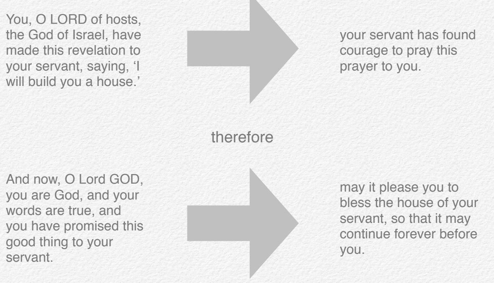

**bible study resources** 

# **2 Samuel**

**© St Helen's, Bishopsgate. All rights reserved**

# **Copyright**

#### © St Helen's Bishopsgate, 2016

All rights reserved. Except as may be permitted by the Copyrights Act, no part of this publication may be reproduced in any form, or by any means, without prior permission from the publisher.

The publisher welcomes churches wishing to use these notes for their own Bible studies, and encourages them to make contact with St Helen's Church (details below).

Published by St Helen's Bishopsgate

All Scripture quotations are taken from The Holy Bible, English Standard Version® (ESV®) Copyright © 2001 by Crossway Bibles, a division of Good News Publishers. All rights reserved worldwide.

**i**

Cover design by Apple Inc. Typeset by Peter Hedditch

Published in the United Kingdom

St Helen's Church, Great St Helen's, London EC3A 6AT Website: [www.st-helens.org.uk](http://www.st-helens.org.uk)

# **The King is Dead**

**1 2 Samuel 1**

# **The King is Dead**

#### **Structure in 2 Samuel**

- **1:1–16! ! Reaction to the death of Saul in Prose**
- **1:17–27!! Reaction to the death of Saul in Poetry**

## **Text notes**

#### **Verses 1–16**

Because 2 Samuel is narrative, we want to try to be sensitive not only to the point of the story, but also to *how the story is being told*. In particular that means looking out for the surprises or turning points, and the conflicts and resolutions that make up the plot.

In 1:1–16 an Amalekite announces to David that Saul and Jonathan have fallen in battle. David mourns. The Amalekite is executed. Those are the bare facts. But if we pay attention to the narrative shape, there is a real twist at v. 11. In vv. 1–10, the death of Saul is portrayed by the Amalekite as good news, and he perhaps expects some reward for delivering it. From v. 11 onwards we discover that it is grievous news, and the reward received is execution!

So let's read vv. 1–10 as though we don't know the twist in the story. Our narrator is the Amalekite, and we see only what he tells us.

Notice in particular:

- ✦ He sucks up to David as the king elect, presumably hoping to receive honours from him when he comes to power
	- ✴ 'he fell to the ground and paid homage' (v. 2)
	- ✴ '"I took the crown that was on his head … and I have brought them here to *my lord*"' (v. 10b)
- ✦ He describes his part in Saul's death in a way that emphasises that he did the noble thing as a loyal subject not as an Amalekite enemy
	- ✴ I was asked to do it (vv. 7–9)
	- ✴ '"because I was sure he could not live after he had fallen"' (v. 10a)

So he's hoping that David will greet the news positively.

Then comes the twist. David greets the news very negatively, which we see in two ways. First, David mourns (vv. 11–12). Again the details help us. There is the tearing of clothes, and three verbs where one would suffice: 'they mourned and wept and fasted' (v. 12a).

Secondly, David orders that the Amalekite be executed (vv. 13– 16). This prompts the question of what the Amalekite has done wrong.

- ✦ Some (e.g. Dale Ralph Davis) suggest that part of his guilt stems from the fact he is lying: if we compare his account of what happened in 1:6–10 with the narrator's account in 1 Samuel 31 then the two don't match up (and the discrepancies seem too great to try to harmonise as complimentary perspectives). We might then apply this lesson in terms of the danger of trying to lie to God, everything being found out in the end, etc.
- ✦ The text seems to focus our attention elsewhere however. Notice that the execution in v. 15 is sandwiched between two descriptions of his crime
	- ✴ '"How is it you were not afraid to put out your hand to destroy the LORD's anointed?"' (v. 14)
	- ✴ '"your own mouth has testified against you, saying, 'I have killed the LORD's anointed"' (v. 16; notice that this second description answers a possible objection that, if lying, he hasn't actually killed anyone; it's enough that his mouth testified that he did).
- ✦ The wrongness of laying a hand on the LORD's anointed continues what was a major theme in the final chapters of 1 Samuel, see 24:6, 10; 26:9, 11, 16, 23. It's worth actually reading this out loud in the study, because context is so important.

So both David's grief and the Amalekite's execution underline that the death of the LORD's anointed is a grievous thing. That seems to be the main point of the prose section.

#### **Verses 17-27**

In the poetry section, the main point is the same. It is a grievous thing that the LORD's anointed has died – see the threefold refrain "How the mighty have fallen" (vv. 19, 25, 27). There are two other sub-themes that we need to relate to this.

First, David is concerned that this news gives no occasion to the Philistines to gloat over Israel (v. 20). When Goliath, the warrior from Gath, was defeated by David, the daughters of Israel had rejoiced (see 1 Samuel 18:6–7). Now David is anxious that his enemies don't get a turn to do likewise, and even calls for a drought on Gilboa, the place where Saul fell.

Secondly, there are repeated references to Jonathan. Clearly he was someone whom David loved very much (vv. 26–27). It is a sad reflection on our over-sexualised society that many have tried to read homosexual overtones into v. 26, as though friend love were a category unknown to us. It is described beautifully, but not homoerotically in 1 Samuel 18:1–4 and 1 Samuel 20.

But the most surprising reference to Jonathan in this lament comes in v. 23. It is his solidarity with Saul, the LORD's anointed, at whose side he died, that is emphasised.

In some ways then, Jonathan, in the poetry section has becomes the foil to the Amalekite in the prose section. One was faithful to the LORD's anointed. The other dishonours him.

Two final bits of trivia: First, v. 18 reads literally that 'the Bow should be taught to the people of Judah' – that is probably the title of David's lament as it came to be known. Secondly, v. 19 could be translated 'Your gazelle, O Israel, is slain…' and might therefore be a reference to Jonathan. Neither of these details is important to the main thrust of the text, and we mention them here for completeness only. Avoid red herrings about gazelles!

# **Message in the context of 1–2 Samuel**

Saul was a mixed character, and over the course of 1 Samuel we've explored many of his shortcomings. But here in 2 Samuel 1 we see him primarily in relation to his office, as the LORD's anointed. His death will soon precipitate the rise of David to power. But before any of that the author wants to underline this: *The death of the LORD's anointed is a grievous thing. In death he should be honoured.*

## **Message for New Covenant believers**

The most straightforward line to draw through to today is from *Saul as the LORD's anointed* to Jesus the Christ ('Christ'

meaning 'anointed'). Much of what the chapter teaches applies to him, namely:

- ✦ To scorn his death is an evil thing (Does the Amalekite prefigure Judas Iscariot? And others who have opposed Christ down through the ages?)
- ✦ To honour his death is a blessed thing (Does Jonathan prefigure the Christian martyrs? And others who have honoured Christ down through the ages?)
- ✦ God's reputation among the nations is bound up with his victory.

# **Suggested preparation**

- 1) Pray for the members of your group. Pray that you would relate to one another 'with all humility and gentleness, with patience, bearing with one another in love' (Ephesians 4:2).
- 2) Pray for your group's study in 2 Samuel 1, that you would all hear God's voice clearly and respond in obedience.
- 3) Read 2 Samuel 1 at least twice, on different days. Or read it once and then listen to an audiobook of it. Or read it in two different English translations. Or read it once in English and once in another language, if you speak more than one. The best way you can prepare for the study is to become as familiar with the text as possible.

And finally, a couple of questions on the text. The aim is not to steal too much thunder from the study itself, but simply to help you find your way around the passage.

- 4) Look first at the prose section (vv. 1–16). In what ways is v. 11 a turning point or twist in the plot?
- 5) Look at the poetry section (vv. 17–27). Can you find the repeated refrain? How does the rest of the lament relate to this?

# **The Kingdom is Secured**

# **The Kingdom is Secured**

#### **Structure in 2 Samuel**

- **2:1–7 David king over one tribe at Hebron**
	- **2:8–11 Ish-bosheth arises as David's rival**
		- **2:12 3:5 Civil war; Abner kills Asahel**
		- **3:6**–**39! ! Civil war; Joab kills Abner**
	- **4:1**–**12 Ish-bosheth killed; David now unrivalled**
- **5:1**–**5 David king over 12 tribes at Jerusalem**

## **Text notes**

Real history is messier than fairy tales. Instead of a single plotline with one hero and one baddie, we get a whole cast of characters; motives are mixed; actions can be morally ambiguous; multiple storylines interweave. 2 Samuel 2:1 – 5:5 is real history.

The danger is that we try to discern a meaning in each little incident, which, because the author is not guiding us with theological commentary at this level of detail, results in speculation. We aren't always told if a particular character is good or bad, or whether his action was right or wrong; it may often be a mixture of the two, and too convoluted a mixture for us to untangle!

There are places, of course, where the author gives us big pointers to his meaning, particularly with respect to the *overall shape and purpose* of the section. The best approach is to focus on what the author has made clear, and leave messy what he has left messy!

So what are the big pointers to the author's meaning? In this case, the biggest clue comes from the structure tool: the section is arranged carefully as a chiasm (a multi-layered sandwich). Sometimes people have been taught that the main point of a chiasm always comes in the middle. Actually that is

often not the case. Rather, an author might use this literary device simply to show that a story turns a corner, that we end somewhere different to where we started because of some thing (or things) that change in between.

Let's consider the beginning and the end of our section. In 2:1–11, David has been anointed king, but only over the house of Judah (1:4). A rival quickly arises from the house of the former king, Saul. Despite attempts at positive relations with Saul's supporters (vv. 4b–7), Abner (commander of Saul's army) crowns Ish-bosheth (Saul's son), king over the rest of the country (vv. 8–9).

Thus right at the start of the section, David's rule is partial and precarious. Contrast this with the picture in 5:1–5, using the repetition tool: "Then all the tribes of Israel came to David …

So all the elders of Israel came to the king … he reigned over all Israel and Judah for thirty-three years." David is now the unrivalled king over all 12 tribes.

So the section as a whole takes us from a fragile and contested kingdom to a united and secure kingdom. The chiastic structure indicates that the story in between turns a corner. As we look at all the complex goings-on in between, we want to be asking how. How do we get from a fragile kingdom to a secure kingdom? We can unashamedly focus on those aspects of the text that speak to this.

As we seek to answer that question, we will find that the author emphasises two elements. First that God is at work, fulfilling his promises; secondly that human beings do things their own way, shedding blood in a way that (the author shows us) is ugly and wrong.

How are we to combine these two perspectives of God's faithful promise-keeping and often-tragic human means? The author doesn't specify how they fit, but simply juxtaposes them throughout. We thought the best description of their interrelationship was 'despite and through'. God works *despite* tragic human means. God works even *through* tragic human means.

| Scene         | Signs that God is at work to establish the kingdom under David                                                                                                                                                                                                                                                                                                                                                                                                                                  | Signs that humans are doing things their own way: three deaths that the author highlights as ugly and wrong                                                      |  |
|---------------|----------------------------------------------------------------------------------------------------------------------------------------------------------------------------------------------------------------------------------------------------------------------------------------------------------------------------------------------------------------------------------------------------------------------------------------------------------------------------------------------------|------------------------------------------------------------------------------------------------------------------------------------------------------------------------------|--|
| 2:1–11        | The LORD instructs David to go up to Hebron (v. 1)                                                                                                                                                                                                                                                                                                                                                                                                                                              |                                                                                                                                                                              |  |
| 2:12 – 3:5 | In the civil war, the house of David prevails over the house of Saul (e.g. 3:1). The LORD isn't explicitly mentioned, but it seems fair to discern his hand given what we learn from Abner in the next scene…                                                                                                                                                                                                                                                                       | Death of Asahel. The author highlights the tragedy of it in 2:23b: 'all who came to the place where Asahel had fallen and died, stood still'. See also v. 26. |  |
| 3:6–39        | Whatever his self-serving motives, Abner gives us all the correct theology, testifying that the LORD had 'sworn' to David 'to transfer the kingdom from the house of Saul and set up the throne of David over Israel and over Judah from Dan to Beersheba' (3:9–10) and 'the LORD has promised David, saying, "By the hand of my servant David I will save my people Israel from the hand of the Philistines, and from the hand of all their enemies"' (3:18). | Death of Abner. The author highlights the tragedy of it with an extended focus on David's grief (3:31–39).                                                          |  |
| 4:1–12        | David's reaction to the death of his rival, Ish-bosheth, is to comment that 'the LORD … has redeemed my life out of every adversity' (4:9b).                                                                                                                                                                                                                                                                                                                                              | Death of Ish-bosheth. The author highlights the tragedy of it by the flashback in v. 10 (context tool) to the fate of the Amalekite in 1:15                      |  |
| 5:1–5         | We've arrived at a united and secure kingdom!                                                                                                                                                                                                                                                                                                                                                                                                                                                   |                                                                                                                                                                              |  |

# **Message in the context of 1–2 Samuel**

God is at work to establish David's kingdom, bringing security (his rivals are eliminated) and unity (all twelve tribes recognise him). He does this despite and through human means, which are often ugly, violent and messy.

# **Message for New Covenant believers**

The most straightforward line to draw through to today is from David's kingdom to the kingdom of Jesus. While the 'despite and through' perspective could speak to the cross (e.g. Acts 2:23) it seems better to focus on the period after Jesus' resurrection, when he has been crowned (e.g. Romans 1:4) as David had been (2 Samuel 2:4), but before his final return, when his kingdom will be universal and unrivalled.

In other words, it speaks to our experience of Jesus' kingdom now. Some humans oppose it. Other humans try to establish it in both godly and ungodly ways. Yet 'despite and through' human actions, God will build his kingdom. It cannot fail.

## **Suggested preparation**

- 1) Pray for the members of your group. Pray that you would fulfil Jesus' 'new commandment', and that just as he loved us, we would love one another (John 13:34).
- 2) Pray for your group's study in 2 Samuel 2:1 5:5, that you would all hear God's voice clearly, and respond in obedience.
- 3) Read 2 Samuel 2:1 5:5 at least twice, on different days. Or read it once and then listen to an audiobook of it. Or read it in two different English translations. Or read it once in English and once in another language, if you speak more than one. The best way you can prepare for the study is to become as familiar with the text as possible.

And finally, a couple of questions on the text. The aim is not to steal too much thunder from the study itself, but simply to help you find your way around the passage.

- 4) Compare the start of the section (2:1–11) with the end (5:1–5). How would you describe the change?
- 5) How do the intervening scenes of the narrative show us how this change came about?

# **The City of David and the Ark of God**

**3 2 Samuel 5:6 – 6:23**

# **The City of David and the Ark of God**

#### **Structure in 2 Samuel**

- **5:6–16 The LORD establishes David in Jerusalem**
- **5:17–25 The LORD grants David victory over the Philistines**
- **6:1–23 The LORD comes to dwell in Jerusalem**

# **Structure**

The structure tool works at different levels. It's a bit like Google Maps, when you zoom in and zoom out, and you see different amounts of detail, depending on your level of magnification. If we have the whole of 2 Samuel in view, then we'll see the three big sections:

| Chapters 1–8:## | The Rise of David |
|-----------------|-------------------|
| Chapters 9–20:  | The Fall of David |
| Chapters 21–24: | Epilogue          |

At this level of zoom we can make out the big structural markers, namely the two big summaries that come at 8:15–18 and 20:23–26. But just as a map of the UK will show you the outline of Greater London but not the location of Islington, we can't make sense of every detail at this scale.

Zoom in a bit, though, and we start to see more. It would be like swapping your UK map with a map of London, where the individual boroughs – Camden, Islington, Hackney etc. become visible.

Thus our first section, chapters 1–8, can be further subdivided:

1:1–27 # # The Death of Saul

- 2:1 5:5## The kingdom of David is secured (this section is clearly defined by a chiasm)
- 5:6 8:18 The kingdom of David is established for ever

Zoom in further still, and armed with a street map of Islington you can easily make out Upper Street and the Regent Canal. In 2 Samuel terms, this was the level of zoom that revealed last week's chiasm. And for 5:6 – 8:18 it might reveal a substructure something like this:

- 5:6–16 The LORD establishes David in Jerusalem
- 5:17–25 The LORD grants David victory over the Philistines
- 6:1–23 The LORD comes to dwell in Jerusalem
- 7:1–29 The LORD promises to establish David's house forever
- 8:1–18 The LORD grants David victory over many enemies

In this study we are going to take the first three of these subsections, which is a bit arbitrary – it just seemed about as much as we could handle on one Central Focus evening. But don't look for closure. We will need to keep this week and next week together in our mind.

# **Text notes**

#### **5:6**–**16**

The main point of these verses is also one of the easiest to find: 'David became greater and greater, for the LORD, the God of hosts, was with him' (v. 10) or again, 'David knew that the LORD had established him king over Israel, and that he had exalted his kingdom for the sake of his people Israel' (v. 12).

This blessing from God is seen in two ways. First, David conquers the 'stronghold of Zion' (vv. 6–9), which had seemed so impenetrable to its Jebusite residents that they taunted him, saying that even the blind and lame could defend it. They were wrong. David's army enters the city through the water supply tunnel (which is preserved even today – a nice example of archaeology corroborating biblical history). Secondly, David has many sons and daughters (vv. 13–16).

Users of the quotation/allusion tool may pounce on v. 13, 'David took more concubines and wives' as an ominous reference to Deuteronomy 17:17, where the king is forbidden

from taking many wives. Although valid, it's not a detail that the author underlines; compare 1 Kings 11:1–8 to see how unsubtly the author can make this point when he really wants to! The overall portrait of David in this section is a positive one, and we want our study to reflect the proportion and emphasis of the text – see again v. 10 and v. 12.

#### **5:17-25**

In this section the LORD is again at work, granting David success in battle against his age-old enemies, the Philistines. The repetition tool draws attention to David's dependence on God, because in two separate battles he 'enquired of the LORD' (vv. 19, 23). The fact that different advice must be followed to achieve victory in each case ('go up' and 'you shall not go up' respectively) emphasises that God's involvement was decisive for the outcome.

The tone and feel tool reminds us to pause on the poetic details that add colour to this message – for example the vivid image of the LORD bursting through David's enemies 'like a bursting flood' (v. 20).

#### **6:1–15**

Chapter 6 is all about the ark of God coming to Jerusalem. It is introduced in v. 2 as 'the ark of God, which is called by the name of the LORD of hosts, who sits enthroned on the cherubim', which is the author's way of reminding us that this is a very big deal! It represents the presence of God with his people.

Although last year's Central Focusers will enjoy reminiscing about the ark slaying Dagon and the Philistines breaking out in tumours, there is enough here within 2 Samuel 6 to teach us the author's purpose (i.e. we recommend that you confine yourself to this chapter). Even at the level of subsections, we haven't finished with the structure tool, and we can subdivide the material into two scenes. Both use a negative example to make a positive point:

6:1–15 The death of Uzzah: the presence of God is a fearful thing

#### 6:16–23 The scorn of Michal: the presence of God is a joyful thing

Let's take Uzzah first. Because of irreverence towards the ark, 'the anger of the LORD was kindled against Uzzah, and God struck him down there' (v. 7). The place name, 'Perez Uzzah', literally 'bursting forth upon Uzzah' (ESV footnote) recalls God's bursting forth against the Philistines in 5:20, context tool. God's presence, which was such a danger to his enemies, can also be a danger to his people if they do not respect him.

We must avoid the temptation to apologise for God's actions here, or to relegate this alarming episode to a safely distant old covenant era. The striking down of Ananias and Sapphira in Acts 5 and the unashamed references in the New Testament to God's wrath make clear that God has not changed since 2 Samuel 6. More helpfully we can look at how Uzzah's death functions within the chapter. We are told that David was 'afraid of the LORD that day' (v. 9) and the fear of the LORD is *always* a positive thing (e.g. Exodus 20:20; Psalm 34:11; Proverbs 1:7; Luke 12:4–5; 1 Peter 1:17; 2:17; Revelation 14:7). In place of his slapdash, laissez-faire attitude, we read of sacrifices every six steps (v. 13) and dancing before the LORD 'with all his might' (v. 14). Worship of the LORD has become altogether a more earnest and sincere affair.

Then we turn to Michal and the point is similar. She 'despised' David 'in her heart' (v. 16) because of what she perceived as an undignified and excessive display of exuberance in his dancing before the LORD ('How British she seems', someone helpfully commented). For this attitude she is rewarded with childlessness (v. 23). But again, like Uzzah, Michal's negative example serves to teach a positive: the LORD is worthy of all praise, and no attempt to honour him could be too extravagant

(one thinks of the woman with the alabaster jar of nard in the gospels).

### **Message in the context of 1–2 Samuel**

In 5:6 – 6:23 we see God's king established in Jerusalem, granted victory over his most notorious historic enemy, the Philistines, and blessed by the presence of God. As we continue to read to the end of the section (through chapters 7–8) we see God making extraordinary covenant promises to David and giving him further victories on every side. If we were forced to summarise all this in a single sentence, we might say that God is acting to establish his king and his kingdom forever.

However in chapter 6, there is a particular focus on the presence of God with his people. Through the negative actions of Uzzah and Michal, we learn that to serve him ought to be both a fearful and an exuberantly joyful thing.

## **Message for New Covenant believers**

In the last study, we drew a line from David's kingdom to the kingdom of Jesus. That trajectory serves well for the present section also, and particularly as we seek to apply chapter 5.

But the other big line of application must be our attitude to the presence of God among us. Do we 'fear him' in a sacrifices-every-six-steps kind of way? Are we exuberantly

joyful before him, in such a way that would invite scorn from unbelievers looking on?

In the New Testament we don't have the ark any more, nor is London the equivalent of Jerusalem ('And did those feet in ancient time …' no they didn't!) and so we can't apply this directly in terms of religious objects that we mustn't touch, or the amount of dancing that we should introduce to the 10:30am service. Moreover, worship in the New Testament (as, actually, in the Old Testament!) is an expansive category that embraces not just what we do 'in church' but the whole of life.

And yet the principle that carries over is the holiness of God, and the fearsomeness and joyfulness of knowing him. Do we tremble at the thought of displeasing him by our sin, or are we a bit slapdash and laissez-faire? Do we rejoice at knowing him, in a way that our colleagues and neighbours might actually notice and disapprove of? (Do we even speak of him enough for them to notice, let alone dance?) And while worship means *more* than what we do in church meetings, it doesn't mean less, so is there fear and joy in our heart as we gather under his word on Sundays?

# **Suggested preparation**

- 1) Pray for the members of your group. Pray that you would sharpen one another 'as iron sharpens iron' (Proverbs 27:17).
- 2) Pray for your group's study in 5:6 6:23, that you would all hear God's voice clearly and respond in obedience.
- 3) Read 2 Samuel 5:6 6:23 at least twice, on different days. Or read it once and then listen to an audiobook of it. Or read it in two different English translations. Or read it once in English and once in another language, if you speak more than one. The best way you can prepare for the study is to become as familiar with the text as possible.

And finally, a couple of questions on the text. The aim is not to steal too much thunder from the study itself, but simply to help you find your way around the passage.

- 4) In what different ways does the author make clear that God is at work to establish David's kingdom in 5:6–25?
- 5) How does the author use the two negative characters (Uzzah and Michal) in chapter 6 to teach us positive lessons about the presence of God?

# **The Eternal Kingdom**

# **The Eternal Kingdom**

#### **Structure in 2 Samuel**

- **7:1–7! ! David (wrongly) wants to build a house for God**
- **7:8–17! ! God wants to build a house for David**
- **7:18–29!! David prays in response to God's !!! promise**
- **8:1–14! ! Events unfold according to God's !!! promise**
- **8:15–18!! AUTHOR'S CLOSING SUMMARY OF THE FIRST SECTION OF HIS BOOK**

# **Text notes**

#### **7:1**–**7**

At first glance, verses 1–3 seem to express the noble desire of a godly king to honour the God who has been so good to him (with the blessing of his theological advisor). David is uncomfortable living in the luxury of his new palace while the ark of God is in a tent. Now having considerable resources at his disposal, he decides to take the initiative to bless God by doing something about God's accommodation situation.

In a couple of closely related ways the text signals that something is wrong.

Note first the dramatic U-turn by Nathan the prophet when the word of God actually comes to him in v. 4. Why, one wonders, was he rubber-stamping David's intention in v. 3 *before* actually having heard God's opinion on the matter?!

Secondly, there is an escalation in vv. 5–7 of reasons why building the temple is the wrong thing to do. It begins with a question (v. 5) – 'Are you sure you're going to build this house?' – then the glaring lack of historical precedent (v. 6) – 'I've never needed a house before' - and finally (and climactically) the revelation that God did not commission it (v. 7) – 'Did I ever speak a word instructing anyone to do this?'

The point is simple. This initiative of David's runs contrary to God's revealed word. It's not what God said should happen. It's not what God wants to happen. In the relationship between God and man, he is always the giver.

To try to pay him back, worse still to suggest that he is lacking in something, is patronising. It smacks of paganism even, whose adherents are always rushing around to do favours for gods who aren't able to look after themselves.

#### **7:8–17**

Using the structure tool, we notice that the author subdivides Nathan's speech using variants on the phrase 'The LORD says…' (v. 5, v. 8, v. 11b) and so we'll take the remainder of the speech in two halves: vv. 8–11a and v. 11b–17.

In vv. 8–11a, the repetition tool reveals an emphasis on God's activity: 'I took you … I have been with you and have cut off … I will make for you … I will appoint … I will give you rest.' As part of the continuing corrective, God reasserts the direction in which grace always flows: from God to man.

The quotation/allusion tool discerns echoes of God's past promises:

| 'I will make for you a great name' (v. 9)             | 'And I will make of you a great nation, and I will bless you and make your name great' (Genesis 12:2)                                                                                                                       |
|----------------------------------------------------------|--------------------------------------------------------------------------------------------------------------------------------------------------------------------------------------------------------------------------------------|
| 'I will appoint a place for my people Israel' (v. 10) | 'To your offspring I will give this land, from the river of Egypt to the great river, the river Euphrates' (Genesis 15:18). 'Every place on which the sole of your foot treads shall be yours' (Deuteronomy 11:24) |
| I will give you rest from all your enemies' (v. 11)   | 'And the LORD gave them rest on every side just as he had sworn to their fathers' (Joshua 21:44)                                                                                                                               |

But in vv. 11b–17 a radically new promise is made: the LORD will establish David's house forever. Both the 'house' and the 'forever' are significant.

The vocabulary tool carries the motto 'Bible words have Bible meanings', and as we infer the meaning of 'house' from the context we realise that it is used in two distinct ways (fortunately the pun works in English as well as in Hebrew) – for the temple that God doesn't want David to build for him (v. 5) and for the dynasty that God does want to build for David (v. 11b, v. 16). Thus this wordplay again reiterates that God is the one who blessed David and not vice versa.

As for the 'forever', it comes three times (v. 13, v. 16 twice) in relation to the 'throne' and 'house' and 'kingdom'. Notice that it doesn't say that any particular *king* will live forever, and attempts to argue that v. 13 can't be about Solomon (who is otherwise a very good fit for vv. 13–15) on the grounds that he is not eternal, fall down when we read v. 16, which are addressed to David, who isn't eternal either.

What the promise does say is that the *kingdom* will be eternal. This could be fulfilled by an unbroken succession of rulers who sit on the throne (which is what we see in the rest of the Old Testament). Or, of course, it could be fulfilled by a succession of kings leading up to a king who will never be succeeded because he lives forever. But at this stage in the Bible story we don't necessarily anticipate that!

To summarise where we've got to, God doesn't need David to bless him. Rather he blesses David with an eternal dynasty.

#### **7:18–29**

There is enough material in David's prayer for a Bible study to itself! But its contribution to the wider section is to give us, through David's eyes, a sense of astonishment at what God has promised. The tone and feel tool reminds us to pay attention not only to what is being said but also to how.

In this case, the author could have captured the substance of David's prayer in a few words – 'God you are amazing. Thanks for promising me a house. Please fulfil your promise'. But instead we get eleven verses of overflowing praise, amazement, more praise, more amazement. Then the linking words tool reveals the logic behind David's prayer:

In other words, David is asking for things *because God has promised them!* What a contrast to vv. 1–3! Although the prayer doesn't apply to us quite as directly as it does to David, the author seems to hold up his response as exemplary.

#### **8:1–14**

As we read of David's various military successes, we are surely right to interpret this as the beginning of the fulfilment of what God had just promised: the king's name is renowned (v. 13, context tool 7:9) and 'the LORD gave victory to David wherever he went' (repetition tool, v. 6, v. 14).

# **Message in the context of 1–2 Samuel**

Throughout this section we have seen an emphasis on grace that flows from God to man. We must not attempt to reverse it. We've also seen a new element in the establishment of David's kingdom: his 'house' will endure *forever*.

### **Message for New Covenant believers**

There are two trajectories we can follow in applying these chapters. First, God is the same and human nature is the same. He is always gracious, he is always the initiative taker, he never seeks to be repaid. To realise this brings humility and wonder, as David exemplifies for us.

And indeed his prayer is one that we can use, an expansion on Jesus' familiar shorthand, 'Your kingdom come' (we suggest you encourage people to use phrases from David's prayer as we pray at the end of the evening).

Secondly, there is the promise of the eternal kingdom. The temptation is to jump too quickly to Jesus here, as though 7:12–15 were about him directly. In fact they refer to Solomon in the first instance, and then to the succession of kings in his line.

But this is a line that eventually reaches 'Eliud the father of Eleazar, and Eleazar the father of Matthan, and Matthan the father of Jacob, and Jacob the father of Joseph the husband of Mary, of whom Jesus was born, who is called Christ' (Matthew 1:15–16).

It matters that Jesus comes in this family, and comes to inherit these promises. And in his case there will be no successor, for not only is he (like David and Solomon) king of an eternal kingdom, but (unlike them) he is an eternal king.

# **Suggested preparation**

By now you'll hopefully be getting into a pattern of preparation. Please spend part of your time in prayer for your group and reading through 2 Samuel 7–8 several times. For the remainder of your time, here are a few questions to be thinking about:

- 1) What hints are there in the passage as a whole that David doesn't quite start off on the right foot in 7:1–3?
- 2) Which of the promises that the LORD makes to David do you recognise from previously in the Bible story? Which are radically new?
- 3) How is David's prayer a fitting response to what God has said?

# **The Loving Kindness of God**

**5 2 Samuel 9:1 – 10:19**

# **The Loving Kindness of God**

#### **Structure in 2 Samuel**

- **9:1–13 Loving kindness shown to Mephibosheth and accepted**
- **10:1–19 Loving kindness shown to Hanun and rejected**

# **Text notes**

On first reading, these two chapters seem to be about very different things – one is about grace shown to a paraplegic, the other about a massive battle. But the two are united by the Hebrew word *hesed*, which comes in 9:1, 3, 7 and 10:2 (twice). Unfortunately the ESV doesn't translate it consistently, so we miss the link (though the footnote on 10:2 helps).

The word means 'covenant loyalty' or 'steadfast love' or 'kindness' or in the old King James Version, 'loving kindness' (which we rather like). It's a significant word in the Bible generally, most often referring to God's character (see e.g. Exodus 34:6; Ruth 2:20; 2 Samuel 22:51; half the Psalter!) In chapter 9, *hesed* is received; in chapter 10 it is rejected; the outcomes could not be more different.

#### **9:1–13**

In various ways, the chapter showcases the beauty of the '*hesed* of God' (9:3) as Mephibosheth receives it:

The structure tool unearths a chiasm, which hinges around David's promise to show *hesed*. The trick with chiasms (like other structural devices) in not merely to notice them, but to ask why the author is using them. Chiasms serve to highlight that a

narrative has turned a corner, and in this case shows the radical change of fortunes for Mephibosheth:

David's intention to show *hesed* (v. 1) # # Conversation with Ziba (vv. 2–4) # # # 'Mephibosheth … paid homage … "I am your servant"' (vv. 5–6) # # # # David promises to show *hesed* (v. 7) # # # Mephibosheth 'paid homage and said "What is your servant…"' (v. 8) # # Conversation with Ziba (vv. 9–11a) David welcomes Mephibosheth into his home (vv. 11b–13)

The repetition tool shows us that Mephibosheth's lineage is important to the author. He was 'of the house of Saul' (v. 1, v. 2, v. 3), the 'son of Saul' (v. 6); Saul was his 'father' (v. 7). The context tool reminds us that Saul was an enemy back in 1 Samuel, and even within the more recent history of 2 Samuel, his offspring have been less than favourable towards David (e.g. Ish-bosheth chs. 2–4; Michal in ch. 6).

This shows us that *hesed* is gracious and undeserved. At the same time, the text reminds us that David is keen to show kindness 'for the sake of Jonathan' (v. 1, v. 7) and that Mephibosheth was a 'son of Jonathan' (v. 3, v. 6). The context tool reminds us of the covenant that David made with Jonathan back in 1 Samuel 20, and so we see that *hesed* includes an aspect of promise-keeping faithfulness.

(The theme of faithfulness to Jonathan doesn't trump the idea of undeserved grace to Saul, because in v. 1 David is prepared to show kindness to anyone of Saul's house, not Jonathan's family only).

The repetition tool underlines the intimacy of fellowship that David shares with Mephibosheth: 'shall eat at my table always' (v. 7), 'shall always eat at my table' (v. 10), 'So Mephibosheth ate at David's table like one of the king's sons' (v. 11) 'he ate always at the king's table' (v. 13). *Hesed* is not limited to giving alms; it includes personal relationship.

Finally, the repetition tool emphasises Mephibosheth's lowly condition: 'he is crippled in his feet' (v. 3), 'he was lame in both his feet' (v. 13, as the punch line that rounds off the episode). In that time, a physical disability would much more likely render you a victim of exploitation than a recipient of blessing. The context tool reminds us of Hannah's prayer in 1 Samuel 2:

[The LORD] raises up the poor from the dust; # # he lifts the needy from the ash heap to make them sit with princes # # and inherit a seat of honour.

In summary then, we have seen a beautiful picture of God's *hesed*, shown by David to Mephibosheth (who humbly receives it). It is life-changing, undeserved, faithful to promises, and personal.

#### **10:1-19**

*Hesed* comes right at the beginning of this chapter (v. 2), but most of the verses are there to show us the horror of its rejection. By shaving off half of their beards and cutting a hole in their garments to leave their backsides exposed, Hanun deliberately shames David's servants and thereby became 'a stench to David' (v. 6). It's difficult to think of a more graphic way in which *hesed* could be thrown back in someone's face.

A massive battle ensues, the details of which serve to portray the scale of Hanun's defeat. The author twice gives us numbers: once at the start to show us the huge size of the army he has assembled (v. 6) and once at the end to show us the huge losses he has suffered (v. 18).

In light of Joab's sentiment, 'may the LORD do what seems good to him' (v. 12), we may infer that it seems good to the LORD to utterly crush those who spurn his *hesed*.

### **Message in the context of 1–2 Samuel**

It's very, very tempting to take chapters 9–10 as a self-contained unit, floating free from its context. As such, the message would be simple: God's *hesed* is a beautiful thing: life-changing, undeserved, faithful to promises and personal. To receive *hesed* brings wonderful blessings. To throw it back in

God's face brings calamity. It's eminently preachable this way, and who wouldn't love to lead a study along such lines?

However, we always need to be asking what the author intended. What was his purpose in including these chapters, and (significantly) why did he put them *here?* How do they fit within the book as a whole?

Thinking back to our overview of the book, you will remember that the first two sections end with an almost-identical summary. Thus chapters 1–8, on the Rise of David, conclude with 8:15–18; Chapters 9–20, on the Fall of David, conclude with 20:23–26. Here's the surprise: our chapters come *after* the summary of David's rise; if the author intended them merely as a demonstration of David's God-like *hesed*, it would have been the easiest thing in the world for him to have moved his summary two chapters later. Instead, he places them after the summary, apparently to commence the section on David's fall.

How does this work though, if David's actual fall doesn't come until chapter 11? It seems that these *hesed* chapters act as a backdrop against which we might more clearly see the horror of David's sin. (This perspective is strengthened when, subsequent to David's fall, the author returns to his relationship with Mephibosheth and Ziba to illustrate how things have changed for the worst, see 16:1–4; 19:24–30).

God has, of course, various ways to convict us of guilt: one is law, so that as we reflect on God's commandments, we realise where we have transgressed them. But another is grace, for as we see the beauty of a godly life, we see by contrast the ugliness of a sinful one. Light exposes darkness. And the *hesed* of chapters 9–10 will show us the un-*hesed* of what king David is about to do.

# **Message for New Covenant believers**

The message of 2 Samuel 9–10 *on its own* could easily be applied in terms of God's *hesed* shown to us in Christ, and how much our fortunes depend on whether we receive or reject his grace (e.g. John 3:36). As one commentator put it, 'we [Christians] are the Lord's Mephibosheths'.

But understanding the chapters in the light of 2 Samuel as a whole persuades us to give greater weight to another application: light exposes darkness. As we see the *hesed* of God expressed in the words and actions of his perfect king, Jesus, we are invited, against that backdrop, to see our own sinfulness and seek his mercy (e.g. John 3:19–21).

# **Suggested preparation**

By now you'll hopefully be getting into a pattern of preparation. Please spend part of your time in prayer for your group, and reading through 2 Samuel 9–10 several times. For the remainder of your time, here are a few questions to be thinking about:

- 1) The loving kindness of God (also translated 'kindness' or 'steadfast love') is an important theme in the Old Testament. Read Exodus 34:6; Ruth 2:20; 2 Samuel 22:51; Psalm 25 (and many other Psalms) to get a flavour.
- 2) How is this theme of steadfast love showcased in chapter 9? How is it rejected in chapter 10?
- 3) How do you think chapters 9–10 fit into 2 Samuel as a whole? (A harder question.)

# **The Fall of the King**

# **The Fall of the King**

**Structure in 2 Samuel**

- **11:1–27 David's sin and a successful(?) cover-up**
- **12:1–31 David's sin and God's response**

# **Text notes**

So far, 2 Samuel has been a happy book: victories in battle, faithfulness in leadership, fear of the LORD, rejoicing and dancing, *hesed* displayed. We've become accustomed to drawing parallels between David and the Lord Jesus, and we have repeatedly held him up as both the model believer and the model king. All that is about to change. In quick succession we will read of adultery and murder, hypocrisy, deceit, rape, civil war. The tone of the book will change dramatically, and so should the tone of our Bible studies. There will be fewer laughs in the second half of term.

One of the challenges of studying 11:1 – 12:31 is that the story is familiar. Paradoxically this can make our job harder, because we assume we know what it's about before listening to the text. But sometimes the popular version doesn't reflect the author's purpose. We will need to try to suspend previous ideas in order to see things freshly, and to ensure that we understand what is actually being said before we rush to apply it.

We also need to take care with cross-references. Psalm 51 and Romans 4:6–8 are important meditations on these chapters, but we don't want to study those passages at the expense of hearing 2 Samuel. As always, we would do well to let the author

speak on his own terms first, before we seek to integrate his message with the wider biblical picture.

#### **11:1–27**

Here's the first surprise: this is not a chapter primarily about the horrors of sexual sin. It's often treated that way, and various applications are drawn from the details of how David succumbed – the absence from duty, the lingering look, the misuse of power. The centre of gravity of the narrative lies elsewhere, however.

The issue that runs through the whole chapter is *whether sin can be covered up*. It is this that accounts for the overall shape of the narrative:

Problem raised (vv. 1–5) # # A failed solution (vv. 6–13) # # A successful solution (vv. 14–25) Problem resolved (vv. 26–27a)

It is striking the author waits until v. 27b to tell us that 'the thing that David had done displeased the LORD'. There has been no mention of God up to this point, and deliberately so. We are invited to view the action through David's eyes, who (though a believer) has forgotten God's existence, or at least *behaves as though* God did not exist.

In a functionally atheist worldview, sin is only a problem if you get caught by other people. David has a momentary scare: in a few months' time Bathsheba's pregnancy will be hard to cover up. And his problems seem to get worse when his attempts to cast Uriah as the plausible father fail. But then, albeit by drastic means, he succeeds in pulling off the ultimate cover-up. In a world with no God, his sin will never be discovered, never be punished. We might summarise chapter 11: Can sin be covered up? Yes.

David sees no reason that the news of Uriah's death need 'trouble' anyone (v. 25). But God is 'troubled' or 'displeased' (v. 27; the expression is identical in Hebrew). This changes everything …

#### **12:1–31**

If chapter 11 is atheistic in its outlook, chapter 12 is the opposite. God is in the driving seat, and as always in the Bible he drives by speaking (apologies for mixing metaphors!)

Battle with the Ammonites

Bathsheba falls pregnant (This structure exists alongside the Death of Uriah one given above for chapter 11 only. GOD SPEAKS It's not uncommon to find overlapping Death of David's son structures. We just need to make sure Bathsheba falls pregnant we understand how they are informed Battle with the Ammonites by the author's purpose in each case.) Indeed the intervention of God's word is the turning point, as indicated by a chiasm:

First God sends his prophet with a story about David's sin disguised as a story about a lamb. The failure of David's conscience to connect in any way only reiterates the point of the previous chapter – he thinks he's got away with it. Then comes a 'Thus says the LORD' introducing the second longest divine oracle in the book.

The first was in chapter 7, where God announced, through Nathan, his desire to bless David with an eternal dynasty. This one, also spoken through Nathan, announces God's terrible verdict on David's fall. Notice three motifs: the heinousness of sin, the severe judgment of God and the extraordinary grace of God.

The oracle begins by emphasising the heinousness of David's sin. Consider the reminder of God's blessings followed by a 'why?' (vv. 7–9a). This is sheer ingratitude. Consider the threefold repetition of David's crime (v. 9b). This is callous evil. David had thought that he had got away with it, but God saw – and was grieved by – every detail.

The oracle continues with the severe judgement of God (vv. 11–12). Notice that God will afflict David's 'house', which had previously been the focus of his blessing (context tool 7:11b). Notice that the shame will be public (repetition tool 'in the sight of this sun', 'before the sun'), as a fitting response to David's attempted cover-up.

We will see this judgement unfold over the chapters to come, but it begins with the death of David's son (vv. 15–23). David's almost matter-of-fact acceptance of the child's death, particularly given his fasting and weeping during his week-long illness, seems strange to us, as indeed it seemed strange to David's servants (v. 21), but indicates his resignation to the word of judgement that had been spoken against him.

The oracle continues with a note of amazing grace (v. 13). Under the law of God, adultery and murder were both capital crimes. And indeed David's reaction to the ewe lamb story had reiterated this point: 'As the LORD lives, the man who has done this deserves to die' (v. 5). Quite so. Yet God put away David's sin so that he would not die.

Like the judgement contained in the oracle, this note of grace works its way out in the following narrative. As well as the child that dies, David is given another son, Solomon, *whom the LORD loves* (don't miss the second word from Nathan the prophet, v. 25!). More grace.

The chapter ends with a battle. Battles in the Bible don't generally go well after someone sins, but on this occasion David comes home with a gold crown with a precious stone (v. 30) and other treasure besides. More grace.

# **Message in the context of 1–2 Samuel**

David thought sin could be covered up, because (extraordinary as it may seem) he had forgotten God. He acted as though God didn't see, and as if the only consequences that he needed worry about were human ones. But God did see, and was displeased, and spoke. He spoke to expose David's sin. He spoke to pronounce his severe judgment. He spoke to extend amazing grace.

David of course is the king of Israel. All of the hopes of the kingdom are bound up with him. And an unfaithful king threatens the kingdom. For the first time we are feeling unsettled about the future.

# **Message for New Covenant believers**

There are two ways we can go in application. One is to compare David to Jesus, as Messiahs. Hitherto they have had much in common, but now they diverge absolutely. David is unfaithful, he abuses his subjects, and he threatens the future of the kingdom. Jesus is never unfaithful. He never fails those who put their trust in him. In his hands the kingdom is safe.

The second path is from David to us, as sinners. How alike we are. How terrifyingly possible that even someone who has been a believer for years could behave as though God were not part

of the equation. How foolish to think that if only sin be covered up from the eyes of other people that it is covered up for good. No. God sees. He hates sin, and will punish sin. Our only hope can be his grace.

… David also speaks of the blessing of the one to whom God counts righteousness apart from works:

'Blessed are those whose lawless deeds are forgiven, and whose sins are covered; blessed is the man against whom the Lord will not count his sin.'

Romans 4:6–8 [ESV]

# **Suggested preparation**

Please spend part of your time in prayer for your group, and reading through 2 Samuel 11–12 several times. For the remainder of your time, here are a few questions to be thinking about:

- 1) Contrary to popular belief, 2 Samuel 11 is not first and foremost a chapter about adultery or murder or even about dereliction of duty. From David's perspective, what brings most angst and what brings most relief?
- 2) Why do you think the author waits until 11:27b before mentioning God?
- 3) What are the main themes in Nathan's oracle (12:7–14) and how do we see them worked out in the rest of the chapter?

# **'The Sword shall Never Depart'**

# **'The Sword shall Never Depart'**

#### **Structure in 2 Samuel**

| 13:1–22!! ! | Amnon and Tamar: Rape           |
|----------------|---------------------------------|
| 13:23–38! ! | Absalom and Amnon: Murder       |
| 13:39 – 14:33  | David and Absalom: Estrangement |

## **Text notes**

These are some of the most unpleasant chapters in the Old Testament. In a way we can be grateful that the Bible isn't full only of daffodils and spring lambs; it is not rose-tinted or naïve; it is not shy of describing, with grim realism, the depravity of which humans are capable. Yet, even so, it does not indulge gratuitously in gory details, like a Tarantino film. It presents evil simply and honestly and tragically.

#### **13:1–38**

We will treat the first two sections together. Amnon rapes his sister Tamar. Her brother Absalom avenges her by murdering Amnon. It's a horrible mess.

The author gives no theological commentary within the chapter. It is the context tool that helps us most, because there are strong connections to what has gone before. Consider first the ugly similarities between David's actions and the actions of his sons:

**Chapter 11 Chapter 13** David commits adultery Amnon commits rape David murders Uriah (in a cowardly manner, through a third party)

Absalom murders Amnon (in a cowardly manner, through a third party)

Consider secondly the specific words of judgment that God spoke in 12:10, beginning to be fulfilled: 'now therefore the sword shall never depart from your house'.

Thus the context shows us that the events of chapter 13 reflect both David's crime and its punishment. As he narrates the horrific details, the author wants us to learn the lesson that sin brings disaster into human lives, and so be repulsed by it.

There's not much more to say in terms of the meaning of the passage (and it's a mistake to read in extra meanings where the author gives no clear steer). What we have instead is lots of details that make the story three-dimensional, and real, and personal, and heart-wrenching. The best way to approach it is to use the tone and feel tool to discern how the text rubs our noses in the sinfulness of sin and its devastating effects. Here are a few examples:

'No, my brother, do not violate me, for such a thing is not done in Israel; do not do this outrageous thing.' (v. 12)

Amnon hated her with very great hatred, so that the hatred with which he hated her was greater than the love with which he had loved her. (v. 15)

And Tamar put ashes on her head and tore the long robe that she wore. And she laid her hand on her head and went away, crying aloud as she went. (v. 19)

'… "Strike Amnon", then kill him. Do not fear; have I not commanded you? Be courageous and be valiant."' (v. 28)

'And as soon as he had finished speaking, behold, the king's sons came and lifted up their voice and wept. And the king also and all his servants wept very bitterly.' (v. 36)

#### **13:39 – 14:33**

On the surface, this is a chapter about David's relationship with Absalom. It begins with Absalom in exile, estranged from the king. Then (thanks to Joab and his assistant, the woman of Tekoa) David consents to allow Absalom back to Jerusalem, though not into his father's presence. Then (thanks to a field of barley and a packet of matches) David finally meets his son.

We might diagram it as follows:

Agency of Joab and Woman of Tekoa

In Jerusalem but not on speaking terms for two years (14:28)

Agency of Absalom

In David's presence (14:33b)

Some read the chapter through the lens of David's failure, as king, to bring justice. Absalom was a murderer and should have been punished. On this view, the move from left to right on the diagram represents moral compromise. Accordingly the woman of Tekoa, for all her apparent wisdom, is a fraud.

The similarities between her 'story' and Nathan's (context tool 12:1–4) are superficial only. Nathan speaks from God and she does not. Her suggestion (v. 11) that Absalom should be rescued from the 'avenger of blood' rests on a misunderstanding of the Law, which stated that only those guilty of manslaughter (rather than murder, as here) should be spared; see Numbers 35:9–34.

Some read the chapter through the lens of David's failure, as father, to show mercy. David himself had experienced mercy from God, but refuses to extend it to his son (13:39 need not be an exception as it could be translated, 'The spirit of the king had had enough of Absalom', compare ESV footnote).

On this view, the move from left to right on the diagram is positive, albeit frustratingly slow. Accordingly the woman of Tekoa speaks rightly. Her story is similar to Nathan's in that it helps David to see his fault. Her suggestion that Absalom should be rescued from the 'avenger of blood' is a good thing, for it upholds the priority of grace.

Hmm. Two contradictory interpretations of the same chapter: What are we to do? We need to be careful here, because throwing up multiple readings is one of the ways in which the postmodern philosopher seeks to silence a text's author. 'Look at how ambiguous it is', he says, 'there's no hope of accessing the original intended meaning'. We should oppose this strongly.

Usually when we read the text closely we start to see that one interpretation is invalidated and another confirmed. Biblical authors, inspired by the Spirit of God, are adept at making themselves clear. However, if close reading really can't distinguish between interpretations, it may be that both have become *speculative;* they go beyond what the author wants to tell us.

Perhaps that is the case here. Does David fail to show mercy? Or does he fail to execute justice? Or both? The only thing that's clear in this messy chapter is that David fails to take a decisive lead in either direction.

He is entirely passive, acted upon. He has lost the moral authority that so characterised him earlier in 1–2 Samuel. And his relationship with Absalom is disordered. And if we think that his final, reluctant admission of Absalom to the palace has fixed things, it is only because we have yet to read on into chapter 15.

The safest interpretive key is again the wider context: 'the sword shall never depart from your house'. The toxic relationship between David and his son is part of the outworking of his own sin.

## **Message in the context of 1–2 Samuel**

These terrible chapters have examined three relationships within the family: Amnon and Tamar, Absalom and Amnon, David and Absalom. Every one of them is a disaster. But all of this stems from the events of chapter 11. The king's sin has terrible repercussions for his family (and for the nation, although that comes through more clearly in the coming chapters). And whereas David received both justice and mercy at God's hand, Absalom experiences neither from David. Things can only spiral downwards.

### **Message for New Covenant believers**

Sin ends in tears. It has terrible consequences for ourselves and others. This is not a complicated idea, doctrinally, but it is something that we need to feel the weight of and perceive the horror of. It functions as a warning, and we must take heed.

Justice is a good thing in the face of evil. So is mercy. Here are two chapters with neither, and we get a glimpse of how terrible

the world would be if God gave us over to sin's consequences, with no gospel, and no righteous king.

# **Suggested preparation**

Please spend part of your time in prayer for your group, and reading through 2 Samuel 13–14 several times. For the remainder of your time, here are two questions to be thinking about:

- 1) Why are these chapters so horrible to read?
- 2) How do the tragedies of these chapters relate to David's sin (last week's passage)?

# **David Flees from Jerusalem (I)**

**8 2 Samuel 15:1 – 16:14**

# **David Flees from Jerusalem (I)**

#### **Structure in 2 Samuel**

| 15:1–12!! ! | Absalom's conspiracy |  |
|----------------|----------------------|--|
|                |                      |  |

- **vv. 1–6! ! Absalom steals the hearts of the ! ! ! ! men of Israel**
	- **vv. 7–12 Absalom's conspiracy grows strong**
- **15:13 16:14 David's flight**
	- **vv. 13–17 David leaves Jerusalem**
	- **vv. 18–23 David and Ittai**
	- **vv. 24–29 David, Abiathar and Zadok**
	- **vv. 30–37 David, Ahithophel and Hushai**
	- **vv. 1–4! ! David and Ziba**
	- **vv. 5–14 David and Shimei**

As David flees, he interacts with a whole series of different characters, and the narrative divides into scenes accordingly.

# **Text notes**

Rather than deriving separate lessons from each scene, or from each new character that we meet, we need to pay attention to the flow of the narrative; the whole is greater than the sum of the parts, as they say. We found it helpful to trace through the whole story twice, first looking at David's fortunes then at David's heart. By his 'fortunes' we mean his external circumstances. By his 'heart' we mean his attitude towards God.

#### **David's Fortunes**

With a couple of exceptions, most of the scenes in the narrative paint a progressively worsening picture for David. The steps along the way are these:

✦ The first two scenes are summarised in their final verses: 'So Absalom stole the hearts of the men of Israel' (15:6b); 'The conspiracy grew strong, and the people with Absalom kept increasing' (15:12b). The usurper's methods are underhand – as the detail of the narrative reveals – but they are successful.

- ✦ Next, David is forced to leave Jerusalem. The context tool reminds us of the great significance of this city (e.g. chapters 5-6) and so to abandon it is a huge sign of defeat.
- ✦ Next, a little positive Ittai (a non-Israelite), and Zadok and Abiathar the priests, pledge their allegiance to David despite the cost. Yet even these happier verses are marked with tears (v. 23) because David is still on his way into exile.
- ✦ Next, lots more weeping (repetition tool): 'David went up … weeping as he went, barefoot and with his head covered. And all the people who were with him covered their heads, and they went up, weeping as they went' (v. 30). And then David receives the news that Ahithophel has joined Absalom's cause. From David's panicked reaction, the reader may infer that this is very bad news.
- ✦ Next, Ziba brings the devastating news that even Mephibosheth, the loyal son of Jonathan, has turned against David. Those who have read to the end of 2 Samuel will know that this is a malicious lie, but it is a mistake to read this twist from chapter 19 back into this earlier scene. The author doesn't intend us to know yet that Ziba speaks falsely (and the editorial heading 'Ziba Lies to David' in the church Bibles is rather unfortunate). As far as we know, a close friend has deserted the king.

✦ Next, and almost as a climax, we meet the foul-mouthed Shimei. His opposition to David is so extreme that to British readers schooled in Monty Python it can read almost comically, particularly at 16:13. But we must beware our peculiar cultural influences, and there's nothing in the text to suggest a note of levity. David has stones hurled at him, and is cursed 'continually' with words that, though half wrong – David is not guilty of crimes against the house of Saul – are half right, for he is 'a man of blood' (v. 8).

#### **David's heart**

Interwoven with this grim narrative of David's misfortunes there is a more hopeful strand: something has changed in David's heart attitude towards God. Back in chapter 11, when the adultery and subsequent murder happened, David seemed to have forgotten the LORD's existence altogether.

In chapter 12, when confronted by the prophet Nathan, there is a brief acknowledgement that 'I have sinned against the LORD' (v. 13) and a period of seeking God on behalf of his dying child, but then he reverts to spiritual passivity.

In chapters 13–14, amidst all the tragedy befalling his house, we are told of no prayers for help, no seeking of God's face, no brave and theologically motivated choices. The David of the first half of the book seemed to have disappeared from view. There are hints now that he is back.

- ✦ When David is on the run with a small army and 600 Gittites are willing to throw their lot in with him (15:18), it is madness from a human point of view to tell their leader to turn back. Yet David does this, motivated by what? The desire to show them the steadfast love of the LORD (v. 20). The word is *hesed*, which has everyone equipped with the context tool flicking back excitedly to chapter 9. This is the David of the good old days.
- ✦ When Abiathar and Zadok turn up with the ark of the covenant (15:24), David sends it back. He is not willing that it should be used as a lucky charm to help him in battle. He is not willing to presume on God's favour. Rather, he places his future humbly in God's hands:

'If I find favour in the eyes of the LORD, he will bring me back and let me see both it and his dwelling place. But if he says, "I have no pleasure in you", behold, here I am, let him do to me what seems good to him.' (15:25–26)

- ✦ When he becomes aware that Ahithophel has joined Absalom's ranks, he cries out to God in prayer (15:31).
- ✦ When Abishai offers to silence Shimei's cursing, David will not have it. In fact his response is perhaps the most striking demonstration of David's admission of his sin in the whole section. Shimei is not in a position of strength, nor is the crowd on his side, nor are his specific allegations even

correct. It would be so easy to answer him back. But David twice suggests that the LORD sent him (v. 10, v. 11). If the curses are to be repaid, it can only be at God's initiative (v. 12). If Dale Ralph Davis is right that v. 12 should be translated, 'it may be that the LORD will look upon my iniquity and repay me with good' then this verse is an even more extraordinary appeal for grace.

Having noticed these two strands, one negative, one positive, we can reflect finally on their interweaving. David's willingness to trust God is not dependent on his circumstances. It is not even dependent on a confidence that God will bless him in the end, for he acknowledges that he deserves nothing. This is true humility and real repentance.

## **Message in the context of 1–2 Samuel**

In the story as a whole, things have got worse. God's king has abandoned Jerusalem. A rival is on the ascendancy. The future (at least for David) looks uncertain. And yet in a profound way things have got much better: the heart of the king has begun to turn back toward his God.

### **Message for New Covenant believers**

The line we have been able to draw previously between King David and King Jesus, which disappeared completely for the

past few chapters, is just discernible though rather faint. In David's God-centred approach to trials, his prayerfulness and his refusal to repay evil for evil (cf. 1 Peter 2:23) we glimpse characteristics that we recognise in our Saviour, and that we ourselves are encouraged to emulate (1 Peter 2:21–23).

However, David's need for repentance finds no parallel with Jesus. But it does show us rather wonderfully what real repentance looks like.

# **Suggested preparation**

Please spend part of your time in prayer for your group, and reading through 2 Samuel 15:1 – 16:14 several times. For the remainder of your time, here are two questions to be thinking about:

- 1) Trace the (downward?) progression of David's fortunes through the passage, noting any key verses.
- 2) Trace the progression of David's heart attitude to God through the passage, noting any key verses.

# **David Flees from Jerusalem (II)**

**9 2 Samuel 16:15 – 17:23**

# **David Flees from Jerusalem (II)**

#### **Structure in 2 Samuel**

- **16:15 17:4!! Ahithophel's counsel followed: !!!! David's doom**
- **17:5–23!! ! Ahithophel's counsel defeated: !!!! David's escape**

## **Text notes**

The key to this section (and indeed to much biblical narrative) is to maintain the suspense inherent in the story, and not jump ahead of the narrator. If you flatten it out in your Bible study, so that you reassure yourself at the start that it's going to be okay in the end, then you'll miss both the tension of the first half and the relief of the second.

#### **16:15 – 17:4**

The first verse of our passage is full of menace. David having fled, Absalom arrives in Jerusalem 'and Ahithophel with him'. There are two bits of the backstory that we need to remember if we are to make sense of the events about to unfold:

- ✦ David, clearly frightened by the news that Ahithophel is on Absalom's side, has prayed that God would 'turn the counsel of Ahithophel into foolishness' (15:31)
- ✦ David has sent Hushai back to Jerusalem as a kind of double agent, in the hope he might 'defeat … the counsel of Ahithophel' (15:34)

The first section may be subdivided into three mini-scenes. In vv. 15–19, Hushai presents himself to Absalom. What you make of this depends partly on whether you are a glass half-full or glass half-empty person. The former will go 'Hooray', because

here is someone whom we know is loyal to David, described again as 'David's friend' (v. 16). The latter are alarmed at how nearly his cover is blown, and how unlikely it seems that Absalom will trust him.

When we look closely at Hushai's words in v. 18 we discover a masterpiece of ambiguity. He says that he will stick with the one 'whom the LORD and this people and all the men of Israel have chosen'. But who is that? We hope he means David. Absalom presumably thinks he means Absalom (and see v. 19). But the words of v. 18 leave it open, and so the author subtly raises for us the question of whether David is still God's choice or not.

In vv. 20–23, Ahithophel is asked for his counsel. He advises that Absalom publicly disgrace David by sleeping with his concubines in the sight of the whole nation. This is followed through immediately, and the narrator intervenes to tell us that 'in those days the counsel that Ahithophel gave was as if one consulted the word of God'.

At the very least this means that his counsel is effective and therefore dangerous. But the context tool suggests the author may be hinting at something more, for Ahithophel's counsel actually brings about the fulfilment of God's word through Nathan: 'I will take your wives before your eyes and give them to your neighbour, and he shall lie with your wives in the sight of this sun' (12:11). David is still experiencing God's

judgment. Does this mean that God will use Ahithophel to defeat him? Will his prayer of 15:31 go unanswered? Is the surprise twist of 2 Samuel 7 that the everlasting kingdom will pass to Absalom, who is after all David's son?

In 17:1–4, Ahithophel gives further counsel, this time announcing a plan to 'strike down … the king' (v. 2). Having seen the effectiveness of his advice in the previous paragraph, we wonder if he might even succeed. But what about Hushai, our double agent? Won't his counsel prevail? 17:4 gives us little hope, as everyone backs Ahithophel …

#### **17:5–23**

Verse 5 comes out of nowhere and gives the reader, for the first time, a glimmer of hope. That Absalom should suddenly decide to consult Hushai, of whom he had been so suspicious, seems inexplicable. That 'Absalom and all the men of Israel' should unanimously prefer his plan to the tried and tested advice of Ahithophel (v. 14a) is extraordinary. The explanation lies not in the shrewdness of Hushai's speech, though it is shrewd – playing on both Absalom's fears (vv. 8–10) and his pride (v. 11–13) – but on the fact that 'the LORD had ordained to defeat the good counsel of Ahithophel, so that the LORD might bring harm upon Absalom' (v. 14b). Notice how the author makes us wait until the very end of the paragraph for this theological bombshell. The LORD has finally declared his hand: he will defend David and defeat his rival. David's prayer is answered.

The main difference between Hushai's plan and Ahithophel's is timing, and Hushai has bought David a crucial few hours he needs to escape, if only a warning of the imminent attack can reach him.

Having read v. 14b, it is impossible for us to read vv. 15–22 as a narrow escape (although to the characters themselves, who not are privy to the same insight that the author has shared with us, it would have seemed like one). We know that, with God once again protecting David, he is safe.

What seems precarious, and by the skin of the teeth, is in fact a description of God's sovereign working through apparent weakness to fulfil his plans.

And apart from the need to hide out in a well while the woman of the house told Absalom's servants that 'they went that-a-way' (don't get sidetracked by the parallels with Rahab), the chain of communication from Hushai → Zadok & Abiathar → Jonathan & Ahimaz → King David works exactly as David had hoped would happen (context tool, 15:27–29).

As the section began with the arrival of Ahithophel (16:15) marking great danger for David, it closes with news of

Ahithophel's suicide (17:23), meaning the end of this particular threat, and relative safety.

#### **Message in the context of 1 –2 Samuel**

Although David deserves not to be king, and is even in danger of death, God intervenes in mercy to spare him. We see God's sovereignty as he acts behind the scenes to preserve David's life.

# **Message for New Covenant believers**

It is difficult to map David's experience directly onto that of the Christian, but it's easy to map David's God onto our God – for God has not changed. There are two aspects of his character we can dwell on in particular: his mercy to undeserving sinners like us, and his sovereignty in bringing about his purposes for our good behind the scenes.

# **Suggested preparation**

Please spend part of your time in prayer for your group, and reading through 2 Samuel 16:15 – 17:23 several times. For the remainder of your time, here are two questions to be thinking about:

- 1) How does 16:15 17:4 spell danger for David?
- 2) How and why does the narrative turn a corner so that David is safe?

# **The Death of Absalom**

# **The Death of Absalom**

#### **Structure in 2 Samuel**

| 17:24 – 18:5   | Preparation for battle               |
|----------------|--------------------------------------|
| 18:6–18! !  | Battle (Absalom killed)              |
| 18:19–33! ! | News of the battle conveyed to David |
|                |                                      |

**19:1–8a! ! David must cease mourning and ! ! ! ! resume the throne**

# **Text notes**

Once again we are faced with a section containing much action but little theological commentary from the narrator. Details of the text are ripe for speculation, not least concerning the words and actions of Joab, who remains as morally ambiguous as ever.

There *have been* clear theological steers, but these come at a rate of less than one per study – in other words, the most important narrator's insight for *this* week's passage might still be the insight we noted *last* time, as it continues to work out.

This means that we need always to have in mind the bigger narrative. A couple of studies ago we began to notice that different strands interact with each other with a time lag. The following table highlights the big turning points in each strand. You'll notice that much of the complexity of the story stems from the places of overlap, where particular cells in the table aren't quite in synchrony with the others.

| David's attitude towards the Lord                                                  | The LORD's attitude towards David                                                                                                             | David's External Circumstances                                                                                   |  |
|---------------------------------------------------------------------------------------|--------------------------------------------------------------------------------------------------------------------------------------------------|---------------------------------------------------------------------------------------------------------------------|--|
| David trusts the LORD, is prayerful, and shows God's hesed                   | The LORD establishes David as king and promises that 'your house and your kingdom shall be made sure forever before me' (7:16) | David enjoys God's blessing in Jerusalem                                                                         |  |
| David despises God's word and commits adultery and murder When confronted by | TURNING POINT: 'the sword shall never depart from your house, because you have despised                                              | David suffers the death of two of his sons and the rebellion of a third – he flees Jerusalem in fear of |  |
| Nathan, David is initially sorry – but he then becomes entirely passive      | me …' (12:10)                                                                                                                                    | his life                                                                                                            |  |
| We begin to see more and more evidence                                             |                                                                                                                                                  |                                                                                                                     |  |
| that David's heart is once again trusting the LORD                              | TURNING POINT: '… the LORD had ordained to defeat the good counsel of Ahithophel, so that the LORD might bring                    | David's David's third son third son dies – dies – grief ☹ safety ☺                             |  |
|                                                                                       | harm upon Absalom' (17:14)                                                                                                                    | David returns to Jerusalem and once again enjoys God's blessing                                            |  |

Most of the development in our current section belongs in column 3, where we shall see that the death of Absalom is both good and bad news for David. Yet we must read this in the context of the other strands – this is a David who once again trusts in his God. And we know that God is now for him, and against his adversary.

#### **God is behind the death of Absalom – to the end that David be delivered**

If we allow the narrator's comment in 17:14b to guide us through the narrative, certain features of the text stand out. Having already defeated the good counsel of Ahithophel (see previous study), God's remaining stated intention is to 'bring harm upon Absalom'. This section shows us how.

Perhaps we can discern God's providence in the way Shobi, Machir and Barzillai bring a bewildering array of provisions (the author surely intends us to be impressed by the list in 17:28–29) to refresh David's weary army.

Perhaps we can discern God's providence in the comment that 'the forest devoured more people that day than the sword' (18:8). If the total loss was 20,000, this means that more than 10,000 died just because of trees! In addition, that comment sets us up to read about one particular person who dies in a tree, namely …

… Absalom, who was found 'hanging in an oak' (18:10). God's hand in the matter is now impossible to ignore. First, because there is no human involvement whatsoever in Absalom's capture (albeit that Joab and his henchmen are happy to finish the job). Secondly, because the quotation/allusion tool invites us to read special significance into the manner of his death:

'And if a man has committed a crime punishable by death and he is put to death, and you hang him on a tree, his body shall not remain all night on the tree, but you shall bury him the same day, for a hanged man is cursed by God.' (Deuteronomy 21:22–23)

The piling up of stones on Absalom's grave (18:17) is reminiscent of a couple of other biblical deaths under God's judgment (see Joshua 7:26; 8:29).

The flip side of God's intention to bring harm upon Absalom is his intention to bring deliverance for David. As news of the battle is conveyed to David, the repetition tool helps us to see this as a real emphasis:

'Let me run and carry news to the king that the LORD has delivered him from the hand of his enemies.' (18:19)

'Blessed be the LORD your God, who has delivered up the men who raised their hand against my lord the king.' (18:28)

'Good news for my lord the king! For the LORD has delivered you this day from the hand of all who rose up against you'. (18:31)

We should rejoice and marvel at the grace of God, which not only spared the life of David the sinner, but re-established his throne.

#### **David nonetheless mourns the death of his Son – with regret for his own sin**

From what we have seen so far, David's circumstances have taken an overwhelming turn for the better. His rival has been defeated. His throne is safe. It is 'good news' (18:31). But David is unable to join in our rejoicing because he has lost a son. Instead he greets the news with many tears.

David's concern for 'the young man Absalom' runs throughout the section. It is first voiced in 18:5 when the king tells his military commanders to 'deal gently' with him 'for my sake'. It is repeated on the lips of the soldier whom Joab rebukes for failing to kill him (v. 12). It surfaces again when Joab tries to dissuade the son of Zadok the priest from taking the news to David (18:20), presumably mindful of what happened in 1:15 (context tool) when a messenger was struck down for bringing similarly happy news (so he thought) of Saul's death. Instead Joab sends a Cushite, whose life he considers less valuable! The theme is still alive even as the messengers announce news of victory, and the king asks both the same question, 'Is it well with the young man Absalom?' (repetition tool, 18:29, 32)

The theme reaches its climax in 18:33 – 19:4, which we would do well to read slowly, tone and feel tool in hand, sensitive to each of the grief-laden phrases. Theologically, the phrase 'would that I had died instead of you' stands out, for here David laments his own guilt that indirectly brought about Absalom's ruin.

What should we make of Joab's rebuke to David in 19:5–7? Probably not much, for we need to remember that Joab is a pragmatist not a prophet, and nowhere has the author labelled him as someone from whom we will receive correct theological commentary.

As a result, there is no need to join him in berating David for his grief, even if the substance of his advice is correct. David cannot afford the luxury of mourning. He needs to get on with being king.

### **Message in the context of 1–2 Samuel**

Referring back to our summary table, we begin to see that the two sides to what David is experiencing (strand 3) – the good news of the death of a rival and the bad news of the death of a son – correspond to the two turning points of strand 2. David is still conscious of God's discipline, in bringing the sword against one from his house, even as he is conscious of God's mercy in sparing him.

### **Message for New Covenant believers**

How do we apply this section today? We could compare David as king with Jesus as king. But all we would be able to say is that Jesus is different, and for that we can be thankful. As with other passages in the 'Fall of David' section of 2 Samuel, the best path is to compare David as a sinner with ourselves. We are then able to derive both warnings and encouragements from the ways in which we could be similar.

The richness of this passage comes from the juxtaposition of sin's grievous consequences with the assurance of God's mercy. We often succeed in speaking about one or the other, but this text is striking for the way in which it combines the two. As such, it gives a nuanced answer to the question, 'If I sin and am sorry, will everything be ok?' Yes it will be okay. God is a forgiving God. He will show mercy, and restore the penitent. And yet the damage done will not vanish overnight. There may still be repercussions. And tears.

Does this mean that the death of Jesus is limited in its ability to rescue us from sin's consequences? We need to make a distinction. The cross rescues us absolutely from God's condemnation (e.g. Romans 8:1). He is no longer angry with us. We have been justified (i.e. counted righteous) and will accordingly be saved on the Day of Judgment (e.g. Romans 5:8–10). But in his love God will still discipline us (Hebrews

12:5–11), and some of the earthly consequences of our sins will remain in this life.

This passage, then, gives us a wonderful opportunity to reflect on God's grace, which is expansive but not cheap. We can take comfort, in respect of sins we have committed in the past, that God will not repay us according to our iniquities. But we should be warned, in respect of sins we are tempted to commit in the future, that they are not worth the grief they will cause.

# **Suggested preparation**

Please spend part of your time in prayer for your group, and reading through 2 Samuel 17:24 – 19:8a several times. For the remainder of your time, we are going to suggest three 'tools' from the book *Dig Deeper* for you to work with:

- 1) Use the repetition tool. How many references can you find to God delivering David? How does this emphasis shape our understanding of Absalom's death?
- 2) Use the quotation/allusion tool to consider how Deuteronomy 21:22–23 might inform your understanding of Absalom's death.
- 3) Use the context tool. How does 17:14b help you to understand Absalom's death?

# **The Return of the King**

# **The Return of the King**

#### **Structure in 2 Samuel**

| 19:8b–43 |  | David returns to Jerusalem |
|----------|--|----------------------------|
|          |  |                            |

- **20:1–22!! Civil war; a united kingdom established**
- **20:23–26 Closing summary of part II of the book**

The first two subsections are marked by bookends: a dispute between Israel and Judah concerning David comes in 19:8b–15 and again in 19:41–43; the trumpet is sounded in 20:1 and 20:22.

## **Text notes**

In this section we see David re-established as king in Jerusalem over a united Israel. In many ways we are taken back to where we were before David's fall, and what was lost is largely restored. Where sin increased, grace abounds all the more!

And yet there isn't quite the same note of rejoicing in the text as there was in the first section of the book. David's kingdom has healed, but still bears some scars from his fall. Or to use another metaphor, the kingdom once again gleams like silver, but it is tarnished and can never be polished up to quite the same shine.

We will find the context tool particularly important in this study, because each section has a counterpart earlier in the book:

| Our passage |                                                      | Previous context |                                                      |
|-------------|------------------------------------------------------|------------------|------------------------------------------------------|
| 19:8b–43    | Crosses Jordan Shimei Ziba/ Mephibosheth | 16:1–14          | Ziba/ Mephibosheth Shimei Crosses Jordan |
| 20:1–22     | Civil war (Israel vs. Judah)                      | 2:1 – 5:5        | Civil war (Israel vs. Judah)                      |
| 20:23–26    | Summary                                              | 8:15–18          | Summary                                              |

#### **19:8b–43**

#### This section subdivides as follows:

|   | vv. 8b–15 ##     | Tensions between Israel and Judah concerning the king |  |
|---|------------------|-------------------------------------------------------|--|
| # | # vv. 16–23## | David pardons Shimei                                  |  |
| # | # vv. 24–30## | David settles differences with Mephibosheth           |  |
| # | # vv. 31–40## | David shows grace to Barzillai/Chimham                |  |
|   | vv. 41–43##      | Tensions between Israel and Judah concerning the king |  |

The function of the bookends is to ready the scene for chapter 20, when tribal tensions escalate into civil war.

As David returns to Jerusalem, he passes, in reverse order, the same characters that we met as he left. Shimei, you will remember, 'cursed continually. And … threw stones at David'

(16:5–6). Abishai, son of Zeruiah had wanted to kill him, but David had disallowed it, conscious that the LORD may have sent Shimei and that his words were half-true (16:10–11). Here in chapter 19, Abishai is once again ready to kill him, but David again disallows it. This time the reason is strikingly different: 'Shall anyone be put to death in Israel this day? *For do I not know that I am this day king over Israel*' (19:22).

Thus David is decisive in showing clemency because he is once again conscious of his God-given mandate to do so. And yet perhaps there is also a note of political expediency. Shimei came with 'a thousand men from Benjamin [i.e. Shimei's tribe]' (v. 17). It would be a foolish king who picked a fight at this point, given the tribal tensions that bookend the section.

Next we meet Mephibosheth, and from both his downbeat appearance (v. 24) and his explanation (vv. 26–28), we discover the happy news that he had not abandoned David after all, back in 16:1–4, but that Ziba had deceived everyone. We are expecting to see justice and reconciliation, but we don't quite get either. Instead of being forced to relinquish his fraudulent share in Mephibosheth's estate, Ziba keeps half.

Again, a sad political necessity? After all, Ziba was clearly aligned with Shimei and his thousand men, and brought 'fifteen sons and twenty servants' of his own (v. 17). But even so, there is no need for David's tone in v. 29. The fact that

Mephibosheth's response is so warm only serves to magnify David's coldness.

Next we meet Barzillai the octogenarian. If David's treatment of Mephibosheth seems to lack the *hesed* of chapter 9, then this encounter is full of it. The word itself is not used, but there are many parallels. David invites Barzillai to his home, promises to provide for him, blesses him, and is willing to extend favour to his associate, Chimham.

Rather than running off in different directions with each of these paragraphs, we need to consider the picture that they paint together: David is restored as king. He gives rulings, he grants clemency, he shows favour. And yet his justice isn't very just. His government seems fragile. We can give a 'hooray' but a muted one – a kind of 'hooray-ish'.

#### **20:1–22**

The tribal tensions that rumbled through chapter 19 now escalate into the third civil war of 2 Samuel. Although there are a couple of comparisons with the second war – David's decision to keep the concubines under lock and key to prevent a re-run of Ahithophel's strategy (20:3, compare 16:21) and the comment that 'Sheba the son of Bichri will do us more harm than Absalom' (20:6) – the author clearly intends us to look back primarily to the first war. Consider the following points of correspondence:

- ✦ It was a war between Israel and Judah (which the conflict between Absalom and David obviously wasn't) and the leader was a 'Benjaminite' (20:1), i.e. from the same tribe as Saul. You will remember that Ish-bosheth was a son of Saul (2:8–10).
- ✦ Joab pretends that he is about to kiss Amasa, but with a concealed sword 'struck him in the stomach … and he died' (20:10). This is reminiscent of the scene in which Joab pretends he wants a word with Abner in the gate and 'struck him in the stomach, so that he died' (3:27).
- ✦ When people saw Amasa's slain body they 'seeing him, stopped' (20:12) just as people 'stood still' at the death of Asahel (2:23b).
- ✦ Intervention by 'a wise woman', who arranges for the beheading of Sheba, averts further bloodshed (20:14–22). Similarly the intervention of Abner limited the death toll in the earlier war (2:26–28). Both mini-scenes end with the sounding of a trumpet.

These parallels are by no means exact, but we can't ignore their cumulative force. The author wants to remind us of the way in which God acted earlier in the book to establish David's kingdom and to unite Israel and Judah under his leadership. The same happens here. There is cause for a 'hooray'. And yet if we compare the end of the civil war here in chapter 20 with

the narrative of 5:1–5, there is none of the sparkle or triumph. Again it's a 'hooray-ish'.

#### **20:23–26**

So David reigned over all Israel. And David administered justice and equity to all his people. Joab the son of Zeruiah was over the army, and Jehoshaphat the son of Ahilud was recorder, and Zadok the son of Ahitub and Ahimelech the son of Abiathar were priests, and Seraiah was secretary, and Benaiah the son of Jehoiada was over the Cherethites and the Pelethites, and David's sons were priests. (8:15–18)

Now Joab was in command of all the army of Israel; and Benaiah the son of Jehoiada was in command of the Cherethites and the Pelethites; and Adoram was in charge of the forced labor; and Jehoshaphat the son of Ahilud was the recorder; and Sheva was secretary; and Zadok and Abiathar were priests; and Ira the Jairite was also David's priest. (20:23–26)

The significance of the summary, which closed part II of the book, is best appreciated by close comparison with the summary that closed part I:

Much is similar. If you'd asked us to predict the contents of this summary back in chapters 12–16 we might have said something like 'Absalom ruled over Israel' or 'Israel was fragmented and chaos reigned'. Instead almost everything seems in order.

David is still king, Zadok and Abiathar are still priests, Joab is still commanding the army, and so on. The kingdom is still united, at peace with its enemies, and ruled over by a king who (again) trusts his God. This is testimony to God's amazing grace.

Yet the summary bears subtle scars of the tragedies we've been through. No reference, this time, to David's administering justice and equity to all his people. Perhaps we think of Mephibosheth's rough treatment. No reference to any priests among David's sons.

Perhaps we are reminded that three of them are now dead. And we discover that an ominous new government department has been established: The Ministry of Forced Labour. Everything is nearly the same, but not quite the same.

### **Message in the context of 1–2 Samuel**

In the last study, we reflected on the fact that David is forgiven and wonderfully reconciled to God, and yet he still weeps for his son. Some of sin's consequences cannot be undone in this life. What was true of him personally is now seen in the kingdom he rules. It is restored, and genuinely so, but without the sparkle.

## **Message for New Covenant believers**

In the last study, we drew lines of application from David as a penitent believer to ourselves. In these chapters the focus has shifted to consider him primarily as king, and to consider the nature of his kingdom. Since we do not share this office, the direct route of application to us is closed.

As always, it is legitimate to apply lessons from God's character. He is extraordinarily gracious in restoring by grace what was forfeited through sin.

We can also apply this passage by way of contrast with another king who would later reign over this same kingdom: Jesus never sinned, nor will he. His is the shiny, glorious kingdom glimpsed in the first half of 2 Samuel, not the patchedup version that we have here.

# **Suggested preparation**

Please spend part of your time in prayer for your group, and reading through 2 Samuel 19:8b – 20:26 several times. For the remainder of your time, we suggest that you use the context tool. What points of correspondence can you find between:

- a) 19:8b–43 and 16:1–14?
- b) 20:1–22 and 2:1 5:5?

c) 20:23–26 and 8:15–18 (this time also make note of the differences?)

# **The LORD is my Deliverer**

# **The Lord is my Deliverer**

#### **Structure in 2 Samuel**

- **21:1**–**14! ! Judgment falls on Israel because of ! ! ! ! Saul's sin; David prays; judgment !! ! ! ! ! averted**
- **21:15**–**22!! Annals of heroic warriors who defeat ! ! ! ! ! the Philistines**
- **! ! 22:1**–**51! ! David's psalm of praise**
- **! ! 23:1**–**7! ! David's last words**
- **23:8**–**38! ! Annals of heroic warriors who defeat ! ! ! ! ! the Philistines**
- **24:1**–**25! ! Judgment falls on Israel because of ! ! ! ! David's sin; David prays; judgment ! ! ! ! averted**

Having peeled off the outer petals in the last study, we continue to work our way inwards. But we need to keep the whole thing together in our minds.

# **Text notes**

#### **21:15–22 and 23:8–38**

These two sections recount victories against the Philistines in various battles, with a particular emphasis on the heroic exploits of David's 'mighty men' (23:8). The tone and feel

tool comes into its own as we consider the detail of the 'Boys' Own Adventure' accounts. Clearly the author intends his readers to tell and re-tell these stories with triumph and jubilation. While you won't have time to go through every verse, it is important that we rub our noses in the text and enjoy some of the highlights, for example:

- ✦ Abishai's defeat of a Philistine giant armed with a new sword and a 3kg spear (21:16–17).
- ✦ David's nephew's victory over a super-warrior who had extra fingers and toes (21:20–21).
- ✦ Josheb-basshebeth the Tahchemonite (his name alone is worth celebrating) killed eight hundred at once with an untranslatable object! (23:8).
- ✦ Benaiah struck down a lion and killed a good-looking Egyptian (23:20–21).
- ✦ The mention of 'the three' (best spoken in the deep voice of a Hollywood trailer), a super-elite that even otherwise impressive warriors fail to graduate to (23:19, 23).

So clearly we're supposed to enjoy this. But what are we to make of it theologically? In a couple of places, the text reminds us that behind the mighty men stands a mighty God (23:10b, 12). The structure tool makes the same point, as we see that the annals of human victories frame a hymn of praise to God the Deliverer.

#### **22:1–51 and 23:1–7**

In the middle of our chiasm, the genre switches to poetry as David sings praises to the LORD. The two main themes are relatively straightforward:

- 1) God's rescue of David from his enemies (primarily in 22:1–20)
- 2) The prospering of the righteous and the demise of the wicked (primarily in 22:21 – 23:7)

Let's begin with the theme of rescue, and use the tone and feel tool to appreciate how it is celebrated, and to join in the celebration in our own hearts.

David acknowledges God's help in a glorious cascade of ten 'my's: 'my rock and my fortress and my deliverer, my God, my rock … my shield and the horn of my salvation, my stronghold and my refuge, my saviour' (22:2–3).

He then tells us the trouble he was in, 'death … destruction … Sheol … death' (v. 5–6), sandwiched between his calling upon the LORD (v. 4, v. 7). He then describes God's intervention, 'he came down' (v. 10), in terms that capture God's powerful command of all creation – earthquake, smoke, fire, flames, darkness, wind, darkness, clouds, brightness, fire, thunder, arrows of lightning, cosmic upheaval (vv. 8–16). It's quite awe-inspiring.

David then describes how God 'rescued me' (v. 18, 20). At this point the second theme comes to the fore, but the note of salvation continues, e.g. v. 47 'my rock … my God … my salvation'. The final verses of chapter 22 give a fitting summary:

'For this I will praise you, O LORD, among the nations, And sing praises to your name. Great salvation he brings to his king, And shows steadfast love to his anointed, To David and his offspring forever'

The theme of diverging fortunes of the righteous and the wicked is most succinctly captured in the following verses:

| The righteous                                                                                                                                                                                                                         | The wicked                                                                                                                                                                                                                                              |
|---------------------------------------------------------------------------------------------------------------------------------------------------------------------------------------------------------------------------------------|---------------------------------------------------------------------------------------------------------------------------------------------------------------------------------------------------------------------------------------------------------|
| 'With the merciful you show yourself merciful; with the blameless man you show yourself blameless; with the purified you deal purely … you save a humble people' (22:26–28).                                           | '… with the crooked you make yourself seem tortuous … your eyes are on the haughty to bring them down' (22:27–28).                                                                                                                             |
| 'When one rules justly over men, ruling in the fear of God, he dawns on them like the morning light, like the sun shining forth on a cloudless morning, like rain that makes grass to sprout from the earth' (23:3–4). | 'But worthless men are all like thorns that are thrown away, for they cannot be taken with the hand; but the man who touches them arms himself with iron and the shaft of a spear, and they are utterly consumed with fire' (23:6–7). |

These descriptions are typical of the way in which the Bible contrasts the fate of those who obey God and those who reject him. You can find something similar in the words of Jesus (e.g. Matthew 7:21–27; 25:31–46) or the apostle Paul (e.g. Romans 2:5–11; 8:13; Galatians 6:8) or the apostle Peter (e.g. 1 Peter 3:10–12, quoting Psalm 34).

What we might find more difficult is David's assertion that 'The LORD dealt with me according to my righteousness, according to the cleanness of my hands …' (22:21 and again in v. 25). If

we take this as meaning 'I am getting into heaven on account of my sinless life' then we should be scandalised at David's spiritual blindness. But almost certainly this is not the sentiment that David seeks to express. It could just be his way of placing himself in the left hand column of the table above. He is confident that he is 'righteous' not in the sense of 'sinless' but meaning that he is in a relationship with God, he walks with God, and he trusts God.

Even so, there are tensions, because there were points in the second half of 2 Samuel when it could not have been said of David that he *walked* with God or *trusted* God. In no sense were his hands clean. How then can he say what he says? Here are four thoughts:

- 1) We discern in 22:51 and 23:25 echoes of the covenant God made with David to establish his house forever (context tool 7:11b–16). Perhaps this is why David is confident of God's love? That may be so, but it doesn't speak to the issue of David's 'righteousness'.
- 2) We might try to limit the David's righteousness verses to the first half of his reign. Nonetheless the author has chosen to place them at the end of the book as a kind of summary. Note also that they are not too wide of the mark in terms of how David is described later in the Bible, e.g. 1 Kings 11:6, 'Solomon … did not wholly follow the LORD, as David his

father had done' or 1 Kings 15:11, 'Asa did what was right in the eyes of the LORD, as David his father had done.'

- 3) The chiastic structure of the section means that David's righteousness is bracketed by references to God's anger at sin and the need for atonement.
- 4) This takes us through to the New Testament, where we find out much more explicitly how a sinner can be righteous because of the propitiatory sacrifice of Jesus (e.g. Romans 3:23–26).

# **Message in the context of 1–2 Samuel**

At the close of the book, as he draws everything together, the author wants to remind us that God achieved great deliverance for David and his people. Many glorious battles were won, as God blessed his righteous king. As we remember that the king stumbled, we are reminded that God showed him mercy and re-established him, and gave him victory even after his fall.

### **Message for New Covenant believers**

There are several lines that we can draw through to the New Testament. We can imagine Jesus praying David's Psalms, as his Father delivered him from his enemies at the resurrection. In that case we have no qualms about saying that it was on

account of his own righteousness and the cleanness of his hands that the LORD vindicated him!

We can also reflect on the growth of Jesus' kingdom and the many victories won by mighty men who have served in his cause, empowered by his Spirit!

And we can turn the theological puzzle of this chapter into cause to praise God for his gospel, in which a sinner can be accounted righteous through the death of Christ!

# **Suggested preparation**

Please spend part of your time in prayer for your group, and reading through 21:15 – 23:38. Use the tone and feel tool. How do the details of the text help you celebrate the victories that God gave to David's mighty men? How do they help you to praise God for his deliverance?