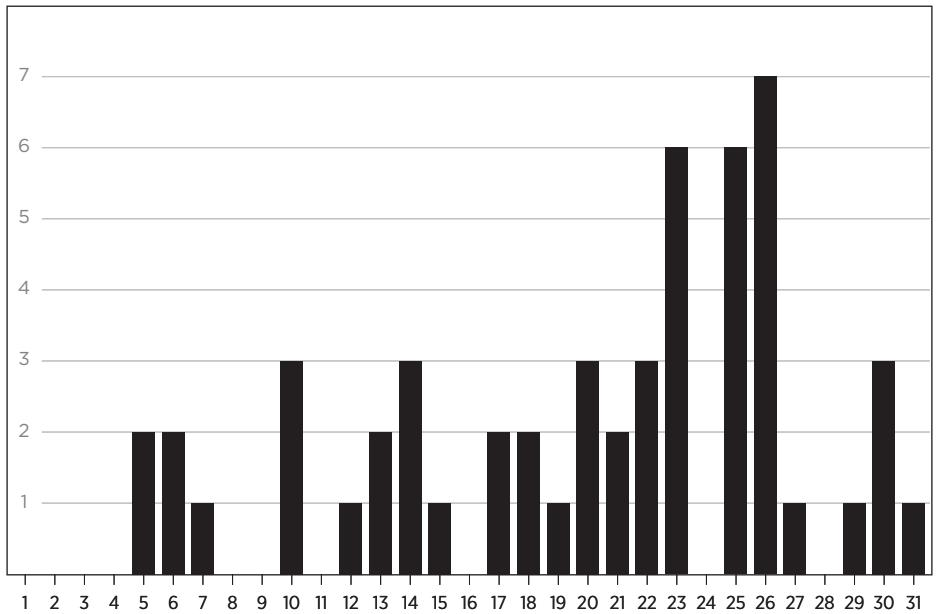

# ESV Expository Commentary

VOL. V

Psalms–Song of Solomon

Expository Commentary - Volume 5.int.indd 1 4/18/22 3:15 PM

# EDITORS

*Iain M. Duguid James M. Hamilton Jr. Jay Sklar*

Expository Commentary - Volume 5.int.indd 2 4/18/22 3:15 PM


# *Commentary*

VOL. V

*Psalms–Song of Solomon*

Psalms *C. John Collins* Ecclesiastes *Max Rogland*

Proverbs *Ryan Patrick O'Dowd*

Song of Solomon *Douglas Sean O'Donnell*


Expository Commentary - Volume 5.int.indd 3 4/18/22 3:15 PM

*ESV Expository Commentary, Volume 5: Psalms–Song of Solomon*

Copyright © 2022 by Crossway

Published by Crossway

1300 Crescent Street Wheaton, Illinois 60187

All rights reserved. No part of this publication may be reproduced, stored in a retrieval system, or transmitted in any form by any means, electronic, mechanical, photocopy, recording, or otherwise, without the prior permission of the publisher, except as provided for by USA copyright law. Crossway® is a registered trademark in the United States of America.

Cover design: Jordan Singer

First printing 2022

Printed in Italy

Unless otherwise indicated, Scripture quotations are from the ESV® Bible (The Holy Bible, English Standard Version®), copyright © 2001 by Crossway, a publishing ministry of Good News Publishers. ESV Text Edition: 2016. Used by permission. All rights reserved. The ESV text may not be quoted in any publication made available to the public by a Creative Commons license. The ESV may not be translated into any other language.

Unless otherwise indicated, apocrypha quotations are from the ESV Bible with Apocrypha, published in cooperation with Anglican Liturgy Press, an imprint of Anglican House Media Ministry, Inc., Newport Beach, California. The ESV Apocrypha, copyright © 2009, 2017 by Crossway. Used by permission. All rights reserved.

Scripture quotations marked CSB are from *The Christian Standard Bible*®. Copyright © 2017 by Holman Bible Publishers. Used by permission.

Scripture quotations marked DRA are from the Douay-Rheims 1899 American Edition.

Scripture quotations marked HCSB are from the *Holman Christian Standard Bible*. Copyright © 1999, 2000, 2002, 2009 by Holman Bible Publishers. All rights reserved.

Scripture quotations marked KJV are from the *King James Version* of the Bible.

The Scripture quotation marked MESSAGE is from *THE MESSAGE*. Copyright © 1993, 1994, 1995, 1996, 2000, 2001, 2002 by Eugene H. Peterson. Used by permission of NavPress. All rights reserved. Represented by Tyndale House Publishers, Inc.

Scripture quotations marked NASB are from *The New American Standard Bible*®. Copyright © The Lockman Foundation 1960, 1962, 1963, 1968, 1971, 1972, 1973, 1975, 1977, 1995. Used by permission.

Scripture quotations marked NIV are taken from The Holy Bible, New International Version®, NIV®. Copyright © 1973, 1978, 1984, 2011 by Biblica, Inc.™ Used by permission. All rights reserved worldwide.

The Scripture quotation marked NIV 1984 is taken from The Holy Bible, New International Version®, NIV®. Copyright © 1973, 1978, 1984 by Biblica, Inc.™ Used by permission. All rights reserved worldwide.

Scripture quotations marked NRSV are from *The New Revised Standard Version*. Copyright © 1989 by the Division of Christian Education of the National Council of the Churches of Christ in the U.S.A. Published by Thomas Nelson, Inc. Used by permission of the National Council of the Churches of Christ in the U.S.A.

Scripture quotations marked RSV are from The Revised Standard Version. Copyright © 1946, 1952, 1971, 1973 by the Division of Christian Education of the National Council of the Churches of Christ in the U.S.A.

There are also brief citations of the Jewish Publication Society of America Version (JPS), *New Jerusalem Bible* (NJB), *Tanakh: The Holy Scriptures: The New JPS Translation according to the Traditional Hebrew Text* (NJPS), *The Torah: A Modern Commentary* (NJPSA), *The Holy Bible, New Living Translation* (NLT), *Revised English Bible* (REB), *Revised Version* (RV), and *Today's New International Version* (TNIV).

Expository Commentary - Volume 5.int.indd 4 4/18/22 3:15 PM

Scripture quotations marked AT are the author's translation.

All emphases in Scripture quotations have been added by the authors.

Hardcover ISBN: 978-1-4335-4644-0

Crossway is a publishing ministry of Good News Publishers.

| LEGO |    | 32 | 31 | 30 | 29 | 28 | 27 | 26 |   | 25 | 24 |   | 23 | 22 |
|------|----|----|----|----|----|----|----|----|---|----|----|---|----|----|
| 15   | 14 | 13 | 12 | 11 | 10 | 9  | 8  | 7  | 6 | 5  | 4  | 3 | 2  | 1  |

# CONTENTS

| Tables                                     | 7                                             |
|--------------------------------------------|-----------------------------------------------|
| Figures9                                   |                                               |
| Preface to the ESV Expository Commentary11 |                                               |
| Contributors13                             |                                               |
| Abbreviations                              | 15                                            |
| Psalms 21<br>C. John Collins               | Ecclesiastes1005<br>Max Rogland               |
| Proverbs697<br>Ryan Patrick O'Dowd         | Song of Solomon1117<br>Douglas Sean O'Donnell |
| Scripture Index 1167                       |                                               |

Expository Commentary - Volume 5.int.indd 5 4/18/22 3:15 PM

Expository Commentary - Volume 5.int.indd 6 4/18/22 3:15 PM

# TABLES

| Psalms |                                                       |  |  |  |  |
|--------|-------------------------------------------------------|--|--|--|--|
| 1.1    | Psalms with Historical Settings in Their Titles26     |  |  |  |  |
| 1.2    | Resonances between Psalm 77 and Exodus 15399          |  |  |  |  |
| 1.3    | Plagues Recounted in Psalm 78 and Psalm 105408        |  |  |  |  |
| 1.4    | Six Workdays of Creation and Psalm 104515             |  |  |  |  |
| 1.5    | Eight Terms for Divine Revelation in Psalm 119:1–9595 |  |  |  |  |

# *Proverbs*

| 2.1  | Order of OT Books in the Greek Bible and the Ancient<br>Hebrew Canon703 |  |
|------|-------------------------------------------------------------------------|--|
| 2.2  | Parallel between Proverbs 8:30–31 and Revelation 3:14714                |  |
| 2.3  | Examples of Parallels within Proverbs 1–9729                            |  |
| 2.4  | Exhortations and Consequences in Proverbs 3:1–12736                     |  |
| 2.5  | Symmetry between Speeches in 7:1–5 and 7:24–27778                       |  |
| 2.6  | Similarities between 1:20–21 and 8:1–3784                               |  |
| 2.7  | God's Pairing of Regions and Occupants786                               |  |
| 2.8  | Repeated Vocabulary and Themes in Proverbs 15848                        |  |
| 2.9  | Pattern of Repeating Themes in Proverbs 20891                           |  |
| 2.10 | Virtues and Vices in Proverbs 24929                                     |  |
| 2.11 | Carefully Placed Keywords in Proverbs 25938                             |  |
| 2.12 | Antithetical Sayings in Proverbs 28:18–22967                            |  |
| 2.13 | Various Translations of Proverbs 30:1982                                |  |
| 2.14 | Echoes in Agur's Words in Proverbs 30:2–3983                            |  |
| 2.15 | Parallel Passages in Baruch and Proverbs984                             |  |

Expository Commentary - Volume 5.int.indd 7 4/18/22 3:15 PM

Expository Commentary - Volume 5.int.indd 8 4/18/22 3:15 PM

# FIGURES

| Proverbs |                                                  |  |
|----------|--------------------------------------------------|--|
| 2.1      | Frequency of Pain-Related Sayings in Proverbs801 |  |

Expository Commentary - Volume 5.int.indd 9 4/18/22 3:15 PM

Expository Commentary - Volume 5.int.indd 10 4/18/22 3:15 PM

# PREFACE

# TO THE ESV EXPOSITORY COMMENTARY

The Bible pulsates with life, and the Spirit conveys the electrifying power of Scripture to those who lay hold of it by faith, ingest it, and live by it. God has revealed himself in the Bible, which makes the words of Scripture sweeter than honey, more precious than gold, and more valuable than all riches. These are the words of life, and the Lord has entrusted them to his church, for the sake of the world.

He has also provided the church with teachers to explain and make clear what the Word of God means and how it applies to each generation. We pray that all serious students of God's Word, both those who seek to teach others and those who pursue study for their own personal growth in godliness, will be served by the ESV Expository Commentary. Our goal has been to provide a clear, crisp, and Christ-centered explanation of the biblical text. All Scripture speaks of Christ (Luke 24:27), and we have sought to show how each biblical book helps us to see the "light of the knowledge of the glory of God in the face of Jesus Christ" (2 Cor. 4:6).

To that end, each contributor has been asked to provide commentary that is:

- *exegetically sound*—self-consciously submissive to the flow of thought and lines of reasoning discernible in the biblical text;
- *biblically theological*—reading the Bible as diverse yet bearing an overarching unity, narrating a single storyline of redemption culminating in Christ;
- *globally aware*—aimed as much as possible at a global audience, in line with Crossway's mission to provide the Bible and theologically responsible resources to as many people around the world as possible;
- *broadly reformed*—standing in the historical stream of the Reformation, affirming that salvation is by grace alone, through faith alone, in Christ alone, taught in Scripture alone, for God's glory alone; holding high a big God with big grace for big sinners;
- *doctrinally conversant*—fluent in theological discourse; drawing appropriate brief connections to matters of historical or current theological importance;
- *pastorally useful*—transparently and reverently "sitting under the text"; avoiding lengthy grammatical/syntactical discussions;
- *application-minded*—building brief but consistent bridges into contemporary living in both Western and non-Western contexts (being aware of the globally diverse contexts toward which these volumes are aimed);

Expository Commentary - Volume 5.int.indd 11 4/18/22 3:15 PM

• *efficient in expression*—economical in its use of words; not a word-byword analysis but a crisply moving exposition.

In terms of Bible translation, the ESV is the base translation used by the authors in their notes, but the authors were expected to consult the text in the original languages when doing their exposition and were not required to agree with every decision made by the ESV translators.

As civilizations crumble, God's Word stands. And we stand on it. The great truths of Scripture speak across space and time, and we aim to herald them in a way that will be globally applicable.

May God bless the study of his Word, and may he smile on this attempt to expound it.

Expository Commentary - Volume 5.int.indd 12 4/18/22 3:15 PM

—The Publisher and Editors

# CONTRIBUTORS

# *Editors*

IAIN M. DUGUID PhD, University of Cambridge Professor of Old Testament, Westminster Theological Seminary

JAMES M. HAMILTON JR.

PhD, The Southern Baptist Theological Seminary Professor of Biblical Theology, The Southern Baptist Theological Seminary; Preaching Pastor, Kenwood Baptist Church, Louisville

JAY SKLAR PhD, University of Gloucestershire Professor of Old Testament, Covenant Theological Seminary

# *Authors*

C. JOHN COLLINS PhD, University of Liverpool Professor of Old Testament, Covenant Theological Seminary *(Psalms)*

RYAN PATRICK O'DOWD

PhD, University of Liverpool Founding Rector, Bread of Life Anglican Church, Ithaca, New York; Senior Fellow, Chesterton House *(Proverbs)*

MAX ROGLAND

PhD, University of Leiden Senior Minister, Rose Hill Presbyterian Church, Columbia, South Carolina *(Ecclesiastes)*

DOUGLAS SEAN O'DONNELL

PhD, University of Aberdeen Senior Vice President of Bible Editorial, Crossway, Wheaton, Illinois *(Song of Solomon)*

Expository Commentary - Volume 5.int.indd 13 4/18/22 3:15 PM

Expository Commentary - Volume 5.int.indd 14 4/18/22 3:15 PM

# ABBREVIATIONS

# *General*

| AT     | Author's Translation            |  |
|--------|---------------------------------|--|
| Aram.  | Aramaic                         |  |
| b.     | born                            |  |
| c.     | circa, about, approxi<br>mately |  |
| cf.    | confer, compare, see            |  |
| ch(s). | chapter(s)                      |  |
| d.     | died                            |  |
|        |                                 |  |
| diss.  | dissertation                    |  |
| ed(s). | editor(s), edited by,           |  |
|        | edition                         |  |
| e.g.   | for example                     |  |
| esp.   | especially                      |  |
| et al. | and others                      |  |
| etc.   | and so on                       |  |
| ff.    | and following                   |  |
| Gk.    | Greek                           |  |
| Hb.    | Hebrew                          |  |
| ibid.  | ibidem, in the same<br>place    |  |

# *Bibliographic*

| AB   | Anchor Bible                                                        |
|------|---------------------------------------------------------------------|
| ABR  | Australian Biblical Review                                          |
| ACCS | Ancient Christian Commentary on Scripture                           |
| AcT  | Acta Theologica                                                     |
| ANET | Ancient Near Eastern Texts Relating to the Old Testament. Edited by |

James B. Pritchard. 3rd ed. Princeton, NJ: Princeton University Press, 1969.

Expository Commentary - Volume 5.int.indd 15 4/18/22 3:15 PM

- i.e. that is
- Lat. Latin
- lit. literal, literally
- LXX Septuagint
- mg. marginal reading
- MT Masoretic Text
- NT New Testament
- OT Old Testament
	- r. reigned
- repr. reprinted
- rev. revised (by)
- s.v. *sub verbo* (under the word)
- trans. translator, translated by
- v., vv. verse(s)
- vol(s). volumes
	- vs. versus
	- Ug. Ugaritic
- ApOTC Apollos Old Testament Commentary
	- AYB Anchor Yale Bible
	- *BBR Bulletin for Biblical Research*
- *BBRSup Bulletin for Biblical Research, Supplements*
- BCOTWP Baker Commentary on the Old Testament Wisdom and Psalms
	- BDB Brown, Francis, S. R. Driver, and Charles A. Briggs. *A Hebrew and English Lexicon of the Old Testament*.
	- BHS *Biblia Hebraica Stuttgartensia*. Edited by Karl Elliger and Wilhelm Rupdolph. Stuttgart: Deutsche Bibelgesellschaft, 1983.
	- *BSac Bibliotheca Sacra*
	- BST The Bible Speaks Today
	- *BT The Bible Translator*
	- BZAW Beihefte zur Zeitschrift für die alttestamentliche Wissenschaft
		- *CBQ Catholic Biblical Quarterly*
		- CC Continental Commentaries
		- ConC Concordia Commentary
		- *CTR Criswell Theological Review*
	- *CurBR Currents in Biblical Research*
	- *CurBS Currents in Research: Biblical Studies*
	- *CurTM Currents in Theology and Mission*
		- ECS Pauline Allen et al., eds., Early Christian Studies. Strathfield, Australia: St. Paul's Publications, 2001–.
		- *EvQ Evangelical Quarterly*
	- *ExpTim Expository Times*
		- FOTL Forms of the Old Testament Literature
- FRLANT Forsuchungen zur Religion und Literatur des Alten und Neuen Testaments
	- *GTJ Grace Theological Journal*
	- *HALOT The Hebrew and Aramaic Lexicon of the Old Testament.* Ludwig Koehler, Walter Baumgartner, and Johann J. Stamm. Translated and edited under the supervision of Mervyn E. J. Richardson. 5 vols. Leiden: Brill, 1994–2000.

Expository Commentary - Volume 5.int.indd 16 4/18/22 3:15 PM

- *HBAI Hebrew Bible and Ancient Israel*
- HCOT Historical Commentary on the Old Testament
	- *HS Hebrew Studies*
- *HUCA Hebrew Union College Annual*
- *IBHS An Introduction to Biblical Hebrew Syntax*. Bruce K. Waltke and Michael O'Connor. Winona Lake, IN: Eisenbrauns, 1990.
- ICC International Critical Commentary
- *JBL Journal of Biblical Literature*
- *JBQ Jewish Bible Quarterly*
- *JCS Journal of Cuneiform Studies*
- *JESOT Journal for the Evangelical Study of the Old Testament*
	- *JETS Journal of the Evangelical Theological Society*
- *JNSL Journal of Northwest Semitic Languages*
- *JOTT Journal of Translation and Textlinguistics*
- Joüon Joüon, Paul. *A Grammar of Biblical Hebrew*. Translated and revised by T. Muraoka. 2 vols. Rome: Pontifical Biblical Institute, 1991.
	- *JPT Journal of Psychology and Theology*
	- *JSem Journal of Semitics*
- JSJSup Supplements to the Journal for the Study of Judaism
	- *JSOT Journal for the Study of the Old Testament*
- JSOTSup Journal for the Study of the Old Testament Supplement Series
	- *JTI Journal for Theological Interpretation*
	- *JTS Journal of Theological Studies*
	- K&D Keil, Carl Friedrich, and Franz Delitzsch. *Biblical Commentary on the Old Testament*. Translated by James Martin et al. 25 vols. Edinburgh, 1857–1878. Repr., 10 vols., Peabody, MA: Hendrickson, 1996.
	- KHC Kurzer Hand-Kommentar zum Alten Testament
- LHBOTS The Library of Hebrew Bible/Old Testament Studies
	- NAC New American Commentary
	- *NBD*<sup>3</sup> *New Bible Dictionary*. Edited by D. R. W. Hood, Howard Marshall, J. D. Douglas, and N. Hillyer. 3rd ed. Downers Grove, IL: InterVarsity Press, 1996.
		- *NIB The New Interpreter's Bible*. Edited by Leander E. Keck. 12 vols. Nashville: Abingdon, 1994–2004.
- NICOT New International Commentary on the Old Testament
- *NIDOTTE New International Dictionary of Old Testament Theology and Exegesis*. Edited by Willem A. VanGemeren. 5 vols. Grand Rapids, MI: Zondervan, 1997.

Expository Commentary - Volume 5.int.indd 17 4/18/22 3:15 PM

- NIVAC NIV Application Commentary
- *NPNF*<sup>2</sup> *Nicene and Post-Nicene Fathers, Series 2*
- NSBT New Studies in Biblical Theology
	- *OTE Old Testament Essays*
	- OTL Old Testament Library
	- *OTP Old Testament Pseudepigrapha*. Edited by James H. Charlesworth. 2 vols. New York: Doubleday, 1983, 1985.
	- *OtSt Oudtestamentische Studiën*
	- PTW Preaching the Word
	- *QJS Quarterly Journal of Speech*
	- *RB Revue biblique*
	- REC Reformed Expository Commentary
	- *ResQ Restoration Quarterly*
	- *SJOT Scandinavian Journal of the Old Testament*
		- *SK Skrif en kerk*
- *START Some Technical Articles Related to Translation*
- THOTC Two Horizons Old Testament Commentary
	- *TJ Trinity Journal*
	- TOTC Tyndale Old Testament Commentaries
- *TynBul Tyndale Bulletin*
	- *VT Vetus Testamentum*
	- WBC Word Biblical Commentary
	- WCF Westminster Confession of Faith
	- WSC Westminster Shorter Catechism
	- *WTJ Westminster Theological Journal*
	- *ZAW Zeitschrift für die alttestamentliche Wissenschaft*
- ZECOT Zondervan Exegetical Commentary on the Old Testament
- ZIBBC Zondervan Illustrated Bible Background Commentary

#### *Books of the Bible*

| Gen.  | Genesis     | Ruth     | Ruth         |
|-------|-------------|----------|--------------|
| Ex.   | Exodus      | 1 Sam.   | 1 Samuel     |
| Lev.  | Leviticus   | 2 Sam.   | 2 Samuel     |
| Num.  | Numbers     | 1 Kings  | 1 Kings      |
| Deut. | Deuteronomy | 2 Kings  | 2 Kings      |
| Josh. | Joshua      | 1 Chron. | 1 Chronicles |
| Judg. | Judges      | 2 Chron. | 2 Chronicles |

Expository Commentary - Volume 5.int.indd 18 4/18/22 3:15 PM

| Ezra      | Ezra            | Mark     | Mark            |
|-----------|-----------------|----------|-----------------|
| Neh.      | Nehemiah        | Luke     | Luke            |
| Est.      | Esther          | John     | John            |
| Job       | Job             | Acts     | Acts            |
| Ps., Pss. | Psalms          | Rom.     | Romans          |
| Prov.     | Proverbs        | 1 Cor.   | 1 Corinthians   |
| Eccles.   | Ecclesiastes    | 2 Cor.   | 2 Corinthians   |
| Song      | Song of Solomon | Gal.     | Galatians       |
| Isa.      | Isaiah          | Eph.     | Ephesians       |
| Jer.      | Jeremiah        | Phil.    | Philippians     |
| Lam.      | Lamentations    | Col.     | Colossians      |
| Ezek.     | Ezekiel         | 1 Thess. | 1 Thessalonians |
| Dan.      | Daniel          | 2 Thess. | 2 Thessalonians |
| Hos.      | Hosea           | 1 Tim.   | 1 Timothy       |
| Joel      | Joel            | 2 Tim.   | 2 Timothy       |
| Amos      | Amos            | Titus    | Titus           |
| Obad.     | Obadiah         | Philem.  | Philemon        |
| Jonah     | Jonah           | Heb.     | Hebrews         |
| Mic.      | Micah           | James    | James           |
| Nah.      | Nahum           | 1 Pet.   | 1 Peter         |
| Hab.      | Habakkuk        | 2 Pet.   | 2 Peter         |
| Zeph.     | Zephaniah       | 1 John   | 1 John          |
| Hag.      | Haggai          | 2 John   | 2 John          |
| Zech.     | Zechariah       | 3 John   | 3 John          |
| Mal.      | Malachi         | Jude     | Jude            |
| Matt.     | Matthew         | Rev.     | Revelation      |

# *Apocrypha and Other Noncanonical Sources Cited*

| 1 Macc. | 1 Maccabees | Sir. | Sirach/Ecclesiasticus |
|---------|-------------|------|-----------------------|
| 2 Macc. | 2 Maccabees | Tob. | Tobit                 |
| Bar.    | Baruch      | Wis. | Wisdom of Solomon     |

Expository Commentary - Volume 5.int.indd 19 4/18/22 3:15 PM

Expository Commentary - Volume 5.int.indd 20 4/18/22 3:15 PM

# THE PSALMS

*C. John Collins*

Expository Commentary - Volume 5.int.indd 21 4/18/22 3:15 PM

"And is it not for this reason, Glaucon," said I, "that education in music is most sovereign, because more than anything else rhythm and harmony find their way to the inmost soul and take strongest hold upon it, bringing with them and imparting grace, if one is rightly trained, and otherwise the contrary? And further, because omissions and the failure of beauty in things badly made or grown would be most quickly perceived by one who was properly educated in music, and so, feeling distaste rightly, he would praise beautiful things and take delight in them and receive them into his soul to foster its growth and become himself beautiful and good. The ugly he would rightly disapprove of and hate while still young and yet unable to apprehend the reason, but when reason came the man thus nurtured would be the first to give her welcome, for by this affinity he would know her."

Plato, *Republic*

I trust none of my readers is that grotesque anomaly, an unchurched Christian. The New Testament knows nothing of such a person. For the church lies at the very center of the eternal purpose of God. It is not a divine afterthought. It is not an accident of history. On the contrary, the church is God's new community.

Expository Commentary - Volume 5.int.indd 22 4/18/22 3:15 PM

John Stott, *The Living Church*

# INTRODUCTION TO THE PSALMS

# *Overview*

The book of Psalms, or Psalter, has supplied believers with some of their best-loved Bible passages. This collection of 150 poems expresses a wide variety of emotions, including love and adoration toward God, sorrow over sin, dependence upon God in desperate circumstances, the battle of fear and trust, walking with God even when the way seems dark, thankfulness for God's care, devotion to the Word of God, and confidence in the eventual triumph of God's purposes for the world.

In his *Reflections on the Psalms*, C. S. Lewis sums up how to think about the Psalter: "What must be said, however, is that the Psalms are poems, and poems intended to be sung: not doctrinal treatises, nor even sermons."1 This basic insight finds general agreement among those who study the Psalms; the distinctive contribution here will be to implement this insight in a consistent manner. Since this view of the Psalms plays such a large role in this commentary, the rest of this introduction will support this position and show what it means for interpretation. This commentary focuses on exposition of the Psalms as we find them, much more than on, say, reconstructing the history of their composition. It therefore engages in what might be called biblical theology and theological interpretation. This focus makes it impossible to cover in detail the vast range of topics that arise in regard to the Psalms, nor the vast amount of secondary literature devoted to them. (The footnotes refer interested readers to surveys of the field.)

#### *Title*

The Hebrew Bible labels the book *Sefer Tehillim* ("Book of Praises"), which points to the characteristic use of these songs as the praises offered to God in public worship. It is uncertain just what led to this name. It could have been the idea that the acts of praise, which we find sprinkled throughout the Psalms, serve as a metonymy (a part for the whole) of the book's contents, without claiming either a predominance or a special status for praise over against other acts (such as lament or instruction). This would be a similar metonymy to the common practice of referring to the book as the "Psalms of David" even though David is the attributed author of fewer than

Expository Commentary - Volume 5.int.indd 23 4/18/22 3:15 PM

<sup>1</sup> C. S. Lewis, *Reflections on the Psalms* (London: Geoffrey Bles, 1958), 2.

half of the psalms. Another possible explanation is that the whole range of acts found in the Psalms—from adoration and thanks to needy cries for help (even the desolate moan of Psalm 88)—praises God when offered to him in the gathered worship of his people.

The English title comes from the Greek *psalmos*, which translates Hebrew *mizmor* ("song") found in many psalm titles and simply translated "psalm" (e.g., Psalm 3). The Greek especially draws a connection to the harp that accompanies such songs. This Greek name for the book was established by the time of the NT (Luke 20:42; Acts 1:20).

### *Authorship, Occasion, and Date*

Many psalms indicate their author or sponsor, while many others are anonymous. The standard way psalms indicate this is with the word translated "of": *of* David (73 psalms), *of* the sons of Korah (11 psalms), *of* Asaph (12 psalms), *of* Solomon (2 psalms), *of* Ethan the Ezrahite (Psalm 89), *of* Moses (Psalm 90). Specialists in Hebrew note that this word ("of") can also mean "to," "belonging to," "about," or "for" and may sometimes designate sponsorship rather than authorship, strictly speaking.2 On the other hand Psalm 18 is "a psalm of David," while in the parallel we find that "David spoke to the Lord the words of this song" (2 Sam. 22:1), which implies that David produced the words. Hence we expect that the expression usually attributes authorship, but we can allow that in a few places it may indicate a looser relationship, such as sponsorship (Song 1:1). Further, the sons of Korah and Asaph may well have represented guilds, in which case these psalms would not be tied to a specific author. David's authorship is assumed in NT citations (e.g., Mark 12:36; Acts 2:25; Rom. 4:6; 11:9), which adds two more to the list of Davidic psalms—Psalm 2 (Acts 4:25) and Psalm 95 (Heb. 4:7).

Davidic authorship of many psalms corresponds well with biblical testimony. David was "skillful in playing the lyre" (1 Sam. 16:16–23) and an accomplished songwriter (2 Sam. 1:17–27; 22:1–23:7); his reputation as the "sweet psalmist of Israel" (2 Sam. 23:1) is credible, as is the way 1 Chronicles presents him as taking an active role in developing Israel's worship (e.g., 1 Chron. 16:4–7, 37–42; 23:2–6; 25:1–7).

The sons of Korah served in the sanctuary (1 Chron. 9:19), and some of them along with Asaph were "in charge of the service of song in the house of the Lord" (1 Chron. 6:31). Solomon is known for his achievements in "wisdom," but he also wrote "songs" (1 Kings 4:29, 32), which could include two psalms (Psalm 127 and possibly Psalm 72). Moses provided songs for the whole assembled people (Ex. 15:1–18; Deut. 31:30–32:44; cf. 33:1–29).

By the end of the nineteenth century many scholars had concluded that the titles had little or no validity; some of their strongest arguments involved the presence of words and phrases in the psalms that look to be more at home in later

Expository Commentary - Volume 5.int.indd 24 4/18/22 3:15 PM

<sup>2</sup> On the preposition *le* cf. Joüon, §130b.

Hebrew or even Aramaic than in standard biblical Hebrew. This would imply that the psalms as we have them came from the final few centuries of the first millennium BC. The discovery of more ancient Near Eastern writings since that time has made it possible to make a fuller history of the Hebrew language and a fuller appreciation of ancient literary conventions, and it is now harder to sustain these arguments for late dating. Many scholars will now allow that quite a few of the psalms come from before the Babylonian exile.3 Further, the LXX, the earliest extant translation of the Hebrew Bible, translates the psalm headings that attribute authorship, and in some of these headings there is other information that the LXX translators found baffling (probably because it was too archaic for them). These factors indicate that these attributions are old. Hence we have good reason for taking these inscriptions at face value. The NT authors accept David as author of the psalms attributed to him (e.g., Mark 12:36; Acts 1:16; 2:25; Rom. 4:6; 11:9), and sometimes the characters in a story make David's authorship a key part of their case (e.g., Luke 20:42; Acts 4:25–26; 13:36–39). (For the question of what use to make of the authorship, especially of David, cf. The Psalms as Christian Scripture.)

Fourteen of the Davidic psalms add further information in their titles, connecting the psalms to specific incidents in David's life (cf. table 1.1). It is often said that these are later additions to the psalms, since they narrate events in third person (while the psalm is in 1st person). Some wonder as well whether such polished productions (e.g., Psalm 34) could have arisen from the circumstances described in the title. In reply there is no reason why an author could not narrate about himself in the third person (e.g., Isa. 20:2; Jer. 20:1–2; 21:1–3; 26:1–24; Hos. 1:2–6); further, the titles do not imply that David composed the psalm at the time of the event, only that the event led to the psalm and that the psalm is to be interpretively tied to this event. The fact that two of the titles (Psalms 7; 30) cannot be correlated with anything in 1–2 Samuel argues against the idea that a later editor added these titles after carefully examining biblical texts.4

Finally, this historical information often lends help in both interpreting the psalm and discerning how it should be applied. The overall interpretive stance in this commentary is that the psalms are fundamentally hymnody, to be sung in the gathered worship of God's people. This implies that, in using the handful of psalms that have historical incidents in their titles, autobiography is the wrong place to look for the function of these titles. A better way to view them is as aids in concretization—to show how true faith encounters specific crises. An example comes from the Canadian singer Bruce Cockburn. His 1976 album, *In the Falling Dark*, includes a track titled "Little Seahorse," which is dated December 14, 1975, in Toronto; it is dedicated

Expository Commentary - Volume 5.int.indd 25 4/18/22 3:15 PM

<sup>3</sup> Cf. Gary A. Rendsburg, "The Psalms as Hymns in the Temple of Jerusalem," in *Jesus and Temple: Textual and Archaeological Explorations*, ed. James H. Charlesworth (Minneapolis: Fortress, 2014), 95–122. Cf. J. G. S. S. Thomson and Derek Kidner, "Psalms, book of," *NBD3* , 981a–985a. Thomson and Kidner agree that calling the Psalter "the hymn-book of the second Temple" is true enough; at the same time, they insist that there is plenty of evidence that much of the Psalter comes from the First Temple period.

<sup>4</sup> For fuller discussion cf. Willem A. VanGemeren and Jason Stanghelle, "A Critical-Realistic Reading of the Psalm Titles," in *Do Historical Matters Matter to Faith? A Critical Appraisal of Modern and Postmodern Approaches to Scripture*, ed. James K. Hoffmeier and Dennis R. Magary (Wheaton, IL: Crossway, 2012), 281–301.

"to Jenny, at eight weeks of foetal life." The song is a meditation on the coming birth of his first child. Knowing the occasion for the poem enables the audience to enter into the imagery, in which the developing embryo is likened to a seahorse "swimming in a primal sea." The song expresses a mixture of wonder and anticipation, together with fear for how the dangerous world might "sweep you away." This poem would be a failure, however, if we hear it simply as a bit of Cockburnian autobiography. Rather, it provides a vehicle to guide any expecting parent, especially a father, in reflecting on the mysterious process by which a child forms in the womb, and it offers assurance of love and connection to a child yet unborn. That is, the poet has given his audience a pair of spectacles to look on their own experiences, to apply them by analogy. (I do not even know how much or little Cockburn's own inner life embodied these fine sentiments—nor would it affect the way the song functions.)

Table 1.1 sets out the psalms with historical settings in their titles, with the likely text from the historical books that describes each incident.

| Psalm | Incident                                                                                   | References                                   |
|-------|--------------------------------------------------------------------------------------------|----------------------------------------------|
| 3     | David flees from and battles Absalom                                                       | 2 Samuel 15–17                               |
| 7     | Cush, Benjaminite (persecution by Saul?)                                                   | unknown                                      |
| 18    | David delivered from enemies and from Saul                                                 | 2 Samuel 22                                  |
| 30    | Dedication of the temple                                                                   | Nothing in David's<br>life; cf. 1 Kings 8:63 |
| 34    | David delivered from danger by feigning madness in the pres<br>ence of king Achish of Gath | 1 Sam. 21:12–22:1                            |
| 51    | Nathan confronts David about his adultery with Bathsheba                                   | 2 Sam. 11–12:23                              |
| 52    | Doeg the Edomite tells Saul that David went to the house of<br>Ahimelech                   | 1 Sam. 22:9–19                               |
| 54    | Ziphites tell Saul that David is hiding among them                                         | 1 Sam. 23:19                                 |
| 56    | The Philistines seize David in Gath                                                        | 1 Sam. 21:10–11                              |
| 57    | David flees from Saul into a cave                                                          | 1 Sam. 22:1 or 24:3                          |
| 59    | Saul sends men to watch David's house in order to kill him                                 | 1 Sam. 19:11                                 |
| 60    | David's Transjordan victories                                                              | 2 Sam. 8:1–14                                |
| 63    | David in the Desert of Judah                                                               | 2 Samuel 15–17?<br>1 Sam. 23:14–15?          |
| 142   | David flees from Saul into a cave                                                          | Same as Psalm 57                             |

TABLE 1.1: Psalms with Historical Settings in Their Titles

A few psalms seem to have originally been written for a particular occasion, and the individual expositions will discuss that possibility (e.g., Psalms 24; 68; 118). Perhaps they came to be used in specific festivals commemorating the original events. Some scholars have suggested that the liturgical calendar found in Leviticus is a late invention and that the early period of Israel (when some of

Expository Commentary - Volume 5.int.indd 26 4/18/22 3:15 PM

the psalms were first written) included annual festivals analogous to those found in other cultures; hence they try to associate particular psalms with places in these hypothetical festivals. Further, some scholars have tried to show that there was an annual festival in Israel whose purpose was to renew God's kingship, to renew the covenant between God and Israel, or to celebrate God's choice of Zion. Sometimes these hypothetical festivals are coordinated with the three festivals of the Pentateuch; sometimes they are not. The evidence from the OT itself for these hypothetical festivals, however, is weak. And while it is possible that certain psalms are suited to specific annual occasions, it seems clear that most psalms are suitable year round and could be used as needed.

Those leading the various worship services would choose the psalms that fit the requirements of the occasion and the needs of the worshiping congregation. In addition to the authorized sacrificial services of the central sanctuary, the Mosaic law also establishes the weekly Sabbath as a day of "holy convocation" (Lev. 23:3). It is unclear what kind of meeting is expected in the villages week by week, but it seems to be some kind of worship as a supplement to that of the central sanctuary.5 Indeed, Psalm 92 is a thanksgiving for the weekly Sabbath worship.6 The Bible itself gives very little description of the worship life of Israel before the Babylonian Exile, and many scholars suspect that the portrait of the annual cycle of festivals (e.g., in Leviticus 23; Deut. 16:1–17) is an idealization, a projection backward of later customs. This is not the place to argue the question of the Pentateuch's antiquity; it is enough for our needs to observe that the "priestly" material, which includes the relevant portions of Leviticus, reflects a *pre*exilic setting, and therefore preexilic practice.7

The individual psalms claim to have come from diverse periods of Israel's history: from the time of Moses (15th or 13th century BC), to that of David and Solomon (10th century), and down to exilic and postexilic times (e.g., Psalm 137). Roger Beckwith has argued persuasively that "the Psalms are old, and that the Psalter is a relatively old collection of them."8 Beckwith suggests that the Psalter was originally three books, which were then redivided into five; this, he thinks, was done in imitation of the five books of the Pentateuch, which contain the law for tabernacle worship. A number of factors clearly indicate that the book of Psalms as we have it today is the product of a process of collecting and editing from a variety of sources:

- the division into five books and the affinity groupings, e.g., Psalms 1–2; 113–118 (the Egyptian Hallel); 120–134 (the Songs of Ascents); and the final "hallelujah" of Psalms 146–150;
- the existence of the almost identical Psalms 14 and 53;
- the notice in 72:20 about the end of David's prayers (while there are still plenty of Davidic psalms to follow).

Expository Commentary - Volume 5.int.indd 27 4/18/22 3:15 PM

<sup>5</sup> Cf. Roger T. Beckwith, "The Daily and Weekly Worship of the Primitive Church in Relation to Its Jewish Antecedents: Part I," *EvQ* 56/2 (1984): 68.

<sup>6</sup> Cf. Tremper Longman III, *How to Read the Psalms* (Downers Grove, IL: InterVarsity Press, 1988), 48–49.

<sup>7</sup> Cf. C. John Collins, *Numbers*, ZECOT (Grand Rapids, MI: Zondervan, forthcoming).

<sup>8</sup> Roger T. Beckwith, "The Early History of the Psalter," *TynBul* 46/1 (1995): 23.

In this commentary, based as it is on the ESV, "the Psalter" is specifically the Hebrew Masoretic Text of the Psalms; the occasional resort to a different textual reading does not undermine that fact. Many researchers have concluded that the text and arrangement of the Psalms at Qumran are different and represent a "fluid" text and canon (i.e., one still developing).9 The nature of this commentary forbids a proper assessment of this conclusion.10 I will simply note that the MT represents the canon of mainstream Judaism; it is not demonstrably very different from the general texts of the Second Temple era,11 and something like it underlies the early translations (e.g., LXX, Syriac, and Vulgate). The Qumran community is certainly of historical interest in its own right, but it was out of the mainstream and contributed little to either Judaism or Christianity (which both arose from the mainstream Pharisaic party).

Having mentioned the LXX, we should note that, while it does presuppose a Hebrew fairly close to the MT, it also has its own peculiarities. The most significant is that it combines Psalms 9 and 10 as its Psalm 9, and thus its psalm numbers are off by one until Psalms 114–115 (MT), which are combined as 113 (LXX). Then Psalm 116 (MT) is divided in two (114–115 LXX), and Psalm 147 (MT) is divided as well (146–147 LXX). Both editions have 150 psalms. Many manuscripts of the LXX include Psalm 151, seven verses briefly recounting David's battle with Goliath; the Greek explicitly marks the song as "outside the number" (i.e., outside the canonical 150).12

There is no way to tell what kind of editing the collectors might have done as they incorporated a composition into the developing Psalter; recognized scribal practices include minor things such as updating spelling and grammar and clarifying place names. It is conceivable that many of the psalms began as intensely personal poems that were then adapted for congregational use (cf. Section Overview of Psalm 51), possibly even by the original author. It is also likely that some psalms were composed by stitching together preexisting material (e.g., Psalm 108). But, for the faithful, it is the final form that is canonical (and that has empirical existence), and such is the focus of this commentary.

Topics that arise from this discussion include the relationship of a psalm's authorship to its "meaning" or, better, proper use; and, similarly, the place of David as author. Sections below will address these matters.

#### *Genre and Literary Features*

The word *genre*, though in common use, generates enough difficulties that it will be better to use other words. Among other problems, many think of genre largely

Expository Commentary - Volume 5.int.indd 28 4/18/22 3:15 PM

<sup>9</sup> E.g., Dwight D. Swanson, "Qumran and the Psalms," in *Interpreting the Psalms: Issues and Approaches*, ed. David Firth and Philip S. Johnston (Downers Grove, IL: IVP Academic, 2005), 247–261.

<sup>10</sup> I will remark, however, that Swanson dismisses the work of such researchers as Beckwith and Shemaryahu Talmon far too readily.

<sup>11</sup> Cf. Peter J. Gentry and John D. Meade, "MasPsa and the Early History of the Hebrew Psalter," in *From Scribal Error to Rewriting: How Ancient Texts Could and Could Not Be Changed*, ed. Anneli Aejmelaeus, Drew Longacre, and Natia Mirotadze (Göttingen: Vandenhoeck & Ruprecht, 2020), 113–145.

<sup>12</sup> For more information cf. J. H. Charlesworth and J. A. Sanders, "More Psalms of David," *OTP*, 2:609–624.

as a matter of literary form, when in fact there are so many other relevant factors as well.13 Discussions in genre theory from linguists and rhetoricians will help us here. Carolyn Miller argues, "A rhetorically sound definition of genre must be centered not on the substance or the form of discourse but on the action it is used to accomplish."14 Thinking more specifically of things such as literary structure and style, language level, social setting of use, and intended effects on the audience will offer far more insight. Indeed, C. S. Lewis anticipated this when he declared: "The first qualification for judging any piece of workmanship from a corkscrew to a cathedral is to know what it is—what it was intended to do and how it is meant to be used."15

This commentary agrees with most scholars—despite a few dissenters—that the psalms have the corporate worship of Israel as their primary life setting.16 Nevertheless, even when commentators might agree that the psalms were collected as public hymnody, their expositions of individual psalms do not always account fully for the worship setting for which the psalms were collected;17 the expositions here aim to employ the social setting more consistently.

This recognized social function of the Psalms will play such a large part in the expositions, then, that it is worth grounding it solidly. It is fairly easy to establish that *some* of the psalms were used in worship occasions of ancient Israel, and most scholars will allow for that. Not every scholar agrees that this is the case for *all* of the Psalms, and it will take a little more effort to show that.

In 1 Chronicles 16:4–6; 25:1–7 we read of how David appointed various men of Levitical descent to minister in song at the tabernacle. Among them are some to whom several psalms are ascribed—namely, Asaph, Heman, and Jeduthun, who directed their sons (named in 1 Chron. 25:2–5). One of the songs Asaph was to sing (1 Chron. 16:7–36) includes bits of Psalms 105, 96, and 106. In addition many psalms themselves indicate their place in public worship (e.g., the frequent expression in the titles "for the choirmaster," who seems to be a liturgical leader of some sort18). The musical directions in the titles of some psalms point in the same direction.19 Further,

Expository Commentary - Volume 5.int.indd 29 4/18/22 3:15 PM

<sup>13</sup> For further discussion cf. C. John Collins, *Reading Genesis Well: Navigating History, Poetry, Science, and Truth in Genesis 1–11* (Grand Rapids, MI: Zondervan, 2018), 48–50.

<sup>14</sup> Carolyn Miller, "Genre as Social Action," *QJS* 70 (1984): 151–167.

<sup>15</sup> C. S. Lewis, *A Preface to Paradise Lost* (Oxford: Oxford University Press, 1942), 1. For Lewis the literary critic, "judging" includes "interpreting."

<sup>16</sup> For a dissenter see E. J. Young: "We are mistaken when we regard the entire Psalter as designed for the usage of the Temple. . . . The Psalter, rather, is primarily a manual and guide and model for the devotional needs of the individual believer." *Introduction to the Old Testament* (Grand Rapids, MI: Eerdmans, 1964), 309. This position is endorsed by Mark D. Futato, *Interpreting the Psalms: An Exegetical Handbook* (Grand Rapids, MI: Kregel, 2007), 68–69.

<sup>17</sup> A ready example is Gordon D. Fee and Douglas Stuart, *How to Read the Bible for All Its Worth* (Grand Rapids, MI: Zondervan, 2003). They acknowledge that the psalms were for use in worship (210) but then offer individualistic ways of "applying" them (215–222). A major aspect of their difficulty is how to relate the particular person to the whole congregation. A good start toward a better approach can be found in John Goldingay, *Psalms: Volume 1; Psalms 1–41*, BCOTWP 2 (Grand Rapids, MI: Baker Academic, 2006), 58–60.

<sup>18</sup> The Hebrew word translated "choirmaster" is a participle. The verb appears in 1 Chronicles 15:21, where liturgical persons "lead" with lyres. Elsewhere the verb indicates supervising, overseeing, directing, and having charge of sacred work (1 Chron. 23:24; 2 Chron. 2:1, 18; 34:12–13; Ezra 3:8–9). As Beckwith observes, "It would seem, therefore, that the chief musician/choirmaster was not a subsequent collector of psalms, as has often been supposed, but the original performer of them." Beckwith, "Early History of the Psalter," 12.

<sup>19</sup> E.g., Psalm 4 is directed to the "stringed instruments." Other terms are of unknown meaning, such as "selah" (Ps. 3:2), "sheminith" (Psalm 6 title), "shiggaion" (Psalm 7 title), which the ESV suggests are probably musical or liturgical terms (ESV mg.).

we find the mention of coming to the Lord's house (e.g., Pss. 5:7; 63:2–3; 66:13–14), the "aware[ness] of an encircling company of exultant fellow-worshippers" (Ps. 32:7),20 and the title of Psalm 92 "for the Sabbath," followed by the expression of delight in both morning and evening Sabbath worship (v. 2).21 Even more, many psalms address other worshipers, typically with plural imperatives. For example, the familiar "Hallelujah" transliterates the Hebrew *halelu-yah* ("praise ye Yah!").22 The antiphonies of Psalm 24:7–10 imply that the psalm was composed for a liturgical usage, perhaps a particular occasion. Psalm 18 is almost the same as 2 Samuel 22 but with a key difference: Psalm 18 has a title addressing the choirmaster, while 2 Samuel 22 does not, which suggests that the private song (2 Samuel 22) has been adapted for corporate usage (Psalm 18). Likewise Psalm 51, whose title describes the intensely private occasion that brought it about, nevertheless shows signs of being fitted out for the whole body to sing (vv. 18–19).

So much for individual psalms; but what of the Psalter as a whole? After all, it contains compositions based on "wisdom" themes (commonly taken to be from individual meditation and instruction),23 as well as highly personal supplications and thanksgivings. Many of these make us wonder whether they were ever intended for congregational use. What entitles us to call the *whole* Psalter a hymnbook? Maybe the author wrote a private meditation, which was then included in a multipurpose Psalter?

In order to answer these questions, we first observe that if we ask about the process that went into producing a particular psalm, we must acknowledge that we know very little of it.24 What we do know is that each of the psalms is *now* a part of the Psalter, and that is how we should judge them.

The evidence from the Hebrew Bible supports the conclusion that the Psalter was, from the earliest times, connected with both the local and the centralized worship among the people of God; further, later records continue this same connection. The intertestamental book of Ben Sira (or *Ecclesiasticus*; c. 196–175 BC) 25 describes in its chapter 50 how Simon, son of Onias, would lead temple worship while he was high priest (c. 219–196 BC). He tells us, "And all the people of the land *shouted for joy* in prayer before the Merciful One" (*Sir*. 50:19).26 The Hebrew

Expository Commentary - Volume 5.int.indd 30 4/18/22 3:15 PM

<sup>20</sup> Derek Kidner, *Psalms 1–72*, TOTC (Downers Grove, IL: InterVarsity Press, 1973), 134.

<sup>21</sup> That is, the activities "give thanks . . . sing praises . . . declare" are carried out in a worship service, as is clear from the mention of musical instruments (92:3) and the Lord's house (v. 13).

<sup>22</sup> The form *hal(l)elu* is the plural imperative of the verb *h-ala-l*, while *yah* is a shortened form of the divine name (*yhwh*).

<sup>23</sup> For some who prefer to "relegate a wisdom psalm into the private sphere" cf. Erhard S. Gerstenberger, *Psalms: Part 1, with an Introduction to Cultic Poetry*, FOTL 14 (Grand Rapids, MI: Eerdmans, 1988), 42–43. Gerstenberger himself does not accept the relegation.

<sup>24</sup> Sigmund Mowinckel supposes that, for example, the wisdom psalms were "a newer, private, learned psalmography" that was added "to the ancient cultic poetry," a supposition that goes beyond our evidence. However, he does acknowledge that "such private poetry came to be included in the present collection of cult psalms, and was even used in the official worship of the Temple." *The Psalms in Israel's Worship* (1964; repr., Grand Rapids, MI: Eerdmans, 2004), 2:106, 2:114.

<sup>25</sup> Jesus Ben Sira was a scribe and wisdom teacher in Jerusalem in the late third and early second centuries BC. His grandson translated the book into Greek around 132 BC, giving us the book called *Ecclesiasticus* (or *Sirach*, or *Ben Sira*). The Hebrew text had long been lost; starting in 1896, parts of the Hebrew text have been discovered, but many textual difficulties still remain.

<sup>26</sup> Based on the Hebrew text; cf. NAB. The rendering in the *English Standard Version Bible with Apocrypha* (New York: Oxford University Press, 2009) is based on the Greek, which has as its first line, "And the people earnestly prayed to the Lord Most High."

verb translated "shout for joy" occurs often in the Psalms to denote an activity of public praise, as "sing or shout for joy" (e.g., Pss. 5:11; 20:5; 32:11). It makes sense to suppose that these were selections from the Psalter.27

In the same way Josephus recounted David's artistic accomplishments:

And now David being freed from wars and dangers . . . composed songs and hymns to God, of several sorts of meter. . . . He also made instruments of music, and taught the Levites to sing hymns to God, both on that called the Sabbath-day, and on other festivals. (*Antiquities* 7.305)28

David's productions were used in public worship, both in the weekly forms (including the local assemblies, presumably) and in the forms for special days.

So the whole collection of the psalms provided material for the corporate worship of Israel. This means that it is proper to consider how even those psalms that do not at first *appear* to be hymnlike nevertheless function as songs for corporate worship—we know them by the company they keep. Of course, this may require us to expand our vision of what people should sing, pray, or chant together in worship!

All these factors strongly support Tremper Longman's conclusion:

Beyond a shadow of a doubt, the Psalms were used in the public and private worship of devout Israelites. We might even go a step further and, while affirming that the Psalms were used in private worship, say that most of the evidence for their primary use points to public worship.29

Scholars have tended to classify psalms according to their types (praise, lament, etc.). Unfortunately, scholars vary in their list of types, and it is easy to multiply categories to account for the particularities of each psalm—and soon one can end up with 150 categories!30 Further, classification into these types, often called "forms," has tended to assume an actual literary structure to which a psalm must conform. This leads to difficulty when a psalm has more than one element (e.g., Psalm 34 is a thanksgiving psalm with a wisdom section), which leads some scholars to divide the troublesome psalms up.

It is better to recall Miller's point about social function and to apply it here. A particular psalm might, say, celebrate the deeds and character of God, or confess sins, or lay out a request for help. Nothing prevents any psalm from performing more than one function. In fact, no one has ever shown that any psalm author actually set out to write a particular form of psalm; the categories

Expository Commentary - Volume 5.int.indd 31 4/18/22 3:15 PM

<sup>27</sup> Cf. *Sirach* 47:9–10. David "placed singers before the altar, to make sweet melody with their voices. He gave beauty to the feasts, and arranged their times throughout the year, while they praised God's holy name, and the sanctuary resounded from early morning," surely referring to his work of providing psalms (cf. 1 Chron. 16:4–7; 25:1–7).

<sup>28</sup> Cf. Josephus, *Against Apion* 1.38–40. Josephus lists among the twenty-two books of the Jewish canon a book of "hymns to God."

<sup>29</sup> Longman, *How to Read the Psalms*, 46–47.

<sup>30</sup> E.g., Peter C. Craigie, *Psalms 1–50*, WBC 19 (Waco, TX: Word, 1983), 71. Craigie acknowledges the "individual lament" form of Psalm 3 but goes on to prefer to call it a "protective psalm," a category with very few members.

are *extrinsic*, not *intrinsic*. Ernst Wendland recognizes the extrinsic nature of the conventional forms and proposes to classify the various psalms according to their basic speech-acts, particularly "eulogy," "lament," "homily," or a combination of these.31 Wendland's emphasis on the speech-acts that psalms perform is a salutary one, but that still allows for a grouping of major and minor functions, which results in a list that resembles the conventional "forms" (as Wendland himself acknowledges).

In this light, used reasonably and humbly, this classification approach can provide us with a heuristic, an intuitive help to appreciate the different purposes of the various psalms, and thus can guide our interpretation in light of these purposes. I prefer the term *function* rather than *form*. The basic functions include the following.32

(1) Laments, whose primary function is to lay a troubled situation before the Lord, asking him for help. We find community laments, dealing with trouble faced by the people of God as a whole (e.g., Psalm 12), and individual laments, in which the troubles face a particular member of the people (e.g., Psalm 13). This latter category is the largest by far, including as much as a third of the whole Psalter. Comments on individual psalms will explore the differing ways in which these psalms work—especially, how can an *individual* lament be a part of the *community's*  worship when not everyone is in trouble? Further, some laments contain confessions of sin, some have professions of innocence, and some are neutral. How do these apply to differing situations?

(2) Hymns of praise, whose primary goal is to call and enable God's people to admire his great attributes and deeds. These can focus, for example, on a particular set of attributes (e.g., Psalm 145 on God's benevolence), on God's universal kingship over his creation (e.g., Psalm 93), or on his works of creation (e.g., Psalm 8).

(3) Hymns of thanksgiving, which thank God for his answer to petition (which perhaps had been expressed in a lament). Like laments, we find both community (e.g., Psalm 9) and individual (e.g., Psalm 30) thanksgiving psalms.

(4) Hymns celebrating God's law, which speak of the wonders of the Torah (divine instruction) and help worshipers to aspire to obey it more fully (e.g., Psalm 119). Although one might expect the Torah to be specifically the Law of Moses, some suggest that the term has a wider reach in the Psalms, encompassing the whole of the canon.

(5) Wisdom psalms, which take themes from the wisdom books (Proverbs, Job, Ecclesiastes, Song of Solomon) and make them the topic of song (e.g., Psalms 1; 37). The category of "wisdom psalms" presents a challenge, since there is no agreement on what constitutes criteria by which we may call them that; there is no specific

Expository Commentary - Volume 5.int.indd 32 4/18/22 3:15 PM

<sup>31</sup> Cf. Ernst R. Wendland, "Genre Criticism and the Psalms," in *Biblical Hebrew and Discourse Linguistics*, ed. Robert D. Bergen (Dallas: Summer Institute of Linguistics, 1994), 374–414; Wendland, *Analyzing the Psalms* (Dallas: Summer Institute of Linguistics, 1998), 32–60.

<sup>32</sup> Cf. Philip S. Johnston, "Appendix 1: Index of Form-Critical Categorizations," in Firth and Johnston, *Interpreting the Psalms*, 295–300. Johnston charts some of the leading attempts to classify each psalm according to a particular form.

literary "form."33 By attending to the social action of the song, however, we can recognize that a number of psalms incorporate subject matter that is common in the wisdom books, such as Proverbs (e.g., Ps. 34:11–14); and some psalms are wholly given over to such subject matter (e.g., Psalms 127–128). The significance of these points lies in the fact that a "wisdom theme," by appearing in the Psalms, has become part of the liturgical life of Israel, a song sung in public worship.34 This supports the way that biblical wisdom reflects a strongly communitarian and covenantal set of likes—that is, the persons it commends are constructive members of the community of God's people, valuing and serving its physical and spiritual well-being. This is not surprising, given the covenantal orientation of Proverbs, but it is often overlooked in the literature in favor of more individualistic, and even self-serving, readings.35 Wisdom is, after all, "skill in the art of godly living," and what better place than a worship service to foster such skill?

(6) Songs of confidence, which enable worshipers to deepen their trust in God through all manner of difficult circumstances (e.g., Psalm 23) while being realistic about the inevitability of such difficulties.

(7) Royal psalms, which are concerned with the Davidic monarchy as the vehicle of blessing for the people of God. Some of these are prayers (e.g., Psalm 20); some are thanksgivings (e.g., Psalm 21). All to some extent relate to the Messiah, the ultimate heir of David, either by setting a pattern that he will fulfill (e.g., Psalms 20–21), by portraying the king's reign in such a way that only the Messiah can fulfill it completely (e.g., Psalms 2; 72), or by focusing primarily on its future aspect (e.g., Psalm 110).36 These psalms are to be distinguished from the psalms of divine kingship (though not separated from them; cf. comments on Psalms 93; 98).

(8) Historical psalms, which take a lesson from the history of God's dealings with his people. These are generally corporate in their focus (e.g., Psalm 78).

(9) Prophetic hymns, which echo themes found in the prophets, especially calling the people to covenant faithfulness (e.g., Psalm 81). Although prophets in the Hebrew Bible do foretell the future, they do so in the context of inviting the people to live faithfully to the story of God's redemptive work in the world through his people — the story has a past, a present, and a future. These psalms generally focus more on the present.

There are other elements in the psalms, such as penitence (cf. Psalms 6; 25; 32; 38; 51; 130; 143), claims of innocence (e.g. Psalm 26), yearning for God (e.g.,

Expository Commentary - Volume 5.int.indd 33 4/18/22 3:15 PM

<sup>33</sup> E.g., James L. Crenshaw, "Wisdom Psalms?" *CurBS* 8 (2000): 9–17; J. Kenneth Kuntz, "Reclaiming Biblical Wisdom Psalms: A Response to Crenshaw," *CurBR* 1/2 (2003): 145–154; Crenshaw, "Gold Dust or Nuggets? A Brief Response to J. Kenneth Kuntz," *CurBR* 1/2 (2003): 155–158.

<sup>34</sup> As noted earlier, Mowinckel supposed that the wisdom psalms were "private poetry" that "came to be included in the present collection of cult psalms, and was even used in the official worship of the Temple." *Psalms in Israel's Worship*, 2:106, 2:114. Cf. Michael LeFebvre, "Torah-Meditation and the Psalms: The Invitation of Psalm 1," in Firth and Johnston, *Interpreting the Psalms*, 213–225. LeFebvre supposes that "a wisdom text is supposed to deal with issues outside the cultus" and thus prefers to describe Psalm 1 as a "Torah meditation psalm" if it is to be suited to liturgical usage. I consider this reclassification unnecessary.

<sup>35</sup> For discussion of this last point cf. C. John Collins, "Proverbs and the Levitical System," *Presbyterion* 35/1 (Spring 2009): 9–34.

<sup>36</sup> On the place of the Davidic kingship in the unfolding story cf. Theology of the Psalms.

Psalm 27), curses or imprecations (cf. Interpretive Challenges: Curses). Some psalms seem to have been written for specific liturgical occasions (e.g., Psalm 24; possibly 68 and 118). Groups of psalms can be found, such as the Egyptian Hallel (Psalms 113–118) and Songs of Ascents (Psalms 120–134), on which see the comments on the individual psalms. Further, a psalm may fit mostly in one category, but, as noted, that does not mean that elements of another category cannot also appear.

# *Theology of the Psalms*

The Psalter is fundamentally the *hymnbook of the people of God at worship*. The Psalms take the basic themes of OT theology and turn them into song. Thus themes common throughout the OT reappear in the Psalms.

# MONOTHEISM

The one true God, maker of heaven and earth and ruler of all things, will vindicate his own goodness and justice in his own time. Every human being needs to know and love this God, whose spotless moral purity, magnificent power and wisdom, steadfast faithfulness, and unceasing love are breathtakingly beautiful. The same God who made the world rules it for his own purposes, especially in order to pursue relationship with his people. One way in which the psalms evoke these themes is through the psalms' celebrating the "kingship of God" (Psalms 29; 93; 95–100), that is, the Lord's kingly rule over all his creation (cf. Ex. 15:18). We find another, separate, sense of God's kingship as well—namely, the realm of his acknowledged rule over his people (cf. 1 Sam. 8:7; 12:12; Isa. 33:22; 44:6), which lies behind some of our texts (e.g., Pss. 5:2; 44:4; 47:6; 68:24; 74:12; 84:3; 145:1; 149:2). (The NT expression "kingdom of God" focuses on the way God ministers to and governs his people, particularly through the heir of David.) Even though it is important to distinguish these, one should not separate them. It ought to lead the faithful in Israel to marvel at how the God who rules over this people is at the same time the universal Creator and Lord, who one day will rule all nations.

# CREATION AND FALL

Although God made man with dignity and purpose, all people since the fall are beset with sins and weaknesses that only God's grace can heal. This comes to the fore in places such as Psalm 8—a reflection based primarily on the creation story of Genesis 1, but one that also includes the mention of "foes" (Ps. 8:2)—or in penitential psalms, which celebrate God's freely-given forgiveness. It is also reflected in passages about the Gentiles (e.g., 2:10–12), whose estrangement from God can be healed only through their submission to the light that comes to them from Israel (as in the call of Abraham; Gen. 12:2–3).

#### ELECTION AND COVENANT

The one true God chose a people for himself and bound himself to them by his covenant. In Genesis 1 the deity is uniformly called "God," a title that stresses his

Expository Commentary - Volume 5.int.indd 34 4/18/22 3:15 PM

transcendence and power. But then the title shifts to "the Lord God" (Gen. 2:4), which stresses that the universal Creator is in fact Yahweh, the covenant God of Israel, who enters into relationships with human communities and persons. Many texts in the Psalms follow this identification. For example, texts that reflect primarily on Genesis 1 nevertheless use the express name "the Lord" (Psalms 8; 33; 104; 136); also, observe how "the Lord" is "God of gods" (136:1–2). This is further seen in the "kingship of God" psalms (cf. Theology of Psalms: Monotheism): the universal, transcendent deity is "the Lord."

This covenant expressed God's intention to save his people and through them to bring light to the rest of the world. In saving a people, the Lord intended to shape them into a community whose social and religious environment would allow the imitation of God to flourish among its members.

#### COVENANT MEMBERSHIP

Throughout history God has been fashioning a people for himself who will love and obey him and will express and nourish their corporate life in gathered worship. This corporate worship should nurture the community's shared values of faithfulness to the Lord and to one another and should support the members as they learn to practice virtue. That community life will ideally accord honor to those who are exemplary in their faithfulness and side with them in their struggles against sin and opposition.

The covenant invites the members of God's people to lay hold of his covenantal grace from the heart. These faithful, as distinct from the unfaithful among God's people, enjoy the full benefits of his love and find boundless delight in knowing him. Each of the faithful is a member of a people, a corporate entity; the members have a mutual participation in the life of the whole people. Often in the Bible the faithful are called "righteous" or "godly" because of their share in this corporate life, which brings them close to the righteous God. Sometimes these terms refer especially to the exemplary faithful members. On the other hand terms such as "wicked" and "evildoer" refer to the unfaithful and especially to those unfaithful who take the lead in harming the faithful or mocking God.

In this arrangement the spiritual and moral well-being of the whole affects the well-being of each of the members, and each member contributes to the others by his own spiritual and moral life. Thus each shares the joys and sorrows of the others and of the whole. The faithful will suffer in this life, often at the hands of the unfaithful and sometimes from those outside God's people. The right response to this suffering is not personal revenge but believing prayer, confident that God will make all things right in his own time.

#### DAVID'S KINGSHIP

The Psalter assumes throughout (Psalm 90 being the exception) the special place of David and his dynasty in God's dealings with his people.

Expository Commentary - Volume 5.int.indd 35 4/18/22 3:15 PM

Some have suggested that the historical books are "ambivalent" toward the instituting of human kingship in Israel to begin with,37 but there is no strong reason for reading the accounts in this way.38 The constitution of Israel (Gen. 17:6, 16; 35:11; 49:10; Deut. 17:14–20) anticipates these kings and sets out both their tasks and their obligations. Hence the Lord's kingship over his people and a human king's reign are not at odds with each other; they are not a zero-sum game. When Israel asks for a human king (1 Sam. 8:5–9), the Lord's response indicates that the people *do* want a human king who will transgress his proper bounds, which will then challenge the Lord's supreme rule over them. A major function of the account in 1–2 Samuel is to show how the first king, Saul, proves himself to be unsuited to the divine requirements and how, therefore, his dynasty is not the fulfillment of the Pentateuch's expectations. David, a man after the Lord's own heart (1 Sam. 13:14), succeeds Saul—not by usurping his rule but by awaiting God's good timing and the popular recognition of his role.

When the Lord establishes David as king, he promises him an everlasting dynasty (2 Sam. 7:4–17). This initiates a new stage in the ongoing story of Israel, in which the Lord's rule over his people is properly administered by way of a human king—so much so that, after the kingdom is split apart after Solomon's death, prophets to the northern kingdom speak of that kingdom's eventual return to David (Hos. 3:5; Amos 9:11–15). At the same time, the Davidic kings are expected to be faithful (2 Sam. 7:14; 1 Kings 2:3–4); though the dynasty will last, the particular kings might or might not be worthy of their office.

The Davidic king has three basic elements in his job description. First, he is to represent and embody the people. God will take him to be his "son" (2 Sam. 7:14), a title that earlier belonged to the whole people (Ex. 4:22–23).39 In this arrangement the Lord counts the king's faithfulness for the sake of the people's well-being. Second, he must lead the people in carrying out their calling—that is, he must govern in such a way that the corporate life of the people really does reflect the character of God (cf. Theology of Psalms: Election and Covenant) and must also lead them in bringing blessing to the Gentiles by treating them well (even when expanding the empire, the king should aim higher than mere exploitation or subjugation). Third, he is to exemplify faithful covenant life for the sake of the people's edification.40 One way of describing the relationship between king and people is "solidarity"; the people are "in" the king (2 Sam. 19:43; 20:1; 1 Kings 12:16//2 Chron. 10:16).

All of this lies in the background for the Psalms. For example, Psalm 20 prays for success for the Davidic king (as in a military endeavor); it does not need to spell out the wish that the king himself be a worthy occupant of the throne, for that is

Expository Commentary - Volume 5.int.indd 36 4/18/22 3:15 PM

<sup>37</sup> Cf. Jamie A. Grant, "The Psalms and the King," in Firth and Johnston, *Interpreting the Psalms*, 102.

<sup>38</sup> Cf. David M. Howard Jr., *An Introduction to the Old Testament Historical Books* (Chicago: Moody, 1993), 158–163. 39 This phenomenon, by which the king is described with a title that applies to the people as a whole but is now applied to a particular member of the people, illuminates the "firstborn" (Ps. 89:27), "servant of the Lord" (compare Isa. 41:8 with Pss. 78:70; 89:3, 20; 132:10; 144:10; titles of Psalm 18 and Psalm 36), and Jesus as the "vine" (John 15:1; cf. Ps. 80:8, 14; Jer. 2:21; Ezek. 17:6–8; Hos. 10:1). 40 So too Grant, "Psalms and the King," 115.

implicit in the prayer. Psalm 2 anticipates the eventual success of the Davidic king in ruling over all peoples, and therefore it invites Gentile kings to submit gladly this, too, implicitly expects the heirs of David to be faithful to their calling.

This also clarifies what we are to do with the attribution to David of so many psalms. In each case we must ascertain which aspect of the Davidic king's job is most in view. In most cases he is serving in the third capacity: exemplary member. After all, half the psalms are attributed *not* to David but rather to various other figures who are not Davidic (such as the sons of Korah).41 The prayers and praises, then, provide examples for the ordinary members in their own crises and victories. At the same time, they help to foster among the whole community the aspiration that the Davidic king would be worthy of the respect, admiration, and imitation of the people.

This understanding will also clarify the stance of the Psalms toward the messianic hope, which the next section covers.

#### ESCHATOLOGY

The OT presents the story of God's work of making the world and of pursuing his relationship with his people. This story has a past and present; it is also headed toward a glorious future, in which the Gentiles will come to know the Lord and join his people. The OT seeks to instill in the faithful the deep conviction that they are heirs of this story and therefore under obligation to learn its lessons; they are also participants in it. It is part of the dignity of God's people that, in God's mysterious wisdom, their personal faithfulness contributes to the story reaching its goal.

The future of the story is tied up with the person of the Messiah. This English word is transliterated from the Hebrew word *mashiakh* ("anointed one"); in the OT it applies to David and his heirs because they were anointed (1 Sam. 16:13; Ps. 2:2). But the story has a future: the prospect of a lasting dynasty for David (2 Sam. 7:16) serves to nurture the hope for an everlasting person to fulfill the dynasty's purpose. The term "messiah" is not generally used as a technical term for this person in the OT itself;42 that usage seems to have developed in the intertestamental period. When Jews translated their concepts into Greek, they used the word *christos* ("anointed one, Christ") to mean the same thing.

Some of the psalms (e.g., Psalm 110) deal explicitly with the Messiah; some pave the way for him (e.g., Psalms 2; 72). Some, in praying for the Davidic king, lay the groundwork for the Messiah's tasks (e.g., 20–21). But the matter of the

Expository Commentary - Volume 5.int.indd 37 4/18/22 3:15 PM

<sup>41</sup> This is a strong reason for concluding that Bruce Waltke is mistaken when he argues that "the human subject of the psalms—whether it be the blessed man of Psalm 1, the suffering petitioner in Psalms 3–7, the son of man in Psalm 8—is Jesus Christ." "A Canonical Process Approach to the Psalms," in *Tradition and Testament: Essays in Honor of C. L. Feinberg*, ed. J. S. Feinberg and P. D. Feinberg (Chicago: Moody, 1981), 7. Certainly the king should aspire to embody the blessedness of Psalm 1—but so should every other member of the community! Waltke has noted one aspect of David's kingly role, namely, embodying the whole people and representing them before God, but he has not accounted for David's responsibility to exemplify faithful covenant life for the people. Cf. Gert Kwakkel, *'According to My Righteousness': Upright Behaviour as Grounds for Deliverance in Psalms 7, 17, 18, 26 and 44* (Leiden: Brill, 2002), 283–289. Kwakkel likewise rejects this approach. 42 Possible exceptions include Psalm 2:2 (but cf. comment on 2:1–3); Daniel 9:25.

kingship made a great change in 587 BC when Jerusalem was destroyed by the Babylonians and the house of David was deposed from kingship. Even so, a slight element of hope was found in Jehoiachin's elevation in the Babylonian court (Jer. 52:31–34//2 Kings 25:27–30): the house of David was not finished. Further, prophets of the exile and later nurture the hope for David's ultimate heir (e.g., Jer. 23:5–6; Ezek. 34:23–24; Hag. 2:23; Zech. 6:12–14; 13:1). Psalm 89 deals with the anxiety the faithful should feel with the eclipse of David's dynasty, and all the psalms dealing with David's house would thereafter lead the faithful to hope for "great David's greater Son." Those psalms that were previously oriented toward the historical kings in the Davidic line (e.g., Psalms 20–21) then contributed to this future hope and set the pattern for the final heir of David to fulfill. This Messiah, then, will govern his people well and lead them in the great task of bringing light to the Gentiles.

### *The Psalms as Christian Scripture*

The Hebrew Bible certainly presents the Psalms as God's own words. For example, 1 Chronicles 25:1–6 says that a number of sanctuary personnel "prophesied" and that one was a "seer" (a synonym for "prophet"); some of these men appear as authors of canonical psalms. The chief task of the "prophet" or "seer" is to reveal God's words for his people. It is not enough, however, to say *that* the Psalms are Scripture; we must clarify just *how* the Psalms are to function for the people of God. This discussion aims to do justice both to the ancient usage and to the Christian appropriation of the Psalter, in the hopes that Jewish readers will see why I count the Christian revelation as the organic outgrowth of the earlier stages of the story.

The Psalter's primary function has already been mentioned: it is the songbook of the people of God in their gathered worship. Reflecting on the theological topics and the variety of psalm functions above, we can see that the Psalms enable the faithful worshiper to bring the full range of life experiences before God in praise and prayer. At the same time, the psalms do not simply *express* emotions but when sung in faith they actually *shape* the emotions of the godly.

Hence the Psalms endorse the notion that the affections have a role to play in the everyday living of the faithful. A person's emotions are not in themselves a problem to be solved but are rather part of the raw material of our now-fallen humanity that must be shaped to good and noble ends. C. S. Lewis described the "chest" as "emotions organized by trained habit into stable sentiments."43 Now, these stable sentiments may be noble or base, depending on who does the training and by what means and on how much the trainee cooperates. Good moral training, which is part of a proper education, enables people to like and dislike the right things.44 This system of likes and dislikes is in fact what the Bible often means when it refers to the "heart"; we might think of it as the "affective side of the worldview" (one's basic heartfelt stance toward God, the world, and life). We

Expository Commentary - Volume 5.int.indd 38 4/18/22 3:15 PM

<sup>43</sup> C. S. Lewis, *The Abolition of Man* (London: Geoffrey Bles, 1943), 21.

<sup>44</sup> As Aristotle affirms in his *Nicomachean Ethics* (2.3.2).

can further recognize how crucial it is if the people of God are to exhibit in their lives the beauty of God's will.

The Psalms employ *rhetoric* to achieve their end. Rhetoric is the way someone presents his thoughts in a way that moves people to feel the way he wants them to and to take action. In the hands of the unscrupulous, rhetoric can be a tool for manipulating. But in the service of virtue, it can move its audience to do what they know to be right. As Lewis noted,

The proper use [of rhetoric that shapes the emotions] is lawful and necessary because, as Aristotle points out, intellect of itself "moves nothing": the transition from thinking to doing, in nearly all men at nearly all moments, needs to be assisted by appropriate states of feeling.45

We may think of the psalms' rhetoric in two directions: on the one hand they address God, and on the other they shape the inner life of faithful worshipers.46 The psalms are clear about the conditions for answered prayer (e.g., 50:12–23; 51:15–19), and this contrasts with the beliefs of the nations, who use extravagant sacrifices to get the gods feeling favorably or resort to magic to overcome the gods' will. For faithful worshipers, singing the Psalms shapes their likes and dislikes, their practices and virtues, and the community's shared values. *Singing* a composition takes it much further into the heart than merely reading it aloud, and the psalms, as hymns, are to be *sung*. Thus a good exposition of a psalm will consider how the rhetoric shapes the hearts of those who sing it.

It is not "natural" to trust in God amid hardship, and yet the Psalms provide a way of doing just that, enabling the singers to trust better as a result of singing them. A person staring at the night sky might not know quite what to do with the mixed fear and wonder he finds in himself, but singing Psalm 8 will enrich his ability to respond. A faithful person, when he recognizes the sins he commits, might be tempted to wallow in guilt and self-loathing, or else downplay the evil of his deeds; the psalms' confessions of sin provide the right way to own up to the guilt and receive the precious gift of forgiveness, with its promise of God's help for moral improvement. That is, it is not enough to say that the psalms *express*  emotion, since they do much more: when sung in faith, they actually *shape* the emotions of the godly.

The Psalms also provide guidance in the approach to worship; at times they offer matter difficult to digest, calling on God's people to use their minds as well as their hearts and voices. They show profound respect for God as well as uninhibited delight in him. By making *individual* laments, thanksgivings, and confessions of sin matters of *corporate* song, they enable the whole congregation to take upon

Expository Commentary - Volume 5.int.indd 39 4/18/22 3:15 PM

<sup>45</sup> Lewis, *Preface to Paradise Lost*, 52, alluding to Aristotle's *Nicomachean Ethics* (6.2.5).

<sup>46</sup> Cf. Ryan Cook, "Prayers That Form Us," *JSOT* 39/4 (2015): 451–467. For an earlier effort cf. J. Harold Ellens, "Communication Theory and Petitionary Prayer," *JPT* 5/1 (Winter 1977): 48–54. Unfortunately, Ellens thinks of the prayers as affecting only the people praying; he does not allow for human "influence" with God for the course of events. For a brief discussion of prayer (drawing on C. S. Lewis) cf. C. John Collins, *The God of Miracles: An Exegetical Examination of God's Action in the World* (Wheaton, IL: Crossway, 2000), 134–138.

itself, as its own, the troubles and victories of the individual members, so that everyone can "rejoice with those who rejoice" and "weep with those who weep" (Rom. 12:15). In other words the psalms refuse to countenance an antithesis, one we easily assume without argument, between the personal and the liturgical. The psalms enable God's people more fully to enjoy being under his care and to want more keenly to be pure and holy, seeing purity and holiness as part of God's fatherly gift rather than as a burden.

This commentary reflects the conviction that Christians are the heirs of the ancient people of God. Much has changed: the final heir of David has arrived and taken his throne (Rom. 1:4), and the people of God are no longer defined as a particular nation. The sacrifice of Jesus has radically altered the way that Christians look at the Levitical system. The psalms anticipate the Gentiles' eventual faith (e.g., Psalms 113; 117). They even foresee a day in which Gentiles can claim a kind of birthright in Jerusalem (87:4–7)—which anticipates how Paul describes the church of believing Jews and Gentiles (Eph. 2:19; 3:6). Hence Paul includes Gentile Christians as heirs of Abraham (Rom. 4:11–12), describes them as having been grafted into the olive tree of God's ancient people (Rom. 11:17, 24),47 and asks Gentile Christians to think of the OT people as their "fathers" (1 Cor. 10:1). The idea is that Gentiles are now to be full partakers in privileges that were primarily for the physical descendants of Abraham in the earlier era. For this reason the expositions here include suggestions as to how Christians might employ the Psalms, making the necessary changes.

The worship of the early Christians, with its participating in the Lord's Supper, singing, praying, and preaching, was a sort of blending together of the synagogue's locality and intimacy with the temple's "sacramental" worship.48 Their services included the Psalms (cf. Eph. 5:19; Col. 3:16).49 Christians have not agreed on whether they may use *only* canonical psalms. That topic goes far beyond this discussion; it will be enough to say that all Christians would profit from a more deliberate effort to use the Psalms in their worship.

The Psalms, properly taken in, will not allow us to retain a privatized or individualized faith; they help us to yearn to see God's lordship enjoyed in all of his world. This was true in the earlier era, and it is true for Christians as well. John Stott put it well:

No one can emerge from a careful reading of Paul's letter to the Ephesians with a privatized gospel. For Ephesians is the gospel of the church. It sets forth God's eternal purpose to create through Jesus Christ a new society which stands out in bright relief against the somber background of the old

Expository Commentary - Volume 5.int.indd 40 4/18/22 3:15 PM

<sup>47</sup> The olive tree with its branches is an image for the people of God in the Hebrew Bible (Jer. 11:16).

<sup>48</sup> For more on the pattern of early Christian worship cf. Roger T. Beckwith, "The Daily and Weekly Worship of the Primitive Church: Part II," *EvQ* 56/3 (1984): 139–158. For early Christians' view of their Eucharistic celebration as a kind of peace offering, with the scattered assemblies throughout the Roman world fulfilling Malachi 1:11, cf. C. John Collins, "The Eucharist as Christian Sacrifice: How Patristic Authors Can Help Us Read the Bible," *WTJ* 66/1 (2004): 1–23.

<sup>49</sup> For the argument that these passages refer to worship cf. C. John Collins, "Ephesians 5:18: What Does πληροῦσθε ἐν πνεύματι Mean?" *Presbyterion* 33/1 (2007): 22–23.

world. . . . To be "in Christ" is to be personally and vitally united to Christ, as branches are to the vine and members to the body, and thereby also to Christ's people. For it is impossible to be part of the Body without being related to both the Head and the members.50

### *Preaching from the Psalms*

Ideally, preaching from any passage of Scripture means enabling a community of God's people to lay hold of the message of that passage. This is done by situating the congregants in their proper relationship to the subject matter of the passage. Perhaps the biggest challenge is to bridge the gap between the strange and ancient world of the biblical writers and the time and culture of the worshipers in each new era and cultural setting. For the Christian, that begins with considering how to adapt the reading of the Hebrew Bible to its new setting as the Scripture of the church. But it does not end there; we must practice faithful appropriation in our own communities—recognizing that the biblical writers wrote *for* our communities but not *to* them (since we were not there).

#### THE PSALMS IN REDEMPTIVE HISTORY

The NT authors saw themselves as heirs of the OT story and as authorized to describe its proper completion in the death and resurrection of Jesus and the messianic era that this ushered in. These authors appropriated the OT as Christian Scripture, and they urged their audiences (many of whom were *Gentile* Christians) to do the same. The simplest summary of the NT authors' approach would be to say that they treated the OT as constituting the earlier chapters of the story in which Christians are now participating.

Therefore, after we make the necessary adaptations for the new situation, the psalms serve contemporary Christians analogously to how they served ancient Israel. That is, Christians need corporate songs that shape their inner life to love God and treasure what he treasures. Christians, both as individuals and as a body, still face hardships, and even persecutions, and must bring these to God in public prayer. Christians must give public thanks to God for his goodness; they offer praise to, and trust in, the same God—the God who has revealed even more of his purpose in the death and resurrection of Jesus, in opening the door wide for the Gentiles, and in preserving a people for himself in spite of all opposition. They still must learn to be faithful to God, they still struggle to conform their lives to the good moral instruction of their Creator, and they still—sadly—commit sins they must confess. The Davidic monarchy is still the vehicle of blessing for the people of God—only now, with the sinless and perfectly faithful Jesus installed as the final heir of David, the prospects are bright for a successful outcome to the mission of bringing God's light to the whole world. The psalms raise the eyes of believing people to this bigger picture into which all of their little stories fit.

Expository Commentary - Volume 5.int.indd 41 4/18/22 3:15 PM

<sup>50</sup> John R. W. Stott, *God's New Society: The Message of Ephesians* (Downers Grove, IL: InterVarsity Press, 1979), 9, 22.

### THE PSALMS AS POETRY

Faithful preaching of the Psalms requires the preacher to be mindful of the observation of C. S. Lewis with which we began: the Psalms "are poems, and poems intended to be sung: not doctrinal treatises, nor even sermons." In fact, the book is an anthology of individual poems. Because the content of these songs is expressed in a poetic idiom, we must be ready to interpret such staples of poetry as image, metaphor, simile, personification, hyperbole, and apostrophe. The psalms, like Hebrew poetry in general, make use of parallelism, a topic on which there are many studies. The simplest way to describe how Hebrew parallelism works is that we usually have two lines of poetry, and sometimes three. The second line in some way echoes the first, either by restating it, intensifying it, contrasting with it, or adding to it (as in a narrative). We do not know ahead of time which is most likely, and we have to take each case on its own.51 All these factors contribute to the rhetoric of a psalm, the way it enables the singers to own the psalm's view of the world, and how it shapes their emotional structure so that they can lean into the world in a godly manner.

In addition to the poetic idiom, we should always be mindful that the psalms are suited for a variety of circumstances; hence a psalm with a confession of sin ought not be set at odds with one that professes innocence (cf. Expositional Questions: What kind of situation does the psalm most suit?).52

### EXPOSITIONAL QUESTIONS

A good way to get oneself into any passage of Scripture is by using well-crafted questions, geared toward the specific kind of text. For the Psalms, these questions have proven useful, and they inform the comments on individual psalms. Ascertaining the Godward aspect of each psalm's rhetoric is often the easier part; these questions especially focus on how the manward rhetoric of each psalm works.

# *(1) What is the stanza structure of this psalm?*

The stanzas are the way the author has structured his presentation; if we want to cooperate with him, we will aim to discern his structure. We should also pay attention to any repeated words in the psalm. Each Section Overview and Section Outline aims to apply a disciplined methodology in discerning the stanzas.

# *(2) What kind of psalm is this?*

What is the chief function of this psalm—and what are some ways in which it is distinctive from other psalms with a similar function? (For the list of psalm functions cf. Genre and Literary Features.)

Expository Commentary - Volume 5.int.indd 42 4/18/22 3:15 PM

<sup>51</sup> A concise, clear, and helpful summary of linguistic and literary work on parallelism appears in Robert G. Bratcher and William D. Reyburn, *Translator's Handbook on the Book of Psalms* (New York: UBS, 1993), 3–9. 52 These considerations relieve us of the contradictions—or at least "polyphonic" features—some find in the psalms due to an unduly literalistic reading; e.g., Marc Zvi Brettler, "Jewish Theology of the Psalms," in *The Oxford Handbook of the Psalms*, ed. William P. Brown (Oxford: Oxford University Press, 2014), 485–498.

*(3) What interpretive background (theology and history of Israel, picture of the world, etc.) does this psalm presuppose?*

This comes in several forms. First, what is the psalm's place in the unfolding story? How are the people of God administered at this point (e.g., Sinai and Davidic covenants), and which aspects of that are brought into play? (This is often done by using key words from the previous Scriptures, such as Ps. 32:1–5 does with its sin vocabulary, echoing Ex. 34:6–7.) Second, if the psalm has a title with historical information, how does that serve as the backcloth for the psalm itself?

# *(4) Who are the participants?*

That is, can we discern to whom the various pronouns and parties refer? We have to discern these, taking each psalm for itself, but here are some general patterns:

- (a) *I/we* (members of God's people): "I" is usually each person singing, while "we" usually refers to the whole congregation.
- (b) *You*: Commonly "you" (singular) is God (as in Ps. 138:1)—but not always. "You" (plural) might be the fellow members of the singing congregation (e.g., Ps. 146:3; cf. Eph. 5:19, "addressing one another") or a specific class of worshipers (e.g., Ps. 134:1; the worship leaders). But they might be the Gentiles who have not yet received God's light (e.g., Psalm 117) or the enemies (whether Israelite or Gentile).
- (c) *They*: Often these are "enemies."The enemies might be Gentile oppressors of Israel or the faithless members of Israel who oppress the faithful, and sometimes the terms are applicable in either case.

# *(5) What kind of situation does the psalm most suit?*

This is a matter of pastoral judgment on the part of the person planning and leading the worship, who must discern the needs of the members. Sometimes, for example, when a person's own sins have brought about his or her trouble, it may be necessary to use a lament with a confession of sin. In other cases, a lament *without* such confession is more suitable. Sometimes a person needs to profess innocence in the face of oppression, and sometimes that would damage his soul or the community's moral well-being. The individual in the congregation is often not the best judge of his own situation; that is why he depends on the worshiping body, and especially its leadership.

# *(6) How does singing this in corporate worship shape the hearts of the covenant people?*

What does this psalm do for the people who sing it? How does it shape their place in the community, their way of leaning into the world, their loyalty to God? To answer these we must go beyond the cognitive (good things we think about) to include affective dimensions as well.

Expository Commentary - Volume 5.int.indd 43 4/18/22 3:15 PM

#### STORY

A great gain in biblical studies has been the awareness of the role of the "big story," which glues the entire Bible together. We would make a mistake if we read all the Bible *as* a story, since not all its parts are narrative. Nevertheless, we can read all of the parts *in relation to* the overarching story, discerning where they fit in and how they convey their meaning. One of the main functions of Scripture is to instill in the people of God a proper grasp of the world's true story. Here is a summary of that story and what it does:

The OT is thus the story of the one true Creator God, who called the family of Abraham to be his remedy for the defilement that came into the world through the sin of Adam and Eve. God rescued Israel from slavery in Egypt in fulfillment of this plan, and established them as a theocracy for the sake of displaying his existence and character to the rest of the world. God sent his blessings and curses upon Israel in order to pursue that purpose. God never desisted from that purpose, even in the face of the most grievous unfaithfulness in Israel.

This overarching story serves as a grand narrative or worldview story for Israel: each member of the people was to see himself or herself as an *heir* of this story, with all its glory and shame; as a *steward* of the story, responsible to pass it on to the next generation; and as a *participant*, whose faithfulness could play a role, in God's mysterious wisdom, in the story's progress.53

The proper response to the privileged calling of Israel was personal faith in the gracious God who revealed himself in the covenant, obedience to his will, and faithful participation in the life of the people of God. The comments on individual psalms will keep this in mind.

#### MORAL FORMATION

As indicated, the goal of redemption is a community whose social and religious flavor will allow the imitation of God to flourish among the members. God seeks to foster a people whose members love and obey him and who love his purposes for their community. This certainly requires explicit rules (e.g., "You shall not steal"), and it also includes instilling in the members the right set of likes and dislikes to admire what is worthy, to show honor to members who are exemplary for their faithfulness, and to avoid placing unfaithful members in positions of prestige. The faithful are to be so oriented that they "hate evil, and love good, and establish justice in the gate" (Amos 5:15), and Paul says the same: "Abhor what is evil; hold fast to what is good" (Rom. 12:9).

Expository Commentary - Volume 5.int.indd 44 4/18/22 3:15 PM

<sup>53</sup> C. John Collins, "The Theology of the Old Testament," in *ESV Study Bible*, 30. For the same general perspective cf. Christopher J. H. Wright, *The Mission of God: Unlocking the Bible's Grand Narrative* (Downers Grove, IL: InterVarsity Press, 2006); Craig Bartholomew and Michael Goheen, *The Drama of Scripture: Finding Our Place in the Biblical Story* (Grand Rapids, MI: Baker, 2004).

The Psalms, like the Bible in general, reflects a value system something like what the psychologist Jonathan Haidt has called "conservative" (or traditional).54 The value system includes elements such as regard for what is sacred; loyalty to one's family, friends, and community; respect for proper authority and protection of freedom from the tyranny of improper authority; insistence on fairness in interpersonal dealings; and the practice of caring for the weak and vulnerable. All of these are evident in the Psalms, but a particular community might, because of its cultural setting, downplay one or more of them.55 Faithful preaching will redress the imbalance, seeking to make all these values operational. That faithful ministry will aim to help the members appreciate and approve these values, to see them as beautiful and true and as worthy of our best efforts to embody. In all of this the value system is strongly communitarian, yearning for a well-functioning web of relationships among God's people.

The Response sections of the psalm expositions will show how the "selfinvolving language of worship"56 works in each psalm. For example, professions of innocence allow the community to support members who are unjustly oppressed, and they also enable the faithful to admire virtues (e.g., judicious speech; Ps. 17:3–4) and abhor vices (e.g., defrauding one's neighbor; 7:4). These psalms should foster the desire on the part of those with authority to use it faithfully, for the protection of the weaker members. They should also foster a deep revulsion toward connivance with any exploitative misuse of power. Further, as Wenham puts it, "Those who rejoice in the fact that God will dash the wicked in pieces like a potter's vessel are implicitly putting themselves firmly on God's side and committing themselves not to do anything that would put them in the class of the wicked."57

# *Interpretive Challenges*

A number of the usual interpretive challenges for the Psalms have already been covered. For example, what shall we do with the titles of the psalms—do they attribute authorship, and if so, what should we make of these attributions? How should the handful of historical occasions guide our interpretation, or may we ignore them? Another challenge is how to discern the identiy of the "I" that is speaking—is it the king, the worshiper, someone else, or do we take them on a case-by-case basis (my conclusion).

Expository Commentary - Volume 5.int.indd 45 4/18/22 3:15 PM

<sup>54</sup> Cf. Jonathan Haidt, *The Righteous Mind: Why Good People Are Divided by Politics and Religion* (New York: Vintage, 2012). Haidt is a social psychologist, with a focus on moral reasoning and behavior. Coming from a basically secular Jewish and progressive background, he set out to answer the question in the subtitle—but he has done much, much more. He has articulated a moral foundations theory, which I find to be the main contribution. There are things to criticize in his arguments (his evolutionary framework seems to deny a divine origin of moral values, he makes no place for failures in moral performance, and he offers no way to adjudicate between competing conceptions of particular moral foundations, nor does he consider prophetic challenge of a community's performance), but that should not prevent us from finding plenty of help.

<sup>55</sup> According to Haidt's analysis the first three items of the list tend to be undervalued in "progressive" cultures.

<sup>56</sup> Gordon Wenham, "The Ethics of the Psalms," in Firth and Johnston, *Interpreting the Psalms*, 175–194.

<sup>57</sup> Wenham, "Ethics of the Psalms," 192. Cf. W. Derek Suderman, "The Cost of Losing Lament for the Community of Faith: On Brueggemann, Ecclesiology, and the Social Audience of Prayer," *JTI* 6/2 (2012): 201–218. Suderman recognizes the way that laments call the rest of the community to take a stance.

In this section we will take up several more challenges. For most people the greatest difficulty lies in the passages that call down God's judgment on various parties. Before we tackle that, we will need to address the identity of the enemies who appear again and again, as well as the question of the apparent selfrighteousness found in certain psalms.

#### ENEMIES

Various enemies appear throughout the Psalms. There is no reason, however, to suppose that these are always the same people; a songbook is meant to be used in a variety of situations and crises.

Recall the discussion of covenant membership in the Psalms (cf. Theology of the Psalms: Covenant Membership). The Hebrew Bible takes for granted that God moves graciously toward his people in his covenant and invites each member to lay hold of that grace with heartfelt trust (Deut. 6:5). Alas, not everyone has done so. The Hebrew Bible recognizes the distinction between those who "believe" in the Lord and those who do not (e.g., Num. 14:11, 22–24, 38). Far too often, those who reject the Lord's grace have the places of power in Israel and use that power to oppose and even oppress the faithful (e.g., Isa. 1:23). A common expression for the unfaithful—especially for those who take the lead in harming the faithful—is "the wicked," while the faithful can be called "the righteous." This threat of harm figures in a number of the psalms (e.g., Psalm 37:12, 32), with assurance of God's watchful eye and eventual vindication of his faithful ones.

At other times Gentile powers might also pose a threat to the people of Israel through conquest, the levying of tribute, or restrictions on Israelite worship and practice. The powerful unfaithful persons might find ways to collaborate with their overlords (e.g., 2 Kings 16:10–16), while the faithful could find their lives much harder (2 Kings 21:16)—even when they remained respectful of the foreign power (e.g., Dan. 1:8–16; 3:8–12; 6:5).

The "enemies" in the Psalms come from these groups; the "everyday" sort of enemy—the fellow Israelite with whom one is in constant conflict—does not come into view. For this latter category the principles of finding ways to make peace are straightforwardly set out (e.g., Ex. 23:4–5; Lev. 19:17–18; Prov. 16:7; 24:17; 25:21). Some psalms are especially suited to the context of oppressive Israelites as the enemies, and others more for the context of Gentile threats. Some psalms are stated generally enough that they can be used either way. The person leading worship must make a pastoral judgment, discerning which kind of psalm suits the particular needs of the worshipers. He must also ensure that the distinction between the various kinds of enemies is clear to those in his charge and that the prayers are not used to settle personal scores.

#### THE APPARENTLY "SELF-RIGHTEOUS" PASSAGES

A number of psalms include professions of innocence, and these professions are not casual but prominent in the songs. The allegedly innocent party is the particular

Expository Commentary - Volume 5.int.indd 46 4/18/22 3:15 PM

worshiper (Psalms 7; 17; 26), the king (Psalm 18), and the whole community (Psalm 44). These passages can strike the reader as silly ("I am a victim of circumstance!"), as self-deceiving (contrary to Prov. 20:9; Eccles. 7:20, 29), as portraying an unattainable level of perfection, or as something more sinister—a kind of repulsive bombast and self-promotion (e.g., Luke 18:9–14).58

A better approach is to begin with the meaning of such words as "righteous" in the Psalter, building on the previous discussion (cf. Interpretive Challenges: Enemies). When applied to members of Israel, the terms "righteous" and "righteousness" can be used in several ways.59 First, the terms can be applied to the whole people, who have the covenantal revelation of the righteous Creator (Hab. 1:13), as opposed to the Gentiles, who do not. Second, it can be applied to those members of the people who embrace the covenant from the heart, who have sincere faith and seek to please the Lord in their conduct and character (Deut. 6:25; 24:13; Isa. 1:21, 26; 5:7; Hab. 2:4; Zeph. 2:3; Mal. 3:3). This second usage appears often in the Psalms (e.g., Pss. 7:8; 37:16–17), which also make clear that these "righteous" are people who readily confess their sins (32:11). A third usage is for persons among the faithful who are especially noteworthy for their healthy role in the community and are therefore worthy of honor and imitation (a good king, 18:20, 24; ordinary folk, 37:30; 112:3–4, 6, 9). And finally, the words can be applied to the innocent party in a dispute (e.g., Gen. 38:26; 44:16 ["clear" = "make righteous"]; Ex. 23:7; Deut. 25:1) and hardly claims moral perfection.

We can also find the complementary phenomenon with negative terms, such as "wicked," "sinner," and "fool." These words can denote those who are not God's people, the unfaithful within Israel, or those whose impiety leads to distinctively evil behavior.

We discern which sense is present in a given text by way of the contrasts in view. As C. S. Lewis put it, "The best clue is to ask oneself in each instance what is the implied opposite."60 Further, different psalms focus on different oppositions. For example, some of these are individual laments, well suited for a worshiping congregation with a member under threat from "enemies" using false accusations to harm the faithful person (Psalms 7; 17; 26). In these cases "we need therefore by no means assume that the Psalmists are deceived or lying when they assert that, as against their particular enemies at some particular moment, they are completely in the right."61 To use these psalms in such instances allows the congregation to rally around its unjustly accused brethren and also reinforces its commitment to love the virtues and hate the vices depicted in these texts and to honor those who display these virtues.

Psalm 18, by contrast, is especially about the ideal for the Davidic kingship. A congregation could use it to foster the community's shared yearning that its

Expository Commentary - Volume 5.int.indd 47 4/18/22 3:15 PM

<sup>58</sup> A helpful resource is Kwakkel, *'According to My Righteousness.'*

<sup>59</sup> I leave out "righteousness" as "deserving" (Deut. 9:4–6) as having no bearing on this discussion.

<sup>60</sup> C. S. Lewis, *Studies in Words* (Cambridge: Cambridge University Press, 1967), 43.

<sup>61</sup> C. S. Lewis, *Reflection on the Psalms*, 18. Unfortunately Lewis, lacking the kind of social analysis given here (and not following his own principle about the Psalms as hymnody), attributes a kind of self-righteousness not simply to *abuse* of these psalms but even to the psalms themselves.

king would embody these ideals, which would lead to prayer that the current king would indeed embody them. Christians profess that Jesus, as the ultimate heir of David, does in fact embody the ideals and is therefore worthy of admiration and imitation (John 13:15–16; 1 Cor. 11:1; Eph. 5:1; 1 Thess. 1:6; Phil. 2:5).

Finally, Psalm 44 is a community lament and is suited for an occasion in which the people as a whole are suffering, without their rampant corporate unfaithfulness being the clear cause. It provides a vehicle for the suffering community to present its prayers and perplexity to God in trust. It also fosters among the people the craving to be more truly the kind of community in which its innocence is more fully manifest.

It bears repeating: to use these psalms well requires careful and bold pastoral leadership. *Self-*identification as an innocent sufferer is neither healthy nor invited!

#### CURSES

Many psalms call on God for help as the faithful are threatened with harm from enemies (cf. Interpretive Challenges: Enemies). In a number of places, the form of the requested help is God's punishment of these enemies. Christians, with the teaching and example of Jesus (e.g., Matt. 5:38–48; Luke 23:34; 1 Pet. 2:19–23; cf. Acts 7:6), wonder what to make of such curses. How can it possibly be right for God's people to pray in this way?62

Some have supposed that this is an area in which the ethics of the NT improve upon and supersede the OT.63 Others suggest that these apply only to the church's warfare with its ultimate enemy, Satan.64 Others have reckoned these psalms to be filled with sinful hate, recorded for our admonishment.65 None of these is fully satisfying, both because the NT authors portray themselves as heirs of OT ethics (cf. Matt. 22:34–40) and because the NT has some curses of its own (e.g., 1 Cor. 16:22; Gal. 1:8–9; Rev. 6:9–10), even finding instruction in some of the curses in the Psalms (e.g., Acts 1:20; Rom. 11:9–10, using Psalms 69; 109).

Each of the psalm passages must be taken on its own, and the comments address these questions (e.g., comments on 5:9–10; 35:4–8; 58:6–9; 59:11–17; 69:22–28; 109:6–20; cf. the Overiew and Outline of Psalm 137, which contains the most striking curse of all). At the same time, it will be helpful to gather some principles together in one place.

First, one must be clear that the people being cursed are not enemies over trivial matters; they are people who hate the faithful precisely for their faith. They mock God and use ruthless and deceitful means to suppress the godly (cf. 5:4–6, 9–10;

Expository Commentary - Volume 5.int.indd 48 4/18/22 3:15 PM

<sup>62</sup> A helpful resource is Daniel Simango and P. Paul Krüger, "An Overview of the Study of Imprecatory Psalms: Reformed and Evangelical Approaches to the Interpretation of Imprecatory Psalms," *OTE* 29/2 (2016): 581–600. Cf. Daniel Simango, "An Exegetical Study of Imprecatory Psalms in the Old Testament" (PhD diss., North-West University, 2011).

<sup>63</sup> Cf. Kidner, *Psalms 1–72*, 25–32. I find many steps along the way insightful, and I do not think they lead to Kidner's conclusion.

<sup>64</sup> Cf. Longman, *How to Read the Psalms*, 138–140.

<sup>65</sup> Cf. C. S. Lewis, *Reflections on the Psalms*, 20–33. Since Lewis is finding an edifying purpose in the recording of these sentiments, he is not necessarily denying biblical inspiration: after all, the Bible also records the speeches of Job's three friends and then condemns them (Job 42:7).

42:3; 94:2–7). Second, it is worth remembering that these curses are poetry and thus can employ extravagant and vigorous expressions. (Hence, the exact fulfillment is left to God.) Third, these curses are expressions of moral indignation, not personal vengeance. For someone who knows God, it is unbearably wrong that those who persecute the faithful should not only get away with it but even seem to prosper. Zion is the apple of God's eye, and it is unthinkable that God himself could tolerate cruel men's taking delight in destroying it. Thus these psalms are prayers for God to vindicate himself, displaying his righteousness for all the world to see in this life's arena (cf. 10:17–18). Further, these are prayers for God to do what he said he will do: for example, 35:5 looks back to 1:4, and even 137:9 has Isaiah 13:16 as its backcloth. How could any reader of, say, *The Lord of the Rings* not rejoice when Sauron is defeated and his tower falls?

Most of these prayers assume that the persecutors will not repent; in one place the prayer actually looks to the punishment as leading to their conversion (Ps. 83:17–18). This enables us to suppose that the wish for the enemies' repentance is implicit in the other places. Kidner observes that Paul applies some of these curses in his argument (Rom. 11:9–10) in a context in which he expects his fellow Jews eventually to turn from resisting the messianic message to embracing it. Paul, he says,

clearly regards the clause "forever" as revocable if they will repent, as indeed he expects them to do. So we gain the additional insight into these maledictions, that for all their appearance of implacability they are to be taken as conditional, as indeed the prophets' oracles were. Their full force was for the obdurate; upon repentance they would become "a curse that is causeless", which, as Proverbs 26:2 assures us, "does not alight."66

This implied revocability for the penitent can also serve any of the would-be oppressors who might happen to be present at the worship by inviting them to consider their ways.

Fourth, the OT ethical system forbids personal revenge (e.g., Lev. 19:17–18; Prov. 24:17; 25:21–22), a prohibition the NT inherits (cf. Rom. 12:19–21). Hence this is not a likely avenue for interpreting these passages, and certainly not a viable way of applying them. As Kidner puts it, these are instead "the plea that justice shall be done, and the right vindicated."67

Finally, these psalms give Christians in all lands the opportunity to express their solidarity with their brethren across the globe, especially those who are persecuted. Persecution is on the rise in many parts of the world, and those who live in relative safety ought to pray on behalf of those in danger for their faith.

Thus, when the NT writers employ these curses or formulate their own (as above), they are following the OT pattern. After all, any prayer for the Lord to hasten his coming must mean disaster for the impenitent (2 Thess. 1:5–10). As Franz Delitzsch puts it,

Expository Commentary - Volume 5.int.indd 49 4/18/22 3:15 PM

<sup>66</sup> Kidner, *Psalms 1–72*, 30.

<sup>67</sup> Ibid., 26.

As to the so-called imprecatory psalms, in the position occupied by the Christian and by the church towards the enemies of Christ, the desire for their removal is certainly outweighed by the desire for their conversion: but assuming, that they will not be converted and will not anticipate their punishment by penitence, the transition from a feeling of love to a feeling of wrath is warranted in the New Testament (e.g. Gal. v. 12), and assuming their absolute Satanic hardness of heart the Christian even may not shrink from praying for their final overthrow.68

It is therefore possible that the faithful today might use them if they do so in a service of worship, under wise leadership, for the good of the whole people of God.

### *Outline*

The most basic structure of the Psalter is the easiest to see: it is a collection of 150 separate songs. It is possible that Psalms 42–43 are really two parts of one combined song, and that Psalms 9–10 are companions (though not part of the same psalm, cf. Section Overview of Psalm 9).

A number of factors clearly indicate that the book of Psalms as we have it today is the product of a process of collecting (and possibly of editing) from a variety of sources, with a deliberate purpose. For example, the standard Hebrew text divides the Psalter into five "books," perhaps in imitation of the five books of the Pentateuch. The psalm that finishes each of the first four books ends with a doxology (41:13; 72:18–20; 89:52; 106:48),69 and Psalm 150 as a whole is the conclusion both of book five and of the entire Psalter. Other evidences of editorial arrangement include Psalms 1–2 forming the doorway into the whole Psalter; Psalms 111–112 put together in order to illuminate each other; and other "affinity groupings," such as psalms celebrating God's universal kingship (Psalms 93, 95–99), historical psalms (Psalms 104–107), the Egyptian Hallel (Psalms 113–118), the Songs of Ascents (Psalms 120–134), and the final Hallelujah Psalms (Psalms 146–150).70

A recurring topic in scholarly discussion is whether there is an overarching scheme that governs all 150 psalms. Although there are older discussions along these lines,71 the contemporary discussion largely stems from the work of Gerald Wilson.72 Wilson argued that the book of Psalms reflects an editorial arrangement highlighting the tension between the promises to David and the exile, with

Expository Commentary - Volume 5.int.indd 50 4/18/22 3:15 PM

<sup>68</sup> Franz Delitzsch, *Biblical Commentary on the Psalms* (Edinburgh: T&T Clark, 1886), 1:44.

<sup>69</sup> It is not always clear whether and how the "doxology" is joined to the psalm that precedes it; cf. comments on individual psalms.

<sup>70</sup> The comments on individual psalms will occasionally suggest patterns for various other psalms in proximity to each other.

<sup>71</sup> E.g., Franz Delitzsch supposed that one could discern a tendency to place psalms next to each other based on similarities in content and form. Strictly speaking, this only notices what I have called "affinity groupings" and does not contend for an overall plan oriented toward consecutive reading. Cf. Delitzsch, *Psalms*, 1:19–23. 72 Gerald Henry Wilson, *The Editing of the Hebrew Psalter* (Chico, CA: Scholars, 1985). This book was originally his 1981 Yale PhD thesis. For an update cf. Wilson, "The Structure of the Psalter," in Firth and Johnston, *Interpreting the Psalms*, 229–246. Wilson died untimely of a heart attack in 2005 at the age of sixty. For a tribute cf. David C. Mitchell, "Lord, Remember David: G. H. Wilson and the Message of the Psalter," *VT* 56/4 (2006): 526–548.

an overall message that God is still King. Now it is common to propose various "canonical readings" based on the perceived editorial arrangement.

It is certainly possible that those who compiled the Psalter into its current form arranged the individual psalms to address the concerns of their age. The difficulty is that many structural schemes have been proposed but none has won universal agreement, nor does any of them seem fully persuasive, since each has to glide over so many details.73 Further, the absence of an overall structural scheme is no surprise when dealing with a songbook! That is, the canonical reading approach has changed the assumed manner by which an ancient Israelite would use the Psalter from a songbook he would encounter in regular worship (under the leadership of liturgical functionaries) to a book one would read (privately?) from cover to cover.74 Each psalm can serve on its own as a corporate song or prayer, and thus we expect the individual psalms to be intelligible by "linear processing," that is, as one sings or chants it. That does not rule out, however, the possibility of increased insights with repeated use. The affinity groupings will shed light on the psalms within these groups, and each psalm is, after all, a part of the whole book of songs celebrating the story of God's people.75 Whereas I do not deny that many proposals for canonical reading are worthy of discussion, I nevertheless simply recognize that the evidence—certainly in the postexilic era, and likely in the preexilic era—is that the Psalter functioned as a songbook.76

Expository Commentary - Volume 5.int.indd 51 4/18/22 3:15 PM

<sup>73</sup> Compare the conclusions of John Goldingay: "The Psalter as a whole does not have a structure that helps us get a handle on its contents. . . . The Psalter does not work like Genesis or Isaiah" (*Psalms*, 36–37). Likewise Tremper Longman III, *Psalms*, TOTC (Downers Grove, IL: InterVarsity Press, 2014), 34–35. On the other hand cf. David M. Howard, Jr, "The Psalms and Current Study," in Firth and Johnston, *Interpreting the Psalms*, 28. Howard insists that the major proposals differ less than alleged. Cf. Kevin Gary Smith and Bill Domeris, "A Brief History of Psalms Studies," *Conspectus: The Journal of the South African Theological Seminary* 6 (September 2008): 97–122.

<sup>74</sup> Cf. Bruce Waltke, "Psalms: Theology of," *NIDOTTE*, 4:1100–1115. Waltke is explicit about this, based on the presence of Psalm 1 (1110). But the Psalter was the songbook of the Second Temple era, and we need a strong reason for overturning that usage. Cf. Outline for the place of Psalm 1 as a part of Israel's hymnody.

<sup>75</sup> Most of those who, like me, find the proposed canonical readings unpersuasive, nevertheless recognize "affinity groupings" in the Psalms, such as we have here. Hence Jamie Grant, in posing the alternatives as *either* a haphazard arrangement *or* a purposeful arrangement that a canonical reading can recover, sets an invalid antithesis. Cf. Grant, *"*The King as Exemplar: The Function of Deuteronomy's Kingship Law in the Shaping of the Book of Psalms*"* (PhD diss., University of Gloucestershire, 2002), 13.

<sup>76</sup> Cf. O. Palmer Robertson, *The Flow of the Psalms: Discovering Their Structure and Theology* (Phillipsburg, NJ: P&R, 2015). Robertson offers another scheme, which suffers from the same difficulties that I find in others. He begins by recognizing the Psalms' place in worship, but proceeds to treat it as a book that one reads. Indeed, he places his overall stress on the cognitive content of the Psalms as a cumulative doctrinal instruction and does not have any place for the aspect of prayers as moral formation.

BOOK ONE

# PSALM 1

1 Blessed is the man*<sup>1</sup>* who walks not in the counsel of the wicked, nor stands in the way of sinners, nor sits in the seat of scoffers; **<sup>2</sup>** but his delight is in the law*<sup>2</sup>* of the Lord, and on his law he meditates day and night.

- **<sup>3</sup>** He is like a tree planted by streams of water that yields its fruit in its season, and its leaf does not wither. In all that he does, he prospers.
- **<sup>4</sup>** The wicked are not so, but are like chaff that the wind drives away.
- **<sup>5</sup>** Therefore the wicked will not stand in the judgment, nor sinners in the congregation of the righteous;
- **<sup>6</sup>** for the Lord knows the way of the righteous, but the way of the wicked will perish.

1The singular Hebrew word for *man* (*ish*) is used here to portray a representative example of a godly person; see Preface 2Or *instruction*

#### *Section Overview*

The first psalm serves as the gateway into the entire book of Psalms, stressing that the goal of worship is for God's people genuinely to embrace his law (or Torah), that is, his covenant instruction. Most researchers would characterize Psalm 1 as a wisdom psalm, since it covers topics found in Proverbs (e.g., fear of God and honor of his law [Prov. 2:1–6]; the stark contrast between two types of people [Prov. 2:12, 20]; the inevitability of retribution, here and hereafter [Prov. 2:8, 21–22; 14:14]; and the importance of the company one keeps [Prov. 1:10; 13:20]). Others prefer to designate this psalm a Torah psalm, often because they drive a wedge between Wisdom and Torah; Wisdom is assumed to be more private, whereas Torah (as covenantal revelation) is more suited to a liturgical occasion.77 The discussion in the Introduction gives reasons for rejecting this

Expository Commentary - Volume 5.int.indd 52 4/18/22 3:15 PM

<sup>77</sup> E.g., LeFebvre, "Torah-Meditation and the Psalms," 215. He refers to the standard form-critical work on the Psalms, Gerstenberger's work, which reads: "It is common . . . to relegate a Wisdom Psalm to the private sphere" (*Psalms*, 43). For the same assumptions cf. Sigmund Mowinckel, *Psalms in Israel's Worship*, 2:104–125.

wedge (cf. Genre and Literary Features). Hence the common identification as a wisdom psalm stands.

Various studies have proposed any number of structures for this short psalm, the most common being Psalm 1:1–3/vv. 4–5/v. 6 and vv. 1–3/vv. 4–6. However, the best arguments favor seeing three stanzas of two verses each, and this structure points us to the meaning of the psalm.

# *Section Outline*

- I. Contrasting Sources of Values (1:1–2)
- II. Contrasting Fruitfulness (1:3–4)
- III. Contrasting Outcomes of Their Lives (1:5–6)

The opening stanza, verses 1–2, presents us with two contrasting sources of values: the counsel of the wicked and the law (Torah, covenantal instruction) of the Lord. The psalm commends the person who rejects the one and embraces the other, as we can see in the "not . . . but" arrangement (vv. 1–2). The second stanza offers two contrasting similes for the effects of the lives of the two groups ("like a tree," v. 3; "like chaff," v. 4). The tree bears fruit and endures, which brings benefit; the chaff is good for nothing. The final stanza contrasts the outcomes of the two different kinds of life: some "will not stand in the judgment" (v. 5)—those whose way "will perish" (v. 6)—and others will make up the congregation of "the righteous," whose way "the Lord knows" (v. 6).78

### *Comment*

I. (1:1–2) *Contrasting Sources of Values*. The truly happy person guides his life by God's instruction rather than by the advice of those who reject that instruction.

The opening word of the Psalm ("blessed") celebrates, with the idea that God showers him with favor, how truly happy someone is.79 Jesus uses the Greek equivalent in Matthew 5:3–11 (cf. James 1:12). (The Latin translation [*beatus*] is the source of the word *beatitude*.) "Blessedness" can apply to particular persons (e.g., Pss. 32:1–2; 34:8) or to corporate entities (e.g., Deut. 33:29; Ps. 33:12). Here it describes a "man" (Hb. *haʾish*, "the man"). Using a male example does not exclude women from blessedness; rather, in keeping with the common style of OT wisdom literature of employing concrete examples, the psalm holds up a specific godly individual as an example for others to admire and imitate. Competent readers know how to make the necessary changes to adapt it to their own cases. Verses such as Proverbs 1:8; 2:1, which are addressed to a "son," hardly exclude a daughter but invite her to apply their teaching by analogy.

This happy person has refused to "walk . . . in the counsel of the wicked," to "stand in the way of sinners," or to "sit in the seat of scoffers." These three character

Expository Commentary - Volume 5.int.indd 53 4/18/22 3:15 PM

<sup>78</sup> For more detail cf. C. John Collins, "Psalm 1: Structure and Rhetoric," *Presbyterion* 31/1 (2005): 37–48.

<sup>79</sup> There are two Hebrew words generally rendered "blessed": *ʾashre*, as here (technically a noun, "O the blessedness of," but translated into Greek as an adjective), and *baruk* (the passive participle of the normal verb "to bless"). There is not much difference between them, except that perhaps *ʾashre* celebrates the true happiness of the person (which here results from God's blessing), while *baruk* celebrates God's activity of blessing someone (which results in true happiness).

types denote people, particularly within Israel, who refuse to live by the covenant; probably here the psalm invites us to think of the most notorious members of these categories. Some have seen an increasing level of sinfulness in the terms "wicked . . . sinners . . . scoffers," together with an increasing loyalty in the metaphors "walk . . . stand . . . sit." It is likely, however, that the terms "wicked" and "sinner" here are equivalent, while a "scoffer" is certainly more committed to evil (cf. Prov. 19:25). To "walk . . . stand . . . sit" with such people is to share in their values, to hold fast to the moral orientation of their lifestyle.80

In place of such guidance, the happy person has his "delight . . . in the law of the Lord." The "law" (Hb. *torah*) here may refer to the law given through Moses (the Pentateuch) or more widely to all covenantal instruction God has given his people. Since there are similarities between the wording here (Ps. 1:2–3) and Joshua 1:8, the focus here is likely on the Mosaic law. The word "law," however, for the English-speaking Christian reader may conjure up a picture of rule-keeping by which a person merits his standing with God; but the Hebrew does not require such a picture. Rather, the Torah is a book of God's gracious initiative from beginning to end; it tells the story of the God who made the world, who never gave up on his creation even after human sin defiled it, and who called the family of Abraham to be his vehicle by which he brings his light to the whole of humankind. The laws and rules that we find in the Pentateuch serve to regulate and protect the life of God's people so that their community is a safe and healthy one, the piety and humanity of the members may flourish, and the corporate witness will attract the Gentiles to God's light. From its own perspective the Pentateuch and the social-religious system that it set up was a pure gift.

In such a context it is no wonder that the psalm uses a word for an emotional engagement, ("delight"), which indicates not simply preference but pleasure. Such a person will "meditate" on God's law "day and night." Although some suppose that this speaks of the work of professional scholars who spend all their time pondering the words of the law, the similar instruction in Joshua 1:8 (where Joshua, who is not a cloistered scholar but a busy general, is to meditate day and night on the law of Moses) points us in a different direction. The God who gave the law is the maker of heaven and earth and everything in them, and the ideal person will face every situation, be it ever so mundane, with a view to pleasing the Lord by knowing and following his word.

II. (1:3–4) *Contrasting Fruitfulness.* Here the psalmist uses two similes, based on agriculture in ancient Palestine, to describe the effects of the two kinds of people.

The first image is that of a "tree" in a dry climate, which nevertheless thrives because of its constant supply of water. The tree is "planted by streams of

Expository Commentary - Volume 5.int.indd 54 4/18/22 3:15 PM

<sup>80</sup> That is, the focus is on the guidance offered by such people more than on the people themselves. Hence Hermann Gunkel's reading that "he keeps himself separate from the impious, absolutely and in every respect" (121) has followed the wrong track. Cf. Gunkel "Psalm 1: An Interpretation," *The Biblical World* 21/2 (1903): 120–123.

water"; while some have suggested that the nuance is *trans*planted, this cannot be demonstrated. Further, some have suggested that the "streams" are properly irrigation channels. The Hebrew term ( *peleg*) designates a "cleft," whether it be a natural stream (e.g., Isa. 30:25) or an artificial one (e.g., Prov. 21:1), and is thus not as specific as the suggestion. Thus "the important thing is not whether the tree is planted or transplanted, but that it grows where there is plenty of water."81

The fruit tree imagery (used also in Jer. 17:8, with a different focus) enables us to interpret properly the last line of Psalm 1:3 ("In all that he does, he prospers"). A tree bears fruit not for itself but for others, and thus readers can recognize that when the faithful person prospers it is not for himself, nor is the prospering even necessarily material, but his prosperity is his success in bringing benefit to others. Because "its leaf does not wither," the tree endures to bear fruit year to year.

"The wicked are not so," that is, not like the beneficial fruit tree. Instead they are like the chaff, the husks and straw removed by threshing grain. Since the chaff is lighter than the edible kernels, the "wind drives [it] away" when a farmer tosses threshed wheat into the air. The chaff brings no benefit to anyone, which is why "the wicked" (cf. comment on 1:1–2) are likened to it (cf. 35:5).

III. (1:5–6) *Contrasting Outcomes of Their Lives.* These two verses now lead readers to reflect on where these two kinds of life are headed, showing that God will make the contrast last forever.

Verse 5 begins with "therefore," showing that it is drawing a conclusion a conclusion either from the images of verses 3–4 or, more likely, from the whole psalm. The "judgment" in which "the wicked will not stand" serves to sort out what humans cannot: it results in a distinct vindication of the faithful, who alone make up the congregation of the righteous, with the unfaithful (wicked, sinners) excluded. This judgment could be any particular judgment that falls on them in this life (as in Isa. 1:24–28), but it is more likely the final judgment, since the focus of Psalm 1:5–6 is on the ultimate ends of the two kinds of people (as in Eccles. 12:14).

In this context, "righteous" designates the people who genuinely embrace God's covenant, who freely confess their sins and trust God (e.g., Pss. 32:11; 34:15, 19; 112:3, 9; Prov. 10:2; 11:4–6; 15:9, 29; 16:8; cf. Deut. 6:25; 24:13; Luke 1:6; 2:25). There is no hint of "earning" or "deserving" anything from God!

Psalm 1:6 explains why this is so: the Lord "knows the way of the righteous." The term "knows" must be something stronger than simply "knows about," since God knows about the wicked and their deepest secrets (cf. 94:8–11). Some have argued that the word means "cares for,"82 but it is better to take this as "knows with affection and approval" (i.e., "prefers"; as in Amos 3:2; Gen. 18:19). In contrast to the way of the righteous, which God knows, "the way of the wicked will perish"—that is, will end in their destruction.

Expository Commentary - Volume 5.int.indd 55 4/18/22 3:15 PM

<sup>81</sup> Bratcher and Reyburn, *Translator's Handbook*, 19.

<sup>82</sup> E.g., Craigie, *Psalms 1–50*, 58; cf. NIV, NRSV.

### *Response*

This psalm takes topics found in Wisdom books such as Proverbs and makes them the subject of song. Further, it employs rhetoric familiar from the Wisdom books, such as the stressing of two distinct groups, the "righteous" and the "wicked," with a fundamental choice that faces each member of God's people. These groups are portrayed in a stark and highly idealized fashion, not only so that we can readily recognize the character traits but also, and more importantly, in order to show that the one is beautiful and attractive whereas the other ugly and repulsive. The idealized portrait of the godly is a pattern toward which the faithful are being transformed.

The purpose of this rhetoric, then, is for those who sing the psalm to own its values; namely, they will want more and more to be people who love the Torah, who believe it, who see themselves as the heirs and stewards of its story of redemption and hope, and who seek to carry out its moral requirements. That is, they can delight in the idea of being among the "righteous," feeling that nothing can compare with such blessedness.

Christians honor Jesus as the ideal wise man. And this is no surprise, since the NT can portray Jesus as wisdom incarnate. The figure of personified wisdom in Proverbs 1:20–33; 3:13–20; 8:12–36; 9:1–12 comes quite close to being an actual personality, and thus Colossians 1:16–17 applies it to Christ.83 At the same time, to focus on that would miss the point of this psalm: just as Jesus embodies wisdom, the biblical Wisdom Literature has the purpose that *the faithful* might do so as well. Further, the legislation given at Sinai, which defined the people of God as a theocracy, focusing on a particular ethnic group in a specific place, no longer functions in the same way for God's faithful. Nevertheless God lovingly intends to establish his church as the same kind of safe and morally healthy community and the vehicle of his light to the world. The proper flourishing of our humanity in well-functioning communities that prize the imitation of God is God's gracious gift, and in singing this Christians too can "delight" in God's purposes.

The structure of the psalm employs a sustained contrast between two ways of life. The terms "wicked" and "righteous" are idealizations of those within God's people who reject the covenant and of those who embrace it. By this contrast the psalm reminds readers that in the end there are really only two life courses, and it enables those who sing it to treasure the "way of the righteous." Such are the worshipers God seeks.

Expository Commentary - Volume 5.int.indd 56 4/18/22 3:15 PM

<sup>83</sup> For discussion of this passage cf. C. John Collins, "Colossians 1,17 'Hold Together': A Co-opted Term," *Biblica* 95/1 (2014): 84–86.

# PSALM 2

- 2 Why do the nations rage*<sup>1</sup>*
- and the peoples plot in vain?
- **<sup>2</sup>** The kings of the earth set themselves, and the rulers take counsel together, against the Lord and against his Anointed, saying,
- **<sup>3</sup>** "Let us burst their bonds apart and cast away their cords from us."
- **<sup>4</sup>** He who sits in the heavens laughs; the Lord holds them in derision.
- **<sup>5</sup>** Then he will speak to them in his wrath, and terrify them in his fury, saying,
- **<sup>6</sup>** "As for me, I have set my King on Zion, my holy hill."
- **<sup>7</sup>** I will tell of the decree: The Lord said to me, "You are my Son; today I have begotten you.
- **<sup>8</sup>** Ask of me, and I will make the nations your heritage, and the ends of the earth your possession.
- **<sup>9</sup>** You shall break*<sup>2</sup>* them with a rod of iron and dash them in pieces like a potter's vessel."
- **<sup>10</sup>** Now therefore, O kings, be wise; be warned, O rulers of the earth.
- **<sup>11</sup>** Serve the Lord with fear, and rejoice with trembling.
- **<sup>12</sup>** Kiss the Son, lest he be angry, and you perish in the way, for his wrath is quickly kindled. Blessed are all who take refuge in him.

1Or *nations noisily assemble* 2Revocalization yields (compare Septuagint) *You shall rule*

# *Section Overview*

Psalm 2 envisions a situation in which Gentile kingdoms subject to the Davidic king are seeking their independence. God's message to them is that their hope of well-being lies in their loyal submission to his appointed king. Indeed, God's plan is that ultimately an heir of David will rule over all the Gentiles. This psalm is the first royal psalm, as described in the Introduction.

Expository Commentary - Volume 5.int.indd 57 4/18/22 3:15 PM

The NT authors apply this psalm to Jesus, as is reasonable. As argued below, the psalm had a specific occasion for use in the ancient era, but it addresses its situation in the light of a set of achievements far more extensive (*all* nations subject to the Davidic king) than any of the OT heirs of David even hinted at (much as Psalm 72 does). Hence the psalm itself both applies immediately and points forward to an ultimate, and finally victorious, King in David's line, that is, to the Messiah.84

The psalm moves from describing the earthly scene of tumult (2:1–3) to portraying heavenly security (vv. 4–6). Then the Davidic king speaks, recalling the oracle at his coronation (vv. 7–9). And finally we return to the Gentile kings, urging them to find their refuge in the true God (vv. 10–12).

# *Section Outline*

- I. The Gentile Kings in Revolt (2:1–3)
- II. Heaven's Perspective on the Revolt (2:4–6)
- III. The Davidic King Speaks (2:7–9)
- IV. Advice to the Gentile Kings (2:10–12)

# *Comment*

I. (2:1–3) *The Gentile Kings in Revolt*. Several kings of Gentile peoples who are vassals of the Davidic king propose a revolt to throw off Israelite rule.

These kings are rebelling "against the Lord and against his Anointed" (v. 2). Samuel anointed both Saul (1 Sam. 10:1) and David (1 Sam. 16:13), setting them apart as kings whose task it was to rule Israel and embody covenant faithfulness. For the Gentiles to rebel against the heir of David is to rebel against the Lord who installed him; it is also to cut themselves off from their only hope of knowing the one true God. There is thus a poignancy to their situation, especially if a particular Davidic king was less than godly in his life and rule (and thus was not a good vehicle of God's blessing).

In Acts 4:25–26 the early Christians portray the persecution they face as the same kind of foolish rebellion.

II. (2:4–6) *Heaven's Perspective on the Revolt*. The scene shifts from "the kings of the *earth*" (Ps. 2:2) to the one "who sits in the *heavens*." Far from being disturbed by the tumult of these Gentile kings, he "laughs" and even "holds them in derision." God has already set his mind on where the world's story is headed (as made clear in v. 8), and thus his decision to use the Davidic dynasty ("my King on Zion") is firm; this rebellion cannot deter its coming to pass. Since the Lord is not dismayed, neither need his people be.85

III. (2:7–9) *The Davidic King Speaks*. The Davidic king, mentioned in verse 2 ("his Anointed") and verse 6 ("my King"), now speaks for himself. Here he recalls what

Expository Commentary - Volume 5.int.indd 58 4/18/22 3:15 PM

<sup>84</sup> The English word *messiah* comes from transliterating the Hebrew word for "anointed," and the word *Christ* comes from translating "anointed" into Greek. Cf. comment on 20:6–8.

<sup>85</sup> For other places of God's "laughter" at those who would thwart his plans, which enables his people to take courage, cf. 37:13; 59:8.

God had declared at his coronation.86 The "decree," or coronation oracle, did two things: First, it established the king as God's "Son." Second, it reiterated the purpose of the Davidic kingship, and indeed of Israel as a whole ("the nations"; v. 8).

In 2 Samuel 7:14 God says he will take the heir of David as a "son." God uses this term because, in Exodus 4:22–23, he had called the people of Israel as a whole his "son" (cf. Ps. 80:15; Hos. 11:1; cf. also Ps. 89:27 for the term "firstborn" applied to the Davidic king); thus the king is called by a title of the whole people, for his job is to represent and embody the people and to lead them in the task of carrying out their calling as God's people.

The NT presents Jesus as God's Son in two ways: as the divine Son (who, as Christians would soon realize, with the Father and the Holy Spirit constitutes the Trinity) and as the Davidic Son, the heir of David; in each case we must discern which aspect is more in view. When NT authors allude to this psalm, they are referring to the Davidic Son. In Acts 13:33 (a speech of Paul) and Romans 1:4 Paul portrays the resurrection of Jesus as his coronation, his entry into his Davidic rule as "Son." Hebrews 1:5 brings Psalm 2:7 together with 2 Samuel 7:14; this shows that the argument of Hebrews assumes that Jesus is the messianic heir of David (the Son of God), into whom God has also folded the priestly office.

The "nations," or Gentiles, raging in revolt (Ps. 2:2) are actually destined to be the "heritage" of the Davidic king. Beginning in Genesis, the OT maintains an expectation that eventually, by way of Abraham's family, all the nations of the earth will be blessed (Gen. 22:18) and that this will come about by God's making the Gentile peoples the subjects of the messianic king (Gen. 49:10; cf. Ps. 72:8–11, 17). Christians, who call Jesus the "Christ" or Messiah, confess that this new era, in which Gentiles are flooding into God's family, has begun (e.g., Matt. 28:18–20; Rom. 1:5).

Psalm 2:9 in the Hebrew shows that the rule of the king will be severe toward those who will not submit: he will "*break them* [*teroʻem*] with a rod of iron." The LXX (used in Rev. 2:27; 12:5; 19:15) seems to give a different picture; it treats the same Hebrew consonants as if they had different vowels (*tirʻem*), which yields "you will shepherd" or "rule," which sounds gentler. However, the rod and the sternness are best understood as "breaking" those who rebel and who persist in oppressing the weak, whom the ideal king will surely "shepherd" or defend (as in Isa. 11:4), so the picture expressed by the two readings is not really different.

IV. (2:10–12) *Advice to the Gentile Kings*. These kings and rulers (Ps. 2:10, looking back to v. 2) must understand that the ruler whom they reject is not just another human ruler but is God's own appointed king for the sake of the whole world. Therefore they serve their best interest by submitting to David's heir.

Verses 11b–12a have presented some difficulties for interpreters. For some, it makes no sense to "rejoice with trembling" (v. 11), nor to "kiss the Son" (v. 12).

Expository Commentary - Volume 5.int.indd 59 4/18/22 3:15 PM

<sup>86</sup> Some authors (e.g., Longman, *Psalms*, 59–60) call this a "coronation psalm," but the past tense in 2:7 ("the Lord *said* to me") supports the view of Kidner that the psalm "seems on closer inspection to recall that occasion (7–9) at a subsequent time of trouble." *Psalms 1–72*, 50.

Further, the form of "Son" here (*bar*) is Aramaic in form rather than the standard Hebrew (*ben*). Hence some suggest another rendering in place of "son" (e.g., "purely," as in JPS: "do homage in purity"; for the related adjective cf. Pss. 19:8; 24:4; 73:1) or even propose a substantial reconstruction of the text ("with trembling kiss his feet"; NRSV).87 But none of this is necessary; the Aramaic-sounding term is well suited to a fancied Gentile audience (the kings in revolt), with whom an Aramaic-like dialect could easily be taken as a common international language (2 Kings 18:26). Further, there is a son mentioned, the heir of David (Ps. 2:7). And finally, the kiss denotes religious homage, which the Davidic king deserves (v. 2).88

It is possible that the "he" who might "be angry" and the "him" in whom they are to "take refuge" in verse 12 refer to the Lord (from v. 11); it is more natural, however, to find a reference to the Son, who acts in God's name. The Davidic king is therefore the one whose anger the rebels should fear and the one in whom the faithful take refuge.

### *Response*

The compilers of the Psalter placed Psalm 2 as a companion to Psalm 1 to indicate the kind of disposition that the book of Psalms seeks to instill in God's people (observe who is "blessed" in 1:1; 2:12).

When the people of God sing Psalm 2, they remind themselves how God made David and his descendants kings in order to enable them to fulfill the very purpose for which Abraham was called (to bring blessing to all nations; Gen. 12:1–3). The pious Israelite realizes that his hope of blessing is now irrevocably tied to the house of David (cf. 2 Sam. 7:12–16), and so he prays that God would keep the king pure and prosper him in his efforts. At a time when the Gentile kingdoms that are part of the Davidic empire seek to throw off Israelite rule, this psalm recalls the promises made to the Davidic king at his coronation and notes that the Gentiles will find lasting joy only as subjects of this king. With its prospect of a worldwide rule for the house of David, the psalm also looks to the future, when the Davidic Messiah will in fact accomplish this. In fact, the scope of such an accomplishment calls for a ruler who is more than a mere man. Singing this psalm enables the worshipers to live their lives in hope, without fear, by setting the current crisis in the light of this overarching narrative.

As indicated above, Christians rejoice that Jesus, the promised final heir of David, has been enthroned by his resurrection as God's "Son" and has ushered in the new era, in which God is "bringing about the obedience of faith . . . among all the nations" (Rom. 1:3–5). We anticipate that God will indeed make those nations his heritage, and we eagerly set ourselves to play a role in this awe-inspiring plan.

Expository Commentary - Volume 5.int.indd 60 4/18/22 3:15 PM

<sup>87</sup> Cf. Hans-Joachim Kraus, *Psalms 1–59*, trans. Hilton C. Oswald, CC (Minneapolis: Fortress, 1993), 124–125. Kraus declares the text "corrupt" and prefers the emendation represented in NRSV, or else the reinterpretation found in JPS.

<sup>88</sup> Cf. C. John Collins, "*n-sh-q*,"*NIDOTTE*, 3:196–197. The emendation to "kiss his feet" reconstructs the text as *nashshequ beraglayw*; but this is ungrammatical, since the verb "to kiss" does not govern its object with the *be-* preposition.

# PSALM 3

| 3 | A Psalm of David, when he fled from Absalom his son.<br>O Lord, how many are my foes! |        |
|---|---------------------------------------------------------------------------------------|--------|
|   | Many are rising against me;                                                           |        |
| 2 | many are saying of my soul,                                                           |        |
|   | "There is no salvation for him in God."                                               | Selah1 |
| 3 | But you, O Lord, are a shield about me,                                               |        |
|   | my glory, and the lifter of my head.                                                  |        |
| 4 | I cried aloud to the Lord,                                                            |        |
|   | and he answered me from his holy hill.                                                | Selah  |
| 5 | I lay down and slept;<br>I woke again, for the Lord sustained me.                     |        |
| 6 | I will not be afraid of many thousands of people                                      |        |
|   | who have set themselves against me all around.                                        |        |
|   |                                                                                       |        |
| 7 | Arise, O Lord!                                                                        |        |
|   | Save me, O my God!                                                                    |        |
|   | For you strike all my enemies on the cheek;                                           |        |
|   | you break the teeth of the wicked.                                                    |        |
|   |                                                                                       |        |
| 8 | Salvation belongs to the Lord;                                                        |        |
|   | your blessing be on your people!                                                      | Selah  |

1The meaning of the Hebrew word *Selah*, used frequently in the Psalms, is uncertain. It may be a musical or liturgical direction

# *Section Overview*

This is the first psalm with a title. The title names David as the author and ties the psalm to the occasion of Absalom's rebellion (2 Samuel 15–16), although this need not mean that David actually composed it then. Many contemporary scholars consider this title a later addition to the psalm that yields no help in interpretation. Nevertheless, as discussed in the Introduction, not only is there no reason to ignore the titles in general but also this one sheds considerable light on the psalm itself.

The simplest way to take the inscription "A Psalm of David" is that David wrote or sponsored the psalm. This presents us with the question of how we are to approach David's role as psalmist in relation to the whole of God's people: As king he was the representative of God's people. In the case of each psalm attributed to him, we must discern whether the emphasis is on his role as the *ruler* of

Expository Commentary - Volume 5.int.indd 61 4/18/22 3:15 PM

God's people, in which case the congregation joins in offering his prayer, or on David as the *ideal member* of the people of God, with the song being well-adapted for the use of Israelites in a wide variety of circumstances. As discussed in the Introduction, the second option usually looks more likely. Therefore this psalm can be considered an individual lament, a form of prayer for a particular member of God's people to seek God's help and for the worshiping congregation to join in on the troubled person's behalf. This would suggest that the purpose of the information in the title is to add concreteness: here is how David models genuine faith in his dire straits, and readers can learn to do the same in theirs (which are often less dire) by analogy.

The stanzas flow easily, in four groups of two verses each: verses 1–2, with the repeated "many," stress the dangerous situation; verses 3–4 shift the focus by the initial "But you, O Lord" to the ways in which God has taken care of the singer in the past; verses 5–6 describe the sense of relief that follows from remembering God's goodness; and verses 7–8 are the prayer for God's help. Observe how the "no salvation" of verse 2 receives its answer in "Save me, O my God" (v. 7) and "Salvation belongs to the Lord" (v. 8).89

### *Section Outline*

- I. What He Sees (3:1–2)
- II. What He Believes (3:3–4)
- III. What He Finds (3:5–6)
- IV. What He Prays For (3:7–8)

# *Comment*

I. (3:1–2) *What He Sees*. The opening of the psalm lays out the desperate situation, repeating the term "many." Specifically, the crisis arises from "foes," who not only would do harm to the singer but taunt him with the thought that even God will not provide any "salvation."

The term "salvation" (v. 2), as it commonly does in the Psalms, refers to both physical and spiritual deliverance from the present danger as an expression of God's continuing commitment to the needy one who is the present singer of the psalm.90 We should see the Christian notion of "salvation," which includes eschatological completion (e.g., 1 Tim. 4:16; 1 Pet. 2:2), as the consummation of this deliverance. God the Creator is interested in all aspects of the lives of his faithful ones. The fact that the enemies are saying this of his "soul" (his inner person)91 indicates that the enemies are taunting him: his sins are so bad, they imply, that God simply will not save him.

Expository Commentary - Volume 5.int.indd 62 4/18/22 3:15 PM

<sup>89</sup> Psalm 3 also provides the first occurrences of the obscure word "*Selah*" (ending vv. 2, 4, 8). As discussed in the Introduction, no proposal for the meaning of the term has proved fully satisfactory, and it does not serve as a consistent pointer to structural divisions.

<sup>90</sup> Cf. Robert L. Hubbard Jr., "*y-sh-ʻ*," *NIDOTTE*, 2:556–562, esp. 559–561.

<sup>91</sup> The term "soul" (Hb. *nepesh*) has received much discussion. "My soul" in the Psalms can be a poetical expression of self-designation (as in BDB, 660a), but rendering it simply as "me" (as NRSV, NIV) is probably often inadequate. It designates the person by focusing on the inner self (cf. BDB, 659a).

This description here ties in well with 2 Samuel 15:12–13, where the "many foes" correspond to the majority of Israelites who turned against David, and with 2 Samuel 16:8, where the taunt "no salvation for him" corresponds to Shimei's accusation, "The Lord has avenged on you all the blood of the house of Saul."

II. (3:3–4) *What He Believes*. The singer calls to mind the variety of ways in which God has cared for him in the past, preparing the way for the peaceful resolve of verses 5–6.

The Lord has been "[my] shield," a common image for one who protects us from harm (cf. Pss. 18:2, 30; 28:7; 33:20; 59:11; 84:11); "my glory," implying that having God is glory enough; and "the lifter of my head," the one who enables us to triumph (cf. 27:6; 110:7). The Hebrew tenses of 3:4 probably indicate that the crying and answering have happened more than once (for similar construction cf. Ps. 55:17; Isa. 44:12): *every time* "I cried aloud to the Lord . . . he answered me."

III. (3:5–6) *What He Finds*. The singer recalls how he was able in faith to sleep peacefully in the face of danger. These past experiences build his confidence for the present, enabling him to walk by faith and not by sight; hence "I will not be afraid of many thousands of people." Here "many" echoes the repeated word in Psalm 3:1–2 and thus makes plain that here the sense of relief has begun.

Here we encounter a feature of the psalms of lament, namely, that they *telescope time*. As Longman puts it, "The Psalms compress time in such a way that what was a long process appears as a sudden insight."92 The unwary reader might suppose that the relief came instantaneously.

IV. (3:7–8) *What He Prays For*. Here the singer calls on the Lord to save him now as he has in the past. The words "save" (v. 7) and "salvation" (v. 8) look back to the taunt in verse 2: this rescue is the Lord's to give or withhold as he sees fit and is therefore not under the control of the enemies. The prayer does not replace work; instead, it is what makes the work effective.

The prayer that God would "arise" echoes Numbers 10:35 and serves as a request for God to show his favor by scattering the enemies (and contrasts with the foes' "rising" against the singer; Ps. 3:1). In the prayer the singer again looks back to what God has done in the past ("you strike . . . you break"), and the introductory "For" shows that this is the ground for present confidence.93 The way in which God has regularly protected him from enemies, by shaming them and rendering them powerless, emboldens the singer to ask him for help today.

By insisting that "salvation belongs to the Lord" (v. 8) the singer looks back to verse 2 and remembers that it is the decision of the Lord, not that of the enemies,

Expository Commentary - Volume 5.int.indd 63 4/18/22 3:15 PM

<sup>92</sup> Longman, *How to Read the Psalms*, 81.

<sup>93</sup> The NIV interprets the verbs as commands ("strike . . . break") and leaves the introductory Hebrew *ki* untranslated. This assumes that the verbs in the perfect tense may be effectively commands (cf. IBHS, §30.5.4d). But the use of "for" with a historical reflection as the ground for the appeal is standard in biblical Hebrew, and there is no need to appeal to a dubious category for the verb tense. On the grammatical point cf. Mauro Meister, "An Investigation of the Precative Perfect in Classical Hebrew" (master's thesis, Covenant Theological Seminary, 1994), Theological Research Exchange Network (ID 030-0044).

that makes the difference (for the same exclamation cf. Jonah 2:9; Rev. 7:10; 19:1). In context of the title, "Your blessing be on your people" is a merciful word indeed, wishing well even for the people who oppose him. At the same time, if the people are really to receive God's blessing, the enemies must be defeated.

### *Response*

The discussion in the Section Overview argues that the function of the title is to give a concrete instance of trouble, with which the singing worshipers may compare their own. Others have supposed that, instead, the title (with David as author) indicates that we have here a typical case of David as king facing the nation's enemies.94 But, as J. A. Alexander noted long ago, "the expressions [in the psalm] are so chosen as to make the psalm appropriate to its main design, that of furnishing a vehicle of pious feeling to the church at large, and to its individual members in their own emergencies."95 Hence tying the psalm to a specific event, far from limiting its applicability to us, shows us how faith meets the variety of circumstances that real people encounter.

Laments are a way to bring fears and troubles honestly before God, seeking his help. Indeed, since they are in the Psalms, they are properly a part of corporate worship. And yet this psalm is an *individual* lament, in which a particular member has the trouble. The whole congregation sings it, joining with the troubled person or family and sharing in the troubles and fears as their own. Thus the worshipers, as members of a body, "rejoice with those who rejoice, [and] weep with those who weep" (Rom. 12:15). That is, the individual focus here does not mean individualism; nor does the corporate use make it any less personal. When the whole congregation shares the member's particular troubles, it also shares the thankfulness at answered prayer.

This psalm grounds confidence in past experience of God's provision, making recollection of these experiences a vital spiritual exercise. Further, the psalm is a prayer—and, in light of the context of the title, it makes clear that prayer does not replace work (David's forces still faced a hard battle).

The laments envision a variety of crises, with dangers from actual "enemies" being quite common. Sometimes the troubles stem from the singer's own misdeeds, and some of the laments include a confession of sin. In other laments (such as this one) the confession is lacking, because—for whatever reason—it is unnecessary.96 The task of the worship leader is to make the pastoral judgment of choosing the right lament for the situations of those in the worshiping congregation.

Expository Commentary - Volume 5.int.indd 64 4/18/22 3:15 PM

<sup>94</sup> E.g., Longman, *How to Read the Psalms*, 29–30. Longman's commentary, though, takes a view similar to the one advocated here.

<sup>95</sup> J. A. Alexander, *The Psalms Translated and Explained* (Edinburgh: Andrew Elliott, 1864), 19. See also Kidner, who writes: "Such trials can arise on more occasions than one, and, as the psalm's use in public worship implies, in any person's life." *Psalms 1–72*, 55.

<sup>96</sup> The absence of a confession of sin in this psalm, when the circumstances of the title ought surely to have called for one, helps to show the function of the titles: they establish the psalm not as autobiography but as a pattern for the faithful.

Christians affirm that Jesus has entitled them to use this psalm because he has formed his people from believing Jews and Gentiles and made them into a body, sharing the joys and sorrows of their fellow members. Indeed, Jesus made it plain that his followers will encounter troubles of all kinds, including enemies and persecution (e.g., Matt. 5:10–11, 43–47; Rom. 12:14, 17–21; 1 Pet. 4:12–19), and Psalm 3:7–8 shows us how to love our enemies in prayer by seeking God's blessing upon them (which will often involve the thwarting of their purposes).

# PSALM 4

| 4 | To the choirmaster: with stringed instruments. A Psalm of David.<br>Answer me when I call, O God of my righteousness!<br>You have given me relief when I was in distress.<br>Be gracious to me and hear my prayer! |       |
|---|--------------------------------------------------------------------------------------------------------------------------------------------------------------------------------------------------------------------|-------|
| 2 | O men,1<br>how long shall my honor be turned into shame?<br>How long will you love vain words and seek after lies?                                                                                                 | Selah |
| 3 | But know that the Lord has set apart the godly for himself;<br>the Lord hears when I call to him.                                                                                                                  |       |
| 4 | Be angry,2<br>and do not sin;<br>ponder in your own hearts on your beds, and be silent.                                                                                                                            | Selah |
| 5 | Offer right sacrifices,<br>and put your trust in the Lord.                                                                                                                                                         |       |
| 6 | There are many who say, "Who will show us some good?<br>Lift up the light of your face upon us, O Lord!"                                                                                                           |       |
| 7 | You have put more joy in my heart<br>than they have when their grain and wine abound.                                                                                                                              |       |
| 8 | In peace I will both lie down and sleep;                                                                                                                                                                           |       |

for you alone, O Lord, make me dwell in safety.

1Or *O men of rank* 2Or *Be agitated*

# *Section Overview*

This psalm expresses quiet trust in the midst of troubling circumstances and thus combines the categories of individual lament and confidence. Many take this as a companion to Psalm 3, because 4:8 seems to echo 3:5. If there is a connection, the past tense of 3:5 sets it in the morning, while the future tense of 4:8 sets it in the evening; any further connection is speculative. The title attributes the psalm to David, who again, as in Psalm 3, is functioning as the ideal member of God's covenant people.

Expository Commentary - Volume 5.int.indd 65 4/18/22 3:15 PM

The psalm moves though varying addressees: God (4:1), the faithless (vv. 2–3), the faithful (vv. 4–5), and then back to God (vv. 6–8).

# *Section Outline*

- I. Confident Prayer (4:1)
- II. Words to the Faithless (4:2–3)
- III. Words to the Faithful (4:4–5)
- IV. Words to the Lord (4:6–8)

# *Comment*

I. (4:1) *Confident Prayer*. Two urgent requests ("answer me when I call . . . be gracious to me and hear my prayer") enclose a recollection of past experience ("You have given me relief"). The rhetoric here is similar to that of Psalm 3:7: past experience emboldens the faithful to confident prayer.

The pair of words "answer" and "call" expresses the prayer situation: the faithful call to God, who answers with his help (cf. 3:4; 17:6; fifteen times in the Psalms). The request "be gracious" occurs twenty-one times in the Psalms and is sometimes rendered "be merciful"; it has the force of "Since you have declared yourself merciful and gracious (Ex. 34:6), please put that on display in this particular case."

II. (4:2–3) *Words to the Faithless*. The singer turns from his prayer to address those who slander the pious; such people should know that the Lord has set his favor upon the faithful and will listen to their prayers.

The Hebrew word "set apart" (*hiplah*; Ps. 4:3) appears in Exodus 8:22; 9:4; 11:7; 33:16 (sometimes rendered "make a distinction"). The idea is that God sets his special attention and affection on a person or people in order to distinguish him or them. The "godly" person (Hb. *khasid*; variously rendered "godly," "saint," "faithful one," or "holy one" in the Psalms) is the one who has genuinely and from the heart laid hold of God's steadfast love (*khesed*) offered in his covenant. The singular here stresses that *each* faithful member of the people may have this confidence.

III. (4:4–5) *Words to the Faithful*. Next the singer turns to tell the godly not to give in to the anger that would lead them to take revenge; instead, they must remain steadfast in their worship and trust.

The opening clauses of Psalm 4:4 ("Be angry, and do not sin") can be taken as a conditional sentence: "*If* you feel anger at those who slander you [which you may well do], *then* nevertheless do not sin [by seeking revenge against them]." The way to prevent sin is to "ponder" and "be silent"; that is, to reflect on the ways in which the Lord has shown himself trustworthy. This does not discourage the faithful from using legal recourse when necessary; instead, it speaks against personal revenge that circumvents the law and consumes the lives of the vengeful. Paul employs this verse in Ephesians 4:26, probably in the same sort of conditional manner. He

Expository Commentary - Volume 5.int.indd 66 4/18/22 3:15 PM

supplies the necessary middle step: "Do not let the sun go down on your anger." This is how people can properly "ponder" on their beds in a silence that is healthy, not sullen.97

The term "right sacrifices" (Ps. 4:5) appears also in Deuteronomy 33:19; Psalm 51:19. It refers to sacrifices that follow the rules of the Pentateuch and express a heart of sincere "trust in the Lord." In the OT, ceremonies and liturgies rightly conducted and earnestly carried out are divinely given aspects of a genuine life of godliness.98

IV. (4:6–8) *Words to the Lord*. The singer finishes by offering a plea to the Lord. When God seems absent, even the faithful may be tempted to wonder (v. 6), "Who will show us some good?" The proper response to such feelings is prayer: "Lift up the light of your face upon us!" This prayer echoes the words of the Aaronic benediction (Num. 6:24–26); the priestly pronouncement has been turned into a personal request.

Psalm 4:7 shows that joy in the OT is not focused on materialistic prosperity on its own and reflects well the values of Psalms 37:16; 73:28; Proverbs 15:16; 16:8. The prayers can thus lead to the peaceful conclusion of Psalm 4:8 (reminding us of 3:5–6).

### *Response*

The purpose of singing this psalm is to reinforce trust on the part of each member of the worshiping congregation. The assumed setting differs from that of Psalm 3, for example, in that threats from "enemies" do not play as much a role here. Nevertheless, the person in trouble can easily imagine those around him scoffing at whether God takes any interest in what happens in human experience; the psalm supplies the affirmation that God really does take special care of his faithful (4:2–3). It is this affirmation that allows one to resist the temptation to strike out (v. 4), to participate in worship sincerely (vv. 5–6), and to find confidence in God's care (vv. 7–8).

Christians will face similar kinds of troubles and can find in this psalm a pattern for the "prayer and supplication with thanksgiving" by which they can "let your requests be made known to God." In so doing they can find that "the peace of God, which surpasses all understanding, will guard your hearts and your minds in Christ Jesus" (Phil. 4:6–7).

Expository Commentary - Volume 5.int.indd 67 4/18/22 3:15 PM

<sup>97</sup> The near context in Ephesians suggests that Paul intends for his readers to think of the whole psalm: in Ephesians 4:17 "futility" represents the Greek rendering of "vain words" (Ps. 4:2), and Ephesians 4:25 calls on the readers to put away "falsehood," the Greek rendering of the "lies" the enemies "seek after" (Ps. 4:2). 98 For further discussion of this point cf. Collins, "Proverbs and the Levitical System," 9–34.

# PSALM 5

5 To the choirmaster: for the flutes. A Psalm of David. Give ear to my words, O Lord; consider my groaning. **<sup>2</sup>** Give attention to the sound of my cry, my King and my God, for to you do I pray. **<sup>3</sup>** O Lord, in the morning you hear my voice; in the morning I prepare a sacrifice for you*<sup>1</sup>* and watch. **<sup>4</sup>** For you are not a God who delights in wickedness; evil may not dwell with you. **<sup>5</sup>** The boastful shall not stand before your eyes; you hate all evildoers. **<sup>6</sup>** You destroy those who speak lies; the Lord abhors the bloodthirsty and deceitful man. **<sup>7</sup>** But I, through the abundance of your steadfast love, will enter your house. I will bow down toward your holy temple in the fear of you. **<sup>8</sup>** Lead me, O Lord, in your righteousness because of my enemies; make your way straight before me. **<sup>9</sup>** For there is no truth in their mouth; their inmost self is destruction; their throat is an open grave; they flatter with their tongue. **<sup>10</sup>** Make them bear their guilt, O God; let them fall by their own counsels; because of the abundance of their transgressions cast them out, for they have rebelled against you. **<sup>11</sup>** But let all who take refuge in you rejoice;

 let them ever sing for joy, and spread your protection over them, that those who love your name may exult in you.

Expository Commentary - Volume 5.int.indd 68 4/18/22 3:15 PM

**<sup>12</sup>** For you bless the righteous, O Lord; you cover him with favor as with a shield.

1Or *I direct my prayer to you*

# *Section Overview*

Psalm 5 is another individual lament, and the first instance of a psalm that includes prayers for the personal downfall of the enemies. The situations for which this psalm is well suited include cases in which the worshiper fears that his own misfortunes will provide an occasion for the "enemies" to gloat. These enemies despise God and use bloodthirsty and deceitful means to harm and persecute the faithful.

### *Section Outline*

- I. Asking for God's Attention (5:1–3)
- II. The God Who Loves Justice (5:4–6)
- III. Confidence of the Pious (5:7–8)
- IV. Prayer against the Evildoers (5:9–10)
- V. Assurance for All the Godly (5:11–12)

#### *Comment*

I. (5:1–3) *Asking for God's Attention*. As is common in the laments, this psalm opens by calling out to God. The tone is one of urgency and expectation.

The terms "give ear . . . consider . . . give attention" (vv. 1–2) all denote the urgency by which the prayer addresses God, while "you hear my voice" and "I . . . watch" (v. 3) indicate the confident expectation that God will indeed listen.

These expressions surround the title "my King and my God" (v. 2). Some psalm texts that speak of the Lord as "king" have in mind his rule over all his creation (e.g., 29:10; 47:7; 95:3; 98:6; cf. 93:1; 96:10; 97:1; 99:1, where "reigns" means "reigns as king"). Others, such as this one, refer to him as the acknowledged king over his people (e.g., 84:3; 145:1, 13). The Davidic kingship, when it functioned properly, did not usurp either kind of divine kingship, though a faithless king could lead to God's punishing of his people (cf. 1 Sam. 8:7; 12:12–15). The very intimate expression "*my* King and *my* God" indicates how the singer makes a potentially abstract concept—God's kingship over the body of his people—deeply personal. Each member of the people is invited to speak to God in such intimate terms of trust, love, and loyalty and thus to "pray" to him.

The expression in Psalm 5:3 ("I prepare a sacrifice for you") is difficult in Hebrew. Since it is simply the verb "I arrange for you," another possible rendering is "I direct my prayer to you" (cf. ESV mg.). However, the mention of the "morning" here and of the Lord's house in verse 7 favors the "sacrifice" rendering; the idea, then, is that the prayer comes from a faithful person at worship, one who receives assurance and expresses personal consecration by way of these ordinances. Small wonder, then, that such a person will "watch," looking around and ahead in expectant faith.

II. (5:4–6) *The God Who Loves Justice*. In this section the singer praises God because the Lord loves what is right. The overall argument of the psalm is that, if these

Expository Commentary - Volume 5.int.indd 69 4/18/22 3:15 PM

enemies of the faithful were to succeed, it would contradict the biblical view of God's commitment to righteousness.

The terms used to describe evil and evildoers here are what we might call status words: they focus on the moral status of people, with the characteristic behavior being a consequence of that status. Thus in the Psalms the "righteous" are often those who embrace God's gracious covenant, while the "wicked" and "evil" are those who reject it. In some psalms the "wicked" are clearly unfaithful members of Israel, while in others they are Gentile oppressors; in still other psalms the terms are general enough that they could be applied to either type. That is, the terms describe the inner stance of rejecting God's kingship and also denote the behavior that stems from such rejection (as vv. 7–8 will make clear). Although it is difficult to be sure, the balance of evidence supports the identification of the enemies as Israelites, since the denial of welcome in God's house probably indicates that these people might think they have it—which would most likely be true of unfaithful people within Israel.

The specific kind of practices such people carry out are to "speak lies," and to be "bloodthirsty and deceitful" (v. 6). We are probably to imagine that the deceits are especially used to undermine, exploit, and harm the faithful.

The Hebrew word rendered "dwell" (v. 4) can also mean "sojourn" (as in 15:1); several Hebrew words denoting temporary residence have an extended application as a more enduring residence. To dwell with God is to find a welcome in his sanctuary (as in 15:1; 23:6; 61:4). For the theme that evil "may not dwell with" the true God, see also Isaiah 33:14.

III. (5:7–8) *Confidence of the Pious*. The genuinely godly recognize that they find welcome in God's presence at worship ("enter your house . . . bow down toward your holy temple") only because of the "abundance of your steadfast love" (v. 7); they deserve it no more than anyone else does. Recognizing this moves them to pray that God would "lead" them to walk in the "way" that is morally "straight" (v. 8). The prayer is even more necessary because the "enemies" will make it harder to live honestly and faithfully. There is nothing self-righteous about the confidence and prayers here.

The phrase "abundance of your steadfast love" in verse 7 comes from Exodus 34:6, where the Lord is "abounding in steadfast love." This is the basic confession of OT faith, describing the Lord's bent toward benevolence.

The shrine for worship is here called God's "house." Up until Solomon inaugurated the temple, the shrine was a temporary structure (the "tabernacle" from Moses' day); it was possible to use both "temple" and "house" to refer to this structure (as in 1 Sam. 1:7, 9; 3:3, 15; cf. 1 Sam. 2:22; Ps. 78:60).

IV. (5:9–10) *Prayer against the Evildoers*. After a further description of the deceitful means and destructive schemes of these people (v. 9), we find a prayer that God would thwart the schemes and judge the schemers.

The section of the Introduction dealing with the general topic of such prayers for destruction in the Psalms noted that these prayers are actually a mercy to potential "evildoers" (i.e., those who will persecute the faithful and seek their destruction)

Expository Commentary - Volume 5.int.indd 70 4/18/22 3:15 PM

if they are Israelites. That such prayer occurs in a hymn sung in public worship warns them of what awaits any who harden themselves to pursue such evil.

The description of the oppressors in verse 9 continues what we saw in verses 4–6. Paul uses this verse in Romans 3:10–18, together with extracts from Psalms 14:1–3; 140:3; 10:7; Isaiah 59:7–8 to argue that not only Gentiles but also Jews are under the power of sin. Except for Psalm 14:1–3 (cf. comment on 14:1–4), these texts focus on the unfaithful within God's own people.99

Prayers like this one in 5:10 describe the judgment that must eventually fall on those members of God's people who harden themselves to persecute the godly, for to harm the godly is to attack God. For them to "bear their guilt" is for their guilt offerings not to be received with favor (Lev. 5:19). If they "fall by their own counsels," their deceitful schemes fail to destroy the godly but instead recoil on their own heads (e.g., 2 Sam. 15:31; 17:14, 23). They are to be "cast . . . out," probably of the worshiping congregation, to show that they do not belong there (cf. Ps. 1:5). The request, then, is for God to vindicate his commitment to his people, if not here in this life for all to see, then at least in the hereafter. Prayers of this sort generally carry the unstated assumption that the evildoers will not repent and seek forgiveness; should they turn, these prayers are reversed as well.

V. (5:11–12) *Assurance for All the Godly*. The psalm closes by expressing the assurance enjoyed by the faithful. The song prays that the truly faithful, in contrast to the evildoers, will always rejoice in the Lord and be assured of the reality of his care and protection. For the song to close this way reinforces the notion, found commonly in the OT, that God's people are to embrace his covenant from the heart and that God's promises in their fullness belong particularly to those who do (cf. Deut. 6:5–6; 10:16; 30:6, 14; hence Rom. 2:28–29 sums up this theme).

### *Response*

As indicated in the Introduction, the purpose of this "imprecatory" element in the Psalms is to provide God's faithful people with hymns to sing when they are faced with ruthless and deceitful persecutors. This psalm seems to focus primarily on persecutors who are members of Israel itself, a situation far too well attested in the OT era, provoking the prophets to weigh in (e.g., Isa. 1:23; 5:8–30; Amos 2:6–8). The prophets served the proper function of exposing such practices and calling for repentance; psalms such as Psalm 5 offer the faithful the opportunity to pray for protection from such predatory Israelites and for the failure of such schemes.

By making such prayers in public worship, the faithful keep their hearts focused on their very calling as Israel, namely, to be God's fresh start on humankind, whose lives are to show forth the beauty of genuine human flourishing. They also warn the unfaithful members of the consequences of their unfaithfulness.

Expository Commentary - Volume 5.int.indd 71 4/18/22 3:15 PM

<sup>99</sup> Seeing this shows the mistake of those who find that Paul "badly twists the original meaning of the Biblical sayings." Heikki Räisänen, *Paul and the Law* (Philadelphia: Fortress, 1986), 99. For a reading of Paul that respects the biblical contexts cf. C. John Collins, "Echoes of Aristotle in Romans 2:14–15: Or, Maybe Abimelech Was Not So Bad After All," *Journal of Markets and Morality* 13/1 (Spring 2010): 138–140.

Christians will profit from such prayers as well. For example, they may face similar situations of persecution from within the church, from which the faithful must be protected. Or perhaps our fellow Christians elsewhere in the world suffer in such a way, and we join our voices with them in prayer. Further, our purpose is to show, through the body of Christ, what authentic human flourishing really looks like; and we need the members of the body to be contributing to this flourishing rather than exploiting their fellow believers.

# PSALM 6

6 To the choirmaster: with stringed instruments; according to The Sheminith.*<sup>1</sup>* A Psalm of David.

- **<sup>1</sup>** O Lord, rebuke me not in your anger, nor discipline me in your wrath.
- **<sup>2</sup>** Be gracious to me, O Lord, for I am languishing; heal me, O Lord, for my bones are troubled.
- **<sup>3</sup>** My soul also is greatly troubled. But you, O Lord—how long?
- **<sup>4</sup>** Turn, O Lord, deliver my life; save me for the sake of your steadfast love.
- **<sup>5</sup>** For in death there is no remembrance of you; in Sheol who will give you praise?
- **<sup>6</sup>** I am weary with my moaning; every night I flood my bed with tears; I drench my couch with my weeping.
- **<sup>7</sup>** My eye wastes away because of grief; it grows weak because of all my foes.
- **<sup>8</sup>** Depart from me, all you workers of evil, for the Lord has heard the sound of my weeping.
- **<sup>9</sup>** The Lord has heard my plea; the Lord accepts my prayer.
- **<sup>10</sup>** All my enemies shall be ashamed and greatly troubled; they shall turn back and be put to shame in a moment.

1Probably a musical or liturgical term

# *Section Overview*

Psalm 6 is an individual lament, also from David. It is especially suited to one whose hard circumstances have led him to see his sins and to repent of them. For

Expository Commentary - Volume 5.int.indd 72 4/18/22 3:15 PM

this reason Psalm 6 is often included in the "penitential Psalms" (with Psalms 32; 38; 51; 130; 143). The psalm encourages people to turn to God in trust, even when their troubles are God's discipline, because it sings of his "steadfast love" (6:4), which never fails.

The flow of the psalm easily follows from the persons addressed: verses 1–5 speak to God, while in verses 6–7 the singer describes himself or herself; finally, verses 8–10 speak about the enemies in light of the Lord's having heard the prayer.

# *Section Outline*

- I. Plea for Mercy (6:1–5)
- II. Weariness and Weeping (6:6–7)
- III. The Lord Has Heard (6:8–10)

### *Comment*

I. (6:1–5) *Plea for Mercy*. These verses arise from some life-threatening situation; many commentators suppose it must be sickness. While that would certainly fit the description, so would a number of other desperate crises, and thus the psalm fits a wider range of crises. The song interprets the situation as coming from God's displeasure at some particular sins ("rebuke me not . . . discipline me [not]"; v. 1). This does not mean that *all* desperate situations are evidence of God's displeasure, only that *some* may be; this psalm provides a vehicle for singing to God properly *in such cases*.

The prayer is for God to "be gracious" (v. 2), to show favor beyond what the singer deserves. More specifically, the psalm requests God to "heal"; this might support the idea that the psalm is primarily to be sung by someone with a serious sickness. But the term can be used as a metaphor for relief from other distresses, and the description of deep grief (vv. 6–7) likewise suits more situations than physical ailments (as dangerous as those would indeed have been in the ancient Near Eastern setting!).

Those who are penitent appeal to God's love and mercy ("for the sake of your steadfast love"; v. 4), not to their own well doing. The other penitential psalms share this theological conviction about the God who graciously offers himself in his covenant.

Verse 5 mentions "Sheol" as a place where no one praises God. "Sheol" is a proper name in Hebrew; sometimes it serves as a poetic name for the grave, to which all go (e.g., 141:7), while other times it names the dim destination to which the wicked, but not the faithful, go (e.g., 49:14–15). If it refers to the grave here, the idea is that the dead do not have the privilege of recounting God's praise in the worshiping company of the temple. The verse expresses the fear that the psalmist's sins, if not forgiven, would separate him from God's presence.100

Expository Commentary - Volume 5.int.indd 73 4/18/22 3:15 PM

<sup>100</sup> For accessible and incisive discussion cf. T. Desmond Alexander, "The Old Testament View of Life after Death," *Themelios* 11/2 (1986): 41–46.

Jesus adapts the words of 6:3–4 in John 12:27: "Now *is my soul troubled*. And what shall I say? 'Father, *save* me from this hour'? But for this purpose I have come to this hour." It is his particular calling to suffer rather than to pray for deliverance from suffering. Whereas Jesus' followers may often suffer for his sake (cf. Matt. 5:11–12; 1 Pet. 3:14, 17), nevertheless they may, in the ordinary case, seek relief (as in James 4:1–7).

II. (6:6–7) *Weariness and Weeping*. Now the psalmist describes the effects of realizing that his circumstances stem from his sins: he moans and weeps and loses sleep from sorrow over his sins. It is quite possible, perhaps even likely, that ordinary worshipers will not feel the depth of emotion found in these verses; the purpose of the description here is for them to see that they *should* feel this way when under the conviction of sin.

III. (6:8–10) *The Lord Has Heard*. Those who earnestly sorrow for their sins may have the assurance that God hears their cries for mercy and will not give them over to the schemes of their enemies.

In Psalm 6:8 the song addresses a group called "workers of evil"; the term appears frequently in the Psalms (5:5; 14:4//53:4; 36:12; 59:2; 64:2; 92:7, 9; 94:4, 16; 101:8; 125:5; 141:4, 9). This term does not designate a fixed group of people, and we must discern whom it denotes in each case. Since these are probably the same as the "enemies" (6:10), it makes sense to suppose that these people would take advantage of the singer's distress, slandering him and perhaps even trying to hasten his death. Because "the Lord has heard," the song conveys the assurance that these enemies are all bark and no bite.

Apparently Jesus adapts the words of verse 8, "Depart from me, all you workers of evil." In Luke 13:27 he likens any Jews of his day who resist his message to the enemies of this psalm, who will discover in the end that Jesus really does have God's favor. And in Matthew 7:23 those who have called him "Lord" but do not actually make the doing of the Father's will their life's course are likened to the troublesome enemies, who will finally be banished.

The particular plea and prayer (6:9) is that of verses 1–5: the Lord, in hearing it, forgives, and thus there will be a reversal in verse 10—while the singer's "bones" and "soul" were troubled before (vv. 2–3), now it is the "enemies" who will be "greatly troubled" (v. 10).

# *Response*

Like the laments in general, this psalm offers a song for the congregation to sing in order to lay a member's troubles before God, requesting relief. This particular lament is for those cases in which the member's troubles result from God's disciplinary displeasure. Certainly this requires the leader planning to use a lament in worship to exercise good pastoral judgment in choosing which lament to sing.

The psalm enables its singers to state clearly that they have brought about their own troubles by incurring God's anger. People who are aware of this might

Expository Commentary - Volume 5.int.indd 74 4/18/22 3:15 PM

well feel a deep fear that God's rebuke will be as severe as they deserve; the psalm acknowledges those fears outright, and even their legitimacy, but at the same time directs the worshipers' hearts to God's overwhelming benevolence, his steadfast love, in which alone they have true grounds for confidence.

Christians, who have handed themselves over to a loving Father through faith in Jesus, may also experience God's chastisement (e.g., Heb. 12:5–11), and they have in this psalm a pattern for public songs and prayers by which to seek God's mercy and relief.

# PSALM 7

7 A Shiggaion*<sup>1</sup>* of David, which he sang to the Lord concerning the words of Cush, a Benjaminite.

- **<sup>1</sup>** O Lord my God, in you do I take refuge; save me from all my pursuers and deliver me,
- **<sup>2</sup>** lest like a lion they tear my soul apart, rending it in pieces, with none to deliver.
- **<sup>3</sup>** O Lord my God, if I have done this, if there is wrong in my hands,
- **<sup>4</sup>** if I have repaid my friend*<sup>2</sup>* with evil or plundered my enemy without cause,
- **<sup>5</sup>** let the enemy pursue my soul and overtake it, and let him trample my life to the ground and lay my glory in the dust. *Selah*
- **<sup>6</sup>** Arise, O Lord, in your anger; lift yourself up against the fury of my enemies; awake for me; you have appointed a judgment.
- **<sup>7</sup>** Let the assembly of the peoples be gathered about you; over it return on high.
- **<sup>8</sup>** The Lord judges the peoples; judge me, O Lord, according to my righteousness and according to the integrity that is in me.
- **<sup>9</sup>** Oh, let the evil of the wicked come to an end, and may you establish the righteous you who test the minds and hearts,*<sup>3</sup>* O righteous God!
- **<sup>10</sup>** My shield is with God, who saves the upright in heart.
- **<sup>11</sup>** God is a righteous judge, and a God who feels indignation every day.

Expository Commentary - Volume 5.int.indd 75 4/18/22 3:15 PM

- **<sup>12</sup>** If a man*<sup>4</sup>* does not repent, God*<sup>5</sup>* will whet his sword; he has bent and readied his bow;
- **<sup>13</sup>** he has prepared for him his deadly weapons, making his arrows fiery shafts.
- **<sup>14</sup>** Behold, the wicked man conceives evil and is pregnant with mischief and gives birth to lies.
- **<sup>15</sup>** He makes a pit, digging it out, and falls into the hole that he has made.
- **<sup>16</sup>** His mischief returns upon his own head, and on his own skull his violence descends.
- **<sup>17</sup>** I will give to the Lord the thanks due to his righteousness, and I will sing praise to the name of the Lord, the Most High.

1Probably a musical or liturgical term 2Hebrew *the one at peace with me* 3Hebrew *the hearts and kidneys* 4Hebrew *he* 5Hebrew *he*

## *Section Overview*

Psalm 7 is another individual lament from David. The title refers to an otherwise unknown incident in the life of David on which a man of Benjamin (the tribe of Saul) said some "words"; from the content of the psalm we may infer that these words were slanderous. Hence the situation shows us how to understand the claims of innocence here (vv. 3–4, 8): the innocence is relative to the accusations being made, rather than absolute. Hence this psalm provides a vehicle by which people may call to God for help when they are unfairly criticized or persecuted.

The psalm has five parts, with the opening and closing being fairly short and the middle three stanzas being the fullest. The stanzas exhibit a high degree of internal coherence: verses 1–2 are a request ("save me") followed by a reason ("lest"); verses 3–5 form a conditional sentence ("if," vv. 3–4; [then], v. 5); verses 6–11 focus on God's role as "judge"; verses 12–16 address the consequences of God's judging the wicked who do not repent; and verse 17 rounds off the whole psalm with its expectation of thanksgiving.

### *Section Outline*

- I. Cry for Safety (7:1–2)
- II. Claim of Innocence (7:3–5)
- III. Call to God to Arise as Judge (7:6–11)
- IV. Evil Returns upon the Evildoers (7:12–16)
- V. Closing Confidence (7:17)

#### *Comment*

I. (7:1–2) *Cry for Safety*. The psalm opens with words expressing trust: "My God, in you do I take refuge." Then it moves on to explain the kind of crisis in view: "pursuers" whose goal is to "tear my soul apart."

Expository Commentary - Volume 5.int.indd 76 4/18/22 3:15 PM

The expressions in verses 2 ("tear my soul apart, rending it in pieces") form an image for slander and its damaging effects. This follows from the protestations of innocence (vv. 3–4, 8) and the references to the enemies' "mischief," "lies," and "violence" (vv. 14, 16), as well as the similar image found in Daniel 3:8, where the Aramaic behind "maliciously accused" is literally "ate the pieces."

II. (7:3–5) *Claim of Innocence*. The first movement of the psalm professes the singer's innocence: the person singing this in good faith claims not to have betrayed the trust that should bind the people of God together.

Observe how the general expression in 7:3 ("wrong in my hands") finds closer clarification in verse 4 ("repaid my friend with evil," "plundered my enemy without cause"). That is, the specific wrongdoing in view concerns the social connections between the fellow members of God's people. The Sinai covenant established Israel as (ideally, anyhow) God's new humanity, whose relationships are to show forth true humanness for all the Gentiles to see. Hence often in both the Psalms and the Prophets the sins denounced are "social," for the ethic assumed throughout the Bible prizes a peaceful and loving community.

This psalm is suited only for those cases in which the danger stems from the malice of the persecutors, not from the wrongdoing of the person in trouble. Thus verse 5 offers a prayer of self-malediction: "If I am guilty of the things of which I am accused, then let my enemy succeed." A person who cannot make the claim of verses 3–4 in good faith ought not sing this! Hence this serves as an implicit warning that those who commit the evils listed here ought, rather than using this psalm to ask for God's help, to begin with confession of sin (i.e., a different song, such as Psalm 6).

III. (7:6–11) *Call to God to Arise as Judge*. This section sets the singers' requests into their larger picture, with the notion of God's judging activity and his righteous anger bracketing the stanza (vv. 6, 11).

The prayer begins (v. 6) with asking God to "arise" (as in 3:7) and then to "awake" (as in 35:23). These words portray the situation in which the enemies seem to get away with their attacks, as if God were inactive.

But this inactivity is only (1) seeming and (2) temporary. God has "appointed a judgment," a time in which he will vindicate his righteous rule over his creatures. That judgment will apply even to the "assembly of the peoples" (vv. 7, 8), not only Israel.

The song appeals to God for judgment, which may strike us as odd. In English the word "judge" tends to focus more on condemning than on rescuing, but in the Psalms judging is more often than not a saving action, God's intervening on behalf of the innocent and oppressed; such is the case here (vv. 9–10). Since God is a "righteous judge" (v. 11), his "anger" (v. 6) and "indignation" (v. 11) are directed against those who threaten his faithful ones ("the righteous," v. 9; "the upright in heart," v. 10). Hence the particular deliverance in view is part of God's larger project of putting the whole world back to its right order (v. 9).

Expository Commentary - Volume 5.int.indd 77 4/18/22 3:15 PM

IV. (7:12–16) *Evil Returns upon the Evildoers*. This stanza follows directly from the previous stanza: if God is a righteous judge, then the faithful may live with the assurance that he will turn the persecutors' own schemes against them.

"If a man does not repent" (v. 12) makes it clear that there is a way out for the persecutors: they can seek the Lord. This phrase warns the wicked and invites them to repentance; it also helps the faithful to prefer and wish that their oppressors would turn to God rather than suffer punishment.

The punishment that befalls the persecutors is fitting as the reversal of their schemes: the "wicked" (those who take the lead in oppressing the faithful; v. 14) might be "pregnant with mischief," but that "mischief returns upon his own head" (vv. 14, 16).

V. (7:17) *Closing Confidence*. For the faithful the Lord's "righteousness" and his status as the "Most High" (expounded in vv. 6–11) lead to giving thanks and singing praise, for God's purpose of justice will prevail.

This is the first passage in the Psalms to use the title "Most High" (Hb. *ʿElyon*) for God (cf. 9:2; 18:13 [2 Sam. 22:14]; Ps. 21:7; 46:4; 47:2; 50:14; 57:2; 73:11; 77:10; 78:17, 35, 56; 82:6; 83:18; 87:5; 91:1, 9; 92:1; 97:9; 107:11). These go back to Genesis 14:18–22, where Melchizedek is a priest of "God Most High" (*ʾEl ʿElyon*), a deity Abram identifies with the Lord, Yahweh (cf. Num. 24:16; Deut. 32:8; Isa. 14:14; Lam. 3:35, 38; and, using Aramaic cognates, Dan. 3:26; 4:24, 34; 7:22, 25, 27; Hos. 11:7 uses a related word). The NT uses the Greek equivalent (*hypsistos*) in Mark 5:7; Luke 1:32, 35, 76; 6:35; 8:28; Acts 7:48; 16:17; Hebrews 7:1 (referring to Gen. 14:18).101 Although there is some evidence that polytheistic peoples used these *terms* for the chief deity who was head of the pantheon,102 it would be a mistake to say that this *concept* came into the Bible through simple borrowing. In the Bible there is one Supreme God, who is uncreated, and he has a heavenly council, the members of which were themselves created by the one God (Christians might call them "the angelic host"; sometimes these may be the "gods" in the Bible, as perhaps in Ps. 8:5, on which cf. comment on 8:3–8).

#### *Response*

Even though Israel was God's chosen people and his treasured possession, blessed with grace and loving instruction, powerful unfaithful members of the people would still be present, those who would seek to suppress the faithful. One means

Expository Commentary - Volume 5.int.indd 78 4/18/22 3:15 PM

<sup>101</sup> The title is also common in the Apocrypha.

<sup>102</sup> This may well have been the speaker's meaning when the person quoted holds an uncertain theology; e.g., Numbers 24:16; Isaiah 14:14; Acts 16:17; and possibly Daniel 3:26 (Nebuchadnezzar, but not in Dan. 4:34, where he seems to be a "convert"). An Ugaritic (Semitic language related to Hebrew and Aramaic) passage uses the title of Baal (the source of rain, *Keret* 3.6, 8; ʾEl, the senior god, is not in view). An Old Aramaic inscription mentions "before *ʾEl* and *ʿElyon*" (Sefire Stele, I.A.11), leaving scholars uncertain whether these are two deities or two names for the same one. The Greek poet Pindar (5th century BC) calls Zeus the "Highest" (*Nemean Odes* 1.60; 11.2). In the Hellenistic world this may have developed into a kind of monotheism, which paved the way for Jewish and Christian proselytism; cf. Stephen Mitchell, "The Cult of *Theos Hypsistos* between Pagans, Jews, and Christians," in *Pagan Monotheism in Late Antiquity*, ed. Polymnia Athanassiadi and Michael Frede (Oxford: Clarendon Press, 1999), 81–148. The way that Genesis describes Melchizedek makes it likely that he is presented as a wise Gentile who knows the true God (although not by his proper name). Thus he can serve as a prototype for the ultimate Priest-King (Ps. 110:4; cf. Heb. 7:1–22).

of such suppression would be false accusations and slander. Hence this psalm provides the worshiping congregation with a prayer to support its members persecuted in this way.

A pastorally wise form of prayer for such circumstances must both caution the faithful to be sure they really are innocent and also warn the unfaithful of what awaits them unless they repent—and this song does just that. Further, in professing innocence it reinforces the feelings of approval for the kind of social relationships for which God called Israel from the start.

Christians too should expect to face similar crises, in which people hate them for their faithfulness—usually the hatred will come from "the world" (John 15:18–25; 1 Pet. 3:16; 4:4), but it might even come, as in this psalm, from the unfaithful within God's own people (Acts 14:19). And the NT urges its readers to be sure that they are innocent in their sufferings (1 Pet. 2:19–20; 3:17; 4:15–16).

To sing this song enables God's faithful to imitate Jesus, who "continued entrusting himself to him who judges justly" (1 Pet. 2:23).

# PSALM 8

8 To the choirmaster: according to The Gittith.*<sup>1</sup>* A Psalm of David. O Lord, our Lord, how majestic is your name in all the earth!

You have set your glory above the heavens.

**<sup>2</sup>** Out of the mouth of babies and infants, you have established strength because of your foes, to still the enemy and the avenger.

- **<sup>3</sup>** When I look at your heavens, the work of your fingers, the moon and the stars, which you have set in place,
- **<sup>4</sup>** what is man that you are mindful of him, and the son of man that you care for him?
- **<sup>5</sup>** Yet you have made him a little lower than the heavenly beings*<sup>2</sup>* and crowned him with glory and honor.
- **<sup>6</sup>** You have given him dominion over the works of your hands; you have put all things under his feet,
- **<sup>7</sup>** all sheep and oxen, and also the beasts of the field,
- **<sup>8</sup>** the birds of the heavens, and the fish of the sea, whatever passes along the paths of the seas.
- **<sup>9</sup>** O Lord, our Lord,

how majestic is your name in all the earth!

1Probably a musical or liturgical term 2Or *than God*; Septuagint *than the angels*

Expository Commentary - Volume 5.int.indd 79 4/18/22 3:15 PM

# *Section Overview*

This a hymn of praise enabling the Lord's people to celebrate their privileged place in the created order, a place that speaks of the glorious Creator. As C. S. Lewis observed, "In its literal sense this short, exquisite lyric is simplicity itself an expression of wonder at man and man's place in Nature . . . and therefore at God who appointed it."103

Genesis 1–2 lies behind the words here, especially as it presents humankind as the pinnacle of the creation week, as the rulers over the animal world, and as the object of God's special attention. At the same time, the mention of "foes," "enemy," and "avenger" (v. 2), as well as the covenantal name "Lord" (vv. 1, 9), show that readers cannot ignore Genesis 3 and God's plan for fallen humankind. Although the psalm is covenantal, and thus specifically for Israelite voices to sing, it nevertheless speaks of "man" in general terms, including all humanity. Israel's calling was to be the firstfruits of restored humanity; thus the Israelite worshiper could embrace his dignity and seek to live worthily of it.

Two interpretive questions arise from this psalm. First, what is the relationship of the "dominion" described here to the "image of God" (Gen. 1:26–27)? Second, what does the author of Hebrews find in Psalm 8:4–6 that leads him to apply it to Jesus (Heb. 2:6–8)? The Response section below will discuss these.

The structure is straightforward: verse 9 repeats the first part of verse 1, providing an envelope that guides us in seeing the meaning. In other words, the entire psalm is explaining one way in which God's "name" is "majestic" in all the earth: through the dignified role God gave to man at creation.

### *Section Outline*

- I. God's Majestic Name (8:1–2)
- II. Man's Place in the Created Order (8:3–8)
- III. God's Majestic Name (8:9)

### *Comment*

I. (8:1–2) *God's Majestic Name*. The opening words (v. 1) set the theme of the psalm, which verse 9 then repeats. The majesty of God's name (his revealed character) is seen in the dignity he gives to humankind.

The psalm addresses God in verse 1 as "O Lord, our Lord"; Yahweh ("the Lord") is our "lord" (Hb. *ʾadon*), the ruler whom the singing congregation yearns to obey (cf. 12:4, where *ʾadon* refers to a human "master").104 The specific name Yahweh was revealed to Israel as God's covenant people (Ex. 3:14–15) but is also "majestic . . . in all the earth," even if all people do not acknowledge it.105

Expository Commentary - Volume 5.int.indd 80 4/18/22 3:15 PM

<sup>103</sup> Lewis, *Reflections on the Psalms*, 132.

<sup>104</sup> A special form of this Hebrew word (*'adonay*) is commonly rendered "the Lord" and always refers to God (e.g., Gen. 18:3; Ps. 2:4; Amos 9:1). Traditionally Jews, reading the Bible aloud, will say *'adonay* when they encounter the special divine name (*yhwh*), and thus English Bibles usually render the special name as "the Lord."

<sup>105</sup> Cf. Josh. 3:11, 13; Ps. 97:5; Mic. 4:13; Zech. 4:14; 6:5, where God is "Lord of all the earth."

Probably the "babies and infants" (v. 2) are the people of Israel, seen as weak in comparison to the mighty unbelieving Gentiles, who would be the "foes, . . . the enemy and the avenger." Or perhaps the "babies and infants" are the faithful worshiping congregation and the foes are any who oppose them (whether from inside or outside of Israel). In either case it is through such insignificant and unimpressive mouths that God reveals his majesty. The LXX (cited in Matt. 21:16) interprets "strength" as "strength attributed to God in song," thus "praise."106

The psalm focuses on humankind's special place in God's creational intention, echoing Genesis 1–2, but by mentioning these enemies it also recognizes the grim reality that humans who seek to be true to their Creator will face opposition a reality that requires the fall story of Genesis 3 in order to make sense.

II. (8:3–8) *Man's Place in the Created Order*. This section falls into two parts: First, the psalmist beholds the countless stars and the bright moon and marvels at God's interest in man (Ps. 8:3–4). And second, he marvels at the dominion God has given to humanity (vv. 5–8).

Verses 3–4 marvel that the God who is great enough to have made the heavens can take notice of mere man. But God goes beyond taking notice; he is "mindful of" man, he "cares for him." As Kidner notes, "The right inference from His ordered heavens is not His remoteness but His eye for detail,"107 no matter how small.

Verse 4 uses two terms for humanity: "man" (Hb. *ʾenosh*), the poetic word for human beings, and "son of man" (Hb. *ben-ʾadam*), that is, the descendant of humankind (where *ʾadam* is the ordinary word for humanity, of whom the man Adam was the first, and the representative). These terms occur in parallel in Job 25:6; Psalm 90:3; Isaiah 51:12; 56:2, which supports the conclusion of Hamilton that "there are probably no major differences in meaning or nuance between [*'enosh*] and [*ʾadam*]."108 This being the case, there is nothing distinctively messianic about the usage here (cf. Response for discussion of Heb. 2:6–8).109

Verses 5–8 marvel at the "glory and honor" with which God has crowned humankind, namely, its role of "dominion over the works of your hands" (focusing on the animals, wild and domestic). Delitzsch described this psalm as "a lyric echo of the Mosaic account of the creation" in Genesis 1,110 and that is particularly true of these verses. The livestock of Genesis 1:26 find their echo here as "all sheep

Expository Commentary - Volume 5.int.indd 81 4/18/22 3:15 PM

<sup>106</sup> For this interpretation of the Hebrew cf. Amos Hakham, *The Book of Psalms* (Jerusalem: Mosad Harav Kook, 1986), 1:30.

<sup>107</sup> Kidner, *Psalms 1–72*, 67.

<sup>108</sup> V. P. Hamilton, "*'enosh*," *NIDOTTE*, 1:453–455. Cf. Delitzsch, *Psalms*, 1:153. Delitzsch took the first term (*'enosh*) to focus on human frailty and mortality, though this is hard to verify. This latter point probably lies behind translations that use "mortal" for the first line (as REB, TNIV).

<sup>109</sup> The Gospels often have Jesus' calling himself "the Son of Man." The term can be simply a designation of a human being (Ps. 8:4; cf. Num. 23:19; Job 16:21; 25:6; 35:8; Isa. 51:12; Jer. 51:43; Ezek. 2:1), and at times seems to be a title for Israel itself (Ps. 80:17; cf. comment on 80:16–19). Sometimes, then, it is possible that Jesus is drawing attention primarily to his role as the ideal human being, the embodiment of all that mankind was created to be; this would be "indirectly messianic," since the Messiah is to be the heir of David (and such was David's role). In one OT passage the term is best taken as explicitly messianic (Dan. 7:13). And thus, in those places in the Gospels in which the messianic nuance is certainly to the fore (e.g., Matt. 16:27–28; 26:64), the Daniel passage is likely the prominent background.

<sup>110</sup> Delitzsch, *Psalms*, 1:148.

and oxen," while the "beasts of the earth" of Genesis 1:24–25 are here "the beasts of the field."111

Psalm 8:5 in the ESV text says that God made man "a little lower than *the heavenly beings*," while offering the alternative "a little lower than *God*" (ESV mg.). The Hebrew word *ʾelohim* could mean "the gods," that is, the angels in the heavenly court; hence the LXX translates the word as "angels" (as in Heb. 2:7);112 or it could mean "God" himself. Either could be made intelligible. The ESV text, besides reflecting traditional Jewish understandings,113 has the advantage of making sense of the common human reaction to an angel's presence, namely, fear in the presence of a superior being.114

God has "crowned" man "with glory and honor," portraying him as God's kingly representative. The Hebrew words rendered "glory and honor" are in the same field of meaning as the word "majestic" in Psalm 8:1, indicating that God's majesty and human dignity are viewed together.

III. (8:9) *God's Majestic Name*. This verse repeats verse 1, serving as an envelope and linking it with Psalms 7:17; 9:2 (God the Most High). To have the true God as "our Lord" and ruler is a delight indeed, as it means the full fruition of our humanity.

### *Response*

When God's people sing this psalm together, they celebrate the central purpose of the redemptive covenants, namely, to restore human nature, damaged by the fall, to its proper functioning. In the creation story, humans made in God's image were to form communities in which the members might imitate God's character and rule his world in wisdom and benevolence; the disobedience of Genesis 3 damaged that image in all humans after Adam and Eve. In Israel God has made a fresh start: Abraham is to be "blessed" and the vehicle of blessing to all the families of the earth (Gen. 12:2–3; 26:3–4; cf. God's "blessing" in 1:28).

As the singers celebrate God's great name, they recognize that his intention was to reveal his great name *through* the dignified position he has given human beings. The song enables its singers to give thanks for God's plan to restore his image in his people, to like the plan, and to yearn for the character to carry out this human calling genuinely.

Many of the worshiping congregations that first sang this psalm were made up primarily of farmers living at subsistence level; for them it must have been hard

Expository Commentary - Volume 5.int.indd 82 4/18/22 3:15 PM

<sup>111</sup> That is, in Genesis 1:24–30 the informal taxonomy arranges land animals as "livestock" (domesticable stock animals), "beasts of the earth" (wild animals, both game animals and large predators), and "creeping things" (small creatures). Cf. C. John Collins, *Genesis 1–4: A Linguistic, Literary, and Theological Commentary* (Phillipsburg, NJ: P&R, 2006), 43–44, 58–59.

<sup>112</sup> So too the traditional Jewish version (JPS 1917) and the traditional Jewish commentary of the Israeli Amos Hakham (*Book of Psalms,* 1:31).

<sup>113</sup> Cf. Hakham, *Book of Psalms*, 1:31.

<sup>114</sup> Kraus observes as well: "Because the poet addresses Yahweh . . . we will presumably have to translate [*'elohim*] with 'divine beings,' 'heavenly beings'" (*Psalms 1–59*, 183). Waltke and Houston strengthen this by suggesting, "Had the poet intended God, he might be expected to use 'yourself,' because in the rest of the text he addresses God as second person, not as third." Bruce K. Waltke and James M. Houston, *The Psalms as Christian Worship: A Historical Commentary*, with Erika Moore (Grand Rapids, MI: Eerdmans, 2010), 268.

to recall at all times that their exercise of "dominion," particularly over their stock animals and the wild creatures in their environment, was intended to reflect the wisdom and benevolence of our first parents! What modern Westerners call "kindness to animals" is, as C. S. Lewis observed, "a virtue most easily practised by those who have never, tired and hungry, had to work with animals for a bare living."115 For the people of Israel, and many around the world today, this song provides the needed perspective of faith.

God makes the majesty of his name known through the steadfast faith and faithfulness of "babies and infants": those whom the rest of the world might count as weak and foolish nevertheless will silence the great and strong. It is still this way for Christians (cf. 1 Cor. 1:27). This psalm reinforces such an outlook of faith.

Because of the echoes of Genesis 1:26–28, the high position of humankind likely bears some connection to the "image of God"— a term mentioned several times in Genesis but never defined there, so that the astute reader must infer its meaning. Very briefly, interpretations of the "image" have mostly fit into one of three categories: (1) resemblance (something about human capacities resembles those capacities in God), (2) representation (humans rule the creation as God's representatives), or (3) relationality (humans as relational beings display God's own relational nature).116 Some have pointed to Psalm 8 as tipping the balance in favor of the representative view,117 but this does not do justice to the psalm's function of taking *part* of what we find in Genesis and making it the subject of song. It is better to say that in the ideal community the distinctive capacities by which humans *resemble* God (such as reason, creativity, language, morality) enable them to *rule* the world well and to *relate* to God, one another, and the created world with faithfulness, goodness, and love — that is, to imitate God.118 Our problem is not that we do not rule but that we do it badly because we use our capacities badly, so that the world and human communities suffer; we need healing, the retuning of our capacities. When Christians say that the image of God is being progressively "renewed" in them (Col. 3:9–10; 2 Cor. 3:18), this is what they should mean; they confess that God delights in human flourishing in every aspect of their lives.

The author of Hebrews applies this psalm to Jesus:

For it was not to angels that God subjected the world to come, of which we are speaking. It has been testified somewhere,

"What is man, that you are mindful of him, or the son of man, that you care for him?

Expository Commentary - Volume 5.int.indd 83 4/18/22 3:15 PM

<sup>115</sup> Lewis, *Reflections on the Psalms*, 84.

<sup>116</sup> I give a fuller treatment in Collins, *Genesis 1–4*, 61–67.

<sup>117</sup> E.g., David Clines, "The Image of God in Man," *TynBul* 19 (1968): 53–103, esp. 95–96.

<sup>118</sup> Of course, a full discussion of the image of God would ensure that we affirm the full humanity of those in whom the capacities and functions are not yet developed (such as the unborn and very young children) and in whom the capacities and functions have been damaged (as from injuries and disabilities). In such cases we should say not that the image is absent but rather that it has not come to full expression; a well-functioning community will accord such persons extra care and protection.

 You made him for a little while lower than the angels; you have crowned him with glory and honor, putting everything in subjection under his feet."

Now in putting everything in subjection to him, he left nothing outside his control. At present, we do not yet see everything in subjection to him. But we see him who for a little while was made lower than the angels, namely Jesus, crowned with glory and honor because of the suffering of death, so that by the grace of God he might taste death for everyone. (Heb. 2:5–9)

This has led some to suppose that the author "found Jesus" in the psalm, either because he took the psalm as inherently messianic119 or because he found a previously hidden meaning, whether by inspiration or by "creative" exegesis.120

But this misses the point of the Hebrews passage. The author makes in verse 8 what must be the obvious reply to the psalm, and the pronouns are quite clear: "Now in putting everything in subjection to him [to *man*], he left nothing outside his [*man's*] control. At present, we do not yet see everything in subjection to him [to *man*]." We do not see human beings carrying out this dignified role, and we must seek an answer, or supply one if the psalm does not offer it. The answer is surely the sad condition of humankind, to which Psalm 8 alludes in verse 2, and the incompleteness of God's program of restoring humanity. Nevertheless, as Hebrews says, "We see him who for a little while was made lower than the angels, namely Jesus, crowned with glory and honor because of the suffering of death, so that by the grace of God he might taste death for everyone." Jesus, according to Hebrews, is the long-awaited heir of David; the role of the Davidic king is to be the ideal Israelite, whose calling is to be the ideal human being. Jesus, now glorified after his suffering, exhibits the full flowering of humanity, and thus his character becomes the target toward which Christians give themselves to be shaped (2 Cor. 3:18; 4:4).

The apostle Paul combines the idea of everything being put under Christ's feet (Psalm 8:6) with similar phrases from the explicitly messianic Psalm 110:1 (1 Cor. 15:25–27; Eph. 1:22, both referring to the risen and glorified humanity of Jesus). Christ as Messiah, and therefore as perfect man, exercises the image of God to its full, especially as his resurrection and ascension constitute his enthronement as the reigning heir of David.121

Expository Commentary - Volume 5.int.indd 84 4/18/22 3:15 PM

<sup>119</sup> E.g., George H. Guthrie and Russell D. Quinn, "A Discourse Analysis of the Use of Psalm 8:4–6 in Hebrews 2:5–9," *JETS* 49/2 (2006): 235–246.

<sup>120</sup> E.g., Lewis, *Reflections on the Psalms*, 132–134.

<sup>121</sup> This line of argument ends up with an application similar to that of Lewis: "We stress the Humanity [of Christ] too exclusively at Christmas, and the Deity too exclusively after the Resurrection; almost as if Christ once became a man and then presently reverted to being simply God." *Reflections on the Psalms*, 134.

# PSALM 9

- 9 *<sup>1</sup>* To the choirmaster: according to Muth-labben.*<sup>2</sup>* A Psalm of David. I will give thanks to the Lord with my whole heart; I will recount all of your wonderful deeds.
- **<sup>2</sup>** I will be glad and exult in you; I will sing praise to your name, O Most High.
- **<sup>3</sup>** When my enemies turn back, they stumble and perish before*<sup>3</sup>* your presence.
- **<sup>4</sup>** For you have maintained my just cause; you have sat on the throne, giving righteous judgment.
- **<sup>5</sup>** You have rebuked the nations; you have made the wicked perish; you have blotted out their name forever and ever.
- **<sup>6</sup>** The enemy came to an end in everlasting ruins; their cities you rooted out; the very memory of them has perished.
- **<sup>7</sup>** But the Lord sits enthroned forever; he has established his throne for justice,
- **<sup>8</sup>** and he judges the world with righteousness; he judges the peoples with uprightness.
- **<sup>9</sup>** The Lord is a stronghold for the oppressed, a stronghold in times of trouble.
- **<sup>10</sup>** And those who know your name put their trust in you, for you, O Lord, have not forsaken those who seek you.
- **<sup>11</sup>** Sing praises to the Lord, who sits enthroned in Zion! Tell among the peoples his deeds!
- **<sup>12</sup>** For he who avenges blood is mindful of them; he does not forget the cry of the afflicted.
- **<sup>13</sup>** Be gracious to me, O Lord! See my affliction from those who hate me, O you who lift me up from the gates of death,
- **<sup>14</sup>** that I may recount all your praises, that in the gates of the daughter of Zion I may rejoice in your salvation.
- **<sup>15</sup>** The nations have sunk in the pit that they made; in the net that they hid, their own foot has been caught.
- **<sup>16</sup>** The Lord has made himself known; he has executed judgment; the wicked are snared in the work of their own hands. *Higgaion.4 Selah*

Expository Commentary - Volume 5.int.indd 85 4/18/22 3:15 PM

- **<sup>17</sup>** The wicked shall return to Sheol, all the nations that forget God.
- **<sup>18</sup>** For the needy shall not always be forgotten, and the hope of the poor shall not perish forever.
- **<sup>19</sup>** Arise, O Lord! Let not man prevail; let the nations be judged before you!
- **<sup>20</sup>** Put them in fear, O Lord! Let the nations know that they are but men! *Selah*

1Psalms 9 and 10 together follow an acrostic pattern, each stanza beginning with the successive letters of the Hebrew alphabet. In the Septuagint they form one psalm 2Probably a musical or liturgical term 3Or *because of* 4Probably a musical or liturgical term

#### *Section Overview*

Our English Bibles, following the traditional Hebrew text of the Psalms, print Psalms 9 and 10 as two separate compositions. However, many scholars take the view that these two were originally one psalm. The argument for joining the two begins by noticing that the LXX takes them together as one psalm, as does the Latin Vulgate (including the *Iuxta Hebraeos*).122 This is taken to be ancient evidence for the original shape, assuming that these old translations reflect an old (and perhaps more authentic) form of the Hebrew text. Further, Psalms 9–10 together follow a basically acrostic pattern, with Psalm 10 beginning where Psalm 9 leaves off (cf. ESV mg.). In addition, Psalm 10 lacks a title, which is unusual for this section of the Psalter. Finally, the two psalms have many points of contact: both psalms refer to God's interest in "the oppressed" (9:9; 10:18), both mention "times of trouble" (9:9; 10:1), both call on God to "arise" (9:19; 10:12), and both are sure that God will not "forget . . . the afflicted" (9:12; 10:12).

On the other hand, good reasons exist for staying with the traditional Hebrew arrangement. First, the acrostic pattern is far from perfect: several letters of the alphabet are missing or out of proper order. Further, sufficient differences justify finding two songs here: the tone of Psalm 9 is predominantly praise and thanks, while that of Psalm 10 is largely one of lament. In addition, whereas in Psalm 9 the enemies are clearly Gentiles (vv. 5–8, 15–16, 19–20), in Psalm 10 they may be faithless Israelites (esp. vv. 4, 13), with the "nations" being mentioned (v. 16) to show that the faithless are imitating the wicked Canaanites. Finally, we can consider what must have happened for the originally single psalm to have been divided into two, as Robert Alter describes it:

Something along the following lines seems to have happened to our psalm: At some early moment in the long history of its transmission, a single authoritative copy was damaged (by decay, moisture, fire, or whatever). Lines of verse may have been patched into the text from other sources in an attempt to

Expository Commentary - Volume 5.int.indd 86 4/18/22 3:15 PM

<sup>122</sup> Printed editions of the Vulgate typically have two Latin versions of the Psalms: *Iuxta Septuaginta*, Jerome's Latin rendering of the LXX, and *Iuxta Hebraeos*, his rendering of the Hebrew text.

fill in lacunae. Quite a few phrases or lines were simply transcribed in their mangled form or perhaps poorly reconstructed. When the chapter divisions of the Bible were introduced in the late Middle Ages, the editors, struggling with this imperfect text, no longer realized that it was an acrostic and broke it into two separate psalms. The result of this whole process, alas, is that we are left with a rather imperfect notion of what some of the text means.123

This proposal requires a chain of events, for each of which it is difficult to know what probability to attach. Such evidence as we have, however, for the composition and editing of the individual psalms makes some of the steps (e.g., the "reconstruction") at least seem unlikely. When Craigie acknowledges that such a scenario is "speculative," it is an understatement.

Taking all these factors together, then, yields the conclusion that these are more likely to be two compositions, placed together in light of their similarities; it may even be true that they came from the same author (David, according to the inscription of Psalm 9) and thus shine light on each other. Psalms 20–21 and 111–112 would then be similar cases (cf. comments there).

Psalm 9, as already mentioned, is largely an expression of thanks and praise to God for the success given to the Davidic king in defending Israel from those Gentile powers that would oppress them. The "I" in this psalm is either David as the representative of the people or each member of Israel, who celebrates the blessings that come to him by way of the whole nation's success.

#### *Section Outline*

We can analyze the psalm's flow in seven stanzas:

- I. The Worshiper's Intent to Give Thanks (9:1–2)
- II. The Enemies Have Fallen (9:3–6)
- III. The Lord's Just Rule Is His People's Security (9:7–10)
- IV. A Call for God's Faithful to Sing His Praises (9:11–12)
- V. A Prayer for Relief (9:13–14)
- VI. God Protects the Needy by Defeating the Wicked (9:15–18)
- VII. Prayer for God to Judge the Nations (9:19–20)

### *Comment*

I. (9:1–2) *The Worshiper's Intent to Give Thanks*. The psalm opens with the singer's desire to thank God for his "wonderful deeds," which here would refer to the deeds in the following verses that show God's care, both for particular persons and for his whole people.

Each member of the congregation aims to give thanks "with [his or her] whole heart" (v. 1). The biblical ideal is for the whole inner self to be engaged in loving

Expository Commentary - Volume 5.int.indd 87 4/18/22 3:15 PM

<sup>123</sup> Robert B. Alter, *The Book of Psalms: A Translation and Commentary* (New York: Norton, 2007), 25. Alter provides a succinct statement. Cf. Craigie, *Psalms 1–50*, 116–117. Craigie offers a scenario that is similar in content but more detailed.

and praising God (Deut. 6:5), whether in private or in public (as here). The goal of

singing this is for the members to admire and aspire to such earnestness.

II. (9:3–6) *The Enemies Have Fallen*. The psalm begins to recount the particular wonderful deeds in view, namely, the downfall of the singers' enemies. These verses envision a successful campaign to protect God's people and their king from some evil scheme of Gentile powers to oppress them; the victory is a decisive one (Ps. 9:5–6). When an Israelite sings of "my just cause" (v. 4), he should think beyond the simple right to live unmolested by foreigners to the very purpose of the call of Israel, namely, to be a light to the Gentiles through living faithfully in the covenant (v. 11 alludes to this purpose).

The song addresses the God who has "sat on the throne" (v. 4, also v. 7; for similar terms cf. 29:10; 47:8; Isa. 6:1). God on his throne dispenses "righteous judgment," protecting the weak against predation by the strong. Although the focus here is on God's own people, his rule and judgment extends to all the "peoples" of the world (Ps. 9:8).

III. (9:7–10) *The Lord's Just Rule Is His People's Security*. In this next section the singer celebrates how the Lord's righteous rule provides security for his people. To speak of God's "throne" (v. 7) is to remember his awesome might; to speak of "justice," "righteousness," and "uprightness" (vv. 7–8) is to remember the good and holy ends for which God wields his might, namely, to protect those who know his name (v. 10) and to achieve his purpose of bringing light to the benighted world.

The terms "sits" and "throne" (v. 7) echo the idea of verse 4, as does the concern with "justice" and "righteousness" (v. 8).

That Israel's God "judges the world" and all its "peoples" (v. 8) would be a bold claim were it not that he is the same God who made heaven and earth and all that is in them. In this particular case the judging is punitive, but, as indicated above (cf. comment on 9:3–6), this need not be true in every case and at all times; see, for example, Isaiah 2:4, where God's judging describes his just rule over the Gentiles in the coming era. This psalm is suited for a time in which God's judgment has vindicated "the oppressed" (Ps. 9:9), the people of Israel seen as weak and needy, while the Gentile rulers sought to oppress them.

The stanza ends with an affirmation of faith: to "know" God's "name," to "put . . . trust in" him, and to "seek" him are all ideals of OT piety, of which the members of Israel often fell short. But those who sing this are here enabled to refresh their yearning to be true to this ideal.

IV. (9:11–12) *A Call for God's Faithful to Sing His Praises*. The singer urges the people of God to make his praises known to the world.

In verse 11 the singers invite one another to "tell among the peoples his deeds" (cf. Isa. 12:4; Ps. 105:1 for a similar expression and Pss. 18:49; 96:3 for the idea). God called Abraham and Israel for the sake of the whole world, and one function of passages like these is to cultivate in Israel a yearning for the time at which the

Expository Commentary - Volume 5.int.indd 88 4/18/22 3:15 PM

Gentiles would receive the blessing; Paul cites a number of texts to this effect in Romans 15:8–12 in order that the Roman Christians might see that such a time has now come.

In Psalm 9:12 God is "mindful of them," namely, the oppressed people of Israel (v. 9), whose "blood" he "avenges" when the Gentiles would spill it unjustly. This serves to reassure God's people that it is worthwhile to maintain their faithfulness to him, even when it may cost them suffering at the hands of those who oppose God's purposes.

V. (9:13–14) *A Prayer for Relief*. In these verses the song moves to a prayer for deliverance from affliction. The previous threat (vv. 3–6) makes it clear that others are yet to come, while the decisive victory has displayed God's commitment to protect and preserve his people. These coming threats are deadly (v. 13), and the result of God's answer to the prayer will be further praise in worship (v. 14; cf. vv. 1–2).

In the context of this psalm, "those who hate me" (v. 13) refers not to one's personal enemies but rather to those who hate the singer because of his membership in God's people; that is, they "hate me" because they oppose my God (similarly, John 15:18–25).

VI. (9:15–18) *God Protects the Needy by Defeating the Wicked*. The song again celebrates how God defends the poor by defeating their oppressors. Here "the wicked" (Ps. 9:16, 17) are expressly those Gentiles who oppose God's purposes (vv. 15, 17), while the "needy" and "poor" (v. 18) are the people of Israel under threat.

On "Sheol" (v. 17), see the comment on 6:1–5. Here it refers to a destination of the wicked, not of God's faithful, as it does in, for example, 49:14–15 (cf. comment on 49:13–20). The "nations," those Gentiles carrying out the oppression, are said to "forget God"; on the other hand, "the needy shall not always be forgotten" by him.

VII. (9:19–20) *Prayer for God to Judge the Nations*. The song prays for God to "arise" (as in 3:7; 7:6; 10:12; 17:13; cf. Num. 10:35), to make his protection of the faithful visible to all (as the second line, "let the nations be judged before you," makes plain). By referring to these Gentiles as "man" in Psalm 9:19 and "men" in verse 20 (both *'enosh*, a poetic word for human beings; as in 8:4), the song contrasts the pretensions of their schemes with the just and good plan of the all-ruling God himself.

# *Response*

In Psalm 9 the worshiping congregation celebrates God's protection of his people from the schemes of Gentile oppressors, and prays that God would continue to do so. The focus is corporate, and the particular Israelite identifies his own wellbeing with that of the whole people. Further, these deliverances are put into the theological context of God's purpose for Israel to begin with, namely, through them to bless the entire world. For Israelites to sing this in true faith, then, would keep them from simply being satisfied with a present state of security from foreign

Expository Commentary - Volume 5.int.indd 89 4/18/22 3:15 PM

interference; rather, they would be learning to see every circumstance in light of that overarching purpose of God.

If the words of Jesus to his immediate disciples have any bearing beyond the apostles themselves (John 15:18–25), Christians will have occasion to sing a song like this as well. The faithful will aim to ensure that whatever hatred they encounter is genuinely because of their faithfulness (rather than their nastiness or indecency), but when that hatred comes it will not surprise them.

Faithful Christians, like the faithful Israelites before them, can rest assured in such trials that God's purposes will certainly prevail and that the oppression of mere human beings will never be able to thwart it.

# PSALM 10

10 Why, O Lord, do you stand far away? Why do you hide yourself in times of trouble?

- **<sup>2</sup>** In arrogance the wicked hotly pursue the poor; let them be caught in the schemes that they have devised.
- **<sup>3</sup>** For the wicked boasts of the desires of his soul, and the one greedy for gain curses*<sup>1</sup>* and renounces the Lord.
- **<sup>4</sup>** In the pride of his face*<sup>2</sup>* the wicked does not seek him;*<sup>3</sup>* all his thoughts are, "There is no God."
- **<sup>5</sup>** His ways prosper at all times; your judgments are on high, out of his sight; as for all his foes, he puffs at them.
- **<sup>6</sup>** He says in his heart, "I shall not be moved; throughout all generations I shall not meet adversity."
- **<sup>7</sup>** His mouth is filled with cursing and deceit and oppression; under his tongue are mischief and iniquity.
- **<sup>8</sup>** He sits in ambush in the villages; in hiding places he murders the innocent. His eyes stealthily watch for the helpless;
- **<sup>9</sup>** he lurks in ambush like a lion in his thicket; he lurks that he may seize the poor; he seizes the poor when he draws him into his net.
- **<sup>10</sup>** The helpless are crushed, sink down, and fall by his might.
- **<sup>11</sup>** He says in his heart, "God has forgotten, he has hidden his face, he will never see it."
- **<sup>12</sup>** Arise, O Lord; O God, lift up your hand; forget not the afflicted.
- **<sup>13</sup>** Why does the wicked renounce God and say in his heart, "You will not call to account"?

Expository Commentary - Volume 5.int.indd 90 4/18/22 3:15 PM

- 
- **<sup>14</sup>** But you do see, for you note mischief and vexation, that you may take it into your hands; to you the helpless commits himself; you have been the helper of the fatherless.
- **<sup>15</sup>** Break the arm of the wicked and evildoer; call his wickedness to account till you find none.
- **<sup>16</sup>** The Lord is king forever and ever; the nations perish from his land.
- **<sup>17</sup>** O Lord, you hear the desire of the afflicted; you will strengthen their heart; you will incline your ear
- **<sup>18</sup>** to do justice to the fatherless and the oppressed, so that man who is of the earth may strike terror no more.

1Or *and he blesses the one greedy for gain* 2Or *of his anger* 3Or *the wicked says, "He will not call to account"*

# *Section Overview*

For the relation between Psalms 9 and 10 see the introduction to Psalm 9. While Psalm 9 is praise and thanks, its companion Psalm 10 is a lament, designed for cases in which "the wicked hotly pursue the poor" (v. 2). These "wicked" appear mostly to be faithless members of the wealthy class in Israel (vv. 4, 13), while the "poor" are the defenseless pious. Although it was the task of the Davidic king to ensure justice (by force if necessary), it was the task of the general public to pray and to cooperate with the monarch's efforts to secure justice—and thus they would use a psalm like this. In addition, as they sing this they will be enabled further to admire the divinely given ideal of a social system founded on justice, trust, and love among its members and to mourn every violation of that in Israel—and still more to admire and love the God who gave the ideal and will not overlook its violations.

# *Section Outline*

The psalm falls into three parts:

- I. Why Do You Let the Wicked Get Away with It? (10:1–11)
- II. A Prayer for God to Protect the Helpless (10:12–15)
- III. Confidence in God's Justice and Power (10:16–18)

The first stanza is by far the longest; it is marked by its description of the "wicked" and their seeming invulnerability (with only one wish expressed; v. 2). The second stanza is bracketed by requests (v. 12, "arise!"; v. 15, "break, call to account"), indicating its theme. The third stanza begins with an affirmation of God's kingship—his sovereign reign over all his creation—and an exposition of how it provides assurance to the faithful who suffer oppression.

# *Comment*

I. (10:1–11) *Why Do You Let the Wicked Get Away with It?* Beginning with a blunt question to the Lord, the song details the ways in which the wicked make the helpless

Expository Commentary - Volume 5.int.indd 91 4/18/22 3:15 PM

poor suffer, while they themselves prosper. These wicked are boastful and greedy, "renouncing the Lord" (v. 3) and feeling secure from divine judgment (vv. 4–6, 11). They look for opportunities to destroy the innocent in order to advance their own interests (vv. 8–10).

The questions in verse 1 ("Why?") allow the faithful to say what they might otherwise suppress out of the wrong kind of reverence. Since God is reliable and just, one might not be able to make sense of the way the unfaithful seem to get away with their oppression of the faithful. The singers address God with their perplexity, which is itself an act of faith.

The term "hide yourself" designates ignoring cries for help (as in 55:1; Prov. 28:27; Isa. 1:15; 58:7). The psalms, being songs—and not theological treatises express what the current situation feels like; the faithful singer will be able to fill out the theological picture, which 10:16–18 confirms.

The prayer of verse 3 evokes the similar prayer in 5:10; 7:15–16 (cf. comments on 5:9–10; 7:12–16). It is unbearable, indeed unthinkable, that God would allow such schemes to succeed; protecting the faithful must mean thwarting these schemes.

In verse 3, the word "curses" is literally "blesses" (cf. ESV mg.); it is used euphemistically for cursing God (as in Job 1:5). The term "renounces the Lord" can apply only to an Israelite, of course (cf. Ps. 10:13). In Numbers 14:11, 23; 16:30; Isaiah 1:4 the same Hebrew word is rendered *despise*, referring to the faithless of God's own people.

Throughout the psalm "the wicked" are members of God's people who reject the gracious covenant and take the lead in oppressing those members who do follow the Lord. The focus seems to be on those with power to do harm, since they are contrasted with "the poor." Such folk are "functionally atheists" (cf. Ps. 10:4; 14:1; 53:1; 94:7), regardless of whether they are "theoretically atheists"; that is, they simply refuse to imagine that God, if he exists, would stop them or judge them (cf. 10:11). Hence in verse 5, while the wicked's "ways prosper at all times," God's "judgments are . . . out of his sight." The song encourages the view of faith: though God's judgments may be for a while "hidden," they will not remain so forever (the stress of the third stanza especially).

When the wicked imagines of himself "I shall not be moved" (v. 6), he is using a common expression for being stable and secure, used more commonly for the security of the faithful (15:5; 16:8 ["shaken"]; 17:5 ["slipped"]; 21:7; 55:22; 62:2, 6 ["shaken"]).124 As in 30:6, here it denotes the false confidence of the complacent. It is galling to the pious when the impious feel safe in their impiety.

Paul uses 10:7 (largely from the LXX) in Romans 3:14. Romans 3:10–18 is a catena of OT texts (Pss. 5:9; 14:1–3; 140:3; 10:7; Isa. 59:7–8), designed to demonstrate that "all, both Jews and Greeks, are under sin" (Rom. 3:9). This text applies specifically to Jews in that argument.125

For the wicked to imagine that "God has forgotten," or that "he has hidden his face" and "will never see it" (Ps. 10:11), would be to attribute to God a weak

Expository Commentary - Volume 5.int.indd 92 4/18/22 3:15 PM

<sup>124</sup> Cf. comment on 93:1–2, showing that the expression is metaphorical in the Psalter.

<sup>125</sup> Cf. comment on 5:9–10.

memory or else indifference to human suffering. Either way it is blasphemy, and the faithful mention it to God to stir him to action that proves the wicked to be in the wrong (cf. vv. 12–14; note how verse 12 repeats the word "forget").

II. (10:12–15) *A Prayer for God to Protect the Helpless*. In view of this dreadful situation the song now asks God to defend the defenseless and afflicted. These verses repeat many words from the first section (e.g., "mischief," vv. 7, 14; "forget," vv. 11, 12; "see," vv. 11, 14; "renounce," vv. 3, 13; "helpless," vv. 8, 10, 14; "wicked," vv. 2–4, 13, 15) in order to show that God's action is a direct answer to the injustice described before.

The prayer is more specifically a response to the sense of security on the part of the wicked, as in verses 6, 11, by which they think they can harm the faithful with impunity. The stanza shows this theme by the term "call . . . to account": in verse 13 the wicked suppose that God will not call them to account, while in verse 15 the faithful ask God to do precisely that in order to prove to everyone that the wicked are mistaken. In fact, they pray in verse 15 that God would "break the arm of the wicked" (i.e., render them powerless, unable to carry out their schemes to harm the godly) and call their wickedness to account "till you find none" (i.e., until there is no more to account for).

Just as the "wicked" in the first stanza are faith-denying members of the covenant people, here we can see who the defenseless are: "to you the helpless commits himself" (v. 14). These are the faithful members of God's people. As for the "fatherless" here, OT law is full of warnings about oppressing such people (cf. Ex. 22:22; Deut. 10:18); the true Israelite will care for them, imitating God's own care for them (Ps. 10:18).

III. (10:16–18) *Confidence in God's Justice and Power*. The psalm concludes with confidence that God will powerfully bring justice to the oppressed.

The stanza opens by affirming that "The Lord is king forever and ever." This statement also occurs in Exodus 15:18, which concludes the song celebrating God's deliverance of Israel through the Red Sea, as God's reign is for the sake of his people, to promote their peace and purity. Just as he removes unbelieving "nations" from "his land," he can be trusted to purge unbelieving Israelites from the land as well. And it is sobering to realize that the "wicked" here, who are Israelites, are being likened to the Canaanites who lived in the land and are often portrayed as exemplars of iniquity.

The wicked suppose that God has no care for the weak and needy (Ps. 10:11), but verse 17 insists they are wrong: contrary to appearances (as in v. 1), God does in fact attend to these cries for justice, and the faithful can rest assured that he cares for them (vv. 17–18).

In the end God's power, his supreme reign over all things, ensures that he will successfully vindicate his faithful and bring down the oppressors. The oppressors are but "man who is of the earth" (similar to 9:19–20): limited and eventually frustrated.

#### *Response*

As already mentioned, this psalm is a lament, a prayer for God's help when the faithless in Israel have the upper hand and use their power to exploit and oppress

Expository Commentary - Volume 5.int.indd 93 4/18/22 3:15 PM

the rest of Israel. In singing this the congregation is praying that the Davidic king will be successful in his efforts to enforce square dealing among the people; they are also enabled to approve such efforts. More widely, in singing this a congregation of worshipers can envision the ideal social fabric of the people of God, the ideal to which God has called them and for which he has provided in his covenant. Everyone falls short of the ideal, and the covenant graciously addresses such sins; thus the social fabric remains intact. But blatant violations of the principles of the covenant by using power for selfish gain can rip that fabric apart and therefore call for desperate prayers such as this psalm.

Christians will have occasion to sing such psalms as well. We celebrate our King, "great David's greater Son," who seeks to form us into a body of people whose relationships are characterized by his own love and justice, in which the least of us, the most needy of us, and the badly wounded of us can find a safe environment to grow and flourish. A psalm like this enables Christians to treasure this ideal for their own body life. And further, as churches love and aim to embody this ideal, they will testify to its beauty and its Author among the wider cultures in which they live.

Sadly, in the history of the church faithless members with political and financial power have exploited the powerless members. Prayers like this in the worshiping congregation warn those unfaithful ones and strengthen the faithful to endure and not lose hope.

# PSALM 11

11 To the choirmaster. Of David. In the Lord I take refuge; how can you say to my soul, "Flee like a bird to your mountain,

- **<sup>2</sup>** for behold, the wicked bend the bow; they have fitted their arrow to the string to shoot in the dark at the upright in heart;
- **<sup>3</sup>** if the foundations are destroyed, what can the righteous do?"*<sup>1</sup>*
- **<sup>4</sup>** The Lord is in his holy temple; the Lord's throne is in heaven; his eyes see, his eyelids test the children of man.
- **<sup>5</sup>** The Lord tests the righteous, but his soul hates the wicked and the one who loves violence.
- **<sup>6</sup>** Let him rain coals on the wicked; fire and sulfur and a scorching wind shall be the portion of their cup.

Expository Commentary - Volume 5.int.indd 94 4/18/22 3:15 PM

**<sup>7</sup>** For the Lord is righteous; he loves righteous deeds; the upright shall behold his face.

1Or *for the foundations will be destroyed; what has the righteous done?*

# *Section Overview*

Psalm 11 expresses, and thus nurtures, the confidence the faithful may have, even in a time of severe crisis. That a crisis is the proper setting for the psalm follows from verses 1–3, in which the singer imagines a group of people urging him to flee for safety. There is no way to tell whether this psalm arose from a particular event in David's life, but that really does not matter, as the psalm is adaptable to a variety of desperate situations, showing how to face them in faith.

# *Section Outline*

The psalm has two parts:

- I. The Crisis Described (11:1–3)
- II. The Righteous Lord Gives Us Confidence (11:4–7)

The first section is mostly quoted speech of the people advising flight, while the second is the reason for rejecting this advice.

### *Comment*

I. (11:1–3) *The Crisis Described*. The first section is the speech of the people,126 advising "me" (i.e., the faithful person singing in worship) to "flee like a bird" for my life because the "wicked" threaten to kill the "upright in heart" (v. 2)*.* The words do not require that someone has actually made the suggestion; the idea is that this would be the natural reaction.

The situation is a dire one indeed. If the wicked people will use a "bow" and "shoot in the dark," this implies that they will strike from afar, without warning.

It is not entirely certain how far the quoted speech runs, and commentators are divided between ending the quote at verse 2 or at the end of verse 3. The best reason for taking the quotation through verse 3 is that it completes the argument of verses 1b–2; the "righteous" (v. 3) and the "upright in heart" (v. 2) are commonly names for the same kinds of people—usually the faithful members of the covenant—and the implication is that they cannot hope to survive this crisis.

The psalm imagines these words as being on the lips of advisors; but their sincerity is hard to gauge. Elsewhere (Neh. 6:10–13; Luke 13:31) similar advice is clearly an attempt to discredit the faithful person.127

"The foundations" (Hb. *shatot*; Ps. 11:3) would probably be the people who ensure that Israel is managed justly (the same Hb. word is "the pillars" in Isa.

Expository Commentary - Volume 5.int.indd 95 4/18/22 3:15 PM

<sup>126</sup> That is, the *you* in "How can you say" (Ps. 11:1) is plural.

<sup>127</sup> As noted in Kidner, *Psalms 1–72*, 73.

19:10),128 or they could be the principles of justice upon which Israel was founded (as possibly in Ezek. 30:4, which uses the synonymous term *yesod* for "foundation").129 Either way, the idea is that which guarantees that reliable justice is being implemented among God's covenant people (their very purpose for existence). When these "are destroyed," giving the unfaithful in Israel free rein, "what can the righteous do"— what security does he have?130 Hence the logic of the advice to flee.

II. (11:4–7) *The Righteous Lord Gives Us Confidence*. The second part reveals the answer to the psalmist's question. The song looks beyond the immediate danger to the God who so rules all things as to vindicate his righteousness and his love for the righteous (i.e., those who faithfully adhere to his covenant).

Psalm 11:4 begins by insisting that "the Lord is in his holy temple" (Hb. *hekalqodsho*, "the temple of his holiness"). The term could refer to the earthly temple (5:7; 79:1; 138:2; Jonah 2:4, 7) or to God's heavenly temple (Mic. 1:2; Hab. 2:20). In view of the parallel, his "throne is in heaven," the focus is on the heavenly site although, as in Isaiah 6:1, the earthly temple is the doorway to the heavenly one, so we should not press the distinction too far.

From his position of supremacy, "the Lord's . . . eyes see, his eyelids test the children of man": he assesses their inner condition (Pss. 7:9; 17:3). He especially assesses "the righteous" (11:5); this implies that the faithful should see their danger as an opportunity to prove that their faith is genuine, that is, that they really do "take refuge" in him (v. 1). In contrast, the Lord's very "soul" (his deepest feelings) "hates the wicked," anyone among God's people who would exploit and harm others ("the one who loves violence"), and thereby foil the very purpose of the covenant.

"The Lord is righteous; he loves righteous deeds" (v. 7), and therefore will certainly thwart the wicked and vindicate his righteousness in a publicly visible way. Verse 6, with its mention of "rain coals, . . . fire and sulfur and a scorching wind," evokes the judgment that fell on Sodom and Gomorrah (Gen. 19:24) as an example of such a visible vindication of God's character. That judgment destroyed notoriously wicked Gentile peoples; the unfaithful in Israel must not suppose they will escape with an easier punishment (cf. Isa. 1:10, where the prophet likens the rulers in Jerusalem in his day to the rulers of Sodom and Gomorrah).

The "portion of their cup" (Ps. 11:6) is what God has assigned to them, whether in this life or the next (cf. Jer. 13:25; for contrast cf. Ps. 16:5 for the pious). The judgment may be visible in history or may be ultimate; that is God's business. The faithful, "the upright" (11:7; cf. v. 2), on the other hand, "shall behold his

Expository Commentary - Volume 5.int.indd 96 4/18/22 3:15 PM

<sup>128</sup> Cf. Hakham, *Book of Psalms*, 1:50n6. Hakham notes that some traditional Jewish interpreters take it this way. Cf. Kidner, *Psalms 1–72*, 73.

<sup>129</sup> So Delitzsch, *Psalms*, 1:188; Craigie, *Psalms 1–50*, 133; cf. BDB, s.v. *shat* 1011b. Jerome translated it into Latin as *leges* ("laws").

<sup>130</sup> The perfect tense of the Hebrew verb "do" might be thought to support the rendering "What has the righteous done?" (cf. ESV mg.), which is how Craigie translates it. However, as Craigie himself notes, "The cry may express the sense of despair experienced by the psalmist, namely, 'what has the righteous done to deserve a plight such as this?' Or it may be that the words express a sense of helplessness: 'What can the righteous do' (so RSV) in the face of such a crisis?" (*Psalms 1–50*, 131). Cf. Delitzsch, *Psalms*, 1:188. Delitzsch explains why the syntax favors the reading of the ESV text.

face." The only other occurrence of this expression is 17:15, where it refers to the ultimate enjoyment of God's presence by the upright in a world cleansed of all sin (after "I awake").

# *Response*

It happened all too often in the OT era that members of Israel rejected God's gracious will for his people to reflect his love and justice in their social system; frequently this showed itself by the pursuit of wealth and power by violent means and the persecution of the faithful who would resist such evil schemes. In such times the faithful need the reassurance that their loyalty to the Lord and his purposes is worth it and will ultimately find vindication from him. Singing this in worship would enable them to find reassurance, and at the same time it graciously issues a stern warning to those unfaithful.

As discussed in the comments on Psalm 10, Christians as well will have occasion to sing these words, both as comfort for the faithful and as a warning to all who would persecute them (whether from inside the church or from outside).

# PSALM 12

- 12 To the choirmaster: according to The Sheminith.*<sup>1</sup>* A Psalm of David. Save, O Lord, for the godly one is gone; for the faithful have vanished from among the children of man.
- **<sup>2</sup>** Everyone utters lies to his neighbor; with flattering lips and a double heart they speak.
- **<sup>3</sup>** May the Lord cut off all flattering lips, the tongue that makes great boasts,
- **<sup>4</sup>** those who say, "With our tongue we will prevail, our lips are with us; who is master over us?"
- **<sup>5</sup>** "Because the poor are plundered, because the needy groan, I will now arise," says the Lord; "I will place him in the safety for which he longs."
- **<sup>6</sup>** The words of the Lord are pure words, like silver refined in a furnace on the ground, purified seven times.
- **<sup>7</sup>** You, O Lord, will keep them; you will guard us*<sup>2</sup>* from this generation forever.
- **<sup>8</sup>** On every side the wicked prowl, as vileness is exalted among the children of man.

Expository Commentary - Volume 5.int.indd 97 4/18/22 3:15 PM

1Probably a musical or liturgical term 2Or *guard him*

# *Section Overview*

Psalm 12 is a community lament, suited to occasions on which the corporate life of God's people is dominated by liars in positions of authority (v. 2) who use their authority to plunder the poor (v. 5). The words of the psalm do not clarify whether these liars are unfaithful Israelites or Gentile oppressors; perhaps this shows that the psalm deliberately suits a variety of situations.

# *Section Outline*

This short psalm has four stanzas of two verses each:

- I. The Liars Prevail (12:1–2)
- II. May the Lord Cut Off the Liars (12:3–4)
- III. The Reliable Promises of God Are Refreshing (12:5–6)
- IV. God Will Guard His Faithful (12:7–8)

The psalm moves from laying out the crisis (vv. 1–2) to prayer for relief (vv. 3–4) and to assurance that God will, in his own time, vindicate his faithful ones (vv. 5–8).

# *Comment*

I. (12:1–2) *The Liars Prevail*. Laments commonly begin by describing the particular situation for which they are suited, and that is how this psalm opens as well. Here the problem is the predominance of liars—liars of a specific sort: they use "flattering lips" and insincere speech ("a double heart"). As the rest of the psalm makes clear, they use this deceit to exploit others, especially "the poor" (v. 5), the most vulnerable members of God's people.

Verse 1 declares that "the godly one is gone" and "the faithful have vanished." Given the poetic, expressive, and public song nature of the Psalms, it is probably best to take this as a description of what it feels like to be caught in the circumstances described in verse 2 rather than as an actual statement of the numbers. In such an environment the godly and the faithful become so rare that it seems as if they have disappeared, either because they have been suppressed or because they have been seduced into lying themselves.

The term for "flattering lips" in verse 2 is literally "lips of smoothness," the standard image for flattery in the Bible; Proverbs 5:3 shows that it is "smooth" perhaps because it is what the other wants to hear, and thus it goes down easily (cf. Prov. 2:16; 7:5, 21). Flattery, as opposed to sincere compliment, is a way of manipulating others, and thus circumvents the responsibility to think and choose, making it a hideous evil (cf. Prov. 26:23–28; 29:5; Isa. 30:10; Ezek. 12:24; Dan. 11:21, 32, 34). Here the flatterers have acquired illegitimate power to do harm.

The expression "with . . . a double heart" in Psalm 12:2 is literally "with heart and heart." As Craigie observes, this "does not indicate the sense of the English metaphor 'in two minds" (viz., uncertainty) but rather indicates a double standard.

Expository Commentary - Volume 5.int.indd 98 4/18/22 3:15 PM

. . . They knew one thing, but said another."131 Craigie's explanation finds support in the other occurrence of the expression, at 1 Chronicles 12:33, where "with singleness of purpose" is literally "with not heart and heart." The heart is the location of loyalty; thus this expression indicates divided loyalty.

II. (12:3–4) *May the Lord Cut Off the Liars*. The second stanza of the psalm moves on to prayer. The connection with the first stanza follows easily from the mention of "flattering lips" in Psalm 12:3, picking up the same term from verse 2.

The prayer begun in verse 1 ("Save, O Lord") is filled out here, namely, that God would "cut off" these weapons of deceit by removing them (and those who use them) from their influence among God's people. The Hebrew term "to cut off" (*hikrit*) can be used of removing either unfaithful Israelites (109:15; Mal. 2:12) or Gentiles who will lead Israel astray (Deut. 12:29; 19:1), so, as already noted, the psalm can be used in either case.

In Psalm 12:3 the words are "lips" and "tongue," while in verse 4 the order is reversed, "tongue" and "lips." This is an artistic device called a chiasmus, and its usual function is to convey some kind of unity among the parts. Here we are to see verse 4 as elaborating more fully the danger presented by the flatterers and boasters of verse 3.

12:5–6 *The Reliable Promises of God Are Refreshing*. After the prayer the psalm moves on to reassurance in the third and fourth stanzas. The theme of this stanza is that, in such a climate of insincerity, God's promises give hope because they are worthy of trust.

The "poor" and "needy" (v. 5) are a familiar pair whom the true Israelites will be careful not to oppress but rather to care for (Deut. 15:11; 24:14). The setting of the psalm as a corporate song of Israel at worship shows that these are ordinary Israelites, whose poverty makes them easy to oppress. Although God takes notice of all kinds of wrongdoing, including when done by Gentiles to other Gentiles (Amos 2:1), he is particularly opposed to all abuses of power. Oppressing God's poor arouses him to action (Ps. 9:18).

God's words are "pure" (12:6). Although this word may denote moral and ceremonial purity, in the context of other words from the arena of metallurgy ("refined" and "purified") the idea is that these words are free of all dross (as the gold in Ex. 25:11). Here the dross would be the lies, flattery, and insincerity found among those in power. God means what he says; his words are completely pure. This general truth gives bite to his specific promise of Psalm 12:5, 7 (cf. Prov. 30:5).

IV. (12:7–8) *God Will Guard His Faithful*. The closing stanza of the psalm rounds off its words of reassurance: God will protect his faithful followers.

The Lord will "keep them," and we are left to infer whom "them" denotes. It is most likely the poor and needy (Ps. 12:5) and the godly (v. 1), since the Psalms commonly uses this word (Hb. *natsar*, "keep" or "preserve") for God's stance toward

Expository Commentary - Volume 5.int.indd 99 4/18/22 3:15 PM

these people (e.g., 25:21; 31:23; 32:7; 40:11; 61:7; 64:1; 140:1, 4). This, by the way, shows that the disappearance was not absolute (cf. comment on 12:1–2).

Verse 8 returns to describe the prevailing conditions (cf. vv. 1–2); though this is a somber note on which to close, it keeps the faithful mindful of their constant dependence on God to guard them, and the psalm has also shown that this trust is well placed.

# *Response*

This community lament is one of several psalms to be sung when the faithful among God's people see themselves under threat. These threats could come from within (unfaithful members of God's people who turn into power mongers) or without (Gentiles who seek to dominate and suppress God's people), and this psalm is flexible enough in its wording to apply in either case.

The psalm anticipates judgment upon the evildoers and deliverance of the faithful and poor. As a song, it does not offer any timeline by which these will come. Singing this enables the faithful to endure, trusting God for his timing.

Christians will also have occasion to sing such songs, as they have been persecuted from time to time and continue to be.

The threat from within is well illustrated in a poem of G. K. Chesterton, "O God of Earth and Altar."132 Writing as an Englishman in the early twentieth century, Chesterton came from a country with a long Christian history, whose leaders all professed membership in the church. The second stanza has words that Christians find to be a perfect prayer:

From all that terror teaches, From lies of tongue and pen, From all the easy speeches That comfort cruel men, From sale and profanation Of honour and the sword, From sleep and from damnation, Deliver us, good Lord.

Expository Commentary - Volume 5.int.indd 100 4/18/22 3:15 PM

<sup>132</sup> The text can be found in Robert Knille, ed., *As I Was Saying: A Chesterton Reader* (Grand Rapids, MI: Eerdmans, 1985), 27–28. Cf. Kidner, *Psalms 1–72*, 74. Kidner aptly points to this poem, but I have quoted it at greater length.

# PSALM 13

# 13 To the choirmaster. A Psalm of David. How long, O Lord? Will you forget me forever? How long will you hide your face from me?

- **<sup>2</sup>** How long must I take counsel in my soul and have sorrow in my heart all the day? How long shall my enemy be exalted over me?
- **<sup>3</sup>** Consider and answer me, O Lord my God; light up my eyes, lest I sleep the sleep of death,
- **<sup>4</sup>** lest my enemy say, "I have prevailed over him," lest my foes rejoice because I am shaken.
- **<sup>5</sup>** But I have trusted in your steadfast love; my heart shall rejoice in your salvation.
- **<sup>6</sup>** I will sing to the Lord, because he has dealt bountifully with me.

# *Section Overview*

This psalm is an individual lament among circumstances in which the worshiper is on the verge of despair, his powers of endurance spent.

# *Section Outline*

The psalm's flow is easy to track. It has three stanzas of two verses each:

- I. How Long? (13:1–2)
- II. Prayer for Help (13:3–4)
- III. Reaffirming His Trust in the Lord (13:5–6)

The first stanza holds together with its fourfold repetition of the question "How long?" This clearly sets the tone of anguish and desperation of the psalm. The second stanza shifts to verbs of request ("consider . . . answer . . . light up"), followed by an explanation ("lest" = "otherwise"; v. 4). The focus of the third stanza is on the singer ("but I") and what he has done ("I have trusted") and wishes to do ("my heart shall rejoice . . . I will sing") because of God's prior bounty.

# *Comment*

I. (13:1–2) *How Long?* The psalm begins with the question "How long?" (repeated three more times). The questions move from God's apparent indifference (v. 1) to the singer's circumstances of anguish (v. 2).

Expository Commentary - Volume 5.int.indd 101 4/18/22 3:15 PM

For God to "forget" and "hide [his] face" from someone (Ps. 13:1) is for him to abandon that person deliberately, to withhold his loving care; it is not a description of God's own mental state. If psalms were theological treatises, they would affirm that the faithful have the assurance that God will not forget them (as in 9:12), and thus they would clarify that the abandonment is only apparent. But a song, whose goal is to describe one's feelings in the situation, does not require the same level of precision and detachment as a treatise.

The "enemy" is typically one who hates (13:2, 4; *ʾoyebi*, "my enemy" [lit., "he who hates me"]). Often in the Psalter hatred leads an enemy to want to do violence to the singer; in other places, as here, it leads the enemy to gloat over the singer's misfortunes. Since the psalms presuppose that their singers are faithful to the covenant, readers may safely assume that the enemy hates the singer's faithfulness. In such a case the singer easily keeps his hurt to himself ("my soul . . . my heart"); what else can he do?

II. (13:3–4) *Prayer for Help*. The psalm moves from description to prayer, calling upon God to provide relief and protection.

For God to "consider and answer" (v. 3) would be for him to relieve the singer's circumstances. Some take the request to "light up my eyes, lest I sleep the sleep of death" to imply that the psalm originated during a severe illness; however, while the words could apply to such a case (e.g., 1 Sam. 14:27, 29; where the eyes' becoming "bright" implies physical refreshment), they are general enough to apply to a wider variety of situations, especially in a poem (Ps. 19:8; Ezra 9:8).

The singer fears that his enemy might gloat over him (Ps. 13:4). The OT, which is set in a community in which all of its members belong to the covenant people, assumes that the ideal is for the faithful to be held in esteem (e.g., Prov. 11:10); for them to be disgraced is to dishearten the other faithful. At the same time, those who hate and oppress the faithful should ideally be humiliated (which might indeed lead to their repentance; Ps. 83:16). These ideals display God's preferences for all to see.

III. (13:5–6) *Reaffirming His Trust in the Lord*. After the intensity of the first two stanzas, the psalm ends in quiet confidence, a confidence founded on each singer's recollections of what God has done for him in the past.

The stanza opens with "But I" (Hb. *waʾani*, using a subject pronoun, which, strictly speaking, is unnecessary since the verb inflection of "I have trusted" already implicitly contains it). This shifts the focus to how the singer will seek to respond.

Expository Commentary - Volume 5.int.indd 102 4/18/22 3:15 PM

The first three verbs (vv. 5–6a) denote the actions of the "I" who sings. "I *have* trusted in your steadfast love"—the steadfast love that is revealed in God's covenant with his people (Ex. 34:6) is worthy of one's trust. The past tense allows each person in the congregation to reflect on how he has begun trusting and to renew himself in the life of such trust. "My heart *shall* rejoice" and "I will sing" indicate intention for the future (the verbs are exhortational in mood). God's "salvation" (Ps. 13:5) is the Lord's answer to the prayer (as in 3:2, 7–8).

The foundation of this confidence comes in the very last phrase of the psalm, namely, in the past deeds God has done: "because he *has dealt* bountifully with me."133 Each one singing this can reflect on past instances of God's care and take heart for the future.

#### *Response*

Charles Spurgeon, playing on the repeated "how *long*" in the first stanza, called this the "how*ling*" psalm. The psalm recognizes that the faithful may indeed at times face circumstances that leave them near to despair, as when there is no sign that those who oppress them will fail. The psalm does not aim to reason the worshipers out of their anguish; rather, it gives them the words they need to bring said anguish before God, implying that such intensity pleases him (who knows their hearts anyhow).

In addition to being a vehicle of prayer (13:1–4), the psalm enables its singers to arrive at a level of emotional stability as they reflect on how they have entrusted themselves to God, who has proven himself worthy of their continued trust. That is, the thematic flow of the psalm leads to the shaping of its singers' inner lives.

# PSALM 14

# 14 To the choirmaster. Of David. The fool says in his heart, "There is no God." They are corrupt, they do abominable deeds; there is none who does good.

- **<sup>2</sup>** The Lord looks down from heaven on the children of man, to see if there are any who understand,*<sup>1</sup>* who seek after God.
- **<sup>3</sup>** They have all turned aside; together they have become corrupt; there is none who does good, not even one.

Expository Commentary - Volume 5.int.indd 103 4/18/22 3:15 PM

<sup>133</sup> The Hebrew is literally "he has dealt with me" (*gamal ʻalay*); the adverb "bountifully" is inferred from the context, as is normal for this syntax of the verb (cf. Pss. 116:7; 119:17; 142:7).

- **<sup>4</sup>** Have they no knowledge, all the evildoers who eat up my people as they eat bread and do not call upon the Lord?
- **<sup>5</sup>** There they are in great terror, for God is with the generation of the righteous.
- **<sup>6</sup>** You would shame the plans of the poor, but*<sup>2</sup>* the Lord is his refuge.
- **<sup>7</sup>** Oh, that salvation for Israel would come out of Zion! When the Lord restores the fortunes of his people, let Jacob rejoice, let Israel be glad.

1Or *that act wisely* 2Or *for*

# *Section Overview*

This psalm is a community lament in which the people of God mourn the fact that humans in general do not seek after God and thus treat God's own people cruelly. The oppressors here are Gentiles who deny the reality, or at least relevance, of the one true God whom Israel worships. The psalm is almost identical to Psalm 53, which was probably an alternate version of the hymn prior to both being collected into the Psalter.

# *Section Outline*

There are several ways in which we could analyze the structure of the psalm; perhaps the simplest is to see three stanzas, of decreasing length:

- I. The Godless Devour God's People (14:1–4)
- II. The Lord Is the Refuge for the Poor (14:5–6)
- III. Prayer for Community Salvation (14:7)

The material moves from its description of the godless oppressors in the first stanza (vv. 1, 3, "none who does good"; vv. 1, 2, 4, with wisdom terms, "fool," "understand," "no knowledge") to a confession of faith in God as refuge for his people and to the prayer for God's help for his people.

# *Comment*

I. (14:1–4) *The Godless Devour God's People*. These godless are Gentiles ("the children of man," v. 2; as opposed to "my people," v. 4) who have not been given the light and "do not call upon the Lord" (v. 4). Some, however, may suggest that verse 3 narrows the focus to those in Israel who have "turned aside," but the words themselves do not require this reading. These verses use a number of terms we normally encounter in Wisdom Literature (such as Proverbs): "fool" (Ps. 14:1), "understand" (v. 2), and "knowledge" (v. 4).

There are three Hebrew words for *fool* (*kesil*, *'ewil*, and *nabal*), and each speaks of moral orientation rather than intellectual ability; they figure prominently, of

Expository Commentary - Volume 5.int.indd 104 4/18/22 3:15 PM

course, in the book of Proverbs.134 The term used here in verse 1 denotes someone who stubbornly rejects wisdom; the word lies behind the name Nabal. In 1 Samuel 25:25 ("as his name is, so is he") we get close to a definition, as Nabal has just rudely rebuffed David. As in Psalm 10:4, the saying of the fool, "there is no God," is less concerned with philosophical atheism but rather asserts that God, if he exists, takes no interest in human affairs and will not call people to account for their deeds. The result of this denial is that these fools are corrupt and do abominable deeds, and thus none of them does good. Now, people do all manner of evil all the time, and that hardly seems a warrant for a psalm of complaint; but the specific deeds in view are those of harming God's people ("eat up my people"; 14:4).

Verses 2–3 present us with God's perspective on these godless: he "looks down from heaven" to assess "the children of man" (i.e., all humankind, not just Israelites) to see if any "understand"—another term used in Proverbs (*maskil*) for the spiritual perception that enables one to lay hold of God's grace and live by his instructions (e.g., Prov. 15:24, "prudent"; Ps. 2:10, "be wise"); it is further explained by "seek after God." God finds instead that they (namely, these Gentiles in view) have "all turned aside" from the proper path for a human, that of knowing God and honoring his people.

The person speaking in 14:4 may be God or it may be the pious Israelite; either could speak of "my people." The question expresses surprise, or perhaps disappointment, that the search for one who understands has been fruitless. To "eat up my people" is to consume their wealth and freedom and possibly even their lives (in Mic. 3:1–3 it is Israelite rulers who do so). To "call upon the Lord" is to rely on the God of the covenant for life and well-being (cf. Pss. 18:3, 6; 118:5). The people who do not do this are Gentiles — God's grace, given to Israel, is also for them.

Paul adapts 14:1–3 LXX for his argument in Romans 3:10–12 as part of his contention that "all, both Jews and Greeks, are under sin" (Rom. 3:9). In that passage Paul uses excerpts from Psalms 14; 5; 140; 10; Isaiah 59:7–8. In light of the OT story that Paul has summarized in his letter, it is no surprise that most of these texts focus especially on wickedness among God's own people due to their unfaithfulness to the covenants; the exception is Psalm 14:1–3, which refers to Gentile oppressors. That is, we read of what a Jew would have considered the expected situation in which *the Greeks* are under the power of sin, but with the horrifying realization that *the Jews as well* (who had the advantages of Romans 3:1–8 but failed to embrace them) are under the power of sin.135

II. (14:5–6) *The Lord Is the Refuge for the Poor*. In the face of such threats (Ps. 14:4) the faithful must remember that God is their refuge and will protect them and defeat the evildoers.

Expository Commentary - Volume 5.int.indd 105 4/18/22 3:15 PM

<sup>134</sup> For an accessible and helpful discussion of these words in Proverbs cf. Derek Kidner, *Proverbs*, TOTC (Downers Grove, IL: InterVarsity, 1964), 39–42. 135 Cf. comment on 5:9–10.

The "generation of the righteous" designates the people of God. The term "righteous" in the OT, like other moral terms, can be used in what we may call a wider sense (the people of God as a whole, to whom he has given his righteous instruction) a narrower sense (the faithful within the people, who embrace God's grace for themselves), or a moral exemplar sense (those members who are particularly noteworthy for their conduct). One can discern only from the context which is most in view. But the psalm is adaptable to the case in which the "righteous" are the people as a whole when oppressed by Gentiles, or more specifically in which the faithful within the people are the ones whose faithfulness is being suppressed; the Gentiles would "shame the plans of the poor" (God's people portrayed as weak and vulnerable). In either case, the Lord sides with his people and will be their "refuge" and send "terror" upon the oppressors.

III. (14:7) *Prayer for Community Salvation*. In light of both the situation and the assurance the singing community prays for God to rescue them and promote their well-being; their prayer concludes with firm hope ("when," not if). The "salvation" prayed for, the deliverance mentioned in verses 5–6, is to "come out of Zion" because the Lord dwells in a special way there, namely, in his sanctuary, where his people gather in his presence.

#### *Response*

As mentioned above, this lament is geared especially to cases in which Gentile oppressors are treating God's people cruelly. The title attributes this psalm to David, and yet the books of Samuel offer few instances of such situations in his own reign. Nevertheless, precursors were many, as in the times of the judges, and plenty of instances would arise in the subsequent story of Israel after David's time as well, and thus David has provided the people with a vehicle to bring their lament before God and to be assured of his intentions for their well-being.

This song promotes faith, since it reiterates God's commitment to his people. But it also, in such dire crisis, reminds the worshiping people that the Gentiles do *need* the wisdom that Israel is called upon to display for them (as in Deut. 4:5–8) so that the Israelites can share the emotion of disappointment at the Gentiles' indifference to wisdom.

Christians will suffer oppression as well. At the same time, Gentile Christians can rejoice that the blindness of their ancestors has been turned to clear sight and that Jesus has given them wisdom and knowledge—"Christ, in whom are hidden all the treasures of wisdom and knowledge" (Col. 2:2–3).

Expository Commentary - Volume 5.int.indd 106 4/18/22 3:15 PM

# PSALM 15

# 15 A Psalm of David. O Lord, who shall sojourn in your tent? Who shall dwell on your holy hill?

- **<sup>2</sup>** He who walks blamelessly and does what is right and speaks truth in his heart;
- **<sup>3</sup>** who does not slander with his tongue and does no evil to his neighbor, nor takes up a reproach against his friend;
- **<sup>4</sup>** in whose eyes a vile person is despised, but who honors those who fear the Lord; who swears to his own hurt and does not change;
- **<sup>5</sup>** who does not put out his money at interest and does not take a bribe against the innocent. He who does these things shall never be moved.

# *Section Overview*

This psalm is a hymn celebrating the ideal worshiper of the Lord. Similar passages appear in Psalm 24:3–6; Isaiah 33:14–16.

Some have suggested that the psalm has a very specific purpose, namely, as "an entrance liturgy" prescribing questions and answers by which the priests examine would-be worshipers for their qualifications for entering holy space (based on the possible use of such entrance examinations in other ancient cultures). As Clements points out, however, this is unlikely; while "it is certainly not to be doubted that conditions of entry were an important feature of cultic life in the ancient Near East," nevertheless "we should have expected from comparative evidence that such conditions would be of a formal and predominantly physical nature." The "qualifications" that we have here are "personal, highly ethical and of such a kind that only the worshipper would actually know whether they had been met!"136

I agree with Clements that the psalm's "content shows it to be a piece of ethical admonition."137 But its form as a song for public worship enables us to appreciate just how it works, and the term "ethical admonition" may be misleading. Rather, the psalm paints a picture of what the Sinai covenant, by which people come into

Expository Commentary - Volume 5.int.indd 107 4/18/22 3:15 PM

<sup>136</sup> R. E. Clements, "Worship and Ethics: A Re-examination of Psalm 15," in *Worship and the Hebrew Bible*, ed. M. Patrick Graham, Rick R. Marrs, and Steven L. McKenzie, JSOTSup 284 (Sheffield: Sheffield Academic Press, 1999), 83. While I judge that Clements's article goes to excess in its literary- and form-history reconstructions, I nevertheless do find that he points the way to a good grasp of what Psalm 15 is intended to accomplish. 137 Ibid., 94.

the Lord's presence in his "tent" and "holy hill," seeks to produce in those who embrace this covenant from their hearts. In the Response section I show that the covenant aims at far more than simple conformity to a set of rules; in fact, to use the laws merely for that purpose is to miss their point altogether. The covenant expresses God's purpose of renewing his image in the community of his people, and this song furthers that purpose by nurturing the right aspirations.

# *Section Outline*

The flow is easy to see: a question (Ps. 15:1) is followed by an answer (vv. 2–5b), and then an assurance draws the question and answer together (v. 5c).

- I. Question: Who Shall Dwell with God? (15:1)
- II. Answer: He Who Walks Blamelessly (15:2–5b)
- III. Assurance: Such a Person Shall Never Be Moved (15:5c)

# *Comment*

I. (15:1) *Question: Who Shall Dwell with God?* The "tent" (as in 27:5–6) refers to the sacred tent (or tabernacle) Moses established,138 which David installed in Jerusalem (2 Sam. 6:17; 7:6) on God's "holy hill" (e.g., Pss. 2:6; 3:4). This is the sanctuary, the place of sacrifice and corporate worship, where God is especially present with his people; to "sojourn" or "dwell" there is to be a divinely welcomed guest in God's house (61:4; 65:4)—the very end for which God made humankind. Hence the burden of the question asks who it is that may stay in God's presence at all times. We find similar questions posed in Psalm 24:3; Isaiah 33:14–16.139

II. (15:2–5b) *Answer: He Who Walks Blamelessly*. The second part of the psalm proceeds to answer the question of verse 1 in what we might call a suggestive and enumerative fashion. That is, the terms "walks blamelessly" and "does what is right" (Ps. 15:2) are general; the rest of the answer spells out specific examples. These examples need not be exhaustive but rather suggest outlines of a larger picture. One striking feature of these specifics is that they are matters of character (cf. Section Overview) and go beyond what the laws of the Pentateuch require. Another feature that stands out is the social orientation of these specifics; they are aimed at promoting the well-being of other members of God's people by the worshipers' speaking honestly (v. 2), protecting others' welfare and reputation (v. 3), seeking the holiness of the people (v. 4), and seeking justice above personal gain (vv. 4c–5b).

Such a person "speaks truth in his heart" (v. 2); this is in contrast to the one who "utters lies to his neighbor" (12:2), who uses his words to deceive and manipulate

Expository Commentary - Volume 5.int.indd 108 4/18/22 3:15 PM

<sup>138</sup> For details (including the identity between the "tabernacle" and the "tent of meeting") cf. Richard Averbeck, "Tabernacle," in *Dictionary of the Old Testament: Pentateuch*, ed. T. Desmond Alexander and W. David Baker (Downers Grove, IL: InterVarsity Press, 2003), 807a–827a.

<sup>139</sup> Isaiah 33:14; Psalms 5:4; 61:4 ("dwell") use the same verb as here ("sojourn"). In Hebrew idiom verbs that normally denote temporary dwelling (e.g., *gur*, "sojourn"; *lun*, "to pass the night") can be used figuratively for a more settled residence ("to reside or remain"). For examples with *lun* cf. Psalms 25:13 ("abide"); 49:12 ("remain"); 91:1 ("abide"); Proverbs 15:31 ("dwell"); 19:23 ("rests"); Isaiah 1:21 ("lodged").

his fellow members of God's people. To speak truth is to promote the well-being of others and of the whole community (cf. Jer. 9:5; Zech. 8:16).

The right kind of person, further, "does not slander with his tongue" (Ps. 15:3a). To slander is to spread a false report of anything scandalous about someone else; hence the ideal person protects his neighbors' reputation. In Leviticus 19:16 the slanderer harms the very life of his fellow, which allows us to see that Psalm 15:3b ("does no evil to his neighbor") likely has this specific focus.140 This kind of person will, further, not "take up a reproach against a friend" (v. 3c); that is, he will not utter shameful or reproachful things about him.141

The "vile person" (Hb. *nimʾas*; v. 4) is the member of God's people who rejects covenant life (as in Jer. 6:30; "rejected"). The vile one "is despised" (*nibzeh*) because he brings disgrace on the God whose people they are. By contrast, "those who fear the Lord" are those who embrace the covenant from the heart, and the ideal person "honors" them. This ideal person also "does not change" when he "swears to his own hurt"; that is, he keeps his promises and does not seek to get out of them, even if this ends up being costly to him, for when he swears he takes God as his witness. (Of course, as a poem the psalm does not enter into all of the ethical complexities that arise; no sensible person singing this is expected to reason, e.g., that oaths to do evil are nevertheless binding!)142

The ideal person "does not put out his money at interest" (Ps. 15:5). When the Pentateuch laws regulate loans, they are generally envisioning private loans to a neighbor (e.g., when his crops fail and he needs help buying seed for planting; cf. Ex. 22:25; Lev. 25:35–38) rather than commercial transactions. In such cases Israelites are forbidden to charge interest to their fellow Israelites (in Deut. 23:19–20 "your brother" is "your fellow Israelite"), but they may charge interest to a foreigner. The psalm, as Kidner notes, does not mention "his brother," which seems to suggest that the ideal person deals generously and fairly with *all* people, including Gentiles; he goes beyond what the law requires. This lends support to the approach of Wenham in understanding how the laws were to function (cf. Response).

To "take a bribe against the innocent" is an outrage against the justice that should characterize the people of God (Ex. 23:8; Deut. 16:19; 27:25), whose corporate life is intended to show forth true humanity for all the world to see; it also flouts the very character of God (Deut. 10:17). The ideal person is devoted to the well-being of the community of God's people.

III. (15:5c) *Assurance: Such a Person Shall Never Be Moved*. The psalm closes by affirming that a person who has embraced the covenant promises may be confident that God

Expository Commentary - Volume 5.int.indd 109 4/18/22 3:15 PM

<sup>140</sup> The Hebrew term for "slander" here is *ragal*, while the more common word (cf. Lev. 19:16) is from the similar-sounding word *rakal*. (It appears that the base meanings of both verbs, along the lines of traveling, are similar.)

<sup>141</sup> The verb "take up" is the Hebrew *nasaʾ*; elsewhere when its object is *kherpah* ("reproach") the nuance is "suffer reproach/disgrace" (e.g., Pss. 69:7; 89:50; Jer. 31:19; Ezek. 36:15; Mic. 6:16). But here the combination with the preposition *ʿal* ("against") leads us to conclude that the verb *nasaʾ* has the sense here of "utter," as Delitzsch suggests (*Psalms*, 1:213) and Hakham considers possible (*Book of Psalms*, 1:64).

<sup>142</sup> As Kidner recognizes, neither Jephthah (Judg. 11:35) nor Herod (Mark 6:23) was obligated to carry out his vow.

will ensure his stability. To say that a person "shall never be moved/shaken" is to insist that he is secure from all danger (cf. comment on 10:1–11 [at v. 6]); whereas the psalms make it clear that the unfaithful are wrong in thinking themselves secure, they also assure us that the faithful are fully justified in their confidence.

### *Response*

The discussion above has indicated that there are two principles to appreciate as we discuss how this song is to shape its singers.

To begin with, we must consider how the laws of the Pentateuch were to function. In an insightful examination Gordon Wenham argues:

The law sets a minimum standard of behaviour, which if transgressed attracts sanction. . . . Laws generally set a floor for behaviour within society; they do not prescribe an ethical ceiling. Thus a study of the legal codes within the Bible is unlikely to disclose the ideals of the law-givers, but only the limits of their tolerance.143

The "ceiling," the ethical ideal, comes from the creation account and the image of God: humans were made to imitate God's character.

The second principle concerns whether to treat this psalm as embodying some kind of "entrance liturgy." As Patrick Miller posited, "Psalm xv is a 'torah' liturgy which sets forth the conditions for entry into the sanctuary for worship."144 As already mentioned, Clements has offered reasons for rejecting this characterization: there is no way a priestly doorkeeper could know whether the ideals of Psalm 15 had been met! Nevertheless, we might suspect that the psalm is referring to some kind of ethical merit, by which the person who does these things *deserves* his place in the sanctuary. The tenor of the entire Pentateuch, however, is against this: not only does it found the Sinai covenant on God's grace for both Israel and the Gentiles (Ex. 34:6–7), but it also abounds with provisions for moral failures (such as sacrifices)!

These two principles point us to the conclusion that the singing congregation does not claim to have achieved these character qualities; instead, in describing these qualities the members are enabled to admire their beauty and to yearn to have them more and more. They may not rest content with merely external conformity to the laws; rather, with God's help they will seek to foster a community that flourishes when all of its members aspire to their ethical flourishing. Ideally this will not lead to looking down on those who do not "perform"; rather, love and gentle nurture of these people will be part of the pure and tender character of the community.

Were this psalm some kind of entrance liturgy, with a focus on moral qualifications for admission, Christians would naturally think of God's gift of righteousness in Christ. However, the exposition here shows that the focus is on the kind

Expository Commentary - Volume 5.int.indd 110 4/18/22 3:15 PM

<sup>143</sup> Gordon J. Wenham, *Story as Torah: Reading Old Testament Narrative Ethically* (Grand Rapids, MI: Baker, 2004), 80.

<sup>144</sup> Patrick D. Miller Jr., "Poetic Ambiguity and Balance in Psalm XV," *VT* 29/4 (1979): 416.

of corporate life God is building among his people. Christians profess that among them, both Jewish and Gentile, "the new self . . . is being renewed in knowledge after the image of its creator" (Col. 3:5–11); the very context of that passage from Colossians has to do with a well-functioning community of care, purity, and safety.

# PSALM 16

# 16 A Miktam*<sup>1</sup>* of David.

Preserve me, O God, for in you I take refuge.

- **<sup>2</sup>** I say to the Lord, "You are my Lord; I have no good apart from you."
- **<sup>3</sup>** As for the saints in the land, they are the excellent ones, in whom is all my delight.*<sup>2</sup>*
- **<sup>4</sup>** The sorrows of those who run after*<sup>3</sup>* another god shall multiply; their drink offerings of blood I will not pour out or take their names on my lips.
- **<sup>5</sup>** The Lord is my chosen portion and my cup; you hold my lot.
- **<sup>6</sup>** The lines have fallen for me in pleasant places; indeed, I have a beautiful inheritance.
- **<sup>7</sup>** I bless the Lord who gives me counsel; in the night also my heart instructs me.*<sup>4</sup>*
- **<sup>8</sup>** I have set the Lord always before me; because he is at my right hand, I shall not be shaken.
- **<sup>9</sup>** Therefore my heart is glad, and my whole being*<sup>5</sup>* rejoices; my flesh also dwells secure.
- **<sup>10</sup>** For you will not abandon my soul to Sheol, or let your holy one see corruption.*<sup>6</sup>*
- **<sup>11</sup>** You make known to me the path of life; in your presence there is fullness of joy; at your right hand are pleasures forevermore.

1Probably a musical or liturgical term 2Or *To the saints in the land, the excellent in whom is all my delight, I say:* 3Or *who acquire* 4Hebrew *my kidneys instruct me* 5Hebrew *my glory* 6Or *see the pit*

# *Section Overview*

Psalm 16 most naturally fits into the category of a psalm of confidence: when the faithful sing Psalm 16, each of them can entrust himself or herself to the Lord and

Expository Commentary - Volume 5.int.indd 111 4/18/22 3:15 PM

foster confidence and contentment in God's care. The psalm uses imagery from Israel's allocation of the land (vv. 5–6) to express contentment in this life and goes on to look forward to everlasting life in God's presence (vv. 9–11).

The Hebrew of verses 3–4 bristles with challenges, both as to the syntax of the Hebrew and as to discerning the ones designated (e.g., the "saints," v. 3). Commentators have offered various solutions, with varying levels of imagination required, but if we keep in mind that this is a song to be sung in Israelite worship (cf. comment on 16:3–4), we will find our way through. The ESV proves to be a very sensible rendering of the existing Hebrew.

Our perception of the flow of thought, at least for verses 1–4, is bound up with our analysis of the syntax of verse 3 (cf. comment on 16:3–4). Under the assumption that the ESV text is the right rendering, we can see that the sentiments move from expressing trust and loyalty to God (vv. 1–2) to a comparison of the two kinds of company one may keep (vv. 3–4). Verses 5–6 are unified by imagery drawn from the allocation of the Promised Land under Joshua, while verses 7–8 express the sense of security these reflections can produce. Verses 9–11 take the confidence beyond this life to the life of the world to come.

#### *Section Outline*

- I . The Lord Is My Refuge (16:1–2)
- II. My Preferred Company: The Godly (16:3–4)
- III. Contentment with My Chosen Portion (16:5–6)
- IV. Delight in God's Constant Presence (16:7–8)
- V. Hope of Everlasting Joy (16:9–11)

#### *Comment*

I. (16:1–2) *The Lord Is My Refuge*. The psalm opens by declaring that the Lord is the only one on whom the psalmist relies for well-being.

Verse 1 begins with a prayer for protection ("Preserve me"), followed by a ground for the appeal: "*for* in you I take refuge," that is, "I may make this prayer because I have taken refuge."145 The idea that the faithful "take refuge in" (Hb. *khasah be-*) the Lord recurs frequently in the Psalms (twenty-five times in twentyfour verses);146 the idea is that God provides shelter and protection for his own, though this does not exclude hardship or persecution.

In verse 2 the singer addresses "the Lord" (Yahweh) as "my Lord" (i.e., "my master").147 This assumes that God is a benevolent master who cares for his children; he alone is the source of their "good" or well-being.148

Expository Commentary - Volume 5.int.indd 112 4/18/22 3:15 PM

<sup>145</sup> That is, I take the particle translated "for" here (Hb. *ki* ) in its "speaker-based" usage: "I may say this because." Cf. Joüon, §170da.

<sup>146</sup> Cf. 2:12; 5:11; 7:1; 11:1; 16:1; 17:7; 18:2, 30; 25:20; 31:1, 19; 34:8, 22; 36:7; 37:40; 57:1 (2x); 61:4; 64:10; 71:1; 91:4; 118:8–9; 141:8; 144:2.

<sup>147</sup> The Hebrew term for "my lord" is *ʾadonay*, which is used only of deity in the Bible (cf. comment on 8:1–2).

<sup>148</sup> The form "I say" is literally "*you* [feminine] said"; the addressee is "you, my soul [*napshi* ]," since *nepesh* is a feminine noun.

II. (16:3–4) *My Preferred Company: The Godly*. This stanza, as rendered in the ESV, makes a contrast between "the saints," those "in whom is all my delight" (v. 3), and "those who run after another god" (v. 4; idolaters, among whom would be unfaithful Israelites), whose practices the faithful will shun.

Verse 3 in the ESV main text begins with "as for the saints," while the alternate rendering is "*to* the saints" (ESV mg.). The difference is the interpretation of the Hebrew preposition *le-* ("to/for/with reference to"). The alternate reading continues the speech of verse 2: "to the Lord I say, while to the saints [I say]" (with the second "I say" supplied). The alternate reading would be more appealing if there were a conjunction ("and") in the Hebrew; the fact that it is missing, together with the need to add an understood "I say," makes the ESV text preferable.

Further, many commentators suppose "the saints" (or "the holy ones") to be deities, particularly deities worshiped by the Canaanites. Since the second line of verse 3 declares the singer's "delight" in them, such a reference looks out of place in a worship song. Rather, it is better to take this as a designation for the people of Israel (broad sense) or for the faithful within the people (narrower sense). All Israel is holy in the broad sense of being consecrated to the God who is himself holy (e.g., Ex. 19:6; Lev. 20:26). This does not guarantee, however, that every member of Israel will actually live out his holy status; hence we have the command to "be holy" (cf. Lev. 20:7–8). Therefore the saints in the narrower sense are those who have actually embraced their privilege, and that seems more fitting here, as the idolaters of verse 4 could easily include unfaithful Israelites. These "saints" are the ones whom the faithful singers should esteem and whose company they should prefer. He prefers the saints' joys (as in vv. 7–11) to the "sorrows" of the unfaithful.

This declared loyalty is so strong that the psalmist utterly refuses to participate in idolatrous practices, such as pouring out "their drink offerings" or taking "their names" on his lips (probably these names belong to the false gods being worshiped, rather than to the idolaters).149

III. (16:5–6) *Contentment with My Chosen Portion*. In the next section the psalm describes the psalmist's satisfaction with the Lord and his provision.

The terms "portion," "lot," "lines," and "inheritance" evoke the allocation of the land into family plots (Joshua 13–19), perhaps with an allusion to the Lord as the Levites' portion and inheritance (Num. 18:20). The song promotes contentment with all of the arrangements of one's life, seeing them as providentially ordered, just as the allocation was (cf. Prov. 16:33). God's people need the help of such songs to form this kind of faith, since his providential government is often mysterious to man (Prov. 20:24).150

Expository Commentary - Volume 5.int.indd 113 4/18/22 3:15 PM

<sup>149</sup> Support for this comes from the similar wording of Exodus 20:7, which forbids one to "take" (*nasaʾ*, as here) the name of the Lord in vain.

<sup>150</sup> On this subject more generally cf. J. Stafford Wright, "The Interpretation of Ecclesiastes," *EvQ* 18 (1946): 18–34; and, more popularly and pastorally, J. I. Packer, *Knowing God* (Downers Grove, IL: InterVarsity Press, 1973), ch. 10.

IV. (16:7–8) *Delight in God's Constant Presence*. God's presence, in which the psalmist delights, is seen in the moral instruction he receives and results in his assurance of stability.

In Psalm 16:7 the singer notes that his "heart" (Hb. "kidneys"; cf. ESV mg.)151 "instructs" him during the night. This would be the result of deliberate reflection at the deepest level of his being, just as to "set the Lord always before me" expresses intention. Singing this involves a person in treasuring such activity.

The "right hand" (v. 8) is probably a figure for one's ability to do what needs to be done (sometimes man's, 109:31; 110:5; 137:5; more often God's, 18:35; 20:6), based on a world in which most people are right-handed (and left-handedness was unusual enough to receive special mention; Judg. 3:15; 20:16).152 Because of God's enablement the singer affirms that "I shall not be shaken," an image for stability and security (cf. comment on 10:1–11[at v. 6]). In verse 11 the singer anticipates receiving benefits "at [God's] right hand."

V. (16:9–11) *Hope of Everlasting Joy*. These verses seem to be a clear affirmation that the human yearning to be near to God and to know the pleasure of his welcome forever, beyond the death of the body, finds its answer in God's promises to his faithful covenant members. It is controversial among Bible specialists to what extent the OT entertains a hope of blessed life after death for the faithful, but it seems unreasonable to deny that such hope is present here (and at the very least at 49:15; 73:24–26; others will be argued as well).153

"Therefore" (introducing 16:9) draws a conclusion from the security of verse 8 (or perhaps of the whole of vv. 1–8): Reflecting on the stability that God provides leads to joy in every aspect of one's being: in the "heart," in the "whole being" (Hb. *kabod*, "glory"; Gen. 49:6; Pss. 30:12; 57:8),154 and in the very "flesh," or bodily existence.

In verse 10 "Sheol" (cf. comment on 6:1–5) is probably the abode of the wicked; in the same way, "corruption" probably describes the experience of being far from God forever. These are not likely terms for the grave, since everyone singing these words would know that his body would one day die and rot; hence each singer anticipates that such decay is not the end of his or her story. As A. B. Davidson put it,

The human spirit is conscious of fellowship with God; and this fellowship, from the nature of God, is a thing imperishable, and, in spite of obscurations, it must yet be fully manifested by God. This principle, grasped with convulsive earnestness in the prospect of death, became the Hebrew

Expository Commentary - Volume 5.int.indd 114 4/18/22 3:15 PM

<sup>151</sup> The Semitic idiom is to refer to the organs of the chest and viscera, such as the heart (v. 9; Hb. *leb* or *lebab*), the kidneys (*kelayot*), or the liver (*kabed*), as the vehicle the inner person uses. This is probably not intended as a technical anatomical statement (as we might say about the brain) but rather employs the commonsense perception that important thoughts impact our sensations in this bodily region.

<sup>152</sup> Similarly in English, as "dexterity" derives from Latin *dexter* ("right hand").

<sup>153</sup> For a good, and persuasive, overview of the subject cf. Alexander, "Old Testament View of Life after Death," 41–46.

<sup>154</sup> The Greek in the LXX (cited in Acts 2:26) renders this as "my tongue." Some have preferred to emend the Hebrew term *kabod* ("glory") to *kabed* ("liver") (cf. comment on 16:7–8), but this is unnecessary; cf. C. John Collins, "*kbd*," *NIDOTTE*, 2:577–587, esp. 583.

doctrine of Immortality. This doctrine was but the necessary corollary of religion. In this life the true relations of men to God were felt to be realized; and the Hebrew faith of immortality—never a belief in the mere existence of the soul after death, for the lowest superstition assumed this—was a faith that the dark and mysterious event of death would not interrupt the life of the person with God, enjoyed in this world. The doctrine of Immortality in the Book of Job is the same as that of other parts of the Old Testament. Immortality is the corollary of religion. If there be religion that is, if God be—there is immortality, not of the soul, but of the whole personal being of man (16:9). This teaching of the whole Old Testament is expressed by our Lord with a surprising incisiveness in two sentences—"I am the *God* of Abraham. God is not the God of the dead but of the *living*."155

According to verse 11, "You make known to me the path of life." The "path" is a "master image" of the Bible:156 the covenant provides a "path" by which one walks to life in all of its fullness (Prov. 5:6; 6:23; 10:17; 12:28; 15:24; Matt. 7:14). The song celebrates how God has generously made it known to his faithful. To enjoy God's "presence" (Hb. "face") is the fruition of the covenant (cf. Ex. 33:14–15; Num. 6:24–26). The word "pleasures" (Hb. *neʿimot*) is related to "pleasant places" (*neʿimim*; 16:6); the pleasure that he has begun in this life will continue into its fullness in the world to come.

The apostle Peter cites Psalm 16:8–11 LXX in his Pentecost speech (Acts 2:25–28), applying the verses to the resurrection of Jesus; Paul uses Psalm 16:10 in a similar speech (Acts 13:35). Scholars have proposed a variety of explanations for what Peter and Paul think they are doing: that they read the psalm as a direct description of the Messiah, that they import a meaning into the psalm that has nothing to do with its "original" intentions, and that they take the psalm as establishing a pattern that Jesus has fulfilled.157 Now, if the apostles meant that David's words were a straight prediction of the death and resurrection of Jesus, it is difficult to know what function the psalm could have played in ancient Israel: the congregation would have scratched their heads in puzzlement every time they sang it, since they would have no referent for the "I" in the psalm (which is usually the singer himself). Further, Acts portrays the apostles as generally trading in accepted Jewish interpretations (which tether themselves to some notion of the perceived original intention). The puzzlement disappears if we see the psalm as cultivating the hope of everlasting glory for the faithful, with the resurrection of Jesus (the "holy one" par excellence) as the first step in bringing this hope to fruition (cf. Rom. 8:23; 1 Cor. 15:23).

Expository Commentary - Volume 5.int.indd 115 4/18/22 3:15 PM

<sup>155</sup> A. B. Davidson, *The Book of Job* (Cambridge: Cambridge University Press, 1884). Quoted in James Orr, "Immortality in the Old Testament," *A Christian View of God and the World* (New York: Randolph, 1893), 245. 156 So rightly Leland Ryken: "The image of walking, or its variant of the path or the way, is a master image of the Bible for the conduct of a person's life." *The Word of God in English: Criteria for Excellence in Bible Translation* (Wheaton, IL: Crossway, 2002), 234.

<sup>157</sup> For a survey cf. I. Howard Marshall, "Acts," in *Commentary on the New Testament Use of the Old Testament*, ed. G. K. Beale and D. A. Carson (Grand Rapids, MI: Baker Academic, 2007), 538–539.

### *Response*

As mentioned above, when the faithful sing Psalm 16 each of them can entrust himself or herself to the Lord and foster confidence and contentment in God's care. This is no trivial feat; believers face many attractions, and possibly even threats, from those members of the people who do not prize faithfulness (v. 4).

To cultivate such confidence and contentment, the psalm enables those who sing it to prize their fellowship with the other faithful (v. 3), to appreciate God's providential supervision of their circumstances (vv. 5–6), to recognize God's care for them in their daily tasks (vv. 7–8), and to anticipate the fullness of joy in God's presence forever, even beyond the death of their bodies. To put these feelings into a song is to acknowledge that they are not what the average Israelite felt; they are instead what God is helping him or her to feel, from the perspective of trust in the God of the covenant.

Christians likewise need to learn how to cultivate such healthy affections. In addition to how the psalm functioned for Israel, we now behold the record of Jesus' resurrection as the first installment and guarantee of our everlasting inheritance.

# PSALM 17

17 A Prayer of David. Hear a just cause, O Lord; attend to my cry! Give ear to my prayer from lips free of deceit! **<sup>2</sup>** From your presence let my vindication come!

Let your eyes behold the right!

**<sup>3</sup>** You have tried my heart, you have visited me by night, you have tested me, and you will find nothing; I have purposed that my mouth will not transgress.

**<sup>4</sup>** With regard to the works of man, by the word of your lips I have avoided the ways of the violent.

Expository Commentary - Volume 5.int.indd 116 4/18/22 3:15 PM

- **<sup>5</sup>** My steps have held fast to your paths; my feet have not slipped.
- **<sup>6</sup>** I call upon you, for you will answer me, O God; incline your ear to me; hear my words.
- **<sup>7</sup>** Wondrously show*<sup>1</sup>* your steadfast love, O Savior of those who seek refuge from their adversaries at your right hand.
- **<sup>8</sup>** Keep me as the apple of your eye; hide me in the shadow of your wings,
- **<sup>9</sup>** from the wicked who do me violence, my deadly enemies who surround me.

| 10 | They close their hearts to pity;<br>with their mouths they speak arrogantly.                                                 |
|----|------------------------------------------------------------------------------------------------------------------------------|
| 11 | They have now surrounded our steps;<br>they set their eyes to cast us to the ground.                                         |
| 12 | He is like a lion eager to tear,<br>as a young lion lurking in ambush.                                                       |
| 13 | Arise, O Lord! Confront him, subdue him!<br>Deliver my soul from the wicked by your sword,                                   |
| 14 | from men by your hand, O Lord,<br>from men of the world whose portion is in this life.2                                      |
|    | You fill their womb with treasure;3<br>they are satisfied with children,<br>and they leave their abundance to their infants. |
| 15 | As for me, I shall behold your face in righteousness;<br>when I awake, I shall be satisfied with your likeness.              |
|    | 1Or Distinguish me by 2Or from men whose portion in life is of the world 3Or As for your treasured ones, you fill            |

### *Section Overview*

*their womb*

The label in the psalm's title ("A Prayer") aptly describes this song: it is a lament, one especially geared toward cases in which the particular person suffering considers himself unjustly accused of wrong (thus resembling Psalm 7) by a worldly enemy. The psalm is a prayer for vindication, ending by expressing confidence in the true portion of the faithful (thus resembling Psalm 16). Some have gone further and suggested that the psalm is part of a formal liturgy in which the person seeks a cultic oracle of vindication. But this suggestion fails, both because we lack any such full liturgy elsewhere in the OT and because the psalms function as public song in worship. That is, the song is more widely applicable than the posited liturgy.

The psalm's structure includes three request sections (17:1–2, 6–9, 13–14), with interlaced sections professing integrity (vv. 3–5) and the ruthlessness of the enemies (vv. 10–12). The closing section (v. 15) expresses confident trust; the request of help in the psalmist's "just [or "righteous"] cause" from God's "presence" (or "face"; v. 2) is answered by the assurance that the singer will behold God's "face in righteousness."

Expository Commentary - Volume 5.int.indd 117 4/18/22 3:15 PM

## *Section Outline*

- I. Request for Vindication (17:1–2)
- II. Claim of Innocence (17:3–5)
- III. Request for Protection (17:6–9)
- IV. The Pitiless Enemies (17:10–12)
- V. May God Defeat Them! (17:13–14)
- VI. Confidence for Everlasting Satisfaction (17:15)

### *Comment*

I. (17:1–2) *Request for Vindication*. The words suggest someone under attack or accusation, asking God to bring the singer's innocence to light.

The triple parallel "hear . . . attend . . . give ear" conveys a note of urgency. The plea of innocence is likewise threefold: "just cause [*tsedeq*, "righteousness"] . . . lips free of deceit . . . vindication [*mishpat*, "just ruling"]."

II. (17:3–5) *Claim of Innocence*. The next section amplifies the assertion of innocence from verses 1–2.

The singer has opened himself to the Lord's examination: (1) "You have tried my heart," that is, "you see and assess my deepest motivations" (cf. 1 Chron. 29:17; Pss. 7:9; 26:2; 139:23; Prov. 17:3); (2) "You have visited me by night," at the time when I am most willing to be honest and reflective (as in Ps. 16:7); and (3) "You have tested me," using an image from testing silver (as in 66:10). The result is that "you will find nothing"—the singer professes that even this examination will clear him of the charges made against him.

In support of this he also recounts his efforts to stay pure: (1) "I have purposed" (an inner and invisible activity known only to God; 31:13; 37:12; 140:8 ["plot"]) and (2) "I have avoided" (again, only God knows for sure what options were available to me)—hence 17:5, "My steps have held fast to your paths; my feet have not slipped." This uses the common metaphor for one's actions and moral orientation as a walk along a path (1:1; 16:11). Thus in verse 5 the singer claims to have made moral decisions in line with God's revealed will and to have kept firmly to these decisions.

III. (17:6–9) *Request for Protection*. The song moves back to requesting an answer to the prayer—specifically, protection from violent adversaries.

The request or assurance found in verse 6 that God will "answer" (Hb. *ʿanah*) when his faithful "call" (*qaraʾ*, "call" or "cry") recurs frequently in the Psalms (3:4; 4:1; 20:9; 27:7; 81:7; 86:7; 91:15; 99:6; 102:2; 118:5; 119:145; 120:1; 138:3). Occasionally we find the fear that God might not answer when the faithful call (22:2).

The request in 17:7 ("wondrously show your steadfast love") might also be rendered "distinguish me by your steadfast love" (ESV mg.). This turns on the Hebrew word *hapleh*, which looks like it comes from the root *palah*, which appears in Exodus 8:22; 9:4; 11:7; 33:16 ("set apart" or "make a distinction"), but might be from the form *pala'*, the verb that appears in Psalm 31:21 ("he has *wondrously shown* his steadfast love") and is seen as well in the frequent reference to God's "wondrous works."158 The similar 31:21, together with the testimony of some Hebrew manuscripts that actually use the spelling *hapleʾ* (with *ʾaleph* rather than *heh*),159 probably tip the balance in favor of the ESV text: the prayer is for God to display his steadfast love by answering the prayers in a way that clearly displays the divine opinion. The singer associates himself with "those who seek refuge

158 For linguistic discussion cf. Collins, "Psalm 139:14: 'Fearfully and Wonderfully Made'?," *Presbyterion* 25/2 (Fall 1999): 115–120, esp. 117.

Expository Commentary - Volume 5.int.indd 118 4/18/22 3:15 PM

<sup>159</sup> As recorded in BHS; note that LXX also implies *hapleʾ*.

from their adversaries" at God's "right hand"; this is a claim of having faithfully embraced the covenant (cf. comment on 16:1–2).

Verse 8 uses the Hebrew expression for the pupil of the eye (*ʾishon -[bat-]ʿayin*), which is commonly thought to mean something like "the little man of the eye," perhaps because a tiny image appears there.160 The English idiom "apple of your eye" is quite old, dating back into Anglo-Saxon usage (presumably based on the shape of the pupil).161 As in the other places that use this expression, the idea is that it is precious, to be "kept" or "guarded" (Deut. 32:10; Prov. 7:2). The psalm amplifies this with "the shadow of your wings," which always refers to a place of safety (cf. Pss. 36:7; 57:1; 63:7).

The threats come from "the wicked" (17:9), which commonly refers to those members of God's people who reject covenant faithfulness; probably most uses of this psalm assume that these are the source of the accusations for an Israelite. The words of the psalm, however, are general enough that they can also apply in cases in which the accusations come from outside God's people altogether.

IV. (17:10–12) *The Pitiless Enemies*. The dreadful plight of the singer is clear: no appeal to the attackers' "pity" or remorse is possible, since they "close their hearts" to such feelings, preferring instead to "speak arrogantly" (v. 10, as in 31:18). They eagerly watch for the opportunity to trip the innocent singer up and then to destroy him (vv. 11–12). The image of a predatory beast (here, a lion) is commonly applied to persons and imperial powers that would do harm (Isa. 5:29; 11:6; Jer. 4:7; 5:6; Ezek. 22:27; Zeph. 3:3; Nah. 2:11–13; Dan. 7:17; Luke 10:3; 2 Tim. 4:17; Rev. 13:2).162

V. (17:13–14) *May God Defeat Them!* In such an environment of threat and faith the proper recourse is prayer for the enemy's defeat, and thus the psalm returns to its request. Although their repentance may be preferred (made explicit in Ps. 83:16), that avenue seems closed (which v. 10 seems to imply), and thus deliverance for the pious requires defeat for the attacker. The specific kind of defeat is left up to God.

The psalms frequently implore God to "arise," as in verse 13 (cf. 3:7; 7:6; 9:19; 10:12; 35:2; 44:26; 74:22; 82:8). This urgent demand asks God to make his preferences manifest in the world, when they seem so hidden, by clearly vindicating and defending his faithful (here, "deliver my soul").

The Hebrew for 17:14 presents some challenges (cf. ESV mg.). The ESV text reasonably navigates these difficulties, giving a sense that describes the attackers as people whose only "portion" (or reward) is in this life, namely, their "treasure" and their "children." These wicked leave all their wealth behind when they die (in contrast to the faithful, in this life and the next; 16:5, 9–11). This leads to the expectation of the pious in 17:15.

Expository Commentary - Volume 5.int.indd 119 4/18/22 3:15 PM

<sup>160</sup> The LXX, following the Greek idiom, typically renders it as *korē* ("little girl"; similar to the Egyptian term, according to *HALOT*).

<sup>161</sup> Cf. *Oxford English Dictionary*, s.v. "apple of the eye."

<sup>162</sup> Probably the wild beasts in 1 Corinthians 15:32 are likewise a figure, as they certainly are in Ignatius's letters; cf. *To the Ephesians* 1.2; *To the Romans* 4.1; 5.1; *To the Trallians* 10.1; *To the Smyrnaeans* 4.1.

VI. (17:15) *Confidence for Everlasting Satisfaction*. The psalm finishes in triumph, anticipating eternal fellowship in God's presence.

The person singing this expects to "behold" God's "face," and to do so "in righteousness," which corresponds to his "just cause" of verse 1. This goes beyond vindication in this life; it will occur "when I awake," which is best taken as implying "awake from the sleep of death" (cf. 13:3, where death is likened to sleep; comment on 11:4–7).163 Thus the beholding and the satisfaction of this verse refer to the everlasting bliss the godly look for; we may even go so far as seeing the general resurrection here (cf. 11:7; Rev. 22:4), which makes this psalm a suitable companion to Psalm 16.

#### *Response*

Like Psalm 7, this psalm provides a prayer for supporting members of the faithful who face persecution in the form of false accusations.

Professions of innocence such as we find here, and in Psalms 7; 17; 26, can trouble sensitive Christians. C. S. Lewis wisely observes an important distinction "between the conviction that one is in the right [about the particular issue of the accusations] and the conviction that one is 'righteous.'"164 Lewis, however, was not sure that the psalmists themselves always preserve this distinction. I certainly support Lewis's spiritual concern to protect Christians against self-righteousness, but I do not think he has seen the particular psalms in the proper light. First, Lewis himself rightly saw that the Psalms are songs for worship,165 but he did not consistently apply that observation in his discussions. Since they are songs, they are used under the pastoral guidance of the personnel who choose them, each one in the spiritual context of all the others.

As already indicated in the comment on 7:3–5 (cf. Response section on Psalm 7),

A pastorally wise form of prayer for such circumstances must both caution the faithful to be sure they really are innocent and also warn the unfaithful of what awaits them unless they repent—and this song does just that. Further, in professing innocence it reinforces the feelings of approval for the kind of social relationships for which God called Israel from the start.

Indeed, by the way this psalm closes, it equips the faithful to trust God in their trials, ready to await their own eternal reward for their full and final vindication (and hence it strengthens them to resist the temptation to forfeit that vindication by turning to unfaithfulness).

Expository Commentary - Volume 5.int.indd 120 4/18/22 3:15 PM

<sup>163</sup> Delitzsch (*Psalms*, 1:244) and Kidner (*Psalms 1–72*, 90) show why this is better than, say, "when I wake from this turbulent night's sleep" or "when I awake from my sleep of false beliefs." Even Kirkpatrick, who tends to discount the element of personal eschatology in the Psalms, acknowledges "the doctrine of eternal life is implicitly contained in the words. For it is inconceivable that communion with God thus begun and daily renewed should be abruptly terminated by death." A. F. Kirkpatrick, *The Book of Psalms with Introduction and Notes* (Cambridge: Cambridge University Press, 1892), 1:84. In view of the context, it seems more than implicit. 164 Lewis, *Reflections on the Psalms*, 17.

<sup>165</sup> "What must be said, however, is that the Psalms are poems, and poems intended to be sung: not doctrinal treatises, nor even sermons." Kirkpatrick, *Book of Psalms*, 1:2.

# PSALM 18

18 To the choirmaster. A Psalm of David, the servant of the Lord, who addressed the words of this song to the Lord on the day when the Lord delivered him from the hand of all his enemies, and from the hand of Saul. He said:

- **<sup>1</sup>** I love you, O Lord, my strength.
- **<sup>2</sup>** The Lord is my rock and my fortress and my deliverer, my God, my rock, in whom I take refuge, my shield, and the horn of my salvation, my stronghold.
- **<sup>3</sup>** I call upon the Lord, who is worthy to be praised, and I am saved from my enemies.
- **<sup>4</sup>** The cords of death encompassed me; the torrents of destruction assailed me;*<sup>1</sup>*
- **<sup>5</sup>** the cords of Sheol entangled me; the snares of death confronted me.
- **<sup>6</sup>** In my distress I called upon the Lord; to my God I cried for help. From his temple he heard my voice, and my cry to him reached his ears.
- **<sup>7</sup>** Then the earth reeled and rocked; the foundations also of the mountains trembled and quaked, because he was angry.
- **<sup>8</sup>** Smoke went up from his nostrils,*<sup>2</sup>* and devouring fire from his mouth; glowing coals flamed forth from him.
- **<sup>9</sup>** He bowed the heavens and came down; thick darkness was under his feet.
- **<sup>10</sup>** He rode on a cherub and flew; he came swiftly on the wings of the wind.
- **<sup>11</sup>** He made darkness his covering, his canopy around him, thick clouds dark with water.
- **<sup>12</sup>** Out of the brightness before him hailstones and coals of fire broke through his clouds.
- **<sup>13</sup>** The Lord also thundered in the heavens, and the Most High uttered his voice, hailstones and coals of fire.
- **<sup>14</sup>** And he sent out his arrows and scattered them; he flashed forth lightnings and routed them.

Expository Commentary - Volume 5.int.indd 121 4/18/22 3:15 PM

- **<sup>15</sup>** Then the channels of the sea were seen, and the foundations of the world were laid bare at your rebuke, O Lord, at the blast of the breath of your nostrils.
- **<sup>16</sup>** He sent from on high, he took me; he drew me out of many waters.
- **<sup>17</sup>** He rescued me from my strong enemy and from those who hated me, for they were too mighty for me.
- **<sup>18</sup>** They confronted me in the day of my calamity, but the Lord was my support.
- **<sup>19</sup>** He brought me out into a broad place; he rescued me, because he delighted in me.
- **<sup>20</sup>** The Lord dealt with me according to my righteousness; according to the cleanness of my hands he rewarded me.
- **<sup>21</sup>** For I have kept the ways of the Lord, and have not wickedly departed from my God.
- **<sup>22</sup>** For all his rules*<sup>3</sup>* were before me, and his statutes I did not put away from me.
- **<sup>23</sup>** I was blameless before him, and I kept myself from my guilt.
- **<sup>24</sup>** So the Lord has rewarded me according to my righteousness, according to the cleanness of my hands in his sight.
- **<sup>25</sup>** With the merciful you show yourself merciful; with the blameless man you show yourself blameless;
- **<sup>26</sup>** with the purified you show yourself pure; and with the crooked you make yourself seem tortuous.
- **<sup>27</sup>** For you save a humble people, but the haughty eyes you bring down.
- **<sup>28</sup>** For it is you who light my lamp; the Lord my God lightens my darkness.
- **<sup>29</sup>** For by you I can run against a troop, and by my God I can leap over a wall.
- **<sup>30</sup>** This God—his way is perfect;*<sup>4</sup>* the word of the Lord proves true; he is a shield for all those who take refuge in him.
- **<sup>31</sup>** For who is God, but the Lord? And who is a rock, except our God?—
- **<sup>32</sup>** the God who equipped me with strength and made my way blameless.
- **<sup>33</sup>** He made my feet like the feet of a deer and set me secure on the heights.
- **<sup>34</sup>** He trains my hands for war, so that my arms can bend a bow of bronze.
- **<sup>35</sup>** You have given me the shield of your salvation, and your right hand supported me, and your gentleness made me great.

Expository Commentary - Volume 5.int.indd 122 4/18/22 3:15 PM

- **<sup>36</sup>** You gave a wide place for my steps under me, and my feet did not slip.
- **<sup>37</sup>** I pursued my enemies and overtook them, and did not turn back till they were consumed.
- **<sup>38</sup>** I thrust them through, so that they were not able to rise; they fell under my feet.
- **<sup>39</sup>** For you equipped me with strength for the battle; you made those who rise against me sink under me.
- **<sup>40</sup>** You made my enemies turn their backs to me,*<sup>5</sup>* and those who hated me I destroyed.
- **<sup>41</sup>** They cried for help, but there was none to save; they cried to the Lord, but he did not answer them.
- **<sup>42</sup>** I beat them fine as dust before the wind; I cast them out like the mire of the streets.
- **<sup>43</sup>** You delivered me from strife with the people; you made me the head of the nations; people whom I had not known served me.
- **<sup>44</sup>** As soon as they heard of me they obeyed me; foreigners came cringing to me.
- **<sup>45</sup>** Foreigners lost heart and came trembling out of their fortresses.
- **<sup>46</sup>** The Lord lives, and blessed be my rock, and exalted be the God of my salvation—
- **<sup>47</sup>** the God who gave me vengeance and subdued peoples under me,
- **<sup>48</sup>** who rescued me from my enemies; yes, you exalted me above those who rose against me; you delivered me from the man of violence.
- **<sup>49</sup>** For this I will praise you, O Lord, among the nations, and sing to your name.
- **<sup>50</sup>** Great salvation he brings to his king, and shows steadfast love to his anointed, to David and his offspring forever.

1Or *terrified me* 2Or *in his wrath* 3Or *just decrees* 4Or *blameless* 5Or *You gave me my enemies' necks*

# *Section Overview*

This is a royal psalm, in that it celebrates the way that God has shown his love to his people by giving them the Davidic monarchy and by preserving David through many dangers (as seen in the title and v. 50).

The text of the psalm is almost identical to 2 Samuel 22.166 The Hebrew has slight variations. The chief way in which the two songs differ, however, is in their context: 2 Samuel 22 is David's personal expression of gratitude to the Lord, while

Expository Commentary - Volume 5.int.indd 123 4/18/22 3:15 PM

<sup>166</sup> As discussed in the Introduction, this parallel gives important evidence for the meaning of the phrase "of David" (Hb. *ledawid*) in the Psalms. Second Samuel 22:1 says that David "spoke to the Lord the words of this song," while the title of Psalm 18 calls it a psalm "of David" (*ledawid*). If this does not mean that David wrote the psalm, it at least implies that someone wrote it for him!

Psalm 18 124

Psalm 18 appears to be adapted from that song for the whole people to sing, as their well-being is now tied to the offspring of David (cf. 2 Sam. 7:4–17).

When God's ancient people sang this, then, they gave thanks for the Davidic line and prayed that its heirs would be faithful to the Lord and valiant military leaders, so that Israel might carry out her God-given purpose of bringing light to the Gentiles.

We can follow the flow of the psalm by observing the content: the beginning (Ps. 18:1–3) and end (vv. 46–50) of the psalm express its thesis, namely, God's protection for the Davidic king. After the initial thesis the psalm describes a particular distress (vv. 4–6), with a vivid picture of God's dramatic rescue (vv. 7–19). The psalm moves on to a profession of covenant faithfulness on the part of the king (vv. 20–30) and a celebration of the victories God provided (vv. 31–45).

# *Section Outline*

- I. The Lord Is My Strength (18:1–3)
- II. In My Distress I Prayed (18:4–6)
- III. The Lord's Marvelous Rescue (18:7–19)
- IV. David's Claim of Faithfulness (18:20–30)
- V. The Lord Has Given Me Victory (18:31–45)
- VI. God Is Faithful to His Anointed King (18:46–50)

### *Comment*

I. (18:1–3) *The Lord Is My Strength*. The opening verses summarize the theme of the psalm, namely, that David has found the Lord to be a reliable defender against his enemies.

The verb "love" in verse 1 (*rakham*) is not the usual word (*'ahab*), and some have suggested that we emend it to something like "exalt" (*'aromem*; cf. v. 46)—or even delete it, since this sentence is missing from 2 Samuel 22.167 However, since the verb exists in Aramaic and the Aramaic translations use it for the usual Hebrew word (Deut. 6:5),168 it is simpler to acknowledge a poetical use of a word less common in ordinary Hebrew. The noun "strength" (*khezeq*), which is also unusual (elsewhere it is *ʻoz*; e.g., Ex. 15:2), evokes the related adjective (*khazaq*), as in the Lord's "strong hand" he displayed on behalf of Israel (e.g., in the exodus from Egypt; Deut. 26:8; Ps. 136:12).

Verse 2 uses a number of images, common throughout the Psalms, for the security and protection God has provided: "rock,"169 "fortress," "shield," "horn of salvation," and "stronghold." These ideas recur throughout the psalm. The force of these images is also supplied: "in whom I take refuge." It will be clear from the rest of the psalm that there is nothing passive or quiescent about "taking refuge"!

168 E.g., Targum Onqelos; Syriac Peshitta.

Expository Commentary - Volume 5.int.indd 124 4/18/22 3:15 PM

<sup>167</sup> For such suggestions cf. BDB, 938b; Kraus prefers "exalt" as most suited to "the hymnic beginning of the song of thanksgiving." *Psalms 1–59*, 254.

<sup>169</sup> The English "rock," repeated in 18:2, represents two Hebrew words: *selaʻ* and *tsur*. These words can be used interchangeably and refer to large rock formations and boulders of the sort one can find in Palestine in which, or upon which, a person can take shelter from attack.

The rest of the psalm also uses several terms for "saved" (Ps. 18:3), such as "rescue" and "deliver." This furthers the theme of God's protection of David from threats to his well-being and kingship (cf. 20:9; 21:1).

II. (18:4–6) *In My Distress I Prayed*. These verses amplify verse 3, as David describes a particular danger that threatened to kill him.

The "cords" (vv. 4, 5) are probably the strands that make up a snare or net (119:61; 140:5; in 116:3 the same word is "snares"). The enemies have laid a trap that threatens to kill David. On "Sheol" cf. comment on 6:1–5; here, in parallel with "death," it is likely a poetic name for the grave.

The king wisely "called upon the Lord" (18:6, echoing v. 3), and "from his temple " (likely God's heavenly palace, as in 11:4) "he heard my voice." The next section will recount God's saving answer.

III. (18:7–19) *The Lord's Marvelous Rescue*. This vivid picture allows readers to imagine God in his heavenly fortress, suddenly taking notice of David's need and hastening to bring aid. The images shift quickly: verse 8 speaks of God as if he were an angry dragon responding to David's danger, while verses 9–15 picture his coming as if it were by way of a raging thunderstorm, with lightning bolts (v. 14) and high winds sweeping the waters away (v. 15). David portrays his rescue (vv. 16–19) as if his enemies were swirling waters about to drown him, from which God plucked him out and set him on a "broad place," ground high and dry (v. 19).

The psalm recounts this as if it were a picture of a single event of rescue; the title suggests that it represents a lifetime of experiences.

IV. (18:20–30) *David's Claim of Faithfulness*. In these verses David claims that he has faithfully "kept the ways of the Lord" (v. 21), and thus God has "rewarded' him (vv. 20, 24). In fact, verses 20–24 form a subunit of the larger section, with reference to David's "righteousness" and "cleanness of my hands" and God's "rewarding" forming an envelope. The second subunit is a fuller description of God's character, explaining why, from God's side, he has treated David in this way.

Verses 20–24 (not to mention the bit about humility in v. 27!) could be taken as absurdly self-righteous if it were not for two obvious facts: First, this song comes from 2 Samuel, which is plain about David's sins. Second, the "ways," "rules," and "statutes" of the Lord are material in the Torah, or Pentateuch, which is founded on God's grace (Ex. 34:6–7) and includes provisions for receiving forgiveness of sins. Thus the claim of verse 21 that I "have not wickedly departed from my God" clarifies it all by stating that he has held fast to the life of faith. Further, the term "righteousness" in verses 20, 24 can at times refer to authentic embrace of the gracious covenant (cf. comment on 1:5–6), and it surely does here, in view of 18:21–23.170

God, who knows the human heart (e.g., 17:3), responds to the inner direction of the king's soul and treats him accordingly (18:25–30). At bottom the psalm seeks to foster a king who is genuinely humble, capable of leading a "humble people"

Expository Commentary - Volume 5.int.indd 125 4/18/22 3:15 PM

<sup>170</sup> Cf. Alter, *Book of Psalms*, 56. Alter is misleading when he renders the word "merit."

(v. 27),171 whom God delights to "save." Such a person will seek after a character that is "merciful," "blameless," and "purified," as these traits reflect God's own (vv. 25–26); that is, they give us a taste of the image of God.

The leadership of the king further appears in verse 28: "You light my lamp." David himself was to be a "lamp" for God's people (2 Sam. 21:17; Ps. 132:17), and for God to light the lamp is for him to use the king to give his light. It is therefore crucial that such a king succeed when his cause is just (18:29, cf. vv. 31–45), as the psalm assumes it is (cf. Response for more on this). God's way is itself "perfect" (v. 30), or "blameless" (ESV mg.): following the Lord's blameless way is that which enables a man to become blameless (vv. 23, 25).

"A shield for all those who take refuge in him" (v. 30) points back to verse 2.

V. (18:31–45) *The Lord Has Given Me Victory*. David's rescue (vv. 16–19) came not by passivity but by way of his military prowess, which was itself God's gift. In the books of Samuel those enemies include both Israelites and Gentiles, and both are in view here, especially in verse 43: "the people," namely, Israel (cf. v. 41; "they cried to the Lord") and "the nations; people whom I had not known" (cf. vv. 44–45; "foreigners").

God as the "rock" (v. 31) takes us back to verse 2, while "made my way blameless" looks back to verse 30. Hence this section gives more detail on God's protection and celebrates his provision in guiding the moral quality of David's life and leadership. It is this moral quality that ensures that David will carry out his specific calling as *Israel's* king; it also ensures that the battles are not the strivings of greedy empirebuilders but the struggles of God's people, whose calling is to be a light for the nations (which ultimately involves their submission to the heir of David; Psalm 2).

VI. (18:46–50) *God Is Faithful to His Anointed King*. This section continues to stress that David's place of prominence has come from God and is therefore not the product of his own greed or lust for power. Indeed, the expectation that he "will praise" the Lord "among the nations" (v. 49) returns us to the call of Abraham, in whom the nations are to find blessing (Gen. 12:1–3). Indeed, Paul employs this verse in Romans 15:9 as a part of his proof that it was always God's plan that the Gentiles should receive the light, especially through the Davidic line (of which Jesus is the ultimate heir).

On "salvation" (Ps. 18:50) cf. comment on 3:1–2. The psalm puts the victories and escapes into perspective as part of God's commitment to his people and the whole world. "Steadfast love to . . . David and his offspring forever" echoes God's promise in 2 Samuel 7:12–16.

### *Response*

As mentioned in the Section Overview, as a royal psalm this passage celebrates the way in which God has shown his love to his people by giving them the Davidic monarchy and preserving David through many dangers.

Expository Commentary - Volume 5.int.indd 126 4/18/22 3:15 PM

<sup>171</sup> The Hebrew term *ʻani* can mean "afflicted, humbled" or "meek, humble." The contrast with the "haughty eyes" steers us in the second direction.

The biblical idea is that God has indeed distinguished Israel from all nations and showered them with his special favor so that they would thrive in living faithfully toward God in a healthy community—and in so doing would bring God's light to the rest of the world. Without this perspective the psalm could turn into narrow nationalism or greedy empire-building—stains that, sadly, appeared often enough in the history of Israel, and even of the house of David.

The psalm itself, though, should point the people to their higher purpose: Psalm 18:20–30 should shape the affections of the people so that they admire these moral qualities and desire their king to embody them, which will enable him to lead them in realizing them. And verse 49 keeps in front of people and king their purpose in the world.

Christians can sing this as well, not of their national leaders but rather of the house of David. In Jesus the final heir of the house of David has arrived and taken his throne; he is leading his people in embracing the life of the covenant and bringing God's light to the world. Now, however, the empire spreads through persuasion. We pray that he succeeds!

Lead on, O King eternal, Till sin's fierce war shall cease, And holiness shall whisper The sweet amen of peace. For not with swords' loud clashing, Nor roll of stirring drums; With deeds of love and mercy The heav'nly kingdom comes.172

# PSALM 19

#### 19 To the choirmaster. A Psalm of David. The heavens declare the glory of God, and the sky above*<sup>1</sup>* proclaims his handiwork.

- **<sup>2</sup>** Day to day pours out speech, and night to night reveals knowledge.
- **<sup>3</sup>** There is no speech, nor are there words, whose voice is not heard.
- **<sup>4</sup>** Their voice*<sup>2</sup>* goes out through all the earth, and their words to the end of the world. In them he has set a tent for the sun,
- **<sup>5</sup>** which comes out like a bridegroom leaving his chamber, and, like a strong man, runs its course with joy.

Expository Commentary - Volume 5.int.indd 127 4/18/22 3:15 PM

<sup>172</sup> Ernest W. Shurtleff, "Lead On, O King Eternal" (1888).

- **<sup>6</sup>** Its rising is from the end of the heavens, and its circuit to the end of them, and there is nothing hidden from its heat.
- **<sup>7</sup>** The law of the Lord is perfect,*<sup>3</sup>* reviving the soul; the testimony of the Lord is sure, making wise the simple;
- **<sup>8</sup>** the precepts of the Lord are right, rejoicing the heart; the commandment of the Lord is pure, enlightening the eyes;
- **<sup>9</sup>** the fear of the Lord is clean, enduring forever; the rules*<sup>4</sup>* of the Lord are true, and righteous altogether.
- **<sup>10</sup>** More to be desired are they than gold, even much fine gold; sweeter also than honey and drippings of the honeycomb.
- **<sup>11</sup>** Moreover, by them is your servant warned; in keeping them there is great reward.
- **<sup>12</sup>** Who can discern his errors? Declare me innocent from hidden faults.
- **<sup>13</sup>** Keep back your servant also from presumptuous sins; let them not have dominion over me! Then I shall be blameless, and innocent of great transgression.
- **<sup>14</sup>** Let the words of my mouth and the meditation of my heart be acceptable in your sight, O Lord, my rock and my redeemer.

1Hebrew *the expanse*; compare Genesis 1:6–8 2Or *Their measuring line* 3Or *blameless* 4Or *just decrees*

# *Section Overview*

In singing Psalm 19 God's people celebrate God's law, the Torah, as his supreme revelation of himself. The psalm recounts the way the creation speaks of its Maker (vv. 1–6) and then the way in which the Mosaic law addresses the soul (vv. 7–11), followed by the humble response for which this calls (vv. 12–14).

C. S. Lewis called this the "greatest poem in the Psalter and one of the greatest lyrics in the world."173 Not everyone is quite so sure about that, and this is tied up at least partly with theories about how the psalm came to be put together. Many researchers have confidently declared that this psalm arose through the combination of two or three originally unrelated compositions. DeClaissé-Walford, Jacobson, and Tanner explain why they find the arguments for such a compositional history "convincing."

Expository Commentary - Volume 5.int.indd 128 4/18/22 3:15 PM

In vv. 1–6 the focus is on creation, the genre is similar to a hymn, the poetry is flexible and playful, and the more generic name for God (*'el*) is used. In vv. 7–10, the focus is on *torah* (perhaps better translated as "instruction"), the genre is that of a psalm of instruction or torah psalm, the poetry becomes rigid and formal, and the proper name for God (*YHWH*) is used six times (always in a construct chain). In vv. 11–14, the focus shifts to the *servant* who speaks the psalm, the genre becomes a prayer, the poetry becomes less stylized and more conversational, and the proper name for God (*YHWH*) is used, but this time only once (and this time not in a construct chain, but as the addressee of the prayer).174

There is no reason why an artist (David, as I read the title) could not have made such a combination, but the arguments for such a reconstruction are far from persuasive. First, the supposed original poems no longer exist (if they ever did). Second, the argument fails to recall that the psalm types are a posteriori, heuristic efforts to gather the variety of psalms into broad categories. We have no assurance that any psalmist actually saw a "hymn" as being over against a Torah psalm, or that these excluded personal prayer. Theologically, to put a wedge between creation and Torah is itself problematic:175 the shift in divine name from "God" to "the Lord God" in Genesis 2:4 has the rhetorical effect of identifying the transcendent Creator ("God") *with* the covenant God of Israel ("the Lord").176

Any claim to literary disunity in this psalm will be undermined if we can actually see such unity. Lewis the literary scholar did see a clear flow for the psalm:

Most readers will remember its structure; six verses about Nature, five about the Law, and four of personal prayer. The actual words supply no logical connection between the first and second movements. . . . First he thinks of the sky; how, day after day, the pageantry we see there shows us the splendour of its Creator. Then he thinks of the sun, the bridal joyousness of its rising, the unimaginable speed of its daily voyage from east to west. Finally, of its heat; not of course the mild heats of our [English] climate but the cloudless, blinding, tyrannous rays hammering the hills, searching every cranny. The key phrase on which the whole psalm depends is "there is nothing hid from the heat thereof". It pierces everywhere with its strong, clean ardour. Then at once, in verse 7 he is talking of something else, which hardly seems to him something else because it is so like the all-piercing, all-detecting sunshine.

In fact, the linguistic details actually point to a strong form of unity. The observation that "nothing [is] hidden from its heat" (Ps. 19:6) connects with the fear of

Expository Commentary - Volume 5.int.indd 129 4/18/22 3:15 PM

<sup>174</sup> Nancy L. deClaissé-Walford, Rolf Jacobson, and Beth L. Tanner, *The Book of Psalms*, NICOT (Grand Rapids, MI: Eerdmans, 2014), 203–204. Although they find this reconstruction convincing, they do acknowledge that "in its present form it is a unified poem and deserves to be interpreted as such." Some have even suggested that the first section was originally a "traditional hymn to the sun god." James Crenshaw, *The Psalms: An Introduction* (Grand Rapids, MI: Eerdmans, 2001), 58.

<sup>175</sup> On the compatibility of creation and covenant cf. Collins, "Proverbs and the Levitical System," 11–12. 176 On the shift in divine names in Genesis 2:4 cf. Collins, *Genesis 1–4*, 137.

"hidden faults" (v. 12); both use the adjective "hidden" (Hb. *nistar*). This enhances the point C. S. Lewis made: "As he has felt the sun, perhaps in the desert, searching him out in every nook of shade where he attempted to hide from it, so he feels the Law searching out all the hiding-places of his soul."177

If the law, like the sun, pierces everything, then it pierces to the soul, and the fitting response of the worshiper is to acknowledge this and to pray for inner cleansing.

Further links between the second and third sections include "your servant" (vv. 11, 13) and "perfect/blameless" (vv. 7 [cf. ESV mg.], 13).

Hence if someone has in fact combined two or three preexisting poems, the combination has resulted in the coherent composition we have as Psalm 19.

The stanza structure is quite clear: verses 1–6 are all about heavenly bodies (heavens, sky, sun), while verses 7–11 use a variety of terms for God's instruction ("law," "testimony," "precepts," "commandment," "fear," "rules") and show a consistent pattern of describing attributes and effects of that instruction. Verses 12–14 alone have verbs expressing wishes, in a high concentration ("declare me innocent," "keep back," "let them not," "let the words").

# *Section Outline*

This yields a clear outline of three stanzas:178

- I. The Eloquent Heavens (19:1–6)
- II. The Perfect Torah (19:7–11)
- III. The Humble Response (19:12–14)

### *Comment*

I. (19:1–6) *The Eloquent Heavens*. These verses describe how features of the sky tell about the Maker; in so doing the song directs attention to divine speech that goes to all humankind. The ode to the sun (vv. 4c–6) follows from the opening, giving a very specific way in which the voice of the heavens goes to all mankind (especially in the Middle East), and the thought of its searching heat leads to the next section, regarding the searching and pure law of the Lord.

The Hebrew term for "the sky above" (*raqiaʿ*) is "the expanse" in Genesis 1:6–8 (cf. ESV mg.), which receives the name of "heavens" or "sky." (*The sky above* has the same English rhythm as the archaic *the firmament*.) These tell of God's "glory," that is, his power, wisdom, and worthiness of honor and worship.179 The sky "proclaims his handiwork"; it announces itself as an achievement worthy of our admiration. This is the tie-in with Genesis 1, whose goal is to celebrate God's work of creating as deserving our awe and appreciation.180

Expository Commentary - Volume 5.int.indd 130 4/18/22 3:15 PM

<sup>177</sup> Lewis, *Reflection on the Psalms*, 64.

<sup>178</sup> Some authors (e.g., Kidner) combine stanzas two and three, but the discussion here shows why the three-part outline is more helpful.

<sup>179</sup> We should distinguish the expression here, "the glory of God" (Hb. *kebod-ʾel*), from the technical term "the glory of the Lord" (Hb. *kebod-yhwh*), which focuses on Yahweh's manifest presence, especially in the sanctuary (cf. 26:8): cf. Collins, "*kbd*," *NIDOTTE*, 2:580–583.

<sup>180</sup> On this point cf. Collins, *Genesis 1–4*, 78–79.

To call this testimony of the heavens "speech" that "reveals knowledge" (Ps. 19:2) is a kind of paradox; the point is that the testimony of the world to its Creator is real enough, as if it were intelligible speech, even if people do not receive it. But since "there is no speech . . . whose voice is not heard," and since "their voice goes out through all the earth" (vv. 3–4),181 no people are "without excuse" if they fail to receive or attend to it (Rom. 1:20). In Romans 10:18 Paul uses verse 4 to show that all the world has received some kind of message.

A specific item in the heavens is the "sun" (vv. 4), which rises from one "end of the heavens" and then sets in another "end of them" (v. 6). As Lewis noted, in these verses we sing of the "bridal joyousness" of the sun's rising (which ushers in each new day), the "unimaginable speed of its daily voyage from east to west" (it sheds its goodness to all man; cf. Matt. 5:45), and finally of "its heat" that "pierces everywhere with its strong, clean, ardour." Then the stanza finishes: "There is nothing hidden from its heat."

II. (19:7–11) *The Perfect Torah*. The second section shifts from this universal testimony to the special privilege of Israel in receiving God's special, covenantal revelation. These verses describe some characteristics and effects of God's revelation to Moses. The terms "law" (Hb. *torah*; cf. comment on 1:1–2), "testimony" (*ʿedut*), "precepts" ( *piqqudim*), "commandment" (*mitswah*), and "rules" (*mishpatim*) all come from the Pentateuch and are ways of referring to features of the Mosaic covenant. (In this the psalm anticipates Psalm 119, which exhausts the thesaurus for different terms for the Mosaic law.) This context probably supports Delitzsch's suggestion that the "fear of the Lord" (19:9) is a term for the "revealed way in which God is to be feared," namely, the religion revealed in the Torah (cf. 34:11).182

Each verse in 19:7–9 has two lines, with two different terms for Yahweh's special revelation. Each line has the same structure: the (1) covenantal revelation of Yahweh ("law," "testimony," "precepts," "commandment," "fear," "rules") has (2) some characteristic ("perfect," "sure," "right," "pure," "clean," "true"), and therefore provides (3) some benefit ("revives the soul," "makes wise the simple," "rejoices the heart," "enlightens the eyes," "endures forever," "is righteous altogether"). The whole section builds up to the delight expressed in verses 10–11 (where "they" probably refers to all these aspects of the Torah).

The law in verse 7 is "perfect," or "blameless" (ESV mg.; Hb. *tamim*); it does not suffer from defects. How could it, if it comes from Yahweh? Its benefit is that of "reviving the soul." This Hebrew expression (lit., "causing the soul to return") means to give refreshment or renew one's energy (cf. Prov. 25:13, "refreshes the soul"; Ps. 23:3 uses a similar expression). The testimony is "sure," or trustworthy (Hb. *neʾeman*; cf. 93:5; 111:7), because it comes from Yahweh, who is himself trustworthy (cf. Deut. 7:9; "faithful"). It "makes wise the simple"; the "simple" is a character type in

Expository Commentary - Volume 5.int.indd 131 4/18/22 3:15 PM

<sup>181</sup> In 19:4, "their voice" is the voice *of the heavens*. The word "voice" (Hb. *qaw*) more commonly means "measuring line" (cf. ESV mg.), but the context of speech seems to support taking it here as some kind of sound (as does the LXX and Jerome's Latin): cf. Delitzsch, *Psalms*, 1:283; Hakham, *Book of Psalms*, 1:98. 182 Delitzsch, *Psalms*, 1:286–287.

Proverbs, the person who is not firmly committed either to wisdom or to folly but is easily misled (Prov. 14:15). To make such a person wise is to bring him to embrace wisdom, to a living participation in the life of the covenant people.

The "precepts" (Ps. 19:8) are "right" (*yashar*), or straight, showing the straight path of life; thus they "rejoice the heart" of those fortunate people who follow them. The "commandment" is "pure" (*bar*), that is, unmixed with evil (cf. 24:4). It therefore "enlightens the eyes"; for the eyes to have light or to be bright is for the person to be alert and active (cf. 1 Sam. 14:27; Ezra 9:8; Pss. 13:3; 38:10; Prov. 29:13)

The "fear of the Lord" often means reverence for God, but here it is, as suggested above, the revealed *way* by which one properly reveres God, namely, the precepts of the covenant; it is "clean" (*tahor*), which means that it can safely come into God's presence,183 and thus it "endures forever." The "rules" (traditionally "judgments") are the judicial rulings that God has made to govern his people. The Lord's rules are "true," or "truth" (*ʾemet*), and "righteous altogether."

When the poets call the directions or "rulings" of Jahweh "true" they are expressing the assurance that these, and not those others [of other peoples] are the "real" or "valid" or unassailable ones; that they are based on the very nature of things and the very nature of God.184

The pattern breaks in the expressive Psalm 19:10. The fundamental attitude here is one of delight: God's instructions are more desirable than the best riches (cf. 119:127; Prov. 8:19) and more pleasurable than the finest tastes (cf. Prov. 24:13–14). And they are such that there is "great reward" in heeding their warnings and keeping their instructions—namely, assurance and character growth (cf. comment on 19:12–14).

III. (19:12–14) *The Humble Response*. Although some may use the law of God as a means of self-promotion, that is not what this psalm instills. Instead it leads the singers to reflect on their own moral failures, known and unknown; to rely on God's forgiveness; and to seek protection from sin's domination.

The searching quality of the law leads one to recognize that his or her "errors" may well run very deep, deeper than we can "discern"; they might be "hidden faults" that not even we can fully grasp. The right response is not denial but appeal for mercy: "declare me innocent" (or "clear"; Ex. 34:7), grant me forgiveness, even from "hidden" sins that one does not remember or that were committed in ignorance!

This leads on to a prayer to be kept back from "presumptuous sins," that is, from sins committed in arrogant disregard of divine commands.185 These, when

Expository Commentary - Volume 5.int.indd 132 4/18/22 3:15 PM

<sup>183</sup> This is the function of the "clean" and "unclean" regulations in Leviticus: the "clean" is permissible, and therefore safe, in God's presence; the unclean is impermissible and will provoke his judgment. 184 Lewis, *Reflections on the Psalms*, 60–61.

<sup>185</sup> Many commentators (but few translations) prefer to take the Hebrew word *zedim* ("presumptuous") to mean "presumptuous or insolent *people*" (as it does more often, e.g., in 119:21, 51, 69, 78, 85, 122); but, with Delitzsch, *Psalms*, 1:288–89, the sense "deeds done in presumption or insolence" (cf. Deut. 17:12; 18:22) better suits the context, which focuses on the singers' conduct. The same rationale enables us to reject the argument to read the consonants *zdym* as *zrym* (*zarim*, "strangers"), following LXX *allotrioi* ("foreigners").

repeated, come to "have dominion" and thus to enslave. Instead the desire is to become "blameless" (which is what the law is; cf. comments on 18:20–30 [at v. 30]; 19:7–11). The term "innocent" points back to 19:12; there the innocence was *declarative*, while here the desire is for a *practical* innocence as well.

The final prayer is for one's spoken words and inner thoughts to be "acceptable in your sight"—using an expression from the language of sacrifice (as in Lev. 22:20); thus the request is that this song be a suitable act of worship before God, like a sacrifice.

The person singing this in faith sees God as his "rock" (a source of security and refuge; Ps. 18:31) and "redeemer" (the one who rescues his faithful from danger; 69:18; Gen. 48:16).

#### *Response*

The prayer that ends this psalm guides us in its proper use. The congregation celebrates the way in which God has revealed himself (at least partially) to all humankind and in special clarity to his covenant people. The laws of the Torah do not supplant this general revelation; they rather sharpen it, to show that the God who is known through the creation has an interest in *saving* human beings from the sin that ails them and in guiding them in living out true goodness and beauty. Under such a view the special revelation is indeed a treasure, to be desired over riches, sweeter than the finest honey. Thus the faithful will not rest, smug in their superiority to the Gentiles or to the less faithful within Israel (as in Luke 18:10–14); rather they will offer their lives at the deepest level afresh to God for his transforming work.

Christians, both Jewish and Gentile, have entered into these privileges enjoyed by ancient Israel (Eph. 2:11–22). In singing this they too offer themselves. The Sinai covenant is a chapter in our story and shows God's interest in the well-being of a community bound together. We too may find God's instructions more to be desired than gold and sweeter than honey.

# PSALM 20

Expository Commentary - Volume 5.int.indd 133 4/18/22 3:15 PM

20 To the choirmaster. A Psalm of David. May the Lord answer you in the day of trouble! May the name of the God of Jacob protect you!

- **<sup>2</sup>** May he send you help from the sanctuary and give you support from Zion!
- **<sup>3</sup>** May he remember all your offerings and regard with favor your burnt sacrifices! *Selah*
- **<sup>4</sup>** May he grant you your heart's desire and fulfill all your plans!
- **<sup>5</sup>** May we shout for joy over your salvation, and in the name of our God set up our banners! May the Lord fulfill all your petitions!
- **<sup>6</sup>** Now I know that the Lord saves his anointed; he will answer him from his holy heaven with the saving might of his right hand.
- **<sup>7</sup>** Some trust in chariots and some in horses, but we trust in the name of the Lord our God.
- **<sup>8</sup>** They collapse and fall, but we rise and stand upright.
- **<sup>9</sup>** O Lord, save the king! May he answer us when we call.

# *Section Overview*

Psalms 20 and 21 belong together as a pair of royal psalms, and no doubt this is why they were placed together in the Psalter. There are pointers as well that indicate they may have been composed as companions; for example, 20:9 prays, "O Lord, *save the king*," while 21:1 celebrates, "In your *salvation* how greatly [*the king*] exults!" The wording of 21:2 ("You have given him his heart's desire") evokes 20:4 ("May he grant your heart's desire"). Psalm 20 is a prayer for God to give success to the Davidic king, particularly in battle. Psalm 21 gives thanks to God for answering the request of Psalm 20.

Psalm 20 readily breaks into three stanzas; the first is characterized by various requests ("May"), while the second changes the mood to confidence ("Now I know"; v. 6). The third returns to the mode of request. The key term "save" or "salvation" appears in each of the stanzas (vv. 5, 6, 9).

# *Section Outline*

- I. Prayer for the King's Success (20:1–5)
- II. Sound Confidence in the Lord Alone (20:6–8)
- III. God Save the King! (20:9)

To follow the psalm well, we must consider its various parties: for example, "you" (masculine singular) is found throughout verses 1–5, alongside whoever is expressing the wishes of these verses. The most natural reading is that the singing congregation is expressing its wishes, addressing the Davidic king (*you*). In verse 6 an "I" is introduced, with "we/us" in verses 7–9. Presumably "I" is each member of the singing assembly, while "we" is the whole people. Also in verses 6–9 we read of "he/him"; in some cases this is the Lord, while in others it is the Davidic king, and we must ascertain which figure is mentioned in each place based on the logic of the sentence (cf. comment on 20:9).

Expository Commentary - Volume 5.int.indd 134 4/18/22 3:15 PM

### *Comment*

I. (20:1–5) *Prayer for the King's Success*. In these verses the congregation addresses the Davidic king with a prayer for God to answer his prayers, protect him from enemies, send him help, and support him. To call all of this "salvation" (v. 5) is to recognize that it comes from God as a gift and must further the ends for which God called his people from the start. (That is, it is not a blank check for greed or land-grabbing.)

The particular words used here, such as "day of trouble" (v. 1), "help from the sanctuary" (v. 2), and "set up our banners" (v. 5, cf. Song 6:4, 10), together with mention of chariots and horses (Ps. 20:7), show that the psalm envisions the king as setting out on a military enterprise. The recurring concern with "salvation" (vv. 5, 6, 9) for the king, along with reference to "enemies" (21:8–12), implies that the kingdom is under threat, but the words can be applied whether that threat is from without (Gentile kingdoms) or within (rebels against David's house).

The "sanctuary" at "Zion" (v. 2) is the place at which God especially makes himself present among his people (cf. comments on Psalm 24). It is common in the Psalms to represent help as coming *from* the sanctuary (e.g., 3:4; 18:6), since that is where God makes his presence known, but it would be a mistaken literalism to take this as implying that God is actually conceived as localized there. After all, the "answer" (20:6) comes ultimately "from his holy heaven."186

The psalm presupposes a pious and faithful king: he has made "offerings" and brought "burnt sacrifices" (v. 3), the means by which the worshiper receives assurance of God's love and devoted himself to God. He has also offered prayers ("answer"; v. 6). Of course, not every Davidic king that we read of in 1–2 Kings is worthy of such endorsement—in which case this psalm would be not a support but an indictment.

II. (20:6–8) *Sound Confidence in the Lord Alone*. "Now" the worshipers shift from speaking *to* the king to speaking *about* him, calling him "he." They place their confidence in God alone as the one who "saves his anointed," and thus the "chariots" and "horses" they must use are not the final cause of success but only the means God may be pleased to prosper (as "we" hope for ourselves) or thwart (as we hope for the enemy).

The king is the Lord's "anointed"—although this applies first to Saul (1 Sam. 24:6), it is afterward properly applied to the house of David (Pss. 2:2; 18:50; 28:8; 84:9; 89:38, 51; 132:10, 17). The Hebrew word *mashiakh*, a passive adjective meaning "anointed" (Aramaic equivalent *meshikha'*) can be transliterated into Greek as *messias*, from which we get the English "messiah"; when translated into Greek it comes as the adjective *christos*, from which we get the English "christ."187 In the OT the word is not a technical term for the final heir of David (except perhaps in

Expository Commentary - Volume 5.int.indd 135 4/18/22 3:15 PM

<sup>186</sup> Passages such as 22:28; 24:1–2; 29:10; as well as 1 Kings 8:27; Isaiah 66:1–2 should correct any misconceptions.

<sup>187</sup> Observe how John 1:41; 4:25 must *translate* the Semitic "Messiah" with the Greek *christos*. The Syriac (an Aramaic dialect) NT omits the "translation" into Greek!

Dan. 9:25–26), but by the first century of our era it had become so (Matt. 2:4; 16:16). Indeed, the only person to whom Isaiah applies the word is Cyrus (Isa. 45:1), who is definitely *not* "the" Messiah!188

III. (20:9) *God Save the King!* The psalm closes by returning to the mode of prayer for God's "salvation" (cf. comment on 3:1–2) for the king.

In "may *he* answer us when we call," we must ascertain who is "he": God or the king? Since God is consistently the one who "answers" when his faithful "call" (cf. Ps. 4:1; 17:6; 27:7; etc.), this makes it certain that this is also a request for *God's* action.

# *Response*

Psalm 20 provides a form by which the ancient people of God could pray that their kings' efforts to protect the kingdom would thrive. This form of prayer guides the people so that the immediate military action is put into the context of God's purposes for his people in order to build their faith. This prayer also should nurture aspirations, both for the king himself and among the people, for the kings to be governed by true piety and the pursuit of justice.

It is possible to read verse 7 as rejecting all use of chariots and horses, or as implying that human effort is meaningless (perhaps with incautious appeal to passages such as 2 Chron. 20:17 or Ex. 14:13–14). But this would be to assume that God's action and human action compose a zero-sum game, in which God does his part and humans do theirs, and when we add them together we get 100 percent. That notion, however, is unbiblical; the Bible portrays God as active in every event, whether it is "natural" or "supernatural," bringing about his purposes.189

Psalm 20 is appropriate for Christians to sing, but they must be careful. We ought not claim for our national leaders the role of the Davidic dynasty, even as we pray that they would approve what is good and give terror to bad conduct (Rom. 13:1–7). The risen Jesus has taken his Davidic throne, and his conquest of the Gentiles is through persuasion that the Christian faith is true and worthy to be embraced. We sing this prayer, and though we use methods and strategies, we trust not in them but in the Lord our God.

Expository Commentary - Volume 5.int.indd 136 4/18/22 3:15 PM

<sup>188</sup> Christians have traditionally found the Davidic figure in Isaiah 7–11 and the servant of the Lord in Isaiah 42; 49; 50; 52–53 to be messianic figures.

<sup>189</sup> For a general discussion of how the Bible deals with God's action in the world cf. Collins, *God of Miracles*.

# PSALM 21

21 To the choirmaster. A Psalm of David. O Lord, in your strength the king rejoices, and in your salvation how greatly he exults! **<sup>2</sup>** You have given him his heart's desire and have not withheld the request of his lips. *Selah* **<sup>3</sup>** For you meet him with rich blessings; you set a crown of fine gold upon his head. **<sup>4</sup>** He asked life of you; you gave it to him, length of days forever and ever. **<sup>5</sup>** His glory is great through your salvation; splendor and majesty you bestow on him. **<sup>6</sup>** For you make him most blessed forever;*<sup>1</sup>* you make him glad with the joy of your presence. **<sup>7</sup>** For the king trusts in the Lord, and through the steadfast love of the Most High he shall not be moved. **<sup>8</sup>** Your hand will find out all your enemies; your right hand will find out those who hate you. **<sup>9</sup>** You will make them as a blazing oven when you appear. The Lord will swallow them up in his wrath, and fire will consume them. **<sup>10</sup>** You will destroy their descendants from the earth, and their offspring from among the children of man. **<sup>11</sup>** Though they plan evil against you, though they devise mischief, they will not succeed.

- **<sup>12</sup>** For you will put them to flight; you will aim at their faces with your bows.
- **<sup>13</sup>** Be exalted, O Lord, in your strength! We will sing and praise your power.

1Or *make him a source of blessing forever*

# *Section Overview*

Psalm 21 is a companion to Psalm 20 (cf. Section Overview of Psalm 20). The theme here is that of thanks for God's answer to the prayers for the king's success in battle.

Like Psalm 20, this psalm repeats an interest in how the Lord provides "salvation" for the king (vv. 1, 5).

Expository Commentary - Volume 5.int.indd 137 4/18/22 3:15 PM

# *Section Outline*

- I. Thanksgiving (21:1–7)
- II. Confidence for the Future (21:8–12)
- III. Be Exalted! (21:13)

As with Psalm 20, we must keep a clear perception of the participants. Psalm 21:1–7 addresses the Lord (cf. v. 1), so "you" in these verses is God. In verses 8–12 the "you" could still be God, but it seems more likely, in view of the association with the crisis of Psalm 20, that we turn to address the Davidic king. It is his task to continue his military exploits on behalf of the people. Verse 13 comes back to addressing God.

I. (21:1–7) *Thanksgiving*. These verses are addressed to the Lord ("you") about the king ("he"), celebrating the military success prayed for in Psalm 20. As with Psalm 20, such terms as "salvation" (21:1, 5), "your presence" (v. 6), and "trusts" (v. 7) make clear that the psalm assumes a pious and faithful king and is not intended to offer endorsement to sinful plans. These verses are similar to 18:50.

God's rescue here is called "your salvation" (21:1, 5), that is, "your deeds of saving the king." In 20:5 the same expression ("your salvation") is addressed to the king, and thus it means "the saving deeds you received from God."

The ESV text for Psalm 21:6 ("You make him most blessed forever") might also be rendered: "You make him a source of blessing forever" (ESV mg.). The Hebrew is literally "You make him blessings forever," and the difficulty is in ascertaining whether the king is to be the recipient (text) or the vehicle (margin) of blessings. Verse 3 ("You meet him with rich blessings") probably tips the balance toward the first option (ESV text), but in the theology of the Bible a person receives God's blessing in order to convey that blessing to others,190 and this is especially true of the Davidic king, who is expressly forbidden to use his blessed position to raise himself above his fellow Israelites (Deut. 17:20).

The "steadfast love of the Most High" (Ps. 21:7) could be the Most High's steadfast love for the king and people or the king's steadfast love for the Most High. The similar 18:50, together with the celebratory tone of this stanza, make it virtually certain that the first is intended. (On the title "Most High" cf. comment on 7:17; on "Not be moved" cf. comments on 10:1–11[at v. 6]; 15:5c.)

II. (21:8–12) *Confidence for the Future*. As suggested in the Section Overview, in this stanza we now turn to speak to the Davidic king, anticipating that he will continue his military exploits on behalf of the people. It is necessary (cf. comments on Psalm 20) to see that these "enemies" are "those who hate" the king (the Lord's anointed; 20:6) and "plan evil against" him (21:11). When the king lives by the Davidic ideal, God takes hostility against the king as hostility against his own purposes, and thus against himself; therefore the godly king is the tool of God's "wrath" (v. 9).

Expository Commentary - Volume 5.int.indd 138 4/18/22 3:15 PM

<sup>190</sup> As in Genesis 12:2, "I will bless you . . . so that you will be a blessing."

The expressions in verse 9, "Swallow them up" and "Fire will consume them," may well evoke the account of the rebellion of Korah, Dathan, and Abiram in Numbers 16 (cf. Num. 26:10). This shows that the "enemies" may be Gentiles, but they may also be Israelites who do not submit to the Lord's direction for his people. The words of the psalm are adaptable to either situation.

The description of Psalm 21:10 about destroying the enemies' descendants may sound unduly harsh, but the words probably assume that the "descendants" and "offspring" of these hostile enemies carry on the hostility of their parents. The treatment would be different for those who leave off their animosity.

III. (21:13) *Be Exalted!* As in 18:46, the Lord is "exalted" when he shows his power in making the faithful king successful.

### *Response*

Psalm 21 is the form for giving thanks when a prayer like that of Psalm 20 has been answered. Like Psalm 20 it nurtures faith and also promotes aspirations for the king to be one who "trusts in the Lord" and who "through the steadfast love of the Most High . . . shall not be moved" (21:7). That is, the way in which this thanksgiving is expressed should shape the king and people to seek after the role God has given them.

As with Psalm 20, Christians can sing this thanksgiving psalm in reference to Jesus, "great David's greater son" (from "Hail to the Lord's Anointed," James Montgomery's 1828 hymn based on Psalm 72). He has protected his church from persecuting enemies who would destroy them, and he will continue to do so until "the earth shall be full of the knowledge of the Lord as the waters cover the sea" (Isa. 11:9).

# PSALM 22

# 22 To the choirmaster: according to The Doe of the Dawn. A Psalm of David.

**<sup>1</sup>** My God, my God, why have you forsaken me? Why are you so far from saving me, from the words of my groaning?

Expository Commentary - Volume 5.int.indd 139 4/18/22 3:15 PM

- **<sup>2</sup>** O my God, I cry by day, but you do not answer, and by night, but I find no rest.
- **<sup>3</sup>** Yet you are holy, enthroned on the praises*<sup>1</sup>* of Israel.
- **<sup>4</sup>** In you our fathers trusted; they trusted, and you delivered them.
- **<sup>5</sup>** To you they cried and were rescued; in you they trusted and were not put to shame.
- **<sup>6</sup>** But I am a worm and not a man, scorned by mankind and despised by the people.
- **<sup>7</sup>** All who see me mock me; they make mouths at me; they wag their heads;
- **<sup>8</sup>** "He trusts in the Lord; let him deliver him; let him rescue him, for he delights in him!"
- **<sup>9</sup>** Yet you are he who took me from the womb; you made me trust you at my mother's breasts.
- **<sup>10</sup>** On you was I cast from my birth, and from my mother's womb you have been my God.
- **<sup>11</sup>** Be not far from me, for trouble is near, and there is none to help.
- **<sup>12</sup>** Many bulls encompass me; strong bulls of Bashan surround me;
- **<sup>13</sup>** they open wide their mouths at me, like a ravening and roaring lion.
- **<sup>14</sup>** I am poured out like water, and all my bones are out of joint; my heart is like wax; it is melted within my breast;
- **<sup>15</sup>** my strength is dried up like a potsherd, and my tongue sticks to my jaws; you lay me in the dust of death.
- **<sup>16</sup>** For dogs encompass me; a company of evildoers encircles me; they have pierced my hands and feet*<sup>2</sup>*—
- **<sup>17</sup>** I can count all my bones they stare and gloat over me;
- **<sup>18</sup>** they divide my garments among them, and for my clothing they cast lots.
- **<sup>19</sup>** But you, O Lord, do not be far off! O you my help, come quickly to my aid!
- **<sup>20</sup>** Deliver my soul from the sword, my precious life from the power of the dog!
- **<sup>21</sup>** Save me from the mouth of the lion! You have rescued*<sup>3</sup>* me from the horns of the wild oxen!
- **<sup>22</sup>** I will tell of your name to my brothers; in the midst of the congregation I will praise you:
- **<sup>23</sup>** You who fear the Lord, praise him! All you offspring of Jacob, glorify him, and stand in awe of him, all you offspring of Israel!

Expository Commentary - Volume 5.int.indd 140 4/18/22 3:15 PM

- **<sup>24</sup>** For he has not despised or abhorred the affliction of the afflicted, and he has not hidden his face from him, but has heard, when he cried to him.
- **<sup>25</sup>** From you comes my praise in the great congregation; my vows I will perform before those who fear him.
- **<sup>26</sup>** The afflicted*<sup>4</sup>* shall eat and be satisfied; those who seek him shall praise the Lord! May your hearts live forever!
- **<sup>27</sup>** All the ends of the earth shall remember and turn to the Lord, and all the families of the nations shall worship before you.
- **<sup>28</sup>** For kingship belongs to the Lord, and he rules over the nations.
- **<sup>29</sup>** All the prosperous of the earth eat and worship; before him shall bow all who go down to the dust, even the one who could not keep himself alive.
- **<sup>30</sup>** Posterity shall serve him; it shall be told of the Lord to the coming generation;
- **<sup>31</sup>** they shall come and proclaim his righteousness to a people yet unborn, that he has done it.

1Or *dwelling in the praises* 2Some Hebrew manuscripts, Septuagint, Vulgate, Syriac; most Hebrew manuscripts *like a lion* [they are at] *my hands and feet* 3Hebrew *answered* 4Or *The meek*

# *Section Overview*

This psalm has the appearance of an especially anguished individual lament, in which the suffering comes from the attacks of unscrupulous people and is intensified by the mockery of those who should feel sympathy; this person nevertheless looks forward to vindication and joyful worship with the rest of God's people.

However, in view of the psalm's prominent place in the crucifixion story, Christians have found in it a description of the sufferings of Jesus. Many Christians have taken it as a straight prediction of Jesus' sufferings, as if the primary function of the psalm were to foretell the work of the Savior;191 others have read it as a lament in its OT context, with a "fuller meaning" revealed by Jesus' use.192 Others—even non-Christian commentators—prefer to see the psalm as a type, that is, they suppose that Jesus identified himself with the innocent sufferer.193

I will offer a variation of this last category: I take the psalm itself to provide a lament for the innocent sufferer. This is how most would see it on its own, and

Expository Commentary - Volume 5.int.indd 141 4/18/22 3:15 PM

<sup>191</sup> Kidner supplies an excellent example of this (*Psalms 1–72*, 105): "No Christian can read this without being vividly confronted with the crucifixion. It is not only a matter of prophecy minutely fulfilled, but of the sufferer's humility—there is no plea for vengeance—and his vision of a world-wide ingathering of the Gentiles. . . . No incident recorded of David can begin to account for this."

<sup>192</sup> E.g., Lewis, *Reflections on the Psalms*, 126–127; Craigie, *Psalms 1–50*, 202–203.

<sup>193</sup> Thus Alter, *Book of Psalms*, 71. From the "critical Christian" perspective cf. deClaissé-Walford, Jacobson, and Tanner, *Book of Psalms*, 237. This seems to be how Delitzsch (*Psalms*, 1:306–307) took it as well.

I cannot imagine what meaning it would have for the people of Israel to sing its words if its primary referent were something to come in the unknown future. Who else would they take the "I" to be if not the worshiper?

Of course, two of the Gospels, Matthew and Mark, do have Jesus quoting the words of verse 1 during his unspeakable suffering on the cross (Matt. 27:46; Mark 15:34).194 But this is not the only place they use the psalm in the passion story of Jesus. We will use Matthew's account to see this. For example, Matthew 27:35 echoes Psalm 22:18 (dividing the garments by lot); Matthew 27:39 echoes Psalm 22:7 (wagging heads); Matthew 27:43 echoes Psalm 22:8 (the derisive challenge for God to rescue him); and Matthew 27:46 cites Psalm 22:1 (Jesus' crying out).

From this there seems little room to doubt that, as C. S. Lewis put it, "Our Lord identified Himself with the sufferer in Psalm 22."195 The Gospel writers then followed his lead: Matthew presents Jesus as a thoroughly good and faithful person who is brutally and unjustly executed and mocked by those who should have supported him. He is thus the innocent sufferer par excellence, the truly good human in the fullest sense. But this portrayal of Jesus in light of Psalm 22 allows us as well to expect some kind of vindication, as verses 22–31 describe; and we are not disappointed, as we read the resurrection account. Further, Hebrews 2:12 cites Psalm 22:22 (from the vindication section) to show that Jesus shares our humanity, since he calls those whom he represents "brothers." To make this argument, the author of Hebrews must also see Jesus as the ideal human being, which means he is using the psalm much as the Gospels do. No appeal to "second meaning" is necessary.

The psalm begins with an anguished cry (vv. 1–2) and then reflects on God's past deeds on behalf of Israel as a whole (vv. 3–5). Then it moves back to the distressing present, with a focus on the derisive enemies (vv. 6–8), and back again to the past under God's care, this time for the particular sufferer (vv. 9–11). Again we return to the present trouble, this time the surrounding foes (vv. 12–18). This rhythm leads to the request for God to show his care as he has done before (vv. 19–21), and the final section anticipates the praise that will come to God, not only from the sufferer but from all Israel—and, ultimately, all humankind (vv. 22–31).

## *Section Outline*

- I. Why Have You Forsaken Me? (22:1–2)
- II. Yet the Lord Has Been Our Trust (22:3–5)
- III. Yet I Am Derided (22:6–8)
- IV. But the Lord Has Cared for Me All My Life (22:9–11)
- V. I Am Surrounded by Enemies (22:12–18)
- VI. Save Me as You Have Done Before! (22:19–21)
- VII. Praise Will Result: From Me, from Israel, from All Nations (22:22–31)

Expository Commentary - Volume 5.int.indd 142 4/18/22 3:15 PM

<sup>194</sup> The form of both quotations, "Eli, Eli, lema sabachthani?" (Matt. 27:46; Mark 15:34 uses "Eloi, Eloi" for the opening words), is an Aramaic rendering of Psalm 22:1 (the Aram. verb *shebaq* is equivalent to Hb. *ʿazab*). Both Gospel writers provide a Greek translation that is very close to what we have in printed copies of the LXX. 195 Lewis, *Reflections on the Psalms*, 118. I find this remark helpful; it does not require us to agree with the remark cited above about second meanings.

# *Comment*

I. (22:1–2) *Why Have You Forsaken Me?* Before the psalm gets to its initial question, it makes it clear to whom the words are addressed: "My God, my God." For all the anguish and perplexity that the psalm will go on to express, it never allows the singer to lose hold of this relationship: the Lord has bound himself to Israel—and to its members—and promised to guide and care for them. Therefore each one professes, "He is *my* God."

The question of verse 1 raises the horrifying possibility that God has actually "forsaken" the worshiper. This anguished question expresses just what a person in the circumstances described in the psalm feels: distress at receiving no relief to his pain nor answer to his prayers (v. 2). But the initial words ("my God") actually show that this feeling, real as it is, is not the whole story—not even the most important part. God's felt absence is not the same as his actual absence.

II. (22:3–5) *Yet the Lord Has Been Our Trust*. This section recounts God's care for the people of Israel as a whole, and this reinforces each singer's identity as a member of God's own people, who is therefore the object of God's special attention.

The uniqueness of Israel is expressed in verse 3 as "You [God] are holy, enthroned on the praises of Israel." Yahweh, the maker of heaven and earth, the holy God, dwells in the midst of his people and is especially present with them in their gathered worship (where they sing praises). Further, the previous generations of Israel ("our fathers"; v. 4) have found God to be worthy of trust. But of course this enhances the perplexity that comes from the present distress.

III. (22:6–8) *Yet I Am Derided*. In contrast to the history of verses 3–5, the singer describes the mockery he encounters. Making it worse is that this mockery comes from "the people" (v. 6), from his fellow members of that group that has received God's care.

Verses 6–7 use a variety of alternate terms for derision. They see him as a worm; they scorn and despise; they mock; and they "make mouths" (lit., they "separate with the lip," i.e., they open the mouth wide) as an insult. Verse 8 cites one of the things the mockers say (or that the singer imagines them saying); fundamentally, they are deriding his faith, perhaps even implying that he is a hypocrite.

IV. (22:9–11) *But the Lord Has Cared for Me All My Life*. The singer again recalls the past, as in verses 3–5, but this time it is more personal. In effect he tells God, "Not only did you show yourself faithful to our ancestors in Israel, but you have been faithful to me from the very beginning of my existence."

As a faithful member of God's people, he professes that God "took me from the womb" and "made me trust you at my mother's breasts." From his birth—no, even before that ("from my mother's womb")—he has been trusting God. Verse 10 (Hb. *'eli*, "my God") echoes the cry of verse 1.196

Expository Commentary - Volume 5.int.indd 143 4/18/22 3:15 PM

<sup>196</sup> The Psalms equip the faithful to trace their relationship with God back to the earliest stages of their personal existence, before their birth; cf. comments on 71:4–11; 139:13–16; cf. Luke 1:41–44.

In this light he can pray confidently, "Be not far from me" (v. 11). The nearness of the trouble makes the possible distance of God frightening.

V. (22:12–18) *I Am Surrounded by Enemies*. The song returns to describing the situation. The song uses animal imagery for the enemies bent on evil who surround him: they are like "bulls" (v. 12), a "lion" (v. 13), and "dogs" (v. 16). The song uses bodily imagery to describe the singer's desperate condition. He is "poured out like water," his "bones are out of joint," his "heart is like wax . . . melted" (v. 15), his "strength is dried up like a potsherd," his "tongue sticks to my jaws," and "you [God] lay me in the dust of death" (v. 16)—all describing dryness and weakness. The enemies have "pierced my hands and feet" (v. 16),197 leaving him helpless. He can even "count all my bones" (v. 17), that is, his flesh is so wasted away that his bones poke through his skin. He has no energy to resist, while the enemies "stare" (v. 17).

First Peter 5:8 borrows the comparison to a "roaring lion" (Ps. 22:13) for the Devil, the evil Enemy behind all evil enemies of the faithful. The words of verse 18 are quoted in John 19:24 (cf. Matt. 27:35; Mark 15:24; Luke 23:34; cf. also Section Overview).

VI. (22:19–21) *Save Me as You Have Done Before!* After going back and forth from the dire present to God's past answers to his prayers, the psalmist asks for relief in his present distress.

Verse 19, with its mention of "do not be far off" and "help," echoes verse 11 and shows that this stanza is picking up from there. The animals of verses 12, 13, 16 reappear in verses 20–21, but in reverse order: dog, lion, wild oxen.198 The implication is that God's help will take each of these threats in their turn and thwart them.

VII. (22:22–31) *Praise Will Result: From Me, from Israel, from All Nations*. The song closes with confidence that when God answers the prayer the singer will be vindicated and again able to attend freely the worship of God's people. The singer will praise God among his fellow worshipers, and that worship will eventually include even the far-off Gentiles.

This way of ending the song helps readers to see the outcome of this personal trial in its relation to the whole of God's people: the vindicated singer looks forward to telling forth God's praise among the "congregation" assembled for worship (vv. 22, 25), and thus all the "offspring of Jacob/Israel" will take encouragement and join in giving thanks (vv. 23–24, 26). The term "offspring" recalls the promises to Abraham (Gen. 12:7; 15:5; 17:7) and thus highlights Israel's special place in God's

Expository Commentary - Volume 5.int.indd 144 4/18/22 3:15 PM

<sup>197</sup> The Hebrew here presents a difficulty. A few Hebrew manuscripts read *karu* ("they have pierced"; cf. ESV mg.) which is supported by the LXX; most manuscripts, however, have *kaʾari* ("like the lion"), which makes little sense. Therefore the ESV uses the better reading for its text.

<sup>198</sup> The word rendered "wild oxen" in verse 21 (Hb. *rem*, normally spelled *reʾem*; Num. 23:22; 24:8; Deut. 33:17; Isa. 34:7; Pss. 29:6; 92:10; Job 39:9–10) was once rendered into English as "unicorn" because the LXX uses *monokerōs* for it; the Latin uses either *unicornis* or *rinoceros* (thus some have suggested it to be the rhinoceros). Since, however, the animal has "horns" (as here; cf. Num. 23:22; Deut. 33:17), this is surely misleading. Modern scholars are agreed it is the aurochs, the wild ancestor of domesticated cattle; cf. George Cansdale, *Animals of Bible Lands* (London: Paternoster, 1970), 82–83; Oded Borowski, *Every Living Thing* (Walnut Creek, CA: AltaMira, 1998), 190–192. In the Bible "wild ox" is often a poetical name for an unruly domesticated animal.

plan for the world. Indeed, the praising company will eventually extend to the whole world (v. 27; "all the families of the nations" echoes Gen. 12:3; 22:18; etc.). That is, the singer's personal story of trouble and vindication is part of the larger story of God's redemptive work in the world, and his endurance will be one of the means God uses to work out that redemptive story.

Psalm 22:28 affirms that "kingship belongs to the Lord" (cf. comment on 5:1–3 for the different meanings of God as "king" in the Psalms). Here, in light of the parallel "rules over the nations," God's universal reign is in view. This is brought in as an explanation ("For") to 22:27: the universal King will one day be universally acknowledged by all humankind. This is further expanded to include "all the prosperous *of the earth*," who will "eat" the meal God provides and "worship" the true God (v. 29). The "posterity" (v. 30) may be simply Israel's posterity, but in the context it more likely looks forward to the posterity of all mankind ("a people yet unborn"), who shall learn of the true God and love him.

#### *Response*

The Section Overview and Outline of this psalm explain why this is to be taken as a prayer for the person suffering attacks from unscrupulous people. The very presence of such a song indicates that the faithful may be subject to such attacks, and this prayer leads the faithful in responding to them. They must not lose heart but take courage from the story of redemption—both from God's interest in the whole people of Israel (vv. 3–5) and from the particular care each member of God's people can assert (vv. 9–11).

The flow of this psalm helps the faithful to keep their identity, their membership in God's privileged people, clear; it also allows them to articulate fully their fears and feelings of despair. It further helps them to recall that their place in the people means being part of a great congregation of gathered worshipers, who will pray with them, support them in their troubles, and rejoice with them in God's answers to prayer. This worshiping congregation will one day include all humankind; the mutual love and care for one another that the faithful show will, in God's mysterious providence, be the means by which he extends his grace to cover the whole earth.

Christians celebrate Jesus as the innocent sufferer in the truest sense (cf. Section Overview). Jesus, who suffered and was vindicated, calls his Jewish followers his "brothers" (Heb. 2:11–12) and through them has extended his grace to include in his family all manner of Gentiles. We nevertheless will encounter trials as we follow our Lord and, like him, must entrust our case to the one true and faithful Creator (1 Pet. 4:19), confident that God will take up our faith and endurance and use them to bring even more of the earth's peoples into his family.

Expository Commentary - Volume 5.int.indd 145 4/18/22 3:15 PM

# PSALM 23

23 A Psalm of David. The Lord is my shepherd; I shall not want. **<sup>2</sup>** He makes me lie down in green pastures. He leads me beside still waters.*<sup>1</sup>* **<sup>3</sup>** He restores my soul. He leads me in paths of righteousness*<sup>2</sup>* for his name's sake. **<sup>4</sup>** Even though I walk through the valley of the shadow of death,*<sup>3</sup>* I will fear no evil, for you are with me; your rod and your staff, they comfort me. **<sup>5</sup>** You prepare a table before me in the presence of my enemies; you anoint my head with oil; my cup overflows.

**<sup>6</sup>** Surely*<sup>4</sup>* goodness and mercy*<sup>5</sup>* shall follow me all the days of my life, and I shall dwell*<sup>6</sup>* in the house of the Lord forever.*<sup>7</sup>*

1Hebrew *beside waters of rest* 2Or *in right paths* 3Or *the valley of deep darkness* 4Or *Only* 5Or *steadfast love* 6Or *shall return to dwell* 7Hebrew *for length of days*

# *Section Overview*

Most scholars would classify this psalm as a psalm of confidence, expressing the security the godly have in the Lord's care. According to most analyses it uses two images: the Lord as shepherd who cares for the sheep (vv. 1–4) and the Lord as host who cares for his guest (vv. 5–6). Some, however, argue that the image of the shepherd and sheep runs through the whole psalm,199 but the mention in verses 5–6 of a table, putting oil on the head, the cup, and the Lord's house seem pretty decisive in favor of the common analysis.

No doubt David's own experience as a shepherd in the Judean wilderness (cf. 1 Sam. 17:34) provides a crucial source of the imagery in Psalm 23:1–4, although the pictures of the entire psalm would be familiar from everyday life to any Israelite. At the same time, other ideas from the wider ancient Near Eastern

Expository Commentary - Volume 5.int.indd 146 4/18/22 3:15 PM

<sup>199</sup> For this position cf. Ludwig Koehler, "Psalm 23," *ZAW* 68/4 (1956): 227–234.

background (including the OT itself) come into play. For example, we see the deity as the shepherd of his people and as host of a meal. As the comments below suggest, we find those images on a corporate level elsewhere in the OT, and this psalm takes them to a personal level.

As Kidner says, "Depth and strength underlie the simplicity of this psalm. Its peace is not escape; its contentment is not complacency: there is readiness to face deep darkness and imminent attack, and the climax reveals a love which homes towards no material goal but to the Lord Himself."200

# *Section Outline*

Thus we have a simple outline:

- I. The Lord as Shepherd (23:1–4)
- II. The Lord as Host (23:5–6)

The psalm refers to the Lord in the third person ("he") from verse 1 until the middle of verse 4, at which point it addresses him directly as "you." This direct address continues through verse 5, returning to the third person in verse 6.

#### *Comment*

I. (23:1–4) *The Lord as Shepherd*. Just as a shepherd cares for his sheep, so the Lord cares for each of his people, providing for their needs, guiding them, and protecting them.

The deity-as-shepherd motif is common in the rest of the Psalms (28:9; 80:1; 95:7; 100:3, cf. 49:14) and in the Bible as a whole (Gen. 48:15; 49:24; Rev. 7:17). The Lord is the shepherd of the people as a whole, and thus they are his flock (Ps. 100:3). At the same time, each person singing says, "The Lord is *my* shepherd"; each member of the flock testifies to God's personal care. As a result, "I shall not want," that is, I shall not lack what I need.201

The rest of this section offers details regarding the kind of care the Great Shepherd gives. The "green pastures" (v. 2) are "pastures of grass," a cool resting place for a sheep. The "still waters," or "waters of rest" (ESV mg.), are a soothing pool, a respite from the parched conditions of the "wilderness of Judah"202 As Daniel Hillel puts it, "'Still waters' are the dream of every dweller in an arid land, where water is either sparse or comes in the form of sudden, violent flash floods of short duration."203 The knowledgeable and responsible shepherd knows just where to find such resources.

Verse 3 reads, "He restores my soul." When the soul (or life) is said to be restored, refreshed, or revived, this indicates the returning of life or vitality (19:7; cf. Prov.

202 This is the arid region south of Jerusalem and east of the ridge road that connects Jerusalem and Hebron. 203 Daniel Hillel, *The Natural History of the Bible* (New York: Columbia University Press, 2006), 317n9.

Expository Commentary - Volume 5.int.indd 147 4/18/22 3:15 PM

<sup>200</sup> Kidner, *Psalms 1–72*, 109.

<sup>201</sup> The rendering "want" (Hb. *khaser*) is traditional and still justifiable so long as we are careful (cf. *Oxford English Dictionary*); but more recently the English word has come to have as its primary sense "to desire," which is not involved here.

25:13; Ruth 4:15; Lam. 1:19). The "paths" in which God leads his faithful are their lives' basic moral direction, toward righteousness (seen here as a *blessing*, not a *burden*).204 God does this "for his name's sake," that is, in order to preserve his reputation for being true to his revealed character (cf. Pss. 25:11; 31:3; 1 Kings 8:41).

Psalm 23:4 mentions the "valley of the shadow of death." The "shadow of death" *could* be the shadow that death casts, but it seems more true to the imagery of the passage to take it as "deep darkness" (ESV mg.).205 Thus the idea is that, in a valley in the desert of Judah (called a *wadi*, a gully or arroyo), one can encounter deep shadows and cannot know for sure who (bandits) or what (animals, flash floods) lurks in them; even in such periods of suspense and danger the faithful find assurance that God is with them, and thus they need not fear evil or harm because of God's leadership.206

II. (23:5–6) *The Lord as Host*. As discussed above, the image shifts here from a shepherd and his sheep to portraying the faithful person as God's guest at a meal.

To "prepare [or spread] a table" refers simply to preparing a meal (cf. 78:19), which means that the words themselves have no *explicitly* sacrificial associations here. On the other hand, the mention of the Lord's house in 23:6 might indicate that the psalmist envisions himself as a guest at a meal with God (which is what a peace offering is).207

Verse 5 paints a picture of an abundantly hospitable host. In "you anoint my head with oil," the term "anoint" (Hb. *dishshen*) is not the usual one for ceremonial anointing (*mashakh*). Rather the word, related to a word for "fat," conveys a sense of plenty; perhaps the idea is "slather." And "my cup overflows": the host has filled the cup to the brim and more. No skimping in this house! The "enemies" are powerless to prevent the enjoyment of God's generous hospitality (perhaps we are to imagine them present as captives at a victory celebration).

Then in verse 6 "goodness and mercy" are personified as guardian angels who will "follow me all the days of my life."208 This is the assurance for the faithful that God has showered his grace upon them.

Several matters in the second part of verse 6 require comment. First, "and I shall dwell" is a good resolution of a textual difficulty. The Hebrew form is *shabti*, which many take as a form of the verb *shub*: "I shall return." This could imply that the pursuing angels of the first line have brought one back or could be an ellipsis for "I shall return to dwell," that is, "I shall dwell again."209 Others have wondered, especially since the text reads "*in* the house" (it would be unusual for *shub* to con-

Expository Commentary - Volume 5.int.indd 148 4/18/22 3:15 PM

<sup>204</sup> Some prefer to render as "right paths" (cf. ESV mg.; BDB, 841a, entry 1). However, the Hebrew expression *maʻgele-tsedeq* (lit., "paths of righteousness/rightness") uses the word *tsedeq*, which does not seem to veer much from "what is *morally* right," and thus the traditional rendering is fine.

<sup>205</sup> The Hebrew is *tsalmawet*, which looks like *tsal-mawet* ("shadow of death"). The word "of death" would thus serve as a kind of intensifier, much as its verb form does in the pouting hyperbole of Jonah 4:9. (This is a simpler explanation than the effort to find a form of *tsalmut*, related to *tselem*, that has been mispronounced.) 206 Cf. Hakham, *Book of Psalms*, 1:125; cf. also Hillel, *The Natural History of the Bible*, 317n9.

<sup>207</sup> On this cf. Gordon Wenham, "The Theology of Old Testament Sacrifice," in *Sacrifice in the Bible*, ed. Roger T. Beckwith and Martin J. Selman (Grand Rapids, MI: Baker, 1995), 83–84.

<sup>208</sup> The term "mercy" is more often rendered "steadfast love" (cf. ESV mg.).

<sup>209</sup> For the first of these cf. Hakham, *Book of Psalms*, 1:126; for the second cf. Delitzsch, *Psalms*, 1:332; Craigie, *Psalms 1–50*, 204; deClaissé-Walford, Jacobson, and Tanner, *Book of Psalms*, 240n10.

nect with this preposition), whether this is a shortened form of *weyashabti* (with the syllable *yā-* having dropped out; "and I shall dwell").210 The reading of the LXX points the way to another approach; it uses an infinitive of *katoikeō* ("I dwell"), which implies that the translator read *weshabti* as an infinitive of *yashab* ("and my act of dwelling [shall be] in the house, etc.").211 This would be the same expression as in 27:4 ("that I may dwell in the house"). I think this last is most likely, though the ellipsis gives us roughly the same thing.

The second challenge is the sense of the Hebrew expression rendered "forever" (lit., "for length of days"; cf. ESV mg.): Is it absolute or simply "for a very long time"? This expression in itself does not decide, since it can be used for both, but it seems more likely to mean "for days without end" (as in 21:4; 93:5; "forevermore"). For a non-Levite to dwell in the house of the Lord is for him to have ready access to the sanctuary for worship — and this extends beyond the grave for the faithful.

Third, some have inferred from the reference to the Lord's *house* that a building is in view (i.e., the temple), which would place the psalm's composition later than David.212 This does not follow, however. The Hebrew word is not limited in the same way the English term is; the tabernacle is called the Lord's "house" elsewhere (Judg. 18:31; 19:18; 1 Sam. 1:7, 24; 3:15; 2 Sam. 12:20; cf. Ex. 23:19; 34:26; Deut. 23:18; Josh. 6:24; 9:23). This is probably because the term can hold the nuance of "place of residence" and can be applied more widely than to shelters (Gen. 28:17, 22).

To sing about God's generous hospitality is to assure the faithful that they are always welcome in God's presence, both now and forever.

#### *Response*

In worship the faithful celebrate God's greatness and majesty, and when they sing this psalm they see that his majesty does not make him distant; rather, he is majestic enough to attend personally to each of his covenant lambs. He is the Shepherd for Israel as a whole and as such is the Shepherd for the faithful Israelite as well.

The psalm realistically lists a number of dangers and hardships: the fearsome valley, the enemies, even the implied wilderness setting of the pastures and waters. Thus to celebrate God's care does not require the faithful to ignore their troubles or worries; instead, the psalm acknowledges that these worries have a foundation in reality and assures the faithful that God is bigger still than the threats. This enables the faithful to live bravely, confident that these dangers cannot separate them from God or his goodness.

Christians need the same assurance! Borrowing from Paul, we can say that Christians need to be sure "that neither death nor life, nor angels nor rulers, nor

Expository Commentary - Volume 5.int.indd 149 4/18/22 3:15 PM

<sup>210</sup> The ellipsis interpretation tries to account for this in supposing that the text implies an act of dwelling. 211 The expected form is *weshibti*, and we can propose (with Kirkpatrick, *Book of Psalms*, 127) an unusual spelling of it here.

<sup>212</sup> Cf. Kirkpatrick, *Book of Psalms*, 124–125, Kirkpatrick finds this to be more likely.

things present nor things to come, nor powers, nor height nor depth, nor anything else in all creation, will be able to separate us from the love of God in Christ Jesus our Lord" (Rom. 8:38–39). The traditional use of this psalm in connection with the Lord's Supper and with personal tragedies makes good sense.

Other passages develop the shepherd imagery of God. In particular, Ezekiel 34 depicts the Lord as Shepherd of his people, who will also appoint David (that is, David's ultimate heir) as their shepherd (cf. Ezek. 34:15, 20–24). That passage provides the background for Jesus' calling himself "the good shepherd" (John 10:11): He is both God incarnate (John 1:14) and the ultimate heir of David. Thus Christians do not change the meaning of the psalm; instead they have a fuller picture of the meaning it has always had.

# PSALM 24

| 2  | 24<br>A Psalm of David.<br>The earth is the Lord's and the fullness thereof,1<br>the world and those who dwell therein,<br>for he has founded it upon the seas<br>and established it upon the rivers. |       |
|----|-------------------------------------------------------------------------------------------------------------------------------------------------------------------------------------------------------|-------|
| 3  | Who shall ascend the hill of the Lord?<br>And who shall stand in his holy place?                                                                                                                      |       |
| 4  | He who has clean hands and a pure heart,<br>who does not lift up his soul to what is false<br>and does not swear deceitfully.                                                                         |       |
| 5  | He will receive blessing from the Lord<br>and righteousness from the God of his salvation.                                                                                                            |       |
| 6  | Such is the generation of those who seek him,<br>who seek the face of the God of Jacob.2                                                                                                              | Selah |
| 7  | Lift up your heads, O gates!<br>And be lifted up, O ancient doors,<br>that the King of glory may come in.                                                                                             |       |
| 8  | Who is this King of glory?<br>The Lord, strong and mighty,<br>the Lord, mighty in battle!                                                                                                             |       |
| 9  | Lift up your heads, O gates!<br>And lift them up, O ancient doors,<br>that the King of glory may come in.                                                                                             |       |
| 10 | Who is this King of glory?<br>The Lord of hosts,                                                                                                                                                      |       |
|    | he is the King of glory!                                                                                                                                                                              | Selah |
|    |                                                                                                                                                                                                       |       |

Expository Commentary - Volume 5.int.indd 150 4/18/22 3:15 PM

# *Section Overview*

The features of this psalm seem to imply that it was fitted for some liturgical occasion; perhaps one that celebrates the way in which David brought the ark of the Lord into Jerusalem (2 Sam. 6:12–15) best explains its details. This would explain, for example, the interest in God's presence (Ps. 24:3–6) and the address to the gates (vv. 7–10). The psalm asserts the astounding idea that the God who created and owns all is the very same God into whose presence the faithful worshiper enters because of the covenant with Israel. Such is the privilege of being Israel, and such too defines its mission, namely, to bring God's fame to all his creation, and especially to all humankind.

The psalm moves from an affirmation of the Lord's universal ownership of all creation (vv. 1–2) to reflections on attendance at the sanctuary (vv. 3–6).213 Then we have what looks like a series of requests for the gates to "lift their heads," with answering challenges from inside (vv. 7–10) and the following reply from outside. The purpose of this movement is to establish that the God who welcomes worshipers into the Jerusalem sanctuary is in fact the universal Creator, "the Lord of hosts, the King of glory."

# *Section Outline*

- I. The Lord Is Creator and Owner of All (24:1–2)
- II. Who Receives Blessing from Him? (24:3–6)
- III. Lift Up Your Heads, O Gates! (24:7–10)

# *Comment*

I. (24:1–2) *The Lord Is Creator and Owner of All*. "The Lord" (the covenant God of Israel) is the one who founded the world and therefore the one to whom it all belongs.

No doubt this reflects back on the creation account of Genesis 1:1–2:3, although the specific vocabularies of the two passages differ.214 For example, in Genesis 1 the Creator is called "God," which stresses his transcendence, then in Genesis 2:4 is called "the Lord God," identifying the Creator with Israel's God (cf. Section Overview of Psalm 19). The focus here is on "the earth" as the dry land, distinguished from the waters (Gen. 1:9–10); this is the place where human beings dwell.215 Not only does the world belong to God but so do its inhabitants. In the context of this psalm the singing congregation remember that it has a special privilege for the sake of the rest of mankind (cf. Ex. 19:5–6).216

Expository Commentary - Volume 5.int.indd 151 4/18/22 3:15 PM

<sup>213</sup> This middle section evokes the questions of Psalm 15.

<sup>214</sup> On some of the differences in vocabulary between Psalm 24 and Genesis 1, and the ways in which nevertheless the two texts should be brought together, cf. Collins, *Genesis 1–4*, 79–80, 83–87. Alter's suggestion that somehow Psalm 24:2 is "harking back to Canaanite mythology—of the deity who founded the world by subduing the threatening power of the sea" (*Book of Psalms*, 81) has no basis in the text itself, except insofar as the song is rejecting any role for the rain god Baal, who was said to have fought against the Sea (and part of the meaning of Genesis 1 is likely a similar rejection of any role for other deities).

<sup>215</sup> "The fullness thereof" (v. 1) is "that which fills [the earth]" (cf. ESV mg.).

<sup>216</sup> In verse 2 the Lord "founded" (Hb. *yasad*) and "established" the world "upon" the seas and rivers. The likely reference here, as with "cannot be moved" (cf. comment on 93:1–2), is on the stability of the earth as a

Paul quotes Psalm 24:1 in 1 Corinthians 10:26 to explain that, since God owns everything, foods are included and thus may be enjoyed without qualms; the psalm's creational and universal emphases make it well suited to Paul's purpose.217

II. (24:3–6) *Who Receives Blessing from Him?* In this section the worshipers rehearse a theme that recurs often in the OT: although every Israelite may attend worship at the sanctuary, not everyone will really "receive blessing" or will genuinely enjoy the status of "righteousness."

Similarly to Psalm 15, these verses raise the questions "Who shall ascend?" and "Who shall stand?" The "hill of the Lord" is the location of "his holy place," the elevated part of Zion to which David brought the ark in preparation for the temple (2 Sam. 24:24–25); Psalm 3:4 calls it "his holy hill." The worshiper would "ascend" and then "stand"—but the physical action should correspond to the spiritual reality. The point is that not everyone who carries out the physical actions receives all the benefits.

The right kind of person has "clean hands and a pure heart" (Ps. 24:4). The Hebrew for "clean" can also be translated "innocent"; clean hands are those that have acted innocently toward others (Gen. 20:5; Pss. 26:6; 73:13). Likewise the "pure heart" is the one cleansed of all unworthy motives toward other people. (The LXX translation for "pure heart" lies behind the sixth beatitude; Matt. 5:8.) To "lift up his soul to what is false" uses an expression found elsewhere, rendered "to set the heart on" something (Prov. 19:18; Hos. 4:8; cf. Deut. 24:15 ["he . . . counts on it"]); the idea is to set one's desires on falsehood, probably false gods or idols. This person also "does not swear deceitfully"; his word is trustworthy.

Psalm 24:5–6 is the assurance for such people: they will "receive blessing" (God's "fullest benediction," as John Mason Neale's hymn puts it; "Christ Is Made the Sure Foundation," 1851) and "righteousness." The term "righteousness," as explained earlier (cf. comment on 1:5–6), can refer to authentic participation in the life of the covenant; here there seems to be a metonymy, namely, God's *declaration* of such righteousness. That is, God knows the heart and he discerns those hearts that are properly directed to him. This becomes clear from what follows: such people are the "generation of those who [genuinely] seek" the Lord, who "seek the face of the God of Jacob."218

Thus true piety is shown both in hunger for God and in fair and generous dealing with one another. That is, the vertical (toward God) and the horizontal (toward fellow humans) dimensions of life are intertwined; they support each other. God's

Expository Commentary - Volume 5.int.indd 152 4/18/22 3:15 PM

functioning environment for humans to live well. Some scholars, such as Hermann Gunkel, suppose that "the psalm is originally, as it seems, a naïve answer to the question whence the springs in the soil come." Gunkel, "Psalm 24: An Interpretation," *The Biblical World* 21/5 (1903): 367. This is looking for physical geography in a poem celebrating something else, and is entirely misguided.

<sup>217</sup> In the OT the food laws serve, among other purposes, to distinguish Israel from the Gentiles. The new era ushered in by Jesus' resurrection includes Gentile converts as full citizens, and thus this kind of distinction is no longer relevant. A Jewish writer who sees this clearly is Meir Soloveichik, "Locusts, Giraffes, and the Meaning of Kashrut," *Azure* 23 (Winter 5766 [2006]): 62–96, esp. 76–77.

<sup>218</sup> The Hebrew of the second line of verse 6 could be construed as "[such are] Jacob, who seek your [Yahweh's] face" (cf. ESV mg.). This is difficult but would mean something like "these people are the true people of Jacob."

saving activity in the OT (and in the NT) is to form a people who are to receive his blessing in order to be his new humanity. Biblical writers do not condone a convention that has become common among religious believers today, namely, that we can isolate these as separate components of the spiritual life (often with the implication that we must concentrate on getting the vertical sorted out and then the horizontal will fall into place). They come as a package deal, to be embraced as a gracious gift, the gift of having the image of God restored within the people of God.

God expects his people to embrace their privileges from their hearts and to show that embrace in their behavior. This theme appears elsewhere in the Psalms (Psalm 15), as well as in Proverbs (Prov. 15:8) and the Prophets (Isa. 1:11–17).

III. (24:7–10) *Lift Up Your Heads, O Gates!* This section moves to a set of questions and answers that would seem most fitted to the arrival of the ark at the gates of the sanctuary, perhaps in a processional (as in 2 Sam. 6:12–19). Those escorting the ark request entry (Ps. 24:7), and those inside inquire as to who it is that wants to come in (v. 8a); the escorts reply (v. 8b) and then renew their request for entry (v. 9). Then those inside repeat their question (v. 10a), followed by the final answer: "The Lord of hosts, he is the King of glory!" (v. 10b).

The psalm affirms that the Lord, Yahweh, is "the King of glory": this probably means that Yahweh, the King over all he made, is worthy of having glory and honor ascribed to him (using "glory" as in 19:1), in view of 24:1–2. Perhaps as well, since the sanctuary has come into view (v. 3), there is also a hint of the "glory" that resides there, welcoming worshipers with the very presence of God.219 God is the King over all his creation, and he is also in a special way the King over his people (cf. comment on 5:1–3). Yahweh is also "strong and mighty" and "mighty in battle." He has proven it in the way he gave success to David (2 Sam. 7:1), and he will continue to show it to his people—if they be faithful, in his protection of them, but if unfaithful, in his judgment. Indeed, the term "mighty God" (Hb. *'el gibbor*) is a title of God (Deut. 10:17; Isa. 9:6; 10:21; Jer. 32:18; Neh. 9:32), a perpetual reminder of this very truth.

### *Response*

It is easy to imagine these words serving for a ceremony commemorating David's bringing the ark to Jerusalem; perhaps members of the congregation or choir took the different parts of Psalm 24:7–10 and sang them antiphonally. The ark's arrival into Jerusalem played a key role in the redemptive story as it unfolded from there: some time afterward David received the promise of an everlasting dynasty a promise that, properly interpreted, points to an everlasting person to occupy the throne—and the building of the temple was part of the Davidic calling (2 Sam. 7:12–16). The central sanctuary, a feature of the law in Deuteronomy (Deut. 12:5; etc.), became intertwined with the Davidic king; the two of them stayed together throughout the checkered history of the Israelite kingdoms. And Isaiah's prophecy of the worldwide attraction of the Jerusalem temple (Isa. 2:1–5) overlaps with his

Expository Commentary - Volume 5.int.indd 153 4/18/22 3:15 PM

219 For more information cf. comment on 19:1–6.

prophecy of the worldwide reign of the Davidic heir (Isa. 11:1–10).220 Seen in this light, the three sections of the psalm fit together with a very clear logic: the whole world belongs to God, God has granted the privilege of worship for the good of humankind, and God has provided for Israel's worship as a stage along the way to blessing the entire world.221

Thus the psalm helps its singers to love the awesome privilege they have as worshipers of the true God.

Christians celebrate God's "tabernacling" among human beings, not only in the ancient era of the ark of the covenant but also in the Word, who "became flesh and dwelt [or "tabernacled"] among us" (John 1:14). His disciples tell us that they "have seen his glory," and we are being built into a new "dwelling place for God [in] the Spirit" (Eph. 2:22; 1 Pet. 2:5). We say that the God who made and owns the world became man in Jesus and intends for all manner of people to join in the privilege of worshiping him truly, throughout his world.

# PSALM 25

- 25*<sup>1</sup>* Of David. To you, O Lord, I lift up my soul.
- **<sup>2</sup>** O my God, in you I trust; let me not be put to shame; let not my enemies exult over me.
- **<sup>3</sup>** Indeed, none who wait for you shall be put to shame; they shall be ashamed who are wantonly treacherous.
- **<sup>4</sup>** Make me to know your ways, O Lord; teach me your paths.
- **<sup>5</sup>** Lead me in your truth and teach me, for you are the God of my salvation; for you I wait all the day long.
- **<sup>6</sup>** Remember your mercy, O Lord, and your steadfast love, for they have been from of old.
- **<sup>7</sup>** Remember not the sins of my youth or my transgressions; according to your steadfast love remember me, for the sake of your goodness, O Lord!
- **<sup>8</sup>** Good and upright is the Lord; therefore he instructs sinners in the way.

Expository Commentary - Volume 5.int.indd 154 4/18/22 3:15 PM

<sup>220</sup> For a brief discussion of how these texts in Isaiah shed light on each other cf. C. John Collins, *Science and Faith: Friends or Foes?* (Wheaton, IL: Crossway, 2003), 154–157.

<sup>221</sup> The idea, mentioned by Alter, that verses 7–10 were "an originally separate poem" (*Book of Psalms*, 82) is not only unprovable (since we do not have the "original" text) but literarily irrelevant (since the argument relies on perceived incoherence, but we have now observed a striking coherence with the context).

- **<sup>9</sup>** He leads the humble in what is right, and teaches the humble his way.
- **<sup>10</sup>** All the paths of the Lord are steadfast love and faithfulness, for those who keep his covenant and his testimonies.
- **<sup>11</sup>** For your name's sake, O Lord, pardon my guilt, for it is great.
- **<sup>12</sup>** Who is the man who fears the Lord? Him will he instruct in the way that he should choose.
- **<sup>13</sup>** His soul shall abide in well-being, and his offspring shall inherit the land.
- **<sup>14</sup>** The friendship*<sup>2</sup>* of the Lord is for those who fear him, and he makes known to them his covenant.
- **<sup>15</sup>** My eyes are ever toward the Lord, for he will pluck my feet out of the net.
- **<sup>16</sup>** Turn to me and be gracious to me, for I am lonely and afflicted.
- **<sup>17</sup>** The troubles of my heart are enlarged; bring me out of my distresses.
- **<sup>18</sup>** Consider my affliction and my trouble, and forgive all my sins.
- **<sup>19</sup>** Consider how many are my foes, and with what violent hatred they hate me.
- **<sup>20</sup>** Oh, guard my soul, and deliver me! Let me not be put to shame, for I take refuge in you.
- **<sup>21</sup>** May integrity and uprightness preserve me, for I wait for you.
- **<sup>22</sup>** Redeem Israel, O God, out of all his troubles.

1This psalm is an acrostic poem, each verse beginning with the successive letters of the Hebrew alphabet 2Or *The secret counsel*

# *Section Overview*

Psalm 25 serves as a lament in which individual members of the worshiping assembly ask God for help in their various troubles. While the psalm expresses faith in God's kindness toward the faithful, it does not end on the confident note of most laments (vv. 16–22). The psalm also includes penitential elements, by which the worshipers confess their sins and pray for forgiveness (vv. 6–7, 11, 18). As the comments will show, echoes of Pentateuch promises are found here, showing that the godly in Israel were to view the Sinai covenant as a gracious one.

This psalm is acrostic, with each verse beginning with a successive letter of the Hebrew alphabet (cf. ESV mg.). This is the first psalm that is a consistent acrostic. (Cf. Section Overview of Psalm 9.) Like other acrostics attributed to David (Psalms 9–10; 34; 37; 145), this does not perfectly follow the acrostic pattern: the verse beginning with *w* is missing (it should be between Ps. 25:5 and v. 6); verse

Expository Commentary - Volume 5.int.indd 155 4/18/22 3:15 PM

18 begins with the letter *r* (as does v. 19), where we had expected *q*; verse 22 begins with *p*, as does verse 16. The acrostic pattern makes it harder for the poem to have a clear flow of thought, but the comments will show that the poet nevertheless provides one.

# *Section Outline*

- I. Expression of Trust (25:1–3)
- II. Desire for Guidance (25:4–5)
- III. Desire for Forgiveness (25:6–7)
- IV. Praise for the Lord's Goodness and Mercy (25:8–11)
- V. Confidence in the Lord's Friendship (25:12–15)
- VI. Request for Forgiveness and Protection (25:16–21)
- VII. Prayer for the Whole People (25:22)

### *Comment*

I. (25:1–3) *Expression of Trust*. The psalm opens by expressing confidence in the Lord; the request of verse 2 is reaffirmed as assurance in verse 3. The "shame" terms appear three times in verses 2–3.

The expression "lift up my soul" (cf. comment on 24:3–6) appears elsewhere (Deut. 24:15; Prov. 19:18; Jer. 22:27; 44:14; Hos. 4:8), where it is translated with terms such as "long," "desire," "set the heart on," "be greedy," and "count on." Thus we may take it as an idiom for "I direct my desire" (cf. Pss. 86:4; 143:8).

For someone to "be put to shame" (25:2, 3, 20) is for him to be publicly shown to have relied on a false basis for hope, as is clear from the parallel with "my enemies exult over me." The singing worshipers, who side with the genuinely faithful ("I trust," "wait for you"), expect that their hope in the Lord has a worthy basis, while those who seek to harm them ("enemies," "wantonly treacherous," i.e., the unfaithful) have founded their hopes on lies.

The psalm does not explicitly define the "enemies." From the subject matter we can infer that they are envisioned as people who would gloat over any hardships that would overtake the faithful (v. 2); they cannot be trusted (v. 3)—which is an outrage to a healthy human social system. Further, they would find a way to use these hardships to take advantage of the faithful (v. 20). The psalm can be used in cases in which the enemies are fellow members of the covenant people and in cases in which they are Gentiles. The experience of public display of one's false basis for hope would be the keener in a society in which the relational bonds between the members play a highly noticeable role in one's sense of well-being—and such was Israel (by design).

To "wait for" God (v. 3) is to set one's hopes on him; this is a disposition of trust and dependence, not passivity.

II. (25:4–5) *Desire for Guidance*. Those who trust in the Lord seek his guidance; that is, they desire to learn what manner of life ("ways," "paths") pleases him and how his

Expository Commentary - Volume 5.int.indd 156 4/18/22 3:15 PM

commands apply to their specific circumstances. The verbs express three requests, and this mood unifies the two verses: "make me to know . . . teach me . . . lead me."

God's guidance in the Bible is normally concerned with the moral virtues he seeks in his faithful people (cf. vv. 8–10, 12); in light of these virtues the faithful make their choices in the various circumstances of life. This is what those who "wait" (cf. comment on 25:1–3) will do.

III. (25:6–7) *Desire for Forgiveness*. For God's covenant people to make progress in virtue they must rely on God's grace and kindness, not their own virtue (which comes from God's guidance anyhow). Verse 6 appeals to God to "remember," while verse 7 asks him to "remember not."

The terms "mercy," "steadfast love," "sins," and "transgressions" evoke Exodus 34:6–7 (for "goodness" cf. Ex. 33:19), which tells Israel of God's gracious disposition toward them (cf. Ps. 25:10 for another allusion to that text; "steadfast love and faithfulness"). For God to "remember" something is for him to attend to it in order to act (8:4; 9:12; 20:3); the faithful ask God to attend to them in mercy rather than according to their sins (cf. 79:8).

The "sins of my youth" would most likely be those to which youth readily inclines people, perhaps those "into which lust and thoughtlessness have precipitated him"222 (cf. 2 Tim. 2:22, "flee youthful passions"). Youth is not here an excuse but an aggravating circumstance, since these sins involve a misdirection of the energy and resilience that youth bestows.

IV. (25:8–11) *Praise for the Lord's Goodness and Mercy*. This section picks up the ideas of God's goodness, steadfast love, and faithfulness from Psam 25:6–7 and his guidance from verses 4–5. It consists of a series of statements celebrating the character of God, by which he forgives his people and guides them in moral growth.

Verse 8 is startling: the Lord is "good and upright" (v. 8)—he is generous and fully true to all moral rightness—and "*therefore* he instructs sinners"! His moral integrity means that he reliably responds with generous treatment to those who acknowledge their wrongdoing ("sinners" connects to "sins"; v. 7). Such people are "the humble" (v. 9).

To "keep his covenant" (v. 10) is to lay hold of the Lord's forgiveness and guidance that it graciously offers—as described in Exodus 34:6–7, to which this verse alludes. The "paths of the Lord," in view of the echo of Psalm 25:4, would be the paths that he teaches his faithful, expressing his "steadfast love and faithfulness."

Hence this section ends with a request, similar in content to verses 6–7. There the prayer is to be treated kindly "for the sake of your goodness" (probably "because of your goodness," i.e., "because you are good" or else "because your goodness should be known"); now the prayer is "for your name's sake," which could be either "because of your revealed character" (the "name" proclaimed in Ex. 34:6) or "because your name should be known to all as a good and upright God." Either

Expository Commentary - Volume 5.int.indd 157 4/18/22 3:15 PM

will fit the context, although perhaps the first (both for Ps. 25:7 and for v. 11) suits the allusion to Exodus 34:6–7 that runs through this text.

The prayer is "Pardon my guilt, *for* it is great"; that is, I make this request because my guilt is great and I desperately need forgiveness.223 This applies to the individual worshiper what Moses had already applied to the people as a whole: "Let the Lord go in the midst of us, for it is a stiff-necked people, and pardon our iniquity and our sin" (Ex. 34:9).224

V. (25:12–15) *Confidence in the Lord's Friendship*. The faithful have a close and intimate relationship with God. The psalm has shifted from describing the Lord (Ps. 25:8–11) to describing the well-being of the faithful.

In verse 12 the singers envision a particular "man who fears the Lord," while verse 14 generalizes its lesson to the larger number of "those who fear him." Though the "man" in verse 12 is a particular adult male (Hb. *'ish*), it follows from the connection with verse 14 that he is used as a concrete example for all the pious, regardless of sex or age (cf. comment on 1:1–2).

To "fear the Lord" is another way of describing the genuine piety of the faithful, focusing on their reverential and humble disposition toward the God who has revealed himself in the covenant. Such a person will receive the guidance and instruction spoken of in verses 4–5, 8–10. He also enjoys "well-being" (v. 13), which is the expression of God's goodness (vv. 7–8).225 He further has God's "friendship" (v. 14), that is, welcome into his intimate company ("secret counsel," ESV mg.; cf. 55:14; Prov. 3:32), the deepest knowledge of "his covenant."

The song then affirms the only proper stance toward God: "my eyes are ever toward the Lord," in constant trust and hope that "he will pluck my feet out of the net"—presumably, from the traps that the enemies have set (cf. comment on 25:1–3).

VI. (25:16–21) *Request for Forgiveness and Protection*. Now the psalm gathers all these confident thoughts and turns them into prayer for the particular circumstances of trouble. This section is united by its repeated requests ("turn," "bring me out," "consider," "forgive," "consider," "let me not," "may").

The song asks for deliverance from the "affliction," "trouble," and "foes," with their "violent hatred" that threaten (vv. 17–19), and further asks for forgiven "sins" (v. 18b). Other than the word "sins," these other terms have not appeared in the psalm yet, but their subject matter surely has. Likely the troubles in view are those the enemies can make; the singer of this psalm recognizes that these foes in themselves have no power unless God should hold his unconfessed and unforgiven sins against him.

The virtues of "integrity and uprightness" (v. 21), which are the gifts of divine grace (stemming from God's own uprightness; v. 8), are God's means of protection

Expository Commentary - Volume 5.int.indd 158 4/18/22 3:15 PM

<sup>223</sup> The LXX rendering of "forgive" is very close to the Greek of the tax collector's prayer in Luke 18:13. 224 That is, this uses the "speaker-based" *ki* ("for"), and the LXX uses the Greek equivalent *gar*; cf. comment on 16:1–2. The NIV rendering "though" misses the point (and employs an unlikely sense of the particle *ki* ).

<sup>225</sup> The verb "abide" in verse 13 is another example of the extended use of verbs of temporary residing to have the nuance "abide"; cf. comment on 15:1.

(Prov. 2:11–12); by them the faithful will discern the path that God prefers and walk in it.

VII. (25:22) *Prayer for the Whole People*. The psalm has focused on the particular members of God's people, but it closes with a recognition that each of them is part of a larger body. Hence the prayer turns to a request that God would "redeem," a word that generally conveys the idea of rescue and protection, especially when its object is Israel (Pss. 44:26; 111:9; 130:7–8) or a faithful worshiper (26:11; 34:22; 55:18; 71:23).226 The "troubles" that each of the faithful suffers (repeating the word from 25:18) afflict the entire people, and biblical piety seeks the well-being of both.

# *Response*

This psalm provides a form of prayer for a congregation when its members fear that their enemies may get the upper hand, perhaps even exploiting their troubles to gloat over them. Such a situation cannot be good for the people of God, among whom the faithful ought generally to be held in high esteem. In singing this the members also reflect on how their own sins, including sins they might have committed long ago ("sins of my youth"), may lurk in the background; they learn to appeal not to their amended ways but to God's enduring kindness and mercy. Confident in God's integrity and reliability, they can face their troubles.

As with other laments, Christians may well face similar crises. We may have enemies—in the unbelieving world around us, but sometimes even within God's own church—who will look for ways to put us to public shame. This psalm enables us to love the righteousness of God, seeing in it his reliability and the guarantee of his mercy and forgiveness, and to love and treasure the moral guidance he provides as the expression of his steadfast love and faithfulness.

# PSALM 26

26 Of David. Vindicate me, O Lord, for I have walked in my integrity, and I have trusted in the Lord without wavering.

- **<sup>2</sup>** Prove me, O Lord, and try me; test my heart and my mind.*<sup>1</sup>*
- **<sup>3</sup>** For your steadfast love is before my eyes, and I walk in your faithfulness.
- **<sup>4</sup>** I do not sit with men of falsehood, nor do I consort with hypocrites.

Expository Commentary - Volume 5.int.indd 159 4/18/22 3:15 PM

<sup>226</sup> In some places it carries the idea of exchanging a substitute or ransom (Ex. 13:13; Lev. 27:29), though not here.

- **<sup>5</sup>** I hate the assembly of evildoers, and I will not sit with the wicked.
- **<sup>6</sup>** I wash my hands in innocence and go around your altar, O Lord,
- **<sup>7</sup>** proclaiming thanksgiving aloud, and telling all your wondrous deeds.
- **<sup>8</sup>** O Lord, I love the habitation of your house and the place where your glory dwells.
- **<sup>9</sup>** Do not sweep my soul away with sinners, nor my life with bloodthirsty men,
- **<sup>10</sup>** in whose hands are evil devices, and whose right hands are full of bribes.
- **<sup>11</sup>** But as for me, I shall walk in my integrity; redeem me, and be gracious to me.
- **<sup>12</sup>** My foot stands on level ground; in the great assembly I will bless the Lord.

1Hebrew *test my kidneys and my heart*

## *Section Overview*

Psalm 26 is an appeal for vindication of some sort—but of what sort? Scholars have proposed a variety of settings in which ancient Israelites might have used Psalm 26;227 for example, many read it as a prayer for public exoneration offered by someone seriously or falsely accused of wrongdoing. Unfortunately, there is little evidence for such a ceremonial occasion, except perhaps the test in Numbers 5:11–31, when a husband suspects his wife of adultery. Certainly one can imagine an innocent wife uttering such a prayer, perhaps in reply to the solemn warning of the priest (Num. 5:19–22), and the Hebrew wording of the psalm is not specifically masculine (although some of the activities, such as sitting in Ps. 26:4–5, might be more distinctive of men in ancient Israel). At the same time, the exposition here will argue that the psalm also fits a wider range of applications.

Others have suggested that the psalm served as part of an entrance liturgy by which pilgrims came into the sanctuary or by which priests entered their work. Now, as already mentioned in the remarks on Psalm 15, what we have here does not match what we might have expected for an entrance liturgy, since the focus here, as in Psalm 15, lies on the moral and internal. Nevertheless, the suggestion helpfully links the theme here with that of Psalms 15 and 24, and this will point the way to the psalm's proper use. That is, it mirrors for those who attend worship what the ideal covenant participant should actually look like.

Some have taken the claims of innocence here as a kind of self-righteous boasting, but, as already argued on Psalms 7 and 17, this is a mistake. First, the mention

Expository Commentary - Volume 5.int.indd 160 4/18/22 3:15 PM

<sup>227</sup> A helpful and succinct survey with bibliography appears in deClaissé-Walford, Jacobson, and Tanner, *Book of Psalms*, 260.

of God's steadfast love and faithfulness (26:3), a clear echo of Exodus 34:6, shows that divine grace is the foundation for holy living. Second, the references to worship in God's house (Ps. 26:6–8) indicate that the covenantal means of grace, with their focus on atonement and forgiveness, are in view. And third, singing this psalm serves to enable worshipers more and more to like and embrace the ideal of faithful covenant membership—but it does not make achieving that ideal a precondition for true worship.

The flow of the psalm moves from a prayer (vv. 1–3) to a claim about oneself (vv. 4–8). Verse 9–10 return to prayer, then verses 11–12 express confidence and intentions for the future.

# *Section Outline*

- I. Prayer for Vindication (26:1–3)
- II. Claim of Innocence (26:4–8)
- III. Separate Me from the Bloodthirsty (26:9–10)
- IV. Confidence and Commitment (26:11–12)

#### *Comment*

I. (26:1–3) *Prayer for Vindication*. The psalm opens with the request for God to "vindicate" the singer; this prayer comes from the assurance that if God would "prove," "try," and "test" the singer at the deepest level, his sincerity would become clear.

Other versions have rendered the word "vindicate" here as "judge," which may be misleading. The idea is that the judge will bring the singer's just cause to light; the larger context implies that accusations, spoken or unspoken, are in the air. Thus the psalm prays for God to distinguish between the faithful and the impious; perhaps there is the additional nuance of showing the distinction publicly (cf. 35:24; 43:1). The singer affirms that he (or she) has "walked in . . . integrity" and has "trusted in the Lord without wavering" (26:1). With these words he professes the ideal: visible conduct ("walk") that consistently conforms to God's desires and a heart that relies on God's promises of grace and love ("trust").

Verse 2 moves on to invite God to examine the worshiper's inner recesses, as far as the "heart and . . . mind."228 As in 17:3, this uses an image from testing silver and, like the earlier text, also goes on to profess confidence that the inner attitudes will be clearly shown to be right: "your steadfast love is before my eyes," the focus of my attention, and "I walk [observable conduct; as in 26:1] in your faithfulness." This cannot be a self-righteous boast, since the words allude to Yahweh's gracious character, his "steadfast love and faithfulness" (Ex. 34:6). Rather they are a claim of a sincere embrace of one's place in the people of the covenant.

Expository Commentary - Volume 5.int.indd 161 4/18/22 3:15 PM

<sup>228</sup> This is literally "kidneys" and "heart" (cf. ESV mg.); cf. comment on 16:7–8.

II. (26:4–8) *Claim of Innocence*. Here the psalm describes many of the features of the integrity that Psalm 26:1 claimed. As in the opening prayer, both observable actions (the group he sits with, participation in worship) and inner attitudes (hate, love) are outlined.

Verses 4–5 focus on group identity; like 1:1–2, they recognize that among God's own people there are those who embrace the covenant and those who do not. Likely the various negative characters here ("men of falsehood," "hypocrites,"229 "evildoers," and "wicked") are the standout members of the latter group; the psalm professes to reject public identification with such people.230 The refusal to sit with such people begins verse 4 and closes the second line of verse 5 as an envelope; inside we find the emotive word "hate." As in 1:1, this is a refusal to share with such people in their values and their schemes, a refusal that could be costly in terms of position or prestige.231

Verses 6–8 focus on participation in public worship. To "wash [the] hands in innocence" might be to make them ceremonially clean (Ex. 30:21), but more likely this serves to profess that one is not guilty of offenses (Deut. 21:6; cf. Matt. 27:24). Such an understanding suits not only the context of admiring integrity but also the other use of this expression in the Psalms (73:13).232 As in 26:4–5, observable actions ("wash," "go around," "proclaiming," "telling") that take place in the sanctuary and also inner attitudes ("love") are described.

The actions and the aspirations go together, as do the social (vv. 4–5) and religious arenas (vv. 6–8). As in Psalm 24, they are a package deal.233

III. (26:9–10) *Separate Me from the Bloodthirsty*. These verses amplify the prayer for vindication in verse 1, namely, the desire to be treated differently than the unfaithful.

These verses imply a recognition that sooner or later God will destroy the unfaithful among his people, particularly the rankest of them ("sinners," "bloodthirsty men"). Note that the emphasis is on their evil schemes, presumably for accruing more power and wealth at the expense of the weakest members of the people. The prayer is that God would, in such a time, make a clear and public distinction between the faithful and the unfaithful.

IV. (26:11–12) *Confidence and Commitment*. The person who owns this ideal, who determines to "walk in" his "integrity," may be sure of God's continuing care. He trusts that the Lord will "redeem" him (i.e., protect him; cf. comment on 25:22), that "in the great assembly" he will continue to "bless the Lord" (i.e., to sing praise in public worship) and to enjoy stability (metaphorically expressed by "level ground"; cf. 27:11; 143:10).

Expository Commentary - Volume 5.int.indd 162 4/18/22 3:15 PM

<sup>229</sup> Hebrew *naʻalamim* ("those who hide themselves"; i.e., they hide their motives and schemes).

<sup>230</sup> Perhaps the implication is that they are, as Lewis put it, "very bad people who are powerful, prosperous, and impenitent." *Reflections on the Psalms*, 68.

<sup>231</sup> Lewis's entire chapter on "Connivance" in his *Reflections on the Psalms* (66–75) is worth reading in this connection.

<sup>232</sup> The word for "hand" here and in 73:13 is *kap* (lit., "palm"), rather than *yad* ("hand") in Deuteronomy 21:6; Exodus 30:21, but there is no reason to think that this makes any difference.

<sup>233</sup> A further connection to Psalm 24 is the "glory" that "dwells" in Yahweh's house, the special presence of God in the sanctuary. Cf. comment on 24:7–10.

The term "great assembly" is the plural noun *maqhelim*, which occurs elsewhere only at 68:26. Since it is related to *qahal* ("congregation, assembly"), the rendering "great assembly" makes good sense.234

## *Response*

Like Psalms 7 and 17, this psalm has worshipers singing to profess integrity in their lives; like the case for those psalms, it would be an easy mistake to suppose that this is self-righteous braggadocio (cf. Response sections on Psalms 7; 17). Pastoral wisdom would have been called for on the part of the priests arranging and leading the worship.

But also like Psalms 7 and 17, one crucial function of singing a song like this one is to set the virtues as the ideal toward which the faithful will more readily give themselves the more honestly they sing the words. The integrity that it praises covers both observable deeds and one's invisible inner life, actions and feelings.

A similar situation faces Christians as they read, say, 1 John, with its various terms for genuine believers (those who keep God's word, abide in God, have been born of God, etc.), and its variety of expressions for what they do (walk as Jesus walked, confess their sins, love their brethren, listen to the apostles, etc.).235 Extensive discussions have pondered what these assertions in 1 John mean, but certainly they do not claim sinless perfection, as 1 John 1:9; 2:1 make clear. Better is the idea that the statements using the present form of the verb describe the prevailing practices of the faithful—as over against particular lapses, for which the aorist would be normal. Nevertheless, I think that, in view of the disputative context (a group of false teachers have left; 2:18–19), the author's goals recognize that those who remain true to the apostles must be regrounded in their identity. They must learn to say, "This is what we do." F. F. Bruce's commentary offers a reasonable explanation of how these present-stem verb forms function in 1 John, based on the British boarding school culture of his own upbringing:

When a boy goes to a new school, he may inadvertently do something out of keeping with the school's tradition or good name, to be told immediately, "That isn't done here." A literalist might reply, "But obviously it *is* done; this boy has just done it"—but he would be deliberately missing the point of the rebuke. The point of the rebuke is that such conduct is disapproved of in this school, so anyone who practises it can normally be assumed not to belong to the school.236

It would probably be going too far to see the violations of the approved way of life in the Psalms and in 1 John as disqualifications for membership; rather, the

Expository Commentary - Volume 5.int.indd 163 4/18/22 3:15 PM

<sup>234</sup> This means taking the plural as one of intensity; cf. Joüon, §136f.

<sup>235</sup> I have given an analysis of some of the literary and linguistic features in C. John Collins, "What the Reader Wants and the Translator Can Give: 1 John as a Test Case," in *Translating Truth* (Wheaton, IL: Crossway, 2005), 77–111, esp. 94–105.

<sup>236</sup> F. F. Bruce, *The Epistles of John: Introduction, Exposition and Notes* (Grand Rapids, MI: Eerdmans, 1970), 90.

grace of God sets a person on the path of faithfulness by equipping him or her with the proper likes and dislikes. The affirmations of positive virtues enable the congregation to feel their own approval of those virtues, and the denunciations of vices enable them to feel their own disapproval of those vices.

In the same way Christians can sing a psalm such as this as "this is what we do": this is the life we admire, this is the kind of people we want to be. This is our graciously given identity, and as a body we support and nourish in one another the aspiration to be good as we simultaneously create a safe environment for those who are not yet very good at being good.

# PSALM 27

27 Of David. The Lord is my light and my salvation; whom shall I fear? The Lord is the stronghold*<sup>1</sup>* of my life; of whom shall I be afraid?

- **<sup>2</sup>** When evildoers assail me to eat up my flesh, my adversaries and foes, it is they who stumble and fall.
- **<sup>3</sup>** Though an army encamp against me, my heart shall not fear; though war arise against me, yet*<sup>2</sup>* I will be confident.
- **<sup>4</sup>** One thing have I asked of the Lord, that will I seek after: that I may dwell in the house of the Lord all the days of my life, to gaze upon the beauty of the Lord and to inquire*<sup>3</sup>* in his temple.
- **<sup>5</sup>** For he will hide me in his shelter in the day of trouble; he will conceal me under the cover of his tent; he will lift me high upon a rock.
- **<sup>6</sup>** And now my head shall be lifted up above my enemies all around me, and I will offer in his tent sacrifices with shouts of joy; I will sing and make melody to the Lord.

Expository Commentary - Volume 5.int.indd 164 4/18/22 3:15 PM

- **<sup>7</sup>** Hear, O Lord, when I cry aloud; be gracious to me and answer me!
- **<sup>8</sup>** You have said, "Seek*<sup>4</sup>* my face." My heart says to you, "Your face, Lord, do I seek."*<sup>5</sup>*
- **<sup>9</sup>** Hide not your face from me. Turn not your servant away in anger, O you who have been my help. Cast me not off; forsake me not, O God of my salvation!
- **<sup>10</sup>** For my father and my mother have forsaken me, but the Lord will take me in.
- **<sup>11</sup>** Teach me your way, O Lord, and lead me on a level path because of my enemies.
- **<sup>12</sup>** Give me not up to the will of my adversaries; for false witnesses have risen against me, and they breathe out violence.
- **<sup>13</sup>** I believe that I shall look*<sup>6</sup>* upon the goodness of the Lord in the land of the living!
- **<sup>14</sup>** Wait for the Lord; be strong, and let your heart take courage; wait for the Lord!

1Or *refuge* 2Or *in this* 3Or *meditate* 4The command (*seek*) is addressed to more than one person 5The meaning of the Hebrew verse is uncertain 6Other Hebrew manuscripts *Oh! Had I not believed that I would look*

# *Section Overview*

Psalm 27 is a psalm of confidence: in singing it, God's people have a way not simply of expressing confidence in him but of cultivating confidence for the widest range of challenging life situations. At the same time, the psalm contains elements of lament, in which the singer prays for continued favor (vv. 7–12).

The psalm uses several synonyms for "enemies" (vv. 2, 6, 11, 12), giving it a concrete setting of a faithful person beset by those who would destroy him with bloodthirsty and deceitful means; one who can trust God in those circumstances can trust him in all manner of other situations as well.

The psalm moves from the general statement of confidence as over against fear (vv. 1–3) to the earnest desire of the heart, the one thing needful, the enduring shelter (vv. 4–6). This leads to prayer for God's ongoing care (vv. 7–12) and a closing affirmation of confidence (vv. 13–14).

Expository Commentary - Volume 5.int.indd 165 4/18/22 3:15 PM

# *Section Outline*

- I. Whom Shall I Fear? (27:1–3)
- II. Shelter in His Sanctuary (27:4–6)
- III. Prayer for Continued Favor (27:7–12)
- IV. Wait for the Lord (27:13–14)

### *Comment*

I. (27:1–3) *Whom Shall I Fear?* The opening stanza of the psalm affirms that in all circumstances, even very dangerous ones, the faithful are secure and need not give in to their fears.

The stanza uses words such as "fear" (vv. 1, 3) and "be afraid" (v. 1), in contrast with "be confident" (v. 3). The ground for this confidence is what God has shown himself to be: "my light," "my salvation," and "the stronghold of my life." These are general; verse 2 presents a more specific set of occasions, the assaults of "evildoers."

Verse 2 uses a colorful expression ("to eat up my flesh"). The picture here is probably of evildoers as wild animals who would devour the faithful—that is, destroy their lives and perhaps even steal their land (for similar expressions cf. 14:4; Mic. 3:3; for the comparison cf. Pss. 7:2; 10:9; 17:12; 22:13, 21). But the evildoers fail; they stumble and fall rather than making the faithful do so.

The faithful must learn to base their confidence on God's ever-present protection; this will be a confidence that grows through experiences of deliverance.

II. (27:4–6) *Shelter in His Sanctuary*.The terms "house of the Lord," "temple," "tent," and "sacrifices" show that these verses focus on public worship; they view unhindered access to God's presence in worship as the best of all gifts. This is the place of true delight and true safety.

Verse 4 refers to the "house of the Lord" and the "temple," but this presents no argument against David as actual author of the psalm. He could have called the tabernacle a "house" (Josh. 6:24; 1 Sam. 1:7; 3:15) and a "temple" (1 Sam. 1:9; 3:3). (On what it means for a non-Levite to "dwell in the house of the Lord" cf. comment on 23:5–6.)

The sanctuary was the place of public worship, but the faithful, who dutifully carry out the liturgical actions (cf. Ps. 26:6–7), aspire for so much more. They aim "to gaze upon the beauty of the Lord and to inquire in his temple." God's "beauty" is his "loveliness, desirableness; all that makes God an object of desire and affection to the believer."237 To "gaze upon" this is to "behold with admiration and affection."238 Other texts (e.g., 63:2) speak of seeing or beholding the Lord's "glory" in the sanctuary, which suggests that the physical seeing in the wilderness (Ex. 16:7, 10) is repeated to the spiritual sight; again, there is an implication here of personal and intimate contact between the worshiper and God.239 This intensely personal gazing occurs in the public setting of public worship and sets the goal of such worship, namely, earnestly to seek God's presence and guidance ("inquire").240

Expository Commentary - Volume 5.int.indd 166 4/18/22 3:15 PM

<sup>237</sup> Alexander, *Psalms*, 121.

<sup>238</sup> Verbs of seeing that govern their object with *be-* have this nuance; cf. BDB, 302a for this text, using *haza*; BDB, 907b for the synonymous *ra'a*, which appears in Psalm 27:13.

<sup>239</sup> Cf. Lewis, *Reflections on the Psalms*, 47–48. As Lewis wisely observes, "The fatal way of putting this would be to say 'they only mean they have seen the festival.'" He goes on to suggest, reasonably, that to the ancient worshiper the physical aspects of the liturgy and the spiritual sight of God were an undifferentiated, unified experience. 240 Cf. Alter, *Book of Psalms*, 92. Alter suggests that instead of "to inquire in his temple" we read something closer to the previous line: "to gaze on His palace." However, the common meaning of the verb is "to seek or

Then Psalm 27:5 adds another aspect of the sanctuary ("God's tent"): it is a "shelter," where God will "hide me." It is the place where the worshiper is most fully safe; it is like a high rock on which to rest, above the swirling flood of enemies' schemes (cf. v. 6). Indeed, in such a view the Lord's tent is the place at which his people offer sacrifices—and do so "with shouts of joy."

III. (27:7–12) *Prayer for Continued Favor*. These verses turn to address the Lord directly, making it clear that the requested deliverance is for the purpose of continuing to seek God. Several requests are addressed to God: "hear," "hide not," "turn not," "cast me not," "teach," "lead," and "give me not."

God addresses the words "Seek my face" to more than one person (cf. ESV mg.); the singer responds by acting personally on the invitation ("Your face, Lord, do *I* seek").241 The word "seek" (v. 8) is the same as that in verse 4, which indicates that the seeking is done in the sanctuary.

The further prayer is to "hide not your face from me." For God to hide his face would be for him to thwart the yearning of the worshiper (v. 4). This would stem from God's anger at some unconfessed and unforgiven sin (cf. 25:11); the person with a properly tender conscience feels keenly that God would be within his rights to cast him off and forsake him. But he is "God of my salvation" (27:9) and worthy of trust; he is more reliable and more gracious than even one's own parents (v. 10).242 The psalm puts words to the right feeling under such conditions and answers that feeling with assurance.

The psalm moves on to ask for guidance, in God's "way" (i.e., the moral orientation that reflects God's wishes for man; cf. comment on 25:4–5). But this guidance becomes even more important in view of the enemies and their dishonest and violent schemes.

IV. (27:13–14) *Wait for the Lord*. The singing worshiper addresses each other worshiper with the admonition to live in continued confidence, returning to the trust expressed in verses 1–3.

Some Hebrew manuscripts add another word first, which would give as the meaning "Unless I believed . . ." This would leave the whole of verse 13 as an unfinished sentence, implying that the thought does not bear thinking about. Whether we follow those manuscripts or the ESV reading, the point is the same: a strong affirmation of belief. The expression "look upon" is very similar to "gaze upon" in verse 4 and carries the same nuance of admiration and affection (cf. comment on 27:4–6). The "goodness of the Lord" is probably his gracious character (cf. 25:7–8; cf. also Ex. 33:19; 34:6–7), and thus these verses carry the expectation that the prayer of Psalm 27:4–6, for ready access to worship, will be answered. (For the "land of the living" as this life's arena cf. Isa. 38:11; 53:8; Jer. 11:19.)

Expository Commentary - Volume 5.int.indd 167 4/18/22 3:15 PM

investigate," which corresponds to the ESV (or ESV mg.; "meditate"). Further, 27:11 prays for moral guidance, which supports the ESV.

<sup>241</sup> This follows the analysis of some difficult Hebrew in Delitzsch, *Psalms*, 1:359.

<sup>242</sup> Verse 10 is likely proposing a horrifying scenario for the worshipers to imagine rather than offering a window into David's own story.

In the last verse of the psalm each member of the singing congregation turns to each other member and encourages him or her: "Wait for the Lord." To "wait for" God (cf. 25:3) is to set one's hopes on him; this is a disposition of trust and dependence, not passivity. This is what enables one to "be strong" and courageous in heart (cf. Deut. 31:6–7; Josh. 1:6–9).

#### *Response*

Singing this psalm of confidence builds a disposition of trust among the worshipers. In the midst of acknowledging very real dangers (from enemies), it focuses attention on the deepest delight, God's presence in worship, and the security that those who approach God have in his presence—a security that one's enemies cannot take away. Hence the prayer for further protection comes in the environment of this trust, without giving in to the fear one would naturally feel.

As Augustine began his *Confessions*, "Thou [O Lord] awakest us, to delight in thy praise; for thou madest us for thyself, and our heart is restless, until it repose in thee."243 Certainly this psalm would affirm that, and it would also make it clear that such repose is found most fully in the sanctuary, among one's fellow worshipers. And this repose leads not to passivity in the face of dangers and threats but to courage and faithful living. Christians would insist on the same (Eph. 2:21–22).

# PSALM 28

- 28 Of David. To you, O Lord, I call; my rock, be not deaf to me, lest, if you be silent to me, I become like those who go down to the pit.
- **<sup>2</sup>** Hear the voice of my pleas for mercy, when I cry to you for help, when I lift up my hands toward your most holy sanctuary.*<sup>1</sup>*
- **<sup>3</sup>** Do not drag me off with the wicked, with the workers of evil, who speak peace with their neighbors while evil is in their hearts.
- **<sup>4</sup>** Give to them according to their work and according to the evil of their deeds; give to them according to the work of their hands; render them their due reward.

Expository Commentary - Volume 5.int.indd 168 4/18/22 3:15 PM

<sup>243</sup> Augustine, *Confessions* 1.1, W. G. T. Shedd edition (with punctuation adjusted to reflect the Latin).

- 
- **<sup>5</sup>** Because they do not regard the works of the Lord or the work of his hands, he will tear them down and build them up no more.
- **<sup>6</sup>** Blessed be the Lord! For he has heard the voice of my pleas for mercy.
- **<sup>7</sup>** The Lord is my strength and my shield; in him my heart trusts, and I am helped; my heart exults, and with my song I give thanks to him.
- **<sup>8</sup>** The Lord is the strength of his people;*<sup>2</sup>* he is the saving refuge of his anointed.
- **<sup>9</sup>** Oh, save your people and bless your heritage! Be their shepherd and carry them forever.

1Hebrew *your innermost sanctuary* 2Some Hebrew manuscripts, Septuagint, Syriac; most Hebrew manuscripts *is their strength*

# *Section Overview*

This psalm is a lament, a cry for help from the threat posed by evildoers to the faithful. It is not clear whether the threat is to the individual or to the whole community; if the speaker is a representative figure like King David, he could be speaking both for himself and for the community. The best way to read it is probably to see the hostility as a threat to the whole community, in view of the reference to the "anointed" (v. 8) and the "people" (v. 9). And what of the references to "I," "me," and "my" throughout? Might this be a prayer specifically of the king? There are no clear indicators within the body of the psalm for such an approach, so it works more simply to suppose that the psalm suits an occasion on which forces endanger the well-being of the people, teaching each of the faithful to take the threat to involve himself personally (hence the "I" is each worshiper).244

Verses 3–5 describe the enemies posing the threat. Some psalms of lament are clearly most suited for the situation in which the enemies are unfaithful members of Israel, while others are geared toward cases in which the threat comes from without. Some, however, can be used in either situation, and Psalm 28 fits into this last group. The key aspect of these enemies is their treachery (v. 3) and contempt of God and his moral purposes for Israel and the world (v. 5).

The psalm flows from an earnest appeal for God's attention (vv. 1–2) to the specific request concerning the enemies (vv. 3–5); it then closes with an expression of confidence that the Lord has indeed heard (vv. 6–9).245

Expository Commentary - Volume 5.int.indd 169 4/18/22 3:15 PM

<sup>244</sup> This should serve to remind us that the psalm types are a heuristic and an a posteriori effort at classification, not a claim of what the psalm writers themselves intended!

<sup>245</sup> To find an "oracle of salvation" in Psalm 28:5, followed by a "song of thanks" in verses 6–9 (so deClaissé-Walford, Jacobson, and Tanner, *Book of Psalms*, 273–274), fails for several reasons. First, the idea that psalms contain oracles seems counter to their role as worship songs to be reused. Second, the psalm needs no oracle to pronounce the eventual doom of those who oppose God. Third, verse 5 surely belongs with verses 3–4 as a faith-based description of the opponents, while verses 6–9 as an expression of confidence is common enough in ending laments.

# *Section Outline*

- I. Hear Me When I Call! (28:1–2)
- II. Do Not Drag Me off with the Wicked (28:3–5)
- III. The Lord Has Heard Me (28:6–9)

### *Comment*

I. (28:1–2) *Hear Me When I Call!* This form of prayer brings its requests before God with urgency because it is geared to a desperate situation. Many of the words in this stanza refer to sounds: "call," "deaf," "silent," "hear the voice," and "cry." The psalm does not deny to its singers the fear that comes with such urgency, namely, that God might refuse to hear. Rather, it takes up that feeling and employs it to express the intensity appropriate to the crisis.

To be "like those who go down to the pit" is probably more than simply to die; it rather describes those who suffer divine judgment (30:3, 9; 88:4; 143:7; Isa. 14:19; Ezek. 26:20). The godly do not want to be treated in the same way as the wicked (Ps. 28:3).

The "most holy sanctuary" (v. 2) is the "innermost sanctuary." See 1 Kings 6:16–28 for its construction in Solomon's temple, which corresponds to the "Most Holy Place" in the tabernacle (Ex. 26:33–34).246 It was the Hebrew convention to "lift up" the "hands" in prayer, especially "toward" the sanctuary (cf. Pss. 134:2; 141:2; Lam. 2:19); the early Christians took over the same practice (1 Tim. 2:8).

II. (28:3–5) *Do Not Drag Me off with the Wicked*. The psalm prays for God to make a visible distinction between his treatment of the faithful and of the wicked, namely, that he would spare the faithful when judging the wicked. The psalms generally recognize that God will indeed hold accountable those who oppose him for their deeds. The pious wish to see God's justice vindicated when those who defy his rule receive their due; they do not want to suffer when the judgment falls (2 Thess. 1:9–10).

The "wicked" here are not simply people who commit sins (even the faithful do that, as Ps. 32:5 makes clear) but those who oppose God and oppress his people with deceit and treachery ("evil is in their hearts"). The contrast is clear between, on the one hand, "their work" (i.e., of the wicked) and "the work of their hands" (28:4) and, on the other, God's "works" and the "work of his hands" (v. 5).247 The first deserves a "due reward" from God (judgment), while the second deserves loving and thoughtful "regard" from humankind.

The "wicked" understood that they will surely receive their penalty (v. 5), so there is nothing vindictive about the prayer for God to do this (v. 4): rather, the prayer reflects the desire that God would indeed display his preferences for all to see.

Expository Commentary - Volume 5.int.indd 170 4/18/22 3:15 PM

<sup>246</sup> As observed in Hakham, *Book of Psalms*, 1:153.

<sup>247</sup> The work of God's hands would be the great deeds he has done in creating the world and in establishing and preserving Israel as his people, as in 19:1; 92:4. Perhaps in context these works also include judging the wicked, from which all sensible people should learn the lesson—a lesson these evildoers resist.

III. (28:6–9) *The Lord Has Heard Me*. The psalm ends with confidence that God will protect his "people" (i.e., the body of the faithful) and his "anointed" (the Davidic king, who represents and embodies the whole people; cf. 2:2; 18:50; 20:6; 84:9; 89:38, 51; 132:10, 17). The assurance is that God has heard and will protect; the text does not say how soon or in what manner.

The verb "bless" in "blessed be the Lord!" (28:6) carries the nuance of speaking well of someone (thus the usual Gk. translation, *eulogeō*). When God blesses people, he speaks a word of well-being over them; when people bless God, they speak well of him, as he deserves (Eph. 1:3).248 To say "blessed be the Lord" is to affirm that he is worthy of human well-speaking, in acknowledgement of his mighty and gracious deeds. The rest of Psalm 28:6 echoes verse 2, turning the request into a declaration.

Verse 7 affirms, "The Lord is my strength and my shield." David said this about himself as the king (18:2) and also about all the faithful (18:30). Here, then, each of the faithful calls God his strength and shield, the one who provides protection for his king, for his people as a whole, and for each faithful person within the people. Thus the "heart trusts," and the "heart exults."

This leads to prayer for God to "save" the people and to "bless" his "heritage." For the people as God's inheritance see Deuteronomy 4:20; 9:26, 29; 32:9. For God as "shepherd" of his people cf. comment on 23:1–4.

### *Response*

The function of Psalm 28 is to provide a form of public prayer for the people of God when they are under threat from powerful and wicked enemies, whether they be from within their number of from without. The rhetoric of the psalm does more than that, though; by it the individual members identify their personal well-being with that of the whole people and specifically of the Davidic king. God's commitment to his people, made clear in other passages, means that his people can trust him in crises and rejoice in his promises. The song presses the ideas beyond the merely cognitive (which could leave it as a meaningless abstraction), down into the affections.

The Christian terminology of being "in Christ" expresses the way in which the individual members are tied to the whole, which is in turn tied to its head, Jesus. The distinctive character of Jesus, risen from the dead, means that no threat can touch him and thus that his leadership of his people cannot fail.

Expository Commentary - Volume 5.int.indd 171 4/18/22 3:15 PM

<sup>248</sup> Cf. Michael Brown, "*brk* II," *NIDOTTE*, 1:757–767, esp. 764–765. Brown rightly criticizes English versions that render it "praise" when God is blessed.

# 29 A Psalm of David. Ascribe to the Lord, O heavenly beings,*<sup>1</sup>* ascribe to the Lord glory and strength.

- **<sup>2</sup>** Ascribe to the Lord the glory due his name; worship the Lord in the splendor of holiness.*<sup>2</sup>*
- **<sup>3</sup>** The voice of the Lord is over the waters; the God of glory thunders, the Lord, over many waters.
- **<sup>4</sup>** The voice of the Lord is powerful; the voice of the Lord is full of majesty.
- **<sup>5</sup>** The voice of the Lord breaks the cedars; the Lord breaks the cedars of Lebanon.
- **<sup>6</sup>** He makes Lebanon to skip like a calf, and Sirion like a young wild ox.
- **<sup>7</sup>** The voice of the Lord flashes forth flames of fire.
- **<sup>8</sup>** The voice of the Lord shakes the wilderness; the Lord shakes the wilderness of Kadesh.
- **<sup>9</sup>** The voice of the Lord makes the deer give birth*<sup>3</sup>* and strips the forests bare, and in his temple all cry, "Glory!"
- **<sup>10</sup>** The Lord sits enthroned over the flood; the Lord sits enthroned as king forever.
- **<sup>11</sup>** May the Lord give strength to his people! May the Lord bless*<sup>4</sup>* his people with peace!

1Hebrew *sons of God*, or *sons of might* 2Or *in holy attire* 3Revocalization yields *makes the oaks to shake* 4Or *The Lord will give . . . The Lord will bless*

# *Section Overview*

This is a hymn of praise to God for his awesome power, one in which a thunderstorm serves as a visible emblem of God's majestic voice. It was once common to think that this psalm was based on a Canaanite or Phoenician original, but the evidence for this is poor. It seems reasonable, however, to suppose that the setting of the psalm in a thunderstorm deliberately sets Yahweh over Baal, the storm god widely worshiped in Syria-Palestine.249

Expository Commentary - Volume 5.int.indd 172 4/18/22 3:15 PM

<sup>249</sup> Agreeing with Craigie, *Psalms 1–50*, 243–246; so too, deClaissé-Walford, Jacobson, and Tanner, *Book of Psalms*, 281; Alter, *Book of Psalms*, 98–99.

Biblical authors do not present the phenomena of nature as problems in and of themselves, as if they somehow threatened God's rule; they are God's creation, serve his purposes, and demonstrate his power, wisdom, glory, faithfulness, and even love.

The structure of the psalm is easy to perceive: after two verses with the imperative "ascribe" (vv. 1–2), seven verses are dominated by "the voice of the Lord" (vv. 3–9), concluding with the peaceful reflection of Yahweh's universal kingship over his creation, which ensures the effective blessing of his people (vv. 10–11). Thus the movement of the psalm is from heaven (vv. 1–2) to earth (vv. 3–9) and then back to heaven as it relates to earth (vv. 10–11).

# *Section Outline*

- I. Call to Ascribe Glory to the Lord (29:1–2)
- II. The Voice of the Lord in a Thunderstorm (29:3–9)
- III. The Lord Enthroned (29:10–11)

#### *Comment*

I. (29:1–2) *Call to Ascribe Glory to the Lord*. The psalm begins by urging the "heavenly beings" to "ascribe to the Lord glory and strength"—that is, to acknowledge that these things are true of God and that he deserves admiration for them. The word "ascribe" occurs three times, each one taking the idea a step further than the previous occurrence. The whole stanza culminates in verse 2 ("Worship the Lord in the splendor of holiness").

The "heavenly beings" (v. 1) are literally the "sons of God" or the "sons of might" (ESV mg.). The Hebrew is *benê-'elim*, which elsewhere appears only at 89:6.250 In either case it refers to the "heavenly beings," whom we have come to call "angels" (cf. 8:5; comment on 8:3–8).251

The expression rendered "in the splendor of holiness" could also be taken as "in holy attire" (ESV mg.). The ESV text is more likely, implying "for the splendor of God's holiness" (cf. 96:9; 1 Chron. 16:29).252

II. (29:3–9) *The Voice of the Lord in a Thunderstorm*. In these verses are six descriptions of "the voice of the Lord," of which the thunderstorm is an emblem.

The song portrays in vivid and imaginative poetry a magnificent storm coming eastward from the Mediterranean ("over the waters"), making landfall to the north, in the mountains of Lebanon, and heading south to sweep through Israel, from Sirion (another name for Mount Hermon; Deut. 3:9) in the northern end to Kadesh at the southern end. This thunderstorm "breaks the cedars," even the impressive "cedars of Lebanon" (probably with lightning, as in "flashes forth flames of fire"; 29:7).253 The storm makes Lebanon and Sirion "skip," probably imagining the loud

Expository Commentary - Volume 5.int.indd 173 4/18/22 3:15 PM

<sup>250</sup> The plural form *'elim* could be a plural of majesty (like the more common *'elohim*, God; and thus we have something like *bene-ha'elohim*, "sons of God," in Job 1:6; 2:1) or a plural of abstraction ("might"). 251 So BDB, 42a.

<sup>252</sup> For more detailed discussion cf. C. John Collins, "*hdr*," *NIDOTTE*, 1:1013–1015, esp. 1015.

<sup>253</sup> The cedar of Lebanon is "a majestic tree of great beauty, reaching 27 m in height and 12 m in girth." United Bible Societies, *Fauna and Flora of the Bible*, Helps for Translators (New York: United Bible Societies, 1980), 108.

thunder making the very land beneath jump; that is, it "shakes the wilderness" (v. 8).254 So dreadfully loud is the thunder that it "makes the deer" go into labor and "give birth,"255 and its lightning and mighty wind "strips the forest bare."

As the faithful worship in the temple in Jerusalem, they see the awesome power of the storm. From that power they realize that "the voice of the Lord" is even more "powerful" and even more "full of majesty" than the thunderstorm that represents it; hence their responsive cry, "Glory!" (which joins the heavenly host in obeying v. 1).256

III. (29:10–11) *The Lord Enthroned*. This stanza moves from the temple, God's earthly throne, to God's universal enthronement over all his creation.

God "sits enthroned" in the temple (cf. 9:11; 22:3; 1 Sam. 4:4; 2 Sam. 6:2) and is "king forever" over his people (cf. comment on 5:1–3), but two factors show that the psalm is moving from what we may call God's local kingship (over his people) to his universal kingship over all creation. First, we have just followed a storm from the sea to landfall in Lebanon and down into Israel; God's voice exceeds this storm in power and thus in universality. Second, the term "the flood" (Ps. 29:10; Hb. *mabbul*) appears elsewhere only of Noah's flood (Gen. 6:17), and the definite article here (*the* flood) probably points to "the well-known flood." Perhaps the connection is that the storm and its flash-floods come as reminders of the great flood.257 This, then, leads to the startling claim of the biblical writers (and scandalous in their world) that the deity who rules them is the maker of heaven and earth, whom all mankind should honor (as the angels do).

Another principle comes into view: God's power, unlike that of the storm, makes distinctions between God's people and the rest of humankind. Hence the prayer for God to "give strength" (echo of v. 1) "to his people" and "bless his people with peace," which requires that they be true to him always. The strength that God has in himself, by which he successfully rules his whole creation, ensures that his blessing will be effectual.258

### *Response*

According to the Section Overview and Outline, Psalm 29 serves as a hymn of praise. But the exposition enables us to see that the hymn is a kind of mixture of the nature psalms and the divine kingship psalms.259 The psalm has its singers

Expository Commentary - Volume 5.int.indd 174 4/18/22 3:15 PM

<sup>254</sup> On the "wild oxen" (29:6) cf. comment on 22:19–21.

<sup>255</sup> This is the Hebrew of 29:9, but if we take the consonants of "deer" (*ʾylwt*, vocalized as *ʾayyalot*) and give them new vowels (*ʾeylot*, "oaks" or "terebinths") and use a different sense of "give birth" (the Hb. verb means to writhe), such as "shake," we can get "makes the oaks shake" (cf. ESV mg.). This may fit the context better, but there is no evidence from ancient sources to support it, and the deer would certainly have run wild in the region, so the Hebrew works quite well.

<sup>256</sup> This shows the problem with Alter's argument (*Book of Psalms*, 100) that we have God's celestial palace, rather than the earthly temple, in view. The course of the storm runs from north to south, which is easily imaginable to worshipers in Jerusalem. Further, in the sanctuary the worshipers join themselves to the heavenly worshipers. The psalm is leading the human faithful to a response that echoes the angelic.

<sup>257</sup> As Delitzsch observes, "Every tempest . . . calls to mind this judgment [of the Flood] and its merciful issue." *Psalms*, 1:373.

<sup>258</sup> The verb forms in 29:11 could be simple future ("will give . . . will bless"; cf. ESV mg.), but in the end, in view of this theology, it will make no difference.

<sup>259</sup> Once again, these categories are helpful only if we remember that they are our a posteriori classification!

rising from the awe-inspiring power of a thunderstorm to perceive that the power of the God who made and rules the storms is even greater. The worshipers can be caught up in the imaginative picture of the storm (vv. 3–9); once they see this they are ready to say together, "Glory!"—and to see that their perception leads them to join their human voices with the angelic voices (vv. 1–2). The primary effect that the psalm pursues is assurance: the God who is this great, who rules over all things, is well able to bless his people with an effectual blessing—which means that he will protect them from their enemies and use them to bless the world (Gen. 12:2–3).

Christians celebrate God's power and effective blessing of his people as well. God has already seen to the preservation of his ancient people, so that they could produce the Messiah and begin bringing the blessing of light to the Gentiles. Christians must refresh their assurance that God's power ensures that he "works all things according to the counsel of his will" (Eph. 1:11).

# PSALM 30

30 A Psalm of David. A song at the dedication of the temple. I will extol you, O Lord, for you have drawn me up and have not let my foes rejoice over me.

**<sup>2</sup>** O Lord my God, I cried to you for help, and you have healed me.

**<sup>3</sup>** O Lord, you have brought up my soul from Sheol; you restored me to life from among those who go down to the pit.*<sup>1</sup>*

Expository Commentary - Volume 5.int.indd 175 4/18/22 3:15 PM

- **<sup>4</sup>** Sing praises to the Lord, O you his saints, and give thanks to his holy name.*<sup>2</sup>*
- **<sup>5</sup>** For his anger is but for a moment, and his favor is for a lifetime.*<sup>3</sup>* Weeping may tarry for the night, but joy comes with the morning.
- **<sup>6</sup>** As for me, I said in my prosperity, "I shall never be moved."
- **<sup>7</sup>** By your favor, O Lord, you made my mountain stand strong; you hid your face; I was dismayed.
- **<sup>8</sup>** To you, O Lord, I cry, and to the Lord I plead for mercy:
- **<sup>9</sup>** "What profit is there in my death,*<sup>4</sup>* if I go down to the pit?*<sup>5</sup>*

 Will the dust praise you? Will it tell of your faithfulness?

- **<sup>10</sup>** Hear, O Lord, and be merciful to me! O Lord, be my helper!"
- **<sup>11</sup>** You have turned for me my mourning into dancing; you have loosed my sackcloth and clothed me with gladness,
- **<sup>12</sup>** that my glory may sing your praise and not be silent. O Lord my God, I will give thanks to you forever!

1Or *to life, that I should not go down to the pit* 2Hebrew *to the memorial of his holiness* (see Exodus 3:15) 3Or *and in his favor is life* 4Hebrew *in my blood* 5Or *to corruption*

### *Section Overview*

The title tells us that this "Psalm of David" was "a song at the dedication of the temple" (lit., "A song of the dedication of the house"), that is, it was for an event that took place after David died (1 Kings 8:63). The temple does not figure much in the psalm itself, except for the address to fellow worshipers in verse 4. In 2 Samuel 7:2, 12–13 David has a mind to build a temple, but the Lord tells him to let his "offspring" (which turns out to be Solomon) do so; in 2 Samuel 24:18–25 David acquires the land for the temple (cf. 1 Chron. 29:1–5, where David has made provision for the building program). Thus nothing really tells against the traditional attribution of Davidic authorship.260

The theme of the whole psalm is one of personal thanksgiving for repeated instances of God's care and deliverance over the course of a life; the title makes the concrete situation of David's experience the background, and worshipers can liken their own experiences to his and thus give thanks of their own.

The psalm breaks easily into five stanzas. The first is addressed to the Lord (Ps. 30:1–3), and the second speaks to the fellow worshipers about the Lord (vv. 4–5). Next, each singer recounts his ground for security, namely, the Lord (vv. 6–7) and then recounts his cry for help (vv. 8–10) and his intentions to give thanks forever (vv. 11–12).

#### *Section Outline*

- I. Reasons Why I Will Extol (30:1–3)
- II. Joy Comes with the Morning (30:4–5)
- III. You Alone Are My Security (30:6–7)

Expository Commentary - Volume 5.int.indd 176 4/18/22 3:15 PM

<sup>260</sup> The Hebrew for "dedication" is *khanukkah*, recognizable as the source of "Hanukkah," the Jewish festival celebrating the (re-)dedication of the (second) temple after the success of the Maccabean revolt (cf. *1 Macc*. 4:36–59; *2 Macc*. 2:19). The Greek word for "dedication," both in our title and in the Hanukkah account, is *egkainismos*, equivalent to the word in John 10:22 (*egkainia*). This connection is adequate to explain the later rabbinic association of the psalm with Hanukkah (Soferim 18b); note that the psalm is used also at Firstfruits (Mishnah, Bikkurim 3:4). Further, since *2 Maccabees* 2:9 also uses *egkainismos* for Solomon's temple dedication, there is no ground for the suggestion (cf. deClaissé-Walford, Jacobson, and Tanner, *Book of Psalms*, 289–290) that the title is a later addition to the psalm from the Maccabean period — no ground, that is, other than the general skepticism about the antiquity of the psalm titles. For critical assessment of which cf. Introduction.

IV. My Cry to the Lord (30:8–10)

V. I Will Give Thanks Forever (30:11–12)

# *Comment*

I. (30:1–3) *Reasons Why I Will Extol*. The opening phrase ("I will extol you") is followed by three experiences that lead the singer to extol God: deliverance from the attacks of the "foes" (v. 1), answered prayer in desperate circumstances, and rescue from impending death.

The mention of "Sheol" and "the pit" in verse 3, together with the possibility of foes' rejoicing (v. 1), probably indicates that the threatened death would have been death under divine judgment (similarly 28:1), in some way visible to all. "You have healed me" (30:2) and "you restored me to life" (30:3) may indicate that the specific kind of crisis for which the psalm is best suited is a life-threatening sickness, but, as deClaissé-Walford, Jacobson, and Tanner observe:

The language that the psalm uses to describe the crisis and rescue . . . may be understood just as readily in a poetic rather than a literal sense. The generic language allows believers in every generation to pray and sing this psalm anew, using it to reflect on the myriad crises that humans pass through in life and using it to deflect toward God any credit for having "made it."261

II. (30:4–5) *Joy Comes with the Morning*. After stating his own intention to extol the Lord, the singer turns to his fellow worshipers ("O you his saints"; v. 4) and urges them to join him, to "sing praises" and "give thanks," offering a reason ("for"; v. 5).

The reason he supplies is that though the lives of the faithful sometimes includes "weeping" (sometimes because their misdeeds have incurred God's "anger," and sometimes just because of suffering that comes from living in a fallen world), that weeping does eventually come to an end. The "morning" is a figure for the time at which God gives relief (90:14), and it might not arrive until the last day (49:14); but in any event it is sure to come.

The last phrase in Psalm 30:4 ("to his holy name") is literally "to the memorial of his holiness" (ESV mg.). The interpretation comes from Exodus 3:15, where God explains to Moses the name "I am" (3:14; from which we get Yahweh):262 "This is my name forever, and *thus I am to be remembered* [lit., "*this is my memorial*"] throughout all generations."263 God's "name" and his "memorial" are thus equated.

III. (30:6–7) *You Alone Are My Security*. It is easy, in times of "prosperity," for God's people to trust in themselves for continued well-being, but they must always remember that it is God who makes one's "mountain stand strong" (a figure for unshakeable security); if he should remove his care, the faithful are undone.

261 *Book of Psalms*, 289.

Expository Commentary - Volume 5.int.indd 177 4/18/22 3:15 PM

<sup>262</sup> The name "I am" is, in Hebrew, *ʾehyeh*; the name Yahweh looks like that name put into the third person ("he is"). Traditionally, Jews who are reading the Bible aloud will say *ʾadonay* ("Lord") when encountering the special divine name (*yhwh*), and thus English Bibles usually render the special name as "the Lord." 263 Cf. Psalms 97:12; 135:13; Isaiah 26:8; Hosea 12:5 for other echoes of Exodus 3:15.

The expression "I shall never be moved" is here confessed to have been a mistaken assessment (cf. comment on 10:1–11 [at v. 6] for discussion of the phrase); when God "hid" his "face" (an expression for God's removal of blessing; cf. Deut. 31:17), the psalmist "was dismayed" (i.e., left in confusion). By singing these words the faithful take to heart that it was wrong to suppose that well-being was secure without God's continued blessing and care.

IV. (30:8–10) *My Cry to the Lord*. After recording one thing he had said (Ps. 30:6), David moves on to another recollection: he had been in desperate circumstances and prayed for continued life.

It is clear from verse 9 that the mere prolonging of earthly days is not the goal of these deliverances, precious as that is; the faithful live to "praise" God, to "tell of" his "faithfulness." The logic is the following: "If I—namely, my body—am reduced to dust (the same word used in Gen. 2:7; 3:19), how can I join the congregation in praising you?" That is, nothing here denies an afterlife; the focus is on what makes this life worthwhile.264

The books of Samuel recount many instances of just this in the life of David; the psalm enables the worshipers to reflect on events of their own lives in which they prayed as earnestly and to renew their own intention to live well.

V. (30:11–12) *I Will Give Thanks Forever*. Experiences in which sorrow has turned to joyful "dancing" (Ps. 30:11, echoing v. 5) lead the psalmist, and all who join with him in worship, to expect to "sing" God's "praise" and "give" him "thanks" (v. 12, echoing v. 4) forever. "My glory" is a poetical term in the Psalms for one's whole being (cf. comments on 16:9–11; 108:1–4).

The person singing this would reflect on God's provision in his own life and realize that for him to remain "silent" (30:12)—that is, to fail to join in public song—would be unimaginably unjust. As the Christian hymn prays, "Fly, my tongue, such guilty silence!"265

### *Response*

The function of this psalm as an individual thanksgiving is to provide a vehicle for the worshiping congregation to join each member in giving thanks to God for answered prayers, especially when those prayers have been offered in desperate circumstances. As in the individual laments, here the highly personal is properly celebrated in public among the entire body; the community joins in with, and owns, the lament and the thanks.

This particular psalm focuses its thanks on the ability to remain alive in order to continue as a member of the worshiping people. In singing this the members

Expository Commentary - Volume 5.int.indd 178 4/18/22 3:15 PM

<sup>264</sup> In addition to the comments on 6:1–5 cf. Alexander Heidel, *The Gilgamesh Epic and Old Testament Parallels* (Chicago: University of Chicago Press, 1949), 137–223. Heidel provides an extensive comparison of views of death and the afterlife in Mesopotamian sources and the Bible, showing that the OT does indeed have a notion of an afterlife.

<sup>265</sup> Robert Robinson, "Mighty God, While Angels Bless Thee" (1774).

can realign their own priorities in order to affirm this more and more deeply for themselves.

The Christian hope of eternal life has clarified the hints and foreshadowings of the OT; it has not rewritten it. Our life here is very short, but not for that reason irrelevant or unimportant. The apostle Paul could sum up his vision for a unified body of believing Jews and Gentiles as they worship together:

May the God of endurance and encouragement grant you to live in such harmony with one another, in accord with Christ Jesus, that together you may with one voice glorify the God and Father of our Lord Jesus Christ. (Rom. 15:5–6)

Such worship is what makes our lives worthwhile!

# PSALM 31

31 To the choirmaster. A Psalm of David. In you, O Lord, do I take refuge; let me never be put to shame; in your righteousness deliver me!

# **<sup>2</sup>** Incline your ear to me; rescue me speedily! Be a rock of refuge for me, a strong fortress to save me!

- **<sup>3</sup>** For you are my rock and my fortress; and for your name's sake you lead me and guide me;
- **<sup>4</sup>** you take me out of the net they have hidden for me, for you are my refuge.
- **<sup>5</sup>** Into your hand I commit my spirit; you have redeemed me, O Lord, faithful God.
- **<sup>6</sup>** I hate*<sup>1</sup>* those who pay regard to worthless idols, but I trust in the Lord.
- **<sup>7</sup>** I will rejoice and be glad in your steadfast love, because you have seen my affliction; you have known the distress of my soul,
- **<sup>8</sup>** and you have not delivered me into the hand of the enemy; you have set my feet in a broad place.

Expository Commentary - Volume 5.int.indd 179 4/18/22 3:15 PM

- **<sup>9</sup>** Be gracious to me, O Lord, for I am in distress; my eye is wasted from grief; my soul and my body also.
- **<sup>10</sup>** For my life is spent with sorrow, and my years with sighing;

 my strength fails because of my iniquity, and my bones waste away.

- **<sup>11</sup>** Because of all my adversaries I have become a reproach, especially to my neighbors, and an object of dread to my acquaintances; those who see me in the street flee from me.
- **<sup>12</sup>** I have been forgotten like one who is dead; I have become like a broken vessel.
- **<sup>13</sup>** For I hear the whispering of many terror on every side! as they scheme together against me, as they plot to take my life.
- **<sup>14</sup>** But I trust in you, O Lord; I say, "You are my God."
- **<sup>15</sup>** My times are in your hand; rescue me from the hand of my enemies and from my persecutors!
- **<sup>16</sup>** Make your face shine on your servant; save me in your steadfast love!
- **<sup>17</sup>** O Lord, let me not be put to shame, for I call upon you; let the wicked be put to shame;
- let them go silently to Sheol. **<sup>18</sup>** Let the lying lips be mute, which speak insolently against the righteous in pride and contempt.
- **<sup>19</sup>** Oh, how abundant is your goodness, which you have stored up for those who fear you and worked for those who take refuge in you, in the sight of the children of mankind!
- **<sup>20</sup>** In the cover of your presence you hide them from the plots of men; you store them in your shelter from the strife of tongues.
- **<sup>21</sup>** Blessed be the Lord, for he has wondrously shown his steadfast love to me when I was in a besieged city.
- **<sup>22</sup>** I had said in my alarm,*<sup>2</sup>* "I am cut off from your sight." But you heard the voice of my pleas for mercy when I cried to you for help.
- **<sup>23</sup>** Love the Lord, all you his saints! The Lord preserves the faithful but abundantly repays the one who acts in pride.
- **<sup>24</sup>** Be strong, and let your heart take courage, all you who wait for the Lord!

Expository Commentary - Volume 5.int.indd 180 4/18/22 3:15 PM

# *Section Overview*

This is a lament that seeks help from God for a faithful person worn out with trouble and beset by enemies who want to do him harm (vv. 4, 8, 11, 13, 15, 18, 20). As with the Davidic laments in general, it is not hard to connect many of the particulars of this psalm to events in David's own life, but—again, as usual for these laments—the wording is general enough that all kinds of people may find themselves in this prayer. That is, David's authorship invites any members of the singing congregation who have analogous crises to use these words and to submit to the way the song shapes the response to the troubles. Those who are not in such a crisis sing this in support of those in trouble.

Some have noticed that phrases in this psalm occur elsewhere in the Bible (e.g., "pay regard to worthless idols," Ps. 31:6//Jonah 2:8; "terror on every side," Ps. 31:12//Jer. 6:25)266 and have inferred that this psalm has borrowed its phrases from these other places.267 However, we can just as easily suppose that the psalm uses stock images and phrases that appear in these other passages as well; perhaps the psalm even helped to make these stock phrases familiar. The echo of Psalm 31:5 ("into your hand I commit my spirit") on the lips of Jesus (Luke 23:46) shows that this is quite credible. Therefore these resonances do not tell against attributing the psalm to David. In fact, the force of these resonances is to allow the psalm to be used in a wide variety of circumstances.268

The flow of the psalm exhibits the logic of facing such crises: the soul moves from an urgent request for God's help (Ps. 31:1–2) to a reflection on the ways in which God has previously brought his timely help (vv. 3–8). Then the singer lists in more detail the present distress (vv. 9–13) and reaffirms his trust in God (vv. 14–18)269 before closing with a strong profession of confidence in God's care for his faithful (vv. 19–24).

# *Section Outline*

- I. Hear My Prayer (31:1–2)
- II. You Have Always Kept Me Safe in the Past (31:3–8)
- III. I Am in Distress Again (31:9–13)
- IV. My Times Are in Your Hand (31:14–18)
- V. Confidence That the Lord Will Again Keep Me Safe (31:19–24)

Several words that recur in the psalm give it coherence: "take refuge" (vv. 1, 19), "put to shame" (vv. 1, 17), "in/into your hand" (vv. 5, 15), "trust" (vv. 6, 14), and "steadfast love" (vv. 7, 16, 21). This coherence counts against theories that break the psalm up into separate compositions.270

Expository Commentary - Volume 5.int.indd 181 4/18/22 3:15 PM

<sup>266</sup> Cf. Craigie, *Psalms 1–50*, 259–260. Craigie offers a thorough analysis.

<sup>267</sup> E.g., Alter, *Book of Psalms*, 105; Kirkpatrick, *Book of Psalms*, 1:155 (though acknowledging that Jeremiah's borrowing from the psalm is also possible).

<sup>268</sup> As noted in Craigie, *Psalms 1–50*, 260; Goldingay, *Psalms*, 1:437–438.

<sup>269</sup> As Kidner observes, "An unusual feature of this psalm is that it makes the journey twice over from anguish to assurance." *Psalms 1–72*, 130.

<sup>270</sup> As in Kirkpatrick, *Book of Psalms*, 1:156.

#### *Comment*

I. (31:1–2) *Hear My Prayer*. The song opens by saying to God, "In you . . . do I take refuge." These words express a stance of dependence and trust toward God (cf. 5:11; 7:1; 11:1; 16:1; 17:7; 18:2, 30; 25:20; 34:8, 22; 36:7; 37:40; 57:1; 61:4; 64:10; 71:1; 91:4; 118:8–9; 141:8; 144:2; Prov. 30:5). These words help the singers to aspire to be this kind of person, one who seeks God's help in times of trouble. Psalm 31:19 begins the final stanza of the psalm by restating this trust.

The expression "Let me never be put to shame" (v. 1) is similar to that in 25:2–3 (cf. comment on 25:1–3). The words here refocus the fear a person in trouble may have; it is easy, and natural, to see the danger simply in terms of public shame, but the psalm's words have the singers attend to what is genuinely unwelcome, namely, shame that comes from being shown publicly to have relied on a false basis for hope (as if God were unreliable). The appeal is to God's "righteousness," which here denotes his faithfulness to his promises; it is grounds for assurance, not fear.271

Psalm 31:2 urges God to be a "rock of refuge for me, a strong fortress to save me." These images use two Hebrew words of similar meaning for "rock" (v. 2, *tsur*; v. 3, *selaʿ*), a common word for a fortress (vv. 2–3, *metsudah*), and one for "refuge" (vv. 2, 4, *maʿoz*). A large rock in the environment of ancient Israel would be a place of safety from, say, a flash flood (18:16)—which can be an image for troubles in general (perhaps 61:2) or, more specifically, for pursuing enemies (cf. comment on 27:4–6).272

II. (31:3–8) *You Have Always Kept Me Safe in the Past*. In this section the psalm recounts previous experiences of calling for help in time of trouble. God has shown himself to be a reliable deliverer; thus the singer expects always to "rejoice and be glad" (v. 7).

The mention of the "rock" and "fortress" (v. 3) links this with the previous section (cf. comment on 31:1–2). The singer can pray that God will continue to be such (v. 2), grounded in the confidence that derives from previous experiences in which God has shown himself to be one who protects, who "leads" and "guides" for his own name's sake (23:2–3; cf. comment on 23:1–4).

In the biblical worldview, God's protection and guidance become especially visible in the wise moral choices his faithful make (cf. Prov. 2:6–15). The "net" is a common image for the schemes by which the enemies would harm the faithful; often the image can cover such situations as causing actual physical danger, exposing someone to open shame and ridicule, or seducing him into wrong activities (Prov. 1:17). God's protection and guidance offer the commonest means by which the faithful escape these nets!

In Luke 23:46 Jesus uses the words of Psalm 31:5 on the cross ("Into your hands I commit my spirit").273 As mentioned in the comments on Psalm 22, the Synoptic

Expository Commentary - Volume 5.int.indd 182 4/18/22 3:15 PM

Cognitive Metaphor Theory," *AcT* 25/2 (2005): 1–17.

<sup>271</sup> This is a very common meaning for God's "righteousness" in the Psalms, and perhaps this forms the relevant background for references to God's "righteousness" in some NT places (e.g., Rom. 1:17). 272 Cf. Alec Basson, "'You Are My Rock and Fortress': Refuge Metaphors in Psalm 31. A Perspective from

<sup>273</sup> Luke's version is taken from the LXX, hence the plural "hands."

Gospels present Jesus as the fully innocent sufferer; by using this text Jesus shows how he trusts in God for his vindication, which thus prepares the ground for the resurrection accounts.

The term "redeemed" (31:5) generally conveys the idea of rescue and protection (cf. comment on 25:22), especially when its object is Israel (44:26; 111:9; 130:7–8) or a faithful worshiper (26:11; 34:22; 55:18; 71:23). Here it applies to the faithful person who sings this in confidence-building recollection.

Psalm 31:6–7a lists the four affirmations the faithful are to make in order to shape more fully their loyalty to the Lord and his purposes; that is, by stating these affirmations the singer is effectively agreeing to admire and aim for such virtues. "I hate" is indeed a strong term; it stresses the way in which the faithful reject all sympathy with "those who pay regard to worthless idols" (primarily, as in Jonah 2:8, Israelites who are disloyal to the true God and thus "forsake their hope of [receiving God's] steadfast love").274 In the Psalms, God is able to "hate" those who oppose him (5:5; 11:5) and at the same time to be "good" (or kind) to all (145:9), which would include the unfaithful. Therefore, we may infer that the faithful should aspire to do the same.275 Along with this emphatic rejection of the values of such people, the singer pledges himself to trust in the Lord (as in 31:14; a common feature in the Psalms, e.g., 4:5; 9:10; 13:5; 22:4–5, 9; 25:2; 26:1; 28:7; 32:10.). He will further "rejoice" and "be glad" in the Lord's "steadfast love"—the Lord's bent toward benevolence that the events recalled in the rest of 31:7–8 made visible.

Verses 7b–8 list the four ways in which God has shown his "steadfast love"; the faithful singer is to rehearse the relevant events and draw renewed assurance of God's continued care, and thus a renewed foundation for loyalty. Verse 7b reads, "You have seen my affliction." In Exodus 3:7; 4:31; Deuteronomy 26:7 God saw the affliction of his whole people Israel and promised to deliver them from Egyptian bondage. This corporate reference can then be applied on an individual basis, as here (cf. Pss. 9:13; 25:18; 119:153). The connection with the Exodus as background here becomes even clearer when we recall that in Exodus 2:25 God "saw" and "knew." Of course, as a matter of theology God sees and knows everything everywhere, but the force of the figure here is that God takes action for their benefit, which has the appearance as if he had just begun to notice. God's actions here are those of rescue: he did not "deliver . . . into the hand of the enemy," that is, place them in the enemy's power to harm them; instead, he "set . . . feet in a broad place," using the analogy of a place high and dry (cf. Ps. 31:2; cf. also 18:19; comment on 18:7–19) with enough room to move without toppling. These images can of course apply to a variety of concrete circumstances.

Expository Commentary - Volume 5.int.indd 183 4/18/22 3:15 PM

<sup>274</sup> For discussion of the Jonah text, explaining why I think the interpretation given here is correct, cf. C. John Collins, "From Literary Analysis to Theological Exposition: The Book of Jonah," *JOTT* 7/1 (1995): 36n37.

<sup>275</sup> The standard Hebrew text has "*I* hate" (consonants *sn'ty*, pronounced *sane'ti* ), while there is slight support for reading "*you* [God] hate" (consonants *sn't*, pronounced *sane'ta*; cf. ESV mg.). Both thoughts occur in the Psalms (cf. comment on 26:4–8); hence we have no reason to abandon the general principle of placing the burden of proof on readings other than the standard one. Certainly the text as read here fits well with its context: Psalm 31:6–7a provides four affirmations of the singer's loyalty, followed by verses 7b–8 supplying the reasons for this loyalty, namely, four things God has done.

III. (31:9–13) *I Am in Distress Again*. After looking back over the past, the song returns to the distressing present because of the "adversaries" (v. 11) who "plot to take my life" (v. 13).

On "be gracious to me" (v. 9) cf. comment on 4:1.

This section lays out in stark terms the pitiful condition of the person in trouble. Because of the "distress," the person's eye, soul, and body are "wasted from grief" (31:9). The psalmist mentions as well his all-pervading sorrow, sighing, failing strength, and bones that are wasting (v. 10); he faces an awkward and lonely condition among those who should be showing him kindness (vv. 11–13). No doubt these are pointers to the kinds of severe crisis situations for which this psalm is most suited; further, the passage allows for an honest delineation of distress. At the same time, these expressions enable the fellow worshipers to imagine the torment their suffering neighbor is enduring and thus to sympathize, possibly to help, and certainly to repent if they have fit the description here of unkindness.

Verse 10 is a further pointer to the kinds of cases for which this psalm is suited, with its acknowledgment that "my strength fails because of my iniquity." That is, the psalm best fits cases in which the sufferer's own misdeeds have contributed to his distress, whether because he is receiving the consequences of his own illdoing or because the enemies are pouncing upon some foolish deed to amplify the public shame the sufferer feels. Making it explicit in the psalm serves to interpret the distress as God's chastisement for his faithful—but this has the following implication: if that is the true account, then what should follow is the confidence that the purposes of God (and not of the evildoers) will prevail.

The expression in verse 13 ("terror on every side"; Hb. *magor missabib*) becomes a kind of motto for Jeremiah to depict various kinds of encirclement by a cruel foe (Jer. 6:25; 20:3, 10; 46:5; 49:29; cf. Lam. 2:22).

IV. (31:14–18) *My Times Are in Your Hand*. This section returns to expressing trust in the Lord in the face of the present distress.

This trust is built not only on the experiences recounted in verses 3–8 but also on the promises of the covenant. For example, to say "you are my God" is to evoke God's promises in Genesis 17:7, made to the heirs of Abraham. Further, "make your face shine" (Ps. 31:16) echoes the Aaronic blessing of Numbers 6:25.

Psalm 31:17 ("Let me not be put to shame") repeats the words of verse 1. But here we have the expectation that "the wicked" would be "put to shame"—that is, publicly exposed as having a false hope and security, and thus consigned to "Sheol" (perdition; cf. comment on 6:1–5). The psalms generally designate people by their stance toward God; the "righteous" (31:18) are those who trust in God, believe his word, and seek to please him, while the "wicked"—who are often everyone else besides the "righteous"—are here specifically those who seek to destroy the faithful, using "lying lips," speaking with insolent disregard of truth and interpersonal ethics, and acting in pride for themselves and contempt for others.

Expository Commentary - Volume 5.int.indd 184 4/18/22 3:15 PM

V. (31:19–24) *Confidence That the Lord Will Again Keep Me Safe*. The psalm closes with assurance: the God who has made promises and who has kept them in the past will continue to do so.

Verses 7–8 had recounted specific instances in which the Lord displayed his "abundant goodness" or overflowing generosity (cf. 145:7). Here that goodness is "stored up" for those who fear the Lord, who "take refuge in" him (cf. 31:1) that is, for the faithful. God has, as it were, stored it up, to be shown publicly "in the sight of the children of mankind" at just the right time to vindicate their faith.

Verse 20 continues the theme of refuge and protection (cf. vv. 2, 4). And just as God has stored up his abundant goodness (v. 19) so also he has "stored up" the faithful in his shelter, to be kept safe from "the strife of tongues — namely, the lies by which the "plots" are carried out (cf. comment on 31:14–18).

In verses 21–22 the singers again revisit episodes in which the Lord "has wondrously shown his steadfast love" to them by answering prayers in a way that clearly shows his commitment to each of his faithful (cf. 17:7). The singer recalls a specific event, likened to being "in a besieged city," which made him feel "cut off from [God's] sight." Theologically, of course, that is impossible, but the psalms allow the singers to say what such events feel like. The second part of 31:22 is enough to show that, despite the feeling of abandonment, the singer received the help he prayed so desperately for—which of course helps to build confidence for the present distress.

Thus verses 23–24 turn to the fellow worshipers, the "saints" (Hb. *khasid*; cf. comment on 4:2–3)—here equated with the "faithful" (those who believe)276 urging them to "love the Lord" and "be strong." The structure of verse 23b in the Hebrew is chiastic (which is difficult to bring into English):

- (A) "the faithful"
	- (B) "the Lord preserves"
	- (B') "but [he] abundantly repays"
- (A') "the one who acts in pride"

A chiasmus generally signals some kind of unity of its parts. This one (cf. 32:10; 145:21) expresses a comprehensive picture: the two different kinds of people will ultimately receive two different kinds of treatment, displaying God's care for the one and his just judgment of the other.

With this being the case, "all [those] who wait for the Lord" (another term for the faithful and the saints of 31:23) can indeed be strong and let their hearts take courage (very similar wording to 27:14).

Expository Commentary - Volume 5.int.indd 185 4/18/22 3:15 PM

<sup>276</sup> Cf. Alter, *Book of Psalms*, 109. Alter prefers to interpret the plural term here rendered "faithful" (Hb. *ʾemunim*) as an abstract noun ("faithfulness"). While this is philologically possible (in Prov. 13:17 "a faithful envoy" is lit. "an envoy of faithfulness"; Prov. 20:6 "a faithful man" is lit. "a man of faithfulness"), it is unlikely in this context. The address to the "saints" and the chiastic contrast to the person who acts in pride both indicate that this term designates a kind of human person. Compare the same term in Psalm 12:1, in connection with the same noun.

### *Response*

As indicated in the Section Overview and Outline, Psalm 31 is an individual lament, to serve as a vehicle of corporate petition on behalf of whatever members are in distress. The specific kind of distress envisioned in the psalm is one that comes from "enemies" who would use deceitful schemes to harm the faithful. The language is broad enough to suit cases in which the enemies are unfaithful Israelites or else hostile Gentiles who would oppress the faithful. As mentioned in the comment on 31:9–13, the psalm also makes provision for cases in which the singer's own misdeeds have contributed to his affliction—misdeeds that God can forgive, but which enemies may well exploit.

The psalm lays a heavy stress on God's "steadfast love" (vv. 7, 16, 21), probably because it is the feature of God's character easiest to doubt in such conditions of distress. The psalm follows a similar logic to other laments: the worshipers reflect on their own life stories in order to recollect ways in which God had come through for them in the past, thus building faith for the future. The logic consists in the simple principle that if God has come this far with me, he will not leave off now. This psalm also provides a very frank acknowledgement of the afflictions of body and soul the faithful might undergo, which allows them to be very honest about their fear and potential despair. By setting things out this way, the song shapes the faithful in the right way to lean into their troubles and shapes the congregation in the right kind of sympathy for its suffering members.

# PSALM 32

| 2 | 32<br>A Maskil1<br>of David.<br>Blessed is the one whose transgression is forgiven,<br>whose sin is covered.<br>Blessed is the man against whom the Lord counts no iniquity,<br>and in whose spirit there is no deceit. |       |
|---|-------------------------------------------------------------------------------------------------------------------------------------------------------------------------------------------------------------------------|-------|
| 3 | For when I kept silent, my bones wasted away                                                                                                                                                                            |       |
|   | through my groaning all day long.                                                                                                                                                                                       |       |
| 4 | For day and night your hand was heavy upon me;                                                                                                                                                                          |       |
|   | my strength was dried up2<br>as by the heat of summer.                                                                                                                                                                  | Selah |
| 5 | I acknowledged my sin to you,                                                                                                                                                                                           |       |
|   | and I did not cover my iniquity;                                                                                                                                                                                        |       |
|   | I said, "I will confess my transgressions to the Lord,"                                                                                                                                                                 |       |
|   | and you forgave the iniquity of my sin.                                                                                                                                                                                 | Selah |
| 6 | Therefore let everyone who is godly                                                                                                                                                                                     |       |
|   | offer prayer to you at a time when you may be found;                                                                                                                                                                    |       |

Expository Commentary - Volume 5.int.indd 186 4/18/22 3:15 PM

 surely in the rush of great waters, they shall not reach him.

- **<sup>7</sup>** You are a hiding place for me; you preserve me from trouble; you surround me with shouts of deliverance. *Selah*
- **<sup>8</sup>** I will instruct you and teach you in the way you should go; I will counsel you with my eye upon you.
- **<sup>9</sup>** Be not like a horse or a mule, without understanding, which must be curbed with bit and bridle, or it will not stay near you.
- **<sup>10</sup>** Many are the sorrows of the wicked, but steadfast love surrounds the one who trusts in the Lord.
- **<sup>11</sup>** Be glad in the Lord, and rejoice, O righteous, and shout for joy, all you upright in heart!

1Probably a musical or liturgical term 2Hebrew *my vitality was changed*

# *Section Overview*

Probably the best category for Psalm 32 is a thanksgiving hymn, as the worshipers give thanks to God for the joy of having their sins forgiven. Psalm 32 has also been grouped with the "penitential Psalms" (including Psalms 6; 38; 51; 130; 143), but the "penitential" elements go along with other psalm types, such as laments. At the same time, there are also "wisdom" elements (32:8–9); the thanksgiving is an occasion not only for personal celebration but also for edification of the entire worshiping body.277

Because of verse 3 ("when I kept silent"), it has been common to connect this psalm with Psalm 51, reflecting on David's time of "silence" after his sin with Bathsheba. This follows from reading 2 Samuel 11:26–27 as implying that David's conscience lay fallow until Nathan harrowed it (2 Sam. 12:1–14).278 This seems to be a fair reading of the account in 2 Samuel, but it does not require that Psalm 32 be read in that light. In fact, there is no title for the psalm connecting it to that incident, so it is better to take this psalm as geared more generally to the experience of confession and forgiveness.

The clearest indicator for the psalm's flow of thought comes from the word "therefore" that begins verse 6. We may broadly take verses 1–5, then, as giving the "doctrine," while verses 6–11 provide the "application" (much like the common analyses, e.g., of Rom. 12:1 or Eph. 4:1). A chief factor showing the coherence of 32:1–5 is the chiasmus (or inverted parallelism).

- (A) "forgiven" (v. 1)
	- (B) "covered" (v. 1)
	- (B') "cover" (v. 5)
- (A') "forgave" (v. 5)

Expository Commentary - Volume 5.int.indd 187 4/18/22 3:15 PM

<sup>277</sup> Cf. Alter, *Book of Psalms*, 110. Alter contends that the psalm is "really more of a confession in the perfect tense," but this misses the celebratory tone of the psalm itself.

<sup>278</sup> E.g., Delitzsch, *Psalms*, 1:393; Kirkpatrick, *Book of Psalms*, 1:161.

Chiasmic structures in general typically serve to unify their parts, inviting us to search for the point of unity. Here the unity of topic appears as the blessedness of being forgiven. Also, throughout these verses we encounter the synonyms "transgression" (vv. 1, 5), "sin" (vv. 1, 5), and "iniquity" (vv. 2, 5). These three words, together with the term "forgive," occur together in Exodus 34:7, which, with Psalm 32:6, declares God's benevolent "name" (echoes of which occur frequently in the Psalms).

The main indicator of coherence for verses 6–11 comes from the way it turns the assertions of verses 1–5 into exhortation, with its variety of terms for the faithful ("godly," v. 6; "trusts in the Lord," v. 10; "righteous" and "upright in heart," v. 11). The repeated words "surround" (vv. 7, 10) and "shout" (vv. 7, 11) also unify this section.

We can see more detail if we recognize that verses 1–2 repeat the word "blessed," while verses 3–5 recollect a concrete example of the assertions in verses 1–2, introduced by "for" (in the sense "I say this because").279 Further, while "you" is addressed to God in verses 6–7, the singer turns to address his fellow worshipers in verses 8–11 ("you" singular in v. 8 and the end of v. 9; "you" plural in the rest).280

# *Section Outline*

The resulting structure looks like this:

- I. The Doctrine: Only the Forgiven Are Truly Happy (32:1–5)
	- A. Declaration of True Happiness (32:1–2)
	- B. Personal Experience Supports Verses 1–2 (32:3–5)
- II. Application: Confess Our Sins Freely (32:6–11)
	- A. Addressed to God (32:6–7)
	- B. Addressed to All Believers (32:8–11)

# *Comment*

I. (32:1–5) *The Doctrine: Only the Forgiven Are Truly Happy*.As discussed in the Section Overview, verses 1–2 state the theme, answering the question, "Who is truly happy (or blessed)?" Then verses 3–5 recount a personal experience supporting this theme.

The term "blessed" (vv. 1–2) is the same as in 1:1 (cf. comment on 1:1–2); it focuses on one who is truly happy. The truly happy person is the one "whose transgression is forgiven" (i.e., the penalty has been dismissed), "whose sin is covered." The word "cover" here is in parallel to "forgive," and has the nuance of "hide from view." One can hide something from view in a positive way, which is one of the images for forgiveness (cf. Neh. 4:5; Ps. 85:2; Prov. 10:12; 17:9), or a

Expository Commentary - Volume 5.int.indd 188 4/18/22 3:15 PM

<sup>279</sup> For the syntax cf. W. T. Claassen, "Speaker Orientated Functions of *kî* in Biblical Hebrew," *JNSL* 11 (1983): 29–46.

<sup>280</sup> Cf. Alter, *Book of Psalms*, 111. Alter wonders whether the shift in verse 8 is because the words are from a different poem. However, the logical flow of the psalm as we have it shows why such attempts yield little or no help in understanding the psalm.

person can "cover sin" in a way that denies its reality and its need for forgiveness (cf. Job 31:33; Ps. 32:5; Prov. 28:13). The positive use in Psalm 32:1 contrasts with the negative use in verse 5.

Verse 2 ("against whom the Lord counts no iniquity") provides another image by which to envision forgiveness: the dismissing of a debt, a refusal to count a misdeed against a person.281 Further, in the blessed person's spirit "there is no deceit." Deceit here is the act of deceiving man or God about one's own sins (in the negative sense of covering them; v. 5). Further, to mention the "spirit" reinforces for the worshipers' own hearts that they must combine the right words with the right intentions.

As discussed in the Section Overview, the terms "forgiven," "transgression," "sin," and "iniquity" all echo Exodus 34:6–7, the fundamental expression of God's kindness and mercy toward those who receive his covenant. No one needs to compel God to show mercy; rather, the faithful confess their sins because they believe he is merciful. Paul uses Psalm 32:1–2a in Romans 4:6–8 to show that "not counting sin" (which he treats as another way of counting righteousness) has always been done "apart from works."

Psalm 32:3–5 illustrates the theme of verses 1–2 by having the singers recall a specific occasion in which that theme proved true—hence the introductory "for." This occasion involved a time "when I kept silent," that is, when the singer refused to confess his sins and have God forgive them.282 The result was lost vitality, that is, physical weakness ("bones wasted away") and mental anguish ("groaning").283 The song portrays this lost vitality as really a mercy; it is, after all, God's "hand" that is "heavy upon" his faithful, and its purpose is not to destroy them but to help them come to the point of confessing.284

Having come to that point, the singer "acknowledged" his sin, and God "forgave the iniquity" of his "sin"; this brings the psalm back to verse 1, with the implication that the singer has now confirmed more experientially the blessedness of being forgiven.

II. (32:6–11) *Application: Confess Our Sins Freely*. The opening word of this section ("therefore") shows that it is drawing a lesson. As shown in the Section Overview, verses 6–7 address God ("you"), whom the faithful find to be a secure shelter; verses 8–11 address the fellow worshipers, urging them to accept this instruction

Expository Commentary - Volume 5.int.indd 189 4/18/22 3:15 PM

<sup>281</sup> Compare the same verb in Genesis 15:6, where Abraham's believing is "counted" (= "accounted") to him as righteousness.

<sup>282</sup> Strictly speaking, Psalm 32:3 begins with "For I kept silent, my bones wasted away." The idea, however, is that the time of being silent functions as the protasis (the *if* or *when* phrase), while the wasting away is the apodosis (the *then* phrase): "For [there was a time when] I kept silent, [and as a result] my bones wasted away"—and thus the ESV. This has the advantage both of making clear how verses 3–5 explain verses 1–2 and of showing how the parts of verses 3–4 relate to each other.

<sup>283</sup> Cf. Alter, *Book of Psalms*, 110. Alter finds a "contradiction" between the silence and the groaning (which he renders "roaring") and goes on to suggest that somehow some original words have been lost. This, however, is an overly literalistic reading of the poetry; the "silence" is with respect to the acknowledging of sin, which need not be *absolute* silence.

<sup>284</sup> Cf. Longman, *Psalms*, 164. Longman sagely notes that this does not imply that all suffering is due to sin (as the book of Job makes clear), "nor does sin necessarily lead immediately to suffering. However, that does not mean that sin never leads to suffering, and in the case of the psalmist it apparently did."

about ready confession and to rejoice in the Lord, who shows such goodness to his people.

The "godly" person here (v. 6; Hb. *hasid*) is a name for everyone who is faithful (cf. comments on 4:2–3; 31:19–24 [at v. 23]). Such a person is urged to "offer prayer," which in context would be a prayer by which he confesses his sins (cf. 32:5). The psalm presupposes that the common temptation people face is to resist or to put off confession indefinitely; verse 9 explains that this would be foolish. As soon as one is aware of an offence, *that* is the time to confess (i.e., the time "when you may be found"; v. 6; cf. Isa. 55:6–7). It is clear that the godly are not expected to be sinless; rather, they are those who believe God's promises and confess their sins (similarly the "righteous"; Ps. 32:11).

A common figure in the Psalms for troubles is that of a mighty flood, such as a flash flood in a wadi ("the rush of great waters"), and thus God's deliverance is likened to being placed safely high above the waters (cf. comment on 31:1–2). Another figure is that of a pack of hungry predators; God's deliverance is likened to a "hiding place" (32:7) to which the predatory troubles cannot track the faithful. The worshipers together surround one another with their "shouts" celebrating God's "deliverance."

In verses 8–11 we turn to address the rest of the singing congregation. In verse 8 "you" is singular, focusing on each and every one; in verses 9, 11 the address is plural, encompassing all of the congregation. Verse 8 does not make clear the identity of the "I" who will "instruct and teach" and "counsel": is it God (speaking through each member of the worshiping people) or the person singing? Since "I" elsewhere in the psalm (vv. 3–5, 7) is the worshiper speaking from experience, it becomes more likely that this is more of the same (cf. 51:13). This instruction comes with affection ("with my eye upon you," as Delitzsch has it), as well as earnestness ("be not like").285 Verse 9 employs the proverbial sense of the willfulness of the horse and mule as a negative:286 the bit and bridle may suit such animals to control them, but humans are ideally to be moved by a mere word of admonition (Prov. 17:10; 19:25). The image contains an implied warning: God may use whatever means he needs to help his faithful to repentance! Thus the faithful worshipers by these words convey to one another the lesson from their own experiences of confession and forgiveness, reinforcing these lessons for the entire community.

Psalm 32:10 gives us a simple classification for the members of God's people. Some refuse the gracious provisions of the covenant ("the wicked"), and for them "sorrows" are in store; others "trust in the Lord" and find themselves surrounded by "steadfast love," in which the Lord abounds (Ex. 34:6, cf. Ps. 32:1–5). The

Expository Commentary - Volume 5.int.indd 190 4/18/22 3:15 PM

<sup>285</sup> Cf. Kirkpatrick, *Book of Psalms*, 1:164 (cf. also Goldingay, *Psalms*, 1:458). Kirkpatrick argues forcefully that the imagined speaker must be God, since he takes the expression "my eye upon you" to refer to God's providence. However, if we take the "eye" as emblematic of personal affection (as above) and follow the example of 51:13 (where the forgiven person will "teach transgressors"), we have greater coherence within the psalm. 286 Cf. Cansdale, *Animals of Bible Lands*, 80. Cansdale finds this proverbial attributing of obstinacy to mules (and horses) to be "rather unfair," because such a character "may be partly due to the way it is treated." However, the proverbial sense need not involve an actual claim that the animal is *naturally* that way.

repetition of "surround" (vv. 7, 10) likely shows that the clearest way in which the faithful experience the Lord's steadfast love is in their corporate song celebrating God's acts of deliverance.

The final verse maintains the overall theme of the psalm: the relief that comes from confession and forgiveness enables God's people to "be glad and rejoice" and to "shout."

# *Response*

As suggested in the Section Overview, Psalm 32 is best taken as a thanksgiving song, celebrating the joy of having one's sins forgiven. The Lord has revealed his gracious and benevolent character, which is what led him to make the Sinai covenant and to keep it in force, even when Israel manifested incredible unfaithfulness (Ex. 34:6–7). In addition to ritual provision for sins (sacrifices and washings), the covenant also includes the aspect of the inner life, in which sins are to be confessed and forsaken (Prov. 28:13).

It would be easy to turn the need for personal confession into something morose and even to imply that God requires some persuading before he grants his forgiveness. But the biblical material is different. It stresses instead that God's people are to trust in his benevolence, which has been revealed in the covenant. Since sin damages human life in relation to God, the community, and even the rest of the creation, it cannot promote human well-being to allow it to remain unconfessed. The psalm therefore, by its focus on God's benevolent character and its celebration of true happiness, fosters within the community an ideal of ready confession and joyful embrace of divine grace.287

Jesus instructed his followers to pray for forgiveness (Matt. 6:12). Some Christians may dispute the need for regular confession on the ground that through their faith they have entered once and for all into a condition of forgiveness perhaps appealing to a text like Ephesians 1:7. This is, however, to confuse the positional sense of forgiveness with the daily experience of confession and renewal. Hence Christians should sing this kind of song to cultivate in their own communities the gladness God offers to all through this daily experience.

Expository Commentary - Volume 5.int.indd 191 4/18/22 3:15 PM

<sup>287</sup> Cf. Hakham, *Book of Psalms*, 1:180. Hakham suggests that perhaps the psalm was indeed written to prepare people for the part of the service in which they confess their sins.

# 33 Shout for joy in the Lord, O you righteous! Praise befits the upright.

- **<sup>2</sup>** Give thanks to the Lord with the lyre; make melody to him with the harp of ten strings!
- **<sup>3</sup>** Sing to him a new song; play skillfully on the strings, with loud shouts.
- **<sup>4</sup>** For the word of the Lord is upright, and all his work is done in faithfulness.
- **<sup>5</sup>** He loves righteousness and justice; the earth is full of the steadfast love of the Lord.
- **<sup>6</sup>** By the word of the Lord the heavens were made, and by the breath of his mouth all their host.
- **<sup>7</sup>** He gathers the waters of the sea as a heap; he puts the deeps in storehouses.
- **<sup>8</sup>** Let all the earth fear the Lord; let all the inhabitants of the world stand in awe of him!
- **<sup>9</sup>** For he spoke, and it came to be; he commanded, and it stood firm.
- **<sup>10</sup>** The Lord brings the counsel of the nations to nothing; he frustrates the plans of the peoples.
- **<sup>11</sup>** The counsel of the Lord stands forever, the plans of his heart to all generations.
- **<sup>12</sup>** Blessed is the nation whose God is the Lord, the people whom he has chosen as his heritage!
- **<sup>13</sup>** The Lord looks down from heaven; he sees all the children of man;
- **<sup>14</sup>** from where he sits enthroned he looks out on all the inhabitants of the earth,
- **<sup>15</sup>** he who fashions the hearts of them all and observes all their deeds.
- **<sup>16</sup>** The king is not saved by his great army; a warrior is not delivered by his great strength.
- **<sup>17</sup>** The war horse is a false hope for salvation, and by its great might it cannot rescue.
- **<sup>18</sup>** Behold, the eye of the Lord is on those who fear him, on those who hope in his steadfast love,

Expository Commentary - Volume 5.int.indd 192 4/18/22 3:15 PM

**<sup>19</sup>** that he may deliver their soul from death and keep them alive in famine.

- **<sup>20</sup>** Our soul waits for the Lord; he is our help and our shield.
- **<sup>21</sup>** For our heart is glad in him, because we trust in his holy name.
- **<sup>22</sup>** Let your steadfast love, O Lord, be upon us, even as we hope in you.

### *Section Overview*

This is a hymn of praise to the God who made all things, rules all things for his own purposes, and has chosen a people to be his own for the sake of the whole world. The creation story of Genesis 1, together with the call of Abram in Genesis 12, underlies the psalm's ideas.

The opening words of the psalm ("shout for joy" and "righteous") echo 32:11, which may be why this psalm is placed here. This does not imply any close thematic connection between the two, however.

The flow of thought moves from the call to praise God, to three reasons for praise, to a closing filled with glad and peaceful hope.

### *Section Outline*

- I. Call to Sing Praise (33:1–3)
- II. Reason 1: God's Word Is Upright (33:4–9)
- III. Reason 2: God's Will Prevails (33:10–12)
- IV. Reason 3: God's Gaze Discerns All (33:13–19)
- V. Therefore We Hope in God (33:20–22)

#### *Comment*

I. (33:1–3) *Call to Sing Praise*. The opening section uses plural imperatives, addressed to the fellow worshipers: "shout for joy . . . give thanks . . . make melody . . . sing . . . play skillfully." These establish the theme—namely, that this psalm is a song that equips the faithful to celebrate aspects of the Lord's character. Stringed instruments ("lyre" and "harp of ten strings") and "loud shouts" accompany this exuberant song of community praise.

The terms "righteous" and "upright" in verse 1 can designate the whole people of God, viewed as his people who have received his covenant and his steadfast love. In other places these terms focus especially on the faithful, those who have embraced from their hearts the grace God offers in his covenant. Here they likely denote the whole people, since the psalm later speaks of this people as having received this distinctive privilege (v. 12). Nevertheless the psalm also reminds its singers of the importance of the heartfelt response of fearing and hoping in the Lord (v. 18).

The term "new song" (cf. 40:3; 96:1; 98:1; 144:9; 149:1; Isa. 42:10; Rev. 5:9; 14:3) need not imply a freshly composed song; instead, it may mean singing this song as a response to a fresh experience of God's gracious working for his people.

Expository Commentary - Volume 5.int.indd 193 4/18/22 3:15 PM

II. (33:4–9) *Reason 1: God's Word Is Upright*. The first reason for this kind of praise is God's "word" (Ps. 33:4, 6; cf. v. 9). God's word is "upright" (v. 4), that is, it expresses the very best of motives on God's part; it is part of his "work" that is "done in faithfulness." God's word here reflects his will: his love for righteousness and justice, his showing of steadfast love (v. 5), as well as his fashioning of a pleasing creation (vv. 6–7). For this reason *all* creatures on earth, and especially all the various tribes of man, should honor the Lord (vv. 8–9); that this is the distinct privilege of Israel becomes the theme of the rest of the song.

Verses 6–9 echo the creation account (Genesis 1:1–2:3). In that narrative we have the repeated "and God *said*" (Hb. verb *ʾamar*), which the psalm paraphrases as "the *word* of the Lord" (Hb. noun *dabar*). In Genesis, on each occasion God "spoke" (*ʾamar*; Ps. 33:9), what he "commanded" produced its enduring effect. The "*breath* of his mouth" (*ruakh*; v. 6) also echoes the presence of "the *Spirit* of God" (Gen. 1:2; *ruakh*). The LXX uses the Greek word *logos* for God's "word" in Psalm 33:4, 6—and this no doubt lies behind John 1:3, with the Word as the means of creation.288 The Word came more and more to be seen as a personal agent, whom John identifies as Christ himself (John 1:14).289 Psalm 33:6, then, serves as part of the pathway from Genesis 1 to John 1.

III. (33:10–12) *Reason 2: God's Will Prevails*. This section stresses how the God who made the world also rules it according to his own purposes. In the creation account God's purposes always prevail; so it is after the creation. There is no power able to oppose God successfully, because all these powers derive their being and power from him. "It is the Lord alone who did the whole work of creation. . . . It also follows from the creation account that the Lord alone rules all aspects of nature—including the weather and the fertility of animals and humans—which means that the other deities do not. This leaves all the other gods with nothing to do."290

In view of such majesty, Psalm 33:12 stands out: God rules all humankind and deserves their love, yet there is one particular people whom he has "chosen as his heritage"—namely, Israel (for Israel as God's inheritance cf. Deut. 4:20; 9:26, 29; 32:9). It is clear from the call of Abram (Gen. 12:1–3) that Israel was called to be God's means by which the whole world would come to know the one true God; the prophets are eager to show that God rules the nations in order to bring about this very thing. The particular way in which the psalm portrays "the nations" and "the peoples" is suited to much of Israel's history in the OT. The psalm assumes that they have plans and counsels that run contrary to the Lord's—perhaps these plans included conquest of Israel (cf. Ps. 33:16–17). The irony of the biblical story,

Expository Commentary - Volume 5.int.indd 194 4/18/22 3:15 PM

<sup>288</sup> Further, in John 1:3 "were made" and "was made" (Gk. *egeneto*) probably reflects the Hebrew of Psalm 33:6 (*naʿasu*, "were made"), with the Greek *ginomai* (usually "to become") functioning as passive of "make." For more on this cf. Collins, *Genesis 1–4*, 94. The LXX of Psalm 33:6 renders the Hebrew "were made" with "were made firm" (*estereōthēsan*), perhaps to echo the "firmament" (*stereōma*; ESV "expanse" is a good rendering of the Hebrew) of Genesis 1:6–8, which there receives the name "Heaven."

<sup>289</sup> Cf. Collins, *Genesis 1–4*, 94–96; Collins, "Colossians 1,17 'Hold Together,'" 84–86.

<sup>290</sup> Collins, *Genesis 1–4*, 81.

however, is that the thwarting of these plans is the avenue to the ultimate blessing of the Gentiles, namely, their eventual coming to fear the Lord (v. 8).

IV. (33:13–19) *Reason 3: God's Gaze Discerns All*. The third reason for celebrating God's greatness and goodness is that he sees everything that humans do—and even what they think. And thus nothing takes him by surprise, and he can ensure success or failure.

The Lord "sits enthroned" high over the earth, but this does not make him distant; rather, he is so great that he "observes all [the] deeds" of all humankind ("all the inhabitants of the earth"; v. 14). But he goes deeper than simply seeing their deeds; he is the one who "fashions the hearts of them all" (v. 15) and thus knows their plans and counsels (vv. 10–11). This is why a king's "great army," a warrior's "great strength," and a "war horse" are not in and of themselves the determining factor in a battle's outcome. As much as the biblical authors honor the place of the proper means to achieve good ends, these means are fruitless without God's blessing.291

Further, God is near to his own faithful; his "eye . . . is on those who fear him" to care for them as a people (vv. 16–17) and as individuals (v. 19). The "death" and "famine" mentioned in verse 19 are most likely the results of the Gentile invading army that seems to be the assumed situation for this psalm. All the peoples of the earth ought to "fear" the Lord (v. 8). The whole earth is full of the Lord's steadfast love (v. 5), but the unique privilege of God's people is that through the covenant they are able actually to fear him, with the proper ground for hoping in that steadfast love.

V. (33:20–22) *Therefore We Hope in God*. These reasons show why each member of God's people who sings this, and who takes to heart the greatness and wonder of God, is enabled more and more to rest his soul on the Lord, confident that God's plans will succeed in the earth, both for his people's mission and for the well-being of each of the faithful. The words here ("heart . . . trust") show that the confidence is to go down deep into the personal life of the faithful, who "hope" in the Lord's "steadfast love" (v. 22, echoing v. 18).

## *Response*

This celebration of God's worthiness of praise, with its listing of three reasons for such praise, has the intended result that God's people who sing this would take away a deeper confidence in the eventual complete success of God's purposes in the world, purposes that include God's preservation of Israel against its foes.

The psalm invokes the Genesis stories of God's creating the world and choosing Abraham's family for the sake of all humankind. The creation story insists that God made everything in the world and therefore is fully capable of ruling it. But

Expository Commentary - Volume 5.int.indd 195 4/18/22 3:15 PM

<sup>291</sup> For the place of the means under God's blessing see the account of David's heroic warriors in 2 Samuel 23:9–12. For the larger theological discussion of the proper role of the means cf. Collins, *God of Miracles*, esp. chs. 5 and 7.

it also shows that all humankind comes from a common source, with a common yearning for the one true God—the God who has made himself known uniquely to Israel (cf. Ex. 19:5–6; Deut. 10:14–15). But the Gentile kings may well have plans for domination that run counter to God's will, both for his own people and for the Gentiles themselves, yet in singing this psalm God's people renew their assurance of his intentions for them.

Longman argues that, since the term "new song" in the Bible "occurs . . . in contexts connected to warfare," we should see this as a "victory hymn."292 This might be too narrow a designation, however, for the term (cf. comment on 33:1–3). It is better to say that the psalm celebrates God's works, and certainly the words are well suited to occasions of great victories—as well as of the more general faith building of God's people.293

Christians, whether Jewish or Gentile, are the heirs of Abraham's privilege (Rom. 4:11–12), and thus God's chosen means for further bringing his blessing to the world. At many times and in many places they too will face fierce and violent opposition (Rom. 8:35), and Christians must renew their assurance that this opposition will ultimately fail and God's purposes will succeed.

# PSALM 34

34*<sup>1</sup>* Of David, when he changed his behavior before Abimelech, so that he drove him out, and he went away.

- **<sup>1</sup>** I will bless the Lord at all times; his praise shall continually be in my mouth.
- **<sup>2</sup>** My soul makes its boast in the Lord; let the humble hear and be glad.
- **<sup>3</sup>** Oh, magnify the Lord with me, and let us exalt his name together!
- **<sup>4</sup>** I sought the Lord, and he answered me and delivered me from all my fears.
- **<sup>5</sup>** Those who look to him are radiant, and their faces shall never be ashamed.
- **<sup>6</sup>** This poor man cried, and the Lord heard him and saved him out of all his troubles.
- **<sup>7</sup>** The angel of the Lord encamps around those who fear him, and delivers them.

Expository Commentary - Volume 5.int.indd 196 4/18/22 3:15 PM

<sup>292</sup> Longman, *Psalms*, 166.

<sup>293</sup> Cf. Delitzsch, *Psalms*, 1:401. Delitzsch asserts that the psalm "owes its composition apparently to some deliverance of the nation from heathen oppression." This may indeed have been the occasion, but that does not limit the psalm's proper use to only similar situations.

- **<sup>8</sup>** Oh, taste and see that the Lord is good! Blessed is the man who takes refuge in him!
- **<sup>9</sup>** Oh, fear the Lord, you his saints, for those who fear him have no lack!
- **<sup>10</sup>** The young lions suffer want and hunger; but those who seek the Lord lack no good thing.
- **<sup>11</sup>** Come, O children, listen to me; I will teach you the fear of the Lord.
- **<sup>12</sup>** What man is there who desires life and loves many days, that he may see good?
- **<sup>13</sup>** Keep your tongue from evil and your lips from speaking deceit.
- **<sup>14</sup>** Turn away from evil and do good; seek peace and pursue it.
- **<sup>15</sup>** The eyes of the Lord are toward the righteous and his ears toward their cry.
- **<sup>16</sup>** The face of the Lord is against those who do evil, to cut off the memory of them from the earth.
- **<sup>17</sup>** When the righteous cry for help, the Lord hears and delivers them out of all their troubles.
- **<sup>18</sup>** The Lord is near to the brokenhearted and saves the crushed in spirit.
- **<sup>19</sup>** Many are the afflictions of the righteous, but the Lord delivers him out of them all.
- **<sup>20</sup>** He keeps all his bones; not one of them is broken.
- **<sup>21</sup>** Affliction will slay the wicked, and those who hate the righteous will be condemned.
- **<sup>22</sup>** The Lord redeems the life of his servants; none of those who take refuge in him will be condemned.

1This psalm is an acrostic poem, each verse beginning with the successive letters of the Hebrew alphabet

# *Section Overview*

This psalm is an expression of thanksgiving for God's protection and care for those who trust in him. There is also a wisdom section embedded in the thanksgiving (vv. 11–14); this is appropriate, for it is the "wise" (i.e., those who live out their trust in God) who have occasion to give such thanks.

The title connects the psalm to 1 Samuel 21:10–15, where David is delivered from danger by feigning madness in the presence of King Achish of Gath ("He changed his behavior . . . and pretended to be insane"; 1 Sam. 21:13). Since the psalm title refers to what sounds like a well-known incident, it makes sense to suppose that the name "Abimelech" in the psalm is a title or alternate name for the king of Gath. This was a narrow escape, and in the psalm David, rather than taking credit for it, offers thanks to God. At the same time, those who know the

Expository Commentary - Volume 5.int.indd 197 4/18/22 3:15 PM

story also appreciate the importance of the faithful using their wits in desperate situations; the psalm, though not commenting on that, does not deny it.294 The word "deliver" (Hb. *hitstsil*; Ps. 34:4, 17, 19; *hillets*, v. 7) runs throughout the psalm; David's experience serves as a model of deliverance.

The psalm follows an acrostic pattern (ESV mg. cf. Section Overview of Psalm 25). Like all other Davidic acrostics, Psalm 34 is "imperfect," in the sense that it allows variations from a strict following of the Hebrew alphabet.295 In Psalm 34 the *w* verse is missing (it should fit between v. 5 and v. 6),296 and the last verse, verse 22, begins with *p* (cf. 25:22); the next-to-last verse begins with *t*, the last Hebrew letter.

The acrostic pattern can put severe constraints on how the song develops its thoughts, but a broad kind of logic appears. First the psalm declares the singer's intention of blessing the Lord, inviting everyone else to join in the song (Ps. 34:1–3). The singer then goes on to recount instances in which God has displayed his care in time of need (vv. 4–7), and follows that with an invitation to everyone to join him in pursuing a life of faithfulness and wisdom as the proper response (vv. 8–14). The psalm finishes with renewed affirmations of how the Lord cares for his faithful (vv. 15–22).

# *Section Outline*

- I. Join Me in Blessing the Lord (34:1–3)
- II. He Answered My Prayers (34:4–7)
- III. Therefore Fear the Lord with Me (34:8–14)
- IV. The Lord Cares for Those Who Trust Him (34:15–22)

The logic is clear: by recounting the reasons for gratitude to God for his care, the members of God's people encourage one another to still greater trust and faithfulness.

# *Comment*

I. (34:1–3) *Join Me in Blessing the Lord*. After announcing his intention to "bless the Lord at all times," the singer invites all the "humble" to join him in song. Behind this lies the idea that the ideal praise to God is his assembled people's joining their voices in thanking him.

The idea behind the word "bless" (v. 1) is to speak a good word about someone. When God blesses someone (e.g., 29:11), he speaks a good word over that person for his or her well-being; when a human blesses God (e.g., 26:12), he or she speaks a good word about God's kindness and generosity (cf. Eph. 1:3). Other terms along these lines appear in these verses: "Praise" is a general word for speaking about

Expository Commentary - Volume 5.int.indd 198 4/18/22 3:15 PM

<sup>294</sup> Cf. comment on 33:10–12.

<sup>295</sup> The non-Davidic acrostics (Psalms 111; 112; 119; cf. Prov. 31:10–31), on the other hand, do follow the pattern strictly.

<sup>296</sup> Some have suggested that the word "and" that begins Psalm 34:5b (Hb. *we*) supplies the *w* line; if that is so, then it breaks the pattern of each successive *couplet* advancing the acrostic.

someone's greatness (usually done in the public assembly). For the soul to "make its boast in the Lord" is to find in him alone one's source of greatness (cf. Jer. 9:23–24; contrast Ps. 49:6). To "magnify the Lord" is to tell how great he is (cf. Luke 1:46), and to "exalt his name" is to lift it high in the hearers' estimation.

The corporate setting of this celebration comes through in the wish that the "humble"— the faithful, especially those who encounter the troubles described in the rest of the psalm — would "hear and be glad" (Ps. 34:2), as it does in the inviting words "with me" and "together" (v. 3): by public recitation in a service of worship the members strengthen one another in their own faith and faithfulness.

II. (34:4–7) *He Answered My Prayers*. The psalm now moves to specific instances of God's kindness: the psalmist "sought the Lord" for help in times of distress, and God rescued him from "all [his] fears."

These verses use several terms for the earnest, and perhaps not fully articulate, prayer that arises in such desperate situations: "sought" (v. 4; i.e., turned one's expectation and dependence toward him), "look to him" (v. 5; i.e., direct the eyes of their faith to God), and "cried" (v. 6; i.e., called out to God). The psalm variously describes God's "answers" as he "delivered" the psalmist from all his "fears" (v. 4; i.e., from all the things he feared) and the Lord "heard" and "saved him out of all his troubles" (v. 6). These acts of deliverance receive further definition in verses 19–22 (cf. comment on 34:15–22).

To be "radiant" (v. 5) uses the image of faces beaming with light, which in turn likely depends on the image of God's favor as his shining light.297 For the "face" to be "ashamed" is for someone to be disappointed at not finding what was hoped for (cf. Job 6:20; Pss. 35:4, 26; 40:14; "disappointed"). The faithful, though, will not find their prayers to have been in vain.298

Psalm 34:7 closes this section with assurance—an assurance grounded in these experiences: the Lord's own angel encamps around the faithful ("those who fear him") and "delivers them." This evokes the incident of Genesis 32:1–2, in which the angels of God met Jacob, who declares, "This is God's camp!" (the noun "camp" is related to the verb "encamps" in our passage). The assurance is not that no troubles can pass through the angelic cordon (cf. Ps. 34:19!) but rather that those that do pass through serve God's own purposes. In 2 Kings 6:17 the heavenly army is only visible when God "opens [the] eyes," but it is there nonetheless, to ensure the fulfillment of God's will.

Expository Commentary - Volume 5.int.indd 199 4/18/22 3:15 PM

<sup>297</sup> See the expression at Isaiah 60:5 (and cf. vv. 1–3). Discussion of this word draws upon Martin Selman, "*n-h-r* II," *NIDOTTE*, 3:45–46.

<sup>298</sup> Some translations and commentators (such as NRSV; for rationale cf. deClaissé-Walford, Jacobson, and Tanner, *Book of Psalms*, 322n4; Goldingay, *Psalms*, 1:480) consider it better if the opening of 34:5 be an exhortation: "Look to him, and be radiant." This would involve changing the vowels of the two verbs, "look" and "be radiant," from *hibbitu* and *wenaharu* to *habbitu* and *uneharu*—minor changes indeed, but unwarranted by the context. First, the pronoun in verse 5b is unmistakably "*their* faces," and it would require a change in consonant to get "*your* faces." Second, the context of verses 4–7 is a report of what has happened and does happen for the faithful, and thus an exhortation is out of step (and not imposed by the acrostic form). The ESV renders the MT here, treating the perfect *hibbitu* ("they looked") as describing a typical action (which is why the English tense is present).

III. (34:8–14) *Therefore Fear the Lord with Me*. Now that the song has mentioned the humble (Ps. 34:2) and those who fear the Lord (v. 7), it moves on to encourage all who sing it to "fear the Lord," (i.e., to revere him) and to teach them what it means to fear him (vv. 11–14). This section comprises two subsections (vv. 8–10 and vv. 11–14), each introduced by a call to trust. The second subsection, verses 11–14, displays a "wisdom" flavor, summing up the instruction in a fashion reminiscent of Proverbs.

The verb "taste" (v. 8), which in the OT is commonly used in the literal sense, is a metaphor for personal experience; the NT uses the metaphor widely (e.g., John 8:52; Heb. 2:9; 6:4). The particular kind of tasting here is that of directing one's trust toward the Lord (cf. Ps. 34:4–7), here denoted as "the man who takes refuge in him" (for the expression cf. comment on 16:1–2). The "saints" (34:9; or "holy ones") are those whom God has consecrated to himself, namely, his people. They should live holy lives in response to his kindness (Lev. 20:7–8); that is, they are to "fear" the Lord. The first subsection closes with assurance (Ps. 34:10): those who "seek the Lord" (cf. v. 4) are more secure than the ferocious "young lions" (the top of the food chain).

The second subsection (vv. 11–14) lays out the kind of behavior that properly realizes the "fear of the Lord." In verse 12 to desire life is parallel with loving many days, that he may see good; this resembles the expectation attached to the commandment in Deuteronomy 5:16, "Honor your father and your mother, as the Lord your God commanded you, that your days may be long, and that it may go well with you in the land that the Lord your God is giving you" ("the first commandment with a promise"; Eph. 6:1–2). The dominant characteristic of the holy life described here is its social orientation; that is, the faithful are to keep from speaking evil and deceit, which hurts their neighbors. They are to turn away from (doing) evil (cf. Job 1:1; Ps. 37:27; Prov. 3:7; 14:16; 16:6) in order to do good, that is, to act generously and kindly—which is further amplified as "seek peace and pursue it."

The word "good" recurs throughout this section: "the Lord is good" (Ps. 34:8), and thus those who seek him "lack no good thing" (v. 10). The blessed person will "see good" (v. 12), perhaps the good that the Lord shows (evoking 27:13), and will "turn away from evil and do good" (34:14), suiting his own actions to the Lord's character.

Texts from this section appear in 1 Peter. First Peter 2:3 adapts Psalm 34:8 ("you have tasted that the Lord is good") where "the Lord" in this Petrine context refers to Jesus. First Peter 3:10–12 uses Psalm 34:12–16 to summarize the ideal behavior and lifestyle for Christians, which establishes the integrity of Christian witness in an unbelieving culture.

IV. (34:15–22) *The Lord Cares for Those Who Trust Him*. The final section speaks generally about how the Lord cares for his faithful ones—that is, it does not recount specific instances, as verses 4–7 do. There is also a stress here on the difference

Expository Commentary - Volume 5.int.indd 200 4/18/22 3:15 PM

between the ways God treats the faithful and the wicked, even though both suffer "affliction" (vv. 19, 21).

Verses 15–18 contrast the differing ways in which the Lord responds to the prayers of the faithful ("the righteous"; vv. 15, 17) and the wicked ("those who do evil"; v. 16). These wicked (so also "the wicked" in v. 21) are likely unfaithful members of Israel, since they contrast with the exhortation to "do good" (v. 14), the life orientation of the faithful. The faithful can imagine God's eyes and ears turned toward them, so that he sees their distress and hears their cry for help and "delivers them out of all their troubles" (v. 17; cf. v. 4). On the other hand, the Lord has set his face "against" the evildoers; not only will God not hear their prayers but he will "cut off the memory of them from the earth" (v. 16), which perhaps indicates his removal of their descendants (cf. 21:10).299

The Hebrew expressions "brokenhearted" and "crushed in spirit" (34:18) refer to people who are humbled before God, the pride and stubbornness in their hearts being subdued (cf. 51:17; 69:20; 147:3).

Psalm 34:19–22 contrasts God's treatment of the faithful and the unfaithful in their "afflictions" (the word appears in both v. 19 and v. 21). Both the faithful ("the righteous"; vv. 15, 17) and the unfaithful ("the wicked" and "those who hate the righteous"; corresponding to "those who do evil," v. 16) will have affliction—verses 4–6 have already insisted on this for the faithful! The difference between them is shown in the way in which the Lord "delivers" the one (v. 19; cf. vv. 4, 17) while allowing the affliction to "slay" the other. Indeed, the Lord "redeems" the life of his servants—he rescues and protects them (cf. comment on 25:22).

The difference shows itself only partially in this life; ultimately, the unfaithful "will be condemned" (v. 21), while none of those who "take refuge in" the Lord (cf. v. 8) "will be condemned." The term "be condemned" has the nuance of "be found guilty, and given over to the penalty for one's guilt."

John 19:36 interprets the fact that the Roman soldiers did not need to finish Jesus off by breaking his bones to be the fulfillment of "the Scripture" that "Not one of his bones will be broken." Psalm 34:20 LXX is quite close to the Greek in John; this would emphasize that Jesus died as a righteous sufferer, whom God would certainly vindicate. At the same time, Exodus 12:10, 46 LXX is also quite close, in which case the Gospel writer would be portraying Jesus as the Passover Lamb. Perhaps John has combined both themes (although he seems more closely to have evoked the psalm text).300

Expository Commentary - Volume 5.int.indd 201 4/18/22 3:15 PM

<sup>299</sup> Cf. comment on 21:8–12. This probably assumes that they carry on the hostility of their parents; the treatment would be different for those who left off their animosity.

<sup>300</sup> The verb form (passive, "not be broken") in John is the same as the form in our psalm, while the noun form (nominative singular, "bone") looks like neither (although the nominative and accusative found in Exodus look the same for a neuter noun). For the argument that both themes lie behind John 19:36 cf. Andreas Köstenberger, "John," in Beale and Carson, *New Testament Use of the Old Testament*, 503–504. The degree to which Passover imagery lies behind John's presentation of Jesus is, or at least should be, controversial, since "the Lamb of God, who takes away the sin of the world" (John 1:29) alludes to Jesus as the sin-bearing sacrifice, using the Greek word for lamb found in places such as Isaiah 53:7 (*amnos*) rather than the words found in Exodus 12:3–5 ( *probaton* and *arēn*). The Passover is not an atoning sacrifice. Cf. Collins, "Eucharist as Christian Sacrifice," 21–23.

### *Response*

As indicated in the Section Overview and Outline, this is an individual thanksgiving, as each singer recounts incidents from his or her own experiences. To review these experiences in the context of a song that invites everyone else to join in can strengthen the affective depth of gratitude in each person's heart. This becomes even more necessary in view of the ease with which people can forget such experiences, or at least not reflect on them in the proper frame of mind. To build gratitude can serve to deepen trust as well.

But there is another aspect as well, in the "exhortation" section (Ps. 34:8–14): each member of the singing congregation receives the invitation to "taste and see that the Lord is good" (v. 8), and this goodness becomes the grounds for the assurance that it is worth whatever it might cost to have one's life revolve around "doing good" (v. 14). Thus the recitation of God's acts of deliverance, which should foster gratitude, aims to orient the worshipers toward glad and confident embrace of the life and community the Lord has sought to establish among them.

Christians are assured that they too will face many tribulations or afflictions (cf. Acts 14:22), in which they must trust God (cf. Rom. 12:12).301 Whether in these troubles or the grinding demands of day-to-day life, they too may easily forget the occasions in which they have seen God's goodness made manifest in their lives and forgetting these occasions can dampen their zeal for the community life to which they are called. The English essayist Joseph Addison captured the spirit of the psalm in this poem:

 When all thy mercies, O my God, my rising soul surveys, transported with the view, I'm lost in wonder, love and praise.

 Thy Providence my life sustained, and all my wants redressed, while in the silent womb I lay, and hung upon the breast.

 To all my weak complaints and cries thy mercy lent an ear, ere yet my feeble thoughts had learned to form themselves in prayer.302

The comments on Psalm 34 have drawn attention to three places in which the NT writers have employed parts of this psalm. In 1 Peter 3:10–12 the apostle quotes Psalm 34:12–15 in the context of his commendation of the Christian community's life (1 Pet. 3:8–9), which then becomes a powerful testimony to

Expository Commentary - Volume 5.int.indd 202 4/18/22 3:15 PM

<sup>301</sup> The Greek word translated "tribulation" in these passages is *thlipsis*, the same word the LXX uses for "affliction" in 34:19.

<sup>302</sup> Joseph Addison (1672–1719), "When All Thy Mercies," *The Spectator* (August 1712).

the unbelieving world (1 Pet. 3:13–17). The word "good" is a recurring keyword for 1 Peter, as it is in our exhortation section. Further, after a food-based image ("spiritual milk"), Peter alludes to Psalm 34:8: "if indeed you have tasted that the Lord is good" (1 Pet. 2:3). Since the next verse goes on to speak of "him, a living stone rejected by men," it is clear that Peter identifies Christ as "the Lord" of the psalm.303

John 19:36 (probably) cites Psalm 34:20 as being "fulfilled" in the way Jesus' bones were not broken. Within the context of John's Gospel, this assures the readers that Jesus died as a perfectly innocent sufferer (cf. John 18:38; 19:4, 6), for whom we should expect an eventual vindication—in Jesus' case, by his resurrection (which comes in the very next chapter of that Gospel).

# PSALM 35

35 Of David. Contend, O Lord, with those who contend with me; fight against those who fight against me!

**<sup>2</sup>** Take hold of shield and buckler and rise for my help!

**<sup>3</sup>** Draw the spear and javelin*<sup>1</sup>* against my pursuers! Say to my soul, "I am your salvation!"

- **<sup>4</sup>** Let them be put to shame and dishonor who seek after my life! Let them be turned back and disappointed who devise evil against me!
- **<sup>5</sup>** Let them be like chaff before the wind, with the angel of the Lord driving them away!
- **<sup>6</sup>** Let their way be dark and slippery, with the angel of the Lord pursuing them!
- **<sup>7</sup>** For without cause they hid their net for me; without cause they dug a pit for my life.*<sup>2</sup>*
- **<sup>8</sup>** Let destruction come upon him when he does not know it! And let the net that he hid ensnare him; let him fall into it—to his destruction!
- **<sup>9</sup>** Then my soul will rejoice in the Lord, exulting in his salvation.

Expository Commentary - Volume 5.int.indd 203 4/18/22 3:15 PM

<sup>303</sup> The Greek of 1 Peter 2:4 has *pros hon* ("to whom"; as in KJV), which makes the identification unmistakable. Peter also identifies Christ as "the Lord" of Isaiah 8:13 (1 Pet. 3:15). For more on these matters cf. D. A. Carson, "1 Peter," in Beale and Carson, *New Testament Use of the Old Testament*, 1022–1023, 1037–1038.

- **<sup>10</sup>** All my bones shall say, "O Lord, who is like you, delivering the poor from him who is too strong for him, the poor and needy from him who robs him?"
- **<sup>11</sup>** Malicious*<sup>3</sup>* witnesses rise up; they ask me of things that I do not know.
- **<sup>12</sup>** They repay me evil for good; my soul is bereft.*<sup>4</sup>*
- **<sup>13</sup>** But I, when they were sick— I wore sackcloth; I afflicted myself with fasting; I prayed with head bowed*<sup>5</sup>* on my chest.
- **<sup>14</sup>** I went about as though I grieved for my friend or my brother; as one who laments his mother, I bowed down in mourning.
- **<sup>15</sup>** But at my stumbling they rejoiced and gathered; they gathered together against me; wretches whom I did not know tore at me without ceasing;
- **<sup>16</sup>** like profane mockers at a feast,*<sup>6</sup>* they gnash at me with their teeth.
- **<sup>17</sup>** How long, O Lord, will you look on? Rescue me from their destruction, my precious life from the lions!
- **<sup>18</sup>** I will thank you in the great congregation; in the mighty throng I will praise you.
- **<sup>19</sup>** Let not those rejoice over me who are wrongfully my foes, and let not those wink the eye who hate me without cause.
- **<sup>20</sup>** For they do not speak peace, but against those who are quiet in the land they devise words of deceit.
- **<sup>21</sup>** They open wide their mouths against me; they say, "Aha, Aha! Our eyes have seen it!"
- **<sup>22</sup>** You have seen, O Lord; be not silent! O Lord, be not far from me!
- **<sup>23</sup>** Awake and rouse yourself for my vindication, for my cause, my God and my Lord!
- **<sup>24</sup>** Vindicate me, O Lord, my God, according to your righteousness, and let them not rejoice over me!
- **<sup>25</sup>** Let them not say in their hearts, "Aha, our heart's desire!" Let them not say, "We have swallowed him up."

Expository Commentary - Volume 5.int.indd 204 4/18/22 3:15 PM

- **<sup>26</sup>** Let them be put to shame and disappointed altogether who rejoice at my calamity! Let them be clothed with shame and dishonor who magnify themselves against me!
- **<sup>27</sup>** Let those who delight in my righteousness shout for joy and be glad and say evermore, "Great is the Lord,
- who delights in the welfare of his servant!" **<sup>28</sup>** Then my tongue shall tell of your righteousness and of your praise all the day long.

1Or *and close the way* 2The word *pit* is transposed from the preceding line; Hebrew *For without cause they hid the pit of their net for me; without cause they dug for my life* 3Or *Violent* 4Hebrew *it is bereavement to my soul* 5Or *my prayer shall turn back* 6The meaning of the Hebrew phrase is uncertain

#### *Section Overview*

This psalm, an individual lament, provides a corporate prayer by which the congregation can support its members when they know that malicious people are seeking to harm them. The prayer recounts the evil schemes of the persecutors and asks God to fight on behalf of his faithful one.

In many ways this psalm resembles Psalm 5, with its backcloth of "pursuers" who "hate . . . without cause." The depiction of the pursuers, and of the prayed-for calamities, is more full here; further, while these pursuers might most naturally be powerful and ruthless fellow members of God's people, the language is flexible enough that the psalm can apply also in the case of noncovenantal enemies.

The psalm weaves descriptions of the foes' evil intent with earnest prayers for relief. The opening section (35:1–3) calls on God to help against the foes, only describing their opposition to the singer; then the song moves on to pray more specifically for the enemies' failure and humiliation (vv. 4–8). The mood changes as the singer anticipates happiness once relief finally comes (vv. 9–10). Then the song returns to describe the enemies' malice more fully (vv. 11–16), which is followed by another earnest cry for help (vv. 17–18). Another description of the enemies' vicious character follows (vv. 19–21; "without cause," v. 19, echoes v. 7), with another cry for relief, portrayed as vindication (vv. 22–26). Finally the song ends with an expectation that the singer, in company with the faithful, will rejoice (vv. 27–28) over God's righteous deliverance.

Expository Commentary - Volume 5.int.indd 205 4/18/22 3:15 PM

#### *Section Outline*

- I. Cry for Help against Pursuers (35:1–3)
- II. Let Them Be Ashamed (35:4–8)
- III. Then I Shall Rejoice (35:9–10)
- IV. They Repay Me Evil for Good (35:11–16)
- V. How Long Will It Take? (35:17–18)
- VI. They Are Gloating Deceivers (35:19–21)

VII. Vindicate Me! (35:22–26)

VIII. Then I and Those Who Love Me Shall Rejoice (35:27–28)

### *Comment*

I. (35:1–3) *Cry for Help against Pursuers*. The psalm opens by asking God to take up the cause of the singer: "contend . . . with those who contend with me." The group that threatens is also "those who fight against me" (v. 1) and "my pursuers" (v. 3). The rest of the psalm will show that these are envisioned as ruthless and powerful people who intend harm to the singer, who is envisioned as a person of faith (v. 27) and genuine kindness (vv. 12–14).304

The imagery for God's help comes from combat: "shield and buckler" are conventional renderings for various kinds of protective devices of ancient soldiers.305 In the same way, the "spear and javelin" denote the various offensive weapons a warrior would use.306

The psalm asks the Lord to reassure the sufferer by saying "I am your salvation" (v. 3). This is a poetical way of expressing how closely bound up God is with each of his people as the reliable source of their "salvation," their rescue from threats to their well-being and participation with the rest of God's people. Later in the psalm the singer anticipates "exulting in [your] salvation" (v. 9), which in context would mean sharing in a corporate song of exultation (cf. vv. 18, 27–28).

II. (35:4–8) *Let Them Be Ashamed*. The faithful pray for the schemes of the pursuers to fail and for the pursuers themselves to suffer disappointment and humiliation and, finally, destruction.

The terms "be put to shame and dishonor" and "turned back and disappointed" (v. 4) refer to public exposure (cf. comments on 25:1–3; 31:1–2) for their evil intentions and a thwarting of those intentions (cf. comment on 34:4–7).

Such a prayer is proper for God's people to pray, first, because it is realistic— God's protection of the faithful means that he must thwart the schemes of those who would harm them—and, second, because it is just—the pursuers "seek after" the singer's "life" (i.e., they aim to kill him; Ex. 4:19; 1 Sam. 20:1; etc.), "devise evil against" the singer (Ps. 35:4), and have laid traps for the singer "without cause" (v. 7 [2x]; cf. v. 19). The punishment asked for, to be as "chaff before the wind" (v. 5), echoes what is already said to be the lot of the wicked (1:4). Indeed, for the "angel of the

Expository Commentary - Volume 5.int.indd 206 4/18/22 3:15 PM

<sup>304</sup> The term "contend" evokes the picture of an aggressive opponent in court, as does "malicious witnesses" (Ps. 35:11). Cf. Alter, *Book of Psalms*, 121. Alter takes this as implying that the situation in view is a "trumped-up legal case," but that is unnecessary; there is further imagery from the sphere of combat (vv. 1–3), so it makes more sense to see the portrayal of the enemies by way of concrete images, *as if* they were of this or that sort. 305 Tremper Longman suggests that the "shield" (Hb. *magen*) is the smaller kind, while the "buckler" (*tsinnah*) protects the whole body. His observation that the pair "shield and buckler" functions "as a merism covering all shields" makes good sense, and thus we need not be too concerned about the exact shape and size of the different pieces (in English the word *buckler* normally designates the smaller, round shield). Cf. Longman, "*magen*," *NIDOTTE*, 2:846–847; "*tsinnâ*," *NIDOTTE*, 3:819–820.

<sup>306</sup> The ESV treats the word rendered "javelin" (Hb. *segor*) as likely corresponding to a sharp weapon, such as the similar-sounding *sagaris* that Herodotus tells us the Massagetai and Scythians of central Asia used (*Histories* 1.215.1, etc.; in 7.64.2 they are "axes known as *sagareis*"). In view of the close connection with "spear," this makes better sense than the solution offered in the ESV mg. (following LXX and Vulgate), which treats *segor* as an imperative, "close up [their way]" (which Delitzsch, *Psalms*, 1:420, prefers).

Lord" to be "pursuing them" (35:6) turns the tables on their unjust pursuit of the faithful person singing this (v. 3); similarly, the prayer that they be captured in their own "net" (a metaphor for their deceptive schemes; vv. 7–8) is also requesting that their own mischief come back upon them (which would constitute their "destruction"; cf. the same word in v. 17). From all of this it is plain that the prayer is not a vindictive response to personal injury but an appeal based on faith; the request is for a public vindication in the face of an attempted public destruction (cf. v. 24).

III. (35:9–10) *Then I Shall Rejoice*. This section of the song looks forward to joy and gratitude when its request is answered. The singer has already asked God to reassure him by saying "I am your salvation" (v. 3), and the singer anticipates "exulting in" God's "salvation," in his publicly visible deliverance from the schemes of the wicked (v. 9).

Verse 10 echoes 34:19–20, with its thought of the "bones" being kept as God "delivers" the faithful. The second part of the verse, by noting that the Lord takes care of "the poor and needy" person, under threat from "him who is too strong for him," invites the congregation to identify with and care for such persons, sharing the Lord's priorities.

IV. (35:11–16) *They Repay Me Evil for Good*. The song returns to say more about the schemes of the pursuers: they rise as "malicious witnesses" (v. 11) and "repay . . . evil for good," especially in gloating over the misfortunes of those who have shown them kindness in their own misfortunes (vv. 12–16).

The "malicious [or "violent"] witnesses" would "rise up" to accuse the faithful in public of all kinds of wrongdoing (cf. 27:12).307 The rest of 35:12–14 shows that this accusation is not only a falsehood but a profound betrayal. The psalm never suggests that such kindness on behalf of these treacherous people was wrong; in fact, it leads us to admire the kindness, and in doing so it reinforces the singing congregation in valuing all such actions (cf. 34:11–14) and abhorring all such treatment of those who do kindness.

V. (35:17–18) *How Long Will It Take?* The request is urgent, and waiting is hard; this section allows the singers to say so plainly. The section contrasts what one sees—those who would bring "destruction," who are like ravenous young "lions" that would consume his "precious life"308—with what he looks for—the giving of public thanks amid the "great congregation" in worship.

VI. (35:19–21) *They Are Gloating Deceivers*. The song now tells us more about the pursuers: they scheme and connive ("wink the eye"; cf. Prov. 6:13; 10:10; 16:30), particularly against the hardworking and innocent pious ("those who are quiet

Expository Commentary - Volume 5.int.indd 207 4/18/22 3:15 PM

<sup>307</sup> Human societies everywhere suffer from such dreadful misuse of their judicial systems (e.g., how Socrates describes how a tyrant gains power in Plato's *Republic*, 8.565c), but God intended for Israel to manifest true justice, which makes this practice especially hateful.

<sup>308</sup> The word rendered "precious life" here and in 22:20 is *yahid*, which elsewhere has the nuance of "only" (as in "only child"; Gen. 22:2; Judg. 11:34) or "alone" (Pss. 25:16; 68:6). The semantic development would seem to be that if something is unique, it is highly valued. One's bodily life is the only life he has, so it is his "precious life."

in the land"). Their hostility is "without cause" (repeated from Ps. 35:7) and is "wrongful." Rather than to "speak peace" (an admirable action, cf. 120:7), when they "open wide their mouths" (to speak derision, cf. Isa. 57:4; 1 Sam. 2:1 ["deride"]) all they say are words of disdain. "Our eyes have seen it!" may be the claim of the malicious witnesses (Ps. 35:21).

In John 15:25 Jesus uses a phrase from Psalm 35:19 ("They hated me without a cause"; cf. 69:4) to portray himself as the ideal innocent sufferer and to imply that his followers may expect the same treatment.

VII. (35:22–26) *Vindicate Me!* Now the song returns to pray for vindication and deliverance. Verses 22–23 use vivid imagery, asking God to "be not silent" (as if he were complacent toward evil), to "be not far" (as if God were physically distant), and to "awake and rouse yourself" (as if he were asleep); this shows how urgent the singer feels the situation to be.

On "vindication" (v. 23) and "vindicate" (v. 24), cf. comment on 26:1–3; the idea is that God will bring the singer's just "cause" to light—this is especially relevant in light of the false and dangerous accusations (35:11, 21). This explains the combat in which the song asks God to engage (vv. 1–3).

Verse 24 asks for vindication "according to" God's "righteousness." His righteousness here (and in v. 28), as often in the OT, describes his faithfulness to keep his promises (a meaning that may be relevant to many NT passages as well).

The rest of this section presents the outcome as having two alternatives: the enemies will either gloat over the singer's distress or be publicly exposed to disgrace. With this logic, only the second of these can be desired. Verses 24b–26 repeat many themes from earlier in the psalm (compare "let [the enemies] not rejoice over me" with v. 19; v. 26 with v. 4).

VIII. (35:27–28) *Then I and Those Who Love Me Shall Rejoice*. The singer again looks forward to rejoicing, but this time not by himself but with all the faithful ("those who delight in my righteousness"). The word "delight" is strongly affective, and just as the other faithful delight in each other's faithfulness, so also God "delights in the welfare of his servant." This reinforces among the faithful the aesthetic pleasure they should take in each other's faithfulness, imitating God's own pleasure.

The psalm ends with the prospect of telling all one's fellow faithful about how God has displayed his righteousness and faithfulness (v. 28; also v. 18; cf. 22:22, 25). As C. S. Lewis observed,

I think we delight to praise what we enjoy because the praise not merely expresses but completes the enjoyment; it is its appointed consummation.309

# *Response*

This psalm provides a vehicle by which a worshiping assembly can side with and support those of their number who are vulnerable to unscrupulous and dangerous

Expository Commentary - Volume 5.int.indd 208 4/18/22 3:15 PM

foes. In singing these words the members of a congregation renew their own admiration for the faithful lifestyle, which includes honesty, hard work, and genuine kindness toward all. They also renew their dislike for the self-serving, scheming, and ruthless lifestyle of those who would gain power through exploiting or oppressing others. This shows mercy to those members who indulge in this scheming lifestyle, in that it makes clear God's disposition toward the different kinds of people and warns them of the consequences of their path.

Upon close examination the psalm seems most suited to a case in which the pursuers are also members of Israel. Thus they might testify against the faithful (35:11), and the singer might have had enough familiarity with them to have prayed for them (vv. 13–14). At the same time, we can imagine settings in which the words can be applied to non-Israelites as well—say, during times in which Judah was subject to foreign powers.

Jesus applies verse 19 to his own situation ("They hated me without a cause"; John 15:25), implying that his disciples should expect to suffer similar rejection and even persecution from the world—whether from their fellow Jews or from the Gentile world as they go out into it. Since Christians can expect to share in such rejection, they may well have occasion on which to sing such songs as this.

# PSALM 36

- 36 To the choirmaster. Of David, the servant of the Lord. Transgression speaks to the wicked deep in his heart;*<sup>1</sup>* there is no fear of God before his eyes.
- **<sup>2</sup>** For he flatters himself in his own eyes that his iniquity cannot be found out and hated.
- **<sup>3</sup>** The words of his mouth are trouble and deceit; he has ceased to act wisely and do good.
- **<sup>4</sup>** He plots trouble while on his bed; he sets himself in a way that is not good; he does not reject evil.
- **<sup>5</sup>** Your steadfast love, O Lord, extends to the heavens, your faithfulness to the clouds.
- **<sup>6</sup>** Your righteousness is like the mountains of God; your judgments are like the great deep; man and beast you save, O Lord.
- **<sup>7</sup>** How precious is your steadfast love, O God! The children of mankind take refuge in the shadow of your wings.

Expository Commentary - Volume 5.int.indd 209 4/18/22 3:15 PM

- **<sup>8</sup>** They feast on the abundance of your house, and you give them drink from the river of your delights.
- **<sup>9</sup>** For with you is the fountain of life; in your light do we see light.
- **<sup>10</sup>** Oh, continue your steadfast love to those who know you, and your righteousness to the upright of heart!
- **<sup>11</sup>** Let not the foot of arrogance come upon me, nor the hand of the wicked drive me away.
- **<sup>12</sup>** There the evildoers lie fallen; they are thrust down, unable to rise.

1Some Hebrew manuscripts, Syriac, Jerome (compare Septuagint); most Hebrew manuscripts *in my heart*

# *Section Overview*

This is a lament that reflects on the wicked who oppose the faithful and on the steadfast love of the Lord; it concludes with a prayer for God in his steadfast love to protect his faithful from the attacks of the wicked.

The psalm uses the term "wicked" (singular in v. 1; plural in v. 11) in a general way, which allows the congregation to apply the psalm to cases in which the powerful unfaithful within Israel threaten to oppress the faithful or in which Gentile powers are ready to overrun Israel.

The psalm contrasts the untrustworthiness of the wicked with the trustworthy "steadfast love" of the Lord, which is the basis of the prayer (vv. 5, 7, 10). The movement of the psalm is easy to see: verses 1–4 are all about the "wicked" person ("he," "his," "himself"), while verses 5–9 address the Lord with a description of his faithfulness. Then verses 10–11 are requests for God's faithful protection, with verse 12 as a concluding description of what has happened, and what will always happen, to the "evildoers."

# *Section Outline*

- I. The Wicked Acts without Fear of God (36:1–4)
- II. God's Precious Steadfast Love (36:5–9)
- III. Show Your Steadfast Love by Protecting Us from the Wicked (36:10–12)

### *Comment*

I. (36:1–4) *The Wicked Acts without Fear of God*. This stanza describes the "wicked" person, who has "no fear of God before his eyes" but pursues evil courses, particularly schemes to bring trouble to others (esp. the godly). The term "wicked" here, as generally in the Psalms, does not describe faithful people who have moral flaws; it is a name for those given over to doing evil (whether they are nominally within the covenant people or among the Gentiles), as these verses make clear.

Expository Commentary - Volume 5.int.indd 210 4/18/22 3:15 PM

Verse 1 begins by describing how "transgression speaks to the wicked deep in his heart."310 This is ironic, since the Hebrew (lit., "declaration of transgression to the wicked") is most commonly used for an oracular speech from a deity (rendered "declares the Lord" in the ESV; e.g., Gen. 22:16; Num. 14:28) or from an inspired person (usually rendered "oracle of so-and-so"; e.g., Num. 24:3, 4, 16; 2 Sam. 23:1). Thus for the "wicked," "transgression" is treated as if it were delivering oracles that must be obeyed.311

The word "fear" in Psalm 36:1 (Hb. *pakhad*) is not the common term for the reverential stance that is the proper response to God's gracious covenant (*yir'a*). Here the focus is on the fear of God's judgment that would prevent a person from doing evil (cf. v. 2). A further irony comes from the way verse 2 picks up words from verse 1: rather than holding the fear of God *before his eyes*, the wicked "flatters himself *in his own eyes*," with "eyes" being used to picture how the inner person perceives things.

Verses 3–4 describe what the wicked person is up to: he uses deceitful words to incite people to make trouble; he even "plots" this "trouble" while he is on his bed! To say that a "way" is "not good" (v. 4) is to use a poetic understatement, which is then followed by another understatement: "he does not reject evil." Indeed, his way is positively bad and he actually embraces the evil. "Trouble," "not good," and "evil" especially designate activities that are harmful to others.

It might appear that Paul uses verse 1 in Romans 3:18 as part of his charge that both Jews and Gentiles are under sin, but the Greek version of Psalm 14:3 includes this statement as well, and, since Paul has already quoted from Psalm 14:1–3 (Rom. 3:10–12) and his citation actually matches Psalm 14:3 LXX better,312 that is likely Paul's source.

II. (36:5–9) *God's Precious Steadfast Love*. This stanza includes two descriptions of God's "steadfast love": it "extends to the heavens," so that God can save "man and beast" (vv. 5–6), and it is "precious" to those of the "children of mankind" who know it (vv. 7–9).

The pairing of "steadfast love" and "faithfulness" in verse 5 evokes Exodus 34:6, describing God's enduring and indefatigable benevolence.313 In view of this the terms "righteousness" and "judgments" (Ps. 35:6) also express God's enduring commitment to act kindly toward all his creatures ("man and beast") and to "save" them. God's righteousness is "like the mountains of God," which is probably an image of a grandeur that humans cannot scale (cf. Ps. 68:15–16; Ezek. 28:14, 16).

Expository Commentary - Volume 5.int.indd 211 4/18/22 3:15 PM

<sup>310</sup> The analysis of "transgression speaks to the wicked" given here shows why the reading "in *his* heart" of the ESV text (supported by a few Hebrew manuscripts, Jerome's Latin, and the Syriac Peshitta; the LXX has "in himself") is better than the reading of most Hebrew manuscripts, "in *my* heart." "Transgression" would not be speaking an oracle in the heart of the faithful singing this psalm. This also fits better with 36:2, in which the person "flatters himself in his own eyes."

<sup>311</sup> As Delitzsch observes, "the genitive after [*neum*, 'declaration'] . . . always denotes the speaker, not the thing spoken." *Psalms*, 2:2–3. The NIV ("I have a message from God in my heart concerning the sinfulness of the wicked"; cf. CSB) treats the Hebrew as if it were a declaration *about* transgression, which does not fit the pattern for this word.

<sup>312</sup> Psalm 14:3 LXX has "*their* eyes" (= Rom. 3:18), while Psalm 36:1 LXX has "*his* eyes."

<sup>313</sup> While the word for "faithfulness" in Exodus 34:6 is *ʾemet*, here it is the cognate synonym, *ʾemunah* (as also happens in Pss. 88:11; 89:1, 2, 24, 33, 49; 92:2; 98:3; 100:5).

In the same way, God's judgments are "like the great deep," that is, impossible for a human fully to understand or ever to exhaust (Isa. 51:10; Amos 7:4).

This is why people can "take refuge in the shadow of [God's] "wings" (the place of safety; cf. comment on 17:6–9) and find themselves as welcome guests at his table to "feast" (36:8). Although the psalm is a hymn for Israel, it looks beyond Israel to the rest of mankind (vv. 6, 7); Israel's calling was to live a life in their land that displayed the true image of God, with a view toward bringing its blessing to the whole world.

In verse 9 the "fountain of life" is a source for all that refreshes and sustains life (cf. Prov. 10:11; 13:14; 14:27; 16:22); the psalm confesses that this source is "with" God—perhaps thereby insisting that it is with no other deity. To "see light" is an idiom for "experience life" (Job 33:28; Ps. 49:19; Isa. 9:2 [in which it is light that shines into darkness]), and this depends on God's "light," which illuminates the world for his people.

III. (36:10–12) *Show Your Steadfast Love by Protecting Us from the Wicked*. The final stanza is a prayer in response to the reflections of the first two stanzas. It follows the topics in reverse order: God's "steadfast love" and "righteousness" (Ps. 35:10; cf. vv. 5–6) and the "wicked" (v. 11; cf. v. 1). These verses appeal to God's reliable love for his faithful ones ("those who know you," "the upright of heart"; v. 10) in the face of the scheming of those who would harm them.

Verse 12 has the congregation imagining the scene ("there," in the mental picture) in which God has protected his people from the "wicked." It is realistic: commonly, the protection of the weak against the predatory strong requires the predators to suffer defeat. The term "evildoers" is a conventional rendering of a Hebrew term that could also be translated "workers of trouble" (cf. vv. 3–4).

### *Response*

As discussed above, this psalm can suit occasions in which God's faithful are threatened by unscrupulous and oppressive members of the people or by Gentile powers that plan to suppress their faithfulness. In both cases the prayer is for protection. The psalm builds the confidence of the faithful and equips them to endure, by magnifying and celebrating the Lord's steadfast love and faithfulness, which are great beyond description (vv. 5–6) and beautiful beyond comprehension (vv. 7–9). The Lord therefore is worthy of the loyalty of his faithful ones.314

Just as Israel would have had many opportunities to sing this psalm, so too will Christians. They may face persecutions from powerful forces outside the church (Rev. 3:8–13) and even from powerful people within the church who live by oppressing the faithful (Rev. 2:19–29).

Expository Commentary - Volume 5.int.indd 212 4/18/22 3:15 PM

<sup>314</sup> Cf. Longman, *Psalms*, 175. Longman notes this feature and declares the psalm a psalm of confidence. Since the function of the psalm is to pray for deliverance, the designation as a (community) lament seems reasonable, but the song also builds the trust of the singing congregation. The lament function does not exclude this confidence-building function.

# PSALM 37

37*<sup>1</sup>* Of David. Fret not yourself because of evildoers; be not envious of wrongdoers!

**<sup>2</sup>** For they will soon fade like the grass and wither like the green herb.

- **<sup>3</sup>** Trust in the Lord, and do good; dwell in the land and befriend faithfulness.*<sup>2</sup>*
- **<sup>4</sup>** Delight yourself in the Lord, and he will give you the desires of your heart.
- **<sup>5</sup>** Commit your way to the Lord; trust in him, and he will act.
- **<sup>6</sup>** He will bring forth your righteousness as the light, and your justice as the noonday.
- **<sup>7</sup>** Be still before the Lord and wait patiently for him; fret not yourself over the one who prospers in his way, over the man who carries out evil devices!
- **<sup>8</sup>** Refrain from anger, and forsake wrath! Fret not yourself; it tends only to evil.
- **<sup>9</sup>** For the evildoers shall be cut off, but those who wait for the Lord shall inherit the land.
- **<sup>10</sup>** In just a little while, the wicked will be no more; though you look carefully at his place, he will not be there.
- **<sup>11</sup>** But the meek shall inherit the land and delight themselves in abundant peace.
- **<sup>12</sup>** The wicked plots against the righteous and gnashes his teeth at him,
- **<sup>13</sup>** but the Lord laughs at the wicked, for he sees that his day is coming.
- **<sup>14</sup>** The wicked draw the sword and bend their bows to bring down the poor and needy, to slay those whose way is upright;

Expository Commentary - Volume 5.int.indd 213 4/18/22 3:15 PM

- **<sup>15</sup>** their sword shall enter their own heart, and their bows shall be broken.
- **<sup>16</sup>** Better is the little that the righteous has than the abundance of many wicked.
- **<sup>17</sup>** For the arms of the wicked shall be broken, but the Lord upholds the righteous.
- **<sup>18</sup>** The Lord knows the days of the blameless, and their heritage will remain forever;
- **<sup>19</sup>** they are not put to shame in evil times; in the days of famine they have abundance.
- **<sup>20</sup>** But the wicked will perish; the enemies of the Lord are like the glory of the pastures; they vanish—like smoke they vanish away.
- **<sup>21</sup>** The wicked borrows but does not pay back, but the righteous is generous and gives;
- **<sup>22</sup>** for those blessed by the Lord*<sup>3</sup>* shall inherit the land, but those cursed by him shall be cut off.
- **<sup>23</sup>** The steps of a man are established by the Lord, when he delights in his way;
- **<sup>24</sup>** though he fall, he shall not be cast headlong, for the Lord upholds his hand.
- **<sup>25</sup>** I have been young, and now am old, yet I have not seen the righteous forsaken or his children begging for bread.
- **<sup>26</sup>** He is ever lending generously, and his children become a blessing.
- **<sup>27</sup>** Turn away from evil and do good; so shall you dwell forever.
- **<sup>28</sup>** For the Lord loves justice; he will not forsake his saints. They are preserved forever,
- but the children of the wicked shall be cut off.
- **<sup>29</sup>** The righteous shall inherit the land and dwell upon it forever.
- **<sup>30</sup>** The mouth of the righteous utters wisdom, and his tongue speaks justice.
- **<sup>31</sup>** The law of his God is in his heart; his steps do not slip.
- **<sup>32</sup>** The wicked watches for the righteous and seeks to put him to death.
- **<sup>33</sup>** The Lord will not abandon him to his power or let him be condemned when he is brought to trial.
- **<sup>34</sup>** Wait for the Lord and keep his way, and he will exalt you to inherit the land; you will look on when the wicked are cut off.

Expository Commentary - Volume 5.int.indd 214 4/18/22 3:15 PM

- 
- **<sup>35</sup>** I have seen a wicked, ruthless man, spreading himself like a green laurel tree.*<sup>4</sup>*
- **<sup>36</sup>** But he passed away,*<sup>5</sup>* and behold, he was no more; though I sought him, he could not be found.
- **<sup>37</sup>** Mark the blameless and behold the upright, for there is a future for the man of peace.
- **<sup>38</sup>** But transgressors shall be altogether destroyed; the future of the wicked shall be cut off.
- **<sup>39</sup>** The salvation of the righteous is from the Lord; he is their stronghold in the time of trouble.
- **<sup>40</sup>** The Lord helps them and delivers them; he delivers them from the wicked and saves them, because they take refuge in him.

1This psalm is an acrostic poem, each stanza beginning with the successive letters of the Hebrew alphabet 2Or *and feed on faithfulness*, or *and find safe pasture* 3Hebrew *by him* 4The identity of this tree is uncertain 5Or *But one passed by*

# *Section Overview*

This can be called a wisdom psalm, because it is a hymn that reflects on themes normally dealt with in the OT wisdom literature. In particular this psalm addresses the problem caused when godless people materially prosper; it helps the faithful to feel that it really is better to stay loyal to the Lord—a loyalty expressed in contentment, honest dealing, generosity, and just speech. The Lord will make the distinction between the two groups clear in his own time, and the faithful must wait patiently.

This psalm holds many points in common with Proverbs. For example, Psalm 37:1 is virtually identical to Proverbs 24:19 (except for "wicked" in place of "wrongdoers" in the second line). The comments below will draw attention to other connections.

In a wisdom context the most natural identification of the "wicked" who prosper in this psalm is as members of God's people who refuse to live faithfully, who even plot harm against the faithful (vv. 12–15). Thus the repeated assurances that the wicked will disappear (vv. 10, 20) while the faithful will "inherit the land" (vv. 9, 11, 22, 29) make sense if we imagine the two groups as living side by side. The temptation for the faithful is to give in to despair or anger and to join the "wicked," or else take their own violent action against the wicked. At the same time, the psalm's terms are general enough that they could be applied to later situations in Israel's life, when they were surrounded by Gentiles who might exploit and oppress them—and thus to settings in which Christians are a marginalized minority among those who oppose their faith.

This psalm follows an acrostic pattern (cf. ESV mg.), albeit one slightly different from that of Psalms 25 and 34; here each grouping of (usually) two verses begins with the next successive letter of the Hebrew alphabet. True to form for Davidic

Expository Commentary - Volume 5.int.indd 215 4/18/22 3:15 PM

acrostics, this one is "imperfect" (cf. Section Overview of Psalm 25); here in Psalm 37 the *samekh* grouping includes verses 27–29, and there is no *ʻayin* grouping after it (v. 30 begins with *p*).315

As noted before, the choice of acrostic pattern can put severe limitations on a poem's ability to follow a clear line of thought; nevertheless, we can discern an overall flow here. In the first eleven verses the address goes to each person, whether as an imperative or as a pronoun "you" (both singular). Then in verses 12–20 the focus of attention is on the wicked and the outcomes of their schemes. Verses 21–31 describe the good person, as to both his generosity (vv. 21–26) and his overall commitment to do what is good (vv. 27–31). The psalm closes by pondering how the faithful are preserved while the wicked come to naught, in both this life and the next. This provides four stanzas, each about the same size.

# *Section Outline*

- I. Do Not Be Envious of Evildoers (37:1–11)
- II. The Lord Thwarts the Schemes of the Wicked (37:12–20)
- III. Therefore Commit Yourself to Doing Good (37:21–31)
- IV. The Lord Protects the Righteous from the Plots of the Wicked (37:32–40)

This logic gives an overall coherence to the psalm. We find numerous points of cohesion within the psalm as well, such as the pervasive evocation of wisdom themes (cf. Section Overview). Further, the term "wicked" appears in fourteen verses, while "righteous" or "righteousness" comes in ten. The psalm also utilizes parallel terms, such as "evildoers" and "wrongdoers" for the unfaithful and "those who wait for the Lord," "meek," "blameless," "upright," and "saints" for the faithful. The prospect of "inheriting the land" also recurs (vv. 9, 11, 22, 29, 34), as does the idea of the disappearance of the wicked (vv. 10, 36). These show that the dominant aim of this psalm is to contrast the faithful and the unfaithful in such a way so as to reassure the faithful and strengthen them in their piety.

# *Comment*

I. (37:1–11) *Do Not Be Envious of Evildoers*. The opening stanza sets forth the overall theme: "Fret not yourself because of evildoers," especially when it seems that they are prospering; "Trust in the Lord, and do good." This introduces the stanza, which is addressed to "you" (singular), that is, to each person in the singing congregation. But it also introduces the psalm; the rest of the psalm expounds how not to give in to fretting or envy.

In wisdom the term "wicked" usually designates a member of God's people who is noteworthy for his rejection of the covenant. Such a person can be a grievously bad example for the youth; he also defiles the people by what he says (Prov. 15:28)

Expository Commentary - Volume 5.int.indd 216 4/18/22 3:15 PM

<sup>315</sup> It is possible that the third line of 37:28 through all of verse 29 supplies the *ʿayin* strophe, if we take the opening expression "forever" (Hb. *leʿolam*), and simply skip over the preposition "for" (*le-*) that begins the expression. But this still introduces an "imperfection" into the acrostic.

and the deeds he plans (Prov. 17:23). In Proverbs, as in this psalm, the faithful expect such persons to fail and God's purposes to be vindicated (Prov. 18:3), though both acknowledge that such vindication may be delayed and that, at least for a time, the wicked might prosper (Prov. 28:12). Hence the admonition not to fret or envy, where fretting and envying are the most natural responses of the faithful; the psalm repeats its advice ("fret not") in Psalm 37:7–8.

The reason not to fret is the assurance that just outcomes will indeed come about in their proper time. The evildoers "will soon fade like the grass" (v. 2) and "shall be cut off" (v. 9), while the faithful—those who "wait for the Lord"—"shall inherit the land" (v. 9; i.e., they will remain after the Lord purges the wicked from the land; cf. Prov. 2:21–22). Those who "befriend faithfulness" (Ps. 37:3) will "delight" themselves "in the Lord" (v. 4), "commit" their "way" to him (v. 5), "be still before" him (v. 7), and "wait patiently for him" (v. 7); thus they will be able to "refrain from anger" (v. 8; i.e., from the resentment they would naturally feel toward the prosperous godless).

The wording of verse 1 is almost the same as that of Proverbs 24:19 ("Fret not yourself because of evildoers, and be not envious of the wicked"). The very next verse in Proverbs concerns the future of the wicked, which also connects to our psalm (cf. comment on 37:32–40 [at vv. 37–38]).

Verse 2 uses the image of plants drying up after a brief existence—a common metaphor for transience (cf. Job 14:2; Pss. 103:15; 129:6; Isa. 40:7–8; Matt. 6:30; James 1:10–11). In Palestine grass and green herbs will green up during the rainy season (which ends around Passover), and some may survive for a while on the dew that comes from the Mediterranean Sea. As the summer wears on, however, the heat and drought take their toll, and the green turns brown. The Lord's purposes are as relentless as the weather cycle.

The ESV gives a reasonable rendering of the second line of Psalm 37:3 ("befriend faithfulness") and offers other defensible translations ("feed on faithfulness" or "find safe pasture"; cf. ESV mg.).316 In any event, the idea is for the faithful to devote himself to trusting the Lord and living on the Promised Land without wavering.

The second line of verse 4 ("and he will give you the desires of your heart") may be referring to the feeling of desire (giving the sense, "God will shape your heart so that it desires the right things") or to the things the heart desires ("he will give you what your heart desires"). The word translated "desires" has the nuance "requests," and thus the second option is better.317 It is safe to say this to those who embrace the advice of this psalm, as their hearts will desire the right things (cf. vv. 16, 31).

Expository Commentary - Volume 5.int.indd 217 4/18/22 3:15 PM

<sup>316</sup> The Hebrew is *reʿeh-ʾemunah*, and the difficulty is the meaning of the form *reʿeh*, since there are two verbs *rʿh* available; the word *ʾemunah* is clear, meaning "faithfulness" or "reliability." The other verb can mean to "graze on" (hence "graze or feed on faithfulness" or "graze or feed in a reliable or safe place"). The ESV text agrees with BDB (945b), and this seems best, in that the singers encourage each other to attach themselves to the life of faithfulness.

<sup>317</sup> The Hebrew term is *mishʾalot* ("things requested"). In 20:5 it is "petitions," and that is the meaning in later Hebrew as well (cf. Jastrow, BDB, 848b).

The faithful are to "commit" their "way" to the Lord (v. 5), which is clarified in the second line: "Trust in him, and he will act." The idea is that they will set themselves to leaning into their lives in a way that fits the gracious arrangements God has given them in the covenant; in so doing they can be confident that God will bring about their ultimate vindication (v. 6). This leads into the urging of verse 7, "Be still before the Lord and wait patiently for him." The verb translated "be still" often carries the nuance of "be silent" (cf. 4:4; 30:12), but it can sometimes have the idea of "cease activity" (cf. "still," Job 30:27; "ceasing," Ps. 35:15). In the context here ("fret not") the second sense is more likely; "be still" is the alternative to taking matters into one's own hands, expressing frustration with the evildoers by striking out against them. Rather, the faithful are to "wait patiently," devoting themselves to the kind of life that honors God. (Hence "being still" and "waiting" are not unqualified inactivity. Certainly for those in government inactivity would be wrong; cf. Prov. 31:8–9, the duties of a good king.)

The terms "be cut off" and "inherit the land" (Ps. 37:9) reappear together in verses 22, 28–29, 34. To be "cut off" generally refers to divine judgment, which removes a person from the people of God (e.g., Gen. 17:14; Lev. 7:20).318 In this psalm it looks forward to the "future of the wicked" (Ps. 37:38), which is likely his afterlife (since the "future" and "hope" occur together in Prov. 23:18; 24:14, and the likely referent is the afterlife).319 In the near context the impending disappearance of the wicked comes into view (Ps. 37:10, 20, 36), but the death of their bodies is not enough for God's setting of things right. Wisdom literature recognizes that God may wait until the afterlife to display fully his distinction between the faithful and the godless (cf. comments on Psalms 49; 73).320

The psalm repeats the expression "inherit the land" as well: though the wicked suffer being cut off, the faithful will receive the proper blessing. This expression comes from the promises to Abraham that his descendants would "inherit or possess the land of Canaan" (cf. Gen. 15:7; Lev. 20:24).321 Perhaps the image that lies behind this is that once the wicked are removed, the faithful, remaining in the land, will be exhibited as the true heirs of God's promises to Abraham. Seen this way, it becomes possible to see this as an eschatological vindication, much as in Proverbs 2:21–22.322

The third beatitude (Matt. 5:5) uses the Greek of the first half of Psalm 37:11323 to describe benefits that are revealed fully at the last day—which, as the discussion

Expository Commentary - Volume 5.int.indd 218 4/18/22 3:15 PM

<sup>318</sup> Gordon Wenham writes, "It appears, therefore, that this phrase ['he will be cut off from his people'] may not only refer to premature death at the hand of God, but hint at judgment in the life to come." *Leviticus*, NICOT (Grand Rapids, MI: Eerdmans, 1979), 242.

<sup>319</sup> Many take the "future" (37:37, 38) to refer to the posterity of the unfaithful. Although this is a possible nuance of the word, in this context it does not fit, as Andrew Hill acknowledges. Cf. "*ʾaharît*," *NIDOTTE*, 1:361–362. For a general discussion of the OT and the afterlife cf. Alexander, "Old Testament View of Life after Death," 41–46.

<sup>320</sup> Cf. Proverbs 14:32 ("the righteous finds refuge in his death"); 23:17–18; 24:13–14, 19–20.

<sup>321</sup> The Hebrew verb *yarash* can be rendered "inherit" or "possess" (or even "dispossess"); it is close semantic kin to the verb *nahal* (more specifically "inherit"), which lies behind "heritage" in 37:18.

<sup>322</sup> Cf. Derek Kidner, *The Wisdom of Proverbs, Job, and Ecclesiastes* (Downers Grove, IL: InterVarsity Press, 1985), 118–119. Kidner notes this possibility for Proverbs.

<sup>323</sup> English versions generally have "inherit the *land*" here and "inherit the *earth*" in Matthew. The Greek word (*gē*) could be either, but the difference does not matter much; the focus is on the combination of words, which in both cases refers to eschatological inheritance.

above shows, fits with the tenor of Psalm 37, which focuses on ultimate outcomes, not simply this-worldly benefits. As Delitzsch puts it, "Meekness, which is content with God, and renounces all earthly stays, will at length become the inheritor of the land, yea of the earth."324

II. (37:12–20) *The Lord Thwarts the Schemes of the Wicked*. This stanza focuses on the ways in which the "wicked" person may hatch all manner of schemes "against the righteous" person (v. 12), but God will see to it that they come to nothing and that "the wicked will perish," unfulfilled (v. 20). The faithful who take this to heart can live in contentment, confident that "the Lord knows the days of the blameless" (v. 18) and thus can provide for them even "in the days of famine" (v. 19).

These verses envision a situation in which the wicked aim for superiority and thus plot to "bring down the poor and needy"—either by exploiting them or outright oppressing them—or even "to slay" them. These poor and needy are the most vulnerable, whom the Pentateuch regularly insists must be protected (Deut. 24:14; Ps. 72:4, 12; Prov. 14:31; 31:9, 20). Often in such cases the poor and needy will be assumed to be among the faithful (Ps. 86:1), or at least in the special care of those faithful who might have resources.

Psalm 37:14–15 uses the reversal of fortunes, or poetic justice, motif found elsewhere: the schemes and weapons of the wicked end up ruining the wicked themselves (cf. Pss. 7:15; 9:15; 35:8; 57:6; Prov. 26:27; 28:10). The idea is that the reversal displays God's superior justice and wisdom, and this is aesthetically, morally, and emotionally satisfying.

Psalm 37:16 uses a form that we also find in Proverbs, namely, "better than" (esp. Prov. 15:16; 16:8; 19:1; 28:6; but also 15:17; 16:16, 19; 17:1; 21:9, 19; 22:1; 25:24; 27:5). All these proverbs take what at first appears to be of lesser value (here, poverty and righteousness) and clarify that ultimately the item of apparently lesser value is to be chosen over what might have seemed more valuable (here, abundance and wickedness). That is, the form helps people to cut through deceptive appearances to see the true value of things.

Psalm 37:16–17 employs words in a mirror fashion: righteous/wicked/ wicked/righteous. This shifts attention from the eventual downfall of the wicked (vv. 12–15) to the preservation of the faithful (vv. 18–19), and then we return to the wicked (v. 20).

This stanza shows that biblical wisdom does not have a simplistic "just trust God and you will be well off" mentality; it speaks to the very challenging life situations that God's people often face, clarifying that the faithful might have to wait a long time for vindication.

III. (37:21–31) *Therefore Commit Yourself to Doing Good*. This stanza celebrates how the contentment and security that the faithful enjoy free them to devote themselves to doing what pleases the Lord. In particular, this goodness is oriented

Expository Commentary - Volume 5.int.indd 219 4/18/22 3:15 PM

toward the well-being of the community of God's people, a common theme in Proverbs.

The stanza comprises two subsections. The mention of generosity brackets the first (vv. 21–26); the faithful person uses his resources for the benefit of others. In the agrarian setting of ancient Israel, this would involve interest-free loans to a neighbor who had endured a bad year (Ex. 22:25; Ps. 112:5; Prov. 19:17) or outright gifts (Prov. 28:27). In either case, the giver must "risk" not having the use of whatever he has given or lent, but he can rest secure that the Lord will provide for him and for his family. Indeed, for such a person his "children" (or "offspring") will "become a blessing" (Ps. 37:26). That is, the heirs of God's covenant with Abraham (Gen. 17:7) will be the vehicle of God's blessing to the community of God's people, and through them to the rest of the world (Gen. 12:2–3). A person who sings this will learn to *like* generosity!

Psalm 37:25 does not deny there may be temporary setbacks for the "righteous" or his "children"; the focus is on the ultimate outcomes (as in the mention of being "young" and then "old," giving a long-term perspective). After all, it comes right after verse 24, which addresses the possibility that a faithful person might "fall"! The important point is that, with the Lord's help, such a person can regain his balance. Further, the observation takes place within Israel, which is under God's special care; now, as the people of God spread over the world, there is more opportunity for them to suffer under the evil of those who oppose them.

The second subsection (vv. 27–31) considers doing good more generally, as introduced by verse 27. This doing of good also includes service to the community, in this case through the wise words the righteous person can say due to his hearty embrace of the covenant ("the law"). Verse 28 repeats elements of the previous subsection: the Lord will not forsake the faithful (cf. v. 25), while the "children" ("offspring") of the wicked, unlike those of the faithful, "shall be cut off" (cf. v. 26).

These two subsections together build confidence in the faithful and also foster a liking for an ideal, so that the people give themselves willingly to be shaped by it.

IV. (37:32–40) *The Lord Protects the Righteous from the Plots of the Wicked*. A common theme in the Psalms is that, while the faithful are always under threat from the devices of the wicked, they may trust the Lord to preserve them. The section sustains a contrast between the "wicked" (vv. 32, 34, 35, 38, 40; cf. "transgressors," v. 38), with their schemes against the faithful, and the "righteous" (vv. 32, 39; cf. "blameless," "upright," and "man of peace," v. 37), whom the Lord rescues. The wicked or their future will be "cut off" (vv. 34, 38; cf. comment on 37:1–11 [at v. 9]).

"The Lord will not abandon" the faithful to the "power" of the wicked (vv. 32–33). The situation here is one in which the wicked makes (false) accusations against the faithful—which, if believed, will result in a death sentence. Making such accusations (e.g., 1 Kings 21:8–14; Jer. 26:7–9) is widely condemned in the Bible (Ex. 23:1–3, 6–8; Lev. 19:16; Deut. 19:16–19; Prov. 25:18). The stress here, as in the rest of the psalm, is on the long run: though in the near term the "wicked,

Expository Commentary - Volume 5.int.indd 220 4/18/22 3:15 PM

ruthless man" might seem to be getting away with his violence and oppression, "spreading himself like a green laurel tree," in time he will fail (Ps. 37:35–36).325 The Lord will ensure that both the righteous and the wicked receive their proper reward in due time—probably in the world to come (vv. 37–38; cf. comment on 37:1–11 [at v. 9]).

With these thoughts the psalm builds confidence in the faithful, so that they will "take refuge in" the Lord (vv. 39–40) and thus hold steady in their faithfulness, even in the midst of provocations and perplexities.

#### *Response*

The wisdom psalms incorporate subject matter common in the wisdom books such as Proverbs, and some psalms are wholly given over to such subject matter. However, this presents a problem for many readers of Proverbs. Such readers have supposed that Proverbs describes a tidy world, one that displays a straightforward connection between right behavior and material prosperity—but several of the wisdom psalms address situations in which this connection is clearly not in evidence (e.g., Psalms 37; 49; 73).

The problem derives from a flawed way of reading Proverbs. Certainly Proverbs says much about the what is called the character-consequence principle—the right kind of person (righteous, wise, diligent) will do well, while the wrong kind (wicked, fool, lazy) will do poorly. At the same time, the book *taken as a whole* makes room for cases in which good people suffer poverty and oppression (Prov. 13:23; 17:26; 18:5) while bad ones prosper (Prov. 17:23). It also institutes a clear set of values with its "better-than" sayings (cf. comment on 37:12–20 [at v. 16]).326 Hence Van Leeuwen's conclusion is well-justified.

*In general*, the sages clearly believed that wise and righteous behavior did make life better and richer, though virtue did not *guarantee* those consequences. Conversely, injustice, sloth and the like generally have bad consequences. The editor-sages who structured Proverbs sought first to teach these basic "rules of life", thus the heavy emphasis on characterconsequence patterns in both Proverbs 1–9 and 10–15. We must first learn the basic rules; the exceptions can come later. Though very aware of exceptions to the character-consequence rule, the sages insisted that righteousness is better than wickedness. The most fundamental and profound reason for this is that they believed that God loves the one and hates the other (11:1; 12:2; 15:8–9; 17:15; 20:10, 23; 21:3, 27; 28:9). . . . The sages knew that there are limits to human wisdom. General patterns

Expository Commentary - Volume 5.int.indd 221 4/18/22 3:15 PM

<sup>325</sup> Although identification is uncertain, "laurel tree" is a reasonable surmise for the Hebrew term (*ʾezrah*); cf. United Bible Societies, *Fauna and Flora of the Bible*, 133–134. The term otherwise means "native." The point depends less on the specific kind of tree and more on its luxuriant verdure.

<sup>326</sup> It requires a separate study to discuss the interpretive principles for the book of Proverbs itself, as well as for how this affects our reading of wisdom psalms. For a start cf. Collins, "Proverbs and the Levitical System," 9–34; "Psalms 111–112: Big Story, Little Story," *Religions* 7/9 (2016): 115, https://doi:10.3390/rel7090115 (open access at www.mdpi.com/2077-1444/7/9/115).

may be discerned, but many particular events may be unjust, irrational, and ultimately inscrutable.327

Therefore Psalm 37 instills the kind of wisdom that Van Leeuwen describes as part of Proverbs itself: "The sages' stance is to maintain faith in God's justice, even when they personally cannot see it or touch it, even when the recorded past does not verify it. Here religion provides no escape from the pain or absurdities of existence."328 It is basic to the biblical portrayal of both God and human beings that we ordinary humans cannot discern how events fit together into a purposeful story; instead, we know that story by faith, by our confidence in the divinely appointed interpreters.329 As C. S. Lewis pointed out, "There is, to be sure, one glaringly obvious ground for denying that any moral purpose at all is operative in the universe: namely, the actual course of events in all its wasteful cruelty and apparent indifference, or hostility, to life."330

Indeed, according to J. I. Packer's reading of Ecclesiastes, this is precisely the premise of that book: "That this world's course is enigmatic, that much of what happens is quite inexplicable to us, and that most occurrences 'under the sun' bear no outward sign of a rational, moral God ordering them at all."331 The world's course baffles us; knowledge of how individual events in our own little stories fit into the big story is not ordinarily available to us mortals. Such knowledge, however, is not what makes for wisdom in the biblical sense. As Packer further notes, "What is this wisdom that He gives? As we have seen, it is not a sharing in all His knowledge, but a disposition to confess that He is wise, and to cleave to Him and live for Him in the light of His word through thick and thin."332

Psalm 37, by having its singers frankly acknowledge the perplexities of providence, enables the members of God's people to endure in faithfulness, leaving to him the task of ensuring that everything works together. It never denies the pain, nor does it deny the felt need to see vindication. It rather helps the singing community to embrace the long-run perspective of faith.

The Beatitudes in Matthew 5:3–12 (cf. comment on 37:1–11 [at v. 11]) likewise point the faithful followers of Jesus to the long run: their faithful endurance is worthwhile, and God will vindicate it in the proper time. When Christians sing Psalm 37, they steady themselves for their endurance.

330 Lewis, "De Futilitate," in *Christian Reflections*, 69.

Expository Commentary - Volume 5.int.indd 222 4/18/22 3:15 PM

<sup>327</sup> Raymond C. Van Leeuwen, "Wealth and Poverty: System and Contradiction in Proverbs," *HS* 33 (1992): 32–33. Cf. Kidner, *Wisdom of Proverbs, Job, and Ecclesiastes*, 116–124.

<sup>328</sup> Van Leeuwen, "Wealth and Poverty," 34.

<sup>329</sup> Cf. C. S. Lewis, "Historicism," in *Christian Reflections*, ed. Walter Hooper (Grand Rapids, MI: Eerdmans, 1967), 100–113. Lewis affirms that Christianity sees history as a "story with a well-defined plot" (103), but also shows how unreasonable it is to suppose that one who is not a prophet can interpret how any individual event fits into that story.

<sup>331</sup> Packer, *Knowing God*, 94. A case for this reading also appears in Wright, "Interpretation of Ecclesiastes," 18–34. Neither Packer nor Wright observes that the key word in Ecclesiastes is "find out" (Hb. *matsaʾ*), used in the nuance "find out by research"; but this observation strengthens the case for their reading (cf. Eccles. 3:10–11; 7:14; 8:17).

<sup>332</sup> Packer, *Knowing God*, 97.

# PSALM 38


**<sup>2</sup>** For your arrows have sunk into me, and your hand has come down on me.

**<sup>3</sup>** There is no soundness in my flesh because of your indignation; there is no health in my bones because of my sin.

**<sup>4</sup>** For my iniquities have gone over my head; like a heavy burden, they are too heavy for me.

- **<sup>5</sup>** My wounds stink and fester because of my foolishness,
- **<sup>6</sup>** I am utterly bowed down and prostrate; all the day I go about mourning.
- **<sup>7</sup>** For my sides are filled with burning, and there is no soundness in my flesh.
- **<sup>8</sup>** I am feeble and crushed; I groan because of the tumult of my heart.
- **<sup>9</sup>** O Lord, all my longing is before you; my sighing is not hidden from you.
- **<sup>10</sup>** My heart throbs; my strength fails me, and the light of my eyes—it also has gone from me.
- **<sup>11</sup>** My friends and companions stand aloof from my plague, and my nearest kin stand far off.
- **<sup>12</sup>** Those who seek my life lay their snares; those who seek my hurt speak of ruin and meditate treachery all day long.
- **<sup>13</sup>** But I am like a deaf man; I do not hear, like a mute man who does not open his mouth.
- **<sup>14</sup>** I have become like a man who does not hear, and in whose mouth are no rebukes.
- **<sup>15</sup>** But for you, O Lord, do I wait; it is you, O Lord my God, who will answer.
- **<sup>16</sup>** For I said, "Only let them not rejoice over me, who boast against me when my foot slips!"

Expository Commentary - Volume 5.int.indd 223 4/18/22 3:15 PM

- **<sup>17</sup>** For I am ready to fall, and my pain is ever before me.
- **<sup>18</sup>** I confess my iniquity; I am sorry for my sin.
- **<sup>19</sup>** But my foes are vigorous, they are mighty, and many are those who hate me wrongfully.
- **<sup>20</sup>** Those who render me evil for good accuse me because I follow after good.
- **<sup>21</sup>** Do not forsake me, O Lord! O my God, be not far from me!
- **<sup>22</sup>** Make haste to help me, O Lord, my salvation!

### *Section Overview*

This psalm is an individual lament that lays a particular person's troubles before God; it is geared for the kind of situation in which such a person realizes that these troubles result from his own sin. The psalm describes anguish of body and mind, desertion by friends, and the singer's folly that has made him vulnerable to enemies ready to pounce. Because the psalm acknowledges that the singer's sins lie behind these troubles, it is often called a penitential psalm (along with Psalms 6; 32; 51; 130; 143).

Of course, not all troubles result from one's own sins, but this psalm is geared to those that do. That is, it suits some cases but not others, and good judgment is needed in order to discern which sort a particular case is. Thus it is incorrect to say, as some do, that this psalm reflects an assumed connection between illness (or suffering in general) and sin;333 it rather provides for the situations in which the connection is clear and in which the pastorally responsible thing to do is to confess it openly.

The title associates the psalm with the "memorial offering" (Lev. 2:2, 9, 16; 5:12; 6:15; 24:7; Num. 5:26),334 the portion of the grain offering that the priest burns on the altar. Its purpose was probably to "remind" God that the worshiper had consecrated these gifts of God's own abundant providence, "serving as the offeror's request to be remembered with favor when presenting praise or petition."335 This was then a suitable occasion for singing this psalm, in which the singer is asking God not to "forsake" him (Ps. 38:21).336 Although not everyone accepts this understanding, it makes good sense of what we find here.

Expository Commentary - Volume 5.int.indd 224 4/18/22 3:15 PM

<sup>333</sup> E.g., Kirkpatrick; Alter.

<sup>334</sup> The Hebrew noun for the memorial offering is *ʾazkara*; here, in the Psalm 70 title, and in Isaiah 66:3 we have the verb form *hizkir* (*mazkir*; lit., "to cause remembrance"). This noun form is related to the another form of the verb; cf. Joüon, §88Lb.

<sup>335</sup> Jay Sklar, *Leviticus*, TOTC (Downers Grove, IL: InterVarsity Press, 2014), 97. The memorial offering can be used for individuals (Lev. 2:2) and for the whole body (Lev. 24:7). In the titles of Psalms 38 and 70, together with Leviticus 24:7, the Greek version uses *anamnesis* to translate the Hebrew terms—the Greek word rendered "remembrance" in 1 Corinthians 11:24–25. Thus the ESV mg. offers the alternative rendering there ("do this as my memorial"). For discussion of that point, with a slight preference for the ESV text, cf. Collins, "Eucharist as Christian Sacrifice," 13–14.

<sup>336</sup> When God is said to "remember" or "forget" someone, this refers to God's coming to the person's aid or leaving the person to suffer ("forsaking").

The first fourteen verses of the psalm primarily lay out the singer's crisis, while verses 15–22 are primarily the prayer of confession and petition. If we look more closely, we see three vocatives "O Lord" (vv. 1, 9, 15), which may be taken as introducing the stanzas of the song.337 The first vocative uses the divine name ("O Lord"; v. 1), the second uses a special noun form applied only to the deity ("O Lord," Hb. *'adonay*; v. 9), and the third combines them and intensifies with the additional "my God" ("O Lord . . . O Lord my God"; v. 15).338 Verses 21–22 repeat the combination from verse 15, providing an urgent ending of the petition stanza.

# *Section Outline*

- I. The Tumult of My Heart (38:1–8)
- II. I Am a Lonely Victim (38:9–14)
- III. You Alone Are My Hope (38:15–22)

#### *Comment*

I. (38:1–8) *The Tumult of My Heart*. In the first section the singer describes the anguish of his body and mind, acknowledging that his sin deserves them and that these troubles come from God. The physical and emotional distress is complete.

Verse 1 is identical to 6:1. The mention of God's "anger" and "wrath" (38:1), together with the expression "because of" (vv. 3, 5, 8),339 indicates that the troubles are God's chastisement for the singer's sin, and God's "arrows" and "hand" (v. 2) trace the circumstances to his ultimate control.340 As mentioned in the comment on 6:1–5, this does not imply that *all* crises are the result of one's misdeeds; rather, each situation has its own character, and it requires pastoral judgment of those planning and leading worship to discern which psalm best suits the needs of the particular worshipers.

These verses lay out a condition of distress in vividly physical terms, reminiscent of those in 31:9–10 (cf. comment on 31:9–13). For the person offering this lament, this description shapes his or her stance toward the troubles; they can be seen as God's merciful way of getting the singer's attention (as in 32:3–5; cf. comment on 32:1–5). It also shapes an aspiration to *feel* as horrified at one's misdeeds as they deserve. As C.S. Lewis put it, "I have found (to my regret) that the degrees of shame and disgust which I actually feel at my own sins do not at all correspond to what my reason tells me about their comparative gravity."341 The song enables the worshipers to begin to scratch the surface at the affective level.

Expository Commentary - Volume 5.int.indd 225 4/18/22 3:15 PM

<sup>337</sup> This seems the most straightforward way of seeing the structure, since it is based on features of the text. Others have offered differing schemes; perhaps the most detailed is Pierre Auffret, "'Toi, tu répondras': Étude structurelle du Psaume 38," *Science et Esprit* 40/3 (1988): 295–314. While I prefer the simple structure given here, I do find helpful his many examples of how the psalm coheres.

<sup>338</sup> For brief remarks on "Lord," the divine name (usually taken to be pronounced "Yahweh"), and "Lord" (Hb. *ʾadonay*), cf. comment on 8:1–2.

<sup>339</sup> The Psalms use the word "foolishness" or "folly" (38:5; Hb. *ʾiwwelet*) only here and in 69:5; Proverbs uses the word often (e.g., 22:15). Even the faithful can do the works of a fool—but the psalm ensures that these works receive their right name.

<sup>340</sup> God's "arrows" typically indicate his displeasure and judgment (cf. Deut. 32:42; Job 6:4; Pss. 18:14; 64:7; 77:17; 144:6; Ezek. 5:16; Hab. 3:11). Here and in Psalms 32:4; 39:10 God wields his "hand" punitively; in 139:5 his hand exercises care and provision.

<sup>341</sup> C. S. Lewis, *Prayer: Letters to Malcolm* (London: Fontana, 1966), letter 18.

Amid further describing the physical and emotional toll of his crisis (vv. 9–10), the singer professes himself open to God's inspection: God is well aware of his "longing" and "sighing" (v. 9). But the psalm does not present this as bringing relief; perhaps it only aggravates the distress (v. 10). Even worse, the singer's "friends and companions stand aloof" (v. 11), which compounds the helplessness with loneliness (vv. 10–11).342

Further, his own humbled condition, together with the aloofness of his friends, leaves him vulnerable to "those who seek [his] life" (vv. 12–14). The book of Psalms frequently describes the faithful as being in danger from unscrupulous and unfaithful people, who will seize any opportunity to exploit or even destroy them (by legal accusations if possible or by illegal means if necessary); the present weakness offers them just such an opportunity. The singer feels numb, unable to speak in his own defense (vv. 13–14), with no friends to speak on his behalf.

III. (38:15–22) *You Alone Are My Hope*. In such a hopeless situation the faithful must look to God alone, and here the psalmist implores God to come to his aid.

To sing this would form faith in several ways. First, it professes to "wait" for the Lord. Two main Hebrew words can be translated "wait" or "hope," and they are very close in meaning.343 When directed toward the Lord, these words convey the notion of trust and dependence on him, enduring in faithfulness while God vindicates his beloved in his own time (cf. comments on 25:1–3; 27:13–14). A common operation of laments is to steer the singer's affections toward patient endurance in affliction, even when the cries for help are urgent and insistent. Both the patience and the urgency express the kind of dependence the Psalms seek to nourish.

The second way in which this stanza forms faith is by acknowledging frankly the singer's faults. In 38:18 the words "iniquity" and "sin" are those of verses 3–4, in reverse order. The psalm suits best a lamenter whose crisis clearly results from his own wrongdoing and who needs to confess his guilt openly as part of his prayer for God's help. (Not every crisis is the same, as discussed on Psalm 3, and thus pastoral judgment is called for on the part of those planning and leading worship.)

A third way in which this stanza forms faith is by its assertion that the petitioner, guilty though he may be, nevertheless belongs to the Lord—and therefore wicked enemies have no right to his life (38:19–20).344 The confession of sin (v. 18)

Expository Commentary - Volume 5.int.indd 226 4/18/22 3:15 PM

<sup>342</sup> It is possible that Luke's description of how Jesus' friends stood aloof from him (Luke 23:49) echoes the Greek of Psalm 38:11. If so, Luke would be asking his readers to interpret Jesus' lonely stand through a "how much more" grid: the psalm describes a guilty person whose friends stand aloof, heightening his pain, while Jesus was utterly innocent, and his friends' desertion would have been even more painful.

<sup>343</sup> The most common roots for "wait" and "hope" are *ykhl* (as *hokhil* and *yikhel*: 31:24; 33:18, 22; 42:5, 11; 43:5; 69:3; 71:14; 119:43, 49, 81, 114, 147; 130:5, 7; 131:3; 147:11) and *qwh* (both as *qiwwa* and *qoweh*: 24:3, 5, 21; 27:14; 37:9, 34; 39:7; 40:1; 52:9; 56:6; 69:6, 20; 119:95; 130:5). Other terms include *hikka* (33:20; 106:13) and *sibber* (104:27; 119:166; 145:15; 146:5).

<sup>344</sup> The ESV in 38:19 renders the Hebrew (*ʾoyebay khayyim*) as "my enemies are vigorous." Some propose (e.g., Craigie; deClaissé-Walford, Jacobson, and Tanner; Alter; NRSV; NIV) to follow a Qumran manuscript and emend *khayyim* to *khinnam* ("without cause")—a change in only the middle consonants, with new vowels—in order to resemble the expression "those who hate me without cause" (35:19; 69:4). Alter (mistakenly) interprets the existing Hebrew as "my enemies of life," but the Hebrew grammar does not support this. The

need not be in conflict with the profession of good intention here (vv. 19–20), because the good intentions are aspirational—this profession enables the faithful to value benevolent intentions as they lean into their relationships.

The psalm closes with the insistent cry of trust ("Make haste to help me"; v. 21), which, as discussed above, dwells together with the patient waiting in the souls of the faithful (v. 15). The Lord is "my salvation," in whom the singer is helped to be confident.

### *Response*

Psalm 38 is an individual lament, one of many in the Psalter. The laments come in different shapes and sizes, for they are geared for different situations of distress; those who plan and lead worship must choose the psalm that most suits the people in front of them. This psalm best suits a case in which the troubles flow from the lamenter's own misdeeds and for which the lamenter ought to confess his responsibility. The confession, however, is not an end in itself but a stage on the way to deeper apprehension of God's gracious care—nowhere does the psalm imply that God might not answer or might consider casting off the lamenter. The Lord is the one who knows all (v. 9) and governs all (v. 2) and yet is the one for whom the petitioner will wait (v. 15) and is the "salvation" of even his erring children (v. 22)!

Leaders of Christian congregations will have occasion to use such psalms, making the same kinds of pastoral judgments that an ancient Israelite priest had to make. Christians need the faith-forming work of this psalm, enabling them to abhor and confess their sins, to treasure benevolence in their relationships, and to rest confident in the overwhelming goodness and kindness of God.

# PSALM 39

39 To the choirmaster: to Jeduthun. A Psalm of David. I said, "I will guard my ways, that I may not sin with my tongue; I will guard my mouth with a muzzle, so long as the wicked are in my presence." **<sup>2</sup>** I was mute and silent;

 I held my peace to no avail, and my distress grew worse.

**<sup>3</sup>** My heart became hot within me. As I mused, the fire burned; then I spoke with my tongue:

Expository Commentary - Volume 5.int.indd 227 4/18/22 3:15 PM

NIV mg. offers "my vigorous enemies" for the MT (cf. NIV 1984), but this too is ungrammatical. Goldingay, and also Hakham, more grammatically take it as "my enemies [with respect to] life," hence "my mortal enemies" (cf. NJPSA). But the ESV is the most straightforward rendering of the Hebrew (cf. Delitzsch; also RV; CSB).

| 5<br>6 | 4 "O Lord, make me know my end<br>and what is the measure of my days;<br>let me know how fleeting I am!<br>Behold, you have made my days a few handbreadths,<br>and my lifetime is as nothing before you.<br>Surely all mankind stands as a mere breath!<br>Surely a man goes about as a shadow!<br>Surely for nothing1<br>they are in turmoil;<br>man heaps up wealth and does not know who will<br>gather! | Selah |
|--------|--------------------------------------------------------------------------------------------------------------------------------------------------------------------------------------------------------------------------------------------------------------------------------------------------------------------------------------------------------------------------------------------------------------|-------|
|        | 7 "And now, O Lord, for what do I wait?                                                                                                                                                                                                                                                                                                                                                                      |       |
|        | My hope is in you.                                                                                                                                                                                                                                                                                                                                                                                           |       |
| 8      | Deliver me from all my transgressions.                                                                                                                                                                                                                                                                                                                                                                       |       |
|        | Do not make me the scorn of the fool!                                                                                                                                                                                                                                                                                                                                                                        |       |
| 9      | I am mute; I do not open my mouth,                                                                                                                                                                                                                                                                                                                                                                           |       |
|        | for it is you who have done it.                                                                                                                                                                                                                                                                                                                                                                              |       |
| 10     | Remove your stroke from me;                                                                                                                                                                                                                                                                                                                                                                                  |       |
|        | I am spent by the hostility of your hand.                                                                                                                                                                                                                                                                                                                                                                    |       |
| 11     | When you discipline a man                                                                                                                                                                                                                                                                                                                                                                                    |       |
|        | with rebukes for sin,                                                                                                                                                                                                                                                                                                                                                                                        |       |
|        | you consume like a moth what is dear to him;                                                                                                                                                                                                                                                                                                                                                                 |       |
|        | surely all mankind is a mere breath!                                                                                                                                                                                                                                                                                                                                                                         | Selah |
|        | 12 "Hear my prayer, O Lord,                                                                                                                                                                                                                                                                                                                                                                                  |       |
|        | and give ear to my cry;                                                                                                                                                                                                                                                                                                                                                                                      |       |
|        | hold not your peace at my tears!                                                                                                                                                                                                                                                                                                                                                                             |       |
|        | For I am a sojourner with you,                                                                                                                                                                                                                                                                                                                                                                               |       |
|        | a guest, like all my fathers.                                                                                                                                                                                                                                                                                                                                                                                |       |
| 13     | Look away from me, that I may smile again,                                                                                                                                                                                                                                                                                                                                                                   |       |
|        | before I depart and am no more!"                                                                                                                                                                                                                                                                                                                                                                             |       |

1Hebrew *Surely as a breath*

# *Section Overview*

There is general agreement that Psalm 39, like Psalm 38, is a lament for a particular member of God's people. Specifically, the psalm allows those who are suffering to express their bewilderment to God in song. The circumstances of the suffering are left vague, although there is acknowledgment of sin (39:8, 11); the focus is on the way in which suffering can make one mindful of how fleeting is a human life (vv. 4–6, 11–13).

The title refers to David (as many psalms do), as well as to "Jeduthun." According to 1 Chronicles 16:41–42; 25:1, Jeduthun and Heman were assigned musical functions in the sanctuary, such as playing instruments, composing songs, and leading singing, which indicates that they were from the tribe of Levi (1 Chron. 16:4). The name appears in the titles of Psalms 62 and 77 as well—although there the psalms are *according* to Jeduthun. (No one is sure whether the variation makes any difference.)

Expository Commentary - Volume 5.int.indd 228 4/18/22 3:15 PM

The psalm opens with the singer recounting what he or she has done, with "I" as the chief subject of the verbs (Ps. 39:1–3). Then it moves to addressing the Lord (vv. 4–6) before closing with a prayer for deliverance from transgressions and relief from suffering (vv. 7–13).

# *Section Outline*

- I. My Silent Musing (39:1–3)
- II. My Fleeting Life (39:4–6)
- III. Request for Forgiveness and Relief (39:7–13)

### *Comment*

I. (39:1–3) *My Silent Musing*. The singer describes his experience of watching carefully over what he says in the presence of the wicked; after a while he could no longer contain himself.

The singer determines to "guard my mouth" (v. 1) and remains "mute and silent" (v. 2). He recognizes the danger that he might "sin with my tongue" (v. 1) but finally issues forth in speech with that same tongue (v. 3). In context, these words probably express a concern with what one might say aloud in his suffering, perhaps even blaming God (cf. v. 9). But the faithful know they need to say something, and worship provides the way to do it.

II. (39:4–6) *My Fleeting Life*. The singer prays that God would "make me know my end" and then goes on to reflect on how short a human life is. The theme of this section is "how fleeting I am" (v. 4), with a pileup of words to reinforce that point, such as "the measure of my days . . . a few handbreadths . . . breath."345

This theme appears in other places, such as in Psalm 90, a community lament and an earnest prayer for God's help, without which no one can accomplish anything of lasting value. The force of Ecclesiastes 2:18–23 is closer to what we have here in Psalm 39:6, in that the wealth one strives to lay up must usually wind up in someone else's power to enjoy (cf. Ps. 49:10).

The piling up of terms for shortness of life serves to impress the singing members with this truth. Really to know this would protect the psalmist from wasting his life in "turmoil," by which one "heaps up wealth"; there truly is a wiser way to live.

The Greek translation of "heaps up wealth" (39:6) uses the word rendered "lay up treasure" in the NT (Matt. 6:19–21; Luke 12:20–21; James 5:3). These texts share the OT value system, which, while respecting material goods, nevertheless warns the faithful that it is never worth it to abandon genuine obedience in order to gain such goods (cf. Ps. 37:16; Prov. 15:16; 16:8).

III. (39:7–13) *Request for Forgiveness and Relief*. Being sure that the circumstances come from God, the singer declares his hope in God and asks God to deliver him from all his transgressions and furthermore to take away the discipline.

Expository Commentary - Volume 5.int.indd 229 4/18/22 3:15 PM

<sup>345</sup> The word "breath" (Hb. *hebel*) is the characteristic word in Ecclesiastes; cf. Ecclesiastes 1:2 (ESV mg.).

In making such a request the singer is frankly admitting that he has sinned and deserves God's rebukes for sin. The words here ("discipline . . . rebukes") echo the openings of Psalms 6:1; 38:1, which shows that this psalm, like those, especially suits cases in which the troubles bring sins to mind. These "transgressions" expose the faithful to the taunts of the "fool" (the covenant member who stubbornly rejects wisdom; cf. comment on 14:1–4 [at v. 1]). In such circumstances a sensitive person can easily lose hope, but the psalm provides the faithful with words to claim their hope in God boldly.

This boldness shows itself in request: since "it is you who have done it" (39:9), it is also the Lord who can bring the relief. The closing section also takes to heart the lesson prayed for in verses 4–6 (compare v. 11 with v. 5). The words "sojourner" and "guest" stress his temporary residence in this life, as do the same Hebrew words in 1 Chronicles 29:15 (cf. the same Gk. words in 1 Pet. 2:11).346

The final prayer is to "look away from me" (Ps. 39:13). In the Bible the Lord's gaze or regard can be a tender look (Gen. 4:4–5) or a stern and disciplinary one (as here; cf. Job 7:19; 14:6), much as with the image of God's "hand" (contrast Pss. 32:4 and 38:2 with 139:5 and comment on 139:1–6). Hence the singer ends his prayer by asking God to turn his disciplinary gaze away, confessing dependence on his mercy.

#### *Response*

Psalm 39 shares many of the same functions as Psalm 38: it is an individual lament suited for a case in which the person's troubles bring to mind sins that need to be confessed. The special contribution of this psalm is the stress on the shortness of life and on how that shapes the singing congregation to reaffirm its commitment to faithfulness (cf. comment on 39:4–6). Such meditation on the brevity of life could easily turn morose or dour—but the psalm, rather than going that direction, turns the singers to hope.

Several NT passages aim to put troubles into a similar perspective. For example, in Romans 8:18 Paul insists, "I consider that the sufferings of this present time are not worth comparing with the glory that is to be revealed to us." In 2 Corinthians Paul lists many severe troubles that he has faced in his apostolic work, but he calls them a "light momentary affliction" that "is preparing for us an eternal weight of glory" (2 Cor. 4:17). The audience of 1 Peter must undergo trials, but they are worthwhile to endure in order to inherit the glory prepared for the faithful (1 Pet. 1:6–9). And as James puts it, "Behold, we consider those blessed who remained steadfast. You have heard of the steadfastness of Job, and you have seen the purpose of the Lord, how the Lord is compassionate and merciful" (James 5:11). Hence Christians will benefit from singing Psalm 39!

Expository Commentary - Volume 5.int.indd 230 4/18/22 3:15 PM

<sup>346</sup> The Hebrew terms are *ger* and *toshab*, which occur together and are rendered variations of "sojourner" and "foreigner" (cf. Gen. 23:4; Lev. 25:23, 35; Num. 35:15). When used literally the terms refer to someone residing in a country in which he does not have citizenship rights. Used metaphorically they refer to someone who dwells temporarily (cf. Heb. 11:13).

# PSALM 40

# 40 To the choirmaster. A Psalm of David. I waited patiently for the Lord; he inclined to me and heard my cry.

**<sup>2</sup>** He drew me up from the pit of destruction, out of the miry bog, and set my feet upon a rock, making my steps secure.

**<sup>3</sup>** He put a new song in my mouth, a song of praise to our God. Many will see and fear, and put their trust in the Lord.

- **<sup>4</sup>** Blessed is the man who makes the Lord his trust, who does not turn to the proud, to those who go astray after a lie!
- **<sup>5</sup>** You have multiplied, O Lord my God, your wondrous deeds and your thoughts toward us; none can compare with you! I will proclaim and tell of them, yet they are more than can be told.
- **<sup>6</sup>** In sacrifice and offering you have not delighted, but you have given me an open ear.*<sup>1</sup>* Burnt offering and sin offering you have not required.
- **<sup>7</sup>** Then I said, "Behold, I have come; in the scroll of the book it is written of me:
- **<sup>8</sup>** I delight to do your will, O my God; your law is within my heart."
- **<sup>9</sup>** I have told the glad news of deliverance*<sup>2</sup>* in the great congregation; behold, I have not restrained my lips, as you know, O Lord.
- **<sup>10</sup>** I have not hidden your deliverance within my heart; I have spoken of your faithfulness and your salvation; I have not concealed your steadfast love and your faithfulness

Expository Commentary - Volume 5.int.indd 231 4/18/22 3:15 PM

- from the great congregation.
- **<sup>11</sup>** As for you, O Lord, you will not restrain your mercy from me;
- your steadfast love and your faithfulness will ever preserve me!
- **<sup>12</sup>** For evils have encompassed me beyond number; my iniquities have overtaken me, and I cannot see; they are more than the hairs of my head; my heart fails me.
- **<sup>13</sup>** Be pleased, O Lord, to deliver me! O Lord, make haste to help me!
- **<sup>14</sup>** Let those be put to shame and disappointed altogether who seek to snatch away my life; let those be turned back and brought to dishonor who delight in my hurt!
- **<sup>15</sup>** Let those be appalled because of their shame who say to me, "Aha, Aha!"
- **<sup>16</sup>** But may all who seek you rejoice and be glad in you; may those who love your salvation say continually, "Great is the Lord!"
- **<sup>17</sup>** As for me, I am poor and needy, but the Lord takes thought for me. You are my help and my deliverer; do not delay, O my God!

1Hebrew *ears you have dug for me* 2Hebrew *righteousness*; also verse 10

# *Section Overview*

This psalm combines two parts. First it gives thanks for the many past mercies the singer has received from God, along the lines of an individual thanksgiving. And second it presents a fresh instance of need for God's help, like an individual lament. Both parts recognize that the individual experiences of God's mercy lead to others' rejoicing in God (vv. 3, 9–10, 16).

The psalm flows easily from reflections on past benefits (vv. 1–10) to urgent and confident prayer for the current danger (vv. 11–17), with "As for you, O Lord" in verse 11 indicating the shift.

# *Section Outline*

- I. Many Past Mercies for Which to Be Thankful (40:1–10)
- II. I Am Again in Need (40:11–17)

Although the two parts of the psalm carry out different functions, the parts are highly cohesive. For example, the experience of God's "thoughts toward" his faithful (v. 5) finds an echo in the assurance that he "takes thought for" the singer (v. 17). And the fact that God's wondrous deeds and thoughts are "more than" can be told (v. 5) contrasts with evils and iniquities that are "more than"

Expository Commentary - Volume 5.int.indd 232 4/18/22 3:15 PM

the hairs of my head (v. 12). Both parts speak of "your salvation" near their ends (vv. 10, 16). Finally, the boundary verses (vv. 10–11) are both built on evocations of Exodus 34:6. This cohesion tells against suggestions that the psalm consists of two separate songs that have been stitched together.347

This coherence of the psalm serves as a reminder that, as discussed in the Introduction, classifying the psalms into categories can be helpful, but we ought not suppose that actual psalms *must* fit cleanly into these categories. The wording of Psalm 70 is quite close to what we find in 40:13–17 (cf. comment on 40:11–17).

#### *Comment*

I. (40:1–10) *Many Past Mercies for Which to Be Thankful*. The first section reflects on previous situations of need in which the singer called on God for help and God "inclined to [him] and heard [his] cry" (v. 1). These situations have reinforced the lesson that "Blessed is the man who makes the Lord his trust, who does not turn to the proud" (v. 4) so as to depend on them and become like them. The song also shapes its singers to share their experiences with the faithful in worship (vv. 3, 9–10)—one's reception of God's help is not complete until he gives public thanks. These deliverances express God's "steadfast love" and "faithfulness" (v. 10; echoing Ex. 34:6).

Some of the imagery and terminology here are familiar from other psalms. For example, the portrayal of rescue as if it were from a raging flood (Ps. 40:2) has been seen before (18:16–19; 27:1, 5; 31:2–3). On the "new song" (v. 3) cf. comment on 33:1–3. The term "blessed" (v. 4) is the same as that used in 1:1 (cf. comment on 1:1–2).348 The idea that personal thanksgiving must be recited among the "great congregation" of one's fellow worshipers (vv. 9–10) has also previously appeared (22:25; 35:18).

Verse 3 anticipates that "many will see and fear," presumably via the singer's recounting the tales of deliverance in public. As a result they will "put their trust in the Lord," which ensures that they will be "blessed" (v. 4).

Verses 6–8 stress the importance of obedience among the faithful, as we can see from the "open ear" (v. 6), an image for one ready to listen to and obey God's words, and from the "delight to do your will" and the "law . . . within my heart" (v. 8). This shows how recounting God's works of deliverance should help the faithful to embrace more and more the goodness of God's instruction.

Although the Pentateuch certainly portrays the Lord as approving the practices of "sacrifice and offering" as well as "burnt offering and sin offering" (v. 6), verses

Expository Commentary - Volume 5.int.indd 233 4/18/22 3:15 PM

<sup>347</sup> For the suggestion cf. Kirkpatrick, *Psalms*, 1:208. Cf. deClaissé-Walford, Jacobson, and Tanner, *Book of Psalms*, 371. According to deClaissé-Walford et al. the "newer consensus" on this psalm recognizes the coherence of the whole psalm, whatever may be the history of its composition. Cf. also Craigie, *Psalms 1–50*, 313–314; Goldingay, *Psalms*, 1:568; Longman, *Psalms*, 187.

<sup>348</sup> For this expression cf. 1:1; 2:12; 32:1–2; 33:12; 34:8; 40:4; 41:1; 65:4; 84:4–5, 12; 89:15; 94:12; 106:3; 112:1; 119:1–2; 127:5; 128:1–2; 137:8–9; 144:15; 146:5; Prov. 3:13; 8:34; 20:7; 28:14. Generally it is fairly easy to recognize that the persons described are "truly happy," which shows us that the Beatitudes (Matt. 5:3–12) employ a rhetorical paradox, since it is not readily obvious that a poor person, or one who mourns, is "happy"!

6–8 seem to say that God does *not* desire any of these.349 A number of other passages have been read as likewise criticizing the ceremonial system, but this reading does not do justice to the actual import of those texts, which are usually aimed at a *misuse* of the ceremonial law, not the *proper* use.350 That is, verses 6–8 contribute to the OT's corrective to any who think that the sacrificial system worked automatically, apart from expressed faith, repentance, and obedience in the worshiper's heart (cf. 50:8–15; 51:16–19). This is probably what enables Hebrews 10:5–7 to use these verses (from the LXX, with slight variations);351 members of the audience of Hebrews were tempted to abandon their specifically Jewish Christianity and revert to "ordinary" Judaism and its sacrifices, thinking these practices would still be pleasing to God. They must see the sacrifices as means of furthering God's larger purposes, not as producing effects on their own.352

Psalm 40:9–10 returns to the theme of reciting thanks publicly in the "great congregation." These acts of "deliverance"353 demonstrate God's "steadfast love and . . . faithfulness," words that echo the basic confession of OT faith in Exodus 34:6.354

II. (40:11–17) *I Am Again in Need*. The psalm moves from recitation to request: God has delivered me from troubles aplenty in the past, and now new troubles have arrived ("Evils have encompassed me beyond number"; Ps. 40:12). Thus "Be pleased, O Lord, to deliver me!" (v. 13). The section holds together with its cry for "help" (v. 13) and its faith that God is "my help" (v. 17), as well as with its urgency: "Make haste" (v. 13) and "Do not delay" (v. 17).

Verse 11 continues the allusion from verse 10 to Exodus 34:6, adding the word "mercy" to echo "merciful." These past experiences ground confidence for the present and future that such a God could never "restrain" his continued mercy, even when the singer's "iniquities have overtaken" him, that is, when the singer's own sins have played a role in bringing about these troubles. This reinforces the congregation's grasp of the Lord's indefatigable grace, which even the ill-desert of his faithful cannot deflect. Whatever these troubles may be, they are not a sign that God has given up.

Expository Commentary - Volume 5.int.indd 234 4/18/22 3:15 PM

<sup>349</sup> In this context the term "sacrifice" (Hb. *zebakh*) is probably the "peace offering"; "offering" (Hb. *minkhah*) would then be the grain offering. The terms "burnt offering" and "sin offering" are standard for these offerings. The "guilt offering" is not mentioned, but there is no reason to suppose that the psalm must list all five of the offering categories!

<sup>350</sup> These passages include 1 Samuel 15:22; Proverbs 21:3; Isaiah 1:11–17; Micah 6:6–8; Jeremiah 7:21–23. (The prophetic texts Hos. 6:6 and Amos 5:21–25 are not included, since they are directed to the *northern* kingdom, whose practices are considered irretrievably defiled from that kingdom's founding; cf. 1 Kings 12:25–33.) For the beginnings of a discussion of the wider topic cf. Collins, "Proverbs and the Levitical System," 9–34. 351 Karen H. Jobes suggests that the changes to the LXX in Hebrews served the purpose of greater assonance when the text was read aloud. Cf. Jobes, "Rhetorical Achievement in the Hebrews 10 'Misquote' of Psalm 40," *Biblica* 72/3 (1991): 387–396.

<sup>352</sup> This line of explanation makes good sense of the way that Hebrews uses the OT (cf. comments on Psalm 8; Response section), in which Jesus carries out his messianic role by embodying complete obedience. The idea that Hebrews is asserting that the psalm must be read as a "prediction" of Christ is unnecessary and misses the point of the citation. For this idea cf. Guthrie, "Hebrews," in Beale and Carson, *New Testament Use of the Old Testament*, 977.

<sup>353</sup> The term rendered "deliverance" in 40:9–10 is often rendered "righteousness"; the idea is that God's righteousness—his reliability—shines through in these concrete experiences.

<sup>354</sup> The word "faithfulness" appears twice in the English of 40:10, rendering two closely related Hebrew words, *ʾemunah* and *ʾemet* (the word in Ex. 34:6). There is no difference in meaning between them, and thus either word is suitable for the purposes of echoing Exodus 34:6 (as in Pss. 36:5; 40:10; 88:11; 89:1–2, 24, 33, 49; 92:2; 98:3; 100:5, all using *ʾemunah*).

In Psalm 40:12 the "evils" that are "beyond number" are presumably what bring to mind the "iniquities." In the third line, in the phrase "they are more," "they" could be the evils, the iniquities, or some combination. Since the first line stressed the numerousness of the evils, it looks reasonable to find the third line as a further description of this peril. The "hairs of [the] head" provide an image of something that is virtually uncountable (cf. 1 Sam. 14:45; Ps. 69:4; Matt. 10:30; Luke 12:7; 21:18; Acts 27:34).

As is often the case in the Psalms, the distress comes at the hands of people eager to hurt and gloat over the faithful (Ps. 40:14–15). To pray for deliverance from the schemes of such people is to ask that they "be put to shame and disappointed . . . turned back and brought to dishonor" (v. 14), in terms very close to those of 35:4, 26 (cf. 70:2; 71:13; 83:17). As the comments on 35:4–8 argued, these terms ask God to expose the persecutors to public exposure for their unwarranted and deceitful schemes, as well as to thwart these schemes. Hence they should not be called vindictive.

Psalm 40:16 provides the contrast: the faithful ("all who seek" the Lord and those "who love [his] salvation") can "rejoice and be glad," both when the singer tells the glad news in the great congregation (v. 9) and when the congregation offers this prayer.

The psalm closes with a declaration of trust and loyalty: "I am poor and needy" (v. 17). These terms can be used for people without material assets (Deut. 15:11; 24:14), as well as in an applied sense of those who are exploited and even wrongfully impoverished (often due to their loyalty to the Lord).355 For such people the Lord is their special protector and will avenge any wrongs done to them (Prov. 22:22–23).356 Hence the thought flows easily: though I am poor and needy, "the Lord takes thought for me," which means I can count on him to show himself to be "my help and my deliverer."

The Greek translation of "poor" here (Gk. *ptōchos*) is the word chosen for the opening beatitude (Matt. 5:3; Luke 6:20). Matthew's account uses the qualifier "in spirit," no doubt to stress that the issue is less physical poverty and more the group with whom one identifies. It is still paradoxical that such people would be "blessed" or truly happy, but such is the way of the faithful, who entrust themselves to their Lord in all circumstances.

#### *Response*

"This is the song of one who has experienced divine deliverance from crisis in the past and now prays a renewed prayer in the midst of a renewed crisis."357 Other

Expository Commentary - Volume 5.int.indd 235 4/18/22 3:15 PM

<sup>355</sup> In this light the arguments of Scheffler, that the Psalms are *not* the voice of the poor and needy, is misguided. Scheffler contends, e.g., that the very fact that the Psalms are written shows that they do not come from poor people, who would have been "analphabetic." But this is beside the point: the Psalms were written to be public songs that shape the stance of the members of the congregation, and here (and in other places) that stance is one of identification. As often happens, this author confuses the *origin* of a psalm with its *social function*. Cf. Eben H. Scheffler, "Pleading Poverty (or Identifying with the Poor for Selfish Reasons): On the Ideology of Psalm 109," *OTE* 24/1 (2011): 192–207.

<sup>356</sup> Cf. W. J. Dumbrell, "*ʿanaw*, *ʿanî*," *NIDOTTE*, 3:454–464.

<sup>357</sup> DeClaissé-Walford, Jacobson, and Tanner, *Book of Psalms*, 372.

laments have the congregation rehearsing God's past deeds of help (Ps. 3:3–6) as part of the song; this one divides the two actions of thanks and petition into almost equal portions. The celebratory tone of the first section lays the foundation for the trust in which the request is made in the second section and thus shapes the stance of the singing congregation. The request section is quite dramatic in its description of the crisis—no understatement here! It also enables the petitioners to ask for a speedy answer.

As with other psalms, the priests would make a pastoral judgment as to the cases for which this psalm would be suitable. Such cases include situations in which the petitioner's own misdeeds have played a role in bringing about the troubles (40:12) and in which the "enemies" are unjust persecutors (vv. 14–15). The whole congregation joins the petitioner in presenting the urgent request before God.

John Stott summarizes how Christians can use this psalm:

Every Christian believer is fortified in present trial by the memory of past blessings. Because we have experienced God's faithfulness in former days we are encouraged to trust him still. Such is the theme of this psalm, which begins with a graphic description of deliverance and ends with an urgent plea for continued mercy.358

The author of Hebrews applies a selection from this psalm to Jesus (vv. 6–8, cited in Heb. 10:5–7); as indicated in the comment on 40:1–10, this serves Hebrews' rhetorical purpose of disabusing its audience of any notion that the sacrifices are *of themselves* effective before God.

# PSALM 41

# 41 To the choirmaster. A Psalm of David. Blessed is the one who considers the poor!*<sup>1</sup>* In the day of trouble the Lord delivers him;

- **<sup>2</sup>** the Lord protects him and keeps him alive; he is called blessed in the land; you do not give him up to the will of his enemies.
- **<sup>3</sup>** The Lord sustains him on his sickbed; in his illness you restore him to full health.*<sup>2</sup>*
- **<sup>4</sup>** As for me, I said, "O Lord, be gracious to me; heal me,*<sup>3</sup>* for I have sinned against you!"
- **<sup>5</sup>** My enemies say of me in malice, "When will he die, and his name perish?"

Expository Commentary - Volume 5.int.indd 236 4/18/22 3:15 PM

<sup>358</sup> John R. W. Stott, *The Canticles and Selected Psalms* (London: Hodder & Stoughton, 1966), 92.

- **<sup>6</sup>** And when one comes to see me, he utters empty words, while his heart gathers iniquity; when he goes out, he tells it abroad.
- **<sup>7</sup>** All who hate me whisper together about me; they imagine the worst for me.*<sup>4</sup>*
- **<sup>8</sup>** They say, "A deadly thing is poured out*<sup>5</sup>* on him; he will not rise again from where he lies."
- **<sup>9</sup>** Even my close friend in whom I trusted, who ate my bread, has lifted his heel against me.
- **<sup>10</sup>** But you, O Lord, be gracious to me, and raise me up, that I may repay them!
- **<sup>11</sup>** By this I know that you delight in me: my enemy will not shout in triumph over me.
- **<sup>12</sup>** But you have upheld me because of my integrity, and set me in your presence forever.
- **<sup>13</sup>** Blessed be the Lord, the God of Israel, from everlasting to everlasting! Amen and Amen.

1Or *weak* 2Hebrew *you turn all his bed* 3Hebrew *my soul* 4Or *they devise evil against me* 5Or *has fastened*

### *Section Overview*

This psalm is a lament by which a person who owns his responsibilities to the poor among the covenant people, and yet is suffering severely, prays for God's help and vindication. The words describing the trouble deal specifically with a serious illness, but the song may be applied more generally if the illness is taken as one example of severe suffering.

The flow of thought here resembles that of Psalm 40, in that it begins with celebration of God's goodness (41:1–3) and then moves into the specific lament (vv. 4–12). We can break the specific lament portion into two stanzas, one that lays out the desperate situation (vv. 4–10) and another that follows with an expression of confidence (vv. 11–12).

# *Section Outline*

- I. The Lord Sustains Those Who Are Kind to the Poor (41:1–3)
- II. My Enemies Hope for My Death (41:4–10)
- III. But I Am Sure You Will Uphold Me (41:11–12)
- IV. Doxology Concluding Book 1 (41:13)

The reference to a sickbed (v. 3) gives the setting for the enemies' expectation of the singer's death (vv. 5, 8), together with the prayer for God to raise him (v. 10).

Some have argued that the psalm is overall a thanksgiving, taking verses 11–12 as a section in which "the worshipper concludes the thanksgiving by relating how

Expository Commentary - Volume 5.int.indd 237 4/18/22 3:15 PM

God answered that prayer."359 As the comment on 41:11–12 shows, this depends on taking the Hebrew verb tenses differently than how versions such as ESV have done so. I will explain why I prefer the ESV. Further, these verses follow on to the request of verses 4, 10 and conclude with the grounds for confidence for the future.

Verse 13 serves to close out Book 1 of the Psalter (cf. Introduction). As explained in the comment on 41:13, it seems to be separate from the psalm itself.

#### *Comment*

I. (41:1–3) *The Lord Sustains Those Who Are Kind to the Poor*. The opening section of the psalm expresses true covenantal faith: the person "who considers the poor" is kind to them because they live among God's own people; presumably this consideration includes both financial help and energetic protection from exploitation (cf. Prov. 14:21; 22:16; 28:3; 29:14).

Generally in the OT "the poor" are specifically the poor in Israel (Ex. 23:11). This does not advocate a contraction of one's sympathies, however; these are the poor a typical Israelite is likely to meet on a regular basis! In fact, the law protects the Gentile poor as well (Lev. 19:10; 23:22, the sojourner). Since these "poor" are "weak" (ESV mg. on Ps. 41:1) in influence, the blessed person's kindness is therefore also generous, extended in the knowledge that the poor cannot pay it back. God honors the person who shows such kindness in true covenant faith; he "delivers" such a person, "protects" him, and, more specifically, "sustains him on his sickbed."

The word rendered "poor" in verse 1 is *dal*, one of four main words so rendered. The others are *ʻani*, *'ebyon*, and *ra'sh*. For such people, "poverty and lack of status leaves them exposed to injustice and thus helpless before cruel oppression within society."360 While the Hebrew of 40:17 uses *ʻani* and *'ebyon* for "poor and needy," there is no reason to doubt that this text plays a similar role in the life of God's people, namely, that of shaping their stance of loyalty toward those subject to exploitation.361 Whereas texts such as Psalm 72:4 make the protection of the poor the special duty of the Davidic king, this passage makes it a value for every member of the people.

This stance reflects Israel's basic calling to be God's fresh start on mankind, to be a nation whose corporate life displays properly functioning humanity. But an additional factor makes it necessary to stress this point, namely, the all-toofrequent oppression that took place even within Israel.

II. (41:4–10) *My Enemies Hope for My Death*. From the statement of faith the singer turns to his present situation of serious illness, compounded with the malice of those impatient for his death.

Expository Commentary - Volume 5.int.indd 238 4/18/22 3:15 PM

<sup>359</sup> Goldingay, *Psalms*, 1:587.

<sup>360</sup> M. Daniel Carroll R., "*dll* etc.," *NIDOTTE*, 1:951–954.

<sup>361</sup> The Greek version translates the Hebrew word "poor" here with the two words used in its rendering of 40:17 ("poor and needy"), showing a closer linguistic connection between the two psalms than the Hebrew does.

As often in the laments, the present distress calls (or *should* call) the singer's misdeeds to mind; hence this stanza begins with a plea for forgiveness and closes with it as well (cf "be gracious to me"; vv. 4, 10).

The sickbed seems to be the setting for this stanza: the enemies are eager for the singer's death (v. 5), visit him with insincere words, and cannot even keep a confidence (v. 6). They insist that "he will not rise again from where he lies" (v. 8). The chief result of their duplicitous visits is their spreading of falsehoods (v. 7)!

The stanza ends with a renewed prayer for grace, as well as a prayer: *they* say I will not rise again (v. 8), but *you*, O Lord, please "raise me up" (v. 10)!

One expects enemies to be treacherous, but in verse 9 the pain of betrayal comes from the singer's "close friend," one who received only kindness but has now "lifted his heel against" him. In John 13:18 Jesus applies this to Judas, who received only kindness (including foot washing) from Jesus; this enables the reader to see both the pain Jesus underwent for the sake of his own and also the callous treachery of Judas.

This stanza allows the person in trouble to describe vividly the pain and danger that comes from such treachery, and it leads to the response of trust.

III. (41:11–12) *But I Am Sure You Will Uphold Me*. The singer returns to the faith of Psalm 41:1–3; in light of that faith, he can be confident that God will continue to honor his "integrity" (specifically, his dedicated kindness to the poor; v. 1).

God's "delight in me" (v. 11) echoes the delight of 40:6, 8. And there is a further privilege: "You have . . . set me in your presence forever" (41:12), a description of public worship (cf. Josh. 24:1) that lasts long beyond the limits of this life (Ps. 23:6). Goldingay prefers to render 41:11–12 in this way:

 By this I *came to know* that you *were pleased* with me, that my enemy *does not shout* over me. As I—in my integrity you *upheld* me and *made me stand* before you forever.362

The verb forms behind the italics more readily support the way that the ESV (and other versions) have taken them.363 The confidence is that the enemy *will not* shout in triumph, a confidence grounded in the experiences that the worshiper remembers in verse 12: "You *have upheld me . . . and set me*," and thus the worshiper can trust him to do so again.

IV. (41:13) *Doxology Concluding Book 1*. Each of the five books of the Psalter ends with a doxology (72:18–19; 89:52; 106:48; 150:6). These doxologies might be connected to their psalms, but then again they might not be. For example, 89:52 does not have a clear connection to Psalm 89, and the connection between Psalm

Expository Commentary - Volume 5.int.indd 239 4/18/22 3:15 PM

<sup>362</sup> Goldingay, *Psalms*, 1:587–588, emphasis added.

<sup>363</sup> When the verbs "know" and "delight" are in the Hebrew perfect tense, as we have here, it is commonly equivalent to an English present tense. The verb "upheld" is best taken as "you have upheld." The verb "will not shout" is in the Hebrew form usually associated with the future. I am reading these verbs in much the same way as Hakham, *Book of Psalms*, 1:237–238.

72:1–19 and 72:18–20 is uncertain (cf. comment on 72:18–20). Psalm 150 as a whole concludes both Book 5 and the Psalter.

Most suppose that 41:13 is not tied to Psalm 41. This is probably right; however, the confidence with which the psalm ends, and the mention of "forever" (v. 12), could indicate that this is a suitable conclusion.364

# *Response*

The personal laments often serve a number of purposes, and this one is no exception. Certainly it provides a form for public prayer for people in comparable situations of need—a public prayer in which all the faithful would join. It also allows people to describe their troubles vividly as a way of clearly depicting dependence of God's help.

This lament also strengthens the faithful in their approval of caring for the poor and weak, with its explicit declaration of blessedness in verses 1–3. But it also fosters an approval of loyally standing by one's fellows in their suffering with its descriptions of duplicity in verses 5–9, which provide a contrast to the right kind of behavior.

The depiction of the enemies has a further benefit for those who sing this psalm. The "enemies" are most likely taken as fellow members of the people who do not share the singers' commitments to the poor. The faithful must "count the cost," confident that their loyalty to the Lord and his purposes will nevertheless find vindication in God's good time.

Christians should know these things full well. Although they have experienced God's manifest goodness, they follow a perfect Savior, who suffered at the hands of those who ought to have shown him loyalty. But Christians can take confidence in God's ultimate vindication of their loyalty as well.

#### BOOK TWO

# PSALMS 42–43

Expository Commentary - Volume 5.int.indd 240 4/18/22 3:15 PM

- 42 To the choirmaster. A Maskil*<sup>1</sup>* of the Sons of Korah. As a deer pants for flowing streams, so pants my soul for you, O God.
- **<sup>2</sup>** My soul thirsts for God, for the living God. When shall I come and appear before God?*<sup>2</sup>*
- **<sup>3</sup>** My tears have been my food day and night,

364 So Hakham, *Book of Psalms*, 1:238.

 while they say to me all the day long, "Where is your God?"

- **<sup>4</sup>** These things I remember, as I pour out my soul: how I would go with the throng and lead them in procession to the house of God with glad shouts and songs of praise, a multitude keeping festival.
- **<sup>5</sup>** Why are you cast down, O my soul, and why are you in turmoil within me? Hope in God; for I shall again praise him, my salvation*<sup>3</sup>* **<sup>6</sup>** and my God.

 My soul is cast down within me; therefore I remember you from the land of Jordan and of Hermon, from Mount Mizar.

**<sup>7</sup>** Deep calls to deep at the roar of your waterfalls; all your breakers and your waves

have gone over me.

- **<sup>8</sup>** By day the Lord commands his steadfast love, and at night his song is with me, a prayer to the God of my life.
- **<sup>9</sup>** I say to God, my rock: "Why have you forgotten me? Why do I go mourning because of the oppression of the enemy?"
- **<sup>10</sup>** As with a deadly wound in my bones, my adversaries taunt me, while they say to me all the day long, "Where is your God?"
- **<sup>11</sup>** Why are you cast down, O my soul, and why are you in turmoil within me? Hope in God; for I shall again praise him, my salvation and my God.

43 Vindicate me, O God, and defend my cause against an ungodly people, from the deceitful and unjust man deliver me!

Expository Commentary - Volume 5.int.indd 241 4/18/22 3:15 PM

- **<sup>2</sup>** For you are the God in whom I take refuge; why have you rejected me? Why do I go about mourning because of the oppression of the enemy?
- **<sup>3</sup>** Send out your light and your truth; let them lead me; let them bring me to your holy hill and to your dwelling!
- **<sup>4</sup>** Then I will go to the altar of God, to God my exceeding joy, and I will praise you with the lyre, O God, my God.
- **<sup>5</sup>** Why are you cast down, O my soul, and why are you in turmoil within me? Hope in God; for I shall again praise him, my salvation and my God.

1Probably a musical or liturgical term 2Revocalization yields *and see the face of God* 3Hebrew *the salvation of my face*; also verse 11 and 43:5

### *Section Overview*

Psalms 42 and 43 appear as separate psalms in the standard Hebrew text—and even as early as the Greek version (which, by contrast, combines Psalms 9 and 10). If at some point the two psalms were part of a single song, they became two psalms early on. While each of these psalms can be taken on its own as an individual lament, the two go well together as a song with three stanzas. They share a refrain (42:5, 11; 43:5), 43:2 is very close in wording to 42:9, and both psalms express the longing to return to God's presence in the sanctuary (42:2; 43:3–4). Further, Psalm 42 has a title but Psalm 43 lacks one, whereas the rest of the psalms in this section (Psalms 42–49) have titles attributing them to the sons of Korah.365 These comments will therefore treat the two psalms together.366

In these psalms the singer laments his circumstances (caused by enemies who despise God and oppress his faithful servants), which keep him from attending worship at the central sanctuary. Singing this lament in corporate worship would especially foster a sense of yearning and expectation in the faithful, so that they would learn to attend worship looking for God's presence, to mourn any circumstances preventing their attendance, and to count their attendance at worship as a great gift from God (certainly not a burdensome duty!). Other psalms expressing the same kind of yearning for God include Psalms 63 and 84. As Longman puts it, these two psalms together are "clearly the lament of an individual, but the composer expresses longing rather than anger."367

A refrain (a set of words repeated almost identically) divides the song into three stanzas. Between these repetitions, the tone of the first stanza stresses the soul's yearning; the second, the sense of abandonment; and the third, the desire for vindication in order to be able to return to worship at the sanctuary.

Expository Commentary - Volume 5.int.indd 242 4/18/22 3:15 PM

<sup>365</sup> The sons of Korah are a group of Levitical personnel. In addition to other responsibilities in the sanctuary (1 Chron. 9:19), they contributed a number of psalms (42–49; 84; 85; 87; 88). Their ancestor Korah was related to the rebellious figure of Numbers 16:1 (cf. 1 Chron. 6:22; descended from Kohath) and might even have been the same person.

<sup>366</sup> Most commentaries treat the two together, including those that stick very closely to the traditional Hebrew text, such as Delitzsch and Hakham. Unusually among modern commentators, deClaissé-Walford, Jacobson, and Tanner take them separately, finding a slight difference in tone between them (addressing the soul, 42; addressing God, 43). But the discussion here shows how cohesive the two are. 367 Longman, *Psalms*, 193.

# *Section Outline*

- I. My Soul Pants for God (42:1–5)
- II. Has God Forgotten Me? (42:6–11)
- III. Vindicate Me So That I Can Come Back to the Temple (43:1–5)

The phrase "my soul," a reference to the person's inner life, occurs seven times (42:1, 2, 4, 5, 6, 11; 43:5); the singer speaks about his inmost being and also speaks to his inmost being. The Psalms, as songs, seek to address each member of the singing congregation at the deepest level in order to mold each self deeply and thoroughly.

# *Comment*

I. (42:1–5) *My Soul Pants for God*. The song begins with a poignant expression of longing for God himself, using the image of thirst: "As a deer pants for flowing streams." The intense imagery of desperate thirst reflects the dry climate in which the people of Israel lived, one in which anyone would feel his need for water keenly. The song presents the thirst for God as having the same kind of intensity.

For the pious, the answer to this longing comes in public worship; this is clear from the phrase "appear before God" (i.e., at the sanctuary; Ex. 23:17) and from Psalm 42:4, which recollects previous participation in sanctuary worship. As C. S. Lewis puts it, the psalmists' "longing to go up to Jerusalem and 'appear before the presence of God' is like a physical thirst."368

The singer represents himself as separated from this worship and subject to taunts from those who despise his faith. The question "Where is your God?" is rhetorical; it implies that God is nowhere to be found, or at least irrelevant—or even indifferent—to anyone's needs (cf. 79:10; 115:2; Mic. 7:10; Joel 2:17; Mal. 2:17; cf. Deut. 32:37; Isa. 36:19). While Psalm 42:3 simply tells us that "they" say this, verse 10 goes on to label the speakers as "adversaries." For the faithful to sing this is to begin to appreciate how much such taunts should cause them distress.

The singer closes the stanza by addressing his "soul," his inmost self. Being "cast down" is an understandable reaction to these troubles, but the song has each person encouraging himself that God will return him to worship: "I shall again praise him."

Jesus uses the words of the refrain in Matthew 26:38//Mark 14:34: "My soul is very sorrowful" (using the Greek version of the psalm). He uses these words to admit his distress frankly, to confess his craving for his disciples to "watch" with him, and to reaffirm his confidence in his eventual vindication (for this confidence cf. Matt. 16:21; 17:22–23; 20:18–19; 26:29).

II. (42:6–11) *Has God Forgotten Me?* The second stanza sharpens the description of the singer's situation: he is far from Jerusalem, site of the sanctuary.

When people sing of "the land of Jordan and of Hermon" and the otherwise unknown "Mount Mizar," they will think of locations north of the Sea of Galilee

Expository Commentary - Volume 5.int.indd 243 4/18/22 3:15 PM

(near the source of the Jordan River). The point is that these are a long way from Jerusalem. All faithful Israelites knew that God was not literally absent; thus the psalm speaks of "your waterfalls" as well as "your breakers and your waves" (Ps. 42:7). God is the Maker and Ruler of all. Further, he fills the person's days and nights with his "steadfast love" (v. 8, the subject of "song" and "prayer")—echoing the day and night of tears (v. 3). Nevertheless, each of the faithful must feel that the sanctuary is where he meets God most fully; hence his separation has left his soul "cast down within" him (v. 6) because he wonders why God has "forgotten" him (v. 9). This stanza ends, as does the first, with self-encouragement.

Verse 7 uses two images of unruly water, perhaps to contrast with the "flowing streams" of verse 1; the first portrays two waterfalls plunging into a valley, calling to one another with a "roar," while the second portrays the raging sea, in which one might drown (Jonah 2:3).

III. (43:1–5) *Vindicate Me So That I Can Come Back to the Temple*. The third stanza now focuses on asking God to "vindicate" the speaker against the "ungodly people" and the "deceitful and unjust man" who torment the singer with their taunts (cf. 42:3, 10). (For the request to vindicate cf. comment on 26:1–3.)

Verse 2 echoes 42:9–10, both in its calling God a "refuge" (cf. "rock" in 42:9) and in its sadness.

In verse 3 the song personifies God's "light and . . . truth" as if they were guides sent to "lead" the singer back to the sanctuary at God's "holy hill." The sanctuary is God's "dwelling" (cf. 26:8). The Hebrew word is *mishkan*, which can also be rendered "tabernacle" (as in the Pentateuch); it is related to the word *shekina*, used in postbiblical Hebrew for the special presence of God at his sanctuary.

The stanza closes, as do the others, with encouragement.

#### *Response*

This lament could perform several functions in ancient Israel. The first appears in its repeated use of "my soul": it allows the singing congregation to put into words their deep-seated feelings of distress and abandonment. Further, as mentioned above, the way the psalm describes the sanctuary should foster a love and expectation for public worship among the faithful.

Finally, as John Stott put it in light of the refrain, in which each person addresses his or her own soul,

It is remarkable to note how the author speaks to himself. He will not give in to his moods. He takes himself in hand and reproaches himself for his depression. . . . The cure for depression is neither to look in at our grief, nor back to our past, nor round at our problems, but away and up to the living God.369

Expository Commentary - Volume 5.int.indd 244 4/18/22 3:15 PM

<sup>369</sup> John R. W. Stott, *Favorite Psalms: Growing Closer to God* (Grand Rapids, MI: Baker, 2003), 51.

To this insightful advice I would add, based on the way in which the Psalms served as public hymnody, that this psalm provides a song in which the singers do this self-talk. They find their comfort in God *by way of* their participation in the worshiping assembly.

Christians follow a Savior who himself felt 42:5 for himself, and each of them may well expect to feel it as well. This psalm will serve them as it has their spiritual ancestors.

# PSALM 44

|    | To the choirmaster. A Maskil1<br>of the Sons of Korah. |       |
|----|--------------------------------------------------------|-------|
|    | 44<br>O God, we have heard with our ears,              |       |
|    | our fathers have told us,                              |       |
|    | what deeds you performed in their days,                |       |
|    | in the days of old:                                    |       |
| 2  | you with your own hand drove out the nations,          |       |
|    | but them you planted;                                  |       |
|    | you afflicted the peoples,                             |       |
|    | but them you set free;                                 |       |
| 3  | for not by their own sword did they win the land,      |       |
|    | nor did their own arm save them,                       |       |
|    | but your right hand and your arm,                      |       |
|    | and the light of your face,                            |       |
|    | for you delighted in them.                             |       |
| 4  | You are my King, O God;                                |       |
|    | ordain salvation for Jacob!                            |       |
| 5  | Through you we push down our foes;                     |       |
|    | through your name we tread down those who rise         |       |
|    | up against us.                                         |       |
| 6  | For not in my bow do I trust,                          |       |
|    | nor can my sword save me.                              |       |
| 7  | But you have saved us from our foes                    |       |
|    | and have put to shame those who hate us.               |       |
| 8  | In God we have boasted continually,                    |       |
|    | and we will give thanks to your name forever.          | Selah |
| 9  | But you have rejected us and disgraced us              |       |
|    | and have not gone out with our armies.                 |       |
| 10 | You have made us turn back from the foe,               |       |
|    | and those who hate us have gotten spoil.               |       |
| 11 | You have made us like sheep for slaughter              |       |
|    | and have scattered us among the nations.               |       |

Expository Commentary - Volume 5.int.indd 245 4/18/22 3:15 PM

**<sup>12</sup>** You have sold your people for a trifle, demanding no high price for them.

- **<sup>13</sup>** You have made us the taunt of our neighbors, the derision and scorn of those around us.
- **<sup>14</sup>** You have made us a byword among the nations, a laughingstock*<sup>2</sup>* among the peoples.
- **<sup>15</sup>** All day long my disgrace is before me, and shame has covered my face
- **<sup>16</sup>** at the sound of the taunter and reviler, at the sight of the enemy and the avenger.
- **<sup>17</sup>** All this has come upon us, though we have not forgotten you, and we have not been false to your covenant.
- **<sup>18</sup>** Our heart has not turned back, nor have our steps departed from your way;
- **<sup>19</sup>** yet you have broken us in the place of jackals and covered us with the shadow of death.
- **<sup>20</sup>** If we had forgotten the name of our God or spread out our hands to a foreign god,
- **<sup>21</sup>** would not God discover this? For he knows the secrets of the heart.
- **<sup>22</sup>** Yet for your sake we are killed all the day long; we are regarded as sheep to be slaughtered.
- **<sup>23</sup>** Awake! Why are you sleeping, O Lord? Rouse yourself! Do not reject us forever!
- **<sup>24</sup>** Why do you hide your face? Why do you forget our affliction and oppression?
- **<sup>25</sup>** For our soul is bowed down to the dust; our belly clings to the ground.
- **<sup>26</sup>** Rise up; come to our help! Redeem us for the sake of your steadfast love!

1Probably a musical or liturgical term 2Hebrew *a shaking of the head*

### *Section Overview*

This psalm is a community lament, that is, a song for when the people of God as a whole have suffered some great calamity at the hands of their enemies and are now seeking help from God, asking him to rouse himself to come to the help of his people.370 The calamity is particularly painful because God has chosen his people, given them a special place, and favored them over their enemies in the past. In this particular case the people profess that they are innocent of anything that might explain the calamity as a chastisement; at the same time, they also reiterate their trust and loyalty toward the Lord. The unintelligibility of the circumstances heightens the pain of the suffering, and this in turn heightens the poignancy of the trust.

The psalm suits a calamity for the whole community (as opposed to a more individual trouble), as we can see from the frequent "we," "us," and "our." This

Expository Commentary - Volume 5.int.indd 246 4/18/22 3:15 PM

<sup>370</sup> Some (e.g., deClaissé-Walford, Jacobson, and Tanner, *Book of Psalms*, 408) label this the first of eleven community laments. I have counted Psalm 12 among these laments and thus take this to be the second.

corporate focus, however, is not impersonal; each member of the congregation identifies with the whole people, using the singular "I" (vv. 4, 6, 15). When the worshiping congregation sings this, it does more than simply present the request to God; it remind itself of its privileged standing with God, of the obligation to faith and holiness laid upon it, and of God's unfailing loyalty to his purpose for his people (cf. Psalms 74; 77; 79; 80; 83). In some of the community laments the cause for the calamity is mysterious (as here); in others it is acknowledged as being due to the people's unfaithfulness (e.g., 79:8).

The flow of the psalm is straightforward: it begins by recounting the ways in which God has saved his people in the past (44:1–8) and then moves on to the current circumstances of distress (vv. 9–16). In both these sections the focus is on what *God* has done—in saving his people and then in bringing calamity upon them. The third stanza (vv. 17–22) explains why the circumstances are so perplexing: "We have not forgotten you" (v. 17). The final stanza (vv. 23–26) begins and ends with prayer: "Awake! . . . Rouse yourself! Do not reject us forever!" (v. 23) and "Rise up; come to our help! Redeem us" (v. 26).

# *Section Outline*

- I. We Have Heard What You Did for Us in the Past (44:1–8)
- II. But Now You Have Rejected Us (44:9–16)
- III. But We Have Not Forsaken You (44:17–22)
- IV. Therefore Come Now to Help Us (44:23–26)

The psalm shows a high level of cohesion, particularly in the way it repeats words. For example, the term "save" (or "salvation") appears four times in the first stanza as something God has provided in the past (vv. 3, 4, 6, 7). In contrast to God's having "put to shame those who hate" his people (v. 7), in the current distress "shame has covered [the singer's] face" (v. 15). God has "rejected" the people (v. 9), and the psalm asks him not to "reject [them] forever" (v. 23). The people have become "sheep for slaughter" (vv. 11, 22). The comments below will draw out more of the cohesive elements in the psalm.

#### *Comment*

I. (44:1–8) *We Have Heard What You Did for Us in the Past*. The song opens by recounting the ways in which God has favored his people over the Gentiles in the past: he "drove out the nations" from Canaan and "planted" his own people there (v. 2), and after that he "saved" them from their foes (v. 7). The people recognize that God's special provision was responsible for their well-being, not their own abilities (vv. 3, 6), and that they should boast in God and "give thanks" to his name forever (v. 8).

The first person switches from "we" to "I" in verses 4–6 before returning to "we" (cf. v. 15). Some have suggested that this indicates that an individual singer was to interject these lines during the liturgical setting.371 This is possible, but it is just

Expository Commentary - Volume 5.int.indd 247 4/18/22 3:15 PM

<sup>371</sup> E.g., Craigie, *Psalms 1–50*, 331; deClaissé-Walford, Jacobson, and Tanner, *Book of Psalms*, 412.

as easy to suppose that here each singer is personalizing the song (cf. Psalm 77) or else that the entire congregation is being personified.

In Psalm 44:4 God is "my King"; cf. comment on 5:1–3 for the range of possibilities for this. The expression here refers to God's acknowledged kingship over his people. If the "I" in verses 4–6 is a personification for the whole people, then the corporate notion is most in view; if the "I" is each member, then the psalm is focusing on the personal grasp of God's rule (5:2).

In 44:1 the congregation declares, "We have heard with our ears, our fathers have told us." These stories would have been passed down in families (Ex. 10:2; Deut. 6:20–23) as well as in public readings of the "official" narratives (Deut. 31:9– 13; Neh. 8:1–8). Other psalms mention this as well (Pss. 78:3–4; 145:4). A major goal of this recounting is to move the members of the people to celebrate God's good purposes for them, embrace their role in those purposes, and thus pursue faithfulness in all things. In addition the stories contain accounts of the people's unfaithfulness, which serve as a warning for future generations (Ps. 78:3–4; cf. comments on Psalms 105–106).

Israel's well-being depends on revisiting these stories regularly, with the twin responses of gratitude and sobriety.372 The focus here is on the gratitude due to God for his care toward Israel. Indeed, not by "their own arm" did the people of Israel find salvation, for it was God's arm that saved them (v. 3). God made the "light of his face" shine upon his people (44:3, echoing Num. 6:25)—he blessed and protected them. The faithful have given these stories the right response: "In God we have boasted continually, and we will give thanks to your name forever" (Ps. 44:8).

Nevertheless, as the psalm develops it is precisely this recounting of the sacred stories that brings about the problem.

II. (44:9–16) *But Now You Have Rejected Us*. In light of this storied past, the current situation is unintelligible. God has apparently "rejected" and "disgraced" his people (v. 9), no longer giving them success against their foes; he has given them over to be slaughtered and allowed the unbelieving nations to "taunt" them (v. 13).

Among the ways in which God seems to have reversed himself is his withdrawing of his help in his people's battles—an indispensable aspect of surviving as a sacred nation amidst other nations who would conquer it. The result is that some of the people have been taken captive and "scattered . . . among the nations" (v. 11), which is supposed to be a punishment reserved for the people when their corporate life is dominated by unfaithfulness (cf. Lev. 26:33; cf. also 1 Kings 14:15; Ezek. 12:15; 36:19), as is the being made a "byword" (Ps. 44:14; cf. Deut. 28:37).

Whereas once God had "put to shame" such enemies (Ps. 44:7), now "shame has covered [the speaker's] face" (v. 15). As explained in the comment on 25:1–3, to "be put to shame" is for someone to be shown publicly to have relied on a false basis for

Expository Commentary - Volume 5.int.indd 248 4/18/22 3:15 PM

<sup>372</sup> In the final chapter of *The Lord of the Rings* Frodo commits the Red Book to Sam with this instruction: "And you will read things out of the Red Book, and keep alive the memory of the age that is gone, so that people will remember the Great Danger and so love their beloved land all the more." J. R. R. Tolkien, "The Grey Havens," book 6, ch. 9 in *The Return of the King* (London: Allen & Unwin, 1965).

hope. Certainly the faithful would expect such an outcome for the nations—but now it has come to the faithful people!

III. (44:17–22) *But We Have Not Forsaken You*. The pain of the situation is especially sharp, for the community cannot discover what unfaithfulness of theirs could be at fault for the calamity. They claim, "We have not forgotten you, and we have not been false to your covenant" (v. 17), and acknowledge that if they had "forgotten the name of our God," he would know it and would be right to discipline them (vv. 20–21).

The expression in verse 17 ("All this has come upon us") sums up the previous stanza, again evoking passages that speak of calamities' coming up on a people when they are unfaithful (cf. Deut. 30:1; Dan. 9:13), which is intended to lead them to repentance.

And yet this psalm is geared to a setting in which God's people may legitimately profess that they have in fact been true to the covenant. In singing this the community is not claiming absolute sinlessness: after all, the OT recognizes that even the pious commit sins, even grievous ones, and it makes provision for this without calling such people "wicked" (cf. Ps. 32:6). The OT tends to reserve terms such as "turned back" and "departed" (44:18) for the actual turning of the heart's fundamental loyalty away from God, as in idolatry (v. 20) or persecution of the godly.

The "place of jackals" (v. 19) would be a place of ruins (cf. Isa. 34:13; Jer. 9:11).

Psalm 44:22 picks up a term from verse 11 and develops it more fully. The idea is that in these circumstances God's people suffer death at the hands of those who oppose God; it is unjust. In Romans 8:36 Paul uses this verse to remind Christian believers that God's people have always had to face such situations, yet they must not conclude that they are thereby separated from the love of Christ.

IV. (44:23–26) *Therefore Come Now to Help Us*. To remember God's history with his people emboldens the community to pray for his aid in the present. The stanza begins with three requests in verse 23 ("Awake! . . . Rouse yourself! Do not reject us forever!") and closes with three more in verse 26 ("Rise up; come to our help! Redeem us . . . !").373

Verses 23–24 use bold imagery, as if God were asleep (35:23) or forgetful. Indeed, the suggestion that God has *forgotten* is in ironic contrast to the community's insistence that they have not *forgotten* God (44:17, 20)! Now, the faithful of course recognize that this is imagery, but they would never say *merely* imagery. Rather, it gives them words by which to name their earnest plea in the midst of desperation and need (v. 25). This is, after all, what such feels like for a human with finite knowledge. In such prayers God's people ask him to be true to his character on display in the past (vv. 1–8).

Expository Commentary - Volume 5.int.indd 249 4/18/22 3:15 PM

<sup>373</sup> The Hebrew of 44:26 actually has only two requests; the first line is "Rise up [to be] a help for us!" The ESV makes it one sentence instead of two in order to show the connection.

The final request is for God to "redeem" his people (cf. comment on 25:22) "for the sake of [his] steadfast love"—a love that God has shown, has insisted on (Ex. 34:6), and will surely show again.

## *Response*

As I have said above, this is a corporate lament, suited for a time of deep distress for God's people, when there is no obvious charge of unfaithfulness that can be leveled against the corporate life of God's people. The distress is therefore unintelligible. The song guides the faithful in laying their perplexity and objections before God in trusting prayer when the more "natural" response might be to rail against him. As with other psalms, it would require conscientious pastoral judgment to decide when to use this song.

This need for pastoral judgment in the choice of the psalm for a particular service enables us to evaluate proposals to read the psalm as representing a protesting voice within Israel. For example, Dalit Rom-Shiloni suggests that there were two

antagonistic social and literary circles. One set of voices expresses mainstream, "orthodox" thinking, which justifies the actions of God and thus places the blame on the people for their distressing present circumstances. This line of thought is expressed independently by prophetic, priestly, and historiographic circles. The second set of voices can only be characterized as antagonistic to the first, expressing "nonorthodox" views; this grouping is represented by the Book of Lamentations, the communal laments, and diverse quotations in the prophetic books of Jeremiah and Ezekiel. Psalm 44 can be ascribed to the second set of voices.374

A number of factors lead us away from this kind of analysis. For one, the Psalter as it exists now is what we have, and the meaning of a psalm is its function in the Psalter we have. Further, the community laments suit different kinds of occasions, and the priests in charge must decide which to use. Whatever might have been the processes by which particular compositions became part of the canonical book, the Psalter's current function is to provide a resource for liturgical response to a variety of circumstances.

We can appreciate the rhetoric of the psalm in two directions. The first way is the way in which it serves as a prayer and thus as a means of "persuading" God to act. The psalm recalls God's past actions, which display his character and his choice of Israel, and thus appeals to his "steadfast love" as the basis for its request. The other kind of rhetorical impact is seen in how the psalm shapes the praying community. It enables them to put words to their feelings and leads them to humble and determined trust in the midst of their perplexity—without offering easy answers. Loren Crow observes, "Psalm 44 provides a window into the vibrant faith

Expository Commentary - Volume 5.int.indd 250 4/18/22 3:15 PM

<sup>374</sup> Dalit Rom-Shiloni, "Psalm 44: The Powers of Protest," *CBQ* 70 (2008): 683–684. Leonard Maré writes, "Psalm 44 is thus part of the tradition that protests against a simplistic adherence to retribution theory." Maré, "Psalm 44: When God Is Responsible for Suffering," *JSem* 21/1 (2012): 55.

of a community whose whole world was collapsing, and which had no alternative but to blame that collapse on God, but whose appeal is nonetheless to One who cares."375 I would prefer to say that it shapes such a community into one with a vibrant faith, since that is what a lament psalm does.

The apostle Paul applies verse 22 to the experiences of Christians such as himself in Romans 8:35–39:

Who shall separate us from the love of Christ? Shall tribulation, or distress, or persecution, or famine, or nakedness, or danger, or sword? As it is written,

"For your sake we are being killed all the day long; we are regarded as sheep to be slaughtered."

No, in all these things we are more than conquerors through him who loved us. For I am sure that neither death nor life, nor angels nor rulers, nor things present nor things to come, nor powers, nor height nor depth, nor anything else in all creation, will be able to separate us from the love of God in Christ Jesus our Lord.

Christian churches may well encounter such experiences, with the same kind of unintelligibility as those presupposed in Psalm 44. Paul never suggested that believers would be able to discern *how* "all things work together for good" (Rom. 8:28; cf. Response section on Psalm 37); rather, on the ground of the love shown in Christ Jesus they can offer their prayers for relief in trust. As John Stott put it,

A willingness for martyrdom is certainly the final test of Christian faith and faithfulness. In order to enforce this, the apostle quotes from a psalm, which depicts the persecution of Israel by the nations. They were not suffering because they had forgotten Yahweh or turned to a foreign god. Instead, they were suffering for Yahweh's sake, because of their very loyalty to him. . . . Nevertheless, can pain, misery and loss separate Christ's people from his love? *No!* On the contrary, far from alienating us from him, *in all these things* (even while we are enduring them) Paul dares to claim that *we are more than conquerors*. 376

Expository Commentary - Volume 5.int.indd 251 4/18/22 3:15 PM

<sup>375</sup> Loren Crow, "The Rhetoric of Psalm 44," *ZAW* 104 (1992): 401. Cf. D. J. Human, "Psalm 44: 'Why Do You Hide Your Face, O God?!,'" *SK* 19/3 (1998): 566–583.

<sup>376</sup> John R. W. Stott, *The Message of Romans*, BST (Leicester, UK: Inter-Varsity, 1994), 257–258, emphasis his.

# PSALM 45

#### 45 To the choirmaster: according to Lilies. A Maskil*<sup>1</sup>* of the Sons of Korah; a love song.

- **<sup>1</sup>** My heart overflows with a pleasing theme; I address my verses to the king; my tongue is like the pen of a ready scribe.
- **<sup>2</sup>** You are the most handsome of the sons of men; grace is poured upon your lips; therefore God has blessed you forever.
- **<sup>3</sup>** Gird your sword on your thigh, O mighty one, in your splendor and majesty!
- **<sup>4</sup>** In your majesty ride out victoriously for the cause of truth and meekness and righteousness; let your right hand teach you awesome deeds!
- **<sup>5</sup>** Your arrows are sharp in the heart of the king's enemies; the peoples fall under you.
- **<sup>6</sup>** Your throne, O God, is forever and ever. The scepter of your kingdom is a scepter of uprightness;
- **<sup>7</sup>** you have loved righteousness and hated wickedness. Therefore God, your God, has anointed you with the oil of gladness beyond your companions;
- **<sup>8</sup>** your robes are all fragrant with myrrh and aloes and cassia. From ivory palaces stringed instruments make you glad;
- **<sup>9</sup>** daughters of kings are among your ladies of honor; at your right hand stands the queen in gold of Ophir.
- **<sup>10</sup>** Hear, O daughter, and consider, and incline your ear: forget your people and your father's house,
- **<sup>11</sup>** and the king will desire your beauty. Since he is your lord, bow to him.
- **<sup>12</sup>** The people*<sup>2</sup>* of Tyre will seek your favor with gifts, the richest of the people.*<sup>3</sup>*
- **<sup>13</sup>** All glorious is the princess in her chamber, with robes interwoven with gold.

Expository Commentary - Volume 5.int.indd 252 4/18/22 3:15 PM

- **<sup>14</sup>** In many-colored robes she is led to the king, with her virgin companions following behind her.
- **<sup>15</sup>** With joy and gladness they are led along as they enter the palace of the king.
- **<sup>16</sup>** In place of your fathers shall be your sons; you will make them princes in all the earth.
- **<sup>17</sup>** I will cause your name to be remembered in all generations; therefore nations will praise you forever and ever.

1Probably a musical or liturgical term 2Hebrew *daughter* 3Or *The daughter of Tyre is here with gifts, the richest of people seek your favor*

# *Section Overview*

This psalm is a hymn celebrating a royal wedding; as its title says, it is a "love song." The term translated "love" (Hb. *yedidot*) indicates deep personal attachment but is not in itself a term for romantic love (it lies behind the word rendered "lovely"; e.g., 84:1).377 While we may readily imagine that such love is relevant to the context of a wedding, the overall focus of the song is on the grandeur of the occasion and the prospects of blessing to the people through the children that will be born to this royal marriage.

Most suppose that someone first composed this song for a particular wedding, for a particular heir of David's line. While that is reasonable, there is no way to be sure which heir was originally being feted. More importantly, it does not matter: according to 2 Samuel 7:11–16, the line of David was the appointed channel through which God would bless his people and carry out his mission to the whole world. Thus the song would have served many generations of the family of David and was fittingly sung in public worship.

Because Hebrews 1:8–9 applies verses 6–7 of our psalm to Jesus, many Christians have concluded that they must read Psalm 45 "messianically." Others have denied that the psalm in its original context had any bearing on Jesus at all, arguing that the letter of Hebrews has imposed a meaning on the text it did not previously have.378 Part of the difficulty is the (apparent) address to God in verse 6, which many take as asserting that Jesus is "God." The comments below will argue for a different way of reading the psalm text, one that accounts for the way in which Hebrews uses it.

The psalm opens with a first-person singer ("I"; v. 1) and then proceeds to address the king ("you"; vv. 2–9). The next stanzas address the bride ("you"; vv. 10–12) and then sing about her ("she"; vv. 13–15). The song closes by returning to speak to the king ("you," masculine; vv. 16–17).

#### *Section Outline*

- I. A Song for a King (45:1)
- II. You Are a King of Beauty, Majesty, and Justice (45:2–9)
- III. O Bride, Honor This King (45:10–12)

Expository Commentary - Volume 5.int.indd 253 4/18/22 3:15 PM

<sup>377</sup> The NIV obscures these questions with its interpretive rendering ("a wedding song").

<sup>378</sup> Delitzsch, e.g., interprets straightforwardly: "The Epistle to the Hebrews (ch. i.8) proceeds on the assumption that this is the future Christ, the Son of God. . . . This prophetically Messianic sense is not the original meaning of the Psalm." *Psalms*, 2:72–73. Delitzsch allowed that Hebrews added its new meaning with divine approval; others, of a more skeptical mindset, oppose what Hebrews did.

#### Psalm 45 254

- IV. The Bride's Procession (45:13–15)
- V. O King, Your Line Will Continue in Your Sons (45:16–17)

### *Comment*

I. (45:1) *A Song for a King*. The song opens by announcing that it is addressed specifically to the "king."379 As a psalm used in Jerusalem this would refer to a king in David's line. We naturally assume that he is a young king, since the psalm celebrates his wedding.

The first-person references here ("*my* heart . . . *I* . . . *my* verses . . . *my* tongue") most easily suggest a single person's bardlike singing as a part of the worship. This also accounts for the way in which the "tongue" is likened to a "pen." (A "ready scribe" was probably one who wrote quickly and neatly, and thus the singer leads us to anticipate a fluent and crisp performance.) At the same time it is conceivable that a choir, or even a whole congregation, could sing the song, each member imagining himself as speaking these words to the king.

II. (45:2–9) *You Are a King of Beauty, Majesty, and Justice*. These words speak to the king, praising him for his appearance and gracious speech (v. 2), military power (v. 3), and commitment to promoting justice for his subjects (vv. 4–7a). These words focus the attention of a young king on the ideals he should hold for his reign and character. These are what lead to God's blessing for his people's king and to the king's own respected position in the world (vv. 7b–9). Explicit instructions to a young king are given in Proverbs 31:1–9, a passage that focuses the king's attention toward serving the people rather than indulging his own lusts.

The description of the king in Psalm 45:2–5, 7–9 mixes what we might call outward and inward beauty, that of the appearance and that of the soul. This reflects the view that finds it fitting that the king, who represents the people of Israel (and thus is to be full flower of humanity), should carry himself with festive and attractive dignity. The way that Tolkien describes Aragorn at his coronation captures this spirit perfectly: "Tall as the sea-kings of old, he stood above all that were near; ancient of days he seemed and yet in the flower of manhood; and wisdom sat upon his brow, and strength and healing were in his hands, and a light was about him."380 This is, of course, an idealization, one that then serves as a pattern for all future kings to live up to. It also, in making the king attractive, draws the faithful to imitate his goodness.

Expository Commentary - Volume 5.int.indd 254 4/18/22 3:15 PM

<sup>379</sup> Cf. Theodor Gaster, "Psalm 45," *JBL* 74/4 (1955): 239–251. Gaster proposed instead to read the "king" and "princess" simply as *any* groom and bride, but his reading has not won many adherents, nor should it. The mention of warfare (45:3–5) and "throne" (v. 6) suffice to repel such a reading, but more important is the satisfying overall interpretation offered here. On the other hand, Trotter argues for taking the psalm as a coronation psalm; cf. James Trotter, "The Genre and Setting of Psalm 45," *ABR* 57 (2009): 34–46. But the term "love song" in the title (as explained here), together with the references to the "princess" leaving her people and father's house, with her loyalty to the king (vv. 10–11), combined with the interest in the continuation of the Davidic line (v. 16), as expounded here, support pretty firmly the conventional association of the psalm with the royal wedding. After all, the concerns at a coronation and at a royal wedding are basically the same! 380 Cf. Tolkien, "The Steward and the King," book 6, ch. 5 in *The Return of the King*. Neither Tolkien nor our psalmist mistook the physical aspects for what was automatically worthy of approval. After all, the Nine Riders were also physically imposing, as fallen Numenoreans!

This is a king whose military prowess is "for the cause of truth and meekness and righteousness" (v. 4). The "king's enemies" (v. 5) are, notionally at least, those who would oppose such a cause. The pattern set for the Davidic king is that he would be unrelenting in his protection of the poor and weak from predation by the powerful or unscrupulous (cf. Psalm 72).

The opening words of 45:6 ("Your throne, O God, is forever and ever") have occasioned much disagreement.381 The first area of disagreement is how to analyze the grammar; and some would render the clause "God is your throne forever and ever."382 This is because the Hebrew (and the LXX, cited in Heb. 1:8) has the words "Your throne God forever always"; the word "is" is implied, not explicit, and the reader must discern whether "God" is the addressee or the one to whom the throne is being equated. As it makes little sense to think of God as a throne, the rendering found in the ESV is certainly superior.

But that leads to the next question: To whom are these words addressed? Is the king here called "God" (or "god")? If so, what could that mean for an ancient audience as it sang it—or did the psalm describe only the divine Messiah, awaiting his arrival before the statement's proper significance came to light? The OT does indeed foretell a divine Messiah (Isa. 9:6), but it is hard to see how that kind of interpretation would make sense in this context; what could a singing congregation have meant by it? Many have suggested that the king is here called a "god" as God's representative, but this seems to strain the limits of the words themselves, which do not easily yield such a soft reading of the word "God" (Hb. *'elohim*).383

A better way to read these words comes from recalling that, in the institution of the Davidic covenant, it is *David's* "throne" that will last "forever" (cf. 2 Sam. 7:16). In that context, and in the overall picture of the Bible, the throne will last forever because God will provide David with a string of successors descended from him, leading finally to the ultimate heir of David's line, who will lead God's people in carrying out their calling—the Messiah. In order for the throne to be everlasting, the Messiah himself will need to be an everlasting person. Further, the Davidic throne is also called *God's* throne (1 Chron. 29:23; 2 Chron. 9:8). Hence it is simplest to suppose that with these words the singer turns toward God and affirms that God's throne (the dynasty of David) is indeed "forever and ever," just as he promised.384 This suits the context of a royal wedding, which ensures that the Davidic line will continue! This also reinforces the ideal for the Davidic kingship: it comes

Expository Commentary - Volume 5.int.indd 255 4/18/22 3:15 PM

<sup>381</sup> Cf. Murray Harris, "The Translation of *Elohim* in Psalm 45:7–8," *TynBul* 35 (1984): 65–89. Harris offers a careful survey of the numerous options that have been proposed. He shows why "Your throne, O God, is forever and ever" is far superior to the others.

<sup>382</sup> E.g., the NRSV mg. at Heb. 1:8, following James Moffatt, *A Critical and Exegetical Commentary on the Epistle to the Hebrews*, ICC (Edinburgh: T&T Clark, 1924), 13.

<sup>383</sup> Even though Harris prefers this reading, he does acknowledge that it would be a "unique form of address in the Hebrew Bible." Harris, "Translation of *Elohim*," 86. Goldingay likewise acknowledges that "there are no other passages in the OT where the king is addressed as God." *Psalms*, 2:53n6. (Goldingay himself prefers "Your throne [is] of God," but Harris's discussion shows why this is unsatisfying.) Cf. Guthrie, "Hebrews," in Beale and Carson, *New Testament Use of the Old Testament*, 936–939. Guthrie follows Harris's readings and supposes that Hebrews has moved revelation forward to "proclaim the deity of Christ."

<sup>384</sup> Even though I prefer this reading, I agree with Harris that a sudden apostrophe to God would be awkward here—not because of the switch to referring to God in the third person (as Harris argues) but because the word "you" in verse 7 surely refers to the human king. Cf. Harris, "Translation of *Elohim*," 78.

from God, for the sake of God's purposes for his world. Therefore the king should aim to wield a "scepter of uprightness" (45:6) and to love righteousness and hate wickedness (v. 7; cf. v. 4).

Such a reading may be awkward, since "you" in verse 7b is surely addressed to the human king ("God, your God, has anointed you"), but it nevertheless is the alternative with the fewest problems. We must decide, then, how much of verses 6–7a speaks toward God. It makes good sense to read "the scepter of your kingdom" as referring to the rule over Israel as God's kingdom, but what of verse 7a? Elsewhere in the Psalms it is God who "loves righteousness" (11:7; 33:5; cf. Prov. 15:9), which would support reading the "you" as being addressed to God throughout verses 6–7a (though the sample size is too small to allow us strong confidence).385 Nevertheless, if the scepter of God's kingdom is a scepter of uprightness, and if God loves righteousness, this provides a clear direction for the Davidic king and for the people he rules.

Hebrews 1:8–9 cites these verses from the LXX as part of the author's argument that the "Son" is superior to the angels. Hebrews 1 applies the term "Son" to Jesus in his role as the heir of David. Thus Hebrews 1:5 puts Psalm 2:7 with 2 Samuel 7:14, where "Son of God" is a title for the Davidic king (cf. comment on 2:7–9). This also accounts for the use of the messianic Psalm 110:1 in Hebrews 1:3, 13 (cf. comments on Psalm 110). Hebrews, like other passages in the NT, goes on to apply to Jesus OT texts about God; Hebrews 1:10–12 uses Psalm 102:25–27 (cf. comments on Psalm 102).

III. (45:10–12) *O Bride, Honor This King*. Now, with the "you" being feminine, the song turns to the bride ("O daughter"); her loyalty now is to her husband ("the king"), no longer to her "father's house." In her new position she will receive honor from the king's subjects and even from his vassals (e.g., Tyre; v. 12).

In verse 10 the singer invites her to "forget [her] people." This need not mean that she is from a foreign people; the word can simply mean the people of her hometown (e.g., 1 Sam. 9:12–13).

In her new setting "the king will desire [her] beauty" (v. 11); the congregation should accompany such words with prayer for a faithful and fruitful marriage. In relation to her, the king will be her "lord"; this likely indicates the respect she ought to show him as husband (Gen. 18:12; 1 Pet. 3:6).

IV. (45:13–15) *The Bride's Procession*. Now the song describes the splendid attire of the bride ("the princess") as she leaves "her chamber" and "is led to the king," accompanied by a procession of "virgin companions." The splendor of her clothing and procession matches the grandeur of the king (cf. comment on 45:2–9). Such splendor places the "joy and gladness" right before everyone's eyes.

V. (45:16–17) *O King, Your Line Will Continue in Your Sons*. In these verses "you" is masculine: the song turns back to the king and speaks of his enduring line, in

Expository Commentary - Volume 5.int.indd 256 4/18/22 3:15 PM

<sup>385</sup> Note that in Psalm 11:5 God's "soul hates the wicked," which also connects to our text.

which descendants ("sons") take the place of their ancestors ("fathers"). The marriage of a Davidic king is not a private matter; it is crucial both for the well-being of Israel and for the eventual bringing of blessing to all the "nations." This, together with the mention of "all generations," reminds us that the Davidic dynasty is to be an everlasting one, leading up to its ultimate heir. In the future these nations, under the rule of the Davidic king, will praise him "forever and ever" (cf. the same term in v. 6).

#### *Response*

The royal psalms reinforce in the members of God's people their place in the story: God has appointed the house of David to be the means by which he will rule them, shower his grace upon them, and lead them in carrying out their calling as God's vehicle of blessing to the whole world. This psalm enables the people to rejoice over God's preserving the line of David and also gives them the opportunity to renew their prayers that the Davidic kings would live out the ideals in their own reigns.

Christians proclaim the arrival of Jesus the Messiah, "great David's greater Son."386 In doing so we celebrate the way in which God preserved the dynasty through all manner of trials, unworthy occupants, exile, and obscurity. Indeed, Jesus himself came when the dynasty was in apparent eclipse; during the time of his humiliation he had "no [royal] form or majesty that we should look at him, and no beauty that we should desire him" (Isa. 53:2). But after his victory and vindication, he took his place among the strong (Isa. 53:10–12), and on the throne of his father David he is bringing light to the Gentiles (Isa. 49:6; Rom. 1:5).

Even more than any of his ancestors', Jesus' name will be remembered in all generations; his purpose will triumph, and eventually *all* nations will praise him forever and ever.387

Expository Commentary - Volume 5.int.indd 257 4/18/22 3:15 PM

<sup>386</sup> Using the wording of James Montgomery's hymn, "Hail to the Lord's Anointed, Great David's Greater Son!" (1821).

<sup>387</sup> Cf. Lewis, *Reflections on the Psalms*, 127–132. Lewis's discussion of a "second meaning" in this psalm has influenced many Christian interpreters in connecting the bride to the church as the bride of Christ. Although that image is certainly present in the NT (2 Cor. 11:2; Eph. 5:25; Rev. 19:7; 21:2), it does not apply here; the bride's role in the psalm as the partner of the Davidic king is to ensure that the line of David will continue.

# PSALM 46

46 To the choirmaster. Of the Sons of Korah. According to Alamoth.*<sup>1</sup>* A Song.

| 1  | God is our refuge and strength,<br>a very present2<br>help in trouble. |       |
|----|------------------------------------------------------------------------|-------|
| 2  | Therefore we will not fear though the earth gives way,                 |       |
|    | though the mountains be moved into the heart of the sea,               |       |
| 3  | though its waters roar and foam,                                       |       |
|    | though the mountains tremble at its swelling.                          | Selah |
| 4  | There is a river whose streams make glad the city of God,              |       |
|    | the holy habitation of the Most High.                                  |       |
| 5  | God is in the midst of her; she shall not be moved;                    |       |
|    | God will help her when morning dawns.                                  |       |
| 6  | The nations rage, the kingdoms totter;                                 |       |
|    | he utters his voice, the earth melts.                                  |       |
| 7  | The Lord of hosts is with us;                                          |       |
|    | the God of Jacob is our fortress.                                      | Selah |
| 8  | Come, behold the works of the Lord,                                    |       |
|    | how he has brought desolations on the earth.                           |       |
| 9  | He makes wars cease to the end of the earth;                           |       |
|    | he breaks the bow and shatters the spear;                              |       |
|    | he burns the chariots with fire.                                       |       |
|    | 10 "Be still, and know that I am God.                                  |       |
|    | I will be exalted among the nations,                                   |       |
|    | I will be exalted in the earth!"                                       |       |
| 11 | The Lord of hosts is with us;                                          |       |
|    | the God of Jacob is our fortress.                                      | Selah |
|    | 1Probably a musical or liturgical term 2Or well proved                 |       |

*Section Overview*

The psalm is a hymn celebrating Zion as the special city to which God has pledged himself and through which he will bless the world. Similar psalms include Psalms 7; 48; 87; 122; and, after a fashion, 84 (with Psalms 48; 84; 87 attributed to the sons of Korah). God is "with" his people to serve as their fortress (46:7, 11); this is why he has preserved, and will preserve, this city and why he will ensure that ultimately this people will carry out its calling as his vehicle for being known and exalted in all the earth. As the exposition will show, the pictorial descriptions throughout support this theme, and singing this theme

Expository Commentary - Volume 5.int.indd 258 4/18/22 3:15 PM

should strengthen in the people their gratitude for and commitment to their calling in the world.

Other commentators speculate on what kind of events might have been the occasion for the original composition of this psalm, such as the deliverance from the Assyrian king Sennacherib (2 Kings 19:35–36)388 or from the Moabites and the Ammonites (2 Chron. 20:22–23). Perhaps some great event, recorded in the Bible or otherwise, was indeed the occasion; however, what we now have is a psalm, which means that it is generalizable to a wide range of situations.

Psalms 46–48 share many themes in common, particularly the universal reign of God and the special place of Zion. It therefore comes as no surprise to find them together as what we called an affinity group in the Introduction. One can even imagine their being sung on the same occasion.

Since Psalm 46:7 and 46:11 are the same, we may see the psalm as having two stanzas (vv. 1–7; vv. 8–11). The first focuses on the stability God gives to his holy city, while the second looks forward to God's peace-bringing rule as extending to the whole earth.

# *Section Outline*

- I. A Mighty Fortress Is Our God (46:1–7)
- II. God Will Be Exalted among All Nations (46:8–11)

Commentaries from a previous generation proposed that the refrain be added at the end of verse 3 because of both the "*Selah*" and what Stott calls the "laws of symmetry."389 As argued in the Introduction, the function of "*Selah*" is mysterious and only sometimes helpful for stanza divisions. Further, there is no evidence for such an addition either in the Hebrew manuscript tradition or in the early versions (LXX, Jerome). Hence we will reject the proposal here. The comments will show the coherence of verses 1–7, which further supports the rejection.

### *Comment*

I. (46:1–7) *A Mighty Fortress Is Our God*. The people of God are secure, even in times of tumult and upheaval, because God is their "refuge and strength" (v. 1). He is present in his "city" (v. 4; an emblem of his people as a whole) to protect it in all circumstances.390 Other passages that associate "refuge" and "strength" in God include Psalms 61:3; 62:7; 71:7; Proverbs 14:26 (cf. comment on 31:1–2).

Psalm 46:2–3 describes what sound like earthquakes, landslides, and raging sea. The "heart of the sea" (v. 2) refers to the deep parts of the sea, far away from

Expository Commentary - Volume 5.int.indd 259 4/18/22 3:15 PM

<sup>388</sup> E.g., Kirkpatrick, *Book of Psalms*, 2:253. Kirkpatrick finds this identification to have a "probability which approaches certainty."

<sup>389</sup> Stott, *Canticles and Selected Psalms*, 101. Cf. Kirkpatrick, *Book of Psalms*, 2:255. For a common version see NJB. The BHS apparatus suggests such an insertion but cites no supporting texts.

<sup>390</sup> "Very present" is the likely rendering of the Hebrew term here in 46:1 (*nimtsaʾ meʾod*), although "well proved" (ESV mg.) is possible (and preferred in BDB, 594a). Alter's rendering ("readily found") captures the sense of the Hebrew (and agrees with ESV text). Hakham's reading, which takes *nimtsaʾ* as "we find" (Qal imperfect), is less likely, since the following *meʾod* ("very, exceedingly") seems most suited to an adjective (taking *nimtsaʾ* as Niphal participle).

land (cf. Jonah 2:3; Ezek. 27:4, 25–27; 28:2, 8). The context shows that these are used as images of raging nations and tottering kingdoms. These phenomena would be familiar to an Israelite,391 but the description is exaggerated. As Alter observes, "The hyperbolic description of mountains collapsing into the sea is hardly a realistic depiction of an earthquake." Further, the word "moved" (Ps. 46:2) is repeated in verse 5, applied to the stability of Zion, and then again in verse 6 ("totter"), applied to kingdoms.

Thus the psalm presents a contrast: "though the mountains be moved" (v. 2), Zion "shall not be moved" (v. 5). This is because God has chosen Zion to be his "holy habitation," the place of his sanctuary, where his people meet him in worship (v. 4).

Verse 4 speaks of "a river," which requires some explanation, since there is no river that flows through Jerusalem. This could refer to the underground stream that flows from the Gihon spring to Shiloah (through "Hezekiah's Tunnel"; cf. 2 Kings 20:20; Isa. 8:6),392 as many suggest. Others suppose some connection with a significant river (say, the rivers in Gen. 2:10–14).393 The word "river" is not used for the Siloam stream, which may slightly favor the second of these understandings, but in either case we can make sense of why the psalm refers to such a water source: in contrast to the roaring seas (Ps. 46:2–3), the "streams" of this river "make glad the city of God." In an arid environment such as Israel a river carries associations of refreshment and pleasure. Further, other texts use a "river" in the holy city as an emblem of God's blessing and grace (Ezek. 47:1–12; Rev. 22:1–2), which would not require a physical river at all.

Though "nations rage" and "kingdoms totter" (Ps. 46:6), Zion "shall not be moved" (v. 5).394 Zion will be stable and secure because "the Lord of Hosts is with us" (v. 7). For God to be "with" his people is for him to exert his power to ensure that they carry out their assigned task (e.g., Gen. 39:2, 3, 23; 48:21; Num. 14:9, 43; 23:21)395—in this case to live as God's chosen people, with their sanctuary mountain as an invitation to all nations to come and worship (cf. Isa. 2:1–5). God is also "our fortress," who reliably protects his people.

II. (46:8–11) *God Will Be Exalted among All Nations*. The ultimate goal of God's choosing Zion is so that out of the city the word might go forth to the peoples of the whole world, bringing them all to live in godly peace with one another. This will be the means by which God "makes wars cease" (v. 9). Since the address in verse 10 ("Be still, and know") is plural, readers should imagine God as speaking these words—but to whom? The nations, or the people of Israel gathered in worship?

392 Because the LXX renders the Hebrew Siloah as "Siloam" in Isaiah 8:6, this is generally taken to be the origin of the pool of Siloam in the Gospels (Luke 13:4; John 9:7, 11).

Expository Commentary - Volume 5.int.indd 260 4/18/22 3:15 PM

393 E.g., Delitzsch, *Psalms*, 2:94.

<sup>391</sup> Cf. deClaissé-Walford, Jacobson, and Tanner, *Book of Psalms*, 422–423. They cite from the Babylonian poem Enuma Elish to show that the Babylonians could attribute cataclysms to conflicts between the gods. Similarly, Sidney Kelly declares, "That Ps 46 makes use of the mythic imagery of the primeval, chaotic waters in presenting a battle between Yahweh and his adversaries has been generally accepted by commentators since Gunkel's *Schöpfung und Chaos in Urzeit und Endzeit*." Kelly, "Psalm 46: A Study in Imagery," *JBL* 89/3 (1970): 306. This, however, takes us away from the context of the psalm: the psalm uses geological phenomena from people's experience (or at least in their lore) as an image of international upsets.

<sup>394</sup> For the term "be moved" (46:5) cf. comments on 10:1–11; 93:1–2.

<sup>395</sup> The Hebrew prepositions *ʾet* and *ʿim* for "with" are interchangeable in this expression.

The context favors the nations, among whom God will eventually "be exalted" when they "know" that he is the one true God (e.g., Isa. 45:6; 49:26; Ezek. 36:23, 36).396 The initial words ("Be still") have the sense "Leave off your activity" (Neh. 6:3) or "Stop!" (1 Sam. 15:16), and this most naturally applies to the Gentiles, among whom God "makes wars cease" (Ps. 46:9).

Verse 11 repeats the refrain found in verse 7. In the first stanza the stress was on God's preservation of his people; in this stanza the stress has moved to God's ultimate purpose for his people, namely, that he will indeed see to it that the mission of Genesis 12:1–3 is accomplished.397 Isaiah's prophecy of all nations' worshiping in the Lord's house illuminates the first stanza (cf. comment on 46:1–7); it also illuminates here, as it looks forward to the Gentiles' willingly learning the Lord's ways, with the result that "nation shall not lift up sword against nation" (Isa. 2:4). In Isaiah's prophecy this will be brought about by the expanding rule of the messianic King (Isa. 11:1–10).398

#### *Response*

This psalm celebrates God's protection and purposes for Zion. It would have suited a number of occasions in ancient Israel: for example, when the people were under threat from a Gentile power—or to give thanks for a deliverance from such a threat. It would also have suited the general pastoral goal of helping the members of the people to renew their gratitude for God's pledges to his people. It would further have strengthened their sense of living in a purposeful story, whose final outcome will be the universal knowledge of God. Participation in that story comes from faithful daily living—loving one's spouse and children, working the family farm, showing fairness and kindness to Israelite and foreigner alike, cooperating with the priests, Levites, and village elders for the sake of the community.

Longman helpfully points out that God's presence and protection for his holy city presupposes the faithfulness of the people's corporate life.399 Jeremiah had the sad task of reminding his contemporaries that the mere existence of the temple, when accompanied by rampant repudiation of the gracious covenant, could lead only to disaster (Jer. 7:8–15). Nevertheless, as Jeremiah also made clear, even that disaster was not to be the end of the people: God would preserve them throughout their exile and return them to the land (Jer. 29:10–14).

Christians profess to live in an era in which their capital is the heavenly Zion, but the actual churches are the outposts of that heavenly city. They ought to renew their

Expository Commentary - Volume 5.int.indd 261 4/18/22 3:15 PM

<sup>396</sup> In some cases the nations "know that he is the Lord" because of his judgment upon them (e.g., Ex. 7:5; 8:22; 14:4, 18). In other cases the people of Israel know that he is the Lord as a result of his display of power on their behalf.

<sup>397</sup> Thus God is "with us" (Isa. 7:14), ensuring that the dynasty of David will be preserved—which is the issue in Isaiah 7:6, where the (non-Davidic) son of Tabeel is to replace the Davidic king Ahaz. Matthew's Gospel picks this up, both in its citation of Isaiah 7:14 (Matt. 1:23) and in its closing assurance ("Behold, I am with you always"; Matt. 28:20) to make sure the disciples and their successors can carry out the calling of discipling the nations.

<sup>398</sup> Theologians have debated just when these oracles of Isaiah are expected to be fulfilled, and it would take us too far afield to explore that question. We will simply note that the apostle Paul portrayed his ministry of bringing the Christian message to Jews and Gentiles as part of the fulfillment of Isaiah 11:10 (cf. Rom. 15:12). 399 Longman, *Psalms*, 206.

thankfulness for their membership in such a glorious "city" and their confidence in the ultimate victory God will achieve in the world. Martin Luther's 1529 hymn *Ein feste Burg ist unser Gott*, inspired by Psalm 46, has come into English in two chief versions: "A Safe Stronghold Our God Is Still" (trans. Thomas Carlyle, 1831) and "A Mighty Fortress Is Our God" (trans. Frederick Hedge, 1853). As serviceable as this has been for Christians, it must be said that Luther's hymn does not quite capture the full range of the psalm's import. Stanzas from two other hymns bring in themes more explicitly. Samuel Stone's "The Church's One Foundation" (1861) expresses the confidence for God's preserving his people through all manner of threats.

 The Church shall never perish! Her dear Lord to defend, To guide, sustain, and cherish, Is with her to the end; Though there be those who hate her, And false sons in her pale, Against both foe or traitor She ever shall prevail.

Matthew Bridges' "Crown Him with Many Crowns" (1851) holds an explicitly messianic expectation for the reign of peace.

 Crown Him the Lord of peace, Whose power a scepter sways From pole to pole, that wars may cease, And all be prayer and praise. His reign shall know no end, And round His piercèd feet Fair flowers of paradise extend Their fragrance ever sweet.

# PSALM 47

Expository Commentary - Volume 5.int.indd 262 4/18/22 3:15 PM

47 To the choirmaster. A Psalm of the Sons of Korah. Clap your hands, all peoples! Shout to God with loud songs of joy!

- **<sup>2</sup>** For the Lord, the Most High, is to be feared, a great king over all the earth.
- **<sup>3</sup>** He subdued peoples under us, and nations under our feet.
- **<sup>4</sup>** He chose our heritage for us, the pride of Jacob whom he loves. *Selah*
- **<sup>5</sup>** God has gone up with a shout,
- the Lord with the sound of a trumpet. **<sup>6</sup>** Sing praises to God, sing praises! Sing praises to our King, sing praises!
- **<sup>7</sup>** For God is the King of all the earth; sing praises with a psalm!*<sup>1</sup>*
- **<sup>8</sup>** God reigns over the nations; God sits on his holy throne.
- **<sup>9</sup>** The princes of the peoples gather as the people of the God of Abraham. For the shields of the earth belong to God; he is highly exalted!

1Hebrew *maskil*

#### *Section Overview*

This psalm celebrates God's kingship, that is, his rule over all the earth. The promise to Abraham (47:9) that all peoples will be blessed in him (Gen. 12:3) is founded on the fact that there is only one true God, to whom all humankind owes love and loyalty. Other psalms with similar themes include Psalms 93; 96–99.

Alter discusses how many scholars, noting the theme of God's kingship that runs through this psalm (and others like it), "have contended that this psalm is the text of a New Year ritual (on the model of an annual Babylonian rite of coronation for the god Marduk) in which God was crowned." As Alter continues, however, it is apparent that this supposal suffers from lack of evidence from within Israel itself: "It must be said that the existence of an actual ritual of this sort is mere conjecture, and the psalm could simply be a symbolic celebration through song of the idea that God reigns supreme over all."400

Psalms 46–48 recognize the unique and privileged place that Zion and its sanctuary hold in God's scheme of things. At the same time, like Psalm 46, this psalm looks out to all the other peoples and invites them in to worship the true God with Israel. The only addressees in the psalm are Gentiles (47:1, 6–7). Interestingly, in each case they are to show esteem to *God*, rather than to the Lord (or Yahweh); in the imagination of the singing Israelite congregation, the Gentiles may know of God, but Israel is Yahweh's designated caretaker of his sacred name (Ex. 3:13–15). This feature enhances the sense of "addressing" the Gentiles in the singers' imagination.

The psalm consists of three stanzas, with a distinctive "for" in each of them explaining what has preceded (Ps. 47:2, 7, 9). The first stanza begins with an invitation to "all peoples" (v. 1), followed by a reason (vv. 2–4). The second begins with an event and another invitation (vv. 5–6), with a reason (v. 7). The final stanza envisions God's universal rule (vv. 8–9a), again with a following reason (v. 9b).

Expository Commentary - Volume 5.int.indd 263 4/18/22 3:15 PM

<sup>400</sup> Alter, *Book of Psalms*, 166; so, too, Longman, *Psalms*, 208–209; Craigie, *Psalms 1–50*, 347–348. Cf. Mowinckel, *Psalms in Israel's Worship*, ch. 5. This chapter is generally taken as the headwaters of this supposal. For more discussion of the overall topic cf. Introduction.

# *Section Outline*

- I. The Lord Is to Be Feared by All (47:1–4)
- II. Sing Praises to Our King (47:5–7)
- III. God Reigns over All Nations (47:8–9)

The notion of God as King runs through all stanzas (vv. 2, 6–7, 8). The psalm also coheres with the OT generally in moving freely from God's special care for Israel to his interest in all peoples' knowing and worshiping him.

# *Comment*

I. (47:1–4) *The Lord Is to Be Feared by All*. The Lord loves Israel and gave it its heritage in order that all peoples might come to fear and love him. (In this light even God's subduing of the Canaanites is not his final word for the Gentiles.)

Verse 1 invites "all peoples" to express their adoring worship of the one true God by clapping their hands and shouting with loud songs of joy. That is, the privilege of such adoration was never meant to end with one people, Israel, but was intended ultimately for all people. To "clap" the "hands" is here an expression of exultation (cf. Nah. 3:19); the Hebrew does not indicate whether the clapping is applauselike, rhythmic, once-off, or in some other fashion (presumably the original audience knew!).401 For "shouting" as an act of worship cf. Psalms 65:13; 66:1; 81:1. For this word rendered as "make joyful noise," cf. Psalms 95:1–2; 98:4, 6; 100:1.

Psalm 47:2–4 supplies the reason the song invites "all peoples" to join in worship: "for the Lord . . . is . . . a great king over all the earth" (cf. 95:3). For "Most High" cf. comment on 7:17, and on the different senses of the "kingship of God" in the OT cf. comment on 5:1–3. Here the sense in focus is the Lord's universal rule over all his creation, wherefore he takes an interest in all people everywhere. This universality of God's rule and interest is why the OT portrays the eventual coming of light to all the world by way of Israel (cf. 46:10; comment on 46:8–11); in words reminiscent of our text Malachi 1:14 declares, "For I am a *great King*, says the Lord of hosts, and my name will be *feared* among the nations."

The explanation goes on the describe the special deeds God has done for Israel (who, through the OT era, would have been the primary singers of the psalm): "he subdued peoples under us" (cf. Ps. 18:47), a reference to the conquest of the land.

Expository Commentary - Volume 5.int.indd 264 4/18/22 3:15 PM

<sup>401</sup> The Hebrew expression used here (*taqaʿ kap*) generally means "to strike the hand" (as in making a pledge; cf. Job 17:3; Prov. 6:1; 17:18; 22:26). Only here and at Nahum 3:19 does "clapping" seem to be in view; other Hebrew verbs from the field of "striking" are also used for "clapping" (e.g., *hikka*, 2 Kings 11:12; *makhaʾ*, Ps. 98:8). This led Max Rogland to suggest that the sense in both Psalm 47:1 and Nahum 3:19 is closer to that of Proverbs, with the idea that in our text "the psalmist . . . could be telling them to take hold of each other's hands and then to shout." Rogland, "'Striking a Hand' (*tq' kp*) in Biblical Hebrew," *VT* 51/1 (2001): 107–109. The conventional rendering, however, fits better. First, the early versions, such as LXX and Jerome, render all these expressions the same way. Second, all the expressions use Hebrew words from the semantic field of "strike," and, while there may be some slight variation, that variation is opaque to us at our distance. Further, there are not so many examples of the various terms that we can say that there is a "normal" idiom for clapping as a sign of exultation. Finally, some act of acclamation fits the psalm itself better as what the Gentiles are urged to do, to go along with "Shout to God with loud songs of joy" (47:1) and "Sing praises" (vv. 6, 7), and a clap suits the requirements. In fact, it is probably better to turn the semantic argument around: the usage in Proverbs likely means simply "to strike hands," with the context indicating that this takes place in making a pledge, in which case the specific kind of striking is that of a handshake.

In the same way, "he chose" their "heritage for" them; this may refer to the land or perhaps to Israel's special status as the Lord's own heritage (33:12).

The second line of Psalm 47:4 ("the pride of Jacob whom he loves") requires that we slow down to analyze it carefully. The "pride of Jacob" probably means "that which Jacob takes pride in" (cf. Amos 6:8; 8:7), with the "pride" being commendable rather than sinful; this is thus further describing the "heritage." This would lead us to connect "whom" with "Jacob" in this phrase—that is, Jacob is the one whom the Lord loves (cf. Mal. 1:2).402

II. (47:5–7) *Sing Praises to Our King*. The focus in this stanza is on the way in which the "King of all the earth" (the universal King; cf. comment on 47:1–4 [at v. 2]) is also "*our* King," that is, the rightful Ruler whom we, Israel, acknowledge (showing the connection between two senses of the kingship of God). Probably the people invited to "sing praises" are the same as those addressed in verse 1, the Gentiles.

In verse 5 "God has gone up with a shout, the Lord with the sound of the trumpet." The wording here is close to that of 2 Samuel 6:15, where David and all the house of Israel made the ark to *go up with shouting* and with the *sound of the trumpet* (cf. comments on Psalm 24). The Lord's sanctuary serves as his royal palace, to which he invites his people to come and meet him; it is the place to "sing praises to our King." But here the invitation is extended beyond Israel to "all peoples" (as 1 Kings 8:41–43 had made clear was part of the sanctuary's purpose).403

In this public gathering the peoples are to "sing praises with a psalm" (Ps. 47:7). The specific kind of psalm is a *maskil*, a term that appears in the titles of a number of the psalms (Psalms 32; 42; 44; 45; 53; 55; 74; 78; 88; 142). As discussed in the Introduction, this shows that the basic function of the psalms was to provide songs for gathered worship.

III. (47:8–9) *God Reigns over All Nations*. The final stanza returns to the universal kingship of God—"reigns" (v. 8) means "reigns as king" (vv. 2, 7). God's "throne" is his sanctuary in Jerusalem, from which he will extend his kingly rule over the nations (Isa. 2:1–5; cf. comments on Psalm 46). The peoples (plural) of 47:9 are again Gentiles, corresponding to the people (singular) of the God of Abraham normally this would mean Israel, but here when the Gentile princes "gather" (in the context of this psalm it would be for worship in answer to the invitations) they are in some way functioning "*as* the people of the God of Abraham." This may simply mean that they are the people to whom the blessing of Abraham has finally come, but it may also hint at the idea of Psalm 87, a kindred psalm in which Gentiles are registered as having been born in Zion. These psalms do not make clear the future social status of these Gentile converts, though they do provide the groundwork

Expository Commentary - Volume 5.int.indd 265 4/18/22 3:15 PM

<sup>402</sup> Alternatively, the "pride" might be the Holy Land, which the Lord loves. So Delitzsch, *Psalms*, 2:99 (though without a strong argument); Hakham, *Book of Psalms*, 1:270.

<sup>403</sup> Alter supposes that "the psalmist may well be inviting us to imagine God ascending to take His seat on the celestial throne." *Book of Psalms*, 167. The echoes of 2 Samuel 6:15 attach the psalm, however, to that event, as does the work of the sanctuary described here. At the same time, God's throne in Zion is to be an expression or manifestation of the celestial throne, so we need not treat these as exclusive options.

for Paul to insist that, in the era to which the psalm points, Gentile believers will share full citizenship in God's people with Jewish believers (Eph. 2:19; 3:5–6).

The "shields of the earth" (Ps. 47:9) are likely the rulers, since in 84:9; 89:18 "shield" is a term for the Israelite king. The image conveys the notion that ideally the king of any people is to be their protector via his attention to justice.404 All these kings ultimately "belong to God"; they are accountable to him and would serve their people well by owning his lordship.

# *Response*

In the OT the singing congregation would have consisted almost entirely of Israelites—and yet, the psalm speaks as if it were addressing the Gentiles and calling them in to the worshiping assembly. The rhetorical function of this is to have the singing Israelites imagine the Gentiles receiving this call and to ponder how that might happen. In the OT era the chief means for Gentiles to come to know the true God was by way of their observing the faithful corporate and individual lives of the people of Israel (Deut. 4:6–8) and sometimes their hearing of God's glorious deeds from afar (Ex. 15:14; 1 Kings 8:41–43). Israel was in the world as the vehicle by which the rest of the world might know the Lord (Ex. 19:5–6). To sing Psalm 47 in faith, then, would enable the people of Israel to refresh their appreciation of, and commitment to, this assigned task and privilege. It would also foster in them a yearning for the long-awaited era in which this task would be fulfilled, the "latter days" of Isaiah 2:2—a yearning that would lead to earnest prayer.

The NT makes it plain that these last (or "latter") days have now arrived with the resurrection of Jesus. The universal King over all the earth has installed the final Davidic king

far above all rule and authority and power and dominion, and above every name that is named, not only in this age but also in the one to come. And he put all things under his feet and gave him as head over all things to the church, which is his body, the fullness of him who fills all in all. (Eph. 1:21–23)

Christians who sing this psalm can be filled with confidence and with renewed ownership of their role as God's vehicle of blessing to the world—a role that will succeed. God will see to that.

Expository Commentary - Volume 5.int.indd 266 4/18/22 3:15 PM

<sup>404</sup> The Hebrew word for "shield" here is *magen*; some have proposed a new Hebrew word (probably spelled *magan*) with the sense "sovereign," based on an alleged parallel in Punic (a dialect of Phoenician spoken in Carthage). For an examination of the problems with this proposal cf. James Barr, *Comparative Philology and the Text of the Old Testament, With Additions and Corrections* (Winona Lake, IN: Eisenbrauns, 1987), 241–242, 369–372. The interpretation offered above makes sense of the Hebrew, and thus the whole effort becomes unnecessary. By the same reasoning the proposal to emend the word to a form of *sagan*, "prefect" (BHS; Craigie, 347), is also unnecessary.

# PSALM 48

48 A Song. A Psalm of the Sons of Korah. Great is the Lord and greatly to be praised in the city of our God! His holy mountain, **2**beautiful in elevation, is the joy of all the earth, Mount Zion, in the far north, the city of the great King. **<sup>3</sup>** Within her citadels God has made himself known as a fortress. **<sup>4</sup>** For behold, the kings assembled; they came on together. **<sup>5</sup>** As soon as they saw it, they were astounded; they were in panic; they took to flight. **<sup>6</sup>** Trembling took hold of them there, anguish as of a woman in labor. **<sup>7</sup>** By the east wind you shattered the ships of Tarshish. **<sup>8</sup>** As we have heard, so have we seen in the city of the Lord of hosts, in the city of our God, which God will establish forever. *Selah* **<sup>9</sup>** We have thought on your steadfast love, O God, in the midst of your temple. **<sup>10</sup>** As your name, O God, so your praise reaches to the ends of the earth. Your right hand is filled with righteousness. **<sup>11</sup>** Let Mount Zion be glad! Let the daughters of Judah rejoice because of your judgments! **<sup>12</sup>** Walk about Zion, go around her, number her towers, **<sup>13</sup>** consider well her ramparts, go through her citadels, that you may tell the next generation **<sup>14</sup>** that this is God, our God forever and ever. He will guide us forever.*<sup>1</sup>*

Expository Commentary - Volume 5.int.indd 267 4/18/22 3:15 PM

<sup>1</sup>Septuagint; another reading is (compare Jerome, Syriac) *He will guide us beyond death*

# *Section Overview*

Like Psalm 46, Psalm 48 is a hymn celebrating Jerusalem (located on Mount Zion) as God's special city, which he defends for the sake of the world.

The psalm seems to envision and also to commemorate some great event in which Gentile powers besieged Jerusalem but came away dismayed (vv. 4–8). We cannot tell at this point which particular event this might be, or even how "literally" to read the description. This is less important than the song's recognition that though material fortresses may have their place, it is crucial that God himself be the defense of his people.

The psalm moves in four stanzas: the first celebrates the beauty and majesty of God's place of residence on Mount Zion (vv. 1–3), while the second goes on to recount an event that displays God's enduring interest in his city (vv. 4–8). In the third the scene shifts to the worshipers in the temple (vv. 9–11), and the fourth has the worshipers imagining themselves inviting people to "walk about Zion" (vv. 12–14).

# *Section Outline*

- I. The Lord, the King, Resides in Zion (48:1–3)
- II. The Kings of the Earth Thwarted from Attacking Her (48:4–8)
- III. The Lord's Presence Brings Joy to His People (48:9–11)
- IV. Zion Endures to Tell the Next Generation (48:12–14)

Each stanza mentions features of the city by, for example, using the word "city" (vv. 1, 2, 8), using the name Zion (vv. 2, 11, 12), and listing some of the structural items that make up the city ("citadels," vv. 3, 13; "temple," v. 9; "towers" and "ramparts," vv. 12, 13).

#### *Comment*

I. (48:1–3) *The Lord, the King, Resides in Zion*. The opening stanza celebrates Jerusalem ("the city of our God"; cf. 46:4; 87:3) as the place at which "God has made himself known as a fortress." The theme, "Great is the Lord and greatly to be praised" (48:1; 96:4; 145:3), is expounded via reflection on how the unique position of the Jerusalem sanctuary is intended eventually to serve all nations.

The term "his holy mountain" (48:1) is a common designation for the temple mount (also called the "holy hill"; cf. 2:6; 3:4; 15:1; 43:3; 87:1; 99:9), the area at the northern end of the tongue of land called the "city of David" (2 Sam. 5:7).405 This is the place David acquired as the location for the sanctuary (2 Sam. 24:18–25), connected to Mount Moriah, where Abraham took Isaac (Gen. 22:2; cf. 2 Chron. 3:1).

A number of features show that the psalm is portraying Jerusalem with poetic imagination, a way of enabling the worshiping congregation to envision the place

Expository Commentary - Volume 5.int.indd 268 4/18/22 3:15 PM

<sup>405</sup> The term "City of David" also came to be applied to Bethlehem, David's hometown (Luke 2:4, 11). In modern Jerusalem the name "City of David" has reverted to the hill that David captured, and "Mount Zion" refers to a hill to the west of the City of David.

of this site in God's larger scheme for the whole world. For example, the psalm calls the place "beautiful in elevation" and the "joy of all the earth" (48:2). As a matter of fact, the elevation of the Temple Mount is lower than that of the Mount of Olives directly to the east, and thus the temple is not physically visible to the surrounding nations. But the Israelite worshiper can picture the day when God will make it spiritually visible and draw the rest of the world to its rites (Isa. 2:1–5; cf. comments on Psalms 46:1–47:9; 48:9–11).406

By the same token the psalm locates Mount Zion "in the far north." This expression appears elsewhere in the Bible as the name for a mysterious, and possibly mythical, location (Isa. 14:13; Ezek. 38:6, 15; 39:2)—which lends an air of God's mysterious presence and purposes to a site that to the eye of sense is unremarkable.407

Jerusalem is also the "city of the great King" (a term Jesus uses for it; Matt. 5:35). As the great King, the Lord intends to make himself known eventually to all humankind (Mal. 1:14).

God resides in his sacred city through the sanctuary, in which his people come most fully into his presence. Believing worshipers can embrace their privileged place in God's plan; reflecting on his greatness can help them to enjoy the idea that ultimately all nations will share in these privileges.

II. (48:4–8) *The Kings of the Earth Thwarted from Attacking Her*. These verses recount an event in which Gentile "kings assembled" to assault Jerusalem but were foiled, both by the impression Jerusalem's magnificence made on them (vv. 5–6) and by an "east wind" that destroyed their fleet. The song presents what seems to be an actual event, although there is no way to identify which event this is—or whether, for example, it is an apocalyptic presentation of something yet to come. As Kidner puts it, "The language is sweeping enough to celebrate the great victories in 'the wars of the Lord,' and to anticipate the end itself."408

"Ships of Tarshish" (v. 7) looks like a standard expression for vessels seaworthy enough to sail great distances on the open sea (1 Kings 10:22; 22:48; Isa. 2:16; 23:1, 14; 60:9; Ezek. 27:25). Jonah hired passage on a ship bound for Tarshish, most likely a location at the western end of the Mediterranean Sea (Jonah 1:3). It would require a great wind indeed to disable such a fleet, which would display

Expository Commentary - Volume 5.int.indd 269 4/18/22 3:15 PM

<sup>406</sup> Lamentations 2:15 turns this description to irony, in picturing the Gentiles passing by the ruined Jerusalem and wondering, "Is this the city that was called the perfection of beauty, the joy of all the earth?" 407 Some have suggested that the word "north" should be taken as the proper name "Zaphon," the name in Ugaritic stories of a mountain where Baal lived. A full argument for this comes from Craigie, *Psalms 1–50*, 353. Craigie even asserts that "north" is a secondary sense of the term, while the "primary meaning is *Zaphon*, the sacred mountain" (351). Cf. Goldingay, *Psalms*, 2:86–87; deClaissé-Walford, Jacobson, and Tanner, *Book of Psalms*, 435; A. Robinson, "Zion and Saphon in Psalm 48:3," *VT* 24/1 (1974): 118–123. We cannot say, however, whether the direction is derived from the proper name or the other way around. It is more important to recall that the psalm text is in Hebrew (and not Ugaritic), where the sense "north" is widely attested. Further, we are dealing with a Hebrew *expression*, not simply one word ("the far north" or "the uttermost parts of the north"), which has an identifiable atmosphere of mystery (as above). The Ugaritic usage may, however, further support the idea that the "north" could convey an atmosphere of mystery and myth. The view of Delitzsch, that the term simply means "the angle of the north" and designates the northern end of the city of David, seems too tame, however, and does not do justice to the associations of the expression mentioned here. Cf. Delitzsch, *Psalms*, 2:103–104.

<sup>408</sup> Kidner, *Psalms 1–72*, 180.

God's commitment to his people in a way that no one could ignore. The lesson here is that "God will establish" his city "forever" (48:8).

III. (48:9–11) *The Lord's Presence Brings Joy to His People*. The people assembled for worship reflect on how God has displayed his "steadfast love," not simply in personal deliverance and forgiveness but in preserving them as his people, whom he called so that his praise might reach "to the ends of the earth"—that is, so that the Gentiles would come to know him (cf. Mal. 1:14).

These great acts of deliverance for Jerusalem display God's "righteousness" (48:10), which here (as often in the OT) refers to his faithfulness to keep his promises; the "judgments" (v. 11) have fallen on those who would oppress and destroy God's people. "Mount Zion" and the worshipers on it may indeed "be glad," and the "daughters of Judah" (the towns and villages) "rejoice" (cf. 97:8)!

IV. (48:12–14) *Zion Endures to Tell the Next Generation*. The singing congregation invites people to admire Zion and review its strength. As verses 1–3 had already made clear, this is not simply the city's material defenses.

The people addressed in verses 12–13 could be Gentiles from the surrounding nations (cf. 47:1), but it is more likely that they are the fellow worshipers in the sanctuary. This makes sense of the references to "our God" and "us" (v. 14), the community worshiping in Jerusalem (for "our God"; cf. v. 1).

These worshipers know that the people of God are secure, and so they can "tell the next generation" of their security. Part of the responsibility of the faithful is to pass lessons on to coming generations (78:4, 6; 102:18); by singing of these things, the worshipers take their place in the historical stream down which God pours his grace, confident that "he will guide us forever" (48:14).409

### *Response*

Psalms 46–48 combine to celebrate God's purposes and protection for Zion. Psalm 46 focuses especially on the privileges Zion enjoyed as the city in which God dwelt and from which God intended to be exalted among all nations. Psalm 47 especially focuses on God's dramatic acts of deliverance for his city, demonstrating his reign over all nations. Psalm 48 ties all these themes together: Zion is the place at which God dwells, it is the place God protects, and it is the place out of which he intends to bring his praise to the very ends of the earth. The congregation that would sing these in faith would find their confidence strengthened, their gratitude for privileges deepened, and their perspective of the true story of the world—in which they are participating—broadened. Each fresh act of deliverance serves to enhance this effect.

Christians proclaim that the era has now arrived in which God's praise is being extended to reach to the ends of the earth. To enjoy the privilege of God's pres-

Expository Commentary - Volume 5.int.indd 270 4/18/22 3:15 PM

<sup>409</sup> The last word of 48:14 offers a difficulty (cf. ESV mg.). In the standard Hebrew text it reads *ʿal–mut*  (consonants *ʿl–mwt*), which would mean "beyond death." However, many Hebrew manuscripts read the same consonants without the hyphen (*ʿlmwt*), which would give *ʿolamot*, meaning "forever." This latter reading makes good sense of the parallel with the first line "forever and ever."

ence among his worshipers is also to enjoy one's role in bringing that praise to those who do not yet know him. Further, God's purposes for physical Jerusalem now apply to his worldwide church—and God will not allow any created power to destroy his people.

As Kidner noted, "The church can sing this psalm with the triumphs of the gospel in mind, and with an eye to the final rout."410

# PSALM 49

49 To the choirmaster. A Psalm of the Sons of Korah. Hear this, all peoples! Give ear, all inhabitants of the world, **<sup>2</sup>** both low and high, rich and poor together! **<sup>3</sup>** My mouth shall speak wisdom; the meditation of my heart shall be understanding. **<sup>4</sup>** I will incline my ear to a proverb; I will solve my riddle to the music of the lyre. **<sup>5</sup>** Why should I fear in times of trouble, when the iniquity of those who cheat me surrounds me, **<sup>6</sup>** those who trust in their wealth and boast of the abundance of their riches? **<sup>7</sup>** Truly no man can ransom another, or give to God the price of his life, **<sup>8</sup>** for the ransom of their life is costly and can never suffice, **<sup>9</sup>** that he should live on forever and never see the pit. **<sup>10</sup>** For he sees that even the wise die; the fool and the stupid alike must perish and leave their wealth to others. **<sup>11</sup>** Their graves are their homes forever,*<sup>1</sup>* their dwelling places to all generations, though they called lands by their own names. **<sup>12</sup>** Man in his pomp will not remain; he is like the beasts that perish. **<sup>13</sup>** This is the path of those who have foolish confidence; yet after them people approve of their boasts.*<sup>2</sup> Selah* **<sup>14</sup>** Like sheep they are appointed for Sheol; death shall be their shepherd,

Expository Commentary - Volume 5.int.indd 271 4/18/22 3:15 PM

 and the upright shall rule over them in the morning. Their form shall be consumed in Sheol, with no place to dwell.

- **<sup>15</sup>** But God will ransom my soul from the power of Sheol, for he will receive me. *Selah*
- **<sup>16</sup>** Be not afraid when a man becomes rich, when the glory of his house increases.
- **<sup>17</sup>** For when he dies he will carry nothing away; his glory will not go down after him.
- **<sup>18</sup>** For though, while he lives, he counts himself blessed —and though you get praise when you do well for yourself—
- **<sup>19</sup>** his soul will go to the generation of his fathers, who will never again see light.
- **<sup>20</sup>** Man in his pomp yet without understanding is like the beasts that perish.

1Septuagint, Syriac, Targum; Hebrew *Their inward thought was that their homes were forever* 2Or *and of those after them who approve of their boasts*

#### *Section Overview*

We may call Psalm 49 a wisdom psalm, a song that reflects on topics typically covered in the wisdom books of the Bible. We can see this both from the wisdom vocabulary clustered in verses 3–4 ("wisdom", "understanding", "proverb", and "riddle"; cf. Prov. 1:2–6) and from its subject matter—namely, grappling with the perplexity that the pious often feel when they encounter trouble, whereas unfaithful people seem to get along so well. But it is a *song*: the riddle will be solved "to the music of the lyre" (Ps. 49:4).

The perplexity naturally arises from the human sense of God's justice. Do we not expect God to show clearly his favor for the pious in how he treats them and his displeasure with those who despise him? The psalm offers an answer: God will distinguish between the faithful and the unfaithful in what happens to them when they die.

The psalm follows a very simple argument: it calls everyone to pay attention (vv. 1–4) and then reminds the singers that everyone has a common outcome they all die (vv. 5–12)—before finishing by stressing the contrasting destinations of the faithful and the unfaithful (vv. 13–20). Verses 12 and 20 are very similar, the key difference being in the words translated "remain" and "understanding," which sound almost the same in Hebrew (*yalin*, "will abide"; *yabin*, "will understand").411 The element of understanding is what makes the difference between the second and third stanzas, as the notes will show; all humans die, but not all have the same destination in the afterlife. As mentioned, the first stanza has a high concentration of wisdom terms, ending with a promise to solve a "riddle." This allows us to

Expository Commentary - Volume 5.int.indd 272 4/18/22 3:15 PM

<sup>411</sup> This similarity has led some translators (e.g., NRSV) to suppose that a textual error has corrupted one of the lines and therefore to make both the same. The LXX has "without understanding" in both places (deClaissé-Walford, Jacobson, and Tanner, *Book of Psalms*, 442, follow this), while the NRSV has "will not remain." To make them the same misses the impact of the slight variation.

see the how the stanzas flow: we might consider verses 5–6 to be the "riddle," to which the rest of the psalm is the solution.

# *Section Outline*

- I. Call to Pay Attention (49:1–4)
- II. Common Outcome: We All Die (49:5–12)
- III. Contrasting Destinations: We Go to God, Not Sheol (49:13–20)

### *Comment*

I. (49:1–4) *Call to Pay Attention*. This section indicates that the message is for "all peoples" in all the world and for all *sorts* of people: "low and high, rich and poor together."

Psalm 47:1 also opened with an address to "all peoples," though that psalm invited them to worship, while this one invites them to contemplate (albeit *in* worship!). The two commands, "hear" and "give ear," appear together elsewhere as a suitable pair (e.g., Gen. 4:23; Num. 23:18; Deut. 32:1; Judg. 5:3; etc.); usually the combination lends solemnity to the summons.

Many of the words used here are familiar from the wisdom books of the OT (e.g., Proverbs), and thus we should expect a similar sense for the words here. For example, the terms "wisdom" and "understanding" are used in wisdom for genuine spiritual perception, the ability to approach life from God's perspective; they are features marking those who have true faith. The song will expound a "proverb" and solve a "riddle"; verses 5–6 present the puzzle, while the rest of the psalm presents the solution. That is, the "proverb is not limited to the two-line sentence that we might have expected, nor is a riddle simply a playful intellectual exercise (as it is, e.g., in Judg. 14:12–19). Rather, both terms address profound issues that all wise people must confront. (For "proverb and "riddle" together cf. Prov. 1:6.)

II. (49:5–12) *Common Outcome: We All Die*. After presenting the puzzle, this stanza reminds all its singers that every single person has the same end: death.

Psalm 49:5–6 clearly states the puzzle: the pious (the "I" in this psalm is each member of the singing congregation) face "times of trouble," finding themselves surrounded by the "iniquity of those who cheat me," which is taken to be the same group as "those who trust in their wealth." Even though the psalm calls all kinds of people to attend to its words, and even though all peoples with any sense of justice will face this question, it is most natural to read the psalm as focusing on life in Israel, as biblical wisdom commonly does (which is, after all, where the worshipers would be!). This makes it likely that the pious and the unfaithful here are both members of the covenant people of God—not all the people lay hold of the blessings of the covenant.

The overall reply is that each of us will eventually die, no matter how rich or poor, wise or foolish (this stanza). However, not everyone will enjoy the same

Expository Commentary - Volume 5.int.indd 273 4/18/22 3:15 PM

outcome after death—that depends on what kind of person one was in this life (the third stanza).

The stanza makes its point that everyone dies in two vivid (and wryly playful) ways. First, in verses 7–9 no one can offer a bribe to induce God to have death pass one by—either to "ransom *another*" or to "give to God the price of *his [own]* life." No one has enough wealth to succeed in this! Second, in verses 10–12 all kinds of people die, whether one is wise (embracing God's covenant) or foolish (stupidly rejecting God's covenant). Even those who "called lands by their own names" perhaps thinking it provided a kind of immortality—will perish; their lasting dwelling will be not their elaborate houses but their tombs.412 As Kidner so crisply puts it, "Verse 10 gives merciless clarity to the fact that the answer to the question 'How much did he leave?' is 'Everything.'"413

Thus even the wealthy must die—even those one might be tempted to fear or envy—and their wealth, in which they trusted, cannot prevent this.

The stanza closes, then, with a summary: "Man in his pomp will not remain" no matter who he might be; "he is like the beasts that perish"—he will die just as surely as they will.414

III. (49:13–20) *Contrasting Destinations: We Go to God, Not Sheol*. This stanza presents a contrast after death between "I" (the faithful person singing) and "those who have foolish confidence." "They" are appointed for Sheol, while "I" am not: "God will ransom my soul from the power of Sheol."

Verse 13 speaks of "those who have foolish confidence." These are the wealthy mentioned in verses 11–12—these rich people are "foolish" in the sense that Proverbs would use the term, namely, for unfaithful members of God's people (cf. Prov. 1:22). These are the ones "appointed for Sheol" (Ps. 49:14); they have the grim prospect of "death" as their "shepherd" (in contrast to the confidence of the faithful; 23:1).415

By contrast, the psalm assumes that the person singing is a believing member of the congregation, and it enables each singer to affirm: "But God will ransom my soul from the power of Sheol, for he will receive me" (49:15). God will take care of the ransom that no human can provide (cf. vv. 7–8).416

Expository Commentary - Volume 5.int.indd 274 4/18/22 3:15 PM

<sup>412</sup> The first line of 49:11 presents a textual difficulty (cf. ESV mg.). The standard Hebrew text reads "their inward [thought] their homes forever." One Hebrew word represents "their inward [thought]" (*qirbam*). The LXX, however, supports the suggestion that two consonants in that word have been reversed (*qibram*, "their graves"). Either way we have irony, although the ESV text makes it more clear.

<sup>413</sup> Kidner, *Psalms 1–72*, 183.

<sup>414</sup> The verb translated "remain" here usually means "to lodge, to stay the night." As mentioned in the comment on 5:4–6, several Hebrew words denoting temporary residence have an extended application for a more enduring residence.

<sup>415</sup> As early as Wycliffe's Bible (c. 1390), many English versions have rendered this phrase with some variation of "death will feed on them" (cf. KJV; original NIV). The verb here, however, applies not to eating meat but only to grazing (on plants) or else to tending grazing animals (to which the persons have just been likened), and thus the ESV renders it "will shepherd" (the same syntax as in 23:1); cf. C. John Collins, "'Death Will Be Their Shepherd' or 'Death Will Feed on Them'?," *BT* 46/3 (Fall 1995): 320–326. Goldingay mentions this study and rejects its conclusions, finding "feeds on them" a viable alternative, but he mischaracterizes its argument (declaring that the sense *feeds on* "need not require a prep."), since the argument does not appeal to any requirement for a preposition. Cf. Goldingay, *Psalms*, 2:96.

<sup>416</sup> Although it is tempting to appeal to "ransom" as atonement, this would miss entirely the subtle and wry approach of the psalm.

In order to appreciate the contrast (and the rest of v. 14) we will have to discuss the word "Sheol," which appears three times in verses 14–15, as well as the word "soul" in verse 15. As explained in the comment on 6:1–5, "Sheol" is a proper name in Hebrew; sometimes it serves as a poetic name for the grave, to which all go (e.g., 141:7), while other times it names the dim destination to which the wicked go but the faithful do not. Here those with foolish confidence go there, while the faithful do not.417

The first line of 49:15 mentions the singer's "soul." Quite often in the Bible the word "soul" describes the life principle that animates the body, or the person's inner self, and can simply be another way of saying "the self." At other times, however, it can describe that inner self as something that survives the death of the body, as it does here, where "it" is parallel to "me," the self that after death will not go to "Sheol." In the larger picture of the Bible the separation of body and soul is unnatural—a product of sin (Gen. 3:19)—and will be healed with their reunion at the resurrection (Dan. 12:2–3; 2 Cor. 5:1–4).418 God will "receive" the singer ("me"), or, as 73:24 puts it, "Afterward you will receive me to glory" (a clear affirmation of a happy life after death).419

The continued existence of those in Sheol (we would hardly call it life!) sounds grim indeed, even if we are not able to be sure of all the details. "Death shall be their shepherd" personifies death as if it were a deity (but not a benevolent one!). The terms *death* and *life* in the Bible often, of course, refer to the death and life of the body. But both terms can also have what we might call a "relational" sense: at times *life* refers to the enjoyment of a right relationship with God and others, while *death* denotes estrangement from these. Such relational senses are common in wisdom literature.420 The psalm uses that relational sense of *death*, with a personification, to stress the relentless dreariness and despair awaiting the unfaithful.

"The upright [among whom the faithful singers hold themselves to be] shall rule over them in the morning," the morning perhaps being the time in which God publicly vindicates his faithful (30:5; 46:5). "Their form shall be consumed in

Expository Commentary - Volume 5.int.indd 275 4/18/22 3:15 PM

<sup>417</sup> For helpful discussion of this topic cf. Alexander, "Old Testament View of Life after Death," 41–46; Heidel, *Gilgamesh Epic*, 137–223. Cf. Philip S. Johnston, *Shades of Sheol: Death and the Afterlife in the Old Testament* (Downers Grove, IL: InterVarsity Press, 2002). Johnston is critical of Heidel's arguments. Space does not allow a proper assessment, but I simply note that Johnston's case relies largely on overly literalistic readings of OT texts and does not account well for what we find here in Psalm 49. The policy of the NIV to render *Sheol* generally as a word for the grave or for physical death does not satisfactorily handle the data in the OT itself.

<sup>418</sup> Many pitfalls arise in talking about the "soul" in the Bible, and some Christians have mistakenly supposed that the soul is the "real me." While it is important to correct such misunderstandings, this does not mean we cannot talk meaningfully of a soul. Cf. C. John Collins, *Science and Faith: Friends or Foes?* (Wheaton, IL: Crossway, 2003), ch. 8, with extra notes on 371–377.

<sup>419</sup> For more discussion on 73:25 cf. C. John Collins, "*kbd*," *NIDOTTE*, 2:580. Some have suggested that the term "receive" in 49:15; 73:24 evokes the same word in Genesis 5:24; 2 Kings 2:9 (ESV "take"). There is no evidence that this exceedingly common word "take, receive" had a technical sense, nor is it reasonable to suppose that the psalm held out the hope—right after it insists that everyone dies—that the faithful would be "translated" as Enoch and Elijah were.

<sup>420</sup> E.g., Proverbs 13:14: "The teaching of the wise is a fountain of *life*, that one may turn away from the snares of *death*." The theme of Proverbs is that listening to wisdom promotes one's well-being in relation to God and the community of the faithful; i.e., it promotes relational life. It also helps one to avoid alienation, or relational death; cf. Deuteronomy 30:15. For Genesis 2:17 cf. Collins, *Genesis 1–4*, 116–119.

Sheol, with no place to dwell": perhaps this denotes the shards of their personalities, wasting away.421

Now the psalm ties together its solution to the riddle: the temptation is to "fear in times of trouble" (49:5), and this fear might lead the faithful to despair of God's justice and goodness or to give up piety in order to join the wicked. Instead the faithful learn to "be not afraid" (vv. 16–19). Although things looks bleak now, and the unfaithful seem to do just fine, this is not how their story ends; they will not only "carry nothing away" of their wealth (v. 17) but also, after death, "never again see light" (v. 19).

The answer to fear, however, is not to gloat over the grim afterlife awaiting others; it is instead to learn "understanding," which in wisdom literature means true perception of spiritual realities in order to live faithfully even now. That is, if "man in his pomp *yet without understanding*" will "perish" (v. 20), then the faithful will both take comfort in their own assurance and earnestly take themselves in hand to continue in true understanding. No worldly gain could ever be worth it (Prov. 11:4).

### *Response*

Those who sing this psalm will want to continue living faithfully and will find themselves strengthened against the temptation either to despair or to give up and join the unfaithful. Other psalms addressing the same topic include Psalms 37; 73. A feature of this psalm stands out, however, that arises both from its opening words and from its connection to Psalms 46–48 (all attributed to the sons of Korah): it makes its wisdom available to "all peoples." Gentile peoples have wrestled with the same puzzle, and here the OT pictures the solution being offered to them as well. This would certainly enhance a faithful Israelite's sense of privilege (Why have *we* been given this, when brighter minds have tried to find it?) as well as his sense of calling in the world (May my life show the Gentiles what it is like to live in light of this solution!). But it also stresses the welcome of believing Gentiles in true worship.

Psalm 49 joins Psalms 37; 73 in allowing the faithful to confront situations in which their expectations for a visible manifestation of God's justice are seemingly frustrated. (Cf. the Response section on Psalm 37.) By pointing the way forward these psalms instill the perspective of trust: God *will* make it good in the end (cf. Prov. 12:28; 14:32).

The exposition given above takes the psalm as articulating a hope for an afterlife—and different kinds of existence after death for the faithful and unfaithful. This is controversial, to say the least. Goldingay speaks for many in writing,

Christian commentators routinely suggest that v. 15 implies a "bold grasping after" the idea of an afterlife. It does not do so, and this is fortunate,

Expository Commentary - Volume 5.int.indd 276 4/18/22 3:15 PM

<sup>421</sup> As C. S. Lewis puts it, "What is cast (or casts itself) into hell is not a man: it is 'remains.' . . . It is, of course, impossible to imagine what the consciousness of such a creature—already a loose congeries of mutually antagonistic sins—would be like." *The Problem of Pain* (London: Geoffrey Bles, 1940), 113–114.

because this would not be brave but cowardly, an easy way out. The idea of an afterlife (beyond the boring one in Sheol) is a nice idea, but until Jesus died and rose again, it was an idea that lacked a basis.

The discussion and notes above give reasons for disputing these assertions of Goldingay. To begin with, seeing a reference to an afterlife is not limited to "Christian commentators," as Hakham finds just such a reference.422 Further, if hope for the afterlife was the easy way out *before* Jesus' resurrection, then it is unclear how that has changed. But this is not how the psalm sees it; rather, it strengthens the nerve of faithfulness.

The words of C. S. Lewis would be applicable in either age.

In the end that Face which is the delight or the terror of the universe must be turned upon each of us either with one expression or with the other, either conferring glory inexpressible or inflicting shame that can never be cured or disguised. . . . We can be left utterly and absolutely outside repelled, exiled, estranged, finally and unspeakably ignored. On the other hand, we can be called in, welcomed, received, acknowledged. We walk every day on the razor edge between these two incredible possibilities. Apparently, then, our lifelong nostalgia, our longing to be reunited with something in the universe from which we now feel cut off, to be on the inside of some door which we have always seen from the outside, is no mere neurotic fancy, but the truest index of our situation. And to be at last summoned inside would be both glory and honour beyond all our merits and also the healing of that old ache.423

Christians who sing this reinforce the lesson of which Paul reminded Timothy:

Godliness with contentment is great gain, for we brought nothing into the world, and we cannot take anything out of the world. But if we have food and clothing, with these we will be content. But those who desire to be rich fall into temptation, into a snare, into many senseless and harmful desires that plunge people into ruin and destruction. For the love of money is a root of all kinds of evils. It is through this craving that some have wandered away from the faith and pierced themselves with many pangs. . . .

As for the rich in this present age, charge them not to be haughty, nor to set their hopes on the uncertainty of riches, but on God, who richly provides us with everything to enjoy. They are to do good, to be rich in good works, to be generous and ready to share, thus storing up treasure for themselves as a good foundation for the future, so that they may take hold of that which is truly life. (1 Tim. 6:6–10, 17–19)

Expository Commentary - Volume 5.int.indd 277 4/18/22 3:15 PM

<sup>422</sup> Hakham, *Book of Psalms*, 1:284.

<sup>423</sup> C. S. Lewis, "The Weight of Glory," in *The Weight of Glory and Other Addresses*, ed. Walter Hooper (New York: Simon & Schuster, 1996), 34, 36.

# PSALM 50

|    | 50<br>A Psalm of Asaph.<br>The Mighty One, God the Lord,<br>speaks and summons the earth<br>from the rising of the sun to its setting. |       |
|----|----------------------------------------------------------------------------------------------------------------------------------------|-------|
| 2  | Out of Zion, the perfection of beauty,<br>God shines forth.                                                                            |       |
| 3  | Our God comes; he does not keep silence;1<br>before him is a devouring fire,<br>around him a mighty tempest.                           |       |
| 4  | He calls to the heavens above                                                                                                          |       |
|    | and to the earth, that he may judge his people:<br>5 "Gather to me my faithful ones,                                                   |       |
| 6  | who made a covenant with me by sacrifice!"<br>The heavens declare his righteousness,                                                   |       |
|    | for God himself is judge!                                                                                                              | Selah |
|    | 7 "Hear, O my people, and I will speak;<br>O Israel, I will testify against you.<br>I am God, your God.                                |       |
| 8  | Not for your sacrifices do I rebuke you;<br>your burnt offerings are continually before me.                                            |       |
| 9  | I will not accept a bull from your house                                                                                               |       |
| 10 | or goats from your folds.<br>For every beast of the forest is mine,                                                                    |       |
| 11 | the cattle on a thousand hills.<br>I know all the birds of the hills,                                                                  |       |
|    | and all that moves in the field is mine.                                                                                               |       |
|    | 12 "If I were hungry, I would not tell you,<br>for the world and its fullness are mine.                                                |       |
| 13 | Do I eat the flesh of bulls                                                                                                            |       |
| 14 | or drink the blood of goats?<br>Offer to God a sacrifice of thanksgiving,2                                                             |       |
|    | and perform your vows to the Most High,                                                                                                |       |
| 15 | and call upon me in the day of trouble;<br>I will deliver you, and you shall glorify me."                                              |       |
| 16 | But to the wicked God says:<br>"What right have you to recite my statutes<br>or take my covenant on your lips?                         |       |
| 17 | For you hate discipline,                                                                                                               |       |

Expository Commentary - Volume 5.int.indd 278 4/18/22 3:15 PM

and you cast my words behind you.

- **<sup>18</sup>** If you see a thief, you are pleased with him, and you keep company with adulterers.
- **<sup>19</sup>** "You give your mouth free rein for evil, and your tongue frames deceit.
- **<sup>20</sup>** You sit and speak against your brother; you slander your own mother's son.
- **<sup>21</sup>** These things you have done, and I have been silent; you thought that I*<sup>3</sup>* was one like yourself. But now I rebuke you and lay the charge before you.
- **<sup>22</sup>** "Mark this, then, you who forget God, lest I tear you apart, and there be none to deliver!
- **<sup>23</sup>** The one who offers thanksgiving as his sacrifice glorifies me; to one who orders his way rightly I will show the salvation of God!"

1Or *May our God come, and not keep silence* 2Or *Make thanksgiving your sacrifice to God* 3Or *that the I am*

# *Section Overview*

Probably the best description for Psalm 50 is to call it an oracular hymn; that is, in singing this psalm the worshipers sing God's pronouncement about life among his covenant people. The God who "speaks and summons the earth" (v. 1) especially plans to "judge his [own] people" (v. 4), particularly to warn any who presume upon the privileges of the sacrificial system, thinking that it is a way to buy off God apart from a living relationship with him linked to a life of obedience and justice. The song reflects themes often found among the biblical prophets and enables the congregation to rehearse these themes as they worship.

The psalm has the congregation picture its gathering for worship as an audience with the Almighty. In this scene they see themselves surrounded by witnesses as they listen to God speak his word to his people.

Some might suggest that the psalm is especially "associated with the ceremony of the renewal of the covenant in ancient Israel,"424 but the themes fit a wider set of circumstances. Others have proposed to call the psalm a "sermon" or even an "oracle."425 These proposals fail, however, first because they focus on what led to the initial composition of this psalm, a subject on which we have no information. Further, the psalm is now part of the Psalter, which means that those leading the particular worship occasion must discern the suitability of the song for their stage in the corporate life of the people.

This is the first of the psalms attributed to Asaph (cf. Psalms 73–83). Asaph was the head of a Levitical family of musicians, whom David appointed for service (cf. 1 Chron. 15:16–17, 19; 16:5–7).

Expository Commentary - Volume 5.int.indd 279 4/18/22 3:15 PM

<sup>424</sup> Craigie, *Psalms 1–50*, 363.

<sup>425</sup> For some of the proposals cf. deClaissé-Walford, Jacobson, and Tanner, *Book of Psalms*, 447. They agree that these proposals fail to carry conviction. Cf. also Goldingay, *Psalms*, 2:110.

The psalm is structured by its differing addressees. First, the Supreme God calls to the heavens and the earth (Ps. 50:1–6) to witness his speech to his people. Then he speaks to the whole of his people, Israel, regarding true worship (vv. 7–15). The third stanza narrows the address to the unfaithful among the people, the "wicked" (vv. 16–22). Finally, the last verse sums up the message regarding the true purpose of the sacrificial system.

# *Section Outline*

- I. God Summons the Earth to Assemble before Him (50:1–6)
- II. He Speaks to His People: Worship Him from the Heart (50:7–15)
- III. He Speaks to the "Wicked": He Rebukes Them (50:16–22)
- IV. He Sums It Up: Worship Him with the Heart (50:23)

The song repeats several keywords: "sacrifice" (vv. 5, 8, 14, 23), "covenant" (vv. 5, 16), and "keep silence" (vv. 3, 21). These repetitions bind the song together and clarify the themes (as the exposition will show).

### *Comment*

I. (50:1–6) *God Summons the Earth to Assemble before Him*. The psalm begins by declaring that "the Mighty One, God the Lord" calls all the earth, "from the rising of sun to its setting," to listen.426 As Genesis makes clear, there is but one true God, who made heaven and earth and all humankind; he called Abraham's family to be the vehicle of his light to the rest of the world (Gen. 12:1–3). Here the other peoples, together with the heavens and earth (cf. Deut. 4:26; 31:28; 32:1; Isa. 1:2), are pictured as if they were watching the scene in which God speaks to his people (those "who made a covenant with me").

The role of Israel in the world is clear from how the psalm portrays Zion (Ps. 50:2): it is the "perfection of beauty" (cf. 48:2) and the place "out of" which "God shines forth" (i.e., makes himself manifest; cf. Deut. 33:2; Pss. 80:1; 94:1). The plan was for God to shine forth by way of his faithful people, and the psalm is calling the people to account for whether they have indeed displayed his character to the world ("judge his people"; v. 4). Besides having the special place of Zion, God's people also have the privilege of having "made a covenant with me by sacrifice" perhaps thinking of Abraham (Gen. 15:9–18), as well as Sinai (Ex. 24:3–8).

The terms translated "judge" (Hb. *din*, Ps. 50:4; *shapat*, v. 6) could mean, according to context, "to bring just deliverance to" someone (72:2; Prov. 31:8–9), "to rule justly" (Ps. 96:10), or "to arraign someone for injustice" (Isa. 3:13). Here the stress is on God's arraignment: he has "been silent" in the face of the unfaithful among his people (Ps. 50:21), but he is ending that silence in this song (v. 3), and in verse 7 God will "testify against" them.

Expository Commentary - Volume 5.int.indd 280 4/18/22 3:15 PM

<sup>426</sup> The opening phrase piles up three words, each of which could designate the true God: *ʾel* ("mighty," sometimes "God"); *ʾelohim* ("God"); *yhwh* ("Yahweh" / "the Lord"). Cf. Alter, *Book of Psalms*, 176. Alter wonders whether this indicates a "problem in textual transmission"; rhetorically, however, each term adds to the impressive opening scene, and there is no reason to doubt the text.

"The heavens declare his righteousness" (cf. 97:6); the question here is whether the corporate life of God's people assists that declaration.

II. (50:7–15) *He Speaks to His People: Worship Him from the Heart*. God's act of judgment is an oracle, speaking to them of what it really means to be his people. He speaks to their use of "sacrifices" (v. 8); in the light of verses 10–13, as well as verse 16, he is addressing people tempted to think that God somehow needs the sacrifices, which can be used almost as a bribe to satisfy him. God's reply, an obvious one for those who think clearly about the creation account, is that he owns the entire created order and does not depend on it in any way.

The oracle then turns to the right use of sacrifices (cf. comment on 40:1–10 [at vv. 6–8]), focusing on the "sacrifice of thanksgiving" and "vows" (50:14).427 These were both types of peace offerings (Lev. 7:11–12, 16), the only kind of sacrifice in which the worshiper ate some of the sacrificial animal; its primary function was to eat a meal in company with the sacrificer's family and the needy, with God as the host, calling his guests to be glad (cf. Deut. 12:5–7; 14:23–29). (Indeed, in 1 Cor. 10:16–18 this is the pattern for the Lord's Supper.428) Membership in God's people is about being welcome in his presence (Ps. 50:14), depending on him (v. 15), and accepting one's place in God's new human community—which means being people who deal justly with others (vv. 19–20, 23). Such membership engages the heart.

In verses 9–11 the song mentions a variety of animal types: the "bull" and "goat" would be standard candidates for an offering (albeit expensive ones); they belong to the category "cattle" (v. 10, portrayed as grazing on the hills). The "beast of the forest" would include wild animals, only some of which (game animals) were suitable for Israelite food; the predators were unclean (forbidden either as food or sacrifice). Likewise only some of the birds were clean, and "all that moves in the field" (cf. 80:13) would surely include small animals that were unclean (such as rodents and insects).429 The point is that all animal life belongs to God, even those excluded from his people's consumption—which means that, were humans somehow to refuse to offer sacrifices, and were God really dependent on his creation for food, he would not starve! The irony reinforces the message: the people depend on God (50:15), not he on them.

III. (50:16–22) *He Speaks to the "Wicked": He Rebukes Them*. From speaking to the community as a whole the song goes on to focus on "the wicked" person. (The

Expository Commentary - Volume 5.int.indd 281 4/18/22 3:15 PM

<sup>427</sup> Cf. Anne Katrine de Hemmer Gudme, "'If I Were Hungry, I Would Not Tell You' (Ps 50, 12): Perspectives on the Care and Feeding of the Gods in the Hebrew Bible," *SJOT* 28/2 (2014): 172–184. This article shows how some will read the sacrifices to imply that they feed the deity (cf. Lev. 21:6). It may be true that some in ancient Israel acted this way, and in the Gilgamesh Epic, when Utnapishtim (the equivalent of biblical Noah) made his sacrifice, "the gods like flies gathered over the sacrifice" (Gilgamesh Epic, tablet XI); cf. Stephanie Dalley, *Myths from Mesopotamia* (Oxford: Oxford University Press, 2000), 114; Heidel, *Gilgamesh Epic*, 87; cf. also Atrahasis, III.v, in Dalley, *Myths from Mesopotamia*, 33. But the biblical material sets itself over against such a conception, and these verses explicitly reject such a conception as an abuse of the sacrifices.

<sup>428</sup> For discussion of this point cf. Collins, "Eucharist as Christian Sacrifice," 1–23. 429 Cf. Richard Whitekettle, "Forensic Zoology: Animal Taxonomy and Rhetorical Persuasion in Psalm l," *VT* 58 (2008): 404–419.

word "wicked" and the pronoun "you" are both singular throughout the stanza until v. 22.) From the context it is clear that the wicked here is a member of the covenant people who despises the privileges of the covenant. In verse 16 he takes God's covenant on his lips and recites God's statutes; to ask "what right" he has to do so is to imply that he does it presumptuously. This presumption becomes clear from verse 17, where he "hates" the fatherly "discipline" God gives his children (cf. Prov. 3:11–12) and casts God's words behind. Such a person prefers the company of the thief and the adulterer (i.e., of persons given over to violating the 8th and 7th commandments; Ex. 20:14–15). He further employs his speech for promoting evil and harming his fellow covenant members (Ps. 50:19–20). God gave his covenant in order to knit all his people together in the great project of showing forth true human community for the sake of the world, but instead far too many members rejected this great purpose and sought only to promote themselves at the expense of their fellows.

The wicked person misinterpreted God's silence (v. 21); he thought God was as greedy as himself, but God in his mercy now issues his rebuke (v. 21). Verse 22 switches to a plural address and invites all of those who fit this description to repent and mend their ways.

The ESV explains that it is possible to interpret the second line of verse 21 as "you thought that the I am was one like yourself" (cf. ESV mg.), which would be an allusion to Exodus 3:14, where "I am" is the short form of the explained name of God.430 This would sharpen the rebuke, as God's name is especially connected with his promises of faithfulness and kindness to his people (Ex. 3:12; 6:6–8). The wicked are abusing this.

IV. (50:23) *He Sums It Up: Worship Him with the Heart*. The final thought sums up the psalm, with its interest in what membership in God's favored people should mean: delighting joyfully in God's presence ("thanksgiving as his sacrifice") and pursuing a just and kind life in fellowship with God's people ("orders his way rightly").

# *Response*

The entire OT insists that it is possible to misuse the privileges God bestowed on his people, each part making this point in its own way. The prophets often seem to the modern reader as outsiders, standing off to the side and denouncing the unfaithfulness of the people. Actually, though, Deuteronomy makes their message basic to the life of the covenant (Deut. 18:15–22), calling the people back to faithfulness as the occasion arises.431 Here their themes are actually placed on the lips of the singing congregation, enabling each member to take them to heart—and also allowing the casual or resistant worshiper to take warning.

Expository Commentary - Volume 5.int.indd 282 4/18/22 3:15 PM

<sup>430</sup> This makes good sense of the Hebrew (*heyot-ʾehyeh*); had it only been "that I was," the more normal form would be *heyoti*; thus the word *ʾehyeh* seems to be serving a further purpose than simply to emphasize "I was." One could suppose that the construct infinitive *heyot* serves in place of the infinitive absolute, in which case the ESV text would be right. Cf. Delitzsch, *Psalms*, 2:131.

<sup>431</sup> For a helpful perspective on this cf. Douglas Stuart, "The Old Testament Prophets' Self-Understanding of Their Prophecy," *Themelios* 6/1 (1980): 9–14.

As mentioned in the comments, some would take passages such as Psalm 50:7–15 as downgrading the role of the Levitical sacrificial system or even opposing it altogether. Some have even argued for a contest between priests, prophets, and sages for influence, with the prophets and sages therefore attempting to limit the importance of the sacrifices (the priests' turf). The discussion above shows why this portrayal is mistaken.432

The NT writers saw fit to warn the early Christian congregations about these same topics, lest any should presume upon the grace of God and abuse their privileges (e.g., 1 Cor. 10:1–11; Heb. 4:1, 11; Col. 1:22–23). By singing this reminder the Christian worshipers will have it penetrate deep down into their feelings.

# PSALM 51

# 51 To the choirmaster. A Psalm of David, when Nathan the prophet went to him, after he had gone in to Bathsheba.

Expository Commentary - Volume 5.int.indd 283 4/18/22 3:15 PM

- **<sup>1</sup>** Have mercy on me,*<sup>1</sup>* O God, according to your steadfast love; according to your abundant mercy blot out my transgressions.
- **<sup>2</sup>** Wash me thoroughly from my iniquity, and cleanse me from my sin!
- **<sup>3</sup>** For I know my transgressions, and my sin is ever before me.
- **<sup>4</sup>** Against you, you only, have I sinned and done what is evil in your sight, so that you may be justified in your words and blameless in your judgment.
- **<sup>5</sup>** Behold, I was brought forth in iniquity, and in sin did my mother conceive me.
- **<sup>6</sup>** Behold, you delight in truth in the inward being, and you teach me wisdom in the secret heart.
- **<sup>7</sup>** Purge me with hyssop, and I shall be clean; wash me, and I shall be whiter than snow.
- **<sup>8</sup>** Let me hear joy and gladness; let the bones that you have broken rejoice.
- **<sup>9</sup>** Hide your face from my sins, and blot out all my iniquities.
- **<sup>10</sup>** Create in me a clean heart, O God, and renew a right*<sup>2</sup>* spirit within me.

<sup>432</sup> Cf. Collins, "Proverbs and the Levitical System," 9–34.

- **<sup>11</sup>** Cast me not away from your presence, and take not your Holy Spirit from me.
- **<sup>12</sup>** Restore to me the joy of your salvation, and uphold me with a willing spirit.
- **<sup>13</sup>** Then I will teach transgressors your ways, and sinners will return to you.
- **<sup>14</sup>** Deliver me from bloodguiltiness, O God, O God of my salvation, and my tongue will sing aloud of your righteousness.
- **<sup>15</sup>** O Lord, open my lips, and my mouth will declare your praise.
- **<sup>16</sup>** For you will not delight in sacrifice, or I would give it; you will not be pleased with a burnt offering.
- **<sup>17</sup>** The sacrifices of God are a broken spirit; a broken and contrite heart, O God, you will not despise.
- **<sup>18</sup>** Do good to Zion in your good pleasure; build up the walls of Jerusalem;
- **<sup>19</sup>** then will you delight in right sacrifices, in burnt offerings and whole burnt offerings; then bulls will be offered on your altar.

1Or *Be gracious to me* 2Or *steadfast*

# *Section Overview*

This is probably the best known of the penitential psalms (Psalms 6; 25; 32; 38; 51; 130; 143). According to the title, David composed this psalm as a result of Nathan the prophet convicting him of his sins, both in his committing adultery with Bathsheba and in his arranging for the murder of Bathsheba's husband, Uriah the Hittite (2 Sam. 12:1–14). At the same time, this is more than David's personal prayer; its instructional elements (e.g., Ps. 51:16–19) show that, though the situation that led to the psalm was intensely personal, the psalm in its current form is well suited as a song by which the members of the worshiping congregation confess their own sins.

Many consider this psalm to be an individual lament, while deClaissé-Walford, Jacobson, and Tanner show that it is quite an unusual lament.

Psalm 51 . . . lacks many of the elements that are characteristic of the lament. It has no complaint against an enemy and no plea to God to act against the enemy. It is a straightforward confession of transgression against God and humanity with a plea for restoration and promises of proper action in the future. Nevertheless "lament" is an apt description of the psalm.433

This shows the limitations of the psalm classification systems, as discussed in the Introduction. These systems come from the outside, not from the inside of the

Expository Commentary - Volume 5.int.indd 284 4/18/22 3:15 PM

<sup>433</sup> DeClaissé-Walford, Jacobson, and Tanner, *Book of Psalms*, 454.

biblical psalm writers' purposes. We may call this a lament so long as our sense of what laments are designed to do is wide enough to include these expressions of dependence and contrition. Since a crucial function of laments is to shape the dispositions of the worshipers in their dependence and trust toward God, this move is reasonable.

Allusions to Exodus 34:6–7, the OT's fundamental declaration of God's gracious and generous disposition, abound in this psalm. For example, the terms "steadfast love" and "mercy," together with "transgressions," "iniquity," and "sin" in 51:1–2 (cf. comments there), strongly echo Exodus. Variations on these "wrongdoing" words appear throughout Psalm 51 (vv. 3–5, 9, 13). The psalm also focuses sharply on what we can call "internality": the words "spirit" (vv. 10, 12, 17) and "heart" (vv. 10, 17) combine to show that the lines with less specific terminology (e.g., v. 3) should be taken as describing the inner life. As is the case with Psalms 25; 32, the psalm enables its singers to appeal to God's own gracious character as the ground for their cry for forgiveness.

Another feature of the psalm is the way in which aspects of the OT ceremonial laws are brought into contact with the heart's disposition—to use the language of later Christian theology, the sign and the signified may be distinguished, but they must not be separated. For example, one might wonder whether the washing (51:2, 7) is physical or spiritual. No doubt the OT perspective (perhaps the NT as well!) shows this to be a false dichotomy: the ideal of piety is to use the ceremonial in a disposition of trust and faithfulness. In the same way, the song first appears to reduce the place of sacrifice, offering the heart's worship instead (vv. 16–17), but then it envisions "right sacrifices" on the altar (v. 19)! Surely the flow of thought is that the sacrifices do not take the place of a "broken spirit," and God does not "delight in" anyone who tries to use them this way; on the other hand, when his faithful use sacrifices in such a spirit of contrition, God will "delight in" them and even call them "*right* sacrifices."434 Kidner helpfully summarizes the rhetorical style of the biblical writers: "The Old Testament has a way of saying 'not that, but this' where we should say 'this rather than that' (cf*.* Hos. 6:6) or 'not that without this.'"435

The psalm progresses from a strong appeal for forgiveness with its requests to God (51:1–2) to a frank acknowledgement of wrongdoing with its description of the singer (vv. 3–5).436 It then returns to request for renewal (vv. 6–12, the longest stanza), with a yearning for proper worship (vv. 13–17).437 The psalm concludes with a prayer for "Zion," setting the individual's confession and renewal in the context of the corporate well-being of God's people (vv. 18–19).

Expository Commentary - Volume 5.int.indd 285 4/18/22 3:15 PM

<sup>434</sup> For discussion of some instances of the false antithesis between sacrifice and piety cf. ibid.

<sup>435</sup> Kidner, *Psalms 1–72*, 193.

<sup>436</sup> It is possible that 51:6 belongs in this stanza, since, like verse 5, it begins with "behold." However, its theme moves to God's interest in the inmost being—the renewal of which is the theme of the following stanza. 437 We could take 51:13, which refers to the public influence to which each singer pledges himself, with either the third or the fourth stanza, depending on what we think is the "teaching." The words of verses 14–17 refer specifically to actions done in public *worship* (cf. comment on 51:13–17), and most people singing this song will have no formal role of teaching in such a setting. Thus the teaching is informal; but it certainly could be what each worshiper does in relation to the others by their participation in the liturgical assembly (cf. 32:8; Col. 3:16).

# *Section Outline*

- I. Have Mercy on Me (51:1–2)
- II. I Own Up to My Sin (51:3–5)
- III. I Seek Restoration and Renewal (51:6–12)
- IV. Then I Will Worship Truly (51:13–17)
- V. Do Good to Zion (51:18–19)

### *Comment*

I. (51:1–2) *Have Mercy on Me*. The psalm opens with an appeal to God for forgiveness. The terms "mercy" and "steadfast love," as well as "transgressions," "iniquity," and "sin," all evoke God's proclamation of his own name (Ex. 34:6–7), with its focus on his grace and kindness: "The Lord passed before [Moses] and proclaimed, 'The Lord, the Lord, a God merciful and gracious, slow to anger, and abounding in steadfast love and faithfulness, keeping steadfast love for thousands, forgiving iniquity and transgression and sin.'"438

The plea for mercy here is a humble one, based entirely on God's mercy, frankly recognizing that the worshiper does not deserve it. The worshiper has his wrongdoings, while he trusts the Lord's declaration of his fundamentally benevolent stance toward his faithful.439

The poet has structured these verses in a chiasmus:

Have mercy on me, O God, according to your steadfast love; according to your abundant mercy blot out my transgressions.

The first terms ("mercy," "steadfast love") are more general terms for God's generous stance toward his people, while the second two increase the intensity ("*abundant* mercy") and focus on the specific kind of generosity in view here ("blot out"). The term "blot out" uses the imagery of a record book, with the entry being wiped away and no longer available for consultation (cf. Pss. 9:5; 51:9; 69:28; contrast 109:14; cf. also Acts 3:19; Col. 2:14).

The terms "wash" (cf. Ex. 19:10) and "cleanse" (cf. Num. 19:19) come from the ceremonial system, in which they refer to rites that allow a person to come safely into God's presence. In the Levitical system not all uncleanness is sin, but sin does make a person unclean. For an unclean person to come boldly into God's presence without the intention of remedying the uncleanness is deeply offensive to God—

Expository Commentary - Volume 5.int.indd 286 4/18/22 3:15 PM

<sup>438</sup> The opening words of 51:1 ("Have *mercy* on me") could also be "Be *gracious* to me" (cf. ESV mg.), which would supply another hook for Exodus 34:6.

<sup>439</sup> Exodus 34:6–7 on its own specifies neither the recipients of God's benevolence nor, on the other hand, those of his just punishment. The words "the guilty" in Exodus 34:7 are not in the Hebrew, English versions supply them because the LXX does so. Comparison with, e.g., Exodus 20:7 (where "hold . . . guiltless" renders the same Hebrew as "clear") shows that "the guilty" means "the impenitent and unfaithful of God's people." God's default disposition, however, is his benevolence, on which the faithful can rely; and even the unfaithful are invited to turn to it (cf. comment on 145:8–9).

thus the ceremonies serve human well-being. Here the psalm focuses on the inner condition the ceremony is intended to mediate.

II. (51:3–5) *I Own Up to My Sin*. The next section builds on the humility of the opening section, freely acknowledging that the sin is the worshiper's own and that God is free from all blame. Indeed, God would be fully justified in refusing the request for mercy and in bringing judgment instead.

"My sin is ever before me" (Ps. 51:3), in the context of this psalm's internality (cf. Section Overview and Outline), describes the singer's constant inner awareness of having done wrong. Since this is a song to be sung by a congregation of real people, no doubt not everyone in the assembly *feels* this awareness as deeply as is proper; the goal of this section is to promote a deeper and more serious sense of each person's own faults.

In verse 4 the singer declares, "Against you, you only, have I sinned." Of course, in doing wrong he has hurt others, and the Psalms readily grapple with the communal effects of good and bad deeds (as this one will in vv. 18–19). The point here, though, is that God is the ultimate judge for all sin—and this gives not less weight but more to the harm caused to others, since God is their advocate and avenger (Prov. 17:5; 19:17; 21:13; 29:14, with the poor person as an example of the vulnerable). Thus when Nathan confronts David over the sin with Uriah and Bathsheba (as in the title to this psalm) his response is "I have sinned against the Lord" (2 Sam. 12:13), which hardly excludes his sense of responsibility to those he has hurt.

The second half of Psalm 51:4 acknowledges that this is "so that you may be justified in your words and blameless in your judgment." The psalmist owns up to his guilt before God "so that" God's justice in all he does will be clear. As Delitzsch puts it, "It is just the nature of penitence so to confess one's self to be in the wrong in order that God may be in the right and gain His cause."440 In Romans 3:4 Paul cites this part of the verse from the LXX in support of his argument that God is just and entitled to judge human beings.

In verse 5 the psalmist continues, "I was brought forth [i.e., from the womb] in iniquity." The song has each singer thinking of himself or herself as a sinful person from the time of his or her birth. Further, "in sin did" the singer's "mother conceive" him. Some may read this as stating that the act of conception was itself sinful, but its import is rather (as the parallel first line shows) to have each worshiper learn to trace his sinful tendencies to the very beginning of his existence—not only from birth but from even from before that, to conception.441

The psalm itself does not address the question of *why* the sinful tendencies are present, even from conception, since this is not the focus of attention. Nevertheless,

Expository Commentary - Volume 5.int.indd 287 4/18/22 3:15 PM

<sup>440</sup> Delitzsch, *Psalms*, 2:136.

<sup>441</sup> As an aside, we should note that this certainly attributes moral accountability—the most important aspect of personhood—to the developing baby in the womb. This is one reason many ethicists conclude that an unborn child should be thought of as a human person from the point of conception in his mother's womb; e.g., Bruce Waltke (addressing our passage), "Reflections for the Old Testament on Abortion," *JETS* 19/1 (1976): 3–13.

some notion of man's "fall," as traditional readings of Genesis 3 have it, provide the best explanation for this overall situation, in which "the intention of man's heart is evil from his youth" (Gen. 8:21).442

III. (51:6–12) *I Seek Restoration and Renewal*. The proper posture of the penitent is to crave a fresh sense of God's presence (Ps. 51:8–9, 11) and a deeper purification of the moral life (vv. 6, 10, 12). With the terms "inward being," "secret heart" (v. 6), "clean heart," and "right spirit" (v. 10), the song places its focus on the inmost self, from which obedient actions flow. The song invites its singer to pursue not self-abasement but rather a renewal of the joy and gladness (v. 8) that the faithful enjoy in God's presence.

"Hyssop" (v. 7) is a plant of uncertain identification; we may assume that it had hairy leaves and branches, so that bunches of the branches were good for sprinkling.443 For its use in a cleansing ceremony cf. Leviticus 14:6; Numbers 19:6. As with Psalm 51:2 (cf. comment on 51:1–2), the psalm highlights the inner condition the ceremonies mediate. The next verse continues this endorsement of physicality, with its mention of "bones": the feeling of God's displeasure, as well as of his favor, penetrates into the whole person (32:3).

Usually when God is said to "hide" his "face" from someone (51:9) it means that he will no longer look upon that person with favor (Deut. 31:17; 32:20; Pss. 13:1; 22:24; 27:9; 88:14; 102:2; 143:7; Isa. 8:17; 54:8; 59:2; 64:7).444 Here the parallel with "blot out" shows that the singer asks God no longer to look upon his sins. (For the term "blot out" cf. comment on 51:1–2).

Verse 10 asks for God to "create" a clean heart. The Hebrew verb (*bara'*) generally carries the nuance of "make a fresh beginning," though of itself it need not imply "start from scratch" (that comes from the context). Here its parallel is "renew."445

Verse 11 prays, "Take not your Holy Spirit from me." Theological discussions have revolved around the question of whether the Holy Spirit can be taken from someone in the OT—with a bearing on specifically Christian approaches to whether one can "lose" the Holy Spirit's indwelling by unfaithfulness.446 Thus

Expository Commentary - Volume 5.int.indd 288 4/18/22 3:15 PM

<sup>442</sup> DeClaissé-Walford, Jacobson, and Tanner declare the verse "misinterpreted" when understood "to reflect the concept of 'original sin.'" They think it "more plausible" to read the psalmist as "expressing in these words the all-pervasive quality of the guilt that accompanies the wrong-doing." *Book of Psalms*, 456; cf. Alter, *Book of Psalms*, 181. No doubt this all-pervasive guilt is the focus of attention, but that does not deny the narrative of how things came to be this way. (That is what the doctrine of "original sin" was designed to do, although it may of course be misused in a misanthropic direction.)

<sup>443</sup> Proposals include the caper, marjoram, oregano, and thyme.

<sup>444</sup> The distinctive idiom uses only one of several Hebrew words for "hide" (*histir*); cf. Samuel E. Balentine, "A Description of the Semantic Field of Hebrew Words for 'Hide,'" *VT* 30 (1980): 137–153.

<sup>445</sup> Thus in Genesis 1:1 God "*created* the heavens and the earth"; that this implies *from nothing* is an inference we make from the overall sentence, not from the verb itself. Genesis 1:27, God *created* mankind, does not exclude the use of material (e.g., the dust of Gen. 2:7). I offer discussion of these issues in Collins, *Genesis 1–4*, 50–55, 67–68.

<sup>446</sup> An alternative is to suggest that the Hebrew be taken simply as "the [human] spirit of your holiness," which would then fall into line with the other uses of the word "spirit" in the psalm; e.g., W. Creighton Marlowe, "'Spirit of Your Holiness' in Psalm 51:13," *TJ* 19/1 (1998): 29–49. However, the same Hebrew construction appears in Isaiah 63:10–11, where "his Holy Spirit" is surely the right reading; for a Greek phrase with the same syntax; cf. *Wisdom of Solomon* 9:17; Romans 1:4. A traditional Jewish commentator such as Hakham sees a reference to the disposition of God, corresponding to the disposition of man in verse 12. Cf. *Book of Psalms*, 1:300.

some take this text to imply that the Holy Spirit can indeed be taken from someone, at least in the OT; others have suggested that the Holy Spirit is viewed here in his role of empowering David for his kingly duties and that this is a prayer for God not to take the kingship or the divine anointing for kingship from David, as he did from Saul (1 Sam. 16:13–14).447 To make sense of the expression we should first observe that the OT rarely discusses the Holy Spirit's role in cleansing the inner life—Ezekiel 36:27 is the only clear reference on the subject. The Hebrew Bible certainly does not enter into technical questions of the Spirit's permanent indwelling. Now, the fact that this is a psalm for the whole congregation argues against the idea that this is David's personal prayer about *his* kingship. Certainly a serious person would pray that God would not remove his empowering and guidance from David, but the psalm is not *about* David as such; each member of the congregation is identifying with the "I" of the psalm.

Rather, the tenor of this psalm is that if strict justice were God's only consideration, he would have the right to bring dire judgment on those who sin (which includes all of his own people), and that the only possible appeal is to his mercy. Were the song to engage in technical theologizing (and thus cease to be poetry!), it would run something like this: "I know that by my misdeeds I deserve for you to remove all signs of your love toward me, your Holy Spirit included; please show me mercy rather than giving me what I deserve."

The function of the psalm, as a song sung together, is to shape the hearts of those who sing it so that they feel this at the deepest level, lest they ever presume upon God's grace. As Kidner puts it, "This verse is not concerned with the bare doctrine of perseverance but with the practice of it."448

IV. (51:13–17) *Then I Will Worship Truly*. The terms in this section, such as "sing aloud" (v. 14), "declare" (v. 15), and "sacrifice" (vv. 16–17), all designate activities of public worship. Probably "teach" (v. 13) also envisions a liturgical setting: by joining with the faithful in song and prayer the members teach one another (32:8; Col. 3:16). The person who has used Psalm 51 to confess his or her sins and to receive God's assurance of pardon is the one who can genuinely worship the gracious God of the covenant.

As usual in the Psalms, the "transgressors" and "sinners" (Ps. 51:13) are members of the covenant people who do not faithfully embrace the provisions of God's covenant. The song envisions them as being present in the worshiping assembly, and the faithful call them to embrace God's grace, from the perspective of those who themselves deserve to be cast out.

The term "bloodguiltiness" (v. 14) is probably a reference to the slaying of Uriah (cf. 2 Sam. 12:9). Most of the faithful (one hopes) will not have committed this particular sin, but the rhetorical force of mentioning it here is so that they will both accept the depth and seriousness of their own sinfulness and also take

Expository Commentary - Volume 5.int.indd 289 4/18/22 3:15 PM

<sup>447</sup> Cf. Delitzsch, *Psalms*, 2:139–140.

<sup>448</sup> Kidner, *Psalms 1–72*, 192.

heart by reasoning that if God can forgive David this evil, then we can certainly count on him to forgive all else!

Psalm 51:16–17 seem to make "sacrifice" and "burnt offering" relatively unimportant for the faithful, even replacing them with the inner disposition ("a broken spirit . . . a broken and contrite heart"). Since verse 19, however, goes on to speak of offering actual sacrifices, it is better to take these verses as implying that ideally the worshiper uses the animal sacrifices as a way of offering himself to God (cf. Section Overview and Outline) as a "living sacrifice" (Rom. 12:1); without this intention the sacrifices lose all benefit and become positively harmful.

V. (51:18–19) *Do Good to Zion*. The psalm closes by enabling worshipers to see the relationship between their own spiritual health and the well-being of the whole body of God's people ("Zion" and "Jerusalem"). That is, each member is linked to all the others in a web of relationships, and together they share in the life of God as it pulses through the whole body. Thus each member contributes to (or else detracts from) the health of the whole. The ideal Israel is a community of forgiven penitents, faithfully embracing God's covenant and worshiping him according to the rites he has appointed; this is the community that can bring light to the whole world. (This outlook, by the way, shows why there is no need to agree with some commentators who treat these closing two verses as an addition to the psalm.449)

Some take the verb in verse 18 ("build up") as "rebuild" (NRSV; NLT). The Hebrew verb simply means "to build," and sometimes it is used at places with *re*building in view. If we take the title seriously there is no need to find the context to be pointing that way. Rather, the verse uses an image that Christian readers will find familiar: "build up" in the sense of "strengthen in the moral and spiritual life" or "edify" (from the Latin equivalent to "build up"). Here the "walls" of Jerusalem are what the people present to the outside world (in some cases to invading Gentiles!). But the poetry seems to invite its singers to think more broadly of the kind of life that should go on within those walls, which leads to the image of "edification." Other possible uses of this image in the OT include 69:35; 102:16; 147:2; Proverbs 14:1.450 In the NT we read of the church's being built or built up (Matt. 16:18; Acts 9:31; 1 Cor. 3:9; Eph. 2:21; 1 Pet. 2:5), which then gets extended to the various members' being built up (Acts 20:32; Rom. 14:19; 15:2; 1 Cor. 8:1; 10:23; 14:3–5, 12, 17, 26; 2 Cor. 10:8; 12:19; 13:10; Eph. 4:12, 16, 29; 1 Thess. 5:11).

### *Response*

David, the "man after [God's] own heart" (1 Sam. 13:14), had several roles as king of Israel: he was to represent the people before God, to rule them in a way that

Expository Commentary - Volume 5.int.indd 290 4/18/22 3:15 PM

<sup>449</sup> Alter provides an example: "The poem until this moment at the end has been entirely concerned with the remorseful confession of an individual, so this prayer for the rebuilding of Jerusalem looks suspiciously like a conclusion added by an editor." *Book of Psalms*, 183.

<sup>450</sup> A possible rabbinic usage appears in the Talmud (Berakhot 64a), as a play on Isaiah 54:13: "Great shall be the peace of your children." Rabbi Eleazar said in the name of Rabbi Hanina, "Read not 'your *children*' [Hb. *banayik*] but 'your *builders*' [*bonayik*]." Jewish interpretation takes the "builders" as the learned men (i.e., the edifiers).

ensured justice and equity prevailed in their social life, to lead them in carrying out their calling in the world, and to embody what faithful covenantal living should look like. This last task explains his role in this particular psalm. God's people, even the most faithful among them, fail, and do so often, in ways large and small, visible and secret. This psalm provides a way for the worshiping congregation to rehearse this truth and to renew their dependence upon the steadfast love that God has promised in his covenant.

We can place this in the category of the relational dynamic between God and his people. Certainly the people are his, and secure, in the legal sense, just as a husband and wife are. But the legal sense establishes a relationship, which is to be lived.

This psalm helps the faithful to overcome two easy options. On the one hand, they may resist acknowledging their wrongs, because they are "small"; but the song makes it clear that God knows the transgressions, whatever other humans may perceive. The psalm therefore fosters a tenderness of conscience. This tenderness should have its good effect, yielding gentleness with one's fellows; but it might lead instead to the second easy option—despair. Hence the psalm stresses the enduring and indefatigable good will of God.

The psalm further sets all the faithful in context: they live not simply for themselves and their families but for the whole of God's people.

Christians are learning to aspire to be people who confess their sins freely and trust in God's forgiveness (Matt. 6:12; 1 John 1:9). The legal basis of their standing with God is secure, and this basis brings them into a relationship that is to be lived daily, which means regularly confessing one's sins. The worship practice of acknowledging sins and praying for forgiveness can make Christians' aspirations sharper and their consciences more tender. In this way their lives help to "build up" the people of God.

# PSALM 52

52 To the choirmaster. A Maskil*<sup>1</sup>* of David, when Doeg, the Edomite, came and told Saul, "David has come to the house of Ahimelech."

Expository Commentary - Volume 5.int.indd 291 4/18/22 3:15 PM

- **<sup>1</sup>** Why do you boast of evil, O mighty man? The steadfast love of God endures all the day.
- **<sup>2</sup>** Your tongue plots destruction, like a sharp razor, you worker of deceit.
- **<sup>3</sup>** You love evil more than good, and lying more than speaking what is right. *Selah*
- **<sup>4</sup>** You love all words that devour, O deceitful tongue.

| 5 | But God will break you down forever;<br>he will snatch and tear you from your tent; |       |
|---|-------------------------------------------------------------------------------------|-------|
|   | he will uproot you from the land of the living.                                     | Selah |
| 6 | The righteous shall see and fear,                                                   |       |
|   | and shall laugh at him, saying,                                                     |       |
|   | 7 "See the man who would not make                                                   |       |
|   | God his refuge,                                                                     |       |
|   | but trusted in the abundance of his riches                                          |       |
|   | and sought refuge in his own destruction!"2                                         |       |
| 8 | But I am like a green olive tree                                                    |       |
|   | in the house of God.                                                                |       |
|   | I trust in the steadfast love of God                                                |       |

forever and ever.

**<sup>9</sup>** I will thank you forever, because you have done it.

 I will wait for your name, for it is good, in the presence of the godly.

1Probably a musical or liturgical term 2Or *in his work of destruction*

### *Section Overview*

This psalm enables the faithful to develop confidence in God's care and protection, particularly when they are surrounded by fierce and ruthless enemies. The title associates the psalm with an incident during David's flight from Saul (1 Sam. 21:1–7), which led to the slaughter at Nob of the priests who had helped David to flee (1 Sam. 22:9–19). Doeg's report put the priests' hospitality to David in the worst light; when none of Saul's Israelite men would strike the priests down, Doeg did so willingly. Under Saul's leadership (of God's own people!) this was a horrendous abuse of God-given power. The incident thus provides an example of the violent use of power that the faithful might face.451

Some have classified the psalm as the lament of an individual, but there is no real request here. Others, more helpfully, have called it a psalm with prophetic themes, since it denounces unfaithful Israelites who have power and wield that power to oppress. In this way it overlaps with the function of the confidence psalms, as it strengthens the faithful by warning the unfaithful.

The opening stanza (Psalm 52:1–4) describes "you," a particular person who intends to use his strength in violent and deceitful ways against the faithful. The second stanza (vv. 5–7) shifts the focus with "But *God*," contending that God will thwart such people. The third stanza (vv. 8–9) shifts the focus again with "But *I*," enlisting each singer to join in confident trust toward God and his purposes.

Expository Commentary - Volume 5.int.indd 292 4/18/22 3:15 PM

<sup>451</sup> Cf. Alter, *Book of Psalms*, 184. Alter, interpreting the word "mighty man" as "hero," finds it unsuited to Doeg. It may well be applied here, as Delitzsch suggests, sarcastically; cf. Delitzsch, *Psalms*, 2:144. Its suitability seems primarily in terms of the power he abused under Saul's direction.

# *Section Outline*

- I. The Gloating Evildoer (52:1–4)
- II. But God Will Deal With You in the Sight of All (52:5–7)
- III. I Am Safe in Your Keeping, O God (52:8–9)

The third stanza comes back to thoughts in the first stanza, with intensification (cf. comment on 52:8–9): "the steadfast love of God," which "endures all the day" (v. 1), is answered with "trust in the steadfast love of God forever and ever" (v. 8).

# *Comment*

I. (52:1–4) *The Gloating Evildoer*. The psalm's opening stanza describes a deceitful, powerful, and potentially violent person (Hb. *gibbor*, "mighty man") who poses a threat to the well-being of a society—presumably the society of God's faithful, in light of the title.

The stanza focuses on the speech of the enemy, using such words as "boast" (v. 1), "tongue" (vv. 2, 4), "lying" (v. 3), and "words" (v. 4). But the speech of this enemy is not only false in itself; it is using falsehood to plot "destruction" (v. 2) which again, using the title, we infer to be against the faithful. The most important answer to such evil is the confidence that "the steadfast love of God endures all the day" (v. 1).

The expression "steadfast love *of God*" is unusual (36:7 is another example), as it is more common to speak of the "steadfast love of *the Lord*." The word for "God" here is *'el*, which denotes God as a *powerful* being—and thus the steadfast love of God, the powerful one, will surely prevail over the schemes of the "mighty man."452

II. (52:5–7) *But God Will Deal With You in the Sight of All*. The second stanza describes the confidence that the faithful person (the "righteous"; v. 6) who trusts in God (unlike the enemy; v. 7) can have—namely, that he is always safe. On the other hand the enemy is clearly presented as one who refuses to trust himself to God, who becomes an enemy of both God's covenant and his faithful people (v. 7); he trusts instead in his own plotting and working of "destruction" (v. 7; cf. v. 2).453

Verse 6 simply states "The righteous shall see and fear, and shall laugh" without saying when this will happen. No doubt the faithful will find this hard to sing at many times, but this is the point: by singing it they reinforce their trust in God's goodness and justice and enlist themselves afresh in the life of faith.

III. (52:8–9) *I Am Safe in Your Keeping, O God*. This stanza develops more fully the confidence at which the previous two stanzas have hinted. In contrast to the

Expository Commentary - Volume 5.int.indd 293 4/18/22 3:15 PM

<sup>452</sup> These features, together with way this connects to 52:8 (cf. comment on 52:8–9), tell against the efforts to emend the text. E.g., deClaissé-Walford, Jacobson, and Tanner. *Book of Psalms*, 46. They appeal to the LXX, following one of the BHS suggestions, to change the Hebrew word *khesed* ("steadfast love") to *khamas* ("violence"). A poet is fully permitted to jump from one thought to another, leaving it to us to discern the connection. Others have proposed reading the words *khesed ʾel* ("the steadfast love of God") as *ʾel-khasid*, making the boast "against the godly"; cf. Kidner, *Psalms 1–72*, 195; BHS apparatus. The accents in the standard Hebrew text, however, make a clean break after "O mighty man," and the ESV rendering accounts well for that.

<sup>453</sup> The ESV text renders the Hebrew at the end of 52:7 closely, in view of the contrasts here (the two different kinds of "refuge," v. 7; the "destruction" he plots, v. 2). The ESV mg. explains the force of the phrasing.

wicked, who are "uprooted" (v. 5), the faithful (the godly; v. 9) will be a green olive tree—an image of vitality and fruitfulness (Jer. 11:16; Hos. 14:6; cf. Ps. 92:12–14, for a palm tree in God's courts; 37:35, for a "green laurel tree"). For the house of God (the sanctuary) as an image of God's hospitality cf. 23:6; 27:4.

In contrast to the enemy, who trusts in the abundance of his riches (52:7), the faithful "trust in the steadfast love of God forever and ever" (v. 8). This looks back to verse 1, with slight changes: the word "God" in verse 1 is the more poetical *'el*, while here it is the more common (and, at least in popular perception, related) term *'elohim*, stressing the particular deity whom the Israelite faithful worship. And "all the day" of verse 1, which is certainly a good long time, has now become "forever and ever," which is even longer!

The prospect that God will bring judgment upon the enemies enables the faithful to "wait for" God's "name," that is, for God to vindicate his name by protecting those who trust in him. Thus they need not be consumed with thoughts of vengeance.

### *Response*

As indicated above (cf. Section Overview and Outline), this short psalm serves to warn the powerful among God's people and to comfort the faithful. In doing so the psalm also embodies a set of values: it helps the faithful to disdain the exploitative use of power, to admire the life of trust, and to treasure the proper functioning of God's people as a loving, safe social system.

Sadly, Christians can testify that powerful members in their own midst have used their power for selfish and oppressive ends. The leaders of worship, and those who participate, have the duty of warning such people of the dire consequences of their choices. At the same time, the faithful renew their confidence in, as well as their commitment to, the right use of authority and power among God's people.

# PSALM 53

53 To the choirmaster: according to Mahalath. A Maskil*<sup>1</sup>* of David. The fool says in his heart, "There is no God." They are corrupt, doing abominable iniquity; there is none who does good.

Expository Commentary - Volume 5.int.indd 294 4/18/22 3:15 PM

**<sup>2</sup>** God looks down from heaven on the children of man to see if there are any who understand,*<sup>2</sup>* who seek after God.

- **<sup>3</sup>** They have all fallen away; together they have become corrupt; there is none who does good, not even one.
- **<sup>4</sup>** Have those who work evil no knowledge, who eat up my people as they eat bread, and do not call upon God?
- **<sup>5</sup>** There they are, in great terror, where there is no terror! For God scatters the bones of him who encamps against you; you put them to shame, for God has rejected them.
- **<sup>6</sup>** Oh, that salvation for Israel would come out of Zion! When God restores the fortunes of his people, let Jacob rejoice, let Israel be glad.

1Probably musical or liturgical terms 2Or *who act wisely*

### *Section Overview*

Psalm 53 is almost identical to Psalm 14, which makes it reasonable to suppose that the two psalms were alternate versions of the same hymn before they were included in the Psalter. The two hymns serve the same function, namely, to enable the community of God's people to mourn the fact that humankind, especially those with power, do not seek after God and thus instead treat God's people cruelly. Thus the commentary here is quite similar to that at Psalm 14.

The chief difference between the two psalms is that 53:5 is as long as 14:5–6 together (and thus 53:6 = 14:7). In 53:5 the psalmist describes in greater detail the terror that will befall the wicked, while the previous psalm emphasizes God's care for the poor (cf. 14:5–6). Also, Psalm 53 uses "God" throughout to refer to the Deity, while Psalm 14 uses "the Lord" in several of these places. Finally, Psalm 53 has a little more detail in the title, "according to Mahalath" and "a maskil"—though we hardly know what these mean!

Although in Proverbs and the Psalms the "fool" is most commonly an Israelite who rejects the covenant, here it is likely a Gentile oppressor of God's people. This follows from the reference to the "children of man" (v. 2)—that is, all humankind (not only Israel)—and to their action upon "my people" (v. 4), implying that the oppressors come from a different people.

### *Section Outline*

The flow of Psalm 53 thus shows similarity and difference to that of Psalm 14:

Expository Commentary - Volume 5.int.indd 295 4/18/22 3:15 PM

- I. The Godless Devour God's People (53:1–4)
- II. God Will Scatter the Oppressors (53:5)
- III. Prayer for Community Salvation (53:6)

## *Comment*

I. (53:1–4) *The Godless Devour God's People*. These godless would be Gentiles (the "children of man," v. 2; as opposed to "my people," v. 4) who have not been given the light and "do not call upon God" (v. 4). Some, however, may suggest that verse 3 narrows the focus to those in Israel who have "fallen away," but the words themselves do not require this. These verses use a number of terms that we normally encounter in Wisdom Literature (such as Proverbs): "fool" (v. 1), "understand" (v. 2), and "knowledge" (v. 4).

Hebrew uses three main words for *fool*, and each speaks of moral orientation rather than intellectual ability (*kesil*, *ʾewil*, *nabal*); naturally, they figure prominently in the book of Proverbs.454 The term used here in Psalm 53:1 denotes someone who stubbornly rejects wisdom; the word lies behind the name Nabal. In 1 Samuel 25:25 ("as his name is, so is he") we get close to a living definition, as Nabal has just rudely rebuffed David. As in Psalm 10:4, the saying of the fool ("There is no God") is less concerned with philosophical atheism but rather asserts that God, if he exists, takes no interest in human affairs and will not call people to account for their deeds. The result of this denial is that they are corrupt and do abominable deeds, and thus none of them does good. Now, people do all manner of evil all the time, and that hardly seems a warrant for a psalm of complaint; but the specific deeds in view are those of harming God's people ("eat up my people"; Ps. 53:4).

Verses 2–3 present us with God's perspective on these godless: he "looks down from heaven" to assess the "children of man" (i.e., all mankind, not just Israelites) to see if any "understand"—another term used in Proverbs (*maskil*) for the spiritual perception to lay hold of God's grace and live by his instructions (e.g., "prudent," Prov. 15:24; "be wise," Ps. 2:10). This term is explained further by "seek after God." God finds instead that they have "all" (namely, these Gentiles in view) "fallen away" from the proper path for a human, that of knowing God and honoring his people.

The person speaking in 53:4 may be God or the pious Israelite; either could speak of "my people." The question expresses surprise, or perhaps disappointment, that the search for one who understands has been fruitless. To "eat up my people" is to consume their wealth and freedom, and possibly even their lives (in Mic. 3:1–3 it is Israelite rulers who do this). To "call upon God" is to rely on the God of the covenant for life and well-being (cf. Pss. 18:3, 6; 118:5). The people who do not do this are Gentiles—God's grace, given to Israel, is also for them.

(For discussion of Paul's argument in Romans 3:10–12 cf. comments on Psalm 14.)

II. (53:5) *God Will Scatter the Oppressors*. In the face of such threats (v. 4) the faithful must remember that God is their refuge and will protect them and defeat the evildoers.

Expository Commentary - Volume 5.int.indd 296 4/18/22 3:15 PM

<sup>454</sup> For an accessible and helpful discussion of these words in Proverbs cf. Kidner, *Proverbs*, 39–42.

The stanza invites the singers to imagine the oppressors ("they") as God sees them: as ones about to have a dire judgment visited upon them ("terror"). Interestingly, in the middle of verse 5 the singular pronoun "you" is introduced ("encamps against you, you put them to shame"). This is most likely addressing Israel as a whole (or perhaps each member within the people). The point is that though these oppressors besiege *you*, *you* will actually be God's instrument for putting them to shame (i.e., for frustrating their evil schemes). The song does not specify how the people will do so, since such an answer lies outside its purpose. It may be through military defensive action. It may be through some other means. It may be in some far-off future in which God brings about his final vindication. In any case the faithful must never lose heart!

III. (53:6) *Prayer for Community Salvation*. In light of both the situation and the assurance, the singing community prays that God would rescue them and promote their well-being; their prayer concludes with firm hope ("when," not if). The "salvation" prayed for—the deliverance mentioned in verse 5—is to "come out of Zion," because the Lord dwells in a special way there—namely, in his sanctuary, where his people gather in his presence.

### *Response*

As mentioned above, this lament is especially geared to cases in which Gentile oppressors are treating God's people cruelly. The title attributes this psalm to David, and yet the books of Samuel offer few instances of such situations in his own reign. Nevertheless, precursors were evident, as in the days of the judges, and there would be plenty such instances in the subsequent story of Israel after David's time—and thus he has provided the people with a vehicle to bring their lament before God and to be assured of his intentions for their well-being.

This song promotes faith as it reiterates God's commitment to his people. But it also, in such dire crisis, reminds the worshiping people that the Gentiles do *need* the wisdom that Israel is called upon to display for them (Deut. 4:5–8), and thus the psalm leads the Israelites to share the emotion of disappointment at the Gentiles' indifference to wisdom.

Christians will suffer oppression as well. At the same time, Gentile Christians can rejoice that the blindness of their ancestors has been turned to clear sight, as Jesus has given them wisdom and knowledge—"Christ, in whom are hidden all the treasures of wisdom and knowledge" (Col. 2:2–3).

Expository Commentary - Volume 5.int.indd 297 4/18/22 3:15 PM

# PSALM 54

54 To the choirmaster: with stringed instruments. A Maskil*<sup>1</sup>* of David, when the Ziphites went and told Saul, "Is not David hiding among us?"

- **<sup>1</sup>** O God, save me by your name, and vindicate me by your might.
- **<sup>2</sup>** O God, hear my prayer; give ear to the words of my mouth.
- **<sup>3</sup>** For strangers*<sup>2</sup>* have risen against me; ruthless men seek my life; they do not set God before themselves. *Selah*

**<sup>4</sup>** Behold, God is my helper; the Lord is the upholder of my life.

**<sup>5</sup>** He will return the evil to my enemies; in your faithfulness put an end to them.

- **<sup>6</sup>** With a freewill offering I will sacrifice to you; I will give thanks to your name, O Lord, for it is good.
- **<sup>7</sup>** For he has delivered me from every trouble, and my eye has looked in triumph on my enemies.

1Probably a musical or liturgical term 2Some Hebrew manuscripts and Targum *insolent men* (compare Psalm 86:14)

# *Section Overview*

This psalm is an individual lament, asking (as many laments do) for God's help against those who threaten the lives of the faithful. The title connects the song to the events of 1 Samuel 23:19, in which the Ziphites, among whom David was hiding, informed Saul of David's location, promising to hand David over if Saul came for him. The psalm directs its singers to God's protection and is therefore well suited for the pious to use when they are under threat of deadly persecution. For those fortunate enough not to face such persecution, this psalm is appropriate to sing on behalf of their brethren in danger.

Psalm 54 addresses God as "God" (Hb. *'elohim*; vv. 1–4a), "the Lord" (*'adonay*; v. 4b), and "the Lord" (*yhwh*; v. 6).

The first stanza (vv. 1–3) of the psalm cries to God for help with verbs of request (vv. 1–2) followed by an explanatory "for" (v. 3).455 The second stanza (vv. 4–5) begins

Expository Commentary - Volume 5.int.indd 298 4/18/22 3:15 PM

<sup>455</sup> This is called the "speaker-oriented" usage of the connector: "I say this because." Cf. Joüon, §170da; C. H. J. van der Merwe, "Old Hebrew Particles and the Interpretation of Old Testament Texts," *JSOT* 60 (1993): 38–40.

with "behold" and describes what God is and will do. The third stanza (vv. 6–7) then looks to what the singer will do (v. 6), with an explanatory "for" (v. 7).

# *Section Outline*

- I. O God, Save Me from the Ruthless (54:1–3)
- II. God Is My Helper (54:4–5)
- III. I Will Bring a Freewill Offering (54:6–7)

# *Comment*

I. (54:1–3) *O God, Save Me from the Ruthless*. The psalm opens by describing the circumstances: "ruthless men," who have no respect for God ( "they do not set God before themselves"; v. 3), "seek" the speaker's "life" (v. 3).

In such a case the proper appeal is to God's "name" (vv. 1, 6), which can be an image for his personal presence (Lev. 19:12; Deut. 6:13) or the sum of his revealed character (Ex. 34:6). The song appeals as well to God's "might" (which is always greater than any might of the enemies).

As the ESV explains on the word "strangers" in Psalm 54:3, among Hebrew manuscripts in the Masoretic family and as the Aramaic translation (the Targum) supports we may find the word to be "insolent men" (cf. ESV mg.). This is a difference of one consonant of similar shape to the one found in the standard text (Hb. *zdym* [*zedim*], in place of *zrym* [*zarim*]). The alternate reading gives us a word that appears in the very similar Psalm 86:14 and is well suited to the situation, in which Israelites are acting unfaithfully (cf. Ps. 119:21, 51, 69, 78, 85, 122; the same word is rendered "arrogant" in Prov. 21:24; Mal. 3:15; 4:1). The standard text, however, also makes sense, so we have no need to adjust it—and perhaps the textual witnesses simply show that some had harmonized Psalm 54:3 to be like 86:14. The term "strangers" readily refers to people from outside Israel ("foreigners," Isa. 1:7; Obad. 11); this would imply that the Ziphites, who belong to Judah, are acting like Gentiles in opposing God's faithful.

II. (54:4–5) *God Is My Helper*. The second stanza moves from urgent request to the grounds for confidence. That is, the prayer to God in Psalm 54:1–3 is a wise one because God has promised to be the "helper" and the "upholder of life" for each of his faithful. For God as "helper" to the faithful cf. 10:14; 20:2; 30:10; 33:20; 70:5; 115:9–11; 118:7; 146:5.456 The idea of "helping" is that of coming to the aid of someone, undertaking work for the well-being of another—an expression of divine humility! For the Lord as "upholding" or "sustaining" cf. 3:5; 37:17, 24; 51:12; 119:116; 145:14. The idea is that of supporting or of keeping someone upright. Although the faithful are called to earnest and vigorous action, they are never to suppose that they must go at it on their own.

Each believing singer can trust that God "will return the evil to my enemies" that is, to cause the evil the enemies intend to carry out to return upon themselves

Expository Commentary - Volume 5.int.indd 299 4/18/22 3:15 PM

<sup>456</sup> These use the participle *ʿozer* (as here) or the noun *ʿezer* (with the same force).

(cf. 5:10; 7:15). In this light they can leave the timing of that to God (it may or may not be in the particular worshiper's lifetime). Psalm 54:5 shifts from using "he" to using "you" in reference to God; in the middle of the verse the singer turns his attention more directly to God, and this continues through verse 6.

III. (54:6–7) *I Will Bring a Freewill Offering*. The worshiper looks forward to continued enjoyment of God's presence and favor. The "freewill offering" is a kind of peace offering (Lev. 7:16), which means that its purpose is to celebrate God's goodness with a meal in his presence. The schemes of the ruthless, dangerous as they might be, cannot keep the faithful away from God forever.

The song closes with recollection, as each singer is invited to reflect on ways in which he or she has been delivered and ways in which their enemies (those who would hurt them; v. 3) have come to nothing. The implication is that God *has done* these things, and thus we can each rely on him to continue acting similarly.

#### *Response*

Most agree that Psalm 54 is an individual lament; the title allows the faithful to imagine ways in which their own circumstances of desperation are similar. As with most laments, the psalm most directly envisions a situation in which the troubles come from people with evil intentions; the title especially places these people as fellow members of the people of God (though the words themselves allow for a wider range of enemies, such as hostile Gentiles). The proper way to respond to such enemies is through prayer, trusting that God will vindicate his faithful in due time.

Of course, not everyone who claims to suffer in this way is an innocent sufferer, and thus those leading worship must exercise pastoral judgment as to the degree to which this is the right psalm for the occasion, as opposed to another psalm.

This psalm, as is true of so many, aims to provide a fundamentally joyful outlook on life, even in the midst of troubles and threats. Believing singers involve themselves in confidence in God's ultimate triumph and in reflections on his triumphs in the past. This psalm also has the singers employing the outward means of worship, such as the freewill offering, as a grateful and enjoyable setting a setting in which the worshiper shares his joy with his family and community (Deut. 12:12; 14:29).

Christians can face similar occasions of desperate need and should be led in prayers such as these. Indeed, the same kinds of pastoral judgments are needed! Proper use of this text will enable faithful Christians to entrust themselves to God in a confidence built on his promises and their experiences and to enjoy celebrating with their fellow worshipers.

Expository Commentary - Volume 5.int.indd 300 4/18/22 3:15 PM

# PSALM 55

55 To the choirmaster: with stringed instruments. A Maskil*<sup>1</sup>* of David.

- **<sup>1</sup>** Give ear to my prayer, O God, and hide not yourself from my plea for mercy!
- **<sup>2</sup>** Attend to me, and answer me; I am restless in my complaint and I moan,
- **<sup>3</sup>** because of the noise of the enemy, because of the oppression of the wicked. For they drop trouble upon me, and in anger they bear a grudge against me.
- **<sup>4</sup>** My heart is in anguish within me; the terrors of death have fallen upon me.
- **<sup>5</sup>** Fear and trembling come upon me, and horror overwhelms me.
- **<sup>6</sup>** And I say, "Oh, that I had wings like a dove! I would fly away and be at rest;
- **<sup>7</sup>** yes, I would wander far away; I would lodge in the wilderness; *Selah*
- **<sup>8</sup>** I would hurry to find a shelter from the raging wind and tempest."
- **<sup>9</sup>** Destroy, O Lord, divide their tongues; for I see violence and strife in the city.
- **<sup>10</sup>** Day and night they go around it on its walls, and iniquity and trouble are within it;
- **<sup>11</sup>** ruin is in its midst; oppression and fraud do not depart from its marketplace.
- **<sup>12</sup>** For it is not an enemy who taunts me then I could bear it; it is not an adversary who deals insolently with me—
- then I could hide from him. **<sup>13</sup>** But it is you, a man, my equal, my companion, my familiar friend.
- **<sup>14</sup>** We used to take sweet counsel together; within God's house we walked in the throng.
- **<sup>15</sup>** Let death steal over them; let them go down to Sheol alive; for evil is in their dwelling place and in their heart.

Expository Commentary - Volume 5.int.indd 301 4/18/22 3:15 PM

**<sup>16</sup>** But I call to God, and the Lord will save me.

**<sup>17</sup>** Evening and morning and at noon I utter my complaint and moan, and he hears my voice.

- **<sup>18</sup>** He redeems my soul in safety from the battle that I wage, for many are arrayed against me.
- **<sup>19</sup>** God will give ear and humble them, he who is enthroned from of old, *Selah* because they do not change and do not fear God.
- **<sup>20</sup>** My companion*<sup>2</sup>* stretched out his hand against his friends; he violated his covenant.
- **<sup>21</sup>** His speech was smooth as butter, yet war was in his heart; his words were softer than oil, yet they were drawn swords.
- **<sup>22</sup>** Cast your burden on the Lord, and he will sustain you; he will never permit the righteous to be moved.
- **<sup>23</sup>** But you, O God, will cast them down into the pit of destruction; men of blood and treachery shall not live out half their days. But I will trust in you.

1Probably a musical or liturgical term 2Hebrew *He*

#### *Section Overview*

Like many other individual laments, this psalm prays for God's help against dangerous enemies who hate the faithful. There is a unique twist here though: the danger comes from betrayal by a close friend (vv. 13–14, 20–21), one who had seemed to be a fellow pilgrim on the path of life. Some deny that David could be the author of this psalm, because there is no clear instance of such betrayal in the recorded life of David, but that misses the point: the psalms are hymns, not merely autobiography. David has provided this psalm for God's people to sing under this kind of duress. In addition, David was betrayed by his son Absalom (2 Sam. 15:1–12; 16:15–23) and by his counselor Ahithophel (2 Sam. 15:12; 16:20–23).

Under the analysis here the stanzas are short and move the direction of attention to God (Ps. 55:1–3), to description of the singer (vv. 4–8), then again to God with a request (vv. 9–11), then to a poignant account of the betrayal (vv. 12–15). Then the song moves to recount the value of prayer (vv. 16–19) before returning

Expository Commentary - Volume 5.int.indd 302 4/18/22 3:15 PM

to the betrayal (vv. 20–21). Finally, each singer encourages each fellow worshiper to trust in God (vv. 22–23).

# *Section Outline*

- I. Hear My Prayer (55:1–3)
- II. I Am Desperate (55:4–8)
- III. Destroy Those Who Bring Such Ruin (55:9–11)
- IV. I Am Betrayed by My Own Friend! (55:12–15)
- V. I Call to God and Trust He Will Hear Me (55:16–19)
- VI. My Treacherous Friend (55:20–21)
- VII. Cast Your Burden on the Lord (55:22–23)

# *Comment*

I. (55:1–3) *Hear My Prayer*. The prayer is earnest ("plea for mercy," "restless in my complaint"), and its occasion is the "noise of the enemy" and the "oppression of the wicked"—"they drop trouble upon" the speaker (as if they were dropping stones) because "they bear a grudge against" him. As usual in the Psalms, these are not simply people who dislike the singer; they are enemies of true piety who will even take violent measures to ruin the godly and stamp out true faith (vv. 3, 9–11, 21, 23).

The person praying begs God, "Hide not yourself from my plea for mercy!" The psalm allows the worshiper to be very plain about his fears and distress (see vv. 4–8), and here it enables the faithful to say exactly what they must fear in such circumstances.

II. (55:4–8) *I Am Desperate*. This section describes more fully the earnestness of the singer: "in anguish," "terrors of death," "fear," "trembling," and "horror." If he could fly (the "dove" is probably a symbol of both innocence and swiftness), he would take refuge "in the wilderness" (away from the raging in the city).

These words make it clear that those who come to God for help have no need of pretense; they may frankly lay out their anguish and worry before him. This should foster an atmosphere among the faithful in which they mutually acknowledge their deep dependence on one another and on God.

III. (55:9–11) *Destroy Those Who Bring Such Ruin*. In such a situation the singer prays for deliverance, which ordinarily means the thwarting of the wicked schemes of the enemies. Some modern readers may find this vindictive, but it cannot be compassionate to remain indifferent to the suffering that these enemies bring to the innocent (as we see in the terms "violence," "strife," "iniquity and trouble," "ruin," and "oppression and fraud" to describe their activities). In such songs the singer ought perhaps to prefer that the enemies repent of their evil, but this song is geared for occasions in which the singers have no reason to expect that they will (cf. v. 19). For more on such prayers cf. Introduction.

Expository Commentary - Volume 5.int.indd 303 4/18/22 3:15 PM

Verse 9 contains the request, "Divide their tongues."457 "Divide" (Hb. *pallag*) probably evokes the name Peleg, in whose days the earth was divided (Gen. 10:25), and thus in turn is probably an allusion to the Tower of Babel narrative (Gen. 11:1–9), in which God confused the language of the human schemers.458 The prayer is thus for the enemies to be prevented from working together to carry out their evil.

IV. (55:12–15) *I Am Betrayed by My Own Friend!* Now the pain sharpens: it is not a nameless "enemy" or "adversary" who is seeking to harm the pious singer but his "companion, [his] familiar friend"! (A similar situation occurs in Psalm 41:9.) The descriptors in 55:13–14 each piles on to the one before it, giving a picture of the deep pain such an occasion of betrayal would yield.

The stanza closes with an imprecation ("Let death steal over them"). We should read this in the same spirit as verses 9–11. "Let them go down to Sheol alive" is a vivid image; here "Sheol" is probably an image based on Numbers 16:30, 33, where "Sheol" is a poetic name for the grave (with associations of divine judgment; cf. comment on 6:1–5).

V. (55:16–19) *I Call to God and Trust He Will Hear Me*. This section is similar to verses 1–3 except that it is speaking of prayer, with God in the third person ("he"; v. 17) rather than the second person (e.g., "yourself"; v. 1). The psalmist describes desperation, with constant prayer, with moaning and complaint (v. 17). He also describes confidence in God's disposition to hear prayer (vv. 18–19; cf. "give ear," vv. 1, 19).

On "redeems" in verse 18 cf. comment on 25:22.

VI. (55:20–21) *My Treacherous Friend*. This stanza returns to describing a painful betrayal. This is not simply a friend who has let another down; instead, he has planned destruction of those who trusted him, all the while disguising his evil intent. He even sealed his friendship with a "covenant" (cf. David and Jonathan; 1 Sam. 18:3), which he "violated" (Ps. 55:20).

"My companion" in verse 20 is supplied (cf. ESV mg.); the Hebrew is simply "he," referring to the person described in verses 13–14.

Verse 21 provides a beautiful portrayal of insincerity: the "speech" was "smooth as butter," contrasted to the "war" in his heart. The "words," which were "softer than [olive] oil," were actually weapons to destroy ("drawn swords"). In the Hebrew idiom, when words, lips, or tongues are "smooth," this generally refers to flattery (5:9; 12:3; 36:2; Prov. 2:16; 5:3; 7:5, 21; 26:28; 28:23; 29:5). In addition to portraying vividly the hurt of the situation, this part of the song helps its singers to *dislike* this kind of behavior—they will value honesty and trustworthiness instead.

Expository Commentary - Volume 5.int.indd 304 4/18/22 3:15 PM

<sup>457</sup> Some versions take the first word of 55:9 as "confuse" instead of "destroy," assuming a parallel with the dividing of tongues in the next line. The verb, however, means "to swallow up," (metaphorically, "to destroy"), and this fits well here. Parallelism does not use exact synonymy; rather, the thought is "Destroy them by dividing their tongues." For detailed linguistic discussion cf. C. John Collins, "Homonymous Verbs in Biblical Hebrew: An Investigation of the Role of Comparative Philology" (PhD diss., University of Liverpool, 1988), 601–621.

<sup>458</sup> Delitzsch, *Psalms*, 2:159. Cf. Goldingay, *Psalms*, 2:171n28. Goldingay dismisses this connection, finding "little by way of verbal or substantial link," but Delitzsch's actual suggestion offers just such a link.

VII. (55:22–23) *Cast Your Burden on the Lord*. Now the singer addresses each of his fellow singers ("your," singular; Ps. 55:22) and then God ("you, O God"; v. 23). The faithful can "cast" their "burden on the Lord" because he can be trusted to bring judgment upon the evildoers. The psalms do not say when God will "cast them down" (looking back to "Let them go down"; v. 15); the faithful will wait for God's own good timing. As in verses 9–11, when the case is such that they do not change (v. 19), it is good to hope that they are taken out of the way.

The LXX renders "cast your burden" (v. 22) as "cast your anxiety," which provides the wording for 1 Peter 5:7, which directs Christians to exercise similar faith in the face of persecution. The "righteous" (i.e., the genuinely faithful) person will not be "moved" (cf. comment on 10:1–11 [at v. 6]).

### *Response*

Among the many painful distresses members of God's people may face, being betrayed by a friend must rank as one of the worst. As Kidner puts it, "Such a cry as this helps to make the Psalter a book for the extremities of experience as well as for its normalities."459 This song offers a way for the faithful to confront such pains—by prayer that honestly sets out the anguish. It allows the singing congregation to join its fellow member in the feeling of distress.

Beyond its function as a prayer, however, this psalm carries out other functions. Certainly it makes prayer the alternative to vengeance (a recourse the Pentateuch forbids; Lev. 19:18). It also serves to reinforce the affective approval of loyalty, faithfulness, and trustworthiness among God's people and the deep dislike of treachery or compliance in treachery (what C. S. Lewis called "connivance").460 Finally, it warns every betrayer who may well be in the worshiping assembly of the divine disapproval.

Christians serve a Lord who himself suffered betrayal, and thus may well expect the same to happen to them. And in singing this song they can build the corporate aspirations of God's people to be people who cast their burdens on God and treasure a trustworthy community.

Expository Commentary - Volume 5.int.indd 305 4/18/22 3:15 PM

<sup>459</sup> Kidner, *Psalms 1–72*, 199.

<sup>460</sup> Cf. Lewis, *Reflections on the Psalms*, ch. 7.

# PSALM 56

56 To the choirmaster: according to The Dove on Far-off Terebinths. A Miktam*<sup>1</sup>* of David, when the Philistines seized him in Gath.

- **<sup>1</sup>** Be gracious to me, O God, for man tramples on me; all day long an attacker oppresses me;
- **<sup>2</sup>** my enemies trample on me all day long, for many attack me proudly.
- **<sup>3</sup>** When I am afraid, I put my trust in you.
- **<sup>4</sup>** In God, whose word I praise, in God I trust; I shall not be afraid. What can flesh do to me?
- **<sup>5</sup>** All day long they injure my cause;*<sup>2</sup>* all their thoughts are against me for evil.
- **<sup>6</sup>** They stir up strife, they lurk; they watch my steps, as they have waited for my life.
- **<sup>7</sup>** For their crime will they escape? In wrath cast down the peoples, O God!
- **<sup>8</sup>** You have kept count of my tossings;*<sup>3</sup>* put my tears in your bottle. Are they not in your book?
- **<sup>9</sup>** Then my enemies will turn back in the day when I call. This I know, that*<sup>4</sup>* God is for me.
- **<sup>10</sup>** In God, whose word I praise, in the Lord, whose word I praise,
- **<sup>11</sup>** in God I trust; I shall not be afraid. What can man do to me?
- **<sup>12</sup>** I must perform my vows to you, O God; I will render thank offerings to you.
- **<sup>13</sup>** For you have delivered my soul from death, yes, my feet from falling, that I may walk before God in the light of life.

1Probably a musical or liturgical term 2Or *they twist my words* 3Or *wanderings* 4Or *because*

Expository Commentary - Volume 5.int.indd 306 4/18/22 3:15 PM

# *Section Overview*

Psalm 56 illustrates the limitations of a too-rigid classification for the Psalms. We may see it as an individual lament (as most seem to do), but we can also see it as a song of (anticipated) thanksgiving. In the latter case, the description of troubles and prayer is taken up into gratitude that God has heard and will act (as he has done in the past).

The title links the psalm with David's experience of danger at the hands of the Philistines, when he fled from Saul for refuge in Gath (1 Sam. 21:10–15)—as with Psalm 34. It was Saul's persecution as much as it was the Philistines' suspicion and oppression that put David at risk. This particular psalm seems to focus primarily on the Philistine threat, in light of the mention of "peoples" (56:7). More generally, the song is for a case in which troubles arise from people who aim to hurt the pious singer (as is common with lament psalms).

The title designates this as a "miktam" (cf. Psalms 16; 57–59), a term of unknown meaning.

The first seven verses begin and end with a prayer for God's help ("be gracious . . . cast down"). In between these we find a vivid portrayal of enemies who "trample" and "attack" (twice each in 56:1, 2), who plot and "watch my steps" (vv. 5–6) and do so "all day long" (vv. 1, 5). We may therefore treat verses 1–7 as one stanza; however, the enemies' activities receive slightly different descriptions in verses 1–2 and 5–6. Further, verses 3–4 move to an expression of faith (which finds an echo in vv. 10–11), perhaps matched by the rhetorical question of verse 7 ("For their crime will they escape?" implies an emphatic no in reply). Hence we can break verses 1–7 into two stanzas, with each describing the deadly threat of the enemies and then bringing the song to an expression of dependence on God. Then verses 8–11 explains that trust is the proper response because of God's faithful love, which he has promised and has displayed in the past; verses 10–11 restate verse 4 (with variations). The final stanza (vv. 12–13) looks forward to the deliverance.

# *Section Outline*

- I. Man Tramples on Me (56:1–4)
- II. They Have Waited for My Life (56:5–7)
- III. God Is for Me (56:8–11)
- IV. You Have Delivered My Soul from Death (56:12–13)

# *Comment*

I. (56:1–4) *Man Tramples on Me*. The singer prays in the midst of his circumstances and sets his mind on the right response. The words "trample" and "attack" are both repeated (vv. 1–2), portraying the circumstances as having an aggressor and a victim (the singer). In such a case, anyone would of course "be afraid" (v. 3), but the psalm directs the attention of the faithful to respond in "trust" (twice in vv. 3–4) even so.

Expository Commentary - Volume 5.int.indd 307 4/18/22 3:15 PM

Verse 4 rehearses the right stance toward God, with an implicit reminder of why this stance is so right, so rational. The faithful "praise" God's "word," the revelation that served Israel as its foundation. This God is greater than all "flesh."

This enables those who sing the psalm to set their own hearts on the right response: when they are "afraid," this is the antidote.

II. (56:5–7) *They Have Waited for My Life*. This stanza provides another description of the enemies' activities, now under the image of scheming and waiting in ambush; in fact, "they stir up strife," enlisting others to do their evil work.

Like the first stanza, this one moves from depicting the threats to encouraging faith. The question that begins verse 7 ("For their crime will they escape?") is a rhetorical question; that is, a faithful Israelite would know that the answer to the question is "Surely not!" The question's form allows the singers to put their fear into words and then to see what must certainly be the right response. This leads to the request, "In wrath cast down the peoples!" In referring to "peoples," the words of the song tie into the incident in the title; they also show the kinds of analogous situations for which the psalm is suited.

III. (56:8–11) *God Is for Me*. These verses fill out the picture of trust: God keeps account of the "tossings" and "tears" of his faithful ones—the psalm uses the images of storing them in a bottle and recording them in a book or scroll (cf. Mal. 3:16).461

The image of God's careful remembering should bring back his own past deeds that show his trustworthiness, which leads to the confidence for the current crisis: "My enemies will turn back." Each person reviews his or her faith, recognizing that "God is for" those who trust in him.

Verses 10–11 repeat verse 4 with slight variations, repeating the first line but with "the Lord" in place of "God"—and "man" in place of "flesh" in the last. Now that the psalm has clarified the basis for the confidence it seeks to foster, it reaffirms that confidence.

IV. (56:12–13) *You Have Delivered My Soul from Death*. The final stanza looks forward to the thanks the singer will give when God provides the requested deliverance. To "perform . . . vows" and "render thank offerings" is to use the varieties of peace offerings by which a worshiper will celebrate God's answer to prayer (cf. Lev. 7:15–16; Ps. 54:6). The proper expression of thanks is in public worship, sharing a sacred meal with one's family, the clergy, and the needy (Deut. 12:7, 12, 18; 14:26–29).

The opening words of Psalm 56:13 ("For you have delivered my soul from death") are in the past tense. This may be a remembering of the past, but it is more likely an expression of the confidence that "God is for" the singer (v. 9)—that is, it is as good as done.

Expository Commentary - Volume 5.int.indd 308 4/18/22 3:15 PM

<sup>461</sup> For the practice of recording events in a book or scroll to ensure that they are permanently remembered cf. Exodus 17:14; Esther 6:1.

"My feet from falling" (v. 13) answers the schemers' intention in verse 6 ("watch my steps"): their schemes shall fail.

The chief confidence is that God will do this delivering (of whatever sort it might be) in order the singer "may walk before God in the light of life." This is probably an expression for enjoying God's presence in "life," that is, in true faithfulness (cf. 89:15, walking in the light of God's face; Isa. 2:5, walking in God's light).

### *Response*

With this psalm the faithful in Israel, especially those who find themselves under threat from hostile Gentiles, could present their fears before God. The song turns the singers to God in trust—and thus away from personal vengeance. It also reinforces the bond that God's people have with one another by pointing them to the celebration of peace offerings together as the consummate expression of gratitude.

As with laments in general, the proper use of this psalm would require keen pastoral judgment on the part of the Levitical worship leader. Not every case of imagined persecution would have been motivated by hatred, after all—it may in fact be imaginary, or due to the Israelite's own misdeeds or some other cause. The psalm calls for further pastoral care and sympathetic instruction, since not all answers to these laments appear as quickly as the faithful might like.

Christians may expect to face analogous circumstances, with a similar need for pastoral care (cf. 1 Pet. 2:11–12, 19–20; 3:13–17).

# PSALM 57

57 To the choirmaster: according to Do Not Destroy. A Miktam*<sup>1</sup>* of David, when he fled from Saul, in the cave.

- **<sup>1</sup>** Be merciful to me, O God, be merciful to me, for in you my soul takes refuge; in the shadow of your wings I will take refuge, till the storms of destruction pass by.
- **<sup>2</sup>** I cry out to God Most High, to God who fulfills his purpose for me.
- **<sup>3</sup>** He will send from heaven and save me; he will put to shame him who tramples on me. *Selah* God will send out his steadfast love and his faithfulness!

Expository Commentary - Volume 5.int.indd 309 4/18/22 3:15 PM

**<sup>4</sup>** My soul is in the midst of lions; I lie down amid fiery beasts the children of man, whose teeth are spears and arrows, whose tongues are sharp swords.

- **<sup>5</sup>** Be exalted, O God, above the heavens! Let your glory be over all the earth!
- **<sup>6</sup>** They set a net for my steps; my soul was bowed down. They dug a pit in my way, but they have fallen into it themselves. *Selah*
	-

- **<sup>7</sup>** My heart is steadfast, O God, my heart is steadfast! I will sing and make melody!
- **<sup>8</sup>** Awake, my glory!*<sup>2</sup>* Awake, O harp and lyre! I will awake the dawn!
- **<sup>9</sup>** I will give thanks to you, O Lord, among the peoples;

I will sing praises to you among the nations.

- **<sup>10</sup>** For your steadfast love is great to the heavens, your faithfulness to the clouds.
- **<sup>11</sup>** Be exalted, O God, above the heavens! Let your glory be over all the earth!

1Probably a musical or liturgical term 2Or *my whole being*

#### *Section Overview*

This psalm is another individual lament, one based on an incident in David's life. The two discrete incidents recorded in Scripture that would match the superscription are found in 1 Samuel 22:1; 24:3. If one of these is especially in view, the first would present the clearer picture of danger. But the words in the superscription could easily refer to David's whole time as an outlaw living in a cave, so we need not choose between them. (Psalm 142 likewise refers to this phase of David's life.) Psalm 57, like Psalms 34; 52; 54; 56; 59; 63; 142, invites readers to connect the psalm to Saul's persecution of David. Psalm 57:7–11 reappears in 108:1–5 (a psalm also attributed to David). The reference to hiding from Saul in a cave focuses attention on the ways in which the faithful can face trouble at the hands of powerful members of God's people. In singing this song the faithful can identify with David's confidence in the presence of such dangers and can look through those dangers to seek God's honor.

"Do not destroy" in the title (Psalms 57–59, 75) may be some kind of tune or chant pattern, perhaps influenced by the phrase in Deuteronomy 9:26; 1 Sam. 26:9 (cf. 2 Chron. 35:21; Isa. 65:8)—but no one can be sure now.

The psalm has two stanzas, each ending with a refrain (Ps. 57:5, 11) and each mentioning God's "steadfast love and faithfulness" (vv. 3, 10, drawing on Ex. 34:6). In the first stanza (Ps. 57:1–5) the dominant strain is cheerful confidence amid danger, while in the second (vv. 6–11) the accent is on the expectation of victory, and thus God's vindication. Both stanzas use varied imagery for those who threaten

Expository Commentary - Volume 5.int.indd 310 4/18/22 3:15 PM

the life of God's people: a storm (v. 1), an oppressor who tramples (v. 3), wild predators (v. 4), and hunters (v. 6).

# *Section Outline*

- I. Confident Request for Mercy (57:1–5)
- II. Confident Expectation of Victory (57:6–11)

# *Comment*

I. (57:1–5) *Confident Request for Mercy*. The psalm describes dire circumstances and at the same time enables the faithful person to "cry out to God" in confidence that he hears and "fulfills his purpose" for his children.

The psalm uses several pictures for the threat lying in the center of its concern: the enemies are like storms, and thus God is like a mother bird under whose wings the faithful can find shelter (v. 1); they are like brutal oppressors who would "trample" on the faithful (cf. 56:1–2), but whom God will "put to shame" (57:3); and they are like voracious predators (v. 4).

"Be merciful" is a humble request for God to show kindness and grant relief, recognizing that the singer cannot compel God to do so (cf. 30:10; 51:1; 123:3); the word can also be rendered "be gracious," which conveys the same idea (4:1; 6:2; 56:1).

The translation "fulfills his purpose for me" (57:2) renders into English a Hebrew expression to the effect of "brings to completion concerning me"; that is, what God has in mind for me he brings to its proper completion. (The Hebrew in 138:8 is similar.) The link of the two parts of the verse is that the God who is "Most High" cannot be thwarted; he gets the last word for his faithful—the enemies do not. This thus provides a secure foundation for the confidence in Psalm 57:3. The song will look again at the enemies (v. 4) before finishing the stanza with the widest perspective: "Be exalted, O God!"

For the word "save" in verse 3 cf. comment on 3:1–2. The song anticipates that God will "put to shame" the oppressors, using a word that might also be rendered "taunt" (42:10; 44:16; 55:12). The idea is that God will triumph over these foes and make sure everyone knows it (79:12). "His steadfast love and his faithfulness" (cf. 57:10) point us back to Exodus 34:6, the fundamental assurance of the OT.

Psalm 57:5 prays that God would "be exalted" or "be high." Since God is already high or exalted (cf. 113:4; 138:6), this is a prayer that people would acknowledge his greatness. Hence for his "glory" to "be over all the earth" is for people to honor God for his splendor and high position. Another dimension of this arises from the allusion to Exodus 34:6, in which God proclaimed his name in answer to Moses' request for God to show him his glory (Ex. 33:18–19). More than that, "glory" in the OT is often God's special presence with his covenant people, especially as they worship (Ex. 40:34).462 Further, the second stanza will mention "the peoples" and

Expository Commentary - Volume 5.int.indd 311 4/18/22 3:15 PM

<sup>462</sup> For discussion cf. Collins, "*kbd*," *NIDOTTE*, 2:581–583.

"the nations" (v. 9). The OT looks forward to the time in which the whole earth will be filled with his glory, that is, the whole earth will be a sanctuary (Num. 14:21; Ps. 72:19; Isa. 6:3 ESV mg.). In such a setting God's exaltation over all the earth will complete his ultimate purposes for the world—and thus the momentary troubles of a fearful individual are given a place in God's big scheme for the creation. He protects his faithful in order to give them a role in contributing to the progress of this great story, in order to bless the Gentiles (Gen. 12:1–3; Ex. 19:5–6).

II. (57:6–11) *Confident Expectation of Victory*. This section mentions the danger ("net" and "pit," portraying the enemies as sneaky hunters; Ps. 57:6), only to exult in its reversal ("they have fallen into it themselves"; v. 6). The singer moves on to urge himself to praise and to look forward to bringing testimony of God's goodness beyond the present people of Israel to the whole world ("peoples" and "nations"; v. 9).

The clause in verse 7, "My heart is steadfast [or "firm," "established"]" is not set out as a precondition for God's deliverance. Rather, to sing these words enables the faithful to renew their firm commitment to their God, to pledge themselves afresh. Thus they move on to "sing and make melody," to honor God as he deserves, with the whole self engaged ("Awake, my glory!"),463 with the proper musical accompaniment ("Awake, O harp and lyre!"), and with the proper level of gusto ("I will awake the dawn!"). The God to whom they sing is too great for the worship of Israel alone to suffice; each person imagines instructing the Gentiles with song (v. 9), including their voices in the general praise.

Verse 11, like verse 3, alludes to Exodus 34:6. Here these attributes reach to the heavens and the clouds—they are not simply high above the earth but are universal, applicable to all peoples and nations (Psalm 57:9). Thus the closing prayer of verse 11, which repeats verse 5, takes on a new cast: it prays not only that God would vindicate his greatness in delivering the singer from his persecutions but also that the whole world would honor and worship the true God.

### *Response*

In singing this song the faithful can identify with David's confidence in the presence of serious dangers, find the analogies between David's dangers and their own, and look through those dangers to seek God's honor. Further, they can gain a perspective on the little stories of their own lives; God will use their faithfulness to advance the program of his big story.

Christians live in an era in which this hope for the world has begun, but has not finished, its fulfillment. They too, then, need the help of this larger perspective in the midst of persecution.

Expository Commentary - Volume 5.int.indd 312 4/18/22 3:15 PM

<sup>463</sup> For the Hebrew expression "my glory" as a term for the whole person, probably focusing on its most noble faculties, cf. Genesis 49:6; Psalms 16:9 (and comment on 16:9–11); 30:12; 108:1. Here the singer's "glory" gives the right response to God's (58:5, 11).

# PSALM 58

58 To the choirmaster: according to Do Not Destroy. A Miktam*<sup>1</sup>* of David.

- **<sup>1</sup>** Do you indeed decree what is right, you gods?*<sup>2</sup>* Do you judge the children of man uprightly?
- **<sup>2</sup>** No, in your hearts you devise wrongs; your hands deal out violence on earth.
- **<sup>3</sup>** The wicked are estranged from the womb; they go astray from birth, speaking lies.
- **<sup>4</sup>** They have venom like the venom of a serpent, like the deaf adder that stops its ear,
- **<sup>5</sup>** so that it does not hear the voice of charmers or of the cunning enchanter.
- **<sup>6</sup>** O God, break the teeth in their mouths; tear out the fangs of the young lions, O Lord!
- **<sup>7</sup>** Let them vanish like water that runs away; when he aims his arrows, let them be blunted.
- **<sup>8</sup>** Let them be like the snail that dissolves into slime, like the stillborn child who never sees the sun.
- **<sup>9</sup>** Sooner than your pots can feel the heat of thorns, whether green or ablaze, may he sweep them away!*<sup>3</sup>*
- **<sup>10</sup>** The righteous will rejoice when he sees the vengeance; he will bathe his feet in the blood of the wicked.
- **<sup>11</sup>** Mankind will say, "Surely there is a reward for the righteous; surely there is a God who judges on earth."

1Probably a musical or liturgical term 2Or *you mighty lords* (by revocalization; Hebrew *in silence*) 3The meaning of the Hebrew verse is uncertain

# *Section Overview*

Psalm 58 provides a community lament for God's people to sing when they are confronted with injustice among their own rulers. The psalm is especially geared to a current situation that is bleak indeed, as those ruling in the civil sphere are "wicked" and violent. But the psalm works not only via its honest portrayal of the present bleakness but also by its confident hope for God's future vindication of his righteous purposes—and in so doing it strengthens the faithful against despair.

The psalm moves from addressing a group of people who "decree" and "judge" (vv. 1–2) to describing them (vv. 3–5). It then prays for their defeat (vv. 6–9)

Expository Commentary - Volume 5.int.indd 313 4/18/22 3:15 PM

and anticipates the happy consequences when God finally answers that prayer (vv. 10–11). The first and last verse form a chiastic envelope: "*judge* the children of *man*" (v. 1); "*mankind* . . . *judges*" (v. 11). The repetition highlights the reversal: in verse 1 it is wicked rulers who "judge" and "children of man" who suffer for it; in verse 11 "mankind" now rejoices because *God* is he who "judges."

# *Section Outline*

- I. The Challenge to the Tyrants (58:1–2)
- II. The Charge against the Tyrants (58:3–5)
- III. The Curse upon the Tyrants (58:6–9)
- IV. The Celebration When God Judges the Tyrants (58:10–11)

# *Comment*

I. (58:1–2) *The Challenge to the Tyrants*. The song opens by addressing the tyrants directly, as verse 1 asks questions about whether there is justice in their rule and verse 2 answers with a clear "No" (v. 2). In context, the "wrongs" and "violence" are the kind a ruler too often condones—especially the exploitation of the weaker members of society.

Verse 1 in the ESV addresses "you gods," while the NRSV explains that this translation is obtained by a change in vowels from the received Hebrew text (which may have been mistakenly altered through a copyist's error at some point in transmission). The received vowels (Hb. *'elem*) yield "in silence," which does not make much sense, but a slight adjustment of the vowels yields "gods" or "mighty lords" (Hb. *'elim*), which can refer to human rulers who wield their might by God's appointment (cf. Ex. 15:15, "*leaders* of Moab" [parallel to "chiefs of Edom"]; Ezek. 17:13; 32:21 "chiefs"; Job 41:25 "mighty";464 possibly also Ps. 82:6 [cf. comment on 82:5–7]). This fits well as a word for those who should "decree what is right" and "judge the children of man uprightly": their divinely given task is to ensure that all members of the society, not only the privileged few, enjoy justice and equity as well as freedom from exploitation or oppression.465

II. (58:3–5) *The Charge against the Tyrants*. Now the song describes these unjust rulers, calling them "wicked." This term, when applied to an Israelite, denotes someone who does not honor God, who does not fear or love him from the heart. The theological background is the history of how God showered his mercy and grace upon the people of Israel and called each member of the people to love and trust him from the heart. The laws for the theocracy were designed to promote purity of life in each of the people and loving justice in the whole community. Here the word "wicked" refers especially to persons whose social power and thoroughgoing

Expository Commentary - Volume 5.int.indd 314 4/18/22 3:15 PM

<sup>464</sup> Job 41:25 (ESV mg.) offers "gods" as an alternative. The decision depends on what kind of animal one thinks "Leviathan" is in Job 41 and what kind of hunters, human or divine, are powerless against it (vv. 26–29). 465 Some who follow the adjustment to "gods" take the term in the sense of "divine beings" (whether or not as objects of worship); e.g., Goldingay, *Psalms*, 2:203. But the overall context of the psalm fits better with human rulers as the referent, as Delitzsch argues: "those who discharge the godlike office of rulers and judges." *Psalms*, 2:180.

rejection of God's rule makes them particularly noteworthy. By tracing their wickedness back to the womb, the psalm depicts an established pattern of their hearts; their steadfast refusal to listen to God has virtually hardened into an inability to listen. (Of course, the theological fine point of whether God is capable of changing their hearts does not enter into the poetic description. Members of a faithful and well-instructed congregation can fill in these blanks for themselves.)

Rather than devoting themselves to serving the well-being of the community, these rulers instead use their position to squeeze the life out of their fellow Israelites (employing "lies," v. 3; "violence", v. 2). In so doing they destroy the community, every bit as much as the "venom" of a dangerous "serpent" such as the "deaf adder" destroys the one it bites. (Although the Hebrew is not specific enough to allow us to identify whether the poet is presenting a particular kind of venomous snake, it seems reasonable to think that some kind of cobra is in view—first, because the venom is deadly, while that of many venomous snakes an Israelite would have encountered was not; and second, because the song mentions the "charmers" in v. 5.)

III. (58:6–9) *The Curse upon the Tyrants*. The congregation prays that such rulers may fail in their vicious purposes.

The "teeth in their mouths" (v. 6) looks back to the serpents' teeth of verse 4 as well as to the "fangs of the young lions" in the second part of verse 6. This verse is a vivid and poetic prayer that these evildoers may no longer hold their present power to do harm. The second line of verse 7 ("when he aims his arrows, let them be blunted") is still poetic, though its reference to physical violence committed by human beings makes it closer to what the faithful actually fear from these rulers!

Verses 7–9 continue this prayer, that they should "vanish" (v. 7) and "dissolve" (v. 8) and that God will "sweep them away" as with a whirlwind (v. 9). As is generally the case with such prayers (cf. comment on 5:9–10), this prayer assumes that the wicked will not repent and seek to work justice (which would be better by far).

IV. (58:10–11) *The Celebration When God Judges the Tyrants*. The faithful here call to mind who their God is: the Creator, who loves to see his creation functioning properly (which is why he loves justice).

The references to "vengeance" and the "blood of the wicked" assume, as do verses 6–9, that the wicked (described in vv. 3–5) will stubbornly persist in their oppression, and thus God's answer to the prayer will be catastrophic for them.

Believers ("the righteous") may suffer here and now, but they have the confidence that one day God will vindicate his justice in the world. The "reward for the righteous" is the enjoyment of God and a renewed community and world that God promises they will receive; as Galatians 6:9 says, "In due season we will reap."

#### *Response*

This psalm provided a way for ancient Israel to pray for God's help when they were dominated by injustice among their own rulers. In the time of David, of course,

Expository Commentary - Volume 5.int.indd 315 4/18/22 3:15 PM

the focus was on those who ruled Israel, a theocracy (which therefore ought to have been governed by the principles of the Pentateuch, though it frequently was not). Later in Israel's history the people were subjected to Gentile rulers, some of whom sought to suppress the true faith. In addition to its straightforward application as an actual prayer, the psalm helps the faithful to pray more earnestly for godly leadership and forms in the leaders of the community a true moral compass for their own leadership. It also allows believers to celebrate the prospect that—one day, sooner or later—God will vindicate his justice in the world and that those who trust him will rejoice exceedingly. Indeed, the depiction of the ultimate consequences for the wicked rulers can serve as a stern warning for them and an invitation to change course.

Christians will also find opportunity to pray this way, since the rulers of God's people—indeed, of all people, everywhere and at all times—ought to embody the highest human ideals of justice (cf. Prov. 31:1–9, instructions for a *Gentile* king). Some may seek, by way of their service in government, to offer a clear picture of just rule.

# PSALM 59

59 To the choirmaster: according to Do Not Destroy. A Miktam*<sup>1</sup>* of David, when Saul sent men to watch his house in order to kill him.

- **<sup>1</sup>** Deliver me from my enemies, O my God; protect me from those who rise up against me;
- **<sup>2</sup>** deliver me from those who work evil, and save me from bloodthirsty men.
- **<sup>3</sup>** For behold, they lie in wait for my life; fierce men stir up strife against me. For no transgression or sin of mine, O Lord,
- **<sup>4</sup>** for no fault of mine, they run and make ready. Awake, come to meet me, and see!
- **<sup>5</sup>** You, Lord God of hosts, are God of Israel. Rouse yourself to punish all the nations; spare none of those who treacherously plot evil. *Selah*

Expository Commentary - Volume 5.int.indd 316 4/18/22 3:15 PM

- **<sup>6</sup>** Each evening they come back, howling like dogs and prowling about the city.
- **<sup>7</sup>** There they are, bellowing with their mouths with swords in their lips for "Who," they think,*<sup>2</sup>* "will hear us?"

| 8  | But you, O Lord, laugh at them;                                                |       |
|----|--------------------------------------------------------------------------------|-------|
|    | you hold all the nations in derision.                                          |       |
| 9  | O my Strength, I will watch for you,                                           |       |
|    | for you, O God, are my fortress.                                               |       |
| 10 | My God in his steadfast love3<br>will meet me;                                 |       |
|    | God will let me look in triumph on my enemies.                                 |       |
| 11 | Kill them not, lest my people forget;                                          |       |
|    | make them totter4<br>by your power and bring them down,<br>O Lord, our shield! |       |
| 12 | For the sin of their mouths, the words of their lips,                          |       |
|    | let them be trapped in their pride.                                            |       |
|    | For the cursing and lies that they utter,                                      |       |
| 13 | consume them in wrath;                                                         |       |
|    | consume them till they are no more,                                            |       |
|    | that they may know that God rules over Jacob                                   |       |
|    | to the ends of the earth.                                                      | Selah |
| 14 | Each evening they come back,                                                   |       |
|    | howling like dogs                                                              |       |
|    | and prowling about the city.                                                   |       |
| 15 | They wander about for food                                                     |       |
|    | and growl if they do not get their fill.                                       |       |
| 16 | But I will sing of your strength;                                              |       |
|    | I will sing aloud of your steadfast love in the morning.                       |       |
|    | For you have been to me a fortress                                             |       |
|    | and a refuge in the day of my distress.                                        |       |
| 17 | O my Strength, I will sing praises to you,                                     |       |
|    | for you, O God, are my fortress,                                               |       |
|    | the God who shows me steadfast love.                                           |       |

1Probably a musical or liturgical term 2Hebrew lacks *they think* 3Or *The God who shows me steadfast love* 4Or *wander*

# *Section Overview*

Psalm 59 is another individual lament, seeking God's protection from enemies who threaten the pious person's life. The title connects the psalm to 1 Samuel 19:11, an episode in which David escaped from Saul's men through a window. The psalm is geared for the particular case in which the enmity is "for no fault of mine" (Ps. 59:4).

The song comprises two sections (vv. 1–10, 11–17). Verses 6–7 (description of howling dogs) correspond to verses 14–15, while verses 9–10 ("O my Strength . . . steadfast love") correspond to verse 17. The first section is a cry for help in the face of fierce and bloodthirsty enemies; the second section voices confidence that God will protect the singer and make an example of the persecutors.

Expository Commentary - Volume 5.int.indd 317 4/18/22 3:15 PM

# *Section Outline*

- I. Deliver Me from My Enemies, O God (59:1–10)
- II. Stop Them, That They May Know That You Rule (59:11–17)

### *Comment*

I. (59:1–10) *Deliver Me from My Enemies, O God*. The enemies are described as "those who work evil" and "bloodthirsty men" (v. 2) who "lie in wait for . . . life" (v. 3). They are "fierce men" and "stir up strife against" (v. 3) the singer—"for no fault of [his]" (vv. 3–4). In other words, this psalm is for situations in which the pious may legitimately claim to be innocent; they face hostility even though they have done no injury to the enemies.

The enemies are "howling like dogs and prowling about the city" like a pack of scavengers (v. 6). The image of verse 7, "bellowing" and "swords in their lips" (sharp teeth to tear), likely continues this, though the final line ("Who . . . will hear us?") makes clear that this is an image of dangerous *humans*. Although dogs were apparently used in Israel as watchdogs (Isa. 56:10) and herd dogs (Job 30:1), in cities the dogs roamed as semiwild packs, feeding on carrion and trash as well as anything they could kill (cf. Ps. 22:16). Thus they posed a danger to any human who might venture out alone in the "evening." But the faithful should not despair at such threats; God is greater than the enemies and thus is well able to thwart their schemes (59:8–10).

Verse 5 and verse 8 refer to "the nations" (Hb. *goyim*). The singular of this word (*goy*) can refer to any nation, including Israel (Ex. 19:6), but the plural (as here) usually refers to what we call "Gentiles," that is, the other nations besides Israel. The title, however, sets the psalm in a situation in which the enemies are Israelites. Perhaps the simplest way to interpret this term here, then, is to see the psalm as describing these Israelites who sought to kill David as acting like Gentiles (as 54:3 seems to do; cf. comment on 54:1–3).

Psalm 59 responds to the situation with prayer: "deliver me" (vv. 1–2), "awake, come to meet me" (v. 4), "rouse yourself . . . spare none" (v. 5). But it also expresses confidence: "you . . . laugh at them" (v. 8), "my God . . . will meet me," and "God will let me look in triumph" (v. 10; cf. 54:7). Taking these responses together, we realize that the psalm itself does not specify what the deliverance it seeks should look like. No doubt this is both because such deliverance can take many shapes and because the psalm is adaptable to a wide range of situations.

Psalm 59:9 uses two related images for God: "my Strength" and "my fortress." These convey the idea of a person's safety under God's care (cf. comment on 18:1–3).

The Hebrew of the opening line of 59:10 ("my God in his steadfast love") presents some difficulties (cf. ESV mg.; "The God who shows me steadfast love"). The text could either be, literally, "The God of my steadfast love" or "The God of his steadfast love" (and both of these would give us "The God who shows my/his steadfast love"). With a slight alteration of one vowel it would read, "My God, his steadfast love." In practical terms there is not much difference between these!466

Expository Commentary - Volume 5.int.indd 318 4/18/22 3:15 PM

<sup>466</sup> The Hebrew consonants are *ʾlhy khsdw*, but the Masoretes noted they should be *ʾlhy khsdy*. The printed vowels in the Hebrew text go with the Masoretic notation, yielding *ʾelohe khasdi* ("God of my steadfast love"; cf. ESV mg.). The uncorrected consonants might yield *ʾelohe khasdo* ("God of his steadfast love"), but Delitzsch suggests a slightly different final vowel in the first word, giving *ʾelohay* ("my God"), and then *khasdo* can be an adverbial accusative ("*in* his steadfast love"); cf. Delitzsch, *Psalms*, 2:189. Since the MT of 59:17 has "The God

II. (59:11–17) *Stop Them, That They May Know That You Rule*. The basic request in this section is for God to bring judgment on these people in such a way that all people, both in Israel ("my people"; v. 11) and elsewhere ("to the ends of the earth"; v. 13), "may know that" a just, loving, and mighty "God rules over Jacob" and protects his faithful.

The disaster prayed for is that the enemies would fail in their purpose, "trapped in their pride." In fact, the request "kill them not" (v. 11) indicates that the desire is for their failure to be visible to all, including themselves. We might be tempted to view this as angry vengefulness, but this would be out of place in the Psalms. It is better to take it as a cry for God to teach people a lesson through the failure of the bloodthirsty. Again, priestly leadership in the right use of the psalm is vital, so that no one employs this as a cover for slandering people he dislikes or promoting merely private resentments.

This section repeats the description of the enemies as wandering scavengers (vv. 14–15; cf. vv. 6–7) in order to keep the threat posed by the enemies' greed in view.

The song closes with confidence that the worshiper will survive these threats in order to "sing aloud of your steadfast love" (v. 16; cf. v. 10)—that is, to sing aloud with the congregation of the faithful. "In the morning" (v. 16) corresponds to "each evening" (v. 14).

In verse 16, "I will sing of your *strength*," uses the same word as "O my Strength" (vv. 9, 17). This shows the connection: God will show his strength on behalf of the faithful, and thus he is their strength. Similarly, God has "been to me a fortress" in the past (v. 16), and thus the psalmist writes, "You, O God, are my fortress" at all times (v. 17).

### *Response*

The situation in the title presents a desperate crisis, and the psalm offers a pattern for how a faithful person can face such a crisis with prayer and trust. The psalm assumes a setting in which the individual pious person is not at fault for the enemies' violent hatred. As indicated in the comments, to use the psalm properly requires careful pastoral judgment on the part of the priests.

The obvious function of the psalm is as a model prayer; one can imagine further functions. For example, if the priest has discerned that it is appropriate to sing this psalm, then the congregation will rally around the person in trouble and refuse to cooperate with the evil schemes against him. Some other members may reflect on their own conflicts and on the way in which they are not entitled to profess innocence—which can lead to confession and reconciliation.

Christians will of course insist that Jesus was the most purely innocent person ever, who suffered at the hands of enemies filled with passionate hatred. He

Expository Commentary - Volume 5.int.indd 319 4/18/22 3:15 PM

who shows me steadfast love," one might be inclined to follow the MT correction in verse 10, but one may equally argue that the MT correction was motivated by a desire to have them both the same! Besides, there are several other small variations between verses 9–10 and verse 17, which makes having them both the same less persuasive. The arguments are finely balanced, and certainty is not available.

reminded his disciples, "If the world hates you, know that it has hated me before it hated you" (John 15:18). Nevertheless, Christians are called to strive to be innocent at all times:

Keep your conduct among the Gentiles honorable, so that when they speak against you as evildoers, they may see your good deeds and glorify God on the day of visitation. . . . For this is the will of God, that by doing good you should put to silence the ignorance of foolish people. . . . For this is a gracious thing, when, mindful of God, one endures sorrows while suffering unjustly. For what credit is it if, when you sin and are beaten for it, you endure? But if when you do good and suffer for it you endure, this is a gracious thing in the sight of God. (1 Pet. 2:12, 15, 19–20)

# PSALM 60

#### 60 To the choirmaster: according to Shushan Eduth. A Miktam*<sup>1</sup>* of David; for instruction; when he strove with Aram-naharaim and with Aram-zobah, and when Joab on his return struck down twelve thousand of Edom in the Valley of Salt.

- **<sup>1</sup>** O God, you have rejected us, broken our defenses; you have been angry; oh, restore us.
- **<sup>2</sup>** You have made the land to quake; you have torn it open; repair its breaches, for it totters.
- **<sup>3</sup>** You have made your people see hard things; you have given us wine to drink that made us stagger.
- **<sup>4</sup>** You have set up a banner for those who fear you, that they may flee to it from the bow.*<sup>2</sup> Selah*
- **<sup>5</sup>** That your beloved ones may be delivered, give salvation by your right hand and answer us!
- **<sup>6</sup>** God has spoken in his holiness:*<sup>3</sup>* "With exultation I will divide up Shechem and portion out the Vale of Succoth.
- **<sup>7</sup>** Gilead is mine; Manasseh is mine; Ephraim is my helmet; Judah is my scepter.
- **<sup>8</sup>** Moab is my washbasin; upon Edom I cast my shoe; over Philistia I shout in triumph."*<sup>4</sup>*
- **<sup>9</sup>** Who will bring me to the fortified city? Who will lead me to Edom?

Expository Commentary - Volume 5.int.indd 320 4/18/22 3:15 PM

- **<sup>10</sup>** Have you not rejected us, O God? You do not go forth, O God, with our armies.
- **<sup>11</sup>** Oh, grant us help against the foe, for vain is the salvation of man!
- **<sup>12</sup>** With God we shall do valiantly; it is he who will tread down our foes.

1Probably musical or liturgical terms 2Or *that it may be displayed because of truth* 3Or *sanctuary* 4Revocalization (compare Psalm 108:10); Masoretic Text *over me, O Philistia, shout in triumph*

# *Section Overview*

Psalm 60 serves as a lament for the whole community at a time in which Israel's continued life in the land is under threat from Gentile neighbors. The title says it is "for instruction"; perhaps this means that it is to instruct the people in how to pray when their troops must fight. The title seems to link the psalm with the events of 2 Samuel 8:1–14; but 2 Samuel 8:13 reports the number of Edomites killed as eighteen thousand instead of the "twelve thousand" here. If these are the same events, the different numbers likely represent different ways of computing the casualties (e.g., twelve thousand could be the number in an earlier report, while after enough time had passed the tally was seen to be eighteen thousand). The campaign resulted in a great victory for David and brought several Gentile kingdoms under his rule. The same passage mentions battles with Moab and Philistia, which appear in the psalm (cf. 2 Sam. 8:1–2). Psalm 60, with its air of lament, would thus represent the prayers of the people before the campaign had been completed and in analogous situations.

Verses 5–12 are taken up again in Psalm 108:6–13.

The psalm begins by addressing God, listing the hard things he has brought about as well as his generous provisions for his people (60:1–5). Then it cites what "God has spoken" regarding Israel and her neighboring lands (vv. 6–8). Finally the psalm closes with prayer for God's help and confidence for the future of God's people.

## *Section Outline*

- I. O God, You Have Rejected Us (60:1–5)
- II. God Has Spoken: These Lands Are Mine! (60:6–8)
- III. Grant Us Help, for Vain Is the Salvation of Man! (60:9–12)

#### *Comment*

I. (60:1–5) *O God, You Have Rejected Us*. The song opens by laying out the heart of the matter: the community counts itself as if God had "rejected" it—that is, he has treated Israel as if they were not his own people. In this psalm "us" refers to the people of God as a whole, who are to view themselves as God's treasured possession, called for his own purposes—as seen in "your people" (v. 3), "that they may

Expository Commentary - Volume 5.int.indd 321 4/18/22 3:15 PM

flee" (v. 4), and "your beloved ones" (v. 5). This is why the complaint is so touching and why the people may confidently pray for restoration and repair.

The "salvation" for which they pray (v. 5) is specifically success in military endeavors (cf. 20:5, 6, 9), with a view toward Israel's fulfilling her calling in the world. The reference to broken defenses (v. 1) conveys the sense of exposure felt in the ancient world when surrounded by unfriendly powers bent on conquest.

II. (60:6–8) *God Has Spoken: These Lands Are Mine!* These verses seem to recall an oracle ("God has spoken") that describes God's plan for Israel's place in the world.

The places mentioned in verses 6–7 (Shechem, Succoth, Gilead, Manasseh, Ephraim, and Judah) are all parts of the land God apportioned to Israel; the places in verse 8 (Moab, Edom, and Philistia) are neighboring lands, which also belong to the Lord ("all the earth is mine"; Ex. 19:5). The theological backcloth is that Israel exists to bring blessing to the Gentiles; in the time of David this normally happened as these nations were under Israelite sovereignty (cf. comments on Psalm 2). Thus the military campaign is put in the context of Israel's mission; mere territorial expansion, as such, was not a part of Israel's calling.

Shechem is a town on the border between the inheritance of Ephraim and the western half-tribe of Manasseh, while the Vale of Succoth is probably the Succoth in Gad, east of the Jordan River (cf. Josh. 13:27; Judg. 8:5). The region of Gilead is also east of the Jordan, part of the land belonging to the eastern half-tribe of Manasseh. Ephraim and Judah became the two most prominent tribes in Israel; they are God's "helmet" and "scepter," by which he fights and rules. Moab, on the other hand, is a "washbasin," perhaps an image for its rightful place in service of the true God; over Edom God casts his shoe, probably a claim of ownership (cf. Ex. 3:5; Josh. 5:15). God will shout in triumph over Philistia, giving the idea of successful conquest.467

III. (60:9–12) *Grant Us Help, for Vain Is the Salvation of Man!* To come to "Edom," which is protected by a "fortified city," is the culmination of the military campaign of the title. The question "Who will bring me?" is rhetorical, expressing uncertainty or even fear and going along with the reminder to God, "Have you not rejected us?" (Ps. 60:9–10). The stanza moves from this anxiety, which the people would naturally feel, to prayer for help (v. 11) and confident expectation of victory (v. 12).

The prayer of verse 11 contains an implicit condition: the army of Israel, if it is to do God's work, must seek God's help. To rely merely on human capacities would be fruitless ("vain is the salvation of man") and would be unfaithful to its calling as the people God has chosen for the sake of the world. The confidence of verse 12 assumes that Israel is meeting the condition of depending on God.

Expository Commentary - Volume 5.int.indd 322 4/18/22 3:15 PM

<sup>467</sup> It is hard to be certain of the images of a washbasin and casting a shoe. These suggestions agree with those offered by Delitzsch (*Psalms*, 2:199). It is possible that the images also convey some element of humiliation (so Kidner, *Psalms 1–72*, 218; Hakham, *Book of Psalms*, 1:353; Alter, *Book of Psalms*, 210; Goldingay, *Psalms*, 2:231)—but we cannot be certain.

# *Response*

The original setting of this psalm is for Israel, which by God's appointment dwelt in the land and was to be the source of blessing to the rest of the world—and this blessing commonly was conveyed, at least in Israel's better days, by making the other nations its subjects. For Israel to pray this way in time of warfare ought to keep its special position and calling front and center in the people's hearts.

Christians are not limited to one theocratic nation, and they recognize that God's process of conquering the Gentiles is through their own witness (Matt. 28:18–20). Making the necessary changes, then, they may still use this psalm to pray for God's blessing on this endeavor.

# PSALM 61

- 61 To the choirmaster: with stringed instruments. Of David. Hear my cry, O God, listen to my prayer; **<sup>2</sup>** from the end of the earth I call to you
- when my heart is faint. Lead me to the rock that is higher than I,
- **<sup>3</sup>** for you have been my refuge, a strong tower against the enemy.
- **<sup>4</sup>** Let me dwell in your tent forever! Let me take refuge under the shelter of your wings! *Selah*
- **<sup>5</sup>** For you, O God, have heard my vows; you have given me the heritage of those who fear your name.
- **<sup>6</sup>** Prolong the life of the king; may his years endure to all generations!
- **<sup>7</sup>** May he be enthroned forever before God; appoint steadfast love and faithfulness to watch over him!
- **<sup>8</sup>** So will I ever sing praises to your name, as I perform my vows day after day.

# *Section Overview*

This psalm is an individual lament of sorts; that is, it serves as a general request for God's help and protection in times of trouble for particular members of his people. But it has this difference from most other "individual laments": it includes prayers for the Davidic king (vv. 6–7).

Expository Commentary - Volume 5.int.indd 323 4/18/22 3:15 PM

Interpretively, we must decide whether the prayer for the king is something that all people can pray in the context of their laments or whether the psalm shows a more specific usage, namely, that of prayer for the king in his crises.468 The first of these seems more likely for the following reasons. First, the things prayed for are quite general and (cf. comments below) echo requests in other psalms. Second, in Israel each person and family depended on a reliable and just social system for their well-being, which it was the king's duty to maintain. So the king's success, with his life watched over by "steadfast love and faithfulness," had strong relevance to each person's daily life. Indeed, this points the way to a properly biblical appropriation (cf. Response section), since the ideal life takes place within the community of God's people. This also fits the closing verse, which anticipates "singing praises" to God's name and "performing vows," which are acts of public worship. In either case, the "king" envisioned is the *Davidic* king, the heir of specific promises.

The psalm begins with a plea for God's help and protection. The plea has two parts, first a more general petition (vv. 1–3) and then a more specific request to find refuge in the sacred precincts of worship (vv. 4–5); both sections speak of taking "refuge" (vv. 3, 4). Then the song turns to pray for the king (vv. 6–7). In view of the return to focus on public worship at the end of the psalm (v. 8), the link is probably the communal aspect of life among God's people: each of the faithful takes part in a community of fellow members, with worship and social stability as vital components of the good life.

### *Section Outline*

- I. Hear My Prayer, for You Have Been My Refuge (61:1–3)
- II. Let Me Dwell in Your Tent, for You Have Heard My Vows (61:4–5)
- III. Prolong the Life of the King (61:6–7)
- IV. I Will Always Sing Praises to You (61:8)

### *Comment*

I. (61:1–3) *Hear My Prayer, for You Have Been My Refuge*. As the congregation sings this, its members imagine themselves in all manner of places ("end of the earth") or circumstances (even "when my heart is faint" or faced with "the enemy") in which they feel needy and exposed;469 in such cases they should lift their cry to God, a reliable "refuge'" and "strong tower."

For discussion of the imagery of "the rock that is higher than I," "refuge," and "strong tower" cf. comments on 18:1–3; 27:4–6; 31:1–2.

Expository Commentary - Volume 5.int.indd 324 4/18/22 3:15 PM

<sup>468</sup> Cf. Goldingay, *Psalms*, 2:236. Goldingay argues for the second of these options but does not consider the first. DeClaissé-Walford, Jacobson, and Tanner mention that some researchers have supposed that this section must be a later addition—say, to connect the psalm to David, or to cultivate messianic hope after exile; cf. *Book of Psalms*, 512. Such suggestions are unnecessary if the section fits into the thoughts of the psalm, and the exposition here argues that it fits quite well.

<sup>469</sup> Some commentators (e.g., Delitzsch, *Psalms*, 2:202) associate the "end of the earth" with aspects of David's biography. This is unnecessary, since the psalms are made to be generalized, and no title invites us to make the association.

II. (61:4–5) *Let Me Dwell in Your Tent, for You Have Heard My Vows*. For a non-Levite to "dwell" in God's tent is to be a welcome guest in God's presence in worship (15:1; 23:6; 27:4). This is especially the place of "refuge" (61:4; cf. 27:5), because there the faithful are safe—surrounded by their fellow worshipers, seeking God together (at least ideally, if not always in practice); this is "the heritage of those who fear your name" (61:5). On "Shelter of your wings" cf. comment on 17:6–9.

The vows described here (61:5) would be the worshiper's promise of special peace offerings, which he or she will celebrate in due course (cf comment on 56:12–13).

III. (61:6–7) *Prolong the Life of the King*. The third section prays for the king, that God would prolong his life (cf. 21:4) and "appoint steadfast love and faithfulness to watch over him" (cf. Prov. 20:28).

The king's first task is to embody covenantal faithfulness, that is, to be exemplary so that all the people might see what genuine embrace of the covenant looks like. Genuine "fear of the Lord prolongs life" (Prov. 10:27), and God's motivation for relating to Israel is his "steadfast love and faithfulness" (Ex. 34:6, echoed frequently in the Psalms). Hence the worshipers are praying for the king's faithfulness. In addition, the king in the line of David is ideally the champion of justice among God's people as the visible expression of the divine steadfast love and faithfulness (contrast the unjust rulers of Psalm 58), and the people pray for the king to be diligent in this task as well. Such a king will be faithful to God and committed to the well-being of the people, so that the community of God's people may rest secure in his blessing.

IV. (61:8) *I Will Always Sing Praises to You*. In the biblical worldview one finds the fullness of God's presence in public worship, and the full expression of one's humanity and the right response to God's goodness is to "sing praises" and "perform [one's] vows" in the company of God's people. The psalm closes by looking forward to this activity.

### *Response*

In addition to providing a way for God's people to pray in their various kinds of distress, this psalm also fosters a stance toward the community among those who sing it. Its intended effect is for the faithful to treasure the exercises of public worship, seeing them as a shelter, a tangible experience of God as refuge. Further, they can treasure the well-being of their divinely-instituted social system, with a king living faithfully and ensuring justice for all.

When the Babylonians destroyed Jerusalem, the services of the temple and the direct rule of the heirs of David came to an end. While a new temple was built after the exile, no Davidic king arose again — though Zerubbabel, a postexilic leader, was the son of Shealtiel and therefore in David's line but not a king (cf. 1 Chron. 3:17–18; Ezra 3:2). Nevertheless, David was promised an endless dynasty (2 Sam. 7:16), and a number of texts indicate that the prophets

Expository Commentary - Volume 5.int.indd 325 4/18/22 3:15 PM

continued to nurture hope in its eventual restoration (e.g., 2 Kings 25:27–30// Jer. 52:31–34; Ezek. 34:23–24; Hag. 2:23). For the people of Judah to sing this psalm in the Second Temple era, then, would have helped to foster the yearning for the return of David's dynasty.

Christians have a Davidic king, Jesus, whose years in the fullest sense "endure to all generations." Finally the ideal for the king is a reality! Christians, then, should seek to ensure that their communities reflect the biblical ideals of safety, just dealing, and protection. People in congregations will undergo hardship; they should be able to find their churches to be tangible experiences of God as refuge.

# PSALM 62

|    | 62<br>To the choirmaster: according to Jeduthun. A Psalm of David.<br>For God alone my soul waits in silence;<br>from him comes my salvation. |       |
|----|-----------------------------------------------------------------------------------------------------------------------------------------------|-------|
| 2  | He alone is my rock and my salvation,<br>my fortress; I shall not be greatly shaken.                                                          |       |
| 3  | How long will all of you attack a man<br>to batter him,<br>like a leaning wall, a tottering fence?                                            |       |
| 4  | They only plan to thrust him down from his high position.<br>They take pleasure in falsehood.<br>They bless with their mouths,                |       |
|    | but inwardly they curse.                                                                                                                      | Selah |
| 5  | For God alone, O my soul, wait in silence,<br>for my hope is from him.                                                                        |       |
| 6  | He only is my rock and my salvation,<br>my fortress; I shall not be shaken.                                                                   |       |
| 7  | On God rests my salvation and my glory;<br>my mighty rock, my refuge is God.                                                                  |       |
| 8  | Trust in him at all times, O people;<br>pour out your heart before him;                                                                       |       |
|    | God is a refuge for us.                                                                                                                       | Selah |
| 9  | Those of low estate are but a breath;<br>those of high estate are a delusion;                                                                 |       |
|    | in the balances they go up;<br>they are together lighter than a breath.                                                                       |       |
| 10 | Put no trust in extortion;                                                                                                                    |       |
|    | set no vain hopes on robbery;<br>if riches increase, set not your heart on them.                                                              |       |

Expository Commentary - Volume 5.int.indd 326 4/18/22 3:15 PM

- **<sup>11</sup>** Once God has spoken; twice have I heard this: that power belongs to God,
- **<sup>12</sup>** and that to you, O Lord, belongs steadfast love. For you will render to a man according to his work.

# *Section Overview*

God's people sing this psalm to foster confidence in God's care, especially as they are faced with people who will use power and wealth to oppress the faithful. The strong temptation in such a case is either to despair or else to seek security in power and wealth rather than in God.

The simplest way to follow the flow of thought in the psalm is to observe how the addressees shift: from a description of "my soul" and God (vv. 1–2), to speaking directly to and about the attackers (vv. 3–4), then back to my soul and God (vv. 5–7), on to exhorting the whole of the worshiping congregation (vv. 8–10), and finally back to a description of God's trustworthiness (vv. 11–12). Verses 5–7 echo verses 1–2.

# *Section Outline*

- I. My Soul Waits for God Alone (62:1–2)
- II. To the Attackers: We Know What You Want (62:3–4)
- III. O My Soul, Wait for God Alone (62:5–7)
- IV. To the Faithful: Evil Men Are but a Breath (62:8–10)
- V. God's Word Is Certain (62:11–12)

# *Comment*

I. (62:1–2) *My Soul Waits for God Alone*. The psalm begins with a profession of faith, describing "my soul" as relying on God alone "in silence" and God as a "rock" and "fortress." For a discussion of how this imagery for God works cf. comments on 18:1–3; 27:4–6; 31:1–2; 61:1–3.

The word "alone" (Hb. *ʾak*) lays stress on God as the reliable hope, though it does not exclude all human activity; the psalm makes a contrast between (1) "salvation"—deliverance and help (cf. comment on 3:1–2)—that comes from *God* and is received through faith and faithfulness and (2) the kind that comes through unjust means ("put no trust in extortion"; 62:10). The description of a trusting soul is offered not to make a claim of deserving God's help but to set an ideal for God's people: each one should aspire to this kind of quiet faith. On "shaken" (v. 2) cf. comment on 10:1–11 (at v. 6).

II. (62:3–4) *To the Attackers: We Know What You Want*. The next section speaks to those who "attack a man," particularly using lies and injustice. As indicated in the comment on 13:1–2, the expression "how long" is not asking for information but expressing the sense that the behavior has gone on far too long already.

Expository Commentary - Volume 5.int.indd 327 4/18/22 3:15 PM

The attackers may or may not be there present in the singing congregation; the purpose of singing this is less to speak one's mind to them and more to remind the godly that such attacks have "only" (Hb. *ʾak*; 62:1–2) one "plan" and only one "pleasure," namely, to destroy the lives of those they oppose (the faithful). The images of a "leaning wall" and "tottering fence" (v. 3) suggest how vulnerable the singers may feel themselves to be. The attackers cannot be trusted; their words might be blessing, but their inner intention is to curse, to despise (cf. 28:3 for similar hypocrisy). There is thus only one safe recourse: trust in God (preparing for the next section).

III. (62:5–7) *O My Soul, Wait for God Alone*. The first two verses here are quite close to verses 1–2; the main difference is that the descriptive "waits in silence" (which sets an ideal) is now explicitly an imperative ("wait in silence"). Verse 7 develops the thought of God's reliability from verse 6.

The movement of the song goes from professing confidence (as an aspiration) to a fancied denunciation of the wicked schemers and back again to encouraging oneself to confidence.

IV. (62:8–10) *To the Faithful: Evil Men Are but a Breath*. From addressing his own soul in verses 5–7 the singer turns to address the whole congregation ("O people") with whom he is singing this hymn. He urges them all to trust in God and find in him a "refuge" (v. 8), as he had described (v. 7). They express their trust by prayer ("pour out your heart," v. 8, describes earnest prayer; cf. 1 Sam. 1:15; Ps. 42:4; Lam. 2:19) and by refusing to have any part in the methods of the attackers ("put no trust in extortion"; Ps. 62:10). Humans, whether "of low estate" or "of high estate" (and thus of any condition in between), cannot outweigh God; they are "together lighter than a breath" (v. 9). Hence any human effort that does not arise from true faith will fail to achieve lasting good for oneself or for the community; such efforts cannot foil God's perfect purposes (at least in the final analysis).

V. (62:11–12) *God's Word Is Certain*. To say "once . . . twice" is to indicate that the idea is sure that to God belong both "power" (by which he can carry out his will; cf. v. 9) and "steadfast love" (in which he has pledged himself to the faithful and for which they may safely trust him).

In verse 12 God "will render to a man according to his work." The idea here assumes that the attackers are Israelites; a person's "work" shows whether his or her faith is real or counterfeit—God will sort out who is who. This is therefore a ground of confidence for the believer, enabling him to seek justice while refraining from taking personal vengeance; it also serves as a warning to the unfaithful. As Delitzsch puts it,

He who rises in opposition to the will and order of God, shall feel God's power as a power for punishment that dashes in pieces; and he who, anxious for salvation, resigns his own will to the will of God, receives from God's mercy or loving-kindness [ESV: "steadfast love"], as from an overflowing

Expository Commentary - Volume 5.int.indd 328 4/18/22 3:15 PM

fulness, the promised reward of faithfulness: his resignation becomes experience, and his hoping attainment.470

The Greek translation of "render to a man according to his work" is almost identical to the Greek of Proverbs 24:12, though the Hebrew is different (but conveys the same idea). Paul uses it in Romans 2:6. Students of Romans disagree about whom Paul is addressing in Romans 2, the Jew who is passing judgment (Rom. 2:1) or the moralizer (Jew or Gentile). If Paul is speaking specifically to a Jew who passes judgment (which seems more likely), he is reminding such a person that mere Jewishness does not guarantee eternal life; one must embrace the covenant and prove the genuineness of one's faith by one's deeds (along the lines of the original intent of both Ps. 62:12; Prov. 24:12).471 If, however, Paul is speaking to moralizers without respect to their place in the covenant, he is using Psalm 62:12 as an instance of the more general principle of God's just judgment. The idea that the final judgment will use believers' deeds to vindicate the reality of their faith appears in Matthew 12:33–37; 16:27; John 5:28–29; James 1:12; Revelation 20:13; and possibly (though debatably) Romans 2:13; 2 Corinthians 5:10; Galatians 6:7–8.

### *Response*

The purpose of singing this psalm is to enable the faithful to entrust themselves to God's care with confidence, even in the presence of serious threats to their well-being on the part of vicious enemies. By affirming that one's "soul waits in silence" (Ps. 62:1), the singer is enabled to approve and aim for such feelings. The congregation is also deepening its dislike of the attackers' behavior and is helped to be patient rather than to take vengeance.

Christians likewise affirm their aspiration for such confidence; the same Paul who used the words of verse 12 also wrote, "Beloved, never avenge yourselves, but leave it to the wrath of God. . . . Do not be overcome by evil, but overcome evil with good" (Rom. 12:19, 21). The psalm can shape the disposition that embraces such a course of action.472

Expository Commentary - Volume 5.int.indd 329 4/18/22 3:15 PM

<sup>470</sup> Delitzsch, *Psalms*, 2:211.

<sup>471</sup> In support of this reading cf. Collins, "Echoes of Aristotle," 123–173. Some interpreters treat Romans 2:6–13 as offering a hypothetical (i.e., *were* someone to perform the law perfectly, he could be justified on the basis of his works). This runs counter not only to the flow of Romans 2 but also to the sense of these texts from Psalm 62:12; Proverbs 24:12 in their original setting.

<sup>472</sup> As Paul makes clear (and consistently with the OT system of justice), this does not require passivity in the presence of evil, since one can legitimately appeal to the governing authorities (Rom. 13:1–6).

# PSALM 63

63 A Psalm of David, when he was in the wilderness of Judah. O God, you are my God; earnestly I seek you; my soul thirsts for you; my flesh faints for you,

as in a dry and weary land where there is no water.

- **<sup>2</sup>** So I have looked upon you in the sanctuary, beholding your power and glory.
- **<sup>3</sup>** Because your steadfast love is better than life, my lips will praise you.
- **<sup>4</sup>** So I will bless you as long as I live; in your name I will lift up my hands.
- **<sup>5</sup>** My soul will be satisfied as with fat and rich food, and my mouth will praise you with joyful lips,
- **<sup>6</sup>** when I remember you upon my bed, and meditate on you in the watches of the night;
- **<sup>7</sup>** for you have been my help, and in the shadow of your wings I will sing for joy.
- **<sup>8</sup>** My soul clings to you; your right hand upholds me.
- **<sup>9</sup>** But those who seek to destroy my life shall go down into the depths of the earth;
- **<sup>10</sup>** they shall be given over to the power of the sword; they shall be a portion for jackals.
- **<sup>11</sup>** But the king shall rejoice in God; all who swear by him shall exult, for the mouths of liars will be stopped.

# *Section Overview*

This psalm opens as if it were a lament, seeking God in a time of trouble. And yet the overall flow of the song is one of confident expectation. Hence it is best to see the psalm as enabling each of God's people to develop confidence during times of trouble. In particular, this psalm inculcates in the worshiper confidence that he or she will indeed be able to return to the sanctuary to worship God. Biblically, the highest privilege a mortal can enjoy is to be a welcome member of the worshiping congregation; and the psalm, in instilling confidence, also enables its singers to treasure this worship as the gift that it is. The several references to "my soul" (vv. 1, 5, 8; cf. "my life," v. 9) point to the intensely personal devotion to God infusing the whole song.

Expository Commentary - Volume 5.int.indd 330 4/18/22 3:15 PM

The title links the psalm to David's days as a refugee, but it is not immediately clear whether the reference is to fleeing from Saul (1 Sam. 23:14–15; 24:1) or from Absalom (2 Sam. 15:23, 28). The latter may seem more likely, since the author calls himself a king (Ps. 63:11; cf. also 2 Sam. 16:14 for the term "weary" found in Ps. 63:1). On the other hand, the land through which David fled in the Absalom narrative is not normally counted as part of the wilderness of Judah, and David could have thought of himself as a king even when he was fleeing Saul, since Samuel had already anointed him.

The psalm begins by reflecting on the past blessings of the sanctuary (vv. 1–2) and then moves to confidence for future participation in worship (vv. 3–4). The third section is perhaps the most prominent, beginning and ending with a reference to "my soul" (vv. 5, 8); the expressions are richly personal and expressive. Finally, the psalm sings of assurance in the face of enemies: they will fail, but the king and all the faithful will exult (vv. 9–11). The psalm has not mentioned these enemies previously, except in an indirect way—"the shadow of your wings" (v. 7) implies some threat from which God's sanctuary is the protection. The title, however, referring to David's stay in the wilderness, certainly prepares us for the enemies' threat.

## *Section Outline*

- I. Remembering Past Worship (63:1–2)
- II. Confidence for Future Worship (63:3–4)
- III. My Soul Clings to You (63:5–8)
- IV. Those Who Seek My Life Will Fail, but I Will Rejoice (63:9–11)

#### *Comment*

I. (63:1–2) *Remembering Past Worship*. The opening words of the song passionately express longing for God: "earnestly I seek," "my soul thirsts," and "my flesh faints." The arid conditions of the wilderness of Judah—the eastern portion of the land of Judah, heading down to the Dead Sea—provides the image of a "dry and weary land where there is no water." The craving for God is likened to the deep thirst and weariness someone in this wilderness would feel.

The song expresses the feelings of missing God. In particular, the psalmist misses his experience of God in public worship: "the sanctuary" is the place of corporate worship, and God's "glory" is his special presence with his people, given and enjoyed in the sanctuary (cf. comment on 26:4–8). People are said to see (or "look upon" or "behold") this glory (e.g., Ex. 16:7; 33:18; Num. 14:10; Deut. 5:24).473 The psalm's title asks the singers to envision David's experience of being a fugitive—and the song focuses less on danger and discomfort and more on the way in which this flight has deprived him of regular attendance in the sanctuary. That is, in the scale of values, participation in worship is at the top.

Expository Commentary - Volume 5.int.indd 331 4/18/22 3:15 PM

II. (63:3–4) *Confidence for Future Worship*. The past tense recollection of Psalm 63:2 becomes a future expectation: "My lips will praise you," "I will bless you," and "I will lift up my hands." These activities of praising, blessing, and lifting up hands (28:2; 134:2) take place in the sanctuary.

The word "praise" has the nuance of commending or expressing the excellence of someone; to "bless" is to speak well of someone.474 Lifting up hands is a sign of directing one's prayers and praise toward God, helping the worshiper to focus his thoughts on God. The ground of this expectation comes in 63:3: "because your steadfast love is better than life"—that steadfast love that is pledged in God's covenant with his people and reiterated in the exercises of the liturgy.

III. (63:5–8) *My Soul Clings to You*. Delight in God is not limited to the sanctuary. The memory of God's presence and promises, mediated in public worship, and of God's help in times past produces joy and praise—even "in the watches of the night," when people normally sleep, they are to deal with sleeplessness by meditating on God.

Verse 5 uses imagery centered on the mouth: the mouth that tastes "fat and rich food" (especially worthy of memory when one's diet is predominately fruits and grains) and the mouth and lips that utter joyful songs of praise. Verse 6 moves from this to the sleepless night; most singers would immediately recognize an anxiety-induced insomnia and would see the remembering and meditating as the recommended way to cope.

The remembering and meditating focus on God's activities of "help" in the past and on the "shadow of [God's] wings," perhaps a general image for protection, such as that provided by a mother bird (cf. 17:8; 36:7) but associated particularly with the safety of the sanctuary (cf. 61:4).

The singer says that his "soul" (63:8, echoing v. 5) "clings to" God; this word indicates a determined holding fast in loyalty (Deut. 4:4; 10:20; 11:22; 30:20). By declaring that "my soul" does this the singer addresses his doubts and hesitations with resolve but also with confidence, for "your right hand upholds me"—as the remembering and meditating have brought freshly to mind.

IV. (63:9–11) *Those Who Seek My Life Will Fail, but I Will Rejoice*. Now the song explains the source of the troubles: "those who seek to destroy my life." The title suggests experiences of David in which this was literally fulfilled (cf. Section Overview and Outline). The theme here is that such people will fail and be publicly exposed. They will "go down into the depths of the earth"; perhaps this is simply a physical location (Isa. 44:23), in which case it would refer simply to their graves, but possibly the term implies that beyond the grave lies the region of the condemned (Ezek. 31:14). The first is probably most in view, since "They shall be given over to the power of the sword" and "They shall be a portion for jackals" (i.e., as unburied carrion for scavengers to eat) focus on physical demise. However, a song can invite its singers

Expository Commentary - Volume 5.int.indd 332 4/18/22 3:15 PM

<sup>474</sup> Thus a human "blesses" God by speaking well of him, and God "blesses" people by speaking well-being into their lives (cf. Eph. 1:3).

to ponder further, beyond merely physical disasters; indeed, since the images of the grave and of being carrion are literally incompatible, it seems likely that the public humiliation is viewed as emblematic of the divine verdict on such people.

In contrast, "the king shall rejoice in God" (Ps. 63:11) and "all who swear by him shall exult." The antecedent of "him" is unclear at first blush; the clause could mean either "swear by the king" or "swear by God." The second is more likely (cf. Deut. 6:13; 10:20, where swearing by the Lord's name displays loyalty to God). That is, the king (who is assumed to be faithful) is joined by those in Israel who are loyal to him, who are also then genuinely loyal to the Lord. The "liars," the rebels against God's choice of David, will be exposed.

Psalm 63:11 presents us with the chief difficulty in interpretation. Perhaps this is a song that nourishes loyalty to David and his dynasty. Opposition to that is opposition to God—although no king in David's line is above critique, as the prophets make clear. By this reading, the heirs of David are to be nurtured in true piety, in true yearning and love for the exercises of the sanctuary. By extension, the people should imitate such piety.

Another way of reading verse 11 is to suppose that David here is serving primarily as the ideal of covenant membership. Thus, the ordinary believer should observe the analogy: some members within God's own chosen people may be hostile to God's purposes and to those who are faithful to those purposes (for which faithfulness David is the exemplar). They will fail. Thus the ordinary person takes confidence: neither David (the king) nor those who adhere to him will fall prey to these enemies.

It is difficult to decide between these two possibilities, as both are represented in the Psalter. Perhaps the context of the surrounding psalms, which focus on the ordinary person's confidence and love for the sanctuary, points in the direction of the second reading strategy. In the Second Temple era, when the Davidic dynasty was removed, the second strategy was probably the only option for the faithful.

#### *Response*

As suggested above, the main function of this psalm is to foster confidence among the faithful as they face crisis. In particular, it focuses their attention on the privilege of worshiping in the sanctuary and on the safety for the worshipers that it provides (or at least *should* provide). The sense of desolation, of abandonment by God, that the members may easily feel in their distresses finds its answer in the sanctuary. They also find reassurance that, ultimately, their faithfulness will be vindicated publicly.

The idea that the faithful "behold" God's "glory" in the sanctuary appears elsewhere in the Bible, as we noted at Psalm 27:4. This "seeing" involves the imagination, as people picture the scenes of sacred history, recount the mighty deeds of God in the liturgy, and recall their own experiences of God's love. In the discussion of Psalm 27, the wise remark of C. S. Lewis came to the front: "The fatal way of putting this would be to say 'they only mean they have seen the festival.'" Lewis goes on to suggest that to the ancient worshiper the physical aspects of the liturgy

Expository Commentary - Volume 5.int.indd 333 4/18/22 3:15 PM

and the spiritual sight of God were an undifferentiated, unified experience.475 By singing these words the worshipers reinforce their believing imagination.

In addition, this psalm, like others geared toward experiences of longing (e.g., Psalms 42–43), taps into the feeling of yearning that all people experience and reiterates that, in his covenantal arrangements, God has affirmed the rightness of that yearning and assured his faithful of his intention of satisfying it.

Christians, both Gentile and Jewish, are fully welcome in God's presence for worship; there is no dividing wall to separate them from one another. Their worship makes them a "dwelling place for God by the Spirit" (Eph. 2:14–22). They too need the assurance of their final vindication to support their faithfulness as they face pressures from persecution.

# PSALM 64

64 To the choirmaster. A Psalm of David. Hear my voice, O God, in my complaint; preserve my life from dread of the enemy.

- **<sup>2</sup>** Hide me from the secret plots of the wicked, from the throng of evildoers,
- **<sup>3</sup>** who whet their tongues like swords, who aim bitter words like arrows,
- **<sup>4</sup>** shooting from ambush at the blameless, shooting at him suddenly and without fear.
- **<sup>5</sup>** They hold fast to their evil purpose; they talk of laying snares secretly, thinking, "Who can see them?"
- **<sup>6</sup>** They search out injustice, saying, "We have accomplished a diligent search." For the inward mind and heart of a man are deep.
- **<sup>7</sup>** But God shoots his arrow at them; they are wounded suddenly.
- **<sup>8</sup>** They are brought to ruin, with their own tongues turned against them; all who see them will wag their heads.

Expository Commentary - Volume 5.int.indd 334 4/18/22 3:15 PM

- **<sup>9</sup>** Then all mankind fears; they tell what God has brought about and ponder what he has done.
- **<sup>10</sup>** Let the righteous one rejoice in the Lord and take refuge in him! Let all the upright in heart exult!

# *Section Overview*

This psalm shares many themes with Psalm 63, especially its confidence in God's victory over those who bring troubles on the righteous. However, since the psalm begins with a request, it is best to see it as an individual lament. The psalm envisions an occasion on which a faithful person faces the assaults of those who use lying speech as a weapon against him.

The psalm has two parts, first a request for help against deadly schemes, with a description of the enemies' use of lying speech (vv. 1–6), and then confident expectation that God will fight on behalf of his faithful, because he always does so (vv. 7–10).

# *Section Outline*

- I. Hide Me from the Secret Plans of the Wicked (64:1–6)
- II. God Makes an Example of the Wicked (64:7–10)

The closing lines of the psalm present God's purpose for his victory as instruction for mankind (v. 9) and bringing of joy to the godly (v. 10).

#### *Comment*

I. (64:1–6) *Hide Me from the Secret Plans of the Wicked*. The opening of the psalm lays out the danger to the devoted believer with three requests in verses 1–2: "hear my voice," "preserve my life," and "hide me." In these verses the description of the danger moves up the scale from "the enemy" to "the secret plots of the wicked" to "the throng of evildoers."

Verses 4–6 stress a particular kind of enemies, namely, those who "hold fast to their evil purpose" and "search out injustice" (vv. 5–6). The image here is that of speech ("tongues," "words") used as a weapon, such as a sword or arrow. In verse 4 the enemies "shoot from ambush at the blameless," that is, they surprise the faithful by smearing and denouncing them. Another image for this attack is that of "snare" (v. 5); perhaps the arrow is the pivot between an instrument of war (like a sword) and a tool for hunting prey.

The terms for the kinds of attack are vague enough to range from lies that sow discord or despair to slander that destroys reputations. (This breadth of possibilities is probably intentional, allowing the psalm to be relevant to a variety of situations.) The enemies present a serious danger, as they diligently "search out" ways to accomplish "injustice"; their commitment to injustice and the subtlety of their scheming stem from "deep" within, in their "inward mind and heart" (v. 6).

II. (64:7–10) *God Makes an Example of the Wicked*. The second stanza assures the faithful that God will overthrow the schemes of the wicked. The chief means for establishing this assurance is via recollecting what God has done in the past, which sets a reliable pattern for what he will do in the future; most of the verbs in verses 7–9 use Hebrew tense forms that usually refer to the past, with the implication

Expository Commentary - Volume 5.int.indd 335 4/18/22 3:15 PM

that God did this because he *always* does this (which is why the ESV uses the present tense to translate them).476

Verse 7–8 echo the words of verses 3–4: those who would shoot their bitter words like arrows aimed at the innocent will find that "God shoots his arrow at them" (v. 7); though these enemies shoot "suddenly," God will ensure that they are "wounded suddenly." This maintains the imagery of the first section as it refers to God's bringing such attackers down as they deserve, with "their own tongues turned against them"—also a phrase broad enough to cover a wide range of possible ways in which God might thwart them (because the focus is more on confidence in their failure, whatever their schemes may have been). By their lies the evildoers are "brought to ruin" (of an unnamed sort). Whatever their ruin may be, its effect brings a benefit: "All who see them will wag their heads" (v. 8), which is an expression of astonishment, or perhaps even compassion (e.g., Jer. 18:16; 48:27). In Psalm 64:9 the further results are that "all mankind fears" (fears God, and possibly fears to harm his faithful); "they tell what God has brought about" (God's deeds are not fully responded to until people talk about them in admiration); and they "ponder what [God] has done" (they take instruction from how God has vindicated his commitment to his people). We can compare Psalm 58:11 for similar benefits to all people, including Gentiles.

The "righteous," those faithful to the Lord and his covenant, can reflect on this assurance and therefore "rejoice in the Lord and take refuge in him" (64:10) rather than being dominated by fear or anxiety.

### *Response*

As the exposition here has observed, this psalm is especially suited for those cases in which a faithful person is in danger because of slander and discord—whether from within the people or from the outside. Of course, those charged with pastoral care and the selection of congregational song must distinguish between attacks and legitimate questions, between danger and hurt feelings. The psalm provides a form by which the faithful can state their fears frankly, pray for help, and find assurance—and all of these preserve the well-being of the community as they offer an alternative to personal vengeance.

At the same time, this song serves in the community of God's people to foster a stronger commitment to honesty and mutual protection, as well as an environment in which civil authorities might find encouragement to protect the weak (rather than siding with powerful exploiters).

Christians have been assured that they will be slandered and reviled, as their Master was, and that they must not take vengeance (1 Pet. 2:21–25). They too must foster a set of community values oriented toward honesty and care, and they also must seek to bless their wider culture via their witness to the human virtue of protecting the weak from predation by the strong.

Expository Commentary - Volume 5.int.indd 336 4/18/22 3:15 PM

<sup>476</sup> Another possibility is to take these as representing a *future* action as if it were already in progress; cf. Max Rogland, *Alleged Non-past Uses of* Qatal *in Classical Hebrew* (Assen: Royal Van Gorcum, 2003), 24n47. The explanation given above seems better suited to the normal pattern for the Psalms.

# PSALM 65

- 65 To the choirmaster. A Psalm of David. A Song. Praise is due to you,*<sup>1</sup>* O God, in Zion, and to you shall vows be performed.
- **<sup>2</sup>** O you who hear prayer, to you shall all flesh come.
- **<sup>3</sup>** When iniquities prevail against me, you atone for our transgressions.
- **<sup>4</sup>** Blessed is the one you choose and bring near, to dwell in your courts! We shall be satisfied with the goodness of your house, the holiness of your temple!
- **<sup>5</sup>** By awesome deeds you answer us with righteousness, O God of our salvation,
- the hope of all the ends of the earth and of the farthest seas;
- **<sup>6</sup>** the one who by his strength established the mountains, being girded with might;
- **<sup>7</sup>** who stills the roaring of the seas, the roaring of their waves, the tumult of the peoples,
- **<sup>8</sup>** so that those who dwell at the ends of the earth are in awe at your signs. You make the going out of the morning and the evening
	- to shout for joy.
- **<sup>9</sup>** You visit the earth and water it;*<sup>2</sup>* you greatly enrich it; the river of God is full of water; you provide their grain, for so you have prepared it.
- **<sup>10</sup>** You water its furrows abundantly, settling its ridges, softening it with showers, and blessing its growth.
- **<sup>11</sup>** You crown the year with your bounty; your wagon tracks overflow with abundance.
- **<sup>12</sup>** The pastures of the wilderness overflow, the hills gird themselves with joy,
- **<sup>13</sup>** the meadows clothe themselves with flocks, the valleys deck themselves with grain, they shout and sing together for joy.

Expository Commentary - Volume 5.int.indd 337 4/18/22 3:15 PM

# *Section Overview*

This psalm is a thanksgiving. The specific occasion is the prospect of a fruitful harvest; the perspective of verses 9–13 would seem to be the springtime, when the rains have been abundant, the meadows are full of grass, and the worked fields look to yield plenty of crops. This description suits the timing of, say, Pentecost (the Feast of Weeks). The focus on rain makes sense in the conditions in Palestine, which is arid for half the year; its fruitfulness depends entirely on predictable and plentiful rain in the fall and winter. The wording of the psalm may make it especially suited to the aftermath of a drought, often a sign of divine displeasure (vv. 3, 9–10; cf. Deut. 28:23–24).

The psalm moves in three stanzas. The first contains several terms regarding gathered public worship, such as "Zion," "praise," "vows," "prayer," "atone," "bring near," "courts," "house," and "temple" (Ps. 65:1–4). The second reflects on the universality of God's interest, extending to all natural phenomena and all inhabitants of all lands (vv. 5–8). The third dwells particularly on the land of Israel, as the waters of the spring rains promise great abundance (vv. 9–13).

# *Section Outline*

- I. Praise for God in Zion (65:1–4)
- II. You Have Shown Us Awesome Deeds (65:5–8)
- III. You Have Made the Land Produce Abundantly (65:9–13)

### *Comment*

I. (65:1–4) *Praise for God in Zion*. "Zion" is the name of the city David captured and made his capital (2 Sam. 5:7)—which became the site of the tabernacle and later of the temple. These verses describe acts of public worship ("praise," "vows," "prayer," "atone," "bring near"), and indicate that they take place at the central sanctuary ("courts," "house," "temple"). The passage celebrates the unlimited kindness and mercy of God to his people: he atones for his people's transgressions through the sacrifices.

The opening word of Psalm 65:4 ("Blessed"; cf. comment on 1:1–2), as well as the expressive word "satisfied" make it clear that participation in the liturgical worship and sacrifices in the OT is presented as an aspect of true happiness. "The one you choose" (65:4) could be either Israel as a whole (33:12) or each person within Israel who embraces the privilege with true faith, whom God will "bring near" in worship (for an example of a worshiper who comes near cf. Ex. 12:48); perhaps it is both. For non-Levite's ability to "dwell" in the sacred "courts," cf. comment on 23:5–6. For such people as come in faith, the "holiness of your temple" brings delight as well as awe—but not terror.

II. (65:5–8) *You Have Shown Us Awesome Deeds*. This section recounts some of the "awesome deeds" God has done for his people; the special focus is the work of

Expository Commentary - Volume 5.int.indd 338 4/18/22 3:15 PM

creation (which is suited to the occasion, in which the Creator is the one who has blessed the land with abundant crops).

Commonly in the Bible God's "awesome deeds" are in the realm of what we might call "redemptive history"; that is, they focus on his deeds of deliverance and protection for his chosen people (Deut. 10:21; 2 Sam. 7:23; 1 Chron. 17:21; Pss. 106:22; 145:6). Here the focus is instead on God's works of what we would call creation and providence for the whole world. The notion is that the "God of our salvation" (65:5), who called Abraham and made a covenant at Sinai, is also the "hope of all the ends of the earth." God has "established the mountains" and "stills" not only the unruly "roaring of the seas" (the sea was daunting to any Israelite) but also (in his good time) the "tumult of the peoples," the chaotic roar of warfare and oppression. The plan is that eventually all peoples, through these and other deeds, will be in awe at God's signs and join nature ("the going out of the morning and the evening") in its shout for joy (cf. 96:11–13). The Bible generally holds together the blessedness of human beings and the well-being of the world God has made. The marvel is that this universal Creator has chosen a particular people to receive his blessing and care (which itself should bring benefit to the rest of mankind: "to you shall all flesh come" in due course; 65:2).

III. (65:9–13) *You Have Made the Land Produce Abundantly*. This section enables those who sing it to delight in God's bountiful supply for his land by enabling them to imagine what the ground itself would feel under God's blessing.477 The section fully reflects the climate and agriculture of ancient Israel.

Verses 9–10 stress the role of water. In Palestine the rains end in the spring and do not begin again until well into the autumn; hence the growth of the crops during the summer depends on plentiful water during the rainy season. The "river of God" is uncertain. It is unlikely to be a particular stream; perhaps it links the waters flowing in Israel's streams to the sanctuary of verses 1–4 as emblematic of blessing (cf. comment on 46:1–7 [at v. 4]). The "grain" supplies people and priests with dependable food. The rains not only nourish the land's plant life: they also make it possible to work the land to begin with. God waters "its furrows" and settles "its ridges," "softening it with showers." "It" here is the land; without the rain it would resist the plow and seed.

The effects of the rain lead to the growth of grass and wildflowers on the pastures, hills, and meadows—which feed the grazing animals. Not only that, but this gives the expectation of a good year, one that God will crown with his bounty. The singing congregation pictures the "wagon tracks" as overflowing with abundance—perhaps an image of carts laden with so much harvest that the load overflows onto the ground, with no one worrying about the spillage.

Expository Commentary - Volume 5.int.indd 339 4/18/22 3:15 PM

<sup>477</sup> As Lewis observes, "What [the Psalms] do give us, far more sensuously and delightedly than anything I have seen in Greek, is the very feel of weather—weather seen with a real countryman's eyes, enjoyed almost as a vegetable might be supposed to enjoy it." *Reflections on the Psalms*, 77. Kidner adds, "Here we almost feel the splash of showers, and sense the springing growth about us." *Psalms 1–72*, 229.

These images convey the thought of a land producing abundantly for man and beast. In the personification the very pastures, hills, meadows, and valleys "shout and sing together for joy." The faithful people can see their song as joining the celebration of the fruitful land. For ancient Israel, constantly tempted to resort to other deities for regular rainfall, the psalm would reinforce the creation story of Genesis 1: the God who made covenant with Israel is the one true Creator, the one whom all creation obeys and who wishes to bless his land and ultimately the world through his people's faithful love.

### *Response*

A song like Psalm 65 enables the believing singer to see the created world as the theater of God's glory. God's choice of Israel, his provision of a covenant with them, and his blessing of their agriculture has a goal higher than just their immediate survival; it expresses his enduring faithfulness to, and interest in, his entire world and all its inhabitants (human, plant, and animal).

The ancient people of God lived close to the land, in an economy called "subsistence agriculture": a family worked hard to ensure that it had both food for the year and seed to plant for the next year—to have extra made it possible to extend charity to one's less fortunate neighbors. This song invites this kind of congregation of God's people to add to its very proper practical concern with its crops an aesthetic enjoyment of the world as ideally the recipient of God's unsparing blessing. One effect of this should be a sense of gratitude for the privileges God gives to Israel; another would be a greater earnestness about Israel's faithfulness, to which the covenant ties the fruitfulness of the land. Further, this benefit is intended eventually to come to all the world. As Stott put it, "Although it is *in Sion* (v. 1) that God is thus approached, yet *all flesh* (v. 2) shall come to him."478

The Sinai covenant with Israel does not directly govern Christians; they belong to an international people of God that is not defined by a border. They profess to be among the "peoples" for whom Israel was called. At the same time, all people everywhere depend on God's providential care for his world, that they might eat and share their food with others—they depend on it but do not acknowledge it. The apostle Paul points to this providence as God's "witness" to all peoples (Acts 14:17); Christians ought especially to take this witness to heart and help others to do so. But they ought also to add to this their aesthetic experience of the world God has made.

Expository Commentary - Volume 5.int.indd 340 4/18/22 3:15 PM

<sup>478</sup> Stott, *Canticles and Selected Psalms*, 105.

# PSALM 66

66 To the choirmaster. A Song. A Psalm. Shout for joy to God, all the earth; **<sup>2</sup>** sing the glory of his name; give to him glorious praise! **<sup>3</sup>** Say to God, "How awesome are your deeds! So great is your power that your enemies come cringing to you. **<sup>4</sup>** All the earth worships you and sings praises to you; they sing praises to your name." *Selah* **<sup>5</sup>** Come and see what God has done: he is awesome in his deeds toward the children of man. **<sup>6</sup>** He turned the sea into dry land; they passed through the river on foot. There did we rejoice in him, **<sup>7</sup>** who rules by his might forever, whose eyes keep watch on the nations let not the rebellious exalt themselves. *Selah* **<sup>8</sup>** Bless our God, O peoples; let the sound of his praise be heard, **<sup>9</sup>** who has kept our soul among the living and has not let our feet slip. **<sup>10</sup>** For you, O God, have tested us; you have tried us as silver is tried. **<sup>11</sup>** You brought us into the net; you laid a crushing burden on our backs; **<sup>12</sup>** you let men ride over our heads; we went through fire and through water; yet you have brought us out to a place of abundance. **<sup>13</sup>** I will come into your house with burnt offerings; I will perform my vows to you, **<sup>14</sup>** that which my lips uttered and my mouth promised when I was in trouble. **<sup>15</sup>** I will offer to you burnt offerings of fattened animals, with the smoke of the sacrifice of rams; I will make an offering of bulls and goats. *Selah* **<sup>16</sup>** Come and hear, all you who fear God, and I will tell what he has done for my soul. **<sup>17</sup>** I cried to him with my mouth, and high praise was on*<sup>1</sup>* my tongue.*<sup>2</sup>*

Expository Commentary - Volume 5.int.indd 341 4/18/22 3:15 PM

- **<sup>18</sup>** If I had cherished iniquity in my heart, the Lord would not have listened.
- **<sup>19</sup>** But truly God has listened; he has attended to the voice of my prayer.
- **<sup>20</sup>** Blessed be God, because he has not rejected my prayer or removed his steadfast love from me!

1Hebrew *under* 2Or *and he was exalted with my tongue*

# *Section Overview*

This psalm is an individual thanksgiving, celebrating God's answer to the prayer of a particular member of God's people. Perhaps the mention of burnt offerings and peace offerings (vv. 13–15) indicates that the psalm was especially suited to the occasion on which a worshiper brought these sacrifices to express his thanks and consecration.

The first half of the psalm consists of three invitations, plural imperatives addressed to all peoples; then follows a personal anticipation of sacrifice and worship (where "*I* will" predominates). The final section of the psalm returns to the plural invitation and focuses more particularly on what God has done for "me."

# *Section Outline*

- I. Let All the Earth Worship God! (66:1–4)
- II. Come and See How God Brought Israel out of Egypt! (66:5–7)
- III. Let All Peoples Bless the God Who Has Preserved Us! (66:8–12)
- IV. I Will Come to His House with Offerings (66:13–15)
- V. Let Me Tell You How God Has Heard My Prayer (66:16–20)

Psalms 66–67 represent a break in the pattern of Davidic authorship that began in Psalm 51; Psalms 68–70 resume the pattern. At the same time, connections can be made between Psalms 65 and 66, such as with the mention of vows and sacrifices (65:1–4; 66:13–15).

# *Comment*

I. (66:1–4) *Let All the Earth Worship God!* The psalm opens with a universal call ("Shout for joy to God, all the earth"); this section closes by declaring how "all the earth worships" the true God (v. 4).

The various imperatives here—"shout" (v. 1), "sing, give" (v. 2), "say" (v. 3)—are plural, addressing the peoples of all the earth (i.e., Gentiles as well as Israel). Each of them denotes an oral activity, a call to utter things in public worship.

Verses 3–4 supply words for the peoples to declare to God. The term "awesome" as applied to God's "deeds" refers typically to the great works of redemption, done for the sake of Israel's well-being (85:4). Further, the declaration

Expository Commentary - Volume 5.int.indd 342 4/18/22 3:15 PM

includes a warning that the singers not make themselves "enemies" to God (cf. 18:44; 81:15).

The biblical storyline begins with the one true God's creating all that there is—and this means there is but one way for every human genuinely to express his or her humanness, namely, by loving and worshiping this one God. Even now the nonhuman creation honors its Creator (cf. 19:1–6), and the OT nurtures the hope that one day all mankind will do so as well (e.g., 117:1, cited in Rom. 15:11 as part of Paul's rationale for his efforts among the Gentiles).

II. (66:5–7) *Come and See How God Brought Israel out of Egypt!* In this section the addressees (presumably still all peoples) are asked to ponder more narrowly "what God has done," specifically, what God has done for Israel. In verse 6 the psalm mentions the exodus ("turned the sea into dry land") and the crossing of the Jordan River ("passed through the river on foot"); cf. 114:3 for a similar placing together of these two events.479

The "awesome . . . deeds" (66:5; cf. v. 3) are done for the "children of man" that is, for all peoples—but the psalm describes only the deeds done for Israel. Nevertheless, at least in the singing congregation's imagination the invitation has gone to all peoples, suggesting that the singers are to work out the apparent dissonance. The clue comes in verse 7, in which God's "eyes keep watch on the nations." The Song at the Sea following the crossing of the Red Sea declares, "The peoples have heard; they tremble" (Ex. 15:14–16); this demonstration of divine power warns them not to oppose God's purposes for his people. These words urge the Gentiles to join and support—rather than to fight or "exalt themselves" above (v. 7)—God's people; they also keep in front of the worshiping Israelites their purpose of being God's vehicle for bringing his light to the world.

III. (66:8–12) *Let All Peoples Bless the God Who Has Preserved Us!* The song moves on to call the "peoples" to "bless" God for the ways in which he has preserved Israel ("us") through all manner of trials. This reflection on those trials does not stop to dwell on whether they were brought on by Israel's own unfaithfulness (as in Judges) or by God's mysterious purposes (Ps. 44:17–22)—which means that the psalm is suited for either kind of occasion. The song keeps the singers' attention on God's continual preservation of his people.

The song describes these trials using a number of vivid images. They can be a refiner's testing and purifying fire (66:10)—probably the chief thing in view here is the painful experiences challenging the people of Israel to remain faithful to the Lord, although the silversmith imagery can also convey the way that such trials remove the unfaithful members, much as a refiner removes dross (cf. Isa. 1:22–28). The trials can also be likened to a huntsman's "net" or to a "crushing burden" (Ps. 66:11)—both conveying the idea of Israel's despairing of her survival. A further image (v. 12) is of horsemen or chariots riding "over our heads," expressing the

Expository Commentary - Volume 5.int.indd 343 4/18/22 3:15 PM

<sup>479</sup> It is widely recognized that Joshua 3–4 tells the story of crossing the Jordan River in such a way as to evoke the story of the Red Sea crossing.

feeling of utter helplessness, as does the image of "fire" and "water" (cf. Isa. 43:2, also speaking of the corporate suffering of God's people).

God has brought Israel through all of these "to a place of abundance," and the call goes out to the Gentiles ("O peoples"; Ps. 66:8). The preserving of Israel is crucial to all humankind, and Gentile Christians can see themselves as part of the fruition of all that God has done for Israel.

IV. (66:13–15) *I Will Come to His House with Offerings*. In this section the focus shifts from Israel as a whole to the particular worshiper ("I") coming to God's "house" to celebrate God's answers to prayer.480

A person in Israel (native-born and Gentile sojourner alike) in a time of need could make a vow to the Lord, which he could fulfill with "burnt offerings" or vow offerings ("perform my vows"), as described in Leviticus 22:18; Numbers 15:3. As Psalm 50:7–15 makes clear, under no circumstances should these ever be treated as bribes for God; they are responses of personal consecration (a function of the burnt offering) and gratitude (a function of the vow offering, a kind of peace offering) to God for his freely given kindness. The psalm presents them as a joyful occasion.

V. (66:16–20) *Let Me Tell You How God Has Heard My Prayer*. The psalm renews its invitation to all peoples, particularly to those who "fear God" (presumably whether Israelite or Gentile), with a personal testimony of God's answer to need: "he has attended to the voice of my prayer" (v. 19).

The OT insists that each member of the people must own the covenant for himself or herself; thus each one would have some report of what God has done for one's own soul (and not just for the people as a whole). The prayers were uttered aloud (v. 17; cf. "voice," v. 19)—this is not a requirement but rather an expression of the urgency the worshiper would have felt in the time of need.

The wording here is quite general, allowing the song to be used in a wide variety of situations. The song has the worshiper claim that he "cherished [lit., "looked forward to, aimed for"] iniquity in my heart" (v. 18). The term "iniquity" (Hb. *ʾawen*) refers to that which is vile and abhorrent to God; to "cherish iniquity" is to aim at it. In context this refers to praying for God's help in order to be able to commit some form of sin—a practice the truly pious reject (and God would not, of course, listen to such a prayer). Therefore it would be a misinterpretation to read this as implying that absolute sinlessness is a condition for answered prayer; rather, this reminds the faithful to pray for God's help in order to give him thanks and to serve him better (cf. James 4:3). No doubt some sensitive souls might stumble at the words of Psalm 66:18, wondering whether the claim really

Expository Commentary - Volume 5.int.indd 344 4/18/22 3:15 PM

<sup>480</sup> Cf. Kidner, *Psalms 1–72*, 233n1. Kidner mentions and rejects the possibility that the "I" here is the king (or other leader) acting on behalf of the people. Cf. Goldingay, *Psalms*, 2:287. Goldingay argues that the scale of the sacrifices implies an official as the speaker. Nothing in the psalm itself would limit its "I" in such a way, and the activities of bringing sacrifice were open to everyone. Goldingay dismisses the notion that the description might be "merely hyperbolic"—but his dismissal involves the telling inclusion of the qualifier *merely*. From a rhetorical perspective the effect of the hyperbole (if that is what we have here) would be to characterize even the humblest sacrifices as abundant, and this would elevate the dignity of the lowliest worshiper's actions.

be true; but the function of the text is to enable the worshiper to repudiate any cherishing of iniquity in the very singing of the words.

The thanksgiving reaches its culmination in verse 20481 and its acknowledgement that God's answer shows that he has not "removed his steadfast love from me"—as if he ever could!

### *Response*

As indicated above, this psalm serves as a pattern for the thanksgiving of someone who has received God's answers to prayers offered in great distress, and it is well suited to the occasion of someone's bringing sacrifices in fulfillment of vows made in that distress. The pattern also shapes the proper feelings of all the worshipers, especially in the way that the psalm, though fit for an individual occasion, is hardly individualistic. The first half of the psalm uses plural imperatives addressed to "all peoples" (vv. 1–4, 5, 8) and recounts God's "awesome deeds" for "us," namely, for Israel (such as the exodus and crossing of the Jordan). This pattern of thanksgiving sets God's deeds for the particular person into the context of his commitment to the people as a whole, and indeed to mankind as a whole, for whose sake Israel exists. The biblical worldview does not require a choice between "corporate" and "particular"; rather, the particular person experiences God's love as a member of his people, which ultimately affects the whole of the "children of man."

Christians will likewise have occasion to utter desperate prayers and offer deeply felt thanks, and this thanksgiving belongs in the presence of the whole congregation. Indeed, though the "burnt offering" is fulfilled in Jesus (1 Pet. 1:19 likens Jesus' sacrifice to the burnt offering), the peace offering remains in the form of the Lord's Supper. This can be an occasion to celebrate the whole range of God's good gifts to the faithful.482

The Gentile Christian who sings this may certainly see himself or herself as part of the universalizing interest of the address to "all the earth." Like the ancient Israelites, he or she can also keep central in his or her attention the ultimate aim of God's redemption: to embrace all kinds of people who do not yet know him.

Expository Commentary - Volume 5.int.indd 345 4/18/22 3:15 PM

<sup>481</sup> On the expression "blessed be God" cf. comment on 28:6–9.

<sup>482</sup> For discussion of this point cf. Collins, "Eucharist as Christian Sacrifice," 1–23.

67 To the choirmaster: with stringed instruments. A Psalm. A Song. May God be gracious to us and bless us and make his face to shine upon us, *Selah* **<sup>2</sup>** that your way may be known on earth, your saving power among all nations. **<sup>3</sup>** Let the peoples praise you, O God; let all the peoples praise you! **<sup>4</sup>** Let the nations be glad and sing for joy, for you judge the peoples with equity and guide the nations upon earth. *Selah* **<sup>5</sup>** Let the peoples praise you, O God; let all the peoples praise you! **<sup>6</sup>** The earth has yielded its increase; God, our God, shall bless us.

# *Section Overview*

**<sup>7</sup>** God shall bless us;

let all the ends of the earth fear him!

This psalm, like Psalm 65, seems to be a thanksgiving that responds to a fruitful harvest (67:6, which has the only past-tense verb in the whole psalm). Unlike Psalm 65, it is not really a thanksgiving hymn; it is rather a prayer that God would bless his people Israel so that the rest of the world may come to know the true God. Psalm 67:3 and 67:5 are the same, marking the ends of their stanzas; they summarize the desire of this psalm: "Let all the peoples praise you!" Psalm 98 shares several of the themes of our psalm (e.g., 67:2, 4, 7; cf. 98:2, 9, 3).

Psalm 67 echoes in general the Abrahamic calling of Israel to receive God's blessing and thereby bring blessing to the nations (Gen. 12:2–3); in Psalm 67:1 it also explicitly echoes the Aaronic blessing (Num. 6:24–26).

Psalm 67:3 and 67:5, being the same, each marks the end of a stanza. The end of the psalm, verses 6–7, repeats words from verse 1 ("God . . . bless us") and intensifies verse 2, from the "earth" to "all the ends of the earth."

#### *Section Outline*

I. May God Bless Us, So That All Nations May Know Him (67:1–3)

Expository Commentary - Volume 5.int.indd 346 4/18/22 3:15 PM

- II. May All Nations Be Glad in His Rule (67:4–5)
- III. God Will Bless Us, So That All Nations May Fear Him (67:6–7)

### *Comments*

I. (67:1–3) *May God Bless Us, So That All Nations May Know Him*. Verse 1 adapts the priestly benediction (Num. 6:24–26: may God "be gracious," "bless," and "make his face to shine"), and Psalm 67:2 follows this with a purpose clause: the goal for which the congregation prays for God's blessing is that God's "way may be known on the earth"—specifically, that his "saving power" might be known "among all nations." God called Abram both to bless him and his descendants and to make them a vehicle of blessing to the Gentiles (Gen. 12:2–3). These words turn that calling into a song.

In echoing the Aaronic benediction text in Numbers the psalm likely invites the singing congregation to imagine the whole benediction, not merely the parts specifically mentioned; thus an explanation of that benediction will be helpful here. The priest opens his benediction of God's people by urging God to "bless" each one (Num. 6:24). The basic idea of the Hebrew term is to "speak well"; when people bless God, they speak well of him, and when God blesses people, he speaks well of them—or even speaks wellness upon them. The rest of the benediction clarifies the specific kinds of wellness the priests are asking God to provide. The verb "keep" conveys the idea of watchful and unsleeping care or protection, as in Psalm 121 (where the verb appears six times). This would include protection from one's enemies as well as from one's own inclination to do wrong.

The priest then asks God to "make his face shine" (or, "make his face to give light") on each member. The "light of one's face" refers to one's facial expression and accompanying actions that show that one is well-disposed (e.g., Job 29:24; Pss. 4:6; 44:3; 89:15; Prov. 16:15). Likewise, to make the face give light is to show this kindly disposition in concrete fashion. This naturally flows into may "the Lord . . . be gracious to you," that is, may he display a gracious—kind and generous—inclination toward each one. God's "gracious" character is fundamental to his revelation in the Sinai covenant (Ex. 34:6, a passage echoed throughout the OT). To "lift up the countenance" is to show acceptance to someone. This can be used negatively to refer to partiality (Lev. 19:15) or more positively to the showing of proper respect (Deut. 28:50). Certainly here the emphasis is on God's cheerful acceptance of the worshipers. The "peace" that God is asked to give probably emphasizes the well-being of faithful covenant members, as God's bounty is seen visibly in the productivity of their fields and the harmony of their families and communities (cf. Deut. 28:8–11; Ps. 147:14).

The benediction in Numbers focuses on what the Aaronic priests are to do for the sake of the people of Israel. The psalm, however, puts that action into its larger context of God's intention to "bless" Abram and his descendants for the sake of the "families of the earth" (Gen. 12:2–3). In Psalm 25:4 the congregation prays, "Make *me* to know your ways"; but now they anticipate all the earth's knowing it. The "saving power" (or "salvation") that was for Israel (cf. 21:1, 5) is now made manifest for "all nations" (cf. 98:3). Hence the prayer "Let the peoples [non-Israelites] praise you."

Expository Commentary - Volume 5.int.indd 347 4/18/22 3:15 PM

II. (67:4–5) *May All Nations Be Glad in His Rule*. In addition to their knowing God's saving power, the psalmist prays for the nations to "be glad and sing for joy" because he rules over ("you judge") them "with equity."

Verse 4 declares to God, "You judge the peoples with equity." In the OT the first duty of the judge is to protect the innocent; he is a kind of savior. It is possible that the prayer is simply that the Gentiles would acknowledge God as the author of that general and kind providence they have experienced and would then worship him (cf. Acts 14:17). However, the term "judge" seems to indicate a more direct rule than simply oversight, as does the word "guide" (or "lead"; cf. Pss. 73:24; 77:20), and therefore it is more likely that these words pray for the day in which God's acknowledged rule is extended to include the Gentiles (cf. Isa. 2:4; 11:3–4, both using the same word, "judge," applied to the Gentiles). The OT very decidedly looks to a future era in which the Gentiles receive God's light, and this song fosters such hope in each ordinary believer (cf. comment on 67:6–7). Christians confess that this era has arrived due to Jesus' resurrection, which installs him on the throne of David (Matt. 28:18–20; Rom. 1:1–5).

III. (67:6–7) *God Will Bless Us, So That All Nations May Fear Him*. The final stanza repeats the idea of blessing from the first and indicates one particular kind of blessing for which the people should give thanks: "The earth has yielded its increase." For Israel an abundant yield of crops serves as evidence that God's people as a whole are faithful, not unfaithful (cf. Lev. 26:4, 20). This display of God's favor emboldens the hope that "God shall [continue to] bless us."

Psalm 67:7 repeats the final phrase of verse 6 in order to focus attention on God's aim in blessing his people, namely, that "all the ends of the earth fear him." To fear God means to hold him and his word in reverence, a disposition of true faith (Pss. 5:7; 15:4; 25:12) For the ends of the earth's turning to the Lord (esp. in the messianic age) cf. 2:8; 22:27; 72:8 (cf. Zech. 9:10); Isaiah 45:22; 52:10; Jeremiah 16:19.

### *Response*

A wise priest would choose this psalm for an occasion in which the people of Israel may rightly celebrate a good year for their crops as an indication that God is pleased with their faithfulness. The psalm helps Israel to keep its own calling in view: God intends to bless them as children of Abraham not simply for themselves but for the Gentiles too. This blessing is to come by way of the people's faithful embrace of God's gracious covenant. Singing this psalm enables the people of Israel to interpret even something as personal as a good crop year in light of their larger purpose, so that each Israelite may feel himself or herself to be a player in a grand story stretching far beyond the boundaries of his own life, or even his own land.

Christians, though they are theologically heirs of Abraham, do not claim that the Sinai covenant applies to them in the same way it did to ancient Israel; their churches straddle many national boundaries. As a result, often their reward for

Expository Commentary - Volume 5.int.indd 348 4/18/22 3:15 PM

faithfulness is persecution (2 Thess. 1:4)! At the same time, they are to seek to bring blessing to their neighbors by way of their quiet and productive lives and loving communities (1 Thess. 4:10–12). They can sing a psalm such as this in faith and can come more and more to like their place in the world as God's benefactors to humankind.

# PSALM 68

|    | 68<br>To the choirmaster. A Psalm of David. A Song.    |       |
|----|--------------------------------------------------------|-------|
|    | God shall arise, his enemies shall be scattered;       |       |
|    | and those who hate him shall flee before him!          |       |
| 2  | As smoke is driven away, so you shall drive them away; |       |
|    | as wax melts before fire,                              |       |
|    | so the wicked shall perish before God!                 |       |
| 3  | But the righteous shall be glad;                       |       |
|    | they shall exult before God;                           |       |
|    | they shall be jubilant with joy!                       |       |
| 4  | Sing to God, sing praises to his name;                 |       |
|    | lift up a song to him who rides through the deserts;   |       |
|    | his name is the Lord;                                  |       |
|    | exult before him!                                      |       |
| 5  | Father of the fatherless and protector of widows       |       |
|    | is God in his holy habitation.                         |       |
| 6  | God settles the solitary in a home;                    |       |
|    | he leads out the prisoners to prosperity,              |       |
|    | but the rebellious dwell in a parched land.            |       |
| 7  | O God, when you went out before your people,           |       |
|    | when you marched through the wilderness,               | Selah |
| 8  | the earth quaked, the heavens poured down rain,        |       |
|    | before God, the One of Sinai,                          |       |
|    | before God,1<br>the God of Israel.                     |       |
| 9  | Rain in abundance, O God, you shed abroad;             |       |
|    | you restored your inheritance as it languished;        |       |
| 10 | your flock2<br>found a dwelling in it;                 |       |
|    | in your goodness, O God, you provided for the needy.   |       |
| 11 | The Lord gives the word;                               |       |
|    | the women who announce the news are a great host:      |       |
| 12 | "The kings of the armies—they flee, they flee!"        |       |
|    | The women at home divide the spoil—                    |       |
| 13 | though you men lie among the sheepfolds—               |       |
|    | the wings of a dove covered with silver,               |       |

Expository Commentary - Volume 5.int.indd 349 4/18/22 3:15 PM

its pinions with shimmering gold.

| 14 | When the Almighty scatters kings there,<br>let snow fall on Zalmon.                                                                                                           |       |
|----|-------------------------------------------------------------------------------------------------------------------------------------------------------------------------------|-------|
| 15 | O mountain of God, mountain of Bashan;<br>O many-peaked3<br>mountain, mountain of Bashan!                                                                                     |       |
| 16 | Why do you look with hatred, O many-peaked mountain,<br>at the mount that God desired for his abode,<br>yes, where the Lord will dwell forever?                               |       |
| 17 | The chariots of God are twice ten thousand,<br>thousands upon thousands;<br>the Lord is among them; Sinai is now in the sanctuary.                                            |       |
| 18 | You ascended on high,<br>leading a host of captives in your train<br>and receiving gifts among men,<br>even among the rebellious, that the Lord God may dwell<br>there.       |       |
| 19 | Blessed be the Lord,                                                                                                                                                          |       |
|    | who daily bears us up;                                                                                                                                                        |       |
| 20 | God is our salvation.<br>Our God is a God of salvation,<br>and to God, the Lord, belong deliverances from death.                                                              | Selah |
| 21 | But God will strike the heads of his enemies,<br>the hairy crown of him who walks in his guilty ways.                                                                         |       |
| 22 | The Lord said,<br>"I will bring them back from Bashan,                                                                                                                        |       |
| 23 | I will bring them back from the depths of the sea,<br>that you may strike your feet in their blood,<br>that the tongues of your dogs may have their portion<br>from the foe." |       |
| 24 | Your procession is4<br>seen, O God,<br>the procession of my God, my King, into the sanctuary—                                                                                 |       |
| 25 | the singers in front, the musicians last,<br>between them virgins playing tambourines:                                                                                        |       |
|    | 26 "Bless God in the great congregation,<br>the Lord, O you5<br>who are of Israel's fountain!"                                                                                |       |
| 27 | There is Benjamin, the least of them, in the lead,<br>the princes of Judah in their throng,<br>the princes of Zebulun, the princes of Naphtali.                               |       |
| 28 | Summon your power, O God,6<br>the power, O God, by which you have worked for us.                                                                                              |       |
| 29 | Because of your temple at Jerusalem<br>kings shall bear gifts to you.                                                                                                         |       |
| 30 | Rebuke the beasts that dwell among the reeds,<br>the herd of bulls with the calves of the peoples.<br>Trample underfoot those who lust after tribute;                         |       |
| 31 | scatter the peoples who delight in war.7<br>Nobles shall come from Egypt;<br>Cush shall hasten to stretch out her hands to God.                                               |       |

Expository Commentary - Volume 5.int.indd 350 4/18/22 3:15 PM

- **<sup>32</sup>** O kingdoms of the earth, sing to God; sing praises to the Lord, *Selah* **<sup>33</sup>** to him who rides in the heavens, the ancient heavens; behold, he sends out his voice, his mighty voice.
- **<sup>34</sup>** Ascribe power to God, whose majesty is over Israel,
- and whose power is in the skies. **<sup>35</sup>** Awesome is God from his*<sup>8</sup>* sanctuary; the God of Israel—he is the one who gives power and strength to his people. Blessed be God!

1Or *before God, even Sinai before God* 2Or *your congregation* 3Or *hunch-backed*; also verse 16 4Or *has been* 5The Hebrew for *you* is plural here 6By revocalization (compare Septuagint); Hebrew *Your God has summoned your power* 7The meaning of the Hebrew verse is uncertain 8Septuagint; Hebrew *your*

# *Section Overview*

Psalm 68 gives the impression of having been composed for a particular occasion—and, since the title attributes it to David, we can imagine him writing the psalm in connection with moving the ark of the covenant into the tabernacle in Jerusalem (cf. 2 Sam. 6:12–19).483 Regardless of the specific circumstances of the psalm's origin, however, it provides a song to commemorate God's dwelling among his people and to invoke his past actions in order to instill confidence and thankfulness in the present. Psalm 68 ties together the once-for-all revelation to Moses with the ongoing worship of Israel, insisting that "Sinai is now in the sanctuary" (v. 17; cf. comment on 68:15–18). The overall theme of the psalm is God's residence in Zion and care for his people.

By singing this psalm, then, God's people celebrate his continued care and protection for Israel, remembering how he led them through the wilderness into their inheritance and daily bears up his people (v. 19). The celebration, however, does not stop with Israel; it recognizes that defeating Gentile kingdoms "who delight in war" is for the sake of all the Gentiles' coming to worship the true God (vv. 29–35).

The flow of the psalm is elusive (Kidner calls it a "rushing cataract"),484 but the first half (vv. 1–18) seems to follow the broad structure of the travel narrative from Sinai through the desert and finally to the mount in Jerusalem. The second half (vv. 19–35) then reflects on God's ongoing protection of his people from their enemies, a protection that will eventually bring the Gentiles to submit and sing praises to the true God.

### *Section Outline*

- I. Gladness When God Arises (68:1–3)
- II. Exhortation to Sing to God (68:4–6)

Expository Commentary - Volume 5.int.indd 351 4/18/22 3:15 PM

up a fairly clear coherence.

<sup>483</sup> So Kidner, *Psalms 1–72*, 238.

<sup>484</sup> Some commentators have even despaired of finding any unified flow in the psalm; cf. Alter, *Book of Psalms*, 229. The comments here show that the rendering in the ESV, together with a disciplined imagination, opens

- III. God's March from Sinai (68:7–10)
- IV. Victory over Gentile Kings (68:11–14)
- V. The Mountain of God's Abode (68:15–18)
- VI. God Protects His People from His (and Their) Enemies (68:19–23)
- VII. The Procession (68:24–27)
- VIII. The Gentiles Will Come to the True God (68:28–31)
	- IX. Closing Call to Praise (68:32–35)

#### *Comments*

I. (68:1–3) *Gladness When God Arises*. Verse 1 adapts the words of Numbers 10:35 ("Arise, O Lord, and let your enemies be scattered, and let those who hate you flee before you"), thus recalling the movement of the ark in the wilderness. (The major difference is that Num. 10:35 is in the form of a prayer, while the psalm offers a declaration using the future form.) From the perspective of the psalm the ark is headed to its destination on Zion. For the ark to take up residence in Zion is for God to be among his people where they now live, as Psalm 68:17 makes clear: "Sinai is now in the sanctuary." That is, the ark is a "portable Sinai," where God makes himself present with his people.

This expectation brings with it the happy promise (vv. 2–3) that "the wicked [those who reject God's covenant] shall perish before God" while "the righteous [those who embrace the covenant] shall be glad," because God is carrying out his purpose of reversing the effects of sin in the world. Verse 2 employs two images of things that last only a short while: "smoke [that] is driven away" and "wax [that] melts before the fire." In the same way the wicked, whose threats loom so large in the present experience of God's faithful, will vanish soon (as God defines "soon"). Verse 3 uses repetition to stress the joyful response of the faithful when God vindicates them: they "shall be glad." Not only that—they "shall exult" and, even further, "be jubilant with joy"! Their happiness will overflow, so they can entrust themselves to the Lord in the midst of present threats.

II. (68:4–6) *Exhortation to Sing to God*. The song moves on to invite the faithful to "sing to God" because he has shown himself kind, especially to helpless people, such as the "fatherless" (or "orphans"), "widows" (cf. Deut. 10:18; Ps. 146:9; James 1:27), the "solitary," and "prisoners." The "rebellious" (those who set themselves against God's gracious covenant), however, he exiles to a "parched land"—they may not dwell among his people.

The threefold joyful response of Psalm 68:3 finds an echo in the four descriptions of the invited response of verse 4: "sing," "sing praises," "lift up a song," and "exult." Verse 4 refers to the Lord as the one "who rides through the deserts." Some translations (e.g., CSB, NIV) have "who rides on the *clouds*," based on what some think to be a parallel expression for Baal in Ugaritic stories; the idea would then be that the Lord, not Baal, is the truly powerful one capable of smiting his foes. There are some linguistic problems with the supposed parallel, however, and

Expository Commentary - Volume 5.int.indd 352 4/18/22 3:15 PM

the notion of God's traveling through the desert with his people actually fits the context here (cf. v. 7).485

Verses 5–6 list four examples of people who are utterly vulnerable to exploiters and oppressors in the ancient world. The "fatherless" is just that, someone whose father has died, which would usually leave the family destitute. The ESV generally renders the term as "fatherless" and occasionally as "orphan," the English word derived from the Greek equivalent (cf. John 14:18; James 1:27). The "widow" ordinarily does not have the means to sustain her family. The "solitary" (or "lonely"; Ps. 25:16) has no one to stand by him in times of trouble; probably here the idea is one without family to help him to marry (113:9). "Prisoners" here are especially those who have been captured and restrained unjustly (cf. 69:33; 79:11; 107:10); if they are men they cannot earn a living or support a family.486 The list is suggestive of all kinds of vulnerable people for whom God cares (and expects his faithful to care for as well).

III. (68:7–10) *God's March from Sinai*. These verses recall the way in which God led his people "through the wilderness" (v. 7), from Sinai to his "inheritance" (i.e., Canaan, now the land of Israel), where God's "flock" (his people) "found a dwelling." Not only did God give Israel a place to live; he also made it fruitful ("Rain in abundance, O God, you shed abroad").

Verses 7–8 echo Judges 5:4–5, a portion of Deborah's Song that also describes God's progress to the land with his people. The true God is "the One of Sinai," who gave his revelation to Israel through Moses. Throughout the psalm the special place of Israel in God's plan is stressed—without despising the Gentiles, who will ultimately be blessed (the final two stanzas).

IV. (68:11–14) *Victory over Gentile Kings*. This section describes what happens "when the Almighty scatters [Gentile] kings" on behalf of his people.

In verse 11 "the Lord gives the word"—which probably refers to God's governing of things according to his will, which ensures the deliverance this section celebrates. The "women who announce the news" are probably groups of women who sing the exciting news of the victory (cf. Ex. 15:20–21; 1 Sam. 18:6–7).

The psalm gives us a picture of such a great victory that there is plenty of spoil for the people of Israel to distribute, even to those who did not participate directly in the battle, such as "the women at home" and those men who "lie among the sheepfolds" (either as those who avoided the hardships of war, as in Judg. 5:16, or

Expository Commentary - Volume 5.int.indd 353 4/18/22 3:15 PM

<sup>485</sup> The title in Ugaritic, "rider on the clouds" (Ug. *rkb ʻrpt*), appears in the story of Baal and Yamm (2, IV, 8) and in the story about the Palace of Baal (3, B, 40); cf. John C. L. Gibson, *Canaanite Myths and Legends* (Edinburgh: T&T Clark, 1977), 43, 48. The Hebrew here speaks of the Lord as *rokeb baʻarabot*, and the ESV takes the word *ʻarabot* in its normal meaning ("desert, steppe-land") For the Ugaritic expression to be a true parallel we would have to posit another Hebrew word (*ʿaraba*, cognate with Ugaritic *ʻrpt* and Hebrew *ʻarip*; "cloud"); for just such a proposal cf. *HALOT*. The Bible does present the Lord as "riding on" things such as "the heavens" (cf. Deut. 33:26; Ps. 68:33), a "swift cloud" (Isa. 19:1), and a "cherub" (Ps. 18:10), so the *sense* of the proposal is not far-fetched. Rather, it depends on a linguistically questionable suggestion. As mentioned above, the logic of the poem here goes from God's accompanying his people through the desert from Sinai to his taking up residence in Jerusalem, with his eventual rule over all peoples.

<sup>486</sup> The Pentateuch does not generally employ imprisonment as punishment for convicted criminals.

those who stayed home to mind the livestock; cf. 1 Sam. 30:24–25). An example of the kind of wealth collected in the spoil would be "the wings of a dove covered with silver, its pinions with shimmering gold" (Ps. 68:13)—an extravagantly valuable item.

The location of "Zalmon" (v. 14) is uncertain; it might be the place mentioned in Judges 9:48. It would be a mountain in any case, since the text invites snow to fall on it.

V. (68:15–18) *The Mountain of God's Abode*. The previous section ended by referring to a mountain (Zalmon), and now this section compares God's mountain to the larger "mountain of Bashan" (in the north part of Israel, east of the Jordan).487 Had physical impressiveness been the decisive criterion for choosing the "mount that God desired for his abode" (v. 16), Mount Hermon would have been preferred. Hence we have a portrayal of the larger hills as if they resented the chosen hill, thus stressing God's freedom to choose according to his own purposes (much as he chose Israel; cf. Deut. 7:6–11). God's chosen location is the place where he "will dwell forever," particularly dwell among his people. His "chariots," numerous as they are (Ps. 68:17), are normally unseen (cf. 2 Kings 6:17).

The ark has proceeded from Mount Sinai, through the desert, into the Promised Land, and finally to Mount Zion. The stanza expects that the singing congregation knows the story and can fill in the blanks with their imagination.

Sinai, where God made his presence known to Israel after they left Egypt, is "now in the sanctuary" on Mount Zion (Ps. 68:17). The ark of the covenant is a kind of portable Sinai, conveying God's presence to his people. It is not enough to call the ark a "symbol" of God's presence; the Lord dwells in the place where his ark does and is specially present there (cf. Josh. 3:11 and ESV mg.). In public worship the faithful "appear before God" (Ps. 42:2), "gaze upon the beauty of the Lord" (27:4), "look upon God," and "behold his power and glory" (63:2; cf. comment on 63:1–2). Amid the worshiping assembly God is "enthroned on the praises of Israel" (22:3). His presence among his people is a gift for which they are to be enduringly grateful.

Psalm 68:18 presents special challenges, largely because of how it is used in Ephesians 4:8. In the context of the psalm the verse describes God's ascent to Mount Zion as if it were to a high location of prominence, where a conqueror displays his rule; even the (formerly?) "rebellious" pay him homage and join those who present him with gifts and tribute. The quotation in Ephesians does not quite match the LXX (which follows the Hebrew); Paul says that "he gave gifts to men" rather than "receiving gifts among men." The difference, however, is only superficial; the verb "receive" can have the idea of "receive in order to give" or "fetch" (e.g., Gen. 18:4–5; "bring"). Further, after a conquest the spoils were distributed among the leader's men. Thus the psalm focuses on the conqueror who

Expository Commentary - Volume 5.int.indd 354 4/18/22 3:15 PM

<sup>487</sup> The modern Temple Mount is 2,430 feet (740 m) above sea level, while the modern Golan Heights (part of Bashan) reach to a maximum of 9,232 feet (2,814 m) at Mount Hermon.

acquired the spoils from the defeated, while Paul's adaptation of the truth of the psalm focuses on how that conqueror distributed the spoils to his own. Paul goes on to describe the "gifts" God distributed, namely, apostles, prophets, and so on (v. 11)—the gifts are the different ways members serve the well-being of the whole body. This "body" is the new temple, the dwelling place for God (Eph. 2:19–22), which is the main reason Paul uses this text. In Ephesians the one who "ascended" is Christ (Eph. 4:9–10); Paul's application of these words to Christ show that he is to be worshiped as divine.488

VI. (68:19–23) *God Protects His People from His (and Their) Enemies*. This section celebrates how God "daily bears us [Israel] up" and is "salvation" for his people (v. 19). The particular kind of salvation, or "deliverances from death" (v. 20), here is protection from enemies, which means military victories over them, as indicated by the expressions "strike the heads of his enemies" and "strike your feet in their blood."

The psalm assumes that the "enemies" here are those who oppose God's purposes, as evidenced from the words "walks in his guilty ways" (v. 21). The guilt goes well beyond the ordinary failings of those who commit sins to a stubborn and preeminent repudiation of God's rule that leads to oppressing the faithful, whether by members of God's own people or by Gentiles (cf. Ezra 9:6–7). It is the duty of those planning and leading worship to ensure that the psalm is applied properly.

Psalm 68:15 had personified Bashan as a mountainous region potentially resentful of God's choice of Zion. Here in verse 22 the place is portrayed as a place of exile, from which God will "bring them back"; what is more, even if they are exiled to the "depths of the sea" God will do so. There is nowhere the faithful are out of God's reach, no place from which he cannot bring them back to Zion to fulfill their ultimate purpose of shining God's light for the whole world (cf. v. 32).

In spite of God's *ultimate* purpose of blessing the world, in the near term the oppressors must be stopped. Verse 23 is strikingly realistic in its depiction of the tragic violence that results from human opposition to God: the ground is covered in shed blood, in which the people must step, and dogs (commonly wild or semiferal in the biblical world) will scavenge among the corpses and lick up the blood (1 Kings 21:19; 22:38).

VII. (68:24–27) *The Procession*. These verses describe a "procession" of Israelites, which consists of "singers" (cf. Ezra 2:41) followed by "virgins playing tambourines" (cf. Ex. 15:2), with "the musicians last" (Ps. 33:3), as they enter "into the sanctuary" in a worship setting. Included in the procession are "princes" from the various tribes; the specific tribes mentioned (Benjamin, Judah, Zebulun, and Naphtali) probably represent the whole of Israel.489

Expository Commentary - Volume 5.int.indd 355 4/18/22 3:15 PM

<sup>488</sup> For a helpful discussion of the difficulties involved cf. Frank Thielman, "Ephesians," in Beale and Carson, *New Testament Use of the Old Testament*, 813–833, esp. 819–825.

<sup>489</sup> Mentioning Benjamin, Judah, Zebulun, and Naphtali here indicates that the psalm dates from before the kingdom was divided, when Benjamin and Judah became the southern kingdom and Zebulun and Naphtali became part of the northern. Thus the ascription to David in the title fits the contents of the psalm.

Psalm 68:26 is apparently a summary of their song. The expression "you who are of Israel's fountain" is obscure. But it makes sense if we think of it as a designation of God's people: it is they who derive their life and light from God ("with you is the fountain of life"; 36:9).

VIII. (68:28–31) *The Gentiles Will Come to the True God*. The song now proceeds to pray for God to show his power in the defeat of the enemies. The enemies are here described as fierce wild animals in order to convey how they "lust after tribute" and "delight in war" (v. 30). Such a defeat would be a good thing, both because the enemies' designs are greedy and bloody and because as a result they and others will come to worship the true God (vv. 29, 31).

The kings who "shall bear gifts" to God are Gentile kings (cf. Isa. 60:7; Hag. 2:7; Zech. 6:15). The prophets fostered the expectation that people from Egypt and Cush (Nubia, the region south of Egypt, called "Ethiopia" by ancient writers; they are the biblical exemplar of remote peoples) would someday come to know God (Ps. 87:4; Isa. 45:14). Further, God's presence in his "temple at Jerusalem" (Ps. 68:29) will draw Gentiles to the light (1 Kings 8:41–43). Isaiah's oracle foretells the Gentiles' coming to worship at God's temple "in the latter days" (Isa. 2:1–5).490

IX. (68:32–35) *Closing Call to Praise*. After all the prayers and reflections in the psalm, the call goes out to all the Gentile "kingdoms of the earth," urging them to "sing to God" now—that is, why should they wait for the messianic era?

In Psalm 68:32 the Gentiles are to "sing" and "sing praises," echoing the words used in verse 4 that called the faithful in Israel to sing and sing praises. Further, in verse 4 God is the one who "rides through the deserts," evoking his care for his particular people as they traveled from Egypt to the Promised Land (by way of Sinai and the desert). Now in verse 32 God is the one who "rides in the heavens, the ancient heavens"—the God who cared for this one people actually has a plan that encompasses all peoples under all the heavens, and he has had such a plan from long before Israel existed. Similarly, in verse 34 the Gentiles are to "ascribe power to God," that is, to express this in their praise (cf. 29:1). God's majesty is "over Israel" it is particular—and at the same time his "power is in the skies"—it is universal.

For Gentiles to worship properly they should recognize Israel's unique role as God's own people, among whom he has set his "sanctuary," to whom he "gives power and strength" (68:35), and through whom the world is to receive the revelation of God's light. As Jesus said, "Salvation is from the Jews" (John 4:22). The psalm closes with the wish "Blessed be God," a sentiment that the Gentiles should acknowledge and one that the singing congregation has now been prepared to feel.

### *Response*

As mentioned above, the best explanation for this psalm is that, whatever its origin, it served to commemorate God's care for his people Israel, specifically his dwelling

Expository Commentary - Volume 5.int.indd 356 4/18/22 3:15 PM

<sup>490</sup> In Jewish and NT interpretation "the last days" are the days of the Messiah's reign—an era that, according to Christians, began with the resurrection of Jesus (cf. Acts 2:17; 2 Tim. 3:1; Heb. 1:2; James 5:3; 2 Pet. 3:3).

among them, and to invoke that care in the presence of any present crises in which Israel's existence was threatened. But the particular interest in Israel's protection is also put into the context of God's larger purpose of bringing his light to the entire world.

The psalm aimed at enabling the people of Israel, as they sang these words, to swell with gratitude at the astonishing privilege they have received in being God's chosen people among whom he dwells and also his vehicle of blessing to the world. In this gratitude the people ought also to identify with God's values: his concern for the vulnerable (vv. 5–6), his special affection for Zion (vv. 15–16), his pleasure in the physically expressive aspects of worship (vv. 11, 24–26), his delight in the unity of his people (v. 27), and his love for all the peoples of the earth (vv. 32–34). In their worship they actually encountered the very presence of this God.

Christians consist of believers from all nations, Jewish and Gentile; they can sing this with gratitude that God was faithful to his promises to care for Israel and to bring the light to the world. The defeat of the oppressive Gentile powers that threatened Israel has brought about the results envisioned in verse 31, even if it has been only a foretaste at present. Further, Christians are God's new temple, and they enjoy God's presence in their gathered worship. They can celebrate, then, and also strengthen their confidence for God's continued protection of his people—for the sake of the ultimate blessing of the world.

# PSALM 69

Expository Commentary - Volume 5.int.indd 357 4/18/22 3:15 PM


69 To the choirmaster: according to Lilies. Of David. Save me, O God! For the waters have come up to my neck.*<sup>1</sup>*

- **<sup>2</sup>** I sink in deep mire,
- where there is no foothold;
- I have come into deep waters,
- and the flood sweeps over me.
- **<sup>3</sup>** I am weary with my crying out; my throat is parched. My eyes grow dim with waiting for my God.

**<sup>4</sup>** More in number than the hairs of my head are those who hate me without cause; mighty are those who would destroy me, those who attack me with lies. What I did not steal must I now restore?

- **<sup>5</sup>** O God, you know my folly; the wrongs I have done are not hidden from you.
- **<sup>6</sup>** Let not those who hope in you be put to shame through
- me, O Lord God of hosts;
- let not those who seek you be brought to dishonor through me,
- O God of Israel.
- **<sup>7</sup>** For it is for your sake that I have borne reproach, that dishonor has covered my face.
- **<sup>8</sup>** I have become a stranger to my brothers, an alien to my mother's sons.
- **<sup>9</sup>** For zeal for your house has consumed me, and the reproaches of those who reproach you have fallen on me.
- **<sup>10</sup>** When I wept and humbled*<sup>2</sup>* my soul with fasting, it became my reproach.
- **<sup>11</sup>** When I made sackcloth my clothing, I became a byword to them.
- **<sup>12</sup>** I am the talk of those who sit in the gate, and the drunkards make songs about me.
- **<sup>13</sup>** But as for me, my prayer is to you, O Lord. At an acceptable time, O God, in the abundance of your steadfast love answer me in your saving faithfulness.
- **<sup>14</sup>** Deliver me

 from sinking in the mire; let me be delivered from my enemies and from the deep waters.

- **<sup>15</sup>** Let not the flood sweep over me, or the deep swallow me up, or the pit close its mouth over me.
- **<sup>16</sup>** Answer me, O Lord, for your steadfast love is good; according to your abundant mercy, turn to me.
- **<sup>17</sup>** Hide not your face from your servant, for I am in distress; make haste to answer me.
- **<sup>18</sup>** Draw near to my soul, redeem me; ransom me because of my enemies!
- **<sup>19</sup>** You know my reproach, and my shame and my dishonor; my foes are all known to you.
- **<sup>20</sup>** Reproaches have broken my heart, so that I am in despair. I looked for pity, but there was none,
- and for comforters, but I found none.
- **<sup>21</sup>** They gave me poison for food, and for my thirst they gave me sour wine to drink.

Expository Commentary - Volume 5.int.indd 358 4/18/22 3:15 PM

- **<sup>22</sup>** Let their own table before them become a snare; and when they are at peace, let it become a trap.*<sup>3</sup>*
- **<sup>23</sup>** Let their eyes be darkened, so that they cannot see, and make their loins tremble continually.
- **<sup>24</sup>** Pour out your indignation upon them, and let your burning anger overtake them.
- **<sup>25</sup>** May their camp be a desolation; let no one dwell in their tents.
- **<sup>26</sup>** For they persecute him whom you have struck down, and they recount the pain of those you have wounded.
- **<sup>27</sup>** Add to them punishment upon punishment; may they have no acquittal from you.*<sup>4</sup>*
- **<sup>28</sup>** Let them be blotted out of the book of the living; let them not be enrolled among the righteous.
- **<sup>29</sup>** But I am afflicted and in pain; let your salvation, O God, set me on high!
- **<sup>30</sup>** I will praise the name of God with a song; I will magnify him with thanksgiving.
- **<sup>31</sup>** This will please the Lord more than an ox or a bull with horns and hoofs.
- **<sup>32</sup>** When the humble see it they will be glad; you who seek God, let your hearts revive.
- **<sup>33</sup>** For the Lord hears the needy and does not despise his own people who are prisoners.
- **<sup>34</sup>** Let heaven and earth praise him, the seas and everything that moves in them.
- **<sup>35</sup>** For God will save Zion and build up the cities of Judah, and people shall dwell there and possess it;
- **<sup>36</sup>** the offspring of his servants shall inherit it, and those who love his name shall dwell in it.

1Or *waters threaten my life* 2Hebrew lacks *and humbled* 3Hebrew; a slight revocalization yields (compare Septuagint, Syriac, Jerome) *a snare, and retribution and a trap* 4Hebrew *may they not come into your righteousness*

# *Section Overview*

This psalm is an individual lament, geared especially to a situation in which a faithful Israelite is suffering for wrongs he has done (v. 5) but finds attackers piling on, taking advantage of the singer's suffering and making it worse (v. 26).

The NT cites several passages from this psalm, applying them to the life of Christ. This might favor reading the psalm as David's own prayer, which believers sing in order to identify with him and pray for him. This is possible, but David's role as representative of the people of God includes his responsibility to be the model of faithfulness, the most common aspect of his kingly role in the Psalms. In that light we may properly treat this psalm as a prayer well suited to each of God's people in analogous situations; the psalm provides the ideal response to such trials

Expository Commentary - Volume 5.int.indd 359 4/18/22 3:15 PM

(cf. Section Overview of Psalm 3, where the issues are similar). The comments here will show how this sheds light on the NT writers' portrait of Jesus.

A special issue presented by Psalm 69 is the imprecations, the wishes that God would bring judgments upon the enemies. NT authors cite these imprecations (Rom. 11:9–10; Acts 1:20, combined with a text from Psalm 109). (On the role and use of the imprecatory elements of the Psalter cf. Introduction: Interpretive Challenges: Curses; Response section to this psalm.)

The main parties in most of the psalm are "I" (the faithful worshiper), "you" (God, to whom the prayer is addressed), and "they" (the unscrupulous and dangerous enemies). The end of the psalm (69:30–36) shifts to speaking *about* God in the third person and *to* the rest of the faithful (in v. 32 "you" is plural). The psalm alternates between describing the singer's horrible circumstances (which include the reproaches he receives from those who reproach God) and urgent prayer for God's deliverance. The flow of subject matter can be broken down a little more specifically as follows.

# *Section Outline*

- I. I Am in Deep Trouble from Treacherous Enemies (69:1–4)
- II. Let Not My Folly Bring Shame on Those Who Love You (69:5–8)
- III. I Bear Your Reproach (69:9–12)
- IV. My Prayer Is Directed to You (69:13–18)
- V. You Know My Reproach and Shame (69:19–21)
- VI. May They Suffer the Punishment They Deserve (69:22–28)
- VII. Deliver Me for the Sake of the Humble (69:29–33)
- VIII. Let Everything Praise the God Who Dwells in Zion (69:34–36)

# *Comments*

I. (69:1–4) *I Am in Deep Trouble from Treacherous Enemies*. The psalmist lays the situation before God, first with colorful imagery (drowning, or quicksand, vv. 1–2; cf. vv. 14–15), then with his own sad state (v. 3), and finally with the particulars of the case: "those who hate me without cause" and "those who attack me with lies" (v. 4). Since the psalm will go on to acknowledge that the singer is not perfect, this cannot be a claim of total innocence; it is rather a claim that the singer has not done harm to the particular people that threaten him—which means that their threats aim to oppress the faithful person.

Verses 1–2 use an image encountered elsewhere in the Psalms, namely, troubles as if they were a hardship, such as a flash flood in a wadi (cf. comments on 27:4–6; 31:1–2; 32:6–11). We can easily imagine someone in such dire straits—feeling as though no one is coming to rescue him, becoming "weary with my crying out" for help (69:3)—and thus can get a sense of the urgency of "Save me, O God!" (v. 1).

Verse 4 names the specific kind of trouble for which this psalm is suited: the psalmist is under threat by others who "hate" him, who "would destroy" him and "attack" him "with lies." The psalm offers a suggestive example of the kind of lies

Expository Commentary - Volume 5.int.indd 360 4/18/22 3:15 PM

being told, an alleged theft ("What I did not steal must I now restore?")—the enemies are portraying the faithful person as an evildoer, and this portrayal is false—and malicious. The enemies are "more in number than the hairs of my head" (cf. comment on 40:11–17 [at v. 12]).

In John 15:25 Jesus uses these words from Psalm 69:4 ("hate me without cause") to describe himself and to lead his followers to expect the same. In John's presentation of Jesus he is the perfect embodiment of a faithful Israelite, who may expect the impious to hate him.

II. (69:5–8) *Let Not My Folly Bring Shame on Those Who Love You*. In the next section the singer admits that he is not perfect, which God knows full well ("You know my folly; the wrongs I have done are not hidden from you"). He agrees that his wrongs could put to shame others of the faithful ("those who hope in you")—it could subject them to scorn—and he prays that such will not happen.

These verses introduce terms for disgrace that run through the psalm: "dishonor" (vv. 6, 7, 19), reproach (vv. 7, 9, 10, 19, 20). These probably refer to the false charges against the faithful, which would serve to isolate him from his proper relationships within the community (vv. 8, 12)—because those relationships are founded ideally on trust.

"Those who hope in you" and "those who seek you" (v. 6) are different names for the same group. The wording of the psalm suggests that it is especially fit for cases in which the enemies are themselves Israelites (vv. 10–11). That is, the psalm employs the distinction between those members of the people who genuinely embrace the covenant and those who oppress the faithful. The idealized faithful person fasts and prays on behalf of all fellow members; the unfaithful do not return the kindness.

In singing this the pious acknowledge that they do commit sins and that these sins can cause trouble for themselves and for others, and can even damage the reputation of God and his faithful people. Such acknowledgement should help them to be more honest about their weaknesses and careful about their deeds.

III. (69:9–12) *I Bear Your Reproach*. The idea of "reproach," introduced in verse 7, dominates this section. Here the song is speaking of the worshiper's current condition: the reproaches falling on the singer are not really the proper response of other godly people to his wrongs; they are instead the weapons of "those who reproach" God, scorning God himself, his covenant, and his faithful people. The unfaithful even turn the signs of devout mourning and repentance ("fasting," "sackcloth") into an occasion to mock and humiliate the pious person.

"Those who sit in the gate" are the respected people in the village, including (or especially) the elders (Ruth 4:1–2; Prov. 31:23). It is bad enough that such people should "talk" about a faithful person (they might decide he is innocent), but it is degrading when the town's "drunkards make songs about" him (one would not expect them to be fair!).

Expository Commentary - Volume 5.int.indd 361 4/18/22 3:15 PM

Even though the singer has confessed his own waywardness (Ps. 69:5), he nevertheless insists that "zeal for your house has consumed me"—he is loyal to the covenant and its ordinances (which take place in the "house").491 The function of this is, first, to remind everyone that the psalm serves the situation in which the singer is genuinely persecuted and is genuinely faithful and, second, to instill in the worshiping community a zeal like the one it describes.

In John 2:17 Jesus' disciples remember the first half of Psalm 69:9 ("zeal for your house has consumed me") after Jesus has driven the livestock merchants and money-changers out of the temple. Jesus embodies the ideal pious member of God's people, which is the calling of the Davidic king—although, unlike all the heirs of David before him, Jesus does not have "folly" and "wrongs" (v. 5) to repent (cf. John 8:46). In Romans 15:3 Paul applies the second half of Psalm 69:9 ("The reproaches of those who reproach you have fallen on me") to Jesus—again because he saw Jesus as the ideal covenant member, who was willing to suffer reproach for the sake of God's truth. In this Jesus is an example to the Roman Christians, for whom the issue of the weak and the strong probably included elements of shame in Roman society: Romans are known to have looked down upon those with Jewish scruples about food (the weak). The faithful Christian should be willing to suffer the scorn that some people might heap on him if he has close fellowship with the socially "unworthy"; nothing, not even social reproach, should be allowed to prevent these Christians from worshiping together.

IV. (69:13–18) *My Prayer Is Directed to You*. The next section of the psalm expresses the singer's reliance on God: "my prayer is to you . . . answer me . . . deliver me . . . answer me . . . turn to me . . . hide not your face . . . make haste . . . draw near." His case is desperate, and he urgently needs God's help; verses 14–15 renew the imagery of dangerous waters from verses 1–2.

The prayer appeals to what God has revealed about himself: "the abundance of your steadfast love" and "faithfulness" (v. 13), and "steadfast love" and "mercy" (v. 16), echo the revelation of God's character (Ex. 34:6: The Lord is "merciful and gracious, . . . abounding in steadfast love and faithfulness"). It is clear in this case that for God to "answer" (Ps. 69:16–17) means for him to do something to relieve the situation (for God to say no does not qualify as an answer here!); the singer asks God, "Hide not your face from your servant" (cf. comment on 51:6–12 [at v. 9]). In verse 18 the singer wants to feel confident ("Draw near to my soul") and also to see a clear display of God's help ("redeem . . . ransom"; cf. comment on 25:22).

V. (69:19–21) *You Know My Reproach and Shame*. Here the psalm describes the sense of reproach, shame, dishonor, despair, and abandonment the singer must feel. Though many of these are primarily emotions of the heart and not necessarily visible to man, nevertheless he can say to God, "You know"—for God searches all

Expository Commentary - Volume 5.int.indd 362 4/18/22 3:15 PM

<sup>491</sup> Several commentators (e.g., Hakham, *Book of Psalms*, 1:305; Alter, *Book of Psalms*, 237; deClaissé-Walford, Jacobson, and Tanner, *Book of Psalms*, 559n40) take the words here to imply that the temple is portrayed as in ruins, or at least as having been defiled, but the words are far too general for that. In the larger context of the psalm, zealous devotion to God's "house" as a place for the faithful to worship makes excellent sense.

hearts at all times. But there is a public aspect as well (cf. comment on 69:5–8): those who should show him kindness refrain from doing so (vv. 20–21).

Verse 21 amplifies the indignity of verse 20: it is one thing to withhold pity and comfort, but it is far worse than mere mockery to offer "poison" under the guise of food. Water would be preferable to "sour wine," which would have been very unpleasant to a severe thirst. John 19:28–29 uses these words to describe one of Jesus' last words on the cross, uttered "to fulfill . . . Scripture" (cf. Matt. 27:34, 48; Mark 15:23, 36; Luke 23:36). "What David was offered in metaphor, Jesus was offered in fact."492 There the sour wine would be the cheap beverage the soldiers used to satisfy their thirst, but Jesus feels God forsaken (Mark 15:34), and the thirst to which he is testifying must be far more severe and deep seated than anything this drink could quench. When Jesus receives it, he briefly prolongs his life (and his agony) and perhaps moistens his lips enough finally to cry out, "It is finished" (John 19:30). In Luke 23:34 Jesus prays, "Father forgive them, for they know not what they do." Since Luke alludes to this psalm (Ps. 69:36), he might well intend a contrast: the psalm will go on to call down curses on the enemies, whereas Jesus instead prays for mercy. Nevertheless, the judgment requested by the curses is only delayed and will be set loose when Christ returns as Judge of all. (Cf. comment on 69:22–28 [esp. at vv. 22–23, 25].)

VI. (69:22–28) *May They Suffer the Punishment They Deserve*. The next section asks God to vindicate his faithful one by bringing on the enemies the troubles that they deserve (and that they would bring on the faithful if they could). The description in verses 22–25 uses imagery to convey the idea of a life devastated and sad, in its various aspects: in home life (v. 22), in personal health (v. 23), and in posterity (vv. 24–25). It is clear from verse 26 that these people are grievous sinners; indeed, they are Israelites who reject the covenant and can wield influence to harm the faithful. As with these curses in general, the unstated assumption is that the people being cursed will not repent (which, of course, would be preferable; cf. comments on 5:10; 35:4–8; Introduction: Interpretive Challenges: Curses).

These curses also appear in the NT. Paul cites the curse of 69:22–23 to explain why his fellow Jews who reject the message of Christ have been hardened (Rom. 11:9–10). Nevertheless, in the rest of Romans 11 he also explains why the curse is not irrevocable: it is a "partial hardening," which will be relieved if and when they repent (Rom. 11:23–25). Paul apparently understands that these curses allow room for the cursed persons to repent.493 Acts 1:20 applies Psalm 69:25 to Judas, who took part in destroying Jesus, the perfect embodiment of this psalm. This is most easily taken as part of Peter's speech to the assembled disciples (rather than the narrator's editorial explanation of Peter's argument). Peter combines verse 25

Expository Commentary - Volume 5.int.indd 363 4/18/22 3:15 PM

<sup>492</sup> Kidner, *Psalms 1–72*, 247.

<sup>493</sup> The way that Kidner has put it cannot be improved: Paul "clearly regards the clause 'for ever' as revocable if they will repent, as indeed he expects them to do. So we gain the additional insight into these maledictions, that for all their appearance of implacability they are to be taken as conditional, as indeed the prophets' oracles were. Their full force was for the obdurate; upon repentance they would become 'a curse that is causeless,' which, as Proverbs 26:2 assures us, 'does not alight.'" *Psalms 1–72*, 30.

with part of 109:8 ("may another take his office") to show why the disciples should give up on Judas and replace him.

These prospects of verses 27–28 ("no acquittal . . . blotted out . . . not be enrolled") are most naturally taken as going beyond temporal punishments to include an eternal one (cf. comments on Psalm 49 regarding how the OT views the afterlife). Again, the assumption is that the people in question will not repent. These words can serve to enhance the heartfelt preference for faithfulness among all who sing this, and they can even prove to be a mercy to the unfaithful, should any of them be present at worship when the congregation sings them and they heed the warning.

VII. (69:29–33) *Deliver Me for the Sake of the Humble*. The argument of this section is that if God's "salvation" (cf. vv. 1, 13) should set the pious singer "on high" (though he is now "afflicted"), he will "magnify" God with public "thanksgiving," presumably in a worship service (as the mention of potential sacrifice in v. 31 indicates; cf. comment on 66:13–15). This will enable all the "humble" (another term for the genuinely faithful) to "see it" and "be glad"; they will know that "the Lord hears the needy" who seek him in faith, especially to vindicate those treated unjustly (for "prisoners" cf. comment on 68:4–6). Therefore the song issues an admonition to the rest of the faithful ("you who seek God"; 69:32):494 "Let your hearts revive"!

VIII. (69:34–36) *Let Everything Praise the God Who Dwells in Zion*. The psalm moves on to sing of all creation's praising God and of God's enduring commitment to populate Zion with the faithful "offspring of his [faithful] servants." Behind this section lies the recognition that God intends the whole world to be able to praise him and intends Zion to flourish as the paradigm of true piety (which is what "save Zion" means). This cannot happen when the kind of evildoers described in this psalm have a free rein to oppress the faithful and corrupt the corporate life of God's people.

Verse 34 lists the various realms of the creation: heaven, earth, the seas, and everything that moves in them. These are what God made (Ex. 20:11; Ps. 146:6), and such praise is the proper expression of each creature (in a way suited to its nature).

Verses 35–36 use ideas from God's promises to the patriarchs. For example, Moses interprets those promises to mean that their "offspring" will "inherit" the land (Ex. 32:13). Thus the song enables the singing congregation—and especially the person whose troubles are the theme of the song—(1) to embrace more fully its confidence that God will not fail in his purpose to bless the world and (2) to see faithful endurance of these trials as one's contribution to that bigger program.

The psalm therefore closes on a note not simply of confidence but of the larger purpose that God has for his world, which provides the context for each person and his or her troubles.

Expository Commentary - Volume 5.int.indd 364 4/18/22 3:15 PM

<sup>494</sup> The term "seek" in 69:32 (Hb. *darash*) is effectively synonymous with the one in verse 6 (*biqqesh*).

#### *Response*

As an individual lament, Psalm 69 serves as a pattern for the faithful to bring their troubles and worries before God in worship. This psalm especially fits the cases in which those troubles are due to unscrupulous enemies (particularly powerful members of the Israelite community) who would shame and destroy the faithful. The prayer here asks not simply for deliverance but also for the defeat of the enemies; how could the faithful be delivered except by the frustration of their tormentors?

The psalm would have presented a pastoral opportunity to the priests responsible for worship. They would have to ensure that the psalm did indeed apply, that the person's troubles really did stem from such causes. But they could also use the singing of this psalm to strengthen the faithful to rely on God (rather than their own vengeance) and to reinforce in the whole community its commitment to just dealing among themselves. They might also pray that these powerful oppressors might have their eyes opened during such worship to perceive the instability and danger to which their persecution has made them liable.

In the section on imprecations in the Introduction (cf. Introduction: Interpretive Challenges: Curses) we saw how Christians may have a need for these psalms. At the same time, as we see in the comments on 69:21, Christians follow a Lord who asked God's forgiveness—who preferred that his tormentors would repent of their evildoing. Therefore, while Christians may use such psalms, they should imitate Jesus in his earnest preference for God's mercy.

# PSALM 70

70 To the choirmaster. Of David, for the memorial offering. Make haste, O God, to deliver me! O Lord, make haste to help me!

Expository Commentary - Volume 5.int.indd 365 4/18/22 3:15 PM

- **<sup>2</sup>** Let them be put to shame and confusion who seek my life! Let them be turned back and brought to dishonor who delight in my hurt!
- **<sup>3</sup>** Let them turn back because of their shame who say, "Aha, Aha!"
- **<sup>4</sup>** May all who seek you rejoice and be glad in you! May those who love your salvation say evermore, "God is great!"
- **<sup>5</sup>** But I am poor and needy; hasten to me, O God! You are my help and my deliverer;
- O Lord, do not delay!

# *Section Overview*

This short psalm is an individual lament, an urgent prayer for rescue from gloating enemies, as the repeated request for "haste" (vv. 1, 5) makes clear. The whole psalm is very close to Psalm 40:14–17 (with slight variations in wording).

The title specifies the psalm as being "for the memorial offering," as with Psalm 38 (cf. Section Overview and Outline there).

The psalm flows from an urgent cry for God's help (70:1) to a specific request for the shame of those who threaten (vv. 2–3); then, after a request that the faithful would rejoice in the downfall of the threateners (v. 4), it returns to the urgent cry for help (v. 5), forming an envelope by repeating words from verse 1 ("hasten . . . help").

# *Section Outline*

- I. Make Haste, O God! (70:1)
- II. Deliver Me from Those Who Seek My Life! (70:2–3)
- III. May Those Who Seek You Rejoice at My Deliverance (70:4)
- IV. Hasten to Me, O God! (70:5)

#### *Comment*

I. (70:1) *Make Haste, O God!* The opening verse sets the tone of urgency: "make haste" applies to situations of imminent danger that are ready to get much worse (22:19; 71:12), and the terms "deliver" and "help" are general ones for God's aid in dire circumstances. The next stanza will clarify exactly what kind of danger ought to be in view for this psalm to be used.

II. (70:2–3) *Deliver Me from Those Who Seek My Life!* The first stanza sounds the note of desperation and danger, and now the second explains exactly what kind of danger is in view: those "who seek my life," "who delight in my hurt," and who "say, 'Aha, Aha!'" These are people who are eager to hurt and gloat over the faithful person singing this psalm. The enemies could be powerful members of Israel itself unfaithful to the covenant and therefore hostile to true piety—or foreigners who seek to impose other gods upon God's people; the wording is general enough to apply to either case.

The song prays urgently that God would thwart the enemies' schemes, that is, that they would "be put to shame and confusion" and "turned back and brought to dishonor" (cf. comment on 40:11–17 [at vv. 14–15]).

III. (70:4) *May Those Who Seek You Rejoice at My Deliverance*. This third stanza contrasts the expected response of the faithful with that of the threateners. Those "who seek [God]" (the faithful; "those who love your salvation") are the opposite of those "who seek my life" (v. 2). The song asks that they "rejoice and be glad in" God and declare emphatically, "God is great!" (cf. 35:27; Mal. 1:5)—a stark difference from the shame and dishonor the persecutors can expect. In both cases the outcome is public.

Expository Commentary - Volume 5.int.indd 366 4/18/22 3:15 PM

IV. (70:5) *Hasten to Me, O God!* Psalm 70:5 rounds off the psalm by echoing words from verse 1: "hasten" echoes "make haste," while "help" and "deliverer" look back to "deliver" and "help," in reverse order (the Hb. uses two synonyms for "deliver"). The person in trouble identifies himself as "poor and needy," which means that he is socially powerless—which was the case for most of Israel during most of its history.

# *Response*

The psalm enables a worshiping fellowship to support with its prayers those of its number who face serious threats to their well-being. Each person in the singing congregation can identify himself with the faithful in Israel (i.e., those who seek God and love his salvation), and the whole company of the faithful prays that it might rejoice in God when it sees the rescue of the person who is in trouble. The entire body practices its solidarity with the individual member, and the psalm assumes that vindication will be public—the community will see the dangerous people exposed and will rejoice in the well-being of the endangered person.

As mentioned in the comments, to say that the person in trouble is poor and needy is to acknowledge his social powerlessness. Certainly the deliverance will be striking evidence to the faithful that God keeps his promises. But it also invites the faithful to side with, and stand up for, their fellow members of the people—and it can also lead those with power to reassess their use of that power and to turn to advocacy for the faithful.

The request for God to "make haste," like that for him to "act" (119:126) or not to "hide" himself (27:9), and so on, is language that appeals directly to the imagination and affections. That is, to bring in a discussion of metaphysics (God is always present and active, and he rules all things according to his perfect plan and timing) would serve helpfully to prevent the faithful from drawing wrong conclusions from the vivid language—but such disclaimers ought not be used to blunt the effect of the biblical terminology. In cases of danger, people do feel fear; the psalm allows them to put those fears into words and to address them to God in trust.

Expository Commentary - Volume 5.int.indd 367 4/18/22 3:15 PM

# PSALM 71

# 71 In you, O Lord, do I take refuge; let me never be put to shame!

- **<sup>2</sup>** In your righteousness deliver me and rescue me; incline your ear to me, and save me!
- **<sup>3</sup>** Be to me a rock of refuge, to which I may continually come; you have given the command to save me, for you are my rock and my fortress.
- **<sup>4</sup>** Rescue me, O my God, from the hand of the wicked, from the grasp of the unjust and cruel man.
- **<sup>5</sup>** For you, O Lord, are my hope, my trust, O Lord, from my youth.
- **<sup>6</sup>** Upon you I have leaned from before my birth; you are he who took me from my mother's womb. My praise is continually of you.
- **<sup>7</sup>** I have been as a portent to many, but you are my strong refuge.
- **<sup>8</sup>** My mouth is filled with your praise, and with your glory all the day.
- **<sup>9</sup>** Do not cast me off in the time of old age; forsake me not when my strength is spent.
- **<sup>10</sup>** For my enemies speak concerning me; those who watch for my life consult together
- **<sup>11</sup>** and say, "God has forsaken him; pursue and seize him, for there is none to deliver him."
- **<sup>12</sup>** O God, be not far from me; O my God, make haste to help me!
- **<sup>13</sup>** May my accusers be put to shame and consumed; with scorn and disgrace may they be covered who seek my hurt.
- **<sup>14</sup>** But I will hope continually and will praise you yet more and more.
- **<sup>15</sup>** My mouth will tell of your righteous acts, of your deeds of salvation all the day, for their number is past my knowledge.
- **<sup>16</sup>** With the mighty deeds of the Lord God I will come; I will remind them of your righteousness, yours alone.

Expository Commentary - Volume 5.int.indd 368 4/18/22 3:15 PM

| 17 | O God, from my youth you have taught me,           |
|----|----------------------------------------------------|
|    | and I still proclaim your wondrous deeds.          |
| 18 | So even to old age and gray hairs,                 |
|    | O God, do not forsake me,                          |
|    | until I proclaim your might to another generation, |
|    | your power to all those to come.                   |
| 19 | Your righteousness, O God,                         |

 reaches the high heavens. You who have done great things, O God, who is like you?

**<sup>20</sup>** You who have made me see many troubles and calamities will revive me again; from the depths of the earth

 you will bring me up again. **<sup>21</sup>** You will increase my greatness

and comfort me again.

- **<sup>22</sup>** I will also praise you with the harp for your faithfulness, O my God;
- I will sing praises to you with the lyre, O Holy One of Israel.
- **<sup>23</sup>** My lips will shout for joy, when I sing praises to you; my soul also, which you have redeemed.
- **<sup>24</sup>** And my tongue will talk of your righteous help all the day long,
- for they have been put to shame and disappointed who sought to do me hurt.

# *Section Overview*

This psalm is another individual lament, suited to a faithful person in danger from enemies who would cause hurt by taking advantage of any weakness or distress (vv. 9–11). These enemies could be foreign, or they could be Israelite; the wording is general enough to apply to either case. There is no title for the psalm; it would appear that its author composed it using material from earlier psalms (especially Davidic ones), albeit with variations (e.g., vv. 1–3 echo 31:1–3; the ESV cross references give other examples).

Some think this psalm should combine with Psalm 70 as a single unit.495 Arguments for this include the psalms' common themes, the absence of a separate title for Psalm 71, and the ways in which 71:13, 24 resemble 70:2. However, as the comments on Psalm 70 show, that song has its own internal cohesion, and the comments here will show the cohesion of Psalm 71. Further, the resemblances,

Expository Commentary - Volume 5.int.indd 369 4/18/22 3:15 PM

<sup>495</sup> Indeed, according to the BHS apparatus, some Hebrew manuscripts join the two (although the main Masoretic tradition has them separate), and the very traditional Hakham combines them; *Book of Psalms*, 1:413. Tate says it is "almost certain that 70 and 71 were intended to be read together." Marvin E. Tate, *Psalms 51–100*, WBC 20 (Dallas: Word, 1990), 205. The arguments here should qualify that certainty, and Goldingay prefers to separate the two (*Psalms*, 2:365–366), as do deClaissé-Walford, Jacobson, and Tanner (*Book of Psalms*, 566).

though real, are also echoes of other texts (cf. comment on 70:2–3). Hence this commentary will take them as two psalms.

The exposition here discerns the stanza structure of the psalm by following the vocatives "O God" and "O Lord."

# *Section Outline*

- I. Be My Refuge Always (71:1–3)
- II. Rescue Me from the Wicked Who Want to Hurt Me (71:4–11)
- III. Do Not Be Far from Me (71:12–16)
- IV. Care for Me from Youth through Old Age (71:17–21)
- V. I Will Praise You for Your Deliverance (71:22–24)

#### *Comment*

I. (71:1–3) *Be My Refuge Always*. The song opens with a sturdy profession of faith, taking assurance from God's promises, and then moves to summarize the psalm's theme: "Be to me a rock of refuge . . . for you are my rock and my fortress" (v. 3).496 This affirmation of trust enables the singing congregation to address its own crises with confidence.

As do other psalms, this one uses several synonyms for that which the song requests: "deliver" (vv. 2, 11), "rescue" (vv. 2, 4) and "save" (v. 3, cf. v. 15). These all designate God's rescue and protection of the person praying from the schemes of these enemies. As elsewhere in the Psalms, "put to shame" (vv. 1, 13, 24) refers to public exposure, so that the entire community recognizes the enemy as a danger. The faithful fear that the enemies will succeed in exposing them to illegitimate shame, thus harming their connection to the rest of the faithful, and they pray for God to expose the enemies' schemes for what they are.

Commonly in the Psalms God's "righteousness" (v. 2) is his reliability, his faithfulness to keep his promises, and this supplies the ground of hope here (cf. vv. 15, 16, 19, 24).

II. (71:4–11) *Rescue Me from the Wicked Who Want to Hurt Me*. The next section identifies the specific reason for the prayer: the presence of "the wicked," namely, "unjust and cruel" men who look for any opening to do harm to the faithful (vv. 4, 10–11).497 From the wording, the psalm is especially geared to a case in which these wicked speak falsely about the faithful person and aim to deprive him of property, influence, and even life.

As usual in the Psalms, the term "wicked" refers to those who oppose true faith in God; the singer professes to be not in this category but among the faithful "from my youth" (v. 5), praying that God would "not cast [him] off in the time of old age"

Expository Commentary - Volume 5.int.indd 370 4/18/22 3:15 PM

<sup>496</sup> As in 18:2, the English "rock," repeated in the first and last lines of 71:3, represents two Hebrew words: *tsur* and *selaʻ*. These words can be used interchangeably and refer to large rock formations and boulders of the sort one can find in Palestine, in which, or upon which, a person can take shelter from attack.

<sup>497</sup> The words "wicked," "unjust," and "cruel" are singular, but the psalm speaks of "enemies" and "accusers," so we should take these singular terms as focusing on particular individuals who represent the whole company of enemies.

(v. 9). This profession serves to reinforce in the singers their commitment to true faith and loyalty to the Lord, helping them to love piety so that each one will yearn to have his "mouth . . . filled with your praise" (v. 8). It also strengthens their bonds with each other: their faithful brethren may be under threat, so they will stand together. Finally, it offers the reminder that the benefits of the covenant are for those who are faithful to its provisions—they are not automatic.

Similarly to 22:10; 139:13–16 (cf. Luke 1:41–44), Psalm 71:6 traces the relationship with God back to the earliest days of the singer's personal existence: "from before my birth." Hence the singer says, "My praise is continually of you"—in other words, "I began my existence trusting you, have continued trusting and praising, and hope to do so forever." The Psalms, of course, comes from a time in which almost all of the worshipers were born within the family of God. These words describe for them the ideal of lifelong faith, beginning even before they could speak it. A Gentile proselyte would have to adapt the ideas to his own case—but his children can join the song without change. The same considerations would apply to Christians—those who have been raised in the faith and those whose conversion came later.

For the psalmist to be a "portent" (v. 7) may imply that others see his troubles as a sign of God's judgment (cf. HCSB: "ominous sign"). But, since a "portent" is usually an expression of God's faithfulness and love,498 it makes better sense to see this as continuing the story of the singer's faith and his standing in the community. The life of the faithful is a sign of God's power and love, a testimony that unites people in their common devotion to the Lord.499

III. (71:12–16) *Do Not Be Far from Me*. The next appeals to God are "Be not far from me" and "Make haste to help me" (v. 12). Under threat from those people described as accusers "who seek my hurt" (v. 13; cf. vv. 4, 10–11), the pious singer looks to God for help and prays for their visible defeat (cf. 70:2–3; comment on 40:11–17 [at vv. 14–15]).

In contrast to the enemies' perfidy the faithful person intends to "hope continually"—that is, to carry on the project of 70:6 (repeating both "continually" and "praise"). Thus he looks forward to sharing his story of God's "righteous acts" with his fellow worshipers. "Praise," "tell," and "remind them" (i.e., "remind my fellow believers") describe activities among the congregation, and "come" is "come to worship."

IV. (71:17–21) *Care for Me from Youth through Old Age*. This stanza returns to the topic of the second stanza: since "from my youth you have taught me" (to trust in you; cf. vv. 5–6), "so even to old age and gray hairs . . . do not forsake me" (cf. v. 9).

The song goes on to foster an ideal for a pious person's life, asking God to make that life long enough so that "I" might "proclaim your might to another generation,

Expository Commentary - Volume 5.int.indd 371 4/18/22 3:15 PM

<sup>498</sup> The Hebrew word is *mopet*, which can also be rendered "wonder" in the common expression "signs and wonders." In Deuteronomy 28:46 the curses are "a sign and a wonder" against unfaithful Israel, but this is unusual. Cf. Isaiah 8:18.

<sup>499</sup> Cf. Goldingay, *Psalms*, 2:370; Longman, *Psalms*, 268; Alter, *Book of Psalms*, 245.

your power to all those to come" (v. 18)—the life of faith is meant to be passed on to one's descendants (just as the faithful singer's came to him; v. 6). The faithful are here helped to delight in the prospect of recounting God's "righteousness" and "great things" (v. 19) to their children.

The psalms readily confess that the believer's life is full of "many troubles and calamities" (v. 20) and acknowledge that these are under God's control: "*You* have made me see." Since God governs such troubles, he can relieve them, even if they take his faithful to the "depths of the earth," to terrible circumstances and despair. Thus verses 20–21 finish this stanza with confidence.

V. (71:22–24) *I Will Praise You for Your Deliverance*. The psalm closes by bringing to conclusion the previous parts of the psalm, especially the confidence (vv. 20–21) and the anticipation of giving testimony in worship (vv. 14–16). The mention of the "harp" and "lyre" (v. 22) and the activities "shout for joy" and "sing praises" (v. 23) evoke the public worship setting; but even further the psalmist expects to speak of God's "righteous help all the day long" (v. 24), which implies speaking even outside of the gathered congregation. The last line of the psalm picks up verse 13, ending the song with confidence that the prayer has been heard and that the protection of the faithful by way of defeating the enemies will be the subject of this talk.

Verse 22 calls God the "Holy One of Israel." This title is distinctive of the book of Isaiah, used twenty-five times (in all parts of it); it is rare outside that book, only appearing here and in Psalms 78:41; 89:18; Jeremiah 50:29; 51:5 (2 Kings 19:22 parallels Isa. 37:23).

On "redeem" (Ps. 71:23) cf. comment on 25:22. For God to "redeem" the "soul" in this context is for him to protect the life and faithfulness of the faithful person (cf. 34:22).

### *Response*

As noted in the Section Overview and Outline and the comments above, this psalm is especially geared to a case in which a faithful person is in danger from a "wicked" person, who is "unjust and cruel," who will speak falsely about the faithful person and aim to deprive him of property, influence, and even life. The benefit of singing this song together is that the person in trouble offers his or her prayers to God (rather than seeking vengeance); further, the people of the congregation join in the prayer and unite their hearts in loyalty to their member. They learn to value trust amid trouble and also to value people who live faithfully all their lives long—to value these and aspire for them on their own part.

As is the case with many of the lament psalms, proper use depends on wise priestly ministry in order to ensure that the accused person can in fact claim the kind of innocence the song presupposes. Further, the congregation must appreciate that the descriptions of lifelong faithfulness are idealizations to be valued; even the best of the believers will be imperfect!

Expository Commentary - Volume 5.int.indd 372 4/18/22 3:15 PM

This psalm lays great stress on the person's place within the whole community of God's people: to be put to shame is to be publicly unmasked as a threat, which would have the effect of keeping the rest of the people from trusting that person. The people of God are, ideally, to be joined in bonds of mutual respect and trust and it is the "enemies" whom they ought not to trust.

The way in which the descriptions of the enemies here can apply both to fellow Israelites and to hostile Gentiles points the way to the Christian use of this psalm. Most threats of this sort will come from outside the body of Christ (one hopes!), and this psalm offers a form of prayer that shapes the shared aspirations and mutual support among the faithful.

# PSALM 72

72 Of Solomon. Give the king your justice, O God, and your righteousness to the royal son!

- **<sup>2</sup>** May he judge your people with righteousness, and your poor with justice!
- **<sup>3</sup>** Let the mountains bear prosperity for the people, and the hills, in righteousness!
- **<sup>4</sup>** May he defend the cause of the poor of the people, give deliverance to the children of the needy, and crush the oppressor!
- **<sup>5</sup>** May they fear you*<sup>1</sup>* while the sun endures, and as long as the moon, throughout all generations!
- **<sup>6</sup>** May he be like rain that falls on the mown grass, like showers that water the earth!
- **<sup>7</sup>** In his days may the righteous flourish, and peace abound, till the moon be no more!
- **<sup>8</sup>** May he have dominion from sea to sea, and from the River*<sup>2</sup>* to the ends of the earth!
- **<sup>9</sup>** May desert tribes bow down before him, and his enemies lick the dust!
- **<sup>10</sup>** May the kings of Tarshish and of the coastlands render him tribute;

Expository Commentary - Volume 5.int.indd 373 4/18/22 3:15 PM

- may the kings of Sheba and Seba bring gifts!
- **<sup>11</sup>** May all kings fall down before him, all nations serve him!
- **<sup>12</sup>** For he delivers the needy when he calls, the poor and him who has no helper.
- **<sup>13</sup>** He has pity on the weak and the needy, and saves the lives of the needy.
- **<sup>14</sup>** From oppression and violence he redeems their life, and precious is their blood in his sight.
- **<sup>15</sup>** Long may he live; may gold of Sheba be given to him! May prayer be made for him continually, and blessings invoked for him all the day!
- **<sup>16</sup>** May there be abundance of grain in the land; on the tops of the mountains may it wave; may its fruit be like Lebanon; and may people blossom in the cities like the grass of the field!
- **<sup>17</sup>** May his name endure forever, his fame continue as long as the sun! May people be blessed in him, all nations call him blessed!
- **<sup>18</sup>** Blessed be the Lord, the God of Israel, who alone does wondrous things.
- **<sup>19</sup>** Blessed be his glorious name forever; may the whole earth be filled with his glory! Amen and Amen!
- **<sup>20</sup>** The prayers of David, the son of Jesse, are ended.

1Septuagint *He shall endure* 2That is, the Euphrates

### *Section Overview*

The last psalm of Book 2 is a royal psalm, praying that the heirs of David's line (beginning with Solomon) might have success in the task God has assigned the king, namely, ruling God's people well, protecting the poor and needy, and bringing blessing to all nations of the earth. Like Psalm 2, this song looks forward to a worldwide rule of such an extent that it embraces in full what the Messiah will accomplish: the OT anticipates the ultimate heir of David, who will take the throne and bring the light of God to all nations (cf. Isa. 2:1–5; 11:1–10), and the NT is careful to explain that Jesus, by virtue of his resurrection, has begun to fulfill this task through the Christian mission (Matt. 28:18–20; Rom. 1:1–6). Therefore, Christian hymns based on this psalm, such as "Jesus Shall Reign" and "Hail to the Lord's Anointed," have used the song according to its proper meaning. (This also explains why Christian witness, when it is true to the messianic picture of the Bible, goes beyond getting souls saved and also fosters the pursuit of justice and moral transformation of whole societies.)

The title "of Solomon" can mean that we are to think of Solomon as the author (just as "of David" normally points to Davidic authorship). On the other hand, it could also mean that someone (perhaps David) spoke these words of (namely, *about*)

Expository Commentary - Volume 5.int.indd 374 4/18/22 3:15 PM

Solomon, setting out the goal for his reign (and that of his heirs). The reference in Psalm 72:20 to the prayers of David may favor this, although David did not author all the songs of Book 2 (cf. Psalms 42–50; 66–67; 71), and thus this reference is not decisive.

The stanza structure appears via the shifts in subject matter. The psalm opens with a prayer for the king to be a ruler who brings justice throughout his realm, particularly in protecting the vulnerable (vv. 1–4). It then moves to a more general depiction of the happiness to result from such a faithful rule (vv. 5–7). The next stanza focuses on the wished-for worldwide rule of such a king (vv. 8–11), and then the psalm returns to the ruler's protection of the vulnerable (vv. 12–14) and to the worldwide rule (vv. 15–17). Verse 20 is a clear seam in the Psalter and likely refers to the completion of the whole section of the Psalms (Book 2, or possibly Books 1–2). Verses 18–19 also give the impression of being a doxology to close this section of the Psalms—although the wish in verse 19 ("may the whole earth be filled with his glory!") coheres well with that of the psalm (v. 17; cf. comment on 72:15–17; cf. also comment on 41:13).

### *Section Outline*

- I. Let the King Judge Your People Justly (72:1–4)
- II. May People Fear You Because of His Reign (72:5–7)
- III. May All the Kings of the Earth Serve Him (72:8–11)
- IV. He Brings Justice and Relief to the Poor and Needy (72:12–14)
- V. May All Peoples Be Blessed in Him (72:15–17)
- VI. Blessed Be the Lord: Doxology Concluding Book 2 (72:18–20)

#### *Comment*

I. (72:1–4) *Let the King Judge Your People Justly*. The song prays that the king in the line of David would succeed in his calling and thereby bring blessing not only to Israel but to the whole world. The opening stanza of the song stresses the king's task of protecting the vulnerable of the people, so that the land will thrive. The words "justice" and "righteousness" are in chiastic order in verses 1–2; here, verse 2 gives the specific kind of righteousness the people seek for the king, his equitable governing of the people.

The ideal for the Davidic king is that he promote the well-being of the whole people of God by embodying true piety and governing in such a way that justice prevails at all times (usually this means protecting the weaker members from the oppressive schemes of the stronger ones). Under such conditions godliness should thrive among all the people, and thus they will experience covenant blessings (Lev. 26:3–13; Deut. 28:1–14), whereby the land looks like a renewed Eden and Gentiles are drawn to worship the true God. (The "mountains" and "hills" are those in Israel; cf. Deut. 33:15.) Thus these verses pray for the character and rule of the Davidic king, knowing that the people depend upon God to give him "righteousness" and "justice" by which to rule and decide disputes ("judge").

Expository Commentary - Volume 5.int.indd 375 4/18/22 3:15 PM

Psalm 72 several times mentions the "poor" (vv. 2, 4, 12) and "needy" (vv. 4, 12, 13). The Torah warns against the temptation to exploit the weakness of such people (Deut. 24:14), insisting that the members of Israel are to aim at genuine equity and love in their social relationships as part of their faithfulness (Deut. 27:15–26; cf. comments on Psalm 15). The psalm enlists the faithful in this orientation toward justice.

II. (72:5–7) *May People Fear You Because of His Reign*. The next section prays for a blessed reign "while the sun endures" and "till the moon be no more"—that is, always. This extension of time beyond the lifespan of a mere mortal leads to the conclusion that this psalm looks past Solomon and his immediate heirs and ultimately to the Messiah.

In "may they fear you" of verse 5 the antecedent of "they" is not directly obvious; it may be God's people (vv. 1–4) or people in general (vv. 8–11). The second is perhaps a little more likely, since "people" in verse 17 represents the same syntax. In either case the heir of David serves as God's representative to the people and is to be "feared," that is, honored and obeyed.500 Coupled with verse 11 ("fall down" and "serve"), this implies that the ultimate Davidic king is more than a man. Of course, this should help David's heirs to love being honorable, to be the kind of person who is an unmitigated blessing and refreshment to God's people (just like "rain" and "showers" were in ancient Israel); their goal is to be the flourishing of the "righteous," those who love God and their neighbor faithfully.

III. (72:8–11) *May All the Kings of the Earth Serve Him*. Here the psalm explicitly looks beyond the borders of Israel to all the Gentile peoples. As in 2:10–12 (cf. comment there), by submitting to the Davidic king the Gentile kings bring themselves and their peoples under God's own rule and therefore blessing.

Psalm 72:8–10 gives examples of places in the world as the ancient Israelites knew it, with parts of the world standing for the whole world. "From sea to sea" is as far as the land extends (cf. Amos 8:12). "The River" is the Euphrates (cf. ESV mg.), while the "ends of the earth" stretch out as widely as the world goes—although, in light of references to "Tarshish" and "the coastlands," the Israelite will naturally envision the stretches of the Mediterranean. "Desert tribes . . . Sheba and Seba" refer to inhabitants of the Arabian peninsula and the Horn of Africa. The psalm allows the possibility that the kings of these lands might resist and be enemies, and therefore it prays that they would "lick the dust," submitting themselves to the Lord's anointed in defeat (cf. Gen. 3:14).

Psalm 72:8 is almost identical to the second part of Zechariah 9:10, which belongs to a passage that is explicitly messianic. Since the psalm prays for the Davidic king, it predates the postexilic prophet Zechariah, and thus the prophet employed the words of the psalm, taking it as pointing forward.

Expository Commentary - Volume 5.int.indd 376 4/18/22 3:15 PM

<sup>500</sup> This requires taking "you" as being addressed to the king. Cf. Hakham, *Book of Psalms*, 1:424. Hakham takes it as speaking to God (as in 72:1). However, the special honors in verse 11 are given explicitly to the king, and the subject matter of this section is the blessing that comes from having a righteous king rule (cf. Alter, *Book of Psalms*, 249).

IV. (72:12–14) *He Brings Justice and Relief to the Poor and Needy*. This section of the psalm amplifies the prayer for the king's rule given briefly in Psalm 72:4 (repeating the words 'poor" and "needy"; cf. comment on 72:1–4).

Proverbs 31:1–9 is a passage apparently from a Gentile king, Lemuel,501 outlining the ideal ruler for any people. The key is that he would govern himself responsibly and use his power to serve the well-being of the whole people rather than for his own gain or that of the powerful. The biblical ideal is for the Davidic king to embody this general human ideal in the fullest way. Therefore these verses lay stress on the "needy," the "poor," and the "weak." These are the people most easily subjected to "oppression and violence" on the part of powerful nobles or regional lords.

The stanza finishes in verse 14 with the wish that the king would "redeem" the life of such vulnerable people, that is, rescue them from harm so that they can live faithfully. Further, the congregation prays that the king would hold the "blood" of these people to be "precious" and therefore not allow the powerful to shed it.

V. (72:15–17) *May All Peoples Be Blessed in Him*. The final stanza ties together the themes that have recurred through the psalm. As observed above (cf. comment on 72:1–4), if God should answer the prayers for the king's character and governance, then the people will live faithfully and therefore flourish (or "blossom"; v. 16), and the land will bring forth abundant crops ("mountains"; v. 16; cf. v. 3). As a result, the rest of the world will indeed come to know the true God ("Sheba"; v. 15; cf. v. 10). Hence the words make sense: "long may he live" and "may his name endure forever"! The congregation can offer such prayers, then, "continually" and "all the day" (v. 15)—and enthusiastically as well.502

The expressions in verse 17 ("forever" and "as long as the sun"; cf. v. 5) help to push the time horizon of the psalm's fulfillment beyond the near term of the Davidic dynasty, of whose kings none achieved anything like what the psalm describes. The promise to David of a "throne . . . established *forever*" (2 Sam. 7:16) similarly invites such an ultimate perspective. Further, the wording of the rest of the verse ("be blessed in him, all nations") follows closely that of Genesis 22:18: "in your offspring shall all the nations of the earth be blessed." This supports the idea that Genesis speaks of a particular offspring of Abraham ("Your offspring shall possess the gate of *his* enemies"; Gen. 22:17), whom we would call the Messiah.503

Psalm 72:17 says "*in* him," an expression found in several places in Genesis (Gen. 12:3; 18:18; 22:18); to be "*in* X" means to be a member of that people for whom X is the divinely approved representative, and this likely provides the

Expository Commentary - Volume 5.int.indd 377 4/18/22 3:15 PM

<sup>501</sup> No known Israelite king has this name. Further, several words in this passage are spelled in a fashion that is more like what we see in Aramaic than in normal Hebrew, and there is no mention of the distinctive name "the Lord" (Yahweh) here. For brief discussion cf. Collins, "Proverbs and the Levitical System," 12n12. 502 "Long live the king" may be a conventional wish (cf. 1 Sam. 10:24; 2 Sam. 16:16; 1 Kings 1:25, 34, 39; 2 Kings 11:12), though here it is spoken sincerely.

<sup>503</sup> For discussion of this matter cf. T. Desmond Alexander, "Further Observations on the Term 'Seed' in Genesis," *TynBul* 48/2 (1997): 363–367. For how this explains the puzzling passage of Gal. 3:16 ("offspring" and "offsprings") cf. C. John Collins, "Galatians 3:16: What Kind of Exegete Was Paul?" *TynBul* 54/1 (2003): 75–86.

backcloth for the NT's expressions "in Christ" and "in Adam."504 The Davidic king is the representative of God's people, and the OT regularly anticipates the Messiah as the final heir in the line of David, who will lead the people of Israel into completing the great task of bringing the light to all the nations. Ideally, the faithful Israelite will yearn for the day and seek to let his or her own light shine for the sake of the world, just as Jesus lays out for his followers (Matt. 5:14–16).

VI. (72:18–20) *Blessed Be the Lord: Doxology Concluding Book 2*. These verses do not seem to be part of the psalm itself (similarly to 41:13), and yet the prayer "May the whole earth be filled with his glory" is appropriate to the theme. To be "filled with God's glory" is to be a holy site of worship, where God makes his presence known (cf. Ex. 40:34–35; 1 Kings 8:10–11), and this prayer is for the whole earth to be such a sanctuary (cf. Num. 14:21; Isa. 6:3 ESV mg.).

This doxology offers two "blessings" on the Lord: he "alone does wondrous things" and his name is "glorious." (On "blessed" cf. comment on 28:6–9.) The wondrous things God does are especially his works for the sake of his people, protecting and purifying them (cf. Ex. 3:20; Ps. 78:4). The expression rendered "glorious name" is literally "the name of his glory." In the Pentateuch God's "name" (his reputation and self-revelation) and his "glory" (his manifest presence with his people) are closely connected: when Moses asks God to show him his glory, the Lord promises to do so and to proclaim his name (Ex. 33:18–19). The particular aspect of his character that God stresses is his "goodness," his benevolence and faithfulness, his inclination to do good to his creatures (as the fulfillment, Ex. 34:6–7, shows).

The "prayers of David" (Ps. 72:20) could refer to the psalm itself but more likely refer to a stage in the collection of the Psalter (since there are Davidic psalms yet to come in Books 3–5).

### *Response*

As a royal psalm, Psalm 72 offers a prayer for the success of the Davidic king and, ultimately, for the success of the Messiah.505 By framing the prayer the way it does, it shapes both king and people to aspire for the virtues it describes. That is, it shows the virtues of the ideal king, leading him to protect the weak from the strong and ruthless, and it should lead the people to prefer that kind of administration—so much so that they will resist the temptation to allow the king to play favorites and enrich himself.506

That is, the content of the prayer celebrates and reinforces the very features that ought to distinguish Israel from all other peoples: all *wish* for rulers who promote

Expository Commentary - Volume 5.int.indd 378 4/18/22 3:15 PM

<sup>504</sup> Cf. 2 Samuel 19:43; 1 Kings 12:16 (to have a "portion . . . *in* David"). For more discussion cf. N. T. Wright, *Paul and the Faithfulness of God, Parts III & IV* (Minneapolis: Fortress, 2013), 825–830.

<sup>505</sup> It is not only Christians who think thus; the very traditional Jewish commentator Hakham sees the psalm this way and indicates that this is a common exposition in the Jewish tradition; cf. *Book of Psalms*, 1:430–31. Alter suggests that it instead is "court poetry," which "revels in flattering hyperbole." *Book of Psalms*, 248. This fails, first because the words here come in a *psalm*, not in court poetry, and second because it does not account for the echoes of Gen. 22:18 (cf. comment on 72:15–17).

<sup>506</sup> Cf. Longman, *Psalms*, 270. Longman suggests that the new king's coronation is the fitting occasion for the psalm. That is certainly true, but these larger considerations show why the psalm fits a wider array of occasions than just that.

justice, while among God's people the rulers ought to find divine help in *achieving* it. Through so doing the corporate life of God's people can ensure that the blessing of knowing the true God comes to all the earth. At the same time, the song points beyond the heirs of David we read of in Samuel and Kings to one who will ensure that these things come to pass (cf. Isa. 11:1–10).

Christians who sing this confess Jesus to be the hoped-for Messiah; they confess as well that the hints of divine honors (Ps. 72:5, 11) are manifested fully in the Incarnate One (Dan. 7:27; more explicitly, Isa. 9:6–7).507 Christians ought to seek to have their corporate life reflect the goodness and justice described here, and they ought as well to embrace their role as God's instruments for bringing his light ultimately to all the nations of the earth. Isaac Watts's hymn "Jesus Shall Reign" appropriates Psalm 72 in a Christianized fashion and expresses the hope for the eventual victory of Jesus' benevolent purposes for his world. In most editions of the hymn the paraphrase of verse 15 is "*To* him shall endless prayer be made," no doubt to safeguard Jesus' divine honors. The Hebrew, however, is clearly "*for*  him" (ESV; cf. the edition in the 1941 *Lutheran Hymnal*), and Christians can pray this in good conscience, since they are praying for the successful accomplishment of his purposes.

#### BOOK THREE

# PSALM 73

- 73 A Psalm of Asaph. Truly God is good to Israel, to those who are pure in heart.
- **<sup>2</sup>** But as for me, my feet had almost stumbled, my steps had nearly slipped.
- **<sup>3</sup>** For I was envious of the arrogant when I saw the prosperity of the wicked.
- **<sup>4</sup>** For they have no pangs until death; their bodies are fat and sleek.
- **<sup>5</sup>** They are not in trouble as others are; they are not stricken like the rest of mankind.
- **<sup>6</sup>** Therefore pride is their necklace; violence covers them as a garment.

Expository Commentary - Volume 5.int.indd 379 4/18/22 3:15 PM

<sup>507</sup> Of course this is controversial! For a good discussion of Daniel 7:27 cf. Hans F. Bayer, *Apostolic Bedrock: Christology, Identity, and Character Formation according to Peter's Canonical Testimony* (Milton Keynes, UK: Paternoster, 2016), 147–148; *Das Evangelium des Markus* (Witten: SCM R. Brockhaus, 2008), 83–86; Yehudah Kiel, *Sefer Daniel*, Da'at Miqra (Jerusalem: Mossad Harav Kook, 1994), 186–187. For Isaiah 9:6–7 cf. John Oswalt, *Isaiah 1–39* NICOT (Grand Rapids, MI: Eerdmans, 1986), 244–248; Brevard Childs, *Isaiah*, OTL (Louisville: Westminster John Knox, 2001), 80–81.

- **<sup>7</sup>** Their eyes swell out through fatness; their hearts overflow with follies.
- **<sup>8</sup>** They scoff and speak with malice; loftily they threaten oppression.
- **<sup>9</sup>** They set their mouths against the heavens, and their tongue struts through the earth.
- **<sup>10</sup>** Therefore his people turn back to them, and find no fault in them.*<sup>1</sup>*
- **<sup>11</sup>** And they say, "How can God know? Is there knowledge in the Most High?"

**<sup>12</sup>** Behold, these are the wicked; always at ease, they increase in riches.

- **<sup>13</sup>** All in vain have I kept my heart clean and washed my hands in innocence.
- **<sup>14</sup>** For all the day long I have been stricken and rebuked every morning.
- **<sup>15</sup>** If I had said, "I will speak thus," I would have betrayed the generation of your children.
- **<sup>16</sup>** But when I thought how to understand this, it seemed to me a wearisome task,
- **<sup>17</sup>** until I went into the sanctuary of God; then I discerned their end.
- **<sup>18</sup>** Truly you set them in slippery places; you make them fall to ruin.
- **<sup>19</sup>** How they are destroyed in a moment, swept away utterly by terrors!
- **<sup>20</sup>** Like a dream when one awakes,

 O Lord, when you rouse yourself, you despise them as phantoms.

- **<sup>21</sup>** When my soul was embittered, when I was pricked in heart,
- **<sup>22</sup>** I was brutish and ignorant; I was like a beast toward you.
- **<sup>23</sup>** Nevertheless, I am continually with you; you hold my right hand.
- **<sup>24</sup>** You guide me with your counsel, and afterward you will receive me to glory.
- **<sup>25</sup>** Whom have I in heaven but you?
- And there is nothing on earth that I desire besides you. **<sup>26</sup>** My flesh and my heart may fail, but God is the strength*<sup>2</sup>* of my heart and my portion
	- forever.
- **<sup>27</sup>** For behold, those who are far from you shall perish; you put an end to everyone who is unfaithful to you.
- **<sup>28</sup>** But for me it is good to be near God; I have made the Lord God my refuge, that I may tell of all your works.

Expository Commentary - Volume 5.int.indd 380 4/18/22 3:15 PM

# *Section Overview*

This psalm is a wisdom psalm, helping those who sing it to rest content even when unbelievers seem to get along without a care in the world so that the faithful are tempted to join them. The singers' help comes from taking to heart where the different life paths of the faithful and the unbelievers are headed: each one is going toward either nearness to God or separation from him, a nearness or separation that will apply both now and in the afterlife. Psalm 73 is thus a companion to Psalm 49. The singer remembers that he discerned these different destinations while he was in the sanctuary of God, at public worship (which points the congregation to what they should look for as they worship).

The particular people who prosper here, called "arrogant" and "wicked" (v. 3), are wealthy and powerful, holding God's covenant in disdain. They provide a temptation for God's people to admire them and even to fawn over, flatter, and follow them. These descriptions are general enough to apply to Gentiles and unfaithful Israelites.

The title attributes the psalm to Asaph (cf. Psalms 50, 74–83), the head of a Levitical family of musicians David appointed for service (1 Chron. 15:16–17, 19; 16:5–7).

The psalm works rhetorically by having the singing congregation join the songwriter in the searingly honest portrayal of resentment, puzzlement, and conscience (Ps. 73:1–15), followed by the account of how it is resolved (vv. 16–28). The faithful are enabled to identify with the inner conflict and led to approve of the resolution, and thus to embrace the life of the faithful—it really is better than the alternatives. That is, the autobiographical form does not really serve to explain the life experiences of some member of the Asaphic choir (rooted though it may be in such experiences); instead, it invites the worshipers to model their own inner lives after this movement from conflict to resolution. The overall flow can be broken down further, as shown in the Outline.508

# *Section Outline*

- I. Internal Conflict (73:1–15)
	- A. The Theme: I Envied the Wicked (73:1–3)
	- B. They Are Free from the Troubles We All Face (73:4–12)
	- C. My Bitter Feelings (73:13–15)
- II. Resolution (73:16–28)
	- A. I Found the Answer in the Sanctuary (73:16–17)
	- B. You Will Destroy Them (73:18–20)
	- C. You Keep Me Near You, and That Is What I Need (73:21–28)

The psalm writer seeks to achieve his goal of faithful embrace not by solving the philosophical problems posed by the prosperity of evil people but rather by enabling the congregation to trust God to make things right in the end.

Expository Commentary - Volume 5.int.indd 381 4/18/22 3:15 PM

<sup>508</sup> Some (e.g., Stott, *Canticles and Selected Psalms*, 111) have proposed that the occurrences of Hebrew *'ak* ("truly"; 73:1, 18) structure the psalm, but this seems not to account for the overall rhetoric.

# *Comment*

I. (73:1–15) *Internal Conflict*. The first section of the psalm allows the singers to describe, in breathtakingly frank detail, the frustration that arises from affirming the opening sentence (v. 1), while at the same time confronting the empirical situation in which the "arrogant" prosper.

I.A. (73:1–3) *The Theme: I Envied the Wicked*. The motto in verse 1 makes clear that the whole psalm is a meditation on the problem that "God is good to Israel," especially those in Israel "who are pure in heart" (i.e., who genuinely love God; Deut. 6:5), while at the same time there seem to be "arrogant" (or "boastful"; Pss. 5:5; 75:4) people who enjoy "prosperity" (Ps. 72:3). These folk despise the covenant and are proud of their disdain for the faithful (cf. 73:5–12).

The motto is true but must be properly understood; a person holding a simplistic understanding of that motto would become "envious" and might even conclude that the whole basis of godliness is a lie, as the images of slipping and stumbling convey (v. 2). The feet and steps are a common image in the Psalms for a person's life course, for good or ill (cf. 1:1).

I.B. (73:4–12) *They Are Free from the Troubles We All Face*. This subsection describes the apparently carefree lives of the arrogant wicked of verse 3 in a sort of vivid character sketch. They have no "pangs" and do not face the "trouble" the rest of mankind suffers, while "their bodies are fat and sleek," like well-fed animals. In verse 7 "their eyes swell out through" the "fatness" of their faces (a sign of prosperity; Job 15:27), yet on the inside "their hearts overflow with follies." They feel—and all those around them are tempted to agree—that they are able to commit violence and oppression without God's taking any action, and thus "pride is their necklace" (Ps. 73:6). This pride leads them to "scoff" at God and his people, to claim as their own whatever they see and crave, and to threaten anyone who might resist.

The height of their arrogance comes to expression in verse 11 when they ask, "How can God know? Is there knowledge in the Most High?" With such thoughts they defy God to prove that he knows their evil and intends to bring them to judgment. Verse 12 serves as a nice summary of the whole section.

With a little sympathetic imagination it is easy to grasp the frustration that comes from observing such circumstances, which run (at least in appearance) contrary to the idea that God rules the world he made and vindicates his just rule. The frustration that the faithful feel is aggravated by the way in which this arrogant unconcern of the wicked draws even God's own people away: "His [God's] people turn back to" these carefree evildoers "and find no fault in them" (v. 10).509 That is,

Expository Commentary - Volume 5.int.indd 382 4/18/22 3:15 PM

<sup>509</sup> The second line of 73:10 is difficult; the Hebrew as it exists can be rendered "the waters of a full cup are drained by them" (cf. ESV mg.)—which is unclear. A slight adjustment of the text yields the ESV, which is more intelligible: in place of Hebrew *wmy ml' ymtsw lmw* [*ume male' yimmatsu lamo*] read *wmwm l' ymts'w lmw* [*umum lo' yimtse'u lamo*]; cf. Derek Kidner, *Psalms 73–150*, TOTC (Downers Grove, IL: InterVarsity Press, 1973), 261n2. There is evidence of textual issues in the psalm, as the Masoretic tradition has corrected the consonants (vv. 2, 10, 16 all have Masoretic *qere* corrections), and the LXX and Jerome's Latin also show signs of having a slightly base text.

even among the people of Israel these wicked find admirers who will forsake their loyalty to the Lord and to his people in order to serve wicked purposes.

I.C. (73:13–15) *My Bitter Feelings*. The singer faces the inner turmoil arising from feeling that it has been worthless to practice faithfulness: "All in vain have I kept my heart clean." The faithful are "stricken," and that "all the day long," in contrast to the arrogant, who "are not stricken like the rest of mankind" (v. 5). At the same time, being pious, the singer recognizes that to put his bitter feelings into words "would have betrayed the generation of your children," undermining others' faith and so letting down his own side —and this too torments the faithful. Ironically, in singing these words the entire congregation is allowed to say words they might think but feel unable to utter aloud!

II. (73:16–28) *Resolution*. Now that the song has described the inner struggle, it goes on to show how the faithful can address it—not by ignoring it but by applying a longer view to their lives.

II.A. (73:16–17) *I Found the Answer in the Sanctuary*. To walk around with such an inner conflict is deeply painful, made worse by how "wearisome" it is "to understand this"—it seems impossible. But going "into the sanctuary of God," the holy place where God's people gather for worship, finally allows the light to break through. The key is to contemplate the "end," the outcome, of the lives of the arrogant and of the faithful. The liturgy and Scripture readings one finds in the sanctuary reassure God's people that the mighty God who made the world governs it for his just and loving purposes.

II.B. (73:18–20) *You Will Destroy Them*. Here is "their end" (v. 17): God has set the arrogant in slippery places (cf. 35:6), so that "they are destroyed in a moment." This may imply that they will die suddenly and unexpectedly, which certainly does happen; more likely it speaks of the effect of death, since 73:20 describes how "you despise them as phantoms." Their death occurs "when you rouse yourself," as the present perplexity feels like a time of God's inaction (it takes great faith to believe otherwise!). The word "phantom" in verse 20 (Hb. *tselem*) is often rendered "image"; the idea is that what is left over after they die is a "mere image" of the wicked person's personality—such a person does not have the prospect of a glad afterlife that the godly do (cf. comment on 73:21–28 [at v. 24]).510

II.C. (73:21–28) *You Keep Me Near You, and That Is What I Need*. The final section begins by noting what the singer was like when he harbored his bitter thoughts: "I was like a beast toward you"—he could rise no higher than an animal that uses neither speech nor reason (vv. 21–22). And yet God still had his firm hold on his faithful servant: "I am continually with you; you hold my right hand"—which is

Expository Commentary - Volume 5.int.indd 383 4/18/22 3:15 PM

<sup>510</sup> As Longman suggests, "It would be a banal point undermined by observation and experience to believe that every wicked person who prospers would fall from their heights before their death. It seems more likely that this passage is talking about one's ultimate fate." *Psalms*, 276.

why God brought the singer into the sanctuary (v. 17). Verse 24 sums up the confidence: during the singer's earthly life God guides "with [his] counsel" (i.e., with instruction from his word), and "afterward" (i.e., after the singer dies; Hb. *ʾakhar* corresponds to their "end"; *ʾakharit*, v. 17) God "will receive" the singer "to glory" (the heavenly honor that awaits the faithful, or perhaps the place of God's full presence, of which the sanctuary is the portal; cf. v. 17).511 The expectation here is similar to that of 49:14–15 (cf. comment on 49:13–20).

This leads to the question of 73:25, "Whom have I in heaven but you?" The answer, of course, is no one, nor does the singer require anyone else; hence "there is nothing on earth that I desire besides you." The word "besides" (*ʿim*, "with") probably has the nuance "if set beside, in comparison [and potential competition] with" you—no worldly wealth or power is worth compromising faithfulness. That is, the faithful remember that they themselves will die (their flesh and heart will "fail"), as do the wicked, but they have an everlasting "portion," which strengthens them for faithfulness in the present. Thus the godly can be satisfied because they are "near [to] God," while the arrogant are now far from God and will remain so forever.

Truly, then, "God is good . . . to those who are pure in heart" (v. 1), and it is in their company that the worshipers crave to "tell of all your works" (v. 28).

#### *Response*

As suggested in the Section Overview and Outline, Psalm 73 is geared toward the perennial problem the faithful face when those who despise the sacred covenant seem to get away with their carelessness and even prosper. Rather than denying the problem or silencing the doubts, the psalm articulates the perplexity clearly in order to lead believers to a way of living with this problem. When God's people see the "prosperity of the wicked," they will be tempted to assimilate to them, believing to be worthless the self-denial to which their faith calls them. Or they may give in to despair, or even violent action. The psalm reassures them that God has everything in hand and, in the end, will make sure everyone receives his or her proper outcome, either eternally near to God or else far from him.

The rhetorical key for the psalm is to identify the "I," the one singing; here the songwriter is acting as any member of the people of God, and thus each worshiper can identify with the "I."

Christians will face the same perplexity, whether because of persecutors, repressive governments, or brutal warlords, or simply local wielders of power, and the NT authors regularly teach them to fetch their help for present obedience and faithfulness from their hope of everlasting life with God (Matt. 5:12; Rom. 5:2–5; James 1:12; 1 Pet. 1:6–8).

Expository Commentary - Volume 5.int.indd 384 4/18/22 3:15 PM

<sup>511</sup> For discussion of this point cf. Collins, "*kbd*" *NIDOTTE*, 2:580. Cf. Hakham, *Book of Psalms*, 2:9. As Hakham observes, this represents the accentuation of the Hebrew text; cf. Delitzsch, *Psalms*, 2:320–321.

# PSALM 74

74 A Maskil*<sup>1</sup>* of Asaph.

O God, why do you cast us off forever?

Why does your anger smoke against the sheep of your pasture?

- **<sup>2</sup>** Remember your congregation, which you have purchased of old, which you have redeemed to be the tribe of your heritage! Remember Mount Zion, where you have dwelt.
- **<sup>3</sup>** Direct your steps to the perpetual ruins; the enemy has destroyed everything in the sanctuary!
- **<sup>4</sup>** Your foes have roared in the midst of your meeting place; they set up their own signs for signs.
- **<sup>5</sup>** They were like those who swing axes in a forest of trees.*<sup>2</sup>*
- **<sup>6</sup>** And all its carved wood they broke down with hatchets and hammers.
- **<sup>7</sup>** They set your sanctuary on fire; they profaned the dwelling place of your name, bringing it down to the ground.
- **<sup>8</sup>** They said to themselves, "We will utterly subdue them"; they burned all the meeting places of God in the land.
- **<sup>9</sup>** We do not see our signs; there is no longer any prophet, and there is none among us who knows how long.
- **<sup>10</sup>** How long, O God, is the foe to scoff? Is the enemy to revile your name forever?
- **<sup>11</sup>** Why do you hold back your hand, your right hand? Take it from the fold of your garment*<sup>3</sup>* and destroy them!
- **<sup>12</sup>** Yet God my King is from of old, working salvation in the midst of the earth.
- **<sup>13</sup>** You divided the sea by your might; you broke the heads of the sea monsters*<sup>4</sup>* on the waters.
- **<sup>14</sup>** You crushed the heads of Leviathan; you gave him as food for the creatures of the wilderness.
- **<sup>15</sup>** You split open springs and brooks; you dried up ever-flowing streams.
- **<sup>16</sup>** Yours is the day, yours also the night; you have established the heavenly lights and the sun.

Expository Commentary - Volume 5.int.indd 385 4/18/22 3:15 PM

- **<sup>17</sup>** You have fixed all the boundaries of the earth; you have made summer and winter.
- **<sup>18</sup>** Remember this, O Lord, how the enemy scoffs, and a foolish people reviles your name.
- **<sup>19</sup>** Do not deliver the soul of your dove to the wild beasts; do not forget the life of your poor forever.
- **<sup>20</sup>** Have regard for the covenant, for the dark places of the land are full of the habitations of violence.
- **<sup>21</sup>** Let not the downtrodden turn back in shame; let the poor and needy praise your name.
- **<sup>22</sup>** Arise, O God, defend your cause; remember how the foolish scoff at you all the day!
- **<sup>23</sup>** Do not forget the clamor of your foes, the uproar of those who rise against you, which goes up continually!

1Probably a musical or liturgical term 2The meaning of the Hebrew is uncertain 3Hebrew *from your bosom* 4Or *the great sea creatures*

#### *Section Overview*

This psalm is a cry of anguish over a disaster that has befallen God's people. In particular it portrays a setting in which the temple has been laid to ruin. It makes sense to suppose that the psalm arose from the Babylonian destruction of Jerusalem, but it was preserved for wider usage, perhaps as a commemorative song or as one for analogous disasters.

Psalm 74 is therefore a community lament, resembling Psalm 79 in tone and content. In distinction from Psalm 79, however, the guilt of the covenant people comes into view primarily by implication (in the mention of God's anger; 74:1). Of course, this does not deny that the disaster is a judgment on their unfaithfulness; it rather means that addressing the people's guilt is not the major purpose of this song. Some community laments deal with situations for which the guilt of the people is not the explanation (e.g., Psalm 44; possibly Psalm 77). Psalm 74, like Psalm 77, recounts God's mighty deeds in the past, especially the exodus; here that recounting serves as a ground for the prayer asking God not to let the Gentiles scorn the God who has done such things.

Psalm 74 begins, as laments commonly do, with an eager cry for God's attention; the song indicates that the focus is corporate (vv. 1–3). The psalm then goes on to describe what the "foes" have done (vv. 4–8). The third stanza mentions the ways in which God seems not to be doing anything to help his people (vv. 9–11), while the fourth stanza recalls his great deeds of creation, providence, and redemption (vv. 12–17). The final stanza draws confidence from these works to pray for relief from the current distress (vv. 18–23).

Expository Commentary - Volume 5.int.indd 386 4/18/22 3:15 PM

### *Section Outline*

- I. O God, Why Do You Cast Us Off? (74:1–3)
- II. They Have Destroyed the Sanctuary (74:4–8)
- III. And You Seem Silent! (74:9–11)
- IV. But You Have Done Wonders in the Past (74:12–17)
- V. Have Regard for the Covenant and Deliver Us! (74:18–23)

### *Comment*

I. (74:1–3) *O God, Why Do You Cast Us Off ?* The psalm begins by describing what the circumstances feel like for the faithful: it is as if God has "cast us off," and the faithful fear he will do so "forever" (v. 1). The language is evocative, and the situation indeed dire: "The enemy has destroyed everything in the sanctuary!" Hence the cries to God to "remember" and "direct your steps."

Verse 1 portrays God's anger as "smoking" (cf. Deut. 29:20; Ps. 18:8). The Hebrew Bible commonly describes anger, human and divine, as "kindling" or "burning" (Gen. 30:2; 44:18; Ex. 4:14; 32:10–11; etc.), and this here is likely an extension of that imagery. Another common portrayal is of God's people as his "sheep" (cf. Pss. 77:20; 79:13; 95:7; 100:3; cf. comment on 23:1). As the sheep of his pasture, the people would expect God to protect them from their enemies!

For God being to "remember" something is for him to attend to it in order to act (see comment on 25:5–6). The word comes into play in the exodus narrative (Ex. 2:24), and the idea recurs in this psalm (Ps. 74:18, 23). This background lends further significance to the terms "purchased" and "redeemed," which are taken from Moses' Song (Ex. 15:13, 16): Israel is God's people, for whom he has done great deeds in the past, marking them out as his own. This makes the current disaster—in which "the enemy has destroyed everything in the sanctuary," laying it to "perpetual ruins"—all the more painful.

II. (74:4–8) *They Have Destroyed the Sanctuary*. The next section details how the Gentiles devastated the sanctuary: they chopped up the wood and set fire to the building.

Psalm 74:4 calls the temple "your meeting place" (the place God appointed as his dwelling place with his people), while verse 7 references "your sanctuary" (the holy place) and the "dwelling place of your name" (Deut. 12:11). Given the importance God himself placed upon the temple and the promises he had made to be present with his people, it is horrific that these Gentiles have "profaned" it (Ps. 74:7)—they have destroyed something holy, specially consecrated to God alone.

The Hebrew word translated "meeting place" (v. 4) also appears in the Pentateuch expression "tent of *meeting*," as does the word rendered "dwelling place" (v. 7)—both of which are names for the tabernacle, the sacred tent at which God was to meet with his people and dwell with them.512 Verse 8 moves from this to "all the meeting places . . . in the land," which would likely be the local places of assembly for Sabbath services, in support of the central sanctuary (cf. Lev. 23:3). Although the Pentateuch requires a central sanctuary, it also recognizes the local assemblies: agriculturalists could hardly travel to the central place every week!513

Expository Commentary - Volume 5.int.indd 387 4/18/22 3:15 PM

<sup>512</sup> The "meeting place" is *moʿed*, related to the "congregation" (74:2); it is where the congregation congregates. The "dwelling place" is *mishkan*, and the postbiblical Hebrew term *shekinah* for the presence of God with his people (biblical "glory") is related to it (cf. Ex. 25:8–9).

<sup>513</sup> This, as Hakham notes, is how the Jewish sages read the text. Cf. *Book of Psalms*, 2:16.

These too have been laid waste by the Lord's "foes." The people of God are, at their most basic level, a sacred community, called together to worship the living God and to live out that worship day to day—thus this wanton depredation has deeply wounded the very being of the people.

III. (74:9–11) *And You Seem Silent!* God's purchase and redemption of his people make it puzzling that he gives no "signs" and has raised no "prophet" to guide his people in such dire distress or to tell them "how long" it will last (and perhaps to help them to identify whatever failings of theirs have brought about God's anger; Ps. 74:1). Even more puzzling is the way in which God allows the enemy to continue to "scoff" and to "revile" God's "name" (his revelation of his gracious purpose for Israel and the world)—how can he not strike them down? Again, the song speaks poetically: it feels as though God keeps his "hand" tucked in the "fold of your garment," while the people need him to exert that hand in power (Deut. 26:8).

IV. (74:12–17) *But You Have Done Wonders in the Past*. With the next section the worshipers recall God's mighty deeds from the past, in which he has worked "salvation" (cf. comment on 3:1–2) in the exodus from Egypt and the journey through the wilderness (74:12–15) and in his creation and governance of the whole world (vv. 16–17). The OT is constantly reminding its readers that the God who chose Israel to be his people is in fact the very same God who made everything there is (observe how Psalm 136 moves seamlessly from creation to redemption).514 This is the wonder of being Israel; the point of mentioning it here is to show how wrong it is for the Gentiles to disdain this God.

The Hebrew word in verse 13 rendered "sea monsters" (*tannin*) can also be the more neutral "great sea creatures" (ESV mg.; cf. Gen. 1:21), but here, coupled with "Leviathan" (Ps. 74:14) and in reference to Egypt, it would appear to be some kind of dragon-like beast (hence LXX: "the dragon").515 In Ugaritic texts these terms are used for a dangerous, dragon-like monster, and OT passages use that idea for various purposes that do not involve endorsing mythical views (cf. Job 3:8; Isa. 27:1).516 The biblical authors are confident that the Lord triumphs over all powers, including the most feared; here this monster is used as a figure for Egypt, as if that nation were such a beast, with no hope of successfully opposing the maker of heaven and earth. Elsewhere the name is used for fearsome creatures, over which God has control (Job 41:1, possibly a crocodile depicted mythically; Ps. 104:26, probably a whale).

These verses also refer to the creation story of Genesis 1 (although the wording is not limited to that of Genesis 1; cf. Deut. 32:8; Ps. 136:7–9). In creation God showed his power and also his generosity toward Adam's race.

Expository Commentary - Volume 5.int.indd 388 4/18/22 3:15 PM

<sup>514</sup> The first narrative in Genesis has as its chief actor "God" (the transcendent deity), who is then shown (Gen. 2:4) to be the same as "the Lord" (Yahweh, the God who made a covenant with Abraham and, through him, with Israel).

<sup>515</sup> In the creation story there is no hint of any conflict or actual resistance to God's will, unlike in these other passages.

<sup>516</sup> The Ugaritic texts "Baal and Mot" (5, I, 1–3) and "The Palace of Baal" (3, D, 37–39) use the equivalents of Leviathan and *tannin* for what seems to be the same seven-headed (note "heads"; 74:14) beast; cf. Gibson, *Canaanite Myths and Legends*, 50, 68. Presumably this also supplies the imagery for the seven-headed dragon of Revelation 12:3.

V. (74:18–23) *Have Regard for the Covenant and Deliver Us!* Now the psalm finishes, pleading with God to "remember . . . how the enemy scoffs" (vv. 18, 22) and not to "forget the clamor of your foes" (v. 23). As throughout the psalm, the prayerful worshipers may feel as if God were tempted to do just that, and the psalm gives them words to pray in response.

It is unthinkable for God to "deliver the soul of your dove [a clean bird, an image for Israel] to the wild beasts [i.e., to foreign powers]" to be torn and devoured. The destructive invaders are a "foolish" people, as evidenced by the way in which they "scoff" (vv. 18, 22)—that is, they are not merely Gentiles but have done evil to Israel. The psalm makes no appeal to the people's merit; rather, it appeals, "Have regard for the covenant" (i.e., to God's promises to the patriarchs) and "Defend your cause." (God chose the people for his purposes, to bring light to the Gentiles; how will they receive that light if these oppressing Gentiles suppress it by their mocking?) The Gentile oppression has also resulted in violence upon the downtrodden, the poor and needy (vv. 20–21)—presumably this is done by the invaders, but it is also conceivable that Israelites are unleashed by the situation and exploiting their fellows as a result (as happened far too often).517

Thus the closing prayer: "Arise, O God," from what feels for the singer like God's inactivity (7:6), in order to defeat those who "rise against you"!

### *Response*

Psalm 74 provides a corporate lament, asking God for help during a time of great distress among God's people, when people from outside the believing community suppress its worship, destroy its places of worship, and foster violence and repression. The faithful gather to renew their own trust in God—recounting his character and actions of the past—and to ask him to relieve the oppression.

We know of a few occasions that fulfilled the description here in a more-orless literal fashion, the most obvious being the destruction of Jerusalem at the hands of the Babylonians. This psalm would have been available for priests to use in worship when circumstances were analogously dire. Other biblical materials are clear that the Babylonians were God's instrument for chastising the people when their corporate life was dominated by unfaithfulness; further, they were not invaders as such but imperial overlords against whom the people of Judah rebelled. Nevertheless, the poem can use some liberty to portray the situation, which makes the song applicable in more cases. Further, this song makes very little of the wrongdoing that brought about the exile (without denying it); thus, the priestly worship leader must exercise discernment in connecting the psalm to the cases in which it is to be sung.

Christians can see such devastations as part of the story that defines them, in which God has still shown himself faithful to his promises and purposes. Further, they will find themselves, or their fellow Christians throughout the world, facing

Expository Commentary - Volume 5.int.indd 389 4/18/22 3:15 PM

<sup>517</sup> E.g., the Judean King Ahaz (2 Kings 16:10–16) under the Assyrians and many Jews under Seleucid rule (*1 Macc*. 1:43–53).

analogous depredations in which their worship is suppressed by those wielding power. In such cases they pray, and join their brethren around the world in praying, "Arise, O God, defend your cause!" And they may take courage as well: churches have been destroyed, religious instruction outlawed, and yet God has continued to make his name known and to gather faithful worshipers despite all resistance. Samuel Stone's confidence amid anguish captures some of the themes of the psalm:

 The Church shall never perish! Her dear Lord to defend, To guide, sustain, and cherish, Is with her to the end: Though there be those who hate her, And false sons in her pale, Against or foe or traitor She ever shall prevail.

 Though with a scornful wonder Men see her sore oppressed, By schisms rent asunder, By heresies distressed: Yet saints their watch are keeping, Their cry goes up, "How long?" And soon the night of weeping Shall be the morn of song!518

# PSALM 75


75 To the choirmaster: according to Do Not Destroy. A Psalm of Asaph. A Song.

Expository Commentary - Volume 5.int.indd 390 4/18/22 3:15 PM

- **<sup>1</sup>** We give thanks to you, O God; we give thanks, for your name is near. We*<sup>1</sup>* recount your wondrous deeds.
- **<sup>2</sup>** "At the set time that I appoint I will judge with equity.
- **<sup>3</sup>** When the earth totters, and all its inhabitants, it is I who keep steady its pillars. *Selah*
- **<sup>4</sup>** I say to the boastful, 'Do not boast,' and to the wicked, 'Do not lift up your horn;

#### 518 Samuel Stone, "The Church's One Foundation" (1866).

- **<sup>5</sup>** do not lift up your horn on high, or speak with haughty neck.' "
- **<sup>6</sup>** For not from the east or from the west and not from the wilderness comes lifting up,
- **<sup>7</sup>** but it is God who executes judgment, putting down one and lifting up another.
- **<sup>8</sup>** For in the hand of the Lord there is a cup with foaming wine, well mixed, and he pours out from it, and all the wicked of the earth shall drain it down to the dregs.
- **<sup>9</sup>** But I will declare it forever; I will sing praises to the God of Jacob.
- **<sup>10</sup>** All the horns of the wicked I will cut off, but the horns of the righteous shall be lifted up.

1Hebrew *They*

# *Section Overview*

Psalm 75 is a hymn of praise, thanking God for the wondrous deeds he has done for Israel and celebrating the fact that he is the Judge of all the earth, who will, in his own time, put down the wicked and lift up the faithful. There is no indication of a specific occasion for which someone wrote this psalm or the congregation sang it, but this is not surprising; its lesson of faith (God's sovereign rule that this psalm celebrates is often invisible) is needful at all times.

The flow of the psalm becomes clear from its speakers. In the first verse "we," the singing congregation, speak to "you," God; then in verses 2–5 God speaks as "I." An explanation follows in verses 6–8, speaking of God in the third person; and finally in verses 9–10 "I," each member of the assembled worshipers, declare faith and loyalty toward God.

# *Section Outline*

- I. O God, We Recount Your Wondrous Deeds (75:1)
- II. God Declares That He Will Judge the Earth with Equity (75:2–5)
- III. It Is God Who Lifts Up and Puts Down (75:6–8)
- IV. I Will Always Sing God's Praises (75:9–10)

# *Comment*

I. (75:1) *O God, We Recount Your Wondrous Deeds*. The people who sing this ("we") is Israel. They are the ones to whom God's "name is near"; they are the people on whose account God has performed his "wondrous deeds." In the Psalms deeds that are "wondrous," "mighty," "awesome," and the like are the great acts God has done to guide and guard his people so that they can flourish in true piety—deeds such as the plagues of Egypt, the crossing of the Jordan River, and the defeat of enemies.

Expository Commentary - Volume 5.int.indd 391 4/18/22 3:15 PM

II. (75:2–5) *God Declares That He Will Judge the Earth with Equity*. In this stanza God speaks, promising to work his perfect judgment over the earth. Although there are no quotation marks in Hebrew, it is clear that God is the speaker here when we compare verse 2 ("I will judge with equity") with verse 7 ("It is God who executes judgment"). This judgment will be "with equity," preserving the stability of God's creation order; this is the force of the imagery in the statement that "when the earth totters," God keeps "steady its pillars" (v. 3). Specifically, he will rebuke the "boastful" and the "wicked" (names for people who do not know God and are preeminent in their unbelief). The psalm does not make clear whether the "set time" for judgment is the time of the final judgment for all the earth or any time in which God chooses to make his justice visible. The words fit both senses.

These verses contain words that recur throughout the psalm: "wicked" (vv. 4, 8, 10), "lift up" (vv. 4, 5, 6, 7, 10), and "horn" (vv. 4, 5, 10). The horn is a symbol of power (1 Kings 22:11; Zech. 1:18–21), and thus to lift it up (or "exalt" it) is to make a public assertion of power. God warns the ungodly not to lift up their horn and promises to lift up the horn of the faithful instead. To "cut off" the horns (Ps. 75:10) is to render them powerless and humiliated.

III. (75:6–8) *It Is God Who Lifts Up and Puts Down*. This stanza takes up the idea of "lifting up" from verses 4–5 and makes clear that ultimately it is God who "executes judgment, putting down one and lifting up another." The "lifting up" here is a display of authority; those whom God "puts down" are the boastful wicked (v. 4), and the time is his act of judgment (whenever that might be and however it relates to the final judgment; as mentioned above). The congregation that sings this is taking the stance of faith; certainly there are many times when God's faithful people must simply await his timing and not give in to despair.

Verse 8 describes the judgment upon the "wicked" via an image of potent wine they must drink (cf. Job 21:20; Isa. 51:17, 22; Jer. 25:15–17; 49:12; 51:7; Rev. 14:10; 16:19). In contrast to the cup that the faithful drink (Ps. 116:13), which brings joy and conviviality, this one produces madness, confusion, and staggering.

IV. (75:9–10) *I Will Always Sing God's Praises*. In the final stanza each member of the people says "I will" (v. 9), pledging himself to the life of faith this psalm fosters, including the activities of worship (to "declare" and to "sing praises"). Verse 10 also has an "I" speaking; this could be a personification of all Israel as the agent of God's judgment, but in view of verses 2–8 it seems far more likely that God is the speaker.

## *Response*

This hymn of congregational praise and thanksgiving celebrates the sovereign rule of God, who will, in his own good time, bring the world to its proper account. The psalm works, first, by indicating that the judgment will take place "at the set time"; that time may be unknown to God's faithful, but they are invited to trust him. Second, this psalm has the people pledge themselves in saying "I" (v. 9), engaging themselves to practice this trust and not lose heart. Third, by singing

Expository Commentary - Volume 5.int.indd 392 4/18/22 3:15 PM

these themes the less-than-fully faithful in the assembly, who might be tempted to seek advantage by joining the wicked (or at least complying with them), can be called to become more serious in faith.

Christians profess that God will judge the world with equity, and they are instructed to await his set time. They require the same kind of help as ancient Israel in practicing the kind of trust the psalm seeks to instill.

# PSALM 76


76 To the choirmaster: with stringed instruments. A Psalm of Asaph. A Song.

- **<sup>1</sup>** In Judah God is known; his name is great in Israel.
- **<sup>2</sup>** His abode has been established in Salem, his dwelling place in Zion.
- **<sup>3</sup>** There he broke the flashing arrows, the shield, the sword, and the weapons of war. *Selah*
- **<sup>4</sup>** Glorious are you, more majestic than the mountains full of prey.
- **<sup>5</sup>** The stouthearted were stripped of their spoil; they sank into sleep; all the men of war
- were unable to use their hands.
- **<sup>6</sup>** At your rebuke, O God of Jacob, both rider and horse lay stunned.
- **<sup>7</sup>** But you, you are to be feared! Who can stand before you when once your anger is roused?
- **<sup>8</sup>** From the heavens you uttered judgment; the earth feared and was still,
- **<sup>9</sup>** when God arose to establish judgment, to save all the humble of the earth. *Selah*
- **<sup>10</sup>** Surely the wrath of man shall praise you; the remnant*<sup>1</sup>* of wrath you will put on like a belt.
- **<sup>11</sup>** Make your vows to the Lord your God and perform them; let all around him bring gifts to him who is to be feared,

Expository Commentary - Volume 5.int.indd 393 4/18/22 3:15 PM

**<sup>12</sup>** who cuts off the spirit of princes, who is to be feared by the kings of the earth.

# *Section Overview*

This psalm is a hymn celebrating Zion as the place God has chosen to dwell and as the capital of the people he has chosen to bless and protect. The psalm is a companion to Psalms 46; 48; 87; 122. It is suited to an occasion in which God has delivered Zion from invaders.

Psalm 76 moves from describing God in the third person (vv. 1–3) to addressing him directly (vv. 4–10) and then to exhorting the whole community to honor him (vv. 11–12).

# *Section Outline*

- I. God Has Made His Abode in Zion (76:1–3)
- II. None Can Stand before You When You Rise to Judge (76:4–10)
- III. Let All the People Praise the Lord (76:11–12)

# *Comment*

I. (76:1–3) *God Has Made His Abode in Zion*. The first stanza describes God in the third person; he is the one who is "known" in Judah, because "his abode has been established in Salem" (another name for Zion/Jerusalem; Gen. 14:18).519 The maker of heaven and earth, to whom all humankind belongs, has chosen one people and has chosen one particular spot to be "his dwelling place." The OT is clear that this does not confine God in any way (1 Kings 8:27–30; Isa. 66:1–2); rather, it is the means by which his people have access to his presence through the sanctuary.

In some event God "broke the flashing arrows" (Ps. 76:3). Perhaps the psalm arises from a particular occasion, which it commemorates. The deliverance from Sennacherib (2 Kings 19:35) is an obvious candidate, but the words are general enough for other occasions, and there is no reason to tie this psalm to that event over any other (and we may suppose it to be available to apply to analogous deliverances, similarly to 46:9).

II. (76:4–10) *None Can Stand before You When You Rise to Judge*. The second stanza changes from describing God to addressing him directly as "you." The deliverance of verse 3 shows that God is "glorious" (or "blazingly brilliant") and "majestic" and mighty (cf. Ex. 15:11; 1 Sam. 4:8; Pss. 8:1, 9; 93:4; Isa. 10:34; 33:21), even more than "mountains full of prey"—which would be an example to an Israelite of something wild and forbidding.

The rest of the stanza says more about the deliverance that the psalm celebrates, adding to Psalm 76:3. The terms show that this psalm is particularly geared to celebrate an occasion on which God has protected Zion from Gentile invaders: "The stouthearted [Gentile warriors] were stripped of their spoil . . . rider and horse lay stunned." Verses 6–9 trace the victory to God's rebuke, to his judgment, and to his plan "to save all the humble of the earth" (the faithful among his people).

Expository Commentary - Volume 5.int.indd 394 4/18/22 3:15 PM

<sup>519</sup> For this identification cf. Josephus, *Antiquities* 1.180 [1.10.2].

These events show that God "is to be feared" (v. 7), and thus those Gentile powers that would think to oppress his people should take notice, since none of them can "stand before" God. In the occasion the psalm celebrates, "the earth feared" (v. 8); this may refer to the nonhuman creation giving honor to its Maker or to the response of those Gentiles who learned the lesson that God is to be feared (which v. 10 may favor).

Verse 10 says, "Surely the wrath of man shall praise you"; that is, the way in which God thwarts the Gentiles' wrathful schemes leads people to acknowledge his rule. The expression "The remnant of wrath you will put on like a belt" is obscure; in view of the parallelism with the first line of the verse, it probably means that God takes the last futile efforts of human wrath and wears it like an ornamental belt, extracting every last bit of honor from it. (Another possibility sees the "remnant of wrath" as the survivors of wrath, whom God attaches to his belt, but this makes less of a parallel with the first line.)

III. (76:11–12) *Let All the People Praise the Lord*. Since God gets praise even out of the schemes of unjust men, it is only right that his favored ones worship and love him. Thus the singers exhort one another to make and perform vows and bring gifts (cf. comment on 56:12–13). The expression "to be feared," referring to God, is two edged: God's people fear him in reverential love (76:11), while the Gentile kings fear him because he cuts off the spirit of princes (v. 12). The OT hope has two aspects, both that God will protect his people (in focus here) and that the Gentiles will one day come to fear him in the reverential way.

### *Response*

As mentioned above, Psalm 76 is suited to an occasion on which God has delivered Zion from invaders. Whatever the specific occasion for which it is written to celebrate, the psalm is general enough to commemorate a number of deliverances. Besides giving proper honor and reverence to God, the song also ministers to the congregation that sings it: it encourages them to marvel at the privilege of going to Zion and worshiping there and to thank God for it.

Christians count themselves as heirs of Abraham and of the promises God made to him and his family (Rom. 4:11–12), being built into a new temple, a "dwelling place for God in the Spirit" (Eph. 2:21–22). Therefore when they sing this psalm they celebrate God's preservation of his ancient people for the sake of the world, and they also claim that God's purpose of protection for his new dwelling place is every bit as zealous as was his protection of the physical place in Zion. And thus they pray for the Gentiles, including their persecutors, to learn to fear and honor the true God (1 Pet. 2:12).

Expository Commentary - Volume 5.int.indd 395 4/18/22 3:15 PM

| 2<br>3 | 77<br>To the choirmaster: according to Jeduthun. A Psalm of Asaph.<br>I cry aloud to God,<br>aloud to God, and he will hear me.<br>In the day of my trouble I seek the Lord;<br>in the night my hand is stretched out without wearying;<br>my soul refuses to be comforted.<br>When I remember God, I moan;<br>when I meditate, my spirit faints. | Selah |
|--------|---------------------------------------------------------------------------------------------------------------------------------------------------------------------------------------------------------------------------------------------------------------------------------------------------------------------------------------------------|-------|
| 4      | You hold my eyelids open;                                                                                                                                                                                                                                                                                                                         |       |
| 5      | I am so troubled that I cannot speak.<br>I consider the days of old,<br>the years long ago.                                                                                                                                                                                                                                                       |       |
| 6      | I said,1<br>"Let me remember my song in the night;<br>let me meditate in my heart."                                                                                                                                                                                                                                                               |       |
|        | Then my spirit made a diligent search:<br>7 "Will the Lord spurn forever,                                                                                                                                                                                                                                                                         |       |
| 8      | and never again be favorable?<br>Has his steadfast love forever ceased?                                                                                                                                                                                                                                                                           |       |
|        | Are his promises at an end for all time?                                                                                                                                                                                                                                                                                                          |       |
| 9      | Has God forgotten to be gracious?<br>Has he in anger shut up his compassion?"                                                                                                                                                                                                                                                                     | Selah |
| 10     | Then I said, "I will appeal to this,<br>to the years of the right hand of the Most High."2                                                                                                                                                                                                                                                        |       |
| 11     | I will remember the deeds of the Lord;<br>yes, I will remember your wonders of old.                                                                                                                                                                                                                                                               |       |
| 12     | I will ponder all your work,<br>and meditate on your mighty deeds.                                                                                                                                                                                                                                                                                |       |
| 13     | Your way, O God, is holy.                                                                                                                                                                                                                                                                                                                         |       |
| 14     | What god is great like our God?<br>You are the God who works wonders;                                                                                                                                                                                                                                                                             |       |
| 15     | you have made known your might among the peoples.<br>You with your arm redeemed your people,<br>the children of Jacob and Joseph.                                                                                                                                                                                                                 | Selah |
| 16     | When the waters saw you, O God,<br>when the waters saw you, they were afraid;<br>indeed, the deep trembled.                                                                                                                                                                                                                                       |       |
| 17     | The clouds poured out water;<br>the skies gave forth thunder;<br>your arrows flashed on every side.                                                                                                                                                                                                                                               |       |

Expository Commentary - Volume 5.int.indd 396 4/18/22 3:15 PM

- **<sup>18</sup>** The crash of your thunder was in the whirlwind; your lightnings lighted up the world; the earth trembled and shook.
- **<sup>19</sup>** Your way was through the sea, your path through the great waters; yet your footprints were unseen.*<sup>3</sup>*
- **<sup>20</sup>** You led your people like a flock by the hand of Moses and Aaron.

1Hebrew lacks *I said* 2Or *This is my grief: that the right hand of the Most High has changed* 3Hebrew *unknown*

### *Section Overview*

This psalm is a community lament, suitable to a time in which the people of God are in a low condition. The description of that low condition is general enough that the psalm cannot be tied to any one specific occasion. The psalm acknowledges that the reason for the trouble may be some fault in the people: to refer to God's "anger" (v. 9) raises the question of whether his people's unfaithfulness has provoked it; hence this psalm is like Psalms 74; 79; 80 in their recognition of this factor. (Psalm 44, on the other hand, is a community lament suited to an occasion on which the community's unfaithfulness is *not* the cause of its trouble.)

That this is a *community* lament is clear from the nature of the appeal in 77:10–20: to speak of the "years of the right hand of the Most High" (v. 10) is to refer to ancient times in which God "redeemed [his] people" (v. 15) and "led" them "like a flock" (v. 20). Thus the psalm emphasizes the condition of God's people as a body—but this corporate focus is certainly not impersonal. Each person singing this owns his or her membership in the people and acknowledges that his or her well-being is bound up with the well-being of the whole, as evidenced by the intensely personal "*I* cry aloud to God" (v. 1), "the day of *my* trouble" (v. 2), and "*I* am so troubled" (v. 4). Generally speaking, the biblical writers portray the individual as a member of the community and encourage each member to seek the good of the whole.520

The song opens with an earnest statement of personal distress (vv. 1–3), followed by a more specific recounting of the distress and its effects (vv. 4–9). The final section is the "appeal," recalling the "years of the right hand of the Most High" (vv. 10–20).

#### *Section Outline*

- I. Opening Statement: I Cry Aloud to God (77:1–3)
- II. Specific Complaint: Has God Forgotten to Be Gracious? (77:4–9)
- III. The Appeal: What God Has Done in the Past for His People (77:10–20)

Expository Commentary - Volume 5.int.indd 397 4/18/22 3:15 PM

<sup>520</sup> To take the psalm as an *individual* lament, as some do, seems to miss the force of these factors; e.g., Gregory Stevenson, "Communal Imagery and the Individual Lament: Exodus Typology in Psalm 77," *ResQ* 39/4 (1997): 215–229.

The psalm repeats the key words "remember" and "meditate" (vv. 3, 6, 11–12), both of which appear in each of the main sections. The psalm moves from remembering and meditating on God (as the one who has made promises to his people), to remembering and meditating on how things once were better, and to remembering and meditating on God's mighty deeds of old that build confidence for his people's future.

### *Comment*

I. (77:1–3) *Opening Statement: I Cry Aloud to God*. This section describes earnest prayer coming from a troubled heart: the statements "I cry aloud to God" (v. 1), "I moan," and "my spirit faints" (v. 3) convey deep feeling, and "my hand is stretched out" (to God) is a common posture of prayer (cf. Job 11:13; Pss. 44:20; 88:9; 143:6; 1 Tim. 2:8). Here, however, it is not limited to prayer in public worship; it preoccupies the singer's private moments as well ("in the night"; 77:2; cf. v. 4). In such a setting the singer's "soul refuses to be comforted" (v. 2); no easy answers will do. The psalm presents this distress as one stage in a process, in which even to "remember God" and to "meditate" (v. 3) do not yield instant quiet of soul. But the song proceeds.

II. (77:4–9) *Specific Complaint: Has God Forgotten to Be Gracious?* Now the psalm describes that which gives so much unrest to the singer: during the night, when he cannot sleep (vv. 4–6), he ponders the question of whether God will "spurn" his people "forever" (vv. 7–9).

The song leads the faithful through what they can do in such times of sleeplessness: they can "consider the days of old, the years of long ago," the earlier times, when the condition of the people of God seemed to be better. This leads them further to "remember" and "meditate" (v. 6), going beyond the level of verse 3. The subject of the remembering and meditating is the faithful's "song in the night"; since the word for "song" (Hb. *neginah*) occurs often in the sense of "stringed instruments" used in public worship (titles of Psalms 4; 6; 55; 61; 67; 76; Hab. 3:19; cf. Isa. 38:20), it is reasonable to suppose that these songs are worship songs celebrating God's mighty deeds for his people, which the faithful Israelite might recall in his sleepless agitation.

This leads to a "diligent search" (Ps. 77:6), presumably of the records of those long-ago years. Can it be possible that the God who has made himself known could "spurn forever, and never again be favorable" (v. 7)? The answer will come more fully in verses 10–11, repeating parts of the expressions "years of the right hand of the Most High" and "wonders of old."

The congregation is not to think that God is offended when his troubled people raise these questions if they do so with an interest in the explanation. Indeed, merely putting the questions invites the answer, since they touch on the points of Exodus 34:6, the key confession of the OT, which describes the enduring benevolence of God toward his people. If God abounds in "steadfast love," then it cannot cease, nor can his promises be at an end; if God is gracious, he cannot forget

Expository Commentary - Volume 5.int.indd 398 4/18/22 3:15 PM

to continue that grace, nor can he shut up his compassion. The key matter is the last line: has he done this in anger? God's anger is a response to unfaithfulness on the part of his people and will remain only if they remain impenitent.521 Hence this calls the people to examine themselves and lay hold of the covenant afresh.

III. (77:10–20) *The Appeal: What God Has Done in the Past for His People*. Now the psalm directs attention to what God has done for his people in the past, especially in the exodus and in the wilderness, as grounds for confidence that he will not abandon his purpose for his people. The spiritual condition of any particular generation will not derail his purpose, though it may indeed prevent members of that generation from receiving saving benefits from God or participating constructively in the outworking of that purpose in the world. This is why the "appeal" is not to the people but to the "years of the right hand of the Most High" (Ps. 77:10).522 God's "right hand" is the expression of his power for the sake of his people (Ex. 15:6, 12), which the rest of the section will go on to describe.523

God's "deeds," "wonders," "work," and "mighty deeds" (Ps. 77:11–12) are likewise great things he has done to save and preserve his people. Now the remembering and meditating has taken on a fresh tone (cf. vv. 3, 6; comments on 77:1–3; 77:4–9).

Verses 13–15 echo the Song of Moses (Ex. 15:1–18), which celebrates the Israelites' passage through the Red Sea. We can display the resonances in a table (cf. table 1.2).

| Psalm 77                                             | Exodus 15                                          |
|------------------------------------------------------|----------------------------------------------------|
| "Your way, O God, is holy" (77:13)                   | "majestic in holiness (15:11)                      |
| "What god is great like our God?" (77:13)            | "Who is like you, O Lord, among the gods?" (15:11) |
| "works wonders" (77:14)                              | "doing wonders" (15:11)                            |
| "made known your might among the<br>peoples" (77:14) | "The peoples have heard" (15:14)                   |
| "arm" (77:15)                                        | "the greatness of your arm" (15:16)                |
| "redeemed your people" (77:15)                       | "the people whom you have redeemed" (15:13)        |

TABLE 1.2: Resonances between Psalm 77 and Exodus 15

God has shown his distinguishing love by redeeming one people, making his might known among the rest of the peoples. (On "redeem" cf. comment on 25:22.524) This is an irreplaceable part of the story of God's people, one that should fill them

Expository Commentary - Volume 5.int.indd 399 4/18/22 3:15 PM

<sup>521</sup> Kidner, *Psalms 73–150*, 278.

<sup>522</sup> On "Most High" as a label for God cf. comment on 7:17.

<sup>523</sup> The Hebrew of 77:10 could possibly be taken differently (cf. ESV mg.): in particular "appeal" might be another word ("grief"), while "years" might be "the changing of." However, the song had already mentioned "years" in a context reflecting on God's mighty deeds (v. 5), and the rest of the psalm goes on to recount God's mighty deeds of bringing Israel through the sea and guiding them in the wilderness. This is best understood as the basis for an appeal (taking the word *khalloti* as an abbreviated form of *khallot 'et-panim*, "to entreat the face/ favor"; cf. Ex. 32:11; Ps. 119:58; Mal. 1:9). For fuller discussion of linguistic details cf. Collins, "Homonymous Verbs in Biblical Hebrew," 537–539.

<sup>524</sup> The verb here is *gaʾal*, while that in 25:22 is *padah*—in the Psalms and Isaiah these two verbs are almost interchangeable.

with courage and renewed commitment to their calling among the other peoples. The mention of the "children of Jacob and Joseph" probably stresses the unity of the whole people, or perhaps that the present community (however diminished it might be) is the proper heir of the whole of Israel (and may also allude to the way in which God's mysterious providence figures in the Joseph story in Genesis).

Psalm 77:16 offers a colorful recollection and embellishment of the Red Sea crossing, personifying the waters, being potentially dangerous but retreating from the mighty God (cf. 114:3); in 77:17–18 we are led to imagine a powerful thunderstorm as well (perhaps inspired by the "strong east wind"; Ex. 14:21).525 The summary in Psalm 77:19 stresses not the dry feet of the Israelites but the Lord's powerful "path"—powerful but "unseen" (lit., "unknown"; i.e., beyond nature). This whole recollection comes to a soft landing in verse 20 with the simple statement that God "led" his people "like a flock" through the wilderness "by the hand of Moses and Aaron." (For the image of God's people as sheep and God as their shepherd cf. comments on 23:1–4; 74:1–3.)

The singing congregation is left to draw the conclusion for itself: the God who has done these great things certainly has the power to do them again if need be, and all the records of these events (the Pentateuch) speak clearly of God's unwavering commitment to bring blessing to Abraham's children—and through them to the world. Thus this song helps God's people to refresh their hope and renew their commitment to be a holy people, an attractive advertisement of the true God to the rest of the world, and in that frame of soul to ask God for relief from the present distress (cf. 74:2).

# *Response*

As argued above, this psalm is best taken as a community lament geared for a time of distress and humiliation for God's people. The understated style of the psalm allows the assembled worshipers to draw two conclusions. First, God has shown the extent of his power and commitment for the sake of his people. Second, should there be anger on God's part, this means there is fault on the people's part. Thus they can confess their sins and pray for deliverance with confidence and courage. A priest might select this psalm when the reason the distress has fallen upon the people is unknown or perhaps if he thinks they need to be led gently to consider their faults. Psalm 44, for example, would be the choice when the priests are confident that the distress does not arise from God's judgment, while this one, as do Psalms 74; 79; 80, shows varying degrees of explicitness in acknowledging the community's guilt, serving these pastoral purposes.

Further, by having the members sing of their personal anguish and sleeplessness, the song enables them to imitate, and progressively embody, the intimate connection between corporate and individual well-being.

Expository Commentary - Volume 5.int.indd 400 4/18/22 3:15 PM

<sup>525</sup> Some take the thunder and lightning as a reference to the theophany at Sinai (Ex. 19:16; 20:18); e.g., Kidner, *Psalms 73–150*, 280. But, since Psalm 77:19 continues with the sea, it seems more likely that these verses deal with that occasion as well.

Christian churches are sure to face comparable crises, in which their members are tempted to wonder whether God has abandoned his purposes for them and the world. Their ministers may have occasion to choose one of these psalms for them to sing, and their members will surely have need of enacting the same implications the ancient Israelites had. Christians, indeed, have even more episodes in the story to recollect (cf. Josh. 23:3, 14), and therefore even more claim to confidence and courage.

# PSALM 78

of Asaph.

- 78 A Maskil*<sup>1</sup>* Give ear, O my people, to my teaching; incline your ears to the words of my mouth!
- **<sup>2</sup>** I will open my mouth in a parable; I will utter dark sayings from of old,
- **<sup>3</sup>** things that we have heard and known, that our fathers have told us.
- **<sup>4</sup>** We will not hide them from their children, but tell to the coming generation the glorious deeds of the Lord, and his might, and the wonders that he has done.
- **<sup>5</sup>** He established a testimony in Jacob and appointed a law in Israel, which he commanded our fathers to teach to their children,
- **<sup>6</sup>** that the next generation might know them, the children yet unborn,
- and arise and tell them to their children,
- **<sup>7</sup>** so that they should set their hope in God and not forget the works of God, but keep his commandments;
- **<sup>8</sup>** and that they should not be like their fathers, a stubborn and rebellious generation,
- a generation whose heart was not steadfast, whose spirit was not faithful to God.
- **<sup>9</sup>** The Ephraimites, armed with*<sup>2</sup>* the bow, turned back on the day of battle.
- **<sup>10</sup>** They did not keep God's covenant, but refused to walk according to his law.
- **<sup>11</sup>** They forgot his works and the wonders that he had shown them.
- **<sup>12</sup>** In the sight of their fathers he performed wonders in the land of Egypt, in the fields of Zoan.

Expository Commentary - Volume 5.int.indd 401 4/18/22 3:15 PM

- **<sup>13</sup>** He divided the sea and let them pass through it, and made the waters stand like a heap.
- **<sup>14</sup>** In the daytime he led them with a cloud, and all the night with a fiery light.
- **<sup>15</sup>** He split rocks in the wilderness and gave them drink abundantly as from the deep.
- **<sup>16</sup>** He made streams come out of the rock and caused waters to flow down like rivers.
- **<sup>17</sup>** Yet they sinned still more against him, rebelling against the Most High in the desert.
- **<sup>18</sup>** They tested God in their heart by demanding the food they craved.
- **<sup>19</sup>** They spoke against God, saying, "Can God spread a table in the wilderness?
- **<sup>20</sup>** He struck the rock so that water gushed out and streams overflowed. Can he also give bread or provide meat for his people?"
- **<sup>21</sup>** Therefore, when the Lord heard, he was full of wrath; a fire was kindled against Jacob; his anger rose against Israel,
- **<sup>22</sup>** because they did not believe in God and did not trust his saving power.
- **<sup>23</sup>** Yet he commanded the skies above and opened the doors of heaven,
- **<sup>24</sup>** and he rained down on them manna to eat and gave them the grain of heaven.
- **<sup>25</sup>** Man ate of the bread of the angels; he sent them food in abundance.
- **<sup>26</sup>** He caused the east wind to blow in the heavens, and by his power he led out the south wind;
- **<sup>27</sup>** he rained meat on them like dust, winged birds like the sand of the seas;
- **<sup>28</sup>** he let them fall in the midst of their camp, all around their dwellings.
- **<sup>29</sup>** And they ate and were well filled, for he gave them what they craved.
- **<sup>30</sup>** But before they had satisfied their craving, while the food was still in their mouths,
- **<sup>31</sup>** the anger of God rose against them, and he killed the strongest of them and laid low the young men of Israel.
- **<sup>32</sup>** In spite of all this, they still sinned; despite his wonders, they did not believe.
- **<sup>33</sup>** So he made their days vanish like*<sup>3</sup>* a breath,*<sup>4</sup>* and their years in terror.
- **<sup>34</sup>** When he killed them, they sought him; they repented and sought God earnestly.

Expository Commentary - Volume 5.int.indd 402 4/18/22 3:15 PM

- **<sup>35</sup>** They remembered that God was their rock, the Most High God their redeemer.
- **<sup>36</sup>** But they flattered him with their mouths; they lied to him with their tongues.
- **<sup>37</sup>** Their heart was not steadfast toward him; they were not faithful to his covenant.
- **<sup>38</sup>** Yet he, being compassionate, atoned for their iniquity and did not destroy them; he restrained his anger often and did not stir up all his wrath.
- **<sup>39</sup>** He remembered that they were but flesh, a wind that passes and comes not again.
- **<sup>40</sup>** How often they rebelled against him in the wilderness and grieved him in the desert!
- **<sup>41</sup>** They tested God again and again and provoked the Holy One of Israel.
- **<sup>42</sup>** They did not remember his power*<sup>5</sup>* or the day when he redeemed them from the foe,
- **<sup>43</sup>** when he performed his signs in Egypt and his marvels in the fields of Zoan.
- **<sup>44</sup>** He turned their rivers to blood, so that they could not drink of their streams.
- **<sup>45</sup>** He sent among them swarms of flies, which devoured them, and frogs, which destroyed them.
- **<sup>46</sup>** He gave their crops to the destroying locust and the fruit of their labor to the locust.
- **<sup>47</sup>** He destroyed their vines with hail and their sycamores with frost.
- **<sup>48</sup>** He gave over their cattle to the hail and their flocks to thunderbolts.
- **<sup>49</sup>** He let loose on them his burning anger, wrath, indignation, and distress, a company of destroying angels.
- **<sup>50</sup>** He made a path for his anger; he did not spare them from death, but gave their lives over to the plague.
- **<sup>51</sup>** He struck down every firstborn in Egypt, the firstfruits of their strength in the tents of Ham.
- **<sup>52</sup>** Then he led out his people like sheep and guided them in the wilderness like a flock.
- **<sup>53</sup>** He led them in safety, so that they were not afraid, but the sea overwhelmed their enemies.
- **<sup>54</sup>** And he brought them to his holy land, to the mountain which his right hand had won.
- **<sup>55</sup>** He drove out nations before them; he apportioned them for a possession and settled the tribes of Israel in their tents.
- **<sup>56</sup>** Yet they tested and rebelled against the Most High God and did not keep his testimonies,

Expository Commentary - Volume 5.int.indd 403 4/18/22 3:15 PM

- **<sup>57</sup>** but turned away and acted treacherously like their fathers; they twisted like a deceitful bow.
- **<sup>58</sup>** For they provoked him to anger with their high places; they moved him to jealousy with their idols.
- **<sup>59</sup>** When God heard, he was full of wrath, and he utterly rejected Israel.
- **<sup>60</sup>** He forsook his dwelling at Shiloh, the tent where he dwelt among mankind,
- **<sup>61</sup>** and delivered his power to captivity, his glory to the hand of the foe.
- **<sup>62</sup>** He gave his people over to the sword and vented his wrath on his heritage.
- **<sup>63</sup>** Fire devoured their young men, and their young women had no marriage song.
- **<sup>64</sup>** Their priests fell by the sword, and their widows made no lamentation.
- **<sup>65</sup>** Then the Lord awoke as from sleep, like a strong man shouting because of wine.
- **<sup>66</sup>** And he put his adversaries to rout; he put them to everlasting shame.
- **<sup>67</sup>** He rejected the tent of Joseph; he did not choose the tribe of Ephraim,
- **<sup>68</sup>** but he chose the tribe of Judah, Mount Zion, which he loves.
- **<sup>69</sup>** He built his sanctuary like the high heavens, like the earth, which he has founded forever.
- **<sup>70</sup>** He chose David his servant and took him from the sheepfolds;
- **<sup>71</sup>** from following the nursing ewes he brought him to shepherd Jacob his people, Israel his inheritance.
- **<sup>72</sup>** With upright heart he shepherded them and guided them with his skillful hand.

1Probably a musical or liturgical term 2Hebrew *armed and shooting* 3Hebrew *in* 4Or *vapor* 5Hebrew *hand*

# *Section Overview*

Psalm 78 is a historical psalm (as are Psalms 105; 106), recounting events from Israel's past that show how God persevered with his people—even when they disbelieved—while at the same time cleansing his people by purging them of unbelievers along the way. The psalm has selected events primarily from the Pentateuch, Joshua, Judges, and Samuel, ending with the reign of David. The psalm is clear and explicit about its purpose: to recount these events in song so that future generations of God's people might take the lessons to heart, particularly so that they may not be unbelieving and rebellious like the generations described here. This purpose, then, guides the author in his choice of events to include; other psalms (e.g., Psalms 105; 106), which use some of the same events, can tell them a little differently.

Expository Commentary - Volume 5.int.indd 404 4/18/22 3:15 PM

The psalm emphasizes the people as a whole and the members' obligation to embrace the covenant faithfully in each generation. Terms for "remember" and "forget" run through the psalm (78:7, 11, 35, 42; in v. 39 *God* remembers); the psalmist hopes that those who sing this will never again forget. Another repeated term is "not believe"/"not be faithful" (vv. 8, 22, 32, 37), which shows that the principle in effect is the one articulated in Numbers 14:11, 22: one may be a member of God's people yet not "believe in" him. When the corporate life of Israel is dominated by such nonbelievers, God's judgment will purge them from the people. At the same time, God retains his commitment to the corporate entity and to his ultimate goals through it (Num. 14:21, 31).

Psalm 78 opens with its purpose statement (vv. 1–8), followed by several episodes of sin and unbelief—each new section beginning with "they sinned" or "they rebelled" (vv. 17, 32, 40, 56)—followed by a final section on God's gift of David as the pinnacle expression of his enduring commitment (vv. 65–72).

### *Section Outline*

- I. I Must Recount the Past Deeds so that Our Children Do Not Forget (78:1–8)
- II. God's People Forgot His Great Deeds of the Exodus (78:9–16)
- III. Yet They Sinned Still More in the Wilderness (78:17–31)
- IV. In Spite of All They Saw, They Still Sinned (78:32–39)
- V. How Often They Rebelled, Forgetting the Exodus and Conquest (78:40–55)
- VI. They Tested and Rebelled against God in the Promised Land (78:56–64)
- VII. Finally God Answered by Choosing the Line of David (78:65–72)

The second and third stanzas follow roughly the outline of the Pentateuch, from God's acts of deliverance in Egypt to the wilderness experiences. Then the fifth stanza (which begins at v. 40) revisits that ground, recalling the plagues in Egypt, which led to the possession of the Promised Land, while the sixth stanza summarizes much of the period of the judges up through the captivity of the ark and the destruction of Shiloh (cf. 1 Sam. 4:21–22). The final stanza evokes selected events from the David narratives (cf. 2 Sam. 5:2).

### *Comment*

I. (78:1–8) *I Must Recount the Past Deeds so that Our Children Do Not Forget*. The song begins by calling for attention from the gathered congregation ("my people"; Ps. 78:1) and explaining what it aims to do for those who sing and listen: "to tell . . . the glorious deeds of the Lord . . . that the next generation might know them, . . . and that they should not be like their fathers, a stubborn and rebellious generation" (vv. 4, 6, 8).

Expository Commentary - Volume 5.int.indd 405 4/18/22 3:15 PM

The "parable" and "dark sayings" (or "riddle"; cf. comment on 49:1–4) in 78:2 are not secret teachings; they are the tools of wisdom teachers and require imagination to unlock their meaning. In this case it is the accounts of Israel's history that form the vehicle of this wisdom teaching: "things that we have heard and known" (v. 3), which must be passed on to the "coming generation" (v. 4). "Generation" is a key word in this section (vv. 4, 6, 8): the OT describes the people of God as those whom God has chosen to receive his particular revelation ("testimony" and "law"; v. 5) with the responsibility "to teach their children, that the next generation might know them" (vv. 5–6; cf. Gen. 17:7; 18:19; Deut. 6:6–9). The process does not bring its benefits in any automatic way; each of the members must take the provisions of the covenant as his own, embrace God's grace, "set [his] hope in God," and "keep his commandments." Sadly, far too many Israelites, and too many generations, received the covenant as an external arrangement but did not embrace it from their hearts. Thus they were "stubborn and rebellious," their "heart was not steadfast," and their "spirit was not faithful to God"—these describe a condition of unbelief or apostasy, not simply the sins that even genuine believers commit. But if each generation will take to heart the lessons of this psalm, it need not repeat these episodes of unbelief.

Jesus uses Psalm 78:2 to describe his own practice of telling parables (Matt. 13:35). He may simply have found this text a convenient summary of what a wisdom teacher does, challenging his audiences to apply themselves to his wisdom. But he may also be suggesting that at least some of his parables are like this psalm in drawing lessons from Israel's history (cf. Matt. 21:33–44) and perhaps in pointing forward to the fruition of God's plans for the Davidic dynasty (e.g., Matt. 13:18–23, where the sower is possibly the messianic Son of Man; Matt. 13:37).526

II. (78:9–16) *God's People Forgot His Great Deeds of the Exodus*. This stanza provides the first historical section and begins by recounting an otherwise unknown incident in which "the Ephraimites . . . turned back on the day of battle" (Ps. 78:9); presumably this was a battle in which Israel was defending itself and in which all Israel was expected to participate, each tribe serving the others because of their bond as God's people. Ephraim's failure, then, was a failure not simply in patriotism but also in brotherhood and faith. "They did not keep God's covenant" (the practice of unity), because they "forgot" God's "works." This forgetting is not a simple mental lapse but a deliberate turning away from the implications of these great deeds, which marked Israel out as the body of God's chosen people, under obligation both to God and to each other.

Verses 12–16 go on to mention some of these great deeds, such as the exodus from Egypt (vv. 12–13). Zoan (v. 12) is a city in Egypt (Num. 13:22), not far from where the Israelites lived. It is paired with Egypt again in Psalm 78:43 as a place from which God's "wonders" upon the Egyptians would have been vis-

Expository Commentary - Volume 5.int.indd 406 4/18/22 3:15 PM

<sup>526</sup> E.g., N. T. Wright, *Jesus and the Victory of God* (Minneapolis: Fortress, 1996), 174–182. I suspect that Wright goes too far. Rather than simply "at least some of the parables," he seems to take all or most of them in this way, which is an unnecessary straightjacket.

ible to the Israelites (cf. Isa. 19:13). The description here evokes what we read in Exodus 14–15, and the fifth stanza will return to list some of the other events. Then we move on to God's care for the people in the wilderness (vv. 14–16), again with terms familiar from the Pentateuch—for example, the cloud and fire (Ex. 13:21–22; Num. 9:15–16) and the water from the rock (Ex. 17:6; Num. 20:8). Israel in every generation should have learned from these, but often they did not.

III. (78:17–31) *Yet They Sinned Still More in the Wilderness*. The next section advances the people's worthiness of blame: "Yet they sinned still more against" God, in spite of the deeds they had seen (Ps. 78:12–16). The words "sin," "rebel," and "test" recur throughout the psalm (vv. 8, 32, 40–41, 56), keeping the theme in front of us.

The following verses stress the people's disbelief of God's continued ability or commitment to care for them, as they demanded food and water, and God provided water (v. 20; cf. Ex. 17:6; Ps. 78:15), manna (vv. 21–25; cf. Ex. 16:1–21), and quail, for which they suffered a plague because of the disbelief they had expressed in their complaints (Ps. 78:26–31; cf. Num. 11:31–34, which corresponds to the description better than does Ex. 16:13). These acts of provision preserved the covenant people, though God cut off the disbelieving along the way (cf. "did not believe," v. 32; "anger of God," v. 31).

IV. (78:32–39) *In Spite of All They Saw, They Still Sinned*. These displays of God's faithfulness should have been enough to bring about lasting trust on Israel's part, but it was not. "In spite of all this, they still sinned." In spite of God's wonders (cf. v. 11), "they did not believe" (cf. comment on 78:17–31). This section focuses on the judgments with which the Lord disciplined his people, again and again seeking to lead them to repentance. In light of the flow of the psalm the events in view are probably those recorded in the Pentateuch (cf. v. 31). "When he killed them, they sought him; they repented and sought God earnestly" (v. 34); putting together the words "rock" and "redeemer" (v. 35) evokes 19:14. And yet their repentance was not deep and sincere (78:36; they only "flattered" and "lied" in their professions of faith and obviously did not deceive God), so it did not last: "Their heart was not steadfast toward him; they were not faithful to his covenant" (v. 37; cf. v. 8).

And yet, God did not do what one might expect, namely, wiping them out and starting over. Even though he would purge them of unbelieving members, he "did not destroy them; . . . he did not stir up all his wrath." All this was because he is "compassionate," and therefore "he atoned for their iniquity" (v. 38; he accepted the sacrifices they offered and conveyed his blessing of forgiveness). The words translated "compassionate" and "wrath" here correspond to the terms "merciful" and "anger" in the basic confession of Israel (cf. Ex. 34:6; Ps. 77:8–9); the Lord's works consistently display his unwaveringly benevolent disposition toward his people.

Expository Commentary - Volume 5.int.indd 407 4/18/22 3:15 PM

V. (78:40–55) *How Often They Rebelled, Forgetting the Exodus and Conquest*. The next section takes us back to the exodus, describing all of the plagues God brought against the Egyptian oppressors (vv. 42–53), with a brief summary of the conquest of the Promised Land (vv. 54–55). It begins with the now sickeningly familiar "How often they rebelled against," "grieved,"527 "tested," and "provoked" the Holy One!528 The reason for this horrifying response on the people's part is that "they did not remember his power or the day when he redeemed them from the foe"—which explains the inadequacy of their "memory" described in verse 35. The story is one of constant disbelief in the face of unimaginable grace and of even more grace being granted in the face of the disbelief!

The "signs" and "marvels" (v. 43) are especially the plagues in Egypt, which finally persuaded Pharaoh to allow Israel to leave. In Exodus ten plagues are described. Both here and Psalm 105 recount a selection of the plagues, with a different order from that in Exodus (cf. table 1.3).

|    | Exodus          | Psalm 78                                               | Psalm 105                |
|----|-----------------|--------------------------------------------------------|--------------------------|
| 1  | Waters to blood | Rivers to blood (78:44)                                | Darkness (105:28)        |
| 2  | Frogs           | Flies and frogs (78:45)                                | Waters to blood (105:29) |
| 3  | Gnats           | Locusts (78:46)                                        | Frogs (105:30)           |
| 4  | Flies           | Hail that kills both crops and<br>livestock (78:47–48) | Flies and gnats (105:31) |
| 5  | Livestock die   | Firstborn die (78:49–51)                               | Hail (105:32–33)         |
| 6  | Boils           |                                                        | Locusts (105:34)         |
| 7  | Hail            |                                                        | Firstborn die (105:36)   |
| 8  | Locusts         |                                                        |                          |
| 9  | Darkness        |                                                        |                          |
| 10 | Firstborn die   |                                                        |                          |

TABLE 1.3: Plagues Recounted in Psalm 78 and Psalm 105

These differing orders do not reflect differing views of the plagues; rather, since everyone in the congregation knows the exodus story, the poets can choose, and even order, the plagues in light of their own poetic purposes. Here the poet does enough to remind the congregation of the utter destruction God brought upon the Egyptians, which he did not send upon his own people (even in the presence of their severe provocations and repeated rebellions). As in the table of nations, this psalm (cf. 105:23, 27; 106:22) places Egypt in the family of Ham (78:51; Gen. 10:6).

The rest of the stanza follows Israel from Egypt, from which God "led out his people like sheep" (cf. comment on 77:10–20 [at v. 20]). Here the song stresses how God cared for his people like a shepherd and makes no mention of the wilderness

Expository Commentary - Volume 5.int.indd 408 4/18/22 3:15 PM

<sup>527</sup> Cf. Isaiah 63:10, where God's people "rebelled and grieved his Holy Spirit"; cf. also Ephesians 4:30. 528 On the title "Holy One of Israel" cf. comment on 71:22–24.

rebellions (unlike earlier in the psalm); the idea is to see how God fulfilled his promise to bring the people to "his holy land" (i.e., Canaan),529 "to the mountain which his right hand had won" (i.e., Mount Zion, as the next verse makes clear; cf. Ex. 15:17). Then Psalm 78:55 summarizes the conquest, with the events in Joshua probably mostly in view. Once again, God is unyielding in his faithful care for his people.

VI. (78:56–64) *They Tested and Rebelled against God in the Promised Land*. Now that Israel has come to the Promised Land, this section describes the time of the judges, leading up to the captivity of the ark and the deaths of Eli and his sons (vv. 60–64; cf. 1 Samuel 4). Just as before, and just as disappointingly, they "tested and rebelled against the Most High" and "provoked him to anger."530 The cycles of apostasy followed by repentance, followed by more apostasy—so familiar from Judges and the early chapters of 1 Samuel—are in view (Ps. 78:56–58). The sons of the high priest Eli, who ministered at God's "tent" at Shiloh (v. 60; 1 Sam. 2:12–17), brought the ark (in which the "glory" dwelt) to battle as a good luck charm against the Philistines, but the Philistines won and took the ark into "captivity" (Ps. 78:61; 1 Sam. 4:1–22).531 It would appear that the victorious Philistines went on to devastate the site of Shiloh as well (Jer. 7:12–15).

Psalm 78:59–64 lays out God's response to this unfaithfulness: he "utterly rejected Israel" (v. 59). In context, of course, God's "rejection" means that he cut off many of the Israelites for their unbelief, as these verses describe; he nevertheless retains his interest in the people, as verses 65–72 will make plain. The deaths are grim and sinister: if the "young men" die, the "young women" will have no "marriage song" (v. 63) because they have no one to marry—and the lack of marriage could spell the end of Israel, whose existence was to embody God's promise to Abraham *and his offspring* (cf. comment on 78:1–8). Just as sad is the loss of both sanctuary (v. 60) and priests (v. 64); Israel was called to be a holy people, and thus the ministry of the priests was essential to their calling. Further, Israel's "widows made no lamentation"—we are to imagine them as totally overwhelmed with grief and loss.

VII. (78:65–72) *Finally God Answered by Choosing the Line of David*. The final section celebrates how God graciously answered this recurring pattern by raising up David to be king of Israel. In verse 65 "the Lord awoke as from sleep"; this is a bold image, with sleep conveying what the believer can attribute to God when he has not yet seen how God is active. God "awakes," that is, he stirs himself from apparent inactivity to take action on behalf of his suffering people even when, as here, they are suffering for their own unbelief (cf. 35:23; 44:23; 59:5).

Expository Commentary - Volume 5.int.indd 409 4/18/22 3:15 PM

<sup>529</sup> The land or territory is called "holy" because it is consecrated to God and will be the place of his holy place (the sanctuary).

<sup>530</sup> The "high places" (Hb. *bamot*) and "idols" ( *pesilim*) were the specific expression of unfaithfulness; cf. Leviticus 26:30; Numbers 33:52; 2 Chronicles 33:19.

<sup>531</sup> The term for "glory" here is *tip'eret* rather than the more usual *kabod* (but with no difference of meaning). Cf. C. John Collins, "*p'r*," *NIDOTTE*, 3:572–574, esp. 574.

The action God took was to install a king, selecting a man from the "tribe of Judah" rather than the "tribe of Ephraim," which, being descended from Joseph, might have seemed a more likely candidate. The Pentateuch had foretold just this (Gen. 49:10), and the Law made provision for a king and required him to lead the people in faithfulness (Deut. 17:14–20). God also chose "Mount Zion" (in Jerusalem) to be not only the capital but the location of "his sanctuary" (cf. Ps. 78:54). The sanctuary at Mount Zion was intended to unify the people: it lies in the land not of Judah but of Benjamin.

David, like Moses (Ex. 3:1), learned how to shepherd with actual sheep; God called him "from the sheepfolds" (Ps. 78:70). In the ancient Near East a king could be called the shepherd of his people, but David's role as shepherd is to be modeled not on the kings of other nations but on the Lord's own shepherding care for his "sheep." (For the image of God's people as sheep cf. comments on 23:1–4; 74:1–3.). Like the Lord, the ideal king shepherds his people (cf. 2 Sam. 5:2), caring for them, protecting them, and leading them in faithfulness to the covenant. David at his best did his work "with upright heart" and "skillful hand" (v. 72), though he had his own moral failures; many kings in his line were much less upright or skillful.

The term "shepherd" came to be used of leaders in Israel (priests, nobles, and judges), and the prophet Ezekiel speaks against the greedy shepherds in his day (Ezekiel 34). He looks forward to the time after the exile when God will raise up "David his servant," the Messiah who will be the "shepherd" of his people (Ezek. 34:23–24). The Lord's "servant" is someone he appoints for a special purpose on behalf of his people (Pss. 89:20; 132:10; 144:10). Isaiah never calls the servant of the Lord in his book an heir of David, but the fact that David can be called this helps support the messianic interpretation of that figure in Isaiah (Isa. 42:1–9). When Jesus calls himself the "good shepherd" (John 10:11, 14) he claims to be the long-awaited heir of David who would guide his people perfectly. In Jesus, the *Lord* as shepherd and the *heir of David* as shepherd combine!

### *Response*

As noted above in the Section Overview and Outline, the function of this psalm is quite clearly laid out: it addresses each new generation of God's people with the call not to repeat the unfaithfulness of their forbears, whose sad story is recorded for us in the Bible. To motivate these new generations the psalm mentions the judgments that fell upon the unfaithful but stresses far more the unbending patience and commitment of God to the corporate entity, Israel—a commitment brought to its culmination in setting up the house of David as the means to guide the people. The worshiping congregation can celebrate this kindness and embrace their present opportunity with confidence and assurance; neither their ancestors nor they themselves have outrun God's patience. There is a sobriety in the presentation here; we cannot tell whether the psalm has been composed especially for a setting in which the people have been unfaithful, but we can see how it would

Expository Commentary - Volume 5.int.indd 410 4/18/22 3:15 PM

be fitting for other occasions as well, such as a New Year or the Day of Atonement (cf. comments on Psalm 81).532

The psalm's author has selected events in line with his aims. He ends with God's installation of the Davidic dynasty in order to instill confidence in God's enduring purpose for Israel: to bless them. Psalm 89 bemoans God's judgment on the unfaithful house of David and is better suited for other circumstances.

Christians, both Jewish and Gentile, will certainly see the final section of the psalm, on David, as particularly important: Jesus is David's heir, who now occupies his throne and is at work blessing the nations. At the same time, they should not overlook God's patient preservation of his people, the descendants of Abraham—the people into which God has engrafted Gentile Christians. Christians may properly see themselves as the beneficiaries of God's patience: without it, there would be no people of which they could be part! And God will continue his purposes for his people until the very end. They too might do well to sing this at the start of a new year.

# PSALM 79

79 A Psalm of Asaph. O God, the nations have come into your inheritance; they have defiled your holy temple; they have laid Jerusalem in ruins.

- **<sup>2</sup>** They have given the bodies of your servants to the birds of the heavens for food, the flesh of your faithful to the beasts of the earth.
- **<sup>3</sup>** They have poured out their blood like water all around Jerusalem, and there was no one to bury them.
- **<sup>4</sup>** We have become a taunt to our neighbors, mocked and derided by those around us.
- **<sup>5</sup>** How long, O Lord? Will you be angry forever? Will your jealousy burn like fire?
- **<sup>6</sup>** Pour out your anger on the nations that do not know you, and on the kingdoms
- that do not call upon your name!
- **<sup>7</sup>** For they have devoured Jacob and laid waste his habitation.

Expository Commentary - Volume 5.int.indd 411 4/18/22 3:15 PM

<sup>532</sup> Cf. Tate, *Psalms 51–100*, 287. Tate suggests some such occasion as that of 2 Chronicles 20:3–4 or upon the reforms of Hezekiah, with a prophet as the speaker.

- **<sup>8</sup>** Do not remember against us our former iniquities;*<sup>1</sup>* let your compassion come speedily to meet us, for we are brought very low.
- **<sup>9</sup>** Help us, O God of our salvation, for the glory of your name; deliver us, and atone for our sins, for your name's sake!
- **<sup>10</sup>** Why should the nations say, "Where is their God?" Let the avenging of the outpoured blood of your servants be known among the nations before our eyes!
- **<sup>11</sup>** Let the groans of the prisoners come before you; according to your great power, preserve those doomed to die!
- **<sup>12</sup>** Return sevenfold into the lap of our neighbors the taunts with which they have taunted you, O Lord!
- **<sup>13</sup>** But we your people, the sheep of your pasture, will give thanks to you forever; from generation to generation we will recount your praise.

1Or *the iniquities of former generations*

# *Section Overview*

Psalm 79 is a community lament occasioned by a great disaster that fell upon Jerusalem (e.g., the Babylonian destruction); it bears many similarities to Psalm 74. The psalm recounts the violence and impiety of the Gentile conquerors and asks God how long he intends to put up with such. Running through the psalm is a recognition that, just as by reason of the covenant Israel expects God to treat her differently than he treats the other nations, so too Israel should live faithfully to that covenant. The disaster came because Israel did not embrace the covenant in true faith; the psalm confesses this, asks for forgiveness, and pledges new faithfulness. The factor of Israel's unfaithfulness as the acknowledged reason behind the distress comes much more to the fore than it does in, say, Psalm 74 or 77, though it is not absent in those places (cf. Section Overview of Psalm 77).

The flow of thought is quite simple. Psalm 79 begins with a plain statement of the problem (vv. 1–4), followed by an impassioned plea for God's help to come soon (vv. 5–7). Then the worshipers confess their faults and ask forgiveness (vv. 8–10) before repeating the request for deliverance and anticipating the public giving of thanks (vv. 11–13).

# *Section Outline*

- I. The Nations Have Defiled Your Holy Temple and Slain Your People (79:1–4)
- II. How Long, O Lord, Will You Let This Go On? (79:5–7)
- III. Forgive Us, Help Us, and Let the Nations Know about It! (79:8–10)
- IV. Preserve Us, Return Their Taunts, and We Will Praise You (79:11–13)

Expository Commentary - Volume 5.int.indd 412 4/18/22 3:15 PM

# *Comment*

I. (79:1–4) *The Nations Have Defiled Your Holy Temple and Slain Your People*. The first section chillingly describes the destruction the "nations" (probably Babylon and its allies) have wrought on God's "inheritance" (i.e., the land where his own people dwell; cf. Deut. 4:20–21; 9:26, 29; 32:9; Pss. 28:9; 74:2). "They have defiled your holy temple" designates a horrible sacrilege, treating something holy as unclean, which is an atrocity against God (and invites a severe penalty; Lev. 20:3). "They have laid Jerusalem"—God's favored city and the home of David's dynasty (78:68)—"in ruins" (as the prophets threatened; cf. Jer. 26:18; Mic. 3:12). And they have wantonly slaughtered God's own people and left their bodies unburied, for wild animals to eat (burial in a tomb shows proper respect for the dead). Psalm 79:4 sums up: "We have become a taunt to our neighbors" (cf. 44:13). This would hurt any people, but the people singing this are *God's people*, and the neighbors are *Gentiles*. God's people were supposed to be an advertisement to the Gentiles of how great and good a God is Yahweh, but instead (through their unfaithfulness) they have become an object lesson for those nations (Jer. 24:9; Ezek. 5:15).

II. (79:5–7) *How Long, O Lord, Will You Let This Go On?* This stanza guides God's people in what they should feel at such a time. The psalm directs the congregation's attention away from the question of how long he will let them suffer like this. After all, the psalm is suited to an occasion on which the people suffer because God is "angry" and his "jealousy" burns with their unfaithfulness.533 Rather, the question for this occasion is of how long he will allow "the nations"— peoples who "do not know you" or honor you — to get away with what they have done. Even though "Jacob" (= Israel) has been unfaithful, the Israelites still belong to the Lord, and the instruments of God's chastising hand must be humble (see below).

III. (79:8–10) *Forgive Us, Help Us, and Let the Nations Know about It!* This stanza now faces the basic problem: God's people have been untrue to him and must seek his forgiveness. Psalm 79 weaves two themes together: the understandable desire for relief ("we are brought very low," v. 8; "deliver us," v. 9) and the desire, born of true faith, for God's honor in the world ("for the glory of your name; . . . for your name's sake," v. 9; "why should the nations say," v. 10). This psalm takes these two as connected: God's reputation is tied to his people's well-being, and their wellbeing cannot be separated from their faithfulness. Like the Assyrians before them, these conquering Gentiles were but the "rod of [God's] anger," sent to discipline his people; but they went about their work too eagerly and boastfully—and thus made themselves liable to God's judgment (cf. Isa. 10:5–19). Therefore Psalm 79 prays for this to be "known among the nations before our eyes": if everyone sees

Expository Commentary - Volume 5.int.indd 413 4/18/22 3:15 PM

<sup>533</sup> God's "jealousy" is an analogy, based on the "marriage" relationship between God and his people (see how "hold fast" is used in Gen. 2:24; Deut. 10:20). Unlike human jealousy, which can be irrational (Num. 5:14), God's jealousy is a passionate commitment to receiving exclusive loyalty from his people—a commitment for their good. Cf. Psalm 78:58; Exodus 34:14, where false worship provokes it. When this psalm acknowledges that God is jealous, it is admitting that the people have been unfaithful (Ps. 79:8–9).

it, then everyone can learn its lessons (just as this disgrace has taught a lesson to God's people).

At the same time, the psalm pleads for forgiveness ("do not remember against us"; v. 8) and compassion, as well as rescue ("help us . . . deliver us"; v. 9). Crucial to the rescue is for God to "atone for our sins" (v. 9). Usually it takes a sacrifice to effect "atonement"; but here the temple is no more (v. 1), so this is likely a metaphorical use of the word, meaning forgiveness.534 The requested forgiveness and help are for the people as a whole, that they be allowed to continue under God's special care.535

IV. (79:11–13) *Preserve Us, Return Their Taunts, and We Will Praise You*. The final stanza leads to the effect of the forgiveness prayed for, namely, that God will preserve those of his people "doomed to die" (v. 11). Perhaps the reference to "prisoners" means they are literally to be executed, but it is more likely that the people praying this see themselves as under a sentence of "death," that is, abandonment by God. The "taunts" of the "neighbors" against God's people (cf. vv. 4, 10) are taken to be against God himself; verse 12 asks that God would give the destroyers what they deserve for daring to taunt him.536 Verse 13 looks forward to the granting of forgiveness and pledges that "we your people . . . will give thanks to you forever" this is what he made them for, and to sing this psalm sincerely is to accept this as a call to genuine embrace of the covenant. On the people as God's "sheep" cf. comments on 23:1–4; 74:1–3. As with 78:6–8, the picture of the ideal people of God involves their passing the glad worship of God from generation to generation.

### *Response*

The psalm may well have originated during the exile, while the temple lay in ruins, but it has been preserved for later generations to use as well. Perhaps the purpose is for the worshipers to commemorate the events by imagining themselves as the generation of the exile in order to rehearse their experience (and God's marvelous answer to their prayers)—much as Christians do when they sing "O Come, O Come, Emmanuel," imagining themselves as faithful Jews before Jesus' birth, yearning for the messianic redemption.537

At the same time the words are general enough that they can be used for other occasions of desperate need as well. A wise priest planning worship would choose between, say, Psalms 44; 74; and 79 based on his perception of the worshipers' need to confess their corporate unfaithfulness.

Singing this psalm would enable the congregation to identify with its sentiments: the special place God's people have in his plan, the need for a faithful

Expository Commentary - Volume 5.int.indd 414 4/18/22 3:15 PM

<sup>534</sup> This shows that the Hebrew Bible does not suppose that somehow God's hands are tied and he can only effect forgiveness through the sacrifices; the companion idea, that the sacrifices do not work "automatically," without respect to the worshiper's faith, is also crucial to the OT.

<sup>535</sup> For more on this kind of forgiveness cf. discussion of Numbers 14:13–19, 36–38 in Collins, *Numbers*, ZECOT (forthcoming).

<sup>536</sup> The term "sevenfold" (79:12) seems to be an idiom for "completely" (Gen. 4:15; Ps. 12:6; Prov. 6:31; cf. Matthew 18:21–22, which plays on Lamech's exaggeration in Gen. 4:24).

<sup>537</sup> The common English translation of this hymn comes from John Mason Neale (1851), based on a Latin hymn of 1710, which in turn derives from a medieval antiphon.

corporate life among the people, their complete dependence upon God's kindness, and the reliably benevolent stance God takes toward his penitent and prayerful people, even when they have strayed severely.

As with Psalm 78, Christians will want to sing this in order to remember the story of God's preservation of his ancient people, never having lost sight of his ultimate purpose to bring blessing to all the world, to believing Jews and Gentiles. Further, to identify with the anguish of generations of Jewish faithful and to own the psalm's values will shape them into greater faithfulness. In addition, one can readily imagine the leadership of a Christian body recognizing that its own troubles stem from unfaithfulness, which would lead to repentance and renewal.

# PSALM 80


80 To the choirmaster: according to Lilies. A Testimony. Of Asaph, a Psalm.

- **<sup>1</sup>** Give ear, O Shepherd of Israel, you who lead Joseph like a flock. You who are enthroned upon the cherubim, shine forth.
- **<sup>2</sup>** Before Ephraim and Benjamin and Manasseh, stir up your might and come to save us!
- **<sup>3</sup>** Restore us,*<sup>1</sup>* O God; let your face shine, that we may be saved!
- **<sup>4</sup>** O Lord God of hosts, how long will you be angry with your people's prayers?
- **<sup>5</sup>** You have fed them with the bread of tears and given them tears to drink in full measure.
- **<sup>6</sup>** You make us an object of contention for our neighbors, and our enemies laugh among themselves.
- **<sup>7</sup>** Restore us, O God of hosts; let your face shine, that we may be saved!
- **<sup>8</sup>** You brought a vine out of Egypt; you drove out the nations and planted it.
- **<sup>9</sup>** You cleared the ground for it; it took deep root and filled the land.
- **<sup>10</sup>** The mountains were covered with its shade, the mighty cedars with its branches.

Expository Commentary - Volume 5.int.indd 415 4/18/22 3:15 PM

**<sup>11</sup>** It sent out its branches to the sea and its shoots to the River.*<sup>2</sup>*

- **<sup>12</sup>** Why then have you broken down its walls, so that all who pass along the way pluck its fruit?
- **<sup>13</sup>** The boar from the forest ravages it, and all that move in the field feed on it.
- **<sup>14</sup>** Turn again, O God of hosts! Look down from heaven, and see; have regard for this vine,
- **<sup>15</sup>** the stock that your right hand planted, and for the son whom you made strong for yourself.
- **<sup>16</sup>** They have burned it with fire; they have cut it down; may they perish at the rebuke of your face!
- **<sup>17</sup>** But let your hand be on the man of your right hand, the son of man whom you have made strong for yourself!
- **<sup>18</sup>** Then we shall not turn back from you; give us life, and we will call upon your name!
- **<sup>19</sup>** Restore us, O Lord God of hosts! Let your face shine, that we may be saved!

1Or *Turn us again*; also verses 7, 19 2That is, the Euphrates

### *Section Overview*

This is a community lament, geared to a situation in which the people (or at least a part of them) have received hard treatment from the Gentiles. it poignantly asks God to "restore us, . . . let your face shine, that we may be saved!" The specific tribes mentioned are Joseph (with his sons, Ephraim and Manasseh) and Benjamin (vv. 1–2), that is, the two sons of Jacob's wife Rachel. Some have taken this to indicate that the psalm comes from the northern kingdom, but Benjamin remained with Judah at the breakup of the kingdom (1 Kings 12:21). Further, when Psalm 80:1 speaks of the Lord as "enthroned upon the cherubim," it is describing his place at the ark, in the Jerusalem temple. In addition, the psalm has remained in the Psalter for use long after whatever situation might have occasioned it. Thus it is more likely that its function is for the worshiping congregation to picture these tribes under duress as a part of the whole people, with the whole body owning the distress of the part. That is, when Paul articulates the principle regarding the interdependence of the body's members ("If one member suffers, all suffer together; if one member is honored, all rejoice together"; 1 Cor. 12:26), he is putting into words something the OT takes for granted.

This psalm has a notable refrain: "Restore us, O [Lord] God [of hosts]; let your face shine, that we may be saved!" (Ps. 80:3, 7, 19). "Restore us" could be rendered "turn us again" (ESV mg.), and this shows how "turn again, O God of hosts" (v. 14) is a variation of these words. In this light, verses 14–15 form a long version of the refrain, explaining more fully what it would mean for God to restore his people and let his face shine. The comments will develop this more fully. The flow of thought is structured by the refrain.

Expository Commentary - Volume 5.int.indd 416 4/18/22 3:15 PM

# *Section Outline*

- I. Stir Up Your Might to Save Us (80:1–3)
- II. How Long Will You Be Angry with Us? (80:4–7)
- III. We Are Your Vine, Which They Have Ruined (80:8–15)
- IV. Make Us Faithful! (80:16–19)

#### *Comment*

I. (80:1–3) *Stir Up Your Might to Save Us*. The psalm opens by setting out the basic request: a portion of the people needs God to "stir up" (or awaken) his "might" and "come to save" the portion. (The second stanza will spell out the specifics of the situation.)

Verse 1 calls God the "Shepherd of Israel" and likens Joseph (and, by extension, all Israel) to a "flock" (cf. comments on 23:1–4; 74:1–3; 77:10–20 [at v. 20]; 78:40–55 [at v. 52]).

Also in 80:1 the Lord is "enthroned upon the cherubim," which depicts him in the sanctuary. The "cherubim" (plural of *kerub*) first appear as guardians to prevent humans' return to the tree of life (Gen. 3:24); they apparently are powerful angelic beings. When Moses had the ark of the covenant built, figures of the cherubim occupied the two ends of the mercy seat, the gold cover of the ark, with outspread wings overshadowing the ark (Ex. 25:17–22). This was to be the place where the Lord would meet with Moses and speak to him, and thus it came to be seen as the Lord's earthly throne. The Lord is King of his people and is present in the sanctuary, where he is "enthroned" (cf. 1 Sam. 4:4; 2 Sam. 6:2; 2 Kings 19:15; Pss. 22:3; 99:1).

The term "shine forth" is a request for God to manifest in presence by helping his people (cf. Deut. 33:2; Pss. 50:2; 94:1).

Psalm 80:2 mentions the tribes Ephraim, Benjamin, and Manasseh, to go along with Joseph in verse 1. Ephraim and Manasseh were the two sons of Joseph (Gen. 41:50–52), and Joseph and Benjamin were the two sons of Jacob's wife Rachel. When the people of Israel split into two kingdoms, the northern (Israel) and the southern (Judah), the northern included the "Joseph tribes" and the southern included Benjamin (cf. 1 Kings 12:16–24). The psalm envisions the people of Israel as a whole—even after the split of the kingdom, this is a vision worth preserving.

On the word "save" (Ps. 80:2), cf. comments on 3:1–2; 20:1–5; 20:9.

Psalm 80:3 is the first instance of the refrain in this psalm (cf. Section Overview and Outline). The clause "Let your face shine" recalls the words of Aaron's blessing for the people (Num. 6:25); the prayer is for God to show his kindness and to restore the people to blessing. If God is "angry" (Ps. 80:4), it is because of the people's unfaithfulness, which will need to be dealt with—though, as in other psalms in this vicinity, this is left for the worshipers to conclude.

II. (80:4–7) *How Long Will You Be Angry with Us?* Now the psalm takes up the reason for the cry of distress: God is "angry with" his "people's prayers," which implies that the people have been unfaithful (cf. 74:1). This is why he has brought sorrows

Expository Commentary - Volume 5.int.indd 417 4/18/22 3:15 PM

upon them, especially in making them an "object of contention for [their Gentile] neighbors" (cf. 79:4). As the next stanza will make clear, this means that these Gentiles have ravaged the land and people of Israel. Underlying this is the idea that faithful Israel ought to be the envy of the Gentiles, drawing them to the light via their moral purity, social justice, and political stability (cf. Psalm 79). Hence the current situation is a reversal of how things should be. The stanza concludes with the refrain (80:7), which is the same as verse 3, except for the added words "of hosts."

III. (80:8–15) *We Are Your Vine, Which They Have Ruined*. This is the longest stanza, and its version of the refrain is also different (thus drawing attention to it). Here the psalm uses an extended metaphor of God's people as a "vine," for which God has cared and provided.538 The arms of this vine were to give "shade" to the "mighty cedars" (much taller trees, esp. associated with Lebanon—which reminds us that this is a metaphor being stretched) and were to extend "to the sea" (either the Red Sea or the Mediterranean) and "the [Euphrates] River," the ideal borders of the Promised Land (Ex. 23:31), which always included Gentile nations. The branches and shoots are therefore an image of the benefits that come to all who are under the rule of this people.

It is God who has "broken down its walls," which had protected the "vine" from "all who pass [by]" and from the "boar [of] the forest,"—that is, he removed from his people his own protection against marauding and empire-building Gentiles (similarly, Isa. 5:5). In such a case "Why?" is a question inviting the singers to ponder: If God has shown such care for his vine, would he lightly allow such violence against it? Psalm 80:4 has already admitted that the people's unfaithfulness may be the reason. Verse 14 appeals to God to "look down from heaven, and . . . have regard for this vine" again, to restore it to its proper role in the world.

The version of the refrain in this stanza (vv. 14–15) varies from the other instances: the word "turn again" is related to the word "restore us" elsewhere (vv. 3, 7, 19), which might also be rendered "turn us again" (ESV mg.). This changes the focus from the people's restoration to the renewal of God's care for them; these are two sides of the same coin, of course, but here the focus is on the other side. Further, the rest of the refrain portion here is much longer than in the other stanzas, with heightened description and earnestness: "Look down from heaven and see; have regard for this vine" is a paraphrase for "stir up your might and come to save us" (and both involve vivid pictures for God). The "vine" is further described as the "stock that your right hand planted," building on the picture of verse 8. The "son whom you made strong for yourself" is another description of Israel, which is God's "son" (Ex. 4:22–23; but cf. comment on 80:16–19). At this point the song has reached its peak intensity.

Expository Commentary - Volume 5.int.indd 418 4/18/22 3:15 PM

<sup>538</sup> For similar imagery, in which Israel is a "vine," cf. Jeremiah 2:21; Ezekiel 15:1–8; 17:1–24. For Israel as a "vineyard" cf. Isaiah 5:1–7; 27:2. Other connections with Isaiah 5:1–7 include the reference to Israel as God's "planting" (Ps. 80:8, 15; Isa. 5:7) and the broken-down walls (Ps. 80:12; Isa. 5:5). When Jesus calls himself the "true vine" (John 15:1), he is claiming to be the true embodiment of Israel's calling, that is, the long-awaited proper heir of David.

IV. (80:16–19) *Make Us Faithful!* The final stanza continues the vine imagery from the previous section, describing the monstrous deeds of these Gentile marauders: "they have burned [the vine] with fire; they have cut it down." For such an outrage against God's own plant the singer says, "May they perish at the rebuke of your face!"

The terms in verse 17 ("man of your right hand" and "son of man") could refer to the Davidic king (cf. 110:1) but more likely refer to the people of Israel. First, "man of your right hand" looks like a play on the name Benjamin (80:2), which means "son of the right hand" (cf. Gen. 35:18 ESV mg.). Here Israel is at God's right hand, called to carry out his purpose in the world. Second, the epithet "Son whom you made strong for yourself" was applied to Israel in Psalm 80:15; the additional "of man" here is to emphasize Israel's frailty and dependence on God. At the same time, one easily thinks of the job description of Davidic king: to represent the people and embody the ideal of covenant faithfulness. He is, in fact, like Israel, God's son (cf. comment on 2:7–9).539 The restoration of the people and the wellbeing of their king are tightly bound together.540

In 80:17 the congregation as a whole pledges itself to God: if he will let his "hand be [upon]" Israel—if he will put forth his power on their behalf, especially in protecting them from the ravaging Gentiles—then Israel will "not turn back [again] from you [God]" but "will call upon your name" (i.e., will exercise true faithfulness).

The closing version of the refrain (v. 19) is just like that of verse 7, except the name "Lord" has been added.

#### *Response*

Psalm 80 serves, in company with the other Asaphic psalms, as a community lament. Among its distinctive features is the making explicit of the way in which the worshiping community, even after the demise of the northern kingdom, still represents all Israel (cf. comment on 80:1–3). This has two implications. First, as mentioned above, when one sector suffers the whole body suffers, and likewise the well-being of the body brings well-being to every sector. Second, the southern kingdom, and the Second Temple community after the exile, retains its place in God's unfolding plan to bring blessing to the world (rather than to be the object of mockery).

Another distinctive of this psalm is the way in which the variation of the refrain (cf. comment on 80:8–15 [at vv. 14–15]) keeps the two theological sides together: that the restoration of the people has to do with the renewed expression of God's kindness and grace.

Expository Commentary - Volume 5.int.indd 419 4/18/22 3:15 PM

<sup>539</sup> For an argument that sees Psalm 80 as part of the background of the "Son of Man" sayings in the Gospels cf. Andrew Streett, "From Marginal to Mainstream: The Adamic Son of Man and the Potential of Psalm 80," *CTR* 13/2 (Spring 2016): 77–98. The argument for connecting this passage with the Davidic king presented here is simpler than that of Streett.

<sup>540</sup> One reason NT writers call Jesus God's Son, and the Son of Man, is to show that he embodies all that Israel was called to be, which makes him the ideal heir of David and the ideal human being (cf. Response section on Psalm 8).

Israel is God's "vine" and God's "son." Following his lead, Christians apply these terms to Jesus; in affirming that he is the Christ (or Messiah), they are calling him the true heir of David, whose task is to represent and lead the people of God. And just as an Israelite might readily connect "man of your right hand" and "son of man" with the Davidic king, Christians will surely see in Jesus the answer to such a prayer: this king's rule means blessing for his people and, ultimately, for the whole world.

# PSALM 81

| 81 | To the choirmaster: according to The Gittith.1<br>Of Asaph.<br>Sing aloud to God our strength; |
|----|------------------------------------------------------------------------------------------------|
|    | shout for joy to the God of Jacob!                                                             |
|    |                                                                                                |

- **<sup>2</sup>** Raise a song; sound the tambourine, the sweet lyre with the harp.
- **<sup>3</sup>** Blow the trumpet at the new moon, at the full moon, on our feast day.
- **<sup>4</sup>** For it is a statute for Israel, a rule*<sup>2</sup>* of the God of Jacob.
- **<sup>5</sup>** He made it a decree in Joseph when he went out over*<sup>3</sup>* the land of Egypt. I hear a language I had not known:
- **<sup>6</sup>** "I relieved your*<sup>4</sup>* shoulder of the burden; your hands were freed from the basket.
- **<sup>7</sup>** In distress you called, and I delivered you; I answered you in the secret place of thunder; I tested you at the waters of Meribah. *Selah*
- **<sup>8</sup>** Hear, O my people, while I admonish you! O Israel, if you would but listen to me!
- **<sup>9</sup>** There shall be no strange god among you; you shall not bow down to a foreign god.
- **<sup>10</sup>** I am the Lord your God, who brought you up out of the land of Egypt. Open your mouth wide, and I will fill it.
- **<sup>11</sup>** "But my people did not listen to my voice; Israel would not submit to me.
- **<sup>12</sup>** So I gave them over to their stubborn hearts, to follow their own counsels.

Expository Commentary - Volume 5.int.indd 420 4/18/22 3:15 PM

- **<sup>13</sup>** Oh, that my people would listen to me, that Israel would walk in my ways!
- **<sup>14</sup>** I would soon subdue their enemies and turn my hand against their foes.

- **<sup>15</sup>** Those who hate the Lord would cringe toward him, and their fate would last forever.
- **<sup>16</sup>** But he would feed you*<sup>5</sup>* with the finest of the wheat, and with honey from the rock I would satisfy you."

1Probably a musical or liturgical term 2Or *just decree* 3Or *against* 4Hebrew *his*; also next line 5That is, Israel; Hebrew *him*

### *Section Overview*

It is not easy to categorize this psalm. It actually resembles the oracles of the prophets; perhaps it is therefore best to think of it as a prophetic hymn. The prophets of the OT did some predicting when it suited their communicative purposes, whether of encouraging the people of Israel to be faithful participants in the unfolding story or of calling them to account for their unfaithfulness to their calling and threatening judgment unless they repent, but such predictions are not what define "prophecy" as such.541 Like much of what we find in the prophets, this psalm challenges God's people to covenant faithfulness, speaking to them of covenant blessings or punishments that will come, depending on their response.

The psalm achieves its end by reviewing events in the basic history of the covenant (using the Pentateuch), charging Israel with unfaithfulness, and urging them to embrace the covenant—then God would subdue Israel's enemies.

Verse 3 refers to the trumpet at the new moon and at the full moon. This may well indicate that the psalm was suited to the Feasts of Trumpets (the 1st day of the 7th month, the new moon; cf. Lev. 23:23–25) and of Booths (the 15th day of the same month, when the moon was full, Lev. 23:33–36), with the solemnity of the Day of Atonement in between (Lev. 23:26–32).542 These occasions mark the beginning of the agricultural year; the later name "Rosh Ha-Shanah" (lit., "head of the year") for the Jewish New Year corresponds to Trumpets.543 Certainly the overall theme of the psalm fits a setting such as this, with its recollection of sacred history and of Israel's refusal to listen; repentance would be, as it were, a fresh start.544

Like 75:2–5, Psalm 81 uses the rhetorical figure called prosopopoeia, which represents speech on behalf of someone besides the author—in these cases, the singing congregation is to recognize the words as coming from God himself. There are no special markers to designate the divine speaker, but any Israelite would

Expository Commentary - Volume 5.int.indd 421 4/18/22 3:15 PM

<sup>541</sup> For a good, if dated, discussion of the function of prophecy (including its references to the future) cf. Patrick Fairbairn*, Prophecy Viewed in Repect to Its Distinctive Nature, Its Special Functions, and Proper Interpretation*, 2nd ed. (Edinburgh: T&T Clark, 1865).

<sup>542</sup> Cf. Leviticus 25:9 for the trumpet on the Day of Atonement.

<sup>543</sup> For the agricultural year cf. Exodus 23:16; 34:22 (Ingathering is at the end, while Trumpets corresponds to the beginning of the rainy season). The "first month," in which Passover is to be celebrated, begins what we may call the ritual year. For helpful discussions cf. D. J. Wiseman and F. F. Bruce, "Calendar," *NBD3* , 156*a*–158*b*. Cf. Michael LeFebvre, *The Liturgy of Creation: Understanding Calendars in Old Testament Context* (Downers Grove, IL: InterVarsity Press, 2019), 21–23. LeFebvre offers reasons for doubting that the original usage in Leviticus represented two overlapping calendars.

<sup>544</sup> On the other hand, some argue that the Passover is more likely, in view of the reference to the departure from Egypt in verse 5 (e.g., Delitzsch, *Psalms*, 2:392; deClaissé-Walford, Jacobson, and Tanner, *Book of Psalms*, 638). But it seems more likely that the psalm mentions this event, along with others, to provide an opportunity to reflect on Israel's history. That is the occasion and purpose of the psalm. Cf. Hakham, *Book of Psalms*, 2:85, esp. 2:85n30. Hakham agrees with the standard and traditional Jewish association of the psalm with Rosh Ha-Shanah, whether we take the term rendered "full moon" as "hidden moon" or as ESV does.

know who had performed the actions of these verses (cf. comment on 75:2–5). We have no ancient information as to whether the whole congregation was to sing God's speech or if, say, a choir or a priest was to do so in a special part. Since Psalm 81 speaks in God's voice from verse 5c onward through verse 14, it seems more likely that either the whole assembly was to sing the words or else a choir was to perform the whole composition (since otherwise the divine speech would be a long break).545 An alternative is to envision the entire psalm as a song given to the gathered worshipers by a singer.546

The function of this rhetorical figure would be for the sacred assembly to reflect on the words as God's direct address to it, enabling each successive generation to seize the moment (cf. vv. 4–5 with 78:5–8, with similar behavioral objectives).

One way to describe the flow of the psalm would be to observe the actors in each section: the psalm opens with a call (plural imperatives) to all the members of the assembly (80:1–3), then proceeds to an explanation with God in the third person ("he"; vv. 4–5b). Next is a long section in which God speaks in the first person ("I"; vv. 5c–14), with the psalm then closing by referring to God as "he" again (vv. 15–16). The section of God's speech has two subsections: narration from sacred history (vv. 5c–12) and an earnest wish that the people would listen (vv. 13–14). The Hebrew word "hear"/"listen" (*shamaʿ*) runs throughout this entire section (vv. 5c, 8, 11, 13) and provides the unified theme. The final two verses, though technically speaking *about* God, nevertheless fill out the picture of how much advantage there would be if the people were to attend to God's invitation, and thus these verses can be included in the last subsection.

### *Section Outline*

- I. Sing Aloud to God (81:1–3)
- II. A Statute for Israel (81:4–5b)
- III. God Speaks and Invites Israel to Listen (81:5c–17)
	- A. Narration: God's Good Deeds, the People's Refusal (81:5c–12)
	- B. If Only They Would Listen This Time! (81:13–17)

### *Comment*

I. (81:1–3) *Sing Aloud to God*. The call to worship is a jubilant one, urging the worshipers to "sing aloud," "shout for joy," "raise a song," and employ the various musical instruments: "tambourine," "lyre," "harp," and "trumpet." All of these suggest an exuberant occasion, perhaps a special festival. The "new moon" and "full moon" are the beginning and middle of months in ancient Israel; this may show (cf. Section Overview) that the psalm was intended for the "feast day" of Trumpets

Expository Commentary - Volume 5.int.indd 422 4/18/22 3:15 PM

<sup>545</sup> Goldingay supposes that "like Ps. 50, it might be delivered by a priest, Levite, or prophet"—though he does not explain why that makes sense. However, he also takes the "I" in 81:5c as all Israel, and this "may rather suggest that the congregation speaks throughout, so that the psalm is a self-exhortation." *Psalms*,2:547. Cohesion with the divine speaker in the rest of the psalm argues against this conclusion for verse 5c, but the idea of "self-exhortation" does make good sense of the psalm. 546 Hakham, *Book of Psalms*, 2:65.

(Lev. 23:23–25) and then Booths (Lev. 23:33–36), the beginning and middle of the seventh month. The rest of the psalm is quite somber in tone, and the exuberance of these verses reminds worshipers that even hearing some hard words from the Lord is a privilege, worthy of song and celebration.

II. (81:4–5b) *A Statute for Israel*. The sense that the psalm belongs to a particular festival grows stronger if we suppose that "statute," "rule," and "decree" refer to a divine designation of the date (cf. Ps. 122:4). As the rest of the psalm will make clear, the purpose of this occasion is to recall the great deeds God has done for his people so that the worshipers will renew their commitment to the Lord.

The third line of 81:5 begins a stretch of verses containing the voice of God as "I" and therefore belongs to the next section.

III. (81:5c–17) *God Speaks and Invites Israel to Listen.* The final two-thirds of the psalm represent God's invitation to his people; in most of the verses God speaks as "I" (cf. Section Overview and Outline for discussion, which also mention the repetition of the word "hear"/"listen"). The overall theme is to remind the contemporary worshipers of what God did for his people and how, as recorded in the Pentateuch, they responded poorly—told with a view toward enabling the worshipers not to repeat their forebears' errors. As indicated above, this section comprises two subsections.

III.A. (81:5c–12) *Narration: God's Good Deeds, the People's Refusal*. The middle line of verse 5 mentioned God's going out over Egypt, and this subsection takes up the story from there, recounting selected events from the story in Exodus. Calling Egyptian "a language I had not known" (v. 5) is perhaps proverbial, God speaking as if he shared Israel's experience (114:1; cf. Deut. 28:49; recall that Joseph and his brothers used an interpreter, Gen. 42:23).547 Israel's life in Egypt was one of servitude, of "burdens" carried by "baskets," from which God rescued them (Ps. 81:6; cf. Ex. 1:11, 14; 5:4; 6:6–7)—the idea being that Israel was to work hard in its own land, not as slaves but as people whose labor was their own.

Psalm 81:7 ("called . . . answered") may restate the exodus but more likely evokes the episodes afterward, in which Israel lacked water and food but God provided (Ex. 15:22–25; 16:1–8; 17:1–7). The final event is when God "tested" his people "at the waters of Meribah"; Scripture records two water incidents at places called Meribah ("Contention"), but only one of them also speaks of "testing" (Ex. 17:7, rather than Num. 20:10–13). There the place name is also "Massah" ("testing"), and the people "tested" God! That is, the song retells the story of familiar events but places them in a different light: in Exodus Moses and the people "cried out" to the Lord, probably with frustration, while here they "called" (in prayer) and God "answered." And while the people "tested" God (improperly), God also "tested" them "to know what was in [their] heart," with the goal "to do [them] good in the end" (Deut. 8:2, 16).

Expository Commentary - Volume 5.int.indd 423 4/18/22 3:15 PM

<sup>547</sup> An alert audience will recognize this as a poetic fancy: no doubt those Israelites who lived in Egyptian servitude knew Egyptian, just as Joseph came to know it, and orthodox faith confesses that God knows everything, including all languages. Hence the song is geared to the perspective of the singing congregation generations after the exodus.

The faithful who know the story will recognize that the psalm tells it by emphasizing God's attentive care but also that the Exodus story is quite clear about the people's failure in true faith.548 Hence the admonition to "hear" (Ps. 81:8) and the wish "If you would but listen!" fit very well. Members of the contemporary congregation are being given the chance to "hear"/"listen," just as the earlier generations had been—with the opportunity to get it right this time (cf. 78:5–8).

Psalm 81:9 continues the sequence in Exodus, alluding to the Ten Commandments, especially the first ("no other gods before me," i.e., in my company; Ex. 20:3) and second (do not "bow down" to an image, whether of the true God or of a "foreign god"; Ex. 20:4–6)—requirements the prophets consistently charge Israel with not having kept.

Psalm 81:10–12 round off this subsection with a reference to God's generosity as shown in the exodus and in his provision for them in the wilderness ("Open your mouth wide"; v. 10). Israel did not earn its special relationship to God; he gave it to them as a gift, which they were to embrace—this is why the Ten Commandments begin by reciting God's gracious initiative. The Lord wants his people to "listen to" him (vv. 8, 11, 13), to receive the covenant as an expression of his grace, believe in him, and live as he directs. But, sadly, this is what they too often refused to do (v. 11), and as a consequence God "gave them over to their stubborn hearts" (v. 12)—that is, to the devastation of the land that ought to have led the people to repentance (cf. Deut. 29:19). The Hebrew term "gave them over" is properly rendered here, and it may also serve as an ironic echo of the exodus story, since it is the same verb Moses speaks to Pharaoh: "Let my people go" (Hb. *shallah*; Ex. 5:1). How sad, the assembly would reflect, that God ensured they be "let go," only for the people to provoke God to "give them over" to their own stubbornness.

III.B. (81:13–17) *If Only They Would Listen This Time!* This subsection draws the lesson from this review of sacred history: "Oh, that my people would listen to me" (Ps. 81:13). That is, God's wish is that they would listen *this time*, in contrast to the many times they did not (cf. v. 8). Were they to "listen" this time, to receive the covenant as an expression of his grace, believe in him, and live as he directs ("walk in my ways"; v. 13), God would "subdue their enemies" (those Gentiles who would oppress them), while "those who hate the Lord" (the same Gentile enemies) "would cringe toward" God (cf. 18:44) in submission (which would be to their benefit; cf. 2:10–12). The land of Israel would also then enjoy fruitfulness, yielding the "finest . . . wheat" (Deut. 32:14) and "honey from the rock," apparently an image of abundant wild honey (Deut. 32:13).

The point of this subsection is to ensure that each generation of Israel takes to heart that, in spite of the sad fact that their ancestors might not have listened, God has not given up on them but offers the new generation a fresh opportunity to listen and to receive his benefits.

Expository Commentary - Volume 5.int.indd 424 4/18/22 3:15 PM

<sup>548</sup> Perhaps the psalm blends the later incident of Meribah with the earlier water incident at Marah, where God "tested them" (Ex. 15:25). This is made likely by the words in Exodus 15:25 ("made for them a statute and a rule"), which Psalm 81:4–5 echoes.

## *Response*

The congregation of Israel would recite or sing this in worship in order for each generation to reflect on God's redemption of his people, on the many scenes in Scripture in which their ancestors refused to trust in God or to renew their own faith and loyalty toward God. If the traditional high holy day associations of the psalm are right, then the setting of the Feast of Trumpets ("Rosh Ha-Shanah") makes for an excellent occasion to practice such reflection. The biblical system has a place for individual, and also for corporate, repentance and renewal, and these Asaphic psalms focus on the corporate.

Christians who sing Psalm 81 can also reflect on the story, and that in two parts. First is the story of God's faithfulness to Israel, preserving his people and bringing out of them a messiah, who has now brought his light to all nations, just as he promised. Second, the Christian church has not always been as faithful to God's call as it should have been, and the psalm offers a liturgical setting in which the faithful review their history and embrace God's gracious offer to make a fresh start.

# PSALM 82

Expository Commentary - Volume 5.int.indd 425 4/18/22 3:15 PM

82 A Psalm of Asaph. God has taken his place in the divine council; in the midst of the gods he holds judgment: **<sup>2</sup>** "How long will you judge unjustly and show partiality to the wicked? *Selah* **<sup>3</sup>** Give justice to the weak and the fatherless; maintain the right of the afflicted and the destitute. **<sup>4</sup>** Rescue the weak and the needy; deliver them from the hand of the wicked." **<sup>5</sup>** They have neither knowledge nor understanding, they walk about in darkness; all the foundations of the earth are shaken. **<sup>6</sup>** I said, "You are gods, sons of the Most High, all of you;

- **<sup>7</sup>** nevertheless, like men you shall die, and fall like any prince."*<sup>1</sup>*
- **<sup>8</sup>** Arise, O God, judge the earth; for you shall inherit all the nations!

1Or *fall as one man, O princes*

# *Section Overview*

Some call this psalm a community lament, since it addresses God directly with a request on behalf of his whole people (v. 8). Others call it a prophetical hymn (like Psalm 81), interpreting its address to the "gods" (82:6) as directed to unjust human rulers, whom God will judge. Both of these classifications have merit, which shows that one must use the psalm categories only as a rule of thumb, for psalms do not always fit neatly in only one category.

In the first section of the psalm God speaks to the "gods," explaining their proper task (vv. 1–4). Then the Lord offers his evaluation of how these "gods" have performed: they have failed (vv. 5–7). The psalm finishes with a prayer for the true God to "judge the earth" (v. 8). The prayer to "judge" in verse 8 echoes the same term in verses 1–3 ("judgment," "judge," and "give justice").

# *Section Outline*

- I. The Task of the "Gods" (82:1–4)
- II. The "Gods" Who Fail in Their Task (82:5–7)
- III. Prayer That the True God Would Judge the Earth (82:8)

### *Comment*

I. (82:1–4) *The Task of the "Gods."* The first section delineates the job description of human rulers (the "gods"; cf. comment on 82:5–7), especially those who rule God's own people. They are to "give justice to the weak and the fatherless" and to "rescue the weak and the needy . . . from the hand of the wicked" (vv. 3–4). Far too often, however, they "judge unjustly and show partiality to the wicked"—they support and protect those powerful people who take the lead in opposing God's purpose and oppressing others. The words of the psalm do not specify whether the rulers are Israelites or Gentiles ruling Israel as a subject state (as in the Babylonian or Persian empires), and thus the psalm is applicable in a variety of situations.

Verse 1 speaks of the "divine council; in the midst of the gods" (cf. v. 6). Many would take these terms as describing an assembly of angelic beings ("gods" of a lower order than the Supreme God) that surrounds God's throne as a divine court (cf. 1 Kings 22:19; Job 1:6; 2:1).549 This identification finds support in the way in which the titles "gods" and "sons of the Most High" match the "heavenly beings" (or "gods") in 8:5 (cf. comment on 82:5–7) and the "sons of God" in Job (and quite likely in Gen. 6:1–4).550 On the other hand, these "gods" are said to "judge" among humankind (Ps. 82:2–4) and to die like men (v. 7); God is to judge the earth and

Expository Commentary - Volume 5.int.indd 426 4/18/22 3:15 PM

<sup>549</sup> E.g., Alter, *Book of Psalms*, 291. Alter considers it obvious that this is the case and declares that the "efforts of traditional commentators to understand *'elohim* here as 'judges' are unconvincing"; however, he gives no argument other than flat assertion. Alter is mistaken to find traditionalism in a negative sense to be the decisive factor. Cf. Longman, *Psalms*, 305–306. Longman, a traditionalist commentator, argues for the angelic assembly understanding (cf. Kidner, *Psalms 73–150*, 296–97; Hakham, *Book of Psalms*, 2:87), and the very traditional Vern Poythress accepts this interpretation in his *Inerrancy and Worldview* (Wheaton, IL: Crossway, 2012), 74–75n5. The arguments given here provide a more coherent reading of the text (cf. Delitzsch, *Psalms*, 2:402–403). The matter of "gods" has appeared before in the Psalms (8:5; 58:1) and will do so again (86:8; 89:6; 95:3; 96:4), and each must be taken case by case.

<sup>550</sup> On this matter cf. Collins, *Reading Genesis Well*.

to inherit the nations, where man lives (v. 8). This makes it better to see these as human rulers who hold their authority as representatives of the true God (and therefore deserve respect; cf. 58:1; comment on 58:1–2; cf. also Rom. 13:1–7; 1 Pet. 2:13–17); many even once saw themselves as "divine."551 Now, such authority does not require ultimate loyalty that overrides faithfulness to God or silences testimony about his justice, as this very psalm makes clear. Jesus seems to have read Psalm 82 this way, since he cites verse 6 in John 10:34–35, describing the "gods" as those to whom the word of God came, which means they were human (cf. comment on 82:5–7).

The proper task of these "gods," in the biblical perspective, is to protect the weak and vulnerable among their people from unjust predation by those who would wield power to exploit and oppress. This matches the responsibility of the king in Proverbs 31:1–9, a passage with a Gentile source that indicates the calling of the ideal human ruler.552 How much more should the people of Israel aim to embody this ideal, since they are called to be God's fresh start on humanity (as a firstfruits of all the world)? The ideal Davidic king in Psalm 72 will pursue such ends and bring this justice to cover all the world.

II. (82:5–7) *The "Gods" Who Fail in Their Task*. The next section describes God's verdict on those rulers who refuse to carry out their divinely given assignment. In saying that "They have neither knowledge nor understanding" (v. 5), the psalm is speaking of the moral perception necessary for promoting justice (cf. 1 Kings 3:9). When such unjust people rule, the "foundations of the earth"—the moral principles that God instilled in the creation order—"are shaken" (cf. comments on 11:1–3; 75:2–5).553 There is only one true God Most High, however; as for these unjust "gods," "like [other] men" they "shall die" and "fall like any prince." The Lord will have the last word and vindicate his justice.

John 10:34–35 tells how Jesus cited Psalm 82:6 in a debate (cf. comment on 82:1–4) to deflect criticism for calling himself the Son of God. Since the title "Son of God" is sometimes a designation of David's heir (cf. comment on 2:7–9), Jesus is probably inviting his audience to reflect more deeply on its implications. If these

Expository Commentary - Volume 5.int.indd 427 4/18/22 3:15 PM

<sup>551</sup> Cf. James Trotter, "Death of *'elohim* in Psalm 82," *JBL* 131 (2012): 221–239. Trotter supplies a good bibliography and survey of previous opinions. His discussion is weakened by its focus on what ideology might have lay behind the history of the psalm before its incorporation into the Psalter—which is inaccessible, while the psalm's place in the worship of Israel is much clearer. E.g., Trotter supposes that if God "has taken his place" (82:1), this reflects a situation in which Yahweh is "represented as a participant deity within the assembly led by El" (224), a view that would not exist in the Psalms. At the same time, more promising is his suggestion that perhaps the way in which kings are addressed in the psalm (when they "were accustomed to being addressed as gods"; 238) is sarcastic.

<sup>552</sup> Proverbs 31:1–9 records the words of a king named Lemuel. The factors that show this to be of foreign origin include: Lemuel is not the name of any Israelite king; there are Aramaisms in Prov. 31:2 ("son" is *bar*, not the usual *ben*) and Prov. 31:3 ("kings" is *melakin*, not the usual *melakim*); no mention is made of the Lord. (Some have suggested that Lemuel was a proselyte to Israel's faith, but the matter is irrelevant to the question at hand. After all, the instruction is something "his mother taught him," and we have no reason to think her to be an Israelite or a proselyte.) Lemuel's mother's instructions for the ideal king—even a non-Davidic one—are relevant to Israel because Israel's king is to embody and exemplify the renewed humanity Israel was chosen to be. Indeed, such words are called an "oracle," meaning they have divine authority. Though the words come from outside Israel, they have become naturalized citizens in the canonical wisdom; that is what makes them an oracle.

<sup>553</sup> On the word "shaken" cf. comment on 10:1–11 (at v. 6).

"sons of the Most High" are Gentile rulers, they serve the purposes of God, the highest of all powers. The usage of the Hebrew Bible may suggest that Israelite rulers are especially in view, since God's people are his "sons" (Deut. 14:1), that is, the whole people is God's "son" (cf. Ps. 80:1) and the members are each "sons." In this latter case the injustice is even more reprehensible since it defies the gracious covenant of God that Israel is to embrace.

III. (82:8) *Prayer That the True God Would Judge the Earth*. The psalm closes with prayer that God will "judge the earth." Since judging is the activity of rulers in this psalm (vv. 2–3), and since when God judges he rebukes the unjust rulers (v. 1), this prayer is for God to rebuke the present unjust rulers and raise up good ones. This prayer looks forward to when "you shall inherit all the nations." That is, the ground of the prayer is that all nations belong to God already. Perhaps this also alludes to 2:8, where the messianic King will have the nations as his heritage (or inheritance). The OT looks forward to a messiah who will bring all nations under his sway, shedding God's light into their hearts and yielding a world dominated by true justice (cf. Isa. 2:1–5; 11:1–10; 42:4).

# *Response*

A priest might have found this psalm especially suited to a time in which God's people were dominated by unjust rulers, whether Gentile overlords or (even worse) fellow Hebrews. Singing this should enable the faithful, many of whom were socially weak and lowly in Israel (as often was the case with the early Christians as well; 1 Cor. 1:26–28), to take courage in the face of unjust rule so that they would not yield to the ever-present temptation to cooperate with the injustices of their wicked rulers. Even the most powerful rulers must die and face God's final judgment. The song should also help those who hold social and political power to use that power for the service of others, especially to protect those who are easiest to exploit. The people of God are called to aspire to be an ideal society, with their justice visible to all peoples so that all nations might come to know the true God (Deut. 4:5–8).

Christians are called to the same aspiration for their own present society. They must also testify about God's justice to their wider culture, since Proverbs 31:1–9 shows that this kind of justice is applicable to all mankind, as this is what properly functioning human nature looks like everywhere (cf. comment on 82:1–4). Christians should therefore pray that even secular governing authorities would abide by principles of true justice.

Expository Commentary - Volume 5.int.indd 428 4/18/22 3:15 PM

# PSALM 83

|    | 83<br>A Song. A Psalm of Asaph.<br>O God, do not keep silence; |       |  |  |
|----|----------------------------------------------------------------|-------|--|--|
|    | do not hold your peace or be still, O God!                     |       |  |  |
| 2  | For behold, your enemies make an uproar;                       |       |  |  |
|    | those who hate you have raised their heads.                    |       |  |  |
| 3  | They lay crafty plans against your people;                     |       |  |  |
|    | they consult together against your treasured ones.             |       |  |  |
| 4  | They say, "Come, let us wipe them out as a nation;             |       |  |  |
|    | let the name of Israel be remembered no more!"                 |       |  |  |
| 5  | For they conspire with one accord;                             |       |  |  |
|    | against you they make a covenant—                              |       |  |  |
| 6  | the tents of Edom and the Ishmaelites,                         |       |  |  |
|    | Moab and the Hagrites,                                         |       |  |  |
| 7  | Gebal and Ammon and Amalek,                                    |       |  |  |
|    | Philistia with the inhabitants of Tyre;                        |       |  |  |
| 8  | Asshur also has joined them;                                   |       |  |  |
|    | they are the strong arm of the children of Lot.                | Selah |  |  |
| 9  | Do to them as you did to Midian,                               |       |  |  |
|    | as to Sisera and Jabin at the river Kishon,                    |       |  |  |
| 10 | who were destroyed at En-dor,                                  |       |  |  |
|    | who became dung for the ground.                                |       |  |  |
| 11 | Make their nobles like Oreb and Zeeb,                          |       |  |  |
|    | all their princes like Zebah and Zalmunna,                     |       |  |  |
| 12 | who said, "Let us take possession for ourselves                |       |  |  |
|    | of the pastures of God."                                       |       |  |  |
| 13 | O my God, make them like whirling dust,1                       |       |  |  |
|    | like chaff before the wind.                                    |       |  |  |
| 14 | As fire consumes the forest,                                   |       |  |  |
|    | as the flame sets the mountains ablaze,                        |       |  |  |
| 15 | so may you pursue them with your tempest                       |       |  |  |
|    | and terrify them with your hurricane!                          |       |  |  |
| 16 | Fill their faces with shame,                                   |       |  |  |
|    | that they may seek your name, O Lord.                          |       |  |  |
| 17 | Let them be put to shame and dismayed forever;                 |       |  |  |
|    | let them perish in disgrace,                                   |       |  |  |
| 18 | that they may know that you alone,                             |       |  |  |
|    | whose name is the Lord,                                        |       |  |  |
|    | are the Most High over all the earth.                          |       |  |  |
|    | 1Or like a tumbleweed                                          |       |  |  |

Expository Commentary - Volume 5.int.indd 429 4/18/22 3:15 PM

# *Section Overview*

This psalm, the last of those attributed to Asaph, is a community lament, geared to a situation in which God's people are threatened by Gentile enemies (vv. 6–8) who aim to destroy them. The psalm prays that God would make such enemies fail miserably, being put to shame and perishing, so that they might come to know the Lord. It is possible (cf. comment on 83:9–18) that the psalm assumes that Israel must defend itself and that the prayer is thus for military victory.

The psalm divides into two parts; the first (vv. 1–8) lays out the dire threats against the people's well-being, while the second (vv. 9–18) prays earnestly for God's deliverance and protection. This second stanza has two substanzas, in which the worshipers ask for a repeat of past deliverances (vv. 9–12) and then the song goes into poetic elaboration of the requested defeat (vv. 13–18).

# *Section Outline*

- I. O God, Your Enemies Conspire against Israel (83:1–8)
- II. O God, Protect Us from Them (83:9–18)
	- A. Do to Them as You Have Done to Other Enemies (83:9–12)
	- B. Defeat Them, so that They Might Know That You Rule (83:13–18)

# *Comment*

I. (83:1–8) *O God, Your Enemies Conspire against Israel*. The first section describes a Gentile coalition that has made evil "crafty plans": "Let us wipe them out as a nation; let the name of Israel be remembered no more!" (vv. 3–4). The moral condition of these Gentiles is that they are God's "enemies" and "those who hate" him (v. 2), as they intend to suppress God's own people. In such danger the people urge God, "Do not keep silence" (v. 1)—in other words, "Do not suspend or disguise your power or commitment to your people."

The song lists specific peoples from around Israel, most of whom are familiar from elsewhere in the Bible (vv. 6–7): Edom (portrayed as tent dwellers) and the Ishmaelites (cf. Gen. 25:12–18), Moab, the Hagrites (cf. 1 Chron. 5:10, 18–22; they apparently dwelt east of Gilead), Gebal (either the Phoenician city the Greeks called Byblos [Josh. 13:5; 1 Kings 5:18; Ezek. 27:9] or else an otherwise unknown people in the Transjordan region, perhaps southward toward Edom),554 along with Ammon, Amalek, Philistia, and Tyre. "Asshur" has joined them: this is probably Assyria, far off to the east, but possibly the tribe mentioned in Numbers 24:22, 24, from the northern Sinai. Perhaps the psalm was first written during a time of threat from these peoples, but as a psalm it is not limited to dangers from these peoples alone. The prayer arising from this specific case serves as a guide to prayer in other cases like it.

Expository Commentary - Volume 5.int.indd 430 4/18/22 3:15 PM

<sup>554</sup> Cf. A. R. Millard, "Gebal," *NBD3* , 398*b*; BDB, 148bl. The connection to Moab, the Hagrites, and Ammon supports this second possibility (under the assumption that the peoples mentioned are grouped by their locations). The Hebrew text also has slightly different spellings for the two places: *gebal* in Phoenicia and *gebāl* as the other location.

II. (83:9–18) *O God, Protect Us from Them*. The basic request in this section is fairly simple: that these enemies would fail utterly in their scheme. This request begins (vv. 9–12) with historical examples from Judges: Midian, Oreb, Zeeb, Zebah and Zalmunnah all come from the account of Gideon (Judg. 7:1–8:28), while Sisera and Jabin come from that of Deborah and Barak (Judges 4). These were deadly enemies; from a merely human perspective, their forces were superior to Israel's. Yet with God's help they were soundly defeated, which probably explains why the psalm uses them here as an example of God's commitment to his people (even at times when the corporate life of the people was not itself faithful to the Lord).

Psalm 83:13–15 provides colorful depictions of these enemies' being discomfited and defeated. Verses 16–18 make explicit an element often only implicit in psalms asking for such victories: the goal in asking for their defeat is "that they may seek your name" (i.e., that they may be converted to serve the true God). Verse 17 repeats the wish of verse 16a, and then verse 18 expands on that of verse 16b; "that they may know that you alone . . . are the Most High over all the earth" is probably another way of describing their conversion. (In view of the parallelism, this is more likely than simply the recognition that the God of Israel is the highest power in existence, a recognition that may fall short of true conversion.) The ultimate reason for Israel's existence is to serve God's purpose of restoring true worship and authentic human life among all men; therefore, it is truly for the good of these hostile Gentiles that they fail in their plan to "wipe out Israel" (v. 4). The genuine dependence on God expressed in this prayer is thus both devotion to God and kind goodwill to all mankind.

#### *Response*

As a community lament this psalm serves as a form of prayer for Israel when facing the kind of threats described here. In praying this form, with its explicit wish for the Gentiles' conversion, the members of the worshiping congregation are also enabled to look beyond their own (and understandable) immediate craving for survival to see the larger picture. Thus the community ought to prize the sojourners among them.

Christians ought to use this psalm not against "national enemies" (Christians transcend national boundaries) but in cases in which their persecutors seek to destroy them and all traces of their faith. They use this prayer rightly when they ask God to thwart these plans in such a way that even the persecutors might come to seek God's name—that is, to share the believers' faith and thus come to know that the Lord alone is the God who rules all.

Expository Commentary - Volume 5.int.indd 431 4/18/22 3:15 PM

# PSALM 84

84 To the choirmaster: according to The Gittith.*<sup>1</sup>* A Psalm of the Sons of Korah.

- **<sup>1</sup>** How lovely is your dwelling place, O Lord of hosts!
- **<sup>2</sup>** My soul longs, yes, faints for the courts of the Lord; my heart and flesh sing for joy to the living God.
- **<sup>3</sup>** Even the sparrow finds a home, and the swallow a nest for herself, where she may lay her young, at your altars, O Lord of hosts, my King and my God.
- **<sup>4</sup>** Blessed are those who dwell in your house, ever singing your praise! *Selah*
- **<sup>5</sup>** Blessed are those whose strength is in you, in whose heart are the highways to Zion.*<sup>2</sup>*
- **<sup>6</sup>** As they go through the Valley of Baca they make it a place of springs; the early rain also covers it with pools.
- **<sup>7</sup>** They go from strength to strength; each one appears before God in Zion.
- **<sup>8</sup>** O Lord God of hosts, hear my prayer; give ear, O God of Jacob! *Selah*
- **<sup>9</sup>** Behold our shield, O God; look on the face of your anointed!
- **<sup>10</sup>** For a day in your courts is better than a thousand elsewhere. I would rather be a doorkeeper in the house of my God

Expository Commentary - Volume 5.int.indd 432 4/18/22 3:15 PM

- than dwell in the tents of wickedness. **<sup>11</sup>** For the Lord God is a sun and shield; the Lord bestows favor and honor. No good thing does he withhold
- from those who walk uprightly.
- **<sup>12</sup>** O Lord of hosts, blessed is the one who trusts in you!

# *Section Overview*

This is a psalm celebrating pilgrimage to Jerusalem in order to worship at the temple. It is very much like the hymns in praise of Zion as God's special place (e.g., Psalm 122), although this one especially focuses on the delight of going to worship there.

The psalm apparently came from a time in which the sanctuary was located in Zion (84:7) and when a king ruled and protected the pilgrims (v. 9); he is called the anointed and is probably from David's line. Although even Saul was called "the Lord's anointed" (1 Sam. 24:6), he was a poor protector of the sanctuary and its personnel (1 Sam. 22:6–19).

The psalm has three parts, in each of which people are pronounced "blessed" (Ps. 84:4, 5, 12). Thematically the first stanza focuses on God's "house," the second on the journey to the house, and the third on God's goodness that is manifest in his house.

#### *Section Outline*

- I. Blessed Are Those Who Dwell in God's Courts (84:1–4)
- II. Blessed Are Those Who Journey to Zion (84:5–9)
- III. Blessed Are Those Who Trust in the Lord (84:10–12)

#### *Comment*

I. (84:1–4) *Blessed Are Those Who Dwell in God's Courts*. The song opens by describing God's house, the central sanctuary in Jerusalem. It is "lovely" (or "delightful"), for it is the Lord's "dwelling place" (Hb. *mishkan*; cf. 26:8; 43:3). Therefore the pious soul "longs, yes, faints for the courts of the Lord"—this is where the worshiper actually meets the "living God," and thus it comes as no wonder that the "heart and flesh sing for joy." The ideal worship pictured here is a matter of both the inner person (soul, heart) and the outer expression (flesh), including kneeling, bowing, raising hands, and so forth. (For all its liturgy and regulation Israelite worship was not "quiet" or "restrained.")

The marvel is that God's house is a welcoming place, as "even the sparrow finds a home" there, and the swallow too: these are birds small, common, and humble. Therefore the humble and faithful Israelite need not fear that God will turn him away. "Those who dwell in your house" (84:4) are people with constant access to the sanctuary (cf. comment on 23:5–6); they are "ever singing [God's] praise," because they can attend the services so readily. Such people are "blessed," that is, truly happy (cf. comment on 1:1–2).

II. (84:5–9) *Blessed Are Those Who Journey to Zion*. The next section describes those who make the journey to Zion to worship at such a sanctuary: they are "blessed" (v. 5). Their "strength" is "in" God—that is, he will sustain them on the way. The "highways" are in their hearts, which probably means that they actually want to

Expository Commentary - Volume 5.int.indd 433 4/18/22 3:15 PM

go: pilgrimage was obligatory (Deut. 16:16) but ideally not mechanical or burdensome.555 The location of the "Valley of Baca" is unknown;556 it seems to have been a dry place, but the faithful pilgrims "make it a place of springs." This probably means they delight in this valley as much as if it were well-watered, since they are so happy to be on the way.

These pilgrims "go from strength to strength," which seems to be an idiom for going from one degree of strength to the next—they keep on finding new levels of strength for the journey557 until finally "each one appears before God in Zion" (cf. Deut. 16:16).

Prayer for the king (the "shield" and "anointed") closes the section; he not only protects the pilgrims but is called to represent Israel before God, to model faithfulness for the whole people, and thus to keep the whole people serving God securely. The king, then, serves as a shield, representing *the* shield, God (Ps. 84:11).

III. (84:10–12) *Blessed Are Those Who Trust in the Lord*. The final section describes the person "who trusts in" the Lord and finds in God his highest good. This person sincerely prefers one "day in [God's] courts" to a "thousand" anywhere else (v. 10) and prefers even the lowest task of service, that of a doorkeeper, in the "house of my God" to any gain he might have if he were to "dwell in the tents of wickedness." (Such a mode of dwelling would be to fashion his life in opposition to the covenant, perhaps along the familiar lines of the Gentiles.) This person finds God to be a "sun and shield" (he gives light of life and protection), upon whom "the Lord bestows favor and honor" (such a person will not trust in these or turn them into a source of pride).

"Those who walk uprightly" (v. 11) are those whose faith is genuine, which leads to a life aimed at doing God's will; "No good thing does [God] withhold from" them, for they are living in his light. The chief good thing, which is particularly in view in this psalm, is to be welcome to worship in the temple (the purpose of the pilgrimage; vv. 5–9). The faithful will certainly enjoy many other things, but they enjoy them properly and safely only insofar as they pursue the life of the upright. Such people are "blessed" indeed!

#### *Response*

The purpose of singing this psalm is to cultivate delight, to open the eyes and hearts of God's people to the staggering privilege of being a welcome guest in God's own house, and to write deep into their souls the conviction that wicked-

Expository Commentary - Volume 5.int.indd 434 4/18/22 3:15 PM

<sup>555</sup> As 84:5 (ESV mg.) explains, the word "Zion" is not in the Hebrew text but is properly inferred from the context.

<sup>556</sup> The word "Baca" (Hb. *baka'*) elsewhere means "balsam tree" (2 Sam. 5:23–24), which may be something like the mastic (*Pistacia lentiscus*), which grows in arid spots (cf. *HALOT*, 1:129b). It is possible that the psalm plays on its similarity to the word "he wept" (Hb. *bakah*; compare the place name Bochim ["Weepers"], Judg. 2:1, 5), perhaps to liken the "springs" to tears or perhaps to evoke the tears that pilgrims would shed over some historical incident.

<sup>557</sup> Cf. Romans 1:17, where the ESV has "from faith for faith"; the Greek idiom is the same as that of the LXX of Psalm 84:7. Very similar is 2 Corinthians 3:18 ("from one degree of glory to another").

ness offers no reward that could even remotely compare to the joy and pleasure of God's house. The singing invites the worshipers to own these values.

Christians do not make pilgrimage to a central sanctuary, as they profess each local congregation to be the sacred place of worship, which the Lord fills with his holy presence (Eph. 2:22). At the same time, they confess that their worship is a waystation on their journey to the heavenly Zion. Hence their worship offers not only the generous welcome from God into his presence but also a foretaste of their ultimate welcome into everlasting enjoyment. By singing this psalm they can join more fully in this privilege.

# PSALM 85

- 85 To the choirmaster. A Psalm of the Sons of Korah. Lord, you were favorable to your land; you restored the fortunes of Jacob.
- **<sup>2</sup>** You forgave the iniquity of your people; you covered all their sin. *Selah*
- **<sup>3</sup>** You withdrew all your wrath; you turned from your hot anger.
- **<sup>4</sup>** Restore us again, O God of our salvation, and put away your indignation toward us!
- **<sup>5</sup>** Will you be angry with us forever? Will you prolong your anger to all generations?
- **<sup>6</sup>** Will you not revive us again, that your people may rejoice in you?
- **<sup>7</sup>** Show us your steadfast love, O Lord, and grant us your salvation.
- **<sup>8</sup>** Let me hear what God the Lord will speak, for he will speak peace to his people, to his saints; but let them not turn back to folly.
- **<sup>9</sup>** Surely his salvation is near to those who fear him, that glory may dwell in our land.
- **<sup>10</sup>** Steadfast love and faithfulness meet; righteousness and peace kiss each other.
- **<sup>11</sup>** Faithfulness springs up from the ground, and righteousness looks down from the sky.

Expository Commentary - Volume 5.int.indd 435 4/18/22 3:15 PM

- **<sup>12</sup>** Yes, the Lord will give what is good, and our land will yield its increase.
- **<sup>13</sup>** Righteousness will go before him and make his footsteps a way.

# *Section Overview*

This is a community lament for a time in which God has shown displeasure over his people's unfaithfulness—perhaps by withholding fruitfulness from the land (vv. 1, 12). The people singing this are seeking forgiveness for the whole people ("us"), asking him to show the steadfast love and faithfulness he proclaimed in Exodus 34:6. Because God is righteous (vv. 10–11, 13)—that is, reliable about his promises—the psalm closes with confidence.

Exodus 34:6–7 provides the background to this psalm, particularly the terms "steadfast love and faithfulness" (Ps. 85:10; cf. vv. 7, 11) and "forgave the iniquity" (v. 2). The Lord explained his "name" to Moses by emphasizing his benevolence, which is where the people's hope lies.

The structure of the psalm arises from the changing focus. In the first stanza the psalm recounts what God did in the past (vv. 1–3); then the psalm moves on to pray for a renewed restoration, beginning and ending with "salvation" (vv. 4–7). The third stanza invites the worshipers to await God's response in confidence (vv. 8–9), while the final stanza deepens this confidence by recalling the character of God that has been well displayed in sacred history (vv. 10–13).

# *Section Outline*

- I. Lord, Once You Showed Us Favor and Forgave Us (85:1–3)
- II. Restore and Forgive Us Again (85:4–7)
- III. I Will Listen to Hear His Word of Peace (85:8–9)
- IV. The Lord Will Give What Is Good (85:10–13)

## *Comment*

I. (85:1–3) *Lord, Once You Showed Us Favor and Forgave Us*. The verbs in this section are all past tense, looking back to what God has previously done for the people: (1) He was "favorable to [the] land," that is, he made it produce abundant crops to sustain his people. (2) He "restored the fortunes of Jacob" after he had disciplined his people for their unfaithfulness. (3) He "forgave [their] iniquity," "covered all their sin," "withdrew all [his] wrath," and "turned from [his] hot anger." As mentioned in the Section Overview, "forgave iniquity" evokes Exodus 34:7 (cf. Ps. 32:1 for "covered sin"). The expression "turned from [his] hot anger" (cf. Ex. 32:12, part of the same context as Ex. 34:6; Josh. 7:26) implies that God forgave his people after they repented of serious unfaithfulness and apostasy. God has done this in the past for his people because he is boundlessly kind.

When the psalms use Exodus 34:6–7, sometimes they address God's grace and forgiveness that preserves the whole people (Psalm 106) and sometimes they stress the way in which particular persons receive that grace and forgiveness (Psalm 32). Sometimes the dividing line between these is quite blurred (Psalm 103). The focus of these verses, in keeping with the whole of Psalm 85, is corporate.

Expository Commentary - Volume 5.int.indd 436 4/18/22 3:15 PM

II. (85:4–7) *Restore and Forgive Us Again*. The next section appeals to the benevolence God has claimed and shown; picking up the word "restored" in the opening stanza (v. 1), this one asks God to "restore us again" (v. 4), that is, to "put away your indignation toward us." This makes it clear that the psalm is especially suited for a crisis stemming from God's disciplinary measures toward his people when their corporate life is dominated by unfaithfulness. The wording of the psalm is general enough that it can apply to a wide range of unfaithfulness.

The worshipers ask whether God will "be angry with us forever" (v. 5), and they are expected to realize that this would be contrary to the very divine character the psalm assumes (Ex. 34:6–7). In the same way, they should see that the question "Will you prolong your anger to all generations?" cannot have but one answer; God's plan is to bless the world through the people of Israel. Therefore the people pray (vv. 6–7), "Revive us again" (i.e., "renew our hold on the covenant so that we can enjoy life in your favor and a fruitful land, rather than this discipline"), "Show us your steadfast love" (cf. Ex. 34:6), and "Grant us your salvation." The specific "salvation" (cf. comment on 3:1–2) is for God to turn away his anger, to forgive his people corporately.

III. (85:8–9) *I Will Listen to Hear His Word of Peace*. Now the members of the congregation declare their patience for watching God act on their prayer. The song has shifted from the plural "we" to the singular "I": "let *me* hear." Each member is thus making this pledge.558

The psalm gives confidence that God "will speak peace to his people," agreeing to the reconciliation they have asked for in verses 4–7. At the same time, the psalm says, "Let them not turn back to folly"—the people who are appealing to God's benevolence should make sure that their repentance is genuine, that they really do aim for faithfulness, and that they really intend not to repeat the folly (moral stupidity) that provoked God's anger.

The word "saints" in verse 8 (Hb. *khasid*) reinforces this, as it refers to members of the covenant people who take the covenant to heart and walk in obedience before God. Therefore the force of this is that "he will speak to his people, *especially* to the genuinely faithful among them." Likewise God's "salvation"—which they had requested in verse 7—is "near to those who fear him" (v. 9), again referring to those who lay hold of the promises of God's covenant by genuine faith and obedience. The people should never presume upon God's gracious response to their prayers, as if it came "automatically." Thus as the worshipers wait for God to speak they can reflect on their own sincerity.

The goal that the psalm attributes to God is that "glory may dwell in our land" (v. 9). This "glory" is God's special presence with his people (cf. comments on 57:1–5 [at v. 5]; 63:1–2), which is to "dwell" among his people in the sanctuary (Ex. 24:16;

Expository Commentary - Volume 5.int.indd 437 4/18/22 3:15 PM

<sup>558</sup> Alternatively, some have suggested that at this point a leader or prophet speaks these words; e.g., deClaissé-Walford, Jacobson, and Tanner, *Book of Psalms*, 657. Although this is possible, the lack of stage directions for the various parties makes the suggestion less likely. Cf. Hakham, *Book of Psalms*, 2:112n12. Hakham favors something like this but does not indicate any Jewish traditional readings that follow this tack. He offers as "another explanation" the reading preferred here.

Ps. 26:8). The noun *shekinah* ("act of dwelling," "that which dwells") came to be a term in postbiblical Hebrew for this "glory"; it derives from our word "dwell" (*shakan*). This dwelling of the glory is a gift to God's people, and through its presence in the land the people's piety could flourish and the Gentiles be brought into the light (Isa. 2:2–5). John 1:14 confesses that, in the person of Jesus, this glory dwelt among man.

IV. (85:10–13) *The Lord Will Give What Is Good*. The psalm closes by taking further the confident expectation that God will hear their prayer and give what they ask.

Psalm 85:10 speaks of "steadfast love and faithfulness" (paired in Ex. 34:6) and says that they "meet"—that is, in God they work together harmoniously. God's "righteousness" is here his character of reliably keeping his promises (esp. to his people), and therefore it guarantees the "peace" they await (cf. Ps. 85:8). These "kiss each other" like the affectionate greeting of relatives (Gen. 29:13; 45:15).

Psalm 85:11 keeps the image of greeting, with its picture of "faithfulness" springing up and "righteousness" looking down. Because God has this character, the worshipers can be sure that he will honor his promises. Therefore "the Lord will give what is good" (i.e., "our land will yield its increase" of abundant crops). The spiritual renewal of God's people will lead to the fruitfulness of the land, since the land's function is to display the blessedness of the garden of Eden as a testimony to the rest of the world.559

Such confidence is based on God's own "righteousness" (v. 13): the God of Israel keeps his promises to his people, and he forgives and renews them when they seek him.

### *Response*

Psalm 85 enables the whole worshiping congregation to imitate Moses in applying God's own testimony about his character in prayer for the whole people in a time of distress (Num. 14:18–19). The song can be applied in cases for which their distress is, or at least might be, the expression of God's fatherly discipline. The lament leads to confidence and also focuses the people's attention on their place in God's intentions to bless the whole world through them.

Many churches use the psalm at Christmas time, the supreme occasion on which God was favorable to his land and spoke peace to his saints.

Expository Commentary - Volume 5.int.indd 438 4/18/22 3:15 PM

<sup>559</sup> On this point see also Christopher J. H. Wright, *The Mission of God: Unlocking the Bible's Grand Narrative* (Downers Grove, IL: InterVarsity Press, 2006), 334.

# PSALM 86

- 86 A Prayer of David. Incline your ear, O Lord, and answer me, for I am poor and needy.
- **<sup>2</sup>** Preserve my life, for I am godly; save your servant, who trusts in you—you are my God.
- **<sup>3</sup>** Be gracious to me, O Lord, for to you do I cry all the day.
- **<sup>4</sup>** Gladden the soul of your servant, for to you, O Lord, do I lift up my soul.
- **<sup>5</sup>** For you, O Lord, are good and forgiving, abounding in steadfast love to all who call upon you.
- **<sup>6</sup>** Give ear, O Lord, to my prayer; listen to my plea for grace.
- **<sup>7</sup>** In the day of my trouble I call upon you, for you answer me.
- **<sup>8</sup>** There is none like you among the gods, O Lord, nor are there any works like yours.
- **<sup>9</sup>** All the nations you have made shall come and worship before you, O Lord, and shall glorify your name.
- **<sup>10</sup>** For you are great and do wondrous things; you alone are God.
- **<sup>11</sup>** Teach me your way, O Lord, that I may walk in your truth; unite my heart to fear your name.
- **<sup>12</sup>** I give thanks to you, O Lord my God, with my whole heart, and I will glorify your name forever.
- **<sup>13</sup>** For great is your steadfast love toward me; you have delivered my soul from the depths of Sheol.
- **<sup>14</sup>** O God, insolent men have risen up against me; a band of ruthless men seeks my life, and they do not set you before them.
- **<sup>15</sup>** But you, O Lord, are a God merciful and gracious, slow to anger and abounding in steadfast love and faithfulness.

Expository Commentary - Volume 5.int.indd 439 4/18/22 3:15 PM

- **<sup>16</sup>** Turn to me and be gracious to me; give your strength to your servant, and save the son of your maidservant.
- **<sup>17</sup>** Show me a sign of your favor, that those who hate me may see and be put to shame because you, Lord, have helped me and comforted me.

# *Section Overview*

This is an individual lament, geared (as many of these laments are) to a situation in which "a band of ruthless men seeks my life" (v. 14). The psalm confesses that the Lord is "good and forgiving" (v. 5), which allows for the possibility that the singer's own misdeeds may have contributed to his enemies' plans. The psalmist explicitly grounds his request in God's mercy and benevolence (vv. 5, 13, 15, using Ex. 34:6), a fundamental doctrinal assertion of the OT. He also prays for a united heart to live faithfully to God (Ps. 86:11). The middle of the psalm strikingly professes faith in one God, to whom all nations shall come (vv. 8–10)—another vital OT theme.

One feature that distinguishes the psalm from others is its regular use of the title "Lord" (Hb. *ʾadonay*) for God, in addition to the common "Lord" (*yhwh*). (Cf. comment on 8:1–2.)

This is the only psalm of David in Book 3 of the Psalms; the last one encountered was Psalm 70, and the next one will be Psalm 101 (in Book 4). The simplest explanation for this is that after the close of Book 2 (72:20), more psalms of David came to light.560

The first section (86:1–7) lays out the plea for help, with most verbs making a request. Next comes a section (vv. 8–13), in which most of the verbs are declarative, regarding God's character and the certainty of what will transpire in the overarching story of the world, followed by the fitting response of loyalty and praise.561 In the final section (vv. 14–17) the song mentions the kind of danger in view—insolent and ruthless enemies—and prays for protection from them.

# *Section Outline*

- I. Save Your Servant, Who Trusts in You (86:1–7)
- II. Praise to the Faithful and Majestic God (86:8–13)
- III. Save Me from the Insolent (86:14–17)

# *Comment*

I. (86:1–7) *Save Your Servant, Who Trusts in You*. The beginning of the psalm is a general call for God's attention and help, without specifying the nature of the "trouble"—that will come in the third section (vv. 14–17).

This stanza is filled with verbs making requests: "incline your ear," "preserve my life," "save," "be gracious," "gladden," "give ear," and "listen." Most of these are followed by an explanatory clause, introduced by "for." These explanations include

Expository Commentary - Volume 5.int.indd 440 4/18/22 3:15 PM

<sup>560</sup> Others have noted that the psalm uses phrases found elsewhere; it is therefore conceivable that someone composed the psalm from "Davidic" thoughts (cf. Delitzsch, *Psalms*, 3:13–14). DeClaissé-Walford, Jacobson, and Tanner take this further to suggest that Psalm 86 "uses older materials to create a new theology for post-David Israel." *Book of Psalms*, 659. As argued in the Introduction, it is very hard to establish the composition history of individual psalms, once one doubts (or even discards) the traditional attributions of authorship (and the role those attributions played in the psalms' canonicity). In this case a simple explanation is available, and the more complicated ones are less compelling. Since this commentary focuses more on how the Psalms function in their present location, and less on any light they might shed on the history of Israelite religion, these matters receive little attention here.

<sup>561</sup> One could divide Psalm 86:8–10 and verses 11–14 into separate sections (as do Longman, *Psalms*, 315–316; Hakham, *Book of Psalms*, 2:116), but both verses 10 and 13 are declarative statements about God and both use the word "great."

the singer's circumstances (v. 1), his record of faithful dependence (vv. 2–4), God's revealed character (v. 5), and God's reliability in answering prayer (v. 7). Of these, the longest is that in verse 5, which takes up the whole verse and does not have a request directly prior to it. This puts the focus on the assurance that comes from God's character as revealed in the Torah (esp. Ex. 34:6, 9; cf. Ps. 86:13, 15). That is, in this desperate crisis the most important ground for asking help from God is his unyielding benevolence, which he has declared to be true of himself. Thus everyone who sings this prayer from the heart may be assured of God's attention.

These verses use vivid imagery that captures what things *feel like*: in times of distress, it feels like one must cry out for God's attention and request that he be gracious. Theological questions regarding God's omniscience would get in the way; indeed, to the person who objects to such prayers with the argument that God needs no informing nor persuading, the only biblical reply is that offered by Fledge the Horse when Polly supposed Aslan would know of their need for food without being asked: "'I've no doubt he would,' said the Horse (still with his mouth full). 'But I've a sort of idea he likes to be asked.'"562

II. (86:8–13) *Praise to the Faithful and Majestic God*. In the second section the singer offers up praise to the magnificent God whom he has petitioned for help and forgiveness. The praise comes in two parts: first he praises the Lord, who alone is God (vv. 8–10), and then he praises the Lord, who has shown his covenant kindness ("steadfast love"; vv. 12–13). In between is a prayer for his own moral growth (v. 11).

Verses 8–10 is primarily declaration. The thought moves from "There is none like you among the gods563" (i.e., there is none other who is worthy of worship) to a declaration of God's uniqueness, "You alone are God" (i.e., God alone has done "wondrous things" for the sake of his people, and thus he alone is worthy of human adoration and trust).564 This is why the psalmist writes, "All the nations you have made shall come and worship before you": all human beings were made from the same source (Gen. 1:27) to know and love the one true God. God called Abraham so that his family would be the vehicle of bringing this knowledge to the rest of mankind after it had been lost; the OT looks forward to an era in which this will actually happen, and the NT authors claim that this era has begun with the resurrection of Jesus. The words of Psalm 86:9 are incorporated into a song in Revelation 15:4.

Psalm 86:11–14 indicates the right response to these declarations regarding God: loyalty, trust, and praise. The prayer "Teach me your way" (v. 11) uses the Bible's regular picture of the moral course of one's life as a "way" or path and one's

Expository Commentary - Volume 5.int.indd 441 4/18/22 3:15 PM

<sup>562</sup> C. S. Lewis, *The Magician's Nephew* (London: Geoffrey Bles, 1955), ch. 12.

<sup>563</sup> Perhaps the angels and other heavenly beings, or else the so-called gods that other peoples worship, or even both.

<sup>564</sup> If the "gods" are those worshiped by other peoples, this does not amount to an admission of their existence; although the biblical authors sometimes seem to leave open the philosophical question of whether these deities actually exist, they are all quite clear that the deities are not worthy of the trust their worshipers put in them (which is the burden of 86:10 here). We can consider the passages that seem to allow for these deities' existence as employing the rhetorical device of "concession *arguendo*," concession for the sake of the argument—i.e., adopting the perspective of the people whose view is being discussed without actually endorsing that perspective.

conduct as a "walk" or journey; the faithful person seeks instruction in the ways that please God in order to learn how better to "walk in [God's] truth" (cf. 25:4–5, 8, 12; 27:11; 32:8). The prayer further asks, "Unite my heart"—that is, make it one, undivided in its loyalty—so that all of it can give thanks (86:12).565

The Lord is "great" (v. 10), and his "steadfast love" is especially great (v. 13). And just as one day all the nations will "glorify [God's] name" (v. 9), so the faithful worshiper anticipates doing so even now (v. 12). The section closes with each worshiper's reflection on how God has shown his great love in the ways he has "delivered my soul from the depths of Sheol" (cf. comment on 6:1–5 [at v. 5]).

III. (86:14–17) *Save Me from the Insolent*. The third section of the psalm explains the source of the trouble: "insolent men" and a "band of ruthless men," "those who hate me" (vv. 14, 17). These people "do not set [God] before them"—they have no respect for God, and therefore it is not surprising that they seek the life of the faithful. (As indicated in the comment on 86:1–7, the psalm assumes its singers be faithful.)

The psalm assures the faithful that they need not despair. They have no grounds for worry that God would abandon them to enemies because of their sins, because God is "merciful and gracious" (Ex. 34:6). Therefore his faithful ones can trust him to forgive and to guard (cf. comment on 32:1–5 [at vv. 1–2]).

Therefore the psalm enables the singer to be bold and to finish by repeating his request, asking for a "sign of [God's] favor" (Ps. 86:17). The psalm does not allow, however, the worshipers to gloat over the enemies; it goes on to ask that "those who hate [the singer] may see and be put to shame." With these words the psalm envisions an outcome in which the enemies realize that the true God actually cares for the pious; perhaps these enemies will also realize they have relied on a false basis of hope, which may actually lead to their conversion. This lament does not, unlike most others, end with an affirmation of having been heard—but that confidence has been implicit throughout.

### *Response*

This psalm, like many individual laments, requests God's deliverance when enemies pose the danger—enemies who are implacable and unscrupulous in opposing and oppressing the faithful. The particular contribution of this psalm is its dependence on the divine name (Ex. 34:6), which also allows for the possibility that the faithful person has contributed to his troubles by his own wrongdoing; the faithful commit sins too! The priest who would choose this must help the person in trouble in assessing what role his wrongs have played in the enemies' hatred.

The song enables the faithful to rest their assurance on God's immovable good will toward his people and, ultimately, toward all humankind. This should cultivate confidence on the part of the faithful, together with kindness toward the Gentiles, along with a deep dislike of the implacable hatred directed against

Expository Commentary - Volume 5.int.indd 442 4/18/22 3:15 PM

<sup>565</sup> For the image of "one heart" cf. Jeremiah 32:39; Ezekiel 11:19–20, where it describes the undivided loyalty of the true believer, which God will instill in the people of Judah in connection with the return from exile. The benefits Jeremiah and Ezekiel indicate as part of the "new covenant" were on offer even before then.

those who trust in God. Further, Psalm 86 includes a prayer for knowledge of God's "way" (v. 11), reaffirming that the goal of one's life must be faithful walking in his truth.

Christians hold that the era during which "all nations . . . shall come and worship before you" has begun and that God's grace toward mankind will triumph. In this confidence they can address their prayers to God—and even pray for those who persecute them (Matt. 5:44–45), that God would thwart them and use their shame to bring them to conversion.

# PSALM 87

| 2<br>3 | 87<br>A Psalm of the Sons of Korah. A Song.<br>On the holy mount stands the city he founded;<br>the Lord loves the gates of Zion<br>more than all the dwelling places of Jacob.<br>Glorious things of you are spoken,<br>O city of God. | Selah |
|--------|-----------------------------------------------------------------------------------------------------------------------------------------------------------------------------------------------------------------------------------------|-------|
| 4      | Among those who know me I mention Rahab and Babylon;<br>behold, Philistia and Tyre, with Cush1—                                                                                                                                         |       |
| 5      | "This one was born there," they say.<br>And of Zion it shall be said,                                                                                                                                                                   |       |
|        | "This one and that one were born in her";<br>for the Most High himself will establish her.                                                                                                                                              |       |
| 6      | The Lord records as he registers the peoples,<br>"This one was born there."                                                                                                                                                             | Selah |
| 7      | Singers and dancers alike say,<br>"All my springs are in you."                                                                                                                                                                          |       |

1Probably *Nubia*

### *Section Overview*

This is a psalm celebrating Zion as the chosen city of God. It looks forward to people of all nations—even nations that have been enemies to Israel—becoming citizens of this city (carrying forward the ideas of 86:9). This focus distinguishes Psalm 87 from other psalms celebrating Zion (e.g., Psalms 46; 48; 76; 84; 122).

The psalm begins with praise of Zion as God's city (87:1–3), then, with threefold repetition of the verb "will be born," anticipates the variety of peoples who will be her citizens at some time in the future (vv. 4–6). It finishes with the testimony of the "singers and dancers" (v. 7).

Expository Commentary - Volume 5.int.indd 443 4/18/22 3:15 PM

# *Section Outline*

- I. The Lord Loves Zion (87:1–3)
- II. Zion the Mother City of All Manner of People (87:4–6)
- III. All Alike Delight in Zion (87:7)

The first stanza especially describes Zion's existence in the OT, while the second stanza is primarily about the future to which Israel's story is eventually to arrive. The last stanza encompasses both time periods.

# *Comment*

I. (87:1–3) *The Lord Loves Zion*. The opening section describes Zion, the capital of God's people, in three ways: (1) the city God "founded," (2) the city whose "gates" the Lord "loves," and (3) the "city of God" (for this title cf. 46:4; 48:1, 8). The city actually predated the Israelite occupation of the land, and David captured it to make it his capital and eventually the location of the sanctuary (cf. Josh. 10:1; 2 Sam. 5:6–10; 6:1–12); thus to say the Lord "founded" it is a metaphor for God's everlasting plan to make this city his special place (cf. Gen. 22:2; 2 Chron. 3:1), a place he has sustained for generations.566

The city was located on the "holy mount," that is, on the collection of hills that included the place where the temple was built.567 The psalm focuses on the presence of the sanctuary in this city, as shown by God's special "love" for it (i.e., it is the temple that sets the city apart; cf. Ps. 78:67–69). Further, it is a place of which people say "glorious things" (87:3), as it is the location in which God's glory dwells on earth and the place at which God's people meet him. The glory will eventually be associated with the Messiah and with the whole earth's coming to know the true God (Isa. 11:9–10).

II. (87:4–6) *Zion the Mother City of All Manner of People*. The second section is startling: in the context of the special privileges attached to Zion and to those who worship there, we would expect the phrase "those who know me" (Ps. 87:4) to be referring to the faithful in Israel. However, the psalm offers us a list comprising *Gentile* nations—all of which had been, at one time or another, enemies of God's people and the city of Jerusalem! "Rahab" is a poetical nickname for Egypt (cf. Isa. 30:7),568 portraying it as if it were a mythical chaos monster (cf. Job 9:13; 26:12; Ps. 89:10; Isa. 51:9).569 We also find Babylon, Philistia, Tyre (a Phoenician city, culturally

Expository Commentary - Volume 5.int.indd 444 4/18/22 3:15 PM

<sup>566</sup> The song is presenting Zion's place as an ideal. It fell to the prophets to make clear that God's purpose was for Zion to be a place of purity and justice; if the people abandoned that ideal, God would have to cleanse the city by way of judgments (cf. Isa. 1:26) to fit it as the beacon for the Gentiles he had intended (cf. Isa. 2:2–5). And Jeremiah had to explain that the presence of the temple in Jerusalem offered no guarantee of safety if the people were unfaithful (Jer. 7:1–15).

<sup>567</sup> The ancient city of Zion or Jerusalem, properly reckoned, occupied a hill that slopes down from the hilltop on which Solomon had the temple constructed. The present-day Dome of the Rock sits on what was the temple area, and the wall of the Old City leaves out the ancient city, a little slab of hill that extends south from the Temple Mount to the Pool of Siloam. The entire region is hilly, and all of these hills are likely in view here. 568 The English name *Rahab* corresponds to two spellings in Hebrew, the one used here with a "soft h" and the other with a "hard h" (like the *ch* in the name *Bach*) in the woman's name Rahab (Josh. 2:1). They are not confused in Hebrew.

<sup>569</sup> It is entirely possible, in light of the way in which Psalm 74:13–14 describes the exodus, that some of these passages are a description of God's defeat of Egypt, especially 89:10; Isaiah 51:9 (so F. F. Bruce, "Rahab," *NBD3* , 999b).

Canaanite), and Cush (Nubia, the region south of Egypt).570 Stunningly, "the Most High himself will establish" Zion in order to allow these peoples to be treated as "born in her" (registered as such by the Lord himself; v. 6). Though stunning, this is not completely surprising in light of the canonically stated purpose of God's choice of Abraham (cf. Gen. 12:2–3; 49:10). When the people of God sing this, they keep themselves focused on their God-given purpose: to be a light for the Gentiles (cf. comment on 86:8–13).

III. (87:7) *All Alike Delight in Zion*. The final stanza gives us the testimony of the "singers and dancers." These singers are presumably people who assist in the worship that takes place at the sanctuary in Zion (cf. 1 Kings 10:12; Ezra 2:41); perhaps they are doing some kind of "dance" in celebration as well.571 These practitioners offer this as their song: "All my springs are in you" (i.e., in Zion).572 This probably is an image of the life and refreshment that will pour forth from Zion in the future era (Ps. 46:4; cf. Ezek. 47:1–12).

# *Response*

As indicated, Psalm 87 celebrates the special privilege that Israel has, that of God making himself known in Zion to his faithful worshipers. This should produce a deep gratitude in those who sing it and a deep loyalty to God. At the same time, the attention paid to the future of Zion, with a people of God comprising members of Gentile nations, should cultivate in the Israelite worshipers a deepening sense of how the calling of Abraham serves all the world and a welcoming hospitality to Gentile inquirers.

Christians profess that the time has come for this picture to be fulfilled more completely than ever in the ancient era. In fact, Ephesians notes how believing Jews and Gentiles share full "citizenship" in the people of God; the category of "stranger and alien" (Gentile proselyte) no longer pertains to Gentile converts (Eph. 2:19). In that letter Paul can call the full citizenship of Gentile Christians in the people of God a "mystery," because it was not made known in the OT in the same way it has been revealed to the apostles (Eph. 3:4–6). But Psalm 87 certainly lays the groundwork for that position, anticipating what was to come.

This brief song provides themes for the Christian hymn "Glorious Things of Thee Are Spoken, Zion City of Our God" (cf. Ps. 87:3). Unfortunately, in the hymn the wonder of Gentile inclusion is omitted entirely.

Expository Commentary - Volume 5.int.indd 445 4/18/22 3:15 PM

<sup>570</sup> For a similar expectation cf. Isaiah 19:23–25, which focuses especially on Egypt and Assyria (Babylon's predecessor as the Mesopotamian power).

<sup>571</sup> The Hebrew Bible uses several words for celebratory dance, which can be used in both sacred and ordinary settings. For more cf. David Dockery, "*hwl*," *NIDOTTE*, 2:45–47. If the dancers are a separate group, we have no information about them; there are examples of *women* dancing (e.g., Ex. 15:20), but the form here is *masculine*, which implies men's activities (cf. 2 Sam. 6:14, using a different word).

<sup>572</sup> The Hebrew form "in you" (*bak*) is most readily understood as having a feminine singular "you" (rather than a masculine singular in pause).

|    | 88<br>A Song. A Psalm of the Sons of Korah. To the choirmaster: |       |  |  |
|----|-----------------------------------------------------------------|-------|--|--|
|    | according to Mahalath Leannoth. A Maskil1<br>of Heman the       |       |  |  |
|    | Ezrahite.                                                       |       |  |  |
| 1  | O Lord, God of my salvation,                                    |       |  |  |
|    | I cry out day and night before you.                             |       |  |  |
| 2  | Let my prayer come before you;                                  |       |  |  |
|    | incline your ear to my cry!                                     |       |  |  |
|    |                                                                 |       |  |  |
| 3  | For my soul is full of troubles,                                |       |  |  |
|    | and my life draws near to Sheol.                                |       |  |  |
| 4  | I am counted among those who go down to the pit;                |       |  |  |
|    | I am a man who has no strength,                                 |       |  |  |
| 5  | like one set loose among the dead,                              |       |  |  |
|    | like the slain that lie in the grave,                           |       |  |  |
|    | like those whom you remember no more,                           |       |  |  |
|    | for they are cut off from your hand.                            |       |  |  |
| 6  | You have put me in the depths of the pit,                       |       |  |  |
|    | in the regions dark and deep.                                   |       |  |  |
| 7  | Your wrath lies heavy upon me,                                  |       |  |  |
|    | and you overwhelm me with all your waves.                       | Selah |  |  |
| 8  | You have caused my companions to shun me;                       |       |  |  |
|    | you have made me a horror2<br>to them.                          |       |  |  |
|    | I am shut in so that I cannot escape;                           |       |  |  |
| 9  | my eye grows dim through sorrow.                                |       |  |  |
|    | Every day I call upon you, O Lord;                              |       |  |  |
|    | I spread out my hands to you.                                   |       |  |  |
| 10 | Do you work wonders for the dead?                               |       |  |  |
|    | Do the departed rise up to praise you?                          | Selah |  |  |
| 11 | Is your steadfast love declared in the grave,                   |       |  |  |
|    | or your faithfulness in Abaddon?                                |       |  |  |
| 12 | Are your wonders known in the darkness,                         |       |  |  |
|    | or your righteousness in the land of forgetfulness?             |       |  |  |
| 13 | But I, O Lord, cry to you;                                      |       |  |  |
|    | in the morning my prayer comes before you.                      |       |  |  |
| 14 | O Lord, why do you cast my soul away?                           |       |  |  |
|    | Why do you hide your face from me?                              |       |  |  |
| 15 | Afflicted and close to death from my youth up,                  |       |  |  |
|    | I suffer your terrors; I am helpless.3                          |       |  |  |
| 16 | Your wrath has swept over me;                                   |       |  |  |
|    | your dreadful assaults destroy me.                              |       |  |  |

Expository Commentary - Volume 5.int.indd 446 4/18/22 3:15 PM

- **<sup>17</sup>** They surround me like a flood all day long; they close in on me together.
- **<sup>18</sup>** You have caused my beloved and my friend to shun me; my companions have become darkness.*<sup>4</sup>*

1Probably musical or liturgical terms 2Or *an abomination* 3The meaning of the Hebrew word is uncertain 4Or *darkness has become my only companion*

### *Section Overview*

This is an individual lament, suited for a person who is so overwhelmed with troubles that even his friends shun him and who wrestles with the dread that comes from suspecting that the Lord has shunned him as well. The psalm does not specify the troubles, only that they feel like expressions of God's relentless wrath; this allows the psalm to be used by the faithful in a wide variety of hardships.

Most laments let in a ray of sunshine, usually closing on a confident note. Psalm 88 is distinct from all the rest, however, as it contains no explicit statement of confidence. There is implicit confidence, however, in verses 6, 14: the song confesses that it is *God* who has brought these troubles, implying that relief is also in God's hand. Further, there is insistent appeal to God ("day and night," v. 1; "every day," v. 9; "in the morning," v. 13); the psalm instills a tough faith in its singers by reminding them to keep turning to God (the "God of my salvation"; v. 1) even during those times in which it seems no answer is being given. The experiences of Job provide a good example of this kind of suffering. Sickness, bereavement, and persecution can easily lead to such distress.

This psalm belongs to the collection of the sons of Korah (cf. Section Overview of Psalm 42). The title further describes it as a "maskil of Heman the Ezrahite." (On the term "maskil" cf. Introduction.) Ethan the Ezrahite is known from Psalm 89, and in 1 Kings 4:31 he is a noteworthy wise man. If the Heman in 1 Kings 4:31 is the same as the one in this psalm's title, this would explain why the two plaintive psalms (Psalms 88–89) are grouped together.

The psalm follows a fairly simple structure, as indicated by the three mentions of earnest prayer to God (88:1–2, 9b, 13), with the word "prayer" explicit twice (vv. 2, 13).573 Within these overall sections are recognizable subsections: prayer to the Lord (vv. 1–2, 9b, 13), descriptions of troubles and despair (vv. 3–9, 15–18), and questions directed to God (vv. 10–12, 14).

#### *Section Outline*

- I. First Desperate Cry for Help (88:1–9a)
	- A. I Cry to You, O Lord (88:1–2)
	- B. My Soul Is Full of Troubles (88:3–9a)

Expository Commentary - Volume 5.int.indd 447 4/18/22 3:15 PM

<sup>573</sup> Suggestive analyses appear in various sources. Cf. Hakham, *Book of Psalms*, 2:128, 135; Goldingay, *Psalms*, 2:644; E. R. Wendland, "'Darkness Is My Closest Friend' (Ps 88:18b): Reflections on the Saddest Psalm in the Psalter," *Verbum et Ecclesia* 37/1 (2016): 1–7, https://verbumetecclesia.org.za/index.php/ve/article/view /1543/2735.

- II. Second Desperate Cry for Help (88:9b–12)
	- A. I Cry to You, O Lord (88:9b)
	- B. Do the Dead Praise You? (88:10–12)
- III. Third Desperate Cry for Help (88:13–18)
	- A. I Cry to You, O Lord (88:13)
	- B. Why Do You Cast Off Me? (88:14)
	- C. I Am Afflicted (88:15–18)

In this structure the subsection I.B. is a description of the troubles, while subsection II.B. is a set of rhetorical questions. Then the third overall section includes both these elements, with III.B. corresponding to II.B. (rhetorical question) and III.C. to I.B. (description).

The psalm repeats a number of words and ideas, a repetition that points to the psalm's themes. The words "dark"/"darkness" (vv. 6, 12, 18), "dead" (vv. 5, 10), and "companions" (vv. 8, 18), convey the poignant atmosphere of the song. Further, sections I.B. and II.B. both offer bleak descriptions of the singer's dread of the grave.

# *Comment*

I. (88:1–9a) *First Desperate Cry for Help*. The first overall section in the psalm stresses how the "troubles" make the singer feel like he is dead. The second subsection (vv. 3–9a) expounds the imagery.

I.A. (88:1–2) *I Cry to You, O Lord*. The song opens by declaring its purpose: "Let my prayer come before you" (v. 2). The psalm is therefore a petition; it belongs to a circumstance that is earnest ("day and night," i.e., all the time; the singer will not let up) and urgent (the phrases "I cry out" and "my cry" convey how a great feeling of distress lies behind it). As mentioned above, the second and third overall sections of the psalm open with a similar cry for help (vv. 9b, 13).

The expression in verse 2 ("incline your ear") is a vivid way of describing the paying of careful attention, used in the Psalms both of God's activity (17:6; 31:2; 71:2; 86:1; 102:2; 116:2), and of man's (45:10; 49:4; 78:1).

I.B. (88:3–9a) *My Soul Is Full of Troubles*. The next subsection describes the trouble in general terms, focusing more on the feelings than on the external circumstances: "My soul is full of troubles" (v. 3). These verses use the image of death to convey how bleak the singer feels. Terms such as "Sheol" (v. 3), "the pit" (vv. 4, 6), "the dead," and "the slain" (v. 5) convey the picture.

The death in view is an *image*, not a literal death; here this is clear from "I am counted" (v. 4) and "like" (v. 5). But the image is not simply of death as such but of a death under God's condemnation. We can see this from the following factors. Verse 3 mentions "Sheol." This is a poetical name for the grave but can also refer to perdition for those who die under God's judgment (cf. comment on 6:1–5 [at v. 5]). The word "pit" (88:4, 6; commonly a hewn cistern, with mire at the bottom) can sometimes be used for the grave, especially as the place of the lost (30:3, where

Expository Commentary - Volume 5.int.indd 448 4/18/22 3:15 PM

it parallels "Sheol"). Since the psalm states "Like those whom you remember no more . . . your wrath lies heavy upon me" (v. 5, 7), "pit" more likely refers to the place to which the wicked go. From this we can see that the idea of verses 3–7 is the following: "It feels like I am dying and, worse than that, dying under your wrath, with no hope either now or ever."574

The psalm allows the singer to lay out these despairing feelings; it does not claim that such feelings correspond to external reality. Indeed, anyone genuinely singing this *to the Lord*, however miserable he may feel, can be assured that he is still expressing true faith. And yet these despairing feelings produce genuine pain, whether or not they correspond to external reality. The fact that God has "caused [the singer's] companions"—who ought to have stood by him—to "shun" him only makes it harder to bear. The pain keeps building: the psalmist feels "shut in"; his "eye grows dim through sorrow" (vv. 8b–9a). And yet, tough faith will not let go: "Every day I call upon you, O Lord; I spread out my hands to you" (v. 9b). The members of the singing congregation are learning here to keep coming to the Lord even when they feel this way. Those in the congregation who are not in such suffering are learning sympathy with those who are.

II. (88:9b–12) *Second Desperate Cry for Help*. The renewal of the cry for help is followed by a series of rhetorical questions that ask God questions about the dead in order to stress how he should prefer to relieve the singer of his troubles.

II.A. (88:9b) *I Cry to You, O Lord*. The terms "every day" and "spread out my hands" convey the sense of earnestness in the prayer.575

II.B. (88:10–12) *Do the Dead Praise You?* The mention of dying under God's wrath (vv. 3–7) leads to the question "Do you work wonders for the dead?"

Several terms here require clarification. The "departed" (v. 10) are in Hebrew the *rephaʾim*, which is probably especially looking at the dead from the perspective of their spirits' having departed (Prov. 2:18; 9:18; 21:16; Isa. 14:9; 26:14, 19).576 The name "Abaddon" (v. 11) is related to the word that means "to perish"; hence the name designates the "place of perishing" (cf. Job 26:6; 28:22; 31:12; Prov. 15:11; 27:20; and, in Greek transliteration, Rev. 9:11).577 In Psalm 88:12 the subsection

Expository Commentary - Volume 5.int.indd 449 4/18/22 3:15 PM

<sup>574</sup> The discussion here benefits from Heidel, "Death and the Afterlife," in *Gilgamesh Epic*, 137–223. Some suggest that much of the Hebrew Bible reflects no belief in an afterlife at all and that this psalm simply sees death as the end of it all (cf. Longman, *Psalms*, 322); but Heidel's argument and the exposition here show why that does not suit the data or the psalm. In the comment on 49:13–20 I note Philip Johnston's dissent from Heidel's conclusions in his *Shades of Sheol*, and also that I find Johnston's arguments to be based on overly literalistic readings of the Hebrew Bible.

<sup>575</sup> The word rendered "spread out" (Hb. *shittakh*) is unusual, the more common word ( *paras*) being found in, e.g., Exodus 9:29, 33; 1 Kings 8:22, 38, 54 (cf. 2 Chron. 6:12, 13, 29); Ezra 9:5; Job 11:13; Psalms 44:20; 143:6; Isaiah 1:15; Lamentations 1:17. Although there seems to be no difference in meaning, perhaps the unusual word draws attention to its usage, thereby enhancing the sense of urgency.

<sup>576</sup> Formerly, this term was thought to be connected to a word for "weak, slack," with the idea that the dead have been deprived of their strength; e.g., Heidel, *Gilgamesh Epic*, 195. However, since the Ugaritic texts—in a language related to Hebrew—use a similar term for the shades of the dead, it seems better to declare ignorance of the actual derivation of the word and simply allow it to be a general term for the departed or their spirits; e.g., Michael Brown, "*repha'im*," *NIDOTTE*, 3:1173–1180.

<sup>577</sup> The Greek OT generally *translates* the term as "[place of] perishing" rather than *transliterates* it, which means that the author of Revelation knew the Hebrew term from another source.

repeats the word "darkness" (cf. vv. 6, 18) and dreads the prospect of the "land of forgetfulness" (cf. "remember no more"; v. 5).

Like most questions in the Bible, this is a rhetorical question, not a request for information; we must discern its purpose. In this case the purpose is not to deny that the OT has a hope for the afterlife (cf. comments on Psalms 49; 73) but rather to allow worshipers who feel the pain of 88:3–9 to continue expressing their fears and actually to turn those fears into argumentative questions toward God. If one were to die under God's wrath, he could not anticipate any experience of God's wonders, or any chance to praise him, in "Abaddon." The person who sings this in the worshiping congregation obviously does not want to perish in this way (a believer is singing this), cut off from God's "steadfast love" and "faithfulness" (v. 11).

III. (88:13–18) *Third Desperate Cry for Help*. The third section repeats many of the elements of the first two sections. This repetition serves both to allow the full expression of the worshiper's grief and to continue the implicit affirmation of faith.

III.A. (88:13) *I Cry to You, O Lord*. Here the psalm continues the earnest and urgent prayer (using the word "prayer" found in v. 2). Whereas verse 1 spoke of "day and night" and verse 9b of "every day," here we focus on "the morning" (which may refer specifically to the time of worship).

III.B. (88:14) *Why Do You Cast Off Me?* The question here continues to express the fear of God's rejection. The question makes this subsection match the questions of verses 10–12. As in the previous parts of the psalm, the verse gives words to the feelings without claiming this to be the reality. (On "hide your face" cf. comments on 13:1–2; 27:7–12.)

III.C. (88:15–18) *I Am Afflicted*. The psalm closes with a further exposition of the troubles and sense of despair the singer experiences, building on the description above (vv. 3–9). The despair, however, is not the whole story; the song speaks of "your" (i.e., God's) "terrors," "wrath," and "dreadful assaults" (vv. 15–16), and it is "you" (God) who "caused" the singer's isolation (v. 18). To have the suffering faithful continue to address God in this way is to nurture them in their trust. To whom else would they go?

Verse 18 echoes verse 8 ("shun," "companions") and continues the mention of "darkness" (vv. 6, 12). The ESV renders the second line of verse 18 as "My companions have become darkness," which is preferable to the alternative offered, "Darkness has become my only companion" (ESV mg.; cf. NIV).578 The companions and friends, who should be giving solace, are instead part of the darkness surrounding the sufferer: "My beloved and my friend" continue to "shun me," and

Expository Commentary - Volume 5.int.indd 450 4/18/22 3:15 PM

<sup>578</sup> To begin with, the Hebrew for "my companions" is plural (in both Ps. 88:8, 18) and does not refer to only one companion. Further, the darkness theme (vv. 6, 12, 18) is used throughout to describe the feeling of abandonment and despair. Here the companions, who are shunning the sufferer, are instead providing darkness, not relieving it. Some commentators puzzle over the syntactical relationship between the two terms "my companions" and "darkness" (cf. Goldingay, *Psalms*, 2:657; deClaissé-Walford, Jacobson, and Tanner, *Book of Psalms*, 670n19), but the relation of subject and predicate in a verbless clause is normal ("my companions [are] darkness"), and the explanation given here accounts for it (cf. Hakham, *Book of Psalms*, 2:134).

"my companions" (cf. v. 8, the people from whom the singer might have expected help and sympathy) are "darkness" (and not the light he needed). This somber word, "darkness," is the last word in the psalm, and yet, as the preceding notes argue, even this does not mean that the ultimate outcome will be totally bleak. The faithful know there is no alternative but to keep seeking the Lord in prayer.

# *Response*

Psalm 88 is especially suited for those cases in which the person with troubles cannot entertain thoughts of confidence. For some people the best help comes in refusing to force expressions of confidence, allowing the worshiper to express the feelings of despair openly—in the company of his or her fellow worshipers, in the presence of God. Since Psalm 88 is in the canonical Psalms, the faith of this psalm cannot be separated from the faith expressed in the rest of the book; it helps its singers see that faith can be real even when it cannot arrive at strong hope after prayer.

Those without such problems may pray this psalm on behalf of those suffering and can learn sympathy with their suffering. Indeed, they may themselves be in similar distress one day, and they should be forearmed! Further, as the mentions of the "companions" (vv. 8, 18) show, the singers are being enabled to admire the kind of companion who refuses to shun and thus to become such a companion for their fellow members. Kidner puts it well: "The reader's part need not be that of spectator, whatever his current mood, but of companion in prayer to the depressed or outcast people whose state of mind the psalm puts into words: words which are for use."579

Faithful Christians may well find occasions on which to join their fellow believers in singing songs such as this one; they join their voices and "weep with those who weep" (Rom. 12:15). Likewise the ideal community is one of compassion, mutual support, and steadfast companionship.

# PSALM 89

of Ethan the Ezrahite.

89 A Maskil*<sup>1</sup>* I will sing of the steadfast love of the Lord, forever; with my mouth I will make known your faithfulness to all generations.

- **<sup>2</sup>** For I said, "Steadfast love will be built up forever; in the heavens you will establish your faithfulness."
- **<sup>3</sup>** You have said, "I have made a covenant with my chosen one; I have sworn to David my servant:

Expository Commentary - Volume 5.int.indd 451 4/18/22 3:15 PM

**<sup>4</sup>** 'I will establish your offspring forever, and build your throne for all generations.' " *Selah*

- **<sup>5</sup>** Let the heavens praise your wonders, O Lord, your faithfulness in the assembly of the holy ones!
- **<sup>6</sup>** For who in the skies can be compared to the Lord? Who among the heavenly beings*<sup>2</sup>* is like the Lord,
- **<sup>7</sup>** a God greatly to be feared in the council of the holy ones, and awesome above all who are around him?
- **<sup>8</sup>** O Lord God of hosts, who is mighty as you are, O Lord, with your faithfulness all around you?
- **<sup>9</sup>** You rule the raging of the sea; when its waves rise, you still them.
- **<sup>10</sup>** You crushed Rahab like a carcass; you scattered your enemies with your mighty arm.
- **<sup>11</sup>** The heavens are yours; the earth also is yours; the world and all that is in it, you have founded them.
- **<sup>12</sup>** The north and the south, you have created them; Tabor and Hermon joyously praise your name.
- **<sup>13</sup>** You have a mighty arm; strong is your hand, high your right hand.
- **<sup>14</sup>** Righteousness and justice are the foundation of your throne; steadfast love and faithfulness go before you.
- **<sup>15</sup>** Blessed are the people who know the festal shout, who walk, O Lord, in the light of your face,
- **<sup>16</sup>** who exult in your name all the day and in your righteousness are exalted.
- **<sup>17</sup>** For you are the glory of their strength; by your favor our horn is exalted.
- **<sup>18</sup>** For our shield belongs to the Lord, our king to the Holy One of Israel.
- **<sup>19</sup>** Of old you spoke in a vision to your godly one,*<sup>3</sup>* and said: "I have granted help to one who is mighty;
- I have exalted one chosen from the people.
- **<sup>20</sup>** I have found David, my servant; with my holy oil I have anointed him,
- **<sup>21</sup>** so that my hand shall be established with him; my arm also shall strengthen him.
- **<sup>22</sup>** The enemy shall not outwit him; the wicked shall not humble him.
- **<sup>23</sup>** I will crush his foes before him and strike down those who hate him.
- **<sup>24</sup>** My faithfulness and my steadfast love shall be with him, and in my name shall his horn be exalted.

Expository Commentary - Volume 5.int.indd 452 4/18/22 3:15 PM

- **<sup>25</sup>** I will set his hand on the sea and his right hand on the rivers.
- **<sup>26</sup>** He shall cry to me, 'You are my Father, my God, and the Rock of my salvation.'
- **<sup>27</sup>** And I will make him the firstborn, the highest of the kings of the earth.
- **<sup>28</sup>** My steadfast love I will keep for him forever, and my covenant will stand firm*<sup>4</sup>* for him.
- **<sup>29</sup>** I will establish his offspring forever and his throne as the days of the heavens.

| 30 | If his children forsake my law<br>and do not walk according to my rules,5                      |       |
|----|------------------------------------------------------------------------------------------------|-------|
| 31 | if they violate my statutes                                                                    |       |
|    | and do not keep my commandments,                                                               |       |
| 32 | then I will punish their transgression with the rod                                            |       |
|    | and their iniquity with stripes,                                                               |       |
| 33 | but I will not remove from him my steadfast love                                               |       |
|    | or be false to my faithfulness.                                                                |       |
| 34 | I will not violate my covenant                                                                 |       |
|    | or alter the word that went forth from my lips.                                                |       |
| 35 | Once for all I have sworn by my holiness;                                                      |       |
|    | I will not lie to David.                                                                       |       |
| 36 | His offspring shall endure forever,                                                            |       |
| 37 | his throne as long as the sun before me.<br>Like the moon it shall be established forever,     |       |
|    | a faithful witness in the skies."                                                              | Selah |
|    |                                                                                                |       |
| 38 | But now you have cast off and rejected;                                                        |       |
|    | you are full of wrath against your anointed.                                                   |       |
| 39 | You have renounced the covenant with your servant;                                             |       |
|    | you have defiled his crown in the dust.                                                        |       |
| 40 | You have breached all his walls;                                                               |       |
|    | you have laid his strongholds in ruins.                                                        |       |
| 41 | All who pass by plunder him;                                                                   |       |
|    | he has become the scorn of his neighbors.                                                      |       |
| 42 | You have exalted the right hand of his foes;                                                   |       |
|    | you have made all his enemies rejoice.                                                         |       |
| 43 | You have also turned back the edge of his sword,<br>and you have not made him stand in battle. |       |
| 44 | You have made his splendor to cease                                                            |       |
|    | and cast his throne to the ground.                                                             |       |
| 45 | You have cut short the days of his youth;                                                      |       |
|    | you have covered him with shame.                                                               | Selah |
|    |                                                                                                |       |
| 46 | How long, O Lord? Will you hide yourself forever?                                              |       |
|    | How long will your wrath burn like fire?                                                       |       |
| 47 | Remember how short my time is!                                                                 |       |
|    | For what vanity you have created all the children of man!                                      |       |
| 48 | What man can live and never see death?                                                         |       |
|    | Who can deliver his soul from the power of Sheol?                                              | Selah |
| 49 | Lord, where is your steadfast love of old,                                                     |       |
|    | which by your faithfulness you swore to David?                                                 |       |
| 50 | Remember, O Lord, how your servants are mocked,                                                |       |
|    | and how I bear in my heart the insults6<br>of all the many nations,                            |       |
| 51 | with which your enemies mock, O Lord,                                                          |       |
|    | with which they mock the footsteps of your anointed.                                           |       |
|    |                                                                                                |       |
| 52 | Blessed be the Lord forever!                                                                   |       |
|    | Amen and Amen.                                                                                 |       |

1Probably a musical or liturgical term 2Hebrew *the sons of God*, or *the sons of might* 3Some Hebrew manuscripts *godly ones* 4Or *will remain faithful* 5Or *my just decrees* 6Hebrew lacks *the insults*

Expository Commentary - Volume 5.int.indd 453 4/18/22 3:15 PM

# *Section Overview*

Psalm 89 is a community lament but with a distinctive flavor: it celebrates the Davidic kingship as a special gift of God's love to his people while it mourns the distress into which the people have fallen, interpreting that distress as God's wrath against his anointed (i.e., against the king in the line of David).

The Lord's "steadfast love and faithfulness," in which he "abounds" (Ex. 34:6), provides the theological backdrop for the psalm. The Lord graciously rescued his people from Egypt and made his covenant with them; he then chose the line of David to be the means by which he would administer his grace. The people's wellbeing is found in God's favor toward their Davidic king.

The passage that lays out the history is 2 Samuel 7:4–17, in which Nathan the prophet informs David of God's intentions to administer the Sinai covenant by way of King David and his descendants and to ensure an everlasting dynasty. The comments below will draw attention to places of explicit echoes of 2 Samuel 7 in our psalm.

A crucial factor in the role of David for the psalm lies in his role as representative or embodiment of the people. Israel is God's "firstborn" and "son" (Ex. 4:22), and the Davidic king is also the "firstborn" (our v. 27) and the "son" (2 Sam. 7:14; cf. Ps. 2:7). The "offspring" of David, his dynasty (89:4, 29, 36), represents the whole of Abraham's offspring; that line will culminate in one particular offspring, who will see to it that God's purposes are finally carried out (Gen. 22:17–18; 24:60).580 Further, the Davidic king is the "chosen one" (Ps. 89:3, 19), just as Israel is God's chosen (Deut. 4:37; 7:6–7). In fact, this leads to the reason that the "servant of the Lord" in Isaiah has traditionally been taken as a Davidic (and therefore messianic) figure: both Israel and the servant are God's "chosen" (Isa. 41:8–9; 42:1).581 In addition, David is here God's "servant" (Ps. 89:3, 20, 39; cf. 2 Sam. 7:5, 8),582 and the faithful are God's "servants" (Ps. 89:50). The Davidic king, then, represents and embodies what the people are, and he is to lead the people in fulfilling their calling; the people, for their part, are *in* the king, that is, members whom the king represents. For the kingly line to be in eclipse is for the people to lose all hope that God's promises for them and through them will succeed.

David is also God's "anointed" (vv. 20, 38, 51), whom Samuel had anointed (1 Sam. 16:13); cf. comment on 20:6–8.

The psalm calls God's promises to David a "covenant" (Ps. 86:3, 28, 34, 39). The text of 2 Samuel 7 does not use the word, although David later uses it (2 Sam. 23:5; cf. Ps. 132:12). The *name* for something need not be explicit for the *thing itself* to be present in a text.

Expository Commentary - Volume 5.int.indd 454 4/18/22 3:15 PM

<sup>580</sup> On this theme cf. T. Desmond Alexander, "From Adam to Judah: The Significance of the Family Tree in Genesis," *EvQ* 61/1 (1989): 5–19; "Genealogies, Seed and the Compositional Unity of Genesis," *TynBul* 44/2 (1993): 255–270; "Further Observations," 363–367.

<sup>581</sup> Other points of contact of this psalm with the book of Isaiah include the incomparability of God (89:6; cf. Isa. 40:18, 25; 46:5) and the title "the Holy One of Israel" (Ps. 89:18), which is the characteristic label for God in Isaiah and is rare outside of that book (71:22; 78:41; Jer. 50:29; 51:5).

<sup>582</sup> For the Davidic Messiah as God's servant cf. Ezekiel 34:23–24; 37:24–25; Haggai 2:23.

We cannot say for certain what occasion prompted the writing of the psalm, although the destruction of Jerusalem and exile to Babylon is an obvious candidate. But we can imagine the psalm suiting other occasions also, as when God seemed to have withheld his blessing from the Judean king.583 It would have held particular significance for the people of Judah who returned from the exile and rebuilt Jerusalem but had no Davidic king;584 they would yearn for the ultimate fulfillment of God's promises to David—just as the promise of an everlasting dynasty (2 Sam. 7:16) had called for (cf. Ps. 89:36–37; comments on Psalm 72).

The psalm flows from its recollection of the covenant with David as the expression of God's steadfast love and faithfulness (89:1–4) to praise for God's governing might (vv. 5–14). The transitional section speaks of God's special favor to his people Israel (vv. 15–18), and then the psalm expounds the glories of the covenant with David (vv. 19–37, the longest section). Then follows another long section describing the present condition, in which it appears that God has renounced his promises (vv. 38–45), before the psalm closes with a request for a fresh display of God's steadfast love and faithfulness, bringing us back to where we began (vv. 46–51).

### *Section Outline*

- I. The Covenant with David: Steadfast Love and Faithfulness (89:1–4)
- II. God Is above All Other Powers (89:5–14)
- III. God's Special Favor to Israel (89:15–18)
- IV. God Promised an Enduring Dynasty to David (89:19–37)
- V. But Now You Have Renounced Your Promises to David (89:38–45)
- VI. O Lord, Show Your Steadfast Love by Restoring David's Throne (89:46–51)
- VII. Doxology Concluding Book 3 (89:52)

The psalm uses repetition to reinforce its themes. For example, the word pair "steadfast love" and "faithfulness" runs through the psalm (vv. 1–2, 14, 24, 33, 49), stressing the echo of Exodus 34:6.585 God's arrangement with David is called a "covenant" (vv. 3, 28, 34, 39), and God's purposes are called "established" (vv. 2, 4, 21, 37) to lay stress on his faithfulness and reliability, which are called into question by the situations for which this psalm would be suited. Finally, David is called "anointed" (vv. 20, 38, 51) and God's "servant" (vv. 3, 20, 39) to emphasize his special role in God's unfolding plan.

### *Comment*

I. (89:1–4) *The Covenant with David: Steadfast Love and Faithfulness*. The theme of this opening section is straightforward: in raising up David and his line to be kings for

Expository Commentary - Volume 5.int.indd 455 4/18/22 3:15 PM

<sup>583</sup> E.g., Delitzsch, *Psalms*, 2:33. Delitzsch suggests the invasion of Shishak during the reign of Rehoboam (1 Kings 14:25–26).

<sup>584</sup> The intertestamental books *1–2 Maccabees* tell the story of the heroic actions of Judah the Maccabee and his family; these led to the establishment of the Hasmonean kingship over Judah, but this family, being priestly, could not fulfill the promises to David.

<sup>585</sup> Although the Hebrew form *'emet* ("faithfulness") is more common elsewhere, this psalm almost always uses the equivalent *'emunah* (except in 89:14). Cf. comment on 36:5–9.

his people, God has displayed his "steadfast love" and "faithfulness." These words, which evoke Exodus 34:6, appear throughout Psalm 89 (vv. 1, 2, 14, 24, 28 [cf. ESV mg.], 33, 49).586 Verses 3–4 refer to 2 Samuel 7:8–16: God's promise to David to "establish" his "offspring forever." The promise is rooted in God's enduring love to his people and is a "covenant" and an oath or sworn purpose (v. 3); therefore, the term "forever" (v. 4) should receive its full weight. This sets up the "problem" that occasioned the psalm, namely, the humiliation that has come to the people ruled by David's heir (vv. 38–45). It also provides the confidence by which God's people can offer this prayer: they are asking God to be true to his own word.

II. (89:5–14) *God Is above All Other Powers*. This section offers praise to God, the Maker and Ruler of both the material creation and the angels. The following section (vv. 15–18) will explore the marvel for Israel, that this God has pledged himself especially to them and their king. The OT frequently dwells on this special privilege of Israel (e.g., Ex. 19:5; Deut. 10:14–15).

The parallelism of Psalm 89:5 makes clear that the praise being invited in the heavens is that given by "the holy ones." These are what we know as the angels (Job 15:15; Dan. 4:13; 8:13; Mark 8:38; Acts 10:22; Rev. 14:10), pictured as an "assembly" (Ps. 89:5) or "council" (v. 7), surrounding God and doing his will (cf. 1 Kings 22:19; Job 1:6; 2:1; Ps. 103:20–21). They are also called "heavenly beings" ("sons of God," ESV mg.; cf. comment on 29:1–2). The Lord is exalted above these most exalted of all creatures and worthy of their praise—and, thus, how much more is he worthy of human praise.

In 89:8 the rhetorical question invites the response: there is none as "mighty" as the God of Israel. He governs even the "raging of the sea" (v. 9; unmanageable chaos to an Israelite) and the powers that dwell in it. "Rahab" seems likely to be a name for Egypt, seen as a great world power (cf. comment on 87:4–6; the name seems to derive from a mythical sea monster and thus portrays Egypt that way).

As the Lord is the creator of all, all things—the heavens, the earth, the world and all that is in it—are his (cf. 24:1–2). Indeed, everything from the north to the south (everywhere) is his creation, and the noteworthy mountains Tabor and Hermon will "joyously praise [his] name" (89:12). Tabor is the prominent mountain in the Jezreel Valley, while Hermon is at the northern end of Israel. The most impressive features of the landscape acknowledge the greatness of their Creator.

Not only does God have exceeding might, being able to do his will, but he is characterized by "righteousness," "justice," "steadfast love," and "faithfulness" (v. 14). These all point to his reliability, his keeping of his promises, his patient and enduring care even for people who are unworthy of them.587

III. (89:15–18) *God's Special Favor to Israel*. It is no wonder that the song moves on to glory in the privileges of being God's "people," to whom God has given reve-

Expository Commentary - Volume 5.int.indd 456 4/18/22 3:15 PM

<sup>586</sup> Exodus 34:6–7 is the fundamental confession of the Lord's character in the Hebrew Bible and is echoed widely in the rest of the OT.

<sup>587</sup> The pairing of God's "hand" and his "right hand" can refer to his power, as in Isaiah 48:13, but here it refers specifically to his power for the sake of his own people (cf. Pss. 74:11; 89:25; 138:7).

lation (the "festal shout" is uttered in worship; cf. 27:6; 33:3). The section makes the transition from the universality of God's rule over his world to the particular privileges Israel had received from him.

God's people also have the "light of [his] face" to guide their "walk" (their conduct and life's orientation) and have received his "name" (the unveiling of his character, which is what Ex. 34:6–7 is). Further, they have a special place in God's plan for the world: they are "exalted," and God pledges his "strength" on their behalf. The "shield" here is the "king," whose task is to protect the people by representing them before God, embodying covenant faithfulness (cf. 84:9). Although the "shields" of all nations belong to God, Israel's king enjoys a distinctive role, just as Israel enjoys a distinctive role for the sake of the world. (On "the Holy One of Israel" and its connections to Isaiah cf. the discussion of the Davidic "servant" in the Section Overview and Outline; cf. also comment on 71:22–24.)

IV. (89:19–37) *God Promised an Enduring Dynasty to David*. The mention of the king's role in Israel (v. 18) leads to the account of how the line of David came into the kingship and the promises God made to that line. The psalm draws on the history of David's anointing (1 Sam. 16:1–13) and God's oath to David (2 Sam. 7:4–17).

Several aspects of the description here show the special role of the Davidic king. For example, just as Israel's horn is exalted (Ps. 89:17), so is David's (v. 24).588 Further, the Lord has a secure throne (v. 14), and so does David (v. 29). Similarly, David's successful hand and right hand (v. 25) echo those of the Lord (v. 13). As explained above (cf. Section Overview and Outline), the Davidic kingship occupies a unique role by which the king is to embody the people. Here he also comes to share some of God's role; this is partly because Israel is God's agent of blessing to the rest of the world and partly because the ultimate end of the Davidic kingship, a throne "established forever" (2 Sam. 7:16), stretches beyond the possibilities for any king of whom we read in Samuel and Kings. We come to expect an eternal person, the ultimate Anointed One. Christians note that themes such as this make it no surprise that the Messiah would be an actual divine person.

This section tells the story of God's choice and installation of David as king. The "godly one" to whom God "spoke in a vision" (v. 19) is probably Nathan (2 Sam. 7:17). As the ESV explains, some Hebrew manuscripts have the plural, "godly *ones*" (cf. ESV mg.), which would then refer to both Nathan and Samuel (1 Sam. 16:1–3).589 The account of God's choosing David, and the reasons why, appears in 1 Samuel 13:14; 15:28.

God's purpose for David's dynasty is that the Davidic king would govern Israel in accordance with his intentions for them: they would be secure from enemies who would suppress them and their faith (Ps. 89:22–23), and he would extend his rule to encompass all peoples (vv. 24–25; cf. 72:8), in fulfillment of the Abrahamic calling (Gen. 12:2–3).590 He is to embody the people's sonship to God (vv. 26–27;

Expository Commentary - Volume 5.int.indd 457 4/18/22 3:15 PM

<sup>588</sup> For the image cf. comment on 75:2–5.

<sup>589</sup> Prophets typically received God's speech in dreams and visions, as in 1 Samuel 3:1–10; cf. Numbers 12:6. 590 On God's commitment to grant success to David and his heirs cf. comment on 21:8–12.

cf. Ex. 4:22–23), which also means that he is to be exemplary in his piety and faithfulness.

The NT calls Jesus the "firstborn," portraying him as the exalted heir of David who represents his people (Rom. 8:29; Col. 1:15, 18; Heb. 1:6; Rev. 1:5); he is the one who fulfills the prospect of being the "highest of the kings of the earth" (Ps. 89:27; Rev. 1:5; 19:16), and, according to Matthew 28:18–19, he is now bringing the Gentiles to acknowledge this.

The permanence, security, and success of the Davidic dynasty ensure it will not fail but will indeed achieve God's purposes (Ps. 89:28–29). At the same time, this does not mean that the particular occupants of the throne will be successful regardless of their faithfulness; neither does it imply that the dynasty can never go into obscurity, as it did during the exile (vv. 30–37). The Lord had explained this to David from the start (cf. 2 Sam. 7:14–15; 1 Kings 2:4). A good example of this is King Ahaz, whose lack of genuine trust in the Lord led to the people's suffering and his own judgment but not to the end of the Davidic line (Isa. 7:1–17).591 Psalm 89:36–37 describes the everlasting endurance of the Davidic line in terms that remind us of 72:5, 17, and thus they point forward to the ultimate heir in the line of David, as Psalm 72 does. The lineage did survive, though its heir Zerubbabel was only a "governor" (Hag. 1:1); even so, God kept his promise (Hag. 2:23; cf. Matt. 1:12–16; Luke 3:23–27).

V. (89:38–45) *But Now You Have Renounced Your Promises to David*. With all this glorious background, the psalm moves to its current situation: it *looks* and *feels* as if God has forsaken his promises to the house of David (and thus to his people).

This section takes up words from the preceding parts of Psalm 89 in order to stress the feeling of reversal. God's "anointed" was his special choice (v. 20), but now God is "full of wrath against" him (v. 38). The "covenant" that should have meant security (v. 34) God has "renounced" (v. 39). The king's "right hand" should govern even the rivers (v. 25), but now God has "exalted the right hand of his foes" (v. 42). David's "throne" was to endure as long as the sun (vv. 29, 36), but now God has "cast [it] to the ground" (v. 44). Rather than the reigning heir of David's being the "highest of the kings of the earth" (v. 27), now all the Gentiles triumph over him and his people (vv. 40–43).

Although this description sounds bleak, the psalm is not hopeless. In recognizing that the current situation seems to express God's "wrath against [the] anointed" (v. 38), it looks back to verses 30–32. This current hardship may be God's chastisement upon the king for unfaithfulness, and thus a call to repentance.

VI. (89:46–51) *O Lord, Show Your Steadfast Love by Restoring David's Throne*. There is great comfort in the promise of an enduring Davidic house, and thus the present low estate of God's people is not the end of their story. Yet the faithful pray that even now God may see fit to relieve the hardship. Each generation of the faithful

Expository Commentary - Volume 5.int.indd 458 4/18/22 3:15 PM

<sup>591</sup> Indeed, the Hebrew term "stand firm" (89:28) is used in the same sense as in Isaiah 7:9.

knows that its time is short (vv. 47–48), and it yearns to see some foretaste of God's ultimate vindication of his promises to his people.

It *feels* wrong for God's people, whose king is eventually to rule all the kings of the earth (v. 27), to be subject to the "insults of all the many nations" (v. 50), so that the Gentiles "mock the footsteps of [God's] anointed" (v. 51). The prayer here reflects that feeling of wrongness, as God's people, in asking "How long?" (v. 46), are insisting that the trouble has gone on long enough—the confidence does not lead to indolence.

The appeal is to God's "steadfast love" and "faithfulness" (v. 49, cf. comment on 89:1–4) expressed in his oath to David (v. 24), not to any claims of merit.

VII. (89:52) *Doxology Concluding Book 3*. Cf. comment on 41:13.

### *Response*

As mentioned above, this community lament could have been used at times in which God had (apparently) withdrawn his promises to the house of David, such as in allowing the king's (and the people's) foes to subdue and plunder them. The psalm would have especially served generations of worshipers in the reconstituted Judah after the exile. To sing this prayer involves recounting God's commitments (1) in order to insist that God keep them; (2) in order for the people not to lose heart, to walk by faith and not by sight (God has made the promises, and they will not fail); and (3) in order to ensure that the people recognize that discipline may indeed come to unfaithful members of the Davidic dynasty so that they might offer suitable repentance.

Further, the psalm reinforces the position that the heir of David is the divinely appointed representative for God's people, whose task is to lead them in faithfulness. Owning this arrangement, they pray earnestly for God to bless his people through blessing the Davidic king with wisdom, goodness, and might. But, in evoking the account of God's appointment of David (2 Sam. 7:8–17), the psalm also joins that account in recognizing that none of the historical descendants of David (about whom we read in Samuel and Kings) is adequate for the eternal dynasty or the uniformly wise leadership for which the promises looked—and hence this psalm supports the yearning of God's people for the long-awaited ideal ruler, great David's greater Son.

When Christians sing this psalm they confess that in Jesus God has kept his promises to David, forcefully displaying his steadfast love and faithfulness. Under no circumstances will God ever "punish" or "reject" Jesus (Ps. 89:32, 38), since he is never guilty of unfaithfulness;592 even though God may be displeased with his people and chastise them, he will not allow their mission to fail. As this psalm reassured God's people of old, so it reassures Christians that God's steadfast love and faithfulness are a solid foundation for the promise to David, even when it *feels as if* God has abandoned that promise.

Expository Commentary - Volume 5.int.indd 459 4/18/22 3:15 PM

<sup>592</sup> Christians understand the suffering of Jesus as God's punishment not for sins *he* did but for the sins of *his people*.

# PSALM 90

# 90 A Prayer of Moses, the man of God. Lord, you have been our dwelling place*<sup>1</sup>* in all generations.

- **<sup>2</sup>** Before the mountains were brought forth, or ever you had formed the earth and the world, from everlasting to everlasting you are God.
- **<sup>3</sup>** You return man to dust and say, "Return, O children of man!"*<sup>2</sup>*
- **<sup>4</sup>** For a thousand years in your sight are but as yesterday when it is past, or as a watch in the night.
- **<sup>5</sup>** You sweep them away as with a flood; they are like a dream, like grass that is renewed in the morning:
- **<sup>6</sup>** in the morning it flourishes and is renewed; in the evening it fades and withers.
- **<sup>7</sup>** For we are brought to an end by your anger; by your wrath we are dismayed.
- **<sup>8</sup>** You have set our iniquities before you, our secret sins in the light of your presence.
- **<sup>9</sup>** For all our days pass away under your wrath; we bring our years to an end like a sigh.
- **<sup>10</sup>** The years of our life are seventy, or even by reason of strength eighty; yet their span*<sup>3</sup>* is but toil and trouble; they are soon gone, and we fly away.
- **<sup>11</sup>** Who considers the power of your anger, and your wrath according to the fear of you?
- **<sup>12</sup>** So teach us to number our days that we may get a heart of wisdom.
- **<sup>13</sup>** Return, O Lord! How long? Have pity on your servants!
- **<sup>14</sup>** Satisfy us in the morning with your steadfast love, that we may rejoice and be glad all our days.
- **<sup>15</sup>** Make us glad for as many days as you have afflicted us, and for as many years as we have seen evil.

Expository Commentary - Volume 5.int.indd 460 4/18/22 3:15 PM

**<sup>16</sup>** Let your work be shown to your servants, and your glorious power to their children.

- 
- **<sup>17</sup>** Let the favor*<sup>4</sup>* of the Lord our God be upon us, and establish the work of our hands upon us; yes, establish the work of our hands!

1Some Hebrew manuscripts (compare Septuagint) *our refuge* 2Or *of Adam* 3Or *pride* 4Or *beauty*

# *Section Overview*

This community lament suits an occasion in which some disaster has occurred (vv. 13, 15). It asks God to have pity on his people and to bless them. The title, ascribing the psalm to Moses, invites the singing congregation to picture Israel around the time of Deuteronomy, about to cross the Jordan River and enter the Promised Land. The people's parents had followed Moses out of Egypt through the parted Red Sea—and yet they rebelled, so that God swore they would not enter the land (Num. 14:20–38). For the Israelites to accomplish their mission and for God to establish the work of their hands (v. 17) would require the members to embrace the covenant and live in faith toward God.

The title labels this lament as a prayer by Moses, "the man of God" (for this title for Moses cf. Deut. 33:1; Josh. 14:6). Generally, the OT uses the expression "man of God" for a prophet (1 Sam. 2:27; 9:6; 1 Kings 12:22; 13:1; 17:18; 2 Kings 4:7). Moses was, of course, a prophet par excellence.593

Psalm 90 stresses time and how it passes, as can be seen from the various timerelated vocabulary throughout, such as "days" (vv. 4, 9, 12, 14, 15) and "years" (vv. 4, 9–10, 15). Further, it describes God as eternal and unchanging "in all generations" (v. 1) and "from everlasting to everlasting" (v. 2). Awareness of the brevity of human life (v. 10) leads to earnest prayer for God's help, without which we can accomplish nothing of lasting value (vv. 16–17).

The psalm begins by confessing God's eternity (vv. 1–2), followed by man's brevity and mortality (vv. 3–6). The next section repeats several synonyms for God's anger (vv. 7–11), while the final section makes the actual requests of the psalm (vv. 12–17).

# *Section Outline*

- I. The Lord Is Eternal (90:1–2)
- II. But Man's Life Is Fleeting (90:3–6)
- III. We Are Brought to an End by Your Wrath (90:7–11)
- IV. Teach Us Wisdom and Establish Our Work (90:12–17)

# *Comment*

I. (90:1–2) *The Lord Is Eternal*. The Lord is the "dwelling place," the home and refuge, of his people "in all generations," because he himself is eternal. He has been God

Expository Commentary - Volume 5.int.indd 461 4/18/22 3:15 PM

<sup>593</sup> Cf. Dan Lioy, "Teach Us to Number Our Days: An Exegetical and Theological Analysis of Psalm 90," *Conspectus* 5 (2008): 91–114. Lioy shows that there is no compelling reason to discount the attribution to Moses, in other than a general stance that sees the psalm titles as later additions. Even if one is unsure of that argument, it remains that "in this context Moses is an appropriate person to be imagined as uttering a plea for Israel." Goldingay, *Psalms*, 3:23–24.

since "before" the creation. That God is the Creator is assumed. That the Lord has always been God indicates that he always will be and will not change, which then provides the basis for the request.

The image for creation is that of giving birth: "the mountains were brought forth" as if they were a child, and the Lord "formed" (as a mother in the womb) the earth and the world. This image implies most naturally that the world had a beginning and did not produce itself. The imagery goes well with the traditional notion of creation out of nothing, although in a poem the philosophical aspects of the notion are not commented on.

II. (90:3–6) *But Man's Life Is Fleeting*. In contrast to God's eternity, human life—even the longest imaginable ("thousand years"; v. 4)—is insignificantly brief. The images of a "watch in the night," a "flood," a "dream," and "grass" all convey the idea of something that is here one moment and then gone before the next (cf. Job 14:1–2; Ps. 103:15–16; Isa. 40:6–8; James 1:11).594

The psalm evokes God's sentence in Eden on the sin of Adam and Eve (Ps. 90:3), which means that a fleeting lifespan is due to the entry of sin into the world and is not an inherent part of being human. Even though the word "dust" here (Hb. *dakkaʾ*) is not the same as that in Genesis 3:19 (*ʿapar*, the ordinary word), the coupling of "return" with a word for loose soil makes the reference to Genesis clear. Further, the expression "children of man" (Ps. 90:3) is rightly rendered; at the same time, the word for "man" is *ʾadam*, which Genesis uses as a proper name, Adam (Gen. 2:20; cf. ESV mg.).

III. (90:7–11) *We Are Brought to an End by Your Wrath*. The people of God reflect on the unfaithfulness of past generations (who harbored "iniquities" and "secret sins"; Ps. 90:8), which resulted in God's "anger" and "wrath" (vv. 7, 9, 11). These are "before" God, in his presence, which contrasts with the prayer that he not remember them (25:7; 79:8). This section repeats three synonyms to denote God's anger: "anger" (Hb. *ʾap*; 90:7, 11); "wrath" (*khemah*; v. 7), and "wrath" (*ʿebrah*; vv. 9, 11). In context there is little difference between the words; the idea is that the whole body of God's people suffers from the presence and influence of its unfaithful members, and God's judgments that purge them from his people are hard even for the faithful to endure. Hence the whole people experience "toil and trouble" during their brief span of life.595

Verse 10 gives an ordinary lifespan ("seventy," or as much as "eighty"); many live fewer years (violence, accident, disease), and a few live longer (Joseph, Gen. 50:26; Moses, Deut. 34:7; Joshua, Josh. 24:29). In any case, this is much briefer than a "thousand years" (Ps. 90:4), let alone than God's eternity.

Expository Commentary - Volume 5.int.indd 462 4/18/22 3:15 PM

<sup>594</sup> The "flood" in Palestine is typically a flash flood. The grass is "renewed in the morning" by the dew, which dries out as the day passes.

<sup>595</sup> Verse 11 resolves the Hebrew "And according to the fear of you, the wrath of you." That is, God's wrath toward his unfaithful people is in accordance with the "fear" (reverence, faith, and humble, holiness-seeking love) they ought to have toward him.

IV. (90:12–17) *Teach Us Wisdom and Establish Our Work*. Now the song turns from description to prayer: the verbs all invite God to take some action. These considerations of verses 1–11 lead to eager prayer for God to guide his people in faithful living (v. 12), to draw near to them and make them glad (vv. 13–15), and to bless their endeavors (vv. 16–17).

The first request is to teach his people to "number our days": if the "years of our life" (v. 10; lit., the "days of our years") are so few, then the wise should be ever mindful of this and seek not to have their days pass away under God's wrath (v. 9). "Wisdom" here, as typically in Proverbs, is skill in the art of godly living, and its place is indeed in the "heart," the center of one's thinking, desiring, and choosing (Prov. 2:10; 4:23); it is coupled with the proper "fear" of God (Pss. 90:11; 111:10; Prov. 1:7; 9:10; 14:2). Wisdom in Proverbs also orients toward the well-being of the whole community of God's covenant people, the focus of this psalm.

Psalm 90 then moves on to request further that God would "return" and "have pity on [his] servants" (v. 13)—to come back to them, to turn from his anger (cf. Ex. 32:12). They pray that God would "satisfy" them "in the morning" (Ps. 90:14); this is probably a metaphor in which the current situation is the night and the singers look eagerly for the light of morning (cf. 30:5; 46:5; 59:16; 130:6; 143:8), the time when God will make his "steadfast love" clear to his people. They will then be able to "rejoice and be glad all [their] days," those days and years that are so few—too few to be wasted with provoking God's wrath (90:15)!

Verse 16 prays that the Lord would show his "work" and his "glorious power" to his servants—that is, that he would display his love toward his people and thereby enable them to flourish. Indeed, the prayer goes beyond the present generation to include "their children"; God made his covenant with Abraham and with his offspring (who must themselves embrace the covenant), and the OT faithful seek to continue the people through their own pious children (78:3–8; 103:17; 145:4). In light of this, 90:17 prays that the Lord's "favor" might rest upon the people. Perhaps (cf. ESV mg.) we should take the word as "beauty" (Hb. *noʻam*; cf. 27:4): God's own beauty is on display through his faithful servants. The "work of our hands" is the work God's people do in pursuit of their calling (Deut. 14:29; 16:15; 24:19), and the psalm finishes by asking God to "establish" it, that is, to make it the enduring reality of their short lives.

#### *Response*

Psalm 90 is not tied to a particular event; as a psalm it could be used for any number of occasions on which the people's leadership recognize that their corporate unfaithfulness has put them under God's discipline. The psalm's title, in attributing the song to Moses, invites the singing congregation to see themselves as the heirs of the generation that Moses led to the verge of the Jordan River, so that each later generation will seek, as did earlier generations, the blessing of God so that they can carry out their calling in his land.

Expository Commentary - Volume 5.int.indd 463 4/18/22 3:15 PM

The song therefore enables the congregation to interpret its present distress through the lens of Israel's story. This story stretches back into the mists of history, even before God called Abraham, to his very purposes for his creation. Even the disobedience of Genesis 3 has not changed that ultimate purpose. And just as creation has a distant past that expresses God's faithfulness, so it has a glorious future, in which God's people will bless the entire world—although Psalm 90 itself does not raise this matter, except in its mention of the children (v. 16) and perhaps of how little time matters to God (v. 4).596 In light of this overarching story, the people can pray both in confidence that God will not destroy his people (though the present members may indeed suffer and even perish) and in serious repentance for the unfaithfulness that has brought God's wrath. For the people to be established in their work is for them to lay hold, in true faith, of God's promises and steadfast love.

Christians, like ancient Israel, can offer their prayers to God in the same kind of confidence and seriousness, as they have need. God has been faithful through more episodes of the story, and with more twists and turns, and yet the same need remains.

Many English-speaking Christians are familiar with this psalm by way of Isaac Watts' paraphrase, "Our God, Our Help in Ages Past." This version exhibits some strong features; for example, "our hope for years to come" captures the notion of the story implicit in the psalm. Further, it lays great stress on God's eternity and the brevity of the lives of people and cultures. At the same time, Watts's hymn has lost the community-lament flavor of the psalm itself, and the somber tone that goes with it. In addition Christians will need help to remember that "our" refers not simply to a collection of individuals but to members of a people that has a story.

# PSALM 91

# 91 He who dwells in the shelter of the Most High will abide in the shadow of the Almighty.

- **<sup>2</sup>** I will say*<sup>1</sup>* to the Lord, "My refuge and my fortress, my God, in whom I trust."
- **<sup>3</sup>** For he will deliver you from the snare of the fowler and from the deadly pestilence.
- **<sup>4</sup>** He will cover you with his pinions, and under his wings you will find refuge; his faithfulness is a shield and buckler.

Expository Commentary - Volume 5.int.indd 464 4/18/22 3:15 PM

<sup>596</sup> If a thousand years are of no matter to God, then he governs his people with a view to the long haul. Indeed, when 2 Peter 3:8 appropriates this image (Peter's Greek follows the LXX), that is his point: "The Lord is not slow to fulfill his promise as some count slowness" (2 Pet. 3:9).

- **<sup>5</sup>** You will not fear the terror of the night, nor the arrow that flies by day,
- **<sup>6</sup>** nor the pestilence that stalks in darkness, nor the destruction that wastes at noonday.
- **<sup>7</sup>** A thousand may fall at your side, ten thousand at your right hand, but it will not come near you.
- **<sup>8</sup>** You will only look with your eyes and see the recompense of the wicked.
- **<sup>9</sup>** Because you have made the Lord your dwelling place the Most High, who is my refuge*<sup>2</sup>*—
- **<sup>10</sup>** no evil shall be allowed to befall you, no plague come near your tent.
- **<sup>11</sup>** For he will command his angels concerning you to guard you in all your ways.
- **<sup>12</sup>** On their hands they will bear you up, lest you strike your foot against a stone.
- **<sup>13</sup>** You will tread on the lion and the adder; the young lion and the serpent you will trample underfoot.
- **<sup>14</sup>** "Because he holds fast to me in love, I will deliver him; I will protect him, because he knows my name.
- **<sup>15</sup>** When he calls to me, I will answer him; I will be with him in trouble; I will rescue him and honor him.
- **<sup>16</sup>** With long life I will satisfy him and show him my salvation."

1Septuagint *He will say* 2Or *For you, O Lord, are my refuge! You have made the Most High your dwelling place*

# *Section Overview*

This tender and intimate psalm describes, and therefore nurtures, the confidence that the believer may have through all manner of dangers and challenges. The psalm speaks of the faithful person as "he" (vv. 1, 14–16), addresses him directly as "you" (singular; vv. 3–13), and gives him words to say as "I" (v. 2). Some have suggested that all of these are Israel's speaking as a whole, but the situations in view in the psalm (e.g., pestilence, vv. 3, 6; terrors by night and arrows, v. 5; one's fellows falling, v. 7) are those faced primarily by particular persons. On the other hand, some have supposed that the individual here is specifically the king. Of course, Israel as a whole, as well as its king, finds refuge in God and is covered by the divine wings, but the nation's members see this in their own lives as well.

After an initial declaration of trust (vv. 1–2), the psalm comprises three sections introduced by the Hebrew word *ki* ("for" or "because," according to context).

Expository Commentary - Volume 5.int.indd 465 4/18/22 3:15 PM

# *Section Outline*

- I. God Is My Refuge (91:1–2)
- II. He Will Protect You from Danger (91:3–8)
- III. His Angels Will Watch Over You (91:9–13)
- IV. Because He Loves Me, I Will Deliver Him (91:14–16)

The psalm uses several similar terms to highlight its themes. For example, God provides a "shelter," "shadow," and "refuge and . . . fortress "(vv. 1–2; cf vv. 4, 9). Three common synonyms for "rescue"/"deliver" also appear (vv. 3, 14, 15). This repetition reinforces the confidence the faithful may claim.

#### *Comment*

I. (91:1–2) *God Is My Refuge*. The opening section sets out the basic theme of the whole psalm: the Lord is a secure defense for those who take refuge in him.

Several terms for security appear: "shelter" (which hides one from danger), "shadow" (of the wings, v. 4; cf. 17:8; 36:7; 57:1; 63:7), "refuge" (a place of security; cf. 91:4, 9), and "fortress" (protecting one from attack). The titles of God support this idea: "Most High" (Hb. *ʻelyon*, high above every other power) and "Almighty" (*shadday*).597 The phrase "my God, in whom I trust" displays the utter reliance that is the ideal of biblical faith. The purpose of this psalm is to instill greater faith in God's people; the first section, by rehearsing this doctrine, helps the singers to feel that God is trustworthy.

II. (91:3–8) *He Will Protect You from Danger*. These verses address "you" (singular); that is, they speak personally to each one who sings this, listing the benefits that come to those who trust in the Lord. The "snare of the fowler" (v. 3) serves as a metaphor for the schemes of those who hate the pious (cf. 119:110; 140:1–5). "Pestilence" and "destruction" (91:3, 6) are diseases that God sends on his enemies or his unfaithful people (Ex. 5:3; 9:15; Lev. 26:25; Deut. 32:24 ["plague"]). The "terror" and "arrow" (Ps. 91:5), together with "A thousand may fall" (v. 7), envision God's people as under attack.598

These verses continue the imagery from the opening section. The "pinions" and "wings" (v. 4) provide the "shadow" (v. 1), portraying God as if he were a protecting bird (cf. Ex. 19:4; Deut. 32:11; Luke 13:34).

If Psalm 91 were describing every situation of danger, it would clearly be untrue: faithful people have fallen prey to these and others. It is better, however, to allow verse 8 to guide the interpretation, pointing to cases in which these events (plague, battle) are sent as God's "recompense" on "the wicked" (whether Gentile or Israelite); in such cases, the faithful can be sure of God's protection.

Expository Commentary - Volume 5.int.indd 466 4/18/22 3:15 PM

<sup>597</sup> Elsewhere in the Psalms cf. 68:14. The exact derivation of this Hebrew word (*shadday*) is uncertain, with several proposals. The word appears forty-eight times in the Hebrew Bible (first occurring in Gen. 17:1), and the rendering "Almighty" (based on Jewish tradition and Jerome's Latin *omnipotens*) fits all contexts well. The *meaning* is clear, even if the *derivation* is not.

<sup>598</sup> Cf. Longman, *Psalms*, 329. Longman supposes that the trouble, in context, is a military one, "and so the congregation is likely the army." But this requires an overly literal application of the wording here, which is rather imagery that portrays the people *as if* they were under threat.

III. (91:9–13) *His Angels Will Watch Over You*. This section continues the description of safety, adding the involvement of God's "angels" to watch over those who make "the Most High" their "refuge" (cf. vv. 1–2).599 The mention of a "plague" (v. 10) is reminiscent of the plagues that fell on Egypt (cf. Gen. 12:17; Ex. 11:1), again clarifying that this is describing the safety of the faithful in a time of God's judgment. In such a context "evil" (everlasting harm) cannot "befall" them, even when they suffer for their connection to those whom God judges.

The "angels" (v. 11) are divinely sent messengers who carry out God's will (103:20–21), particularly to achieve his protection for the faithful (cf. Gen. 19:1; Dan. 3:28; 6:22). In the Gospels (Matt. 4:6; Luke 4:10–11) the Devil quotes these verses in a ploy to get Jesus to seek a demonstration of the angels' care for all the Jews to see (throwing himself down from the pinnacle of the temple), which would no doubt win Jesus a great following among the people. Jesus denounces the idea as testing God; it is certainly a willful misuse of the psalm passage, which does not encourage the faithful to put themselves in unnecessary danger.

An ancient Israelite would have been aware of the dangers of the "lion," "adder" (or "asp," a kind of cobra), and "serpent" (not snakes in general but some venomous kind; Ex. 7:9–12; Deut. 32:33).600 Ordinarily, stepping on one of these would be fatal! Here they are surely images for people bent on harming the faithful (for such imagery cf. Deut 32:33, which has the same two reptiles together; Ps. 58:3–6; Luke 10:19) or perhaps the demonic agents that inspire the harm (i.e., it does not concern physical lions and cobras, which are still hazardous).

IV. (91:14–16) *Because He Loves Me, I Will Deliver Him.* The psalm closes by laying out what the ideal of trust looks like: the faithful person "holds fast to [God] in love," "knows [God's] name," and "calls to" God in times of trouble. This section goes on to repeat God's pledge to care for his faithful ones, using words such as "deliver," "protect," "answer," "be with him in trouble," "rescue," and "honor."

Such a person will have "long life": the Hebrew *ʾorek yamim* (lit., "length of days") may refer to the lifespan before one's death (Deut. 6:2; Prov. 3:2; 28:16), but here probably implies eternal life (cf. Pss. 21:4; 23:6; 93:5), in which he will enjoy God's "salvation" (cf. comment on 3:1–2).

### *Response*

As a psalm of confidence this song has the purpose of strengthening the trust and endurance of the faithful. In particular, Psalm 91 is especially fitted for a time in which members of the worshiping congregation are under duress, such as persecution or the suffering that comes from divine judgment on an unfaithful community.

Expository Commentary - Volume 5.int.indd 467 4/18/22 3:15 PM

<sup>599</sup> The Hebrew of 91:9 could be taken as an address to God: "For you, O Lord, are my refuge! You have made the Most High your dwelling place" (cf. ESV mg.; Hakham, *Book of Psalms*, 2:174). However, the shift of "you" from the Lord to the worshiper in mid-verse is so jarring that the ESV text is to be preferred.

<sup>600</sup> The word "serpent" (Hb. *tannin*) can also designate a crocodile, but the connection with Deuteronomy 32:33 shows why "[venomous] serpent" is right.

The words of the song minister to those who face such troubles, addressing them directly; they also serve all the members of the congregation, inviting them to reflect on their own experiences of trouble and deliverance.

For responsible appropriation of the psalms, those singing Psalm 91 should take to heart the observations made here (cf. comment on 91:3–8) of how the context in view is one of God's judgment on the wicked, which will nonetheless spare the faithful.

# PSALM 92

- 92 A Psalm. A Song for the Sabbath. It is good to give thanks to the Lord, to sing praises to your name, O Most High;
- **<sup>2</sup>** to declare your steadfast love in the morning, and your faithfulness by night,
- **<sup>3</sup>** to the music of the lute and the harp, to the melody of the lyre.
- **<sup>4</sup>** For you, O Lord, have made me glad by your work; at the works of your hands I sing for joy.
- **<sup>5</sup>** How great are your works, O Lord! Your thoughts are very deep!
- **<sup>6</sup>** The stupid man cannot know; the fool cannot understand this:
- **<sup>7</sup>** that though the wicked sprout like grass and all evildoers flourish, they are doomed to destruction forever;
- **<sup>8</sup>** but you, O Lord, are on high forever.
- **<sup>9</sup>** For behold, your enemies, O Lord, for behold, your enemies shall perish; all evildoers shall be scattered.
- **<sup>10</sup>** But you have exalted my horn like that of the wild ox; you have poured over me*<sup>1</sup>* fresh oil.
- **<sup>11</sup>** My eyes have seen the downfall of my enemies; my ears have heard the doom of my evil assailants.
- **<sup>12</sup>** The righteous flourish like the palm tree and grow like a cedar in Lebanon.
- **<sup>13</sup>** They are planted in the house of the Lord; they flourish in the courts of our God.
- **<sup>14</sup>** They still bear fruit in old age; they are ever full of sap and green,
- **<sup>15</sup>** to declare that the Lord is upright; he is my rock, and there is no unrighteousness in him.

Expository Commentary - Volume 5.int.indd 468 4/18/22 3:15 PM

# *Section Overview*

Psalm 92 is a hymn of thanks and praise to God, specifically celebrating the blessing of the Sabbath institution in Israel. The Sabbath was a day of rest and of gathered worship (Lev. 23:3), and worship is the focus of the psalm. Besides the title ("for the Sabbath"), the psalm displays this specific focus by referring to morning and evening worship (Ps. 92:2), to the musical instruments used in worship (v. 3), and to the sanctuary (v. 13).601

The psalm begins and ends with the word "declare" (vv. 2, 15), which is an activity that takes place in gathered worship. The opening stanza pronounces this activity to be good and pleasing (vv. 1–5), and the second stanza marvels at how there could be people who would reject such goodness (vv. 6–11). Such people are likened to a short-lived plant, which will not "flourish." By contrast, the third stanza likens the faithful to long-lasting trees, which will "flourish" in the sanctuary (vv. 12–15).

# *Section Outline*

- I. Weekly Sabbath Worship Is Good (92:1–5)
- II. Contrasts: The Godless Will Perish (92:6–11)
- III. The Everlasting Sabbath (92:12–15)

#### *Comment*

I. (92:1–5) *Weekly Sabbath Worship Is Good*. One of the most basic features of worship on the Sabbath day is celebrating God's greatness as he presides over his creation and his goodness toward his faithful. The very first word of the psalm is "good," expressing not only moral approval but also a sense of beauty; this affective description continues with "made me glad," "sing for joy" (v. 4), and the exclamatory "how great!" (v. 5). The faithful are enabled by this to *like* their participation in worship.

The verbs "give thanks," "sing praises," "declare," and "sing for joy" all describe the significance of the songs sung in gathered worship, along with musical accompaniment ("lute," "harp," "lyre"). The songs honor God for his "name," that is, what he has revealed about himself; such revelation focuses on his benevolence toward his people, his "steadfast love" and "faithfulness," in which he abounds (Ex. 34:5–7).602

God's "work" and "works" (Ps. 92:4–5) are the great deeds of redemptive history he has performed in creating the world and caring for the community of his people.603 These works are "great," showing that God's "thoughts" (his plans and purposes) are "very deep" (v. 5).

602 As is the case several times in the Psalms, the word for "faithfulness" is *'emunah* (36:5; 88:11; 89:1–2, 24, 33, 49; 98:3; 100:5), equivalent to its cousin *'emet*, which is used in Exodus 34:6 (cf. Pss. 25:10; 26:3; 57:3, 10; 61:7; 69:13; 85:11; 86:15; 89:14; 108:4; 115:1; 117:2; 138:2). Both words appear together in 40:10–11.

Expository Commentary - Volume 5.int.indd 469 4/18/22 3:15 PM

<sup>601</sup> For a discussion of the place of this psalm in Jewish liturgy cf. Annette Boeckler, "The Liturgical Understanding of Psalms in Judaism: Demonstrated with Samples from Psalms 90–106, with a Special Focus on Psalm 92, *Mizmor shir leYom haShabbat*," *European Judaism* 48/2 (Autumn 2015): 70–82.

<sup>603</sup> The singular "work" is *poʻal*, while the plural "works" uses the synonym *maʻaseh*. If there is any difference, it is that the plural of *poʻal* is rarely used.

II. (92:6–11) *Contrasts: The Godless Will Perish*. The next section draws a contrast between the members of the people who are unfaithful to the covenant (called "stupid," "fool," "wicked," God's "enemies," and "evildoers"; vv. 6–9) and those who hold fast to God in love and trust, the "I" singing the psalm (cf. "my" and "me"; vv. 10–11). The unfaithful are unable to grasp that, no matter how they might flourish for the moment (v. 7), God's will alone prevails in the end. God will bring judgment upon those who despise him (esp. those among his people).

The picture of the unfaithful portrays them with the imagery of "grass" (v. 7); it may "sprout" quickly, but it will not last, withering just as quickly (cf. 102:4, 11; Isa. 37:27; Matt. 6:30; James 1:10–11).

God, who is "on high forever" (v. 8), openly shows his favor toward those who are faithful to him, "exalting" (or "making high"; v. 10) their "horn" (a symbol of power and strength derived from the image of the horns of an animal; cf. comment on 75:2–5).604 The clauses "my eyes have seen" and "my ears have heard" indicate that the destruction of the wicked, who seemed so prosperous and dangerous (92:7), vindicates the way in which the faithful kept their loyalty to God in the face of the seductive temptation to give in to the unfaithful.

The three lines of verse 9 build up to a peak, each adding something to the line previous (cf. 93:3). An Ugaritic text from the second millennium BC has a very similar structure, although it praises Baal rather than Yahweh:

 Now your enemies, O Baal; now your enemies you will smite; now you will destroy your foes.605

The biblical poets use the forms of their culture but are always clear that it is Yahweh who deserves praise.

The structure shows that the "enemies" and "evildoers" are names for the same group of people (as also "evil assailants"; v. 11). These enemies will "perish" and "be scattered"; like "destruction" (v. 7), these terms describe the judgment on the wicked as if it were a defeat in battle. Judgment extends, when necessary, into the afterlife (cf. comment on 49:13–20).

III. (92:12–15) *The Everlasting Sabbath*. This section describes the permanent security enjoyed by the faithful; they enjoy an everlasting place among God's worshipers (cf. Heb. 4:9).

The faithful "flourish like the palm tree" (Ps. 92:12); this refers to a date palm, long lived and stately (v. 14). The "cedar," also long lived, is even more majestic. These trees "flourish in the courts of our God," which indicates enduring residence in God's presence, as opposed to the temporary "flourishing" of the evildoers, who

Expository Commentary - Volume 5.int.indd 470 4/18/22 3:15 PM

<sup>604</sup> The "wild ox" (92:10) refers to the aurochs, which is the ancestor of domestic cattle but is now extinct. The animal was known for its strength, and its horns were effective for goring (22:21; Deut. 33:17). Because the Greek translators used "one-horned" (*monokerōs*) to translate (incorrectly) the Hebrew term here, older English versions translated the word "unicorn" (Latin used a word signifying either rhinoceros or unicorn). 605 The story of Baal and Yam (2, IV, 8–9). For the text cf. J. C. L. Gibson, *Canaanite Myths and Legends* (Edinburgh: T&T Clark, 1977), 43, translation adjusted to reflect the ESV.

are "doomed to destruction" (v. 7). In these courts the faithful will "declare" (cf. v. 2) with enjoyment God's perfect faithfulness and righteousness. This declaring, as in verses 1–3, takes place in the "courts of our God," in his "house." For the imagery of a tree cf. 1:3.

This passage, with its aura of permanent vitality, enables the faithful to look forward to an eternity in God's presence, singing his praise—the fulfillment of their deepest yearnings (cf. comment on 23:5–6).

### *Response*

Psalm 92 is a "song for the Sabbath," celebrating the privileges of God's faithful worshipers. The alternative is to view the restrictions of the Sabbath as a burden; to do so not only hinders worship and expresses unbelief but also unleashes greed and exploitation (cf. Neh. 13:15–18; Amos 8:4–6). To sing this song, then, allows the worshipers to recollect their privileged position among all peoples, to reconnect with their deepest yearnings for God and for a faithful community, and to renew their commitment to loving participation in the life of the worshiping people.

Christians are divided over the continuing applicability of the Sabbath to Gentile believers. Nevertheless, they can recognize that they have joined a congregation that transcends time, culture, and place (Heb. 12:22–24) and that worship is a fundamental part of their lives (Heb. 10:24–25). In so doing they can offer themselves to God to be shaped into people who love to exercise their worshiping privileges and happily welcome others into them.

# PSALM 93

Expository Commentary - Volume 5.int.indd 471 4/18/22 3:15 PM

93 The Lord reigns; he is robed in majesty; the Lord is robed; he has put on strength as his belt. Yes, the world is established; it shall never be moved.

- **<sup>2</sup>** Your throne is established from of old; you are from everlasting.
- **<sup>3</sup>** The floods have lifted up, O Lord, the floods have lifted up their voice; the floods lift up their roaring.
- **<sup>4</sup>** Mightier than the thunders of many waters, mightier than the waves of the sea, the Lord on high is mighty!
- **<sup>5</sup>** Your decrees are very trustworthy; holiness befits your house, O Lord, forevermore.

# *Section Overview*

Psalms 29; 93; 95–99 (perhaps including Psalm 100) are hymns of praise for divine kingship, namely, God's kingly rule over the whole creation. The idea of God as universal King is, of course, rooted in the creation account; the specific words first appear in Exodus 15:18. When the OT speaks of the kingship of God, it can refer to his kingship over all creation or to God's acknowledged kingship over his people (1 Sam. 8:7; 12:12–15; Isa. 33:22; 44:6); the NT expression "kingdom of God" focuses on the way in which God ministers to and governs his people, particularly through the heir of David. In each case it is important to discern which of these is primarily in view. The psalms of divine kingship focus their celebration on God's kingship over his creation. Even though it is important to distinguish these senses of divine kingship, one should not separate them; the faithful in Israel ought to be led to marvel that the God who rules over this people is at the same time the universal Creator and Lord, who one day will rule all nations. Psalm 93 ends with this experience of wonder. The conviction that God reigns is the ultimate antidote to doubt and despair (89:38–51).606

Psalm 93 opens by declaring that God's kingship over his world ensures stability; these two verses are held together both by subject matter and the repeated verb "established" (vv. 1–2). The next two verses display similar threefold parallelism dealing with turbulent waters, showing that they too are under God's rule (vv. 3–4). And finally the psalm comes down from these universal musings to the special place of Israel, recipient of God's "decrees" and worshipers in his "house" (v. 5).

# *Section Outline*

- I. The Lord Reigns, So God's Throne Is Stable (93:1–2)
- II. The Lord Is Mightier Than the Raging Sea (93:3–4)
- III. God's Decrees Are Trustworthy (93:5)

#### *Comment*

I. (93:1–2) *The Lord Reigns, So God's Throne Is Stable*. The Lord "reigns" (v. 1), that is, he is King. Because his "throne is established" (v. 2) and secure ("the world is established"; v. 1), that is, it is a stable and reliable place to live. The security of God's throne is here traced to his awesome and majestic power (he "is robed; he has put on strength as a belt") and his eternality (he is "from everlasting").

Expository Commentary - Volume 5.int.indd 472 4/18/22 3:15 PM

<sup>606</sup> In this part of the Psalter (93:1; 96:10; 97:1; 99:1) the Hebrew verb translated "reigns" is in the perfect tense, which often designates a past event; formerly, this led some to suppose that the right translation is "The Lord has come to reign," as if the psalms belonged to a ceremony in which the Lord is reenthroned. However, the simple cognate noun "king" appears in similar contexts (10:16; 29:10; 95:3; 98:6), in which the interpretation is certainly of an enduring situation; hence the English rendering in ESV (and other English versions) is best. Cf. Alter, *Book of Psalms*, 328. Alter traces this "once popular notion" to Sigmund Mowinckel and agrees in rejecting it. Cf. A. Gelston, "A note on YHWH MLK," *VT* 16/4 (1966): 507–512. Cf. Goldingay, *Psalms*, 3:66–67. Goldingay offers a variation of the enthronement thesis, without Mowinckel's speculation about an annual enthronement festival, but does not take into account the apparent equivalence of the passages that use the noun "king." If there is any past-tense reference to this text, it is that the Lord began to reign when he established the world, at creation. Or perhaps it serves as an analogical appropriation of how one speaks of human kings; so Hakham, *Book of Psalms*, 2:185. It would be analogical because God's throne is established from of old (93:2).

These verses share ideas found elsewhere. For example, for God's eternity cf. 90:2. For God's kingship cf. Section Overview and Outline. For God's majestic garments see cf. 104:1–2.

Psalm 93:1 says, "the world . . . shall never be moved" (cf. 96:10; 104:5). At one time these passages were taken to support the picture of the universe in which the earth is stationary and everything revolves around it. However, the verse does not imply this, for the term translated "moved" simply implies some kind of instability, and "never be moved" points to God-given security. In other words, the psalmist is not concerned with questions about the kind of motion that physics studies. The expression means that the world's ongoing order (and the moral principles underlying that order) are faithful and sure, guaranteed by God's own faithfulness.607

II. (93:3–4) *The Lord Is Mightier Than the Raging Sea*. The next section portrays what to an Israelite is the most vivid emblem of uncontrollable power, the raging sea ("the floods," "many waters," and "the waves of the sea"), assuring its singers that the Lord is even mightier than that.

Both verses use a kind of three-line "building parallelism," in which each successive line adds to or clarifies the one before it (cf. 92:9). For example, 93:3a has "The floods have lifted up" and then verse 3b explains what they have lifted up ("their voice"), and verse 3c adds the more picturesque "roaring." Verse 4a carries on from this, with the "thunders" being the thunderous voices of verse 3; verse 4b specifies that these are the waves. From this description a congregation can imagine a rough sea, with wave after wave crashing to the shore, forbidding a landlubber from venturing into the surf. Yet the Lord nevertheless is "on high," reigning in supreme might and benevolently active love (cf. 7:7; 18:16; 68:16; 71:19; 92:8; 102:19; 144:7).

It would be a mistake, however, to suppose that the psalm presents these mighty waters as in any way opposing God. Other peoples did describe their deities' reigns through the image of battle, either with other deities or with fundamental and chaotic forces in the world (such as the sea), but in the Bible the entire creation is subject to the will of the Creator and expressive of his goodness and power.608

III. (93:5) *God's Decrees Are Trustworthy*. God's "decrees are very trustworthy," and "holiness befits [his] house," for the moral order of the universe reflects his own character and is therefore stable and reliable. The "decrees," the laws given to Israel (often rendered "testimonies"; Deut. 4:45; 6:17, 20; Pss. 25:10; 78:56; 99:7; 119:2, etc.; 132:12), are based on this stable moral order. Israel's calling is to be God's renewed humanity after the fall of Adam and Eve, and thus it is a fixed point that only those who constantly pursue holiness will constantly enjoy God.

Expository Commentary - Volume 5.int.indd 473 4/18/22 3:15 PM

<sup>607</sup> For further discussion, including examination of the meaning of the Hebrew phrase "not be moved," cf. C. John Collins, "Inerrancy Studies and the Old Testament: 'Ancient Science' in the Hebrew Bible," *Presbyterion* 44/1 (2018): 51–53. Cf. comments on 10:1–11; 46:1–7.

<sup>608</sup> For more discussion cf. Dennis Sylva, "The Rising נהרות of Psalm 93: Chaotic Order," *JSOT* 36/4 (2012): 471–482. One need not accept all of Sylva's linguistic details to find the overall case convincing.

Not only does Israel enjoy this calling, but it has also received the Lord's "house"—the place that is made holy by its consecration to the God who is infinitely pure and that makes the faithful worshipers holy by administering both forgiveness of their sins and instruction in the decrees.

The trustworthiness of the decrees, the holiness of the house, and the benevolence of God to humanity last "forevermore" (or "to length of days"; cf. 21:4; 23:6; 91:16) to match the enduring reign of God, who is "from everlasting" (93:2).

#### *Response*

In singing this psalm the people of Israel affirm the universal kingship of God and move from there to their unique place in the world as those people who acknowledge the kingship. That kingship is presented in its majesty and might, and also in its attractiveness—the principles governing Israel's moral, religious, and social life reflect the enduring order of God's own throne. That is, the faithful can admire their position as they admire the God who gave it to them.

Christians will admire the universal kingship of God and take assurance in his guarantee of the stability of the world; this is what gives them confidence that their calling of bringing the acknowledged kingship of God to all the world cannot fail. To confess that Jesus is the Christ, or Messiah, is to insist that he is the properly installed King over God's people and that he is, in fact, the universal King made flesh, whom all mankind must worship.

# PSALM 94

Expository Commentary - Volume 5.int.indd 474 4/18/22 3:15 PM

94 O Lord, God of vengeance,

O God of vengeance, shine forth!

- **<sup>2</sup>** Rise up, O judge of the earth; repay to the proud what they deserve!
- **<sup>3</sup>** O Lord, how long shall the wicked, how long shall the wicked exult?
- **<sup>4</sup>** They pour out their arrogant words; all the evildoers boast.
- **<sup>5</sup>** They crush your people, O Lord, and afflict your heritage.
- **<sup>6</sup>** They kill the widow and the sojourner, and murder the fatherless;
- **<sup>7</sup>** and they say, "The Lord does not see; the God of Jacob does not perceive."
- **<sup>8</sup>** Understand, O dullest of the people! Fools, when will you be wise?
- **<sup>9</sup>** He who planted the ear, does he not hear? He who formed the eye, does he not see?
- **<sup>10</sup>** He who disciplines the nations, does he not rebuke? He who teaches man knowledge—
- **<sup>11</sup>** the Lord—knows the thoughts of man, that they are but a breath.*<sup>1</sup>*
- **<sup>12</sup>** Blessed is the man whom you discipline, O Lord, and whom you teach out of your law,
- **<sup>13</sup>** to give him rest from days of trouble, until a pit is dug for the wicked.
- **<sup>14</sup>** For the Lord will not forsake his people; he will not abandon his heritage;
- **<sup>15</sup>** for justice will return to the righteous, and all the upright in heart will follow it.
- **<sup>16</sup>** Who rises up for me against the wicked? Who stands up for me against evildoers?
- **<sup>17</sup>** If the Lord had not been my help, my soul would soon have lived in the land of silence.
- **<sup>18</sup>** When I thought, "My foot slips," your steadfast love, O Lord, held me up.
- **<sup>19</sup>** When the cares of my heart are many, your consolations cheer my soul.
- **<sup>20</sup>** Can wicked rulers be allied with you, those who frame*<sup>2</sup>* injustice by statute?
- **<sup>21</sup>** They band together against the life of the righteous and condemn the innocent to death.*<sup>3</sup>*
- **<sup>22</sup>** But the Lord has become my stronghold, and my God the rock of my refuge.
- **<sup>23</sup>** He will bring back on them their iniquity and wipe them out for their wickedness; the Lord our God will wipe them out.

1Septuagint *they are futile* 2Or *fashion* 3Hebrew *condemn innocent blood*

### *Section Overview*

Psalm 94 is a community lament for a time in which the wicked not only exult (v. 3) but also oppress the faithful (many of whom are socially weak; vv. 5–6), doing so with no fear of God. The song asks God to take action to protect the faithful. At the same time, it strengthens the pious to endure this oppression without losing heart or going over to join the wicked; it does so by recounting God's exhaustive knowledge of all that people think, do, and say (vv. 8–11), by remembering his steadfast love for his own people (v. 18), and by rejoicing in his righteous commitment to bring justice by caring for the weak and putting down the wicked. Thus the godly can view their current circumstances as God's discipline (v. 12), even while they pray for deliverance (v. 16).

The "wicked" in this psalm seem to be members of God's people (v. 8) who in their hearts do not believe in the God of the covenant (v. 7). They seem to have

Expository Commentary - Volume 5.int.indd 475 4/18/22 3:15 PM

political power, or at least influence with the ruling authorities ("wicked rulers"; v. 20), enabling them to crush the faithful among the people. Although such wicked persons are in one sense members of the covenant people, they are distinguished from God's true "people" or "heritage" (vv. 5, 14) and will suffer the full force of his judgment.

Some scholars puzzle over why this psalm is placed here, interrupting the sequence of divine kingship psalms (93; 95–99). Of the many explanations offered, perhaps the simplest is that God's powerful kingship guarantees his final victory over all who oppose him, even if they are members of his own people (who ought to acknowledge his rule!). That is, this lament employs the doctrine of divine kingship for practical ends. The faithful, in singing this, can always be sure that it is worth being on God's side.

The psalm's flow is not difficult to follow. It begins with a call to the Lord to do something, the verbs being in the imperative (94:1–2). Then it moves to describing the oppressors (vv. 3–7). Next it actually addresses these oppressors, calling them to use their wits (vv. 8–11), and declares the blessedness of the faithful (vv. 12–15). The final section focuses on "me" in relation to "you" (the Lord) and "them" (the oppressors), finishing with confidence in God's ultimate justice (vv. 16–23).

### *Section Outline*

- I. O Lord, Pay the Proud as They Deserve (94:1–2)
- II. They Are Arrogant Oppressors (94:3–7)
- III. The Lord Knows the Plans of All Mankind (94:8–11)
- IV. The Lord Cares for the Righteous (94:12–15)
- V. The Lord Will Rise Up on Behalf of His Beloved (94:16–23)

### *Comment*

I. (94:1–2) *O Lord, Pay the Proud as They Deserve*. The psalm opens by addressing the Lord as "God of vengeance," asking him to "repay to the proud what they deserve." As the song develops, it will be clear who these "proud" are and why it is right to pray that God will repay them.

The notion of vengeance here is founded on God's justice: he brings his righteous judgment on those who oppose him and harm his people (Deut. 32:35, 41, 43; Ps. 18:47). The Hebrew Bible strictly forbids individuals from taking personal vengeance (Lev. 19:18; cf. Rom. 12:19), but one function of the civil government is to ensure just vengeance against wrongdoers (Ex. 21:20; cf. Rom. 13:4)—a function not being carried out in the setting for which this psalm is suited. God will carry out vengeance against those who despise him (Deut. 32:35; cf. 2 Thess. 1:8), and the faithful will rejoice because his justice has been vindicated (Pss. 58:10; 79:10; cf. Rev. 6:10). There is no double standard: God will judge the unfaithful among his own people as well as among the Gentiles (Ps. 99:8).

The people called "proud" (94:2) are not simply those among the faithful who commit the sin of pride; rather, in their unbelief they exalt themselves against

Expository Commentary - Volume 5.int.indd 476 4/18/22 3:15 PM

God, defying him to punish them (v. 7), and use their power to exploit the weak members of his people (vv. 5–6, 21). God's people feel that it is wrong for anyone to do so, and it is hideous for members of his own people to "exult," to be jubilant over, their apparent triumph (v. 3). The psalm shows that the right response of godly folk to this situation is to pray to the judge of the earth.

II. (94:3–7) *They Are Arrogant Oppressors*. The next section lists the activities of these "wicked" and "evildoers": they "exult" (v. 3–4), they "pour out . . . arrogant words" and "boast" (v. 4; the words of v. 7 are probably most in view), they "crush [God's] people" (v. 5; = his "heritage"), and they "kill" and "murder" the helpless (of whom the widow, sojourner, and fatherless are showcase examples). They do all of this in direct defiance of the attitude that God has and that he wants his people to share (cf. Deut. 10:18; 14:29; 24:17, 19; 27:19).

Their denial that God takes notice of such misdeeds (Ps. 94:7) is the height of arrogance and folly, flowing from an unbelieving heart (cf. 10:11; 59:7; 64:5; 73:11; Isa. 29:15; Ezek. 8:12; 9:9).

III. (94:8–11) *The Lord Knows the Plans of All Mankind*. This section provides the reply to Psalm 94:7: the God "who planted the ear," "formed the eye," "disciplines the nations," and "teaches man knowledge" is himself fully aware of everything that goes on, even as far as the "thoughts of man." Although these words speak directly to these arrogant defiers of God, they speak wisdom as well to the faithful, who sing the song and remember its truth and thus do not lose heart.

As in the Wisdom Literature generally, the terms "dullest" (Hb. *boʿar* [related to *baʿar*, "stupid"]; cf. 49:10; 92:6; Prov. 12:1) and "fools" refer to those who resist the offer of grace found in God's covenant. In Psalm 94:8 they are members "of the people," that is, of Israel. To "understand" or to "be wise" means to grasp the fundamental truths about God, man, and the covenant. The logic of the questions is plain: the God who can provide ears and eyes to human beings must surely have these abilities himself! And the one who disciplines nations and teaches man knowledge must be more than adequate in both power and knowledge. To refuse to work this out is dullness indeed.

Paul adapts verse 11 (LXX) to remind his readers not to set human wisdom against God's (1 Cor. 3:20). "Breath" (Hb. *hebel*, "vapor") sometimes conveys "futility," which is the meaning behind the Greek rendering (cf. Ps. 62:9).609

IV. (94:12–15) *The Lord Cares for the Righteous*. This section explains how the faithful, who receive instruction from God's Word and live by it ("the man whom you discipline, O Lord, and whom you teach out of your law"; v. 12), are blessed (truly happy; cf. comment on 1:1–2).610 They can be sure that punishment ("a pit") will come to "the wicked" (94:13; cf. v. 3), while "the Lord will not forsake his people"

Expository Commentary - Volume 5.int.indd 477 4/18/22 3:15 PM

<sup>609</sup> *Hebel* is the key word in Ecclesiastes (cf. Eccles. 1:2 ESV mg.).

<sup>610</sup> The faithful person receives God's discipline, here his instruction; this uses the word in the same sense as in 94:10, although the focus in verse 12 is his covenantal instruction (cf. Deut. 8:5; Ps. 16:7)—it need not be punitive.

(v. 14; "his people" = "his heritage," as in v. 5) but bring justice to his faithful ones ("righteous" and "upright in heart"; v. 15). Justice will "return," which probably refers to a clear vindication (corresponding to the "bringing back" of v. 23); for the moment, the faithful feel that it has gone missing!

It is striking that, even though the wicked in this psalm are members of "the people" (v. 8), verse 14 nevertheless distinguishes them from God's people and heritage (cf. v. 5).611 This implies that the faithful are God's people in the deepest sense, whereas the faithless among them are not.

V. (94:16–23) *The Lord Will Rise Up on Behalf of His Beloved*. The song finishes with confidence: the Lord will keep his faithful ones firm in their faith (v. 18), protect them (v. 22), and bring the unfaithful into the judgment they deserve (v. 23). To the question "Who rises up for me . . . ?" (v. 16), the section implies clearly the answer "God does."

This section narrows itself down to "me" and "my" (vv. 17–19, 22) and then comes back to "our" (v. 23). The speaker is the person singing, as is clear from the singular words "man" (v. 12) and "righteous" (v. 21), terms that refer to any member of the faithful. The portrayal is an idealization, as the singing congregation identifies itself with those being oppressed.

As often happens in laments, the singers recollect their previous experiences of God's steadfast love (vv. 17–19). The phrases "land of silence" (v. 17) and "foot slips" (v. 18) point to the specific kind of upholding in view: in the face of such injustice, the sensitive person is tempted to despair, to forsake prayer, or even to drop his faithfulness altogether. The specific "cares" (v. 19) are those expressed in the psalm (cf. v. 3). The "consolations" are the assurances that God knows (vv. 9–11), has shown his support already (vv. 17–18), and will surely judge (v. 23).

Verses 20–21 offer a further description of the specific oppressors who are the context for the psalm's use (vv. 5–6). They are "wicked rulers," which implies that they have power, and they use it to "frame injustice" and "condemn the innocent to death," which God hates (Ex. 23:7). The song enables the faithful to deny that such rulers could possibly be "allied with" God, under his favor and doing work he approves.

Psalm 94:22 uses the image of the "stronghold" and "refuge" (cf. comment on 18:1–3; cf. also 9:9; 59:16–17; 62:2, 6; 144:2).

The psalm ends with assurance that the Lord will not only vindicate his favor to the faithful but also make clear his disapproval of the wicked rulers. It is common to expect the "iniquity" of the unfaithful to recoil upon their own heads (cf. 7:15; 57:6; Prov. 26:27), "always supposing that the sin is unrepented."612 God will "bring it back," or cause it to return—matching the justice that will return to the righteous (Ps. 94:15).

Expository Commentary - Volume 5.int.indd 478 4/18/22 3:15 PM

<sup>611</sup> For God's people as his heritage or inheritance cf. Deuteronomy 4:20; 9:26; 32:9; Psalms 28:9; 33:12; 74:2; 78:62, 71.

<sup>612</sup> Kidner, *Psalms 73–150*, 343.

### *Response*

Psalm 94 is a community lament that appears in the company of a string of divine kingship psalms. Like the other laments, it serves as a form of public prayer in those cases in which unfaithful persons have the upper hand among God's people and carry out oppression of the weak among them. As suggested in the Section Overview and Outline (cf. comment on 94:8–11), the biblical teaching on God's universal kingship is brought to bear on this painful situation: the universal Sovereign will surely judge and vindicate. Singing these words should also serve to instill a compassionate sympathy with those faithful who suffer under oppression and a stern dislike of any kind of oppressive use of social or political power. The people's deepest and most enduring loyalty is to be toward God and thus toward his heritage.

As is the case with other laments, Christians will have need of this lament along the same lines. It should be clear that the enemies are specifically oppressors of God's people (and generally assumed to be from that people), not oppressors in general. Nevertheless, faithful congregations learn to abhor all forms of oppressive use of power.

The apostle Paul apparently alludes to our verse 14 (and the almost identical 1 Sam. 12:22) in his argument that God has not utterly forsaken his ancient people (Rom. 11:2). This should help Christians to pray fervently for the Jewish people and never to stoop to persecution or discrimination against them.

# PSALM 95

Expository Commentary - Volume 5.int.indd 479 4/18/22 3:15 PM

- 95 Oh come, let us sing to the Lord; let us make a joyful noise to the rock of our salvation!
- **<sup>2</sup>** Let us come into his presence with thanksgiving; let us make a joyful noise to him with songs of praise!
- **<sup>3</sup>** For the Lord is a great God, and a great King above all gods.
- **<sup>4</sup>** In his hand are the depths of the earth; the heights of the mountains are his also.
- **<sup>5</sup>** The sea is his, for he made it, and his hands formed the dry land.
- **<sup>6</sup>** Oh come, let us worship and bow down; let us kneel before the Lord, our Maker!
- **<sup>7</sup>** For he is our God, and we are the people of his pasture, and the sheep of his hand.
- Today, if you hear his voice,
- **<sup>8</sup>** do not harden your hearts, as at Meribah, as on the day at Massah in the wilderness,
- **<sup>9</sup>** when your fathers put me to the test and put me to the proof, though they had seen my work.
- **<sup>10</sup>** For forty years I loathed that generation and said, "They are a people who go astray in their heart, and they have not known my ways."
- **<sup>11</sup>** Therefore I swore in my wrath, "They shall not enter my rest."

#### *Section Overview*

This psalm summons the congregation singing it to learn from the rebellion of a previous generation and to commit itself to heeding God's "voice" faithfully. The psalm can be called a "prophetic hymn," joining Psalm 81 (which also remembers Meribah; 81:7) and Psalm 82, as it echoes themes found in the prophets. Or it can be called a historical psalm, along with Psalm 78 (esp. vv. 7–8), as it draws a lesson from the history of Israel. (There is a fine line between the two categories.)

The combination of Meribah ("Quarreling") and Massah ("Testing") shows that the psalm draws its lesson from the Israelites' grumbling against Moses because they had no water (Ex. 17:1–7). However, this event did not lead to God's decisive oath found in the psalm. That oath came later, after the people listened to the report of the ten faithless spies and refused to enter the land to take it (Num. 14:21–35). The Lord swore ("as I live"; Num. 14:21, 28) that not one of those who grumbled in disbelief "shall come into the land" (Num. 14:29–30); the forty days of spying would yield forty years of wandering (Num. 14:34). That is, those who in unbelief refused to obey God's voice (Num. 14:11) would be removed from the people, and there would be a delay in the people's carrying out their calling to occupy the land. Later in Numbers we read of another water incident, at a place that also receives the name Meribah; as a result of this event, Moses is not allowed to lead the people across the Jordan (Num. 20:3–13). Many scholars suppose that these two water incidents are versions of the same event, but within the Pentateuch itself it seems more likely that the second Meribah is named to recollect the first. Hence, when the second Meribah is in view, it can be called "Meribah of Kadesh" (Num. 27:14; Deut. 32:51; cf. Ps. 106:32). That is, the worshiping congregation, with the Pentateuch as their publicly read Scripture, would have thought of two events, and the poetic Psalm 95 should be interpreted as a song, with a view toward the rhetorical effect of its manner of speaking. Here the simplest explanation is that the psalm takes the incident at Meribah and Massah as an early installment of the persistent unbelief of the exodus generation, which culminated in its refusal to enter the land.

Hebrews 3:7–11 uses Psalm 95:7b–11, placing its audience in a situation analogous to that of the Israelites in the wilderness. For these Jewish Christians to abandon their explicit faith in Jesus in order to return to the safety of "ordinary"

Expository Commentary - Volume 5.int.indd 480 4/18/22 3:15 PM

Judaism would be like the rebellion of Israel in the wilderness—a mark of unbelief. As does the psalm, Hebrews makes every day a "today" that calls for renewed faithfulness.

The psalm has two parts. The first, which divides into two subsections, celebrates God's kingship and the privilege his people enjoy as they worship him (vv. 1–7a). The first subsection speaks of God's universal kingship over all creation, and thus his right to be worshiped (vv. 1–5). The second subsection narrows the focus to the Lord's particular kingship over his people, Israel, who should then revel in their astounding opportunity (vv. 6–7a). This subsection uses the image of the people as the Lord's flock and the Lord as their shepherd; the king as shepherd over his people is imagery found elsewhere in the ancient Near East. The second overall section provides a warning not to repeat the rebellion of the singers' ancestors (vv. 7b–11).

The first section explains why the psalm appears with Psalms 93–99 and also serves to highlight the folly of any kind of rebellion in the face of such a breathtaking privilege.613 The logic of the psalm follows the overall narrative of the Pentateuch, with the Creator as the universal King, who then calls Israel, over whom he is shepherd (Gen. 48:15; 49:24); the generation of Israel that followed Moses then rebelled, which gave shape to Israel's stay in the wilderness. Hence there is no reason to find disunity in the psalm, as some do.

# *Section Outline*

- I. The Lord Is King (95:1–7a)
	- A. Universal King (95:1–5)
	- B. Israel's King (95:6–7a)
- II. We His People Must Heed His Voice (95:7b–11)

### *Comment*

I. (95:1–7a) *The Lord Is King*. The members of the congregation who sing these verses invite one another to the great privilege of worshiping the Lord, who is King. This section brings together the two ways in which the Lord's kingship is spoken of in the Hebrew Bible, namely, his universal kingship over all creation (vv. 1–5) and his particular and acknowledged kingship over his people, Israel (vv. 6–7a). Each of the two sections is introduced by an imperative ("Oh come"), followed by an exhortation ("let us") and an explanation ("for").614

I.A. (95:1–5) *Universal King*. The Lord is "a great God, and a great King above all gods" because he is the supreme Creator. God is King over creation; it "is his, for he made it," and it is "in his hand" (under his authority), which means that he rules

Expository Commentary - Volume 5.int.indd 481 4/18/22 3:15 PM

<sup>613</sup> Peter Enns offers a different analysis in "Creation and Re-creation: Psalm 95 and Its Interpretation in Hebrews 3:1–4:13," *WTJ* 55 (1993): 255–280. Enns sees parts united by the themes of creation and recreation; he also supposes (as many do) that the two Meribah incidents, in Exodus and Numbers, are two tellings of the same event (but is unclear as to whether the Israelite worshipers thought so).

<sup>614</sup> Two Hebrew verbs are rendered "Oh come" (95:1, 6), but here they have no difference in meaning.

over it all. Thus follows the call to worship him; "sing," "make a joyful noise," and "come into his presence" are all exhortations ("let us do them") to activities done in gathered worship, to be performed exuberantly.

I.B. (95:6–7a) *Israel's King*. The marvel of being Israel is that such a majestic and universal King has pledged himself to a particular people, making them the "sheep of his hand" (cf. comment on 74:1–3). In ancient Mesopotamia one way to describe a king was as shepherd of his people;615 hence, for the Lord to be his people's shepherd is for him to be their King. He has pledged himself to them. Thus the two senses in which the Hebrew Bible uses the image of God's kingship (cf. Section Overview of Psalm 93) are brought together. Indeed, just as the Lord "made" the sea (95:5), so is he Israel's "Maker" (v. 6).

It is no surprise, then, that worship offered to him would be both exuberant with astonished wonder (vv. 1–2) and also humbly submissive before such majesty ("bow down," "kneel"; v. 6). The whole person, body and soul, must offer this worship.

II. (95:7b–11) *We His People Must Heed His Voice*. Since worship includes the priests' reading and expounding the Torah, the worshipers will "hear his voice" (v. 7b) in the Scriptures. In the rest of the psalm the congregation reminds itself that they must take it to heart, believing and obeying their great King. Indeed, the Lord is "he" in verse 7a but is speaking directly as "I" in verses 9–11.

Verse 7b opens with "Today if you hear his voice, do not . . ." Some scholars prefer to take the word "if" in the sense "if only" (cf. RV, NIV): "Today, if only you would hear his voice! Do not . . ."616 The grammar, however, is straightforward in support of the conventional rendering. Further, the "if only" proposal loses the contrast between "today" (the day on which the congregation sings) and "the day at Massah." The idea is "Do not let today be like that day."

A previous generation of Israel "put [God] to the test" by its unbelief (cf. Ex. 17:7; Num. 14:22). This section focuses on the inner self, the "heart": "do not harden your hearts" (Ps. 95:8) and "go astray in their heart" (v. 10). The biblical writers use "heart" for the central core of a person's thoughts, feelings, and choices (Prov. 4:23). To "harden the heart" is to make it dull and unresponsive to God and so to strengthen it in disbelief.

As explained in the Section Overview, the psalm combines Exodus 17:1–7 with Numbers 14:21–35 to make its point. God will preserve the corporate entity, the "people," in order to achieve his purposes in the world, but he wants the members of the people to be joined to him in true faith. If they rebel, they must be removed.

Expository Commentary - Volume 5.int.indd 482 4/18/22 3:15 PM

<sup>615</sup> E.g., the Sumerian text Gudea A; this song about how a goddess worshiped in the city Lagash speaks of her choice of Gudea to be ruler or "shepherd" (lines 17–24). Gudea reigned about 2144–2124 BC. For discussion of what he calls the "pervasive royal image of the king as shepherd of his people"; cf. Jeremiah Peterson, "The Divine Appointment of the First Antediluvian King: Newly Recovered Content from the Ur Version of the Sumerian Flood Story," *JCS* 70 (2018): 37–51.

<sup>616</sup> Cf. Delitzsch, *Psalms*, 3:87. Delitzsch gives the rationale, namely, that "if" can introduce a wish (as "if only!"); he points to 81:8; 139:19; Prov. 24:11. In each of these cases, however, there is no candidate for the apodosis of the conditional (the "then" clause), unlike in our text.

In Psalm 95:11 the Lord swears, "They shall not enter my rest." In the wilderness context, "rest" is specifically the place of rest, the land (Deut. 12:9), which is finally secured with David's reign (2 Sam. 7:1, 11). However, since the singing congregation is already in the land, it follows that the psalm is using "rest" as an image of enjoying God's presence forever—much as the writer of Hebrews does (Heb. 4:1, 11).617

### *Response*

The opening words of Psalm 95 sound the call to worship (cf. Psalm 100). The psalm turns, however, to the serious note of how a previous generation failed to give true belief toward God, with a warning for the worshipers not to repeat this evil (reminiscent of Psalms 78; 81). This is a kind of admonition found in the prophets, speaking of privilege and responsibility and addressing the corporate life of the whole people. This should enable the congregation to enter worship both joyfully and earnestly. Each member of the people participates in an interlocking web of connection to the other members (solidarity) and contributes to (or detracts from) the well-being of the whole with his or her own piety (or unfaithfulness). The goal of this psalm is to establish a shared aspiration toward and prizing of faithful response to the great God who has revealed himself to Israel.

Christians should share this same aspiration and seriousness, having seen the revelation in Christ that builds on the revelation to Israel; they can use Psalm 95 to do so. Since the time of Benedict of Nursia (d. AD 547) the Liturgy of the Hours has included Psalm 95 as part of its opening.618 Some churches include in their liturgies a song called *Venite, exultemus Domino* ("Come, let us exult in the Lord," the opening words of one Latin version of our psalm), which combines our verses 1–7a with other texts (96:9, 13). The notion of impending divine judgment (96:10) can offer some of the seriousness that pervades Psalm 95.

The book of Hebrews appears to be written to a specific group of Hellenistic Jewish Christians619 who had endured some troubles for their Christian profession (Heb. 10:32–33; 12:4) and were becoming tempted to give up the struggle in exchange for the seemingly easier path of "normal" Judaism (Heb. 10:23, 35–39; 12:3; 13:10–16; cf. 6:1–12). The author is supplying reasons to ground his exhortation for them to persevere, the only way in which they can receive the benefits of God's promises (Heb. 11:25–26; 12:9–11, 25) and of genuine membership in the heavenly people of God (Heb. 11:39–40; 12:18–24). We can infer that the recipients' argument involves a claim that God had instituted the sacrifices in the first place, so we might expect him to be happy if his people continued to use them; this explains why the author would insist that these things do not work in any kind of automatic fashion (Heb. 10:1–4). From this we can see that Hebrews is

Expository Commentary - Volume 5.int.indd 483 4/18/22 3:15 PM

<sup>617</sup> The author of Hebrews uses the fact that the Greek version employs the same word to translate two different Hebrew words for "rest." In Genesis 2:2 the Hebrew is *shabat*, which is then paraphrased with the verb *nuakh* in Exodus 20:11. The noun "rest" in our 95:11 is related to *nuakh*. Hence the usage in Hebrews is appropriate.

<sup>618</sup> Cf. Christopher Renz, "Come, Let Us Listen to the Voice of the Lord," *Worship* 70 (1996): 140–153.

<sup>619</sup> Support for this identification comes from the fact that the book is filled with LXX citations and allusions and a scholarly type of exegesis. It further says little or nothing about the Gentiles.

thing the ancient Israelites faced and, like the singers of the psalm, not to repeat this unbelief. That is, he is using the passage in a way that accords well with the ancient function of the psalm.620

# PSALM 96

96 Oh sing to the Lord a new song;

- sing to the Lord, all the earth!
- **<sup>2</sup>** Sing to the Lord, bless his name; tell of his salvation from day to day.
- **<sup>3</sup>** Declare his glory among the nations, his marvelous works among all the peoples!
- **<sup>4</sup>** For great is the Lord, and greatly to be praised; he is to be feared above all gods.
- **<sup>5</sup>** For all the gods of the peoples are worthless idols, but the Lord made the heavens.
- **<sup>6</sup>** Splendor and majesty are before him; strength and beauty are in his sanctuary.
- **<sup>7</sup>** Ascribe to the Lord, O families of the peoples, ascribe to the Lord glory and strength!
- **<sup>8</sup>** Ascribe to the Lord the glory due his name; bring an offering, and come into his courts!
- **<sup>9</sup>** Worship the Lord in the splendor of holiness;*<sup>1</sup>* tremble before him, all the earth!
- **<sup>10</sup>** Say among the nations, "The Lord reigns! Yes, the world is established; it shall never be moved; he will judge the peoples with equity."
- **<sup>11</sup>** Let the heavens be glad, and let the earth rejoice; let the sea roar, and all that fills it;
- **<sup>12</sup>** let the field exult, and everything in it! Then shall all the trees of the forest sing for joy
- **<sup>13</sup>** before the Lord, for he comes, for he comes to judge the earth. He will judge the world in righteousness, and the peoples in his faithfulness.

1Or *in holy attire*

Expository Commentary - Volume 5.int.indd 484 4/18/22 3:15 PM

## *Section Overview*

Psalm 96 is a hymn celebrating God's kingship over all creation (cf. comments on Psalm 93), which means that all kinds of people should love and worship him. Behind the psalm lies God's purpose in calling Abraham, and thus Israel. God called them to be a vehicle of blessing for all humankind, bringing knowledge of the true God for whom all human beings yearn; Psalm 96 is intended to keep this mission prominent in the Israelites' view of the world and of their role in it. Verses 8–9 even call the Gentiles to join Israel in her worship in God's courts, which would be an advance (cf. Psalm 87).

This psalm appears in 1 Chronicles 16:8–36, where it is joined with a selection from Psalm 105 (and a few other elements). The Chronicler is asking his (postexilic) audience to picture the people's singing an adaptation (or perhaps an early edition) of these psalms when David brought the ark to Jerusalem.

The psalm comprises three sections, each beginning with a command ("sing," v. 1; "ascribe," v. 7; "say," v. 10) and each mentioning the Gentiles ("all the earth," "the nations," and "the peoples," vv. 1–6; "families of the peoples" and "all the earth," vv. 7–10; "the nations," "the peoples," and "the world," vv. 10–13).

### *Section Outline*

- I. Sing to the Lord All the Earth, for He Is Great! (96:1–6)
- II. All Nations, Ascribe Glory to the Lord! (96:7–9)
- III. Let All Nations Know That the Lord Will Judge in Righteousness (96:10–13)

### *Comment*

I. (96:1–6) *Sing to the Lord All the Earth, for He Is Great!* The psalm begins by calling the inhabitants of "all the earth" to "sing to the Lord." (For "new song" cf. comment on 33:1–3.) The activities ("sing to the Lord," "bless his name," "tell of his salvation," "praised," and "feared") all describe the privilege of Israelite worship in God's sanctuary; here the Gentiles are invited to join them (cf. 96:8–9).

At the same time the psalm sends its invitation out to all the Gentiles, it also makes clear that the Lord, who has made himself known in Israel, is the supreme God, the only one worthy of human worship (vv. 4–5). The Lord is to be "feared above all gods"—because he "made the heavens," while these other "gods" are powerless, indeed unreal. The words "gods" (Hb. *ʾelohim*) and "worthless idols" (*ʾelilim*) sound alike, providing a play on words; in English this would be close to "These mighty beings are mighty useless!"

The phrase "splendor and majesty" (v. 6) describes royal magnificence (applied to humans in 21:5; 45:3), which is suited to the theme of divine kingship (Job 40:10; Pss. 104:1; 111:3; 145:3).621 These, along with "strength and beauty," are attributes of God, into whose presence people come in his sanctuary.

Expository Commentary - Volume 5.int.indd 485 4/18/22 3:15 PM

<sup>621</sup> As Delitzsch notes, this is the "usual pair of words for royal glory." *Psalms*, 3:91.

II. (96:7–9) *All Nations, Ascribe Glory to the Lord!* These verses develop the thought of verse 7, inviting the Gentiles to worship "in his courts," that is, in the temple precincts. The OT describes the future era in which the Gentiles receive the light by picturing them as coming to the Jerusalem temple (Isa. 2:2–3; and even the lesser temple after the exile, Hag. 2:7–9). The Gentiles are to "bring an offering" and "worship the Lord in the splendor of holiness"— that is, the splendid presence of the all-holy one (cf. Ps. 29:2), before whom the proper response is to "tremble (cf. 114:7). The Gentiles' uncleanness, which would defile the holy place (Isa. 52:1), can be cured by conversion, after which they too will be welcome in God's house.

The three lines of Psalm 96:7–8 ("Ascribe . . . ascribe . . . Ascribe") are very similar to 29:1–2, except that there it is the heavenly beings who are called to worship, while here it is the "families of the peoples" (the Gentiles). "Strength" looks back to the same word in 96:6, while "glory" (Hb. *kabod*) is a synonym of "beauty" (*tip'eret*, also in v. 6). That is, verse 6 listed God's attributes, and now the Gentiles are called to "ascribe," or acknowledge, these attributes. The glory "due his name" is the respect and honor God's character deserves.

III. (96:10–13) *Let All Nations Know That the Lord Will Judge in Righteousness*. The Gentiles have been addressed throughout this psalm (as in vv. 1, 7); hence they are the ones who are to spread the news "among the nations," among all their fellow Gentiles (v. 10; cf. v. 3). The news is simple: "The Lord reigns!" The universal rule of the one true God (who is above all other gods, who are "worthless" anyhow; vv. 4–5) is good news to those who will acknowledge his kingship. This universal reign of God also ensures that the world is founded on secure moral principles (cf. comment on 93:1–2): the unchanging character of God, his "equity" (cf. "righteousness" and "faithfulness"; 96:13).

These verses look to a time in which God will "judge the peoples with equity" (vv. 10, 13). The term "judge" is probably not limited to sifting between the righteous and unrighteous; the wider sense of "execute justice, rule justly" fits the context better (cf. Isa. 2:4; 11:3–4). Thus the psalm focuses the congregation's attention more on a time in which Gentiles acknowledge the true God and on the benefits this will bring to all the earth than it does on the final judgment. When all kinds of people receive God's rule gladly, worshiping him according to his gracious character, the rest of the creation ("the heavens," "the earth," "the sea" and "the field" with all their inhabitants, and "the trees of the forest") will all celebrate ("be glad," "rejoice," "roar," "exult," and "sing for joy"). God made man to rule wisely and benevolently over his world, to bring it to the full fruition of its beauty. Now, however, the creation suffers because it is the arena in which humans commit evil, and God disciplines wayward human beings. But when such humans genuinely come under the rule of those who know and love the true God, the blessings will spread throughout the world.

Expository Commentary - Volume 5.int.indd 486 4/18/22 3:15 PM

# *Response*

Psalm 96 enables Israel to celebrate the Lord's universal kingship, particularly with an orientation toward the Gentiles, eagerly anticipating their eventual participation in worshiping the true God. It reinforces the sense that the God who has called them is indeed worthy of their devotion, because he is worthy of the devotion of all humanity. The song also reassures the people of Israel that God will not fail to bring to fruition his purposes for the creation: the Gentiles, and eventually the whole creation, will one day be blessed.

Christians believe that the light has begun coming to the Gentiles, and thus that the resurrection of Jesus has now ushered in this long-awaited epoch (Rom. 1:1–6). The epoch is not over, and as they sing, they reinforce both their gratitude for God's purposes and their confidence in his success.

# PSALM 97

97 The Lord reigns, let the earth rejoice;

let the many coastlands be glad!

- **<sup>2</sup>** Clouds and thick darkness are all around him; righteousness and justice are the foundation of his throne.
- **<sup>3</sup>** Fire goes before him and burns up his adversaries all around.
- **<sup>4</sup>** His lightnings light up the world; the earth sees and trembles.
- **<sup>5</sup>** The mountains melt like wax before the Lord, before the Lord of all the earth.
- **<sup>6</sup>** The heavens proclaim his righteousness, and all the peoples see his glory.
- **<sup>7</sup>** All worshipers of images are put to shame, who make their boast in worthless idols; worship him, all you gods!
- **<sup>8</sup>** Zion hears and is glad, and the daughters of Judah rejoice, because of your judgments, O Lord.
- **<sup>9</sup>** For you, O Lord, are most high over all the earth; you are exalted far above all gods.
- **<sup>10</sup>** O you who love the Lord, hate evil! He preserves the lives of his saints; he delivers them from the hand of the wicked.

Expository Commentary - Volume 5.int.indd 487 4/18/22 3:15 PM

- **<sup>11</sup>** Light is sown*<sup>1</sup>* for the righteous, and joy for the upright in heart.
- **<sup>12</sup>** Rejoice in the Lord, O you righteous, and give thanks to his holy name!

1Most Hebrew manuscripts; one Hebrew manuscript, Septuagint, Syriac, Jerome *Light dawns*

#### *Section Overview*

This is a hymn celebrating God's kingship over all his creation (cf. Section Overview of Psalm 93), focusing particularly on how his universal rule assures the faithful of his final victory over evil and idolatry. This victory involves God's protection of his faithful ones from the harm that evildoers might try to do to them (97:10), the vindication of Zion as God's chosen place for revealing himself (vv. 8–9), and the Gentiles' ultimately coming to know the true God (vv. 6–7). Such assurance does not come from observing the course of events in the world, as God's universal kingship is often invisible; it is an affirmation of biblical faith that produces profound joy in those who embrace it (vv. 11–12).

The psalm bears a number of echoes of the Pentateuch, especially of Exodus, in, for example, Psalm 97:1 ("the Lord reigns"; Ex. 15:18), Psalm 97:2–5 (God's appearance at Sinai; Ex. 19:9, 16, 18), Psalm 97:6 ("see his glory"; Ex. 16:7; Num. 14:21), and Psalm 97:9 (the Lord "far above all" other gods; Ex. 15:11). The reference to Zion's hearing and being glad in Psalm 97:8 suggests that the psalm arises from some great deliverance of the city, although the words do not allow us to specify the particular deliverance.

The psalm displays its flow via changes in subject matter. It begins by describing God's glorious presence (vv. 1–5) and then moves on to stress the "height," and therefore supremacy and worship worthiness, of God (vv. 6–9). Finally the psalm addresses the faithful with imperatives (vv. 10–12). The words "be glad" and "rejoice" occur throughout (vv. 1, 8, 12).

### *Section Outline*

- I. The Glorious Presence of the Lord (97:1–5)
- II. He Is High Above All Gods; Therefore, Worship Him Alone (97:6–9)
- III. Hate Evil and Rejoice in the Lord (97:10–12)

#### *Comment*

I. (97:1–5) *The Glorious Presence of the Lord*. The psalm opens by inviting "the earth" and "the many coastlands" to rejoice in the Lord's universal reign. The biblical authors commonly use the nations around the Mediterranean Sea as representatives of all nations everywhere (Isa. 42:4).

In words that echo the appearance of God's glory on Sinai (Ex. 19:16–18; cf. Deut. 4:11; 5:22), Psalm 97 describes the magnificence of God's presence. The "clouds and thick darkness" (v. 2) convey the mystery of God's unapproachable

Expository Commentary - Volume 5.int.indd 488 4/18/22 3:15 PM

majesty, while "righteousness and justice" as the "foundation of his throne" show that the mysterious majesty is that not of an arbitrary despot but of one who can be trusted. The expressions "burns up his adversaries all around" (v. 3), "the earth sees and trembles" (v. 4; cf. 96:9), and "melt like wax" (97:5; cf. 68:2; Mic. 1:4) direct the singers' attention to how the universal kingship of God means that he is completely able to clear away all opposition. Although the Psalms can certainly describe God's coming judgment on those who disbelieve him (whether in Israel or among the nations), that is not the focus here; this psalm instead looks forward to the Gentiles' coming to know the magnificent Creator and Ruler of all—and thus, "let the earth [and its inhabitants] rejoice" (v. 1).

This section is rounded off by calling God the "Lord of all the earth," using a word (Hb. *ʾadon*, "lord, master") that stresses his right to rule.

II. (97:6–9) *He Is High Above All Gods; Therefore, Worship Him Alone*. These verses concern the false worship found among the other "peoples," who, though they can "see [God's] glory" in the "heavens" (cf. 19:1),622 are "worshipers of images" (97:7; on "worthless idols" cf. 96:5).623 This section compares the false gods to the Lord, who is "most high over all the earth" and "exalted far above all gods" (97:9; cf. 95:3; 96:4). In this light, if those other gods have any existence or good sense, they will "worship" the Lord (97:7), and direct all idol worshipers to the one true God as well.624

Although some in Israel might gloat over the Gentiles, that would be missing the point of this psalm. Rather, the psalm invites its singers to look forward to the time in which, in addition to the testimony of the heavens, the worshipers of images will be "put to shame" (v. 7) when the specific message of redemption comes to them by way of Israel, so that they will join the proper worship of the one true God.

Hence "Zion hears and is glad" (v. 8), for God's "judgments" (his historical acts that protect his people) provide the assurance that the purpose for which Israel was called will in fact be carried out.

III. (97:10–12) *Hate Evil and Rejoice in the Lord*. This assurance for the big story of the whole world enables all of the faithful—those "who love the Lord"—to live their little stories in faith and thus to "hate evil" and reject all of its attractions (v. 10). If God's righteous purpose will prevail in his world, this means that individual godly people, his saints (v. 10), will know his care and protection in their own lives. God fills their lives with "light" and "joy" (v. 11), and when they realize this they willingly "rejoice in the Lord" and "give thanks to his holy name" (v. 12).

Expository Commentary - Volume 5.int.indd 489 4/18/22 3:15 PM

<sup>622</sup> Commonly to "see" the glory has to do with encountering the Lord in the sanctuary (as in Pss. 27:4; 63:2), but the context here seems to favor the universal revelation of God in "the heavens," which "declare the glory of God" (19:1). For the faithful in Israel, the God who reveals himself in the Torah is also the Creator of all, and therefore for humans to serve another deity is cause for sadness as well as outrage.

<sup>623</sup> As there seems to be a wordplay on "worthless idols" in 96:5, one appears here as well: the word for those who "make their boast" (Hb. *mithallelim*) sounds like "worthless idols" (*ʾelilim*).

<sup>624</sup> The LXX translators rendered "worship him, all you gods" (97:7) into Greek as "worship him, all you his angels," and this may be the OT text quoted in Hebrews 1:6 (perhaps combined with the LXX of Deut. 32:43). The author of Hebrews, like other NT authors, is willing to apply OT texts about the Lord (Yahweh) to Jesus (cf. Heb. 1:10–12, using Ps. 102:25–27); these authors were not saying that the OT texts were directly messianic, but they were certainly recognizing that if Jesus was in fact the God of Israel in human flesh (John 1:14), then these texts apply to him.

The stanza has several terms for the same group of people whose faith is genuine: those "who love the Lord" (v. 10), God's "saints" (v. 10), the "righteous" (vv. 11, 12), and the "upright in heart" (v. 11).

The image of verse 11 ("light is sown") would be that God's "light" (i.e., his guidance for a life that is good and healthy; cf. 118:27; 119:130) is scattered like seed along their path, together with "joy," ready to sprout. The image of "sowing" is unusual, and some have preferred the reading of one Hebrew manuscript and some ancient versions that gives "light *dawns*" (cf. ESV mg.), as found in 112:4.625 However, in the second line "joy" is also "sown" or "dawns," and the ESV text makes more sense of this.

# *Response*

Psalm 97 celebrates the Lord's universal kingship and suggests that the Gentiles should be aware of some aspects of it. Though they worship idols now, they will one day come to worship the true God. The faithful who sing this should take heart when they encounter troubles, rejoicing in the privileges of membership among God's favored people; they will also be enabled not to despise or fear the Gentiles but to wish for them that their day of true belief would come soon.

Christians believe that the long-awaited era has now arrived with the resurrection of Jesus. As they sing this psalm, they can proceed with courage and with continued zeal for further conversions of those "who make their boast in worthless idols" to love the one true God.

# PSALM 98

98 A Psalm. Oh sing to the Lord a new song, for he has done marvelous things! His right hand and his holy arm have worked salvation for him. **<sup>2</sup>** The Lord has made known his salvation; he has revealed his righteousness in the sight of the nations. **<sup>3</sup>** He has remembered his steadfast love and faithfulness to the house of Israel. All the ends of the earth have seen the salvation of our God.

Expository Commentary - Volume 5.int.indd 490 4/18/22 3:15 PM

**<sup>4</sup>** Make a joyful noise to the Lord, all the earth; break forth into joyous song and sing praises!

<sup>625</sup> The difference is slight: *z-r-kh* ("dawns") in place of *z-r-ʿ* ("sown").

- 
- **<sup>5</sup>** Sing praises to the Lord with the lyre, with the lyre and the sound of melody!
- **<sup>6</sup>** With trumpets and the sound of the horn make a joyful noise before the King, the Lord!
- **<sup>7</sup>** Let the sea roar, and all that fills it; the world and those who dwell in it!
- **<sup>8</sup>** Let the rivers clap their hands; let the hills sing for joy together
- **<sup>9</sup>** before the Lord, for he comes to judge the earth. He will judge the world with righteousness, and the peoples with equity.

# *Section Overview*

Psalm 98 is a hymn that celebrates God's universal kingship (v. 6) by referring to the "marvelous things" and "salvation" he has worked in the sight of the Gentiles, on behalf of his people.

This psalm bears many overlaps with Psalm 96, as in the opening invitation (98:1; cf. 96:1), the interest in the Gentiles (98:4; cf. 96:7), the rejoicing of the material world (98:7–8; cf. 96:11–12), and the Lord as universal "judge" (98:9; cf. 96:13).

This psalm lies behind Isaac Watts's famous hymn "Joy to the World." The psalm and the hymn have come to be associated with Christmas, even though that was not their original setting. As with Psalm 96, this can have a kind of appropriateness, provided it is clear that the connection derives from the coming of Jesus as the Davidic King, who will bring light to the Gentiles.

Psalm 98 comprises three sections, each of which begins with an exhortation (vv. 1, 4, 7). The flow of thought is straightforward. (1) God has worked salvation (rescue from evil) for Israel, which all the ends of the earth have seen (vv. 1–3). (2) All people in the earth should join Israel's celebration, because God is their rightful king too (vv. 4–6). (3) The material creation should join all mankind in jubilant praise of the one true God as it looks forward to his rule (vv. 7–9). The first section mentions "salvation" three times; the second is bracketed by "make a joyful noise." The interaction between the unique position of Israel and the universal reign of God (and his eventual worldwide blessing) runs throughout.

# *Section Outline*

- I. Sing, for God Has Worked Salvation for His People (98:1–3)
- II. Let All the Earth Sing Loudly and Joyfully (98:4–6)
- III. Let All Nature Join in the Song (98:7–9)

#### *Comment*

I. (98:1–3) *Sing, for God Has Worked Salvation for His People*. This section calls on God's people to sing aloud together in celebration of God's faithfulness to his promises.

Expository Commentary - Volume 5.int.indd 491 4/18/22 3:15 PM

(On the "new song," [v. 1] cf. 96:1; comment on 33:1–3). The term "salvation" appears in each verse of this section; it describes the great deeds of God for the sake of his people as a whole, providing protection from their enemies and the conditions in which piety can flourish (as did the deliverance from Egypt; Ex. 14:13, 30; 15:2).

Several other terms are used for God's great deeds, including "marvelous things" (Ps. 98:1; deeds that display his supernatural control over events) and "his righteousness" (v. 2; God's faithfulness in keeping his promises). Likewise God "has remembered his steadfast love and faithfulness" (v. 3; cf. comment on 25:6–7; cf. also Ex. 2:24; 34:6). God's "right hand" and "arm" describe his power wielded for the sake of his people (Ps. 44:3; Isa. 62:8).

God has done these great deeds "to the house of Israel" (Ps. 98:3), but the benefit is not limited to it; "all the ends of the earth have seen the salvation of our God," the "salvation" he has worked for Israel, as described in verses 1–2 (cf. Isa. 52:10). The next stanza will invite the rest of the nations to join in the song.

II. (98:4–6) *Let All the Earth Sing Loudly and Joyfully*. The previous section ended with "all the ends of the earth"; this section addresses "all the earth," that is, all the people who dwell in all the earth. These varied peoples are all invited to join the "joyous song" offered to the one true God. The section begins and ends with the exhortation to "make a joyful noise" (vv. 4, 6).

The activities of this section—making a joyful noise, joyous song, singing praises, and the use of musical instruments—generally in the Psalms describe activities of specifically Israelite worship. But the entire earth is invited: God's salvation was given to Israel and revealed to the sight of the nations, and now they are urged to take part in this worship. The Lord (Israel's God) is in fact the "King," the Maker and Ruler of all the world (cf. Section Overview of Psalm 93).

III. (98:7–9) *Let All Nature Join in the Song*. This section goes on to extend the invitation from the human inhabitants of the world ("the world and those who dwell in it"; v. 7) to include even "the sea" and "all that fills it," the "rivers," and the "hills." The entire creation, human and otherwise, can rejoice at the prospect of God's just rule (the sense of "judge" is "administer justice through a just rule"; cf. 96:13; comment on 96:10–13). The Lord's rule over the earth comes by way of his rule over "the peoples"; this will be realized under the kingly rule of the Messiah (cf. Response section on Psalm 96).

As in 96:10–13 (cf. comment there), human beings were made to submit to God's rule and govern the creation in wisdom and love; when they acknowledge God's kingship, they and the rest of the creation will flourish.

### *Response*

Psalm 98 enables the Israelite worshipers to see every instance of "salvation" that God works for his people as an expression of his universal kingship, done in the sight of the Gentiles so that eventually they too will join Israel in serving the one

Expository Commentary - Volume 5.int.indd 492 4/18/22 3:15 PM

true God. Israel's being God's special people lays them open to the great danger of pride and exclusivity, a sense of disdain toward the Gentiles. This psalm should help the faithful to take the right stance, one of thankfulness for their privileges, confidence for the eventual triumph of God's purposes among the nations, and welcome toward all Gentiles, that they might come to know God.

Christians profess that God's great works of salvation were aimed at preserving Israel so that out of them would come the heir of David, the Messiah, whose rule would bring blessing to the Gentiles. The coming of Jesus is the coming of God's salvation for all peoples (Luke 1:30–32), and God continues his works of salvation in preserving his people and expanding his rule among the nations. But in his Gospel Matthew records Jesus' verdict on his Jewish contemporaries who abused their privileges (Matt. 23:13–15)—no doubt because the early Christian communities could fall prey to the same abuses. For Christians to sing this psalm is to nurture the healthy disposition of thankfulness, confidence, and welcome.

# PSALM 99

- 99 The Lord reigns; let the peoples tremble! He sits enthroned upon the cherubim; let the earth quake!
- **<sup>2</sup>** The Lord is great in Zion; he is exalted over all the peoples.
- **<sup>3</sup>** Let them praise your great and awesome name! Holy is he!
- **<sup>4</sup>** The King in his might loves justice.*<sup>1</sup>* You have established equity; you have executed justice
- and righteousness in Jacob.
- **<sup>5</sup>** Exalt the Lord our God; worship at his footstool! Holy is he!
- **<sup>6</sup>** Moses and Aaron were among his priests, Samuel also was among those who called upon his name.
- They called to the Lord, and he answered them.

Expository Commentary - Volume 5.int.indd 493 4/18/22 3:15 PM

- **<sup>7</sup>** In the pillar of the cloud he spoke to them; they kept his testimonies and the statute that he gave them.
- **<sup>8</sup>** O Lord our God, you answered them; you were a forgiving God to them, but an avenger of their wrongdoings.

**<sup>9</sup>** Exalt the Lord our God, and worship at his holy mountain; for the Lord our God is holy!

1Or *The might of the King loves justice*

### *Section Overview*

Psalm 99 continues the collection of hymns celebrating God's kingship over all his creation (cf. Section Overview of Psalm 93),626 this time focusing on his exalted holiness (99:3, 5, 9) and the wonder that he has made a way for his people to come into his presence without danger. Although the emphasis falls specifically on God's covenant people, Israel, the element of universal hope for the Gentiles is also present: verses 2–3 express the wish that "all the peoples" might praise the great and awesome name of the Lord.

The psalm shows a simple structure, with verses 5 and 9 being very similar and refrain-like. The two parts go from the universal (vv. 1–5) to the specifically Israelite (vv. 6–9). Both sections also turn to address the Lord directly as "you" (vv. 3–4, 8).

# *Section Outline*

- I. The Lord Is a Holy and Majestic King (99:1–5)
- II. The Holy God Has Provided for His People to Worship Him (99:6–9)

# *Comment*

I. (99:1–5) *The Lord Is a Holy and Majestic King*. This first section stresses the stunning majesty of God's kingship over all the world: he "reigns" and is "enthroned upon the cherubim" (v. 1; cf. comment on 80:1–3), he is "great" and is "exalted over all the peoples" (99:2), and he is holy (vv. 3, 5). It also emphasizes the proper human response to him: "let the peoples tremble" (v. 1)627 and let these peoples "praise your great and awesome name" (v. 3), "exalt the Lord," and "worship" (v. 5).

The theme here is universal, as is typical in the divine kingship psalms. The "peoples" (Gentiles) appear twice explicitly (vv. 1, 2), and then as subject of the exhortation (v. 3) and probably of the invitation as well (v. 5). The "earth," in parallel with "peoples" (v. 1), also stresses this universality.

Verses 3, 5 repeat the clause "Holy is he!"; the Lord is spotlessly pure and righteous, separate above his creation. But this universal God has made himself known in "Zion" (v. 2) and has established his just and gracious rule in "Jacob" (v. 4). Here, among his chosen people, Israel, the perfect kingship of God is supposed to be on display. The place of worship (the sanctuary) is God's "footstool" (1 Chron. 28:2; Ps. 132:7), in keeping with the royal image, where God the universal King is the

Expository Commentary - Volume 5.int.indd 494 4/18/22 3:15 PM

<sup>626</sup> Although Psalm 100 resembles portions of Psalm 95, and does seem to share its "shepherd-king" theme, Psalm 100 focuses on God's kingship *over his people*.

<sup>627</sup> This trembling may be simply the humble response to God's majesty, but, in view of the interest in Zion (99:2) and Jacob (v. 4), it probably also stresses that the Gentiles should fear to harm God's own people (cf. Ex. 15:14; Deut. 2:25) and instead join them in worship (Ps. 99:3; cf. 96:7–9).

acknowledged King over his people.628 This is seen in the intensifying parallelism of Psalm 99:2: he is "great in Zion" (the sanctuary in Israel) and, what is more, "is exalted over all the peoples" (and not simply Israel).

The "King"—the Lord who "reigns" (v. 1)—"loves justice" (v. 4). The "might" this King wields is directed entirely to good and pure ends. In the true God there is absolute might combined with absolute right, and this endears him to his faithful worshipers. (On the idea of God's just rule cf. comment on 96:10–13; cf. also 98:9.)

Therefore people—presumably the Gentile peoples who appear in this section—are urged to "exalt" the Lord (99:5). The Lord is "exalted" (v. 2), high in majesty, and the worshipers acknowledge his exaltedness, honoring him for his high majesty. This is the appropriate worship at his footstool; the Gentile peoples are to join the people of Israel.

II. (99:6–9) *The Holy God Has Provided for His People to Worship Him*. The first section described the holiness of the one true God exalted over all the world and hinted at the privilege of the chosen people. This section explores more of the wonder of what it means to be God's people, those whom he actually welcomes into his presence.

In mentioning "Moses," "Aaron," and "Samuel" (v. 6) the psalm reminds its singers of how these men were God's gifts to lead his people. Here they further serve as examples of those who "called to the Lord, and he answered them" (v. 6; cf. v. 8), and who "kept his testimonies" and "statute" (v. 7). The "pillar of the cloud" alludes especially to Moses (Ex. 33:9), but could be extended to include Aaron (Num. 12:5–6; in a rebuke to Aaron and Miriam!). God's faithful can be sure that he has preserved his people through such servants as these and has called each of his people to a similar life of faith and obedience.

As the first section had done (Ps. 99:3–4), here the song turns to speak to God as "you" (v. 8). When the text refers to "them," it apparently means the three notables, since the verb "answered" is repeated from verse 6. The accounts we have of these three figures show that they were far from perfect, and thus the Lord showed himself to be a "forgiving God to them" (cf. Ex. 34:7 for the term). Even the best of God's people rely on this—and not their own moral excellence—as their confidence. At the same time, the Lord was an "avenger of their wrongdoings." The grammar of this expression could mean "of the wrongs *done to* them," which God surely avenges (Deut. 32:35, 41, 43), but it could also be "of the wrongs *done by* them," their own misdeeds. The word rendered "wrongdoings" can be human evil deeds, although other contexts usually supply clarification (cf. Deut. 22:14, 17; Pss. 14:1; 141:4). The context of God's forgiveness, together with the biblical record of these men's imperfections, tends to favor the second option. In this case the Lord "avenges" the wrong committed by his people by chastising them in order to help them on to greater holiness. The God described here forgives his people

Expository Commentary - Volume 5.int.indd 495 4/18/22 3:15 PM

<sup>628</sup> Although the Lord can declare the whole earth to be his footstool (Isa. 66:1), the psalm's attention to Zion suggests that the sanctuary is more fully in view.

not because he is indifferent to their moral condition but so that they may have the joy of ever-deepening moral excellence.

Psalm 99:9 restates and amplifies verse 5. The "footstool," potentially ambiguous as either the sanctuary or the whole world (Isa. 66:1), is now clearly the "holy mountain," where the sanctuary is located (Ps. 15:1). Here the addressees are especially fellow worshipers in Israel.

# *Response*

The psalms that celebrate divine kingship all have variations of a theme: the Lord, the particular and covenant God of Israel, is the universal King of all creation who intends for all peoples everywhere to worship him—and who will one day ensure that this comes to pass. Psalm 99 focuses on the combination of might and right in the Lord; this leads not to unyielding destructive judgment but to a forgiving invitation to be healed. The psalm applies this to Israel (v. 8) and thus by implication to the Gentile peoples; to "worship" in the Hebrew Bible is, after all, to enter God's presence by way of forgiveness. Thus this psalm can produce a tenderness with those who err, together with a yearning for greater realization of holiness among God's people and the eventual conversion of the Gentile peoples.

As with the rest of these psalms, Christians see themselves as heirs of Abraham's blessings and calling. Singing this psalm can help them to aspire to show by their corporate life both that God loves justice and that he is a forgiving God, who opens his doors to all peoples.

# PSALM 100

Expository Commentary - Volume 5.int.indd 496 4/18/22 3:15 PM

# 100 A Psalm for giving thanks. Make a joyful noise to the Lord, all the earth!

- **<sup>2</sup>** Serve the Lord with gladness! Come into his presence with singing!
- **<sup>3</sup>** Know that the Lord, he is God! It is he who made us, and we are his;*<sup>1</sup>* we are his people, and the sheep of his pasture.
- **<sup>4</sup>** Enter his gates with thanksgiving, and his courts with praise! Give thanks to him; bless his name!
- **<sup>5</sup>** For the Lord is good; his steadfast love endures forever, and his faithfulness to all generations.

# *Section Overview*

This hymn, though not explicitly a psalm that celebrates God's kingship, brings the collection of kingship hymns to a close with its exuberant call to come before the Lord in worship. As do the divine kingship psalms, this hymn invites "all the earth" (which would include all the Gentiles) to join the song of praise. At the same time, its kingship focus is on the Lord as *Israel's* shepherd-king (cf. comment on 95:6–7a) more than the Lord's universal kingship over creation.

The title declares this psalm to be "for giving thanks." Such is certainly fitting, as the worshipers thank the universal Creator for the privilege of being the "sheep of his pasture." The term "giving thanks" (Hb. *todah*) can also be the name for the thanksgiving offering, one kind of peace offering (Lev. 7:12–15). Since the peace offering is a meal enjoyed in God's presence, this too is fitting for the psalm, but there is no reason to be so specific. Further, Psalm 100:4 uses the word in its ordinary sense (in parallel with "praise").

Several phrases are shared between this psalm and Psalm 95, as the comments note.

### *Section Outline*

I. Come and Worship! (100:1–5)

This short psalm has really only one stanza. It is primarily imperatival, inviting people in to worship, with two additional descriptors of the Lord's relation to his people (vv. 3, 5).

## *Comment*

I. (100:1–5) *Come and Worship!* Verse 1 urges people to "make a joyful noise" (cf. 95:1– 2); the expression can also be rendered "shout for joy" (66:1). The address goes to "all the earth," since the Lord is the Creator of all people, not just Israel; Israel exists to bring light to the entire earth. But the psalm will direct its attention especially to Israel (100:3b). Verse 2 continues this invitation: "Serve [= "worship"] the Lord with gladness! Come into his presence with singing!" Genuine awareness of God's generous character (cf. v. 5) and of the great privilege of worshiping him should produce joy in those who know they are welcome in his presence.

Verse 3 opens by insisting that its hearers "know that the Lord, he is God!" Perhaps this is still directed at the Gentiles, who should be helped to know clearly that the Lord, the God whom Israel worships, is no mere tribal or local deity but the one true God. But the people of Israel need to "know" this themselves, deep down, to ensure that they found their lives on this great affirmation; it will make them thankful and also trusting. It also grounds the anticipation that all humankind will love and worship this one God.

The second part of verse 3 makes this particular focus on Israel plain. The Lord "made us"; this could be a reference to his work as Creator of all, but in view of what follows in the verse, it is likely more specifically a statement of how he made

Expository Commentary - Volume 5.int.indd 497 4/18/22 3:15 PM

"us" (i.e., Israel) to be his people—such explains why "we are his."629 The singing congregation are "his people, and the sheep of his pasture." (For the image of God's people as his sheep and the Lord as their shepherd cf. comment on 74:1–3. For the implication that God is Israel's King cf. comment on 95:6–7a.)

Psalm 100:4 calls people into the "gates" and "courts" (parts of the sanctuary complex). The disposition is one of thanksgiving and praise.

Verse 5 offers the ground for the exuberant disposition this psalm has urged. The Lord is "good," full of generosity (cf. 23:6; 25:7–8). Further, he shows his "steadfast love" and "faithfulness" to endless generations of his people. As so often in the Psalter, these terms evoke Exodus 34:6; the foundation of joy for God's people is his enduring character of gracious love, of keeping his promises. Indeed, Exodus 34:7 says that God keeps his steadfast love "for thousands," which, in view of the similar Deuteronomy 7:9, probably means "*generations* in their thousands." That is, the worshipers delight to think of the people of God as being preserved forever and of the prospect of their own descendants as members of that people (cf. Gen. 17:7; 103:17–18); this, too, is the measure of God's enduring love.

The Lord deserves such celebration from those to whom he has shown himself to be so "good."

### *Response*

Psalm 100 lies behind what English speakers know as the hymn "All People That on Earth Do Dwell," by William Kethe (one of the Geneva Bible translators; d. 1594). Kethe rendered the psalm into English verse (long meter); this is a slightly revised edition:

 All people that on earth do dwell, sing to the Lord with cheerful voice; Him serve with mirth, His praise forth tell; come ye before Him and rejoice.

 Know that the Lord is God indeed; without our aid He did us make; we are His folk, He doth us feed, and for His sheep He doth us take.

 O enter then His gates with praise, approach with joy His courts unto; praise, laud, and bless His name always, for it is seemly so to do.

Expository Commentary - Volume 5.int.indd 498 4/18/22 3:15 PM

<sup>629</sup> The line "and we are his" might be taken as "and not we ourselves" (cf. ESV mg.). This is because the traditional Hebrew text contains a note explaining that one word, *lʾ* (*loʾ*, "not"), should instead be read as *lw* (*lo*, "to him"). (This is the difference between "and not we [ourselves]" and "and to him we [are].") Hebraists would say that "not" is the *ketiv*, while "to him" is the *qereʾ*; the rule of thumb is that the *qereʾ* is to be followed without strong reason to do otherwise.

 For why the Lord our God is good, His mercy is forever sure; His truth at all times firmly stood and shall from age to age endure.630

Many editions add a Christian doxology at the close:

 Praise God from whom all blessings flow; praise Him, all creatures here below; praise Him above, ye heav'nly host; praise Father, Son, and Holy Ghost!

This hymn sounds very much like a song to be sung for calling one another to worship, and many English hymnbooks place it first. Nevertheless, it is well into the Hebrew Psalter! It is placed with the other psalms of divine kingship because it fits with the universal/particular theme that runs through them (cf. Response section on Psalm 99)—a dynamic easily lost to the unwary Christian singer.

# PSALM 101

101 A Psalm of David. I will sing of steadfast love and justice; to you, O Lord, I will make music.

- **<sup>2</sup>** I will ponder the way that is blameless. Oh when will you come to me?
- I will walk with integrity of heart within my house;
- **<sup>3</sup>** I will not set before my eyes anything that is worthless.
- I hate the work of those who fall away; it shall not cling to me.
- **<sup>4</sup>** A perverse heart shall be far from me; I will know nothing of evil.
- **<sup>5</sup>** Whoever slanders his neighbor secretly I will destroy. Whoever has a haughty look and an arrogant heart I will not endure.
- **<sup>6</sup>** I will look with favor on the faithful in the land, that they may dwell with me; he who walks in the way that is blameless shall minister to me.

Expository Commentary - Volume 5.int.indd 499 4/18/22 3:15 PM

<sup>630</sup> *The Church Hymnary* (London: Oxford University Press, 1927).

- **<sup>7</sup>** No one who practices deceit shall dwell in my house; no one who utters lies shall continue before my eyes.
- **<sup>8</sup>** Morning by morning I will destroy all the wicked in the land, cutting off all the evildoers from the city of the Lord.

# *Section Overview*

Psalm 101 is a royal psalm, a song about the place the Davidic monarchy has in God's plan for his people. This psalm sets out, for David and his heirs, the ideal kind of ruler they should aim to be. The people who sing this will find their desires for their king shaped by it and will receive guidance for their prayers for the ruling king. The psalm's "I" is the Davidic king, in whom the people are included (2 Sam. 20:1; 1 Kings 12:16), and therefore with him they sing. The king's task described here is his devotion to achieving covenant faithfulness, both in his personal life and in the social life of Israel. As God's people, Israel is called to display the true humanness that is godliness in active operation. The Davidic king should set the pattern for covenant faithfulness, and each Israelite should have the same aims in his own daily life.

This is the first psalm attributed to David since Psalm 86; the only other Davidic psalm in Book Four (Psalms 90–106) is Psalm 103.

The psalm follows a loose structure; perhaps the simplest way to see this structure is to find the first half (101:1–4) as speaking of the king's own commitment to faithfulness and the second (vv. 5–8) as speaking of his zeal for the social well-being of the people.

### *Section Outline*

- I. The King Will Aim to Be Blameless (101:1–4)
- II. The King Will Destroy the Wicked and Favor the Faithful (101:5–8)

## *Comment*

I. (101:1–4) *The King Will Aim to Be Blameless*. The song opens by declaring the king's firm commitment to live out covenant faithfulness. The first words set the psalm into its proper use: the king will "sing" and "make music" (in worship), and his theme will be "steadfast love" and "justice." These could be aspects of the Lord's character, as the parallel with "to you, O Lord" might suggest. But the rest of the psalm would imply that the song's theme is the human practice of these virtues. This is no contradiction: in the Bible the ideal human life not only imitates God's character but also is infused with that character. The faithful make God's own nature visible in the world.

Expository Commentary - Volume 5.int.indd 500 4/18/22 3:15 PM

The king will "ponder the way that is blameless" (v. 2; cf. 18:32; 119:1; Prov. 11:20; 13:6) in order to "walk" in that way (Ps. 101:6 echoes v. 2 here). He seeks to display "integrity of heart within" his own "house," that is, in his private life. When it comes to whose advice and help he will seek in ruling, he will also reject "those who fall away" and a "perverse heart"—those whose hearts' secrets are made known with open unfaithfulness. The policies and plans of a Davidic king should be focused on serving the people, especially in promoting the conditions in which piety can flourish; unfaithful advisers, whose plans reflect what is "worthless" (v. 3), do not share those goals.

II. (101:5–8) *The King Will Destroy the Wicked and Favor the Faithful*. The king has the task of promoting faithfulness among the people, and this includes protecting the weaker members from those who would do them harm. The king can carry this out in a judicial way against those who break specific laws: when someone "slanders his neighbor secretly" (in Lev. 19:16 this is an attack on the neighbor's life), he can "destroy" the wrongdoer (Ps. 101:5; cf. v. 8) by pronouncing sentence against him. There are situations in which the king cannot bring legal punishment to bear, such as when someone shows disdain for the covenant and for its people, displaying "a haughty look and an arrogant heart" (v. 5) or "practic[ing] deceit" (v. 7). And yet the faithful king will "not endure" such people, which means he will not pretend such are pleasing (cf. Isa. 1:13), nor will they "dwell in [his] house" (Ps. 101:7)—he will not count them as intimate friends. At the same time, the ideal king will "look with favor on the faithful in the land" (v. 6); "they may dwell with" him (contrast v. 7), and he will rely on them to "minister to" him.631

Under this kind of leadership the "city of the Lord" (v. 8) can be a happy and holy place, a blessing to the world.

#### *Response*

As the faithful sing this psalm, they imagine themselves in the persona of the king. The song sets the ideal for the king, in both his private life and his public activities, and enables the people to pray that their king would in fact live by this ideal. One important job of the king is to be someone whose faith and life are worthy of imitation. This psalm also helps the people to admire and aspire for the kind of personal piety and social relationships that reflect God's own steadfast love and justice. Such an orientation should help them to resist the temptation to engage in exploitation or injustice.

Christians sing this, rejoicing that they have in Jesus the perfect embodiment of the Davidic ideal; this can lead them to reflect on what kind of people they should aim to be, since they have such a king. They further can embrace its ideal of leadership in church and state and seek to honor such leaders when they appear.

Expository Commentary - Volume 5.int.indd 501 4/18/22 3:15 PM

<sup>631</sup> The word for "minister to" (Hb. *shrt*) means "serve" or "assist"; Joshua "ministered to" or "assisted" Moses (Ex. 24:13; 33:11). This is the likely sense here (as in Prov. 29:12, where "his officials" are "those ministering to him"). The word also refers to the work of a priest, who ministers to the Lord (Deut. 10:8; 17:12), but that does not fit the present context.

# PSALM 102

# 102 A Prayer of one afflicted, when he is faint and pours out his complaint before the Lord.

- **<sup>1</sup>** Hear my prayer, O Lord; let my cry come to you!
- **<sup>2</sup>** Do not hide your face from me in the day of my distress! Incline your ear to me; answer me speedily in the day when I call!
- **<sup>3</sup>** For my days pass away like smoke, and my bones burn like a furnace.
- **<sup>4</sup>** My heart is struck down like grass and has withered; I forget to eat my bread.
- **<sup>5</sup>** Because of my loud groaning my bones cling to my flesh.
- **<sup>6</sup>** I am like a desert owl of the wilderness, like an owl*<sup>1</sup>* of the waste places;
- **<sup>7</sup>** I lie awake;
- I am like a lonely sparrow on the housetop.
- **<sup>8</sup>** All the day my enemies taunt me; those who deride me use my name for a curse.
- **<sup>9</sup>** For I eat ashes like bread and mingle tears with my drink,
- **<sup>10</sup>** because of your indignation and anger; for you have taken me up and thrown me down.
- **<sup>11</sup>** My days are like an evening shadow; I wither away like grass.
- **<sup>12</sup>** But you, O Lord, are enthroned forever; you are remembered throughout all generations.
- **<sup>13</sup>** You will arise and have pity on Zion; it is the time to favor her; the appointed time has come.
- **<sup>14</sup>** For your servants hold her stones dear and have pity on her dust.
- **<sup>15</sup>** Nations will fear the name of the Lord, and all the kings of the earth will fear your glory.

Expository Commentary - Volume 5.int.indd 502 4/18/22 3:15 PM

- **<sup>16</sup>** For the Lord builds up Zion; he appears in his glory;
- **<sup>17</sup>** he regards the prayer of the destitute and does not despise their prayer.
- **<sup>18</sup>** Let this be recorded for a generation to come, so that a people yet to be created may praise the Lord:
- **<sup>19</sup>** that he looked down from his holy height; from heaven the Lord looked at the earth,
- **<sup>20</sup>** to hear the groans of the prisoners, to set free those who were doomed to die,
- **<sup>21</sup>** that they may declare in Zion the name of the Lord, and in Jerusalem his praise,
- **<sup>22</sup>** when peoples gather together, and kingdoms, to worship the Lord.
- **<sup>23</sup>** He has broken my strength in midcourse; he has shortened my days.
- **<sup>24</sup>** "O my God," I say, "take me not away in the midst of my days you whose years endure throughout all generations!"
- **<sup>25</sup>** Of old you laid the foundation of the earth, and the heavens are the work of your hands.
- **<sup>26</sup>** They will perish, but you will remain; they will all wear out like a garment. You will change them like a robe, and they will pass away,
- **<sup>27</sup>** but you are the same, and your years have no end.
- **<sup>28</sup>** The children of your servants shall dwell secure; their offspring shall be established before you.

1The precise identity of these birds is uncertain

# *Section Overview*

The title of Psalm 102 ("A prayer of one afflicted") sounds like that of an individual lament. At the same time, it is certainly not individualistic. The "I" who sings this, whose troubles are so poignantly described here in all their inexplicability (vv. 1–11, 23–24), sees himself as a member of a community, "Zion" (vv. 12–22); his own wellbeing is ultimately bound up with the promised well-being of God's people. The psalm also contrasts the shortness of human life ("my days pass away," v. 3; "I wither away," v. 11; vv. 23–24) with God's enduring life (vv. 12, 25–28). The repeated "my days" (vv. 3, 11, 23, 24) are likely intended to put God's "years" (vv. 24, 27) into relief.

The transitions indicate the structure of the psalm. After urging God to listen (vv. 1–2), the psalm explains the distress, introduced with "For" (vv. 3–11). Then the song returns its focus to the Lord with "But you" (vv. 12–17) and anticipates the results with "Let this be recorded" (vv. 18–22). The psalm comes back to lament and prayer (vv. 23–24) and then extols the security that stems from the Lord's eternity (vv. 25–28).

Expository Commentary - Volume 5.int.indd 503 4/18/22 3:15 PM

# *Section Outline*

- I. O Lord, Hear Me When I Call! (102:1–2)
- II. I Am in Distress as My Enemies Taunt Me (102:3–11)
- III. O Lord, You Will Have Pity on Zion (102:12–17)
- IV. Let Them Always Remember This in Zion (102:18–22)
- V. O Lord, Do Not Shorten My Life! (102:23–24)
- VI. The Lord Is Eternal, and His Faithfulness Outlasts the World (102:25–28)

Recurring words include "generation"/"generations" (vv. 12, 18, 24) and "day"/"days" (vv. 2, 3, 8, 11, 23, 24), stressing the passage of time for humans and the everlastingness of God. "Prayer" is also repeated (title; vv. 1, 17), as the psalm urges God to hear and answer the request.

# *Comment*

I. (102:1–2) *O Lord, Hear Me When I Call!* The psalm opens by sounding a note of bold urgency, moving from the gentle word "prayer" to the more intense and desperate "cry" (v. 1). The psalm invites us to picture the person in need as fearing that God might "hide [his] face from" the worshiper (cf. comment on 13:1–2; cf. also 22:24; 27:9; 30:7; 44:24; 69:17; 88:14; 143:7). Such a singer wants God to respond "speedily." The psalm gives each of these worshipers the words to present his or her troubles before God with confidence.

II. (102:3–11) *I Am in Distress as My Enemies Taunt Me*. These verses go on to describe what the singer feels like in the midst of his distress. The psalm omits specifics of the external troubles in order to focus on the singer's sense of discouragement: "bones burn," "heart is struck down," "forget to eat my bread," "loud groaning," and "my bones cling to my flesh"—these all are vivid images of what it feels like to be consumed by sorrow and tempted to despair, which has such withering effects on one's body. The psalmist also experiences a terrible sense of being alone (the solitary birds of vv. 6–7),632 which makes the taunts of the "enemies" pierce all the more deeply (v. 8).

The situation is one of mourning (expressed by "ashes" and "tears"; v. 9), for it makes one think that these circumstances must be due to God's "indignation and anger" (v. 10); and yet there is no suggestion in the psalm that any specific sin is to be confessed and forsaken. A person feeling such things cannot help but sense his own mortality. His "days pass away like smoke" (v. 3; i.e., quickly)633 and are "like an evening shadow" (v. 11; i.e., soon gone); he feels like grass that withers (vv. 4, 11).

III. (102:12–17) *O Lord, You Will Have Pity on Zion*. The previous section began and ended with a sense of how short the life of a sufferer seems (vv. 3, 11); this section looks from that to the enduring life and reign of God, who is "enthroned forever"

Expository Commentary - Volume 5.int.indd 504 4/18/22 3:15 PM

<sup>632</sup> Exact identification of these birds in verse 6 ("desert owl" and "owl") is not possible (cf. ESV mg.). Fortunately, the point is still clear: the stress here is on their solitary life in desolate places ("the wilderness," "the waste places").

<sup>633</sup> The Hebrew of the phrase "*like* smoke" may be interpreted to mean "*in* smoke," though few translations take that tack (although cf. Alter, *Book of Psalms*, 353, without discussion). The more common rendering follows from the poetic mode of the psalm, i.e., "*as if* in smoke" (cf. 37:20; 78:33 for the same usage). Some Hebrew manuscripts actually read the preposition "like" (Hb. *k-*) in place of "in" (Hb. *b-*).

and "remembered throughout all generations," which secures the ultimate success of his saving purposes in the world (v. 12). The shift in focus is clear from the opening words ("But *you*, O Lord").

The connection between the afflicted individual and God's having "pity on Zion" (v. 13) is not immediately obvious; verse 17 (God "regards the prayer of the destitute") likely indicates that God's ultimate good for Zion—its role in bringing to pass the way in which the "nations will fear the name of the Lord" (v. 15; a common theme in the Psalms, cf. v. 22)—includes ultimate good for each of the faithful members of God's people. Because God "does not despise their prayer" (as indicated above, this word is repeated in the psalm), they can be assured that their momentary griefs are part of a larger scheme and that their endurance in faith contributes to it. This is why the faithful "hold [Zion's] stones dear": they are being enabled to see themselves as part of something bigger.

The phrase in verse 12 ("remembered throughout all generations") is borrowed from Exodus 3:15, describing God's name ("the Lord").

IV. (102:18–22) *Let Them Always Remember This in Zion*. This section further develops the previous section's reflections on Zion's future; it begins by asking God for his dedication to Zion to be "recorded for a generation to come." (For the repetition of "generation" cf. Section Overview and Outline.)

The perspective found here is that the days of Zion's glory lie in the future, with a "people yet to be created"; they will need this record of God's promises and faithfulness to his people of all eras. The time will come when God's people will reflect on how he "looked down . . . to hear" (a past event to them, though still future to the singers!) and will lift their voices to "declare in Zion the name of the Lord." The ultimate end is that the Gentiles will also "gather together" to "worship the Lord" (v. 22, cf. v. 15).

With this flow the psalm allows the singers to see their present troubles, along with God's help, as a contribution to the praises to be offered in the future.

V. (102:23–24) *O Lord, Do Not Shorten My Life!* As already mentioned, the person who feels what verses 3–11 describe is keenly aware of his own mortality. It seems as if the troubles will shorten his life even further—he is afraid that God has "shortened [his] days."634 Probably, in view of the long-range expectations for Zion's future (vv. 12–22), the prayer is for the God "whose years endure throughout all generations" to preserve the life of his faithful ones, so that they may see something of this wonderful future.

VI. (102:25–28) *The Lord Is Eternal, and His Faithfulness Outlasts the World*. The psalm finishes with words addressed to God, meditating on his everlasting being and purpose.

Most people experience the physical world as a long-established operation (as in the English saying "as old as the hills")—and yet God is older still: "Of old

Expository Commentary - Volume 5.int.indd 505 4/18/22 3:15 PM

<sup>634</sup> The common Hebrew idiom for prolonging a lifespan is to "lengthen the days" (as in Ex. 20:12). Hence to "shorten the days" means to end a life prematurely.

you laid the foundation of the earth," which means that God was there before the world was created (cf. 90:1–2). And though the earth and heavens will "perish" and "wear out like a garment," God will "remain" (102:26). In fact, the years will not change him; he is "the same." Therefore his purposes will not change either. And even if it takes (what seems to us) a long time to bring them about, he will never give up or grow weary.

In this light, the psalm closes with confidence that goes well beyond the individual worshipers' lifetimes, expecting God to keep his promises to many faithful generations descended from today's faithful (v. 28; cf. 100:5; 103:17–18)—these are the people yet to be created (102:18), the "offspring" to whom God made his promises to Abraham (Gen. 17:7). The Lord, who is everlasting, can ensure that the descendants of his "servants" will "dwell secure," enjoying God's love and Zion's future.

Hebrews 1:10–12 cites Psalm 102:25–27 from the LXX, which is very close to the Hebrew. Because Hebrews applies the words to Jesus, some interpreters think of this passage as "messianic."635 But it is better to observe that the Psalm text is not specifically messianic; rather, NT authors call Jesus "Lord" (Gk. *kyrios*, the LXX rendering of Yahweh) and apply to him several OT texts about the Lord (e.g., Phil. 2:10–11, using Isa. 45:23; 1 Pet. 2:3, using Ps. 34:8; 1 Pet. 3:15, using Isa. 8:13). Further, Christ's involvement in creation supports this trend (John 1:1; Col. 1:16; Heb. 1:2). The author of Hebrews (Heb. 13:8) uses the expression "the same" again for Jesus.

# *Response*

As mentioned, the psalm is suited for one whose troubles seem to be unexplained (like Job's)— even God's "indignation and anger" do not appear to have a sin lying behind them. The words of Psalm 102 are raw; they offer the worshiper the opportunity to express debilitating fears openly. Nevertheless, singing this prayer equips the eye of faith to see God's ultimate purposes for the whole people of God and to look forward to participation in that blessedness (vv. 13, 21–22, 28).

Christians' use of this psalm goes beyond recognizing how Hebrews uses its verses (cf. comment on 102:25–28). They may expect to face the kinds of trials described here, and the kinds of words here will help them to see the big picture as well.

Expository Commentary - Volume 5.int.indd 506 4/18/22 3:15 PM

635 Cf. Kidner, *Psalms 73–150*, 360, 363.

# PSALM 103

103 Of David. Bless the Lord, O my soul, and all that is within me, bless his holy name!

**<sup>2</sup>** Bless the Lord, O my soul, and forget not all his benefits,

- **<sup>3</sup>** who forgives all your iniquity, who heals all your diseases,
- **<sup>4</sup>** who redeems your life from the pit, who crowns you with steadfast love and mercy,
- **<sup>5</sup>** who satisfies you with good so that your youth is renewed like the eagle's.
- **<sup>6</sup>** The Lord works righteousness and justice for all who are oppressed.
- **<sup>7</sup>** He made known his ways to Moses, his acts to the people of Israel.
- **<sup>8</sup>** The Lord is merciful and gracious, slow to anger and abounding in steadfast love.
- **<sup>9</sup>** He will not always chide, nor will he keep his anger forever.
- **<sup>10</sup>** He does not deal with us according to our sins, nor repay us according to our iniquities.
- **<sup>11</sup>** For as high as the heavens are above the earth, so great is his steadfast love toward those who fear him;
- **<sup>12</sup>** as far as the east is from the west, so far does he remove our transgressions from us.
- **<sup>13</sup>** As a father shows compassion to his children, so the Lord shows compassion to those who fear him.
- **<sup>14</sup>** For he knows our frame;*<sup>1</sup>* he remembers that we are dust.
- **<sup>15</sup>** As for man, his days are like grass; he flourishes like a flower of the field;
- **<sup>16</sup>** for the wind passes over it, and it is gone, and its place knows it no more.
- **<sup>17</sup>** But the steadfast love of the Lord is from everlasting to everlasting on those who fear him, and his righteousness to children's children,
- **<sup>18</sup>** to those who keep his covenant and remember to do his commandments.
- **<sup>19</sup>** The Lord has established his throne in the heavens, and his kingdom rules over all.

Expository Commentary - Volume 5.int.indd 507 4/18/22 3:15 PM

#### Psalm 103 508

- 
- **<sup>20</sup>** Bless the Lord, O you his angels, you mighty ones who do his word, obeying the voice of his word!
- **<sup>21</sup>** Bless the Lord, all his hosts, his ministers, who do his will!
- **<sup>22</sup>** Bless the Lord, all his works, in all places of his dominion. Bless the Lord, O my soul!

1Or *knows how we are formed*

### *Section Overview*

This is a hymn of praise, celebrating the abundant goodness and love the Lord shows to his people. It is the first of four psalms reflecting on God's dealings with his people from creation to exile. Psalm 103 introduces the sequence by recalling that Israel's survival in the time of Moses was due to God's steadfast love. It begins with each individual singer exhorting his or her own soul to bless the Lord and then goes on to list the benefits that the soul should be careful not to forget. The crowning benefit is God's enduring love to the descendants of the faithful, which leads the worshipers to exhort all the angelic hosts and all the material creation to join in blessing the Lord. These benefits come to the individual ("you" in vv. 3–5 refers to "my soul," namely, to oneself) but are not individualistic; he or she is a member of the community (vv. 6–14, thinking of the people of God), and he or she contributes to the progress of that community (vv. 17–18).

As the comments will show, the psalm takes the Pentateuch story for granted, with evocations of Genesis and Exodus 32–34. Christians enter into the joy of this psalm as they celebrate how the biblical story that has developed since that time has displayed even more of God's goodness and kindness.

Psalm 104, though not by David, is probably placed next to this one because it too begins and ends with "Bless the Lord, O my soul." Psalm 145 is the other example of a Davidic psalm that is a sustained celebration of God's goodness and benevolence.

Psalm 103 opens with each singer's addressing his or her own "soul" (vv. 1–5). Then it switches to describing the Lord's faithfulness, in two subsections: it lists his dealings with his people (vv. 6–14) and then contrasts the short duration of a human life with the eternal faithfulness of God (vv. 15–19). Finally, the psalm returns to the call to bless the Lord, inviting all creation to join in (vv. 20–22); the last line of verse 22 is identical to the first of verse 1.

### *Section Outline*

I. Bless the Lord, O My Soul, and Forget Not His Benefits (103:1–5)

Expository Commentary - Volume 5.int.indd 508 4/18/22 3:15 PM

- II. The Lord's Faithfulness (103:6–19)
	- A. The Lord's Dealings (103:6–14)
	- B. Man and God (103:15–19)
- III. Let All Creation Join in Blessing the Lord (103:20–22)

The psalm repeats several terms that stress the theme: "steadfast love" (vv. 4, 8, 11, 17); "mercy"/"compassion" (vv. 4, 8, 13). Similarly, repeating "those who fear him" (vv. 11, 13, 17) calls for the proper response of adoration toward God's steadfast generosity.

# *Comment*

I. (103:1–5) *Bless the Lord, O My Soul, and Forget Not His Benefits*. Each member of the worshiping congregation urges himself to "bless the Lord," to speak well about him for his abundant generosity. This particular well-speaking is a listing of his "benefits," to ensure that no one forget them. The theme of the psalm is therefore that the Lord's faithfulness and generosity call forth a response of love and admiration, which are to be declared in song.

These verses each address "you," namely, "my soul"; that is, each worshiper calls on his own inner being ("all that is within me") to do the work of blessing. In Psalms the Hebrew word "soul" (*nepesh*) often refers to the inner self, without reflecting on whether this inner self is a separate component of the human being; at times the word is not noticeably different from English -*self* compounds (myself, himself).636

In verses 3–5 the song has each worshiper continuing to address his or her soul by listing some of the personal benefits of God. The verb "heals" (v. 3) often refers to curing someone from a physical sickness but can also be used as a metaphor for restoring moral and spiritual life (cf. Isa. 6:10; 53:5; Jer. 3:22; Hos. 14:4). Since it is parallel with "forgives," the metaphorical use is likely here. Thus "iniquity" is likened to "diseases," which weaken and corrupt; it is God's mercy that takes them away. These sentiments reflect David's own experience of God's forgiveness (cf. Psalm 51). These benefits go on to include God's constant care and provision. (On "redeems" [103:4] cf. comment on 25:22; cf. also Gen. 48:16; Pss. 26:11; 31:5; 34:22; 49:7, 15; 55:18; 69:18; 71:23; 72:14; 119:134, 154. On "Steadfast love and mercy" cf. comment on 103:6–19 [at v. 8].) The worshiper reminds his soul that the Lord's "good" (his generous provision) has the result that his "youth is renewed like the eagle's"; the eagle is an emblem of strength, vitality, and youthful endurance (cf. Isa. 40:31).

II. (103:6–19) *The Lord's Faithfulness*. This section comprises two subsections. The list of benefits shifts, in the first place, to a survey of how God has dealt with his people as a whole in spite of their many provocations. The key is verse 8 (which evokes Ex. 34:6). The terms "us," "our," and "we" refer to the people; the verses focus especially on "those who fear the Lord" (103:11, 13), namely, those who take the covenant to heart (cf. comment on 103:15–19). Then the psalm reaches its peak with its reflection on the everlasting faithfulness of God, which is not limited by the shortness of human life.

Expository Commentary - Volume 5.int.indd 509 4/18/22 3:15 PM

<sup>636</sup> This is not to say that the theological discussion of body and soul is improper, only that this question is not front and center in the usage of this word.

II.A. (103:6–14) *The Lord's Dealings*. The first subsection takes verse 8 as its theme with its evocation of the Lord's name (from Ex. 34:6, the OT's fundamental confession of God's character), recounting some of the many ways in which the Lord has shown his "steadfast love." The recounting is intended to be suggestive, not exhaustive. The personal benefits of Psalm 103:3–5 derive from membership in that people to whom God has pledged himself and for whom he has done these great deeds.

In verse 6 "righteousness" and "justice" are the blessings of protection from those who might exploit or harm (cf. Deut. 16:18; Pss. 33:5; 97:2; Isa. 5:7); the "oppressed" refers to oppressed people in general but especially stresses God's care for his own people when they are oppressed by those who would subdue their faithfulness to him (cf. Ps. 146:7). That this is stressing God's care for Israel becomes clear from the following verse, in which God has shown his "ways" (his character as it governs his deeds; cf. Ex. 33:13) and his "acts," which reveal his enduring commitment to his people (i.e., they express his "ways"; cf. Pss. 9:11; 66:5; 77:12; Isa. 12:4, where the word is "deeds").

Singing Psalm 103:8 can reinforce the sense of assurance, and thus confidence, that God "will not always chide" his people nor "keep his anger" at them—whatever disciplinary measures he takes are for their purification, not their ultimate rejection (cf. 30:5; Mic. 7:18). This confidence is strengthened by reflecting on what God has done for his people in the past: "he does not deal with" them (and has not dealt with them) according to their "sins," "iniquities" (v. 10), or "transgressions" (v. 12)—the names for what God forgives (Ex. 34:7) in the fundamental confession of faith. Likewise, "steadfast love" (Ps. 103:11) and "compassion" (v. 13, related to the word "merciful" in v. 8) continue the evocation of the divine name.

Verses 11–13 make three comparisons for the kindness of God toward his people: (1) It is as immeasurable as the height of heaven above earth (v. 11; cf. 36:5). (2) It is as far as the distance from east to west (103:12; the picture is one in which they are infinitely far from one another). (3) It is as tender as a father's compassion for the frailness of his own child (v. 13). This last image depends on the notion that God is a father, both to his people as a whole (Ex. 4:22–23) and to the particular faithful members (Prov. 3:12). The image is an example of homology: one can grasp the image based on analogy with human experience (and even with bad experiences imagination can supply the understanding), but, having grasped it, faithful fathers will seek more and more to be the kind of father who "shows compassion to his children."

The subsection ends with an explanation, with the word "for" (v. 14): God "knows our frame," or, "knows how we are formed" (cf. ESV mg.)—which, together with "we are dust," looks back to the creation of Adam (Gen. 2:7). Each of Adam's children is "formed of dust" (with many intermediate steps; cf. Job 10:8–9; Pss. 90:3; 104:29; Eccles. 3:20; 12:7). Probably, in view of what follows, the idea of dust points to human frailty and finiteness (dust is not eternal or omniscient). Although in Genesis the return to dust is a consequence of the disobedience of Adam and

Expository Commentary - Volume 5.int.indd 510 4/18/22 3:15 PM

Eve, the psalm here directs the worshipers' attention to the Lord's "compassion" as his response to the human condition, rather than disdain. The Lord "remembers" it and shows patience, even with his people, even when they stray.

II.B. (103:15–19) *Man and God*. This subsection brings the song to its crescendo: amid the shortness of human life (Ps. 103:15–16) God's steadfast love for his faithful is everlasting (v. 17a), displayed in his bestowing on his faithful the privilege of nurturing those who will be his people in coming generations (vv. 17b–18).

For the image of "grass" and "flower" (v. 15), and the transience of life, cf. 90:5 (also Isa. 40:7). In the arid climate of Israel, grass and flowers can dry out and wither very quickly—because in the bright sunshine in the dry season "the wind passes over it," drying out the plants, "and it is gone" (Ps. 103:16).637 For other reflections on the shortness of life cf. 102:3, 11.

The psalm has mentioned the Lord's "steadfast love" several times already (103:4, 8, 11); now it adds that it is "from everlasting to everlasting" (v. 17; cf. 25:6; 100:5). The psalm clarifies that those who particularly receive that steadfast love are "those who fear him" (cf. 103:11, 13), the same group as "those who keep his covenant and remember to do his commandments" (v. 18). They are the faithful who believe the promises and obey the commands (Ex. 19:5; Deut. 7:9; cf. John 14:15, 21; 15:10; Rev. 1:3; 3:8). Nevertheless, the reception of God's love does not end with them; it extends through time to further generations, to the "children's children" of the faithful. The covenant of circumcision, which Abraham's descendants were to "keep," included the promise that the Lord would be God to both the parents and their offspring. This is the crowning privilege that God gives to his faithful: though their lives are short and appear almost insignificant, they may still contribute to the future well-being of the people of God by their godly and prayerful parenting and grandparenting; God's "righteousness" is here his faithfulness to his own promises (cf. 100:5; 102:28). (In Ex. 34:7 God keeps steadfast love for thousands, which in light of Deut. 7:9 refers to thousands of generations for the faithful; cf. Ex. 20:6).

Psalm 103:19 links to the themes of the divine kingship Psalms (Psalms 93–100). The Lord's "throne" and "kingdom" refer to his universal rule over all creation (cf. Section Overview of Psalm 93). The marvel of being God's people is that the one whose kingdom "rules over all" offers the privilege of gratefully embracing his rule.

III. (103:20–22) *Let All Creation Join in Blessing the Lord*. After listing all these benefits, the psalm returns to urging various creatures to "bless the Lord," echoing verses 1–2. The addressees go beyond the individual "soul" to include the "angels," also called the "mighty ones" (vv. 20–21), and even "all his works in all places of his dominion" (the material creation; cf. v. 19). Such an overflow of goodness and steadfast love, as God's works reveal, deserves that God's people call on the angels and all nature (cf. 19:1) to join in their celebration. The song closes with the singer

Expository Commentary - Volume 5.int.indd 511 4/18/22 3:15 PM

<sup>637</sup> For the climate cycle cf. John Bimson et al., *New Bible Atlas* (Downers Grove, IL: InterVarsity Press, 1985), 14–15.

returning to urge his own "soul" to "bless the Lord" (cf. 103:1), with a deeper appreciation of how much praise and admiration he owes.

The song uses several names for the various kinds of angelic beings: they are "mighty ones," God's "hosts" (organized as if in armies), and his "ministers." It emphasizes how they are ready in their obedience to the Lord's will; they are good models in this for human worshipers. In verse 21 they "do [God's] will"; Jesus echoes this in Matthew 6:10, teaching his followers to pray that God's "will be done" with the same ready obedience shown by the angels ("in heaven").

# *Response*

As a hymn, Psalm 103 equips worshipers to celebrate what the Lord has revealed about his character, particularly his love and enduring commitment to his people. The basic confession of faith in the Hebrew Bible is the Lord's "name" (Ex. 34:6–7), which teaches Israel to lean into life by affirming and relying on God's benevolence. This is hard to do, as circumstances will often militate against such an affirmation—whether by making the faithful feel that God led with his anger or by making them doubt that God were benevolent at all. "There is nothing the soul of man is so prone to forget as to render thanks that are due, and more especially thanks that are due to God."638

The psalm also strengthens the Bible's insistence that it is the faithful ("those who fear him") who receive the proper benefit of this benevolence and can pass on their faith to their descendants.

Christians need to sing these sentiments as well, and they need to be sure that they likewise genuinely "fear" the Lord. They too will seek to mimic God's fatherhood, and they will do so in faith: "Fathers, do not provoke your children to anger, but bring them up in the discipline and instruction of the Lord" (Eph. 6:4).

Among the hymns based on Psalm 103, Joachim Neander's "Praise to the Lord, the Almighty" (German, 1680) and Henry Francis Lyte's "Praise, My Soul, the King of Heaven" (1834) are well known. These vary in the degree to which some of the important themes come through—for example, the communitarian aspect of the experience of steadfast love, both as to God's past dealings and its extension to children's children. Lyte's version captures some of the first, but neither does justice to the second.

Expository Commentary - Volume 5.int.indd 512 4/18/22 3:15 PM

638 Delitzsch, *Psalms*, 3:120.

# PSALM 104

# 104 Bless the Lord, O my soul! O Lord my God, you are very great! You are clothed with splendor and majesty,

- **<sup>2</sup>** covering yourself with light as with a garment, stretching out the heavens like a tent.
- **<sup>3</sup>** He lays the beams of his chambers on the waters; he makes the clouds his chariot; he rides on the wings of the wind;
- **<sup>4</sup>** he makes his messengers winds, his ministers a flaming fire.
- **<sup>5</sup>** He set the earth on its foundations, so that it should never be moved.
- **<sup>6</sup>** You covered it with the deep as with a garment; the waters stood above the mountains.
- **<sup>7</sup>** At your rebuke they fled; at the sound of your thunder they took to flight.
- **<sup>8</sup>** The mountains rose, the valleys sank down to the place that you appointed for them.
- **<sup>9</sup>** You set a boundary that they may not pass, so that they might not again cover the earth.
- **<sup>10</sup>** You make springs gush forth in the valleys; they flow between the hills;
- **<sup>11</sup>** they give drink to every beast of the field; the wild donkeys quench their thirst.
- **<sup>12</sup>** Beside them the birds of the heavens dwell; they sing among the branches.
- **<sup>13</sup>** From your lofty abode you water the mountains; the earth is satisfied with the fruit of your work.
- **<sup>14</sup>** You cause the grass to grow for the livestock and plants for man to cultivate, that he may bring forth food from the earth
- **<sup>15</sup>** and wine to gladden the heart of man, oil to make his face shine and bread to strengthen man's heart.
- **<sup>16</sup>** The trees of the Lord are watered abundantly, the cedars of Lebanon that he planted.

Expository Commentary - Volume 5.int.indd 513 4/18/22 3:15 PM

**<sup>17</sup>** In them the birds build their nests; the stork has her home in the fir trees.

- **<sup>18</sup>** The high mountains are for the wild goats; the rocks are a refuge for the rock badgers.
- **<sup>19</sup>** He made the moon to mark the seasons;*<sup>1</sup>* the sun knows its time for setting.
- **<sup>20</sup>** You make darkness, and it is night, when all the beasts of the forest creep about.
- **<sup>21</sup>** The young lions roar for their prey, seeking their food from God.
- **<sup>22</sup>** When the sun rises, they steal away and lie down in their dens.
- **<sup>23</sup>** Man goes out to his work and to his labor until the evening.
- **<sup>24</sup>** O Lord, how manifold are your works! In wisdom have you made them all; the earth is full of your creatures.
- **<sup>25</sup>** Here is the sea, great and wide, which teems with creatures innumerable, living things both small and great.
- **<sup>26</sup>** There go the ships, and Leviathan, which you formed to play in it.*<sup>2</sup>*
- **<sup>27</sup>** These all look to you, to give them their food in due season.
- **<sup>28</sup>** When you give it to them, they gather it up; when you open your hand, they are filled with good things.
- **<sup>29</sup>** When you hide your face, they are dismayed; when you take away their breath, they die and return to their dust.
- **<sup>30</sup>** When you send forth your Spirit,*<sup>3</sup>* they are created, and you renew the face of the ground.
- **<sup>31</sup>** May the glory of the Lord endure forever; may the Lord rejoice in his works,
- **<sup>32</sup>** who looks on the earth and it trembles, who touches the mountains and they smoke!
- **<sup>33</sup>** I will sing to the Lord as long as I live; I will sing praise to my God while I have being.
- **<sup>34</sup>** May my meditation be pleasing to him, for I rejoice in the Lord.
- **<sup>35</sup>** Let sinners be consumed from the earth, and let the wicked be no more! Bless the Lord, O my soul! Praise the Lord!

1Or *the appointed times* (compare Genesis 1:14) 2Or *you formed to play with* 3Or *breath*

# *Section Overview*

The phrase "Bless the Lord, O my soul" that opens and closes Psalm 104 (cf. 103:1, 22) shows that the psalm is about reasons for speaking well about God. This hymn

Expository Commentary - Volume 5.int.indd 514 4/18/22 3:15 PM

of praise celebrates the way in which the created order reveals God's glory by providing so abundantly for all living things.

A number of special issues come up in studying this psalm, and the discussion here will take up each of them in turn. For example, there seem to be striking similarities between this psalm and an Egyptian hymn, raising questions as to whether literary or theological dependence is evident (one way or the other). Theologically, the psalm lays a heavy stress on God's causation of ordinary events, which raises questions about how the Bible authors desire us to understand his action in the world. Further, the psalm's celebration of the created world has been enlisted in support of environmental ethics as a modern application.

The final special issue regards whether the psalm is primarily a reflection of the creation account of Genesis 1–2 or, as some suggest, includes a reference (Ps. 104:6–9) to the flood account of Genesis 6–9. The comments will add more detail, but the overall context in the psalm, the present functioning of the creation, makes a flood reference very unlikely.

Although Psalm 104 does not use many specific words from Genesis 1:1–2:3, most scholars agree that the creation account's ideas lie behind the psalm.639 Some have even suggested that the psalm follows the six workdays of God (cf. table 1.4).640

| Creation                                   | Psalm 104                                  |  |  |
|--------------------------------------------|--------------------------------------------|--|--|
| Day 1                                      | v. 2a: light                               |  |  |
| Day 2                                      | vv. 2b–4: the "expanse" divides the waters |  |  |
| Day 3<br>vv. 5–13: land and water distinct |                                            |  |  |
|                                            | vv. 14–18: vegetation and trees            |  |  |
| Day 4                                      | vv. 19–24: light-bearers as time-keepers   |  |  |
| Day 5                                      | vv. 25–26: sea creatures                   |  |  |
| Day 6                                      | vv. 21–24: land animals and man            |  |  |
|                                            | vv. 27–30: food for all creatures          |  |  |

TABLE 1.4: Six Workdays of Creation and Psalm 104

This structure should not be pressed, however, since the land animals and man (vv. 21–24) here precede the sea creatures (vv. 25–26), while the Genesis account has them in the opposite order. Even more, Psalm 104 is not a straight retelling of the Genesis account as an event: rather, it celebrates the way in which the creation order still continues in human experience.641 The psalm acknowledges the existence of human sin, but in only one verse (104:35; "sinners" and "wicked").

Expository Commentary - Volume 5.int.indd 515 4/18/22 3:15 PM

<sup>639</sup> Some find distinctions, and even contrasts, in the perspectives on the creation; e.g., Walter Harrelson, "On God's Care for the Earth: Psalm 104," *CurTM* 2/1 (1975). This results from an unnecessary literalism that associates differences in wording and social purpose with differences in conception. The force of Psalm 104 is that the creation order of Genesis still pertains, due to God's unwavering generosity to man. 640 E.g., Kidner, *Psalms 73–150*, 368.

<sup>641</sup> As Kidner himself acknowledges. Delitzsch notes, "It is not, however, worked out that each single group celebrates the work of a day of creation; the Psalm has the commingling whole of the finished creation as its standpoint." *Psalms*, 3:127.

Genesis 1:1–2:3 uses the term "God" for the deity, stressing his role as the transcendent Creator. The psalm primarily uses "the Lord," the personal name of the deity, following the biblical claim that the covenant God of Israel is the same being as the majestic Creator (as the shift in divine name in Gen. 2:4 also implies; cf. Ps. 8:1).642

This psalm joins Psalm 8 as a reflection on God's continuing commitment to, and care for, his creation (cf. 136:5–9).

The psalm moves smoothly across the landscape of creation, and thus a rigid outline would probably be artificial. The outline followed here is indicated more by shifts in subject matter than by clear textual features.643

# *Section Outline*

- I. The Lord Is Clothed with Splendor and Majesty (104:1–4)
- II. The Lord Set Bounds for the Land and the Sea (104:5–9)
- III. The Lord Provides Water for the Creatures on Land (104:10–13)
- IV. The Lord Provides Food and Homes for the Land Creatures (104:14–18)
- V. The Lord Governs the Rhythm of Day and Night (104:19–24)
- VI. The Lord Delights in the Sea Creatures Too (104:25–26)
- VII. All Creatures Everywhere Depend on the Lord's Provision (104:27–30)
- VIII. May I Ever Rejoice in the Lord's Works Like He Does (104:31–35)

The first words of the psalm ("Bless the Lord, O my soul"; v. 1) are echoed in its ending (v. 35). This has led some to follow the LXX, which makes the very last words ("Praise the Lord!") the opening of Psalm 105 (which would then match its ending in 105:45). This would result in Psalms 103–106 each having a literary envelope, with the closing phrase echoing the opening. There is, however, no evidence for this in the Hebrew manuscripts.

# *Comment*

I. (104:1–4) *The Lord Is Clothed with Splendor and Majesty*. After its opening words ("Bless the Lord, O my soul"; cf. v. 35), the first section of the psalm sets the tone by expounding the cry "O Lord my God, you are very great!" The various images all express the magnificence of the God who made the world and continues to rule it.644

For the image of God as "clothed" with attributes cf. 93:1; here it is with "splendor and majesty" (cf. comment on 96:1–6). The idea behind the Lord's "stretching

Expository Commentary - Volume 5.int.indd 516 4/18/22 3:15 PM

<sup>642</sup> In Genesis 1:1–2:3 the creation account refers to the Deity as simply "God"; in 2:4–3:24 he is primarily "the Lord God." The name "God" attends especially to the Creator's transcendent power, while "the Lord" especially attends to the God who enters into a covenant with the people of Israel (cf. Ex. 3:13–15). Cf. Franz Delitzsch, *A New Commentary on Genesis* (1887; repr. Edinburgh: T&T Clark, 1888), 1:113.

<sup>643</sup> The structure here closely agrees with that argued in Wayne Sparkman, "Literary and Linguistic Structures in Psalm 104" (master's thesis, Covenant Theological Seminary, 2008), 67–84.

<sup>644</sup> Some suppose that a theophany lies behind this, perhaps a storm in which the poet found God to be revealed. The words themselves do not require this; we may think of the section as a description of God's ongoing majesty.

out the heavens like a tent" (cf. Job 9:8; Isa. 40:22; 42:5; 44:24; 45:12; 51:13; Jer. 10:12; 51:15; Zech. 12:1) is that it is the Lord alone who fashioned the whole earth and heavens and prepared them as a place for habitation.645

Psalm 104:3 uses the imagery of the heavenly waters from Genesis 1 and portrays God as fully at home there, able to move swiftly anywhere he wishes.646 There are no limits to his might or majesty.

Psalm 104:4 speaks of God's "messengers" and "ministers"; he makes them "winds" and a "flaming fire." Many English translations render it the other way around, with the winds and fire being made messengers and ministers (cf. NIV; NRSV). The Greek rendering (cited in Heb. 1:7) is unambiguous, and the ESV translators agree with the LXX on the Hebrew syntax.647 The image, again, is of the swift and powerful action of God—he can delegate it to supernatural servants, who are as quick as the wind and as irresistible as flame (cf. Ps. 103:20–21 for the messengers and ministers as exalted beings).648 In Hebrews the "messengers" (Hb. *mal'akim*) are translated as "angels" (Gk. *angeloi* ); that epistle reinforces its argument that Jesus is superior to the angels by showing that he receives higher honor than they.

II. (104:5–9) *The Lord Set Bounds for the Land and the Sea*. This section stresses the reliability of the world God has made, based on the third day of creation (Gen. 1:9–10), in which the land and the water become separate; the dry land is a safe and suitable place for its inhabitants. The telling in Genesis is very sparse and broad stroke, while here the narration is more imaginative.

Psalm 104:5 describes the stability of the earth (cf. comment on 93:1–2). The stability in mind here is the secure allocation of water and dry land to their proper places, with 104:6–9 being an imaginative expansion of the creation story. The worshipers can picture the world, first covered with water,649 with the waters then

Expository Commentary - Volume 5.int.indd 517 4/18/22 3:15 PM

<sup>645</sup> Some well-motivated people have taken such texts as prefiguring the scientific theory of cosmic expansion after the initial creation event. Such a question, interesting as it doubtless is, is far from the minds of the authors and the audiences of the biblical texts (all of which are either poetic or ordinary language). It is rather an image of how a man would stretch out the cloth of a tent in order to pitch it (explicitly here and in Isa. 40:22).

<sup>646</sup> Some have supposed that the Bible writers are positing a physical picture in which these waters are to be taken "literally"; on the mistaken reading behind such a supposition cf. Collins, "Inerrancy Studies and the Old Testament," 42–66.

<sup>647</sup> The Greek uses the verb *poieō* ("to make"); when followed by two grammatical objects, with one definite and the other not, the definite one is *made into* the other (as in Heb. 1:7). The Hebrew verb *ʻasah* ("to make") behaves in a very similar fashion, hence the ESV rendering (e.g, Gen. 27:9; Num. 11:8; 16:38 [17:3]; Judg. 17:4; Hos. 8:4; cf. Joüon, §125*w*). On the Greek syntax cf. John Collins, "When Should We Translate *poieō* 'To Make' as 'To Reckon'?" *START* 16 (October 1986): 12–32. Cf. also L. Timothy Swinson, "'Wind' and 'Fire' in Hebrews 1:7: A Reflection upon the Use of Psalm 104 (103)," *TJ* 28 (2007): 215–228. Delitzsch prefers instead to make the winds and flames the material from which the messengers are made; Delitzsch, *Psalms*, 3:129; cf. Goldingay, *Psalms*, 2:184–85. The syntax, however, opposes that interpretation.

<sup>648</sup> Agreeing with Hakham, *Book of Psalms*, 2:251. Hakham reasonably interprets the text as implying a simile: the messengers "are *made like* winds."

<sup>649</sup> In 104:6 "the deep" (*tehom*) evokes Genesis 1:2. The Hebrew term refers to the open sea (Ex. 15:5, 8; Pss. 33:7; 77:16; 104:6; 106:9; 148:7; Job 28:14, and the cognate in Ugaritic, make this clear). It was once common to hold that "the deep" corresponds to (or is even derived from) Tiamat, of the Babylonian story Enuma Elish, in which the god Marduk must defeat Tiamat and use half of her split body to form a roof-like sky. According to this reading Genesis 1 originated from a story of conflict, and scholars debate how much of that conflict remains in the current form. But philologists have long known that the identification of *tehom* with Tiamat does not work (even though the terms are etymologically related). Cf. Alexander Heidel, *The Babylonian Genesis*  (Chicago: University of Chicago Press, 1951), 98–101. The Assyriologist Heidel lays out the philology. Further, there is little reason to find any kind of conflict in Genesis 1, whether it be theomachy (battle amongst the

taking "flight," so that the land appears above the waters' level; in this picture the mountains seem to rise and the now uncovered valleys seem to sink down to their proper level. The waters observe, as it were, their boundaries. The Lord's "thunder" expresses his majestic power (and perhaps removes any other storm deity from consideration). Questions about the physics of the processes (e.g., Where did all the extra water go?) do not come into this picture.

Verse 7 speaks of the Lord's "rebuke," at which the waters "fled." When the Gospel writers tell us that Jesus "rebuked the wind" and commanded the sea (Matt. 8:26; Mark 4:39; Luke 8:24), they use a Greek expression similar to that found in the LXX of our text. If this is their intention, then they invite their readers to see that Jesus wields the same authority as the Lord God (cf. Mark 2:7).

As mentioned above, some suggest that the waters' activity here is better taken as a reference to the flood narrative of Genesis.650 This is unlikely, for several reasons. First, there is nothing in the words themselves that evoke the flood; a poetic evocation of the third creation day (Gen. 1:9–10) is more ready to hand, and therefore we need not worry about how the mountains and valleys rose and sank. Second, the general context of the psalm is that of the creation as the arena of God's delight and his continuing to sustaining it, rather than his judging of it. Finally, in Genesis, as in the psalm, it is the presence of sinful human beings that is the problem for God's creation (cf. comment on 104:31–35).

III. (104:10–13) *The Lord Provides Water for the Creatures on Land*. This section moves from the boundary between water and land to the way in which God abundantly supplies the water on which the land animals depend.

The term "beast of the field" (v. 11) refers to wild animals (cf. Gen. 1:24–25; 2:20). The "wild donkeys" are onagers (*Equus hemionus*), an elegant and spirited species of donkey that, to an Israelite, is virtually untamable. As an equine species it is also unclean for Israel, unsuitable for sacrifice or eating. This suggests that these "valleys" and "hills" (Ps. 104:10), as well as the "mountains" (v. 13), are places uninhabited by man. The term for "birds" (v. 12) is also quite general and would include wild birds likewise unsuited for Israelites to eat.651 The idea, then, is that although God made the world as an ideal place in which human beings may live, his creation is filled with more creatures than simply the ones useful to man; this helps the pious to admire God's bountiful care.

Expository Commentary - Volume 5.int.indd 518 4/18/22 3:15 PM

gods) or *Chaoskampf* (battle against Chaos). Instead, in Genesis God issues his command and the creation perfectly complies. There is nothing evil, or even resistant, in the initial "without form and void" condition of the earth (Gen. 1:2); rather, it is ready to be made suitable for human life (and thus "very good"; Gen. 1:31) and for humankind to fill it and rule it with wisdom and benevolence, thus bringing out the full potential of the creation (as a sanctuary, filled by God's presence). Similarly, in the psalm the creation perfectly reflects the power and generosity of God.

<sup>650</sup> E.g., David Barker, "The Waters of the Earth: An Exegetical Study of Psalm 104:1–9," *GTJ* 7/1 (1986): 57–80. Barker makes his concerns clear with references to the tectonics of the flood—a scientific concern that is outside the scope of a song like Psalm 104.

<sup>651</sup> The Greek rendering of 104:12 might have contributed to the wording of Mark 4:32 (Matt. 13:32; Luke 13:19) about the birds' nests, but in that passage Jesus likely alludes to the kingdom of God as over against and superior to the world's mighty empires (cf. Ezek. 17:23; 31:6; Dan. 4:12, 21). (This, by the way, makes it clear that an ancient audience would not take the mustard seed parable as a lesson in botany; it would have been common knowledge that a full-grown mustard tree was not large enough for the image to be taken "literally.")

IV. (104:14–18) *The Lord Provides Food and Homes for the Land Creatures*. The thought of water naturally leads to the growth of vegetation (the 2nd part of the 3rd day of creation; Gen. 1:11–12): "grass," "plants," grapes (yielding "wine"), olives (yielding "oil"), grains (yielding "bread"), and useful "trees" of various kinds. The bread (Ps. 104:15) serves human need; the uses of wine and oil described here go beyond what is purely necessary to include what adds enjoyment (cf. Eccles. 9:7–8 for these together)—these things too are celebrated as a gift expressing divine abundance.652

While Psalm 104:14–15 stresses life on a farm (with "livestock" and "food from the earth"), verses 16–18 join verses 10–13 in focusing on the wild environment, in which the "wild goats," or ibexes (*Capra ibex*), live. God's care extends to the unclean animals, such as the "stork" (Lev. 11:19; Deut. 14:18) and the "rock badger," or hyrax (*Procavia*; cf. Lev. 11:5; Deut. 14:7; Prov. 30:24–28). God cares for all kinds of animals, even those he has specifically forbidden the Israelites to eat.

The Hebrew word behind "cultivate" (Ps. 104:14) is also rendered "work" (v. 23) in the creation story (cf. Gen. 2:5, 15; 3:23; 4:2, 12). Psalm 104, a song so evocative of Genesis 1, folds in a term that is more distinctive of Genesis 2–4. (This supports the conventional Jewish and Christian reading of Genesis 2 as an amplification of events of the 6th creation day.)

V. (104:19–24) *The Lord Governs the Rhythm of Day and Night*. These verses take up the fourth creation day, on which God appointed the celestial lights to mark off time for mankind; the lights still do what God appointed them to do. The "moon" will "mark the seasons" (or, as the ESV mg. suggests, the "appointed times" of the liturgical calendar; cf. Gen. 1:14–19) with its phases, but it also joins the "sun" in marking off day and night. During the night many wild animals are active: "all the beasts of the forest creep about," and "the young lions roar for their prey." At daybreak they "steal away" for shelter, while "man goes out to his work." These verses help the Israelites to see the rhythm of their life, by which they work during the day and rest at night, as inherent in the creation order; they can also put themselves into the larger context of the other animals' activities. Hard work is not an evil distortion of the original creation—man was given work to do in the garden of Eden (Gen. 2:15). The curse did not introduce work; it infected work with pain (Gen. 3:17–18).

Nor, in Psalm 104, is the way in which animals feed themselves presented as a problem. In verse 21 predators, such as "young lions," go after "their prey, seeking their food from God." Moderns may portray wildlife as competing for scarce resources, but the psalm envisions a well-functioning and balanced ecosystem. This activity is admired and even seen as part of the proper working of the world, so long as these beasts do not threaten stock animals (cf. 1 Sam. 17:34–35; Isa. 31:4; Amos 3:12) or man (cf. Gen. 37:33; Judg. 14:5; 2 Kings 17:25).653

Expository Commentary - Volume 5.int.indd 519 4/18/22 3:15 PM

<sup>652</sup> Other biblical passages warn about the dangers of abuses—but that does not annul the proper use, which is the focus here.

<sup>653</sup> As Delitzsch pointedly puts it, "The roar of the lions and their going forth in quest of prey is an asking of God which He Himself has implanted in their nature." *Psalms*, 3:134.

Psalm 104:24 brings this section about the "creatures" that live on the "earth" (i.e., on land) to a close with its exclamation of wonder and delight: "How manifold are your works!" They are many and varied. They work in marvelous harmony. They are worthy of admiration, expressing God's wisdom and bounty. "What the sceptic sees as a meaningless swarm of life, the psalmist teaches us to view as giving some inkling of the Creator's wealth, and of the range and precision of His thought."654

VI. (104:25–26) *The Lord Delights in the Sea Creatures Too*. After celebrating God's care for the land animals, the song moves on to the open "sea," which "teems with creatures innumerable" (corresponding to the 5th creation day; Gen. 1:20–23).

In Psalm 104:26 the ships that men sail for merchant activities do not defile the creation order. "Leviathan" (cf. comment on 74:12–17) here is probably a poetic name for a whale and is therefore one of the "great sea creatures" (Gen. 1:21). Although the word can be used for an enemy of God, this psalm joins the creation account in portraying the various creatures as subject to the Lord, not as opposing him. The admiration continues, as the song says that God "formed" Leviathan to "play in" the sea (or, if the alternate rendering in the ESV mg. is followed, God formed it to be his partner in play). Throughout this psalm, delight takes the singing congregation far beyond mere utility!

VII. (104:27–30) *All Creatures Everywhere Depend on the Lord's Provision*. Each living thing on the land or sea ("these all"; Ps. 104:27) depends on God to supply its "food in due season" and its very "breath," in order to continue its life; every creature also depends upon God to "renew the face of the ground" (i.e., to give success to reproduction). The creation may be viewed in one light as self-perpetuating, but the song is celebrating the way in which God is constantly involved to keep the whole system going.

The words continue the allusions to Genesis 1–3: "return to their dust" echoes Genesis 3:19 (the animals, like man, were made from the ground; Gen. 2:19), and, in reproducing, animals "are created" (cf. Gen. 1:21). The whole system continues God's original plan.655

In keeping with this entire psalm, the One on whom all depend is generous: "they are filled with good things." God is someone safe on whom to rely.

VIII. (104:31–35) *May I Ever Rejoice in the Lord's Works Like He Does*. The key to the final section is the repeated "rejoice": "May the Lord rejoice in his works" (Ps. 104:31; i.e., in the works he does in caring for his creation) and "I rejoice in the Lord" (v. 34: i.e., in the One who shows such abundant generosity in his works). This "meditation" on God's bounty will be "pleasing to him" (v. 34) if from it the singing congregation can learn to admire and trust the Creator and Ruler of all and to "sing" and "sing praise" to him from the heart (v. 33). The "glory of the Lord"

Expository Commentary - Volume 5.int.indd 520 4/18/22 3:15 PM

<sup>654</sup> Kidner, *Psalms 73–150*, 371.

<sup>655</sup> The Hebrew word "to create" (*baraʾ*) does not of itself mean "to bring into existence from nothing"; when Genesis 1:1 implies creation from nothing, it is because of the whole sentence and not this particular word. Likewise, when God "created" man (Gen. 1:27), he used pre-existing material ("dust"; Gen. 2:7).

mentioned here (v. 31) is that which the creation reveals (cf. 97:6–7). The Lord is supreme over his creation—hence it "trembles" and "smokes" at his approach (perhaps using the image of a volcano). The creation could, as it were, be intimidated, but instead it reflects back to God his bounty and enjoyment. The proper response, then, is to "bless the Lord," to announce how worthy is he of people's love and trust.

Psalm 104:35 is the only mention of human sin in the entire psalm (though the curse on sin is alluded to in v. 29). "Sinners" and "the wicked" are, as generally in the Psalms, those who reject God's gracious rule and dwell in their rebellion. Such a moral condition of hardness against God is a blemish on his good world; the prayer that they be "consumed from the earth" will be answered in God's good time. The purpose of this prayer in this context is to foster hatred not of human sinners but of all sorts of sin that so stains and defiles the good creation God has made. The faithful will not want to be identified with such people but will want their own lives to be more and more in tune with the goodness of God.

The closing clause of verse 35 is "Praise the Lord!" The Hebrew of this is the familiar "Hallelujah," and this is the first occurrence of that term in the Psalms; it occurs more than twenty additional times in the book (cf. Introduction: Genre and Literary Features for discussion of the plural imperative). As mentioned above in the Section Overview and Outline, the LXX makes this phrase a part of Psalm 105, matching the last phrase of 105:45.

#### *Response*

Singing Psalm 104 shapes the worshipers' hearts in two ways. First, it leads them to delight in the world God has made, recognizing it as a gift that continues to express his generosity (even after Genesis 3); they can learn to love the Giver even more. Second, it enables them to see that "sinners" and "the wicked"—those who dwell in their sin and refuse God's grace—defile God's world; the faithful will not want to be identified with such people.

This psalm is often said to be connected to the Great Hymn to Aten, which is generally attributed to the Egyptian Pharaoh Akhenaten (r. 1352–1336 BC).656 This pharaoh attempted a drastic revision of Egyptian religion, aiming to focus worship on only one god—Aten, represented by the disk of the sun. Egyptologists continue to debate whether Akhenaten was a true monotheist (there is only one god) or a henotheist (worshiping only one god while allowing for the existence of others). The hymn to Aten celebrates the works of this deity, including his provision of water and food for man and beast; it distinguishes between creatures active during daylight and those active at night (even mentioning the lions).

Literary dependence is tricky to establish, especially when the sources are in different languages; the results vary in the level of probability we may legitimately attach to them. There are certainly similarities between this Egyptian hymn and

Expository Commentary - Volume 5.int.indd 521 4/18/22 3:15 PM

<sup>656</sup> For a standard translation by the Egyptologist John A. Wilson cf. *ANET*, 369–371; James B. Pritchard, ed., *The Ancient Near East: An Anthology of Texts and Pictures* (Princeton, NJ: Princeton University Press, 1958), 226–230.

Psalm 104, but, even if we think there is literary dependence, we would need to be careful about what we might mean in saying that the Egyptian hymn *influenced* the psalm.657 C. S. Lewis put it best (as he often did) when he observed about the possible relation of the Genesis creation to story to Near Eastern "parallels": "We must of course be quite clear what 'derived from' means. Stories do not reproduce their species like mice." He observed that it is persons who do the retelling and revising of stories, for various ends:

Thus at every step in what is called—a little misleadingly—the "evolution" of a story, a man, all he is and all his attitudes, are involved. And no good work is done anywhere without aid from the Father of Lights. When a series of such re-tellings turns a creation story which at first had almost no religious or metaphysical significance into a story which achieves the idea of true Creation and of a transcendent Creator (as *Genesis* does), then nothing will make me believe that some of the re-tellers, or some one of them, has not been guided by God.658

Further, the psalm has its own inner coherence; as the comments show, the psalm reflects the covenantal and creational perspective of the Pentateuch. If there is any connection to the Egyptian hymn, it is that this psalm renders the right kind of praise to the universal Creator. (The fact that few Israelites would likely have known about the Egyptian hymn means they would not have been aware of specific literary "connections" between the two compositions; the thematic connections will be more important.) Kidner, like Lewis, helpfully puts the whole matter into a nutshell: "Theologically [the psalm] displays the incalculable difference between worshipping the sun and worshipping its Maker; indeed, the psalm's apparent allusions to this famous hymn seem designed to call attention to this very point."659 Hence the literary history of the psalm should not detract from its function in the canonical Psalter.

Psalm 104 lays a heavy emphasis on God's causation in the world: it is he who makes the springs to gush, who waters the mountains, and who causes the grass to grow (vv. 10, 13, 14). This has led some to conclude that the biblical authors, or Israel as a whole, had no notion of the causal contribution of created things—all causation is actually God's direct action. That this is a mistake appears from the very words of the psalm; after all, the water is the sort of thing that quenches the animals' thirst, and the grass is that which feeds the livestock. Even more importantly, this mistake overlooks the purpose of the song to begin with. As John Rogerson noted,

Expository Commentary - Volume 5.int.indd 522 4/18/22 3:15 PM

<sup>657</sup> For a careful study cf. John Day, "Psalm 104 and Akhenaten's Hymn to the Sun," in *Jewish and Christian Approaches to the Psalms: Conflict and Convergence*, ed. Susan Gillingham (Oxford: Oxford University Press, 2013), 211–228. Day suggests that verses 20–30 are indeed literarily dependent upon the Egyptian hymn, and suggests the avenue of influence: "Since Akhenaten's cult was suppressed soon after his death, it is most likely that his hymn became known in Canaan during the Amarna period itself, a time when relations between Egypt and Canaan were close. Eventually an Israelite author combined motifs from Akhenaten's Sun hymn with other motifs originating in the Canaanite storm god (vv. 1–18), thus producing the psalm we now have" (224). 658 Lewis, *Reflections on the Psalms*, 110–111.

<sup>659</sup> Kidner, *Psalms 73–150*, 368.

These passages [that express pervasive divine activity] do not represent what the average Israelite felt; they are religious texts, containing a religious interpretation of the natural world, a religious interpretation that was certainly not 'given' along with ordinary perception of the world, and which was by no means self-evident to anyone who reflected on the processes of the natural world. . . . The attempt of the OT writers to claim the sovereignty of God over nature and its workings was not something easily attained with the help of thought processes or an 'outlook' that readily saw the divine in everything. It was rather a courageous act of faith, persisted in when there was often much in personal experience and competing religions and outlooks, that suggested that such a conviction was false.660

That is, texts like this one foster the perspective of faith.

Experience of the damaging effects of human shortsightedness and greed on the natural world has heightened our sense of responsibility as stewards of creation. Psalm 104 is not directly about that subject; nevertheless, in celebrating the world as a gift—including those parts of the world for which humans have no use—it does serve to foster a feeling of respect for the world as a coherent system, the balanced interactions of which display the Creator's wisdom. That is, it can indeed serve to help believers honor their Maker by honoring the world he made and by drawing back from defiling that world. Lewis noted that the appreciation of creatures that goes beyond simple admiration of their utility or harm to human interests sets Psalm 104 (and creation faith in general) apart from what we find elsewhere in the ancient world:

The Psalmist's clear objective view—noting the lions and whales side by side with men and men's cattle—is unusual. And I think it is certainly reached through the idea of God as Creator and sustainer of all. . . . The thought which gives these creatures [lions and ravens] a place in the Psalmist's gusto for Nature is surely obvious. They are our fellowdependents; we all, lions, storks, ravens, whales—live, as our fathers said, "at God's charges," and the mention of all equally redounds to his praise.661

People who take this gusto to heart will of course own their responsibility to preserve and care for this variety of fellow dependents.

Christians will add to these things their affirmation that Christ is the One through whom the world was made. That is, Christians should see the world as the gift of their Savior; their faith should lead them to love God in the context of his world.

Psalm 104 lies behind Robert Grant's well-known hymn, "O Worship the King, All Glorious Above" (1833).

Expository Commentary - Volume 5.int.indd 523 4/18/22 3:15 PM

<sup>660</sup> John Rogerson, "The Old Testament View of Nature: Some Preliminary Questions," in *Instruction and Interpretation*, ed. H. A. Brongers et al., *OtSt* 20 (Leiden: Brill, 1977), 79, 84.

<sup>661</sup> Lewis, *Reflections on the Psalms*, 84–85. See more fully and technically Richard Whitekettle, "A Communion of Subjects: Zoological Classification and Human/Animal Relations in Psalm 104," *BBR* 21/2 (2011): 173–188.

# PSALM 105

# 105 Oh give thanks to the Lord; call upon his name; make known his deeds among the peoples!

- **<sup>2</sup>** Sing to him, sing praises to him; tell of all his wondrous works!
- **<sup>3</sup>** Glory in his holy name; let the hearts of those who seek the Lord rejoice!
- **<sup>4</sup>** Seek the Lord and his strength; seek his presence continually!
- **<sup>5</sup>** Remember the wondrous works that he has done, his miracles, and the judgments he uttered,
- **<sup>6</sup>** O offspring of Abraham, his servant, children of Jacob, his chosen ones!
- **<sup>7</sup>** He is the Lord our God; his judgments are in all the earth.
- **<sup>8</sup>** He remembers his covenant forever, the word that he commanded, for a thousand generations,
- **<sup>9</sup>** the covenant that he made with Abraham, his sworn promise to Isaac,
- **<sup>10</sup>** which he confirmed to Jacob as a statute, to Israel as an everlasting covenant,
- **<sup>11</sup>** saying, "To you I will give the land of Canaan as your portion for an inheritance."
- **<sup>12</sup>** When they were few in number, of little account, and sojourners in it,
- **<sup>13</sup>** wandering from nation to nation, from one kingdom to another people,
- **<sup>14</sup>** he allowed no one to oppress them; he rebuked kings on their account,
- **<sup>15</sup>** saying, "Touch not my anointed ones, do my prophets no harm!"
- **<sup>16</sup>** When he summoned a famine on the land and broke all supply*<sup>1</sup>* of bread,
- **<sup>17</sup>** he had sent a man ahead of them, Joseph, who was sold as a slave.
- **<sup>18</sup>** His feet were hurt with fetters; his neck was put in a collar of iron;
- **<sup>19</sup>** until what he had said came to pass, the word of the Lord tested him.
- **<sup>20</sup>** The king sent and released him; the ruler of the peoples set him free;

Expository Commentary - Volume 5.int.indd 524 4/18/22 3:15 PM

- **<sup>21</sup>** he made him lord of his house and ruler of all his possessions,
- **<sup>22</sup>** to bind*<sup>2</sup>* his princes at his pleasure and to teach his elders wisdom.
- **<sup>23</sup>** Then Israel came to Egypt; Jacob sojourned in the land of Ham.
- **<sup>24</sup>** And the Lord made his people very fruitful and made them stronger than their foes.
- **<sup>25</sup>** He turned their hearts to hate his people, to deal craftily with his servants.
- **<sup>26</sup>** He sent Moses, his servant, and Aaron, whom he had chosen.
- **<sup>27</sup>** They performed his signs among them and miracles in the land of Ham.
- **<sup>28</sup>** He sent darkness, and made the land dark; they did not rebel*<sup>3</sup>* against his words.
- **<sup>29</sup>** He turned their waters into blood and caused their fish to die.
- **<sup>30</sup>** Their land swarmed with frogs, even in the chambers of their kings.
- **<sup>31</sup>** He spoke, and there came swarms of flies, and gnats throughout their country.
- **<sup>32</sup>** He gave them hail for rain, and fiery lightning bolts through their land.
- **<sup>33</sup>** He struck down their vines and fig trees, and shattered the trees of their country.
- **<sup>34</sup>** He spoke, and the locusts came, young locusts without number,
- **<sup>35</sup>** which devoured all the vegetation in their land and ate up the fruit of their ground.
- **<sup>36</sup>** He struck down all the firstborn in their land, the firstfruits of all their strength.
- **<sup>37</sup>** Then he brought out Israel with silver and gold, and there was none among his tribes who stumbled.
- **<sup>38</sup>** Egypt was glad when they departed, for dread of them had fallen upon it.
- **<sup>39</sup>** He spread a cloud for a covering, and fire to give light by night.
- **<sup>40</sup>** They asked, and he brought quail, and gave them bread from heaven in abundance.

Expository Commentary - Volume 5.int.indd 525 4/18/22 3:15 PM

- **<sup>41</sup>** He opened the rock, and water gushed out; it flowed through the desert like a river.
- **<sup>42</sup>** For he remembered his holy promise, and Abraham, his servant.
- **<sup>43</sup>** So he brought his people out with joy, his chosen ones with singing.
- **<sup>44</sup>** And he gave them the lands of the nations, and they took possession of the fruit of the peoples' toil,
- **<sup>45</sup>** that they might keep his statutes and observe his laws. Praise the Lord!

1Hebrew *staff* 2Septuagint, Syriac, Jerome *instruct* 3Septuagint, Syriac omit *not*

# *Section Overview*

Psalm 105 serves as a hymn celebrating God's faithful dealings with his people, particularly reflecting on episodes from the Pentateuch in which the people interacted with powerful foreigners who might have harmed them: Abimelech (Genesis 20), Potiphar (Genesis 39), and Pharaoh (Exodus; esp. chs. 7–14). The tone of Psalm 105 is one of gratitude (vv. 1–6); as a result, each member of the singing congregation should recognize that he is an heir and beneficiary of all these great deeds that God has done, so that each one would embrace his calling to live as a member of God's holy people (vv. 43–45). This is the only psalm to recall explicitly the promises to the patriarchs.

Psalm 105 is a "historical psalm," like Psalms 78; 106. Psalm 106 takes up events that follow those of Psalm 105, stressing God's patience with his people when they disbelieved and rebelled against him. The theme of the people's disbelief is absent from Psalm 105.

Verses 28–36 recount eight of the ten plagues sent upon the Egyptians, leaving out the fifth and sixth (Ex. 9:1–12). The psalm mentions the ninth plague first (Ps. 105:28) and has the third and fourth in reverse order (v. 31). There is no doubt that the psalm depends on Exodus; the difference between the two tellings is due to the different purposes behind them. As with Psalm 78 (cf. comment on 78:40–55), Exodus gives the fuller narrative, whereas Psalm 105 focuses on features that display God's disposition toward his people.

Verses 1–15 also appear in 1 Chronicles 16:8–22, followed by a version of Psalm 96, forming the song for moving the ark to Jerusalem.

The flow of the psalm is discernible from its subject matter, which follows largely the narrative order of Genesis and Exodus.

### *Section Outline*

- I. Call to Give Thanks to the Lord (105:1–6)
- II. The Lord Makes and Keeps His Covenant (105:7–11)
- III. He Watched Over His People While They Wandered in Canaan (105:12–15)
- IV. He Brought Israel to Egypt to Sojourn (105:16–23)
- V. He Brought Them out of Egypt by the Hand of Moses (105:24–38)

Expository Commentary - Volume 5.int.indd 526 4/18/22 3:15 PM

- VI. He Cared For His People in the Desert (105:39–41)
- VII. He Gave Them Canaan as He Had Promised (105:42–45)

The last clause of verse 45 ("Praise the Lord") is the familiar *hallelu-yah*, the same as the final words of 104:35. As discussed in the comment on 104:31–35, in the LXX the words that end 104:35 in the Hebrew texts are placed at the beginning of 105:1, giving an envelope for the psalm; this would provide a pattern in each of Psalms 103–106.

### *Comment*

I. (105:1–6) *Call to Give Thanks to the Lord*. The opening section invites the congregation to celebrate what the Lord has done, setting a tone of gladness with terms such as "give thanks," "sing," "sing praises" (cf. 104:33 for these two together), "tell," "glory," and "rejoice." The imperatives are plural, envisioning a gathered assembly of worshipers. Psalm 105:1 urges the congregation to "call upon his name," which is likewise an expression for seeking the Lord in public worship (Gen. 4:26; 12:8). An aspect of this worship is to "make known his deeds among the peoples" (Ps. 9:11; Isa. 12:4): God's purpose for Israel is to make sure the nations come to know him, a theme common in the Psalms.

The foundation of gratitude is remembering the "wondrous works that [the Lord] has done" (Ps. 105:5; cf. v. 2), that is, those on behalf of his people, the "offspring of Abraham, his servant" (cf. vv. 26, 42–43; cf. also Gen. 26:24; Ex. 32:13).

The names for the people of Israel in Psalm 105:6 look back to the Genesis story: God had promised "offspring" to Abraham (Gen. 15:5, 13, 18; 17:7), and the people are often the "children of Jacob" (typically rendered "people of Jacob" in ESV).

II. (105:7–11) *The Lord Makes and Keeps His Covenant*. The next section describes in general what the Lord has done: he has displayed his "judgments . . . in all the earth," and he "remembers his covenant forever." The rest of the psalm will give specific examples to back up this claim.

For the expression "remembers his covenant forever" (Ps. 105:8) cf. 106:45; 111:5 (cf. also Gen. 9:15; Ex. 2:24; 6:5; Lev. 26:42, 45; Jer. 14:21; Ezek. 16:60). That covenant is also called a "sworn promise to Isaac" (Gen. 26:3). For God's remembering cf. comment on 25:6–7. For "a thousand generations" cf. comment on 100:1–5 (cf. Deut. 7:9; Ex. 34:7).

The "everlasting covenant" (Ps. 105:10) refers to the promise that Israel will possess the land and remain as God's people (Gen. 17:7, 19). Psalm 105:9–10 speaks of Abraham, Isaac, and Jacob as a way of reinforcing the congregation's continuity with these patriarchs, which makes them heirs of the promises made to them (leading up to vv. 43–45).

III. (105:12–15) *He Watched Over His People While They Wandered in Canaan*. The first specific example comes from Genesis 20, in which Abraham sojourned in Gerar. The word "prophets" (Ps. 105:15) recalls Genesis 20:7 ("for [Abraham] is a prophet") When the king of Gerar took Sarah to be his wife, he placed in jeopardy God's promise to raise up a son for Abraham from Sarah. But God ensured the integrity

Expository Commentary - Volume 5.int.indd 527 4/18/22 3:15 PM

of the promise. Abraham as a prophet is both under God's special care and also a worthy intercessor on behalf of others.

Abraham was promised the land, though he never really possessed it; he and his family were "sojourners," resident aliens, who do not have citizenship rights (Gen. 23:4). The community singing this psalm, however, has inherited the land for a number of generations; it can thus reflect on God's faithfulness in his promises to the patriarchs.

Psalm 105:15 (with the companion 1 Chron. 16:22) is the only place in the Hebrew Bible that uses the plural of "anointed one," applying it here to the family of Abraham (perhaps treating the descendants as included in the ancestor).662 God calls Abraham and his offspring his "anointed ones" because he specially selected them to be his people.

IV. (105:16–23) *He Brought Israel to Egypt to Sojourn*. The next example is the account of Joseph (Genesis 39–41), who went from being a slave in Potiphar's house (Ps. 105:17) to prison (v. 18; Gen. 39:20), where he interpreted dreams (Ps. 105:19; Gen. 41:13). He then became next in command to Pharaoh (Ps. 105:20–22; Gen. 41:40). Following Joseph's words in Genesis 50:20, the psalm interprets the way in which Joseph was sold into slavery (the psalm does not need to add "by his own brothers"; the congregation knows that) and rose to power in Egypt as an expression of God's faithful care for his people. Even the famine that brought Jacob's sons to Egypt (Gen. 41:57; 42:5) was something the Lord "summoned" (Ps. 105:16): The psalm sees Joseph's troubles with the eye of faith, saying that God had sent Joseph (Gen. 45:5); before the famine, God had already planned it.

In Psalm 105:23 the names Israel and Jacob serve a double purpose: in the Genesis narrative (Gen. 46:5–7) the actual patriarch Jacob came with his family to sojourn in Egypt (cf. comment on 105:12–15). But he is also one from whom the members of the singing congregation descend; they are to see themselves as included in this event (cf. Ex. 13:14, where each successive generation confesses, "*We* were slaves in Egypt"; cf. also Deut. 5:2–3, spoken to the descendants of those who left Egypt).

V. (105:24–38) *He Brought Them out of Egypt by the Hand of Moses*. The next section recounts events from the book of Exodus, focusing on how God used Moses to lead the people out of Egypt in keeping with his promises (cf. Gen. 15:13–16). On the eight plagues described here (Ps. 105:28–36) cf. Section Overview and Outline; comment on 78:40–55.

The wording of Psalm 105:24 draws on Exodus 1:7, while Psalm 105:25 summarizes Exodus 1:8–10. Psalm 105:26 uses a familiar descriptor for Moses ("servant"), and the parallel of servant and "chosen" echoes verse 6. The combination "signs" and "miracles" (v. 27) can also be rendered "signs and wonders" (Ex. 7:3).

Expository Commentary - Volume 5.int.indd 528 4/18/22 3:15 PM

<sup>662</sup> Habakkuk 3:13 LXX uses a plural, but the Hebrew is singular (applied collectively to the whole people). *Second Maccabees* 1:10 (also in Gk.) uses a plural for "the anointed priests."

These are the mighty deeds Moses and Aaron did before Pharaoh and the Egyptian nobles to demonstrate that God had authorized them to address Pharaoh.

The comment on 78:40–55 showed how the description of the plagues here connects to the narrative in Exodus. The list begins with the ninth plague ("darkness"; cf. Ex. 10:21–23). Perhaps the psalm puts this first because it seemed to have overcome the resistance of most Egyptians (Ex. 11:3), though not yet of Pharaoh; that is, the Egyptian populace "did not rebel against [God's] words" any further. Then we have the "waters into blood" (Ps. 105:29; cf. Ex. 7:20–21, the 1st plague), followed by "frogs" (Ps. 105:30; cf. Ex. 8:1–6, the 2nd plague). Psalm 105:31 covers the fourth plague ("flies"; cf. Ex. 8:20–24) and then the third ("gnats"; cf. Ex. 8:16–17). Next come the seventh plague ("hail" and "lightning bolts"; cf. Ex. 9:22–26) and the eighth ("locusts"; Ps. 105:34–35; cf. Ex. 10:12–15).

Finally in Psalm 105:36 we have the tenth and climactic plague, the death of the "firstborn" (cf. Ex. 12:29–30; cf. also Ps. 78:51). For the "firstborn" as the "firstfruits of all their strength" cf. Genesis 49:3; Deuteronomy 21:17.

Psalm 105:37 recounts the plundering of the Egyptians' "silver and gold" (Ex. 12:35–36). Psalm 105:38 says "Egypt was glad" (cf. Ex. 12:33), for "dread of them had fallen upon" it (Ex. 15:15–16 include other nations as well).

VI. (105:39–41) *He Cared For His People in the Desert*. The next section continues with a few more examples from Exodus that support the claim of Psalm 105:7–11, now moving to God's care for his people in the wilderness.

The "cloud" (v. 39) calls Exodus 13:21–22 to mind, while "quail" and "bread from heaven" (Ps. 105:40) retell Exodus 16. The "rock" (Ps. 105:41; cf. 78:15) evokes Exodus 17:6.

VII. (105:42–45) *He Gave Them Canaan as He Had Promised*. The final section rushes ahead from the events of Exodus to the time of Joshua, recalling that God "remembered his holy promise" to establish his people in the land in order "that they might keep his statutes and observe his laws" (Ps. 105:45), living faithfully under God's care (cf. 2 Kings 17:37) and deeply grateful to their faithful God. The reference to "servant" and "chosen ones" (Ps. 105:42–43) links to verses 6, 26.

The final words of the psalm summarize its purpose, namely, to summon the people of God to "praise the Lord" (cf. comment on 104:31–35).

### *Response*

The psalm writer has chosen the events about which to have the people sing, with specific goals in mind—namely, to enable the people of Israel to renew their thankfulness and trust toward their generous God, their commitment to the purpose for which they exist, and their praise to the Maker and Redeemer. Hence the closing exhortation of the psalm, "Praise the Lord!" (*hallelujah*), reinforces that point. Psalm 106 (which begins and ends with the same words!) will take up some of the sorrier episodes (cf. Psalm 78).

Expository Commentary - Volume 5.int.indd 529 4/18/22 3:15 PM

When Christians sing this psalm, they can revisit their place as Abraham's children (Rom. 4:12) and thus as heirs of God's loving care for his ancient people. God brought this people into their land in order that through them the rest of the earth's "peoples" (Ps. 105:1) might learn to love and serve the true God, especially by the way his people kept his statutes and obeyed his laws (v. 45). God continues with that purpose, testifying to the world through the corporate life of his church.

# PSALM 106

# 106 Praise the Lord! Oh give thanks to the Lord, for he is good, for his steadfast love endures forever!

- **<sup>2</sup>** Who can utter the mighty deeds of the Lord, or declare all his praise?
- **<sup>3</sup>** Blessed are they who observe justice, who do righteousness at all times!
- **<sup>4</sup>** Remember me, O Lord, when you show favor to your people; help me when you save them,*<sup>1</sup>*
- **<sup>5</sup>** that I may look upon the prosperity of your chosen ones, that I may rejoice in the gladness of your nation, that I may glory with your inheritance.
- **<sup>6</sup>** Both we and our fathers have sinned; we have committed iniquity; we have done wickedness.
- **<sup>7</sup>** Our fathers, when they were in Egypt, did not consider your wondrous works; they did not remember the abundance of your steadfast love, but rebelled by the sea, at the Red Sea.
- **<sup>8</sup>** Yet he saved them for his name's sake, that he might make known his mighty power.
- **<sup>9</sup>** He rebuked the Red Sea, and it became dry, and he led them through the deep as through a desert.
- **<sup>10</sup>** So he saved them from the hand of the foe and redeemed them from the power of the enemy.
- **<sup>11</sup>** And the waters covered their adversaries; not one of them was left.
- **<sup>12</sup>** Then they believed his words; they sang his praise.
- **<sup>13</sup>** But they soon forgot his works; they did not wait for his counsel.
- **<sup>14</sup>** But they had a wanton craving in the wilderness, and put God to the test in the desert;

Expository Commentary - Volume 5.int.indd 530 4/18/22 3:15 PM

- **<sup>15</sup>** he gave them what they asked, but sent a wasting disease among them.
- **<sup>16</sup>** When men in the camp were jealous of Moses and Aaron, the holy one of the Lord,
- **<sup>17</sup>** the earth opened and swallowed up Dathan, and covered the company of Abiram.
- **<sup>18</sup>** Fire also broke out in their company; the flame burned up the wicked.
- **<sup>19</sup>** They made a calf in Horeb and worshiped a metal image.
- **<sup>20</sup>** They exchanged the glory of God*<sup>2</sup>* for the image of an ox that eats grass.
- **<sup>21</sup>** They forgot God, their Savior, who had done great things in Egypt,
- **<sup>22</sup>** wondrous works in the land of Ham, and awesome deeds by the Red Sea.
- **<sup>23</sup>** Therefore he said he would destroy them had not Moses, his chosen one, stood in the breach before him,
- to turn away his wrath from destroying them.
- **<sup>24</sup>** Then they despised the pleasant land, having no faith in his promise.
- **<sup>25</sup>** They murmured in their tents, and did not obey the voice of the Lord.
- **<sup>26</sup>** Therefore he raised his hand and swore to them that he would make them fall in the wilderness,
- **<sup>27</sup>** and would make their offspring fall among the nations, scattering them among the lands.
- **<sup>28</sup>** Then they yoked themselves to the Baal of Peor, and ate sacrifices offered to the dead;
- **<sup>29</sup>** they provoked the Lord to anger with their deeds, and a plague broke out among them.
- **<sup>30</sup>** Then Phinehas stood up and intervened, and the plague was stayed.
- **<sup>31</sup>** And that was counted to him as righteousness from generation to generation forever.
- **<sup>32</sup>** They angered him at the waters of Meribah, and it went ill with Moses on their account,

Expository Commentary - Volume 5.int.indd 531 4/18/22 3:15 PM

- **<sup>33</sup>** for they made his spirit bitter,*<sup>3</sup>* and he spoke rashly with his lips.
- **<sup>34</sup>** They did not destroy the peoples, as the Lord commanded them,
- **<sup>35</sup>** but they mixed with the nations and learned to do as they did.
- **<sup>36</sup>** They served their idols, which became a snare to them.
- **<sup>37</sup>** They sacrificed their sons and their daughters to the demons;
- **<sup>38</sup>** they poured out innocent blood, the blood of their sons and daughters, whom they sacrificed to the idols of Canaan, and the land was polluted with blood.
- **<sup>39</sup>** Thus they became unclean by their acts, and played the whore in their deeds.
- **<sup>40</sup>** Then the anger of the Lord was kindled against his people, and he abhorred his heritage;
- **<sup>41</sup>** he gave them into the hand of the nations, so that those who hated them ruled over them.
- **<sup>42</sup>** Their enemies oppressed them, and they were brought into subjection under their power.
- **<sup>43</sup>** Many times he delivered them, but they were rebellious in their purposes and were brought low through their iniquity.
- **<sup>44</sup>** Nevertheless, he looked upon their distress, when he heard their cry.
- **<sup>45</sup>** For their sake he remembered his covenant, and relented according to the abundance of his steadfast love.
- **<sup>46</sup>** He caused them to be pitied by all those who held them captive.
- **<sup>47</sup>** Save us, O Lord our God, and gather us from among the nations, that we may give thanks to your holy name and glory in your praise.
- **<sup>48</sup>** Blessed be the Lord, the God of Israel, from everlasting to everlasting! And let all the people say, "Amen!" Praise the Lord!

1Or *Remember me, O Lord, with the favor you show to your people; help me with your salvation* 2Hebrew *exchanged their glory* 3Or *they rebelled against God's Spirit*

# *Section Overview*

This historical psalm (cf. Section Overview of Psalms 78; 105) recites a series of events from Israel's history to illustrate God's steadfast love in the face of Israel's rebellion and unfaithfulness.663 The events are selected from Israel's time of following Moses in the wilderness (Exodus and Numbers) and of repeatedly indulging in rebellion against the Lord after the death of Joshua (Judges). All the episodes are instances of the whole people's unfaithfulness and of God's continuing commitment to maintain this people and to foster among them the conditions in which

Expository Commentary - Volume 5.int.indd 532 4/18/22 3:15 PM

<sup>663</sup> Cf. Alter, *Book of Psalms,* 375. Alter characterizes Psalms 105–106 as presenting "antithetical views of Israel's history." He may mean simply that the presentations are markedly different; however, the antithesis is not in the *view* of the history but in the choice of events for the particular kinds of situations that the psalms serve.

piety can flourish. The focus is therefore on corporate unfaithfulness and forgiveness: its proper application is to "us," and "I" comes into view as a member of the whole body. Psalm 106 begins by calling on the members of the people to give thanks and praise to God (vv. 1–3) and ends in a prayer that the God who has shown such forbearance will once again deliver his people, apparently this time from exile (v. 47). In view of where the psalm ends up, it is best to call it a community lament.

The specific occasion for this psalm is some kind of exile, in which the people must be gathered "from among the nations" (v. 47; cf. Deut. 30:3–4). The obvious candidate for this is the Babylonian exile. One difficulty with this identification, however, is that there is no mention of the dynasty of David, so caution is appropriate. In any case, the psalm is suited for a variety of recurring situations, in which the people of God (including some Christians even today) are in a crisis that results from their persistent unfaithfulness.

A version of Psalm 106:47–48 appears in 1 Chronicles 16:35–36 as part of the song for bringing the ark to Jerusalem. If Chronicles records something like the actual song on the occasion, then probably the psalmist adapted the words of that song for his purposes, as was perhaps done with Psalms 96 and 105 (cf. Section Overview of those).

As in Psalm 105, the flow of Psalm 106 follows the various events it recounts. Words from the opening section are echoed in the closing: "give thanks" (vv. 1, 47) and "praise" (vv. 2, 47). Further, the closing prayer ("Save us") echoes the words used earlier (vv. 4, 8, 10), asking that what had occurred before might be repeated.

# *Section Outline*

- I. Praise to the Lord for His Mighty Deeds (106:1–3)
- II. Request to Share in the Future of God's People (106:4–5)
- III. Illustrating God's Faithfulness and the People's Unfaithfulness (106:6–46)
	- A. Theme: Both We and Our Fathers Have Sinned (106:6)
	- B. At the Shore of the Red Sea (106:7–12)
	- C. The Wanton Craving (106:13–15)
	- D. The Rebellion of Dathan and Abiram (103:16–18)
	- E. The Golden Calf (106:19–23)
	- F. Refusal to Enter the Land (106:24–27)
	- G. Yoked to Baal of Peor (106:28–31)
	- H. At the Waters of Meribah (106:32–33)
	- I. The Pattern in Judges (106:34–46)
- IV. Concluding Prayer That God Will Save His People (106:47–48)

#### *Comment*

I. (106:1–3) *Praise to the Lord for His Mighty Deeds*. The psalm begins in a way reminiscent of Psalm 105, calling the people to "give thanks" and to reflect on his "mighty deeds." (The words of 106:1 are similar to 107:1; 118:1, 29; 136:1; cf. 100:5.)

Expository Commentary - Volume 5.int.indd 533 4/18/22 3:15 PM

Psalm 106:3 offers a description of covenant faithfulness for the members of Israel: to "observe justice" and "do righteousness at all times." There is not likely much difference between these two expressions; they both concern faithful adherence to God's will in what we would call personal, social, and religious life. Hence verse 3 reminds the singing congregation that they must authentically take hold of God's grace (cf. 1 John 2:29; 3:7; Rev. 22:11)—an authenticity absent in most of what follows.

II. (106:4–5) *Request to Share in the Future of God's People*. A crucial principle of biblical faith is that the story of God's people is going somewhere; in the OT it is primarily to the time in which God so blesses his people with godliness that the Gentiles are drawn into the light. This section looks to that future ("when you show favor to your people"), or perhaps to a nearer-term foreshadowing (cf. "save"; v. 47). True piety seeks to participate in the gladness of God's nation and recognizes that, for this to occur, covenant authenticity, along with personal forgiveness, is required (v. 3).

Verses 4–5 use four terms for Israel: "your people," "your chosen ones," "your nation," and "your inheritance." These all stress the unique position the people enjoy and also God's commitment to them (and through them to the world).

III. (106:6–46) *Illustrating God's Faithfulness and the People's Unfaithfulness*. The body of the psalm is a list of incidents in which "both we and our fathers have sinned" (v. 6). This list begins at the shore of the Red Sea (vv. 7–12); this is the only case listed in which the result of God's response to the unfaithfulness was that the people "believed his words." The list next moves to Kibroth-hattaavah (vv. 13–15), then to the revolt of Dathan and Abiram (vv. 16–18), to the golden calf (vv. 19–23), to the rebellion due to the spies' bad report (vv. 24–27), to the sin with the Baal of Peor (vv. 28–31), to Meribah (vv. 32–33), and then to the wearying cycle of unfaithfulness followed by deliverance followed by more unfaithfulness that Judges records (vv. 34–46). Each of these events can be tied to a passage in the Pentateuch or Judges; the psalm is probably based directly on the way in which the narrative books describe the events. However, even though the overall movement from the Red Sea to the time of the judges is sequential, the incidents in between do not follow strictly the chronology of the Pentateuch. Perhaps the simplest explanation for this is that this poem does not depend as much on sequence as narrative tends to do (cf. Section Overview of Psalm 105).

III.A. (106:6) *Theme: Both We and Our Fathers Have Sinned*. This verse is the theme and focus of the whole list of incidents. The sins, iniquity, and wickedness described here are the kind that express the unfaithful hearts of the members of Israel. It is entirely possible that the penitent generation singing this psalm has not committed the kinds of unfaithfulness that brought about its exile (v. 47), and yet the psalm presents the current generation as having been present in its representatives, its ancestors, and thus incorporates the current generation in its ancestors' sin (cf.

Expository Commentary - Volume 5.int.indd 534 4/18/22 3:15 PM

the use of "we" and "you" in Deut. 1:20; cf. also similar prayers of confession, Dan. 9:4–19; Ezra 9:6–15; Neh. 1:5–11, all expressing multigenerational solidarity in wrongdoing). The words "We . . . have sinned" derive from Solomon's prayer (1 Kings 8:47).

III.B. (106:7–12) *At the Shore of the Red Sea*. The first incident is from the shore of the Red Sea (Ex. 14:10–31), when the people of Israel who had followed Moses saw the pursuing army of Egypt. To say that they "did not consider [God's] wondrous works" but "rebelled" is to indicate that their reaction was more than justifiable fear of the Egyptians—it was evidence of unbelieving hearts. The phrase "abundance of your steadfast love" (cf. Ps. 106:45) reminds us of Exodus 34:6; that Israel "did not remember" it at the Red Sea suggests that the revelation to Moses in Exodus 34 should not be seen as entirely new information for Israel.

Nevertheless the Lord "saved them for his name's sake," namely, "that he might make known his mighty power" (both to Israel, Ex. 6:7, and to the nations, Ex. 14:18). The terms "saved" and "redeemed" (Ps. 106:10) come from Exodus (Ex. 14:30; 15:13) and speak of the great deeds God has done to rescue his people as a whole and to bring about the conditions in which their piety may flourish. As a result, "they believed his words" (cf. Ex. 14:31) and "sang his praise" (cf. Ex. 15:1). The Lord "rebuked" the Red Sea waters; as with 104:7, this should not be taken to imply that the waters are a force hostile to God. Rather, in doing what they would otherwise do, the waters do not allow human beings to flourish.

III.C. (106:13–15) *The Wanton Craving*. Sadly, the people of Israel "soon forgot [God's] works"; they descended back into unfaithfulness (cf. 106:7), such that they "put God to the test in the desert" (a hideous sin; Num. 14:22). The specific incident in view is not the very next event in Exodus; the term "wanton craving" points to Numbers 11:4, 31–35, at Kibroth-hattaavah ("the Graves of Craving"). The "wasting disease" of Psalm 106:15 is called a "very great plague" (Num. 11:33) that killed many Israelites, indicating God's disapproval of the unbelief behind the asking.

III.D. (106:16–18) *The Rebellion of Dathan and Abiram*. The next event is the rebellion led by Dathan and Abiram (Num. 16:1–40), who apparently enlisted the Levite Korah as their chief spokesman. Korah spoke against Moses and Aaron; the specific question he raised regarded whether Aaron was "holy" in a way distinct from the holiness of the whole congregation. Because these people were "jealous," they rebelled against God's appointed spokesman, Moses. Such a situation is intolerable, since Dathan, Abiram, and Korah were among the leaders of God's people. Thus God brought a dramatic judgment upon them: "The earth opened and swallowed up" the tents of the conspirators, and "fire also broke out" and slew those who had dared to violate the priestly requirements (Num. 16:31–35), called "the wicked" here. Neither the psalm nor Numbers gives any hope that people came to believe as a result.

Expository Commentary - Volume 5.int.indd 535 4/18/22 3:15 PM

III.E. (106:19–23) *The Golden Calf*. The psalm moves on to the "calf in Horeb," the "metal image," the "golden calf" (Ex. 32:1–14). The reason why they committed this horror was, at bottom, unfaithfulness: "They forgot God, their Savior, who had done great things in Egypt" (cf. Ps. 106:7, 13). This captures the force of the Exodus account, in which the people grew impatient as they awaited Moses' return from the mountain. To "forget" in the Bible refers commonly to willful ignoring, not merely to the purely cognitive act of memory failure.

Verse 20 describes their evil as they "exchanged the glory of God." The Hebrew is "exchanged their glory" (cf. ESV mg.). The idea would be "the glory that was given to them in the Lord's sanctuary."664

Moses "stood in the breach before" God, an image taken from risking one's own life to close up a gap in a wall (cf. Ezek. 13:5; Neh. 6:1), "to turn away [God's] wrath from destroying" the Israelites. That is, Moses earnestly interceded for them, reminding God of his promises and reputation (Ex. 32:11–14).

III.F. (106:24–27) *Refusal to Enter the Land*. The sad list now moves to what transpired when the twelve spies returned from their mission to scout out the land God had promised (Num. 13:32–14:38): ten of them gave a "bad report," which led Israel to give in to fear. As a result, they "despised the pleasant land, having no faith in his promise"; they refused God's command to enter the land and conquer it. The psalm follows the Mosaic account in attributing the basic problem to unbelief (cf. Num. 14:11). This is a major turning point in the Pentateuch storyline: a generation must now "fall in this wilderness" (Num. 14:32; cf. Ps. 95:11). Israel must wander for another thirty-eight years, with the children taking on the task of conquest. This section closes with an ominous foreshadowing of the singers' current situation: just as God made the Israelites to fall in the wilderness, so would he "make their offspring fall among the nations, scattering them among the lands" (cf. 106:27), borrowing words from the Pentateuch (Lev. 26:33).

III.G. (106:28–31) *Yoked to Baal of Peor*. Next is the time when the Israelites "yoked themselves to the Baal of Peor" (Num. 25:1–15). The "sacrifices offered to the dead" were apparently given to the lifeless gods of the Moabites; since the Pentateuch account influences the wording here, this is the simplest reading (Num. 25:2).665 These led to other kinds of immorality as well, which would have corrupted the people of God and ruined their ability to carry out their calling in the world (Num. 25:1, 6). It took the prompt and drastic action of Phineas to stay the "plague" that "broke out among" the Israelites as a result of God's anger (Num. 25:8–9, 18; 31:16).666 This deed was "counted to him as righteousness"; that is, God considered

Expository Commentary - Volume 5.int.indd 536 4/18/22 3:15 PM

<sup>664</sup> In Romans 1:23 Paul uses this expression to describe the idolatry that the Gentiles committed: people "exchanged the glory of the immortal God for images resembling mortal man and birds and animals and creeping things" (cf. Jer. 2:11). It is bad enough when the Gentiles do this; but it is even more senseless when Israel does it. 665 The Hebrew is "sacrifices *of* the dead." In light of Deuteronomy 26:14 it is possible that the sacrifices are made to the dead, or in relation to the departed. But the deities worshiped by other peoples are commonly contrasted to the Lord ("the *living* God"; Deut. 5:26; Josh. 3:10; Jer. 10:10; 1 Thess. 1:9). For an idol as something dead cf. Leviticus 26:30 (cf. also *Wis*. 13:10, 18); this idea likely lies behind the cleansing of Ezekiel 36:25. 666 The psalm makes no mention of exactly what the action was; the simplest way to take the omission is to suppose that it invites the worshipers to fill in that blank.

it a deed of covenant faithfulness,667 which led to his family's holding the priesthood "from generation to generation forever" (Num. 25:13), as other passages attest (Josh. 22:13, 30–33; Judg. 20:28; 1 Chron. 6:4–15).

III.H. (106:32–33) *At the Waters of Meribah*. The final specific incident took place "at the waters of Meribah," where the people complained about lack of water and accused Moses of bringing them out of Egypt, apparently forgetting that he had acted throughout as God's spokesman (Num. 20:2–13). This unbelief led Moses to speak "rashly"—that is, to become careless about acting by faith (cf. Lev. 5:4; Prov. 12:18)—and thus to lose his right to enter the Promised Land. The Pentateuch account does not explain in what sense Moses failed to uphold the Lord as holy before the people of Israel (Num. 20:12); the psalm suggests that it was in the form of his speech, either in denouncing the people as rebels or in saying that "we" shall bring water, placing himself alongside God (Num. 20:10).668

As before, the exact sequence in the Pentateuch does not determine the psalm's sequence of presentation.

III.I. (106:34–46) *The Pattern in Judges*. This description in this section is unlike those in the previous episodes: here the psalm refers not to a specific event but to the recurring pattern found in Judges 2:11–3:6, in which the people of Israel "did not destroy the peoples" in Canaan (disobeying what "the Lord commanded them") but instead "mixed with the nations" (esp. via intermarriage; Judg. 3:6; cf. Ezra 9:2) and "learned to do as they did" (Ps. 106:35).

This idol worship led to the unspeakable practice of child sacrifice (vv. 36–39), a hideous moral outrage that attacks the very heart of God's covenant with his people (Gen. 17:7; cf. Ps. 103:17–18) and of what it means to be human (Gen. 1:28). Hence the "anger of the Lord was kindled against his people," and "he gave them into the hand of the nations" (Ps. 106:40–41; cf. Judg. 2:14). The stunning thing about the period of the judges is the two-sided reality that "many times he delivered them" while yet "they were rebellious in their purposes" (Ps. 106:43). "Nevertheless, [God] looked upon their distress" (v. 44) and kept coming to their aid. The expressions "remembered his covenant" and "abundance of his steadfast love" (v. 45, a reference to Ex. 34:6) look back to Psalm 106:7 and put the faithful Lord in stark contrast with the unfaithful people. In keeping with Solomon's prayer (1 Kings 8:50), God caused his repentant people "to be pitied by all those who held them captive" (Ps. 106:46), and he restored them.

IV. (106:47–48) *Concluding Prayer That God Will Save His People*. The previous sad recital establishes clearly that nothing is more certain than God's continuing commitment to his people as a body, so that when the members come to their

Expository Commentary - Volume 5.int.indd 537 4/18/22 3:15 PM

<sup>667</sup> I.e., we should not take this as referring to his legal status before God. In Deuteronomy 6:25 "righteousness" has the nuance of "faithful covenant response," and that is relevant here.

<sup>668</sup> The wording of 106:33a could readily be taken as "they rebelled against God's Spirit" (cf. ESV mg.), which would endorse Moses' denunciation and therefore perhaps tip the balance toward the second option, of not reserving the honor to God.

senses and repent, they may appeal to God to "save" them and "gather [them] from among the nations" (cf. Deut. 30:3, which envisions such a corporate repentance and restoration). He will do so when they share his goal for them: "That we may give thanks to your holy name and glory in your praise."

The doxology in verse 48 closes Book 4 of the Psalms (cf. comment on 41:13). Unlike those that close Books 1–3, this doxology certainly belongs to its psalm, as the final words ("Praise the Lord!"; Hb. *hallelu-yah*) echo the opening phrase of 106:1 and provide an envelope enclosing the psalm as a whole. In view of what this list of events establishes about God's faithfulness, "blessed be the Lord" indeed, and "all the people" may well say, and should indeed say, "Amen!"

#### *Response*

The generally acknowledged "historical psalms" are Psalms 78; 105–106; 136. These all recount events from Israel's history in order to reinforce the worshipers' confidence in the Lord's steadfast commitment to his purposes for Israel and the world. Each of these has its own particular focus: Psalm 78, to help future generations to learn from their ancestors' failures (78:6–8); Psalm 105, to instill thankfulness and trust; Psalm 106, to support the community lament (106:47); and Psalm 136, to recount the Lord's steadfast love from creation right up to the singers' present.

Western readers must remind themselves that these psalms are concerned with God's enduring commitment to his people, a corporate entity. The important question of the individual's unfaithfulness and forgiveness is taken up in other psalms.

The psalm's choice of events serves to set the frame of soul in which the congregation prays for renewal. The prayer evokes ideas of Deuteronomy 30, which envisions Israel as having been chastened for her unfaithfulness. This passage lies behind what the prophets Jeremiah (Jer. 23:3; 31:8; 32:37; 33:26) and Ezekiel (Ezek. 11:17; 20:34, 41; 28:25; 39:25) say about what is often called the "new covenant" (Jer. 31:27–40). This kind of renewal would bring in the very thing for which Israel exists.

In 1 Corinthians 10:6–13 the apostle Paul warns his Christian readers not to repeat the kinds of corporate unbelief that Israel carried out, insisting that the warning applies to them as well: "These things happened to them as an example, but they were written down for our instruction, on whom the ends of the ages has come" (1 Cor. 10:11). Hence churches may need to pray this psalm, in the suitable frame of soul.

Expository Commentary - Volume 5.int.indd 538 4/18/22 3:15 PM

# BOOK FIVE

# PSALM 107

107 Oh give thanks to the Lord, for he is good, for his steadfast love endures forever!

## **<sup>2</sup>** Let the redeemed of the Lord say so, whom he has redeemed from trouble*<sup>1</sup>*

- **<sup>3</sup>** and gathered in from the lands, from the east and from the west, from the north and from the south.
- **<sup>4</sup>** Some wandered in desert wastes, finding no way to a city to dwell in;
- **<sup>5</sup>** hungry and thirsty, their soul fainted within them.
- **<sup>6</sup>** Then they cried to the Lord in their trouble, and he delivered them from their distress.
- **<sup>7</sup>** He led them by a straight way till they reached a city to dwell in.
- **<sup>8</sup>** Let them thank the Lord for his steadfast love, for his wondrous works to the children of man!
- **<sup>9</sup>** For he satisfies the longing soul, and the hungry soul he fills with good things.
- **<sup>10</sup>** Some sat in darkness and in the shadow of death, prisoners in affliction and in irons,
- **<sup>11</sup>** for they had rebelled against the words of God, and spurned the counsel of the Most High.
- **<sup>12</sup>** So he bowed their hearts down with hard labor; they fell down, with none to help.
- **<sup>13</sup>** Then they cried to the Lord in their trouble, and he delivered them from their distress.
- **<sup>14</sup>** He brought them out of darkness and the shadow of death, and burst their bonds apart.

Expository Commentary - Volume 5.int.indd 539 4/18/22 3:15 PM

- **<sup>15</sup>** Let them thank the Lord for his steadfast love, for his wondrous works to the children of man!
- **<sup>16</sup>** For he shatters the doors of bronze and cuts in two the bars of iron.
- **<sup>17</sup>** Some were fools through their sinful ways, and because of their iniquities suffered affliction;
- **<sup>18</sup>** they loathed any kind of food, and they drew near to the gates of death.
- **<sup>19</sup>** Then they cried to the Lord in their trouble, and he delivered them from their distress.
- **<sup>20</sup>** He sent out his word and healed them, and delivered them from their destruction.
- **<sup>21</sup>** Let them thank the Lord for his steadfast love, for his wondrous works to the children of man!
- **<sup>22</sup>** And let them offer sacrifices of thanksgiving, and tell of his deeds in songs of joy!
- **<sup>23</sup>** Some went down to the sea in ships, doing business on the great waters;
- **<sup>24</sup>** they saw the deeds of the Lord, his wondrous works in the deep.
- **<sup>25</sup>** For he commanded and raised the stormy wind, which lifted up the waves of the sea.
- **<sup>26</sup>** They mounted up to heaven; they went down to the depths;
- their courage melted away in their evil plight;
- **<sup>27</sup>** they reeled and staggered like drunken men and were at their wits' end.*<sup>2</sup>*
- **<sup>28</sup>** Then they cried to the Lord in their trouble, and he delivered them from their distress.
- **<sup>29</sup>** He made the storm be still, and the waves of the sea were hushed.
- **<sup>30</sup>** Then they were glad that the waters*<sup>3</sup>* were quiet, and he brought them to their desired haven.
- **<sup>31</sup>** Let them thank the Lord for his steadfast love, for his wondrous works to the children of man!
- **<sup>32</sup>** Let them extol him in the congregation of the people, and praise him in the assembly of the elders.
- **<sup>33</sup>** He turns rivers into a desert, springs of water into thirsty ground,
- **<sup>34</sup>** a fruitful land into a salty waste, because of the evil of its inhabitants.
- **<sup>35</sup>** He turns a desert into pools of water, a parched land into springs of water.
- **<sup>36</sup>** And there he lets the hungry dwell, and they establish a city to live in;
- **<sup>37</sup>** they sow fields and plant vineyards and get a fruitful yield.
- **<sup>38</sup>** By his blessing they multiply greatly, and he does not let their livestock diminish.
- **<sup>39</sup>** When they are diminished and brought low through oppression, evil, and sorrow,
- **<sup>40</sup>** he pours contempt on princes and makes them wander in trackless wastes;
- **<sup>41</sup>** but he raises up the needy out of affliction and makes their families like flocks.

Expository Commentary - Volume 5.int.indd 540 4/18/22 3:15 PM

- **<sup>42</sup>** The upright see it and are glad, and all wickedness shuts its mouth.
- **<sup>43</sup>** Whoever is wise, let him attend to these things; let them consider the steadfast love of the Lord.

1Or *from the hand of the foe* 2Hebrew *and all their wisdom was swallowed up* 3Hebrew *they*

### *Section Overview*

By means of this psalm the members of the community call one another to give thanks for God's enduring "steadfast love," which he has shown not only to the people as a whole but to the particular members as well. The distinctive feature of this psalm is its four accounts of people in distress ("some"; vv. 4, 10, 17, 23) whom God has rescued. Because the psalm concerns gratitude for Judah's return from exile (v. 3), it is likely that these four accounts describe the activities of members of the tribe of Judah in their exile. Some scholars think that these are four descriptions of the same group, but the activities of the groups are different enough to make it easier to take these as four ways in which God's people have been scattered away from their Promised Land, to which God has now returned them.669 After all, they are gathered from the four points of the compass (v. 3), so it is simpler to envision four kinds of desperate experience among the exiles.

With this focus on the restoration of the exiles, the psalm is at first glance concerned more with the thanks of the whole community than that of any individual; at the same time, the persons who sing this have themselves received the benefits of the deliverance, so that the individual gives thanks as a member of the community.

Even though this psalm begins a new book of the Psalter (cf. 106:48), it displays clear connections with Psalms 105–106. For example, in 105:44 the Promised Land is the place God gave to his people that they might serve him there faithfully, 106:27 brings in the prospect of exile from the land for the people's unfaithfulness, and the prayer of 106:47 ("gather us from among the nations") is presented as being answered in 107:3. More broadly, all three psalms reflect with praise and hope on aspects of sacred history.

Key repetitions in the psalm include the psalm's description of how each of the four groups cried to the Lord in their trouble and he delivered them (vv. 6, 13, 19, 28), as well as its calling on them to thank the Lord for his steadfast love (vv. 8, 15, 21, 31). The theme of God's "steadfast love"—his enduring kindness toward his people and his willingness to forgive them even in the face of rampant unfaithfulness recurs throughout as the topic of thanks (vv. 1, 8, 15, 21, 31) and meditation (v. 43).

#### *Section Outline*

- I. Let the Redeemed of the Lord Give Him Thanks (107:1–3)
- II. First Group: Those Who Wandered in Barren Places (107:4–9)

Expository Commentary - Volume 5.int.indd 541 4/18/22 3:15 PM

<sup>669</sup> In each case the Hebrew rendered "some" is literally "they," but it is simpler to take each section as representing a group for us to imagine rather than making an assertion about all the people of Judah.

- III. Second Group: Those Who Sat in Darkness (107:10–16)
- IV. Third Group: Those Who Suffered for Their Own Folly (107:17–22)
- V. Fourth Group: Those Who Went Down to the Sea in Ships (107:23–32)
- VI. The Lord Vindicates Himself through Reversals (107:33–42)
- VII. Let the Wise Attend to These Things (107:43)

# *Comment*

I. (107:1–3) *Let the Redeemed of the Lord Give Him Thanks*. The opening section states the purpose of the psalm, to call the congregation to give thanks to the Lord, and the theme, "his steadfast love endures forever" (v. 1; cf. 106:1). The specific reason is that God has "redeemed" his people—that is, rescued them from their "trouble" and "gathered [them] in from the lands" (from exile; cf. Deut. 30:3; Ps. 106:47).

The term "redeem" (107:2 [2x]) has previously been used for God's delivering his people from Egypt (cf. Ex. 15:13; Pss. 74:2; 77:15; 106:10). Thus the psalm invites the worshipers to view the return from exile as if it were a second exodus. The mention of the four points of the compass in 107:3 suggests the ways in which the people had been scattered (for a similar description of the return from exile cf. Isa. 43:5–6).670

II. (107:4–9) *First Group: Those Who Wandered in Barren Places*. This is the first group of those banished from the land as a result of the exile. Some of the exiles "wandered in desert wastes"; the psalm likens these waste places to the Sinai desert (cf. Deut. 32:10; Ps. 106:14). Their wandering meant their "finding no way to a city to dwell in." Their proper home was the Promised Land, but God had sent them away. So the exile is likened to the wilderness experience of Israel.

Nevertheless, when "they cried to the Lord in their trouble," God "delivered them," bringing them to a "city to dwell in" (107:7, which answers v. 4); the trouble (cf. v. 2) would be the yearning for return to the land. The proper response is for them to "thank the Lord for his steadfast love." The Lord has done "wondrous works" for his people in the past (105:2, 5; 106:7, 22), and the restoration of the remnant of Judah to Jerusalem after exile is a crowning achievement. Even as this applies to the whole community, God also "satisfies . . . the hungry soul," the particular members of the restored community who recognize his grace in their own lives.

III. (107:10–16) *Second Group: Those Who Sat in Darkness*. The next group of exiles "sat in darkness and in the shadow of death" (v. 10). The term "prisoners" indicates that these people suffered as captives and forced laborers ("hard labor"; v. 12)

Expository Commentary - Volume 5.int.indd 542 4/18/22 3:15 PM

<sup>670</sup> The word rendered "south" in 107:3 is not one of the usual words for it; it is literally "the sea." Some suggest a simple emendation by adding a consonant (*n*), since the Hebrew for "sea" (*yam*) and one of the usual words for "south" (*yamin*) are similar. However, as Delitzsch points out, in context the "sea" would be most naturally the southwest, "the southern portion of the Mediterranean washing the shores of Egypt." *Psalms*, 3:165. Cf. Hakham, *Book of Psalms*, 2:298. Hakham suggests that the "sea" is the Red Sea, which is clearly south. But he also considers that the "sea" combines the Red Sea with the coastline of the Philistines (cf. Ex. 23:31). In any case, the context requires somewhere generally to the south, and poetry does not worry about whether it is "actually" southwest.

because "they had rebelled against the words of God" (78:8, 17, 40, 56; 105:28; 106:7, 32–33, 43). The focus here—as is usual in historical recitations in the Bible—lies upon the corporate life of Israel, which God had intended to reflect his own character.

Even though the people rejected God's covenant by their rebellion, God still heard them when "they cried to the Lord in their trouble," and "he brought them out of darkness and the shadow of death" (107:14, answering v. 10), setting them free from captivity and exile. They too should thank the Lord for his steadfast love.

IV. (107:17–22) *Third Group: Those Who Suffered for Their Own Folly*. Some of the exiles were "fools through their sinful ways"; their own folly (the stupidity that results from turning away from God) brought on their "affliction," so that "they loathed any kind of food." The impoverished life of the exile in foreign lands is here portrayed as dreary.

Nevertheless, God heard and relieved them when "they cried to the Lord in their trouble." In context, the healing (v. 20) is not simply relief of bodily ailments (v. 18) but also their return to the Promised Land. These people should thank the Lord, specifically with sacrifices of thanksgiving (cf. comment on 50:7–15; cf. also 116:17), using "songs of joy" in their worship to "tell of [God's] deeds."

V. (107:23–32) *Fourth Group: Those Who Went Down to the Sea in Ships*. The description of the fourth group envisions sailors and merchants caught in a storm. If these are exiles, they are sailing in the service of a foreign king—Israelites rarely went to sea on their own. Verses 25–27 offer a vivid picture of being on the deck of an ancient oceangoing vessel amid a furious sea, vivid enough to give some a feeling of seasickness. Israelites, both the sailors and those in the congregation, would be glad for solid land. This vividness, together with the other sections of the psalm, provides a good reason to take this as describing a physical experience of some Israelites rather than as presenting a metaphor for the unsettling exile.

As the storm increased in its fury, threatening the Israelites with shipwreck and drowning, "they cried to the Lord in their trouble," and God "made the storm be still." These people should thank the Lord for his steadfast love; they have returned to the stable Promised Land, where they can extol God in the great congregation.

VI. (107:33–42) *The Lord Vindicates Himself through Reversals*. This section moves on to reflect more generally on the reversals God accomplishes in order to display his own righteousness. God may take a pleasant and prosperous land and turn it into a waste, if the "evil of its inhabitants" calls for it (vv. 33–34), and he may reverse this judgment and make the land fruitful and pleasant again in his mercy to "the hungry" (vv. 35–38). The words "blessing" and "multiply" (v. 38) echo the creation account (Gen. 1:28); Israel's purpose in its land was to show forth the image of God, true humanness under God's rule. That is, the psalm is here dealing especially with Israel and its life in the land, much more than with God's general dealings with the rest of humankind.

Expository Commentary - Volume 5.int.indd 543 4/18/22 3:15 PM

Psalm 107:39–41 looks at this from another angle. When the people are "diminished and brought low," God can humble their oppressors and raise up "the needy." This psalm celebrates how God has fulfilled this pattern in restoring Judah after the exile. The "upright" (here the faithful among God's people) "see it and are glad," because God has vindicated his faithfulness to his people. And "all wickedness" whatever repudiates God's gracious covenant, whether on the part of the unfaithful in Israel or on that of Gentile oppressors—"shuts its mouth" for the same reason.

VII. (107:43) *Let the Wise Attend to These Things*. The final verse closes by inviting "whoever is wise"—anyone who genuinely seeks to be skillful in godly living (cf. Proverbs)—to "attend to these things," specifically, to the many ways in which God has displayed his steadfast love in preserving his people through their justly deserved exile and in marvelously returning them to the land. Such a meditative singing will serve to increase each worshiper's wisdom.

# *Response*

The wording of Psalm 107 shows that we are to picture the congregations singing it as members of Judah restored from exile and as each subsequent generation. The psalm itself makes clear what it means to give thanks to the Lord, to celebrate his steadfast love, and to reflect on his faithfulness to his purposes. Each generation of Israel was to renew its sense of purpose and also its sense of the goodness of the God who had called it. After the exile the people could reflect on how God really intended to have a faithful people, whose corporate life could bless the world, and they could reflect with somber gratitude that God was giving his people another chance to get that right.

Christians are heirs of God's faithfulness and steadfast love to Israel, so they too can give thanks for this story. They can also reflect on how God has shown in the history of the church that he intends *their* corporate life to bless the world, so that they will seek his help to be faithful.

# PSALM 108

Expository Commentary - Volume 5.int.indd 544 4/18/22 3:15 PM

108 A Song. A Psalm of David. My heart is steadfast, O God! I will sing and make melody with all my being!*<sup>1</sup>* **<sup>2</sup>** Awake, O harp and lyre!

- I will awake the dawn! **<sup>3</sup>** I will give thanks to you, O Lord, among the peoples; I will sing praises to you among the nations.
- **<sup>4</sup>** For your steadfast love is great above the heavens; your faithfulness reaches to the clouds.
- **<sup>5</sup>** Be exalted, O God, above the heavens! Let your glory be over all the earth!
- **<sup>6</sup>** That your beloved ones may be delivered, give salvation by your right hand and answer me!
- **<sup>7</sup>** God has promised in his holiness:*<sup>2</sup>* "With exultation I will divide up Shechem and portion out the Valley of Succoth.
- **<sup>8</sup>** Gilead is mine; Manasseh is mine; Ephraim is my helmet, Judah my scepter.
- **<sup>9</sup>** Moab is my washbasin; upon Edom I cast my shoe; over Philistia I shout in triumph."
- **<sup>10</sup>** Who will bring me to the fortified city? Who will lead me to Edom?
- **<sup>11</sup>** Have you not rejected us, O God? You do not go out, O God, with our armies.
- **<sup>12</sup>** Oh grant us help against the foe, for vain is the salvation of man!
- **<sup>13</sup>** With God we shall do valiantly; it is he who will tread down our foes.

1Hebrew *with my glory* 2Or *sanctuary*

### *Section Overview*

It would appear that David composed this community lament using material from two other psalms, with small variations: verses 1–5 are from Psalm 57:7–11 (an individual lament), and verses 6–13 are from Psalm 60:5–12 (a community lament). The result has its own flow of thought: amid a dangerous situation the members of the singing congregation express their confident hope of thanking God "among the peoples" (108:3), including those who are the present threat. This confidence is based on God's own oracles about the land (vv. 7–9), not on how things look from a purely human perspective (vv. 10–13).671

Psalms 108–110 are all attributed to David (as are Psalms 122; 124; 131; 133; 138–145). It is unclear why this group of Davidic psalms was placed here; perhaps the terms "give thanks" and "the peoples" (108:3) establish a link with Psalms 105–107 (cf. 105:1; 106:1, 47; 107:1–3; cf. also 109:30).

The psalm's movement comes through the changes in direction. The first section stresses the intentions for public worship (108:1–4), while the second is a prayer for God to be glorified (vv. 5–6). The third recounts God's declaration of ownership over the nations (vv. 7–9), and the fourth finishes with prayer (vv. 10–13).

Expository Commentary - Volume 5.int.indd 545 4/18/22 3:15 PM

<sup>671</sup> In light of this, Delitzsch's assertion, made without argument, that the idea "that a poet like David would thus compile a third out of two of his own songs (Hengstenberg) is not conceivable," is incomprehensible; cf. *Psalms*, 3:173. If Hengstenberg suggested it, then of course it is conceivable. And Alexander, so influenced by Hengstenberg, gives us a conception: "The best solution which has been proposed is, that David himself combined these passages to be the basis of a trilogy (Ps. cviii.-cx.)." *Psalms Translated and Explained*, 450.

# *Section Outline*

- I. Confidently Expecting to Give Thanks (108:1–4)
- II. Prayer for God to Be Exalted (108:5–6)
- III. God Has Spoken: "These Lands Are Mine!" (108:7–9)
- IV. Grant Us Help, for Vain Is the Salvation of Man! (108:10–13)

# *Comment*

I. (108:1–4) *Confidently Expecting to Give Thanks*. (Cf. 57:7–10.) The opening section expresses confidence ("my heart is steadfast") and anticipation ("I will sing and make melody . . . awake the dawn . . . give thanks . . . sing praises").

The singer offers himself to worship "with all my being" (108:1; lit., "with my glory," cf. ESV mg.). For the sense cf. comments on 16:9–11; 57:6–11. In the psalm the singer's "glory" corresponds to the Lord's "glory" that is to be shown over all the earth (108:5): if the Lord is that great, then all one's inmost powers must be at work to praise him.

The dangerous situation for which this psalm is suited does not appear until verse 6, which only hints at it. The basis for the confidence is God's own character, his "steadfast love" and "faithfulness" (cf. Ex. 34:6). These words lead the singing congregation to feel its own confidence as it remembers the promises God has made to his people.

II. (108:5–6) *Prayer for God to Be Exalted*. The next section is the general prayer ("Be exalted"), with the more specific "That your beloved ones may be delivered." Psalm 108:5 comes from 57:5, 11 (cf. comment on 57:1–5 [at v. 5]), while 108:6 comes from 60:5 (cf. comment on 60:1–5).

III. (108:7–9) *God Has Spoken: "These Lands Are Mine!"* As with 60:6–8 (cf. comment there), these verses seem to recall an oracle ("God has promised") that gives God's plan for Israel's place in the world.

IV. (108:10–13) *Grant Us Help, for Vain Is the Salvation of Man!* These verses come from 60:9–12 (cf. comment there). Part of the background of Psalm 60 is a campaign that led to Edom; here "Edom" is more generally a foe of God's people.672

# *Response*

Psalm 108 enables the Israelite faithful to pray for success against their foes in this case, against Gentile powers' resisting their rule—in a way that reflects the original creation plan, with the whole earth as a sanctuary in which the Lord's "glory" is made known to all the nations by way of Israel. Theoretically, this would put a brake on mere exploitative land-grabbing on the part of Israel's and Judah's kings in favor of something more benevolent.

After the exile, Judah was primarily in a more defensive position, surrounded by larger and more powerful empires. Nevertheless, this psalm should serve as a

Expository Commentary - Volume 5.int.indd 546 4/18/22 3:15 PM

<sup>672</sup> On this representative function that Edom often plays cf. Fairbairn, *Prophecy Viewed*, 219–225.

vehicle of prayer for protection and as a reinforcement of the Judeans' sense of purpose in the world.

Christians have benefited from God's preservation of Israel, so this forms part of their story. Further, they seek to spread the kingship of Jesus through the world, not with conquest but with their faithful witness; they also face resistance and persecution. So in their prayers they need the reminders that God has declared his ownership over all nations and is the one with whom they will do valiantly.

# PSALM 109

109 To the choirmaster. A Psalm of David. Be not silent, O God of my praise!

- **<sup>2</sup>** For wicked and deceitful mouths are opened against me, speaking against me with lying tongues.
- **<sup>3</sup>** They encircle me with words of hate, and attack me without cause.
- **<sup>4</sup>** In return for my love they accuse me, but I give myself to prayer.*<sup>1</sup>*
- **<sup>5</sup>** So they reward me evil for good, and hatred for my love.
- **<sup>6</sup>** Appoint a wicked man against him; let an accuser stand at his right hand.
- **<sup>7</sup>** When he is tried, let him come forth guilty; let his prayer be counted as sin!
- **<sup>8</sup>** May his days be few; may another take his office!
- **<sup>9</sup>** May his children be fatherless and his wife a widow!
- **<sup>10</sup>** May his children wander about and beg, seeking food far from the ruins they inhabit!
- **<sup>11</sup>** May the creditor seize all that he has; may strangers plunder the fruits of his toil!
- **<sup>12</sup>** Let there be none to extend kindness to him, nor any to pity his fatherless children!
- **<sup>13</sup>** May his posterity be cut off; may his name be blotted out in the second generation!
- **<sup>14</sup>** May the iniquity of his fathers be remembered before the Lord, and let not the sin of his mother be blotted out!

Expository Commentary - Volume 5.int.indd 547 4/18/22 3:15 PM

- **<sup>15</sup>** Let them be before the Lord continually, that he may cut off the memory of them from the earth!
- **<sup>16</sup>** For he did not remember to show kindness, but pursued the poor and needy and the brokenhearted, to put them to death.
- **<sup>17</sup>** He loved to curse; let curses come*<sup>2</sup>* upon him! He did not delight in blessing; may it be far*<sup>3</sup>* from him!
- **<sup>18</sup>** He clothed himself with cursing as his coat; may it soak*<sup>4</sup>* into his body like water, like oil into his bones!
- **<sup>19</sup>** May it be like a garment that he wraps around him, like a belt that he puts on every day!
- **<sup>20</sup>** May this be the reward of my accusers from the Lord, of those who speak evil against my life!
- **<sup>21</sup>** But you, O God my Lord, deal on my behalf for your name's sake; because your steadfast love is good, deliver me!
- **<sup>22</sup>** For I am poor and needy, and my heart is stricken within me.
- **<sup>23</sup>** I am gone like a shadow at evening; I am shaken off like a locust.
- **<sup>24</sup>** My knees are weak through fasting; my body has become gaunt, with no fat.
- **<sup>25</sup>** I am an object of scorn to my accusers; when they see me, they wag their heads.
- **<sup>26</sup>** Help me, O Lord my God! Save me according to your steadfast love!
- **<sup>27</sup>** Let them know that this is your hand; you, O Lord, have done it!
- **<sup>28</sup>** Let them curse, but you will bless! They arise and are put to shame, but your servant will be glad!
- **<sup>29</sup>** May my accusers be clothed with dishonor; may they be wrapped in their own shame as in a cloak!
- **<sup>30</sup>** With my mouth I will give great thanks to the Lord; I will praise him in the midst of the throng.
- **<sup>31</sup>** For he stands at the right hand of the needy one, to save him from those who condemn his soul to death.

1Hebrew *but I am prayer* 2Revocalization; Masoretic Text *curses have come* 3Revocalization; Masoretic Text *it is far* 4Revocalization; Masoretic Text *it has soaked*

# *Section Overview*

This individual lament is geared to a situation in which a faithful Israelite is suffering the attacks of vicious accusers who return evil to him for the good he has done to them (vv. 1–5). It contains an extensive prayer that his accusers (or their chief) would receive what they deserve (vv. 6–20), and it finishes with a prayer that appeals to, and rests confidently on, God's "steadfast love" (vv. 21–31).

An important repeated word is "accuse" (vv. 4, 6, 20, 29),673 indicating the invidious situation.

Expository Commentary - Volume 5.int.indd 548 4/18/22 3:15 PM

<sup>673</sup> The term "my accusers" (109:25) is supplied from the context; the Hebrew is "them."

A major issue in this psalm is the role of verses 6–19. Are these the words of the accusers of verses 2–5 (as NRSV has it, supported in Goldingay's commentary), or are they part of the prayer of the particular afflicted person? The answer will depend, first, on what one considers the situation to be in which the psalm is to be used. Is it a song sung by gathered worshipers (the norm for the Psalms), or is it part of an otherwise unknown liturgy of someone under accusation (say, part of legal proceedings)? Second, whom shall we identify as the "I" of the psalm? Is it the king himself, or is it anyone in Israel? Third, is there any tradition of reading that can help us? And finally, if these words are part of the prayer, are they much different from other imprecations?

The last of these questions is easy enough to answer: such a prayer is not out of step with what we find elsewhere, such as at 69:22–28 (though 109:6–19 is longer). The third question seems straightforward as well: the generality of readers have taken these verses as the psalmist's prayers for judgment on the unjust accusers, and this is reflected in the way in which Peter applies verse 8 (Acts 1:20). Answers to the first and second questions are murkier. There is no clear indication in the text that the verses are intended as quoted speech, unless the shift from plural ("they"; 109:2–5) to singular ("he"; vv. 6–19) be the clue. The rhetorical figure prosopopoeia, which represents speech on behalf of someone besides the author, is represented in the Psalter (cf. Section Overview of Psalm 81), so we should assume some level of facility on the part of the ancient Israelites. However, the nature of these wishes is most naturally something like, "May he receive what he has planned for me" (cf. Ps. 5:9–10), and the singular may be taken as isolating a specific person or each of the enemies (cf. comments below), so there is no real problem with the conventional reading. Psalm 109:20 would then serve as the summary of the prayer on the part of the worshiper. Further, the thwarting of the accusers must be a public event; the community must reject their slander. Hence they must be "put to shame" (v. 28), which means publicly exposed as dealers in falsehood and thereby deprived of influence among the people. The conventional reading also suits a congregational use of the psalm; evidence is lacking for some kind of liturgical setting specifically for the unjustly accused that would overturn what seems to be the default understanding. Finally, there is no reason to think of the "I" in the psalm as anything other than a particular faithful member of the community.

All things considered, then, the arguments seem to tilt us mostly in the direction of the conventional reading, with verses 6–19 being part of the worshipers' prayer.

As noted above, the tone and content of this psalm are reminiscent of Psalm 69. A major difference is that the sufferer in Psalm 69 acknowledges that wrongs he has done have played a role in his troubles, while the sufferer in Psalm 109 professes innocence. This facilitates its application to Jesus and to Judas. Though we may feel that Jesus would not have said such things about his betrayer and those who plotted against him, the Gospels do include his harsh condemnations of Judas (Matt. 26:24; Mark 14:21), Pilate, and the Jewish leaders (John 19:11). Jesus asked

Expository Commentary - Volume 5.int.indd 549 4/18/22 3:15 PM

only for the soldiers to be forgiven, "for they know not what they do" (Luke 23:34). Nevertheless, both psalms contain curses on enemies (cf. comment on 69:22–28), and both are appropriated by Christians (Pss. 69:25 and 109:8 in Acts 1:20). In both psalms the "enemies" are influential Israelites who are unfaithful to the covenant. The same principle applies to David's authorship here as with Psalm 69, namely, that this is a prayer well suited to each of God's people in analogous situations.

# *Section Outline*

These considerations lead to the following understanding of how the psalm flows.

- I. I Need Help against Those Who Accuse Me (109:1–5)
- II. May He Suffer What He Deserves (109:6–20)
- III. Deliver Me from Their Accusations (109:21–29)
- IV. I Will Give Thanks to God Who Protects Me (109:30–31)

A number of the parts of the psalm are reflected in later verses. For example, the standing at the right hand of verse 31 echoes that of verse 6; the difference is the one who is standing. The singer identifies himself as "poor and needy" (v. 22), which means he is one of those the accuser has "pursued" (v. 16). The opposition between cursing and blessing in verse 28 echoes that of verse 17, and the kind of clothing of verse 29 echoes that in verses 18–19. These give a high degree of coherence to the whole psalm and invite us to sing it with its unity supplying the context for interpretation.

# *Comment*

I. (109:1–5) *I Need Help against Those Who Accuse Me*. The opening section describes the situation: people "attack" the singer "without cause"; they "accuse" him "in return for [his] love." The singer is able to claim to have shown the accusers "love" and "good," which they repay with "evil" and "hatred."

The psalm opens by addressing the Lord as "God of my praise," that is, as "the God whom I praise" (cf. v. 30; cf. also Deut. 10:21; Pss. 71:8; 145:21). The prayer as a whole is summarized in "Be not silent"; in other words, "let people not think that you are complacent toward evil" (cf. 28:1; 35:22; 39:12; 50:3; 83:1).

The attackers are using words as weapons (109:3). These words are deceitful and the accusations claimed to be false. To speak of accusations (vv. 4, 6, 20, 29) is to envision a public setting, although not necessarily a legal one. If people were to believe the lies, this would damage the trust that the community could show to the faithful person—and this is a serious harm. That is, the focus here is not on the singer's own feelings of being hurt (as in the "sticks and stones" adage) but on his treasured place in the corporate life of God's people. To be sure, some accusations are indeed grounded in truth, and thus the worship leader will need to make a careful pastoral judgment in using this psalm.

The evil of the accusers is aggravated in their stance toward the faithful singer: "They reward me evil for good" (v. 5; cf. Gen. 44:4; 1 Sam. 24:17; Pss. 35:12; 38:20;

Expository Commentary - Volume 5.int.indd 550 4/18/22 3:15 PM

Prov. 17:13). Since biblical authors generally tell the faithful not to return evil *for evil* in their interpersonal dealings (Prov. 20:22; 24:29; cf. Rom. 12:21; 1 Thess. 5:15), it is clear that to return evil *for good* is heinous. By attributing this to the evildoers, the psalm is helping the worshipers to abhor such conduct.

The psalm offers the right response: "I give myself to prayer," both prayers for them in the past (cf. Ps. 35:13) and now prayer for God's help in the present.

II. (109:6–20) *May He Suffer What He Deserves*. (Cf. Section Overview and Outline for discussion of the interpretation.) This section asks God to vindicate his faithful one by bringing on the enemies the troubles they deserve and have been bringing on the faithful. This follows from the way in which "wicked man" and "accuser" (v. 6) echo verses 2, 4. The idea is that they have opened "wicked . . . mouths" against the singer and "accuse" him; therefore, the singer asks, let them suffer the same fate (cf. v. 12 with v. 16; cf. also v. 17). As does the curse of 69:22–28 (cf. comment there), the description here uses imagery to depict a life devastated and sad (109:18–19) in its various aspects: a shortened life (v. 8), poverty for himself and his dependents (vv. 9–12), no posterity (v. 13), and no forgiveness (vv. 14–15), which goes beyond merely temporal punishments. As with Psalm 69, one must recall that the people cursed are grievous sinners, covenant members who are unfaithful to the covenant and would use whatever means they can to oppress the faithful. Further, the unstated assumption is that they will not repent (cf. comments on 5:9–10; 35:4–8). Should they turn back from their evil (say, through attendance at a liturgy in which this psalm is sung), the curse "does not alight" (Prov. 26:2). (Cf. Introduction for further discussion.)

The concern in these verses is with "him" (a singular), whereas the accusation in the previous section comes from a group: "they accuse me" (a plural). Psalm 109:20 returns to the plural. Possibly the singular focuses on the chief attacker (v. 8; an officeholder), or else it is to apply to each and every one of the group.

Verses 6–7 envision the accuser as himself on trial, as he has an "accuser" of his own (v. 6).674 If he is found guilty, then even his prayer is counted as sin, for it comes from an unbelieving heart—in contrast to the "prayer" of the faithful singer (v. 4). The focus here is on the person's standing with the whole community: he has publicly accused the faithful, and his plots have now come back on his own head.

The wicked person's public standing has another aspect: "May another take his office" (v. 8), that is, his "office of oversight" (cf. Num. 3:32; 1 Chron. 26:30; Ezek. 44:11), a responsible position among the people of God. His public exposure would lead to his removal from such a position, and the community would be better off. In Acts 1:20 the disciples combine this verse with Psalm 69:25 (cf. comment on 69:22–28) to explain why someone should take Judas's "office of oversight" (LXX uses *episkopē*; cf. that word in 1 Tim. 3:1).

Expository Commentary - Volume 5.int.indd 551 4/18/22 3:15 PM

<sup>674</sup> Perhaps due to the influence of the Vulgate, the KJV renders "accuser" as "Satan" (cf. Delitzsch, *Psalms*, 3:178; Hakham, *Book of Psalms*, 2:316). It is true that the Hebrew word *satan* came to be used as the proper name for the Adversary (cf. Job 1:6 and ESV mg. there), but the scene in the psalm seems more suited to a human court than a heavenly one. Further, the related verb "accuse" appears several times in the psalm, and the accusations are made in front of the community.

In Psalm 109:9–12 the man's early death (v. 8) has its inevitable effect of impoverishing his dependents (contrast 37:25; cf. Ex. 20:5–6; 34:7, "visiting the iniquity of the fathers on the children"). Each member of the people is linked to others, and the unfaithfulness of one makes others suffer, especially those closest to him and those descending from him. The texts in Exodus, like the curses in the Psalms, do not say anything about the possibility of repentance that might avert the severe judgment; as here, however, there this is because the rhetorical aim is to address the cases in which no repentance takes place as a way of dissuading people from hardening themselves. As even Gentiles realized, the right response to such a threat is "Who knows? God may turn and relent and turn from his fierce anger, so that we may not perish" (Jonah 3:9).

Psalm 109:13 asks, "May his posterity be cut off." Lying behind this is the notion that part of the blessing of being Israel is the prospect of the continuing of one's family line (cf. Deut. 25:6), with one's descendants under God's perfect care (Deut. 7:9; Ps. 103:17–18). The unfaithful may forfeit that blessing.

On the request for relentless divine punishment in 109:14–15 cf. comments on 5:9–10; 69:22–28.

The explanation for 109:12 ("none to extend kindness") comes in verse 16: "He did not remember to show kindness." Covenant faithfulness is seen most clearly in kindness to the most vulnerable ("the poor and needy and the brokenhearted"), especially those among one's fellow members of God's people. The cursed person has repudiated this, seeking to harm and exploit them instead.

Verse 17 uses the theme of proportional reversal (cf. 7:15; 9:15; 57:6; Prov. 28:10).675

With "my accusers" Psalm 109:20 returns the focus to the whole group of enemies (vv. 4, 6, 20, 29).

III. (109:21–29) *Deliver Me from Their Accusations*. The next section asks for God's protection from the attacks and for the "accusers" to be disgraced (v. 29)—that is, to be rendered ineffective in their power to intimidate or harm. This must involve their public exposure (as vv. 7–8 have already implied). The song appeals to God's "steadfast love" (vv. 21, 26) and to the singer's own powerlessness (vv. 22–25). The ideal would be for the accusers to "know that this is [God's] hand"; this will "put [them] to shame" and might even lead to their repentance (made explicit in 83:17–18).

In Psalm 109:22 the singer calls himself "poor and needy." This echoes verse 16, as he identifies himself with the persecuted. In verse 31 he will nevertheless be assured of God's care.

Verses 22–25 continue to describe the singer's sense of helplessness. They portray someone worthy of pity, who receives only "scorn" from the accusers, who are

Expository Commentary - Volume 5.int.indd 552 4/18/22 3:15 PM

<sup>675</sup> The standard Hebrew text has past tenses: "curses *have* come . . . it *is* far . . . it *has* soaked" (cf. ESV mg.). Following the lead of the Vulgate, English versions since the KJV have rendered them as wishes (which fits the context; cf. vv. 15, 19, which are unambiguously wishes). The difference requires a slight adjustment of the vowels. Cf. Hakham, *Book of Psalms*, 2:319. Even Hakham, who always renders the existing Hebrew, tries to find a way to interpret the past tense as effectively a wish.

thereby seen as lacking the kind of human compassion the congregation should prize.

Verses 28–29 also look back to the previous section. Verse 17 had "He loved to curse," and now verse 28 has "Let them curse, but you will bless." His clothing was his cursing (v. 18), but now may it be shame and dishonor (v. 29). (On the safety of the faithful when the unfaithful curse cf. Prov. 26:2).

IV. (109:30–31) *I Will Give Thanks to God Who Protects Me*. The psalm closes with hope, the singer confident that he will "give great thanks to the Lord" in public worship so that all the faithful can join in the praise. He will be found "in the midst of the throng" in worship rather than falling prey to "those who condemn his soul to death." This is because of the Lord, who stands at the right hand of the needy one—to strengthen and defend him, in contrast to the accuser at the right hand of the oppressor (cf. Ps. 109:6). The faithful person's "mouth," full of such a song, contrasts also with the "wicked and deceitful mouths" the accusers wield against him.

### *Response*

Psalm 109, like other individual laments, expects thoughtful pastoral judgment on the part of those choosing it for a particular service. It would transpire, though, that some of the faithful would be opposed openly for their faith, and that this opposition would take the form of a lying campaign to destroy the faithful person's place in the community. Since God's people flourish when the faithful are honored (Prov. 11:10; 28:12; 29:2), this would make for a corporate disaster as well as an individual one. Thus the prayer serves the well-being of the whole people.

In addition to its function as a prayer, the psalm also enables worshipers to like some practices and abhor the others. For example, to use lies or innuendo to undermine another's standing is here made hideous; the worshipers should hate such behavior and work against it wherever they find it (even in themselves). On the other hand, the person who remembers to show kindness to the vulnerable, though he makes himself vulnerable in so doing, is worthy of esteem among the faithful. The community member should learn that true faith leads them to side with such people and resist the seductive campaigns of the unfaithful. It could even be the case that some who are persecuting, or inclined to do so, might take heed of the prayers set out in the psalm as reflecting the divinely sanctioned perspective and turn away from persecuting. This, too, would strengthen the people of God.

Christians confess that their Lord was the victim of such smears; in spite of his suffering, he was ultimately vindicated. Psalm 109 can shape for Christian communities a vision for the kind of corporate life they should aspire for—and also a terrifying vision of the kind they should shun.

Expository Commentary - Volume 5.int.indd 553 4/18/22 3:15 PM

# PSALM 110

110 A Psalm of David. The Lord says to my Lord: "Sit at my right hand, until I make your enemies your footstool."

- **<sup>2</sup>** The Lord sends forth from Zion your mighty scepter. Rule in the midst of your enemies!
- **<sup>3</sup>** Your people will offer themselves freely on the day of your power,*<sup>1</sup>* in holy garments;*<sup>2</sup>* from the womb of the morning, the dew of your youth will be yours.*<sup>3</sup>*
- **<sup>4</sup>** The Lord has sworn and will not change his mind, "You are a priest forever after the order of Melchizedek."
- **<sup>5</sup>** The Lord is at your right hand; he will shatter kings on the day of his wrath.
- **<sup>6</sup>** He will execute judgment among the nations, filling them with corpses; he will shatter chiefs*<sup>4</sup>* over the wide earth.
- **<sup>7</sup>** He will drink from the brook by the way; therefore he will lift up his head.

1Or *on the day you lead your forces* 2Masoretic Text; some Hebrew manuscripts and Jerome *on the holy mountains* 3The meaning of the Hebrew is uncertain 4Or *the head*

# *Section Overview*

This is a royal psalm; its theme deals with the role of the house of David in the life of God's people (cf. Psalms 2; 18; 20–21; 45; 72; 101; 132; 144; possibly 89). As in Psalms 2 and 72, this psalm looks well beyond the achievements of any merely human heir of David and thus points forward to his ultimate heir, the Messiah. In fact, unlike those two psalms, Psalm 110 is more fully future in its orientation (cf. comments below). When the people of God would sing this in faith, they would celebrate God's promises to David, yearn for the day in which the Gentiles would receive the light (the coming accomplishment of the Messiah), and seek to be faithful to their calling until that great day.676

Expository Commentary - Volume 5.int.indd 554 4/18/22 3:15 PM

<sup>676</sup> Cf. John Hilber, "Psalm CX in Light of Assyrian Royal Prophecies," *VT* 53/3 (2003): 353–366. Hilber agrees that it is "probable that the setting in which the oracle of Psalm cx was first delivered and subsequently used

Discerning the structural divisions presents challenges, being closely tied to interpretative issues; there is no universally accepted division. But this is also connected to the psalm's ascription to David and to the way in which NT authors take the psalm's messianic reference for granted. Many further difficulties arise: Do the psalms speak of a future person we would call the Messiah? What present benefit for ancient Israel would such a reference have? How did Christians gain the right to associate this figure with Jesus of Nazareth—was it there in the text already, or is it the result of forcing the text? Is the idea of a "supernatural" messianic figure at home in the Hebrew Bible? And so forth.

One should never pretend that these questions are separable from one another; at the same time, it is also fair to be sure not to prejudge their answers. It will help to remember that the Hebrew Bible depicts Israel as a people with a story, with a divinely given calling in the world. The canonical material does not exist to affirm what Israel thought of herself but rather to guide, correct, and shape Israel in carrying out her calling. Hence a future element in a song for worship can play a vital role for such a people. That is, a reference to a future messianic person can indeed offer a present benefit to an ancient Israelite. Generally speaking, the biblical pictures of the Messiah come in terms of the known, historical, Davidic kings: the ultimate heir of David will be the successful and just king who will incorporate the Gentiles into his ever-expanding kingdom, thus bringing the Abrahamic blessing to all the families of the earth. Each successive Davidic king, then, ought to be some kind of foretaste of the ultimate one, and each can in fact be judged by that ideal. This would then lead to prayers for the king and to support or critique of the king's performance (as prophets and priests were to offer). Finally, the very institution of the house of David as the divinely approved vehicle of the Abrahamic blessing invites its audiences to reflect on the nature of the final occupant: if David's throne is to be established forever (2 Sam. 7:16), what nature of person on that throne could guarantee such permanency?

With these factors in mind, we can examine the details of the text. First, we note that, in English, we have two different words for *lord* in Psalm 110:1: "The Lord" (the proper name of the God of Israel; cf. vv. 2, 4) and "my Lord" (Hb. *ʾadoni*, "my ruler or master"). Then in verse 5 we have another word, "the Lord" (*ʾadonay*, related to the word "Lord," and applied only to God).677 The form "my Lord" in verse 1 (*ʾadoni* ), is typically a deferential address offered to a ruler, not to God.678 The singer must recognize both that the Hebrew words are different and that they might be brought together for instructive purposes. Second, we note the

Expository Commentary - Volume 5.int.indd 555 4/18/22 3:15 PM

was a cultic enthronement ritual of the king" (360). If so, then the subsequent cultic usage provides a coronation hymn and then also renews the prayers and hopes from the coronation.

<sup>677</sup> The sacred name, for which we have only the consonants, is *yhwh*; scholars commonly suggest that its proper vowels yield the pronunciation *yahweh*, which may be right but is still an inference. Jews, out of respect for this name, typically replaced it with another when reading the text aloud, "the Lord" being most common. The strategy makes sense, since the word they used (*ʾadonay*) is canonical, but the strategy can lead to confusion. The LXX, then, based on this pattern of respectful usage, has *kyrios* for all three.

<sup>678</sup> One cannot press this too far: the base word (*ʾadon*) can be applied to God (Josh. 3:11, 13; Pss. 97:5; 114:7), and the form we have is that base noun with a possessive pronoun ("*my* Lord"). Psalm 8:1 uses the noun with another possessive pronoun ("*our* Lord"). Hence no *grammatical* reason lies against a divine reference.

pattern of pronouns: verse 1 has God in the third person, and he says something *about* "my Lord"; verses 2–4 speaks *to* someone, probably "my Lord," in the second person ("you"), and "the Lord" is again in the third person. Then verses 5–7 speak *about* "the Lord." This flow invites the congregation to determine the connection between *my* Lord and *the* Lord.

# *Section Outline*

- I. "The Lord" to My Lord (110:1)
- II. The King Will Rule over God's People (110:2–4)
- III. The Warrior King Will Be Victorious over His Enemies (110:5–7)

# *Comment*

I. (110:1) "*The Lord" to My Lord*. The psalm opens with an oracle from God ("the Lord," or Yahweh) to a person called "my Lord," who is most naturally understood as the Davidic king (1 Sam. 24:8; 26:17; 2 Sam. 3:21). God invites this king, "Sit at my right hand"; this is the position of honor (cf. 1 Kings 2:19; Ps. 45:9), occupied by the human king in relation to God. The Davidic king "sat on the throne of the Lord" (1 Chron. 29:23). God plans to "make" the Davidic king's "enemies [his] footstool" (cf. 1 Kings 5:3). He will subdue these enemies, making them subject to the authority of the Davidic king (Pss. 2:8; 72:8–11, 17; Isa. 11:1–10).

II. (110:2–4) *The King Will Rule over God's People*. The next section looks to the Davidic king's effectual rule over God's people, even when under threat from hostile forces. The section speaks of God in the third person ("the Lord sends"), and the "you" is spoken to the king. Presumably God addresses the king, but the congregation is joining in the exhortation: just as God wishes the king to rule, so do they. "Rule in the midst of your enemies," God tells the king (Ps. 110:2): those enemies, far from succeeding in overthrowing God's purposes, shall become the footstool for the Davidic king (v. 1).

In verse 3 "your people"—the people of God, over whom the king ("you") reigns—will offer themselves freely on the day of the king's power, that is, on the day in which he exerts his power to take possession of the Gentiles (vv. 5–7). They will do so "in holy garments," wearing festive clothing in honor of the great moment (cf. 2 Chron. 20:21).679 The meaning of the Hebrew rendered "From the womb of the morning, the dew of your youth will be yours" is obscure (cf. ESV mg.). The "womb of the morning" is probably a poetic expression for the east or the dawn (which is when the dew appears). The "dew of your youth" may be a poetic term for refreshment, implying that the king has continual sources of fresh energy; or it might suggest willing soldiers as numerous as the dewdrops.

Psalm 110:4 records God's solemn oath: he "has sworn and will not change his mind," which means that once this takes effect, it cannot be revoked. The Davidic

Expository Commentary - Volume 5.int.indd 556 4/18/22 3:15 PM

<sup>679</sup> The expression "in holy garments" might also be taken as "in the majesty of holiness" (cf. 1 Chron. 16:29; 2 Chron. 20:21; Pss. 29:2; 96:9). The expression need not be analyzed in exactly the same way for every occurrence, although "in holy attire/garments" suits the whole range acceptably.

king ("You") is a "priest forever after the order of Melchizedek." Melchizedek was "king of Salem" (Jerusalem; cf. 76:2) and a "priest of God Most High" (Gen. 14:18– 20) who met Abraham after a battle, blessed him, and received a tenth of his spoil. The Davidic king is to be "after [his] order," or like him in some way—probably in the sense that he is both a king and a priest (these are two distinct offices in Israel), ruling in Jerusalem (Zion; Ps. 110:2). The prophet Zechariah foresaw a merging of these two offices in the person of the Messiah, or "the Branch" (Zech. 6:9–14). Since the OT records this of no other king of David's line, this points ahead to the final king, the Messiah.

III. (110:5–7) *The Warrior King Will Be Victorious over His Enemies*. The final section takes up a common messianic theme of the Hebrew Bible, that of the ultimate heir of David, who is the triumphant conqueror of the Gentiles. The scene of victory in battle here may portray the final judgment but more likely the overcoming of all the Gentile leaders (Ps. 110:1), so that the peoples themselves can serve their new king, the Messiah (Isa. 11:4). As a result, "he will lift up his head" in victory (Ps. 27:6), ready to enjoy his rule.

Psalm 110:5 reads, "The Lord is at your right hand." The congregation must discern who is "the Lord" here, as well as his relationship to "my Lord" of verse 1. A related question asks to whom "you" refers. As already indicated, the form of the word "Lord" here (Hb. *ʾadonay*) is reserved for the deity in the Hebrew Bible (and most suppose that he is different from "my Lord"). Most of the action in this section is in the third person: "he" will do these things, and the most likely "he" is this person "the Lord."

Three factors strongly suggest that "the Lord" and "my Lord" are, for the purposes of this psalm, the same person.680 First, "my Lord" is at God's right hand (v. 1), and now "the Lord" is at "your" right hand. Obviously, if the two "lords" are different, then the position has shifted: if A is at B's *right* hand, then B is at A's *left* hand. Certainly in a poem, imagery can shift as needed, but so can pronoun reference ("you"). It seems more likely that the image of the position of power at the right hand of the mightiest one would change more slowly than the reference of the pronoun. Second, "the day of his wrath" corresponds to "the day of your power" (v. 3), which also supports a new direction for the second person in verse 5. And third, the relationship of meanings of the two words ("my Lord" and "the Lord") allows for a play on words that makes a point: while "my Lord" is a suitable designation for the king when looked at in one way (he is a human, descended from David), it is not exhaustive—this king is also "the Lord," an enduring person who is sure to succeed.681

#### *Response*

The promises to the house of David, of an enduring dynasty by which the people of God are to be ruled and through whom God's purposes for his world are to be

Expository Commentary - Volume 5.int.indd 557 4/18/22 3:15 PM

<sup>680</sup> Cf. Jeffrey de Waal Dryden, "Psalm 110 in New Testament Christology" (master's thesis, Covenant Theological Seminary, 1999), 25–28. This discussion owes a heavy debt to Dryden and summarizes his arguments. 681 This implicitly attributes deity to the messianic Lord (cf. Isa. 9:6).

fulfilled, obligate the worshiping people of God toward concern for their king. They are "in" him; their well-being requires his faithfulness and zeal. They must pray for him. They must hold him accountable for his adherence to the divine ideal. They must themselves yearn for the day in which the Gentiles receive God's light. They must live as confident in the Lord's final victory (hence fortified against the temptation simply to assimilate). This psalm focuses on that assurance of final victory.

But with its future orientation the psalm does more. In pointing beyond the accomplishments of the merely human heirs of David, it holds that house to a higher standard than that of ordinary kings. It also strengthens the faithful against despair when the human Davidic kings do not live up to expectations (and none of them did). This future orientation is what gives the psalm its messianic character. Some commentators suppose that the Psalms originally dealt only with the historical kings in David's line; they think the messianic hope to be a later element, fueled by disappointment. However, in the canon the promises to David always look beyond the merely human, and there is no reason a psalm might not set the worshipers' sights higher. As Hakham notes, once Judah went into exile and the house of David no longer ruled them, the future element of psalms such as this came to greater prominence. But that future element is nothing foreign to the original meaning of the psalm.682 By the time of Jesus, that future hope predominates.

Psalm 110 is one of the most cited OT texts in the NT, with quotations or allusions appearing in the Gospels, Acts, Paul, Hebrews, and Peter.

In the Gospels (Matt. 22:43–44; Mark 12:35–36; Luke 20:41–42) Jesus draws attention to the fact that David (the psalm's author) calls the king "my Lord," which implies that the king (generally agreed to be the Messiah) was greater than David.683 The idea that the risen Lord Jesus is the reigning messianic King seated at "God's right hand" appears frequently (Acts 2:32–35; 1 Cor. 15:25; Eph. 1:20; Col. 3:1; Heb. 1:3, 13; 8:1; 10:12; 12:2; 1 Pet. 3:22; cf. Matt. 26:64). Paul (1 Cor. 15:25; Eph. 1:20–22) even combines this idea with Psalm 8:6 (cf. comment on 8:3–8 [at v. 6]): Christ as Messiah, and therefore as perfect man, exercises the image of God to its full, especially as his resurrection and ascension constitute his enthronement as the reigning heir of David.

The author of Hebrews begins his book by citing Psalm 110:1 (Heb. 1:3); his goal is to explain to his audience of Jewish believers why Jesus, the now-reigning heir of David (Heb. 1:3; 5:5–6) is also the ultimate priest. Now that Jesus has arrived, Christian Jews may not legitimately return to "ordinary" Judaism in order to escape persecution, hoping that the old sacrifices would still "work"—for they will not.

Expository Commentary - Volume 5.int.indd 558 4/18/22 3:15 PM

<sup>682</sup> Hakham, *Book of Psalms*, 2:328. Cf. Goldingay, *Psalms*, 3:292. Goldingay claims that "there is no indication that it speaks of a future king" but seems to be relying on a too-restrictive notion of explicitness for what the psalm's speaking would require.

<sup>683</sup> Cf. Alter, *Book of Psalms*, 396. Alter suggests that "the speaker, by referring to the king as his master, would appear to be a court poet." Perhaps the author is functioning that way, but Alter's suggestion does not account for the way in which the psalm is traditionally associated with King David (who is said to have written poetry for liturgical use; 2 Sam. 23:1) and is a member of the triad Psalms 108–110.

Christians sing this psalm to celebrate that Jesus has taken his Davidic kingship by his resurrection (cf. comment on 2:7–9) and that God is now busy subduing the Gentiles into the empire of Jesus.

# PSALM 111

111*<sup>1</sup>* Praise the Lord! I will give thanks to the Lord with my whole heart, in the company of the upright, in the congregation. **<sup>2</sup>** Great are the works of the Lord, studied by all who delight in them. **<sup>3</sup>** Full of splendor and majesty is his work, and his righteousness endures forever. **<sup>4</sup>** He has caused his wondrous works to be remembered; the Lord is gracious and merciful. **<sup>5</sup>** He provides food for those who fear him; he remembers his covenant forever. **<sup>6</sup>** He has shown his people the power of his works, in giving them the inheritance of the nations. **<sup>7</sup>** The works of his hands are faithful and just; all his precepts are trustworthy; **<sup>8</sup>** they are established forever and ever, to be performed with faithfulness and uprightness. **<sup>9</sup>** He sent redemption to his people;

 he has commanded his covenant forever. Holy and awesome is his name!

**<sup>10</sup>** The fear of the Lord is the beginning of wisdom; all those who practice it have a good understanding. His praise endures forever!

1This psalm is an acrostic poem, each line beginning with the successive letters of the Hebrew alphabet

# *Section Overview*

Psalm 111 is a hymn of praise, celebrating the great works the Lord has done for his people in calling them to be his, caring for them, and protecting them. These great works express God's unstinting goodness toward his people. The purpose of singing the psalm is to remind the people of these deeds and to encourage them to embrace the privileges God's call has bestowed by a heartfelt "fear of the Lord" (v. 10).

The psalm focuses on the deeds God has done for his people as a body. The "covenant" (v. 5) established Israel as God's people, and the "works" sustain and protect Israel as a whole. The "redemption" described here (v. 9) is for the sake of

Expository Commentary - Volume 5.int.indd 559 4/18/22 3:15 PM

calling and protecting the whole people and fostering the conditions under which true piety may thrive (cf. comments on 25:22; 77:10–20 [at v. 15]).684

A number of factors show that Psalms 111–112 go together.685 Both begin with "Praise the Lord" (Hb. *hallu yah*, or *hallelujah*), and both follow the same acrostic pattern, with twenty-two lines, each beginning with the successive Hebrew letters. The acrostic pattern of Psalms 111–112 separates them from Psalm 113, which likewise opens with *hallelujah*. And the particular acrostic pattern sets these apart from the other acrostics in the Psalter.686 Psalm 111:10 brings its praise to a close with a reference to the fear of the Lord—a "wisdom" idea, coupled with "understanding"—while 112:1 leads off its wisdom meditation with "the man who fears the Lord," a tail-to-head linkage. Further, in Psalm 111 it is the Lord whose "righteousness endures forever" (111:3), who is "gracious and merciful" (111:4, echoing Ex. 34:6), and whose works are "just" (Ps. 111:7), while in Psalm 112 it is the godly person whose "righteousness endures forever" (112:3, 9), who is "gracious [and] merciful" (112:4), and "who conducts his affairs with justice" (112:5). This tight unity of the two psalms leads to the conclusion that, though each is a recognizable psalm in its own right, they were meant to be used together (perhaps as sequential parts of the same liturgy). Our discussion of how the psalms were to work (for ancient Israel and for modern Christians) must account for the implication of this, that the person who fears the Lord and attends to his commandments has the Lord's own moral traits reflected in his character (cf. Response section on Psalm 112).

For both psalms the flow of thought is governed by the acrostic structure. Thus the discussion will go verse by verse rather than imposing an outline on the two psalms.

# *Comment*

111:1 The initial "Praise the Lord!" (Hb. *hallu-yah*) is a plural imperative. When the song goes on to say "*I* will give thanks," it becomes clear that each member of the congregation participates in the task of giving thanks and praise and calls the rest to the same.687

111:2 The Lord's "works" (vv. 2, 6, 7) are God's deeds both in creation (8:3, 6; 104:24) and in redeeming his people (Ex. 34:10; Deut. 3:24; 11:7; Ps. 145:9; Dan. 9:14). They are "studied" (carefully pondered) by the faithful community because they express God's purposes for the world and for his people; this is what makes them wise (Ps. 111:10).

Expository Commentary - Volume 5.int.indd 560 4/18/22 3:15 PM

<sup>684</sup> As noted in the comment on 77:10–20, two Hebrew terms are rendered "redeem" (*ga'al* and *padah*), and in Psalms and Isaiah they are virtually interchangeable. In some places the words convey the idea of exchanging a substitute or ransom (Ex. 13:13; Lev. 27:29), though not here.

<sup>685</sup> These comments draw on Collins, "Psalms 111–112," 115.

<sup>686</sup> The other acrostics in the Psalter are Psalms 9–10; 25; 34; 37; 119; 145. These two differ in how much text one must negotiate before the next letter (the others are a full verse or more per letter). Also, the "Davidic" acrostics (9–10; 25; 34; 37; 145) are "imperfect" in how strictly they adhere to the acrostic pattern (e.g., Psalm 34 repeats the *p* letter at the last verse of the psalm).

<sup>687</sup> It is also possible that, at some time in the use of the psalm, the "I" speaking is the leader of worship; nevertheless, he is still calling the whole body to praise together.

111:3 For "splendor and majesty" cf. comment on 96:1–6. The Lord's "righteousness endures forever" (cf. 119:142; Isa. 51:8). God shows his righteousness, his uprightness and faithfulness to his promises, in his great deeds. Cf comment on 112:3.

111:4 On "remembered" cf. comment on 112:6. The Lord is "gracious and merciful," as he had explained to Moses (Ex. 34:6); cf. comment on 112:4.

111:5 "Those who fear him" are those who respond to his covenant with love, adoration, and cooperation (cf. Pss. 111:10; 112:1). The Lord "remembers his covenant"; cf. comments on 25:6–7; 105:7–11. Just as God "remembers," so his people are to remember (111:4).

111:6 The psalmist describes the taking of the Promised Land. Joshua recounted key events from the story of the Lord's work for Israel, leading up to her occupation of the land, a gift from God (Josh. 24:6–13); this obligates the audience, and each future generation, to treasure the gift and cultivate thankfulness and faithfulness (cf. Ps. 105:44–45).

111:7–8 Here the text speaks of God's "precepts" (his instructions; cf. 19:8; 119:4), which God gave to his people. These express his love and faithfulness, every bit as much as do the "works of his hands" in redemptive history (his gracious deeds, that his people might flourish). For this reason the precepts are "established forever," in order for God's people to perform them "with faithfulness and uprightness."

111:9 On "redemption" cf. Section Overview. The wording of the Greek version is very similar to that of Luke 1:68 ("he has . . . redeemed his people"; lit., "he has worked redemption for his people"). This suggests that Zechariah's song (Luke 1:67–79) should be read as a celebration of the Lord's great deeds in redemptive history (and thus "redemption" should be interpreted in light of the psalm's usage).

111:10 Finally, Psalm 111:10 says, "the fear of the Lord is the beginning of wisdom." Texts from Proverbs describe the origin of wisdom and godly knowledge similarly (Prov. 1:7; 4:7; 9:10; 15:33). By mentioning this and good understanding (namely, sound insight into God's moral order for the world), the psalm paves the way for Psalm 112, a "wisdom psalm." In biblical wisdom, words such as *wisdom*, *understanding*, *knowledge*, and *insight* are generally alternate ways of describing spiritual perception and skill in the art of living faithfully in God's covenant, of responding well to God's works that establish and guide his people.688

# *Response*

Cf. Response section on Psalm 112.

Expository Commentary - Volume 5.int.indd 561 4/18/22 3:15 PM

<sup>688</sup> Some scholars drive an unnecessary wedge between wisdom and covenant. That this is invalid becomes clear when wisdom's beginning is "the fear of the Lord" (of the covenant God of Israel).

# PSALM 112

112*<sup>1</sup>* Praise the Lord! Blessed is the man who fears the Lord, who greatly delights in his commandments! **<sup>2</sup>** His offspring will be mighty in the land; the generation of the upright will be blessed. **<sup>3</sup>** Wealth and riches are in his house, and his righteousness endures forever. **<sup>4</sup>** Light dawns in the darkness for the upright; he is gracious, merciful, and righteous. **<sup>5</sup>** It is well with the man who deals generously and lends; who conducts his affairs with justice. **<sup>6</sup>** For the righteous will never be moved; he will be remembered forever.

- **<sup>7</sup>** He is not afraid of bad news; his heart is firm, trusting in the Lord.
- **<sup>8</sup>** His heart is steady;*<sup>2</sup>* he will not be afraid, until he looks in triumph on his adversaries.
- **<sup>9</sup>** He has distributed freely; he has given to the poor; his righteousness endures forever; his horn is exalted in honor.
- **<sup>10</sup>** The wicked man sees it and is angry; he gnashes his teeth and melts away; the desire of the wicked will perish!

1This psalm is an acrostic poem, each line beginning with the successive letters of the Hebrew alphabet 2Or *established* (compare 111:8)

# *Section Overview*

This wisdom psalm joins Psalms 1; 37; 49; 73; 127; 128 (with 34:11–14) in making themes from the Wisdom Literature the topic of prayer, praise, and instruction in worship. As shown in the Section Overview of Psalm 111, Psalm 112 is also a companion to Psalm 111, both in the acrostic pattern they both follow and in the links between their wording. This psalm focuses on the moral character of the faithful and on the benefits such people bring to themselves and others.

Similarly to Psalm 111, the flow of thought follows the acrostic pattern. Thus the discussion will go verse by verse rather than imposing an outline on the psalm.

# *Comment*

112:1 The psalm leads off with a declaration ("Blessed"; cf. comment on 1:1–2). Also, as at 1:1, the psalm focuses on a "man"; the Hebrew word is masculine, but

Expository Commentary - Volume 5.int.indd 562 4/18/22 3:15 PM

its function is not to exclude women. Rather, the wisdom style is concrete, using a specific example to allow the audience to envision a picture and then to apply it by analogy to their own lives. That is, the picture here is of a particular faithful man, who prospers in a way suitable to a landholder. A woman, or a child, would have an analogous kind of prospering. Such a person "fears the Lord," which links with 111:10 and shows that the two psalms belong together. The psalm further describes the right disposition as his "greatly delight[ing] in his commandments"; this shows that the "fear" is not craven terror but reverent love (cf. 1:2).

112:2 This verse speaks of "offspring." Lying behind this is the notion that part of the blessing of being Israel is the prospect of the continuation of one's family line (cf. Deut. 25:6), with one's descendants under God's perfect care (Deut. 7:9; Ps. 103:17–18;). The unfaithful may forfeit that blessing (cf. 109:13). The picture here envisions the offspring's success in their farm and community. The godly person brings blessing to others, particularly to his descendants.

112:3 The psalmist mentions "wealth and riches." In a culture such as ancient Israel's, based on subsistence agriculture, "wealth" meant good crops, a well-fed family, and a stable farm to hand on to one's children, rather than the luxurious wealth a modern reader might imagine (cf. Response section). Further, the second line says, "His righteousness endures forever." In 111:3 this spoke of *God's* righteousness, his moral uprightness and faithfulness to his promises. Now the same expression is used of *the faithful*; God's own character is visible in them. The godly, with their character genuinely imaging God's, will dwell forever under his love and watchful care.

112:4 "Light dawns in the darkness for the upright." As in 97:11 (cf. comment on 97:10–12), the image of light is that of God's guidance; here that guidance makes the right path clear for those who pursue covenant faithfulness (cf. Prov. 4:18–19). Further, "he is gracious, merciful, and righteous." In the first line "the upright" was plural, portraying a group; now the verse speaks of each one of them. They show the character of the Lord himself (Ps. 111:4; cf. comment on 112:3). Particular aspects of this character include generosity and fair dealing (vv. 5, 9).

112:5 The idealized man "deals generously and lends" (cf. 37:26; Prov. 14:21, 31; 19:17). The generous lending in view is for the case of, say, a neighboring farm that has had a bad year; the one who has enough offers an interest-free loan on the produce (cf. Lev. 25:35–37; Deut. 23:19)—the emergency is not to be used as a commercial opportunity. "It is well with" such a man because he works for the good of God's whole community (cf. Ps. 112:9; Prov. 11:25).

112:6–8 Psalm 112:6 shows part of this person's blessedness, namely, the confidence that he "will never be moved" (cf. comment on 15:5c), while 112:7–8 describes his security more fully. "He will be remembered forever" by the people, just as they remember the Lord's own wondrous works (111:4), and perhaps by

Expository Commentary - Volume 5.int.indd 563 4/18/22 3:15 PM

the Lord himself, who remembers his covenant forever (111:5). Indeed, his being remembered forever echoes that of the Lord's own name (Ex. 3:15). The righteous is "not afraid of bad news," for he fears the Lord (Ps. 112:1). That is, hearing bad news will not put him off his faithfulness nor infuriate him to take vengeance on his adversaries.

112:9 The psalm continues the description of the generous person from verse 5. Paul quotes from this verse (2 Cor. 9:9) in encouraging the Corinthian Christians to give generously to the collection for poor Jewish Christians in Judea. The psalm shows why they should not fear (because God will honor and care for them); it also shows an attractive community-orientation that provides a stark contrast to the ugly selfishness Paul had to correct in 1 Corinthians. The NT "community" now transcends national and ethnic boundaries to include people of all kinds who believe in Jesus.

112:10 The "wicked man" is the person who despises the covenant; here he is probably an Israelite (as is typical in Wisdom Literature and the Psalms). He must be wicked, if seeing the flourishing of the faithful makes him "angry." The "desire" of such a man, deriving from his opposition to God, will not bear fruit; instead, it "will perish," because the God who made and rules the world delights in those who fear him.

It must be said that the picture drawn of the faithful and the wicked is just that: a picture. It offers a contrast: satisfaction or frustration. Its goal is to invite the audience to imagine the scene and to aspire for the kinds of character and actions that promote the beautiful aspects while rejecting those that destroy the good.

We *may* be inclined to read the description of the "prosperity" of the faithful as endorsing a mercenary approach to piety on their part. However, it would be better to read it in light of the whole of Proverbs' instruction on wealth and poverty. For example, in Proverbs "the wise" is another way of referring to "the diligent," and, other things being equal, in an agricultural setting such as ancient Israel the diligent family will prosper (Prov. 10:1–5). Some of the other things that must be equal in Israel include the overall faithfulness of the community—the absence of which will call forth judgment (Deut. 11:13–17). We may therefore infer that one goal of the idealized "man who fears the Lord" here is the faithfulness of the whole people. Proverbs, furthermore, has plenty of its own safeguards against a purely mercenary spirit (Prov. 11:4; 16:8). It fosters a clear set of priorities in which wisdom is far better than wealth and righteousness with few possessions is better than wealth without knowing the Lord or walking in righteousness (Prov. 3:13–15; 8:19; 15:16–17; 16:8, 16; 17:1).689

# *Response*

We have noted that the Psalms 111–112 provide evidence that they were meant to be used together—perhaps with Psalm 111 as the opening psalm of praise,

Expository Commentary - Volume 5.int.indd 564 4/18/22 3:15 PM

<sup>689</sup> For a careful study of this subject cf. Van Leeuwen, "Wealth and Poverty," 25–36.

reminding the people of the Lord's great deeds, and Psalm 112 as drawing out more fully the fruit of meditating on these great deeds from 111:10. Although Psalm 111 speaks of the Lord's works, it does not specify many of them—although its flow probably fits well with the exodus (111:4), the wilderness (111:5), and the conquest (111:6). The psalm focuses more on the general stance toward those great deeds, namely, awe and trusting obedience (111:10).

As a wisdom poem, Psalm 112 aims to shape the inner selves of the audience to help them to like the wise person, so that they will aim to be such a person and willingly do the hard work that it takes to become such a person. We see someone who experiences the blessings of God, such as "offspring" (112:2), "wealth and riches" (112:3), light in the darkness (112:4), security (112:6–7), triumph over his adversaries (112:8–9)—in other words, he finds in his own life the blessedness of the covenant. He makes a contribution to the community—the same community that is at the center of the big story of redemption (Psalm 111)—and thus the community flourishes, and he and his family as well.

This person also sees aspects of God's own character reproduced in himself. Some would place this under the category of imitation of God, in which the faithful person imitates God's actions. Certainly this line of explanation fits with Jewish and Christian admonitions to imitate God's character, but there seems to be something further than this involved. Here, the likeness to God seems to be the result of conscientious attention to, and delight in, the divine commandments, as suggested in Hosea 4:1–2 (where the absence of "faithfulness [and] steadfast love," also evoking Ex. 34:6, is due to the lack of "knowledge of God" and to the accompanying sins that violate the community). This would correlate with the NT idea of humans' transformation, or renewal, toward the image of God as the goal of God's work in the world (2 Cor. 3:18; Col. 3:10).

This is the goal of redemption: to renew the image of God in human beings. Psalm 111, in stressing God's mighty deeds of redemption for his people, focuses on the big story for the whole people. Psalm 112, in stressing "wisdom," encourages each member of God's people in a day-to-day walk, a little story that contributes to the big story of the whole people.

How might a Christian lay hold of these psalms? When Christians recite the Apostles' or Nicene Creed, they confess that the events of Jesus' arrival, death, and resurrection, together with the spread of the church, continue the great works of God, ushering in a new stage of the big story—a stage in which, now that Jesus has begun his Davidic rule, the Gentiles are receiving God's light after many years of preparation (cf. Matt. 28:18–20; Rom. 1:1–6). Indeed, the songs in the opening of Luke's Gospel tie the arrival of Jesus to this unfolding big story of God's great works (Luke 1:46–55, 68–79; 2:29–32). So when Christians appropriate the words of these psalms, they adapt them to this new phase of the story.

Expository Commentary - Volume 5.int.indd 565 4/18/22 3:15 PM

# 113 Praise the Lord! Praise, O servants of the Lord, praise the name of the Lord!

- **<sup>2</sup>** Blessed be the name of the Lord from this time forth and forevermore!
- **<sup>3</sup>** From the rising of the sun to its setting, the name of the Lord is to be praised!
- **<sup>4</sup>** The Lord is high above all nations, and his glory above the heavens!
- **<sup>5</sup>** Who is like the Lord our God, who is seated on high,
- **<sup>6</sup>** who looks far down on the heavens and the earth?
- **<sup>7</sup>** He raises the poor from the dust and lifts the needy from the ash heap,
- **<sup>8</sup>** to make them sit with princes, with the princes of his people.
- **<sup>9</sup>** He gives the barren woman a home, making her the joyous mother of children. Praise the Lord!

### *Section Overview*

Psalm 113 provides a short hymn of praise to celebrate the way in which the great and majestic God, who rules over all, takes notice of the lowly. Such a God is indeed worthy to be praised by all humankind.

Verses 7–8 overlap with part of Hannah's Song (1 Sam. 2:8). Perhaps the psalm borrowed the words, as the reference to a "barren woman" (113:9) suggests.

Psalms 113–118 have been called the Hallel, as the Hebrew word *hallel* means "praise" (cf. 113:1–3; 115:17, 18; 116:19; 117:1–2). This sequence of psalms came to be a regular part of the great festivals of the liturgical year (including Hanukkah, the Dedication, once it was instituted in the intertestamental period: cf. Section Overview of Psalm 30).690 They are also sometimes called the Egyptian Hallel, with

Expository Commentary - Volume 5.int.indd 566 4/18/22 3:15 PM

<sup>690</sup> For more detail on the liturgical usage from the perspective of traditional Judaism cf. Hakham, *Book of Psalms*, 2:371–372. A typical Passover service has a slot for Psalms 113–114 before the meal, and then Psalms 115–118 after the meal. Cf. Elizabeth Hayes, "The Unity of the Egyptian Hallel: Psalms 113–18," *BBR* 9 (1999): 145–156. Hayes argues for a strong narrative cohesion through the entire Hallel, across psalm boundaries. It seems better to respect the traditional allocation into individual psalms (as well as the unified usage of the Hallel in Judaism). Cf. Section Overiew of Psalm 115 on the proper separation of Psalms 114–115, even though some textual traditions seem to join them.

Psalm 113 has two sections. The first (vv. 1–3) repeats the word "praise" and stresses the universal praise that God deserves. The second (vv. 4–9) stresses that God, in his height and majesty, looks kindly upon the lowly and needy.

# *Section Outline*

- I. The Lord Is to Be Praised through All the World (113:1–3)
- II. Though He Is on High, He Looks upon the Lowly (113:4–9)

# *Comment*

I. (113:1–3) *The Lord Is to Be Praised through All the World*. The theme of the whole psalm is set out by the words at its beginning and end: "Praise the Lord!" (Hb. *hallu-yah*; vv. 1, 9). The "servants of the Lord" are especially faithful Israelites. Israel as a whole is God's "servant" (cf. 136:22), and the members of it are each his servants—much like the title "son" applied to Israel (Ex. 4:22–23) and to its members (Deut. 14:1). These have received his covenant and therefore should lead the way in praise. They also live in confidence that one day their God will be praised "from the rising of the sun to its setting," namely, all over the world by all kinds of people, as he deserves.691

II. (113:4–9) *Though He Is on High, He Looks upon the Lowly*. This section develops the universal theme of the previous section in a surprising way: the God who deserves to be praised by all mankind is "seated on high" (ruling over the whole world), and yet he "looks far down" and "raises the poor from the dust." The imagery here is familiar: that which is "high" is to be honored. Sometimes it deserves the honor (112:9), while other times it does not (Isa. 2:11). The "low" is the helpless, whether humble or humiliated. God's majesty never implies his remoteness from those who look to him; it implies instead his exhaustive attention to detail and his inexhaustible ability to care for his faithful.

The images of Psalm 113:7–8 describe a position of extreme degradation and misery ("dust" and "ash heap") transformed to one of dignity and privilege ("sit with princes"). For an Israelite woman to be "barren" (unable to bear children) was a misery too (1 Sam. 1:2–17). Childbearing is the chief means of contributing to the life of the family (consummating her love for her husband and bringing about children to work the farm) and that of the community (the future members of Israel). The psalm, as poetry, will use specific examples in what is called an ostensive fashion: the idea is that the Lord does things *like this* (rather than implying that this is what he does *in every case*). This, then, provides another image of God's tender care for his vulnerable loved ones.

Expository Commentary - Volume 5.int.indd 567 4/18/22 3:15 PM

<sup>691</sup> One should avoid reading the conventional English term "rising of the sun" (113:3) as any kind of physical model. The Hebrew word rendered "rising" is related to the verb "dawns" (112:4) and refers to the shining forth of dawn. Similarly, the "setting" is an image for the sun's going away.

### *Response*

On its own, Psalm 113 serves as a hymn that reaffirms the universal Lord's intimate care for his people, especially for those of them who are poor and lowly. It thereby fosters a stance of love and trust toward God and of mutual respect toward one's fellow Israelites that should lead to siding with them when they are under threat from exploitation and oppression.

But the psalm has a more specific function in the Hallel, associated with Israel's festivals. These festivals celebrate the Lord's choice of Abraham's family, deliverance of Israel from Egypt, and giving of the Promised Land with a view toward putting each Israelite's daily life on the farm in the larger perspective of the Lord's overarching purposes for his people and the whole world. From this viewpoint, in the exodus the one true God, high over all, looked down and delivered his poor and needy people—and he calls them to live their lives as a set of social relationships in which they care for and honor one another.

Christians recognize that God has extended his tender care beyond Israel to include Gentile believers. As they celebrate the particular instances of God's tenderness, they should aspire to show a tenderness and honor toward one another that reflects God's own character.

# PSALM 114

114 When Israel went out from Egypt, the house of Jacob from a people of strange language,

- **<sup>2</sup>** Judah became his sanctuary, Israel his dominion.
- **<sup>3</sup>** The sea looked and fled; Jordan turned back.
- **<sup>4</sup>** The mountains skipped like rams, the hills like lambs.
- **<sup>5</sup>** What ails you, O sea, that you flee? O Jordan, that you turn back?
- **<sup>6</sup>** O mountains, that you skip like rams? O hills, like lambs?
- **<sup>7</sup>** Tremble, O earth, at the presence of the Lord, at the presence of the God of Jacob,

Expository Commentary - Volume 5.int.indd 568 4/18/22 3:15 PM

**<sup>8</sup>** who turns the rock into a pool of water, the flint into a spring of water.

# *Section Overview*

This hymn of praise celebrates the special status of God's people in his plan: the Lord is the one that all nature obeys—and even trembles before. And yet he has chosen little Israel to be his own, and he exerts his power on her behalf.692 The psalm mentions the exodus from Egypt, the covenant at Sinai that made Israel God's "dominion," the crossing of the Jordan River under Joshua's leadership, and God's provision for his people as they traveled through the wilderness. When the believing congregation sings this, it is better able to accept its current circumstances as under God's governance as well.

The psalm uses exuberant personification, describing the Red Sea and Jordan River as if they fled from God, the mountains as skipping like lambs, and the earth as trembling at God's presence. The imagery conveys how powerful is the Lord: even the strongest natural forces would not dream of resisting him. The events of the psalm, however, are not simply displays of raw power; God has used his power for the sake of his people.

The flow of the psalm is quite easy to see. The opening verses are a "when . . . then" combination (vv. 1–2), while the next section speaks of the sea, the Jordan River, the mountains, and the hills (each twice; vv. 3–6). The final section speaks to the earth about responding to God's glorious self-manifestation (vv. 7–8).

# *Section Outline*

- I. Israel Became God's Holy Kingdom (114:1–2)
- II. The Red Sea and the Jordan River (114:3–6)
- III. Tremble, O Earth, at God's Presence! (114:7–8)

# *Comment*

I. (114:1–2) *Israel Became God's Holy Kingdom*. The opening section recalls the exodus ("when Israel went out from Egypt") and its consequence ("Judah became [the Lord's] sanctuary," and Israel his "dominion"). Israel is now the holy place where God rules.

Verse 2 sets Judah in parallel with Israel, which requires some thought. Judah was the prominent tribe in the south and could be distinguished from the rest of Israel (cf. 2 Sam. 5:1–5; 20:1–2). David and Solomon ruled over the whole, but then Judah and Israel were broken into separate kingdoms (1 Kings 12:16). However, in the period after the Babylonian exile, when Judah was all that was left of the ancient people, the name "Israel" was applied to Judah. If, as most scholars think, this psalm comes from after the exile, then we should take "Judah" and "Israel" as two names for the same people. It was crucial for reconstituted Judah to hold its historical memory firmly, to keep in front of its mind the place of this small people in God's overall plan. Describing Egypt as a "people of strange language"

Expository Commentary - Volume 5.int.indd 569 4/18/22 3:15 PM

<sup>692</sup> Cf. deClaissé-Walford, Jacobson, and Tanner, *Book of Psalms*, 850. As they note, the psalm lacks an introductory call to the congregation to praise. The psalm makes sense, however, as it has come to be used in the Hallel (right after Psalm 113), and therefore this poses no difficulty.

further supports this: Judah had recently dwelt among another people that spoke an unfamiliar language (Deut. 28:49; Jer. 5:15; Ezek. 3:5–6).

II. (114:3–6) *The Red Sea and the Jordan River*. The next section recalls how God split the Red Sea (Ex. 14:21–22) and later the Jordan River (Josh. 3:15–17; in 4:21–24 the two events are explicitly joined), for the sake of his people. "Mountains" may refer to God's arrival at Sinai (Ex. 19:18–20) or else to mountains in the land (Deut. 12:2). Likewise, the hills are either another name for the region of Sinai (Ex. 17:9–10; Num. 23:9) or a reference to the hills of the Promised Land (Deut. 12:2).

The natural elements are personified, as if the sea, the river, the mountains, and the hills were all terrified of the Lord (cf. Ps. 18:7). The singing congregation would recognize that this imagery is designed to show God's absolute power over his own creation. These natural elements would not support the resistance of the Canaanites to the Lord's provision for his people; neither would they prevent the Lord's purposes from being fulfilled through these the heirs of that ancient people.

III. (114:7–8) *Tremble, O Earth, at God's Presence!* The third section continues to speak of God's power over his world. "Tremble, O earth" directs the singers' attention to how God can sweep away all opposition (cf. 97:4). The Lord "turns the rock into a pool" and "the flint into a spring of water." There are two such events in the Pentateuch (Ex. 17:6; Num. 20:8–13; cf. Deut. 8:15 for the wording); we need not choose between them, as both are probably in view. In both cases God showed his power over the elements in order to care for his people. God's people in each generation may sing this and take courage from his great power.

# *Response*

As does Psalm 113, this psalm works more fully in the context of the entire Hallel. Singing of this particular selection of events in sacred history stresses the Lord's supremacy over all in order to strengthen the confidence of tiny Judah that the Lord will indeed bring about his purposes. Stories from the Jews' experience under the Hellenistic empires show the power of the temptation simply to assimilate to the overwhelming might of the Gentile powers and to abandon faithfulness to the Lord (*1 Macc*. 1:41–50). The Hallel seeks to build thankfulness and loyalty toward the Lord, on the part of Israel and on the part of Christians.

Expository Commentary - Volume 5.int.indd 570 4/18/22 3:15 PM

# PSALM 115

# 115 Not to us, O Lord, not to us, but to your name give glory, for the sake of your steadfast love and your faithfulness!

- **<sup>2</sup>** Why should the nations say, "Where is their God?"
- **<sup>3</sup>** Our God is in the heavens; he does all that he pleases.
- **<sup>4</sup>** Their idols are silver and gold, the work of human hands.
- **<sup>5</sup>** They have mouths, but do not speak; eyes, but do not see.
- **<sup>6</sup>** They have ears, but do not hear; noses, but do not smell.
- **<sup>7</sup>** They have hands, but do not feel; feet, but do not walk; and they do not make a sound in their throat.
- **<sup>8</sup>** Those who make them become like them; so do all who trust in them.
- **<sup>9</sup>** O Israel,*<sup>1</sup>* trust in the Lord! He is their help and their shield.
- **<sup>10</sup>** O house of Aaron, trust in the Lord! He is their help and their shield.
- **<sup>11</sup>** You who fear the Lord, trust in the Lord! He is their help and their shield.
- **<sup>12</sup>** The Lord has remembered us; he will bless us; he will bless the house of Israel; he will bless the house of Aaron;
- **<sup>13</sup>** he will bless those who fear the Lord, both the small and the great.
- **<sup>14</sup>** May the Lord give you increase, you and your children!
- **<sup>15</sup>** May you be blessed by the Lord, who made heaven and earth!
- **<sup>16</sup>** The heavens are the Lord's heavens, but the earth he has given to the children of man.

Expository Commentary - Volume 5.int.indd 571 4/18/22 3:15 PM

**<sup>17</sup>** The dead do not praise the Lord, nor do any who go down into silence.

**<sup>18</sup>** But we will bless the Lord from this time forth and forevermore. Praise the Lord!

1Masoretic Text; many Hebrew manuscripts, Septuagint, Syriac *O house of Israel*

# *Section Overview*

Psalm 115 is a hymn urging God's people to trust and worship the Lord alone, reminding them that he alone is worthy of their deepest loyalty. In the background lurks the temptation to turn to the gods worshiped in other nations; the congregation must grasp how hopeless it is to serve such deities.

Although some manuscript traditions seem to group Psalms 114–115 together as one, the convention of treating them separately is well-grounded, both in the distinct contents of the two psalms and in the places each is assigned in the use of the Hallel (e.g., in a typical Passover service Psalms 113–114 come before the meal, while Psalms 115–118 come after it).693

Some scholars suppose that the Gentiles' taunt ("Where is their God?"; 115:2) and the description of useless idols (vv. 4–8) are evidence that the psalm arose after the exile, when Israel had close exposure to such taunts and temptations. Further, some have taken the expression "You who fear the Lord" (vv. 11, 13) to address Gentiles who worship the Lord (cf. Acts 10:2; 13:16), which began to be a notable feature of Jewish life in the Hellenistic period (after 330 BC). None of these arguments, however, is decisive. As the comments show, the taunts and temptations existed at all periods, and the expression "fearing the Lord" applies readily to any of the faithful in Israel at any time. Nevertheless, even if the psalm originated before the exile, it certainly took on a renewed relevance in the postexilic period (cf. Response section).

The opening verses (Ps. 115:1–8) stress that the Lord alone—and not his people (and certainly not the idols the Gentiles serve)—is worthy of glory. The following two stanzas (vv. 9–11, 12–15) take three groups in order (the whole of "Israel," the "house of Aaron," and those "who fear the Lord"), and the final stanza (vv. 16–18) engages the worshipers in the task of praising and blessing the Lord.

# *Section Outline*

- I. Only One God Deserves Praise (115:1–8)
- II. Let God's People Trust Him as Their Help and Shield (115:9–11)
- III. The Lord Blesses His Faithful People (115:12–15)
- IV. We Will Bless the Lord Forever (115:16–18)

The psalm's sections may seem loosely joined, but there are clear indications of an overall unity. For example, the three groups of the second section ("Israel," "house

Expository Commentary - Volume 5.int.indd 572 4/18/22 3:15 PM

<sup>693</sup> The LXX and Jerome's Latin translation combine the two. Hakham's commentary treats the two together, as the second movement of the Hallel. However, as Marc Brettler observes, Psalm 114 is "clearly separated from what precedes by Hallelujah, and from Psalm 115 by topic and style"; Brettler, "A Jewish Historical-Critical Commentary on Psalms: Psalm 114 as an Example," *HBAI* 5 (2016): 409. So too Delitzsch, *Psalms*, 3:210: Psalm 115 "has scarcely anything in common with" Psalm 114.

of Aaron," and "you who fear the Lord") are repeated in the third. Further, the Lord's supremacy "in the heavens" (v. 3) is echoed in verse 16.

# *Comment*

I. (115:1–8) *Only One God Deserves Praise*. The opening stanza develops the idea that only the Lord deserves "glory" (i.e., honor)—(1) because of his "steadfast love and . . . faithfulness" (cf. comment on 92:1–5; texts draw on Ex. 34:6) and (2) because he is "in the heavens" (a position of rule over all; cf. Ps. 113:4–5) and "does all that he pleases" in sovereign power (135:6; Isa. 46:10), unlike the gods the Gentiles worship (Ps. 115:4–8). The expression to "give glory" is equivalent to "ascribe glory" (29:1–2; 96:7–8), that is, to accord honor to someone. Final honor belongs to God alone. The opening words in Latin (*Non nobis, Domine, non nobis, sed nomini tuo da gloriam*; 113:9 Vulgate) supply the familiar song.

The rest of the stanza establishes that the Gentiles are wrong to withhold honor and worship from the true God; it therefore discourages the people of Israel from joining the Gentiles' benighted ways. Psalm 115:2 imagines that the Gentiles would be foolish if they were to say "Where is their God?" The concern for the Lord's reputation among the nations occurs as early as Exodus 32:12; Numbers 14:13–14. When Israel remembers that her very calling includes making God's name known among the Gentiles (Josh. 4:24; 1 Kings 8:41–43), the people will see that more than their own self-esteem is at stake here: if the Gentiles think this way, they will not receive God's light.

The true God ("our God") is "in the heavens," far above all earthly power (Ps. 115:3). The confession that God "does all that he pleases" is pertinent in reply to the Gentiles' taunt (v. 2); elsewhere, Gentiles confess this once they realize that the Lord is the true God (cf. Dan. 4:35; Jonah 1:14).

Psalm 115:4–8 is what could be called a satire on idolatry, exposing the folly of worshiping idols, much like Isaiah 44:9–20. This form became prominent among Jews and Christians in the Greco-Roman world. This pattern builds on texts such as Deuteronomy 4:28 and the regular denunciation of idols as the "work of human hands"—and therefore unworthy of human worship (cf. Deut. 27:15; 31:29; 2 Kings 19:18; Isa. 2:8; Jer. 1:16; Mic. 5:13). Psalm 135:15–18 repeats most of these verses.

If these gods are unworthy of Israel's worship, it is a tragedy that the Gentiles both "make them" and "become like them" (lifeless and useless); let Israel take warning! Israel's calling in the world is to foster a community life in which likeness to the true God (who made man, not the other way around!) can flourish among its members.

II. (115:9–11) *Let God's People Trust Him as Their Help and Shield*. In response to the warning, this stanza calls all the members of God's people ("Israel," "house of Aaron," and "you who fear the Lord"; cf. 118:2–4) to "trust in the Lord." The Lord alone is qualified to be "their help and their shield" (cf. 33:20; 28:7; Deut. 33:29).

Expository Commentary - Volume 5.int.indd 573 4/18/22 3:15 PM

The "house of Aaron" was the specific family within the tribe of Levi that supplied the priests (Ex. 28:1; Num. 16:8–11). Some take "You who fear the Lord" to be a designation of Gentiles worshipers of the Lord; by the time of the NT, Gentiles who adhered to synagogue regulations were called God-fearers (Acts 10:2; 13:16). Certainly the OT expected that Gentiles would come to "fear the Lord" (cf. 1 Kings 8:43), but there is no evidence from either the OT or the Apocrypha that this term had taken on its specialized sense early enough for the psalm to use it. Rather, the term describes Israel as a community bound to the Lord by covenant; it perhaps designates especially those members with true piety. At the same time, the term is wide enough to include all who worship the Lord—even if they are from neither the house of Aaron nor even ethnic Israel—and once Gentiles in the Greco-Roman world began attending synagogue, they could see themselves as being addressed here.

III. (115:12–15) *The Lord Blesses His Faithful People*. The next stanza expresses the confidence that God will indeed bless his people, and it prays that he will continue to do so. The worshipers insist by faith that "the Lord has remembered us"; the evidence is their very presence as a worshiping assembly.

Psalm 115:14 echoes Deuteronomy 1:11, which anticipates that God's people will "increase" through their "children"). And Psalm 115:15 echoes Genesis 1:28, 31; God called Israel in order to give them the privileges Adam failed to hold.

IV. (115:16–18) *We Will Bless the Lord Forever*. Therefore the psalm closes by having the congregation sing of its renewed dedication to "bless the Lord" (in response to his blessing; Ps. 115:12–15).

Verse 15 had affirmed that the Lord has made heaven and earth, and verse 16, as it were, allocates them (imaginatively, not spatially): "the heavens" are where the Lord dwells (in the place of rule; cf. v. 3), while "the earth he has given to the children of man" (to humanity in general, for whom Israel is the first installment of its renewal in God's image).

Verse 17 says, "The dead do not praise the Lord"; cf. comments on 6:1–5 [at v. 5]; 88:10–12. The people of Israel, gathered to celebrate God's mighty deeds, promise to use their bodies and voices to bless the Lord. Therefore they call one another to that task: "Praise the Lord!"

# *Response*

The purpose of singing Psalm 115 is to reenlist the people's loyalty to the Lord. He alone deserves worship; none of the deities or idols worshiped by other peoples can do what the living and reigning God can do and has done for his people. The whole psalm thus builds up the worshipers' promise: "We will bless the Lord from this time forth and forevermore" (v. 18).

The ancient people of Israel sang this as part of the Hallel. They would seek to be those who genuinely feared the Lord. At the same time, this was never intended to be a privilege exclusively for Israel. Jews in the Hellenistic world anticipated

Expository Commentary - Volume 5.int.indd 574 4/18/22 3:15 PM

that Gentiles would turn from idols and attach themselves to the true God (*Tob*. 14:6), and "those who fear God/the Lord" was a suitable name for them. Hence the Gentiles attending the synagogue might see themselves included among those who fear the Lord, the true God.

The early Jewish Christians sought to turn Gentiles from their idols to worship the true God (1 Thess. 1:9). Christians can sing this psalm for the same purpose of fortifying their loyalty to, and confidence in, the true God.

# PSALM 116

116 I love the Lord, because he has heard my voice and my pleas for mercy.

- **<sup>2</sup>** Because he inclined his ear to me, therefore I will call on him as long as I live.
- **<sup>3</sup>** The snares of death encompassed me; the pangs of Sheol laid hold on me; I suffered distress and anguish.
- **<sup>4</sup>** Then I called on the name of the Lord: "O Lord, I pray, deliver my soul!"
- **<sup>5</sup>** Gracious is the Lord, and righteous; our God is merciful.
- **<sup>6</sup>** The Lord preserves the simple; when I was brought low, he saved me.
- **<sup>7</sup>** Return, O my soul, to your rest; for the Lord has dealt bountifully with you.
- **<sup>8</sup>** For you have delivered my soul from death, my eyes from tears, my feet from stumbling;
- **<sup>9</sup>** I will walk before the Lord in the land of the living.
- **<sup>10</sup>** I believed, even when*<sup>1</sup>* I spoke: "I am greatly afflicted";
- **<sup>11</sup>** I said in my alarm, "All mankind are liars."
- **<sup>12</sup>** What shall I render to the Lord for all his benefits to me?
- **<sup>13</sup>** I will lift up the cup of salvation and call on the name of the Lord,
- **<sup>14</sup>** I will pay my vows to the Lord in the presence of all his people.

Expository Commentary - Volume 5.int.indd 575 4/18/22 3:15 PM

- **<sup>15</sup>** Precious in the sight of the Lord is the death of his saints.
- **<sup>16</sup>** O Lord, I am your servant; I am your servant, the son of your maidservant. You have loosed my bonds.
- **<sup>17</sup>** I will offer to you the sacrifice of thanksgiving and call on the name of the Lord.
- **<sup>18</sup>** I will pay my vows to the Lord in the presence of all his people,
- **<sup>19</sup>** in the courts of the house of the Lord, in your midst, O Jerusalem. Praise the Lord!

1Or *believed, indeed*; Septuagint *believed, therefore*

# *Section Overview*

This is a hymn of personal thanksgiving for God's care. The specific circumstance is a deliverance from impending death (vv. 3, 8–9, 15); the words of the psalm may be generalized to other kinds of dramatic answers to prayer in a time of dire need. The psalm is notable for its assumption that one's thanks for this very personal deliverance is properly consummated in public worship. These words are an excellent form for God's people to use in giving public thanks after their own emergencies: for example, some churches use the psalm in a service of thanksgiving after a woman has given birth.

The psalm flows with a loose structure, and the divisions are marked primarily by changes in subject matter. The opening section (vv. 1–4) declares the singer's love for the Lord, with two mentions of calling on him (vv. 2, 4). The next section (vv. 5–7) reflects on the Lord's reliable benevolence that leads him to deal bountifully with his faithful. The third section (vv. 8–11) continues remembering the dire distress from which the singer was rescued. The fourth section (vv. 12–19) anticipates the sharing of thanks and sacrifice with fellow worshipers, unified by various expressions for the enjoyment of various kinds of peace offerings.

# *Section Outline*

- I. I Love the Lord, Who Has Heard My Prayer (116:1–4)
- II. The Lord Deals Bountifully with His Own (116:5–7)
- III. You Delivered My Soul from Death (116:8–11)
- IV. How Shall I Show My Thanks to Him? (116:12–19)

### *Comments*

I. (116:1–4) *I Love the Lord, Who Has Heard My Prayer*. The psalm opens with a straightforward statement of its overall theme: "I love the Lord, because he has heard my voice and my pleas for mercy." The people of Israel are urged to love the Lord in response to his covenant blessings (Deut. 6:5; 11:1); that love grows as the faithful experience God's work among the community and in their own lives. Likewise,

Expository Commentary - Volume 5.int.indd 576 4/18/22 3:15 PM

the singer has "called on the name of the Lord" in distress (Ps. 116:4), and now resolves to "call on him as long as I live" (v. 2).

Verse 3 mentions the "snares of death" and the "pangs of Sheol," which are probably the same thing in this parallelism. That is, the singer declares that he was on the brink of dying (cf. vv. 8, 15).694 (On Sheol as a poetic name for the grave cf. comment on 6:1–5 [at v. 5].)

The expression in 116:4 ("I called on the name of") can be a general term for invoking a deity in prayer (1 Kings 18:24) but more often refers to a prayer that is part of public worship (cf. Gen. 4:26; 12:8; Ps. 105:1), which is likely the case here (in view of the same term in 116:13). That is, the request was made as part of a worship service.

II. (116:5–7) *The Lord Deals Bountifully with His Own*. The answer to the urgent prayer leads to reflection on the character of God, namely, that he is "gracious," "merciful" (cf. Ex. 34:6), and "righteous" (which here means reliably faithful). The pious should know this already, and yet the experience being celebrated has made these notions all the more real to the believer.

The Lord demonstrates his character in the way he "preserves the simple." In Psalms and Proverbs the "simple" are not firmly committed either to wisdom or to folly but are easily misled (cf. comment on 19:7–11; cf. Ps. 119:130; Prov. 1:4). That is, they are Israelites who have not fully laid hold of God's grace—and yet the Lord in his generous love cares even for them. How much more, then, will he look after his faithful ones! Hence each worshiper can encourage his "soul," his inner life: "Return . . . to your rest." God's bountiful dealings in the past supply the ground for confidence in the future.

III. (116:8–11) *You Delivered My Soul from Death*. The song returns to the desperate situation from which the person has been delivered: "death," "tears," and "stumbling." These cover a wider variety of circumstances than simply the death of one's body, and thus these may be the psalmist's invitation to the singers to apply the psalm more generally to experiences of desperate need. The psalm also leads the thankful person to see how to make good use of the deliverance: "I will walk before the Lord," in love, faith, and obedience toward him.

Psalm 116:10–11 recalls the feelings of hopelessness mixed with trust amid the trial. Though the person "spoke" the words about the greatness of his affliction, and though he was sure "all mankind are liars" (a hasty and exaggerated conclusion), nevertheless he "believed." The NT uses phrases from these verses. Paul uses verse 10a from the LXX ("I believed, and so I spoke") at 2 Corinthians 4:13. In context Paul narrates the kinds of desperate trials from which God has rescued him, and thus it is fitting that he would borrow these words. He also borrows the Greek wording of Psalm 116:11b ("every [human] is a liar") at Romans

Expository Commentary - Volume 5.int.indd 577 4/18/22 3:15 PM

<sup>694</sup> Cf. Alter, *Book of Psalms*, 411. Alter suggests that it corresponds to someone recovering from a near fatal illness, but also notes that in 18:5 a similar expression "refers to danger in battle." Alter is being too specific: the terms allow the congregation to apply the psalm to a wider range of situations than simply these.

3:4 to emphasize God's truthfulness (which respects the context of the psalm; Ps. 116:5).695

IV. (116:12–19) *How Shall I Show My Thanks to Him?* The final section raises the question: "What shall I render to the Lord for all his benefits to me?" The answer is to do so with acts of public worship, as the following phrases show: "cup of salvation" (perhaps a part of the sacrifice of thanksgiving, v. 14; cf. Num. 15:10),696 "call on the name of the Lord" (cf. comment on 116:1–4), "pay my vows" and "offer you the sacrifice of thanksgiving" (cf. comments on 50:7–15; 56:12–13; 61:8; 66:13–15), "in the presence of all his people," and "in the courts of the house of the Lord."

These acts of worship focus especially on the peace offering. There are five broad categories of offerings in the Pentateuch, each with its own functions. The peace offering is the only one from which the ordinary worshiper can eat. Gordon Wenham describes it in this way:

In all the other sacrifices the worshipper received nothing back, but in the peace offering most of the flesh was shared out by the worshipper with his family and friends, thus making the sacrificial meal a joyful barbecue. . . .

What was acted out in this sacrifice was the believer's daily experience: God had given him life and health initially, and every day in grace renewed these gifts. In every sacrifice the worshipper gave himself back to God in penitence and commitment, and in return received back a renewal of physical and spiritual life. Usually however there was no immediately visible sign of this renewal of life, but in the peace offering there was. The shared luxury of a meat meal was a tangible, indeed edible, token of God's continuing mercy and grace. It was this that made peace offerings usually such joyous occasions.697

The personal deliverance is a benefit to the whole people, and the entire congregation shares in giving thanks (cf. Rom. 12:15).

Psalm 116:15 looks to the Lord's tenderness: the "death of his saints" (of his faithful ones) is something he holds "precious," which means he does not take it lightly. Verses 3, 8 had laid out the distress, and the song is celebrating the Lord as being true to his character.

# *Response*

As the exposition has argued, Psalm 116 is especially suited to enable a faithful person to give public thanks after he or she has been delivered from a distress and anguish that threatened to bring death. The words lend themselves to being used

Expository Commentary - Volume 5.int.indd 578 4/18/22 3:15 PM

<sup>695</sup> In neither case does Paul claim to be interpreting the psalm so much as using phrases from it for their evocative power.

<sup>696</sup> Cf. Longman, *Psalms*, 397. As Longman notes, this is tentative; "cup of salvation" is unique to our text. In fact, it might be a metaphor (analogous to the cup of God's wrath; Isa. 51:17). However, the contextual references to liturgical matters tilt the balance in the direction of some part of a ceremony (of which our knowledge is sketchy).

<sup>697</sup> Wenham, "Theology of Old Testament Sacrifice," 83–84.

for other trials as well. The psalm leads the faithful to see that the consummation of their thanks for the deliverance will take place in sacrificial celebrations in public worship (as in the grateful practices of vow offerings and peace offerings).

As Kidner put it, "Such psalms as this, once written down, would help many another person to find words for his own public thanksgiving."698 At the same time, the psalm's location within the Hallel places the individual's experiences into the larger context of the Lord's steadfast love and his purposes for Israel—a love that established the community among whom the thanks are to be given. Each person's little story finds its meaning within the big story of the people of God.

Christians are called to celebrate with one another as well. Indeed, they should view their sacramental meal, the Lord's Supper, not simply as a private transaction between themselves and their Lord but as a way in which the whole community joins in the thanksgiving.

# PSALM 117

117 Praise the Lord, all nations! Extol him, all peoples! **<sup>2</sup>** For great is his steadfast love toward us, and the faithfulness of the Lord endures forever. Praise the Lord!

#### *Section Overview*

This short psalm is a hymn of praise that invites "all nations" to join Israel in worshiping the true God, the Lord. As do several other psalms, it begins and ends with "Praise the Lord" (Hb. *hallelujah*). Its short length requires no outline.

#### *Comment*

117:1–2 *Let All Nations Praise Him for His Love*. The song urges "all nations" (i.e., the Gentiles) to "praise the Lord" (i.e., the covenant God of Israel). The Lord's steadfast love and faithfulness (cf. Ex. 34:6) is pledged to Israel but is intended ultimately to come to all the world. The referent of "us" (Ps. 117:2) could be "us, Israel, distinguished from you Gentiles" or else "us human beings." The second is more likely, as the calling of Israel was for the sake of the whole world (Gen. 12:2–3; Ex. 19:5–6; 1 Kings 8:41–43), and the OT constantly nurtures the hope that a day will come in which the Gentiles will gladly join in worshiping the one true God (cf. Section Overview of Psalm 96). When Israel sang this in faith, the people would

Expository Commentary - Volume 5.int.indd 579 4/18/22 3:15 PM

### Psalm 117 580

recall both their privileged position (147:19–20) and their reason for existence. In Romans 15:11, Paul quotes 117:1 as part of his argument for Jewish and Gentile Christians' welcoming one another and worshiping together (Rom. 15:5–7): he wants these Christians to appreciate that the long-awaited time has arrived and thus to conduct themselves suitably.

# *Response*

Within the Hallel, Psalm 117 focuses the worshipers' attention on the future shape of Israel's story in order to build assurance (the steadfast love and faithfulness pledged to the world will endure forever) and to build a willingness to welcome the Gentiles to worship.

# PSALM 118

118 Oh give thanks to the Lord, for he is good; for his steadfast love endures forever!

- **<sup>2</sup>** Let Israel say, "His steadfast love endures forever."
- **<sup>3</sup>** Let the house of Aaron say, "His steadfast love endures forever."
- **<sup>4</sup>** Let those who fear the Lord say, "His steadfast love endures forever."
- **<sup>5</sup>** Out of my distress I called on the Lord; the Lord answered me and set me free.
- **<sup>6</sup>** The Lord is on my side; I will not fear. What can man do to me?
- **<sup>7</sup>** The Lord is on my side as my helper; I shall look in triumph on those who hate me.
- **<sup>8</sup>** It is better to take refuge in the Lord than to trust in man.
- **<sup>9</sup>** It is better to take refuge in the Lord than to trust in princes.
- **<sup>10</sup>** All nations surrounded me; in the name of the Lord I cut them off!
- **<sup>11</sup>** They surrounded me, surrounded me on every side; in the name of the Lord I cut them off!

Expository Commentary - Volume 5.int.indd 580 4/18/22 3:15 PM

**<sup>12</sup>** They surrounded me like bees; they went out like a fire among thorns; in the name of the Lord I cut them off!

- **<sup>13</sup>** I was pushed hard,*<sup>1</sup>* so that I was falling, but the Lord helped me.
- **<sup>14</sup>** The Lord is my strength and my song; he has become my salvation.
- **<sup>15</sup>** Glad songs of salvation are in the tents of the righteous: "The right hand of the Lord does valiantly,
- **<sup>16</sup>** the right hand of the Lord exalts, the right hand of the Lord does valiantly!"
- **<sup>17</sup>** I shall not die, but I shall live, and recount the deeds of the Lord.
- **<sup>18</sup>** The Lord has disciplined me severely, but he has not given me over to death.
- **<sup>19</sup>** Open to me the gates of righteousness, that I may enter through them and give thanks to the Lord.
- **<sup>20</sup>** This is the gate of the Lord; the righteous shall enter through it.
- **<sup>21</sup>** I thank you that you have answered me and have become my salvation.
- **<sup>22</sup>** The stone that the builders rejected has become the cornerstone.*<sup>2</sup>*
- **<sup>23</sup>** This is the Lord's doing; it is marvelous in our eyes.
- **<sup>24</sup>** This is the day that the Lord has made; let us rejoice and be glad in it.
- **<sup>25</sup>** Save us, we pray, O Lord! O Lord, we pray, give us success!
- **<sup>26</sup>** Blessed is he who comes in the name of the Lord! We bless you from the house of the Lord.
- **<sup>27</sup>** The Lord is God, and he has made his light to shine upon us. Bind the festal sacrifice with cords, up to the horns of the altar!
- **<sup>28</sup>** You are my God, and I will give thanks to you; you are my God; I will extol you.
- **<sup>29</sup>** Oh give thanks to the Lord, for he is good; for his steadfast love endures forever!

1Hebrew *You* (that is, the enemy) *pushed me hard* 2Hebrew *the head of the corner*

# *Section Overview*

This joyful song of thanksgiving closes the Hallel (cf. Section Overview of Psalm 113). The psalm describes a festive procession into Jerusalem after some great deliverance.

Expository Commentary - Volume 5.int.indd 581 4/18/22 3:15 PM

The original occasion is hard to identify. It could have been the rebuilding of the temple or the walls of Jerusalem; it could have been some military victory. In later times the psalm was sung at the Feast of Tabernacles as well as at Passover. It was evidently recited by the crowds when Jesus entered Jerusalem on Palm Sunday (Matt. 21:9; Mark 11:9; Luke 19:38), and it was probably the last psalm Jesus sang at the Last Supper with his disciples before they left for Gethsemane (Matt. 26:30).

The liturgical section inclines many scholars to think that the psalm was originally composed for some special ceremony, such as laying the foundation of the new temple (compare Ps. 118:1 with Ezra 3:11) or dedicating that temple (Ezra 6:16–22). Nevertheless, the psalm is no longer limited to that one occasion; as Hakham points out, the military deliverances are not detailed, nor are specific nations mentioned, because the words can apply to other occasions.699 God's many acts of deliverance show that his "steadfast love endures forever" and is not limited to one generation. The singing congregation can look forward to repeated displays of that same steadfast love.

The matter of identifying the "I" in this psalm is particularly difficult: it could be an individual worshiper (who knows himself to be a member of the whole people), a leader or representative of the people (such as the king), or a personification of the people ("I" = Israel). The comments below will explore the possibilities.

Psalm 118 calls on all God's people to praise the Lord for his steadfast love (vv. 1–4), then moves to what seems to be a personal testimony of God's rescue from distress (vv. 5–18) and later to a liturgical occasion at the Lord's house, which involves the whole people again (vv. 19–29).

# *Section Outline*

- I. Let Everyone Give Thanks to the Lord (118:1–4)
- II. I Called and He Answered (118:5–7)
- III. The Lord Is a Sure Refuge (118:8–9)
- IV. The Gentiles Surrounded Me, and the Lord Delivered Me (118:10–13)
- V. We Sing Glad Songs of Salvation (118:14–16)
- VI. Though the Lord Disciplines Me, I Will Not Die (118:17–18)
- VII. Let Me Enter the Gate of the Lord's House (118:19–27)
- VIII. I Will Give You Thanks and Praise (118:28–29)

Verses 1 and 29 are the same, providing an envelope for the psalm and also emphasizing its theme of thanksgiving.

# *Comment*

I. (118:1–4) *Let Everyone Give Thanks to the Lord*. The opening section calls on the congregation to "give thanks to the Lord" (cf. 106:1; 107:1), "for he is good" (cf. comment on 100:1–5 [at v. 5]). Each group among the people ("Israel," "the house of Aaron," and "those who fear the Lord"; cf. comment on 115:9–11) should recite

Expository Commentary - Volume 5.int.indd 582 4/18/22 3:15 PM

this marvelous truth: God's "steadfast love endures forever" (cf. Psalm 136 for a similar repetition of this phrase).

II. (118:5–7) *I Called and He Answered*. The "personal testimony" part of the psalm (cf. Section Overview and Outline) begins by recounting an instance in which the singer "called on the Lord" and "the Lord answered [him] and set [him] free." God's answer shows that he is "on [the singer's] side" and ensures that he "shall look in triumph on those who hate [him]" (that is, on those who brought about distress).

The matter of identifying "I" here is particularly prominent. We may suppose that "I" either represents or personifies all Israel and that the worshipers should see themselves as members of this body that God has delivered. The images of danger and deliverance are largely military, and the psalm makes no mention of a king or general who might be the featured person. On the other hand, "I" may be a particular faithful member of the people, whose experiences parallel the history of the whole people. Support for this comes from the way in which Psalm 116, also in the Hallel, stresses individual themes. In either case, a conscientious priest would make sure that worshipers did not abuse the notion of the Lord's being on their side with presumption or carelessness; rather, the notion should lead the faithful to conform themselves more and more to being on the Lord's side.

Hebrews 13:6 urges its Jewish Christian readers to apply Psalm 118:6 to themselves, especially as they are tempted to fear what man can do to them (which is why they considered returning to "ordinary" Judaism; cf. comment on 110:2–4 [at v. 4]).

III. (118:8–9) *The Lord Is a Sure Refuge*. These experiences of God's help show that "it is better to take refuge in the Lord" (cf. 31:1–2 and comment; 62:8) than to "trust in man," particularly in "princes," the latter probably used as an exemplar of merely human power, which seems to be that in which the enemies of 118:7 trust (cf. 146:3).

IV. (118:10–13) *The Gentiles Surrounded Me, and the Lord Delivered Me*. This section recounts a particular distress, apparently amid a battle: "All nations surrounded" the singer (when they should have joined him in worship; 117:1) and would have killed him, but "the Lord helped" him, and "in the name of the Lord" (i.e., acting as his representative) he "cut them off" (he defeated them). Not every worshiper would have had this kind of experience, and therefore this description probably invites them to use the battle as an image for analogous situations. (Cf. discussion about "I" in comment on 118:5–7.)

V. (118:14–16) *We Sing Glad Songs of Salvation*. The deliverance of verses 10–13 leads the worshipers to picture the celebration in the camp of God's people. Verse 14 uses the words of Moses' victory song (Ex. 15:2; cf. Isa. 12:2), and then Psalm 118:15–16 describes what one can hear in the camp after the battle: the "glad songs of salvation," which would be the glad songs rejoicing in God's victory (cf. Ex. 15:1–18). "The right hand of the Lord" is another echo of Moses' song (Ex.

Expository Commentary - Volume 5.int.indd 583 4/18/22 3:15 PM

15:6). The deliverance is therefore connected to the Israelites' crossing of the Red Sea—perhaps as something like it in some way (another one of the Lord's great deeds for his people) or perhaps as one of those personal experiences that membership in the exodus community affords.

VI. (118:17–18) *Though the Lord Disciplines Me, I Will Not Die*. The experience of deliverance, and the security the faithful people have in God, lead to the reflection "I shall not die, but I shall live." The next line then clarifies for each member of the congregation why God would extend life: that one might "recount the deeds of the Lord" (cf. comment on 116:8–11). The situations of danger (118:5, 10–13) were not God's rejection of "me" (cf. discussion about "I" in comment on 118:6–7) but his severe discipline, aiming to bring the singer to see more clearly that in God he is secure.

VII. (118:19–27) *Let Me Enter the Gate of the Lord's House*. The next section seems to picture the singers in a liturgical procession, approaching the "gates" (v. 19) that lead into the temple courts—note the mention of "the house of the Lord" (v. 26), "the festal sacrifice" (v. 27), and "the altar" (v. 27).

The "gates of righteousness" (v. 19) are most readily understood as the gates of the temple, through which the worshipers "enter" (vv. 19, 20) in order to "give thanks to the Lord" in worship (vv. 21, 28–29); they are also called the "gate of the Lord" (v. 20). The "righteous" (v. 20) are God's own people (because they have God's righteous laws; Deut. 4:8), especially the faithful (who keep those laws). The phrase "become my salvation" echoes Psalm 118:14.

Verses 22–23 use an image from ancient building practices (perhaps suggested by the newly built temple itself): the "cornerstone" is probably the large stone at the corner of the building's foundation, though some think it is the keystone or capstone of an arch (but the very similar expression in Isa. 28:16 makes the foundation interpretation more likely). The "builders" are the wise and knowledgeable ones who have designed the building and supervised its construction, and they have "rejected" some particular "stone" as unsuited for this purpose. But they were wrong in their judgment. The psalm is likening Israel (or the person who has suffered) to such a stone; the imperial powers thought little of Israel, but God chose his people to be the cornerstone of his great plan for the world. "This is the Lord's doing"; it is not a merely human accomplishment. The NT writers use this text (Matt. 21:42; Mark 12:10–11; Luke 20:17; Acts 4:11; 1 Pet. 2:7) to indicate that the powerful figures who reject Jesus (esp. the Jewish leaders) are no wiser than the world powers that thought so little of Israel. Just as the Lord's plan prevailed in preserving and elevating Israel, so it will prevail in preserving and elevating Jesus.700

Expository Commentary - Volume 5.int.indd 584 4/18/22 3:15 PM

<sup>700</sup> In this light Goldingay's statement, "As is often the case, the New Testament's use of the Old Testament has little to do with the Old Testament's own meaning" (*Psalms*, 3:365), appears to reflect an unnecessarily narrow notion of what the writers thought they were doing. That is, Jesus seems to be drawing an analogy from the psalm rather than asserting something about its meaning, and his analogy fits well with the meaning of the psalm.

"This is the day" (Ps. 118:24) probably refers to the festival day that occasioned the psalm and the day the psalm commemorates.

Verse 25 urges the Lord, "Save us, we pray!" For "save" and "salvation" cf. verses 14–15, 21 (and comment on 3:1–2). This expression (Hb. *hoshiʻah-na*), when transliterated into Greek, becomes *hosanna* (Matt. 21:9, 15; Mark 11:9, 10; John 12:13).

Psalm 118:25–27 have initiated a focus on "we" and "us" in the psalm, the people of Israel viewed as a company of worshipers. In verse 26, "Blessed is he who comes in the name of the Lord" requires explanation. There is no indication of some special person in view, so likely it refers to *anyone* who comes in the name of the Lord (cf. v. 11). Since the "you" in the following line ("we bless *you*") is plural, it may be that "he who comes" is also corporate (namely, all Israel; cf. v. 11). The logic, then, is "He is to be blessed, and therefore we obediently bless such ones."701 The crowds use these words in their shouts at Jesus' triumphal entry (Matt. 21:9; Mark 11:9; Luke 19:38; John 12:13), indicating they think it to be a special occasion. Jesus uses these words in speaking to Jerusalem; because of her resistance to God, her "house" (probably the temple) is desolate, and she will have to greet Jesus with these words if she is to "see" him properly (Matt. 23:39; Luke 13:35).

"The Lord is God" (Ps. 118:27) is more than a truism. The Lord, who has pledged himself to Israel, is the one true and supreme God; the Gentiles might know *about* him, but in general they do not know him.702 "He has made his light to shine upon us" uses the words of the Aaronic benediction (Num. 6:24–26), as do other psalms (cf. Pss. 31:16; 67:1; 80:3, 7, 19). The covenant people are those whom the Lord blesses, and they enjoy the privilege of the "festal sacrifice" and "altar."

VIII. (118:28–29) *I Will Give You Thanks and Praise*. With its closing words the psalm has the individual members of the congregation pledge themselves ("I will give thanks . . . I will extol") to the song in which they invited each other to join (v. 1).

### *Response*

The function of Psalm 118 is clear from its opening and closing words, namely, to call the assembled people to give thanks to the Lord, specifically because he is good and his steadfast love endures forever. The psalm has the worshipers recall instances that ground its call to give thanks; its words are general enough to be used in a variety of cases. As the exposition shows, it is hard to be sure exactly who the "I" that sings this is intended to be. The balance of the arguments, together with the context of the Hallel, supports Longman's conclusion: "In the final analysis, it is best to see this as a corporate thanksgiving, although an individual leads in expressing gratitude on behalf of himself and the whole congregation."703

Expository Commentary - Volume 5.int.indd 585 4/18/22 3:15 PM

<sup>701</sup> In modern Hebrew the expression "Blessed is he who comes" is an idiom for "Welcome"; in the psalm the term means "We should welcome him who comes by speaking God's blessing upon him." The factor of speaking blessing is clear in the following verse, which echoes the Aaronic blessing.

<sup>702</sup> The word "God" here is *'El*, which can designate the highest deity among the surrounding peoples (Gen. 14:18–20).

<sup>703</sup> Longman, *Psalms*, 399.

Whatever might have been the original occasion and function of the psalm, its place in the Hallel is all we have actual access to now. Here it brings to a close the celebration of the Lord's steadfast love to his people, both as a whole and as particular members. It closes the Hallel with recollection and uses that to lead to a stance of grateful loyalty to the Lord and his purposes.

As the comments have shown, NT writers suitably applied some of the language of the psalm to Jesus without claiming that the psalm itself is messianic (or even necessarily royal).

# PSALM 119

#### Aleph

119*<sup>1</sup>* Blessed are those whose way is blameless, who walk in the law of the Lord!

**<sup>2</sup>** Blessed are those who keep his testimonies, who seek him with their whole heart,

- **<sup>3</sup>** who also do no wrong, but walk in his ways!
- **<sup>4</sup>** You have commanded your precepts to be kept diligently.
- **<sup>5</sup>** Oh that my ways may be steadfast in keeping your statutes!

**<sup>6</sup>** Then I shall not be put to shame, having my eyes fixed on all your commandments.

- **<sup>7</sup>** I will praise you with an upright heart, when I learn your righteous rules.*<sup>2</sup>*
- **<sup>8</sup>** I will keep your statutes; do not utterly forsake me!

#### Beth

- **<sup>9</sup>** How can a young man keep his way pure? By guarding it according to your word.
- **<sup>10</sup>** With my whole heart I seek you; let me not wander from your commandments!
- **<sup>11</sup>** I have stored up your word in my heart, that I might not sin against you.
- **<sup>12</sup>** Blessed are you, O Lord;
- teach me your statutes!
- **<sup>13</sup>** With my lips I declare all the rules*<sup>3</sup>* of your mouth.
- **<sup>14</sup>** In the way of your testimonies I delight as much as in all riches.

Expository Commentary - Volume 5.int.indd 586 4/18/22 3:15 PM

**<sup>15</sup>** I will meditate on your precepts and fix my eyes on your ways.

**<sup>16</sup>** I will delight in your statutes; I will not forget your word.

#### Gimel

**<sup>17</sup>** Deal bountifully with your servant, that I may live and keep your word.

- **<sup>18</sup>** Open my eyes, that I may behold wondrous things out of your law.
- **<sup>19</sup>** I am a sojourner on the earth; hide not your commandments from me!
- **<sup>20</sup>** My soul is consumed with longing for your rules*<sup>4</sup>* at all times.
- **<sup>21</sup>** You rebuke the insolent, accursed ones, who wander from your commandments.
- **<sup>22</sup>** Take away from me scorn and contempt, for I have kept your testimonies.
- **<sup>23</sup>** Even though princes sit plotting against me, your servant will meditate on your statutes.
- **<sup>24</sup>** Your testimonies are my delight; they are my counselors.

#### Daleth

- **<sup>25</sup>** My soul clings to the dust; give me life according to your word!
- **<sup>26</sup>** When I told of my ways, you answered me; teach me your statutes!
- **<sup>27</sup>** Make me understand the way of your precepts, and I will meditate on your wondrous works.
- **<sup>28</sup>** My soul melts away for sorrow; strengthen me according to your word!
- **<sup>29</sup>** Put false ways far from me and graciously teach me your law!
- **<sup>30</sup>** I have chosen the way of faithfulness; I set your rules before me.
- **<sup>31</sup>** I cling to your testimonies, O Lord; let me not be put to shame!
- **<sup>32</sup>** I will run in the way of your commandments when you enlarge my heart!*<sup>5</sup>*

#### He

- **<sup>33</sup>** Teach me, O Lord, the way of your statutes; and I will keep it to the end.*<sup>6</sup>*
- **<sup>34</sup>** Give me understanding, that I may keep your law and observe it with my whole heart.
- **<sup>35</sup>** Lead me in the path of your commandments, for I delight in it.
- **<sup>36</sup>** Incline my heart to your testimonies, and not to selfish gain!
- **<sup>37</sup>** Turn my eyes from looking at worthless things; and give me life in your ways.

Expository Commentary - Volume 5.int.indd 587 4/18/22 3:15 PM

**<sup>38</sup>** Confirm to your servant your promise, that you may be feared.

- **<sup>39</sup>** Turn away the reproach that I dread, for your rules are good.
- **<sup>40</sup>** Behold, I long for your precepts; in your righteousness give me life!

# Waw

- **<sup>41</sup>** Let your steadfast love come to me, O Lord, your salvation according to your promise;
- **<sup>42</sup>** then shall I have an answer for him who taunts me, for I trust in your word.
- **<sup>43</sup>** And take not the word of truth utterly out of my mouth, for my hope is in your rules.
- **<sup>44</sup>** I will keep your law continually, forever and ever,
- **<sup>45</sup>** and I shall walk in a wide place, for I have sought your precepts.
- **<sup>46</sup>** I will also speak of your testimonies before kings and shall not be put to shame,
- **<sup>47</sup>** for I find my delight in your commandments, which I love.
- **<sup>48</sup>** I will lift up my hands toward your commandments, which I love,
- and I will meditate on your statutes.

#### Zayin

- **<sup>49</sup>** Remember your word to your servant, in which you have made me hope.
- **<sup>50</sup>** This is my comfort in my affliction, that your promise gives me life.
- **<sup>51</sup>** The insolent utterly deride me, but I do not turn away from your law.
- **<sup>52</sup>** When I think of your rules from of old, I take comfort, O Lord.
- **<sup>53</sup>** Hot indignation seizes me because of the wicked, who forsake your law.
- **<sup>54</sup>** Your statutes have been my songs in the house of my sojourning.
- **<sup>55</sup>** I remember your name in the night, O Lord, and keep your law.
- **<sup>56</sup>** This blessing has fallen to me, that I have kept your precepts.

#### Heth

- **<sup>57</sup>** The Lord is my portion; I promise to keep your words.
- **<sup>58</sup>** I entreat your favor with all my heart; be gracious to me according to your promise.

Expository Commentary - Volume 5.int.indd 588 4/18/22 3:15 PM

- **<sup>59</sup>** When I think on my ways,
- I turn my feet to your testimonies;
- **<sup>60</sup>** I hasten and do not delay to keep your commandments.
- **<sup>61</sup>** Though the cords of the wicked ensnare me, I do not forget your law.
- **<sup>62</sup>** At midnight I rise to praise you, because of your righteous rules.
- **<sup>63</sup>** I am a companion of all who fear you, of those who keep your precepts.
- **<sup>64</sup>** The earth, O Lord, is full of your steadfast love; teach me your statutes!

# Teth

- **<sup>65</sup>** You have dealt well with your servant, O Lord, according to your word.
- **<sup>66</sup>** Teach me good judgment and knowledge, for I believe in your commandments.
- **<sup>67</sup>** Before I was afflicted I went astray, but now I keep your word.
- **<sup>68</sup>** You are good and do good; teach me your statutes.
- **<sup>69</sup>** The insolent smear me with lies, but with my whole heart I keep your precepts;
- **<sup>70</sup>** their heart is unfeeling like fat, but I delight in your law.
- **<sup>71</sup>** It is good for me that I was afflicted, that I might learn your statutes.
- **<sup>72</sup>** The law of your mouth is better to me than thousands of gold and silver pieces.

### Yodh

- **<sup>73</sup>** Your hands have made and fashioned me; give me understanding that I may learn your commandments.
- **<sup>74</sup>** Those who fear you shall see me and rejoice, because I have hoped in your word.
- **<sup>75</sup>** I know, O Lord, that your rules are righteous, and that in faithfulness you have afflicted me.
- **<sup>76</sup>** Let your steadfast love comfort me according to your promise to your servant.
- **<sup>77</sup>** Let your mercy come to me, that I may live; for your law is my delight.
- **<sup>78</sup>** Let the insolent be put to shame, because they have wronged me with falsehood; as for me, I will meditate on your precepts.
- **<sup>79</sup>** Let those who fear you turn to me, that they may know your testimonies.
- **<sup>80</sup>** May my heart be blameless in your statutes, that I may not be put to shame!

#### Kaph

Expository Commentary - Volume 5.int.indd 589 4/18/22 3:15 PM

- **<sup>81</sup>** My soul longs for your salvation; I hope in your word.
- **<sup>82</sup>** My eyes long for your promise; I ask, "When will you comfort me?"
- **<sup>83</sup>** For I have become like a wineskin in the smoke, yet I have not forgotten your statutes.
- **<sup>84</sup>** How long must your servant endure?*<sup>7</sup>* When will you judge those who persecute me?
- **<sup>85</sup>** The insolent have dug pitfalls for me; they do not live according to your law.
- **<sup>86</sup>** All your commandments are sure; they persecute me with falsehood; help me!
- **<sup>87</sup>** They have almost made an end of me on earth, but I have not forsaken your precepts.
- **<sup>88</sup>** In your steadfast love give me life, that I may keep the testimonies of your mouth.

#### Lamedh

- **<sup>89</sup>** Forever, O Lord, your word is firmly fixed in the heavens.
- **<sup>90</sup>** Your faithfulness endures to all generations; you have established the earth, and it stands fast.
- **<sup>91</sup>** By your appointment they stand this day, for all things are your servants.
- **<sup>92</sup>** If your law had not been my delight, I would have perished in my affliction.
- **<sup>93</sup>** I will never forget your precepts, for by them you have given me life.
- **<sup>94</sup>** I am yours; save me, for I have sought your precepts.
- **<sup>95</sup>** The wicked lie in wait to destroy me, but I consider your testimonies.
- **<sup>96</sup>** I have seen a limit to all perfection, but your commandment is exceedingly broad.

## Mem

- **<sup>97</sup>** Oh how I love your law! It is my meditation all the day.
- **<sup>98</sup>** Your commandment makes me wiser than my enemies, for it is ever with me.
- **<sup>99</sup>** I have more understanding than all my teachers, for your testimonies are my meditation.
- **<sup>100</sup>** I understand more than the aged,*<sup>8</sup>* for I keep your precepts.
- **<sup>101</sup>** I hold back my feet from every evil way, in order to keep your word.
- **<sup>102</sup>** I do not turn aside from your rules, for you have taught me.
- **<sup>103</sup>** How sweet are your words to my taste, sweeter than honey to my mouth!
- **<sup>104</sup>** Through your precepts I get understanding; therefore I hate every false way.

#### Nun

Expository Commentary - Volume 5.int.indd 590 4/18/22 3:15 PM

**<sup>105</sup>** Your word is a lamp to my feet and a light to my path.

- **<sup>106</sup>** I have sworn an oath and confirmed it, to keep your righteous rules.
- **<sup>107</sup>** I am severely afflicted; give me life, O Lord, according to your word!
- **<sup>108</sup>** Accept my freewill offerings of praise, O Lord, and teach me your rules.
- **<sup>109</sup>** I hold my life in my hand continually, but I do not forget your law.
- **<sup>110</sup>** The wicked have laid a snare for me, but I do not stray from your precepts.
- **<sup>111</sup>** Your testimonies are my heritage forever, for they are the joy of my heart.
- **<sup>112</sup>** I incline my heart to perform your statutes forever, to the end.*<sup>9</sup>*

### Samekh

- **<sup>113</sup>** I hate the double-minded, but I love your law.
- **<sup>114</sup>** You are my hiding place and my shield; I hope in your word.
- **<sup>115</sup>** Depart from me, you evildoers, that I may keep the commandments of my God.
- **<sup>116</sup>** Uphold me according to your promise, that I may live, and let me not be put to shame in my hope!
- **<sup>117</sup>** Hold me up, that I may be safe and have regard for your statutes continually!
- **<sup>118</sup>** You spurn all who go astray from your statutes, for their cunning is in vain.
- **<sup>119</sup>** All the wicked of the earth you discard like dross, therefore I love your testimonies.
- **<sup>120</sup>** My flesh trembles for fear of you, and I am afraid of your judgments.

#### Ayin

- **<sup>121</sup>** I have done what is just and right; do not leave me to my oppressors.
- **<sup>122</sup>** Give your servant a pledge of good; let not the insolent oppress me.
- **<sup>123</sup>** My eyes long for your salvation
- and for the fulfillment of your righteous promise.
- **<sup>124</sup>** Deal with your servant according to your steadfast love,
- and teach me your statutes.
- **<sup>125</sup>** I am your servant; give me understanding, that I may know your testimonies!
- **<sup>126</sup>** It is time for the Lord to act, for your law has been broken.
- **<sup>127</sup>** Therefore I love your commandments above gold, above fine gold.
- **<sup>128</sup>** Therefore I consider all your precepts to be right; I hate every false way.

Expository Commentary - Volume 5.int.indd 591 4/18/22 3:15 PM

- Pe
- **<sup>129</sup>** Your testimonies are wonderful; therefore my soul keeps them.
- **<sup>130</sup>** The unfolding of your words gives light; it imparts understanding to the simple.
- **<sup>131</sup>** I open my mouth and pant, because I long for your commandments.
- **<sup>132</sup>** Turn to me and be gracious to me, as is your way with those who love your name.
- **<sup>133</sup>** Keep steady my steps according to your promise, and let no iniquity get dominion over me.
- **<sup>134</sup>** Redeem me from man's oppression, that I may keep your precepts.
- **<sup>135</sup>** Make your face shine upon your servant, and teach me your statutes.
- **<sup>136</sup>** My eyes shed streams of tears, because people do not keep your law.

#### Tsadhe

- **<sup>137</sup>** Righteous are you, O Lord, and right are your rules.
- **<sup>138</sup>** You have appointed your testimonies in righteousness and in all faithfulness.
- **<sup>139</sup>** My zeal consumes me, because my foes forget your words.
- **<sup>140</sup>** Your promise is well tried, and your servant loves it.
- **<sup>141</sup>** I am small and despised, yet I do not forget your precepts.
- **<sup>142</sup>** Your righteousness is righteous forever, and your law is true.
- **<sup>143</sup>** Trouble and anguish have found me out, but your commandments are my delight.
- **<sup>144</sup>** Your testimonies are righteous forever; give me understanding that I may live.

#### Qoph

- **<sup>145</sup>** With my whole heart I cry; answer me, O Lord! I will keep your statutes.
- **<sup>146</sup>** I call to you; save me, that I may observe your testimonies.
- **<sup>147</sup>** I rise before dawn and cry for help;
- I hope in your words.
- **<sup>148</sup>** My eyes are awake before the watches of the night, that I may meditate on your promise.
- **<sup>149</sup>** Hear my voice according to your steadfast love; O Lord, according to your justice give me life.
- **<sup>150</sup>** They draw near who persecute me with evil purpose; they are far from your law.

Expository Commentary - Volume 5.int.indd 592 4/18/22 3:15 PM

**<sup>151</sup>** But you are near, O Lord, and all your commandments are true.

**<sup>152</sup>** Long have I known from your testimonies that you have founded them forever.

#### Resh

**<sup>153</sup>** Look on my affliction and deliver me, for I do not forget your law.

- **<sup>154</sup>** Plead my cause and redeem me; give me life according to your promise!
- **<sup>155</sup>** Salvation is far from the wicked, for they do not seek your statutes.

**<sup>156</sup>** Great is your mercy, O Lord; give me life according to your rules.

**<sup>157</sup>** Many are my persecutors and my adversaries, but I do not swerve from your testimonies.

- **<sup>158</sup>** I look at the faithless with disgust, because they do not keep your commands.
- **<sup>159</sup>** Consider how I love your precepts! Give me life according to your steadfast love.
- **<sup>160</sup>** The sum of your word is truth, and every one of your righteous rules endures forever.

#### Sin and Shin

**<sup>161</sup>** Princes persecute me without cause, but my heart stands in awe of your words.

**<sup>162</sup>** I rejoice at your word

like one who finds great spoil.

**<sup>163</sup>** I hate and abhor falsehood, but I love your law.

**<sup>164</sup>** Seven times a day I praise you for your righteous rules.

**<sup>165</sup>** Great peace have those who love your law; nothing can make them stumble.

- **<sup>166</sup>** I hope for your salvation, O Lord, and I do your commandments.
- **<sup>167</sup>** My soul keeps your testimonies; I love them exceedingly.
- **<sup>168</sup>** I keep your precepts and testimonies, for all my ways are before you.

#### Taw

**<sup>169</sup>** Let my cry come before you, O Lord; give me understanding according to your word!

Expository Commentary - Volume 5.int.indd 593 4/18/22 3:15 PM

**<sup>170</sup>** Let my plea come before you;

deliver me according to your word.

- **<sup>171</sup>** My lips will pour forth praise, for you teach me your statutes.
- **<sup>172</sup>** My tongue will sing of your word, for all your commandments are right.
- **<sup>173</sup>** Let your hand be ready to help me, for I have chosen your precepts.
- **<sup>174</sup>** I long for your salvation, O Lord, and your law is my delight.
- **<sup>175</sup>** Let my soul live and praise you, and let your rules help me.
- **<sup>176</sup>** I have gone astray like a lost sheep; seek your servant, for I do not forget your commandments.

1This psalm is an acrostic poem of twenty-two stanzas, following the letters of the Hebrew alphabet; within a stanza, each verse begins with the same Hebrew letter 2Or *your just and righteous decrees*; also verses 62, 106, 160, 164 3Or *all the just decrees* 4Or *your just decrees*; also verses 30, 39, 43, 52, 75, 102, 108, 137, 156, 175 5Or *for you set my heart free* 6Or *keep it as my reward* 7Hebrew *How many are the days of your servant*? 8Or *the elders* 9Or *statutes; the reward is eternal*

### *Section Overview*

This psalm celebrates the gift of God's Torah, or covenant instruction, as the perfect guide for life. It thus belongs conceptually alongside Psalm 19 and overlaps with such wisdom psalms as Psalms 1; 112.704 It is far more extensive, and far more elaborate, than they are; it is the longest psalm (and the longest chapter in the Bible, longer than many whole books) and the most carefully structured. By singing and praying its contents one expresses heartfelt admiration to God, who has so lovingly bestowed this great gift upon his people, and fervent yearning for one's personal life to reflect the loveliness and goodness of the Torah.

The psalm's structure observes a strict acrostic pattern (cf. 119:1 ESV mg.): it comprises twenty-two stanzas of eight verses each, following the twenty-two letters of the Hebrew alphabet in sequence. Within a stanza, the first word of each verse begins with the same letter, the letter to which the entire stanza corresponds. This pattern severely limits the author's liberty in sustaining his flow of thought, but this does not hinder the psalm from accomplishing its goal of enabling God's people to admire his Word so strongly that they will work and pray hard to have it shape their character and conduct.705 The psalm's features support this impelling cumulative impact.

Not all scholars have shared this perspective. Some have dismissed the repetitions as tedious and wearisome; one has even called it "the most contentless product that has ever darkened a piece of paper."706 Another author suggested that the author must have been a young trainee scribe doing an assignment in poetic composition.707 These judgments speak more about these writers than they do about the psalm, which was certainly not written to suit a modern Western taste.708 Others, less critical, imagine the psalm to be a private composition,

Expository Commentary - Volume 5.int.indd 594 4/18/22 3:15 PM

<sup>704</sup> Many commentators and scholarly writers spend a great deal of effort in arguing over whether Psalm 119 should be classed as a Torah psalm or a wisdom psalm or should be placed in some other category, such as lament. The chief profit from such efforts comes from appreciating, first, that the psalm categories are themselves after the fact; we have no evidence that an Israelite poet ever set out to write a lament, say, with a preexisting form to follow. Further, while some scholars contrast wisdom and Torah, the biblical writers do not: wisdom is what enables a person to live out the Torah in his daily life.

<sup>705</sup> Cf. Scott Callaham, "An Evaluation of Psalm 119 as Constrained Writing," *HS* 50 (2009): 121–135.

<sup>706</sup> Bernhard Duhm, *Die Psalmen*, KHC (Tübingen: Mohr Siebeck, 1922), 427. (German: "das inhaltslosteste Produkt, das jemals Papier schwarz gemacht hat.")

<sup>707</sup> R. E. O. White, "The Student's Psalm (119)," *ExpTim* 102/3 (December 1990): 71–74.

<sup>708</sup> While some find the repetitions tedious, Stott simply rejects that characterization: "Although his subject is one and his style orderly, it must not be supposed that his composition is monotonous or lacks spontaneity. On the contrary, it is astonishing to watch his theme being expressed in such a colourful variety of thoughts and words." *Canticles and Selected Psalms*, 136.

a late insertion into the Psalter when it was no longer a hymnbook. None of these suppositions really answers the question of how this poem came to be a part of the Psalter— or of how a psalter that had a composition like this in it came to be seen as a hymnbook. We cannot say *how* the poem came to be written; we can say only that it became one of the psalms and that the only use of the Psalms that we actually know of is as a source for the hymns and prayers of the worshiping assembly. Hence the best understanding of the psalm will take this into account.709

The severity of the constraints imposed by this particular acrostic pattern is probably part of the way in which the psalm conveys its effect. Although some locate the value of the acrostic in the *poet's* mind, this misses the point; the true value is in what it does for the users and audiences. Perhaps they would have found the achievement of such a poem to be pleasing and, therefore, admirable; probably the discipline necessary both to write and to appreciate the psalm builds on a love of orderliness (cf. comment on 119:89–96). "The Order of the Divine mind, embodied in the Divine Law, is beautiful. What should a man do but try to reproduce it, so far as possible, in his daily life?"710

The first nine verses of the psalm employ eight terms for the divine revelation, considered from different angles (cf. table 1.5).711

| English             | Hebrew           | Meaning                                                                        |
|---------------------|------------------|--------------------------------------------------------------------------------|
| law (v. 1)          | torah            | instruction                                                                    |
| testimonies (v. 2)  | ʿedot            | what God solemnly testifies to be his will                                     |
| ways (v. 3)         | derakim, ʾorahim | the moral orientation of the life's path that the Lord<br>wants for his people |
| precepts (v. 4)     | piqqudim         | what God has appointed to be done                                              |
| statutes (vv. 5, 8) | huqqim, huqqot   | what the divine Lawgiver has laid down                                         |
| commandments (v. 6) | mitswot          | what God has commanded                                                         |
| rules (v. 7)        | mishpatim        | what the divine judge has ruled to be right and just                           |
| word (v. 9)         | dabar            | what God has spoken                                                            |

TABLE 1.5: Eight Terms for Divine Revelation in Psalm 119:1–9

The rest of the psalm rings the changes on these terms. Except for "precepts" (which appears only in the Psalms), all of these words can be found in Deuteronomy (e.g., Deut. 4:8, 44–45; 6:1; 33:9) and denote God's Word, focusing on its role in

Expository Commentary - Volume 5.int.indd 595 4/18/22 3:15 PM

<sup>709</sup> A helpful study comes from Kent Aaron Reynolds, *Torah as Teacher: The Exemplary Torah Student in Psalm 119* (Boston: Leiden, 2010). Cf. David Noel Freedman, *Psalm 119: The Exaltation of Torah*, with Jeffrey C. Geohegan and Andrew Welch (Winona Lake, IN: Eisenbrauns, 1999).

<sup>710</sup> Lewis, *Reflections on the Psalms*, 59. Cf. Reynolds, *Torah as Teacher*, 18–19. Reynolds is uncertain whether love of order is rhetorically important for the psalm. Once we realize, however, the kind of discipline needed, the rhetorical import becomes clearer, and it supports what Reynolds sees in the whole of the psalm.

<sup>711</sup> Most researchers recognize these, but not all of them include "ways" (119:3) in the list. However, cf. verses 15, 37. Further, this allows the prayer that the singer's "ways" would reflect God's (as in v. 5). On God's "way" cf. 18:30; 145:17.

moral instruction for his people.712 Only a few verses lack an explicit mention of God's Word (Ps. 119:84, 90–91, 120–122, 132, 149).713

The person who will "keep" God's instructions (vv. 2, 5)—that is, who will attend to them carefully, watch over them, and treasure them—will find that his own "ways" (v. 5) will more and more reflect God's.

The psalm calls these instructions "righteous" (vv. 7, 75, 123, 138, 144, 160, 172), "true" and "sure" (vv. 86, 142, 151, 160), and worthy of "trust," "hope," and faith (vv. 42, 43, 66). All of these are attributes of God himself, and it is no surprise that God's words would partake of his character. Indeed, the law expresses God's own "steadfast love" (v. 124; cf. vv. 41, 64, 76, 88, 149) and "faithfulness" (vv. 89–91).

This psalm reflects the view that the Lord, who abounds in steadfast love and faithfulness and who therefore freely and fully forgives his people when they confess their sins, loves his people without limit and therefore also guides the faithful in the way of life that is genuinely good and beautiful (v. 124). The psalm speaks the language of one taken with moral beauty, to which there is only one fitting response: to seek to reproduce this beauty, as much as possible, in one's daily life. There is no pretense of perfection here (cf. v. 5), only yearning, trust (vv. 41, 176), and dependence on God (v. 125). The psalm uses a number of emotive words, such as "seek" (v. 2), "heart" (vv. 2, 10–11), and "Oh that . . . !" (v. 5).714

These features support the conclusion of Kent Reynolds:

The message, which the speaker models throughout the psalm, is that the righteous should internalize Torah to the point that it forms one's character. By placing the majority of the psalm in the mouth of the speaker, the author portrays the speaker in the process of spiritual formation, and as a result the reader experiences the psalm from the subjective perspective of the speaker.715

The psalm does not say who its author was, nor when it was written. Many scholars think it came from after the Babylonian exile, but this cannot be proven. The psalmist identifies with the faithful among God's people when they face trials (vv. 50, 67, 71, 75, 107, 153) and suffer contempt and ill-treatment for their faithfulness, even from members of God's people who reject his grace (vv. 22–23, 39, 42, 51, 61, 69, 78, 84–86, 95, 121, 122, 134, 150, 157, 161). Even when many of God's own people forsake him (vv. 21, 53, 139), there will be those who want

Expository Commentary - Volume 5.int.indd 596 4/18/22 3:15 PM

<sup>712</sup> While the terms seem especially suited for the Pentateuch in its role of laying down the foundational legislation for the people of God, the words may well have a wider reference to divine revelation more broadly and thus would include the rest of the canon.

<sup>713</sup> As the comments below indicate, some of these verses do in fact evoke terms used for the divine law. 714 Weiser, while acknowledging that the piety of the psalm "does not yet exhibit that degeneration and hardening into a legalistic form of religion to which it succumbed in late Judaism," nevertheless suggests that it "carries with it the germs of a development which was bound to end in the self-righteousness of the Pharisees and scribes." Artur Weiser, *The Psalms*, OTL (Louisville: Westminster John Knox, 1962), 740–741. This is probably not an entirely accurate depiction of later Judaism as a whole. Cf. Lewis, *Reflections on the Psalms*. Lewis more wisely reads it thus: "This is not priggery nor even scrupulosity; it is the language of a man ravished by moral beauty. If we cannot at all share his experience, we shall be the losers" (60), and "I would rather let the Psalms show me the good thing of which this bad thing is the corruption" (58). 715 Reynolds, *Torah as Teacher*, 181.

to pursue faithfulness. This fits, say, the time before Ezra and Nehemiah carried out their reforms, but it fits many other times as well. It is hardly surprising for a psalm not to be tied to one historical occasion!

The psalm has no demonstrable structure other than the twenty-two stanzas of eight verses each; thus, no outline is provided.

## *Comment*

The comments here will focus on particular matters in the individual verses, as a supplement to the discussion in the Section Overview above.

I. (119:1–8) *Aleph*. On "blessed" (vv. 1–2) cf. comment on 1:1–2. On "blameless" cf. comment on 15:2–5b. Similarly, the expression "do no wrong" (119:3) refers to rejecting a bent toward wrongdoing, a bent that dominates a person's life and place in the community.

The word "seek" (v. 2) is repeated (vv. 10, 45, 94, 155). On the role of the "heart" cf. Deuteronomy 4:29; Psalm 119:10.

Verse 5 expresses an eager yearning, and the goal of the whole psalm is that each member of the congregation would share in it.

II. (119:9–16) *Beth*. Verse 9 mentions a "young man" (cf. 34:11; Prov. 2:1). As is typical, the masculine is used for concreteness; certainly a young girl will have the same concern. Each age group has its own peculiar set of temptations and weaknesses. Here the vulnerability to "youthful passions" (2 Tim. 2:22) comes to the fore.

Psalm 119:10–11 shows further how the person, young or old, can keep his or her way pure: by earnest aspiration (v. 8) and careful memorization and pondering (v. 9); cf. verse 97 (and comment on 1:1–2).

III. (119:17–24) *Gimel*. The prayer for God to "deal bountifully" (v. 17) makes it clear why a long life is worthwhile: "that I may live and keep your word."

In verse 18 the singer asks God to "open [his] eyes," that is, to give him insight beyond his abilities. The "wondrous things" are probably the wondrous works recorded in the divine Torah and what they reveal of God himself and his benevolent plans for his faithful (cf. Ex. 3:20; Josh. 3:5; Pss. 119:27; 78:32; 145:5).

For the "sojourner" (119:19) cf. comment on 39:7–13.

The "insolent, accursed ones" (119:21) are, in this psalm, those Israelites who reject the covenant, who "wander from your commandments" (cf. 86:14; 119:51, 69, 78, 85, 122).

The "princes" (v. 23) in this psalm are rulers among God's people who might use their power to suppress the faithful (cf. vv. 84, 86–87, 121–122, 134, 150, 157, 161).

IV. (119:25–32) *Daleth*. Verse 25 continues the theme of earnest yearning that God's character, as expressed in his "word," would be realized in the singer's own life (cf. v. 28). On "give me life" cf. verses 37, 40, 50, 88, 93, 107, 149, 154, 156, 159. The "life" being asked for is life in connection to God, the life for which humankind was created (Prov. 3:18, 22).

Expository Commentary - Volume 5.int.indd 597 4/18/22 3:15 PM

Psalm 119:26 speaks of "my ways" (cf. vv. 1, 5, 9, 26, 29, 30, 59, 101, 104, 128, 168). The desire is that the worshiper's ways would reflect God's (vv. 3, 14, 15, 27, 32, 33, 37).

On the prayer "Make me understand" (v. 27) cf. comment on 119:18; cf. also verse 34.

On "Put to shame" (v. 31) cf. comments on 25:1–3; 31:1–2; 40:11–17 [at vv. 14–15].

The expression "enlarge my heart" (119:32) can also be rendered "make my heart broad." In 1 Kings 4:29 "breadth of mind [or "heart"]" describes an expanded ability to understand and receive God's truth.

V. (119:33–40) *He*. The "way of your statutes" (Ps. 119:33) would be the way, or life's orientation, that the Lord's statutes foster among his faithful (cf. vv. 35, 37). On the "way" cf. comment on 119:25–32. The rest of the verses here continue in this teachable vein.

Verse 36 prays, "Incline my heart." As in verse 5, the singer knows that God must supply the deepest motivation (cf. 1 Kings 8:58; Pss. 119:112; 141:4; Prov. 2:2).

In Psalm 119:37 the "worthless things" are those that are false and to no avail; the word can also be rendered "what is false" (24:4; cf. comment on 24:3–6), "vain" (Ex. 20:7), and "falsehood" (Prov. 30:8). The prayer, then, is that the singer would aspire for what is true and worthy—namely, what is laid down in the Torah ("your ways"; cf. Ps. 119:33)—and reject what is false or misleading (such as other deities).

"Reproach" (v. 39) is the scorn that comes from the unfaithful (vv. 22, 42, 51). On "Give me life" (v. 40) cf. comment on 119:25–32.

VI. (119:41–48) *Waw*. "Steadfast love" (v. 41) is a recurring theme of the psalm (vv. 64, 76, 88, 124, 149, 159). It is the genuine experience of God's grace and mercy that impels the faithful to seek his moral guidance (cf. comments on 25:6–11). On "salvation" cf. comment on 3:1–2.

Psalm 119:42 declares, "I trust in your word," using words similar to those of 115:9 ("trust in the Lord"). In the same way, 119:43 says, "My hope is in your rules" (cf. vv. 49, 74, 81, 114, 147). For hoping in God cf. 33:22; 131:3; 147:11. For hoping in God and in his word cf. 130:5, 7. Likewise, for "Lift up my hands" (119:48) cf. 28:2; 88:9, where this is to the Lord. The divine word communicates his presence and receives its trustworthiness from him who gave it.

"I will keep" declares the singer's intention; the psalm helps the faithful wish for this to be true (cf. 119:47).

The "wide place" (v. 45) uses the image of a path clear of obstacles and dangers to characterize the life's course of the faithful—not that they have no troubles (the psalm makes clear they do) but that these troubles need not impede their progress in learning faithfulness.

"Before kings" (v. 46) evokes the examples of Daniel and his friends and of Ezra and Nehemiah.

Expository Commentary - Volume 5.int.indd 598 4/18/22 3:15 PM

VII. (119:49–56) *Zayin*. Most of the prayers in this psalm ask God to enable the worshiper to be more faithful in holding to God's instructions. In verse 49 the song asks the Lord to "remember your word," probably focusing especially on the promises the Lord has made to his people, asking him to care for and protect his people (cf. Neh. 1:8; Ps. 105:42). On "hope" cf. comment on 119:41–48.

Verse 50 acknowledges "affliction" as a common experience of the faithful (cf. vv. 67, 71, 75, 92, 107, 153). Sometimes the affliction is seen to be God's way of getting the worshiper's attention (v. 67), and sometimes it is the unjust derision that comes from the unfaithful (v. 51).

On the "insolent" (v. 51) cf. comment on 119:17–24; they are similar to "the wicked" (v. 53). The singer identifies with "hot indignation," mixed with sorrow (v. 136), because these who "forsake" are Israelites, who are bound to love and obey the Lord (cf. v. 87).

On the "house of my sojourning" (v. 54) cf. comment on 119:17–24.

Verse 55 commends remembering the Lord's "name in the night," that is, pondering what it means to belong to him; this builds the faith to "keep" the Lord's "law." The song portrays this as a "blessing" (v. 56).

VIII. (119:57–64) *Heth*. For "my portion" (v. 57) cf. comment on 16:5–6.

Psalm 119:58, with the earnest dependence on God's favor and grace, shows that the psalm's focus on the law and commandments should not be confused with a legalistic reliance on the law.

Verses 59–60 reinforce this point. "When I think on my ways" envisions the believer's considering his own character and conduct in order to bring them into greater conformity to God's "commandments"—as a *response* to God's favor and revelation, not as a *precondition* for them.

"Cords of the wicked" (v. 61) refers likely to the wicked's schemes against the faithful (cf. v. 110). But the song enables the worshipers to renew their commitment to the Lord despite such challenges and threats. Amid these difficulties, sleep may flee; the remedy is to "remember" (v. 55) and "praise" (v. 62).

While the faithful should refuse emphatically to cooperate with the schemes of the unfaithful, they should attach themselves loyally to all the rest of the faithful (v. 63)—their family in the truest and deepest sense (cf. vv. 74, 79; Mark 3:33–35). It is this fellowship that enables them to see how the earth is "full of" the Lord's "steadfast love," as that love is mediated through one's fellow faithful.

IX. (119:65–72) *Teth*. On verse 65 cf. comment on 119:49–56. On "I believe in your commandments" (v. 66) cf. discussion of "trust" in comment on 119:41–48.

Verse 68 affirms the basic doctrine of the Hebrew Bible: the Lord *is* "good" (generous, kind, reliable, morally pure) and "*does* good." Any statutes that come from him, therefore, are good and thus worthy of faithful adherence. Even if it takes affliction to bring about teachability (v. 71), that too is good. The law is good—indeed, "better"—than extravagant wealth (v. 72). The worshipers need to

Expository Commentary - Volume 5.int.indd 599 4/18/22 3:15 PM

sing this in order to drive such an urgent craving deep into their souls (cf. 19:10; 119:127; Prov. 8:10).

In contrast, Psalm 119:69–70 portrays those who would subdue the faithful; cf. comment on 119:17–24. The "heart" is the inner person; its proper function is to love the Lord and submit to his Word. For it to be "unfeeling" is for it to be unfit for the very task for which it was made.

X. (119:73–80) *Yodh*. Verse 73 traces the worshiper's origin to God's work of creating. The word "fashioned" is also rendered "established" (24:2). To sing this fosters the perspective of faith; even though many intermediate steps and natural processes lie between the present singers and the initial creation, even the present nevertheless comes from God's action. And that action is not simply on the large scale; it is deeply personal craftsmanship ("your hands"). Hence the suitable response is likewise personal—the craving for "understanding."

On Psalm 119:74 (cf. v. 79) cf. comments on 119:41–48; 119:57–64. On the contrast between the loyal fellowship of the faithful and the schemes of the "insolent" (v. 78), cf. comment on 119:17–24.

Verses 75–77 speak of the Lord's "faithfulness," "steadfast love," and "mercy." These terms echo the Lord's declaration of his own name, the basic confession of faith in the Hebrew Bible (Ex. 34:6). The psalm leads to an appreciation of the Lord's instruction and a yearning for greater obedience that derives from this grasp of God's benevolence.

On "blameless" (v. 80) cf. comment on 119:1–8; on "shame" cf. comment on 119:25–32.

XI. (119:81–88) *Kaph*. On "salvation" (v. 81) cf. verse 41.

Most of the verses depict suffering that comes from unjust persecution at the hands of the unfaithful; on "insolent" (v. 85) cf. verse 21. The idea is for the worshiper to express freely how hard such persecution is and how dangerous it feels and, at the same, to recommit himself or herself to the Lord and his Word. "Like a wineskin in the smoke" (v. 83) uses the picture of an unused wineskin, hanging in the rafters and shriveled by smoke, to serve as an image of one's vitality "drying up." In this context, with the prayer "Give me life" (v. 88; cf. v. 25), the worshiper seeks the Lord's help in holding fast to love and trust.

XII. (119:89–96) *Lamedh*. Verses 89–91 stress how God's Word expresses his faithfulness and how its terms are therefore "firmly fixed" (v. 89).

The themes of "affliction" (vv. 92, 95; cf. vv. 50–51), life-giving revelation (v. 93; cf. v. 25), and requesting salvation ("give me salvation," v. 94; cf. vv. 41, 81, 94, 117, 123, 146, 155, 166, 174) have been broached previously in the psalm.

Verse 96 serves as a kind of thesis for the entire psalm: The Lord's "broad" commandment (likely to be understood as broad in its coverage, calling forth faithfulness in every aspect of life) has no "limit" to its "perfection" because it partakes of

Expository Commentary - Volume 5.int.indd 600 4/18/22 3:15 PM

God's own limitless perfection. This limitless perfection is embodied in the literary achievement of the psalm: its perfectly acrostic form.

XIII. (119:97–104) *Mem*. The emotive expression "love" (v. 97) fits quite well into this psalm, whose goal is to enable the faithful worshipers more fully to love to embrace with loyalty and devotion—the law that comes from God.

Verses 98–100 use the terms "wiser," "more understanding," and "understand more." In the setting of the psalm this assumes that neither "my enemies" nor "my teachers" nor "the aged" attend carefully to God's Word—that word that expresses the true nature of things (vv. 99–101). These words also serve to remind those who teach, and those who have grown old, that wisdom does not come automatically; it comes from careful attendance to the Lord's Word (cf. v. 104). This usage also helps the faithful to resist the temptation to side with the enemies, whose "wisdom" is not to be compared to the real thing.

In this light the next group of verses (vv. 101–103) has the worshipers' declaring their intentions of loyal love and adherence to the divine law. Not everyone *feels* at all times that this law is "sweeter than honey" (cf. 19:10), but by singing such in this context the worshiper can be enabled more and more to feel thusly. Indeed, loving the Lord's law will involve the stance of "hate" toward "every false way" (119:104).

XIV. (119:105–112) *Nun*. On the imagery "lamp" and "light" (v. 105) cf. comments on 97:10–12; 112:4. The common style of lamp in ancient Israel was a small bowl with a pinched lip used to support a wick.

It is not clear whether the "oath" (119:106) is intended as something more than deliberate acceptance of the responsibilities of covenant membership (a membership initiated by God's sworn oath; Gen. 22:16–18; 24:7; Ex. 13:5; 32:13). If it is, it would be something like an otherwise unattested reaffirmation (cf. Neh. 10:29).

On "afflicted" and "give me life" (v. 107) cf. comments on 119:25–32; 119:49–56 (cf. also vv. 109–110).

For the "freewill offerings" (v. 108) cf. comments on 54:6–7; 56:12–13; 66:13– 15. The piety of this psalm is intensely personal, and at the same time, the public liturgical ordinances of the covenant are an integral part of that piety.

The "heritage" (v. 111) is like the "portion" of verse 57.

Verse 112 declares, "I incline my heart," which corresponds to the prayer "Incline my heart" (v. 36). Biblical piety does not stop to ask how much God does and how much the believer does; they both act.

XV. (119:113–120) *Samekh*. The term "double-minded" (v. 113) is related to the word rendered "two different opinions" (1 Kings 18:21): these are people who should be devoted to the Lord but have allowed their loyalties to be divided. The strong terms "hate" and "love" refer not so much to irrational emotions but to deliberate rejection and adherence (cf. Ps. 119:158; cf. also vv. 118–119, where this reflects God's own disposition).

Expository Commentary - Volume 5.int.indd 601 4/18/22 3:15 PM

A number of the themes in the following verses have already appeared in the psalm (and in other psalms): "hiding place" (v. 114; cf. 32:7), "shield" (119:114; cf. 3:3; 18:2, 30; 28:7; 33:20; 59:11; 84:11; 115:9; 144:2), "depart from me, you evildoers" (119:115; cf. 6:8), "uphold" (119:116; cf. 3:5 ["sustained"]; 37:17, 24; 51:12; 54:4; 145:14), and "hold me up" (119:117; cf. 18:35 ["supported"]; 20:2 ["give support"]; 41:3 ["sustains"]; 94:18 ["held me up"]). On "hope" (119:114, 116) cf. comment on 119:41–48; on "put to shame" (v. 116) cf. comment on 119:25–32.

Verses 118–119 make clear the stakes: those who "go astray" and "the wicked" are especially those who know of the Lord's Word but reject its guidance. Their "cunning" schemes will not succeed, and they themselves will ultimately be discarded. The linking word "therefore" (v. 119) implies that love for the Lord's Word is a response to this great truth, probably in gratitude for the great privilege of not following the example of those who go astray, as well as in seriousness over the possible outcomes of a person's life. Indeed, these possibilities, if properly dwelt upon, produce a sense of fearful solemnity (v. 120).716

XVI. (119:121–128) *Ayin*. Most of these verses are set against the backdrop of the persecutors (the "oppressors," v. 121; the "insolent," v. 122; cf. comment on 119:17–24). The singer prays for protection, for reassurance ("a pledge of good"; v. 122), for "salvation" (v. 123; cf. comment on 119:41–48), and for the display of the Lord's "steadfast love" (v. 124; cf. comment on 119:41–48)—which includes his answer to the prayers to "teach . . . statutes" and "give . . . understanding" (vv. 124–125).

This context leads to the prayer of verse 126. When God's "law has been broken" by his own people and they seem to get away with it, it seems that God is inactive. This is a prayer that he would vindicate his own justice for the sake of his faithful.

This context ("therefore"; v. 127) provides the opportunity for the faithful to renew their heartfelt pledge to the Lord—to "love" the right and "hate" the wrong (cf. 104, 113, 119).

XVII. (119:129–136) *Pe*. The Hebrew word rendered "wonderful" (v. 129) refers typically to things far beyond merely human in their origin and excellence (77:11, 14; 78:12; 88:10, 12; 89:5; 139:6) and is related to the word in 119:18. The Torah is "wonderful" because it comes from above and beyond human accomplishments, and the wisdom it imparts goes beyond the best human achievements (cf. 119:98– 100); it is therefore worthy of admiration.

The "unfolding of your words" (v. 130) takes place as they are pondered, explained, and understood. On "gives light" cf. comment on 119:105–112. In the Psalms and Proverbs "the simple" is a character type, the person who is not firmly committed either to wisdom or to folly but is easily misled (e.g., Prov. 14:15). He is therefore different from, say, the fool, or the wicked, or the wise or righteous.

Expository Commentary - Volume 5.int.indd 602 4/18/22 3:15 PM

<sup>716</sup> The word "judgments" here is elsewhere in the psalm "rules"; the difference is that the same word can denote the acts of judging justly (judgments) or the just rulings that a judge might issue. In context of 119:118–119 the first seems more suited.

To give understanding to such a person is to bring him to a living participation in the life of the covenant people (cf. Pss. 19:7; 116:6; Prov. 19:25).

Psalm 119:131–133 returns to the theme of yearning; the expressions nourish such longing in the hearts of the faithful. On "get dominion" (v. 133) cf. the synonymous expression in 19:13.

For "redeem" (119:134) cf. verse 154 and comment on 25:22.

Psalm 119:135 echoes the Aaronic blessing (Num. 6:24–26). This implies that the blessing is fulfilled when God's people embrace his Word and seek to be taught from it.

The "streams of tears" (Ps. 119:136; cf. vv. 53, 126, 139) are probably for sorrow and pity toward the unfaithful; this qualifies verses 113, 158.

XVIII. (119:137–144) *Tsadhe*. Verses 137–138, 142, 144 connect the laws with the Lord's own character. He is righteous and faithful, and his laws embody that character. Since the focus in this psalm is on the law as commands and guidance, it may at first glance seem odd to call the law "true" (v. 142; cf. vv. 151, 160; John 17:17). However, as C. S. Lewis observed,

When the poets call the directions or "rulings" of Jahweh "true" they are expressing the assurance that these, and not those others, are the "real" or "valid" or unassailable ones; that they are based on the very nature of things and the very nature of God.717

For Psalm 119:139 cf. comment on 119:129–136 [at v. 136]. For "Your promise is well tried" (v. 140) cf. 12:6; 18:30; Proverbs 30:5.

In contrast to the powerful oppressors (cf. 119:23), the faithful easily feel themselves to be "small and despised" (vv. 141, 143). Nevertheless, the song should strengthen and encourage them as they refuse to succumb to the temptation to give in to such people.

XIX. (119:145–152) *Qoph*. In this stanza, as in the *ʿAyin* stanza, the backdrop of the powerful and dangerous oppressors is in view; they are mentioned explicitly in verse 150. This explains the earnest cries for help in this section; on "save" (v. 146) cf. comments on 119:41–48; 119:89–96. On the "whole heart" (v. 145) cf. verse 2. On the times of prayer in verses 147–148 cf. comment on 119:57–64. On the appeal to "steadfast love" (v. 149) cf. comment on 119:41–48. The second line contains a wordplay difficult to convey in English: the word in the singular, "judgment" (Hb. *mishpat*; the act of judging justly), is used in this psalm in the plural as "rules" (just rulings or judgments; cf. v. 156).

Verses 150–151 both begin with the word "near." The persecutors draw near, but the Lord is himself near, and his commandments are reliable and worthy of my loyalty.

Expository Commentary - Volume 5.int.indd 603 4/18/22 3:15 PM

On verse 152 cf. comment on 119:89–96.

<sup>717</sup> Lewis, *Reflections on the Psalms*, 60–61.

XX. (119:153–160) *Resh*. The persecutors are again prominent in the stanza, with most of the verses mentioning or alluding to them. The various names for this group, describing them from different angles, are "the wicked" (v. 155), "my persecutors and my adversaries" (v. 157), and "the faithless" (v. 158). They are the source of the singer's "affliction" (v. 153), the reason he has a "cause" that the Lord must "plead" (v. 154), and the reason he must "redeem" the singer, give him "salvation" (v. 155), and "give [him] life" (vv. 154, 159).

Verse 155 explains why "salvation is far from the wicked": "they do not seek your statutes." The reason, then, is not that God is too stingy to give it to them; it is their fault entirely for their refusal of his gracious offer of life and wisdom.

On "truth" (v. 160) cf. comment on 119:137–144.

XXI. (119:161–168) *Sin and Shin*. For the princes (v. 161) as lending further danger to the persecuting party cf. verse 23. That they would do so "without cause" only adds to the dismay and danger, as it means they cannot be placated except by submission. But the psalm fortifies the faithful against submitting to such people, since the submission they seek is abandonment of faithful adherence to the divine Word. Hence the singers profess to "rejoice" at the Word (v. 162), to "hate and abhor falsehood," and to "love" that law (v. 163; cf. vv. 104, 127–128).

On the frequent times of prayer ("seven times a day"; v. 164) cf. verses 62, 147–148. The number seven is probably a figure for "many times," as seven is often used in this way (Gen. 4:15); cf. also Daniel's thrice-daily prayers (Dan. 6:10). This is comparable to Paul's "pray without ceasing" (1 Thess. 5:17), and the faithful learn to face the dangers posed by the enemies with on-the-spot prayer (cf. Neh. 2:4). The "praise" for the righteous rules is needful, since the temptation is so present.

Psalm 119:165 uses the image of one's life as "walking" (cf. vv. 1, 3), in which to "stumble" expresses a failure to walk well (cf. v. 133 for a similar idea; cf. also vv. 105, 130 for the reason "those who love your law" have "great peace" and confidence).

Verses 166–168 use emotive words—"hope," "love," and "keeps" (as in, "treasures")—for the disposition the psalm seeks to foster. In verse 167 it is the "soul" that "keeps" the testimonies; love for God's words goes right down to the deepest core of the psalmist's being (cf. v. 175). This depth recognizes that "all [one's] ways are before" God; he is well aware of every detail of one's life, and this is good motivation to keep a clear conscience (Eccles. 12:14; Matt. 12:36; Acts 24:15–16).

XXII. (119:169–176) *Taw*. The "cry" and "plea" (Ps. 119:169–170) are both for "understanding" and for God to "deliver" him (from the deceitful schemes of the persecutors; cf. vv. 173–175).

The "lips" and "tongue" (vv. 171–172) declare God's "praise" in song (in private and in public worship). As seen earlier (cf. comment on 119:41–48), the same veneration due to God is given also to his Word.

Verse 176 says, "I have gone astray like a lost sheep." The proper stance for praying this psalm is the humility and penitence of one who rests his life on God's

Expository Commentary - Volume 5.int.indd 604 4/18/22 3:15 PM

grace and forgiveness, his steadfast love (cf. comment on 119:41–48), one who asks God to "seek" him. One who has drunk deeply of this grace will not easily forget God's commandments.

# *Response*

The religious life of the people of God is founded on the affirmations in the Scriptures, which record the divine provisions and will not only for Israel but for all humankind (whom God made). The people are called to love the Lord and to have the divinely given words on their hearts and minds in all circumstances (Deut. 6:4–9). The psalm speaks frequently of this affective stance toward the sacred Word as enabling the full and proper love to God; by having the faithful sing of their love and longing for obedience, the psalm gives them the opportunity to engage themselves in *having* that love and longing more fully. At the same time, the psalm recognizes that humans are unlikely to "achieve this perfection of discipline"718 ("Oh that my ways *may be* steadfast in keeping your statutes!"; Ps. 119:5).

The psalm also is clear that the faithful may well expect opposition, and even persecution, from their fellow members who would prefer to exploit rather than unite in service. But the psalm aims to reinforce the people's loyalty by comparing the glories of obedience to the Lord's Word with all the blandishments the unfaithful might offer and the threats they might issue. Images such as "sweeter than honey" and "better than thousands of gold and silver pieces" should sink deeply down into the hearts of the believing worshipers.

It may be that singing the whole psalm all at once is unnecessary, or even impractical.719 The psalm does hang together, but it does not have a clear storyline from beginning to end—and therefore individual stanzas may be fitting. As the exposition here shows, different stanzas have slightly different emphases, and the priest selecting the portion for a particular service could choose what best suits the specific needs and circumstances of the worshipers.

Christians profess that the resurrection of Jesus has brought in an era in which the privileges of ancient Israel are opened more fully to believing Gentiles as well as believing Jews. The psalm makes clear that up at the top of the list of those privileges is stewardship of the divinely given testimony (cf. Rom. 3:1–2). Further, Jesus has encouraged his followers to the same kind of devotion to his own commandments as that on display in this psalm (John 14:15, 21–24). The words of this psalm can enable all kinds of Christians to embrace its aspiration, both when they sing it and when they use those words as prayers for illumination as they attend to God's Word in public and in private.

Expository Commentary - Volume 5.int.indd 605 4/18/22 3:15 PM

<sup>718</sup> Lewis, *Reflections on the Psalms*, 59.

<sup>719</sup> At least one parish pastor, the eighteenth-century Anglican William Grimshaw of Haworth, West Yorkshire, had his congregation sing all of it before the sermon; Grimshaw took the opportunity to search the parish for anyone truant from church! Cf. G. R. Balleine, *A History of the Evangelical Party in the Church of England* (London: Longmans, Green, 1908), 64–68.

# PSALM 120

# 120 A Song of Ascents. In my distress I called to the Lord, and he answered me.

- **<sup>2</sup>** Deliver me, O Lord, from lying lips, from a deceitful tongue.
- **<sup>3</sup>** What shall be given to you, and what more shall be done to you, you deceitful tongue?
- **<sup>4</sup>** A warrior's sharp arrows, with glowing coals of the broom tree!
- **<sup>5</sup>** Woe to me, that I sojourn in Meshech, that I dwell among the tents of Kedar!
- **<sup>6</sup>** Too long have I had my dwelling among those who hate peace.
- **<sup>7</sup>** I am for peace, but when I speak, they are for war!

# *Section Overview*

Psalm 120 is the first "Song of Ascents," the label used in the title of each of Psalms 120–134.720 This diverse group includes individual and community laments, songs of confidence, thanksgiving hymns, a song celebrating Zion, wisdom psalms, a royal psalm, and a psalm for a liturgical occasion. Of these, the titles attribute four to David (Psalms 122; 124; 131; 133) and one to Solomon (Psalm 127); the other ten are unattributed.

Opinions differ on the exact nature of the "ascents" (Hb. *maʿalot*). Some traditional Jewish interpreters take the word in its sense "steps" (cf. Ex. 20:26; 2 Kings 20:9–11; Ezek. 40:6, 22, etc.) and thus understood these songs to have been sung on the steps, either in parts of the temple (e.g., in the Mishnah, Sukkah 5:4; Middot 2:5) or up from a spring in Jerusalem (in the Talmud, Sukkah 53a). Others have taken the word in its sense of "ascent from exile" (cf. Ezra 7:9, where "he began to go up" is "was the beginning of his ascent"; cf. Ezra 1:3 for the related verb), and thus the psalms would be associated with return to Jerusalem (from exile).721 If we

Expository Commentary - Volume 5.int.indd 606 4/18/22 3:15 PM

<sup>720</sup> The Hebrew is *shir hammaʿalot* in all except Psalm 121, which has *shir lammaʿalot*, with the same meaning. 721 Additional suggestions in the Jewish tradition include songs whose volume or pitch increase in stages, but the contents of the psalms do not lend themselves easily to this.

take seriously the Davidic origin of four of these and look for a sense of "ascents" that would fit the times around David, neither of these proposals seems suitable. Many take this collection as simply connected to "going up" to Jerusalem for worship, say, at Israel's pilgrim festivals (cf. 1 Kings 12:28; Ps. 122:4; Zech. 14:16), and this makes the best sense of the collection—even if some of them were not originally composed for that purpose. This accounts well for the prominence of Zion, Jerusalem, and the Lord's house (Pss. 122:1–2, 9; 125:1–2; 126:1; 128:5; 129:5; 132:5, 7–9, 13–14; 133:2–3; 134:1–3).

Psalm 120 serves as an individual lament, sung by someone living away from Israel (v. 5); his distress concerns the way in which deceitful people are stirring up war, while the psalmist prefers peace (v. 7). It is possible that the psalm originated during the exile, when God told his dispersed people to seek the "welfare" (or "peace," *shalom*) of the city to which they were sent (Jer. 29:7). Worship in Jerusalem, both for the singer and for the Gentiles, is the remedy for this violence (cf. Isa. 2:3–4).

The opening section of Psalm 120 (vv. 1–2) recites the prayer to the Lord; then the song turns to address the "deceitful tongue" (vv. 3–4) from which the song had prayed for deliverance (v. 2). The final section laments the warlike people among whom the singer dwells (vv. 5–7).

### *Section Outline*

- I. I Called to the Lord, and He Answered Me (120:1–2)
- II. The Liar Deserves the Warrior's Sharp Arrows (120:3–4)
- III. Woe to Me That I Dwell among the Warlike (120:5–7)

### *Comment*

I. (120:1–2) *I Called to the Lord, and He Answered Me*. The psalm opens by remembering that there have been times of "distress" in the past and that every time the singer "called to the Lord" he "answered" him with rescue. This now provides encouragement in the present trouble to pray. Verse 2 explains the specific cause of distress for which the psalm is suited: people with "lying lips" and a "deceitful tongue," a pair of words designating dangerous enemies who would use deceptive means to destroy the faithful (52:2–3; 101:7).

The word pair in 120:1 ("called . . . answered") expresses the prayer situation well: the believer calls out and expects God to answer (cf. 3:4; 4:1; 17:6; 20:9; 27:7; 86:7; 91:15; 99:6; 102:2; 118:5; 119:145; 138:3; Isa. 58:9; 65:24; Jer. 33:3; Zech. 13:9).

II. (120:3–4) *The Liar Deserves the Warrior's Sharp Arrows*. The psalm now addresses the person who is causing the trouble, the one with the "deceitful tongue" (Ps. 120:3, looking back to v. 2). Such a person only courts God's judgment (of which the "sharp arrows" and "glowing coals" are emblems; cf. 7:12–13; 11:6; 140:10).722 The wood

Expository Commentary - Volume 5.int.indd 607 4/18/22 3:15 PM

<sup>722</sup> The coupling of arrows and broom coals together makes it unlikely that this is to be taken as any kind of physical depiction of what will happen.

of the "broom tree" can be used to make excellent charcoal, which becomes a hot fire and retains its heat for a long time.723

For the image of a warrior's arrows compare 127:4, in which the faithful are their wielders rather than their targets.

III. (120:5–7) *Woe to Me That I Dwell among the Warlike*. The psalmist then reflects on the larger situation: the people among whom he dwells (or sojourns, living as a resident alien, not a native-born citizen) are Gentiles—and just not any Gentiles but specifically those who, lacking the influence of God's enlightening Word, "hate peace." The ideal Israelite exile is "for peace," seeking it for the city in which he is exiled (Hb. *shalom*, rendered in Jer. 29:7 as "welfare"; cf. Jer. 29:11 ESV mg.). As a Song of Ascents this psalm invites us to suppose that Jerusalem's influence is the ultimate answer to this readiness for war (cf. Isa. 2:2–5).

The land called "Meshech" was probably located on the southeast edge of the Black Sea, while "Kedar" was a people dwelling in the Arabian desert.724 Since it is unlikely that one person would live in two places so far apart, some have suggested that the psalm's speaker ("I") is a personification of Israel.725 This is possible, but it is probably simpler to see these two names as summarizing the Gentile world into which God's people have been dispersed; the singer can imagine himself or herself as a member of the far-flung dispersion.

### *Response*

Psalm 120 is a member of the largest single category of psalms, the individual lament. Nevertheless, it has its own distinctive character as a Song of Ascents. The psalm enables those in Israel who sing it to picture the plight of their brethren who sojourn in foreign lands. This should have at least three effects: (1) The congregation can join their dispersed brethren in sympathetic prayer for God's help in their distress. (2) The singers can deepen their appreciation and gratitude for the sanctuary, to which they have ready access (until the Romans destroy it in AD 70). (3) It should reinforce among the faithful their place among the Gentiles as ambassadors of God's peace—a peace that one day will rule the earth under the leadership of the Messiah, who will remove all conflict among mankind (Isa. 11:1–10). The psalm can also serve these purposes for Jews in the dispersion, giving them a yearning for the rites of the sanctuary.

These purposes fit well with the idea suggested above, that the Songs of Ascents are especially geared to the approach to the sanctuary at the time of the festivals.

Christians profess that their assemblies, scattered through the world, are the new temple that the Lord is building and filling (Eph. 2:22; 1 Pet. 2:5). Hence they have ready access to the privileges of gathered worship; singing this psalm can

Expository Commentary - Volume 5.int.indd 608 4/18/22 3:15 PM

<sup>723</sup> Cf. 1 Kings 19:4–5; Job 30:4. The plant is generally held to be *Retama raetam*, a member of a group of plants that could be used for sweeping (and thus lent their name to the household item).

<sup>724</sup> Cf. T. C. Mitchell, "Meshech," *NBD3* , 753; J. D. Douglas and K. A. Kitchen, "Kedar," *NBD3* , 642.

<sup>725</sup> Cf. Kidner, *Psalms 73–150*, 431.

deepen their thankfulness for such access. At the same time, it can provide them with sympathy for fellow Christians throughout the world who face wars and threats of violence, joining with them in praying for God's help. And the peaceful relationships among the diverse members of the Christian assembly should testify to the world of the peace-loving, peace-giving God the Christians worship (Rom. 15:4–7; Eph. 2:13–17; 1 Pet. 2:11–12). Christians differ concerning the extent to which the prophetic expectations of the Messiah's peaceful rule will cover the earth before Jesus returns, but they are called to live in confidence that it one day will and to shape their daily lives by that future hope.

# PSALM 121

121 A Song of Ascents. I lift up my eyes to the hills. From where does my help come?

- **<sup>2</sup>** My help comes from the Lord, who made heaven and earth.
- **<sup>3</sup>** He will not let your foot be moved; he who keeps you will not slumber.
- **<sup>4</sup>** Behold, he who keeps Israel will neither slumber nor sleep.
- **<sup>5</sup>** The Lord is your keeper; the Lord is your shade on your right hand.
- **<sup>6</sup>** The sun shall not strike you by day, nor the moon by night.
- **<sup>7</sup>** The Lord will keep you from all evil; he will keep your life.
- **<sup>8</sup>** The Lord will keep your going out and your coming in from this time forth and forevermore.

# *Section Overview*

Psalm 121 seems to be intended to instill confidence in those making the pilgrimage to Jerusalem to worship (for the Songs of Ascents in general cf. Section Overview of Psalm 120). The successful journey becomes a parable for the whole of one's life, in which the faithful can be confident of God's tireless care.

Psalm 121 has two sections. The first (vv. 1–2) is a question and answer about one's "help"; the second (vv. 3–8) consists of repetitions of the word "keep."

Expository Commentary - Volume 5.int.indd 609 4/18/22 3:15 PM

# *Section Outline*

- I. From Where Does My Help Come? (121:1–2)
- II. The Lord Will Keep You at All Times (121:3–8)

### *Comment*

I. (121:1–2) *From Where Does My Help Come?* The person on pilgrimage to Jerusalem will "lift up" his "eyes to the hills"—possibly as a place to be feared, or else to the hills around Jerusalem, (cf. 125:2)—and wonder, "From where does my help come?" The reply shows that the question, which originally applied to help to finish the journey, can be generalized to cover all the believer's life. The "help comes from the Lord, who made heaven and earth," and therefore no other power can hinder it.

Psalm 121:2 says that the Lord "made heaven and earth." Biblical authors cite this idea, based on Genesis 2:4; Exodus 20:11, to stress that the God of Israel has universal and unbounded power (2 Kings 19:15; 2 Chron. 2:12; Neh. 9:6; Pss. 115:15; 124:8; 134:3; 146:6; Jer. 32:17; Acts 4:24; 14:15; 17:24; Rev. 14:7).

II. (121:3–8) *The Lord Will Keep You at All Times*. These verses are dominated by the word "keep" (Hb. *shamar*, "to keep, guard, watch over, attend to carefully"): the Lord who "keeps Israel" (the corporate entity; v. 4) also "keeps you" (the particular member; vv. 3, 5). This means that "he will not let your foot be moved" (i.e., slip as you walk; cf. 38:16; 66:9), nor will he let you suffer from the dangers of day and night.

When Psalm 121:7 speaks of "all evil" and verse 8 of "your going out and your coming in" (cf. Deut. 28:6), this signals that the psalm takes the safe journey to Jerusalem as a parable for all of one's life. "The Lord is your keeper" at all times, and he "will neither slumber nor sleep" ever. Not only is God all-powerful (Ps. 121:2); he is ever-watchful (v. 4). This is the confidence the faithful are to enjoy, "from this time forth and forevermore."

Some have seen the statement in verse 4 that the Lord "will neither slumber nor sleep" as contradictory to the prayers in other psalms that invite the Lord to "awake and rouse yourself" (e.g., 35:23; 44:23). For example, one scholar says, "These verses describe God as actually sleeping and should not be viewed simply as 'vestiges of the ancient near eastern motif of the sleeping deity.'"726 But consideration of the Psalter's purpose will show this reading to be misguided. The psalms are hymnody, which means, first, that they are poetic and vivid in their expression; the contradiction would require a determined literalism that does not suit a song. Second, the different kinds of song perform different functions. Psalm 121 is a song of confidence, and verse 4 gives the general reassurance of the Lord's unceasing care in all life's experiences; Psalms 35 and 44, meanwhile, are laments, whose task is to supply the faithful with words when the actual situation they face

Expository Commentary - Volume 5.int.indd 610 4/18/22 3:15 PM

<sup>726</sup> Marc Zvi Brettler, "Jewish Theology of the Psalms," 492–493, citing others as well. Brettler quotes from B. F. Batto, "The Sleeping God: An Ancient Near Eastern Motif of Divine Sovereigns," *Biblica* 68 (1987): 153–177.

makes it *look like* the general doctrine is false—the very fact that they are sung in worship means they help the congregation to accept that the doctrine is still true and to ask that God make it visible.

## *Response*

As suggested in the comments, Psalm 121 uses the worshiper's safe journey to Jerusalem as a parable for the safety the Lord provides for his faithful in the whole of their lives. Indeed, one function of worship is to renew the worshipers' sense of confidence and loyalty toward the Lord. Here, as in the image of the Lord as "shepherd," God's care as "keeper" for the whole body of his people applies as well to the members (cf. comments on 23:1–4; 74:1–3).727 The faithful are to trust God with the details of their lives, not only with the big picture.

As with other psalms of confidence, Psalm 121 stresses the Lord's care (cf. comment on 91:3–8). The faithful will learn from this to trust the Lord, even in circumstances in which this care is not visible.

Christians need this reaffirmation of God's care for their lives. As they sing this in worship, they can see their safe journey to church as a parable for their safe journey through life under God's particular care (Matt. 6:25–34; 10:28–31; Phil. 4:6–7; 1 Pet. 5:6–7).

# PSALM 122

122 A Song of Ascents. Of David. I was glad when they said to me, "Let us go to the house of the Lord!"

- **<sup>2</sup>** Our feet have been standing within your gates, O Jerusalem!
- **<sup>3</sup>** Jerusalem—built as a city that is bound firmly together,
- **<sup>4</sup>** to which the tribes go up, the tribes of the Lord, as was decreed for*<sup>1</sup>* Israel, to give thanks to the name of the Lord.
- **<sup>5</sup>** There thrones for judgment were set, the thrones of the house of David.
- **<sup>6</sup>** Pray for the peace of Jerusalem! "May they be secure who love you!

Expository Commentary - Volume 5.int.indd 611 4/18/22 3:15 PM

<sup>727</sup> In the same way, the psalms show the Lord's "steadfast love and faithfulness" (Ex. 34:6), sometimes stressing how it applies to the whole of the people and sometimes to the particular members (cf. comment on 85:1–3).

- **<sup>7</sup>** Peace be within your walls and security within your towers!"
- **<sup>8</sup>** For my brothers and companions' sake I will say, "Peace be within you!"
- **<sup>9</sup>** For the sake of the house of the Lord our God, I will seek your good.

1Or *as a testimony for*

# *Section Overview*

This psalm celebrates Zion as God's chosen city (cf. Psalms 46; 48; 76; 87) and specifically the privilege of going there on a pilgrimage (cf. Psalm 84). Not only is the "house of the Lord" there, but so are the "thrones of the house of David." That is, the assumed worshipers are also loyal believers in God's promises to David.

The psalm's title associates it with David and hence with the undivided kingdom.728 The "tribes," all twelve of them, were to go up, and David's house supplied their divinely approved rulers. One function of the psalm, after the kingdom was split, was to preserve this vision for Jerusalem and all Israel.

The flow goes from anticipating the journey to the Lord's house in Jerusalem (122:1–2) and admiring Jerusalem itself (vv. 3–5) to prayer for the city's peace and well-being (vv. 6–9). Each of the three sections mentions Jerusalem by name (vv. 2, 3, 6). The Psalm begins and ends with mention of the Lord's "house" (vv. 1, 9), while in the middle is the "house of David" (v. 5); this evokes the wordplay in Nathan's oracle to David (2 Sam. 7:4–16).

# *Section Outline*

- I. Joyful Arrival in Jerusalem (122:1–2)
- II. The Beauty of Jerusalem (122:3–5)
- III. Pray for the Peace of Jerusalem (122:6–9)

# *Comment*

I. (122:1–2) *Joyful Arrival in Jerusalem*. The song begins by remembering ("they said," v. 1, is past tense) the invitation to go to Jerusalem for worship ("to the house of the Lord"). This remembering is done from the perspective of having arrived ("our feet have been standing"). This perspective invites the singing congregation to anticipate that the joyful expectation ("I was glad") is now to be fulfilled in the sanctuary rites.

The expression "go" (v. 1), together with the idea of the tribes' going up to the city (v. 4), calls forth a setting in which the worshipers have journeyed to Jerusalem from the scattered parts of Israel. The idea that the Songs of Ascents, or at least some of them, are most suited for these festivals fits well here (cf. Section Overview of Psalm 120).

Expository Commentary - Volume 5.int.indd 612 4/18/22 3:15 PM

<sup>728</sup> On the use of the term "house" in David's time cf. comment on 27:4–6.

II. (122:3–5) *The Beauty of Jerusalem*. Each singer imagines himself or herself looking around Jerusalem. The city is "bound firmly together," which probably goes from the physical coziness of the city to the sense of unity and companionship each pilgrim expects to find there; the Hebrew term *hubberah* ("bound") is related to *haber* ("companion"; 119:63). Even if that unity is not always there in reality, it nevertheless ought to be. This idealization also appears in the reference to the "house of David," whose first goal should be the carrying out of "judgment" (i.e., ruling justly for the people).

In 122:4 the special role of the Jerusalem sanctuary is "decreed." This interprets the Jerusalem temple as fulfilling the requirements of Deuteronomy regarding the place God would choose (e.g., Deut. 12:5; 14:23; 16:16).

III. (122:6–9) *Pray for the Peace of Jerusalem*. In light of what Jerusalem should be, the psalm ends by urging God's people to seek the conditions that will make it a reality: the "peace of Jerusalem" will ensure its stability and accessibility in order that God's people might be able always to journey to his house.

The first clause of verse 6 calls the worshipers to pray; then verses 6b–7 supply sample wording for such a prayer. "Peace" (Hb. *shalom*, "peace, well-being") and "security" (*shalwah*, "security, tranquility") are paralleled in both verses. Then verses 8–9 invite all worshipers to join their voices, each saying "*I* will do this" and offering reasons: for the sake of fellow worshipers (so that they may worship without hindrance) and for the sake of the house itself (so that it may serve its purpose).

### *Response*

In celebrating the going to the Lord's house, Psalm 122 serves two functions. The first is to enable the worshipers to come eagerly, earnestly seeking God and grateful for the privilege of worshiping the Creator and Redeemer. The journey could be tiring and expensive, and sometimes even risky—who knows what is happening back home, let alone what dangers face the pilgrim on the road? But by singing this psalm the worshipers can reinforce their deep sense that it is worth whatever pains it takes to get to Jerusalem. The keynote for the pilgrim festivals was to be joy and celebration (Deut. 12:7, 12; 14:26; 16:11, 14).

After the disastrous division of the kingdom, worshipers in Jerusalem were to keep alive their sense of calling to continue as Israel, the heirs of God's promises. The psalm should also foster a commitment to justice on the part of the kings in David's line. Sadly, Judah's faithfulness failed, and the Holy City went into exile. Nevertheless, the psalm could both provide the impetus to rebuild the city with its sanctuary (as in the books of Ezra-Nehemiah) and also nurture the hope that the promises to David would eventually come to fulfillment in the ultimate heir in his line, the Messiah (cf. Ezek. 34:23–24; Amos 9:11; Hag. 2:23).

Christians who sing this recognize that in their gathered worship they are carrying out the task of the temple and that their Davidic King (Jesus) is present with them (Eph. 2:19–22; 1 Pet. 2:4–5). Hence their gratitude, and earnest seeking of God in worship, should be even greater.

Expository Commentary - Volume 5.int.indd 613 4/18/22 3:15 PM

# PSALM 123

123 A Song of Ascents. To you I lift up my eyes, O you who are enthroned in the heavens! **<sup>2</sup>** Behold, as the eyes of servants look to the hand of their master, as the eyes of a maidservant to the hand of her mistress, so our eyes look to the Lord our God, till he has mercy upon us.

- **<sup>3</sup>** Have mercy upon us, O Lord, have mercy upon us, for we have had more than enough of contempt.
- **<sup>4</sup>** Our soul has had more than enough of the scorn of those who are at ease, of the contempt of the proud.

### *Section Overview*

This is a community lament, as the references to "we" and "us" show. As a Song of Ascents (cf. Section Overview of Psalm 120), it envisions a situation in which the faithful pilgrims feel themselves to be the objects of scorn and contempt whether from the unfaithful in Israel or from unbelieving Gentiles among whom they must pass the psalm does not say, which means that the words are general enough to apply to both. The psalm goes beyond simply asking for a safe journey to seeking relief from the scorn—a visible sign of God's mercy, which might even benefit those showing scorn. Christians should have no difficulty in praying the same way.

The first two verses repeat the word "eyes" and end by awaiting God's "mercy"; the next two verses begin with the prayer for "mercy" and repeat the expression "had more than enough" and the word "contempt."

### *Section Outline*

- I. Our Eyes Look to You, O Lord (123:1–2)
- II. Have Mercy on Us at Last, O Lord (123:3–4)

### *Comment*

I. (123:1–2) *Our Eyes Look to You, O Lord*. The first section describes the way in which God's faithful look trustingly toward him for help (as "till he has mercy on us"

Expository Commentary - Volume 5.int.indd 614 4/18/22 3:15 PM

makes clear; cf. vv. 3–4 for the specifics of the prayer). The image of "servants" looking to a "master" and "maidservant[s]" to a "mistress" has suggested to some the idea of waiting for orders. But the context, with its repetition of the worshipers' "eyes" directed to the Lord, shows that the image is that of waiting patiently and trustingly for God to act; the psalm is concerned with gaining God's help (cf. 121:1).729

II. (123:3–4) *Have Mercy on Us at Last, O Lord*. The waiting for mercy (v. 2) becomes a prayer ("Have mercy upon us"). The specific mercy for which the song prays is relief from those who show "contempt" and "scorn" toward the faithful pilgrims.

"Those who are at ease" (v. 4) can refer to unfaithful Israelites who do not trouble themselves with piety, preferring to enjoy luxury instead (e.g., Isa. 32:9; Amos 6:1), or can apply to Gentiles indifferent to the true God (Zech. 1:15). Likewise, "the proud" are arrogant in their unbelief (cf. Ps. 94:2). At many times during the history of God's people they were under threat from those who held power, and the worshipers would feel the danger as they passed through such lands to the festivals.

#### *Response*

Psalm 123 has been gathered into the Songs of Ascents and thereby connected with the "ascent" to the central sanctuary. In Israel and Judah before the Judean exile this would have been applicable, since the journey could take the worshipers from their homes through territory under the influence of greedy Israelite aristocrats (for whom "those who are at ease" and "the proud" were fit designations) or even, at times, through lands ruled by unsympathetic Gentiles. After the exile the latter would have been especially possible. The psalm enables the pilgrims to pray for safety and for relief; it also sharpens their commitment to the journey, costly and dangerous as it might at times have been.

Many Christians live in places where analogous dangers of travel to public worship are evident, especially from persecutors; their use of this prayer is quite straightforward. Those who do not live in such places should expressly join their brethren by singing this psalm on their behalf.

Expository Commentary - Volume 5.int.indd 615 4/18/22 3:15 PM

<sup>729</sup> As Longman suggests, "There are many reasons why a slave would look to the master's hand, including the giving of orders, provisions or punishment" (*Psalms*, 419). Contextually, the second of these is in view, and the others fade from the picture.

# PSALM 124

# 124 A Song of Ascents. Of David. If it had not been the Lord who was on our side let Israel now say—

- **<sup>2</sup>** if it had not been the Lord who was on our side when people rose up against us,
- **<sup>3</sup>** then they would have swallowed us up alive, when their anger was kindled against us;
- **<sup>4</sup>** then the flood would have swept us away, the torrent would have gone over us;
- **<sup>5</sup>** then over us would have gone the raging waters.
- **<sup>6</sup>** Blessed be the Lord, who has not given us as prey to their teeth!
- **<sup>7</sup>** We have escaped like a bird from the snare of the fowlers; the snare is broken, and we have escaped!
- **<sup>8</sup>** Our help is in the name of the Lord, who made heaven and earth.

### *Section Overview*

This is a thanksgiving hymn for the community, particularly suited to an occasion in which God's people have been under threat but have been delivered. The title attributes the psalm to David, and it is conceivable that he wrote this psalm in response to some deliverance such as those described in 2 Samuel 5:17–25. The words, however, are quite general and therefore applicable to a wide variety of settings; God's people have known many occasions on which this psalm provided just the right hymn.

Whatever the origin of the psalm, it is now part of the Songs of Ascents (cf. Section Overview of Psalm 120). The implication of this seems to be that the faithful would sing it in connection with their pilgrimage to Jerusalem; the deliverance of the whole people would allow them to continue journeying there (cf. comment on 122:6–9).

The opening verses of Psalm 124 reflect on a past situation that might well have gone differently than it did ("if it had not been . . . then"; vv. 1–5). The next

Expository Commentary - Volume 5.int.indd 616 4/18/22 3:15 PM

two verses offer thanks to God for the outcome of what must have been a close call (vv. 6–7). The final verse stresses that there is one true source for help, namely, the Lord (v. 8).

# *Section Outline*

- I. Had Not the Lord Helped Us (124:1–5)
- II. We Have Had a Narrow Escape (124:6–7)
- III. Our Help (124:8)

# *Comment*

I. (124:1–5) *Had Not the Lord Helped Us*. The first section describes a situation in which "people" (v. 2)—apparently Gentiles—"rose up against us" (i.e., against Israel). The verses hang together via two "Had it not been" clauses followed by three "then" clauses to express what otherwise would have happened (and perhaps might have been expected to happen). The structure sets a tone of marveling over how events turned out and, therefore, of thankfulness to God.

These attackers "would have swallowed us up alive" (v. 3; for this as an image of destruction cf. Prov. 1:12) or "swept us away" like a "flood" (Ps. 124:4; for this as an image of utter ruin cf. 32:6; 69:2, 15). And they would have succeeded "if it had not been the Lord who was on our side," to rescue us (124:1; cf. 94:17).

The picture in 124:4–5—of the "flood" (Hb. "the waters") and the "torrent" (which flows in an otherwise-dry stream bed)—suggests a flash flood of the sort that would come when the winter rains or snowmelt would rush down a wadi or ravine. Such a rush would simply carry away anything in its path—an experience that Israelites would recognize as exceedingly dangerous.

II. (124:6–7) *We Have Had a Narrow Escape*. The second section reflects more fully on how the outcome should have been different: "We have escaped like a bird from the snare of the fowlers" (i.e., surprisingly). In this way the psalm leads its singers to give credit where it belongs: "Blessed be the Lord" (v. 6).

A variety of images detail the danger from which the worshipers have been delivered: they might have been swallowed or consumed in fiery anger (v. 3), swept away in a raging flash flood (vv. 4–5), or caught in hunter's snare and made into a meal (vv. 6–7). All of these serve to emphasize the vulnerability the faithful feel.

III. (124:8) *Our Help*. The psalm closes with its basic point, namely, that "our help is in the name of the Lord"—that is, in his personal presence (esp. as it is made known in the sanctuary; cf. Deut. 12:11)—"who made heaven and earth" (cf. comment on 121:1–2). Biblical authors certainly affirm the importance of human diligence, but such diligence makes no lasting difference unless it is a tool in the Lord's hand (cf. 127:1). David was a wily and sturdy warrior, and he had valiant fighters in his service (2 Sam. 23:8–39), as was proper; at the same time, it was the Lord who worked each great victory through them (2 Sam. 23:12).

Expository Commentary - Volume 5.int.indd 617 4/18/22 3:15 PM

# *Response*

As indicated above, we may guess at the occasion that brought Psalm 124 about, but we also realize that, as a psalm, its purpose is to serve as a song for a variety of later occasions. By finishing with mention of the "*name* of the Lord" (v. 8), the psalm focuses especially on that name as the worshipers know it in the sanctuary. God delivers their community from dangers and crises so that they might worship him and "bless" him (v. 6). This brings reassurance: the threats may be fierce, and even deadly, but they will not ultimately succeed in destroying the community that worships the true Creator. It also brings clarity: God's people exist in order to worship him together.

Christian communities continue to face analogous threats to their existence. Devastating as these have been and will be, the Lord will ensure that the persecutors will eventually fail. Christians living in lands where they are not subject to such persecution should join their voices to those of their suffering brethren as they give thanks for deliverance and should deepen their own sense of commitment to their community's public worship, anticipating its fulfillment in glory (Rev. 19:6–8).

# PSALM 125

125 A Song of Ascents. Those who trust in the Lord are like Mount Zion, which cannot be moved, but abides forever.

- **<sup>2</sup>** As the mountains surround Jerusalem, so the Lord surrounds his people, from this time forth and forevermore.
- **<sup>3</sup>** For the scepter of wickedness shall not rest on the land allotted to the righteous, lest the righteous stretch out their hands to do wrong.
- **<sup>4</sup>** Do good, O Lord, to those who are good, and to those who are upright in their hearts!
- **<sup>5</sup>** But those who turn aside to their crooked ways the Lord will lead away with evildoers! Peace be upon Israel!

# *Section Overview*

This psalm instills in the Lord's people confidence that remaining loyal to him really is worth it. The leading image is of Zion as a city surrounded by sheltering mountains. It is possible that some of Zion's citizens might go over to evil, but the

Expository Commentary - Volume 5.int.indd 618 4/18/22 3:15 PM

Lord will see to it that he publicly vindicates his faithful ones. This is like Psalm 122 in that it stresses the ideal of what the city should be (and the faithful will do their part to make it live up to the ideal), that it might ever be a suitable place for worship (cf. Section Overview of Psalm 120).

The psalm flows by changing its focus of attention: the first section (vv. 1–2) stresses the enduring stability of Zion under God's care, while the next (v. 3) shifts just slightly to the Lord's devotion to the moral well-being of his people. The final section (vv. 4–5) turns to prayer, asking God to confirm his commitment in the sight of his faithful.

# *Section Outline*

- I. The Security of Zion (125:1–2)
- II. Righteous Rule over Zion (125:3)
- III. May the Lord Vindicate His Truth! (125:4–5)

### *Comment*

I. (125:1–2) *The Security of Zion*. The psalm begins by describing the secure position of "those who trust in the Lord." They are "like Mount Zion, which cannot be moved," that is, everlastingly secure and stable (cf. 10:6; 46:5).730

Psalm 125:2 remarks, "The mountains surround Jerusalem." The hills on which Jerusalem sits are a little lower than the hills around it, so that one can picture the surrounding hills as if they were a wall. This serves as an image of the Lord's protection, as he "surrounds his people" like a high wall encircling the city.

II. (125:3) *Righteous Rule over Zion*. The middle of the psalm stresses that the Lord intends to protect his city, not simply from enemies without (v. 2) but from enemies within: the "scepter of wickedness" is kingly power held by Israelites who do not serve God and his people ("the righteous"). The disastrous effects of such rule recur frequently in Hebrew history, as the bulk of the people do in fact "stretch out their hands to do wrong" (in defiance of the very purpose for which God chose them). Therefore no one could suppose that in affirming that this kind of godless regime "shall not rest on the land" the psalmist is ignoring the obvious; rather, he is both instilling the ideal toward which the Israelites should always press and indicating that God will not allow unrighteous rule over his people forever.

III. (125:4–5) *May the Lord Vindicate His Truth!* The final section looks forward to the Lord's vindicating his own character, and doing so in a way that everyone can see it: he really does reward those who are faithful ("those who are good" and "those who are upright in . . . heart") and really does purge the unfaithful ("those who turn aside to their crooked ways") from his people (he "will lead [them] away with evildoers").

Expository Commentary - Volume 5.int.indd 619 4/18/22 3:15 PM

<sup>730</sup> On the expression "not be moved" in the Psalms as expressing stability cf. comment on 10:1–11.

The prayer for "peace" to be "upon Israel" will indeed be answered when God so visibly vindicates the truthfulness of his words and when his people take it to heart. The concern for peace in Israel, and especially in the holy city of Jerusalem (but also among the nations), appears throughout the Songs of Ascents (cf. 120:6–7; 122:6–8; 128:6).

### *Response*

Psalm 125 expresses confidence in the Lord's care for his people and also prays for the visible manifestation of that care; it thus combines the elements of community confidence and community lament. Its applicability is quite general; there is always a need for the vindication of God's care for his people via the prospering of the faithful and the downfall of the unfaithful. As a Song of Ascents, Psalm 125 stresses the special place of Jerusalem, where the sanctuary was located and the Davidic kingship was located before the exile. As such it could enable worshipers to pray for continued safe access to the sanctuary and just rule by the Davidic kings. After the exile the prayers might take on the flavor of yearning for the return of the Davidic king, ultimately in the person of the Messiah.

Christians will likewise pray that they will always have safe places to worship; they also rejoice that God raised Jesus to the throne of David in keeping with the principle of verse 3, and they pray that leaders in their churches (and in their nations) would model themselves after Jesus.

# PSALM 126

Expository Commentary - Volume 5.int.indd 620 4/18/22 3:15 PM

126 A Song of Ascents. When the Lord restored the fortunes of Zion, we were like those who dream.

- **<sup>2</sup>** Then our mouth was filled with laughter, and our tongue with shouts of joy; then they said among the nations, "The Lord has done great things for them."
- **<sup>3</sup>** The Lord has done great things for us; we are glad.
- **<sup>4</sup>** Restore our fortunes, O Lord, like streams in the Negeb!
- **<sup>5</sup>** Those who sow in tears shall reap with shouts of joy!
- **<sup>6</sup>** He who goes out weeping, bearing the seed for sowing, shall come home with shouts of joy,
- bringing his sheaves with him.

# *Section Overview*

Psalm 126 is a community lament that recalls a previous time of God's mercy to his people (v. 1) and asks for a fresh display of that mercy (v. 4). The psalm does not specify the particular mercy or crisis in view (cf. comment on 126:1–3) and is thus well suited to a wide variety of comparable situations. In such crises God's people may take encouragement from past events of mercy and pray for more of it.

The psalm's structure is simple: verses 1–3 look back to a past occasion in which the Lord delivered Zion, while verses 4–6 ask for a renewal of this saving activity. The term "shouts of joy" appears throughout (vv. 2, 5, 6). The psalm's images stress reversal, from bad circumstances and unhappiness to good ones and rejoicing.

# *Section Outline*

- I. Recalling the Past Restoration of Zion (126:1–3)
- II. Prayer for a Renewed Restoration (126:4–6)

# *Comment*

I. (126:1–3) *Recalling the Past Restoration of Zion*. The psalm opens by remembering a past event in which God "restored the fortunes of Zion."731 This great mercy, which the people could hardly believe ("like those who dream"; v. 1), filled them with gladness (v. 2). It also impressed "the nations" with God's care for his people, and the people themselves took up the Gentiles' cry: "The Lord has done great things for us" (vv. 2–3). The name "Zion" ensures that the singing congregation envisions the people as a *worshiping* community.

Verse 1 uses the expression "restored the fortunes" (Hb. *shub shebit*). Some scholars think this is specifically "returned from exile" (cf. Deut. 30:3),732 but the expression is more general than that (Job 42:10; cf. Pss. 14:7; 85:1; Lam. 2:14). Here, Psalm 126:5–6 refers to the more general type of restoration.

Verse 2 recalls how "they said among the nations." Israel was called to be God's living testimony among the nations that he is the one true God, maker of heaven and earth. Sometimes this testimony would be through God's purifying judgments (Deut. 29:24–28); ideally it would be through Israel's faithfulness and verbal witness (Ps. 96:10). God's great deeds for his people also provide testimony (e.g., Josh. 4:24; Ezek. 36:23).

II. (126:4–6) *Prayer for a Renewed Restoration*. The words of Psalm 126:1 here become a prayer: "Restore our fortunes, O Lord"—that is, "show us the same kind of mercy now as you have done in the past." The images that follow ("streams in the Negeb," "seed for sowing") may illustrate the kind of renewal, or reversal, asked for—namely, a good year for crops. Since Israel's life in the land was to show forth

Expository Commentary - Volume 5.int.indd 621 4/18/22 3:15 PM

<sup>731</sup> Some (e.g., Alter, *Book of Psalms*, 447) suppose that the time reference of 126:1–3 is also future: "When the Lord restores Zion's fortunes, we should be like dreamers. Then will our mouth fill with laughter" (cf. NJPS). However, the verb in verse 2b is past tense (Hb. *hayinu*; perfect tense), as the ESV has it ("we were"). Further, the construction in verse 2 ("then … *was filled*" and "then *said*"; Hb. *'az* with imperfect) is quite normal for past time reference (cf. Joüon, §113i).

<sup>732</sup> The Hebrew can be interpreted as "return the captivity."

a new Eden for all the world to see, such agricultural fruitfulness would necessarily be tied to active faithfulness on the part of the members (cf. Deut. 30:9–10).

The Negeb (Ps. 126:4) is the arid southern region of Judah; were its dry gullies to run as streams, that would turn the land green with plants. The sowing "in tears" would liken the current distress to the hard labor of laying down the seed, anticipating the glad future of a rich harvest. Although these images can be tied to the physical processes of sowing and reaping (with the associated spiritual renewal), the pictures may apply more broadly to the life of faithfulness by which the people hope to bear the fruit that is both godliness and the blessing of the Gentiles.

# *Response*

Psalm 126 serves as a community lament; it can apply to the request for a good harvest and can also apply to other occasions in which the people can request God to restore their fortunes or to bring them from a situation of poverty and disgrace to one of fruitfulness and beneficial influence among the Gentiles. The psalm itself does not include a confession of the people's unfaithfulness as the cause of their low fortunes, although the common usage of the expression "restore the fortunes" generally implies events subsequent to a period of judgment (cf. Deut. 30:3; Jer. 29:14; 30:3; etc.). As indicated above, the psalm denotes the people by their capital ("Zion") to focus their attention on their reason for existence as worshipers of the true God.

Christian communities can use the psalm in at least two ways. One is to pray for the reversal of their fortunes at a time in which they are at a low ebb (perhaps as a judgment for their toleration of unfaithfulness, or when under persecution). Another usage is to recollect the way in which God has answered this prayer in the past. In both cases believers can see from the name Zion that their calling is to be worshipers who bring others into their worship (cf. Rom. 15:5–6; 1 Cor. 14:16; Eph. 2:20–22; 1 Pet. 2:4–5).

# PSALM 127

Expository Commentary - Volume 5.int.indd 622 4/18/22 3:15 PM

127 A Song of Ascents. Of Solomon. Unless the Lord builds the house, those who build it labor in vain. Unless the Lord watches over the city, the watchman stays awake in vain.

**<sup>2</sup>** It is in vain that you rise up early and go late to rest, eating the bread of anxious toil;

for he gives to his beloved sleep.

- 
- **<sup>3</sup>** Behold, children are a heritage from the Lord, the fruit of the womb a reward.
- **<sup>4</sup>** Like arrows in the hand of a warrior are the children*<sup>1</sup>* of one's youth.
- **<sup>5</sup>** Blessed is the man who fills his quiver with them! He shall not be put to shame when he speaks with his enemies in the gate.*<sup>2</sup>*

1Or *sons* 2Or *They shall not be put to shame when they speak with their enemies in the gate*

# *Section Overview*

The basic theme of this wisdom psalm is that, without the Lord's blessing, all human toil is worthless. This is explicit in verses 1–2 and implicit in verses 3–5, where the pious are to see their children as the Lord's gift.

Psalms 127–128 are wisdom poems in the Songs of Ascents. Wisdom themes are suited to worshipful pilgrims, because in the Hebrew Bible faithfulness in everyday life (the emphasis of wisdom) and vitality in worship go together (cf. Section Overview of Psalm 111).

This psalm, along with Psalm 72, is attributed to Solomon.733 The record indicates that God gave Solomon great wisdom (1 Kings 4:29–34), though Solomon himself did not always abide by it (1 Kings 11:1–8).

The two parts of the psalm can be discerned by their content: the first deals with toil in general (vv. 1–2), and the second with children (vv. 3–5). It is possible that the word "house" in verse 1, although meant physically, also anticipates the household, or family, of the second section (and, in a Song of Ascents, perhaps the house of the Lord!).734

# *Section Outline*

- I. All Effort Is in Vain without the Lord (127:1–2)
- II. The Blessedness of Children (127:3–5)

### *Comment*

I. (127:1–2) *All Effort Is in Vain without the Lord*. These verses may seem to say that all work is useless, repeating the phrase "in vain" three times, but a little reflection makes the point clear. Of course "those who build the house" must "labor" on it, and certainly the "watchman" of a city must "stay awake." At the same time, they must carry out their efforts in faith, that is, doing the work while trusting God to make the work beneficial. Similarly, a farmer must be diligent (v. 2; 128:2), but he

Expository Commentary - Volume 5.int.indd 623 4/18/22 3:15 PM

<sup>733</sup> Cf. Kidner, *Psalms 73–150*, 440. As Kidner points out, the word "beloved" (127:2) evokes one of Solomon's names, Jedidiah ("beloved of the Lord"; 2 Sam. 12:25).

<sup>734</sup> Cf. Daniel Fleming, "Psalm 127: Sleep for the Fearful, and Security in Sons," *ZAW* 107 (1995): 435–444. Fleming argues from biblical and Near Eastern usage that the house and city together make the temple the likely referent. It suits the context better, however, to leave this as an association that a worshiper might make, even when the primary reference is to the house as building or family.

must practice his diligence in faith—in this case by receiving the sleep that God wants to give to his beloved.

These verses share their theme with the wisdom in Proverbs, which promotes diligence but clarifies that diligence is neither greed nor restless anxiety (Prov. 10:22; 23:4–5). The Sabbath commandment (Ex. 20:8–11) is a gift to enable God's people to live by faith, requiring them not to work all the time as they trust him for their future well-being. Stott puts it well: "This, of course, is not a condemnation of industry, any more than our Lord's teaching in Matthew 6:25–34 is a prohibition of prudent forethought. What is condemned is worry on the one hand, and feverish, self-confident activity on the other. Both are symptoms of unbelief."735

II. (127:3–5) *The Blessedness of Children*. Like the first section, this does not eliminate human activity. "Children are a heritage from the Lord" and, therefore, his gift, and yet husband and wife must do something—first in bringing the children into the world and then in raising them to be faithful members of God's people. Here the stress falls on the "children of one's youth," now grown up and standing with their father "when he speaks with his enemies in the gate" (the place where justice was administered; cf. Ruth 4:1). It will be hard for the enemies (who are assumed to be unfaithful) to intimidate such a man.736

On "blessed" (Ps. 127:5) cf. comment on 1:1–2 (cf. also 128:1).

The use of "man" in 127:5 helps us to appreciate the way in which this psalm works. The term used (Hb. *geber*; cf. 34:8; 40:4; 94:12), if it is any different from the most common word for "man as adult male" (Hb. *ʾish*; cf. 1:1), pictures for us a mature man, at the height of his strength.737 Such a person, with his children and especially his sons—will contend successfully in the gate. The image here is concrete, giving us a particular person to envision, as is characteristic of biblical wisdom literature. It certainly makes sense for an agricultural setting, in which children are necessary both for the running of a farm and for the passing on of it as an inheritance. Faithful women, children, and childless couples will have their own sort of blessedness (each according to their situation).

### *Response*

Psalm 127 aims to ensure that those who work do so in faith and that those who enjoy success give God the proper thanks; this is true wisdom. At the same time, as a Song of Ascents it is suited to a worshiping congregation—many of whom need reassurance that taking time off from their work in order to attend the pilgrim feast is indeed worthwhile. The worship of the sanctuary enhances their ability to trust God and to work well.

Expository Commentary - Volume 5.int.indd 624 4/18/22 3:15 PM

<sup>735</sup> Stott, *Canticles and Selected Psalms*, 146.

<sup>736</sup> Hence the psalm does nothing to define what it means to "fill his quiver" with children, which would distract from the point.

<sup>737</sup> Hebrew *geber* is related to *gibbor* ("warrior"; 127:4) by way of the sense "might" or "strength." The term "warrior" focuses on the strength needed to achieve victory (and thus can also be rendered "mighty one"; cf. Gen. 6:4; 10:8–9; Deut. 10:17).

The children were to accompany their parents to the feasts as well, and to participate (Deut. 12:7, 12, 18). To sing about them in this psalm can help the members of the congregation to keep them in perspective—as a blessing (and as the future of God's people), not a burden or nuisance.

Christians must earn their living as well as the ancient Israelites did (1 Thess. 4:11–12) and perform their work in the same kind of trust. They must also treasure their children and not provoke or discourage them (Eph. 6:4; Col. 3:21). At the same time, they must remember the concreteness of the psalm's imagery (cf. comment on 127:3–5); each person experiences blessedness according to his or her life setting.

# PSALM 128

# 128 A Song of Ascents. Blessed is everyone who fears the Lord, who walks in his ways!

**<sup>2</sup>** You shall eat the fruit of the labor of your hands; you shall be blessed, and it shall be well with you.

- **<sup>3</sup>** Your wife will be like a fruitful vine within your house; your children will be like olive shoots around your table.
- **<sup>4</sup>** Behold, thus shall the man be blessed who fears the Lord.
- **<sup>5</sup>** The Lord bless you from Zion! May you see the prosperity of Jerusalem all the days of your life!
- **<sup>6</sup>** May you see your children's children! Peace be upon Israel!

# *Section Overview*

Psalm 128 is a wisdom psalm that expands some of the topics of its companion, Psalm 127. That psalm ended with the blessed man (127:5), and now we have a further description of this man's blessedness: in the context of ancient Israel it would have consisted of a productive farm, with a faithful wife and children around the table together. The ending of the psalm shows that neither wisdom nor blessedness are individualistic; both relate to the larger reality of the wellbeing of God's people.

Expository Commentary - Volume 5.int.indd 625 4/18/22 3:15 PM

Psalm 128 has two stanzas. The first (vv. 1–4) is bracketed by the clause "who fears the Lord" (vv. 1, 4) and focuses on the farm and family. The second stanza (vv. 5–6) invites the Lord's blessing in the larger context of the congregation of Israel.

# *Section Outline*

- I. The Godly Enjoy Blessedness in Their Homes (128:1–4)
- II. May the Lord Allow You to See Such Happiness (128:5–6)

# *Comment*

I. (128:1–4) *The Godly Enjoy Blessedness in Their Homes*. The opening section paints an attractive picture of how the faithful person —the one "who fears the Lord," that is, "who walks in his ways" (cf. Deut. 8:6; Ps. 112:1)—sees blessedness (or true happiness) in his home. He is able to work his farm and to "eat the fruit of the labor of [his] hands" (a covenant blessing; cf. Deut. 28:1–6; contrast Deut. 28:33). He has a wife who is "like a fruitful vine" (i.e., a bringer of joy like wine and the mother of children; cf. 127:3) and children "like olive shoots around [the] table" (i.e., full of energy and promise). Nothing suggests that such happiness is "automatic"; the rest of the Wisdom Literature fills out how those who fear the Lord work diligently, love their spouses well, and train their children faithfully in godliness. The focus of this psalm is the aura of divine blessing that surrounds such a family, using the word "blessed" three times.738 (Observe how the psalm, in its concreteness, uses the man as its exemplar, made explicit in 128:4; cf. comment on 127:3–5.)

II. (128:5–6) *May the Lord Allow You to See Such Happiness*. In this section each person in the congregation addresses each other member ("you" is singular) with the wish that all others might know the condition of blessedness described in the first section (cf. "bless"; v. 5). This blessedness is far from individualized; it will benefit the whole of God's people ("Zion," "Jerusalem").

A key part of that blessedness is to "see [one's] children's children" (v. 6). This includes living to be old enough to see one's grandchildren and the delight they give (Prov. 17:6), but it goes further. In the covenant made with Abraham, the chief means by which the faithful contribute to the growth of the people of God is through their believing offspring (Gen. 17:7). Several psalms celebrate this aspect of happiness, the prospect of a faithful family line (e.g., 100:5; 103:17; 112:2; 127:3–4). Truly to enjoy such faithfulness and blessedness requires that Israel be secure and just, a healthy worshiping community of faith and love—hence the closing prayer, "Peace be upon Israel!" (cf. 122:6; 125:5).

Expository Commentary - Volume 5.int.indd 626 4/18/22 3:15 PM

<sup>738</sup> There are actually two Hebrew words used, both rendered "blessed": the noun *ʾashre* (lit., "Oh, the happiness" or "blessedness of"; 128:1, 2) and the verb *barak* (v. 4). The parallel between verses 1 and 4 shows that there is not much difference between them, as the standard English translations recognize (cf. 72:17, with parallel between the verbal roots *brk* and *ʾshr*). To the extent that there is a distinction, the first focuses on true happiness (cf. 1:1), while the second perhaps stresses the wellness that God speaks into the person's life circumstances. The more significant difference is a grammatical one; if the speaker wants to stress that *God* does the blessing, he will use the verb (cf. 128:5).

# *Response*

Psalm 128 joins Psalm 127 as a song with wisdom themes that is also part of the Songs of Ascents. The meditation on the blessedness of the faithful—which sets that blessedness in the context of Zion, the worshiping community—should foster among the faithful a sense of gladness about their responsibilities, in both their worship and their daily tasks. All of life comes into worship, and worship in its turn comes into all of life.

Christians can use this psalm for the same purposes, as they confess that their worship brings them to the "heavenly Jerusalem," of which the earthly Jerusalem was a foretaste (Heb. 12:22–24).

# PSALM 129

129 A Song of Ascents. "Greatly*<sup>1</sup>* have they afflicted me from my youth" let Israel now say—

**<sup>2</sup>** "Greatly have they afflicted me from my youth, yet they have not prevailed against me.

- **<sup>3</sup>** The plowers plowed upon my back; they made long their furrows."
- **<sup>4</sup>** The Lord is righteous; he has cut the cords of the wicked.
- **<sup>5</sup>** May all who hate Zion be put to shame and turned backward!
- **<sup>6</sup>** Let them be like the grass on the housetops, which withers before it grows up,
- **<sup>7</sup>** with which the reaper does not fill his hand nor the binder of sheaves his arms,
- **<sup>8</sup>** nor do those who pass by say, "The blessing of the Lord be upon you! We bless you in the name of the Lord!"

1Or *Often*; also verse 2

#### *Section Overview*

It is reasonable to call this song a psalm of confidence for the community, as it reflects on what God's people have endured and how God has sustained them. It could also be called a community thanksgiving, which celebrates God's sustaining presence, or a community lament, asking God to continue to sustain his people against those who would harm them. As a Song of Ascents it is well suited to remind the pilgrims never to take their privileges for granted.

Expository Commentary - Volume 5.int.indd 627 4/18/22 3:15 PM

The psalm divides into stanzas. The first offers words for Israel to say and personifies Israel as the first person ("I"; vv. 1–3). Verse 4 is a kind of transition; it provides a summary of the first stanza but also, with its plural "the wicked," introduces the group ("they") that features in the second (vv. 5–8). The first stanza is recollection of the past, while the second consists of prayer for the future.

# *Section Outline*

- I. Those Who Hate Israel Have Not Prevailed (129:1–4)
- II. May Those Who Hate Zion Never Prevail (129:5–8)

#### *Comment*

I. (129:1–4) *Those Who Hate Israel Have Not Prevailed*. The opening section calls on Israel to recount its deliverance from an affliction that had threatened its existence. It does so by suggesting a speech ("let Israel . . . say"; v. 1) in which God's people as a whole are personified as a single person ("me"). In the speech the congregation recalls that Israel has long ("from my youth") endured people who have "afflicted" it, and yet these people "have not prevailed against" Israel. They have done terrible things (the image "Plowed upon my back" implies horrible suffering), but—because "the Lord is righteous," true to his promises—"he has cut the cords"—which bound Israel to be subjects—"of the wicked" (in this case, those who hate God's people). The term "the wicked" here is plural, conceiving of these enemies as a group and preparing for the referents of the next stanza.

II. (129:5–8) *May Those Who Hate Zion Never Prevail*. After the mention of "the wicked" (v. 4), the second stanza clarifies who they are (v. 5; those "who hate Zion") and prays that all such enemies always fail in their purposes ("be put to shame and turned backward"; cf. comment on 25:1–3).

Psalm 129:6–8 continues this prayer, using an extended image of withered grass. Grass growing on a housetop is isolated from the ground and therefore will dry out and wither quickly during the rainless dry season (April through September). When there is a water supply, this grass can provide food for one's animals (1 Kings 18:5; Ps. 104:14). The drying of grass can be used as an image for the fragility and transitoriness of human life (Pss. 37:2; 90:5; 103:15; Isa. 40:6–8; 51:12; cf. 2 Kings 19:26 for the same image as here, "grass on the housetops"). Such dried grass brings no reward to the harvester (Ps. 129:7) and therefore invites no gratitude or blessing from "those who pass by" (v. 8). The end of verse 8 portrays the wicked enemies as those for whom people do *not* invoke the Lord's blessing; this contrasts with the blessing that all good people would wish for Israel.

#### *Response*

The people of Israel had many experiences of being cruelly oppressed and then delivered. Psalm 129 recollects these experiences and uses them as the basis for

Expository Commentary - Volume 5.int.indd 628 4/18/22 3:15 PM

the prayer that God would continue to protect and deliver them from the cruel schemes of those "who hate Zion" and hate the worship of the true God that takes place there. Pilgrims journeying to Jerusalem could feel especially vulnerable. The worshipers sing of their community as if it were a united entity, personified as "I," and thus strengthen their bonds of loyalty toward, and identification with, one another.

This prayer is particularly suited to a time of danger and persecution for the faithful. The psalm honestly recognizes that relief from the danger means the thwarting of the purposes of the persecutors—their motives and wicked purposes must be publicly revealed and rejected. A faithful congregation will, of course, prefer that such persecutors repent, but, regardless, they will wish that they fail so that God's people might be free to worship him and bring the knowledge of him to the world.739

When Christians sing this psalm they should recognize that their history includes furious persecutions—persecutions that continue into the present in many parts of the world. They therefore should take courage from the past and join with their suffering brethren in prayer, preferring the conversion of their persecutors, but, regardless, the failure of their purposes and the freedom of the worshipers.

# PSALM 130

130 A Song of Ascents. Out of the depths I cry to you, O Lord! **<sup>2</sup>** O Lord, hear my voice! Let your ears be attentive to the voice of my pleas for mercy!

- **<sup>3</sup>** If you, O Lord, should mark iniquities, O Lord, who could stand?
- **<sup>4</sup>** But with you there is forgiveness, that you may be feared.
- **<sup>5</sup>** I wait for the Lord, my soul waits, and in his word I hope;
- **<sup>6</sup>** my soul waits for the Lord more than watchmen for the morning, more than watchmen for the morning.

Expository Commentary - Volume 5.int.indd 629 4/18/22 3:15 PM

<sup>739</sup> A story about a Gentile administrator named Heliodorus, who went to Jerusalem on behalf of the Seleucid emperor (2nd century BC) to confiscate the wealth in the temple but was converted to the true God, appears in *2 Maccabees* 3:22–40. The Jews who treasured this story (and later, the Christians) would hope for further conversions of potential persecutors.

- **<sup>7</sup>** O Israel, hope in the Lord! For with the Lord there is steadfast love, and with him is plentiful redemption.
- **<sup>8</sup>** And he will redeem Israel from all his iniquities.

# *Section Overview*

Psalm 130, an individual lament, expresses penitence in the context of trust in God's mercy. It is part of the traditional class of penitential Psalms (other psalms with prominent penitential themes being Psalms 6; 25; 32; 38; 51; 143). The penitential element is geared toward helping worshipers to see themselves as forgiven people, whose only right to enter God's presence lies in his mercy. The aim of knowing this forgiveness is to strengthen their fear of the Lord (130:4), their reverential and humble reliance and obedience toward him.

In the first four verses the Lord is addressed directly, as "you." Appeal (vv. 1–2) and assurance (vv. 3–4) make up the two subsections of this first half of the psalm. In the second major section the focus is on "hope" (vv. 5–8): each singer declares his hope (vv. 5–6) and then calls on his fellow worshipers to hope (vv. 7–8), again forming two subsections. The psalm climbs from "out of the depths" of misery over sin to confession of it (vv. 3–4) and to hope (vv. 5–6) and assurance (vv. 7–8). The tone is urgent, and the topic is the singer's "pleas for mercy."

# *Section Outline*

- I. My Appeal (130:1–4)
	- A. O Lord, Hear My Cry for Mercy! (130:1–2)
	- B. With You There Is Forgiveness (130:3–4)
- II. Hope in the Lord! (130:5–8)
	- A. I Hope in the Lord (130:5–6)
	- B. Let All Israel Hope in the Lord (130:7–8)

The confidence of subsection I.B. matches that of II.B., with the repetition of the word "iniquities"; not only does the Lord not "mark" them (v. 3) but he will "redeem" Israel from them all (v. 8). In three places (vv. 2, 3, 6) the psalm uses the Hebrew "Lord" in parallel with the special name "Lord" (Hb. *yhwh*).740

# *Comment*

I. (130:1–4) *My Appeal.* The first section of the psalm addresses the Lord directly, as "you." It begins with an urgent request and then recounts the assurance the faithful have.

I.A. (130:1–2) *O Lord, Hear My Cry for Mercy!* As the context makes clear, the "depths" (v. 1) are the depths of misery and potential despair that each of the faithful feels

Expository Commentary - Volume 5.int.indd 630 4/18/22 3:15 PM

over his or her sins. The "pleas for mercy" (v. 2) are just that; the faithful know they are helpless apart from the Lord's grace and mercy. The words increase in intensity as the subsection proceeds: from "Cry" (a general term), to the more concrete "my voice," and then to the even more specific "voice of my pleas for mercy." The song makes an urgent request: "Let your ears be attentive!"

I.B. (130:3–4) *With You There Is Forgiveness*. The song moves from request to assurance. The worshipers acknowledge that if God "should mark iniquities" (as if he kept them in a record book), then no one, not even the faithful who are singing this, "could stand" (i.e., stand before the Lord; cf. 76:7). And yet "with [the Lord] there is forgiveness"—this is what God promises to his people who come to him in faith (Neh. 9:17; Pss. 25:11; 86:5; 103:3; Dan. 9:9). The goal of the Lord's forgiveness is "that [he] may be feared," that is, that his faithful might revere and trust him and seek to walk humbly and obediently (cf. Deut. 10:12).

II. (130:5–8) *Hope in the Lord!* The theme of the second section is "hope": the hope that each worshiper may have (Ps. 130:5) and the hope that each one calls the rest of Israel to exercise (v. 7). The section moves from assurance (the emphasis of subsection I.B.) to mutual admonition based on assurance.

II.A. (130:5–6) *I Hope in the Lord*. Each pious person is invited, by way of the words "I" and "my," to exercise personal confidence. The words intensify: "I wait" and, what is more, "My soul waits" (i.e., the innermost part of oneself) and, again what is more, "In his word I hope." (If we take seriously the psalm's location in the Songs of Ascents, the "word" here is most likely the word of forgiveness connected with the sacrifices to be offered; cf. Lev. 4:21). Psalm 130:6 continues this intensification, repeating "My soul (waits for) the Lord"741 and then doubling "More than watchmen for the morning" (presumably an earnest waiting: morning's arrival would indicate another day of peace for the city).

II.B. (130:7–8) *Let All Israel Hope in the Lord!* The intense personal confidence of verses 5–6 leads every worshiper to bid every other worshiper to "hope in the Lord," with whom "there is steadfast love" (generous giving of kindness) and "plentiful redemption." The Lord is the one who "will redeem Israel from all his iniquities," that is, deliver Israel from the penalties its iniquities deserve (on "redeem" cf. comments on 25:22; 77:10–20 [at v. 15]; Section Overview and Outline of Psalm 111).

# *Response*

Psalm 130 aims to foster among the people of God an aspiration to be the ideal Israel, in which every single member readily acknowledges his or her dependence on God's mercy and grace. Hence the ready acknowledgement of one's sins and shortcomings should be carried out in a spirit of confident assurance, not of despair

Expository Commentary - Volume 5.int.indd 631 4/18/22 3:15 PM

<sup>741</sup> Psalm 130:6 uses the noun "the Lord," and the Hebrew omits "waits for," which English must supply.

or self-hatred. This confession leads to fuller experience of the Lord's steadfast love and trustworthiness.

The wording of the psalm, with its address to one's fellow worshipers (v. 7), fits well with the psalm's place in the Songs of Ascents. The rites of the sanctuary are the occasion on which, above all else, the Lord's steadfast love is recounted through the story of creation and fall, the call of Abraham's family, and God's patience with the people of Israel. Furthermore, the sacrifices administer these words of grace to the worshipers, and the peace offerings consummate these words of assurance as the worshipers enjoy a meal together in God's presence.

Christians, who are confident that in Jesus God has "redeemed his people" (Luke 1:68), are encouraged to confess their sins readily and frequently (as in the Lord's Prayer; Matt. 6:12). Further, the feast of the Lord's Supper is, at its root, a meal with Christ as host, held in company with one's fellow worshipers. Christians, then, can use this psalm to share in the joyful exercise of confession, assurance, and mutual encouragement.

# PSALM 131

- 131 A Song of Ascents. Of David. O Lord, my heart is not lifted up; my eyes are not raised too high; I do not occupy myself with things too great and too marvelous for me.
- **<sup>2</sup>** But I have calmed and quieted my soul, like a weaned child with its mother; like a weaned child is my soul within me.
- **<sup>3</sup>** O Israel, hope in the Lord from this time forth and forevermore.

# *Section Overview*

This psalm of confidence in the Lord models the ideal frame of soul before God, a soul that has been "calmed and quieted."

The first part of this short psalm (vv. 1–2) focuses on "I" and "my," while the second (v. 3) addresses all Israel.

Expository Commentary - Volume 5.int.indd 632 4/18/22 3:15 PM

# *Section Outline*

- I. I Have Quieted My Soul (131:1–2)
- II. O Israel, Hope in the Lord! (131:3)

# *Comment*

I. (131:1–2) *I Have Quieted My Soul*. The opening section describes the humility that befits the faithful person: his "heart is not lifted up," and his "eyes are not raised too high" (expressions for arrogance and pride).742 Further, he does not "occupy [himself] with things too great and too marvelous" for him — that is, pretend to understand matters beyond human powers to comprehend (Deut. 29:29). This person has "calmed and quieted [his] soul, like a weaned child with its mother": that is, just as a weaned child is content simply with its mother's presence, so the faithful worshiper is content with God's presence, even when there are many things he would like God to explain (such as how one's own little story relates to the big story; cf. Section Overview of Psalm 111). By using "I" and "my" the psalm invites each member of the faithful to aspire for just such a disposition.

II. (131:3) *O Israel, Hope in the Lord!* Each worshiper urges every other worshiper to "hope in the Lord"—to assume the same kind of disposition of trust and contentment.

### *Response*

The goal of Psalm 131 is to cultivate a humble and trusting disposition among the faithful who sing it, inviting each worshiper to aspire to such humble trust and then to call all his fellow worshipers to the same hope and trust.

The psalm also serves a more specific function within the Songs of Ascents. The biblical festivals revolve around both the agricultural calendar and the liturgical calendar that recounts God's great deeds of redemptive history for the sake of his people. Sooner or later the faithful will wonder about how events of their own day relate to this story—a question for which humans can usually not provide a satisfactory answer. But the faith and hope described here enable God's people to play their role, trusting him to work out the details of the story.743

Christians are likewise called to play a meaningful part in the unfolding story of the world, and they too will find themselves baffled if they attempt to pry into the secrets of God's will and rule. With this psalm they can also come to aspire more and more to humble trust toward the God who has proven himself trustworthy.

Expository Commentary - Volume 5.int.indd 633 4/18/22 3:15 PM

<sup>742</sup> The expression "heart lifted up" is also rendered "proud heart" (2 Chron. 26:16; 32:25, 26; Ezek. 28:2, 5, 17; 31:10), "arrogant in heart" (Prov. 16:5), "haughty heart" (Prov. 18:12). "Eyes raised high" is also "haughty eyes" (Ps. 18:27; Prov. 6:17; 21:4), "lofty eyes" (Prov. 30:13), and "boastful eyes" (Isa. 10:12).

<sup>743</sup> For helpful discussion of this matter in light of Ecclesiastes cf. Packer, *Knowing God*, ch. 10; Lewis, "Historicism," 100–113.

# PSALM 132

# 132 A Song of Ascents. Remember, O Lord, in David's favor, all the hardships he endured,

- **<sup>2</sup>** how he swore to the Lord and vowed to the Mighty One of Jacob,
- **<sup>3</sup>** "I will not enter my house or get into my bed,
- **<sup>4</sup>** I will not give sleep to my eyes or slumber to my eyelids,
- **<sup>5</sup>** until I find a place for the Lord, a dwelling place for the Mighty One of Jacob."
- **<sup>6</sup>** Behold, we heard of it in Ephrathah; we found it in the fields of Jaar.
- **<sup>7</sup>** "Let us go to his dwelling place; let us worship at his footstool!"
- **<sup>8</sup>** Arise, O Lord, and go to your resting place, you and the ark of your might.
- **<sup>9</sup>** Let your priests be clothed with righteousness, and let your saints shout for joy.
- **<sup>10</sup>** For the sake of your servant David, do not turn away the face of your anointed one.
- **<sup>11</sup>** The Lord swore to David a sure oath from which he will not turn back: "One of the sons of your body*<sup>1</sup>* I will set on your throne.
- **<sup>12</sup>** If your sons keep my covenant and my testimonies that I shall teach them, their sons also forever shall sit on your throne."
- **<sup>13</sup>** For the Lord has chosen Zion; he has desired it for his dwelling place:
- **<sup>14</sup>** "This is my resting place forever; here I will dwell, for I have desired it.
- **<sup>15</sup>** I will abundantly bless her provisions; I will satisfy her poor with bread.
- **<sup>16</sup>** Her priests I will clothe with salvation, and her saints will shout for joy.

Expository Commentary - Volume 5.int.indd 634 4/18/22 3:15 PM

- **<sup>17</sup>** There I will make a horn to sprout for David; I have prepared a lamp for my anointed.
- **<sup>18</sup>** His enemies I will clothe with shame, but on him his crown will shine."

1Hebrew *of your fruit of the womb*

# *Section Overview*

The theme of this royal psalm is God's covenant with the house of David to establish that dynasty for the good of the people and, eventually, of the world (2 Sam. 7:4–16). Most of Psalm 132 expresses confidence in these promises; the requests are for God to carry out his purpose (vv. 1, 8–9). The psalm does not seem suited to a case in which some threat is pressing on the people of Israel, so the psalm is not really a lament (even though the opening request, "remember," might lead someone to expect a crisis).744

As a Song of Ascents, this psalm recalls how God appointed the dynasty of David to ensure the stability of the realm, especially of Jerusalem (cf. the Davidic Psalm 122) as the designated place of worship for God's people. The wording of the psalm reflects the era before the Babylonian exile, in which a king in David's line reigned in Jerusalem (the psalm specifies no author). After the exile, however, the inclusion of Psalm 132 in the collection cultivates the faith that in due course God will renew the Davidic line (vv. 11–12), ultimately leading to the Messiah. It also enhances the worshipers' sense of privilege for the liturgy of the temple.

The psalm's movement shifts from one scene to the next, leaving it to the singing congregation to discern the movement. The first section begins with a prayer, followed by a recounting of David's commitment to build the sanctuary (vv. 1–5). The second has the people ("we") recollecting their own determination to go to worship (vv. 6–7). The third returns to prayer (vv. 8–10). Finally, the longest section has the congregation reflect on the Lord's enduring commitment to David as an expression of his commitment to those who worship in Zion (vv. 11–18).

### *Section Outline*

- I. Remember David's Service to the Ark (132:1–5)
- II. We Are Going There to Worship (132:6–7)
- III. Continue Blessing the People and Its Leaders (132:8–10)
- IV. The Lord's Promise to David and Zion (132:11–18)

The psalm uses several terms for the Jerusalem sanctuary, enabling the singing congregation to value it properly. It is the Lord's "place" (v. 5) and "dwelling place" (vv. 5, 7, 13), as well as his "resting place" (v. 14);745 these terms stress the way in which the divine glory resides in the sanctuary, and thus the worshiper is going

Expository Commentary - Volume 5.int.indd 635 4/18/22 3:15 PM

<sup>744</sup> Cf. Pss. 20:3; 25:6–7; 74:2, 18, 22; 79:8; 89:47, 50; 105:8, 42; 106:45; 136:23.

<sup>745</sup> Two Hebrew words are used, which are of equivalent meaning here ("dwelling place"): *mishkan* (132:5, 7) and *moshab* (v. 13). The first of these is related to the later Hebrew word *shekinah*, the glory that resides in the sanctuary—a word that is perhaps evoked by the Greek word "dwelt" (*eskēnōsen*) in John 1:14.

to visit it. It is the Lord's "resting place" (vv. 8, 14); Israel has "rest" in the Promised Land (Deut. 12:9), and the sanctuary is there to make all the land a place of sacred rest. (When Isaiah says of the "shoot from the stump of Jesse" that "his resting place shall be glorious," he is combining these two aspects and attributing them to the Messiah; cf. Isa. 11:1–10.) Further, the sanctuary is the Lord's "footstool" (132:7; cf. 99:5; Isa. 66:1), giving a picture of the sanctuary as a *royal* residence.

# *Comment*

I. (132:1–5) *Remember David's Service to the Ark*. The psalm opens with a request that God would "remember" (namely, attend to it in order to act; cf. 25:6–7) all that David did to prepare the temple, "a dwelling place for the Mighty One of Jacob." Perhaps the various sufferings of David to retain his rule are included in the "hardships." The prayer expresses the feeling that such sacrifice and hard work on David's part ought not to go to waste, especially because of their intended result.

We read of David's intention, and of the Lord's reply, in 2 Samuel 7:2–17. The psalm adds to this, calling David's intention a vow (Ps. 132:2), a term whose seriousness suits the sufferings (v. 1) and earnestness (vv. 3–4) on display here. These words should impress the worshipers afresh with the specialness of the sanctuary and the cost at which such a great privilege was secured for them.

Twice the psalm calls God the "Mighty One of Jacob" (vv. 2, 5). Elsewhere this title expresses the Lord's unwavering power to protect his people and achieve his ends (Gen. 49:24; Isa. 1:24; 49:26; 60:16); hence the title here fits with other texts that stress that the temple is a condescension of God, not a limitation on him (1 Kings 8:27; Isa. 66:1–2).

II. (132:6–7) *We Are Going There to Worship*. The pilgrims come from various villages in Judah to "worship at his footstool" (cf. 1 Chron. 28:2; Ps. 99:5). The place-names serve as representative locations; "Ephrathah" was the district whose best-known villages were Bethlehem and "Jaar" (or Kiriath-jearim, where the ark had once lodged; 1 Sam. 7:2).

III. (132:8–10) *Continue Blessing the People and Its Leaders*. The words here closely resemble those in Solomon's prayer (2 Chron. 6:41–42).746 We may suppose, then, that the psalm adapts the words of Solomon's prayer and has the worshipers pray that God would be present in his chosen "resting place." Envisioning the scene in Jerusalem, the worshipers pray for Israel to be true to its calling and for faithful worship to contribute to that. The prayer is that the "priests" (who lead worship and teach the Scriptures at the sanctuary) would be "clothed with righteousness" (genuinely godly men; cf. Mal. 2:6–7), that the "saints" (the people, esp. the pious ones) would "shout for joy" (celebrating what God has done; cf. 126:2), and that

Expository Commentary - Volume 5.int.indd 636 4/18/22 3:15 PM

<sup>746</sup> The wording does not appear in the parallel in 1 Kings 8. If someone guesses that the psalm provided the words for Chronicles (or the other way around!), it is just a guess. There is no reason not to take the words as reflecting an actual memory of the dedicatory prayer, a memory relevant for the psalm and for the narration in Chronicles.

God would "not turn away the face of [his] anointed one" (namely, that he would continue showing favor to David's heirs so that Israel would remain a secure home for piety).747

Psalm 132:10 refers to "your servant David." This title occurs in the Psalms (Psalm 36 title; 78:70; 89:3, 20; 144:10) and elsewhere (2 Kings 8:19; 19:34; 20:6; Jer. 33:21–22, 26; Ezek. 34:23–24; 37:24–25). Hence those who find in Isaiah's servant of the Lord (Isa. 42:1; etc.) a properly kingly and therefore messianic figure (Matt. 12:17–21; etc.) have this usage in their favor.

IV. (132:11–18) *The Lord's Promise to David and Zion*. The final section of the psalm occupies about half of the psalm's total length; it reviews the "sure oath" that God "swore to David" (observe how this connects to what David "swore to the Lord"; Ps. 132:2). Recounting this promise here gives the assurance that verses 8–10 had requested. God promised to preserve the dynasty, and he expects the individual heirs of David to be faithful to the "covenant" he has made with the house of David.748 The psalm does not mention that some of these may fail in their faithfulness, with the people suffering for it, but with 2 Samuel 7:14–15 and 1 Kings 2:2–4 in the background (cf. comment on 89:19–37 [at vv. 28–37]) no one could miss that. With the Lord present in "Zion," which he "has chosen," the people will be happy and secure; their "provisions" of food will be abundantly blessed, and her "poor" will have plenty of "bread" to eat (Ps. 132:15), because the land will prosper as the people are faithful (Lev. 26:3–13; Deut. 28:1–14).

More words of assurance come in Psalm 132:16, which also looks back to the prayer of verses 9–10.749 Then verses 17–18 take it further: the "horn" for David is a symbol of his kingly power (cf. comment on 75:2–5) and of the strength by which the "enemies" (who would harm the people of God) will be clothed with "shame" (i.e., defeated and humiliated). The Lord does indeed wish to bless his people in this way; knowing this should move them to trust and faithfulness.

#### *Response*

Psalm 132 alternates between prayer and assurance. The role of the Davidic king is to ensure that the ordinances of the sanctuary can be carried out in freedom and peace, and the psalm certainly provides a way for the people to pray that the king would fulfill his calling. At the same time, it keeps the focus on the place of the sanctuary in the life of God's people: they are to be his holy people, and they need the priests and the liturgy to shape them in their corporate calling. Singing these words would have enabled preexilic worshipers to delight in and not take lightly the privileges

Expository Commentary - Volume 5.int.indd 637 4/18/22 3:15 PM

<sup>747</sup> On "anointed one" (132:10, 17) cf. comment on 2:1–3.

<sup>748</sup> The text of 2 Samuel 7 does not use the word "covenant," but 2 Samuel 23:5 uses that word to summarize the arrangement.

<sup>749</sup> Cf. Alter, *Book of Psalms*, 460. Alter notes that "righteousness" of 131:9 is replaced by "salvation" in verse 16, and from this suggests that both words are more in the realm of "victory." However, it is simpler to take the words as is usually done: "righteousness" refers to the faithful adherence to covenantal norms (Deut. 6:25; Pss. 15:2; 106:3; 119:121; Isa. 64:5), which is indispensable for the priests if Israel is to prosper in sanctity, and "salvation" is the recounting of God's delivering of his people in sacred history, which calls them to sincere trust and loyalty.

they had as a result of both the Davidic kingship and the sanctuary. This orients them toward the task of going to worship; it might require them to take trouble and risk, but the worshipers need to feel that the benefits far outweigh the costs.

After the exile the people had no Davidic king. Although Zerubbabel was descended from David (1 Chron. 3:17–19), he was never allowed to style himself a king in the Persian Empire but was simply a "governor" (Hag. 1:1). At the same time, the Lord reaffirmed his promises to the house of David (Hag. 2:20–23). Under Zerubbabel's leadership the returned exiles did rebuild the temple and restore the worship rites there; through Zerubbabel they also retained the hope that God would again fulfill his promises and raise up an ultimate heir of David (the Messiah)—this lies behind Zechariah's Song (Luke 1:69).

Sung in exilic times, when the Psalter was compiled, Psalm 132 nurtures the faith that God would indeed carry out his purposes for Israel and for the world. Christians see the resurrection of Jesus as God's keeping of the promise, and they too are called to be sacred and worshiping communities who need the orientation of thankfulness toward their privileges as they come to worship.

# PSALM 133

133 A Song of Ascents. Of David. Behold, how good and pleasant it is when brothers dwell in unity!*<sup>1</sup>* **<sup>2</sup>** It is like the precious oil on the head, running down on the beard, on the beard of Aaron, running down on the collar of his robes! **<sup>3</sup>** It is like the dew of Hermon, which falls on the mountains of Zion! For there the Lord has commanded the blessing, life forevermore.

1Or *dwell together*

### *Section Overview*

Psalm 133 celebrates the beauty of brothers in Israel dwelling together, using two colorful similes that describe the blessedness of Israel's being true to its calling ("when brothers dwell" together).750 The psalm does not fit neatly into the standard

Expository Commentary - Volume 5.int.indd 638 4/18/22 3:15 PM

<sup>750</sup> Wen-Pin Leow, "Form and Experience Dwelling in Unity: A Cognitive Reading of the Metaphors of Psalm 133," *TynBul* 68/2 (2017): 185–202. Leow offers a careful and detailed examination of the imagery in the psalm and also provides thorough documentation of how others have treated it—a good antidote for anyone who thought it was self-evident! For further detailed discussion cf. Thijs Booij, "Psalm 133: 'Behold, How Good and How Pleasant,'" *Biblica* 83/2 (2002): 258–267. I agree with Leow that we must look into the

categories for the Psalms; the common association of it with the wisdom psalms is adequate, as long as we allow a communitarian and sacred element to biblical wisdom—since the psalm envisions a well-functioning community nourished by its sacred institutions.

The title attributes the psalm to David (cf. Psalms 122; 124; 131), but its present place among the Songs of Ascents is the most important guide for interpretation.

The simplest outline treats each verse as a stage in the overall celebration, with the first verse being the declaration and the next two verses offering the two similes (introduced by "like").

# *Section Outline*

- I. Declaration: How Good and Pleasant! (133:1)
- II. First Simile: Like Oil (133:2)
- III. Second Simile: Like Dew (133:3)

# *Comment*

I. (133:1) *Declaration: How Good and Pleasant!* The psalm opens with an emphatic declaration that something is "good and pleasant"—that is, attractive, worthy of admiration, worth aspiring for, and even worth changing one's own behavior for in order to achieve.

This appealing situation occurs "when brothers dwell *in unity*" (or, "*together*"; cf. ESV mg.).751 The Hebrew expression appears in Genesis 13:6; 36:7 when a particular region could not support "brothers" (relatives) and their families' dwelling close together. If this is the background for Psalm 133, then verse 1 describes a situation in which the land is fruitful enough for brothers to live nearby (perhaps a family inheritance; cf. Deut. 25:5). Since this is a Song of Ascents, the "brothers dwell[ing] in unity" would be the fellow Israelite pilgrims gathered in Jerusalem, abiding in peace with one another. The ideal Israel is a community of true brotherhood, in which the members practice mutual concern for one another; if this were achieved, it would indeed be good and pleasant.

II. (133:2) *First Simile: Like Oil*. The first simile is the ordination "oil on the head" of Aaron and his descendants (cf. Ex. 30:22–33). The psalm, as a poem, dwells on the pictured details of the abundant oil as it flowed down Aaron's hair to his beard and clothing. Nothing stingy or restrained here! This oil made the priests holy, consecrated to God's purpose. The image means that when Israel is true to its ideal it is displaying genuine consecration and carrying out its calling in the world.

III. (133:3) *Second Simile: Like Dew*. Now the psalm likens this unity to the "dew of Hermon." Hermon is a high, snowcapped mountain at the northern end of the

Expository Commentary - Volume 5.int.indd 639 4/18/22 3:15 PM

cognitive background of the similes used, and I explain here why I understand them the way I do. These similes, coupled with the location of the psalm among the Songs of Ascents, point the way. 751 Some versions have both (KJV, NASB; "dwell together in unity"), which means they have translated one Hebrew term twice!

land (Deut. 3:8–9); much of its snowmelt drains into the upper Jordan River and thus the Sea of Galilee. It is not clear exactly how its dew "falls on the mountains of Zion": perhaps the clouds above Hermon are pictured as dropping their moisture on Jerusalem, or perhaps "dew of Hermon" is an idiom for a "heavy fall of dew." In any case, the dew is crucial for the vegetation during the dry season (Gen. 27:28; Deut. 33:28; 2 Sam. 1:21; 1 Kings 17:1; Prov. 3:20; 19:12; Hos. 14:5; Hag. 1:10; Zech. 8:12), and the image conveys the picture of a fruitful land. This fruitfulness too was part of the covenantal ideal (Deut. 28:1–14). The mentions of Aaron's consecration and of Zion stress that Israel's calling is to be a sacred community; her unity and her worship are bound together. "*There* the Lord has commanded the blessing," and nowhere else; this blessing is "life"—true connection to God, to the community, and to one's place in God's world—and lasts "forevermore."

# *Response*

As a Song of Ascents Psalm 133 works to enable its singers to imagine the scene as they come to worship, to picture what it ought to look like, and to yearn that it would in fact look as it ought. That yearning should lead to prayer and also to a sociable spirit, ready to act upon the admonitions of, say, Proverbs (on such topics as gracious speech, honesty, generosity, and so on). One's personal life is tied up with the well-being of the community and thus with the community as a worshiping body.

According to Jesus' prayer, this should be the prayer and aspiration of all his followers for their corporate life (John 17:20–23; cf. Rom. 15:5–7, in which Jewish and Gentile Christians must determine to worship together).

# PSALM 134

# 134 A Song of Ascents. Come, bless the Lord, all you servants of the Lord, who stand by night in the house of the Lord!

- **<sup>2</sup>** Lift up your hands to the holy place and bless the Lord!
- **<sup>3</sup>** May the Lord bless you from Zion, he who made heaven and earth!

# *Section Overview*

This final Song of Ascents is geared toward a liturgical occasion, perhaps the opening or closing of a festival (depending on the identification of the "servants

Expository Commentary - Volume 5.int.indd 640 4/18/22 3:15 PM

of the Lord"; v. 1). By the reading followed here, the psalm would suit well the close of a service.

The movement in the psalm goes from addressing the "servants of the Lord" (vv. 1–2) as "you" (plural) to addressing the particular worshiper (v. 3; "you" singular). The servants are called to "bless" the Lord, while the prayer is that the Lord would "bless" the faithful worshiper.

# *Section Outline*

- I. Bless the Lord, O Servants (134:1–2)
- II. May the Lord Bless You (134:3)

# *Comment*

I. (134:1–2) *Bless the Lord, O Servants*. The psalm opens by calling a group described as the "servants of the Lord" to "bless the Lord." The title "servants of the Lord" could refer to Israelites in general (as it seems to do in 135:1). Since they are said to "stand by night in the house of the Lord," however, it seems better to take these words as addressed to Levitical personnel, whether priests (1 Kings 8:11) or attendants from the nonpriestly Levitical families (1 Chron. 9:33). The worshiping congregation calls on them to "lift up [their] hands to the holy place and bless the Lord"; the physical direction signifies the direction of the worshipers' attention (cf. Ps. 28:2). On "bless" cf. comment on 34:1–3.

II. (134:3) *May the Lord Bless You*. The song (perhaps this line is sung by the priests) then addresses the worshipers and pronounce on each one of them ("you" is singular), "May the Lord bless you from Zion" (i.e., from the place where you have been worshiping). These words, evoking the Aaronic blessing (Num. 6:24), are a fitting way for the priests to close a worship occasion and to send the congregation on its way under God's blessing and care. Since the Lord "made heaven and earth" (cf. comment on 121:1–2), the worshiper may trust him in every life circumstance, not only the liturgical ones.

# *Response*

As suggested here, the words of the psalm invite the sanctuary personnel to "bless" the Lord perpetually (acting on behalf of the congregation), and then it provides words by which they will "bless" the congregation. The faithful must be reminded that in their worship they have been in God's presence, and they leave for "ordinary life" under his care and protection; this is the function of a benediction (cf. Num. 6:23–27).

This stress on the Lord's house and Zion clarifies why, in the postexilic period, reformers (cf. Ezra, Nehemiah, Haggai, and Malachi) made so much of the temple and its priesthood: they are fundamental to the corporate and personal lives of God's *holy* people.

Expository Commentary - Volume 5.int.indd 641 4/18/22 3:15 PM

Christians believe that in their assemblies, scattered throughout the world, they bring one another into God's presence through faith in Christ. They may rightly expect those who serve them in ministry to represent them perpetually before the Lord and also to pronounce God's blessing on the departing worshipers.

# PSALM 135

135 Praise the Lord! Praise the name of the Lord, give praise, O servants of the Lord,

- **<sup>2</sup>** who stand in the house of the Lord, in the courts of the house of our God!
- **<sup>3</sup>** Praise the Lord, for the Lord is good; sing to his name, for it is pleasant!*<sup>1</sup>*
- **<sup>4</sup>** For the Lord has chosen Jacob for himself, Israel as his own possession.
- **<sup>5</sup>** For I know that the Lord is great, and that our Lord is above all gods.
- **<sup>6</sup>** Whatever the Lord pleases, he does, in heaven and on earth, in the seas and all deeps.
- **<sup>7</sup>** He it is who makes the clouds rise at the end of the earth, who makes lightnings for the rain and brings forth the wind from his storehouses.
- **<sup>8</sup>** He it was who struck down the firstborn of Egypt, both of man and of beast;
- **<sup>9</sup>** who in your midst, O Egypt, sent signs and wonders against Pharaoh and all his servants;
- **<sup>10</sup>** who struck down many nations and killed mighty kings,
- **<sup>11</sup>** Sihon, king of the Amorites, and Og, king of Bashan,
- and all the kingdoms of Canaan,
- **<sup>12</sup>** and gave their land as a heritage, a heritage to his people Israel.
- **<sup>13</sup>** Your name, O Lord, endures forever, your renown,*<sup>2</sup>* O Lord, throughout all ages.

Expository Commentary - Volume 5.int.indd 642 4/18/22 3:15 PM

**<sup>14</sup>** For the Lord will vindicate his people and have compassion on his servants.

- **<sup>15</sup>** The idols of the nations are silver and gold, the work of human hands.
- **<sup>16</sup>** They have mouths, but do not speak; they have eyes, but do not see;
- **<sup>17</sup>** they have ears, but do not hear, nor is there any breath in their mouths.
- **<sup>18</sup>** Those who make them become like them, so do all who trust in them.
- **<sup>19</sup>** O house of Israel, bless the Lord! O house of Aaron, bless the Lord!
- **<sup>20</sup>** O house of Levi, bless the Lord! You who fear the Lord, bless the Lord!
- **<sup>21</sup>** Blessed be the Lord from Zion, he who dwells in Jerusalem! Praise the Lord!

1Or *for he is beautiful* 2Or *remembrance*

### *Section Overview*

This hymn calls God's people to praise him for his majestic power he has displayed in his deeds on behalf of Israel; it focuses especially on the events covered in Exodus, Numbers, and Joshua.

Many phrases in this psalm closely resemble phrases found elsewhere in the OT, as the ESV cross-references show. This could mean that the author of the psalm used those other texts as his sources; it could also mean that this psalm and some of those other texts used phrases and ideas from a common stock.

Each of Psalms 135–137 lacks a title, and this group of psalms is sandwiched between the Songs of Ascents (Psalms 120–134) and a set of Davidic psalms (Psalms 138–145); each psalm in the final portion of the Psalter (146–150) begins with "Hallelujah!" While Psalms 135–136 celebrate God's great deeds, Psalm 137 mourns the disaster that fell upon Jerusalem and led to the Babylonian exile.

The structure of the psalm is discerned from changes in subject matter. The opening section invites the people of Israel (or the temple attendants) to praise the Lord in gathered worship (135:1–4); the next exalts the Lord for his supremacy over his creation (vv. 5–7). Then the psalm recounts God's great deeds in the exodus and conquest (vv. 8–12) and comes back to the Lord's supremacy (vv. 13–14). The final two sections, reminiscent of Psalm 115, contrast the Lord with idols (135:15–18) and renew the call to all Israel to bless the Lord (vv. 19–21).

#### *Section Outline*

- I. Praise the Lord Who Has Chosen Israel (135:1–4)
- II. Praise Him Because He Is Great (135:5–7)
- III. The Lord Delivered His People from Egypt and Brought Them to Canaan (135:8–12)

Expository Commentary - Volume 5.int.indd 643 4/18/22 3:15 PM

- IV. The Lord's Name Will Endure Forever (135:13–14)
- V. The Idols of the Nations Are Worthless (135:15–18)
- VI. Let Everyone in Israel Bless the Lord (135:19–21)

Words in section I are echoed in section IV ("name," vv. 1, 3, 13; "servants," vv. 1, 14) and again in section VI (replacing "praise" with "bless"). The powerless idols of section V stand in stark contrast to the all-powerful Lord in section II.

# *Comment*

I. (135:1–4) *Praise the Lord Who Has Chosen Israel*. The psalm begins by calling the worshiping community to "praise the Lord" (Hb. *hallu-yah*). The term "servants of the Lord" could be the Levitical attendants (cf. 134:1) but is more likely the faithful (cf. 135:14; cf. also 19:11, 13; 27:9; 113:1; etc.) gathered for worship in "the house of the Lord" (the temple). The reason for the praise is given at the end: "for the Lord has chosen Jacob for himself" (135:4). As Deuteronomy 7:6–11 expounds this idea, this is a call to humility, gratitude, and faithfulness on the part of the worshipers.

The "name" of the Lord (Ps. 135:1, 3) is often in the Psalms the object of religious affections such as praise, love, trust, and hope (e.g., 5:11; 7:17; 8:1, 9; 18:49; 33:21; 92:1; 96:2; 102:15, and many other places). The way in which Deuteronomy speaks of God's "name" as dwelling in the sanctuary sheds light here (Deut. 12:5, 11; Ps. 74:7): the Lord's "name" there is a way of referring to his personal presence, particularly as he makes himself known through his covenant (cf. Ps. 20:1, 7). "The Lord" and his "name" are in parallel (135:3). The "name" as such (usually vocalized as Yahweh) is not the issue. Even in verse 13, which seems to evoke the revelation of the name (cf. comment on 135:13–14), is probably concerned mostly with the everlasting endurance of God's making himself known to his faithful worshipers.

II. (135:5–7) *Praise Him Because He Is Great*. The psalm moves to another reason to praise the Lord, namely, that he is "great" and "above all gods" (cf. 95:3). This means that "whatever the Lord pleases, he does" in all creation (cf. comment on 115:1–8 [at v. 3]), and there is no power that can stop him. He controls the weather (135:7); the implication is that the gods worshiped by the nations do not, and therefore God's people should neither fear nor honor them (which they were often tempted to do). The orthodox confidence that God made all of these underlies this assurance.752

III. (135:8–12) *The Lord Delivered His People from Egypt and Brought Them to Canaan*. The Lord has displayed his great power and enduring love in the history of Israel; these verses mention the exodus from Egypt (vv. 8–9) and the conquest of the Promised Land (vv. 10–12; cf. 136:17–22). The defeat of Sihon and Og (Num. 21:21–35) was

Expository Commentary - Volume 5.int.indd 644 4/18/22 3:15 PM

<sup>752</sup> A set of passages from the prophet Amos (4:13; 5:8–9; 9:5–6) similarly exalts the supremacy of the true God over those the Gentiles worship and by whom the people of Israel may feel intimidated (or, worse, attracted).

the first taste of victory for the new generation of Israel, strengthening their faith (Deut. 2:26–3:11; 29:7; 31:4; Josh. 2:10; Neh. 9:22). Israel is under the special care of the Creator-Redeemer, who exercises his power for their sake—what a privilege!

Other psalms that bring together the exodus and conquest include Psalms 78; 80; 105; 136.

IV. (135:13–14) *The Lord's Name Will Endure Forever*. Verse 13 evokes Exodus 3:15, which is part of God's explanation for his "name." It signifies his continuing faithfulness to his people753 and therefore ensures that he "will vindicate his people and have compassion on his servants"—that is, he will rescue them from trouble and oppression, even when it is their own fault (cf. Deut. 32:36), as his deeds have already shown him doing (cf. comment on 135:8–12).

The word "renown" (Ps. 135:13; cf. ESV mg.) could also be rendered "remembrance," in which case the psalm would be alluding to Exodus 3:15: "This is my *name* forever, and thus I am *to be remembered* throughout all generations."

V. (135:15–18) *The Idols of the Nations Are Worthless*. The next section adapts the words of Psalm 115:4–8 (cf. comment on 115:1–8) to contrast the great God who has chosen and cared for Israel, doing what he pleases (cf. comment on 135:5–7), with the lifeless and useless gods the Gentiles worship.

VI. (135:19–21) *Let Everyone in Israel Bless the Lord!* The only fitting response to such a great and lively God is for the various members of the worshiping company—the "house of Israel," the "house of Aaron," the "house of Levi," and those "who fear the Lord"—to "bless the Lord." (On these three groups cf. comments on 115:9–11; 118:1–4). The psalm closes as it began ("Praise the Lord!"; Hb. *hallu-yah*), and thus the psalm has come full circle from its opening section. Indeed, the first section repeats the word "praise," while the word "bless" here does the same work. (On the word "bless" cf. comment on 103:1–5.)

In 135:21 the expression "blessed be" is the passive form of "bless" (vv. 19–20). The mention of "Zion" and "Jerusalem" reminds us that this is where the whole people gathered to worship in the OT era to praise and bless him; it is where God made his "name" dwell (cf. comment on 135:1–4).

# *Response*

The psalm names no author, nor does it state whether the "house of the Lord" (v. 2) is the first or second temple. The psalm serves the needs of God's people at all times in order to renew their faith and gratitude. Each generation that sings this would strengthen its faith in and loyalty to the Lord and deepen its gratitude toward him for its privileges. Especially in the exilic and postexilic period the people of Judah came into increasing contact with Gentiles—typically as those

Expository Commentary - Volume 5.int.indd 645 4/18/22 3:15 PM

<sup>753</sup> In Exodus 3:14–15 the Lord's special name (Hb. *yhwh*) is connected to the verb "to be" and is interpreted as "I will be what I will be" (ESV mg.). In Exodus 3:12 the Lord assures Moses, "*I will be* with you," which enables us to see the focus on God's continuing commitment to his people. Cf. Umberto Cassuto, *A Commentary on the Book of Exodus* (Hb. original, 1951; repr. Jerusalem: Magnes, 1983), 37–38.

wielding social power and, therefore, intimidating to the faithful (and tempting them to assimilate). The faithful would need this strength; they would further need an increasing compassion for the Gentiles, who suffer from worshiping lifeless idols.

Christians—Jews and Gentiles who place their faith in Jesus—have been ingrafted into this story. And many live under oppressive governments and need this reminder that the true God is supreme even over these hostile powers and over any demonic powers that would seek to harm them. Indeed, the ideal Christian stance is one of compassion for those who are deceived into unbelief by such displays of power.

# PSALM 136

136 Give thanks to the Lord, for he is good, for his steadfast love endures forever.

- **<sup>2</sup>** Give thanks to the God of gods, for his steadfast love endures forever.
- **<sup>3</sup>** Give thanks to the Lord of lords, for his steadfast love endures forever;
- **<sup>4</sup>** to him who alone does great wonders, for his steadfast love endures forever;
- **<sup>5</sup>** to him who by understanding made the heavens, for his steadfast love endures forever;
- **<sup>6</sup>** to him who spread out the earth above the waters, for his steadfast love endures forever;
- **<sup>7</sup>** to him who made the great lights, for his steadfast love endures forever;
- **<sup>8</sup>** the sun to rule over the day, for his steadfast love endures forever;
- **<sup>9</sup>** the moon and stars to rule over the night, for his steadfast love endures forever;
- **<sup>10</sup>** to him who struck down the firstborn of Egypt, for his steadfast love endures forever;
- **<sup>11</sup>** and brought Israel out from among them, for his steadfast love endures forever;
- **<sup>12</sup>** with a strong hand and an outstretched arm, for his steadfast love endures forever;
- **<sup>13</sup>** to him who divided the Red Sea in two, for his steadfast love endures forever;
- **<sup>14</sup>** and made Israel pass through the midst of it, for his steadfast love endures forever;

Expository Commentary - Volume 5.int.indd 646 4/18/22 3:15 PM

- **<sup>15</sup>** but overthrew*<sup>1</sup>* Pharaoh and his host in the Red Sea, for his steadfast love endures forever;
- **<sup>16</sup>** to him who led his people through the wilderness, for his steadfast love endures forever;
- **<sup>17</sup>** to him who struck down great kings, for his steadfast love endures forever;
- **<sup>18</sup>** and killed mighty kings, for his steadfast love endures forever;
- **<sup>19</sup>** Sihon, king of the Amorites, for his steadfast love endures forever;
- **<sup>20</sup>** and Og, king of Bashan, for his steadfast love endures forever;
- **<sup>21</sup>** and gave their land as a heritage, for his steadfast love endures forever;
- **<sup>22</sup>** a heritage to Israel his servant, for his steadfast love endures forever.
- **<sup>23</sup>** It is he who remembered us in our low estate, for his steadfast love endures forever;
- **<sup>24</sup>** and rescued us from our foes, for his steadfast love endures forever;
- **<sup>25</sup>** he who gives food to all flesh, for his steadfast love endures forever.
- **<sup>26</sup>** Give thanks to the God of heaven, for his steadfast love endures forever.

1Hebrew *shook off*

# *Section Overview*

This hymn calls on the worshiping congregation to give thanks to the Lord, who has shown his steadfast love throughout the history of God's people, from creating the world and bringing Israel out of Egypt to leading them through the wilderness and giving them victory over those who opposed them as they took the Promised Land. The psalm includes more recent acts of God's deliverance and care (vv. 23–25), interpreting them as the continuation of God's enduring commitment to his people.

Each verse in this psalm has the same refrain ("for his steadfast love endures forever"); one cannot miss the theme. Perhaps the psalm was to be sung responsively, with a priest leading with the first line of each verse and a Levitical choir or the whole congregation replying with the refrain (cf. 2 Chron. 7:3, 6; Ezra 3:11).

The focus throughout is corporate; that is, God has done his great deeds for *Israel*, the whole people of God, and the particular persons are blessed because they are members of this body. When Psalm 136 mentions "us" in its final recollection of great deeds (vv. 23–24), it need not imply that the singers themselves are in the distress; they share in common with the previous generations their participation in the body of God's people, Israel, much as future generations refer to themselves

Expository Commentary - Volume 5.int.indd 647 4/18/22 3:15 PM

Psalm 136 648

as "us" in relation to the exodus (Ex. 13:14–15), even if they were not physically present in Egypt.754

Broadly speaking, Psalm 136 consists of an invitation—plural imperatives addressed to the whole congregation (vv. 1–3)—and then a description of God based on his marvelous deeds in creation and redemptive history (vv. 4–25) before finishing by repeating the invitation to give thanks (v. 26). The long middle section, however, breaks down by subject matter into four sections, covering creation (vv. 4–9), the exodus (vv. 10–16), the conquest (vv. 17–22), and further instances of divine deliverance (vv. 23–25).

# *Section Outline*

- I. Give Thanks to the One True God (136:1–3)
- II. Give Thanks to God for His Great Wonders in Creation (136:4–9)
- III. Give Thanks to God for Deliverance from Egypt (136:10–16)
- IV. Give Thanks to God for Giving a Land to His People (136:17–22)
- V. God Continues to Care for His People and for His Creation (136:23–25)
- VI. Give Thanks to the God of Heaven (136:26)

# *Comment*

I. (136:1–3) *Give Thanks to the One True God*. The song opens by stating the invitation to God's worshiping people ("Give thanks to the Lord") three times. In each case a reason for thanks comes as well: he is "good" (benevolent, trustworthy, and worthy of his people's love and admiration), he is the "God of gods" (and therefore supreme over any other claimed deity), and he is the "Lord of lords" (absolute ruler in all his creation).755 As the psalm develops, it will be clear that this affirmation of the Lord's supremacy never makes him remote; instead, it shows why his "steadfast love," which "endures forever," is effective for his people.

The opening words of verse 1 echo those in 106:1; 107:1; 118:1, 29, as well as 2 Chronicles 5:13; Jeremiah 33:11. On the terms "good" and "steadfast love" cf. comment on 100:1–5 (at v. 5).

II. (136:4–9) *Give Thanks to God for His Great Wonders in Creation*. With ideas based largely on Genesis 1, the next section celebrates the "wonders" (Ps. 136:4) the Lord did in making the world.756 The OT is often at pains to remind God's people

Expository Commentary - Volume 5.int.indd 648 4/18/22 3:15 PM

<sup>754</sup> One name that scholars use for this notion is "solidarity," i.e., a shared membership in a body that has a past and a future. Hence, in Deuteronomy 5:2–5 Moses can tell the next generation that the Lord made a covenant with "us" and "*not* with our fathers." If we recognize the historical solidarity of this next generation with their parents (who were the actual parties at Sinai), we see that the point is that the descendants were included in the covenant; these offspring cannot excuse themselves from responsibility and privilege by insisting they were not involved in what happened to their ancestors.

<sup>755</sup> The titles "God of gods" and "Lord of lords" come from Deuteronomy 10:17. Taken by itself, this may seem to allow that the other gods actually exist, but other texts deny that they do, or else that they are relevant to the life of God's people (e.g., Deut. 4:35). The idea here is that the Lord is supreme over all who might be claimed as having divine or royal power. To call the Lamb "Lord of Lords" (Rev. 17:14; 19:16) is to accord him the same honor as God.

<sup>756</sup> The word rendered "wonders" (also translated "marvels") is usually applied to works of "redemption," i.e., to God's deeds of rescuing his people and protecting and caring for them (e.g., Ex. 3:20; 34:10; Pss. 9:1; 78:11;

that the God who has redeemed them is also the very God who created the world. Sometimes that reminder is given to reassure the people of God's power; sometimes (as here) that reminder is given so that the people will see their own lives in relation to God's continuing commitment to his creation.

Although Genesis 1 is the basic text for creation, the wording here also echoes texts such as Proverbs 3:19 ("by understanding") and Isaiah 42:5; 44:24 ("spread out"). Further, the "great lights" (Ps. 136:7) are not named in Genesis 1:16, but here they are called by their regular names ("sun" and "moon"; Ps. 136:8–9).

III. (136:10–16) *Give Thanks to God for Deliverance from Egypt*. The next section recounts, in terms based mostly on Exodus and Deuteronomy, how the Lord "brought Israel out from among" the Egyptians "with a strong hand and outstretched arm" (Deut. 4:34; 5:15; 7:19; etc.) and "led his people through the wilderness" (Deut. 8:2, 15). The wording here echoes the Pentateuch story as well as its retelling in places such as Psalm 78.

The Song of Moses summarizes these deeds as the Lord's leading his people, redeeming them, and guiding them—all in his steadfast love (Ex. 15:13). As discussed in the Section Overview and Outline, the focus is corporate: the people are an entity with a story, of which each person singing is a member. That story and membership should move the faithful to gratitude, confidence, and glad obedience to the Lord.

IV. (136:17–22) *Give Thanks to God for Giving a Land to His People*. The next section recounts how God "struck down great kings" and "gave their land" to Israel "as a heritage." The specific event here is the defeat of Sihon and Og, and the telling is very similar to that in 135:8–12 (cf. comment there).

Psalm 136:22 finishes the section, calling Israel the Lord's "servant." The people as a whole can be God's "servant" (105:6; Isa. 41:8), and the members are "servant*s*" (Lev. 25:55). In 132:10 (cf. comment on 132:8–10) David (and his heirs) are the servant, because one role of the Davidic king was to embody and represent the people—what is true of him is counted for the people.757

V. (136:23–25) *God Continues to Care for His People and for His Creation*. Now the song turns its singers to events more recent than those among their distant ancestors: when the Lord "remembered us [on "remember" cf. comments on 25:6–7; 98:1–3; 106:34–46] in our low estate" and "rescued us from our foes." Many think that this is the return from exile, but even though that event would certainly qualify for this description, there is no easy way to date this psalm; the point is that there are many fresh instances of God's care for his people that put his "steadfast love" on display. The universal reference, "food to all flesh" (not just to Israel; cf. 104:27; 145:15), returns to the theme of the Lord as the universal Creator (136:4–9), whom it is Israel's privilege to serve.

Expository Commentary - Volume 5.int.indd 649 4/18/22 3:15 PM

<sup>98:1).</sup> Here it is applied specifically to creation, showing that God's creating work is wonderful too—it goes beyond merely human achievement.

<sup>757</sup> This is similar to the title "son." Cf comment on 2:7–9.

VI. (136:26) *Give Thanks to the God of Heaven*. With the whole psalm's having established firmly that "his steadfast love endures forever," it returns to where it began (vv. 1–3), with the words "Give thanks to the God of heaven." This return serves to reinforce the invitation to thanksgiving. The title "God of heaven" is found in all periods of Israel's history (Gen. 24:7; Ezra 1:2; Neh. 1:4; Jonah 1:9) and stresses his universal supremacy.

### *Response*

Psalm 136 gives its intended application explicitly: "Give thanks," and do so in corporate song. The psalm roots its call to thankful song in the Lord's character, namely, his "steadfast love," which "endures forever." The supreme God showed his steadfast love in making all things and ruling over all, in the great events of sacred history, and in his continuing care for his people. With its corporate focus the psalm situates each of its faithful singers in solidarity with the historical participants of these events, as heirs and beneficiaries. Their present membership in such a people is a gift to be treasured; the duties of faith and obedience are themselves privileges.

Christians, both Jewish and Gentile, are members of the people in this story. As they sing this they can treasure the divine generosity that runs through all the chapters of the story and find themselves drawn to greater thankfulness, love, and obedience. To say that God is love (1 John 4:8, 16) is to confess that all his commandments stem from his love and that the opportunity to dwell and worship among those who are being shaped by those commandments is a great gift beyond all human deserving.

# PSALM 137

Expository Commentary - Volume 5.int.indd 650 4/18/22 3:15 PM

# 137 By the waters of Babylon, there we sat down and wept, when we remembered Zion.

- **<sup>2</sup>** On the willows*<sup>1</sup>* there we hung up our lyres.
- **<sup>3</sup>** For there our captors required of us songs, and our tormentors, mirth, saying, "Sing us one of the songs of Zion!"
- **<sup>4</sup>** How shall we sing the Lord's song in a foreign land?
- **<sup>5</sup>** If I forget you, O Jerusalem, let my right hand forget its skill!
- **<sup>6</sup>** Let my tongue stick to the roof of my mouth, if I do not remember you, if I do not set Jerusalem above my highest joy!
- **<sup>7</sup>** Remember, O Lord, against the Edomites the day of Jerusalem, how they said, "Lay it bare, lay it bare, down to its foundations!"
- **<sup>8</sup>** O daughter of Babylon, doomed to be destroyed, blessed shall he be who repays you with what you have done to us!
- **<sup>9</sup>** Blessed shall he be who takes your little ones and dashes them against the rock!

1Or *poplars*

#### *Section Overview*

This community lament remembers the Babylonian captivity and provides words by which the returned exiles can express their loyalty to Jerusalem and pray that God would pay out his just punishment on those who gloat over its destruction.

This psalm is notable for the piercing beauty of its opening line and the ferocity of its final wish (v. 9), and many commentators, Jewish and Christian alike, are at pains to distance themselves from it. But this wish in verse 9 is a vivid application of the principle of talion, the idea that punishment should match the crime (Gen. 9:6; Ex. 21:23–24). It may be taken as a prayer that the Babylonians, who had smashed Israelite infants, should be punished appropriately. Three additional comments may be made. First, even though Babylon was the Lord's tool for disciplining his people, they apparently went about their work with cruel glee (cf. Isa. 47:6; as did the Assyrians, Isa. 10:5–7). Second, the vile practice of destroying the infants of a conquered people is well attested in the ancient world (e.g., 2 Kings 8:12; Hos. 10:14; 13:16; Amos 1:13; Nah. 3:10; Homer, *Iliad* 22.63) and was therefore foretold of the fall of Babylon (Isa. 13:16). Further, the Babylonians had apparently done this to the Judeans (as the connection with Ps. 137:8 suggests), and the prophets led the people to await God's justice (Isa. 47:1–9; Jer. 51:24).

In this light, the psalm is not endorsing the action in itself but is instead seeing the conquerors of Babylon as carrying out God's just sentence (even unwittingly). Neither Israelites nor Christians are permitted to indulge personal hatred or vengeance (Lev. 19:17–18; Matt. 5:44). Generally speaking, the repentance of those who hate God's people is preferred (cf. 83:16–18; comment on 83:9–18), and yet, failing that, any prayer for God's justice (and for Christ's return) will involve punishment for those who have oppressed his people (Rev. 6:9–10).758

Expository Commentary - Volume 5.int.indd 651 4/18/22 3:15 PM

<sup>758</sup> Cf. Daniel Simango, "A Comprehensive Reading of Psalm 137," *OTE* 31/1 (2018): 217–242; Kit Barker, "Divine Illocutions in Psalm 137," *TynBul* 60/1 (2009): 1–14.

We can add to these thoughts some considerations of how Psalm 137 would work as corporate song. We first notice that the song moves from "we" (vv. 1–4) to "I" (vv. 5–6) and then to "they" and "we" (vv. 7–8). The members of the singing congregation are to picture themselves as if they had been in Babylon—even if they were not physically there, they shared membership in the people of God who had (esp. as their descendants).759 This becomes clear when we recognize that the verbs in verses 1–3 are in the past tense, which makes clear that these events are a corporate recollection: "we *sat down* and *wept* . . . we *remembered* Zion . . . our captors *required* of us songs." Then the song involves each member of the congregation ("I") in a pledge of loyalty for the future. The activities of repaying and taking (vv. 8–9) are potentially future; the fall of Babylon to the Persians (under Cyrus; Ezra 1:1) in 539 BC was not especially violent,760 and it allowed the Jewish exiles to return to their homeland. Even a subsequent incident, in which after a rebellion the Persians retook Babylon in 522 BC (under Darius; Hag. 1:1), did not lead to pillaging of the city.761 The Persians were notorious for the ruthless punishments they inflicted on the ringleaders of rebellions (and sometimes on their descendants as well), but the city of Babylon was treated gently. This suggests that Edom and Babylon in Psalm 137 are emblematic of world powers that oppress God's own people, and the destruction in verses 8–9 is a figure for their final overthrow, when God vindicates himself in his world.762 From this perspective the identity and feelings of the songwriter(s)—which are unknowable anyhow—fade from the picture, as the song is part of the hymnal of the people of God.

The song moves from recollection in the past tense (vv. 1–3) to a renewed commitment to Jerusalem (vv. 4–6) and then turns to reflect on two representative nations that had taken part in destroying the sacred city, anticipating their own destruction (vv. 7–9).

#### *Section Outline*

- I. Our Sadness as Captives in Babylon (137:1–3)
- II. May We Never Forget Jerusalem (137:4–6)
- III. May the Lord Repay Those Who Destroyed Jerusalem (137:7–9)

#### *Comment*

I. (137:1–3) *Our Sadness as Captives in Babylon*. The opening section invites its singers to recall the captivity "by the waters of Babylon" (which would include the Euphrates River, along with several streams and canals),763 where the Babylonian

Expository Commentary - Volume 5.int.indd 652 4/18/22 3:15 PM

<sup>759</sup> Cf. discussion of corporate focus in the Section Overview and Outline of Psalm 136.

<sup>760</sup> For an ancient account cf. Herodotus, *Histories* 1.188–191.

<sup>761</sup> For a historian's popular account cf. Tom Holland, *Persian Fire* (London: Abacus, 2006), 39–62.

<sup>762</sup> On the place of Edom as a recurring image of "bitter and unrelenting hostility to the cause and people of God" cf. Fairbairn, *Prophecy Viewed*, 219–225. On 211–212 he hints at a similar role for Babylon. By the time of the NT Babylon was also a standard figure for such opposition and oppression; cf. Revelation 14:8; 16:19; 17:5; 18:2, 10, 21 (and perhaps 1 Pet. 5:13).

<sup>763</sup> The "willows" (137:2) or "poplars" (ESV mg.) are trees that grow beside flowing waters. Cf. United Bible Societies, *Fauna and Flora of the Bible*, 170. The United Bible Societies suggests that the Euphrates poplar is the likely tree.

captors had "required of us songs." The "songs of Zion" would be sacred songs (such as the Psalms), and apparently the captors wanted the Judeans to sing them for entertainment (and perhaps gloating) rather than for worship.

The verbs in this section are all in the past tense (cf. Section Overview and Outline), which means that the singing congregation has some distance from the events themselves.764 At the same time, they say "we": they own their continuity and solidarity with their Judean kin (probably their ancestors) who were in Babylon before the return.

II. (137:4–6) *May We Never Forget Jerusalem*. To a pious Judean the request of verse 3 would be like asking him to "forget" Jerusalem, which would be an act of treachery against his God, his covenant, and his people. By asking, essentially, "How could I do this?" (cf. v. 4) the song invites the singers to identify with the revulsion. This leads to a prayer: if "I" (any member of the congregation) should consent to such betrayal, may the very "right hand" that would play the lyre instead "forget its skill,"765 and may the "tongue" that might sing instead "stick to the roof of my mouth" (a condition not only of silence but of abject helplessness; cf. Job 29:10; Lam. 4:4; Ezek. 3:26).

Jerusalem—the place to which the exiles returned, which they are to rebuild, and in which the new temple will be raised as the fitting location for singing "the Lord's song"—is the highest joy and object of yearning for the faithful; in its prosperity and peace all will flourish (cf. 122:6–9, etc.).

III. (137:7–9) *May the Lord Repay Those Who Destroyed Jerusalem*. The recollection of these hurtful taunts leads to a prayer for God to "remember" (cf. comment on 25:6–7) the deeds of his people's enemies; he selects the "Edomites" (a conventional representative of all those who hate God's people; cf. Section Overview and Outline) as well as the "daughter of Babylon" (the personified city). The Edomites took great delight in destroying Jerusalem utterly (Obad. 11–14), while the Babylonians had carried out excessive violence against the helpless in Jerusalem. (On Ps. 137:9 cf. Section Overview and Outline.)

# *Response*

The psalm leads up to the breathtaking "blessings" of verses 8–9, which seem really to be curses on the people's enemies. The song as a whole involves the faithful in (restored) Judea in reflecting on how the Lord has brought his people back from exile—an exile their ancestors brought upon themselves. The singers are to own their connection to the exiled generation (by way of the term "we"), and each

Expository Commentary - Volume 5.int.indd 653 4/18/22 3:15 PM

<sup>764</sup> Alter supposes that the psalm "was almost certainly composed shortly after the deportation of the Judeans by the Babylonians." *Book of Psalms*, 473. This is hard to prove, but it is also of little consequence, since the psalm would be sung by subsequent generations.

<sup>765</sup> Some prefer "wither" instead of "forget its skill"; e.g., Alter, *Book of Psalms*, 474; Leslie C. Allen, *Psalms 101–150*, WBC 21 (Waco, TX: Word, 1983), 236; NRSV. But this loses the balance between the two kinds of forgetting in each half of the verse. The words "its skill" are supplied, but the thought easily makes sense.

singer is to renew his or her commitment to the Lord's purposes for the future (by way of the term "I").

The prayer that the Lord would remember the wrongs done to the people does not negate the unfaithfulness of the people; it rather highlights the Gentile powers' too-enthusiastic brutality toward helpless Judah when the Lord handed her over to punishment. It further enables the faithful of following generations to trust that the Lord will indeed vindicate his choice of Abraham's offspring, in his own proper time; it does not encourage them to vengeful warfare.

In books such as Revelation Christians are enabled to rejoice at the coming downfall of Babylon, that emblem of worldly power used to oppress and suppress the faithful. The Lord's purposes will triumph in the end, and God's people should never lose heart.

# PSALM 138

# 138 Of David. I give you thanks, O Lord, with my whole heart; before the gods I sing your praise;

# **<sup>2</sup>** I bow down toward your holy temple and give thanks to your name for your steadfast love and your faithfulness, for you have exalted above all things your name and your word.*<sup>1</sup>*

- **<sup>3</sup>** On the day I called, you answered me; my strength of soul you increased.*<sup>2</sup>*
- **<sup>4</sup>** All the kings of the earth shall give you thanks, O Lord, for they have heard the words of your mouth,
- **<sup>5</sup>** and they shall sing of the ways of the Lord, for great is the glory of the Lord.
- **<sup>6</sup>** For though the Lord is high, he regards the lowly, but the haughty he knows from afar.
- **<sup>7</sup>** Though I walk in the midst of trouble, you preserve my life; you stretch out your hand against the wrath of my enemies,
- and your right hand delivers me. **<sup>8</sup>** The Lord will fulfill his purpose for me;
- your steadfast love, O Lord, endures forever. Do not forsake the work of your hands.

Expository Commentary - Volume 5.int.indd 654 4/18/22 3:15 PM

# *Section Overview*

Psalm 138 provides a way for a person ("I"; the person singing) to offer thanks to God for signs of his constant care. The mention of the "holy temple" (v. 2) has led some to connect the psalm specifically to a thank offering, which is reasonable (cf. Jer. 33:11).

The psalm contains several evocations of the Exodus passage revealing the Lord's "name" (Ps. 138:2, 5, 8; cf. Ex. 33:17–34:9). This passage serves as a basic confession of faith for the OT in general and the Psalms in particular. Sometimes the focus is corporate, that is, on the whole people of God as the object of his grace and devotion; sometimes, as here, the focus is on the individual's experience of God's goodness.

Psalms 138–145 are the final collection of psalms attributed to David.

The psalm moves from the activities of "I" (138:1–3) to those of the Gentile kings (vv. 4–6), and then back to "I" (vv. 7–8).

# *Section Outline*

- I. I Will Give God Thanks for Answering My Prayer (138:1–3)
- II. The Lord Is High and Looks on the Lowly (138:4–6)
- III. The Lord Preserves Me through All Troubles (138:7–8)

# *Comment*

I. (138:1–3) *I Will Give God Thanks for Answering My Prayer*. The opening section explains the theme: "I will give you thanks" because "on the day I called, you answered me."

Verse 1 describes the praise as "before the gods." This may well refer to the angels, as the LXX takes it (cf. 8:5 and comment on 8:3–8; 29:1). Others suppose these to be human rulers (cf. comment on 82:1–4), while still others think these to be false deities. Since the setting is worship in the temple (138:2), the first option is most likely (1 Cor. 11:10).

The mention of the "name," "steadfast love," and "faithfulness" in Psalm 138:2 evokes the passage in which the Lord proclaims his "name"—the most prominent aspects of his character (cf. 135:1; comment on 135:1–4)—before Moses (Ex. 34:5–6). The experiences of answered cries for help have confirmed the singer's confidence in the Lord's character; when each person sings "my strength of soul you increased," he takes renewed assurance with reflection on these events.

Psalm 138:2 also says, "You have exalted above all things your name and your word." The Hebrew is difficult (cf. ESV mg.); the ESV text is more likely than the margin though. The particular experience for which the psalm gives thanks shows that God has "exalted" his "name" (to which the singer gives thanks) and his "word" (i.e., his word of promise to care for his servants).

II. (138:4–6) *The Lord Is High and Looks on the Lowly*. The very personal experience of God's help is now put in perspective: the God to whom the psalmist had prayed is

Expository Commentary - Volume 5.int.indd 655 4/18/22 3:15 PM

the universal Lord (he is "high"; v. 6), to whom all the Gentiles will one day come in worship ("all the kings of the earth shall give you thanks"; v. 4; cf. 102:15; Isa. 52:15). And yet he "regards the lowly" person. These Gentile kings have heard the Lord's "words" (Ps. 138:4), presumably the words of grace and promise (cf. v. 2), and they will eventually be drawn in.

The one giving thanks in this psalm therefore aims to identify with the lowly and to reject being haughty.

III. (138:7–8) *The Lord Preserves Me through All Troubles*. The psalm closes by telling of God's constant care for each of his faithful, returning to the "I" of the opening stanza. It is not easy for even the best believer to be mindful of this care at all times, and singing this and remembering these experiences will help the members of the congregation to be more aware of the ways in which God preserves and protects them.

The confidence of verse 8 is that God "will fulfill his purpose for" the singer. That is, as God has begun to care for him, so will he finish the job all his life long (cf. 57:2). His "steadfast love" (cf. 138:2) grounds the assurance that he will answer the closing prayer, "Do not forsake the work of your hands" (i.e., the lives of the faithful singers).766

#### *Response*

Psalm 138 provides a vehicle for offering an individual's public thanks to God, which is done most suitably in a service of worship (v. 2), so that the whole congregation can join in. The psalm recounts the experiences of answered prayer in very general ways (vv. 3, 7), which makes the psalm applicable to a wide range of settings. By recollecting these experiences the singers renew their assurance of the Lord's unwavering love and commitment; they also can learn to hope that these experiences will one day extend beyond Israel to include all kinds of people (that day being the goal to which Israel's story is headed).

The NT assumes that expressions of thanksgiving will be a normal part of Christian worship, for the sake of mutual edification and even for the enlightenment of nonbelievers (1 Cor. 14:16–17).

Expository Commentary - Volume 5.int.indd 656 4/18/22 3:15 PM

<sup>766</sup> Some Hebrew manuscripts have the singular "work" (so ESV); others have "works" (so KJV). But there is no difference in reference.

# PSALM 139

# 139 To the choirmaster. A Psalm of David. O Lord, you have searched me and known me!

- **<sup>2</sup>** You know when I sit down and when I rise up; you discern my thoughts from afar.
- **<sup>3</sup>** You search out my path and my lying down and are acquainted with all my ways.
- **<sup>4</sup>** Even before a word is on my tongue, behold, O Lord, you know it altogether.
- **<sup>5</sup>** You hem me in, behind and before, and lay your hand upon me.
- **<sup>6</sup>** Such knowledge is too wonderful for me; it is high; I cannot attain it.
- **<sup>7</sup>** Where shall I go from your Spirit? Or where shall I flee from your presence?
- **<sup>8</sup>** If I ascend to heaven, you are there! If I make my bed in Sheol, you are there!
- **<sup>9</sup>** If I take the wings of the morning and dwell in the uttermost parts of the sea,
- **<sup>10</sup>** even there your hand shall lead me, and your right hand shall hold me.
- **<sup>11</sup>** If I say, "Surely the darkness shall cover me, and the light about me be night,"
- **<sup>12</sup>** even the darkness is not dark to you; the night is bright as the day, for darkness is as light with you.
- **<sup>13</sup>** For you formed my inward parts; you knitted me together in my mother's womb.
- **<sup>14</sup>** I praise you, for I am fearfully and wonderfully made.*<sup>1</sup>* Wonderful are your works; my soul knows it very well.
- **<sup>15</sup>** My frame was not hidden from you, when I was being made in secret, intricately woven in the depths of the earth.
- **<sup>16</sup>** Your eyes saw my unformed substance; in your book were written, every one of them, the days that were formed for me, when as yet there was none of them.
- **<sup>17</sup>** How precious to me are your thoughts, O God! How vast is the sum of them!

Expository Commentary - Volume 5.int.indd 657 4/18/22 3:15 PM

- **<sup>18</sup>** If I would count them, they are more than the sand. I awake, and I am still with you.
- **<sup>19</sup>** Oh that you would slay the wicked, O God! O men of blood, depart from me!
- **<sup>20</sup>** They speak against you with malicious intent; your enemies take your name in vain.*<sup>2</sup>*
- **<sup>21</sup>** Do I not hate those who hate you, O Lord? And do I not loathe those who rise up against you?
- **<sup>22</sup>** I hate them with complete hatred; I count them my enemies.
- **<sup>23</sup>** Search me, O God, and know my heart! Try me and know my thoughts!*<sup>3</sup>*
- **<sup>24</sup>** And see if there be any grievous way in me, and lead me in the way everlasting!*<sup>4</sup>*

### *Section Overview*

In this hymn the closing request ("search me . . . and know my heart") echoes the opening statement ("you have searched me and known me"). This psalm is intended to help the faithful to take delight and encouragement in God's knowledge of them.

Researchers have searched for an appropriate setting for the use of Psalm 139, and many have supposed that it served for the person accused of wrongdoing as part of a cultic trial by ordeal. Apart from there being little evidence to support the approval of ordeals properly so-called in the Hebrew Bible,767 this kind of classification simply misses the general applicability of the song. It is far better to call it a meditative confession768 and to see its function as enabling the faithful to confess their sins and renew their loyalty to the magnificent God.

The key word of the psalm is "know": God knows (vv. 1, 2, 4, 6, 23), and the faithful soul knows (v. 14). These features highlight the theme, namely, God's intimate knowledge of his people, a theme that begins the psalm (vv. 1–6). The psalm then moves on to declare that there is no place to which one can go to get away from that knowledge (vv. 7–12); the psalm illustrates the point by describing life in a very dark place, the mother's womb (vv. 13–16). The song then exclaims how delightful is this knowledge of God's knowledge (vv. 17–18) and affirms the singer's loyalty to the Lord (vv. 19–22). Finally, the song invites God to continue examining the singer's inner life in order to purge it from all that hinders him from walking in the "way everlasting" (vv. 23–24).

Expository Commentary - Volume 5.int.indd 658 4/18/22 3:15 PM

768 Cf. Eric Peels, "'I Hate Them with Perfect Hatred' (Psalm 139:21–22)," *TynBul* 59/1 (2008): 42.

<sup>1</sup>Or *for I am fearfully set apart* 2Hebrew lacks *your name* 3Or *cares* 4Or *in the ancient way* (compare Jeremiah 6:16)

<sup>767</sup> Many call the ceremony of Numbers 5:11–31, in which a man suspects his wife of being unfaithful, an "ordeal," but this is surely wrong. To begin with, the almost certain outcome of the ceremony is the woman's acquittal! (The potion she must drink may be bitter, but it is harmless; therefore, it would take a miracle not to deliver the accused but to convict her.) For more discussion on this point cf. Collins, *Numbers*, ZECOT (forthcoming).

### *Section Outline*

- I. The Lord Knows All There Is to Know about Me (139:1–6)
- II. There Is No Place I Can Be Hidden from Your View (139:7–12)
- III. You Even Saw and Loved Me before I Was Born (139:13–16)
- IV. How Precious Are Your Thoughts to Me! (139:17–18)
- V. Please Slay the Wicked! (139:19–22)
- VI. Search Me, O God! (139:23–24)

### *Comment*

I. (139:1–6) *The Lord Knows All There Is to Know about Me*. Verse 1 states the theme of the whole psalm ("you have searched me and known me"), and verses 2–6 develop that further as a general assertion: God knows all the singer's activities, all his words, even his inmost thoughts. As in Deuteronomy 6:7, these activities offer examples of the whole range of life. Psalm 139:5 says, in all of life, "You hem me in . . . and lay your hand upon me." Some commentators take these phrases in the sense of God's judgment, but here they seem rather to convey his gentle care.769

The response (v. 6) is that "such knowledge" (on the Lord's part; cf. vv. 1, 2, 4) is "too wonderful for" the singer (beyond his ability to comprehend; cf. discussion of "too marvelous," in comment on 131:1–2). The force is this: "God has this knowledge; I do not, and he is therefore worthy of admiration and trust."

II. (139:7–12) *There Is No Place I Can Be Hidden from Your View*. The next section makes it clear that there is no way the singer can escape such knowledge; there is nowhere in the universe in which God will not be present to "lead" or "hold" the faithful person (139:7–10) and nowhere too dark for God to see him (vv. 11–12).

Some have supposed that the impulse to "flee" (v. 7) comes from a guilty conscience or a desire for independence, but this is unlikely. These verses take delight in the fact that God will "lead" him, an entirely positive benefit (cf. 23:3; 73:24; 139:24; 143:10), and "hold" him (cf. 73:23). There is no place in which he is beyond God's care (cf. comment on 139:1–6).

Verses 8–9 use two pairs of opposites: "heaven" and "Sheol," and the "wings of the morning" (the farthest east, where the sun rises) and the "uttermost parts of the sea" (the far end of the Mediterranean, to the west of Israel). This rhetorical device, using two polar opposites, indicates that everything in between is included. It is an imaginative description; the song does not stop to address whether and how anyone in the singing congregation might physically go to these places.

Verses 11–12 draw on the orthodox notions about God as the Creator, who is over and above his creation and therefore not limited by it. Under such an understanding "darkness," which would hinder *human* perception, cannot be a hindrance

Expository Commentary - Volume 5.int.indd 659 4/18/22 3:15 PM

<sup>769</sup> The verb translated "hem in" often refers to a siege (Deut. 20:12), but it seems basically to mean "to surround," with the context supplying the intention of the surrounding. Cf. Song of Solomon 8:9 ("enclose") for a protective surrounding. In context the divine hand (cf. Ps. 139:10) points this way, as a gentle and reassuring gesture (cf. Gen. 48:14, 17).

to God. Although the psalms are not doctrinal treatises, they certainly do rely on doctrines and turn them into song.

III. (139:13–16) *You Even Saw and Loved Me before I Was Born*. These verses connect to the end of the previous section (vv. 11–12) with the word "for," which suggests that they illustrate the point. They describe a particular "dark place" where the Lord saw and cared for the singer: his "mother's womb." God was active while the "unformed substance" (a poetic term for what we would call the embryo) grew and developed; indeed, he is the one who "formed [his] inward parts" and "knitted [him] together." God "saw" him and even had written in his book "the days that were formed for" him—even before those days came to pass! The worshiper realizes that even before his mother knew she was pregnant the Lord was already showing his care for him. His personal life began in the womb (cf. comment on 51:3–5 [at v. 5]), and God had already laid out its course.

Many versions and commentaries render the first line of 139:14 as "I am fearfully and wonderfully made" (so ESV). By this reading the statement helps the worshiper to marvel over the mysterious process of a developing baby. The word translated "wonderfully made" (Hb. *nipleti* ), however, has a slightly unusual spelling (the expected spelling is *niple'ti* ),770 and this favors the rendering "I am fearfully set apart" (cf. ESV mg.).771 This takes the word to be the term for God's setting his people apart (cf. 4:3; Ex. 8:22) or making a distinction between them and those who are not his people (Ex. 9:4; 11:7; 33:16). The faithful person singing this, who in the OT would be the child of faithful parents, can affirm that God set his special love upon him from the earliest stages of his personal life (cf. Pss. 22:9–10; 71:5–6).

In 139:15 the person's singing reflects on being "intricately woven in the depths of the earth." Some have wondered what kind of view about child development lies behind this, but it is better simply to recognize that, as a parallel to "in secret," this phrase gives a poetic expression for the darkness and secrecy of the womb.

IV. (139:17–18) *How Precious Are Your Thoughts to Me!* These verses provide the right response to the vast extent of God's "thoughts" (which exceed the range of the singer's "thoughts"; v. 2). Verse 18 seems to picture the hopelessness of trying to "count" God's thoughts; the number is so large that one would fall asleep before getting to the end of them—and even so, God will not abandon his faithful ("I awake, and I am still with you").

V. (139:19–22) *Please Slay the Wicked!* Sadly, not everyone delights in God or in his knowledge and presence; such is the "wicked" person, who joins with "men of blood," those who ruthlessly shed blood, especially as a tool for oppression

Expository Commentary - Volume 5.int.indd 660 4/18/22 3:15 PM

<sup>770</sup> For the "normal" spelling cf. 139:6, 14. The spelling here goes better with the similar-sounding verb *palah* rather than the assumed *palaʾ*.

<sup>771</sup> For discussion cf. C. John Collins, "Psalm 139:14," *Presbyterion* 25/2 (Fall 1999): 115–120; more briefly Alter, *Book of Psalms*, 481; Goldingay, *Psalms*, 3:624.

(sometimes rendered "bloodthirsty men"; cf. 2 Sam. 16:7–8; Pss. 5:6; 26:9; 55:23; 59:2; Prov. 29:10). Such people speak against God "with malicious intent"; they actively oppose God and his gracious purpose (cf. comment on 1:1–2). When God displays his justice in the earth, he will indeed "slay" these people if they will not repent; until then the faithful do not want to be identified with them ("depart from me," 139:19; cf. comment on 104:31–35 [at v. 35]).772 This loyalty to God goes as far as to own God's attitudes (5:5; 11:7; cf. comments on 31:3–8; 119:113–120; cf. also 26:5; 101:3).773

VI. (139:23–24) *Search Me, O God!* In view of these reflections the members of the congregation invite God to continue his work of "searching" and "knowing" their hearts; the words in verse 23 look back to those of verse 1. The Lord's searching will expose any "grievous way" (best understood as aspects of character that lead to grief, whether grief that comes to the unfaithful, as in 16:4, or that which comes to God, as in Gen. 6:6) and will lead the faithful "in the way everlasting" (the way that God loves; cf. Ps. 1:6). Here we have the contrast of the two ways and the prayer to be faithful in the way of faith.

### *Response*

Psalm 139 serves as a meditative confession in which the faithful open themselves up to God's searching of their inmost being and renew their loyal adherence to the Lord. The psalm invokes the notion of God's all-encompassing knowledge, although not in a philosophical manner—and by invoking the notion it reinforces the doctrine and applies it to everyday life. The psalm also shows the concern for the inner life of the faithful that runs throughout the OT.

Christians will find the need to sing this as well. Those who lead worship should help the worshipers to guard against morbid introspection (1 John 3:19– 24), and they should also clarify that the words of loyalty in Psalm 139:21–22 "are not evil emotions but express loyalty in a negative mode."774 As Kidner observes, "For all its vehemence, the hatred in this passage is not spite, but zeal for God."775

Expository Commentary - Volume 5.int.indd 661 4/18/22 3:15 PM

<sup>772</sup> As Stott helpfully puts it, "We should earnestly desire the sinner's salvation if he will repent, and equally earnestly his (and indeed our own) destruction if he (or we) will not." *Canticles and Selected Psalms*, 154.

<sup>773</sup> For a helpful argument that the words of 139:21–22 function to assert loyalty to the Lord's purposes, rather than being an outburst of the personal feelings of a vindictive poet, cf. Peels, "I Hate Them with Perfect Hatred."

<sup>774</sup> Peels, "I Hate Them with Perfect Hatred," 49. While I agree with Peel that we must pay proper regard to the differences in life situations between ancient Israel and the modern Christian, I do not share his view that the NT introduces a change in the way in which the faithful should pray about those unfaithful members who resort to violent oppression. Cf. discussion of curses in the Psalms in the Introduction. 775 Kidner, *Psalms 73–150*, 467.

# PSALM 140

|    | 140 | To the choirmaster. A Psalm of David.<br>Deliver me, O Lord, from evil men; |       |
|----|-----|-----------------------------------------------------------------------------|-------|
|    |     | preserve me from violent men,                                               |       |
| 2  |     | who plan evil things in their heart                                         |       |
|    |     | and stir up wars continually.                                               |       |
| 3  |     | They make their tongue sharp as a serpent's,                                |       |
|    |     | and under their lips is the venom of asps.                                  | Selah |
| 4  |     | Guard me, O Lord, from the hands of the wicked;                             |       |
|    |     | preserve me from violent men,                                               |       |
|    |     | who have planned to trip up my feet.                                        |       |
| 5  |     | The arrogant have hidden a trap for me,                                     |       |
|    |     | and with cords they have spread a net;1                                     |       |
|    |     | beside the way they have set snares for me.                                 | Selah |
| 6  |     | I say to the Lord, You are my God;                                          |       |
|    |     | give ear to the voice of my pleas for mercy, O Lord!                        |       |
| 7  |     | O Lord, my Lord, the strength of my salvation,                              |       |
|    |     | you have covered my head in the day of battle.                              |       |
| 8  |     | Grant not, O Lord, the desires of the wicked;                               |       |
|    |     | do not further their2<br>evil plot, or they will be exalted!                | Selah |
| 9  |     | As for the head of those who surround me,                                   |       |
|    |     | let the mischief of their lips overwhelm them!                              |       |
| 10 |     | Let burning coals fall upon them!                                           |       |
|    |     | Let them be cast into fire,                                                 |       |
|    |     | into miry pits, no more to rise!                                            |       |
| 11 |     | Let not the slanderer be established in the land;                           |       |
|    |     | let evil hunt down the violent man speedily!                                |       |
| 12 |     | I know that the Lord will maintain the cause of the                         |       |
|    |     | afflicted,                                                                  |       |
|    |     | and will execute justice for the needy.                                     |       |
| 13 |     | Surely the righteous shall give thanks to your name;                        |       |
|    |     | the upright shall dwell in your presence.                                   |       |
|    |     |                                                                             |       |

1Or *they have spread cords as a net* 2Hebrew *his*

# *Section Overview*

This individual lament serves the needs of people under threat from ungodly people who intend serious harm (similar to Psalms 5; 35; 54; 56; 59; 69; 70; 71;

Expository Commentary - Volume 5.int.indd 662 4/18/22 3:15 PM

109). The psalm does not clarify whether these ungodly people are Israelites, but this is the most likely identification in a psalm of David. Psalms 140–143 all share these themes.

Psalm 140 moves from urgent requests to God (vv. 1–5) to a recollection of God's previous care, which leads to another request (vv. 6–8). Then comes a request for the schemers to be thwarted and properly punished (vv. 9–11), followed by a concluding expression of confident hope (vv. 12–13).

### *Section Outline*

- I. Deliver Me from the Plots of the Wicked! (140:1–5)
- II. O Lord, My Strength, Hear Me! (140:6–8)
- III. Let Their Schemes Recoil on Them! (140:9–11)
- IV. I Am Confident That the Lord Will Protect Me (140:12–13)

#### *Comment*

I. (140:1–5) *Deliver Me from the Plots of the Wicked!* The basic request is clear from the verbs "deliver" (v. 1), "preserve" (vv. 1, 4), and "guard" (v. 4). The threat is from "evil men," further defined as "violent men" and "the arrogant," who "plan evil things" and "stir up wars" (perhaps referring to the civil strife that results from their schemes).776 These are not ordinary enemies; they are powerful people (most normally fellow Israelites) who prefer wickedness to godliness and therefore pose a serious danger to the faithful.

In Romans 3:13 Paul uses the clause "Under their lips is the venom of asps" (Ps. 140:3) as part of his argument that Jews and Greeks are alike "under sin"; specifically, he cites several texts to show that his fellow Jews are not exempt from the reign of sin.777

II. (140:6–8) *O Lord, My Strength, Hear Me!* The right response to such danger is to reaffirm trust in God and to ask him for help.

The reaffirmation begins by saying to the Lord, "You are my God." The Lord is the covenant God of Israel, but with these words the faithful worshiper professes that he or she has personally laid hold of God's love. This is followed by a recollection of previous experiences of deliverance, stated very generally so that the person who is singing can fill it out in whatever way suits his or her own setting (v. 7). (On "salvation" cf. comment on 3:1–2.)

This recollection becomes prayer, which moves from the request for protection of the first section to the request that God not allow "the wicked" to have their "desires" and that their "evil plot" fail.

Expository Commentary - Volume 5.int.indd 663 4/18/22 3:15 PM

<sup>776</sup> For the connection of "evil" (or "wickedness") with "violence" cf. Psalm 11:5; Proverbs 4:17; 10:6, 11. 777 Some have mistakenly inferred from this text that ancient Israelites (and Bible writers) thought that the serpent delivered its venom through its tongue; e.g., United Bible Societies, *Fauna and Flora of the Bible*, 72; cf. Goldingay, *Psalms*, 3:645. But, aside from the fact that this is an unreasonably literalistic reading of a poem, there is the simple fact that biblical writers were well aware that snakes envenomate by *biting* (e.g., Num. 21:6–9; Jer. 8:17; Amos 5:19; 9:3).

III. (140:9–11) *Let Their Schemes Recoil on Them!* The next stage of the prayer is to request that the evil schemes would not only fail but also recoil on the heads of those who plot them (cf. comment on 94:16–23 [at v. 23]). On the nature of these "curses" cf. Introduction; comments on 5:9–10; 35:4–8; 109:6–20. The success of such people would defile "the land," the place where God's people should be allowed to live peacefully and faithfully, free from oppression.

The request in 140:10 ("Let burning coals fall upon them") may bring to mind the expectation of burning coals on the head as emblematic of repentance (the most likely sense of Prov. 25:21–22, cited in Rom. 12:20). However, in this context it seems to refer to public judgment and exposure to shame—that is, these schemers should not be "established in the land," holding a place of authority and influence. Perhaps the connection between the two passages is the notion of shame: the shame that leads to repentance on the one hand and the shame that is the public exposure of one's evil intentions on the other.

IV. (140:12–13) *I Am Confident That the Lord Will Protect Me*. The psalm closes, as many laments do, by expressing confidence in the Lord: he will "maintain the cause of the afflicted" and "execute justice for the needy"—he will watch over his faithful ones to protect them from the schemes of the evildoers featured in the psalm (the theme of Ps. 140:9–11). The song also guides the faithful in what they should hold as their highest good: to "give thanks to [God's] name" and to "dwell in [his] presence"—ready access to worship with the rest of the faithful.

# *Response*

A priest in Israel should choose this individual lament for cases in which a member of his faithful flock is under threat from powerful and unfaithful members. This would strengthen the faith and courage of all the faithful and also strengthen the bond of mutual support tying the faithful together into a living community; it would also serve to warn the unfaithful of God's attitude toward their exploitative schemes, which must eventually be punished if repentance is not forthcoming.

Perhaps many Christians would not now be in a position in which their fellow professing Christians are the threat (although there have been many such cases in the church's history); they are under pressure, however, from powerful and violent people outside the church who would suppress their faithfulness. They too can use a psalm such as this as a form of prayer and a warning to those in power.

Expository Commentary - Volume 5.int.indd 664 4/18/22 3:15 PM

# PSALM 141

# 141 A Psalm of David. O Lord, I call upon you; hasten to me! Give ear to my voice when I call to you!

- **<sup>2</sup>** Let my prayer be counted as incense before you, and the lifting up of my hands as the evening sacrifice!
- **<sup>3</sup>** Set a guard, O Lord, over my mouth; keep watch over the door of my lips!
- **<sup>4</sup>** Do not let my heart incline to any evil, to busy myself with wicked deeds in company with men who work iniquity, and let me not eat of their delicacies!
- **<sup>5</sup>** Let a righteous man strike me—it is a kindness; let him rebuke me—it is oil for my head; let my head not refuse it. Yet my prayer is continually against their evil deeds.
- **<sup>6</sup>** When their judges are thrown over the cliff,*<sup>1</sup>* then they shall hear my words, for they are pleasant.
- **<sup>7</sup>** As when one plows and breaks up the earth, so shall our bones be scattered at the mouth of Sheol.*<sup>2</sup>*
- **<sup>8</sup>** But my eyes are toward you, O God, my Lord; in you I seek refuge; leave me not defenseless!*<sup>3</sup>*
- **<sup>9</sup>** Keep me from the trap that they have laid for me and from the snares of evildoers!
- **<sup>10</sup>** Let the wicked fall into their own nets, while I pass by safely.

1Or *When their judges fall into the hands of the Rock* 2The meaning of the Hebrew in verses 6, 7 is uncertain 3Hebrew *refuge; do not pour out my life!*

# *Section Overview*

This is an individual lament, geared to a situation much like that behind Psalm 140. The particular contribution of this psalm is that it allows the faithful to recognize the possibility of their complicity in the schemes of the oppressors (what C. S. Lewis called "connivance")778 and to pray against all insincerity and compromise amid such dangers. As Derek Kidner observed, "There is a Puritan vigour and single-mindedness about this psalm."779

Expository Commentary - Volume 5.int.indd 665 4/18/22 3:15 PM

<sup>778</sup> Lewis, *Reflections on the Psalms*, ch. 7.

<sup>779</sup> Kidner, *Psalms 73–150*, 470.

The psalm begins by urging God to listen to the request (vv. 1–2) and then moves on to request protection from joining the wicked (vv. 3–5). Like many such laments, it includes a section pondering the eventual overthrow of the evildoers (vv. 6–7) before closing with an affirmation of faith (vv. 8–10).

# *Section Outline*

- I. O Lord, Hear My Prayer (141:1–2)
- II. Keep Me from Taking Part in Their Evil (141:3–5)
- III. Judgment Shall Overtake Them at Last (141:6–7)
- IV. I Trust You to Keep Me Safe (141:8–10)

# *Comment*

I. (141:1–2) *O Lord, Hear My Prayer*. Each singer earnestly asks God, "Give ear to my voice when I call to you!" The prayer that he offers, sung in corporate worship, is likened to sacrificial acts also performed in worship: "incense" (Ex. 30:8; Luke 1:10; and the image in Rev. 5:8) and "evening sacrifice" (Ex. 29:41). On the "lifting up of my hands" in worship and prayer cf. Psalms 28:2; 63:4; 119:48; 134:2.

II. (141:3–5) *Keep Me from Taking Part in Their Evil*. The singer may be inclined to avoid danger by joining the "men who work iniquity," and this section asks God to help him avoid all such temptation. The request of verse 3 ("Set a guard, O Lord, over my mouth") is probably to be taken in that light; it is a prayer that God would protect the faithful from playing along with schemers in speech that betrays the Lord and his godly ones. This prayer displays great insight into how a person in these circumstances would actually feel, therefore guiding the faithful in earnest soul searching and prayer.

The faithful person will readily accept correction from others of the faithful (v. 5; cf. Prov. 27:5–6); at the same time, his "prayer is continually against" the evil deeds of the schemers.

III. (141:6–7) *Judgment Shall Overtake Them at Last*. The Hebrew of these verses presents some difficulties (cf. ESV mg.). The ESV text is a reasonable rendering; the main point is that eventually God will bring his judgment upon the "judges." This term commonly refers to people with civil authority, and here it apparently designates the leaders among the ungodly schemers. Then the faithful person will be vindicated, and the unfaithful might even learn wisdom; they (the people in general, including the unfaithful) "shall hear [the singer's] words, for they are pleasant" (implying that the people will recognize the pleasantness and good sense of these words).

It is perhaps easiest to imagine the words of Psalm 141:7 as being spoken by the oppressors as they anticipate divine judgment; some of them, perhaps, will gain wisdom, repent, and thus avoid the judgment. Alternatively, it expresses the notion that each person will eventually die, which ensures that everyone faces an ultimate and inescapable reckoning (cf. Psalms 49; 73).

Expository Commentary - Volume 5.int.indd 666 4/18/22 3:15 PM

IV. (141:8–10) *I Trust You to Keep Me Safe*. Meanwhile, the faithful keep the eyes of their hearts looking toward God in trust. In verses 9–10 we learn that the "evildoers" (introduced in v. 4) are laying schemes to harm the faithful ("trap," "snares," and "nets"). The prayer that God would "keep" the singer from falling prey to their schemes becomes a prayer that the "wicked" would "fall into their own nets" (cf. comment on 140:9–11). These words make clear the identity of the evildoers in view. They are not simply ordinary annoying people, nor difficult neighbors, nor even those who do petty harm. Rather, they are powerful people with schemes that bring harm on the faithful; in pursuing such schemes so they defy the very purpose for which the people of Israel exist, and therefore they must fail in order for God's purposes to flourish.

# *Response*

The observations about the identity of the evildoers (cf. comment on 141:8–10) show why it was crucial for the priests to exercise judicious pastoral discernment in choosing to use a psalm from this group (Psalms 140–143)—not only to prevent the person making the complaint from painting his personal enemy unfairly but also to unite the faithful congregation rightly in its prayers on behalf of its suffering members.

In addition to the prayer, the psalm also inculcates a deeper loyalty to the Lord and his faithful when it considers the danger of a person's joining the schemers. C. S. Lewis described the danger:

Here is the perfect band-wagoner. Immediately on the decision "This is a revolting tyranny," follows the question "How can I as quickly as possible cease to be one of the victims and become one of the tyrants?" . . .

"Lead us not into temptation" often means, among other things, "Deny me those gratifying invitations, those highly interesting contacts, that participation in the brilliant movements of our age, which I so often, at such risk, desire."780

Christians will do well to add such prayers to their repertoire!

Expository Commentary - Volume 5.int.indd 667 4/18/22 3:15 PM

# PSALM 142

#### 142 A Maskil*<sup>1</sup>* of David, when he was in the cave. A Prayer. With my voice I cry out to the Lord; with my voice I plead for mercy to the Lord.

- **<sup>2</sup>** I pour out my complaint before him; I tell my trouble before him.
- **<sup>3</sup>** When my spirit faints within me, you know my way! In the path where I walk they have hidden a trap for me.
- **<sup>4</sup>** Look to the right and see: there is none who takes notice of me; no refuge remains to me; no one cares for my soul.
- **<sup>5</sup>** I cry to you, O Lord; I say, "You are my refuge, my portion in the land of the living."
- **<sup>6</sup>** Attend to my cry, for I am brought very low! Deliver me from my persecutors, for they are too strong for me!
- **<sup>7</sup>** Bring me out of prison, that I may give thanks to your name! The righteous will surround me, for you will deal bountifully with me.

1Probably a musical or liturgical term

#### *Section Overview*

This individual lament, with its title that refers to David's being "in the cave," is a companion to Psalm 57 (cf. Section Overview and Outline there). It is also similar to Psalms 140–141, in that the faithful person prays for protection from persecutors. Unlike the previous two psalms, this one includes no prayers for the enemies' downfall (and thus is like Psalm 143).

The flow of thought is fairly simple. Psalm 142 opens with a statement of intense crying out to God (vv. 1–2) and then describes the contrast between the Lord's trustworthiness and the singer's sense of isolation (vv. 3–4). The final section lays out the particulars of the request (vv. 5–7).

Expository Commentary - Volume 5.int.indd 668 4/18/22 3:15 PM

# *Section Outline*

- I. I Pour My Complaint before the Lord (142:1–2)
- II. I Have None to Trust but You (142:3–4)
- III. Deliver Me from My Persecutors (142:5–7)

# *Comment*

I. (142:1–2) *I Pour My Complaint before the Lord*. The words here express earnest prayer in the face of imminent danger ("cry out . . . plead for mercy . . . pour out my complaint . . . tell my trouble"). Each of these terms are addressed in reference to the Lord, upon whom the worshiper depends.

The term "complaint" (v. 2) appears elsewhere in the Psalter (55:2, 17; 64:1; title of Psalm 102).781 The Greek generally renders it with a term in the realm of request, and this is helpful. It denotes a request that comes from a sense of desperation over very distasteful circumstances; it is to be distinguished from the kind of complaining that finds condemnation (usually rendered "grumbling," and representing different Hebrew and Greek words).782 The stance of faith is seen in that the request is directed to God; grumbling is unbelief because it implies that God does not care or is malicious.

II. (142:3–4) *I Have None to Trust but You*. These verses express what people often feel in the kind of situation for which this psalm is geared: lacking energy ("my spirit faints within me"; cf. comment on 143:3–4), beset by dangers and confused ("they have hidden a trap for me"), and painfully alone ("none who takes notice of me . . . no one cares for my soul"). The feeling of isolation is just that—a feeling; to sing this psalm in worship should help to address it! The psalmist reminds himself, "You know my way" (cf. 1:6), which the next section will develop.

III. (142:5–7) *Deliver Me from My Persecutors*. The final section ties the whole psalm together. "I cry to you" (v. 5) echoes "I cry out" (v. 1), while "You are my refuge" echoes "No refuge" (v. 4, using a synonym). "I am brought very low" (v. 6) summarizes verses 3–4. "Bring me out of prison" (v. 7) is likely a further figure for the feeling of helpless isolation there. This section enables the faithful to pray with boldness and with confidence in the Lord's unflagging care. The person praying recognizes how he should respond when he sees the answer ("that I may give thanks to your name"), and he expects all "the righteous" (his fellow faithful) to rejoice with him. As often in the psalms, personal experiences of blessing profit the whole people and are properly brought to completion in public thanks and praise (cf. comments on 32:6–11 [at v. 7]; 109:30–31; 116:12–19).

# *Response*

Psalm 142 is an individual lament suited especially to prayers on behalf of those beset by "persecutors" (v. 6) who hold power and would use it to harm the faithful.

Expository Commentary - Volume 5.int.indd 669 4/18/22 3:15 PM

<sup>781</sup> At times the word can also mean "meditation" (Pss. 77:3, 6, 12; 104:34; 119:15, etc.; 143:5; 145:5).

<sup>782</sup> E.g., Exodus 15:24; Philippians 2:14.

It does not explicitly ask for the overthrow of the persecutors, although that is of course the ultimate way of thwarting their schemes. Perhaps this is because the range of possible enemies is wide enough to include all the troublesome kind, not only those who intend to wreak violence.

The distinctive contribution of Psalm 142 is the way in which it expresses the feelings of helplessness and loneliness that a faithful sufferer can experience. In addition to the effectiveness of the prayer itself, it also offers healing to the sufferer by being sung amid a company of sympathetic fellow worshipers; it also offers to the fellow worshipers the opportunity to profess publicly their loyalty and support toward the sufferer. One hopes that the loyalty will show itself outside the worship meeting as well!

The psalm also orients the congregation toward the proper way to respond to God's deliverances, namely, by sharing public praise.

Jesus told his followers to expect resistance, even hatred, from those who will not receive the glad news of his call to discipleship (Matt. 5:10–12; John 15:18–25; 2 Tim. 3:12). The generality of the persecutors in this psalm allows it to be used for a wide variety of such situations.

# PSALM 143

143 A Psalm of David. Hear my prayer, O Lord; give ear to my pleas for mercy! In your faithfulness answer me, in your righteousness!

- **<sup>2</sup>** Enter not into judgment with your servant, for no one living is righteous before you.
- **<sup>3</sup>** For the enemy has pursued my soul; he has crushed my life to the ground; he has made me sit in darkness like those long dead.
- **<sup>4</sup>** Therefore my spirit faints within me; my heart within me is appalled.
- **<sup>5</sup>** I remember the days of old; I meditate on all that you have done; I ponder the work of your hands.
- **<sup>6</sup>** I stretch out my hands to you; my soul thirsts for you like a parched land. *Selah*

Expository Commentary - Volume 5.int.indd 670 4/18/22 3:15 PM

**<sup>7</sup>** Answer me quickly, O Lord! My spirit fails!

 Hide not your face from me, lest I be like those who go down to the pit.

- **<sup>8</sup>** Let me hear in the morning of your steadfast love, for in you I trust. Make me know the way I should go, for to you I lift up my soul.
- **<sup>9</sup>** Deliver me from my enemies, O Lord! I have fled to you for refuge.*<sup>1</sup>*
- **<sup>10</sup>** Teach me to do your will, for you are my God! Let your good Spirit lead me on level ground!
- **<sup>11</sup>** For your name's sake, O Lord, preserve my life! In your righteousness bring my soul out of trouble!
- **<sup>12</sup>** And in your steadfast love you will cut off my enemies, and you will destroy all the adversaries of my soul, for I am your servant.

1One Hebrew manuscript, Septuagint; most Hebrew manuscripts *To you I have covered*

# *Section Overview*

This individual lament is suited to a situation in which the person's troubles make him aware of his own sins (v. 2); it is thus classified as a penitential psalm (cf. Section Overview of Psalm 130), of which its nearest kin are Psalms 6; 38.

# *Section Outline*

- I. Hear Me, and Do Not Put Me on Trial (143:1–2)
- II. I Am Faint Because the Enemy Pursues Me (143:3–4)
- III. I Reach Out to You in Trust (143:5–6)
- IV. Answer Me Quickly! (143:7–8)
- V. Deliver Me, and Teach Me to Do Your Will (143:9–12)

# *Comment*

I. (143:1–2) *Hear Me, and Do Not Put Me on Trial*. The opening cry for help asks God, "Give ear to my pleas for mercy"; the person praying here is aware of his own sins that would warrant God's forsaking him. Hence he prays (v. 2), "Enter not into judgment with your servant, for no one living [which includes the person praying] is righteous before you."

The term "righteous" in the Psalms, when applied to people, commonly describes either the people of God in general (125:3) or especially the faithful within the people (140:13). Here, however, the idea seems to be "qualified to stand in God's presence" (cf. Rom. 4:9–11), and not even the faithful are that in themselves (cf. comment on 32:6–11). Therefore the "mercy" he prays for is not only relief from the immediate situation but God's merciful acceptance of him.

Expository Commentary - Volume 5.int.indd 671 4/18/22 3:15 PM

At the same time, God's "righteousness" (Ps. 143:1) in the Psalms most commonly describes his reliability, as is the case here, since it is parallel to "faithfulness."

II. (143:3–4) *I Am Faint Because the Enemy Pursues Me*. The next section describes how the enemy's pursuit has drained the psalmist of all vigor (cf. 142:3–4). The faithful person feels himself utterly ruined and desperate, and his "spirit faints within" him. When the "spirit" or "soul" is said to "faint," the person is at the end of his strength and ability to strive (77:3; 107:5; 142:3; Isa. 57:16; Jonah 2:7).

III. (143:5–6) *I Reach Out to You in Trust*. Being at the end of one's strength need not mean he give up; instead, if he can "remember the days of old" (the great deeds God has done for his people as a whole and for so many needy individuals in the past), he can have fresh courage to "stretch out [his] hands" to God. The weary soul "thirsts" for God as its source of energy.

Psalm 77:10–12 has the congregation do a similar remembering. There, however, the focus is on the whole community, while here it is on the particular member of the community. (The corporate and the individual are not seen as over against each other in the Bible!)

IV. (143:7–8) *Answer Me Quickly!* The situation is still dire, however, and the person praying is still desperate; therefore, he asks, "Answer me quickly" (v. 7).

The psalm allows the person in such straits to put his fears into words. For the Lord to "hide his face" is for him to refuse to shine the light of his face upon his people (cf. Num. 6:24–26; Deut. 31:17; 32:20 [contrast Ps. 80:3]; Pss. 10:11; 13:1; 22:24; 27:9; 30:7; 44:24; 69:17; 88:14; 102:2; 104:29). Likewise, "those who go down to the pit" are those who die under God's displeasure. This is the fear, and it explains the request to "hear in the morning" of God's "steadfast love"—whatever time of day he prays, he looks for reassurance soon! This hearing would correspond to the Lord's hearing of the prayer (cf. 143:1). The specific relief may take longer, but the reminder of God's steadfast love enables him to endure (v. 12).

The singer also prays for moral guidance: "Make me know the way I should go" (cf. v. 10; cf. also Ex. 18:20; Ps. 25:4–5 and comment). The expression "lift up my soul" is one of deep dependence and allegiance (cf. Pss. 24:4; 25:1).783

V. (143:9–12) *Deliver Me, and Teach Me to Do Your Will*. The prayer closes by repeating the request for deliverance (vv. 9, 11) and guidance (v. 10; cf. v. 8), expressing trust in a number of ways: "I have fled to you for refuge" (v. 9), "you are my God" (v. 10; cf. comment on 140:6–8), "I am your servant" (v. 12), and looking to God's "steadfast love" (v. 12).

The appeal "for your name's sake" (v. 11) means "For the sake of your good reputation," particularly God's reputation for faithfulness to his promises (righteousness is in parallel; cf. v. 1); the singer wants everyone else to know that those who have fled to God for refuge have a sure protection in him.

Expository Commentary - Volume 5.int.indd 672 4/18/22 3:15 PM

<sup>783</sup> The same expression can be rendered "to count on it" (cf. Deut. 24:15).

### *Response*

Psalm 143 serves a similar purpose to that of Psalm 142, except that Psalm 143 is suited especially to a case in which the suffering makes the person aware of his sins. Hence the person choosing this must exercise pastoral judgment: have the sins contributed to the troubles? The sins, however, do not prevent God from answering and relieving; forgiveness and grace are on offer for all his people.

Further, the psalm has the worshipers request divine guidance, which is instruction in the moral quality of life God desires among his faithful. This should help the faithful prize this kind of life over any circumstances (Prov. 16:8).

As with Psalm 142, Christians will find plenty of occasions to use Psalm 143. This psalm provides for those situations in which the believer's own wrongdoing has contributed to the troubles; it also allows the sufferer to put his fears into words in order to bring God's grace to bear on them.

# PSALM 144

- 144 Of David. Blessed be the Lord, my rock, who trains my hands for war, and my fingers for battle;
- **<sup>2</sup>** he is my steadfast love and my fortress, my stronghold and my deliverer, my shield and he in whom I take refuge, who subdues peoples*<sup>1</sup>* under me.
- **<sup>3</sup>** O Lord, what is man that you regard him, or the son of man that you think of him?
- **<sup>4</sup>** Man is like a breath; his days are like a passing shadow.
- **<sup>5</sup>** Bow your heavens, O Lord, and come down! Touch the mountains so that they smoke!
- **<sup>6</sup>** Flash forth the lightning and scatter them; send out your arrows and rout them!
- **<sup>7</sup>** Stretch out your hand from on high; rescue me and deliver me from the many waters, from the hand of foreigners,
- **<sup>8</sup>** whose mouths speak lies and whose right hand is a right hand of falsehood.

Expository Commentary - Volume 5.int.indd 673 4/18/22 3:15 PM

**<sup>9</sup>** I will sing a new song to you, O God; upon a ten-stringed harp I will play to you,

| 10 | who gives victory to kings,                         |
|----|-----------------------------------------------------|
|    | who rescues David his servant from the cruel sword. |
|    |                                                     |

- **<sup>11</sup>** Rescue me and deliver me from the hand of foreigners, whose mouths speak lies and whose right hand is a right hand of falsehood.
- **<sup>12</sup>** May our sons in their youth be like plants full grown, our daughters like corner pillars cut for the structure of a palace;
- **<sup>13</sup>** may our granaries be full, providing all kinds of produce; may our sheep bring forth thousands and ten thousands in our fields;
- **<sup>14</sup>** may our cattle be heavy with young, suffering no mishap or failure in bearing;*<sup>2</sup>* may there be no cry of distress in our streets!
- **<sup>15</sup>** Blessed are the people to whom such blessings fall! Blessed are the people whose God is the Lord!

1Many Hebrew manuscripts, Dead Sea Scroll, Jerome, Syriac, Aquila; most Hebrew manuscripts *subdues my people* 2Hebrew *with no breaking in or going out*

# *Section Overview*

This royal psalm asks for God to give victory to the reigning heir of David, which will lead to a condition of blessing for his people. The "I" in verses 1–11 is the Davidic king, and "we" in verses 12–14 is the whole people. God's promise to the house of David (2 Sam. 7:4–17) has tied the well-being of the whole people to the faithfulness of the reigning heir of David (cf. Section Overview of Psalms 18; 89; 132).784

A broad division is, as suggested, between the Davidic king speaking as "I" (144:1–11) and the whole people as "we" (vv. 12–15). A more detailed breakdown, based on the content, sees the opening verses as a declaration of the Lord's faithful keeping of the king (vv. 1–2), followed by wonder at God's care for humankind (vv. 3–4). Then comes the request for dramatic action of delivering the king from foreign enemies (vv. 5–8), followed by a second request (vv. 9–11); both requests end with the same words. The song ends with the whole people anticipating their blessedness as their righteous king reigns wisely (vv. 12–15).

# *Section Outline*

- I. The Lord Prospers the King in His Warfare (144:1–2)
- II. How Can You Take Notice of Humankind? (144:3–4)

Expository Commentary - Volume 5.int.indd 674 4/18/22 3:15 PM

<sup>784</sup> Cf. Shalom E. Holtz, "The Thematic Unity of Psalm CXLIV in Light of Mesopotamian Royal Ideology," *VT* 58 (2008): 367–380. Holtz draws parallels with Mesopotamian models that portray the king as a victorious warrior and also as a provider for the people. This helps establish the unity of the psalm (against those who find its origin in two separate compositions), but it also shows how the biblical notion of the Davidic kingship answers to the common human yearning for an ideal ruler.

- III. Come Down and Rescue Me from the Foreigners! (144:5–8)
- IV. Rescue Me, That I May Sing Your Praises (144:9–11)
- V. May Your People Know Your Blessing (144:12–15)

# *Comment*

I. (144:1–2) *The Lord Prospers the King in His Warfare*. With echoes of Psalm 18, this psalm begins by reviewing how God has equipped the king to fight for the sake of the people ("trains my hands for war, and my fingers for battle"). As the leader of God's people (cf. Psalms 20–21), he has found the Lord to be his "stronghold" and "deliverer," who in his blessing "subdues peoples under" the king.785

Psalm 144:2 portrays the Lord as the king's "steadfast love," which requires explanation. Most likely it is the king's "hope of steadfast love" (cf. Jonah 2:8; where "their hope of steadfast love" is lit., "their steadfast love"). The Lord's steadfast love and protection shown to David serves the well-being of the whole people, owing to the special arrangement by which God has appointed the heir of David as the representative of the people. Likewise, God's subduing of peoples under David and his heirs is a foretaste of the eventual fulfilling of the Abrahamic covenant (cf. comments on Psalm 2).

II. (144:3–4) *How Can You Take Notice of Humankind?* The king does not take God's help for granted. In words reminiscent of Psalm 8 (cf. comment on 8:3–8 [at v. 4]) he reflects that if God should "regard" him, it would be a condescension; he—including the people he serves and all those his ultimate heir will eventually rule—are "like a breath" (39:5; 94:11), their lives quickly passing by.

III. (144:5–8) *Come Down and Rescue Me from the Foreigners!* After the review of God's faithfulness and condescension, the psalm moves on to a request: "Rescue me and deliver me . . . from the hand of foreigners" (v. 7). These words suggest that the psalm is especially suited to a time in which the king must again lead the people in war, in which Gentiles seek to conquer and oppress them—like "many waters" that could overflow and drown God's people. It is not true of all Gentiles that their "mouths speak lies" (v. 8), and those who lead God's people in worship must be careful to guard against mere nationalism.

IV. (144:9–11) *Rescue Me, That I May Sing Your Praises*. The song looks to the future. Once God has given the deliverance of verses 5–8, the king ("David his servant"; cf. 132:10) will lead the people in public thanks (on the "new song" and the "tenstringed harp" cf. comment on 33:1–3).

Expository Commentary - Volume 5.int.indd 675 4/18/22 3:15 PM

<sup>785</sup> Most Hebrew manuscripts read "subdues *my people* under me" (cf. ESV mg.; so too the LXX), while the minority of Masoretic manuscripts (supported by Jerome's Latin from the Hebrew, the Syriac, a Dead Sea Scrolls manuscript [11QPsa ], and Aquila's Greek rendering) offers "subdues *peoples* under me." The difference is the presence of one consonant, *ʿammi* (the majority) and *ʿammim* (the preferred text). Support for the ESV text comes from the orientation toward Gentile powers in 144:7, 11 and the parallel with 18:47//2 Samuel 22:48. Hakham, who sticks closely to the MT, supposes that the reading *ʿammi* must be taken as an unusual spelling of the plural; his argument follows the logic of the psalm.

Psalm 144:11 repeats verses 7b–8. The second request for deliverance advances on the first by looking forward to the worshipful celebration to follow "victory."786

V. (144:12–15) *May Your People Know Your Blessing*. The closing section shows the purpose of the fight, namely, to protect God's people so that they can flourish under his blessing. The people ("our" throughout) ask for healthy children and productive farms; this is what should happen when the corporate life of Israel reflects God's benevolent will (cf. Deut. 28:1–14), and therefore the focus is on the land as a whole, not simply on any individual part of it. The singers recognize that "such blessings" (Ps. 144:15) are pure privilege and God's generous gift to his faithful people. Israel is "the people whose God is the Lord," who are to bring blessedness to the rest of the world (cf. comment on 33:10–12).

"No mishap or failure in bearing" (144:14) is literally "no breaking in or going out" (ESV mg.). This is a good resolution of the obscure Hebrew (in light of Deut. 28:4, 11, which speaks of stock animals' bearing young successfully). Another possibility is that "breaking in" refers to being conquered and "going out" refers to exile.

# *Response*

No one knows how this song would have been sung in the Davidic era. Would the Davidic king have sung the first part and the congregation the second? Would a choir have sung the whole, with the congregation understanding the first part as the words of David? In any case, the psalm focuses the people's prayers on the success of the house of David (cf. Psalms 20–21) and the hope that the occupants of David's throne would themselves be faithful men. In other words, when God's faithful people before the exile sang this, they were praying for the success of the arrangement with David so that the people could flourish under God's blessing.

After the exile the song would have remained, but the lack of a visible Davidic king would have pressed the attention of the faithful toward the ultimate fulfillment of God's promises to David—the Messiah, the final and perfect heir in David's line. In singing this the people would have prayed for his eventual coming and his success in subduing the Gentiles into his gracious empire; they also would have been able to anticipate with joy the flourishing that would result from his benevolent rule.

The Christian use of this psalm derives from its postexilic meaning. With this psalm those who recognize Jesus as the final heir of David pray that God would protect his people from persecutors, further the expansion of the people, and prosper the faithful in their community and personal lives.

Expository Commentary - Volume 5.int.indd 676 4/18/22 3:15 PM

<sup>786</sup> The word rendered "victory" can also be translated "salvation" (Ps. 20:5); the requested victory furthers God's purpose for his people, and thus the king is not allowed to pursue selfish ends with the people's wars (cf. comment on 20:1–5).

# PSALM 145

145*<sup>1</sup>* A Song of Praise. Of David. I will extol you, my God and King, and bless your name forever and ever.

- **<sup>2</sup>** Every day I will bless you and praise your name forever and ever.
- **<sup>3</sup>** Great is the Lord, and greatly to be praised, and his greatness is unsearchable.
- **<sup>4</sup>** One generation shall commend your works to another, and shall declare your mighty acts.
- **<sup>5</sup>** On the glorious splendor of your majesty, and on your wondrous works, I will meditate.
- **<sup>6</sup>** They shall speak of the might of your awesome deeds, and I will declare your greatness.
- **<sup>7</sup>** They shall pour forth the fame of your abundant goodness and shall sing aloud of your righteousness.
- **<sup>8</sup>** The Lord is gracious and merciful, slow to anger and abounding in steadfast love.
- **<sup>9</sup>** The Lord is good to all, and his mercy is over all that he has made.
- **<sup>10</sup>** All your works shall give thanks to you, O Lord, and all your saints shall bless you!
- **<sup>11</sup>** They shall speak of the glory of your kingdom and tell of your power,
- **<sup>12</sup>** to make known to the children of man your*<sup>2</sup>* mighty deeds, and the glorious splendor of your kingdom.
- **<sup>13</sup>** Your kingdom is an everlasting kingdom, and your dominion endures throughout all generations.

Expository Commentary - Volume 5.int.indd 677 4/18/22 3:15 PM

 [The Lord is faithful in all his words and kind in all his works.]*<sup>3</sup>*

- **<sup>14</sup>** The Lord upholds all who are falling and raises up all who are bowed down.
- **<sup>15</sup>** The eyes of all look to you, and you give them their food in due season.
- **<sup>16</sup>** You open your hand; you satisfy the desire of every living thing.
- **<sup>17</sup>** The Lord is righteous in all his ways and kind in all his works.
- **<sup>18</sup>** The Lord is near to all who call on him, to all who call on him in truth.
- **<sup>19</sup>** He fulfills the desire of those who fear him; he also hears their cry and saves them.
- **<sup>20</sup>** The Lord preserves all who love him, but all the wicked he will destroy.
- **<sup>21</sup>** My mouth will speak the praise of the Lord, and let all flesh bless his holy name forever and ever.

1This psalm is an acrostic poem, each verse beginning with the successive letters of the Hebrew alphabet 2Hebrew *his*; also next line 3These two lines are supplied by one Hebrew manuscript, Septuagint, Syriac (compare Dead Sea Scroll)

### *Section Overview*

This is the last of the psalms of David, and it introduces the hymns of praise that finish the Psalms. This hymn (or "Song of Praise"; cf. title) specifically praises the Lord for his goodness and generosity toward his creatures, especially to his people (both corporate and individual), and joins Psalm 103 in this great work, which surely lies at the heart of biblical faith.787 The Babylonian Talmud recognizes this: "Rabbi Elazar said that Rabbi Avina said: Anyone who recites 'A Song of Praise of David' [= Psalm 145] three times every day is promised a place in the World-to-Come" (Berakot 4b). The psalm is duly included three times in the Jewish daily prayer schedule.788

One remarkable feature of Psalm 145 is the way in which it uses so many different words for "praising": "extol" (v. 1: to tell how great God is), "bless" (vv. 1, 2, 10, 21: to speak well of God for his generosity), "praise" (vv. 2, 3, 21: to celebrate God and his magnificent qualities), "commend" (v. 4: to speak highly of God), "declare" (synonyms in vv. 4, 6), "meditate" (v. 5), "speak" (v. 6), "pour forth" (v. 7), "sing aloud" (v. 7), and "give thanks" (v. 10). The author has exploited all the vocabulary he can muster to describe this great activity, praising God for his greatness and goodness.789 Further, he uses repeated terms for the enduring nature of this praise: "forever and ever" (vv. 1, 2, 21), "[all] generations" (vv. 4, 13), and "everlasting" (v. 13).

This psalm follows an acrostic pattern (cf. ESV mg.; for the other Davidic acrostics cf. Psalms 9–10; 25; 34; 37). On the difficult textual question regarding 145:13b cf. comments below.

The acrostic pattern has not prevented the author from arranging his material with some kind of logic. Broadly, the first large section declares God's praiseworthiness (vv. 1–9), and then the second recounts his generous goodness (vv. 8–20), with a final verse that rounds off the whole (v. 21). The outline followed here gets a little more finely grained within these larger movements.

Expository Commentary - Volume 5.int.indd 678 4/18/22 3:15 PM

<sup>787</sup> Cf. Reuven Kimelman, "Psalm 145: Theme, Structure, and Impact," *JBL* 113/1 (1994): 37–58. Kimelman finds the theme to be divine sovereignty. As the comments will show, I see the psalm as presenting sovereignty in the framework of divine benevolence.

<sup>788</sup> The same Talmudic passage explains why this psalm is so important: both because it is an acrostic (and therefore implies some kind of comprehensiveness) and because it celebrates God's generous providence. For more on the role of Psalm 145 in Jewish liturgy cf. Raymond Apple, "Addenda to Psalm 145," *JBQ* 44/4 (October–December 2016): 227–232.

<sup>789</sup> Cf. Kimelman, "Psalm 145," 49. Perhaps, as Kimelman suggests, this is supported by the acrostic pattern: i.e., the whole range of vocabulary reflects the whole range of the alphabet.

# *Section Outline*

- I. O God, I Will Ever Bless Your Name (145:1–3)
- II. Each Generation Shall Tell Your Praise to the Next (145:4–7)
- III. Theme: God's Goodness (145:8–9)
- IV. God's Kingdom Is Everlasting (145:10–13a)
- V. God Provides Generously for His Creatures (145:13b–20)
- VI. Let All Flesh Bless His Name Forever (145:21)

# *Comment*

I. (145:1–3) *O God, I Will Ever Bless Your Name*. The psalm opens by stating its theme of joy and celebration. Each member of the congregation pledges himself to this with the repeated words "I will" (two times in vv. 1–2). The expression "forever and ever" (vv. 1–2) repeats at the end (v. 21).

Verse 1 addresses God as "my . . . King." For the different nuances of God's kingship, cf. Section Overview of Psalm 93. Here the reference to "*my* King" clarifies that the focus is on God's acknowledged kingship over his people, which the members of the congregation personally grasp—he is *my* King, not just *our* King.

In 145:3 God's "greatness is unsearchable." That is, it goes past the capacity of the human mind to describe or comprehend fully. It will take many worshipers, and a long duration ("forever and ever"; vv. 1, 2, 21), even to begin to do justice to what the Lord deserves.

II. (145:4–7) *Each Generation Shall Tell Your Praise to the Next*. This section directs the praise on God's great deeds that have protected his people (with a corporate focus) and fostered the conditions in which they can flourish in true piety: that is what his "works," "mighty acts," "wondrous works," and "awesome deeds" refer to in the Psalms. These actions express God's "abundant goodness" (cf. comment on 100:1–5 [at v. 5]) and his "righteousness," his faithfulness to keep his promises (cf. comments on 31:1–2; 143:1–2; observe the parallel with "goodness," 145:7; and "kind," v. 17).

Verse 4 says, "One generation shall commend your works to another." This is the biblical pattern for households (cf. Gen. 18:19; Deut. 6:1–9; Ps. 78:4), and the Passover makes this a recurring ritual (Ex. 12:26–27; 13:8). On how this practice is itself portrayed as a result of God's generosity cf. comments on 100:1–5 [at v. 5]; 103:15–19.

III. (145:8–9) *Theme: God's Goodness*. These two verses fill out the idea of God's "goodness" and "righteousness" (v. 7) and state the theme of the entire psalm.

Verse 8 is based on Exodus 34:6, the heartbeat of the Hebrew Bible. The Lord is "slow to anger," that is, "wrath is only the background of His nature, which He reluctantly and only after long waiting lets loose against those who spurn His great mercy."790

Expository Commentary - Volume 5.int.indd 679 4/18/22 3:15 PM

"The Lord is good to all" (Ps. 145:9; cf. v. 7); God's covenanted grace came to Israel in a special way, but it was never meant to be for them alone. Israel was to be the vehicle by which God's goodness and mercy became evident in "all that he has made."

IV. (145:10–13a) *God's Kingdom Is Everlasting*. This section celebrates the wonder of being part of God's "kingdom" (vv. 11, 12, 13). This refers to God's acknowledged kingship (cf. comment on 145:1–3), as seen from the mention of the "saints" (the faithful among his people; cf. 37:28) and his "mighty deeds," which God has done to further his purposes for his people (cf. comment on 145:4–7). God's people are invited here to see his kingship as a gift of his goodness, not a burden. Through that kingdom—and the grateful embrace of it on the part of Israel—the Lord will make his mighty deeds known to *all* the "children of man," including those outside Israel.

That kingdom is an "everlasting kingdom" (v. 13). These words are similar to Nebuchadnezzar's confession (Dan. 4:34), although Nebuchadnezzar is there acknowledging God's universal rule. (Later, in Dan. 7:14, 27, the reference is to God's kingship over his people administered through the Davidic Messiah.) The "glorious splendor" of the kingdom matches the "glorious splendor" of the Lord's majesty (Ps. 145:5); the kingdom partakes of God's own character.

V. (145:13b–20) *God Provides Generously for His Creatures*. Building on verses 8–9, this section develops the notion of God's kindness to all his creatures (vv. 15–17), which is especially received by his chosen people, Israel (vv. 18–20), particularly those members "who call on him in truth" (the same people who "fear" him and "love" him).791

The text of verse 13b presents difficulties. It is absent from the standard Hebrew text, but the LXX includes it. Further, a manuscript discovered in Qumran (11QPsa ) also supports inclusion. The case for inclusion begins by recognizing that the word rendered "faithful" (Hb. *neʾeman*) supplies the *n* segment that would otherwise be missing, and the idea of the verse is known elsewhere in the Hebrew Bible (Deut. 7:9; Ps. 93:5; Isa. 49:7). The second line is the same as the second line of Psalm 145:17. However, no acrostic of David "perfectly" represents the Hebrew alphabet; all have missing or misplaced letters (Psalms 9–10; 25; 34; 37).792 Further, the Qumran manuscript is itself an additive one; after each verse it adds the refrain "Blessed be the Lord and blessed be his name forever and ever."793 The LXX and Dead Sea Scrolls evidence may witness to an earlier text, but they may just as easily witness to an early editor who "helpfully" added what he thought to be a missing

Expository Commentary - Volume 5.int.indd 680 4/18/22 3:15 PM

<sup>791</sup> As Delitzsch observes, "Fear and love of God belong inseparably together; for fear without love is an unfree, servile disposition, and love without fear, bold-faced familiarity: the one dishonours the all-gracious One, and the other dishonours the all-exalted One." *Psalms*, 3:392.

<sup>792</sup> This supports Delitzsch's remark: "We are contented to see in the omission of the *Nun*-strophe an example of that freedom with which the Old Testament poets are wont to handle this kind of forms." *Psalms*, 3:388. 793 For detailed discussion of the Qumran manuscript cf. Anthony Michael Ferguson, "A Comparison of the Non-aligned Texts of Qumran to the Masoretic Text" (PhD diss., Southern Baptist Theological Seminary, 2018), 354–395. Ferguson mentions Psalm 145 on pp. 379–380, 393. (He uses the name 11Q5 for the Qumran manuscript.)

verse.794 What we have today as the standard text of the psalm (including v. 13b) was in place no later than the time Jerome was making his Latin version from the Hebrew (c. AD 400).795 The evidence is finely balanced, and the ESV is wise to include the square brackets due to the uncertainty. The sentiment of verse 13b, of course, is fully in line with the psalm and with the Bible as a whole.

The terms "All who are falling" and "All who are bowed down" (v. 14) would, in view of verses 18–20, apply to the faithful (cf. 37:24); though they might fall (whether economically or morally), they will not be overthrown, and the Lord offers them renewal and restoration.

God's enduring kindness and provision for all his creatures (145:15–17) is the theme of Psalm 104 (cf. 147:8–9). That he is "kind" (145:17; Hb. *khasid*) means that he shows "kindness" (*khesed*, also rendered "steadfast love"; v. 8). The Lord's righteousness is paralleled to his kindness (cf. v. 7); his reliable keeping of his promises is a reason for the faithful to rejoice and find pleasure.

The English of verse 20 brings out the mirror pattern of the Hebrew: verb ("preserves"), then object ("all who love him"), followed by object ("all the wicked"), then verb ("he will destroy"). The verbs and objects are the opposites of each other; and the two verbs even sound alike ("preserves," *shomer*; "destroy," *yashmid*). This mirror pattern serves to highlight the content of the verse in order to ensure that the singers grasp deeply that true faith is the key to the full enjoyment of the goodness of God celebrated in this psalm.

VI. (145:21) *Let All Flesh Bless His Name Forever*. With several echoes of the opening section ("praise," vv. 2–3; "bless his holy name," v. 1; "forever and ever," vv. 1–2) the psalm closes with the only fitting response to such a meditation on God's goodness: anticipation of praising God forever and ever (and the faithful soul looks for this in all its fullness) and to wish that every creature might join in this glad song and sing it to all eternity.796 Joseph Addison's (1672–1719) poem can serve to combine verses 3, 21:

 Through all eternity to thee A joyful song I'll raise For, oh! eternity's too short To utter all thy praise.797

794 These two differ (albeit slightly). The LXX has *kyrios* ("the Lord") while 11QPsa has "God."

795 Cf. Kimelman, "Psalm 145," 49–51. Kimelman supports the exclusion of verse 13b*.* However, he cites the "Vulgate" as having inserted the line. Apparently Kimelman did not distinguish Jerome's translation based on the LXX (which of course has the line) from his rendering of the Hebrew (which lacks the line). Further, the Syriac Peshitta is not an independent textual witness, since it relies on the LXX.

Expository Commentary - Volume 5.int.indd 681 4/18/22 3:15 PM

<sup>796</sup> Some commentators interpret "forever" as simply "all one's life long"; e.g., Allen, *Psalms 101–150*, 298. But this is unsatisfactory, because this is not what the Hebrew means and because it *assumes* the Psalms have little hope of an afterlife. (Cf. deClaissé-Walford, Jacobson, and Tanner, *Book of Psalms*, 991–992. They nicely render "forever and ever" with the evocative "for all time and beyond.") Delitzsch's remark offers good guidance: "Clinging adoringly to the Eternal One, he must seem to himself to be eternal; and if there is a practical proof for a life after death, it is just this ardent desire of the soul, wrought of God Himself, after the praise of the God of its life (lit. its origin) which affords it the highest, noblest delight." *Psalms*, 3:389 (on 145:1–2). Cf. discussions of Psalms 49; 73.

<sup>797</sup> Joseph Addison, "When All Thy Mercies, O My God, My Rising Soul Surveys," *The Spectator*, August 9, 1712 (following an essay on gratitude). Cf. Alexander Chalmers, *The Spectator: A New Edition, Carefully Revised, in Six Volumes* (New York: Appleton, 1853), 5:234–235.

# *Response*

The function of this hymn of praise is to enable the members of the singing congregation to reinforce one another in their assurance and enjoyment of its doctrine of the indefatigable goodness and generosity of God toward his people, and ultimately toward all humankind and all creation. This also reinforces the conviction that all God's arrangements and ordering for his people—laws, priesthood, ceremonies, his kingdom—stem from his undying, loving commitment to their well-being and the well-being of all mankind. Obedience, which can be hard, can thereby become a pleasure.

C. S. Lewis recorded his own initial revulsion at the element of praise in the Psalter, since it gives the impression that God somehow *needs* such praise from his creatures.

But the most obvious fact about praise—whether of God or anything strangely escaped me. I thought of it in terms of compliment, approval, or the giving of honour. I had never noticed that all enjoyment spontaneously overflows into praise unless (sometimes even if) shyness or the fear of boring others is deliberately brought in to check it. . . . The Psalmists in telling everyone to praise God are doing what all men do when they speak of what they care about.

I think we delight to praise what we enjoy because the praise not merely expresses but completes the enjoyment; it is its appointed consummation.798

The psalms shine the spotlight on the primacy of God's benevolence. A heartfelt grasp of this doctrine would yield a life of joy and cheer and of kindness toward one's fellow human beings.

The central affirmation of Christian faith concerns the incarnation, life, death, resurrection, and continuing rule of the Lord Jesus—all further mighty deeds of God, motivated by his enduring and unyielding good will for his people and for all the world (John 3:16). It is easy for the bleak realities of suffering, of personal loss, and of persecution to make God's faithful people grim and dour, yearning for judgment to be unleashed. Christians should sing this psalm in order to take its theme deeper into their own hearts—to shape their stance toward God, toward others, and toward their place in the world into one that reflects God's own unyielding benevolence.

Expository Commentary - Volume 5.int.indd 682 4/18/22 3:15 PM

<sup>798</sup> Lewis, *Reflections on the Psalms*, ch. 9.

# PSALM 146

# 146 Praise the Lord! Praise the Lord, O my soul!

- **<sup>2</sup>** I will praise the Lord as long as I live; I will sing praises to my God while I have my being.
- **<sup>3</sup>** Put not your trust in princes, in a son of man, in whom there is no salvation.
- **<sup>4</sup>** When his breath departs, he returns to the earth; on that very day his plans perish.
- **<sup>5</sup>** Blessed is he whose help is the God of Jacob, whose hope is in the Lord his God,
- **<sup>6</sup>** who made heaven and earth, the sea, and all that is in them, who keeps faith forever;
- **<sup>7</sup>** who executes justice for the oppressed, who gives food to the hungry.

The Lord sets the prisoners free;

- **<sup>8</sup>** the Lord opens the eyes of the blind. The Lord lifts up those who are bowed down; the Lord loves the righteous.
- **<sup>9</sup>** The Lord watches over the sojourners; he upholds the widow and the fatherless, but the way of the wicked he brings to ruin.
- **<sup>10</sup>** The Lord will reign forever, your God, O Zion, to all generations. Praise the Lord!

# *Section Overview*

As the Psalter nears its close, the last five psalms (Psalms 146–150) all begin and end with "Praise the Lord!" (Hb. *hallelujah*). The form of this word is a plural imperative, addressed to a group of people (*hallelu!*), calling them to praise, followed by a short form of the special divine name (*yah*, short for *yhwh*).799 This envelope makes clear that each of these psalms calls God's people to praise him, with each psalm stressing its own aspect of that praise. The theme of Psalm 146 is that the Lord's reign makes him a sure hope for God's suffering people.

Expository Commentary - Volume 5.int.indd 683 4/18/22 3:15 PM

<sup>799</sup> This short form is one of the reasons the divine name is generally pronounced "Yahweh."

The song opens by having each singer declare his or her intention to praise the Lord in song for all his or her life (vv. 1–2) and then admonishing one another not to trust in merely human deliverers, such as princes (vv. 3–4). The Lord has shown himself to be a reliable help for the helpless (vv. 5–9), and therefore the singers repeat their call to one another to praise him (v. 10).

# *Section Outline*

- I. I Will Always Praise the Lord (146:1–2)
- II. Do Not Trust in Mere Princes (146:3–4)
- III. Blessed Is He Whose Trust Is in the Real God (146:5–9)
- IV. Praise the Lord Forever! (146:10)

# *Comment*

I. (146:1–2) *I Will Always Praise the Lord*. The opening verses set the tone for the whole psalm: the whole congregation receives the invitation to "praise the Lord," and then each member applies it to himself: "Praise the Lord, O my soul," addressed to the self, followed by the determined "I will praise . . . sing praises." Joining in this song "as long as I live" is the best occupation for a human being, and each singer can commit himself to it.

II. (146:3–4) *Do Not Trust in Mere Princes*. This section acts as a foil for the section that follows; it is vain to put one's trust in "princes," in contrast to the Lord, the true God. The problem is not that they are rulers, nor even that they are human; it is that they are mortal. Governments and armies have their proper place, but their merely human power is not ultimately decisive in the world God rules (cf. comment on 118:8–9; cf. also 20:7; 147:10).

On "salvation" (146:3) cf. comment on 20:1–5.

III. (146:5–9) *Blessed Is He Whose Trust Is in the Real God*. The Lord, "the God of Jacob," is the very one "who made heaven and earth, the sea, and all that is in them" (cf. 121:2; 124:8; these words come from Ex. 20:11, reflecting Genesis 1). The Lord's power is unlimited, and he has the character that "keeps faith forever" (Ps. 146:6).

Verses 7–9 list groups of weak people ("oppressed," "hungry," "prisoners," "blind," "bowed down," "sojourners," "widow," "fatherless"). The thought recurs regularly in the Bible that God has compassion on those who are weak and expects his people to follow his example (cf. Deut. 10:18; 24:17, 19–21). Indeed, the faithful should include them at the table in their peace offerings (Deut. 14:29; 16:14) and insist that the civil authority protect them from exploitation (Prov. 31:8–9). God's own faithful likely come from these categories (as the righteous, Ps. 146:8; in contrast to the wicked, v. 9), for whom God shows his power and faithfulness in providing the relief they need.

Expository Commentary - Volume 5.int.indd 684 4/18/22 3:15 PM

When God's people sing these words in faith, they will own this kind of compassion as the virtue toward which they too will strive. On the other hand, "the way of the wicked he brings to ruin"—though such people seem to thrive for the time being, and even to hold power over the faithful, God will not allow this to continue (cf. 1:6).

IV. (146:10) *Praise the Lord Forever!* Because "the Lord will reign forever" (cf. Ex. 15:18; Pss. 10:16; 29:10), God's faithful should praise him now (in hopes of everlasting praise; cf. 145:21 and comment).

### *Response*

The OT records many instances in which God's faithful suffer intensely. These occasions present many challenges to endurance, many apparent reasons to throw over one's faith and assimilate with those who seem to have more power. To sing a song like Psalm 146 offers a perspective and a reassurance that should strengthen faith and faithfulness among God's people. It also keeps them mindful of their calling to maintain a community whose shared ideal is the imitation of God—and the psalm especially stresses the Lord's tenderness toward the weak and disadvantaged.

The apostle Paul likewise reassures the Galatian Christians, "Let us not grow weary of doing good, for in due season we will reap, if we do not give up" (Gal. 6:9; cf. Heb. 12:3). To sing Psalm 146 should help us to endure—and to do so joyfully.

# PSALM 147

Expository Commentary - Volume 5.int.indd 685 4/18/22 3:15 PM

147 Praise the Lord! For it is good to sing praises to our God; for it is pleasant,*<sup>1</sup>* and a song of praise is fitting.

- **<sup>2</sup>** The Lord builds up Jerusalem; he gathers the outcasts of Israel.
- **<sup>3</sup>** He heals the brokenhearted and binds up their wounds.
- **<sup>4</sup>** He determines the number of the stars; he gives to all of them their names.
- **<sup>5</sup>** Great is our Lord, and abundant in power; his understanding is beyond measure.
- **<sup>6</sup>** The Lord lifts up the humble;*<sup>2</sup>* he casts the wicked to the ground.
- **<sup>7</sup>** Sing to the Lord with thanksgiving; make melody to our God on the lyre!
- **<sup>8</sup>** He covers the heavens with clouds; he prepares rain for the earth; he makes grass grow on the hills.
- **<sup>9</sup>** He gives to the beasts their food, and to the young ravens that cry.
- **<sup>10</sup>** His delight is not in the strength of the horse, nor his pleasure in the legs of a man,
- **<sup>11</sup>** but the Lord takes pleasure in those who fear him, in those who hope in his steadfast love.
- **<sup>12</sup>** Praise the Lord, O Jerusalem! Praise your God, O Zion!
- **<sup>13</sup>** For he strengthens the bars of your gates; he blesses your children within you.
- **<sup>14</sup>** He makes peace in your borders; he fills you with the finest of the wheat.
- **<sup>15</sup>** He sends out his command to the earth; his word runs swiftly.
- **<sup>16</sup>** He gives snow like wool; he scatters frost like ashes.
- **<sup>17</sup>** He hurls down his crystals of ice like crumbs; who can stand before his cold?
- **<sup>18</sup>** He sends out his word, and melts them; he makes his wind blow and the waters flow.
- **<sup>19</sup>** He declares his word to Jacob, his statutes and rules*<sup>3</sup>* to Israel.
- **<sup>20</sup>** He has not dealt thus with any other nation; they do not know his rules.*<sup>4</sup>* Praise the Lord!

1Or *for he is beautiful* 2Or *afflicted* 3Or *and just decrees* 4Or *his just decrees*

# *Section Overview*

Like Psalm 146, this hymn of praise begins and ends with "Praise the Lord!" Here the praise is focused on gratitude for some great work of "building up Jerusalem" (whether rebuilding it after the exile or the continued nourishing of it) and for the Creator, who sustains his creation, especially his chosen people as they depend on him. The psalm alternates between universality (God rules over and cares for all, for which the skies are the recurring image) and particularity (he has set his own people apart and cares for them).

Each new section begins with an imperative: "praise" (147:1), "sing" (v. 7), and "praise" (v. 12). The first two are plural in form, while the third is addressed to Jerusalem and therefore is corporate as well.

# *Section Outline*

- I. Praise the Lord Who Sustains the Humble (147:1–6)
- II. Praise the Lord Who Provides for Those Who Fear Him (147:7–11)

Expository Commentary - Volume 5.int.indd 686 4/18/22 3:15 PM

III. Praise the Lord Who Favors Jerusalem (147:12–20)

# *Comment*

I. (147:1–6) *Praise the Lord Who Sustains the Humble*. It is a good, pleasant,800 and fitting thing to sing praise to the God who rules the universe, who "determines the number of the stars" (which are beyond the human ability to count; cf. Gen. 15:5; Isa. 40:26), and who at the same time "builds up Jerusalem . . . [and] gathers the outcasts of Israel," "heals the brokenhearted," "lifts up the humble," and "casts the wicked to the ground." In this psalm the "brokenhearted" and "humble" are members of God's own people who look to him in faith (cf. comment on 34:15–22 [at v. 18]). The God whose "understanding is beyond measure" is well able to carry out his great plan for Jerusalem. Isaiah 40:12–31 uses the same idea to encourage the faithful never to lose heart: God has the wisdom and the power to carry through his purposes, with such care that "not one is missing." His greatness never implies remoteness from his faithful, nor does it mean indifference to the unfaithful ("the wicked"; Ps. 147:6; cf. 146:9).

The terms "builds up" and "outcasts" (v. 2) may well suggest that the rebuilding of Jerusalem by the returned exiles is in view (cf. Deut. 30:4; Neh. 1:9). Each subsequent generation would be heirs of the returned exiles and would remember this great deed. And these following generations would also think of ways in which God has been "building up" Jerusalem in the sense of causing his people there to flourish.

II. (147:7–11) *Praise the Lord Who Provides for Those Who Fear Him*. The next section moves from God's universal provision (rain, so that all animals have food; cf. Acts 14:17) to his special care for his faithful.801 (Cf. comments on Psalm 104; Response section, for the description of divine action.) The godly are secure not because they have superior strength (whether by the warrior's horse or by their own legs) but because they "fear" God and "hope in his steadfast love" (pledged in his covenant) and he "takes pleasure" in them (cf. comment on 146:3–4).

In 147:9 "beasts" is a general term for (esp. wild) animals; the ravens are omnivorous and scavenging and are also "unclean" (i.e., forbidden for food and sacrifice in Israel; Lev. 11:15). As in Psalm 104:21, the eating of animal flesh is not in itself a problem for the Bible; God provides even for the predatory and scavenging animals (cf. Job 38:41; 39:26–30).

Psalm 147:10 mentions the "strength of the horse." Though it is easy to think of the horse here as an animal used for pulling loads, the image is most likely that of a war horse (cf. Job 39:19–25; Ps. 20:7); likewise, the "legs of a man" are swift for battle (cf. 18:33; Amos 2:14–15).

III. (147:12–20) *Praise the Lord Who Favors Jerusalem*. Jerusalem, standing for all God's people, should "praise the Lord," who ultimately provides security and prosperity

Expository Commentary - Volume 5.int.indd 687 4/18/22 3:15 PM

<sup>800</sup> It is possible that "it is pleasant" in 147:1 might be "for he is beautiful" (cf. ESV mg.; comments on 27:4–6; 90:12–17). But, since the word "pleasant/beautiful" is coordinated with "good," the ESV text seems preferable. 801 The connection between the clouds and the rain (147:8) shows that Israelites were aware of whence the rain comes. Some have supposed that their perspective was "primitive"; on this cf. Collins, *Reading Genesis Well*, 252–256.

for her people (Ps. 147:13–14). The Lord governs all the processes of nature (the snow, hoarfrost, and ice, when melted, produce flowing waters) and is well able to supply peace and the finest of wheat to his people.

Above all that, he has distinguished his people out of all peoples: "He has not dealt thus with any other nation," declaring "his word" and "his statutes and rules" (vv. 19–20). These are terms for God's covenantal revelation to his people (cf. Section Overview of Psalm 119) and grounds for his faithful ones to praise him.

#### *Response*

Psalm 147, a hymn of praise, should build up among the faithful a disposition of thankfulness as they reflect on God's provision for his people—food, protection, and, above all, his Word. What we know of the history of Jerusalem after the exile shows that this gratitude would not have come easily; the city's situation among the nations was often precarious, and the fulfillment of the promises to Israel, and ultimately to the world, would have seemed impossible. The reference to the skies, which Israel shared with all peoples, would stress the universality of God's rule over all things—and the faithful would see that universality as serving the well-being of Israel!

The third section (vv. 12–20) leaves out the issue of conditionality, namely, the importance of the people's faithful adherence to the covenant so that the Lord would prosper their land.802 However, the psalm focuses on God's gracious dealings, including (apparently) the rebuilding of Jerusalem (v. 2) after the severe chastisement of the exile, and therefore invites the worshipers to approach the coming years with optimism and trust. The psalm need not speak explicitly about the conditions since it is not a theological treatise; not mentioning something is not the same as denying it. Indeed, the sensible members of the congregation can certainly draw the right conclusions from what the people have undergone!

Christians celebrate God's continuing faithfulness to Israel, in that he preserved the family of David and brought Jesus as the fulfillment of his promises. Now the special grace shown to Israel (v. 20) is extended to both Jews and Gentiles as they put their trust in Jesus (Eph. 3:6).

Expository Commentary - Volume 5.int.indd 688 4/18/22 3:15 PM

<sup>802</sup> Cf. Sara Schwartz, "Bridge over Troubled Waters: Psalm 147," *JSOT* 42/3 (2018): 334–336. Schwartz mentions various efforts to resolve this apparent tension, but the explanation here seems the simplest.

# PSALM 148

# 148 Praise the Lord! Praise the Lord from the heavens; praise him in the heights!

- **<sup>2</sup>** Praise him, all his angels; praise him, all his hosts!
- **<sup>3</sup>** Praise him, sun and moon, praise him, all you shining stars!
- **<sup>4</sup>** Praise him, you highest heavens, and you waters above the heavens!
- **<sup>5</sup>** Let them praise the name of the Lord! For he commanded and they were created.
- **<sup>6</sup>** And he established them forever and ever; he gave a decree, and it shall not pass away.*<sup>1</sup>*
- **<sup>7</sup>** Praise the Lord from the earth, you great sea creatures and all deeps,
- **<sup>8</sup>** fire and hail, snow and mist, stormy wind fulfilling his word!
- **<sup>9</sup>** Mountains and all hills, fruit trees and all cedars!
- **<sup>10</sup>** Beasts and all livestock, creeping things and flying birds!
- **<sup>11</sup>** Kings of the earth and all peoples, princes and all rulers of the earth!
- **<sup>12</sup>** Young men and maidens together, old men and children!
- **<sup>13</sup>** Let them praise the name of the Lord, for his name alone is exalted; his majesty is above earth and heaven.
- **<sup>14</sup>** He has raised up a horn for his people, praise for all his saints, for the people of Israel who are near to him. Praise the Lord!

Expository Commentary - Volume 5.int.indd 689 4/18/22 3:15 PM

1Or *it shall not be transgressed*

# *Section Overview*

This hymn of praise (cf. Section Overview of Psalm 146) calls on all God's creatures to join in praising him, from the heavenly hosts to the heavenly bodies, from the inhabitants of sea and land to all humankind. The concluding note, regarding God's special people Israel, may refer to some particular event such as the return from exile or may be a more general reference to the protection God has given his people; in either case God's favor for Israel is put into the larger context of his plan to bring light to all mankind through Israel.

The first section of Psalm 148 addresses the heavens (vv. 1–6), while the second addresses those who live on earth and sea (vv. 7–12). Finally, the whole creation is to praise the Lord, who has specially favored his people Israel (vv. 13–14).

# *Section Outline*

- I. Praise to the Lord from the Heavens (148:1–6)
- II. Praise to the Lord from the Earth and Seas (148:7–12)
- III. Let All Peoples Praise the Lord Who Has Exalted His People (148:13–14)

# *Comment*

I. (148:1–6) *Praise to the Lord from the Heavens*. The first section has its singers imagine themselves as addressing the "heavens" and everything found in them, whether "angels" or light bearers ("sun . . . moon . . . stars"; cf. Gen. 1:14–19) or "waters above the heavens" (Gen. 1:7).803 All of these, even if inanimate, should "praise the Lord," who "commanded and they were created" (cf. comment on 33:4–9 [at vv. 6–9]). By his "decree" they are established; that is, they stand firm and reliable.

II. (148:7–12) *Praise to the Lord from the Earth and Seas*. Next the psalm has its singers' imagining themselves as inviting all the creatures under the heavens to "praise the Lord": the "great sea creatures" (cf. Gen. 1:21) and all ocean "deeps," along with wet weather ("fire [or "lightning"] and hail, snow and mist, [and] stormy wind"; cf. 147:15–18), then the features of the land ("mountains and all hills," which are well known in Palestine), trees (taking "fruit trees," Gen. 1:11, and "all cedars" as representatives), and the animals ("beasts and all livestock, creeping things and flying birds"; cf. Gen. 1:20–25). All these creatures should give their praise according to their natures (cf. 103:22), for this is what they were made for. Likewise all humankind — of "all peoples" and age groups, and all their rulers as well — should praise him according to their natures, for this is why they were made.

III. (148:13–14) *Let All Peoples Praise the Lord Who Has Exalted His People*. A recurring theme in the Psalms is that all mankind should praise the Lord, the one true God,

Expository Commentary - Volume 5.int.indd 690 4/18/22 3:15 PM

<sup>803</sup> Against the notion that this is the ancient Israelite "scientific" understanding of where rain comes from cf. Collins, *Reading Genesis Well*, 252–256.

whose "name alone is exalted"; God has bestowed unimaginable privilege upon Israel in calling them to be "near to him," making promises to them (cf. 147:19–20), and fashioning them to be a fit vehicle by which to bring knowledge of God to the rest of the world. Therefore the special deeds God has done to bring "praise for all his saints" will ultimately enable all the world to answer the invitation: "Let them praise the name of the Lord" (148:13). The pronoun "them" (v. 13) thus focuses on all the different peoples (vv. 11–12).

On the expression "raised up a horn" cf. comment on 75:2–5 (cf. also 1 Sam. 2:1; 2:10; Pss. 89:24; 92:10; 112:9).

# *Response*

Psalm 148 allows the faithful singers to imagine themselves as addressing all the various parts of the creation, sentient or not, and to see that each part was made to praise and honor the God who made them—each in a way that is true to their own natures. Even the Gentiles are to join in the praise, for they will one day come to know and praise "the name of the Lord" as it is revealed particularly to Israel; that name will one day be called over them (Amos 9:12). Singing this in faith will enable God's people to embrace their place in the world and to see their worship as the fulfillment of their purpose.804

Many of these Gentiles would have given devotion to the heavenly inhabitants, and people in Israel felt the pull of such devotion, promising as it did the productivity of crops and animals (cf. Hos. 2:5, 8–9). The first section strengthens the faithful in their exclusive devotion to the Lord, who himself deserves the praise from all the lesser bodies!

Christians profess that the age in which the Gentiles will have the Lord's name called over them has arrived (cf. Acts 15:17), and they, believing Jews and Gentiles, can join in the worshipful song that is the fulfillment of their being. Hence they can sing words based on a poem by Francis of Assisi:

 All creatures of our God and King, lift up your voice and with us sing alleluia, alleluia! Thou burning sun with golden beam, thou silver moon with softer gleam, O praise him, O praise him, alleluia, alleluia, alleluia!805

After enumerating some of the creatures he is inviting to join him in song, he concludes,

Expository Commentary - Volume 5.int.indd 691 4/18/22 3:15 PM

<sup>804</sup> For a helpful exposition cf. Daniel Estes, "Creation Theology in Psalm 148," *BSac* 171 (January–March 2014): 30–41.

<sup>805</sup> The English paraphrase comes from William Henry Draper (1855–1933), based on the Italian poem "Canticle of the Sun" by Francis of Assisi (1181–1226). The Song of the Three Young Men (an addition to Daniel 3 in the LXX, contained in the Apocrypha and used in liturgies) is surely, as Stott said, "a poetical elaboration of Psalm 148." *Canticles and Selected Psalms*, 32.

 Let all things their Creator bless, and worship him in humbleness, O praise him, alleluia! Praise, praise the Father, praise the Son, and praise the Spirit, three in one. O praise him, O praise him, alleluia, alleluia, alleluia!

# PSALM 149

149 Praise the Lord! Sing to the Lord a new song, his praise in the assembly of the godly!

- **<sup>2</sup>** Let Israel be glad in his Maker; let the children of Zion rejoice in their King!
- **<sup>3</sup>** Let them praise his name with dancing, making melody to him with tambourine and lyre!
- **<sup>4</sup>** For the Lord takes pleasure in his people; he adorns the humble with salvation.
- **<sup>5</sup>** Let the godly exult in glory; let them sing for joy on their beds.
- **<sup>6</sup>** Let the high praises of God be in their throats and two-edged swords in their hands,
- **<sup>7</sup>** to execute vengeance on the nations and punishments on the peoples,
- **<sup>8</sup>** to bind their kings with chains and their nobles with fetters of iron,
- **<sup>9</sup>** to execute on them the judgment written! This is honor for all his godly ones. Praise the Lord!

# *Section Overview*

This hymn of praise (cf. Section Overview of Psalm 146) calls on God's people to praise the Lord for their special privileges. In particular, if Psalm 148 recalls the benefits the whole world will one day receive through God's work on behalf of the faithful in Israel, then Psalm 149 ends by calling to mind the expectation that the faithful will one day be God's agents of judgment throughout the world.

The word "godly" is repeated (vv. 1, 5, 9), pointing to a unified theme to the whole. (For this Hb. term, *hasid*, cf. comment on 4:2–3).806 The first section ponders

Expository Commentary - Volume 5.int.indd 692 4/18/22 3:15 PM

<sup>806</sup> Cf. Anthony Ceresko, "Psalm 149: Poetry, Themes (Exodus and Conquest), and Social Function," *Biblica* 67/2 (1986): 177–194. Ceresko argues that the exodus and then the conquest underlie the two sections of the

the Lord's pleasure in his people as the source of praise (149:1–4), while the second anticipates the role the godly will play in sharing God's rule (vv. 5–9).

# *Section Outline*

- I. Let the Godly Sing to Their Maker, Who Delights in Them (149:1–4)
- II. Let the Godly Exult in the Honor of Sharing in God's Rule (149:5–9)

# *Comment*

I. (149:1–4) *Let the Godly Sing to Their Maker, Who Delights in Them*. The members of the worshiping congregation ("the assembly of the godly") call one another to "praise the Lord" and to sing to him a "new song" (cf. comment on 33:1–3). The terms "be glad," "rejoice," "dancing," and "making melody" convey a tone of jubilant, even exuberant, gladness. (For dancing as a sign of holy merriment in response to God's saving works cf. 30:11; 150:4; Jer. 31:4, 13. Presumably the worshipers will know what kind of dance is in view; it is likely related to folk dances, say, a circle or line dance, rather than a dance performance.)

And God's people have grounds for such gladness: they can call him their "Maker" and their "King" (cf. comment on 145:1–3) and know that he "takes pleasure in his people." This idea would be unbearably arrogant had not the Lord himself declared it (Ex. 19:5; Ps. 147:11); the psalm also clarifies that the full benefit ("salvation"; cf. comment on 3:1–2) comes to "the humble," namely, those who receive it properly, without presumption.

II. (149:5–9) *Let the Godly Exult in the Honor of Sharing in God's Rule*. This section begins as the first does, with a call to the "godly" to "exult" and "sing for joy"—even "on their beds," when they ought to be sleeping (contrast 4:4; 6:6; 77:4).

Psalm 149:6 takes a startling turn, with the "high praises of God in their throats" (cf. 66:17) and a "two-edged sword in their hands" (an unexpected element in corporate worship!). Then 149:7–9 explains that the faithful will do God's work of bringing "vengeance on the nations"; this assumes, of course, that these refuse the invitation to "praise the name of the Lord" (148:13) and therefore continue to threaten the well-being of God's people. Such is the "honor" that God shares with "all his godly ones," to be the means of "judgment" on those who refuse his grace. (This theme looms large in the prophets. In the distant future the people of God will be both a blessing to the nations and the instrument of their judgment for disbelief and oppression; e.g., Mic. 5:7–15).

# *Response*

It cannot have been easy in ancient Israel to hold firmly to one's faith. The ordinary stresses of subsistence farming would have been difficult enough, but, especially

Expository Commentary - Volume 5.int.indd 693 4/18/22 3:15 PM

psalm, but his argument is forced and overly subtle. No doubt the exodus was a great occasion, celebrated with dance (Ex. 15:20), that established the Lord's kingship (Ex. 15:18), and the conquest was portrayed as Israel's participation in divine judgment on wickedness (Gen. 15:14–16). And yet the terms of the psalm are far more generally applicable, and the expectation of universal judgment remains.

as time went on, the nation of Israel became smaller and less significant. Finally Judah went into exile. Though afterward restored, it was still subject to powers that had little sympathy with biblical faith, and it was constantly threatened with oppression and even persecution. Singing Psalm 149 should help the faithful to keep their heads up and rejoice amid hardship and danger, knowing that God has a glorious future for those who trust in him—a future that includes a role in his dispensing of justice in his own good time!

Christians have inherited both the glorious position of Israel and, at times, the precarious standing in the world as it now is. And yet they profess that they will have a role in judging the world (1 Cor. 6:2–3; Jude 14–15; Rev. 19:14), and they can sing Psalm 149 to hold fast their faith and confidence.

# PSALM 150

150 Praise the Lord! Praise God in his sanctuary; praise him in his mighty heavens!*<sup>1</sup>*

- **<sup>2</sup>** Praise him for his mighty deeds; praise him according to his excellent greatness!
- **<sup>3</sup>** Praise him with trumpet sound; praise him with lute and harp!
- **<sup>4</sup>** Praise him with tambourine and dance; praise him with strings and pipe!
- **<sup>5</sup>** Praise him with sounding cymbals; praise him with loud clashing cymbals!
- **<sup>6</sup>** Let everything that has breath praise the Lord! Praise the Lord!

1Hebrew *expanse* (compare Genesis 1:6–8)

#### *Section Overview*

This hymn closes the Psalter with its call for "everything that has breath" to praise the Lord with every kind of jubilant accompaniment. This psalm may have been intended for some particular liturgical use (say, the opening of a joyful service of celebration), but it now also serves as the final doxology of the whole book (cf. comment on 41:13). The list of musical instruments in 150:3–5, with its mixture of wind, strings, percussion, and rhythmic dance, gives the impression of loud song and ceaseless motion, with each worshiper's whole body offering praise to God.

The song flows easily from beginning to end. There is a slight shift, however: the first section pictures the heavenly and earthly sanctuaries as the place of praise

Expository Commentary - Volume 5.int.indd 694 4/18/22 3:15 PM

(vv. 1–2), while the second goes on to list all the physical vehicles of exuberant praise (vv. 3–6).

# *Section Outline*

- I. Praise God in the Sanctuary (150:1–2)
- II. Praise Him with Music and Dance (150:3–6)

# *Comment*

I. (150:1–2) *Praise God in the Sanctuary*. The members of the congregation invite one another to "praise God in his sanctuary," the place where they are gathered to worship. They then call out to those "in his mighty heavens" to praise him as well; these may be the angels and heavenly lights (cf. 148:1–4). The earthly sanctuary is, as it were, an outpost of the heavenly one; the usual idea is that human worshipers join the pure and holy worship on high when they gather (cf. 22:3). Psalm 150 reverses the order.

Verse 2 gives the reasons for praise: God's "mighty deeds" for his people (cf. comment on 145:10–13a) and the "excellent greatness" of his character (cf. 145:3; 147:5). This also explains why the call comes in the order it follows in 150:1: the voices of human worshipers alone are too feeble to give the Lord his due praise, and they need the heavenly host to chime in as well!

II. (150:3–6) *Praise Him with Music and Dance*. Not only is the topic too great for merely human voices to do it justice; it also deserves the full expression of human energy and devotion, with instruments as varied as "trumpet," "lute," "harp," "strings," "pipe," and various "cymbals." The "tambourine" is commonly coupled with the "dance" (Ex. 15:20; 1 Sam. 18:6; Ps. 149:3; Jer. 31:4) in a joyful procession.

As C. S. Lewis put it, "Mere music is not enough. . . . Let us have clashing cymbals, not only well tuned, but loud, and dances too."807 This lively and noisy scene builds to the final wish: "Let everything that has breath"—all Israel, all humanity, all animals (Ps. 148:10–12)—"praise the Lord." Here is where they are most fully alive.

# *Response*

The chief end of man is to glorify and enjoy God, and this psalm will not countenance any halfhearted effort at that, especially as it pertains to public worship. The Psalter has covered a wide range of human experience and motion—sorrow, fear, penitence, perplexity, thankfulness, joy, sadness—and has brought it all into the sanctuary, into the very presence of God and all his host. It all belongs there, and it all finds welcome before the Almighty. The last word is one of exuberant celebration, because the God whom the faithful worship is worthy of it and will, in the end, pour out his joy and holiness into their hearts; thus, they will find the fulfillment of their humanity in worship and praise.

Expository Commentary - Volume 5.int.indd 695 4/18/22 3:15 PM

Christians profess that Jesus has secured this eternal joy with his blood and that our present worship is but a foretaste and a training ground for what we will see forever.

I heard every creature in heaven and on earth and under the earth and in the sea, and all that is in them, saying,

"To him who sits on the throne and to the Lamb be blessing and honor and glory and might forever and ever!"

And the four living creatures said, "Amen!" and the elders fell down and worshiped. (Rev. 5:13–14)

Expository Commentary - Volume 5.int.indd 696 4/18/22 3:15 PM

Hallelujah!

# PROVERBS

*Ryan Patrick O'Dowd*

Expository Commentary - Volume 5.int.indd 697 4/18/22 3:15 PM

The world is in danger for lack of life-giving maxims. We are in a train rushing ahead at top speed, no signals visible. The planet is going it knows not where, its law has failed it; who will give it back the sun?

Expository Commentary - Volume 5.int.indd 698 4/18/22 3:15 PM

Antoine G. Sertillanges

# INTRODUCTION TO PROVERBS

### *Overview*

Proverbs is the Bible's preeminent book of the "life-giving maxims"1 we call wisdom. Readers should recognize from the start that the very ideas of "wisdom" and "Wisdom Literature" have been disputed for well over a century, and increasingly so in recent years. Did the ancient authors of Proverbs think they were writing about wisdom? And, if so, did this book belong to a group of books we call Wisdom Literature? We will address these important questions below under Genre and Literary Features.

Proverbs is the least complicated book to consider in this area of debate, for what else would we call it if not wisdom? This is a book about steering life within good paths. Just as the sun runs its course in Psalm 19, so wisdom takes us through life on our way to greater life and righteousness (Ps. 19:4–7). There is a sense in which wisdom is a concept too broad and rich for any single definition. In this way it is much like time, love, or faith*—*each is familiar yet difficult to define.

The whole of human history has felt the need to gather and pass on the advice man needs in order to live safely and prosperously in a constantly changing world, one requiring countless decisions minute by minute, day after day.2 Most cultures have traditions of codifying such advice in writings and oral sayings. In the Christian Bible no other book suits this role of generational instruction more definitively than this collection of 915 sayings.

And yet Proverbs is more than merely a list of nearly a thousand short sentences. Many of the sayings have been gathered into poems, especially in chapters 1–9; 30–31. Far surpassing a long list of independent sentences, these groups of poems and clusters in Proverbs undergird a worldview, a storied picture about the world, human nature, our greatest risks, and our most profitable opportunities. Within this storied image the *wise life* is one lived imaginatively in a world ordered by a just, merciful, and righteous Creator.

It is also important to know from the start that Proverbs displays a palpable sense of progress from its introductory and motivational material in chapters

Expository Commentary - Volume 5.int.indd 699 4/18/22 3:15 PM

<sup>1</sup> A. G. Sertillanges, *The Intellectual Life: Its Spirit, Conditions, Methods*, trans. Mary Ryan (Washington, DC: Catholic University of America Press, 1987), 15.

<sup>2</sup> Cf. Elaine A. Phillips, *An Introduction to Reading Biblical Wisdom Texts* (Peabody, MA: Hendrickson, 2017), 3–7.

1–15 to more complex and sometimes shocking sayings in chapters 16–30, and then to a picturesque and idyllic ending in chapter 31. We will discuss all of this in more detail below. Having this bigger picture of Proverbs in mind will go a long way toward understanding how the individual sayings play their roles in their particular places.

# *Title*

The English title of the book, "Proverbs," comes from the Hebrew *mishle*, a word that captures a wide range of sayings (e.g., Num. 23:7; 1 Sam. 24:13; Ezek. 17:1). In fact most instances of the word occur outside of this book. As for Proverbs itself, 1:6 describes the book as a guide to understanding not only the "proverb" but also the "saying" and the "riddle." Types of sayings are discussed further under Genre and Literary Features. It is sufficient here simply to note that, just as *psalm* stands for a great variety of prayers, so *proverb* summarizes an impressive diversity of short sayings.

# *Author*

Proverbs 1:1 labels Solomon as the author of the book. However, the book also credits several other sources, including an anonymous group of "the wise" (22:17; 24:23), the "men of Hezekiah" (who seemed to be collectors; cf. 25:1), Agur (30:1), and King Lemuel and his mother (31:1).

In this light Solomon's name could have been used in an honorific way, just as the book of Psalms in its entirety is credited to David, even though nearly half of the psalms are anonymous or composed by authors other than David (the sons of Korah, Moses, Solomon, Asaph, etc.). But Solomon certainly spoke many proverbs—1 Kings mentions three thousand—and it is reasonable to think that many are included among the 915 here. With the exception of Jesus, Solomon is the supreme example of royal wisdom in Scripture (1 Kings 4:29; 5:12). As we will see in the commentary, Solomon's life of wisdom and his insatiable love for women make a natural literary comparison with teachings and warnings in chapters 1–9. But his story in 1 Kings also reveals a man who ends life on the opposite path he recommends to us (1 Kings 11:1–13).

As is clear from the text, Proverbs is a literary anthology of many oral and written sayings. We know little, if anything, about the original source of these sayings besides the reference to Solomon. Proverbs are, in their most basic sense, sayings of people from every background and stratum in society. The proverb scholar Archer Taylor once insightfully defined a proverb as "the wisdom of many and the wit of one" and "a saying current among the folk."3 Wise ideas are usually passed down in vague terms until someone conjures up a clever string of words that stick in our memory and imagination—"Don't count your chickens before they hatch"

Expository Commentary - Volume 5.int.indd 700 4/18/22 3:15 PM

<sup>3</sup> Archer Taylor, "The Wisdom of Many and the Wit of One," in *The Wisdom of Many: Essays on the Proverb*, ed. Wolfgang Mieder and Alan Dundes (Madison, WI: University of Wisconsin Press, 1994); Taylor, *The Proverb* (Cambridge: Harvard University Press, 1931), 3.

or "The early bird gets the worm." This is what makes a proverb more than mere advice. Like Hezekiah and "the wise" later in the book, Solomon appears to have been a collector and refiner of these folk sayings.

In the end we must be grateful for the ingenuity of innumerable ancestors before us who combined these words and wisdom that were collected by yet others for us to find as a treasure in this book.

### *Date and Occasion*

Just as Proverbs' authorship is impossible to tie down, so the date of these sayings is impossible to calculate, for each saying has its own history beyond its coming to be placed in the book. At best we can make some educated guesses for the time that parts of Proverbs came together. The Solomonic sections are often believed to be the oldest (Prov. 10:1–22:16; 25:1–29:27) and the frame of the book the youngest (chs. 1–9; 30–31). But there are also signs of late editing of what we think to be the older sections.

Bernd Schipper argues rather persuasively that Proverbs 2 was written later as a summary or table of contents for chapters 1–9.4 His research is addressed in the comments on 2:1–22. Whatever we make of his arguments, there does seem to be evidence of shaping of these early and latter chapters to suit Israel's changing social climate.

Schipper is also among a number of scholars who observe development in the two centuries before Jesus, in which wisdom and Jewish Torah (law) were increasingly aligned.5 We can see the marriage of wisdom and law already implied in many places in the OT. The law of Moses would make Israel "wise and understanding" in the eyes of the nations (Deut. 4:6). And, as mentioned above, the natural courses of the sun in the sky parallel the law, which makes "wise the simple" (Ps. 19:7). Or again, "Your commandment makes me wiser than my enemies" (Ps. 119:98). God gave Israel a law that enabled it to live fruitfully, obediently, and creatively in this world.

When Israel went into exile between 720 and 587 BC, it no longer had its king, courts, temple, or ritual life. If there were any practical use in the law any more, it would be in the way it helped the people live where they were, dispersed among powerful nations like Persia and Greece. In time, the terms "wisdom" and "law" (Hb. *torah*) would come to be used interchangeably.

Agur's sayings in Proverbs 30 and the poem of the valiant woman in 31:10–31 can be seen to fit logically into these later stages in Israel's history, when law and wisdom are nearly synonymous. In the case of Proverbs 30 Agur has no royal connections. Thus his voice of wisdom late in Israel's history stands in contrast to earlier wisdom from Solomon, Hezekiah, and Lemuel, who ruled prior to the exile. These men represent the old world of the law and wisdom and empires that

Expository Commentary - Volume 5.int.indd 701 4/18/22 3:15 PM

<sup>4</sup> Bernd U. Schipper, *Hermeneutik Der Torah: Studien zur Traditionsgeschichte von Prov 2 und zur Komposition von Prov 1–9* (Berlin: de Gruyter, 2012).

<sup>5</sup> Cf. Bernd U. Schipper and D. Andrew Teeter, eds., *Wisdom and Torah: The Reception of "Torah" in the Wisdom Literature of the Second Temple Period*, JSJSup 163 (Leiden: Brill, 2013).

has come to naught. Agur represents the new world. Furthermore, these kings and their impure religion had failed the nation, even though their inspired wisdom still stands. Thus Agur's pursuit of wisdom is also far less optimistic about kingship and about the prospects of wisdom, bringing Israel into the flourishing world once imagined by the law.

The valiant woman in chapter 31, meanwhile, arises as a word of hope and affirmation of the *material* life of work. The absence of the king and Israel's ritual life with priests and a temple signals that wisdom is the means for Israel to adapt to a new era. We examine these ideas further in the comments on those chapters below.

# *Genre and Literary Features*

For the book of Proverbs, historical background is far less important or even interesting than the form and function of the book's unique blend of poetry. Most of the book's literary features are unique to this book.

#### IS WISDOM A GENRE?

As noted in the opening, determining the genre of Proverbs is a difficult and controversial question. To assume that Proverbs is unquestionably "wisdom" or a part of OT "Wisdom Literature" is to have been more influenced by recent categories of higher criticism than by the ancients who first wrote and compiled these books. According to Will Kynes, the first use of the term wisdom literature occurred in 1851, from the German scholar Johann Bruch.6 This genre designation was adopted rapidly within the academy and the church and without any significant critical reflection for over a hundred years. By then the category had stuck and left lasting consequences in its wake.7

This is not to say that Job, Proverbs, and Ecclesiastes are not concerned with wisdom. Rather, the point is to recognize that a category such as wisdom can predetermine how we read a book or set of books. This behavior is often called framing, since our starting category, or frame, constrains what we see. In table 2.1 the left side lists the order of OT books in the Greek Bible that was used for modern English Bibles' ordering, while the right side lists the order in the ancient Hebrew canon.

In English and ancient Greek Bibles the order of the books naturally favors putting Job, Proverbs, and Ecclesiastes together among the other poetic writings. This helps us to set them apart as wisdom. The tendency to read them apart from the rest of the OT only becomes louder and stronger after AD 1851.

But if we start with the broad, ranging collection of the "Writings," our eyes and ears cannot help but be opened beyond "wisdom," searching for parallels from a much larger context — Ruth as background to David's lineage, Esther

Expository Commentary - Volume 5.int.indd 702 4/18/22 3:15 PM

<sup>6</sup> Will Kynes, *An Obituary for "Wisdom Literature": The Birth, Death, and Intertextual Reintegration of a Biblical Corpus* (Oxford: Oxford University Press: 2019), 4–5.

<sup>7</sup> Interested readers are encouraged to consult Kynes's work as well as Mark R. Sneed, ed., *Was There a Wisdom Tradition?* (Atlanta: SBL Press, 2015).

| English (Greek)   | "The Writings"<br>Hebrew Bible* |
|-------------------|---------------------------------|
| Job               | Psalms                          |
| Psalms            | Job                             |
| Proverbs          | Proverbs                        |
| Ecclesiastes      | Ruth                            |
| Song of Solomon   | Song of Solomon                 |
| Isaiah            | Ecclesiastes                    |
| (other prophets ) | Lamentations                    |
|                   | Esther                          |
|                   | Daniel                          |
|                   | Ezra–Nehemiah                   |
|                   | Chronicles                      |

TABLE 2.1: Order of OT Books in the Greek Bible and the Ancient Hebrew Canon

\* This is a dominant ordering of the Hebrew canon, but readers should be aware of a variety of arrangements in ancient Jewish canons.

as an account of divine providence, Lamentations as a poetry of complaint, and the like.

Positioned just after Psalms in the Hebrew Bible, Job is more naturally heard in the context of Psalms 37; 49; 73 and the many lament psalms. Beyond the book's frequent use of the words "wisdom" and "understanding," Job includes no individual proverb sayings and bears only the slightest resemblance to the content in Proverbs 30. Yet, like Proverbs 30, Job holds many parallels with the Torah, offering a challenge to Deuteronomy's assurances of blessings and curses (Deuteronomy 27–28). Considered alongside the law, Job also draws our attention to rituals, offerings, and laments found there. Scholars also notice Job's careful avoidance of a style or form fitting other parts of the OT, which allows the book to echo beyond the Psalms to biblical prophets and historical writings.

Ecclesiastes, meanwhile, also shares intertextual connections with the lament psalms, reinforced by its position next to Lamentations. Considered apart from the other two wisdom books, the book's echoes of Moses' Torah, the prophets, and Israel's history become more apparent. As with Job, the insistence of Ecclesiastes on varied forms of writing keeps readers from tying it to any particular genre. The implied connection to Solomon also weaves the book into the last monarch's history and the fall of the kingdom.

Proverbs, likewise, represents more than just wisdom, or wise advice for understanding the world and navigating life — although it certainly does that as well. Proverbs has many strong connections to the law, Deuteronomy in particular. Its characterizations of Woman Wisdom and Dame Folly also share countless parallels with the symbolic power of women in Ruth and the

Expository Commentary - Volume 5.int.indd 703 4/18/22 3:15 PM

P rove r bs, INTRO 704

prophets.8 These same passages reflect practices at the heart of Israel's cultic, or priestly, life.

Therefore, though we can identify many important connections between Job, Proverbs, and Ecclesiastes, we must not then narrow the meaning or reach of these books to this small relationship alone. Maintaining soft boundaries around the genre of each book enables an awareness of Israel's many other writings, its laws, and its history. It also encourages us to read with ears and eyes wide open to encounter these books always anew.

In other words, rather than beginning with a genre of wisdom literature, we do better to start with the wider category, or even genre, of wisdom. Wisdom is universal through time and culture, indicating the trusted insights of one's ancestors and the knack for living life well. Common wisdom ideas include following a path, controlling one's desires, mastering a craft, avoiding danger, and growing in understanding. Such a broad definition reveals wisdom in almost every genre of the Bible and in particular places such as the Joseph narrative (Genesis 37–50), the construction of the tabernacle (Exodus 35ff.), many psalms (e.g., Psalms 19; 37; 49; 73; 112), and the life of Daniel. And yet identifying wisdom as a category in those places does not reduce everything to a single genre but honors the diversity and intertextual connections between the whole of Scripture.

#### LITERARY FEATURES

The discussion of title and author, above, examined the Hebrew word *mishle* (sing. *mashal*), which broadly captures many types of poetic forms in the book as well as the way in which sayings become crafted in a form that sticks in the memory. The most basic proverb format is a parallel saying or admonition composed of a Topic (T) and a Comment (C).

- (a) Absent oxen (T), the manger is clean (C),
	- (b) but crops abound (T) by the strength of the ox (C) (Prov. 14:4 AT).

This parallel structure makes a comparison that usually requires us to tease out the lesson, much like a riddle. In this case lines a and b are contrasting—what some scholars call antithetical. There is no moral right or wrong in having oxen or not, nor a simple equation for how many oxen one should own. Instead the image reminds us of lessons about diligence, about nagging and inconvenient aspects of work, and even about laziness and avoidance.

Sayings can also be additive or synonymous:

- (a) Whoever winks the eye (T) causes trouble (C),
	- (b) and a babbling fool (T) will come to ruin (C) (10:10).

Expository Commentary - Volume 5.int.indd 704 4/18/22 3:15 PM

<sup>8</sup> Cf. Ryan O'Dowd, "A Prophet in the Sage's House? Origins of the Feminine Metaphors in Proverbs," in *Riddles and Revelations: Explorations into the Relationship between Wisdom and Prophecy in the Hebrew Bible*, ed. Mark J. Boda, Russel L. Meek, and William R. Osborne, LHBOTS 634 (London: T&T Clark, 2018), 167–181.

In this case lines a and b make comparative points about delinquent types of behavior and their consequences for individuals and the community.

A handful of the proverbs have only one line, or else condense the topic and comment almost into one:

The leech has two daughters (T): give, give (C) (30:15a AT).9

This provocative image of the leech resembles many proverbs dispersed at the end of the book, which reverse the normal Topic-Comment order in the sayings to Comment-Topic. Consider this example from 25:11:

```
ESV
A word fitly spoken (T)
   is like apples of gold in a setting of silver (C).
AT (following Hebrew word order)
```
Like apples of gold in settings of silver (C)

is a word fitly spoken (T).

Reflecting on the Hebrew word order allows one to appreciate the poetry and, ultimately, the meaning of each saying. After all, when starting with a provocative Comment—especially a shocking or painful one—one cannot help but try to anticipate the Topic.10 This is discussed further in the comments on 23:1–26:28.

Beyond the individual sayings, Proverbs displays larger literary structures. As discussed in the commentary, the parallels may run for three to five lines or even string together an entire poem (1:1–9:18; 26:1–12; 30:1–31:31). These larger poems create the structures and images of a worldview (cf. Overview).

These larger poetic structures combine with the individual sayings to shape our practical and ethical reasoning—a process that requires some explanation. In broad scope the context of Proverbs 1–9 puts the whole book into a quasifictional scenario; it is a world very much like our own but charged with cosmic forces that give context to each decision. We naturally and unavoidably enter this world through its characters—the parents, the son, the foolish, and the wise. The individual sayings in chapters 10–29 are even smaller literary units that embed us into a chain of situations that require moral judgment. The philosopher Mark Johnson explains it this way: "The 'self' . . . develops its identity by inhabiting characters embedded within socially shared roles and by creatively appropriating those roles, even to the point of coauthoring new ones."11

But it is more than stories and pictures that do this work within us. Indeed, the stories and scenarios provoke our nonconscious nervous system, sparking emotions and particular lines of reasoning. The Nobel Laureate psychologist

Expository Commentary - Volume 5.int.indd 705 4/18/22 3:15 PM

<sup>9</sup> Cf. comment on 30:15a for further discussion.

<sup>10</sup> Cf. Robert Alter, *The Art of Biblical Poetry* (New York: Basic, 1985), 175–177. Alter describes the riddle form of these sayings.

<sup>11</sup> Mark Johnson, *Moral Imagination: Implications of Cognitive Science for Ethics* (Chicago: University of Chicago Press, 1993), 151.

Daniel Kahneman specializes in the area of (faulty) decision-making processes. He confirms that our moral reasoning is constrained by our most powerful emotions—envy, regret, and avoidance of pain most especially.12 Thus the contrasts between the prospering of the righteous and wise and the demise of the wicked and foolish are not so much guarantees as compact literary devices that frame our moral imagination with emotions tied to the outcomes of our decisions.

As we will see in chapters 23–26, images of physical and emotional pain dominate the sayings.13 Unfortunately many English translations water down these concrete bodily images or resort to elementary or abstract explanations: eye, hand, foot, and kidney become sight, work, journey, and instinct. We can probably all appreciate the radical change this has on the imaginative and emotional power of the proverbs.14

# *Theology of Proverbs*

The literary shape and form of Proverbs go hand in hand with its theological message. The book opens by intertwining speech from cosmic women and the voice of the parents, the former providing views of creation behind the curtain and the latter a view of practical life in the here and now (chs. 1–9). The book ends with climactic poems about work and wonder that embody the full breadth of the teaching the book (chs. 30–31). The intervening chapters (chs. 10–29) work out wisdom in the most practical aspects of daily life. We arrange these teachings under five headings.

#### WISDOM IS GROUNDED IN THE CREATED ORDER

God designed a world characterized by rhythms, structures, boundaries, and fecundity (cf. Gen. 1:31; Job 28:1–28; Ps. 104:1–30; Prov. 3:19–20; 8:22–31; etc.). What we call "order" here turns out to underlie every dimension of human life, such as administering justice; waking and sleeping; working and eating; walking a path that is upright, smooth, and straight as opposed to debased and crooked; pursuing life rather than death and safety rather than danger; and knowing when to speak and when not to speak. Solving a puzzle requires there to be a solution, an *order*—and so too with the navigation of human life in a constantly changing world. Creation order plays out on at least three levels in Proverbs.

First, the creation order provides the structures necessary for justice, ethics, and morality. We see this in many places in Scripture, probably most clearly in Psalm 19. Its first six verses rehearse the natural rhythms of creation, with God's world bounding into the work assigned to its particular seasons. Psalm 19:7 then turns to the life-giving Torah—the "teaching or law"—that is for humans what natural rhythms are for the cosmos and for the planets. It makes us "wise." Put

Expository Commentary - Volume 5.int.indd 706 4/18/22 3:15 PM

<sup>12</sup> Daniel Kahneman, *Thinking Fast and Slow* (New York: Farrar, Straus and Giroux), 137–145, 300–309.

<sup>13</sup> For more detailed analysis cf. Ryan O'Dowd, "Pain and Danger: Unpleasant Sayings and the Structure of Proverbs," *CBQ* 80 (2018): 619–635.

<sup>14</sup> Cf. Robert Alter, *The Hebrew Bible: A Translation with Commentary*, 3 vols. (New York: W. W. Norton: 2019), 1:xvii–xviii. Alter also critiques this unfortunate tendency in English translation to "explain" body parts.

plainly, our moral and ethical life is part of the texture and structure built into the universe. In contrast to the many ways in which we buck against the moral order, Psalms and Proverbs provide a model in which that order is met with love and joy (cf. Pss. 19:1–7; 104:24; Prov. 8:30–31). *Doing* the law begins with *delight* in God's law.

A modern secular dualism has developed in western culture, for the idea of a natural and created order has become increasingly popular as avid conservationists raise the issues of pollution and more. Many of these active naturalists tend to be the most resistant to moral order and divine law in other areas of life. Eat and drink, have sex, and feed every desire for entertainment and wealth, they say—but do not mess with the squirrels, birds, or whales, or their wilderness or oceans. We are fine to live in keeping with the natural order of the world but rebel against its moral order as something that is stifling.

As we will see, Proverbs is well aware of the human tendency to push back against God's divinely given moral order. Its creative images, motivational speeches, and inspiring poems seek to lure us back to tame our desires to fit God's designs rather than our own.

Second, creation order captures the whole realm of practicality, skill, and social interactions. We might think immediately here of the "wisdom" and "understanding" of those who constructed the tabernacle, its furnishings (Ex. 31:1–11; 35:11), and the temple (1 Kings 7:14). Practical wisdom knows when to speak and remain silent; when to plant, rest, and harvest; how to spot a fool; and how to recognize a good deal and a deal too good to be true.

Finally, creation order introduces us to wisdom needed to navigate divine providence, especially as it relates to the problems of wealth and poverty—why some people flourish while others suffer. Raymond Van Leeuwen arranges the proverbs in the book into four distinct quadrants: wealth leads to riches, wickedness leads to poverty, wealth leads to poverty, and wickedness leads to riches.15 Most of the book supports the first two relationships: righteousness is rewarded and wickedness punished. And yet, as we know from experience, life gives us inconsistent outcomes: the righteous are robbed, the young get cancer, and the wicked often prosper (cf. the book of Job; Psalms 49; 73). The sayings that fit into the final two quadrants acknowledge this enigmatic problem while yet affirming confidence in creation order. The book does not solve the problem of contradictions in life. Instead it leaves this problem to the limits of human understanding, calling us away from pragmatism and despair to an ethics grounded in faith, providence, and hope.

#### WISDOM APPEALS TO REASON AND DESIRE

At times in history, especially during the Enlightenment, philosophers and theologians believed ethics to be a matter of reason alone. Emotions only cloud good judgment, they thought. If Immanuel Kant represents this belief, then his

Expository Commentary - Volume 5.int.indd 707 4/18/22 3:15 PM

<sup>15</sup> Raymond C. Van Leeuwen, "Wealth and Poverty: System and Contradiction in Proverbs," *HS* 33 (1992): 25–36.

opponent, David Hume, represents the opposite. Hume argues, often persuasively, that "reason is the slave of the passions." Reason comes along only after our actions in order to justify whatever the passions decided.

To Hume's credit, the social psychologist Jonathan Haidt is among many researchers who have demonstrated the power—even the necessity—of emotions in ethical reasoning.16 The psychopath, we now know, is a person who reasons without any interference from emotion. Without empathy the psychopath's ethical reasoning becomes totally inhuman. On the other end of the spectrum, the baby acts almost purely on emotion, with very little developed reason to influence decision making.

The truth of our nature lies within the interactions of reason and emotion, and this is precisely what we find in Proverbs—carefully reasoned arguments alongside highly charged emotional, even sexual, appeals to decision making. We will see this in at least two major places in the chapters below.

First, the calls from Woman Wisdom and Dame Folly in chapters 1–9 combine rational argument with sexual appeal. Scholars have long noticed that over half of the sayings in these nine chapters concern women, their advice, their promises, their enticements, and their blessings and dangers. Both the rational and the emotional combine as Woman Wisdom and Dame Folly call out in the public square, "Turn in here . . . !"

Second, reason and emotion are seeded into the advice in the individual proverbs of chapters 10–29. The introduction to chapters 10–29 below describes how these proverbs work to shape our ethical reasoning. Proverbs aims to teach us to reorder our desires to seek God above all else—especially in the call to the "fear of Yahweh." With our desire focused upon the satisfaction in God alone, our reason and emotions are better enabled to navigate the complex moral landscape before us.

WISDOM COMES THROUGH TRADITION

 I am a debtor to all, to all I am bounden I have been taught by dreams and fantasies Learned from the friendly and darker phantoms And got great knowledge and courtesy from the dead Kinsmen and kinswomen, ancestors and friends But from two mainly Who gave me birth.17

The first nine chapters of Proverbs weave together the instructions of parents and the appeals of Woman Wisdom and Dame Folly. Together they ask, "Which tradition will you choose?"

Expository Commentary - Volume 5.int.indd 708 4/18/22 3:15 PM

<sup>16</sup> Jonathan Haidt, *The Righteous Mind: Why Good People are Divided by Politics and Religion* (New York: Vintage, 2013), 32–82. Cf. Kahneman, *Thinking Fast and Slow*.

<sup>17</sup> Edwin Muir, *Collected Poems* (London: Faber and Faber, 1960), 302, cited in A. M. Allchin, *The World Is a Wedding: Explorations in Christian Spirituality* (New York: Oxford University Press, 1978), 19.

Modern western culture has an uneasy relationship with tradition. In matters of religion, medicine, ethics, clothing, and many customs and manners there is a sense that newer is better than old, that the future is better than the past. But we also have a fondness for nostalgia. We like old records, cars, and other collectibles. Our universities and our military market themselves through the appeal to tradition, and many of their strengths are rooted in long-held practices and beliefs. Weddings and sports are deeply traditioned as well. Graduations, holidays, birthday parties serve this purpose also.

In fact, the rejection of tradition is a tradition of its own. Goth culture resists the traditional by making a new tradition with new rules. Progressivism is allegiance to a historic set of ideas that resist the perceived weaknesses of conservatism. And so, as we head into Proverbs and say that it is traditioned, what we really mean is that wisdom is a very particular tradition—a matter of paying attention to one set of voices over another.

Parents and Woman Wisdom are the main voices of wisdom in Proverbs. They are supported by the "the wise," friends, and the gray-haired, all who seek to protect us from Dame Folly and her violent band of fools. Still, the parents and Wisdom dominate the first nine chapters, which ought to lead us to ask why this book volleys between these two authorities rather than others.

This pattern can be explained, at least in part, by appeal to Tara Westover's memoir, *Educated*, a book about growing up in a fringe sect of the Church of Latter Day Saints (Mormons).18 Early in the book Westover tells of her father purging all the milk and honey in the home based on his divine insight when reading Isaiah 7:15. Among countless exegetical problems, the father's interpretation of this verse is wildly subjective. He has, to bring it back to Proverbs, absolutely no grounding in the church or its reception of this passage over time. And he abused a family for years without the broader checks of tradition. Believing himself to be a wise parental source of tradition, he becomes a fool.

So, yes, Proverbs has an optimistic air about parents and tradition. But that should not lead readers to regard the book as naïve or idealistic. A closer reading of the book reveals its unapologetic realism. Like children, parents are prone to err. And so God puts children, parents, and others on notice that true wisdom is found only in the tradition of those who "fear the Lord" (Prov. 1:7). One cannot have wisdom (or society) without tradition, but not every tradition counts, and thus heeding wisdom's call is a task that never ceases.

#### WISDOM IS LEARNED IN RITUAL

Ritual is a close cousin of tradition.19 It is uncommon for scholars to connect Proverbs with Jewish ritual, but this is almost certainly because they erect strong, artificial divisions between historical, moral, and priestly law on the one hand and wisdom literature on the other. The OT comes off looking like a mishmash

Expository Commentary - Volume 5.int.indd 709 4/18/22 3:15 PM

<sup>18</sup> Tara Westover, *Educated: A Memoir* (New York: Random House, 2018).

<sup>19</sup> I am indebted to Dru Johnson, who shared these thoughts in personal correspondence. See his work on this subject in *Human Rites: The Power of Rituals, Habits, and Sacraments* (Grand Rapids, MI: Eerdmans, 2019).

P rove r bs, INTRO 710

of disconnected texts. But these artificial divisions blind us to important links between the books in Israel's "Writings" and the rest of the OT (cf. Genre and Literary Features).

How was wisdom to be passed from parents to children if not through rituals? Looking closely at the OT, we find family instruction woven throughout Israel's regular daily practices and religious festivals. Deuteronomy, for example, admonishes parents to teach their children at ritual moments during each morning, day, and night (Deut. 6:6–9, 20–24; 11:18–21). The same pattern occurs at the feasts of Passover and of Booths and at the setting of memorial stones in Joshua, ritualized passages that require the children to ask their fathers, "What do these mean to you?" (Ex. 12:26; Josh. 4:6). Dru Johnson frames the setting this way:

The son needs to grasp the father's interpretation of memorial stones (Josh. 4:6), the meaning of the ritualized lamb meal at [Passover] (Ex. 13:14), the significance of booth-living in the Sinai (Lev. 23:41–43), and the Torah's instruction writ large (Deut. 6:20). These rites were not meant to pass along mere facts of the matter, but to create recognition and discernment within Israel.20

These regular teachings shaped the way families understood their present in light of the past and future.

We find countless images of festival life in Proverbs: houses, feasting, wine, public gatherings—all in the larger context of educating Israel's youth. Scholars also frequently note the strong connections between the feasts in Proverbs 1–9 and the ancient Greek symposia, where people gathered around meals to talk about wisdom. These parallels reinforce the fact that festival meals shape us. And yes, popcorn, hotdogs, and beer at patriotic ball games and NASCAR races have culture-shaping power.

Furthermore, in the order of the Hebrew canon, Proverbs is followed by the books called the "scrolls," some of which were read during Israel's annual festivals. Pulling all of this together, we come away with a picture of Israel's ritual seasons with regular discussions and teachings that drew on Israel's law and history in search of meaning and wise application in life. Parents, pastors, teachers, and church members all need to ask themselves what rituals and practices are shaping the next generation in their care.

#### WISDOM IS A GIFT RECEIVED WITH WONDER AND GRATITUDE

Proverbs begins with a sequence of entreaties for us to hear and to get wisdom and understanding. This is our invitation to inhabit God's ordered world as a gift. Theologian Paul Griffiths captures this wonderfully:

The world was given as a cosmos, a vast and ordered beauty; whose knowing members contribute to that beauty by appreciative and responsive

Expository Commentary - Volume 5.int.indd 710 4/18/22 3:15 PM

<sup>20</sup> Personal correspondence reproduced with permission.

contemplation, which is their mode of offering participatory gratitude to the giver, and whose unknowing members contribute to it just by being what they are. . . . The gift of the cosmos and all its components is the archetype and paradigm of all gifts because, strangely, it brings into being the gift it gives and those to whom the gift is given: it is a gift without preconditions because it was preceded by nothing other than the act of giving. All other gifts therefore depend upon this one, and all, to the extent they are gifts, image this one. Creation is, then, prevenient gift.21

Griffiths goes on to claim, "'Creature' and 'gift' are the basic terms in a Christian ontology."22 In other words, when we ask about what is and what exists, the answer is Creator and gift—a truth at the heart of Psalm 8.

Turning to Proverbs we read,

 The Lord gives wisdom; from his mouth come knowledge and understanding; he stores up sound wisdom for the upright; he is a shield to those who walk in integrity. (2:6–7)

And then in chapter 8 we encounter Woman Wisdom dancing, laughing, and rejoicing at the completion of the world and its creatures that inhabit it (8:30–31). The epistle from James echoes her response when it states, "Every good gift and every perfect gift is from above, coming down from the Father of lights, with whom there is no variation or shadow due to change" (James 1:17).

We are far too prone to the entitled attitude that we run this world or that its goods are naturally ours. On the contrary, we exist as the result of a great and generous Giver. The wisdom journey, conceived as a perfect gift, starts with gratitude and a sense of responsibility that leads to stewardship (Pss. 8:1–9; 95:6). But it also commends a disposition of wonder, or "responsive contemplation," as Griffiths calls it. As we will see below, the often repeated motto in Proverbs ("The fear of the Lord is the beginning of wisdom"; 1:7; 9:10; etc.) calls for awe, stillness, contemplation, and wonder at the mere fact of the world around us.

As Proverbs draws to a close in chapter 30, it leads us in a lengthy meditation on wonder, punctuated by these memorable words of Agur:

Three things are too wonderful for me;

four I do not understand:

the way of an eagle in the sky,

the way of a serpent on a rock,

the way of a ship in the heart of the sea,

and the way of a man with a woman. (vv. 18–19 AT)

Expository Commentary - Volume 5.int.indd 711 4/18/22 3:15 PM

<sup>21</sup> Paul J. Griffiths, *Intellectual Appetite: A Theological Grammar* (Washington, DC: Catholic University of America Press: 2009), 33. 22 Ibid., 34.

Gratitude and awe are our indispensable companions for the pages ahead as we heed the call of creation to gaze on the world and respond with a worshiping obedience to its Creator.

# *Relationship to the Rest of the Bible and to Christ*

We have touched on this subject (cf. Genre and Literary Features) and will expand on this within the fuller scope of the doctrine of the Trinity.

First we must emphasize that Proverbs is poetry, which means that it is allusive and playful, concealing, and sometimes provoking. It has been very popular in modern theology to think of Scripture as narrative, a drama or story. And the idea of story certainly helps us to grasp the doctrine of providence, that God is moving the creation along from Israel to the NT church to its final perfection in Christ. Stories also allow us to fit otherwise-unrelated things into a whole.

But not everything can be reduced to stories, especially when we are thinking about ethics. Proverbs, which wants us to think about ethics in this world, is full of symbols, characters, parables, and virtues. William Brown helpfully remarks here, "More than simply 'shorthand reminders' or summaries of stories, moral principles, rules, maxims, proverbs, and propositional insights can function decisively in the formation of character, indeed, in the formation of moral narratives."23

In other words Proverbs points to Christ beyond merely the story of redemption. Proverbs' sayings are like praises of the divine word that ordered the creation. The sayings also anticipate Jesus' wisely spoken words. His parables and the Sermon on the Mount, after all, are often not narratives of redemption but symbolic, emotive, and poetic ways of living faithfully into this narrative. It should not be overlooked that, as Jesus comes to the end of his great sermon, he turns to thoughts of wisdom: "Everyone then who hears these words of mine and does them will be like a wise man who built his house on the rock."

Nevertheless, the real Christological fruit of the book comes in thinking of wisdom alongside the ancient creedal understanding of God the Trinity.

#### ETERNALLY BEGOTTEN: JESUS AS LOGOS AND WISDOM

Paul calls Jesus the "wisdom of God" (1 Cor. 1:24). The theology behind this statement is more complex than we might imagine. But expending a little mental energy goes a long way toward opening up God's triune identity and what he has done to reveal himself and to redeem his creation by wisdom.

We start with the idea that Jesus is wisdom just as he is also the eternally begotten Son of the Father: he is both wisdom and Son. The church fathers behind the early Christian creeds relied on Proverbs 8:22–25 to understand this dual aspect of Jesus' identity, believing Jesus to be the reality behind Woman Wisdom: he is eternally with God but is also the Word and Master Artisan, who participates in

Expository Commentary - Volume 5.int.indd 712 4/18/22 3:15 PM

<sup>23</sup> William P. Brown, *Character in Crisis: A Fresh Approach to the Wisdom Literature of the Old Testament* (Grand Rapids, MI: Eerdmans: 1996), 19.

the creation of the world (Heb. 1:1–3). We will say more about his creating below. The point to take away here is that Jesus is the wisdom of God that preceded creation and the wisdom through whom God brought creation into being (Gen. 1:1; John 1:1–4).

It is next important to acknowledge that Father, Son, and Spirit all have the same wisdom; after all, they are one nature with one set of attributes, not three (one will, one being, one love, one aseity). Yet it is also true that the Son is the expression of wisdom on behalf of the Trinity. He is *our wisdom from God* from all eternity.

We also know that God's work of creation and salvation happened *in time* but were also in God's designs *from eternity*, before all time (Rom. 8:28–29; Eph. 1:4; 2:10). Or we could say that it was always in God's mind to share himself with his creation—to show his glory and to issue the call to get wisdom and insight (Prov. 8:1–4; 2 Cor. 4:6). In this way wisdom is the *communicative attribute* at the heart of God's being. God has, to be clear, an eternal desire to communicate himself to the world through the Son. As the NT has it, Jesus is light, logos, glory, and the wisdom of God for the world that would come in the age of time.

#### WISDOM IN CREATION AND INCARNATION

Time began in God's creation of this world—he *made* time, technically speaking, starting what we know as history, present, and future. In theological terms, we say Jesus is *begotten* whereas the world is *made*; Jesus is eternally divine before all time whereas the world is not. We are different beings with separate natures from God.

Scripture tells us that God made the world "by wisdom" (Ps. 104:24; Prov. 3:19). Here again we see the second person of the Trinity acting *communicatively* in the design and arrangement of the world (Prov. 8:30). From its start the creation shares, reveals, and calls. The Son is the Word through whom this revelation goes out.

In time Jesus as Son and wisdom is sent into the created world to become God incarnate: a time-bound part of God's own creation and a new voice of wisdom heard preeminently in the power of the cross (John 1:1–18; 1 Cor. 1:18). As the Son of God and fully human at the same time, Jesus alone is able to make us his coheirs and to be adopted as children of God into eternal divine love (1 John 3:1).24

#### RAISED, ASCENDED, RETURNING

As noted above, the authors of the NT and the early church grounded these doctrines of Jesus' eternal begetting and his incarnation in time in Proverbs 8.25 This is addressed in greater detail in the Response section on Proverbs 8:1–36, but we pause here to point out one parallel between the book and Revelation (cf. table 2.2).

Expository Commentary - Volume 5.int.indd 713 4/18/22 3:15 PM

<sup>24</sup> Fred Sanders, "Eternal Generation and Soteriology," in *Retrieving Eternal Generation*, ed. Fred Sanders and Scott R. Swain (Grand Rapids, MI: Zondervan, 2017), 260–70, esp. 268–269.

<sup>25</sup> Cf. Matthew Y. Emerson, "The Role of Proverbs 8: Eternal Generation and Hermeneutics Ancient and Modern," in *Retrieving Eternal Generation*, 44–66.

| Proverbs 8:30–31                                                                                                                                                                                           | Revelation 3:14                                                                                                                                  |
|------------------------------------------------------------------------------------------------------------------------------------------------------------------------------------------------------------|--------------------------------------------------------------------------------------------------------------------------------------------------|
| Then I was beside him, like a master<br>workman (Hb. ʾamon),<br>and I was daily his delight,<br>rejoicing before him always,<br>rejoicing in his inhabited world<br>and delighting in the children of man. | And to the angel of the church in Laodicea write:<br>"The words of the Amen, the faithful and true<br>witness, the beginning of God's creation." |

TABLE 2.2: Parallel between Proverbs 8:30–31 and Revelation 3:14

Note the way John seems to transliterate the Hebrew *ʾamon* ("master workman") of Proverbs as "Amen" to signify Jesus as the beginning of God's creation and the ascended Lord who speaks to the seven churches. John points to the glory of Jesus' wisdom in his ascension and final coming. Here is how Paul frames his own peek into the cascading events that await us:

In [the Son] all the fullness of God was pleased to dwell, and through him to reconcile to himself all things, whether on earth or in heaven, making peace by the blood of his cross. (Col. 1:19–20)

All things were made through the Son, and all things will be brought to their full perfection through him. Otherwise stated, whereas Jesus' death and resurrection sealed his victory over sin and death, his ascension and return promise its completion. What Paul calls reconciliation and peace point to a cosmic event that will transform all reality. Douglas Farrow describes this transformation: "This act is an act of fundamental reordering that impinges upon all creaturely reality, hence equally upon the living and the dead. It is an act of centering all things on Christ and committing them to the fiery yet fecund consequences of that centering."26

In the NT age we heed wisdom's call not simply in creation (Prov. 8:1–4) but from the Wisdom raised from death, reigning, and poised to return again. That return and what it will accomplish are our guides for living wisely between the times until he comes again. We must live according to the peace he will establish yet remain free from the kind of heroism that tries to do the restorative work that only Christ can accomplish. He *will* come again in glory.

# *Preaching from Proverbs*

With its 915 sayings Proverbs has no limit to the kinds of preaching it offers. Having preached form the book and helped other pastors while they created extended sermon series, I propose two general approaches, which can be used together.

First, Proverbs can be preached in a series of five to ten sermons taken from an outline like the one that follows. Further guidance can be found at various points in the comments on verses indicated in parentheses.

Expository Commentary - Volume 5.int.indd 714 4/18/22 3:15 PM

<sup>26</sup> Douglas Farrow, "Confessing Christ Coming," in *Nicene Christianity: The Future for a New Ecumenism*, ed. Christopher R. Seitz (Grand Rapids, MI: Brazos, 2001), 147.

- (1) What is wisdom? This sets up wisdom as the act of navigating life within creation by tradition and the fear of the Lord (1:1–7).
- (2) The fear of the Lord. This motto is repeated fourteen times in Proverbs at crucial points in its structure (1:7).
- (3) Wisdom as way and path and the "liminal" nature of Proverbs (1:8–33).
- (4) Wisdom and women. Over half of the sayings in chapters 1–9 deal with women: wives and mistresses and Woman Wisdom and Dame Folly (1:20–33; 5:1–9:18).
- (5) Wisdom and creation. Wisdom is our way of navigating life according to God's designs for the world (cf. discussion of house-building; 3:19–20; 9:1–18; 24:3–4).
- (6) The simplicity of wisdom (30:1–9).
- (7) The wonder of wisdom (30:15–33).
- (8) Valiant men and women of wisdom (31:10–31).
- (9) Wisdom in the mundane. It is important to consider a few of the hundreds of individual sayings and clusters in chapters 10–29. Hints for preaching these sections are shared below.

Second, proverbs can be taught one at a time or in small clusters. Granted limited space, the commentary in the following chapters still attempts to open up most of these sayings into something that could be taught or preached at length. For instance, here are a few proverbs that would work well for this approach:

 Where there are no oxen, the manger is clean, but abundant crops come by the strength of the ox. (14:4)

 What brightens the eyes, gladdens the heart, and good news puts sap in the bones. (15:30)27

 The glory of young men is their strength, but the splendor of old men is their gray hair. (20:29)

The first saying speaks on many levels, such as the rewards of hard work, the inevitability of toil, and the repetitive nature of labor (14:23; cf. Gen. 3:17–19). The second saying leads us to reflect on the immense variety of things that strengthen our resolve and renew hope. And the third alerts us to a theology of mortality youthfulness, aging, and death (Prov. 16:31; cf. Ps. 37:25).

Many larger clusters also invite pastoral study and preaching: sloth (Prov. 6:6–7; 24:30–34); abominations (6:16–19); the link between God, king, and subject (16:1–15);28 desire (23:1–8); addiction (23:29–35); and fools and fittingness (26:1–12), to name just a few.

Expository Commentary - Volume 5.int.indd 715 4/18/22 3:15 PM

<sup>27</sup> Robert Alter's translation. Cf. Alter, *Hebrew Bible*, 3:401.

<sup>28</sup> Often called "democratization," a principle found in the role of the Israelite king in Deuteronomy 17:18–

<sup>20,</sup> whose study and imitation of God's law creates an example for the individual Israelite.

# *Interpretive Challenges*

# THEOLOGICAL

Among other things, Proverbs is about wise work, diligent work, and ethical work. Work! Those views of the gospel we might call thinner are often reticent to preach human action in the world for fear of commending works-righteousness. Such a mood quickly runs afoul of Jesus' own teachings on work—the Sermon on the Mount above all—as well as the clear message in the NT letters to walk in "works" prepared for us by God (e.g., Eph. 2:10; Col. 1:10; 2 Thess. 1:11; 2:17; Titus 2:14). We are not saved by works, but our faith and hope are active virtues, inspiring the love of overflowing good works (Col. 1:3–5; James 2:14). This explains the stress above on how the Son of God as wisdom holds the unmerited offer of salvation together with the creation and renewal of the entire cosmos. When reading and teaching from Proverbs, one ought always to remember that the gospel is not just a moral and individual matter but one active in cosmic and social dimensions as well.

### LITERARY

The section on Genre and Literary Features presented some of the recent interpretive challenges that arise from thinking too narrowly about wisdom and wisdom literature. When received openly as one of Israel's poetic writings, Proverbs echoes Israel's legal, ritual, historical, and prophetic traditions. We need not lose the significant connections between the so-called wisdom books and those other traditions; the aim is to enrich such connections.

#### LINGUISTIC

Finally, Proverbs presents a definite challenge in the way it has been translated into English—usually more as an *explanation* of the poetry than a reproduction of the terse and clever Hebrew original. Robert Alter's translation is invaluable on this point, as is Jonathan Kline's *A Proverb a Day in Biblical Hebrew*. 29

# *Outline*

The book comprises three major sections (chs. 1–9; 10–29; 30–31), which can be further divided by the book's seven introductory headings (1:1; 10:1; 22:17; and following).

- I. Sayings and Instructions (1:1–9:18)
	- A. Title and Introduction (1:1–7)
	- B. First Instruction (1:8–19)
	- C. First Interlude: Woman Wisdom's First Warning (1:20–33)
	- D. Second Instruction (2:1–22)
	- E. Third Instruction (3:1–12)
	- F. Second Interlude: Wisdom and Creation (3:13–20)

Expository Commentary - Volume 5.int.indd 716 4/18/22 3:15 PM

<sup>29</sup> Alter, *Hebrew Bible*, 1:xiii–xxxix; 3:345–453. Jonathan G. Kline, *A Proverb a Day in Biblical Hebrew* (Peabody, MA: Hendrickson, 2019).

- G. Fourth Instruction (3:21–35)
- H. Fifth Instruction: The Tradition of Wisdom; Get It, Love It, Hold It (4:1–9)
- I. Sixth Instruction (4:10–27)
- J. Seventh Instruction (5:1–23)
- K. Third Interlude: Virtues and Vices (6:1–19)
- L. Eighth Instruction (6:20–35)
- M. Ninth Instruction (7:1–27)
- N. Fourth Interlude: Wisdom on the Heights (8:1–36)
- O. Fifth Interlude: Women, Ways, and Houses (9:1–18)
- II. The First Solomonic Collection (10:1–22:16)
	- A. Solomon's Intro to Wisdom: Contrasts of the Wise-Righteous and Wicked-Fools (10:1–15:33)
	- B. Solomon's Advanced Wisdom: Theology and Kingship (16:1–22:16)
- III. Words of the Wise (22:17–24:22)
- IV. More Sayings of the Wise (24:23–34)
- V. Solomonic Proverbs Gathered by the Men of Hezekiah (25:1–29:27)
- VI. Agur Son of Jakeh (30:1–33)
- VII. King Lemuel and the Valiant Woman (31:1–31)

# PROVERBS 1:1–7

- 1 The proverbs of Solomon, son of David, king of Israel:
- **<sup>2</sup>** To know wisdom and instruction, to understand words of insight,
- **<sup>3</sup>** to receive instruction in wise dealing, in righteousness, justice, and equity;
- **<sup>4</sup>** to give prudence to the simple, knowledge and discretion to the youth—
- **<sup>5</sup>** Let the wise hear and increase in learning, and the one who understands obtain guidance,
- **<sup>6</sup>** to understand a proverb and a saying, the words of the wise and their riddles.
- **<sup>7</sup>** The fear of the Lord is the beginning of knowledge; fools despise wisdom and instruction.

# *Section Overview*

These opening verses serve as a formal introduction to the book of Proverbs, declaring wisdom's origin (1:1), its content (vv. 2–6), and the conditions for getting it

Expository Commentary - Volume 5.int.indd 717 4/18/22 3:15 PM

(v. 7). The ancient world of Egypt and Mesopotamia left us dozens of wisdom texts that resemble biblical wisdom literature. Many of these texts provide introductions that communicate advice from a father to a son beginning to make his way in life and, in many cases, assuming his reign as king. It is likely that Proverbs borrowed this familiar structure. And yet, as we will see throughout this commentary, Proverbs is also careful to distinguish Israelite wisdom from all the other works passing themselves off as reliable guides for life. True wisdom, reliable wisdom, must begin with "the fear of the Lord [Yahweh]" (v. 7).

# *Outline*

- I. Sayings and Instructions (1:1–9:18)
	- A. Title and Introduction (1:1–7)
		- 1. The Source (1:1)
		- 2. The Content of the Teachings (1:2–6)
		- 3. The Conditions for Getting Wisdom (1:7)

# *Comment*

1:1 As noted above and in the Introduction, collections of proverbs in the ancient Near East often began with a superscription of a father writing to a son. In most cases the father and son were kings or had connections to the royal courts, and the superscriptions usually provided the son's name (cf. comment on 1:8–9). This does not mean that wisdom sayings were only for the elite classes or rulers. Rather, following ancient cosmology, kings served as representatives of the gods to the people. Deuteronomy's royal laws in 17:14–20 are much like this, as Israel's king serves as God's agent for the nation by keeping justice. More than that, however, he is also to be a model citizen for Israelites, living humbly and studying the law daily as a rule of life. As we will see below, Proverbs 16 reflects this same pattern between God's wise actions (16:1–11), the king's wise behavior (16:12–15), and the wise conduct of the people (16:16–33). It is no coincidence that the NT portrays Jesus using this same wisdom framework. In the Gospel of Luke, for instance, we can see Jesus as a wise king (cf. Luke 2:40) who brings justice (Luke 4:1–19) and as a model of living for his disciples to follow (Luke 9:23–26).

1:2–6 These verses summarize the contents of the book as a whole, amassing twenty-one synonyms for wisdom with a long string of infinitive verbs ("to know . . . to understand . . . to receive . . ."). The point is that this book provides insight for living well in any and every area of human life.

These twenty-one terms can be grouped into three major classes of wisdom. First, Proverbs enumerates a long list of wisdom terms in order to address every sphere of human education and learning (vv. 2, 4–6). It is important to note that Deuteronomy and Psalms similarly celebrate the *torah* ("law, instruction") as a source for wisdom for all life (Deut. 4:5–8; Pss. 19:7–11; 119:97–104, 130). In fact, in Proverbs 2–9; 30 we will see that Proverbs often introduces wisdom in language

Expository Commentary - Volume 5.int.indd 718 4/18/22 3:15 PM

drawn directly from Deuteronomy and Psalms. There is a sense in which wisdom, law, and psalmody provide the essentials we need for daily life in this world. It is thus little wonder that these books held a central place in the ancient Israelite home, where children were raised.

The language of Proverbs thus evokes images of classroom instruction: "to understand a proverb and a saying, the words of the wise and their riddles" (1:6). As discussed in the Introduction, the study of Proverbs requires a careful reading and unpacking of the poetry and metaphors that give way to new ways of living in the world—much as we aim to do in the best intentions of childhood education. The literary spadework in biblical books should bear practical fruit in daily life. Proverbs also includes everyone in its audience—young, old, wise, and simple (v. 4–5). Wisdom is a classroom for life, a journey in which we grow together as a community to mature into the roles we are meant to embody in this world, both as a human race and as unique individuals.

Second, wisdom is the cornerstone for justice, politics, and ethics (v. 3). Solomon is one of the most memorable political leaders in the OT, and there is no question that he owes his fame to wisdom. When God anointed him with wisdom, Solomon acquired the skills necessary to judge seemingly impenetrable personal affairs (1 Kings 3:16–28), expand his rule (1 Kings 4:1–34), and build the temple in Jerusalem (1 Kings 5:1–7:51). The "spirit of wisdom" was also given to Joseph in Egypt (Gen. 41:38), enabling him to interpret dreams and, even more significantly, to rule Egypt, save it from a severe drought, and provide for the needs of the nations around it (Gen. 41:39–57). God's "spirit" and "spirit of wisdom" anoint other leaders as well (cf. 1 Sam. 10:6; 16:13; Dan. 5:14), most notably the future messianic King (Isa. 11:2).

Third, as we will discuss next, the wisdom in Proverbs is theological (Prov. 1:7). Not only does the knowledge of God precede wisdom, but growth in wisdom increases our knowledge of God (cf. 3:6).

1:7 This verse breaks the long chain of terms for wisdom in verses 2–6 to announce that "the fear of the Yahweh is the beginning of knowledge; wisdom and instruction, fools despise."30 Most scholars believe that "the fear of Yahweh" is the motto for Proverbs, as the phrase appears thirteen more times (cf. 1:29; 2:5; 8:13; 9:10; 10:27; 14:26, 27; 15:16, 33; 16:6; 22:4; 23:17; 31:30). The same condition for wisdom echoes throughout the OT (cf. Job 28:28; Ps. 111:10; Eccles. 12:13).

But what does it mean to fear God? In popular Christian circles fear is often reduced to a much safer and kinder "reverence." Fear is also thought to be restricted to the OT, leaving the NT to give us the God of peace and love. Both of these ideas are mistaken. Consider these words from Moses in Deuteronomy 10:12:

And now, Israel, what does the Lord your God require of you, but to fear the Lord your God, to walk in all his ways, to love him, to serve the Lord your God with all your heart and with all your soul?

Expository Commentary - Volume 5.int.indd 719 4/18/22 3:15 PM

<sup>30</sup> My translation. Cf. ESV preface for discussion of the term "Yahweh"/"the Lord."

Elsewhere Moses tells Israel that God chose her from among the nations not because Israel was uniquely admirable or politically powerful in the least (Deut. 7:7; 9:5). Rather Israel was chosen "because the Lord loves [them] and is keeping the oath that he swore to [their] fathers . . ." (Deut. 7:8). God in turn requires as his supreme command that Israelites love him with all their heart, life, and strength (Deut. 6:4–5). In the OT way of thinking love, fear, and obedience are three strings of a common cord.

Contrary to many popular conceptions, the NT does not nullify this pattern but strengthens it. Our proper response to Jesus' work of redemption is faith, love, fear, and obedience (cf. Rom. 11:20; 2 Cor. 7:1; Phil. 2:12; 1 Pet. 2:17; Rev. 19:5).

# *Response*

#### FAITH, REASON, AND DESIRE

In the modern West we view intelligent people as those with education, wealth, and gifted skills of reasoning. Such people are free from the intrusions of emotion and religious commitments. Now, we must acknowledge that education and a quick wit can go a long way in this world. But that is an altogether different picture than biblical wisdom.

For one, as discussed in the Introduction, wisdom is grounded in human passions and emotions, those of fearing God and loving wisdom while hating evil, unrighteousness, and folly. Only when our hearts are properly set on our Creator and his world order will we have our thinking straight about how to behave. Anyone who has ever had a disagreement with a highly educated person realizes that the truth amounts to more than facts and rules of logic. And so it should not surprise us that faith in the OT and NT are grounded in both fear and love. As Gerhard von Rad has observed, wisdom "stands and falls on the right attitude" toward God.31

Wisdom also unites religion and education rather than opposing them. Religion is far more than a body of nonscientific beliefs and ritual worship practices, as popular media often caricatures it. Rather, religion is a whole way of life that the OT often labels as the "fear of the Lord."

This phrase captures two important aspects. First, as we can see by its use throughout the OT, the "fear of the Lord" is shorthand for Israel's whole story of faith, from Adam, Noah, and Abraham to Moses, David, and the future hope of a Messiah. And a story is necessary for ethics. As Alasdair MacIntyre famously said, "I can only answer the question 'What am I to do?' if I can answer the prior question, 'Of what story or stories do I find myself a part?'"32

Second, fear, as with love, spells out the orientation of emotion and passion required for proper reasoning. That is, we reason with the *proper use* of our

Expository Commentary - Volume 5.int.indd 720 4/18/22 3:15 PM

<sup>31</sup> Gerhard von Rad, *Wisdom in Israel*, trans. James D. Martin (London: SCM Press, 1972), 69; for an excellent discussion on the fear of the Lord and knowledge cf. pp. 53–73.

<sup>32</sup> Alasdair MacIntyre, *After Virtue: A Study in Moral Theory*, 2nd ed. (Notre Dame, IN: University of Notre Dame Press, 1984), 216.

emotions, not apart from them.33 The Gospels freely describe Jesus as acting and speaking out of his emotions, for example, in sorrow (John 11:35), love (Mark 10:21), and anger (Mark 3:5; 10:14; John 2:13–17). It is thus a question not of whether but of how emotions influence us.

#### WISDOM AS CENTRAL, NOT PERIPHERAL

This is also a good place to speak up for the wisdom literature. Unfortunately, wisdom is often overlooked as a second-class subject when compared to the theology of salvation or of holiness. It is like the "icing on the cake of the Bible," as a friend often put it—not the cake! But when we consider for a moment the rebellion scene in the garden of Eden, as Adam, Eve, and the serpent engage in a battle for true wisdom, knowledge, and life, a different picture emerges:

The debate in the garden revolves around "the tree of the *knowledge* of good and evil" (Gen. 2:9, 17). Notoriously difficult to define, this tree symbolizes a mixture of our moral, religious, and intellectual commitments. After the fall Genesis uses the same Hebrew word to describe Adam when he "knew" his wife and produced their two sons (Gen. 4:1). The Hebrew word "know" here is not simply a euphemism to protect innocent ears. Knowledge in the Hebrew mind was about far more than just accumulating facts but was a matter of participation, whether in life in the world or in union with another person. Biblical knowing is *embodied* (cf. comment on Prov. 3:5–8). Proverbs' concern with "knowledge" here in the introduction (1:4, 7) encompasses the full range of knowledge pictured also in Genesis 2–4.

The serpent is also described as "crafty" (Hb. *ʿormah*; Gen. 3:1). This term clearly has negative connotations there, but it is used for "prudence" in Proverbs 1:4. At the very least we can see how human skills of thought and language can be used for both good (wisdom) and bad (rebellion).

Finally, the fruit for "making one wise" (*sakal*) in Genesis 3:6 is described using the word for "wise dealing" in Proverbs 1:3. As with "crafty" and "prudence," we can see that the situation in Genesis tells us a lot about the intentions of Proverbs 1:2–6. Wisdom is about the whole human world of thinking, imagining, loving, feeling, and relating to God and others.

In this way we should see that wisdom is not the icing in the cake but the key ingredient for the whole recipe. It is the prerequisite for life without which we cannot make our way in God's world.

But if this is true, then what is the relationship between wisdom and redemption? This question is discussed at various points in the commentary. We may summarize briefly for now to say that wisdom describes (1) God's plan to redeem the world, (2) our ability to discern God's work of redemption, and (3) the means by which we live out redeemed lives in a fallen world.

Expository Commentary - Volume 5.int.indd 721 4/18/22 3:15 PM

<sup>33</sup> Modern neuroscientists argue that healthy emotions and passions are essential to proper reasoning. Cf. Maryanne Wolf, *Reader Come Home: The Reading Brain in a Digital World* (New York: Harper, 2018); Elena Semino, "Descriptions of Pain, Metaphor, and Embodied Simulation," in *Metaphor and Symbol* 25/4 (2010): 205–226; Vittorio Gallese, "Mirror Neurons, Embodied Simulation, and the Neural Basis of Social Identification," *Psychoanalytic Dialogues* 19/5 (2009): 519–536.

# PROVERBS 1:8–33

- **<sup>8</sup>** Hear, my son, your father's instruction, and forsake not your mother's teaching,
- **<sup>9</sup>** for they are a graceful garland for your head and pendants for your neck.
- **<sup>10</sup>** My son, if sinners entice you, do not consent.
- **<sup>11</sup>** If they say, "Come with us, let us lie in wait for blood; let us ambush the innocent without reason;
- **<sup>12</sup>** like Sheol let us swallow them alive, and whole, like those who go down to the pit;
- **<sup>13</sup>** we shall find all precious goods, we shall fill our houses with plunder;
- **<sup>14</sup>** throw in your lot among us; we will all have one purse"—
- **<sup>15</sup>** my son, do not walk in the way with them; hold back your foot from their paths,
- **<sup>16</sup>** for their feet run to evil, and they make haste to shed blood.
- **<sup>17</sup>** For in vain is a net spread in the sight of any bird,
- **<sup>18</sup>** but these men lie in wait for their own blood; they set an ambush for their own lives.
- **<sup>19</sup>** Such are the ways of everyone who is greedy for unjust gain;

it takes away the life of its possessors.

- **<sup>20</sup>** Wisdom cries aloud in the street, in the markets she raises her voice;
- **<sup>21</sup>** at the head of the noisy streets she cries out; at the entrance of the city gates she speaks:
- **<sup>22</sup>** "How long, O simple ones, will you love being simple? How long will scoffers delight in their scoffing and fools hate knowledge?
- **<sup>23</sup>** If you turn at my reproof,*<sup>1</sup>* behold, I will pour out my spirit to you; I will make my words known to you.
- **<sup>24</sup>** Because I have called and you refused to listen, have stretched out my hand and no one has heeded,

Expository Commentary - Volume 5.int.indd 722 4/18/22 3:15 PM

- **<sup>25</sup>** because you have ignored all my counsel and would have none of my reproof,
- **<sup>26</sup>** I also will laugh at your calamity; I will mock when terror strikes you,
- **<sup>27</sup>** when terror strikes you like a storm and your calamity comes like a whirlwind, when distress and anguish come upon you.
- **<sup>28</sup>** Then they will call upon me, but I will not answer; they will seek me diligently but will not find me.
- **<sup>29</sup>** Because they hated knowledge
- and did not choose the fear of the Lord, **<sup>30</sup>** would have none of my counsel and despised all my reproof,
- **<sup>31</sup>** therefore they shall eat the fruit of their way, and have their fill of their own devices.
- **<sup>32</sup>** For the simple are killed by their turning away, and the complacency of fools destroys them;
- **<sup>33</sup>** but whoever listens to me will dwell secure and will be at ease, without dread of disaster."

1Or *Will you turn away at my reproof?*

# *Section Overview*

The second part of Proverbs 1 turns from a broad and ranging introduction to a rapid-fire succession of voices. These voices include the mother and father (vv. 8–9), an enticing band of sinners (vv. 10–19), and Woman Wisdom (vv. 20–33). This triad of cultural, parental, and cosmic voices sustains the material for the rest of chapters 1–9.

# *Section Outline*

- I.B. First Instruction (1:8–19)
	- 1. Introduction (1:8–9)
	- 2. Rogues' Invitations (1:10–14)
	- 3. Conclusion (1:15–19)
- I.C. First Interlude: Woman Wisdom's First Warning (1:20–33)

# *Comment*

1:8–9 This is the first of nine parental instructions in the book (cf. 2:1; 3:1, 21; 4:1, 10; 5:1; 6:20; 7:1). Studies now show that a stable, loving home is critical to a child's thriving as an adolescent and success as an adult. But even the best parents cannot raise children alone. Proverbs assumes a whole range of voices in the community to which children and adults should listen. The "wise," "wise woman," and "wise man" are common figures in Proverbs that seek to guide others along wise and safe paths (e.g., 1:5, 6; 8:1; 10:14; 13:14, 20; 14:1; 21:11, 22; 24:23). The parents' loving invitation gives way to a stark warning about rogue men and their seductive ambitions.

1:10–14 The parents show no hesitation to depict a raw impersonation of the malevolent intent of these rogues. Their warning, in fact, draws the son in to empathize with the rogues' wicked logic: target the vulnerable, eliminate them at all costs, and inherit their booty. The visceral and provocative motives, of course,

Expository Commentary - Volume 5.int.indd 723 4/18/22 3:15 PM

encourage the son to reject the logic. For one, these are the very people that bring fear to our lives and ruin to our communities—exactly what we most despise. Two, these fools overreach in their ambitions for violence and wealth. And three, their offer to have everyone share "one purse" (v. 14) is clearly suspicious—how can anyone trust those who devour others with such reckless abandon?

1:15–19 The parents proceed to admonish the son to flee from these types of worthless fellows. Several new images emerge in this section that will recur throughout the rest of the book. The "way" (1:31; 2:8, 13, 20) and "paths" (1:15; 3:17; 7:25; etc.) are themes that will dominate the rhetoric of chapters 1–9. As discussed in the Introduction, ways, paths, roads, and feet are images that give Proverbs its "liminal" character; wisdom is very much a matter of crossing a threshold in life and choosing the right directions—one's work, friends, spouse, character, and ethics, above all. The path, along with the destinations of the two women and the two houses (ch. 9), create a tone of urgency and a message of ultimate consequences.

The passage also introduces a barrage of intense and violent images. Three times the parents characterize these men as those who lie in "wait for blood" or who "shed blood" (1:11, 16, 18). Such creatively designed images of violence, pain, and pleasure fill the book of Proverbs, provoking our emotions and our visceral engagement in the warnings. But this raises the question as to whether all young men would really face the temptation to join such violent gangs (cf. Response section).

The pattern of the wicked falling into their own pit in verse 18 is a common image throughout Psalms and Proverbs (cf. Pss. 7:15; 9:15; 141:10; Prov. 3:25–26; 28:10; Eccles. 10:8). In the book of Esther, Haman is hung on the gallows he had made to punish Mordecai (Est. 7:10).

Finally, Proverbs 1:19 assures the son that the foolish and violent will most certainly meet a reversal of fortune. Reversal is a theme common in the wisdom literature (cf. Prov. 1:31–32; 26:27; Eccles. 10:8–9), one more sophisticated than it might seem at first glance. On the one hand, reversal involves an interplay between one's character and the related consequences. For example, Proverbs consistently promises blessing, life, children, safety, and prosperity to those who choose the way of wisdom and righteousness while assuring a curse, death, and suffering to fools and the wicked.

At the same time, is this how life always plays out day to day? Hardly. And Proverbs will on occasion acknowledge exceptions to the rule; there are places where the righteous suffer and fools thrive (e.g., 13:23; 15:16–17; 16:16, 19). Two things are occurring beneath the surface of these sayings. What would seem to be naïve promises are actually assurances that, despite the prevalence of injustice, we find in our lives that the moral order God has ordained for his world has not, and will not, be undone. The roots of this moral order are fixed in the cosmic order of creation and reflect God's own character. In addition, the reversal-of-fortune sayings simultaneously show that a final reckoning awaits everyone—the way of wisdom will be proved right in the end, no matter appearances to the contrary in the moment.

Expository Commentary - Volume 5.int.indd 724 4/18/22 3:15 PM

1:20–33 This is the first of three major speeches from Woman Wisdom (cf. 8:1–36; 9:1–12). The woman's voice as we find it throughout chapters 1–9 is always interwoven with the parents' teachings, joining the two into one. As the parents do, she engages the son as a teacher. She appeals to his well-being and is blunt about the consequences for wickedness and folly. Her language is heavy with urgency. And she grounds wisdom in the fear of Yahweh (e.g., 1:29; 9:10; cf. 1:7; 2:5).

As in 8:1–3 and 9:1–4, Wisdom receives an anonymous introduction (1:20–21). This is more than just an incidental reading aid. The introductory words authenticate this woman's teaching and testify to her place in an ongoing tradition that goes back beyond parents and grandparents and even, as we will see in chapter 8, to the founding of creation itself.

The fact that Wisdom takes her place in the "street" (vv. 20–21) emphasizes the public status of her teaching. That is, Wisdom is not some secret way reserved for the elite or mystics. Wisdom is for the simple and the wise (cf. 1:4–5). At the same time, Wisdom's place in public serves to engage and confront competing narratives about life in this world. The same public imagery reappears in two speeches in chapter 9, reinforcing the public nature of wisdom.

In the main body of Wisdom's speech we find only two positive admonitions (vv. 23, 33) alongside a much longer list of threats and warnings (vv. 22, 24–32). Among these statements we must not miss Wisdom's intense *desire* for the son (and for us) to find her. God's ways are above our ways, to be sure, but in his great mercy he does not hide the necessary things from us (cf. Deut. 29:29); indeed, he shares them in love and in his desire for us to receive them. In chapter 8 Wisdom appeals to us in the way she delights in love for God and his creation. One can see why this commentary so often returns to the theme of wisdom as a way of love, passion, and desire, not of mechanical logic and reason. We will think well and act well when we love the right things well.

Finally, one should recognize the conditional nature of wisdom. One must "turn," "listen," "keep," and "walk" in Wisdom's way to receive the benefits she offers. Our theology can struggle at this point if our study of God's grace in Christ leads to a doctrine of passive human agency. After all, some may think, if we are not saved by works of the law, then we should avoid doing anything that might seem to aim at God's favor. But this misreads the message of the OT promises, which were always given as part of a story in which human agency exists within divine sovereignty and abundant grace and generosity. The gracious release of Israel from bondage, sin, and occupation gave way to a call for human imitation of God in extending the same mercy to others (cf. Isa. 61:1–4). Walter Brueggemann points to this pattern in Psalm 103: the God who "forgives, heals, redeems, crowns, and satisfies" his people (Ps. 103:3–5) then calls those people to "keep his covenant and remember to do his commandments" (Ps. 103:18).34

Likewise in the NT we find Paul declaring, "By grace you have been saved through faith. And this is not your own doing; it is the gift of God, not a result of

Expository Commentary - Volume 5.int.indd 725 4/18/22 3:15 PM

<sup>34</sup> Walter Brueggemann, *An Unsettling God: The Heart of the Hebrew Bible* (Minneapolis: Fortress, 2009), 50.

works, so that no one may boast" (Eph. 2:8–9). He then immediately reminds us that we were "created in Christ Jesus for *good works*, which God prepared beforehand, that we should walk in them" (Eph. 2:10). We may not be saved by works, but the God who saves us involves us in good works designed to show his mercy to the rest of this fallen world. Proverbs, as we will see, again and again portrays wisdom as an imaginative recasting of God's wisdom and grace as a model for our practice in the world (cf. Prov. 16:1–15).

### *Response*

#### THE URGENCY OF BIBLICAL WISDOM

"Guess what?" Anyone who has been around young children has heard this question asked dozens of times at least. The children who ask this question do not wait for an answer. "Guess what?" is not a question but a statement that means "Pay attention, because what I am getting ready to tell you is really, really important." Once these children become adolescents and young adults they become content to start their sentences with "So." "So I was at the store today and . . ." "So my teacher said . . ." "So can I go out tonight . . . ?" This gap between "Guess what?" and "So" is no trivial matter. The former is full of expectation, suspense, and almost magical significance. "So" basically means that the novelty has worn off; I am just going to talk now. "Wisdom cries aloud in the street" (1:20) is far more on the order of "Guess what?" than "So . . ." Each of the introductions to wisdom carries with it that childlike expectation that whatever follows will be worth our full time and attention. Parents are fallible people, and so a child could very well be inclined to marginalize their teachings in verses 8–19. But this ancient personified vision is not so easily ignored.

Related to this, the book of Proverbs is full of "liminal urgency." That is, any time we cross a threshold in life—adolescence, education, vocation, marriage, or salvation—we enter a place in which we must reorient ourselves and find our bearings (cf. Introduction). Wisdom's public declarations must always be heard in this light. A voice from the ancient and cosmic world of the creation is speaking order and counsel into our world at a time when we most need to listen.

#### VIOLENT PROVERBS AND OTHER SIGNS OF DANGER

We encounter another example of urgency in the violent and painful imagery in this chapter. As we will see below, pain sayings are most frequent in chapters 23–26. In this early chapter we encounter shedding blood and lying in wait for blood (vv. 11, 16, 18). The Hebrew word for blood (*dam*) only appears eight times in Proverbs, and almost half of them are found in a span of seven verses.

These violent phrases involving blood in fact only occur elsewhere once each in Genesis 9 and 1 Kings 18 and four times in Ezekiel 18; 22. The point is that the violent young men in this first chapter of Proverbs are a wild band of lawless rogues. As such, wisdom is not simply a matter of getting good grades, managing one's money, or choosing one's words carefully. Wisdom is that skill that enables us to walk the often dangerous line between life and death.

Expository Commentary - Volume 5.int.indd 726 4/18/22 3:15 PM

And yet, such extreme language here also prompts us to wonder if this is really the kind of temptation most young men faced in that ancient world. And is it really such an important topic that it should be the first temptation addressed in the book? Indeed, foolishness, sexuality, and greed will receive a lot more attention overall. So why start with a warning about a band of violent fools? As we saw in the discussion on metaphors in the Introduction, Proverbs has been written to provoke our emotions in a variety of strategic ways. With the threats of "calamity" and the "whirlwind" in 1:26–27, for example, this chapter gets our attention a kind of "Guess what?" on many levels.

#### THE LURE OF GREED AND ENVY

This chapter leaves us with a picture of violent and even wild consumption and looting of the vulnerable, which manifest itself as the fruit of unbounded desires. This is not simply violence but violence driven by greed.

But what is greed? We know greed as a love of money and things, but it is much deeper than that. It is a mutually reinforcing power fed by our loves and our actions.35 Greed is what results when we fail to nurture the virtues of generosity, contentment, and self-control. We accumulate goods, which naturally tempts us to become anxious, recoil in selfishness, pursue more possessing, and use and neglect others as a result.

Here greed is depicted alongside violence and eating (vv. 12, 31). These in turn serve as base metaphors for the pride, autonomy, lust, and hedonistic zeal that oppose the way of wisdom. So begins the book, with a shocking array of images that stands as a clear warning. The antidote to this downward spiral of desire requires us to turn (v. 23) and listen (v. 33) to Woman Wisdom, who promises a future bounty of food and reward (3:16; 8:18–19; 9:1–6). But the rewards come to us on her terms and in God's timing, not ours.

#### BLESSING AND THE GOOD LIFE

There is probably no clearer and stronger parallel to wisdom's speeches than Jesus' own public teachings, especially the Sermon on the Mount. "Blessed are the poor in spirit" and "Blessed are the meek" (cf. Matt. 5:1–7:29)—this "blessing" is more than simply a wish for someone to be "happy" or more successful. The "blessed" person in Proverbs is the one who finds wisdom and life. And the blessed person in the first psalm is the one who loves God's law and devotes himself to a way of life that brings God's everlasting favor.

So, too, blessing in Jesus' words points to those destined for God's rich love and rewards, especially in the kingdom, where they have their fullest reward (cf. Matt. 5:3, 10). The path Jesus offers is also a life of wisdom: "Everyone then who hears these words of mine and does them will be like a wise man who built his house on the rock" (Matt. 7:24). And it is no coincidence that the son in Proverbs who

Expository Commentary - Volume 5.int.indd 727 4/18/22 3:15 PM

<sup>35</sup> Cf. Rebecca Konyndyk DeYoung, *Glittering Vices: A New Look at the Seven Deadly Sins and Their Remedies* (Grand Rapids, MI: Brazos Press, 2009), 99–116.

meets temptation and opposition from the world is like the disciples who wish to follow Christ but are tempted to walk after fools and have their fill of life in this world rather than the next. To them Jesus repeats, "Whoever listens to me will dwell secure and will be at ease, without dread of disaster" (Prov. 1:33).

# PROVERBS 2

| 2 | My son, if you receive my words |
|---|---------------------------------|
|   |                                 |
|   |                                 |

- and treasure up my commandments with you,
- **<sup>2</sup>** making your ear attentive to wisdom and inclining your heart to understanding;
- **<sup>3</sup>** yes, if you call out for insight and raise your voice for understanding,
- **<sup>4</sup>** if you seek it like silver and search for it as for hidden treasures,
- **<sup>5</sup>** then you will understand the fear of the Lord and find the knowledge of God.
- **<sup>6</sup>** For the Lord gives wisdom; from his mouth come knowledge and understanding;
- **<sup>7</sup>** he stores up sound wisdom for the upright; he is a shield to those who walk in integrity,
- **<sup>8</sup>** guarding the paths of justice and watching over the way of his saints.
- **<sup>9</sup>** Then you will understand righteousness and justice and equity, every good path;
- **<sup>10</sup>** for wisdom will come into your heart, and knowledge will be pleasant to your soul;
- **<sup>11</sup>** discretion will watch over you, understanding will guard you,
- **<sup>12</sup>** delivering you from the way of evil, from men of perverted speech,
- **<sup>13</sup>** who forsake the paths of uprightness to walk in the ways of darkness,
- **<sup>14</sup>** who rejoice in doing evil and delight in the perverseness of evil,
- **<sup>15</sup>** men whose paths are crooked, and who are devious in their ways.
- **<sup>16</sup>** So you will be delivered from the forbidden*<sup>1</sup>* woman, from the adulteress*<sup>2</sup>* with her smooth words,

Expository Commentary - Volume 5.int.indd 728 4/18/22 3:15 PM

- **<sup>17</sup>** who forsakes the companion of her youth and forgets the covenant of her God;
- **<sup>18</sup>** for her house sinks down to death, and her paths to the departed;*<sup>3</sup>*
- **<sup>19</sup>** none who go to her come back, nor do they regain the paths of life.
- **<sup>20</sup>** So you will walk in the way of the good and keep to the paths of the righteous.
- **<sup>21</sup>** For the upright will inhabit the land, and those with integrity will remain in it,
- **<sup>22</sup>** but the wicked will be cut off from the land, and the treacherous will be rooted out of it.

1Hebrew *strange* 2Hebrew *foreign woman* 3Hebrew *to the Rephaim*

# *Section Overview*

Chapter 1 is like a prologue for Proverbs; it sets the major themes of the book, establishes the conditions for wisdom, and lures readers with its creative and powerful imagery. Chapter 2 is more like a table of contents that provides a summary, or abridged version, of chapters 1–9 and, in many ways, of the whole book.36 Table 2.3 gives just a few clear examples of parallels within the first nine chapters.

| TABLE 2.3: Examples of Parallels within Proverbs 1–9 |  |
|------------------------------------------------------|--|
|------------------------------------------------------|--|

| My son, if you receive my words                                                       | My son, keep my words                                                                                                                   |
|---------------------------------------------------------------------------------------|-----------------------------------------------------------------------------------------------------------------------------------------|
| and treasure up my commandments with you,                                             | and treasure up my commandments with you;                                                                                               |
| (2:1)                                                                                 | (7:1)                                                                                                                                   |
| making your ear attentive to wisdom                                                   | My son, be attentive to my wisdom;                                                                                                      |
| and inclining your heart to understanding; (2:2)                                      | incline your ear to my understanding, (5:1)                                                                                             |
| yes, if you call out for insight                                                      | Does not wisdom call?                                                                                                                   |
| and raise your voice for understanding, (2:3)                                         | Does not understanding raise her voice? (8:1)                                                                                           |
| and if you seek it like silver                                                        | for the gain from her is better than gain from                                                                                          |
| and search for it as for hidden treasures,                                            | silver                                                                                                                                  |
| (2:4)                                                                                 | and her profit better than gold. (3:14)                                                                                                 |
| then you will understand the fear of the Lord<br>and find the knowledge of God. (2:5) | The fear of the Lord is the beginning of wisdom,<br>and the knowledge of the Holy One is under<br>standing [AT; ESV: "insight"]. (9:10) |

We will see below that 6:1–19 and 9:1–18 contain similar allusions to other themes and passages of Proverbs 1–8 and 10–31. These connections not only evidence a deep intricacy and interconnectedness within the book—and the mystery of human authorship and divine inspiration—they also aid the reader in the book's interpretation by means of the light they shed on related passages.

Expository Commentary - Volume 5.int.indd 729 4/18/22 3:15 PM

# *Section Outline*

- I.D. Second Instruction (2:1–22)
	- 1. Seeking Wisdom and Her Rewards (2:1–11)
		- a. The "If" of Wisdom (2:1–4)

<sup>36</sup> As argued convincingly by Schipper, *Hermeneutik Der Torah*.

- b. The "Then" of Wisdom: Benefits (2:5–8)
- c. The "Then" of Wisdom: And More Benefits (2:9–11)
- 2. Forsaking Wisdom and the Consequences (2:12–22)
	- a. She Saves from Ruthless Men (2:12–15)
	- b. She Delivers from the Foreign Woman (2:16–19)
	- c. Final Warnings (2:20–22)

### *Comment*

2:1–4 After the opening address ("my son"), each of the three sections in the first half of this poem begins with the first letter of the Hebrew alphabet, *aleph* (vv. 1, 5, 9). The three sections in the second half begin with the middle letter of the alphabet, *lamed* (vv. 12, 16, 20). These patterns reveal symmetries within this chapter that cascade downward from the top to increasingly smaller levels.

The first four verses present the *if*s or conditions the son must meet in order to get wisdom. Such conditions are conventional language deeply familiar to Israel in the stipulations of the covenants with Moses and David and the exhortations of the prophets (cf. Ex. 19:5–6; Deut. 30:15–20; Neh. 1:9; Ps. 132:12; Ezek. 18:21; Joel 2:12–13; Zech. 1:3): "if" you obey, "if" you keep my commandments, "if" you turn from your sins. The NT applies this same conditional language to the offer of the gospel (Mark 8:38; John 1:12; Rom. 1:16). Membership in God's kingdom is by grace but requires our commitment and our ongoing participation; grace and human agency are not always opposed to one another, as is sometimes supposed. And so it is here, as God gives wisdom as a gift (Prov. 2:4–6) to be our means to participate in this world he has created. And yet, as with the covenants and the offer of the gospel, we must listen, keep, and do what God commands in order to reap wisdom's rewards and increase in the knowledge of God. Indeed, these verses exhort us to view wisdom as a great good for which we call with deep longing, a most precious treasure we diligently seek.

2:5–8 This is the first of two *then* lists—what is offered to us if we accept the *if* conditions of wisdom (cf. vv. 9–11). The verses almost flow as a single sentence that holds "the fear of the Lord" and the knowledge of God together with the practical side of walking in wisdom, righteousness, and justice.

These ideas of knowing God and the fear of the Lord will strike our ears much differently than they did those of the ancient audience. For the "fear of the Lord" cf. comment on 1:7. As for knowing him, modern Christians tend to talk of knowing God sentimentally or as a matter of inner feeling and experience. But, as we will see in Proverbs 3:6–7, the knowledge of God and wise practical living in the here and the now are inseparable. This can be seen quite clearly throughout the OT (Judg. 2:10–11; 3:7; Ps. 90:11–12; Isa. 11:1–9; Jer. 22:13–17; Hos. 6:6). Thus true knowledge of the Lord emerges both as we imitate him and as we experience him; such knowledge can be measured by actions of discernment, justice, and righteousness, and such actions lead us to a deeper experience of who he is.

Expository Commentary - Volume 5.int.indd 730 4/18/22 3:15 PM

For Paul in the NT, the increase in the knowledge of Christ (Phil. 3:10) requires sharing in Christ's sufferings, striving toward our "upward call," avoiding earthly passions, rejoicing in everything, and practicing all that Paul has taught (Phil. 3:11–4:9). The imitation of Christ and our experience of him go hand in hand.

In Proverbs 3:6–8 knowing God is similarly imagined as experiencing him and imitating him in every dimension of human life. In this respect verses 6–8 closely resemble Moses' prayer in Psalm 90. In fact, that psalm is an excellent commentary on these few short verses. Moses begins by rehearsing the mighty acts of the Lord on Israel's behalf in light of God's identity as creator and ruler of the world. In the prayer Israel appears as the benefactor of God's grace, sustained by his saving power and created for life and good works. Moses then turns to marvel at the power and mercy of the Lord, praying for wisdom so that Israel may respond in ways of living that correspond with God's character and his works in the past. "Teach us to number our days" (Ps. 90:12) is a prayer for wisdom in the smallest details of life in the light of the greatest truths known to humanity. In Proverbs 2:6–8 this comes in shortened form, prompting us to imagine the knowledge of God within a world in which he walks alongside us as we do his will.

2:9–11 This is the second *then* list in the chapter. *If* we seek to know the Lord and walk in wisdom, *then* God will lead us in paths of "righteousness and justice and equity, every good path" (v. 9). These three terms echo the prologue in Proverbs 1:3. The just actions are (1) a reflection of God's character and works (2:9), (2) the delight of the wise person (v. 10), and (3) the assurance of God's protection (v. 11).

In the central place of these three verses, verse 10 glories in the wise person's delight for wisdom. As discussed in the Introduction, when we read the words "soul" and "heart" we should not think first and foremost of some immaterial entity. Rather, these are terms that speak to pleasure we experience in the deepest parts of our humanity—our "soul," the living aspect of us, and our "heart," the deep center of all thought, discernment, and emotion.37 We should imagine that what we think of as the "mind" is included within the vision of these two terms.

The final *then* statement reassures us of the protection that comes from seeking the knowledge of God and a wise way of living. This protection was already assured in verses 7–8 and is the main subject of the material in the second half of the poem (vv. 12–22).

2:12–15 The second half of the poem describes vividly the two major threats to the young man or woman emerging into adulthood: bad social relations (vv. 12–15) and sexual temptation (vv. 16–19). The chapter again echoes the exhortations in chapter 1:10–33; earlier the father commended listening to cosmic Wisdom, while here he commends avoiding the strange woman. The symmetry is clear.

Proverbs later warns, "The companion of fools will suffer harm" (13:20), which may well have influenced Paul's saying, "Bad company ruins good morals" (1 Cor.

Expository Commentary - Volume 5.int.indd 731 4/18/22 3:15 PM

<sup>37</sup> Cf. A. Craig Troxel, *With All Your Heart: Orienting Your Mind, Desires, and Will toward Christ* (Wheaton, IL: Crossway, 2020).

15:33). Everyone knows the immense power that social groups have in a child's formation of worldview and behavior. Such is no less true for adults. This does not mean we should close ourselves off into social groups that are like us—the gospel story welcomes people of every tribe and nation and places a burden on the church to reach out to the marginalized of society. That which is in view here might be closer to the way in which we gather at water coolers or coffee machines, follow friends and trends on social media, and align ourselves with people who affirm our social, moral, and political leanings. We are naturally drawn to people who look and think like us. And yet the son is warned to be more discerning than this and to avoid frequenting the company of those who abuse power, people, or property.

2:16–19 The father next warns the son to avoid the "foreign woman" (ESV: "forbidden woman"). It is easy to read right past this reference and miss the deeper significance of the women in chapters 1–9. In total, the father warns against five distinct women in Hebrew: the *zarah* ("forbidden" or "wayward" woman; 2:16), the *zonah* ("prostitute"; 6:26), the *nokriyya* ("foreign" woman; ESV: "adulteress"; 2:16), the *zarah nokriyya* ("foreign" or "strange" woman; 7:5), and the *ʾeshet raʿ* ("evil" woman; 6:24). The translations for *zarah* and *nokriyya* are debated. Nancy Nam Hoon Tan argues convincingly that the meaning of *zarah* in the Hebrew Bible is usually fluid and determined by its context.38 And, since *zarah* appears in its first and last occurrence with a word that is otherwise translated "foreign" (*nokriyya*) (2:16; 7:5; cf. 5:20), it makes sense to translate both of these words as "foreign."

What is the difference between these terms in English? It comes down to retaining the power of the metaphor in Hebrew. "Foreign" is more easily taken figuratively, that is, in the way it conjures up all nature of *differentness*. In other words, what is in view here is not first and foremost an immigrant woman but rather the full range of women who act *differently* from what should be the norm, from the adulteress and prostitute to the foreign women whose wealth and religion might lead the man astray, as happened in Solomon's case (1 Kings 11:1–8). And Solomon does seem to lie in the background with the allusion here to his marriages to many foreign wives that led to his unfaithfulness to Yahweh (1 Kings 11:11; cf. Prov. 2:17), as well as the cosmic forsaking of life (vv. 18–19). And, like Solomon, Israel follows the same path in pursuing her idolatries as if they were foreign wives who break her marriage covenant with Yahweh (cf. Jer. 3:2–6; Ezek. 16:28, 32; Mal. 2:11, 14–16). As we progress through Proverbs 1–9, we will see these strange women coming to symbolize desire of every kind. We will also say more about the marriage covenant as a metaphor for Israel's relationship with Yahweh in chapters 6–7.

2:20–22 These final verses act as a summary for the whole poem (2:1–22). We find an almost identical summary in the last two verses of Psalm 1. In fact, the two passages

Expository Commentary - Volume 5.int.indd 732 4/18/22 3:15 PM

<sup>38</sup> Nancy Nam Hoon Tan, *The "Foreignness" of the Foreign Woman in Proverbs 1–9: A Study of the Origin and Development of a Biblical Motif* (Berlin: de Gruyter, 2008), 18. Cf. Job 19:15; Psalms 69:8; 81:9; Proverbs 2:16; 5:10; 20:16; 27:2, 13; Isaiah 61:5; Jeremiah 5:19; Lamentations 5:2; Obadiah 11.

are much closer than one might imagine. Psalms and Proverbs both evince a pattern of continually pointing to the cosmic and eschatological consequences stored up for one's practical daily decisions: blessings in eternity are determined by how one conforms—or does not conform—to the Lord's order for creation in the present.

One should not overlook the specific object of the father's promise to the son: to live on the land or else be expelled from it. Modern Christians far too easily, and against the grain of Scripture, live with the mentality of "This is not our home" and "We are just passing through." Wisdom offers a full life in this world. We will take up this subject below.

### *Response*

Christian preaching and talk about discipleship today is often prone to shy away from the kind of dramatic and imaginative appeals we read in Proverbs. We often express things as a matter of bare facts and terms, like the call to "sanctification," "be holy," "walk in the ways of Jesus," "the obedient life," and other kinds of commonplace phrases that, despite their biblical origin, have become so overused that we hardly know what they mean.

By contrast, in most of the Bible, and Proverbs especially, the obedient life is portrayed in metaphorical and dramatic terms. Human life in God's world is not just a set of ideas but is understood through the lives of characters, stories, and vibrant images that enlist our interest and emotions and involve us in this worldview. This type of communication has a greater sense of realism and urgency than mere fact-based and practical discipleship.

Like any good instruction, the material in chapters 1–9 contains overlapping and repeated themes. And yet each section and chapter has its own spin, so to speak—a unique design, emphasis, and tone. In chapter 2:1–11 we see a pattern that resembles the NT language of "putting on" the knowledge of and desire for God and wisdom, as well as a clear parallel between the NT language and "putting off' the desires and practices of sin and folly in Proverbs 2:12–22 (Rom. 13:14; Eph. 2:1–11; James 4:1–9; 1 Pet. 1:13–19). The clothing metaphor leads us to imagine sanctification in a whole range of physical and immediately tangible ways. As Joel Green has observed, conversion and salvation are not immaterial or merely spiritual experiences but a process of "embodied-transformation."39 In becoming like Christ we experience a whole transformation of our spirit-body (cf. 2 Cor. 5:16–17).

Added to this, Proverbs 2 creates a constant sense of urgency through its appeals to "seek," "treasure," and "call out" for wisdom (vv. 2–4). The desperate tones and rich rewards that wisdom offers resemble Jesus' parables about the pearl of great price, the lost coin, and the treasure hidden in a field, as well as his call to "seek first the kingdom of God and his righteousness" (Matt. 6:33; 13:45–6; Luke 15:8–10). Like wisdom, the kingdom of God is an object worth seeking with upmost effort and urgency. And so it should not surprise us to see that wisdom in

Expository Commentary - Volume 5.int.indd 733 4/18/22 3:15 PM

<sup>39</sup> Joel. B. Green, *Body, Soul, and Human Life: The Nature of Humanity in the Bible* (Grand Rapids, MI: Baker Academic, 2008), 139.

the NT becomes both our means to know God and his kingdom (Eph. 1:8) and the means to living lives fitting for the kingdom (James 3:13–17).

Proverbs emphasizes not only that wisdom should sanctify the desires of our bodies but also that those who walk in wisdom will experience physical blessings. Proverbs 2:21–22 thus promise an inheritance of long life in the land for the righteous, while the wicked will be "cut off" and "rooted out" of it (cf. 10:30). The hope of fertile land is one of the most basic ingredients in Israel's promise of salvation (Deut. 8:1; 28:1–14; Psalm 37; Zech. 13:1; Isaiah 40–55). We should, therefore, remain cognizant of the fact that Proverbs places a strong emphasis on the goodness of the created world (Prov. 3:19; 8:23, 26, 29, 31), just as it presents wisdom as the way we are meant to form, tend, and live out long lives in the land.

The NT similarly emphasizes wise living, rooting it in the Spirit's work in our lives (Eph. 1:17) and promising it to those who ask in faith (James 1:5), while also speaking of the good earthly gifts that come from our heavenly father above (James 1:17; cf. 1 Tim. 4:14). It further promises that those who walk in God's ways will inherit the earth (Matt. 5:3), which it sees as being fulfilled in an ultimate way when heaven itself descends to this physical planet and God dwells among his saints who have followed the Lamb and reflected his righteous wisdom into the world (Rev. 21:1–4).

Wisdom, as we have seen, is about the here and the now. Living in the span between the resurrection and the final coming of the kingdom, Christians should, in Jeremiah's words to the exiles, "seek the welfare of the city" (Jer. 29:7), pursuing justice, righteousness, and uprightness (Prov. 2:7–9). And we should be wise to avoid those people and temptations that bring the city into disrepair (2:12–18). In this light Proverbs can fairly be described as a manual for the welfare of the city, with chapter 31 as the final, grand picture of wisdom bringing beauty and redemption to the family, neighborhood, and community.

# PROVERBS 3:1–12

Expository Commentary - Volume 5.int.indd 734 4/18/22 3:15 PM

- 3 My son, do not forget my teaching,
	- but let your heart keep my commandments,
- **<sup>2</sup>** for length of days and years of life and peace they will add to you.
- **<sup>3</sup>** Let not steadfast love and faithfulness forsake you; bind them around your neck; write them on the tablet of your heart.
- **<sup>4</sup>** So you will find favor and good success*<sup>1</sup>* in the sight of God and man.
- **<sup>5</sup>** Trust in the Lord with all your heart, and do not lean on your own understanding.
- **<sup>6</sup>** In all your ways acknowledge him, and he will make straight your paths.
- **<sup>7</sup>** Be not wise in your own eyes; fear the Lord, and turn away from evil.
- **<sup>8</sup>** It will be healing to your flesh*<sup>2</sup>* and refreshment*<sup>3</sup>* to your bones.
- **<sup>9</sup>** Honor the Lord with your wealth and with the firstfruits of all your produce;
- **<sup>10</sup>** then your barns will be filled with plenty, and your vats will be bursting with wine.
- **<sup>11</sup>** My son, do not despise the Lord's discipline or be weary of his reproof,
- **<sup>12</sup>** for the Lord reproves him whom he loves, as a father the son in whom he delights.

1Or *repute* 2Hebrew *navel* 3Or *medicine*

# *Section Overview*

The father's teachings in Proverbs constantly echo Deuteronomy, whose message flows from Yahweh in the heavens, through Moses on Mount Sinai, to parents at the city gates, and into the lives of children in the home. The allusions to Yahweh and Moses here in Proverbs endow the father's sayings with a sense of tradition and authority.

Here in Proverbs 3, for example, we hear undeniable allusions to the great Shema in Deuteronomy 6:4–9, which begins memorably, "Hear [*shema*], O Israel: The Lord our God, the Lord is one" (Deut. 6:4). Moreover, both Deuteronomy 6 and Proverbs 3 use words and phrases such as "hear," "teach," "write," "bind," "on your heart," and "do not forget," all to encourage the young person to internalize law and wisdom. Two other connections between Proverbs 3 and Deuteronomy include the offering of the "firstfruits" (Deut. 18:4; 26:2, 10; Prov. 3:9) and the expectation of the Lord's discipline (Deut. 8:5; Prov. 3:11–12).

As we can see in the outlines below, Proverbs organizes these themes from Deuteronomy into alternating sets of positive teachings and negative commands, with consequences for each (cf. table 2.4). This alternating rhythm also mimics the pattern of covenant blessings and curses in Deuteronomy 28; 30.

Expository Commentary - Volume 5.int.indd 735 4/18/22 3:15 PM

#### *Section Outline*

- I.E. Third Instruction (3:1–12)
	- 1. The Father's Teachings (3:1–4)
	- 2. The Ways of Knowing: Trust, Know, Fear (3:5–8)
	- 3. Trusting in Sickness and in Health (3:9–12)

Increasing levels of structure emerge when we consider the sequence of positive and negative exhortations. For example, the section as a whole is set off by a pattern of – + – + in the first two and last two pairs of proverbs (Prov. 3:1–4, 9–10). This features the central set of sayings in verses 5–8 (+ – + – +) that emphasize trusting, knowing, and fearing Yahweh with the whole of our human nature and identity (cf. table 2.4).

| Exhortations                                  | Consequences                        |
|-----------------------------------------------|-------------------------------------|
| - do not forget (v. 1)                        |                                     |
| + let your heart keep (v. 1)                  | long life and peace (v. 2)          |
| - do not forsake (v. 3)                       |                                     |
| + bind and write (v. 3)                       | favor and success (v. 4)            |
|                                               |                                     |
| + trust in the Lord (v. 5)                    |                                     |
| - do not be self-reliant (v. 5b)              |                                     |
| + know God in everything (v. 6a)              | life of straight paths (v. 6b)      |
| - do not be self-reliant (v. 7a)              |                                     |
| + fear the Lord and turn from evil (v. 7b)    | health to your body (v. 8a)         |
|                                               | life to your bones (v. 8b)          |
|                                               |                                     |
| + Honor the Lord with wealth and crops (v. 9) | full barns and vats of wine (v. 10) |
| - Do not despise Lord's discipline (v. 11)    | discipline an act of love (v. 12)   |

TABLE 2.4: Exhortations and Consequences in Proverbs 3:1–12

A few scholars eschew such patterns, viewing them as subjective. Patterns and structures are indeed less frequent after chapter 15, and proposed structures are highly debated. But most recognize that chapters 1–9 were clearly written with much more thought for the placement and wording of each saying in relation to others.

# *Comment*

3:1–2 As noted above, the father's words in this chapter draw upon the language of Moses in Deuteronomy. For example, "teaching" (v. 1) comes from the Hebrew *torah*, which can also be translated "law" or "instruction." Proverbs almost certainly takes advantage of the flexibility in the word to create echoes between law and wisdom.

Furthermore, in keeping with the bipolarity, or "two ways," of chapters 1–9, the father's words lead to a good life and flourishing. And so by implication the rejection of his words leads to death and the destruction of life. The blessing of "length

Expository Commentary - Volume 5.int.indd 736 4/18/22 3:15 PM

of days" (also translated "long life") is promised twelve times in Deuteronomy (cf. esp. 4:26, 40; 5:16; 6:2; 11:9; 17:20; 32:47).

3:3–4 These verses appeal to the writing and binding images in Deuteronomy. This explicit connection to Moses once again emphasizes the importance of placing these sayings at the center of one's life (Deut. 4:13; 5:22; 17:18; cf. 30:14).40

As mentioned earlier in the commentary, the "heart" is not merely what we often equate with interior or emotional sincerity. Rather, the heart in the ancient world was a location near the physical center of the torso, representing the center of one's whole way of living, knowing, and feeling. What is true for the heart is true for man as a whole. A heart devoted to wisdom bears fruit in a life that integrates thoughts, desires, and actions.

The reward for a life set on wisdom is "favor and good success in the sight of God and man" (Prov. 3:4). This phrase is a hendiadys, a figure of speech that uses two extreme ends to represent a larger whole (e.g., "head to toe"). Said otherwise, a wise life brings blessings to everything from one's relationship with God to one's relationship with self and neighbor. Luke's Gospel seems to pick up on this same image when it describes Jesus in his youth as growing in "wisdom and in stature and in favor with God and man" (Luke 2:52; cf. 2:40). Jesus was becoming fully and perfectly human in every dimension of life.

3:5–8 This central section of Proverbs 3:1–12 uses the three knowledge metaphors of trusting, knowing, and fearing to encourage us to our lives according to God's wise designs. The familiar command in verse 5 to trust in the Lord is profound for what it implies: trusting in Yahweh is necessary because our "own understanding" is prone to error and often wrong. As we will see in chapters 16–30, some patterns and behaviors in life feel completely natural and instinctual to us yet lead down the path of folly and wickedness.

That said, this call to "trust in the Lord" is not an anti-intellectual statement either. The classic example in Proverbs 26:4–5 is one of many sayings that affirm the role of reason in making practical decisions in life. If it were only a matter of choosing to follow clear rules *or* what seems most clear to our conscience, life would be easy. True wisdom turns out to be a complex skill learned over the course of one's life that allows man to discern the Lord's will in the foggiest times of life (cf. Proverbs 30; Job 28).

Proverbs 3:6 flows naturally from the opening claim in verse 5: trust in the Lord is worked out by *knowing* him in every step taken day to day. This verse is a very familiar saying, but just what does it mean? To "acknowledge" God is to "know"—we are not simply to tip our hat to God throughout our lives but to connect each and every moment to our sense both of God's immediate presence and of his moral designs for the world. In this light, the phrase imagines the steady mind

40 On writing metaphors in Deuteronomy cf. Ryan P. O'Dowd, *The Wisdom of Torah: Epistemology in Deuteronomy and the Wisdom Literature*, FRLANT (Göttingen: Vandenhoeck & Ruprecht, 2009), esp. 31–52.

Expository Commentary - Volume 5.int.indd 737 4/18/22 3:15 PM

of a painter's laboring to combine innovation with objective forms of structural beauty. It is the work of the seasoned and intuitive artist.

The final two verses (vv. 7–8) provide the final knowledge metaphor of fearing Yahweh. As discussed elsewhere (1:7, 2:5, 9:10; 31:30), the word "fear" is probably intentionally ambiguous, signifying a way of orienting the whole of life to God's service: emotions, actions, intellect, and desires. To do this requires humility, as signaled in 3:7. As has been suggested many times, the "fear of Yahweh" is familiar language from the Pentateuch, particularly Deuteronomy 10. Proverbs 3:8, also in the style of Deuteronomy, promises a life of bodily blessings in return for humility and obedience.

3:9–10 These verses are a specific application of what is called for in general terms in verses 1–8. How can one be wise and trust, know, and fear the Lord? With the fruit of one's labor—and not only the fruit but the first income from a season of work (or the first part of a paycheck, before other bills or hunger have been served). Wealth and income may be the prime example for actions and thought patterns that must be submitted to the knowledge and fear of the Lord.

Moses commanded the Israelites to give the firstfruits of their harvest to the Lord (Deut. 14:22–23). Deuteronomy 26:1–15 also presents a picture of this future day in the Promised Land in which Israel will give offerings from its land and crops in thanksgiving for all the blessings God has given to the nation. Twice more Deuteronomy promises blessings to Israel's vats and barns if the people obey the commands Moses receives from the Lord (Deut. 7:13–14; 28:8). Proverbs wisely adorns its instructions with these allusions to Israel's ancient law.

3:11–12 The opening ten verses of this chapter lure us in with their neat categories of promises and consequences. They imagine the world as a comfortable and tidy playground, with clear lines between black and white. And then we hear these words in Proverbs 3:11–12 that seem as if they disrupt the utopian picture the reader has built in his mind: the Lord will discipline those he loves. No more playground—which is to say the real world is not simply a simple binary field of black and white. It is made up of an infinite variety of human lives that God enters at any moment he chooses with a word of surprise or correction.

The book of Job and Psalm 73 are among other well-known passages that offer reflections on the suffering of the righteous. Proverbs, however, remains conspicuously silent as to whether the discipline comes as a consequence for wrongdoing or for some reason known only to God. Perhaps the point is that, either way, we must be ready for discipline and find our assurance that God's love can be found behind the veil that eclipses our view.

# *Response*

#### KNOWLEDGE AS PARTICIPATION

"In all the journeys and paths of life, know him." Or so we could paraphrase the first part of Proverbs 3:6. The statement should remind us of the similar command

Expository Commentary - Volume 5.int.indd 738 4/18/22 3:15 PM

in Deuteronomy 6:5, which could also be loosely translated, "Love the Lord with all of your heart, life, and your everything." Both passages are about the wholeness of our humanity—statements meant to tell us where to find our identity and how to find direction in every dimension of our lives.

And yet, what does this mean? It is important to note that the word for "knowledge" in the OT rarely means what we so casually think of as content or ideas. This data-driven type of knowledge has been furthered in our day by the rapid advance of computers and artificial intelligence. And yet the how and what of human knowledge has little in common with computers or even advanced robots. Nor, on the other hand, is the wording directing us merely to *think about God* while we go about the mundane things we do in life.

Rather, knowledge in the OT is a matter of *participation*, like knowing good food, a favorite clearing in the forest, or a close friend. Facts will certainly come to mind when we think of these things, but the actual *experience of knowing* them involves a host of complex relationships between our bodies, movements, emotions, memories, hearing, and vision. Knowledge is not, in other words, a single thing or marked by a solitary moment in time. Nor is knowledge a matter only of conscious thought.

We could think of this knowledge of God in more like the way we love a person—both in our conscious awareness and emotions as well as in the constant orientation of our actions, conscious and nonconscious.

Such knowledge is also multidimensional, without borders or limits. It might be most helpful to picture knowing God in all our ways as a poetic, artistic, and open-ended endeavor. It is a work of continuous imagination disciplined into our experience of God and his world.

#### AUTHENTICITY ORIENTED OUTWARD, NOT INWARD

It is no coincidence that Proverbs turns from the idea of knowing the Lord to the specific examples of humility, trust, and generosity. All these examples are virtues that *decenter* the self, setting aside one's own needs, worries, and desires. Such decentering emerges as a prerequisite to becoming wise and knowing God. Chapter 3 returns to decentering and generosity in 3:27–30, directed specifically to one's fellow humans.

How contrary this is to the message of meaning and authenticity on offer today. Since at least Rousseau we have been told to look not outward to God and his story or to neighbors and our relationships but inward to the quiet individual voices within us that make us who we are. But, as Charles Taylor has long observed, there is no inner meaning that can be found apart from our belonging to a people and to a larger story.41

In this instance Proverbs calls us to direct our trust, generosity, and offerings to the Lord. The tithes and sacrifices in the festival practices in Deuteronomy 15–16 and Leviticus 23; 25 may very well be in view, as they were at the heart of Israel's rhythm of life, work, and worship. That is, remembering the Lord and his provision in the seasonal and liturgical rhythms were always accompanied by offerings

Expository Commentary - Volume 5.int.indd 739 4/18/22 3:15 PM

<sup>41</sup> Cf. Charles Taylor, *The Malaise of Modernity* (Concord, ON: Anasi, 1991).

saved up from accumulations of wealth and work—the things we cherish given back to God in thanksgiving.

The OT Sabbath is probably the closest parallel to what is imagined in Proverbs 3:9–10. In a world with no refrigerators or grocery stores, where rodents and flies were pervasive, most of the day was needed simply to prepare and protect the food necessary to sustain life. Sickness, spoiled food stores, and laziness posed an immediate danger to the lives of everyone in the family, maybe even in the community. It is into this world God commands an entire day of rest. That is, after a long week, while we are thinking about the food and labor that beckon to us in days ahead, God says, "Trust my provision, rest in my care, and honor me with celebration."

How instructive it is that Proverbs does not delay in verse 6 with a definition of what it means to know the Lord. Instead it gives us an example taken from the familiar patterns of Israel's daily, monthly, and annual cycle of life. Significantly, this sheds an extraordinary light on the nature of God's law and commands, which we tend to think of as arcane or irrelevant. On the contrary, these seasons and practices, says Proverbs, were given to instill wisdom and the knowledge of God.

#### KNOWLEDGE OF GOD IN THE WISDOM OF THE SON

In the same way, Jesus comes from the Father to bring the fullest sense of the knowledge of God to those made in his image. Paul puts it this way in his second letter to the Corinthians: "God, who said, 'Let light shine out of darkness,' has shone in our hearts to give the light of the knowledge of the glory of God in the face of Jesus Christ" (2 Cor. 4:6). Just as God first spoke light into the creation, so he has spoken again in Jesus to make his glory fully apparent to us. For Paul, to know Jesus means to be transformed into his very likeness (2 Cor. 3:18). And in this likeness we come to walk in the ways of wisdom and righteousness. We could say that what proverbial wisdom imagined by knowing God in the ways of wise living, Jesus has multiplied a thousand times. What Lady Wisdom could not do with our fallen state, Jesus has done for us and in us and through us.

# PROVERBS 3:13–20

Expository Commentary - Volume 5.int.indd 740 4/18/22 3:15 PM

- **<sup>13</sup>** Blessed is the one who finds wisdom, and the one who gets understanding,
- **<sup>14</sup>** for the gain from her is better than gain from silver and her profit better than gold.
- **<sup>15</sup>** She is more precious than jewels, and nothing you desire can compare with her.
- **<sup>16</sup>** Long life is in her right hand; in her left hand are riches and honor.
- **<sup>17</sup>** Her ways are ways of pleasantness, and all her paths are peace.
- **<sup>18</sup>** She is a tree of life to those who lay hold of her; those who hold her fast are called blessed.
- **<sup>19</sup>** The Lord by wisdom founded the earth; by understanding he established the heavens;
- **<sup>20</sup>** by his knowledge the deeps broke open, and the clouds drop down the dew.

# *Section Overview*

Proverbs 1–9 unfolds like drama written for the stage. Characters are introduced one at a time; their stories develop gradually; then they all come together in a series of climactic scenes. That moment of clarity—the *aha*, where we see how these people and their stories connect—is a lot like what we encounter in this section of Proverbs.

By way of review we have encountered the parents and their instructions in chapters 1, 2, and 3. Chapter 1 introduced the foolish and wicked brigands who tempt the son to follow ways forbidden by his elders. The chapter also ends with the voice of a personified woman called Wisdom. Now in chapter 3 we hear a description of this Wisdom and her role in creation.

Arranged in this way, wisdom appears as the key to navigating life in the world, avoiding the temptations of foolish life while holding fast to the instructions of one's parents. One might easily overlook the fact that God's *creation* is the uniting element for these characters. Creation emerges as the screenplay that holds the whole story together and wisdom as the director that helps to keep us playing our parts.

The Introduction discussed the liminal imagery of journeys, paths, houses, and thresholds in life. All of these give us a physical, communal, and tangible sense of the winding nature of one's path through life. Today one dominant metaphor for life is the inward journey into the self in a search for identity and authenticity. We will discuss this again below.

#### *Section Outline*

- I.F. Second Interlude: Wisdom and Creation (3:13–20)
	- 1. The Father's Enticing Introduction of Wisdom (3:13–18)
	- 2. The Lord's Use of Wisdom in the Founding of the World (3:19–20)

#### *Comment*

3:13–17 This central section flows naturally from verses 1–12, as if part of the parental instructions. And yet the passage is also marked off by the word "blessed" at the beginning of the introduction (v. 13) and as the last word in the conclusion (v. 18). "Blessed" is what we call a macarism (from the Greek for "blessed"), which occurs again several times in the book (8:32, 34; 14:21; 16:20; 20:7; 28:14). The

Expository Commentary - Volume 5.int.indd 741 4/18/22 3:15 PM

passage in 3:13–18 also stands apart in its aside as a description of wisdom and her benefits (ending in v. 20).

Readers will undoubtedly recognize Jesus' use of the blessing formula in the Sermon on the Mount (Matt. 5:1–11; Luke 6:20–22). It is less clear to our modern ears just what this means. Some translations will render this word "happy." But then, "Happy are those who hunger and thirst" or "Happy are those who are persecuted" hardly makes any sense. The Response section looks more closely at the meaning of the blessing. Even now we can see that the blessing formula is a lot like a stop sign or exclamation point that grabs our attention and moves us to a devote our every effort to "find" and "get" wisdom and understanding.

Proverbs 3:14–18 list a series of comparative statements that appear several more times in the book (cf. 2:4; 8:10, 11, 19; 31:10). Two of these other series of comparisons appear in the two longest poems in the book—one about Woman Wisdom (8:1–36) and the other about the wise and excellent wife (31:10–31). As we will see later, these two parallels are not mere coincidence; the wisdom that guided God's layout of the cosmic architecture of creation (chs. 3; 8) is the very wisdom needed for daily life in the home, at work, and in the community (ch. 31).

And so, we are told, wisdom is better than the richest and rarest of all worldly possessions. In his moving speech in Job 28, Job reflects along similar lines about the extraordinary efforts that humans make to find gold, silver, and precious jewels, only to conclude that finding wisdom is superior to them all. The point is no different here. Of all the things we naturally seek and desire, wisdom is the best thing. But, it must be emphasized, wisdom is not being *contrasted* to these treasures or these intense enterprises of human agency we enlist to get them. That would defeat the argument. All these things are already assumed to be good and noble; it is wisdom that stands above them as the highest of human goals.

In this light, we hasten to add that the word for "desire" or "delight" in Proverbs 3:15 occurs only four more times in the book (8:11; 18:2; 21:1; 31:13). Two of these appearances are, once again, in the long poems about Woman Wisdom and the wise wife in chapters 8 and 31. (This is discussed at greater length in the Response section.)

Taken as a whole, these verses promise blessing and flourishing in every facet of life to those who find (and live by) wisdom.

3:18 Although this verse concludes the section above, it deserves special attention. "Lay hold" and "hold her fast" balances the exhortation to "find" and "get" (v. 13), and "blessed" is the first and last word. The verse also intensifies the list in at least two ways. First, the verbs for "lay hold" and "hold fast" are not merely superlative but are also sexually suggestive. As we can see from a parallel in 7:13, erotic desire (properly understood) is clearly in view in these first nine chapters (cf. Response section).42

Expository Commentary - Volume 5.int.indd 742 4/18/22 3:15 PM

<sup>42</sup> The sexual allusions are discussed at greater length in Roland E. Murphy, "Wisdom and Eros in Proverbs 1–9," *CBQ* 50 (1988): 600–603.

Second, all the promised goods in 3:13–17 are symbolic or a form of hyperbole; in a sinful world not everyone who acts wisely accumulate these things. But the goods are also concrete parts of Israel's world; people actually know and enjoy these things. The "tree of life," however, has far more of a cosmic significance. Some scholars doubt that this is an allusion to the tree of life in Genesis 2–3, as trees were common symbols of flourishing in ancient wisdom literature and poetry. That may be true, but in the context of Proverbs 3:19–20 below and chapter 8 it would be absurd not to hear the phrase and imagine the trees of the garden. The nature of life once available to the man and the woman can now be accessed again through wisdom. This is not a return to the garden but rather a return to the order of its world and the nearness of the presence of God in the community.

3:19–20 These verses close this part of the poem. The Lord used wisdom to construct the whole reality that we know as human creatures (cf. Ps. 104:24). It is as if to say that, if one doubts the benefits of wisdom on offer from the father, one need merely to look at the world and take stock. All this came through wisdom. "Understanding" acts as a synonym for wisdom in Proverbs 3:19.

These verses emphasize our shared access to God's world. By exhorting us to live our lives according to wisdom (vv. 13–18), God invites our hands and works to participate in, and add our own touch of creativity to, what he made in the beginning by wisdom (vv. 19–20). As we will see below, 24:3–4 uses almost identical language to describe the task of building and furnishing a "house"—that is, living a life as God intended.

#### *Response*

#### "BLESSED" AND TRUE FULFILLMENT

What do we mean, exactly, when we say (or write) "blessings," "bless you," or "#blessed"? Is something supposed to happen afterward? From greeting cards, social media, and casual speech to memorized verses and book titles, "blessing" may be one of the most used and least understood words in popular Christianity.

As for the meaning of a blessing, words built on two loosely related roots in Hebrew must be considered. More familiar are the verbs "to bless" (*barak*) and the related noun "blessing" (*berakah*), which are used when God commands Abram to leave his home and family and become a blessing for "all the families of the earth" (Gen. 12:1–3). In Numbers 6:22–27 God instructs the Levitical priests to perform a ritual in which they raise their hands and call for God's favor and blessing to be placed upon the people. In these ways blessings appear as both a way of life and a pattern of prayer that channels God's grace into other's lives. A blessed life is one that flourishes in God's created world here and now.

The word *ʾashre*, which is used here in Proverbs, is used in a similar way in Psalms 1–2, only it is always a noun or a state rather than an action. And yet, like *barak*, it is not simply an emotional state that is in view but the flourishing of life.

Expository Commentary - Volume 5.int.indd 743 4/18/22 3:15 PM

That said, the translation "happy" used by some versions is not totally out place. Modern thinking tends to divide human nature into parts of mind, body, heart, spirit, soul, and the like. But as noted throughout this commentary, the ancient world used these terms to describe a whole interwoven and integrated being. Our minds, bodies, and emotions all work together and are mutually interdependent. What this means is that one cannot and should not isolate the blessing to spiritual or material matters alone. Rather, the blessing and the blessed life is one in which God bestows gifts on the whole of the individual and the community vocations, households, marriages, emotions, thoughts, and worship—so that we might become what he always intended us to be. It would not be out of line to paraphrase "blessed" as "happy, prospering, on the path to true fulfillment." In this light Jesus' saying about the blessedness of those who suffer speaks to the way of life in this world that leads to the good, everlasting, and fulfilled life we will have with him forever.

#### THE WISDOM OF HUMAN DESIRE

The word for "desire" in 3:15 occurs four more times in Proverbs (8:11; 18:2; 21:1; 31:13). All but one of these speak to our desire for the wisdom we need for pursuing the good life.

First, one must recognize the important connection between this desire and the tree of life in the garden of Eden and the tree of life in 3:18. The ancient picture of moral origins in Genesis pits not desire against non-desire but rather good desire against bad desire. It was *necessary* for Adam and Eve to engage their desires in order to continue life, flourishing, and fellowship with God.

Second, Genesis plays upon the good and forbidden "knowledge" of the two trees in the garden and the same word "knowledge" often used for sexual relations: "Adam knew Eve his wife" (Gen. 4:1). This association of sexual desire with the knowledge of God and his will often runs against the grain of some Christian thinking about sexuality. But it is natural to the Bible, especially in Proverbs 1–9 and the Song of Solomon (cf. Eph. 5:21).

The fourth-century church father Gregory of Nyssa wrote a treatise "On Virginity" in which he uses virginity and asceticism (or celibacy) as symbols for all human desires and self-control.43 Eros and eroticism have a similar double meaning in the book of Proverbs. C. S. Lewis argues in *The Four Loves* that Eros is that form of love that God wants us to imagine in our thinking about his love toward us and our love for him. Eros in this context is not to be reduced to sexual acts, which are only a part of Eros. True Eros is a much larger devotion to the Beloved, a love that is distinct from mere friendship or charity.44 It is in the larger realm of Eros that wisdom has its place.

And so, third, the wisdom literature and poetry of the OT act much like God's how-to guides for human desire, whether for food, marriage, sexuality, work, or

Expository Commentary - Volume 5.int.indd 744 4/18/22 3:15 PM

<sup>43</sup> Gregory of Nyssa, "On Virginity," *NPNF*<sup>2</sup> , trans. Philip Schaff (Peabody, MA: Hendrickson, 1995), 5:343–371; available online at https://ccel.org/ccel/schaff/npnf205/npnf205/Page\_343.html.

<sup>44</sup> C. S. Lewis, *The Four Loves* (New York: Mariner, 1971), 91–115.

ownership of land and possessions. For example, we probably know Ecclesiastes as a book about the struggle with meaning or the loss of meaning in life and world and in many ways it is. But the book also commends the (sometimes small) joys and desires of work, food, and marriage (Eccles. 2:24–25; 3:12–13; 5:12, 18–19; 8:15; 9:7). The long poem in Job 28 marvels at our human ingenuity in finding the rare and precious treasures of the earth. And the contemplation on the daily pleasures of work, wine, oil, and bread in Psalm 104 describes these as gifts of God and evidence of his wisdom (Ps. 104:14–15, 24).

The chief problem with desire in our day exists in what Charles Taylor has called the "ethics of authenticity" and "expressive individualism," by which we define our identity and sense of worth by our freedom to choose whatever we want, to be whoever one wants to be, to do what one loves with one's life,45 and to consume as much as one pleases.

Yet, Taylor notes, these choices are increasingly expressed without any moral horizons by which to measure the choices as good or bad, or good and better. All choice is deemed to be good and a means to achieve individuality and authenticity. But in such a world in which all choices are the same, true authenticity does not actually emerge—quite the opposite, in fact.

The scene in the garden stands as a critique of this individualized and subjective approach to selfhood and desire. Adam and Eve pursued their very personal and heartfelt desires, and doing so put them in conflict with God, with their God-given identities, and with his designs for living in this world. Desire is good within the moral horizons of God's creation, and Proverbs 3 emphasizes this point in virtually every line.

This should lead us naturally to think of the language of the redemption in Christ; as Paul says, "In him all the fullness of God was pleased to dwell, and through him to reconcile to himself all things, whether on earth or in heaven, making peace by the blood of his cross" (Col. 1:19–20). We may call this the cosmic nature of salvation. We see its full scope hinted at in Proverbs 3 and fulfilled in the resurrection. God is repairing not only individuals but the whole moral and social world that has fallen to ruin in our sin.

Expository Commentary - Volume 5.int.indd 745 4/18/22 3:15 PM

<sup>45</sup> Taylor, *Malaise of Modernity*, 13–23.

- **<sup>21</sup>** My son, do not lose sight of these keep sound wisdom and discretion,
- **<sup>22</sup>** and they will be life for your soul and adornment for your neck.
- **<sup>23</sup>** Then you will walk on your way securely, and your foot will not stumble.
- **<sup>24</sup>** If you lie down, you will not be afraid; when you lie down, your sleep will be sweet.
- **<sup>25</sup>** Do not be afraid of sudden terror or of the ruin*<sup>1</sup>* of the wicked, when it comes,
- **<sup>26</sup>** for the Lord will be your confidence and will keep your foot from being caught.
- **<sup>27</sup>** Do not withhold good from those to whom it is due,*<sup>2</sup>* when it is in your power to do it.
- **<sup>28</sup>** Do not say to your neighbor, "Go, and come again, tomorrow I will give it"—when you have it with you.
- **<sup>29</sup>** Do not plan evil against your neighbor, who dwells trustingly beside you.
- **<sup>30</sup>** Do not contend with a man for no reason, when he has done you no harm.
- **<sup>31</sup>** Do not envy a man of violence and do not choose any of his ways,
- **<sup>32</sup>** for the devious person is an abomination to the Lord, but the upright are in his confidence.
- **<sup>33</sup>** The Lord's curse is on the house of the wicked, but he blesses the dwelling of the righteous.
- **<sup>34</sup>** Toward the scorners he is scornful, but to the humble he gives favor.*<sup>3</sup>*
- **<sup>35</sup>** The wise will inherit honor, but fools get*<sup>4</sup>* disgrace.

1Hebrew *storm* 2Hebrew *Do not withhold good from its owners* 3Or *grace* 4The meaning of the Hebrew word is uncertain

# *Section Overview*

As we can see in the outline below, this part of Proverbs 3 divides into three sections. Verses 21–24 list promises and consequences closely paralleling those in 3:1–12. Both sets of verses display conspicuous parallels: "heart" (v. 5) and "soul" (v. 22), as well as "foot," "ways," and "paths" (vv. 6, 23). The second section (vv. 25–32)

Expository Commentary - Volume 5.int.indd 746 4/18/22 3:15 PM

lists a series of negative commands that all begin with "Do not . . ." The final section (vv. 33–35) closes the chapter with a list of consequences for the wise and the foolish.

Thematically, the chapter progresses from teachings that assure the young man of safety and security as a reward for obedience to sayings that instruct the young man to seek the well-being and security of his neighbor. In effect, God will protect those who seek the wisdom that protects others. Or again, one must help others if one wants God's help.

# *Section Outline*

- I.G. Fourth Instruction (3:21–35)
	- 1. Wisdom for Life, Security, and Peace (3:21–24)
	- 2. Wisdom Do Nots (The Dos of Trusting God and Loving Others) (3:25–32)
	- 3. Conclusion and Divine Consequences (3:33–35)

# *Comment*

3:21–24 This is the fourth occurrence of "my son" in Proverbs thus far (1:8; 2:1; 3:1). On the one hand, the phrase provides structure by way of contrast amid the flow of parental sayings and passages about cosmic women. But the phrase also communicates affection. The father and mother have obvious practical and economic interests in their child's success, but these sayings go beyond instrumental matters alone. This address is about the children's putting themselves in the paths of God's blessings and the good of neighbors in the community. As we will see below, the psychological dimensions in 3:27–29 are further evidence of true compassion toward fellow creatures.

"Sight" in verse 21 is a metaphor for our devotions and priorities. Like Deuteronomy, Proverbs tends on the whole to favor metaphors related to hearing, but this reference to sight is a good reminder that Proverbs appeals to all our senses in its exhortations to make wisdom a central part of life.

In this light, the "wisdom and discretion" on offer in verse 21 promise health to the "soul" and "neck" in verse 22. These are strange terms for modern ears, which often elevate the spirit over the body. On the contrary, the neck and soul in biblical language capture the visible and invisible parts of our natures together. We do not *have* a body; we *are* a body. Or, in this case, a neck-heart-soul-body. To translate the image into modern language, we could say that wisdom benefits every part of us at once; it makes natural bodies into physical and spiritual bodies (1 Cor. 15:44–47).

The next two sayings about feet, paths, and lying down (Prov. 3:23–24) follow naturally after the sayings about the neck and soul and thus echo other parts of the OT, Deuteronomy and the Psalms in particular. For example, the "blessed" man in Psalm 1 is described in terms of life in public paths and public places—

Expository Commentary - Volume 5.int.indd 747 4/18/22 3:15 PM

walking, standing, and sitting (cf. Psalm 119). We find strikingly similar language in Deuteronomy 6:6–9; 11:19–30.

3:25–32 Apart from Proverbs 3:26, 32, which are both parts of the verses that precede them, all of these sayings begin with the Hebrew word for "do not" (*ʾal*). The effect is evident both visually and audibly. Picking up on the theme of security in verses 21–24, the sayings begin by exhorting the son to place his trust and fear in Yahweh.

With the assurance of Yahweh's help and provision the son is in a place in terms of both security and obligation—to extend security and help to fellow creatures. These sayings may very well have developed in response to, or out of familiarity with, the laws in Leviticus 19:13–18; Deuteronomy 24:12–15. All three passages focus on the care for the needs of one's neighbor and the obligation not to seek out conflict and strife. We will address care for neighbor in the Response section.

The final saying warns against envying the wicked (Prov. 3:31–32). Taken with the saying in verse 30, the sayings encompass the natural attitudes we develop toward our enemies: we dislike them, contend with them, and covet their lifestyle and possessions (cf. 24:1–2). In the broader context of the prohibitions (3:25–32) the sayings all deal in one way or another with the interrelationships between people and possessions—themes that will reappear in a great variety of ways throughout the rest of the book.

3:33–35 Echoing the assurance of help and protection in verses 21–26, this concluding section reveals that Yahweh brings a final reckoning to the wise/righteous and the wicked/foolish. In a world of sinful people some parents may not provide good advice, and just as many children may not follow the advice given. Some people may take advantage of kindness and generosity. And the wicked and "scorners" (cf. 1:22) may even be enraged by righteous actions and retaliate in violent opposition. For this reason the wise must be reminded, as Proverbs does again and again, to trust that Yahweh will have the final word in our human affairs.

As the chapter ends, we hear the language from promises earlier in the chapter: "bless" (3:13, 18, 33),46 "honor" (3:16, 35) and "favor" (3:4, 22 ["adornment"], 34). Similar promises were heard from the parents and Wisdom in 1:32–33; 2:1–22, and it is difficult not to note and to appreciate the artistry behind the sayings: new topics emerge, familiar ideas are recast in new light, and refrains knit the larger flow of poems together as a single piece. The conclusion to be drawn from this is most certainly not that the world is simple and neat and that wise behavior results in immediate and certain blessing. The proverbs resist such naïve conclusions. Rather the poetic detail has a way of upholding confidence in the created order and the creator's sovereignty despite much in our world, and in the poems, that appears novel, ambiguous, or difficult to understand.

Expository Commentary - Volume 5.int.indd 748 4/18/22 3:15 PM

<sup>46</sup> The Hebrew word for "blesses" in Proverbs 3:33 is *barak*, which is different than the word used in verses 13, 18 (*ʾashre*). Cf. Response section on 3:13–20 for a discussion of these two words.

#### *Response*

DO GOOD TO YOUR NEIGHBOR

"Do not withhold good from those to whom it is due, when it is in your power to do it" (3:27). In the comments we saw that this saying and the ones in verses 28–29 very likely arose in response to similar laws in the Pentateuch. Contrary to common views of OT law, books such as Leviticus and Deuteronomy are full of these kinds of humanitarian requirements. The ones like this in Leviticus 19 climax with the familiar great commandment: "You shall love your neighbor as yourself" (Lev. 19:18).

Proverbs often takes up these same commands in its sayings about social interactions and treatment of others. These laws and proverbs are nonenforceable by judicial authorities; no one can punish another for not doing them. Instead they appeal to our imagination and our natural empathies as a way of forming patterns of behavior.

In that light withholding some kind of "good," or a garment overnight, in the case in Deuteronomy 24:13, is only a prototype for all kinds of neglect to which we, as self-interested people, are prone. And it is a particularly good example. At the college where my wife works a student recently entered this post into the online daily announcement system:

MISSING SWEATER: lost at party on Saturday night. Last seen around 10:30 pm on basement couch. It is a wool cardigan, size small, dark green and black with small leather shoulder patches. This is a favorite sweater, and I am offering a \$10 reward to anyone who can locate this sweater.

After this first notice, the student proceeded to place posters around the campus in the weeks ahead. Now granted, the student probably did not *need* the sweater for warmth or survival. Indeed the rationale in the notice is one of attachment to a favorite garment—an *appeal to empathy*. All of us have lost things in the past, and it is hard not to put ourselves in this student's place.

Consider how much greater is the withholding of something to someone in poverty or need than to someone with plenty. The biblical laws and proverbs are written into a context in which the person in question may very well owe something to the person with an upper hand. A garment might be held in pledge against a debt, for example. And yet the pledge might be an essential piece of clothing needed to stay warm on a cold night. Both law and wisdom aim to nurture the kind of people who rise above narrow and self-interested readings of the law, those who say, "The cloak is mine and I have a right to keep it," despite the suffering that may result. Debt or no debt, a person's basic rights and comforts remain the priority in the law and in Proverbs, which underlie a biblical worldview of compassion and care for one's neighbor.

A final point about these sayings concerns the Hebrew *reaʿ*, which can mean "friend" or "neighbor" (Prov. 3:28, 29). In contrast to our common use of this word

Expository Commentary - Volume 5.int.indd 749 4/18/22 3:15 PM

to refer to those who live very near to us, the Hebrew word captures an enormous range of relationships in the community. Thus we should not assume that the obligations to our neighbors apply only to those who live right next to us or those with whom we share special affinity. All of those who live in our community are to be objects of love and responsibility.

#### MORE SOPHISTICATED THAN IT LOOKS

Anne Stewart describes a common tendency among scholars of Proverbs toward what she calls the "simplicity thesis."47 These scholars, especially prevalent in the last two centuries, believe that Proverbs, in contrast to Job and Ecclesiastes, offers a simplistic collection of sayings that make naïve promises of blessings for the wise and curses for the foolish. Along with a growing number of scholars, however, Stewart has a deep appreciation for the poetic and moral sophistication in this book, despite what can *seem* to be its simple and utopian outlook.

Chapter 3 offers an excellent example of the sophisticated poetry in the book. On the one hand we get a vibe of utopian naiveté in the nearly perfect and loving parent, teaching his son with picture-perfect warmth and discretion—as rare then as it is today. Added to that, the chapter stacks up promises of peace, blessings, honor, favor, and long life. Even a child would grow suspicious of the optimism and hyperbole here were it not for subtler signs of a poetic hand working at deeper levels in the chapter.

For example, after the first long string of optimistic promises and blessings in verses 1–10 the father adds an unexpected conclusion: the Lord will discipline you as a loving father (vv. 11–12). A world of assumptions is buried within these two verses. For one, the father implies quite clearly that the son will not be able to keep all these commands. The Lord's fatherly discipline for disobedience is an assurance that the son will fall short. With this assurance of failure come two more. First, in his failures to be obedient and wise the son will hurt others and fail to uphold the common good of the community. Second, if this son with a good father will fail, many others surely will as well. And thus the utopian community fades out as quickly as it appeared.

The chapter's final ten verses and their commands to care for a neighbor in need embody yet another implicit acknowledgment that the adult world out in front of the son is full of temptations, injustices, social divisions, cruelty, and more. No matter how well the son might behave on his own, the world will be complicated.

And so it is that the well-ordered society that appears on the surface of the chapter emerges less and less as a father's naïve fairy tale and more and more as the ardent faith and faithfulness of a father, reassuring his son of the reality of the moral contours in God's world that often appears so gray and bleak and despairing. Such strength of vision and purpose is easily mistaken for simplicity. It is not. It

Expository Commentary - Volume 5.int.indd 750 4/18/22 3:15 PM

<sup>47</sup> Anne W. Stewart, "Wisdom's Imagination: Moral Reasoning and the Book of Proverbs," *JSOT* 40/3 (2016): 351–372.

is on par with Jesus' invitation to seek first the kingdom, take up our cross, and let the dead bury their own dead (Matt. 6:33; 8:22; 10:38). If we want to inherit the kingdom, we must count the cost and settle in for a struggle with a resolute hope in our hearts.

# PROVERBS 4

- 4 Hear, O sons, a father's instruction, and be attentive, that you may gain*<sup>1</sup>* insight,
- **<sup>2</sup>** for I give you good precepts; do not forsake my teaching.
- **<sup>3</sup>** When I was a son with my father, tender, the only one in the sight of my mother,
- **<sup>4</sup>** he taught me and said to me, "Let your heart hold fast my words;
- keep my commandments, and live.
- **<sup>5</sup>** Get wisdom; get insight; do not forget, and do not turn away from the words of my mouth.
- **<sup>6</sup>** Do not forsake her, and she will keep you; love her, and she will guard you.
- **<sup>7</sup>** The beginning of wisdom is this: Get wisdom, and whatever you get, get insight.
- **<sup>8</sup>** Prize her highly, and she will exalt you; she will honor you if you embrace her.
- **<sup>9</sup>** She will place on your head a graceful garland; she will bestow on you a beautiful crown."
- **<sup>10</sup>** Hear, my son, and accept my words, that the years of your life may be many.
- **<sup>11</sup>** I have taught you the way of wisdom; I have led you in the paths of uprightness.
- **<sup>12</sup>** When you walk, your step will not be hampered, and if you run, you will not stumble.
- **<sup>13</sup>** Keep hold of instruction; do not let go; guard her, for she is your life.
- **<sup>14</sup>** Do not enter the path of the wicked, and do not walk in the way of the evil.
- **<sup>15</sup>** Avoid it; do not go on it; turn away from it and pass on.
- **<sup>16</sup>** For they cannot sleep unless they have done wrong; they are robbed of sleep unless they have made someone stumble.

Expository Commentary - Volume 5.int.indd 751 4/18/22 3:15 PM

**<sup>17</sup>** For they eat the bread of wickedness and drink the wine of violence.

- **<sup>18</sup>** But the path of the righteous is like the light of dawn, which shines brighter and brighter until full day.
- **<sup>19</sup>** The way of the wicked is like deep darkness; they do not know over what they stumble.
- **<sup>20</sup>** My son, be attentive to my words; incline your ear to my sayings.
- **<sup>21</sup>** Let them not escape from your sight; keep them within your heart.
- **<sup>22</sup>** For they are life to those who find them, and healing to all their*<sup>2</sup>* flesh.
- **<sup>23</sup>** Keep your heart with all vigilance, for from it flow the springs of life.
- **<sup>24</sup>** Put away from you crooked speech, and put devious talk far from you.
- **<sup>25</sup>** Let your eyes look directly forward, and your gaze be straight before you.
- **<sup>26</sup>** Ponder*<sup>3</sup>* the path of your feet; then all your ways will be sure.
- **<sup>27</sup>** Do not swerve to the right or to the left; turn your foot away from evil.

1Hebrew *know* 2Hebrew *his* 3Or *Make level*

# *Section Overview*

Proverbs 4 comprises three speeches from the father. The first speech (vv. 1–9) is uniquely addressed to "sons," plural, and then proceeds to establish the long tradition of wisdom passed down from previous generations (vv. 3–4). As with all of chapters 1–9, the material here continually echoes the language of Deuteronomy, such as "instruction" (Prov. 4:1; Deut. 11:1 ESV mg.), "precepts" (Prov. 4:2; Deut. 4:34; 9:9), and "teaching" *torah* (Prov. 4:2; Deut. 1:3; 4:8, 44; 17:18; etc.), not to mention the common setting of instructions from parents to children.

The second speech focuses on paths and ways (Prov. 4:10–19), while the third is a devotion to wisdom that encompasses the entire body (vv. 20–27). The chapter thus moves from history, through the home, and out into life before ending with a call to wholehearted commitment to living by wisdom. The unity in the poems emerges in the grandfather's (v. 4) and the father's (v. 3) exhortations to set the "heart" on wisdom.

# *Section Outline*

- I.H. Fifth Instruction: The Tradition of Wisdom; Get It, Love It, Hold It (4:1–9)
- I.I. Sixth Instruction (4:10–27)
	- 1. Wisdom's Protection in the Ways and Paths of Life (4:10–19)
	- 2. A Picture of Fully Embodied Devotion to Wisdom (4:20–27)

Expository Commentary - Volume 5.int.indd 752 4/18/22 3:15 PM

#### *Comment*

4:1–4 Those who seek to motivate children toward certain behavior—or to motivate anyone, for that matter—will wisely appeal to a whole range of methods. Chapter 3 used empathy to appeal to the son. Now in these first four verses of chapter 4 the writer appeals to tradition.

Tradition is far less an acknowledged source of truth in our own day, in which meaning and significance are usually located deep within voices or consciences of the individual. But in the ancient world tradition carried significant weight. And so the allusions to the language of Moses along with the mention of parents (the son's grandparents) reinforce the *time-tested* character of these sayings. (Cf. Response section for further discussion.)

While the passage does not mention names, Solomon's hand nevertheless stands behind these first nine chapters. So, when "my father" is mentioned, there is good reason to recall David. Here we should remember that the Bible remembers characters in all sorts of ways. The Pentateuch, for example, remembers Moses for his heroic deeds as well as for his own sins and failures. David is remembered in 1–2 Samuel in much the same way. Thus here in Proverbs 4 David should be seen as a source of authority not because he was perfect but rather because the Lord chose him to lead Israel and because he maintained his commitment to the Lord throughout his life, despite his obvious shortcomings.

Proverbs 4:4 again exhorts the son to get wisdom with his "heart," a word used almost a hundred times in Proverbs to signal the upmost commitment. "Words" and teachings that promise "life" are common in Proverbs (2:19; 3:2, 18, 22; 4:10, 13; etc.) and are taken up at the end of Moses' final sermon before his death (Deut. 32:47).

4:5–9 Proverbs 4:5 forms a bridge between the first and second part of this speech. The appeal to the tradition of the father's "words" and "commandments" (vv. 1–4) ends with a call to "get wisdom" (v. 5). The verses that follow contain a list of commands and prohibitions and also provide a fuller description of wisdom's benefits. The three prohibitions are familiar phrases from Proverbs 1–9 and Deuteronomy: "Do not forget," "Do not turn away," and "Do not forsake."

Beginning in Proverbs 4:4 the text includes ten imperatives: "hold," "keep," "get" (4x), "love," "prize," "exalt," and "embrace." Together these commands make wisdom the object of the fullest range of human needs and desires: knowledge, romance, beauty, economic possessions, and physical safety. Wisdom is for all of life.

The oft-repeated "get," from the Hebrew *qanah*, has a range of meanings and could also be rendered "acquire" when referring to getting a wife. The obvious point, especially in the context of the other commands, is that the son ought to make it his overwhelming priority to get and hold wisdom. Collections of wisdom sayings in the ancient Near East were usually from a father to a son and often provided advice for getting a wife, much as we find in Proverbs 31:10–31. The poetry here plays upon this style of advice, making getting wisdom a greater priority than getting a spouse. Wisdom is needed for the latter anyway.

Expository Commentary - Volume 5.int.indd 753 4/18/22 3:15 PM

As seen in chapter 31, ancient spouses were not only a source of companionship. In fact, romance was actually secondary to finding a spouse who worked hard, upheld his or her spouse's reputation, and cared for the family and home—the family business of the ancient world. In this way, getting wisdom is not a momentary act of buying something at the store or getting engaged. What the father commends here is acquiring and getting wisdom as a way of living every day of life. To love and hold wisdom is to live by these commands.

4:10–13 Wisdom now moves from an object to be desired to the one who acts on the son's behalf. The section begins with the command to "hear," again echoing the great commandment of Deuteronomy 6:4, "Hear, O Israel." The outer sayings offer the promise of long life (Prov. 4:10, 13). Verses 11–13 return to the imagery of the "way," "path," and "walk." This is liminal language, which calls to mind not simply the metaphor of the journey through life but also the bipolar tension between the two paths laid out in Proverbs: wisdom and folly, righteousness and wickedness, life and death.

Verse 12 paints the vivid picture of someone running without stumbling. The word for "run" here appears only four times in Proverbs, with little in common between the contexts, and so the meaning is left to our imagination. This is probably intended: whether the running is in fun, in battle, out of fear, or on a hunt, what is certain is that in moments of the greatest urgency wisdom will be one's aid.

Verse 13 closes with the imperative "keep hold" to match the opening imperative "accept" in verse 10. Both sayings also promise wisdom's ability to provide long "life."

4:14–17 The focus now turns from the son's paths and ways to relying on wisdom's help to avoid the ways and paths of violent and wicked people. The comments on 1:10–19 discussed the extreme language in these warnings, as it is unlikely that the father's basic assumption is that his son will turn to extreme violence and theft on a grand scale. The sayings in chapters 10–29 deal more often with the "smaller" sins and habits of folly that tempt us. Like the tension laid up in the two paths in chapters 1–9, the violent imagery serves to get the attention of the reader—wisdom is serious business, even when it is dealing only with smaller affairs of life.

In 4:16 the wicked are robbed of sleep unless they are able to engage in their evil deeds. Verse 17 then pictures their actions with the metaphors of eating and drinking. Like food and sleep, which make constant demands on our bodies, so do wicked acts embed themselves in our visceral sense of loves and needs. They become deep-seated desires, meaning wisdom must become the same if it is to counter them. Wisdom must be an object of love and desire—even as we love and desire food and erotic pleasure (v. 6).48

Expository Commentary - Volume 5.int.indd 754 4/18/22 3:15 PM

<sup>48</sup> Cf. Response section on 3:13–20: The Wisdom of Human Desire, where we discuss the symbolic power of *eros* for all human desire.

4:18–19 These verses repeat a common pattern in Psalms and Proverbs of summing up the fates of the two ways (cf. Pss. 1:6; 2:12; Prov. 1:32–33; 2:21–22; 8:35–36). The shining of light in 4:18 is unusual in Proverbs and probably signals a comparison with the sun at its highest and hottest point. Fox interprets the image as such: "This dynamism suggests the education and moral growth of a youngster."49

In obvious contrast to the light, the "way of the wicked is like deep darkness," which leads them to "stumble" (v. 19). The word for stumbling (Hb. *kashal*) appears for its third and final time in this central section of the chapter (cf. vv. 12, 16). In the first two uses of the word the son was the one at risk of stumbling. Now it turns out that the wicked will fall into their own trap and stumble—these reciprocating consequences are another common pattern in wisdom (cf. comment on 1:15–19 [at v. 18]).

4:20–22 Appealing to common educational metaphors of eyes and ears, the father encourages the son to learn the father's wisdom. The learning imagined here is less a matter of new information or data and more one of habits of obedience and respect to the father, as evident in the emphases of "my son," "my words," and "my sayings." Tradition again plays a role of authority.

As noted in the Section Overview, the sayings utilize a variety of words from the human anatomy associated with learning and devotion: "ear," "sight," "heart," and "flesh." The series of anatomical terms continues into verse 23 and through the end of the chapter.

4:23–27 The exhortations transition from the content of the father's teachings to an interest in the human body as an instrument of wisdom. The oft-cited and memorized saying in verse 23 is the heading for the several sayings that follow and offers a helpful insight to Proverbs' ancient anthropology. That is, wisdom's view of human nature sees the heart as the physical/intellectual/spiritual/emotional center. We feel with our heart, think with our hearts, and, of course, love and worship with our hearts. Contrary to the modern dualism between the head and the heart, the Bible places the mind as subject to the heart: where the heart goes, the thinking and actions will follow. And so the heart must be guarded above all else. Or, as the verse could be translated, "Above all of your guarding activities, watch over your heart."

The metaphor of the "springs of life" (v. 23) could be translated in a number of ways. "Outgoings" and "things at the borders" are less poetic renderings but nevertheless demonstrate the point behind the metaphors. Everything flows out from the heart, the center. To watch or "keep" the heart implies activities of tending, regulating, and directing beyond simply protecting. Life must be lived, and so the heart must be put to work wisely and purposefully.

Verses 24–27 are examples of a heart guarded into a wise life, moving through actions illustrated by parts of the body. As we will see throughout the sayings,

Expository Commentary - Volume 5.int.indd 755 4/18/22 3:15 PM

<sup>49</sup> Michael V. Fox, *Proverbs 1–9: A New Translation with Introduction and Commentary*, AB 18A (New York: Doubleday, 2000), 182.

"speech" (lit. "mouth") and "talk" (lit. "lips") are not just what we say but include what we do not say, whom we speak with, whom we do not, and how we speak or refrain from speaking. The "eyes" (v. 25) capture both a vision for life (cf. 29:18) and also the desires and distractions that lead away from that vision. "Feet" are by now a familiar symbol in the book. Like the eyes, they are symbols of the ways of life and the many paths that lead away from wise conduct. The sayings end with a call to "turn your foot away from evil," recalling the utter seriousness of wisdom already communicated by the promises that wisdom offers "life" (4:13, 22, 23).

# *Response*

### TRADITION

In Proverbs 4:1–8 we encounter the deeply rooted nature of wisdom in tradition. And yet tradition is a much misunderstood idea today. On the one hand, we are tied to the traditions of family, nation, holidays, educational institutions, and the like. But tradition gets a bad rap when it bears upon our ethics, politics, or sense of freedom and individuality. What are we to think?

Just before the 2016 American elections, Joshua Rothman wrote an article following an interview with Canadian philosopher Charles Taylor. Rothman summarized Taylor's writings as telling "the story of how some sources of value (love, art, individuality) have grown in relevance, while others (God, king, tradition) have declined."50 Rothman went on to catalog the many reasons for this development, most notably political corruption, religious hypocrisy, reliance on progress, and the rise of individualism and a focus on authenticity.

Taylor's work highlights the tensions we feel with the past and community. As we will see, these problems are interrelated. The problem some have with the past is very natural in an age that has seen such progress in areas such as science, medicine, architecture, and political organization. In countless ways we live safer, healthier, easier lives than in the past. It is also easy to look back on failures of religion, science, and government in the past and feel somehow smarter or better.

Then again, as noted above, few of us want to ditch our ties to alma maters, families, ethnic backgrounds, holidays, or even nations. Even much of the criticism today of the slaveholding among the American founders arises out of the very ideals of freedom and equality that those framers handed down to us. It is an odd and inescapable tension.

Our problem with the past is tied to our problem with community. As David Brooks put it in his *New York Times* column, "Every generation faces the challenge of how to reconcile freedom and community . . . But, of course, you can't really have both in pure form."51 Just as some resist the incursions of the past into our individual freedom, so too we sit in tension with community, our membership in and responsibility to a larger group. The highest ethic of our day is often described

Expository Commentary - Volume 5.int.indd 756 4/18/22 3:15 PM

<sup>50</sup> Joshua Rothman, "How to Restore Your Faith in Democracy," *New Yorker*, November 11, 2016, Persons of Interest, http://www.newyorker.com/culture/persons-of-interest/how-to-restore-your-faith-in-democracy. 51 David Brooks, "The Great Affluence Fallacy," *New York Times*, August 9, 2016, Opinion, http://www.nytimes .com/2016/08/09/opinion/the-great-affluence-fallacy.html.

as being true to oneself, pursuing one's passion, and never letting others quash one's dreams.

But there is a paradox in this kind of individualism. It is seen acutely, for instance, in the phenomenon of social media, which exist to feature one's individual authenticity. People have well-developed profiles, individually chosen photos, and second-by-second updates of their personal take on life. But this individual identity has force or function only within the community of those that surround the user. Social media is *individual* and *social*—a community of giving and taking. How much is about oneself, and how much is not? Society rarely talks about this question, and yet it faces us every moment of the day.

One can easily appreciate that tradition and community are really two parts of a seamless whole. As G. K. Chesterton put it, tradition is the "democracy of the dead." It is that past community, like the present community, that always speaks into today's sense of self. Contrary to what one might wish, there is no simple way to balance individuality, community, and tradition. The Christian calling is to live in unity with the past and with the present as we inherit the values, stories, social structures, and institutions from those before us and those around us.

The tradition in Proverbs is up to this task. The book's almost one thousand sayings provide a framework for living wisely with those in our past and our present. We must honor individuals and nurture communities. And we must be able to filter through the traditions we have received for what is good and bad among them.

#### THE WISDOM OF METAPHORS AND RIDDLES

The discussion of tradition leads naturally to thinking about how wisdom actually works and how it differs from other ways of knowing, such as logic, mathematics, or recall and recognition on exams (though each of these involves wisdom). Wisdom is a far larger and more imaginative skill learned over time in the company of others.

Wisdom is depicted in chapters 1–9 almost entirely with metaphors and character representations, with very few specific commands. Chapters 10–29 will draw out more specific advice, though, as we will see, not nearly enough to answer every question faced in life.

This leads us to recognize that wisdom is neither a simple way of knowing nor a matter of living by a list of rules. Wisdom is a way of ethical reasoning that requires new decisions in every moment of life. The moral theologian Oliver O'Donovan has often written about wisdom as the knowledge of making moral decisions in the endless novelties of everyday life. He recognizes that the wise decision often does not "meet the eye." Wisdom, he says, is "about the disclosure of creation to the enquiring, believing, and patient observer."52 While inquiring with and under the fear of the Lord, we gain the insight to make moral judgments.

Expository Commentary - Volume 5.int.indd 757 4/18/22 3:15 PM

<sup>52</sup> Oliver O'Donovan, "Response to Craig Bartholomew," in *A Royal Priesthood?: The Use of the Bible Ethically and Politically; A Dialogue with Oliver O'Donovan*, ed. Craig Bartholomew et al. (Grand Rapids, MI: Zondervan, 2002), 113.

O'Donovan's points lead to several insights related to Proverbs 4. First, the presentation of the divergent paths and ways reinforces our confidence in the created order and, more specifically, a fixed moral order for our world: one path ahead is always wiser and truer to reality than the others. The paths and ways also remind us that our choices matter and move us in directions that form us as either wise or foolish. To make good decisions we will have to know just where those moral contours lie.

This leads, second, to the abundant resources we have as we go about understanding these contours. Specifically, the metaphors and character portraits in Proverbs (and elsewhere) help us do the challenging work of moral imagination. For example, the "crooked speech" and "devious talk" in 4:24 conjures up images of speech that should be avoided, such as those that are inappropriate, rude, false, or careless on the one hand and mean, gossipy, or selfish on the other.

Third, the chapter reminds us that for the work of becoming wise God has also given us a community and a tradition to help. There are, of course, two sides to this. One, people we know today and from the past keep us from needing to go about our decisions alone. And yet, second, not all of these people make good partners and helpers; we must choose our friends wisely and avoid traditions that contradict God's created order (vv. 14–17).

In sum, wisdom is a lifelong craft that we hone, with the help of others, in the fear of God, and with the assurance that the world—despite almost constant appearances to the contrary—is sustained by God in its unmoving moral foundations.

# PROVERBS 5

- 
- 5 My son, be attentive to my wisdom; incline your ear to my understanding,
- **<sup>2</sup>** that you may keep discretion, and your lips may guard knowledge.
- **<sup>3</sup>** For the lips of a forbidden*<sup>1</sup>* woman drip honey, and her speech*<sup>2</sup>* is smoother than oil,
- **<sup>4</sup>** but in the end she is bitter as wormwood, sharp as a two-edged sword.
- **<sup>5</sup>** Her feet go down to death; her steps follow the path to*<sup>3</sup>* Sheol;
- **<sup>6</sup>** she does not ponder the path of life; her ways wander, and she does not know it.
- **<sup>7</sup>** And now, O sons, listen to me, and do not depart from the words of my mouth.

Expository Commentary - Volume 5.int.indd 758 4/18/22 3:15 PM

- **<sup>8</sup>** Keep your way far from her, and do not go near the door of her house,
- **<sup>9</sup>** lest you give your honor to others and your years to the merciless,
- **<sup>10</sup>** lest strangers take their fill of your strength, and your labors go to the house of a foreigner,
- **<sup>11</sup>** and at the end of your life you groan, when your flesh and body are consumed,
- **<sup>12</sup>** and you say, "How I hated discipline, and my heart despised reproof!
- **<sup>13</sup>** I did not listen to the voice of my teachers or incline my ear to my instructors.
- **<sup>14</sup>** I am at the brink of utter ruin in the assembled congregation."
- **<sup>15</sup>** Drink water from your own cistern, flowing water from your own well.
- **<sup>16</sup>** Should your springs be scattered abroad, streams of water in the streets?
- **<sup>17</sup>** Let them be for yourself alone, and not for strangers with you.
- **<sup>18</sup>** Let your fountain be blessed, and rejoice in the wife of your youth,
- **<sup>19</sup>** a lovely deer, a graceful doe. Let her breasts fill you at all times with delight; be intoxicated*<sup>4</sup>* always in her love.
- **<sup>20</sup>** Why should you be intoxicated, my son, with a forbidden woman

and embrace the bosom of an adulteress?*<sup>5</sup>*

- **<sup>21</sup>** For a man's ways are before the eyes of the Lord, and he ponders*<sup>6</sup>* all his paths.
- **<sup>22</sup>** The iniquities of the wicked ensnare him, and he is held fast in the cords of his sin.
- **<sup>23</sup>** He dies for lack of discipline, and because of his great folly he is led astray.

1Hebrew *strange*; also verse 20 2Hebrew *palate* 3Hebrew *lay hold of* 4Hebrew *be led astray*; also verse 20 5Hebrew *a foreign woman* 6Or *makes level*

# *Section Overview*

In the father's admonitions in Proverbs 1–4 the threat of the "foreign" or "forbidden" woman is mentioned only briefly (2:16–19). In chapters 5–9 this woman takes center stage alongside the wife, Woman Wisdom, and Dame Folly. The Introduction highlighted the fact that over half of the verses in chapters 1–9 contain feminine imagery, mostly sexual, even though this is probably out of proportion to the range of temptations that will face the son as he begins his journey to manhood. In fact, based on a count of themes in all thirty-one chapters, Proverbs is far more concerned with sloth than with sexual behavior.

So why is there so much concern with feminine themes here? Given the symbolic emphasis on the two ways, it seems likely that the density of allusions

Expository Commentary - Volume 5.int.indd 759 4/18/22 3:15 PM

to women is meant to reinforce the guiding role of the desires in our pursuit of wisdom. (This will be taken up in the Response section.)

This chapter also contains the only direct comparison between the dangers of the "foreign" woman and the delights of a good wife or spouse. It also contains the highest density of sayings in Proverbs that imagine intense *pleasure*. Later, chapters 25–26 will contain the highest density of sayings imagining intense *pain*. As we will see in due course, the location of these pleasure and pain sayings does not appear to be random or accidental in the least. We will also begin to see in later chapters that the writers of Proverbs were adept in their use of pain, pleasure, and the imagination in communicating the essentials about a life of wisdom.

# *Section Outline*

- I.J. Seventh Instruction (5:1–23)
	- 1. Wisdom, Words, and the Dangers of the Strange Woman (5:1–6)
	- 2. The Foreign Woman: Sweet on the Surface, Destruction Below (5:7–14)
	- 3. Delight in the Wife's Flowing Pleasures (5:15–20)
	- 4. Final Warnings and Consequences (5:21–23)

# *Comment*

5:1–6 This is the seventh set of admonitions that begins with "my son." These refrains sustain the voice of tradition and experience alongside the assurance of parental affection. The father's "wisdom" and "understanding" are given for the son to "keep discretion" and so that his "lips may guard knowledge." This second phrase is unusual in Proverbs, as we typically do not speak of lips' guarding knowledge. The phrase may be a colloquial expression. The priests in Malachi 2:7 are accused of failing to "guard knowledge," leading Israel in the path of disobedience. In this case it may be that the son should recognize his own power to influence others for good or bad (cf. Prov. 4:23–24).

The more likely context for 5:2 is that of 5:3 and 7:21, in which the lips are portrayed with a sexual connotation. Song of Solomon draws on the lips for this kind of imagery several times (Song 4:3, 11; 5:13; 7:9). A distantly related phrase is seen in Proverbs 24:26, in which "an honest answer kisses the lips." In this case the son is to think of his speech in the same enticing and dangerous ways he naturally associates with sexual pleasure and promiscuity.

The translation for "foreign" or "forbidden" woman is highly significant for the interpretation of chapters 1–9. Possible renderings range from "wayward" or "mysterious" to "harlot," "adulteress," or "loose." The comment on 2:16–19 favored the translation "foreign," as it is most readily taken as a metaphor, and, as such, "foreign" serves best to capture all these possibilities.

Proverbs 5:3–6 moves through a series of detailed images of the words, lips, and ways of the foreign woman. The link between seductive words and seductive

Expository Commentary - Volume 5.int.indd 760 4/18/22 3:15 PM

lips is probably meant to reflect the same connection between the words and the son's mouth in verse 2. In Proverbs kisses, lips, words, and wisdom go together. The physical senses of touch, taste, and sound strengthen the connection between wisdom, speech, and pleasure.

The immense power of sexual allure is paired with the foreign woman's disguised powers of destruction (v. 4). This woman's ruinous potential is captured by two related metaphors: "bitter as wormwood" and "two-edged sword." The first metaphor pictures the harsh aftertaste that comes from eating something bitter, not unlike having too much honey, leading to vomiting in 25:16. The unguarded pleasure in both cases leads to regret. Many scholars recognize the connection between the metaphor "bitter as wormwood" and the search for wisdom in Ecclesiastes 7, where the Preacher reports, "I find something more bitter than death: the woman whose heart is snares and nets, and whose hands are fetters" (Eccles. 7:26). (Cf. Response section for further discussion.)

The second metaphor could be translated literally as "a sharp sword of two mouths," which retains the obvious emphasis on mouths, tastes, words, and dangers. Scholars generally believe that the metaphor of the mouth of a sword symbolizes the weapon's desire to consume life—the foreign woman is doubly dangerous.

The consequences of "death" and "Sheol" in Proverbs 5:5 could be taken two ways. They might simply be rhetorical hyperbole to capture the son's attention. Proverbs often calls upon hyperbole for this purpose. But the images may also serve to connect adultery with the larger cosmic nature of wisdom. In other words, the temptations and dangers of adultery and fornication correspond analogously and in sharp contrast to—the cosmic nature and consequences of wisdom. This second, cosmic reading makes more sense, given that the depictions of the women in chapters 1–9 are always connected with the heavenly realms (1:32–33; 2:18–19; 7:21–27; 8:35–36; 9:11–12, 18).

The mocking ignorance of the foreign woman's powers of seduction matches the sad ignorance of those who follow her (v. 5:6; cf. 4:19; 7:23; 9:13, 18). This is the same as calling the woman and the man needlessly "stupid." In contrast to many ancient forms of wisdom (e.g., Greek), the wisdom of Proverbs is not reserved for the elite or educated. Anyone who stops to reflect and listen will be able to find the path of life. And yet this is not to say that wisdom deals only with simple matters, as evidenced in chapters 25–30.

5:7–14 Echoing the plural "sons" in 4:1, the father again addresses all his children. Proverbs and Deuteronomy are once more found to be alike, here in the way they alternate between plural and singular titles of address.53

Proverbs 5:7–8 sets up a comparison between the father's words and way (signaled by the command not to "depart") and the way and "house" of folly. Houses

Expository Commentary - Volume 5.int.indd 761 4/18/22 3:15 PM

<sup>53</sup> For a summary of "number-switching" in Deuteronomy cf. Duane L. Christensen, "The *Numeruswechsel* in Deuteronomy 12," in *A Song of Power and the Power of Song: Essays on the Book of Deuteronomy*, ed. Duane L. Christensen (Winona Lake, IN: Eisenbrauns, 1993), 394–402.

in Proverbs are usually metaphors for the whole of life. The comment on 24:3–4 discusses this aspect of the house at length, especially as it stands in comparison to God's creation in 3:19–20. In our modern world, in which ethics tend to be grounded in expressive individualism, one could say that the father and the strange woman offer the son alternative paths to personal identity; they lead to an answer of the question "Who am I?" The father, while seeming to constrain the son, offers him abundant life and pleasure, while the woman, who appears to promise freedom, constrains him to suffering, shame, and ruin.

In 5:9–10 the father warns the son to avoid the demands the foreign woman will ultimately make upon his life. The terms used in the warnings are mostly idiomatic and can be interpreted in a variety of ways. What appear to be at stake are his "honor" (perhaps vigor), "years" (sexual vitality or earnings), "strength" (perhaps sexual), and "labors" (painful toil or enslavement). The "flesh and body" in verse 11 may indicate a wasted life in general, or they may allude idiomatically to the wasting and ruin of the man's sexual stamina and health—perhaps even sexually transmitted diseases ("your flesh and body are consumed").

As this section of the poem comes to a close, the father imagines the son in the future in a soliloquy of regret. The cause of the son's demise (vv. 12–13) will turn out to be a relatively simple decision early in life to reject the words of wisdom from his parents and teachers in favor of the foolish and seductive voice of the woman. Here the father includes his teachings within the larger community that has sought to guide the son toward the wise and fruitful way of life.

The diminished honor threatened subtly in verse 9 is now fully in view in verse 14. The culture in which Proverbs was penned carried a higher view of shame and honor.54 Thus in addition to physical consequences and the loss of wealth, this son stands to lose his standing in the culture altogether. Everything is at stake.

5:15–20 The poem now turns from warnings of the son's certain ruin upon consorting with a foreign woman to a vivid invitation to drink deeply from the sexual pleasures of one's wife (cf. 2:16–17). The four water sources listed here—"cistern," "flowing water," "springs," and "streams of water"—all symbolize the woman's sexuality. Comparative studies of the ancient world suggest that the waters are metaphors of the vagina.55 Water sources are used in a similar way in Song of Solomon 4:12, 15. Awkward as this may be in our culture, the son is prompted to imagine his desire for intimacy with his wife as an analogy for his desire for wisdom.

Van Leeuwen believes that the four water sources progress toward increasing levels of quality, from sitting water to fresh gushing waters.56 The power in these emerging water sources surely imagines the joys of sexual climax. Modern readers might blush at such a thought, but our embarrassment in the face of

Expository Commentary - Volume 5.int.indd 762 4/18/22 3:15 PM

<sup>54</sup> Although some cultural critics observe that the rise of social media, among younger generations especially, has reintroduced shame as a major part of our culture.

<sup>55</sup> Tremper Longman III, "Proverbs," in ZIBBC, vol. 5, *The Minor Prophets, Job, Psalms Proverbs, Ecclesiastes, Song of Songs*, ed. John H. Walton (Grand Rapids, MI: Zondervan, 2009), 476.

<sup>56</sup> Van Leeuwen, *Proverbs*, in *NIB*, vol. 5, *Proverbs to Sirach*, 68–69.

sexual images and ideas was simply not shared by our ancient ancestors. They celebrated the goodness of sexuality and the growth of the family through marriage and sex.

Van Leeuwen also points out that the emphases in phrases such as "your own cistern" (Prov. 5:15), "your own well" (v. 15), "for yourself alone" (v. 17), and "the wife of your youth," (v. 18), alongside the "forbidden woman" and "adulteress" (v. 20), reinforce the biblical theology of monogamy and sexual fidelity.57 We see the same theme throughout the Song of Solomon (e.g., "My beloved is mine, and I am his"; 2:16). The hookup culture of modern college campuses is one key sign of the casual attitudes toward sexual partners today.58 Such a loose sexual climate is not without the costs alluded to in Proverbs 5:7–14, such as sexually transmitted diseases, depression, loneliness, addiction to pornography, and sexual problems experienced in marriage.59

Proverbs is not contra-fun or anti-pleasure in the least. On the contrary, like the father in this passage, God constrains the pleasures of sex, food, and alcohol to the moral order of creation so that we might flourish as he fully intended. That occurs only when we desire the Lord and his wisdom above the physical pleasures he gives.

5:21–23 The poem's closing verses now transcend the father's voice, and the lighthearted ruminations about marital intimacy give way to an anonymous voice declaring the Lord's sovereign watch over the world and his promise to bring every act of folly and wickedness to account. The phrase "the eyes of the Lord" (v. 21) appears again in 15:3; 22:12. Eyes and ears are common metaphors for knowledge, in this case God's exhaustive knowledge of our public and secret acts (cf. 2 Chron. 16:9; Pss. 33:13; 34:15; Zech. 4:10). The NT writers draw upon the same assurances that God sees (knows) everything and will render just judgment for it all (Heb. 4:13; 1 Pet. 3:12).

# *Response*

WISDOM AND THE MODERN UNIVERSITY

In his 2004 novel, *I Am Charlotte Simmons*, Tom Wolfe depicts the social and cultural inner-workings of today's elite university campuses. We typically know these schools from their brilliant towers of gothic architecture interwoven with pristine gardens, their self-portraits as strongholds of the finest learning and research, their unequalled portals to self-discovery, and their unique potential to create the change of the world of tomorrow.

Notwithstanding the real academic work being done on these campuses by a select few, Wolfe's novel exposes the campus culture beneath the surface as an

Expository Commentary - Volume 5.int.indd 763 4/18/22 3:15 PM

<sup>57</sup> Ibid., 69.

<sup>58</sup> Cf. Mary Eberstadt, "Bachannalia Unbound: The Toxic Forces of Sex, Alcohol, and Drugs in College Life," *First Things*, November 2010, https://www.firstthings.com/article/2010/11/bacchanalia-unbound. 59 For a helpful introduction to the popularly suppressed consequences of promiscuous sexuality cf.

Jonathan Grant, *Divine Sex: A Compelling Vision for Christian Relationships in a Hypersexualized Age* (Grand Rapids, MI: Brazos, 2015).

interwoven construct of competitive social hierarchies, professional networks, unconstrained sports mania, and alcohol-laden festivals of indiscriminate sex and licentious behavior. Co-ed dorms that promise an ethos of equality and diverse living in reality erase all normal barriers of modesty and difference. Virtually all moral horizons are flattened out to allow for unbounded exploratory learning. Ashley Downs, the resident assistant in Wolfe's fictional dormitory, Edgerton House, welcomes the new students with the caveat, "The university no longer plays the role of parent . . . you're on your own."60

Most parents of college-bound children today probably hope there will be some way to avoid sending their young ones into this world. And yet, in truth, 80 percent of children from Christian homes will attend secular colleges of this sort. Not to mention the fact that most Christian colleges reflect this culture in one way or another.61 What should parents and their children do?

Obviously there are no cookie-cutter solutions to these kinds of moral complexities. But that is exactly the context wisdom is meant to address. We should, therefore, reflect for a moment on the way in which Proverbs speaks to the moral challenges of its day.

First, rather than avoiding the topics of sexual and other physical pleasures, or else moralizing about them, Proverbs addresses these pleasures freely. The father openly concedes the temptations offered by the "foreign woman."

Second, the father uses the imaginative world of poetry to depict the shame, ruin, and pain that will result upon succumbing to such an ill-chosen path of life—especially with the metaphors of bitter wormwood and the double-mouthed sword, as well as physical descriptions of pain and groaning in 5:10–11. In chapter 25–26 we will see that our minds (the somato-sensory cortex and amygdala, specifically) elicit empathic responses to images of pain and pleasure. In other words, we have an involuntary, embodied response of pain when we hear about or picture pain inflicted on another. It should be easy to imagine the benefit this has for instilling these sayings into the memory and reinforcing a pattern of avoidance, just as we learn to avoid touching a hot stove.62

Finally, the father's sayings use provocative images to encourage his son to enjoy sexual pleasures *within* married life. The poetry provides a buffer space for talking about sex, avoiding literal descriptions of anatomy or physiological processes. Sex imagined in this way is just as inviting and playful as that of the foreign woman, only better and ultimately life-saving.

Whereas we might think of poetic images as relics of ancient and primitive times, modern neuroscience reveals that they actually have a remarkable power to shape ethical behavior.

Expository Commentary - Volume 5.int.indd 764 4/18/22 3:15 PM

<sup>60</sup> Tom Wolfe, *I Am Charlotte Simmons* (New York: Farrar, Straus and Giroux, 2004), 80.

<sup>61</sup> At the time of writing in the wake of the "Me Too" movement, many universities have begun to provide a more parental hand in student life in an attempt to control the damage done by the oversexualized party culture.

<sup>62</sup> Cf. Antonio Damasio, *Descartes' Error: Emotion, Reason, and the Human Brain* (New York: Penguin, 1994); Joseph LeDoux, *The Emotional Brain: The Mysterious Underpinnings of Emotional Life* (New York: Simon and Schuster, 1996).

#### READING PROVERBS ALONGSIDE ECCLESIASTES

As already noted, sexuality is a favorite topic in Proverbs 1–9 not simply in order to address sexual temptation but for the very reason that the desire of Eros best describes the whole effort to live a wise life.63

In this light the comment on 5:1–6 [at v. 4] highlighted in Ecclesiastes the Preacher's references to women in his description of his failed search for wisdom. Two women, to be exact: one "more bitter than death" that he found (7:26) and one whom he did not find, even among a large group (7:28). This might strike us as a complex and obscure way to talk—and it is. But it is less so if we know the context of the search for wisdom and the two types of women that dominate Proverbs 1–9. These connections between wisdom and two women are a major clue not only to understanding Ecclesiastes but, even more, to the search for wisdom more broadly.

Despite a very different tone or attitude from that of Proverbs, Ecclesiastes holds much in common with proverbial wisdom. Both books are about the search for wisdom. Both contain poems and terse, memorable sayings. Also, as in Proverbs 5:15–19, the Preacher advises us to find pleasure in marital intimacy (Eccles. 9:9) as well as in the satisfaction of work and the gift of food (Eccles. 2:24; 3:12–13, 22; etc.).

But the Preacher is unable to sustain the joy and optimism that pervades Proverbs. The book leaves us three major clues to help us understand the Preacher's tendency to despair and pessimism. First, the Preacher's search for wisdom is limited almost entirely to his individual, hyperrational way of thinking (epistemology). For example, first-person pronouns and verbs appear with far greater frequency in Ecclesiastes than in any other book in the OT ("I saw," "I said," "I looked," "I have seen," etc.).

The second clue to the Preacher's despair is found in his allusion to cosmic evil. The Preacher goes in search of wisdom only to discover a "bitter" woman, "whose heart is snares and nets and whose hands are fetters." She is a striking parallel to the evil woman in Proverbs 5 who is "bitter as wormwood" and whose "feet go down to death; her steps follow the path toSheol" (5:4–5) Notably, this is the narrator's sole interruption into the Preacher's voice between Ecclesiastes 1:1 and 12:9; when he says, "Behold, this is what I found, says the Preacher" (Eccles. 7:27), he points conspicuously to the pervasive force of evil (forbidden Eros) in the search for wisdom.

A third clue comes in the Preacher's closing admonition, "Remember also your Creator in the days of your youth" (Eccles. 12:1). By this he does not mean simply that he forgot God, as we do with an item on a shopping list. The Preacher failed to "remember" the Giver of all good gifts in the same sense that Proverbs 1–9 and Deuteronomy use the term "remember" to designate our renewed devotion to the Creator and his sovereignty over creation. In a comprehensive way, then, the Preacher's life has turned inward, abandoned the habits of religious devotion to his maker, and found his desires drawn to evil.

Expository Commentary - Volume 5.int.indd 765 4/18/22 3:15 PM

<sup>63</sup> Cf. Response section on Proverbs 3:13–20: The Wisdom of Human Desire, which discusses the symbolic power of *eros* for all human desire.

Paul tells us that in the fall God gave us over to a "debased mind to do what ought not to be done" (Rom. 1:28). In Romans 7 Paul goes on to describe the conflict between the two resulting desires and the two ways of life "waging war" within us (Rom. 7:23). The grip of the fall is a wandering desire that fractures our knowledge of what is true and good.

The good news proclaims Christ Jesus, who comes with power to rescue us from this battle of desire (Rom. 7:25) and to renew our minds (12:2) to new knowledge of God and his world order. This work of redemption and renewal, as Oliver O'Donovan observes, comes about by a *desiring embrace*: "There can be no true knowledge of that order without loving acceptance of it and conformity to it."64 James K. A. Smith puts it this way when he writes, "Discipleship is rehabituation of your loves," grounded in an "erotic *telos* (end) in the Creator himself."65

This is why "the fear of Yahweh" as the starting point for wisdom is not just shorthand for "holy living." To fear Yahweh is an act of daily pervasive submission of the whole of our being to the path he has laid for us. To fear him is to love him and desire his will for us above all else (cf. Deut. 10:12). This should help us appreciate that the most important questions in parenting, counseling, and friendship are not about what we are thinking or feeling but, beneath those, what we are most desiring and loving, because our thoughts and feelings are always reflections of our deepest loves and affections.

# PROVERBS 6

6 My son, if you have put up security for your neighbor,

- have given your pledge for a stranger, **<sup>2</sup>** if you are snared in the words of your mouth,
- caught in the words of your mouth,
- **<sup>3</sup>** then do this, my son, and save yourself, for you have come into the hand of your neighbor: go, hasten,*<sup>1</sup>* and plead urgently with your neighbor.
- **<sup>4</sup>** Give your eyes no sleep and your eyelids no slumber;
- **<sup>5</sup>** save yourself like a gazelle from the hand of the hunter,*<sup>2</sup>* like a bird from the hand of the fowler.
- **<sup>6</sup>** Go to the ant, O sluggard; consider her ways, and be wise.
- **<sup>7</sup>** Without having any chief, officer, or ruler,

Expository Commentary - Volume 5.int.indd 766 4/18/22 3:15 PM

<sup>64</sup> Oliver O'Donovan, *Resurrection and Moral Order: An Outline of Evangelical Ethics* (Leicester, UK: Apollos, 1986), 87. 65 James K. A. Smith, *You Are What You Love: The Spiritual Power of Habit* (Grand Rapids, MI: Brazos Press, 2016), 19.

- **<sup>8</sup>** she prepares her bread in summer and gathers her food in harvest.
- **<sup>9</sup>** How long will you lie there, O sluggard? When will you arise from your sleep?
- **<sup>10</sup>** A little sleep, a little slumber, a little folding of the hands to rest,
- **<sup>11</sup>** and poverty will come upon you like a robber, and want like an armed man.
- **<sup>12</sup>** A worthless person, a wicked man, goes about with crooked speech,
- **<sup>13</sup>** winks with his eyes, signals*<sup>3</sup>* with his feet, points with his finger,
- **<sup>14</sup>** with perverted heart devises evil, continually sowing discord;
- **<sup>15</sup>** therefore calamity will come upon him suddenly; in a moment he will be broken beyond healing.
- **<sup>16</sup>** There are six things that the Lord hates, seven that are an abomination to him:
- **<sup>17</sup>** haughty eyes, a lying tongue, and hands that shed innocent blood,
- **<sup>18</sup>** a heart that devises wicked plans, feet that make haste to run to evil,
- **<sup>19</sup>** a false witness who breathes out lies, and one who sows discord among brothers.
- **<sup>20</sup>** My son, keep your father's commandment, and forsake not your mother's teaching.
- **<sup>21</sup>** Bind them on your heart always; tie them around your neck.
- **<sup>22</sup>** When you walk, they*<sup>4</sup>* will lead you; when you lie down, they will watch over you; and when you awake, they will talk with you.
- **<sup>23</sup>** For the commandment is a lamp and the teaching a light, and the reproofs of discipline are the way of life,
- **<sup>24</sup>** to preserve you from the evil woman,*<sup>5</sup>* from the smooth tongue of the adulteress.*<sup>6</sup>*
- **<sup>25</sup>** Do not desire her beauty in your heart, and do not let her capture you with her eyelashes;
- **<sup>26</sup>** for the price of a prostitute is only a loaf of bread,*<sup>7</sup>* but a married woman*<sup>8</sup>* hunts down a precious life.
- **<sup>27</sup>** Can a man carry fire next to his chest and his clothes not be burned?
- **<sup>28</sup>** Or can one walk on hot coals and his feet not be scorched?
- **<sup>29</sup>** So is he who goes in to his neighbor's wife; none who touches her will go unpunished.
- **<sup>30</sup>** People do not despise a thief if he steals to satisfy his appetite when he is hungry,
- **<sup>31</sup>** but if he is caught, he will pay sevenfold; he will give all the goods of his house.

Expository Commentary - Volume 5.int.indd 767 4/18/22 3:15 PM

- **<sup>32</sup>** He who commits adultery lacks sense; he who does it destroys himself.
- **<sup>33</sup>** He will get wounds and dishonor, and his disgrace will not be wiped away.
- **<sup>34</sup>** For jealousy makes a man furious, and he will not spare when he takes revenge.
- **<sup>35</sup>** He will accept no compensation; he will refuse though you multiply gifts.

Or *humble yourself* 2Hebrew lacks *of the hunter* 3Hebrew *scrapes* 4Hebrew *it*; three times in this verse Revocalization (compare Septuagint) yields *from the wife of a neighbor* 6Hebrew *the foreign woman* Or (compare Septuagint, Syriac, Vulgate) *for a prostitute leaves a man with nothing but a loaf of bread* Hebrew *a man's wife*

# *Section Overview*

In a departure from the cohesiveness in the previous five chapters, Proverbs 6 contains six proverb-poems. Repeated words and themes within the poems add occasional connections between them. Despite a somewhat loose feeling to this chapter, we are still a long way from the fragmented feeling of the sayings in chapters 10–29. Added to this, there is no mistaking the fact that this chapter fits within the broader metaphorical context of chapters 1–9.

In fact, the chapter appears to be a collection of poems designed to address the most obvious of human virtues and vices. Notably, the father speaks to impulsive speech (6:1–5), sloth (vv. 6–11), the profile of a wicked person (vv. 12–15), and the condemnations of wicked acts and desires (vv. 16–19).

Starting in verse 20, the instructions return to language and themes visited already, especially in chapters 2; 5, namely, wise parental instruction, tempting women, and the consequences of life and death. Apart from chapters 23–28, chapters 6–7 include the densest collection of sayings imagining intense pain and severe repercussions for acts of folly (cf. 7:22–23). The temptations of the forbidden woman here continue throughout most of chapter 7.

### *Section Outline*

- I.K. Third Interlude: Virtues and Vices (6:1–19)
	- 1. Careless Promises and Undesired Debts (6:1–5)
	- 2. Sloth and the Pleasures That Turn to Loss and Wanting (6:6–11)
	- 3. The Worthless and Wicked Character (6:12–15)
	- 4. Seven Abominations in the Eyes of Yahweh (6:16–19)
- I.L. Eighth Instruction (6:20–35)
	- 1. Refrain 1: A Call Back to Parental Wisdom and Instruction (6:20–23)
	- 2. Refrain 2: The Dangers of Forbidden Women (6:24–35)

### *Comment*

6:1–5 In many ways the instructions about securities and pledges seem to come out of nowhere. That is, they are more specific and practical than most of what

Expository Commentary - Volume 5.int.indd 768 4/18/22 3:15 PM

has been seen in chapters 1–5 so far, and they add a novel topic to what has been a fairly confined collection of themes.

Financial pledges and securities were a regular part of Israelite society and, as might be expected, were also addressed in the statutes of the Mosaic law (cf. Ex. 22:25–26; Deut. 24:10–13). And yet, while the law encourages the "haves" of the world to help the "have nots" by letting them make such loan guarantees, Proverbs seems to discourage these practices. What is going on here?

The pledge was to be used to benefit a *known* neighbor in the community, applied with neither carelessness nor cruelty (e.g., Prov. 17:18; 20:16; 22:25–26; 27:13). Proverbs has already addressed related matters of insensitivity and cruelty toward one's neighbor (3:27–29). Now Proverbs warns the son not to stray into careless promises on others' behalf (6:2; cf. 5:2, 7). The major risks of such promises are twofold. First the son might make a hasty and unwise investment with a neighbor, putting the security of his own household in limbo. As noted throughout the commentary (cf. comments on 3:25–32; 11:9–14; 11:15), the Hebrew language uses a single word for "friend" and "neighbor." In contrast to our worldview, therefore, "neighbor" in Proverbs includes a broad range of acquaintances, both far and near to us.

Second, the son might make an economic investment in a stranger whose character and virtue are unknown (6:1). The "stranger" in verse 1 echoes the related dangers of the "strange woman" in chapters 2; 5–7. And so, while Proverbs insists on a spirit of generosity, such a virtue must be balanced by good social and business sense.

The son is, therefore, instructed to go to every length to escape careless vows (cf. Luke 11:8; 18:5). Sleep, a crucial necessity for survival, is less important than escaping rash commitments (Prov. 6:4; cf. Ps. 132:4). The son who has pledged foolishly should likewise consider himself as a bird whose very life is sought out by the fowler and should seek relief from the vow. This image appears again in the same context in Proverbs 7:23. In the context of the fowler, the broader lesson is to avoid the moral complacency that often creeps into life.

6:6–11 The combination of animal metaphors and sleep in verses 4–5 sets the stage for the teaching in this new set of instruction about sloth and work. In fact, the section's beginning word "go," echoes the "go" for the son at risk in 6:3, suggesting that these two sections have been carefully aligned.

Chapter 5 spoke primarily to sexual temptation, pain, and pleasure. The father now teaches through observation of nature—of the life of the mighty ant. Animal metaphors occur many times throughout the book; e.g., dog (26:11, 17), lion (19:12; 20:2; 22:13; etc.), and bird (1:17; 7:23; 27:8). The sayings of wonder in Proverbs 30 contain the greatest density of animal sayings. These creative uses of pain, pleasure, and nature disclose the basic genius of Proverbs—moral and social instructions are grounded in our embodied experiences in the world (cf. the Response section).

Expository Commentary - Volume 5.int.indd 769 4/18/22 3:15 PM

The ant is the preeminent symbol for diligence and foresight in work and labor. Proverbs 30:25 also appeals to the ant's example of hard work and planning. The ant does all this work without a "chief, officer, or ruler" (6:7). A similar point about hard work appears with the locust in 30:27. Given that Proverbs tends to assume the need for good leadership among parents, kings, and military rulers, this proverb is probably not meant to encourage anarchy or the throwing off of leadership. Rather the emphasis falls on the adolescent son, who needs to learn to live morally and wisely without the parents' watching every step, whether or not he has attentive and upright leaders in his community and nation.

In contrast to the ant's dynamism is the deplorable sight of a sluggard who cannot even raise himself from bed. These sayings use distinct images of pleasure to lead us to empathize with this lazy person. We might immediately (and somewhat appropriately) think of modern teenagers who seem to sleep their life away. And yet we know from recent studies of adolescent development and puberty that teenagers require more sleep than children a few years younger (not excluding the need for consistent bed times and reduced screen time on phones and computers). The larger focus here, as in 24:30–34, is the son's risk-averse attitudes toward work. This sort of excuse-heavy and procrastinating attitude puts off work, even in the face of obvious and urgent physical need (6:11). This seems be the very thrust of verse 10 and its three images that draw out the son's inner thoughts: "Just a quick nap," "I will do that later," and "I will just take today off from work." These little decisions head one down a dangerous path.

To hammer the point home the father introduces stark metaphors evoking the son's vulnerability to poverty and starvation. Calamity and hunger are just waiting to take advantage of the sluggard. And so, as with the effort to escape from rash pledges in verses 1–5, the son must go to every effort to fight off sloth.

6:12–15 This section flows naturally from the character portrait in verses 6–11 to expose the motives and behaviors of the "wicked" and "worthless" fellow (v. 12). The term "worthless" renders the phrase "son of *beliyyʿal*" (cf. Deut. 13:12–15; 1 Sam. 2:12; Prov. 16:27; 19:28; cf. also 2 Cor. 5:15). Fox suggests that the label is intended not as a description of a man but to "censure behaviors by ascribing them [to this person]."66 But Fox misses a major aspect found throughout Proverbs of fictional characters whose lives allow us to test actions and narratives (cf. Response section).

These sayings display many levels of intricacy, as seen, for example, in the careful mirroring between feet/speech (6:12) and eyes/feet (v. 13). The passage also displays imaginative images of physical gestures: "crooked" words, winking eyes, pointing and gesturing hands and feet, and a perverse heart. The comprehensiveness and cohesiveness of bodily imagery here are nearly the opposite of bodily efforts and gestures meant to protect the son in 4:20–27. In the end his body is destroyed "beyond healing" (6:15). On other uses of "healing" cf. comments on 14:28–35 (at v. 30); 15:1–4.

Expository Commentary - Volume 5.int.indd 770 4/18/22 3:15 PM

In this passage the whole body is knotted, twisted, and bent toward creating malice, division, and destruction. Just as we cannot help but imitate pursed lips when we hear the phrase "pursed lips," so our body and emotions automatically mimic the shuddering feeling of living with a wicked disposition.

6:16–19 This list of abominations is the first numerical list in Proverbs; the rest are found in chapter 30. These sayings stand out less as lists than as graded numerical sayings that follow the pattern of three things and four, or six things and seven (n, n+1). In fact, chapter 30 is composed almost entirely of these types of numbered poems, all which point to the depth, harshness, and wonder of the world.

The aim of these sayings in chapter 6 is essentially an effort to circumscribe a group of detestable acts. After all, when the number seven appears elsewhere in Proverbs, the emphasis is one of completeness, not endlessness (cf. 6:31; 9:1; 24:16; 26:16; 26:25). This last example (26:25) is largely a summary of the list in chapter 6. The common theme in both places is God's deep hatred of the worst of human vices. His moral order is not random or hidden. Goodness, wisdom, and justice always reflect God's own character, while all other actions and attitudes reflect the opposite.

The vices in verses 16–19 are pride, various forms of deceit, violence, an unchecked desire for wickedness and evil, and acts that sow division in the community. As in verses 12–15, these sayings again appeal to the body—eyes, tongue, hands, and feet—as a way to emphasize the fact that every part of our life and existence can be used in rebellion and destruction. They also capture the basic forms of activity: tongue for speech, hands for work, and feet for paths and choices. The opposite is true as well; our bodies can be put wholly to the task of wisdom, righteousness, and order.

6:20–23 This section initiates a restart, or what amounts to a refrain in Proverbs, returning once again to the parents' instructions and the benefits they bring. The refrain catches the eye and ear with unmistakable tones from Deuteronomy's language of keeping and binding the law and commandments, as well as its language of the heart and neck—the human center for life and desire. Perhaps even more obvious than these parallels is the way in which verses 20–23 recast Deuteronomy's holistic images of walking, standing, and sitting from the great Shema (Deut. 6:4–9; 11:19), which also hold a prominent position in Psalm 1:1 ("Blessed is the man who walks not . . . nor stands . . . nor sits").

Furthermore, like Deuteronomy and Psalms 1; 119, these wisdom teachings are a "lamp" (Ps. 119:105), a "light" (Pss. 119:105, 130, 135), and a source of life. In our world, conditioned to artificial light sources and advanced medicine, it is easy to overlook the great weight of these promises. But in the culture in which these sayings were first spoken, the father's promises would have resonated with the urgent need to stave off darkness, disease, and death.

Expository Commentary - Volume 5.int.indd 771 4/18/22 3:15 PM

6:24–35 The section outline labeled these verses "Refrain 2" to mark the alternating pattern between parental instructions and passages speaking either about Wisdom or the strange woman. These latter refrains are not accidental but reflect the way in which life is lived day to day. That is, temptations in life might be constant and many, but when one is trained in the craft of wisdom, the seductions are easier to identify. More importantly, we can recognize temptations by how they relate to the theme of the two ways, those of the father's wisdom and life and of the strange woman, folly, and death. *Desire* is the critical variable in determining which path our life will follow.

These passages creatively weave images of pleasure and of suffering and pain into the act of adultery. Proverbs 6:24–25 displays provocative images of the woman's alluring words of seduction, her beauty, and especially her eyes. Verses 26–29 then pour cold water on a brief moment of passion. These pleasures turn out to be cheap, worth no more than a loaf of bread, and cost the man his life. Verses 27–28 evoke scenes of immense pain—fire held close to the torso and walking on hot coals. All people know the speed with which we react to intense burning, especially on the sensitive skin of the chest or bosom and feet. The Introduction listed the growing list of evidence from cognitive science that these kinds of images influence us nonconsciously. And so, as quickly as the images of the woman's lips, eyes, and looks appeal arouse the son's loins, just as quickly do the images of sharp, intense burning quiet everything down, putting the son back in a place to make a wise decision in the face of temptation. One pleasure is not worth the subsequent pain.

The image of burning is probably not random. In two places in the Law of Moses we find passages connecting sexual deviance and excess with burning, using the two words for burning in Proverbs 6:27–28 (Ex. 21:24–25; Lev. 20:14). In Proverbs the burning may well imagine a sexually transmitted disease.

Proverbs 6:29–33 turns from the pain sayings to the context of judicial punishment. The pain sayings imply natural or divine consequences. Now the father assures the son that, just as crimes are (or should be) met with justice, so will his indiscretions be checked one way or another.

The final verses bring this section to a close with a picture of the husband's jealous rage. There is a close parallel between this example of marital infidelity and God's anger toward Israel's breaking of her marital covenant with him (cf. Mal. 2:11, 14–16). Indeed, Proverbs 2:16–17 has already depicted infidelity in covenantal language. Laws on marriage and divorce, the poetry of the Wisdom Literature, and the rhetoric of the Prophets all agree in this way, seeing monogamy and religious faithfulness as reflections of one another (cf. Jer. 2:13; 3:2–6; Ezek. 16:28, 32; Hos. 2:8–13).67 Failures on either side arouse righteous wrath. The son in this passage, therefore, should hear an exhortation to set his heart on unbending love to the wife of his youth and the God of his salvation.

Expository Commentary - Volume 5.int.indd 772 4/18/22 3:15 PM

<sup>67</sup> For further discussion cf. O'Dowd, "Prophet in the Sage's House?," 165–179.

#### *Response*

WHEN YOU SHOULD COMPARE YOURSELF TO OTHERS

Proverbs presents an enormous variety of character portraits: people who are violent, impatient, angry, and lazy as well as those who are just, kind, industrious, and prudent. In this chapter alone we read a detailed description of the "worthless" and "wicked man" (6:12–15). After this the chapter depicts seven images of abominable behavior (vv. 16–19) and then adds a long depiction of a young man tempted by a foreign woman (vv. 20–35). The text goes to great lengths to capture its audience in a particular pattern of moral reflection and self-evaluation.

The philosopher Mark Johnson helps us appreciate the role these character depictions play in our ethical reasoning and development. He writes, "The 'self' . . . develops its identity by inhabiting characters embedded within socially shared roles and by creatively appropriating those roles, even to the point of coauthoring new ones."68 These are familiar scenes, after all, much like the realism we find in novels, movies, and television. Even in science fiction there is enough of a human and moral nature common to our experience that we are drawn into the characters' lives and their deliberations about good and evil and right and wrong. In this same way these character portraits in Proverbs train us to "coauthor" our own roles, helping us to grow in our moral maturity and understanding.

Literary scholars comment on the important difference between "showing" and "telling."69 Telling gives us lists of rules and direct guidance. Showing, meanwhile, manufactures a picture that places the reader in an audience. The one is linear and one-dimensional, though certainly necessary. The other is imaginative, engrossing, and memorable.

This should lead us to ask how much of our moral education today takes the form of telling rather than showing. From my wife's and my experience raising four children, we have witnessed a much more concerted effort to moralize children through slogans than to train children through carefully crafted stories and character depictions. Classroom walls and school assemblies are loaded with telling: "Be kind," "Don't do drugs," "Listen to others," "Respect one another," "Do the right thing." With these sayings there is almost no context in which to embed ourselves in a familiar world and develop the sort of moral reasoning and fortitude that life demands of us. And in doing moral education this way most of us relegate the power of moral formation to television, film, advertising, and video games. This should send us back to Proverbs (as well as the OT narratives) to rely on their power to shape us into obedient and mature people, both in their showing and in their telling. We return to showing again at the end of chapter 7.

The valiant woman in 31:10–31 may be the most salient example of showing the wise life in action. In the NT we are invited to see the life of Paul both as an example to imitate and as an outworking of the life of Jesus (1 Cor. 11:1; cf. 2 Thess. 2:15).

Expository Commentary - Volume 5.int.indd 773 4/18/22 3:15 PM

<sup>68</sup> Johnson, *Moral Imagination*, 151.

<sup>69</sup> Cf. Wayne C. Booth, *The Rhetoric of Fiction* (Chicago, IL: University of Chicago, 1961), 3–20.

# PROVERBS 7

- 7 My son, keep my words
	- and treasure up my commandments with you;
- **<sup>2</sup>** keep my commandments and live; keep my teaching as the apple of your eye;
- **<sup>3</sup>** bind them on your fingers; write them on the tablet of your heart.
- **<sup>4</sup>** Say to wisdom, "You are my sister," and call insight your intimate friend,
- **<sup>5</sup>** to keep you from the forbidden*<sup>1</sup>* woman, from the adulteress*<sup>2</sup>* with her smooth words.
- **<sup>6</sup>** For at the window of my house I have looked out through my lattice,
- **<sup>7</sup>** and I have seen among the simple, I have perceived among the youths, a young man lacking sense,
- **<sup>8</sup>** passing along the street near her corner, taking the road to her house
- **<sup>9</sup>** in the twilight, in the evening, at the time of night and darkness.
- **<sup>10</sup>** And behold, the woman meets him, dressed as a prostitute, wily of heart.*<sup>3</sup>*
- **<sup>11</sup>** She is loud and wayward; her feet do not stay at home;
- **<sup>12</sup>** now in the street, now in the market, and at every corner she lies in wait.
- **<sup>13</sup>** She seizes him and kisses him, and with bold face she says to him,
- **<sup>14</sup>** "I had to offer sacrifices,*<sup>4</sup>* and today I have paid my vows;
- **<sup>15</sup>** so now I have come out to meet you, to seek you eagerly, and I have found you.
- **<sup>16</sup>** I have spread my couch with coverings, colored linens from Egyptian linen;
- **<sup>17</sup>** I have perfumed my bed with myrrh, aloes, and cinnamon.
- **<sup>18</sup>** Come, let us take our fill of love till morning; let us delight ourselves with love.

Expository Commentary - Volume 5.int.indd 774 4/18/22 3:15 PM

- **<sup>19</sup>** For my husband is not at home; he has gone on a long journey;
- **<sup>20</sup>** he took a bag of money with him; at full moon he will come home."
- **<sup>21</sup>** With much seductive speech she persuades him; with her smooth talk she compels him.
- **<sup>22</sup>** All at once he follows her, as an ox goes to the slaughter, or as a stag is caught fast*<sup>5</sup>*
- **<sup>23</sup>** till an arrow pierces its liver; as a bird rushes into a snare; he does not know that it will cost him his life.
- **<sup>24</sup>** And now, O sons, listen to me, and be attentive to the words of my mouth.
- **<sup>25</sup>** Let not your heart turn aside to her ways; do not stray into her paths,
- **<sup>26</sup>** for many a victim has she laid low, and all her slain are a mighty throng.
- **<sup>27</sup>** Her house is the way to Sheol, going down to the chambers of death.

1Hebrew *strange* 2Hebrew *the foreign woman* 3Hebrew *guarded in heart* 4Hebrew *peace offerings* 5Probable reading (compare Septuagint, Vulgate, Syriac); Hebrew *as a chain to discipline a fool*

# *Section Overview*

The sayings in Proverbs 7 sustain the emphasis on women and desire from chapters 5–6. In fact, this chapter closely parallels the material in 6:20–35. Both sections open with sayings from the father that mimic the vocabulary of the Mosaic law in Deuteronomy. Both sections also provide extended depictions of the young man succumbing to the temptations of the foreign woman.

And yet, whereas 6:20–35 focused on the son's perspective and motives, this chapter centers primarily on the words and activity of the foreign woman. The descriptions of this woman have distinct echoes from the stories of Joseph and Potiphar's wife as well as Judah and Tamar (Genesis 39; 38). Perhaps the most impressive part of this chapter is how creatively the father is able to embody the words and thoughts of the woman in Proverbs 7:14–20.

# *Section Outline*

- I.M. Ninth Instruction (7:1–27)
	- 1. A Call for Intimacy with the Father's Commands (7:1–5)
	- 2. The Young Man Out at Night (7:6–9)
	- 3. Rendezvous with the Foreign Woman (7:10–13)
	- 4. Seductive Words and Deeds (7:14–20)
	- 5. The Dire Consequences for a Moment of Fun (7:21–23)
	- 6. A Renewed Call to Heed the Father's Words (7:24–27)

# *Comment*

7:1–5 As notes, Proverbs 1–9 shares a heavy emphasis both on the commands and *torah* (law, instruction) of the father— echoing the law of Moses — and also

Expository Commentary - Volume 5.int.indd 775 4/18/22 3:15 PM

on concerns regarding women and *eros*, an intense expression of human desire. These two emphases are not coincidental in the least. The appeal to Moses always grounds the parents' instructions in the authority and traditions of biblical law and covenants. This covenant between God and his people is, meanwhile, often depicted through images of marriage, intimacy, and unfaithfulness and the good and errant desires of the Israelites. Verses 1–5 juxtapose these themes in an unmistakable way: obedience to commands and law protects the son from infidelity with the foreign woman (cf. 2:17). As noted in the comment on 6:24–35, the prophets also pair covenant faithfulness and erotic desire (Jer. 2:2, 13; 3:2–6; Ezek. 16:28, 32; Mal. 2:11–16).

As in Deuteronomy and Proverbs 2–6, the eyes, fingers, and heart all symbolize full and embodied devotion to the way of wisdom. Eyes bring to mind desire and our oft-dangerous moral freedoms. Fingers, like hands, point to our work and vocation. And the heart, as in 4:23, always stands for the center of our desire, reason, and conduct. Significantly, unlike our modern impulse to separate our religious devotion from our life in the world, the OT—particularly Proverbs and Deuteronomy — makes life in the world and life before God an indivisible whole.

Alongside the temptations of the foreign woman (Prov. 7:5) we find the personification of wisdom as a "sister" and "intimate friend" (v. 4), images that wonderfully display the unique breadth of wisdom's appeal: she is a lover (3:18; 8:21, 31), of course, but also a mother (8:32), friend, and sister. This is in stark contrast to the singular and destructive sex appeal of the temptress.

7:6–9 My wife's parents were fond of saying to their five children, "Nothing good happens after midnight," a riff on the warning in these verses in Proverbs. Living on and near college campuses most of our adult lives, we have seen this wisdom confirmed time and again. Most of the sad, destructive, foolish, and evil things that happen to students occur while they should be asleep. Staying up late is one of the first ways that adolescents begin to test and assert their adulthood. And the father in this passage knows this all too well.

The flow of voices in the chapter is subtle, but it does seem as if these verses present the voice of the father. My students often assume that this father is reporting a personal experience from sometime in his past. But, as we follow the passage through, it becomes increasingly unlikely that the father left his house and managed to tag along as an unnoticed bystander of these events between the young man and the seductress. The point, of course, is that the father has experienced enough of life to know whence temptations will come when no one is looking. (Cf. the Response section.)

To implant this instruction in the son's mind the father creatively ridicules the type of person this woman preys upon: the "simple," "youths," "young," and those "lacking sense" (v. 7). One would have to be an idiot to fall for this. But idiots and the intelligent do fall, time and again.

Expository Commentary - Volume 5.int.indd 776 4/18/22 3:15 PM

7:10–13 Together with the next section (vv. 14–20) these verses depict a sexual encounter through the eyes and actions of the foreign woman. The scene complements the focus on the actions and motives of the naïve young man in 6:25–35.

This woman is a restless busybody, scurrying in every direction to hook her prey (7:11–13). As "guarded in heart" (v. 10 ESV mg.), the woman knows exactly what she is up to, and yet she keeps it hidden from the vulnerable young man, who wanders around at night with naïve and single-minded ambitions.

The woman is not only "at" the street corners but "beside" them (v. 12). Such positioning is an intentional contrast to Woman Wisdom, who sits "beside" Yahweh during his work of creation (8:30). One woman's devotion is set on ruining lives at the seedy places of the night; the other sits in wondered delight before the Divine Artist working away at the easel of the universe.

7:14–20 It is easy to miss the sly transition here from the father's words of warning to his provocative impersonation of the foreign woman. Yet, if we remain alert readers at this point, we come to appreciate the great skill in the hand that penned this passage—akin to the best of dramatic writing in other eras.

The passage opens with the woman's loosely referring to the fact that she has just come from offering "sacrifices" and paying "vows." Scholars offer several possible meanings. Is she attempting to cover the guilt of a licentious sexual life? Or is the point that she has her own money and that her husband is not a worry? Might she be alluding to the law in Leviticus 7:15–16 to suggest that she has a meal to go along with the sexual pleasures she offers? Or is this a clever nod to the tryst between Judah and Tamar at the sacred sheep-shearing festival in Genesis 38? The fact the scholars cannot agree is telling in itself. The ambiguity wrought by this skillful writer sends our minds in countless directions all the while drawing them into the plot that unfolds before us.

A great urgency in this scene arises from the verbs describing the woman's activity ("have come out," "seek you eagerly," "have found you"). These descriptions imagine an intensity of effort that stands in direct contrast to the son's need to follow, seek, and find wisdom (Prov. 2:4–5; 3:13; 8:17; cf. 1:28)—an effort, if heeded, that would lead him away from the grasp of his pursuer.

The foreign woman has adorned the bed with expensive linens and surrounded it with aromatic spices. The "Egyptian linen" (7:16) may very well be an allusion to Potiphar's wife. This is especially likely given the second major description of the love scene: the absence of a husband, just as with Potiphar's absence in Genesis (vv. 18–19; cf. Gen. 39:7–18). Between the description of the bed and the safety of a scene with the woman alone lies the central verse and its seductive description of a long night of passionate lovemaking (Prov. 7:18). Everything about this is as imaginatively appealing as it should be morally repulsive.

7:21–23 Just as the son reaches the peak of imagined rapture, the father breaks in with a harsh picture of the consequences that come to a man seduced by the woman's offerings. Such a sharp transition ends his impersonation of the seductress

Expository Commentary - Volume 5.int.indd 777 4/18/22 3:15 PM

In the comments above we saw that chapters 5–7 contain the highest density of sayings that imagine pain alongside intense pleasure. Here in chapter 7 we find a contrast between the sights, smells, and safety of licentious sexuality and the helpless suffering of animals at the hands of herders and hunters. In a world without television, film, or video games, this was about as intense as it got.

The point, of course, is not mere entertainment but the construction of a moral framework within the community. When any culture (such as ours today) favors unlimited sensual and personal freedom and choice above a fixed moral order, dire consequences will most certainly follow. If everyone does what is right in his own eyes, as the book of Judges observes, culture dissolves into anarchy and chaos.

7:24–27 Proverbs 7 closes with a final appeal from the father that closely parallels the language in the opening speech of verses 1–5. Table 2.5 shows just a few examples of the symmetry between the two addresses. Just as the "words" and "commands" of Moses in Deuteronomy promise long life in the land, so do the father's words in Proverbs offer the son the means to a successful passage to life through a fallen and dangerous world. The plural "sons" repeats the same plural address in 4:1; 7:24 (cf. 8:32), serving as a subtle reminder that we are not alone as we face the appeals of wisdom and folly.

| 7:1–5                        | 7:24–27                         |
|------------------------------|---------------------------------|
| "my son" (v. 1)              | "O sons" (v. 24)                |
| "my words" (v. 1)            | "the words of my mouth" (v. 24) |
| "tablet of your heart (v. 3) | "your heart" (v. 25)            |
| "live" (v. 2)                | "chambers of death" (v. 27)     |

TABLE 2.5: Symmetry between Speeches in 7:1–5 and 7:24–27

The image of the "chambers of death" depicts a house that collects and stores the dead and the foolish. The image, along with the reference to Sheol (the "grave"; 7:27), reminds us that the son's actions will have cosmic consequences. To violate the father's moral commands means a rejection of the created order and consequences that are both severe and eternal.

# *Response*

# DESIRE FOR WISDOM

After three consecutive chapters warning against the temptations of the foreign woman, we might easily be led to agree with Sigmund Freud that we are captive

Expository Commentary - Volume 5.int.indd 778 4/18/22 3:15 PM

to our hidden sexual tendencies. Or, in words often attributed to Oscar Wilde, "Everything is about sex except sex. Sex is about power."70

Sex is indeed a powerful impulse and a clear indication that God wants us to be fruitful and multiply (Prov. 5:15–19). But it would be a mistake to assume from these three chapters that Proverbs is more concerned with sexuality than with other virtues and vices. As noted throughout these last three chapters, sexual desire is central because it is an expression of human *eros*—passionate attraction toward people, nations, things, institutions, and knowledge. In his *Confessions* Augustine remembers the beginning of his learning, when he "had first been fired with passion for the pursuit of wisdom."71 In the same way we can love our car and our country, or our spouse (or another's spouse).

Eros is a desire that drive us toward some form of personal satisfaction—"a specially heightened case of desire."72 The desire for a sports team to win a game or for justice in the city are not really erotic desires, for they do not involve the self directly in an intense search for possibility and fulfillment.

As seen in Proverbs, the desire for wisdom is erotic because it does drive our yearning to find satisfaction and understand and to find meaning and order in the world—to rest our restless souls. If the Greeks have given us philo-sophy, a brotherly love of wisdom, then Proverbs gives us Eros-sophy, a passionate love for wisdom.

Ecclesiastes 7 offers a memoir of this passionate search for wisdom. When we survey the book as a whole, we find a character called the Preacher ("Qoheleth"), who has been musing over his many observations in life. He has seen repetition and boredom (Eccles. 1:2–11; 3:1–8), mysteries and enigmas (Eccles. 1:15; 2:15; 7:1–13), weariness (Eccles. 1:8; 12:12), sorrow (Eccles. 1:18; 2:23; 7:3), oppression (Eccles. 4:1–3; 5:8), loneliness (Eccles. 1:9–11; 4:9–12), death (Eccles. 8:10; 9:1–6), and every other manner of difficulty in life. Significantly, the Preacher uses his heart to test the pleasures of all things in this world (Eccles. 1:17; 2:1–10).

I recently met with a student who had taken a journey just like this. He tested sex, hard drugs, sports, education, and fame and barely lived to tell about it. But he came more and more to find the search unsatisfying; there had to be a greater possibility for him.

In a long central speech in Ecclesiastes 7 the Preacher characterizes his observations and longings in language resembling Proverbs 5–7:

I find something more bitter than death: the woman whose heart is snares and nets, and whose hands are fetters. He who pleases God escapes her, but the sinner is taken by her. Behold, this is what I found, says the Preacher, while adding one thing to another to find the scheme of things—which my soul has sought repeatedly, but I have not found. One man among a

Expository Commentary - Volume 5.int.indd 779 4/18/22 3:15 PM

<sup>70</sup> The saying cannot be found in Wilde's writings as far as I can tell.

<sup>71</sup> *The Confessions*, trans. Maria Boulding (New York: New York City Press, 1997), 6.11.18.

<sup>72</sup> Oliver O'Donovan, *Ethics as Theology*, vol. 2, *Finding and Seeking* (Grand Rapids, MI: Eerdmans, 2014), 105.

thousand I found, but a woman among all these I have not found. (Eccles. 7:26–28)

The Preacher describes his search for meaning in terms of two women—one that he found and another that he did not. The woman he did not find is vague, almost opaque to the reader. But the woman he found is "more bitter than death." In Proverbs 5 the foreign woman is likewise described as "bitter" and leading down a path to "Sheol," the grave (5:4–5). For what are probably a number of reasons—extreme rationalism and individualism, to name two—the Preacher's search for *eros* lands on the wrong object, that of folly and the adulteress. To love wisdom and seek her can seem altogether impossible with a fallen self in a fallen world in which we allow *eros* to roam too freely (cf. 14:15). The father in Proverbs is not asking us to compare wisdom to other pleasures and to determine which we prefer. He is warning us to love her from the beginning. The Preacher did not.

Another picture of wandering *eros* appears in the interaction between Jesus and the woman at the well (John 4:1–30). Many scholars believe the woman's request for "living water" that satisfies thirst forever to have sexual overtones for her (John 4:10–15).73 That is, given the privacy of the moment, she begins to believe Jesus might be seducing her. Indeed, Jesus allows the discussion to proceed in order to get to the heart of the matter, as he says, "Go, call your husband, and come here" (John 4:16). The woman is forced to acknowledge the shame of her erotic lifestyle; she has had five husbands and is with a sixth man who is not her husband. Her search for sexual pleasure has suppressed a deeper longing for truth and meaning that are like "a spring of water welling up to eternal life" (John 4:14).

#### SHOWING VERSUS TELLING

In Proverbs 7:10–20, rather than continuing to describe this woman and her dangers, the father takes on a role of dramatic impersonation, adopting the motives and voice of the foreign woman. As discussed in Response section Proverbs 6, literary theorists often differentiate these two ways of writing (or storytelling) as "showing" and "telling." The telling is necessary to set the context and guide the reader along. One can hardly hold an audience without it. But the showing captures our imagination as participants in the drama, like being caught up in a movie, especially at an IMAX theater.

Why is this important to recognize? In many years of teaching Proverbs I have found that the majority of students read this section of Proverbs 7 as historical testimony, perhaps Solomon's. But when I point out how unlikely it would have been for the father to get out of his bed and eavesdrop on this scene without being caught, the students begin to catch on. It is rather absurd to think that the father is just reporting a second-hand experience. Instead he is provoking the son in a process of imagination and anticipation, a process he will break abruptly, turning

Expository Commentary - Volume 5.int.indd 780 4/18/22 3:15 PM

<sup>73</sup> Cf. Craig S. Keener, *The Gospel of John: A Commentary* (Peabody, MA: Hendrickson, 2003), 1:595–598, 606.

back to telling in verses 21–27. For these students Proverbs all of a sudden gets more captivating and interesting.

And this should make us think again both about how we educate and how we read the Bible. On the former matter, the Response section to Proverbs 6 noted that we should think about how we educate our children and ourselves morally. Do we appeal to the rich human imagination, or do we only list rules of conduct for them to memorize and obey?

Second, and related to this, these students are usually somewhat blinded by the fact that they had been trained to read the Bible only for historical fact and truth statements. They often do not see any difference between genres such as law, poetry, chronicle, or prophecy. And so they read right through the poetic scenes, attempting to turn them into facts or to decide who said them and when. These questions are not always unimportant, but these passages are primarily here to shape us through their rather sophisticated blend of showing and telling. We may think here of Jesus' answer to the lawyer who asks, "Who is my neighbor?" (Luke 10:29). Jesus replies by *showing*: "A man was going down from Jerusalem to Jericho . . ." Sometimes showing can do more than telling.

# PROVERBS 8

|   |  |  |  | Does not wisdom call? |  |
|---|--|--|--|-----------------------|--|
| 8 |  |  |  |                       |  |
|   |  |  |  |                       |  |

- Does not understanding raise her voice?
- **<sup>2</sup>** On the heights beside the way, at the crossroads she takes her stand;
- **<sup>3</sup>** beside the gates in front of the town, at the entrance of the portals she cries aloud:
- **<sup>4</sup>** "To you, O men, I call, and my cry is to the children of man.
- **<sup>5</sup>** O simple ones, learn prudence; O fools, learn sense.
- **<sup>6</sup>** Hear, for I will speak noble things, and from my lips will come what is right,
- **<sup>7</sup>** for my mouth will utter truth; wickedness is an abomination to my lips.
- **<sup>8</sup>** All the words of my mouth are righteous; there is nothing twisted or crooked in them.
- **<sup>9</sup>** They are all straight to him who understands, and right to those who find knowledge.
- **<sup>10</sup>** Take my instruction instead of silver, and knowledge rather than choice gold,
- **<sup>11</sup>** for wisdom is better than jewels, and all that you may desire cannot compare with her.

Expository Commentary - Volume 5.int.indd 781 4/18/22 3:15 PM

- **<sup>13</sup>** The fear of the Lord is hatred of evil. Pride and arrogance and the way of evil and perverted speech I hate.
- **<sup>14</sup>** I have counsel and sound wisdom; I have insight; I have strength.
- **<sup>15</sup>** By me kings reign, and rulers decree what is just;
- **<sup>16</sup>** by me princes rule, and nobles, all who govern justly.*<sup>1</sup>*
- **<sup>17</sup>** I love those who love me, and those who seek me diligently find me.
- **<sup>18</sup>** Riches and honor are with me, enduring wealth and righteousness.
- **<sup>19</sup>** My fruit is better than gold, even fine gold, and my yield than choice silver.
- **<sup>20</sup>** I walk in the way of righteousness, in the paths of justice,
- **<sup>21</sup>** granting an inheritance to those who love me, and filling their treasuries.
- **<sup>22</sup>** "The Lord possessed*<sup>2</sup>* me at the beginning of his work,*<sup>3</sup>* the first of his acts of old.
- **<sup>23</sup>** Ages ago I was set up, at the first, before the beginning of the earth.
- **<sup>24</sup>** When there were no depths I was brought forth, when there were no springs abounding with water.
- **<sup>25</sup>** Before the mountains had been shaped, before the hills, I was brought forth,
- **<sup>26</sup>** before he had made the earth with its fields, or the first of the dust of the world.
- **<sup>27</sup>** When he established the heavens, I was there; when he drew a circle on the face of the deep,
- **<sup>28</sup>** when he made firm the skies above, when he established*<sup>4</sup>* the fountains of the deep,
- **<sup>29</sup>** when he assigned to the sea its limit, so that the waters might not transgress his command, when he marked out the foundations of the earth,

Expository Commentary - Volume 5.int.indd 782 4/18/22 3:15 PM

- **<sup>30</sup>** then I was beside him, like a master workman, and I was daily his*<sup>5</sup>* delight, rejoicing before him always,
- **<sup>31</sup>** rejoicing in his inhabited world and delighting in the children of man.
- **<sup>32</sup>** "And now, O sons, listen to me: blessed are those who keep my ways.
- **<sup>33</sup>** Hear instruction and be wise, and do not neglect it.
- **<sup>34</sup>** Blessed is the one who listens to me, watching daily at my gates, waiting beside my doors.
- **<sup>35</sup>** For whoever finds me finds life and obtains favor from the Lord,
- **<sup>36</sup>** but he who fails to find me injures himself; all who hate me love death."

1Most Hebrew manuscripts; many Hebrew manuscripts, Septuagint *govern the earth* 2Or *fathered*; Septuagint *created* 3Hebrew *way* 4The meaning of the Hebrew is uncertain 5Or *daily filled with*

# *Section Overview*

After three chapters focused primarily on the temptations of the foreign woman (chs. 5–7), Proverbs 8 introduces the longest poem in the book, the speech of Woman Wisdom. This chapter combines features of wisdom from two places earlier in Proverbs. First, the chapter is in effect the full autobiographical portrait and testimony of Woman Wisdom from 1:20–33. In addition to other similarities, both women speak in public, both promise life, and both oppose folly. Second, one could label 3:13–20 as "Wisdom's Full Profile, Part I." This is Part II. The earlier profile described wisdom as essential to Yahweh's design for the creation. But wisdom was not personified there. In this second profile, however, both presentations merge: wisdom is personified and is found alongside and within creation.

The heart of this autobiographical section goes to great lengths to describe the order God has woven into creation (8:22–29). The description peaks as the woman places herself before the creation with God (vv. 30–31). The passage holds many parallels to the NT, such as Jesus as wisdom and Jesus as with the Father before creation (John 1:1–14; Col. 1:15–20; Heb. 1:2). These parallels have been part of long and often heated debates about Christology—the nature, origins, and work of the second person of the Trinity. These issues are addressed in the comments and the Response section. The outer folds of the poem (Prov. 8:1–21, 32–36) describe wisdom's practical credentials for issues of life, health, righteousness, governance, and safety.

# *Section Outline*

The poem divides neatly into four sections:

- I.N. Fourth Interlude: Wisdom on the Heights (8:1–36)
	- 1. Wisdom's Call and Incomparable Worth (8:1–11)
	- 2. Wisdom's Help in Life from A to Z (8:12–21)
	- 3. Wisdom's Origins at the Beginning with God (8:22–31)
	- 4. Wisdom's Love Story: With God and Humanity (8:32–36)

# *Comment*

8:1–4 This long speech begins by aligning itself to the speech in the opening chapter of Proverbs.

Expository Commentary - Volume 5.int.indd 783 4/18/22 3:15 PM

| 1:20 | "Wisdom cries"                      | 8:1 | "Does not wisdom call" |
|------|-------------------------------------|-----|------------------------|
|      | "raises her voice"                  |     | "raise her voice"      |
| 1:21 | "at the head of the noisy streets"  | 8:2 | "On the heights"       |
|      | "at the entrance of the city gates" |     | "at the crossroads"    |
|      | "she speaks"                        | 8:3 | "she cries aloud"      |

TABLE 2.6: Similarities between 1:20–21 and 8:1–3

The tone in chapter 1 sounds stern, going so far as to mock fools who turn aside from wisdom's counsel. Chapter 8, however, is overwhelmingly positive and inviting, even hopeful. Wisdom's scorning in chapter 1 thus gives way here to a tender and sincere voice that calls out for us to search and find our way into lives that fit God's deepest designs for us — wise designs that lead to blessing and peace.

As in previous chapters, the woman's voice in public places sets her in direct opposition to the foreign woman and her secret indiscretions with naïve young men (7:9–10; 9:14). Wisdom's voice at the center of public life also reminds us that she is devoted to the welfare of the city, with justice and order in its markets, health in its families, and unity in its neighborhoods.

8:5–11 The ESV for 8:5–6 could just as easily be translated as "hearts of understanding" ("sense"), "things for nobles" ("noble things"), and "equity in society" ("what is right"). In other words, the language hints at royal, political, and social applications and not only high and erudite speech. This is clearly where the poem is heading in verses 12–21.

The imagery in verses 7–9 imagines the physical senses of taste and touch: "mouth," "lips," and a "mouth" again that "utters" or "groans truth," provoking a physical response that heightens our attention as we read or listen.74

The bodily imagery leads to the familiar language of thresholds, paths, and liminal boundaries, which dominates chapters 1–9. Here we are taken from the locations of the "way," "gates," and "portals" to their descriptions as "crooked," "twisted," and "straight" (vv. 2–3, 8–9). In the ancient world these locations signified the center of pedestrian traffic and the marketplace. This is also where people gathered to settle matters in family and social law (e.g., Ruth 4:1–12).

Echoing Job 28:1–11, wisdom has obvious benefits, giving us the ability to search out the riches of this world, whether "gold, "silver," or "jewels" (Prov. 8:10–11, 18; cf. 3:14; 8:19; 16:16). The triumphs of human technology are the fruits of this wisdom. But wisdom that gives such gifts is a far greater treasure than the transient things we may gain from her. In the same way, understanding the purpose and order of the world is far better than our possessing things we find within that world (cf. Job 28:20–28).

Expository Commentary - Volume 5.int.indd 784 4/18/22 3:15 PM

<sup>74</sup> What cognitive scientists call a subconscious "empathic response" to others' pain. Cf. comments on 25:1–28 for a fuller discussion of this phenomenon and its role in Proverbs.

8:12–14 These verses offer a brief pause before transitioning to the next section (Prov. 8:15–21), which will address the concrete, life-in-the-world benefits of wisdom. It is as if in these intervening verses Wisdom is establishing her role as a portal or guide to the highest intellectual and moral virtues: the "fear of the Lord," "counsel," "sound wisdom" (or "success"), "insight," and "strength." More than that, she stands for those things at the heart of Israel's faith—loyalty to God and works that establish justice and righteousness.

These create pronounced contrasts between pride/arrogance and humility on the one hand and evil/perversion and justice on the other. Here is Wisdom's "strength," as she calls it (v. 14), in her submission to God and his designs for a good and ordered world.

8:15–21 Wisdom now turns to speak of the critical role she plays in just political life and the connected benefits she offers in wealth and riches. We might be suspicious of such claims, for in our experience political rulers often secure wealth and privilege by unjust and dishonest means. But we must remember that Woman Wisdom is commenting not on what we see in the world around us but rather on how the world was meant to be from the creation of the world (cf. 8:27–29). Indeed, the created order of the world is precisely where she will take us in the following section (vv. 22–31).

Thus the point she makes here is that God has designed the political and legal structures of the world with the same order and goodness he formed into creation (Gen. 1:31; Ps. 104:24). After God created the forms in days 1–3 he filled them with the life, growth, and flourishing in days 4–6. In like manner wisdom allows "kings," "rulers," and "nobles" (Prov. 8:15–16) to create just and righteous communities, which will bear fruit in "riches and honor" and "wealth and righteousness" (v. 18). This is not the prosperity gospel, in which faith is an assurance of wealth, pleasure, and freedom from suffering in this life. Rather wisdom here affirms God's good designs for humans living together in society. (See more on these political and material promises in the Response section.)

8:22–31 We now come to the climax of Proverbs 8 and perhaps the peak of chapters 1–9. In 3:19–20 we saw that God used his wisdom and understanding to create the world. This part of chapter 8 now draws out that claim into a full picture of God's design process at work.

Verse 22 places wisdom at God's side before the start of creation. This makes her an expert witness of all that happened. "Possessed me" (Hb. *qanah*) could also be translated "created," "begot," or "purchased me." The translation might seem to be somewhat of a secondary issue. And it is in the present context, as verses 24–25 use the metaphor of a mother giving birth to imagine wisdom's coming into the world. But the passage has also been appealed to by Christians in every age as a way of understanding Jesus, who is also said to be with God at creation in the beginning (John 1:1–3; Col. 1:15–20; Heb. 1:2–3). Along with Proverbs 8:30–31, this verse has played a central role in doctrines of Christology, that is, in answering whether

Expository Commentary - Volume 5.int.indd 785 4/18/22 3:15 PM

Jesus was created or eternally begotten and whether he was eternally divine or became God in the resurrection (cf. the Response section for more).

As will become clear in verses 27–31, this third section of the chapter (vv. 22–31) focuses on the design and order of creation. In this light Roland Murphy comments on the significance of the use of "way" throughout this section (vv. 20, 22 ESV mg.) in that it speaks to the order or "pattern" within God's creative work.75 This world is not random but is the work of a master designer. As noted in verses 15–16, wisdom is our means to translate this order into the realms of political and social life.

Verses 23–26 place wisdom at the borders between pairs of places in the natural world: "earth" and "depths," "springs" and "water," and "mountains" and "hills" (vv. 23–25). The final verse emphasizes with absolute certainty that she was there before "earth," "fields," or "dust." These three examples move from largest to smallest, following a pattern in biblical poetry of taking careful notice of everything, from the monstrous to the miniscule (cf. 30:18–19, 24–31; Pss. 8:1–9; 19:1–7; 33:6–10; 97:2–6; 147:7–11; 148:1–14).

Proverbs 8:27–29 forms a crescendo climaxing in verse 30. The language piles up of foundations, a circle, lines, and limits that describe God's work to establish, command, and mark the world. This language labors to demonstrate the order and structure in creation (cf. Ps. 104:1–30). Looking back to Genesis 1:1–31, we can now see a pattern of God's ordering, establishing, and commanding at work, especially in the pairing of "realms" or "regions" in days 1–3 and the wise nature in which they are filled in days 4–6 (cf. table 2.7). Each thing fits in its place with the command to bear fruit and increase the potential of this life-giving planet. This fittingness is wisdom in a nutshell.

| Day | Region          | Day | Occupants         |
|-----|-----------------|-----|-------------------|
| 1   | Light           | 4   | Sun, Moon, Stars  |
| 2   | Waters/Sky      | 5   | Birds, Fish       |
| 3   | Land/Vegetation | 6   | Animals, Humanity |

TABLE 2.7: God's Pairing of Regions and Occupants

Proverbs 8:30–31 provide the exclamation point at the end of everything in the chapter up to now. Not only was wisdom with God in the beginning (v. 22), but she was God's helper and his joyful audience in all the work. The ESV's "master workman" comes from the Hebrew *ʾamon*, which in other translations is rendered "constantly," "nursling," and "artisan," among other things.76 As this chapter is a piece of poetry grounded in wisdom's concern with foundations and order (cf. 3:19–20), it does seem most likely that a "workman" or "architect" is in view.

Expository Commentary - Volume 5.int.indd 786 4/18/22 3:15 PM

<sup>75</sup> Roland E. Murphy, *Proverbs*, WBC 22 (Nashville: Thomas Nelson, 1998), 52.

<sup>76</sup> The evidence undergirding each of these translations is quite detailed, and eager language enthusiasts may consult Bruce K. Waltke, *The Book of Proverbs: Chapters 1–15*, NICOT (Grand Rapids, MI: Eerdmans, 2004), 417–422.

The pinnacle of this passage features the Lord's delight in wisdom (v. 30) and wisdom's delight and dancing before the Lord and all that he has made (vv. 30–31). The image immediately brings to mind God's six statements about creation in Genesis 1 ("and it was good") and the climactic seventh ("and behold, it was very good"; Gen. 1:31). The poetic books resound with laughter, play, and jubilation in the created world (Job 40:20; 41:5; Pss. 19:4–6; 98:8; 104:26, 31; Isa. 55:12). Here at the peak of this chapter we find the heart of God's delight and are reminded that God made this world with a design for enjoyment and delight (cf. Response section).

8:32–36 After drawing her audience into a vision of the culmination of God's work in creation, Woman Wisdom returns now to an urgent appeal to receive her counsel. Her repetition of "blessed" (Prov. 8:32, 34) ties her speech to the "blessed" in the introduction, to wisdom at creation (3:13), and to the "blessed" valiant woman who brings the book to a close (31:28). Additionally, wisdom's place at the most prominent parts of the city echoes the feminine presentations of wisdom throughout the book. The same word used for "doors" here occurs also in 1:21; 8:3; 9:14; 31:8, 9, 26. Yet another parallel emerges in the explicit role of desire necessary for the pursuit of wisdom: "All who hate me love death" (8:36). This echoes her worth as "better than jewels" (8:11; cf. 3:15; 31:10) and the invitation to "lay hold" and "hold her fast" in 3:18.

In sum, God and Woman Wisdom are joined in a bond of love and delight as the world takes its shape. In the same way, the first step in getting wisdom is to reciprocate her love—to cherish her guidance as much as she delights in our flourishing.

#### *Response*

#### IMAGINATION STIRS OUR LOVE FOR WISDOM

It is common for Christians to let their children celebrate secular forms of holidays: to dress up for Halloween, believe in Santa Claus, and hope for the Easter bunny to fill their baskets with chocolate sweets. But how many children believe in Woman Wisdom? This is an absurd question on the surface, at least as I imagined it when I talked with one of my children. But then I noticed how readily I encourage my children's imaginations in everything from holidays and video games to future dreams for life. All these things provoke children to venture into the imaginative unseen world, whether evil spirits, the mysteries of hope and generosity, or the new beginning of life after a long winter. This gift of imagination becomes increasingly necessary in order for children to mature into their Christian lives, to commit to a faith in what cannot be empirically proved, a mystery of what surpasses human knowledge, a love that is not measured on a scale, and a hope for things that cannot be seen.

Still, most of us somehow fail to inculcate our children into the full imagination packed into the poetry of the Bible. I am often intrigued in this light at how the

Expository Commentary - Volume 5.int.indd 787 4/18/22 3:15 PM

college students I teach get caught up in the presentations of the women in Proverbs, perplexed by their vagueness and ambiguity. Was there really someone helping God at creation? Was it Jesus? Was it the Holy Spirit? It seems as if these students have forgotten how to imagine and how to meditate on a grand mystery. Or else someone convinced them along the way to shut down the imagination when they opened their Bibles—call it the modern unbalanced emphasis on STEM.77 At moments like these I am reminded that this poetry is meant to get us to reflect on those things in the world that are easily overlooked, immeasurable, or taken for granted.

I would like to have filled the minds of my own children with a vision of the woman who was with God at the beginning—to picture her advising great kings and queens, to see her coming into being before the creation. and to think of her as dancing when the world first took shape. That woman's overwhelming desire is to come alongside young men and women and guide them into lives of joy, blessing, and the love of the Lord and the gift of his wisdom.

Of course, the renewing of the imagination is not contrary to or at the cost of truth and moral authority. Indeed, "love" in our age has become an imaginary idea that has no real moral traction apart from feeling good and letting things be. The love and wonder in this chapter are nothing like that. They arise from the goodness of the moral and natural order in God's world.

So too should our worship be a place of deep imagination that renews our sense of the fullness of the gospel. J. Todd Billings has argued in this light that the Lord's Supper is indispensable for Christians for the way in which it provokes just this kind of imagination.78 Not unlike the image of Woman Wisdom, the Lord's Supper reminds us that God has condescended to us in the incarnate Christ. He has become one of us, borne our sins, forgiven us, and united us to himself in his eternal resurrection. In the Supper we eat one loaf and drink one cup to become one body in him—to taste of the riches of the gifts of kingdom with thanksgiving. All of that is contained in a sacred, mystery-filled meal.

#### DISCERNING THE WAY OF JUSTICE

Proverbs 8 offers a vision of prospering nations' relying on Woman Wisdom to guide political rulers (vv. 15–21). She is described as "filling their treasuries" (v. 21), which sounds a lot like the modern health and wealth gospel (e.g., Joel Osteen), which makes fantastic promises of prosperity and physical health. Brent Strawn has called this type of reading of the OT "happiology" because of its narrow use of a few biblical passages to support a shallow idea about human life and flourishing.79

This reminds us to look at the full biblical picture of human faith and works and material blessings that come from God. When we actually take in the whole of Proverbs, we can appreciate the book's habit of accenting the two ways: wisdom

Expository Commentary - Volume 5.int.indd 788 4/18/22 3:15 PM

<sup>77</sup> Science, technology, engineering, and mathematics.

<sup>78</sup> J. Todd Billings, *Remembrance, Communion, and Hope: Rediscovering the Gospel at the Lord's Table* (Grand Rapids, MI: Eerdmans, 2018).

<sup>79</sup> Brent A. Strawn, *The Old Testament is Dying: A Diagnosis and Recommended Treatment* (Grand Rapids, MI: Baker Academic, 2017), 131–155.

versus folly, righteous versus wicked, life versus death. These opposing pairs have a rhetorical power to discourage us from living as moral relativists and lazy human beings; the smallest decisions can lead to vastly different ends. But we can also see that Proverbs recognizes the contradictions in life, that these two ways often fail to play out as expected (e.g., 13:23; 16:8, 19; 28:11, 15–16). Further still, we read of the extreme violence threatened against the foolish (e.g., 1:18–19, 26–33; 2:18–19; 6:27–28) even though folly does not always, or even usually, meet such extreme consequences in this world.

With even this brief overview of Proverbs we can see that the rhetorical language in this chapter plays the role of catching the reader's attention and accentuating the benefits of wisdom, *especially* in those cases in which the costs might seem very low—if wisdom always resulted in wealth and folly always ended in death, there would be less need of a dramatic argument.

Likewise, kings and rulers who seek wisdom to rule their people and their realms would be naïve to think that physical riches and uncontested justice will automatically result from their actions. The point is that even when wealth and favor do not follow, rulers can and should be assured that they are governing in ways that align with the deeper order of creation.

Those ways, according to Woman Wisdom, are those of justice. In fact the word used for "just" and "justly" (8:15–16) is the same word Woman Wisdom uses for "righteous" in verse 8. In none of these cases does Woman Wisdom stop to tell us what justice is. Much of that comes later (cf. Proverbs 24). Instead, her aim is to capture our interest and devotion before turning to those specific teachings in chapters 10–31, grounding those teachings in the material order God has designed into the whole universe.

#### WOMAN WISDOM AND JESUS

Is Woman Wisdom Jesus, or is she something else? These questions arise from the language in the Nicene Creed, which affirms that Jesus was "begotten, not made." As noted in the comment on 8:22–31 and in the Introduction (cf. Introduction: Relationship to the Rest of the Bible and to Christ), the difference between "begotten" and "made" makes little difference so long as we are concerned only with Woman Wisdom; in either case she is *the* expert witness in God's work of creation and fully qualified in her role as our teacher.

But then again, she is a literary device, filling in for a larger mystery. Matters become more complex and significant when it comes to Jesus' own nature and origins. The ancient author(s) of chapter 8 used biblical figures of speech to capture the mysterious way in which God created the world in a partnership internal to his nature. The authors of Proverbs might not have fully understood the Trinity—and certainly not the incarnation—but were inspired to write about something that surpasses this metaphorical woman to speak about those very relations within God.80

Expository Commentary - Volume 5.int.indd 789 4/18/22 3:15 PM

<sup>80</sup> In addition to *Nicene Christianity* and *Retrieving Eternal Generation* cited in this commentary readers should consult Christopher R. Seitz, *The Elder Testament: Canon, Theology, Trinity* (Waco, TX: Baylor, 2018), esp. 201–219.

In any case the ancient church chose the language of begetting and making, or creating, to set Jesus apart from mere humans in an important way. "Begotten" serves as a metaphor for sexual reproduction, in which the child is actually *like* the parents, sharing their nature. Things that are "made," like works of culture, are objects of creation (e.g., houses, gardens, pottery, paintings) and *different* and *distinct* from their maker. Thus according to the ancient creeds Jesus was eternally *begotten* and so "of one Being with the Father." We could also say that Jesus is ontologically one with the Father and Spirit, whereas human creatures are things he has made in his image and remain distinct. We reflect God's nature but do not share his identity in the way Jesus does.

The NT authors and the early church drew on Proverbs 8:22 as a passage about Jesus' incarnation and on 8:25 as speaking to his eternally begotten nature.81 Modern interpretation has forgotten this ancient habit of reading Proverbs 8 as speaking about Jesus, instead viewing the chapter typologically—Jesus is like Woman Wisdom, who was something independent of God. Yet Emerson shows that passages such as John 1:1–3; 1 Corinthians 1:24, 30; and Hebrews 1:1–4 draw on Proverbs 8:22–25 to speak to Jesus' eternal generation. It was *Jesus* who was there, not some fictive woman.82 Woman Wisdom does not merely symbolize Jesus; her whole existence explains him.83

The effort to recognize Jesus as the anticipated object in this passage retains the fullness of gospel hope. We need this, for the church constantly tends to reduce our good news to one aspect of the gospel or another: forgiveness, sanctification, justification, grace, or new life. But Proverbs 8 holds these all together. Jesus is the eternal creator with the Father and Spirit—outside the world—and the Incarnate One who becomes Wisdom for us within creation. Jesus represents the link between this created world and the Trinity, making it possible for finite, time-bound, and fallen creatures to share in the eternal life of God in eternity. In this way his eternal begetting and his incarnate birth are necessary for salvation.

Now united with Christ, we live in an age of hope for our physical resurrection (Rom. 5:5). This comes with a promise of the perfect unity of the church in him—a vision that echoes Wisdom's dancing, love, and joy at the goodness of the created world and its creatures (Prov. 8:30–36). As such, Good Friday ends the old world and its decay, vanquishing evil and eliminating human suffering. But Easter Sunday begins a new creation and the gift of "life" to our "mortal bodies" in which we now live (Rom. 8:11).

Expository Commentary - Volume 5.int.indd 790 4/18/22 3:15 PM

<sup>81</sup> Emerson, "The Role of Proverbs 8," 59–65.

<sup>82</sup> Cf. ibid., 61.

<sup>83</sup> In this way Proverbs 8 differs from Psalm 110:1, "The Lord says to my Lord: 'Sit at my right hand, until I make your enemies your footstool.'" This is about David and also about the Father's addressing his Son. But Woman Wisdom does not exist as an entity extrinsic to the Godhead, so Proverbs 8 is about Jesus in a more direct way. We might say the original authors conceived of Wisdom to describe Yahweh in ancient Jewish idioms that anticipate the language of the Trinity we find in the Nicene Creed. (The language and its shortfalls here are mine, but I am grateful to Matt Emerson for advising me in this section.)

# PROVERBS 9

- 9 Wisdom has built her house;
	- she has hewn her seven pillars.
- **<sup>2</sup>** She has slaughtered her beasts; she has mixed her wine;

she has also set her table.

- **<sup>3</sup>** She has sent out her young women to call from the highest places in the town,
- **<sup>4</sup>** "Whoever is simple, let him turn in here!" To him who lacks sense she says,
- **<sup>5</sup>** "Come, eat of my bread and drink of the wine I have mixed.
- **<sup>6</sup>** Leave your simple ways,*<sup>1</sup>* and live, and walk in the way of insight."
- **<sup>7</sup>** Whoever corrects a scoffer gets himself abuse, and he who reproves a wicked man incurs injury.
- **<sup>8</sup>** Do not reprove a scoffer, or he will hate you; reprove a wise man, and he will love you.
- **<sup>9</sup>** Give instruction*<sup>2</sup>* to a wise man, and he will be still wiser;

 teach a righteous man, and he will increase in learning.

- **<sup>10</sup>** The fear of the Lord is the beginning of wisdom, and the knowledge of the Holy One is insight.
- **<sup>11</sup>** For by me your days will be multiplied, and years will be added to your life.
- **<sup>12</sup>** If you are wise, you are wise for yourself; if you scoff, you alone will bear it.
- **<sup>13</sup>** The woman Folly is loud; she is seductive*<sup>3</sup>* and knows nothing.
- **<sup>14</sup>** She sits at the door of her house; she takes a seat on the highest places of the town,
- **<sup>15</sup>** calling to those who pass by, who are going straight on their way,
- **<sup>16</sup>** "Whoever is simple, let him turn in here!" And to him who lacks sense she says,
- **<sup>17</sup>** "Stolen water is sweet, and bread eaten in secret is pleasant."
- **<sup>18</sup>** But he does not know that the dead*<sup>4</sup>* are there, that her guests are in the depths of Sheol.

Expository Commentary - Volume 5.int.indd 791 4/18/22 3:15 PM

# *Section Overview*

Following on the heels of the autobiographical monologue in Proverbs 8, a narrator's voice interrupts in this chapter to set up a final showdown between Woman Wisdom and Dame Folly. As in previous chapters, the public square serves as the backdrop for the scene, which suggests not only that wisdom and folly are available to all who seek them but even more that the choices we make for either wisdom or folly play out in the life and health of the community. The two speeches by Woman Wisdom and Dame Folly thus highlight the doctrine of the two ways in Proverbs, with its opposing pairs of houses, paths, desires, and their ends in either life or death. These kinds of specific parallels between these two women make their contrast all the more clear.

At the center of chapter 9 we hear another refrain of the motto in Proverbs, "The fear of the Lord is the beginning of wisdom, and the knowledge of the Holy One is insight" (v. 10). The whole of wisdom and life pivots around the central decision to follow Yahweh and conform to his order or to reject his authority and face certain consequences. Furthermore, as in the last chapter (8:13, 22–31), Woman Wisdom represents both God's wisdom in creating the world and the wisdom we need to live here.

# *Section Outline*

This chapter divides neatly into three sections, with Wisdom and Folly flanking a central section of admonitions.

- I.O. Fifth Interlude: Women, Ways, and Houses (9:1–18)
	- 1. Open House: Woman Wisdom's Invitation to Her Feast (9:1–6)
	- 2. Intermission: Admonitions Small and Large (9:7–12)
	- 3. The House of the Dead: Dame Folly's Seductive Temptations (9:13–18)

# *Comment*

9:1–6 These verses stand out in their surrounding context. In chapter 8 Woman Wisdom offers a testimony from her perspective alongside God in his work of creation. Wisdom is now imagined as speaking in the concrete world of the public square. Scholars often make note of a striking parallel between her speech and the Ugaritic Banquet of Lady Hurriya in the Keret Epic (c. 1500 BC), in which a woman offers a feast of fat and wine. But when this was written for Israel centuries later, the parallel feasts in the Bible were far more significant (cf. Response section).

The Section Overview mentioned Wisdom's house-building, and two further points should be added. First, the woman's house-building is no incidental detail in her description. To build a house was an ancient metaphor for building nations, cities, and individual lives (cf. Psalm 127; Prov. 14:1; 24:3–4). God intends for this building to be done in imitation of his own work of creation (3:19–20). Second, the number of pillars (seven) in Woman Wisdom's house is clearly symbolic.

Expository Commentary - Volume 5.int.indd 792 4/18/22 3:15 PM

Houses were usually constructed with only a few pillars, so this would have been a conspicuously large house. And, as discussed in the Introduction, Proverbs has seven sections, calling to mind the obvious pattern of six plus one days of creation (which, as we have seen, is clearly in the backdrop in chapters 8–9). The feast carries with it the threefold symbolism of food, sexual relations, and divine teaching: "Come, eat of my bread and drink of the wine I have mixed" (cf. Gen. 3:6–7; Ps. 19:10; Song 5:1; Isa. 55:1). Man's constant desire to eat and drink is a reminder of his embodied nature and the constant need for divine wisdom to manage bodily desire.

Despite the many parallels between Woman Wisdom and Dame Folly, only Wisdom's invitation requires the "simple" to "leave your simple ways, and live" (Prov. 9:4, 6).84 By contrast Folly wants them—in fact, *needs* them—to remain in their simple state. Acquiring wisdom in this way is like an antidote to sickness and disease. Shunning or ignoring the teachings of the parents and sages leaves one dangerously susceptible to temptation that will lead to certain ruin.

9:7–12 The two portraits of Woman Wisdom and Dame Folly (vv. 1–6, 13–18) are separated by these loosely connected sayings and admonitions. The shift in style and context leads some to believe that the sayings were added to the portraits later in the historical development of the chapter. While this is possible, the sayings nevertheless play an important role in the place we find them. Between two dramatic scenes these more didactic verses bring us back to earth, returning to the call for young men and women to pursue wisdom with a sense of urgency (cf. 1:8; 2:1; etc.). The verses also accentuate the opposition between the "wise" and the "wicked" and "foolish," anticipating the polarity between the wise/righteous and foolish/wicked seen in nearly every verse in chapters 10–15.85

Furthermore, the opposition between the "wise" and the "scoffer" highlights the essential role that humility and willingness play in the wisdom journey. These verses also echo the saying in 1:5, in which wisdom appears as a journey rather than merely a destination. Attitude and discipline are essential to this migratory life.

Standing in the center of this section, 9:10 returns to the motto of Proverbs: "The fear of the Lord is the beginning of wisdom." Thus we find yet another echo of the opening prologue (1:1–7) and a clear picture of the first nine chapters as a literary unit. Here the temptations along the wisdom journey, and the stakes for one's choices on this path, are at their peak. The two women appeal to man's deepest visceral urges, one promising life and the other leading to death. In this way the "fear of the Lord" serves the purpose highlighted in the comment on 1:7. It is the beginning of the journey and the commitment that keeps one on track. The Hebrew word "fear" embodies something far more than our English "dread." Fear goes hand in hand with "love" and the caring, guiding hand of Yahweh in his covenant with Israel (Ex. 20:19–20; Deut. 10:12–13). To fear is to listen and

Expository Commentary - Volume 5.int.indd 793 4/18/22 3:15 PM

<sup>84</sup> Richard J. Clifford, *Proverbs*, OTL (Louisville: Westminster John Knox, 1999), 103.

<sup>85</sup> Cf. Van Leeuwen, *Proverbs*, 103.

to obey on the one hand, but also to worship through our curiosity and wonder (Prov. 30:18–19; Ps. 104:24; cf. Response section).

9:13–18 The first nine chapters come to a close with a brief and intense scene weaving together temptation, ignorance, violence, and death. The vivid imagery imprints the details onto our minds.

The woman of folly is introduced as "loud" (or "boisterous"), capturing the visual picture of her restless troublemaking. The same word is used of the woman in 7:11, who is also found seducing men in public with unsavory motives. Only in this case, of course, the woman has a cosmic quality that symbolizes Folly in tones anticipating Paul's warning against "the spiritual forces of evil in the heavenly places" (Eph. 6:12). We are dealing not simply with the vices we all face in everyday life but with something working deep within the created fabric of the universe and inside every human. It is a lure and a love that grabs ahold of man's most primitive drives, aiming to convince him that light is dark and death is life.

This woman's house and her victuals are intended as a contrast to those of Woman Wisdom in the chapter's opening (Prov. 9:1–6). Whereas Woman Wisdom was busy building a house and preparing a feast of rich meats and fine wine, this woman sits like a sluggard, with stolen water and simple bread eaten in secret. One offers a palace and the food of kings; the other offers the food of slaves in a home of the destitute.

Dame Folly sweetens her offer with the promise of a secret meal and stolen drink. This "water" is likely a double entendre for both drink and sexual pleasures. In effect, rather than candy coating her enticement to sinful pleasures, she fans the flames of rebellious vice. We all find a certain pleasure in breaking the rules, and this woman wants us to go for it with gusto.

As Folly's speech reaches its climax, the narrator enters the picture again to put a final perspective on all we have just witnessed. The narrator reminds that anyone who can remain levelheaded can see the futility and ignorance in Folly's appeals. For all their apparent pleasure, the simple are feasting on scraps in the abode of the dead. Ignorance of this kind dominates portrayals of foolishness in Proverbs (cf. 1:18–19; 4:19; 6:32; 7:22–23).

### *Response*

#### SYMBOLISM IN BIBLICAL FEASTS

Proverbs 9 is framed by two meals symbolizing the way of wisdom and the way of folly—one meal is magnificent and public, the other meager and private. The comment on 9:1–6 noted that this chapter holds close parallels to other ancient Near Eastern wisdom literature, especially the Ugaritic Banquet of Lady Hurriya. It also mirrors Greek symposia as feasts given to encourage the discussion of the good life.

But we do not know whether the ancient Israelites who read Proverbs 9 knew anything of these ancient feasts. More likely, they received the chapter in the

Expository Commentary - Volume 5.int.indd 794 4/18/22 3:15 PM

context of the OT and NT, whose authors so often borrow and repurpose themes and ideas to fill out their writing about the God of Israel and his work in the world. As a result, the meaning is found more within the scriptural context than in the cultural context.

Biblical feasts—such as those seen in 1 Kings 8:1–5, 65–66; Isaiah 55:1–2; 65:11–14, those mentioned in Esther and Daniel, and those found in Jesus' life and teachings—share several things in common. Among these, the feasts emphasize the contrast of the righteous and wicked, life and death, and the two worlds of good and evil. In this way the feasts also echo the first meal in Genesis 3, in which humanity is given a moral test to choose between desires that are good and those that are evil. Wisdom, as seen many times, is a skill grounded in the disciplining of human desire that gives way to right thinking and right knowing before God.

The feasts also call to mind the ritual slaughter and sacrifice that was a part of Israel's everyday life. We see an unmistakable connection at this point to Adam and Eve's rebellious meal at the tree of the knowledge of good and evil in Eden. God's response is to clothe them with sacrificed animals, foreshadowing Israel's sacrificial offerings and meals in the law that provide for the restoration of God's world and his people (Gen. 3:21). Indeed, as with those biblical feasts, the two women of Proverbs 9 symbolize an invitation into two types of covenants, one with the Lord of creation and one in the company that rejects him.

The meals also illumine our understanding of God and his kingdom by way of the imagination. In his book *The Supper of the Lamb*, Robert Farrar Capon alludes to the water and wine in Jesus' first miracle:

Water come of age

in the vast pots of this old Cana, where the Word, in silence, orders up new wine. . . .

Until

(in Heaven it is alwaies Autumne) earth's last best gift is brought to sere and velvet elegance,

To Wine indeed

To Water *in excelsis*. 86

Capon goes on to write that when we imagine the scene of water and new creation in John 2:1–11, we see that "God made the world out of joy: He didn't need it; He just thought it was a good thing."87 Our world emerged out of generous joy. We note that the title of Capon's book is borrowed from that climactic meal in Revelation 19:6–9, at which joy fills the songs of the elect. Surely Capon is supported by the psalmist's recognition that God gave wine to "gladden" and bread to strengthen our hearts (Ps. 104:15).

In the wake of Adam, sin, and death Christians too often forget the essential goodness of the world at creation and the fact that Christ's death and resurrection

Expository Commentary - Volume 5.int.indd 795 4/18/22 3:15 PM

<sup>86</sup> Robert Farrar Capon, *The Supper of the Lamb: A Culinary Reflection* (New York: Modern Library, 2002), 84. 87 Ibid., 85.

are making the world new again. But Scripture, and especially Psalms and Proverbs, will not leave this fallen world behind. Isaiah anticipates our future hope with "a feast of rich food, a feast of well-aged wine, of rich food full of marrow, of aged wine well refined" (Isa. 25:6).

In the NT a central part of our discipleship is our imaginative journey into the mysteries of this present and eternal feast in which we are a part. We are called to know "the riches of his glorious inheritance in the saints," "the immeasurable greatness of his power," "the love of Christ that surpasses knowledge," and our "inheritance that is imperishable, undefiled, and unfading, kept in heaven for you" (Eph. 1:18, 19; 3:19; 1 Pet. 1:4). Woman Wisdom called her disciples to a journey to maturity grounded in a vision of creation in the past. But in Christ we have access to "him who is able to do far more than . . . we ask or [imagine]"88 in the present and the age to come (Eph. 3:20).

#### THE DESIRE FOR DARKNESS

The pleasures of sin! And, even more, of sins we do in secret. Among the many images in his gospel, John often portrays Jesus as light, which stands in contrast to our former state of sin and darkness: "People loved the darkness rather than the light because their works were evil" (John 3:19). We do not simply seek darkness; we "love" it. There is a deep thrill in perversion, revenge, and rebellion; otherwise sin would be awfully easy to avoid, and Dame Folly's offering in Proverbs 9:17 would be empty. Indeed, the pleasures of food, rebellion, and secrecy are all wrapped into her one immensely attractive temptation.

Christians can easily move from this truth to the distorted idea that all desire is evil. The obedient Christian life thus appears to us a chaste, bland, and boring allegiance to moral rules. The Puritans are often blamed for denying pleasure in this way, though this is an unfair caricature of what the Puritans actually believed. Still the idea reigns in many Christian circles today. All music, food, alcohol, sex, games, and laughter is condemned as inappropriate, whether explicitly or implicitly. But this sort of morality runs totally contrary to the biblical witness. Adam and Eve were free to create, eat, and enjoy sexual pleasures *as long as they fit God's moral order*. The problem was never one of giving way to desire but rather one of setting desire on the wrong things. Things, it turns out, will be less pleasurable than what God has in store for us. To paraphrase C. S. Lewis, the problem is not that we desire too much but that we desire too little! It must be emphasized in this pleasure-confused culture that Woman Wisdom offers a much better feast than Dame Folly. And with her offer she points us to God's full and good goal for us.

The pleasures of sin go hand in hand with our desire for secrecy. Our natural "love" of the darkness (John 3:19) reveals the shame that cannot be fully jettisoned from our sinful behavior. We know that we are flaunting something good and dangerous, and so we do our dirty deeds out of sight. The book of Judges captures something of this idea when it notes, "In those days there was no king in Israel.

Expository Commentary - Volume 5.int.indd 796 4/18/22 3:15 PM

<sup>88</sup> ESV "think." The Greek is *noeō*, for which "imagine" is a possible translation (so NIV).

Everyone did what was right in his own eyes" (Judg. 17:6; 21:25). When authority ceases to exist, we are able to adapt to the shame and to conduct ourselves in public as we would in private. And the consequences for us and for society are devastating.

#### AUTHORITY AND TRUE FREEDOM

This leads us back to the book's motto at the center of the chapter: "The fear of the Lord is the beginning of wisdom, and the knowledge of the Holy One is insight" (Prov. 9:10; cf. 1:7). In this chapter the fear of the Lord functions on at least two important and related levels.

First, the saying establishes definitive authority. Wisdom and Folly are only representatives pointing to two ways. The women no doubt evoke a sense of power and appeal, which reminds us that life's journey naturally pulls our desires in many directions. But the poem transcends the women, calling forth echoes from the creation, the exodus, the law, and Sinai to declare Yahweh's definitive authority. This assures us that the consequences described along Wisdom and Folly's paths are certain to follow and are grounded in a deep and permanent order.

Today the idea of authority is often met by skepticism and resentment. Abuses of authority throughout history add force to the romantic sentiment that the only truth is the one that abides within one's own warm bosom. And so the only authority and only remaining moral absolute is to be true to oneself.89

But to seek our own desires is surely a recipe for enslavement rather than freedom. Paul warns the church in Galatia against the bondage of the "flesh." Anyone in Christ is "no longer a slave, but a son" (Gal. 4:7)—a child under a new, good, and loving authority that has set us free from a corrupt and damning slavery to the law and to the self. We have the freedom found in life in the Spirit, loosed from our former bondage to the "desires of the flesh" (Gal. 5:16–18). This freedom in the Spirit is not freedom for license but an authoritative freedom for love and the gifts of the Spirit (Gal. 5:22–23).

Woman Wisdom similarly appeals to a true and good authority that leads to a great feast. The fear of the Lord results not in slavery to boredom but freedom of delight, divine fellowship, and life (cf. Prov. 8:30–31; 10:27). Peter's first epistle imagines this same principle of authority at work in Christ. On the one hand he says that Jesus has been raised as Lord and King of all (1 Pet. 1:3) and is the "Shepherd and Overseer of your souls" (1 Pet. 2:25). Peter calls us to live before God, our rightful ruler and authority, in "fear" (1 Pet. 1:17; 2:17). But on the other hand, as our loving Savior, Christ has secured for us an "inheritance that is imperishable, undefiled, and unfading" (1 Pet. 1:4), "things into which angels long to look" (1 Pet. 1:12). His is good authority, and life in him is true freedom and pleasure.

Second, the fear of the Lord is also a call to live in unceasing awe and wonder. The Hebrew midwives in Exodus who were instructed to kill all the male children born to Hebrew women had every reason to be afraid of Pharaoh. "But," Exodus

Expository Commentary - Volume 5.int.indd 797 4/18/22 3:15 PM

<sup>89</sup> What Charles Taylor in his famous Massey Lectures called the culture of "authenticity"; cf. *Malaise of Modernity*, 15–16.

says, "the midwives feared God and did not do as the king of Egypt commanded them" (Ex. 1:17). It made no sense for them to risk Pharaoh's wrath unless they had such an awesome fear of God, who is greater, and knew that somehow this God could compensate for, or be greater than, their suffering under the king of Egypt. Such an attitude is not that same trembling fear one has before another human being but is a loving wonder of something altogether good and transcendent. Godly fear is obedience that flows from an imagination grounded in faith and hope. In the section on feasts we highlighted phrases from Paul's prayers that God would give us wisdom, understanding, and insight into eschatological realities that surpass ordinary reason: exceeding love, an eternal inheritance, and infinite power. Our assurance of this future is what makes it possible, and meaningful, to suffer in this present life (Col. 1:5).

It would be a mistake not to mention a remarkable parallel on the day of Pentecost. On this day, when the Spirit is poured out upon the church, Luke shows us a scene of the disciples gathered in a symbolic feast for the breaking of bread. He goes on to record, "Awe came upon every soul, and many wonders and signs were being done through the apostles. And all who believed were together and had all things in common" (Acts 2:43–44). Luke gives us a prototypical scene in which fear (awe), obedience, and feasting come together in great joy in the Spirit-filled community. This is the same community to which we bind ourselves in membership when we eat and drink the Lord's Supper and with which we share our lives and possessions in the love of Christ.

## OVERVIEW OF

# PROVERBS 10–29

Proverbs 1–9; 30–31 is made up almost entirely of much longer proverb-poems. By way of contrast, the center of Proverbs (chs. 10–29) is composed entirely of short sayings and small clusters of sayings. A cursory reading of some five hundred sayings in chapters 10–29 tends to give off a sense of randomness and needless repetition. But a closer reading reveals finer detail and structure built into these sayings, as well as a conscious use of repetition as an intended part of the flow.

These sayings are often grouped with larger structural issues in the background—for example, the relationship between Yahweh and the king (16:1–15) or sayings about fools (26:1–12). The chapters also progress toward a greater diversity of types of sayings (e.g., better-than, disjointed, litotes, pairs), as well as increasing complexity and violent imagery (esp. chs. 23–28).

Expository Commentary - Volume 5.int.indd 798 4/18/22 3:15 PM

# *Section Outline*

- II. The First Solomonic Collection (10:1–22:16)
	- A. Solomon's Intro to Wisdom: Contrasts of the Wise-Righteous and Wicked-Fools90 (10:1–15:33)
		- 1. Righteous or Wicked (10:1–12:28)
		- 2. Wise or Foolish (13:1–15:33)
	- B. Solomon's Advanced Wisdom: Theology and Kingship (16:1–22:16)
- III. Words of the Wise (22:17–24:22)
- IV. More Sayings of the Wise (24:23–34)
- V. Solomonic Proverbs Gathered by the Men of Hezekiah (25:1–29:27)

# *Comment*

10:1–22:16 These sayings are set off by the superscription of Solomon in 10:1. But they also stand out in another more artistic way. Hebrew culture did not have an Arabic number system like ours, and so it used letters to spell out quantities. There are exactly 375 sayings in these chapters, which is designated by the very same letters making up Solomon's name (*shlmh*; *sh* [300] + *l* [30] + *m* [40] + *h* [5] = 375).91

10:1–15:33 Only about fifteen of almost two hundred sayings in these chapters are not in antithetical form (i.e., "this, *but* that"). This reinforces the doctrine of the two ways, prominent already in chapters 1–9.

These chapters also bring to the fore the important relationship between human moral order, signified by the "righteous" and the "wicked," and the created order, signified by wise/wisdom and foolish/folly. As emphasized in the Introduction, Protestant Christianity since the Reformation has tended to write its theology and music primarily with respect to the doctrine of sin and atonement—that is, almost solely in the legal or forensic dimensions of the world and the gospel. This vision can obscure the larger doctrine of creation, prominent in the earlier and medieval church, and its ties to the incarnation. Creation provided the context and framework for the moral order of the world. The ramifications for this shift have been felt in our understanding of salvation, heaven, resurrection, culture, ethics, and vocation (cf. Response section).

16:1–22:16 These chapters evince less definitive structure than chapters 10–15. This is a subjective judgment, of course, but below I list several ways in which this shift in structure can be seen (cf. Section Overview to Proverbs 16). One exception to this rule is the sayings about Yahweh and the king in 16:1–15. The king, in turn, is shown to be an exemplar or model of Yahweh's just rule. And then in 16:16–33 the individual and the community are addressed along similar lines. In this way this section mirrors Deuteronomy 17:14–20 and the pattern

Expository Commentary - Volume 5.int.indd 799 4/18/22 3:15 PM

<sup>90</sup> The commentary below treats 15:33 with chapter 15, though the verse probably belongs with the material in chapter 16.

<sup>91</sup> Hebrew words are spelled using only consonants. The vowel sounds were known through training and repetition.

of imitation that runs from God to king to citizen. We also find that, whereas Proverbs 10–15 focused on family relations, the remainder of the book moves to community and friendship.92

22:17–24:34 These verses contain two sections, labeled as anonymous sayings "of the wise" (22:17; 24:23). The anonymity may be intentional, paralleling the perhaps pseudonymous and otherwise unknown Agur in 30:1–33, whose lowly disposition and lack of royal credentials create a sharp contrast to powerful kings such as Solomon, Hezekiah, and Lemuel, whose obvious failures taint their claims to wisdom. Further, the first-person voice of Agur's words is matched by a unique emphasis on first-person teaching in these chapters.

The first group (22:17–24:22) is labeled as "thirty sayings," but the translation "thirty" requires us to emend the Hebrew text, so it is not without its problems (cf. comment on 22:20–21).

Most scholars point to parallels between these sayings and others in the Egyptian wisdom of Amenemope, Ahiqar, and Ani. On close inspection the parallels with Amenemope seem undeniable, and yet Proverbs has a different focus on Yahweh, for example—as well as many sayings and points of emphasis not found in its Egyptian counterpart. It is safe to say that most scholars now believe that the author of Proverbs 22:17–24:22 had some version of Amenemope's writing in hand (or memory) and that this provided the starting point for a new set of sayings.93 The most important thing we learn from these parallels is that wisdom instruction was a part of the whole world around Israel. And, in light of this, we can see that humanity has always sought to chart its path within the larger structures of the created universe around it. The theological tone of this may be lost in our own day, but, as evidenced in the vastness of modern self-help literature and the use of life coaches, the search goes on.

25:1–29:27 This section of Proverbs contains the most difficult and intense sayings in the book as well as the most sophisticated structural and stylistic accents. Two points deserve our attention.

First, chapters 25–28 contain a disproportionate number of sayings that reverse the normal pattern of Topic-Comment to Comment-Topic. Proverbs 25:25, for example, states, "Like cold water to a thirsty soul, so is good news from a far country." The phrase "good news" is the Topic and "cold water . . ." is the Comment. This way of reversing the saying creates a riddle in which a striking picture immediately prompts the reader to wonder at its application—the "is like" part of the teaching. There is a sense in which Proverbs begins to test the reader's ability to apply the wisdom gained in previous sayings to a new collection of complex puzzles.

Second, chapters 23–27 contain by no small measure the vast majority of violent and pain-related sayings in the book. For example, 26:9 states, "Like a thorn

Expository Commentary - Volume 5.int.indd 800 4/18/22 3:15 PM

<sup>92</sup> Cf. William P. Brown, "Pedagogy in Proverbs 10:1–31:9," in *Character in Scripture: Moral Formation, Community, and Biblical Interpretation*, ed. William P. Brown (Grand Rapids, MI: Eerdmans, 2002), 158–159.

<sup>93</sup> See the brief synopsis of views in Ernest C. Lucas, *Proverbs*, THOTC (Grand Rapids, MI: Eerdmans, 2015), 32–38.

that goes up into the hand of a drunkard is a proverb in the mouth of fools." Chapters 23, 25, and 26 together contain half of all sayings imagining intense pain in the book. Figure 2.1 captures the frequency of pain-related sayings.94



FIGURE 2.1: Frequency of Pain-Related Sayings in Proverbs

The sayings imagining intense pleasure, meanwhile, are far fewer in number and gathered mostly in the first nine chapters of the book.95 This smaller proportion might be explained by recent findings in cognitive science that show that our physical and emotional responses to pain are far greater than those to pleasure.96 As such, the pain sayings would have a greater potential to influence the reader's perceptions and strengthen memory (cf. Response section).

Finally, these chapters make a strong turn from optimism around kingship in Proverbs to a new sense of the king's limits, whether it be the king's capability to err or the fact that royal punitive powers are not necessary for an ordered and just society—a point reinforced in Proverbs 30.97

### *Response*

#### PEDAGOGY IN THE POETRY OF PROVERBS

The pedagogical development in Proverbs shows an obvious progress from the urgent poetry of the parents in chapters 1–9, to very basic "antithetical" sayings *this* versus *that*—in chapters 10–15, to more varied sayings in chapters 17–22, and then to riddles and shocking images of pain and social disorder in chapters 23–29.

Expository Commentary - Volume 5.int.indd 801 4/18/22 3:15 PM

18, 19, 20, 22; 26:3, 6, 9, 10, 11, 18, 27; 27:22; 29:1; 30:14, 17, 33; 31:6.

<sup>94</sup> The intense pain sayings include Proverbs 5:4, 11; 6:27, 28; 7:23; 10:13, 26, 31; 12:4; 13:12, 25; 14:3, 13, 30; 15:13; 17:10, 22; 18:6, 14; 19:15; 20:17, 26, 30; 21:25, 26; 22:5, 13, 15; 23:8, 13, 14, 29, 32, 35; 25:15, 16,

<sup>95</sup> Proverbs 5:3, 18, 19, 20; 7:18; 9:5; 15:17; 16:24; 21:17, 25; 23:20; 25:13, 25; 31:7.

<sup>96</sup> Cf. Damasio, *Descartes' Error*, 264.

<sup>97</sup> Cf. Brown, "Pedagogy in Proverbs 10:1–31:9," 172–175.

This is followed by what is arguably the most complex material, chapter 30. On top of all that, the later chapters introduce hermeneutical puzzles of "fittingness" in 26:1–12 and the intense pain sayings in chapters 23–27; it is hard to miss the steady movement from basic sayings to complex and shocking puzzles. Wisdom is, after all, a journey, and early lessons in life always provide the foundation for deeper learning and insight later. This is at the very least a point we are meant to take away from Jesus' growing in wisdom (Luke 2:40–52).

The commentary on Proverbs 25–26 will look more closely at two specific aspects of the pedagogy of Proverbs. First is the role of the intense pain sayings, in particular the way in which these sayings influence readers beneath the surface of conscious awareness, engaging their emotions, reasoning, memory, and social behavior. Second is the way in which the hermeneutical sayings in the book train readers in the skill of situational reasoning. That is, how does one apply moral principles within a constantly changing world?

Lack of such wisdom can obviously lead to suffering, poverty, shame, and more. These are all common lessons in Proverbs. But wisdom also works to open one's eyes to God's work in the world. As Jesus says to the Jews,

John the Baptist has come eating no bread and drinking no wine, and you say, "He has a demon." The Son of Man has come eating and drinking, and you say, "Look at him! A glutton and a drunkard, a friend of tax collectors and sinners!" Yet wisdom is justified by all her children. (Luke 7:33–35)

Simply put, the Jews lacked the wisdom needed to interpret a new and puzzling state of affairs. Locked into old perceptions, they could not see a new world emerging in Christ.

#### ORDER AND DISORDER IN PROVERBS

The obvious *progress* through major sections in Proverbs leads to discussion of the *arrangement* of the individual sayings in chapters 10–29. Are the proverbs in these chapters randomly arranged, or have they been ordered with some highly detailed plan in mind? Scholarly answers to these questions range from minimalist to maximalist extremes. In his commentary Ernest Lucas offers a helpful guide to the frequent impasses reached in a highly subject enterprise. He compares his own list of clusters and groups to those of Heim and Waltke, who arrive at their findings independently and using different methods. The scholars' findings overlap far more often than not. Lucas goes on to observe that this kind of "inter-subjectiveverification" is already an established practice used within the natural sciences to confirm studies involving high degrees of subjectivity.98

In the end some patterns are simply undeniable. And this very fact inevitably sends us looking for structures and patterns elsewhere. At this point the minimalist interpreter reacts with anxious concern about overly subjective readings of the book. This is an honest worry. But the ambiguity in this process becomes magnetic

Expository Commentary - Volume 5.int.indd 802 4/18/22 3:15 PM

and unavoidable once we begin, for it draws us back again and again to look for the flow and context of the sayings. In the same way one works on a jigsaw puzzle, making mistakes and finding solutions, so it goes with reading the proverbs. This process rewards the attentive and devoted reader, shaping his ability to find patterns and order in the seeming randomness of life. And this skill of finding patterns is the urgent pedagogical goal of Proverbs—not so that we know how to outline the book but so that we can hone the skill of discerning God's created order and applying it to the events we face in our daily lives.

#### MORAL ACCOUNTING AND MORAL ORDER

The creational order and the moral order go hand in hand with the ideas of wisdom and folly and righteousness and wickedness. Since the Reformation, Protestant traditions have often emphasized a moral accounting metaphor for their statement of the gospel: we sinned, Jesus paid the penalty, and the accounts are all settled. While these statements are true, they are not complete. In this framework God can be thought to have made the world only to make this act of salvation possible. Dirt, trees, birds, oceans, and the rest of creation are merely incidental to this exchange of wickedness and righteousness.

But this leaves the doctrines of creation, incarnation, and resurrection as odd appendages in Christian theology. It also leaves little to say about God's seven "it was good" statements that describe the world in Genesis 1. Proverbs helps us to restore the connection between the *good world of creation* and the *good work of Jesus*.

The gospel of the accountants—we might call it—essentially focuses us on Good Friday. And so it tends to overlook the greater significance of Jesus' incarnation in human flesh—the dust of the earth—and the good news of Jesus's body raised in the resurrection, making all things new. With an accounting view of things we can end up with a distorted picture of human nature and our moral responsibility in this world.

In other words an accounting view of things misses the fact that our human moral responsibility (human agency, guilt, salvation, and justification) is an aspect, or reflection, of the order in creation. What Proverbs calls wisdom is the knowledge of the order of creation. And so wisdom is a larger concept than morality. Morality is a specific application of wisdom to issues of right and wrong action or human agency.

To put this another way, moral acts of right and wrong are grounded in a larger order of creation: morality flows from universal structures in the created world, but those larger structures may not be reduced simply to morality. For an example we might think of acts of folly, such as sleeping during the day rather than the night, not washing one's clothes, or ignoring a beautiful sunset. We might want to label all of these behaviors *foolish* because they do not conform to the order of the created world—clothes need washing and sunsets were made for appreciation. But none of these actions is necessarily sinful. They may violate the created order but not the moral order.

Expository Commentary - Volume 5.int.indd 803 4/18/22 3:15 PM

We can turn this around with examples of wisdom. If I plan ahead for a busy week, I have been wise. If I choose my friends carefully, I have been wise. Not doing these kinds of things might eventually lead me to sin. But at the moment these are actions of wisdom and folly, not wickedness and righteousness—created order, not yet moral order.

In my years of teaching and pastoring I have found that many students and parishioners want to collapse all actions into right and wrong or sinful or not sinful. They collapse human action to morality and, more often than not, live rather carelessly and immaturely in what seem to be nonmoral issues. Now, I do certainly desire for them to see that God wants us to put away sin and act with righteousness and justice. But I also want them to appreciate that God wants us to grow in prudence and wisdom—to discern the order of creation in a way that helps us direct our lives and vocations to fit the designs of God's creation.

This larger view of wisdom helps us grasp the complexity and glory of our human nature and the full extent of the gospel. We were created not only to keep moral accounts with God, though that is part of it, but to live out our vocational lives in the creation with his gift of wisdom (Prov. 24:3–4). Much of the biblical law, in fact, reflects the larger created order and not simply issues of morality. The Tabernacle, for example, symbolized the place of God's holiness, but its aesthetic beauty and carefully outlined proportions also pointed to the glory of creation (cf. Ps. 37:4), which reflects that of its Creator.

We should now be able to appreciate the way in which Jesus' incarnation, death, *and* resurrection are three distinct moments in one work of redemption. In the sequence of the three, the moral *and* the created orders of the world are restored—creation sitting, significantly, in the outer positions of incarnation and resurrection around the central place of the cross. As a result, we are restored to righteousness before God *and* given wisdom to get back to our God-given work in the creation, which is ever being made new before us (cf. Eph. 1:8–10).

# PROVERBS 10

Expository Commentary - Volume 5.int.indd 804 4/18/22 3:15 PM

10 The proverbs of Solomon.

A wise son makes a glad father,

- but a foolish son is a sorrow to his mother.
- **<sup>2</sup>** Treasures gained by wickedness do not profit, but righteousness delivers from death.
- **<sup>3</sup>** The Lord does not let the righteous go hungry, but he thwarts the craving of the wicked.
- **<sup>4</sup>** A slack hand causes poverty, but the hand of the diligent makes rich.
- **<sup>5</sup>** He who gathers in summer is a prudent son, but he who sleeps in harvest is a son who brings shame.
- **<sup>6</sup>** Blessings are on the head of the righteous, but the mouth of the wicked conceals violence.*<sup>1</sup>*
- **<sup>7</sup>** The memory of the righteous is a blessing, but the name of the wicked will rot.
- **<sup>8</sup>** The wise of heart will receive commandments, but a babbling fool will come to ruin.
- **<sup>9</sup>** Whoever walks in integrity walks securely, but he who makes his ways crooked will be found out.
- **<sup>10</sup>** Whoever winks the eye causes trouble, and a babbling fool will come to ruin.
- **<sup>11</sup>** The mouth of the righteous is a fountain of life, but the mouth of the wicked conceals violence.
- **<sup>12</sup>** Hatred stirs up strife, but love covers all offenses.
- **<sup>13</sup>** On the lips of him who has understanding, wisdom is found, but a rod is for the back of him who lacks sense.
- **<sup>14</sup>** The wise lay up knowledge, but the mouth of a fool brings ruin near.
- **<sup>15</sup>** A rich man's wealth is his strong city; the poverty of the poor is their ruin.
- **<sup>16</sup>** The wage of the righteous leads to life, the gain of the wicked to sin.
- **<sup>17</sup>** Whoever heeds instruction is on the path to life, but he who rejects reproof leads others astray.
- **<sup>18</sup>** The one who conceals hatred has lying lips, and whoever utters slander is a fool.
- **<sup>19</sup>** When words are many, transgression is not lacking, but whoever restrains his lips is prudent.
- **<sup>20</sup>** The tongue of the righteous is choice silver; the heart of the wicked is of little worth.
- **<sup>21</sup>** The lips of the righteous feed many, but fools die for lack of sense.
- **<sup>22</sup>** The blessing of the Lord makes rich, and he adds no sorrow with it.*<sup>2</sup>*
- **<sup>23</sup>** Doing wrong is like a joke to a fool, but wisdom is pleasure to a man of understanding.
- **<sup>24</sup>** What the wicked dreads will come upon him, but the desire of the righteous will be granted.
- **<sup>25</sup>** When the tempest passes, the wicked is no more, but the righteous is established forever.
- **<sup>26</sup>** Like vinegar to the teeth and smoke to the eyes, so is the sluggard to those who send him.
- **<sup>27</sup>** The fear of the Lord prolongs life, but the years of the wicked will be short.
- **<sup>28</sup>** The hope of the righteous brings joy, but the expectation of the wicked will perish.
- **<sup>29</sup>** The way of the Lord is a stronghold to the blameless, but destruction to evildoers.

Expository Commentary - Volume 5.int.indd 805 4/18/22 3:15 PM

**<sup>30</sup>** The righteous will never be removed, but the wicked will not dwell in the land.

- **<sup>31</sup>** The mouth of the righteous brings forth wisdom, but the perverse tongue will be cut off.
- **<sup>32</sup>** The lips of the righteous know what is acceptable, but the mouth of the wicked, what is perverse.

1Or *but violence covers the mouth of the wicked*; also verse 11 2Or *and toil adds nothing to it*

# *Section Overview*

As discussed in the Overview of Proverbs 10–29, chapters 10–15 contain nearly two hundred sayings regarding wisdom and folly and righteousness and wickedness. More specifically, chapters 10–12 emphasize the relationship of the wicked and the righteous, this relationship being mentioned nearly thirty times in chapter 10 alone. Fox has observed that by comparison to wisdom literature in other ancient cultures—with the possible exception of the Egyptian wisdom of Amenemope—Israel had a far greater interest in the moral concerns of righteousness and wickedness.99

This chapter is also carefully designed to flow naturally from chapters 1–9 by addressing the son several times in 10:1–5 and by closing with an emphasis on the "fear" and "way" of the Lord. In terms of specific content, the chapter mentions several issues, including business transactions, diligence and laziness, and honesty and deceit. Beyond these, however, over half of the verses in the chapter address matters of speech, as emphasized by the frequent repetition of "mouth" and "lips" (cf. Response section).

# *Section Outline*

- II.A. Solomon's Intro to Wisdom: Contrasts of the Wise-Righteous and Wicked-Fools (10:1–15:33)
	- 1. Righteous or Wicked (10:1–12:28)
		- a. The Wise Son in the Way of Wisdom (10:1–5)
		- b. Sundry Pairs of Wisdom Sayings (10:6–25)
		- c. The Righteous Way of the Lord and the Destruction of the Wicked (10:26–32)

# *Comment*

10:1–5 These verses are set off and enclosed by four occurrences of "son," two in verse 1 and two in verse 5. (The word "son" does not appear again until the start of a new major section in 13:1.) These references to the son tie the sayings back into the parents' nine admonitions to the son in chapters 1–9. The link to earlier chapters is strengthened by the appearance of Solomon's name in 10:1 and the frequent thematic appearances of wisdom/folly and wicked/righteous. Whereas chapters 1–9 established the religious grounds of wisdom and its orientation to the order

Expository Commentary - Volume 5.int.indd 806 4/18/22 3:15 PM

<sup>99</sup> Fox, *Proverbs 10–31: A New Translation with Introduction and Commentary*, AYB 18B (New Haven, CT: Yale University Press, 2009), 510.

of creation, these chapters now focus on practical applications of wisdom. As we will see, however, this does not mean that the poetic and metaphorical creativity in earlier chapters will recede into the background. On the contrary, the poetic (aesthetic) style simply takes on new forms (cf. comment on 10:26–30).

The pair in verses 2–3 is creatively woven together using several poetic devices: both begin with the Hebrew *loʾ* ("not"), both mention wickedness and righteousness, and both portray opposing scenarios of prosperity and perishing. Significantly, these verses willingly grant that wicked people in this world will sometimes prosper while righteous people sometimes suffer. At the least, the righteous will have enough to meet their needs. At the most, they obtain life and will be saved from death in some final sense. But in between these two extremes is a great deal of ambiguity. The tit-for-tat impulses of much religious and secular intuition are far too often distortions, driven by superstitious beliefs. Jesus, in contrast, seeks to cull this superstitious and overly simplistic view of the natural order of the world. For example, he says at one point that God "makes his sun rise on the evil and on the good, and sends rain on the just and on the unjust" (Matt. 5:45; cf. Luke 13:1–5). (Cf. the Response section.)

Proverbs 10:4–5 addresses what is probably the most commonly made comparison in the Proverbs: diligence versus sloth. The Bible teems with narratives that turn on the negligence and apathy of its central characters. It is something very close to the modern bystander effect, which reveals the way in which crimes so often are committed in the sight of people who assume that someone else will intervene to help. Sloth can take the form of idleness, distraction, or vain busyness.

These sayings also provide an apt summary to the benefits that flow from Joseph's wisdom in Egypt, which provided for a careful collection of crops in the seven good years to last the seven years of drought (Genesis 41). Beyond any ability to anticipate the outcome, Joseph's faithfulness allowed the nation of Israel to survive. Such is the lesson intended in both Genesis and Proverbs: a wise person acts virtuously regardless of immediate consequences.

10:6–7 These two sayings are a typical disjointed pair. The first lines of Proverbs 10:6 and of verse 7 address the "blessings" befitting the "righteous." But the pairs in the second line are not an obvious match. Such ambiguity and nuanced play are natural to the world of Proverbs, which, to repeat a cliché, is aimed at developing the sophisticated skills native to wisdom literature.

The second line in verse 6 implies that the righteous are blessed because they are truthful. But the disjointedness of the saying—the fact that the first line does not contain an action equivalent to the wicked "mouth" in the second line—makes it possible that the truth here is valid for almost any virtue: honesty, diligence, love, and the like.

By contrast, verse 7 offers a predictable contrast between the reputations of the wicked and of the righteous ("name" and "memory" are virtually synonymous ideas in the OT). The absence of a specific activity or desire characterizing the wicked or

Expository Commentary - Volume 5.int.indd 807 4/18/22 3:15 PM

righteous in this verse mirrors the ambiguity in the first line of verse 6. Any virtue of the righteous or any vice of the wicked will result in a benefit or detriment to their reputations.

10:8–9 These verses build parallels between the "wise" person of "integrity" who hears God's commands and "walks securely" and the "babbling" fool who will come to "ruin." The fool is clearly one who will not listen to others (v. 1), and his being "found out" follows the emphasis on good and bad reputation in verse 9. Our actions always have consequences in our standing in society and before God, who judges us.

The metaphors of the way, path, and walking in verse 9 reinforce the doctrine of the two ways in chapters 1–9 and the broader understanding of a fixed order within the creation (cf. comments on 1:15–19; 1:20–33 [at v. 31]; 3:1–2; 6:24–35; 9:1–6 [at v. 6]; 9:13–18; cf. Pss. 1:6; 2:12).

10:10–11 Almost all English translations obscure the terse Hebrew figures of speech that focus these sayings on the face. To translate the four subjects in these verses literally, one reads of a "winking eye," "foolish lips" (v. 10), a "mouth righteous," and a "mouth wicked" (v. 11). The phrase for "foolish lips" in verse 10 is an echo forward from verse 8 (ESV "babbling fools")—further evidence of the dominant emphasis on speech in this chapter. In a world in which economic and social interactions almost always occurred face-to-face, these sayings would target the interpersonal manipulation and vices that distort and corrupt such societies.

It is conspicuous that three of these lines portray negative images while only one, "mouth righteous," is positive. Is it possible that we use more gestures and facial expressions in order to deceive and lie than we do to express honesty? Surely we have less of an instinct to color truthfulness with body language.

10:12 This verse addresses the driving motives, or desires of the heart, that lie behind wisdom and righteousness and folly and wickedness.100 Not surprisingly, love and hatred steer the boat of moral choice. We hear this truth repeatedly in Proverbs 1–9 (1:22; 3:3; 4:6; 5:19; 8:13, 36; 9:8; etc.). It is, furthermore, a constant throughout the Bible, from the great commandments (Lev. 19:17–18; Deut. 6:4–9) and God's motivation to save the world (John 3:16–17) to the virtues that characterize the church (1 Cor. 13:1–13; James 5:20; 1 Pet. 4:8). In the present context the contrast between love and hatred is depicted through their power to "cover" or to "stir up." Throughout Proverbs love and wisdom consistently have the tendency to keep perspective, overlook an insult, and maintain control. Hatred and folly are the opposite.

10:13–14 These verses have many echoes throughout the chapter, yet they also form a distinct pair through their repetition of the Hebrew root *khakam* ("wise") in both verses and "lips" and "mouth" in the first and last lines. The "understanding"

Expository Commentary - Volume 5.int.indd 808 4/18/22 3:15 PM

<sup>100</sup> Cf. Knut M. Heim, *Like Grapes of Gold Set in Silver: An Interpretation of Proverbial Clusters in Proverbs 10:1–22:16*, BZAW 273 (Berlin: de Gruyter, 2001), 121. Heim argues convincingly that Proverbs 10:12 explains verse 11.

and "wisdom" on the "lips" of the wise (Prov. 10:13a) also contrasts the folly from the "mouth" of fools (v. 14b). Together the verses exalt the virtues of pursuing wisdom and guarding speech while dramatizing the negative repercussions that come to those who forsake these virtues.

10:15–17 This trio of sayings presents literal and metaphorical perspectives on wealth and wages. Verse 15 offers the most basic teaching: wisdom values the safety and security that comes from wages and resources. The value of hard work and saving income are implied. Verse 16 applies this lesson to the greater, or more lasting, benefits of righteousness compared to wickedness. The image of a path to "life" pervades chapters 1–9. The power of this image allows the saying to apply to the benefits of righteousness for everything from the quality of life in the moment to the hope of everlasting life—a much more vague and distant kind of idea than what Jesus secures for us in the cross and resurrection.

Proverbs 10:17 combines the lessons in verses 15–16. On the one hand, "path to life" and "astray" pick up on the similar metaphor in verse 16. On the other hand, "heeds instruction" and "rejects reproof" are strong allusions to the wages of wisdom and folly in verse 15. The sayings are not far from Paul's teaching that "the wages of sin is death, but the free gift" of "eternal life" is found in Christ (Rom. 6:23).

10:18–21 This group of sayings presents the final collection of speech-related sayings until the closing speech couplet in Proverbs 10:31–32. Verse 18 is an echo from verses 11–12; there is a time to be open and honest and a time to keep quiet and hold one's tongue (cf. 26:4–5). The fool speaks and remains silent at all the wrong times. Proverbs 10:19 is essentially an application of one part of this truth, encouraging temperance in speech as a general rule.

The metaphors in verses 20–21 lead us to imagine the lessons in the verses above in terms of the relative value of wise and foolish speech. The "tongue of the righteous" is "choice silver," while the "heart of the wicked" is rubbish. "Silver" is frequently compared to wisdom (2:4; 3:14; 8:10, 19; 16:16; 22:1; 25:11). One should also notice that the comparison with the "heart" reminds us that desire sits at the heart of wisdom and righteousness. Similarly, the "lips" that "feed many" contrast the fool's "lack of heart" (ESV: "lack of sense").

10:22 This verse pans out to a broader promise concerning work and wealth. The Hebrew text is terse and difficult to translate. The ESV places Yahweh as the subject of the second line ("he adds no sorrow with it"). "And toil adds nothing to it" (ESV mg.) is more similar to that of Jonathan Kline, who follows many scholarly translations in offering this clever alternative: "YHWH's blessing—that's what makes you rich; and toil doesn't add to it."101 This is the point elsewhere in Proverbs, where diligent labor is encouraged but anxious and fearful striving is not (21:5; 28:22).

Expository Commentary - Volume 5.int.indd 809 4/18/22 3:15 PM

<sup>101</sup> Kline, *Proverb a Day in Biblical Hebrew*.

10:23–25 Each of these sayings starts with an image of a foolish/wicked person and ends with a picture of the wise/righteous. Proverbs 10:23–24 focuses on the emotions and pleasures of these various characters, namely, laughter, dread, and "desire." People are a product of what they most love, worship, and fear. Verse 25 shifts to a divine, or eternal, perspective by which we see the fleeting existence of the wicked and the ultimate security of the wise. The message of Proverbs never assumes that man can turn off his emotions and desires. Rather it trains the reader to discipline them to things that fit with wisdom and righteousness.

10:26–30 This is the last group of sayings before the concluding couplet. As does verse 25 in the previous section, the verses all imagine creative contrasts between the wise/righteous and the foolish/wicked.

Verses 23 and 26 are the only similes in the chapter. Both are somewhat shocking, addressing the laughter of the wicked and the intense physical pain inflicted when one trusts in a "sluggard" (cf. v. 31). These similes are particularly common after chapter 16, and, as noted in the Overview of Proverbs 10–29, the sayings imagining intense pain are found in remarkable concentration in chapters 23–27. The sages have used skillful and creative ways to gain readers' attention—humor, shock, pain, fear, and surprise are all at their frequent disposal.

Proverbs 10:27–30 again compares the ultimate ends awaiting the righteous and the wicked—words for wisdom and folly do not appear. The verses also alternate between sayings about the security in the "fear" and "way of the Lord" (vv. 27, 29) and more general sayings about the "hope" and longevity of this pair of moral opposites (vv. 28, 30).

10:31–32 The final sayings are enclosed by the four terms "mouth," "tongue," "lips," and "mouth." The body parts stand for a whole process that includes thought, desire, and vocalization.102 The language creates a striking and memorable way to communicate the lessons. Verse 31 contains another pain-related saying (cf. v. 26), contrasting wise speech to a severed tongue. Of course, perverse people rarely had their tongues cut off; still, the powerful image does a remarkable job of provoking and training the emotions to avoid such behavior. The closing saying personifies the "lips" and "mouth" with the power of human knowing. Naturally mouths and lips do not think, but they are the most obvious evidence of the hidden knowledge of the heart (cf. 12:16; 29:11).

# *Response*

# MORAL ORDER AND THE ORIGINS OF EVIL

With few exceptions chapters 10–15 emphasize the claim that wisdom and righteousness lead to blessings and life, while wickedness and folly lead to suffering and death. The repetition is designed to reinforce the fixed boundaries of the moral order in the created order. As discussed in the Response section to the Overview of

Expository Commentary - Volume 5.int.indd 810 4/18/22 3:15 PM

Proverbs 10–29, the fall into sin did not change or distort the existence of right and wrong or good and evil, as difficult as these absolutes might be for us to discern or believe in at times.

Still, the pervasiveness of evil and sin in this world makes any idea of a fixed order easy to doubt. Added to that, the long human struggle to define agreeable moral standards for society naturally leads many to be pessimistic about an objective moral order.

Proverbs is well aware of this problem, as can be seen in its many retributive paradoxes and its appeals to a final accounting of justice by Yahweh (cf. 13:12–20; 15:5–12). Coping with the nagging and often overwhelming sense of injustice and evil requires mature wisdom and hope (10:28, 30)—something that has to be learned and practiced. Thus Proverbs does not divert to a theoretical reflection on evil and suffering, as does Job, but rehearses confidence in the fixed order that often seems in question. This point will arise again in the chapters ahead.

But we can still pause and reflect on the relationship between sin, evil, and eternal peace and justice. On this matter we are prone to conflate sin and evil. These two—evil and sin—are clearly related and overlapping, but they are not the same, and this matters both for what it means to gain wisdom in the moral life and also for what has been accomplished in Jesus' incarnation, death, and resurrection.

In a nutshell we may say that all sin is a failure to do righteousness—to "miss the mark," as the Greek word is translated. But sin also results in what we call "evil," the distortion in the world and the absence of "good" that complicate our lives and reinforce our tendencies to sin. We see in the Lord's Prayer, for example, that Jesus makes a distinction between petitions to "forgive us our debts" and to "deliver us from evil" (Matt. 6:12–13).103 Genesis 3 depicts evil and also the entrance of sin into the human race. The serpent's skepticism and desire to tempt Eve with forbidden fruit—among other things—speaks to the evil structural and social distortion that entered creation and tempted man toward sin and rebellion. Evil structures and the twisting of a good creation make us more likely to sin.

We find a similar concern with structural and social evil in the book of Job. Job's story makes the point that Job suffers not for his sin but rather as a result of the mysterious power of evil in a fallen world (i.e., the wily ambitions of the "accuser"; ESV "Satan"). It is interesting in this light to note the degree of anxiety about evil in Ecclesiastes (Eccles. 3:17; 11:9; 12:13–14) and the fact that the righteous, for all their virtuosity, do not favor any better than the wicked (Eccles. 7:15–18; 8:14; 9:1–3). Jesus seems to echo both Job and Ecclesiastes when he addresses the problem of evil with respect to the event of the collapse of the tower of Siloam and the man born blind—neither was to be traced to a specific human sin (Luke 13:1–5; John 9:1–4).

Practically speaking, at least two things should be said about evil in the world. First, from the perspective of becoming wise, we know that God designed the world in a way that often seems wild and unpredictable to us, such that not all

Expository Commentary - Volume 5.int.indd 811 4/18/22 3:15 PM

<sup>103</sup> The prayer in Luke 11:4 has "sins" rather than the "debts" in Matthew. The church throughout history has recognized the language in both Gospels as referring to sin.

prosperity and suffering can be tied neatly to moral actions. Still, the moral order of the world stands firm, and it is not given to humans to understand how. To act morally or righteously thus requires us to reason carefully without weighing the immediate consequences too heavily. Obedience, for example, is often met with persecution. As long as the disorder of sin and evil exists in the world, righteous and wicked acts may sometime result in unexpected outcomes.

Second, from the perspective of the gospel, we can affirm that Jesus' life, death, and resurrection have not only eradicated the debt of believers' moral sin but have also begun to destroy the deeper problem of evil in the world. We might say it this way: God conquers the practical outworking of sin on the human level, as well as the evil and cosmic distortion resulting from the fall. In the NT, wisdom in Christ thus takes an important step beyond OT wisdom. It has the same kind of hope in eternal rewards, but it also has the assurance that Christ is undoing the distortion and ambiguity created by sin and evil.

#### THE POWER OF WORDS

The dominant emphasis on speech in this chapter also leads us to reflect on the power of human language. An old adage advises, "Better to remain silent and be thought a fool, than to open your mouth and remove all doubt." Proverbs 17:28 speaks a similar truth. Yet, as with all adages, these speak only to one side of the matter. In other words, there are two sides to the power of speech. Positively speaking human speech is life-giving. Well-spoken words are a "fountain of life" (10:11) and "understanding" (v. 13); "The tongue of the righteous is choice silver" (v. 20); "The lips of the righteous feed many" (v. 21); and a mouth "brings forth wisdom" (v. 31; cf. Pss. 49:3; 78:1–2). The principle is repeated often in Proverbs: for example, "The tongue of the wise commends knowledge" (Prov. 15:2); "A gentle tongue is a tree of life" (15:4); and "Gracious words are like a honeycomb, sweetness to the soul and health to the body" (16:24).

These teachings are matched by the destructive power of speech: "The mouth of the wicked conceals violence" (10:6; cf. v. 11); "The mouth of a fool brings ruin near" (v. 14). Similar sentiments abound throughout the book (12:13, 22; 17:4, 28; 18:6–7; 24:2; etc.).

Thus we are left with the fact that speech is an inevitable and necessary part of life and must be used with great caution and discipline: "Whoever restrains his lips is prudent" (10:19; cf. 17:27). Proverbs 26:4–5 contains probably the most memorable sayings that capture the two sides to human speech; one can err by speaking or by not speaking. Wisdom is God's gift to navigate this challenge.

As noted above, Jesus taught that believers must discipline the heart in order to direct the tongue properly (Matt. 12:34). James, too, warns that "the tongue is a fire" (James 3:6) and "a restless evil" (James 3:8) before going on to instruct his readers to discipline their speech with "wisdom" (James 3:15) that is "pure, then peaceable, gentle, open to reason, full of mercy and good fruits, impartial and sincere" (James 3:17). Indeed, the psalmist rightly responds to this same truth in prayer:

Expository Commentary - Volume 5.int.indd 812 4/18/22 3:15 PM

Let the words of my mouth and the meditation of my heart

be acceptable in your sight,

O Lord, my rock and my redeemer. (Ps. 19:14; cf. 149:3)

# PROVERBS 11

11 A false balance is an abomination to the Lord, but a just weight is his delight. **<sup>2</sup>** When pride comes, then comes disgrace, but with the humble is wisdom. **<sup>3</sup>** The integrity of the upright guides them, but the crookedness of the treacherous destroys them. **<sup>4</sup>** Riches do not profit in the day of wrath, but righteousness delivers from death. **<sup>5</sup>** The righteousness of the blameless keeps his way straight, but the wicked falls by his own wickedness. **<sup>6</sup>** The righteousness of the upright delivers them, but the treacherous are taken captive by their lust. **<sup>7</sup>** When the wicked dies, his hope will perish, and the expectation of wealth*<sup>1</sup>* perishes too. **<sup>8</sup>** The righteous is delivered from trouble, and the wicked walks into it instead. **<sup>9</sup>** With his mouth the godless man would destroy his neighbor, but by knowledge the righteous are delivered. **<sup>10</sup>** When it goes well with the righteous, the city rejoices, and when the wicked perish there are shouts of gladness. **<sup>11</sup>** By the blessing of the upright a city is exalted, but by the mouth of the wicked it is overthrown. **<sup>12</sup>** Whoever belittles his neighbor lacks sense, but a man of understanding remains silent. **<sup>13</sup>** Whoever goes about slandering reveals secrets, but he who is trustworthy in spirit keeps a thing covered. **<sup>14</sup>** Where there is no guidance, a people falls, but in an abundance of counselors there is safety. **<sup>15</sup>** Whoever puts up security for a stranger will surely suffer harm, but he who hates striking hands in pledge is secure. **<sup>16</sup>** A gracious woman gets honor, and violent men get riches. **<sup>17</sup>** A man who is kind benefits himself, but a cruel man hurts himself. **<sup>18</sup>** The wicked earns deceptive wages, but one who sows righteousness gets a sure reward. **<sup>19</sup>** Whoever is steadfast in righteousness will live, but he who pursues evil will die.

Expository Commentary - Volume 5.int.indd 813 4/18/22 3:15 PM

- **<sup>20</sup>** Those of crooked heart are an abomination to the Lord, but those of blameless ways are his delight.
- **<sup>21</sup>** Be assured, an evil person will not go unpunished, but the offspring of the righteous will be delivered.
- **<sup>22</sup>** Like a gold ring in a pig's snout is a beautiful woman without discretion.
- **<sup>23</sup>** The desire of the righteous ends only in good, the expectation of the wicked in wrath.
- **<sup>24</sup>** One gives freely, yet grows all the richer; another withholds what he should give, and only suffers want.
- **<sup>25</sup>** Whoever brings blessing will be enriched, and one who waters will himself be watered. **<sup>26</sup>** The people curse him who holds back grain,
- but a blessing is on the head of him who sells it.
- **<sup>27</sup>** Whoever diligently seeks good seeks favor,*<sup>2</sup>* but evil comes to him who searches for it.
- **<sup>28</sup>** Whoever trusts in his riches will fall, but the righteous will flourish like a green leaf.
- **<sup>29</sup>** Whoever troubles his own household will inherit the wind, and the fool will be servant to the wise of heart.
- **<sup>30</sup>** The fruit of the righteous is a tree of life, and whoever captures souls is wise.
- **<sup>31</sup>** If the righteous is repaid on earth, how much more the wicked and the sinner!

1Or *of his strength*, or *of iniquity* 2Or *acceptance*

# *Section Overview*

Consistent with the entire central section of Proverbs 10–29, the sayings in chapter 11 bring together a hodgepodge of topics: justice, securities and pledges, humility, wise and foolish speech, the power of knowledge and the curse of folly, wealth and poverty, the motives of the heart, a variety of portraits of wise and foolish people, and the repeating images of the way and the path. Chapters 10–12 emphasize righteousness and wickedness, while wisdom and folly are clearly in the background. The emphasis on these two pairs is reversed in chapters 13–15. On the whole, Proverbs 11 creates a collage of characters, situations, behaviors, and attitudes that repeatedly train us to recognize the many ways in which wisdom/ righteousness and folly/wickedness can play out in daily life.

This is also one of many chapters in the central section with only faint signs of organization and clusters amid a broader sense of arbitrariness. As in a forest where small groups of common trees appear amid an overall sense of random growth, the effect, rather than boring us, actually invites our gaze.

# *Section Outline*

II.A. Solomon's Intro to Wisdom: Contrasts of the Wise-Righteous and Wicked-Fools (10:1–15:33)

Expository Commentary - Volume 5.int.indd 814 4/18/22 3:15 PM

1. Righteous or Wicked (10:1–12:28) . . .

- d. Security, Virtue, and Righteousness (11:1–8)
- e. The Neighbor and the City (11:9–14)
- f. Dangerous Pledges (11:15)
- g. Generous Giving (11:16–17)
- h. Consequences for the Righteous and Wicked (11:18–21)
- i. Miscellaneous Saying about a Woman (11:22)
- j. Miscellaneous Saying (11:23)
- k. Blessings and Curses in the Community (11:24–26)
- l. True and False Hopes (11:27)
- m. Consequences for the Wise/Righteous and Foolish/Wicked (11:28–31)

### *Comment*

11:1–8 Bruce Waltke suggests that these verses come together under the heading "Security through Honesty and Righteousness."104 It is probably more accurate to say that verses 1–3 emphasize security that comes through humility and integrity, whereas verses 4–8 turn more specifically to righteousness.

Verse 1 highlights the central role of justice in making a community healthy and stable. The verse may be drawing upon the law in Deuteronomy 25:13–16. The saying appears in similar forms in Proverbs 16:11; 20:23. In 16:11 it sits alongside a condemnation of the unjust rule of the king in judgment. Just measures apply to the courtroom (Israelite "gates") and the marketplace. Whereas 11:1 focuses on specific public actions, verses 2–3 look into character and virtues, contrasting humility and honesty to pride and deceitfulness.

Verses 4–8 collect several sayings about the security relied upon by the righteous and the wicked. These include the fleetingness of riches (vv. 4, 7), the role of general virtue (vv. 5, 8), and self-control and "lust" (v. 6). Verse 9 could possibly be added to this section (with its use of the term "righteous"); it identifies the consequences that result from speech, whether destruction or blessing. This last saying is echoed in verses 24–26.

11:9–14 This string of proverbs addresses a variety of relationships within the city and nation and between friends and neighbors. Most of these sayings draw out the powerful effects of speech within these various layers of a community (vv. 9, 12, 13, 14; and perhaps v. 11). Furthermore, with the exception of verse 11, the speech proverbs all begin with a negative saying followed by a positive one. The sayings have been collected in a way that imagines the effects that positive and negative speech have on the city, the friend, and the speaker.

Verses 12–13 in the center of this section examine the heart and motives of the speaker. The sayings contrast a "trustworthy" person who has "understanding" to one who "lacks sense [or "heart"]." The final image finds an echo in Jesus' rebuke of the Pharisees: "Out of the abundance of the heart the mouth speaks"

Expository Commentary - Volume 5.int.indd 815 4/18/22 3:15 PM

(Matt. 12:34). As has been said countless times in this commentary, one's actions flow from the heart's desires.

Proverbs 11:14 is a very close parallel to 29:18, where "guidance" is replaced by "prophetic vision." The current saying is the broader idea: families, cities, and nations require wise counsel and a leader with a hopeful vision of the future. Given the immediate context of sayings surrounding this verse (as well as those surrounding 29:18), the prophetic or wise voice in view is not purely abstract but imagines leaders in the community who speak confidently to the social, moral, and spiritual life of a people.

As noted above in the comments on 3:25–32 [at vv. 27–28]; 6:1–5 [at v. 5], the same Hebrew word (*reaʿ*) can mean either "friend" or "neighbor" (cf. 11:9, 12). Whereas modern English reserves a great variety of terms for social relations—colleague, acquaintance, work associate, friend, best friend, next-door neighbor—this one Hebrew word circumscribes this whole group of diverse people. As a result, short sayings like this always prompt the reader to locate the lesson within a variety of possible contexts, those near us and far from us as well as people we especially like and those we do not.

11:15 "Stranger" in this saying surprises us with a stark contrast to the two references to the "neighbor/friend" in verses 9, 12. The pledges and securities are discussed above (cf. comment on 6:1–5). The "stranger" in 11:15 poses a risk, not only because his reputation is unknown but also because his loyalty to the community cannot be vouchsafed. The presence of the stranger raises the consequences of pledges to a public matter of justice, since the community and its economy are put at risk. Such a concern in the middle of the chapter seems to be a reference to the broader interest in the welfare of the community in 11:1.

11:16–17 The "wicked" and "righteous" characters that dominate this chapter are largely abstract and represent general types of people and behavior. Here, however, "gracious woman," "violent men," "kind" man,105 and "cruel man" call to mind more particular people. Proverbs consistently interweaves general and particular teachings in this way.

Verse 17 is more woodenly rendered "A kind man benefits his soul, but a cruel man hurts his flesh." The Hebrew *nepesh*, translated here as "soul," can refer to the whole physical life of the body (cf. 1:20, 21, 24; 2:7, 19; 9:4–5, 10, 12), an understanding supported here by the parallel word "flesh."

11:18–21 This cluster displays a range of consequences awaiting the righteous and the wicked. Proverbs 11:18 contrasts the transient wealth gained by the wicked to the lasting (not necessarily financial) benefits that come to the righteous.

Verses 19–21 are a triplet, as evidenced by the sequence of righteous/evil/evil/ righteous in verses 19 and 21.

Expository Commentary - Volume 5.int.indd 816 4/18/22 3:15 PM

<sup>105</sup> ESV "a man who is kind." The concise Hebrew language renders this phrase with only two words.

the righteous and life (v. 19a) / evil and death (v. 19b) evil punished (v. 21a) / the righteous delivered (v. 21b)

In the center of this pair, verse 20 is the only saying in verses 18–21 that does not mention either the righteous or the wicked. Rather it seems to be placed here to echo both the "abomination" of injustice in verse 1 and the related motives of the wicked in verse 2 (v. 15 also picks up on the context of community from v. 1). And so, whereas verse 1 lays out a general scene in the marketplace, verse 20 focuses on the motives ("crooked heart") and consistent way of life ("blameless ways") that together characterize the doctrine of the two ways framing this chapter. Verse 20 also puts this triplet (vv. 19–21) in the context of the Lord's oversight and judgment.

11:22 The image presented here combines beauty—a gold ring—with a ritually unclean animal. As Longman notices, we can be so focused on the small beauty of the ring that we miss the monstrosity of the larger, more disconcerting reality around us.106 Our narrow focus on our base desires (e.g., feminine beauty) can obscure what is most obvious and important.

Still further insight on this saying is found in other biblical parallels. The lack of "discretion" could just as easily be translated lack of "taste," with the same word used in praise of the valiant woman's ability to discern high-quality merchandise (31:18)—a woman who is also known for her wisdom and "fear of the Lord" rather than outward beauty or "charm" (31:30). Abigail's wisdom in holding back David from killing her husband, Nabal, leads David to praise her with this same word for "discretion" (1 Sam. 25:33). For a related portrayal of women cf. Proverbs 14:1.

11:23 Echoing verse 22, this saying reveals the foundational role of the passions in one's life: the "desire of the righteous" and "expectation of the wicked." The latter phrase refers to one's hope, as the Hebrew word and the broader saying are more about yearning than how one might think of a prediction of the weather. The saying in many ways repeats the lesson in verse 3, in which "integrity" and "crookedness" speak to orientations of both desire and behavior. Just as a rudder directs a ship, so desires direct one's moral life—in this case toward either "good" or "wrath."

11:24–26 This is another cluster of related sayings. In this case the proverbs outline a variety of ways one's actions serve as blessings or curses within the community, with a particular focus on generosity and greed. The first saying (v. 24) imagines acts of general blessing to others that result in a personal reward (cf. 19:17; 22:9). The lesson is that, to the one who gives, more will be given. The second pair of sayings are more specific, both playing upon agricultural metaphors ("waters" and "grain") and both appealing to the language of "blessing" and "curses," which sit at the heart of Israel's covenant (e.g., Deuteronomy 27–28). Contrary to our natural instinct to save more to have more, a spirit of generosity will have a greater reward than will miserly counting (cf. Matt. 10:8; 2 Cor. 9:6–8).

Expository Commentary - Volume 5.int.indd 817 4/18/22 3:15 PM

<sup>106</sup> Tremper Longman III, *Proverbs*, BCOTWP (Grand Rapids, MI: Baker Academic, 2006), 261.

11:27 Fox believes that this verse is a summation of the previous three (Prov. 11:24–26).107 To seek the "good" of the community will result in a blessing. This goes against the grain of the most basic instinct toward self-interest. In the broader context of the chapter this teaching places hope and security in a willingness to sacrifice and give away one's life.

11:28–31 As do verses 19–21, this cluster sustains an emphasis on the righteous and the wicked around a central verse concerned with wisdom and folly (cf. vv. 20, 29). The repeated pattern seems to be intentional. A general concern with health and flourishing also carries over from previous verses.

Verse 28 warns not to trust in riches (cf. v. 4). Fox notices that the word "fall" in verse 28a alongside "green leaf" in verse 28b imagines a tree as it sprouts or else collapses to the ground.108

The "household" is now the central image, leading to two lessons, one concerning the well-being of the house (v. 29a) and the second concerning the one who will rise to run the house (v. 29b). In contrast to our modern homes, built for sleeping and leisure, the ancient household was the primary place of work and daily production of food and other goods. Dozens of people could have lived and worked there and vied for positions of leadership.

Verse 30 is one of only a few references to a "tree of life," and this seems to be a play upon the "green leaf" earlier in this cluster (v. 28). The phrase "captures souls" is ambiguous and allows for many possible translations and meanings (possibly "takes lives"). The point probably has something to do with saving lives from the kinds of ruin and destruction seen in the surrounding context.

Verse 31 concludes the chapter with the assurance that the righteous and the wicked will meet their just ends. The phrase "on earth" is yet another mark of ambiguity. We see the phrase elsewhere in such places as Psalm 119:19 ("I am a sojourner on the earth"), and it seems to signal an awareness of another sacred or eternal realm both surrounding us and awaiting us. The context here is clearly focused on a final judgment and may very well be a vision of judgment in the afterlife. The idea of the resurrection does not develop until late in Israel's history, but the people did have a general sense of continued existence after death in Sheol (e.g., Gen. 37:35; Job 3:22; Ps. 6:5; Prov. 1:12). Either way, the saying accords with the desire for deeds to be accounted for beyond human courts and communities, which are unavoidably prone to error.

#### *Response*

#### IDENTITY AND SECURITY

Two overarching themes can be traced in this chapter. First, the text confronts us with the many ways we labor to establish our sense of identity and our physical security in this world: wealth, greed, abuse of the weak, deceit, and

Expository Commentary - Volume 5.int.indd 818 4/18/22 3:15 PM

fraud—to name but a few. Richard Lints has described "selfhood," "security," and "consumption" as some of the main idols of our contemporary culture.109 We want to know who we are and want to be safe and happy. So, looking inward, we guard, hoard, and consume things we believe will satisfy our desires. No surprise here: they do not!

It is worth taking a moment to think of the life of Abraham, who longed for God to fulfill his promise to make him a "great nation" and to make his "name great" (Gen. 12:2). Indeed, God is just as concerned as we with our security and identity—more so, in fact. But his ways of delivering those things are different from our natural instincts. Sometimes radically so.

Between Genesis 12 and Genesis 22 God visits Abraham eight times to deliver his promise to him. At each turn Abraham believes God but also reveals an incurable self-interest in securing these things himself. He trusts and does not trust. For example, when told to depart and leave his whole family and house behind, Abraham takes Lot and his family with him, just in case (Gen. 12:4)—relying on some of his riches (cf. Prov. 11:4, 28). On his journeys Abraham lies to both Pharaoh and Abimelech about Sarah's identity to protect himself, just in case (Gen. 12:11–16; 20:1–2). When God reassures him that the promised seed will not be Lot's or Eliezer's child (Gen. 15:1–4), Abraham takes Hagar into his bed, just in case (Gen. 16:1–4). At root Abraham is like us in our struggle to trust God to provide our security and fulfill our deepest desires.

More positively, we can think too of Gideon, sent into battle with an army of three hundred (diminished from an original twenty-two thousand) before emerging victorious (Judges 7). Or Jonathan, who charged at the Philistines when outnumbered in battle. Or Elijah before the prophets of Baal. All of these are narratives of confidence and trust when everything visible told the faithful to assume the opposite. Security and identity, Lints says, are found not by looking inward but by gazing outward, "away from ourselves."110 Or, as Jesus said so memorably, "Whoever finds his life will lose it, and whoever loses his life for my sake will find it" (Matt. 10:39; cf. Prov. 11:24).

#### WELFARE OF THE CITY

A second theme in this chapter is found in the number of sayings that provide for life and flourishing in the neighborhood, community, and city (vv. 9–15, 24–26, 29–30). This same theme is seen later in the Bible, when Israel is on its way to seventy years of exile and the prophet Jeremiah admonishes them to "seek the welfare of the city where I have sent you into exile, and pray to the Lord on its behalf, for in its welfare you will find your welfare" (Jer. 29:7).

But Christians today are on many sides of this question about our obligation to invest in our cities, schools, government, and broader culture. We may contrast the recently popular Benedict option, which imagines a cautious retreat

Expository Commentary - Volume 5.int.indd 819 4/18/22 3:15 PM

<sup>109</sup> Richard Lints, *Identity and Idolary*: *The Image of God and Its Inversion*, NSBT (Downers Grove, IL: IVP Academic, 2015), 155, 157, 158. 110 Ibid., 11.

from culture to protect Christian freedoms and education of children, with the vision of intense public engagement and a call to "social justice." Indeed, John Calvin and Martin Luther disagreed sharply on these matters. Calvin encouraged Christians to discover God in the "theater" of his revelation: education, the arts, government, science, and more. Luther encouraged hard work but was reserved about the church's call to shape culture. We will take their debate up again in Proverbs 31.

For now we should notice that wisdom in Proverbs is designed to bring flourishing to the whole spectrum of life and culture. Proverbs loves the prospering city. But Proverbs is not naïve about the nature of civic life in a world in which sin, rebellion, and evil are at close at hand.

In this chapter alone we observe several principles of public engagement. First, we find an ideal vision: the city as a place of blessing, rejoicing, and exaltation (11:10–11). Contrary to popular Christian notions of flying away from life on earth to a heavenly paradise, Proverbs reflects the vision of Genesis 1 and Revelation 22, in which human culture evokes joy, order, and harmony. God loves diverse, creative, busy, and productive societies here on earth.

Second, in a fallen world, the life of the city will always be in need of just leaders and just citizens (Prov. 11:1, 6, 14, 15, 26)—people who will sacrifice comfort and safety to hold back the tide of evil. Proverbs remains aware of the human proclivity to manipulate the marketplace and the public courts, and this injustice and abuse of power inevitably create distrust, fear, and anxiety. Every citizen is faced with three choices: (1) joining in with the corruption ("Everyone else is doing it!"), (2) doing one's best to hide from it all, or (3) seeking to oppose injustice and bring about social trust and order. This final choice is the one favored by Proverbs—but not by looking through rose-colored glasses. Resisting evil will incite opposition and put one at risk, and wisdom will be necessary at every turn.

Third, the vision of Proverbs for the city is not based on an abstract notion of justice. Instead its worldview arises out of a theology in which all humans are our fellow creatures. The "blameless," "righteous," "wicked," "crooked," "steadfast," "wise," and "fool" are all people we know, for good or for bad. They are people divine image bearers. Moreover, the twofold emphasis on the "friend/neighbor" (vv. 9, 12; cf. 3:29) reminds Israel of laws like those in Leviticus 19:15–18 that specifically mention the "poor," the "great," "your people," "your brother," and "the sons of your own people." This series of laws culminates in the second great commandment: "You shall love your neighbor as yourself: I am the Lord" (Lev. 19:18). These are people that we know and whose lives are impacted by our decisions to do good or evil.

Later in Proverbs the doctrine of a common Creator will be tied more explicitly to our obligation to care for our neighbor (cf. Prov. 20:12; 22:2). This is one of the great stumbling blocks the Jews have in confronting the teachings of Jesus. Not conditioned by the social biases of his day, Jesus calls for loving our enemies and praying for those who persecute us (Matt. 5:43–47; cf. Luke 10:25–37).

Expository Commentary - Volume 5.int.indd 820 4/18/22 3:15 PM

# PROVERBS 12

# 12 Whoever loves discipline loves knowledge, but he who hates reproof is stupid.

- **<sup>2</sup>** A good man obtains favor from the Lord, but a man of evil devices he condemns.
- **<sup>3</sup>** No one is established by wickedness, but the root of the righteous will never be moved.
- **<sup>4</sup>** An excellent wife is the crown of her husband, but she who brings shame is like rottenness in his bones.
- **<sup>5</sup>** The thoughts of the righteous are just; the counsels of the wicked are deceitful.
- **<sup>6</sup>** The words of the wicked lie in wait for blood, but the mouth of the upright delivers them.
- **<sup>7</sup>** The wicked are overthrown and are no more, but the house of the righteous will stand.
- **<sup>8</sup>** A man is commended according to his good sense, but one of twisted mind is despised.
- **<sup>9</sup>** Better to be lowly and have a servant than to play the great man and lack bread.
- **<sup>10</sup>** Whoever is righteous has regard for the life of his beast, but the mercy of the wicked is cruel.
- **<sup>11</sup>** Whoever works his land will have plenty of bread, but he who follows worthless pursuits lacks sense.
- **<sup>12</sup>** Whoever is wicked covets the spoil of evildoers, but the root of the righteous bears fruit.
- **<sup>13</sup>** An evil man is ensnared by the transgression of his lips,*<sup>1</sup>* but the righteous escapes from trouble.
- **<sup>14</sup>** From the fruit of his mouth a man is satisfied with good, and the work of a man's hand comes back to him.
- **<sup>15</sup>** The way of a fool is right in his own eyes, but a wise man listens to advice.
- **<sup>16</sup>** The vexation of a fool is known at once, but the prudent ignores an insult.
- **<sup>17</sup>** Whoever speaks*<sup>2</sup>* the truth gives honest evidence, but a false witness utters deceit.
- **<sup>18</sup>** There is one whose rash words are like sword thrusts, but the tongue of the wise brings healing.

Expository Commentary - Volume 5.int.indd 821 4/18/22 3:15 PM

- **<sup>19</sup>** Truthful lips endure forever, but a lying tongue is but for a moment.
- **<sup>20</sup>** Deceit is in the heart of those who devise evil, but those who plan peace have joy.
- **<sup>21</sup>** No ill befalls the righteous, but the wicked are filled with trouble.
- **<sup>22</sup>** Lying lips are an abomination to the Lord, but those who act faithfully are his delight.
- **<sup>23</sup>** A prudent man conceals knowledge, but the heart of fools proclaims folly.
- **<sup>24</sup>** The hand of the diligent will rule, while the slothful will be put to forced labor.
- **<sup>25</sup>** Anxiety in a man's heart weighs him down, but a good word makes him glad.
- **<sup>26</sup>** One who is righteous is a guide to his neighbor,*<sup>3</sup>* but the way of the wicked leads them astray.
- **<sup>27</sup>** Whoever is slothful will not roast his game, but the diligent man will get precious wealth.*<sup>4</sup>*
- **<sup>28</sup>** In the path of righteousness is life, and in its pathway there is no death.

1Or *In the transgression of the lips, there is an evil snare* 2Hebrew *breathes out* 3Or *The righteous chooses his friends carefully* 4Or *but diligence is precious wealth*

# *Section Overview*

Within the larger setting of Proverbs 10–15, this is the third and final chapter focused on the contrast between the "righteous" and the "wicked." The next three chapters turn to wise/foolish and wisdom/folly contrasts (chs. 13–15). Even though the vocabulary changes, the purpose of all six chapters is to reinforce consistent patterns God has designed for our character and conduct within the created order (cf. Response section).

Chapter 12 moves through a range of topics centered largely on work, speech, truth and falsehood, and the consequences and ends of righteousness and wickedness. Furthermore, the chapter begins with a contrast between the desires of "love" and "hate" (v. 1), which sets the stage for several more sayings about our desires and emotions, such as anxiety, gladness, and satisfaction.

# *Section Outline*

- II.A. Solomon's Intro to Wisdom: Contrasts of the Wise-Righteous and Wicked-Fools (10:1–15:33)
	- 1. Righteous or Wicked (10:1–12:28) . . .
		- n. Two Kinds: Desires, Works, Words, and Women (12:1–7)
		- o. Wisdom and Righteousness: At Work and in the Community (12:8–14)
		- p. From Wisdom to Folly: Our Words and Devices (12:15–23)
		- q. Concluding Visions of Righteousness in Our Work (12:24–28)

# *Comment*

12:1–2 The opening verses serve as an introduction to the chapter, set apart by the two extreme contrasts between "loves" and "hates" (v. 1) and "good" and "evil" (v. 2). Verse 28 provides a broad and fitting summary to the whole.

Expository Commentary - Volume 5.int.indd 822 4/18/22 3:15 PM

Verse 1 is an invitation that repeats a common theme from chapters 1–9 (4:6; 8:17, 21), in which the son is called to love wisdom and instruction and warned that fools "hate" instruction. Wisdom involves the proper desire and a spirit of humility. Proverbs 12:2 builds on this contrast of desires to establish the two ways of "good" and "evil," which will be rewarded in the final divine accounting for human actions. Based on the phrase "evil devices" (v. 2b), the "good man" (v. 2a) by way of contrast is one whose planning and imagination are in tune with God's own goodness. A similar idea is repeated in verse 5.

12:3 This verse, along with verses 5–7, turns toward a broad emphasis on righteousness and wickedness. The descriptions of being "established" and of a "root" that will "never be moved" imagine physical and economic security—two of the most basic needs/desires common to all human beings. The agricultural allusions in these metaphors are picked up again in verse 12.

12:4 According to Heim, this saying about two kinds of wives was probably inserted to hold together the two clusters of sayings in verses 1–3 and 5–7.111 Its focus is on the benefit or else pain and destruction a wife will cause the young man, as fits with similar consequences listed in verses 1–7. Along with "love" and "hate" in verse 1, "crown" and the "wife" provide more subtle reminders of the instructions in chapters 1–9 (cf. 4:9; 9:1–3). The powerful role of a woman appears again in the context of a house (i.e., family, business) in 14:1, and then a final time in the context of the life of the family and the city (31:10–31).

12:5–7 This trio closes the opening cluster (12:1–7) with three sayings about the righteous and the wicked. The proverbs progress from the activity of contemplation and plotting thoughts (v. 5), to public speech (v. 6), to their immediate and final consequences (v. 7).

The evil "devices" mentioned in verse 2 are now paralleled in the "thoughts" (or "devices") of the "righteous" and the "counsels of the wicked." The sages who gathered or composed Proverbs were fascinated by the relationship between four intersecting dimensions of the individual and public life in this world: our desires, our deliberation of moral options in our minds, our actions in the world, and the consequences we meet both now and in God's final judgment.

The words for "blood" (v. 6) and "overthrown" (v. 7) are both rare in Proverbs and in the Wisdom Literature as a rule.112 Both words are common, however, in the Pentateuch, Psalms, and Prophets, which leads us to suspect that Proverbs is reaching for images that evoke the extreme conditions established in Israel's covenants. These are not the minor, passing results of sin and folly — every human decision leads down one of two ultimate paths of blessing and life or cursing and death.

Expository Commentary - Volume 5.int.indd 823 4/18/22 3:15 PM

<sup>111</sup> Heim, *Like Grapes of Gold*, 148.

<sup>112</sup> "Overthrown" (Hb. *hapak*) appears several times in Job but not in the same sense of consequences depicted here and in the Psalms and Prophets.

12:8–14 This group of loosely related sayings is bound together by the two occurrences in Hebrew of "mouth" at the beginning and end (Prov. 12:8, 14)113 and at least three explicit descriptions of work and labor. As we will see below, several other themes and words make allusive connections as we move from verse to verse.

In verse 8 the English "good sense" and "twisted mind" are "wise lips" and "twisted heart" in Hebrew. The Hebrew imagination views the body as the locus of thoughts and desires that flow into speech and action. Emotion, thought, and action are distinct but inseparable. This embodied language pivots naturally to the physical world of labor in the following verses.

Verses 9–11 form a triplet, with two outer sayings about work and "bread" around an inner saying about the worker's treatment of animals. This central saying, together with the mention of "hands," covers the essential tools of ancient human labor. And so once again body, attitude, heart (compassion), and work go hand in hand (no pun intended). To know what a person truly loves and believes (vv. 1–2), one need only watch for humility, care and diligence in labor, and proper treatment of animals—not the fleeting appearance of wealth (v. 9; cf. 13:7).

The pair in 12:12–13 addresses "wicked" and "righteous" orientations toward "evil." The wicked covets (v. 12) and is caught in his speech (v. 13). The righteous avoids evil, leading to fruit and escaping "trouble." Verse 12 picks up the agricultural metaphor from verse 3, speaking of bearing "fruit" and strong roots, both images native to the world of work at the center of this chapter. Together the verses remind us that we are, in our truest sense, always a reflection of the work we produce day in and day out.

Verse 14 closes this cluster with a final saying about the intimate relationship between the fruit of our speech (cf. v. 13) and the outcome of our work. The word "hand" is a type of metaphor that speaks to the whole of our life and conduct. The "hand" is used in a similar way again in verse 24 (cf. 3:27; 10:4; 13:11; 14:1; 21:25; 24:33–34; 31:13, 16, 19, 31).

12:15–23 As with the previous cluster, these sayings are loosely connected, mostly through the repetition of words for wisdom and folly (12:15, 16, 18, 23). The cluster begins with two demeaning images of the fool that stand in contrast to the wise. Together the sayings have a humorous way of showing that what we think about ourselves can be the opposite of what people see and who we really are. Wisdom opens our eyes to see the differences.

12:15 The "fool [who] is right in his own eyes" (v. 15) appears again (16:2; 21:2; 30:12), most notably in the poem about fools and fittingness in 26:1–12. The Preacher's bold claim that he acquired great wisdom (Eccles. 1:16; 2:9; cf. 7:23) is striking in this light, a fact that should shape our reading of the observations and instances of pessimism in Ecclesiastes. After all, in all of the Preacher's efforts

Expository Commentary - Volume 5.int.indd 824 4/18/22 3:15 PM

<sup>113</sup> While "mouth" also appears earlier in Proverbs 12:6, there are good reasons here to keep verses 1–7 distinct from verses 8–14. For example, "root" in verse 12 repeats the same word in verse 3, and work and labor reappear at several points as well. In sum, the chapter has a habit of moving in and out of repeated themes all the while retaining distinct clusters.

to get wisdom, we hear little of humility or the voices of friends or counselors. In tune with Proverbs, and in contrast to the Preacher's tendency in Ecclesiastes, our acquisition of wisdom should be measured by those in the community around us (cf. Prov. 27:2) and not our own, often-distorted assessments.

12:16 This proverb praises the peacemaker over the quick-tempered fool. Elsewhere slowness to anger is a virtue both of God (Ex. 34:6; Num. 14:18; Pss. 86:15; 103:8; 145:8) and of those created in his image (Prov. 14:29; 15:18; 16:32; 19:11; James 1:19). Contrary to popular Christian thought, anger itself is not a sin! After all, Jesus clearly showed anger and impatience in relating to the pride, unbelief, and selfishness of Israel (Matt. 21:12–13; John 11:33). Rather, anger is one of many natural human emotions that must be controlled and directed appropriately (cf. Eph. 4:26).

12:17–19 These sayings gather several sayings about wise speech—a ubiquitous topic in Proverbs. The two outer sayings (12:17, 19) address honesty, while the central verse (v. 18) imagines the provocative power of speech to heal or to do violence. The painful image of words that are like a "sword" appears in a similar way in 25:18, a chapter with a disproportionate number of violent and pain-related sayings. Perhaps contrary to what we might imagine, pain and emotion are intricately intertwined, and so these metaphors' appealing to painful violence always prompt physical and emotional reactions that shape the way we respond to ethical issues (cf. Overview of Proverbs 10–29).

12:20–22 This is another triplet with outer sayings about honesty and falsehood and an inner saying about the final consequences we will face for the quality of our character. The themes of truth and falsehood echo forward from verses 17 and 19, in this case to explain our speech by the desires of our hearts (cf. Matt. 12:33–37; 15:19).

12:23 The saying closes this cluster with instruction about wise and foolish speech, paralleling the opening saying in Proverbs 12:15. In a fallen world the tongue requires constant and careful management. James combines these same themes of wisdom and control of the tongue, imagined as a "rudder," a "fire," and a wild beast (James 3:1–18).

12:24–28 This group of sayings gathers lessons about righteousness and labor; the two are obviously interrelated. Structurally, we can see that the first four sayings are enclosed by two teachings about diligence and sloth (vv. 24, 27), followed by the concluding assurance that divine judgment awaits both the righteous and the wicked (v. 28).

The outer sayings illustrate the way in which one's work ethic plays out in leadership and governance (v. 24) as well as personal security and health (v. 27). Work and sloth affect everything from one's individual bodily life to the stability and strength of communities and nations (cf. Response section).

Expository Commentary - Volume 5.int.indd 825 4/18/22 3:15 PM

Within the frame of verses 24 and 27, verses 25–26 imagine the connection between individual health and security (v. 25) as well as the impact that work and speech have within the broader community (v. 26). The word for "anxiety" in verse 25 is rare, appearing elsewhere a few times in the Prophets, where it describes the state of the people under the covenant curses (Jer. 49:23; Ezek. 4:16; 12:18–19). The topics of anxiety, disappointment, and hope are addressed repeatedly in Proverbs 13.

The chapter ends with a sharp reminder of the firm foundations of justice God has fixed in the created order. Wisdom is the key to living within the structures of creation, and the key to wisdom is orienting one's loves and desires (Prov. 12:1) toward the "good" and away from "evil" (v. 2).

### *Response*

#### REASON AND DESIRE

The Introduction observed that over half of the sayings in chapters 1–9 speak to sexuality and desire. The chapters use these topics to speak more broadly about the role of desire alongside "reason" on the path to either wisdom and righteousness or folly and wickedness.

Chapters 10–29, on the other hand, while interested in the full range of human experience, are concerned with diligence and sloth more than anything else. This makes sense, after all, as most of the six-day work week of an ancient Israelite was spent laboring for food, clothing, and security. Things are not much different for us, even with our two-day weekends of extravagant leisure and fun.

The first allusion to work speaks to our attitude and character. More specifically, the wise and righteous laborer will be characterized by humility, conscientiousness, and mercy (12:9–10). These same virtues appeared already in 3:27–32. The law of Moses also shares the concern for the health of working animals (12:10; cf. Ex. 23:5; Deut. 25:4). Work must not be reduced to profit, as it so often is today. When we labor, we are meant continually to orient our desires and attitudes to the well-being of the people, places, and animals around us.

Second, meaningful work must fight against irresponsible distraction. Proverbs 12:11 could be loosely rendered, "One who serves the land will be satisfied, but one who chases vanity has no heart." The word "heart" here not only speaks of our idea of "sense" but also captures the orientation of desire at the center of our being. If we cannot direct our desires and focus them toward responsible labor, we are foolish and will fail to be satisfied.

Third, chapter 12 orients us to the inseparable connections between character, speech, and work (v. 14). The things we say and do are the truest sign of the orientation of our hearts/desires (cf. vv. 1, 2, 9). And thus it follows naturally that good character and rightly ordered desires manifest themselves in diligent and careful work and thoughtful words (vv. 24, 27).

Today we live in a world in which we expect work to serve us, to give us identity or happiness or wealth to spend on our pleasures. But in Proverbs labor is a matter of grateful stewardship of God's creation: people, communities, animals,

Expository Commentary - Volume 5.int.indd 826 4/18/22 3:15 PM

and nature. The final vision of work is one that looks outward to the needs and flourishing of things around us, in which we find true prosperity and satisfaction.

#### TRUTH AND DECEPTION

This chapter also brings into sharp relief the contrast between truth and falsehood as they bear their fruits in society. Anyone who has visited a dentist or mechanic or a car dealer!—knows firsthand the value of honest relationships in the public arena. Do I need this part? This service? These treatments? Is this a fair price? Who can I trust? And who is reliable?

Proverbs addresses these universal realities by reminding us that truth and falsehood will always play themselves out both in the life of the individual and in the public square. Therefore, while there are exceptions to this pattern in a fallen world, Proverbs teaches that dishonesty tends to lead to individual loss and to harming the cohesiveness and health of the community. This same principle is taught in Proverbs' instructions on just and unjust (unequal) weights and measures (11:1; 16:11; 20:10, 23). In biblical narrative, Jacob's deceitful dealings with his father and Esau (Genesis 25; 27) and with his uncle Laban (Genesis 29; 31)—not to mention Laban with Jacob—undermine trust and family solidarity, creating fear and animosity that lasts into future generations.

The acts of deceit in Proverbs 12 not only corrupt and compromise justice in the legal courts (v. 17) but also rob the human heart of the joy that arises from honest dealings (v. 20). This contrast between honesty and joy and dishonesty and misery serves as a reminder that matters of justice and honesty have deeper roots in the order of creation. Physical blessing and suffering in Proverbs arise from acts of virtue and vice that go against the grain of God's moral framework.

Marital infidelity might be the most obvious and painful example of the damage caused by dishonesty; no other relationship shares the same level of intimacy. Betrayal here cuts deeper than anywhere else. This is arguably why Proverbs, the Pentateuch, and the Prophets all so frequently use marriage as a symbol of covenant fidelity—they are both judicial matters worthy of divine judgment (cf. 2:16–17; 5:1–7:27). Israel's unfaithfulness is akin to a bride who has run away to love another, attempting to hide her sins from the good and faithful bridegroom. Thus from marriage, the marketplace, and legal courts to the divine covenants, justice is a necessary and essential part of life and flourishing.

#### CONSEQUENCES AND THE SHAPE OF CREATION

These reflections on justice lead us to say more about the role and nature of consequences in this chapter, specifically as they relate to the created order. Whence does the idea of justice come? And on what grounds do we believe in accounting for things done, whether right or wrong?

When we turn these questions to chapter 12 (and most of Proverbs), we hear again and again what sounds like a naïve confidence that the righteous will flourish and the wicked will suffer judgment. We see, for example, that our works and

Expository Commentary - Volume 5.int.indd 827 4/18/22 3:15 PM

character are subject to divine favor and condemnation (vv. 2, 22, 28), public favor and condemnation (vv. 8, 24), natural suffering or flourishing (vv. 11, 13, 14, 19, 21, 27), and firm or else crumbling foundations (vv. 3, 7). None of these things is rationally or ethically questionable—in fact, most of us agree that such ends are good and proper. And yet these sayings raise two difficult questions. Why do we agree on these things so readily? And why do we meet so many exceptions to these outcomes in daily life?

The first question is best answered by appealing to the theology of the created order (cf. Introduction; comments on 3:19–20; 8:1–36). God has made all things orderly, whether in nature, beauty, society, or ethics. That divinely constituted order is evident to us in all we see and in the way in which our own consciences convict us (cf. Rom. 1:19–20).

But the second question is answered by the fall that has occurred in the world (Genesis 3). The human fall did not destroy the created order, but it has in countless ways distorted it and clouded our way to it (Rom. 1:21–23).

Thus, while the West evinces an increasing diversity of views about what is right and wrong, we can see that a deeper sense of justice, right, wrong, and consequences has in no way been lost. This is, after all, often described as the age of social justice.

If we follow Paul's line of reasoning in Romans 1, we see that humans since the fall have been in the habit of redefining right and wrong in terms of the warped desires of their hearts. Ideas of justice follow from the objects of one's love. Thus if one loves pleasures and self above all else, that person will seek to create a world that provides desired freedom and crucifies those that stand in one's way—distorted justice.

Especially in Proverbs 10–15 the sages train us to renew our confidence in the created, just order and God's intention to recompense our race in some final way. This should not lead us to think that Proverbs is naïve about reality. Proverbs 16–30, in fact, will present an increasing number of circumstances that acknowledge the exceptions we meet in life—the fact that disordered human desire disorders human forms of justice as well. And yet, trained in the assurance of God's good order, we stand in a place to confront the exceptions that will always be a part of our world. Both of these perspectives are a necessary part of what it means to be wise.

One more point is necessary as we think about wisdom and Jesus. As is often recognized, Jesus' death pays, or atones, for the rebellion and sin of his people. But it is far less often emphasized that Jesus' Easter resurrection in a new-creation body begins the work of reestablishing the created order (Rom. 6:5–11; 1 Cor. 15:20–24; Col. 1:15–24). What has become distorted in the balance of justice in our world will soon be made whole and right in Christ. And our insight into these truths comes through the wisdom given in Jesus (Eph. 1:8–9; Col. 1:9, 28; 2:3).

Expository Commentary - Volume 5.int.indd 828 4/18/22 3:15 PM

# PROVERBS 13

- 13 A wise son hears his father's instruction, but a scoffer does not listen to rebuke.
- **<sup>2</sup>** From the fruit of his mouth a man eats what is good, but the desire of the treacherous is for violence.
- **<sup>3</sup>** Whoever guards his mouth preserves his life; he who opens wide his lips comes to ruin.
- **<sup>4</sup>** The soul of the sluggard craves and gets nothing, while the soul of the diligent is richly supplied.
- **<sup>5</sup>** The righteous hates falsehood, but the wicked brings shame*<sup>1</sup>* and disgrace.
- **<sup>6</sup>** Righteousness guards him whose way is blameless, but sin overthrows the wicked.
- **<sup>7</sup>** One pretends to be rich,*<sup>2</sup>* yet has nothing; another pretends to be poor,*<sup>3</sup>* yet has great wealth.
- **<sup>8</sup>** The ransom of a man's life is his wealth, but a poor man hears no threat.
- **<sup>9</sup>** The light of the righteous rejoices, but the lamp of the wicked will be put out.
- **<sup>10</sup>** By insolence comes nothing but strife, but with those who take advice is wisdom.
- **<sup>11</sup>** Wealth gained hastily*<sup>4</sup>* will dwindle, but whoever gathers little by little will increase it.
- **<sup>12</sup>** Hope deferred makes the heart sick, but a desire fulfilled is a tree of life.
- **<sup>13</sup>** Whoever despises the word*<sup>5</sup>* brings destruction on himself, but he who reveres the commandment*<sup>6</sup>* will be rewarded.
- **<sup>14</sup>** The teaching of the wise is a fountain of life, that one may turn away from the snares of death.
- **<sup>15</sup>** Good sense wins favor, but the way of the treacherous is their ruin.*<sup>7</sup>*
- **<sup>16</sup>** Every prudent man acts with knowledge, but a fool flaunts his folly.
- **<sup>17</sup>** A wicked messenger falls into trouble, but a faithful envoy brings healing.
- **<sup>18</sup>** Poverty and disgrace come to him who ignores instruction, but whoever heeds reproof is honored.

Expository Commentary - Volume 5.int.indd 829 4/18/22 3:15 PM

- **<sup>19</sup>** A desire fulfilled is sweet to the soul, but to turn away from evil is an abomination to fools.
- **<sup>20</sup>** Whoever walks with the wise becomes wise, but the companion of fools will suffer harm.
- **<sup>21</sup>** Disaster*<sup>8</sup>* pursues sinners, but the righteous are rewarded with good.
- **<sup>22</sup>** A good man leaves an inheritance to his children's children, but the sinner's wealth is laid up for the righteous.
- **<sup>23</sup>** The fallow ground of the poor would yield much food, but it is swept away through injustice.
- **<sup>24</sup>** Whoever spares the rod hates his son, but he who loves him is diligent to discipline him.*<sup>9</sup>*
- **<sup>25</sup>** The righteous has enough to satisfy his appetite, but the belly of the wicked suffers want.

1Or *stench* 2Or *One makes himself rich* 3Or *another makes himself poor* 4Or *by fraud* 5Or *a word* 6Or *a commandment* 7Probable reading (compare Septuagint, Syriac, Vulgate); Hebrew *is rugged*, or *is an enduring rut* 8Or *Evil* 9Or *who loves him disciplines him early*

# *Section Overview*

Proverbs 13 begins a turn to three chapters that contrast wise and foolish and wisdom and folly (chs. 13–15). The contrast between righteousness and wickedness in earlier chapters will remain in the background throughout these chapters.114 While they are distinct in their own ways, wisdom (prudent reasoning) and righteousness (ethics) overlap in many obvious ways (cf. Response section to Overview of Proverbs 10–29).

Chapter 12 held our attention with sayings mostly about work and righteous speech. Chapter 13 turns to develop several oft-repeated themes: teachableness, wealth, humility, and the complex nature of our emotional and intentional makeup (including desire, hope, and satisfaction). Several contemplative or reflective sayings have been mixed into this group as well. These include observations about pride and modesty (v. 7), desire and hope (vv. 12, 19), and the mysteries of injustice and suffering (v. 23). These contemplative and more difficult sayings increase after chapter 15.

# *Section Outline*

- II.A. Solomon's Intro to Wisdom: Contrasts of the Wise-Righteous and Wicked-Fools (10:1–15:33) . . .
	- 2. Wise or Foolish (13:1–15:33)
		- a. Humility, Speech, and Desire (13:1–4)
		- b. Consequences for the Righteous and the Wicked (13:5–6)
		- c. Types of Wealth, Arrogance and Humility, and Patience and Haste (13:7–11)
		- d. Observations on Hope and Desire and Wisdom and Learning (13:12–19)
		- e. Concluding Thoughts on Work, Wisdom, and Success in Life (13:20–25)

# *Comment*

13:1 This first verse serves as an introduction, tying the subsequent teachings back to the three chapters beginning in 10:1 as well as to the parental instructions in

Expository Commentary - Volume 5.int.indd 830 4/18/22 3:15 PM

chapters 1–9. Wisdom is consistently imagined as the combined habits of a community that teaches, learns, and practices the wisdom life together in the classroom of life. The father's position in the family signifies the love parents have for children as well as the mutual responsibilities of authority and obedience (cf. 13:24).

13:2–4 This first triplet of sayings is united by the repetition of "mouth" and "lips" in verses 2–3 and by the themes of desire and satisfaction in verses 2, 4. The word "mouth," of course, plays double duty both as a source of speech and as the means to eating and being filled. Both senses are clearly visible in verse 2, where speech results in good food (cf. 12:14). The saying is also a disjointed proverb, since a "desire" for "violence" does not neatly parallel speech and food. In Proverbs moral virtues are interdependent; weakness in one area (e.g., lust) makes one weak in others (e.g., anger). Here the saying links the desire for good food (13:2) to good speech and the desire for violence to careless words.

That, in fact, seems to be the natural direction taken in verse 3, which contrasts the one who "guards" his "mouth" with the one who "opens wide his lips," which alludes both to virtues of speech and to disciplines of eating (cf. 12:18, 23).

Proverbs 13:4 closes this trio of proverbs with a summary lesson about desire and work. The "sluggard"—the most common type of fool in Proverbs—will lack food, while the "diligent" will eat well. Two further points here are taken up in the Response section: First, it is explicitly the "soul" (Hb. *nepesh*; vv. 2 ["desire"], 3 ["life"], 4, 8 ["life"]) that is either satisfied or lacking. Second, we should notice the way our virtues are knotted together—a point made already in the Introduction. Because our habits and desires are joined and influence one another, the orientation of our desires will unavoidably bear fruit in many areas of our lives, for good or for destruction.

13:5–6 This pair stands apart by the comparatively rare appearance of "righteous" and "wicked" in this chapter (vv. 9, 17, 21, 25). Still, Heim may be correct to place these sayings with the cluster in verses 1–4, given the repetition of the same word "guard" in verses 3 and 6 as well as the common theme of desire.115

The two pairs of truth and falsehood and righteous and wicked are common themes in chapter 12 (cf. Section Overview of Proverbs 12), so the placement of this proverb pair may be intended also to create contextual unity across the chapters. What appears clearer is that the wise actions in 13:1–4 are synonymous with the actions of the righteous and the sinner in verses 5–6. "Righteous" people desire truth ("hate falsehood"), and the fruit of their actions will protect them from "shame and disgrace" (v. 5) and the eventual ruin of the sinner (v. 6). If one wants security, he must love truth.

13:7–11 Here a group of four sayings is gathered around the theme of "wealth" in verses 7, 8, 11. Indeed the sayings reveal the complex contours of wealth, how it is gained, how it is viewed and appraised, and the role it plays in life.

Expository Commentary - Volume 5.int.indd 831 4/18/22 3:15 PM

<sup>115</sup> Heim, *Like Grapes of Gold*, 160–161.

Verse 7 resembles many modern proverbs, such as "Appearances can be deceiving" and "Do not judge a book by its cover." Visible wealth may not be wealth at all, and the appearance of poverty may be a sign of wealth alongside wisdom and modesty. Verse 8, in fact, extends this lesson to demonstrate that, while wealth is often a source of security, publicly displayed wealth may not be a good thing, as it tends to attract the most unsavory members of society. In other words, wealth *in this world* has its limits and vulnerabilities, a note of realism picked up again in verses 22–23 (cf. Matt. 16:25–26). Proverbs 13:11 closes this section with a comment on the way in which wealth is accumulated, speedily and greedily or "little by little" (lit., "by hand"). The image of the "hand" is an important reminder that hands often symbolize the whole act of labor in Proverbs (cf. comment on 12:8–14).

The verse pair in 13:9–10 in the middle of the cluster combines two lessons under the common rubrics wise/righteous and foolish/wicked. "Light" and "lamp" in verse 9 are metaphors that stand for the deep mystery of sentient life. What we describe scientifically with cells, genes, water, and electricity appealed to the ancients as mysteries, such as the mystery of a flame that gives off light and heat and yet cannot be grasped. The saying is a helpful reminder that our actions are tied to our flourishing and, more importantly, that life itself is a mystery and a wonderful gift. Verse 10 appeals again to the theme of remaining humble and teachable. The wise/righteous do; the foolish/wicked do not.

13:12–19 These verses collect a variety of teachings oriented to two contemplative sayings in verses 12, 19. The allusive metaphor of lamp-as-life above (v. 9) flows naturally into these two reflections about the mysteries of life and human emotion. A "hope deferred" (v. 12) is a universal experience, from children waiting in vain for a parent to return home from a long time away to the devastating news of a doctor who delivers a terminal prognosis. As is often the case, the Hebrew culture and language have more tactile and visual expressions than abstract English translations: Hebrew gives us a "hope" that is "pulled away" and contrasts it with a "desire" that "comes" (i.e., arrives).

Verses 13–16 draw out various dimensions of wise counsel and humble learning and is a renewed emphasis on the role of tradition for the path to wisdom. The first two verses (vv. 13–14) appeal unmistakably to the language of the Pentateuch. Specifically, the terms "word," "commandment," and "teaching" (Hb. *torah*) are all distinct legal words in Deuteronomy that appear often in Proverbs (cf. Introduction; comments on Proverbs 2–3; 7; 28; 30). So too the allusions to "life" and "death" (13:14) echo the covenant blessings and curses in Deuteronomy 27–28. In this way of appealing to Moses Proverbs continually establishes the authenticity of wisdom as revelation from the Lord.

Proverbs 13:14–15 speak in vague terms about the consequences that come from humbly listening to wise counselors and the strident rejection of sound advice. The vagueness lies in whether "life" and "death" in verse 14 and "favor" and "ruin" in verse 15 envision mere social repercussions or else divine and eternal

Expository Commentary - Volume 5.int.indd 832 4/18/22 3:15 PM

judgment. Such ambiguities in Proverbs are usually a creative way to allow for more than one possibility.

Despite, or perhaps as one side of, the ambiguity, verse 16 paints a picture of public evaluation delivered with regard to the "prudent" and the "fool." For those with eyes to see and ears to hear, the actions of the wise and foolish can easily be traced back to a warped heart and immature character.

Verse 17 is a contemplative saying that reflects on the way in which wisdom and counsel are often passed on by messengers—especially from military and political leaders to their subordinates. Wise leaders, therefore, must recruit good and reliable messengers. The message applies, of course, to news and messages passed on in every stratum of society. In this light the faithfulness or unfaithfulness of a messenger often affects the life of the community and the nation. For similar images of "healing" cf. 4:22; 12:18; 14:30; 15:4; 16:24.

As a saying about wealth, 13:18 looks back to verses 7, 8, 11, adding the image of the humble and teachable spirit in verses 1, 10, 13 (cf. A balancing teaching in 22:1). This is yet another example in which we see wisdom and virtues intertwined as layers of a larger whole (cf. Response section).

This cluster closes with a contemplative observation (13:19), echoing the opening saying in verse 12. Verse 19 is yet one more insight into the complex interactions among the virtues highlighted above. Fulfilled desires are a good and natural part of human nature (cf. 2:10; 5:15–19; 8:11, 19; 12:11; 16:26; Eccles. 2:24). But "fools" distort this truth, finding delight in "evil" and setting their life on a path to ruin. True satisfaction lies on the path to wisdom (Prov. 9:5–6), for wisdom knows when to say yes and no to desire.

13:20–25 In many ways this final cluster echoes the opening sayings in verses 1–5, addressing topics of instruction and counsel, including parental teaching, consequences, and desires.

The opening saying in verse 20 picks up observations, such as those in 2:20, that encourage choosing good friends and counselors (cf. 17:17; 18:24; 27:6, 9). The narrative in 1 Kings 11:1–17 records the succession of the throne from Solomon to his son Rehoboam. The elders of Israel advised Rehoboam to relieve the burden his father placed on them and to "serve" them in a humane way (1 Kings 12:7). Rehoboam's younger friends encouraged him to increase the demands and expand his power by might. In the end, "He abandoned the counsel that the old men gave him and took counsel with the young men who had grown up with him and stood before him" (1 Kings 12:8). And listening to the young friends sealed his doom.

Proverbs 13:21–23 and, to a certain extent, verse 25 all paint pictures of the consequences that follow from our moral character and our conduct at work. It is common to point to contradictions in our experience to label Proverbs naïve or elementary in its wisdom. Such a judgment is hasty and unnecessary. Verse 22 gives us the traditional teaching, "The sinner's wealth is laid up for the righteous." Verse 23, meanwhile, takes the form of retributive paradox discussed in 11:18–19 and

Expository Commentary - Volume 5.int.indd 833 4/18/22 3:15 PM

found throughout chapters 10–29: the "food" grown by the "poor" will be "swept away through injustice" (13:23). These kinds of realistic observations are at the heart of Job and Ecclesiastes and many psalms (e.g., Psalms 37; 49; 73). As we all know, these exceptions tend to prove the rule: hard work and good character are rewarded more often than not. To absorb the hard blows dealt by the exceptions requires a person mature in wisdom.

The closing saying in Proverbs 13:25 combines the idea of satisfaction of desire with the consequences that follow actions and character. This saying distinctly recalls verses 2, 4, 5. Our virtues (habits), desires, and consequences are all intricately intertwined. The chapter promises that the righteous who have disciplined their cravings will find true satisfaction in the end.

Verse 24 in a way stands apart from the final cluster, yet it ties the end of the chapter back into the opening saying in verse 1. The admonitions in the chapter for the son to seek and listen to wise counsel, of course, begin for all of us in the home, with the obligation for children to follow their parents' instructions. As anyone who has been through adolescence knows, such submission is in question most as we enter adulthood. Submission, meanwhile, seems most obvious and urgent to us when we have actually lived to see our own children enter that stage of life. And so this habit of affirming the authority of parents in Proverbs, which might seem to be pedantic advice, plays its primary role by shaping the larger linguistic/ literary culture around parents and their families. To shape the family is to shape culture, but it also works in reverse, from culture to family.

#### *Response*

#### THE TRANSFORMATION OF DESIRES

Chapter 13 has a keen interest in human desire and the bodily life. In this way it is true to the pattern throughout the rest of the book, which affirms the human body as both good and essential to man's identity. One could say that in Proverbs a person does not *have* a body with desires; he *is* a body of desires that act upon the world. This is true of Scripture as a whole but is especially salient in the Wisdom Literature. We should not be ashamed of this truth or dream of escaping the physical life one day. To "taste and see that the Lord is good" (Ps. 34:8) is a gift to be experienced in our God-given flesh. At the same time, this good bodily life is also our greatest vulnerability, for, in our fallen state, the power of desire and the weakness of human virtue threaten to undo us at every turn. And they usually do. What does this chapter have to say to this reality?

Proverbs does not give an explicit statement of the doctrine of sin; there is no Pauline formulation that "all have sinned and fall short of the glory of God" (Rom. 3:23). In other words, while Proverbs recognizes that sin is everywhere in the world, the book is intent on shaping the moral life and maintains a pervasive optimism about attaining wisdom and righteousness. Teachers and preachers should not hide from the fact that Proverbs does not focus only on sin. The OT is not a dour, hopeless collection of Israel's sins waiting for Jesus to come along. It

Expository Commentary - Volume 5.int.indd 834 4/18/22 3:15 PM

is often preached that way, but the OT is far more complex than that, and books like Proverbs often suffer mistreatment from a such a poor reading.

The tone of Proverbs affirms our humanity and, in doing so, gives us a sense of why God considers it worthwhile to save us. He desires us to experience life as he designed it from the beginning, and that means transformation—moral, physical, psychological, and social. To speak again of Paul, Proverbs is a little like Romans 7; 12–14 in the way it helps us wrestle with life in this world prior to our full redemption. There is a battle ongoing, and Scripture offers wisdom to help us to "abhor what is evil" and "hold fast to what is good" (Rom. 12:9). The battle culminates in a renewal of creation and all bodily life (Rom. 8:9–25; 13:9–14).

In terms of specific yearnings, Proverbs speaks of the desires for food (Prov. 13:2, 4, 23, 25) and wealth (vv. 7, 11, 22), as well as of hopes and dreams (v. 12). All of these are an unavoidable part of life, though the desire for wealth, while not condemned, is the one of which Proverbs is the most wary. Balancing the positive statements about wealth, verse 8 warns, "The ransom of a man's life is his wealth, but a poor man hears no threat." To have the "fear of the Lord" and "love" is better than living with wealth or great feasts (15:16–17; cf. 17:1). The poor avert the gaze of financial sharks (13:8), but they also tend to lack friends (14:20). Moreover, Proverbs fits well with a progressive view of spirituality. It recognizes the good in things but trains us in both partaking and self-denial (cf. 23:1–8).

#### HOPE AND SATISFACTION

Like the pursuit of wealth, our hopes—visions, dreams, and longings—involve a tremendously complex mixture of thought and emotion. Unrealized hopes (13:12) are a real part of life. It is highly significant that Israel's patriarchal narratives of Abraham, Isaac, Jacob, and Joseph all hinge on hopes for offspring, land, and redemption that is delayed—sometimes for decades on end.

Eventually almost all these hopes are fulfilled in Genesis (cf. v. 19). This highlights the contrast between disappointment that "makes the heart sick" (v. 12) and satisfaction that is "sweet to the soul" (v. 19), and the effects these have on people and families. Modern bio-chemistry shows that these moods or states we find in the narratives arise as the body releases chemicals such as oxytocin, dopamine, serotonin, and the like.

What, then, will bring peace and still these endlessly craving jars of clay in which we exist? Ecclesiastes, the most pessimistic book of the Bible when it comes to this question, nevertheless continually recommends that we *learn* to find joy and pleasure in family, food, and work. As a conclusion to the chapter, Proverbs 13:25 is more than likely a picture for the whole of life, not just hunger for food. The habits of a "righteous" person lead to greater peace and joy than those of the "wicked."

The habits described in Proverbs and Ecclesiastes are very close to what contemporary counseling calls coping mechanisms, such as gratitude for little things, valuing friends and family, and self-denial. The point here is not to reduce life to chemical reactions or tricks to being happy. Indeed, the Christian moral tradition

Expository Commentary - Volume 5.int.indd 835 4/18/22 3:15 PM

upholds the truth that resilience and strength arise from habits of virtues such as courage, temperance, and patience. The point here is that science confirms for us that something close to deep human satisfaction and contentment arises alongside disciplines of guarding our desires, being a part of families and communities, and finding meaning in daily meals and physical tasks.

#### THE COMMUNITY

This leads us to reflect on the role of the community in this chapter—a role we find throughout Proverbs and the rest of Scripture. The sociologist Felicia Wu Song's timely book, *Virtual Communities: Bowling Alone, Online Together*, is pertinent here.116 Her title plays upon studies published under the title *Bowling Alone* by Robert Putnam, esteemed professor of public policy at Harvard University.117 Putman's research had established a clear withdrawal from community participation going back to the end of World War II and the introduction of the television into American homes.

Song advances Putman's work, tracing this drift in American society away from community centers and collective activities toward people spending more and more time alone—at work and at home. Song's writing is a wake-up call to our digital-native culture, because the internet provides a way for us to be "together" but still somehow increasingly alone at the same time. Technological connection cannot make up for the loss of personal contact.

Song's perspective is backed up by Jean Twenge's piece in the *Atlantic* provocatively titled "Have Smartphones Destroyed a Generation?"118 Twenge reinforces the mounting evidence that our smartphones and other devices are tied increasingly to time alone and loneliness, alongside patterns of decreased sleep and less interest in dating or sex. While the last trend might sound good to parents, it is part of a larger development in which virtual communities lead people to tune out of physical, public life. Add to that a rapidly growing trend of students' requesting single rooms across our colleges and universities and we find ourselves living on islands connected by mere digital bits and bytes.

Among the destructive trends we are seeing today, two are prominent in Proverbs 13. The first arises from what has been called the loss of "friction" in our communities—that tangible set of feelings we have in face-to-face interactions, things like eye contact, tone of voice, and body language—that temper how we speak and how others hear us. We are all now discovering that social media and email make it easy to send "zingers"—harsh, blunt, rash statements we would never say in person. It is also easier to move on from difficult relationships to new, less challenging engagements. Face-to-face contact has a buffering effect that leads to greater accountability and responsibility.

Expository Commentary - Volume 5.int.indd 836 4/18/22 3:15 PM

<sup>116</sup> Felicia Wu Song, *Virtual Communities: Bowling Alone, Online Together* (New York: Peter Lang, 2009).

<sup>117</sup> Robert D. Putman, *Bowling Alone: The Collapse and Revival of American Community* (New York: Simon and Schuster, 2000).

<sup>118</sup> Jean M. Twenge, "Have Smartphones Destroyed a Generation?," *The Atlantic*, September 2017, Technology, https://www.theatlantic.com/magazine/archive/2017/09/has-the-smartphone-destroyed-a-generation/534198. Cf. Tony Reinke, *12 Ways Your Phone Is Changing You* (Wheaton, IL: Crossway, 2017).

In Proverbs 13 the social space of the community forces people to deal with the "shame and disgrace" of the "wicked" (v. 5), the reputations belonging to wealth and humility (v. 7), public "favor" (v. 15), and general "disgrace" (v. 18). Today, however, we live with less accountability for our actions and less of a sense of our impact on others and, reciprocally, our need of them.

The community is also at the heart of the path to becoming wise—in both its authority and its structures that provide instruction. This chapter highlights parents (v. 1), public and religious traditions (v. 13), the words of the "wise" (v. 14), wise friends and advisers (v. 20; cf. 20:1), and public discipline (v. 24). No one can become wise without these structures and processes in place. And so, as our culture choses to withdraw from public life at a whim or breeze of public discomfort, the path to wisdom is increasingly less traveled.

In his death and resurrection Jesus did not save individuals alone. Within himself he formed a new spiritual house, a body, and a kingdom of priests (cf. 1 Corinthians 12; Eph. 1:22–23; 1 Peter 2). As Paul puts it in 1 Corinthians 12, the hand, foot, eye, head are all spiritually united and mutually interdependent. To become a Christian is to rise into life as one member in the united body of Christ, who drink of one Spirit and eat from one loaf (1 Cor. 10:17; 12:7–31).

# PROVERBS 14

14 The wisest of women builds her house, but folly with her own hands tears it down. **<sup>2</sup>** Whoever walks in uprightness fears the Lord, but he who is devious in his ways despises him.

- **<sup>3</sup>** By the mouth of a fool comes a rod for his back,*<sup>1</sup>* but the lips of the wise will preserve them.
- **<sup>4</sup>** Where there are no oxen, the manger is clean, but abundant crops come by the strength of the ox.
- **<sup>5</sup>** A faithful witness does not lie, but a false witness breathes out lies.
- **<sup>6</sup>** A scoffer seeks wisdom in vain, but knowledge is easy for a man of understanding.
- **<sup>7</sup>** Leave the presence of a fool, for there you do not meet words of knowledge.
- **<sup>8</sup>** The wisdom of the prudent is to discern his way, but the folly of fools is deceiving.
- **<sup>9</sup>** Fools mock at the guilt offering, but the upright enjoy acceptance.*<sup>2</sup>*
- **<sup>10</sup>** The heart knows its own bitterness, and no stranger shares its joy.
- **<sup>11</sup>** The house of the wicked will be destroyed, but the tent of the upright will flourish.

Expository Commentary - Volume 5.int.indd 837 4/18/22 3:15 PM

- **<sup>12</sup>** There is a way that seems right to a man, but its end is the way to death.*<sup>3</sup>*
- **<sup>13</sup>** Even in laughter the heart may ache, and the end of joy may be grief.
- **<sup>14</sup>** The backslider in heart will be filled with the fruit of his ways, and a good man will be filled with the fruit of his ways.
- **<sup>15</sup>** The simple believes everything, but the prudent gives thought to his steps.
- **<sup>16</sup>** One who is wise is cautious*<sup>4</sup>* and turns away from evil, but a fool is reckless and careless.
- **<sup>17</sup>** A man of quick temper acts foolishly, and a man of evil devices is hated.
- **<sup>18</sup>** The simple inherit folly,
- but the prudent are crowned with knowledge. **<sup>19</sup>** The evil bow down before the good,
- the wicked at the gates of the righteous.
- **<sup>20</sup>** The poor is disliked even by his neighbor, but the rich has many friends.
- **<sup>21</sup>** Whoever despises his neighbor is a sinner, but blessed is he who is generous to the poor.
- **<sup>22</sup>** Do they not go astray who devise evil? Those who devise good meet*<sup>5</sup>* steadfast love and faithfulness.
- **<sup>23</sup>** In all toil there is profit, but mere talk tends only to poverty.
- **<sup>24</sup>** The crown of the wise is their wealth, but the folly of fools brings folly.
- **<sup>25</sup>** A truthful witness saves lives, but one who breathes out lies is deceitful.
- **<sup>26</sup>** In the fear of the Lord one has strong confidence, and his children will have a refuge.
- **<sup>27</sup>** The fear of the Lord is a fountain of life, that one may turn away from the snares of death.
- **<sup>28</sup>** In a multitude of people is the glory of a king, but without people a prince is ruined.
- **<sup>29</sup>** Whoever is slow to anger has great understanding, but he who has a hasty temper exalts folly.
- **<sup>30</sup>** A tranquil*<sup>6</sup>* heart gives life to the flesh, but envy*<sup>7</sup>* makes the bones rot.
- **<sup>31</sup>** Whoever oppresses a poor man insults his Maker, but he who is generous to the needy honors him.
- **<sup>32</sup>** The wicked is overthrown through his evildoing, but the righteous finds refuge in his death.
- **<sup>33</sup>** Wisdom rests in the heart of a man of understanding, but it makes itself known even in the midst of fools.*<sup>8</sup>*
- **<sup>34</sup>** Righteousness exalts a nation, but sin is a reproach to any people.
- **<sup>35</sup>** A servant who deals wisely has the king's favor, but his wrath falls on one who acts shamefully.

Expository Commentary - Volume 5.int.indd 838 4/18/22 3:15 PM

# *Section Overview*

Chapter 14 echoes many of the themes and vocabulary that dominate Proverbs 1–9: women, house-building, the fear of Yahweh, the "way," the wise, and the "simple." Still, in keeping with most of chapters 10–29, the content in this chapter varies widely, from speech, religion, and work to friendship, politics, and generosity.

Of particular interest, chapter 14 marks an intersection between three related patterns. First, the phrase "the fear Yahweh," which last appeared in 10:27, reappears here three times. This coincides with a parallel increase in the use of the divine name "Yahweh," which appears only a few times in each of chapters 10–14 but then increases in frequency fivefold in chapters 15–16. Finally, this new attention on Yahweh is matched by a new focus on kings and political rulers, starting in this chapter and coming to its height in the next two. All said, Proverbs has an amazing way of artistically blending randomness and order—much the way we seek to live meaningful lives amid a pervading sense of unpredictability and disorder. The artistic style of the sayings is most likely meant to mimic life in this way.

# *Section Outline*

- II.A. Solomon's Intro to Wisdom: Contrasts of the Wise-Righteous and Wicked-Fools (10:1–15:33) . . .
	- 2. Wise or Foolish (13:1–15:33) . . .
		- f. Woman, Fear, Building Houses and Tearing them Down (14:1–2)
		- g. Wisdom, Folly, and Speech (14:3–9)
		- h. Desires and Destinies (14:10–14)
		- i. The Simple and the Angry (14:15–18)
		- j. Friends, Neighbors, and the Needy in Our Midst (14:19–22)
		- k. Work, Wealth, Religion (14:23–27)
		- l. People, Kings, Nations (14:28–35)

# *Comment*

14:1–2 There is little question that these verses repeat major themes from chapters 1–9 and set them at the head of three chapters that share a consistent focus on the parallel between Yahweh's house (the world) and the king's house (a nation). (Cf. Response section.)

Unfortunately, many translations reduce "wisest of women" to "wise woman" (14:1). The superlative noun in the ESV stays closer to the original Hebrew, which recognizes the strength that lies in human freedom and power to either create or destroy families and culture. And so as in chapters 1–9 we find ourselves at the decision between the paths of wisdom and folly—of making and dissembling.

Proverbs 14:2 is a neat parallel to the first saying, equating the fear of Yahweh and upright living with the wise woman's house, on the one hand, and the God hater with the destructive fool, on the other. This resituates the saying about the woman within the broader cosmic order of chapters 1–9.

Expository Commentary - Volume 5.int.indd 839 4/18/22 3:15 PM

14:3–9 A weaving pattern in the sayings holds the topics in this cluster together. Apart from 14:4, 8, these sayings all address speech. Only verses 4–5, moreover, do not specifically mention wisdom and/or folly (but cf. v. 4 below). Following the woman of folly in verse 1, verse 3 links foolish speech with a public beating ("a rod for his back"). Similarly, the "wisest of women" in verse 1 now parallels the "wise" ones in verse 3 who "preserve" themselves. This guarding or keeping is left vague, though, in comparing 12:6, it seems to indicate life and safety.

Proverbs 14:4 stands apart in some ways, but its message is easily applied to the surrounding context. In other words, the agricultural metaphor makes a point that would be quite obvious in the ancient world, so it seems quite likely that the saying is meant to speak more broadly to the wisdom that knows that good and necessary things come at a cost: one who desires abundant crops must accept messy mangers.

Verse 5–7 contain a trio of speech sayings. Verse 5 makes a basic point about the power of honesty and falsehood. The strength of the saying lies less in the observation than in its verbal phrase "breathes out lies," which evokes both visual and auditory senses. The imagery fits the pattern of the picture of a public beating in verse 3 and dirty and clean stables in verse 4. Rather basic points are conveyed with new and unusual metaphors, which makes them catch our attention and stick in our memory (cf. v. 25).

Verses 6–7 depict several scenarios that illustrate the path to wisdom and its barriers. Simply put, one should seek to be discerning rather than a cynic and a skeptic; one ought to seek also the company of those who do the same.

Verse 8 expands on the paths of wisdom and folly in verse 7, showing wise people to be humble and self-critical. Humility consistently distinguishes the wise from the foolish (e.g., 12:15; 26:5).

Proverbs 14:9 contrasts the fool and the "upright." The Hebrew root translated "scoffers" in verse 6 is "mock" here —yet another example of creative wordplay uniting this cluster and the chapter. Similarly, the word "[up]right" appears in verses 2, 9, 11, and 12. Verse 9 combines language of holiness (contrition and offerings) with wisdom and folly. In the context of chapters 10–15 we see Proverbs continually tying together wisdom and folly (i.e., wise or foolish house-building) and righteousness and wickedness (i.e., morality) in the fabric of the created order.

14:10–14 These sayings can be grouped by the repetition of the word "heart" (Hb. *leb*; 14:10, 13, 14). The emphasis on the heart coincides with the exploration of the mysterious inner life of our hopes and desires.

Verse 10 is a contemplative saying, provoking a world of ideas rather than teaching a moral or practical lesson (cf. vv. 4, 13). The verse could be translated, "The heart knows the bitterness of life, and its joy no stranger can share." This brief soliloquy is one of only a few sayings about loneliness in Proverbs (cf. Response section).

Expository Commentary - Volume 5.int.indd 840 4/18/22 3:15 PM

Verse 11 echoes the image of two women and two houses in verse 1, only now in terms of the houses of the wicked and the "upright" (cf. comment on 14:3–9 [at v. 9] for discussion of wisdom/folly and righteous/wicked).

Verses 12–13 both reflect on the deceptiveness of appearances (e.g., books and their covers; cf. 13:7). The first saying (14:12) essentially restates the observation in verses 8, 16. Not only are we (humans) prone to self-deception, but we often cannot tell when our best thinking is leading down a path toward "death." Similar to verse 10, verse 13 is a contemplative saying about the deceptiveness of emotions, which can often mask their opposites, both within us and within others.

Verse 14 closes the group with a typical saying about consequences we will face for our actions and character. The "backslider in heart" is a reminder that the Hebrew word for "heart" can speak to emotions (cf. vv. 10, 13) and is the word that most often captures the core of our identity—our "guts." And so the "heart" also captures our truest character, actions, thought, and belief (or unbelief).

14:15–18 This group is enclosed by the repetition of "simple" and "prudent" in verses 15 and 18. Furthermore, "prudent" (Hb. *ʿarum*) also appears in verse 8, a close variant of verse 15. Prudence and wisdom are virtual synonyms in most of Proverbs.

The two central sayings (vv. 16–17) form a pair that contrasts the "fool," who is "reckless and careless," and the "man of quick temper" to the thoughtful person who "turns away from evil" (v. 16). The ESV "cautious" renders the Hebrew *yaraʾ*, usually translated fear (cf. ESV mg.; cf. also 1:7). Used in this context this word echoes the familiar refrain in Ecclesiastes about fearing God (or Yahweh) and "turning from evil" (Job 1:1, 8; 2:3; 28:28; Eccles. 12:13; cf. Pss. 34:14; 37:27). As the "fear of the Lord" appears in Proverbs 14:2, 26, 27, fear in verse 16 ("cautious") echoes broader wisdom themes in the chapter. In any case, the reader comes away from this pair (vv. 16–17) with a palpable sense of the fool's haste and impatience in life in contrast to the steady focused life of the wise/righteous.

Taken together, these sayings are like four sides of a square, offering several perspectives on the same themes and dispositions. The person who remains calm, self-aware, and thoughtful will attain favor and gain a blessing in the end.

14:19–22 These sayings concern the varieties of people in the community, whether friends and neighbors or the poor and needy. The repetition of the keywords "good" and "evil" in verses 19 and 22 helps congeal this section as a cluster.

Verse 19 imagines the "evil" and the "wicked" bowing before the "good" and the "righteous." The saying is one of several proverbs in this chapter that speak to the contrast between the communities of the righteous/wicked (good/evil) and the consequences awaiting them (cf. vv. 11, 14, 22, 32, 34).

Proverbs views the poor through a broad range of perspectives, from victims deserving compassion to sluggards and wicked people suffering the fate of their ways. Verse 20 is an observation somewhere between these extremes; it is simply a fact of life that the poor repel others while the rich attract them (cf. 13:23; 19:4).

Expository Commentary - Volume 5.int.indd 841 4/18/22 3:15 PM

Having many friends, of course, comes with its own risks (18:24), especially when accompanied by wealth (13:8).

Proverbs 14:21–22 balances the sad realities of verse 20, starting with an admonition for the "blessed" to care for a fellow human regardless of wealth or standing in life. Verse 22 turns the whole picture around with the observation that doing "good" is more valuable than wealth—not to mention far more in one's control.

14:23–27 The section outline labeled this section "Work, Wealth, Religion." It is easy to appreciate the way these sayings overlap with the reflections on wealth and neighbors in the previous string of sayings. The opening saying here (v. 23) contrasts painful labor with "mere talk"—literally, "words on the lips." The word for "toil," alternatively translated "pain," is combined with speech again in 15:1 (there translated "harsh word"). This reinforces the network of major themes and keywords that bind together chapters 14–16.

Proverbs 14:24 shows off a bit of poetic flare. The first line paints a visually captivating picture of "wealth" being worn as the "crown of the wise." This is contrasted to an image that playfully combines two synonyms to the effect of something like "folly, fools, folly." The contrast is fine regalia fit for royalty versus utter nonsense.

Verse 25 is close to verse 5; both speak to honesty and make use of the verbal phrase "breathes out lies" (cf. 6:19; 12:17). Commenting on this phrase, Heim suggests that it was probably a common idiom that captured the dishonest person's mere "air of sincerity."119 Heim continues, "It is the witness's deliberate attempt to persuade his audience of his sincerity and conviction by means of the tone in his voice . . . that exposes his lies."120 Proverbs 14:25 is the most severe in terms of the consequences of taking and saving "lives."

The verse pair in verses 26–27 closes this grouping with two of the sixteen instances of the "fear of the Lord"—standard shorthand for godly thoughts, words, and deeds. Verse 26 imagines this godly posture as a "strong confidence" and "refuge" (cf. 19:23). The Lord's strong foundation is central to Israel's story (Deut. 33:27) and repeated endlessly throughout the Psalter (e.g., Pss. 9:9; 14:6; 46:1; 61:4; 62:8; 115:11, 13). Proverbs 14:27 extends this same confidence to "life" and protection from the "snares of death." The life/death pattern points back to verse 25.

14:28–35 The chapter closes with a relatively long chain of sayings about rulers, people, and nations. It is little coincidence that these sayings follow the two refrains of the "fear of the Lord" in verses 26–27. Chapters 15–16 share a similar focus on kings, nations, and peoples, coupled with a consistent emphasis on the "fear of the Lord" (15:16, 33; 16:6). While many readers (and scholars) believe that Proverbs is arranged randomly, the presence of patterns like this speaks against such an approach.

Expository Commentary - Volume 5.int.indd 842 4/18/22 3:15 PM

<sup>119</sup> Knut Martin Heim, *Poetic Imagination: Variant Repetitions and the Nature of Poetry*, *BBRSup* 4 (Winona Lake, IN: Eisenbrauns, 2013), 184. 120 Ibid.

The first saying (v. 28) makes a somewhat humorous observation: a people without a leader is not a nation, and someone with a royal title is nothing without loyal followers. Proverbs 30:24–31 offers a far more sophisticated and critical view on these matters.

None of the sayings at the center of this cluster (14:29–33) speaks directly to kings, nations, or empires. Nevertheless, the sayings clearly address the peace and order of a community and have been situated between two sets of sayings about leaders and nations. Thus it is more than appropriate to read these proverbs as comments regarding the local dynamics of life characterizing the people under the king. Social order in Proverbs sits consistently within the larger spheres of national and creational order.

As a prime example, verse 29 contrasts the wisdom characterizing a patient disposition with the folly of a "hasty temper." Proverbs elsewhere offers us terrifying images of kings quick to anger and violence (e.g., 16:32; 19:12; 20:2).

The lesson in 14:30 runs in the same stream of thought as does verse 29. A patient, quieted spirit is better than "envy," which only "makes the bones rot." These painful images reach back to the metaphor of a brutal public beating in verse 3.

Verse 31 equates the oppression of the poor with contempt for their Maker appealing to the idea of human dignity based on man's being made in the image of God. The repeated variant in 17:5 uses this same term to link moral actions to the broader work of creation in which they find their meaning: moral order is rooted in created order. To put this in the context of the parable of the Samaritan in Luke's Gospel, one might say that morality—doing what is right—is grounded in mercy applied to a particular need in a particular place, as on the roadside (Luke 10:29–37).

Proverbs 14:32–35 forms a cluster alternating between sayings about wisdom and folly and about righteousness and wickedness. The first saying in verse 32 reaches back to the same language of a "refuge" in verses 26–27. All three verses paint scenes of withering death over against rootedness and thriving. One might wonder at the exact meaning of "finds refuge in his death." And this wondering is probably the point — not to isolate a single meaning but to provoke readers to an array of veiled but certain hopes awaiting the wise and the righteous in the future.

Verses 33–34 form a pair that arcs the full spectrum from an individual's deepest desires (v. 33) to the broadest scope of national and public life (v. 34). Verse 33 places the origin of all human action in the "heart." This is the fifth occurrence of the word "heart" in chapter 14, and the term appears nine more times in chapter 15—the most of any chapter in Proverbs. As noted above, chapters 14–16; 22–24 share an emphasis on kings and nations, and it is not coincidental that chapters 22–24 share a similar emphasis on royalty and the "heart." As goes the individual heart, so goes the nation.

Proverbs 14:35 picks up on the spectrum of the smallest to greatest in the previous verse pair to illustrate the interdependence between the least and the most

Expository Commentary - Volume 5.int.indd 843 4/18/22 3:15 PM

powerful citizens of a nation. Kings, that is, are reliant on loyal and trustworthy servants, and those in power always check the work of servants (cf. 13:17; 25:13; 29:14). The health of the nation depends on both—and on everyone in between (cf. Rom. 13:1–7; 1 Pet. 2:13–14).

# *Response*

#### HUMANITY UNITED AND INTERDEPENDENT

This chapter reinforces Proverbs' deeply held interest in linking together the themes of house-building, kingdom building, and world building (cf. 14:1). One point of this linkage is to show that the ethics that apply at one level of society apply to all levels of society, yet without losing the significance of each community and its unique place. The moral order of human life is grounded in created order, and that means that ethics has its life in the particularities of local, social lives.

Another result of this linkage of themes is that it provides a view into the unavoidable and God-ordained interdependency of every human being at every level of society. Most people can appreciate this truth on the economic level. People are needed to run corporations and governments, to manage sub-level organizations, to do the hardcore, hands-on dirty work day to day, to pay taxes, and to buy the products and use the services created by firms and governments—not to mention countless other critical pieces and people in the process.

But Proverbs is equally interested in linkages of identity, the way people come to discover themselves as individual image bearers of God, with unique gifts and roles and yet each also a part of the others. The NT is laden with metaphors and sayings about this mystery of the one and the many: body, spiritual house, and kingdom of priests, not to mention Jesus' prayer, "The glory that you have given me I have given to them, that they may be one even as we are one" (John 17:22).

#### UNITY AND LONELINESS

Man's way of sharing identities with others goes hand in hand with the pictures of isolation, suffering, and loneliness in this chapter. For example, Proverbs 14:20 reflects on the way social structures—in this case poverty—inevitably leave people estranged from others.

The saying in verse 10, meanwhile, moves inward, exploring the way people experience solitude emotionally and existentially. To be sure, people can and do empathize with one another, but that can never fully overcome that sense that a person alone feels and experiences his or her life. These thoughts are memorably expressed at greater length in Ecclesiastes 4:9–10: "Two are better than one, because they have a good reward for their toil. For if they fall, one will lift up his fellow. But woe to him who is alone when he falls and has not another to lift him up!"

Job's story is also a paradigm for the pain of abandonment of friends, family, servants, and everyone who lives in his community, young and old (Job 19:13–19). The book of Psalms expresses this lonely sentiment often. Many psalms lament the betrayal of the "close" and "familiar friend" (Pss. 41:9; 55:13; cf. 69:8; 142:4), as

Expository Commentary - Volume 5.int.indd 844 4/18/22 3:15 PM

well as of one's own family members (Ps. 27:10). Psalm 88 may be the most extreme expression of isolation: "You have caused my beloved and my friend to shun me; my companions have become darkness" (Ps. 88:18).

Just as Scripture sympathizes with us in our experiences of isolation and despair, it also labors to redeem us from the state of suffering. Even the dark tone in Ecclesiastes offers a sense of hope. "Again, if two lie together, they keep warm, but how can one keep warm alone? And though a man might prevail against one who is alone, two will withstand him—a threefold cord is not quickly broken" (Eccles. 4:11–12).

#### JESUS EMBODIES OUR ISOLATION

Jesus' own experience walks through these same paths in Proverbs. Although accompanied by his disciples in public ministry, Jesus is abandoned by them in the garden of Gethsemane and at the sentencing of the Jews and Pilate. In the midst of his loneliness Jesus is abandoned by the Father.121 Instinctually he calls out the words of a lament psalm, "My God, my God, why have you forsaken me?" (Ps. 22:1). But lament psalms often contain some of the strongest expressions of trust even in the midst of suffering and pain, so it is unsurprising that Jesus uses the words of another lament psalm as his last: "Father, into your hands I commit my spirit!" (Luke 23:46; cf. Ps. 31:5).

As the resurrection unfolds into the NT church, we witness the beginning of the full restoration of community and the hope of the elect, who will live in perpetual unity when God restores his kingdom.

# PROVERBS 15

- 
- 15 A soft answer turns away wrath, but a harsh word stirs up anger.
- **<sup>2</sup>** The tongue of the wise commends knowledge, but the mouths of fools pour out folly.
- **<sup>3</sup>** The eyes of the Lord are in every place, keeping watch on the evil and the good.
- **<sup>4</sup>** A gentle*<sup>1</sup>* tongue is a tree of life, but perverseness in it breaks the spirit.
- **<sup>5</sup>** A fool despises his father's instruction, but whoever heeds reproof is prudent.
- **<sup>6</sup>** In the house of the righteous there is much treasure, but trouble befalls the income of the wicked.

Expository Commentary - Volume 5.int.indd 845 4/18/22 3:15 PM

<sup>121</sup> The "dereliction" of the cross is a controversial doctrine, which I do not intend to resolve here. While I acknowledge that there cannot be division or opposition within the Trinity, we cannot ignore Jesus' laments in the garden and on the cross.

- **<sup>7</sup>** The lips of the wise spread knowledge; not so the hearts of fools.*<sup>2</sup>*
- **<sup>8</sup>** The sacrifice of the wicked is an abomination to the Lord, but the prayer of the upright is acceptable to him.
- **<sup>9</sup>** The way of the wicked is an abomination to the Lord, but he loves him who pursues righteousness.
- **<sup>10</sup>** There is severe discipline for him who forsakes the way; whoever hates reproof will die.
- **<sup>11</sup>** Sheol and Abaddon lie open before the Lord; how much more the hearts of the children of man!
- **<sup>12</sup>** A scoffer does not like to be reproved; he will not go to the wise.
- **<sup>13</sup>** A glad heart makes a cheerful face, but by sorrow of heart the spirit is crushed.
- **<sup>14</sup>** The heart of him who has understanding seeks knowledge, but the mouths of fools feed on folly.
- **<sup>15</sup>** All the days of the afflicted are evil, but the cheerful of heart has a continual feast.
- **<sup>16</sup>** Better is a little with the fear of the Lord than great treasure and trouble with it.
- **<sup>17</sup>** Better is a dinner of herbs where love is than a fattened ox and hatred with it.
- **<sup>18</sup>** A hot-tempered man stirs up strife, but he who is slow to anger quiets contention.
- **<sup>19</sup>** The way of a sluggard is like a hedge of thorns, but the path of the upright is a level highway.
- **<sup>20</sup>** A wise son makes a glad father, but a foolish man despises his mother.
- **<sup>21</sup>** Folly is a joy to him who lacks sense, but a man of understanding walks straight ahead.
- **<sup>22</sup>** Without counsel plans fail, but with many advisers they succeed.
- **<sup>23</sup>** To make an apt answer is a joy to a man, and a word in season, how good it is!
- **<sup>24</sup>** The path of life leads upward for the prudent, that he may turn away from Sheol beneath.
- **<sup>25</sup>** The Lord tears down the house of the proud but maintains the widow's boundaries.
- **<sup>26</sup>** The thoughts of the wicked are an abomination to the Lord,

but gracious words are pure.

- **<sup>27</sup>** Whoever is greedy for unjust gain troubles his own household,
- but he who hates bribes will live.
- **<sup>28</sup>** The heart of the righteous ponders how to answer, but the mouth of the wicked pours out evil things.

Expository Commentary - Volume 5.int.indd 846 4/18/22 3:15 PM

- **<sup>29</sup>** The Lord is far from the wicked, but he hears the prayer of the righteous.
- **<sup>30</sup>** The light of the eyes rejoices the heart, and good news refreshes*<sup>3</sup>* the bones.
- **<sup>31</sup>** The ear that listens to life-giving reproof will dwell among the wise.
- 
- **<sup>32</sup>** Whoever ignores instruction despises himself, but he who listens to reproof gains intelligence.
- **<sup>33</sup>** The fear of the Lord is instruction in wisdom, and humility comes before honor.

1Or *healing* 2Or *the hearts of fools are not steadfast* 3Hebrew *makes fat*

# *Section Overview*

Proverbs 15 is the sixth and final chapter shaped around the contrasts of wisdom and folly and righteousness and wickedness. Out of almost 180 sayings in these six chapters, all but fourteen are antithetical sayings: "this *but* that." Chapters 16–30 will introduce a variety of other types of sayings, such as better-than, litotes, riddles, and synonymous parallels.

As chapter 15 closes this section of the book, it shares many parallels with chapter 10, which began the section. As we will see below, the chapter also holds a central place among three chapters that emphasize the divine name, Yahweh (chs. 14–16).

Many of these Yahweh sayings in chapter 15 echo Proverbs' key phrase, "the fear of Yahweh." As seen in the Introduction, this motto has been carefully placed near the seams of the seven sections in the book (1:1–9:18; 10:1–15:33; 16:1–22:16; 22:17–24:34; 25:1–29:27; 30:1–33; 31:1–31). All told, chapter 15 has clearly been edited to provide a smooth transition to a new body of sayings. Cf. comment on 15:28–33 [at v. 33].

The dominant themes in this chapter include wise and foolish speech, humility and openness to instruction, temperance and self-control, and a life centered on Yahweh and his ways. Chapter 15 has also been arranged in a way that repeats major themes within what resembles a chiastic structure — the beginning mirrors the end, with a central section focused on the discipline of human passions.

# *Section Outline*

- II.A. Solomon's Intro to Wisdom: Contrasts of the Wise-Righteous and Wicked-Fools (10:1–15:33) . . .
	- 2. Wise or Foolish (13:1–15:33) . . .
		- m. Things "Good" and Speech (15:1–4)
			- n. Authority: Domestic and Divine (15:5–12)
				- o. Happiness and Contentment (15:13–18)
				- p. Examples of Speech and Listening (15:19–24)
			- q. Authority: Domestic and Divine II (15:25–27)
		- r. Wisdom, Joy, and Listening (15:28–33)

The chapter's structure can be outlined in greater detail by examining its repeated vocabulary and themes.

Expository Commentary - Volume 5.int.indd 847 4/18/22 3:15 PM

|           | Good       | Heart      | Yahweh   | House,<br>Mother<br>Father, | Way/<br>Path | Wisdom,<br>Folly | Speech,<br>Words |
|-----------|------------|------------|----------|-----------------------------|--------------|------------------|------------------|
| vv. 1–4   | 3          |            | 3        |                             |              | 2                | 1, 2, 4          |
| vv. 5–12  |            | 7, 11      | 8, 9, 11 | 5, 6                        | 9, 10        | 5, 7             | 7                |
| vv. 13–18 | 15, 16, 17 | 13, 14 15  | 16       |                             |              |                  | 14               |
| vv. 19–23 | 23         | 21         |          | 20                          | 19, 21       | 20, 21, 23       | 23               |
| vv. 24–27 |            |            | 25, 26   | 25                          | 24           | 26               | 26               |
| vv. 28–33 | 30         | 28, 30, 32 | 29, 33   |                             |              | 31, 33           | 28, 30           |

TABLE 2.8: Repeated Vocabulary and Themes in Proverbs 15

### *Comment*

15:1–4 Apart from verse 3, these sayings all contrast fruitful ways of speech with those that are foolish and destructive. The contrast in verse 1 appeals distinctly to physical senses, opposing words that are "soft" to those that are "harsh" or painful (cf. 12:18; 15:18; 25:15; 31:26). Proverbs 15:2 and verse 4 observe opposing outcomes of speech: the acquisition of knowledge and life over against folly and a broken spirit. The latter phrase (lit., "breaks the spirit") resembles the painful experience of a "crushed" or scourged spirit in 18:14, matching the pain in 15:1 (cf. comment on 18:9–15 [at v. 14]).

The "tree of life" (15:4) appears thrice more in Proverbs (3:18; 11:30; 13:12). For the original audience a "tree of life" may only have signified a full and blessed life. But from the perspective of the Bible as a whole we can also appreciate the tree of life as a larger symbol of human life and time, from the beginning to the eschaton (Gen. 2:10; 3:3; Rev. 22:2). I believe Proverbs is hinting at this broader meaning, leading the reader to look beyond the pleasures and benefits of the present life.

Proverbs 15:3 is the only saying in this opening section that does not address speech. Instead it picks up on the frequently repeated Yahweh sayings in chapter 14, making the first of two statements about God's transcendent knowledge of human ways (cf. 15:11). "Eyes of the Lord" in this verse is a figure of speech used often to capture God's sovereign and all-compassing knowledge (cf. Gen. 6:8; Deut. 11:12; 1 Kings 15:5; 2 Kings 12:2; Ps. 34:15; Prov. 5:21; 22:12; Zech. 4:10). In this context the saying is a reminder that God stands to judge our speech and its underlying motives.

15:5–12 Most of these sayings are concerned with two forms of authority: judgment and tradition (or advice). These two authorities come to life in the home, the community, and the divine courts of judgment. (Cf. Response section.)

Proverbs 15:5 contrasts the "fool" who rejects the parents' instruction with the "prudent" who listens and heeds it. As seen in table 2.8, folly and foolishness are recurring themes in the chapter (vv. 2, 7, 14, 20, 21).

Expository Commentary - Volume 5.int.indd 848 4/18/22 3:15 PM

Mention of the "house" in verse 6 fits naturally with other sayings about family, parents, and home. Like verse 5, the saying acknowledges that the wicked may indeed enjoy material blessings in this life, and yet it assures us that a judgment (divine or just circumstances) will have its way with them. Wealth is addressed again in verses 15–17.

Verse 7 opposes wise counsel and foolish "hearts," echoing other verses in this section concerned with sources of tradition in the community. The emphasis here concerns the connection between the "lips" and the deeper roots of all speech in the "heart" (cf. Matt. 12:34–35).

Proverbs 15:8–9 form a pair focused on the wicked and the righteous. Both sayings also speak to things that are an "abomination to the Lord" (cf. 3:32). Proverbs 15:8 is concerned with "sacrifice" and "prayer" and God's response to them (cf. comment on 15:28–33 [at v. 29]). There is a sense in which both of these activities are private affairs not seen by others. Following on the heels of the "heart" in verse 7, this saying reminds us that Yahweh sees the things we try to hide (cf. 15:26). Verse 9 appeals to the image of the "way" and makes an important link between our private or spiritual lives in verse 8 and our public life in the world. What Christians in the West often separate into religious and secular spheres are, in reality, two sides of the same coin.

Verses 10–12 close this group of sayings. Verse 10 flows out of the theme of the "way" in verses 8–9, assuring us that private religion and public acts will have consequences for us. But the verse also reaches outward to the themes of counsel and judgment throughout the chapter, especially verse 12 and its reprimand to the "scoffer" who is too wise in his own eyes to learn from others (cf. vv. 2, 5, 7, 32). Between two sayings about wise advice, verse 11 is yet another assurance of God's divine knowledge of the very things we labor so hard to hide—from God and from others (cf. Ps. 44:21; Prov. 15:8–9, 26, 29).

15:13–18 This central cluster of sayings focuses on emotions, desires, and selfcontrol. The word "heart" (Hb. *leb*) occurs nine times in this chapter, which is more than in any other chapter of Proverbs. Verse 13 leads off this section by contrasting a "glad heart" (cf. v. 15) and "cheerful face" with "sorrow of heart" and the "crushed" spirit. While this may initially sound banal to our ears, it is more likely an observation about the deep connections between the body, emotions, and one's outlook in life. These things are mysterious to us today as they were then.

The opening saying gives way to several more sayings about the mysteries and vagaries of emotion and desire. Verse 14 does not stray far from verse 13, holding together the "heart" and face—in this case the "mouth." The wise "heart" that "seeks knowledge" runs contrary to the "mouths" of "fools," which "feed on folly." The eating metaphor places the ways of wisdom and folly squarely within the orientation of our bodily desires.

Verses 15–17, in turn, flow from verse 14 to offer three perspectives on desire and contentment. True satisfaction is found not in the abundance of food and

Expository Commentary - Volume 5.int.indd 849 4/18/22 3:15 PM

possessions but in "cheerful[ness] of heart" (v. 15), "the fear of the Lord" (v. 16), and a house in which "love" resides (v. 17). Proverbs elsewhere warns against the fleeting satisfaction of feasts and material goods (cf. 17:1; 23:1–8; 25:16, 27). The repeated "cheerful of heart" here and in verse 13 likely signifies far more than simply feeling good in some vague sense. Rather it captures a *vision* and *direction* of life's energies toward those things that are truly lasting. This is not far from Paul's admonition to the Philippians to "think about" all that is "true . . . honorable . . . just . . . pure . . . lovely" (Phil. 4:8). One can have this view of life only "in the Lord" (Phil. 4:1), or, in the case of Proverbs, in "the fear of the Lord" (Prov. 15:16)—which signifies the whole orientation of life toward knowing God and living wisely in his world.

Related to the virtue of contentment in the previous three verses (vv. 15–17), verse 18 honors the man who is "slow to anger," literally "long-nosed." Like the contented person who is in control of individual desire, so is the temperate person who is able to avoid provocation and stop an argument (cf. 14:29; 17:14).

15:19–24 These verses present a powerful collage of images made up of wise and foolish counsel and smooth and rough paths in life. Verse 19 leads off this section with a visually and physically striking contrast between a "sluggard," whose way is a "hedge of thorns," and the "upright," who walks a "level highway"—one is obstructed and painful, while the other is smooth and easy. As is the case throughout the book, wisdom is an embodied and practical journey on the way through the world, not an intellectual search for ideas. Verse 21 continues the thought, imagining the stupid "joy" of the fool over against the straight way of the person of "understanding." "Joy" is picked up again in verse 23. Verse 24 provides the final contrast of ways: "upward for the prudent" and away from "Sheol"—toward the fullness of life.

Images containing good and bad advice make up the second part of this collage of sayings. These include instruction of parents (v. 20), counselors of various sorts, probably royal (v. 22), and the words we ourselves speak to others, wise or foolish (v. 23).

The effect of weaving the themes together is to create a new level of meaning not actually stated: wise counsel and listening ears lead to straight and smooth paths through life. From modern studies in human emotions and trauma we know that our bodies really do *feel* the agitation and pain of the difficulties we meet in daily life. This should lead us to believe that listening to counsel and living wisely is, in God's design, the best way to treat these jars of clay in which we have our being.

15:25–27 This trio of sayings examines elements of pride, deviousness, and greed, most of which we can find in the sayings about speech and authority in the previous cluster (vv. 19–24). Verse 25 signals the divine judgment of the "proud" and his protection of the "widow's" property. The verse may very well reflect the story of Ahab, who longed after Naboth's vineyard (1 Kings 21). When Naboth refused

Expository Commentary - Volume 5.int.indd 850 4/18/22 3:15 PM

to trade his family property to Ahab, Jezebel gave *counsel* for Ahab to kill Naboth (21:15), leaving his wife as a widow and his land and "boundaries" vulnerable to theft. Yahweh subsequently judged Ahab and his "house" (21:4; 22:37–39). Proverbs 15:25 condemns both the counsel of Jezebel and also her and Ahab's injustice toward the weak.

Verse 26 again reflects the narrative of Ahab and Naboth. It condemns wicked thoughts and admires "gracious words" as "pure." Verse 27 offers a similar judgment of "greedy" injustice and a commendation to avoid it.

15:28–33 The closing group of proverbs turns more optimistic, with sayings of joy and divine favor. Still this group includes the occasional word of warning and the promise of divine judgment.

The opening saying about the "heart of the righteous" and the "mouth of the wicked" (v. 28) flows naturally from the previous trio of sayings and may also have been placed here to echo or summarize similar sayings elsewhere in the chapter (vv. 2, 7, 11, 15). The verse also contrasts the (inward) heart of the "righteous" and the shallow "mouth" of the "wicked."

Verse 29 is clearly paired with verse 28, assuring the "wicked" of Yahweh's certain judgment and the "righteous" of God's ear to their supplications (cf. comment on 15:5–12 [at vv. 8–9]).

Verse 30 appears to be an aside on the redemptive power of our speech and its relation to our disposition, that is, the "light of the eyes." The power of speech and emotions communicated through facial expressions appeared earlier in verses 13–14 (cf. 25:25). The terse nature of Hebrew here allows for this verse to be read as either the eyes of someone else bringing joy to a neighbor or our own bright eyes as evidence of internal joy. Both are true.

Proverbs 15:31–32 turn on the power of speech in this chapter to remind us of the need for humility and for listening to instruction from others in the community. As we will see below, 27:5 shows that love and rebuke can go hand in hand. To ignore such instruction is self-destructive.

Proverbs 15:33 plays several roles. First, it closes this final section of sayings, pivoting from instruction within the community (vv. 31–32) to God's larger desire to instruct us in his own "wisdom." Second, the verse closes the chapter as a whole with a reminder that wisdom comes through humble submission to God, his servants, and his ways. Finally, the "fear of the Lord" saying is a structural and thematic marker in the transition from chapters 1–15 to the Yahweh sayings in chapter 16 that introduce 16:1–22:16.

#### *Response*

#### HUMAN DESIRE AND HAPPINESS

"Obey your thirst." In the 1990s the Coca-Cola Corporation coined this slogan for Sprite, their now famous caffeine-free lemon-lime soda. For some readers, that may call up memories of Burger King's "Have it your way" or Lay's Potato Chips'

Expository Commentary - Volume 5.int.indd 851 4/18/22 3:15 PM

"Bet you can't eat just one." Or, in another vein, think of Clairol's "I'm worth it." Advertising capitalizes on our desire to feed our appetites and satisfy our desires.

The verses in Proverbs 15:15–18, on the contrary, seek to inculcate virtues of temperance and self-control—to gauge and limit our desires rather than feeding them mindlessly.

Interpreting these sayings can easily lead to errors in either of two directions. First, the disciplining of desire is not what we might call "gnostic" or "dualist." It does not elevate disembodied or spiritual existence above the body and material things. Creation was very good in the beginning (Gen. 1:31), and so human containers of water, dirt, and life are, *in this form*, good and holy image bearers of the invisible God. It is therefore fully in God's design for us to eat and be satisfied (Gen. 2:16; cf. Prov. 24:13).

That said, the pleasures of eating and being sated have to be learned, as unguarded appetites can be lethal (Gen. 2:17; Prov. 25:16). According to Thomas Merton there is, in fact, a secret to enjoying God's gifts: "It is only when we are detached from created things that we can begin to value them as we really should. It is only when we are 'indifferent' to them that we can really begin to love them."122

Merton points to a deeper, perfidious tendency of our desire. He writes, "The tremulous scrupulosity of those who are obsessed with pleasures they love and fear narrows their souls and makes it impossible for them to get away from their own flesh. They have ended with flesh because they began with it."123 The creation must be enjoyed in and through the joy and fullness of the Creator, and that has to be learned through fasting and self-discipline.

This leads us to a second error we can make when it comes to taming our desires: attempting to master our bodies and craving by our own strength and the power of our will. The modern craze with weekend sports—be it 10Ks, halfmarathons, triathlons—or any manner of holistic-organic super diets too often reflects the pagan narrative of becoming masters of our flesh in the name of pride and glory. There is no small degree of satisfaction found in eating well and completing a physical challenge. But the storyline runs all too often in the wrong direction. To conquer the flesh by the will leads us to boast in the flesh rather than in the Spirit. Indeed, this is Paul's very point in Romans 8:

The mind that is set on the flesh is hostile to God, for it does not submit to God's law; indeed, it cannot. Those who are in the flesh cannot please God.

You, however, are not in the flesh but in the Spirit, if in fact the Spirit of God dwells in you. Anyone who does not have the Spirit of Christ does not belong to him. . . . For if you live according to the flesh you will die, but if by the Spirit you put to death the deeds of the body, you will live (Rom. 8:7–9, 13).

Expository Commentary - Volume 5.int.indd 852 4/18/22 3:15 PM

<sup>122</sup> Thomas Merton, *No Man Is an Island*, §6.1.

<sup>123</sup> Ibid*.*, 100.

We conquer the desires of the flesh through grace. Here is Merton again: "The spirit of man must first subject itself to grace, and then it can bring the flesh into subjection to grace and to itself."124 So also with Paul's language, in which God disciplines our desires as we "put on the Lord Jesus Christ" (Rom. 13:14).

The supreme model for this process lies in Jesus' own life and teaching, a point made clear in these words to his disciples: "Whoever would save his life will lose it, but whoever loses his life for my sake will find it. For what will it profit a man if he gains the whole world and forfeits his soul? Or what shall a man give in return for his soul?" (Matt. 16:25–26). Jesus' lesson on this point is followed by the assurance that he will lead the way for us: "The Son of Man is about to be delivered into the hands of men, and they will kill him, and he will be raised on the third day" (Matt. 17:22–23)—submitting himself to God, dying to self, and rising to new life.

#### THE GOODNESS AND NECESSITY OF TRADITION

We have also seen that authority and tradition play a major role in this chapter. G. K. Chesterton once called tradition the "democracy of the dead"—those voices that some people quickly and wrongly discriminate against because they are no longer with us. But all of life in one way or another is lived through tradition. Traditions are those practices and worldviews and values that have been handed down to us. All habits and ideas are, in one way, votes or tips of the hat to one source of authority or another. It is a matter not of whether we have traditions but of which traditions we follow.

As children, our language, our first sense of right and wrong, the foods we eat and prefer, and the places in which we live are all handed down to us without our vote or influence. Apart from these "traditions" we would have no foundation with which to make our way through life in this world.

Tradition, however, is not a singular thing but a cacophony of competing voices around us. Thus tradition is definitely not without its complexities or problems. Merold Westphal offers a threefold framework to help us manage the unavoidability, strengths, and limits of our human traditions.125

First, Westphal describes an "alterity," or otherness, about tradition. Tradition is a source outside us that allows us perspective. It is like a community that gives us language and the voice that answers the question, "Is it just me, or am I imagining this?" "No man is an Island," as John Donne's poem famously observed four centuries ago. Tradition is a parent, coach, and friend that provides the perspective and language we need in order to understand and interpret the world around us.

Second, tradition is always an authority. Traditions are collective voices and ideas that take up a life in our families and communities. Bumper sticker slogans like "Be your own you" and "Question authority" sound independent, objective, and free. But we should be able to see that they are merely voices within our

124 Ibid., 96.

Expository Commentary - Volume 5.int.indd 853 4/18/22 3:15 PM

<sup>125</sup> Cf. Merold Westphal, *Whose Community? Which Interpretation?: Philosophical Hermeneutics for the Church*, The Church and Postmodern Culture Series (Grand Rapids, MI: Baker Academic, 2009), 73–76.

community asserting their own authority, making an appeal for followers as they assent to and build alternative traditions.

In this respect we should grant respect to traditions. Even at their worst they are still efforts to organize and guide. Without them we would be lost in anarchy and meaningless existence. Someone who does not believe this ought to try living without language. It is perhaps that one great tradition to which we unconsciously surrender our allegiance day in and day out.

Third, traditions should be recognized for their fallibility— no tradition gets everything right. This point is really at the heart of the whole book of Proverbs, and of this chapter as well. Wisdom and folly (and Woman Wisdom and Dame Folly) remind us that some traditions are more right than others, and all of them have their limits. No one of us has a God's-eye view of things. Indeed, the "father" (Prov. 15:5, 20), the "lips of the wise" (v. 7), and "advisers" (v. 22) are all necessary because no person or group has the perfect interpretation of God and the world.

Traditions are fallible because people are fallible. That is why this chapter urges us to listen, show respect, and seek out wise counsel—to test traditions against one another and against God's revelation, constantly seeking a truer way. I have spent many years in the position of opening up college students' minds to the fact that their inherited tradition may not be right about everything. It is scary for them, and no doubt for trusting parents as well. We can, of course, retreat into our inherited traditions. In the modern public university there is something to be said for this. The true "breadth" of traditions on offer in the faculty is highly slanted toward a particular set of political agendas. But a good Christian college or university opens up the space to think critically about our traditions, their strengths and their blind spots. A school that does this, even fallibly, is much closer to Proverbs than the person who seeks to retreat to theological and emotional safety.

We should end by saying that tradition does not have to be an old, dead thing, though that is prone to happen. It can be something we live into, renew, and pass on again. When Moses passed on his words in the book of Deuteronomy, he was handing down a living tradition: "It is no empty word for you, but your very life" (Deut. 32:47). This is likewise true of the gospel, the good news of the kingdom of God—the tradition that promises eternal life. Jesus and Paul admonished us to teach and lead others as we ourselves have been taught and led (Matt. 28:18–20; 1 Cor. 11:2; 2 Thess. 2:15; 3:6; 2 Tim. 2:2). And so, as we attend to this tradition for ourselves, we take on the joyful task of sharing the Jesus tradition with others so that they might believe and have this life (Prov. 15:24).

Expository Commentary - Volume 5.int.indd 854 4/18/22 3:15 PM

# PROVERBS 16

16 The plans of the heart belong to man,

- but the answer of the tongue is from the Lord.
- **<sup>2</sup>** All the ways of a man are pure in his own eyes, but the Lord weighs the spirit.*<sup>1</sup>*
- **<sup>3</sup>** Commit your work to the Lord, and your plans will be established.
- **<sup>4</sup>** The Lord has made everything for its purpose, even the wicked for the day of trouble.
- **<sup>5</sup>** Everyone who is arrogant in heart is an abomination to the Lord;
- be assured, he will not go unpunished.
- **<sup>6</sup>** By steadfast love and faithfulness iniquity is atoned for, and by the fear of the Lord one turns away from evil.
- **<sup>7</sup>** When a man's ways please the Lord, he makes even his enemies to be at peace with him.
- **<sup>8</sup>** Better is a little with righteousness than great revenues with injustice.
- **<sup>9</sup>** The heart of man plans his way, but the Lord establishes his steps.
- **<sup>10</sup>** An oracle is on the lips of a king; his mouth does not sin in judgment.
- **<sup>11</sup>** A just balance and scales are the Lord's; all the weights in the bag are his work.
- **<sup>12</sup>** It is an abomination to kings to do evil, for the throne is established by righteousness.
- **<sup>13</sup>** Righteous lips are the delight of a king, and he loves him who speaks what is right.
- **<sup>14</sup>** A king's wrath is a messenger of death, and a wise man will appease it.
- **<sup>15</sup>** In the light of a king's face there is life, and his favor is like the clouds that bring the spring rain.
- **<sup>16</sup>** How much better to get wisdom than gold! To get understanding is to be chosen rather than silver.
- **<sup>17</sup>** The highway of the upright turns aside from evil; whoever guards his way preserves his life.
- **<sup>18</sup>** Pride goes before destruction, and a haughty spirit before a fall.
- **<sup>19</sup>** It is better to be of a lowly spirit with the poor than to divide the spoil with the proud.
- **<sup>20</sup>** Whoever gives thought to the word*<sup>2</sup>* will discover good, and blessed is he who trusts in the Lord.

Expository Commentary - Volume 5.int.indd 855 4/18/22 3:15 PM

- **<sup>21</sup>** The wise of heart is called discerning, and sweetness of speech increases persuasiveness.
- **<sup>22</sup>** Good sense is a fountain of life to him who has it, but the instruction of fools is folly.
- **<sup>23</sup>** The heart of the wise makes his speech judicious and adds persuasiveness to his lips.
- **<sup>24</sup>** Gracious words are like a honeycomb, sweetness to the soul and health to the body.
- **<sup>25</sup>** There is a way that seems right to a man, but its end is the way to death.*<sup>3</sup>*
- **<sup>26</sup>** A worker's appetite works for him; his mouth urges him on.
- **<sup>27</sup>** A worthless man plots evil, and his speech*<sup>4</sup>* is like a scorching fire.
- **<sup>28</sup>** A dishonest man spreads strife, and a whisperer separates close friends.
- **<sup>29</sup>** A man of violence entices his neighbor and leads him in a way that is not good.
- **<sup>30</sup>** Whoever winks his eyes plans*<sup>5</sup>* dishonest things; he who purses his lips brings evil to pass.
- **<sup>31</sup>** Gray hair is a crown of glory; it is gained in a righteous life.
- **<sup>32</sup>** Whoever is slow to anger is better than the mighty, and he who rules his spirit than he who takes a city.
- **<sup>33</sup>** The lot is cast into the lap, but its every decision is from the Lord.

1Or *spirits* 2Or *to a matter* 3Hebrew *ways of death* 4Hebrew *what is on his lips* 5Hebrew *to plan*

# *Section Overview*

Proverbs 16 moves rapidly away from the vocabulary and style of the previous six chapters toward a body of sayings that is diverse in both its form and its content. What marks this shift most distinctly is the frequent repetition of the divine name, Yahweh. The divine name appears ten times in this chapter, including eight times in verses 1–9 alone. More than that, whereas chapters 10–15 were made up almost exclusively of antithetical sayings, "this *but* that," among the opening eight sayings here only 16:1 and verse 8 are antithetical, whereas verses 2–7 put on display an impressive variety of sayings (cf. Introduction: Genre and Literary Features for more discussion about these types of sayings).

The content in the chapter also moves from sayings about Yahweh's rule and authority in verses 1–9 to the rule and conduct of the king in verses 10–15 and the conduct of individuals in a community and nation in verses 16–19. The flow is not just one of relative power or responsibility but one in which we find Yahweh's own ways and creative ordering of the world reflecting outward to every sphere of life—political and domestic: like God, like the king, like the citizen, every human working to uphold a common order (cf. Psalm 19; Proverbs 8).

Expository Commentary - Volume 5.int.indd 856 4/18/22 3:15 PM

# *Section Outline*

- II. The First Solomonic Collection (10:1–22:16) . . .
	- B. Solomon's Advanced Wisdom: Theology and Kinship (16:1–22:16)
		- 1. Yahweh: Divine Rule and Order (16:1–9)
			- 2. King: Political Rule and Order (16:10–15)
				- 3. Us: Individual Rule and Order (16:16–19)
				- 4. An Assortment of Virtues and Vices (16:20–32)
		- 5. Conclusion (16:33)

# *Comment*

16:1–3 Apart from Proverbs 16:8, every saying in the opening cluster (vv. 1–9) is what scholars define as a Yahweh saying.

In this light verses 1–3 all explore the relationship of human desires and intentions and the sovereign hand of Yahweh that stands over them. Within this triplet, verses 1–2 form a pair: human "plans" and "ways" parallel the divine "answer" and his weighing of "the spirit." That is to say, God has the final say on our motives and the consequences that will fall to our actions (cf. v. 9).

Verse 3 offers a response to the opening warnings: preserve your life by committing your work to Yahweh. The image of plans and ways being "established" is frequent in this chapter (vv. 3, 9, 12) and also particularly in Psalms (e.g., Pss. 7:9; 37:23; 40:2; 48:8; 90:17).

16:4–5 Proverbs 16:4 is one of the many Yahweh sayings in the chapter, but it stands apart from the rest of this opening cluster, moving from Yahweh's knowledge of man's "spirit" (vv. 2, 9) to provide insight into his intentions toward the "wicked." This verse is sometimes used in debates surrounding double predestination. But the point in this context has more to do with motivating the righteous. Fox argues that the verse makes God seem more interested in a future day of "trouble" (or "evil") than in the wicked. Surely this is hyperbole designed to shock us and draw our attention to the exhortations that follow instead of making a definitive statement regarding predestination.

Verse 5 is a complement to verse 4 and a close variant of 11:21, though it reverses the order of the individual lines. Together 16:4–5 are a reminder not only of future judgment but also of God's desire to bless the righteous.

16:6–9 The last four verses of this cluster emerge naturally from the initial five sayings focusing on God's knowledge of our motives. In doing so, verses 6–9 promise future divine blessing and judgment while at the same time reinforcing God's sovereign knowledge, and even control, of the deep desires of our hearts.

Verse 6 tells how to atone for sin after the fact (v. 6a) while giving advice on how to avoid sin in the first place (v. 6b).126 The word pair "steadfast love and

Expository Commentary - Volume 5.int.indd 857 4/18/22 3:15 PM

<sup>126</sup> Though atonement before God is probably the focus, this does not rule out the fact that "steadfast love and faithfulness" and "the fear of the Lord" can also heal our standing before others.

faithfulness" is relatively uncommon in the OT, occurring elsewhere a few times in the Pentateuch, Psalms, and 2 Samuel (e.g., Gen. 24:27, 49; Ex. 34:6; 2 Sam. 2:6; 15:20; Pss. 25:10; 61:7). But whose love and constancy does the proverb have in mind? On the one hand, our turning to actions of love and justice could be said to bring about God's favor and forgiveness (Amos 5:14–15; Mic. 6:8; Zeph. 2:3). But in a larger sense all atonement results from the infinite reserves of God's loving kindness (Ps. 103:3–4, 10–11). The principle behind these terms clearly signals a call for living wisely and generously as a means to obtaining favor before God and others, yet recognizing that God's favor is the result of one who is "abounding in steadfast love and faithfulness" (Ex. 34:6). The same principle is applied twice more in Proverbs, once universally to all people (Prov. 3:3) and then specifically to the king (20:28). It is no coincidence that individuals and royal authorities are both addressed in 16:1–20 as well as in chapter 20.

16:10–15 Among these verses only 16:11 does not explicitly mention the king. But the principles of justice and responsibility for social order found in verse 11 naturally fall to the royal authority named in surrounding verses. As we will see shortly, the motives and actions of the king in these verses follow as a close parallel to the desire and actions of Yahweh in verses 1–9.

In the original Hebrew, verse 10 is difficult if not impossible to interpret with any certainty. The ESV translates this in a straightforward way that favors the king: "An oracle is on the lips of a king; his mouth does not sin in judgment." But, as Fox observes, "oracle" (*qesem*) is used elsewhere in the OT only of divination, not revelations from God. From this perspective the king appears to cloak his words in a religious devotion that is false and immediately suspect. Fox offers this translation, "There is divination on the king's lips; in judgment no one can defy what he says."127

That said, we should not rush to judge the king or political authorities as a rule. We already noted above that Yahweh's actions in verses 1–9 mirror the king's actions in verses 10–15. In this way the "heart" and "mouth" that are subject to the answer from Yahweh in verse 1 are echoed in the "lips" and "tongue" of the king in verse 10. In the worldview of Proverbs divine authority is reflected down to his chosen king. This does not make the king infallible, and Fox is probably onto something in his translation. But as in chapters 20; 25, the saying is probably aimed less to make the commoners suspicious than it is for kings to be careful to align their speech to Yahweh's standards.

Proverbs 16:12–13 contains a pair of contrasting images aimed at shaping the king's desires. In the original Hebrew the contrast is conspicuous:

Expository Commentary - Volume 5.int.indd 858 4/18/22 3:15 PM

*An abomination to kings are wicked deeds,*

for in righteousness his throne is established.

*A delight to kings are righteous lips*,

and upright words he loves.

A good king must be constantly on guard regarding words and actions, determining whether they are righteous or wicked. However, the king's rule is not simply a matter of rationally evaluating facts but a task of properly orienting his emotions of hatred, delight, and love to the well-being of the people. Political rule is an enormous responsibility, and weak and overly impressionable rulers are a blight on the nation. Proverbs 31:1–9 repeats the lesson that temperance and self-control are necessary for one to rule justly—a point observed by Aristotle and established in the Christian virtue tradition by Thomas Aquinas.128

Proverbs 16:14–15 speak to the average citizen, or perhaps those who serve in political cabinets and have access to leaders. Given the fickle and unpredictable motives of rulers, people working near a king ought to act wisely, in terms of both honoring Yahweh (vv. 1–9) and gaining the favor of the king.

In the same breath the sayings in verses 10–15 are warnings to kings and wisdom for citizens who may underestimate their ability to play a role in the welfare of the city. Knowing the deeper motivations of the king can help counselors shape his judgments.

16:16–19 This cluster of proverbs stands out with two better-than sayings in verses 16, 19. The first saying (v. 16) is a comparison of wisdom to silver and gold and a variant of 3:14; 8:10, 19. These latter two sayings (8:10, 19) also conspicuously mirror the connection between wisdom and human rulers found in here in 16:10–16 (cf. 8:15–16).

Using a metaphor at home with shepherds, soldiers, and prisoners, 16:17 pictures wisdom as guarding our life against "evil" and death (cf. 16:6; 19:16). Wisdom has a spirit of vigilant watchfulness for covert and subtle threats. The saying also uses the metaphor of the two ways, further strengthening the sense of urgency.

Proverbs 16:18 and verse 19 are paired thematically and linguistically. The first (v. 18) is strikingly terse. Lacking the verbs added by English translations, the saying offers two images that beg for interpretation:

 Before destruction, exaltation And before a fall, an elevated spirit

This is a point made again in 18:2: pride is the fastest path to folly and ruin.

Proverbs 16:19 is a better-than saying mirroring verse 16, but it also expands the lesson on humility with a familiar, or concrete, comparison that crosses the grain of our natural instincts. One should prefer company with the poor (or "afflicted") to sharing stolen treasure with the wealthy and proud; honest discomfort beats dishonest comfort. The pairing of verses 18 and 19 is accentuated by a chiasm that is both thematic and alliterative:

Expository Commentary - Volume 5.int.indd 859 4/18/22 3:15 PM

```
gaʾon ("pride"; v. 18)
   gobah ruakh ("haughty spirit"; v. 18)
   shephal ruakh ("lowly spirit"; v. 19)
geʾim ("the proud"; v. 19)
```
Verse 18 first sets up a pair of abstract images that imagine the consequences of humility and pride. Verse 19 puts this lesson into familiar images that bring the lesson home to everyday instincts and desires (cf. Isa. 57:15).

16:20–24 Van Leeuwen observes that these verses are creatively intertwined.129 The act of hearing a "word" in Proverbs 16:20 leads to one's becoming wise in heart and prudent in speech (vv. 21, 23). The Hebrew word for "wise" (*sakal*) in verse 20 appears again in verses 22–23 (though is translated variously). And yet, when we look at the broader structure of the chapter, the word "good" in the better-than sayings in verses 16, 19 above appears again in verse 20. So, where does verse 20 belong—with the group before or after it? As with all the poetry in Proverbs, numerous patterns and repeated themes are found in verses 16–24, and verse 20 may well serve as a bridge between two smaller groupings.

"Word" in verse 20 could be speaking about God's command. But the first line could also be rendered "He who considers a matter . . ." (cf. ESV mg.). The same general lesson applies to both options: wisdom that deliberates things and words carefully leads to life and flourishing.

Verse 21 seems to spring from the saying in verse 20. The first line equates "discerning" with one who is "wise of heart," that is, sincere in the pursuit of understanding. As elsewhere in this chapter, wisdom bears fruit through pleasant and convincing speech (v. 21b). This second line may very well be an application of the lesson arising from the reality of the king's volatility in verse 15.

Picking up on the same word for "wise" (*sakal*) in verse 20, verse 22 commends "good sense" (*sekel*) as a "fountain of life" to its owner. One must recall the rarity of fresh water in Israel's ancient world to appreciate the lesson here (cf. comment on 5:15–20). Much more difficult is the second line: "The instruction of fools is folly." The translation "instruction" helps to retain the two possible senses of this phrase, either the senseless teachings from the lips of fools or else the punishment given to fools that has no effect. The play on these two possible senses may well be intentional.

Just as verse 22 echoes verse 20, so verse 23 repeats the lesson in verse 21. The Hebrew word translated "judicious" here is *sakal*, repeating the idea that language and speech—likely of those serving the king—should be carefully considered. These lessons culminate in the memorable saying in verse 24: "Gracious words are like a honeycomb, sweetness to the soul and health to the body." Only here, in place of the context of royal courts, is wise speech revealed for its universal power to be enriching and pleasing in the depths of our bodies.

Expository Commentary - Volume 5.int.indd 860 4/18/22 3:15 PM

<sup>129</sup> Van Leeuwen, *Proverbs*, 161.

16:25–33 This final group of sayings seems to have fewer clear instances of repetition or intentional structuring (though cf. vv. 28–29). Perhaps by design the sayings concerning Yahweh, the king, and the royal courts in verses 1–24 now flow into wisdom at work in the life of the city and its citizens.

In other words, wisdom is for rich and poor, young and old, king and commoner. This universality of wisdom is further evident in this chapter's sevenfold repetition of the "way" (Hb. *derek*)—more times than in any other chapter in Proverbs. The term, of course, appears frequently in chapters 1–9, where it is used to force us into making a vital decision toward wisdom and life or else folly and death. The "way" appears twice here in 16:25. The lesson is about the power of self-deception we can be totally wrong about what we think is absolutely true (cf. 12:15; 14:12). The word "death" appears earlier in 16:14 and is a further connection to chapters 1–9.

Proverbs 16:26 observes the powerful way our "appetite" drives our labor. The Preacher makes a similar point in Ecclesiastes 6:7: "All the toil of man is for his mouth, yet his appetite is not satisfied."130 His point sounds extremely pessimistic. But in a broader scope the Preacher recognizes the interplay of emotion, work, and desire (Eccles. 5:12) and the fact that daily work and food can in fact sate us (Eccles. 5:18).

Fox notices that the next four sayings (Prov. 16:27–30) form a cluster, imagining four types or degrees of a scoundrel (cf. 6:12–15).131 Fox is supported by the fact that the Hebrew *ʾish* ("a man") begins each of the lines in 16:27–29.

The first saying (v. 27) portrays the "worthless" person as reckless and violent. "Plots" in the phrase "plots evil" translates a word that means to dig a well or a pit, both of which are unavoidably dangerous to pedestrians and animals (cf. Ex. 21:33; Prov. 26:27; Eccles. 10:8).132 The tongue of fire is a more explicitly dangerous and violent image. Thus by sheer interest in self-preservation one should do everything to avoid these kinds of people or becoming like them.

Proverbs 16:28 continues the broader focus on speech and its effects (cf. vv. 21–24, 27), dramatizing the outward violence of the "dishonest man" and the secret damage done by the "whisperer," possibly "slanderer" (cf. 26:20).

While 16:29 fits with the pattern of the scoundrel in the previous two verses (see above), the saying is also nearly the opposite of verse 32. The former speaks of anger and ends with the Hebrew for "good"; the latter begins with the Hebrew for "good" (ESV "better") and is about slowness of anger. Both sayings also illustrate the way in which individual behaviors play out in society—no man is an island. This general point about the individual and community applies also to those in political leadership. (Cf. Response section.)

Verse 30 makes use of the insight in chapter 15 that our bodies inevitably reveal our inner disposition and motives (cf. 15:30). In the ancient world people took this principle for granted—one can watch the face and eyes for signs of honesty

Expository Commentary - Volume 5.int.indd 861 4/18/22 3:15 PM

<sup>130</sup> Cf. Murphy, *Proverbs*, 123.

<sup>131</sup> Fox, *Proverbs 10–31*, 621.

<sup>132</sup> Note, however, that Fox rejects this metaphorical reading of the pit (*Proverbs 10–31*, 621).

or deceit. Today we know that the body—especially the face—is hard-wired into our emotions and thoughts (and vice-versa). Perhaps on a larger scale we can see that righteousness and unrighteousness are comprehensive, taking root in every part of our person. Also, similar to the link between 16:29 and verse 32, the word rendered "dishonest" things is used also in verse 28. The word only appears nine times in Proverbs, so the repetition does seem to be intentional, holding these clusters of sayings together.

Verse 31 may have been placed here to pick up on the bodily imagery in verse 30. Only here the message is positive: "gray hair" is a mark of an honest and "righteous life." Of course the sages know that wicked people also grow old; their point is that godly behavior tends to be rewarded in this life, especially in the world of violent and powerful kings (cf. vv. 14–15).

Verse 32 was addressed with verse 29. The closing saying (v. 33) draws the chapter to a close by returning to the Yahweh sayings at the start. Lots were commonly used to resolve complex matters and disagreements (cf. 18:18). The point here, not unlike in 16:31, is that Yahweh works through the operations of the world we often take as sheer chance in order to bring about his just judgments and rewards.

### *Response*

#### PEDAGOGICAL DESIGN IN PROVERBS

I have been river rafting only once in my life, despite growing up in the Rocky Mountains and walking along hundreds of its streams and rivers over several decades. I certainly knew some of the power of water, but I had never had to navigate it with any urgency until I took the front seat of a boat on one of those rivers.

By design these trips introduce rafters to the water slowly, teaching the paddling and maneuvering skills needed to stay upright and in the safely in the boat. Once skills have been taught, they are tested in increasingly difficult types of water. Hearing the command to "row hard" halfway down the river triggers waves of adrenaline as large rocks approach, along with a new fear of what may lie ahead. Skills get put to the test.

Something similar happens between chapters 1 and 16 of Proverbs—and from here through chapter 30 as well. While chapters 1–9 have long detailed sections, they are largely meant to teach skills and alert us to the thrills and dangers of life that demand our careful attention—much like a safety briefing to rafters on the shore before getting in the river.

Proverbs 10–15 is like practicing skills in fairly safe waters. Over 99 percent of these sayings are antithetical ("this *but* that"), focused closely on two antinomies: wisdom/folly and righteous/wicked. There are surprises, but they are few and hardly unsettling. The chapters contain 84 percent of all antithetical sayings in the book. By contrast, Proverbs 16:1–22:16 contain over 21 percent of the book's antithetical sayings; all new teaching methods come into play.133

Expository Commentary - Volume 5.int.indd 862 4/18/22 3:15 PM

<sup>133</sup> Cf. Brown, "Pedagogy of Proverbs 10:1–31:9," 156–157.

This chapter's first eight verses are like the first set of rapids we meet in the river. Proverbs 16:3 is clearly a synonymous parallel reinforcing the lessons in verses 1–2. But verse 4 is more like synthetic parallelism, with the second line building on the first to present a shocking surprise: does God really make wicked people just to punish them? The verse is not clear, and the statement is probably hyperbole with the broader aim of putting readers off balance and increasing their attention.

Verses 5–6 present two opposing synonymous parallels flowing from the lesson in verse 4. Verse 7 is probably a synthetic parallelism in which, as in verse 4, the first line gives way to a surprise: enemies' making peace with us. Verse 8 ends the section by introducing a better-than saying and presenting the first of these verses that does not name Yahweh. The omission is yet another surprise, and the form of the better-than proverb is like a tool one can use to evaluate various levels of wealth and righteousness.

There is surely wisdom gained by reading one proverb at a time, just as there is skill in knowing how to paddle a boat in calm water. But when sayings are gathered into a collection, they take on new relationships to one another. And it is in those relationships that a new level of wisdom emerges in the book. The more closely one reads these sayings in one's surrounding context, the more we learn about the book, but, more importantly, the more detail we see in the flowing river beneath us—in this case the finite detail in the wisdom we need to navigate a complex and morally dangerous world.

#### WISDOM AND ROYALTY

Like chapter 25, chapter 16 has a unique way of building continuity between the actions of Yahweh, the king, and the individual citizen. This may extend to the city as a collective whole also (cf. 25:28). And this reinforces our interdependency as families, cities, nations, and as a race. Yet our human history is a long chain of our failures to live as such—each of us choosing our own way and averting our eyes from the needs of others. The history of Joseph and his brothers represents this tendency well. Internal fighting, factions, and suspicion put the whole nation and its promises at risk. Only when Judah is willing to offer himself for the family and Joseph is willing to forgive his brothers does the family regain hope.

The continuity throughout the chapter also affirms the reliability and consistency of the created order. Said differently, we do not live in a random universe made at the whims of the gods or for their sheer entertainment. We live in a place in which the one true God's good desires and creativity are reflected in the shape and operation of his creation (16:3, 4, 7, 33; cf. 8:22–30). And so living well in this world is a matter of our pursuing this God in "fear" (16:6) and doing the things he does in the way he does them.

"Yes," we say, "but what about sin?" (cf. vv. 27–30). On the one hand our selfishness, rebellion, envy, coveting, and hatred tear our communities and families apart. On the other hand that same sin blinds our eyes to the moral order of God's

Expository Commentary - Volume 5.int.indd 863 4/18/22 3:15 PM

word, leading us to call evil good and good evil (v. 25). The immediate remedy for this in Proverbs is to increase our diligence in living wisely and to honor our responsibilities to one another. The NT encourages these same practices, but not as remedies for the deep fractures beneath them.

The only sufficient remedy is for the Creator to join us as a creature in this world. As one of us he can redeem the human family from within and then, by his Spirit, heal our blindness to see the world aright again.

Christians often overlook these royal and cosmic aspects of Christ's person and his work. He comes to us as Yahweh, King, and second Adam in the human race. In Jesus' genealogy in Matthew, in fact, we meet a royal line of succession made up of selfish, sinful, and disloyal people. Matthew puts Jesus at the end of this line. He inherits the faults and condemnation of the whole human race and promises to put right all the wrongs of our history. In the context of Proverbs 16 Jesus is Yahweh in the flesh. As divine King and lowly Israelite born in Bethlehem, he is able to hold together the community from its top to its bottom—from Yahweh to the king and the commoner.

Jesus' role as the cosmic King of the world is at the heart of Paul's letter to the Colossians. Not only does this King and his kingdom (Col. 1:13) hold the broken pieces of this world together through his death and resurrection (Col. 1:15–20), but he destroys the kingdoms of this world that hold us captive (Col. 2:13–15). And in doing so Jesus becomes to us wisdom from God (Col. 1:9–11, 28; 2:1–3), through whom our broken communities find new life and our blinded eyes are healed.

# PROVERBS 17

17 Better is a dry morsel with quiet

- than a house full of feasting*<sup>1</sup>* with strife.
- **<sup>2</sup>** A servant who deals wisely will rule over a son who acts shamefully and will share the inheritance as one of the brothers.
- **<sup>3</sup>** The crucible is for silver, and the furnace is for gold, and the Lord tests hearts.
- **<sup>4</sup>** An evildoer listens to wicked lips, and a liar gives ear to a mischievous tongue.
- **<sup>5</sup>** Whoever mocks the poor insults his Maker; he who is glad at calamity will not go unpunished.
- **<sup>6</sup>** Grandchildren are the crown of the aged,
- and the glory of children is their fathers. **<sup>7</sup>** Fine speech is not becoming to a fool; still less is false speech to a prince.
- **<sup>8</sup>** A bribe is like a magic*<sup>2</sup>* stone in the eyes of the one who gives it; wherever he turns he prospers.

Expository Commentary - Volume 5.int.indd 864 4/18/22 3:15 PM

- **<sup>9</sup>** Whoever covers an offense seeks love, but he who repeats a matter separates close friends.
- **<sup>10</sup>** A rebuke goes deeper into a man of understanding than a hundred blows into a fool.
- **<sup>11</sup>** An evil man seeks only rebellion, and a cruel messenger will be sent against him.
- **<sup>12</sup>** Let a man meet a she-bear robbed of her cubs rather than a fool in his folly.
- **<sup>13</sup>** If anyone returns evil for good, evil will not depart from his house.
- **<sup>14</sup>** The beginning of strife is like letting out water, so quit before the quarrel breaks out.
- **<sup>15</sup>** He who justifies the wicked and he who condemns the righteous are both alike an abomination to the Lord.
- **<sup>16</sup>** Why should a fool have money in his hand to buy wisdom when he has no sense?
- **<sup>17</sup>** A friend loves at all times, and a brother is born for adversity.
- **<sup>18</sup>** One who lacks sense gives a pledge and puts up security in the presence of his neighbor.
- **<sup>19</sup>** Whoever loves transgression loves strife; he who makes his door high seeks destruction.
- **<sup>20</sup>** A man of crooked heart does not discover good, and one with a dishonest tongue falls into calamity.
- **<sup>21</sup>** He who sires a fool gets himself sorrow, and the father of a fool has no joy.
- **<sup>22</sup>** A joyful heart is good medicine, but a crushed spirit dries up the bones.
- **<sup>23</sup>** The wicked accepts a bribe in secret*<sup>3</sup>* to pervert the ways of justice.
- **<sup>24</sup>** The discerning sets his face toward wisdom, but the eyes of a fool are on the ends of the earth.
- **<sup>25</sup>** A foolish son is a grief to his father and bitterness to her who bore him.
- **<sup>26</sup>** To impose a fine on a righteous man is not good, nor to strike the noble for their uprightness.
- **<sup>27</sup>** Whoever restrains his words has knowledge, and he who has a cool spirit is a man of understanding.
- **<sup>28</sup>** Even a fool who keeps silent is considered wise; when he closes his lips, he is deemed intelligent.

1Hebrew *sacrifices* 2Or *precious* 3Hebrew *a bribe from the bosom*

# *Section Overview*

Most scholars agree that Proverbs 17 introduces a greater variety of themes and has a less formal structure than we have found in chapters 1–16. As discussed in the Response section to Proverbs 16, chapter 17 is at the beginning of a sharp transition from ordered, simpler sayings in chapters 10–15 to increasingly difficult material through to the end of the book. As we will see in the comments, the final

Expository Commentary - Volume 5.int.indd 865 4/18/22 3:15 PM

editors are intent on forcing us to analyze, contemplate, and make increasingly difficult judgments.

This does not mean that the chapter lacks any signs of intentional grouping or ordering. Many scholars recognize that the "crown" and "glory" of older members in a community in 16:31 and 17:6 gather a loosely related collection of sayings. Heim also helpfully recognizes several repeated themes in this chapter: justice and injustice (vv. 1–5, 8–15, 23, 26), relationships of family and friends (vv. 4–10, 27–28), intellectual themes (vv. 7–8, 10, 12, 25, 27–28), and a variety of sayings with moral concerns.134

# *Section Outline*

Given the diversity of themes in this chapter (cf. Section Overview), no single outline will prove to be definitive. It can still help to look for repeated themes and general groupings, as this exercise will open our eyes to facets of the sayings we would not otherwise notice. Heim divides the chapter into the following sections: 17:1–9, 10–16, 17–20, 21–25, 26–28.135 Waltke, meanwhile, makes the following groupings: 16:31–17:6, 7–9, 10–15, 16–20, 21–28.136 Readers may find these outlines helpful in analyzing various arrangements and echoes throughout the chapter.

### *Comment*

17:1–3 These three sayings test us with three types of comparisons. The first (v. 1) is a traditional better-than saying (cf. 15:17) contrasting two extreme images of a home: one with dry crumbs and harmony and one with extravagant feasting and conflict. "Feasting with strife" renders a Hebrew phrase meaning "sacrifices of strife" or "contentious sacrifices."137 Since during most of Israel's history meals with meat were typically part of the sacrifice of the animal, this may be aimed at conflict in the sacrificial act itself. Either way, the images of wealth and simplicity are clear, and the effect of the better-than saying is to give us a framework for evaluating if, and how much, division in the community is the result of our uncontrolled appetites (cf. 16:26).

The second comparative saying again juxtaposes two images in the home: a faithful servant who earns a share in the inheritance and a ruinous son who brings shame to the family. This saying anticipates the reversal in the parable of the prodigal son, in which a shameful son is welcomed back into his house (Luke 15:11–32; cf. Prov. 10:5; Matt. 24:45), and also anticipates the radical way in which Jesus as a faithful Son wins for shameful children to share in the Father's glorious inheritance (cf. Heb. 3:1–6).

Contrary to the first two concrete sayings about the house, the final comparison in Proverbs 17:3 targets inner motives and desires. The "crucible" and "furnace"

Expository Commentary - Volume 5.int.indd 866 4/18/22 3:15 PM

<sup>134</sup> Heim, *Like Grapes of Gold*, 225–226.

<sup>135</sup> Ibid., 227–240.

<sup>136</sup> Bruce K. Waltke, *The Book of Proverbs: Chapters 15–31*, NICOT (Grand Rapids, MI: Eerdmans, 2005), 43–65.

<sup>137</sup> Cf. Fox, *Proverbs 10–31*, 625. Fox offers the second translation.

used to purify rare metals are metaphors here for Yahweh's judging and refining of human hearts. (Cf. Response section for further discussion.)

17:4–5 The first proverb is about listening and so also indirectly about speaking. In this rather ingenious way the proverb captures two related activities that we far too readily treat as automatic and involuntary. In both cases the condemned behavior—doing evil and lying, respectively—results from giving ear to the wrong kinds of people. James also provides vivid and memorable images of the undisciplined tongue (James 3:1–10).

Proverbs 17:5 is a close variant of 14:31. Yet, whereas the former saying was concerned with the *actions* of oppression and being gracious, this latter saying in keeping with the surrounding context—turns the focus to verbal communication. Just like our actions, our careless, proud, and harmful words do damage to fellow humans and "insult" the God who made us all.

17:6 This is a saying about the mysterious joys and blessings running across three generations of a family. All three generations are addressees of the saying. Readers are invited to imagine the aim and purpose of life at all the points between youth and old age. The lesson that one's family is, in many ways, one's most valuable inheritance is something we know intuitively. But it is not something celebrated on the order of financial and material wealth ("crown") or fame ("glory") (cf. Ps. 127:3). As noted already, "crown" is repeated from Proverbs 16:31, likely as a loose structural device to gather the sayings in between.

17:7–9 Two sayings concerning speech surround a central proverb about a bribe (v. 8), which seems out of place here. Meanwhile, the careful construction and rhyming in the first speech saying in verse 7 is lost in English. In the Hebrew the Comment precedes the Topic in both lines:

 Not becoming for a fool lips that are lofty (*yeter*) Nor for a prince lips that lie (*shaqer*)

The Section Overview of Proverbs 25 and the comments there provide further discussion of the reversal of the Topic-Comment order. The proverb also plays on a degree of irony, as the phrase "not becoming"— used elsewhere only of the fool—is applied to the "prince," while rare and notable speech normally associated with education and royalty is placed in the line with the "fool."

The middle saying about a "bribe" initially seems out of place. On closer inspection, however, it fits with the theme of justice throughout the chapter. The word "bribe" could also be translated "gift." Bribes are addressed several times in the book: they are powerless to a jealous husband (6:35) and equated with greed and injustice (15:27) and, here, secrecy (17:23). But these are not moral absolutes but only sayings that warn about the power of the bribe to draw out vices. After

Expository Commentary - Volume 5.int.indd 867 4/18/22 3:15 PM

all, in the face of injustice, a secret bribe may be our best defense (21:14). The ESV "The one who gives it" assigns blame to the briber. In Hebrew it is "In the eyes of its owner," which introduces subtle ambiguity as to whether the "owner" is the briber or "bribee." Both people are susceptible to being wrongly hopeful about financial gifts.138

In the Gospels we find bribes and the lure of misuse of money at the heart of Judas's betrayal of Jesus (Matt. 26:14–16, 47–56; cf. Mark 14:10–11, 43–50; Luke 22:3–6, 47–53; John 13:2, 27, 30; 18:3–11). The love of money constantly comes into conflict with the kingdom of God.

The closing saying is a close variant of Proverbs 10:12, contrasting one who "covers an offense" and one who "repeats a matter." The saying creates a play on 17:8: bribes in secret are dangerous, but sins known in secret should stay there. The noun "love" here is relatively uncommon in the book; Proverbs 27:5 picks up on the theme of love that is hidden and secret.

17:10–12 These verses gather two sayings about the fool surrounding a central saying about an "evil man" and a "cruel messenger."

Physical correction, whether lashings, beatings, slaps, or even death, is a regular part of Proverbs' judicial worldview. But the sages recognize the limits of any disciplinary action, especially when these actions are carelessly codified into public policy. Some rebukes, according to 17:10, are powerless to persuade, and sometimes reasonable words alone will suffice (cf. 19:25). But how does one decide? According to the saying, one does so by observing not only the behavior and the possible judicial sentences but also the moral stature of the accused. In this way every judgment is new, requiring a new act of discernment (i.e., wisdom). Even a "man of understanding" is not without error. Criminals and sinners alike can be wise or foolish.

The central proverb about the "evil man" (17:11) may be logically placed to follow the saying above it. Rebuking fools can be a foolish task (v. 10), but those who seek evil will eventually meet their match (v. 11). The two verses may also serve as a caution for judicial authorities. Excessive violence is not the solution to recalcitrant behavior (v. 10), and one should always remember that negative consequences come in other forms, whether social or providential.

The final saying appears to return to the saying in verse 10 as it explores in more vivid imagery the fool and the reasons he can be so resistant to rebuke and punishment. The mother bear is one of the most common examples in nature in which maternal instincts can become wildly dangerous—but not as dangerous as a fool's fool.

17:13–16 It is also possible to group these sayings with verses 10–12. Verses 10, 16 both address the fool, and the intervening sayings (vv. 11–15) contain alliterations, synonyms, and other keywords.139 In this light verses 13, 15 are alike, as both address reversals of justice (cf. Prov. 18:5; Isa. 5:23).

Expository Commentary - Volume 5.int.indd 868 4/18/22 3:15 PM

<sup>138</sup> For a discussion of the "owner" as briber or "bribee" cf. Fox, *Proverbs 10–31*, 628–629.

<sup>139</sup> Cf. Heim, *Like Grapes of Gold*, 233–235.

| Returns evil for good        | Justifies the wicked               |
|------------------------------|------------------------------------|
| evil will not depart (17:13) | condemns the righteous             |
|                              | an abomination to the Lord (17:15) |

Verse 13 is also like verse 11, making the observation that natural consequences come to those who forsake wisdom and justice. In light of the parallel with verse 15 we are led to assume that Yahweh enacts a justice that will supervene our flawed judicial systems.

Verse 14 is in a riddle form in the Hebrew: "One who lets out water, the beginning of strife . . ." By leading with the metaphor of a dam the saying captures the attention and reinforces the lesson that one should seek to end discord early, before it gets out of control and does real damage.

Verse 16 closes this section (probably going back to verse 10). Harsh punishment (v. 10) and money to buy wisdom (v. 16) are useless when it comes to a fool.

17:17–20 Two contrasting sayings about the "friend" begin the next collection of proverbs. Verse 17 draws a parallel between a "friend" who loves and a "brother" who stands with another in adversity. These two confidants can be compared to the one who mocks in adversity (v. 5) and the withheld love that separates lasting friendships (v. 9; cf. 18:24; 27:10). The second saying (17:18) warns against those who put up a "security" or "pledge." The comment on 6:1–5 provides further discussion about these unwise financial behaviors. The "one who lacks heart" (AT; ESV "sense") echoes the "fool" with "no heart" (AT; ESV "no sense") in 17:16. As the chapter progresses, fools are exposed as unteachable as well as financially, socially, and physically dangerous.

The word "love" from verse 17 appears twice in verse 19, perhaps influencing the decision to locate these verses together. To love sin is the same as loving conflict and bringing harm to the community. The second line in this saying is somewhat arcane and difficult to translate. The ESV renders it this way: "He who makes his door high seeks destruction." Given the context and our limited knowledge of walls and doors, the proverb probably singles out the pride and fear of a king who builds a city with war in mind. One who builds for battle will only lose in battle—or, more colloquially, the one who lives by the sword will die by the sword.

Verse 20 closes the group of sayings with two powerful images: a "crooked heart" that cannot find "good" and a wicked "tongue" that will "fall" into evil. Proverbs consistently points to the reality that sin invades our thoughts, emotions, and actions—a sentiment captured in the confession in the Book of Common Prayer: "We acknowledge and lament our many sins and offenses, which we have committed by thought, word, and deed against your divine majesty."

17:21–25 The first two verses speak to various kinds of heartache and pain. The two lines in verse 21 describe the two sides of fathering a "fool" (using two Hebrew words for "fool"): there is "sorrow" and no "joy." Surely a fool's behavior is

Expository Commentary - Volume 5.int.indd 869 4/18/22 3:15 PM

sometimes beyond the control of his parents, and so this passage probably laments the grief of these parents, whether or not they raise the children dutifully and conscientiously. In biblical narrative poor or inattentive parenting seems to be the norm—that of Jacob, Eli, Samuel, David, and Solomon, for instance. Picking up on the word "joy," verse 22 uses creative metaphors to draw out the two sides of emotion in the previous verse: a "joyful heart" and a "crushed spirit" that "dries up the bones." In the OT bones are one of the, if not the most, common parts of the body used to describe pain and suffering (e.g., Job 20:11; Pss. 6:2; 32:3).140

Proverbs 17:23–26 clearly recalls verses from earlier in the chapter. Returning to the topic of the "bribe" earlier in the chapter (v. 8), verse 23 emphasizes the injustice that results from manipulating others with favors and material gain (cf. Ex. 23:8; Mic. 7:3).

The final two sayings return to matters of wisdom and folly. Proverbs 17:24 contrasts the "discerning" and the "fool": the former finds wisdom easily accessible (lit., "before his face"), while the fool is too busy and distracted to see what is in front of him. This fool is similar to the one in verse 16, for whom money cannot buy wisdom.141 Verse 25, meanwhile, speaks only of the fool and the "grief" and "bitterness" he brings to his parents. This recalls the similar saying in verse 21 as well as the related proverbs in verse 6. Wisdom and folly are generational, both in the way they are handed down and in the way their consequences come home to roost.

17:26–28 These final three sayings are enclosed by the Hebrew word *gam* ("also" or "yet"), which appears as the first word in verses 26, 28. The visual and auditory repetition provides a sense of flow or a hint at logical connections between otherwise differing sayings. And finding such connections is at the very heart of wisdom. Verse 26 is the final of several sayings concerned with justice (cf. Section Overview). Also, as noted with the echoes in verses 23–26, this particular saying reaches back to the reversal of justice in verse 15 (cf. 29:27; 1 John 3:13).

Proverbs 17:27–28 closes the chapter with two sayings about the virtue of restrained speech, a frequent topic in Proverbs (cf. 10:19; James 1:19). Each of the four lines in these proverbs singles out a synonym from the wisdom vocabulary in Proverbs 1:2–6: "knowledge" and "understanding" and "wise" and "intelligent." In the broader context of Proverbs wise speech knows when to speak and what to speak (cf. 26:4–5). We must not overlook the way in which the chapter ends with an unexpected reversal of possibilities: whereas the fool is a helpless character in 17:16, 24, here the fool can essentially stumble into wisdom by simply holding back from the urge to voice his opinions. The irony here is probably meant to show that wisdom is sometimes simply a matter of restraining an urge—no intellectual expertise is required.

Expository Commentary - Volume 5.int.indd 870 4/18/22 3:15 PM

<sup>140</sup> Cf. Elizabeth Boase, "The Traumatized Body: Communal Trauma and Somatization in Lamentations," in *Trauma and Traumatization in Individual and Collective Dimensions*, ed. Eve-Marie Becker et al., Studia Aarhusiana Neotestamentica 2 (Göttingen: Vandenhoeck & Ruprecht, 2014), 193–209. 141 Cf. Murphy, *Proverbs*, 131–132.

# *Response*

REFINING THE WORLD FOR ETERNITY

The Great Awakenings in America and Europe in the eighteenth and nineteenth centuries were carried along in part with visions of a coming judgment of fire, with the earthly world as we know it consumed and eradicated from existence. This resulted in the common belief that man must transcend his physical world of earth, dirt, and human flesh and enter into pure spiritual life: clouds and harp-playing angels. This idea goes back to Plato at least, and its appearance in the church's teachings has always been condemned as the heresy of Gnosticism (at least in those churches that submit to orthodox beliefs). In contrast to Greek philosophy, the physical world in the Bible is "very good" (Gen. 1:31) and the very stuff that God remakes in the resurrection (cf. Proverbs 8). But the Platonic spiritual ideal still holds sway in many—if not most—Christian's beliefs about the world today.

One major reason that so many Christians believe that our world will be burned up is because Peter's second epistle appears to say as much:

The day of the Lord will come like a thief, and then the heavens will pass away with a roar, and the heavenly bodies will be burned up and dissolved, and the earth and the works that are done on it will be exposed. (2 Pet. 3:10)

There are actually good reasons to think that Peter is not speaking of the burning up of the world.142 For one, the most common word for burning with fire (*kaiomai* ) is nowhere to be found in this passage. The actual Greek word used (*heurethisetai* ) indicates refining, not destroying. Added to this, two prophetic books provide similar passages that imagine future fiery judgment as refining rather than destroying (Zech. 13:9; Mal. 3:2–4; cf. Rev. 1:15). The best understanding of the fire is thus a metallurgical use where metals are purified with heat. We find a similar idea in Proverbs 25:3–4.

So too the saying about Yahweh who "tests" hearts in 17:3 stands in parallel to metallurgical sayings of refinement. God looks in to find what is unworthy of his wisdom and righteousness. And by virtue of this, the wise person should always be in the process of personal refinement, or self-examination and sanctification (cf. 25:27; 27:2).

Thomas Merton powerfully describes God's desire for us to love others with God's own love. But to do so we must work with God to refine all the evil—both moral and psychological—that impedes this love. Merton says that love must

reach down into the furthest depths of our humanity, cleaning out all the infecting of anxiety and false guilt that spring from pride and fear, releasing the good that has been held back by suspicion and prejudice and self-conceit. Everything in our nature must find its right place in the life

Expository Commentary - Volume 5.int.indd 871 4/18/22 3:15 PM

<sup>142</sup> Arguments here follow Al Wolters, "Worldview and Textual Criticism in 2 Peter 3:10," *WTJ* 49 (1987): 405–413.

of charity so that the whole man may be lifted up to God, that the entire person may be sanctified and not only the intentions of his will.143

The NT shows that Jesus' blood accomplishes this work of cleansing and refining us (Heb. 9:14; cf. Rev. 1:5). When we are baptized "into [Christ's] death," we are raised with him in "newness of life" and will have a resurrected body "like his" (Rom. 6:4–5). How clearly we can see that God is not doing away with the world he made nor those who bear his image; he is purifying us from the sin and evil that mar our perfection (Rom. 6:13).

### RESPECTING GOD'S IMAGE BEARERS

Proverbs 17:5 condemns thoughts or actions that mock the poor or rejoice in the face of another person's hardship. Given the fact that the proverb refers to our "Maker" in the first line, we can probably conclude that "calamity" in the second line speaks of anyone's suffering, including our enemies. In other words, we are required to show respect for all of God's creatures, especially when any one of them faces suffering or trial.

The fact is, many psalms call on God to judge and banish his and our enemies—many of which are violent to an extreme (e.g., Pss. 21:10; 34:16; 69:22–28; 109:7–15; 137:7–9). These psalms repeatedly voice a passionate desire to see evil vanquished, the low raised up, the high put down, and the faithful redeemed. Even Jesus calls for the judgment and suffering of those who reject him or persecute his church (Matt. 24:46–50; 25:46). On top of all that, the Apocalypse (while in no way a straightforward prophecy) assures us of a future judgment of those who oppose God and whose names are "not found written in the book of life" (Rev. 20:14–15, cf. Rev. 6:9–10).

How do we resolve these two seemingly contradictory ideas of justice and compassion? The proverb does not address this question, of course, but it does, in the broader scope of the OT, help us to frame very carefully what is and is not prayed for in the Psalter, and what is and what is not hoped for regarding our enemies.

For one, we must recognize that the wrath and punishment in Psalms and the NT are real promises. God *will* bring judgment to our world. But this judgment is God's, not ours (Prov. 20:22; 24:29; Rom. 12:19). The psalmists always leave the final state of their enemies to God. We are thus given a channel to pray against our enemies. And while some of those prayers call for the judgment of the nations, others call for their conversion and submission to God's rule (Pss. 96:3, 7, 10; 102:15; 138:4; 148:11–12).

Second, as is clear in Psalms and Proverbs, divisions between people are an unavoidable reality in this life. This includes divisions between nations, within nations, between neighbors, and within families and marriages. Whereas Psalms give us freedom to pray against those who harm and oppose us, Proverbs takes us into the public space, where we must face these foes. In this space, war, contested

Expository Commentary - Volume 5.int.indd 872 4/18/22 3:15 PM

politics, and interpersonal conflict are taken as realities, and wisdom specializes in navigating these conflicts. As it does, it leads us to aim for quick resolution to strife (Prov. 17:14; 20:3; 25:8). It shows no disrespect to their humanity (17:5) and therefore forbids joy when our enemy falls (24:17).

Among the many voices in Psalms, we should always remember that they consistently point forward to a royal and divine Son, who alone can resolve conflict and establish justice (Psalm 110). In his life and teachings Jesus helps us to live amid the many diverse sides of our present reality while we wait for his return. He brings both the assurance of a just judgment and the teachings and example of one who seeks to reconcile differences. In particular, along with Psalms and Proverbs, Jesus commends making peace whenever possible (Matt. 5:25; cf. Ps. 34:14; Prov. 25:8; Heb. 12:14). And like some psalms, he calls us to pray for and bless those who persecute us (Matt. 5:44; Luke 6:28). And in his incarnation and death he reminds us of the dignity deeply engrained in every human, since each bears his image.

# PROVERBS 18

18 Whoever isolates himself seeks his own desire;

- he breaks out against all sound judgment.
- **<sup>2</sup>** A fool takes no pleasure in understanding, but only in expressing his opinion.
- **<sup>3</sup>** When wickedness comes, contempt comes also, and with dishonor comes disgrace.
- **<sup>4</sup>** The words of a man's mouth are deep waters; the fountain of wisdom is a bubbling brook.
- **<sup>5</sup>** It is not good to be partial to*<sup>1</sup>* the wicked or to deprive the righteous of justice.
- **<sup>6</sup>** A fool's lips walk into a fight, and his mouth invites a beating.
- **<sup>7</sup>** A fool's mouth is his ruin, and his lips are a snare to his soul.
- **<sup>8</sup>** The words of a whisperer are like delicious morsels; they go down into the inner parts of the body.
- **<sup>9</sup>** Whoever is slack in his work is a brother to him who destroys.
- **<sup>10</sup>** The name of the Lord is a strong tower; the righteous man runs into it and is safe.
- **<sup>11</sup>** A rich man's wealth is his strong city, and like a high wall in his imagination.
- **<sup>12</sup>** Before destruction a man's heart is haughty, but humility comes before honor.

Expository Commentary - Volume 5.int.indd 873 4/18/22 3:15 PM

**<sup>13</sup>** If one gives an answer before he hears, it is his folly and shame.

- **<sup>14</sup>** A man's spirit will endure sickness, but a crushed spirit who can bear?
- **<sup>15</sup>** An intelligent heart acquires knowledge, and the ear of the wise seeks knowledge.
- **<sup>16</sup>** A man's gift makes room for him and brings him before the great.
- **<sup>17</sup>** The one who states his case first seems right, until the other comes and examines him.
- **<sup>18</sup>** The lot puts an end to quarrels and decides between powerful contenders.
- **<sup>19</sup>** A brother offended is more unyielding than a strong city, and quarreling is like the bars of a castle.
- **<sup>20</sup>** From the fruit of a man's mouth his stomach is satisfied; he is satisfied by the yield of his lips.
- **<sup>21</sup>** Death and life are in the power of the tongue, and those who love it will eat its fruits.
- **<sup>22</sup>** He who finds a wife finds a good thing and obtains favor from the Lord.
- **<sup>23</sup>** The poor use entreaties, but the rich answer roughly.
- **<sup>24</sup>** A man of many companions may come to ruin, but there is a friend who sticks closer than a brother.

1Hebrew *to lift the face of*

### *Section Overview*

Speech sayings dominate Proverbs 18. This is true for many chapters in Proverbs, but that fact does not make speech here a mark of needless repetition. There are as many kinds of speech as there are motivations for speaking and remaining silent. For example, speech is usually oriented around our desires or other strong emotions (vv. 2, 7, 8, 21), plays a major role in justice (v. 17), is tied to wisdom or folly (vv. 2, 7, 13, 20, 23), and is often enveloped in mystery (vv. 4, 21).

Among these speech sayings we find other reflections about social unrest and division and various observations about things that either lead to or inhibit justice. As a whole, we can appreciate the way the chapter gives us a bird's-eye view of human relationships, from the deepest inner thoughts and fabric of interpersonal relations to the proper functioning of labor and judicial affairs in the public realm. Wisdom always seeks to understand life and reality in its finite details and in the endless connections that exist between these details.

### *Section Outline*

II.B. Solomon's Advanced Wisdom: Theology and Kinship (16:1–22:16) . . .

Expository Commentary - Volume 5.int.indd 874 4/18/22 3:15 PM

- 7. Fools, Gossips, and Division in the Community (18:1–8)
- 8. Wisdom vs. Laziness, Folly, and Pride (18:9–15)
- 9. Justice at Home and at the Gates (18:16–19)
- 10. Fruits of Speech, Spouses, and Friends (18:20–24)

# *Comment*

18:1–8 Apart from verse 4, every saying in this group imagines negative or destructive events in culture: division, folly, wickedness, and injustice.

In the Hebrew arrangement verse 1 and verse 2 are paired by a play on words (*galaʿ* ["breaks out"], v. 1; *galah* ["expressing"], v. 2), as well as the way in which each verse begins with a human desire that leads to destructive actions and attitudes:

verse 1: "The one who seeks his own desire divides . . ." (AT) verse 2: "He takes no pleasure, the fool, in understanding but only in making known his own heart." (AT)

It is a generally reliable rule that desire is the rudder that guides our course through life. In the first instance (v. 1), selfish desire results in a divided community and the overthrowing of otherwise "sound judgment." Proverbs 25:28 compares a person with no internal control of desires to a "city broken into and left without walls."144 This chapter returns to division in the community toward the end (18:19, 24); in place of speech in verse 1 we see the effects that result from revenge and friendship. The selfish desire in verse 1 is matched by the lack of desire for "understanding" in verse 2. Ecclesiastes 10:3 shows a similar picture of the fool interested only in speaking his own "mind" or "heart" (cf. Prov. 12:23).

Proverbs 18:3 seems clear at first glance—"wickedness" goes with "contempt" and "dishonor" with "disgrace." But the saying is enigmatic, perhaps intentionally so. Do others hold the wicked person in contempt, or does the wicked person hold these others in contempt? The same ambiguity applies to the subjects of "dishonor" and "disgrace."145 This might simply be a proverb that captures the shame and rejection that stain relationships in every direction.

As noted earlier, verse 4 is somewhat out of place as the only positive saying in this opening cluster of eight verses. In broader scope, however, verse 4 is echoed by similar reflections about speech in verses 8, 20, and we have found it common for Proverbs to insert loosely unrelated sayings in this way—perhaps as structural markers to help the scribes who copied these texts. In contrast to the predictable damage that results from foolish speech, wise speech here has the power to provoke wonder and give life (cf. 20:5).

Proverbs 18:5 bemoans the reversal of justice, an all too common reality in political bodies both then and today (cf. 17:15; 24:23). The latter part of the chapter returns to the great difficulties and temptations bound up in political rule and establishing justice (18:16–19, 23).

Verses 6–7 form another pair, set off by a chiasm of synonyms in the four individual lines: lips-mouth-mouth-lips. All four lines also reinforce the damaging effects of foolish speech. The final phrase ("a snare to his soul") might be easily

Expository Commentary - Volume 5.int.indd 875 4/18/22 3:15 PM

<sup>144</sup> It is important to notice that the sayings in Proverbs 18; 25 (and many other places in Proverbs) begin with a provocative image (Comment) and then give its practical comparison (the Topic). Most English translations reverse this order. For more about the consequences of this way of translating sayings cf. Section Overview of 18:1–24; comments on 25:1–28.

<sup>145</sup> Especially if one translates "insult" and "reproach." Cf. Fox, *Proverbs 10–31*, 638–639.

overlooked for the way in which it comes back to the immense power of desire ("soul" can be translated "throat" or "appetite"; cf. vv. 1, 2).

Verse 8 is the final saying in the cluster and nearly identical to 26:22 (26:20 is also focused on the power of the "whisperer"). David, meanwhile, turns to prayer in the face of those who confide against him in secret (Ps. 41:7). In this way David anticipates Jesus, against whom the Pharisees conspired as a band of murderous foes (Matt. 22:15). Secrets are as irresistible to us as they are unlimited in their power to kill and destroy.

18:9–15 Like the opening cluster of sayings (Prov. 18:1–8), these proverbs describe negative and pessimistic sides of life. The two exceptions are the refuge found in Yahweh in verse 10 and the call to wisdom in verse 15. The proportions here are significant; in contrast to the countless ways humans walk into error, folly, and violence, there is a comparatively simple alternative: trust Yahweh and seek wisdom (cf. 1:7).

Proverbs 18:9 imagines a slothful person who refuses labor as a "brother to him who destroys." Division and destruction are increasingly common themes in this chapter—each resulting from sinful and foolish ways of speaking and working, or not speaking and not working. Paul warns the church at Thessalonica not to tolerate "gossips" and "busybodies" who do not contribute to the building up of the body of Christ (2 Thess. 3:10–11; cf. 1 Tim. 5:13).

Proverbs 18:10, like verse 15, breaks up this cluster with a saying that echoes both the motto of Proverbs (1:7) as well as the refrains found throughout the Psalter (for "tower" cf. Pss. 48:12; 61:3; for "name of Yahweh" cf. Pss. 7:17; 20:5; 102:15, 21; 113:2). It should not go unnoticed that the phrase "the name of Yahweh," which appears many times in Psalms, only occurs this one time in all of Proverbs (but cf. Prov. 30:4, 9).

Besides pointing to the covenantal confession in Psalms, and, while seeming somewhat arbitrary in its place, verse 10 has a subtle way of setting up the following two verses. First, verse 10 plays upon (and contrasts) the trust of the "rich man" in verse 11. Both verses also echo opposite forms of what is "strong," and the "tower" in verse 10 contrasts the "high wall" of the man overconfident in his riches in verse 11.

Further, whereas verse 10 promises safety to the one who trusts in Yahweh, verse 12 points to the consequences of the proud man who will come to "destruction." In Proverbs wealth and prosperity are often blessings given to the righteous. But such increases in riches must be judged by whether they coincide with the fear of Yahweh. For, as can be seen in verse 10, righteous people sometimes have to run to God for help. Thus the righteous and wise can never be identified confidently by their prosperity in this life.

Verse 13 returns to types of speech, in this case the folly of talking in haste (cf. 20:25). In Proverbs wise speech is always the fruit of silence and reflection never the result of pride or provocation (cf. Response section).

Verses 14–15 each reproduce a pattern begun in verse 12, wherein the two lines in each saying repeat a keyword: "before" (v. 12), "spirit" (v. 14), and "knowledge"

Expository Commentary - Volume 5.int.indd 876 4/18/22 3:15 PM

(v. 15).146 Verse 14 declares that, while "sickness" is tolerable, a "crushed spirit" is not. The saying in 17:22 makes an almost identical point (cf. 12:25). Most people tend to imagine physical pain as a weightier burden than emotional pain. But such shortsighted opinions tend to allow the initial shock of bodily suffering to obscure the punishing and enduring nature of experiences such as grief, sadness, rejection, loneliness, and disappointment. While the saying seems to stand on its own, the broader application is to avoid inflicting unnecessary emotional pain on others or oneself.

Proverbs 18:15 draws a parallel between the heart and the ear and so picks up on the virtue of listening in verse 13. To take the two verses together, the reader sees that wisdom is a fruit of the ability to control one's speech and set one's desires earnestly upon gaining knowledge—a coordination of one's practices and desires (cf. 15:14).

18:16–19 Each of these sayings addresses a unique perspective on actions and their consequences in the realm of justice.

Verse 16 presents an otherwise basic truth: gifts often bring favor and can, in the right circumstances, result in access to people in powerful places. But such gifts can be truthful or can conceal falsehood and deception. In the first case, for example, Abigail's gift to David allows her to gain his ear and plead for the life of her foolish husband (1 Sam. 25:27). In the second case, for instance, the chief priests malevolently offer silver to Judas to betray Jesus' location (Matt. 26:14–16, 20–25, 36–56; 27:1–7). The lesson has applications in two directions, one to resist the temptation to manipulate with gifts and the other to be on guard for gifts given with hidden motives.

Harking back to the lesson on exercising caution in speech (Prov. 18:2, 7, 13), verse 17 calls for careful judgment when hearing public testimonies. Every bad report always has another side, and so judges (and all of us when tempted to gossip) must use discretion in gathering evidence and evaluating testimony.

Perhaps in answer to verse 17, verse 18 offers a solution to a possible impasse. Casting lots was a common way of making judgments and discerning God's will (cf. Prov. 16:33; Jonah 1:7; Acts 1:26). Given the likelihood that powerful parties were subject to use bribes (Prov. 18:16), the lot offered a reasonable way to settle disagreements somewhat objectively. Proverbs, of course, is offering advice to help navigate complexities and make compromises in the face of disagreements; these are not moral commands.

Proverbs 18:19 closes this section with a stark warning: even a "brother," when crossed, is a greater force than a "strong city." The Hebrew is terse here; the ESV adds "unyielding" to explain the poetry. A terser translation might be "An offended brother is greater than a raging city." The fact that one person can create greater trouble than a whole city should provoke all to seek peace with brothers and neighbors before things explode in court (cf. Gen. 27:41; Matt. 5:25).

Expository Commentary - Volume 5.int.indd 877 4/18/22 3:15 PM

18:20–24 This final cluster draws the major themes of the chapter together with a few choice lessons. Proverbs 18:20 and verse 21 are paired based on their repetition of the words "fruit" and "satisfied" and the synonyms "mouth," "lips," and "tongue." We typically think of work as the means to satisfy the appetite (12:14; 16:26), but these verses play upon the metaphorical associations of the "mouth" both for food that satisfies and for words that speak (cf. Prov. 14:23; Eccles. 6:7). The point, no doubt, is that our speech and labor are alike in the way they can lead to life and health or leave us hungry and vulnerable.

The final three sayings (Prov. 18:22–24) are a group with a central saying about the wealthy and poor in the middle and similar sayings about family and neighbors before and after. These proverbs follow rather naturally from the concerns of establishing justice among the poor and vulnerable in verses 16–19. The saying about finding a "wife" (v. 22) appears rather unexpectedly in the immediate context, though family and community relations are a common topic in the chapter. The verse also reminds us of the great value of a wise woman in 1:1–9:18; 12:4 and anticipates 19:14; 31:1–31. Like the fourteen sayings of the "fear of Yahweh" in Proverbs, these sayings about wise women undergird the whole structure of the book.

Mention of the "poor" and "rich" in 18:23 recalls the rich man who trusts in his wealth (v. 11). In this context the man trusts in intimidating speech. The poor man, without the backing of financial security, can speak only out of humble need. Read on its own the statement is a brute fact—each type of man speaks out of his own circumstances. But in the broader context of the chapter humble and patient speech exhibits the greater wisdom. In his NT epistle James targets certain vices in this same field of moral concern. That is, we often wrongly and selfishly grant favor to others based on their wealth and position (James 2:1–6). By contrast, the glory of Christ's own love derives from its coming to us in the depth of our weakness and poverty—in body, heart, and spirit. As he meets us in our need, we are enabled to meet others in their need.

Proverbs 18:24 closes the chapter and is related to the lesson above. As with our insecure trust in wealth, we often pile up alliances and friendships in order to hold our sense of vulnerability and weakness at bay. But—social-media junkies be warned—having too many friends is itself a weakness. Close friends are a treasured possession in Proverbs (cf. 17:17; 27:10). In his incarnation Jesus creates the space for intimacy with his disciples, an intimacy he calls friendship (John 15:14–15). It is a friendship that is ours too if we do what he commands us. And what he commands is selfless love that unites the community (John 13:15, 34; cf. Response section).

# *Response*

#### KNOWING WHEN TO SPEAK AND WHAT TO SPEAK

A fool is readily known by the first words to leave his mouth, whether those words issue forth from anger, boasting, ignorance, haste, or some combination thereof (Prov. 18:2, 7, 13). We know of a related principle: those who are quick to shower

Expository Commentary - Volume 5.int.indd 878 4/18/22 3:15 PM

us with impressive words and offers of friendship and generosity are often shallow beneath the surface (cf. 20:6; 25:14; Jer. 5:13).

In other words, the blessed gift of language and speech is saddled with the burdens of miscommunication, falsehood, blame, exaggeration, and criticism. Even Job's friends, who meant well in their many efforts to help their friend, inevitably failed to speak the right words at the right time. Job, despite all of his ranting and lament, is the only human figure in the book who truly embodies wise speech (Job 42:7–8). He knows, for example, that wisdom and words of truth are peculiarly evasive and difficult to find (Job 28). And, when faced with God's own speech, he knows that the only proper response is to lay a hand on his mouth and listen in silence (Job 40:4–5; 42:6). When one is overly prone to misfire or speak falsely, the best advice is to say nothing at all.

Jesus' life and ministry leave behind a harvest of words spoken wisely and authoritatively. These not only expose and condemn our careless speech; they also give us a model for our own speech. Many times the people marveled at Jesus' speaking as one with incomparable authority and not as the scribes (Matt. 7:28; Mark 1:27; 10:24–34). It is interesting that the Gospel writers in these contexts withhold the content of Jesus' words or the reason the people were so moved by what he had said. We are forced to imagine a prophet like Moses (cf. Deut. 18:15), only greater—one who spoke with unique courage, vision, and hope.

At times Jesus' answers had the power to silence the proud and suspicious leaders (Matt. 22:46; Luke 20:40). When confronted with a trap, Jesus also had the wisdom to get beneath the questions and turn the conversation back on his accusers (Matt. 21:25; Luke 10:29–37).

But Jesus also knew when silence was the best response. As he was sentenced before Caiaphas and Pilate, Jesus chose not to answer (Matt. 26:63; 27:12–14; Mark 15:5; John 19:9). As Peter puts it, "When he was reviled, he did not revile in return; when he suffered, he did not threaten, but continued entrusting himself to him who judges justly" (1 Pet. 2:23). We should not rush by these scenes of silence too quickly, for our unavoidable instinct when we know we are right is to make our case and demand our vindication. But Jesus was able to control that impulse and look beyond the urgency of the moment to the one just Judge. In his silence he could force his accusers to reevaluate the evidence and come to their own conclusions and self-condemnations.

#### THE POWER TO UNITE AND DIVIDE

Not far off from the topic of wise and foolish speech sit the twin poles of unity and division, each of which is experienced in relationships with friends, family, neighbors, and nations. Proverbs does not need to argue that division is a bad thing. We are all born with a natural instinct to long for peace and lament its absence (cf. Psalm 133).

It might help to reflect for a moment on the tensions that exist in present divisions between men and women, conservative and progressive, old and young (Gen

Expository Commentary - Volume 5.int.indd 879 4/18/22 3:15 PM

X and millennials), and black and white, not to mention innumerable other ethnic and ideological fissures and fractures in society. Differences always beget divides an instinct to turn toward and turn against at the same time. This chapter peers into many sources of these divisions between us: pride and isolation (Prov. 18:1, 19), foolish speech (v. 6), gossip (v. 8), sloth (v. 9), public conflict (vv. 17–18), and friendships formed purely in self-interest (v. 24). Almost any sin can start a chain of reactions that will divide the community.

But that is not the last word on division, of course. After all, Proverbs repeatedly warns us to separate ourselves from the wicked, fools, the violent, and greedy (1:10, 15; 4:14; 16:29; cf. Ps. 1:1; Eph. 5:11). Paul likewise instructs Christians not to be "unequally yoked with unbelievers" (2 Cor. 6:14), a point often applied to marriage that also speaks to broader concerns of unfitting partnerships between "righteousness" and "lawlessness." James echoes the sentiment: "Do you not know that friendship with the world is enmity with God? Therefore whoever wishes to be a friend of the world makes himself an enemy of God" (James 4:4).

There is a popular fallacy in Christian circles that has the idea of universal inclusion in Jesus. Everyone is loved and welcomed in God's kingdom. And yet, in light of what we know of God's ways throughout the OT, such an idea is far too simplistic and more a construct of the free love of the '60s than the loving witness of the Gospels. Jesus, after all, offers us these two sides of love that force apart and hold together. On the one hand the call of Jesus' gospel will bring divisions into the closest connections between family and friends (Matt. 10:35; Luke 12:53; 14:26). Whatever we make of the imagery in the Gospels, all who reject Jesus are prepared for a place of "weeping and gnashing of teeth" (Matt. 22:1–14; Luke 13:27–28).

On the other hand Jesus is the source of the full and perfect unity that will come forth in the resurrection, "for by him all things were created, in heaven and on earth, visible and invisible, whether thrones or dominions or rulers or authorities—all things were created through him and for him. And he is before all things, and in him all things hold together" (Col. 1:16–17). But, as Paul goes on to say, inclusion in this unity is for those who "continue in the faith, stable and steadfast, not shifting from the hope of the gospel" (Col. 1:23). Many are called; few are chosen.

Expository Commentary - Volume 5.int.indd 880 4/18/22 3:15 PM

# PROVERBS 19

19 Better is a poor person who walks in his integrity than one who is crooked in speech and is a fool. **<sup>2</sup>** Desire*<sup>1</sup>* without knowledge is not good, and whoever makes haste with his feet misses his way. **<sup>3</sup>** When a man's folly brings his way to ruin, his heart rages against the Lord. **<sup>4</sup>** Wealth brings many new friends, but a poor man is deserted by his friend. **<sup>5</sup>** A false witness will not go unpunished, and he who breathes out lies will not escape. **<sup>6</sup>** Many seek the favor of a generous man,*<sup>2</sup>* and everyone is a friend to a man who gives gifts. **<sup>7</sup>** All a poor man's brothers hate him; how much more do his friends go far from him! He pursues them with words, but does not have them.*<sup>3</sup>* **<sup>8</sup>** Whoever gets sense loves his own soul; he who keeps understanding will discover good. **<sup>9</sup>** A false witness will not go unpunished, and he who breathes out lies will perish. **<sup>10</sup>** It is not fitting for a fool to live in luxury, much less for a slave to rule over princes. **<sup>11</sup>** Good sense makes one slow to anger, and it is his glory to overlook an offense. **<sup>12</sup>** A king's wrath is like the growling of a lion, but his favor is like dew on the grass. **<sup>13</sup>** A foolish son is ruin to his father, and a wife's quarreling is a continual dripping of rain. **<sup>14</sup>** House and wealth are inherited from fathers, but a prudent wife is from the Lord. **<sup>15</sup>** Slothfulness casts into a deep sleep, and an idle person will suffer hunger. **<sup>16</sup>** Whoever keeps the commandment keeps his life; he who despises his ways will die. **<sup>17</sup>** Whoever is generous to the poor lends to the Lord, and he will repay him for his deed. **<sup>18</sup>** Discipline your son, for there is hope; do not set your heart on putting him to death. **<sup>19</sup>** A man of great wrath will pay the penalty, for if you deliver him, you will only have to do it again. **<sup>20</sup>** Listen to advice and accept instruction, that you may gain wisdom in the future. **<sup>21</sup>** Many are the plans in the mind of a man, but it is the purpose of the Lord that will stand.

Expository Commentary - Volume 5.int.indd 881 4/18/22 3:15 PM

- **<sup>22</sup>** What is desired in a man is steadfast love, and a poor man is better than a liar.
- **<sup>23</sup>** The fear of the Lord leads to life, and whoever has it rests satisfied; he will not be visited by harm.
- **<sup>24</sup>** The sluggard buries his hand in the dish and will not even bring it back to his mouth.
- **<sup>25</sup>** Strike a scoffer, and the simple will learn prudence; reprove a man of understanding, and he will gain knowledge.
- **<sup>26</sup>** He who does violence to his father and chases away his mother
- is a son who brings shame and reproach.
- **<sup>27</sup>** Cease to hear instruction, my son, and you will stray from the words of knowledge.
- **<sup>28</sup>** A worthless witness mocks at justice, and the mouth of the wicked devours iniquity.
- **<sup>29</sup>** Condemnation is ready for scoffers, and beating for the backs of fools.

1Or *A soul* 2Or *of a noble* 3The meaning of the Hebrew sentence is uncertain

# *Section Overview*

The Overview of Proverbs 10–29 observed that Proverbs makes a quick turn in chapter 16 toward increasingly diverse, violent, and complex sayings. Here in chapter 19 we find a rare combination of diverse proverbs: better-than sayings, a saying about things that are "not-fitting" (cf. 26:1–12), several images of violence, and strong uses of gluttony, both literally and metaphorically. Other repeated topics include wealth and poverty, anger and wrath, and the wisdom of receiving instruction.

# *Section Outline*

It is fairly easy to pick out repeated themes and keywords in this chapter. But it is much more difficult to find signs of organization or structure. This is one cautious attempt to define several loosely grouped collections of sayings.

- II.B. Solomon's Advanced Wisdom: Theology and Kinship (16:1–22:16) . . .
	- 11. Ways, Wealth, and Poverty (19:1–4)
	- 12. False Witnesses and the Companionship of Friends and Wisdom (19:5–9)
	- 13. Fools, Anger, and Wealth (19:10–15)
	- 14.Instruction: In the Torah and from Parents (19:16–20)
	- 15. Plans and Desires (19:21–24)
	- 16. Sinners, Thieves, and Mockers (19:25–29)

# *Comment*

19:1–4 Mention of the "way" in verses 1–3 stands out clearly in these opening verses. The reference to the "poor" in verses 1, 4 encloses the group of sayings as a whole.

Expository Commentary - Volume 5.int.indd 882 4/18/22 3:15 PM

The opening saying (v. 1) is a classic better-than comparison meant to teach refined skills of discernment (cf. v. 22):

 Better is a poor person who walks in his integrity than one who is crooked in speech and is a fool.

Good and bad speech and poverty and wealth exist as *spectrums*, not fixed points. One is more or less wealthy; one speaks a little better or a little worse. These two spectrums intersect with each other in various ways in everyday life (e.g., good speech and poor speech have countless intersections on the spectrum between wealth and poverty). What we learn by observing these intersections closely throughout Proverbs is not merely that integrity is more valuable than wealth but that an integral part of wisdom and integrity is knowing *all the ways* to speak well in various circumstances while avoiding the fool's *many temptations* to manipulate circumstances and acquire riches (in this case, the temptation of "crooked speech").

Verse 2 can be seen as a commentary on verse 1. Desire is neither good nor bad in and of itself; its goodness (or badness) is determined by whether or not it is trained by "knowledge" and patience. The "way" metaphor fits this lesson perfectly. Wisdom is not a matter of any single decision or act but a long series of choices amid countless changing circumstances.

Verse 3 is a further commentary on verses 1–2. The desire for wealth and riches are now oriented to the deeper roots of the "heart" and its premeditated rage against Yahweh. The love of things does not exist on its own but is an inevitable yearning that arises when we fail to desire Yahweh and his ways above all else (cf. 3:5–10; Pss. 1:2; 112:1).

Returning to the focus on poverty (and, by inference, wealth) in Proverbs 19:1, verse 4 concerns the nature in which wealth attracts friends but poverty makes them scarce. This comes as an objective observation rather than an exhortation. In fact, the language is very close to that of 18:23–24, which cautions more explicitly to guard against the coveting of riches and friends (cf. 19:6).

19:5–9 The central proverbs (vv. 6–8) are enclosed on each end by two nearly identical sayings about falsehood (vv. 5, 9). They also play upon images of companionship, whether with people or with prosperity. The outer sayings (vv. 5, 9) dramatize the consequences of the "false witness" and the one who "breathes out lies" (cf. 6:19; 21:28). These two sayings are cleverly arranged to the end that we imagine the false witness as one whose lungs exhale lies rather than air. The sayings are also likely drawn from prohibitions against lying in OT law (Ex. 23:1; Deut. 19:16), as the chapter returns to reflections on the "commandment" and related laws in Proverbs 19:16–20.

Verses 6–7 return to friends, neighbors, and companions (cf. 18:24–19:4). The verses correspond very closely to the two lines in verse 4—the attraction of many to the wealthy, gift-bearing man and the poor man who ends up alone. While

Expository Commentary - Volume 5.int.indd 883 4/18/22 3:15 PM

wealth is often a sign of blessing in Proverbs, we are also constantly reminded that wealth lures our most selfish and material desires, leaving divisions, suffering, and injustice in its wake.

Verses 8 stands apart in this group. It echoes a thematic lesson from the rest of Proverbs regarding the urgency of acquiring wisdom (cf. 2:1; 4:4). Proverbs 19:9 closes the group with a return to the topic of falsehood from verse 5.

In 1 Kings 21:1–16 we read of Ahab's coveting Naboth's vineyard and conspiring with false witnesses to steal it. Such a narrative, and others like it (cf. Genesis 37), could very well have inspired gathering the sayings in this cluster, as these events play out the dynamics in the relationships between friends and neighbors, lying, and wealth, not to mention the consequences that come to the coveter and the false witness. When wealth gets in the path of crooked desires, many a victim will fall. The themes in and around Ahab and Naboth in 1 Kings 21 can also be found in the following cluster of sayings.

19:10–15 Wealth remains the central concern in these sayings; now it is considered in the context of anger and folly. It is also applied to the kingdom and the household.

Proverbs 19:10 presents a variety of situations that arise at the complex intersection of wealth, political rule, and folly (cf. 26:1; 30:22; Eccles. 2:8; 10:7). This upside-down view of the world is prominent in Proverbs 26:1–12; 30:10–33. Although this verse is only a saying and not an exhortation, readers are nevertheless prompted to imagine their own actions as they lead to situations that increase the likelihood of injustice and social instability. (For thoughts on the apparent insult to the slave cf. Response section.)

Proverbs 19:11 and verse 12 are connected thoughts that follow on the heels of verse 10. This is especially clear given that verse 11 is a close variant of 16:32, which explicitly names the rulers ("the mighty") emphasized in 19:10, 12. These sayings are thus all broadly concerned with political rule at the crossroads of patience and anger. Looking closely at the content, readers should first notice the way in which being slow to anger and quick to forgive are manifestations of "glory" (cf. Eph. 4:32; for more on the glory of forgiveness cf. Response section).

Two metaphors are used to imagine wrath and patience: "the growling of a lion" and "dew on the grass." The first metaphor captures the fearful and wild power of leaders that threaten others' livelihood. The second contrasts this by appealing to man's deep longing for placidness and safety. In addition to the parallel in Proverbs 16:32, similar reflections about the emotional reactions of political leaders are found in 16:14–15.

Proverbs 19:13–14 forms another pair focused on the house and comparing the relationships of fathers and sons and husbands and wives. Verses 13a and 14a are observations likely aimed at teaching obedience and gratitude: folly will only shame one's father, and anything inherited is the result of his wisdom, paternal care, and generosity. Verses 13b and 14b, meanwhile, set up a contrast between

Expository Commentary - Volume 5.int.indd 884 4/18/22 3:15 PM

"quarreling" and "prudent" wives. One is a nagging scourge on life, while the latter is a gift from Yahweh.

Verse 15 closes this section with a vivid saying about the slothful person. To echo 13:4, not to mention 19:24; 22:13; 26:13, the lazy person drifts effortlessly into sleep and finds himself with empty cupboards when he wakes. In a world in which we often work harder at our leisure—golf, tennis, gardening, running—than our vocation, Proverbs' worldview balances hard work with slow and restorative rest. To get these out of balance leads to hunger, disheveled homes, and worthless fields (cf. 10:4; 20:4; 24:33–34).

19:16–20 The faint allusion to divine commands of work and rest in verse 15 gives way to a series of sayings about the instruction given in the law and the counsel of parents. Verse 16 serves as an introduction and overview of the section—the "commandment" yields "life," while rejecting it leads to death (cf. 13:13; Luke 10:28; 1 John 2:3).

Proverbs 19:17 is not unlike 14:31, in which generosity to others ultimately serves Yahweh. After all, the creature's identity is always a reflection of the Creator. Moses exhorts Israel to a similar spirit of generosity (Deut. 15:7–8). Jesus, meanwhile, teaches that treatment of children—those easily overlooked members of our community—will be viewed by the Lord as treatment of him, be that love or neglect (Matt. 10:42; 25:40).

Proverbs 19:18 turns from concern for the poor to responsibilities toward children. The son, mentioned also in verses 13, 27, is now brought to the father's attention to discipline him at the proper time (cf. 13:24; 23:13). Modern cultural trends have sought to imagine most parental discipline as an antiquated form of torture. But sober parents know too well that children do not raise themselves and that godly correction is for their good and their future "hope" (cf. Response section to Proverbs 22). The context of the Mosaic law is clearly still in the background (Ex. 20:12; Deut. 5:16; 21:18).

Proverbs 19:19 warns us against rescuing a "man of great wrath," who will only have to be bailed out again—a recalcitrant fool bent on his anger. This closely parallels verse 11 and also reminds readers of the cities of refuge in the Mosaic law. Designed to protect the one who avenged the blood of his neighbor, those cities were bound to become places to which those who committed premeditated murder fled for refuge. There is no justification, however, for protecting such fools (Deut. 19:11–13).

Proverbs 19:20 is a broad, general warning like the one that opened this cluster (v. 15). Now, in addition to giving heed to God's commands, we are reminded of the responsibility to listen to the counsel of others.

19:21–24 This short section pours cold water on the dreams and ambitions of youth. It is a strength and a weakness of modern universities that they lead our children to think they can chase their passions, pursue their dreams, and change the world. On the one hand, the prophet Joel promised that "young men shall see

Expository Commentary - Volume 5.int.indd 885 4/18/22 3:15 PM

visions" (Joel 2:28). Ambitious visions are the gift of youth (cf. Prov. 20:29). But the other side of this truth is often covered over: the world can be subject to rapid change and often punishing to those with ambitious flights of fancy.

Thus 19:21 starts with the frank reminder that our plans often hold no sway against the Lord and his will, for he does whatever he pleases (Pss. 33:11; 135:5–6). "Plans" (lit., "the musings of our hearts") is in plural from. Our desires are inclined to go in many directions at once, in contrast to the one "purpose" of Yahweh. The human path of sanctification and growing in wisdom has much to do with aligning one's wandering impulses to the straight way of the Lord.

How does one go about this process of aligning his or her life well? Proverbs 19:22 begins an answer by pointing to the heart of God's deepest "purpose." A surface reading of the proverb leads readers to see that they should pursue love and honesty. But on a deeper level life's experience teaches that these virtues sometimes require people to forfeit the safety and privilege offered when they accumulate wealth.

The first line of verse 22 requires further comment. A flat translation of the Hebrew would read, "The desire of a person is steadfast love." Does this mean that we desire love as a guide to our own personal conduct, or that this is how we wish to be treated? Or, further still, is love a virtue we desire in others? Remaining sensitive to the power of poetry, we cannot eliminate any of these possibilities. Indeed, God desires love in us and desires us to seek and encourage love in others.

Verse 23 may pick up on the image of poverty in the previous verse. The "fear of Yahweh" is a more secure state than whatever comes with wealth, which is always fleeting and often gained by deceit (cf. v. 22).

Verse 24 can be grouped here or with the collection of scoundrels in verses 25–29. It is included here because it addresses the topic of desire, which is common in all the previous three sayings. The "sluggard" here is creatively portrayed in a way that mocks his body for its inability to keep up with his undisciplined cravings. This ties us back to verses 21–23, which show that God's desires for life are better, surer, and truer than the aimless yearnings of hearts that go in countless directions.

19:25–29 The chapter ends like a rap sheet of bad behaviors: scoffing, folly, lying, violence, wickedness, and scoffing again. The central sayings (vv. 26–27) situate these proverbs in the home, specifically the instruction of the mother and father and their shame and ruin that come when the son rejects their counsel.

Verses 25 and 27 are a pair. Each offers an exhortation for avoiding the behaviors of the wicked. The first (v. 25) is an example of the Jewish *qol wahomer*, an argument that moves from the smaller to the greater. The "scoffer" requires physical punishment as a motivation to gain "prudence," but the mature person only needs reproof to "gain knowledge." Wisdom is acquired in both cases, no doubt, but one would prefer verbal reproof to lashes from a whip. Verse 27 transforms verse 25

Expository Commentary - Volume 5.int.indd 886 4/18/22 3:15 PM

into a warning: to refuse correction in either case is to follow a path away from wisdom into the permanent company of fools.

The teaching in verse 26 reflects the law that provided for rebellious children in Deuteronomy 21:18. It also anticipates similar warnings in Proverbs 28:24; 30:11, 17.

The Hebrew of 19:28 pictures a "worthless witness" (Hb. "witness of Belial"; cf. comment on 6:12–15), whose speech mocks "justice" and "devours iniquity." There is a verbal play between "worthless" (*belliyaʿal*) and "devour" (*yeballa*) at the beginning and end of the saying.

The chapter closes in 19:29 by repeating the image of punishing "scoffers" from verse 25 at the start of the cluster. While verse 25 hints at a possibility of hope for foolish rogues when they are disciplined, verse 29 resorts to a blunt resolve for those who have not yet turned from their ways (cf. 9:8; 28:6; Ps. 141:5; Eccles. 7:5).

### *Response*

#### SLAVERY AND SOCIAL CLASS IN PROVERBS

The swift disqualification of slaves for leadership (Prov. 19:10) is a demotion that might sound elitist and insensitive in our own day. The OT clearly accepts slavery as a reality, though it also sharply condemns the unjust treatment of slaves. The OT also provides for the generous release of slaves every seven years, and the NT encourages slaves to be released as equals in Christ (cf. Philemon). We also know that Joseph took leadership after his release from slavery, which offers an exception to the proverb.

In the very limited context of this proverb, we should imagine the slave as one who leaves his post with a grudge and with no experience handling wealth or the operations of a large nation. Such people are not fit for the complexities of statecraft. One must always remember in this light that no proverb is absolute, speaking for all situations. After all, Joseph was not merely a slave but a racial minority among the Egyptians, yet he showed himself wise and capable of handling their great wealth, allowing him to rule well and to provide for prosperity and justice. He is an excellent counterexample to this saying. And the nature of a proverb is that it always has counterexamples.

How might this apply to us today? Much if not most of the privileged classes in America live in deep regret for the hateful slavery of our nation's past—a slavery based on economic greed, racially oriented fear, hatred, and opportunity. But deep remorse for our past should not blind us to the fact that slave labor and prisons are often breeding grounds for criminals and scoundrels. Proverbs is not afraid to name this. Nor does it refrain from observing that most of those people who end up in this demise—for whatever variety of reasons—are not good candidates for political rule.

Two more points must be made to balance this observation. First, Proverbs elsewhere deals sharply with the injustices and greed of the elite that so often lead to enslaving the vulnerable classes of society. The ultimate blame falls higher

Expository Commentary - Volume 5.int.indd 887 4/18/22 3:15 PM

on the social spectrum than on the lower end—a message and the center of the later biblical prophets.

Second, the captivity of a slave envisioned in the ancient world can be applied to the obligations our culture can place on the upper-middle and upper classes. Anyone who has gazed into the windows of offices in New York City, Chicago, London, or Tokyo has witnessed nests of tightly packed cubicle workers slaving away for very long hours in bleak settings for the benefit of service to finance, law, or marketing. It is indeed very hard work that offers little satisfaction beyond financial restitution when one forgets the ultimate ends of such work.

This leads us to recognize that all of us, regardless of class or status, are slaves to sin, self-deception, and the consequences of a fallen world. Here is a greater bondage that none of us can avoid. Paul proclaims that Jesus brings freedom from "sin" so that we might "become slaves of righteousness" (Rom. 6:18; cf. Gal. 5:1–15). We are often inclined to stop with our freedom from sin and forget the full scope of what Jesus brings to our world. In the familiar beginning of Jesus' public ministry in Luke 4, he reads from the scroll of Isaiah in a prophecy about "liberty to the captives" alongside "good news to the poor," "sight to the blind," and "liberty [to] those who are oppressed" (Luke 4:18; cf. Isa. 61:1–2; Lev. 25:40–43). The entrance of the kingdom and its work of redemption begins with our spiritual renewal. But then it reaches into every dimension of our social and physical world. Christians are saved from slavery to become slaves of Christ who work to relieve the burden of the slave and the sinner (cf. Philemon) as well as the burden we put on the creation itself in cases of pollution or misuse of resources.

#### THE WEIGHT OF GLORY

Another set of observations may be made about the word *glory*, which is thrown haphazardly around in Christian music, casual conversations, and Sunday sermons. What does the word actually mean? In the OT the ESV uses "glory" to translate three Hebrew words in Proverbs: *kabod* ("glory"), *hadarah* ("splendor") and *tipʾeret* ("beauty"). There is probably no single term in English that captures the essence of these Hebrew words. In most of these contexts the best translation is somewhere between "weight," "beauty," "significance," and "uniqueness." Wisdom in old age, the strength of youth, and the empire of a king are all glories that distinguish various people in society. The same is true in the NT, in which Paul speaks of the various kinds of glory belonging to the "sun," "moon," and "stars" (1 Cor. 15:41), which he references in order to differentiate between the glories of our "earthly bodies" and that of our "heavenly bodies" in the resurrection (1 Cor. 15:40).

Yet this chapter in Proverbs assigns the mark of glory to something that does not come immediately to mind when we think of beauty or significance: being slow to anger and quick to forgive (Prov. 19:11). Proverbs elsewhere advises us to "quit before the quarrel breaks out" and to avoid getting into any conflict that will escalate (17:14; cf. 19:19; 20:3; 25:8).

Expository Commentary - Volume 5.int.indd 888 4/18/22 3:15 PM

Labeling this a "glory" is perhaps an unexpected praise. But it is a *glorious* one, to return to a term that always begs for more. For who of us has ever had a parent, teacher, police officer, employer, judge, tax collector, friend, spouse, or sibling from whom we desperately needed the grace of forgiveness? In those moments slowness to anger and a willingness to overlook a matter is certainly a weighty and beautiful thing.

This should help us to appreciate all the more the degree of grace given to us in the gospel. The very forgiveness that Jesus gives in bearing our sins we find consistently described as his "glory" (cf. John 12:23–28; 13:31–32). Mark presents us with this truth in a scene ripe with irony. Just after Christ has predicted his own arrest, beating, and death, James and John come to him, asking to sit at his right hand and his left when he comes into his "glory" (Mark 10:37). Jesus' reply points to his cross, where he will offer his life as a "ransom for many" (10:45). Glory is achieved not by going up but by going down and then up.

The cross is thus most surely the beginning and entry of his glory. But it is not the end. In the resurrection, as noted with 1 Corinthians 15 above, Jesus appears in his full glory in order to usher us into ours. In the same way, John records the raising of Lazarus from the dead by marking it as a display of Jesus' "glory." In the same scene Martha's belief in this event is a hope to "see the glory of God" (John 11:4, 40)—a foreshadowing of Jesus' own death and resurrection. Further still, as do John and Paul, the book of Hebrews leads us to see that we inherit our status as "sons [of] glory" when we look in faith to his "glory" (Heb. 2:10; 5:5–9). As Hebrews imagines it, we enter through the glory of the cross into that glory destined for us from the beginning of creation (Heb. 2:5–9; cf. Psalm 8).

# PROVERBS 20

Expository Commentary - Volume 5.int.indd 889 4/18/22 3:15 PM

20 Wine is a mocker, strong drink a brawler, and whoever is led astray by it is not wise.*<sup>1</sup>*

- **<sup>2</sup>** The terror of a king is like the growling of a lion; whoever provokes him to anger forfeits his life.
- **<sup>3</sup>** It is an honor for a man to keep aloof from strife, but every fool will be quarreling.
- **<sup>4</sup>** The sluggard does not plow in the autumn; he will seek at harvest and have nothing.
- **<sup>5</sup>** The purpose in a man's heart is like deep water, but a man of understanding will draw it out.
- **<sup>6</sup>** Many a man proclaims his own steadfast love, but a faithful man who can find?
- **<sup>7</sup>** The righteous who walks in his integrity blessed are his children after him!
- **<sup>8</sup>** A king who sits on the throne of judgment winnows all evil with his eyes.
- **<sup>9</sup>** Who can say, "I have made my heart pure; I am clean from my sin"?
- **<sup>10</sup>** Unequal*<sup>2</sup>* weights and unequal measures are both alike an abomination to the Lord.
- **<sup>11</sup>** Even a child makes himself known by his acts, by whether his conduct is pure and upright.*<sup>3</sup>*
- **<sup>12</sup>** The hearing ear and the seeing eye, the Lord has made them both.
- **<sup>13</sup>** Love not sleep, lest you come to poverty; open your eyes, and you will have plenty of bread.
- **<sup>14</sup>** "Bad, bad," says the buyer,
- but when he goes away, then he boasts.
- **<sup>15</sup>** There is gold and abundance of costly stones, but the lips of knowledge are a precious jewel.
- **<sup>16</sup>** Take a man's garment when he has put up security for a stranger,
- and hold it in pledge when he puts up security for foreigners.*<sup>4</sup>*
- **<sup>17</sup>** Bread gained by deceit is sweet to a man, but afterward his mouth will be full of gravel.
- **<sup>18</sup>** Plans are established by counsel; by wise guidance wage war.
- **<sup>19</sup>** Whoever goes about slandering reveals secrets; therefore do not associate with a simple babbler.*<sup>5</sup>*
- **<sup>20</sup>** If one curses his father or his mother, his lamp will be put out in utter darkness.
- **<sup>21</sup>** An inheritance gained hastily in the beginning will not be blessed in the end.
- **<sup>22</sup>** Do not say, "I will repay evil"; wait for the Lord, and he will deliver you.
- **<sup>23</sup>** Unequal weights are an abomination to the Lord, and false scales are not good.
- **<sup>24</sup>** A man's steps are from the Lord; how then can man understand his way?
- **<sup>25</sup>** It is a snare to say rashly, "It is holy," and to reflect only after making vows.
- **<sup>26</sup>** A wise king winnows the wicked and drives the wheel over them.
- **<sup>27</sup>** The spirit*<sup>6</sup>* of man is the lamp of the Lord, searching all his innermost parts.
- **<sup>28</sup>** Steadfast love and faithfulness preserve the king, and by steadfast love his throne is upheld.
- **<sup>29</sup>** The glory of young men is their strength, but the splendor of old men is their gray hair.
- **<sup>30</sup>** Blows that wound cleanse away evil; strokes make clean the innermost parts.

Expository Commentary - Volume 5.int.indd 890 4/18/22 3:15 PM

# *Section Overview*

This is another chapter with only the faintest signs of literary structure. One possible exception is a pattern of repeating themes at the beginning and end of the chapter (themes that also appear in chapters 19; 21). This pattern can be seen in the outline below. In terms of thematic content Proverbs 20 has several groups of sayings concerned with justice, with human hearts and plans over against the sovereignty of God, and with virtues and vices of the young and old.

# *Section Outline*

Any attempt to create an outline for this chapter is bound to overlook parallels and repeating themes or to see too much that is not there. The columns below display some of the obvious patterns; some are more obvious than others.

| Theme                      | 20:1–15       | 20:16–30               |
|----------------------------|---------------|------------------------|
| Wisdom                     | v. 1          | vv. 19, 26             |
| The king and terror        | vv. 2, 8      | vv. 20, 26             |
| Honor/reputation           | v. 3          | v. 29                  |
| Sloth                      | vv. 4, 13     |                        |
| Sight, light, and darkness | vv. 8, 12, 13 | vv. 20, 27             |
| Parents/children/blessing  | vv. 7, 11     | vv. 20, 21             |
| Inner deliberation         | vv. 5, 6, 9   | vv. 18, 20, 24, 27, 30 |
| Steadfast love             | v. 6          | v. 28 (2x)             |
| Market                     | vv. 10, 14    | vv. 15, 16, 17, 23     |

TABLE 2.9: Pattern of Repeating Themes in Proverbs 20

# *Comment*

20:1–4 The chapter opens with four sayings about common vices: drunkenness, wrath and anger, quarreling, and sloth.

The first saying creatively imagines the dangers of "wine" and "strong drink." Wine appears ten times in Proverbs (4:17; 9:2, 5; 20:1; 21:17; 23:20, 30, 31; 31:4, 6), often paired with "strong drink." In almost every case Proverbs warns against the addictiveness and dangers of alcohol. There are three exceptions: the blessing of bursting wine vats (3:10), the picture of Woman Wisdom's feast (9:2, 5), and the vineyard of the valorous woman (31:16). Theologically, the fruit of the vine is one of the richest blessings of the kingdom of God (John 2:1–11) and the gift of creation most often abused (e.g., Gen. 9:21; 19:32; Lev. 10:9).

Proverbs 20:2 is a variant of 19:12, which contrasted the king's wrath and his favor. The present verse focuses solely on the terror of those in political authority, whether for good or for evil (cf. Eccles. 10:4; Rom. 13:1–7; Heb. 13:17). It is easy for us to imagine both sides of royal anger: that used to do harm (e.g., Est. 1:19;

Expository Commentary - Volume 5.int.indd 891 4/18/22 3:15 PM

2:1) and that used to purge away evil (e.g., Matt. 13:42). Two later sayings explore the power of the king used wisely (Prov. 20:8, 26).

Verses 3–4 are close variants of 19:11, 15. There is "glory" in patience and avoiding fights, while there are dire consequences for sloth and neglecting the work necessary to survive.

20:5–9 Most of the sayings in this group deal, in one way or another, with internal thoughts or deliberation. Verse 7 is the sole exception; it appears to have been included as a contrast, as it is the only saying that focuses on virtue.

The Hebrew of the opening saying (v. 5) begins, "Deep water is like the counsel in a man's heart." This makes the proverb one of many in chapters 20–26 to reverse the normal order of sayings from Topic-Comment to Comment-Topic (cf. Introduction). Here, "deep water" opens the verse with a riddle-like saying in search of a solution—in this case the match for the image is the inner counsel of a person's heart. The saying is probably a variant of 18:4; 19:21, though this saying adds the idea of a person who can see things we cannot see in ourselves. This person's "insight" (or "understanding") is an obvious synonym of "wise" in 20:1, 26.

Verses 6–7 present a contrasting pair of sayings that pivot around the "faithful" (v. 6) and "righteous" (v. 7). Verse 6 probably also looks back to the problem of knowing oneself in verse 5. In this case, we meet the all-too-common contradiction between our conviction that we possess "steadfast love" and the wise insight of those who see through us to the unfortunate truth. "The heart is deceitful" (Jer. 17:9)! But Proverbs 20:7 reminds us that "righteous" lives with "integrity" are still possible in a fallen world.

Verse 8 returns to the topic of the king's terror (it is certainly possible that political leaders are in view throughout the chapter). As in 25:5, the king who "winnows . . . evil" protects the nation and secures his kingdom. The phrase "with his eyes" (or "in his eyes") is used elsewhere of Yahweh's eyes in judgment (24:18). That said, the phrase is also conspicuous, as elsewhere it usually connotes naiveté or false self-perception (cf. 12:15; 16:2; 21:2; 26:5, 12, 16; 28:11; 30:12), a meaning perhaps heard in an echo in the deceptive self-confidence in 20:5, 9. But in this proverb the phrase refers to the just king who stands as an agent of Yahweh's just rule over against the majority of Israel's kings, whose judgment increased evil more often than not.

The closing saying (v. 9) balances the opening one (v. 5), reminding us how difficult it is to know our own thoughts, motives, or guilt. This may be a commentary on the king in verse 8, as the verse does appear to reinforce the doctrine of depravity—all have sinned (e.g., Ps. 130:3; Eccles. 7:20; Rom. 3:23). Still, one has to remember that Proverbs retains a degree of optimism about living a righteous and just life (cf. comment on 20:10–14 [at v. 11]).

20:10–14 Acknowledging that key themes are repeated often in this chapter, we can still group these five sayings around their play on three pairs of words in verses 10, 12, 14 and the general concern with ethics in the marketplace.

Expository Commentary - Volume 5.int.indd 892 4/18/22 3:15 PM

The Hebrew of verse 10 begins *ʾeben waʾeben ʾepah weepah* ("Stone and stone, weight and weight"). This is no doubt a colloquial phrase concerning measures used to trade and sell goods; the negative connotation is obvious, since it is "an abomination to the Lord" (cf. Response section). What is at stake here is the whole world of manipulation and deception that compromises the exchange of goods, services, and needs (cf. v. 23).

Many commentators recognize that verse 11 echoes verses 6, 7, 9. Verses 6 and 9 both emphasize the problem of self-deception—we are prone to misjudge ourselves as righteous and just when we are not. Verse 11 answers this problem: while we may struggle with self-understanding, the higher virtues are not totally out of reach. This paradox should lead to greater humility and dependence on the Lord. Verse 7 offers a similar answer. Read together, verse 7 and verse 11 also make the connection between individual faithfulness and its fruits in the next generation. Good and evil tend to compound themselves over time.

Our tendency to self-deception should lead to humility and the fear of the Lord, a point made explicitly in verse 12. The "eyes" that judge the kingdom in verse 8 are subject to the ultimate justice measured by the Lord of the covenant. The creative pairing of seeing eyes and hearing ears makes this verse play on the pairs in verses 10, 14.

Verse 13 turns somewhat unexpectedly to a common lesson about sloth that results in hunger and need (cf. 6:9–11; 12:11; 19:15). The "eyes" laid upon the opportunities in front of us play upon the eyes in 20:8, 12 and draw our attention once again into the wisdom required to train one's senses and judgments.

Verse 14 closes the saying with another word pair ("bad, bad") and a final comment on marketplace ethics. The proverb matches verse 10, not only in its use of pairs but also in the theme of deceptiveness and manipulation in the market.

20:15–19 This cluster is woven together by a play on the Hebrew words *rab* ("abundance"; v. 15), *ʿareb* ("sweet"; v. 17), and *titʿarab* ("associate"; v. 19). If there is a dominant theme here it is the tension between one's desires and one's ability to conduct affairs honestly and justly.

Verse 15 stands out for two reasons. First, it uses the word "jewel," which is found elsewhere only in the poetic frame of the book (3:15; 8:11; 31:10). Here the comparison is with "lips of knowledge." The rarity of true knowledge and wise speech appears in 17:27 as well. A second prominent feature is the use of "lips," as facial anatomy and human behavior are common themes in the middle of the chapter (cf. 20:8, 12, 15, 17). Drawing attention to these sensitive organs increases the cognitive response to the moral lesson (cf. Introduction for more on the human anthropology of wisdom).

Verse 16 returns to wisdom in the public square. The warning against providing financial help to a stranger sounds inhospitable and unchristian. Yet even Christian love is not blind. Paul instructs the church at Thessalonica to withhold basic necessities from people in the community who will not carry

Expository Commentary - Volume 5.int.indd 893 4/18/22 3:15 PM

their share of the load (2 Thess. 3:10). The same principle is in mind here. We should be generous (cf. Prov. 3:27), but not run so far as to putting our finances (and those of our heirs) at risk without careful thought (cf. comment on 6:1–5; 7:6–9; 11:15; 17:17–20).

The next saying (20:17) is one of several in this chapter emphasizing the way in which desires left unchecked lead to deception and a breakdown of the community bonds of trust. In this chapter we begin to see more and more sayings that align moral lessons with physically painful images—for example, "a mouth full of gravel" that results in broken teeth (cf. Lam. 3:16).147 These painful sayings peak between Proverbs 23 and 26.

Proverbs 20:18 brings to light the chapter's movement between warnings about manipulation and injustice in the marketplace (v. 17) and sayings about wise conduct (cf. Section Outline). Wise counsel is commended elsewhere in 11:14; 24:6. The image of waging war is yet another echo of royal themes in this chapter.

This group of sayings closes with 20:19, which makes a point that applies equally to relationships between friends and to the high-stake operations of spy craft and espionage. As is clear in 18:8, gossip results from unchecked appetites perhaps the overarching theme in Proverbs. The saying here (20:19) is also a variant of 11:13 and resembles the admonition to protect information and news that come into one's care (25:9).

20:20–21 These verses are two of four reflections on youth and age in this chapter (cf. vv. 11, 29). We live in a time in which age has been leveled out. Young people are CEOs, and employers and professors are called by their first names. Proverbs urges caution with such trends. Parents, as well as elders in the community, deserve the respect of the youth (cf. 30:17). This is particularly true because the young are essentially benefactors of the investment and wisdom of the previous generation (20:21). The warning against an early inheritance is also found in 13:11 and imagined for us in the parable of the prodigal son, whose impatience and greed lead to a lonely and desperate state (Luke 15:11–32).

20:22–24 This trio contains an admonition and two sayings about Yahweh's sovereignty and judgment. The first (Prov. 20:22) anticipates Paul's similar teaching to the church at Rome (Rom. 12:17). Final justice belongs to God (cf. Response section). Proverbs 20:23 is a variant of verse 10 (both mention the Hebrew word for "abomination"). The verse also looks back to reinforce the principles of deceit and injustice in verse 14. Closing this group, verse 24 sounds like a follow-up to verse 18; after submitting our plans to counselors, we trust our future to the hidden wisdom of Yahweh

20:25 This verse takes up the shortsighted and overly ambitious behaviors in the marketplace in verses 10, 14, 23 and applies them to religious ends. Put more

Expository Commentary - Volume 5.int.indd 894 4/18/22 3:15 PM

<sup>147</sup> Cf. Elizabeth Boase, "Traumatized Body: Communal Trauma and Somatization in Lamentations," 203–204. Boase interprets the metaphor as "grinding teeth on gravel."

simply, we should not manipulate others in the market and should not make promises to God we cannot keep—even as we might yearn for his favor.148

20:26–28 The outer sayings (vv. 26, 28) juxtapose two poles of the king's duties establishing justice through violence and upholding love and truth in the kingdom. Only verse 28 and 3:3 combine the two words ("steadfast love and faithfulness"), with 3:3 being a universal invitation and 20:28 directed to the king. In most instances in which these two words are found together Yahweh is the subject (cf. Ex. 34:6; 2 Sam. 2:6; Ps. 25:10). But two other instances are worth noting. Once the word pair is used of Rahab, the Gentile and harlot who proves more faithful than most Israelites (Josh. 2:14). Another instance is when Abraham's servant asks a question of Laban (Gen. 24:49). While Laban claims to honor the question at first (Gen. 24:50), his later actions with Jacob turn to jealousy and deception.

In the central saying we read, "The spirit of man is the lamp of the Lord." The spirit here is the breath of all sentient life (Gen. 2:7; 7:22; Deut. 20:16). The "lamp" suggests both that God has made us but also that he sees deep into our hearts and motives. The verse sounds a final reminder that Yahweh is the all-seeing, all-knowing, and all-judging God (cf. Prov. 20:10, 12, 23, 24). The king is always a servant of a higher power.

20:29–30 Neither of the last two sayings fits neatly into the previous context. Verse 29 emphasizes age in the community (young, old, and in everything in between) and thus supports the teachings about parents and children (vv. 7, 11, 20, 21). The saying makes a rather obvious point, yet our modern culture has done much to water down the theology of age (cf. Response section).

Verse 30 echoes the phrase "innermost parts" from verse 27 (cf. 18:8; 26:22). The previous saying (20:27) reminds that God sees and knows more about us than we know ourselves. Verse 30 seems intended to surprise us with the idea that only beatings will cleanse the sin and fault that lies deep within us. But in the broader context of the chapter we can see that this is an extreme warning. In all truth God has given us tools beyond physical punishment to establish social order. Avoiding careless behavior (v. 1), seeking counsel (vv. 5, 18, 29), and following our parents (vv. 7, 11, 20) are all divine gifts to help us pursue a righteous life.

#### *Response*

#### TRUTH, FALSEHOOD, AND THE LIFE OF THE COMMUNITY

The main goal of Proverbs is to steer our lives wisely through the challenges of life. It is a practical book. And yet, contrary to modern instincts, the practical life is also always a deeply religious life.

In chapter 20 the word "abomination" appears twice. In the rest of the OT the word's root occurs both as a noun and as a verb and is found throughout the Law, Poetry, and Prophets. In short, "abomination" expresses God's (or a human's)

Expository Commentary - Volume 5.int.indd 895 4/18/22 3:15 PM

<sup>148</sup> To say "It is holy" was a way to dedicate something to God as his property.

righteous displeasure, something close to hateful repugnance. The noun form found in Proverbs is found also often in Deuteronomy, where God's seething displeasure is leveled against idolatry and the worship of the nations surrounding Israel (e.g., Deut. 7:25; 12:31; 17:1; 18:12; etc.; cf. Prov. 15:8–9). God hates false religion in the most serious way.

In Proverbs, where the term occurs twenty-one times, the primary object of God's hatred is false dealings between his children. God is particularly concerned with greedy manipulation by kings and by ordinary people when dealing with money and property (6:16–19; 11:1, 20; 12:22; 17:15; 29:27). The list of numbered things in chapter 6 that are abominable to Yahweh singles out the vice of deception several times: "lying tongue," "wicked plans," and "a false witness who breathes out lies" (6:17–19).

It is little wonder that the devil is called the "father of lies." The course of our world takes its most dramatic downward turn after the planting of lies in the first human community in Genesis. Such falsehoods continue to disrupt peace and harmony within every stratum of society: spouses and neighbors, humans and creation, and creatures and their God.149

Oliver O'Donovan points out that truth and falsehood are not objects—that is, bare statements about things—but social interactions and ways of communication that have *truthfulness* or *falsity*. 150 When Jesus comes to us as "the way, and the truth, and the life" (John 14:6), he comes not as an academic object but as the divine source of truth, love, and honesty that nurtures and builds the community and restores the brokenness of our relationship with God. We can see this at work in Pilate's famous question, "What is truth?" (John 18:38). Pilate is rejecting not simply an abstract idea called "truth" but a faithful way of relating to the world and to God. And his skeptical approach to life bears lethal fruits in the courts of Roman justice. Proverbs describes this kind of justice as an "abomination to Yahweh." In sum, our religious devotion to the Truth springs to life in truthfulness in the life of our homes, churches, communities, courtrooms, and markets (cf. James 1:17–18).

#### THE CERTAINTY OF DEATH

*Memento mori*. This is old Latin saying means "Remember you will die," that aging and death are inevitable.

Proverbs 20:29 gazes down the course of human life and celebrates the "glory of young men" and the "splendor of old men" (cf. 16:31). Such praise offers us a peek into the Bible's theology of age. The same theology is voiced in the psalmist's words,

 I have been young, and now am old, yet I have not seen the righteous forsaken or his children begging for bread. (Ps. 37:25)

Expository Commentary - Volume 5.int.indd 896 4/18/22 3:15 PM

<sup>149</sup> See the very helpful discussion of deceit in Oliver O'Donovan, *Ethics as Theology*, vol. 3, *Entering into Rest* (Grand Rapids, MI: Eerdmans, 2017), 183–192. 150 Ibid.

There is a confident perspective here that is gained in the final stages of life something simply unavailable to the young. Yet there is an equal glory in the strength and vigor of our youth.

Ephraim Radner helpfully introduces us to the church's rich theology of the stages of life, much of it arising in the thought of Augustine. These stages are what Radner calls "wisdom's arc": infancy, childhood, adolescence, young adult, maturity, old age, and death, which leads to eternity. Life should be paced and lived according to one's stage in life and not as a fast rush that remains blind to one's own mortality.151

And yet, we have in many ways experienced a flattening out of age in our day. Parents, while exercising less authority over their children, hover over them as if they were in elderly care. More and more young people seek jobs that resemble retirement, while others are CEOs in early adulthood. Partly for financial reasons, an increasing number of people in their later years are forced to labor like young people. It is also in vogue for everyone to be addressed by first names, dropping honorary distinctions like *professor*, *sir*, or *ma'am* while challenging anything that asserts itself as power or authority. And we are ethically and politically confused about age. We can have sex, choose our identity, and get an abortion before we can vote, drive a car, or drink alcohol.

When we turn to Scripture we find there are gifts and "glories" for each stage of life, such that differences in age should be honored and received with gratitude, not resentment or ambivalence. John, for example, specifically singles out advice for "little children," fathers," and "young men" (1 John 2:12–14). And in John's Gospel Jesus reminds Peter that he will reach an age when others will have to care for him (John 21:18). Each generation has unique gifts it is able to share with the community. It is important for the church to recover the biblical language and perspectives on age.

First, Proverbs primarily addresses young adults. This is when habits are learned and paths in life chosen under the tutelage of parents and elders. In Ecclesiastes the Preacher, presumably an elder, warns us to "remember also your Creator in the days of your youth, before the evil days come." (Eccles. 12:1). Or, one could say, do not start feeding your doubts early in life; doing so will only make it harder to retain your faith when you become older.

Second, the young adults are addressed as they enter into middle life—the longest stage of life, without a clear "glory" to its name. The midlife crisis is no fiction; there are fewer rites of passage as this stage progresses (e.g., graduation, marriage, children) and a growing awareness of one's frailty and mortality. It is in this stage that we are prone to drift and lose our sense of identity, purpose, and responsibility—a stage in which divorce, depression, and suicide often increase.

Expository Commentary - Volume 5.int.indd 897 4/18/22 3:15 PM

<sup>151</sup> Ephraim Radner, *A Time to Keep: Theology, Mortality, and the Shape of a Human Life* (Waco, TX: Baylor University Press, 2018), 131; cf. Atul Gawande's deeply illuminating *Being Mortal: Medicine and What Matters in the End* (New York: Picador, 2016); Matthew McCullough, *Remember Death: The Surprising Path to Living Hope* (Wheaton, IL: Crossway, 2018).

Proverbs 20:29 speaks into the lives of young men and women in the time of strength to commit themselves to hard work and to a study of wisdom that will sustain them into the glory of old age (such distinction is by no means guaranteed). We should not dread the middle years but expect them as we would when preparing for a long winter. Hippocrates once said, "Life is short, but art is long."152 Psalm 90 makes the same point, reminding us of our mortality and short lifespan while also calling us to "art," or "wisdom," which is essentially the meaning of Hippocrates' term *techne*. This relatively long span in life should be spent learning about God's world, practicing moral virtues, seeking justice, and drawing on the sages in our culture just as we invest in younger generations behind us.

Third, life should consistently be oriented to the acquisition of wisdom, the inevitability of death, and the hope of life in eternity (Ps. 90:9–17). We were made mortal and sentenced to relatively short lives in the fall in the garden of Eden: there is "a time to be born, and a time to die" (Eccles. 3:2). This means that we cannot "have it all" in this world, nor should we. The author of Psalm 37 may anticipate the range of questions and desires that face the young as they look down the path of life (Ps. 37:25). The psalm goes on to encourage the young person to "wait for the Lord and keep his way" (Ps. 37:34). In the span of life the wise person grounds life in future hope. Radner describes our place in the economy of God's creation "to begin in crying and to end in the silence of worship and praise."153

When we turn to the NT, we find Luke giving us a picture of Jesus in his development from childhood to maturity. Twice Luke tells us that Jesus grew in wisdom and grace in the sight of God and community (Luke 2:40, 52; cf. Luke 1:80). It is no small thing that crucial development occurs as a child in the *synagogue*—in the community of elders, the presence of God, and the story of Israel's faith. Jesus displays the wisdom of growing in faith from childhood and learning to walk toward his inevitable death on behalf of the world.

# PROVERBS 21

21 The king's heart is a stream of water in the hand of the Lord; he turns it wherever he will.

Expository Commentary - Volume 5.int.indd 898 4/18/22 3:15 PM

- **<sup>2</sup>** Every way of a man is right in his own eyes, but the Lord weighs the heart.
- **<sup>3</sup>** To do righteousness and justice is more acceptable to the Lord than sacrifice.

#### 153 Ibid., 158.

<sup>152</sup> Radner, *A Time to Keep*, 119.

- 
- **<sup>4</sup>** Haughty eyes and a proud heart, the lamp*<sup>1</sup>* of the wicked, are sin.
- **<sup>5</sup>** The plans of the diligent lead surely to abundance, but everyone who is hasty comes only to poverty.
- **<sup>6</sup>** The getting of treasures by a lying tongue is a fleeting vapor and a snare of death.*<sup>2</sup>*
- **<sup>7</sup>** The violence of the wicked will sweep them away, because they refuse to do what is just.
- **<sup>8</sup>** The way of the guilty is crooked, but the conduct of the pure is upright.
- **<sup>9</sup>** It is better to live in a corner of the housetop than in a house shared with a quarrelsome wife.
- **<sup>10</sup>** The soul of the wicked desires evil; his neighbor finds no mercy in his eyes.
- **<sup>11</sup>** When a scoffer is punished, the simple becomes wise; when a wise man is instructed, he gains knowledge.
- **<sup>12</sup>** The Righteous One observes the house of the wicked; he throws the wicked down to ruin.
- **<sup>13</sup>** Whoever closes his ear to the cry of the poor will himself call out and not be answered.
- **<sup>14</sup>** A gift in secret averts anger, and a concealed bribe,*<sup>3</sup>* strong wrath.
- **<sup>15</sup>** When justice is done, it is a joy to the righteous but terror to evildoers.
- **<sup>16</sup>** One who wanders from the way of good sense will rest in the assembly of the dead.
- **<sup>17</sup>** Whoever loves pleasure will be a poor man; he who loves wine and oil will not be rich.
- **<sup>18</sup>** The wicked is a ransom for the righteous, and the traitor for the upright.
- **<sup>19</sup>** It is better to live in a desert land than with a quarrelsome and fretful woman.
- **<sup>20</sup>** Precious treasure and oil are in a wise man's dwelling, but a foolish man devours it.
- **<sup>21</sup>** Whoever pursues righteousness and kindness will find life, righteousness, and honor.
- **<sup>22</sup>** A wise man scales the city of the mighty and brings down the stronghold in which they trust.
- **<sup>23</sup>** Whoever keeps his mouth and his tongue keeps himself out of trouble.
- **<sup>24</sup>** "Scoffer" is the name of the arrogant, haughty man who acts with arrogant pride.
- **<sup>25</sup>** The desire of the sluggard kills him, for his hands refuse to labor.
- **<sup>26</sup>** All day long he craves and craves, but the righteous gives and does not hold back.
- **<sup>27</sup>** The sacrifice of the wicked is an abomination; how much more when he brings it with evil intent.

Expository Commentary - Volume 5.int.indd 899 4/18/22 3:15 PM

- **<sup>28</sup>** A false witness will perish, but the word of a man who hears will endure.
- **<sup>29</sup>** A wicked man puts on a bold face, but the upright gives thought to*<sup>4</sup>* his ways.
- **<sup>30</sup>** No wisdom, no understanding, no counsel can avail against the Lord.
- **<sup>31</sup>** The horse is made ready for the day of battle, but the victory belongs to the Lord.

1Or *the plowing* 2Some Hebrew manuscripts, Septuagint, Latin; most Hebrew manuscripts *vapor for those who seek death* 3Hebrew *a bribe in the bosom* 4Or *establishes*

# *Section Overview*

Proverbs 21 exhibits the widening diversity of content and styles of sayings typical of chapters 16–29. The sayings span a breadth from home and neighborhood to the marketplace and the king's courts. The style of the chapter blends better-than sayings with comparisons, paradoxes, admonitions, and Yahweh sayings. This breadth of style and diversity is not true of chapters 10–15, and we are nearing some of the most intense and complex sayings in the book in chapters 23–28.

Until we reach chapter 25, it is also typical of chapters in the latter half of Proverbs to display only the vaguest signs of organization or arrangement at least on the surface. Nevertheless, many wisdom scholars have noticed subtle clues that give some shape to the material.

### *Section Outline*

This commentary often relies on Knut Heim for his close study of how themes, wordplay, and sounds allow us to see structure and clusters among the proverbs. The following outline again relies on Heim's work.154

```
II.B. Solomon's Advanced Wisdom: Theology and Kinship (16:1–22:16) . . .
     18. Yahweh-Sayings (21:1–3)
         19. Sacrifice (21:3)
            20. Diligence and death (21:5–6)
                21. Nagging wife (21:9)
                22. Nagging wife (21:19)
            23. Sloth and death (21:25)
         24. Sacrifice (21:27)
     25. Yahweh-Sayings (21:30–31)
```
### *Comment*

21:1–3 This trio of sayings is set up like a moral puzzle, whether for children in the home or for students in a wisdom school. The obvious link is that all three sayings use the name Yahweh. The sayings also touch on related aspects of selfcontrol and self-knowledge alongside divine knowledge and divine intervention.

The opening two verses share a sense of movement or progress—flowing waters (v. 1) and the "way of a man" (v. 2). The opening saying serves as a reminder that the "king's heart" is not sovereign unto itself but always subject to God's will

Expository Commentary - Volume 5.int.indd 900 4/18/22 3:15 PM

and direction (cf. 16:1, 9). If this applies to the king, it must also apply to every level of citizen beneath him (cf. comment on 21:30–31). Verse 2 builds upon this warning: even in those moments when we are absolutely convinced we are in the right, only Yahweh remains the only true judge of our motives and judgments. The phrase "in his own eyes" captures our incurably self-deceptive nature as sinful human beings (12:15; 16:2; 26:5, 12, 16; 28:11; 30:12; cf. Deut. 12:8; Job 32:1; Ps. 36:2).

In light of an invisible divine hand in our life and our unavoidable propensity to self-deception, what shall we do? Proverbs 21:3 provides the answer: do "righteousness and justice," both of which are more pleasant to Yahweh than sacrifices and offerings. A contrast between outward works and inner realities is introduced here and continued in verse 4. People in every age throw around words like "love," "justice," "righteousness," and "common good." They are all abstractions, and the Bible is well aware of this point. Much as Psalms and Deuteronomy do, Proverbs teaches us to pursue these works by the love and fear of the Lord and the diligent study of God's work (Deut. 6:4–9; 10:12; Psalms 1; 119; cf. Response section).

21:4–8 These verses follow the introduction in Proverbs 21:1–3 by serving almost as a sampling of behaviors and attitudes already addressed in more general terms. The vices greatly outnumber the virtues.

Verse 4 is obscured by the uncertainty of a Hebrew word that could be *ner* ("lamp," as in the ESV) or *nir* ("tillage" or "plowing," as in other translations). This latter meaning is usually taken as a particular activity of the wicked (i.e., agricultural or economic labor). But most scholars tend to prefer "lamp," given that "eyes" and sight already dominate the current context (vv. 2, 4) and the fact that *ner* occurs nearby in 20:20, 27.155 The "lamp" thus represents both their inward desires of the "heart" and the path taken by the "eyes."

Proverbs 21:5 is one of only two antithetical sayings in the group of verses 4–8. The saying is a variant of 10:4; 12:24, 27; 13:4, all of which project a contrast between people who are "diligent" and those who are careless. In all these sayings Proverbs elevates patience as a chief virtue of the wise (cf. Response section).

Proverbs 21:6 sounds a similar note, with its critique of the liar more interested in immediate rewards than in the care and ethical restraint belonging to the wise and honest (cf. 10:2; 13:11). The image of the liar also brings to mind the prominence of falsehood in the Decalogue (Ex. 20:16; Deut. 5:20) and the contrast between lying and love of neighbor (Lev. 19:11, 16–18). The Response to Proverbs 20 highlighted Augustine's belief that lying is at the heart of all vices.

Proverbs 21:7 piles on another provocative warning against human vice, this time against the unjust, who will be swept away. This probably indicates a violent death by invasion or natural disaster. The threat of "death" in verse 6 above compounds the heavy weight of sayings in this section.

Expository Commentary - Volume 5.int.indd 901 4/18/22 3:15 PM

Verse 8 closes this group with a second antithetical saying to match verse 5. The saying opposes the "crooked" way of the guilty and the "upright" (or "straight") deeds of the "pure." Christians today tend to think of wisdom and righteousness in sterilized—almost mathematical—moral categories. But Proverbs always views wisdom as a journey experienced through our bodies. To be "pure" is to be wise in avoiding the obstacles and unnecessary burdens that weigh down the lives of the "guilty."

21:9 As noted above, verses 9 and 19 clearly stand apart from the chapter, in terms of both their content and their placement. Repeating the same idea, they neatly divine the chapter into three sections.

These are also two of the five sayings that warn us against the nagging, quarrelsome wife (cf. 19:13; 25:24; 27:15). While Proverbs might initially sound misogynistic, this is because the sayings are addressed to young men, not because they seek to dismiss the significance of women. The same lessons apply to the folly of men among wiser women (cf. chs. 8–9; 31).

21:10–18 This group of proverbs blends together sayings about public justice and individual desire. This makes for an excellent demonstration of Augustine's belief that the moral life involves both internal discernment and public action grounded in tradition. The key words "wicked" (21:10, 12, 15, 18) and "righteous" (vv. 12, 15, 18) also hold this group together.

Verse 10 illustrates the deforming power of desire: "desires" left unchecked deprive our neighbor of worth and dignity, all in the interest of self-satisfaction. Verse 26 below picks up on the same cravings and contrasts the wicked to the righteous, providing further commentary on the destructive powers of purely hedonistic desire.

Verse 11, about the correction of the scoffer, is a variant of 19:25. The saying in this chapter is paired with 21:12, arising as a social remedy, or perhaps even a command, to those in authority over the wicked who cannot, or do not, control their desires (v. 10). These people require discipline if there is to be hope of staving off their destructive tendencies in the community (v. 11). Moreover, those who have authority in the community (home, government, school, church, etc.) will always be on the lookout for wickedness rising up in their midst (v. 12; cf. 14:11). Most translations capitalize "Righteous One," no doubt assuming that the verse points to Yahweh. While the description is certainly true of God, the surrounding context speaks to our own responsibility to seek justice in a world in which we find ourselves as citizens and leaders.

Proverbs 21:13 turns our attention from the political responsibility to quell evil to the compassionate response we owe to the "poor" and needy in our midst. As an aside, the apparent random sequence of the proverbs like this is actually one of the book's great virtues. Living out life in this world requires us to be able to keep a stern watch for wickedness while also maintaining a tenderness that remains aware of those in need. Justice and compassion go hand in hand (cf. Response section).

Expository Commentary - Volume 5.int.indd 902 4/18/22 3:15 PM

The saying about bribes and gifts in verse 14 is a variant of 17:8, 23; 18:16; 19:6. The gift in and of itself has no moral standing as right or wrong; its use determines whether it is just. A gift and a well-timed compliment alike can quiet the violent nerve of those quick to anger. A bribe for personal gain or political interests, on the other hand, has the power to encourage injustice and destabilize a peaceful situation.

As observed above, most of these sayings (21:10–18) appeal to our desires and emotional responses to states of affairs in the world. Verse 15 is a perfect example, reminding us that our longings and emotions can and should be trained. A just ruler can incite "joy" and "terror," depending on how the citizens have set their hearts on righteousness or wickedness.

Verses 16–18 describe three consequences that await the wicked. The first (v. 16) plays on our sense of direction and place: a life steered outside the "way of good sense" ends in the "assembly of the dead"—a sentiment close to 9:18. Proverbs 21:17, meanwhile, imagines the consequences of uncontrolled desires a theme that appears many times in chapters 23–25. To be sure, oil, wine, and honey are luxuries and tokens of God's blessings (cf. 9:2). Yet the pleasures they give are never ends in themselves but always signs and symbols of wisdom, which can be sought without limits and which truly satisfy the soul (cf. 24:13–14; 25:16, 27).

Finally, 21:18 declares that "the wicked is a ransom for the righteous." The point seems to be that the wicked end up suffering for the righteous or in their place. Taken together, the sayings repeat a major thesis in the chapter: desires lead down paths that end in blessing and life or cursing, judgment, and death.

21:19 This verse serves as a break in the material (cf. discussion of the "quarrelsome wife" in the comment on 21:9).

21:20–29 As verses 4–8 do, these sayings offer a range of comparisons, promises, and warnings, with an emphasis on the foolishness of wicked behavior.

Verses 20–22 can be grouped together (perhaps with v. 18 as well). Verse 20 provides a balance to the traditional message in verses 18, 21–22. It offers what we have called a "retributive paradox": in contrast to the normal state of affairs, the wise sometimes lose their wealth to fools. We must not miss the theme of untamed desire here, seen in the metaphor of the fool who "devours" "treasure and oil." While the rule of natural order is that righteousness and wisdom will be blessed (vv. 18, 21, 22), we should not be surprised by exceptions we meet in life. The section ends with a strong exhortation for the wise not to shrink back in the face of these exceptions but rather to press forward and trust in the blessings of God (v. 22). This language of the "mighty" and the "city" is probably meant as hyperbole, imagining the extraordinary capacity of wisdom when harnessed. This savors of Jesus' moving statements about faith in the NT (Matt. 17:17–20; John 14:12). That said, Proverbs 21:31 adds a word of caution about the limits of human strength.

Expository Commentary - Volume 5.int.indd 903 4/18/22 3:15 PM

Proverbs 21:23 is one of countless reminders to avoid careless speech (e.g., 10:19; 12:13; 13:3; cf. James 3:2, 5–10). The ability to choose words carefully and preserve "himself" (or "life") here counters the fear of death in Proverbs 21:16, 25.

The syntax of verse 24 is difficult to translate. Is Arrogant-Proud-Scoffer the name of him who "acts with arrogant pride"? Or is "Scoffer" the name of the arrogant, haughty man who acts with arrogant pride, as in the ESV? Heim prefers something closer to the latter, "Mocker is his name," because in the Hebrew the term for "scoffer/mocker" (*letz*) is surrounded by terms of "insolence" and "derision" (e.g., *zed*, *yahir*, and *zadon*; roughly, "arrogant," "haughty," and "insolent"). Heim calls this an "overly supercilious person."156

Verses 25–26 mock the "sluggard," whose neglect sends him on his way to death (cf. 6:6–11; 13:4; 20:4; 24:33–34). Structurally, the sayings balance "diligence" and "death" in 21:5–6. These two sayings also connect the power of desire in the sluggard to his instinct to hoard what he has while avoiding labor. The "righteous" person, meanwhile, characterized by a desire for generosity, "gives and does not hold back," which, logically speaking, requires diligent labor as well.

The word "sacrifice" in verse 27 matches the one appearing in verse 3 (cf. Section Outline). Notably, the word for "sacrifice" occurs only three other times in Proverbs (7:14; 15:8; 17:1). Proverbs 21:27 is a close variant of 15:8, which commended the "prayer of the upright" over against the sacrifice of the wicked. Proverbs 21:27 turns to expose the "evil intent" of this character. In doing so it provides a link between the heart and motives of the scoffer, the sluggard, and the one who offers wicked sacrifices. Our sins are many but share common roots.

This section ends with two antithetical sayings that contrast lying and truth and the wicked and the upright (vv. 28–29). Verse 28 returns to the lessons on speaking (and not speaking) in verses 24–25. Here the saying contrasts the false and true witness (cf. 19:5, 9; Deut. 5:20). All the while the heart is clearly in view (cf. "Out of the abundance of the heart the mouth speaks"; Matt. 12:34).

Proverbs 21:29 opposes the "bold face" of the "wicked" to the "upright" person who reflects on his behavior. The picture of a "bold" or "strong" face does not translate easily into modern English. It seems to signify both the pride of the "scoffer" in verse 24 and the haste of the character in verse 5. In the wisdom of Proverbs, a slow, humble, and reflective spirit goes hand in hand with careful speech, wise actions, and diligent labor.

21:30–31 The chapter closes with two Yahweh sayings that serve to close the opening Yahweh sayings in verses 1–3. The sayings all emphasize Yahweh's sovereign rule over the world and his privileged knowledge of the motives of our heart. Verse 30 adds the assurance that, no matter how smart we are or how many counselors we may assemble around us, we can never counter God's will. Verse 31 builds upon this point: when we are successful or execute a plan, the credit belongs to Yahweh, the sovereign governor of our world.

Expository Commentary - Volume 5.int.indd 904 4/18/22 3:15 PM

<sup>156</sup> Heim, *Like Grapes of Gold*, 296, 300–301.

Such statements may seem to support determinism, the idea that we are merely pawns or puppets on God's world stage. But the larger context of Proverbs constantly supports two sides of this tension—we have freedom of action but God is sovereign over us, ordaining our actions before we choose them. Neither Proverbs nor any part of Scripture resolves this paradox. Rather than feeling oppressed by what may seem like our lack of freedom or knowledge, we should remember our tendency to self-deception and over-confidence and the fact that God's good will shall prevail over our feeble attempts to steward his world. Paul expresses a related thought in a word of encouragement to the church at Corinth: "If anyone imagines that he knows something, he does not yet know as he ought to know. But if anyone loves God, he is known by God" (1 Cor. 8:2–3; cf. Gal. 6:3). Our sense of fulfillment comes not in what we know or do but in being known and loved by God in Christ.

### *Response*

#### THE WISDOM OF PATIENCE AND TEMPERANCE

Like all other animals, humans are predisposed to satisfy their desires sooner rather than later. This tendency toward haste leads people to speak thoughtlessly, to wage wars needlessly, and to consume foods, possessions, people, and knowledge to excess and to a fault. As noted in the comments on 21:4–8 [at v. 5]; 21:20–29 [at v. 29], patience and haste are opposed many times in the latter half of Proverbs (cf. 19:2; 25:8; 28:20; 29:20). Several lessons on patience can be mentioned here.

For starters, we should not overlook the fact that God cares about careful, longsuffering attention to a task. The memorable prayer in Psalm 90 asks God to "teach us to number our days" and to "establish the work of our hands" (Ps. 90:12, 17). The brevity of life can tempt us to rush. But the numbered days of wisdom keep our focus on the moment in which we live—to take care with our work. From weaving, woodworking, gardening, and architecture to writing, doctoring, parenting, and making political policy, work done patiently naturally attracts our appreciation. And so true skill in work is that which is apprenticed, practiced, studied, and improved over the long periods of time native to patience.

In today's Western economy fewer and fewer of us are manual laborers, tending to become what Peter Drucker once dubbed "knowledge workers" of the modern age. The lesson of patience applies to both types of work, but our constant access to technology and corporate- and customer-oriented approaches to education today are an extraordinary hindrance to patience in learning. We are curious gluttons of knowledge rather than studious stewards of truth. And we rush through degrees on a predetermined schedule in order to tally up grades and credentials rather than committing ourselves to true learning. Looking back on the rich theology of learning in the church, the French Dominican scholar Antonin Sertillanges once wrote that "genius is long patience."157 He continued,

Expository Commentary - Volume 5.int.indd 905 4/18/22 3:15 PM

But it must be organized and intelligent patience. One does not need extraordinary gifts to carry most work through; average superiority suffices; the rest depends on energy and wise application of energy. It is as with a conscientious workman, careful and steady at his task: he gets somewhere, while an inventive genius is often merely an embittered failure.158

Our culture tends to celebrate natural genius far too much rather than the virtue of long-steady work by those with ordinary gifts—which applies to most of us, after all. Over my years of teaching my first word of advice to students each semester is to slow down and then to read few things but to read deeply of what one does read. That advice is, of course, always a personal reminder as well.

Finally, we recognize that patience flows from the cardinal virtue: "Love is patient" (1 Cor. 13:4). Such patience yields space for interpersonal relationships, to slow down, to get outside of our own thoughts, to focus our attention on the people and needs around us. But Paul leads through this context in 1 Corinthians 13 in order to expand on the further goal of patience, that which is fixed on the "hope" in "faith, hope, and love" (1 Cor. 13:13). If faith looks back with confidence in Christ's death and resurrection, and love gives shape to our daily lives in the present, then patience and hope set our eyes on Jesus' coming again in glory. As David reminds us so beautifully in Psalm 130:5–6,

 I wait for the Lord, my soul waits, and in his word I hope; my soul waits for the Lord more than watchmen for the morning, more than watchmen for the morning.

#### JUSTICE AND MERCY

This chapter allows an opportunity to address the paradox of justice and mercy (or grace). Many Christians assume the OT is about justice and that Jesus and the NT are about mercy and grace (cf. comment on 21:1–3; 21:10–18 [at vv. 12–13]). But a careful reading of Scripture simply will not allow for this hard distinction. This has important implications for how we think about the ways in which we govern our nations, communities, schools, and families with both justice and mercy.

God's first preservation of humanity after the fall is accompanied by his promise of future rescue. It is a scene of justice followed by mercy (Gen. 3:15). So also, when Yahweh rescues Israel from Egypt, it is an act of justice against a corrupt regime, followed by God's mercy to the nation of Israel (Deut. 7:7–9). And then when God reveals himself to a discouraged and despairing Moses in Exodus, he does so with judgment, followed by these assuring words:

The Lord, the Lord, a God merciful and gracious, slow to anger, and abounding in steadfast love and faithfulness, keeping steadfast love for

Expository Commentary - Volume 5.int.indd 906 4/18/22 3:15 PM

thousands, forgiving iniquity and transgression and sin, but who will by no means clear the guilty, visiting the iniquity of the fathers on the children and the children's children, to the third and the fourth generation. (Ex. 34:6–7)

The NT brings about a transformation of this world order, but not one of grace against justice. Instead, God's righteousness ceases to be revealed through Moses and his law and is supplanted by the life and work of Christ (Rom. 3:21). It is not as if justice merely goes away; instead, the punishment laid on Jesus serves to make God both "just and the justifier" (Rom. 3:26). The Mosaic era has passed away, but a new judge has made a definitive judgment on the world that is simultaneously an act of mercy.

One could say that the story of Scripture moves through history from the world of justice in the Mosaic law to a just judgment by God at the cross that opens the way to everlasting mercy.159 The first was an era containing acts of justice balanced by acts of divine mercy. It pointed forward to something better. Indeed, in the new world order God delivers a judgment that is both infinitely just and infinitely merciful. Unlike in the OT, it is a judgment to end all judgment on his people.

But here is the catch for Christians: we live in the in-between age, in which systems of justice will always be imperfect and the life of peace with Jesus in the resurrection is not yet fully realized. How, then, should we judge and govern our world?

We can take away two complementary ideas about our pursuit of justice in our civil or public life, both of which are evident in this chapter. First is a lesson about what political authorities can achieve (Prov. 21:1, 30–31). The judgment at the cross was, if nothing else, a judgment upon our own injustice and the failures of our ability to manage God's world rightly. Even when our political and legal judgments do their best to reflect on God's work in Christ (cf. 1 Kings 3:16–28), our judgments always fall short (Rom. 2:1). Presidents, courts, school and city administrators, and parents can all watch and mimic God's act of just mercy, but we will never actualize it perfectly—and usually do far less than that.

This does not leave us back in the world of Moses. The kingdom of God has made its definitive entry into the world, and by our faith in Jesus we are living members of that kingdom. This means that the church and Christians in political office can judge and rule in a way that Moses could not; we can point in our judgments to the good news of God's work of justification in Christ.

We cannot, like God in his judgment, bring life and faith to the human heart. But we can point to that good news, first by seeking justice. We can, in other words, gaze upon the work of God in Christ and seek to raise up the low places, care for the needy, protect the innocent, and punish the guilty. But second, we can also remind our communities and ourselves that human governing always falls short of true justice. For those seeking justice, this means patience and understanding.

Expository Commentary - Volume 5.int.indd 907 4/18/22 3:15 PM

For those seeking to deliver just decisions, it means putting on humility and abandoning the cultural, political idealism and infighting that characterizes our day. We should replace those with cooperation, love, and a testimony of hope that raises the world's eyes beyond itself to hope for the coming of the "just and the justifier" (Rom. 3:26) of this world.

# PROVERBS 22

- 22 A good name is to be chosen rather than great riches, and favor is better than silver or gold.
- **<sup>2</sup>** The rich and the poor meet together; the Lord is the Maker of them all.
- **<sup>3</sup>** The prudent sees danger and hides himself, but the simple go on and suffer for it.
- **<sup>4</sup>** The reward for humility and fear of the Lord is riches and honor and life.*<sup>1</sup>*
- **<sup>5</sup>** Thorns and snares are in the way of the crooked; whoever guards his soul will keep far from them.
- **<sup>6</sup>** Train up a child in the way he should go; even when he is old he will not depart from it.
- **<sup>7</sup>** The rich rules over the poor, and the borrower is the slave of the lender.
- **<sup>8</sup>** Whoever sows injustice will reap calamity, and the rod of his fury will fail.
- **<sup>9</sup>** Whoever has a bountiful*<sup>2</sup>* eye will be blessed, for he shares his bread with the poor.
- **<sup>10</sup>** Drive out a scoffer, and strife will go out, and quarreling and abuse will cease.
- **<sup>11</sup>** He who loves purity of heart, and whose speech is gracious, will have the king as his friend.
- **<sup>12</sup>** The eyes of the Lord keep watch over knowledge, but he overthrows the words of the traitor.
- **<sup>13</sup>** The sluggard says, "There is a lion outside! I shall be killed in the streets!"
- **<sup>14</sup>** The mouth of forbidden*<sup>3</sup>* women is a deep pit; he with whom the Lord is angry will fall into it.
- **<sup>15</sup>** Folly is bound up in the heart of a child, but the rod of discipline drives it far from him.
- **<sup>16</sup>** Whoever oppresses the poor to increase his own wealth, or gives to the rich, will only come to poverty.

Expository Commentary - Volume 5.int.indd 908 4/18/22 3:15 PM

**<sup>17</sup>** Incline your ear, and hear the words of the wise, and apply your heart to my knowledge,

- **<sup>18</sup>** for it will be pleasant if you keep them within you, if all of them are ready on your lips.
- **<sup>19</sup>** That your trust may be in the Lord, I have made them known to you today, even to you.
- **<sup>20</sup>** Have I not written for you thirty sayings of counsel and knowledge,

**<sup>21</sup>** to make you know what is right and true, that you may give a true answer to those who sent you?

- **<sup>22</sup>** Do not rob the poor, because he is poor, or crush the afflicted at the gate,
- **<sup>23</sup>** for the Lord will plead their cause and rob of life those who rob them.
- **<sup>24</sup>** Make no friendship with a man given to anger, nor go with a wrathful man,
- **<sup>25</sup>** lest you learn his ways and entangle yourself in a snare.
- **<sup>26</sup>** Be not one of those who give pledges, who put up security for debts.
- **<sup>27</sup>** If you have nothing with which to pay, why should your bed be taken from under you?
- **<sup>28</sup>** Do not move the ancient landmark that your fathers have set.
- **<sup>29</sup>** Do you see a man skillful in his work? He will stand before kings; he will not stand before obscure men.

1Or *The reward for humility is the fear of the Lord, riches and honor and life* 2Hebrew *good* 3Hebrew *strange*

# *Section Overview*

Proverbs 22 contains one of the seven breaks between the major sections of the book (1:1–9:18; 10:1–22:16; 22:17–24:22; 24:23–24:34; 25:1–29:27; 30:1–33; 31:1–31; cf. Overview of Proverbs 10–29).

This chapter evinces a clear shift to two sets of "sayings of the wise" in 22:17– 24:34 (22:17–24:22; 24:23–24:34). The mention of "thirty sayings of counsel and knowledge" in 22:20 make it likely that these two sections were placed here as a whole. But it is a little more complicated than that. For one, most scholars agree that there are more than thirty sayings (unless one makes artificial divisions).160 Further still, "thirty" is a revision of the Hebrew text, which leaves us with two other possible words: the written form ("formerly") and what scribes thought should be pronounced ("officers"). Neither of these makes obvious sense, which is why most scholars emend the text (as ESV). Leaving these puzzles unsolved, we can say that the final editors of Proverbs have in their typical way shaped this material to suit their aims (cf. vv. 14–15).

Expository Commentary - Volume 5.int.indd 909 4/18/22 3:15 PM

<sup>160</sup> In *Proverbs 15–31* Waltke organizes this material into thirty sayings. Cf. William McKane, *Proverbs: A New Approach*, OTL (London: SCM Press, 1970), 372–373. McKane outlines the pros and cons of various attempts like the one Waltke makes.

# *Section Outline*

As always, the work of finding structure in the sayings is a speculative and difficult task. For the purposes of recognizing the coherence among themes, one could divide this chapter along the following lines:

- II. The First Solomonic Collection (10:1–22:16) . . .
	- B. Solomon's Advanced Wisdom: Theology and Kinship (16:1–22:16) . . . 26.Reputation: By Wealth or by Wisdom (22:1–4)
		- 27.A Return to Ways and Paths (22:5–6)
		- 28. Wealth, Poverty, Generosity (22:7–9)
		- 29.Character and Related Actions (22:10–16)
- III. Words of the Wise (22:17–24:22)
	- A. A New Voice and an Old Appeal to Get Wisdom (22:17–19)
	- B. Greetings from the Teacher (22:20–21)
	- C. Warnings about Friendship and Generosity (22:22–25)
	- D. Further Warnings and an Admonition to Get Wisdom (22:26–29)

A close look at the chapter reveals patterns that extend across these divisions. Examples of recurring themes are wealth and poverty (vv. 2, 7, 9, 16, 22), "eye" (vv. 9, 12), disciplining/teaching youth (vv. 6, 15, 17–18), and trust in, or fear of, Yahweh (vv. 4, 19).

# *Comment*

22:1–4 As noted in the section outline, these four sayings envision the many realms in which wisdom is active in life: reputation, character, actions, worldview, and religion. Threaded throughout these sayings we hear a question regarding how social status and wealth are to be achieved and accumulated.

Although it is somewhat lost on us today, the tradition within the church has viewed the mature Christian disciple as a person with all of life in balance: work, rest, leisure, sexuality, eating and drinking, friendship, and spirituality. Coming at this matter largely through riches, these sayings look for balance in a variety of related attitudes and behaviors (cf. James 2).

The opening saying in Proverbs 22:1 elevates the value of a good reputation over raw wealth. Of course wealth sometimes implies a good reputation—it certainly equates to being known in the world, though often not in a good way. This is where our instincts often mislead us, a fact evidenced by how we spend our time, money, and energy on wealth, comfort, and celebrity rather than on faith, contentment, and maturity. According to Proverbs, those people truly deserving of respect—and the kind of people we should seek to become—are measured by character and moral actions day in and day out. It should not be overlooked that when Paul set up the first churches in his ministry he took great care to focus on the reputation of those who served and led (e.g., 1 Tim. 3:2–7; 5:10; 6:18; Titus 1:6–8; 3:8).

Expository Commentary - Volume 5.int.indd 910 4/18/22 3:15 PM

Proverbs 22:2 expands the topic of wealth in verse 1 to connect it to poverty and generosity. The chapter will address poverty four more times. Verse 2 places material goods in the broadest perspective, reminding us that Yahweh is the creator of everyone on the economic spectrum of society. This means we are all equal bearers of his image and entitled to the love and respect belonging to a creature of God (cf. Prov. 29:13; cf. Response section).

Proverbs 22:3 contrasts the patience of the "prudent" to the recklessness of the "simple." The saying may be a commentary on verse 2. After all, Proverbs is eminently aware of our impulsive drive to satisfy desires for things like wealth in haste and at great personal risk (7:7; 14:15–16; 20:21; 27:12; 28:22). Those who are wise maintain constant attentiveness, being always on the lookout to avoid danger and to corral desire (cf. 25:28).

Proverbs 22:4 closes this first group with a paradox: if one really desires wealth and the blessing of Yahweh, he must seek humility first. Here, as throughout the book of Proverbs, the way of the cross is anticipated: to go up to life and joy one must first go down into humility and death (cf. Phil. 2:5–11).

22:5–6 This pair of sayings returns to the common theme of *ways* and *paths* that has dominated other parts of Proverbs, especially chapters 1–9. Proverbs 22:3 encouraged the virtue of situational awareness. Now in verse 5 that lesson is applied to the behavior of the "crooked" (or "twisted"), who walk into "thorns and snares." The ability to keep our head on straight in this world is easier said than done, which is why Proverbs emphasizes the challenge so vividly. A straight path requires concentration, resolve, restraint, accountability, and grace.

A straight life also depends on authority. Verse 6 shifts the lesson in verse 5 to responsibilities of parents: if children are to avoid the dangers and calamities in this world, mothers and fathers must set them on a straight course from the beginning. Even the casual observer of parenting trends in our day cannot help but notice a culture bending over backward to affirm and praise children and to flatten distinctions between adults and children. Every child is a winner and worthy of honors. All the while strict discipline has become a taboo. But Proverbs avoids the false dilemmas and oversimplifications of parenting today. In truth, children require praise, love, rewards, and instruction just as much as warnings, discipline, and, when appropriate, shame.

22:7–9 These three proverbs are like a commentary at the intersections of wealth and poverty and political power and individual generosity. Verse 7 starts with a summary of power dynamics in the real world: the "rich rules over the poor," and the "borrower" stands under the "lender." This is a situation we accept all too easily as inevitable. Verse 8 seems to anticipate this with its warning that unjust rule will eventually "fail." As at many places in Proverbs, here we are left to wonder how and when unjust powers will be judged. Is this a promise of Yahweh's future judgment? Or is it a warning that human courts will punish the unjust? Perhaps the ambiguity on this question is intentional, keeping both possibilities

Expository Commentary - Volume 5.int.indd 911 4/18/22 3:15 PM

in play—if human courts do not catch someone, Yahweh will! The righteous put greater confidence in the latter rather than the former.

Verse 9 turns the scene in a totally new direction. Rather than getting waylaid with questions about justice, we ought to respond now with compassion and generosity, for love overcomes sin and injustice (cf.v. 10:12; 17:9; 1 Pet. 4:8). Proverbs encourages us not to sit in our homes and complain about political authorities when we have the power to love our neighbor always before us (cf. Response section).

22:10–16 We have arrived at the final seven sayings in the longest collection in Proverbs (10:1–22:16). The material from 22:17 through chapter 30 will grow increasingly complex and even shocking. As for this final volley of seven sayings, they stand as a warning against a host of loosely related vices.

Proverbs 22:10–11 are the only sayings in this group with any kind of positive tone, and both seem to be addressed to rulers. The first (v. 10) is similar to 20:26: maintaining just and peaceful kingdoms requires kings to silence or dispose of noisy and contentious people. The lesson can also be applied to our individual lives, as Jesus does when he warns, "Beware of the leaven of the Pharisees and Sadducees" (Matt. 16:6; cf. 1 Cor. 15:33). Proverbs 22:11 is clearly an application at this personal level; pure hearts and gracious speech will win the king's favor (so also the favor of the Lord; Ps. 101:6).

Proverbs 22:12 elevates the scene in the previous verses to the level of Yahweh's sovereign "eyes" and judgments. The metaphor of "the eyes of the Lord" appears in 5:21; 15:3 and elsewhere in the OT (e.g., Deut. 11:12; Job 31:4; Ps. 139:15–16; Zech. 4:10). Personifying God in this way gives a sharp sense of intimacy and particularity in God's judgments. It is not only that God knows everything in some abstract way, but that he is present and attentive in this world around us.

The sluggard's fear of the lion in Proverbs 22:13 is a variant of 26:13. Both sayings mock the highly imaginative ways in which we make excuses and rationalize our slothfulness. Sloth is any effort to avoid what needs to be done, whether by passive inaction or else busying ourselves with anything but the right thing. Wild as the image of the lion is (being killed in broad daylight is an extremely unlikely scenario), it is nevertheless true that our fears tend to keep us from doing the right things at the right time, even fears as absurd as that of a ravenous beast outside our door.

Proverbs 22:14 is also a variant of sayings found in similar forms throughout the book (cf. 2:16; 5:3; 7:5; 23:27; cf. Eccles. 7:26). Here the temptress's words are compared to a trap we fall into as we pursue seemingly insatiable desire. This verse is distinct from other variants listed above in how it targets the harlot's speech, not just her looks or sexuality. The familiar dialogue between Eve and the Serpent in Genesis 3 remind us of the ways in which well-chosen words can lead us astray. We are often victims of our own human languages.

The saying about parental discipline in Proverbs 22:15 is another proverb with many variants (e.g., 13:24; 19:18; 23:13–14; 29:15). It also picks up on the

Expository Commentary - Volume 5.int.indd 912 4/18/22 3:15 PM

exhortation in 22:6. Both sayings resound like echoes from chapters 1–9, reminding the son (and the reader) of the parents' urgent appeals to get wisdom (cf. Response section). Heim has pointed out that the repeated themes of women and parental instruction in 22:5, 14–15 not only tie the verses to chapters 1–9 but do so at a point of transition to a new section, giving unity to the whole book.161

Proverbs 22:16 closes this section with one of many warnings and exhortations about the obligation of the wealthy toward the poor.

22:17–19 These proverbs introduce two sets of "sayings of the wise," which culminate in 24:34. The formal introduction to "thirty sayings" is delayed until 22:20. Several parts of this opening salvo invite further attention.

First, the sayings open with the invitation to "Incline your ear" and "heart" to "knowledge" and wisdom. The language resembles distinctly the parental admonitions in 2:2; 4:4, 20; 5:1. After the hundreds of sayings in chapters 10–22, we are again reminded of the tradition that hands wisdom down to the next generation. Further, the reminder comes with the same urgency with which the parents appealed to their son in chapters 1–9.

Second, 22:18 draws on the urgency of the verb "keep" in places like 7:1, 2, 5. But as observed in the comments on chapters 1–9, the language of "teaching," "heart," "ears," and "keeping" are drawn conspicuously from the instruction in Deuteronomy. Deuteronomy is the only book in the Pentateuch to use the word "teach," and the verb "to keep" is used a staggering sixty-five times—six times in Deuteronomy 4 and five times each in Deuteronomy 6; 11—the three chapters that most emphasize the role of parents in passing down Moses' instructions to the next generation. Proverbs is part of a long, filial responsibility belonging to parents (cf. Response section for further discussion).

Finally, we hear the promise that this wisdom will lead us to "trust in the Lord." This reminds us of the famous call to "trust in the Lord with all your heart" (Prov. 3:5) and the husband who trusts in his wise wife (31:11). Wisdom leads to security and confidence in God and others who are wise.

22:20–21 After the forceful appeal in 22:17–19, we arrive at the proper introduction to the "thirty sayings" that follow. Close observation, however, reveals that there are actually more than thirty sayings. Most scholars count forty sayings between 22:17 and 24:22. There are no open-and-shut solutions to this problem. Perhaps the additional ten sayings are meant to illustrate the way in which moral instruction is an ongoing necessity arising from changing times and changing circumstances: thirty becomes forty in the need of changing circumstances. Whatever the reason for the expanded number, we need not assume it is due to sloppy editing. Those behind the book of Proverbs took great care in the process of editing and shaping this material. This is especially true of chapters 25–26, as we will see below.

Expository Commentary - Volume 5.int.indd 913 4/18/22 3:15 PM

We also find a unique emphasis on social relations in these two verses. So far as we can tell, the text imagines that a student has been sent to an anonymous teacher for instruction. The teacher offers a group of collected sayings, which he expects to be confirmed by the examination of the sending community (22:21). As emphasized in the Introduction and often throughout the Comments on chapters 1–9, wisdom is a form of tradition, a kind of social process of developing wisdom, filtering out what is wrong in favor of what is most helpful.

The NT reveals a remarkable emphasis on tradition and following the example of those who taught us the gospel: "Be imitators of me, as I am of Christ" (1 Cor. 11:1). This is not a blind, cultish obedience. The author of Hebrews exhorts us to "imitate" our "leaders" while warning us not to "be led away by diverse and strange teachings" (Heb. 13:7–9). Wisdom follows not merely tradition but a tradition that conforms to God's wisdom as revealed in Christ.

22:22–25 These verses offer two warnings against greed and anger. The greed in Proverbs 22:22–23 is set in the context of taking advantage of the poor. The reminder that "the Lord will plead their cause" resembles verse 2, in which the rich and poor have equal dignity before their creator. The Law and the Prophets often measure virtue by the treatment of the poor (cf. Ex. 23:6; Lev. 19:13; Zech. 7:10; Mal. 3:5)—a habit repeated by James (James 1:9–11, 27; 5:1–7).

The community that bears the responsibility of passing down wisdom in Proverbs 22:20–21 is now contrasted to the community whose tradition is one of anger and wrath (vv. 24–25). People of folly and vice are to be avoided (cf. 13:20) because good and bad traditions have a way of drawing in others.

22:26–29 This chapter closes in the middle of this group of forty sayings. Proverbs 22:26–28 target unwise and manipulative practices in the marketplace. The first set of practices in verses 26–27 addresses "pledges" and "security" (basically, collateral for a loan)—a favorite topic of the sages (cf. 6:1–15; 11:15; 17:18; 20:16). While the text does not forbid the practice of collateral, it does lead the wise person to guard against it cautiously. To lose one's "bed," or most basic possession, may indicate that one's desperation has overwhelmed good judgment.

Proverbs 22:29 highlights the rewards of skill or habituation—long obedience in the same direction, arriving at excellence in one's craft. Skill results from practice, fortitude, and devotion. Perhaps this verse reflects on Bezalel, Oholiab, and all those "wise of heart and understanding" (AT) who constructed the first tabernacle in the wilderness (Ex. 36:1–2).

#### *Response*

#### THE RICH AND POOR AND GENEROUS

Proverbs 22 emphasizes a major concern found throughout Proverbs about the rich and the poor and their relationship before God (cf. vv. 1–2, 7–9, 16, 22–23).

Economic inequality is a reality in our world, no matter how we might want to volunteer, vote, or wish it out of existence. Those of us with conservative political

Expository Commentary - Volume 5.int.indd 914 4/18/22 3:15 PM

leanings today hold out hope that production among the wealthy will best improve the lot of the poorest and marginalized in society. Others of us are more progressive or socialist; we believe we can gather all the wealth into one pot and spread it out evenly for all. But wealth does not always trickle down evenly; nor could it ever be gathered and redistributed equitably. We are, quite frankly, too corrupt, greedy, fearful, and self-interested for these ideals to be totally successful—not to mention the massive economic inefficiencies of our government systems.

Contrary to what some might imagine, Scripture never calls us to strive for an ideal political world before the return of Christ (more on this below). Instead the Bible accepts the reality of a fallen world and motivates believers to stem the tide of greed and oppression wherever and whenever they can, recognizing that inequality is a part of this fallen world: "The poor you [will] always have with you" (John 12:8; cf. Deut. 15:11).

The Bible's creative exhortation is especially evident in this chapter, which begins with two stark warnings. The first warning (Prov. 22:1) is aimed at our tendency to use wealth to bolster our self-image and standing before others in essence, to trust in our riches. The second warning (v. 2) recognizes that rich and poor are full and equal bearers of God's image. In sum, character and identity are not rooted in wealth, and the rich and poor are equal in dignity.

The chapter then moves on to lay out some of the territory we face when managing our possessions and engaging the rich and the poor among us. First, we are warned not to seek riches or oppress the poor (vv. 7, 9, 16, 22–23). Wealth may indeed come to us in this life, but we must be on guard to check that it is by the Lord's kindness (v. 4) and not our own greed or mistreatment of others. Accept it, but do not seek it (cf. James 2:4–7; 4:2–3). Furthermore, the Lord, who has the power to give wealth, chooses to bless those whose eyes are fixed most intently not on their own riches but on those who lack necessities and suffer want (Prov. 22:4, 9, 22–23).

Second, the chapter cautions us to avoid the behaviors that lead to poverty, especially sloth (v. 13) and other risky and shortsighted gambling with our money (vv. 26–27). Poverty may strike us for no fault of our own: place of birth, parental decisions, or chronic sickness. But Proverbs teaches us to make every effort to work and provide for ourselves—honest, hard labor, not the lottery.

If there is an overriding thrust in this chapter, it is that we should turn our natural instincts to worry about money into habits of generosity and compassion, fearing the Lord, and trusting in his help and blessing.

While Jesus calls us be uncompromising in our faith and morals, he constantly allows for practical compromises in the public realm. He makes a positive example of the master who praises the savvy dealings of an unjust manager (Luke 16:8). He also teaches us to make compromises—practical, not moral—with our adversary before we face the judge (Matt. 5:25).

Political leaders on the ground have to adapt in the moment. Public policy can always help. But, as we know from the past, our political initiatives can often fail

Expository Commentary - Volume 5.int.indd 915 4/18/22 3:15 PM

because we are hasty or we misread the future or something unexpected happens. We do not have comprehensive knowledge about the future, and so our governments will always be in the process of adapting to changes and mistakes. Ideals

Only when the church recognizes and accepts the innate fallibility of government does it come to appreciate the way in which God has designed us to care for the poor and needy of this world while, and by, pointing to a better world to come.

do not work well other than to shape our vision.

PARENTING FOR SAFETY AND HAPPINESS OR WISDOM AND WHOLENESS Modern ideas about parenting are fed by images of psychological health, positivism, and an exaggerated concern for safety. We want kids to be good, protected, and happy—mostly happy. And so we pamper and guard and praise. And yet David Brooks points to a fragility among youth today that stems partly from this way of parenting:

In short, emotional fragility is not only caused by overprotective parenting. It's also caused by anything that makes it harder for people to find their telos [purpose]. It's caused by the culture of modern psychology, which sometimes tries to talk about psychological traits in isolation from moral purposes. It's caused by the ethos of the modern university, which in the name of "critical thinking" encourages students to be detached and corrosively skeptical. It's caused by the status code of modern meritocracy, which encourages people to pursue success symbols that they don't actually desire.162

In our effort to keep kids happy and safe, we often deprive them of the opportunity to fight and struggle their way toward a goal beyond themselves.163 The resulting fragile state coincides with more and more children growing up unhappy, transitioning from trouble at home to collegiate counseling centers.

The parental instruction and discipline in Proverbs is set in an urgent context of life and death. Proverbs 22:6 voices a common exhortation for parents to put their children on the path to wisdom and life (cf. Deut. 4:9; 6:7). This echoes Brooks's advice to teach kids to labor and suffer through challenges with this kind of goal in mind. "If you really want people to be tough, make them idealistic for some cause."164 Striving leads to a sense of purpose, resiliency, and confidence, and Proverbs reinforces this again and again.

But Proverbs 22:15 adds a caveat to this way of teaching children. Foolishness can "bind" itself to a child, with only the rod able to remove it. The next chapter seems to make a similar assumption about the urgency of physical discipline for foolish children (23:13–14). We must not rush to conclude that Proverbs wants parents to resort to extreme corporal punishment as the basic form of correction. After all, Proverbs 1–9 uses an enormous range of arguments, encouragements,

Expository Commentary - Volume 5.int.indd 916 4/18/22 3:15 PM

<sup>162</sup> David Brooks, "Making Modern Toughness," *New York Times*, August 2016, Opinion, https://www.nytimes .com/2016/08/30/opinion/making-modern-toughness.html.

<sup>163</sup> Cf. Kim Brooks, *Small Animals: Parenthood in the Age of Fear* (New York: Flatiron, 2018).

<sup>164</sup> Brooks, "Making Modern Toughness."

and comparisons to capture children's imagination and impress upon the urgency of finding wisdom and getting life.

But sometimes all the reasoning and pleading in the world go nowhere with a child. And Proverbs challenges the all too common assumption that every child in every case will learn obedience via positive strokes. Sometimes it requires making life more difficult for a child so that pain becomes the teacher (cf. Response section on Proverbs 25). It would be lazy and insensitive to assume that the pain always has to be physical. But the teaching does call for making deeply foolish children deeply uncomfortable in order to save them.

That is not politically sensitive advice in our day. But Van Leeuwen rightly cautions us not to side too quickly with the culture, for our ideas about humane discipline are largely conventions of culture.165 Other cultures believe that our system of long-term incarceration is more cruel than immediate physical punishment. These cultural differences should at least make us pause and reflect.

The NT actually says very little about parenting, arguably because it assumes continuity in the wisdom of the OT on this matter. Still, the NT does give us two complementary teachings that provide guidance to the Christian parent. First, Paul exhorts children to obey, but also parents not to provoke their children to anger in discipline (Eph. 6:1–4; Col. 3:21). Paul's instructions are in the context of the love of a family, and Proverbs likewise unites discipline and love (Prov. 13:24).

Meanwhile, Hebrews 12:5–11 also imagines parental love in an extended picture of love between God and his children. Yet it acknowledges that discipline is "painful rather than pleasant" (Heb. 12:11). We might think here of Jesus' sharp rebuke, calling Peter "Satan" for Peter's tendency to set his mind on the "things of man" rather than the "things of God" (Matt. 16:23; Mark 8:33). And yet, rather than despising the Lord's discipline, he comes to see that the suffering we endure in trials and discipline works to the sharpening and perfecting of our faith (1 Pet. 1:6; 4:12–13; 5:10).

# PROVERBS 23

Expository Commentary - Volume 5.int.indd 917 4/18/22 3:15 PM

23 When you sit down to eat with a ruler, observe carefully what*<sup>1</sup>* is before you,

- **<sup>2</sup>** and put a knife to your throat if you are given to appetite.
- **<sup>3</sup>** Do not desire his delicacies, for they are deceptive food.
- **<sup>4</sup>** Do not toil to acquire wealth; be discerning enough to desist.
- **<sup>5</sup>** When your eyes light on it, it is gone, for suddenly it sprouts wings, flying like an eagle toward heaven.
- **<sup>6</sup>** Do not eat the bread of a man who is stingy;*<sup>2</sup>* do not desire his delicacies,
- **<sup>7</sup>** for he is like one who is inwardly calculating.*<sup>3</sup>* "Eat and drink!" he says to you, but his heart is not with you.
- **<sup>8</sup>** You will vomit up the morsels that you have eaten, and waste your pleasant words.
- **<sup>9</sup>** Do not speak in the hearing of a fool, for he will despise the good sense of your words.
- **<sup>10</sup>** Do not move an ancient landmark or enter the fields of the fatherless,
- **<sup>11</sup>** for their Redeemer is strong; he will plead their cause against you.
- **<sup>12</sup>** Apply your heart to instruction and your ear to words of knowledge.
- **<sup>13</sup>** Do not withhold discipline from a child; if you strike him with a rod, he will not die.
- **<sup>14</sup>** If you strike him with the rod, you will save his soul from Sheol.
- **<sup>15</sup>** My son, if your heart is wise, my heart too will be glad.
- **<sup>16</sup>** My inmost being*<sup>4</sup>* will exult when your lips speak what is right.
- **<sup>17</sup>** Let not your heart envy sinners, but continue in the fear of the Lord all the day.
- **<sup>18</sup>** Surely there is a future, and your hope will not be cut off.
- **<sup>19</sup>** Hear, my son, and be wise, and direct your heart in the way.
- **<sup>20</sup>** Be not among drunkards*<sup>5</sup>* or among gluttonous eaters of meat,
- **<sup>21</sup>** for the drunkard and the glutton will come to poverty, and slumber will clothe them with rags.
- **<sup>22</sup>** Listen to your father who gave you life, and do not despise your mother when she is old.
- **<sup>23</sup>** Buy truth, and do not sell it; buy wisdom, instruction, and understanding.
- **<sup>24</sup>** The father of the righteous will greatly rejoice; he who fathers a wise son will be glad in him.

Expository Commentary - Volume 5.int.indd 918 4/18/22 3:15 PM

- **<sup>25</sup>** Let your father and mother be glad; let her who bore you rejoice.
- **<sup>26</sup>** My son, give me your heart, and let your eyes observe*<sup>6</sup>* my ways.
- **<sup>27</sup>** For a prostitute is a deep pit; an adulteress*<sup>7</sup>* is a narrow well.
- **<sup>28</sup>** She lies in wait like a robber and increases the traitors among mankind.
- **<sup>29</sup>** Who has woe? Who has sorrow? Who has strife? Who has complaining? Who has wounds without cause? Who has redness of eyes?
- **<sup>30</sup>** Those who tarry long over wine; those who go to try mixed wine.
- **<sup>31</sup>** Do not look at wine when it is red, when it sparkles in the cup and goes down smoothly.
- **<sup>32</sup>** In the end it bites like a serpent and stings like an adder.
- **<sup>33</sup>** Your eyes will see strange things, and your heart utter perverse things.
- **<sup>34</sup>** You will be like one who lies down in the midst of the sea,

like one who lies on the top of a mast.*<sup>8</sup>*

**<sup>35</sup>** "They struck me," you will say,*<sup>9</sup>* "but I was not hurt; they beat me, but I did not feel it. When shall I awake? I must have another drink."

1Or *who* 2Hebrew *whose eye is evil* 3Or *for as he calculates in his soul, so is he* 4Hebrew *My kidneys* 5Hebrew *those who drink too much wine* 6Or *delight in* 7Hebrew *a foreign woman* 8Or *of the rigging* 9Hebrew lacks *you will say*

# *Section Overview*

This chapter sits in the middle of a group of "sayings of the wise," which run from 22:17 to 24:22. The material is in some way artificially set off from its larger context. And yet, as we will see, it is not difficult to see a structure that holds together these sayings as their own unit.

Another important characteristic of this section of Proverbs is its use of admonitions with motive clauses. Here is an example:

```
 Admonition: "Do not speak in the hearing of a fool,"
 Motive: "For he will despise the good sense of your words." (23:9)
```
This motive clause is also typical of the biblical law in the Pentateuch, which is unique in having (by far) more motive clauses than does any other form of ancient Near Eastern law. Not only do Proverbs and the Law reinforce their teachings with consequences, but they constantly point back to the beauty and order of God's creation and our responsibility to respect it.

# *Section Outline*

As can be seen below, food and wealth dominate the opening, middle, and closing verses of this chapter. Whereas Proverbs elsewhere maintains the essential

Expository Commentary - Volume 5.int.indd 919 4/18/22 3:15 PM

goodness of food and possessions (e.g., 3:9–10; 9:1–5; 31:11–16), this chapter emphasizes our sinful tendency to overindulge (cf. 20:1; 21:17).

- III. Words of the Wise (22:17–24:22) . . .
	- E. Admonitions against Envy, Covetousness, and Gluttony (23:1–8)
	- F. Varied Parental Advice: Speech, Parenting, Sex, Food, and Wine (23:9–28)
	- G. Dramatic Mockery of the Drunkard (23:29–35)

### *Comment*

23:1–8 The chapter opens with vivid images of a ruler's table, with its extravagant wealth and feasting. Throughout this cluster of sayings the desire for food is a symbol of coveting and envy in general, whether of food, riches, sex, comfort, power, fame, or opportunity.

Verse 1 mentions food only in passing as the reason for being in the presence of a ruler and, with that, his power and possessions. In other words, we are warned that when we gaze upon the treasures of a king and his empire, we must "observe carefully" what is "what is before" us (lit., "in front of our face"). The image extends beyond what we see visually to everything that arouses our desires when we enter the royal palace.

Verse 2 returns to the food metaphor with the pain-provoking imagery of holding a "knife to your throat" if we are given to untamed desire. Normally the act of inflicting personal harm applies to fools. But here it is a symbol of virtue (cf. Response section).

Verse 2 is explained by verse 3. We must be willing to suffer the pains of selfdiscipline and restraint, for the "delicacies" of the king are "deceptive food" (or, as it could be translated, "food that lie"). To understand this saying it helps to look back to chapter 9, where Woman Wisdom offered a feast of "slaughtered . . . beasts" and "mixed . . . wine" (9:2), in contrast to the "stolen water" and "bread eaten in secret" at Folly's gathering (9:17–18). Dame Folly's offerings also lie, luring the simple and foolish young man to his own death. Proverbs 23:2–3 here give us the same warning about our envy of those who have more than we. Either way we are playing with matters of life and death—both in the degree to which we are willing to exercise self-restraint and in the consequences we may suffer for being easily tempted and deceived. The images are picked up in verses 6–8. It is not too far a reach to anticipate the valiant woman of wisdom in Proverbs 31, who "does not eat the bread of idleness."

Proverbs 23:4–5 is another pair, reminding us about the transient nature of wealth. If nothing else it is at least intriguing that verses 1–3 and 6–8 speak to covetousness or envy—desiring another's possessions—whereas verses 4–5 focus on our desire for stuff in general. The sayings give further reason not to envy one's neighbor; what he owns is fleeting (for a similar group of comparisons cf. Matt. 6:19; James 4:1–17).

Expository Commentary - Volume 5.int.indd 920 4/18/22 3:15 PM

The closing group of proverbs in Proverbs 23:6–8 punctuates verses 1–8 with a combination of grotesque and painful images, only here the focus is on the duplicitous host, literally one with an "evil eye" (ESV "stingy"). As with verses 1–3, these sayings bear remarkable resemblances to Proverbs 9: deceptive bread (9:17; 23:3, 6), deceptive invitations of a host (9:15–17; 23:7), and painful and regrettable consequences (9:18; 23:8). Those guests who fail to discipline their desires and to be prudent in the face of suspicious generosity will be mocked at the chapter's end (23:29–35).

23:9–14 This cluster of proverbs is arranged around three negative commands, "Do not speak," "Do not move," and "Do not withhold" (vv. 9, 10–11, 13–14), and one positive admonition, "Apply your heart to instruction" (v. 12).

Verse 9 stands on its own as a warning to guard what we say to fools, for they are feverishly driven to abuse our words and secure their own senseless and selfdestructive ways (cf. 1:7, 24–25; 9:8; 26:4–5).

Proverbs 23:10–11 is a variant of 22:28. Both sayings also make proverbs out of the law in Deuteronomy 19:14: "You shall not move your neighbor's landmark, which the men of old have set, in the inheritance that you will hold in the land that the Lord your God is giving you to possess." The context in Deuteronomy looks forward to a rich inheritance that must be managed with compassion and honesty. The context here warns a much older nation that it will pay a price for the countless injustices on its record.

At the center of this group Proverbs 23:12 issues the only positive saying, a reminder not to be the kind of fools pictured in verse 9 but instead to attend diligently to words of wisdom and instruction. This is one of many links in the "sayings of the wise" between chapters 1–9 and 22–24 (cf. 2:2; 22:17; 23:15, 19, 22–26). The Torah psalms repeat this same lesson about listening to God's guidance from parents and following the path of wisdom (Pss. 90:12; 119:105).

This group of proverbs closes with a renewed call not to forsake the responsibility of diligent parental discipline (Prov. 23:13–14). The sayings anticipate the words of the parent in verses 15–16, 19, 22, 26. (For discussion of parental discipline cf. Response section on Proverbs 22.)

23:15–18 This is the first of four exhortations from father to son (cf. 23:19–21, 22–25, 26–28).

The opening two sayings (vv. 15–16) align the father's rejoicing "heart" to his son when he gains a heart of wisdom. They also connect the son's speech to his father's "happy kidneys," as the Hebrew has it (v. 16a); this is similar to the "heart of wisdom" for which Moses prays in Psalm 90:12 (cf. Response section). The point to be remembered here is that the father's emotions and disposition are tied to both his son's virtue and the actions that flow from it.

The next two verses (vv. 17–18) pick up on the inner dispositions and actions of the father and son: "Let not your heart envy sinners, . . . continue in the fear of the Lord" (v. 17). The verses also sit at the chapter's center, creating a link between the

Expository Commentary - Volume 5.int.indd 921 4/18/22 3:15 PM

opening and closing sections, which warn against material vices (vv. 1–8, 29–35). In that light it is significant that the verses point the son to a "hope" awaiting those who remain faithful (cf. 19:18; 24:14; 26:12).

23:19–21 This triplet of sayings is the second of four groups of parental instructions, once again tying the father's instruction in wisdom to virtues of temperance that help the son combat the vices in verses 1–8, 29–35. The "heart" and "lips" of verses 15–16 are matched here by the "heart" and "hearing" (v. 19). As in Deuteronomy, speaking and listening are images that represent our full and open reception of God's law and his wisdom: "These words that I command you today shall be on your heart" and "You shall teach them diligently to your children" (Deut. 6:6, 7).

The next two verses form a pair that summarizes the teachings in verses 1–8, 29–35. As with verse 19, these laws could have been taken from the law in Deuteronomy prescribing punishment for the drunken and wayward son (Deut. 21:20). The chapter drives home the same lesson time and again: abuse and addiction to pleasures leads to unavoidable ruin (cf. Prov. 21:17; 31:3–5). It should not escape our notice that when Jesus befriends sinners given to pleasure, it comes as a sign of the full scope of his redemption (cf. Matt. 9:10–13; Mark 2:13–17): those who have become helpless through their own sins are favored, loved, and saved.

23:22–25 This is the third group of sayings from parents to son. It is enclosed on each end by the pairing of "father" and "mother" (Prov. 23:22, 24–25). In this way the sayings renew the opening call of both parents in 1:8: Parents are responsible to teach; children are responsible to listen. As in 23:15–18, the happiness, or joy, of parents is tied to the obedience of their children. Disobedience ruins this balance and destroys the fabric of the family (cf. 30:17).

Proverbs 23:23 is the only saying in this section that does not mention parents. Yet it is nearly identical to the instructions in 4:5, 7, which are spoken by the father. Thus once again this saying adds to the sense of urgency in this chapter than mirrors chapters 1–9.

23:26–28 This is the fourth and final set of parental instructions to the child. The sayings move from an introduction and command to motives and consequences. The final dramatic warning in verses 29–35 has a similar structure, setting up imagery that forces a long pause over the warnings.

The "heart" and "ways" in verse 26 echo the "heart" and "way" in verse 19 and the "heart" and "lips" in verses 15–16, 26. In each case internal desires and intentions are matched by practical application in daily life. This fits with Augustine's notion that obedient action consists of knowing the good and loving the good by acting upon it.

The broader lesson of verse 26 is applied to the dangers of the harlot in verses 27–28, a theme that dominates chapters 6–7. The way in which the woman "lies in wait" is also repeated from chapters 1–9 (cf. 1:11, 18; 7:12; cf. 12:6; 24:15).

Expository Commentary - Volume 5.int.indd 922 4/18/22 3:15 PM

23:29–35 The chapter closes with one of the lengthiest and most vivid portrayals of folly and vice in all of chapters 10–29. In fact, 23:29, 32 depicts some of the most physically painful imagery in the book—a trend that will increase in chapters 25–26. The author takes pains to reinforce the consequences for thumbing one's nose at the moral order of creation.

The specific sin in view here is to give into the luxurious, vibrant temptation of wine. Besides sexuality—pictured descriptively as strong drink in 6:24–35—wine is arguably the one created good that best symbolizes the riches of God's creation but also the darkness of our abuse of this creation (cf. Isa. 5:11, 22; 28:1, 7; 56:12; Matt. 24:49; 26:29; John 2:1–11; Rev. 17:2, 6; cf. Response section on Proverbs 22). It is telling that Eve was tempted by a visually provocative fruit (Gen. 3:6), just as happens here, and that the results were also deeply tragic.

## *Response*

#### DECEPTIVE PASSIONS

Proverbs 23 stands out for its focus on the risk of unrestrained pursuit of human passions. Much as we hate to comply, every God-given pleasure in creation has a fixed limit and a law of diminishing returns.

In the fourth century a saint named Gregory of Nyssa wrote a treatise titled "On Virginity." The treatise is a reflection on the fading satisfactions of worldly pleasures. In one sobering passage Gregory describes pleasures as "evils common to life," as "beneath this array of blessings the fire of an inevitable pain is smoldering." The married Gregory illustrates his point in an example he takes from marriage.

I affirm that this very thing, this sweetness that surrounds their lives, is the spark which kindles pain. They are human all the time, things weak and perishing; they have to look upon the tombs of their progenitors; and so pain is inseparably bound up with their existence, if they have the least power of reflection. This continued expectancy of death, realized by no sure tokens, but hanging over them the terrible uncertainty of the future, disturbs their present joy, clouding it over with the fear of what is coming.166

These are heavy thoughts indeed, and we might rightly question whether Gregory abandons the goodness of this life too readily. Even the preacher in Ecclesiastes is able to commend eating, drinking, and finding joy in marriage and labor. But Gregory still makes a point in parallel to the one in Proverbs. The physical goods of creation do not provide ultimate satisfaction, and so our use of them must be guarded carefully.

A similar scene plays out in the beginning of Israel's forty-year journey in the desert (Numbers 11). Having just taken the first steps into the wilderness, the people complain in want of bread, meat, and water. Gratitude for their freedom from slavery has left them, and they have abandoned their pleasure of the nearness

Expository Commentary - Volume 5.int.indd 923 4/18/22 3:15 PM

of their God. When he sends a plague to punish the most rebellious among the Israelites, they name the place *Kibroth-hattaava* ("graves of craving"). The desert for Israel was a place of spiritual testing, of learning the paired virtues of patience and hope in the presence of the Lord. This pilgrimage of virtue failed to take root in their lives.

This part of Israel's story climaxes in Jesus' promise to the woman at the well in John's Gospel: "Whoever drinks of the water that I will give him will never be thirsty again. The water that I will give him will become in him a spring of water welling up to eternal life" (John 4:14; cf. 6:27). Paul too points to Jesus as one who rescues us from "this body of death" (Rom. 7:24–25), among which Paul includes our distorted craving and affections.

#### PASSIONS REDEEMED

We must remember that, once we have been rescued by Christ, we are put on a path to learn the practices of feeding upon him as our life—or, as Paul says, we "set the mind on the Spirit" (Rom. 8:6) and "present [our] bodies as a living sacrifice, holy and acceptable to God" (Rom. 12:1). From the moment of our salvation God begins a work in us, a work of sanctification centered around our learning to desire the triune God above all else.

It is all too common for Christians who are saved by grace to fall back into complacency in their handling of the material gifts of this world. This amounts to giving in to the mind set on the flesh, enjoying things now while waiting for heaven. But God comes to save Christians *in order that* he might present us "blameless before the presence of his glory" (Jude 24; cf. Rom. 16:25).

This chapter of Proverbs uses the provocative and shocking language of bodily mutilation as a metaphor for self-control and temperance: "Put a knife to your throat if you are given to appetite" (Prov. 23:2). The point of these proverbs is not that we should torture ourselves but that we should be willing to endure suffering and self-deprivation in order to be sanctified and to learn to enjoy the created goods as a means to the joy of the Lord. The prophets often appeal to the same extreme practices of repentance as part of our learning to trust in God and rely on him to satisfy our longings (e.g., Isa. 22:12; Jer. 4:8; Joel 1:13).

This takes us back to the writings of Gregory of Nyssa cited above. The central thrust of Gregory's treatise was to use virginity, or celibacy, as a metaphor for the asceticism required of the Christian life as a whole, not only for our sexual passions. As such, "virginity" is a call not for all of us to become celibate but for us to train ourselves in the practices of temperance and contentment of a celibate monk in all our dealings with material things. This means enjoying the gifts of this world properly and finding the fullness of pleasure in our fellowship with God.

The twentieth-century Cistercian monk Thomas Merton helps explain how this works. Speaking of the practice of silence, he writes, "If we fill our lives with silence, then we live in hope, and Christ lives in us and gives our virtues much

Expository Commentary - Volume 5.int.indd 924 4/18/22 3:15 PM

substance."167 Self-denial should be used as a means to experience the fullness of Christ and thereby gain the ability to enjoy the things of this world as God intended. As Merton writes, "We must practice asceticism, without which we cannot gain enough control over our hearts and their passions to reach such a degree of indifference to life and death. . . . It is only when we are detached from created things that we can begin to value them as we really should."168 Here we remember that Jesus also appealed to exaggerated language of self-mutilation to express the intensity required of our surrender to God's sanctifying work within us (e.g., Mark 9:43–50). Only then will we know how to manage our desires.

In our overindulgent age we must draw upon the wisdom of the church in the past, such as in its practice of asceticism, silence, or fasting, in order to enjoy the pleasures of this world for what they are.

#### A HEART OF WISDOM

The Hebrew word *leb* ("heart") occurs eight times in this chapter (Prov. 23:7, 12, 15 (2x), 17, 19, 26, 33, 34).169 This is second only to chapter 15, which uses the word nine times. "Heart" has a multifaceted nature about it. In this chapter alone it communicates sincerity (v. 7), wholeness (v. 12), virtue (v. 15), joy (v. 15), desire (v. 17), devotion (vv. 19, 26), and deep or subconscious thought (v. 33).

Translating *leb* into English requires something that combines one part each of desire, thought, emotion, depth, and wholeness. As long as we keep these things in mind we can appreciate why the heart is the most significant home for love (Deut. 6:5), faith (Prov. 3:5), and wisdom (Prov. 2:2; 4:23).

Most of us probably recognize the memorable prayer of Moses for a "heart of wisdom" in Psalm 90:12. Many scholars categorize the prayer as a form of liturgy. It begins with a confession of faith, rehearsing the works of God in the past: "Lord, you have been our dwelling place in all generations" (Ps. 90:1). These memories from the past bring Moses to lament human sin and mortality, starting in Psalm 90:3 and culminating in a confession:

For we are brought to an end by your anger;

by your wrath we are dismayed.

You have set our iniquities before you,

our secret sins in the light of your presence.

 For all our days pass away under your wrath; we bring our years to an end like a sigh. (Ps. 90:7–9)

Moses then turns from confession to a prayer for help, asking God to help his people: "Teach us to number our days that we may get a heart of wisdom" (Ps. 90:12). In the midst of life's suffering, sin, and death we ask for God to help us focus our whole being on making our time count. Three further points can be

Expository Commentary - Volume 5.int.indd 925 4/18/22 3:15 PM

168 Ibid., 102, 103.

<sup>167</sup> Merton, *No Man Is an Island*, 259.

<sup>169</sup> The eighth time (Prov. 23:34) is translated "midst" in "midst of the sea."

made here. First, wisdom begins with the recognition of our mortality—we are all going to die. Death is a curse, as we all know. But death is also a gift because it marks an end to the vanity, toil, and suffering we endure in this life. Few of us recognize that Jesus constantly described his ministry in terms of his death, which focused him more purposefully on what he had come do to (e.g., Mark 9:31).

Second, wisdom attends to the passing of time: "Teach us to number our days." Paul makes this same connection between wisdom to time: "Walk in wisdom toward outsiders, making the best use of the time" (Col. 4:5; cf. Eph. 5:15–16). The verb "making the best use" is from a word often translated "redeem" (Gal. 3:13; 4:5). The point Moses and Paul are both making is not that we should fiendishly soak up as much life as we can before we die. Nor is this Horace's ancient Roman motto *Carpe diem*, "Seize the day," by which we make the most of our personal life and pleasure. But, as Moses makes clear in his prayer, we are to pray that our work would reflect the work of Yahweh (Ps. 90:16–17; cf. Ps. 28:4–5). Such work "redeems" and makes something good out of what is broken, taking this moment and making something out of it that imitates God's own work of creating and saving, of bringing life where there was death.

Wisdom is also a revelation of the "glorious power" of God to future generations (Prov. 23:15–16, 19, 22, 24–26). Luke offers us a similar vision of revelation of glory when he tells us about Jesus' gaining "wisdom" and "favor" in his youth (Luke 2:40, 52). What Luke portrays so positively contrasts the fear of Mary and Joseph when they cannot find their son. As such, this moment at the synagogue has a degree of parental pride for the parents, perhaps, but also of utter seriousness and anticipation. For, as Jesus gains a heart of wisdom, he begins to discern his calling to death on the cross. Mary's joy at finding her son, meanwhile, is tainted with apprehension, for "they did not understand the saying that he spoke to them" (Luke 2:50).

In Jesus' death and resurrection we see the brightness of wisdom in the dark approach of death. The same journey is meant for each of us. Ephraim Radner explains it this way:

Teach us as you also grew in wisdom and grace (Luke 2:52). Teach us to number our [days], just as you numbered your own. Teach us to take stock of our birth, our feeding, our growing, our parents, our families, our learning; our movement, from generation to generation; our coupling and progeny; our toil and provision; our weakness and deaths. On each day of our labor, as we move from day to day, let us number each and mark the beauty and singularity of each marvelous element—and so to discover, through our mortal frames, your making of us. O Lord God, King of the Universe. Blessed be your Name.170

Expository Commentary - Volume 5.int.indd 926 4/18/22 3:15 PM

<sup>170</sup> Radner, *A Time to Keep*, 227.

# PROVERBS 24

24 Be not envious of evil men, nor desire to be with them,

- **<sup>2</sup>** for their hearts devise violence, and their lips talk of trouble.
- **<sup>3</sup>** By wisdom a house is built, and by understanding it is established;
- **<sup>4</sup>** by knowledge the rooms are filled with all precious and pleasant riches.
- **<sup>5</sup>** A wise man is full of strength, and a man of knowledge enhances his might,
- **<sup>6</sup>** for by wise guidance you can wage your war, and in abundance of counselors there is victory.
- **<sup>7</sup>** Wisdom is too high for a fool; in the gate he does not open his mouth.
- **<sup>8</sup>** Whoever plans to do evil will be called a schemer.
- **<sup>9</sup>** The devising*<sup>1</sup>* of folly is sin, and the scoffer is an abomination to mankind.
- **<sup>10</sup>** If you faint in the day of adversity, your strength is small.
- **<sup>11</sup>** Rescue those who are being taken away to death; hold back those who are stumbling to the slaughter.
- **<sup>12</sup>** If you say, "Behold, we did not know this," does not he who weighs the heart perceive it? Does not he who keeps watch over your soul know it, and will he not repay man according to his work?
- **<sup>13</sup>** My son, eat honey, for it is good, and the drippings of the honeycomb are sweet to your taste.
- **<sup>14</sup>** Know that wisdom is such to your soul; if you find it, there will be a future, and your hope will not be cut off.
- **<sup>15</sup>** Lie not in wait as a wicked man against the dwelling of the righteous;

Expository Commentary - Volume 5.int.indd 927 4/18/22 3:15 PM

- do no violence to his home;
- **<sup>16</sup>** for the righteous falls seven times and rises again, but the wicked stumble in times of calamity.
- **<sup>17</sup>** Do not rejoice when your enemy falls, and let not your heart be glad when he stumbles,
- **<sup>18</sup>** lest the Lord see it and be displeased, and turn away his anger from him.
- **<sup>19</sup>** Fret not yourself because of evildoers, and be not envious of the wicked,
- **<sup>20</sup>** for the evil man has no future; the lamp of the wicked will be put out.
- **<sup>21</sup>** My son, fear the Lord and the king, and do not join with those who do otherwise,
- **<sup>22</sup>** for disaster will arise suddenly from them, and who knows the ruin that will come from them both?

**<sup>23</sup>**These also are sayings of the wise.

Partiality in judging is not good.

- **<sup>24</sup>** Whoever says to the wicked, "You are in the right," will be cursed by peoples, abhorred by nations,
- **<sup>25</sup>** but those who rebuke the wicked will have delight, and a good blessing will come upon them.
- **<sup>26</sup>** Whoever gives an honest answer kisses the lips.
- **<sup>27</sup>** Prepare your work outside; get everything ready for yourself in the field, and after that build your house.
- **<sup>28</sup>** Be not a witness against your neighbor without cause, and do not deceive with your lips.
- **<sup>29</sup>** Do not say, "I will do to him as he has done to me; I will pay the man back for what he has done."
- **<sup>30</sup>** I passed by the field of a sluggard, by the vineyard of a man lacking sense,
- **<sup>31</sup>** and behold, it was all overgrown with thorns; the ground was covered with nettles, and its stone wall was broken down.
- **<sup>32</sup>** Then I saw and considered it; I looked and received instruction.
- **<sup>33</sup>** A little sleep, a little slumber, a little folding of the hands to rest,
- **<sup>34</sup>** and poverty will come upon you like a robber, and want like an armed man.

1Or *scheming*

# *Section Overview*

Proverbs 24 ends the first section of "sayings of the wise" (22:17–24:22) and concludes with the short second list of "sayings of the wise" (24:23–34). Whereas the

Expository Commentary - Volume 5.int.indd 928 4/18/22 3:15 PM

first section contained what seem to be parallels with Egyptian wisdom literature, the sayings of the second section (24:23–34), as far as we can tell, are independent material unique to Proverbs (cf. comment on 22:17–24:34 in the Overview of Proverbs 10–29).

# *Section Outline*

- III. Words of the Wise (22:17–24:22) . . .
	- H. More Sayings of Wisdom (24:1–22)
- IV. More Sayings of the Wise (24:23–34)

As we will see later in the commentary, chapters 24–28 display many signs of careful editing and structural arrangement. Few scholars attempt to assign much shape to this chapter aside from some obvious pairs and a final cluster of sayings about sloth (24:30–34). At the very least we can recognize some key themes throughout that create a minimal degree of structure: "wisdom" appears at the beginning, middle, and end (vv. 3–7, 13–14, 23), and "envy" (vv. 1, 19) and "house" (vv. 3, 27) appear at the beginning and end. There is also a conspicuous interest in what will become the classical list of virtues and vices (cf. table 2.10).

| Envy       | 24:1                       |
|------------|----------------------------|
| Temperance | 24:1–2, 13–14              |
| Sloth      | 24:30–34                   |
| Courage    | 24:5–6, 10, 19–22          |
| Prudence   | 24:3–4, 27, 30–34          |
| Justice    | 24:11, 15–16, 23–25, 28–29 |

TABLE 2.10: Virtues and Vices in Proverbs 24

#### *Comment*

24:1–2 This opening pair of verses largely restates 3:31; 23:17 (cf. Ps. 37:1). The first instruction from the father in Proverbs also addresses the temptation to join the powerful, violent band of rogues who run about causing havoc (Prov. 1:10–19). With our large police forces and high-tech video-camera technology today, most of us are immune to this sort of temptation. But when we step back a little, we can appreciate the way chapters 1–9; 23–27 use sexual temptation and violence to represent the whole spectrum of human desires and their consequences. In other words, envy and desire are the key themes here, more than the violence and speech that flow from them. (For more on envy cf. Response section.)

Psalm 37 shares a similar tone of fear and envy of the violent and wicked. As the psalm unfolds, it contrasts promises that the wicked will be judged with recurring images of the present reality, in which the wicked prosper and take advantage of the weak. Wisdom and righteousness are alike fixed on a future hope of things unseen that commands our obedience however the world may appear to us at the

Expository Commentary - Volume 5.int.indd 929 4/18/22 3:15 PM

moment. We can probably appreciate the reasons that the book of Job is often compared to Psalm 37—God's work of definitive justice rarely appears to be a reality in the moment.

24:3–4 The comments on 3:18–20 noted a pattern throughout the religions of the ancient world in which the gods built creation with the same wisdom humans use to build houses.171 It is naïve to think this is about putting up domiciles of straw, wood, brick, or whatever modern materials may be involved. It is better to call to mind the seven-pillared house built by Woman Wisdom in Proverbs 9. With its rich wine and slaughtered beasts the house is highly allusive; it stands in place for a worldview, a kingdom, and a whole way of life (cf. 8:15–16). Wisdom's house also stands defiantly against the kingdom, house, and way of life offered by Dame Folly. One is of wisdom, justice, and life, the other of folly, deceit, and death. To build a house with wisdom is to found one's vocation on the patterns and virtues of God's own making of this world (cf. Response section).

24:5–7 With their focus on wisdom, these sayings follow naturally from the context above, giving shape to the house-building metaphor. Wisdom provides "strength" and "might" (cf. v. 10; 21:22). In light of the link between God's wisdom in 3:18–19 and human wisdom in 24:3–4, the strength imagined here resembles God's might in speaking all things into existence. To be wise is to dip into God's cosmic resources of energy, determination, and vision. In verse 6 wisdom bears its fruits in successful engagements in military conflict. No warrior wants to follow the lead of a weak and indecisive leader: might follows might.

Verse 7 offers a contrast in the image of fools ashamed to speak "in the gate," at the city center, where leaders establish justice and order.

24:8–9 These verses bear resemblance to the previous sayings. Planners of evil, schemers, fools, and scoffers are all examples of the shameful fools who have no part in ruling the kingdom. It can be difficult to read these sayings in the context of the world around us, as fools and schemers orchestrate all manner of evil while the wise stand by, powerless to intervene. It was no different for the world in which these sayings were first composed; in fact, it was probably worse. We are told these things not to imagine a perfect world but to gird up our strength (cf. vv. 5–6, 10) in the face of the injustice and folly we see all around us.

24:10–14 Verses 3–6 set up a grand vision of wisdom, while verses 7–9 provided general applications of wisdom and folly. This group of five sayings now adds motivation and persuasive force to the earlier message. Verse 10 begins by telling the reader to imagine the future shame when one has failed to persevere in the pursuit of wisdom. Later chapters will make frequent use of imagined shame and pain as a method of motivation (cf. 25:8, 10). The central verse in chapter 24 (v. 11)

Expository Commentary - Volume 5.int.indd 930 4/18/22 3:15 PM

<sup>171</sup> Cf. Raymond C. Van Leeuwen, "Cosmos, Temple, House: Building and Wisdom in Mesopotamia and Israel," in *Wisdom Literature in Mesopotamia and Israel*, ed. Richard J. Clifford (Atlanta: Society of Biblical Literature, 2007): 67–90.

looks outward, making people responsible not only for their own wisdom but also for others' in the community (cf. Ps. 82:4; James 5:19–20). Turning to a new angle of motivation, Proverbs 24:12 reminds us that the Lord is watching what people do when no one else is looking (cf. 21:2; Matt. 6:1–4).

Proverbs 24:13–14 persuades by comparing wisdom with the sweetness of honey. This is a reminder of the motivations about wisdom and Woman Wisdom in 3:14; 8:10, as well as comparisons with the law in Psalms 19:10; 119:103. The point is to desire wisdom (and law) greatly because it is a necessary tool, or skill, for life in this world. Fools oversleep, overindulge, underwork, and overwork all because they lack this kind of wisdom—of knowing how to apply their desires properly. Thus when anyone senses that natural desire for honey or gold, he should be reminded to value wisdom first. Honey will play a central role in Proverbs 25 (cf. v. 16).

24:15–20 This cluster of sayings guides interactions with wicked and evil people in the community. The first verse pair (vv. 15–16) warns not to imitate the "wicked" a sentiment that opened the chapter (vv. 1–2; cf. 14:32). Whereas the first context focused more on envy, this pair draws attention to God's sovereign protection of the "righteous" (cf. Ps. 37:24). The "seven times" that the righteous fall before being saved offers a conspicuous contrast to the hateful person who has "seven abominations in his heart" (Prov. 26:25).

Proverbs 24:17–18 reverses the perspective above, turning the warning against envy into a caution forbidding joy when one's "enemy" meets his demise. Such a warning against vengefulness appears again in verse 29. The expressions used in these two verses are the same as those of gladness and rejoicing of the parents over their obedient child in 23:24–25. It is instructive to recall the exuberance and dancing of Woman Wisdom during creation (8:30–31). Man's desires are naturally drawn more to vices than to virtues, and wisdom's strength is in training people to love and yearn for the latter: goodness, truth, compassion, and justice. Perhaps surprisingly, one's hopes for the suffering of his enemies will be remembered by God on their behalf (cf. 17:5). Such a teaching might seem to contradict the imprecatory Psalms that ask God to punish one's enemies (e.g., Psalms 10; 58; 109; 137). It may be that the only way to resolve this tension is to recognize that God allows us to pray against those who oppose and oppress us but does not permit us to wallow in delayed hatred for our enemy or to forget that they too are fallible creatures like us.

Proverbs 24:19–20 in many ways restates the lessons of the four previous admonitions, adding fear ("fret not") to the menu of ungodly responses to the wicked. To take all these sayings together, we are taught not to allow our lives to be driven by the people around us, especially when they make our lives inconvenient or uncomfortable. This leads to the final pair in this section.

24:21–22 These verses turn from negative admonitions to positive commands. Their main point is that, just as we should not overcommit our emotional energy

Expository Commentary - Volume 5.int.indd 931 4/18/22 3:15 PM

to the actions of our neighbors and enemies, we should give our due respect to God and king. Of course in some cases the king may be wicked and our enemy. But in this context of Proverbs the king is always tied to Yahweh as an agent of God's rule and punishment (cf. 16:1–10; 24:3–4). Thus beyond whether the king is a good or a bad one, we are still instructed to be good citizens in order to help uphold peace (cf. Rom. 13:1; Titus 3:1). The consequences for rebellious people in Proverbs 24:22 echo the "wicked" who "stumbles" in verse 16.

24:23–26 This group of proverbs begins the second, shorter "sayings of the wise" that end at verse 34.172 These opening four verses commend principles of honesty and avoiding partiality, points emphasized in the first and last sayings. Kings and judicial officials are most likely the audience, given their role of executing justice in the public square. Their motivation comes in central sayings (vv. 24–25), which contrast the public voice of "cursing" the unjust to the "blessing" of the righteous. In a world free from the distorting powers of mass media, it was probably more difficult to shield one's reputation against obvious weak and corrupt governance.

The "honest" person in verse 26 closes the group with the verse's contrast to "partiality" in verse 23 (cf. 28:23). Good governance is grounded in impartial justice and truth.

24:27–29 These three verses end the sayings of the wise. Verse 27 does not fit neatly into this final section of the book, yet it appears to have been placed in its position to match the sayings about wisdom and house-building in verses 3–4. In fact, whereas the earlier instructions (vv. 3–4) established the pattern between creation and filling, this verse calls for careful planning before the work begins (cf. Luke 14:28).

Proverbs 24:28–29 returns to the themes of justice and honesty from verses 23–26. This parallel between the two sections makes it all the more likely that verse 27 was inserted in the middle of the group as an echo of the chapter's opening, thus adorning the material with a sense of structure or rhythm. The chapter thus projects a visionary image of building houses (families, cities, kingdoms, etc.) in the pattern of the divine creation of the world, balanced by specific instructions for pursuing this kind of wisdom and opposing the folly that compromises it.

24:30–34 Creating a neat parallel with the closing poem about drunkenness in 23:29–35, the final poem in this chapter mocks man's worst habits of apathy and sloth: either doing nothing or else doing anything but the good and timely thing.

Several important features of this cluster should be noted. First is the way in which the father teaches his son to observe and evaluate the moral condition of the world around him: "I saw and considered it; I looked and received instruction" (24:32). It is easy to float through life passively, learning nothing from one's surrounding circumstances. But the father patiently takes in the world around him with an eye for wisdom and folly.

Expository Commentary - Volume 5.int.indd 932 4/18/22 3:15 PM

<sup>172</sup> As a reminder, the first collection runs from 22:17 to 24:22.

Second, and related to this, the wise father can ascertain the character of a landowner based on the condition of his fields and vineyards. To be wise is to interpret the world in search of the moral order that lies hidden from the eyes of the simple (cf. Heb. 5:14). The valiant woman in Proverbs 31:10–31 presents an interesting contrast to the lazy figure in this poem; she measures her world carefully and pours herself into places deserving of good work.

Finally the passage offers a humiliating caricature of the sluggard, given to sloth. Pain and mockery are characteristic of chapters 23–26. More will be said later regarding sloth.

### *Response*

#### OUR CALLING IN CREATION

Pairing 24:3–4 with 3:19–20, we notice strong parallels between the work of God on the one hand and the work of kings and citizens on the other. The foundation of this pattern can be seen in the paired days of the creation account in Genesis 1 (cf. table 2.7).

The opening chapters in Genesis unfold in a rhythm that flows between making regions and filling them with the appropriate forms of life. Proverbs 3:19–20 speaks to this divine pattern of building and filling. Now in chapter 24 kings and citizens are alike exhorted to build houses and fill their rooms according to their nature. This is a task focused on fittingness—steering life toward the order undergirding the universe (cf. 26:1–12). Passages such as Job 38–41 and Psalms 19; 104 likewise appeal to the order undergirding the natural and moral world. This helps us to appreciate the way in which the father describes foolish men living contrary to the order of nature (Prov. 24:30–34).

These vices and others arise from the fall into sin, whereby faulty reasoning, wandering wills, and competing desires warp our search for wisdom. In a way, Proverbs is an attempt to compensate for the fall and to stem the tide of human damage. But that is all Proverbs can do, for the full repair for sin is possible only in the work of Christ, the Creator himself who comes into the world to take on the dust of creation in his very being. As God and man he unites all things in the heavens and the earth and restores all the brokenness of the world to perfection (Col. 1:20–24; Heb. 1:1–14). Or, as the Lord's Prayer anticipates it, "Your will be done, on earth as it is in heaven" (Matt. 6:10). Cosmic realities are being restored in Christ (cf. Rom. 8:19–21).

A second important effect arises from Jesus' work of redemption beyond this repair. As we wait for the full revealing of the Son of God, we can look to him in hope of the future yet to be revealed and find wisdom there. This is the wisdom of the cross that Paul labors to teach the church at Corinth. To learn the skill of navigating life among powerful kings, tempting feasts and riches, and nagging sluggards and fools, one must start by gazing at the cross and modeling one's life upon it (1 Cor. 1:20–31; cf. Mark 8:27–38). The acts of believing and dying to one's old self open the eyes to a deeper way of wisdom than the one offered in Proverbs.

Expository Commentary - Volume 5.int.indd 933 4/18/22 3:15 PM

#### THE DECADENCE OF ENVY

This chapter twice condemns envy (Prov. 24:1, 19). Both sayings follow several more warnings against envy in chapter 23 (vv. 17, 29–35). Unlike greed, envy is a social sin.173 In other words, greed coils inward. Left unchecked, it consumes the self. But envy looks out to the other—the neighbor, celebrity, and friend—for what they have that one does not. Left unchecked, envy destroys the self and the neighbor.

Almost two centuries ago Alexis de Tocqueville emphasized the problems of envy in his famous book, *Democracy in America*. Tocqueville generously praised the American ideals of freedom and equality—necessary correctives to a world bent on the powerful's dominating the weak. But Tocqueville also warned about the serious risks inherent in the ideas of equality and democracy. In the socially stratified world of Europe, people knew and accepted their places in life: rich or poor, ruler or laborer. But in a democracy people expect to be equal. Great as that sounds, such equality leads to more questions than it answers: Equal in what way? And to what degree? Opportunity, wealth, beauty, power, talent, freedom, joy, strength? All the above?

In other words, in the pursuit of equality we find ourselves constantly looking up with envy to those with more than us rather than down to those in greater need—the opposite move of the Wisdom Literature and the Law (Prov. 3:27–29; Lev. 19:1–19). Such envy creates discontentment, hatred, and resentment. Proverbs 23–24 pulls us back from this dangerous precipice of equality and envy to a measured and compassionate view of our neighbors and ourselves.

The present chapter warns specifically against envying the wicked. We are increasingly tempted to want what the corrupt have and to be like them. We watch others cut corners, fudge their taxes, jump in front of others, manipulate the system, and use those more naïve or honest in the world to their own benefit. We are then temped to imitate these behaviors for fear that we will get left behind.

Chapter 23 warns more broadly against the envy of upward opportunity, wealth, beauty, privilege, and education. There is usually nothing wrong with our neighbors' having these things. The vice enters when we begin to feel entitled to their things as if they were our own.

Social media makes this particularly challenging today. We watch our so-called friends post their news of happiness, success, beauty, and love. And we are supposed to like their good fortune and pass it on to others, all the while being doubly reminded of our own struggles, losses, and sadness. In the process we also connect with and link to increasing numbers of people we would never know otherwise, feeding not on their actual successes but on the perceived happiness and success we interpret through pixels and sound bites. In this digital world we double down on our comparisons only to magnify our sense of inadequacy, failure, and injustice.174

Expository Commentary - Volume 5.int.indd 934 4/18/22 3:15 PM

<sup>173</sup> W. Bradford Littlejohn, "The Seven Deadly Sins in a Digital Age V. Envy," Reformation21, December 7, 2014, http://www.reformation21.org/articles/the-seven-deadly-sins-in-a-digital-age-v-envy.php. 174 Ibid.

Christians in this world need a refresher in the proverbial warnings against envy and discontentment with our station in life. But putting off envy is only the beginning. We also need charity, the ancient Christian virtue that works to oppose envy. Instead of better selves, we need selfless love. And there is only one source for this. The Son, though he was "in the form of God, did not count equality with God a thing to be grasped" (Phil. 2:6). Rather than looking up—or, as it were, over to his equal—Jesus looked downward to those most in need in love, charity, and denying of the self in the interest of the good of others (cf. Mark 10:35–45). Jesus also left us the great commands of the double love of God and neighbor, and these together inoculate us against envy—not by starving ourselves of the good but by following the path of Christ through death to the goodness of life everlasting.

#### SLOTH: TOO BUSY AND TOO STILL

The long poem concluding this chapter makes a mockery of sloth, or doing nothing (the lazy person) or else doing anything but what must be done (the busybody). The sayings are a variant of another long, mocking poem in Proverbs 6:6–11. The book critiques this vice again and again (12:11; 13:4; 15:19; 19:15; 22:13; 26:13). Taken all together, these sayings form a provocative mosaic of fear, negligence, apathy, and endless sleep.

The immediate application is to curb one's tendency to be indecisive. The indecisive person hovers over internal doubt, fear, and uncertainty, unable to make a decision or act. The sayings in 22:13; 26:13 target this kind of paralysis in the same mocking fashion as the longer poems.

Of course, virtually all action involves some degree of risk—a point that wisdom recognizes but then moves past. At the same time, however, indecision should not be confused with hesitancy.175 The hesitant person is prepared to act, even if delayed a bit too long at times, whereas the indecisive person lacks the confidence and resolve to get moving. Wisdom combines a willing commitment and a vision that together put us to work in the world, whatever the unavoidable uncertainty or risk. Paul warns us not to be "slothful in zeal" in our pursuit of sanctification and our ministry in the church (Rom. 12:11), not to be pew-sitting theologians who rarely lift a finger to help or to lead.

Sloth can also be applied to wavering indecision between faith and doubt (James 1:6). When Jesus tells the parable of the talents, he makes a practical comparison between three approaches of stewarding the master's wealth (Matt. 25:13–30). The indecisive person who buries his talent is imprudent, practically speaking. But Jesus uses this as a lesson about indecisiveness at the free offer of entry into the kingdom of God—of faith and doubt. When it comes to the gospel, many are all too ready to sit on the fence, either by doing nothing or by busying one's life to push away the urgency of the message. "Today, if you hear his voice" (Ps. 95:7; Heb. 3:7) rings the urgent call in Psalms, quoted in Hebrews, urging us to get off the fence and believe "as long as it is called 'today'" (Heb. 3:13).

Expository Commentary - Volume 5.int.indd 935 4/18/22 3:15 PM

<sup>175</sup> On these distinctions cf. O'Donovan, *Finding and Seeking*, 43–46.

# PROVERBS 25

25 These also are proverbs of Solomon which the men of Hezekiah king of Judah copied.

- **<sup>2</sup>** It is the glory of God to conceal things, but the glory of kings is to search things out.
- **<sup>3</sup>** As the heavens for height, and the earth for depth, so the heart of kings is unsearchable.
- **<sup>4</sup>** Take away the dross from the silver, and the smith has material for a vessel;
- **<sup>5</sup>** take away the wicked from the presence of the king, and his throne will be established in righteousness.
- **<sup>6</sup>** Do not put yourself forward in the king's presence or stand in the place of the great,
- **<sup>7</sup>** for it is better to be told, "Come up here," than to be put lower in the presence of a noble.

What your eyes have seen

- **<sup>8</sup>** do not hastily bring into court,*<sup>1</sup>* for*<sup>2</sup>* what will you do in the end, when your neighbor puts you to shame?
- **<sup>9</sup>** Argue your case with your neighbor himself, and do not reveal another's secret,
- **<sup>10</sup>** lest he who hears you bring shame upon you, and your ill repute have no end.
- **<sup>11</sup>** A word fitly spoken

is like apples of gold in a setting of silver.

- **<sup>12</sup>** Like a gold ring or an ornament of gold is a wise reprover to a listening ear.
- **<sup>13</sup>** Like the cold of snow in the time of harvest is a faithful messenger to those who send him; he refreshes the soul of his masters.
- **<sup>14</sup>** Like clouds and wind without rain is a man who boasts of a gift he does not give.

Expository Commentary - Volume 5.int.indd 936 4/18/22 3:15 PM

**<sup>15</sup>** With patience a ruler may be persuaded, and a soft tongue will break a bone.

- **<sup>16</sup>** If you have found honey, eat only enough for you, lest you have your fill of it and vomit it.
- **<sup>17</sup>** Let your foot be seldom in your neighbor's house, lest he have his fill of you and hate you.
- **<sup>18</sup>** A man who bears false witness against his neighbor is like a war club, or a sword, or a sharp arrow.
- **<sup>19</sup>** Trusting in a treacherous man in time of trouble is like a bad tooth or a foot that slips.
- **<sup>20</sup>** Whoever sings songs to a heavy heart is like one who takes off a garment on a cold day, and like vinegar on soda.
- **<sup>21</sup>** If your enemy is hungry, give him bread to eat, and if he is thirsty, give him water to drink,
- **<sup>22</sup>** for you will heap burning coals on his head, and the Lord will reward you.
- **<sup>23</sup>** The north wind brings forth rain, and a backbiting tongue, angry looks.
- **<sup>24</sup>** It is better to live in a corner of the housetop than in a house shared with a quarrelsome wife.
- **<sup>25</sup>** Like cold water to a thirsty soul, so is good news from a far country.
- **<sup>26</sup>** Like a muddied spring or a polluted fountain is a righteous man who gives way before the wicked.
- **<sup>27</sup>** It is not good to eat much honey, nor is it glorious to seek one's own glory.*<sup>3</sup>*
- **<sup>28</sup>** A man without self-control is like a city broken into and left without walls.

1Or *presence of a noble, as your eyes have seen. 8Do not go hastily out to court* 2Hebrew *or else* 3The meaning of the Hebrew line is uncertain

# *Section Overview*

We now begin the final collection of Solomonic sayings in Proverbs, which runs from 25:1 to 29:27. As mentioned throughout this commentary, the sayings in chapters 16–29 grow increasingly intense in terms of both their content and their structural arrangement, especially after chapter 22. As seen in more detail below, chapters 25–26 stand apart in this group in their structural arrangement, sophisticated plays on keywords, and emphasis on sayings of extreme pain and danger.

# *Section Outline*

A quick read through this chapter probably leaves behind little impression of structural arrangement among the sayings. Upon closer inspection, however, we uncover countless details holding the material together. It will help if we first take account of a threefold division of the chapter, which is created in part by a careful alternating between sayings (S) and admonitions (A) that are either positive (+) or negative (-).176

Expository Commentary - Volume 5.int.indd 937 4/18/22 3:15 PM

<sup>176</sup> This is argued with exquisite detail in Raymond C. Van Leeuwen, *Context and Meaning in Proverbs 25–27* (Atlanta: Scholars Press, 1988): 61–70.

| Introduction |       | S+ (25:2–5)                                  |
|--------------|-------|----------------------------------------------|
| Main body    | I.    | A- (25:6–10)                                 |
|              |       | S+ (25:11–15; except for v. 15, which is S-) |
|              | II.A. | A- (25:16–17)                                |
|              |       | S- (25:18–20)                                |
|              | II.B. | A+ (25:21–22)                                |
|              |       | S- (25:23–28; except for v. 25, which is S+) |

Deeper within this structure we can also identify carefully placed keywords that balance the beginning, middle, and end of the chapter (cf. table 2.12).

| v. 2   | "glory" |                 |          |                            |          |                 | "search" | (+)   |
|--------|---------|-----------------|----------|----------------------------|----------|-----------------|----------|-------|
| v. 5   |         | "wicked         |          |                            |          | "righ<br>teous" |          | (+)   |
| v. 16  |         |                 | "honey"  |                            | "to eat" |                 |          | (+/-) |
| v. 17  |         |                 |          | "hate<br>[saneʾ]<br>you"   |          |                 |          | (-)   |
| v. 21  |         |                 |          | "your<br>enemy<br>[saneʾ]" | "to eat" |                 |          | (+)   |
| v. 26  |         | "righ<br>teous" |          |                            |          | "wicked"        |          | (-)   |
| v. 27a |         |                 | "to eat" |                            | "honey"  |                 |          | (-)   |
| v. 27b | "seek"  |                 |          |                            |          |                 | "glory"  | (-)   |

TABLE 2.11: Carefully Placed Keywords in Proverbs 25

# *Comment*

25:1–7b Verse 1 introduces the fifth collection in Proverbs, naming the "men of Hezekiah" as copyists, or perhaps collectors, of Solomon's sayings. (The Hebrew word describing their action is too vague for us to know exactly what they did. Suffice it to say that proverbs were a major concern of the ancient royal courts.)

Kings are, in fact, the clear focus of this opening section, being mentioned in every saying in verses 1–7 and then not again until 29:4.177 As in 16:1–15, the king is understood in relationship to God (25:2), and here each has his own glory: God's is to hide things and kings' is to seek them out (v. 2; cf. Deut. 29:29; Rom. 11:33–34). The verse is a window into our role as those made in God's image, as discussed at Proverbs 24:3–4. God has created a world full of design and wonder, and he calls us to seek out its order and meaning and to recognize the limits of what we will find in our search (cf. 28:11; Job 28:1–28). The saying also stands as a

Expository Commentary - Volume 5.int.indd 938 4/18/22 3:15 PM

striking contrast to Proverbs 25:27. Taking these two sayings together, we might say that it is a "glory" to seek, but we may not seek our own "glory."

Verse 3 uses the same verb for "search" in verse 2 to describe the "heart of kings" as "unsearchable" (cf. 21:1). There is an ambiguity in the saying that plays out in two possible ways. First, kings must be on guard against their own subconscious intentions and desires (cf. 20:5; 1 Cor. 2:11). But, second, those who stand before kings should not underestimate the dangers of dealing with those in power (cf. Prov. 16:14; 20:2; 25:15).

Verses 4–5 compare a kingdom to a smelter for purifying silver (cf. 20:8). The prophets use the same refining metaphor for spiritual holiness (e.g., Ezek. 22:18; Mal. 3:3), and it is common to oppose these two dimensions of life—the political as against, or completely separate from, the spiritual. Theologically speaking, there is an important relationship between the two. God never desired Israel's holiness as some abstract state of being but decreed it as a way of living bodily and publicly before his presence such that Israel's holiness ripples out in actions of mercy and justice in the world (Prov. 21:3; Hos. 6:6; Matt. 12:7). We also find holiness and politics ordered together in the two opening psalms. Psalm 1 imagines a holy individual as delighting in God's law (God's community-ordering wisdom), while Psalm 2 threatens judgment upon political authorities who fail to bring mercy to the community (and thus reject God's law).

The saying above might have been written partly as a word of caution to those who serve in the royal courts, that they be careful not to be drawn in by the trappings of wealth and great shows of religious ritual (cf. 1 Kings 8–11). Proverbs 25:6–7b now addresses political servants directly. The king resides in a pressure cooker fed by power, threats, and temptations. When he acts, he often does not even know his own motives (v. 3), and so it would be better to choose a low profile and be invited into the king's presence than to succor up too close and pay a price. (The Response section discusses further this principle of knowing one's place.)

25:7c–10 As does the ESV, most translations and interpreters place verse 7c ("what your eyes have seen") at the beginning of verse 8.178 The lesson in this section through verse 10 is not far from the one before it, which advised being circumspect before rulers. The same judicious approach can be applied in two ways to involvement before judges and courts. First, one should be slow to assume that his perception ("what your eyes have seen") is the best account of the true nature of things, since everyone inevitably sees the world through a narrow perspective. Sometimes people are prone to what is called "recency bias," giving too much weight to their most recent experiences. At other times people lean toward "intensity bias," making judgments based on the magnitude with which something had impacted them. These tendencies do not in the least mean that truth is helplessly relative. Thousands of years ago the Bible recognized the limits of individual perceptions

Expository Commentary - Volume 5.int.indd 939 4/18/22 3:15 PM

<sup>178</sup> For a translation that reads 7a–c together curious readers may refer to Fox, *Proverbs 10–31*, 780.

#### Prover bs 25 940

of knowledge (e.g., 26:12; 30:1–3). But, rather than throwing up our hands and crying "relativism," we are cautioned to recognize our place and our limits, pausing before we judge or speak.

Second, given our tendency toward bias, we ought to be slow on our way to court to resolve arguments with neighbors (25:9–10). Jesus makes this same point, perhaps inspired by this proverb, encouraging believers to settle things in private, involving the fewest people necessary (Matt. 18:15–19; cf. 1 Cor. 6:1).

According to this chapter, both situations—positioning oneself in the community and resolving conflicts—require careful judgment to avoid "shame" and "ill repute" that might otherwise result. One's public standing is a major concern in the Psalms as well (e.g., Pss. 22:5; 25:2–3, 20; 31:1, 17; 71:1; 119:6, 31; etc.). The relevance of these concerns should not be overlooked in a world consumed by concern for one's ongoing public reception in the digital world. In contrast to the façades we put all around us, OT poetry seeks to protect us not with better profiles but with prayer, wisdom, and obedience to God's law.

25:11–15 These verses address various types of wise speech: prudent, powerful, timely, encouraging, and the like. The first four verses also contain the conspicuous reversal of the typical proverb form, Topic-Comment, to the more puzzling order of Comment-Topic. Most translations override the proverbial form in the Hebrew and give it back to us in the form we most expect (the ESV does this only with Prov. 25:11). The final result closes down a riddle that would otherwise be an opening up of thought and possibility.

For example, verse 11 starts with the Comment "Like apples of gold in a setting of silver . . . ," which leads us to ask, "*What* is like apples of gold in silver?"—for it could be many things. This process of exploring a metaphor in search of patterns and structures in the world is a discipline at the heart of getting wisdom. The comparison in verse 11 is of a word spoken at the right time; its idea of "fittingness" is central to the following verses and especially to 26:1–12.

The ESV of verse 12 retains the riddle form of Comment-Topic. The lesson is a variant of the previous one—wise speech is given at the right time and to the right person.

The third saying (v. 13) imagines a word of good news as snow falling in the heat of the harvest (cf. 13:17). The intense image of pleasure here will be matched by sayings of intense pain in verses that follow.

Proverbs 25:14 is the only negative saying, chastising the one who boasts of promises that do not come to pass (cf. 20:6; Jer. 5:13). Paul's letters to the church at Corinth constantly challenge its love of boasting and of boastful leaders. Paul turns this around to say, "If I must boast, I will boast of the things that show my weakness" (2 Cor. 11:30). Paul has come to them as a servant and "fool" for Christ—a boast the exposes the arrogance and self-interest of his opponents.

The final saying about speech presents a "patience" and "soft tongue" that can "break a bone." The oxymoron turns what is gentle into a physically painful image,

Expository Commentary - Volume 5.int.indd 940 4/18/22 3:15 PM

the same move seen in Proverbs 25:21–22. Irony, riddles, and surprise are everywhere in this chapter, often using painful metaphors to commend good actions.

25:16–22 This group of sayings is bordered on each end by the verb "eat" (vv. 16, 21) and the Hebrew word *saneʾ*, translated "hate" (v. 17) and "enemy" (v. 21). This is also the densest collection of sayings that express extreme pain (cf. Response section).

The pair in verses 16–17 has two warnings pivoting on the word "lest," which connects an action with an undesired consequence of "having a fill." The first warning pictures the gluttonous person who vomits up a hasty binge. The saying is modified slightly and applied to one who seeks too much "glory" in verse 27. The second warning cautions the extroverted and overly social person: your friends may end up hating you if you cannot leave them alone. The present culture is at far less risk of crowding one another physically, but we may be worse off with our around-the-clock presence on social media. We must allow our neighbors some space.

The next five verses (vv. 18–22) begin with three sayings and end with an admonition. Each of the verses is combined with metaphors imagining intense pain and violence. In terms of form, the first two sayings are Comment-Topic and the second Topic-Comment. To the trained scribe and the careful reader this is a feast for the eyes.

Translated baldly, the first half of verse 18 reads, "Club, and sword, and sharp arrow . . ." This violent imagery cannot help but to make the reader wonder what might be coming next. Bearing false witness may seem to be a disappointing comparison. But this is the point; with our attention captured by the opening salvo, we cannot help but relearn a lesson otherwise overlooked.

The beginning of the Hebrew of verse 19 arrests our attention once more: "An evil tooth and unreliable footing . . ." When we lean upon a "treacherous" person at a distressing time, we trust something inherently untrustworthy. The pain and danger in the metaphors emphasize the undesired consequences of our error.

The beginning of verse 20 is difficult to translate. Taking a garment in the cold is straightforward, but it is not clear whether the second image is of "vinegar on soda" (ESV) or "vinegar on a wound" (RSV); the Hebrew *nater* could be translated either way. If we go with "soda" in the ESV, we have the only image in these five verses that does not imagine physical pain. That is certainly possible, and the point comes through in any case: singing lighthearted songs to a troubled person is anything but calming or comforting.

Verses 21–22 close this group with a rather shocking admonition: providing for the needs of one's enemy will result in his suffering and one's own favor in the Lord's eyes. Can this really be the correct meaning? Interpreters generally try to avoid this more straightforward reading, since Proverbs elsewhere warns us against taking pleasure in the suffering of others (e.g., 24:17). These "burning coals" could be a metaphor for the way shame is experienced, with blood rushing to the face and making one feel warm—in this case kindness brings shame to

Expository Commentary - Volume 5.int.indd 941 4/18/22 3:15 PM

one's enemies. Alternatively, the hot coals might be a subtle way of judging one's *own feelings* about the enemies (i.e., the desire to punish them). The saying then carefully replaces the impulse of anger with something befitting the actions of the righteous—generosity (cf. 3:27–29).

25:23–24 These verses vaguely resemble the sections before and below after. Each verse imagines unpleasant types of people, and it may very well be that pain and discomfort stand as the broader concerns that hold the second half of this chapter together. The first saying (v. 23) compares an angry and vengeful person to painfully cold and wet weather. It is certainly worth noting that verses 18–20 above combine cold weather with undesirable persons.

Verse 24 is one of four variant sayings in Proverbs (19:13; 21:9; 27:15). Some might be tempted to object to the wisdom on offer here, but a nagging and contentious wife is a real thing, and it is not pleasant for anyone to be in her vicinity, thus sending the rest of the family to the corner of the rooftop for relief. Proverbs takes aim far more often at corrupt kings, lazy young men, unjust judges, and countless other vocations that were predominantly masculine.

25:25–28 The chapter ends with four sayings about things that do or do not fit. The topic of fittingness is the dominant theme in chapter 26 and is discussed further there.

Proverbs 25:25 recognizes the joy of good news that comes from a distant land. It is a concept perhaps not easily understood today, where "news" rarely means important or encouraging information. In fact, news has become a burden: we must check feeds and websites and updates to stay tuned into a rapidly changing stream of information that has no central hub, no ordering nature that allows us to process it in the interest of understanding. Most of this is then quickly discarded from our minds to make room for the next in line. By contrast, *truly good news* is that rare word that promises a long-awaited hope.

Verse 26 introduces one of the many weather metaphors in this section of Proverbs (vv. 13–14, 20, 23; 26:1; 27:15–16). Like good news (25:25), fresh water was a prized rare treat (cf. 5:15–18; Ezek. 34:18–19). The disappointment in spoiling such a gift compares to righteous ones' failure to stand up to the wicked.

Proverbs 25:27 repeats an earlier warning to the sweet-toothed honey-lover in verse 16. Like all the goods of creation, honey is a gift in the right measure (cf. 16:24; 24:13). But, as with other goods of creation such as food, sex, alcohol, and knowledge, wisdom guides us on the path between too much and none at all.

The closing saying about self-control in 25:28 may very well be a summary of the chapter. Kings should search for wisdom, not glory. One must not seat oneself too high as a guest, must speak the right word at the right time, and must enjoy the sweetness of honey, but only so much. These are lessons we all know, often through failure, but the writer forces home the lesson with the image of a vulnerable city whose walls are in disrepair. Thus is it is with life and virtue when one fails to observe wise barriers.

Expository Commentary - Volume 5.int.indd 942 4/18/22 3:15 PM

### *Response*

#### GIFTS THAT DIFFER

The court of the king offers an opportunity to think about individual vocation and identity. For starters, the king represents a leader whose task is to search out difficult matters. A sarcastic slogan in military circles states that one must maintain "a rigid state of flexibility and a high tolerance for ambiguity." Leaders, like parents and teachers, must have the skill of working with unique types of people with unique gifts in a constantly changing world—the "fog of war," in military idiom. Justice and wisdom require a diligent and focused search. At the same time, the leader must use care not to use this finely honed skill of seeking for the sole purpose of gaining glory. The narrative of Solomon's reign in 1 Kings 2–11 plays out with a man who succeeds in the first kind of searching but fails as he seeks the second. And this stands to reason, for someone so skilled in seeking wisdom will gain the attention of many and be tempted to use his skills to add to his growing fame.

The wisdom of court officials is similar to the skill of seeking by the king. For officials, as for almost all of us, vocation means knowing one's place, neither overstepping one's bounds nor underestimating one's influence (Prov. 25:6–7). Jesus teaches this lesson to his disciples in Luke 14: "When you are invited, go and sit in the lowest place, so that when your host comes he may say to you, 'Friend, move up higher.' Then you will be honored in the presence of all who sit at table with you" (Luke 14:10). It is common for us to take from these passages the idea that lower is better. And it is, but only in the sense that it is the best path to the place the master has designed for us, "higher" up.

When Paul calls believers to individual vocations in the body, he urges each one "not to think of himself more highly than he ought to think, but to think with sober judgment, each according to the measure of faith that God has assigned" (Rom. 12:3). Such "sober judgment," or what the KJV translates as "soberly," is not self-total denial but self-knowledge—the knowledge of oneself before God that discerns oneself unique place in his world. It is a place at which someone knows he is loved by God and out of which he loves God and others.

Such vocational discernment is a matter of fitting that goes along with the many comparisons in this chapter, "Like *a* is *b*." One's individual vocation is what gives him his unique identity among equals. Humans are equal in their participation in the community but differentiated according to their many gifts. Thus in many ways to know one's vocation is to know one's *fit*.

#### PAIN AND DANGER AT THE END OF PROVERBS

Chapter 25 is in the middle of some of the most provocative sayings in the book. The comments on 23:1–35 alluded to the fifty-three sayings in the book that imagine intense pain and danger. Nineteen of those sayings, over one-third, lie between chapters 23 and 26 (cf. figure 2.1). Statistically speaking, the distribution of these

Expository Commentary - Volume 5.int.indd 943 4/18/22 3:15 PM

pain sayings is almost certainly not random.179 Yet one can only guess as to why this might be true. Such a guess can be helped by noting two other distinct patterns in this area of Proverbs. First, this is the middle of the highest density of sayings that reverse the typical Comment-Topic order of the sayings to Topic-Comment. Second, chapters 25–27 also display the most obvious structural arrangement of the material since chapters 1–9. At the very least, the writers or editors of the sayings appear to be focused on advanced style and rhetorical delivery at this point, as if they have mastered their craft.

At the very most we may observe an effort to shock the reader out of his natural slide toward apathy. After all, if we are studying these proverbs sequentially from chapters 1–31, it is natural to become sleepy and dulled by a sense of repetition. Jesus' teachings in the Sermon on the Mount are a fair comparison to this material in chapters 25–27. Jews, and especially legal experts, had become familiar with every turn and jot and tittle in the Mosaic law. Jesus shocks them back awake with a rhetorical style that sheds new light on God's moral expectations for his creatures. For example,

Blessed are those who are persecuted for righteousness' sake, for theirs is the kingdom of heaven.

Blessed are you when others revile you and persecute you and utter all kinds of evil against you falsely on my account. (Matt. 5:10–11)

If your right eye causes you to sin, tear it out and throw it away. For it is better that you lose one of your members than that your whole body be thrown into hell. And if your right hand causes you to sin, cut it off and throw it away. For it is better that you lose one of your members than that your whole body go into hell. (Matt. 5:29–30)

Matthew tells us that at the end of this sermon "the crowds were astonished at his teaching" (Matt. 7:28). And that, in at least some small part, seems to be the aim of the writers of Proverbs 25: to astonish, which reminds us that Jesus marveled the world not merely with the content of his teachings but by his ability to invade and provoke the deepest corners of human consciousness and moral awareness. And that should enlarge what it means for us that in him "are hidden all the treasures of wisdom and knowledge" (Col. 2:3).

# WORDS OF THE WISE AND THEIR RIDDLES

Finally, we return to the point previously made that the pain sayings in the chapter are intertwined with proverbs written in the form of Topic-Comment, which resemble a riddle (cf. Prov. 25:11–14, 18–20, 23, 25–26). In each case a provocative and often painful image sparks the imagination and stimulates emotions, bodily reactions, and the implanting and recall of memories. All of this happens before each saying reveals its lesson.

Expository Commentary - Volume 5.int.indd 944 4/18/22 3:15 PM

<sup>179</sup> Cf. O'Dowd, "Pain and Danger," 632–633.

This reverse ordering of the sayings, as one might imagine, makes us far more receptive to their teachings. One could compare this to the way in which water poured on dry soil runs off the surface, never percolating down to the roots of plants. Soil turned over and moistened, by contrast, absorbs the water eagerly. Preachers and teachers would do well to reflect on the method of their teaching and how the style impacts the receptivity of those listening. Preparing the soil is necessary to nourishing it.

The content of these riddle-formed sayings, by and large, encourages good, honest, and sensitive speech, as well as virtues of good listening and courage. The book of James, the NT text closest to Proverbs, interestingly uses a comparable style in its teachings about speech. Regarding speech, for instance, James uses metaphors of the tongue as a bridle, a ship at sea, a fire, wild animals, and deadly poison (James 3:1–12). Much like these proverbs, James tends to begin his comparisons with a striking image and then follow them with a lesson.

Jesus is the master of riddles, parables, and confounding sayings. As the Gospel writers so often tell us, he spoke not as the scribes but as one with authority. This arises not merely from what Jesus said but also from the manner in which he spoke. When asked about the authority behind his works, Jesus confounded the chief priests and scribes by asking them whether John's baptism was from heaven or from man (Luke 20:1–8). When asked who counts as a neighbor, Jesus told a parable about the good Samaritan (Luke 10:29–42). When describing the greatest and the first in the world, Jesus pointed to the least and to the cross—both his and ours (Mark 10:35–45).

Humans are not computers just waiting to be programmed with data and code for good works. We are organic, physical, emotional, spiritual, and imaginative creatures, made specifically to be nourished by our Creator, who gave us the good gifts of language, emotion, and imagination. We must be prompted out of our sinful state by the creative use of language in Scripture that reminds us of who we are and what we are made to be—that is, how we fit.

# PROVERBS 26

Expository Commentary - Volume 5.int.indd 945 4/18/22 3:15 PM

26 Like snow in summer or rain in harvest,

so honor is not fitting for a fool.

- **<sup>2</sup>** Like a sparrow in its flitting, like a swallow in its flying, a curse that is causeless does not alight.
- **<sup>3</sup>** A whip for the horse, a bridle for the donkey, and a rod for the back of fools.
- **<sup>4</sup>** Answer not a fool according to his folly, lest you be like him yourself.
- **<sup>5</sup>** Answer a fool according to his folly, lest he be wise in his own eyes.
- **<sup>6</sup>** Whoever sends a message by the hand of a fool cuts off his own feet and drinks violence.
- **<sup>7</sup>** Like a lame man's legs, which hang useless, is a proverb in the mouth of fools.
- **<sup>8</sup>** Like one who binds the stone in the sling is one who gives honor to a fool.
- **<sup>9</sup>** Like a thorn that goes up into the hand of a drunkard is a proverb in the mouth of fools.
- **<sup>10</sup>** Like an archer who wounds everyone is one who hires a passing fool or drunkard.*<sup>1</sup>*
- **<sup>11</sup>** Like a dog that returns to his vomit is a fool who repeats his folly.
- **<sup>12</sup>** Do you see a man who is wise in his own eyes? There is more hope for a fool than for him.
- **<sup>13</sup>** The sluggard says, "There is a lion in the road! There is a lion in the streets!"
- **<sup>14</sup>** As a door turns on its hinges, so does a sluggard on his bed.
- **<sup>15</sup>** The sluggard buries his hand in the dish; it wears him out to bring it back to his mouth.
- **<sup>16</sup>** The sluggard is wiser in his own eyes than seven men who can answer sensibly.
- **<sup>17</sup>** Whoever meddles in a quarrel not his own is like one who takes a passing dog by the ears.
- **<sup>18</sup>** Like a madman who throws firebrands, arrows, and death
- **<sup>19</sup>** is the man who deceives his neighbor and says, "I am only joking!"
- **<sup>20</sup>** For lack of wood the fire goes out, and where there is no whisperer, quarreling ceases.
- **<sup>21</sup>** As charcoal to hot embers and wood to fire, so is a quarrelsome man for kindling strife.
- **<sup>22</sup>** The words of a whisperer are like delicious morsels; they go down into the inner parts of the body.
- **<sup>23</sup>** Like the glaze*<sup>2</sup>* covering an earthen vessel are fervent lips with an evil heart.
- **<sup>24</sup>** Whoever hates disguises himself with his lips and harbors deceit in his heart;
- **<sup>25</sup>** when he speaks graciously, believe him not, for there are seven abominations in his heart;
- **<sup>26</sup>** though his hatred be covered with deception, his wickedness will be exposed in the assembly.
- **<sup>27</sup>** Whoever digs a pit will fall into it, and a stone will come back on him who starts it rolling.

Expository Commentary - Volume 5.int.indd 946 4/18/22 3:15 PM

**<sup>28</sup>** A lying tongue hates its victims, and a flattering mouth works ruin.

# *Section Overview*

Proverbs 25 was largely about a kind of fittingness related to virtues of speech and work (vocation). This chapter is about fitting and unfitting things concerning fools, sluggards, and various other scoundrels.

# *Section Outline*

Chapter 26 cannot match the intricate style and structure of chapter 25, but it does include the most remarkable cluster of sayings in chapters 10–29 (26:1–12) and a general sense of shape that emerges from four groups of sayings.

- V. Solomonic Proverbs Gathered by the Men of Hezekiah (25:1–29:27) . . .
	- B. On Fools and Fittingness (26:1–12)
	- C. The Self-Deceiving Sluggard (26:13–16)
	- D. Longer Warnings about Dangerous People (26:17–26)
	- E. Concluding Sayings (26:27–28)

This chapter also utilizes unique sound patterns that hold the several sections of sayings together (cf. comments on 26:1–12; 26:1–3; 26:17–26 [at v. 17]).

# *Comment*

26:1–12 Not only do these first twelve verses address various sides of folly, but they also contain a creative repetition of the four consonants in the Hebrew word for "fool" (*k/q-s-y-l*).180 This may be the most distinctive poem in the book in its unique combination of rich content and sound play.

26:1–3 These verses open the chapter with the Topic-Comment form seen throughout chapter 25.181 Two sayings about the fool surround a central saying about a curse. Snow in summer is an obvious surprise. Like rain at harvest, it can destroy crops and leave a house in desperation. Like these two weather anomalies, the fool is fit not for "honor" (26:1) but to have a "rod" taken to his back (v. 3). The word "honor" could be translated "glory" to retain its play on the same word in the saying about the king's glory in 25:27.

In the middle of this pair we have the only verse in 26:1–12 that does not mention the fool. However, its use of *qilelat* ("curse") plays along with the repetition of the *k/q* and *l* consonants mentioned above—a point reinforced by the fact that *qilelat* appears only one other time in Proverbs (27:14). But what does it mean when a "curse that is causeless does not alight"? The verse is difficult to translate but probably means something along the lines of "an undeserved curse does not come to rest" (NIV). Perhaps it is the fool's curse we are meant to imagine as not coming to rest on its mark. In any case, strange as it may be to our ears, the saying clearly adds breadth to this list of things about proper fit.

Expository Commentary - Volume 5.int.indd 947 4/18/22 3:15 PM

<sup>180</sup> See the detailed analysis on this chapter in Van Leeuwen, *Context and Meaning*, 87–106.

<sup>181</sup> For more on the Topic-Comment format cf. comment on 25:1–29:27 in the Overview of Proverbs 10–29.

26:4–5 These may be some of the most well known and most controversial proverbs in the book. Also, while the verses clearly belong with surrounding context about the fool, they are the only two admonitions amid the ten sayings in verses 1–12.

Taken together, the admonitions advise us to speak and to hold our tongues at the same time. One mistake makes us a fool; the other makes the fool believe he is wise.

It has been common at times for commentators to see this as evidence of contradictory material in Proverbs, leading to the sense that wisdom and ethics are relative at best and hopeless at worst. Such conclusions are needlessly hasty in light of the fact that the book affirms the reliability of the created order while allowing for the limits of human ability to perceive it. Regarding conversations with fools, who can be especially wily and difficult to answer, these admonitions show us the true challenge of the wisdom required for making things fit within the created order. In fact, there are few rules that decide the countless decisions we face in the gray areas of life, for we risk the errors on both sides of our judgments—to speak or not to speak. One must use great care and humility, for the wrong word at the wrong time can be costly. The fact that Jesus could so often silence his accusers should awaken us to his incomparable wisdom in what he said and what he refused to say.

26:6–10 Van Leeuwen shows us that the surrounding context in this chapter provides several examples of the kinds of circumstances we face, in which we must apply the admonitions in verses 4–5 to fools in our midst: sending messengers (v. 6), speaking proverbs (vv. 7, 9), giving "glory" (vv. 1, 8), and hiring workers (v. 10).182 Verse 6 is a close variant of sayings in 10:26 and 13:17; since fools are dangerous with truth, they should not be trusted to carry a message. The practical applications are endless here, and we have doubtless all learned that words spoken in confidence so often get distorted, misunderstood, or wrongly used against ourselves or others. Proverbs 26:7, 9 make something of a more contemplative lament about the way in which fools lack the wisdom to speak the right words at the right time. Pilate's succinct answer to Jesus, "What is truth?" falls flat in the face of the one who is Truth. All the power, wealth, and education belonging to Rome can embody the deepest and costliest kind of folly. The painful image of the thorn in the hand brings this lesson home in a way that makes us wince—all the more so because the fool, like the drunkard, remains unaware of the harm he is doing to himself. The meaning of a stone bound in the string (v. 8) is not immediately clear. Most interpreters believe the fool has tied the stone into a sling, making it useless.

In the saying about hiring a fool in verse 10 we see a lesson that overlaps with other material in the opening poem (vv. 6, 9). Fools are unreliable when handling messages, proverbs, or daily labor. To be wise is to be on guard for folly in others. (Cf. Response section.)

Expository Commentary - Volume 5.int.indd 948 4/18/22 3:15 PM

<sup>182</sup> Van Leeuwen, *Context and Meaning*, 104.

26:11–12 This exemplary poem is capped by two memorable sayings. In keeping with the proverbs that evoke shock and pain in surrounding chapters, verse 11 creates a caricature of the committed fool who refuses to learn or seek wisdom, comparing him to the dog that seeks out its own vomit. The final saying in verse 12 rebukes those who believe they might be immune to the warnings in this poem; self-confidence, being "wise in his own eyes," is mostly likely a sign of folly rather than of wisdom (3:7; 26:5, 16; 28:11; 29:20; cf. Response section).

26:13–16 Here the chapter turns from the topic of the fool to that of the sluggard, or slothful person. The sluggard is a lazy person, whereas sloth is a broader vice by which people avoid work and responsibility through either idleness (sleep; 26:14) or aimless busyness. The fuller vice of sloth is clearly in play in this section.

We would expect the lazy person to be a master of excuses, a habit mocked here, beginning with his irrational fear of the unknown (v. 13; cf. 22:13). Proverbs 26:14 despises the sluggard whose only activity is to shift his position in bed. In verse 15 the sluggard is so pitiful that he cannot even supply his daily need for food. These three images peak with a fourth insult equating the sluggard with the fool—each is "wise in his own eyes." Overconfidence is a fruit of pride and an enemy of wisdom. (For more on the wisdom required to know oneself cf. Response section on Proverbs 25.)

26:17–26 This section gathers several longer sayings about annoying and dangerous people. Our first encounter is with the person who intervenes in others' disputes—a person the proverb writer compares to a dolt who lacks the basic sense to avoid obvious physical danger (v. 17). The center of this saying (Hb. *ʿober mitʿabber*) repeats two forms of the same verb, playing upon its sound and variant meanings: the ESV renders these as "passing" (dog) and (one who) "meddles." As noted above, wordplay dominates verses 1–12 and other parts of this chapter.

The violent second saying in verses 18–19 accentuates the danger of the careless and dishonest joker. The deceitfulness of this neighbor sounds a lot like the one who makes empty promises in 25:14 and the false witness in 25:18. While the violence exaggerates things, it is necessary to illustrate the socially destructive power of foolish and thoughtless speech.

The trio in 26:20–22 is joined by "whisperer" in the outside verses (vv. 20, 22). The first two sayings (vv. 20–21) develop naturally from the incendiary language in verses 18–19. The sayings give us two more images that link danger and desire with two opposite kinds of socially destructive speech: the deceptive softness of whispering and the disruptiveness of loud quarrelling. Leaving the fiery imagery behind, verse 22 closes this group with a metaphor comparing the secrets of the whisperer to luxurious food (cf. 18:8). We can reasonably assume that most of the proverbs in chapters 25–29 came to life in the royal courts, where angry arguments and dainty secrets told around feasts spelled the downfall of many a ruler. Our own day is not so different.

Expository Commentary - Volume 5.int.indd 949 4/18/22 3:15 PM

This group closes with a single saying in 26:23 that introduces the three related sayings of verses 24–26. False advertising, or duplicity, is the controlling idea of the whole group—highlighted at the opening by the sparkling sheen (lit., "silver and dross") that covers the basic pottery that is used for simple, daily work (v. 23). "Fervent lips" is literally "burning lips," fitting the fiery metaphors dominating the latter half of this chapter.

The final three sayings apply the deceptiveness of the shiny pot (v. 23) to the outer appearance and inner realities of duplicitous people. The first (v. 24) is the hateful person who deceives others with speech. Verse 25 turns from a saying to advice to avoid people whose favorable speech belies their wicked hearts.

The final saying (v. 26) forecasts the fate of these deceptive neighbors, who will be "exposed in the assembly." Fitting with this section, the saying is more seductive than meets the eye; it could mean that the wicked will *be found out or punished* but could also mean that the wicked person is just a type of Trojan horse, waiting to make his true identity known when he gains a public hearing.183 Jeremiah delivers a lengthy critique of these kinds of people who have filled the community of Israel:

 Everyone deceives his neighbor, and no one speaks the truth; they have taught their tongue to speak lies; they weary themselves committing iniquity. Heaping oppression upon oppression, and deceit upon deceit, they refuse to know me, declares the Lord. (Jer. 9:5–6; cf. Ps. 41:6)

Such disturbing and deceitful people within the community attract the Lord's displeasure and judgment.

26:27–28 Proverbs 26 closes with two final portraits of dangerous and deceptive people. The first portrait in verse 27 presents a classic picture of irony, in which someone who digs pits (i.e., traps) becomes a victim of his own deception: the fool fools himself. In the book of Esther Haman plays this fool many times, eventually being hanged on the gallows he had built for Mordecai, who in turn ascended to the place Haman had hoped to secure for himself (Est. 8:7).

The final verse features two lines that juxtapose the liar and the flatterer. The characters are alike in the way their deceptive speech creates disorder and suffering in the community. Few things are more difficult than seeing through the ruse of manipulative people, and yet, given the damage they can cause, few things are more urgent for the wise.

# *Response*

# FIT AND MORAL ORDER

*Fittingness* is the dominant theme in Proverbs 25–26 and probably the best metaphor for *wisdom*. Fittingness implies order. A jigsaw puzzle can be solved because

Expository Commentary - Volume 5.int.indd 950 4/18/22 3:15 PM

the pieces belong to a larger whole—the map of a country, a bundle of kittens, a scenic mountain vista. The pieces are part of an order into which they fit. Solving the puzzle is a matter of discerning that order.

Of course, people and life are most unlike jigsaw puzzles in the way they are full of change and complexity, never fitting together the same way twice. But they still belong to an order first formed at creation and called "very good" (Gen. 1:31).

Wisdom is aware of this problem of ordering amid apparent disorder. And so it grounds itself with faith in the order of creation and then ferrets out the social and moral order otherwise not apparent to us. In this way the wisdom of puzzles and the wisdom of life are alike—only the latter is far more complex. Knowing when to answer a fool and when to remain silent (Prov. 26:4–5) changes from day to day and person to person. The same is true for dealing with sluggards and dangerous people (vv. 13–16, 18, 21). We learn with each new experience and the help of prayer, tradition, and counselors, gradually discerning how to fit our actions into each of these new moments. So, while the idea of wisdom and fitting things to their place in the created order is rather simple in principle, it is exceedingly difficult in application. And this may be one part of the reason we must always be on guard not to be "wise" in our own eyes (v. 12). Overconfidence in the application of wisdom leads us to overestimate our own wisdom and underestimate the complexities of life or to reduce one person or situation to another person or situation too quickly.

The self-inflated fool plays two roles in this chapter. In the first case he is the one we must study and know how to deal with when it comes to matters of speech, honor, work, and the like. But in the second case the fool is the one who refuses to acknowledge the wisdom of world order; he rejects the idea that God created an ordered world and seeks to know nothing about how things fit together properly. Such ignorance and obstinacy wreak havoc on society. Honor is not fitting for a fool because fools hate the orderly way things fit together.

Jesus is the ultimate wisdom teacher, who knows better than anyone how things fit in their intended order. But Jesus is also an enigma to us, fitting into this world in a way in which our race did not see coming and which we do not naturally perceive day to day in our fallen condition. When the Pharisees asked Jesus why his disciples did not fast, Jesus answered that fasting did not fit with his appearing in the world, using the images of new cloth on an old garment and new wine put into old wineskins (Mark 2:18–22). Jesus went on to open up the Sabbath law to a broader, more human interpretation than the Jewish custom in his day (Mark 2:27–28). If we expect Jesus to fit into our lives and paradigms, we are likely to miss him.

#### FIT AND CALLING

As mentioned above, the fool who refuses the wisdom of fittingness is synonymous with the person "wise in his own eyes" (Prov. 26:5, 12). The rich, those too quick to speak, and those who do not reverence the Lord are highly susceptible to this

Expository Commentary - Volume 5.int.indd 951 4/18/22 3:15 PM

fault of self-deception (3:7; 26:5; 28:11; 29:20). The inwardness of pride, safety, pleasure, and selfishness all lead inevitably to folly.

In his long introduction to Romans Paul enters into the theme of universal guilt and judgment with the accusation "Claiming to be wise, they became fools" (Rom. 1:22). And Adam's and Eve's fall in the garden stemmed from a desire to be wiser than God designed for them (Gen. 3:6). From that day forward the human race has been driven by a selfish and naïve desire for wisdom, only to commit itself to a sure path to folly. For the next eleven chapters Paul presents the fullest expression of the gospel in the NT, followed by a response to the gospel starting in Romans 12. Twice in chapter 12 Paul warns against self-deception and selfexaltation as vices to be avoided on the path of discipleship (Rom. 12:3, 16).

In the first instance (Rom. 12:3) Paul warns us not to think too highly of ourselves, lest we miss our calling in the church. Being too self-inflated or selfdenying misses our place in the body, forcing us to overlap with one of the other members given to God's people (Rom. 12:4). Paul distinguishes our unique place by the "measure of faith" given to us (Rom. 12:3; cf. Rom. 12:6). In a second and related way self-exaltation—being "wise in one's own sight"—takes us out of the path of the needy in our midst (Rom. 12:16). In this chapter thinking too highly or too lowly of oneself comes from a tendency to compare, which results in either envy or resentment. And yet, when we know our own place—our fit—and have confidence in it, we are free to respect, love, and give thanks for others around us and the unique gifts given to them.

#### HYPOCRISY AND SELF-DECEPTION

The latter half of the chapter highlights falsehood and deceptive appearances (Prov. 26:18–28). Likewise, Jesus was known for the way he contrasted outer appearances to inner realities, placing true virtue with the latter. Matthew's Gospel is particularly memorable for the sayings contrasting the outside and the inside of a person. In the Sermon on the Mount Jesus chastises those who practice their religion outwardly with their ostentatious acts of kindness, ornate religious garments, and wordy and prideful prayers before others. True religious virtue gives when no one sees and prays where only God hears (Matt. 6:1–6). Toward the end of Matthew's Gospel Jesus aims directly at the hypocrisy of the Jewish religious leaders:

Woe to you, scribes and Pharisees, hypocrites! For you clean the outside of the cup and the plate, but inside they are full of greed and self-indulgence. You blind Pharisee! First clean the inside of the cup and the plate, that the outside also may be clean.

Woe to you, scribes and Pharisees, hypocrites! For you are like whitewashed tombs, which outwardly appear beautiful, but within are full of dead people's bones and all uncleanness. So you also outwardly appear righteous to others, but within you are full of hypocrisy and lawlessness. (Matt. 23:25–28)

Expository Commentary - Volume 5.int.indd 952 4/18/22 3:15 PM

Much like the person who is "wise in his own eyes" in Proverbs and Romans, the hypocrite in Matthew puts on an outward appearance to disguise his true self. We might think people lie just for the sake of lying. But falsehood comes from somewhere, most often when we are discontent with ourselves. Then we turn to unhealthy comparison and competition, which eat away at us and the community with envy, shame, pride, covetousness, and greed. To resist the lure to put on masks and to desire what is not ours we must find our identity in our own spirit, known only by God. To "love ourselves" in this way is not an act of self-pampering but a delight in the person God has made us to be (Rom. 12:4; cf. Psalm 139). Only when we love ourselves in that way can we turn to love our neighbors for who they are.

Avoiding these deceptive behaviors in us is only half the battle. Proverbs 26 also warns us to be on guard for the deceptive appearances others put on around us. We might ask if this spirit of suspicion still applies to Christians. We are told things like "Judge not, that you be not judged" (Matt. 7:1) and "Love . . . believes all things" (1 Cor. 13:7). Should we not just avoid judging what may lie beneath the surface of our neighbor?

To be sure, we are not called to judge and condemn others in God's place. And yet Paul is far from giving us a blind, sentimental love that resists all good and natural reason. Love, after all, is not blind emotion but a virtue devoted to truth and knowledge (Eph. 4:15; Phil. 1:9). And so part of loving one's neighbor is to be on guard for those liars and deceivers who wreck the community through acts of falsehood (Matt. 7:15; Rom. 16:17–18; Titus 3:9–11). This is wisdom indeed.

# PROVERBS 27

27 Do not boast about tomorrow,

for you do not know what a day may bring.

- **<sup>2</sup>** Let another praise you, and not your own mouth; a stranger, and not your own lips.
- **<sup>3</sup>** A stone is heavy, and sand is weighty, but a fool's provocation is heavier than both.
- **<sup>4</sup>** Wrath is cruel, anger is overwhelming, but who can stand before jealousy?
- **<sup>5</sup>** Better is open rebuke than hidden love.
- **<sup>6</sup>** Faithful are the wounds of a friend; profuse are the kisses of an enemy.
- **<sup>7</sup>** One who is full loathes honey, but to one who is hungry everything bitter is sweet.

Expository Commentary - Volume 5.int.indd 953 4/18/22 3:15 PM

**<sup>8</sup>** Like a bird that strays from its nest is a man who strays from his home.

- **<sup>9</sup>** Oil and perfume make the heart glad, and the sweetness of a friend comes from his earnest counsel.*<sup>1</sup>*
- **<sup>10</sup>** Do not forsake your friend and your father's friend, and do not go to your brother's house in the day of your calamity.

Better is a neighbor who is near

than a brother who is far away.

- **<sup>11</sup>** Be wise, my son, and make my heart glad, that I may answer him who reproaches me.
- **<sup>12</sup>** The prudent sees danger and hides himself, but the simple go on and suffer for it.
- **<sup>13</sup>** Take a man's garment when he has put up security for a stranger,

 and hold it in pledge when he puts up security for an adulteress.*<sup>2</sup>*

- **<sup>14</sup>** Whoever blesses his neighbor with a loud voice, rising early in the morning, will be counted as cursing.
- **<sup>15</sup>** A continual dripping on a rainy day and a quarrelsome wife are alike;
- **<sup>16</sup>** to restrain her is to restrain the wind or to grasp*<sup>3</sup>* oil in one's right hand.
- **<sup>17</sup>** Iron sharpens iron, and one man sharpens another.*<sup>4</sup>*
- **<sup>18</sup>** Whoever tends a fig tree will eat its fruit, and he who guards his master will be honored.
- **<sup>19</sup>** As in water face reflects face, so the heart of man reflects the man.

**<sup>20</sup>** Sheol and Abaddon are never satisfied, and never satisfied are the eyes of man.

- **<sup>21</sup>** The crucible is for silver, and the furnace is for gold, and a man is tested by his praise.
- **<sup>22</sup>** Crush a fool in a mortar with a pestle along with crushed grain, yet his folly will not depart from him.
- **<sup>23</sup>** Know well the condition of your flocks, and give attention to your herds,
- **<sup>24</sup>** for riches do not last forever; and does a crown endure to all generations?
- **<sup>25</sup>** When the grass is gone and the new growth appears and the vegetation of the mountains is gathered,
- **<sup>26</sup>** the lambs will provide your clothing, and the goats the price of a field.
- **<sup>27</sup>** There will be enough goats' milk for your food, for the food of your household and maintenance for your girls.

Expository Commentary - Volume 5.int.indd 954 4/18/22 3:15 PM

# *Section Overview*

We now depart from the poems and clusters in Proverbs 25–26 to a chapter that gathers a large collection of proverb pairs (27:1–22). It should come as little surprise that the pairs survey the full spectrum of virtues and vices rather than focusing on any one type of wisdom or folly. That said, the chapter returns many times to the dynamics experienced within close social relationships—friends especially, but also family, neighbors, workers, and attendants in the royal courts, offering us examples of both good and bad.

# *Section Outline*

The chapter consists of proverb-pairs in verses 1–22, followed by a long clustered lesson in verses 23–27. This final cluster is similar to the ones found in 23:29–35; 24:30–34. The first section (27:1–22) also seems to have wisdom keywords placed at the beginning, middle, and end. A simple outline of the major movements would be as follows:

- V. Solomonic Proverbs Gathered by the Men of Hezekiah (25:1–29:27) . . .
	- F. Proverb Pairs (27:1–22)
		- 1. The Fool and the Crucible (27:2–3)
			- 2. The Wise (27:11)
			- 3. The Prudent (27:12)
		- 4. The Crucible and the Fool (27:21–22)
	- G. Proverb Poem (27:23–27)

# *Comment*

27:1–2 The first two verses bring together two sayings about speech. The first saying chastises overconfident boasting about the future and resembles memorable sayings from both Jesus and James (Luke 12:19–21; James 4:13–14). Jesus emphasizes a related lesson in the Sermon on the Mount, both in the pattern of prayer for "daily bread" and in the wisdom of focusing on "today" and not worrying about "tomorrow" (Matt. 6:11, 34; cf. Response section).

Proverbs 27:2 shifts the first lesson on speech to address praise from others. In a chapter focused on friends and family it is striking that the opinion of the "stranger" counts higher than that of a friend. This is because the stranger represents an opinion unclouded by interpersonal issues, either good or bad—a wisdom that avoids conflicts of interest.

27:3–4 The second pair uses the provocative physical metaphors of fire,184 heavy objects, and floods to condemn the fool's "provocation," "wrath," "anger," and "jealousy." In 12:16 the fool's "vexation" or provocation disrupted the peace of society—so too here, where it feels like a heavy burden.

Expository Commentary - Volume 5.int.indd 955 4/18/22 3:15 PM

<sup>184</sup> "Wrath" (Prov. 27:4) translates the Hebrew for "heat," a common metaphor for anger.

"Overwhelming" (27:4) might also be translated "flood," reflecting the focus on creation in these verses ("stone," "sand"). In this section "jealousy" is the most dangerous vice. Our first instinct is probably to think we would rather have someone covet or envy our life and things than to have them pursue us in hot anger. But that seems to be the point of the proverb: the fires of jealousy can give way to the worst forms of anger and revenge (cf. 6:34; 12:16; 17:25; 1 John 3:12).

27:5–6 The chapter now turns to true and false types of love. Too often we use so-called love to justify silence in the face of a friend's sins and faults. But wise friends help one another to avoid sin rather than ignoring it (Prov. 15:5; 17:10; 28:23; cf. Phil. 4:2–3). The wise thus receive the corrective love of others, even if it feels like a "wound" when it comes. The psalmist, too, welcomes the reproof of the "righteous" as the anointing of "oil for my head" (Ps. 141:5; cf. Prov. 9:8; 19:25; Eccles. 7:5). Oil and friendship both appear again in Proverbs 27:9.

The reverse of the previous lesson is true as well: kisses can be deceptive. While appearing to offer affection, kisses may only disguise a deeper hatred. (Cf. Response section on Proverbs 26: Hypocrisy and Self-Deception, which discusses judging others' motives.)

27:7–8 If these verses are a pair, the connection lies in the paradox regarding things normally considered good (i.e., honey and homes) that lose their value for one reason or another. This idea is not far from the nuanced differences between friends and enemies above. As for honey, a rare treat often surrenders its beauty when misused. The virtue is in knowing the right measure in which to enjoy all good things (cf. Prov. 23:1–3).

In 27:8 the man who wanders from his home (possibly even homeland) is like a bird that abandons its place of safety. The Hebrew uses the broader term "place" (ESV "home"), signifying the intersection between community in general and belonging. The saying helps the reader to appreciate the cost of Abram's call to leave his place of community and home (Gen. 12:1), as well as the desperate state of those forced to sing happy songs while in captivity in a foreign land (Ps. 137:3).

27:9–10 The saying in Proverbs 27:8 was probably composed with the family in mind; these two verses turn to extol the rare value of friends above family. Verse 9 compares the wisdom of a close friend to expensive oils (cf. 16:24). There may be some connection to this same image in the Psalter, in which unity among brothers is as "oil on the head, running down on the beard, on the beard of Aaron, running down on the collar of his robes" (Ps. 133:2), while reproof from a friend is as "oil for my head" (Ps. 141:5).

Proverbs 27:10 follows from the previous praise of friends with an admonition to treasure them and rely on them in times of need. No doubt meant to shock the reader, the saying contradicts the familiar aphorism "Blood is thicker than water." Any doubt the reader may have about this truth is easily answered by pointing to the conflict among the sons of Jacob and David and contrasting

Expository Commentary - Volume 5.int.indd 956 4/18/22 3:15 PM

these to the close friendships between Ruth and Naomi and Jonathan and David. Jesus too recognizes that friends can replace family in the kingdom of God (Matt. 12:46–50).

27:11–12 These sayings about being safe are joined by their use of the words "wise" (Prov. 27:11) and "prudent" (v. 12). The first saying (v. 11) looks back to the father and his friend in verse 10. While they bring benefit to the son, here the wise son's good behavior offers help and protection to the father.

Verse 12 turns to a broader observation about safety: the "prudent" recognizes risk and steers aside to avoid suffering the consequences.

27:13–14 This pair is about the refined skills required to maintain neighborliness. The admonition in verse 13 warns those in the community to place appropriate limits around those who lend their money unwisely. It is probably no coincidence that the word for "stranger" here is most often a reference to the "adulteress" or "forbidden woman" (cf. 2:16; 5:10, 20; 6:24; 7:5). In those contexts the woman in question had dangerously seductive speech.

Proverbs 27:14 may pick up on the theme of the unfitting speech of fools early morning loud-talkers and those prone to be noisy in libraries, movie theaters, or churches. It helps to remember that "neighbor" here is the same Hebrew word as "friend" throughout the chapter. Friendship is more than simply liking to hang out with people like oneself, involving the skill of navigating interactions in love and self-restraint (cf. 25:17).

27:15–16 This saying is a variant of several others in Proverbs (cf. 25:24), perhaps inserted in this place to follow the adulteress in 27:13. The quarrelsome wife follows two other types of difficult and annoying people (vv. 13–14).

27:17–18 These verses extol types of virtuous relationships, using metaphors derived from metallurgy and farming.

Verses 17 remains close to the teaching about the delicacy of friendship in verses 13–14, comparing the value of friends to the sharpening of irons—an image that is rough and violent, yet necessary to bring forth excellence in metal. So too are the interactions among true friends (cf. v. 9).

A related lesson is found in the asymmetric relationship between the servant and the master (cf. 1 Cor. 9:7). One's loving, diligent, and often dangerous care of his master bears fruit in the long run. It is a timely saying in a generation that constantly thinks of the "boss" and the "company" only in terms of the obligation to satisfy a list of rules or to keep out of trouble. Wisdom turns the relationship the other way round: "Ask not what your country can do for you . . ."

27:19–21 These verses address very different topics, but they might have been organized as a trio. This can be seen in the way the first and the last sayings address discerning the difference between outward appearances and inner character.

Expository Commentary - Volume 5.int.indd 957 4/18/22 3:15 PM

As water effortlessly reflects the face back to a person (Prov. 27:19), so does the heart reflect the person. But, in contrast to water, the heart's reflection to a friend or neighbor is not so easily perceived (cf. 20:5). This is probably why the trio ends with the testing of the crucible of public praise in 27:21— public opinion is often the best reflection of a person's character (cf. the crucible in v. 2). The stories of Job and Jesus make it obvious that this is no hard and fast rule. Indeed, knowing the inner thoughts of a person requires careful discernment and wisdom.

The center saying in verse 20 uses "eyes" as a metaphor for the insatiability of human desire (cf. Eccles. 1:8). The same is true for "Sheol and Abaddon," which appear elsewhere as metaphors for things never satisfied (cf. Prov. 30:15–16; Hab. 2:5). These two mysterious places of death are also used to reflect God's all-seeing powers into even the lowest depths of the world (Job 26:6; Prov. 15:11).

27:22 The final saying before the concluding poem returns to the fool in 27:2, perhaps to bring the sequence of proverb pairs to an end. The savage imagery of a fool under "mortar with a pestle" reminds us of violent sayings in previous chapters, and the fool's failure to achieve his goal reinforced his utterly helpless state of self-reliance and self-deception.

27:23–27 This final poem resembles the closing poem in 24:30–34, in terms of both their placement and their concern with the divine gift of daily labor. However, whereas the earlier poem depicted the neglect of the "field" and "vineyard" of the lazy person, this poem encourages virtues of diligent and thoughtful work.

The poem can be divided in half. The first part (27:23–24) sets a tone of urgency: "riches" and inheritances rarely last long, and so even the privileged should attend closely to their animals (a symbol for resources and income). The second part of the poem paints an idealistic, if not romantic, picture of the good use of natural resources: hard work with careful attention to the seasons nurtures animals that provide the essentials of food and clothing. In the end one's livelihood depends on diligence, careful observation, compassion, and an appreciation for the beauty and order of the world.

This poem is part of many literary connections within Proverbs, especially chapters 24–31. For example, the "field" in 27:26 appears rarely in the book but surfaces in and near the similar poem on work in chapter 24 (vv. 27, 30), as well as in the description of the work of the valiant woman in chapter 31 (v. 16). Also, the word in 27:27 for "girls" (a reference to young female servants) appears elsewhere only at 9:3; 31:15, two passages about wisdom's insight into work that aligns with the created order. Finally, the "clothing" of 27:26 is mentioned three times in chapter 31 (vv. 21, 22, 25). At the very least this short passage appears to anticipate the book's concluding portrait of the valiantly wise woman.185

Expository Commentary - Volume 5.int.indd 958 4/18/22 3:15 PM

<sup>185</sup> On the connections between 27:23–27 and 31:10–31 cf. Murphy, *Proverbs*, 209–210.

# *Response*

#### THE PARADOXES OF FRIENDSHIP

Friends appear in this chapter in many forms. Friends may wound, sharpen, or give counsel. They sometimes become annoying. And they can be preferred to family when they are closer at hand (27:6, 9, 10, 14, 17). Most of the teaching on friendship appears in two paradoxes. The first is that a true friend is often the one who seems to do harm in the moment. One might loosely compare this to the commonplace "Friends don't let friends . . ." A friend is not one who always seeks to please but one who always seeks what is good and true and right. And friends may hurt or chafe one's pride. Paul, no doubt a friend to those in the church at Philippi, reaches out to his "true companion" to help repair a broken relationship between Euodia and Syntyche (Phil. 4:2–3). Reconciliation like this involves confrontation, injured pride, and insecurity.

In the second paradox a friend in proximity is better than a family member far away (Prov. 27:10)—not unlike the friend "closer than a brother" (18:24). Proximity is relevant in the Philippians passage cited above. These two women in conflict (Euodia and Syntyche) once "labored side by side with me in the gospel" (Phil. 4:3). Paul's affection with them is based on their shared work. Paul then asks a friend who is nearer than he to help them make peace.

Ephraim Radner reminds us that in the days of the internet "one cannot escape the basic conditions that physical proximity and temporal extension place upon friendship."186 This is because friendship is not simply a set emotions or shared interests and links but the result of particular knowledge of an individual experienced face to face, as all the natural frictions of eye contact, body language, and tone of voice shape one's interactions.

This is the same particular knowledge the disciples enjoyed with Jesus by which he calls them "friends" rather than "servants"—"friends" he invites to share his relationship (nearness) with the Father and the Spirit (John 15:15). This is that same Jesus who, after his resurrection, will be *with us* at all times (Matt. 28:20). He remains constantly near in a bond of love and friendship.

The loss of proximity and healthy friction in so many of our relationships has become an increasing source of loneliness and depression that technology cannot heal. And so we learn through Proverbs, Paul, and Jesus to become sacrificial friends in proximity to one another.

#### THE GREATEST FORM OF LOVE

Such proverbial friendship is not what most of us imagine when we think of salvation and the gospel. Of course, many other components do come to mind here, such as kingship, lordship, and covenant—all of them appropriate in their own ways. But friendship belongs here too, for friendship and salvation are often scripturally intertwined (Ps. 25:14; Isa. 41:8; Mal. 2:14; James 2:23).

Expository Commentary - Volume 5.int.indd 959 4/18/22 3:15 PM

John's Gospel probably makes this point the most emphatically: "Greater love [*agapēn*] has no one than this, that someone lay down his life for his friends [ *philōn*]" (John 15:13). The love of self-sacrifice (Gk. *agapē*) comes to its fulfillment in friendship (Gk. *philos*). This has a wonderful way of complicating the modern idea that *agapē* is the highest love. It might even be argued that one love is not greater than the other but that the two are a single part of what it means to love as friends. Such friendships involve a degree of nearness, as we have said, but they also entail the iron-sharpening and sometimes-wounding love of someone who has another's best interests in mind—nearness love and self-sacrificial love.

This leads us to the final resurrection scene in John's Gospel, in which Jesus returns to these two expressions of love when he restores Peter to fellowship (John 21:15–17). In keeping with the three times Peter had denied Jesus, Jesus asks Peter three times, "Do you love me?" Each time Peter answers, "Yes, Lord; you know that I love you." Most of us have heard the idea that Jesus is marking off *agapē* as this highest form of love, for Jesus uses the word *agapē* twice in these questions. And yet the third time Jesus asks the question he uses the word *phileō*—friendship love. This is the question that most unsettles Peter: "Peter was grieved because he said to him the third time, 'Do you love me?'" (John 21:17).

Oliver O'Donovan points out that our conditioning around *agapē* makes us prone to miss the careful way Jesus' three questions actually bring together the two forms of love offered to the disciples in John 15:12–15. Here is how O'Donovan puts the matter:

When the question is subsequently reworded and Jesus asks, "Are you my friend ( *phileis*)," Peter's offence is understandable: the question has been asked three times, and the words of his own assertion put it [in] question. If *philia* had stood for something less than *agape*, Peter's answer would have been evasive and Jesus' third question merely accommodating. Peter would have no ground for offence whatsoever.187

But Peter is offended. And this is because Jesus' words remind him of the friendship Jesus extended to him in the events of John 15. Peter's failure to love Jesus self-sacrificially has broken their friendship. Jesus is inviting Peter not simply to renew his journey as a disciple but to renew this friendship of love. O'Donovan again explains, "It is to the triumph of Jesus that the category of friendship directs us." In Jesus we find ourselves loved not only as forgiven sinners but as friends with our Redeemer. That friendship becomes a gift we are called to share with our neighbor.

#### THE FUTURE: FEAR OR HOPE?

This chapter returns to complex dynamics of life within time, in terms of both the certainty of our mortality and the uncertainty of the future, near and far. (Cf. Response section on Proverbs 20 for a complementary perspective.)

Expository Commentary - Volume 5.int.indd 960 4/18/22 3:15 PM

To be sure, Proverbs often sounds idealistic about the future. The hopes of the righteous will come to pass; the wicked person's will not (10:28; 11:7, 23). But Proverbs also acknowledges that this often disappoints, that circumstances intervene, and that hopes are dashed (13:12). We should recognize in all this that Proverbs is teaching us a nuanced and thoughtful approach to the future.

Thus on the one hand the ideal reminds us of our responsibility to labor expectantly for future benefits (27:25–27). Rising each morning and putting one's hand to the plow is central to one's identity as a creature (Gen. 3:19; Ps. 104:22–23). The sluggard pushes back against this calling, often in fear (Prov. 24:30–34; 26:13). On the other hand the future is only partially open to us; we can anticipate the results of our work, the stages of life, and the weather tomorrow, but we cannot guarantee any of these things. The teaching in Proverbs reminds us not to boast of what might happen (27:1), for riches, crowns, and privilege may be cut short in a moment (v. 24; cf. James 5:1). The same is true for our jobs, families, homes, health, and relative safety (Job 7:7; James 4:13–17).

We have seen countless times in Proverbs that the uncertainty of the future can lure us into either foolish overconfidence or else paralysis of fear and anxiety. As a pastor I can testify that an enormous amount of time is spent walking people (myself included) between these extremes in search of the peace of mind we need to face life day in and day out.

This is precisely what Jesus does for almost a full chapter of the Sermon on the Mount (Matt. 6:5–34). He begins with the Lord's Prayer, in which he asks the Father to bring the kingdom. This is a request that looks to the future and petitions God to do that for which we so long but cannot bring about on our own. It is a prayer that releases anxiety and fear. The center of the prayer asks for "daily bread" (Matt. 6:11)—not just food, of course, but the ability to live one day at a time in the present. The prayer for forgiveness (Matt. 6:12) cancels the nagging guilt and shame of the past, while the petition "lead us not" (Matt. 6:13) asks God to walk us into each new day, keeping us from that sin in Proverbs of seeking "treasures on earth," "riches" and a "crown," all of which perish (Prov. 27:24). To find peace, the "treasure" on which our hearts must be set is the kingdom to come (Matt. 6:21). And this leads Jesus to his lengthy instructions to help us deal with the daily anxieties that plague us all (Matt. 6:25–34), an expansion of his prayer for "daily bread." Our struggle and anxiety surrounding time should be endured with prayer (Phil. 4:6–7) and by seeking "the kingdom of God and his righteousness" (Matt. 6:33)—a task so simply phrased and yet mastered by so few of us who walk this earth.188

Expository Commentary - Volume 5.int.indd 961 4/18/22 3:15 PM

<sup>188</sup> For further discussion on the Lord's Prayer cf. the Response section on Proverbs 30.

# PROVERBS 28

# 28 The wicked flee when no one pursues, but the righteous are bold as a lion.

- **<sup>2</sup>** When a land transgresses, it has many rulers, but with a man of understanding and knowledge, its stability will long continue.
- **<sup>3</sup>** A poor man who oppresses the poor is a beating rain that leaves no food.
- **<sup>4</sup>** Those who forsake the law praise the wicked, but those who keep the law strive against them.
- **<sup>5</sup>** Evil men do not understand justice, but those who seek the Lord understand it completely.
- **<sup>6</sup>** Better is a poor man who walks in his integrity than a rich man who is crooked in his ways.
- **<sup>7</sup>** The one who keeps the law is a son with understanding, but a companion of gluttons shames his father.
- **<sup>8</sup>** Whoever multiplies his wealth by interest and profit*<sup>1</sup>* gathers it for him who is generous to the poor.
- **<sup>9</sup>** If one turns away his ear from hearing the law, even his prayer is an abomination.
- **<sup>10</sup>** Whoever misleads the upright into an evil way will fall into his own pit,
- but the blameless will have a goodly inheritance.
- **<sup>11</sup>** A rich man is wise in his own eyes, but a poor man who has understanding will find him out.
- **<sup>12</sup>** When the righteous triumph, there is great glory, but when the wicked rise, people hide themselves.
- **<sup>13</sup>** Whoever conceals his transgressions will not prosper, but he who confesses and forsakes them will obtain mercy.
- **<sup>14</sup>** Blessed is the one who fears the Lord*<sup>2</sup>* always, but whoever hardens his heart will fall into calamity.
- **<sup>15</sup>** Like a roaring lion or a charging bear is a wicked ruler over a poor people.
- **<sup>16</sup>** A ruler who lacks understanding is a cruel oppressor, but he who hates unjust gain will prolong his days.
- **<sup>17</sup>** If one is burdened with the blood of another, he will be a fugitive until death;*<sup>3</sup>* let no one help him.
- **<sup>18</sup>** Whoever walks in integrity will be delivered, but he who is crooked in his ways will suddenly fall.
- **<sup>19</sup>** Whoever works his land will have plenty of bread, but he who follows worthless pursuits will have plenty of poverty.

Expository Commentary - Volume 5.int.indd 962 4/18/22 3:15 PM

- 
- **<sup>20</sup>** A faithful man will abound with blessings, but whoever hastens to be rich will not go unpunished.
- **<sup>21</sup>** To show partiality is not good, but for a piece of bread a man will do wrong.
- **<sup>22</sup>** A stingy man*<sup>4</sup>* hastens after wealth and does not know that poverty will come upon him.
- **<sup>23</sup>** Whoever rebukes a man will afterward find more favor than he who flatters with his tongue.
- **<sup>24</sup>** Whoever robs his father or his mother and says, "That is no transgression," is a companion to a man who destroys.
- **<sup>25</sup>** A greedy man stirs up strife, but the one who trusts in the Lord will be enriched.
- **<sup>26</sup>** Whoever trusts in his own mind is a fool, but he who walks in wisdom will be delivered.
- **<sup>27</sup>** Whoever gives to the poor will not want, but he who hides his eyes will get many a curse.
- **<sup>28</sup>** When the wicked rise, people hide themselves, but when they perish, the righteous increase.

1That is, profit that comes from charging interest to the poor 2Hebrew lacks *the Lord* 3Hebrew *until the pit* 4Hebrew *A man whose eye is evil*

# *Section Overview*

Many scholars agree that the collection from Hezekiah's men in Proverbs 25–29 can be divided between a section in 25:1–27:27 and the material we turn to now in 28:1–29:27. This break is based first on the many terms and themes in chapters 28–29 drawn from the biblical law (Hb. *torah*), particularly Deuteronomy 21–24. These allusions to the Torah echo Proverbs 1–9 and chapter 30 (cf. comments on Proverbs 2:1–22).

Two more features distinguish this section of the book. First, these chapters return to an antithetical emphasis (this *but* that) focused on the "righteous" and the "wicked," as in chapters 10–12. Second, chapters 28–29 stand out by way of four repeated sayings that give shape to the fifty-five sayings within (28:12, 28; 29:2, 16). These features are discussed in detail below.

These themes make up a larger picture that contrasts relationships between several groups of opposites: righteous and wicked, generous and greedy, just and unjust rulers, and rich and poor people.

# *Section Outline*

As already noted, chapters 28–29 are connected by the four sayings about the rise and fall of the "righteous" and the "wicked," as can be seen here.

Expository Commentary - Volume 5.int.indd 963 4/18/22 3:15 PM

- (1) Righteous Triumph; Wicked Rise (28:12)
- (2) Wicked Rise; Righteous Increase (28:28)
- (3) Righteous Increase; Wicked Rule (29:2)
- (4) Wicked Increase; Righteous Remain (29:16)

Of course further detailed shape is found within each chapter, including these patterns in chapter 28.

- V. Solomonic Proverbs Gathered by the Men of Hezekiah (25:1– 29:27) . . .
	- H. Wicked Flee; Righteous Are Bold (28:1–11)
		- 1. The Poor (28:3, 8)
		- 2. The Rich, Integrity/Crooked (28:6, 8, 11)
		- 3. The Law (28:4, 5, 7, 9)
	- I. Righteous Triumph; Wicked Rise (28:12)
		- 1. The Law (28:21, 24)
		- 2. The Rich, Integrity/Crooked (28:22, 24, 25)
		- 3. The Poor (28:22, 27)
	- J. Wicked Rise; Righteous Increase (28:28)

# *Comment*

28:1–5 This first group of proverbs speaks to the tense and complex dynamics among the rulers of nations (not altogether unlike dynamics among smaller groups in society). Those who seek to establish justice must expect conflict and struggle.

This first pair (vv. 1–2) sets out the major themes that will play out through the rest of the chapter: righteous rulers tend to generosity and stability, while wicked rulers tend to greed, injustice, and instability. The boldness of the righteous as a "lion" (v. 1) is contrasted to the wicked as a raging "lion" in verse 15. Good political rulers must be strong to match the determination of their opposition.

Verse 2 observes the way in which depraved nations become homes to bands of ruthless, competing rulers—a painful lesson learned throughout human history. The teaching here is not far from the memorable refrain in Judges, "In those days there was no king in Israel. Everyone did what was right in his own eyes" (Judg. 17:6; 21:25). The self-interested pursuit of what is "right" in man's "eyes" is matched in Proverbs by the self-interested people who are wise in their own estimation (Prov. 28:11, 26). This verse anticipates several more sayings that tie the health and longevity of the land or nation to the moral quality of its leaders (cf. vv. 12, 28; 29:2, 4).

Verse 3 is one of a handful of sayings in chapter 28 not antithetical in form (vv. 6, 8–9, 15, 17, 22–24). The poor, by nature of their suffering, ought to be most sympathetic to others in the same situation—a sentiment found in a similar form in the parable of the unforgiving servant (Matt. 18:23–35). The poor have this to their credit: God sees their state in this life and will reward them in the next (Luke 6:20; cf. Prov. 14:31). In the current setting of 28:1–5 this saying remembers the struggles that exist at the lower echelons of society—rain that wipes out crops or stores of food is merciless. The saying might be placed here to remind rulers of the breadth of their responsibility or even to suggest that good and bad behavior will be reflected among the people of the nation.

Expository Commentary - Volume 5.int.indd 964 4/18/22 3:15 PM

Verses 4–5 are the first of many sayings that address the role of God's *torah* ("law") in forming and securing societies and nations. Verse 4 reinforces the lesson found throughout this chapter that followers of God's law will face opposition. The faithfulness to the law imagined here and throughout the OT is not some kind of rigid legalism but rather the wise pursuit of freedom, peace, and justice in the fear of the Lord—something Christians who are not under the law are told to seek as well (cf. Deut. 4:5–8; Ps. 119:97–99; Rom. 13:1–10).

Proverbs 28:5 acts as a commentary on verse 4 as well as a summary for the opening five verses. The righteous love and fear Yahweh, leading to their understanding justice; "evil men" reject Yahweh and thus commit themselves to injustice. This is a principle drawn out by Paul in Romans 1: the nations who "knew God . . . did not honor him as God or give thanks to him," which led to the darkening of their conscience (Rom. 1:21). Thinking themselves wise in their own eyes, they became the worst of fools (cf. Rom. 11:25), being increasingly corrupted morally, socially, and in every other way.

28:6–11 This section is enclosed by two sayings about the "rich" and "poor" (Prov. 28:6, 11). It also adds new comment on the themes of power and justice from the opening cluster (vv. 1–5).

Verses 6, 8 gather two non-antithetical sayings about wealth and poverty and anticipate the final saying in verse 11. Mankind has a natural aversion to being poor, but the upright poor person is better than the wealthy one who gathers up money only to have providence redistribute it to the poor. In other words, character is what counts in the measure of a person, not material possessions. Our culture mouths this truth but tends to contradict it in the way people live (cf. Response section).

Verses 7, 9 advise holding fast to the law. Law keeping makes for a good son who brings honor to his parents (cf. 29:3), and it retains the favor of God (cf. similar topics in 28:24). There is an obvious connection between wisdom and laws about parents and rebellious children in Deuteronomy 21:18–21 (cf. Lev. 19:3). The term "abomination," as discussed in Proverbs 6:16; 11:20, closely parallels Deuteronomy.

Proverbs 28:10 is a variant of sayings found in 26:27 and Ecclesiastes 10:8. In this context the saying balances Proverbs 28:8—evil and greedy behavior comes back to haunt the sinner. Wisdom recognizes a certain kind of universal law of retribution, grounded in the justice and order of the creation.

Verse 11 returns to the comparison between rich and poor in verse 6, adding an element of reversal of fortune found throughout the chapter. Wealth often goes with overconfidence, which leads to self-deception; it is better to be poor and wise.

28:12–16 Within this rather diverse section of sayings is an underlying structure:

Expository Commentary - Volume 5.int.indd 965 4/18/22 3:15 PM

- (A) power and wealth in the public square (v. 12)
	- (B) moral piety (vv. 13–14)
- (A') power and wealth in the public square (vv. 15–16)

In verse 12, near the center of the chapter, is the first of four refrains in these two chapters (cf. 28:28; 29:2, 16). All four sayings observe the relationship between power holders in society and the mood and faithfulness of individuals in the community. The lesson can be read from two perspectives. On the one hand, rulers may read this and remember that their wicked and righteous behavior will ripple like waves into the community. And so each decision must be made with a mind to how the culture will change. On the other hand, when the sayings are heard in the ears of the masses, they cast a warning against overly reactive impulses in the face of wicked rulers (cf. 28:4, 15).

Verses 13–14 offer two proverbs that depict the intersection of repentance and obedience with the fear of Yahweh—an idea at the heart of Deuteronomy as well (6:4–9; 10:12–13; 11:1; cf. Psalm 32).189 Scholars are typically slow to recognize any overlap between Israel's history of salvation and covenants and its wisdom tradition. But we do know that these two strands of Israel's tradition come together in the two centuries before Jesus, particularly in the books of *Sirach*, *Baruch*, and *Wisdom of Solomon*. Proverbs 28 may very well be part of this merging history of thought. Ecclesiastes 5:1–9 is another text in which wisdom addresses piety and law keeping (cf. Response section).

The picture of penitence in Proverbs 28:13 is almost identical to the prayer of Psalm 32.190 It is also a theme familiar to the NT (e.g., Matt. 3:6; Acts 19:18; James 5:16). This is the only use in Proverbs of this word for "mercy" (Hb. *rakham*), a term that appears also in a passage on repentance in Deuteronomy 30:1–3—further evidence that this chapter has a unique relationship with the final sermons of Moses.

Proverbs 28:14 turns from repentance to the underlying direction of the heart, toward either reverence or hardness. In Deuteronomy the orientation of the heart also follows directly after the call to repentance (Deut. 30:6).

The final two sayings in this cluster (Prov. 28:15–16) return to power in the public square. Like a wild beast, the greedy and ruthless leader devours the "helpless" and "poor." This picture of animal violence is reversed in the prophecy of the promised Messiah, who will redeem his people with compassion (Isa. 11:1–9).

28:17 This saying stands alone, warning the manslayer that murder will leave a person on the run and without a home. Of course, for us the saying comments retrospectively on the sin of Cain (Gen. 4:12). But it also follows as a natural observation on the laws for the cities of refuge in Deuteronomy (Deut. 19:3–5; cf. Num. 35:11–24).

28:18–22 This loosely connected group of antithetical sayings addresses one's work and its related ends in wealth or poverty. As shown in table 2.13, the order of the comparisons (+ and -) yields an outline for the section as a whole.

Expository Commentary - Volume 5.int.indd 966 4/18/22 3:15 PM

<sup>189</sup> The Hebrew lacks any object; it merely speaks of one "who fears." Still, in the vicinity of the surrounding verses it makes sense to believe that reverence for God is in view. 190 For further discussion cf. Van Leeuwen, *Proverbs*, 238.

| TABLE 2.12: Antithetical Sayings in Proverbs 28:18–22 |  |  |
|-------------------------------------------------------|--|--|
|-------------------------------------------------------|--|--|

| Verse 18     | righteous vs. wicked in life     | +/- |
|--------------|----------------------------------|-----|
| Verses 19–20 | foolish vs. wise worker          | -/+ |
| Verses 21–22 | righteous vs. wicked in business | +/- |

Proverbs 28:18 contrasts the person with "integrity" to the one who is "crooked," perhaps balancing a similar saying in verse 6 (cf. Section Outline).

The next pair (vv. 19–20) critiques what Waltke calls the "dreamer" and the "dishonest."191 The pair also commends the diligent and honest worker, who will gain "blessings" and food.

Food is picked up again in the final pair (vv. 21–22).192 The first saying is a variant of 24:23, but, as Heim observes, this verse eliminates the Hebrew word for judgment, allowing a political and judicial principal to be applied to everyday social behaviors.193 Preferences that are rooted in fleeting moods and shallow inclinations are bad for society at every level. Not far from the content in 28:20, the closing saying in this group (v. 22) condemns stinginess (Hb. "evil eye") with a broad warning of unforeseen consequences for the offender. One's experience with countless stingy people who never seem to suffer harm leads naturally to doubt or disregard of such advice. But for the wisdom teacher this is less a matter of arguing with experience than a testimony to the certainty of the created order. Moral wrongs are wrong no matter what one sees around himself.

28:23–27 These five sayings begin with similar forms of a participle or noun, which could be rendered "The one who . . ." (ESV "whoever"), followed by the activity (e.g., "rebukes a man"). The result is a sequence of depraved characters who lead us to test our own conduct.

Verses 23–24 focus on types of speech and their various consequences. Verse 23 returns to the themes in 27:5–6, where we found that direct and honest words, though unwelcome at first, are more a sign of love than is silence or flattery. Proverbs 28:24 again alludes to a law in Deuteronomy (Deut. 21:18; cf. Ex. 21:15; Lev. 20:9) in order to castigate the disrespectful and dishonest child. The same theme appeared in Proverbs 19:26 and is perhaps most striking in its appearance in chapter 30 (vv. 11, 17).

Proverbs 28:25–27 compares prideful self-confidence to faithfulness and generosity. Verses 25–26 offer a clever turn from the one who "trusts in the Lord" to the one who "trusts" in himself. Verse 27 ends the trio by commending generosity over against heartless apathy in the face of need.

28:28 The chapter closes with one of the four repeated sayings about the rise and fall of the righteous and the wicked (cf. v. 12; Section Overview; Section Outline).

Expository Commentary - Volume 5.int.indd 967 4/18/22 3:15 PM

<sup>191</sup> Waltke, *Proverbs 15–31*, 423. Focusing on the thematic content of the sayings, he identifies three pairs that condemn the "dreamer" (28:19) and the "dishonest (v. 20), "greed" (vv. 21–22), and "false speech" (v. 23). 192 Heim, *Poetic Imagination*, 572.

<sup>193</sup> Ibid., 572–723.

### *Response*

#### THE WISDOM OF CONFESSION

The confession in verse 13 stands out for its devotional and spiritual tone. This may seem like foreign territory for Proverbs. In fact, many scholars hold these two worlds apart, with Israel's covenant religion and devotion standing against its political and practical life that is native to wisdom literature. There are surely different emphases in Israel's faith and a progress in Israel's self-understanding over its history. But it would be a mistake to set up these traditions as somehow opposed.

It turns out, in fact, that Proverbs repeatedly sews together themes of devotion, law keeping, and religious faith as inseparable parts of its teachings on wisdom. Verse 13 is just one example: confessing one's sin leads to God's "mercy." Verse 9 is similar: obedience to the law arouses God's sympathy for our prayers.

Said differently, wisdom, confession, and devotion are interwoven aspects of the spiritually wise life. The point here is not that wise people confess their sins of course they do—but the opposite: confession is central to being wise since it is a basic and necessary part of navigating one's practical, daily life in this world.

To grasp the significance of this point it will help to recognize that the OT uses a variety of images to talk about penitence: (1) confession as a form of moral/legal accounting, (2) confession as a reckoning with the cosmic order, to include removing physical obstacles along life's path, and (3) confession as crossing of liminal thresholds into new depths of knowledge. The so-called wisdom confessions in the book of Psalms emphasize these latter two descriptors: confession as a part of cosmic order and confession as a path to knowledge.

In keeping with confession as a part of cosmic order, penitential prayer in Psalms has many well-recognized connections between the cosmic order of creation, instruction, and the two ways of wisdom—life/death, wisdom/folly, and righteous/wicked (Psalms 1; 19; 37; 41; 90; 119).194

In keeping with the confession as a path to knowledge (which is often less recognized), wisdom themes are found throughout seven of the nine psalms in which confession and guilt are dominant (Psalms 25; 32; 51; 78; 106; 107; 130). These confessions all serve as windows into deeper knowledge of God.

Psalm 25 is a good example of the second and third metaphors—one of cosmic order and one of overcoming barriers to deeper knowledge. We begin by noting that scholars consistently categorize Psalm 25 as a wisdom psalm because of its dominant emphasis on teaching and instruction, as in Psalm 25:4:

 Make me to know your ways, O Lord; teach me your paths.

In terms of how this relates to confession as a path to knowledge, Psalm 25:5, 8, 9, 12, and 21 all echo the prayer of Psalm 25:4 for God's help and leading along

Expository Commentary - Volume 5.int.indd 968 4/18/22 3:15 PM

<sup>194</sup> Cf. Mark Boda, *A Severe Mercy: Sin and Its Remedy in the Old Testament* (University Park, PA: Eisenbrauns, 2009), 395–451.

the *ways and paths* of life, just as *prayer* and the *way* are combined in Proverbs 28:9. In the midst of the first prayer for wisdom the psalmist pauses with words of confession:

 Remember your mercy, O Lord, and your steadfast love, for they have been from of old. Remember not the sins of my youth or my transgressions (Ps. 25:6–7).

Among the psalm's many petitions for practical guidance it returns twice more to confession in Psalm 25:11, 18. This alternating rhythm between living wisely and confession of sin demonstrates the cosmic and emotional side of confession alongside the human instinct to reckon one's moral accounts with God. As Kraus has said, the person praying looks for a "new orientation of his life on Yahweh's 'ways.'"195

Furthermore, the confession in Psalm 25 hopes for greater access to the knowledge of God and his administration of the world—the third image for confession:

 The secret [*sod*] of the Lord is for those who fear Him, And He will make them know His covenant. (Ps. 25:14 NASB)

The Hebrew *sod*, often rendered "friendship," signifies secret counsel, often with the Lord but also with friends and unrighteous conspirators (cf. Job 15:8; 29:4; Pss. 55:13; 64:3; 83:4–5; Prov. 3:32; Jer. 15:17; 23:18, 22). James Mays calls this dimension the "secret or mystery of the decision of God's kingship. . . . It is guidance that makes it possible to live in and according to the Rule of God."196 We see this same idea in Proverbs 28:5: those who "seek the Lord" are able to "understand" justice. Confession and prayer thus lead not only to moral accounting but to new knowledge of God and his world that leads to a renewed moral vision.

For those prone to make sharp divisions between the spiritual, practical, and rational aspects of human life this chapter is a welcome reminder to hold them together.

#### THE DESIRE TO GROW RICH

Chapter 28 also reflects on man's nearly insatiable desire for wealth. Money and possessions give security in life, access to people in high and important places, power in society, and access to pleasures not enjoyed otherwise. Who can resist it?

The chapter's teaching on wealth starts with a challenging comparison: it is better to be poor and righteous than wicked and rich (v. 6). The implicit lesson is that one must be willing to be poor if circumstances in life require it. Wealth is a gift and often a dangerous one, so we must be careful accumulating it.

As the chapter unfolds we encounter several similar lessons about the desire for mammon. Verse 8 warns, "Whoever multiplies his wealth by interest and profit

Expository Commentary - Volume 5.int.indd 969 4/18/22 3:15 PM

<sup>195</sup> Hans-Joachim Kraus, *Psalms 1–59: A Commentary* (Minneapolis, MN: Augsburg Publishing House, 1988), 323, quoted in Boda, *Severe Mercy*, 417.

<sup>196</sup> James L. Mayes, *Psalms*, Interpretation (Louisville, KY: Westminster John Knox, 2011), 126.

gathers it for him who is generous to the poor" (cf. 15:6; Lev. 25:36). The reader is again warned against hurrying after wealth in Proverbs 28:22.

The rich man is often "wise in his own eyes" and prone to self-deception as he justifies his rabid accumulation of money (v. 11). Desire for wealth leads to robbing parents (v. 24) and stirring up strife (v. 25). Verse 27 concludes by contrasting compassion and generosity to greed and heartlessness.

In Luke's Gospel Jesus is confronted by a man who demands his share of the family inheritance. Jesus answers with a warning: "Take care, and be on your guard against all covetousness, for one's life does not consist in the abundance of his possessions" (Luke 12:15). Jesus goes on to speak about the deceptive power of wealth. First, he tells a parable about a man who hastens to multiply his wealth, only to lose it all when he comes to the end of his life (Luke 12:16–21). Then he assures his audience that God will care for our daily needs and that worry and anxiety are pointless (Luke 12:26–30).

That brings us to the heart of Jesus' teaching and the key he offers to avoid worrying about, and striving for, money: believers are heirs of a kingdom greater than anything they could ever imagine (Luke 12:31–32). Hope is the remedy for greed and avarice. When believers put their faith in the promise of the infinite riches awaiting them, they see the relatively meaningless worth of goods in this world and gain the motivation to do without such things until Jesus comes again to give his people everything. Indeed, Jesus is the wise, poor man in this life who has more and offers more to his followers than all the wealth in this world (Prov. 28:4; cf. Luke 9:58).

# PROVERBS 29

29 He who is often reproved, yet stiffens his neck, will suddenly be broken beyond healing.

- **<sup>2</sup>** When the righteous increase, the people rejoice, but when the wicked rule, the people groan.
- **<sup>3</sup>** He who loves wisdom makes his father glad, but a companion of prostitutes squanders his wealth.
- **<sup>4</sup>** By justice a king builds up the land, but he who exacts gifts*<sup>1</sup>* tears it down.
- **<sup>5</sup>** A man who flatters his neighbor spreads a net for his feet.
- **<sup>6</sup>** An evil man is ensnared in his transgression, but a righteous man sings and rejoices.
- **<sup>7</sup>** A righteous man knows the rights of the poor; a wicked man does not understand such knowledge.

Expository Commentary - Volume 5.int.indd 970 4/18/22 3:15 PM

- 
- **<sup>8</sup>** Scoffers set a city aflame, but the wise turn away wrath.
- **<sup>9</sup>** If a wise man has an argument with a fool, the fool only rages and laughs, and there is no quiet.
- **<sup>10</sup>** Bloodthirsty men hate one who is blameless and seek the life of the upright.*<sup>2</sup>*
- **<sup>11</sup>** A fool gives full vent to his spirit, but a wise man quietly holds it back.
- **<sup>12</sup>** If a ruler listens to falsehood, all his officials will be wicked.
- **<sup>13</sup>** The poor man and the oppressor meet together; the Lord gives light to the eyes of both.
- **<sup>14</sup>** If a king faithfully judges the poor, his throne will be established forever.
- **<sup>15</sup>** The rod and reproof give wisdom, but a child left to himself brings shame to his mother.
- **<sup>16</sup>** When the wicked increase, transgression increases, but the righteous will look upon their downfall.
- **<sup>17</sup>** Discipline your son, and he will give you rest; he will give delight to your heart.
- **<sup>18</sup>** Where there is no prophetic vision the people cast off restraint,*<sup>3</sup>* but blessed is he who keeps the law.
- **<sup>19</sup>** By mere words a servant is not disciplined, for though he understands, he will not respond.
- **<sup>20</sup>** Do you see a man who is hasty in his words? There is more hope for a fool than for him.
- **<sup>21</sup>** Whoever pampers his servant from childhood will in the end find him his heir.*<sup>4</sup>*
- **<sup>22</sup>** A man of wrath stirs up strife, and one given to anger causes much transgression.
- **<sup>23</sup>** One's pride will bring him low, but he who is lowly in spirit will obtain honor.
- **<sup>24</sup>** The partner of a thief hates his own life;
- he hears the curse, but discloses nothing. **<sup>25</sup>** The fear of man lays a snare, but whoever trusts in the Lord is safe.
- **<sup>26</sup>** Many seek the face of a ruler, but it is from the Lord that a man gets justice.
- **<sup>27</sup>** An unjust man is an abomination to the righteous, but one whose way is straight is an abomination to the wicked.

1Or *who taxes heavily* 2Or *but the upright seek his soul* 3Or *the people are discouraged* 4The meaning of the Hebrew word rendered *his heir* is uncertain

# *Section Overview*

We come now to the end of the collection from Hezekiah's men (chs. 25–29), the end before the end of Proverbs. This is also the second half of the section running from 28:1 to 29:27.

Most of Proverbs 29 deals with people who reject counsel and correction a primal sin and sure path to folly (cf. 1 Cor. 8:2). The OT often characterizes Israel

Expository Commentary - Volume 5.int.indd 971 4/18/22 3:15 PM

as a "stiff-necked" and "stubborn" people who reject the words of Yahweh and the message he sends through his prophets (Ex. 32:9; 33:3, 5; 34:9; Deut. 9:6, 13; 10:16; 2 Kings 17:14; Pss. 78:8; 81:12; Prov. 1:25, 30; 5:12; Isa. 30:1; 46:12; Jer. 5:23; 16:12). In his second pastoral epistle to Timothy Paul admonishes leaders to use Scripture, preaching and teaching to bring gentle reproof within local churches to apply correction to turn people away from sin and folly (2 Tim. 3:16; 4:2). And thus as Proverbs draws to a close it presents an ultimatum: to submit or to suffer the consequences of the prideful and foolish.

# *Section Outline*

As observed in the previous chapter, chapters 28–29 are joined by four sayings about the rise and fall of the "righteous" and the "wicked."

- (1) Righteous Triumph; Wicked Rise (28:12)
- (2) Wicked Rise; Righteous Increase (28:28)
- (3) Righteous Increase; Wicked Rule (29:2)
- (4) Wicked Increase; Righteous Remain (29:16)

Chapter 29 similarly has its own loosely arranged patterns and structure.

- V. Solomonic Proverbs Gathered by the Men of Hezekiah (25:1–29:27) . . .
	- K. Types of Righteous and Wicked Men (and Women) (29:1–15)
		- 1. Man/Men (29:1, 3, 6, 8, 9, 10, 13)
		- 2. Rulers (29:4, 12, 14)
		- 3. Wise (29:3, 8, 9, 11)
	- L. Types of Righteous and Wicked Men (and Women) (29:16–27)
		- 1. Man/Men (29:18, 20, 22, 23, 25, 27)
		- 2. Discipline (29:17, 19)
		- 3. Servant (29:19, 21)

# *Comment*

29:1–3 There is little by which readers can connect the proverbs in this chapter, so the gathering of many of these verses is merely a heuristic attempt to find patterns that alert our senses and facilitate memorization.

The first lines in verses 1–3 proceed from two negative sayings (vv. 1–2) to a third positive, saying (v. 3): -, -, +. The pattern repeats in verses 5–7. The idea or image that comes first in a line plays a strong role in the way we reason morally about the situation presented to us.197 The Hebrew of verse 1 is difficult, and the ESV adds "yet" in the middle of the first line to set up the consequence in the second line ("will suddenly be broken beyond healing"). Many scholars retain a more literal reading ("A stiff-necked-man often reproved"198). This is one of a handful of

Expository Commentary - Volume 5.int.indd 972 4/18/22 3:15 PM

<sup>197</sup> Cf. Introduction: How Proverbs Work; Haidt, *The Righteous Mind*, 66–71.

<sup>198</sup> Cf. Murphy, *Proverbs*, 218–221.

Verse 2 is one instance of the four-times-repeated proverb in chapters 28–29, as shown in the section outline (cf. comments on 28:12–16; 28:28).

The opening proverb trio is capped by a saying that contrasts the wise son with the one who makes frequent company with prostitutes. The saying is a variant of the one about the "companion of gluttons" (28:7). Together the sayings are about two opposite ways of expressing love, one for forbidden women and excess food and the other for wisdom (cf. Response section).

29:4 This is one of three sayings explicitly addressing royal or political matters (cf. 29:12, 14). This instance compares rulers who seek justice to those who seek bribes. In light of verse 3 it should be natural for us to imagine the way in which authorities are defined by their deepest desires. Wise and just rulers set their hearts on the fear of the Lord and the order he prescribes for our world. Corrupt rulers seek the praise of others and the pleasures of this world. The use of the Hebrew for "man" here (ESV "he who") echoes twelve more occurrences of "man" in this chapter, creating something like a refrain about the kinds of people in this world we may or may not resemble. The string of comparisons forces us to examine our own consciences and actions.199

29:5–7 The pattern in these sayings follows the pattern of verses 1–3.

"A man who flatters . . ." (-) "An evil man . . ." (-) "A righteous man . . ." (+)

The order of ideas in the sayings unavoidably shapes our reasoning (cf. comments on 29:1–4). The flatterer is like the one who gives gifts (18:16; 21:14), seeking to play upon other's desires for his own benefit. In keeping with the general tone of this chapter, such people will eventually meet their fate. The same lesson applies to the "evil man." The song-filled "righteous man" (29:6) provides a sharp contrast to these two suffering miscreants.

The final proverb (v. 7) picks upon the "righteous man" in verse 6 to apply his actions to the "wicked" in matters of justice and compassion in the community. The righteous person "knows the rights of the poor," while the wicked one "does not understand" them. In Proverbs knowing is always more than mere intellectual content, referring to responsible knowledge that acts accordingly. (For more on rights cf. Response section.)

29:8–11 The next four sayings depict various kinds of angry people and the variety of their interactions with wise people. "Scoffers" spurn a city to riots, but the wise can stand them down (v. 8). Verse 9 inserts an immediate word of caution to the

Expository Commentary - Volume 5.int.indd 973 4/18/22 3:15 PM

199 Cf. O'Dowd, "Pain and Danger," 628–631.

Proverbs 29:11 closes the cluster with a simple reminder that wisdom guards speech and protects from the foolish impulses of anger (cf. 10:19; 12:16, 23).

will also face stern and sometimes violent resistance in this world.

29:12–14 These three sayings bring together the themes of good and bad rulers and the plight of the poor. Verse 12 makes the common observation that leaders set the example for others to follow ("like father, like son," etc.). Corruption at the top usually makes its way downward, and those at the bottom of society suffer most.

Sitting between these two sayings about rulers, verse 13 repeats a bold theological claim: poor and rich and weak and strong all have equal dignity before the eyes of their Creator. Proverbs 22:2 made this point with regard to relative wealth, but now it is applied to relative positions of power, serving as a subtle reminder that the true King of the universe will judge human rulers (cf. Rom. 13:1–7).

Proverbs 29:14 counters verse 12 with a picture of a good ruler who knows the rights of the poor (cf. v. 7). In the context of the previous sayings it is implied that the Creator will secure the just ruler's kingdom. These sayings also echo the promise in Isaiah of a future king (Isa. 9:6–7; 11:3–5).

29:15–17 These sayings offer a bird's-eye view of society in operation. The outer sayings revisit the frequent exhortation for parents to discipline their children (e.g., Prov. 10:1; 13:24; 17:25)—society being built up at its lowest level. A disciplined child brings "delight" to parents, while the child left on its own will bring "shame." This is a timely word for a culture deeply confused about how much children should be taught and trusted with their own decisions. Young people can "change their gender" and seek an abortion on their own long before they can vote, drive a car, or drink alcohol. This age disparity is not meant to deny that parents can and do fail in their responsibilities, as does the state that seeks to help them. The point is that the blessing of good parents who guide their children is apt to be lost in this generation.

Proverbs 29:16, the final occurrence of the fourfold refrain starting in 28:12, places these two family lessons in their broader social scope. Undisciplined children form bands of wicked people that rise up to unsettle and threaten the community and nation. This verse brings a close to the fourfold refrain with the assurance that the righteous will eventually look in triumph on the wicked: no one must let the conflict in the present between good and evil make one forget how this thing ends.

29:18 At first glance this saying seems to stand on its own; it has no obvious connection to the surrounding content. Peering into this short verse, we are struck

Expository Commentary - Volume 5.int.indd 974 4/18/22 3:15 PM

by its conspicuous language. The saying contrasts the deplorable state of people who lack any "prophetic vision" (Hb. *khazon*) to the "blessed" (*ʾesher*) state of those who keep the "law" (*torah*). All three of these Hebrew words pique our attention. The word for "prophetic vision" appears only this once in Proverbs, yet in its thirty-four other OT occurrences divine prophets are clearly in view. Why might Proverbs appeal so clearly to prophecy here when it is otherwise silent on this subject? Second, the word "blessed" appears elsewhere only at 3:18, as an assurance to those who cling to Lady Wisdom as a "tree of life." Were the writers or compilers aware of this anomaly, using it to add weight to this verse by echoing the speeches of chapters 1–9? Finally, is there any significance to the use of *torah*  here in a context also interested in the blessed life and the word of God's prophet? These are likely not coincidences; rather, these three words are evidence that the verse is meant to add theological commentary to the social situations seen in this chapter. The Prophets and the Law keep a people on the path to wisdom and in the place of God's favor.

29:19–21 The word "servant" encloses this group on both ends (vv. 19, 21); the trio as a whole shares a common interest in the power of words (or lack thereof). The opening saying in verse 19 acknowledges the limits of verbal instruction and threats toward a servant. Authority must have teeth if it is to be true authority, and in the world of Proverbs this usually means physical discipline of one kind or another.

But, as we see in verse 19, the "mere words" of the master may be ineffective, for the servant was not instructed or disciplined from the start. The same is true for children (cf. 19:18; 22:6). No one can bend old trees or teach old dogs new tricks. All experienced leaders know the time-tested truth that it is better to begin strict and to introduce liberality gradually than to begin with liberality and attempt to rein it in when things turn chaotic. There is something here in the power of the primacy effect; whatever comes first is most remembered (cf. Deut. 31:13; Prov. 19:18; 22:6; Eph. 6:4).

The middle saying warns against hasty speech, an oft-condemned vice (e.g., Prov. 19:2; 26:12; 29:20; Eccles. 5:2; cf. James 1:19). In the present context (Prov. 29:19–21) the lesson for the master (and parent) is that it is best to speak slowly and with great economy of words.

29:22–27 These sayings return to the pattern in verses 1–13, in which the two Hebrew words translated "man" or "person" are repeated several times.

```
ʾish: an angry man (v. 22)
   ʾadam: prideful man (v. 23)
       various vices (v. 24)
   ʾadam: the fear of man (v. 25)
ʾish: a man meets justice (vv. 26, 27)
```
Moving through these six verses, we encounter a conflict between the righteous and the wicked (cf. v. 16). Verse 24 is one of a few rare occasions in which a proverb

Expository Commentary - Volume 5.int.indd 975 4/18/22 3:15 PM

cites a Mosaic law. In this case verse 24 mentions the "curse" that shall come to the one who remains silent in a court hearing despite having knowledge of a crime (cf. Lev. 5:1). Proverbs 29:25–26 assures the righteous of God's protection and the wicked of God's just judgment. Verse 27 ends the chapter with a stark picture of the visceral opposition between the righteous and the wicked.

The repeated use of the words for "man," which can refer to the role of a man or of a woman, has the power of focusing the reader on particular kinds of people that either inspire or repulse ethically. The end goal of such sayings is to train the reader's intuitions and emotions toward righteous ways of living.

#### *Response*

#### PARENTAL LOVE

It is worth considering Proverbs 29 alongside the parable of the prodigal son (Luke 15:11–15). We have seen that this chapter of Proverbs blends together the discipline and care of servants and children lest they turn away from wisdom (cf. 29:3, 15, 17, 19, 21). When the prodigal son in the parable comes to his senses, he realizes he is "no longer worthy to be called your son" and instead asks his father to treat him as "one of your hired servants" (Luke 15:19; cf. Prov. 29:17). The father of course welcomes him as a son and not a servant (a similar play on son and servant can be found in John's Gospel—more on that shortly). Moreover, the mention of the "companion of gluttons" in Proverbs 28:7; 29:3 parallels the older son's accusation against his prodigal brother, who feasted on his inheritance with "prostitutes" (Luke 15:30). In both books, then, we observe the deep ties between children, servants, inheritance, and the reputation of parents and masters (cf. Prov. 29:17). One wonders if the proverbial sayings somehow inspired the creation of the parable.

We can never say for sure, but we can still transport these two passages into our lives. Perhaps above all these passages are reminders of the filial bonds of family in God's created order. Parents are bound to love their children (and their employees) by teaching and training them from the start (v. 15)—nurturing always follows begetting. Children also must think of their obligation to pursue their work, education, and public life in ways that honor their elders and parents. Such bonds and filiations of love are weakened in our individualistic, antifamily culture, but they are the glue in an otherwise chaotic society.

This leads us to the idea of parental love in a fallen world. The parable of the prodigal son imagines an exceedingly joyful father who welcomes his wayward children when they repent. In a similar way the wise man in Proverbs has a constant eye on those that society finds it easiest to overlook (v. 7). Both have an eye out for the humble and needy; both are generous and welcoming. John's Gospel describes us as friends of the Son and children of the Father (John 15:15–20). Following the elder brother, we are called to give up our lives so that others might be welcomed into our kingdom family.

Expository Commentary - Volume 5.int.indd 976 4/18/22 3:15 PM

#### PROVERBS IS INTERESTED IN PERSONS, NOT RIGHTS

The saying about the "rights of the poor" in Proverbs 29:7 is followed by a proverb about the dignity of the poor in verse 13 and a sharp warning to the oppressors who take advantage of them. Similar sayings about the poor are found in 19:17; 22:2, and we know from the Law, Prophets, and many psalms of God's care for the poor (e.g., Lev. 25:35; Deut. 15:11–12; Pss. 9:18; 12:5; 41:1; Isa. 58:7–10; Ezek. 18:7).

Thinking of "rights" in the modern sense is different from the mindset of these ancient Israelites.200 It may be more helpful to think of the *struggle* of the poor to be honored with dignity and compassion in society.201 The focus is less on rights as things and more on these "persons," who share our human nature and a share of our place in this world.

To grasp this point it will help to examine two clauses in Proverbs 29:13: both the "poor man and the oppressor meet together" and "the Lord gives light to the eyes of both."

(1) The phrase, "meet together" (v. 13) could mean simply that that these poor and oppressors (or poor and rich; 22:2) cross paths in society—a banal fact. But that is far too simple a reason to have compassion on someone.

We find the same phrase ("meet together") in Psalm 85:10: "Steadfast love and faithfulness meet; righteousness and peace kiss each other." Meeting in this passage is accompanied by a kiss—there is a sense of intimacy. The two belong together as part of something more than themselves. We could say that love adds something to faithfulness and righteousness adds something to peace, and peace to righteousness. This is what we should think of when the poor and the oppressor meet: these two figures are not just passing travelers on a road with "rights" but belong to one another, and both of them together are a part of something larger than themselves.

(2) These people differ in the power or wealth they hold, but they share equal dignity on the basis of being created. Proverbs 22:2 says of the poor and rich, "The Lord is the Maker of them all," and here in 29:13 they share the miracle of human sight: "The Lord gives light to the eyes of both." Having been made in the form and likeness of God, all humans are mysteriously interwoven with one another. Relative wealth is insignificant in the face of our creatureliness.

So why all this bother over persons or rights? Rights language has come to dominate our political language today: rights to choose or rights to life; rights to privacy, speech, education, or medicine. The basic principle is not wrong, yet it introduces immense problems when applied. For one, the language of "rights" primes our defenses and puts us on guard: the right to govern and the right of liberty, for example. There is no simple, agreeable way to resolve these conflicts. Two, *rights* tends to lead us to thinking abstractly about individuals or objects

Expository Commentary - Volume 5.int.indd 977 4/18/22 3:15 PM

<sup>200</sup> The definitive work on the language of individual rights is Brian Tierney, *The Idea of Natural Rights* (Atlanta: Scholars Press, 1997); cf. Oliver O'Donovan, "The Language of Rights and Conceptual History," *Journal of Religious Ethics*, 37/2 (2009): 193–207.

<sup>201</sup> Cf. Alter, *Hebrew Bible*, 3:443. Alter follows the KJV, rendering this phrase in Proverbs 29:7 as "the cause of the poor." The emphasis here is not on rights as an idea but on the struggle of the poor to be treated fairly.

passing on a road, while *persons* can lead us to engage the mysterious way we are part of one another—the "meet together" in the words of the proverb.

Perhaps most importantly, speaking of rights takes us down the path of what Rowan Williams calls a "check the box" approach to people.202 Do the unborn, the elderly, or those who are mentally disabled check enough boxes to have rights? Are some more human than others? *Persons*, on the other hand, captures an "incomparable uniqueness" that cannot be reduced to a list of characteristics.203 Williams puts it this way:

A person, in other words, is the point at which relationships intersect, where a difference may be made and new relations created. It's in virtue of this that Christians are able to look at any and every human individual and say that the same kind of mystery is true of them all, and that therefore the same kind of reverence or attention is due to all of them.204

Whereas *rights* can invite a mechanistic view of life, raising our defenses and barriers, *persons* invites us to engage one another in the infinite love that created us. Personhood keeps us from dehumanizing people because of their gender, age, intelligence, genetics, race, physical and emotional ability, or wealth and standing in society. Jesus determined to attend so carefully to the sick, the poor, the tax collectors, and sinners made in his image. He loved them not because of their rights but because they belong to the Father. The former can flow only from the latter.

To be sure, the language of persons can be difficult to grasp. Yet it is also able to speak a word of hope to an age of polarized political arguments about rights. The Book of Common Prayer brings this point home:

Almighty God,

 you have created the heavens and the earth and made us in your own image: teach us to discern your hand in all your works and your likeness in all your children; through Jesus Christ your Son our Lord, who with you and the Holy Spirit reigns supreme over all things, now and for ever. Amen.

Expository Commentary - Volume 5.int.indd 978 4/18/22 3:15 PM

<sup>202</sup> Rowan Williams, *Being Human: Bodies, Minds, Persons* (Grand Rapids, MI: Eerdmans, 2018), 28–48. Williams draws upon two foundational theories of personhood: Vladimir Lossky, "The Theological Notion of the Human Person," in *In The Image and Likeness of God* (New York: St. Vladimir's Seminary Press, 1974); Robert Spaemann, *Essays in Anthropology* (Eugene, OR: Cascade, 2010).

<sup>203</sup> Robert Spaemann, *Persons: The Difference between "Someone" and "Something*,*"* trans. Oliver O'Donovan (Oxford: Oxford University Press, 2006), 185.

<sup>204</sup> Williams, *Being Human*, 32.

# PROVERBS 30

# 30 The words of Agur son of Jakeh. The oracle.*<sup>1</sup>*

 The man declares, I am weary, O God; I am weary, O God, and worn out.*<sup>2</sup>*

- **<sup>2</sup>** Surely I am too stupid to be a man. I have not the understanding of a man.
- **<sup>3</sup>** I have not learned wisdom, nor have I knowledge of the Holy One.
- **<sup>4</sup>** Who has ascended to heaven and come down? Who has gathered the wind in his fists?
- Who has wrapped up the waters in a garment? Who has established all the ends of the earth? What is his name, and what is his son's name? Surely you know!
- **<sup>5</sup>** Every word of God proves true; he is a shield to those who take refuge in him.
- **<sup>6</sup>** Do not add to his words, lest he rebuke you and you be found a liar.
- **<sup>7</sup>** Two things I ask of you; deny them not to me before I die:
- **<sup>8</sup>** Remove far from me falsehood and lying; give me neither poverty nor riches; feed me with the food that is needful for me,
- **<sup>9</sup>** lest I be full and deny you and say, "Who is the Lord?" or lest I be poor and steal and profane the name of my God.
- **<sup>10</sup>** Do not slander a servant to his master, lest he curse you, and you be held guilty.
- **<sup>11</sup>** There are those*<sup>3</sup>* who curse their fathers and do not bless their mothers.
- **<sup>12</sup>** There are those who are clean in their own eyes but are not washed of their filth.
- **<sup>13</sup>** There are those—how lofty are their eyes, how high their eyelids lift!
- **<sup>14</sup>** There are those whose teeth are swords, whose fangs are knives,
- to devour the poor from off the earth, the needy from among mankind.

Expository Commentary - Volume 5.int.indd 979 4/18/22 3:15 PM

- **<sup>15</sup>** The leech has two daughters: Give and Give.*<sup>4</sup>* Three things are never satisfied; four never say, "Enough":
- **<sup>16</sup>** Sheol, the barren womb, the land never satisfied with water, and the fire that never says, "Enough."
- **<sup>17</sup>** The eye that mocks a father and scorns to obey a mother will be picked out by the ravens of the valley and eaten by the vultures.
- **<sup>18</sup>** Three things are too wonderful for me; four I do not understand:
- **<sup>19</sup>** the way of an eagle in the sky, the way of a serpent on a rock, the way of a ship on the high seas, and the way of a man with a virgin.
- **<sup>20</sup>** This is the way of an adulteress: she eats and wipes her mouth and says, "I have done no wrong."
- **<sup>21</sup>** Under three things the earth trembles; under four it cannot bear up:
- **<sup>22</sup>** a slave when he becomes king, and a fool when he is filled with food;
- **<sup>23</sup>** an unloved woman when she gets a husband, and a maidservant when she displaces her mistress.
- **<sup>24</sup>** Four things on earth are small, but they are exceedingly wise:
- **<sup>25</sup>** the ants are a people not strong, yet they provide their food in the summer;
- **<sup>26</sup>** the rock badgers are a people not mighty, yet they make their homes in the cliffs;
- **<sup>27</sup>** the locusts have no king, yet all of them march in rank;
- **<sup>28</sup>** the lizard you can take in your hands, yet it is in kings' palaces.
- **<sup>29</sup>** Three things are stately in their tread; four are stately in their stride:
- **<sup>30</sup>** the lion, which is mightiest among beasts and does not turn back before any;
- **<sup>31</sup>** the strutting rooster,*<sup>5</sup>* the he-goat, and a king whose army is with him.*<sup>6</sup>*
- **<sup>32</sup>** If you have been foolish, exalting yourself, or if you have been devising evil, put your hand on your mouth.

Expository Commentary - Volume 5.int.indd 980 4/18/22 3:15 PM

# **<sup>33</sup>** For pressing milk produces curds, pressing the nose produces blood, and pressing anger produces strife.

1Or *Jakeh, the man of Massa* 2Revocalization; Hebrew *The man declares to Ithiel, to Ithiel and Ucal* 3Hebrew *There is a generation*; also verses 12, 13, 14 4Or *"Give, give," they cry* 5Or *the magpie*, or *the greyhound*; Hebrew *girt-of-loins* 6Or *against whom there is no rising up*

# *Section Overview*

Chapter 30 may be the most unusual, wonderful, and confounding collection in Proverbs. It is followed by two poems in the final chapter: warnings from King Lemuel's mother (31:1–9) and a beautiful and memorable poem of the valiant woman (31:10–31).

The chapter falls under the heading of "Agur son of Jakeh." The translation of this heading is much debated, as is the rest of verse 1. And so too is the determination of where Agur's words end, whether at verse 4, 9, 14, or 33.

The chapter's content stands apart from its surroundings. Similar to Job and Ecclesiastes, Agur puts us face to face with human frailty, the limits of wisdom, and the need for human wonder. The chapter also contains the only prayer in the book (vv. 7–9), as well as several numbered lists (i.e., "There are three things . . . and four").

As difficult as this chapter is, interpretation is helped by recognizing Agur's interest in names and his tendency to allude to other passages from throughout the OT. He draws on legal, poetic, and prophetic texts as well as Second Temple literature to show that wisdom is a part of every aspect of human life and faith.

# *Section Outline*

There are as many ways to outline this chapter as there are people who have commented upon it. That said, the breaks displayed here follow well-recognized changes in style and content.

- VI. Agur Son of Jakeh (30:1–33)
	- A. First Call to Humble Wisdom (30:1–9) B. Interlude: Social Observations (30:10–15a)
	- C. Sayings of Wonder (30:15b–16) D. Interlude: Desires (30:17)
	- E. Sayings of Wonder (30:18–19)
	- F. Interlude: Pleasures (30:20) G. Sayings of Wonder (30:21–31)
	- H. A Second Call to Humble Wisdom (30:32–33)

# *Comment*

30:1 As noted above, the Hebrew text in this chapter presents many difficulties, which translators have attempted to resolve in a variety of ways. Verse 1 is the most extreme case, as can be seen in what is a relatively minor sample of translations

Expository Commentary - Volume 5.int.indd 981 4/18/22 3:15 PM

(cf. table 2.13). None of the alternatives to the MT has stronger textual support than the others. Like most translations, the ESV has eliminated the doubling of "oracle" and "utterance" and has repointed the Hebrew names "Ithiel" and "Ukal" to arrive at other Hebrew words: "I am weary" and "worn out."

| Hebrew MT<br>(also Alter) | The Words of Agur, son of Yakeh. the oracle, the utterance of the man.<br>To Ithiel, to Ithiel and Ukal.                                       |
|---------------------------|------------------------------------------------------------------------------------------------------------------------------------------------|
| NIV                       | The sayings of Agur son of Jakeh—an inspired utterance.<br>This man's utterance to Ithiel: "I am weary, God, but I can prevail"                |
| NASB 1995                 | The words of Agur the son of Jakeh, the oracle.<br>The man declares to Ithiel, to Ithiel and Ucal:                                             |
| ESV                       | The words of Agur son of Jakeh. The oracle.<br>The man declares, I am weary, O God;<br>I am weary, O God, and worn out.                        |
| Waltke                    | The Sayings of Agur son of Jakeh. An oracle.<br>The inspired utterance of the man to Ithiel                                                    |
| Fox                       | The words of Agur the son of Yaqeh,<br>The pronouncement, the oracle of the man:<br>I am weary, God,<br>I am weary, God, and have wasted away, |

TABLE 2.13: Various Translations of Proverbs 30:1

I have argued elsewhere that there are good reasons to retain the MT reading.205 For one, this is good exegetical practice when convincing alternative solutions are not available. We will also see that the first nine verses of this passage have been crafted with a technique known as relecture, or metalepsis, wherein passages from the Law, Poetry, and Prophets are cited with very minor changes in order to use them for a new purpose. For example, the phrase "The words of Agur" is often believed to be an instance of relecture that echoes the beginning of books like Deuteronomy, "These are the words of Moses," or any number of similar beginnings in Proverbs, Ecclesiastes, Jeremiah, Amos, and Nehemiah. These cross-genre allusions will continue throughout the early part of the chapter.

This brings us back to the odd doubling of "oracle" and "utterance of the man."206 Both phrases may be examples of allusion, associating Agur with these exact same terms in legal, royal, and prophetic writings (e.g., Num. 24:3–4; 2 Sam. 23:1; Prov. 31:1; Isa. 13:1; Ezek. 12:10). These allusions to Moses, Lemuel's mother, David, and many of the prophets become more pronounced in later verses and add some weight to Agur's otherwise unknown status.

Finally, the ESV follows other translations by reading the names of Ithiel, which is doubled, and Ukal as similar Hebrew words.207 But names, both known

Expository Commentary - Volume 5.int.indd 982 4/18/22 3:15 PM

<sup>205</sup> Ryan P. O'Dowd, "Poetic Allusions in Agur's Oracle in Proverbs 30:1–9," in *Inner Biblical Allusion in the Poetry of Psalms and Wisdom*, ed. Mark J. Boda, Kevin Chau, and Beth Laneel Tanner, LHBOTS (London: T&T Clark, 2019), 103–119.

<sup>206</sup> Some translations avoid this by taking the Hebrew for "the oracle" (*hammassaʾ*) as a placename, leading to "Agur son of Jakeh of Massa" (RSV).

<sup>207</sup> This involves some guesses at how the MT might have been miscopied or mispointed by copyists.

and unknown, are one of the central features of the first nine verses, so it is again a safe bet to leave them as they are in the MT.208

30:2–3 These verses probably sound familiar to us and yet also slightly off somehow. This is likely because they are another instance of Agur's words echoing other biblical material yet making slight changes that suit his context.

| Proverbs 30:1                                                                                             | Psalm 73:22                                                                                                    |
|-----------------------------------------------------------------------------------------------------------|----------------------------------------------------------------------------------------------------------------|
| Surely I am too stupid to be a man.<br>I have not the understanding of a man.                             | I was brutish and ignorant;<br>I was like a beast toward you.*                                                 |
| Proverbs 30:2<br>I have not learned wisdom,<br>nor have I [attained to the] knowledge of<br>the Holy One. | Proverbs 9:10<br>The fear of the Lord is the beginning of wisdom,<br>and knowledge of the Holy One is insight. |

TABLE 2.14: Echoes in Agur's Words in Proverbs 30:2–3

\* Cf. Job 18:3; Psalms 49:20; 92:6.

Humility is a constant theme in Proverbs, but the sort of self-deprecation and tone of lament in Agur's words are new, reminding us of the tone of surrender we find in such places as Ecclesiastes 3:19–22 and Psalms 49; 73.

Furthermore, Agur says he does not know the "Holy One," which sounds at first like he does not have wisdom (cf. Prov. 9:10). But, as we will see, there is abundant wisdom in this chapter, so something else is going on in the language. A clue to this something else can be found in the fact that Agur does not mention the divine name, Yahweh. In fact, Agur will use several names and titles for God before finally mentioning Yahweh in Proverbs 30:9, where his deepest fear is that he might "profane" that sacred name. Even more, the long central poem in verses 1–9 centers on an unknown divine name (v. 4). In the end we see that Agur has come to doubt or hesitate before the optimistic promises of the parents and of Woman Wisdom about the path to getting wise, wealthy, and righteous. Who can know God, after all, or claim to measure up to his wisdom (cf. Isa. 55:8–9)?

30:4 This leads us to the long, central verse in which Agur asks six questions. This riddle form is completely new to Proverbs, reminding us of the dozens of paralyzing questions God directs at Job (Job 38–41; more on Job shortly). This list of questions anticipates the several lists that follow in Proverbs 30:7–33.

The questions are about an all-powerful figure, his name, and the name of his son. We should by now be able to appreciate the point made in the Section Overview that Agur is intensely interested in names: using them, withholding them, fearing them, and asking about them. Names are more than a matter of words but point to reputation, power, and a unique sense of identity, as these words of Yahweh in Isaiah make so clear: "For my name's sake I defer my anger;

Expository Commentary - Volume 5.int.indd 983 4/18/22 3:15 PM

208 A point made by Alter in *Hebrew Bible* (3:445).

for the sake of my praise I restrain it for you" (Isa. 48:9). This rich quality of names is clearly at the heart of Agur's questions.

Two major issues face us in this verse: the content and style of the questions about names and the interest in a father and his son. Both questions can be answered, at least tentatively, by comparing them to similar questions about names and identities in other Jewish writings. After all, we already know that these first nine verses are highly dependent on other writings.

Among the many parallels scholars have identified in Agur's questions, Genesis, Job, and *Baruch* have received the most attention. The Genesis parallel concerns Jacob, whose story is dominated by names, both in Jacob's lying about his name and his being given a new one (Gen. 27:18–29), as well as his unsuccessful desire to know God's name (Gen. 28:15–16; 32:28–29)—a hubris that Agur is careful to avoid. In Job it is God who asks the "who" questions of Job to emphasize the great distance between divine and human wisdom (Job 38:5–11; 40:12; cf. 42:1–6). The allusions in *Baruch*, which parallel the prophet Amos, run throughout Proverbs 30:2–6 (cf. table 2.16).

| Baruch 3:20–4:2                                                                                                                                                                                 | Proverbs 30:2–6                                                                                                                                                                   |
|-------------------------------------------------------------------------------------------------------------------------------------------------------------------------------------------------|-----------------------------------------------------------------------------------------------------------------------------------------------------------------------------------|
| Young men have seen the light of day<br>and have dwelt upon the earth;<br>but they have not learned the way to<br>knowledge<br>or understood her paths<br>or laid hold of [wisdom]. (Bar. 3:20) | Surely I am too stupid to be a man.<br>I have not the understanding of a man.<br>I have not learned wisdom,<br>nor have I knowledge of the Holy One.<br>(Prov. 30:2–3)            |
| Who has gone up into heaven and taken her<br>and brought her down from the clouds?<br>(Bar. 3:29)                                                                                               | Who has ascended to heaven and come<br>down? (Prov. 30:4)                                                                                                                         |
| He found the whole way to knowledge<br>and gave her to Jacob his servant<br>and to Israel whom he loved. (Bar. 3:36)                                                                            | What is his name, and what is his son's name?<br>Surely you know! (Prov. 30:4e)                                                                                                   |
| [She] is the book of the commandments of<br>God, and the law that endures forever.<br>.<br>Turn, O Jacob, and take her;<br>walk toward the shining of her light.<br>(Bar. 4:1–2)                | Every word of God proves true;<br>he is a shield to those who take refuge<br>in him.<br>Do not add to his words,<br>lest he rebuke you and you be found a liar.<br>(Prov. 30:5–6) |
|                                                                                                                                                                                                 | lest I be full and deny you<br>and say, 'Who is the Lord?'<br>or lest I be poor and steal<br>and profane the name of my God.<br>(Prov. 30:9)                                      |

TABLE 2.15: Parallel Passages in *Baruch* and Proverbs

If indeed Agur has borrowed these phrases from *Baruch*, he has carefully exchanged the names of Jacob and Israel for questions about names. Both passages also link God's condescension, his name, and the "law" or "word" or "commandments of God." But where *Baruch* names Jacob and Israel, Agur leaves the names

Expository Commentary - Volume 5.int.indd 984 4/18/22 3:15 PM

as a question. This is mostly likely because Agur's main concern in this opening is proper respect for the name Yahweh (Prov. 30:9).209 Agur's point seems to be that God can name a human; he can give him identity and a destiny. But God is selfnamed, "I am who I am" (Ex. 3:14) and "I am the Lord" (Ex. 6:2),210 so when we take the divine name on our lips we do not exercise the authority God does when he uses our name. At the most our speaking God's name is only a frail and finite gesture toward a perfect and infinite being.

30:5–6 Care in using God's name gives way to respect for God's revelation. These verses, true to Agur's style, are drawn from the words of David and Moses, with only very slight variations. Proverbs 30:5 is an allusion to a prayer of David repeated many times in the OT (2 Sam. 22:31; Pss. 12:6; 18:30–31; 119:4; 144:2). This makes it an ideal passage for Agur to use, giving a nod to Israel's favored king. The reference to Psalms also introduces a tenor of prayer, to which Agur will turn in Proverbs 30:7–9. Agur replaces David's "Yahweh" ("Lord") with his own "Eloah" ("God"), favoring Agur's reverence for the sacred name, Yahweh (cf. v. 9).

Verse 6 is a citation from Moses in Deuteronomy (Deut. 4:2; 12:32), with Agur's appended conclusion, "lest he rebuke you and you be found a liar" (Prov. 30:6). Why does he appeal to lying? Might it be an allusion to Jacob's lies in Genesis 25–33, to match the allusions to Jacob in Proverbs 30:4? One can only guess. We can say, however, that the sin of lying, prohibited in the Decalogue (Ex. 20:16), prefaces Agur's mention of three more of these commandments in the prayer that follows.211

30:7–9 The chapter's opening call to wisdom ends with the only prayer in Proverbs. This chapter includes many numbered lists, and the prayer for two (or three) things may be the first of them.

Agur begins by acknowledging his mortality, asking for this help "before I die" (Prov. 30:7). Outside of Proverbs, wisdom is often tied to one's mortal life, as Psalm 90 has it in its prayer for wisdom to "number our days" over one's "seventy" or "eighty" years (Ps. 90:10, 12; cf. Job 14:1–2; 34:14–15; Ps. 104:29; James 4:14). Mortality puts one in touch with the burden of time and need for prayer before death.

The center of the petition in Proverbs 30:8 makes three requests, to be (1) kept from falsehood, (2) given neither extreme abundance nor need, and (3) given daily provision. Some scholars take the last two requests as one. But the three petitions address three distinct things: speech (and all conduct), desire, and daily provision (and discernment to know what that requires). The prayers have been shown to be a likely source to the Lord's Prayer in the Gospels (cf. Response section).

Expository Commentary - Volume 5.int.indd 985 4/18/22 3:15 PM

<sup>209</sup> The "son" could be David as in 2 Samuel 7:14; Psalms 2:7; 89:26–27, especially given that allusions to David follow in Proverbs 30:5. But the image of divine ascent goes very well with Jacob, who is also known as God's son (Ex. 4:22; Deut. 14:1; 32:5–6, 18–19; Isa. 43:6; 45:11; 63:16; Jer. 3:4, 19; 31:20; Hos. 11:1); cf. Waltke, *Proverbs 15–31*, 474.

<sup>210</sup> In the ESV and other English translations Yahweh is rendered "Lord." Cf. ESV Preface.

<sup>211</sup> For a recent study of the biblical laws in this passage cf. Bernd U. Schipper, "When Wisdom Is Not Enough! The Discourse on Wisdom and Torah and the Composition of the Book of Proverbs," in Schipper and Teeter, *Wisdom and Torah*, 70–71.

The prayer closes with Agur's chief anxiety: abundance or wanting will lead ultimately not only to social sins (lying and theft) but eventually to profaning the divine name, Yahweh—which he finally names here, but only in words of prayer (Prov. 30:9). It is certainly possible that Agur has only these two specific kinds of temptation in mind. But, as we can see from verse 8, Agur does appear to have larger categories of virtue in view—moral conduct, desire, discernment, and worship (the last because all prayer is an act of rendering worthiness). This breadth of concern is reinforced by the fact that the sins Agur names in verse 9 come directly from the Ten Commandments (cf. Exodus 20), a summary of some six hundred commands in the Mosaic law.

In all this talk of names the motto "The fear of the Lord is the beginning of knowledge" (cf. Prov. 1:7) appears in a new light. The failure to be wise in conduct, desire, and understanding offends the authority and reputation of our Creator and Redeemer.

30:10–14 The opening command (v. 10) warns against slandering a "servant," since it may come back to haunt the slanderer in court (cf. Ex. 22:21–24, 27; Deut. 15:9; 23:16). This sets the stage for the verses that follow.

The second verse picks up the theme of sinful speech ("curse" and "do not bless") but also begins with the Hebrew *dor* ("a generation"; cf. ESV mg.), which starts all the rest of the verses in the cluster. This results in the sequence "A generation . . . A generation . . . etc." that forms a descending list of contemptible people and their vices. The warnings against slandering and cursing (Prov. 30:10–11) also fit with Agur's anxiety around sinful speech in verses 7–9, as well as his focus on sins in the Decalogue—here, citing the fifth commandment (v. 11; cf. Ex. 20:12).

The second generation in verse 12 is one that revels in pride, denial, and selfdeception (cf. Prov. 16:2; 21:2). So also with the Pharisee who prayed, "I thank you that I am not like other men, extortioners, unjust, adulterers, or even like this tax collector" (Luke 18:11).

The third and fourth generations serve as even further descriptions of the first and second, like a lens focusing deeper and deeper on the depravity of human hearts united as one. The third generation (Prov. 30:13) is self-inflated before God—a stark contrast to the humility extolled in the Bible (cf. Psalm 131). The fourth generation (Prov. 30:14) is the most concrete and also the most violent, with "teeth" as "swords" and "fangs" as "knives" consuming the poor. Prideful ambition and unchecked desire are like an appetite that cannibalizes the weak and marginalized of the world.

30:15a This is a paradigm proverb—provocative, terse, poetic, and allusive. A stringent translation of the Hebrew is even more arresting: "To the leech, two daughters: give, give." The meaning has to be teased out by assessing many options. Is "give" the names of the leech's daughters or what the mother hears them saying to her? And what is the lesson for us? Whether a name or a cry, "give" seems to depict the daughters' nature as endlessly needy and demanding. And as leeches their

Expository Commentary - Volume 5.int.indd 986 4/18/22 3:15 PM

desire is for blood, the very source of life itself.212 Or might the message be intended more for parents than children? That if one lives on the lifeblood of others, one's children will be just like oneself? In other words, one vice can be multiplied in every child brought into this world and in their children after them—a thought already present in the generations in Proverbs 30:11–14.

30:15b–16 This is the first of three groups of sayings of wonder (cf. Section Outline) and the beginning of the numerical lists that sustain the rest of the chapter. Following on the lesson of desire in the leech, this list observes other things whose identity is defined by their desire. The outer objects of "Sheol" (the grave) and "fire" are associated with the consumption or destruction of life, while the inner objects, the "barren womb" and dry "land," appear to symbolize the desire for life. In a world that could never imagine the powers of modern medicine, death and the struggle for life were everyday mysteries that drew forth attempts to understand the power (and order) of creation.

30:17 Like verses 10–14, 20, this is an interlude between numerical lists. The unusual proverb might seem to appear rather unexpectedly, but it does echo the teaching on parental respect in verse 11 and the conspicuous interest in the "son" in verse 4. Here the law in the fifth commandment is hammered home with the exceedingly painful image of a child's eye being gouged out by birds of prey. One would have to guess this kind of thing did not happen often in the ancient world, unless of course the child in question was deceased and lying in an open field. Nothing about the image is pretty or typical. But the shock effect works to ensure that the ethical principle is heard and remembered.

30:18–19 After morose reflections on death (vv. 15–16) and a violent lesson for disrespectful children (v. 17) comes a welcome meditation on the wonder of life in the creation. As we might expect, this list has been created with a view to the order and function of the world around us, human and nonhuman alike. The sayings are "too wonderful" for Agur and beyond understanding. A part of growing in wisdom comes from contemplating the wonders that attract analysis and yet exceed the human limits of knowledge (cf. Response section).

The images proceed from the animal world to human industry and human intimacy. In all these numbered lists the challenge comes in identifying a common theme or themes. Scholars have suggested at least three themes to explain this group: (1) they leave no trace, (2) they have mysterious destinations, and (3) they move in mysterious ways. The last option makes the most sense, as should be clear from the impossibility of flying, sailing, or moving across the earth without legs. This means that the final image of a man with a virgin likely imagines sexual intercourse.213 Modern culture has lost some of the sacredness around sexual intimacy, arguably to the destruction of something otherwise beautiful. But it is

Expository Commentary - Volume 5.int.indd 987 4/18/22 3:15 PM

<sup>212</sup> It is also possible that the two daughters represent the two mouths of a leech.

<sup>213</sup> One might think that romance is the mysterious object between the man and young girl. But the three previous examples of movement are all literal, whereas romance would not be, breaking the sequence in a

good nonetheless; just as there is goodness in the order of the animal world, there is goodness in rightly ordered sex.214

30:20 This is the final interlude in the chapter. Along with verse 10, it examines human degeneracy, and some scholars believe the saying follows as a negative example of the sexuality in verse 19. Additionally, the acts of this "adulteress" combine images of sex and eating. This draws our attention back to the centrality of desire in the path to wisdom and folly in chapters 5–7; 9. This woman also embodies the self-deceptiveness of the wicked in 30:12–13: humans have a natural tendency to justify their indiscretions.

30:21–23 The next numerical list imagines a tottering earth to introduce a list of foreboding circumstances. Van Leeuwen labels these sayings "World Upside Down" wisdom, in which wisdom contemplates the creation in complete disorder.215 Two of the examples are masculine, and two are feminine. The masculine examples portray the two sides of 19:10, a slave rising to power and a fool living in luxury (cf. Eccles. 10:7). We all know that Joseph is an obvious counterexample of the first image. The point of such a proverb, however, is not to state a rule but to observe situations in which human nature is prone to be at its worst. A slave lacks experience in leadership and is shaped by bitterness that makes him prone to compensate for suffering and mistreatment by imposing it on others. The fool over-sated with food, meanwhile, is someone who has benefitted from the wisdom and hard work of others and therefore is prone to think of himself as wise when the opposite is true (cf. Prov. 26:12).

The two feminine examples bear some resemblance to the stories of Abram, Hagar, and Sarai (Gen. 16:1–16) and of Jacob, Leah, and Rachel (Genesis 29–30). Shared marital love stirs up jealousy and resentment, which upsets the life and order of a home and family. Men and women alike are prone to covet and envy other's vocations and, in the process, upset the life and balance of the community.

30:24–28 This is a list of the "small" but "wise"—examples of truth and the beauty we are prone to overlook. The sayings speak practically to the "theme of wisdom compensating for smallness."216 Ecclesiastes 9:11–15 offers a lengthier reflection on this theme.

These animals fall into two groups. The ant and the rock badger lack "strength" and "might" yet have food in winter and safety in the rocks. Each creature informs our understanding of diligence and thoughtful planning common to every form of labor. The second group has more obvious connections to royalty: locusts that

Expository Commentary - Volume 5.int.indd 988 4/18/22 3:15 PM

way not found in other lists in this chapter. For a discussion of the options and the reasons that sex is the most likely referent cf. Fox, *Proverbs 10–31*, 870–872.

<sup>214</sup> Cf. ibid., 872. Fox argues that "virgin" here should be translated "young girl" or "maid," meaning she is not married and this is not about a husband and wife. Yet scholars have long recognized that the Song of Solomon imagines sexual love apart from any clear references to marriage between the lover and the beloved. That does not mean the book celebrates sexual intimacy outside of marriage; poetry is allusive and elusive by rule, not by exception.

<sup>215</sup> Raymond C. Van Leeuwen, "Proverbs 30:21–23 and the Biblical World Upside Down," *JBL* 105/4 (1986): 599–610.

<sup>216</sup> David Daube, "A Quartet of Beasties in the Book of Proverbs," *JTS* 36 (1985): 381.

lack a king advance in ranks, and tiny lizards are able to run freely in king's palaces. Much like us, Israel naturally came to trust in exceptional things: great kings, elaborate temples, costly sacrifices, incomparable beauty, large armies, and great wealth. All of these are magnets for idolatry, for placing one's hope and trust in what is seen rather than in what is not.

30:29–31 The final numerical list sits in contrast to the previous one (Prov. 30:24– 28): the wisdom of the small but wise alongside the reality of pomp and power. As in verses 18–19 above, three examples from the nonhuman world culminate with a human example, in this case a king surrounded by an army.

Sadly, the original Hebrew text of verse 31 has been lost to us, and we have inherited a number of options in the ancient manuscripts from which we must seek to reconstruct something meaningful. The ESV is safe in staying close to other modern translations.

What might this list teach us? On the one hand it may be that the small but wise in the previous sayings are meant to expose the misleading outward appearances in this list—a lesson made more likely in light of verses 32–33. The list may also be a simple observation of wonder about the way confidence itself becomes a force of social and political power.

30:32–33 The closing verse pair echoes Agur's humility in the opening verses and his restless fear that he might speak sinfully (vv. 1–9). These two verses also sound a warning against the backdrop of verses 29–31: strength and pomp may have innate power, but fools turn this power toward evil means.

Verse 32 thus advises putting one's hand on one's mouth to avoid error. Then in verse 33 the image of a raised hand (presumably pressed to the lips) is turned to create two powerful metaphors: milk pressed to curdling and a nose pressed to bleeding. This expands the commentary about power in verses 29–31. Just as there are productive and painful forms of twisting (or pressing), so are there constructive and destructive uses of power and position.

# *Response*

#### PRAYER AS HUMILITY AND GRATITUDE

As the only prayer in Proverbs, 30:7–9 leads to several lines of reflection. We can above all think of Solomon and his memorable prayer for wisdom and understanding in 1 Kings 3:1–14. In contrast to Agur's example and advice, however (Prov. 30:2–3, 32–33), Solomon eventually exalts himself, spoiling his reputation and dividing the nation. There is something in Agur of a sense of poverty or nothingness, which Thomas Merton speaks of so often: "Prayer is inspired by God in the depth of our own nothingness."217

Furthermore, Solomon asks for wisdom to rule a great nation, but Agur reaches for an even more basic request, for wisdom to protect his faith, "lest I . . . deny

Expository Commentary - Volume 5.int.indd 989 4/18/22 3:15 PM

you and say, 'Who is the Lord?' . . . and profane the name of my God" (v. 9). While Solomon seeks help to rule, Agur seeks help to remember his more essential status as a creature. We might say that he recognizes a greater sense of his finiteness and need, while Solomon gets a taste of much wisdom at a young age, only to confuse himself with God. Merton's words are again timely when he describes prayer as

the movement of trust, of gratitude, of adoration, or of sorrow that places us before God, seeing both Him and ourselves in the light of his infinite truth, and moves us to ask Him for the mercy, the spiritual strength, the material help that we all need. The man whose prayer is so pure that he never asks God for anything does not know who God is, and does not know who he is himself: for he does not know his own need of God.218

Agur expresses his needs in the simplest of terms: neither wealth nor want, only a necessary share of food (bread) so that God's name may not be taken in vain.

This honoring of the name of Yahweh alongside the prayer for daily food reminds us of the Lord's Prayer (Matt. 6:9–13; cf. Response section on Proverbs 27). Both prayers seek contentment and discernment for living today. And both model prayer with respect to hallowing the name of God, Yahweh. Jesus does not give this name, but it is natural to assume it.

Further, the prayer for bread is more than about what one needs to eat. Indeed, for Luther daily bread had a vocational context, in which daily bread is

everything that belongs to the support and wants of the body, such as meat, drink, clothing, shoes, house, homestead, field, cattle, money, goods, a pious spouse, pious children, pious servants, pious and faithful magistrates, good government, good weather, peace, health, discipline, honor, good friends, faithful neighbors, and the like.219

And so our daily work to sustain life intersects with our worship of God. As Christine Roy Yoder puts it, "Agur thus directly connects his socioeconomic circumstances with his belief in and testimony about God. For him, to expect anything more or less than daily bread imperils his faith and the fabric of community."220 A prayer for daily bread recalls our mortality and the transience of life on this earth, returning us again and again to hope in the kingdom to come.

# HUMILITY AS TELLING THE TRUTH ABOUT OURSELVES

The vulnerability in Agur's prayer is the fruit of humility and a desire to avoid our human drift to self-deception, thinking we are right when we are most certainly wrong, favored by God and others when we are not. This is the instinctively "righteous mind," as one author calls it.221 Self-deception may be my greatest pastoral

Expository Commentary - Volume 5.int.indd 990 4/18/22 3:15 PM

<sup>218</sup> Ibid.

<sup>219</sup> Luther, *Small Catechism*, quoted in Radner, *A Time to Keep*, 203.

<sup>220</sup> Christine Roy Yoder, "On the Threshold of Kingship: A Study of Agur (Proverbs 30)," *Interpretation* 63/3 (July 2009): 263.

<sup>221</sup> Haidt, *The Righteous Mind*.

burden, and probably that of most pastors. All of us naturally believe that our views about theology, parenting, marriage, political and international affairs, tense moral debates, our performance at work, and our merit of certain accolades are, naturally, the correct ones. But the very fact that people disagree with us on all these matters should lead us to suspect otherwise and to embrace Agur's humility about how well we really see the world.

"Surely I am too stupid to be a man. I have not the understanding of a man" (30:2). Agur is no fool, so these opening words are not those of a skeptic or an anti-intellectual. Placed at the beginning of the chapter, they represent a vow, or refrain, that Agur voices before he begins his reflections on self (v. 3), God (vv. 4–9), and world (vv. 10–33).

A New York City judge, Learned Hand, testifying before Congress, once borrowed a saying from Oliver Cromwell in his testimony:

I wish to have written over the portals of every church, every school, and every courthouse, may I say, and of every legislative body in the United States. . . . I beseech ye in the bowels of Christ, think that ye may be mistaken.222

This is a very ancient wisdom: "Do you see a man who is wise in his own eyes? There is more hope for a fool than for him" (Prov. 26:12). Paul repeats the warning to the lofty-eyed and self-inflated Corinthians: "If anyone imagines that he knows something, he does not yet know as he ought to know" (1 Cor. 8:2). Agur, too, recognizes that power and wealth spawn arrogance.223 Agur's creative gathering of four "small" but "wise" beasts in Proverbs 30:24–28 stands as a warning to kings who fall in love with their elevated position in life. So too Jesus advises those invited to a wedding to take "the lowest place. . . . For everyone who exalts himself will be humbled, and he who humbles himself will be exalted" (Luke 14:7–11).

#### HUMILITY AS SEEING THE WORLD TRUTHFULLY

Finally, Agur models wonder— the natural fruit of a humble spirit poised before self, God, and world, with eyes and ears wide open and hearts seeking understanding.

When thinking of wonder in chapter 30 it can be tempting to jump to the second part of the chapter and overlook Agur's first instances of wonder: his own poverty and depravity (vv. 2–3), the incomparable might and reputation of the one true God (vv. 4–6), and the desire to avoid lying and theft in the community (vv. 7–9). The two great commandments direct us to love of God and neighbor. In this way the Christian ethical life is rooted in contemplation before self, God, and world.

Most of chapter 30 explores the wonder inspired by neighbors and the world around us. Verses 10–18 are a meditation on what Hannah Arendt once called

Expository Commentary - Volume 5.int.indd 991 4/18/22 3:15 PM

<sup>222</sup> Quoted in Preet Bharara, *Doing Justice: A Prosecutor's Thoughts on Crime, Punishment, and the Rule of Law* (New York: Knopf, 2019), 46. 223 Yoder, "Threshold of Kinship."

the "banality of evil"—the instinct within humans to be drawn into the worst forms of social and political corruption and injustice.224 It is not a positive topic for wonder, but it is a necessary one, particularly when thinking ethically. After all, Jesus engages in such ethical wonder many times, most memorably in his "woe" statements against the depravity and foolish pride of Israel—especially the privileged and elite (cf. Matt. 23:1–39).

Related to this, the comments on Proverbs 23–29 pointed many times to the wonder of the "world upside down" (WUD). Richard Neuhaus warns us that fallen humanity is prone to grow accustomed to the WUD and begin to accept it as the correct one; we see ourselves as gods, we steal the fruit, and then we blame God for a world out of control.225 God's work of salvation is, understandably then, an upside-down act to restore what has become inverted in our fall. The redemption by the derelict Son meets us in our rebellion to put it all right again. As Neuhaus says, "God became what by right he was not, so that we might become what by right we are not."226 This is the wisdom of the cross to those who are being saved, but foolishness to others: WUD redemption for a WUD.

Agur moves from the wonder of evil to the more inviting wonder of creation a favorite topic of the Psalms (e.g., Pss. 8:1–9; 19:1–7; 74:16; 97:1–6; 104:1–35). Job's divine lesson about creation is, of course, bittersweet but a reminder that wonder and fear are mutually informing responses (Job 38–41). The fact of creation—if we examine it humbly (and that makes all the difference)—stops us in our tracks and fills us with awe. George Steiner rather famously put it this way:

The core of our human identity is nothing more or less than the fitful apprehension of the radically inexplicable presence, facticity and perceptible substantially of the created. It is; we are. This is the rudimentary grammar of the unfathomable.227

Such "fitful apprehension" properly describes both the joy of Psalm 19 and the fearful reproof in Job. This is in part because creation, like all divine revelation, has what Rowan Williams calls an "excess of meaning."228 Creation meets us with mysteries and contradictions that invite us back for more than what we find in the first experience. God's Word and his world, we might say, flow past what we can comprehend in a moment: snakes moving without legs, birds defying gravity, and human-bearing vessels standing on water. This mysterious theater beckons our meditation in its terror and its beauty. This gift of wonder belonged in a peculiar way to Thomas Traherne, the celebrated seventeenth-century Anglican poet. Traherne thought imaginatively of

Expository Commentary - Volume 5.int.indd 992 4/18/22 3:15 PM

<sup>224</sup> Hannah Arendt, *Eichmann in Jerusalem: A Report on the Banality of Evil* (New York: Penguin, 1977).

<sup>225</sup> Richard John Neuhaus, *Death on a Friday Afternoon: Meditations on the Last Words of Jesus from the Cross* (New York: Basic, 2000), 26–34.

<sup>226</sup> Ibid., 31.

<sup>227</sup> George Steiner, *Real Presences* (Chicago: University of Chicago Press, 1991), 201.

<sup>228</sup> Rowan Williams, "Historical Criticism and Sacred Text," in *Reading Texts, Seeking Wisdom: Scripture and Theology*, ed. David F. Ford and Graham Stanton (Grand Rapids, MI: Eerdmans, 2003), 217–228, quoted in Ben Quash, *Found Theology: History, Imagination, and the Holy Spirit* (New York: Bloomsbury T&T Clark, 2013), 68–70.

 Apples, Citrons, Limons, Dates, and Pomegranates, Figs, Raisins, Grapes, and Melons . . . All are thy riches; for which we praise and bless thy name.229

Traherne was also drawn to the insect world in ways far beyond the terse musings of Agur:

The creation of insects affords us with a clear mirror of almighty power and infinite wisdom, with a prospect likewise of transcendent goodness. Had but one of those curious and high stomached flies been created, whose burnished, and resplendent bodies are like orient gold, or polished steel; whose wings are so strong and whose head so crowned with an imperial tuff, which we often see enthroned upon a leaf, having a pavement of living emerald beneath its feet, there contemplating all the world. . . . The universe has a temple in his understanding: he is surrounded with the rays of his knowledge, as the sun is with the glory of its resplendent beams. All visible and material things find themselves alive in his intelligence: his eye is the throne of beauty.230

All of that he wrote for a "high stomached fly." Traherne lived before our modern age of secularism and skepticism, in which poetry and wonder have been radically distanced from the biblical Creator and Redeemer. Our environmentally conscious age is drawn to the beauty of nature but not to the moral demands of its Maker. Agur holds the wonder of the goodness of creation together with his emphasis on humility and obedience to God's commands (vv. 1–6).

And yet that does not mean that Agur is freed from confronting a great deal in the world that baffles him—both things that are beautiful and things that are dark and evil. Agur merely has to accept these things on faith.

The Christian, however, also has hope. Hope is faith that leans into the future, believing that the world will be made right again in Christ (Rom. 8:18–25). Hope in the midst of mystery runs right through Paul's hymn at the end of Romans 11:

Oh, the depth of the riches and wisdom and knowledge of God! How unsearchable are his judgments and how inscrutable his ways!

"For who has known the mind of the Lord, or who has been his counselor?" "Or who has given a gift to him that he might be repaid."

For from him and through him and to him are all things. To him be glory forever. Amen. (Rom. 11:33–36)

Expository Commentary - Volume 5.int.indd 993 4/18/22 3:15 PM

<sup>229</sup> *Centuries Poems and Thanksgivings*, ed. H. M. Margoliouth, vol 2, *Thanksgivings for the Glory of God's Works* (Oxford: Clarendon, 1958), 245, quoted in Quash, *Found Theology*, 179.

<sup>230</sup> Jan Ross, ed., *The Works of Thomas Traherne* (Cambridge: Brewer, 2005), 1:422–423, quoted in Quash, *Found Theology*, 179–180.

# PROVERBS 31

31 The words of King Lemuel. An oracle that his mother taught him:

**<sup>2</sup>** What are you doing, my son?*<sup>1</sup>* What are you doing, son of my womb?

What are you doing, son of my vows?

- **<sup>3</sup>** Do not give your strength to women, your ways to those who destroy kings.
- **<sup>4</sup>** It is not for kings, O Lemuel, it is not for kings to drink wine, or for rulers to take strong drink,
- **<sup>5</sup>** lest they drink and forget what has been decreed and pervert the rights of all the afflicted.
- **<sup>6</sup>** Give strong drink to the one who is perishing, and wine to those in bitter distress;*<sup>2</sup>*
- **<sup>7</sup>** let them drink and forget their poverty and remember their misery no more.
- **<sup>8</sup>** Open your mouth for the mute, for the rights of all who are destitute.*<sup>3</sup>*
- **<sup>9</sup>** Open your mouth, judge righteously, defend the rights of the poor and needy.

**10** *4* An excellent wife who can find? She is far more precious than jewels.

- **<sup>11</sup>** The heart of her husband trusts in her, and he will have no lack of gain.
- **<sup>12</sup>** She does him good, and not harm, all the days of her life.
- **<sup>13</sup>** She seeks wool and flax, and works with willing hands.
- **<sup>14</sup>** She is like the ships of the merchant; she brings her food from afar.
- **<sup>15</sup>** She rises while it is yet night and provides food for her household and portions for her maidens.
- **<sup>16</sup>** She considers a field and buys it; with the fruit of her hands she plants a vineyard.
- **<sup>17</sup>** She dresses herself*<sup>5</sup>* with strength and makes her arms strong.
- **<sup>18</sup>** She perceives that her merchandise is profitable. Her lamp does not go out at night.

Expository Commentary - Volume 5.int.indd 994 4/18/22 3:15 PM

**<sup>19</sup>** She puts her hands to the distaff, and her hands hold the spindle.

- **<sup>20</sup>** She opens her hand to the poor and reaches out her hands to the needy.
- **<sup>21</sup>** She is not afraid of snow for her household, for all her household are clothed in scarlet.*<sup>6</sup>*
- **<sup>22</sup>** She makes bed coverings for herself; her clothing is fine linen and purple.
- **<sup>23</sup>** Her husband is known in the gates when he sits among the elders of the land.
- **<sup>24</sup>** She makes linen garments and sells them; she delivers sashes to the merchant.
- **<sup>25</sup>** Strength and dignity are her clothing, and she laughs at the time to come.
- **<sup>26</sup>** She opens her mouth with wisdom, and the teaching of kindness is on her tongue.
- **<sup>27</sup>** She looks well to the ways of her household and does not eat the bread of idleness.
- **<sup>28</sup>** Her children rise up and call her blessed; her husband also, and he praises her:
- **<sup>29</sup>** "Many women have done excellently, but you surpass them all."
- **<sup>30</sup>** Charm is deceitful, and beauty is vain, but a woman who fears the Lord is to be praised.
- **<sup>31</sup>** Give her of the fruit of her hands, and let her works praise her in the gates.

1Hebrew *What, my son?* 2Hebrew *those bitter in soul* 3Hebrew *are sons of passing away* 4Verses 10–31 are an acrostic poem, each verse beginning with the successive letters of the Hebrew alphabet 5Hebrew *She girds her loins* 6Or *in double thickness*

### *Section Overview*

We come finally to what is probably the best-known chapter in Proverbs. Two common errors usually attend the study of this chapter. First, most books, studies, articles, and sermons about chapter 31 focus only on the poem of the valiant woman in verses 10–31. Yet the first nine verses are an integral part of the ending—one passage *by* a woman and one *about* a woman. Second, the emphasis on women in the chapter has led many to believe, incorrectly, that this chapter is only, or mostly, for women (wives in particular). As we will see, it would have been better all along if more men had been in those "excellent wife" Bible studies.

Both sections of the chapter address all readers, allusively bringing us back to the opening nine chapters, dominated by speeches from the parents (i.e., mothers *and* fathers) and the interludes featuring Woman Wisdom. Thus as the royal mother warns her kingly son in verses 1–9, we are reminded of the nine sets of instructions from the parents to the son in chapters 1–9. Meanwhile, in the poem for the valiant woman in 31:10–31, which features her wise conduct of life within the full breadth of creation, we hear echoes of Woman Wisdom in the same opening nine chapters. In other words much of what we read in chapters 1–9 has been encapsulated into this final chapter in a form that will stay with us long after we read or hear it.

Expository Commentary - Volume 5.int.indd 995 4/18/22 3:15 PM

# *Section Outline*

- VII. King Lemuel and the Valiant Woman (31:1–31)
	- A. Advice from King Lemuel's Mother (31:1–9)
	- B. Song for the Valiant Woman (31:10–31)
		- 1. Opening Hymn: Wisdom's Benefits (31:10–12)
			- 2. Wisdom's Works (31:13–18)
			- 3. Her Busy Hands (31:19–20)
		- 4. Wisdom's Industry, Courage, and Teaching (31:21–25)
		- 5. Her Works and Her Wise Ways (31:26–27)
		- 6. Closing Hymn: Praise for Life Lived Not Looks (31:28–31)

# *Comment*

31:1 The opening verse begins the seventh and final collection in Proverbs. The poem in verses 10–31 is a part of this section, and below we will see evidence of an effort to tie these together.

No doubt contrary to some impressions, it was common in OT times for women to have positions of cultural influence, much like that of Bathsheba for good and Jezebel for evil. The parallel with Bathsheba is important, for she gives David advice to secure the throne for Solomon, her son, and gives Solomon advice as he assumes it (1 Kings 1:11–31; 2:17–24). Yet this kind of written rebuke of King Lemuel is unprecedented in the ancient world, as far as we know. Bathsheba gives advice, yes, but not without fear and respect for the position of the king—husband or son. This woman has no such reserve, and, more importantly, she resembles the authoritative voice of the parents in Proverbs 1–9. In those chapters the father speaks for his wife; here she speaks for the husband.231

31:2 The Hebrew text here is short and provocative, issuing three short "what" questions, perhaps best rendered "What, my son? What, son of my womb? What, son of my vows?" The word "doing" in English is a fair explanation, since the mother's oracle questions her son's conduct as king.

31:3–5 These verses record three negative admonitions, the "do nots" of kingship: abuse of wine, women, and the way of justice.

The queen mother's first saying cautions Lemuel against giving his "strength" and "ways" to women. It is no coincidence that womanizing was the source of Solomon's downfall (1 Kings 11:1–10), and it does not take much effort to remember the downfall of politicians, athletes, and celebrities for want of controlling sexual desire. The Hebrew for "strength" is *khayil*, a term that could mean "power," "wealth," or "valiance." The surface meaning is probably sexual vigor, but the word also echoes the valiant woman in the next poem (Prov. 31:10, 29; cf. 12:4).

Wine and "strong drink" are the second major temptation for rulers and judges. Careless drinking sedates the mind, warps reasoning, induces forgetfulness of

Expository Commentary - Volume 5.int.indd 996 4/18/22 3:15 PM

the law, and leads to the third "do not": mistreatment of the marginalized in the community and those in most need of justice. The dangers of wine are addressed also in the comments on 20:1–4; 23:19–21; 23:29–35.

31:6–9 The mother now pivots to two positive admonitions that call for merciful awareness of the needy. The sedative power of alcohol that disables the ruler finds its proper use as a palliative for those in the final throes of death (vv. 6–7). Some, like Waltke, take this is as a sarcastic saying.232 But his reading places an artificial break between those dying in verse 6 and the poor in verse 7, concluding that the mother is in fact saying something along the lines of "You cannot give wine to the sick and poor; it will only exacerbate a social problem in the city." It is better to read this verse in line with the affirmative tone in verses 6–9, showing that wine has its place in soothing the sick and dying but not in the courts, where royals live and administer justice. After all, today's intravenous/drip pain medications are only a modern form of ancient medical mercy (cf. 1 Tim. 5:23).233 (Cf. Response section.)

The mother's sayings end with a call to care for those most in need of the king's power and position. The king's vocation is defined by, and therefore limited to, the need for justice, not the accumulation of power, security, fame, or pleasure.

31:10–31 The best has been saved for last. The "Song of the Valiant Woman," as Al Wolters has called it, is an acrostic poem—twenty-two lines following subsequent letters in the Hebrew alphabet. It is one of many acrostic poems in Scripture (cf. Psalms 9; 10; 25; 34; 37; 111–112; 119; 145; Lamentations 1; 2; 3; 4;234 Nah. 1:2–8;). The acrostic in Psalm 112 is similar to this one in Proverbs and may very well have provided the template. They both describe good works (Ps. 112:4–9; Prov. 31:12–27), confidence and resistance to fear of the future (Ps. 112:7, 8; Prov. 31:21, 25), wisdom (Ps. 112:5; Prov. 31:26), riches (Ps. 112:3; Prov. 31:16, 18, 29), children (Ps. 112:2; Prov. 31:28), and the "fear of the Lord" (Ps. 112:1; Prov. 31:30).235

Moreover, Wolters argues that Proverbs 31:10–31, following Psalm 112, is a hymn—a form of writing used to praise God and heroic figures.236 This woman's heroism is in her "valiant" work—a description taken up in the comments on Proverbs 31:10–12; 31:28–31.

31:10–12 Finding a woman/wisdom is a theme repeated throughout Proverbs (3:13–18; 12:4; 18:22; 19:14). Perhaps answering an unspoken but pressing question, the poem shows us what this wise woman looks like—or, more accurately, what she does in practical terms.

Expository Commentary - Volume 5.int.indd 997 4/18/22 3:15 PM

<sup>232</sup> Waltke, *Proverbs 15–31*, 508–509. Scholars are divided as to whether these verses express realism, sarcasm, or cynicism.

<sup>233</sup> The sarcastic reading has its virtues in warning against the misuse of drugs and the ramifications for society. But such a reading may rely too much on the ubiquity of pain management in the developed world. The majority of the world today, and virtually everyone in ancient world, had no such luxury. Most people then, and now, died in great pain and suffering, and so thinking of wisdom aimed at relieving their distress sounds natural.

<sup>234</sup> Lamentations 5 has twenty-two lines but is not technically an acrostic.

<sup>235</sup> Cf. Al Wolters, *The Song of the Valiant Woman: Studies in the Interpretation of Proverbs 31:10–31* (Milton Keyes, UK: Paternoster, 2001), 5.

<sup>236</sup> Ibid., 6–10.

The opening calls her an *ʾeshet khayil*, which I translate as "valiant woman."237 The ESV "wife" is correct in part—*ʾeshet* can mean woman or wife—but her wisdom goes beyond her value to the husband as she brings life to every strata of culture and society. Ruth and Boaz are similarly described as *khayil* (Ruth 2:1; 3:11; 4:11), a term that describes Ruth before and after she becomes a wife (cf. Response section). In fact, in the order of the Hebrew Bible, Ruth follows Proverbs, making an explicit connection between this poem and the Moabite grandmother of David.

The woman is also compared with "jewels." The poetry here links her with wisdom and Woman Wisdom (Prov. 3:15; 8:11; cf. Job 28:18), bringing together the cosmic realm of wisdom in creation and the practical outworking of wisdom in daily life.

Proverbs 31:11–12 signals the benefits of this woman to her home, a theme that arises again at the poem's end (v. 28). Waltke observes that the woman's activity starts at home, moves outward to the community, and then returns home at the end.238 The husband's "gain" (from Hb. *shalal*) could also be rendered "spoil" or "plunder" (e.g., Gen. 49:27; Ex. 15:9; Deut. 3:7; Ps. 68:12; Prov. 1:13; 16:19), pairing naturally with the kind of military or divine strength of her being "valiant" (Prov. 31:10 DRA).

The daily benefit of this woman to a husband in verse 12 reminds us of the daily benefit of wisdom in our lives as well. Such playful language throughout the chapter continually brings her work and her industry back to us for application.

31:13–18 The verbs "seek" (v. 13) and "perceive" (or "taste"; v. 18)239 enclose these six verses. Together the sayings depict an expert in the ability both to judge the quality of creational and created goods and to commit to the work of adding those same qualities to the world.

We might think of the growing popularity of artisanal bakeries, crop sharing, and craft beers as a fair comparison to this woman: she knows good food, and land, fabric, and art—how to judge them and how to produce them. Each of these verses highlights a unique blend of discernment and activity: judgment and skill (v. 13), geographic scale and diligence (v. 14), endurance and generosity (v. 15), judgment and skill (v. 16), confidence and strength (v. 17), and judgment and endurance (v. 18).

Verse 13 describes the woman's seeking out the best materials for her work at the loom, a virtue repeated in verses 21–22, 24. These materials are expensive, no doubt, but they should not be confused with full closets of the latest fashions in triplicate, so that no one sees her in the same clothes twice, or from one year to the next. When this woman clothes herself and her family, it is a matter of applying the very best fabrics to human necessities for appropriate modesty, durability, and warmth. The valiant woman has rightly been compared to the woman who anoints

Expository Commentary - Volume 5.int.indd 998 4/18/22 3:15 PM

<sup>237</sup> Possibly "valorous woman" or "heroic woman."

<sup>238</sup> Waltke, *Proverbs 15–31*, 515.

<sup>239</sup> "Taste" communicates the woman's *tactile* (bodily) skill in judging the quality and richness of cultural and created goods. Cf. Introduction: Genre and Literary Features for discussion of bodily language in Hebrew and English.

Jesus' feet with expensive oil before his death (Matt. 26:6–13), due to her skill in discerning the best use of a valuable thing. Jesus praises the woman in words similar to Proverbs 31:28–31, "She has done a beautiful thing to me. . . . Wherever this gospel is proclaimed in the whole world, what she has done will also be told in memory of her" (Matt. 26:10, 13).

The woman embodies the opposite of our fast-food culture (Prov. 31:14). For her the quality of food is more important than convenience. The idea of quality or value is, of course, difficult to judge (cf. Response section).

Verses 15, 18 observe the woman working late nights and early mornings in a tireless manner, as if she cannot get enough of her labor. We do not get the picture of the overworked employee facing ninety-hour weeks and high blood pressure and burnout. In the context of the Wisdom Literature the woman knows how to number her days, to make the most of the time when she is not sleeping because the creation is full of so many good things to do (Pss. 39:4; 90:10–12; Eccles. 9:9–10; John 9:4; Eph. 5:15–16). The "lamp" is often a metaphor for inner strength, resolve, and life (e.g., Prov. 6:23; 13:9). The early mornings in 31:15 are devoted to service and care for the needy. As a woman of privilege, she could sleep in and wake up to be served breakfast. But a wise woman knows that to whom much is given, much is due.

In the short space of a single saying verse 16 captures a narrative of a wise life. As with food and textiles, this woman has the expertise to recognize the potential in undeveloped land, and—relying on earned income stored up for such a day as this—buys the land to start a new venture that will enrich the whole community. The Hebrew *zamam* ("considers") sits alongside "seek" and "perceive," which together emphasize the woman's skill in discerning good from bad and better from best.

Verse 17 pictures the woman as readying herself for the endurance and resolve required to go about her work. Job is instructed to ready himself in a similar way for God's answers (Job 38:3). Jesus also appeals to the lamp and long days to represent the wakefulness and commitment of faithful disciples (Luke 12:35).

31:19–20 The center of the poem trains our eyes on the skill and strength of the woman's hands. Moreover, the pair creates a chiastic structure:

- (A) *yadeha shillekhah* ("she puts her hand"; Prov. 31:19a)
	- (B) *kappeha tameku* ("her palms grasp"; v. 19b)
	- (B') *kappah paresah* ("she opens her palms"; v. 20a)
- (A') *yadehā shillekhah* ("she stretches her hand"; v. 20b)

"Arms" in verse 17 leads to her "hands" and "palms." All three words represent diligence, skill, and strength (cf. Ex. 35:25–26; Deut. 6:8). Her work benefits the poor and needy (cf. Eph. 4:28).

31:21–25 This group is enclosed on either end by the woman's apparent immunity to fear and anxiety (Prov. 31:21, 25). These two verses address major sources of human desperation—the certainty of cold weather and uncertainty over the

Expository Commentary - Volume 5.int.indd 999 4/18/22 3:15 PM

future. Diligent work often fails to stave off such danger, suffering, and sorrow a point reinforced in Ecclesiastes, Psalms, and Job. The wisdom of these two verses is that the appropriate response is hard work and hope, a lesson at the center Jesus' teaching in Matthew as well (cf. Matt. 6:31–34; 11:28–30). Calamity may indeed come, but it is better to be faithful in work than to fret with worry.

Proverbs 31:22, 24 explain the source of the woman's peace and resolve portrayed in verse 21: not only is she a diligent worker, but she knows what kind of work leads to the most advantageous outcomes. She takes her time to study the work that makes the best use of God's creation, a virtue that brings us back to the themes of quality and value (cf. Response section). The "scarlet" and "fine linen and purple" are indications of the finest of materials (cf. comment on 31:13–18).

Verse 23 returns to the benefits this woman brings to the home: the husband's reputation benefits from his wife's life and work in the community. This helps him to participate in the administration of justice, which takes place at the gates.

The proverb cluster closes with a picture of the woman's strength and confidence. When she "laughs" at the future, she mimics the jubilation of Woman Wisdom as she participated in God's work of creation (8:30–31). This parallel is central to the interpretation of the chapter, giving a picture of wisdom that is at once industrious, compassionate, courageous, and hopeful.

31:26–27 Still in the context of the home, the woman acts as a teacher and strong provider. Her mouth of wisdom and instructive tongue play in many directions at once, echoing the teachings of Woman Wisdom and the parents in chapters 1–9, embodying the wise types of speech in the individual sayings (e.g., 10:31; 13:14; 15:1, 4; 16:24; cf. Eph. 4:29) and reflecting on the teachings of King Lemuel's mother (Prov. 31:1–9).

Al Wolters offers an intriguing interpretation of verse 27. Recognizing that "she looks well" comes from the Hebrew *tsopiyyah*, he sees an aural resemblance to *sophia*, the Greek word for wisdom.240 This may sound like an exaggerated interpretation based on an insignificant coincidence. But many scholars follow Wolter's proposal.241 After all, the writer chooses to use a rarer form of the verb, an unexpected move that suggests a careful hand at work. The reading thus perhaps plays the physical and creational view of Hebrew wisdom against the gnostic and disembodied wisdom of Greek culture. Wisdom is not just about ideas but about life in God's ordered world.

By now the reader can see how the woman's wisdom brings life and vitality to every sphere of society: the home, the markets, the streets where the poor gather, and the gates where the elders administer justice.

31:28–31 The final sayings turn to a hymn of praise and blessing for the woman. The narrator's long poem was the first blessing, reminding us of the blessed life offered by wisdom in 3:13–17. Now the children and husband also praise the

Expository Commentary - Volume 5.int.indd 1000 4/18/22 3:15 PM

<sup>240</sup> Wolters, *Song of the Valiant Woman*, 3–14.

<sup>241</sup> For an alternative reading cf. Fox, *Proverbs 10–31*, 897–905.

woman. The husband's praise echoes the opening praise of the wise person in Psalm 112:1 and confirms the narrator's judgment that she is the most valiant of all. In other words, the valor of a busy godly life trumps beauty (Prov. 31:30). This fourteenth and final mention of the "fear of the Lord" reinforces the lesson that wisdom for men and women is the true measure of the good life.

The hymn's final line calls for praise at the "gates" (v. 31), an inviting image that allows the reader to see himself as looking out for the blessed ones in our community. The "fruit of her hands" plays a dual role here, signifying the literal outcome of her agricultural works (v. 16) and her broader skillful management of the creation as envisioned in God's first command in Genesis, "Be fruitful and multiply and fill the earth" (Gen. 1:28).

#### *Response*

#### WISDOM AND WINE

Lemuel's mother possesses a sophisticated skill of discernment that is easy to overlook (Prov. 31:4–7). Fermented beverages, she warns, have a way of distorting judgment, which leads to a lack of compassion and ends in unjust rule and disheveled kingdoms. So he must eliminate those temptations at the start, before they do him—and his kingdom—in.

But then, rather than dismissing alcohol wholesale, Lemuel's mother turns to a positive application of wine and strong drink. Used appropriately, alcohol provides relief to those who suffer. Theologically speaking, we could say that she is able to observe the goods of God's created world and discern the proper time and the place for their use. The same wisdom applies to knowing when to speak and remain silent in the presence of fools (26:4–5). Few of us are very good at making these kinds of judgments from moment to moment, largely because we are not patient or attentive students of ourselves, other people, or nature.

This opening volley of warnings sets up the finely tuned wisdom of the valiant woman. She, too, knows a good thing and the proper time and place for its use. Looking out at a piece of open land, she senses its undeveloped potential and, having carefully saved assets from disciplined labor, is able to buy the land and develop it into something more profitable. One exercise of wisdom is built upon another. While such practices seem easy to reproduce, the realities of most of our financial habits today betray a sad truth: we are overspent, underresourced, and overly optimistic about our own financial future.242

But what do we make of the woman's decision to plant a vineyard, of all things? Why not crops to feed the poor or a garden for nature lovers? Or why not turn it into wilderness in order to preserve the undamaged state of nature? The most likely answer is that fermented drink is a symbol of life, joy, and fertility (Pss. 23:5; 104:15; Prov. 9:5; Eccles. 10:19; John 2:1–11).243 Wine, as seen in Jesus'

Expository Commentary - Volume 5.int.indd 1001 4/18/22 3:15 PM

<sup>242</sup> Cf. Morgan Housel, "The Psychology of Money," *Collaborative Fund* (blog), June 1, 2018, https://www .collaborativefund.com/blog/the-psychology-of-money. 243 Cf. Fox, *Proverbs 10–31*, 887–888.

miracle at Cana, is a miraculous drink and a sign of God's making the creation out of nothing (John 2:1–11).244 Grapes are picked, pressed, and fermented into sunshine. Frederick Buechner explains why wine is the perfect symbol of the gospel: it is "booze, which means it is dangerous and drunk-making. It makes the timid brave and the reserved amorous. It loosens the tongue and breaks the ice especially when served in a loving cup. It kills germs. As symbols go, it is a rather splendid one."245 Could any of us ever wonder again why Jesus chose this drink to commemorate his death: "Do this in memory of me"? And so we can, with Lemuel's mother and the valiant woman, embrace this most beautiful gift of God's creation.

But we must use it with the wisdom of time and place exhibited by these two women in Proverbs 31. There are times to forgo the drink, temptations that must be avoided, and consciences that must be respected (cf. Rom. 14:13; Eph. 5:18). Perhaps this is part of the reason that bread and wine stand as symbols of the story of the world. Work, food, and drink are gifts to be received with thanksgiving. But each gift is also an avenue to the covetousness, abuse, sin, and rebellion that have plunged the human race into ruin. It should not be overlooked that in the Lord's Supper a new bread and a new wine adorn the path to redemption from our transgression.

#### WHAT IS GOOD?

Wine, of course, reminds us of the woman's ability to know when something is truly good. She "considers a field and buys it," as the proverb goes. But she invests her money only after she has carefully judged the quality of soil, sun, and available water.

But how do we measure the value or quality of our work or investments? Is it via durability, beauty, functionality, or effort? Some combination of these? Or purely subjective? This question is especially pressing for Christians, who recognize that life in eternity offers an inheritance that greatly surpasses the imagination. How could goods in this world ever have value in light of the goods of that one?

If this sounds like an academic or tedious question, it is not. Each of us has to judge what work we should pursue in life, as well the reasons for doing so in what do we invest the limited waking hours of our day? And is it worth the effort if this world is only going to perish?

Our works and goods in this fallen world are valuable inasmuch as they bear testimony to Jesus' work of redemption. His death and resurrection begin a new creation out of this world. And so our work in this world can be an eager and confident act of love and witness that God has not abandoned us or the work of his own hands.

Expository Commentary - Volume 5.int.indd 1002 4/18/22 3:15 PM

<sup>244</sup> Cf. Calum Carmichael, "The Marriage at Cana of Galilee," in *Words Remembered, Texts Renewed: Essays in Honor of John F.A. Sawyer*, ed. John Davies et al. (Sheffield, UK: Sheffield Academic Press, 1995), 310–320; Carmichael, *The Story of Creation: Its Origin and Its Interpretation in John's Gospel* (Ithaca, NY: Cornell University Press: 1996). 245 Buechner, *Beyond Words: Daily Readings in the ABCs of Faith* (New York: HarperOne, 2004), 409, quoted in Thomas G. Long, *Accompany Them with Singing: The Christian Funeral* (Louisville: Westminster John Knox, 2009), 174.

In more practical terms, we can measure the quality and value of work not by commercial standards—at least not primarily—but by the "communicative" value of our work.246 To what degree does our work bear fruit, restoration, and possibility in the lives of others? How does our work bring relief to others, gifts to others, and opportunity for others themselves to work and produce goods? How does our work celebrate and honor others? The OT law orients God's people to do work that leaves behind goods for others, enables those in debt to start again, and allows every creature to rest from work.

When we share our works or vocations in this way, we share in our experience of God himself and the ways he has gifted us to live together. We embody the gospel of love, forgiveness, faith, and hope. Yes, a bottle of wine, a fine piece of cloth, a published book, a law brief, a new garden, a class, a song, and a new policy can be "good" in a very basic sense of being wise, beautiful, creative, and resourceful. But the quality we should truly value and strive for must be the degree to which that work becomes *communicative*, sharing in the life and well-being of others. That is indeed what we find in the valiant woman's life. The best goods of creation food, wine, textiles, teaching, land—become good in their potential to nurture individual humanity and the strength of the community.

#### VOCATION AS COMMUNICATION

And finally it must be emphasized that this is not a poem about a woman, or for women—surely we have stopped too soon if that is all we have seen. As noted before, the woman is in far too many ways like Woman Wisdom in the first nine chapters for this poem to be taken on its own. Christine Roy Yoder illustrates the parallels this way:

Both women are hard to find and are more precious than jewels. Both have a house and a staff of young women. Both provide food, prosperity and security. Both are known at the city gates and bestow honor on their companions. Both are physically strong and loath wickedness. Both extend their hands to the needy. They laugh. And both teach; their identities and instructions are associated with "fear of YHWH." . . . "This is what life looks like for those who accept wisdom's invitation to dwell in her household (9:1–6)."247

The valiant woman is what men were meant to imagine for themselves, made attractive by the appeal of feminine strength and beauty.

If Woman Wisdom in those early chapters were unquestionably designed to appeal to men as a model for their own lives and agency in this world, how could we ever think that this woman's actions—so many of them in spheres with, or dominated by, men—would not be meant to appeal to men? Men are right to bow

Expository Commentary - Volume 5.int.indd 1003 4/18/22 3:15 PM

<sup>246</sup> On this cf. O'Donovan, *Entering into Rest*, 113–115.

<sup>247</sup> Christine Roy Yoder, "Proverbs," in *Woman's Bible Commentary*, 3rd ed., ed. C. A. Newsome et al. (Louisville: Westminster John Knox, 2012), 241.

before the model of women in both poems and, against their oft-distorted nature, recognize that women can often outdo them at work in industry, agriculture, and wisdom.

And if this is true for marriageable men, then it only makes sense to conclude that this woman is a model for every man and woman, young and old, married and single! And this is especially important to recognize in our day—recent figures suggest that half of American adults are single and almost one third live alone.248

We are in great need of aligning our ideas of work and calling with the social and economic realities around us and with God's wise vision for us in our work. Many Christians will live outside of the love, unity, and help of the immediate family. Thus, as we translate Proverbs 31 into our world, we must think about how the strength of the family at that time can be constructed and embodied today among scattered families and individuals. And that means that everyone must seek to learn from the patient, studied, and hopeful work of the valiant woman.

This communicative aspect of vocation could not be more important as singleness and loneliness only increase (if the socio-economic predictions hold). How do we nurture our communities with fewer of us in families? The valiant woman, I think, would lead us to invest in the single people, both young and old. And single people can invest in families and single parents cut off from larger family units.

Of course, this prompts the memory of Jesus, welcoming children and orphans and often sharing meals with disciples and sinners. It is almost as if he were anticipating the great diversity of life in the community. And by his grand *work* of uniting all things in himself and celebrating and renewing that unity and wholeness of the whole world with a meal of bread and wine, we find a pattern to carry out (t)his work until he comes again.

Expository Commentary - Volume 5.int.indd 1004 4/18/22 3:15 PM

<sup>248</sup> Radner, *A Time to Keep*, 170.

# ECCLESIASTES

*Max Rogland*

Expository Commentary - Volume 5.int.indd 1005 4/18/22 3:15 PM

Expository Commentary - Volume 5.int.indd 1006 4/18/22 3:15 PM

# INTRODUCTION TO ECCLESIASTES

### *Overview*

Ecclesiastes is simultaneously one of the most fascinating and one of the most perplexing books of the OT, and its enigmatic nature has resulted in widely divergent understandings of it. On the one hand, for example, Herman Melville called it "the truest of all books," while the conservative nineteenth-century scholar Franz Delitzsch once famously quipped that in Ecclesiastes "the old covenant digs for itself its own grave."1 It is evident, then, that scholars take widely differing approaches to the interpretation of Ecclesiastes. As a result, there is often little consensus regarding the meaning of individual passages or the book's message as a whole. Martin Luther described it as a book that "no one has ever completely mastered," and, according to an 1861 commentary by Christian Ginsburg, every new commentator views his predecessors as having misunderstood it.2 The perplexing nature of Ecclesiastes perhaps explains why, with the exception of Luther and a few others, most of the premier theologians of the Protestant Reformation shied away from producing commentaries on the book.

As part of inspired Scripture, however, Ecclesiastes is a revelation of God and is "profitable for teaching, for reproof, for correction, and for training in righteousness" (2 Tim. 3:16). Traditionally considered part of the Bible's Wisdom Literature, Ecclesiastes is especially intended to teach wise and discerning behavior among God's people, which above all means walking in the "fear of the Lord" as the beginning of wisdom (Prov. 1:7; cf. Eccles. 3:14; 5:7; 12:13–14). Wisdom literature is largely reflective in nature, as it observes God's works and God's world, and as such it is distinctly different from the OT genres of law, prophecy, and historical narrative, or even from poetical books such as Psalms or Lamentations. Yet even within the corpus of the Wisdom Books Ecclesiastes plays a unique and important role. At a number of points it overlaps with the teaching of Job and Proverbs, but it also brings a distinctive insight to many of the subjects it addresses. For example, while Job focuses in detail on the suffering of one righteous man, Ecclesiastes observes the unpleasant reality that Job

Expository Commentary - Volume 5.int.indd 1007 4/18/22 3:15 PM

<sup>1</sup> K&D, vol. 6, *Proverbs, Ecclesiastes, Song of Solomon*, 652.

<sup>2</sup> Christian D. Ginsburg, *Coheleth, Commonly Called the Book of Ecclesiastes* (London: Longman, Green, Longman, and Roberts, 1861), 73; cf. K&D, *Song of Solomon*, 652. For the quotations of Luther and Melville cf. Eric S. Christianson, *Ecclesiastes through the Centuries*, Blackwell Bible Commentaries (Oxford: Blackwell, 2007), 2, 128.

is not an outlier in this regard; undeserved suffering is in fact experienced by many faithful people (e.g., Eccles. 8:14). By the same token Proverbs seeks to describe the world as it typically functions and how the godly should respond to it, whereas Ecclesiastes often explores the unexpected and unusual situations one encounters in life. The book calls to mind Hamlet's famous soliloquy, at times counseling the faithful reader in how to "suffer the slings and arrows of outrageous fortune" but at other times urging him or her "to take arms against a sea of troubles" (*Hamlet*, 3.1.65–67). "To be or not to be?" in many ways represents the ultimate question posed by Ecclesiastes.

# *Title*

In the English Bible tradition the title "Ecclesiastes" represents an anglicized form of the book's heading in its ancient versions, both Latin (*verba Ecclesiastes*) and Greek (*rēmata ekklēsiastou*). In both translations "Ecclesiastes" renders the Hebrew designation of the book's speaker, which is typically transliterated as "Qoheleth." One of the persistent debates among scholars is whether "Qoheleth" is to be understood as a personal name or a title. Most English translations opt for the latter by rendering the word as "the Preacher," "the Teacher," "the Convener of the Assembly," or the like. The word occurs with a definite article in 12:8 (and probably in 7:27), and, since occurrences are not attached to personal names, it is best to understand the term as a title of some kind. While the grammatical form of the word is one typically used of a feminine noun, other examples of masculine nouns with feminine forms are attested in biblical Hebrew (e.g., Ezra 2:55, 57). The word "Qoheleth" is derived from the Hebrew root *qahal*, a common verb for assembling people together. This suggests that Qoheleth was leading or convening an assembly of some kind, and, since Ecclesiastes 12:9 indicates that he "taught the people knowledge," the rendering of "the Preacher" is well justified.

# *Interpretive Challenges*

Several factors converge to make Ecclesiastes especially difficult to interpret, and one interpretive decision has ripple effects on others.

# AMBIGUOUS REFRAINS

The Preacher employs several refrains throughout the book that are obviously crucial to its message, yet their meaning is ambiguous. The most important of these refrains is the enigmatic exclamation "Vanity of vanities! All is vanity!" that forms a bookend to the Preacher's words (1:2; 12:8). Throughout the book he continually evaluates things as "vanity"; all told, the word (Hb. *hebel*) occurs thirty-eight times in the book, which represents over half of its occurrences in the entire OT. The word occurs elsewhere in the OT as the personal name Abel in Genesis 4 and as a common noun refers to a "vapor" or a "puff of wind" (cf. ESV mg. on Eccles. 1:2). In several instances in Ecclesiastes, in fact, the word is expanded with the phrase "striving after wind" (1:14; 2:11, 17, 26; 4:4, 16; 6:9), which seems to be an

Expository Commentary - Volume 5.int.indd 1008 4/18/22 3:15 PM

equivalent expression used for reinforcement. The traditional English rendering "vanity" follows the Vulgate's rendering (*vanitas*).

Many interpreters of Ecclesiastes understand *hebel* in strongly negative terms and translate it accordingly as "meaningless," "absurd," "enigmatic," "inscrutable," "futile," "mirage," "empty," "useless," "chaos," and so on. Such renderings are often epistemologically oriented, in keeping with the reflective and philosophical nature of the Preacher's observations, which often confess his inability to understand the cosmos. Other interpreters render *hebel* in ways that are less philosophically value-laden and instead are more evocative of time, using words such as "fleeting," "transitory," "ephemeral," and the like. Such translations tend to be less negative in tone and instead speak more of impermanence and temporality. It is difficult, if not impossible, to find a single English translation equivalent that does justice to the word's nuances in all its varied contexts of usage in the book. To understand what the Preacher means by "vanity" one must follow his train of thought throughout the book as a whole and not base one's understanding on only a few passages.3

Other refrain-like expressions occur frequently in Ecclesiastes in addition to "vanity" and "striving after wind," such as "under the sun" and "gain" (Hb. *yitron*). The Preacher begins by asking what "gain" a man has in his toil (1:3), and he returns to variations on this question periodically (3:9; 5:15). At times he affirms that there is a "gain" in some phenomenon (2:13; 5:9; 7:12 ["advantage"]; 10:10 ["helps"]), while at other times he denies it (2:11; 10:11). This keyword is significant in indicating whether or not, or in what way, the Preacher sees any value to human existence.

#### INTERNAL COHERENCE

To many readers it has often appeared as if Ecclesiastes contradicts itself. Indeed, internal contradictions have been alleged since ancient times, as evidenced by rabbinic debates recorded in the Babylonian Talmud (Shabbat 30a–b). For example, on the one hand the Preacher can laud wisdom (Eccles. 2:13) while also questioning its value (2:15). Similarly, he extols pleasure (or "joy"; 8:15) while also observing its apparent uselessness (2:2). And he praises life (9:4) and work (3:22) while also finding them so frustrating that he says that he "hated" them (2:17–18). At one point he even proclaims that the dead are more fortunate than the living (4:2)! Understandably, such apparent inconsistencies make it challenging to discern a unified and coherent theological message in the book, and they have been explained in different ways. Some readers allege that the book represents a dialogue between the Preacher and various conversation partners, and thus some of the allegedly contradictory sentiments are to be attributed not to the Preacher himself but to an imagined dialogue partner. Others have claimed that the alleged contradictions are the result of multiple layers of editorial redaction; thus, as later authors or editors added sections or sayings to the Preacher's words, over time

Expository Commentary - Volume 5.int.indd 1009 4/18/22 3:15 PM

<sup>3</sup> For one detailed study with references to other secondary literature cf. A. Schoors, *The Preacher Sought to Find Pleasing Words: A Study of the Language of Qoheleth; Part II, Vocabulary* (Leuven: Peeters, 2004), 119–129.

different contradictory thoughts became part of the text, either intentionally or unintentionally. Some scholars have simply argued that Ecclesiastes has no coherent message, and therefore they find no difficulty with possible inconsistencies in the book's message. For further discussion cf. Stylistic and Rhetorical Features and Theology of Ecclesiastes below.

# ORTHODOXY OR HERESY?

In addition to the challenge of discerning the book's internal coherence, it can also be difficult to discern whether the perspective of Ecclesiastes coheres with the message of Scripture as a whole. Some of the Preacher's assertions appear, at least on the surface, not only to affirm an epistemological skepticism foreign to the rest of the OT (e.g., 8:17) but also to be highly unorthodox. Examples of alleged heterodoxy would include his advice not to be "overly righteous" (7:16), his apparent denial of a difference between animal and human life (3:18–21), a potentially hedonistic message in the famous carpe diem ("seize the day") passages that call people to enjoy food and drink (2:24–26; 3:10–15, 22; 5:18–20; 8:15; 9:7–10; 11:7–10), and perhaps above all in what appears to be an assertion that God makes no distinction in his treatment of the righteous and the wicked (9:1–2).

A number of interpreters, particularly in the modern era, have argued that Ecclesiastes is seeking to challenge the validity of traditional wisdom teaching or doctrinal orthodoxy. They would claim, therefore, that the book is simply to be read on its own terms, without concern for how or to what extent its message agrees with the theology of the rest of the OT. Even though the epilogue to the book (12:9–14) speaks approvingly of the Preacher's wisdom and the truth of his message and includes it with the "words of the wise" (12:11), some have argued that this represents an attempt by a later editor to put an orthodox spin on what is fundamentally a heterodox book or, alternatively, that the epilogue is in fact critical of the Preacher and issues a warning against the traditional wisdom of ancient Israel. This commentary takes the position that the epilogue is an accurate summary supportive of the Preacher's words (cf. comments on 12:9–14) and that his provocative teaching is to be viewed as standing in basic continuity with the message of Scripture as a whole.4

# THE PREACHER'S IDENTITY

While the frame narrator responsible for 1:1; 12:9–14 is anonymous, a great deal of debate surrounds the identity of the Preacher, and this has significant implications for analyzing the date and the historical context of Ecclesiastes. Traditionally the Preacher was understood to be King Solomon in his old age, which was one of the factors that helped to calm some of the uneasiness caused by the book's more challenging assertions. There are features of the book that do not lend themselves easily to such an attribution of authorship, however, and over time the identification of

Expository Commentary - Volume 5.int.indd 1010 4/18/22 3:15 PM

<sup>4</sup> Cf. J. Stafford Wright, "The Interpretation of Ecclesiastes," *EvQ* 18/1 (1946): 18–34; comments on 12:9–14.

the Preacher with Solomon came to be challenged. In the modern era the weight of scholarly opinion has shifted to thinking that the book was produced by a later writer donning the garb of a Solomon-like figure (cf. Author, Date, Occasion for a more detailed discussion).

#### INTERPRETIVE APPROACHES

The interpretive challenges discussed above are compounded by a Hebrew text that is frequently difficult to interpret. These complexities are intertwined in many instances, with the result that the approach taken to one issue will impact others. A wide variety of readings seek to take account of the book's many challenges, but some common approaches to interpretation have emerged over time, and these can be broadly grouped into three categories.5

#### *Early and Medieval Christian Interpretation*

By and large, Patristic and medieval interpreters viewed Ecclesiastes as having a coherent message that seeks to instill in the believer a contempt for the world and to encourage an ascetic approach to the Christian life. Viewed in this light, the Preacher's repeated exclamation of "vanity" was understood in a negative sense and as a condemnation of worldliness. Thus, for example, Jerome appealed to Ecclesiastes in order to convince one correspondent that she ought to become a nun. Up through the medieval era, theologians viewed Solomon as the author, speaking in his old age and having repented of his idolatry and excessive worldly pleasures. In many particular instances passages were read allegorically or Christologically, in accord with the accepted interpretive principle of the "rule of faith," that is, the concept that Spirit-inspired Scripture must be used to interpret a text when it is unclear.

#### *Reformation Era Interpretation*

Ecclesiastes was neglected by many of the early Reformers, but some did pay attention to the book. Martin Luther, for example, produced two different commentaries on it. Rejecting the Neoplatonist philosophy that often influenced the church fathers, the Reformers avoided allegory as an interpretive tool and instead preferred a more literal reading of many passages. Thus, for example, the carpe diem passages urging the enjoyment of food, drink, work, and marriage were understood in a straightforward way that affirmed the goodness of God's creation. Such passages, then, did not represent a "hedonistic response to Qohelet's despair" but rather were a "confessional evocation of a holistic, positive approach to life" on the part of a "believer who affirms life as God's good creation."6 In the Reformers, then, one finds a more affirming and appreciative approach to the physical creation, civic, and domestic life; the Lord's blessings of food and marriage; and a positive sense of one's vocational "toil." The keyword "vanity" was understood

Expository Commentary - Volume 5.int.indd 1011 4/18/22 3:15 PM

<sup>5</sup> Craig G. Bartholomew, *Ecclesiastes*, BCOTWP (Grand Rapids, MI: Baker Academic, 2009), 21.

<sup>6</sup> Ibid., 81.

to refer not to the world at large but primarily to the present fallen state of the cosmos. By and large Solomon was still viewed as the author, though Luther was aware of the complexities of such a view and at times raised questions about it.

## *Post-Enlightenment Interpretation*

Beginning with Hugo Grotius, the Solomonic identity of the Preacher began to be seriously questioned, and over the course of the late eighteenth and early nineteenth centuries the weight of scholarly opinion swung against it. One result of this shift was that it became to be seen as less important to seek to correlate Ecclesiastes to the life of Solomon as narrated in the OT Historical Books. This in turn considerably loosened the connection between Ecclesiastes and the other OT Wisdom Books, most notably Proverbs. The eventual ascendance of postmodern interpretation, which lacked any standard definition of theological orthodoxy, resulted in a lessening of interest in discerning whether Ecclesiastes generally agreed with the theology of the OT as a whole or the Wisdom Literature in particular, and even whether it presented a coherent message of its own.

As such developments were taking place in philosophy and biblical hermeneutics, the comparative study of other ancient Near Eastern wisdom traditions was flourishing. As a result, many scholars explored the similarities (or differences) between Ecclesiastes and other wisdom texts from the ancient world. These various developments in OT scholarship since the Enlightenment have led to an exponential increase in the number of different interpretations of the book. The Preacher has been variously described on the one hand as a nonconformist, a fatalist with no hope for a future life, a philosophical or theological skeptic, and on the other hand as an Epicurean hedonist, an optimist who "preaches joy," and a God-fearing man.7 Modern evangelical interpretations have often attempted to reappropriate skeptical readings of the Preacher's words by arguing that the book is an apologetic seeking to show the vanity or meaninglessness of life "under the sun," that is, a life lived without reference to God or his revelation. Despite the popularity of this last-mentioned approach, however, the Preacher is so constantly aware of the presence and power of God that it is hard to find passages in which he can be said to adopt a truly secular or skeptical worldview.

# *Author, Date, Occasion*

While the primary voice in Ecclesiastes is that of the Preacher speaking in the first person, an anonymous frame narrator also speaks at strategic intervals (1:1; 7:27; 12:9–14). Regardless of whether the frame narrator is affirming or critical of the Preacher's words (cf. comments on 12:9–14), the most pressing question is of the Preacher's identity. Identifying the speaker in this case carries significant implications for the book's date, the particular circumstances it was addressing, and exegetical analysis.

Expository Commentary - Volume 5.int.indd 1012 4/18/22 3:15 PM

<sup>7</sup> Cf. Antoon Schoors, *Ecclesiastes*, HCOT (Leuven: Peeters, 2013), 20.

As noted earlier, in the Jewish and Christian traditions the Preacher has been identified most often as King Solomon. A number of factors point readily in this direction. He is called "the son of David" (1:1) and "king in Jerusalem" (1:1, 12), who surpassed all before him in wisdom (1:16), wealth (2:7) and greatness (2:9). In the OT historical narratives Solomon is presented as surpassingly wise (1 Kings 3:12), exceedingly wealthy (10:23), knowledgeable on botanical and zoological subjects (1 Kings 4:33), and accomplished (1 Kings 4:21–28)—and his reign is presented as the pinnacle of royal grandeur. In many instances one can observe overlap or similarity between Ecclesiastes and the utterances of Proverbs,8 which is attributed to Solomon (Prov. 1:1; 10:1; 25:1). Fredericks offers four supports for Solomonic authorship:

The explicit reference to the one who spoke this speech refers to a son of David who ruled Israel from Jerusalem and who was preceded by no one greater. That could only mean Solomon. The official title given to this son is a name that denotes what Solomon's history tells us about him: he was a convener, assembler, a Qoheleth [see 1 Kings 8; 2 Chronicles 5; cf. 1 Kings 4:34; 10:1]. The sociopolitical scenario implied in Ecclesiastes fits into the Solomon age rather than the post-exilic era [e.g., 1 Kings 4:21–28 as the backdrop for Eccles. 2:4–8; 1 Kings 4:20 describes Israel as "eating, drinking and rejoicing," words used throughout Ecclesiastes]. Finally, the sheer number of linguistic affinities in this *Corpus Salomonicum*  [the body of 'Solomonic' literature in the Bible, namely, Proverbs, Song of Songs, Ecclesiastes, and the Solomonic histories] goes far beyond simply any traditional ascriptions of authority for Proverbs, Ecclesiastes, and the Song of Solomon.9

Fredericks offers a helpful table highlighting the twenty-four strongest "conceptual and linguistic parallels" within the books traditionally attributed to Solomon and about him (1 Kings; 2 Chronicles).10

To identify the Preacher with Solomon is simultaneously to narrow the range of possible dates for the historical circumstances of his words, since Solomon's reign is generally dated c. 970–930 BC. It is assumed that he wrote Ecclesiastes toward the end of his reign (after a period of apostasy), which allows one to specify more precisely the historical and social circumstances of the time.

Despite this view's prima facie plausibility, a closer look reveals additional factors that make it unlikely that the Preacher is to be identified with Solomon.11 In point of fact, the book never mentions the name of Solomon, in contrast to other

Expository Commentary - Volume 5.int.indd 1013 4/18/22 3:15 PM

<sup>8</sup> "The epilogue's comments about Qoheleth bring Solomon to mind immediately; for example, he sought out and arranged proverbs and taught with satisfying words." Daniel C. Fredericks, "Ecclesiastes," in *Ecclesiastes and the Song of Songs*, ApOTC 16 (Downers Grove, IL: InterVarsity Press, 2010), 34.

<sup>9</sup> Ibid., 36. For other defenses for Solomonic authorship cf. Duane A. Garrett, *Proverbs, Ecclesiastes, Song of Songs*, NAC 14 (Nashville: Broadman, 1993), 254–267; O. Palmer Robertson, *The Christ of Wisdom: A Redemptive-Historical Exploration of the Wisdom Book of the Old Testament* (Phillipsburg, NJ: P&R, 2017), 205–217. 10 Fredericks, "Ecclesiastes," 35–36.

<sup>11</sup> A classic discussion of this from an evangelical perspective can be found in Edward J. Young, *An Introduction to the Old Testament*, 2nd ed. (Grand Rapids, MI: Eerdmans, 1960), 347–349.

books that either ascribe authorship to him or invoke his name (e.g., Prov. 1:1; 10:1; 25:1; Song 1:1). This feature alone indicates that it is a mistake to insist on a particular view of the book's authorship as essential to maintaining its inspiration and inerrancy.12 In addition, features within the book point away from Solomon as the author. For example, while the Preacher is exceedingly wise and prosperous, the claim that he surpassed "all who were before" him in Jerusalem (Eccles. 1:16; 2:7, 9) does not, in fact, comport easily with the notion that Solomon is the primary speaker in the book. After all, the only specifically Israelite king who preceded Solomon in Jerusalem was his own father, David, who conquered the city and made it his capital (2 Sam. 5:5–9). The Preacher's claims would no longer be the impressive "boasts" they are intended to be if they apply only to one man. Furthermore, from remarks the Preacher makes it appears that he is no longer on the throne (cf. comment on 2:12). Indeed, after Ecclesiastes 2 he makes no statements that clearly imply a vantage point from the royal throne. To the contrary, many of the later observations in the book give the impression of one who is not in a position of power and influence but rather suffers under oppression. It is for this reason, for example, that the Preacher speaks as one who appears to be powerless to correct the societal and political corruption he observes (e.g., Eccles. 4:1–3; 5:8). If the Preacher were indeed reigning as the highest responsible human authority in the land, he would be covenantally obligated to put an end to the oppression and injustice he observes. Finally, the Hebrew of Ecclesiastes is extremely unusual when compared to the rest of the OT, and many (though not necessarily all) of its unique features are best understood as bearing the mark of a later (postexilic) stage of the language.

In sum, while the acceptance of Solomonic authorship has a long and distinguished pedigree and continues to be advocated by excellent evangelical scholars today, the arguments against it seem to be more persuasive. It is for reasons such as these that such premier Reformed theologians as Geerhardus Vos and Herman Bavinck were open to the possibility of non-Solomonic authorship of the book, and even the conservative Princeton scholar William Henry Green eventually altered his earlier acceptance of Solomonic authorship in favor of a non-Solomonic position on the issue.13 This commentary approaches the text from the standpoint that it was written by someone other than Solomon at a later stage in Israel's history.

If the Preacher is not to be identified as Solomon, however, then who was he, and when did he write? Occasional attempts have been made to identify the Preacher with later kings such as Hezekiah, Jehoiachin, and Zerubbabel. He has sometimes been regarded more abstractly as a personification of Wisdom (cf. Prov. 8:1–36; 1 Cor. 1:24, 30). Most often in modern times the Preacher is viewed

Expository Commentary - Volume 5.int.indd 1014 4/18/22 3:15 PM

<sup>12</sup> Cf. Russel L. Meek, "'I Was King over Israel in Jerusalem': Inerrancy and Authorial Ambiguity in Ecclesiastes," *JESOT* 4/1 (2015): 63–85.

<sup>13</sup> On Green, Vos, and other scholars from Old Princeton cf. Max Rogland, "Who is Qoheleth? Old Princeton's Old Testament Scholars on the Authorship of Ecclesiastes," *WTJ* 83/1 (Spring 2021): 103–129. On Bavinck cf. Herman Bavinck, *Reformed Dogmatics*, ed. John Bolt, trans. John Vriend (Grand Rapids, MI: Baker Academic, 2008), 1:448.

as an author who temporarily adopts a fictitious literary persona, and such is the approach adopted here. According to this view, the Preacher presents himself in the garb of Solomon or in Solomon-like terms while providing enough clues to prevent a reader from thinking the book was written by the actual, historical Solomon.

Examples of such clues would be the indications that he is no longer king (Eccles. 2:12) and the incredible assertion that the Preacher surpassed "all" before him in wisdom and glory, which would have to include Solomon himself if he is not Solomon. The exaggerated nature of such a claim and the indication of having left the throne (which was not how the succession of power took place in ancient Israel) are intentional signals to the reader not to take his royal claims at face value. Ultimately, it does not seem that Scripture intends for us to identify any particular historical figure as the Preacher. Under the inspiration of the Holy Spirit a wise author with a talent for writing both "words of truth" and "words of delight" (12:10) adopted a literary persona that at times spoke from the perspective of one who wielded royal power and at other times as one subject to it.

As a result, any conclusions concerning the book's actual date of composition and the historical circumstances of its writing must be drawn from a careful reading of the text itself, not from a time frame established by identifying a particular historical OT king as the speaker. The Preacher observes judicial corruption (3:16; 5:8; 8:11) and political oppression even in the highest levels of government (4:1–3; 8:9; 10:5–6). Judea appears to be under the control of a foreign regime, with "foreigners" skimming off the goods and wealth of God's people (cf. comment on 6:1–6 [at v. 2]). It is with good reason, then, that the Preacher begins his discourse by asking what "gain" is left for those who "toil under the sun" (1:3). Under the domination of a foreign power it would have often seemed as if very little was left over for the ordinary working man! Scholars have argued that various passages allude to historical events (4:13–16; 9:13–16), which could serve as one means of narrowing the book's date of origin and setting, but the Preacher's laconic descriptions make it difficult to identify these events with certainty. In the end there are reasonable arguments for a variety of dates and historical settings for the book.14

One can see that the arguments for the different views regarding the authorship, date, and setting of Ecclesiastes are complex and at times extremely technical. The substantive objections that can be raised against each position on these matters, including the one adopted in this commentary, serve as a reminder that "all things in Scripture are not alike plain in themselves, nor alike clear unto all" (WCF 1.7). The doctrine of the perspicuity (or clarity) of Scripture does not imply that every question we have about the Bible will be answered with total certainty. Rather, it maintains that the truths of the gospel of Jesus Christ are clearly and unambiguously taught in Scripture, so that it is indeed "the power of God for salvation to everyone who believes" (Rom. 1:16).

Expository Commentary - Volume 5.int.indd 1015 4/18/22 3:15 PM

<sup>14</sup> Most commonly scholars argue either for a Persian-era setting or a Hellenistic one. Cf., respectively, Choon-Leong Seow, *Ecclesiastes* (New York: Doubleday, 1997), 21–36; George Athas, *Ecclesiastes, Song of Songs*, The Story of God Bible Commentary (Grand Rapids, MI: Zondervan Academic, 2020), 34. Arguments for a Babylonian or Assyrian setting are much less frequent.

# *Genre and Literary Features*

Most scholars admit the difficulty in identifying a particular literary form or genre for Ecclesiastes. The book features a unique mix of autobiographical narrative, poetry, proverbial wisdom, anecdotal observations on noteworthy events, and more extended reflections on theological, philosophical, and ethical themes. Some sections of Ecclesiastes find parallels in the other biblical wisdom books and in texts and inscriptions from the broader ancient Near Eastern cultural milieu. For example, types of fictional autobiography or royal autobiography are attested in Akkadian and Egyptian and have been invoked to explain the genre and content of Ecclesiastes.15 In the final analysis, however, no precise literary parallel exists for the whole, and one should analyze Ecclesiastes chiefly on its own terms rather than by an overarching form- or genre-critical method.

Currently there is no consensus as to whether the book has clear literary structure apart from the acknowledgement of the book's "frame" (1:1; 12:9–14). Scholars have examined the recurrence of the book's themes or refrains to find a coherent organizational principle, but so far none has proven fully convincing. In musical terms the book is more of a rhapsody than a tightly structured sonata. Nevertheless, it does possess literary features that help establish some sense of order and structure.

First, there has been growing scholarly appreciation for the narrative aspect of the book.16 The first two chapters certainly bear the stamp of autobiographical narrative, particularly beginning in 1:12 and running through 2:12, where it will be argued that the Hebrew text indicates that the Preacher's successor to the throne has taken over. This narrative arc proves to be of strategic literary and thematic importance as the Preacher then turns from considering the value of his personal attainments to pondering the future, the fate of his successor, and eventually the world at large. In addition to the autobiographical nature of the opening chapters, at several junctures the Preacher introduces his observations with "I saw" or "I have seen" (1:14; 2:13, 24; 3:10, 16, 22; 4:1, 4, 7, 15; 5:13, 18; 6:1; 7:15; 8:10, 17; 9:11, 13; 10:5, 7), which also serve to provide a sense of narrative movement to the book.

Second, various scholars have noted that the brief "intrusion" of the thirdperson frame narrator in 7:27 provides additional literary shape to the book.17 This sign from the narrator occurs at an important moment in the Preacher's quest to understand the cosmos. It is noteworthy that this section (7:15–29) is marked by several denials of what the Preacher failed to understand, contrasted with the important lesson he did indeed come to grasp (cf. esp. comment on 7:29). This compositional marker, along with the tremendous significance of the literary context,

Expository Commentary - Volume 5.int.indd 1016 4/18/22 3:15 PM

<sup>15</sup> Cf. Tremper Longman III, *The Book of Ecclesiastes*, NICOT (Grand Rapids, MI: Eerdmans, 1998), 17–20; Y. V. Koh, *Royal Autobiography in the Book of Qoheleth*, BZAW (Berlin: de Gruyter, 2006).

<sup>16</sup> An influential early study of this was by Michael V. Fox, "Frame-Narrative and Composition in the Book of Qohelet," *HUCA* 48 (1977): 83–106. Cf. David J. H. Beldman, "Framed! Structure in Ecclesiastes," in *The Words of the Wise Are like Goads: Engaging Qohelet in the 21st Century*, ed. Mark J. Boda, Tremper Longman III, and Cristian G. Rata (Winona Lake, IN: Eisenbrauns, 2013), 137–161

<sup>17</sup> Beldman, "Framed!," 159–160; Tyler Atkinson, *Singing at the Winepress: Ecclesiastes and the Ethics of Work* (London: T&T Clark, 2015), 42.

serves to indicate the structural and theological center of the book.18 Accordingly, it helps the two basic halves of the book to emerge more clearly.

#### STYLISTIC AND RHETORICAL FEATURES

It was suggested above that Ecclesiastes bears the free-flowing episodic character of a rhapsody rather than a musical form with a more definite structure. If we think of Ecclesiastes as a piece of music, this raises the question of whether scholars have been too narrowly focused on the issue of the book's *literary* structure in the first place. It may be more fitting to consider the book as a *communicative performance*  instead. After all, Ecclesiastes presents itself as the written record of an oral communication act: these words were spoken by someone known as "the Preacher" who taught an assembly of people (12:9). Ultimately, the most important element in effective communication is a speaker's ability to capture and keep the listener's attention, and this can result not only from a well-organized discourse but also from other factors such as the relevance of the subject matter, the speaker's emotion, his rhetorical skill, the audience's sense of trust in the speaker, and so on.19 All these factors coalesce in the book in such a way that makes the Preacher eminently successful in capturing and maintaining the listener's (or reader's) interest throughout.

Scholars have often failed to appreciate the full scope of the Preacher's communicative skills and his use of rhetorical techniques, and as a result they have often misconstrued his statements. It was noted above (cf. Interpretive Challenges), for example, that the Preacher has often been depicted as a skeptic, an iconoclast, or someone seeking to push (or even break) the boundaries of biblical orthodoxy. This is due to the fact that some statements intended as exaggerations have often been wrongly taken at face value. Hyperbole is an established feature of rhetoric in a wide variety of cultures and literatures, however, and the Preacher clearly engages in it a number of times (cf. comments on 2:14b–17; 2:18–23; 4:4–6; 6:1–6). The Preacher employs other common biblical rhetorical and stylistic techniques such as simile (7:6), metaphor (9:4), metonymy or "a part for the whole" (10:18), numerical figures (4:12), humor and irony (10:3, 15), and more.

One particular topic that must be singled out is the Preacher's use of questions throughout the book. Many scholars assume that most, if not all, of the questions posed by the Preacher are rhetorical in nature—that is, they are assertions rather than genuine questions.20 For example, many understand it to be rhetorical when the Preacher asks "Who knows . . . ?" or "What does man gain . . . ?," and thus it is assumed that he is actually saying that "no one knows" and "man gains nothing." Despite the popularity of this understanding, a closer examination reveals that it often fails to do justice to the text. Some of the Preacher's questions may indeed be rhetorical, but others are seriously intended, even if the answers he provides are mysterious or unexpected. For instance, in 6:12 he asks, "Who knows what is good

Expository Commentary - Volume 5.int.indd 1017 4/18/22 3:15 PM

<sup>18</sup> Beldman, "Framed!," 151–152.

<sup>19</sup> Fox observes, "A text can be coherent even without a neat design." Michael V. Fox, *A Time to Tear Down and a Time to Build Up: A Rereading of Ecclesiastes* (Grand Rapids, MI: Eerdmans, 1999), 149.

<sup>20</sup> Cf. James L. Crenshaw, "The Expression *MÎ YÔDĒAʿ in the Hebrew Bible*," *VT* 36/3 (1986): 274–275, 278, 285.

for man?" While many would interpret this as equivalent to asserting that no one knows the answer, the passage that follows in fact provides a variety of answers to this question, even if they are counterintuitive ones (cf. comments on 6:10–7:14). Similarly the crucial opening question of 1:3 ("What does man gain by all the toil at which he toils under the sun?") is often taken as rhetorically denying that there is any "gain" under the sun, but in fact the Preacher clearly *does* assert that some things do have a value (cf. 2:13; 5:9; 7:12; 10:10). In the end the Preacher's use of questions resists a simplistic categorization, and each instance must be carefully considered as to whether it is rhetorical or genuine.

# *Theology of Ecclesiastes*

A number of scholars have argued that the Preacher is interacting with different strands of pagan philosophical thought in Ecclesiastes. While this continues to generate a great deal of scholarly discussion, it should be observed that distinctively theological themes are infused throughout the book as well. It was suggested above that the book should not be viewed as a kind of apologetic work, in which the Preacher allegedly adopts a materialistic or nontheistic worldview at times in order to show its absurdity. The word "God" (Hb. *ʾelohim*) occurs forty times over the course of the book's twelve chapters, so it is impossible to shake the impression that the Preacher is a "God-fearing man." Several important theological themes can be observed.

# CREATION THEOLOGY (PROTOLOGY)

A significant part of the theology of Ecclesiastes can be traced back to its interaction with the early chapters of Genesis, particularly the events of the creation and fall in Genesis 1–3. While Genesis provides the narrative of these events, Ecclesiastes reflects on their theological significance in greater depth than perhaps does any other book in the OT. Indeed, scholars have often noted how the book frequently evokes themes from the early chapters of Genesis.21 The book's appreciation of the creation order explains how the Preacher can declare that the world is "beautiful" (Eccles. 3:11) and proclaim many things to be "good," urging people to enjoy food, work, and marriage. All of these were prelapsarian gifts of God, that is, they were given before the fall (compare Gen. 2:15, 18–25 with Eccles. 2:24; 9:9, respectively). Indeed, this is why the Preacher can declare life itself to be inherently good and preferable to death (9:4–6), even if at times his frustration with reality leads him to make rhetorically charged outbursts that can give a different impression (cf. comment on 2:14b–17). The carpe diem passages mentioned above (2:24–26; etc.) are neither a function of a hedonistic or a materialistic worldview nor to be interpreted ironically but rather expressions of a robust theology of the goodness of God's creation.

Expository Commentary - Volume 5.int.indd 1018 4/18/22 3:15 PM

<sup>21</sup> For a helpful survey and discussion cf. Katharine Dell, "Exploring Intertextual Links between Ecclesiastes and Genesis 1–11," in *Reading Ecclesiastes Intertextually*, ed. Katharine Dell and Will Kynes (London: T&T Clark, 2014), 3–14.

#### THE FALL, SIN, AND SAVING GRACE

Along with his appreciation of God's creation, however, the Preacher is also painfully aware that all is not well with the world. One of the dark truths that the Preacher came to understand with clearer insight is the reality that mankind "sought out many schemes" after God had "made man upright" (7:29). From a biblical perspective the fall was what introduced sin as a universal human experience (7:20), with the result that people can be characterized as "sinners" (2:26; 7:26; 8:12; 9:2, 18) whose hearts are "full of evil" (9:3). Because of the fall the blessing of work has been twisted into painful "toil" (compare, e.g., Gen. 3:17–19 and Eccles. 2:18–23), and corruption and death have come into the world as the unavoidable consequence of sin (Gen. 2:16–17; 3:19; Eccles. 2:14–17; 3:18–21; 6:6; 12:1–7).

In addition to individual sin and mortality, the fall had larger cosmic consequences. Sin affects not only individuals but also societies and institutions at large. The Preacher is a keen observer of politics and in several places criticizes the institutional injustices he observes (3:15–17; 4:1–3; 5:8–9; 7:7; 8:9–14; 10:5–7, 16–18). The fall also introduced an inherent "weariness" (1:8) and instability to the created order, which at times is the intent of the Preacher's exclamation "vanity." The Preacher's sober reflections on sin and its consequences are in line with the NT's perspective. Given Ecclesiastes's unflinching realism regarding the state of the fallen world, it is no surprise that the apostle Paul evokes Ecclesiastes 7:20 ("Surely there is not a righteous man on earth who does good and never sins.") in the catena of biblical citations starting in Romans 3:10: "As it is written: 'None is righteous, no, not one.'" Many scholars have noted Paul's evocation of Ecclesiastes's refrain of "vanity" when he speaks of the world being "subjected to futility" in Romans 8:20, where the word for "futility" (Gk. *mataiotēs*) is the same one used to render Hebrew *hebel* in the LXX. Paul speaks of believers' "groaning" along with all creation over the frustrating state of the fallen world (Rom. 8:22–23), and Ecclesiastes gives extended, poignant expression to that longing from an OT perspective. Like the apostle Paul, the Preacher is aware that "the present form of this world is passing away" (1 Cor. 7:31), and he longs for the day on which what is mortal will be "swallowed up by life" (2 Cor. 5:4).

Ecclesiastes does not provide a systematic discussion of how the problem of sin is dealt with, but some crucial soteriological themes can be discerned. The call to "fear God" (e.g., Eccles. 5:7; 12:13) is, in effect, a summons to faith and trust in him. The brief acknowledgement of those who make sacrifices (5:1; 9:2) assumes the reality of atonement and forgiveness when these are offered in genuine repentance and sincere faith. The sovereign and unmerited grace of God is powerfully stated in the Preacher's bold assertion in 9:7, "God has already approved [or "accepted"] what you do." In a surprisingly counterintuitive way the unmerited nature of God's grace is further highlighted by the Preacher's observation that sometimes the wicked receive what the righteous deserve, and vice versa (e.g., 8:14). Such statements are not intended to undermine a sense of confidence in God's dealing with sinners, as if his treatment of human beings were capricious. They do, however, strike a deadly

Expository Commentary - Volume 5.int.indd 1019 4/18/22 3:15 PM

blow against the tendency toward merit theology and the common assumption that our efforts at righteous behavior will always result in tangible blessings. Those who possess a living faith that produces righteous deeds can rest assured that they are safely "in the hand of God" (9:1), regardless of their outward circumstances.

#### REDEMPTIVE HISTORY AND ESCHATOLOGY

Redemptive-historical and eschatological themes are a major feature of the theology of the Bible but are not a primary focus of the book of Ecclesiastes or of the Wisdom Literature in general.22 Such concerns are not wholly absent from the book, however. Although there is no mention of the great salvation events of the OT (such as the exodus) or most of the characters who figure prominently in it (Abraham, Moses, Elijah, and so on), the references to the Preacher as "the son of David" (1:1) and "king over Israel in Jerusalem" (1:12) assume crucial redemptive-historical realities, particularly God's covenant with David's line (2 Samuel 7). The Davidic house continuously functions as a testimony to the faithfulness of God in maintaining this covenant and as a reminder to God's people of their source of future hope.

Furthermore, despite the Preacher's frequent reminder that mankind does not know the future (e.g., Eccles. 6:12; 8:7; 10:14), the book does refer to eschatological themes such as a judgment to come (3:17; 11:9; 12:14) and the believer's ultimate union with God (12:7). This future judgment is not a source of terror to the one who truly reveres God and is aware of being protected by his gracious hand (9:1). A future, greater work of God is anticipated when the Preacher asserts, "Better is the end of a thing than its beginning" (7:8). Indeed, when he states that God makes everything "beautiful in its time" (3:11), he implies that the current cosmic order with all the "vanity" of its imperfections and corruption is awaiting a transformation into something glorious. It is worth noting that the famous poem on the "times" in 3:1–8 contains seven pairs of items—the number seven being indicative of perfection and completion—that begin with a reference to the inception of life ("A time to be born"; 3:2) and conclude with a climactic reference to *shalom*, or "peace" (3:8).23 By placing the focus on *shalom*, the poem evokes such glorious visions as Isaiah 9:6–7; 11:1–10, which likewise look forward to universal peace in the consummation of God's kingdom. Despite the general lack of emphasis on redemptive history and eschatology in Ecclesiastes, this is a tacit admission that God's plan for the world is not yet complete. Alongside the Preacher and his audience, "We are waiting for new heavens and a new earth in which righteousness dwells" (2 Pet. 3:13).

#### PROVIDENCE

One of the most important themes in the book of Ecclesiastes is the consideration of God's providence, that is, "his most holy, wise, and powerful preserving and

Expository Commentary - Volume 5.int.indd 1020 4/18/22 3:15 PM

<sup>22</sup> Craig G. Bartholomew, "A Time for War, and a Time for Peace: Old Testament Wisdom, Creation and O'Donovan's Theological Ethics," in *A Royal Priesthood?: The Use of the Bible Ethically and Politically; A Dialogue with Oliver O'Donovan*, ed. Craig Bartholomew et al. (Grand Rapids, MI: Zondervan, 2002), 92, 95–96. 23 Atkinson, *Singing at the Winepress*, 198.

governing all his creatures, and all their actions" (WSC #11). The full scope of God's works of providence are what the Preacher has in mind when he speaks of examining the "work[s] of God" (e.g., Eccles. 7:13; 8:17; 11:5).24 In contrast to the book of Esther, which seeks to discern God's providence in a particular set of historical circumstances (Est. 4:14), the book of Ecclesiastes seeks to understand all of God's providential working throughout the cosmos. It is here that the Preacher's unceasing efforts fall short, because so often God's specific acts of providence are inscrutable. When life is challenging and difficult, one often wants to know why things occur the way they do, but apart from special divine revelation mankind is not privy to the Lord's reasons. This can be a source of great frustration to the Preacher, as it can be for any of the Lord's disciples, and it calls for patience and trust in both the sovereignty and the goodness of God. As the famous 1773 hymn by the poet William Cowper says, "God moves in a mysterious way, his wonders to perform."

 Judge not the Lord by feeble sense, But trust Him for His grace; Behind a frowning providence He hides a smiling face.

In Ecclesiastes the Preacher ignores neither the "frowning providence" of God nor his "smiling face" hiding behind it.

### *Relationship to the Rest of the Bible and to Christ*

The difficulties presented by the Preacher's apparently "unorthodox" or "secular" comments, along with the book's alleged internal contradictions (cf. Interpretive Challenges), have been observed since ancient times. As has been noted, such challenges have occasionally led to voices that question the book's inspiration and, therefore, its right to a place in the canon of Scripture. In the early Jewish tradition, for example, some first-century rabbis (including the entire school of Beth Shammai) questioned whether Ecclesiastes "defiled the hands" (Mishnah, Eduyyot 5:3; Mishnah, Yadayim 3:5), which was equivalent to questioning its Spirit-inspired status.25 It must be emphasized that such objections to the book's canonical status, whether in Jewish or in Christian circles, have always been a minority voice. Historically the unmistakable majority opinion has been to receive Ecclesiastes as inspired Scripture that thereby demands a place in the canon. The book's inspiration is indicated by its self-attestation: the Preacher's words are acknowledged as representing both "knowledge" and "truth" (Eccles. 12:9–10), and, like the rest of the "words of the wise," they are "given by one Shepherd" (12:11)—in other words,

Expository Commentary - Volume 5.int.indd 1021 4/18/22 3:15 PM

<sup>24</sup> Egbert Brink, "Het werk Gods in Prediker," in *Een sprekend begin*. *Opstellen aangeboden aan prof. drs. H.M. Ohmann*, ed. R. ter Beek et al. (Kampen: Van der Berg, 1993).

<sup>25</sup> Some of Beth Shammai's objections to the book may have been motivated more by their polemics with their rivals, Beth Hillel, rather than by actual problems with the book itself. For an in-depth discussion cf. Roger T. Beckwith, *The Old Testament Canon of the New Testament Church* (Grand Rapids, MI: Eerdmans, 1986), 275–288, 297–302, 310–314, 319–321.

by God himself (cf. comment on 12:11–12). Such comments constitute a claim to divine origin and authority. Therefore, while Ecclesiastes is provocative and says many puzzling and enigmatic things, there is every good reason for affirming its canonical status in accord with the great weight of Jewish and Christian tradition.

The theological message of Ecclesiastes was sketched out above, but in what ways does it point to Christ? Despite the book's accepted status within the Christian church, it has often proved difficult to relate the book to the NT Scriptures and the gospel of Jesus Christ. Wisdom literature by its nature tends to focus on issues of creation and on the need to apply biblical discernment to the situations one encounters in the course of daily providence, and Ecclesiastes is no exception. Nevertheless, although we find no obvious references to the book in Jesus' teaching as recorded in the Gospels, a few perspectives offer themselves as means to seeking legitimately to relate Ecclesiastes to the Bible's overarching narrative of salvation through the Son of God, Jesus Christ.

#### WISDOM: CHRIST THE SAGE

In Christian theology it is common to speak of the three offices of Christ, referring to his role as prophet, priest, and king. It would also be legitimate, however, to speak of his role as a sage who teaches wisdom to God's people. Like the Preacher, Jesus teaches wisdom to God's people, often in provocative and challenging ways to spur them to deeper reflection. Ecclesiastes seeks to impart wisdom, which ultimately finds fulfillment in Jesus, who is described as "wisdom of/from God" in the NT (1 Cor. 1:24, 30) and is widely viewed as its ultimate embodiment or personification (cf. Prov. 1:20–33; 8:1–9:12).

#### MESSIANISM: CHRIST THE KING

There are messianic overtones to the Preacher's designation as "son of David, king in Jerusalem" (Eccles. 1:1),26 as well as to the reference to the "one Shepherd" (12:11; cf. Ezek. 34:23; 37:24; John 10:11, 16). Like the Preacher, Jesus is a Davidic shepherd-king who surpasses all who came before him; truly, in Christ "something greater than Solomon" has arrived (Luke 11:31). The Preacher can thus be understood as a type or foreshadowing of Jesus Christ, who will reign on the throne "in the new world" (Matt. 19:28), for which Ecclesiastes longs. The great difference between Jesus and the Preacher, however, is that Jesus did more than teach and lead God's people; he *acted* to make atonement for them.

#### IMMANUEL: CHRIST WITH US

As the Preacher describes the repetitiveness and weariness of the created world (Eccles. 1:4–11), he mentions in an often-overlooked comment that any alleged "new" thing "has been already in the ages before *us*" (1:10). His use of the firstperson plural here is unique in the book, and it points toward the Preacher's solidarity with his hearers. He is not speaking of the mysteries and frustrations of

Expository Commentary - Volume 5.int.indd 1022 4/18/22 3:15 PM

<sup>26</sup> Cf. Nicholas Perrin, "Messianism in the Narrative Frame of Ecclesiastes?," *RB* 108/1 (2001): 37–60.

reality as one who is unaffected by them. Rather, he experiences the same dramas and sorrows that his hearers do living in a fallen world. Therefore, 1:10 provides a prefigurement of the Immanuel principle of God's dwelling in and among his people and of the work of the Lord's servant, who stood in solidarity with us to bear our burdens on our behalf (Isa. 53:4–12).

#### THE LIFE-GIVING SPIRIT OF CHRIST

Nicodemus is puzzled when Jesus says that a person must be "born again" (or "from above") in order to see the kingdom of God (John 3:3). As their conversation unfolds and Nicodemus's confusion increases, Jesus clarifies in John 3:8 that this is a work of the Holy Spirit: "The wind [or "Spirit"] blows where it wishes, and you hear its sound, but you do not know where it comes from or where it goes. So it is with everyone who is born of the Spirit." Jesus is intentionally playing on the fact that the word for "spirit" (Gk. *pneuma*) can also be translated as "wind." The mysterious work of the wind/Spirit in bringing life is a theme found in Ecclesiastes as well: "As you do not know the way the spirit comes to the bones in the womb of a woman with child, so you do not know the work of God who makes everything" (Eccles. 11:5) The Hebrew word *ruakh*, which like *pneuma* can indicate either "spirit" or "wind," occurs with surprising frequency in Ecclesiastes (twenty-four times). Whether speaking of a "first" or "second" birth, the Spirit's involvement is essential, but it is fundamentally mysterious. Ecclesiastes associates the "spirit" with the gift of life (3:19, 21; 8:8; 11:5; 12:7), just as the glorified and ascended Christ is associated with the "life-giving spirit" (1 Cor. 15:45). Obviously, a full revelation of the triune nature of the Godhead awaited the coming of Christ and the descent of the Spirit, but the OT Scriptures were already laying the foundation to which the clarifying apostolic witness would be added (Eph. 2:20).

#### THE MYSTERY OF CHRIST

The NT speaks of proclaiming the "mystery" of Christ (Eph. 6:19; Col. 4:3), thereby acknowledging that the coming of Christ was a veiled and shrouded reality until it was clearly revealed in the fulness of time (e.g., Rom. 16:25; 1 Cor. 4:1; Eph. 3:3–4, 9; Col. 1:26–27; 2:2; etc.). The "mystery" of Christ refers in part to the fact that the full scope of the Messiah's person and work was not fully revealed until he appeared in the flesh as Jesus of Nazareth. However, it also speaks to the fact that even the truths revealed about Christ remain "mysterious" in the sense that they are difficult, if not impossible, to explain adequately in terms of human logic. There is clearly something mysterious about the triune nature of God or the incarnation of the Son of God that supersedes even the most articulate theological formulations by the church throughout her history.

It would be an understatement to say that Ecclesiastes acknowledges mysterious aspects to life in this world and the ways of God. While the Preacher gains occasional insights into reality, much of the time what he observes perplexes him. This is not simply because he is a finite creature and therefore has a limited capacity

Expository Commentary - Volume 5.int.indd 1023 4/18/22 3:15 PM

for understanding. Rather, part of his perplexity is a result of the fact that the Lord has purposefully made things in such a way that human beings will not always be able to figure them out completely (e.g., Eccles. 1:15; 3:11; 7:13). Ecclesiastes thus acknowledges that much of what happens in the world is shrouded in mystery. On the one hand this is a frustrating limitation for the curious seeker of God. On the other hand it is intended to whet the believer's appetite for the day when we "shall know fully, even as [we] have been fully known" (1 Cor. 13:12). By reading Ecclesiastes attentively, one is better prepared to appreciate the unveiling of the revelation of the mystery of Christ by his apostles in NT Scripture.

# *Outline*

- I. The Preacher's Answer and Question (1:1–3)
- II. The Political Cosmos (1:4–11)
- III. The Preacher's Quest (1:12–18)
- IV. Toiling for Pleasures, Achievements, and Possessions (2:1–11)
- V. Pondering Death and One's Successor (2:12–26)
- VI. A Time for Everything (3:1–8)
- VII. God-Given Limitations and Reverence for Him (3:9–14)
- VIII. Divine Judgment and Human Justice (3:15–4:3)
	- IX. Working Wisely: Contentment and Community (4:4–16)
	- X. Fools' Worship and True Worship (5:1–7)
- XI. Wealth, Mortality, and Mortifying Greed (5:8–6:9)
- XII. What Is Good for Mortal Man? (6:10–7:14)
- XIII. The Sinfulness of Mankind (7:15–29)
- XIV. Count It All Joy When Facing Evil (8:1–15)
- XV. The Certainties and Uncertainties of Death and Life (8:16–9:12)

Expository Commentary - Volume 5.int.indd 1024 4/18/22 3:15 PM

- XVI. Christlike Wisdom and Devilish Folly (9:13–10:15)
- XVII. Watching the Winds: Diligence and Politics (10:16–11:6)
- XVIII. Youth, Old Age, Death (11:7–12:8)
	- XIX. Epilogue: The End of the Matter (12:9–14)

# ECCLESIASTES 1:1–3

1 The words of the Preacher,*<sup>1</sup>* the son of David, king in Jerusalem.

- **<sup>2</sup>** Vanity*<sup>2</sup>* of vanities, says the Preacher, vanity of vanities! All is vanity.
- **<sup>3</sup>** What does man gain by all the toil at which he toils under the sun?

1Or *Convener*, or *Collector*; Hebrew *Qoheleth* (so throughout Ecclesiastes) 2The Hebrew term *hebel*, translated *vanity* or *vain*, refers concretely to a "mist," "vapor," or "mere breath," and metaphorically to something that is fleeting or elusive (with different nuances depending on the context). It appears five times in this verse and in 29 other verses in Ecclesiastes

# *Section Overview*

This brief section is distinct from the poem on nature that follows (1:4–11), serving as a rhetorically powerful and attention-grabbing opening to the book. The superscript (v. 1) is the anonymous frame narrator's introduction to the Preacher. This is followed by the Preacher's own voice in verse 2, where we hear the first occurrence of his key refrain, followed by his key question in verse 3. Instead of a standard question-and-answer format, the Preacher has reversed the order by providing his answer before posing the question.

# *Section Outline*

- I. The Preacher's Answer and Question (1:1–3)
	- A. Superscript (1:1)
	- B. The Answer: All Is "Vanity" (1:2)
	- C. The Question: What Remains "Under the Sun"? (1:3)

# *Comment*

1:1 The book is introduced as representing "the words of the Preacher." On understanding "the Preacher" as a title instead of a personal name ("Qoheleth") cf. Introduction: Title. As also discussed in the Introduction: Genre and Literary Features, the opening verse along with 12:9–14 creates a third-person narrative frame. Other than this frame and a brief interjection by the narrator in 7:27, the book consists of the Preacher's words spoken from a first-person perspective. Some scholars have argued that the book represents dialogues between the Preacher and different conversation partners, but this involves a great deal of interpretive subjectivity. Apart from one instance (cf. comment on 10:8–15 [at v. 10]), however,

Expository Commentary - Volume 5.int.indd 1025 4/18/22 3:15 PM

it is best to understand the text as representing the Preacher's own thoughts rather than those of others. The Preacher's words are "like goads" (12:11)—they are often challenging and sharp, intended to provoke the listener to deeper thought and to action.

The Preacher is introduced as "the son of David, king in Jerusalem." While this has traditionally been understood to designate King Solomon as the speaker, a variety of factors within the book suggest otherwise (cf. Introduction: Author, Date, Occasion). The phrase "son of David" is applied to various personages in the Bible, above all to Jesus Christ himself (e.g., Matt. 1:1; 9:27; 12:23; 21:9, 15). Ultimately, this title has messianic overtones (cf. Introduction: Relationship to the Rest of the Bible and to Christ). When we listen to the Preacher, we are ultimately listening to the wisdom of the greater Sage-King, Jesus Christ.

1:2 The Preacher begins with a dramatic exclamation of the "vanity" (Hb. *hebel*) of all things. This Hebrew word indicates a "vapor" or a "puff of wind" and is multivalent, possessing a range of nuances (cf. Introduction: Interpretive Challenges). Both its meaning and its referent are left undetermined at this point, and one must take in all the Preacher's discourse in order to grasp its significance. Nevertheless, it provides a rhetorically powerful opening that captures the reader's attention.

The actual phrase "vanity of vanities" occurs only at the bookends of Ecclesiastes (1:2; 12:8). The grammatical construction is one that indicates a superlative; for example, "heaven of heavens" means "highest heaven," "holy of holies" means "the most holy place," and "song of songs" means "the greatest of songs." Hence "vanity of vanities" is expressing vanity to the highest degree. The phrase is repeated twice for emphasis. In addition to this expression of the superlative, the Preacher asserts that "all is vanity," a more frequent expression in the book (1:2, 14; 2:17; 3:19; 12:8). While he says that "all" is vanity, it remains to be seen what exactly he means by this. It will soon emerge that the Preacher is on a quest to understand the cosmos (1:13, 17; cf. 7:25) and to discover what mankind "gains" from his time toiling on earth (1:3). Hence verse 2 summarizes the result of his searching.

Before assuming too quickly that the Preacher sees no value to life or the universe, we should note at the outset that the Preacher will later utilize the rhetorical device of hyperbole (i.e., exaggeration) in order to make a point (cf. comments on 2:14b–17; 2:18–23; Introduction: Stylistic and Rhetorical Features). It will emerge over the course of his reflections that the Preacher is engaging in some degree of hyperbole when he proclaims that "all is vanity." As he conducts his examination of the cosmos, it becomes clear that many of the things with which the man busies himself are indeed without lasting significance. At the same time, however, the Preacher will also note things of true value and worthy of pursuit. Nevertheless, to capture his hearers' attention initially and to keep his message from dying the death of a thousand qualifications, he simply begins with the bald assertion that "all" is vanity. While this forms an important slogan in Ecclesiastes, the full context

Expository Commentary - Volume 5.int.indd 1026 4/18/22 3:15 PM

of the book is needed to understand it correctly (cf. comment on 12:8 for a summarizing discussion of the word).

1:3 If "all is vanity," as verse 2 asserts, then one immediately wonders if anything is worthwhile. The question of verse 3 speaks to this issue, and it is a genuine question, not a rhetorical one (cf. Introduction: Stylistic and Rhetorical Features). That is, the Preacher does not intend it as a negative statement, one assuming that man gains nothing by all his toil under the sun. As noted in the comment on 1:2, the Preacher will add qualifications to his statement that "all is vanity"—just as there are some things of real value, so also mankind stands to "gain" from his labor, though these "gains" are not what one typically would expect.

As with the key word "vanity," the word translated "gain" (Hb. *yitron*) is not defined at this point, and it could be understood in a financial sense or in some other way. The root of the noun typically indicates something that is "left over." As used by the Preacher, the term is asking what, if anything, "remains over" from all man's toil. Is it all for nothing, or does it make any kind of difference to the worker, to the world, or to God? Again, the answers to such questions will only emerge as one studies the entirety of the Preacher's discourse.

The Preacher also asks what remains "under the sun." He employs this phrase twenty-eight times in the book and to a much lesser extent the phrase "under heaven" (1:13; 2:3; 3:1). In many cases these two phrases appear to be referring to roughly the same reality of life in this present world, which, as the Preacher will make clear, is fallen and deeply flawed. As he proceeds in his examination of the cosmos, the Preacher will make it clear that there is objective value to life (e.g., 9:4; 11:7) even in a fallen world, though its meaning is not to be found in the accumulation of wealth (e.g., 2:1–11) or in the ways in which one might expect.

### *Response*

In Douglas Adams's comical science fiction story *The Hitchhiker's Guide to the Galaxy* a far-off civilization builds a supercomputer that will be able to provide an answer to "the Ultimate Question—the answer to Life, the Universe, and Everything." Much to the people's chagrin, the computer informs them that it will take seven and a half million years to determine the answer! Nevertheless, they patiently await the day when this great truth will be revealed. After seven and a half million years of anticipation, the day finally arrives, and the people gather expectantly to hear the answer to this ultimate question of human existence. The computer emerges from its calculations and calmly informs the crowd that the answer to "Life, the Universe, and Everything" is . . . the number forty-two. The people are bewildered, disappointed, frustrated, and furious. The computer drily observes, however, that they never had a clear idea of what the "ultimate question" was in the first place.

One lesson of this humorous story from *The Hitchhiker's Guide to the Galaxy* is that an answer will make little sense if one does not also know what question is being asked. Thankfully, Ecclesiastes begins by revealing both of these, in reverse

Expository Commentary - Volume 5.int.indd 1027 4/18/22 3:15 PM

order. First we hear the answer ("All is vanity"), then the question ("What does man gain?" or "What remains under the sun?"). To have the chief question and answer of Ecclesiastes clearly indicated at the start helps to orient and guide our reading of this fascinating, mysterious book inspired by the Holy Spirit.

These dramatic opening verses are not intended to be a CliffsNotes version of the book, however. We must remember that there are still twelve chapters to come. We should not conclude from the book's brief initial summary in 1:2–3 that we have sufficiently mastered its key theme and can move on to study something else. To grasp the message of any text of Scripture requires patient reading, studying, reflection, and rereading, and this is especially the case with an enigmatic and puzzling book like Ecclesiastes. If we want to understand the book, we need to read it not seven times but seventy-seven times!

In a culture that promotes immediate gratification and thinks that looking at a Wikipedia entry qualifies as doing one's homework, will we have the endurance to persevere in the hard work needed to understand the message of Ecclesiastes, even when we find that "much study is a weariness of the flesh" (12:12)? Do we have the patience to wait as we read Ecclesiastes repeatedly while we prayerfully ask the Spirit to illuminate the Word? The reader of Ecclesiastes cannot be in a rush to get to the conclusion and must be prepared to wait quietly for the Preacher to deliver his message from beginning to end. Let the reader prepare to be surprised, challenged, tested, humbled—and enriched—as he or she studies this mysterious book. The Preacher's words are not merely the "goads" of a taskmaster that (sometimes painfully) prod us to greater spiritual maturity (12:11); they are also true "words of delight," spoken by a father to his children (12:10, 12). The one who listens attentively to them and perseveres in being not a "hearer who forgets but a doer who acts" will be blessed (James 1:25).

# ECCLESIASTES 1:4–11

Expository Commentary - Volume 5.int.indd 1028 4/18/22 3:15 PM

- **<sup>4</sup>** A generation goes, and a generation comes, but the earth remains forever.
- **<sup>5</sup>** The sun rises, and the sun goes down, and hastens*<sup>1</sup>* to the place where it rises.
- **<sup>6</sup>** The wind blows to the south and goes around to the north; around and around goes the wind, and on its circuits the wind returns.
- **<sup>7</sup>** All streams run to the sea, but the sea is not full; to the place where the streams flow, there they flow again.
- **<sup>8</sup>** All things are full of weariness; a man cannot utter it; the eye is not satisfied with seeing, nor the ear filled with hearing.
- **<sup>9</sup>** What has been is what will be, and what has been done is what will be done, and there is nothing new under the sun.
- **<sup>10</sup>** Is there a thing of which it is said, "See, this is new"? It has been already in the ages before us.
- **<sup>11</sup>** There is no remembrance of former things,*<sup>2</sup>* nor will there be any remembrance of later things*<sup>3</sup>* yet to be among those who come after.

1Or *and returns panting* 2Or *former people* 3Or *later people*

# *Section Overview*

After the Preacher's dramatic opening stating his ultimate conclusion ("All is vanity"; v. 2) and corresponding question ("What does man gain?"; v. 3) he begins his discourse in earnest with a poetic description of the cosmos. The book similarly concludes with a poetic conclusion (12:1–7), in that case focusing on aging and death, followed by a reiteration of the refrain "All is vanity." Thus along with 12:1–7 this section forms one of the bookends of the work within the third-person narrative frame (1:1; 12:9–14).

Poems and songs often employ metaphors to create deeper levels of meaning in a composition, whether written by popular or folk poets (such as Bob Dylan) or by more serious art poets (such as William Blake). The Preacher's opening poem in 1:4–11 is likewise full of metaphors that invite the reader to consider the poem on multiple levels. On the surface level this passage can be read as a poetic description of the passing of mankind's generations set against the backdrop of the relentlessly unchanging nature of the physical cosmos. While people come and go, nature seems unaffected; it is stable, but in a way it is also trapped in a weary, never-ending cycle (1:4–8). The real problem, however, as noted by Luther, is not primarily the creation itself but rather fallen humanity.27 The repeated cycle of the sun's rising and setting is a beautiful thing to witness, but the truly dull repetitiveness of the world consists in the fact that human beings enslaved to sin habitually do the same things they have done before (1:9–10). It requires an intervening work of the Lord to make something new (Isa. 43:19; Rev. 21:5).

While the imagery of creation is featured prominently in this opening poem, on repeated readings and deeper reflection it emerges that it is also rightly interpreted as a series of political metaphors. The references to the sun, sea, and winds blowing to the south and to the north also speak to the never-ending cycle of (fallen)

Expository Commentary - Volume 5.int.indd 1029 4/18/22 3:15 PM

<sup>27</sup> Atkinson, *Singing at the Winepress*, 165–168.

political powers fighting for control of Judea and its environs. Pagan rulers might depose other pagan rulers, but little changes for the Judeans who are trapped "under the sun"—that is, under the domination of foreign overlords.

# *Section Outline*

- II. The Political Cosmos (1:4–11)
	- A. The Passing of Generations and Stability of the Earth (1:4)
	- B. The Repetitive Phenomena of the Cosmos (1:5–7)
	- C. Dissatisfaction with the Weariness of the Cosmos (1:8)
	- D. Nothing New (1:9–10)
	- E. No Generation to Be Remembered (1:11)

# *Comment*

1:4 Although the bulk of this opening poem speaks of natural phenomena, it begins by speaking of the passing of generations of people, who inhabit the cosmos. This initial reference to mankind is reflected in the poem's conclusion in verses 9–11, which refer to "former" and "later" generations (cf. comment on 1:11) and to the things that people have done and continue to do (vv. 9–10). While Ecclesiastes spends time observing creation (e.g., 3:11), its chief concern is not with the natural world but rather with human affairs. Most of the book speaks to such issues as man's toil, his interactions with others, society, government, and so on. The Preacher's poem on the natural world is thus motivated chiefly by the fact that the earth provides the setting in which human beings live and act.

1:5–7 On a first reading these verses depict repetitive natural phenomena such as the rising and setting of the sun (v. 5); the wind, which constantly shifts but is never expended and thus keeps returning "on its circuits" (v. 6); and the ever-flowing cycle of water (v. 7). Such things provide impressive displays of natural beauty and power, but they never change fundamentally. Depending on one's perspective or mood, this can be considered either inspiring or depressing.

On a deeper level these verses also plant the seeds for the Preacher's frequent political observations and critique. The natural phenomena mentioned in these verses serve as biblical metaphors for the political enterprise, which is always in motion but never reaches a satisfying endpoint; the names of leaders and regimes may change, but human nature does not. The sun occasionally functions in the Bible as a metaphor for a ruler (e.g., Gen. 37:9; 2 Sam. 23:4), as it does frequently in other ancient cultures. While splendid in their rise to power, all kings will inevitably fall at some point, only to be replaced by another. The image of the sea is likewise used at times to designate the realm of world and governmental affairs (e.g., Dan. 7:2; Hab. 1:14–17): The sea's tumultuous churning provides a fitting picture for the endless noise and drama produced by earthly politicking. Even the wind sometimes refers metaphorically to heavenly agents sent to intervene in human political affairs (e.g., Jer. 49:36; Dan. 7:2; Zech. 6:5; cf. the comment

Expository Commentary - Volume 5.int.indd 1030 4/18/22 3:15 PM

on 11:3–4). Furthermore, the word translated "circuits" in Ecclesiastes 1:6 (Hb. *sebibota*) occurs in many other places in the OT, where it always has the sense of "surrounding territory" belonging to an entity, rather than a path or channel for a moving force. All this suggests that more than natural phenomena are in the Preacher's mind. Even as he has poetically described the constant repetition of the cosmos and sinful human behavior, he is also pointing to the unchanging dead end of worldly politics. It is with good reason that Scripture urges the believer to "put not your trust in princes" (Pss. 118:9; 146:3).

1:8 The ESV correctly indicates that the world is "full of weariness" rather than being "wearisome." That is, the cosmos suffers weariness rather than causing it. It is sentiments such as these that lead Paul to speak of the world's subjection to "futility" in Romans 8:20–22 (cf. Introduction: Theology of Ecclesiastes). Indeed, this state of cosmic weariness is so extreme that one lacks the proper words to articulate it ("A man cannot utter it"). Human observation, represented by the "eye" and the "ear," is never satisfied by what it takes in. In other words, empirical observation of the cosmos does not reveal a satisfying answer to the Preacher's question of Ecclesiastes 1:3.

1:9–10 Just as the natural forces of the cosmos are trapped in an endlessly recurring cycle, with no apparent change or progress, in the same way the events of human history appear to be caught in a repeating loop: "What has been done is what will be done" and "There is nothing new under the sun" (v. 9). Surprisingly, this is the only occurrence of the latter expression, but similar ideas are expressed elsewhere in the book (1:10; 3:15; 6:10). Claims to have found something new indicating a step forward will eventually prove to be groundless (1:10).

The Preacher expresses solidarity with the human race in this sense of weariness and dissatisfaction. In verse 10 we encounter the only use of a first-person plural reference anywhere in the book: "It has been already in the ages before *us*." This passing comment is important for getting a sense of the Preacher's close bond with his audience. While he held an exalted and privileged position, he nevertheless chose to be identified with the plight of his readers, since he and they were all "sons of Adam." In this way he embodies the Immanuel principle of "God with us" (cf. Introduction: Relationship to the Rest of the Bible and to Christ).

1:11 The ESV margin is preferable, as it makes clear that the Preacher is speaking of "former" and "later" people (or generations of people) rather than former and later "things." The Preacher's interest is chiefly with mankind's doings, and this verse creates a bookend with verse 4, which spoke of the passing of generations. Mankind is forgetful of those who have gone before, even when those people accomplished important things. The Preacher will observe this phenomenon in various situations (e.g., 2:16; 9:15–16) and will consequently caution his readers about the attempt to establish an enduring reputation, since this will only prove to be vanity. Not only is this the way things have been; it is the way things will

Expository Commentary - Volume 5.int.indd 1031 4/18/22 3:15 PM

continue to be. Without constant reminders of human history it will be forgotten, and the painful lessons once learned will have to be learned again.

# *Response*

Many religions, philosophies, and worldviews look on history as essentially circular in nature. It is not hard to see why this is the case, since natural phenomena repeat themselves over and over in a predictable way. The sun rises and sets and rises again, clouds fill up with the rain (11:3) that keeps streams and rivers constantly flowing to the sea, and the seasons change and return with all their variety. Empirical observation of the natural world suggests an element of circularity to the cosmos. Likewise, observing the historical development of human societies also reveals recurring patterns—the past is often repeated by those who forget it—with the similar result that one could very easily conceive of history as running fundamentally in a constant loop. A circular view of the cosmos seems to be the default of most worldviews, and even the Preacher himself, relying chiefly here on the observation of his "eyes" and "ears" (1:8), feels stifled by the reality that the cosmos seems to be stuck in a constant, never-changing cycle.

Of course there is a natural beauty to God's world, in which "He has made everything beautiful in its time" (3:11). To the one with ears to hear, the beauty and power of natural phenomena serve as a proclamation of the glory of God (Ps. 19:1–6) and of his "eternal power and divine nature" (Rom. 1:20). Tragically, however, as Scripture also makes clear, many people suppress these truths in unrighteousness (Rom. 1:18), thereby rebelling against their Creator. In reality a strictly circular understanding of the world constitutes a rejection of God's truth, because, in contrast to so many alternative worldviews, Scripture teaches that history moves not in a *circle* but rather in a *line* toward a particular *destination*. The history of the cosmos is linear in that it is progressing toward a goal and will culminate in the judgment of God (Eccles. 11:9; 12:14). The NT describes this destination in a variety of ways, calling it "the great day" (Jude 6) of "a new heaven and a new earth" (Rev. 21:1) and the "blessed hope, the appearing of the glory of our great God and Savior Jesus Christ" (Titus 2:13). As one writer observed, "Christ came into the world, that He might break the cycle of the vicious circle."28

While Scripture is clear that history does not run in a circle, the Preacher cannot see it progressing in a perfectly straight line to its ultimate end. Instead, it proceeds at times in "crooked" ways (Eccles. 1:15; 7:13): events take place that bring unexpected and even tragic turns in human history; at times it even seems as if things are going backward rather than forward. Biblically minded believers who honestly observe the world around them will rightly chafe at this state of affairs rather than accepting it passively; the holier that people are, the more zealous they should be for God's righteousness and justice to prevail on earth (Rev. 6:9–11).

Expository Commentary - Volume 5.int.indd 1032 4/18/22 3:15 PM

<sup>28</sup> Klass Schilder, *Christ on Trial* (1939; repr., Minneapolis: Klock and Klock, 1978), 57.

Observation often tells us that we are stuck in a vicious circle, but the opening poem of Ecclesiastes reveals an important truth: we cannot rely completely on our eyes and ears. As the apostle Paul would remind us, "We walk by faith, not by sight" (2 Cor. 5:7). As helpful and important as natural revelation is, mankind desperately needs special revelation from the Lord to break it out of the darkness of a circular worldview. In other words, we need the Scriptures to be a "lamp to [our] feet and a light to [our] path" (Ps. 119:105) when that path is dark, as it so often is. Let us not be guided primarily by what we observe for ourselves or by what we see or hear in the media. Let us be guided by God's "light" and "truth" (Ps. 43:3), which will lead us to his holy hill.

# ECCLESIASTES 1:12–18

**<sup>12</sup>** I the Preacher have been king over Israel in Jerusalem. **13**And I applied my heart*<sup>1</sup>* to seek and to search out by wisdom all that is done under heaven. It is an unhappy business that God has given to the children of man to be busy with. **<sup>14</sup>** I have seen everything that is done under the sun, and behold, all is vanity*<sup>2</sup>* and a striving after wind.*<sup>3</sup>*

**<sup>15</sup>** What is crooked cannot be made straight, and what is lacking cannot be counted.

**<sup>16</sup>** I said in my heart, "I have acquired great wisdom, surpassing all who were over Jerusalem before me, and my heart has had great experience of wisdom and knowledge." **17**And I applied my heart to know wisdom and to know madness and folly. I perceived that this also is but a striving after wind.

**<sup>18</sup>** For in much wisdom is much vexation, and he who increases knowledge increases sorrow.

1The Hebrew term denotes the center of one's inner life, including mind, will, and emotions 2The Hebrew term *hebel* can refer to a "vapor" or "mere breath" (see note on 1:2) 3Or *a feeding on wind*; compare Hosea 12:1 (also in Ecclesiastes 1:17; 2:11, 17, 26; 4:4, 6, 16; 6:9)

# *Section Overview*

The character of "the Preacher" was introduced by the book's third-person narrative frame in 1:1. After his dramatic opening statement on the vanity of all things (1:2–3), the Preacher reflected poetically on the repetitive nature of the fallen world "under the sun" (1:4–11). The Preacher has in view not only the creation itself but also human affairs, particularly political affairs, which were described metaphorically. Despite the drama and frustration of human life in this world, however, the

Expository Commentary - Volume 5.int.indd 1033 4/18/22 3:15 PM

Preacher addressed his hearers as an empathetic teacher in solidarity with them, as he spoke about "the ages before *us*" (cf. comment on 1:9–10).

In this section the Preacher introduces himself to his audience more directly, and much of this section and the following chapter are autobiographical in nature, providing us with his basic life narrative and the quest he took upon himself. He tells us that he became king (v. 12) and even became the wisest of kings to rule in Jerusalem (v. 16). His exceptional wisdom makes him the ideal candidate to succeed in the quest he takes upon himself, namely, to examine all of life under heaven (vv. 13–14). His remarks reveal the zeal he had for this task, since he was willing even to look carefully at the darker sides of reality, such as madness and folly (v. 17), if doing so would help him to gain a comprehensive grasp of life in this world.

The Preacher uses the key terms "vanity" and "striving after wind" here (vv. 14, 17; cf. Introduction: Interpretive Challenges). In verses 15, 18 he will utter two proverb-like statements that throw important light onto what he means when he evaluates something as "vanity."

### *Section Outline*

- III. The Preacher's Quest (1:12–18)
	- A. The Preacher and His Quest (1:12–14)
	- B. First Explanation of "Vanity": Limited Understanding (1:15)
	- C. The Preacher's Qualifications and the Scope of His Search (1:16–17)
	- D. Second Explanation of "Vanity": Understanding through Suffering (1:18)

# *Comment*

1:12–14 The Preacher introduces himself in verse 12 as having been "king over Israel in Jerusalem." On the identity of the Preacher cf. Introduction: Author, Date, Occasion. Scholars have often commented upon the past-tense verb used in verse 12, which on the surface seems to suggest that he is no longer on the throne, though others argue it indicates that he "has been (and still is)" the king. In fact, the best interpretation of the grammar is to understand the verb as indicating the beginning or inception of a state of being: "I *became* king over Israel in Jerusalem." The Preacher is telling the reader of the start of his reign over God's people, and later he will indicate its end (cf. comment on 2:12).

In 1:13 the Preacher tells of the quest he subsequently undertook. He set his heart to "seek" and "search out" all that is done under heaven. These verbs often refer to intellectual or spiritual inquiry (for "seek" cf. Gen. 25:22; Lev. 10:16; Judg. 6:29; for "search out" cf. Eccles. 2:3; 7:25). The phrase "under heaven" occurs a few times in Ecclesiastes (cf. 2:3; 3:1) but not nearly often as the phrase "Under the sun," which in some instances has political overtones (cf. comment on 1:5–7). After indicating his intent to examine all of the cosmos (v. 13a) the Preacher states one evaluation of his eventual findings: it is an "unhappy business" (v. 13b) and "vanity

Expository Commentary - Volume 5.int.indd 1034 4/18/22 3:15 PM

and a striving after wind" (v. 14), thus reinforcing his earlier assessment that "all is vanity" (1:2). The word translated "unhappy" (Hb. *raʿ*) is correctly understood here, though in other contexts it can often be rendered as "evil" (cf. comment on 2:18–23 [at v. 21]). It is not that God gives mankind "evil" business to deal with, but in his wisdom he allows people to undergo hard and painful experiences for their sanctification.

1:15 In a proverb-like utterance the Preacher begins to explain what he means by "vanity." Life is vanity in the sense that some puzzling things about the world will always seem fundamentally mysterious to the finite human mind; some realities are "crooked" and "cannot be made straight" (v. 15a) or fully explained. Later on the Preacher will explicitly state that God makes some things "crooked" (7:13) in the sense that they will always appear mysterious to man. What is more, the Preacher states (1:15b), "What is lacking cannot be counted." Some of the answers to the questions of life are simply not to be found. In his sovereign wisdom the Lord chooses at times to bar mankind's path to comprehensive knowledge (cf. Genesis 3). One of the great frustrations of the Preacher's quest to understand all of life is the reality that some answers are not revealed to us and some realities will always puzzle us, regardless of how hard we apply ourselves to understanding. True wisdom and godliness know when to say with the Psalmist,

 I do not occupy myself with things too great and too marvelous for me. But I have calmed and quieted my soul. (Ps. 131:1–2)

1:16–17 In these verses the Preacher gives his qualifications for his attempt to understand the cosmos. He acquired a great store of wisdom and knowledge, surpassing all his predecessors (Eccles. 1:16). If anyone can figure out the meaning of life, the Preacher has the best chance of doing so! In addition, his longing to understand pushes him even to explore the dark realities of "madness and folly" along with wisdom (v. 17). The Preacher makes similar comments elsewhere (2:12; 7:25). These should not be understood as if he were seriously entertaining the notion that folly is a good thing; from his comments elsewhere it is clear that he does not (cf. 2:13–14). Rather, his examination of madness and folly is to be understood in the sense that he desires to comprehend wisdom better by gaining insight into the opposite of wisdom. Just as studying bad behavior can provide insight into how to live more righteously, so observing foolishness can help one to become more adept in the exercise of wisdom.

These verses also introduce a feature that will be encountered periodically throughout Ecclesiastes. The book represents a kind of dialogue between the Preacher and his heart, which has been personified as a conversation partner.29 In a number of passages he speaks to his heart (2:1, 15; 3:17–18) or interacts with his

Expository Commentary - Volume 5.int.indd 1035 4/18/22 3:15 PM

<sup>29</sup> Cf. Robert D. Holmstedt, John A. Cook, and Philip S. Marshall, *Qoheleth: A Handbook on the Hebrew Text* (Waco, TX: Baylor University Press), 13–23.

heart in some way (2:20; 7:25), at one point even giving it a command to "enjoy yourself" (2:1)—all of which suggests that there is more in view than simply thinking to oneself. Thus in Ecclesiastes 1:16–17 there is a distinction between the great wisdom gained by the Preacher and that acquired by his heart precisely because his heart sometimes functions as a separate sounding board or conversation partner. It is not uncommon for people to talk to themselves out loud, of course, and this results in a number of variations on the humorous quip "I talk to myself because I need expert advice." In the case of the Preacher, this is particularly apt: not only is he himself extremely wise, but so also is his "heart," promising that the dialogue between the two will be a productive one.

In the OT the heart is the center of the intellect, will, and consciousness, in contrast to the lower organs (e.g., bowels, loins, inner parts), which are the primary seat of the emotions or affections.30 At times, when the inner dialogue of the Preacher and his heart is revealed, one can sense the conflict in the Preacher's instinctive emotional response to some phenomenon, which is sometimes tempered or countered by the evaluation of his heart. Thus, for example, his heart's perspective on toil in 2:10 is positive, while the Preacher's own comments can be more negative as in 2:20. Sometimes, like the Preacher, we must in faith submit our emotional reactions to what our rational faculties tell us is objectively true and good.

1:18 In a statement similar to verse 15, the Preacher utters another proverb-like aphorism that helps to explain what he means when he calls something "vanity" or a "striving after wind." One painful reality that accompanies growth in wisdom is an increased experience of suffering. As he notes in verse 18, vexation accompanies wisdom and sorrow accompanies knowledge. "Vexation" and "sorrow" are associated with each other in 2:23, and the former term also occurs at 5:16, 7:3, 9; 11:10. A greater awareness of what actually transpires in the world can sometimes justifiably bring one to tears or anger. In the following section (2:1–11) the Preacher will seek to avoid the unpleasant realities of vexation and sorrow by focusing on more upbeat matters. In the end, however, his desire for the truth about God's cosmos is too strong to allow him to avoid the darker side of life under the sun. As painful as the quest for wisdom and understanding is, he will inevitably be drawn back to it.

# *Response*

In the 1992 military courtroom drama *A Few Good Men*, a prosecuting attorney (played by Tom Cruise) is interrogating a military commander (Jack Nicholson) who is suspected of having given the orders that led to a soldier's death. As the questioning proceeds and the tension mounts, the prosecutor shouts, "I want the truth!" Nicholson's character famously shouts back with equal ferocity, "You can't handle the truth!"

Some truths are indeed difficult to handle. The Preacher gives an advance summary here of his attempt to examine "all that is done under heaven" (1:13),

Expository Commentary - Volume 5.int.indd 1036 4/18/22 3:15 PM

and he expresses how emotionally difficult his quest for knowledge turned out to be. Along the way he discovered the painful truth that to increase in wisdom and knowledge is to increase also in vexation and sorrow (v. 18). The Preacher wanted the truth, but was he actually prepared to handle it? In this respect the Preacher is similar to Mary, who was given special revelation of the messianic truth about her son Jesus but at the same time was told, "A sword will pierce through your own soul also" (Luke 2:35). Scripture reveals truths that can be wonderfully comforting but also terribly disturbing.

Can we handle the Bible's truth? Are we prepared, for example, to accept the Bible's repeated testimony about the deep sinfulness and corruption of the human heart (e.g., Jer. 17:9; Rom. 3:9–18; 7:7–24)? This is not simply a theoretical doctrine that pertains to other people; Scripture applies it to us personally, urging us to view ourselves as the chief of sinners (1 Tim. 1:15). Can we receive the overwhelming news that we are by nature "dead" (not merely sick) in our trespasses and sins (Eph. 2:1, 5)? Or can we bear to hear the humbling truth that our salvation depends "not on human will or exertion, but on God, who has mercy" (Rom. 9:16)?

In addition to the painful truths that we understand, we must also recognize that some truths have been purposefully kept from us or elude our abilities to comprehend. One of the Preacher's key discoveries is found in Ecclesiastes 1:15: "What is crooked cannot be made straight, and what is lacking cannot be counted." Not only are some answers to our questions completely missing ("lacking"), but others are mysterious and puzzling ("crooked"). It is humbling to be forced to admit one's ignorance.

Such solemn observations could serve as serious demotivators in the quest for knowledge. If gaining wisdom and understanding is so painful and at times will prove fruitless, why not simply throw up one's hands and admit that "ignorance is bliss"? Why not just lose oneself in distractions and entertainments instead of grappling with the deep questions of life? This may sound tempting, and many attempt that path, yet Socrates spoke the truth when he observed that "the unexamined life is not worth living." God has designed human beings with a natural drive and curiosity to understand how and why things happen as they do. The questions remain there, nagging away at us, even when we are trying to avoid them.

People are restless because they have questions without answers. In fact they will always be restless until, as Augustine said, they find their rest in God. Scripture may not provide us with an exhaustive list of all the answers to life's persistent questions. It does, however, provide us with "all things that pertain to life and godliness" (2 Pet. 1:3), and it tells us that we can find comprehensive "rest" in Christ (Matt. 11:28–30), who is "the way, and the truth, and the life" (John 14:6).

Expository Commentary - Volume 5.int.indd 1037 4/18/22 3:15 PM

# ECCLESIASTES 2:1–11

2I said in my heart, "Come now, I will test you with pleasure; enjoy yourself." But behold, this also was vanity.*<sup>1</sup>* **<sup>2</sup>** I said of laughter, "It is mad," and of pleasure, "What use is it?" **<sup>3</sup>** I searched with my heart how to cheer my body with wine—my heart still guiding me with wisdom—and how to lay hold on folly, till I might see what was good for the children of man to do under heaven during the few days of their life. **<sup>4</sup>** I made great works. I built houses and planted vineyards for myself. **<sup>5</sup>** I made myself gardens and parks, and planted in them all kinds of fruit trees. **<sup>6</sup>** I made myself pools from which to water the forest of growing trees. **<sup>7</sup>** I bought male and female slaves, and had slaves who were born in my house. I had also great possessions of herds and flocks, more than any who had been before me in Jerusalem. **<sup>8</sup>** I also gathered for myself silver and gold and the treasure of kings and provinces. I got singers, both men and women, and many concubines,*<sup>2</sup>* the delight of the sons of man.

**<sup>9</sup>** So I became great and surpassed all who were before me in Jerusalem. Also my wisdom remained with me. **10**And whatever my eyes desired I did not keep from them. I kept my heart from no pleasure, for my heart found pleasure in all my toil, and this was my reward for all my toil. **11**Then I considered all that my hands had done and the toil I had expended in doing it, and behold, all was vanity and a striving after wind, and there was nothing to be gained under the sun.

1The Hebrew term *hebel* can refer to a "vapor" or "mere breath"; also verses 11, 15, 17, 19, 21, 23, 26 (see note on 1:2) 2The meaning of the Hebrew word is uncertain

#### *Section Overview*

The Preacher briefly summarized his accession to the throne, his attainments in wisdom, and his quest to understand the cosmos in 1:12–18. This section provides a more detailed description of his various undertakings as he sought to answer the question of what man "gains by all the toil" (1:3). Although he stated previously that he was willing to examine the more disturbing aspects of reality, such as "madness" (cf. comment on 1:16–17), at this point he is seeking to adopt a more happy-go-lucky approach to life. As part of this tactic, he has filled up his time by focusing on more concrete achievements and acquiring possessions through hard work. He will eventually conclude, however, that these too are "vanity" (2:11).

# *Section Outline*

IV. Toiling for Pleasures, Achievements, and Possessions (2:1–11)

Expository Commentary - Volume 5.int.indd 1038 4/18/22 3:15 PM

A. The Preacher's Experiment with Pleasures (2:1–3)

- B. The Preacher's Pursuit of Achievements (2:4–6)
- C. The Preacher's Acquisition of Possessions (2:7–8)
- D. Summary and Evaluation of His "Toil" (2:9–11)

# *Comment*

2:1–3 In verse 1 we find the Preacher in dialogue with himself, commanding his heart to enjoy itself (cf. comment on 1:16–17). The emotional component of our human nature typically needs little encouragement to seek enjoyment. However, a more intellectual or cerebral type of person, such as the Preacher, could need to encourage his rational faculties not to overlook the possibility that pleasure might hold the key to the meaning of human existence. It should be noted that 2:1 is not necessarily as hedonistic as it might initially sound, for the word translated "pleasure" in verses 1–2 (Hb. *simkhah*) most often means "joy, gladness, mirth." Even though the Preacher will say in verse 10 that he kept his heart from no "pleasure" (Hb. *simkhah*), verse 3 mentions only the specific example of enjoying wine (the word translated "concubines" in v. 8 is very uncertain; cf. comment on 2:7–8). Moreover, he insists that, even while he was finding enjoyment in wine, his heart was "still guiding me with wisdom." Clearly, then, he did not engage in a completely uninhibited use of alcohol to the point of losing control of his faculties (cf. 10:16–17). The basic point of 2:1–3 is simply that the Preacher directed his heart to adopt a carefree, happy-go-lucky approach to life focused on "joy/ pleasure" (Hb. *simkhah*) and "laughter" (Hb. *sekhoq*), as opposed to a more rigorously ascetic and somber outlook. As he continues his observations of mankind and the fallen state of the world, however, his desire for a blissful life will be appropriately tempered by reality. In the end, he is too careful an observer of reality to be able to maintain a "don't worry, be happy" approach to the world for long. On his attempt to "lay hold on folly" (2:3) cf. comment on 1:16–17.

2:4–6 Finding that the pursuit of constant enjoyment proved to be ultimately unsatisfying, the Preacher consequently sought to discover whether meaning in life could be found in great achievements. Verses 4–6 mention a variety of large-scale building projects and public works that he undertook. While any of these enterprises could have been perfectly legitimate in its own right, the crucial feature of these and the following verses (vv. 7–8) is the Preacher's focus on himself. The phrase "(for) myself" (Hb. *li* ) occurs at least once in every verse in verses 4–8 (and twice in vv. 4, 7, 8). The repetition of this phrase reveals a certain degree of self-centeredness in his achievements and acquisitions, if not a hubristic sense of self-reliance and self-sufficiency. It is not so surprising, then, that in verse 11 he will speak of "all that *my* hands had done," suggesting that for the moment he is concerned with seeking first his own kingdom rather than the kingdom of God (Matt. 6:33). As such, it is inevitable that eventually the vanity of all these things will be revealed. Like all things, impressive achievements and great possessions fulfill their ultimate purpose only when directed toward the glory of God and the good of others.

Expository Commentary - Volume 5.int.indd 1039 4/18/22 3:15 PM

2:7–8 Just as the Preacher attempted great works for himself, so also he accumulated great possessions for himself. Much of this wealth consisted of commodities frequently mentioned as valuable in the Bible, including material goods (silver, gold, treasure), livestock, and human beings (male and female slaves and singers). The word translated "concubines" in Ecclesiastes 2:8 is very uncertain and occurs nowhere else in ancient Hebrew texts. Perhaps the best ancient testimony to its meaning is that of the LXX and Peshitta, which render the word as "cupbearers." It is clear in any event that the Preacher was intent on gathering up the things that are a "delight of the sons of man" (v. 8). Great wealth can be a sign of the Lord's blessing, as it was with the patriarchs, for example, though this is not always the case. Regardless, one's wealth must be used appropriately in the service of the God who gives it (cf. 5:19; 6:2). Again, the repeated references to the wealth he acquired "for himself" indicate a more self-serving motive.

2:9–11 In verse 9 the Preacher summarizes his career: he surpassed all his predecessors in Jerusalem in his pleasures, achievements, and acquisitions. On the implication of this statement for one's understanding of the authorship of the book cf. Introduction: Author, Date, Occasion. Despite the element of self-centeredness noted in verses 4–8, the Preacher nevertheless continued to act with wisdom (v. 9). The purpose of this comment is to reassure the listener that his evaluation of his efforts will be accurate and fair. The reference to enjoying "whatever my eyes desired" could raise concerns (cf. comments on 6:7–9; 11:9–10). At this early juncture in the book, however, it serves merely to reinforce the notion that he did not refuse himself any "pleasure" or "joy" (cf. comment on 2:1–3). In other words, he was not a world-renouncing hermit or monk, whom one might expect to be predisposed to viewing the pleasures of the world with skepticism. In contrast, the Preacher gladly experienced the joys that life offers, and at the same time his heart "found pleasure" (Hb. verb *samakh*) in his work (2:10). Yet, as will later be seen (v. 18), the Preacher also came to "hate" his work. The Preacher, in dialogue with his heart (cf. comment on 1:16–17), is of a divided opinion on the value of work and perhaps for this reason will come back to it repeatedly throughout the book as he seeks to gain greater clarity on the matter.

The Preacher's conclusion, at least in this section, is negative concerning the value of pleasures, achievements, and possessions. It is all "vanity" and a "striving after wind" and represents no "gain" under the sun. Ultimate meaning is not found in any of them.

### *Response*

One of the most important tips for improving a score on a multiple-choice exam is to eliminate wrong answers. By eliminating some of the wrong answers quickly, the test-taker greatly increase his odds of selecting the correct answer. In this section of Ecclesiastes the Preacher eliminates a number of possible incorrect answers

Expository Commentary - Volume 5.int.indd 1040 4/18/22 3:15 PM

in his quest to understand the cosmos. It is important, however, to understand exactly why he eliminates them.

The Preacher experiments here with pleasure, personal achievements, and increasing his wealth and possessions, but his ultimate verdict is that all of these are vanity. But he has positive things to say about these things elsewhere in the book. Is the Preacher being inconsistent?

The crucial issue here, as observed in the comments above, is the Preacher's ultimate *goal* or *end* in pursuing these options. Throughout 2:3–10 the Preacher repeatedly states that he pursued achievements "for himself" and amassed possessions "for himself." This is the crucial weakness that made his pursuits mere vanity. When anything is pursued with self-directed motives, it becomes corrupt.

This passage is challenging to us not because it is telling us to avoid legitimate, God-ordained pleasure or to take vows of poverty or to spend our time exclusively praying instead of raising children, going to work, and so on. The challenge it presents is that it shows us how even legitimate pursuits can be twisted by sin and become self-centered. Had the Preacher pursued his pleasures, achievements, and possessions "S. D. G." (Lat. *soli deo gloria*: "to the glory of God alone"), they would have been perfectly legitimate. By doing them "for himself," however, they became vanity. The missionary William Carey once famously said, "Expect great things from God; attempt great things for God." Christians ought to pursue "great things," not for themselves but for the glory of God.

# ECCLESIASTES 2:12–26

**<sup>12</sup>** So I turned to consider wisdom and madness and folly. For what can the man do who comes after the king? Only what has already been done. **<sup>13</sup>**Then I saw that there is more gain in wisdom than in folly, as there is more gain in light than in darkness. **14**The wise person has his eyes in his head, but the fool walks in darkness. And yet I perceived that the same event happens to all of them. **15**Then I said in my heart, "What happens to the fool will happen to me also. Why then have I been so very wise?" And I said in my heart that this also is vanity. **16**For of the wise as of the fool there is no enduring remembrance, seeing that in the days to come all will have been long forgotten. How the wise dies just like the fool! **<sup>17</sup>** So I hated life, because what is done under the sun was grievous to me, for all is vanity and a striving after wind.

**<sup>18</sup>** I hated all my toil in which I toil under the sun, seeing that I must leave it to the man who will come after me, **<sup>19</sup>** and who knows whether he will be wise or a fool? Yet he will be master of all for which I toiled and used my wisdom under the sun. This also is vanity. **<sup>20</sup>** So I turned about and gave my heart up to despair over all the toil of my labors under the sun, **21**because sometimes a person who has toiled with wisdom and

Expository Commentary - Volume 5.int.indd 1041 4/18/22 3:15 PM

knowledge and skill must leave everything to be enjoyed by someone who did not toil for it. This also is vanity and a great evil. **22**What has a man from all the toil and striving of heart with which he toils beneath the sun? **<sup>23</sup>**For all his days are full of sorrow, and his work is a vexation. Even in the night his heart does not rest. This also is vanity.

**<sup>24</sup>**There is nothing better for a person than that he should eat and drink and find enjoyment*<sup>1</sup>* in his toil. This also, I saw, is from the hand of God, **<sup>25</sup>** for apart from him*<sup>2</sup>* who can eat or who can have enjoyment? **26**For to the one who pleases him God has given wisdom and knowledge and joy, but to the sinner he has given the business of gathering and collecting, only to give to one who pleases God. This also is vanity and a striving after wind.

1Or *and make his soul see good* 2Some Hebrew manuscripts, Septuagint, Syriac; most Hebrew manuscripts *apart from me*

### *Section Overview*

The focus of verses 1–11 was retrospective, considering all those who had preceded the Preacher as king and all that he himself had accomplished and acquired. In contrast, verses 12–26 are fundamentally prospective, pondering the future significance of the one who will "come after" the Preacher as king (v. 12, 18–19, 21). The Preacher had attempted to live a carefree life (vv. 1–3), but this proved to be impossible when faced with reality. Anxieties, pressures, and worries cannot help but plague the thinking person who carefully observes and engages with the world. Even great achievements and wealth are unable to relieve the burden of living under the fallen order.

The Preacher's narrative arc undergoes an important development in this section, as it becomes evident that he has been replaced as king (cf. comment on 2:12). As a result, the Preacher is vexed by the thought of handing his life's work over to his successor, not knowing whether the man will prove to be wise or foolish. Earlier the Preacher made the observation that people are forgotten by later generations (1:11), but, not surprisingly, this painful truth hit home in a more personal and troubling way when he began to realize how that phenomenon would also apply to his own illustrious reign (2:16)! The Preacher is thus confronted with his own inevitable mortality and the realization that all his possessions and achievements might be squandered by his successor.

The Preacher's response to these sobering thoughts is a little surprising: enjoy life! In verses 24–26 we encounter the first of the series of carpe diem passages in Ecclesiastes urging people to find enjoyment in God's good gifts of food, drink, relationships, and satisfying work (cf. Introduction: Interpretive Challenges). As with all God's good gifts, these things can be turned into idols and misused, but when received with gratitude to the divine Giver they can be in effect a means of growing in grace.

### *Section Outline*

- V. Pondering Death and One's Successor (2:12–26)
	- A. Thematic Question on Significance of One's Successor (2:12)

Expository Commentary - Volume 5.int.indd 1042 4/18/22 3:15 PM

- B. The Benefit of Wisdom vs. Folly (2:13–14a)
- C. The Frustrating Limitation of Wisdom: No Exemption from Mortality (2:14b–17)
- D. The Frustration of Leaving One's Labors and Possessions to an Unproven Successor (2:18–23)
- E. Enjoying Life and Labor as God's Gift (2:24–26)

### *Comment*

2:12 As indicated earlier (cf. comments on 1:16–17; 2:1–3), the Preacher is willing to take a close look at the unpleasant side of reality. By examining madness and folly he hopes to gain a better understanding of wisdom (v. 12a). In this particular instance his consideration of folly is motivated by the uncertainty of whether his successor to the throne will be wise or foolish (vv. 18–19).

The Hebrew of verse 12b has textual variants and is difficult to render,31 leading many scholars to add words in translation not part of the original text. Many renderings of verse 12b make it a question about what the man who comes after the king can or will "do," supplying that verb to the Hebrew text. Such grammatical constructions are common in the OT, and one usually supplies a form of the verb "to be" in the past, present, or even future tense depending on the context. Garrett observes, "If the Hebrew is to be interpreted as it stands, the line can be translated literally as, 'What is the man who will come after the king whom they have already made?'"32 In the OT, "What?" questions are often not asking to *identify* something that is being observed but rather are inquiring about its *significance* (cf. Zech. 1:9; 4:3–5, 11–13; 6:4). Rather than asking about what that king's successor can or will *do*, this poses the question as to what his significance will *be*. The traditional Hebrew text therefore is best rendered, "What will be the significance of the man who comes after the king, whom they have already made?" The question thereby assumes that the Preacher's successor has already been installed in power, thus bringing the Preacher's own narrative arc full circle from his accession to the throne (Eccles. 1:12) to his retirement in the present verse. It is noteworthy that after this chapter the Preacher makes no further observations from the standpoint of one who reigns but rather speaks as a knowledgeable and interested bystander (cf. Introduction: Author, Date, Occasion).

Since the Preacher has surpassed all his predecessors in wisdom and splendor (1:16; 2:9), it seems inevitable that his successor will fail to live up to that same high level of wisdom and accomplishment. Hence the Preacher is troubled by the prospect of handing over all his achievements to someone less gifted than he (cf. 2:18–19).

Expository Commentary - Volume 5.int.indd 1043 4/18/22 3:15 PM

<sup>31</sup> For detailed discussion of the complexities of the Hebrew text cf. Schoors, *Ecclesiastes*, 173–180; Holmstedt, Cook, and Marshall, *Qoheleth*, 98–100.

<sup>32</sup> Garrett, *Proverbs, Ecclesiastes, Song of Songs*, 293. Garrett asserts that the idiom used here ("the king, whom they have already made") is not the one for crowning a king. The OT utilizes a variety of different verbs when referring to a king's taking office, however, so there does not seem to be one standard idiom for expressing it (cf. BDB, 573). The verb in the final clause (*ʿsh*) is used elsewhere for appointing people into office such as priests (e.g., 1 Kings 12:31; 13:33; 2 Kings 17:32; 2 Chron. 2:17–18).

2:13–14a The fact that the Preacher is considering "madness and folly" along with "wisdom" (v. 12a) does not imply that he doubts the superiority of the one over the other. The benefit of wisdom over folly is as obvious as the difference between light and darkness (v. 13); it is comparable to the ability to see as opposed to being blind (v. 14a). This truth is so self-evident that it needs no further empirical or logical demonstration.

2:14b–17 While the superiority of wisdom over foolishness needs no extensive argument, wisdom's advantages are not limitless. When it comes to human mortality, wisdom has no advantage over foolishness, for the "same event"—death occurs to both the wise and the foolish (vv. 14b–16). The Preacher will later commend wisdom's ability to extend and enrich one's earthly life (7:12), but at this moment he is troubled that it cannot deliver one from death, the "last enemy" (1 Cor. 15:26). Viewed from this particular angle, even wisdom can be called an unprofitable "vanity" (Eccles. 2:15). Mortality is the most serious of issues facing any human being, and wisdom's ineffectiveness in countering its inevitability leads the Preacher to question whether the pursuit of wisdom is even worth it.

In verse 16 the Preacher reaffirms his previous observation in 1:11, that earlier generations are forgotten by later ones when they pass away. Whether "wise" or "foolish," there is no "enduring remembrance" of a person when he or she dies. The Preacher speaks mostly in general, third-person terms, but it is clear that it is his own mortality weighing upon him (2:15). This leads to his emotional outburst that he came to "hate life" (v. 17). Despite the strong language here, the Preacher makes comments elsewhere in the book that are unambiguously life-affirming (9:4; 11:7–8). For this reason 2:17 is to be understood as hyperbole. The Preacher is speaking in emotionally exaggerated terms to make a point. Similar rhetoric will occur in verse 18 with regard to the subject of toil. In both cases the idea is that he grew disgusted with his life and work, since in the end he saw their significant limitations. (On the Preacher's use of hyperbole cf. Introduction: Stylistic and Rhetorical Features.)

2:18–23 The hyperbole of verse 17 continues into verse 18, as the Preacher declares how he came to "hate" his toil as well. As with his remarks concerning hating life in verse 17, the Preacher has other very positive things to say about work and toil, even in this section of the book (v. 24; cf. 3:22; 5:18). This should therefore be understood as a rhetorically exaggerated outburst due to his great vexation. What particularly galls him is that he must leave everything for which he toiled to the "man who will come after me" (2:18). The reality of one's inevitable death means that one has no choice but to hand over all one's possessions and achievements to someone else, but no one knows for certain whether that successor will be wise or foolish (v. 19). If one is highly accomplished, as the Preacher was, then it is almost certain that one's successor will represent a decline in some way. This inevitable handing over of one's entire life work leads the Preacher to a low moment of despair over his life of toil (vv. 20–21). In addition to calling this "vanity" he also

Expository Commentary - Volume 5.int.indd 1044 4/18/22 3:15 PM

calls it a "great evil." While the word "evil" (Hb. *raʿah*) refers often enough to moral evil, in this instance and in several other places in Ecclesiastes it has more of the sense of "adversity," "affliction," or "trouble" (e.g., 5:13, 16; 6:1; 7:14; 8:6; 11:2; 12:1). To observe a fool taking control of one's life work and misusing or ruining it is indeed a painful affliction to endure.

These gloomy reflections on toil lead the Preacher in 2:22 back to a slightly different form of the opening question of 1:3: What does a man have from all his toil and "striving of heart"? In the Bible the heart is often conceived of as the center of man's thought and rational faculties (cf. comment on 1:16–17). In 2:23, then, the Preacher is acknowledging that for most people one cannot easily separate the work one does from the thoughts that occupy him or her. Some people may be able to compartmentalize their lives and leave their work at the office when they go home at night, but work and life are too closely intertwined for many people. As a result, they continue to think about their work even at home, and when they lie down to sleep their minds remain awake wrestling with their toil.

2:24–26 The Preacher has learned of some of the important limitations pertaining to wisdom and to work in verses 1–23, but despite his extreme frustrations (vv. 17–18) he does not conclude that life or work is utterly meaningless. In the first of several "enjoyment" passages the Preacher urges people to take delight in eating, drinking, and working (v. 24). Although wisdom literature often describes how one course of action is "better" than another (e.g., Prov. 22:1; Eccles. 7:1–3, 5, 8), here and in many of these carpe diem passages the Preacher expresses a superlative: there is "nothing better for a person" than to receive and enjoy these blessings as gifts from God, who makes their enjoyment possible (2:24–25). Earlier the Preacher discovered that an entirely happy-go-lucky approach to life is unsustainable (vv. 1–3), but nevertheless the Lord's gifts are real and are to be gratefully received and enjoyed.

In verse 26 the Preacher affirms a general biblical principle that a faithful life that pleases God typically results in the bestowal of such blessings, while those who persist in sinful behavior ultimately forfeit their blessings (they "gather and collect" only to turn it over to the godly). This pattern is found throughout Scripture, from the Law (e.g., Deuteronomy 28) to the Prophets (e.g., Isa. 1:19–20) and the Wisdom Literature (e.g., Prov. 3:33) This is not to be understood as merit theology, according to which one's righteous deeds earn favor with God. Rather, this is an integral dynamic of the covenantal relationship, in which obedience typically results in blessing, while disobedience typically results in punishment. The Preacher, like the rest of the Bible, is aware that many apparent anomalies to this pattern exist, as he sometimes observes that the righteous do not always enjoy a blessed life, while the wicked appear to prosper (e.g., Eccles. 8:14). This in itself demonstrates the fallacy of a merit theology (cf. Introduction: Theology of Ecclesiastes). God's gifts are sovereignly bestowed or withheld at his discretion; for reasons known only to him there are exceptions to the general pattern of what one encounters in real life.

Expository Commentary - Volume 5.int.indd 1045 4/18/22 3:15 PM

## *Response*

It became common in European art for painters, engravers, and even architects to adorn an artistic creation with a representation of a skull in some way. The practice became known as memento mori, a Latin phrase meaning "Remember (your) death!" Such symbolic reminders in art expressed a common theme in philosophical reflection, which held that there is a spiritual benefit to contemplating one's final destiny. Christian theologians, of course, believed in a resurrection to follow physical death, but even so they saw the importance of considering the day of one's death and adjusting one's priorities in life accordingly. Throughout human history people have seen the importance of Steven Covey's principle from his *Seven Habits of Highly Effective People*: "Begin with the end in mind."

For the first (but definitely not the last!) time in Ecclesiastes the Preacher considers the inevitability of death, and it affects his opinion toward his own labors and those of his successor. Transitions of power are inevitable, whether due to death or, for example, a person's removal from office. We want to see our work through to a happy and successful outcome, but according to the Preacher this is a mirage. We do not know when we will die, and we do not know what our successors might do with what they inherit from us. *Maybe* they will act with skill and wisdom and will build faithfully upon what we have done—but it is just as possible that they will act foolishly and undo all the good we have done. Every pastor whose faithful ministry resulted in a congregation's growth and flourishing experiences some anxiety when he retires or moves to a new field of labor. Will the next pastor continue that positive trajectory? Or will the ministry of his successor bring harm to the church? One cannot know what the future will bring. Thus, while it is helpful to seek to "begin with the end in mind," the principle also has its limitations.

A major part of the problem is that we find too much of our identity or our sense of worth in what we achieve. We see our work as being valuable only if the results are big enough or long-lasting enough. If a successor should squander the inheritance we pass on to them, we feel as if our efforts were wasted.

This is a very common way of looking at things—and it is thoroughly opposed to the gospel of grace and to the Lord's sovereign wisdom. The Lord is not waiting for us to achieve great things so that his kingdom can advance. "Beloved, we are God's children *now*" (1 John 3:2). He already receives us a beloved children, regardless of what our labors might achieve. We need always to remember that the kingdom of God grows in secret, unobservable ways that cannot be fully explained (Mark 4:26–29). The Lord is continually furthering his kingdom using our meager, "failed" attempts to serve him. God's grace is not only sufficient (2 Cor. 12:9) to cover over our sins; it is also sufficient to cover over our incompetent, inadequate labors. Let us do the works of God before the night comes, when no one can work (John 9:4)—but let us leave it to God to judge our labors instead of attempting to judge them ourselves (1 Cor. 4:3).

Expository Commentary - Volume 5.int.indd 1046 4/18/22 3:15 PM

# ECCLESIASTES 3:1–8

3 For everything there is a season, and a time for every matter under heaven:

- **<sup>2</sup>** a time to be born, and a time to die; a time to plant, and a time to pluck up what is planted;
- **<sup>3</sup>** a time to kill, and a time to heal; a time to break down, and a time to build up;
- **<sup>4</sup>** a time to weep, and a time to laugh; a time to mourn, and a time to dance;
- **<sup>5</sup>** a time to cast away stones, and a time to gather stones together; a time to embrace, and a time to refrain from embracing;
- **<sup>6</sup>** a time to seek, and a time to lose; a time to keep, and a time to cast away;
- **<sup>7</sup>** a time to tear, and a time to sew; a time to keep silence, and a time to speak;
- **<sup>8</sup>** a time to love, and a time to hate; a time for war, and a time for peace.

# *Section Overview*

In chapter 2 the Preacher raised the subject of human mortality both implicitly and explicitly. His own eventual passing was implied as he pondered what impact his royal successor might have on all he had built up and acquired (cf. 2:12, 18–21). The reality of death was explicitly addressed in 2:14–16 as he noted, with consternation, that even the possession of wisdom makes no difference in terms of human mortality. Thus the subject is never far from the Preacher's mind, and he will raise it again in this chapter (e.g., 3:2, 18–22). Later in the book he will observe in 9:12 that "man does not know his time [*ʿet*]," referring to the moment of one's death. It may be that the Preacher's concern with mortality and man's "time" is the connecting link that leads into this famous poetic interlude in 3:1–8 featuring the repeated keyword "time" (Hb. *ʿet*).

The poem is structured around the contrasts of the human lifespan, including the time of birth and the day of death (3:2a). Over the course of their lives all human beings encounter the emotional extremes of joy and sorrow (v. 4) and participate in labors both creative and destructive (vv. 2b–3, 5–8). The poem thus marks out the opposite poles of our temporal existence, which then include everything in between. The fact that there are seven pairs of experiences or actions indicates a perfect or complete set: the poem is a comprehensive summary of human life. The wise person realizes that his or her daily business does not consist of a

Expository Commentary - Volume 5.int.indd 1047 4/18/22 3:15 PM

Ecclesiastes 3:1–8 1048

few limited kinds of experiences; rather, each day can present a manifold variety of circumstances and emotional phenomena due to the irreducibly complex nature of life in this world.

It is important not to develop a kind of spiritual or emotional tunnel vision, with the result that one fails to gain the wisdom that can be learned in virtually any set of circumstances. For example, while the Preacher can encourage his hearers to "remove vexation [*kaʿas*] from your heart" in 11:10, he can also say in 7:3 that "sorrow [*kaʿas*] is better than laughter." To follow only one of those principles and to ignore the other would represent a failure to benefit from the full range of experiences presented to us over the course of our lives. To paraphrase using the language of 3:1–8, "There is an appropriate time for vexation" as well as for ease and peace of mind. In poetic form, then, the Preacher is urging his hearers to embrace a comprehensive, well-rounded perspective on life in this world.

# *Section Outline*

- VI. A Time for Everything (3:1–8)
	- A. A Time and Season for Everything (3:1)
	- B. The Extreme Poles of Human Experience from Birth to Death (3:2–8)

# *Comment*

3:1 While the Preacher often writes his "words of truth" in a didactic mode, he also knows the impact of beautiful language and therefore sought to write "words of delight" (12:10) as well. This poem focuses on the theme of a "season" and "time" for every sort of human experience, with the latter term (Hb. *ʿet*) functioning as a repeated keyword for the composition. Ecclesiastes 3:1 provides a general principle that the remainder of the poem seeks to explain.33

3:2–8 By marking out the extreme ends of human life, from birth to death (v. 2a), the Preacher implies that every moment of human existence can prove instructive and is to be embraced as appropriate. While the events of birth and death are outside of an individual's control, the remaining lines of the poem speak in one way or another about the range of conscious and volitional human activities and endeavors. These can involve times of both creation and destruction: planting a field can require that one pull up something that has already been planted (v. 2b), building a structure sometimes requires doing demolition work first (vv. 3b, 5a), and sewing a garment sometimes requires tearing it apart (v. 7a). These activities are meant to be illustrative of a range of creative and destructive endeavors.

The poem also speaks to the range of human emotional experiences. As verse 4 notes, we will go through times in which we "weep" and "mourn" as well as "laugh" and "dance." What is implied by this poetic use of polar opposites is that we will also experience many less intense emotions in the middle of the spectrum (such

Expository Commentary - Volume 5.int.indd 1048 4/18/22 3:15 PM

as feeling blue instead of weeping, or being upbeat instead of dancing). The poem thus provides some perspective for those who experience emotional swings, which are not necessarily a sign of weakness but are sometimes simply the result of living in a complex, multifaceted world, which provides numerous reasons for both joy and sorrow. In this way Ecclesiastes counsels us to cultivate a robust appreciation for the full spectrum of human emotional life.

Earlier the Preacher reflected on the "vanity" of his own material acquisitions (2:7–8). In 3:6 he speaks to this by referring to a "time to lose" and a "time to cast away," in contrast to a "time to seek" and a "time to keep." There are seasons of life in which it is appropriate to acquire possessions, but there are also seasons in which one needs to be willing to let them go. The faithful believer should not constantly hoard his or her possessions.

While one easily understands the calling to heal, to love, and to pursue peace (vv. 3, 8), the reader might be surprised to hear that there is also an appropriate time to kill, to hate, and to engage in warfare (vv. 3, 8). One must remember that the Preacher is simply noting that all aspects of human existence have their place in the proper time; he is not indicating that all the activities named should be pursued with equal frequency. In general most of our experiences will fall somewhere in the middle of the spectrum. Nevertheless, in some circumstances and at certain times a resolute course of action is required. Clearly the Bible forbids murder (Ex. 20:13), but as a keen observer of life in a deeply fallen world the Preacher also acknowledges that in some limited contexts the judicial taking of a life is justifiable (e.g., Rom. 13:4). In a similar way there are times when a more peaceful, diplomatic approach fails and a military solution is the one that must be pursued to preserve national or international interests.

The reference in Ecclesiastes 3:8 to "a time to love, and a time to hate" is apt to cause confusion for many readers. Some interpreters view this as referring to God's love or hate for either an individual or a nation, which consequently finds expression accordingly in blessing or adversity. Others might seek to explain the Preacher's reference to love and hate in verse 8 by referencing the maxim "Hate the sin but love the sinner." The verse is best understood, however, in the realm of personal relationships. In the OT one of the words for a "friend" is "someone who loves" another person (Hb. *ʾoheb*; cf. Judg. 5:31; 2 Chron. 20:7; Isa. 41:8); conversely, one of the words for an "enemy" is "someone who hates" another person (Hb. *soneʾ*; cf. Ex. 1:10; Lev. 26:17; Prov. 27:6). Thus a person's status as one's "friend" or "enemy" is determined not by one's feelings toward the other person but rather by that person's feelings and behavior.

Thus in Ecclesiastes 3:8 the Preacher is saying not that a believer is free to indulge a personal hatred against another person but rather that the reader must be prepared for the experience of being hated or disliked by another. Even when this happens—and it will at some point for every true disciple (Matt. 10:22; John 15:18–19; 1 John 3:13)—the believer is called to love his or her enemies (Matt. 5:44). Although different interpretations have been proposed, this is probably

Expository Commentary - Volume 5.int.indd 1049 4/18/22 3:15 PM

the idea of the reference in Ecclesiastes 3:5 to "a time to embrace, and a time to refrain from embracing." Some interpersonal relationships will be warm, while others will be more distant. For every believer the bottom line is Paul's urging, "If possible, *so far as it depends on you*, live peaceably with all" (Rom. 12:18), tempered by the realization that sometimes the issue is out of one's hands.

As noted in Introduction: Theology of Ecclesiastes, the concluding reference to "peace" (Hb. *shalom*) in Ecclesiastes 3:8 provides a powerful climax to this sevenfold pairing of experiences. Just as the poem began by referring to the inception of life ("a time to be born"; v. 2), it ends ultimately in "peace," evoking the OT's rich imagery of a renewed cosmos in which its original *shalom* has been restored (e.g., Isa. 11:1–10) by the Prince of Peace (Isa. 9:6–7). The attentive reader must be careful not to allow the grittier and darker themes of Ecclesiastes to overwhelm its important rays of hope. This unit is a poetic, literary form of *chiaroscuro* painting: a vivid, brilliant contrast of light against the dark.

#### *Response*

The writer and literary critic G. K. Chesterton once said that "Christianity got over the difficulty of combining furious opposites, by keeping them both, and keeping them both furious."34 While the inspired Word of God does not contradict itself, it very heartily embraces "furious opposites," or paradoxes, and expects believers to hold them in a healthy tension. On a theological level, for example, God is both *one* and *three* and is absolutely sovereign in salvation while man is also held responsible for his actions. Sometimes we see Scripture's "furious opposites" in the simple exhortation to answer at times a fool according to his folly and at other times not to answer a fool according to his folly (Prov. 26:4–5). In this famous poem in Ecclesiastes 3:1–8 the Preacher enumerates a series of opposites as he describes our experience in "time" (a keyword repeated throughout).

Some of these opposites are obvious: death and life, tearing down and building up, and so on. What deserves special notice is the full range of human emotional experience: there are times for weeping and mourning, but also for laughing and dancing; there are times to hold people close, but also times to hold them at a distance; there are times to enjoy love and goodwill in our interpersonal relationships, but also times when "hate" is revealed.

Thus according to God's design every possible emotional state can be brought in subjection to and put in service of the Lord Jesus Christ. It is possible to honor him with our tears and our anger just as much as with our joy and laughing. Indeed, if we fail to honor God in our times of anger, we are simply indulging the unbiblical "anger of man," which does not produce the righteousness of God (James 1:20). A corollary to this is the reality that no single emotional state will suit all situations. Even the greatest of biblical virtues—love (1 Cor. 13:13)—can be expressed in ways that are idolatrous and thus sinful. To show love in a situation

Expository Commentary - Volume 5.int.indd 1050 4/18/22 3:15 PM

<sup>34</sup> G. K. Chesterton, *Orthodoxy* (Garden City, NY: Image Books, 1959), 95.

in which the Bible calls for hate is an act of disobedience. Such complexity calls for a great deal of self-understanding and self-awareness in the light of Scripture.

Emotions can be volatile, misleading, and a source of immense trouble. They can also bring glory to God. Whatever emotions one experiences during the course of the day, each emotion must be taken captive so that it serves Christ (cf. 2 Cor. 10:5).

# ECCLESIASTES 3:9–14

**<sup>9</sup>**What gain has the worker from his toil? **<sup>10</sup>** I have seen the business that God has given to the children of man to be busy with. **11**He has made everything beautiful in its time. Also, he has put eternity into man's heart, yet so that he cannot find out what God has done from the beginning to the end. **<sup>12</sup>** I perceived that there is nothing better for them than to be joyful and to do good as long as they live; **<sup>13</sup>** also that everyone should eat and drink and take pleasure in all his toil—this is God's gift to man.

**<sup>14</sup>** I perceived that whatever God does endures forever; nothing can be added to it, nor anything taken from it. God has done it, so that people fear before him.

#### *Section Overview*

In this short but theologically rich section the Preacher returns to themes he has discussed before, such as mankind's "toil" (compare 3:9 with 1:3; 2:10–11; etc.) and the good gifts that God provides (compare 3:12–13 with 2:24–26). The Preacher has judged several things to be "vanity," thereby admitting that he fails to see their ultimate purpose. This section now makes it clear (esp. in 3:11) that mankind's limited understanding of reality is part of God's express design and is not due simply to a lack of will, discipline, or intellectual gifting. As difficult as it is to accept, God does not intend for mankind to attain to a comprehensive knowledge of absolutely everything. This humbling feature of finite human experience is intended to highlight the contrast with the eternal and sovereign work of the infinite God, which in turn should lead to reverential "fear," or worship, of him (v. 14). A number of scholars understand verse 15 to be the conclusion of this section, but a careful analysis of the Hebrew text suggests that it is better understood as a transitional verse that opens the following unit (cf. comment on 3:15–18).

### *Section Outline*

- VII. God-Given Limitations and Reverence for Him (3:9–14)
	- A. The Limits God Places on Mankind's Knowledge (3:9–11)

Expository Commentary - Volume 5.int.indd 1051 4/18/22 3:15 PM

- B. God's Gifts to Mankind (3:12–13)
- C. Humble Reverence for the Infinite and Eternal God (3:14)

# *Comment*

3:9–11 In verse 9 the Preacher returns to his opening question: What "gain" (Hb. *yitron*) does a worker get from his toil? As noted earlier, this is a genuine question and not a rhetorical one assuming a negative answer (cf. comment on 1:3). The Preacher has continued to consider the "toil" and "business" of mankind (3:9–10) despite the great frustration they have caused him at times (e.g., 2:18), and he will now admit some value in them in 3:12–13. First, however, the Preacher makes a theological observation on the work of God (v. 11). He continues to utilize the keyword from the preceding poem by observing that God has made everything "beautiful in its time [*ʿet*]." Just as God's original work of creation was pronounced "very good" (Gen. 1:31), so also his mysterious, continuing work of providence makes things "beautiful," despite the evil intentions of men. The principle "For everything there is a season, and a time for every matter under heaven" (Eccles. 3:1) is applied here to the cosmos at large, not just to the realm of human experience and endeavors (vv. 1–8). The past and present work of God in "making everything beautiful in its time" also implies that he will remake everything beautiful in the future. As noted in Introduction: Theology of Ecclesiastes, this verse contains the seeds of hope for a future transformation of the cosmos; while the world as we observe it now displays many joys, it is also the realm of sorrow, evil, and vanity. The cosmos in its present state needs to be definitively and permanently remade, and the book's repeated reminders of a judgment to come (v. 17; 11:9; 12:14) provide a reassurance that this will surely happen.

Therefore Ecclesiastes, along with the rest of Scripture, provides the believer with an unshakable future hope of redemption and transformation. While this settles the question of the ultimate goal of history, astute observers of the world will nevertheless often find themselves unable to make sense of what they see around them. After all, the world is often *not* a beautiful place, and mankind is frequently more hideous than glorious. If history is progressing to a glorious climax, this reality is often difficult to observe. The Preacher is aware of this; he knows that our answers to many questions often come up short, and his intellectual honesty leads him to address this directly. There is in fact a theological reason for the believer's frequent consternation at the world: God has put eternity into our hearts, or in other words has created within us a sense of the transcendent, yet in such a manner that on our own we are incapable of completely understanding all God's ways. Here in 3:11 we encounter the first usage of the verb "to find" (Hb. *matsaʾ*), which will be used thematically in Ecclesiastes in the sense of "to figure out, to grasp, to comprehend" something (cf. comments on 7:13–14; 7:23–24; 7:25–29). In this context, it refers to "figuring out" what God has done from beginning to end—that is, comprehensively. It might be reasonably asked whether it is realistic for a finite being to attempt to comprehend all the works of an infinite God. The

Expository Commentary - Volume 5.int.indd 1052 4/18/22 3:15 PM

age-old theological dictum of *finitum non capax infinitum* certainly applies here: "The finite cannot fully grasp the infinite."

Be that as it may, the Preacher is painfully aware of this divinely imposed limitation on human knowledge. In a sense, men and women face a similar struggle to that experienced by Adam and Eve in Eden, when the Lord placed limits on mankind's knowledge by forbidding them to eat from the tree of the knowledge of good and evil (Gen. 2:17; 3:2–7). One of the characteristic struggles of mankind is whether or not he will gracefully accept such limitations or willfully rebel against them. At least in that sense every human being faces a temptation similar to that of Adam and Eve.

3:12–13 The preceding evocations of Genesis 1–3 continue in Ecclesiastes 3:12– 13. It took a serious failure of gratitude on the part of Adam and Eve to view their permission to eat from every tree in the garden (with a single exception) as an intolerable limitation. Similarly, people have often since complained that God has withheld complete knowledge from mankind, but the reality is that he has given us an incredible abundance of good gifts to be enjoyed. In verses 12–13 the Preacher is reminded of the goodness of God in his gifts to mankind. The Preacher "perceives" (or "came to know"; v. 12) an answer to the question of verse 9: "What gain has the worker from his toil?" The fact that at least a partial answer is forthcoming indicates that the question is a genuine one and is not a denial in the form of a rhetorical question. Echoing his thoughts from 2:24–26, the Preacher mentions the gifts of food and drink and pleasure in one's work (3:13). The Preacher is fond of pointing out what options are "better" than others (e.g., 7:1–5), and sometimes, as here in 3:12, he utilizes a superlative to state that there is "nothing better" than a particular blessing (cf. comment on 2:24–26). One of these ultimate gifts is the ability to be joyful in life (3:12). Some scholars argue that the following phrase ("to do good as long as they live") refers to enjoying the good things in life, but in Ecclesiastes this idea is expressed by the phrase "to see good" (cf. 2:1). The phrase "to do good" used in 3:12 occurs also in 7:20, where it clearly refers to acting righteously and avoiding sin. As incredible as it may seem to the person enslaved by sin, doing good is in fact an immensely satisfying and enjoyable enterprise, and our obedience is to be viewed as another one of the gracious gifts of God.

3:14 The divinely imposed limitation on human knowledge mentioned in verses 9–11 leads the Preacher to mention another humbling reality: the eternal, allsufficient, and enduring nature of God's power. While Scripture invites people to enjoy the privilege of being God's fellow workers (e.g., 1 Cor. 3:9; 2 Cor. 6:1), it also emphasizes that God's purposes will be accomplished with or without human assistance. Viewed from the standpoint of absolute divine sovereignty, there is nothing that human beings can do that will either add to or take away from what God does. This is intended not to discourage human effort but simply to put mankind's natural pride in check. It is, admittedly, a humbling realization

Expository Commentary - Volume 5.int.indd 1053 4/18/22 3:15 PM

but one that should also serve to inspire a sense of awe and worship, which is what is meant by the expression "to fear before God."

# *Response*

One reason among many to be skeptical about biological macroevolution as an explanation for how the human race came into existence is the reality that, when we consider the evolutionary principle of "the survival of the fittest," humans are incredibly inefficient beings. We have far too many characteristics and features that are completely unnecessary for our survival against the forces of nature and against predators of the animal world. Why do all human societies develop some form of artistic culture? Why do we have an instinct to tell stories, to sing songs, to draw pictures, or to craft sculptures? Such things are a complete waste of time as far as the survival of the best specimens of the human race is concerned. Artistic endeavors do not significantly improve our physical strength and ability or help us store up food for the winter. Yet we are all delighted by them in one way or another, whether as creators or as enjoyers of the arts.

This phenomenon points to a deep reality about human beings: we are finite creatures with a longing for the infinite. We have an innate sense that there are realities which transcend the world we observe with our senses. In some mysterious way talented artists are able to evoke a sense of the transcendent through a musical performance or the creative use of words or the subtle palettes of a painter's brush.

In this short section the Preacher testifies to the infinite, transcendent longings present within us by simply observing that God "has put eternity into man's heart, yet so that he cannot find out what God has done from beginning to the end" (Eccles. 3:11). God has, in fact, purposefully designed the world so that it cannot satisfy the eternal longings of the human heart. He has done so in order to draw us to the infinite God himself, who alone is able to satisfy infinite longings: "God has done it, so that people fear [or "revere"] before him" (3:14).

This is true of all human beings, not only disciples of Jesus. Secularists have a longing for transcendence just as religious people do. They are pursuing all sorts of alternative means in order to experience it, however, and the problem is that whatever they resort to is in the end a *finite* solution to an *infinite* longing—eventually it will disappoint. An infinite longing can be satisfied only by an infinite source. Disciples of Jesus should get to know their neighbors and find out what they are substituting for God in their lives in order to share the good news of a Savior who is both immanent and transcendent.

Expository Commentary - Volume 5.int.indd 1054 4/18/22 3:15 PM

# ECCLESIASTES 3:15–4:3

**<sup>15</sup>**That which is, already has been; that which is to be, already has been; and God seeks what has been driven away.*<sup>1</sup>*

**<sup>16</sup>**Moreover, I saw under the sun that in the place of justice, even there was wickedness, and in the place of righteousness, even there was wickedness. **<sup>17</sup>** I said in my heart, God will judge the righteous and the wicked, for there is a time for every matter and for every work. **<sup>18</sup>** I said in my heart with regard to the children of man that God is testing them that they may see that they themselves are but beasts. **19**For what happens to the children of man and what happens to the beasts is the same; as one dies, so dies the other. They all have the same breath, and man has no advantage over the beasts, for all is vanity.*<sup>2</sup>* **<sup>20</sup>**All go to one place. All are from the dust, and to dust all return. **21**Who knows whether the spirit of man goes upward and the spirit of the beast goes down into the earth? **<sup>22</sup>** So I saw that there is nothing better than that a man should rejoice in his work, for that is his lot. Who can bring him to see what will be after him?

4 Again I saw all the oppressions that are done under the sun. And behold, the tears of the oppressed, and they had no one to comfort them! On the side of their oppressors there was power, and there was no one to comfort them. **2**And I thought the dead who are already dead more fortunate than the living who are still alive. **3**But better than both is he who has not yet been and has not seen the evil deeds that are done under the sun.

1Hebrew *what has been pursued* 2The Hebrew term *hebel* can refer to a "vapor" or "mere breath" (see note on 1:2)

### *Section Overview*

The focus of the preceding unit (vv. 9–14) was on God's often mysterious and inscrutable providential working and on how it should lead people to revere him. Sadly, however, this is not always the result, since obviously many refuse to walk in the fear of God. Rejecting God results not only in personal depravity but also in institutional and societal corruption on a broader scale (v. 16; 4:1). In this section (3:15–4:3), then, the Preacher exposes the contrast between the corrupt justice of man and the just judgment of God (e.g., 3:16–17). When correctly understood, 3:15b is best interpreted as a reference to divine justice (cf. comments below) and therefore a transitional statement serving as an introduction to this literary unit. The reminder of God's judgment serves as a warning to those who would abuse their positions of authority by mistreating others.

In the course of this pointed critique of societal injustice the subject of human mortality is raised (e.g., 3:18–21; 4:2–3). The Preacher has not abruptly changed

Expository Commentary - Volume 5.int.indd 1055 4/18/22 3:15 PM

subjects here, however. In Scripture the ultimate judgment of God is described as death (Gen. 2:17; Rev. 6:8; 18:8; 20:14; 21:8), and redemption or salvation is at times depicted as being set free from death and Sheol (Ps. 49:14–15; Rev. 2:11; 20:6; 21:4). The Preacher's reflections on mankind's mortal nature are therefore perfectly in keeping with the sober reminder of divine judgment and the implied warning to judge justly.

# *Section Outline*

VIII. Divine Judgment and Human Justice (3:15–4:3)

- A. God's Concern for the Persecuted (3:15–18)
- B. The Mortality of Men and Beasts (3:19–22)
- C. Liberty or Death! (4:1–3)

# *Comment*

3:15–18 The first half of verse 15 ("That which is, already has been; that which is to be, already has been") recalls the repetitive nature of the world expressed earlier in 1:4–11, which concluded that "there is nothing new under the sun" (1:9). The Hebrew text of 3:15b has proven difficult, and it is often interpreted as in some way expressing the Lord's repetitive work, based on the interpretation of verse 15a. However, a linguistically closer parallel has been found in a Hebrew fragment of *Ben Sira* 5:3, according to which the expression indicates vindication for the persecuted: "For [Yahweh] seeks those who have been pursued" (Hb. *ki [yhwh] mevaqqesh nirdaphim*). Thus the rendering of the ESV margin is to be preferred: "God seeks what has been pursued."

Interpreted in this way, Ecclesiastes 3:15 functions as a kind of hinge verse between the preceding section on the sovereign and enduring work of God (vv. 9–14) and the following section contrasting divine justice with human injustice. The verse as a whole thus indicates that one of the sadly repetitive features of life in a fallen world is the continued existence of injustice and persecution. Nevertheless, verse 15b provides some hope that, despite the inevitability of injustice, God will avenge those who have been unjustly treated in this life. Tragically, this has been the lot for countless people throughout human history, since injustice is found even in the official judicatories of the world, where one ought to be able to expect justice (v. 16). While corrupt rulers and judges may get away with their misdeeds in this life, the believer can rest assured that God has a time appointed for judgment in which he will surely judge the wicked (v. 17; cf. v. 1). In a similar manner Psalm 82 calls unjust judges to account and reminds them, "Like men you shall die, and fall like any prince" (Ps. 82:7). On the importance of the believer's hope in this future judgment cf. Introduction: Theology of Ecclesiastes.

The Hebrew of Ecclesiastes 3:18 has also proven challenging in many ways. The word "to test" can also mean "to purge, purify," and in view of the injustice the Preacher has just observed in verses 16–17 it is probably best to understand

Expository Commentary - Volume 5.int.indd 1056 4/18/22 3:15 PM

this as expressing a wish rather than making a simple statement of fact: "I said in my heart, 'God *ought to purge* them!'"35 Forgiving one's enemies and showing love to them (Matt. 5:44; Luke 6:27, 35) is fully compatible with praying that God's righteous judgment might stop the wicked from carrying out their evil deeds (Rev. 6:10).

3:19–22 The references to God's judgment in Ecclesiastes 3:15–18 lead the Preacher to reflections on human mortality. Ever since the events of Genesis 3, the ultimate judgment hanging over all created beings has been the sentence of death. When the situation is looked at strictly from that perspective, mankind has no inherent advantage over the animals (Eccles. 3:19–20). The Preacher is fully aware of the vast differences between human and animal life (e.g., v. 11; 11:5; 12:7), but in this section he is more concerned with the similarities between the two insofar as both go to "one place" (3:20). In context, this "one place" must be understood as the grave (cf. 6:6).

Ecclesiastes 3:21 has been the cause of much scholarly discussion, and many interpreters believe that it presents at best an agnostic view of the human afterlife. One of the primary reasons for this is the assumption that the question "Who knows . . . ?" is always a rhetorical question in Scripture and therefore is in fact a statement asserting that no one knows the answer. As discussed in Introduction: Stylistic and Rhetorical Features, this approach is too simplistic and in some cases is clearly mistaken (cf. comment on 6:10–12 [at v. 12], where another "Who knows?" question occurs and is followed by an answer). Does the Preacher see no essential difference between human and animal life? Even though both human and animal bodies return "to dust" (3:20), the Preacher later asserts that the human soul returns to God even as one's body is committed to the earth (12:7; cf. Job 34:14–15). Moreover, he urges his hearers to be prepared to face the righteous judgment of God when their lives are over (e.g., Eccles. 11:9; cf. 12:14). Such statements are noticeably absent concerning animal life. It can be concluded that the Preacher accepts the reality of postmortem human consciousness, which indicates that the question in 3:21 should not be interpreted as rhetorical.

Grammatically, "the spirit of man" and "the spirit of the beast" (v. 21) are the direct objects of the verb "to know" (Hb. *yadaʿ*)*.* This frequently used verb has a range of meanings, and it can be reasonably interpreted here in the sense of either "to understand (fully)" or "to observe." The verse can therefore be translated, "Who *understands* [or "*observes*"] the spirit of man, which goes upward, and the spirit of the beast, which goes down into the earth?" The Preacher is simply expressing the mysterious reality that occurs when the animating spirit departs from any living creature, whether human or animal. Interpreted in this way, the verse expresses mankind's solidarity with all living creatures due to their mortal nature but also maintains some element of distinction between the two—though, admittedly, much is left unstated.

Death is a sobering reality nevertheless, and perhaps somewhat abruptly the Preacher once more commends the enjoyment of work in verse 22. The carpe

Expository Commentary - Volume 5.int.indd 1057 4/18/22 3:15 PM

diem passages discussed in Introduction: Theology of Ecclesiastes almost always urge the enjoyment of food and drink, but, curiously, this verse and the more general summons in 11:7–9 do not. In this instance only the enjoyment of one's work is mentioned, and it is described as the "lot" (or "reward, portion") for man (Hb. *ʾadam*). In this context the Preacher may be highlighting the fact that human beings, created in the image of God (Gen. 1:26–27), are capable of rejoicing in their works in a way in which animals are not. When they do so they reflect the image of the Lord, who likewise "rejoices in his works" (Ps. 104:31; cf. Gen. 1:31). One does not know "what will be after him," or, in other words, the lasting results of one's labors. Nevertheless, taking joy in fulfilling one's calling in life is a "portion" or "reward" in itself that reflects the divine image of the Creator.

4:1–3 The Preacher continues to explore the topic of unjust persecution raised in Ecclesiastes 3:15–17, and he is deeply distressed by the plight of the oppressed, who have no earthly comforter (4:1). Sometimes human injustice is so cruel and brutal that death seems preferable to life because of the release from suffering it provides (v. 2). God's saints have often given vent to the intensity of their sorrow by expressing a wish for death to relieve them of their troubles (Num. 11:15; 1 Kings 19:4; Job 3:3–4; Jer. 20:14). Such utterances are intended not to affirm that death is objectively preferable to life but rather to give expression to deep emotion (cf. comment on 2:14b–17). The Preacher will later make the colorful observation that "a living dog is better than a dead lion" (Eccles. 9:4), indicating his objective values. Hence the Preacher's envy of the dead in 4:2 should not be taken in a straightforward way; after all, he declares in verse 3 those who have not yet lived (or died) to be the most blessed of all. He is painfully conscious of the injustices, trials, and sorrows of the fallen world that either have already been experienced or are currently being experienced by untold numbers of people. In comparison with such unfortunate souls, the Preacher thinks that those yet to be born are in the most enviable state of all. In the end, however, it should be clear that he is engaging in a bit of wishful thinking: as he has already noted, one has no real control over the time of one's birth or one's death (3:2; cf. 9:12).

### *Response*

"Social justice" has become a contemporary buzzword, and, depending on one's understanding of the concept, it can provoke strong positive or negative associations. There is undoubtedly a legitimate biblical sense of the concept that, like all God's truth, can be distorted by fallen men and women. Therefore the concept of social justice must be approached with discernment and evaluated in the light of God's Word. Scripture infallibly reveals what true justice is, and any truly just society will be shaped by biblical principles and truths.

As explained in the commentary, verse 15 indicates that God shows concern for the persecuted and that persecution and miscarriages of justice are one inevitable consequence of living in a society composed of fallen human beings. A perfectly

Expository Commentary - Volume 5.int.indd 1058 4/18/22 3:15 PM

just society will never appear until Christ returns and ushers in the consummation of the kingdom of God, but that does not mean we can remain aloof to the injustices around us. Doris Day famously sang "Que será, será ("Whatever will be, will be"), but such a mindset should be anathema to Christ's disciples. If God shows concern for the persecuted and will see to it that they receive justice, then certainly we should show a similar concern as well.

A concern for justice can be justified only in a world in which there are objective standards of right and wrong, however. The postmodern denial of objective truth stands at odds with much of the current interest in social justice, but this simply speaks to the reality that "the work of the law is written on [everyone's] hearts" (Rom. 2:15), even those who profess secularism. People are created in the image of God, even if they deny his existence, and a genuine concern for the poor, oppressed, or disadvantaged is one reflection of that image. Contemporary discussions of social justice provide an opening for thoughtful, articulate conversations that testify clearly to the objective truth of God's Word.

The Preacher's thoughts again include reflections on mortality, of both animals and humans. Ecclesiastes provides an OT counterpart to Paul's teaching that "all have sinned and fall short of the glory of God" (Rom. 3:23) and that "the wages of sin is death" (Rom. 6:23). Rather than being a distraction from the topic at hand, this provides motivation to pursue our calling to testify to the gospel to a post-Christian culture. It gives us the zeal and the care of the great Puritan pastor Richard Baxter, who once said, "I preached as never sure to preach again, and as a dying man to dying men."

# ECCLESIASTES 4:4–16

**<sup>4</sup>**Then I saw that all toil and all skill in work come from a man's envy of his neighbor. This also is vanity*<sup>1</sup>* and a striving after wind.

**<sup>5</sup>**The fool folds his hands and eats his own flesh.

**6**Better is a handful of quietness than two hands full of toil and a striving after wind.

**<sup>7</sup>**Again, I saw vanity under the sun: **<sup>8</sup>** one person who has no other, either son or brother, yet there is no end to all his toil, and his eyes are never satisfied with riches, so that he never asks, "For whom am I toiling and depriving myself of pleasure?" This also is vanity and an unhappy business.

**<sup>9</sup>**Two are better than one, because they have a good reward for their toil. **10**For if they fall, one will lift up his fellow. But woe to him who is alone when he falls and has not another to lift him up! **11**Again, if two lie together, they keep warm, but how can one keep warm alone? **12**And though a man might prevail against one who is alone, two will withstand him—a threefold cord is not quickly broken.

Expository Commentary - Volume 5.int.indd 1059 4/18/22 3:15 PM

**<sup>13</sup>**Better was a poor and wise youth than an old and foolish king who no longer knew how to take advice. **14**For he went from prison to the throne, though in his own kingdom he had been born poor. **<sup>15</sup>** I saw all the living who move about under the sun, along with that*<sup>2</sup>* youth who was to stand in the king's*<sup>3</sup>* place. **16**There was no end of all the people, all of whom he led. Yet those who come later will not rejoice in him. Surely this also is vanity and a striving after wind.

1The Hebrew term *hebel* can refer to a "vapor" or "mere breath"; also verses 7, 8, 16 (see note on 1:2) 2Hebrew *the second* 3Hebrew *his*

## *Section Overview*

Work and wisdom provide the two unifying themes for this section. The subject of work is obvious in 4:4–12, where the keyword "toil" is used several times (vv. 4, 6, 8, 9) as the Preacher explores that which motivates people in their labors. The implication is to be diligent and avoid being a lazy "fool" (v. 5). Nevertheless, as important as it is to be a hard worker, it is equally important to pursue one's work from the right motives, for the Preacher observes that it is possible to work diligently but to find no satisfaction.

The implied contrast of foolish and wise approaches to one's toil leads to the concluding anecdote in verses 13–16. This short story features a foolish king and a wise youth who rose to leadership. Although many inspirations for this anecdote in secular historical sources have been proposed, it will be argued below that it is best understood as a kind of creative retelling of the Joseph narrative. The wise youth is undoubtedly the hero of the story, but there is a surprising twist in that his wisdom is later disregarded—a theme Ecclesiastes explores elsewhere (cf. 9:13–15). One of the chief applications of this unit is that wisdom, like work, is to be pursued as something intrinsically worthwhile and not as a means to gaining power or prestige.

# *Section Outline*

- IX. Working Wisely: Contentment and Community (4:4–16)
	- A. Work and Contentment (4:4–6)
	- B. Working Alone vs. Working in Community (4:7–12)
	- C. A Story about Wise and Foolish Rulers (4:13–16)

### *Comment*

4:4–6 As often happens in wisdom literature, in verse 4 an observation on reality is offered with minimal accompanying commentary; the reader is expected to ponder the reality to discern the way in which it is to be evaluated and applied personally. The Preacher observes the reality of professional jealousy in the sphere of labor and achievement. Some scholars have questioned whether the envy is the *motivation* for one's labors or the *result* of them, in which case it would refer to envy provoked in others by one's success. The former interpretation is preferable, since the Preacher

Expository Commentary - Volume 5.int.indd 1060 4/18/22 3:15 PM

is cautioning against this phenomenon by calling it "vanity." The laborer cannot control how others respond to his success, so there would be no reason to warn against such a result. In fact, focusing on potential negative results of hard work would only lessen a person's inclination to engage in it, which is precisely the problem addressed in verse 5.

In verse 4, then, the Preacher is cautioning against being motivated chiefly by rivalry or a competitive spirit rather than by an enjoyment of the work itself (cf. 2:24) and a desire to glorify God. The short anecdote that forms a bookend to this unit (4:13–16) likewise urges the reader to pursue wisdom for its own merit and not for less noble motives. There is probably an element of intentional hyperbole in verse 4 when the Preacher says that "all toil and all skill" are motivated by envy; in reality, most people's motives in working are a mixture of envy, financial necessity, vocational fulfillment, and so on. The basic point calling for some careful self-examination is the truth that envy and jealousy are more significant motivations for most people than they would care to admit.

The toil and success of verse 4 is immediately contrasted with the lazy "fool" of verse 5, who does not work but simply "folds his hands" in inactivity. A failure to work is self-destructive (equivalent to eating one's "own flesh"), since it will obviously result in hunger and financial ruin. A balance between relentless work and sloth is struck in verse 6, which enjoins a modest approach to material gain with contentment ("a handful of quietness") rather than the attempt to multiply one's wealth excessively while experiencing frustration ("two hands full of toil and a striving after wind").

4:7–12 The theme of toil continues to resonate in the following section, though the focus moves from one's internal motivation to work (or lack thereof) to external factors, namely, the good of others. The Preacher now observes an Ebenezer Scrooge of a man: he has no family members, works incessantly but is never satisfied with riches, and is painfully aware that his lifestyle involves only sacrifices without any enjoyment (v. 8). Implicitly he is an example of the phenomenon of verse 6: he has "two hands full of toil" but nothing more. This is twice called "vanity" (vv. 7, 8) and "unhappy business."

This poignant example leads the Preacher in verses 9–12 to praise the blessing of working in community with others. In view of the lonely man of verse 8 the reader naturally thinks of family relations, but the terms used in verses 9–12 are numerical ("one, two, three") rather than familial ("son, brother"). Thus the Preacher could be speaking of the "friend who sticks closer than a brother" (Prov. 18:24) in addition to family members. The reference to "two" who "lie together" in Ecclesiastes 4:11 is not a reference to marriage but instead reflects the common experience of people sleeping huddled together in cold weather. Working in community brings a better result from one's efforts (v. 9), provides assistance when facing personal hardship (v. 10), offers relief amid adverse conditions (v. 11), and affords greater protection from external threats (v. 12). The concluding reference

Expository Commentary - Volume 5.int.indd 1061 4/18/22 3:15 PM

to a "threefold cord" (v. 12) is an example of numeric rhetorical patterns that serve to build to a climax, such as the passages in Proverbs that speak of "three things . . . four things" (Prov. 30:15–31) or in the prophets that threaten judgment "for three transgressions . . . and for four" (Amos 1:3, 6, 9, 11, 13; 2:1, 4, 6). If two are better than one, then three are even better.

As a unit, Ecclesiastes 4:9–12 helps to bring out an important aspect of one's motivation for working: to be of benefit to others and a larger community. This perspective stands in contrast to that of the self-obsessed, solitary man in verses 7–8, whose work benefits no one. Moreover, verses 9–12 serve also as a corrective to the problem raised in verse 4: some people work diligently but are motivated by sinful jealousy, but others work hard in order to be a blessing to their communities. One's labors should not be entirely for one's own benefit.

On a more profound level these verses reveal that the believing community is designed not for the survival of the fittest but for the survival of the weakest: the Lord has brought together the different "members of the body" (1 Cor. 12:12) so that the one who has fallen can be lifted up, the one who is freezing may be kept warm, and the one who is about to be overpowered can be delivered and come out victorious. The reality is that every Christian will fall down at some point—the "ifs" of Ecclesiastes 4:10–12 can just as easily be translated as "whens"—and it is the grace of God that draws believers into a community in which we can "bear one another's burdens, and so fulfill the law of Christ" (Gal. 6:2).

4:13–16 These verses relate a short anecdote on the theme of wisdom, one that has proven deceptively difficult to interpreters. Many attempts have been made to correlate this story with a particular historical event, though so far no suggestion has gained a broad consensus among scholars. Moreover, the Hebrew text is ambiguous at crucial points, so it is unclear whether the story involves two characters (a foolish old king and a poor but wise youth) or three (the king, the wise youth, and a second youth, according to one interpretation of v. 15). Grammatical ambiguity also makes it difficult to determine whether the ascent from prison to the throne is that of the old king or the poor youth. It will be argued here that the simplest reading of the story is as a creative, fictionalized story based on Joseph's ascent to power (Genesis 37–50), adding and changing some features of the original Genesis account for the Preacher's own purposes in exhorting his hearers to wisdom. According to this understanding, the "poor youth" does not entirely supplant the "old king" but simply serves at a high rank within the royal administration. Despite the interpretive difficulties, the basic point is communicated clearly in Ecclesiastes 4:13, 16: wisdom, even if accompanied by humble circumstances (such as poverty), is preferable to wealth or the power of kingship if those things are accompanied by foolishness and a refusal to take advice (v. 13).

The story introduces two characters, a "poor and wise youth" and an "old and foolish king" (v. 13), which immediately introduces a surprising, counterintuitive element. In general the Bible associates wisdom with age rather than with youth

Expository Commentary - Volume 5.int.indd 1062 4/18/22 3:15 PM

(Job 12:12; 32:7). Moreover, an ancient reader would have assumed a poor person to be lacking an education, having had little time or means to pursue one. By the same token wealth and wisdom were generally associated with each other (cf. Prov. 3:16; 8:18, 21; 21:20; 24:4). Therefore, the fact that the wise person in the story is both young and poor is unexpected (cf. Eccles. 9:15).

The introduction to the anecdote accords generally with the Joseph narrative. In the Genesis account Pharaoh is referred to as a "king" (Gen. 40:1, 5) and Joseph as a "youth/boy" (Gen. 37:30; 42:22). As a prisoner in Egypt, Joseph would have been considered poor, though he is also described as exceedingly wise (Gen. 41:39). To highlight further the youth's wisdom a creative element is introduced by calling the king "old and foolish" and no longer able to "take advice." Given the track record of the pharaohs in the Bible, it is not unreasonable for the Preacher to suggest that Pharaoh, despite his reliance upon Joseph for many years, at some point ceased to listen to his counsel. After all, Ecclesiastes 4:13 implies that the king at one time *did* in fact know how to take advice but eventually stopped doing so. One of the lessons of the story, then, is the need to persevere in wisdom; wise behavior during one stage of life does not guarantee it later.

Verse 14 indicates that "he" went from prison to the throne despite having been born "poor" in "his own kingdom." The pronouns are ambiguous; read in light of the Joseph story, "he" would refer to the poor youth released from prison, while "his kingdom" would refer not to the poor youth's kingdom but to that of the "old and foolish king" (v. 13). The Hebrew text says literally that the youth was released "to rule" (Hb. *malak*) but does not explicitly state that he was made a king or possessed a kingdom. Similarly, Joseph's position was one of power and rule, and, while he was never made king of Egypt, it is noteworthy that his family asks (Gen. 37:8), "Are you indeed to reign over us?" using the same verb (*malak*). The fact that the youth is said to have been born poor "in his [i.e., Pharaoh's] kingdom" could be attributed to the fact that Canaan and the Levant were associated with Egypt's domain due to regional proximity (cf. Gen. 47:13–15), or it could simply be a creative element added to the story's retelling.

The vast influence and power of the youth is described in Ecclesiastes 4:15–16: "All the living who move about under the sun" were under his control (v. 15), and "there was no end of all the people" he led (v. 16). In the same way, "all the earth came to Egypt to Joseph to buy grain" during the prophesied famine (Gen. 41:57). The difficult expression "the second youth" (Eccles. 4:15 ESV mg.) is best understood as referring to the poor but wise youth's position within the king's administration rather than to a second youth who later came to power. Thus, just as Joseph was "second" to Pharaoh (Gen. 41:40, 43), so this poor but wise youth became "second" to the king and thus could "stand in his place" to act on his behalf.

Another surprising twist to the story—but one that accords with the biblical storyline—is that ultimately the tremendous service Joseph did for the nation he served was apparently all for naught, and later generations did not "rejoice

Expository Commentary - Volume 5.int.indd 1063 4/18/22 3:15 PM

in him" (Eccles. 4:16). We find here an illustration of the old adage *qualis rex, talis grex* ("As the king, so the flock"): just as the "old and foolish king" stopped taking advice, so also the people of the kingdom eventually came to disregard the faithful service of this wise youth. When a new king arose who "did not know Joseph" (Ex. 1:8), he and his people forgot the tremendous service rendered by this wise youth and began instead to oppress and mistreat his descendants. This by no means diminishes the youth's wisdom and achievements, but it does serve as a reminder that wise and godly behavior should be pursued for its own sake and not for any possible fringe benefits it might bring, such as a lasting legacy. The Preacher has already noted that labors and achievements are "vanity and a striving after wind" (Eccles. 2:11). Hence the story provides a fitting bookend to the opening of this entire section, which asserted that one's labor is "vanity" if it is motivated entirely by envy of one's neighbor (4:4). Wisdom, just like work, should be pursued because it is an inherently good and blessed thing; one should not strive after it out of jealousy, a desire to acquire a famous reputation, or the like.

### *Response*

Charles Dickens's *A Christmas Carol* is such a compelling story because it features a nearly perfect villain—Ebenezer Scrooge. Dickens lets the reader know in the opening paragraphs what to think of him: "A squeezing, wrenching, grasping, scraping, clutching, covetous old sinner! Hard and sharp as flint, from which no steel had ever struck out generous fire; secret and self-contained and solitary as an oyster." One wonders if Dickens drew his inspiration for Ebenezer Scrooge from this section of Ecclesiastes, in which we encounter a solitary, miserly man, toiling ceaselessly out of envy and never satisfied with riches.

Even if our socioeconomic status is low, we should realize that *we too* can come to resemble either Scrooge or his biblical analogue. It has been observed that the poor, just like the wealthy, can be greedy and thereby commit idolatry (Eph. 5:5; Col. 3:5). The biblical perspective is to pray "Give me neither poverty nor riches" (Prov. 30:8), but, of course, we have to actually *mean* the last part of that prayer.

This passage is especially challenging in forcing us to examine our motives. What are the fundamental reasons we do the things we do? The Preacher challenges us to examine our motivation for working hard and building wealth by pointing to the fleeting nature of wealth and possessions. For the Preacher work should be pursued not chiefly as a means of growing rich but out of enjoyment of one's labor (Eccles. 2:10; 3:13, 22), a desire to bless others (4:7–12), and, of course, reverence for God (12:13–14). This section's short concluding anecdote on the fleeting nature of wisdom (4:13–16) likewise challenges us to examine our motivation for seeking to grow in knowledge and wisdom. Some people, for example, seek to grow in knowledge in order to defeat others in debate. Even though the odds are hopelessly against them, countless numbers of students go to graduate schools and earn a PhD in the hope that, by growing in wisdom in a particular area of study, they will find a job as a professor. The Preacher himself is compelled

Expository Commentary - Volume 5.int.indd 1064 4/18/22 3:15 PM

to pursue wisdom and knowledge, but he would urge us to pursue these things simply because they are good and enriching, not as means to some other end. The true, lasting value of wisdom is that it causes us to reflect more fully the character of the God we serve (Prov. 8:1–31; 1 Cor. 1:24, 30).

# ECCLESIASTES 5:1–7

5 *<sup>1</sup>* Guard your steps when you go to the house of God. To draw near to listen is better than to offer the sacrifice of fools, for they do not know that they are doing evil. **<sup>2</sup>** *<sup>2</sup>* Be not rash with your mouth, nor let your heart be hasty to utter a word before God, for God is in heaven and you are on earth. Therefore let your words be few. **3**For a dream comes with much business, and a fool's voice with many words.

**4**When you vow a vow to God, do not delay paying it, for he has no pleasure in fools. Pay what you vow. **<sup>5</sup>** It is better that you should not vow than that you should vow and not pay. **6**Let not your mouth lead you*<sup>3</sup>* into sin, and do not say before the messenger*<sup>4</sup>* that it was a mistake. Why should God be angry at your voice and destroy the work of your hands? **7**For when dreams increase and words grow many, there is vanity;*<sup>5</sup>* but*<sup>6</sup>* God is the one you must fear.

1Ch 4:17 in Hebrew 2Ch 5:1 in Hebrew 3Hebrew *your flesh* 4Or *angel* 5The Hebrew term *hebel* can refer to a "vapor" or "mere breath"; also verse 10 (see note on 1:2) 6Or *For when dreams and vanities increase, words also grow many; but*

### *Section Overview*

In this section, which according to some scholars is the structural center of the book,36 the Preacher moves from a story about wise and foolish rulers (4:13–16) to a discussion of foolishness in worship (cf. 5:1, 2, 4). The contrast of wisdom and foolishness provides a general connection with the preceding passage, even if the specific topics are different. This unit observes that the distinguishing characteristic of the sacrificial worship offered by fools (v. 1) is its insincerity. This is a problem condemned frequently throughout Scripture in both OT and NT (e.g., Prov. 15:8; 21:27; Isa. 1:11–17; Matt. 15:7–9), and the Preacher adds his voice to this chorus. The particular focus is the issue of religious vows, a regular expression of OT worship (e.g., Lev. 7:16; 22:18–23; 23:38; 27:1–34; Num. 30:1–16). Just as Jesus condemned the Pharisaic maneuvers that allowed a person to avoid keeping religious vows solemnly made (Matt. 23:16–22), so also the Preacher denounces those who utter a sacred vow hastily and afterward fail to fulfill it (Eccles. 5:2, 4–6). Such a casual and unthinking approach to covenant vows ultimately betrays

Expository Commentary - Volume 5.int.indd 1065 4/18/22 3:15 PM

<sup>36</sup> Cf. Norbert Lohfink, *Qoheleth: A Continental Commentary* (Minneapolis: Fortress, 2003), 8.

a disrespectful attitude toward God, who is called to witness such solemn utterances. The Preacher reminds his hearers of this reality and urges them to "fear" God (v. 7b), which in the Bible refers to reverence and respect for him, embodied above all in worship with a sincere heart.

# *Section Outline*

- X. Fools' Worship and True Worship (5:1–7)
	- A. God's House and the Sacrifice of Fools (5:1)
	- B. The Vows of Fools (5:2–7a)
	- C. Reverence for God (5:7b)

## *Comment*

5:1 Even when traveling to perform an act of religious piety at the temple (the only place where sacrifices were permitted), one's "steps" could go off course and lead into sin. The word translated "steps" is literally "feet" (Hb. *regel*). The OT sometimes mentions the heart or the eyes as the primary influencer of human conduct (Num. 15:39; Job 31:7), but here and elsewhere (e.g., Prov. 1:15–16; 4:27) it ascribes this role to the feet, since one's life and behavior is often described as walking (Ps. 1:1; Prov. 1:15). To resist sin effectively one must keep watch over any of the potential avenues by which we are led into it. This verse is a vital reminder that even the most "religious" of actions can be performed with sinful intent, and our motives must therefore be carefully scrutinized in the light of God's Word.

The Preacher exhorts his hearers to "draw near to listen," which echoes the profound call of the Shema in Deuteronomy 6:4: "Hear, O Israel!" The common verb "to hear" (Hb. *shamaʿ*) frequently includes the notion of obedience. Receptivity to hearing and obeying God's voice is far more important than any sacrifices we might make or any pious words we might utter. The Preacher thereby affirms Samuel's pointed rebuke to Saul ("To obey [or "listen"] is better than sacrifice"; 1 Sam. 15:22), who foolishly sought to make amends for his disobedience by making offerings.

When the Preacher says that fools "do not know that they are doing evil" (5:1), he is not using ignorance as an excuse for their behavior. It is clear from verse 6 that excuses will not be accepted for an unpaid vow. Rather, verse 1 indicates that fools' consciences are so "seared" (cf. 1 Tim. 4:2; Titus 1:15) and their sense of morality is so warped that, in one sense, they are unable to recognize that what they do is evil. While an inability to discern between right and wrong is expected to some degree in the very young (cf. Deut. 1:39; Isa. 7:15–16), it is assumed that continued instruction as the young grow and mature will result in the necessary spiritual discernment. The fact that these fools lack any kind of conscience in these matters is a testimony to the depth of their depraved nature. If these fools lack a moral compass, it is because they have intentionally sought to suppress it.

5:2–7a These verses are not a general urging for people to be careful with their words and to be quick to listen but slow to speak (Eccles. 5:2–3, 6–7a), although

Expository Commentary - Volume 5.int.indd 1066 4/18/22 3:15 PM

this is a common enough theme in wisdom teaching (Prov. 10:19; 17:27; 18:21; Matt. 12:36; James 1:19, 26; 3:2–12). The Preacher is applying this counsel more specifically to the issue of making religious vows before the Lord (Eccles. 5:4–5). Vows were an entirely voluntary act of religious worship in the OT, by which a person promised to perform an action; to dedicate costly objects such as houses, land, or even people to the Lord (Lev. 27:1–34); or to abstain from some legitimate blessing such as wine or "sweets" such as raisins (Num. 6:3–4) as a means of expressing special devotion and consecration.

Vows were sometimes made in response to God's deliverance or were made conditionally, asking for God to intervene in some extraordinary way (e.g., 1 Sam. 1:11). Generally they involved offering some sort of sacrifice, which is why the Preacher links vows and sacrifices in Ecclesiastes 5:1. Since vows are not required for believers but are absolutely binding once made, one must take great care when making them. It is for this reason that the Preacher, interacting specifically with the law of Deuteronomy 23:21–23 in Ecclesiastes 5:4–5, urges complete and prompt fulfillment of one's vow and says it is better not to vow rather than to make a vow and leave it unkept. In the same vein he urges, "Let your words be few" (v. 2), which in context refers to the words of a vow.

In verses 3, 7a the Preacher utters two proverb-like statements regarding "dreams" that accompany "much business" and the "words" or "vanity" of fools. Scholars are divided over what is meant by such "dreams" here, however. Some suggest that verse 3 is observing that overwork ("much business") leads to dreams.37 In context the dreams go hand in hand with the vows made by fools. The word translated "much" or "many" in verse 3 and verse 7a (Hb. *rab*) could be rendered in these instances as "greatness": "A dream comes with the greatness of business and a fool's voice with the greatness of words" (v. 3) and "In the greatness of dreams there is vanity and many words" (v. 7). "Dreams" are probably the unrealistic fantasies of "daydreamers" ungrounded in reality. Their extravagant schemes lead them to make great claims and to make unrealistic vows to the Lord, which they are later unable to fulfill.

Regardless, whether a vow was made under the influence of unrealistic daydreaming or hastily under duress, when the cost of fulfilling a vow begins to set in it is common for people to have second thoughts and look for some way to avoid fulfilling it (cf. Matt. 23:16–22; Mark 7:9–13). In Ecclesiastes 5:6 the Preacher anticipates one possible excuse that might be offered for failing to fulfill a vow: when a priestly messenger arrives to lay claim to the dedicated item (or its significant monetary equivalent), one might demur by saying that the vow was a "mistake." The word used here (Hb. *shegagah*) does not mean that the vow was somehow made unknowingly or unintentionally. Rather the term is used in Leviticus and Numbers in contrast to the "sin of the high hand" or "unrepentant sin," for which there is no sacrifice (cf. Num. 15:24–31). A *shegagah* sin is one for which remorse has been expressed and a sacrifice has been offered for atonement. Thus, rather than keeping

Expository Commentary - Volume 5.int.indd 1067 4/18/22 3:15 PM

<sup>37</sup> Bartholomew, *Ecclesiastes*, 206.

the costly vows they make, some fools will casually express their (blatantly insincere) "remorse" for their vow and possibly offer one of the much-less-expensive sin offerings instead of what was originally promised. The Preacher warns in the sternest possible terms that the Lord will express his anger against such antics and bring judgment, even "destroy[ing] the works of your hands" (Eccles. 5:6).

5:7b Such a casual approach to sacrifices and vows betrays a degraded view of God, who is the one called to witness when a vow is made. The Preacher joins his voice to that of numerous other OT writers by urging us to "fear" the exalted God who lives in heaven (v. 2). True reverence for God is in fact the very definition of wisdom (Prov. 1:7; 9:10; Job 28:28; Ps. 111:10), in contrast to fools, who despise it.

### *Response*

The Preacher began his discourse by commenting on the weariness of the world and the vicious circle in which it seems to be trapped (Eccles. 1:4–11). Clearly, living in a fallen world causes great frustration and angst at times. By this point in the book the Preacher has judged many things to be "vanity," and he is by no means finished; he will declare many more activities, values, goals, and attitudes to be vanity before all is said and done. The cosmos displays repeated patterns, but it is difficult to see precisely what purpose these serve in furthering the plans of a sovereign God.

One repeated pattern in the present fallen world is the common phenomenon of religious insincerity. Every religion or worldview, no doubt, has adherents who merely give lip service to what they claim to believe and practice. The Preacher observes this hypocrisy specifically among the covenant people who come to worship in the "house of God" (5:1), that is, the temple. As noted in the comments, this is a phenomenon condemned throughout the OT and NT. The Preacher engages in a short exposition of Deuteronomy's law concerning vows (Deut. 23:21–23) in order to warn such hypocrites that God will not be mocked.

It is not coincidental that the Preacher appeals to Scripture as he exhorts his hearers about their visits to the temple, for the two entities go hand in hand. The temple was the foremost place of God's special revelation, which is found preeminently in the Scriptures. Both the temple and its forerunner, the tabernacle, were the place of God's special presence among his people, where the Lord would meet and speak with Moses "face to face" (Ex. 33:11). Such special revelation was given enduring shape in the Scriptures, as "men spoke from God as they were carried along by the Holy Spirit" (2 Pet. 1:21) and as their words were recorded in Scripture. In an age before the printing press it was chiefly at the temple that the Scriptures were preserved and taught: "The lips of a priest should guard knowledge, and people should seek instruction from his mouth, for he is the messenger of the Lord of hosts." (Mal. 2:7; cf. Lev. 10:11; Neh. 8:7)

Whether or not this section is to be analyzed as the structural center of the book from a literary standpoint (cf. Section Overview), it should certainly be understood

Expository Commentary - Volume 5.int.indd 1068 4/18/22 3:15 PM

as its theological center. It is in the special revelation of God, emerging from the Lord in his sanctuary, that we find the answers so often lacking when we seek to understand the world merely by our own observation or wisdom. Without the divinely inspired revelation in the Scriptures the world would indeed appear to be caught in a vicious circle without any means of escape. The depression, anxiety, and frustration experienced by so many is the result of seeking to unravel the world by man's own limited insight and abilities. For the believer, thankfully, "We have the prophetic word more fully confirmed, to which you will do well to pay attention as to a lamp shining in a dark place, until the day dawns and the morning star rises in your hearts" (2 Pet. 1:19).

# ECCLESIASTES 5:8–6:9

**<sup>8</sup>** If you see in a province the oppression of the poor and the violation of justice and righteousness, do not be amazed at the matter, for the high official is watched by a higher, and there are yet higher ones over them. **9**But this is gain for a land in every way: a king committed to cultivated fields.*<sup>1</sup>*

**<sup>10</sup>**He who loves money will not be satisfied with money, nor he who loves wealth with his income; this also is vanity. **11**When goods increase, they increase who eat them, and what advantage has their owner but to see them with his eyes? **<sup>12</sup>** Sweet is the sleep of a laborer, whether he eats little or much, but the full stomach of the rich will not let him sleep.

**<sup>13</sup>**There is a grievous evil that I have seen under the sun: riches were kept by their owner to his hurt, **<sup>14</sup>** and those riches were lost in a bad venture. And he is father of a son, but he has nothing in his hand. **15**As he came from his mother's womb he shall go again, naked as he came, and shall take nothing for his toil that he may carry away in his hand. **16**This also is a grievous evil: just as he came, so shall he go, and what gain is there to him who toils for the wind? **17**Moreover, all his days he eats in darkness in much vexation and sickness and anger.

**<sup>18</sup>**Behold, what I have seen to be good and fitting is to eat and drink and find enjoyment*<sup>2</sup>* in all the toil with which one toils under the sun the few days of his life that God has given him, for this is his lot. **19**Everyone also to whom God has given wealth and possessions and power to enjoy them, and to accept his lot and rejoice in his toil—this is the gift of God. **20**For he will not much remember the days of his life because God keeps him occupied with joy in his heart.

6 There is an evil that I have seen under the sun, and it lies heavy on mankind: **<sup>2</sup>** a man to whom God gives wealth, possessions, and honor, so that he lacks nothing of all that he desires, yet God does not give him power to enjoy them, but a stranger enjoys them. This is vanity;*<sup>3</sup>* it is a grievous evil. **<sup>3</sup>** If a man fathers a hundred children and lives many years, so that the days of his years are many, but his soul is not satisfied with life's good things, and he also has no burial, I say that a stillborn child is

Expository Commentary - Volume 5.int.indd 1069 4/18/22 3:15 PM

better off than he. **4**For it comes in vanity and goes in darkness, and in darkness its name is covered. **5**Moreover, it has not seen the sun or known anything, yet it finds rest rather than he. **6**Even though he should live a thousand years twice over, yet enjoy*<sup>4</sup>* no good—do not all go to the one place?

**<sup>7</sup>**All the toil of man is for his mouth, yet his appetite is not satisfied.*<sup>5</sup>* **<sup>8</sup>**For what advantage has the wise man over the fool? And what does the poor man have who knows how to conduct himself before the living? **<sup>9</sup>**Better is the sight of the eyes than the wandering of the appetite: this also is vanity and a striving after wind.

1The meaning of the Hebrew verse is uncertain 2Or *and see good* 3The Hebrew term *hebel* can refer to a "vapor" or "mere breath"; also verses 4, 9, 11 (see note on 1:2) 4Or *see* 5Hebrew *filled*

# *Section Overview*

The organization of Ecclesiastes is often somewhat loose (cf. Introduction: Genre and Literary Features), and this section is a case in point. The section is organized generally around the theme of wealth, viewed from the perspective of human mortality. By both instruction and illustration the Preacher points out the inadequacy of riches, exposed particularly at the moment of death. It turns out that wealth shares the same limitation observed earlier in regard to wisdom (2:14–17): it cannot deliver a person from death. The fact "You can't take it with you" (cf. 5:15–16) serves as a warning against greed and the inordinate pursuit of material gain.

In fact, materialistic greed is at the root of much personal vexation and even larger societal problems. On an individual level, the pursuit of wealth often disappoints even those who achieve financial success in life (5:12; 6:1–7). On a broader scale, greed in government officials can result in a corrupt court system (5:8–9). Ultimately a person will find satisfaction with wealth only if God allows it (5:19–20).

# *Section Outline*

- XI. Wealth, Mortality, and Mortifying Greed (5:8–6:9)
	- A. Corrupt Judicatories and Oppression of the Poor (5:8–9)
	- B. The Problems of Wealth (5:10–17)
	- C. The Repeated Call to Gratitude and Enjoyment of God's Gifts (5:18–20)
	- D. Mortality and the Affliction of Possessing Riches and Honor without Enjoyment (6:1–6)
	- E. Keeping One's Desires in Check in Light of One's Mortality (6:7–9)

### *Comment*

5:8–9 A utopian society is not possible in this fallen world, and one constant feature of social life in this age is the existence of dishonest government officials. When the Preacher mentions the "violation of justice and righteousness" in verse 8,

Expository Commentary - Volume 5.int.indd 1070 4/18/22 3:15 PM

he is referring particularly to corruption in judicial settings, in which government officials are charged to make fair and impartial judgments. Officials oversee other officials, and, while they are supposed to call their subordinates to account and ensure that justice prevails, one should not be surprised when justice devolves instead into an "old boy network" that protects the dishonest and allows them to take advantage of the poor and powerless. The focus of verse 8 is on corruption in a "province," that is, a regional governmental administration.38

The Hebrew of verse 9 is famously difficult to interpret. It could be translated, "But the benefit [or "gain," *yitron*] of the land is in the whole; a king is necessary for the purpose of cultivated fields." As such the verse is drawing a contrast between the situation one might encounter in a local province and the overall state of a nation. The fact that corruption exists in one province does not necessarily mean an entire national government is a complete failure. The verse also acknowledges certain benefits (as well as costs) involved in submitting to a central administration, embodied ultimately in a king: national political order and stability allow for a productive (agrarian) economy, unlike the chaos and strife that ensue when domestic order is threatened by either internal or external unrest. As often happens in the Wisdom Literature, the world is depicted realistically with a view to developing a discerning perspective on life, without the text's explicitly commenting on the morality of the situation. A biblically informed reader knows that officials who "pervert justice" are condemned by Scripture (Ex. 23:8; Deut. 16:19) and that the Lord will enact justice for the poor (Pss. 12:5; 14:6; 35:10). The Preacher does not need to editorialize about it.

5:10–17 The Preacher now addresses the implied root cause for the oppression of the poor mentioned in Ecclesiastes 5:8, namely, greed, or the inordinate desire for wealth. Like an addictive drug, wealth promises satisfaction it cannot supply, instead enslaving the possessor and driving him to seek more and more of it (v. 10). In verse 11 the Preacher could be acknowledging the presence of foreign overlords, who prey chiefly on the wealthier members of society (cf. comment on 6:1–6) and, accordingly, pay less attention to those with meager wealth. More likely he is simply observing one of the ironies of financial success, which is that the more wealth one acquires, the more expenses one also incurs. To expand a business, for example, involves additional expenses of staff and facilities, so that in the end the amount of wealth passing through one's hands does not necessarily result in greater profit. While the common laborer may be relatively poor, he does not experience the stress the wealthy man does, who has to give constant attention to maintaining his businesses and financial interests (5:12).

As a further warning against greed, the Preacher relates the account of a "painful affliction" (on the meaning of "evil" in vv. 13, 16 cf. comment on 2:18–23 [at v. 21]). Specifically, he mentions a business venture gone awry (5:13–17). Although a

Expository Commentary - Volume 5.int.indd 1071 4/18/22 3:15 PM

<sup>38</sup> For further discussion of Ecclesiastes 5:8 cf. Max Rogland, "The Profit of a Land and the Purpose of a King: The Translation and Interpretation of Ecclesiastes 5:8," *VT* (forthcoming).

certain man collected great wealth, through some misfortune he lost it all, leaving him with nothing to pass on to his son (v. 14). The mention of the man's eventual death brings the Preacher back to his frequent consideration of human mortality. At death all of one's wealth and possessions will be passed on to another, so that there is no ultimate "gain" in them (vv. 15–16). Not only did this unfortunate man learn the hard way that wealth is "vanity," but his life turned out to be a miserable experience of vexation, sickness, anger—or, as the Preacher so poignantly puts it, "darkness" (v. 17).

5:18–20 The sad story in verses 13–17 provides a powerful supporting argument for the Preacher's renewed urging to enjoy food and drink and to find satisfaction in one's toil (cf. comment on 2:24–26). As human beings, we have no choice but to persevere in "toiling" at some vocation. While our labor may seem slow and interminable at times, in the light of eternity it lasts merely a "few days" (5:18). Even if the results of one's labors are "fleeting," it is a divine blessing to be able to enjoy one's vocation. Moreover, despite the many shortcomings of wealth discussed in verses 10–17, some people are divinely enabled to enjoy it properly, without becoming enslaved to it (v. 19). Verse 20 says that such a person "will not much remember the days of his life," which is to be understood in the sense of not "stressing out" over his daily affairs. The believer who trusts God for his daily bread (Matt. 6:11; Luke 11:3) will not be excessively fixated on the accumulation of wealth or the question of whether one's personal achievements will have a lasting impact on the world. There is a sanctified sense in which the wise person simply lives in the moment, in the joy that God provides.

6:1–6 The Preacher recounts another anecdote to illustrate the potential "evil" or "affliction" of wealth (cf. 2:21): even if one achieves financial success, someone else may enjoy it. In 6:2 "honor" (Hb. "glory") refers not to an exalted position but to the splendor of wealth ("honor" and "riches" often occur together: 1 Chron. 29:12, 28; 2 Chron. 17:5; Est. 5:11; Prov. 3:16; 8:18; 22:4). The word translated "stranger" in Ecclesiastes 6:2 denotes a "foreigner"; as discussed (cf. Introduction: Author, Date, Occasion), this is one indication that the Preacher is addressing an audience subjugated to a foreign power. Though unjust, it is a common phenomenon in human history for overlords to take advantage of the nations they conquer and help themselves to the wealth of the populace. In verses 3, 6 the Preacher delves into hyperbole by adding some wildly unrealistic features to what would have been a common scenario in order to emphasize what a painful experience it is to attain splendid wealth only to have it claimed by foreign oppressors—even fathering a hundred children (v. 3) and living to the supernatural age of two thousand (v. 6) cannot relieve this burden! In fact, the Preacher says it would have been preferable to die in the womb as a stillborn than to be forced to endure such humiliation (vv. 3–5). (On the Preacher's use of hyperbole cf. Introduction: Stylistic and Rhetorical Features.) He is exaggerating the scenario and the painful nature of the experience in order to emphasize his point.

Expository Commentary - Volume 5.int.indd 1072 4/18/22 3:15 PM

6:7–9 In view of the exaggerated scenario depicted in verses 1–6 the Preacher draws some application regarding one's "appetite" (vv. 7, 9), that is, one's desires and longings. He has just observed in verse 6 that "all go to the one place," and in verse 8 he specifies that both the wise and the foolish, as well as the rich and the poor (v. 8), are equal in terms of their mortal nature. Understanding the ultimate "vanity" of wealth in terms of its inability to grant eternal life should significantly curb one's appetite for it. The problem is that the desire for wealth is insatiable. In verse 7 the reference to man's "mouth" indicates a life focused on pleasure, just as the Hebrew verb "to eat" can be used in Ecclesiastes in an extended sense of "enjoying" something other than food, such as wealth (5:10, 19; 6:2). Thus the Preacher is addressing the person who accepts the necessity of toil but does so only as a means of amassing wealth for personal enjoyment rather than for the glory of God or ministering to the needs of others. Hence verse 7 represents what is ultimately a self-serving perspective on work. Diligent labor, apart from a Godoriented purpose, is not a virtue but a vice. It is for this reason that the Preacher issues a warning to keep one's appetite in check (v. 9). While the "eyes" sometimes lead a person to sin (Num. 15:39; Job 31:7), in Ecclesiastes 6:9 the "sight of the eyes" refers to someone being cognizant of the attractions of wealth but not wandering after it in a fruitless attempt to find ultimate satisfaction.

### *Response*

One of social media's deeply destructive effects is the way it has contributed to the development of the outrage culture of our society. People are now in the habit of venting their outrage over any number of issues or contemporary events based on little information or, as it frequently emerges after the fact, *misinformation*. It appears we have made a virtue out of expressing our shock over other people's vices, whether real or supposed. What is more, people are equal opportunity offenders in this regard: the opposing ends of the political spectrum engage in it equally, as do religious people, including evangelical Christians. One does not have to scroll through Facebook for long to find people of every cultural, political, or religious stripe expressing their outrage over *something*.

Outrage culture is the new norm, and there is more than a little selfrighteousness and hypocrisy to it. One is reminded of the scene from *Casablanca* in which Captain Renault (played by Claude Rains) brings in his officers to shut down Humphrey Bogart's nightclub. Challenged by Bogart's character, Renault exclaims, "I'm shocked—shocked—to find that gambling is going on here!" Yet he is immediately handed a stack of money by an attendant: "Your winnings, sir." From a biblical perspective we must recall that anytime we take it upon ourselves to point out the vices of others, we are convicting ourselves: "You have no excuse, O man, every one of you who judges. For in passing judgment on another you condemn yourself, because you, the judge, practice the very same things" (Rom. 2:1).

Oftentimes indeed people do or say outrageous things that are an offense to God (e.g., Gen. 34:7; Deut. 22:21; Josh. 7:15). It is right to be outraged over the

Expository Commentary - Volume 5.int.indd 1073 4/18/22 3:15 PM

things that offend against the holiness of the Lord. Yet sometimes it seems as if our outrage is provoked more by a sense of surprise that something bad has happened: "I cannot believe so-and-so would say such a thing!" In this respect the Bible is painfully blunt in seeking to help us to adjust our expectations of life in this world. For those who desire to place absolute trust in a political leader or party, for example, Scripture warns us, "Put not your trust in princes" (Ps. 146:3; cf. Ps. 118:9).

This section of Ecclesiastes seeks to help us to calibrate our expectations properly with regard to a couple of important issues in life. First, the Preacher helps us to have a biblically informed perspective on how much, or how little, to expect from the civil government. According to 5:8 we should not be shocked or surprised when we observe corruption in a political administration; it is an inevitable feature of politics in a fallen world. This is not a sigh of resignation, and the Preacher is not telling us simply to keep quiet and not speak out against corruption. In America the First Amendment to the Constitution provides citizens with a protection of free speech that would have been unimaginable to people in the ancient world, and Christians by all means should make appropriate use of it—all the while remembering that there is a "time to keep silence" (3:7) and that not every perceived injustice in the world needs to be posted to one's Instagram story. All the same, we must be prepared to observe such failures of justice as an inevitable side effect of political machinery. Before we start longing for an imagined utopian anarchy, however, 5:9 reminds us that there are benefits to having a king who can bring political and economic stability.

Second, and at much greater length, the Preacher seeks to adjust our expectations regarding wealth. Few people have hands-on involvement in a political administration, but all people have to toil at some calling. For the majority of people, then, it is more important to have proper expectations regarding the value of wealth and all the sacrifice and labor it involves, in order to live wisely. The Preacher has much to say on these subjects, since they are such a dominant part of our lives and, like all things, frequently tempt us to idolatry. Because of this tendency of the sinful human heart the Preacher urges the practices of learning contentment (6:7–9) and of enjoying God's gifts as he graciously provides them (5:18–20). While diligent work is a virtue (Prov. 6:6–8), there is also a virtue to resting and enjoying the Lord's blessings. When we do so, we are acting in faith that it is not our own hands that provide for us but the Lord's.

Expository Commentary - Volume 5.int.indd 1074 4/18/22 3:15 PM

# ECCLESIASTES 6:10–7:14

**<sup>10</sup>**Whatever has come to be has already been named, and it is known what man is, and that he is not able to dispute with one stronger than he. **<sup>11</sup>**The more words, the more vanity, and what is the advantage to man? **<sup>12</sup>**For who knows what is good for man while he lives the few days of his vain*<sup>1</sup>* life, which he passes like a shadow? For who can tell man what will be after him under the sun?

- 7 A good name is better than precious ointment,
	- and the day of death than the day of birth.
- **<sup>2</sup>** It is better to go to the house of mourning than to go to the house of feasting, for this is the end of all mankind, and the living will lay it to heart.
- **<sup>3</sup>** Sorrow is better than laughter, for by sadness of face the heart is made glad.
- **<sup>4</sup>** The heart of the wise is in the house of mourning, but the heart of fools is in the house of mirth.
- **<sup>5</sup>** It is better for a man to hear the rebuke of the wise than to hear the song of fools.
- **<sup>6</sup>** For as the crackling of thorns under a pot, so is the laughter of the fools; this also is vanity.*<sup>2</sup>*
- **<sup>7</sup>** Surely oppression drives the wise into madness, and a bribe corrupts the heart.
- **<sup>8</sup>** Better is the end of a thing than its beginning, and the patient in spirit is better than the proud in spirit.
- **<sup>9</sup>** Be not quick in your spirit to become angry, for anger lodges in the heart*<sup>3</sup>* of fools.
- **<sup>10</sup>** Say not, "Why were the former days better than these?" For it is not from wisdom that you ask this.
- **<sup>11</sup>** Wisdom is good with an inheritance, an advantage to those who see the sun.
- **<sup>12</sup>** For the protection of wisdom is like the protection of money, and the advantage of knowledge is that wisdom preserves the life of him who has it.
- **<sup>13</sup>** Consider the work of God: who can make straight what he has made crooked?

**<sup>14</sup>** In the day of prosperity be joyful, and in the day of adversity consider: God has made the one as well as the other, so that man may not find out anything that will be after him.

Expository Commentary - Volume 5.int.indd 1075 4/18/22 3:15 PM

# *Section Overview*

The driving motif of this section is provided by the question posed in 6:12: "Who knows what is good for man while he lives the few days of his vain life, which he passes like a shadow?" The word "good" (Hb. *tov*) occurs repeatedly throughout this unit, translated not only as "good" (6:12; 7:1, 11) but also as "better" (7:1–3, 5, 8, 10), as well as "prosperity" and "joyful" (7:14). The repetition of this keyword helps to tie together what can seem on the surface to be a haphazard collection of proverbial statements. It turns out that this section provides at least a partial answer to the question raised in 6:12.

The thematic question of 6:12 also speaks of the few and quickly passing days of a man's life, thereby raising once more the subject of human mortality. This theme is picked up in a number of ways in the following verses, such as in the references to the "day of death" (7:1), the "house of mourning" (7:2, 4), and so on. It may seem as if the Preacher has a morbid fascination with death, but one must learn to "number our days" if one is to gain a heart of wisdom (Ps. 90:12).

# *Section Outline*

XII. What Is Good for Mortal Man? (6:10–7:14)

- A. What Is Good for Mortal Man? (6:10–12)
- B. Proverbial Wisdom for "Being Good" and "Doing Good" (7:1–12)
	- 1. Wisdom from Reflecting on One's Mortality (7:1–4)
	- 2. Wisdom and the Loss of Wisdom (7:5–7)
	- 3. The Wisdom of Patience (7:8–9)
	- 4. The Advantages of Wisdom (7:10–12)
- C. The Work of God (7:13–14)

# *Comment*

6:10–12 Ecclesiastes frequently draws upon the early chapters of Genesis; this section begins with an evocation of the naming of Adam (Gen. 5:2). After the assertion "Whatever has come to be has already been named," the following clause could be rendered, "And it is known that he is Adam [*ʾadam*]." The Preacher frequently looks back to the creation of the world to gain a perspective on human life today.

Furthermore, the following assertion that man cannot "dispute" (Hb. *dyn*) with a stronger person seems to draw upon the Lord's declaration in Genesis 6:3 that his Spirit would no longer "contend" (ESV mg.) with mankind. One result of this pronouncement was the significantly limited life spans of human beings ("His days shall be 120 years"), in comparison to the extremely long lives of the initial line of the Adamic patriarchs (Gen. 5:1–32); in Ecclesiastes 6:12 the Preacher likewise speaks of the "few days" of man's life, "which he passes like a shadow."

The influence of the early part of Genesis continues to be felt in the reference in verse 11 to "more words" (*devarim harbeh*), which is best understood as a reference to the foolish attempt to build the Tower of Babel. Prior to that tragedy mankind had one language and the "same words" (*devarim ʾakhadim*; Gen. 11:1),

Expository Commentary - Volume 5.int.indd 1076 4/18/22 3:15 PM

but in the aftermath man's languages were "confused," leading to the failure of the building project. In the end there was no "advantage" or "gain" (Hb. *yoter*) for man (*ʾadam*). Despite mankind's continued attempts to contend with God, he will either encounter his own finite, creaturely limitations or face God's chastening punishment when he rebelliously seeks to transgress the boundaries of the Creator-creature relationship.

The Preacher's query in Ecclesiastes 6:11 as to what "advantage" there is to being human is asked again in a slightly different way in verse 12a, "What is good for man?" In light of the reality that many specifics concerning the future are unknown (v. 12b), it may seem that not much can be said. But in the following section the Preacher does his best to answer what is "good" (or "better") for mankind. While there are many "secret things" (Deut. 29:29) that human beings are not allowed to know or are incapable of understanding, the Lord's Word nevertheless reveals enough to equip the saints completely for "every good work" (2 Tim. 3:17).

7:1–4 This collection of proverbial statements begins in Ecclesiastes 7:1a with an assertion similar to Proverbs 22:1: "A good name is better than precious ointment." In this instance "name" refers to one's reputation, established by a consistent track record of godly behavior. The parallel line in Ecclesiastes 7:1b, however, is related to this only in terms of its shared literary structure as a "better than" proverb, and it introduces the Preacher's real topic of interest: "And the day of death [is better] than the day of birth." This section makes several surprising assertions regarding death and mortality, though from the overall context of the book there is no reason to think that the Preacher is saying that an individual should long for death over life. In the immediate context it is clear that the Preacher is speaking of the spiritually healthy effects of going to the "house of mourning," that is, attending burial or funeral rites for the dead (vv. 2, 4). The solemnity of such occasions causes deeper reflection on one's ultimate destiny than going to the "house of mirth." These provide a preview of what will happen to everyone, since "this is the end [or "destination"] of all mankind" (v. 2).

In this context the "sorrow" and "sadness of face" of verse 3 refer to the emotions of the bereaved; it is not a blanket summons to adopt a morbid seriousness and to eschew all pleasures. As noted before, the Preacher at times speaks highly of joy and taking pleasure in God's good gifts (cf. comment on 2:24–26). Indeed, he earlier acknowledged that there is a "time to laugh" (3:4) while also pointing out the deficiency of "laughter" on more than one occasion (2:2; 7:3, 6; 10:19). Among the wise, laughter is a gift of God, but in the company of fools it represents a superficial emotional experience that does little to benefit the soul (7:3; cf. vv. 5–6).

7:5–7 In verses 1–4 the Preacher made an unexpected commendation of sorrow and bereavement as more beneficial to the soul than a life of prosperity and happiness. It is a general biblical pattern that painful and difficult experiences are the most effective in causing the believer to mature spiritually in his or her faith. In an analogous way the Preacher commends the unpleasant experience of being

Expository Commentary - Volume 5.int.indd 1077 4/18/22 3:15 PM

rebuked by the wise rather than enjoying the "song of fools" (v. 5) or their "laughter" (v. 6). As such, he affirms the observation of Hebrews 12:11 that initially "all discipline seems painful rather than pleasant, but later it yields the peaceful fruit of righteousness to those who have been trained by it."

Wisdom and maturity are precious gifts, but they can nevertheless be lost. The Preacher has drawn attention to "oppression" before (Eccles. 4:1; 5:8), and in 7:7 he points out how it can twist even a wise and godly person and corrupt his heart. Some people are dishonest due to their own natural proclivities and merely need the opportunity to express it, but others are drawn into dishonesty by outside pressures or sinful temptations. One of those pressures is that of a bribe, which is condemned in the strongest terms in Scripture (Ex. 23:8; Deut. 16:19; Prov. 17:23; Isa. 5:23; etc.). This is not the only instance in Ecclesiastes of someone's turning from wisdom to folly (cf. comment on 4:13–16).

7:8–9 It requires patience to reach "the end of a thing" (Eccles. 7:8a), since most worthwhile undertakings need time to bring to completion. Just as God makes everything beautiful "in its time" (3:11), so also our human endeavors require sufficient time and cultivation to come to fruition. Impatience is a characteristic of fools and can be an expression of either pride (7:8b) or anger (v. 9). On a deeper theological level verse 7 provides an indication of the Preacher's eschatological perspective: while the fall introduced corruption and "vanity" into God's perfect creation, ultimately God is bringing things to a better "end" (cf. Introduction: Theology of Ecclesiastes).

7:10–12 It is a common feature of human nature to long for an earlier "golden age," when life was supposedly better (v. 10). Regardless of whether that is actually the case in various instances, the Preacher finds such wishful thinking to be lacking in wisdom. It is the believer's calling to live faithfully in the present rather than to seek to recreate the past or, as the Preacher has repeatedly noted, to seek to foretell the future (cf. comments on 6:10–12 [at v. 12]; 7:13–14; 11:3–4). In 7:11 the Preacher returns to his consideration of what is "good" for man, noting that wisdom is particularly useful when combined with financial means gained from an inheritance. Poverty in itself is no virtue (cf. Prov. 30:8), but neither is wealth without wisdom. Judged on their own merits, however, wisdom is superior to wealth because it can preserve one's life in many situations (Eccles. 7:12), even if it does not ultimately deliver from death (cf. comment on 2:14b–17).

7:13–14 The repeated observations of man's mortality and wisdom (or lack thereof) ultimately drive the Preacher to look away from mankind and to focus on God in verses 13–14. In seeking to "consider the work of God" (v. 13) one is confronted repeatedly with situations impossible to understand. In verse 13 the Preacher picks up on his earlier assertion that "what is crooked cannot be made straight" (1:15). Using the same Hebrew verbs, 7:13 asserts that no one can "make straight" (Hb. *tqn*) what God has "made crooked" (*ʿwt*). "Crooked" does not have a negative ethical

Expository Commentary - Volume 5.int.indd 1078 4/18/22 3:15 PM

nuance here but refers instead to the inscrutable nature of God's working: he has determined that some matters will remain mysterious and puzzling to mankind. This principle applies to one's own life experience, which involves times of prosperity as well as adversity (v. 14). One reason for the apparently random nature of one's daily experiences is to prevent man from presuming that he can "find out anything that will be after him." The temptation to base one's actions on one's predictions of the future is simply pragmatism and must be steadfastly refused. On the use of the verb "to find" (*matsaʾ*) in the sense of "to comprehend, grasp" cf. comment on 3:9–11 (at v. 11).

These verses thus reiterate the point of 6:12 from the perspective of God's intentional design: he has purposefully limited mankind's knowledge, particularly with respect to the future. Just as the unit began with evocations of Adam and his descendants in the early chapters of Genesis (Eccles. 6:10–11), it thus concludes by reminding us that from the very beginning God had placed certain limitations on the scope of Adam's knowledge (Gen. 2:17; 3:1–7, 22–24). The question that remains is whether Adam's descendants will graciously accept these limits or kick against them as their forefather did. For his part the Preacher seeks to instill a focus on acting wisely in the present rather than longing for the past (Eccles. 7:10) or basing one's decisions on hazardous attempts to foretell the future (6:12; 7:14). He simply urges his readers to consider instead the question of "what is good for man" (6:12): one's behavior must be based upon the objective reality of what is right or wrong, better or worse, or wise or foolish.

#### *Response*

Latin was the language of scholarship for centuries and has provided many of the philosophical and theological terms that are still useful to know today.

One important Latin phrase raises the issue of the "highest good" of human existence, *summum bonum*. What constitutes a "good life" or even the "best life" for human beings? Philosophers and theologians have often discussed the question, but it would be hard to find an answer that exceeds the opening of the Westminster Shorter Catechism, which asserts: "Man's chief end is to glorify God, and to enjoy him forever."

There are other helpful, if less complete, answers to the question, and the Preacher explores these in this section filled with proverbial observations. Many of his thoughts are centered around the basic question of 6:12, "Who knows what is good for [a] man while he lives the few days of his vain life, which he passes like a shadow?" The Westminster Shorter Catechism answers this question of the *summum bonum* in terms of eternity (glorifying and enjoying God *forever*), while the Preacher chiefly addresses the question of a good life in this fleeting world—but that does not invalidate his answers. He observes, for example, that a godly reputation based on a godly life (a "good name," according to 7:1) is to be preferred to valuable items such as precious ointment, both as an engaging testimony to the grace of God (Matt. 5:16) and as a means of growing in assurance of one's own salvation (1 John 2:3).

Expository Commentary - Volume 5.int.indd 1079 4/18/22 3:15 PM

The need for evangelism or for strengthening a faltering faith will be unnecessary in eternity, but they are essential for life in the present age.

At the same time, the Preacher's perspective is not entirely on this present world; he observes, "Better is the end of a thing than its beginning" (Eccles. 7:8), a principle that applies to all sorts of issues, including one's very own life. The Preacher's appreciation of mankind's "end" leads him to consider a matter expressed by another established Latin phrase: *ars moriendi* ("the art of dying a good death"). Originally this was the title of works of pastoral theology from the Middle Ages, when mortality rates were extremely high (due to wars, starvation, and the plague, to name just a few factors) and death was a much more prominent reality for most people than it is today. In a dangerous world in which life expectancy was low, how could one best prepare for the certain reality of one's demise? Many of the Preacher's reflections in this section touch on the subject of death (e.g., 7:1–3), but he is not being morbid. Just as the Preacher seeks to help us live a good life pleasing to God, he also seeks to help us prepare to die a death that glorifies God as well. His reflections here and elsewhere in the book force us to grapple with the question of whether we are ready to meet the Lord at a moment's notice or whether we are instead like the rich man of Jesus' parable, focused on amassing wealth and unprepared to leave this life (Luke 12:16–21).

True wisdom understands that pursuing the *summum bonum* requires us daily to practice *ars moriendi*.

# ECCLESIASTES 7:15–29

**<sup>15</sup>** In my vain*<sup>1</sup>* life I have seen everything. There is a righteous man who perishes in his righteousness, and there is a wicked man who prolongs his life in his evildoing. **16**Be not overly righteous, and do not make yourself too wise. Why should you destroy yourself? **17**Be not overly wicked, neither be a fool. Why should you die before your time? **<sup>18</sup>** It is good that you should take hold of this, and from that withhold not your hand, for the one who fears God shall come out from both of them.

**<sup>19</sup>**Wisdom gives strength to the wise man more than ten rulers who are in a city.

**<sup>20</sup>** Surely there is not a righteous man on earth who does good and never sins.

**<sup>21</sup>**Do not take to heart all the things that people say, lest you hear your servant cursing you. **22**Your heart knows that many times you yourself have cursed others.

**<sup>23</sup>**All this I have tested by wisdom. I said, "I will be wise," but it was far from me. **24**That which has been is far off, and deep, very deep; who can find it out?

**<sup>25</sup>** I turned my heart to know and to search out and to seek wisdom and the scheme of things, and to know the wickedness of folly and the

Expository Commentary - Volume 5.int.indd 1080 4/18/22 3:15 PM

foolishness that is madness. **26**And I find something more bitter than death: the woman whose heart is snares and nets, and whose hands are fetters. He who pleases God escapes her, but the sinner is taken by her. **<sup>27</sup>**Behold, this is what I found, says the Preacher, while adding one thing to another to find the scheme of things— **28**which my soul has sought repeatedly, but I have not found. One man among a thousand I found, but a woman among all these I have not found. **<sup>29</sup>** See, this alone I found, that God made man upright, but they have sought out many schemes.

1The Hebrew term *hebel* can refer to a "vapor" or "mere breath" (see note on 1:2)

#### *Section Overview*

As noted in Introduction: Genre and Literary Features, it can be difficult to delineate clear literary units in Ecclesiastes, and scholars often disagree in how to outline the book. Although this unit focuses on a distinct theological theme, it also contains a number of links connecting it with the previous one (6:10–7:14). For example, it repeats the Hebrew word *tov* in answer to the question raised in 6:12 concerning what is "good" for man (cf. 7:18, 20, 26). In addition this section further delineates the basic contrast between wisdom and foolishness (vv. 16–19, 23, 25). Most importantly, the Preacher continues to make use of the keyword "to find" (Hb. *matsaʾ*), which occurred at the conclusion of the preceding section (v. 14). This verb occurs repeatedly here (vv. 24, 26–29) and elsewhere in Ecclesiastes with the sense of "to find out, figure out, grasp, comprehend" (cf. comment on 3:9–11 [at v. 11]). After confessing what eluded his ability to grasp (7:23–24; cf. 3:11), the Preacher will finally assert an important truth he has come to understand or "find out."

As it turns out, what the Preacher "finds out" is of a deeply troubling nature. He will begin to focus his considerations of goodness and wisdom more specifically by addressing issues of righteousness, wickedness, and human sin. This section has much significance for the Bible's anthropology (doctrine of man) and even more for its hamartiology (doctrine of sin). One testimony to this is the fact that 7:20 is virtually the only passage of Ecclesiastes cited explicitly in the NT, occurring in Paul's extended discussion of the sinful nature of man in Romans 1–3 (cf. Introduction: Theology of Ecclesiastes). Not only does this section speak to the sinfulness of mankind, but it also addresses the entrance of human sin into the world, noting that mankind was created "upright" but has "sought out many schemes" (Eccles. 7:29). The text may not fully explain how sin ultimately originated, but it does discuss how human sin first began.39

#### *Section Outline*

XIII. The Sinfulness of Mankind (7:15–29)

A. The Search for Justification and the Wisdom of Occasionally Losing an Argument (7:15–19)

Expository Commentary - Volume 5.int.indd 1081 4/18/22 3:15 PM

<sup>39</sup> Herman Bavinck argues that it is preferable to speak of the "beginning" of sin in the world as a historical event, rather than the "origin" of sin, which is ultimately an enigma (*Reformed Dogmatics*, 3:69–70).

- B. The Sinfulness of Mankind (7:20–22)
- C. The Preacher's Inability to Understand the Past (7:23–24)
- D. Seeking to Understand the Present Fallen Order: The Devious Woman (7:25–26)
- E. Seeking to Understand Both Women and Men (7:27–28)
- F. The Ultimate Finding: The Sinfulness of Mankind (7:29)

## *Comment*

7:15–19 Verses 15–18 can sound surprisingly unorthodox when first read. One easily understands the urging not to be "overly wicked" (v. 17), even if it sounds fairly understated, but one is rightly perplexed by the urging not to be "overly righteous" (v. 16). To understand these verses properly it is important to realize that terms such as "righteous" and "wicked" are not always used in an ethical sense in the Bible. Sometimes they refer to being vindicated or declared right or wrong in a legal dispute (cf. Ex. 23:7–8; Deut. 16:18–20; 25:1; Isa. 5:22–23). The Preacher has this declarative or vindicatory sense in mind, either in a legal context specifically or in a more general context of some other type of argument or dispute. A "righteous man who perishes in his righteousness" (Eccles. 7:15), then, refers to someone who is seeking to have his claim vindicated, and may even be technically in the right, but for some reason comes to a bad conclusion as he presses his case to the end. In other words he is someone who seeks to be justified in some respect but is disappointed in the attempt. Conversely, a "wicked man who prolongs his life in his evildoing" (v. 15) is someone who is technically in the wrong but nevertheless comes out on top in some dispute.

According to verse 16, then, a wise person knows when to give up an argument and does not insist on being "justified" or "vindicated" (declared to be in the right) in every instance. There are times, for example, when it is better to reconcile before entering the courtroom (Matt. 5:25) or even to "suffer wrong" and be "defrauded" for the sake of the church's public testimony (1 Cor. 6:7). Sometimes "winning" an argument would serve to only alienate those whom one is attempting to convince. At the same time there are times to insist on the rightness of one's cause (Eccles. 7:17), and one needs wisdom to know not to capitulate in every instance. God-fearing wisdom will strike the right balance between these two extreme and undesirable scenarios (v. 18). Ultimately the wise man will be strengthened in such circumstances by his wisdom, which provides more spiritual support than ten "rulers" who possess positions of influence in a city (v. 19).

7:20–22 The use of the terms "righteous" and "wicked" in verses 15–19 leads the Preacher to make a powerful comment on the universal sinfulness of mankind (v. 20). The verse does not deny that people do good deeds but rather affirms simply that sin is pervasive and that all human beings are stained by it. Given this strong affirmation of the universal sin of mankind, it is not surprising that the apostle Paul quotes this statement in Romans 3:10 in his lengthy exposition of sin.

Expository Commentary - Volume 5.int.indd 1082 4/18/22 3:15 PM

This is not merely a point of doctrine, however. Ecclesiastes turns to apply this teaching to everyday life by urging people not to take offense at the things others say about them (7:21–22). Earlier in the chapter the Preacher praised the value of receiving a rebuke from "the wise" (v. 5), but in verse 21 he notes that one might also hear negative comments from "servants," that is, those under one's authority, obligated to show respect. For the original hearers the lower social status of slaves and servants would have implied a lesser degree of wisdom and intelligence (cf. comment on 4:13–16), making their complaints and criticisms ("cursing") less likely to be just and accurate and therefore less necessary to take to heart. Nevertheless, some people are inclined to be wounded by each and every critical remark, regardless of the source. One cannot help but see the applicability of 7:21–22 to the social media age, in which every critical tweet or blog comment requires a response. Instead of falling prey to such hypersensitivity, the Preacher counsels an application of the Golden Rule by reminding his hearers that they have also casually "cursed" others, probably exaggerating their faults in the heat of the moment and using more hurtful language than might actually have been intended. If we would not want others to take great offense at every offhanded remark we have made about them, then we should not take offense at every one we hear about ourselves. These verses thus serve as a reminder that we often practice the very things we condemn in others (cf. Rom. 2:1–3).

7:23–24 The Preacher has mentioned his use of "wisdom" in examining the world (e.g., Eccles. 1:13), but in 7:23 he openly admits what has often been implicit: his wisdom is insufficient for the task of "testing" all things. Verse 24 particularly mentions "that which has been," or, in other words, prior human history. The fact that it is "far off" and "very deep" indicates its ultimate significance is inaccessible to him (cf. Deut. 30:11 for the former term and Job 11:8; 12:22 for the latter). In Ecclesiastes 7:24 the question "Who can find it out?" is a rhetorical one that assumes a negative answer. The question utilizes the keyword "to find" (Hb. *matsaʾ*), which, as noted above, has the sense of "grasping" or "comprehending" some reality. No one is able to fully comprehend "that which has been." If the past is inscrutable, how successful can one be in fully understanding the present?

7:25–26 The negative answer implied by the rhetorical question of verse 24 does not mean that human beings cannot understand anything at all. Rather it asserts that a comprehensive understanding of the cosmos eludes us. While the Preacher is honest about his and mankind's inability to understand the "scheme of things" (v. 25) despite their best efforts, it is nevertheless possible to gain partial insights into the reality of God's world. In verses 25–29 the Preacher focuses chiefly on unpleasant realities. In verse 25 he reiterates his attempt to understand not only wisdom but also "the wickedness of folly and the foolishness that is madness," as he mentioned earlier (cf. comments on 1:16–17; 2:12). One specific instance of such folly is a devious woman who entraps men (7:26). Although sexual sin such as adultery is not specifically mentioned here, it is probably what he has in

Expository Commentary - Volume 5.int.indd 1083 4/18/22 3:15 PM

mind, in view of the verse's similarities to the warnings of Proverbs against the "adulteress" (e.g., Prov. 2:16; 6:23–35; 7:5–27; etc.). Those who prefer to give in to sin rather than resisting it will be "taken by her" without a fight, but the godly man will escape her.

7:27–28 The Preacher's quest to comprehend the cosmos continues as he seeks to understand men and women more generally, not just those who sin blatantly. As noted in Introduction: Genre and Literary Features, the brief and rare intrusion of the third-person frame narrator in Ecclesiastes 7:27 indicates an important moment in the structure of the text,40 suggesting a climactic point is close at hand. This is indeed the case, as the Preacher is about to reveal what he has "found out" from his extensive examination of the "scheme of things" thus far. However, in order to sustain the drama of the moment, he will not reveal his findings until verse 29.

In order to make sense of verse 28 it is important to note again the use of the verb "to find" in the sense of "to understand [comprehensively], to figure out" (cf. comment on 7:23–24). Some translations add the word "righteous" before both "man" and "woman" in verse 28 even though the occurrences are absent from the Hebrew text, thereby suggesting that men are marginally "more righteous" than women, even if just barely so (NIV, e.g.). If one bears in mind the meaning of this keyword "to find," however, then it emerges that the statement describes the Preacher's inability to fully comprehend most people. In this context he is admitting that he truly understood ("found" or "figured out") only one man in a thousand and not even one woman among a thousand. Even the members of his own sex are so varied and complex that he could only rarely claim to have really understood what made them tick, while the members of the opposite sex remained a closed book to him. With rare exceptions, then, most human beings are a puzzle to him.

7:29 Finally the Preacher states the one conclusion he has grasped or "found" from all his searching: the reality of mankind's fall from the "upright" state in which God had created him. This rebellion against God, narrated in Genesis 3, is the origin of all the frustration and corruption in the world, transforming the joy of work in an unfallen state into toilsome labor. As noted in Introduction: Theology of Ecclesiastes, the Preacher's focus on these two crucial realities of creation and fall provides the explanation for his apparently shifting opinions on many matters, such as the value of work. Ultimately the Preacher gets occasional glimpses of the world as it was originally meant to be, when all things were good, while much of the time he is confronted with the world as it currently exists in its fallen and corrupt state.

In many ways Ecclesiastes 7:29 represents the theological center of the entire book. The Preacher emphasizes this point rhetorically by saying, "This *alone* I

Expository Commentary - Volume 5.int.indd 1084 4/18/22 3:15 PM

found . . ." He has of course made other useful and valid discoveries along the way and will continue to do so, but in speaking this way he seeks to make his audience understand which of his observations is the most important of them all. Above all we must grasp the beautiful and tragic reality of a perfectly created human race's rising up in rebellion against its Creator.

### *Response*

A doctor who refuses to reveal a terminal diagnosis to a patient is one unworthy of trust. As heartbreaking as it would be to receive such a report, no one can afford to live in ignorance of the truth. The doctor who genuinely cares for the patient is willing to be the bearer of bad news.

The Preacher is a spiritual doctor interested in the cure of souls, and he too will not hide the truth from his hearers when it is crucial for their spiritual wellbeing. He knows that before we can grasp the good news of the gospel we must hear the bad news concerning the human condition, specifically our sin. It is a disagreeable message no one wants to hear, but the Preacher's commitment to the truth compels him to speak it.

The Preacher observes that sin is a universal part of the human experience (v. 20), a point expanded upon by Paul in the early chapters of Romans, where he cites this verse (Rom. 3:10). As a spiritual doctor, the Preacher examines the symptoms of sin as well as its root cause. Some of its symptoms include obsessing over winning every argument (Eccles. 7:15–18), which is ultimately an attempt at self-justification; being hypersensitive to criticism; failing to apply the Golden Rule to the way in which we speak about others (vv. 21–22); and preying upon others, often by drawing them into sexual sin (v. 26). This is only a short representative list of sins; it is nowhere near a comprehensive one.

More importantly, the Preacher seeks to diagnose the deeper cause of human sin, not merely its symptoms. Drawing upon the Genesis narrative, he acknowledges the upright state in which God created Adam and Eve but also their later rebellion against him by going in search of "many schemes" (v. 29). While this does not fully explain how sin first entered into the minds of unfallen creatures made in the image of God, it does affirm how sin first entered into the human race.

The Preacher certainly finds cause for joy in other passages in the book, but this is a somber message indeed. We may not *want* to hear it, but we *need* to hear it, for it urges us to find a solution outside of ourselves. "Wretched man that I am! Who will deliver me from this body of death? Thanks be to God through Jesus Christ our Lord!" (Rom. 7:24–25).

Expository Commentary - Volume 5.int.indd 1085 4/18/22 3:15 PM

# ECCLESIASTES 8:1–15

8 Who is like the wise? And who knows the interpretation of a thing? A man's wisdom makes his face shine,

and the hardness of his face is changed.

**<sup>2</sup>** I say:*<sup>1</sup>* Keep the king's command, because of God's oath to him.*<sup>2</sup>* **<sup>3</sup>**Be not hasty to go from his presence. Do not take your stand in an evil cause, for he does whatever he pleases. **4**For the word of the king is supreme, and who may say to him, "What are you doing?" **5**Whoever keeps a command will know no evil thing, and the wise heart will know the proper time and the just way.*<sup>3</sup>* **<sup>6</sup>**For there is a time and a way for everything, although man's trouble*<sup>4</sup>* lies heavy on him. **7**For he does not know what is to be, for who can tell him how it will be? **8**No man has power to retain the spirit, or power over the day of death. There is no discharge from war, nor will wickedness deliver those who are given to it. **9**All this I observed while applying my heart to all that is done under the sun, when man had power over man to his hurt.

**<sup>10</sup>**Then I saw the wicked buried. They used to go in and out of the holy place and were praised*<sup>5</sup>* in the city where they had done such things. This also is vanity.*<sup>6</sup>* **<sup>11</sup>**Because the sentence against an evil deed is not executed speedily, the heart of the children of man is fully set to do evil. **12**Though a sinner does evil a hundred times and prolongs his life, yet I know that it will be well with those who fear God, because they fear before him. **13**But it will not be well with the wicked, neither will he prolong his days like a shadow, because he does not fear before God.

**<sup>14</sup>**There is a vanity that takes place on earth, that there are righteous people to whom it happens according to the deeds of the wicked, and there are wicked people to whom it happens according to the deeds of the righteous. I said that this also is vanity. **15**And I commend joy, for man has nothing better under the sun but to eat and drink and be joyful, for this will go with him in his toil through the days of his life that God has given him under the sun.

1Hebrew lacks *say* 2Or *because of your oath to God* 3Or *and judgment* 4Or *evil* 5Some Hebrew manuscripts, Septuagint, Vulgate; most Hebrew manuscripts *forgotten* 6The Hebrew term *hebel* can refer to a "vapor" or "mere breath"; also twice in verse 14 (see note on 1:2)

### *Section Overview*

The previous section dealing with the sinfulness of mankind (7:15–29) is followed by a unit focusing chiefly on particular types of situations in which evil appears to have gained the upper hand. After a transitional verse on the effects of wisdom (8:1) the Preacher offers advice to a royal adviser who is in the difficult position

Expository Commentary - Volume 5.int.indd 1086 4/18/22 3:15 PM

of assisting a king set on some evil course of action (vv. 2–9). In verses 10–14 he then offers a perspective on cases of obvious injustice in which evildoers are able to act wickedly with impunity and, conversely, righteous people receive the treatment due to the wicked. Even amid such difficult and depressing realities the Preacher continues to urge his hearers to seek joy (v. 15), which is not trite counsel but rather a summons to a resolute faith. Only the believer with a firm confidence in God can face the harsh realities of this fallen world without falling into joyless despair.

# *Section Outline*

XIV. Count It All Joy When Facing Evil (8:1–15)

- A. Transition: The Transforming Power of Wisdom (8:1)
- B. Dealing with an Evil King (8:2–9)
- C. Dealing with Injustice (8:10–14)
- D. Application: Embrace Joy (8:15)

## *Comment*

8:1 It was argued earlier that the preceding section (7:15–29) forms the structural and theological center of Ecclesiastes (cf. comment on 7:27–28; 7:29; Introduction: Genre and Literary Features). Although 8:1 serves as a transitional verse leading into the second half of the book, it is not something to be passed by quickly. The opening questions in verse 1 imply that wisdom is a rare commodity: "Who is like the wise [man]? And who knows the interpretation of a thing?" Those with the insight to give true explanations (or "interpretations") of reality are hard to find. This is a common theme in the Bible (Job 28:12, 20), and it is the reason we are constantly urged to pursue wisdom diligently (Prov. 2:1–8; 4:5–7; 16:16). Those who succeed in finding it, however, are transformed by wisdom in such evident ways that it is almost as if they are physically changed (Eccles. 8:1). Scripture tells of other exceptional individuals whose wisdom was obvious to others and who were promoted to power, such as Joseph and Daniel. Indeed, the transformative language of wisdom's making a man's "face shine" is akin to that of Christ's transfiguration (Matt. 17:2). "Hardness of face" corresponds to a cruel heart that refuses to show mercy (Deut. 28:49–50) and instead "counts up wrongdoing" (cf. 1 Cor. 13:5 ESV mg.). Thus Ecclesiastes 8:1 particularly highlights the way in which wisdom changes a person to make him or her more willing to extend grace and mercy to others, which occurs as one acknowledges the grace one has received (Eph. 4:32; Col. 3:13).

8:2–9 The need for wisdom becomes evident in these verses, which give guidance to someone in the position of a Joseph or Daniel, each of whom was promoted to the position of an esteemed royal counselor. Such a delicate, and potentially dangerous, position requires exceptional tact and discernment. It is obvious that kings' commands are to be obeyed (Eccles. 8:2), not simply because it would be

Expository Commentary - Volume 5.int.indd 1087 4/18/22 3:15 PM

dangerous to disobey, but more importantly "because of your oath to God" (ESV mg.). If one swears fealty to a king (2 Sam. 21:7; 1 Kings 2:43), one simultaneously calls God to witness to that oath, and such oaths are not to be casually ignored (cf. Eccles. 5:1–7). Loyalty to a king, however, does not require active support of foolish or wicked decisions. The dilemma for the godly counselor arises when the king is drawn towards an "evil cause" (8:3) or seeks to exercise power over others to their harm (v. 9). In such situations is one oath-bound to submit to the king or to one's moral conscience as guided by God's Word and Spirit? Such conflicting loyalties are, of course, not unique to royal advisers but are experienced frequently by employees and members of organizations that make ethically questionable decisions.

The Preacher issues two balancing principles here. First, he urges caution against hastily quitting or disassociating oneself from a leader (v. 3). In the absolute monarchies of antiquity such a move would have been potentially hazardous. Nowadays, since the threat of reprisal is negligible, people feel much more freedom to quit an organization when they have a serious disagreement with the leadership. Nevertheless, quitting often represents the path of least resistance, and sometimes the disciple's higher calling is to remain committed and loyal to the organization even during such stressful times.

Second, at the same time one must refuse to "take your stand in an evil cause" (v. 3) in such a way that one bears some degree of responsibility for wickedness. Loyal service to a ruler or organization does not require one to become a yes-man. The fact that a king wields supreme authority can cow people into simply going along with what he says without ever summoning the courage to ask, "What are you doing?" (v. 4). This is a difficult position in which to be, but ultimately the wise person who seeks to remain faithful to the Lord will know the proper course of action (v. 5). Even amid such stressful situations the faithful can know there is a "time and a way" to do what God requires (v. 6). Thus one must pursue what one knows to be right without seeking to predict the outcome of the course of action (v. 7; cf. comment on 6:10–12 [at v. 12]). The Preacher reminds the royal adviser in 8:8 that his vocation is one that necessarily involves such conflicts, which he cannot avoid when it is troubling ("there is no discharge from war") or even lifethreatening ("no . . . power over the day of death").

Indeed, an adviser's ability to effect change might be negligible. When verse 8a speaks of the inability to "retain the spirit," it may be referring to changing and unpredictable political winds. Kings will do what they wish, and an adviser may have minimal impact on evil decisions. Nevertheless, a believing adviser can rest assured that the wicked will be judged (v. 8b; cf. vv. 12–13).

8:10–14 Here the Preacher broadens the scope of his examination from evil kings to evildoers more generally. In verse 10 he describes the experience of observing wicked people's participation in worship at the "holy place" (cf. 5:1–7). The Hebrew text of 8:10 is difficult and could mean either that the wicked were "praised" by

Expository Commentary - Volume 5.int.indd 1088 4/18/22 3:15 PM

others or that their wicked deeds were "forgotten" by others (cf. ESV mg.), which most likely would mean that people chose to ignore their obvious wickedness. Either way, rather than being called to account and receiving a swift sentence of judgment for their sin, they instead received an honorable burial (8:10). The Preacher has observed such miscarriages of justice before (4:1–3; 5:8–9), and here he notes how this encourages evil to spread even more (8:11).

Observing those who sin with impunity could lead one to question whether the godly life is worth it after all. The psalmist, for example, was "envious of the arrogant" when he saw the "prosperity of the wicked" (Ps. 73:3). Even though these evildoers seemed to get away with their sin repeatedly over a lengthy period of time (Eccles. 8:12a), the Preacher knows it is better to fear God (v. 12b–13). The day will eventually come when they will have to face his judgment (3:17; 11:9; 12:14).

Earthly prosperity with wickedness is therefore not to be envied, even though it is a common enough phenomenon. An even more unwelcome corollary to this is the undeniable reality of righteous people's suffering (8:14), which is one of the central themes of Job. Although this is a "vanity" impossible to explain, the believer can rest assured that "the Judge of all the earth [will] do what is just" (Gen. 18:25). In his time the Lord will vindicate the righteous and judge the wicked.

8:15 In view of these serious realities the Preacher commends joy (Hb. *simkhah*) and the appreciation of God's gifts, since these are legitimate blessings of life in this world. He has considered joy before (cf. 2:1–2, 10, 26; 5:20; 9:7), and this is not the first occurrence of such a carpe diem exhortation (cf. comment on 2:24–26). In this context, however, it can seem surprisingly abrupt in view of the sin and corruption just described in 8:2–14. The Preacher's urging should not be viewed as a casual exhortation simply to ignore the dark realities of life in a fallen world ("Don't worry; be happy!"). Rather it is a call to "walk by faith, not by sight" (2 Cor. 5:7). When one experiences "trials of various kinds," it takes a great spiritual effort of the mind and heart to "count it all joy" (James 1:2), precisely because one's emotions say otherwise. Concern for the state of the world must be balanced with a sense of peace and confidence in the goodness and justice of God, who will set all things to rights in his own timing. Only someone who has been thoroughly "transfigured" by wisdom (cf. Eccles. 8:1) will be able to face the fallen world and still find cause to rejoice.

### *Response*

The 1762 Philadelphia Yearly Meeting of the Religious Society of Friends (also known as the Quakers) approved a statement directing the members of their communion away from holding political office: "[We] therefore advise and exhort all in profession with us, to decline the acceptance of any office or station in civil government, the duties of which are inconsistent with our religious principles." Moreover, the statement warned against participating in the electoral process: "Friends ought not, in any wise, to be active or accessory in electing, their brethren

Expository Commentary - Volume 5.int.indd 1089 4/18/22 3:15 PM

to such offices." Similar statements were made at other Quaker gatherings in the months and years that followed.41

What would cause a denomination (or an individual Christian, for that matter) to withdraw completely from a democratic political process? Throughout history numerous tyrannical rulers have governed by terror and arbitrary will. The development of democratic political structures, in which a nation's populace expresses its voice through an electoral process, represents a great advance. It seems strange, then, that one would refuse any kind of participation in the political process.

Consider, however, if one plays some role in the decision-making process of a nation, is one necessarily implicated in bad decisions that are made? Does one bear responsibility if a nation's leadership makes unethical decisions? In a democratic form of government, at least, the people as a whole give their assent to those who govern and thereby empower them to act. This raises the question of whether, or to what extent, individual voting citizens bear responsibility for their nation's failures and sins. In his ancient context the Preacher is chiefly (if not exclusively) familiar with absolute monarchies and is specifically addressing the person who stands in an advisory role to a king (8:2–9). Nevertheless, his remarks help us to understand what it means to participate in a political process of some kind, particularly when the results of that process are flawed.

Kings very often abuse their power and make foolish, if not evil, decisions. To what extent is an adviser associated with such decisions? Is an adviser culpable to some degree for a king's evil actions? The Preacher warns the royal adviser against rash, extreme responses. One such extreme response would be (in a way analogous to the Quakers) to withdraw completely from the political process by "going from his presence" (8:3). Yet royal advisers have vowed before God to serve their kings well, and they cannot lay their obligations aside when the king has adopted a foolish or sinful course of action. Another extreme response would be that of pure pragmatism, always agreeing to what the king proposes. There are times in which a ruler must be challenged, "What are you doing?" (8:4). The Christian believer will unavoidably experience moments when his or her loyalty to God stands in opposition to a government's claim to loyalty, and therefore one "must obey God rather than men" (Acts 5:29). Nevertheless, this passage urges us to remain engaged in our roles in the political process, yet without incurring guilt by "tak[ing] your stand in an evil cause" (Eccles. 8:3). Only divine, transforming wisdom (v. 1) can help the believer to know "the proper time and the just way" to respond to such challenging situations. Thanks be to God for providing such wisdom when we ask (James 1:5)!

Expository Commentary - Volume 5.int.indd 1090 4/18/22 3:15 PM

<sup>41</sup> Paul Buckley, "Why Quakers Stopped Voting," *Friends Journal*, October 1, 2016, https://www.friendsjournal .org/quakers-stopped-voting.

# ECCLESIASTES 8:16–9:12

**<sup>16</sup>**When I applied my heart to know wisdom, and to see the business that is done on earth, how neither day nor night do one's eyes see sleep, **<sup>17</sup>** then I saw all the work of God, that man cannot find out the work that is done under the sun. However much man may toil in seeking, he will not find it out. Even though a wise man claims to know, he cannot find it out.

9 But all this I laid to heart, examining it all, how the righteous and the wise and their deeds are in the hand of God. Whether it is love or hate, man does not know; both are before him. **<sup>2</sup>** It is the same for all, since the same event happens to the righteous and the wicked, to the good and the evil,*<sup>1</sup>* to the clean and the unclean, to him who sacrifices and him who does not sacrifice. As the good one is, so is the sinner, and he who swears is as he who shuns an oath. **3**This is an evil in all that is done under the sun, that the same event happens to all. Also, the hearts of the children of man are full of evil, and madness is in their hearts while they live, and after that they go to the dead. **4**But he who is joined with all the living has hope, for a living dog is better than a dead lion. **5**For the living know that they will die, but the dead know nothing, and they have no more reward, for the memory of them is forgotten. **6**Their love and their hate and their envy have already perished, and forever they have no more share in all that is done under the sun.

**<sup>7</sup>**Go, eat your bread with joy, and drink your wine with a merry heart, for God has already approved what you do.

**<sup>8</sup>**Let your garments be always white. Let not oil be lacking on your head.

**<sup>9</sup>**Enjoy life with the wife whom you love, all the days of your vain*<sup>2</sup>* life that he has given you under the sun, because that is your portion in life and in your toil at which you toil under the sun. **10**Whatever your hand finds to do, do it with your might,*<sup>3</sup>* for there is no work or thought or knowledge or wisdom in Sheol, to which you are going.

**<sup>11</sup>**Again I saw that under the sun the race is not to the swift, nor the battle to the strong, nor bread to the wise, nor riches to the intelligent, nor favor to those with knowledge, but time and chance happen to them all. **12**For man does not know his time. Like fish that are taken in an evil net, and like birds that are caught in a snare, so the children of man are snared at an evil time, when it suddenly falls upon them.

1Septuagint, Syriac, Vulgate; Hebrew lacks *and the evil* 2The Hebrew term *hebel* can refer to a "vapor" or "mere breath" (see note on 1:2) 3Or *finds to do with your might, do it*

#### *Section Overview*

This section begins by reiterating the limits of human knowledge. One cannot fully understand all God's providential acts, and the one who is truly wise will make

Expository Commentary - Volume 5.int.indd 1091 4/18/22 3:15 PM

no pretense to possessing such comprehensive knowledge (8:16–17). The Preacher has made similar observations on the limitations of human understanding before (e.g., 3:11; 7:27–28). The remainder of this unit then proceeds to focus chiefly on the subject of life and death, one of the repeated themes throughout the book (e.g., 2:14–17). A corollary to the inscrutable nature of God's work in the world is the fact that the life of any individual is unpredictable from a human perspective (9:1–2). The only reality predictable for everyone is death (v. 3), though even this contains an element of surprise insofar as "man does not know his time" (v. 12). Nevertheless, despite all the Preacher's sober reflections on human mortality and even on the benefits of mourning for the dead (e.g., 7:1–4), he clearly affirms that life is superior to death (9:4–6). Despite life's many uncertainties, one must find a way to celebrate and enjoy it as a precious gift of God (vv. 7–10).

# *Section Outline*

- XV. The Certainties and Uncertainties of Death and Life (8:16–9:12)
	- A. The Incomprehensibility of Life (8:16–17)
	- B. The Predictability of Death and the Superiority of Life (9:1–6)
	- C. Enjoy Life (9:7–10)
	- D. The Unpredictability of Death (9:11–12)

## *Comment*

8:16–17 Grammatically, verse 16 contains a somewhat complex series of clauses that set the stage for verse 17, which reports that the Preacher examined (or "saw") all the work of God and concluded that it was impossible to "find it out" or comprehend it entirely. On the meaning of the verb "to find" cf. comment on 3:9–11 (at v. 11). When Ecclesiastes speaks about God's "work" (Hb. *maʿaseh*: 7:13; 8:17; 11:5) or of what God "does" (Hb. *ʿasah*: 3:11, 14; 7:14), it is referring to God's work of providence.42 It is not the past works of God in creation or redemptive history that are unknown, nor is it the certainty of a future consummation of God's kingdom that will make the world "beautiful in its time" (cf. Introduction: Theology of Ecclesiastes), since these truths are infallibly revealed in Scripture. Rather the Preacher refers to the regular, daily working of God's providence in the ordinary lives of men and women that so often proves perplexing. The wise person will therefore make no pretense of being capable of fully explaining God's "work" (8:17).

Verse 16 offers another example of the interaction between the Preacher and his "heart," representing the more intellectual capacities of his mind (cf. comment on 1:16–17). He reiterates, as he had earlier, that he had applied his heart to understand with wisdom the "business" done on earth. In context it is the Preacher's "heart" that did not "sleep" day or night (cf. 2:23). Even though his admittedly brilliant mind/heart was ceaselessly observing and evaluating every aspect of the

Expository Commentary - Volume 5.int.indd 1092 4/18/22 3:15 PM

<sup>42</sup> Brink, "Het werk Gods in Prediker," 108.

cosmos, God's "work" of providence remained an impenetrable enigma. There is probably a distinction to be discerned here between the "business that is done on the earth" by men and the "work of God," who is in "heaven" (cf. 5:2). The Preacher is able to gain occasional insights into the business of mankind, but that which God is doing often seems enigmatic.

The inscrutability of divine providence can be viewed as a frustrating limitation or as a liberating reality. In the end a great many things lie outside man's control and his ability to grasp. This is a reminder that God does not expect the typical believer to be a prophet who can accurately foretell the future. Rather, the faithful are "servants" and "soldiers" under God's benevolent authority who ought to focus on pursuing what is "good" for man (cf. comment on 6:10–12 [at v. 12]).

9:1–6 As in 8:16, the Preacher mentions in 9:1 that he again "laid to heart" a particular task, namely, to understand the truth that the righteous and the wise are in God's hands. In context this refers not to their eternal destinies but to the course of their lives in this world. When verse 1 states that man does not know whether "love or hate" awaits him, this is speaking of human relationships rather than of divine favor or disfavor (cf. comment on 3:2–8 [at v. 8]; discussion of 9:6 below). One cannot know in advance whether one's life will be marked by harmonious and friendly relationships with others ("love") or by strife and enmity ("hate"). The faithful must be prepared for either possibility, since in reality everyone experiences both to one degree or another. The great assurance the believer does have is the knowledge that he or she is safely "in the hand of God" (v. 1).

As disturbing as it may be (v. 3 calls it an "evil"), the same fate comes to everyone: death overtakes both the righteous and the wicked as well as the wise and the foolish (vv. 2–3). Neither personal righteousness nor great wisdom can redeem a person from death, for only the Lord can ransom a soul from Sheol (Ps. 49:15). Death is therefore a predictable and universal event that comes only once upon a person (Eccles. 9:5–6; cf. Heb. 9:27). Rather than gratefully making use of the fleeting time allotted to them to "pursue righteousness, godliness, faith, love, steadfastness, [and] gentleness" (1 Tim. 6:11), however, the hearts of many are filled with "evil, and madness" while they live (Eccles. 9:3).

From the Preacher's frequent musings on the subject of death—his laudatory comments on the benefits of going to the "house of mourning" (e.g., 7:2) and on the release death can provide from worldly troubles (e.g., 4:2–3)—one might be tempted to draw the conclusion that he views death as a benevolent force. However, he definitively excludes this possibility in 9:4 with his colorful statement that a "living dog is better than a dead lion"—it is better to be alive in humble circumstances than to be dead, even if one had attained a position of power and glory in life. Death ought always to be viewed as an enemy to be defeated (cf. 1 Cor. 15:26).

To highlight this point the Preacher draws attention to some of the disagreeable features of death in Ecclesiastes 9:5–6. The Preacher describes the dead as

Expository Commentary - Volume 5.int.indd 1093 4/18/22 3:15 PM

"knowing nothing" (v. 5); he himself had no firsthand experiential knowledge of what occurs beyond the grave, and when he wrote these words no one had "descended into the abyss" (Rom. 10:7) and returned to report on it. The OT is generally reticent with its details regarding mankind's intermediate state, though the Preacher will make some important additional comments on this subject in Ecclesiastes 12 that indicate the expiration of bodily life is not the last word for the human soul (cf. Introduction: Theology of Ecclesiastes). In any event he sees the quest for wisdom and knowledge as coming to an end at the moment of death. Moreover, he notes that the dead receive no more "reward" (9:5) or "share" (v. 6) in human life under the sun. The word used in verse 5 (Hb. *sakar*) could also be rendered "wages," thereby indicating that the time of "toiling" is over for the deceased and that there is nothing more that they can enjoy as compensation for their labors.

As yet another one of death's indignities, it causes people to be forgotten, a point noted early in the book (1:11). The love, hate, and "envy" (or possibly "zeal"; Hb. *qinʾah*) of men and women also perish when they do (9:6). This refers to their various relationships with others, which are always either favorable or unfavorable. The perishable nature of love and hate in this verse serves to confirm that it is human rather than divine "love or hate" in view in verse 1. The point of it all is that one's labors come to a definitive end at the moment of death. It is only those who "die in the Lord" who can truly "rest from their labors" and whose "deeds follow them" into eternity (Rev. 14:13).

9:7–10 The sobering weight of the Preacher's remarks are, as so many times before, counterbalanced with the reiterated call to enjoy food and drink (Eccles. 9:7), beautiful clothes and physical beauty (v. 8), the blessings of marriage (v. 9), and one's labor (v. 10). Although the Preacher has urged such things before (e.g., 2:24–26), the motivation mentioned in this instance is that "God has already approved what you do" (9:7). It hardly needs to be said that this is not to be understood as a blank check allowing a person to engage in any sort of behavior. The Preacher assumes that the hearer is one of the "righteous" (9:2) who engage in sacrificial worship out of true faith. Nevertheless, the statement highlights the sovereign grace of God towards his worshipers; he bestowed his gracious gifts upon them even while they were sinners. Now in response to his grace they can pursue their labors heartily and enjoy his blessings with gratitude.

9:11–12 Despite the certainty of death described in verse 1–6, there is one unpredictable feature to death: its timing. Man does not know when his "time" (Hb. *ʿet*) will come (v. 12). Indeed, death often comes suddenly at an "evil" or inopportune time. Without a doubt, the Lord has a plan for all things, which will come to fruition in *his* proper time (3:11, 14). Nevertheless, from man's perspective there is a great deal of apparent randomness to life, so that the Preacher can say that "time and chance happen to them all" (9:11). Despite the general pattern of biblical teaching that speaks of long life and blessing to the wise and godly, it is not always the case that those with the greatest physical, intellectual, or spiritual powers

Expository Commentary - Volume 5.int.indd 1094 4/18/22 3:15 PM

will succeed and prevail. Everyone should be prepared to encounter many such anomalies in the course of one's life.

### *Response*

Someone who is learning to drive is instructed not to look at the road directly in front of the car's hood. Focusing on what is immediately ahead will result in a beginning driver's swerving from side to side. Instead, new drivers are told to focus their eyes farther down the road. Not only does this help them to see and anticipate potential obstacles or dangers that are approaching, but it helps them to steer more steadily as well.

In a similar way the Preacher is continually urging his hearers to maintain part of their focus on their ultimate destinies in order to be able to navigate their lives successfully. To focus only on the immediate present is shortsighted and will cause one to proceed erratically as one responds to the challenges and difficulties of everyday life. To be able to move forward calmly in life one needs to keep one's ultimate destination in view. In this context the Preacher is speaking chiefly of human mortality. Regardless of one's character, religious piety, wisdom, intellectual gifts, or any other advantage, the reality for all human beings is that one day they will die.

While the Preacher's continual reminders of human mortality may strike readers as morbid, they are necessary in order to help us adjust our expectations of this life and prepare appropriately for the next. The Preacher has pointed out before that wisdom cannot help a person escape from death (2:14–17), and here he points out that even those who worship God from their hearts will die, just like the wicked will (9:2). This is a reminder that God is to be worshiped simply because he is supremely worthy of it, not because worship is our ticket to avoiding physical decline and death.

For all his brutal honesty regarding mankind's mortal nature, the Preacher does not grow indifferent to death. On the contrary, he insists on the superiority of life (vv. 1–6) as something to be enjoyed (vv. 7–10). He knows without a doubt that he is "in the hand of God" (v. 1), regardless of how pleasant or unpleasant his life circumstances may be.

By keeping one's future destiny in view one is better able to respond to the present. The Preacher has provided a commentary on the great prayer of Moses, "Teach us to number our days that we may get a heart of wisdom" (Ps. 90:12).

Expository Commentary - Volume 5.int.indd 1095 4/18/22 3:15 PM

# ECCLESIASTES 9:13–10:15

**<sup>13</sup>** I have also seen this example of wisdom under the sun, and it seemed great to me. **14**There was a little city with few men in it, and a great king came against it and besieged it, building great siegeworks against it. **15**But there was found in it a poor, wise man, and he by his wisdom delivered the city. Yet no one remembered that poor man. **16**But I say that wisdom is better than might, though the poor man's wisdom is despised and his words are not heard.

**<sup>17</sup>**The words of the wise heard in quiet are better than the shouting of a ruler among fools. **18**Wisdom is better than weapons of war, but one sinner destroys much good.

10 Dead flies make the perfumer's ointment give off a stench;

so a little folly outweighs wisdom and honor.

- **<sup>2</sup>** A wise man's heart inclines him to the right, but a fool's heart to the left.
- **<sup>3</sup>** Even when the fool walks on the road, he lacks sense, and he says to everyone that he is a fool.
- **<sup>4</sup>** If the anger of the ruler rises against you, do not leave your place,

 for calmness*<sup>1</sup>* will lay great offenses to rest.

**<sup>5</sup>**There is an evil that I have seen under the sun, as it were an error proceeding from the ruler: **<sup>6</sup>** folly is set in many high places, and the rich sit in a low place. **<sup>7</sup>** I have seen slaves on horses, and princes walking on the ground like slaves.

- **<sup>8</sup>** He who digs a pit will fall into it, and a serpent will bite him who breaks through a wall.
- **<sup>9</sup>** He who quarries stones is hurt by them, and he who splits logs is endangered by them.
- **<sup>10</sup>** If the iron is blunt, and one does not sharpen the edge, he must use more strength, but wisdom helps one to succeed.*<sup>2</sup>*
- **<sup>11</sup>** If the serpent bites before it is charmed, there is no advantage to the charmer.
- **<sup>12</sup>** The words of a wise man's mouth win him favor,*<sup>3</sup>* but the lips of a fool consume him.
- **<sup>13</sup>** The beginning of the words of his mouth is foolishness, and the end of his talk is evil madness.

Expository Commentary - Volume 5.int.indd 1096 4/18/22 3:15 PM

- **<sup>14</sup>** A fool multiplies words, though no man knows what is to be, and who can tell him what will be after him?
- **<sup>15</sup>** The toil of a fool wearies him, for he does not know the way to the city.

1Hebrew *healing* 2Or *wisdom is an advantage for success* 3Or *are gracious*

# *Section Overview*

This is a loosely organized section consisting of personal observations by the Preacher (e.g., 9:13–15; 10:5, 7) interspersed with a variety of proverbial utterances on the general theme of wisdom, along with its counterpart, folly. The Preacher has previously indicated that he is looking at both the wise and the foolish in order to understand wisdom more fully (cf. comments on 1:16–17; 2:12; 7:25–26). One unpleasant truth that emerges here is the reality that folly can have a powerful impact, just as wisdom can. The strikingly colorful descriptions of both wisdom and folly point toward the divine nature of the former and the diabolical origin of the latter.

# *Section Outline*

XVI. Christlike Wisdom and Devilish Folly (9:13–10:15)

- A. Anecdote Illustrating Wisdom (9:13–15)
- B. Listening to Wisdom (9:16–18)
- C. The Stench of Foolishness (10:1–3)
- D. Enduring a Ruler's Wrath (10:4–7)
- E. The Self-Destructiveness of Folly (10:8–15)

# *Comment*

9:13–15 The Preacher relates an anecdote in which, despite apparently overwhelming odds, a small city is delivered from a mighty king's siege by a poor but wise man. The story bears similarities to the one recounted in 4:13–16, which likewise contained an element of surprise in that the wise hero of the story was described as "poor." In general the Bible does not associate poverty with intelligence and wisdom, since it typically requires money and time to study and acquire an education (cf. comment on 4:13–16). The story's purpose in exalting the power and desirability of wisdom is obvious, though the point will be made even more explicitly in 9:16 ("Wisdom is better than might"). Just as the hero's wisdom is something of a surprise, an additional surprise is that, despite this great victory, "no one remembered that poor man" (v. 15), just as people did not "rejoice" in the poor but wise youth of the earlier anecdote (4:16). Sinking into obscurity does not take away from the importance of his accomplishment, but it again serves as a reminder that wisdom should be pursued for its own sake, not for any possible gain in one's fortune or reputation.

Expository Commentary - Volume 5.int.indd 1097 4/18/22 3:15 PM

In this and the earlier anecdote the biblically attentive reader will note the striking similarities with Jesus Christ, the suffering servant who was "despised and rejected by men," was not "esteemed" by the ones whose burdens he bore (Isa. 53:3), and "came to his own" but was not received by them (John 1:11). Redemptive work for the kingdom of God is often met initially with ingratitude and resistance, but the faithful disciple will persevere in serving others sacrificially.

9:16–18 The anecdote of Ecclesiastes 9:13–15 implies that the poor man's peers listened to his wise plan to deliver the city. Therefore, when verse 16 says that "the poor man's wisdom is despised and his words are not heard," it must be referring to later generations of citizens. This is due in part to the natural human inclination to forget the wisdom of the past, a point previously emphasized by the Preacher (cf. 1:11; 2:16; 9:5). An additional factor is the reality that, by and large, people do not give heed to "the poor," who would typically be thought of as uneducated and unintelligent (cf. comments on 4:13–16); our biases against various types of people are often hard to shake. What 9:13–15 proves, however, is that wisdom can be found in the most unlikely of sources and should be heeded regardless of one's perception of the messenger. Wisdom spoken in a humble, quiet manner may be less impressive than the "shouting of a ruler among fools" (v. 17), but it is nevertheless more effective than military might (v. 18a). The implication for the reader is that words of wisdom are to be "heard" (vv. 16–17) and heeded. At the same time, the Preacher observes that foolishness and sin can also exercise a formidable influence, just as wisdom can. These verses therefore conclude with the sober warning: "One sinner destroys much good" (v. 18b). The influential nature of both godly wisdom and sinful folly will be explored in the collection of wise sayings that follow.

10:1–3 The destructive power of just one sinner mentioned in 9:18 leads to an analogous observation in 10:1, which compares the negative influence of "a little folly" to flies in a perfumer's ointment. Though miniscule, they can ruin a lovely fragrance and turn it into an instrument for destruction. The phrase "dead flies" renders the Hebrew "flies of death," which could be speaking of flies that bring death by spreading deadly diseases. The reader is reminded of the Serpent's temptation to Adam and Eve, which took something that possessed both beauty and a God-designed purpose and turned it into a cause of death (Gen. 3:1–6). Indeed, in a number of ways the imagery in this section of Ecclesiastes hints at the diabolical root of folly (cf. comments on 10:4–7; 10:8–15 [at vv. 8, 11]); the OT's "Baal-zebub," or "lord of the flies" (2 Kings 1:2–3, 6, 16), makes his appearance in the NT as "Beelzebul," that is, the "prince of demons" (Matt. 12:24).

Given folly's capacity for destruction, one must be on guard against it. At least one can be forewarned when a fool is approaching and take evasive action; the careful observer can see that the behavior and decisions of the wise move in the opposite direction (Eccles. 10:2). In the Bible, decisions are sometimes presented as a choice between the right hand and the left (Gen. 24:49; Isa. 30:21), with the

Expository Commentary - Volume 5.int.indd 1098 4/18/22 3:15 PM

right hand or side possessing general connotations of strength, rectitude, and blessing and the left having less favorable implications (cf. Matt. 25:33, 41). The hearts of the wise and the foolish display typical patterns of making right or wrong choices. As a result, fools make their stupidity as obvious to others as if they were proclaiming it in public (Eccles. 10:3).

10:4–7 In verse 4 the Preacher returns to an earlier theme: wisdom for the person serving in a political administration (8:2–9). A royal counselor in a position of political influence runs the risk of falling afoul of a ruler and incurring his anger. Indeed, it is a virtual certainty for every faithful disciple that he or she will eventually be exposed to the rage of the "ruler of this world," that is, the Evil One (John 12:31; 14:30; 16:11; cf. 2 Cor. 4:4; Eph. 2:2; 6:12). As before (cf. Eccles. 8:3), the Preacher urges the believer not to abandon his or her post. He recommends pursuing instead the wisdom of "healing" (ESV mg.), that is, adopting a conciliatory spirit, in order to defuse a potentially dangerous situation. Such delicate political wisdom will in fact often be necessary, since fools (the embodiment of "folly") are often set in high places, while conversely the wisdom of the "rich" (10:6–7), who would receive the best education and presumably be the best prepared to rule skillfully, is often ignored (cf. comment on 9:16–18).

While modern-day cultural sensibilities may balk against associating wealth and the privileged nobility with wisdom and fitness to rule, or associating privation and slavery with a lack of education and inability to govern, in the Bible and throughout much of human history that association has been assumed to be generally valid based on empirical evidence. This is what makes the exceptional instances of the "poor and wise" characters in 4:13–16; 9:13–15 particularly noteworthy. Regardless, modern readers can nevertheless appreciate the sharp political humor of Ecclesiastes here: it seems to be a universal feature of human societies that the least competent people wind up in public office.

10:8–15 On the surface, verse 8 may seem to be an implied warning against conspiring to hurt others (cf. Ps. 7:15; Prov. 26:27). On closer inspection, however, it appears that the actions described in this section, such as quarrying stones and splitting logs, are not necessarily intended to harm others. These verses simply observe that foolishness has a tendency toward self-destruction. It leads the fool into harm's way through carelessness or a lack of skill (Eccles. 10:8–9, 11), via ignorance (v. 15), or by causing one to expend more labor than necessary (v. 10). While the wise win favor when they speak (v. 12), fools destroy themselves by their words in addition to their actions (vv. 12–13). This is true whether they speak of things they do not actually know (v. 14) or simply display their own folly (cf. v. 3) and thereby ruin whatever credibility they might have had in the eyes of others.

Such fools are to be pitied and ought to be lovingly pursued, as circumstances allow. On a darker level, however, the attentive reader again catches the stench of the diabolical source of folly. Along with the "dead flies" already mentioned (v. 1), we encounter not one but two references to deadly serpents (vv. 8, 11), which have

Expository Commentary - Volume 5.int.indd 1099 4/18/22 3:15 PM

a long association with the Evil One (2 Cor. 11:3; Rev. 12:9; 20:2). The accumulation of references to flies, death, serpents, and the threatening fury of rulers in this section teach the lesson that, if Jesus is the perfect embodiment of wisdom (1 Cor. 1:24, 30), then the Devil must be the true embodiment of folly. If the fear (or reverential worship) of God is the beginning of wisdom and knowledge (Ps. 111:10; Prov. 1:7; 9:10), then Satan's attempt to claim such worship (e.g., Matt. 4:9) is the epitome of foolishness. God's people therefore need to hone their skills of patiently "charming" the "serpent" (Eccles. 10:11), particularly through their grace-filled, "healing" words and deeds (10:4 ESV mg.), if they are to survive when their "adversary the devil prowls around like a roaring lion, seeking someone to devour" (1 Pet. 5:8).

## *Response*

Jesus uses a striking paradox when he urges his followers to be as "wise as serpents and innocent as doves" (Matt. 10:16). A white dove is, of course, the quintessential image of innocence and purity. And even though snakes are often associated with evil in biblical imagery, this is not always the case; they also appear in Isaiah's vision of a renewed cosmos (Isa. 11:8–9), for example. Even more surprising—perhaps even shocking—is that Jesus draws upon the Bible's description of the Serpent in Genesis 3 as "more crafty than any other beast of the field" (Gen. 3:1) when he urges his followers to embody wisdom, which can be viewed as a godly form of craftiness. By this unlikely combination of two contrasting images Jesus coins an unforgettable phrase that has provoked his followers to deeper reflection ever since.

Jesus is not simply displaying the literary genius of a poet when he says this, however. In context he is giving his disciples directives for mission—a mission that has only expanded from the "lost sheep of the house Israel" (Matt. 10:6) to "all nations" (Matt. 28:19). Christ's words not only remain applicable but are even more pointedly relevant for Christians in the contemporary world as they seek to navigate their way through a deeply divided society. The growing polarization of our culture presents a real barrier to the church's mission. Despite our society's insistence on the value of toleration, it displays less and less of that important virtue, making true communication difficult, if not impossible at times.

In such a divided culture, following Christ in mission often means accepting the reality that believers are "regarded as sheep to be slaughtered" (Ps. 44:22//Rom. 8:3). And yet, at the same time, some explosive situations are capable of being defused with patience, wisdom, and a "soft answer" (Prov. 15:1). Jesus blesses those of his followers who are "peacemakers" (Matt. 5:9), indicating that the task is not always impossible. This section of Ecclesiastes could almost be Christ's beatitude in preview form, as it speaks of the ability of the wise to "lay great offenses to rest" by their calmness (Eccles. 10:4). The followers of Jesus who are as wise as serpents and as innocent as doves will, by their gracious speaking, win favor for themselves (10:12) and, more importantly, for the King to whom they bear witness. Given the current divisions in our society, the calling to be peacemakers can seem like

Expository Commentary - Volume 5.int.indd 1100 4/18/22 3:15 PM

an impossible task. Yet godly wisdom has been able to provide deliverance even from dire situations (9:13–15). Wisdom truly is better than weapons of war (v. 18) or any other manmade tool or strategy. This is because, ultimately, true wisdom is a divine gift that comes down from above (James 1:17; 3:15–18).

# ECCLESIASTES 10:16–11:6

- **<sup>16</sup>** Woe to you, O land, when your king is a child, and your princes feast in the morning!
- **<sup>17</sup>** Happy are you, O land, when your king is the son of the nobility,
- and your princes feast at the proper time, for strength, and not for drunkenness!
- **<sup>18</sup>** Through sloth the roof sinks in, and through indolence the house leaks.
- **<sup>19</sup>** Bread is made for laughter, and wine gladdens life, and money answers everything.
- **<sup>20</sup>** Even in your thoughts, do not curse the king, nor in your bedroom curse the rich, for a bird of the air will carry your voice, or some winged creature tell the matter.

11 Cast your bread upon the waters, for you will find it after many days.

- **<sup>2</sup>** Give a portion to seven, or even to eight,
- for you know not what disaster may happen on earth.
- **<sup>3</sup>** If the clouds are full of rain, they empty themselves on the earth,
- and if a tree falls to the south or to the north,
- in the place where the tree falls, there it will lie.
- **<sup>4</sup>** He who observes the wind will not sow, and he who regards the clouds will not reap.

**<sup>5</sup>**As you do not know the way the spirit comes to the bones in the womb*<sup>1</sup>* of a woman with child, so you do not know the work of God who makes everything.

**<sup>6</sup>** In the morning sow your seed, and at evening withhold not your hand, for you do not know which will prosper, this or that, or whether both alike will be good.

1Some Hebrew manuscripts, Targum; most Hebrew manuscripts *As you do not know the way of the wind, or how the bones grow in the womb*

Expository Commentary - Volume 5.int.indd 1101 4/18/22 3:15 PM

# *Section Overview*

This section deals with the basic contrast between wisdom and folly, much as the previous section did (9:13–10:15), akin to many other passages in Ecclesiastes or elsewhere in the Wisdom Literature. In this unit the Preacher again takes up the specific topic of politics. What makes a ruler wise or foolish? And, if one is forced to endure the reign of a foolish king, how can one live wisely and faithfully? Such questions are frequently asked nowadays, but it is evident that frustration with political rulers is not something unique to the modern world. Hence the Preacher offers remarkably relevant wisdom for living faithfully and fruitfully even when dealing both with poor political leadership and with ever-changing political circumstances.

# *Section Outline*

XVII. Watching the Winds: Diligence and Politics (10:16–11:6)

- A. Two Kinds of Kings, Two Kinds of Kingdoms (10:16–20)
- B. Deferred Pleasures (11:1–2)
- C. The Distraction of Politics (11:3–4)
- D. Our Work and God's Work (11:5–6)

# *Comment*

10:16–20 The Preacher begins by pronouncing a woe and a blessing on two types of countries, led by two different types of rulers. Woe is declared upon a country whose "king is a child" (v. 16). The word used here (Hb. *naʿar*) can refer to a range of ages, and the focus is not so much on age as it is on the king's lack of maturity and experience. His administration follows his example in being undisciplined and mastered by selfish pleasure-seeking. Such a spiritually childish king and his royal counselors "feast in the morning," thereby putting pleasure before business. In contrast, a blessing is pronounced upon a land whose "king is the son of the nobility," in which the rulers have developed the discipline to work first and feast afterward without going to ungodly excess or drunkenness (v. 17). On the general attitude in antiquity that the wealthy noble class was the desirable one for producing a nation's rulers cf. comments on 4:13–16; 9:16–18; 10:4–7.

The contrast between self-indulgent rulers and self-disciplined ones in verses 16–17 leads to the proverb of verse 18, which highlights the destruction resulting from sloth and pleasure-seeking. In this case the "roof" in verse 18a is a metonymy (part for the whole) that stands for an entire "house," as indicated by verse 18b. Given the immediate context of wise and foolish kings, one should understand "house" to refer to a political house, that is, the administration or ruling dynasty of a nation. While the proverb is political in nature, the general principle of sloth's leading to institutional decline is applicable to any type of organization.

Scholars debate the intent of verse 19. The Preacher has repeatedly urged the enjoyment of bread and wine as some of the good gifts of God's creation

Expository Commentary - Volume 5.int.indd 1102 4/18/22 3:15 PM

(2:24–25; 3:13; 5:18; 8:15; 9:7). In this case, however, there is reason to question whether these words are to be taken at face value. The Preacher has indeed acknowledged the proper place of laughter (3:4), though he has balanced that with cautions concerning its value (2:2; 7:3, 6). Likewise, even though he briefly noted the advantage of possessing wealth (7:12), the Preacher has also made strong statements about its limitations and the need to approach it cautiously (5:10–17; cf. 2:11, 18). The wildly exaggerated nature of the final clause ("money answers everything") in particular suggests that this verse is probably best understood as the quotation of a slogan from those with a party-animal mindset, such as the foolish princes of 10:16, who put their own pleasures first. One can compare Paul's quotation "Let us eat and drink, for tomorrow we die" (1 Cor. 15:32), which represents not his own saying but that of others. On the whole, then, it seems best to understand Ecclesiastes 10:19 as a mocking critique of a completely hedonistic and materialistic approach to life, which in the end will prove to be only vanity.

Thus far in the book the Preacher has subtly criticized any possible number of political rulers (4:13–16; 10:16) without naming any names. All kings and rulers are subject to God's law and are to be evaluated in light of it. Yet when they fall short, as they often do, frustration and cynicism can lead one to complain about them in an ungodly way. Even an attitude of disrespect for authority is a sin in its own right, and therefore the Preacher warns against cursing the king or the wealthy governing class privately, "in your bedroom" or "in your thoughts" (10:20). It is noteworthy that he assumes that no one would dare utter criticism of the king publicly, presumably due to fear of reprisal. The Preacher seeks to uproot this sin of the heart before it expresses itself in speech, which might somehow be reported to others and make one accountable to judgment.

Given the way that even professing Christians today effectively "curse" the highest political rulers in both thought and word (and social media postings), this is a challenging exhortation that modern-day believers must take to heart. The right to freedom of speech is undoubtedly a precious one that must be zealously maintained, but it is obvious that some have used this right as a pretense to indulge an unbridled tongue and heart with respect to the civil authorities. While Christians may claim to "hate the sin but love the sinner" when it comes to private individuals, they seem to find it harder to "hate the policy but love the policy maker" when it comes to politics.

11:1–2 These and the following verses contain obscure imagery that makes the text difficult to interpret. To "cast your bread upon the waters" (v. 1) has been interpreted as a summons to engage in maritime trade, an urging to pursue a multiplicity of business ventures (e.g., to diversify one's portfolio), or an encouragement to be generous to the poor. Similarly, to "give a portion" (v. 2) has been interpreted as a call to almsgiving or, alternately, to undertake a variety of economic enterprises. In light of the larger context, however, a sound interpretation emerges.

Expository Commentary - Volume 5.int.indd 1103 4/18/22 3:15 PM

In this unit the Preacher discourages putting pleasure before business and instead encourages industriousness at the appropriate times (10:16–17; 11:4, 6). In 10:19 bread is particularly associated with the pleasure-seeking lifestyle, and 11:1–2 is thus best understood as another exhortation to work diligently. The idea of casting one's bread upon the water has the notion of putting something out of one's mind. This sense of the expression is found in an Egyptian text known as the Instruction of Ankhsheshonq: "Do a good deed and throw it in the water; when it dries you will find it" (19:10).43 In Ecclesiastes 11:1, then, the Preacher is urging the wise worker to put thoughts of "bread" (or "feasting"; 10:16–17) out of mind during the proper time for labor. Work first, then play!

In accord with this reading of 11:1, the reference to giving a portion to seven or eight in verse 2 can also be understood as a summons to industriousness. In this instance it is best to understand the "portion" as wages paid to a variety of workers or employees under one's supervision. The underlying idea is the importance of developing multiple business interests so that some future economic catastrophe does not leave one without any source of income whatsoever ("for you know not what disaster may happen on earth").

11:3–4 On the surface these verses sound like a warning against spending too much effort scanning the heavens for meteorological signs in order to know when to sow and reap. In reality the seasons of the early and late rains in Syro-Palestine were well known (Deut. 11:14; Jer. 5:24; Zech. 10:1), along with their implications for when one needed to prepare and sow one's fields for farming. A person claiming to wait for a sign from heaven to tell him when to start working his fields would, in fact, be a lazy fool seeking to avoid hard work (Eccles. 11:4). Hence these verses provide another practical exhortation to diligence.

These verses are also to be understood on a deeper level as a veiled reference to the shifting political currents of the day. Trees are a common symbol for kings or kingdoms in the Bible (Judg. 9:8–15; Ezekiel 17; 31; Daniel 4), and the mention of a tree falling "to the south or to the north" is likely a reference to the endless conflicts between the various kings vying for power in the ancient Near East. The Preacher urges his listeners not to spend all their time observing the vicissitudes of regional, national, or international politics but instead to remain diligent in their God-given vocations. In our modern age he would encourage many believers to turn off the TV, internet, social media, or talk radio that inundates them with political punditry and instead get busy laboring for their families, their neighbors, their churches and communities, and the kingdom of God.

11:5–6 The reality of our limited knowledge of God's work, which Ecclesiastes has emphasized multiple times, is reiterated in 11:5 as the Preacher refers to the mysterious way in which the human spirit enters a child in the womb. This comparison initially seems like an abrupt shift but is triggered by the reference

Expository Commentary - Volume 5.int.indd 1104 4/18/22 3:15 PM

<sup>43</sup> Schoors, *Ecclesiastes*, 764.

to "spirit" or "wind" (Hb. *ruakh*) in verse 4. Moreover, this brief reference to the mysterious process of the beginnings of human life sets the stage for the following section (11:7–12:8), which will reflect upon the life cycle from birth to death and the ultimate return of the human "spirit" (*ruakh*) to God in 12:7. On the theological significance of 11:5 with respect to the Bible's teaching on the Holy Spirit cf. Introduction: Relationship to the Rest of the Bible and to Christ.

The final verse of this section provides another encouragement to hard work. The Preacher makes it clear that one should be industrious not only during the day (when everyone is expected to work) but in the evening as well. One should always look for ways to "make the best use of the time" (Eph. 5:16), since one does not know which labors or initiatives will prove successful.

### *Response*

In the 1960s and '70s Walter Mischel of Stanford University performed what is now famously known as the "marshmallow experiment."44 Researchers placed a marshmallow in front of preschool children and left the room. The children were told that they could eat the marshmallow any time they wanted, but if they waited until the researcher returned they would receive two marshmallows. As one could probably have predicted, some children could not resist the temptation to eat it immediately, while others could.

Mischel followed up with the two groups of children over the years and found some remarkable patterns. As they developed from adolescence into young adulthood, the children who were able to resist eating one marshmallow immediately scored on average more than two hundred points higher on the Scholastic Aptitude Test, displayed greater emotional and social maturity, showed better ability to deal with stress, and had fewer cognitive disorders. As adults, they were less prone to drug addictions or other addictive behaviors, less likely to get divorced, and less likely to be overweight. In sum, the ability to defer one's enjoyment of some pleasure clearly has major repercussions for a person's mental, emotional, relational, and even physical health.

The Preacher was already aware of the importance of delayed gratification ages ago. He observed both the ability and the inability to defer one's pleasures in the rulers of the world and drew applications for his listeners. The Preacher observed how some rulers feast first thing in the morning (Eccles. 10:16), while others are able to wait until the proper time (v. 17). The former are a cause of woe to a nation, leading ultimately to the decline of the political "house" (v. 18), while the latter are a source of blessed happiness to their people. Yet even if one is forced to endure the rule of a selfish "child" (v. 16) who pursues his own pleasures first, the Preacher urges a respectful attitude "even in your thoughts" (v. 20). This does not mean that one cannot question a king's decisions or policies (cf. 8:2–9), but one must be able to do so without allowing one's mind to descend into cursing thoughts, let alone

Expository Commentary - Volume 5.int.indd 1105 4/18/22 3:15 PM

<sup>44</sup> For his later reflections on the experiment and its applicability to human behavior in general cf. Walter Mischel, *The Marshmallow Test: Mastering Self Control* (New York: Little, Brown and Company, 2014).

to allow cursing words out of one's mouth—no easy task, given the poor decisions often made by the authorities (cf. 10:5–7)!

However, focusing too much on political affairs can prove to be a distraction (11:3–4). Therefore, the Preacher argues from the greater to the lesser: if the ability to delay gratification is important among the rulers of a nation, it is also a necessary discipline for the common man. Ordinary folks need to pursue their vocations diligently, which requires self-sacrifice as well and the willingness to wait to enjoy one's "bread" (11:1–2). We find it easy to criticize politicians—especially those who do not belong to our favored political party—but we often struggle with the same issues and temptations they do, albeit in a less public way. If we want rulers who embody godliness and spiritual wisdom, the first step is to make sure that we ourselves are growing in the grace and knowledge of the Lord Jesus Christ.

# ECCLESIASTES 11:7–12:8

**<sup>7</sup>**Light is sweet, and it is pleasant for the eyes to see the sun.

**<sup>8</sup>** So if a person lives many years, let him rejoice in them all; but let him remember that the days of darkness will be many. All that comes is vanity.*<sup>1</sup>*

**<sup>9</sup>**Rejoice, O young man, in your youth, and let your heart cheer you in the days of your youth. Walk in the ways of your heart and the sight of your eyes. But know that for all these things God will bring you into judgment.

**<sup>10</sup>**Remove vexation from your heart, and put away pain*<sup>2</sup>* from your body, for youth and the dawn of life are vanity.

12 Remember also your Creator in the days of your youth, before the evil days come and the years draw near of which you will say, "I have no pleasure in them"; **2**before the sun and the light and the moon and the stars are darkened and the clouds return after the rain, **<sup>3</sup>** in the day when the keepers of the house tremble, and the strong men are bent, and the grinders cease because they are few, and those who look through the windows are dimmed, **<sup>4</sup>** and the doors on the street are shut—when the sound of the grinding is low, and one rises up at the sound of a bird, and all the daughters of song are brought low— **<sup>5</sup>** they are afraid also of what is high, and terrors are in the way; the almond tree blossoms, the grasshopper drags itself along,*<sup>3</sup>* and desire fails, because man is going to his eternal home, and the mourners go about the streets— **6**before the silver cord is snapped, or the golden bowl is broken, or the pitcher is shattered at the fountain, or the wheel broken at the cistern, **<sup>7</sup>** and the dust returns to the earth as it was, and the spirit returns to God who gave it. **8**Vanity*<sup>4</sup>* of vanities, says the Preacher; all is vanity.

1The Hebrew term *hebel* can refer to a "vapor" or "mere breath"; also verse 10 (see note on 1:2) 2Or *evil* 3Or *is a burden* 4The Hebrew term *hebel* can refer to a "vapor" or "mere breath" (three times in this verse); see note on 1:2

Expository Commentary - Volume 5.int.indd 1106 4/18/22 3:15 PM

# *Section Overview*

The Preacher's words begin and end with the refrain "Vanity of vanities! All is vanity" (1:2; 12:8). The opening exclamation was followed by a poem (1:4–11), and in this section we encounter a poetic composition (12:1–7) before hearing the final occurrence of the refrain. There are other parallels between these two units as well. Both poems refer to constant, unchanging realities in the life of man and in the cosmos.45 In both cases the cosmological phenomena described have deeper levels of meaning; in 1:4–11 the sun, wind, and sea served also as metaphors for the political realm, while in 12:1–7 the imagery employed describes the process of aging and death. Both thematically and literarily this section gives the reader the sense that the conclusion is drawing near.

Ecclesiastes has focused attention many times on man's fleeting mortal life, and it is therefore not surprising that the Preacher returns to this theme in the book's penultimate section. While he continues to maintain that life is to be enjoyed as much as possible within the constraints God has given, he believes this can be done properly only by not losing sight of the event that inevitably comes to all: death. In this section we find the Preacher directly addressing a particular group of listeners, the young (11:9; 12:1). He begins with an exhortation for them to "rejoice" in their youth (11:9), which in one sense may seem to be unnecessary; in general, young people do not need much encouragement to pursue fun. However, the real weight of the Preacher's exhortation falls upon the need to temper one's enjoyment with a realistic perspective on the fleeting nature of youthfulness (v. 10), the aging process (v. 8), and the fact that God holds all people accountable for their deeds (v. 9). This provides a more sobering angle on the pursuit of one's own enjoyment. The Preacher's poetic depiction of aging and death (12:1–7) then prepares the reader for his final evaluation: "Vanity of vanities . . . all is vanity" (v. 8).

# *Section Outline*

XVIII. Youth, Old Age, Death (11:7–12:8)

- A. The Blessing of Life to Be Enjoyed (11:7–8)
- B. Youth—Though Fleeting—to Be Enjoyed with Care (11:9–10)
- C. Poem: Remembering the Creator before the Aging Process Takes Over (12:1–7)
- D. The Conclusion Reiterated: All Is Vanity (12:8)

# *Comment*

11:7–8 "Light" and "seeing the sun" are metaphors for life in verse 7, with the associated metaphor of "darkness" (v. 8) corresponding to death. The Preacher thus affirms the basic goodness of life over against death by calling it "sweet" and "pleasant" and saying that it should be rejoiced in, particularly if one is blessed with "many years." As noted earlier, the Preacher does not discuss what theologians

Expository Commentary - Volume 5.int.indd 1107 4/18/22 3:15 PM

<sup>45</sup> Atkinson, *Singing at the Winepress*, 44–45.

refer to as the intermediate and final states of humanity in any degree of specificity (cf. comment on 3:19–22). Here he simply notes, "The days of darkness will be many." This is neither pure agnosticism regarding the state of human beings after death nor an affirmation that death is simply the end of every individual human's existence. Later he will affirm that man has an "eternal home" (12:5) to which he goes when "the dust returns to the earth" and "the spirit returns to God who gave it" (v. 7) and also affirms that along with this transition comes a moment of judgment before God (11:9; 12:14). In 11:8 the Preacher is merely asserting that the years of one's bodily life are few in comparison to the amount of time one's physical body lies in the grave.

The fact that the Preacher leaves many important issues of individual and corporate eschatology largely undiscussed can be puzzling for many readers. Scholars often express skepticism as to whether OT saints enjoyed the resurrection hope openly proclaimed in the NT. It is no doubt true that many features of the intermediate and final states awaited fuller canonical revelation and explanation in the light of Christ's resurrection. Nevertheless, it would be inaccurate to say that the OT was entirely lacking in resurrection hope. The book of Daniel is particularly clear in proclaiming a resurrection of both the righteous and the wicked for judgment (Dan. 12:1–2). In other instances the Lord is described not only as "the one who kills" but also as "the one who makes alive" (Deut. 32:39; 1 Sam. 2:6; 2 Kings 5:7), and the psalmist looked forward to being redeemed from Sheol (Ps. 49:15; cf. Pss. 16:10; 68:20) and "awaking" one day in the presence of Yahweh (Ps. 17:15).

The Preacher's expectation of a judgment to come and of the soul's reunion with its Creator overlaps in significant ways with these affirmations of life beyond the grave. Therefore, his general avoidance of important eschatological themes must be intentional rather than being due to ignorance or skepticism. The most plausible explanation is that the Preacher is seeking to "goad" (cf. 12:11) his hearers into focusing more intently on the significance of life in this world rather than fixating in an unbiblical way on the joys and comforts of the resurrection age. After all, at the moment of death all human striving, reflection, and maturing come to an end, along with all opportunities to grow in wisdom. For this reason the wise person must be engaged fully in living every moment to the greatest extent for the glory of God.

11:9–10 While much of Ecclesiastes could be applied chiefly to working adults, the Preacher goes out of his way to address youths as well. There is a natural joie de vivre enjoyed by the young and active, which is something to be encouraged (v. 9). Likewise, the robust physical health of youth is a gift to be embraced in its time, since it will eventually pass as "vanity" (v. 10). These are precious years and should not be squandered by spending too much time with the "vexations" of one's heart nor by engaging in practices that prove "evil" (ESV mg.) to one's body.

To "walk in the ways of your heart and the sight of your eyes" (v. 9) is probably meant to evoke Numbers 15:39, which commands the affixing of tassels to

Expository Commentary - Volume 5.int.indd 1108 4/18/22 3:15 PM

the Israelites' garments precisely in order to prevent them from following after their heart and eyes. Thus the command of Ecclesiastes 11:9 ("*Walk* in the ways of your heart and the sight of your eyes") is probably intended ironically, as if to say, "Go ahead and try following your heart, but understand that you will be judged if you do so." As such it serves as an urging to enjoy one's youth, but only within the proper bounds set by God.

12:1–7 In Scripture the call to "remember" (v. 1) can be a very profound one (e.g., Ex. 20:8; 1 Cor. 11:24–25), conveying the notion of directing one's focused attention toward some truth or important reality rather than merely recalling information. One's youth is the best time to develop a life orientation toward one's God and Creator. It is a principle of human nature that habits learned while young are the ones that remain even into old age, when physical life becomes more of a struggle.

The second half of verse 1 speaks of the time when one's pleasure in life is gone, and verses 2–7 make it clear that this refers to the process of aging and, ultimately, death. The description in this section is metaphorical, though at times some of the imagery is hard to follow. The "darkening" of the sun, moon, and stars, along with the gathering of clouds (v. 2), speaks of the loss of clear eyesight in old age. Similarly, verse 3 refers to the general decline in posture and stability ("the keepers of the house tremble"), the loss of teeth (the "grinders"), and again the dimness brought on by the degeneration of one's eyesight. The loss of hearing and increased difficulty in sleeping through the night is described in verse 4. A greater sense of anxiety is mentioned in verse 5, along with the greying of hair ("the almond tree blossoms"), increased difficulty of walking (causing one to shuffle in a manner akin to a wounded grasshopper dragging itself along), and loss of libido (cf. 1 Kings 1:1–4). All these phenomena are indications that man is about to go to "his eternal home," whereupon mourners will go about in the streets grieving the departed (Eccles. 12:5).

The moment of man's final expiration is described in verses 6–7. While the notions of dust returning to the earth and the spirit returning to the God who gave it are clear (v. 7), the metaphors of verse 6 are somewhat obscure. Two primary ideas seem to be communicated here. First, when verse 6 speaks of a "silver cord" snapped and a "golden bowl" broken, it communicates the precious value of a human being. Though formed from the dust and returning to dust, every human being created in the image of God has infinite value. Second, verse 6 uses the language of various receptacles ("bowl," "pitcher") used to hold water ("fountain," "cistern"). Water is used as a symbol both of life (2 Sam. 14:14; John 4:14; Rev. 21:6; 22:1, 17) and of the spirit (John 3:5; cf. 1 Sam. 7:6). When the body expires, then, it is as if the human spirit's receptacle has been broken and can no longer contain it, and the spirit therefore returns to its Creator.

12:8 The Preacher concludes by reiterating his opening statement: "Vanity of vanities . . . all is vanity." Ecclesiastes 12:8 serves as a summary to this section as well as to the entire book. Although an epilogue from the frame narrator follows in verses

Expository Commentary - Volume 5.int.indd 1109 4/18/22 3:15 PM

9–14 (cf. Introduction: Genre and Literary Features), this is the last time we hear the Preacher exclaim, "Vanity"! The epilogue adds an important perspective to the book's overall teaching. At this point, however, one must pause and return to consider the question of what is meant by this enigmatic refrain. At the end of his extensive discourse what does the Preacher mean by calling something "vanity"?

The Preacher—in a fruitful dialogue with his heart, or rational faculties—has examined the cosmos, including both the natural world and human societies and civilizations, including the various doings of mankind and particular individuals. He has judged many things to be "vanity," and, while he has dismissed a number of things as being inconsequential or a waste of time, it is evident that he does not find absolutely everything to be worthless or meaningless. The Preacher has found reasons for hope and joy in the world, albeit not always in expected or predictable ways. The greatest struggle for him has been to find a sense of meaning in the "scheme of things" (7:25, 27–28) or the providential "work of God" (7:13; 8:17; 11:5) that confronts human beings every moment. It is God's work in the present—his providential maintenance and guidance of the cosmos and the affairs of men—that is consistently perplexing to him. The Preacher does have a hope for the future, and his acknowledgement of the continuing existence of the house of David (1:12) also implies a particular understanding of redemptive-historical realities. For the Preacher it is the present that is so often marked by uncertainty, not the future or the past. It is this inscrutability of God's work in the present that urges the Preacher, and every believer, to walk by faith rather than by sight.

### *Response*

One unwelcome challenge of entering middle age is the difficulty one faces in trying to get into better physical shape. In one's prime a few weeks of watching one's diet or adding a few workout sessions can produce remarkable results. In one's 40s or 50s, however, it becomes much harder—not impossible, but certainly harder—to lose weight or build muscle.

What is true of us as human beings physiologically is also true of us religiously. Habits of godliness that lead to spiritual health are best established in one's youth. While many people talk about eventually "getting serious about religion" in their advanced years, this rarely actually happens. It is much harder to acquire spiritual interests in one's old age if one has willfully neglected the things of God in one's youth. In other words, it becomes increasingly difficult to shed "spiritual flab" as one gets older.

It is for this reason that the Preacher addresses young people specifically as he draws his book to a close. He is not urging a kind of hyperspirituality that views the days of one's youth as worthless (which is not true biblical spirituality at all). On the contrary, the Preacher recommends that young people enjoy their physical prime, just as he has urged people to enjoy the other gracious gifts of God. He reminds them, however, not to neglect their walk with God their Creator in the process. Youth is a precious gift and, like all things, meant to be lived to the

Expository Commentary - Volume 5.int.indd 1110 4/18/22 3:15 PM

glory of God. To be cast on God from one's birth (cf. Pss. 22:10; 71:6) ought to be considered a tremendous privilege and a joy for the believer.

Yet so many Christians, including those raised within the church, can resemble Isaac's son Esau who "despised his birthright" (Gen. 25:34) and the spiritual privileges that were his from the day he was born. One might try to dismiss the example of Esau, since he was "sexually immoral" and "unholy" (Heb. 12:16), but it must be remembered that even King David prayed that the Lord would not remember the "sins of his youth" (Ps. 25:7). If such youthful sins are possible for the "man after God's own heart," they are possible for any Christian!

Thankfully, God's grace is sufficient to cover over the sins of one's youth, mature years, and old age. But the testimony of so many saints teaches us the regret of a missed opportunity to walk closely with God in one's youth. Believers would do well to take this to heart and to "remember also your Creator in the days of your youth." There are "eternal pleasures" at God's right hand (Ps. 16:11; cf. Ps. 73:25–26). Why would we *want* to put off pursuing a relationship with him?

# ECCLESIASTES 12:9–14

**<sup>9</sup>**Besides being wise, the Preacher also taught the people knowledge, weighing and studying and arranging many proverbs with great care. **<sup>10</sup>**The Preacher sought to find words of delight, and uprightly he wrote words of truth.

**<sup>11</sup>**The words of the wise are like goads, and like nails firmly fixed are the collected sayings; they are given by one Shepherd. **12**My son, beware of anything beyond these. Of making many books there is no end, and much study is a weariness of the flesh.

**13**The end of the matter; all has been heard. Fear God and keep his commandments, for this is the whole duty of man.*<sup>1</sup>* **<sup>14</sup>**For God will bring every deed into judgment, with*<sup>2</sup>* every secret thing, whether good or evil.

1Or *the duty of all mankind* 2Or *into the judgment on*

#### *Section Overview*

Proverbs 27:2 counsels, "Let another praise you, and not your own mouth; a stranger, and not your own lips." The Preacher concluded his words at Ecclesiastes 12:8, and in verses 9–14 we encounter an epilogue spoken by the frame narrator who introduced the work (cf. Introduction: Genre and Literary Features). A natural reading of the epilogue gives the impression that it is intended to be a straightforward commendation of the Preacher's words (vv. 9–12) and a summary of their primary message (vv. 13–14). However, as noted in the Introduction,

Expository Commentary - Volume 5.int.indd 1111 4/18/22 3:15 PM

dissenting voices have been raised. Some scholars have argued that the epilogue either seeks to distance itself from the Preacher's allegedly unorthodox message or is in fact openly critical of it, and possibly of the wisdom traditions of ancient Israel as a whole.46 According to this perspective, verse 11 is to be understood as a warning against his message rather than a warning against disregarding it. Such an approach to the epilogue is extremely implausible, since the epilogue openly acknowledges that the Preacher uttered "words of truth" (v. 10). Moreover, such an approach requires one to assume an astounding level of naiveté on the part of either the epilogist or the ancient reader. It is very doubtful that this handful of verses tacked on to the end of twelve chapters of extensive reflection would be sufficient either to warn a reader away from the Preacher's teaching or to blunt the book's intentionally provocative nature. Thus it is best to view the epilogue as indeed a hearty commendation and accurate summary of the Preacher's teaching in 1:2–12:8.47

# *Section Outline*

XIX. Epilogue: The End of the Matter (12:9–14)

- A. The Preacher's Wisdom and Works (12:9–10)
- B. Exhortation to Pay Heed (12:11–12)
- C. The End of the Matter (12:13–14)

# *Comment*

12:9–10 These verses begin by confirming that the Preacher possessed true wisdom and knowledge before describing his studiousness and his didactic and literary activities. In addition to the Preacher's activities described earlier in the book (1:12–2:12) the narrator notes that he also took great care in considering the wisdom teachings he encountered ("weighing and studying . . . many proverbs") and was diligent in his own teaching and writing. The activities of studying, writing, arranging, and so on are to be understood as the Preacher's typical work and do not refer exclusively to the book of Ecclesiastes itself. The fact that his sayings are called both "words of delight" and "words of truth" (12:10) testifies to both his literary skill and his theological insight.

12:11–12 The Preacher has been the exclusive voice in the book of Ecclesiastes, but verse 11 acknowledges that he belongs to a larger class of "the wise" who work to guide the people of God. The teachings of these sages are like "goads," that is, pointed sticks used by shepherds or herdsmen to prod their flocks in the right direction. The expression "nails firmly fixed" probably refers to the spiked tips affixed to such sticks. It is fitting that Ecclesiastes, which contains many utterances with a sharp "point" to them, is described in this way. The book often speaks of painful realities in a serious and sobering way in order to motivate God's people

Expository Commentary - Volume 5.int.indd 1112 4/18/22 3:15 PM

<sup>46</sup> Cf. Longman, *Ecclesiastes*, 37–39; Fox, *A Time to Tear Down*, 372.

<sup>47</sup> Cf. Wright, "The Interpretation of Ecclesiastes."

toward the proper path. Even when the teaching is provocative and painful the reader has the assurance that he or she is being prodded along by a compassionate shepherd. In their own unique fashion distinct from lawgivers, historical narrators, and prophets, the sages of ancient Israel were Spirit-indwelt and Spirit-inspired as they studied the world and recorded their observations in Scripture in order to guide God's people. The expression "one Shepherd" is a title for the Davidic heir (Ezek. 34:23; 37:24), is adopted by Jesus in the NT (John 10:16), and on a deeper level reveals the character of God himself (cf. Gen. 48:15; Pss. 23:1; 28:9; 80:1). Hence Ecclesiastes 12:11 speaks to the divine origin and inspiration of Israel's wisdom traditions.

The divine origin (mentioned in v. 11) of wisdom books such as Ecclesiastes provides the rationale for the warning of verse 12: since these writings ultimately represent the instruction of God, one should be cautious of anything that goes "beyond" them. (The Section Overview argues that this is a commendation of the Preacher's words and not a warning against them.) In verse 11, then, Ecclesiastes adds its voice to the other books of Scripture that warn the reader not to add to or take away from their teaching (e.g., Deut. 4:2; 12:32; Rev. 22:18–19). In this way the book makes a claim to inspiration; it is not merely the words of an uninspired sage, whose musings can be accepted or ignored at will, but ultimately derives its truth from God, the "one Shepherd." This reminder helps the discerning reader to prioritize the object of his or her studies: there will always be more books written, and to attempt to read and digest them well would prove to be a "weariness of the flesh" (Eccles. 12:12). Therefore the wise disciple will make sure to allot sufficient time and energy to studying the words of the Divine Shepherd first and foremost. A pastoral or fatherly tone is brought out as the epilogist addresses the reader as "my son."

12:13–14 After such a dramatic, varied, and at times obscure book it is helpful to have a brief summary that distills its main teaching in concise form. The Preacher himself reiterated his opening statement in verse 8: "Vanity of vanities . . . all is vanity." In verse 13, however, we hear the main message of the book as summarized by the epilogist, who states that the "whole duty" of man is to fear God and keep his commandments. In other words, the twin priorities of human life should be worship (cf. discussion of "fearing God" in comments on 3:14; 5:1–7) and obedience, which demonstrates submission and responsiveness to God's benevolent authority. Worship and obedience are always to be pursued, even when so much about life in the present age is unclear and the future is unknown. A careful review of the book will reveal this to be a faithful summary of some of the Preacher's key themes. He has spoken before about the importance of "fearing God" (cf. 3:14; 5:1–7; 7:18; 8:12–13). In terms of "keeping God's commandments," it is obvious in 5:1–7 that he is urging obedience to the specific statute of Deuteronomy 23:21–23. Other passages more generally imply a life of obedience to God as opposed to a life of sin (e.g., Eccles. 8:11–13; 9:2; 11:9). The Preacher's several references to "sinners"

Expository Commentary - Volume 5.int.indd 1113 4/18/22 3:15 PM

(e.g., 2:26; 7:26; 8:12; 9:2, 18) imply some moral code that is being disregarded. While the book does not have the legal feel of the Torah, it nevertheless explicitly and implicitly encourages obedience to God's law. In sum, then, to "fear God and keep his commandments" represents a faithful summary of important themes from the Preacher's words.

The final verse (v. 14) raises again the matter of a future judgment and the Lord's knowledge of "every secret thing" of one's heart. While this is indeed an ominous message for those whose "secret things" are wicked, such a reminder need not produce anxiety for the believer. For the faithful one who fears the Lord, strives after the things pleasing to God, and knows himself or herself to be in God's hands (9:1), the moment of judgment is one of vindication, not punishment. Although the Preacher has sometimes been troubled at the apparent prosperity of the wicked and the trials of the righteous in this life (e.g., 8:14), he nevertheless remains confident that God will judge righteously in the end and that there are better things to come for the faithful.

### *Response*

It is a teacher's responsibility at times to make simple subjects complex and at other times to make complex subjects simple. Ecclesiastes is often enigmatic and difficult to understand, but the book's epilogue provides a wonderfully succinct and accurate summary of its message. As fascinating as the ride has been, readers need this concise synopsis to provide clarity and focus.

Many writers and literary critics, religious and secular alike, have found Ecclesiastes entrancing to read. But it is one thing to admire a book for its artistry and flair, and another thing entirely to submit to its message. And so for the reader it is decision time. Here at the epilogue one must finally decide whether or not the book of Ecclesiastes possesses divine authority. Does it represent the voice of the "one Shepherd"? Does it give something more than merely human wisdom?

Alongside these questions are others that the book has been pressing upon us. Is God someone to be feared, honored, and respected? Will our spirits actually return to the God who gave them? Will a day of judgment ever come, and what will be said about us and our lives on that day? Will our lives simply amount to "vanity," or will we instead listen to what the Preacher reveals to be both consequential and inconsequential, reorganizing our life's priorities accordingly? The reader whose life is not changed in some way from studying Ecclesiastes has clearly not grasped its message. The Preacher has put his heart and soul into wrestling with the reality of God, his creation, his works of providence, mankind's fall into sin, the sorrows and the joys of living in a broken world, and the hope of an ultimate "end" of all things that will be better than their beginning (7:8). This is not a book to be read dispassionately.

In the Introduction it was suggested that the book bears the free-flowing structure of a musical rhapsody, not the strict organization of a sonata. As a reader arrives at the book's epilogue, another analogy suggests itself. The book can be

Expository Commentary - Volume 5.int.indd 1114 4/18/22 3:15 PM

accurately described as a roller coaster of sorts. The book takes us to the heights and depths with breathtaking speed, throwing us off-balance with its many twists and turns. It is terrifying and exhilarating at the same time. And, as with the best of amusement park rides, as soon as it is over and the riders can catch their breath, the courageous reader wants to get back on and ride it again.

# BIBLIOGRAPHY

- Athas, George. *Ecclesiastes, Song of Songs*. The Story of God Bible Commentary. Grand Rapids, MI: Zondervan Academic, 2020.
- Atkinson, Tyler. *Singing at the Winepress. Ecclesiastes and the Ethics of Work*. London: T&T Clark, 2015.

Banwell, B. O. "Heart." *NBD*<sup>3</sup> .

Bartholomew, Craig G. *Ecclesiastes*. BCOTWP. Grand Rapids, MI: Baker Academic, 2009.

———. "A Time for War, and a Time for Peace: Old Testament Wisdom, Creation, and O'Donovan's Theological Ethics." In *A Royal Priesthood?: The Use of the Bible Ethically and Politically; A Dialogue with Oliver O'Donovan*, edited by Craig Bartholomew et al., 91–112. Grand Rapids, MI: Zondervan, 2002.

Bavinck, Herman, *Reformed Dogmatics*. 4 vols. Grand Rapids, MI: Baker, 2003–2008.

- Beckwith, Roger T., *The Old Testament Canon of the New Testament Church: And Its Background in Early Judaism*. Grand Rapids, MI: Eerdmans, 1986.
- Beldman, David J. H., "Framed! Structure in Ecclesiastes." In *The Words of the Wise Are like Goads. Engaging Qohelet in the 21st Century*, edited by M. Boda, T. Longman III, and C. Rata, 137–161. Winona Lake, IN: Eisenbrauns, 2013.
- Brink, Egbert, "Het werk Gods in Prediker." In *Een sprekend begin. Opstellen aangeboden aan prof. drs. H.M. Ohmann*, edited by R. ter Beek et al., 107–115. Kampen: Van den Berg, 1993.
- Brown, Francis I., Samuel R. Driver, and Charles A. Briggs. *The Brown-Driver-Briggs Hebrew and English Lexicon*. Oxford: Clarendon, 1907.
- Chesterton, G. K. *Orthodoxy*. Garden City, NY: Image Books, 1959.
- Christianson, Eric S. *Ecclesiastes through the Centuries*. Oxford: Blackwell, 2007.
- Crenshaw, James L. "The Expression *MÎ YÔDĒAʿ in the Hebrew Bible*." VT 36/3 (1986): 274–288.
- Delitzsch, Franz. *Proverbs, Ecclesiastes, Song of Solomon*. Peabody, MA: Hendrickson, 2006.
- Dell, Katharine, "Exploring Intertextual Links between Ecclesiastes and Genesis 1–11." In *Reading Ecclesiastes Intertextually*, edited by Katharine Dell and Will Kynes, 3–14. London: T&T Clark, 2014.

Expository Commentary - Volume 5.int.indd 1115 4/18/22 3:15 PM

- Fox, Michael V., "Frame-Narrative and Composition in the Book of Qohelet." *HUCA* 48 (1977): 83–106.
- ———. *A Time to Tear Down and a Time to Build Up: A Rereading of Ecclesiastes*. Grand Rapids, MI: Eerdmans, 1999.

Fredericks, Daniel C., and Daniel J. Estes. *Ecclesiastes and Song of Songs*. ApOTC. Downers Grove, IL: InterVarsity Press, 201.

Garrett, Duane A., *Proverbs, Ecclesiastes, Song of Songs*. NAC 14. Nashville: Broadman, 1993.

Ginsburg, Christian D. *Coheleth, Commonly Called the Book of Ecclesiastes*. London: Longman, Green, Longman, and Roberts, 1861.

- Heim, Knut Martin. *Ecclesiastes*. Downers Grove, IL: InterVarsity Press, 2019.
- Holmstedt, Robert D., John A. Cook, and Phillip S. Marshall, *Qoheleth: A Handbook on the Hebrew Text*. Waco, TX: Baylor University Press, 2017.

Koh, Y. V. *Royal Autobiography in the Book of Qoheleth*. BZAW. Berlin: de Gruyter, 2006.

Lohfink, Norbert. *Qoheleth: A Continental Commentary*. Minneapolis: Fortress, 2003.

- Longman III, Tremper, *The Book of Ecclesiastes*. NICOT. Grand Rapids, MI: Eerdmans, 1998.
- Meek, Russell L. "'I Was King over Israel in Jerusalem': Inerrancy and Authorial Ambiguity in Ecclesiastes." *JESOT* 4/1 (2015): 63–85.
- Mischel, Walter. *The Marshmallow Test: Mastering Self-Control*. New York: Little, Brown and Company, 2014.
- Perrin, Nicholas. "Messianism in the Narrative Frame of Ecclesiastes?" *RB* 108/1 (2001): 37–60.
- Robertson, O. Palmer. *The Christ of Wisdom: A Redemptive-Historical Exploration of the Wisdom Book of the Old Testament*. Phillipsburg, NJ: P&R, 2017.
- Rogland, Max. "The Profit of a Land and the Purpose of a King: The Transition and Interpretation of Ecclesiastes 5:8." *VT* (forthcoming).
- ———. "Who is Qoheleth? Old Princeton's Old Testament Scholars on the Authorship of Ecclesiastes." *WTJ* 83/1 (Spring 2021): 103–129.
- Schilder, Klaas. *Christ on Trial*. Minneapolis: Klock and Klock, 1978. First published in 1939.
- Schoors, Antoon. *Ecclesiastes*. HCOT. Leuven: Peeters, 2013.
- ———. *The Preacher Sought to Find Pleasing Words: A Study of the Language of Qoheleth; Part II, Vocabulary*. Leuven: Peeters, 2004.

Seow, Choon-Leong. *Ecclesiastes*. New York: Doubleday, 1997.

Wright, J. Stafford. "The Interpretation of Ecclesiastes." *EvQ* 18/1 (1946): 18–34. Reprinted in *Classical Evangelical Essays in Old Testament Interpretation*, edited by W. C. Kaiser Jr. Grand Rapids, MI: Baker, 1972, 133–150.

Young, Edward J. *An Introduction to the Old Testament*. 2nd ed. Grand Rapids, MI: Eerdmans, 1960.

Expository Commentary - Volume 5.int.indd 1116 4/18/22 3:15 PM

# THE SONG OF SOLOMON

*Douglas Sean O'Donnell*

Expository Commentary - Volume 5.int.indd 1117 4/18/22 3:15 PM

Expository Commentary - Volume 5.int.indd 1118 4/18/22 3:15 PM

# INTRODUCTION TO THE SONG OF SOLOMON

#### *Overview*

The Song of Solomon (or Song of Songs) is a group of God-inspired lyrical poems that celebrate human love. Through beautiful sensory scenes and modest sensual imagery, it exhibits God's wisdom regarding sexual intimacy between a man and woman in marriage. For those who are unmarried, the exhortation of the main refrain is to wait until marriage to express and enjoy such intimacy ("I adjure you . . . that you not stir up or awaken love until it pleases"; Song 2:7; 3:5; 8:4). However, for those married, the book's subtle refrain ("My beloved is mine, and I am his"; 2:16; cf. 6:3; 7:10) is a challenge for couples to strengthen their covenant vows.

Because the Song is found in the Bible, we must read it alongside the other OT Wisdom Literature (Job, Proverbs, and Ecclesiastes) and in light of the ultimate revelation of wisdom and love: the Lord Jesus Christ. Read in light of the One, who is called both "the bridegroom" (John 3:29) and our "one husband" (2 Cor. 11:2) and whose kingdom and consummation is like a "wedding feast" (Matt. 22:2; Rev. 19:7), the Song makes us "wise for salvation through faith in Christ Jesus" (2 Tim. 3:15). It reveals to us something of how the "mystery" of marriage (Eph. 5:32) relates to "the mystery of the gospel" (Eph. 6:19).

### *Title*

The first verse provides the book's title, "The Song of Songs, which is Solomon's" (Song 1:1). Two details are significant. First is the name "Solomon" (cf. Author for our view of authorship). Second is the repetition of the word "song/songs." In fact, the book begins with a poetic device called consonance, in which the repeated *s* sound in the initial consonants is apparent in English (Song . . . Songs . . . Solomon's) and the *sh* sound is in Hebrew (*shir hashirim asher lishlomoh*). This *sh* sound followed by the *r* sound emphasizes the Hebrew word for "song" (*shir*). The Song is a *song*! Is the bride the soprano, the groom the tenor, and the bridesmaids the chorus? We do not know. What is certain is that this biblical book contains lyrical poetry. It was perhaps set to music and may have been meant to be sung as a love song (cf. Isa. 5:1; Ezek. 33:32), perhaps at a wedding (cf. Jer. 33:11).

Expository Commentary - Volume 5.int.indd 1119 4/18/22 3:15 PM

# *Author*

In the Christian canon Proverbs, Ecclesiastes, and the Song of Songs follow one another in sequential order. Proverbs begins, "The proverbs of Solomon, son of David, king of Israel" (Prov. 1:1). Ecclesiastes begins, "The words of the Preacher, the son of David, king in Jerusalem" (Eccles. 1:1)—perhaps a reference to Solomon. Finally, the Song of Songs begins, "The Song of Songs, which is Solomon's" (Song 1:1). The phrase "which is Solomon's" could signify that the book is (1) dedicated to Solomon, (2) about Solomon, (3) in Solomon's style, or (4) by Solomon. The traditional view, which has its merits, is that Solomon was the author and that this song was one of his 1,005 songs (cf. 1 Kings 4:32) written during his reign (c. 971–931 BC). As the superlative superscription states, this is the very best of all his prolific songwriting labors.

# *Date and Occasion*

The medieval Jewish scholar Rashi believed that Solomon wrote this Song in his old age (936–931 BC) as an act of contrition for his idolatrous, polygamous relationships that led his heart away from the Lord (1 Kings 1–11). It is certainly possible that Solomon heeded his own advice to Israel ("If they sin against you . . . yet . . . if they repent . . ."; 1 Kings 8:46–48) and chose to depict himself and his actions in a distant, self-deprecating way (as he is the foil in Song 3:6–11; 8:11–12) for the purpose of advocating simple, monogamous, faithful, passionate love, as displayed in his imaginary bride and groom.1

While we cannot know for certain the author (did Solomon write it?)2 or the precise occasion of the book (if he wrote it, did he write it to demonstrate a repentant heart?), we do know something of its canonical context and thus its purpose. The Song is part of the wisdom corpus. We know this based on its association with Solomon, but also because of its *wisdom admonition* ("I adjure you, O daughters of Jerusalem . . . [do] not stir up or awaken love until it pleases"; Song 2:7; 3:5; 8:4) and *wisdom admission* ("My beloved is mine, and I am his"; 2:16; cf. 6:3; 7:10). These two refrains direct us to the wisdom that "Solomon" seeks to give to two different groups: the married and the unmarried. The target audience is "the daughters of Jerusalem," who are the "virgins" (1:3) and the "young women" (2:2). These girls (along with their suitors) are admonished to wait until marriage to enjoy sexual intimacy. That is wisdom! Another type of wisdom is offered to married couples.

Expository Commentary - Volume 5.int.indd 1120 4/18/22 3:15 PM

<sup>1</sup> Even though Solomon's father broke God's law repeatedly (e.g., adultery, murder, and excessive bloodshed), the psalms of David remain an essential contribution to the canon of Scripture (and some written as confessions of sin; e.g., Psalm 51). Although he advocates a different view, Iain M. Duguid notes, "It is sometimes those who know most about failure who are the best teachers and guides to others. Who better to teach us about faithful perseverance under pressure than Peter, who once denied his master (1 Pet. 5:8–9; cf. Matt. 26:69–75)? Who better to instruct us about salvation by grace alone than Paul, the former Pharisee of the Pharisees (Phil. 3:3–11)? If Solomon was indeed the author of the Song, who better to show us what true love looks like in marriage than a man whose own life was a walking marital disaster?" *The Song of Songs: An Introduction and Commentary*, TOTC 19 (Downers Grove, IL: InterVarsity, 2015), 21.

<sup>2</sup> Even if Solomon were not the author, there are at least two reasons it is likely that the Song was written during his reign and possibly under his oversight (or at least with his approval). First, he is depicted as reigning as king (1:5; 3:7, 9, 11; 8:11–12). Second, the town of Tirzah, located in what later became the northern kingdom, is mentioned. If the Song was written after Solomon's reign and the divided kingdom, it is unlikely that it would be mentioned in a positive light and alongside Jerusalem.

This song is an invitation to intimacy, designed to sustain loving marriages and to renew loveless ones. This is God's wise witness to the ripeness and rightness of erotic marital love.

### *Genre and Literary Features*

The primary literary genre of the Song of Songs is, as the title indicates, song, or, more precisely (since we have no inspired musical score to go with it), lyrical poetry. Within this one poem ("*the* Song")3 are smaller poetic units (e.g., Song 2:8–17), *waṣfs* (bodily descriptions), dream sequences, climactic definitions (8:5–7), and enough of a storyline to constitute a minidrama. While we cannot identity fully the characters (who are the bride and groom?) or their complete story (how did they meet, when did they marry, and what towns are they from?), we can clearly decipher the drama of two young newlyweds who are celebrating many aspects of human love: anticipation, patience, arousal, consummation, misunderstandings, difficulties, forgiveness, and commitment.

Throughout these newlyweds' story, this most poetical of biblical books moves us from imagery to ideas. For example, we will see how the beloved's description of his bride's body in 4:12–5:1 is like the garden of Eden and the temple. The intimacy of their lovemaking symbolizes God's intimate presence with his people—in the garden, in the temple, and ultimately in Jesus, who tabernacled "among us" (John 1:14) and will be with us always (Matt. 28:20). The imagery throughout is awesome; we will explore but never exhaust it. In substance and style the Song is one of the most beautiful works of literary art in the world.

#### *Theology of the Song of Solomon*

In our study of the Song we will touch on theological themes, ranging from *a* (patience, purity, and the value of delayed gratification) to *z* (eschatological yearning). For now, we highlight two unique theological contributions.

First is the Edenic expressions of eroticism. Can erotic thoughts, desires, and actions be orthodox? Absolutely, if we follow the wisdom of God's Word. Although we are fallen, and thus our sexual emotions and expressions can easily be distorted and debased, there is still something "very good" (Gen. 1:31) about the desire for physical intimacy. Within the marriage "chambers" (Song 1:4), such passion is to be expressed (v. 2) and such love exalted and rejoiced in (v. 4). The Song echoes the one-flesh theology of Genesis 2:24, and in Song 4:6–5:1 it illustrates the pure "flesh of my flesh" (Gen. 2:23) joining. It provides a picture of the "undefiled" (Heb. 13:4) yet aflame honeymoon.

Second is the high value of the human body. For too long, Christian commentators misread the Song because they adopted and promoted a Neoplatonic view of the body. For example, Theodoret of Cyrus wrote that those who give this book a

Expository Commentary - Volume 5.int.indd 1121 4/18/22 3:15 PM

<sup>3</sup> This singular ("the Song") also suggests that, however many poems constitute this book, it is to be read as a unified whole. The presence of two refrains, repetition of imagery ("doves"), key phrases ("Who is this"/"What is that"), character titles ("my beloved"), and progression (while perhaps not always sequential) in their love story also supports this view.

"corporeal interpretation" have committed an "awful blasphemy," and Matthew Henry claimed, "When we apply ourselves to the study of this book we must . . . forget that we have bodies."4 Such views go against not only the natural reading of the text but also the Bible's theology of the body, including the vital doctrines of the incarnation (John 1:1, 14) and the bodily resurrection (1 Cor. 6:12–20; 15). If the "truly man" part of the "truly God and truly man" was not truly human flesh (cf. 1 John 4:2–3; cf. also 1 John 1:1), the Christian credo is undermined. How could satisfaction for sins be made if Jesus is not both God and man (cf. Anselm, *Why God Became Man*)? How could we hope for whole bodies after death in that future entirely holy world if Jesus did not rise and does not now reign bodily? The Song reminds us that *we have bodies* and that there is no separation between godly purity and physical passion. Christian spouses can celebrate seeing and touching the human body as they rejoice that for us and our salvation "the Word became flesh, and dwelt among us" (John 1:14).

# *Relationship to the Rest of the Bible and to Christ*

As Jesus himself claims (cf. John 5:39–40), the revelation of God in the person and work of Christ enlightens our understanding of the OT. For this reason, it is right and reasonable, as Luther put it, to "read the Bible forwards, but . . . understand it backwards." That is, when we read the Song of Solomon, which was the first of the five books called the *Hamesh Megillot* and part of the eleven books called the *ketuvim* (or "writings," of which the Psalms was the first book; cf. Luke 24:44), we are to look for Christological connections.

While we will not find any promise/fulfillment connections (e.g., the Messiah born in Bethlehem) or redemptive-historical progression (e.g., Jesus the Passover Lamb sacrificed for our sins), we will find touches of typology (e.g., Jesus, our perfect bridegroom) and plenty of analogy (e.g., Jesus' teaching on marriage as an exclusive, lifelong commitment). The analogy connection, especially via teaching, is crucial, for it reminds us that the Song of Solomon is OT wisdom literature. As such, it is written to people in covenant with Yahweh. It provides practical ethics for the elect (e.g., have a warm marriage bed; wait until marriage to go to bed). For those who rejoice in God's mighty works in history (the exodus, covenants, conquest, etc.) and long for the ultimate fulfillment of God's promises to Abraham and David, this book is God's eternal spiritual wisdom for everyday earthly life.

# *Preaching from the Song of Solomon*

Due to its complexities (what are these lines of poetry saying?) and content (what are these lines of poetry saying!), the Song is often neglected today. However, once we can make sense of the book's symbolism and gain the courage to preach its obvious but provocative themes, the task of teaching the text should be less intimidating.

Expository Commentary - Volume 5.int.indd 1122 4/18/22 3:15 PM

<sup>4</sup> Theodoret of Cyrus, *Commentary on the Song of Songs, Preface*, ECS, 2:24*,* cited in J. Robert Wright, ed., ACCS 9 (Downers Grove, IL: InterVarsity Press, 2005), 290; Matthew Henry, *Matthew Henry's Commentary on the Whole Bible* (repr., McLean, VA: MacDonald, 1985), 3:1053.

In the Song, while the various poems' structures are important, unraveling the imagery is essential. If we do not know what is meant by "Be like a gazelle" (Song 2:17) or "Your nose is like a tower of Lebanon" (7:4), we cannot apply the text rightly. Throughout this commentary we will attempt to make sense of the symbolism as we feel with our senses the smell of the myrrh, the taste of the apples, the sound of the flowing streams, the sight of the gazelles leaping over the mountains, and the touch of the very flame of the Lord.5 And as we do so, we will also provide some hermeneutical help on transferring Hebrew poetry into an English prose sermon,6 as well as moving erotic pronouncements in the bedroom into modest proclamations in the pulpit.

### *Interpretive Challenges*

When it comes to the Song, intelligibility angst abounds! Comments such as "The Song is the most obscure book of the Old Testament" (Franz Delitzsch), "[It is the] most difficult book of sacred Scripture" (Christopher W. Mitchell), and "No composition of comparable size in world literature has provoked and inspired such a volume and variety of comment and interpretation as the biblical Song of Songs" (Marvin Pope) are commonplace. Disagreements over the translation of abstruse words, the unraveling of odd images, the flow of the drama, the person speaking, and the interpretation of the imagery meet us at every turn. While we will hopefully see the shape of the puzzle and connect a number of its pieces, we will likely be left with some strange shapes scattered across the floor. For this introduction, we will concern ourselves with two key pieces, which are central to gaining a proper understanding and making appropriate applications.

#### EROS OR ALLEGORY?

The first major challenge is to determine whether the Song is an allegory about God's love for his people or an erotic poem about human love set in the context of marriage. Our view strongly favors the second.

We know that this is a wedding song from the cultural context (i.e., in Israel only sex within marriage was celebrated), as well as from the language of the Song itself. After the word "wedding" is used in Song 3:11 (as the wedding day of Solomon is used as a foil), the word "bride" is used of the young woman six times in the next section (4:1–5:1), a poem which undoubtedly describes sexual relations. Further support for this marriage-song thesis is found in the language of a permanent pledge, such as "Set me as a seal upon your heart" (8:6) and "My beloved is mine, and I am his" (2:16; cf. 6:3; 7:10).

If readers were not influenced by the history of the interpretation of the Song but simply read the text as is, they would likely surmise—with phrases such as

Expository Commentary - Volume 5.int.indd 1123 4/18/22 3:15 PM

<sup>5</sup> For further help on how to preach the book cf. Iain M. Duguid, *Song of Songs*, REC (Phillipsburg, NJ: P&R, 2016); Douglas Sean O'Donnell, *The Song of Solomon: An Invitation to Intimacy*, PTW (Wheaton, IL: Crossway, 2012). 6 For additional help cf. Douglas Sean O'Donnell, "Appendix A: Preaching Hebrew Poetry," in *The Beginning and End of Wisdom: Preaching Christ from the First and Last Chapters of Proverbs, Ecclesiastes, and Job* (Wheaton, IL: Crossway, 2011), 139–152.

"Kiss me," "His right hand embraces me," "Your two breasts are like two fawns," and so on—that this is *erotic* poetry ("Your rounded thighs are . . . the work of a master hand") set within the *ethical* limits of the marriage bed ("my bride"). However, the near consensus of both Jewish and Christian interpretation for at least sixteen hundred years was that the Song is about not human but divine love. That is, it sings of God's love for Israel and/or Christ's love for the church or for the individual Christian soul. From Origen of Alexandria to Charles Spurgeon of London, Christians allegorized each thigh and breast and kiss and consummation. While their allegories were usually orthodox, edifying, and Christ-exalting, they were often exegetically absurd (e.g., the phrase in 1:12—"while the king was on his couch"—refers to "the gestation period of Christ in the womb of Mary").

Following Marvin Pope's analogy, we liken the history of interpretation to Hans Christian Andersen's children's tale *The Emperor's New Clothes*.Just as the emperor's ministers and subjects affirm that he is indeed wearing clothes (when he is not), so interpreters kept telling their readers that the Song was solely about spiritual love (when it is not). But just as a child sees the reality of the situation—the emperor is naked!—so do we see that the characters in the Song are naked. They are also unashamed. And we today should share their lack of shame. For the Song is a song Adam could have sung in the garden when Eve was created from his side; and it remains a song we can and should sing in the bedroom, the church, and the marketplace of ideas. The Song guides us to see with scriptural sensibilities that the earth is "crammed with heaven" (Elizabeth Browning, "Aurora Leigh," line 61), the way of a man with a woman is "too wonderful" (Prov. 30:18–19), and marriage is not simply a concession to the necessity of procreation but an affirmation of the beauty, chastity, and sacredness of human love. As the ancient commentaries duly noted, however, it does, of course, reveal to us something of the meaning of the mystery of marriage (i.e., "Christ and the church"; Eph. 5:32) and that, "beginning with [even!] this Scripture," we can discover eye-opening nuances regarding the "good news about Jesus" (Acts 8:35).

#### THE SHAPE OF THE STORY

If the Song of Songs sings of human marital love, the second major challenge is in determining the shape of the particular love story. Is the couple in the Song married from the beginning (1:2), or does the wedding, followed by lovemaking, occur in the middle (thus following a courtship/wedding/marriage pattern)? Due to the physical frankness of the opening poem (1:2–4), we favor the former position. Note that the woman's provocative plea in 1:2 ("Let him kiss me with the kisses of his mouth!"; cf. Prov. 5:19) is followed by the choral approval in Song of Solomon 1:4 (trans. Richard Hess):

We will indeed rejoice and be happy for you.

We will indeed recall your *lovemaking* more than wine.7

Expository Commentary - Volume 5.int.indd 1124 4/18/22 3:15 PM

<sup>7</sup> Richard S. Hess, *Song of Songs*, BCOTWP (Grand Rapids, MI: Baker Academic, 2005), 41, emphasis added.

Such passionate expression never subsides (e.g., the next scene ends with his right hand embracing her body; 2:6) and is lined with the language of covenantal intimacy ("My beloved is mine, and I am his") that begins as early as 2:16. Such evidence suggests that this is a wedding poem, wherein the couple is already wed.

# *Outline*

- I. Better Than Wine (1:1–4)
	- A. Title (1:1)
	- B. Hot and Holy Desires (1:2–4a)
	- C. Announcement of Approval (1:4b)
- II. The Metaphors and Metamorphosis of Loving Words (1:5–2:7)
	- A. Her Self-Perception and Quest (1:5–7)
	- B. His Positive Assessment and the Others' Assistance (1:8–11)
	- C. An Intimate Exchange on the Green Couch (1:12–17)
	- D. Another Exchange and a Most Intimate Ending (2:1–6)
	- E. Her First Adjuration: Wait! (2:7)
- III. The Voices of Spring (2:8–17)
	- A. He Approaches Her (2:8–9)
	- B. He Invites Her to Intimacy (2:10–15)
	- C. She Accepts (2:16–17)
- IV. Greater Than Solomon (3:1–11)
	- A. She Sought, Found, and Brought (3:1–4)
	- B. Refrain (3:5)
	- C. Behold King Solomon in All His Glory (3:6–11)
- V. A Love Feast in the Beautiful Garden (4:1–5:1)
	- A. His First Admiration and Invitation (4:1–8)
	- B. His Second Admiration and Invitation (4:9–15)
	- C. Her Acceptance and Their Intimacy (4:16–5:1)
- VI. A Reprieve and Return to Eden (5:2–6:3)
	- A. Denied and Distraught (5:2–7)
	- B. What Is He Like? (5:8–16)
	- C. Where Has He Gone? (6:1–3)
- VII. How Beautiful! (6:4–8:4)
	- A. His Wooing with Words, Take One (6:4–10)
	- B. Her Hesitancy (6:11–13a)
	- C. His Wooing with Words, Take Two (6:13b–7:9a)

Expository Commentary - Volume 5.int.indd 1125 4/18/22 3:15 PM

- D. Her Unhesitant Acceptance (7:9b–8:4)
- VIII. The Chorus in the Coda (8:5–14)
	- A. Returning Home (8:5)
	- B. The Greatness of Love (8:6–7)
	- C. Virginity and Eschatology (8:8–14)

# SONG OF SOLOMON 1:1–4

1 The Song of Songs, which is Solomon's.

She*<sup>1</sup>*

**<sup>2</sup>** Let him kiss me with the kisses of his mouth! For your love is better than wine;

- **<sup>3</sup>** your anointing oils are fragrant; your name is oil poured out; therefore virgins love you.
- **<sup>4</sup>** Draw me after you; let us run. The king has brought me into his chambers.

Others We will exult and rejoice in you; we will extol your love more than wine; rightly do they love you.

1The translators have added speaker identifications based on the gender and number of the Hebrew words

# *Section Overview: Better Than Wine*

After the tame title ("The Song of Songs, which is Solomon's"; 1:1), which introduces the genre, possible author, and historical setting, the reader moves quickly into the titillating text. The Song does not warm us up to its themes. It is a baptism by fire! The bride's erotic affections for her beloved are expressed (vv. 2–4a). She desires his kisses (v. 2). She wants to run away with him into his bedroom to enjoy more than kisses (v. 4a). With unbridled expression, she boldly invites intimacy, giving two reasons: the pleasures of his love (v. 2b) and his commendable character (v. 3; cf. 4b).

# *Section Outline*

- I. Better Than Wine (1:1–4)
	- A. Title (1:1)
	- B. Hot and Holy Desires (1:2–4a)
	- C. Announcement of Approval (1:4b)

# *Comment*

1:1 The opening verse introduces the genre ("Song," or lyrical poetry), possible author (Solomon), and historical setting (set in the time of Solomon's reign, as

Expository Commentary - Volume 5.int.indd 1126 4/18/22 3:15 PM

Solomon is one of the characters; 1:5; 3:6–7; 8:11–12). Was this song originally penned for a seven-day marriage festival (cf. Gen. 29:27; Judg. 14:12)? Were professional singers and musicians hired to sing and play each day as the bride and groom came out of their chambers? We do not know if the party lasted seven days or if the singers numbered seventy voices. But what we do know is that this song—self-attested as the greatest of songs (cf. the superlative title "Song of Songs")—is the *perfect* celebration of the new creation of man and wife as "one flesh" (Gen. 2:24; Matt. 19:5–6).

1:2–4a These verses introduce us to the hottest book in the Bible! There is an earthquake of eros, and the house (or bedroom "chambers," as the case may be) is on fire. We hear a provocative plea. A woman speaks.8 What does she want? She wants the wedding night experience. She wants their first public kiss to transition into many private kisses that continue into the bridal chamber and onto the wedding bed and on through wedding night. She has waited her whole life for this. She is justifiably impatient. Now is her time to arouse and awaken love. Who is her man? We do not know. She calls him "the king" (Song 1:4; cf. v. 12; 7:5). This, however, is not a reference to King Solomon, who plays only a minor role in the drama and overall a negative one. Rather, this reference to royalty is metaphorical. Her husband (whom she will describe in the next scene as a shepherd; 1:7) is a king to her. He is *her* king. What is their story? We do not yet know. Even as the Song unfolds, we receive only bits and pieces of the details of their courtship, wedding, and marriage. The vagueness is likely intentional, for the application is universal: they represent every couple in love. What provokes such a plea? His "love" (v. 2) and his "name" (v. 3). What a wonderful blend of chemistry and character!

His love is described as being "better than wine" (Song 1:2). To her, his love is tactile—it is something she can touch, taste, and smell. Like wine, it is sweet, aromatic, its overall effect intoxicating. Put simply, his love is pleasurable, for wine in the Bible often symbolizes the greatest of earthly delights (Judg. 9:13; Ps. 104:15; cf. Jesus' wedding miracle in John 2:1–11 of turning ordinary water into quality wine). His character ("name," Hb. *shem*) is described as "oil [*shemen*] poured out" (Song 1:3). As the oils from his body and the oils from a perfume (used to mask body odor) blend to produce his unique smell, that very fragrance arouses her as much as it affirms his character. And his bedroom (it might be lit. outdoors in the pasture, 1:12, 16–17; 2:4; or in their respective family homes, 3:4; 8:2) is like the most amazing boudoir. It is like the presidential suite or the king's palatial chambers.

Beyond the royal metaphors, a less subtle poetic detail further enhances the intimacy of the scene. The woman has moved from addressing her man in the third person ("him"/"his") in 1:2a, to the second person ("you"/"your") in verses 2b–3, and to the first-person plural ("let us run") in part of verse 4. While she quickly

Expository Commentary - Volume 5.int.indd 1127 4/18/22 3:15 PM

<sup>8</sup> The ESV places "She" above 1:2–4a because a woman is speaking. We know this from the pronouns of her plea ("Let *him* kiss me . . . *his* mouth") as well as from the feminine adjectives in verse 5.

returns to the third person ("his chambers"), this slight grammatical alteration is symbolic of two becoming one. The couple is not merely "him" or "her" but "us."

1:4b The bride is not alone in her assessment of the groom's fine reputation and noble character. The "virgins" (perhaps her bridesmaids or, more broadly speaking, other single women of marriageable age) agree. They "love" him (1:3; i.e., they affirm her choice) and her ("rightly do they love you"; v. 4). This introductory poem ends with their announcement of approval. The voices of the virgins hover above the ideal wedding night. They boast in the bride's blessing; they exalt in her godly ecstasies.

# *Response*

Although we are fallen and our sexual desires can easily be distorted and debased, there is still something "very good" (Gen. 1:31) about the desire for physical intimacy. Within the marriage "chambers" (Song 1:4), such passion is to be expressed (v. 2) and such love exalted and rejoiced in (v. 4). Along with all of God's good gifts, kisses and caresses within marriage should be "received with thanksgiving" (1 Tim. 4:4).

Within the canon of Scripture, one should not think of marriage (even spousal sexual expression) without thinking of Christ, for marriage was always intended to point to him (Eph. 5:32). Even our sexual desires are a reflection of what should be our ultimate "desire," that is, "to depart and be with Christ" (Phil. 1:23). As we agree with Jesus that there ought to be no greater love than love for him (cf. Matt. 10:37; cf. also 1 Cor. 16:22), we should join with Bernard of Clairvaux in singing, "Jesus, the very thought of thee with sweetness fills the breast; but sweeter far thy face to see, and in thy presence rest." Just as our desire for physical intimacy with our spouse is a reliable indicator of marital health, so our desire for daily (and eschatological) intimacy with Christ is a reliable indicator of our spiritual health.

In our study of the Song it is foundational that we view our exegesis through a canonical and Christological lens. Therefore, to read 1:2–4 as being about the expressions and actions of human love does not mean there are no connections to God's love for us or our love for God. We must remember that this is not an English poem scribbled on the New York City subway. Rather, it is a Hebrew poem found in the Hebrew Scriptures, one that borrows heavily from the rest of the canon. Therefore we should expect connections with themes found elsewhere in the canon; for instance, the wife's intoxicating love in 1:2 aptly reminds us of a husband's delightful duty in Proverbs 5:19 to be "intoxicated always in [his wife's] love."

Moreover, we should make appropriate Christological connections. Literary merit and guileless veneration of human sexuality are not the chief reasons why we find love's soft and idyllic voice between Ecclesiastes and Isaiah. While the Song is a song about human love set in the context of marriage, it is also *found in the Bible*, and the Bible has as its ultimate reference point Jesus—his birth, life,

Expository Commentary - Volume 5.int.indd 1128 4/18/22 3:15 PM

teachings, miracles, sufferings, death, resurrection, ascension, mediation, and return. Therefore, whether there are two or twenty allusions to the Song in the NT,9 we must read it in light of the person and work of Jesus, the very compass of the Christian canon. The love celebrated in the Song has as its source and ultimate illustration Jesus Christ; the loyalty, beauty, and intimacy of human love depicted in this Song points to "that Love that undergirds all of reality and in whose Presence alone all longing can be satisfied."10

# SONG OF SOLOMON 1:5–2:7

She

- **<sup>5</sup>** I am very dark, but lovely, O daughters of Jerusalem, like the tents of Kedar, like the curtains of Solomon.
- **<sup>6</sup>** Do not gaze at me because I am dark, because the sun has looked upon me. My mother's sons were angry with me; they made me keeper of the vineyards, but my own vineyard I have not kept!
- **<sup>7</sup>** Tell me, you whom my soul loves, where you pasture your flock, where you make it lie down at noon; for why should I be like one who veils herself beside the flocks of your companions?

He

- **<sup>8</sup>** If you do not know, O most beautiful among women, follow in the tracks of the flock, and pasture your young goats beside the shepherds' tents.
- **<sup>9</sup>** I compare you, my love, to a mare among Pharaoh's chariots.

Expository Commentary - Volume 5.int.indd 1129 4/18/22 3:15 PM

<sup>9</sup> According to UBS4 there are no quotations or allusions to the Song in the NT; *The Greek New Testament*, ed. Kurt Aland et al. (4th rev. ed.; Stuttgart: Deutsche Bibelgesellschaft, 1993), 887–901. Conversely, Ernst Wilhelm Hengstenberg claims, "The New Testament is pervaded by references to the Songs of Songs. . . . Proportionally no book of the Old Testament is so frequently referred to, implicitly or explicitly." Hengstenberg, "Prolegomena to the Song of Solomon," in *Commentary on Ecclesiastes: With Other Treatises*,trans. D. W. Simon (Edinburgh: T&T Clark, 1860), 297. While Hengstenberg was a great scholar, his maximalist view is exaggerated (he lists only fourteen NT connections), and most of them are overly allegorical (e.g., Herod equals the "fox").

<sup>10</sup> Iain Provan, *Ecclesiastes, Song of Songs*, NIVAC (Grand Rapids, MI: Zondervan, 2001), 254.

**<sup>10</sup>** Your cheeks are lovely with ornaments, your neck with strings of jewels.

#### Others

**<sup>11</sup>** We will make for you*<sup>1</sup>* ornaments of gold, studded with silver.

#### She

- **<sup>12</sup>** While the king was on his couch, my nard gave forth its fragrance.
- **<sup>13</sup>** My beloved is to me a sachet of myrrh that lies between my breasts.
- **<sup>14</sup>** My beloved is to me a cluster of henna blossoms in the vineyards of Engedi.

#### He

**<sup>15</sup>** Behold, you are beautiful, my love; behold, you are beautiful; your eyes are doves.

#### She

**<sup>16</sup>** Behold, you are beautiful, my beloved, truly delightful.

Our couch is green;

**<sup>17</sup>** the beams of our house are cedar; our rafters are pine.

2 I am a rose*<sup>2</sup>* of Sharon,

a lily of the valleys.

#### He

**<sup>2</sup>** As a lily among brambles, so is my love among the young women.

#### She

- **<sup>3</sup>** As an apple tree among the trees of the forest, so is my beloved among the young men. With great delight I sat in his shadow, and his fruit was sweet to my taste.
- **<sup>4</sup>** He brought me to the banqueting house,*<sup>3</sup>* and his banner over me was love.
- **<sup>5</sup>** Sustain me with raisins; refresh me with apples, for I am sick with love.
- **<sup>6</sup>** His left hand is under my head, and his right hand embraces me!
- **<sup>7</sup>** I adjure you,*<sup>4</sup>* O daughters of Jerusalem, by the gazelles or the does of the field, that you not stir up or awaken love until it pleases.

Expository Commentary - Volume 5.int.indd 1130 4/18/22 3:15 PM

### *Section Overview: The Metaphors and Metamorphosis of Loving Words*

Words have the power to break down or to build up. In this section, the bride's negative self-perception (Song 1:5–6; 2:1) is transformed by the beloved's affirming and affectionate words (1:8–10, 15; 2:2). He compliments her beauty. To him, she looks great. She is the "most beautiful among women" (1:8); she is like a "lily among brambles" (2:2). She adorns herself well: her "cheeks are lovely with ornaments" (1:10). And her natural (she is a "mare"; v. 9) but innocent (her eyes are "doves"; v. 15; cf. v. 7) beauty is obvious to all. Such loving words compel the bride not only to return the compliments (e.g., "As an apple tree among the trees of the forest, so is my beloved among the young men"; 2:3) but also to open her whole self to sexual intimacy. As the last section ended with the woman's being brought into the king's chambers (1:4), so this section ends with her being brought into "the banqueting house" (2:4; Hb. "the house of wine"). This couples' intoxicating kisses (1:2) are not over! More wine, along with other fruitful delights—"raisins" and "apples" (2:5)—are digested. This section ends with his full embrace (2:6), followed by a warning to the young women to wait for such natural but rightly ordered romance (2:7).

### *Section Outline*

- II. The Metaphors and Metamorphosis of Loving Words (1:5–2:7)
	- A. Her Self-Perception and Quest (1:5–7)
	- B. His Positive Assessment and the Others' Assistance (1:8–11)
	- C. An Intimate Exchange on the Green Couch (1:12–17)
	- D. Another Exchange and a Most Intimate Ending (2:1–6)
	- E. Her First Adjuration: Wait! (2:7)

#### *Comment*

1:5–7 The text begins with a poem from the wife addressing her self-perception. In 2:1 she will offer a negative review of her overall *being* (she is like an ordinary "lily"); here she gives a negative review of her *body*. She is unattractive because of her working-class complexion and presentation. Her skin is too tan—"very dark," as dark as tanned, coarse Bedouin hides ("the tents of Kedar") or the finely crafted "curtains of Solomon" (1:5). This is because the angry "sun has looked upon" her (v. 6) and because her angry half-brothers (her "mother's sons") forced her to labor outdoors. Because she has been keeping the family vineyards, she has been unable to keep her own vineyard (i.e., attend to her own body). Her hair is undone, her attire unattractive. She has been busy digging ditches, planting vines, hewing out wine vats, picking grapes, and shooing away foxes (cf. Isa. 5:2; Song 2:15). She is not Queen Esther, whose skin was softened with oil of myrrh for six months (Est. 2:12). She has no time for a manicure or pedicure, and certainly no time to powder her sunburnt cheeks before her beloved arrives for the rendezvous. Still, she knows she is "lovely" (Song 1:5) and that her beloved is loving. Thus she asks for

Expository Commentary - Volume 5.int.indd 1131 4/18/22 3:15 PM

a midday siesta with her shepherd-king (v. 7), an innocent11 excursion from her labors in the vineyards to her feast on her husband's fruit (2:5) as she rests in his sun-blocking shade ("shadow"; 2:3).

1:8–11 As he invites her to join him for lunch ("follow in the tracks" and you will find me; v. 8), he will have none of her self-deprecation. Her body is "beautiful" (v. 8; also used of her twice in v. 15). To him, she is a "mare among Pharaoh's chariots" (v. 9). This mare metaphor is related not to the horse's value, strength, vibrancy, or animal magnetism (sex appeal) but rather to its beauty. Like the hero of *Black Beauty*, she is dark, and her unkempt quality—along with her long, healthy, glossy black hair—drives him wild. And, to his amazement, she is *his*. This "most beautiful among women" (v. 8) he calls "my love" (v. 9).

As she now stands before him, the metaphors shift. She is like a queen, decked with splendid ornamentation, jewelry that her bridesmaids help set in place ("We will make for you [feminine singular] ornaments of gold, studded with silver"; v. 11). Her natural beauty is enhanced by "lovely . . . ornaments" and "strings of jewels" (v. 10). Like an Egyptian mare from the royal chariot was dressed with an elaborate headdress, this Israelite bride (Israelite woman wore elaborate jewelry only on their wedding day) stands before her awestruck husband as a true beauty from head to toe.

1:12–17 These verses depict the success of the woman's quest. The queen (the dark vineyard worker turned shepherdess—"pasture your young goats beside the shepherds' tents"; v. 8) and "king" (the shepherd tending his flocks) are depicted as lying together, looking into each other's eyes, and complimenting each other. The setting is pastoral and highly sensory. Their "couch" ("his," v. 12; theirs ["our"], v. 16) is apparently the grass ("our couch is green," or verdant; v. 16). Their "house" or canopy is the trees ("the beams of our house are cedar; our rafters are pine"; v. 17). Their lovemaking is not a one-hour roll in the hay; rather, it is as growing and as stable as a forest.

As her perfume ("my nard"; Song 1:12) wafts around their bodies, she rejoices in his sweet-smelling closeness ("My beloved is to me a sachet of myrrh that lies between my breasts"; v. 13). She also extols his exotic attractiveness and sustenance, comparing him to "henna blossoms" that grow in the royal "vineyards" of the largest oasis along the western shore of the Dead Sea ("Engedi"; v. 14). He centers on her beauty:

 Behold, you are beautiful, my love; behold, you are beautiful. (v. 15)

His focus (for now!) is on her eyes, into which he is apparently gazing deeply. He compares them to "doves." This might describe their disposition (she is timid),

Expository Commentary - Volume 5.int.indd 1132 4/18/22 3:15 PM

<sup>11</sup> She is not like a prostitute, "who veils herself" (cf. Gen. 38:14, 19), seeking to seduce the shepherds ("your companions"; Song 1:7) during their midday break in the shade. Rather, she is a bride veiled for her husband on their wedding day (4:1).

color (pearly-gray with specks of color), or shape (almond-shaped, like the contours of the bird's body when its wings are folded). Or perhaps it simply symbolizes their innocent intimacy. Here he does not describe her thighs, nor does she describe his abdomen. It is the eyes! It is eye-to-eye intimacy, which is as "innocent as doves" (Matt. 10:16).

This section ends with her returning the compliment. She admires his beauty and the pleasures he brings: "Behold, you are beautiful, my beloved, truly delightful" (Song 1:16). However, there is more than verbal foreplay; physical pleasures are at play as well. Or at least they are introduced here and expanded later (2:3–6). For the couple to be lying together on the grass, close enough to smell each other's bodies and see each other's face, and for the bride to describe her "beloved" as a "sachet of myrrh that lies between [her] breasts" (1:13) introduces us to the eroticism to follow.

2:1–6 Again the bride offers herself a negative self-assessment. This time it is not merely her body in view but her whole being. She claims to be a "rose of Sharon," likely a crocus, asphodel, or narcissus. Put differently (although the metaphor provides the same idea), she is a "lily of the valleys." At least she is a flower, not a weed! However, she is saying that she is ordinary. She is *pretty* common, like an unexceptional countryside wildflower.

He begs to differ. He stays with her analogy and expands it: she is "as a lily among brambles" (or "thorns"). The analogy is easy to understand. She is the best looking; her unique beauty makes all the other "young women" appear ugly. With this high compliment, she opens up like a flame lily in the springtime sun. And she again returns the compliment, moving the metaphor from a flower to a tree. As she is as a "lily among brambles," so he is as an "apple tree among the trees of the forest." The idea behind both expressions is identical, as they both celebrate each other's uncommon beauty.

From the end of verse 3 to the end of verse 6, talk has turned into touch. She goes from sitting in his (protective and soothing) shade to noting how "his fruit was sweet to my taste" (v. 3). This tasting (always symbolic in the Song of physical intimacy) continues into the next two verses (vv. 4–5), which introduce the aphrodisiac fruits. Finally, the symbolism subsides and his literal hand is shown and felt. She is lying down; he is beside or on top of her. "His left hand" holds up her head or rests beneath it, while "his right hand embraces" her (bosom?12). The scene is now sizzling, but the whole scene is peacefully picturesque. She sits "in his shadow" (v. 3). Unlike her harsh brothers, who provided no shade from the sun, the beloved offers her provision and protection. They lie together on God's lush and luxuriant royal bed—the grass in the forest—in which she eats from the fruit of the tree of life (cf. Gen. 2:9; with Edenic allusions abounding, perhaps this is a righteous reversal of Eve's disobedience, 3:6). His apples and raisins are sweet to her taste. His fruit sustains and strengthens her; it is medicine for her lovesickness

Expository Commentary - Volume 5.int.indd 1133 4/18/22 3:15 PM

<sup>12</sup> The verb *khabaq* (Hb. "embrace") is used in Prov. 5:20 ("embrace the bosom of an adulteress").

(Song 2:5). The flag of "love" (v. 4), like a military standard, waves overhead. She has joyfully submitted to her Adam, and now all is "very good" (Gen. 1:31) again.

2:7 The couples' innocent ecstasy transitions into the bride's exhortation to innocence. Actually, this is more than an exhortation. She puts the "daughters of Jerusalem" under oath, having them swear "by the gazelles or the does of the field." Those animals are the feminine counterpart to what she calls her beloved in Song 2:9, 17. He is a male gazelle or young stag. The Hebrew word for "gazelles" (*tsebaʾot*) sounds like the word for "hosts," which is part of a common name for God in the OT: "Lord of hosts" (*yhwh tsebaʾot*). Furthermore, some scholars argue that the Hebrew phrase "does of the field" (*ʿaylot hassadeh*) has a similar sound as El Shaddai (*ʾel shadday*), the ancient patriarchal name for God. The language here is no slip of the tongue. These allusions are meant to heighten the seriousness and strength of her admonition. She puts them under oath in this sense: "Do you pledge complete purity, *so help you God*?" These young Israelite women of Jerusalem (Israel's city girls), who are ripe and ready for love, are taught to wait for sexual intimacy. Their bodies might be saying yes. Their suitors might even be saying yes (or at least "please"). But they are told to say no: "Virgins, stay virgins — for now. Wait for marriage." That is the simple wisdom in this complex book. Patience, then passion; uncompromised purity now, unquenchable passion then.

# *Response*

The Bible has much to say about words, especially in the Wisdom Literature of the OT (e.g., Job 19:2; Eccles. 12:10; Prov. 12:18). Here in Song of Solomon 1:5–2:7 we are given more wisdom on words. Rather than an admonishment (such as Jesus' declaration that we will all "give account for every careless word [we] speak"; Matt. 12:36–37) or axiom (such as Solomon's "Death and life are in the power of the tongue"; Prov. 18:21), here the Song's poetry paints a picture of the transformative power of kind, romantic, sweet, and affirming words.

Husbands and wives are to *complement* one another by *complimenting* one another. We are to speak "the truth in love" (Eph. 4:15). We are not to let any unwholesome talk come out of our mouths but only what is helpful for building each other up (Eph. 4:29). We are to get rid of all bitterness, rage, anger, brawling, and slander (Eph. 4:31). We are to be "kind" and "tenderhearted" to one another, "forgiving one another, as God in Christ forgave" us (Eph. 4:32).

Beyond the theme of the transformative power of words (which in this case leads to the couple's sweet embrace; Song 2:3–6), in 2:7 the bride gives the Song's first wisdom admonition. Notice how artistically the author does this. The admonition comes not through the voice of a celibate prophet, a learned rabbi, a stern sage, or even a father or mother (as common in the Wisdom Literature) but through the voice of the newlywed bride. This is a book about peer pressure at its biblical best! The Song's refrain teaches that pure passion waits for the proper time (marriage)

Expository Commentary - Volume 5.int.indd 1134 4/18/22 3:15 PM

and the proper person (one's spouse). Delayed gratification is as foundational a Christian ethic as is love of neighbor. As we wait for our heavenly bridegroom with our lamps burning, ready to enter into the marriage feast (Matt. 25:1–12), so we wait for marriage for sexual expression because it is worth the wait. Glorious blessings await the persistently patient.

What if we have not waited for marriage? The situation is certainly not hopeless, for in the gospel God offers forgiveness for sins through Jesus. Just as God selected Israel from all the nations and set his love upon her, despite no moral beauty in her whatsoever (cf. Deut. 7:6–8), and extended his longsuffering mercy even through eras of spiritual "blackness" (cf. Hos. 14:4–8; compare Hos. 2:16–20), so in Christ he has set his love on his church, a group of people who were once "very dark" and *unlovely* in their rebellion. As Paul attests, "God shows his love for us in that while we were still sinners, Christ died for us" (Rom. 5:8). When we are weighed down by sin—even and especially sexual sin—we must remember that Jesus did not come "to call the righteous, but sinners" (Matt. 9:13). He came to heal the sick, free the slaves, and forgive the debtors. He came to show "love to the loveless . . . that they might lovely be."13 If we want to hear afresh the voice of the bridegroom say, "Your sins are forgiven" (Luke 7:48) and "Go in peace" (Luke 7:50), we must come to Christ in repentance and faith, following the example of the sinful woman in Luke 7:36–50. We must trust that the Light of the World can cover all our darkness. We are altogether beautiful in Christ (Eph. 5:27).

# SONG OF SOLOMON 2:8–17

Expository Commentary - Volume 5.int.indd 1135 4/18/22 3:15 PM

- **<sup>8</sup>** The voice of my beloved! Behold, he comes, leaping over the mountains, bounding over the hills.
- **<sup>9</sup>** My beloved is like a gazelle or a young stag. Behold, there he stands behind our wall, gazing through the windows, looking through the lattice.
- **<sup>10</sup>** My beloved speaks and says to me: "Arise, my love, my beautiful one, and come away,

<sup>13</sup> Samuel Crossman, "My Song Is Love Unknown" (1664).

- **<sup>11</sup>** for behold, the winter is past; the rain is over and gone.
- **<sup>12</sup>** The flowers appear on the earth, the time of singing*<sup>1</sup>* has come, and the voice of the turtledove is heard in our land.
- **<sup>13</sup>** The fig tree ripens its figs, and the vines are in blossom; they give forth fragrance. Arise, my love, my beautiful one, and come away.
- **<sup>14</sup>** O my dove, in the clefts of the rock, in the crannies of the cliff, let me see your face, let me hear your voice, for your voice is sweet, and your face is lovely.
- **<sup>15</sup>** Catch the foxes*<sup>2</sup>* for us, the little foxes that spoil the vineyards, for our vineyards are in blossom."
- **<sup>16</sup>** My beloved is mine, and I am his; he grazes*<sup>3</sup>* among the lilies.
- **<sup>17</sup>** Until the day breathes and the shadows flee, turn, my beloved, be like a gazelle or a young stag on cleft mountains.*<sup>4</sup>*

1Or *pruning* 2Or *jackals* 3Or *he pastures his flock* 4Or *mountains of Bether*

# *Section Overview: The Voices of Spring*

Linking the language to the previous poem (the animal imagery of "gazelles"), this next poetic unit (note the animal-imagery inclusio of "gazelle"/"young stag"; Song 2:8–9, 17) centers on the theme of timing in matters of love. Spring has arrived. It is the "time of singing" (v. 12), a sweet invitation and acceptance of intimacy sung by the voice of the bridegroom (vv. 10–15) and the voice of the bride (vv. 8–9// vv. 16–17; cf. Jer. 33:11). Following the first two scenes (Song 1:4; 2:6), this scene likewise ends with the elusive imagery of lovemaking ("He grazes among the lilies. . . . Be like a . . . young stag on the cleft mountains") set within the covenant of holy matrimony ("My beloved is mine, and I am his"; v. 16).

Expository Commentary - Volume 5.int.indd 1136 4/18/22 3:15 PM

# *Section Outline*

- III. The Voices of Spring (2:8–17)
	- A. He Approaches Her (2:8–9)
	- B. He Invites Her to Intimacy (2:10–15)
	- C. She Accepts (2:16–17)

### *Comment*

2:8–9 The bride describes the approach of her lover, whom she calls "my beloved" (Song 2:8, 9, 10, 16, 17); he will call her "my love" (vv. 10, 13). Together they *possess*  each other: "My beloved is mine, and I am his" (v. 16). Such intimate language sets the stage for the groom's invitation to intimacy. She describes him as "a gazelle or a young stag" (v. 9) who is "leaping over the mountains" (parallel to "bounding over the hills"; v. 8). She does so because that animal is swift, handsome, cautious, curious, strong but not violent, and *sexually eager* in the spring. The animated opening scene ends with this easily excitable animal idle. He is standing and looking, "behind our wall . . . gazing through the windows." Whatever the "wall" and "windows" symbolize (or do not symbolize—perhaps he has simply arrived home and it is "our wall" because they own a house together), they represent a barrier between the two.14

2:10–15 In these verses the beloved seeks to break down that barrier. Because she is acting inaccessible to him (see the imagery of the dove hiding in "the crannies of the cliff," followed by his inability to see her face or hear her voice; v. 14), he woos her in three ways. First, he directly invites her to "arise . . . and come away" (vv. 10, 13) with him. Similar language will be repeated in 4:8, which gives further proof that his invitation here is to bed. Second, he extols her attractiveness. Twice he calls her "my beautiful one," and her face he labels "lovely" (2:14). Third, through his multisensory metaphors of spring's arrival he argues that the timing is right. He hopes that the feel of the warm dry weather ("The winter is past; the rain is over and gone"; v. 11), the sight of "the flowers" (v. 12), the sound of "turtledoves" (v. 12), and the smell (and taste) of the "figs" (v. 13) will work together to woo her.

Related to this issue of timing is the notoriously difficult (to translate and understand) verse about the foxes (v. 15). The "foxes"—whatever destructive dangers they represent—are not good. As she would know from working the family's vineyard (1:6), foxes "spoil the vineyards" when the grapes are ripe ("in blossom"). If the "vineyards" symbolize the couple's bodies, and the protecting of the fruit in order to eat equals sexual intimacy,15 then the sense of his command to "catch the foxes" is this: "Whatever inhibitions you might have toward lovemaking, put them aside, and let's eat. Our bodies are in blossom. The time is now! Let's refresh each other with fresh fruit (2:5). Let's eat our 'choicest fruits' (4:16). Yes, let's 'eat . . . drink, and be drunk with love!' (5:1)."

2:16–17 His wooing has worked! She accepts his invitation. The sense is "Yes, take me away!" She summons her beloved to "be like a gazelle" (2:17) by grazing (v. 16) and climbing (v. 17). Notice the progress he has made: in verse 9 she describes him as "gazing," but now he is "grazing"; in verse 8 he is "leaping over *. . .* mountains,"

Expository Commentary - Volume 5.int.indd 1137 4/18/22 3:15 PM

<sup>14</sup> In favor of the metaphorical reading note how he addresses her in 2:10–14. She appears to be acting inaccessible to him.

<sup>15</sup> On the fruit metaphor for sexual intimacy cf. 2:3; 7:8–13; 8:2–3.

but now he is invited to be "on" the mountains. What "He grazes among the lilies" and "cleft mountains" symbolize we will leave to the sanctified imagination (although 4:6; 5:13; 6:2–3; 7:8 provide more than hints to unravel the mystery). While initially reluctant, now she hopes that this love scene will last all night long ("until the day breathes and the shadows flee"; i.e., until the morning).

### *Response*

A line in the Bible's most famous poem on time—Ecclesiastes 3:1–11—reflects well the theme of the poem in Song 2:8–17: "[There is] a time to embrace" (Eccles. 3:5). Married couples must *embrace* mentally the fact that there is a time to *embrace*  physically. That time, as the Song's chorus reiterates, is marriage. But even in marriage, couples must take the time to wait, woo, and want such intimacy.

However, we must keep in mind the whole counsel of the Wisdom Literature, as well the whole of Scripture. The second half of Ecclesiastes 3:5 provides the balance: there is "a time to refrain from embracing" as well. Sexual intimacy is only a part of a healthy marriage. Couples might refrain for a number of godly reasons. One reason Paul advocates is prayer. In 1 Corinthians 7:5 he exhorts husbands and wives not to "deprive one another, except perhaps by agreement for a limited time, that you may devote yourselves to prayer." Paul's idea is for Christians to fast from sex for the sake of prayer. Just as we make time for sex, we should make time for prayer. Why? Because of the gospel. Whether we are single or married, our desire should be for "undivided devotion to the Lord" (1 Cor. 7:35). While married couples cannot have such undivided devotion, this does not mean they cannot have regular or scheduled devotion. Seeking the Lord in prayer, and praying for the advance of his kingdom, should take precedence in Christian marriages. From time to time, when our bodies are saying, "Let's eat," spouses should respond with an agreed, "No, let's pray." Take *time* to pray.

# SONG OF SOLOMON 3:1–11

Expository Commentary - Volume 5.int.indd 1138 4/18/22 3:15 PM

3 On my bed by night I sought him whom my soul loves; I sought him, but found him not.

- **<sup>2</sup>** I will rise now and go about the city, in the streets and in the squares;
- I will seek him whom my soul loves. I sought him, but found him not.
- **<sup>3</sup>** The watchmen found me as they went about in the city. "Have you seen him whom my soul loves?"
- **<sup>4</sup>** Scarcely had I passed them when I found him whom my soul loves. I held him, and would not let him go until I had brought him into my mother's house, and into the chamber of her who conceived me.
- **<sup>5</sup>** I adjure you, O daughters of Jerusalem, by the gazelles or the does of the field, that you not stir up or awaken love until it pleases.
- **<sup>6</sup>** What is that coming up from the wilderness like columns of smoke, perfumed with myrrh and frankincense, with all the fragrant powders of a merchant?
- **<sup>7</sup>** Behold, it is the litter*<sup>1</sup>* of Solomon! Around it are sixty mighty men, some of the mighty men of Israel,
- **<sup>8</sup>** all of them wearing swords and expert in war, each with his sword at his thigh, against terror by night.
- **<sup>9</sup>** King Solomon made himself a carriage*<sup>2</sup>* from the wood of Lebanon.
- **<sup>10</sup>** He made its posts of silver, its back of gold, its seat of purple; its interior was inlaid with love by the daughters of Jerusalem.
- **<sup>11</sup>** Go out, O daughters of Zion, and look upon King Solomon, with the crown with which his mother crowned him on the day of his wedding, on the day of the gladness of his heart.

1That is, the couch on which servants carry a king 2Or *sedan chair*

# *Section Overview: Greater Than Solomon*

The plot of the first part of this scene (Song 3:1–4) differs little from the first three. Like 1:2–4; 1:5–2:7; 2:8–17, the scene closes in consummation. The bride has sought, found, and brought inside her beloved for lovemaking (3:4), which is then followed by a second warning for the virgins to wait (v. 5). What is new is the comparison of their ideal love with Solomon's glorious arrival from the wilderness (vv. 6–11). The point of the comparison is to showcase the archetypal essence of the young couple's relationship. Although they lack the external embellishments of Solomon's majestic nuptial, their love is greater even than Solomon in all his glory!

Expository Commentary - Volume 5.int.indd 1139 4/18/22 3:15 PM

# *Section Outline*

- IV. Greater Than Solomon (3:1–11)
	- A. She Sought, Found, and Brought (3:1–4)
	- B. Refrain (3:5)
	- C. Behold King Solomon in All His Glory (3:6–11)

# *Comment*

3:1–4 The scene opens with the bride on her bed alone at night. She is either dreaming or, more likely, lying awake, waiting for her husband's return. As she waits, she is seeking in her thoughts "him whom my soul loves." Four times she uses this phrase of her beloved (vv. 1, 2, 3, 4). The whole of her being is wholly his. Verse 2 transitions from the bed to the city. It is night. The city streets and squares could be dangerous after hours (thus the need for "watchmen"; v. 3); nevertheless, she arises and goes out on her search (cf. "seek," v. 2; "sought," vv. 1 [2x], 2). She is risking her life for his love.

Immediately after asking and passing the watchmen, she finds him! Then, it is as if the city lights dim and the moonlight closes in on the couple. Now she is holding him tightly ("I held him, and would not let him go"; 3:4). Her mission is accomplished—almost; now it is time to go back to bed *with* her beloved. She refuses to let him go until she has "brought him into my mother's house," or, more poetically focused, "into the chamber of her who conceived me." Her mother—who is a major character among the minor ones (1:6; 3:4; 6:9; 8:2; cf. 8:5)—represents the importance of family ties in wise love, and her "house" (8:2) represents the "place of security *par excellence*."16 From the risky city squares and streets, she desires to be in a secure place for "safe" (in the truest sense) sex. This is such a beautiful scene, rarely envisioned today, combining absolute innocence and awesome ecstasy.

3:5 The bride's wisdom warning follows. As she will command the "daughters of Zion" (v. 11) to look upon Solomon, here she commands the same group (with a slightly altered name—"Jerusalem" instead of "Zion") to take a step back from her bedroom chambers. The content of the adjuration is identical with 2:7, as is the context. The refrain (found also in shortened form in 8:4) always follows heightened sexual advances and actions. In 2:6 and 8:3 we have the intimate embrace ("His right hand embraces me"), and here her refusal to let him go until he is "brought" (3:4) into her chambers.17 These young ladies are to be patient. Wait for marriage! It is worth it.

3:6–10 These verses depict King Solomon's arrival.18 Like Israel following a pillar of fire ("columns of smoke") out "from the wilderness" into the Promised Land,

Expository Commentary - Volume 5.int.indd 1140 4/18/22 3:15 PM

<sup>16</sup> Jill M. Munro, *Spikenard and Saffron: The Imagery of the Song of Songs*, JSOTSup 203 (Sheffield, UK: Sheffield University Press, 1995), 70.

<sup>17</sup> The word "brought" has sexual overtones. When used earlier, it referred to being brought to bed. In 1:4 she had been "brought" into his chambers for the kisses of his mouth. In 2:4 she had been "brought" into the banqueting house, where she acknowledged, "His fruit was sweet to my taste."

<sup>18</sup> While the question "What is that?" or "Who is this?" is repeated in 6:10 and 8:5 regarding the bride and is feminine singular in Hebrew, its natural referent in 3:6 is "the litter [feminine singular] of Solomon" (v. 7).

the scene is spectacular, almost theophanic! The king has sixty elite soldiers (nearly twice as many as King David had; cf. 2 Sam. 23:13–39), armed and able to protect day and night, marching beside this "litter" (Song 3:7), or "carriage" (v. 9, a sedan chair or palanquin). This conveyance is perfumed with expensive imported goods from India and Arabia. It has a beautifully designed exterior and luxuriously inlaid interior, made of rare and costly cloths, metals, and lumber, the same materials as the royal palace and the tabernacle (Exodus 35) and temple (1 Kings 5; 6). With the smoke and the smells and the soldiers, along with the king lounging in the litter with his crown, likely a "crown of fine gold" (Ps. 21:3; cf. Zech. 6:11), the whole picture pronounces Solomon's importance and opulence.

3:11 The "daughters of Jerusalem/Zion" are told to "go out" and "look upon" (cf. "behold"; v. 7). Why? The likely thematic connection is between the "day of [Solomon's] wedding" (v. 11) and the happily wedded couple we have watched from 1:2 to 3:4. While 3:11 parallels the "day of his wedding" with the "day of the gladness of his heart," we know that it was Solomon's illicit harem ("the thousand"; 8:12) that led his "heart" away from following the Lord (1 Kings 11:3–4). He followed after other gods, for "his heart was not wholly true to the Lord his God" (1 Kings 11:4). Here Solomon serves as a symbol: the pageantry of his postwedding processional, along with what the reader knows of his ungodly love life, is contrasted with the unspectacular, single-minded, committed love of our everyday man and wife described in Song of Solomon 3:1–4. Solomon's other name, Jedidiah, might mean "beloved of the Lord" (2 Sam. 12:25 ESV mg.), but it is the bride's "beloved" ("him whom my soul loves"; 3:1–4) who is greater than Israel's greatest king in all his glory. Her "king" (Song 1:4) is worth getting out of bed to seek, find, and bring home.

#### *Response*

The Song is poetic fiction and not a historical narrative, and certainly not a theological treatise. Thus there is a higher risk of proposing applications without textual warrant. There is no explicit command here for Christian wives to be like this wife. The Scriptures, however, often express imperatives in ways other than via propositional statements. In Proverbs 31:10–31, although the writer gives no explicit command to wives, he is nevertheless instructing wives to emulate her. Likewise, the story of the Song, like the story of Ruth, surely teaches that imitation is appropriate. For example, just as Ruth sought, found, and married Boaz and was then brought to bed ("And he went in to her"; Ruth 4:13), we might learn from the Song that an aggressive wife is not an unorthodox one*.*

When the bride says, "Let him kiss me with the kisses of his mouth" (Song 1:2) at the beginning of the Song; when she later adds, "Be like a gazelle" and climb these "mountains" (2:17); and, here, when she gets out of bed to bring him to bed, our application is not that men must always make the first move. If 3:1–4 is a

Expository Commentary - Volume 5.int.indd 1141 4/18/22 3:15 PM

picture of anything it is a picture of *her* pursuit of *him*! She is not fanning herself in the drawing room, dressed in her vice-proof Victorian gown, waiting for her suitor to call on her. She is eager and aggressive. After she has abandoned comfort and even safety, she courageously ventures out to capture him, risking her life for the reward of love. Whatever else this story teaches, it certainly teaches that it is not unorthodox, unethical, or inappropriate for a married woman from time to time to move "from a passive desire to a focused determination to bring her [husband] to bed."19

A second response, one less provocative—or at least less erotic—relates to Jesus Christ. In 2 Timothy 3:15, Paul claims that all "the sacred writings" ("Scripture"; 2 Tim. 3:16) are able to make us "wise for salvation through faith in Christ Jesus." While there are possible textual and thematic links between the heart of our text (Song 3:1–4) and John 20:15,20 a more generic gospel connection can be made.

Perhaps God designed this short scriptural song as an entry place for outsiders into his long love story. That is, part of the intention of this wisdom book is to make the world wise unto salvation by catching the attention of those who would not normally be interested in reading the Bible, going to church, or learning about religious themes (covenants, holy wars, temples, priests, the sacrifice of animals, etc.). Not only does the Song celebrate pure passion (for which all humans long), it also offers an antidote to immoral intimacies (with which we all struggle). And in this way, for those longing for true love and/or struggling with sexual brokenness, the Song challenges sinners to seek aggressively and find the "Beloved"—God's beloved Son, Jesus—who is greater than Solomon in his wisdom, purity of heart, obedience, and sacrificial seeking of sinners. The Song implores all to embrace the Savior, who came to seek and find, and the King of kings, who will one day come upon the clouds at his glorious return to call his own deeply loved people to himself forever.

Expository Commentary - Volume 5.int.indd 1142 4/18/22 3:15 PM

<sup>19</sup> Duane Garrett, *Song of Songs*, in Duane Garrett and Paul R. House, *Song of Songs/Lamentations*,WBC (Nashville: Thomas Nelson, 2004), 171.

<sup>20</sup> There is a long history of Christians' making a connection between Song 3:1–4 and John 20, the tomb scene in which Mary Magdalene encounters the resurrected Jesus, with the similarities being the following: (1) Mary, who loves Jesus and whom Jesus loves (as a disciple), comes to the tomb "while it was still dark" (John 20:10). (2) She comes to Jesus' tomb because she is seeking to find him (Jesus asks her, "Whom are you seeking?"; John 20:15). (3) Once she has found him and recognizes him, she clings to him.

# SONG OF SOLOMON 4:1–5:1

He

4 Behold, you are beautiful, my love, behold, you are beautiful! Your eyes are doves behind your veil. Your hair is like a flock of goats leaping down the slopes of Gilead. **<sup>2</sup>** Your teeth are like a flock of shorn ewes that have come up from the washing, all of which bear twins, and not one among them has lost its young. **<sup>3</sup>** Your lips are like a scarlet thread, and your mouth is lovely. Your cheeks are like halves of a pomegranate behind your veil. **<sup>4</sup>** Your neck is like the tower of David, built in rows of stone;*<sup>1</sup>* on it hang a thousand shields, all of them shields of warriors. **<sup>5</sup>** Your two breasts are like two fawns, twins of a gazelle, that graze among the lilies. **<sup>6</sup>** Until the day breathes and the shadows flee, I will go away to the mountain of myrrh and the hill of frankincense. **<sup>7</sup>** You are altogether beautiful, my love; there is no flaw in you. **<sup>8</sup>** Come with me from Lebanon, my bride; come with me from Lebanon. Depart*<sup>2</sup>* from the peak of Amana, from the peak of Senir and Hermon, from the dens of lions, from the mountains of leopards. **<sup>9</sup>** You have captivated my heart, my sister, my bride;

 you have captivated my heart with one glance of your eyes, with one jewel of your necklace. **<sup>10</sup>** How beautiful is your love, my sister, my bride!

Expository Commentary - Volume 5.int.indd 1143 4/18/22 3:15 PM

 How much better is your love than wine, and the fragrance of your oils than any spice!

- **<sup>11</sup>** Your lips drip nectar, my bride; honey and milk are under your tongue; the fragrance of your garments is like the fragrance of Lebanon.
- **<sup>12</sup>** A garden locked is my sister, my bride, a spring locked, a fountain sealed.
- **<sup>13</sup>** Your shoots are an orchard of pomegranates with all choicest fruits, henna with nard,
- **<sup>14</sup>** nard and saffron, calamus and cinnamon, with all trees of frankincense, myrrh and aloes, with all choice spices—
- **<sup>15</sup>** a garden fountain, a well of living water, and flowing streams from Lebanon.
- **<sup>16</sup>** Awake, O north wind, and come, O south wind! Blow upon my garden, let its spices flow.

She Let my beloved come to his garden, and eat its choicest fruits.

#### He

5 I came to my garden, my sister, my bride, I gathered my myrrh with my spice, I ate my honeycomb with my honey, I drank my wine with my milk.

#### Others

 Eat, friends, drink, and be drunk with love!

1The meaning of the Hebrew word is uncertain 2Or *Look*

# *Section Overview: A Love Feast in the Beautiful Garden*

In Middle Eastern wedding ceremonies, the romantic catalog of body parts is called a *waṣf*; in Renaissance love poetry it is known as an emblematic blazon. Song of Solomon 4:1–5 is the first of four such affectionate inventories in the Song; in one the woman praises the man (5:10–16) and in three the man praises the woman (4:1–5; 6:4–7; 7:1–5). This section, and only this section in the Song, is dominated by the man's voice (hence the "He"). First, he compliments her bodily beauty (4:1–7). Second, with the plea "Come with me" (v. 8), he invites her to physical intimacy. Third, he compliments her excellence in lovemaking (vv. 9–15). Fourth, she accepts: "Let my beloved come to his garden" (v. 16). Fifth, he complies. He goes into her (cf. 5:1; for similar language cf. Gen. 16:2). Then the celebration starts. Their most private encounter gains public praise. Everyone applauds their love.

Expository Commentary - Volume 5.int.indd 1144 4/18/22 3:15 PM

### *Section Outline*

- V. A Love Feast in the Beautiful Garden (4:1–5:1)
	- A. His First Admiration and Invitation (4:1–8)
	- B. His Second Admiration and Invitation (4:9–15)
	- C. Her Acceptance and Their Intimacy (4:16–5:1)

#### *Comment*

4:1–8 The Song's refrain is to wait for marriage (Song 2:7; 3:5; 8:4). The bride has accomplished this waiting herself (8:10); she has saved herself for her beloved. Chapter 4 is an opened window into their honeymoon suite. It begins from the groom's perspective, as he eyes his bride. The sense from the text is that she has on very little clothing. She stands before him unclothed but unashamed (cf. Gen. 2:25). We read about only a "veil" (Song 4:1, 3), a "necklace" (v. 9), and her long dark hair (v. 1).

He has seen nothing like *her*. To him, the seven body parts he describes are the Seven Wonders of the World. He begins with a twofold "Behold" and "You are beautiful!" (Song 4:1) and ends with an exaggerated overlooking of her imperfections (cf. 1:5; 2:1): "You are altogether beautiful, my love" (put differently, "There is no flaw in you"; 4:7). She is altogether beautiful if we do not press the metaphors into a literal mold. The key to understanding the seemingly odd and grotesque imagery is to understand the language as sensory and emotive. We are not so much to see what he sees but to feel what he feels. We are to smell, taste, and touch his pleasure and happiness. For to him her body, made in the image of God and for his completion as a man, is the most awesome creature in creation. It is the best of God's creation (a flock of goats leaping or halves of a pomegranate) combined with the best of what man has done with God's creation (a scarlet thread or the tower of David). It is the pinnacle of perfection (good, good, good, good, good, good, very good!).

To him her "eyes" are pure and luminous. Her "hair" is awe inspiring in its thick, flowing waves of silken black. Her "teeth" are white, straight, complete, and matching. Her "lips" are red and shapely, full of life and ready for love. Her "cheeks" are full of color and health. Her "neck," which is layered with jeweled necklaces, is long, strong, thin, dignified, and elegant ("like the tower of David"; 4:4). Finally, and climactically, her "breasts"—like "two fawns" (v. 5; cf. "a lovely deer, a graceful doe," Prov. 5:19)—are tender, recently matured, symmetrical, round, sprightly, playful, and seen only by him. He will soon get to her "garden" (Song 4:12), but here in verse 5 he stops at her breasts. He stops to stare and sing. He sings of enjoying this sweet "mountain" and scented "hill" all night long (v. 6).

In 4:8 his viewing turns to wooing. The groom asks his "bride" to "come with me" from the mountain ranges of Lebanon, Amana, Senir, and Hermon. From these distant, highly inaccessible, and potentially dangerous places (they serve as lairs for lions and leopards), he offers her refuge. He invites her to feel the gentle touch of his "left hand" and the erotic embrace of his "right hand" (2:6).

Expository Commentary - Volume 5.int.indd 1145 4/18/22 3:15 PM

4:9–15 This passage escalates his effort. He woos again with words. This time, however, the language is utterly intimate. He starts with her eyes (4:9) but ends with her most private part: "her garden fountain" (v. 15). While he is attempting to be with her again, here he describes something he has already experienced. He knows that her "love" (or "lovemaking"21) is better "than wine" (v. 10), that "honey and milk are under your tongue" (v. 11), and that her body smells exotic ("The fragrance of your oils [are better than] any spice"; v. 10). He wants to experience afresh everything, from the "glance of [her] eyes" (v. 9), to the "nectar" on her "lips" (v. 11; cf. Prov. 5:3), to the "choicest fruits" (Song 4:13), the "choice spices" (v. 14), and the "living water" (v. 15) of her whole body. He wants to regain the pleasures of paradise. He wants this garden that is now closed (a "garden locked"/"spring locked"/"fountain sealed"; v. 12) opened to him again.

4:16*–*5:1 In the Song of Solomon, sex is at the center, literally and structurally. As Tom Gledhill points out, there are "111 lines from 1:2 to 4:15 and 111 lines from 5:2 to 8:14."22 So 4:16–5:1 is "the heart of the Song . . . the central pivot around which the rest of the Song revolves."23

"Awake, O north wind, and come, O south wind! Blow upon *my* garden," says the bride in 4:16a, evoking and reversing her earlier call not to "awaken" (Song 2:7; 3:5). Then we notice the change in 4:16b: "Let my beloved come to *his* garden." Here she is not merely "a garden" (4:12, 15); through lovemaking she is now "his garden." In 4:16 *she says* of her most private part, it is "my garden" (4:16), and in 5:1 *he says* of this usually inaccessible ("locked," "sealed"; 4:12) and watery place ("a spring," "a fountain," and "a well of living [and "flowing"] water"; 4:12, 15) that it is "my garden" too. She has fully and unreservedly given herself to him. This is pure passion, which is why the "others" (which perhaps includes even God!)24 celebrate the holiness of this covenant consummation.

In this section (Song 4:1–5:1), many words are repeated—"Lebanon," "spices," "garden," "bride." The most repeated word, however, is "my" (twenty times),25 Song of Solomon 5:1 having the highest concentration in all of the OT (nine times!): "I came to *my* garden, *my* sister, *my* bride, I gathered *my* myrrh with *my* spice, I ate *my* honeycomb with *my* honey, I drank *my* wine with *my* milk." This virtuously veiled verse contains all the key concepts of the biblical teaching about sex. He came into his wife—who is his "bride," "sister" (a word of deep family union and intimacy), and "garden" (a place of luxurious pleasure)—and has enjoyed it. And

Expository Commentary - Volume 5.int.indd 1146 4/18/22 3:15 PM

<sup>21</sup> Hess, *Song of Songs*, 143.

<sup>22</sup> Tom Gledhill, *The Message of the Song of Songs*, BST (Downers Grove, IL: InterVarsity, 1994), 147. Gledhill is dependent on G. Lloyd Carr, *The Song of Solomon*, TOTC (Downers Grove, IL: InterVarsity, 1984), 53.

<sup>23</sup> Carr, *Song of Solomon*, 106.

<sup>24</sup> According to Daniel J. Estes, "It may well be, however, that this undesignated speaker is God himself (cf. R. M. Davidson 2003: 61–62) expressing his pleasure in their lovemaking and encouraging them to enjoy fully their newfound sexual intimacy within marriage. If this is indeed the case, then God is giving . . . [this couple] his 'sanction to enjoy fully the sexual feast that they have just sampled for the first time, just as he gave his approval to Adam and Eve to eat fully from the fruit of the Garden of Eden (Gen. 2:16)' (Estes 2005: 421)." *Song of Songs*, in Daniel C. Fredericks and Daniel J. Estes, *Ecclesiastes and the Song of Songs*, ApOTC (Nottingham, UK: Apollos, 2010), 362.

<sup>25</sup> In Hebrew the first-person singular possessive "my" is not a word but an affix, which fittingly attaches itself to the word it is modifying.

now her body is not only his wonderland but the Promised Land,26 a land flowing with milk and honey: "I ate . . . my honey, I drank . . . my milk" (cf. Ex. 3:8). He eats her up and drinks her in (cf. Prov. 30:20).

Obviously the lyrics in this section of the Song—which end with "Be drunk with love"—are not prudish. But neither are they immodest or crude. They provide a beautiful balance not found in the sexual anarchy and idiocy of our popular love ballads or the crass love poetry of the ancient Near East. The Song blends adult content, adolescent appropriateness, and divine glorification into one tune.

## *Response*

The counterperspective that the Song offers to our world's warped view of sex is that sex results in a deep, personal, emotional, and even spiritual union. Sex is not merely a biological act that two consenting animals perform. Rather, to creatures made in God's image, sex is an act of mutual passion, possession, and submission. It is a giving of total self to another. It signifies unity, as is celebrated throughout the Song—"My beloved is mine, and I am his."

We live in a tell-all world, where chatter about the sexual liaisons of the British royal family and the serial adulteries of Hollywood stars is called "news." We also live in a show-all world, where fully nude and completely lewd images are accessible with the click of a button, and TV sitcoms add laugh tracks behind the lines of the sexual liaisons of its leading characters. The fig leaf has fallen, and few gasp anymore. The antidote for such immorality is the pure passion of Solomon's Song, in which the wife *shows* her husband her body (and him alone), and he *tells* her how beautiful she looks.

For the husband, his wife is "altogether beautiful" (4:7). As much as his eyes are open to her, we might rightly label his love "blind love." She is not actually flawlessly beautiful. Similarly, God's love for us *in Christ* can be categorized as blind love. Ironically, Christians are made beautiful through Christ's bloody, atoning death. This doctrine is illustrated in Ephesians 5:25–30, which speaks of the mystery of marriage between Christ and the church and how through Christ's sacrificial love he will present the church to himself "holy and without blemish."

After Jesus quotes Genesis 2:24 in his argument against easy divorce, he adds his simple summary, "So they are no longer two but one flesh," along with a theocentric application, "What therefore God has joined together, let not man separate" (Matt. 19:6). In Song of Solomon 4:1–5:1 we find the Song's most vivid description of this pure union—the "undefiled" (Heb. 13:4) yet aflame wedding night. The Bible teaches that sexual intimacy is for unity, comfort, offspring, help against sexual temptation, and pleasure. It is also designed to point us to the Lord of love, in whom all longings are ultimately satisfied. This is taught in the Song through all of the garden imagery. To the groom, his bride is like the garden of

Expository Commentary - Volume 5.int.indd 1147 4/18/22 3:15 PM

<sup>26</sup> She is compared not only to places (Jerusalem), objects (the tower of David), and topography (mountains) of the land of Israel but also to its flowers (a lily), trees (a palm tree), fruits (pomegranates), animals (a fawn), and produce (wine). For him, she is like Israel under God's promised blessing: a land peaceful and prosperous.

Eden *and* the temple, which was decorated like Eden. To them, lovemaking is the closest thing to the Promised Land. Their love is like being in the presence of God. That is what Eden, the Promised Land, and the temple all have in common. These metaphors are mixed to say that sex is a signpost that points to *God's intimate presence* with his people.

Throughout the Old Testament we find an ongoing theme of Eden transcended. The prophets speak of this coming salvation in garden/temple terminology (e.g., Isa. 58:11; Jer. 31:12). In the person of Jesus, the very presence of God comes to us in bodily form. Those who come into his presence now by faith are promised final salvation that is portrayed as a wedding feast (Rev. 19:7, 9; 21:6) in the city of God (which is like a garden, with its river, trees, and fruits). In that place and at that time, those in Christ "will see his face" (Rev. 22:4). This will be the ultimate ecstatic encounter with God, what Augustine termed *totus Christus*  ("the whole Christ"), that is, "Christ together with his church, who together will enjoy God in the consummation."

# SONG OF SOLOMON 5:2–6:3

#### She

**<sup>2</sup>** I slept, but my heart was awake. A sound! My beloved is knocking. "Open to me, my sister, my love, my dove, my perfect one, for my head is wet with dew, my locks with the drops of the night."

**<sup>3</sup>** I had put off my garment; how could I put it on? I had bathed my feet;

how could I soil them?

- **<sup>4</sup>** My beloved put his hand to the latch, and my heart was thrilled within me.
- **<sup>5</sup>** I arose to open to my beloved, and my hands dripped with myrrh, my fingers with liquid myrrh, on the handles of the bolt.
- **<sup>6</sup>** I opened to my beloved, but my beloved had turned and gone. My soul failed me when he spoke. I sought him, but found him not;
- I called him, but he gave no answer.

Expository Commentary - Volume 5.int.indd 1148 4/18/22 3:15 PM

**<sup>7</sup>** The watchmen found me as they went about in the city; they beat me, they bruised me, they took away my veil, those watchmen of the walls.

**<sup>8</sup>** I adjure you, O daughters of Jerusalem, if you find my beloved, that you tell him I am sick with love.

#### Others

**<sup>9</sup>** What is your beloved more than another beloved, O most beautiful among women? What is your beloved more than another beloved, that you thus adjure us?

#### She

**<sup>10</sup>** My beloved is radiant and ruddy, distinguished among ten thousand.

**<sup>11</sup>** His head is the finest gold; his locks are wavy, black as a raven.

**<sup>12</sup>** His eyes are like doves beside streams of water, bathed in milk, sitting beside a full pool.*<sup>1</sup>*

**<sup>13</sup>** His cheeks are like beds of spices, mounds of sweet-smelling herbs. His lips are lilies, dripping liquid myrrh.

**<sup>14</sup>** His arms are rods of gold, set with jewels. His body is polished ivory,*<sup>2</sup>* bedecked with sapphires.*<sup>3</sup>*

**<sup>15</sup>** His legs are alabaster columns, set on bases of gold. His appearance is like Lebanon,

 choice as the cedars. **<sup>16</sup>** His mouth*<sup>4</sup>* is most sweet, and he is altogether desirable.

 This is my beloved and this is my friend, O daughters of Jerusalem.

#### Others

6 Where has your beloved gone, O most beautiful among women? Where has your beloved turned, that we may seek him with you?

#### She

**<sup>2</sup>** My beloved has gone down to his garden to the beds of spices,

Expository Commentary - Volume 5.int.indd 1149 4/18/22 3:15 PM

 to graze*<sup>5</sup>* in the gardens and to gather lilies.

**<sup>3</sup>** I am my beloved's and my beloved is mine; he grazes among the lilies.

1The meaning of the Hebrew is uncertain 2The meaning of the Hebrew word is uncertain 3Hebrew *lapis lazuli* 4Hebrew *palate* 5Or *to pasture his flock*; also verse 3

# *Section Overview: A Reprieve and Return to Eden*

For five scenes thus far (Song 1:2–5:1) the Song has depicted idyllic love. Now, at the start of this sixth section, some realism sets in. Instead of walking into their bedroom through the printed page and witnessing their sweet pillow talk, tender touches, and passionate lovemaking, we walk with them east of Eden. We join the couple in their separation, stepping out into the night and hearing the crunch of thorns and thistles beneath our feet. The situation is worse than the harshness of brothers (1:6) and the peskiness of foxes (2:15), for now sin slithers upon the scene in forms yet unseen: the groom's insensitive sweet talk (5:2), the bride's sleepy selfishness (5:3), the brutality of men (5:7), and perhaps the subtle disdain of women (5:9). However, all is not lost. In the second and third poems that compose this three-poem scene (5:2–7/5:8–16/6:1–3), the couple returns to their Edenic intimacy. Through the bride's seeking after and remembering her beloved's love, her midnight outside the garden transforms into a celebration of their covenant commitment ("I am my beloved's and my beloved is mine"; 6:3) in paradise (her beloved in "his garden," grazing "among the lilies"; 6:2–3).

# *Section Outline*

- VI. A Reprieve and Return to Eden (5:2–6:3)
	- A. Denied and Distraught (5:2–7)
	- B. What Is He Like? (5:8–16)
	- C. Where Has He Gone? (6:1–3)

# *Comment*

5:2–7 The mood in the first poem is tense as it depicts the first recorded discord between the happy couple. Like 3:1–4, the bride is in bed at night, and what follows appears to be a dreamlike sequence of events. Unlike 3:1–4 (and all the Song thus far), the bride is cold. After her needy beloved knocks on the door (5:2)27 and tries to woo her with words (which has always worked), she refuses. She gives two lame excuses: she is not dressed properly and her feet would get dirty (v. 3). In contrast to his desperation to be with her (and her earlier insatiable appetite to be with him; 1:2, 4; 1:7; 2:5; 3:2–4; 4:16), now she shows uninterested indifference.

He decides to take matters into his own "hand" (5:4), here "hand" being a euphemism for foreplay. He has unlocked this door before (4:12). Whatever he

Expository Commentary - Volume 5.int.indd 1150 4/18/22 3:15 PM

<sup>27</sup> Has she locked it because he came home too late, or is the door a euphemism for her body?

does to "the latch," it arouses her *insides* ("my heart"; *meʿay*). She is aroused at least in the sense of being determined to get out of bed and let him in. Yet the woman's wetness (her "hands" and "fingers" are dripping with rich perfume—"myrrh") points to sexual arousal and readiness. His persistent pursuit and warm hand has melted her coldness.

However and sadly, she has overplayed *her* hand. He asked, "Open to me" (5:2), and now finally she "opened" (v. 6). But alas, it is too late. He has "turned and gone" (v. 6). Next, and again like the dream of 3:1–4, she seeks him in the streets. Her newfound passion has turned into panic—"Where is he?" This time, however, not only does she not find her man but the men tasked to protect the city abuse her (5:7).28 In her dream their violence likely symbolizes how defenseless and defeated she feels. Her protector has left her unprotected.

5:8–16 Suddenly, within the bride's nightmare, the daughters of Jerusalem appear (note the inclusio, "daughters of Jerusalem"; 5:8, 16). Where did they come from? We do not know, and we do not need to inquire. This is, after all, a dream sequence within poetry! Why are they there? Perhaps following the *men* of justice, who were supposed to protect the unprotected (v. 7), her own bridesmaids (or students in love) mock her marriage. Their voice is added here to give a sarcastic sneer, with the sense of verse 9 being, "O wonder-woman, what is so special about your superman?" Whatever the reason for their placement in the plot, the artistic author places them here to move us forward in the drama by asking her to tell them about her beloved (v. 9).

Their question is just what she needs to remind her of his matchless greatness. In verses 10–16, she does not give a police report (so they might find the right man). Rather, she draws an intimate artistic image of his glorious body. Othmar Keel sees her inventory as a chiasm:

- (A) v. 8b O daughters of Jerusalem*,* . . . tell him . . .
	- (B) v. 9ac What is your beloved more than . . .
		- (C) v. 10b distinguished among . . .
			- (D) v. 11a His head is the finest gold
			- (D') v. 15b [his feet are] gold
		- (C') v. 15d choice as . . .

(B') v. 16c This is my beloved

(A') v. 16d O daughters of Jerusalem29

Note that "gold" is at the structural (thus thematic) center of this list of costly products. Her description of his golden head and feet represents his overall character quality, the sense being that he is extremely valuable from head to heel.30 This is

Expository Commentary - Volume 5.int.indd 1151 4/18/22 3:15 PM

<sup>28</sup> "The irony is profound: the one who did not want to get dressed in order to meet her beloved in verse 3 now has her covering taken away by strangers. The *watchmen of the walls*, part of whose job was apparently to guard against illicit sexual encounters, now punish her for her unwillingness to pursue a lawful sexual encounter with her own husband." Duguid, *Song of Songs*, TOTC, 128–129.

<sup>29</sup> Othmar Keel, *The Song of Songs*, trans. Frederick J. Gaiser, CC (Minneapolis: Fortress, 1994), 206.

<sup>30</sup> In fact, all the statue-like metaphors symbolize his value.

why the daughters of Jerusalem should help her in her search (to answer their question in v. 9). Like gold, her "beloved"/"friend" (v. 16) is worth finding ("He is altogether desirable").

Other than the symbolic bodily descriptions of Jesus in Revelation 1–2, this is the only inventory of a man's features in the Bible, and one of the few extant in the ancient world. While she admires his body in general (it is "polished ivory," and his complexion is "radiant and ruddy") and takes note of his strong arms ("rods of gold") and legs ("alabaster columns"), her focus is on his face—his distinguished, elevated-above-the-crowd "head," his wavy, "black" hair, his moist, sparkling, lively "eyes," his sweet-smelling "cheeks" and "lips" (or perhaps beard), and his sweetertasting "mouth." She is more interested in what is above the shoulders than below (cf. 4:1–5; the man's description of her goes from head to breasts and then stops). This is not to say that his "appearance" (5:15) is not stunning. She compares him to the tall, dark, and handsome cedars of Lebanon.

6:1–3 From the Edenic metaphors in 5:15–16—trees ("cedars") and eating fruit ("his mouth most sweet")—the scene returns to their Edenic lovemaking. Like how the daughters of Jerusalem appeared out of nowhere, the groom suddenly and somehow returns (in her mind, or in reality?). Again, such poetic license is allowed, assumed, and even celebrated. The climax of the three poems is his return. His plea ("open to me"; 5:2) is finally answered in the affirmative, and done so with candid linguistic modesty. He has returned to "his garden" (i.e., her body; cf. 4:12). And there, in this garden, he "gathers [the] lilies" and "grazes among" them. This is a reference to kissing (cf. 5:13: "His lips are [like] lilies") or to sex (cf. 2:16) or to both. Whatever the specific symbolism, the big picture is plain: the chasm of separateness has been filled emotionally and *physically*. We do not overhear the supplications for forgiveness and the announcements of absolution, but we do see the results of reconciliation—the start of his passionate kisses amid the renewal of their vows.

# *Response*

These three poems describe a reprieve and return to Eden. By it we learn that the idol of the perfect marriage is as dangerous as the idol of *eros*. We must be realistic about two sinners who say "I do" in an undone world. Unmet expectations are our unexpected undoing. No married couple lives happily ever after. Instead, we work through the impatient "Open to me!" and the angry "Why should I?" knowing that marriage and sex make wonderful bedfellows but terrible gods. Marriage is not god. Sex is not god. Yahweh is God. And he has made marriage and sex—with all their built-in difficulties—to sanctify sinners. Such difficulties will stretch but not sever the covenant bond. If we will allow them to work their providential purpose, they can strengthen our marriage vow "to have and to hold from this day forward . . . for better or for *worse*."

We also learn that the root problem in marital conflict and the greatest obstacle to intimacy is selfishness. Song of Solomon 5:2–3 is dominated by selfish attitudes

Expository Commentary - Volume 5.int.indd 1152 4/18/22 3:15 PM

and actions. The groom is selfish because he has come home too late (she is already in bed and the door is locked). And even if they had planned something for his return, he should have been more considerate. Instead of treading on holy ground, asking to enter the garden temple with respect and reverence, he thinks he is at the drive-through window: he wants it his way, right away. He is inconsiderate, demanding, and foolish. But the groom is not alone in the sin of selfishness. The bride is selfish too. She is unhesitant in her unwillingness to let him in because it is inconvenient. She is too tired and thus erotically unenthusiastic. Verse 3 is dominated by the egocentric "I": "I had put off my garment. . . . I had bathed my feet."

What happens in verse 4 and following is a change of heart. First, he takes some initiative, and she responds. We do not know if any change has happened in his heart (we can assume something has changed), but we do know something has happened in hers. She is the focus here, as she is throughout the book.31 She is the star of the Song, and we are to live in light of her light. Watch the woman's wisdom! Note her selfless steps. She stops thinking about herself (v. 3) and starts thinking about her husband (every verse but one in 5:4–6:3 is about her "beloved"). In 5:5–6 the egotistic "I" turns into an altruistic "I": "I arose. . . . I opened. . . . I sought him . . . I called him." Whatever sacrifice it takes, it is now her sole desire to find her lover in order to cure lovesickness. She puts her convenience aside, gets out of bed, and searches the dangerous city streets in the middle of the night. She risks her life for him, as well as her reputation (as she is taken for a prostitute by the guards). And even after the watchmen (at least in her dream) beat her (v. 7), she does not retreat home. Instead, she gets up and goes again. What is possessing her? Her beloved! He (not she) is her focus. If that is not obvious by her works, it is clear by her words: she gives *seven* verses to describe his *perfection*!

Finally, her selflessness is expressed even in the poem's final line. Not only does she give herself to him physically (go ahead and graze "among the lilies"); she also gives herself metaphysically ("I am my beloved's and my beloved is mine"; 6:3). In 2:16 she declared, "My beloved is mine, and I am his." Here in 6:3, however, she states that she belongs to her beloved first ("I am my beloved's") and then that he belongs to her second ("and my beloved is mine"). This slight shift showcases the shift from selfishness to selflessness.

Song of Solomon 5:2–3 and 6:1–2 are miles apart, and the chasm of the lovers' separation has been bridged by self-denial. The Lord Jesus epitomized self-denial. In humility he made himself nothing and "humbled himself by becoming obedient to the point of death . . . on a cross" (Phil. 2:3–8). Christian marriages should look like his crucifixion, where selfless love and selfless submission collide (Eph. 5:21–33), where both husband and wife can say, "God has given me a lover who sings to me the story of our salvation—of God having reconciled selfish sinners through his selfless Son."

Expository Commentary - Volume 5.int.indd 1153 4/18/22 3:15 PM

<sup>31</sup> As Daniel J. Estes notes: "The second half of the book is nearly completely from the feminine point of view, with 80 of the 111 lines reflecting the speech, narrative, or thoughts of Shulammith." *Handbook on the Wisdom Books and Psalms* (Grand Rapids, MI: Baker Academic, 2010), 422.

# SONG OF SOLOMON 6:4–8:4

He

**<sup>4</sup>** You are beautiful as Tirzah, my love, lovely as Jerusalem, awesome as an army with banners.

- **<sup>5</sup>** Turn away your eyes from me, for they overwhelm me— Your hair is like a flock of goats leaping down the slopes of Gilead.
- **<sup>6</sup>** Your teeth are like a flock of ewes that have come up from the washing; all of them bear twins;

not one among them has lost its young.

- **<sup>7</sup>** Your cheeks are like halves of a pomegranate behind your veil.
- **<sup>8</sup>** There are sixty queens and eighty concubines, and virgins without number.
- **<sup>9</sup>** My dove, my perfect one, is the only one, the only one of her mother, pure to her who bore her.

 The young women saw her and called her blessed; the queens and concubines also, and they praised her.

**<sup>10</sup>** "Who is this who looks down like the dawn, beautiful as the moon, bright as the sun, awesome as an army with banners?"

#### She

**<sup>11</sup>** I went down to the nut orchard to look at the blossoms of the valley, to see whether the vines had budded, whether the pomegranates were in bloom.

**<sup>12</sup>** Before I was aware, my desire set me among the chariots of my kinsman, a prince.*<sup>1</sup>*

#### Others

**13** *2* Return, return, O Shulammite, return, return, that we may look upon you.

#### He

 Why should you look upon the Shulammite, as upon a dance before two armies?*<sup>3</sup>*

Expository Commentary - Volume 5.int.indd 1154 4/18/22 3:15 PM

7 How beautiful are your feet in sandals, O noble daughter! Your rounded thighs are like jewels, the work of a master hand.

- **<sup>2</sup>** Your navel is a rounded bowl that never lacks mixed wine. Your belly is a heap of wheat, encircled with lilies.
- **<sup>3</sup>** Your two breasts are like two fawns, twins of a gazelle.
- **<sup>4</sup>** Your neck is like an ivory tower. Your eyes are pools in Heshbon, by the gate of Bath-rabbim. Your nose is like a tower of Lebanon, which looks toward Damascus.
- **<sup>5</sup>** Your head crowns you like Carmel, and your flowing locks are like purple; a king is held captive in the tresses.
- **<sup>6</sup>** How beautiful and pleasant you are, O loved one, with all your delights!*<sup>4</sup>*
- **<sup>7</sup>** Your stature is like a palm tree, and your breasts are like its clusters.
- **<sup>8</sup>** I say I will climb the palm tree and lay hold of its fruit. Oh may your breasts be like clusters of the vine, and the scent of your breath like apples,
- **<sup>9</sup>** and your mouth*<sup>5</sup>* like the best wine.

### She

 It goes down smoothly for my beloved, gliding over lips and teeth.*<sup>6</sup>*

- **<sup>10</sup>** I am my beloved's, and his desire is for me.
- **<sup>11</sup>** Come, my beloved, let us go out into the fields and lodge in the villages;*<sup>7</sup>*
- **<sup>12</sup>** let us go out early to the vineyards and see whether the vines have budded, whether the grape blossoms have opened and the pomegranates are in bloom.
- There I will give you my love. **<sup>13</sup>** The mandrakes give forth fragrance,

 and beside our doors are all choice fruits, new as well as old,

which I have laid up for you, O my beloved.

Expository Commentary - Volume 5.int.indd 1155 4/18/22 3:15 PM

8 Oh that you were like a brother to me who nursed at my mother's breasts! If I found you outside, I would kiss you, and none would despise me.

- **<sup>2</sup>** I would lead you and bring you into the house of my mother she who used to teach me.
- I would give you spiced wine to drink, the juice of my pomegranate.
- **<sup>3</sup>** His left hand is under my head, and his right hand embraces me!
- **<sup>4</sup>** I adjure you, O daughters of Jerusalem, that you not stir up or awaken love until it pleases.

1Or *chariots of Ammi-Nadib* 2Ch 7:1 in Hebrew 3Or *dance of Mahanaim* 4Or *among delights* 5Hebrew *palate* 6Septuagint, Syriac, Vulgate; Hebrew *causing the lips of sleepers to speak*, or *gliding over the lips of those who sleep* 7Or *among the henna plants*

# *Section Overview: How Beautiful!*

The Song of Solomon, like many great poems, displays narrative qualities. This was nowhere so evident as in the last scene (5:2–6:3), in which the typical five-part plot pattern was in place: setting (the bride in bed, the beloved outside the door), conflict (she will not let him in), climax (she begins to think afresh on the greatness of her beloved), resolution (they are back together), and new setting (pastoral metaphors—garden, lilies—are used to describe the "place" of lovemaking). We take the next and longest section (6:4–8:4) to be a literary unit because the two main characters act out another plot. While we observe elements of a changed setting (she starts in the "nut orchard," 6:11; they conclude together in her mother's house, 8:2), the key narrative element is the movement from conflict (they are not making love; 6:4–7:9a) to climax (she agrees to make love; 7:9b–8:2) to resolution (they are making love; 8:3). This section ends (8:4) with the third and final wisdom admonition to the virgins to wait (which is also proof that this is to be read as a whole).

# *Section Outline*

- VII. How Beautiful! (6:4–8:4)
	- A. His Wooing with Words, Take One (6:4–10)
	- B. Her Hesitancy (6:11–13a)
	- C. His Wooing with Words, Take Two (6:13b–7:9a)
	- D. Her Unhesitant Acceptance (7:9b–8:4)

# *Comment*

6:4–10 The word "beautiful" occurs sixteen times in the Song of Solomon, including four times in the beloved's descriptions of his bride's body in 6:4–8:4 (6:4, 10; 7:1, 6). The opening lines of both *waṣfs* summarize the sight: "You are beautiful" (6:4) and "How beautiful" (7:1). In the first affectionate inventory, his emphasis is on her awesome and unique beauty. She is unique among women, as comparison with the "virgins without number" (i.e., every girl in the kingdom!), "sixty queens,"

Expository Commentary - Volume 5.int.indd 1156 4/18/22 3:15 PM

and "eighty concubines" makes clear (6:8–9). She is not only his "dove" and "perfect one" but also the "only one" (v. 9), both literally (she is her mother's only daughter) and symbolically (there is no daughter of Jerusalem like her). Her uniqueness is so obvious that even all women call her "blessed" (v. 9; cf. Prov. 31:28). This Shulammite's beauty is unique.32

Her beauty is also awesome. It is as awe-inspiring as Israel's grandest capital cities ("Tirzah" and "Jerusalem"; Song 6:4), as lovely as the heavens' greatest lights (the "moon" and "sun"; v. 10), and as spectacular as a sunrise ("looks down like the dawn"; v. 10). Her beauty is terrifically beautiful. She is "awesome as an army with banners,"33 that is, a mighty militia (or God's heavenly hosts; cf. Dan. 8:10) in battle formation, poised to attack.

In fact, she is too amazing to look at! This is where he starts, speaking of her "eyes" overwhelming and unsettling him (Song 6:5). From there he turns to three facial features—her hair, teeth, and cheeks. And he does so by repeating in verses 5b–7 nearly verbatim what he had said in 4:1b–3b. This is not because he cannot think of anything new to say; rather, it is because her beauty has not diminished. Her face is as lovely as ever. Her long, black, wavy hair; perfect white teeth; and rouged, round cheeks have captured his imagination and captivated his heart.

6:11–13a The purpose of the beloved's compliments appears to be to propose a romantic romp. He would love it if his lover would give him her love (7:12). However, at first (and once again; 5:3) she is hesitant. She wants to be sure that the time is ripe for lovemaking (as it was in 2:8–17). This is the sense of the imagery here, as she travels to the "nut orchard" to see if spring is in flower again ("Whether the vines had budded . . . the pomegranates were in bloom"; 6:11). The answer to her investigation is hinted at in 6:12, as suddenly she is overcome with "desire" for her "prince,"34 and it is answered clearly in 7:9b–8:4. For the bride and groom the time is right (7:9b–8:3), but the daughters of Jerusalem must wait for marriage (8:4). Here in 6:13, however, they help her smell the roses. As they await their wisdom admonition to wait for sexual intimacy, the "others" impatiently call out on behalf of the groom (or at least with his complete support), expressing his very thoughts: "Return, return . . . that we may look upon you" (v. 13a).

6:13b–7:9a These verses pick up on the call to "look upon" the bride (6:13a), comparing the power of her visual draw to that of women dancing after a military victory ("as upon a dance before two armies"; cf. Ex. 15:20). All eyes are on her, including the beloved's stare. He looks upon her again, offering his second words of wooing. This time the imagery moves beyond the face, starting with her feet (Song 7:1), journeying up to her head (v. 5), moving down again to her breasts (vv. 7–8),

Expository Commentary - Volume 5.int.indd 1157 4/18/22 3:15 PM

<sup>32</sup> "Shulammite" (6:13) means "peaceable one" or "peace-filled one" ("peace" in the sense of wholeness), which is perhaps an allusion to her declaration in 8:10 and not to the place she is from (some scholars suggest Shunem; 1 Kings 1:1–3). This might also be a deliberate lexical counterpart to Solomon's name and character. 33 Note the inclusio (Song 6:4//6:10).

<sup>34</sup> Song 6:12 is one of the most difficult verses in the Old Testament to translate, so much so that Roland Murphy claims that it "has resisted all attempts at translation." Murphy, "Toward a Commentary on the Song of Songs," *CBQ* 39 (1977): 482–496.

and ending with her mouth (v. 9). While he does not cover every imaginable body part, he does give a full-body view. The inventory is utterly intimate!

We might blush at his candid, but never crude, descriptions of her perfectly proportioned thighs (7:1; the top of her legs—i.e., her rear end—are perhaps in view), shapely and sweet stomach (v. 2), and slim waist (v. 2). Then, as he works his way up, we see the full hourglass figure taking shape. Her perfect lower half matches the top. Her breasts are again "like two fawns" (cf. 4:5), her neck is "like an ivory tower" (she stands upright and with dignity before her husband, unashamed of her nudity), her eyes "are pools in Heshbon, by the gate of Bath-rabbim" (her beauty quenches his thirst), and her nose is "like a tower of Lebanon, which looks toward Damascus" (she is indestructible and fearless; 7:4–5). Finally and climactically, after listing seven body parts, he exults that her "head crowns [her] like Carmel" (v. 5). Like the mountain range of Mount Carmel, which sits above the plains and juts out into the Mediterranean Sea, making it strikingly beautiful (cf. Amos 1:2; 9:3), her majestic beauty and grace distinguish her above the rest. And such beauty is captivating, with her "king" being "held captive" in her dangling, purple-black hair (Song 7:5).

In verse 6 the action and intimacy advances. The beloved moves from seeing to touching (and smelling and tasting!) her body. Now his sights are on enjoying her lovemaking ("How beautiful . . . are . . . *your delights*"; v. 6). He tells her about his rugged desire and determination to climb her (as her "stature is like a palm tree"; v. 7), touch her breasts ("lay hold of its fruit"; v. 8), and smell and taste her "mouth," which he describes like a glass of vintage Bordeaux ("like the best wine").

7:9b–8:4 She takes the words about her mouth right out of his mouth! As if interrupting him, she adds to his mouth metaphor her own, saying that the wine he speaks of "goes down smoothly . . . gliding over lips and teeth." The idea is that his kisses "flow from his lips to mine" (MESSAGE). As throughout the Song, the language here is erotic but tasteful and reserved. From their unified lips, she turns to their unified lives ("I am my beloved's") and longing for lovemaking ("His desire is for me"; 7:10; cf. 6:12 for her "desire"). The word used for "desire" in 7:10 is used only three times in the OT, the first time at Genesis 3:16. After God curses the woman with pain in childbearing, he says to her, "Your *desire* shall be contrary to your husband, but he shall rule over you." The sadly ironic picture is that she will have an "unhealthy, clinging, and controlling" desire for her husband, yet her husband will rule over her as a cold, oppressive ruler.35 But here in the Song, where Edenic love is on display, the curse has been lifted. There is no judgment, just joy. Here we find marital love set within a garden of delights.

In Song of Solomon 7:8–9a the groom invited her to intimacy, and now she invites him. She has moved far from wondering "whether the vines had budded" (6:11) and has returned to her opening passion, "Let him kiss me with the kisses of his mouth! For your love is better than wine" (1:2). She wants to be intimate with the

Expository Commentary - Volume 5.int.indd 1158 4/18/22 3:15 PM

<sup>35</sup> Garrett, *Song of Songs*, 246.

right person (her beloved) at the right time (early in the morning) and in the right place (the secluded private fields). There she vows to give him her love (7:12–13), a variety of sexual experiences ("grape blooms," "pomegranates," and "mandrakes") from their wedding night ("old") and their last or next liaison ("new").

In 8:1–3, as the intensity of intimate imagery increases, she wants what has been *private* and *outside* (7:11–13) to be *public* and move *inside*. (And, based on 8:3, it seems as though it does.) Her first desire is for him to have always been with her, like a twin brother, and that like siblings they could kiss in public without anyone rolling their eyes (v. 1). Her second desire is to bring him to the family home, and there to give him more fruit juice to drink (i.e., to enjoy the sexual delights of her body). In contrast to "the woman Folly" (Prov. 9:13), who claims that "stolen water is sweet, and bread eaten in secret is pleasant" (Prov. 9:17), here the wise woman gives her beloved "spiced wine" and the "juice of [her] pomegranate" (Song 8:2) in her mother's house, hoping all the world knows. There is no shameful secrecy to pure passion. She wants to be alone for intimacy, but she wants everyone to know that they are alone and intimate. The couple does not lose themselves in themselves. Rather, they see themselves within God's creation and within the God-ordained restraints of society.

### *Response*

The two intertwining themes of this text are bodily beauty and pure passion. While historically some Christians have held a Neoplatonic view of the body,36 we must embrace the Bible's teaching that there is no dichotomy between body and soul, nor between spirituality and sexuality. We can love God with our heart *and* love our spouse with our hands. God's Word in no way devalues the human body or belittles sensual delights.

In *The Brothers Karamazov* Dostoyevsky speaks of beauty as the "battlefield" where God and Satan contend with each other for the "human heart."37 Indeed, Scripture says as much. The Word warns about beauty's demise ("beauty is fleeting"; Prov. 31:30 NIV) and danger ("Do not desire [an adulterous woman's] beauty"; Prov. 6:25). However, it also acknowledges and celebrates beauty, especially feminine beauty (e.g., the matriarchs are described as very beautiful women; Gen. 12:11; 24:16; 29:17). Therefore, according to the Bible, beauty is like a cut rose. Though we know it is withering away, it is still worth admiring!

Even fading beauty is still worth beholding because it was designed to lead us to worship our eternal Creator. We cannot properly apply the Song of Solomon—a book so filled with beauty—without praising the aesthetic brilliance and "invisible attributes" of Yahweh (Rom. 1:19–20). Every line of poetry about human attractiveness set in exquisite pastoral scenes surrounded by tigers,

Expository Commentary - Volume 5.int.indd 1159 4/18/22 3:15 PM

<sup>36</sup> For example, we can see the evolution of thought from Orpheus's claim that the body is the "tomb of the soul" (Plato, *Cratylus*; c. 400 BC) to Origen's exegetical advice for readers to rid themselves of the "passions of this bodily nature" before reading the Song.

<sup>37</sup> Fyodor Dostoevsky, *The Brothers Karamazov*, trans. Richard Pevear and Larissa Volokhonsky (New York: Farrar, Straus and Giroux, 1990), 108.

turtledoves, gazelles, and the like ought make us leap a mountain in praise of our amazing Creator. For the beauty of the Lord—"the beauty of all things beautiful" (Augustine)—transcends the beauty of the body.

Jesus has a captivating beauty. Ironically, what is most captivating about the incarnation ("In him the whole fullness of deity dwells bodily"; Col. 2:9) is that he who "had no form or majesty that we should look at him, and no beauty that we should desire him" (Isa. 53:2) was so "beautiful and glorious" (Isa. 4:2) upon the tree. Let us "behold the king in his beauty" (Isa. 33:17), a marred beauty that has made many marred sinners beautiful through faith in him (Isa. 60:9).

When Christians reflect that beauty by the ways in which we think and act (or do not think and act) about bodily passions, the world takes notice. That is, the single person who waits for marriage to express his or her passion promotes the gospel, as does the married couple that passionately loves each other. The world takes notice of the virgin whose passion is patient (she says no until marriage). It also watches in secret admiration the couple married for over fifty years who still holds hands, smiles, enjoys each other's companionship, and occasionally offers a tender surprising kiss in public. Pure passion—held in check or rightly expressed—is a promotion of the passion of Jesus Christ. It is a way of making the gospel tangible and visible to those who need to see and know God.

# SONG OF SOLOMON 8:5–14

Expository Commentary - Volume 5.int.indd 1160 4/18/22 3:15 PM

**<sup>5</sup>** Who is that coming up from the wilderness, leaning on her beloved?

 Under the apple tree I awakened you. There your mother was in labor with you; there she who bore you was in labor.

- **<sup>6</sup>** Set me as a seal upon your heart, as a seal upon your arm, for love is strong as death, jealousy*<sup>1</sup>* is fierce as the grave.*<sup>2</sup>* Its flashes are flashes of fire, the very flame of the Lord.
- **<sup>7</sup>** Many waters cannot quench love, neither can floods drown it.
- If a man offered for love all the wealth of his house, he*<sup>3</sup>* would be utterly despised.

#### Others

**<sup>8</sup>** We have a little sister, and she has no breasts. What shall we do for our sister on the day when she is spoken for?

**<sup>9</sup>** If she is a wall, we will build on her a battlement of silver, but if she is a door, we will enclose her with boards of cedar.

#### She

**<sup>10</sup>** I was a wall, and my breasts were like towers; then I was in his eyes as one who finds*<sup>4</sup>* peace.

**<sup>11</sup>** Solomon had a vineyard at Baal-hamon; he let out the vineyard to keepers; each one was to bring for its fruit a thousand pieces of silver.

**<sup>12</sup>** My vineyard, my very own, is before me; you, O Solomon, may have the thousand, and the keepers of the fruit two hundred.

He

**<sup>13</sup>** O you who dwell in the gardens, with companions listening for your voice; let me hear it.

She

**<sup>14</sup>** Make haste, my beloved, and be like a gazelle or a young stag on the mountains of spices.

1Or *ardor* 2Hebrew *as Sheol* 3Or *it* 4Or *brings out*

#### *Section Overview: The Chorus in the Coda*

From the beginning of the Song (1:2), every scene or larger poetic unit has been filled with the imagery of sexual intimacy. However, this final section (8:5–14) is different. It begins with a nonerotic image (she is "leaning on her beloved"), followed by a remembrance of their first encounter ("Under the apple tree I awakened you"; v. 5). From there it provides a definition of love, highlighting the value of love (greater than wealth; v. 7) and the Lord-centered permanence of the marriage covenant ("Set . . . as a seal . . . love is strong as death"; v. 6). The climax of this love song is not another sexual rendezvous but rather a reflection on the beauty of a close, affectionate, and dependent relationship.

After the definition given in vv. 6–7, we move into a vignette addressing the value of virginity (contrasting the bride's purity with Solomon's polygamy;

Expository Commentary - Volume 5.int.indd 1161 4/18/22 3:15 PM

vv. 8–12). While this might seem out of place, it fits perfectly with the Song's refrain to wait until marriage to express and enjoy such intimacy ("I adjure you . . . that you not stir up or awaken love until it pleases"; 2:7; 3:5; 8:4). Song of Solomon 8:5–14 (esp. 8:10) provides the fullest and most personal reflection on that refrain. Thus musically the main theme in the refrain (the chorus) resurfaces at the end of the piece (the coda) as part of the grand finale.

From this chorus in the coda, the Song ends with an unending note or, to change the metaphor, with a poetic picture of the two lovers wanting to touch but not yet touching (8:13–14). We are left with the woman's voice (fittingly so!) and the same kind of longing that opened the Song ("Let him kiss me"; 1:2). She again (cf. 2:17) invites her beloved to "be like a gazelle . . . on the mountains." What happens next is intentionally left to our imagination. As she longs for more, so do we. The canonical editors masterfully move us next into Isaiah (Christian canon) or Ruth (Jewish). Read on. Immanuel, the Son of David, is coming soon!

### *Section Outline*

- VIII. The Chorus in the Coda (8:5–14)
	- A. Returning Home (8:5)
	- B. The Greatness of Love (8:6–7)
	- C. Virginity and Eschatology (8:8–14)

#### *Comment*

8:5 Like the important aside in Job 28—which stops to ask "From where, then, does wisdom come?" (Job 28:20) and to answer "The fear of the Lord, that is wisdom" (Job 28:28)—these verses in the Song, for the first and only time, take a step back from the action of the drama in order to define love. In two poetic styles (Song 8:5; 8:6–7) two images are provided. The first image is that of the bride "leaning on her beloved" as they return to his childhood home (v. 5; cf. her home mentioned in 3:4; 8:2). The "who" in verse 5 is the bride, "her beloved" is her husband, and those asking the question "Who is that coming up from the wilderness, leaning on her beloved?" are likely the daughters of Jerusalem. Like King Solomon (the first five words in Hb. are the same as in 3:6), this ordinary bride and groom return home in royal fashion. And, like Israel's coming out of Egypt into Canaan, their love has brought them to their own land flowing with milk and honey, as well as mandrakes, pomegranates, apples, and spiced wine. We do not know if they are newlyweds returning home from their honeymoon or an old couple back from their thousandth stroll in fifty years of marriage. The timing is not important, for the image is what matters: she is leaning on him. Such leaning (we can picture her head resting on his chest) is a symbol of closeness and security.

After his climbing her like a palm tree and her drinking in his kisses like sips of wine, this image is striking. It is nonsexual. Since her plea in 1:2, every scene has ended with images of sexual union. Here, however, in the final section of the Song, the images are not highly erotic but simply affectionate. This is a window

Expository Commentary - Volume 5.int.indd 1162 4/18/22 3:15 PM

into the world of mature intimacy, one that celebrates friendship ("This is my beloved . . . my friend"; 5:16) as much as it does sex ("Be drunk with love"; 5:1).

Next, the mention of the "apple tree" and his birth ("There your mother was in labor with you") reintroduces the theme that the union of one man and one woman is more than one couple. It is a family affair. The "apple tree" might merely refer to the tree of their first meeting, date, kiss, or more ("I awakened you"; cf. the word "awaken" with the chorus, 2:7; 3:5; 8:4, where one is not to awaken sexual desires), or it could represent the "family tree," the sense being:

 'neath the shades of family tree, branches of maternal pedigree.38

Whatever symbolism we should attach to the tree, the lines about the groom's mother in labor "there" and giving birth to him highlights a flow of family history. There was love, arousal, sex, conception, and babies before them. Now this couple gladly carves their names into the family tree and looks forward to adding their children's names. They do not stand outside their family genealogies. Their publicly inaugurated and community celebrated covenant love is bigger than their personal and private love for each other.

8:6–7 A person's personal "seal"—sometimes called a "signet ring" (Gen. 41:42; Hag. 2:23)—was an ancient way of proving identity and granting approval. The bride's request then ("Set me as a seal upon your heart . . . [and] arm") is an expression of their covenant commitment. This would be similar to a wedding ring today. Deeply and inwardly ("heart") and publicly and externally ("arm"), they are bound together.

The reasons for this commitment follow. Two images of permanence are given: "death" and the "very flame of the Lord." The first image is presented with poetic parallelisms, in which "love" and "jealousy" are parallel, as are "death" and "the grave." The second two images make the first two more concrete. That is, the single-minded loyalty of "love" is like godly "jealousy," and the power of love is as strong as that place no one digs himself out of: "the grave." The second image is the "flame of the Lord."39 That God-fire is described as something that even the "waters" (parallel "floods") cannot put out ("quench"/"drown"). This extraordinary and Almighty flame of divine love "never ends" (1 Cor. 13:8).

Because such love has a permanence about it, it follows that "if a man offered for love all the wealth of his house, he would be utterly despised" (Song 8:7). This is perhaps a critique of King Solomon, who collected whatever his "eyes desired": pools and places, wine and women, gardens and gold (Eccles. 2:1–10; Song 8:11–12). Love is not only much better than gold; it cannot be sold for any price

Expository Commentary - Volume 5.int.indd 1163 4/18/22 3:15 PM

<sup>38</sup> Gledhill, *Message of the Song of Songs*, 223.

<sup>39</sup> "Translations are divided over whether to take the abbreviation *yah* as shorthand for the divine name (ESV; NASV) or simply as a superlative ("a mighty flame"; NIV; HCSB). This would be the only reference to the divine name in the entire book, but since this is the climax of the Song, such a reference cannot be ruled out. There are plenty of more direct ways of expressing a superlative in Hebrew that would not evoke the Lord's name in quite the same way. It must be remembered that Death (*môt*) and Sheol, along with Flames (*rešep*), were deities in the ancient Near East, so a climactic reference to the true God of love seems plausible." Duguid, *Song of Songs*, TOTC, 155.

or compared to any material possession. Money has no bearing on love because money is temporary while God-sealed love lives on.

8:8–12 It is difficult to know whose voice is heard in Song of Solomon 8:8–9. It could be that of the daughters of Jerusalem, who appear and reappear at the author's purposeful whim. More likely, it is the bride's brothers (who were displayed in a negative light in Song 1:6, and now in a positive one) who are speaking.40 Verse 8 presents a serious and literal question: they want to know what to do when some suitor asks to marry their prepubescent ("She has no breasts") sister. Their reply is straightforward. If she is a "wall" (a virgin), she will be rewarded with their blessing and support (they "will build on her a battlement of silver"). They will honor, celebrate, and adorn her self-protection with military splendor. She will be rewarded for her victory. However, if she is a "door" (has lost her virginity, been promiscuous, or perhaps just been overly flirtatious), they will make her a cedar chastity belt ("enclose her with boards of cedar").

In verse 10 the bride's solo rises above the voices of her sibling's virginity vigilance. She sings (even boasts!) of her purity. In two lines she recalls the story of the Song. She "was a wall" even though she was sexually mature and well developed ("My breasts were like towers").41 Though alluring, she was impregnable. "Then" she got married and made love, and her beloved saw that she found "peace." The word "peace" fits well the context of the earlier military metaphors—wall, towers, battlements of silver. Her prince of peace has conquered her. Her wall is penetrated, and her towers have fallen into his hands. His banner of love (cf. 2:4) now flies over the city fortress. His victory has brought peace (Hb. *shalom*) to her, him, and the whole community (mother, siblings, and daughters of Jerusalem).

From the purity-leads-to-peace theme, a second motivation for waiting for marriage is explored: freedom. This idea is conveyed clearly with the contrast between King Solomon's vineyard ("vineyard at Baal-hamon") and the bride's "vineyard." Solomon's vineyard might be an actual vineyard he owned, which was so large that he had to rent it out ("let out") to tenant farmers to make for him an astronomical sum (each one paying him a "thousand pieces of silver"; 8:11). He owned it, but because it was a distance from Jerusalem, he never had the pleasure of watching it being cultivated or of eating directly from the fruit of its vines. Solomon's vineyard could also symbolize his harem (6:8–10), comprising seven hundred wives and three hundred concubines (1 Kings 11:3).

Whether the "vineyard" in Song of Solomon 8:11 is some vast land Solomon owned or, more likely, an allusion to his harem, in verse 12 the bride compares his vineyard to hers. Pretending to address Solomon, she taunts the king who knows nothing of the peace and freedom of one man/one woman/one marriage. His sexual

Expository Commentary - Volume 5.int.indd 1164 4/18/22 3:15 PM

<sup>40</sup> If this is the bride's brothers, the reference to their "little sister" could refer to the bride herself when she was a girl or to her stepsister from her father's side, as she was "the only one [child or daughter] of her mother" (6:9). Since her father is not mentioned anywhere, he is likely deceased. Or, as all the characters (excluding Solomon) might be creations of the author's imagination, perhaps Woman Wisdom (in the form of the sage bride) speaks in the Song just as she does in Proverbs.

<sup>41</sup> This tower metaphor might also relate to the previous military metaphor ("wall"); thus, her virginity has been protected like a city.

exploits with "many concubines" (Eccles. 2:8) have bought him brokenness, not wholeness. While the Song's couple knows something of love in a fallen world—for example, the sadness of separation and the sorrow of selfishness—they model a marriage far removed from Solomon's accumulation of wives as a means of political security and financial advancement. Their love celebrates genuine sexual liberation.

8:13–14 Still working within the theme of freedom and the contrast of Solomon, the bride and the beloved speak directly to each other. He invites her to speak (Song 8:13), and she speaks. She invites him to intimacy (v. 14). Her "mountains" (breasts; cf. 2:17; 4:6) are his to climb; her vineyard (body) is his alone to explore and enjoy. The "wall," through which no men were allowed (8:10), has now become a vineyard (v. 12; cf. 2:15; 7:9; cf. 4:12–5:1), a place of pleasure for only one man—her "beloved" (8:14). In essence she says, "No need to travel seven days up north. Make haste, you swift, graceful, potent, and passionate animal (my stag!). Come *now* into this vineyard. Taste freely these spiced mountains." Solomon, who seemingly has all the freedom in the world, has been enslaved by his own overindulgence. He has too much land and too many ladies for one man to handle. His vineyard is at Baal-hamon—which literally means "lord of wealth," or perhaps even "husband of a crowd." Here Solomon's polygamy, with its expenses and complications, is contrasted with the couple's monogamous love. Their love is simple, direct, beautiful, pure, and free. They are free to travel to each other and to eat of each other's fruit whenever they want.

The Song ends with two last lines from each lover. He invites her to speak: "O you who dwell in the gardens [the symbol of their bodies, but here the sphere of their lovemaking], with companions listening for your voice; let me hear it" (v. 13). She invites him to intimacy:

```
 Make haste ["hasten towards me" is the sense],42 my beloved,
 and be like a gazelle
 or a young stag
 on the mountains of spices. (v. 14; cf. 2:17)
```
We can notice two important details. First, we see (again!) the expression of unquenchable passion. "She is calling on him to make love to her," as Duane Garrett frankly phrases it.43 We wonder if they will ever give it a break. Second, the Song ends with *eschatology*! That is, when we read these final two verses, we are left with longing. This is a surprise ending to the drama. After all we have seen and heard, we might have expected another consummation conclusion ("I went into my garden"), a final declaration of mutual love ("Now and finally, my beloved is mine and I am his"), or even the refrain one last time ("Do not arouse or awaken love until it so desires"). But instead the book ends with arms stretched out to each other—two lovers wanting to touch but not yet touching.

Expository Commentary - Volume 5.int.indd 1165 4/18/22 3:15 PM

<sup>42</sup> Cf. Christopher W. Mitchell, *The Song of Songs: A Theological Exposition of Sacred Scripture*, ConC (St. Louis: Concordia, 2003), 127.

<sup>43</sup> Garrett, *Song of Songs*, 265.

### *Response*

Marriage is not fundamentally about compatibility or romance; rather, it is an exclusive, lifelong commitment (cf. Matt. 19:6; Rom. 7:2–3). The reasons for this commitment are found in Song 8:6–7. The two images—"death" and the "very flame of the Lord"—are both images of permanence. This is the only mention of "the Lord" in the Song (the word "flame" is suffixed by *yah*, likely an abbreviation of Yahweh). Similarly, there is a permanence to our covenant commitment to the Lord Christ, which is not only until death ("till death us do part") but actually overcomes death ("O death, where is your victory? O death, where is your sting?"; 1 Cor. 15:55). The love of Jesus Christ, "the one who died—more than that, who was raised" (Rom. 8:34), cannot be severed by tribulation, trials, persecution, famine, nakedness, danger, the sword (Rom. 8:35), or even death (Rom. 8:38). Because Jesus is "the resurrection and the life" (John 11:25), we who believe in him are "sealed" by the Spirit "for the day of redemption" (Eph. 4:30). At the Last Supper, the apostle John, the one "whom Jesus loved" (John 13:23), was *leaning* on (lit., "in the bosom of"; ESV mg.) the Lord Jesus. For John, who had seen Jesus' awesome power and heard his thundering judgments, such leaning is a remarkable testimony to Jesus' gentleness. It is a picture for us of the loving trust we are to have in him. We can lean on the Lord in life, through death, and into eternity.

The way we are to lean upon Jesus should resemble the way a wife leans upon her husband for loving leadership. Since the "husband *is* the head of the wife even as Christ is the head of the church" (Eph. 5:23), he leads either like or unlike Christ. To lead like Christ includes serving, sacrificing, protecting, and providing.

As mentioned above, the Song concludes with a vignette on the value of virginity (8:8–12), followed by a final image of the two lovers longing for more (vv. 13–14). Their longing leaves us longing for more as well. The Song intentionally ends abruptly and inconclusively because God's love song and story is not finished. Canonically, this longing leads us forward to Isaiah. From Isaiah we journey through many books of the Bible until finally we arrive at Revelation, which ends as the Song ends: "Let us rejoice and exult and give him [God Almighty] the glory, for the marriage of the Lamb [Jesus] has come, and his Bride has made herself ready" by keeping herself "pure" (Rev. 19:7–8). Then Jesus/the bridegroom says, "Surely I am coming soon" (Rev. 22:20), and the church/the bride says, "Come" (Rev. 22:17). "Amen. Come, Lord Jesus!" (Rev. 22:20). The Bible ends as the Song ends: waiting for the bridegroom to come. As the bride of Christ, the church joins the bride of the Song and her final plea. Make haste! As we eagerly await "our blessed hope, the appearing of the glory of our great God and Savior Jesus Christ" (Titus 2:13), who is "the descendant of David, the bright morning star" (Rev. 22:16), we hold our hands out with eschatological anticipation, knowing that only in the return and absolute reign of King Jesus can the yearning for love that fills the whole universe be met—consummated in and through and for the glory of God.

Expository Commentary - Volume 5.int.indd 1166 4/18/22 3:15 PM

# SCRIPTURE INDEX

*Genesis* 1 . . . . . . . . . . . . . . . . .34, 35, 130, 151, 151n214, 193, 194, 340, 388, 517, 517n649, 519, 648, 649, 684, 787, 803, 820, 933 1–2 . . . . . . . . . . . . . .80, 81, 515 1–3 . . . . . . . . . . . . . .520, 1018, 1053 1:1 . . . . . . . . . . . . . . .288n445, 520n655, 713 1:1–31 . . . . . . . . . .786 1:1–2:3 . . . . . . . . .151, 194, 515, 516, 516n642 1:2 . . . . . . . . . . . . . . .194, 517n649, 518n649 1:6–8 . . . . . . . . . . . .130, 194n288 1:7 . . . . . . . . . . . . . . .690 1:9–10 . . . . . . . . . .151, 517, 518 1:11 . . . . . . . . . . . . .690 1:11–12 . . . . . . . . .519 1:14–19 . . . . . . . . .519, 690 1:16 . . . . . . . . . . . . .649 1:20–23 . . . . . . . . .520 1:20–25 . . . . . . . . .690 1:21 . . . . . . . . . . . . .388, 520, 690 1:24–25 . . . . . . . . .82, 518 1:24–30 . . . . . . . . .82n111 1:26 . . . . . . . . . . . . .81 1:26–27 . . . . . . . . .80, 1058 1:26–28 . . . . . . . . .83 1:27 . . . . . . . . . . . . .288n445, 441, 520n655 1:28 . . . . . . . . . . . . .82, 537, 543, 574, 1001 1:31 . . . . . . . . . . . . .518n649, 574, 706, 785, 787, 852, 871, 951, 1052, 1058, 1121, 1128, 1134 2–3 . . . . . . . . . . . . . .743 2–4 . . . . . . . . . . . . . .519, 721 2:2 . . . . . . . . . . . . . . .483n617 2:4 . . . . . . . . . . . . . . .35, 129, 129n176, 151, 388n514, 516, 610 2:4–3:24 . . . . . . . .516n642 2:5 . . . . . . . . . . . . . . .519 2:7 . . . . . . . . . . . . . . .178, 288n445, 510, 520n655, 895 2:9 . . . . . . . . . . . . . . .721, 1133 2:10 . . . . . . . . . . . . .848 2:10–14 . . . . . . . . .260 2:15 . . . . . . . . . . . . .519, 1018 2:16 . . . . . . . . . . . . .852, 1146n24 2:16–17 . . . . . . . . .1019 2:17 . . . . . . . . . . . . .275n420, 721, 852, 1053, 1056, 1079 2:18–25 . . . . . . . . .1018 2:19 . . . . . . . . . . . . .520 2:20 . . . . . . . . . . . . .462, 518

2:23 . . . . . . . . . . . . .1121 2:24 . . . . . . . . . . . . .413n533, 1121, 1127, 1147 2:25 . . . . . . . . . . . . .1145 3 . . . . . . . . . . . . . . . . .80, 81, 82, 288, 464, 521, 795, 811, 828, 912, 1035, 1057, 1084, 1100 3:1 . . . . . . . . . . . . . . .721, 1100 3:1–6 . . . . . . . . . . . .1098 3:1–7 . . . . . . . . . . . .1079 3:2–7 . . . . . . . . . . . .1053 3:3 . . . . . . . . . . . . . . .848 3:6 . . . . . . . . . . . . . . .721, 923, 952, 1133 3:6–7 . . . . . . . . . . . .793 3:14 . . . . . . . . . . . . .376 3:15 . . . . . . . . . . . . .906 3:16 . . . . . . . . . . . . .1158 3:17–18 . . . . . . . . .519 3:17–19 . . . . . . . . .715, 1019 3:19 . . . . . . . . . . . . .178, 275, 462, 520, 961, 1019 3:21 . . . . . . . . . . . . .795 3:22–24 . . . . . . . . .1079 3:23 . . . . . . . . . . . . .519 3:24 . . . . . . . . . . . . .417 4 . . . . . . . . . . . . . . . . .1008 4:1 . . . . . . . . . . . . . . .721, 744 4:2 . . . . . . . . . . . . . . .519 4:4–5 . . . . . . . . . . . .230 4:12 . . . . . . . . . . . . .519, 966 4:15 . . . . . . . . . . . . .414n536, 604 4:23 . . . . . . . . . . . . .273 4:24 . . . . . . . . . . . . .414n536 4:26 . . . . . . . . . . . . .527, 577 5:1–32 . . . . . . . . . .1076 5:2 . . . . . . . . . . . . . . .1076 5:24 . . . . . . . . . . . . .275n419 6–9 . . . . . . . . . . . . . .515 6:1–4 . . . . . . . . . . . .426 6:3 . . . . . . . . . . . . . . .1076 6:4 . . . . . . . . . . . . . . .624n737 6:6 . . . . . . . . . . . . . . .661 6:8 . . . . . . . . . . . . . . .848 6:17 . . . . . . . . . . . . .174 7:22 . . . . . . . . . . . . .895 8:21 . . . . . . . . . . . . .288 9 . . . . . . . . . . . . . . . . .726 9:6 . . . . . . . . . . . . . . .651 9:15 . . . . . . . . . . . . .527 9:21 . . . . . . . . . . . . .891 10:6 . . . . . . . . . . . . .408 10:8–9 . . . . . . . . . .624n737 10:25 . . . . . . . . . . . .304 11:1 . . . . . . . . . . . . .1076 11:1–9 . . . . . . . . . .304 12. . . . . . . . . . . . . . . .193, 819 12:1 . . . . . . . . . . . . .956 12:1–3 . . . . . . . . . .60, 126, 194, 261, 280, 312, 743

Expository Commentary - Volume 5.int.indd 1167 4/18/22 3:15 PM

12:2 . . . . . . . . . . . . .138n190, 819 12:2–3 . . . . . . . . . .34, 82, 175, 220, 346, 347, 445, 457, 579 12:3 . . . . . . . . . . . . .145, 263, 377 12:4 . . . . . . . . . . . . .819 12:7 . . . . . . . . . . . . .144 12:8 . . . . . . . . . . . . .527, 577 12:11 . . . . . . . . . . . .1159 12:11–16 . . . . . . .819 12:17 . . . . . . . . . . . .467 13:6 . . . . . . . . . . . . .639 14:18 . . . . . . . . . . . .78, 394 14:18–20 . . . . . . .557, 585n702 14:18–22 . . . . . . .78 15:1–4 . . . . . . . . . .819 15:5 . . . . . . . . . . . . .144, 527, 687 15:6 . . . . . . . . . . . . .189n281 15:7 . . . . . . . . . . . . .218 15:9–18 . . . . . . . . .280 15:13 . . . . . . . . . . . .527 15:13–16 . . . . . . .528 15:14–16 . . . . . . .693n806 15:18 . . . . . . . . . . . .527 16:1–4 . . . . . . . . . .819 16:1–16 . . . . . . . . .988 16:2 . . . . . . . . . . . . .1144 17:1 . . . . . . . . . . . . .466n597 17:6 . . . . . . . . . . . . .36 17:7 . . . . . . . . . . . . .144, 184, 220, 406, 498, 506, 527, 537, 626 17:14 . . . . . . . . . . . .218 17:16 . . . . . . . . . . . .36 17:19 . . . . . . . . . . . .527 18:3 . . . . . . . . . . . . .80n104 18:4–5 . . . . . . . . . .354 18:12 . . . . . . . . . . . .256 18:18 . . . . . . . . . . . .377 18:19 . . . . . . . . . . . .55, 406, 679 18:25 . . . . . . . . . . . .1089 19:1 . . . . . . . . . . . . .467 19:24 . . . . . . . . . . . .96 19:32 . . . . . . . . . . . .891 20. . . . . . . . . . . . . . . .526, 527 20:1–2 . . . . . . . . . .819 20:5 . . . . . . . . . . . . .152 20:7 . . . . . . . . . . . . .527 22. . . . . . . . . . . . . . . .819 22:2 . . . . . . . . . . . . .207n308, 268, 444 22:16 . . . . . . . . . . . .211 22:16–18 . . . . . . .601 22:17 . . . . . . . . . . . .377 22:17–18 . . . . . . .454 22:18 . . . . . . . . . . . .59, 145, 377, 378n505 23:4 . . . . . . . . . . . . .230n346, 528 24:7 . . . . . . . . . . . . .601, 650 24:16 . . . . . . . . . . . .1159 24:27 . . . . . . . . . . . .858

|                | 24:49858, 895, 1098 |
|----------------|---------------------|
| 24:50895       |                     |
| 24:60454       |                     |
| 25.827         |                     |
|                |                     |
| 25–33985       |                     |
| 25:12–18430    |                     |
| 25:221034      |                     |
| 25:341111      |                     |
| 26:3527        |                     |
| 26:3–482       |                     |
| 26:24527       |                     |
|                |                     |
| 27.827         |                     |
| 27:9517n647    |                     |
| 27:18–29984    |                     |
| 27:28640       |                     |
| 27:41877       |                     |
| 28:15–16984    |                     |
| 28:17149       |                     |
|                |                     |
| 28:22149       |                     |
| 29.827         |                     |
| 29–30988       |                     |
| 29:13438       |                     |
| 29:171159      |                     |
| 29:271127      |                     |
| 30:2387        |                     |
|                |                     |
| 31.827         |                     |
| 32:1–2199      |                     |
| 32:28–29984    |                     |
| 33:4–9690      |                     |
| 33:6–9690      |                     |
| 34:71073       |                     |
|                |                     |
| 35:1136        |                     |
| 35:18419       |                     |
| 36:7639        |                     |
| 37.884         |                     |
| 37–50704, 1062 |                     |
| 37:81063       |                     |
| 37:91030       |                     |
| 37:301063      |                     |
|                |                     |
| 37:33519       |                     |
| 37:35818       |                     |
| 38.775, 777    |                     |
| 38:141132n11   |                     |
| 38:191132n11   |                     |
| 38:2647        |                     |
| 39.526, 775    |                     |
|                |                     |
| 39–41528       |                     |
| 39:2260        |                     |
| 39:3260        |                     |
| 39:7–18777     |                     |
| 39:20528       |                     |
| 39:23260       |                     |
| 40:11063       |                     |
|                |                     |
| 40:51063       |                     |
| 41.807         |                     |
| 41:13528       |                     |
| 41:38719       |                     |
| 41:391063      |                     |
| 41:39–57719    |                     |
|                |                     |
| 41:40528, 1063 |                     |
| 41:421163      |                     |
| 41:431063      |                     |
| 41:50–52417    |                     |
| 41:57528, 1063 |                     |
| 42:5528        |                     |
| 42:221063      |                     |
|                |                     |
| 42:23423       |                     |
| 44:4550        |                     |
| 44:1647        |                     |
| 44:18387       |                     |
| 45:5528        |                     |
| 45:15438       |                     |
| 46:5–7528      |                     |
|                |                     |

47:13–15 . . . . . . .1063 48:14 . . . . . . . . . . . .659n769 48:15 . . . . . . . . . . . .147, 481, 1113 48:16 . . . . . . . . . . . .133, 509 48:17 . . . . . . . . . . . .659n769 48:21 . . . . . . . . . . . .260 49:3 . . . . . . . . . . . . .529 49:6 . . . . . . . . . . . . .114, 312n463 49:10 . . . . . . . . . . . .36, 59, 410, 445 49:24 . . . . . . . . . . . .147, 481, 636 49:27 . . . . . . . . . . . .998 50:20 . . . . . . . . . . . .528 50:26 . . . . . . . . . . . .462 *Exodus* 1:7 . . . . . . . . . . . . . . .528 1:8 . . . . . . . . . . . . . . .1064 1:8–10 . . . . . . . . . .528 1:10 . . . . . . . . . . . . .1049 1:11 . . . . . . . . . . . . .423 1:14 . . . . . . . . . . . . .423 1:17 . . . . . . . . . . . . .798 2:24 . . . . . . . . . . . . .387, 492, 527 2:25 . . . . . . . . . . . . .183 3:1 . . . . . . . . . . . . . . .410 3:5 . . . . . . . . . . . . . . .322 3:7 . . . . . . . . . . . . . . .183 3:8 . . . . . . . . . . . . . . .1147 3:12 . . . . . . . . . . . . .282, 645n753 3:13–15 . . . . . . . . .263, 516n642 3:14 . . . . . . . . . . . . .177, 282, 985 3:14–15 . . . . . . . . .80, 645n753 3:15 . . . . . . . . . . . . .177, 177n263, 505, 564, 645 3:20 . . . . . . . . . . . . .378, 597, 648n756 4:2–3 . . . . . . . . . . . .66 4:14 . . . . . . . . . . . . .387 4:19 . . . . . . . . . . . . .206 4:22 . . . . . . . . . . . . .454, 985n209 4:22–23 . . . . . . . . .36, 59, 418, 458, 510, 567 4:31 . . . . . . . . . . . . .183 5:1 . . . . . . . . . . . . . . .424 5:3 . . . . . . . . . . . . . . .466 5:4 . . . . . . . . . . . . . . .423 6:2 . . . . . . . . . . . . . . .985 6:5 . . . . . . . . . . . . . . .527 6:6–7 . . . . . . . . . . . .423 6:6–8 . . . . . . . . . . . .282 6:7 . . . . . . . . . . . . . . .535 7–14 . . . . . . . . . . . .526 7:3 . . . . . . . . . . . . . . .528 7:5 . . . . . . . . . . . . . . .261n396 7:9–12 . . . . . . . . . .467 7:20–21 . . . . . . . . .529 8:1–6 . . . . . . . . . . . .529 8:16–17 . . . . . . . . .529 8:20–24 . . . . . . . . .529 8:22 . . . . . . . . . . . . .66, 118, 261n396, 660 9:1–12 . . . . . . . . . .526 9:4 . . . . . . . . . . . . . . .66, 118, 660 9:15 . . . . . . . . . . . . .466 9:22–26 . . . . . . . . .529 9:29 . . . . . . . . . . . . .449n575 10:2 . . . . . . . . . . . . .248 10:12–15 . . . . . . .529 10:21–23 . . . . . . .529 11:1 . . . . . . . . . . . . .467 11:3 . . . . . . . . . . . . .529 11:7 . . . . . . . . . . . . .66, 118, 660 12:3–5 . . . . . . . . . .201n300 12:10 . . . . . . . . . . . .201

Expository Commentary - Volume 5.int.indd 1168 4/18/22 3:15 PM

12:26 . . . . . . . . . . . .710 12:26–27 . . . . . . .679 12:29–30 . . . . . . .529 12:33 . . . . . . . . . . . .529 12:35–36 . . . . . . .529 12:46 . . . . . . . . . . . .201 12:48 . . . . . . . . . . . .338 13:5 . . . . . . . . . . . . .601 13:8 . . . . . . . . . . . . .679 13:13 . . . . . . . . . . . .159n226, 560n684 13:14 . . . . . . . . . . . .528, 710 13:14–15 . . . . . . .648 13:21–22 . . . . . . .407, 529 14–15 . . . . . . . . . . .407 14:4 . . . . . . . . . . . . .261n396 14:10–31 . . . . . . .535 14:13 . . . . . . . . . . . .492 14:13–14 . . . . . . .136 14:18 . . . . . . . . . . . .261n396, 535 14:21 . . . . . . . . . . . .400 14:21–22 . . . . . . .570 14:30 . . . . . . . . . . . .492, 535 14:31 . . . . . . . . . . . .535 15. . . . . . . . . . . . . . . .399 15:1 . . . . . . . . . . . . .535 15:1–18 . . . . . . . . .24, 399, 583 15:2 . . . . . . . . . . . . .124, 355, 492, 583 15:5 . . . . . . . . . . . . .517n649 15:6 . . . . . . . . . . . . .399, 584 15:8 . . . . . . . . . . . . .517n649 15:9 . . . . . . . . . . . . .998 15:11 . . . . . . . . . . . .394, 488 15:12 . . . . . . . . . . . .399 15:13 . . . . . . . . . . . .387, 535, 542, 649 15:14 . . . . . . . . . . . .266, 494n627 15:14–16 . . . . . . .343 15:15 . . . . . . . . . . . .314 15:15–16 . . . . . . .529 15:16 . . . . . . . . . . . .387 15:17 . . . . . . . . . . . .409 15:18 . . . . . . . . . . . .34, 93, 472, 488, 685, 693n806 15:20 . . . . . . . . . . . .445n571, 693n806, 695, 1157 15:20–21 . . . . . . .353 15:22–25 . . . . . . .423 15:24 . . . . . . . . . . . .669n782 15:25 . . . . . . . . . . . .424n548 16. . . . . . . . . . . . . . . .529 16:1–8 . . . . . . . . . .423 16:1–21 . . . . . . . . .407 16:7 . . . . . . . . . . . . .166, 331, 488 16:10 . . . . . . . . . . . .166 16:13 . . . . . . . . . . . .407 16:28 . . . . . . . . . . . .102 17:1–7 . . . . . . . . . .423, 480, 482 17:6 . . . . . . . . . . . . .407, 529, 570 17:7 . . . . . . . . . . . . .423, 482 17:9–10 . . . . . . . . .570 17:14 . . . . . . . . . . . .308n461 18:20 . . . . . . . . . . . .672 19:4 . . . . . . . . . . . . .466 19:5 . . . . . . . . . . . . .322, 456, 511, 693 19:5–6 . . . . . . . . . .151, 196, 266, 312, 579, 730 19:6 . . . . . . . . . . . . .113, 318 19:9 . . . . . . . . . . . . .488 19:10 . . . . . . . . . . . .286 19:16 . . . . . . . . . . . .400n525, 488 19:16–18 . . . . . . .488 19:18 . . . . . . . . . . . .488 19:18–20 . . . . . . .570 20. . . . . . . . . . . . . . . .986

20:3 . . . . . . . . . . . . .424 20:4–6 . . . . . . . . . .424 20:5–6 . . . . . . . . . .552 20:6 . . . . . . . . . . . . .511 20:7 . . . . . . . . . . . . .113n149, 286n439, 598 20:8 . . . . . . . . . . . . .1109 20:8–11 . . . . . . . . .624 20:11 . . . . . . . . . . . .364, 483n617, 610, 684 20:12 . . . . . . . . . . . .505n634, 885, 986 20:13 . . . . . . . . . . . .1049 20:14–15 . . . . . . .282 20:16 . . . . . . . . . . . .901, 985 20:18 . . . . . . . . . . . .400n525 20:19–20 . . . . . . .793 20:26 . . . . . . . . . . . .606 21:15 . . . . . . . . . . . .967 21:20 . . . . . . . . . . . .476 21:23–24 . . . . . . .651 21:24–25 . . . . . . .772 21:33 . . . . . . . . . . . .861 22:21–24 . . . . . . .986 22:22 . . . . . . . . . . . .93 22:25 . . . . . . . . . . . .109, 220 22:25–26 . . . . . . .769 22:27 . . . . . . . . . . . .986 23:1 . . . . . . . . . . . . .883 23:1–3 . . . . . . . . . .220 23:4–5 . . . . . . . . . .46 23:5 . . . . . . . . . . . . .826 23:6 . . . . . . . . . . . . .914 23:6–8 . . . . . . . . . .220 23:7 . . . . . . . . . . . . .47, 478 23:7–8 . . . . . . . . . .1082 23:8 . . . . . . . . . . . . .109, 870, 1071, 1078 23:11 . . . . . . . . . . . .238 23:16 . . . . . . . . . . . .421n543 23:17 . . . . . . . . . . . .243 23:19 . . . . . . . . . . . .149 23:31 . . . . . . . . . . . .418, 542n670 24:3–8 . . . . . . . . . .280 24:13 . . . . . . . . . . . .501n631 24:16 . . . . . . . . . . . .437 25:8–9 . . . . . . . . . .387n512 25:11 . . . . . . . . . . . .99 25:17–22 . . . . . . .417 26:33–34 . . . . . . .170 28:1 . . . . . . . . . . . . .574 29:41 . . . . . . . . . . . .666 30:8 . . . . . . . . . . . . .666 30:21 . . . . . . . . . . . .162, 162n232 30:22–33 . . . . . . .639 31:1–11 . . . . . . . . .707 32–34 . . . . . . . . . . .508 32:1–14 . . . . . . . . .536 32:9 . . . . . . . . . . . . .972 32:10–11 . . . . . . .387 32:11 . . . . . . . . . . . .399n523 32:11–14 . . . . . . .536 32:12 . . . . . . . . . . . .436, 463, 573 32:13 . . . . . . . . . . . .364, 527, 601 33:3 . . . . . . . . . . . . .972 33:5 . . . . . . . . . . . . .972 33:9 . . . . . . . . . . . . .495 33:11 . . . . . . . . . . . .501n631, 1068 33:13 . . . . . . . . . . . .510 33:14–15 . . . . . . .115 33:16 . . . . . . . . . . . .66, 118, 660 33:17–34:9 . . . . .655 33:18 . . . . . . . . . . . .331 33:18–19 . . . . . . .311, 378

33:19 . . . . . . . . . . . .157, 167 34. . . . . . . . . . . . . . . .535 34:5–6 . . . . . . . . . .655 34:5–7 . . . . . . . . . .469 34:6 . . . . . . . . . . . . .66, 70, 103, 157, 161, 190, 211, 211n313, 233, 234, 234n354, 250, 286n438, 299, 310, 311, 312, 325, 347, 362, 398, 407, 436, 437, 438, 440, 441, 442, 454, 455, 456, 469n602, 492, 498, 509, 510, 535, 537, 546, 560, 561, 565, 573, 577, 579, 600, 611n727, 679, 825, 858, 895 34:6–7 . . . . . . . . . .43, 110, 125, 157, 158, 167, 189, 191, 285, 286, 286n439, 378, 436, 437, 456n586, 457, 512, 907 34:7 . . . . . . . . . . . . .132, 188, 286n439, 436, 495, 498, 510, 511, 527, 552 34:9 . . . . . . . . . . . . .158, 441, 972 34:10 . . . . . . . . . . . .560, 648n756 34:14 . . . . . . . . . . . .413n533 34:22 . . . . . . . . . . . .421n543 34:26 . . . . . . . . . . . .149 35. . . . . . . . . . . . . . . .704, 1141 35:11 . . . . . . . . . . . .707 35:25–26 . . . . . . .999 36:1–2 . . . . . . . . . .914 40:34 . . . . . . . . . . . .311 40:34–35 . . . . . . .378 *Leviticus* 2:2 . . . . . . . . . . . . . . .224, 224n335 2:9 . . . . . . . . . . . . . . .224 2:16 . . . . . . . . . . . . .224 4:21 . . . . . . . . . . . . .631 5:1 . . . . . . . . . . . . . . .976 5:4 . . . . . . . . . . . . . . .537 5:12 . . . . . . . . . . . . .224 5:19 . . . . . . . . . . . . .71 6:15 . . . . . . . . . . . . .224 7:11–12 . . . . . . . . .281 7:12–15 . . . . . . . . .497 7:15–16 . . . . . . . . .308, 777 7:16 . . . . . . . . . . . . .281, 300, 1065 7:20 . . . . . . . . . . . . .218 10:9 . . . . . . . . . . . . .891 10:11 . . . . . . . . . . . .1068 10:16 . . . . . . . . . . . .1034 11:5 . . . . . . . . . . . . .519 11:15 . . . . . . . . . . . .687 11:19 . . . . . . . . . . . .519 14:6 . . . . . . . . . . . . .288 19. . . . . . . . . . . . . . . .749 19:1–19 . . . . . . . . .934 19:3 . . . . . . . . . . . . .965 19:10 . . . . . . . . . . . .238 19:11 . . . . . . . . . . . .901 19:12 . . . . . . . . . . . .299 19:13 . . . . . . . . . . . .914 19:13–18 . . . . . . .748 19:15 . . . . . . . . . . . .347 19:15–18 . . . . . . .820

Expository Commentary - Volume 5.int.indd 1169 4/18/22 3:15 PM

19:16 . . . . . . . . . . . .109, 109n140, 220, 501 19:16–18 . . . . . . .901 19:17–18 . . . . . . .46, 49, 651, 808 19:18 . . . . . . . . . . . .305, 476, 749, 820 20:3 . . . . . . . . . . . . .413 20:7–8 . . . . . . . . . .113, 200 20:9 . . . . . . . . . . . . .967 20:14 . . . . . . . . . . . .772 20:24 . . . . . . . . . . . .218 20:26 . . . . . . . . . . . .113 21:6 . . . . . . . . . . . . .281n427 22:18 . . . . . . . . . . . .344 22:18–23 . . . . . . .1065 22:20 . . . . . . . . . . . .133 23. . . . . . . . . . . . . . . .27, 739 23:3 . . . . . . . . . . . . .27, 387, 469 23:22 . . . . . . . . . . . .238 23:23–25 . . . . . . .421, 423 23:26–32 . . . . . . .421 23:33–36 . . . . . . .421, 423 23:38 . . . . . . . . . . . .1065 23:41–43 . . . . . . .710 24:7 . . . . . . . . . . . . .224, 224n335 25. . . . . . . . . . . . . . . .739 25:9 . . . . . . . . . . . . .421n542 25:23 . . . . . . . . . . . .230n346 25:35 . . . . . . . . . . . .230n346, 977 25:35–37 . . . . . . .563 25:35–38 . . . . . . .109 25:36 . . . . . . . . . . . .970 25:40–43 . . . . . . .888 25:55 . . . . . . . . . . . .649 26:3–13 . . . . . . . . .375, 637 26:4 . . . . . . . . . . . . .348 26:17 . . . . . . . . . . . .1049 26:20 . . . . . . . . . . . .348 26:25 . . . . . . . . . . . .466 26:30 . . . . . . . . . . . .409n530, 536n665 26:33 . . . . . . . . . . . .248, 536 26:42 . . . . . . . . . . . .527 26:45 . . . . . . . . . . . .527 27:1–34 . . . . . . . . .1065, 1067 27:29 . . . . . . . . . . . .159n226, 560n684 *Numbers* 3:32 . . . . . . . . . . . . .551 5:11–31 . . . . . . . . .160, 658n767 5:14 . . . . . . . . . . . . .413n533 5:19–22 . . . . . . . . .160 5:26 . . . . . . . . . . . . .224 6:3–4 . . . . . . . . . . . .1067 6:22–27 . . . . . . . . .743 6:23–27 . . . . . . . . .641 6:24 . . . . . . . . . . . . .347, 641 6:24–26 . . . . . . . . .67, 115, 346, 347, 585, 603, 672 6:25 . . . . . . . . . . . . .184, 248, 417 9:15–16 . . . . . . . . .407 10:35 . . . . . . . . . . . .63, 89, 352 11. . . . . . . . . . . . . . . .923 11:4 . . . . . . . . . . . . .535 11:8 . . . . . . . . . . . . .517n647 11:15 . . . . . . . . . . . .1058 11:31–34 . . . . . . .407 11:31–35 . . . . . . .535 11:33 . . . . . . . . . . . .535 12:5–6 . . . . . . . . . .495 12:6 . . . . . . . . . . . . .456n589 13:22 . . . . . . . . . . . .406 13:32–14:38 . . .536 14:9 . . . . . . . . . . . . .260

14:10 . . . . . . . . . . . .331

14:11 . . . . . . . . . . . .46, 92, 102, 405, 480, 536 14:13–14 . . . . . . .573 14:13–19 . . . . . . .414n535 14:18 . . . . . . . . . . . .825 14:18–19 . . . . . . .438 14:20–38 . . . . . . .461 14:21 . . . . . . . . . . . .312, 378, 405, 480, 488 14:21–35 . . . . . . .480, 482 14:22 . . . . . . . . . . . .405, 482, 535 14:22–24 . . . . . . .46 14:23 . . . . . . . . . . . .92 14:28 . . . . . . . . . . . .211, 480 14:29–30 . . . . . . .480 14:31 . . . . . . . . . . . .405 14:32 . . . . . . . . . . . .536 14:34 . . . . . . . . . . . .480 14:36–38 . . . . . . .414n535 14:38 . . . . . . . . . . . .46 14:43 . . . . . . . . . . . .260 15:3 . . . . . . . . . . . . .344 15:10 . . . . . . . . . . . .578 15:24–31 . . . . . . .1067 15:39 . . . . . . . . . . . .1066, 1073, 1108 16. . . . . . . . . . . . . . . .139 16:1 . . . . . . . . . . . . .242n365 16:1–40 . . . . . . . . .535 16:8–11 . . . . . . . . .574 16:30 . . . . . . . . . . . .92, 304 16:31–35 . . . . . . .535 16:33 . . . . . . . . . . . .304 16:38 . . . . . . . . . . . .517n647 17:3 . . . . . . . . . . . . .517n647 18:20 . . . . . . . . . . . .113 19:6 . . . . . . . . . . . . .288 19:19 . . . . . . . . . . . .286 20:2–13 . . . . . . . . .537 20:3–13 . . . . . . . . .480 20:8 . . . . . . . . . . . . .407 20:8–13 . . . . . . . . .570 20:10 . . . . . . . . . . . .537 20:10–13 . . . . . . .423 20:12 . . . . . . . . . . . .537 21:6–9 . . . . . . . . . .663n777 21:21–35 . . . . . . .644 23:7 . . . . . . . . . . . . .700 23:9 . . . . . . . . . . . . .570 23:18 . . . . . . . . . . . .273 23:19 . . . . . . . . . . . .81n109 23:21 . . . . . . . . . . . .260 23:22 . . . . . . . . . . . .144n198 24:3 . . . . . . . . . . . . .211 24:3–4 . . . . . . . . . .982 24:4 . . . . . . . . . . . . .211 24:8 . . . . . . . . . . . . .144n198 24:16 . . . . . . . . . . . .78, 78n102, 211 24:22 . . . . . . . . . . . .430 24:24 . . . . . . . . . . . .430 25:1 . . . . . . . . . . . . .536 25:1–15 . . . . . . . . .536 25:2 . . . . . . . . . . . . .536 25:6 . . . . . . . . . . . . .536 25:8–9 . . . . . . . . . .536 25:13 . . . . . . . . . . . .537 25:18 . . . . . . . . . . . .536 26:10 . . . . . . . . . . . .139 27:14 . . . . . . . . . . . .480 30:1–16 . . . . . . . . .1065 31:16 . . . . . . . . . . . .536 33:52 . . . . . . . . . . . .409n530 35:11–24 . . . . . . .966 35:15 . . . . . . . . . . . .230n346

*Deuteronomy* book of . . . . . . . . .719, 753, 775 1:3 . . . . . . . . . . . . . . .752 1:11 . . . . . . . . . . . . .574 1:20 . . . . . . . . . . . . .535 1:39 . . . . . . . . . . . . .1066 2:25 . . . . . . . . . . . . .494n627 2:26–3:11 . . . . . .645 3:7 . . . . . . . . . . . . . . .998 3:8–9 . . . . . . . . . . . .640 3:9 . . . . . . . . . . . . . . .173 3:24 . . . . . . . . . . . . .560 4 . . . . . . . . . . . . . . . . .913 4:2 . . . . . . . . . . . . . . .985, 1113 4:4 . . . . . . . . . . . . . . .332 4:5–8 . . . . . . . . . . . .106, 297, 428, 718, 965 4:6 . . . . . . . . . . . . . . .701 4:6–8 . . . . . . . . . . . .266 4:8 . . . . . . . . . . . . . . .584, 595, 752 4:9 . . . . . . . . . . . . . . .916 4:11 . . . . . . . . . . . . .488 4:13 . . . . . . . . . . . . .737 4:20 . . . . . . . . . . . . .171, 194, 478n611 4:20–21 . . . . . . . . .413 4:26 . . . . . . . . . . . . .280, 737 4:28 . . . . . . . . . . . . .573 4:29 . . . . . . . . . . . . .597 4:34 . . . . . . . . . . . . .649, 752 4:35 . . . . . . . . . . . . .648n755 4:37 . . . . . . . . . . . . .454 4:40 . . . . . . . . . . . . .737 4:44 . . . . . . . . . . . . .752 4:44–45 . . . . . . . . .595 4:45 . . . . . . . . . . . . .473 5:2–3 . . . . . . . . . . . .528 5:2–5 . . . . . . . . . . . .648n754 5:15 . . . . . . . . . . . . .649 5:16 . . . . . . . . . . . . .200, 737, 885 5:20 . . . . . . . . . . . . .901, 904 5:22 . . . . . . . . . . . . .488, 737 5:24 . . . . . . . . . . . . .331 5:26 . . . . . . . . . . . . .536n665 6 . . . . . . . . . . . . . . . . .735, 913 6:1 . . . . . . . . . . . . . . .595 6:1–9 . . . . . . . . . . . .679 6:2 . . . . . . . . . . . . . . .467, 737 6:4 . . . . . . . . . . . . . . .735, 754, 1066 6:4–5 . . . . . . . . . . . .720 6:4–9 . . . . . . . . . . . .605, 735, 771, 808, 901, 966 6:5 . . . . . . . . . . . . . . .46, 88, 124, 382, 576, 739, 925 6:5–6 . . . . . . . . . . . .71 6:6 . . . . . . . . . . . . . . .922 6:6–9 . . . . . . . . . . . .406, 710, 748 6:7 . . . . . . . . . . . . . . .659, 916, 922 6:8 . . . . . . . . . . . . . . .999 6:13 . . . . . . . . . . . . .299, 333 6:17 . . . . . . . . . . . . .473 6:20 . . . . . . . . . . . . .473, 710 6:20–23 . . . . . . . . .248 6:20–24 . . . . . . . . .710 6:25 . . . . . . . . . . . . .47, 55, 537n667, 637n749 7:6–7 . . . . . . . . . . . .454 7:6–8 . . . . . . . . . . . .1135 7:6–11 . . . . . . . . . .354, 644 7:7 . . . . . . . . . . . . . . .720 7:7–9 . . . . . . . . . . . .906 7:8 . . . . . . . . . . . . . . .720 7:9 . . . . . . . . . . . . . . .131, 498, 511, 527, 552, 563, 680

Expository Commentary - Volume 5.int.indd 1170 4/18/22 3:15 PM

7:13–14 . . . . . . . . .738 7:19 . . . . . . . . . . . . .649 7:25 . . . . . . . . . . . . .896 8:1 . . . . . . . . . . . . . . .734 8:2 . . . . . . . . . . . . . . .423, 649 8:5 . . . . . . . . . . . . . . .477n610, 735 8:6 . . . . . . . . . . . . . . .626 8:15 . . . . . . . . . . . . .570, 649 8:16 . . . . . . . . . . . . .423 9:4–6 . . . . . . . . . . . .47n59 9:5 . . . . . . . . . . . . . . .720 9:6 . . . . . . . . . . . . . . .972 9:9 . . . . . . . . . . . . . . .752 9:13 . . . . . . . . . . . . .972 9:26 . . . . . . . . . . . . .171, 194, 310, 413, 478n611 9:29 . . . . . . . . . . . . .171, 194, 413 10. . . . . . . . . . . . . . . .738 10:8 . . . . . . . . . . . . .501n631 10:12 . . . . . . . . . . . .631, 719, 766, 901 10:12–13 . . . . . . .793, 966 10:14–15 . . . . . . .196, 456 10:16 . . . . . . . . . . . .71, 972 10:17 . . . . . . . . . . . .109, 153, 624n737, 648n755 10:18 . . . . . . . . . . . .93, 352, 477, 684 10:20 . . . . . . . . . . . .332, 333, 413n533 10:21 . . . . . . . . . . . .339, 550 11. . . . . . . . . . . . . . . .913 11:1 . . . . . . . . . . . . .576, 752, 966 11:7 . . . . . . . . . . . . .560 11:9 . . . . . . . . . . . . .737 11:12 . . . . . . . . . . . .848, 912 11:13–17 . . . . . . .564 11:14 . . . . . . . . . . . .1104 11:18–21 . . . . . . .710 11:19 . . . . . . . . . . . .771 11:19–30 . . . . . . .748 11:22 . . . . . . . . . . . .332 12:2 . . . . . . . . . . . . .570 12:5 . . . . . . . . . . . . .153, 613, 644 12:5–7 . . . . . . . . . .281 12:7 . . . . . . . . . . . . .308, 613, 625 12:8 . . . . . . . . . . . . .901 12:9 . . . . . . . . . . . . .483, 636 12:11 . . . . . . . . . . . .387, 617, 644 12:12 . . . . . . . . . . . .300, 308, 613, 625 12:18 . . . . . . . . . . . .308, 625 12:29 . . . . . . . . . . . .99 12:31 . . . . . . . . . . . .896 12:32 . . . . . . . . . . . .985, 1113 13:12–15 . . . . . . .770 14:1 . . . . . . . . . . . . .428, 567, 985n209 14:7 . . . . . . . . . . . . .519 14:18 . . . . . . . . . . . .519 14:22–23 . . . . . . .738 14:23 . . . . . . . . . . . .613 14:23–29 . . . . . . .281 14:26 . . . . . . . . . . . .613 14:26–29 . . . . . . .308 14:29 . . . . . . . . . . . .300, 463, 477, 684 15–16 . . . . . . . . . . .739 15:7–8 . . . . . . . . . .885 15:9 . . . . . . . . . . . . .986 15:11 . . . . . . . . . . . .99, 235, 915 15:11–12 . . . . . . .977 16:1–17 . . . . . . . . .27 16:11 . . . . . . . . . . . .613 16:14 . . . . . . . . . . . .613, 684 16:15 . . . . . . . . . . . .463 16:16 . . . . . . . . . . . .434, 613 16:18 . . . . . . . . . . . .510 16:18–20 . . . . . . .1082

16:19 . . . . . . . . . . . .109, 1071, 1078 17:1 . . . . . . . . . . . . .896 17:12 . . . . . . . . . . . .132n185, 501n631 17:14–20 . . . . . . .36, 410, 718, 799 17:18 . . . . . . . . . . . .737, 752 17:18–20 . . . . . . .715n28 17:20 . . . . . . . . . . . .138, 737 18:4 . . . . . . . . . . . . .735 18:12 . . . . . . . . . . . .896 18:15 . . . . . . . . . . . .879 18:15–22 . . . . . . .282 18:22 . . . . . . . . . . . .132n185 19:1 . . . . . . . . . . . . .99 19:3–5 . . . . . . . . . .966 19:11–13 . . . . . . .885 19:14 . . . . . . . . . . . .921 19:16 . . . . . . . . . . . .883 19:16–19 . . . . . . .220 20:12 . . . . . . . . . . . .659n769 20:16 . . . . . . . . . . . .895 21–24 . . . . . . . . . . .963 21:6 . . . . . . . . . . . . .162, 162n232 21:17 . . . . . . . . . . . .529 21:18 . . . . . . . . . . . .885, 887, 967 21:18–21 . . . . . . .965 21:20 . . . . . . . . . . . .922 22:14 . . . . . . . . . . . .495 22:17 . . . . . . . . . . . .495 22:21 . . . . . . . . . . . .1073 23:1–4 . . . . . . . . . .171 23:16 . . . . . . . . . . . .986 23:18 . . . . . . . . . . . .149 23:19 . . . . . . . . . . . .563 23:19–20 . . . . . . .109 23:21–23 . . . . . . .1067, 1068, 1113 24:10–13 . . . . . . .769 24:12–15 . . . . . . .748 24:13 . . . . . . . . . . . .47, 55, 749 24:14 . . . . . . . . . . . .99, 219, 235, 376 24:15 . . . . . . . . . . . .152, 156, 672n783 24:17 . . . . . . . . . . . .477, 684 24:19 . . . . . . . . . . . .463, 477 24:19–21 . . . . . . .684 25:1 . . . . . . . . . . . . .47, 1082 25:4 . . . . . . . . . . . . .826 25:5 . . . . . . . . . . . . .639 25:6 . . . . . . . . . . . . .552, 563 25:13–16 . . . . . . .815 26:1–15 . . . . . . . . .738 26:2 . . . . . . . . . . . . .735 26:7 . . . . . . . . . . . . .183 26:8 . . . . . . . . . . . . .124, 388 26:10 . . . . . . . . . . . .735 26:14 . . . . . . . . . . . .536n665 27–28 . . . . . . . . . . .703, 817, 832 27:15 . . . . . . . . . . . .573 27:15–26 . . . . . . .376 27:19 . . . . . . . . . . . .477 27:25 . . . . . . . . . . . .109 28. . . . . . . . . . . . . . . .735, 1045 28:1–6 . . . . . . . . . .626 28:1–14 . . . . . . . . .375, 637, 640, 676, 734 28:4 . . . . . . . . . . . . .676 28:6 . . . . . . . . . . . . .610 28:8 . . . . . . . . . . . . .738 28:8–11 . . . . . . . . .347 28:11 . . . . . . . . . . . .676 28:23–24 . . . . . . .338 28:33 . . . . . . . . . . . .626 28:37 . . . . . . . . . . . .248 28:46 . . . . . . . . . . . .371n498 28:49 . . . . . . . . . . . .423, 570

28:49–50 . . . . . . .1087 28:50 . . . . . . . . . . . .347 29:7 . . . . . . . . . . . . .645 29:19 . . . . . . . . . . . .424 29:20 . . . . . . . . . . . .387 29:24–28 . . . . . . .621 29:29 . . . . . . . . . . . .633, 725, 938, 1077 30. . . . . . . . . . . . . . . .538, 735 30:1 . . . . . . . . . . . . .249 30:1–3 . . . . . . . . . .966 30:3 . . . . . . . . . . . . .538, 542, 621, 622 30:3–4 . . . . . . . . . .533 30:4 . . . . . . . . . . . . .687 30:6 . . . . . . . . . . . . .71, 966 30:9–10 . . . . . . . . .622 30:11 . . . . . . . . . . . .1083 30:14 . . . . . . . . . . . .71 30:15 . . . . . . . . . . . .275n420 30:15–20 . . . . . . .730 30:20 . . . . . . . . . . . .332 31:4 . . . . . . . . . . . . .645 31:6–7 . . . . . . . . . .168 31:9–13 . . . . . . . . .248 31:13 . . . . . . . . . . . .975 31:17 . . . . . . . . . . . .178, 288, 672 31:28 . . . . . . . . . . . .280 31:29 . . . . . . . . . . . .573 31:30–32:44 . . .24 32:1 . . . . . . . . . . . . .273, 280 32:5–6 . . . . . . . . . .985n209 32:8 . . . . . . . . . . . . .78, 388 32:9 . . . . . . . . . . . . .171, 194, 413, 478n611 32:10 . . . . . . . . . . . .119, 542 32:11 . . . . . . . . . . . .466 32:13 . . . . . . . . . . . .424 32:14 . . . . . . . . . . . .424 32:18–19 . . . . . . .985n209 32:20 . . . . . . . . . . . .288, 672 32:24 . . . . . . . . . . . .466 32:33 . . . . . . . . . . . .467, 467n600 32:35 . . . . . . . . . . . .476, 495 32:36 . . . . . . . . . . . .645 32:37 . . . . . . . . . . . .243 32:39 . . . . . . . . . . . .1108 32:41 . . . . . . . . . . . .476, 495 32:42 . . . . . . . . . . . .225n340 32:43 . . . . . . . . . . . .476, 489n624, 495 32:47 . . . . . . . . . . . .737, 753, 854 32:51 . . . . . . . . . . . .480 33:1 . . . . . . . . . . . . .461 33:2 . . . . . . . . . . . . .280, 417 33:9 . . . . . . . . . . . . .595 33:15 . . . . . . . . . . . .375 33:17 . . . . . . . . . . . .144n198, 470n604 33:19 . . . . . . . . . . . .67 33:26 . . . . . . . . . . . .353n458 33:27 . . . . . . . . . . . .842 33:28 . . . . . . . . . . . .640 33:29 . . . . . . . . . . . .53, 573 34:7 . . . . . . . . . . . . .462 *Joshua* 1:6–9 . . . . . . . . . . . .168 1:8 . . . . . . . . . . . . . . .54 2:1 . . . . . . . . . . . . . . .444n568 2:10 . . . . . . . . . . . . .645 2:14 . . . . . . . . . . . . .895 3–4 . . . . . . . . . . . . . .343n479 3:5 . . . . . . . . . . . . . . .597 3:10 . . . . . . . . . . . . .536n665 3:11 . . . . . . . . . . . . .80n105, 354, 555n678

Expository Commentary - Volume 5.int.indd 1171 4/18/22 3:15 PM

3:13 . . . . . . . . . . . . .80n105, 555n678 3:15–17 . . . . . . . . .570 4:6 . . . . . . . . . . . . . . .710 4:21–24 . . . . . . . . .570 4:24 . . . . . . . . . . . . .573, 621 5:15 . . . . . . . . . . . . .322 6:24 . . . . . . . . . . . . .149, 166 7:15 . . . . . . . . . . . . .1073 7:26 . . . . . . . . . . . . .436 9:23 . . . . . . . . . . . . .149 10:1 . . . . . . . . . . . . .444 13–19 . . . . . . . . . . .113 13:5 . . . . . . . . . . . . .430 13:27 . . . . . . . . . . . .322 14:6 . . . . . . . . . . . . .461 18:3 . . . . . . . . . . . . .102 22:13 . . . . . . . . . . . .537 22:30–33 . . . . . . .537 23:3 . . . . . . . . . . . . .401 23:14 . . . . . . . . . . . .401 24:1 . . . . . . . . . . . . .239 24:6–13 . . . . . . . . .561 24:29 . . . . . . . . . . . .462 *Judges* 2:1 . . . . . . . . . . . . . . .434n556 2:5 . . . . . . . . . . . . . . .434n556 2:10–11 . . . . . . . . .730 2:11–3:6 . . . . . . . .537 2:14 . . . . . . . . . . . . .537 3:6 . . . . . . . . . . . . . . .537 3:7 . . . . . . . . . . . . . . .730 3:15 . . . . . . . . . . . . .114 4 . . . . . . . . . . . . . . . . .431 5:3 . . . . . . . . . . . . . . .273 5:4–5 . . . . . . . . . . . .353 5:16 . . . . . . . . . . . . .353 5:31 . . . . . . . . . . . . .1049 6:29 . . . . . . . . . . . . .1034 7 . . . . . . . . . . . . . . . . .819 7:1–8:28 . . . . . . . .431 8:5 . . . . . . . . . . . . . . .322 9:8–15 . . . . . . . . . .1104 9:13 . . . . . . . . . . . . .1127 9:48 . . . . . . . . . . . . .354 11:34 . . . . . . . . . . . .207n308 11:35 . . . . . . . . . . . .109n142 14:5 . . . . . . . . . . . . .519 14:12 . . . . . . . . . . . .1127 14:12–19 . . . . . . .273 17:4 . . . . . . . . . . . . .517n647 17:6 . . . . . . . . . . . . .797, 964 18:31 . . . . . . . . . . . .149 19:18 . . . . . . . . . . . .149 20:16 . . . . . . . . . . . .114 20:28 . . . . . . . . . . . .537 21:25 . . . . . . . . . . . .797, 964 *Ruth* book of . . . . . . . . .703 2:1 . . . . . . . . . . . . . . .998 3:11 . . . . . . . . . . . . .998 4:1 . . . . . . . . . . . . . . .624 4:1–2 . . . . . . . . . . . .361 4:1–12 . . . . . . . . . .784 4:11 . . . . . . . . . . . . .998 4:13 . . . . . . . . . . . . .1141 4:15 . . . . . . . . . . . . .148 *1 Samuel* 1:2–17 . . . . . . . . . .567 1:7 . . . . . . . . . . . . . . .70, 149, 166 1:9 . . . . . . . . . . . . . . .70, 166

1:11 . . . . . . . . . . . . .1067 1:15 . . . . . . . . . . . . .328 1:24 . . . . . . . . . . . . .149 2:1 . . . . . . . . . . . . . . .208, 691 2:6 . . . . . . . . . . . . . . .1108 2:8 . . . . . . . . . . . . . . .566 2:10 . . . . . . . . . . . . .691 2:12 . . . . . . . . . . . . .770 2:12–17 . . . . . . . . .409 2:22 . . . . . . . . . . . . .70 2:27 . . . . . . . . . . . . .461 3:1–10 . . . . . . . . . .456n589 3:3 . . . . . . . . . . . . . . .70, 166 3:15 . . . . . . . . . . . . .70, 149, 166 4 . . . . . . . . . . . . . . . . .409 4:1–22 . . . . . . . . . .409 4:4 . . . . . . . . . . . . . . .174, 417 4:8 . . . . . . . . . . . . . . .394 4:21–22 . . . . . . . . .405 7:2 . . . . . . . . . . . . . . .636 7:6 . . . . . . . . . . . . . . .1109 8:5–9 . . . . . . . . . . . .36 8:7 . . . . . . . . . . . . . . .34, 69, 472 9:6 . . . . . . . . . . . . . . .461 9:12–13 . . . . . . . . .256 10:1 . . . . . . . . . . . . .58 10:6 . . . . . . . . . . . . .719 10:24 . . . . . . . . . . . .378n502 12:12 . . . . . . . . . . . .34 12:12–15 . . . . . . .69, 472 12:22 . . . . . . . . . . . .479 13:14 . . . . . . . . . . . .36, 290, 457 14:27 . . . . . . . . . . . .102, 132 14:29 . . . . . . . . . . . .102 14:45 . . . . . . . . . . . .235 15:16 . . . . . . . . . . . .261 15:22 . . . . . . . . . . . .234n350, 1066 15:28 . . . . . . . . . . . .457 16:1–3 . . . . . . . . . .457 16:1–13 . . . . . . . . .457 16:13 . . . . . . . . . . . .37, 58, 454, 719 16:13–14 . . . . . . .289 16:16–23 . . . . . . .24 17:34 . . . . . . . . . . . .146 17:34–35 . . . . . . .519 18:3 . . . . . . . . . . . . .304 18:6 . . . . . . . . . . . . .695 18:6–7 . . . . . . . . . .353 19:11 . . . . . . . . . . . .26, 317 20:1 . . . . . . . . . . . . .206 21:1–7 . . . . . . . . . .292 21:10–11 . . . . . . .26 21:10–15 . . . . . . .197, 307 21:12–22:1 . . . . .26 21:13 . . . . . . . . . . . .197 22:1 . . . . . . . . . . . . .26, 310 22:6–19 . . . . . . . . .433 22:9–19 . . . . . . . . .26, 292 23:14–15 . . . . . . .26, 331 23:19 . . . . . . . . . . . .26, 298 24:1 . . . . . . . . . . . . .331 24:3 . . . . . . . . . . . . .26, 310 24:6 . . . . . . . . . . . . .135, 433 24:8 . . . . . . . . . . . . .556 24:13 . . . . . . . . . . . .700 24:17 . . . . . . . . . . . .550 25:25 . . . . . . . . . . . .105, 296 25:27 . . . . . . . . . . . .877 25:33 . . . . . . . . . . . .817 26:9 . . . . . . . . . . . . .310 26:17 . . . . . . . . . . . .556 30:24–25 . . . . . . .354

*2 Samuel* 1:17–27 . . . . . . . . .24 1:21 . . . . . . . . . . . . .640 2:6 . . . . . . . . . . . . . . .858, 895 3:1–4 . . . . . . . . . . . .1141 3:21 . . . . . . . . . . . . .556 5:1–5 . . . . . . . . . . . .569 5:2 . . . . . . . . . . . . . . .405, 410 5:5–9 . . . . . . . . . . . .1014 5:6–10 . . . . . . . . . .444 5:7 . . . . . . . . . . . . . . .268, 338 5:17–25 . . . . . . . . .616 5:23–24 . . . . . . . . .434n556 6:1–12 . . . . . . . . . .444 6:2 . . . . . . . . . . . . . . .174, 417 6:12–15 . . . . . . . . .151 6:12–19 . . . . . . . . .153, 351 6:15 . . . . . . . . . . . . .265, 265n403 6:17 . . . . . . . . . . . . .108 7 . . . . . . . . . . . . . . . . .454, 637n748, 1020 7:1 . . . . . . . . . . . . . . .153, 483 7:2 . . . . . . . . . . . . . . .176 7:2–17 . . . . . . . . . .636 7:4–16 . . . . . . . . . .612, 635 7:4–17 . . . . . . . . . .36, 124, 454, 457, 674 7:5 . . . . . . . . . . . . . . .454 7:6 . . . . . . . . . . . . . . .108 7:8 . . . . . . . . . . . . . . .454 7:8–16 . . . . . . . . . .456 7:8–17 . . . . . . . . . .459 7:11 . . . . . . . . . . . . .483 7:11–16 . . . . . . . . .253 7:12–13 . . . . . . . . .176 7:12–16 . . . . . . . . .60, 126, 153 7:14 . . . . . . . . . . . . .36, 59, 256, 454, 985n209 7:14–15 . . . . . . . . .458, 637 7:16 . . . . . . . . . . . . .37, 255, 325, 377, 455, 457, 555 7:17 . . . . . . . . . . . . .457 7:23 . . . . . . . . . . . . .339 8:1–2 . . . . . . . . . . . .321 8:1–14 . . . . . . . . . .26, 321 8:13 . . . . . . . . . . . . .321 11:12–23 . . . . . . .26 11:26–27 . . . . . . .187 12:1–14 . . . . . . . . .187, 284 12:9 . . . . . . . . . . . . .289 12:13 . . . . . . . . . . . .287 12:20 . . . . . . . . . . . .149 12:25 . . . . . . . . . . . .623n733, 1141 14:14 . . . . . . . . . . . .1109 15–16 . . . . . . . . . . .61 15–17 . . . . . . . . . . .26 15:1–12 . . . . . . . . .302 15:12 . . . . . . . . . . . .302 15:12–13 . . . . . . .63 15:20 . . . . . . . . . . . .858 15:23 . . . . . . . . . . . .331 15:28 . . . . . . . . . . . .331 15:31 . . . . . . . . . . . .71 16:7–8 . . . . . . . . . .661 16:8 . . . . . . . . . . . . .63 16:14 . . . . . . . . . . . .331 16:15–23 . . . . . . .302 16:16 . . . . . . . . . . . .378n502 16:20–23 . . . . . . .302 17:14 . . . . . . . . . . . .71 17:23 . . . . . . . . . . . .71 19:43 . . . . . . . . . . . .36 20:1 . . . . . . . . . . . . .36, 500 20:1–2 . . . . . . . . . .569

Expository Commentary - Volume 5.int.indd 1172 4/18/22 3:15 PM

21:7 . . . . . . . . . . . . .1088 21:17 . . . . . . . . . . . .126 22. . . . . . . . . . . . . . . .26, 30, 123, 124 22:1 . . . . . . . . . . . . .24, 123n166 22:1–23:7 . . . . . .24 22:14 . . . . . . . . . . . .78 22:31 . . . . . . . . . . . .985 22:48 . . . . . . . . . . . .675n785 23:1 . . . . . . . . . . . . .24, 211, 558n683, 982 23:4 . . . . . . . . . . . . .1030 23:5 . . . . . . . . . . . . .454, 637n748 23:8–39 . . . . . . . . .617 23:9–12 . . . . . . . . .195n291 23:12 . . . . . . . . . . . .617 23:13–39 . . . . . . .1141 24:18–25 . . . . . . .176, 268 24:24–25 . . . . . . .152 *1 Kings* book of . . . . . . . . .1013 1–11 . . . . . . . . . . . .1120 1:1–3 . . . . . . . . . . . .1157n32 1:1–4 . . . . . . . . . . . .1109 1:11–31 . . . . . . . . .996 1:25 . . . . . . . . . . . . .378n502 1:34 . . . . . . . . . . . . .378n502 1:39 . . . . . . . . . . . . .378n502 2–11 . . . . . . . . . . . .943 2:2–4 . . . . . . . . . . . .637 2:3–4 . . . . . . . . . . . .36 2:4 . . . . . . . . . . . . . . .458 2:17–24 . . . . . . . . .996 2:19 . . . . . . . . . . . . .556 2:43 . . . . . . . . . . . . .1088 3:1–14 . . . . . . . . . .989 3:9 . . . . . . . . . . . . . . .427 3:12 . . . . . . . . . . . . .1013 3:16–28 . . . . . . . . .719, 907 4:1–34 . . . . . . . . . .719 4:20 . . . . . . . . . . . . .1013 4:21–28 . . . . . . . . .1013 4:29 . . . . . . . . . . . . .24, 598, 700 4:29–34 . . . . . . . . .623 4:31 . . . . . . . . . . . . .447 4:32 . . . . . . . . . . . . .24, 1120 4:33 . . . . . . . . . . . . .1013 4:34 . . . . . . . . . . . . .1013 5 . . . . . . . . . . . . . . . . .1141 5:1–7:51 . . . . . . . .719 5:3 . . . . . . . . . . . . . . .556 5:12 . . . . . . . . . . . . .700 5:18 . . . . . . . . . . . . .430 6 . . . . . . . . . . . . . . . . .1141 6:16–28 . . . . . . . . .170 7:14 . . . . . . . . . . . . .707 8 . . . . . . . . . . . . . . . . .636n746, 1013 8–11 . . . . . . . . . . . .939 8:1–5 . . . . . . . . . . . .795 8:10–11 . . . . . . . . .378 8:11 . . . . . . . . . . . . .641 8:22 . . . . . . . . . . . . .449n575 8:27 . . . . . . . . . . . . .135n186, 636 8:27–30 . . . . . . . . .394 8:38 . . . . . . . . . . . . .449n575 8:41 . . . . . . . . . . . . .148 8:41–43 . . . . . . . . .265, 266, 356, 573, 579 8:43 . . . . . . . . . . . . .574 8:46–48 . . . . . . . . .1120 8:47 . . . . . . . . . . . . .535 8:50 . . . . . . . . . . . . .537 8:54 . . . . . . . . . . . . .449n575

| 8:58598              |                       |
|----------------------|-----------------------|
| 8:6326, 176          |                       |
| 8:65–66795           |                       |
| 10:11013             |                       |
| 10:12445<br>10:22269 |                       |
| 10:231013            |                       |
| 11:1–8623, 732       |                       |
| 11:1–10996           |                       |
| 11:1–13700           |                       |
| 11:1–17833           |                       |
| 11:31164             |                       |
| 11:3–41141           |                       |
| 11:41141             |                       |
| 11:11732             |                       |
| 12:7833              |                       |
| 12:8833              |                       |
| 12:1636, 500, 569    |                       |
| 12:16–24417          |                       |
| 12:21416<br>12:22461 |                       |
| 12:25–33234n350      |                       |
| 12:28607             |                       |
| 12:311043n32         |                       |
| 13:1461              |                       |
| 13:331043n32         |                       |
| 14:15248             |                       |
| 14:25–26455n583      |                       |
| 15:5848              |                       |
| 17:1640              |                       |
| 17:18461             |                       |
| 18.726               |                       |
| 18:5628              |                       |
| 18:21601             |                       |
| 18:24577<br>19:41058 |                       |
| 19:4–5608n723        |                       |
| 21.850, 884          |                       |
| 21:1–16884           |                       |
| 21:4851              |                       |
| 21:8–14220           |                       |
| 21:15851             |                       |
| 21:19355             |                       |
| 22:11392             |                       |
| 22:19426, 456        |                       |
| 22:37–39851          |                       |
| 22:38355             |                       |
| 22:48269             |                       |
|                      |                       |
| 2 Kings<br>1:2–31098 |                       |
| 1:61098              |                       |
| 1:161098             |                       |
| 2:9275n419           |                       |
| 4:7461               |                       |
| 5:71108              |                       |
| 6:17199, 354         |                       |
| 8:12651              |                       |
| 8:19637              |                       |
|                      | 11:12264n401, 378n502 |
| 12:2848              |                       |
| 16:10–1646, 389n517  |                       |
| 17:14972             |                       |
| 17:25519             |                       |
| 17:321043n32         |                       |
| 17:37529<br>18:2660  |                       |
| 19:15417, 610        |                       |
| 19:18573             |                       |
| 19:22372             |                       |
| 19:26628             |                       |
|                      |                       |
| 19:34637             |                       |

19:35–36 . . . . . . .259 20:6 . . . . . . . . . . . . .637 20:9–11 . . . . . . . . .606 20:20 . . . . . . . . . . . .260 21:16 . . . . . . . . . . . .46 25:27–30 . . . . . . .38, 326 *1 Chronicles* book of . . . . . . . . .703 3:17–18 . . . . . . . . .325 3:17–19 . . . . . . . . .638 5:10 . . . . . . . . . . . . .430 5:18–22 . . . . . . . . .430 6:4–15 . . . . . . . . . .537 6:22 . . . . . . . . . . . . .242n365 6:31 . . . . . . . . . . . . .24 9:19 . . . . . . . . . . . . .24, 242n365 9:33 . . . . . . . . . . . . .641 12:33 . . . . . . . . . . . .99 15:16–17 . . . . . . .279, 381 15:19 . . . . . . . . . . . .279, 381 16:4 . . . . . . . . . . . . .228 16:4–6 . . . . . . . . . .29 16:4–7 . . . . . . . . . .24, 31n27 16:5–7 . . . . . . . . . .279, 381 16:7–36 . . . . . . . . .29 16:8–22 . . . . . . . . .526 16:8–36 . . . . . . . . .485 16:22 . . . . . . . . . . . .528 16:29 . . . . . . . . . . . .173, 556n679 16:35–36 . . . . . . .533 16:37–42 . . . . . . .24 16:41–42 . . . . . . .228 17:21 . . . . . . . . . . . .339 23:2–6 . . . . . . . . . .24 23:24 . . . . . . . . . . . .29n18 25:1 . . . . . . . . . . . . .228 25:1–6 . . . . . . . . . .38 25:1–7 . . . . . . . . . .24, 29, 31n27 25:2–5 . . . . . . . . . .29 26:30 . . . . . . . . . . . .551 28:2 . . . . . . . . . . . . .494, 636 29:1–5 . . . . . . . . . .176 29:12 . . . . . . . . . . . .1072 29:15 . . . . . . . . . . . .230 29:17 . . . . . . . . . . . .118 29:23 . . . . . . . . . . . .255, 556 29:28 . . . . . . . . . . . .1072 *2 Chronicles* book of . . . . . . . . .703, 1013 2:1 . . . . . . . . . . . . . . .29n18 2:12 . . . . . . . . . . . . .610 2:17–18 . . . . . . . . .1043n32 2:18 . . . . . . . . . . . . .29n18 3:1 . . . . . . . . . . . . . . .268, 444 5 . . . . . . . . . . . . . . . . .1013 5:13 . . . . . . . . . . . . .648 6:12 . . . . . . . . . . . . .449n575 6:13 . . . . . . . . . . . . .449n575 6:29 . . . . . . . . . . . . .449n575 6:41–42 . . . . . . . . .636 7:3 . . . . . . . . . . . . . . .647 7:6 . . . . . . . . . . . . . . .647 9:8 . . . . . . . . . . . . . . .255 10:16 . . . . . . . . . . . .36 16:9 . . . . . . . . . . . . .763 17:5 . . . . . . . . . . . . .1072 20:3–4 . . . . . . . . . .411n532 20:7 . . . . . . . . . . . . .1049 20:17 . . . . . . . . . . . .136 20:21 . . . . . . . . . . . .556, 556n679 20:22–23 . . . . . . .259

Expository Commentary - Volume 5.int.indd 1173 4/18/22 3:15 PM

| 26:16633n742<br>32:25633n742 |                          |
|------------------------------|--------------------------|
| 32:26633n742                 |                          |
| 33:19409n530                 |                          |
| 34:12–1329n18                |                          |
| 35:21310                     |                          |
| Ezra                         |                          |
| book of703                   |                          |
| 1:1652<br>1:2650             |                          |
| 1:3606                       |                          |
| 2:41355, 445                 |                          |
| 2:551008                     |                          |
| 2:571008                     |                          |
| 3:2325                       |                          |
| 3:8–929n18                   |                          |
| 3:11582, 647                 |                          |
| 6:16–22582                   |                          |
| 7:9606<br>9:2537             |                          |
| 9:5449n575                   |                          |
| 9:6–7355                     |                          |
| 9:6–15535                    |                          |
| 9:8102, 132                  |                          |
| Nehemiah                     |                          |
| book of703                   |                          |
| 1:4650                       |                          |
| 1:5–11535                    |                          |
| 1:8599<br>1:9687, 730        |                          |
| 2:4604                       |                          |
| 4:5188                       |                          |
| 6:1536                       |                          |
| 6:3261                       |                          |
| 6:10–1395                    |                          |
| 8:1–8248                     |                          |
| 8:71068                      |                          |
| 9:6610                       |                          |
| 9:17631                      |                          |
| 9:22645<br>9:32153           |                          |
| 10:29601                     |                          |
| 13:15–18471                  |                          |
| Esther                       |                          |
| book of703                   |                          |
| 1:19891                      |                          |
| 2:1892                       |                          |
| 2:121131                     |                          |
| 4:141021                     |                          |
| 5:111072<br>6:1308n461       |                          |
| 7:10724                      |                          |
| 8:7950                       |                          |
| Job                          |                          |
|                              | book of32, 115, 703, 704 |
| 1:1200, 841                  |                          |
| 1:592                        |                          |
|                              | 1:6426, 456, 551n674     |
| 1:8841                       |                          |
| 2:1426, 456                  |                          |
| 2:3841                       |                          |
| 3:3–41058                    |                          |
| 3:8388                       |                          |
| 3:22818<br>6:4225n340        |                          |
| 6:20199                      |                          |
| 7:7961                       |                          |
| 7:19230                      |                          |
| 8:2102                       |                          |
|                              |                          |

9:8 . . . . . . . . . . . . . . .517 9:13 . . . . . . . . . . . . .444 10:8–9 . . . . . . . . . .510 11:8 . . . . . . . . . . . . .1083 11:13 . . . . . . . . . . . .398, 449n575 12:12 . . . . . . . . . . . .1063 12:22 . . . . . . . . . . . .1083 14:1–2 . . . . . . . . . .462, 985 14:2 . . . . . . . . . . . . .217 14:6 . . . . . . . . . . . . .230 15:8 . . . . . . . . . . . . .969 15:15 . . . . . . . . . . . .456 15:27 . . . . . . . . . . . .382 16:21 . . . . . . . . . . . .81n109 17:3 . . . . . . . . . . . . .264n401 18:2 . . . . . . . . . . . . .102 18:3 . . . . . . . . . . . . .983 19:2 . . . . . . . . . . . . .102, 1134 19:13–19 . . . . . . .844 19:15 . . . . . . . . . . . .732n38 20:11 . . . . . . . . . . . .870 21:20 . . . . . . . . . . . .392 25:6 . . . . . . . . . . . . .81, 81n109 26:6 . . . . . . . . . . . . .449, 958 26:12 . . . . . . . . . . . .444 28. . . . . . . . . . . . . . . .737, 742, 745, 879, 1162 28:1–11 . . . . . . . . .784 28:1–28 . . . . . . . . .706, 938 28:12 . . . . . . . . . . . .1087 28:14 . . . . . . . . . . . .517n649 28:18 . . . . . . . . . . . .998 28:20 . . . . . . . . . . . .1087, 1162 28:20–28 . . . . . . .784 28:22 . . . . . . . . . . . .449 28:28 . . . . . . . . . . . .719, 841, 1068, 1162 29:4 . . . . . . . . . . . . .969 29:10 . . . . . . . . . . . .653 29:24 . . . . . . . . . . . .347 30:1 . . . . . . . . . . . . .318 30:4 . . . . . . . . . . . . .608n723 30:27 . . . . . . . . . . . .218 31:4 . . . . . . . . . . . . .912 31:7 . . . . . . . . . . . . .1066, 1073 31:12 . . . . . . . . . . . .449 31:33 . . . . . . . . . . . .189 32:1 . . . . . . . . . . . . .901 32:7 . . . . . . . . . . . . .1063 33:28 . . . . . . . . . . . .212 34:14–15 . . . . . . .985, 1057 35:8 . . . . . . . . . . . . .81n109 38–41 . . . . . . . . . . .933, 983, 992 38:3 . . . . . . . . . . . . .999 38:5–11 . . . . . . . . .984 38:41 . . . . . . . . . . . .687 39:9–10 . . . . . . . . .144n198 39:19–25 . . . . . . .687 39:26–30 . . . . . . .687 40:4–5 . . . . . . . . . .879 40:10 . . . . . . . . . . . .485 40:12 . . . . . . . . . . . .984 40:20 . . . . . . . . . . . .787 41. . . . . . . . . . . . . . . .314n464 41:1 . . . . . . . . . . . . .388 41:5 . . . . . . . . . . . . .787 41:25 . . . . . . . . . . . .314, 314n464 41:26–29 . . . . . . .314n464 42:6 . . . . . . . . . . . . .879 42:7 . . . . . . . . . . . . .48n65 42:7–8 . . . . . . . . . .879 42:10 . . . . . . . . . . . .621

*Psalms* book of . . . . . . . . .703, 719 1 . . . . . . . . . . . . . . . . .32, 33n34, 37n41, 51n74, 52–56, 60, 562, 594, 732, 747, 771, 901, 939, 968 1–2 . . . . . . . . . . . . . .27, 50, 743 1–9 . . . . . . . . . . . . . .708 1:1 . . . . . . . . . . . . . . .60, 118, 162, 233, 233n348, 382, 562, 624, 626n738, 771, 880, 1066 1:1–2 . . . . . . . . . . . .53–54, 55, 131, 158, 162, 233, 338, 433, 477, 562, 597, 624, 661 1:1–3 . . . . . . . . . . . .53 1:2 . . . . . . . . . . . . . . .563, 883 1:2–3 . . . . . . . . . . . .54 1:3 . . . . . . . . . . . . . . .53, 55, 471 1:3–4 . . . . . . . . . . . .54–55, 55 1:4 . . . . . . . . . . . . . . .49, 53, 162, 206 1:4–5 . . . . . . . . . . . .53 1:4–6 . . . . . . . . . . . .53 1:5 . . . . . . . . . . . . . . .53, 55, 71, 162 1:5–6 . . . . . . . . . . . .55, 125, 152 1:6 . . . . . . . . . . . . . . .53, 55, 661, 669, 685, 755, 808 1:6–8 . . . . . . . . . . . .162 1:9–10 . . . . . . . . . .233 2 . . . . . . . . . . . . . . . . .24, 33, 37, 57–60, 60, 126, 322, 374, 554, 675, 939 2:1–3 . . . . . . . . . . . .37n42, 58, 637n747 2:2 . . . . . . . . . . . . . . .37, 37n42, 58, 59, 60, 135, 171 2:4 . . . . . . . . . . . . . . .80n104 2:4–6 . . . . . . . . . . . .58 2:6 . . . . . . . . . . . . . . .58, 108, 268 2:7 . . . . . . . . . . . . . . .59, 59n86, 60, 256, 454, 985n209 2:7–9 . . . . . . . . . . . .58–59, 256, 419, 427, 559, 649n757 2:8 . . . . . . . . . . . . . . .58, 59, 348, 428, 556 2:9 . . . . . . . . . . . . . . .59 2:10 . . . . . . . . . . . . .59, 105, 296 2:10–12 . . . . . . . . .34, 58, 59–60, 376, 424 2:11 . . . . . . . . . . . . .59, 60 2:11b–21a . . . . . .59 2:12 . . . . . . . . . . . . .59, 60, 112n146, 233n348, 755, 808 2:21 . . . . . . . . . . . . .144n198 3 . . . . . . . . . . . . . . . . .24, 31n30, 61–65, 62n89, 65, 67, 226, 360 3–7 . . . . . . . . . . . . . .37n41 3:1 . . . . . . . . . . . . . . .63 3:1–2 . . . . . . . . . . . .62–63, 63, 126, 136, 311, 327, 388, 417, 437, 467, 585, 598, 663, 693 3:2 . . . . . . . . . . . . . . .29n19, 62, 62n89, 63, 103 3:3 . . . . . . . . . . . . . . .602 3:3–4 . . . . . . . . . . . .62, 63 3:3–6 . . . . . . . . . . . .236 3:4 . . . . . . . . . . . . . . .62n89, 63, 66, 108, 118, 135, 152, 268, 607 3:5 . . . . . . . . . . . . . . .65, 299, 602 3:5–6 . . . . . . . . . . . .62, 63, 67

Expository Commentary - Volume 5.int.indd 1174 4/18/22 3:15 PM

3:7 . . . . . . . . . . . . . . .62, 63, 66, 77, 89, 119 3:7–8 . . . . . . . . . . . .62, 63–64, 65, 103 3:8 . . . . . . . . . . . . . . .62, 62n89, 63 4 . . . . . . . . . . . . . . . . .29n19, 65–67, 398 4:1 . . . . . . . . . . . . . . .66, 118, 136, 184, 311, 607 4:2 . . . . . . . . . . . . . . .67n97 4:2–3 . . . . . . . . . . . .66, 67, 185, 190, 692 4:3 . . . . . . . . . . . . . . .66, 660 4:4 . . . . . . . . . . . . . . .66, 67, 218, 693 4:4–5 . . . . . . . . . . . .66–67 4:5 . . . . . . . . . . . . . . .67, 183 4:5–6 . . . . . . . . . . . .67 4:6 . . . . . . . . . . . . . . .67, 347 4:6–8 . . . . . . . . . . . .66, 67 4:7 . . . . . . . . . . . . . . .67 4:7–8 . . . . . . . . . . . .67 4:8 . . . . . . . . . . . . . . .65, 67 5 . . . . . . . . . . . . . . . . .68–72, 69, 71, 105, 205, 662 5:1–3 . . . . . . . . . . . .69, 145, 153, 174, 248, 264 5:2 . . . . . . . . . . . . . . .34, 69, 248 5:3 . . . . . . . . . . . . . . .69 5:3–5 . . . . . . . . . . . .145 5:4 . . . . . . . . . . . . . . .70, 108n139 5:4–6 . . . . . . . . . . . .48, 69–70, 71, 274n414 5:5 . . . . . . . . . . . . . . .74, 183, 382, 661 5:6 . . . . . . . . . . . . . . .70, 661 5:7 . . . . . . . . . . . . . . .30, 69, 70, 96, 348 5:7–8 . . . . . . . . . . . .70 5:8 . . . . . . . . . . . . . . .70 5:9 . . . . . . . . . . . . . . .70, 71, 92, 304 5:9–10 . . . . . . . . . .48, 70–71, 92, 92n125, 315, 549, 551, 552, 664 5:9–11 . . . . . . . . . .145 5:10 . . . . . . . . . . . . .71, 92, 300, 363 5:11 . . . . . . . . . . . . .31, 112n146, 182, 644 5:11–12 . . . . . . . . .71 5:29 . . . . . . . . . . . . .145 5:30 . . . . . . . . . . . . .145 6 . . . . . . . . . . . . . . . . .29n19, 33, 72–75, 73, 77, 187, 224, 284, 398, 630, 671 6:1 . . . . . . . . . . . . . . .73, 225, 230 6:1–5 . . . . . . . . . . . .73–74, 89, 114, 125, 178n264, 184, 225, 275, 304, 442, 448, 574, 577 6:1–12 . . . . . . . . . .483 6:2 . . . . . . . . . . . . . . .73, 311, 870 6:2–3 . . . . . . . . . . . .74 6:3–4 . . . . . . . . . . . .74 6:4 . . . . . . . . . . . . . . .73 6:5 . . . . . . . . . . . . . . .73, 442, 448, 574, 577, 818 6:6 . . . . . . . . . . . . . . .693 6:6–7 . . . . . . . . . . . .73, 74 6:8 . . . . . . . . . . . . . . .74, 602 6:8–10 . . . . . . . . . .73, 74 6:9 . . . . . . . . . . . . . . .74 6:10 . . . . . . . . . . . . .74 7 . . . . . . . . . . . . . . . . .25, 29n19, 47, 75–79, 117, 120, 160, 163, 258 7:1 . . . . . . . . . . . . . . .112n146, 182 7:1–2 . . . . . . . . . . . .76, 76–77 7:2 . . . . . . . . . . . . . . .77, 166

7:3 . . . . . . . . . . . . . . .77 7:3–4 . . . . . . . . . . . .76, 77 7:3–5 . . . . . . . . . . . .77, 120 7:4 . . . . . . . . . . . . . . .45, 77 7:5 . . . . . . . . . . . . . . .76, 77 7:6 . . . . . . . . . . . . . . .77, 89, 119, 389 7:6–11 . . . . . . . . . .76, 77, 78 7:7 . . . . . . . . . . . . . . .473 7:8 . . . . . . . . . . . . . . .47, 76, 77 7:9 . . . . . . . . . . . . . . .96, 118, 857 7:11 . . . . . . . . . . . . .77 7:12 . . . . . . . . . . . . .78 7:12–13 . . . . . . . . .607 7:12–16 . . . . . . . . .76, 78, 92 7:14 . . . . . . . . . . . . .77, 78 7:15 . . . . . . . . . . . . .219, 300, 478, 552, 724, 1099 7:15–16 . . . . . . . . .92 7:16 . . . . . . . . . . . . .77, 78 7:17 . . . . . . . . . . . . .76, 78, 82, 138, 264, 399n522, 644, 876 8 . . . . . . . . . . . . . . . . .32, 34, 35, 37n41, 39, 79–84, 83, 234n352, 419n540, 516, 675, 711, 889 8:1 . . . . . . . . . . . . . . .80, 82, 394, 516, 555n678, 644 8:1–2 . . . . . . . . . . . .80–81, 112n147, 225n338, 440 8:1–9 . . . . . . . . . . . .711, 786, 992 8:2 . . . . . . . . . . . . . . .34, 80, 81, 84 8:3 . . . . . . . . . . . . . . .560 8:3–4 . . . . . . . . . . . .81 8:3–8 . . . . . . . . . . . .78, 81–82, 173, 558, 655, 675 8:4 . . . . . . . . . . . . . . .81, 81n109, 89, 157, 675 8:4–6 . . . . . . . . . . . .80 8:5 . . . . . . . . . . . . . . .78, 82, 173, 426, 426n549, 655 8:5–8 . . . . . . . . . . . .81 8:6 . . . . . . . . . . . . . . .84, 558, 560 8:9 . . . . . . . . . . . . . . .80, 82, 394, 644 9 . . . . . . . . . . . . . . . . .28, 32, 85–90, 91, 242, 997 9–10 . . . . . . . . . . . .50, 86, 155, 560n686, 678, 680 9:1 . . . . . . . . . . . . . . .87, 648n756 9:1–2 . . . . . . . . . . . .87–88, 89 9:2 . . . . . . . . . . . . . . .78, 82 9:3–6 . . . . . . . . . . . .88, 89 9:4 . . . . . . . . . . . . . . .88 9:5 . . . . . . . . . . . . . . .286 9:5–6 . . . . . . . . . . . .88 9:7 . . . . . . . . . . . . . . .88 9:7–8 . . . . . . . . . . . .88 9:7–10 . . . . . . . . . .88 9:8 . . . . . . . . . . . . . . .88 9:9 . . . . . . . . . . . . . . .86, 88, 89, 478, 842 9:10 . . . . . . . . . . . . .88, 183, 376 9:11 . . . . . . . . . . . . .88, 174, 510, 527 9:11–12 . . . . . . . . .88–89 9:12 . . . . . . . . . . . . .86, 89, 102, 157 9:13 . . . . . . . . . . . . .89, 183 9:13–14 . . . . . . . . .89 9:14 . . . . . . . . . . . . .89 9:15 . . . . . . . . . . . . .89, 219, 552, 724 9:15–18 . . . . . . . . .89 9:16 . . . . . . . . . . . . .89 9:17 . . . . . . . . . . . . .89 9:18 . . . . . . . . . . . . .89, 99, 977 9:19 . . . . . . . . . . . . .86, 89, 119

9:19–20 . . . . . . . . .89, 93 9:20 . . . . . . . . . . . . .89 10. . . . . . . . . . . . . . . .28, 90–94, 91, 97, 105, 242, 931, 997 10:1 . . . . . . . . . . . . .86, 92, 93 10:1–11 . . . . . . . . .91–93, 110, 114, 138, 178, 260n394, 305, 327, 427n553, 473n607, 619n730 10:2 . . . . . . . . . . . . .91 10:2–4 . . . . . . . . . .93 10:3 . . . . . . . . . . . . .92, 93 10:4 . . . . . . . . . . . . .86, 91, 92, 105, 296 10:4–6 . . . . . . . . . .92 10:5 . . . . . . . . . . . . .92 10:5–8 . . . . . . . . . .86 10:6 . . . . . . . . . . . . .92, 93, 110, 114, 305, 327, 427n553, 619 10:7 . . . . . . . . . . . . .71, 92, 93 10:8 . . . . . . . . . . . . .93 10:8–10 . . . . . . . . .92 10:9 . . . . . . . . . . . . .166 10:10 . . . . . . . . . . . .93 10:11 . . . . . . . . . . . .92, 93, 114, 477, 672 10:12 . . . . . . . . . . . .86, 89, 91, 93, 119 10:12–14 . . . . . . .93 10:12–15 . . . . . . .93 10:13 . . . . . . . . . . . .86, 91, 92, 93 10:14 . . . . . . . . . . . .93, 299 10:15 . . . . . . . . . . . .91, 93 10:15–16 . . . . . . .86 10:16 . . . . . . . . . . . .86, 472n606, 685 10:16–18 . . . . . . .92, 93 10:17 . . . . . . . . . . . .93 10:17–18 . . . . . . .49, 93 10:18 . . . . . . . . . . . .86, 93 10:19–20 . . . . . . .86 11. . . . . . . . . . . . . . . .94–97, 95 11:1 . . . . . . . . . . . . .95n126, 96, 112n146, 182 11:1–3 . . . . . . . . . .95–96, 427 11:1b–2 . . . . . . . . .95 11:2 . . . . . . . . . . . . .95, 96 11:3 . . . . . . . . . . . . .95 11:4 . . . . . . . . . . . . .96, 125 11:4–7 . . . . . . . . . .96–97, 120 11:5 . . . . . . . . . . . . .96, 183, 256n385, 663n776 11:6 . . . . . . . . . . . . .96, 607 11:7 . . . . . . . . . . . . .96, 120, 256, 661 12. . . . . . . . . . . . . . . .32, 97–, 98, 246n370 12:1 . . . . . . . . . . . . .98, 99, 185n276 12:1–2 . . . . . . . . . .98, 98–99, 100 12:2 . . . . . . . . . . . . .98, 99, 108 12:3 . . . . . . . . . . . . .99, 304 12:3–4 . . . . . . . . . .98, 99 12:4 . . . . . . . . . . . . .80, 99 12:5 . . . . . . . . . . . . .98, 99, 977, 1071 12:5–6 . . . . . . . . . .99 12:5–8 . . . . . . . . . .98 12:6 . . . . . . . . . . . . .99, 414n536, 603, 985 12:7 . . . . . . . . . . . . .99 12:7–8 . . . . . . . . . .99–100 12:8 . . . . . . . . . . . . .100 13. . . . . . . . . . . . . . . .32, 101–103 13:1 . . . . . . . . . . . . .101, 102, 288, 672 13:1–2 . . . . . . . . . .101–102, 327, 450, 504 13:1–4 . . . . . . . . . .103

Expository Commentary - Volume 5.int.indd 1175 4/18/22 3:15 PM

#### 1175 Scripture I n dex

13:2 . . . . . . . . . . . . .101 13:3 . . . . . . . . . . . . .102, 120, 132 13:3–4 . . . . . . . . . .102 13:4 . . . . . . . . . . . . .101, 102 13:5 . . . . . . . . . . . . .103, 183 13:5–6 . . . . . . . . . .102–103 13:5–6a . . . . . . . . .103 13:17–18 . . . . . . .508 14. . . . . . . . . . . . . . . .27, 103–106, 105, 295, 296 14:1 . . . . . . . . . . . . .92, 104, 105, 230, 495 14:1–3 . . . . . . . . . .71, 92, 105, 211 14:1–4 . . . . . . . . . .71, 104–105, 230 14:2 . . . . . . . . . . . . .104 14:2–3 . . . . . . . . . .105 14:3 . . . . . . . . . . . . .104, 211, 211n312 14:4 . . . . . . . . . . . . .74, 104, 105, 166 14:5–6 . . . . . . . . . .106, 295 14:6 . . . . . . . . . . . . .842, 1071 14:7 . . . . . . . . . . . . .106, 295, 621 15. . . . . . . . . . . . . . . .107–111, 110, 152, 153, 160, 376 15:1 . . . . . . . . . . . . .70, 108, 158n225, 268, 325, 496 15:2 . . . . . . . . . . . . .108, 637n749 15:2–5b . . . . . . . . .108, 108–109, 597 15:3 . . . . . . . . . . . . .108 15:3a . . . . . . . . . . . .109 15:3b . . . . . . . . . . . .109 15:3c . . . . . . . . . . . .109 15:4 . . . . . . . . . . . . .108, 109, 348 15:4c–5b . . . . . . .108 15:5 . . . . . . . . . . . . .92, 109 15:5c . . . . . . . . . . . .108, 109–110, 138, 563 16. . . . . . . . . . . . . . . .111–116, 117, 120, 307 16:1 . . . . . . . . . . . . .112, 112n146, 182 16:1–2 . . . . . . . . . .112, 119, 158n224, 200 16:1–4 . . . . . . . . . .112 16:1–8 . . . . . . . . . .114 16:2 . . . . . . . . . . . . .112, 113 16:3 . . . . . . . . . . . . .112, 113, 116 16:3–4 . . . . . . . . . .112, 113 16:4 . . . . . . . . . . . . .113, 116, 661 16:5 . . . . . . . . . . . . .96, 118, 119 16:5–6 . . . . . . . . . .112, 113, 116, 599 16:6 . . . . . . . . . . . . .115 16:7 . . . . . . . . . . . . .114, 118, 477n610 16:7–8 . . . . . . . . . .112, 114, 114n154, 116, 161n228 16:7–11 . . . . . . . . .113 16:8 . . . . . . . . . . . . .92, 114 16:8–11 . . . . . . . . .115 16:9 . . . . . . . . . . . . .114, 114n151, 115, 312n463 16:9–11 . . . . . . . . .112, 114–115, 119, 178, 312n463, 546 16:10 . . . . . . . . . . . .114, 115, 1108 16:11 . . . . . . . . . . . .115, 118, 1111 17. . . . . . . . . . . . . . . .47, 116–120, 120, 160, 163 17:1 . . . . . . . . . . . . .120 17:1–2 . . . . . . . . . .117, 118 17:2 . . . . . . . . . . . . .117 17:3 . . . . . . . . . . . . .96, 125, 161 17:3–4 . . . . . . . . . .45 17:3–5 . . . . . . . . . .117, 118 17:5 . . . . . . . . . . . . .92, 118 17:6 . . . . . . . . . . . . .66, 136, 448, 607

17:6–9 . . . . . . . . . .117, 118–119, 212, 325 17:7 . . . . . . . . . . . . .112n146, 118, 182, 185 17:8 . . . . . . . . . . . . .119, 332, 466 17:9 . . . . . . . . . . . . .119 17:10 . . . . . . . . . . . .119 17:10–12 . . . . . . .117, 119 17:11–12 . . . . . . .119 17:12 . . . . . . . . . . . .166 17:13 . . . . . . . . . . . .89, 119 17:13–14 . . . . . . .117, 119 17:14 . . . . . . . . . . . .119 17:15 . . . . . . . . . . . .97, 117, 119, 120, 1108 17:23–24 . . . . . . .185 18. . . . . . . . . . . . . . . .24, 30, 36n39, 47, 121–127, 123n166, 124, 554, 674, 675 18:1 . . . . . . . . . . . . .124 18:1–3 . . . . . . . . . .124, 124–125, 318, 324, 327, 478 18:1–6 . . . . . . . . . .128 18:2 . . . . . . . . . . . . .63, 112n146, 124, 124n169, 126, 171, 182, 370n496, 602 18:3 . . . . . . . . . . . . .105, 125, 296 18:4 . . . . . . . . . . . . .125 18:4–6 . . . . . . . . . .124, 125 18:5 . . . . . . . . . . . . .125, 577n694 18:6 . . . . . . . . . . . . .105, 125, 135, 296 18:7 . . . . . . . . . . . . .570 18:7–11 . . . . . . . . .128 18:7–19 . . . . . . . . .124, 125, 183 18:8 . . . . . . . . . . . . .125, 387 18:9–15 . . . . . . . . .125 18:10 . . . . . . . . . . . .353n458 18:12–14 . . . . . . .128 18:13 . . . . . . . . . . . .78 18:14 . . . . . . . . . . . .125, 225n340 18:15 . . . . . . . . . . . .125 18:16 . . . . . . . . . . . .182, 473 18:16–19 . . . . . . .125, 126, 233 18:19 . . . . . . . . . . . .125, 183 18:20 . . . . . . . . . . . .47, 125 18:20–24 . . . . . . .125 18:20–30 . . . . . . .124, 125–126, 127, 133 18:21 . . . . . . . . . . . .125 18:21–23 . . . . . . .125 18:23 . . . . . . . . . . . .126 18:24 . . . . . . . . . . . .47, 125 18:25 . . . . . . . . . . . .126 18:25–26 . . . . . . .126 18:25–30 . . . . . . .125 18:27 . . . . . . . . . . . .125, 126 18:28 . . . . . . . . . . . .126 18:29 . . . . . . . . . . . .126 18:30 . . . . . . . . . . . .63, 112n146, 126, 133, 171, 182, 595n711, 602, 603 18:30–31 . . . . . . .985 18:31 . . . . . . . . . . . .126, 133 18:31–45 . . . . . . .124, 126 18:32 . . . . . . . . . . . .501 18:33 . . . . . . . . . . . .687 18:35 . . . . . . . . . . . .114, 602 18:41 . . . . . . . . . . . .126 18:43 . . . . . . . . . . . .126 18:44 . . . . . . . . . . . .343, 424 18:44–45 . . . . . . .126 18:46 . . . . . . . . . . . .124, 139 18:46–50 . . . . . . .124, 126

18:47 . . . . . . . . . . . .264, 476, 675n785 18:49 . . . . . . . . . . . .88, 126, 127, 644 18:50 . . . . . . . . . . . .123, 126, 135, 138, 171 19. . . . . . . . . . . . . . . .127–134, 128, 130, 151, 594, 699, 704, 706, 856, 933, 968, 992 19:1 . . . . . . . . . . . . .153, 170n247, 489, 489n622, 511 19:1–6 . . . . . . . . . .129, 130–131, 153n219, 343, 1032 19:1–7 . . . . . . . . . .707, 786, 992 19:2 . . . . . . . . . . . . .131 19:3–4 . . . . . . . . . .131 19:4 . . . . . . . . . . . . .131, 131n181 19:4–6 . . . . . . . . . .787 19:4–7 . . . . . . . . . .699 19:4c–6 . . . . . . . . .130 19:6 . . . . . . . . . . . . .129, 131 19:7 . . . . . . . . . . . . .129, 130, 131, 147, 603, 701, 706 19:7–9 . . . . . . . . . .131 19:7–10 . . . . . . . . .129 19:7–11 . . . . . . . . .130, 131–132, 133, 577, 718 19:8 . . . . . . . . . . . . .60, 102, 132, 561 19:9 . . . . . . . . . . . . .131 19:10 . . . . . . . . . . . .132, 600, 601, 793, 931 19:10–11 . . . . . . .131 19:11 . . . . . . . . . . . .130, 644 19:11–14 . . . . . . .129 19:12 . . . . . . . . . . . .130, 133 19:12–14 . . . . . . .130, 132–133 19:13 . . . . . . . . . . . .130, 603, 644 19:14 . . . . . . . . . . . .407, 813 20. . . . . . . . . . . . . . . .36, 133–136, 134, 136, 137, 138, 139, 272 20–21 . . . . . . . . . . .33, 37, 38, 87, 554, 675, 676 20:1 . . . . . . . . . . . . .135, 137, 322, 644 20:1–5 . . . . . . . . . .134, 135, 417, 676n786, 684 20:2 . . . . . . . . . . . . .135, 299, 602 20:3 . . . . . . . . . . . . .135, 157, 635n744 20:4 . . . . . . . . . . . . .134 20:5 . . . . . . . . . . . . .31, 134, 135, 137, 138, 217n317, 322, 676n786, 876 20:6 . . . . . . . . . . . . .114, 134, 135, 138, 171, 322 20:6–8 . . . . . . . . . .58n84, 135–136, 454 20:6–9 . . . . . . . . . .134 20:7 . . . . . . . . . . . . .135, 136, 644, 684, 687 20:7–9 . . . . . . . . . .134 20:9 . . . . . . . . . . . . .118, 125, 134, 135, 136, 322, 417, 607 21. . . . . . . . . . . . . . . .134, 137–139, 139 21:1 . . . . . . . . . . . . .125, 134, 138, 347 21:1–7 . . . . . . . . . .138 21:2 . . . . . . . . . . . . .134 21:3 . . . . . . . . . . . . .138, 1141 21:4 . . . . . . . . . . . . .149, 325, 467, 474 21:5 . . . . . . . . . . . . .138, 347, 485 21:6 . . . . . . . . . . . . .138 21:7 . . . . . . . . . . . . .78, 92, 138, 139 21:8–12 . . . . . . . . .135, 138–139, 201n299, 456n590 21:9 . . . . . . . . . . . . .138, 139

Expository Commentary - Volume 5.int.indd 1176 4/18/22 3:15 PM

21:10 . . . . . . . . . . . .139, 201, 872 21:11 . . . . . . . . . . . .138 21:13 . . . . . . . . . . . .138, 139 22. . . . . . . . . . . . . . . .139–145, 142, 182 22:1 . . . . . . . . . . . . .142, 142n194, 143, 845 22:1–2 . . . . . . . . . .142, 143 22:2 . . . . . . . . . . . . .118, 143 22:3 . . . . . . . . . . . . .143, 174, 354, 417, 695 22:3–5 . . . . . . . . . .142, 143 22:4 . . . . . . . . . . . . .143 22:4–5 . . . . . . . . . .183 22:5 . . . . . . . . . . . . .940 22:6 . . . . . . . . . . . . .143 22:6–7 . . . . . . . . . .143 22:6–8 . . . . . . . . . .142, 143 22:7 . . . . . . . . . . . . .142 22:8 . . . . . . . . . . . . .142, 143 22:9 . . . . . . . . . . . . .183 22:9–10 . . . . . . . . .660 22:9–11 . . . . . . . . .142, 143–144 22:10 . . . . . . . . . . . .143, 371, 1111 22:11 . . . . . . . . . . . .144 22:12 . . . . . . . . . . . .144 22:12–18 . . . . . . .142, 144 22:13 . . . . . . . . . . . .144, 166 22:15 . . . . . . . . . . . .144 22:16 . . . . . . . . . . . .144, 318 22:17 . . . . . . . . . . . .144 22:18 . . . . . . . . . . . .142, 144 22:19 . . . . . . . . . . . .144, 366 22:19–21 . . . . . . .142, 144, 174n254 22:20 . . . . . . . . . . . .207n308 22:20–21 . . . . . . .144 22:21 . . . . . . . . . . . .166, 470n604 22:22 . . . . . . . . . . . .142, 144, 208 22:22–31 . . . . . . .142, 144–145 22:23–24 . . . . . . .144 22:24 . . . . . . . . . . . .288, 504, 672 22:25 . . . . . . . . . . . .144, 208, 233 22:26 . . . . . . . . . . . .144 22:27 . . . . . . . . . . . .145, 348 22:28 . . . . . . . . . . . .135n186, 145 23. . . . . . . . . . . . . . . .33, 146– 23:1 . . . . . . . . . . . . .147, 274, 387, 1113 23:1–4 . . . . . . . . . .146, 147–150, 182, 400, 410, 414, 417, 611 23:2 . . . . . . . . . . . . .147 23:2–3 . . . . . . . . . .182 23:3 . . . . . . . . . . . . .131, 147, 659 23:4 . . . . . . . . . . . . .147, 148 23:5 . . . . . . . . . . . . .147, 148, 1001 23:5–6 . . . . . . . . . .146, 148–149, 166, 338, 433, 471 23:6 . . . . . . . . . . . . .70, 147, 148, 239, 294, 325, 467, 474, 498 24. . . . . . . . . . . . . . . .26, 34, 135, 150–154, 151n214, 160, 162, 162n233, 265 24:1 . . . . . . . . . . . . .151n215, 152 24:1–2 . . . . . . . . . .135n186, 151–152, 153, 456 24:2 . . . . . . . . . . . . .151n214, 151n216, 600 24:3 . . . . . . . . . . . . .108, 153, 226n343 24:3–6 . . . . . . . . . .107, 151, 152–153, 156, 598 24:4 . . . . . . . . . . . . .60, 132, 152, 598, 672

24:5 . . . . . . . . . . . . .226n343 24:5–6 . . . . . . . . . .152 24:7 . . . . . . . . . . . . .153 24:7–10 . . . . . . . . .30, 151, 153, 162n233 24:8a . . . . . . . . . . . .153 24:8b . . . . . . . . . . . .153 24:9 . . . . . . . . . . . . .153 24:10a . . . . . . . . . .153 24:10b . . . . . . . . . .153 24:21 . . . . . . . . . . . .226n343 25. . . . . . . . . . . . . . . .33, 154–159, 198, 215, 216, 284, 285, 560n686, 630, 678, 680, 968, 969, 997 25:1 . . . . . . . . . . . . .672 25:1–3 . . . . . . . . . .156, 157, 158, 182, 206, 226, 248, 598, 628 25:2 . . . . . . . . . . . . .156, 183 25:2–3 . . . . . . . . . .156, 182, 940 25:3 . . . . . . . . . . . . .156, 168 25:4 . . . . . . . . . . . . .157, 347, 968 25:4–5 . . . . . . . . . .156–157, 158, 167, 442, 672 25:5 . . . . . . . . . . . . .155, 968 25:5–6 . . . . . . . . . .387 25:6 . . . . . . . . . . . . .155, 157, 511 25:6–7 . . . . . . . . . .155, 157, 492, 527, 561, 635n744, 636, 649, 653, 969 25:6–11 . . . . . . . . .598 25:7 . . . . . . . . . . . . .157, 158, 462, 1111 25:7–8 . . . . . . . . . .158, 167, 498 25:8 . . . . . . . . . . . . .157, 158, 442, 968 25:8–10 . . . . . . . . .157, 158 25:8–11 . . . . . . . . .157–158, 158 25:9 . . . . . . . . . . . . .968 25:10 . . . . . . . . . . . .157, 469n602, 473, 858, 895 25:11 . . . . . . . . . . . .148, 155, 158, 167, 631, 969 25:12 . . . . . . . . . . . .157, 158, 348, 442, 968 25:12–15 . . . . . . .158 25:13 . . . . . . . . . . . .108n139, 158, 158n225 25:14 . . . . . . . . . . . .158, 959, 969 25:16 . . . . . . . . . . . .156, 207n308, 353 25:16–21 . . . . . . .158–159 25:16–22 . . . . . . .155 25:17–19 . . . . . . .158 25:18 . . . . . . . . . . . .155, 156, 159, 183, 969 25:18b . . . . . . . . . .158 25:19 . . . . . . . . . . . .156 25:20 . . . . . . . . . . . .112n146, 156, 182, 940 25:21 . . . . . . . . . . . .100, 158, 968 25:22 . . . . . . . . . . . .156, 159, 162, 183, 198, 201, 250, 304, 362, 372, 399, 399n524, 509, 560, 603, 631 26. . . . . . . . . . . . . . . .33, 47, 120, 159–164, 160 26:1 . . . . . . . . . . . . .161, 162, 183 26:1–3 . . . . . . . . . .161, 208, 244 26:2 . . . . . . . . . . . . .118, 161, 244 26:3 . . . . . . . . . . . . .161, 469n602 26:4–5 . . . . . . . . . .160, 162 26:4–8 . . . . . . . . . .161, 162, 183n275, 331

| 26:5661                               |                           |
|---------------------------------------|---------------------------|
|                                       |                           |
| 26:6152                               |                           |
| 26:6–7166                             |                           |
|                                       |                           |
| 26:6–8161, 162                        |                           |
|                                       |                           |
|                                       | 26:8130n179, 244, 433,    |
|                                       | 438                       |
|                                       |                           |
| 26:9661                               |                           |
| 26:9–10161, 162                       |                           |
|                                       |                           |
| 26:11159, 183, 509                    |                           |
| 26:11–12161, 162–163                  |                           |
|                                       |                           |
| 26:12198                              |                           |
|                                       | 27.34, 164–168, 165,      |
|                                       |                           |
|                                       | 333                       |
| 27:1166, 233                          |                           |
|                                       |                           |
| 27:1–3165, 166, 167                   |                           |
| 27:2165, 166                          |                           |
| 27:3166                               |                           |
|                                       |                           |
|                                       | 27:4149, 166, 167, 294,   |
|                                       | 325, 333, 354, 463,       |
|                                       |                           |
|                                       | 489n622                   |
|                                       | 27:4–6165, 166–167, 167,  |
|                                       |                           |
|                                       | 182, 324, 327, 360,       |
|                                       | 612n728, 687n800          |
|                                       |                           |
| 27:5167, 233, 325                     |                           |
| 27:5–6108                             |                           |
|                                       |                           |
|                                       | 27:663, 165, 167, 457,    |
|                                       | 557                       |
| 27:7118, 136, 607                     |                           |
|                                       |                           |
| 27:7–12165, 167, 450                  |                           |
| 27:8167                               |                           |
|                                       |                           |
|                                       | 27:9167, 288, 367, 504,   |
|                                       | 644, 672                  |
|                                       |                           |
| 27:9–10956–957                        |                           |
|                                       | 27:10167, 167n242, 845    |
|                                       |                           |
|                                       | 27:11162, 165, 167n240,   |
|                                       | 442                       |
|                                       |                           |
|                                       |                           |
| 27:12165, 207                         |                           |
|                                       |                           |
|                                       | 27:13166n238, 167, 200    |
|                                       | 27:13–14165, 167–168, 226 |
|                                       |                           |
| 27:14185, 226n343                     |                           |
|                                       | 28.168–171, 169, 171      |
| 28:1177, 550                          |                           |
|                                       |                           |
| 28:1–2169, 170                        |                           |
|                                       | 28:2170, 171, 332, 598,   |
|                                       |                           |
|                                       | 641, 666                  |
| 28:3169, 170, 328                     |                           |
| 28:3–4169n245                         |                           |
|                                       |                           |
| 28:3–5169, 170                        |                           |
| 28:4170                               |                           |
|                                       |                           |
| 28:4–5926                             |                           |
|                                       | 28:5169, 169n245, 170     |
|                                       |                           |
| 28:6171                               |                           |
|                                       | 28:6–9169, 169n245, 171,  |
|                                       | 345n481, 378              |
|                                       |                           |
|                                       | 28:763, 171, 183, 573,    |
|                                       | 602                       |
|                                       |                           |
| 28:8135, 169                          |                           |
|                                       | 28:9147, 169, 413,        |
|                                       | 478n611, 1113             |
|                                       |                           |
|                                       | 29.34, 172–175, 174,      |
|                                       | 472                       |
|                                       |                           |
|                                       | 29:1173, 174, 356, 655    |
|                                       | 29:1–2173, 175, 456, 486, |
|                                       |                           |
|                                       | 573                       |
|                                       | 29:2173, 486, 556n679     |
|                                       |                           |
|                                       | 29:3–9173, 173–174, 175   |
|                                       | 29:6144n198, 174n254      |
| 29:7173                               |                           |
|                                       |                           |
| 29:8174                               |                           |
|                                       | 29:1069, 88, 135n186,     |
|                                       |                           |
|                                       | 174, 472n606, 685         |
| 29:10–11173, 174<br>29:11174n258, 198 |                           |

Expository Commentary - Volume 5.int.indd 1177 4/18/22 3:15 PM

|                                | 30.25, 32, 175–179,       |
|--------------------------------|---------------------------|
|                                | 566                       |
| 30:1177                        |                           |
| 30:1–3176, 177                 |                           |
| 30:2177                        |                           |
| 30:3170, 177, 448              |                           |
| 30:4176, 177, 178              |                           |
|                                |                           |
| 30:4–5176, 177                 |                           |
|                                | 30:5177, 178, 275, 463,   |
|                                | 510                       |
| 30:692, 178                    |                           |
| 30:6–7176, 177–178             |                           |
| 30:7504, 672                   |                           |
| 30:8–10176, 178                |                           |
| 30:9170, 178                   |                           |
| 30:10299, 311                  |                           |
| 30:11178, 693                  |                           |
| 30:11–12176, 178               |                           |
|                                |                           |
| 30:12114, 178, 218,            |                           |
|                                | 312n463                   |
| 31.179–186, 186                |                           |
|                                | 31:1112n146, 181, 182,    |
|                                | 184, 185, 940             |
|                                | 31:1–2181, 182, 190, 206, |
|                                | 324, 327, 360, 583,       |
|                                | 598, 679                  |
| 31:1–3369                      |                           |
|                                | 31:2182, 183, 185, 448    |
|                                |                           |
| 31:2–3182, 233                 |                           |
| 31:3148, 182, 233              |                           |
|                                | 31:3–8181, 182–183, 661   |
| 31:4181, 182, 185              |                           |
|                                | 31:5181, 182, 183, 509,   |
|                                | 845                       |
| 31:6181                        |                           |
| 31:6–7a183, 183n275            |                           |
| 31:7181, 182, 186              |                           |
| 31:7–8183, 185                 |                           |
| 31:7b183                       |                           |
|                                |                           |
|                                |                           |
| 31:7b–8183, 183n275            |                           |
| 31:8181                        |                           |
| 31:9184                        |                           |
| 31:9–10225                     |                           |
|                                | 31:9–13181, 184, 186, 225 |
| 31:10184                       |                           |
| 31:11181, 184                  |                           |
| 31:11–13184                    |                           |
| 31:12181                       |                           |
| 31:13118, 181, 184             |                           |
| 31:14181, 183                  |                           |
|                                |                           |
| 31:14–18181, 184, 185          |                           |
| 31:15181                       |                           |
|                                | 31:16181, 184, 186, 585   |
| 31:17181, 184, 940             |                           |
| 31:18119, 181, 184             |                           |
|                                | 31:19112n146, 181, 182,   |
|                                | 185                       |
| 31:19–24181, 185, 190          |                           |
| 31:20181, 185                  |                           |
| 31:21118, 181, 186             |                           |
| 31:21–22185                    |                           |
|                                |                           |
| 31:22185<br>31:23100, 185, 190 |                           |
|                                |                           |
| 31:23b185                      |                           |
| 31:24226n343                   |                           |
|                                | 32.33, 73, 186–192,       |
|                                | 187, 191, 224, 265,       |
|                                | 284, 285, 436, 630,       |
|                                | 966, 968                  |
|                                | 32:1188, 189, 193, 436    |
| 32:1–253, 188, 189,            |                           |
|                                | 189n282, 233n348,<br>442  |

32:1–2a . . . . . . . . .189 32:1–5 . . . . . . . . . .43, 187, 188–189, 190, 225, 442 32:2 . . . . . . . . . . . . .188, 189 32:3 . . . . . . . . . . . . .187, 189n282, 288, 870 32:3–4 . . . . . . . . . .189n282 32:3–5 . . . . . . . . . .188, 189, 189n282, 190, 225 32:4 . . . . . . . . . . . . .225n340, 230 32:5 . . . . . . . . . . . . .170, 188, 189, 190 32:6 . . . . . . . . . . . . .187, 188, 190, 249, 617 32:6–7 . . . . . . . . . .188, 189 32:6–11 . . . . . . . . .187, 188, 189–191, 360, 669, 671 32:7 . . . . . . . . . . . . .30, 100, 188, 190, 191, 602, 669 32:8 . . . . . . . . . . . . .188, 190, 285n437, 289, 442 32:8–9 . . . . . . . . . .187 32:8–11 . . . . . . . . .188, 189, 190 32:9 . . . . . . . . . . . . .188, 190, 226 32:9–10 . . . . . . . . .226 32:10 . . . . . . . . . . . .183, 185, 188, 190, 191, 226 32:10–11 . . . . . . .226 32:11 . . . . . . . . . . . .31, 47, 55, 188, 190, 193, 226 32:12 . . . . . . . . . . . .193 32:12–14 . . . . . . .226 32:13–14 . . . . . . .226 32:18 . . . . . . . . . . . .193 33. . . . . . . . . . . . . . . .35, 192–196 33:1–3 . . . . . . . . . .193, 196, 233, 485, 492, 675, 693 33:1–29 . . . . . . . . .24 33:3 . . . . . . . . . . . . .355, 457 33:4 . . . . . . . . . . . . .194, 233 33:4–9 . . . . . . . . . .194 33:5 . . . . . . . . . . . . .194, 195, 256, 510 33:6 . . . . . . . . . . . . .194, 194n288 33:6–7 . . . . . . . . . .194 33:6–10 . . . . . . . . .786 33:7 . . . . . . . . . . . . .517n649 33:8 . . . . . . . . . . . . .195 33:8–9 . . . . . . . . . .194 33:9 . . . . . . . . . . . . .194 33:10–11 . . . . . . .195 33:10–12 . . . . . . .194–195, 198n294, 676 33:11 . . . . . . . . . . . .886 33:12 . . . . . . . . . . . .53, 194, 233n348, 265, 338, 478n611 33:13 . . . . . . . . . . . .763 33:13–19 . . . . . . .195 33:14 . . . . . . . . . . . .195 33:15 . . . . . . . . . . . .195 33:16–17 . . . . . . .194, 195 33:18 . . . . . . . . . . . .195, 226n343 33:19 . . . . . . . . . . . .195 33:20 . . . . . . . . . . . .63, 226n343, 299, 573, 602 33:20–22 . . . . . . .195 33:21 . . . . . . . . . . . .644 33:22 . . . . . . . . . . . .195, 226n343, 598 34. . . . . . . . . . . . . . . .25, 31, 155, 196– 203, 198, 202, 215, 307, 310, 560n686, 678, 680, 997 34:1 . . . . . . . . . . . . .198 34:1–3 . . . . . . . . . .198–199, 199n297, 641

34:2 . . . . . . . . . . . . .199, 200 34:3 . . . . . . . . . . . . .199 34:4 . . . . . . . . . . . . .198, 199, 200, 201 34:4–6 . . . . . . . . . .201 34:4–7 . . . . . . . . . .198, 199, 199n298, 200, 206 34:5 . . . . . . . . . . . . .198, 199, 199n298 34:5b . . . . . . . . . . . .198n296, 199n298 34:6 . . . . . . . . . . . . .198, 199 34:7 . . . . . . . . . . . . .198, 199, 200 34:8 . . . . . . . . . . . . .53, 112n146, 182, 200, 201, 202, 203, 233n348, 506, 624, 834 34:8–10 . . . . . . . . .200 34:8–14 . . . . . . . . .198, 200, 202 34:9 . . . . . . . . . . . . .200 34:10 . . . . . . . . . . . .200 34:11 . . . . . . . . . . . .131, 597 34:11–14 . . . . . . .33, 197, 200, 207, 562 34:12 . . . . . . . . . . . .200 34:12–15 . . . . . . .202 34:12–16 . . . . . . .200 34:14 . . . . . . . . . . . .200, 201, 202, 841, 873 34:15 . . . . . . . . . . . .55, 201, 763, 848 34:15–18 . . . . . . .201 34:15–22 . . . . . . .198, 199, 200–201, 687 34:16 . . . . . . . . . . . .201, 872 34:17 . . . . . . . . . . . .198, 201 34:18 . . . . . . . . . . . .201, 687 34:19 . . . . . . . . . . . .55, 198, 199, 201, 202n301 34:19–20 . . . . . . .207 34:19–22 . . . . . . .199, 201 34:20 . . . . . . . . . . . .201, 203 34:21 . . . . . . . . . . . .201 34:22 . . . . . . . . . . . .112n146, 159, 182, 183, 198, 372, 509 35. . . . . . . . . . . . . . . .203–209, 610, 662 35:1 . . . . . . . . . . . . .206, 212 35:1–3 . . . . . . . . . .205, 206, 206n304, 208 35:2 . . . . . . . . . . . . .119 35:3 . . . . . . . . . . . . .206, 207, 233 35:3–4 . . . . . . . . . .212 35:4 . . . . . . . . . . . . .199, 206, 208, 233, 235 35:4–8 . . . . . . . . . .48, 205, 206–207, 235, 363, 551, 664 35:5 . . . . . . . . . . . . .49, 55, 206 35:5–6 . . . . . . . . . .212 35:6 . . . . . . . . . . . . .77, 207, 211, 233, 383 35:6–8 . . . . . . . . . .233 35:7 . . . . . . . . . . . . .77, 205, 206, 208 35:7–8 . . . . . . . . . .207 35:7–9 . . . . . . . . . .212 35:8 . . . . . . . . . . . . .77, 219, 233 35:9 . . . . . . . . . . . . .77, 206, 207 35:9–10 . . . . . . . . .77, 205, 207 35:10 . . . . . . . . . . . .77, 207, 212, 1071 35:11 . . . . . . . . . . . .77, 206n304, 207, 208, 209, 212 35:11–16 . . . . . . .205, 207 35:12 . . . . . . . . . . . .212, 550 35:12–14 . . . . . . .206, 207 35:12–16 . . . . . . .207 35:13 . . . . . . . . . . . .551 35:13–14 . . . . . . .209 35:15 . . . . . . . . . . . .218

Expository Commentary - Volume 5.int.indd 1178 4/18/22 3:15 PM

35:17 . . . . . . . . . . . .207 35:17–18 . . . . . . .205, 207 35:18 . . . . . . . . . . . .206, 208, 233 35:19 . . . . . . . . . . . .205, 206, 208, 209, 226n344 35:19–21 . . . . . . .205, 207–208 35:21 . . . . . . . . . . . .208 35:22 . . . . . . . . . . . .550 35:22–23 . . . . . . .208 35:22–26 . . . . . . .205, 208 35:23 . . . . . . . . . . . .77, 208, 249, 409, 610 35:24 . . . . . . . . . . . .161, 207, 208 35:26 . . . . . . . . . . . .199, 208, 235 35:27 . . . . . . . . . . . .206, 366 35:27–28 . . . . . . .205, 206, 208 35:28 . . . . . . . . . . . .208 36. . . . . . . . . . . . . . . .36n39, 209–213, 637 36:1 . . . . . . . . . . . . .210, 211, 211n312 36:1–4 . . . . . . . . . .210–211 36:2 . . . . . . . . . . . . .211, 211n310, 293, 304, 901 36:3–4 . . . . . . . . . .211 36:4 . . . . . . . . . . . . .211 36:5 . . . . . . . . . . . . .210, 211, 234n354, 469n602, 510 36:5–6 . . . . . . . . . .211 36:5–9 . . . . . . . . . .210, 211–212, 455n585 36:6 . . . . . . . . . . . . .212 36:7 . . . . . . . . . . . . .112n146, 119, 182, 210, 212, 293, 332, 466 36:7–9 . . . . . . . . . .211 36:8 . . . . . . . . . . . . .212 36:9 . . . . . . . . . . . . .212, 356 36:10 . . . . . . . . . . . .210 36:10–11 . . . . . . .210 36:11 . . . . . . . . . . . .210 36:12 . . . . . . . . . . . .74, 210 37. . . . . . . . . . . . . . . .32, 155, 213–222, 216, 219, 221, 222, 251, 276, 560n686, 562, 678, 680, 703, 704, 734, 834, 898, 929, 930, 968, 997 37:1 . . . . . . . . . . . . .215, 217, 929 37:1–11 . . . . . . . . .216–219, 220, 221 37:2 . . . . . . . . . . . . .217, 628 37:3 . . . . . . . . . . . . .217 37:4 . . . . . . . . . . . . .217, 804 37:5 . . . . . . . . . . . . .217, 218 37:6 . . . . . . . . . . . . .218 37:7 . . . . . . . . . . . . .217, 218 37:7–8 . . . . . . . . . .217 37:8 . . . . . . . . . . . . .217 37:9 . . . . . . . . . . . . .215, 216, 217, 218, 220, 221, 226n343 37:10 . . . . . . . . . . . .215, 216, 218 37:11 . . . . . . . . . . . .215, 216, 218, 222 37:12 . . . . . . . . . . . .46, 118, 219 37:12–15 . . . . . . .215, 219 37:12–20 . . . . . . .216, 219, 221 37:13 . . . . . . . . . . . .58n85 37:14–15 . . . . . . .219 37:16 . . . . . . . . . . . .67, 217, 219, 221, 229 37:16–17 . . . . . . .47, 219 37:17 . . . . . . . . . . . .299, 602 37:18 . . . . . . . . . . . .218n321, 219 37:18–19 . . . . . . .219 37:19 . . . . . . . . . . . .219

37:20 . . . . . . . . . . . .215, 218, 219, 504n633 37:21–26 . . . . . . .216, 220 37:21–31 . . . . . . .216, 219–220 37:22 . . . . . . . . . . . .215, 216, 218 37:23 . . . . . . . . . . . .857 37:24 . . . . . . . . . . . .220, 299, 602, 681, 931 37:25 . . . . . . . . . . . .220, 552, 715, 896, 898 37:26 . . . . . . . . . . . .220, 563 37:27 . . . . . . . . . . . .200, 220, 841 37:27–31 . . . . . . .216, 220 37:28 . . . . . . . . . . . .216n315, 220, 680 37:28–29 . . . . . . .218 37:29 . . . . . . . . . . . .215, 216, 216n315 37:30 . . . . . . . . . . . .47, 216 37:31 . . . . . . . . . . . .217 37:32 . . . . . . . . . . . .46, 220 37:32–33 . . . . . . .220 37:32–40 . . . . . . .217, 220–221 37:34 . . . . . . . . . . . .216, 218, 220, 226n343, 898 37:35 . . . . . . . . . . . .220, 294 37:35–36 . . . . . . .221 37:36 . . . . . . . . . . . .216, 218 37:37 . . . . . . . . . . . .218n319, 220 37:37–38 . . . . . . .217, 221 37:38 . . . . . . . . . . . .218, 218n319, 220 37:39 . . . . . . . . . . . .220 37:39–40 . . . . . . .221 37:40 . . . . . . . . . . . .112n146, 182, 220 38. . . . . . . . . . . . . . . .33, 73, 187, 223–227, 224n335, 227, 228, 230, 284, 366, 630, 671 38:1 . . . . . . . . . . . . .225, 230 38:1–8 . . . . . . . . . .225 38:2 . . . . . . . . . . . . .225, 227, 230 38:3 . . . . . . . . . . . . .225 38:3–4 . . . . . . . . . .226 38:5 . . . . . . . . . . . . .225, 225n339 38:8 . . . . . . . . . . . . .225 38:9 . . . . . . . . . . . . .225, 227 38:9–14 . . . . . . . . .226 38:10 . . . . . . . . . . . .132 38:11 . . . . . . . . . . . .226n342 38:15 . . . . . . . . . . . .225, 227 38:15–22 . . . . . . .225, 226–226 38:16 . . . . . . . . . . . .610 38:18 . . . . . . . . . . . .226 38:19 . . . . . . . . . . . .226n344 38:19–20 . . . . . . .226, 227 38:20 . . . . . . . . . . . .550 38:21 . . . . . . . . . . . .224, 227 38:21–22 . . . . . . .225 38:22 . . . . . . . . . . . .227 39. . . . . . . . . . . . . . . .227–230, 228, 230 39:1 . . . . . . . . . . . . .229 39:1–3 . . . . . . . . . .229 39:2 . . . . . . . . . . . . .229 39:3 . . . . . . . . . . . . .229 39:4 . . . . . . . . . . . . .229, 999 39:4–6 . . . . . . . . . .228, 229, 230 39:5 . . . . . . . . . . . . .230, 675 39:6 . . . . . . . . . . . . .229 39:7 . . . . . . . . . . . . .226n343 39:7–13 . . . . . . . . .229, 229–230, 597 39:8 . . . . . . . . . . . . .228 39:9 . . . . . . . . . . . . .229, 230 39:10 . . . . . . . . . . . .225n340 39:11 . . . . . . . . . . . .228, 230 39:11–13 . . . . . . .228

39:12 . . . . . . . . . . . .550 39:13 . . . . . . . . . . . .230 40. . . . . . . . . . . . . . . .231–236, 237 40:1 . . . . . . . . . . . . .226n343, 233 40:1–10 . . . . . . . . .232, 233–234, 236, 281 40:2 . . . . . . . . . . . . .233, 857 40:3 . . . . . . . . . . . . .193, 232, 233 40:4 . . . . . . . . . . . . .233, 233n348, 624 40:5 . . . . . . . . . . . . .232 40:6 . . . . . . . . . . . . .239 40:6–8 . . . . . . . . . .234, 236, 281 40:8 . . . . . . . . . . . . .239 40:9 . . . . . . . . . . . . .235 40:9–10 . . . . . . . . .232, 233, 234, 234n353 40:10 . . . . . . . . . . . .233, 234, 234n354 40:10–11 . . . . . . .233, 469n602 40:11 . . . . . . . . . . . .100, 232, 234 40:11–17 . . . . . . .232, 233, 234–235, 361, 366, 371, 598 40:12 . . . . . . . . . . . .233, 234, 235, 236, 361 40:13 . . . . . . . . . . . .234 40:13–17 . . . . . . .233 40:14 . . . . . . . . . . . .199, 235 40:14–15 . . . . . . .235, 236, 366, 371, 598 40:14–17 . . . . . . .366 40:16 . . . . . . . . . . . .232, 233, 235 40:17 . . . . . . . . . . . .232, 234, 235, 238, 239n361 41. . . . . . . . . . . . . . . .236–240, 240, 968 41:1 . . . . . . . . . . . . .233n348, 238, 239, 977 41:1–3 . . . . . . . . . .237, 238, 239, 240 41:3 . . . . . . . . . . . . .237, 602 41:4 . . . . . . . . . . . . .238, 239 41:4–10 . . . . . . . . .237, 238–239 41:4–12 . . . . . . . . .237 41:5 . . . . . . . . . . . . .237, 239 41:5–9 . . . . . . . . . .240 41:6 . . . . . . . . . . . . .239, 950 41:7 . . . . . . . . . . . . .239, 876 41:8 . . . . . . . . . . . . .237, 239 41:9 . . . . . . . . . . . . .239, 304, 844 41:10 . . . . . . . . . . . .237, 238, 239 41:11 . . . . . . . . . . . .239 41:11–12 . . . . . . .237, 238, 239 41:12 . . . . . . . . . . . .239, 240 41:13 . . . . . . . . . . . .50, 238, 239–240, 240, 375, 378, 459, 538, 694 42. . . . . . . . . . . . . . . .265, 447 42–43 . . . . . . . . . . .50, 240–245, 334 42–49 . . . . . . . . . . .242, 242n365 42–50 . . . . . . . . . . .375 42:1 . . . . . . . . . . . . .243, 244 42:1–5 . . . . . . . . . .243 42:1–6 . . . . . . . . . .984 42:2 . . . . . . . . . . . . .242, 243, 354 42:3 . . . . . . . . . . . . .49, 243, 244 42:4 . . . . . . . . . . . . .243, 328 42:5 . . . . . . . . . . . . .226n343, 242, 243, 245 42:6 . . . . . . . . . . . . .243, 244 42:6–11 . . . . . . . . .243–244 42:7 . . . . . . . . . . . . .244 42:8 . . . . . . . . . . . . .244 42:9 . . . . . . . . . . . . .242, 244 42:9–10 . . . . . . . . .244 42:10 . . . . . . . . . . . .243, 244, 311 42:11 . . . . . . . . . . . .226n343, 242, 243

Expository Commentary - Volume 5.int.indd 1179 4/18/22 3:15 PM

43:1 . . . . . . . . . . . . .161 43:1–5 . . . . . . . . . .244 43:2 . . . . . . . . . . . . .242 43:3 . . . . . . . . . . . . .268, 433, 1033 43:3–4 . . . . . . . . . .242 43:5 . . . . . . . . . . . . .226n343, 242, 243 44. . . . . . . . . . . . . . . .47, 48, 245–251, 250, 251, 265, 386, 397, 400, 414, 610 44:1 . . . . . . . . . . . . .248 44:1–8 . . . . . . . . . .247–248, 249 44:2 . . . . . . . . . . . . .247 44:3 . . . . . . . . . . . . .247, 248, 347, 492 44:4 . . . . . . . . . . . . .34, 247, 248 44:4–6 . . . . . . . . . .247, 248 44:6 . . . . . . . . . . . . .247 44:7 . . . . . . . . . . . . .247, 248 44:8 . . . . . . . . . . . . .247, 248 44:9 . . . . . . . . . . . . .247, 248 44:9–16 . . . . . . . . .247, 248–249 44:11 . . . . . . . . . . . .247, 248, 249 44:13 . . . . . . . . . . . .248, 413 44:14 . . . . . . . . . . . .248 44:15 . . . . . . . . . . . .247, 248 44:16 . . . . . . . . . . . .311 44:17 . . . . . . . . . . . .247, 249 44:17–22 . . . . . . .247, 249, 343 44:18 . . . . . . . . . . . .249 44:19 . . . . . . . . . . . .249 44:20 . . . . . . . . . . . .249, 398, 449n575 44:20–21 . . . . . . .249 44:21 . . . . . . . . . . . .849 44:22 . . . . . . . . . . . .247, 249, 251, 1100 44:23 . . . . . . . . . . . .247, 249, 409, 610 44:23–24 . . . . . . .249 44:23–26 . . . . . . .247, 249–250 44:24 . . . . . . . . . . . .504, 672 44:25 . . . . . . . . . . . .249 44:26 . . . . . . . . . . . .119, 159, 183, 247, 249, 249n373 45. . . . . . . . . . . . . . . .252–257, 253, 265, 554 45:1 . . . . . . . . . . . . .253, 254 45:2 . . . . . . . . . . . . .254 45:2–5 . . . . . . . . . .254 45:2–9 . . . . . . . . . .253, 254–256, 256 45:3 . . . . . . . . . . . . .254, 485 45:3–5 . . . . . . . . . .254n379 45:4 . . . . . . . . . . . . .255, 256 45:4–7a . . . . . . . . .254 45:5 . . . . . . . . . . . . .255 45:6 . . . . . . . . . . . . .254n379, 255, 256, 257 45:6–7 . . . . . . . . . .253 45:6–7a . . . . . . . . .256 45:7 . . . . . . . . . . . . .255n384, 256 45:7–9 . . . . . . . . . .254 45:7a . . . . . . . . . . . .256 45:7b . . . . . . . . . . . .256 45:7b–9 . . . . . . . . .254 45:9 . . . . . . . . . . . . .556 45:10 . . . . . . . . . . . .256, 448 45:10–11 . . . . . . .254n379 45:10–12 . . . . . . .253, 256 45:11 . . . . . . . . . . . .256 45:12 . . . . . . . . . . . .256 45:13–15 . . . . . . .253, 256 45:16 . . . . . . . . . . . .254n379 45:16–17 . . . . . . .253, 256–257 46. . . . . . . . . . . . . . . .258–262, 262, 265, 268, 394, 443, 612 46–48 . . . . . . . . . . .259, 263, 270, 276 46:1 . . . . . . . . . . . . .259, 842

46:1–7 . . . . . . . . . .259, 259–260, 261, 339, 473n607 46:1–47:9 . . . . . .269 46:2 . . . . . . . . . . . . .259, 260 46:2–3 . . . . . . . . . .259, 260 46:3 . . . . . . . . . . . . .259 46:4 . . . . . . . . . . . . .78, 259, 260, 268, 339, 444, 445 46:5 . . . . . . . . . . . . .260, 260n394, 275, 463, 619 46:6 . . . . . . . . . . . . .260 46:7 . . . . . . . . . . . . .258, 259, 260, 261 46:8–11 . . . . . . . . .259, 260–261, 264 46:9 . . . . . . . . . . . . .260, 261, 394 46:10 . . . . . . . . . . . .260, 264 46:11 . . . . . . . . . . . .258, 259, 261 47. . . . . . . . . . . . . . . .262–266, 266 47:1 . . . . . . . . . . . . .263, 264, 264n401, 265, 270, 273 47:1–4 . . . . . . . . . .264–265, 265 47:2 . . . . . . . . . . . . .78, 263, 264, 265 47:2–4 . . . . . . . . . .263, 264 47:4 . . . . . . . . . . . . .265 47:5 . . . . . . . . . . . . .265 47:5–6 . . . . . . . . . .263 47:5–7 . . . . . . . . . .265 47:6 . . . . . . . . . . . . .34, 264n401 47:6–7 . . . . . . . . . .263, 264 47:7 . . . . . . . . . . . . .69, 263, 264n401, 265 47:8 . . . . . . . . . . . . .88, 264, 265 47:8–9 . . . . . . . . . .265–266 47:8–9a . . . . . . . . .263 47:9 . . . . . . . . . . . . .263, 265, 266 47:9b . . . . . . . . . . . .263 47:14 . . . . . . . . . . . .270 48. . . . . . . . . . . . . . . .258, 267–271, 268, 394, 443, 612 48:1 . . . . . . . . . . . . .268, 444 48:1–3 . . . . . . . . . .268–269, 270 48:2 . . . . . . . . . . . . .268, 269, 280 48:3 . . . . . . . . . . . . .268 48:3–4 . . . . . . . . . .272 48:4–8 . . . . . . . . . .268, 269–270 48:5–6 . . . . . . . . . .269 48:7 . . . . . . . . . . . . .269 48:8 . . . . . . . . . . . . .268, 270, 444, 857 48:9 . . . . . . . . . . . . .268 48:9–11 . . . . . . . . .268, 269, 270 48:10 . . . . . . . . . . . .270 48:11 . . . . . . . . . . . .268, 270 48:12 . . . . . . . . . . . .268, 876 48:12–13 . . . . . . .270 48:12–14 . . . . . . .268, 270 48:13 . . . . . . . . . . . .268 48:14 . . . . . . . . . . . .270, 270n409 49. . . . . . . . . . . . . . . .218, 221, 271–, 272, 276, 364, 381, 450, 562, 666, 681n796, 703, 704, 707, 834, 983 49:1–4 . . . . . . . . . .272, 273, 406 49:3 . . . . . . . . . . . . .812 49:4 . . . . . . . . . . . . .272, 448 49:5 . . . . . . . . . . . . .276 49:5–6 . . . . . . . . . .273 49:5–12 . . . . . . . . .272, 273–274 49:6 . . . . . . . . . . . . .199 49:7 . . . . . . . . . . . . .509 49:7–8 . . . . . . . . . .274 49:7–9 . . . . . . . . . .274 49:10 . . . . . . . . . . . .229, 274, 477 49:10–12 . . . . . . .274

49:11 . . . . . . . . . . . .274n412 49:11–12 . . . . . . .274 49:12 . . . . . . . . . . . .108n139, 272 49:13 . . . . . . . . . . . .274 49:13–20 . . . . . . .89, 272, 274, 384, 449n574, 470 49:14 . . . . . . . . . . . .147, 177, 274, 275 49:14–15 . . . . . . .73, 89, 275, 384, 1056 49:15 . . . . . . . . . . . .114, 274, 275, 275n419, 276, 509, 1093, 1108 49:16–19 . . . . . . .276 49:17 . . . . . . . . . . . .276 49:19 . . . . . . . . . . . .212, 276 49:20 . . . . . . . . . . . .276, 983 50. . . . . . . . . . . . . . . .30, 278–283, 279, 381, 422n545 50:1 . . . . . . . . . . . . .279 50:1–6 . . . . . . . . . .280–281 50:2 . . . . . . . . . . . . .280, 417 50:3 . . . . . . . . . . . . .280, 550 50:4 . . . . . . . . . . . . .279, 280 50:5 . . . . . . . . . . . . .280 50:6 . . . . . . . . . . . . .280 50:7 . . . . . . . . . . . . .280 50:7–15 . . . . . . . . .280, 281, 283, 344, 543, 578 50:8 . . . . . . . . . . . . .280, 281 50:8–15 . . . . . . . . .234 50:9–11 . . . . . . . . .281 50:10 . . . . . . . . . . . .281 50:10–13 . . . . . . .281 50:12–23 . . . . . . .39 50:14 . . . . . . . . . . . .78, 280, 281 50:15 . . . . . . . . . . . .281 50:16 . . . . . . . . . . . .280, 281, 282 50:16–22 . . . . . . .280, 281–282 50:17 . . . . . . . . . . . .282 50:19–20 . . . . . . .281, 282 50:21 . . . . . . . . . . . .280, 282 50:22 . . . . . . . . . . . .282 50:23 . . . . . . . . . . . .280, 281, 282 51. . . . . . . . . . . . . . . .28, 30, 33, 73, 187, 224, 283–291, 284, 285, 289, 342, 509, 630, 968, 1120n1 51:1 . . . . . . . . . . . . .286n438, 311 51:1–2 . . . . . . . . . .285, 286–287, 288, 298 51:1–3 . . . . . . . . . .298 51:2 . . . . . . . . . . . . .285, 288 51:3 . . . . . . . . . . . . .285, 287, 298 51:3–5 . . . . . . . . . .285, 287–288, 660 51:4 . . . . . . . . . . . . .287 51:4–5 . . . . . . . . . .298 51:4b . . . . . . . . . . . .298 51:5 . . . . . . . . . . . . .285n436, 287, 660 51:6 . . . . . . . . . . . . .285n436, 288, 298 51:6–7 . . . . . . . . . .299 51:6–12 . . . . . . . . .285, 288–289, 362 51:7 . . . . . . . . . . . . .285, 288, 299 51:8 . . . . . . . . . . . . .288 51:8–9 . . . . . . . . . .288 51:9 . . . . . . . . . . . . .285, 286, 288, 362 51:10 . . . . . . . . . . . .285, 288 51:11 . . . . . . . . . . . .288 51:12 . . . . . . . . . . . .285, 288, 288n446, 299, 602 51:13 . . . . . . . . . . . .190, 190n285, 285, 285n437, 289 51:13–17 . . . . . . .285, 285n437, 289–290

Expository Commentary - Volume 5.int.indd 1180 4/18/22 3:15 PM

51:14 . . . . . . . . . . . .289 51:14–17 . . . . . . .285n437 51:15 . . . . . . . . . . . .289 51:15–19 . . . . . . .39 51:16–17 . . . . . . .285, 289, 290 51:16–19 . . . . . . .234, 284 51:17 . . . . . . . . . . . .201, 285 51:18 . . . . . . . . . . . .290, 362 51:18–19 . . . . . . .30, 285, 287, 290 51:19 . . . . . . . . . . . .67, 285, 290 52. . . . . . . . . . . . . . . .291–294, 310 52:1 . . . . . . . . . . . . .293, 294 52:1–4 . . . . . . . . . .292, 293 52:2 . . . . . . . . . . . . .293, 293n453 52:2–3 . . . . . . . . . .607 52:3 . . . . . . . . . . . . .293 52:4 . . . . . . . . . . . . .293 52:5 . . . . . . . . . . . . .294 52:5–7 . . . . . . . . . .292, 293 52:6 . . . . . . . . . . . . .293 52:7 . . . . . . . . . . . . .293n453, 294 52:8 . . . . . . . . . . . . .293, 293n452, 294 52:8–9 . . . . . . . . . .292, 293–294, 293n452 52:9 . . . . . . . . . . . . .226n343, 294 53. . . . . . . . . . . . . . . .27, 104, 265, 294–297, 295 53:1 . . . . . . . . . . . . .92, 296 53:1–4 . . . . . . . . . .296 53:2 . . . . . . . . . . . . .295, 296 53:2–3 . . . . . . . . . .296 53:3 . . . . . . . . . . . . .296 53:4 . . . . . . . . . . . . .74, 295, 296 53:5 . . . . . . . . . . . . .295, 296–297, 297 53:6 . . . . . . . . . . . . .295, 297 54. . . . . . . . . . . . . . . .298–300, 300, 310, 662 54:1 . . . . . . . . . . . . .299 54:1–2 . . . . . . . . . .318 54:1–3 . . . . . . . . . .299, 318 54:1–4a . . . . . . . . .298 54:3 . . . . . . . . . . . . .299, 300, 318 54:4 . . . . . . . . . . . . .318, 602 54:4–5 . . . . . . . . . .299–300 54:5 . . . . . . . . . . . . .300, 318 54:6 . . . . . . . . . . . . .299, 300, 308 54:6–7 . . . . . . . . . .300, 601 54:7 . . . . . . . . . . . . .318 54:8 . . . . . . . . . . . . .318 54:10 . . . . . . . . . . . .318 55. . . . . . . . . . . . . . . .265, 301–305, 398 55:1 . . . . . . . . . . . . .92, 304 55:1–3 . . . . . . . . . .302, 303, 304 55:2 . . . . . . . . . . . . .669 55:3 . . . . . . . . . . . . .303 55:4–8 . . . . . . . . . .302, 303 55:9 . . . . . . . . . . . . .304, 304n457 55:9–11 . . . . . . . . .302, 303–304, 304, 305 55:12 . . . . . . . . . . . .311 55:12–15 . . . . . . .302, 304 55:13 . . . . . . . . . . . .844, 969 55:13–14 . . . . . . .302, 304 55:14 . . . . . . . . . . . .158 55:15 . . . . . . . . . . . .305 55:16–19 . . . . . . .302, 304 55:17 . . . . . . . . . . . .63, 304, 669 55:18 . . . . . . . . . . . .159, 183, 304, 509 55:18–19 . . . . . . .304 55:19 . . . . . . . . . . . .303, 304, 305 55:20 . . . . . . . . . . . .304 55:20–21 . . . . . . .302, 303, 304 55:21 . . . . . . . . . . . .303, 304

55:22 . . . . . . . . . . . .92, 305 55:22–23 . . . . . . .303, 305 55:23 . . . . . . . . . . . .303, 305, 661 56. . . . . . . . . . . . . . . .306–309, 307, 310, 662 56:1 . . . . . . . . . . . . .307, 311 56:1–2 . . . . . . . . . .307, 311 56:1–4 . . . . . . . . . .307–308 56:1–7 . . . . . . . . . .307 56:2 . . . . . . . . . . . . .307 56:3 . . . . . . . . . . . . .307 56:3–4 . . . . . . . . . .307 56:4 . . . . . . . . . . . . .307, 308 56:5 . . . . . . . . . . . . .307 56:5–6 . . . . . . . . . .307 56:5–7 . . . . . . . . . .308 56:6 . . . . . . . . . . . . .226n343, 309 56:7 . . . . . . . . . . . . .307, 308 56:8–11 . . . . . . . . .307, 308 56:9 . . . . . . . . . . . . .308 56:10–11 . . . . . . .307, 308 56:12–13 . . . . . . .307, 308–309, 325, 395, 578, 601 56:13 . . . . . . . . . . . .308, 309 57. . . . . . . . . . . . . . . .26, 309–312, 668 57–59 . . . . . . . . . . .307, 310 57:1 . . . . . . . . . . . . .112n146, 119, 182, 311, 466 57:1–5 . . . . . . . . . .310, 311–312, 437, 546 57:2 . . . . . . . . . . . . .78, 311, 656 57:3 . . . . . . . . . . . . .310, 311, 312, 469n602 57:4 . . . . . . . . . . . . .311 57:5 . . . . . . . . . . . . .310, 311, 312, 437, 546 57:6 . . . . . . . . . . . . .219, 311, 312, 478, 552 57:6–11 . . . . . . . . .310, 312, 546 57:6–13 . . . . . . . . .545 57:7 . . . . . . . . . . . . .312 57:7–10 . . . . . . . . .546 57:7–11 . . . . . . . . .310, 545 57:8 . . . . . . . . . . . . .114 57:9 . . . . . . . . . . . . .312 57:10 . . . . . . . . . . . .310, 311, 469n602 57:11 . . . . . . . . . . . .310, 312, 546 58. . . . . . . . . . . . . . . .313–316, 325, 931 58:1 . . . . . . . . . . . . .314, 426n549, 427 58:1–2 . . . . . . . . . .313, 427 58:2 . . . . . . . . . . . . .314, 315 58:3 . . . . . . . . . . . . .315 58:3–5 . . . . . . . . . .313, 314–315, 315 58:3–6 . . . . . . . . . .467 58:4 . . . . . . . . . . . . .315 58:5 . . . . . . . . . . . . .312n463, 315 58:6 . . . . . . . . . . . . .315 58:6–9 . . . . . . . . . .48, 313, 315 58:7 . . . . . . . . . . . . .315 58:7–9 . . . . . . . . . .315 58:8 . . . . . . . . . . . . .315 58:9 . . . . . . . . . . . . .315 58:10 . . . . . . . . . . . .476 58:10–11 . . . . . . .314, 315 58:11 . . . . . . . . . . . .312n463, 314, 336 59. . . . . . . . . . . . . . . .316–320, 317, 318, 662 59:1–10 . . . . . . . . .317, 318 59:2 . . . . . . . . . . . . .74, 318, 661 59:3 . . . . . . . . . . . . .318 59:3–4 . . . . . . . . . .318 59:4 . . . . . . . . . . . . .317 59:5 . . . . . . . . . . . . .318, 409

59:6 . . . . . . . . . . . . .318 59:6–7 . . . . . . . . . .317, 319 59:7 . . . . . . . . . . . . .318, 477 59:8 . . . . . . . . . . . . .58n85, 318 59:8–10 . . . . . . . . .318 59:9 . . . . . . . . . . . . .318, 319 59:9–10 . . . . . . . . .317, 319n466 59:10 . . . . . . . . . . . .318, 319 59:11 . . . . . . . . . . . .63, 319, 602 59:11–17 . . . . . . .48, 317, 319 59:13 . . . . . . . . . . . .319 59:14 . . . . . . . . . . . .319 59:14–15 . . . . . . .317, 319 59:16 . . . . . . . . . . . .319, 463 59:16–17 . . . . . . .478 59:17 . . . . . . . . . . . .317, 318n466, 319, 319n466 60. . . . . . . . . . . . . . . .320–323, 321, 546 60:1–5 . . . . . . . . . .321–322, 546 60:3 . . . . . . . . . . . . .321 60:4 . . . . . . . . . . . . .322 60:5 . . . . . . . . . . . . .322, 546 60:5–12 . . . . . . . . .321, 545 60:6–7 . . . . . . . . . .322 60:6–8 . . . . . . . . . .321, 322, 546 60:8 . . . . . . . . . . . . .322 60:9–10 . . . . . . . . .322 60:9–12 . . . . . . . . .322, 546 60:11 . . . . . . . . . . . .322 60:12 . . . . . . . . . . . .322 61. . . . . . . . . . . . . . . .323–326, 398 61:1–3 . . . . . . . . . .324, 327 61:2 . . . . . . . . . . . . .182 61:3 . . . . . . . . . . . . .259, 324, 876 61:4 . . . . . . . . . . . . .70, 108, 108n139, 112n146, 182, 324, 325, 332, 842 61:4–5 . . . . . . . . . .324, 325 61:5 . . . . . . . . . . . . .325 61:6–7 . . . . . . . . . .323, 324, 325 61:7 . . . . . . . . . . . . .100, 469n602, 858 61:8 . . . . . . . . . . . . .324, 325, 578 62. . . . . . . . . . . . . . . .228, 326–329 62:1 . . . . . . . . . . . . .329 62:1–2 . . . . . . . . . .327, 328 62:2 . . . . . . . . . . . . .92, 327, 478 62:3 . . . . . . . . . . . . .102, 328 62:3–4 . . . . . . . . . .327, 327–328 62:5–7 . . . . . . . . . .327, 328 62:6 . . . . . . . . . . . . .92, 328, 478 62:7 . . . . . . . . . . . . .259, 328 62:8 . . . . . . . . . . . . .328, 583, 842 62:8–10 . . . . . . . . .327, 328 62:9 . . . . . . . . . . . . .328, 477 62:10 . . . . . . . . . . . .327, 328 62:11–12 . . . . . . .327, 328–329 62:12 . . . . . . . . . . . .328, 329, 329n471 63. . . . . . . . . . . . . . . .242, 310, 330–334, 335 63:1 . . . . . . . . . . . . .330, 331 63:1–2 . . . . . . . . . .331, 354, 437 63:2 . . . . . . . . . . . . .166, 332, 354, 489n622 63:2–3 . . . . . . . . . .30 63:3 . . . . . . . . . . . . .332 63:3–4 . . . . . . . . . .331, 332 63:4 . . . . . . . . . . . . .666 63:5 . . . . . . . . . . . . .330, 331, 332 63:5–8 . . . . . . . . . .332 63:6 . . . . . . . . . . . . .332 63:7 . . . . . . . . . . . . .119, 331, 466 63:8 . . . . . . . . . . . . .330, 331, 332 63:9 . . . . . . . . . . . . .330

Expository Commentary - Volume 5.int.indd 1181 4/18/22 3:15 PM

63:9–11 . . . . . . . . .331, 332–333 63:11 . . . . . . . . . . . .331, 333 64. . . . . . . . . . . . . . . .334–336 64:1 . . . . . . . . . . . . .100, 669 64:1–2 . . . . . . . . . .335 64:1–6 . . . . . . . . . .335 64:2 . . . . . . . . . . . . .74 64:3 . . . . . . . . . . . . .969 64:3–4 . . . . . . . . . .336 64:4 . . . . . . . . . . . . .335 64:4–6 . . . . . . . . . .335 64:5 . . . . . . . . . . . . .335, 477 64:5–6 . . . . . . . . . .335 64:6 . . . . . . . . . . . . .335 64:7 . . . . . . . . . . . . .225n340, 336 64:7–8 . . . . . . . . . .336 64:7–9 . . . . . . . . . .335 64:7–10 . . . . . . . . .335, 335–336 64:8 . . . . . . . . . . . . .336 64:9 . . . . . . . . . . . . .335, 336 64:10 . . . . . . . . . . . .112n146, 182, 335, 336 65. . . . . . . . . . . . . . . .337–340, 340, 342, 346 65:1 . . . . . . . . . . . . .340 65:1–4 . . . . . . . . . .338, 339, 342 65:2 . . . . . . . . . . . . .339, 340 65:3 . . . . . . . . . . . . .338 65:4 . . . . . . . . . . . . .108, 233n348, 338 65:5 . . . . . . . . . . . . .339 65:5–8 . . . . . . . . . .338–339 65:9–10 . . . . . . . . .338, 339 65:9–13 . . . . . . . . .338, 339–340 65:13 . . . . . . . . . . . .264 66. . . . . . . . . . . . . . . .341–345 66–67 . . . . . . . . . . .342, 375 66:1 . . . . . . . . . . . . .264, 342, 497 66:1–4 . . . . . . . . . .342–343, 345 66:2 . . . . . . . . . . . . .342 66:3 . . . . . . . . . . . . .342, 343 66:3–4 . . . . . . . . . .342 66:4 . . . . . . . . . . . . .342 66:5 . . . . . . . . . . . . .343, 345, 510 66:5–7 . . . . . . . . . .343 66:6 . . . . . . . . . . . . .343 66:7 . . . . . . . . . . . . .343 66:8 . . . . . . . . . . . . .344, 345 66:8–12 . . . . . . . . .343–344 66:9 . . . . . . . . . . . . .610 66:10 . . . . . . . . . . . .118, 343 66:11 . . . . . . . . . . . .343 66:12 . . . . . . . . . . . .343 66:13–14 . . . . . . .30 66:13–15 . . . . . . .342, 344, 578, 601 66:16–20 . . . . . . .344–345 66:17 . . . . . . . . . . . .344, 693 66:18 . . . . . . . . . . . .344 66:19 . . . . . . . . . . . .344 66:20 . . . . . . . . . . . .345 66:36 . . . . . . . . . . . .601 66:57 . . . . . . . . . . . .601 66:111 . . . . . . . . . .601 66:112 . . . . . . . . . .601 67. . . . . . . . . . . . . . . .346–349, 398 67:1 . . . . . . . . . . . . .346, 347, 585 67:1–3 . . . . . . . . . .347 67:2 . . . . . . . . . . . . .346, 347 67:3 . . . . . . . . . . . . .346 67:4 . . . . . . . . . . . . .346, 348 67:4–5 . . . . . . . . . .348 67:5 . . . . . . . . . . . . .346 67:6 . . . . . . . . . . . . .346, 348 67:6–7 . . . . . . . . . .346, 348

67:7 . . . . . . . . . . . . .346, 348 68. . . . . . . . . . . . . . . .26, 34, 349–357, 351 68–70 . . . . . . . . . . .342 68:1 . . . . . . . . . . . . .352 68:1–3 . . . . . . . . . .352 68:1–18 . . . . . . . . .351 68:2 . . . . . . . . . . . . .352, 489 68:2–3 . . . . . . . . . .352 68:3 . . . . . . . . . . . . .352 68:4 . . . . . . . . . . . . .352, 356 68:4–6 . . . . . . . . . .352–353, 364 68:5–6 . . . . . . . . . .353, 357 68:6 . . . . . . . . . . . . .207n308 68:7 . . . . . . . . . . . . .353 68:7–8 . . . . . . . . . .353 68:7–10 . . . . . . . . .353 68:11 . . . . . . . . . . . .353, 357 68:11–14 . . . . . . .353–354 68:12 . . . . . . . . . . . .998 68:13 . . . . . . . . . . . .354 68:14 . . . . . . . . . . . .354, 466n597 68:15 . . . . . . . . . . . .355 68:15–16 . . . . . . .211, 357 68:15–18 . . . . . . .351, 354–355 68:16 . . . . . . . . . . . .354, 473 68:17 . . . . . . . . . . . .351, 352, 354 68:18 . . . . . . . . . . . .354 68:19 . . . . . . . . . . . .351, 355 68:19–23 . . . . . . .355 68:19–35 . . . . . . .351 68:20 . . . . . . . . . . . .355, 1108 68:21 . . . . . . . . . . . .355 68:22 . . . . . . . . . . . .355 68:23 . . . . . . . . . . . .355 68:24 . . . . . . . . . . . .34 68:24–26 . . . . . . .357 68:24–27 . . . . . . .355–356 68:26 . . . . . . . . . . . .163, 356 68:27 . . . . . . . . . . . .357 68:28–31 . . . . . . .356 68:29 . . . . . . . . . . . .356 68:29–35 . . . . . . .351 68:30 . . . . . . . . . . . .356 68:31 . . . . . . . . . . . .356, 357 68:32 . . . . . . . . . . . .355, 356 68:32–34 . . . . . . .357 68:32–35 . . . . . . .356 68:33 . . . . . . . . . . . .353n458 68:34 . . . . . . . . . . . .356 68:35 . . . . . . . . . . . .356 69. . . . . . . . . . . . . . . .48, 357–365, 360, 365, 549, 550, 551, 662 69:1 . . . . . . . . . . . . .360, 364 69:1–2 . . . . . . . . . .360, 362 69:1–4 . . . . . . . . . .360–361 69:2 . . . . . . . . . . . . .617 69:3 . . . . . . . . . . . . .226n343, 360 69:4 . . . . . . . . . . . . .208, 226n344, 235, 360, 361 69:5 . . . . . . . . . . . . .225n339, 359, 362 69:5–8 . . . . . . . . . .361, 363 69:6 . . . . . . . . . . . . .226n343, 361, 364n494 69:7 . . . . . . . . . . . . .109n141, 361 69:8 . . . . . . . . . . . . .361, 732n38, 844 69:9 . . . . . . . . . . . . .361, 362 69:9–12 . . . . . . . . .361–362 69:10 . . . . . . . . . . . .361 69:10–11 . . . . . . .361 69:12 . . . . . . . . . . . .361 69:13 . . . . . . . . . . . .362, 364, 469n602

69:13–15 . . . . . . .364 69:13–18 . . . . . . .362 69:14–15 . . . . . . .360, 362 69:15 . . . . . . . . . . . .617 69:16–17 . . . . . . .362 69:17 . . . . . . . . . . . .504, 672 69:18 . . . . . . . . . . . .133, 509 69:19 . . . . . . . . . . . .361 69:19–21 . . . . . . .362–363 69:20 . . . . . . . . . . . .201, 226n343, 361, 363 69:20–21 . . . . . . .363 69:21 . . . . . . . . . . . .363, 365 69:22 . . . . . . . . . . . .363 69:22–23 . . . . . . .363 69:22–25 . . . . . . .363 69:22–28 . . . . . . .48, 363–364, 549, 550, 551, 552, 872 69:23 . . . . . . . . . . . .363 69:24–25 . . . . . . .363 69:25 . . . . . . . . . . . .363, 550, 551 69:26 . . . . . . . . . . . .359, 363 69:28 . . . . . . . . . . . .286 69:29–33 . . . . . . .364 69:30–36 . . . . . . .360 69:31 . . . . . . . . . . . .364 69:32 . . . . . . . . . . . .360, 364, 364n494 69:33 . . . . . . . . . . . .353 69:34 . . . . . . . . . . . .364 69:34–36 . . . . . . .364 69:35 . . . . . . . . . . . .290 69:36 . . . . . . . . . . . .363 70. . . . . . . . . . . . . . . .224n334, 224n335, 233, 365–367, 369, 369n495, 440, 662 70:1 . . . . . . . . . . . . .366, 367, 370 70:1–3 . . . . . . . . . .370 70:2 . . . . . . . . . . . . .235, 366, 369, 370 70:2–3 . . . . . . . . . .366, 370, 371 70:3 . . . . . . . . . . . . .370 70:4 . . . . . . . . . . . . .366, 370 70:5 . . . . . . . . . . . . .299, 366, 367, 370 70:6 . . . . . . . . . . . . .371 70:10–11 . . . . . . .370 70:11 . . . . . . . . . . . .370 70:13 . . . . . . . . . . . .370 70:15 . . . . . . . . . . . .370 70:16 . . . . . . . . . . . .370 70:19 . . . . . . . . . . . .370 70:24 . . . . . . . . . . . .370 71. . . . . . . . . . . . . . . .368–373, 369, 369n495, 375, 662 71:1 . . . . . . . . . . . . .112n146, 182, 940 71:1–3 . . . . . . . . . .369 71:2 . . . . . . . . . . . . .448 71:3 . . . . . . . . . . . . .370n496 71:4 . . . . . . . . . . . . .371 71:4–11 . . . . . . . . .143n196, 370–371 71:5–6 . . . . . . . . . .371, 660 71:6 . . . . . . . . . . . . .371, 372, 1111 71:7 . . . . . . . . . . . . .259, 371 71:8 . . . . . . . . . . . . .371, 550 71:9 . . . . . . . . . . . . .371 71:9–11 . . . . . . . . .369 71:10–11 . . . . . . .371 71:12 . . . . . . . . . . . .366, 371 71:12–16 . . . . . . .371 71:13 . . . . . . . . . . . .235, 369, 371, 372 71:14 . . . . . . . . . . . .226n343 71:14–16 . . . . . . .372 71:17–21 . . . . . . .371–372 71:18 . . . . . . . . . . . .372 71:19 . . . . . . . . . . . .372, 473

Expository Commentary - Volume 5.int.indd 1182 4/18/22 3:15 PM

71:20 . . . . . . . . . . . .372 71:20–21 . . . . . . .372 71:22 . . . . . . . . . . . .372, 454n581 71:22–24 . . . . . . .372, 408n528, 457 71:23 . . . . . . . . . . . .159, 183, 372, 509 71:24 . . . . . . . . . . . .369, 372 72. . . . . . . . . . . . . . . .24, 33, 37, 58, 139, 255, 373–379, 376, 378, 379, 427, 455, 458, 554, 623 72:1 . . . . . . . . . . . . .376n500 72:1–2 . . . . . . . . . .375 72:1–4 . . . . . . . . . .375–376, 376, 377 72:1–19 . . . . . . . . .240 72:2 . . . . . . . . . . . . .280, 375, 376 72:3 . . . . . . . . . . . . .377, 382 72:4 . . . . . . . . . . . . .219, 238, 376, 377 72:5 . . . . . . . . . . . . .376, 377, 379, 458 72:5–7 . . . . . . . . . .375, 376 72:8 . . . . . . . . . . . . .348, 376, 457 72:8–10 . . . . . . . . .376 72:8–11 . . . . . . . . .59, 375, 376, 556 72:10 . . . . . . . . . . . .377 72:11 . . . . . . . . . . . .376, 376n500, 379 72:12 . . . . . . . . . . . .219, 376 72:12–14 . . . . . . .375, 377 72:13 . . . . . . . . . . . .376 72:14 . . . . . . . . . . . .377, 509 72:15 . . . . . . . . . . . .377, 379 72:15–17 . . . . . . .375, 377–378, 378n505 72:16 . . . . . . . . . . . .377 72:17 . . . . . . . . . . . .59, 375, 376, 377, 458, 556, 626n738 72:18–19 . . . . . . .239, 375 72:18–20 . . . . . . .50, 240, 378 72:19 . . . . . . . . . . . .312, 375 72:20 . . . . . . . . . . . .27, 375, 378, 440 73. . . . . . . . . . . . . . . .218, 221, 276, 379–384, 381, 384, 450, 562, 666, 681n796, 703, 704, 707, 738, 834, 983 73–83 . . . . . . . . . . .279 73:1 . . . . . . . . . . . . .60, 381n508, 382, 384 73:1–3 . . . . . . . . . .382 73:1–15 . . . . . . . . .381, 382 73:2 . . . . . . . . . . . . .382, 383n509 73:3 . . . . . . . . . . . . .381, 382, 1089 73:4–12 . . . . . . . . .382 73:5 . . . . . . . . . . . . .383 73:5–12 . . . . . . . . .382 73:6 . . . . . . . . . . . . .382 73:7 . . . . . . . . . . . . .382 73:10 . . . . . . . . . . . .382, 383n509 73:11 . . . . . . . . . . . .78, 382, 477 73:12 . . . . . . . . . . . .382 73:13 . . . . . . . . . . . .152, 162, 162n232 73:13–15 . . . . . . .383 73:16 . . . . . . . . . . . .383n509 73:16–17 . . . . . . .383 73:16–28 . . . . . . .381, 383 73:17 . . . . . . . . . . . .383, 384 73:18 . . . . . . . . . . . .381n508 73:18–20 . . . . . . .383 73:20 . . . . . . . . . . . .383 73:21–22 . . . . . . .383 73:21–28 . . . . . . .383–384 73:22 . . . . . . . . . . . .983 73:23 . . . . . . . . . . . .659 73:24 . . . . . . . . . . . .275, 275n419, 348, 383, 384, 659

73:24–26 . . . . . . .114 73:25 . . . . . . . . . . . .275n419, 384 73:25–26 . . . . . . .1111 73:28 . . . . . . . . . . . .67, 384 74. . . . . . . . . . . . . . . .247, 265, 385–390, 386, 389, 397, 400, 412, 414 74–83 . . . . . . . . . . .381 74:1 . . . . . . . . . . . . .386, 387, 388, 417 74:1–3 . . . . . . . . . .386, 387, 400, 410, 414, 417, 482, 498, 611 74:2 . . . . . . . . . . . . .387n512, 400, 413, 478n611, 542, 635n744 74:4 . . . . . . . . . . . . .387 74:4–8 . . . . . . . . . .386, 387–388 74:7 . . . . . . . . . . . . .387, 644 74:8 . . . . . . . . . . . . .387 74:9–11 . . . . . . . . .386, 388 74:11 . . . . . . . . . . . .456n587 74:12 . . . . . . . . . . . .34 74:12–15 . . . . . . .388 74:12–17 . . . . . . .386, 388, 520 74:13 . . . . . . . . . . . .388 74:13–14 . . . . . . .444n569 74:14 . . . . . . . . . . . .388, 388n516 74:16 . . . . . . . . . . . .992 74:16–17 . . . . . . .388 74:18 . . . . . . . . . . . .387, 389, 635n744 74:18–23 . . . . . . .386, 389 74:20–21 . . . . . . .389 74:22 . . . . . . . . . . . .119, 389, 635n744 74:23 . . . . . . . . . . . .387, 389 75. . . . . . . . . . . . . . . .310, 390–393, 391 75:1 . . . . . . . . . . . . .391 75:2 . . . . . . . . . . . . .392 75:2–5 . . . . . . . . . .391, 392, 421, 422, 427, 457n588, 470, 637, 691 75:2–8 . . . . . . . . . .392 75:3 . . . . . . . . . . . . .392 75:4 . . . . . . . . . . . . .382, 392 75:4–5 . . . . . . . . . .392 75:5 . . . . . . . . . . . . .392 75:6 . . . . . . . . . . . . .392 75:6–8 . . . . . . . . . .391, 392 75:7 . . . . . . . . . . . . .392 75:8 . . . . . . . . . . . . .392 75:9 . . . . . . . . . . . . .392 75:9–10 . . . . . . . . .391, 392 75:10 . . . . . . . . . . . .392 76. . . . . . . . . . . . . . . .393–395, 394, 395, 398, 443, 612 76:1–3 . . . . . . . . . .394 76:2 . . . . . . . . . . . . .557 76:3 . . . . . . . . . . . . .394 76:4–10 . . . . . . . . .394, 394–395 76:6–9 . . . . . . . . . .394 76:7 . . . . . . . . . . . . .395, 631 76:8 . . . . . . . . . . . . .395 76:10 . . . . . . . . . . . .395 76:11 . . . . . . . . . . . .395 76:11–12 . . . . . . .394, 395 76:12 . . . . . . . . . . . .395 77. . . . . . . . . . . . . . . .228, 247, 248, 386, 396–401, 399, 412 77:1 . . . . . . . . . . . . .397, 398 77:1–3 . . . . . . . . . .397, 398, 399 77:2 . . . . . . . . . . . . .397, 398 77:3 . . . . . . . . . . . . .398, 399, 669n781, 672 77:4 . . . . . . . . . . . . .397, 398, 693

77:4–6 . . . . . . . . . .398 77:4–9 . . . . . . . . . .397, 398–399, 399 77:6 . . . . . . . . . . . . .398, 399, 669n781 77:7 . . . . . . . . . . . . .398, 632 77:7–9 . . . . . . . . . .398 77:8–9 . . . . . . . . . .407 77:9 . . . . . . . . . . . . .397 77:10 . . . . . . . . . . . .78, 397, 399, 399n523 77:10–11 . . . . . . .398 77:10–12 . . . . . . .672 77:10–20 . . . . . . .397, 399–400, 408, 417, 560, 560n684, 631 77:11 . . . . . . . . . . . .602 77:11–12 . . . . . . .398, 399 77:12 . . . . . . . . . . . .510, 669n781 77:13–15 . . . . . . .399 77:14 . . . . . . . . . . . .602 77:15 . . . . . . . . . . . .397, 542, 560, 631 77:16 . . . . . . . . . . . .400, 517n649 77:17 . . . . . . . . . . . .225n340 77:17–18 . . . . . . .400 77:19 . . . . . . . . . . . .400, 400n525 77:20 . . . . . . . . . . . .348, 387, 397, 400, 408, 417 78. . . . . . . . . . . . . . . .33, 265, 401–411, 404, 405, 408, 415, 480, 483, 526, 529, 532, 538, 645, 649, 968 78:1 . . . . . . . . . . . . .405, 448 78:1–2 . . . . . . . . . .812 78:1–8 . . . . . . . . . .405–406, 409 78:2 . . . . . . . . . . . . .406 78:3 . . . . . . . . . . . . .406 78:3–4 . . . . . . . . . .248 78:3–8 . . . . . . . . . .463 78:4 . . . . . . . . . . . . .270, 378, 405, 406, 679 78:5 . . . . . . . . . . . . .406 78:5–6 . . . . . . . . . .406 78:5–8 . . . . . . . . . .422, 424 78:6 . . . . . . . . . . . . .270, 405, 406 78:6–8 . . . . . . . . . .414, 538 78:7 . . . . . . . . . . . . .405 78:7–8 . . . . . . . . . .480 78:8 . . . . . . . . . . . . .405, 406, 407, 543, 972 78:9 . . . . . . . . . . . . .406 78:9–16 . . . . . . . . .406–407 78:11 . . . . . . . . . . . .405, 407, 648n756 78:12 . . . . . . . . . . . .406, 602 78:12–13 . . . . . . .406 78:12–16 . . . . . . .406, 407 78:14–16 . . . . . . .407 78:15 . . . . . . . . . . . .407, 529 78:17 . . . . . . . . . . . .78, 405, 543 78:17–31 . . . . . . .407 78:19 . . . . . . . . . . . .148 78:20 . . . . . . . . . . . .407 78:21–25 . . . . . . .407 78:22 . . . . . . . . . . . .405 78:26–31 . . . . . . .407 78:31 . . . . . . . . . . . .407 78:32 . . . . . . . . . . . .405, 407, 597 78:32–39 . . . . . . .407 78:33 . . . . . . . . . . . .504n633 78:34 . . . . . . . . . . . .407 78:35 . . . . . . . . . . . .78, 405, 407, 408 78:36 . . . . . . . . . . . .407 78:37 . . . . . . . . . . . .405, 407 78:38 . . . . . . . . . . . .407

Expository Commentary - Volume 5.int.indd 1183 4/18/22 3:15 PM

78:39 . . . . . . . . . . . .405 78:40 . . . . . . . . . . . .405, 543 78:40–41 . . . . . . .407 78:40–55 . . . . . . .408–409, 417, 526, 528, 529 78:41 . . . . . . . . . . . .372, 454n581 78:42 . . . . . . . . . . . .405 78:42–53 . . . . . . .408 78:43 . . . . . . . . . . . .406, 408 78:44 . . . . . . . . . . . .408 78:45 . . . . . . . . . . . .408 78:46 . . . . . . . . . . . .408 78:47–48 . . . . . . .408 78:49–51 . . . . . . .408 78:51 . . . . . . . . . . . .408, 529 78:52 . . . . . . . . . . . .417 78:54 . . . . . . . . . . . .410 78:54–55 . . . . . . .408 78:55 . . . . . . . . . . . .409 78:56 . . . . . . . . . . . .78, 405, 407, 473, 543 78:56–58 . . . . . . .409 78:56–64 . . . . . . .409 78:58 . . . . . . . . . . . .413n533 78:59 . . . . . . . . . . . .409 78:59–64 . . . . . . .409 78:60 . . . . . . . . . . . .70, 409 78:60–64 . . . . . . .409 78:61 . . . . . . . . . . . .409 78:62 . . . . . . . . . . . .478n611 78:63 . . . . . . . . . . . .409 78:64 . . . . . . . . . . . .409 78:65 . . . . . . . . . . . .409 78:65–72 . . . . . . .409–410 78:67–69 . . . . . . .444 78:68 . . . . . . . . . . . .413 78:70 . . . . . . . . . . . .36n39, 410, 637 78:71 . . . . . . . . . . . .478n611 79. . . . . . . . . . . . . . . .247, 386, 397, 400, 411–415, 412, 413, 414, 418 79:1 . . . . . . . . . . . . .96, 414 79:1–4 . . . . . . . . . .412 79:4 . . . . . . . . . . . . .413, 414, 418 79:5–7 . . . . . . . . . .412, 413 79:8 . . . . . . . . . . . . .157, 247, 413, 414, 462, 635n744 79:8–9 . . . . . . . . . .413n533 79:8–10 . . . . . . . . .412, 413–414 79:9 . . . . . . . . . . . . .413, 414 79:10 . . . . . . . . . . . .243, 413, 414, 476 79:11 . . . . . . . . . . . .353, 414 79:11–13 . . . . . . .412, 414 79:12 . . . . . . . . . . . .311, 414, 414n536 79:13 . . . . . . . . . . . .387, 414 80. . . . . . . . . . . . . . . .247, 397, 400, 415–420, 419, 645 80:1 . . . . . . . . . . . . .147, 280, 416, 417, 428, 1113 80:1–2 . . . . . . . . . .416 80:1–3 . . . . . . . . . .417, 419, 422, 494 80:2 . . . . . . . . . . . . .417, 419 80:3 . . . . . . . . . . . . .416, 417, 418, 585, 672 80:4 . . . . . . . . . . . . .417, 418 80:4–7 . . . . . . . . . .417–418 80:7 . . . . . . . . . . . . .416, 418, 419, 585 80:8 . . . . . . . . . . . . .36n39, 418, 418n538 80:8–15 . . . . . . . . .418, 419 80:12 . . . . . . . . . . . .418n538 80:13 . . . . . . . . . . . .281 80:14 . . . . . . . . . . . .36n39, 416, 418

80:14–15 . . . . . . .416, 418, 419 80:15 . . . . . . . . . . . .59, 418n538, 419 80:16–19 . . . . . . .81n109, 418, 419 80:17 . . . . . . . . . . . .81n109, 419 80:19 . . . . . . . . . . . .416, 418, 419, 585 81. . . . . . . . . . . . . . . .33, 411, 420–425, 421, 422, 425, 426, 480, 483, 549 81:1 . . . . . . . . . . . . .264 81:1–3 . . . . . . . . . .422–423 81:3 . . . . . . . . . . . . .421 81:4–5 . . . . . . . . . .422, 424n548 81:4–5b . . . . . . . . .422, 423 81:5 . . . . . . . . . . . . .423 81:5c . . . . . . . . . . . .422, 422n545 81:5c–12. . . . . . . .422, 423–424 81:5c-14 . . . . . . . .422 81:5c–17. . . . . . . .423 81:6 . . . . . . . . . . . . .423 81:7 . . . . . . . . . . . . .118, 423, 480 81:8 . . . . . . . . . . . . .422, 424, 482n616 81:9 . . . . . . . . . . . . .424, 732n38 81:10 . . . . . . . . . . . .424 81:10–12 . . . . . . .424 81:11 . . . . . . . . . . . .422, 424 81:12 . . . . . . . . . . . .424, 972 81:13 . . . . . . . . . . . .422, 424 81:13–14 . . . . . . .422 81:13–17 . . . . . . .424 81:14 . . . . . . . . . . . .422 81:15 . . . . . . . . . . . .343 81:15–16 . . . . . . .422 82. . . . . . . . . . . . . . . .425–428, 427, 480, 1056 82:1 . . . . . . . . . . . . .426, 427n551, 428 82:1–3 . . . . . . . . . .426 82:1–4 . . . . . . . . . .426–427, 427, 428, 655 82:2–3 . . . . . . . . . .428 82:2–4 . . . . . . . . . .426 82:3–4 . . . . . . . . . .426 82:4 . . . . . . . . . . . . .931 82:5 . . . . . . . . . . . . .427 82:5–7 . . . . . . . . . .314, 426, 427–428 82:6 . . . . . . . . . . . . .78, 314, 426, 427 82:7 . . . . . . . . . . . . .426, 1056 82:8 . . . . . . . . . . . . .119, 426, 427, 428 83. . . . . . . . . . . . . . . .247, 429–431 83:1 . . . . . . . . . . . . .430, 550 83:1–8 . . . . . . . . . .430 83:2 . . . . . . . . . . . . .430 83:3–4 . . . . . . . . . .430 83:4 . . . . . . . . . . . . .431 83:4–5 . . . . . . . . . .969 83:6–7 . . . . . . . . . .430 83:6–8 . . . . . . . . . .430 83:9–12 . . . . . . . . .430, 431 83:9–18 . . . . . . . . .430, 431, 651 83:13–15 . . . . . . .431 83:13–18 . . . . . . .430 83:16 . . . . . . . . . . . .102, 119 83:16–18 . . . . . . .431, 651 83:17 . . . . . . . . . . . .235, 431 83:17–18 . . . . . . .49, 552 83:18 . . . . . . . . . . . .78, 431 84. . . . . . . . . . . . . . . .242, 242n365, 258, 432–435, 443, 612 84:1 . . . . . . . . . . . . .253 84:1–4 . . . . . . . . . .433 84:3 . . . . . . . . . . . . .34, 69 84:4 . . . . . . . . . . . . .433 84:4–5 . . . . . . . . . .233n348 84:5 . . . . . . . . . . . . .433, 434n555

84:5–9 . . . . . . . . . .433–434, 434 84:7 . . . . . . . . . . . . .433, 434n557 84:9 . . . . . . . . . . . . .135, 171, 266, 433, 457 84:10 . . . . . . . . . . . .434 84:10–12 . . . . . . .434 84:11 . . . . . . . . . . . .63, 434, 602 84:12 . . . . . . . . . . . .233n348, 433 85. . . . . . . . . . . . . . . .242n365, 435–438, 436, 438 85:1 . . . . . . . . . . . . .436, 437, 621 85:1–3 . . . . . . . . . .436, 611n727 85:2 . . . . . . . . . . . . .188, 436 85:4 . . . . . . . . . . . . .342, 437 85:4–7 . . . . . . . . . .436, 437 85:5 . . . . . . . . . . . . .437 85:6–7 . . . . . . . . . .437 85:7 . . . . . . . . . . . . .436, 437 85:8 . . . . . . . . . . . . .437, 438 85:8–9 . . . . . . . . . .436, 437–438 85:9 . . . . . . . . . . . . .437 85:10 . . . . . . . . . . . .436, 438, 977 85:10–11 . . . . . . .436 85:10–13 . . . . . . .436, 438 85:11 . . . . . . . . . . . .436, 438, 469n602 85:12 . . . . . . . . . . . .436 85:13 . . . . . . . . . . . .436, 438 86. . . . . . . . . . . . . . . .439–443, 443, 500 86:1 . . . . . . . . . . . . .219, 441, 448 86:1–7 . . . . . . . . . .440–441, 442 86:2–4 . . . . . . . . . .441 86:3 . . . . . . . . . . . . .454 86:4 . . . . . . . . . . . . .156 86:5 . . . . . . . . . . . . .440, 441, 631 86:7 . . . . . . . . . . . . .118, 441, 607 86:8 . . . . . . . . . . . . .426n549 86:8–10 . . . . . . . . .440, 440n561, 441 86:8–13 . . . . . . . . .440, 441–442, 445 86:9 . . . . . . . . . . . . .441, 442, 443 86:10 . . . . . . . . . . . .440n561, 441n564, 442 86:11 . . . . . . . . . . . .440, 441 86:11–14 . . . . . . .440n561, 441 86:12 . . . . . . . . . . . .442 86:12–13 . . . . . . .441 86:13 . . . . . . . . . . . .440, 440n561, 441, 442 86:14 . . . . . . . . . . . .299, 440, 442, 597 86:14–17 . . . . . . .440, 442 86:15 . . . . . . . . . . . .440, 441, 469n602, 825 86:17 . . . . . . . . . . . .442 86:28 . . . . . . . . . . . .454 86:34 . . . . . . . . . . . .454 86:39 . . . . . . . . . . . .454 87. . . . . . . . . . . . . . . .242n365, 258, 265, 394, 443–445, 445, 485, 612 87:1 . . . . . . . . . . . . .268 87:1–3 . . . . . . . . . .443, 444 87:3 . . . . . . . . . . . . .268, 444, 445 87:4 . . . . . . . . . . . . .356, 444 87:4–6 . . . . . . . . . .443, 444–445, 456 87:4–7 . . . . . . . . . .40 87:5 . . . . . . . . . . . . .78 87:6 . . . . . . . . . . . . .445 87:7 . . . . . . . . . . . . .443, 445 87:11 . . . . . . . . . . . .443 88. . . . . . . . . . . . . . . .24, 242n365, 265, 446–451, 451, 845 88–89 . . . . . . . . . . .447 88:1 . . . . . . . . . . . . .447, 450 88:1–2 . . . . . . . . . .447, 448

Expository Commentary - Volume 5.int.indd 1184 4/18/22 3:15 PM

88:1–9a . . . . . . . . .448 88:2 . . . . . . . . . . . . .447, 448, 450 88:3 . . . . . . . . . . . . .448 88:3–7 . . . . . . . . . .449 88:3–9 . . . . . . . . . .447, 450 88:3–9a . . . . . . . . .448–449 88:4 . . . . . . . . . . . . .170, 448 88:5 . . . . . . . . . . . . .448, 449, 450 88:6 . . . . . . . . . . . . .447, 448, 450, 450n578 88:7 . . . . . . . . . . . . .449 88:8 . . . . . . . . . . . . .448, 450, 450n578, 451 88:8b–9a . . . . . . .449 88:9 . . . . . . . . . . . . .398, 447, 598 88:9b . . . . . . . . . . . .447, 448, 449 88:9b–12 . . . . . . .449 88:10 . . . . . . . . . . . .448, 449, 602 88:10–12 . . . . . . .447, 449–450, 450, 574 88:11 . . . . . . . . . . . .211n313, 234n354, 449, 450, 469n602 88:12 . . . . . . . . . . . .448, 449, 450, 450n578, 602 88:13 . . . . . . . . . . . .447, 448, 450 88:13–18 . . . . . . .450 88:14 . . . . . . . . . . . .288, 447, 450, 504, 672 88:15–16 . . . . . . .450 88:15–18 . . . . . . .447, 450–451 88:18 . . . . . . . . . . . .448, 450, 450n578, 451, 845 88:18b . . . . . . . . . .447n573 89. . . . . . . . . . . . . . . .24, 38, 239, 411, 451–459, 454, 456, 458, 554, 674 89:1 . . . . . . . . . . . . .211n313, 456 89:1–2 . . . . . . . . . .234n354, 455, 469n602 89:1–4 . . . . . . . . . .455–456, 459 89:2 . . . . . . . . . . . . .211n313, 455, 456 89:3 . . . . . . . . . . . . .36n39, 454, 455, 456, 637 89:3–4 . . . . . . . . . .456 89:4 . . . . . . . . . . . . .454, 455, 456 89:5 . . . . . . . . . . . . .456, 602 89:5–14 . . . . . . . . .455, 456 89:6 . . . . . . . . . . . . .173, 426n549, 454n581 89:7 . . . . . . . . . . . . .456 89:8 . . . . . . . . . . . . .456 89:9 . . . . . . . . . . . . .456 89:10 . . . . . . . . . . . .444, 444n569 89:12 . . . . . . . . . . . .456 89:13 . . . . . . . . . . . .457 89:14 . . . . . . . . . . . .455, 455n585, 456, 457, 469n602 89:15 . . . . . . . . . . . .233n348, 309, 347 89:15–18 . . . . . . .455, 456–457 89:17 . . . . . . . . . . . .457 89:18 . . . . . . . . . . . .266, 372, 454n581, 457 89:19 . . . . . . . . . . . .454 89:19–37 . . . . . . .455, 457–458, 637 89:20 . . . . . . . . . . . .36n39, 410, 454, 455, 458, 637 89:21 . . . . . . . . . . . .455 89:22–23 . . . . . . .457 89:24 . . . . . . . . . . . .211n313, 234n354, 455, 456, 457, 459, 469n602, 691 89:24–25 . . . . . . .457 89:25 . . . . . . . . . . . .456n587, 457, 458

89:26–27 . . . . . . .457, 985n209 89:27 . . . . . . . . . . . .36n39, 59, 458, 459 89:28 . . . . . . . . . . . .455, 456, 458n591 89:28–29 . . . . . . .458 89:28–37 . . . . . . .637 89:29 . . . . . . . . . . . .454, 457 89:30–32 . . . . . . .458 89:30–37 . . . . . . .458 89:32 . . . . . . . . . . . .459 89:33 . . . . . . . . . . . .211n313, 234n354, 455, 456, 469n602 89:34 . . . . . . . . . . . .455, 458 89:36 . . . . . . . . . . . .454, 458 89:36–37 . . . . . . .455, 458 89:37 . . . . . . . . . . . .455 89:38 . . . . . . . . . . . .135, 171, 454, 455, 458, 459 89:38–45 . . . . . . .455, 456, 458 89:38–51 . . . . . . .472 89:39 . . . . . . . . . . . .454, 455, 458 89:40–43 . . . . . . .458 89:42 . . . . . . . . . . . .458 89:44 . . . . . . . . . . . .458 89:46 . . . . . . . . . . . .459 89:46–51 . . . . . . .455, 458–459 89:47 . . . . . . . . . . . .635n744 89:47–48 . . . . . . .459 89:49 . . . . . . . . . . . .211n313, 234n354, 455, 456, 459, 469n602 89:50 . . . . . . . . . . . .109n141, 454, 459, 635n744 89:51 . . . . . . . . . . . .135, 171, 454, 455, 459 89:52 . . . . . . . . . . . .50, 239, 459 90. . . . . . . . . . . . . . . .24, 35, 229, 460–464, 461, 463, 464, 731, 898, 905, 968, 985 90–106 . . . . . . . . .500 90:1 . . . . . . . . . . . . .461, 925 90:1–2 . . . . . . . . . .461–462, 506 90:1–11 . . . . . . . . .463 90:2 . . . . . . . . . . . . .461, 473 90:3 . . . . . . . . . . . . .81, 462, 510, 925 90:3–6 . . . . . . . . . .461 90:4 . . . . . . . . . . . . .461, 462, 464 90:5 . . . . . . . . . . . . .511, 628 90:7 . . . . . . . . . . . . .462 90:7–9 . . . . . . . . . .925 90:7–11 . . . . . . . . .461 90:8 . . . . . . . . . . . . .462 90:9 . . . . . . . . . . . . .461, 462, 463 90:9–10 . . . . . . . . .461 90:9–17 . . . . . . . . .898 90:10 . . . . . . . . . . . .462, 463, 985 90:10–12 . . . . . . .999 90:11 . . . . . . . . . . . .462, 462n595, 463 90:11–12 . . . . . . .730 90:12 . . . . . . . . . . . .461, 463, 731, 905, 921, 925, 985, 1076, 1095 90:12–17 . . . . . . .461, 463, 687n800 90:13 . . . . . . . . . . . .461, 463 90:13–15 . . . . . . .463 90:14 . . . . . . . . . . . .177, 461, 463 90:15 . . . . . . . . . . . .461, 463 90:16 . . . . . . . . . . . .463, 464 90:16–17 . . . . . . .461, 463, 926 90:17 . . . . . . . . . . . .461, 463, 857, 905 91. . . . . . . . . . . . . . . .464–468, 466, 467, 468

91:1 . . . . . . . . . . . . .78, 108n139, 465, 466 91:1–2 . . . . . . . . . .465, 466, 467 91:2 . . . . . . . . . . . . .465 91:3 . . . . . . . . . . . . .465, 466 91:3–8 . . . . . . . . . .466, 468, 611 91:3–13 . . . . . . . . .465 91:4 . . . . . . . . . . . . .112n146, 182, 466 91:5 . . . . . . . . . . . . .465, 466 91:6 . . . . . . . . . . . . .465, 466 91:7 . . . . . . . . . . . . .465, 466 91:8 . . . . . . . . . . . . .466 91:9 . . . . . . . . . . . . .78, 466, 467n599 91:9–13 . . . . . . . . .467 91:10 . . . . . . . . . . . .467 91:11 . . . . . . . . . . . .467 91:14 . . . . . . . . . . . .466 91:14–16 . . . . . . .465, 467 91:15 . . . . . . . . . . . .118, 466, 607 91:16 . . . . . . . . . . . .474 92. . . . . . . . . . . . . . . .27, 30, 468–471, 469, 469n601, 471 92:1 . . . . . . . . . . . . .78, 644 92:1–3 . . . . . . . . . .471 92:1–5 . . . . . . . . . .469, 573 92:2 . . . . . . . . . . . . .30, 211n313, 234n354, 469, 471 92:3 . . . . . . . . . . . . .30n21, 469, 473 92:4 . . . . . . . . . . . . .170n247, 469 92:4–5 . . . . . . . . . .469 92:5 . . . . . . . . . . . . .469 92:6 . . . . . . . . . . . . .477, 983 92:6–9 . . . . . . . . . .470 92:6–11 . . . . . . . . .469, 470 92:7 . . . . . . . . . . . . .74, 470, 471 92:8 . . . . . . . . . . . . .470, 473 92:9 . . . . . . . . . . . . .74, 470, 473 92:10 . . . . . . . . . . . .144n198, 470, 470n604, 691 92:10–11 . . . . . . .470 92:12 . . . . . . . . . . . .470 92:12–14 . . . . . . .294 92:12–15 . . . . . . .469, 470–471 92:13 . . . . . . . . . . . .30n21, 469 92:14 . . . . . . . . . . . .470 92:15 . . . . . . . . . . . .469 93. . . . . . . . . . . . . . . .32, 33, 34, 50, 263, 471–474, 472, 476, 482, 485, 488, 492, 494, 679 93–99 . . . . . . . . . . .481 93–100 . . . . . . . . .511 93:1 . . . . . . . . . . . . .69, 472, 472n606, 473, 516 93:1–2 . . . . . . . . . .92n124, 151n216, 472, 472–473, 486, 517 93:1-2 . . . . . . . . . . .260n394 93:2 . . . . . . . . . . . . .472, 472n606, 474 93:3 . . . . . . . . . . . . .470 93:3–4 . . . . . . . . . .472, 473 93:3a . . . . . . . . . . . .473 93:3b . . . . . . . . . . . .473 93:4 . . . . . . . . . . . . .394 93:4a . . . . . . . . . . . .473 93:4b . . . . . . . . . . . .473 93:5 . . . . . . . . . . . . .131, 149, 467, 472, 473–474, 680 93:7 . . . . . . . . . . . . .470 93:11 . . . . . . . . . . . .470 94. . . . . . . . . . . . . . . .474–479, 475, 479 94:1 . . . . . . . . . . . . .280, 417 94:1–2 . . . . . . . . . .476–477

Expository Commentary - Volume 5.int.indd 1185 4/18/22 3:15 PM

94:2 . . . . . . . . . . . . .476, 615 94:2–7 . . . . . . . . . .49 94:3 . . . . . . . . . . . . .475, 477, 478 94:3–4 . . . . . . . . . .477 94:3–7 . . . . . . . . . .476, 477 94:4 . . . . . . . . . . . . .74, 477 94:5 . . . . . . . . . . . . .476, 477, 478 94:5–6 . . . . . . . . . .475, 477, 478 94:7 . . . . . . . . . . . . .92, 475, 477 94:8 . . . . . . . . . . . . .475, 477, 478 94:8–11 . . . . . . . . .55, 475, 476, 477, 479 94:9–11 . . . . . . . . .478 94:10 . . . . . . . . . . . .477n610 94:11 . . . . . . . . . . . .477, 675 94:12 . . . . . . . . . . . .233n348, 475, 477, 477n610, 478, 624 94:12–15 . . . . . . .476, 477–478 94:13 . . . . . . . . . . . .477 94:14 . . . . . . . . . . . .476, 478, 479 94:15 . . . . . . . . . . . .478 94:16 . . . . . . . . . . . .74, 475, 478 94:16–23 . . . . . . .476, 478, 664 94:17 . . . . . . . . . . . .478, 617 94:17–18 . . . . . . .478 94:17–19 . . . . . . .478 94:18 . . . . . . . . . . . .475, 478, 602 94:19 . . . . . . . . . . . .478 94:20 . . . . . . . . . . . .476 94:20–21 . . . . . . .478 94:21 . . . . . . . . . . . .477, 478 94:22 . . . . . . . . . . . .478 94:23 . . . . . . . . . . . .478, 664 95. . . . . . . . . . . . . . . .24, 479–484, 480, 483, 494n626, 497 95–99 . . . . . . . . . . .50, 472, 476 95–100 . . . . . . . . .34 95:1 . . . . . . . . . . . . .481n614 95:1–2 . . . . . . . . . .264, 482, 497 95:1–5 . . . . . . . . . .481–482 95:1–7a . . . . . . . . .481 95:3 . . . . . . . . . . . . .69, 264, 426n549, 472n606, 489, 644 95:5 . . . . . . . . . . . . .482 95:6 . . . . . . . . . . . . .481n614, 482, 711 95:6–7a . . . . . . . . .481, 482, 497, 498 95:7 . . . . . . . . . . . . .147, 387, 935 95:7a . . . . . . . . . . . .482 95:7b . . . . . . . . . . . .482 95:7b–11 . . . . . . .480, 481, 482–483 95:8 . . . . . . . . . . . . .482 95:9–11 . . . . . . . . .482 95:10 . . . . . . . . . . . .482 95:11 . . . . . . . . . . . .483, 483n617, 536 96. . . . . . . . . . . . . . . .29, 484–487, 485, 487, 491, 492, 526, 533, 579 96–99 . . . . . . . . . . .263 96:1 . . . . . . . . . . . . .193, 485, 486, 491, 492 96:1–6 . . . . . . . . . .485, 516, 561 96:2 . . . . . . . . . . . . .644 96:3 . . . . . . . . . . . . .88, 486, 872 96:4 . . . . . . . . . . . . .268, 426n549, 489, 491 96:4–5 . . . . . . . . . .485, 486 96:5 . . . . . . . . . . . . .489, 489n623 96:6 . . . . . . . . . . . . .485, 486 96:7 . . . . . . . . . . . . .485, 486, 491, 872 96:7–8 . . . . . . . . . .486, 573 96:7–9 . . . . . . . . . .486, 494n627 96:7–10 . . . . . . . . .485 96:8–9 . . . . . . . . . .485

| 96:9173, 483, 489,            |                                       |
|-------------------------------|---------------------------------------|
|                               | 556n679                               |
|                               | 96:1069, 280, 472n606,                |
|                               | 473, 483, 485, 486,                   |
|                               | 621, 872                              |
|                               | 96:10–13485, 486, 492, 495            |
| 96:11–12491                   |                                       |
| 96:11–13339                   |                                       |
|                               | 96:13483, 486, 491, 492               |
|                               | 97.487–490, 488, 490                  |
|                               | 97:169, 472n606, 488,                 |
|                               | 489                                   |
| 97:1–5488, 488–489            |                                       |
| 97:1–6992                     |                                       |
| 97:2488, 510                  |                                       |
| 97:2–5488                     |                                       |
| 97:2–6786                     |                                       |
| 97:3489                       |                                       |
| 97:4489, 570                  |                                       |
| 97:580n105, 489,              |                                       |
| 97:6281, 488                  | 555n678                               |
| 97:6–7488, 521                |                                       |
| 97:6–9488, 489                |                                       |
| 97:7489, 489n624              |                                       |
|                               |                                       |
| 97:8270, 488, 489             |                                       |
| 97:8–9488<br>97:978, 488, 489 |                                       |
| 97:10488, 489, 490            |                                       |
|                               | 97:10–12488, 489–490, 563,            |
|                               | 601                                   |
| 97:11489, 490, 563            |                                       |
| 97:11–12488                   |                                       |
|                               | 97:12177n263, 488, 489,               |
|                               | 490                                   |
|                               | 98.33, 346, 490–493,                  |
|                               |                                       |
|                               |                                       |
|                               | 491, 492                              |
| 98:1193, 491, 492,            |                                       |
|                               | 649n756                               |
| 98:1–2492                     |                                       |
| 98:1–3491–492, 649            |                                       |
| 98:2346, 492                  |                                       |
|                               | 98:3211n313, 234n354,                 |
|                               | 346, 347, 469n602,                    |
|                               | 492                                   |
| 98:4264, 491, 492             |                                       |
| 98:4–6491, 492                |                                       |
|                               | 98:669, 264, 472n606,                 |
|                               | 491, 492                              |
| 98:7492                       |                                       |
| 98:7–8491                     |                                       |
| 98:7–9491, 492                |                                       |
| 98:8264n401, 787              |                                       |
| 98:9346, 491, 495             |                                       |
|                               | 99.493–496, 494, 496,                 |
|                               | 499                                   |
|                               | 99:169, 417, 472n606,                 |
|                               | 494, 495                              |
| 99:1–5494–495                 |                                       |
|                               | 99:2494, 494n627, 495                 |
| 99:2–3494                     |                                       |
| 99:3494, 494n627              |                                       |
| 99:3–4494, 495                |                                       |
|                               | 99:4494, 494n627, 495                 |
|                               | 99:5494, 495, 496, 636                |
| 99:6118, 495, 607             |                                       |
| 99:6–9494, 495–496            |                                       |
| 99:7473, 495                  |                                       |
|                               | 99:8476, 494, 495, 496                |
| 99:9268, 494, 496             |                                       |
|                               | 100472, 483, 494n626,<br>496–499, 498 |

#### 100:1–5 . . . . . . . . .497–498, 527, 582, 648, 679 100:2 . . . . . . . . . . . .497 100:3 . . . . . . . . . . . .147, 387, 497 100:3b . . . . . . . . . .497 100:4 . . . . . . . . . . . .497, 498 100:5 . . . . . . . . . . . .211n313, 234n354, 469n602, 497, 498, 506, 511, 533, 582, 626, 648, 679 101 . . . . . . . . . . . . . .440, 499–501, 554 101:1–4 . . . . . . . . .500–501 101:2 . . . . . . . . . . . .501 101:3 . . . . . . . . . . . .501, 661 101:5 . . . . . . . . . . . .501 101:5–8 . . . . . . . . .500, 501 101:6 . . . . . . . . . . . .501, 912 101:7 . . . . . . . . . . . .501, 607 101:8 . . . . . . . . . . . .74, 501 102 . . . . . . . . . . . . . .256, 502–506, 503, 506, 669 102:1 . . . . . . . . . . . .504 102:1–2 . . . . . . . . .503, 504 102:1–11 . . . . . . .503 102:2 . . . . . . . . . . . .118, 288, 448, 504, 607, 672 102:3 . . . . . . . . . . . .503, 504, 511 102:3–11 . . . . . . .503, 504, 505 102:4 . . . . . . . . . . . .470, 504 102:6 . . . . . . . . . . . .504n632 102:6–7 . . . . . . . . .504 102:8 . . . . . . . . . . . .504 102:9 . . . . . . . . . . . .504 102:10 . . . . . . . . . .504 102:11 . . . . . . . . . .470, 503, 504, 511 102:12 . . . . . . . . . .503, 504, 505 102:12–17 . . . . . .503, 504–505 102:12–22 . . . . . .503, 505 102:13 . . . . . . . . . .505, 506 102:15 . . . . . . . . . .505, 644, 656, 872, 876 102:16 . . . . . . . . . .290 102:17 . . . . . . . . . .504, 505 102:18 . . . . . . . . . .270, 504, 506 102:18–22 . . . . . .503, 505 102:19 . . . . . . . . . .473 102:21 . . . . . . . . . .876 102:21–22 . . . . . .506 102:22 . . . . . . . . . .505 102:23 . . . . . . . . . .503, 504 102:23–24 . . . . . .503, 505 102:24 . . . . . . . . . .503, 504 102:25–27 . . . . . .256, 489n624, 506 102:25–28 . . . . . .503, 505–506, 506 102:26 . . . . . . . . . .506 102:27 . . . . . . . . . .503 102:28 . . . . . . . . . .506, 511 103 . . . . . . . . . . . . . .436, 507–512, 508, 512, 678, 725 103–106 . . . . . . . .516, 527 103:1 . . . . . . . . . . . .508, 512, 514 103:1–2 . . . . . . . . .511 103:1–5 . . . . . . . . .508, 509, 645 103:3 . . . . . . . . . . . .509, 631 103:3–4 . . . . . . . . .858 103:3–5 . . . . . . . . .508, 509, 510, 725 103:4 . . . . . . . . . . . .509, 511 103:6 . . . . . . . . . . . .510 103:6–14 . . . . . . .508, 510–511 103:6–19 . . . . . . .509 103:8 . . . . . . . . . . . .509, 510, 511, 825 103:10 . . . . . . . . . .510 103:10–11 . . . . . .858

Expository Commentary - Volume 5.int.indd 1186 4/18/22 3:15 PM

103:11 . . . . . . . . . .509, 510, 511 103:11–13 . . . . . .510 103:12 . . . . . . . . . .510 103:13 . . . . . . . . . .509, 510, 511 103:15 . . . . . . . . . .217, 511, 628 103:15–16 . . . . . .462, 511 103:15–19 . . . . . .508, 509, 511, 679 103:16 . . . . . . . . . .511 103:17 . . . . . . . . . .463, 509, 511, 626 103:17–18 . . . . . .498, 506, 537, 552, 563 103:17a . . . . . . . . .511 103:17b–18 . . . .511 103:18 . . . . . . . . . .511, 725 103:19 . . . . . . . . . .511 103:20–21 . . . . . .456, 467, 511, 517 103:20–22 . . . . . .508, 511–512 103:21 . . . . . . . . . .512 103:22 . . . . . . . . . .508, 514, 690 104 . . . . . . . . . . . . . .35, 508, 513–523, 514, 515, 515n639, 518n650, 519, 521, 522, 523, 602, 681, 687, 745, 933 104–107 . . . . . . . .50 104:1 . . . . . . . . . . . .485, 516 104:1–2 . . . . . . . . .473 104:1–4 . . . . . . . . .516–517 104:1–30 . . . . . . .706, 786 104:1–35 . . . . . . .992 104:2a . . . . . . . . . .515 104:2b–4 . . . . . . .515 104:3 . . . . . . . . . . . .517 104:4 . . . . . . . . . . . .517 104:5 . . . . . . . . . . . .473, 517 104:5–9 . . . . . . . . .517–518 104:5–13 . . . . . . .515 104:6 . . . . . . . . . . . .517n649 104:6–9 . . . . . . . . .515, 517 104:7 . . . . . . . . . . . .518, 535 104:10 . . . . . . . . . .518, 522 104:10–13 . . . . . .518, 519 104:11 . . . . . . . . . .518 104:12 . . . . . . . . . .518, 518n651 104:13 . . . . . . . . . .518, 522 104:14 . . . . . . . . . .519, 522, 628 104:14–15 . . . . . .519, 745 104:14–18 . . . . . .515, 519 104:15 . . . . . . . . . . . .519, 795, 1001, 1127 104:16–18 . . . . . .519 104:19–24 . . . . . .515, 519–520 104:21 . . . . . . . . . .687 104:21–24 . . . . . .515 104:22–23 . . . . . .961 104:23 . . . . . . . . . .519 104:24 . . . . . . . . . .520, 560, 707, 713, 743, 745, 785, 794 104:25–26 . . . . . .515, 520 104:26 . . . . . . . . . .388, 520, 787 104:27 . . . . . . . . . .226n343, 520, 649 104:27–30 . . . . . .515, 520 104:29 . . . . . . . . . .510, 521, 672, 985 104:31 . . . . . . . . . .520, 521, 787, 1058 104:31–35 . . . . . .518, 520–521, 527, 529, 661 104:33 . . . . . . . . . .520, 527 104:34 . . . . . . . . . .520, 669n781 104:35 . . . . . . . . . .515, 516, 521, 527, 661 105 . . . . . . . . . . . . . .29, 404, 408, 485, 521, 524–530, 526, 532, 532n663, 533, 534, 645

105–106 . . . . . . . .248, 538, 541 105–107 . . . . . . . .545 105:1 . . . . . . . . . . . .88, 527, 530, 545, 577 105:1–6 . . . . . . . . .526, 527 105:1–15 . . . . . . .526 105:2 . . . . . . . . . . . .527 105:5 . . . . . . . . . . . .527, 542 105:6 . . . . . . . . . . . .527, 528, 529, 649 105:7–11 . . . . . . .527, 529, 561 105:8 . . . . . . . . . . . .527, 635n744 105:9–10 . . . . . . .527 105:10 . . . . . . . . . .527 105:12–15 . . . . . .527–528, 528 105:15 . . . . . . . . . .527, 528 105:16 . . . . . . . . . .528 105:16–23 . . . . . .528 105:17 . . . . . . . . . .528 105:18 . . . . . . . . . .528 105:19 . . . . . . . . . .528 105:20–22 . . . . . .528 105:23 . . . . . . . . . .408, 528 105:24 . . . . . . . . . .528 105:24–38 . . . . . .528–529 105:25 . . . . . . . . . .528 105:26 . . . . . . . . . .527, 528, 529 105:27 . . . . . . . . . .408, 528 105:28 . . . . . . . . . .408, 526, 543 105:28–36 . . . . . .526, 528 105:29 . . . . . . . . . .408, 529 105:30 . . . . . . . . . .408, 529 105:31 . . . . . . . . . .408, 526, 529 105:32–33 . . . . . .408 105:34 . . . . . . . . . .408 105:34–35 . . . . . .529 105:36 . . . . . . . . . .408, 529 105:37 . . . . . . . . . .529 105:38 . . . . . . . . . .529 105:39 . . . . . . . . . .529 105:39–41 . . . . . .529 105:40 . . . . . . . . . .529 105:41 . . . . . . . . . .529 105:42 . . . . . . . . . .599, 635n744 105:42–43 . . . . . .527, 529 105:42–45 . . . . . .529 105:43–45 . . . . . .526, 527 105:44 . . . . . . . . . .541 105:44–45 . . . . . .561 105:45 . . . . . . . . . .516, 521, 527, 529, 530 106 . . . . . . . . . . . . . .29, 404, 436, 526, 529, 530–538, 532n663, 533, 968 106:1 . . . . . . . . . . . .533, 538, 542, 545, 582, 648 106:1–3 . . . . . . . . .533–534 106:2 . . . . . . . . . . . .533 106:3 . . . . . . . . . . . .233n348, 534, 637n749 106:4 . . . . . . . . . . . .533 106:4–5 . . . . . . . . .534 106:6 . . . . . . . . . . . .534–535 106:6–46 . . . . . . .534 106:7 . . . . . . . . . . . .535, 536, 537, 542, 543 106:7–12 . . . . . . .534, 535 106:8 . . . . . . . . . . . .533 106:9 . . . . . . . . . . . .517n649 106:10 . . . . . . . . . .533, 535, 542 106:13 . . . . . . . . . .226n343, 536 106:13–15 . . . . . .534, 535 106:14 . . . . . . . . . .542 106:15 . . . . . . . . . .535

106:16–18 . . . . . .534, 535 106:19–23 . . . . . .534, 536 106:20 . . . . . . . . . .536 106:22 . . . . . . . . . .339, 408, 542 106:24–27 . . . . . .534, 536 106:27 . . . . . . . . . .536, 541 106:28–31 . . . . . .534, 536–537 106:32 . . . . . . . . . .480 106:32–33 . . . . . .534, 537, 543 106:33a . . . . . . . . .537n668 106:34–46 . . . . . .534, 537, 649 106:35 . . . . . . . . . .537 106:36–39 . . . . . .537 106:40–41 . . . . . .537 106:43 . . . . . . . . . .537, 543 106:44 . . . . . . . . . .537 106:45 . . . . . . . . . .527, 535, 537, 635n744 106:46 . . . . . . . . . .537 106:47 . . . . . . . . . .533, 534, 538, 541, 542, 545 106:47–48 . . . . . .533, 537–538 106:48 . . . . . . . . . .50, 239, 538, 541 107 . . . . . . . . . . . . . .539–544, 544, 968 107:1 . . . . . . . . . . . .533, 541, 542, 582, 648 107:1–3 . . . . . . . . .542, 545 107:2 . . . . . . . . . . . .542 107:3 . . . . . . . . . . . .541, 542, 542n670 107:4 . . . . . . . . . . . .541, 542 107:4–9 . . . . . . . . .542 107:5 . . . . . . . . . . . .672 107:6 . . . . . . . . . . . .541 107:7 . . . . . . . . . . . .542 107:8 . . . . . . . . . . . .541 107:10 . . . . . . . . . .353, 541, 542, 543 107:10–16 . . . . . .542–543 107:11 . . . . . . . . . .78 107:12 . . . . . . . . . .542 107:13 . . . . . . . . . .541 107:14 . . . . . . . . . .543 107:15 . . . . . . . . . .541 107:17 . . . . . . . . . .541 107:17–22 . . . . . .543 107:18 . . . . . . . . . .543 107:19 . . . . . . . . . .541 107:20 . . . . . . . . . .543 107:21 . . . . . . . . . .541 107:23 . . . . . . . . . .541 107:23–32 . . . . . .543 107:25–27 . . . . . .543 107:28 . . . . . . . . . .541 107:31 . . . . . . . . . .541 107:33–34 . . . . . .543 107:33–42 . . . . . .543–544 107:35–38 . . . . . .543 107:38 . . . . . . . . . .543 107:39–41 . . . . . .544 107:43 . . . . . . . . . .541, 544 108 . . . . . . . . . . . . . .28, 544–547, 546 108–110 . . . . . . . .545, 545n671, 558n683 108:1 . . . . . . . . . . . .312n463, 546 108:1–4 . . . . . . . . .178, 545, 546 108:1–5 . . . . . . . . .310, 545 108:3 . . . . . . . . . . . .545 108:4 . . . . . . . . . . . .469n602 108:5 . . . . . . . . . . . .546 108:5–6 . . . . . . . . .545, 546 108:6 . . . . . . . . . . . .546 108:6–13 . . . . . . .321 108:7–9 . . . . . . . . .545, 546 108:10–13 . . . . . .545, 546

Expository Commentary - Volume 5.int.indd 1187 4/18/22 3:15 PM

109 . . . . . . . . . . . . . .48, 360, 547–553, 549, 553, 663, 931 109:1–5 . . . . . . . . .548, 550–551 109:2 . . . . . . . . . . . .551 109:2–5 . . . . . . . . .549 109:3 . . . . . . . . . . . .550 109:4 . . . . . . . . . . . .548, 550, 551, 552 109:5 . . . . . . . . . . . .550 109:6 . . . . . . . . . . . .548, 550, 551, 552, 553 109:6–7 . . . . . . . . .551 109:6–19 . . . . . . .549 109:6–20 . . . . . . .48, 548, 551–552, 664 109:7–8 . . . . . . . . .552 109:7–15 . . . . . . .872 109:8 . . . . . . . . . . . .364, 549, 550, 551, 552 109:9–12 . . . . . . .551, 552 109:12 . . . . . . . . . .551, 552 109:13 . . . . . . . . . .551, 552, 563 109:14 . . . . . . . . . .286 109:14–15 . . . . . .551, 552 109:15 . . . . . . . . . .99, 552n675 109:16 . . . . . . . . . .550, 551, 552 109:17 . . . . . . . . . .550, 551, 552, 553 109:18 . . . . . . . . . .553 109:18–19 . . . . . .550, 551 109:19 . . . . . . . . . .552n675 109:20 . . . . . . . . . .548, 549, 550, 551, 552 109:21 . . . . . . . . . .552 109:21–29 . . . . . .552–553 109:21–31 . . . . . .548 109:22 . . . . . . . . . .550, 552 109:22–25 . . . . . .552 109:25 . . . . . . . . . .548n673 109:26 . . . . . . . . . .552 109:27–28 . . . . . .364 109:28 . . . . . . . . . .549, 550, 553 109:28–29 . . . . . .553 109:29 . . . . . . . . . .548, 550, 552, 553 109:30 . . . . . . . . . .545, 550 109:30–31 . . . . . .553, 669 109:31 . . . . . . . . . .114, 550, 552 110 . . . . . . . . . . . . . .33, 37, 256, 554–559, 558, 873 110:1 . . . . . . . . . . . .84, 256, 419, 555, 556, 557, 558, 790n83 110:2 . . . . . . . . . . . .555, 556, 557 110:2–4 . . . . . . . . .556, 583 110:3 . . . . . . . . . . . .556, 557 110:4 . . . . . . . . . . . .78n102, 555, 556, 583 110:5 . . . . . . . . . . . .114, 555, 557 110:5–7 . . . . . . . . .556, 557 110:7 . . . . . . . . . . . .63 111 . . . . . . . . . . . . . .198n295, 559–561, 562, 565, 623, 631, 633 111–112 . . . . . . . .50, 87, 560, 564, 997 111:1 . . . . . . . . . . . .560 111:2 . . . . . . . . . . . .560 111:3 . . . . . . . . . . . .485, 560, 561, 563 111:4 . . . . . . . . . . . .560, 561, 563, 565 111:5 . . . . . . . . . . . .527, 559, 561, 564, 565 111:6 . . . . . . . . . . . .560, 561, 565 111:7 . . . . . . . . . . . .131, 560 111:7–8 . . . . . . . . .561 111:9 . . . . . . . . . . . .159, 183, 559, 561

|                                               | 111:10463, 559, 560, 561,                     |
|-----------------------------------------------|-----------------------------------------------|
|                                               | 563, 565, 719,                                |
| 112198n295, 561,                              | 1068, 1100                                    |
|                                               | 562–565, 565, 594,                            |
|                                               | 704                                           |
|                                               | 112:1233n348, 560, 561,                       |
|                                               | 562, 564, 626, 883,                           |
|                                               | 997, 1001                                     |
|                                               | 112:2563, 565, 626, 997                       |
|                                               | 112:355, 560, 561, 563,                       |
|                                               | 565, 997                                      |
| 112:3–447                                     |                                               |
|                                               | 112:4490, 560, 561, 563,<br>565, 567n691, 601 |
| 112:4–9997                                    |                                               |
|                                               | 112:5220, 560, 563, 564,                      |
|                                               | 997                                           |
| 112:647, 561, 563                             |                                               |
| 112:6–7565                                    |                                               |
| 112:6–8563–564                                |                                               |
| 112:7997                                      |                                               |
| 112:7–8563                                    |                                               |
| 112:8997<br>112:8–9565                        |                                               |
|                                               | 112:947, 55, 560, 563,                        |
|                                               | 564, 567, 691                                 |
| 112:10564                                     |                                               |
| 11328, 40, 560,                               |                                               |
|                                               | 566–568, 567, 568,                            |
|                                               | 569n692, 570, 581,                            |
|                                               | 602                                           |
| 113–114566n690, 572<br>113–11827, 34, 50, 566 |                                               |
| 113:1567, 644                                 |                                               |
| 113:1–3566, 567                               |                                               |
|                                               |                                               |
|                                               |                                               |
| 113:2876<br>113:3567n691                      |                                               |
| 113:4311                                      |                                               |
| 113:4–5573                                    |                                               |
| 113:4–9567                                    |                                               |
| 113:7–8566, 567                               |                                               |
|                                               | 113:9353, 566, 567, 573                       |
|                                               | 114568–570, 572n693                           |
|                                               | 114–11528, 566n690, 572                       |
| 114:1423<br>114:1–2569–570                    |                                               |
| 114:2569                                      |                                               |
| 114:3343, 400                                 |                                               |
| 114:3–6569, 570                               |                                               |
| 114:7486, 555n678                             |                                               |
| 114:7–8569, 570                               |                                               |
|                                               | 115571–575, 572n693,                          |
| 115–118566n690, 572                           | 574, 643                                      |
| 115:1469n602                                  |                                               |
|                                               | 115:1–8572, 573, 644, 645                     |
| 115:2243, 572, 573                            |                                               |
| 115:3573, 574, 644                            |                                               |
| 115:4–8572, 573, 645                          |                                               |
| 115:9598, 602                                 |                                               |
|                                               | 115:9–11299, 572, 573–574,                    |
|                                               | 582, 645                                      |
| 115:11572, 842<br>115:12–15572, 574           |                                               |
| 115:13572, 842                                |                                               |
| 115:14574                                     |                                               |
| 115:15574, 610                                |                                               |
| 115:16573, 574                                |                                               |
| 115:16–18572, 574                             |                                               |
| 115:17566, 574<br>115:18566, 574              |                                               |

|                        | 11628, 575–579, 578,            |
|------------------------|---------------------------------|
|                        | 583                             |
| 116:1–4576–577, 578    |                                 |
| 116:2448, 576, 577     |                                 |
|                        | 116:3125, 576, 577, 578         |
| 116:4576, 577          |                                 |
| 116:5578               |                                 |
| 116:5–7576, 577        |                                 |
| 116:6603               |                                 |
| 116:7103n133           |                                 |
| 116:8577, 578          |                                 |
| 116:8–9576             |                                 |
|                        |                                 |
|                        | 116:8–11576, 577–578, 584       |
| 116:10–11577           |                                 |
| 116:11b577             |                                 |
| 116:12–19576, 578, 669 |                                 |
| 116:13392, 577         |                                 |
| 116:14578              |                                 |
| 116:15576, 577, 578    |                                 |
| 116:17543              |                                 |
| 116:19566              |                                 |
|                        | 11740, 43, 579–580,             |
|                        | 580                             |
| 117:1343, 580, 583     |                                 |
| 117:1–2566, 579–580    |                                 |
|                        |                                 |
| 117:2469n602, 579      |                                 |
|                        | 11826, 580–586, 582,            |
|                        | 585                             |
|                        | 118:1533, 582, 585, 648         |
| 118:1–4582–583, 645    |                                 |
| 118:2–4573             |                                 |
|                        | 118:5105, 118, 296, 584,        |
|                        | 607                             |
| 118:5–7583             |                                 |
| 118:5–18582            |                                 |
| 118:6583               |                                 |
|                        |                                 |
| 118:6–7584             |                                 |
| 118:7299, 583          |                                 |
|                        | 118:8–9112n146, 182, 583,       |
|                        | 684                             |
| 118:91031, 1074        |                                 |
| 118:10–13583, 584      |                                 |
| 118:11585              |                                 |
| 118:14583, 584         |                                 |
| 118:14–15585           |                                 |
| 118:14–16583–584       |                                 |
| 118:15–16583           |                                 |
| 118:17–18584           |                                 |
|                        |                                 |
| 118:19584              |                                 |
| 118:19–27584–585       |                                 |
| 118:19–29582           |                                 |
| 118:20584              |                                 |
| 118:21584, 585         |                                 |
| 118:22–23584           |                                 |
| 118:24585              |                                 |
| 118:25585              |                                 |
| 118:25–27585           |                                 |
| 118:26584, 585         |                                 |
|                        |                                 |
| 118:27490, 584, 585    |                                 |
| 118:28–29584, 585      |                                 |
| 118:29533, 582, 648    |                                 |
|                        | 11932, 131, 198n295,            |
|                        | 560n686, 586–605,               |
|                        | 594n704, 602, 688,              |
|                        | 748, 771, 901, 968,             |
|                        | 997                             |
|                        | 119:1501, 594, 595, 598,        |
|                        | 604                             |
| 119:1–2233n348, 597    |                                 |
| 119:1–8597, 600        |                                 |
|                        |                                 |
|                        |                                 |
| 119:1–9595             |                                 |
|                        | 119:2473, 595, 596, 597,<br>603 |

Expository Commentary - Volume 5.int.indd 1188 4/18/22 3:15 PM

119:3 . . . . . . . . . . . .595, 595n711, 597, 598, 604 119:4 . . . . . . . . . . . .561, 595, 985 119:5 . . . . . . . . . . . .595, 595n711, 596, 597, 598, 605 119:6 . . . . . . . . . . . .595, 940 119:7 . . . . . . . . . . . .595, 596 119:8 . . . . . . . . . . . .595, 597 119:9 . . . . . . . . . . . .595, 597, 598 119:9–16 . . . . . . .597 119:10 . . . . . . . . . .597 119:10–11 . . . . . .596, 597 119:14 . . . . . . . . . .598 119:15 . . . . . . . . . .595n711, 598, 669n781 119:17 . . . . . . . . . .103n133, 597 119:17–24 . . . . . .597, 599, 600, 602 119:18 . . . . . . . . . .597, 598, 602 119:19 . . . . . . . . . .597, 818 119:21 . . . . . . . . . .132n185, 299, 596, 597, 600 119:22 . . . . . . . . . .598 119:22–23 . . . . . .596 119:23 . . . . . . . . . .597, 603, 604 119:25 . . . . . . . . . .597, 600 119:25–32 . . . . . .597–598, 598, 600, 601, 602 119:26 . . . . . . . . . .598 119:27 . . . . . . . . . .597, 598 119:28 . . . . . . . . . .597 119:29 . . . . . . . . . .598 119:30 . . . . . . . . . .598 119:31 . . . . . . . . . .598, 940 119:32 . . . . . . . . . .598 119:33 . . . . . . . . . .598 119:33–40 . . . . . .598 119:34 . . . . . . . . . .598 119:35 . . . . . . . . . .598 119:36 . . . . . . . . . .598 119:37 . . . . . . . . . .595n711, 597, 598 119:39 . . . . . . . . . .596, 598 119:40 . . . . . . . . . .597, 598 119:41 . . . . . . . . . .596, 598, 600 119:41–48 . . . . . .598, 599, 600, 602, 603, 604, 605 119:42 . . . . . . . . . .596, 598 119:43 . . . . . . . . . .226n343, 596, 598 119:45 . . . . . . . . . .597, 598 119:46 . . . . . . . . . .598 119:47 . . . . . . . . . .598 119:48 . . . . . . . . . .598, 666 119:49 . . . . . . . . . .226n343, 598, 599 119:49–56 . . . . . .599, 601 119:50 . . . . . . . . . .596, 597, 599 119:50–51 . . . . . .600 119:51 . . . . . . . . . .132n185, 299, 596, 597, 598, 599 119:53 . . . . . . . . . .596, 599, 603 119:54 . . . . . . . . . .599 119:55 . . . . . . . . . .599 119:56 . . . . . . . . . .599 119:57 . . . . . . . . . .599 119:57–64 . . . . . .599, 600, 603 119:58 . . . . . . . . . .399n523, 599 119:59 . . . . . . . . . .598 119:59–60 . . . . . .599 119:61 . . . . . . . . . .125, 596, 599 119:62 . . . . . . . . . .599, 604 119:63 . . . . . . . . . .599, 613 119:64 . . . . . . . . . .596, 598 119:65 . . . . . . . . . .599 119:65–72 . . . . . .599–600 119:66 . . . . . . . . . .596, 599

119:67 . . . . . . . . . .596, 599 119:68 . . . . . . . . . .599 119:69 . . . . . . . . . .132n185, 299, 596, 597 119:69–70 . . . . . .600 119:71 . . . . . . . . . .596, 599 119:72 . . . . . . . . . .599 119:73 . . . . . . . . . .600 119:73–80 . . . . . .600 119:74 . . . . . . . . . .598, 599, 600 119:75 . . . . . . . . . .596, 599 119:75–77 . . . . . .600 119:76 . . . . . . . . . .596, 598 119:78 . . . . . . . . . .132n185, 299, 596, 597, 600 119:79 . . . . . . . . . .599, 600 119:80 . . . . . . . . . .600 119:81 . . . . . . . . . .226n343, 598, 600 119:81–88 . . . . . .600 119:83 . . . . . . . . . .600 119:84 . . . . . . . . . .596, 597 119:84–86 . . . . . .596 119:85 . . . . . . . . . .132n185, 299, 597, 600 119:86 . . . . . . . . . .596 119:86–87 . . . . . .597 119:87 . . . . . . . . . .599 119:88 . . . . . . . . . .596, 597, 598, 600 119:89 . . . . . . . . . .600 119:89–91 . . . . . .596, 600 119:89–96 . . . . . .595, 600–601, 603 119:90–91 . . . . . .596 119:92 . . . . . . . . . .599, 600 119:93 . . . . . . . . . .597, 600 119:94 . . . . . . . . . .597, 600 119:95 . . . . . . . . . .226n343, 596, 600 119:96 . . . . . . . . . .600 119:97 . . . . . . . . . .597, 601 119:97–99 . . . . . .965 119:97–104 . . . .601, 718 119:98 . . . . . . . . . .701 119:98–100 . . . .601, 602 119:99–101 . . . .601 119:101 . . . . . . . . .598 119:101–103 . . .601 119:103 . . . . . . . . .931 119:104 . . . . . . . . .598, 601, 604 119:105 . . . . . . . . .601, 604, 771, 921, 1033 119:105–112 . . .601, 602 119:106 . . . . . . . . .601 119:107 . . . . . . . . .596, 597, 599, 601 119:108 . . . . . . . . .601 119:109–110 . . .601 119:110 . . . . . . . . .466, 599 119:112 . . . . . . . . .598 119:113 . . . . . . . . .601, 603 119:113–120 . . .601–602, 661 119:114 . . . . . . . . .226n343, 598, 602 119:115 . . . . . . . . .602 119:116 . . . . . . . . .299, 602 119:117 . . . . . . . . .600, 602 119:118–119 . . .601, 602, 602n716 119:119 . . . . . . . . .602 119:120 . . . . . . . . .602 119:120–122 . . .596 119:121 . . . . . . . . .596, 602, 637n749 119:121–122 . . .597 119:121–128 . . .602 119:122 . . . . . . . . .132n185, 299, 596, 597, 602 119:123 . . . . . . . . .596, 600, 602 119:124 . . . . . . . . .596, 598, 602

119:124–125 . . .602 119:125 . . . . . . . . .596 119:126 . . . . . . . . .367, 602, 603 119:127 . . . . . . . . .132, 600, 602 119:127–128 . . .604 119:128 . . . . . . . . .598 119:129 . . . . . . . . .602 119:129–136 . . .602–603, 603 119:130 . . . . . . . . .490, 577, 602, 604, 718, 771 119:131–133 . . .603 119:132 . . . . . . . . .596 119:133 . . . . . . . . .603, 604 119:134 . . . . . . . . .509, 596, 597, 603 119:135 . . . . . . . . .603, 771 119:136 . . . . . . . . .599, 603 119:137–138 . . .603 119:137–144 . . .603, 604 119:138 . . . . . . . . .596 119:139 . . . . . . . . .596, 603 119:140 . . . . . . . . .603 119:141 . . . . . . . . .603 119:142 . . . . . . . . .561, 596, 603 119:143 . . . . . . . . .603 119:144 . . . . . . . . .596, 603 119:145 . . . . . . . . .118, 603, 607 119:145–152 . . .603 119:146 . . . . . . . . .600, 603 119:147 . . . . . . . . .226n343, 598 119:147–148 . . .603, 604 119:149 . . . . . . . . .596, 597, 598, 603 119:150 . . . . . . . . .596, 597, 603 119:150–151 . . .603 119:151 . . . . . . . . .596, 603 119:152 . . . . . . . . .603 119:153 . . . . . . . . .183, 596, 599, 604 119:153–160 . . .604 119:154 . . . . . . . . .509, 597, 603, 604 119:155 . . . . . . . . .597, 600, 604 119:156 . . . . . . . . .597, 603 119:157 . . . . . . . . .596, 597, 604 119:158 . . . . . . . . .601, 603, 604 119:159 . . . . . . . . .597, 598, 604 119:160 . . . . . . . . .596, 603, 604 119:161 . . . . . . . . .596, 597, 604 119:161–168 . . .604 119:162 . . . . . . . . .604 119:164 . . . . . . . . .604 119:165 . . . . . . . . .604 119:166 . . . . . . . . .226n343, 600 119:166–168 . . .604 119:167 . . . . . . . . .604 119:168 . . . . . . . . .598 119:169–170 . . .604 119:169–176 . . .604–605 119:171–172 . . .604 119:172 . . . . . . . . .596 119:173–175 . . .604 119:174 . . . . . . . . .600 119:175 . . . . . . . . .604 119:176 . . . . . . . . .596, 604 120 . . . . . . . . . . . . . .606–609, 607, 608, 609, 612, 614, 616, 619 120–134 . . . . . . . .27, 34, 50, 606, 643 120:1 . . . . . . . . . . . .118, 607 120:1–2 . . . . . . . . .607 120:2 . . . . . . . . . . . .607 120:3 . . . . . . . . . . . .607 120:3–4 . . . . . . . . .607, 607–608 120:5–7 . . . . . . . . .607, 608 120:6–7 . . . . . . . . .620 120:7 . . . . . . . . . . . .208

Expository Commentary - Volume 5.int.indd 1189 4/18/22 3:15 PM

121 . . . . . . . . . . . . . .347, 606n720, 609–611, 610, 611 121:1 . . . . . . . . . . . .615 121:1–2 . . . . . . . . .609, 610, 617, 641 121:2 . . . . . . . . . . . .610, 684 121:3 . . . . . . . . . . . .610 121:3–8 . . . . . . . . .609, 610–611 121:4 . . . . . . . . . . . .610 121:5 . . . . . . . . . . . .610 121:7 . . . . . . . . . . . .610 121:8 . . . . . . . . . . . .610 122 . . . . . . . . . . . . . .258, 394, 433, 443, 545, 611–613, 613, 619, 635, 639 122:1 . . . . . . . . . . . .612 122:1–2 . . . . . . . . .607, 612 122:2 . . . . . . . . . . . .612 122:3 . . . . . . . . . . . .612 122:3–5 . . . . . . . . .612, 613 122:4 . . . . . . . . . . . .423, 607, 612, 613 122:5 . . . . . . . . . . . .612 122:6 . . . . . . . . . . . .612, 613, 626 122:6–8 . . . . . . . . .620 122:6–9 . . . . . . . . .612, 613, 616, 653 122:6b–7 . . . . . . .613 122:8–9 . . . . . . . . .613 122:9 . . . . . . . . . . . .607, 612 123 . . . . . . . . . . . . . .614–615, 615 123:1–2 . . . . . . . . .614–615 123:2 . . . . . . . . . . . .615 123:3 . . . . . . . . . . . .311 123:3–4 . . . . . . . . .615 123:4 . . . . . . . . . . . .615 124 . . . . . . . . . . . . . .545, 616–, 618, 639 124:1 . . . . . . . . . . . .617 124:1–5 . . . . . . . . .616, 617 124:2 . . . . . . . . . . . .617 124:3 . . . . . . . . . . . .617 124:4 . . . . . . . . . . . .617 124:4–5 . . . . . . . . .617 124:6 . . . . . . . . . . . .617, 618 124:6–7 . . . . . . . . .617 124:8 . . . . . . . . . . . .610, 617, 618, 684 125 . . . . . . . . . . . . . .618–620, 620 125:1–2 . . . . . . . . .607, 619 125:2 . . . . . . . . . . . .610, 619 125:3 . . . . . . . . . . . .619, 620, 671 125:4–5 . . . . . . . . .619–620 125:5 . . . . . . . . . . . .74, 626 126 . . . . . . . . . . . . . .620–, 621, 622 126:1 . . . . . . . . . . . .607, 621 126:1–3 . . . . . . . . .621, 621n731 126:2 . . . . . . . . . . . .621, 621n731, 636 126:2–3 . . . . . . . . .621 126:2b . . . . . . . . . .621n731 126:4 . . . . . . . . . . . .622 126:4–6 . . . . . . . . .621, 621–622 126:5 . . . . . . . . . . . .621 126:5–6 . . . . . . . . .621 126:6 . . . . . . . . . . . .621 127 . . . . . . . . . . . . . .24, 562, 622–625, 624, 625, 627, 792 127–128 . . . . . . . .33, 623 127:1 . . . . . . . . . . . .617, 623 127:1–2 . . . . . . . . .623, 623–624 127:2 . . . . . . . . . . . .623, 623n733 127:3 . . . . . . . . . . . .626, 867 127:3–4 . . . . . . . . .626 127:3–5 . . . . . . . . .623, 624, 625, 626 127:4 . . . . . . . . . . . .608, 624n737 127:5 . . . . . . . . . . . .233n348, 624, 625 128 . . . . . . . . . . . . . .562, 625–627, 626, 627

128:1 . . . . . . . . . . . .624, 626, 626n738 128:1–2 . . . . . . . . .233n348 128:1–4 . . . . . . . . .626 128:2 . . . . . . . . . . . .623, 626n738 128:4 . . . . . . . . . . . .626, 626n738 128:5 . . . . . . . . . . . .607, 626, 626n738 128:5–6 . . . . . . . . .626 128:6 . . . . . . . . . . . .620, 626 129 . . . . . . . . . . . . . .627–629, 628 129:1 . . . . . . . . . . . .628 129:1–3 . . . . . . . . .628 129:1–4 . . . . . . . . .628 129:4 . . . . . . . . . . . .628 129:5 . . . . . . . . . . . .607, 628 129:5–8 . . . . . . . . .628 129:6 . . . . . . . . . . . .217 129:6–8 . . . . . . . . .628 129:7 . . . . . . . . . . . .628 129:8 . . . . . . . . . . . .628 130 . . . . . . . . . . . . . .33, 73, 187, 224, 284, 629–632, 630, 631, 671, 968 130:1 . . . . . . . . . . . .630 130:1–2 . . . . . . . . .630–631 130:1–4 . . . . . . . . .630 130:2 . . . . . . . . . . . .630, 631 130:3 . . . . . . . . . . . .630, 892 130:3–4 . . . . . . . . .630, 631 130:4 . . . . . . . . . . . .630 130:5 . . . . . . . . . . . .226n343, 598, 631 130:5–6 . . . . . . . . .630, 631, 906 130:5–8 . . . . . . . . .630, 631 130:6 . . . . . . . . . . . .463, 630, 631, 631n741 130:7 . . . . . . . . . . . .226n343, 598, 631 130:7–8 . . . . . . . . .159, 183, 630, 631 130:8 . . . . . . . . . . . .630 131 . . . . . . . . . . . . . .545, 632–633, 633, 639, 986 131:1–2 . . . . . . . . .632, 633, 659, 1035 131:3 . . . . . . . . . . . .226n343, 598, 632, 633 131:9 . . . . . . . . . . . .637n749 131:16 . . . . . . . . . .637n749 132 . . . . . . . . . . . . . .554, 634–638, 635, 637, 638, 674 132:1 . . . . . . . . . . . .635, 636 132:1–5 . . . . . . . . .635, 636 132:2 . . . . . . . . . . . .636, 637 132:3–4 . . . . . . . . .636 132:4 . . . . . . . . . . . .769 132:5 . . . . . . . . . . . .607, 635, 636 132:6–7 . . . . . . . . .635, 636 132:7 . . . . . . . . . . . .494, 635, 636 132:7–9 . . . . . . . . .607 132:8 . . . . . . . . . . . .636 132:8–9 . . . . . . . . .635 132:8–10 . . . . . . .635, 636–637, 637, 649 132:9–10 . . . . . . .637 132:10 . . . . . . . . . .36n39, 135, 171, 410, 637, 637n747, 649, 675 132:11–12 . . . . . .635 132:11–18 . . . . . .635, 637 132:12 . . . . . . . . . .454, 473, 730 132:13 . . . . . . . . . .635, 635n745 132:13–14 . . . . . .607 132:14 . . . . . . . . . .635, 636 132:15 . . . . . . . . . .637 132:16 . . . . . . . . . .637 132:17 . . . . . . . . . .126, 135, 171, 637n747

132:17–18 . . . . . .637 133 . . . . . . . . . . . . . .545, 638–, 639, 640, 879 133:1 . . . . . . . . . . . .639 133:2 . . . . . . . . . . . .639, 956 133:2–3 . . . . . . . . .607 133:3 . . . . . . . . . . . .639–640 134 . . . . . . . . . . . . . .640–642 134:1 . . . . . . . . . . . .43, 641, 644 134:1–2 . . . . . . . . .641 134:1–3 . . . . . . . . .607 134:2 . . . . . . . . . . . .170, 332, 666 134:3 . . . . . . . . . . . .610, 641 134:5 . . . . . . . . . . . .607 134:7 . . . . . . . . . . . .607 135 . . . . . . . . . . . . . .642–646 135–136 . . . . . . . .643 135–137 . . . . . . . .643 135:1 . . . . . . . . . . . .641, 644, 655 135:1–4 . . . . . . . . .643, 644, 645, 655 135:2 . . . . . . . . . . . .645 135:3 . . . . . . . . . . . .644 135:4 . . . . . . . . . . . .644 135:5–6 . . . . . . . . .886 135:5–7 . . . . . . . . .643, 644, 645 135:6 . . . . . . . . . . . .573 135:7 . . . . . . . . . . . .644 135:8–9 . . . . . . . . .644 135:8–12 . . . . . . .643, 644–645, 645, 649 135:10–12 . . . . . .644 135:13 . . . . . . . . . .177n263, 644, 645 135:13–14 . . . . . .643, 644, 645 135:14 . . . . . . . . . .644 135:15–18 . . . . . .573, 643, 645 135:19–20 . . . . . .645 135:19–21 . . . . . .643, 645 135:21 . . . . . . . . . .645 136 . . . . . . . . . . . . . .35, 388, 538, 583, 645, 646–650, 647, 648, 650, 652n759 136:1 . . . . . . . . . . . .533, 648 136:1–2 . . . . . . . . .35 136:1–3 . . . . . . . . .648, 650 136:4 . . . . . . . . . . . .648 136:4–9 . . . . . . . . .648, 648–649, 649 136:4–25 . . . . . . .648 136:5–9 . . . . . . . . .516 136:7 . . . . . . . . . . . .649 136:7–9 . . . . . . . . .388 136:8–9 . . . . . . . . .649 136:10–16 . . . . . .648, 649 136:12 . . . . . . . . . .124 136:17–22 . . . . . .644, 648, 649 136:22 . . . . . . . . . .567, 649 136:23 . . . . . . . . . .635n744 136:23–24 . . . . . .647 136:23–25 . . . . . .647, 648, 649 136:26 . . . . . . . . . .648, 650 137 . . . . . . . . . . . . . .27, 48, 650–654, 652, 931 137:1–3 . . . . . . . . .652–653 137:1–4 . . . . . . . . .652 137:2 . . . . . . . . . . . .652n763 137:3 . . . . . . . . . . . .653, 956 137:4 . . . . . . . . . . . .653 137:4–6 . . . . . . . . .652, 653 137:5 . . . . . . . . . . . .114 137:5–6 . . . . . . . . .652 137:7–8 . . . . . . . . .652 137:7–9 . . . . . . . . .652, 653, 872 137:8 . . . . . . . . . . . .651 137:8–9 . . . . . . . . .233n348, 652, 653

Expository Commentary - Volume 5.int.indd 1190 4/18/22 3:15 PM

137:9 . . . . . . . . . . . .49, 651, 653 138 . . . . . . . . . . . . . .654–656, 656 138–145 . . . . . . . .545, 643, 655 138:1 . . . . . . . . . . . .43, 655 138:1–3 . . . . . . . . .655 138:2 . . . . . . . . . . . .96, 469n602, 655, 656 138:3 . . . . . . . . . . . .118, 607, 656 138:4 . . . . . . . . . . . .656, 872 138:4–6 . . . . . . . . .655–656 138:5 . . . . . . . . . . . .655 138:6 . . . . . . . . . . . .311, 656 138:7 . . . . . . . . . . . .456n587, 656 138:7–8 . . . . . . . . .655, 656 138:8 . . . . . . . . . . . .311, 655, 656 139 . . . . . . . . . . . . . .657–661, 658, 661, 953 139:1 . . . . . . . . . . . .658, 659, 661 139:1–6 . . . . . . . . .230, 658, 659 139:2 . . . . . . . . . . . .658, 659, 660 139:2–6 . . . . . . . . .659 139:4 . . . . . . . . . . . .658, 659 139:5 . . . . . . . . . . . .225n340, 230, 659 139:6 . . . . . . . . . . . .602, 658, 659, 660n770 139:7 . . . . . . . . . . . .659 139:7–10 . . . . . . .659 139:7–12 . . . . . . .658, 659–660 139:8–9 . . . . . . . . .659 139:11–12 . . . . . .659, 660 139:13–16 . . . . . .143n196, 371, 658, 660 139:14 . . . . . . . . . .658, 660, 660n770 139:15 . . . . . . . . . .660 139:15–16 . . . . . .912 139:17–18 . . . . . .658, 660 139:18 . . . . . . . . . .660 139:19 . . . . . . . . . .482n616, 661 139:19–22 . . . . . .658, 660–661 139:21–22 . . . . . .661, 661n773 139:23 . . . . . . . . . .118, 658, 661 139:23–24 . . . . . .658, 661 139:24 . . . . . . . . . .659 140 . . . . . . . . . . . . . .105, 662–664, 665 140–141 . . . . . . . .668 140–143 . . . . . . . .663, 667 140:1 . . . . . . . . . . . .100, 663 140:1–5 . . . . . . . . .466, 663 140:3 . . . . . . . . . . . .71, 92, 663 140:4 . . . . . . . . . . . .100, 663 140:5 . . . . . . . . . . . .125 140:6–8 . . . . . . . . .663, 672 140:7 . . . . . . . . . . . .663 140:8 . . . . . . . . . . . .118 140:9–11 . . . . . . .663, 664, 667 140:10 . . . . . . . . . .607, 664 140:12–13 . . . . . .663, 664 140:13 . . . . . . . . . .671 141 . . . . . . . . . . . . . .665–667 141:1–2 . . . . . . . . .666 141:2 . . . . . . . . . . . .170 141:3 . . . . . . . . . . . .666 141:3–5 . . . . . . . . .666 141:4 . . . . . . . . . . . .74, 495, 598, 667 141:5 . . . . . . . . . . . .666, 887, 956 141:6–7 . . . . . . . . .666 141:7 . . . . . . . . . . . .73, 275, 666 141:8 . . . . . . . . . . . .112n146, 182 141:8–10 . . . . . . .666, 667 141:9 . . . . . . . . . . . .74 141:9–10 . . . . . . .667 141:10 . . . . . . . . . .724

142 . . . . . . . . . . . . . .265, 310, 668–670, 669, 670, 673 142:1 . . . . . . . . . . . .669 142:1–2 . . . . . . . . .668, 669 142:2 . . . . . . . . . . . .669 142:3 . . . . . . . . . . . .672 142:3–4 . . . . . . . . .668, 669, 672 142:4 . . . . . . . . . . . .669, 844 142:5 . . . . . . . . . . . .669 142:5–7 . . . . . . . . .668, 669 142:6 . . . . . . . . . . . .669 142:7 . . . . . . . . . . . .103n133, 669 143 . . . . . . . . . . . . . .33, 73, 187, 224, 284, 630, 668, 670–673, 673 143:1 . . . . . . . . . . . .672 143:1–2 . . . . . . . . .671–672, 679 143:2 . . . . . . . . . . . .671 143:3–4 . . . . . . . . .669, 672 143:5 . . . . . . . . . . . .669n781 143:5–6 . . . . . . . . .672 143:6 . . . . . . . . . . . .398, 449n575 143:7 . . . . . . . . . . . .170, 288, 504, 672 143:7–8 . . . . . . . . .672 143:8 . . . . . . . . . . . .156, 463, 672 143:9 . . . . . . . . . . . .672 143:9–12 . . . . . . .672 143:10 . . . . . . . . . .162, 659, 672 143:11 . . . . . . . . . .672 143:12 . . . . . . . . . .672 144 . . . . . . . . . . . . . .554, 673–676 144:1–2 . . . . . . . . .674, 675 144:1–11 . . . . . . .674 144:2 . . . . . . . . . . . .112n146, 182, 478, 602, 675, 985 144:3–4 . . . . . . . . .674, 675 144:5–8 . . . . . . . . .674, 675 144:6 . . . . . . . . . . . .225n340 144:7 . . . . . . . . . . . .473, 675, 675n785 144:7b–8 . . . . . . .676 144:8 . . . . . . . . . . . .675 144:9 . . . . . . . . . . . .193 144:9–11 . . . . . . .674, 675–676 144:10 . . . . . . . . . .36n39, 410, 637 144:11 . . . . . . . . . .675n785, 676 144:12–14 . . . . . .674 144:12–15 . . . . . .674, 676 144:14 . . . . . . . . . .676 144:15 . . . . . . . . . .233n348, 676 145 . . . . . . . . . . . . . .32, 155, 508, 560n686, 677–682, 678, 678n788, 680n793, 997 145:1 . . . . . . . . . . . .34, 69, 678, 679, 681 145:1–2 . . . . . . . . .679, 681, 681n796 145:1–3 . . . . . . . . .679, 680, 693 145:1–9 . . . . . . . . .678 145:2 . . . . . . . . . . . .678, 679 145:2–3 . . . . . . . . .681 145:3 . . . . . . . . . . . .268, 485, 678, 679, 681, 695 145:4 . . . . . . . . . . . .248, 463, 678, 679 145:4–7 . . . . . . . . .679, 680 145:5 . . . . . . . . . . . .597, 669n781, 678, 680 145:6 . . . . . . . . . . . .339, 678 145:7 . . . . . . . . . . . .185, 678, 679, 680, 681 145:8 . . . . . . . . . . . .679, 681, 825 145:8–9 . . . . . . . . .286n439, 679–680, 680 145:8–20 . . . . . . .678

145:9 . . . . . . . . . . . .183, 560, 680 145:10 . . . . . . . . . .678 145:10–13a . . . .680, 695 145:11 . . . . . . . . . .680 145:12 . . . . . . . . . .680 145:13 . . . . . . . . . .69, 678, 680 145:13b . . . . . . . . .678, 680, 681 145:13b–20 . . . .680–681 145:14 . . . . . . . . . .299, 602, 681 145:15 . . . . . . . . . .226n343, 649 145:15–17 . . . . . .680, 681 145:17 . . . . . . . . . .595n711, 679, 680, 681 145:18–20 . . . . . .680, 681 145:20 . . . . . . . . . .681 145:21 . . . . . . . . . .185, 550, 678, 679, 681, 685 146 . . . . . . . . . . . . . .683–685, 685, 686, 690, 692 146–147 . . . . . . . .28 146–150 . . . . . . . .27, 50, 643, 683 146:1–2 . . . . . . . . .684 146:3 . . . . . . . . . . . .43, 583, 684, 1031, 1074 146:3–4 . . . . . . . . .684, 687 146:5 . . . . . . . . . . . .226n343, 233n348, 299 146:5–9 . . . . . . . . .684, 684–685 146:6 . . . . . . . . . . . .364, 610, 684 146:7 . . . . . . . . . . . .510 146:7–9 . . . . . . . . .684 146:8 . . . . . . . . . . . .684 146:9 . . . . . . . . . . . .352, 684, 687 146:10 . . . . . . . . . .684, 685 146:35–36 . . . . . .364 147 . . . . . . . . . . . . . .685–, 688 147:1 . . . . . . . . . . . .686, 687n800 147:1–6 . . . . . . . . .687 147:2 . . . . . . . . . . . .290, 687, 688 147:3 . . . . . . . . . . . .201 147:5 . . . . . . . . . . . .695 147:6 . . . . . . . . . . . .687 147:7 . . . . . . . . . . . .686 147:7–11 . . . . . . .687, 786 147:8 . . . . . . . . . . . .687n801 147:8–9 . . . . . . . . .681 147:9 . . . . . . . . . . . .687 147:10 . . . . . . . . . .684, 687 147:11 . . . . . . . . . .226n343, 598, 693 147:12 . . . . . . . . . .686 147:12–20 . . . . . .687–688, 688 147:13–14 . . . . . .688 147:14 . . . . . . . . . .347 147:15–18 . . . . . .690 147:19–20 . . . . . .580, 688, 691 147:20 . . . . . . . . . .688 148 . . . . . . . . . . . . . .689–692, 690, 691, 691n805, 692 148:1–4 . . . . . . . . .695 148:1–6 . . . . . . . . .690 148:1–14 . . . . . . .786 148:7 . . . . . . . . . . . .517n649 148:7–12 . . . . . . .690 148:10–12 . . . . . .695 148:11–12 . . . . . .691, 872 148:13 . . . . . . . . . .691, 693 148:13–14 . . . . . .690–691 149 . . . . . . . . . . . . . .692–694, 694 149:1 . . . . . . . . . . . .193, 692 149:1–4 . . . . . . . . .693 149:2 . . . . . . . . . . . .34 149:3 . . . . . . . . . . . .695, 813 149:5 . . . . . . . . . . . .692

Expository Commentary - Volume 5.int.indd 1191 4/18/22 3:15 PM

149:5–9 . . . . . . . . .693 149:6 . . . . . . . . . . . .693 149:7–9 . . . . . . . . .693 149:9 . . . . . . . . . . . .692 150 . . . . . . . . . . . . . .240, 694–696, 695 150:1 . . . . . . . . . . . .695 150:1–2 . . . . . . . . .695 150:2 . . . . . . . . . . . .695 150:3–5 . . . . . . . . .694 150:3–6 . . . . . . . . .695 150:4 . . . . . . . . . . . .693 150:6 . . . . . . . . . . . .239 *Proverbs* book of . . . . . . . . .32, 703, 1164n40 1–4 . . . . . . . . . . . . . .759 1–5 . . . . . . . . . . . . . .769 1–8 . . . . . . . . . . . . . .729 1–9 . . . . . . . . . . . . . .221, 699, 700, 701, 705, 706, 710, 715, 716, 723, 724, 725, 729, 732, 733, 736, 741, 744, 752, 753, 754, 757, 759, 760, 761, 765, 768, 775, 784, 785, 798, 799, 801, 806, 808, 809, 823, 826, 831, 839, 861, 862, 911, 913, 914, 916, 921, 922, 929, 944, 963, 975, 995, 996, 1000 1–15 . . . . . . . . . . . .700, 851 1–16 . . . . . . . . . . . .865 1–31 . . . . . . . . . . . .944 1:1 . . . . . . . . . . . . . . .700, 716, 717, 718, 1013, 1014, 1120 1:1–7 . . . . . . . . . . . .715, 717–721, 793 1:1–9:18 . . . . . . . .705, 847, 878, 909 1:2 . . . . . . . . . . . . . . .718 1:2–6 . . . . . . . . . . . .272, 717, 718, 719, 721, 870 1:3 . . . . . . . . . . . . . . .719, 721, 731 1:4 . . . . . . . . . . . . . . .577, 721 1:4–5 . . . . . . . . . . . .719, 725 1:4–6 . . . . . . . . . . . .718 1:5 . . . . . . . . . . . . . . .723, 793 1:6 . . . . . . . . . . . . . . .273, 700, 719, 723 1:7 . . . . . . . . . . . . . . .463, 561, 709, 711, 715, 718, 719–720, 721, 725, 730, 738, 793, 797, 841, 876, 921, 986, 1007, 1068, 1100 1:8 . . . . . . . . . . . . . . .53, 747, 793, 922 1:8–9 . . . . . . . . . . . .718, 723 1:8–19 . . . . . . . . . .726 1:8–33 . . . . . . . . . .715, 722–728 1:10 . . . . . . . . . . . . .52, 880 1:10–14 . . . . . . . . .723–724 1:10–19 . . . . . . . . .723, 754, 929 1:10–33 . . . . . . . . .731 1:11 . . . . . . . . . . . . .724, 726, 922 1:12 . . . . . . . . . . . . .617, 727, 818 1:13 . . . . . . . . . . . . .998 1:14 . . . . . . . . . . . . .724 1:15 . . . . . . . . . . . . .724, 880, 1066 1:15–16 . . . . . . . . .1066 1:15–19 . . . . . . . . .724, 755, 808 1:16 . . . . . . . . . . . . .724, 726 1:17 . . . . . . . . . . . . .182, 769 1:18 . . . . . . . . . . . . .724, 726, 755, 922 1:18–19 . . . . . . . . .789, 794

1:19 . . . . . . . . . . . . .724 1:20 . . . . . . . . . . . . .726, 784, 816 1:20–21 . . . . . . . . .725, 784 1:20–33 . . . . . . . . .56, 715, 723, 725, 783, 808, 1022 1:21 . . . . . . . . . . . . .784, 787, 816 1:22 . . . . . . . . . . . . .274, 725, 748, 808 1:23 . . . . . . . . . . . . .725, 727 1:24 . . . . . . . . . . . . .816 1:24–25 . . . . . . . . .921 1:24–32 . . . . . . . . .725 1:25 . . . . . . . . . . . . .972 1:26–27 . . . . . . . . .727 1:26–33 . . . . . . . . .789 1:28 . . . . . . . . . . . . .777 1:29 . . . . . . . . . . . . .719, 725 1:30 . . . . . . . . . . . . .972 1:31 . . . . . . . . . . . . .724, 727, 808 1:31–32 . . . . . . . . .724 1:32–33 . . . . . . . . .748, 755, 761 1:33 . . . . . . . . . . . . .725, 727, 728 2 . . . . . . . . . . . . . . . . .728–734 2–3 . . . . . . . . . . . . . .832 2–6 . . . . . . . . . . . . . .776 2–9 . . . . . . . . . . . . . .718 2:1 . . . . . . . . . . . . . . .53, 597, 723, 729, 730, 747, 793, 884 2:1–4 . . . . . . . . . . . .730 2:1–6 . . . . . . . . . . . .52 2:1–8 . . . . . . . . . . . .1087 2:1–11 . . . . . . . . . .733 2:1–22 . . . . . . . . . .701, 732, 748, 963 2:2 . . . . . . . . . . . . . . .598, 729, 913, 921, 925 2:2–4 . . . . . . . . . . . .733 2:3 . . . . . . . . . . . . . . .729 2:4 . . . . . . . . . . . . . . .729, 742, 809 2:4–5 . . . . . . . . . . . .777 2:4–6 . . . . . . . . . . . .730 2:5 . . . . . . . . . . . . . . .719, 725, 729, 730, 738 2:5–8 . . . . . . . . . . . .730–731 2:6–7 . . . . . . . . . . . .711 2:6–8 . . . . . . . . . . . .731 2:6–15 . . . . . . . . . .182 2:7 . . . . . . . . . . . . . . .816 2:7–8 . . . . . . . . . . . .731 2:7–9 . . . . . . . . . . . .734 2:8 . . . . . . . . . . . . . . .52, 724 2:9 . . . . . . . . . . . . . . .730, 731 2:9–11 . . . . . . . . . .730, 731 2:10 . . . . . . . . . . . . .463, 731, 833 2:11 . . . . . . . . . . . . .731 2:11–12 . . . . . . . . .159 2:12 . . . . . . . . . . . . .52, 730 2:12–15 . . . . . . . . .731–732 2:12–18 . . . . . . . . .734 2:12–22 . . . . . . . . .731, 733 2:13 . . . . . . . . . . . . .724 2:16 . . . . . . . . . . . . .98, 304, 730, 732, 732n38, 912, 957, 1084 2:16–17 . . . . . . . . .762, 772, 827 2:16–19 . . . . . . . . .731, 732, 759, 760 2:17 . . . . . . . . . . . . .732, 776 2:18 . . . . . . . . . . . . .449 2:18–19 . . . . . . . . .732, 761, 789 2:19 . . . . . . . . . . . . .753, 816 2:20 . . . . . . . . . . . . .52, 724, 730, 833 2:20–22 . . . . . . . . .732–733 2:21–22 . . . . . . . . .52, 217, 218, 734, 755 2:40 . . . . . . . . . . . . .737

3 . . . . . . . . . . . . . . . . .735, 739, 742, 745, 746, 750 3:1 . . . . . . . . . . . . . . .723, 736, 747 3:1–2 . . . . . . . . . . . .736–737, 808 3:1–4 . . . . . . . . . . . .736 3:1–8 . . . . . . . . . . . .738 3:1–10 . . . . . . . . . .750 3:1–12 . . . . . . . . . .734–740, 736, 737, 741, 746 3:2 . . . . . . . . . . . . . . .467, 736, 753 3:3 . . . . . . . . . . . . . . .736, 808, 858, 895 3:3–4 . . . . . . . . . . . .737 3:4 . . . . . . . . . . . . . . .736, 737, 748 3:5 . . . . . . . . . . . . . . .736, 737, 746, 913, 925 3:5–8 . . . . . . . . . . . .721, 736, 737–738 3:5–10 . . . . . . . . . .883 3:5b . . . . . . . . . . . . .736 3:6 . . . . . . . . . . . . . . .719, 737, 738, 740, 746 3:6–7 . . . . . . . . . . . .730 3:6–8 . . . . . . . . . . . .731 3:6a . . . . . . . . . . . . .736 3:6b . . . . . . . . . . . . .736 3:7 . . . . . . . . . . . . . . .200, 738, 949, 952 3:7–8 . . . . . . . . . . . .738 3:7a . . . . . . . . . . . . .736 3:7b . . . . . . . . . . . . .736 3:8 . . . . . . . . . . . . . . .738 3:8a . . . . . . . . . . . . .736 3:8b . . . . . . . . . . . . .736 3:9 . . . . . . . . . . . . . . .735, 736 3:9–10 . . . . . . . . . .736, 738, 740, 920 3:10 . . . . . . . . . . . . .736, 891 3:11 . . . . . . . . . . . . .736 3:11–12 . . . . . . . . .282, 735, 738, 750 3:12 . . . . . . . . . . . . .510, 736 3:13 . . . . . . . . . . . . .233n348, 741, 742, 748, 748n46, 777, 787 3:13–15 . . . . . . . . .564 3:13–17 . . . . . . . . .741–742, 743, 1000 3:13–18 . . . . . . . . .742, 743, 997 3:13–20 . . . . . . . . .56, 740–745, 748n46, 754n48, 765n63, 783 3:14 . . . . . . . . . . . . .729, 784, 809, 859, 931 3:14–18 . . . . . . . . .742 3:15 . . . . . . . . . . . . .742, 744, 787, 893, 998 3:15–21 . . . . . . . . .788 3:16 . . . . . . . . . . . . .727, 748, 1063, 1072 3:17 . . . . . . . . . . . . .724 3:18 . . . . . . . . . . . . .597, 741, 742–743, 744, 748, 748n46, 753, 776, 787, 848, 975 3:18–19 . . . . . . . . .930 3:18–20 . . . . . . . . .930 3:19 . . . . . . . . . . . . .649, 713, 734, 743 3:19–20 . . . . . . . . .706, 715, 743, 762, 785, 786, 792, 828, 933 3:20 . . . . . . . . . . . . .640, 742 3:21 . . . . . . . . . . . . .723, 747, 788 3:21–24 . . . . . . . . .746, 747–748, 748 3:21–26 . . . . . . . . .748 3:21–35 . . . . . . . . .746–751 3:22 . . . . . . . . . . . . .597, 746, 747, 748, 753, 785 3:23 . . . . . . . . . . . . .746

Expository Commentary - Volume 5.int.indd 1192 4/18/22 3:15 PM

3:23–24 . . . . . . . . .747 3:24–25 . . . . . . . . .785 3:25–26 . . . . . . . . .724 3:25–32 . . . . . . . . .746, 748, 769, 816 3:26 . . . . . . . . . . . . .748 3:27 . . . . . . . . . . . . .749, 824, 894 3:27–28 . . . . . . . . .816 3:27–29 . . . . . . . . .747, 769, 934, 942 3:27–30 . . . . . . . . .739 3:27–32 . . . . . . . . .826 3:28 . . . . . . . . . . . . .749 3:28–29 . . . . . . . . .749 3:29 . . . . . . . . . . . . .749, 820 3:30 . . . . . . . . . . . . .748, 787 3:30–31 . . . . . . . . .787 3:31 . . . . . . . . . . . . .929 3:31–32 . . . . . . . . .748 3:32 . . . . . . . . . . . . .158, 748, 849, 969 3:33 . . . . . . . . . . . . .748, 748n46, 1045 3:33–35 . . . . . . . . .747, 748 3:34 . . . . . . . . . . . . .748 3:35 . . . . . . . . . . . . .748 4 . . . . . . . . . . . . . . . . .751–758, 758 4:1 . . . . . . . . . . . . . . .723, 752, 761, 778 4:1–4 . . . . . . . . . . . .753 4:1–8 . . . . . . . . . . . .756 4:1–9 . . . . . . . . . . . .752 4:2 . . . . . . . . . . . . . . .752 4:3 . . . . . . . . . . . . . . .752 4:3–4 . . . . . . . . . . . .752 4:4 . . . . . . . . . . . . . . .752, 753, 884, 913 4:5 . . . . . . . . . . . . . . .753, 922 4:5–7 . . . . . . . . . . . .1087 4:5–9 . . . . . . . . . . . .753–754 4:6 . . . . . . . . . . . . . . .754, 808, 823 4:7 . . . . . . . . . . . . . . .561, 922 4:9 . . . . . . . . . . . . . . .823 4:10 . . . . . . . . . . . . .723, 753, 754 4:10–13 . . . . . . . . .754 4:10–19 . . . . . . . . .752 4:11–13 . . . . . . . . .754 4:12 . . . . . . . . . . . . .754, 755 4:13 . . . . . . . . . . . . .753, 754, 756 4:14 . . . . . . . . . . . . .880 4:14–17 . . . . . . . . .754, 758 4:16 . . . . . . . . . . . . .754, 755 4:17 . . . . . . . . . . . . .663n776, 754, 891 4:18 . . . . . . . . . . . . .755 4:18–19 . . . . . . . . .563, 755 4:19 . . . . . . . . . . . . .755, 761, 794 4:20 . . . . . . . . . . . . .913 4:20–22 . . . . . . . . .755 4:20–27 . . . . . . . . .752, 770 4:22 . . . . . . . . . . . . .756, 833 4:23 . . . . . . . . . . . . .463, 482, 755, 756, 776, 925 4:23–24 . . . . . . . . .760 4:23–27 . . . . . . . . .755–756 4:24 . . . . . . . . . . . . .758 4:24–27 . . . . . . . . .755 4:25 . . . . . . . . . . . . .756 4:27 . . . . . . . . . . . . .1066 5 . . . . . . . . . . . . . . . . .758–766, 780 5–6 . . . . . . . . . . . . . .775 5–7 . . . . . . . . . . . . . .769, 778, 779, 783, 988 5–9 . . . . . . . . . . . . . .759 5:1 . . . . . . . . . . . . . . .723, 729, 913 5:1–6 . . . . . . . . . . . .760–761, 765 5:1–7:27 . . . . . . . .827 5:1–9:18 . . . . . . . .715 5:2 . . . . . . . . . . . . . . .760, 761, 769

#### 5:3 . . . . . . . . . . . . . . .98, 304, 760, 801n95, 912, 1146 5:3–6 . . . . . . . . . . . .760 5:4 . . . . . . . . . . . . . . .761, 765, 801n94 5:4–5 . . . . . . . . . . . .765, 780 5:5 . . . . . . . . . . . . . . .761 5:6 . . . . . . . . . . . . . . .115, 761 5:7 . . . . . . . . . . . . . . .769 5:7–8 . . . . . . . . . . . .761 5:7–14 . . . . . . . . . .761–762, 763 5:9 . . . . . . . . . . . . . . .762 5:9–10 . . . . . . . . . .762 5:10 . . . . . . . . . . . . .732n38, 957 5:10–11 . . . . . . . . .764 5:11 . . . . . . . . . . . . .762, 801n94 5:12 . . . . . . . . . . . . .972 5:12–13 . . . . . . . . .762 5:14 . . . . . . . . . . . . .762 5:15 . . . . . . . . . . . . .763 5:15–18 . . . . . . . . .942 5:15–19 . . . . . . . . .765, 779, 833 5:15–20 . . . . . . . . .762–763, 860 5:17 . . . . . . . . . . . . .763 5:18 . . . . . . . . . . . . .763, 801n95 5:19 . . . . . . . . . . . . .801n95, 808, 1124, 1128, 1145 5:20 . . . . . . . . . . . . .732, 763, 801n95, 957, 1133n12 5:21 . . . . . . . . . . . . .763, 848, 912 5:21–23 . . . . . . . . .763 6 . . . . . . . . . . . . . . . . .766–773, 771, 781, 896 6–7 . . . . . . . . . . . . . .732, 768, 922 6:1 . . . . . . . . . . . . . . .264n401, 769 6:1–5 . . . . . . . . . . . .768, 768–769, 770, 816, 869, 894 6:1–15 . . . . . . . . . .914 6:1–19 . . . . . . . . . .729 6:2 . . . . . . . . . . . . . . .769 6:3 . . . . . . . . . . . . . . .769 6:4 . . . . . . . . . . . . . . .769 6:4–5 . . . . . . . . . . . .769 6:5 . . . . . . . . . . . . . . .816 6:6–7 . . . . . . . . . . . .715 6:6–8 . . . . . . . . . . . .1074 6:6–11 . . . . . . . . . .768, 769–770, 770, 904, 935 6:7 . . . . . . . . . . . . . . .770 6:9–11 . . . . . . . . . .893 6:10 . . . . . . . . . . . . .770 6:11 . . . . . . . . . . . . .770 6:12 . . . . . . . . . . . . .770 6:12–15 . . . . . . . . .768, 770–771, 773, 861, 887 6:13 . . . . . . . . . . . . .207, 770 6:15 . . . . . . . . . . . . .770 6:16 . . . . . . . . . . . . .965 6:16–19 . . . . . . . . .715, 768, 771, 773, 896 6:17 . . . . . . . . . . . . .633n742 6:17–19 . . . . . . . . .896 6:19 . . . . . . . . . . . . .842, 883 6:20 . . . . . . . . . . . . .723, 768 6:20–23 . . . . . . . . .771 6:20–35 . . . . . . . . .773, 775 6:23 . . . . . . . . . . . . .115, 999 6:23–35 . . . . . . . . .1084 6:24 . . . . . . . . . . . . .732, 957 6:24–25 . . . . . . . . .772 6:24–35 . . . . . . . . .772, 776, 808, 923 6:25 . . . . . . . . . . . . .1159 6:25–35 . . . . . . . . .777 6:26 . . . . . . . . . . . . .732

6:26–29 . . . . . . . . .772 6:27 . . . . . . . . . . . . .801n94, 924 6:27–28 . . . . . . . . .772, 789 6:28 . . . . . . . . . . . . .801n94 6:29–33 . . . . . . . . .772 6:31 . . . . . . . . . . . . .414n536, 771 6:32 . . . . . . . . . . . . .794 6:34 . . . . . . . . . . . . .956 6:35 . . . . . . . . . . . . .867 7 . . . . . . . . . . . . . . . . .774–781, 780, 832 7:1 . . . . . . . . . . . . . . .723, 729, 778, 913 7:1–5 . . . . . . . . . . . .775–776, 776, 778 7:2 . . . . . . . . . . . . . . .119, 778, 913 7:3 . . . . . . . . . . . . . . .778 7:4 . . . . . . . . . . . . . . .776 7:5 . . . . . . . . . . . . . . .98, 304, 732, 776, 912, 913, 957 7:5–27 . . . . . . . . . .1084 7:6–9 . . . . . . . . . . . .776, 894 7:7 . . . . . . . . . . . . . . .776, 911 7:9–10 . . . . . . . . . .784 7:10 . . . . . . . . . . . . .777 7:10–13 . . . . . . . . .777 7:10–20 . . . . . . . . .780 7:11 . . . . . . . . . . . . .794 7:11–13 . . . . . . . . .777 7:12 . . . . . . . . . . . . .777, 922 7:13 . . . . . . . . . . . . .742 7:14 . . . . . . . . . . . . .904 7:14–20 . . . . . . . . .775, 777 7:16 . . . . . . . . . . . . .777 7:18 . . . . . . . . . . . . .777, 801n95 7:18–19 . . . . . . . . .777 7:21 . . . . . . . . . . . . .98, 304, 760 7:21–23 . . . . . . . . .777–778 7:21–27 . . . . . . . . .761, 781 7:22–23 . . . . . . . . .768, 794 7:23 . . . . . . . . . . . . .761, 769, 801n94, 824 7:24 . . . . . . . . . . . . .778 7:24–27 . . . . . . . . .778 7:25 . . . . . . . . . . . . .724, 778 7:27 . . . . . . . . . . . . .778 8 . . . . . . . . . . . . . . . . .711, 713, 742, 743, 781–790, 783, 789, 790, 790n83, 792, 856, 871 8–9 . . . . . . . . . . . . . .793, 902 8:1 . . . . . . . . . . . . . . .723, 729, 784 8:1–3 . . . . . . . . . . . .725, 784 8:1–4 . . . . . . . . . . . .713, 714, 783–784 8:1–21 . . . . . . . . . .783 8:1–31 . . . . . . . . . .1065 8:1–36 . . . . . . . . . .713, 725, 742, 828, 1014 8:1–9:12 . . . . . . . .1022 8:2 . . . . . . . . . . . . . . .784 8:2–3 . . . . . . . . . . . .784 8:3 . . . . . . . . . . . . . . .784, 787 8:5–6 . . . . . . . . . . . .784 8:5–11 . . . . . . . . . .784 8:7–9 . . . . . . . . . . . .784 8:8 . . . . . . . . . . . . . . .789 8:8–9 . . . . . . . . . . . .784 8:10 . . . . . . . . . . . . .600, 742, 809, 859, 931 8:10–11 . . . . . . . . .784 8:11 . . . . . . . . . . . . .742, 744, 787, 833, 893, 998 8:12–14 . . . . . . . . .785 8:12–21 . . . . . . . . .784 8:12–36 . . . . . . . . .56 8:13 . . . . . . . . . . . . .719, 792, 808

Expository Commentary - Volume 5.int.indd 1193 4/18/22 3:15 PM

8:14 . . . . . . . . . . . . .785 8:15–16 . . . . . . . . .785, 786, 789, 859, 930 8:15–21 . . . . . . . . .785 8:17 . . . . . . . . . . . . .777, 823 8:18 . . . . . . . . . . . . .784, 785, 1063, 1072 8:18–19 . . . . . . . . .727 8:19 . . . . . . . . . . . . .132, 564, 742, 784, 809, 833, 859 8:20 . . . . . . . . . . . . .786 8:21 . . . . . . . . . . . . .776, 823, 1063 8:22 . . . . . . . . . . . . .786, 790 8:22–25 . . . . . . . . .712, 790 8:22–29 . . . . . . . . .783 8:22–30 . . . . . . . . .863 8:22–31 . . . . . . . . .706, 785–787, 786, 789, 792 8:23 . . . . . . . . . . . . .734 8:23–25 . . . . . . . . .786 8:23–26 . . . . . . . . .786 8:25 . . . . . . . . . . . . .790 8:26 . . . . . . . . . . . . .734 8:27–29 . . . . . . . . .785, 786 8:27–31 . . . . . . . . .786 8:29 . . . . . . . . . . . . .734 8:30 . . . . . . . . . . . . .713, 777, 786 8:30–31 . . . . . . . . .707, 711, 714, 783, 785, 786, 797, 931, 1000 8:30–36 . . . . . . . . .790 8:31 . . . . . . . . . . . . .734, 776 8:32 . . . . . . . . . . . . .741, 776, 778, 787 8:32–36 . . . . . . . . .783, 787 8:34 . . . . . . . . . . . . .233n348, 741, 787 8:35–36 . . . . . . . . .755, 761 8:36 . . . . . . . . . . . . .787, 808 9 . . . . . . . . . . . . . . . . .791–798, 792, 794, 795, 920, 930, 988 9:1 . . . . . . . . . . . . . . .771 9:1–3 . . . . . . . . . . . .823 9:1–4 . . . . . . . . . . . .725 9:1–5 . . . . . . . . . . . .920 9:1–6 . . . . . . . . . . . .727, 792–793, 793, 794, 808, 1003 9:1–12 . . . . . . . . . .56, 725 9:1–18 . . . . . . . . . .715, 729 9:2 . . . . . . . . . . . . . . .891, 903, 920 9:3 . . . . . . . . . . . . . . .958 9:4 . . . . . . . . . . . . . . .793 9:4–5 . . . . . . . . . . . .816 9:5 . . . . . . . . . . . . . . .801n95, 891, 1001 9:5–6 . . . . . . . . . . . .833 9:6 . . . . . . . . . . . . . . .793, 808 9:7–12 . . . . . . . . . .793–794 9:8 . . . . . . . . . . . . . . .808, 887, 921, 956 9:10 . . . . . . . . . . . . .463, 561, 711, 719, 725, 729, 738, 792, 793, 797, 816, 983, 1068, 1100 9:11–12 . . . . . . . . .761 9:12 . . . . . . . . . . . . .816 9:13 . . . . . . . . . . . . .761, 1159 9:13–18 . . . . . . . . .793, 794, 808 9:14 . . . . . . . . . . . . .784, 787 9:15–17 . . . . . . . . .921 9:17 . . . . . . . . . . . . .796, 921, 1159 9:17–18 . . . . . . . . .920 9:18 . . . . . . . . . . . . .449, 761, 903, 921 10. . . . . . . . . . . . . . . .804–813, 847 10–12 . . . . . . . . . . .806, 814, 963 10–14 . . . . . . . . . . .839

| 10–15221, 793, 799, 800, |                              |
|--------------------------|------------------------------|
|                          |                              |
|                          |                              |
|                          | 801, 806, 810, 822,          |
|                          | 828, 840, 856, 862,          |
|                          |                              |
|                          | 865, 900                     |
|                          |                              |
| 10–22913                 |                              |
|                          | 10–29705, 706, 708, 715,     |
|                          | 716, 754, 757, 768,          |
|                          |                              |
|                          | 798–804, 802, 806,           |
|                          | 810, 811, 814, 825,          |
|                          |                              |
|                          | 826, 830, 830n114,           |
|                          | 834, 839, 882, 909,          |
|                          |                              |
|                          | 923, 929, 947,               |
|                          | 947n181                      |
|                          |                              |
| 10–31729, 789            |                              |
|                          | 10:1716, 799, 806, 808,      |
|                          |                              |
|                          | 830, 974, 1013,              |
|                          | 1014                         |
| 10:1–5564, 806–807       |                              |
|                          |                              |
| 10:1–15:33799, 847       |                              |
|                          | 10:1–22:16701, 799, 909, 912 |
|                          |                              |
| 10:255, 901              |                              |
| 10:2–3807                |                              |
|                          |                              |
| 10:4824, 885, 901        |                              |
| 10:4–5807                |                              |
| 10:5806, 866             |                              |
|                          |                              |
|                          | 10:6663n776, 807, 808,       |
|                          | 812                          |
|                          |                              |
| 10:6–7807–808            |                              |
| 10:7807                  |                              |
|                          |                              |
| 10:8808                  |                              |
| 10:8–9808                |                              |
|                          |                              |
| 10:9808                  |                              |
| 10:10207, 704, 808       |                              |
| 10:10–11808              |                              |
|                          |                              |
|                          | 10:11212, 663n776, 808,      |
|                          | 808n100, 812                 |
|                          |                              |
| 10:11–12809              |                              |
|                          | 10:12188, 808, 808n100,      |
|                          |                              |
|                          | 868, 912                     |
| 10:13801n94, 812         |                              |
| 10:13–14808–809          |                              |
|                          |                              |
| 10:13a809                |                              |
| 10:14723, 812            |                              |
|                          |                              |
|                          |                              |
| 10:14b809                |                              |
|                          |                              |
| 10:15809                 |                              |
| 10:15–16809              |                              |
| 10:15–17809              |                              |
|                          |                              |
| 10:16809                 |                              |
| 10:17115, 809            |                              |
|                          |                              |
| 10:18809                 |                              |
|                          | 10:19809, 812, 870, 904,     |
|                          | 974, 1067                    |
|                          |                              |
| 10:20812                 |                              |
| 10:20–21809              |                              |
|                          |                              |
| 10:21812                 |                              |
| 10:22624, 809            |                              |
| 10:23810                 |                              |
|                          |                              |
| 10:23–24810              |                              |
| 10:23–25810              |                              |
|                          |                              |
| 10:25810                 |                              |
| 10:26810, 948            |                              |
| 10:26–30807, 810         |                              |
|                          |                              |
|                          | 10:27325, 719, 797, 810,     |
|                          | 839                          |
|                          |                              |
| 10:27–30810              |                              |
| 10:28810, 811, 961       |                              |
|                          |                              |
| 10:29810                 |                              |
| 10:30734, 810, 811       |                              |
|                          | 10:31801n94, 810, 812,       |
|                          |                              |
|                          | 1000                         |
| 10:31–32809, 810         |                              |
|                          |                              |
| 10:45889<br>11.813–820   |                              |

|                        | 11:1221, 815, 816, 817,    |
|------------------------|----------------------------|
|                        | 820, 827, 896              |
| 11:1–3815              |                            |
| 11:1–8815              |                            |
| 11:2817                |                            |
| 11:2–3815              |                            |
| 11:3817                |                            |
|                        |                            |
|                        | 11:4276, 564, 815, 818,    |
|                        | 819                        |
| 11:4–655               |                            |
| 11:4–8815              |                            |
| 11:5815                |                            |
| 11:6815, 820           |                            |
| 11:7815, 961           |                            |
| 11:8815                |                            |
|                        | 11:9815, 816, 820          |
|                        | 11:9–14769, 815–816        |
| 11:9–15819             |                            |
|                        |                            |
| 11:10102, 553          |                            |
| 11:10–11820            |                            |
| 11:11815               |                            |
|                        | 11:12815, 816, 820         |
| 11:12–13815            |                            |
| 11:13815, 894          |                            |
|                        | 11:14815, 816, 820, 894    |
|                        | 11:15769, 816, 817, 820,   |
|                        | 894, 914                   |
| 11:16–17816            |                            |
| 11:17816               |                            |
| 11:18816               |                            |
|                        |                            |
| 11:18–19833            |                            |
|                        | 11:18–21816–817, 817       |
| 11:19816               |                            |
|                        | 11:19–21816, 817, 818      |
| 11:19a817              |                            |
| 11:19b817              |                            |
|                        | 11:20501, 817, 818, 896,   |
|                        | 965                        |
| 11:21816, 857          |                            |
| 11:21a817              |                            |
| 11:21b817              |                            |
| 11:22817               |                            |
| 11:23817, 961          |                            |
| 11:24817, 819          |                            |
|                        | 11:24–26815, 817, 818, 819 |
| 11:25563               |                            |
| 11:26820               |                            |
| 11:27818               |                            |
|                        |                            |
| 11:28818, 819          |                            |
| 11:28–31818            |                            |
| 11:28a818              |                            |
| 11:28b818              |                            |
| 11:29818               |                            |
| 11:29–30819            |                            |
| 11:29a818              |                            |
| 11:29b818              |                            |
| 11:30818, 848          |                            |
| 11:31818               |                            |
|                        | 12.821–828, 827, 831       |
| 12:1477, 822, 823, 826 |                            |
|                        |                            |
|                        |                            |
|                        | 12:1–2822–823, 824         |
| 12:1–3823              |                            |
|                        | 12:1–7823, 824n113         |
|                        | 12:2221, 822, 823, 826,    |
|                        | 828                        |
| 12:2a823               |                            |
| 12:2b823               |                            |
|                        | 12:3823, 824, 824n113,     |
|                        | 828                        |
|                        | 12:4801n94, 823, 878,      |
|                        | 996, 997                   |
| 12:5823<br>12:5–7823   |                            |

Expository Commentary - Volume 5.int.indd 1194 4/18/22 3:15 PM

12:6 . . . . . . . . . . . . .823, 824n113, 840, 922 12:7 . . . . . . . . . . . . .823, 828 12:8 . . . . . . . . . . . . .824, 828 12:8–14 . . . . . . . . .824, 824n113, 832 12:9 . . . . . . . . . . . . .824, 826 12:9–10 . . . . . . . . .826 12:9–11 . . . . . . . . .824 12:10 . . . . . . . . . . . .826 12:11 . . . . . . . . . . . .826, 828, 833, 893, 935 12:12 . . . . . . . . . . . .823, 824, 824n113 12:12–13 . . . . . . .824 12:13 . . . . . . . . . . . .812, 824, 828, 904 12:14 . . . . . . . . . . . .824, 826, 828, 831, 878 12:15 . . . . . . . . . . . .824–825, 825, 840, 861, 892, 901 12:15–23 . . . . . . .824 12:16 . . . . . . . . . . . .810, 824, 825, 955, 956, 974 12:17 . . . . . . . . . . . .825, 827, 842 12:17–19 . . . . . . .825 12:18 . . . . . . . . . . . .537, 824, 825, 831, 833, 848, 1134 12:19 . . . . . . . . . . . .825, 828 12:20 . . . . . . . . . . . .827 12:20–22 . . . . . . .825 12:21 . . . . . . . . . . . .828 12:22 . . . . . . . . . . . .812, 828, 896 12:23 . . . . . . . . . . . .824, 825, 831, 875, 974 12:24 . . . . . . . . . . . .824, 825, 826, 828, 901 12:24–28 . . . . . . .825–826 12:25 . . . . . . . . . . . .826, 877 12:25–26 . . . . . . .826 12:26 . . . . . . . . . . . .826 12:27 . . . . . . . . . . . .825, 826, 828, 901 12:28 . . . . . . . . . . . .115, 276, 822, 825, 828 13. . . . . . . . . . . . . . . .829–837 13–15 . . . . . . . . . . .814, 822, 830 13:1 . . . . . . . . . . . . .806, 830–831, 833, 834, 837 13:1–4 . . . . . . . . . .831 13:1–5 . . . . . . . . . .833 13:2 . . . . . . . . . . . . .831, 834, 835 13:2–3 . . . . . . . . . .831 13:2–4 . . . . . . . . . .831 13:3 . . . . . . . . . . . . .831, 904 13:4 . . . . . . . . . . . . .831, 834, 835, 885, 901, 904, 935 13:5 . . . . . . . . . . . . .831, 834, 837 13:5–6 . . . . . . . . . .831 13:6 . . . . . . . . . . . . .501, 831 13:7 . . . . . . . . . . . . .824, 830, 831, 832, 833, 835, 837, 841 13:7–11 . . . . . . . . .831–832 13:8 . . . . . . . . . . . . .831, 832, 833, 835, 842 13:9 . . . . . . . . . . . . .831, 832, 999 13:9–10 . . . . . . . . .832 13:10 . . . . . . . . . . . .832, 833 13:11 . . . . . . . . . . . .824, 831, 832, 833, 835, 894, 901 13:12 . . . . . . . . . . . .801n94, 830, 832, 833, 835, 848, 961 13:12–19 . . . . . . .832–833 13:12–20 . . . . . . .811 13:13 . . . . . . . . . . . .833, 837, 885 13:13–14 . . . . . . .832 13:13–16 . . . . . . .832

13:14 . . . . . . . . . . . .212, 275n420, 723, 832, 837, 1000 13:14–15 . . . . . . .832 13:15 . . . . . . . . . . . .832, 837 13:16 . . . . . . . . . . . .833 13:17 . . . . . . . . . . . .185n276, 831, 833, 844, 940, 948 13:18 . . . . . . . . . . . .833, 837 13:19 . . . . . . . . . . . .830, 832, 833, 835 13:20 . . . . . . . . . . . .52, 723, 731, 833, 837, 914 13:20–25 . . . . . . .833–834 13:21 . . . . . . . . . . . .831 13:21–23 . . . . . . .833 13:22 . . . . . . . . . . . .833, 835 13:22–23 . . . . . . .832 13:23 . . . . . . . . . . . .221, 724, 789, 830, 833, 834, 835, 841 13:24 . . . . . . . . . . . .831, 834, 837, 885, 912, 917, 974 13:25 . . . . . . . . . . . .801n94, 831, 833, 834, 835 14. . . . . . . . . . . . . . . .837–845, 848 14–16 . . . . . . . . . . .842, 843, 847 14:1 . . . . . . . . . . . . .290, 723, 792, 817, 823, 824, 839, 840, 841, 844 14:1–2 . . . . . . . . . .839 14:2 . . . . . . . . . . . . .463, 839, 840, 841 14:3 . . . . . . . . . . . . .801n94, 840, 843 14:3–9 . . . . . . . . . .840, 841 14:4 . . . . . . . . . . . . .704, 715, 840 14:4–5 . . . . . . . . . .840 14:5 . . . . . . . . . . . . .840, 842 14:5–7 . . . . . . . . . .840 14:6 . . . . . . . . . . . . .840 14:6–7 . . . . . . . . . .840 14:7 . . . . . . . . . . . . .840 14:8 . . . . . . . . . . . . .840, 841 14:9 . . . . . . . . . . . . .840, 841 14:10 . . . . . . . . . . . .840, 841, 844 14:10–14 . . . . . . .840–841 14:11 . . . . . . . . . . . .840, 841, 902 14:12 . . . . . . . . . . . .841, 861 14:12–13 . . . . . . .841 14:13 . . . . . . . . . . . .801n94, 840, 841 14:14 . . . . . . . . . . . .52, 840, 841 14:15 . . . . . . . . . . . .132, 602, 780, 841 14:15–16 . . . . . . .911 14:15–18 . . . . . . .841 14:16 . . . . . . . . . . . .200, 841 14:16–17 . . . . . . .841 14:18 . . . . . . . . . . . .841 14:19 . . . . . . . . . . . .841 14:19–22 . . . . . . .841–842 14:20 . . . . . . . . . . . .835, 841, 842, 844 14:21 . . . . . . . . . . . .238, 563, 741 14:21–22 . . . . . . .842 14:22 . . . . . . . . . . . .841, 842 14:23 . . . . . . . . . . . .715, 842, 878 14:23–27 . . . . . . .842 14:24 . . . . . . . . . . . .842 14:25 . . . . . . . . . . . .840, 842 14:26 . . . . . . . . . . . .259, 719, 841, 842 14:26–27 . . . . . . .842, 843 14:27 . . . . . . . . . . . .212, 719, 841, 842 14:28 . . . . . . . . . . . .843 14:28–35 . . . . . . .770, 842–844 14:29 . . . . . . . . . . . .825, 843, 850 14:29–33 . . . . . . .843 14:30 . . . . . . . . . . . .770, 801n94, 833, 843

14:31 . . . . . . . . . . . .219, 563, 843, 867, 885, 964 14:32 . . . . . . . . . . . .218n320, 276, 841, 843, 931 14:32–35 . . . . . . .843 14:33 . . . . . . . . . . . .843 14:33–34 . . . . . . .843 14:34 . . . . . . . . . . . .841, 843 14:35 . . . . . . . . . . . .843 15. . . . . . . . . . . . . . . .736, 799n90, 845–854, 861, 925 15–16 . . . . . . . . . . .839, 842 15:1 . . . . . . . . . . . . .842, 848, 1000, 1100 15:1–4 . . . . . . . . . .770, 848 15:2 . . . . . . . . . . . . .812, 848, 849, 851 15:3 . . . . . . . . . . . . .763, 848, 912 15:4 . . . . . . . . . . . . .812, 833, 848, 1000 15:5 . . . . . . . . . . . . .848, 849, 854, 956 15:5–12 . . . . . . . . .811, 848–849, 851 15:6 . . . . . . . . . . . . .848, 849, 970 15:7 . . . . . . . . . . . . .848, 849, 851, 854 15:8 . . . . . . . . . . . . .153, 848, 849, 904, 1065 15:8–9 . . . . . . . . . .221, 849, 851, 896 15:9 . . . . . . . . . . . . .55, 256, 848, 849 15:10 . . . . . . . . . . . .848, 849 15:10–12 . . . . . . .849 15:11 . . . . . . . . . . . .449, 848, 849, 851, 958 15:12 . . . . . . . . . . . .848, 849 15:13 . . . . . . . . . . . .801n94, 848, 849 15:13–14 . . . . . . .851 15:13–18 . . . . . . .848, 849–850 15:14 . . . . . . . . . . . .848, 849, 877 15:15 . . . . . . . . . . . .848, 849, 850, 851 15:15–17 . . . . . . .849, 850 15:15–18 . . . . . . .852 15:16 . . . . . . . . . . . .67, 219, 229, 719, 842, 848, 850 15:16–17 . . . . . . .564, 724, 835 15:17 . . . . . . . . . . . .219, 801n95, 848, 850, 866 15:18 . . . . . . . . . . . .825, 848, 850 15:19 . . . . . . . . . . . .848, 850, 935 15:19–23 . . . . . . .848 15:19–24 . . . . . . .850 15:20 . . . . . . . . . . . .848, 850, 854 15:21 . . . . . . . . . . . .848, 850 15:22 . . . . . . . . . . . .850, 854 15:23 . . . . . . . . . . . .848, 850 15:24 . . . . . . . . . . . .105, 115, 296, 850, 854 15:24–27 . . . . . . .848 15:25 . . . . . . . . . . . .848, 850, 851 15:25–27 . . . . . . .850–851 15:26 . . . . . . . . . . . .848, 849, 851 15:27 . . . . . . . . . . . .851, 867 15:28 . . . . . . . . . . . .216, 848, 851 15:28–33 . . . . . . .847, 848, 849, 851 15:29 . . . . . . . . . . . .55, 848, 849, 851 15:30 . . . . . . . . . . . .715, 848, 851, 861 15:31 . . . . . . . . . . . .108n139, 848 15:31–32 . . . . . . .851 15:32 . . . . . . . . . . . .848, 849 15:33 . . . . . . . . . . . .561, 719, 799n90, 842, 847, 848, 851 16. . . . . . . . . . . . . . . .718, 799, 799n90, 851, 855–864, 856, 862, 863, 864 16–29 . . . . . . . . . . .900, 937 16–30 . . . . . . . . . . .700, 737, 828, 847 16:1 . . . . . . . . . . . . .856, 858, 901

Expository Commentary - Volume 5.int.indd 1195 4/18/22 3:15 PM

16:1–2 . . . . . . . . . .857, 863 16:1–3 . . . . . . . . . .857 16:1–5 . . . . . . . . . .866 16:1–9 . . . . . . . . . .856, 857, 858, 859 16:1–10 . . . . . . . . .932 16:1–11 . . . . . . . . .718 16:1–15 . . . . . . . . .715, 726, 798, 799, 938 16:1–20 . . . . . . . . .858 16:1–24 . . . . . . . . .861 16:1–22:16 . . . . .799–800, 847, 851, 862 16:2 . . . . . . . . . . . . .824, 857, 892, 901, 986 16:2–7 . . . . . . . . . .856 16:3 . . . . . . . . . . . . .857, 863 16:4 . . . . . . . . . . . . .857, 863 16:4–5 . . . . . . . . . .857 16:4–10 . . . . . . . . .866 16:5 . . . . . . . . . . . . .633n742, 857 16:5–6 . . . . . . . . . .863 16:6 . . . . . . . . . . . . .200, 719, 842, 857, 859, 863 16:6–9 . . . . . . . . . .857–858 16:6a . . . . . . . . . . . .857 16:6b . . . . . . . . . . . .857 16:7 . . . . . . . . . . . . .46, 863 16:7–8 . . . . . . . . . .866 16:8 . . . . . . . . . . . . .55, 67, 219, 229, 564, 673, 789, 856, 857, 863 16:8–15 . . . . . . . . .866 16:9 . . . . . . . . . . . . .857, 901 16:10 . . . . . . . . . . . .858, 866 16:10–15 . . . . . . .856, 858–859, 859 16:10–16 . . . . . . .859 16:11 . . . . . . . . . . . .815, 827, 858 16:12 . . . . . . . . . . . .857, 866 16:12–13 . . . . . . .858 16:12–15 . . . . . . .718 16:14 . . . . . . . . . . . .861, 939 16:14–15 . . . . . . .859, 862, 884 16:15 . . . . . . . . . . . .347, 860 16:16 . . . . . . . . . . . .219, 564, 724, 784, 809, 859, 860, 1087 16:16–19 . . . . . . .856, 859 16:16–24 . . . . . . .860 16:16–33 . . . . . . .718, 799 16:17 . . . . . . . . . . . .859 16:18 . . . . . . . . . . . .859, 860 16:19 . . . . . . . . . . . .219, 724, 789, 859, 860, 998 16:20 . . . . . . . . . . . .741, 860 16:20–24 . . . . . . .860 16:21 . . . . . . . . . . . .860 16:21–24 . . . . . . .861 16:21b . . . . . . . . . .860 16:22 . . . . . . . . . . . .212, 860 16:22–23 . . . . . . .860 16:23 . . . . . . . . . . . .860, 866 16:24 . . . . . . . . . . . .801n95, 812, 833, 860, 942, 956, 1000 16:25 . . . . . . . . . . . .861, 864, 866 16:25–33 . . . . . . .861 16:26 . . . . . . . . . . . .833, 861, 866, 878 16:27 . . . . . . . . . . . .770, 861 16:27–28 . . . . . . .866 16:27–29 . . . . . . .861 16:27–30 . . . . . . .861, 863 16:28 . . . . . . . . . . . .861, 862 16:28–29 . . . . . . .861 16:29 . . . . . . . . . . . .861, 862, 880 16:30 . . . . . . . . . . . .207, 861, 862

16:31 . . . . . . . . . . . .715, 862, 866, 867, 896 16:31–17:6 . . . . .866 16:32 . . . . . . . . . . . .825, 843, 861, 862, 884 16:33 . . . . . . . . . . . .113, 862, 863, 877 17. . . . . . . . . . . . . . . .864–873, 865 17–22 . . . . . . . . . . .801 17:1 . . . . . . . . . . . . .219, 564, 835, 850, 866, 904 17:1–3 . . . . . . . . . .866–867 17:1–9 . . . . . . . . . .866 17:3 . . . . . . . . . . . . .118, 866, 871 17:4 . . . . . . . . . . . . .812 17:4–5 . . . . . . . . . .867 17:5 . . . . . . . . . . . . .287, 843, 867, 869, 872, 873, 931 17:6 . . . . . . . . . . . . .626, 866, 867, 870 17:7 . . . . . . . . . . . . .867 17:7–9 . . . . . . . . . .866, 867–868 17:8 . . . . . . . . . . . . .867, 868, 870, 903 17:9 . . . . . . . . . . . . .188, 869, 912 17:10 . . . . . . . . . . . .190, 801n94, 868, 869, 956 17:10–12 . . . . . . .868 17:10–15 . . . . . . .866 17:10–16 . . . . . . .866 17:11 . . . . . . . . . . . .868, 869 17:11–15 . . . . . . .868 17:13 . . . . . . . . . . . .551, 868, 869 17:13–16 . . . . . . .868–869 17:14 . . . . . . . . . . . .850, 869, 873, 888 17:15 . . . . . . . . . . . .221, 868, 869, 870, 875, 896 17:16 . . . . . . . . . . . .868, 869, 870 17:16–20 . . . . . . .866 17:17 . . . . . . . . . . . .833, 869, 878 17:17–20 . . . . . . .866, 869, 894 17:18 . . . . . . . . . . . .264n401, 769, 869, 914 17:19 . . . . . . . . . . . .869 17:20 . . . . . . . . . . . .869 17:21 . . . . . . . . . . . .869, 870 17:21–25 . . . . . . .866, 869–870 17:21–28 . . . . . . .866 17:22 . . . . . . . . . . . .801n94, 870, 877 17:23 . . . . . . . . . . . .217, 221, 867, 870, 903, 1078 17:23–26 . . . . . . .870 17:24 . . . . . . . . . . . .870 17:25 . . . . . . . . . . . .870, 956, 974 17:26 . . . . . . . . . . . .221, 870 17:26–28 . . . . . . .866, 870 17:27 . . . . . . . . . . . .812, 893, 1067 17:27–28 . . . . . . .870 17:28 . . . . . . . . . . . .812, 870 18. . . . . . . . . . . . . . . .873–880, 874, 875n144 18:1 . . . . . . . . . . . . .875, 876, 880 18:1–8 . . . . . . . . . .875–876, 876 18:1–24 . . . . . . . . .875n144 18:2 . . . . . . . . . . . . .742, 744, 859, 874, 875, 876, 877, 878 18:3 . . . . . . . . . . . . .217, 875 18:4 . . . . . . . . . . . . .874, 875, 892 18:5 . . . . . . . . . . . . .221, 868, 875 18:6 . . . . . . . . . . . . .801n94, 880 18:6–7 . . . . . . . . . .812, 875 18:7 . . . . . . . . . . . . .874, 877, 878 18:8 . . . . . . . . . . . . .874, 875, 876, 880, 894, 895, 949 18:9 . . . . . . . . . . . . .876, 880 18:9–15 . . . . . . . . .848, 876–877

18:10 . . . . . . . . . . . .876 18:11 . . . . . . . . . . . .878 18:12 . . . . . . . . . . . .633n742 18:13 . . . . . . . . . . . .874, 877, 878 18:14 . . . . . . . . . . . .801n94, 848 18:15 . . . . . . . . . . . .876, 877 18:16 . . . . . . . . . . . .877, 903, 973 18:16–19 . . . . . . .875, 877, 878 18:17 . . . . . . . . . . . .874, 877 18:17–18 . . . . . . .880 18:18 . . . . . . . . . . . .862, 877 18:19 . . . . . . . . . . . .875, 877, 880 18:20 . . . . . . . . . . . .874, 875, 878 18:20–24 . . . . . . .878 18:21 . . . . . . . . . . . .874, 878, 1067, 1134 18:22 . . . . . . . . . . . .878, 997 18:22–24 . . . . . . .878 18:23 . . . . . . . . . . . .874, 875, 878 18:23–24 . . . . . . .883 18:24 . . . . . . . . . . . .833, 842, 869, 875, 878, 880, 959, 1061 18:24–19:4 . . . . .883 19. . . . . . . . . . . . . . . .881–889, 891 19:1 . . . . . . . . . . . . .219, 882, 883 19:1–2 . . . . . . . . . .883 19:1–3 . . . . . . . . . .882 19:1–4 . . . . . . . . . .882–883 19:2 . . . . . . . . . . . . .883, 905, 975 19:3 . . . . . . . . . . . . .883 19:4 . . . . . . . . . . . . .841, 882, 883 19:5 . . . . . . . . . . . . .883, 884, 904 19:5–9 . . . . . . . . . .883–884 19:6 . . . . . . . . . . . . .883, 903 19:6–7 . . . . . . . . . .883 19:6–8 . . . . . . . . . .883 19:8 . . . . . . . . . . . . .884 19:9 . . . . . . . . . . . . .883, 884, 904 19:10 . . . . . . . . . . . .884, 887, 988 19:10–15 . . . . . . .884–885 19:11 . . . . . . . . . . . .825, 884, 885, 888, 892 19:12 . . . . . . . . . . . .640, 769, 843, 884, 891 19:13 . . . . . . . . . . . .885, 902, 942 19:13–14 . . . . . . .884 19:13a . . . . . . . . . .884 19:13b . . . . . . . . . .884 19:14 . . . . . . . . . . . .878, 997 19:14a . . . . . . . . . .884 19:14b . . . . . . . . . .884 19:15 . . . . . . . . . . . .801n94, 885, 892, 893, 935 19:16 . . . . . . . . . . . .859, 885 19:16–20 . . . . . . .883, 885 19:17 . . . . . . . . . . . .220, 287, 563, 817, 885, 977 19:18 . . . . . . . . . . . .152, 156, 885, 912, 922, 975 19:19 . . . . . . . . . . . .885, 888, 974 19:20 . . . . . . . . . . . .885 19:21 . . . . . . . . . . . .886, 892 19:21–23 . . . . . . .886 19:21–24 . . . . . . .885–886 19:22 . . . . . . . . . . . .883, 886 19:23 . . . . . . . . . . . .108n139, 842, 886 19:24 . . . . . . . . . . . .885, 886 19:25 . . . . . . . . . . . .54, 190, 603, 868, 886, 887, 902, 956 19:25–29 . . . . . . .886–887 19:26 . . . . . . . . . . . .887, 967 19:26–27 . . . . . . .886 19:27 . . . . . . . . . . . .885, 886

Expository Commentary - Volume 5.int.indd 1196 4/18/22 3:15 PM

19:28 . . . . . . . . . . . .770, 887 19:29 . . . . . . . . . . . .887 20. . . . . . . . . . . . . . . .858, 889–898, 891, 895, 901, 960 20–26 . . . . . . . . . . .892 20:1 . . . . . . . . . . . . .837, 891, 892, 895, 920 20:1–4 . . . . . . . . . .891–892, 997 20:1–15 . . . . . . . . .891 20:2 . . . . . . . . . . . . .769, 843, 891, 939 20:3 . . . . . . . . . . . . .873, 888, 891 20:3–4 . . . . . . . . . .892 20:4 . . . . . . . . . . . . .885, 891, 904 20:5 . . . . . . . . . . . . .875, 891, 892, 895, 939, 958 20:5–9 . . . . . . . . . .892 20:6 . . . . . . . . . . . . .879, 891, 892, 893, 940 20:6–7 . . . . . . . . . .892 20:7 . . . . . . . . . . . . .233n348, 741, 891, 892, 893, 895 20:8 . . . . . . . . . . . . .891, 892, 893, 939 20:9 . . . . . . . . . . . . .47, 891, 892, 893 20:10 . . . . . . . . . . . .221, 827, 891, 892, 893, 894, 895 20:10–14 . . . . . . .892–893 20:11 . . . . . . . . . . . .891, 892, 893, 894, 895 20:12 . . . . . . . . . . . .820, 876, 891, 892, 893, 895 20:13 . . . . . . . . . . . .891, 893 20:14 . . . . . . . . . . . .876, 877, 891, 892, 893, 894 20:14–15 . . . . . . .876 20:15 . . . . . . . . . . . .877, 891, 893 20:15–19 . . . . . . .893–894 20:16 . . . . . . . . . . . .732n38, 769, 891, 893, 914 20:16–30 . . . . . . .891 20:17 . . . . . . . . . . . .801n94, 891, 893, 894 20:18 . . . . . . . . . . . .891, 894, 895 20:19 . . . . . . . . . . . .891, 893, 894 20:20 . . . . . . . . . . . .891, 895, 901 20:20–21 . . . . . . .894 20:21 . . . . . . . . . . . .891, 894, 895, 911 20:22 . . . . . . . . . . . .551, 872, 894 20:22–24 . . . . . . .894 20:23 . . . . . . . . . . . .221, 815, 827, 891, 893, 894, 895 20:24 . . . . . . . . . . . .113, 891, 894, 895 20:25 . . . . . . . . . . . .876, 894–895 20:26 . . . . . . . . . . . .801n94, 891, 892, 895, 912 20:26–28 . . . . . . .895 20:27 . . . . . . . . . . . .891, 895, 901 20:28 . . . . . . . . . . . .325, 858, 891, 895 20:29 . . . . . . . . . . . .715, 886, 891, 894, 895, 896, 898 20:29–30 . . . . . . .895 20:30 . . . . . . . . . . . .801n94, 891, 895 21. . . . . . . . . . . . . . . .891, 898–908 21:1 . . . . . . . . . . . . .55, 742, 744, 900, 907, 939 21:1–3 . . . . . . . . . .900–901, 901, 904, 906 21:2 . . . . . . . . . . . . .824, 892, 900, 901, 931, 986 21:3 . . . . . . . . . . . . .221, 234n350, 901, 939 21:4 . . . . . . . . . . . . .633n742, 901 21:4–8 . . . . . . . . . .901–902, 903, 905

21:5 . . . . . . . . . . . . .809, 901, 902, 904, 905 21:5–6 . . . . . . . . . .904 21:6 . . . . . . . . . . . . .901 21:7 . . . . . . . . . . . . .901 21:8 . . . . . . . . . . . . .902 21:9 . . . . . . . . . . . . .219, 902, 903, 942 21:10 . . . . . . . . . . . .902 21:10–18 . . . . . . .902–903, 903, 906 21:11 . . . . . . . . . . . .723, 902 21:12 . . . . . . . . . . . .902 21:12–13 . . . . . . .906 21:13 . . . . . . . . . . . .287, 902 21:14 . . . . . . . . . . . .868, 903, 973 21:15 . . . . . . . . . . . .902, 903 21:16 . . . . . . . . . . . .449, 903, 904 21:16–18 . . . . . . .903 21:17 . . . . . . . . . . . .801n95, 891, 903, 920, 922 21:18 . . . . . . . . . . . .902, 903 21:19 . . . . . . . . . . . .219, 902, 903 21:20 . . . . . . . . . . . .903, 1063 21:20–22 . . . . . . .903 21:20–29 . . . . . . .903–904, 905 21:21 . . . . . . . . . . . .903 21:21–22 . . . . . . .903 21:22 . . . . . . . . . . . .723, 903, 930 21:23 . . . . . . . . . . . .904 21:24 . . . . . . . . . . . .299, 904 21:24–25 . . . . . . .904 21:25 . . . . . . . . . . . .801n94, 801n95, 824, 904 21:25–26 . . . . . . .904 21:26 . . . . . . . . . . . .801n94, 902 21:27 . . . . . . . . . . . .221, 904, 1065 21:28 . . . . . . . . . . . .883, 904 21:28–29 . . . . . . .904 21:29 . . . . . . . . . . . .904, 905 21:30 . . . . . . . . . . . .904 21:30–31 . . . . . . .901, 904–905, 907 21:31 . . . . . . . . . . . .903, 904 22. . . . . . . . . . . . . . . .885, 908–917 22–24 . . . . . . . . . . .843, 921 22:1 . . . . . . . . . . . . .219, 809, 833, 910, 911, 915, 1045, 1077 22:1–2 . . . . . . . . . .914 22:1–4 . . . . . . . . . .910–911 22:2 . . . . . . . . . . . . .820, 910, 911, 914, 915, 974, 977 22:3 . . . . . . . . . . . . .911 22:4 . . . . . . . . . . . . .719, 910, 911, 915, 1072 22:5 . . . . . . . . . . . . .801n94, 911, 913 22:5–6 . . . . . . . . . .911 22:6 . . . . . . . . . . . . .910, 911, 913, 916, 975 22:7 . . . . . . . . . . . . .910, 911, 915 22:7–9 . . . . . . . . . .911–912, 914 22:9 . . . . . . . . . . . . .817, 910, 912, 915 22:10 . . . . . . . . . . . .912 22:10–11 . . . . . . .912 22:10–16 . . . . . . .912–913 22:11 . . . . . . . . . . . .912 22:12 . . . . . . . . . . . .763, 848, 910, 912 22:13 . . . . . . . . . . . .769, 801n94, 885, 912, 915, 935, 949 22:14 . . . . . . . . . . . .912 22:14–15 . . . . . . .909, 913 22:15 . . . . . . . . . . . .225n339, 801n94, 910, 912, 916 22:16 . . . . . . . . . . . .238, 910, 913, 914, 915

22:17 . . . . . . . . . . . .700, 716, 800, 912, 913, 921 22:17–18 . . . . . . .910 22:17–19 . . . . . . .913 22:17–24:22 . . .800, 909, 919, 928, 932n172 22:17–24:34 . . .800, 847, 909, 929 22:18 . . . . . . . . . . . .913 22:19 . . . . . . . . . . . .910 22:20 . . . . . . . . . . . .909, 913 22:20–21 . . . . . . .800, 913–914, 914 22:21 . . . . . . . . . . . .914 22:22 . . . . . . . . . . . .910 22:22–23 . . . . . . .235, 914, 915 22:22–25 . . . . . . .914 22:24–25 . . . . . . .914 22:25–26 . . . . . . .769 22:26 . . . . . . . . . . . .264n401 22:26–27 . . . . . . .914, 915 22:26–28 . . . . . . .914 22:26–29 . . . . . . .914 22:28 . . . . . . . . . . . .921 22:29 . . . . . . . . . . . .914 23. . . . . . . . . . . . . . . .894, 917–926, 943 23–24 . . . . . . . . . . .934 23–25 . . . . . . . . . . .903 23–26 . . . . . . . . . . .706, 726, 933 23–27 . . . . . . . . . . .800, 802, 810, 929 23–28 . . . . . . . . . . .768, 798, 900 23–29 . . . . . . . . . . .801, 992 23:1 . . . . . . . . . . . . .920 23:1–3 . . . . . . . . . .920, 921, 956 23:1–8 . . . . . . . . . .715, 835, 850, 920–921, 921, 922 23:1–35 . . . . . . . . .943 23:1–26:28 . . . . .705 23:2 . . . . . . . . . . . . .920, 924 23:2–3 . . . . . . . . . .920 23:3 . . . . . . . . . . . . .920, 921 23:4–5 . . . . . . . . . .624, 920 23:6 . . . . . . . . . . . . .921 23:6–8 . . . . . . . . . .920, 921 23:7 . . . . . . . . . . . . .921, 925 23:8 . . . . . . . . . . . . .801n94, 921 23:9 . . . . . . . . . . . . .919, 921 23:9–14 . . . . . . . . .921 23:10–11 . . . . . . .921 23:12 . . . . . . . . . . . .921, 925 23:13 . . . . . . . . . . . .801n94, 885 23:13–14 . . . . . . .912, 916, 921 23:14 . . . . . . . . . . . .801n94 23:15 . . . . . . . . . . . .921, 925 23:15–16 . . . . . . .921, 922, 926 23:15–18 . . . . . . .921–922, 922 23:16a . . . . . . . . . .921 23:17 . . . . . . . . . . . .719, 921, 925, 929, 934 23:17–18 . . . . . . .218n320, 921 23:18 . . . . . . . . . . . .218 23:19 . . . . . . . . . . . .921, 922, 925, 926 23:19–21 . . . . . . .921, 922, 997 23:20 . . . . . . . . . . . .801n95, 891 23:22 . . . . . . . . . . . .921, 922, 926 23:22–25 . . . . . . .921, 922 23:22–26 . . . . . . .921 23:23 . . . . . . . . . . . .922 23:24–25 . . . . . . .922, 931 23:24–26 . . . . . . .926 23:26 . . . . . . . . . . . .921, 922, 925 23:26–28 . . . . . . .921, 922 23:27 . . . . . . . . . . . .912 23:27–28 . . . . . . .922 23:29 . . . . . . . . . . . .801n94, 923

Expository Commentary - Volume 5.int.indd 1197 4/18/22 3:15 PM

23:29–35 . . . . . . .715, 921, 922, 923, 932, 934, 955, 997 23:30 . . . . . . . . . . . .891 23:31 . . . . . . . . . . . .891 23:32 . . . . . . . . . . . .801n94, 923 23:33 . . . . . . . . . . . .925 23:34 . . . . . . . . . . . .925, 925n169 23:35 . . . . . . . . . . . .801n94 24. . . . . . . . . . . . . . . .927–936, 928, 930 24–28 . . . . . . . . . . .929 24–31 . . . . . . . . . . .958 24:1 . . . . . . . . . . . . .929, 934 24:1–2 . . . . . . . . . .748, 929–930, 931 24:2 . . . . . . . . . . . . .812 24:3 . . . . . . . . . . . . .929 24:3–4 . . . . . . . . . .715, 743, 762, 792, 804, 929, 930, 932, 933, 938 24:3–6 . . . . . . . . . .930 24:3–7 . . . . . . . . . .929 24:4 . . . . . . . . . . . . .1063 24:5–6 . . . . . . . . . .929, 930 24:5–7 . . . . . . . . . .930 24:6 . . . . . . . . . . . . .894, 930 24:7 . . . . . . . . . . . . .930 24:7–9 . . . . . . . . . .930 24:8–9 . . . . . . . . . .930 24:10 . . . . . . . . . . . .929, 930 24:10–14 . . . . . . .930–931 24:11 . . . . . . . . . . . .482n616, 929 24:12 . . . . . . . . . . . .329, 329n471, 931 24:13 . . . . . . . . . . . .852, 942 24:13–14 . . . . . . .132, 218n320, 903, 929, 931 24:14 . . . . . . . . . . . .218, 922 24:15 . . . . . . . . . . . .922 24:15–16 . . . . . . .929, 931 24:15–20 . . . . . . .931 24:16 . . . . . . . . . . . .771, 932 24:17 . . . . . . . . . . . .46, 49, 873, 941 24:17–18 . . . . . . .931 24:18 . . . . . . . . . . . .892 24:19 . . . . . . . . . . . .215, 217, 929, 934 24:19–20 . . . . . . .218n320, 931 24:19–22 . . . . . . .929 24:21–22 . . . . . . .931–932 24:22 . . . . . . . . . . . .913, 932 24:23 . . . . . . . . . . . .700, 723, 800, 875, 929, 932, 967 24:23–25 . . . . . . .929 24:23–26 . . . . . . .932 24:23–34 . . . . . . .928, 929 24:23–24:34 . . .909 24:24–25 . . . . . . .932 24:26 . . . . . . . . . . . .760, 932 24:27 . . . . . . . . . . . .929, 932 24:27–29 . . . . . . .932 24:28–29 . . . . . . .929, 932 24:29 . . . . . . . . . . . .551, 872, 931 24:30–34 . . . . . . .715, 770, 929, 932–933, 933, 955, 958, 961 24:32 . . . . . . . . . . . .932 24:33–34 . . . . . . .824, 885, 904 24:34 . . . . . . . . . . . .913, 932 25. . . . . . . . . . . . . . . .858, 863, 867, 875n144, 917, 931, 936–945 25–26 . . . . . . . . . . .760, 764, 802, 913, 923, 937, 950, 955 25–27 . . . . . . . . . . .944 25–28 . . . . . . . . . . .800 25–29 . . . . . . . . . . .949, 963, 971

25–30 . . . . . . . . . . .761 25:1 . . . . . . . . . . . . .700, 938, 1013, 1014 25:1–7 . . . . . . . . . .938 25:1–7b . . . . . . . . .938–939 25:1–28 . . . . . . . . .784n74, 875n144 25:1–27:27 . . . . .963 25:1–29:27 . . . . .701, 800–801, 847, 909, 937, 947n181 25:2 . . . . . . . . . . . . .938, 939 25:2–5 . . . . . . . . . .938 25:3 . . . . . . . . . . . . .939 25:3–4 . . . . . . . . . .871 25:4–5 . . . . . . . . . .938b177, 939 25:5 . . . . . . . . . . . . .892, 938 25:6–7 . . . . . . . . . .938b177, 943 25:6–7b . . . . . . . . .939 25:6–10 . . . . . . . . .938 25:7c . . . . . . . . . . . .939 25:7c–10. . . . . . . .939–940 25:8 . . . . . . . . . . . . .873, 888, 905, 930, 939 25:9 . . . . . . . . . . . . .894 25:9–10 . . . . . . . . .940 25:10 . . . . . . . . . . . .930, 939 25:11 . . . . . . . . . . . .705, 809, 930, 940 25:11–14 . . . . . . .944 25:11–15 . . . . . . .938, 940–941 25:12 . . . . . . . . . . . .940 25:13 . . . . . . . . . . . .131, 148, 801n95, 844, 850, 940 25:13–14 . . . . . . .942 25:14 . . . . . . . . . . . .879, 940, 949 25:15 . . . . . . . . . . . .801n94, 848, 938, 939 25:16 . . . . . . . . . . . .761, 801n94, 850, 852, 903, 931, 938, 941, 942 25:16–17 . . . . . . .938, 941 25:16–22 . . . . . . .941–942 25:17 . . . . . . . . . . . .938, 941, 957 25:18 . . . . . . . . . . . .220, 801n94, 825, 941, 949 25:18–20 . . . . . . .938, 942, 944 25:18–22 . . . . . . .941 25:19 . . . . . . . . . . . .801n94, 941 25:20 . . . . . . . . . . . .801n94, 941, 942 25:21 . . . . . . . . . . . .46, 938, 941 25:21–22 . . . . . . .49, 664, 938, 941 25:22 . . . . . . . . . . . .801n94 25:23 . . . . . . . . . . . .942, 944 25:23–24 . . . . . . .942 25:24 . . . . . . . . . . . .219, 902, 942, 957 25:25 . . . . . . . . . . . .800, 801n95, 851, 938, 942 25:25–26 . . . . . . .944 25:25–28 . . . . . . .942 25:25:23–28 . . .938 25:26 . . . . . . . . . . . .938, 942 25:27 . . . . . . . . . . . .850, 871, 903, 939, 941, 942, 947 25:27a . . . . . . . . . .938 25:27b . . . . . . . . . .938 25:28 . . . . . . . . . . . .863, 875, 911, 942 26. . . . . . . . . . . . . . . .894, 943, 945–953, 953, 956 26:1 . . . . . . . . . . . . .884, 942, 947, 948 26:1–3 . . . . . . . . . .947 26:1–12 . . . . . . . . .705, 715, 798, 802, 824, 882, 884, 933, 940, 947, 948, 949 26:2 . . . . . . . . . . . . .49, 363n493, 551, 553

26:3 . . . . . . . . . . . . .801n94, 947 26:4–5 . . . . . . . . . .737, 809, 812, 870, 921, 948, 951, 974, 1001, 1050 26:5 . . . . . . . . . . . . .840, 892, 901, 949, 951, 952 26:6 . . . . . . . . . . . . .948 26:6–10 . . . . . . . . .948 26:7 . . . . . . . . . . . . .948 26:8 . . . . . . . . . . . . .948 26:9 . . . . . . . . . . . . .800, 801n94, 948 26:10 . . . . . . . . . . . .801n94, 948 26:11 . . . . . . . . . . . .769, 801n94, 949 26:11–12 . . . . . . .949 26:12 . . . . . . . . . . . .892, 901, 922, 940, 949, 951, 975, 988, 991 26:12–15 . . . . . . .771 26:13 . . . . . . . . . . . .885, 912, 935, 949, 961 26:13–16 . . . . . . .949, 951 26:14 . . . . . . . . . . . .949 26:15 . . . . . . . . . . . .949 26:16 . . . . . . . . . . . .771, 892, 901, 949 26:16–19 . . . . . . .771 26:17 . . . . . . . . . . . .769, 801n94, 947, 949 26:17–26 . . . . . . .947, 949–950 26:18 . . . . . . . . . . . .801n94, 951 26:18–19 . . . . . . .949 26:18–28 . . . . . . .952 26:20 . . . . . . . . . . . .861, 876, 949 26:20–21 . . . . . . .949 26:20–22 . . . . . . .949 26:21 . . . . . . . . . . . .951 26:22 . . . . . . . . . . . .876, 895, 949 26:23 . . . . . . . . . . . .950 26:23–28 . . . . . . .98 26:24 . . . . . . . . . . . .950 26:24–26 . . . . . . .950 26:25 . . . . . . . . . . . .771, 931, 950 26:26 . . . . . . . . . . . .950 26:27 . . . . . . . . . . . .219, 478, 724, 861, 950, 965, 1099 26:27–28 . . . . . . .950 26:28 . . . . . . . . . . . .304 27. . . . . . . . . . . . . . . .953–961, 990 27:1 . . . . . . . . . . . . .961 27:1–2 . . . . . . . . . .955 27:1–22 . . . . . . . . .955 27:2 . . . . . . . . . . . . .732n38, 825, 871, 955, 958, 1111 27:3–4 . . . . . . . . . .955–956 27:4 . . . . . . . . . . . . .955n184, 956 27:5 . . . . . . . . . . . . .219, 851, 868 27:5–6 . . . . . . . . . .666, 956, 967 27:6 . . . . . . . . . . . . .833, 959, 1049 27:7–8 . . . . . . . . . .956 27:8 . . . . . . . . . . . . .769, 956 27:9 . . . . . . . . . . . . .833, 956, 957, 959 27:10 . . . . . . . . . . . .869, 878, 956, 957, 959 27:11 . . . . . . . . . . . .957 27:11–12 . . . . . . .957 27:12 . . . . . . . . . . . .911, 957 27:13 . . . . . . . . . . . .732n38, 769, 957 27:13–14 . . . . . . .957 27:14 . . . . . . . . . . . .947, 957, 959 27:15 . . . . . . . . . . . .902, 942 27:15–16 . . . . . . .942, 957 27:17 . . . . . . . . . . . .957, 959 27:17–18 . . . . . . .957 27:19 . . . . . . . . . . . .958

Expository Commentary - Volume 5.int.indd 1198 4/18/22 3:15 PM

27:19–21 . . . . . . .957–958 27:20 . . . . . . . . . . . .449, 958 27:21 . . . . . . . . . . . .958 27:22 . . . . . . . . . . . .801n94, 958 27:23–24 . . . . . . .958 27:23–27 . . . . . . .955, 958, 958n185 27:24 . . . . . . . . . . . .961 27:25–27 . . . . . . .961 27:26 . . . . . . . . . . . .958 27:27 . . . . . . . . . . . .958 27:30 . . . . . . . . . . . .958 28. . . . . . . . . . . . . . . .832, 962–970, 964, 966, 969 28–29 . . . . . . . . . . .963, 972, 973 28:1 . . . . . . . . . . . . .964 28:1–2 . . . . . . . . . .964 28:1–5 . . . . . . . . . .964–965, 965 28:1–29:27 . . . . .963, 971 28:2 . . . . . . . . . . . . .964 28:3 . . . . . . . . . . . . .238, 964 28:4 . . . . . . . . . . . . .965, 966, 970 28:4–5 . . . . . . . . . .965 28:5 . . . . . . . . . . . . .965, 969 28:6 . . . . . . . . . . . . .219, 887, 964, 965, 967, 969 28:6–11 . . . . . . . . .965 28:7 . . . . . . . . . . . . .965, 973, 976 28:8 . . . . . . . . . . . . .965, 969 28:8–9 . . . . . . . . . .964 28:9 . . . . . . . . . . . . .221, 965, 968, 969 28:10 . . . . . . . . . . . .219, 552, 724, 965 28:11 . . . . . . . . . . . .789, 892, 901, 938, 949, 952, 964, 965, 970 28:12 . . . . . . . . . . . .217, 553, 963, 964, 965, 966, 967, 972, 974 28:12–16 . . . . . . .965–966, 973 28:13 . . . . . . . . . . . .189, 191, 966, 968 28:13–14 . . . . . . .965, 966 28:14 . . . . . . . . . . . .233n348, 741, 966 28:15 . . . . . . . . . . . .964, 966 28:15–16 . . . . . . .789, 965, 966 28:16 . . . . . . . . . . . .467 28:17 . . . . . . . . . . . .964, 966 28:18 . . . . . . . . . . . .967 28:18–22 . . . . . . .966–967, 967 28:19–20 . . . . . . .967 28:20 . . . . . . . . . . . .905, 967 28:21–22 . . . . . . .967 28:22 . . . . . . . . . . . .809, 911, 967, 970 28:22–24 . . . . . . .964 28:23 . . . . . . . . . . . .304, 932, 956, 967 28:23–24 . . . . . . .967 28:23–27 . . . . . . .967 28:24 . . . . . . . . . . . .887, 965, 967, 970 28:25 . . . . . . . . . . . .970 28:25–26 . . . . . . .967 28:25–27 . . . . . . .967 28:26 . . . . . . . . . . . .964 28:27 . . . . . . . . . . . .92, 220, 967, 970 28:28 . . . . . . . . . . . .963, 964, 966, 967, 972, 973 29. . . . . . . . . . . . . . . .970–978, 976 29:1 . . . . . . . . . . . . .801n94, 972 29:1–2 . . . . . . . . . .972 29:1–3 . . . . . . . . . .972–973, 973 29:1–4 . . . . . . . . . .973 29:1–13 . . . . . . . . .975 29:2 . . . . . . . . . . . . .553, 963, 964, 966, 972, 973 29:3 . . . . . . . . . . . . .965, 972, 973, 976 29:4 . . . . . . . . . . . . .938, 964, 973

29:5 . . . . . . . . . . . . .98, 304, 973 29:5–7 . . . . . . . . . .972, 973 29:6 . . . . . . . . . . . . .973 29:7 . . . . . . . . . . . . .973, 974, 976, 977, 977n201 29:8 . . . . . . . . . . . . .973, 974 29:8–11 . . . . . . . . .973–974 29:9 . . . . . . . . . . . . .973 29:10 . . . . . . . . . . . .661, 973, 974 29:11 . . . . . . . . . . . .810, 974 29:12 . . . . . . . . . . . .501n631, 973, 974 29:12–14 . . . . . . .974 29:13 . . . . . . . . . . . .132, 911, 974, 977 29:14 . . . . . . . . . . . .238, 287, 844, 973, 974 29:15 . . . . . . . . . . . .912, 976 29:15–17 . . . . . . .974 29:16 . . . . . . . . . . . .963, 966, 972, 974, 975 29:17 . . . . . . . . . . . .976 29:18 . . . . . . . . . . . .756, 816, 974–975 29:19 . . . . . . . . . . . .975, 976 29:19–21 . . . . . . .975 29:20 . . . . . . . . . . . .905, 949, 952, 975 29:21 . . . . . . . . . . . .975, 976 29:22–27 . . . . . . .975–976 29:24 . . . . . . . . . . . .975, 976 29:25–26 . . . . . . .976 29:27 . . . . . . . . . . . .870, 896, 976 30. . . . . . . . . . . . . . . .703, 711, 718, 769, 771, 801, 802, 832, 862, 912, 961n188, 963, 967, 979–993, 991 30–31 . . . . . . . . . . .699, 701, 706, 716, 798 30:1 . . . . . . . . . . . . .700, 981, 981–983, 982, 983 30:1–3 . . . . . . . . . .940 30:1–6 . . . . . . . . . .993 30:1–9 . . . . . . . . . .715, 983, 989 30:1–33 . . . . . . . . .800, 847, 909 30:1–31:31 . . . . .705 30:2 . . . . . . . . . . . . .983, 991 30:2–3 . . . . . . . . . .983, 984, 989, 991 30:2–6 . . . . . . . . . .984 30:3 . . . . . . . . . . . . .991 30:4 . . . . . . . . . . . . .876, 981, 983–985, 984, 985, 987 30:4–6 . . . . . . . . . .991 30:4–9 . . . . . . . . . .991 30:4c . . . . . . . . . . . .984 30:5 . . . . . . . . . . . . .99, 182, 603, 985, 985n209 30:5–6 . . . . . . . . . .984, 985 30:6 . . . . . . . . . . . . .985 30:7 . . . . . . . . . . . . .985 30:7–9 . . . . . . . . . .981, 985, 985–986, 986, 989, 991 30:7–33 . . . . . . . . .983 30:8 . . . . . . . . . . . . .598, 985, 986, 1064, 1078 30:9 . . . . . . . . . . . . .876, 981, 983, 984, 985, 986, 990 30:10 . . . . . . . . . . . .876, 986 30:10–11 . . . . . . .986 30:10–14 . . . . . . .986, 987 30:10–18 . . . . . . .991 30:10–33 . . . . . . .884, 991 30:11 . . . . . . . . . . . .876, 887, 967, 986, 987 30:11–14 . . . . . . .987 30:12 . . . . . . . . . . . .824, 876, 892, 901

30:12–13 . . . . . . .988 30:13 . . . . . . . . . . . .633n742, 876, 986 30:14 . . . . . . . . . . . .737, 801n94, 981, 986 30:15–16 . . . . . . .958, 987 30:15–31 . . . . . . .1062 30:15–33 . . . . . . .715 30:15a . . . . . . . . . .705, 705n9, 986–987 30:15b–16. . . . . .987 30:17 . . . . . . . . . . . .801n94, 887, 894, 922, 967, 987 30:18–19 . . . . . . .711, 786, 794, 987–988, 989, 1124 30:19 . . . . . . . . . . . .988 30:20 . . . . . . . . . . . .987, 988, 1147 30:21–23 . . . . . . .988 30:22 . . . . . . . . . . . .884 30:24–28 . . . . . . .519, 988–989, 989, 991 30:24–31 . . . . . . .786, 843 30:25 . . . . . . . . . . . .770 30:27 . . . . . . . . . . . .770 30:29–31 . . . . . . .989 30:31 . . . . . . . . . . . .989 30:32 . . . . . . . . . . . .989 30:32–33 . . . . . . .989 30:33 . . . . . . . . . . . .801n94, 981, 989 31. . . . . . . . . . . . . . . .700, 702, 734, 742, 754, 820, 902, 920, 994–1004, 995, 1002, 1004 31:1 . . . . . . . . . . . . .700, 982, 996 31:1–2 . . . . . . . . . .259 31:1–9 . . . . . . . . . .254, 316, 377, 427, 427n552, 428, 859, 981, 995, 1000 31:1–31 . . . . . . . . .847, 878, 909 31:2 . . . . . . . . . . . . .427n552, 996 31:3–5 . . . . . . . . . .922, 996–997 31:4 . . . . . . . . . . . . .891 31:4–7 . . . . . . . . . .1001 31:6 . . . . . . . . . . . . .801n94, 891, 997 31:6–7 . . . . . . . . . .997 31:6–9 . . . . . . . . . .997 31:7 . . . . . . . . . . . . .801n95, 997 31:8 . . . . . . . . . . . . .787 31:8–9 . . . . . . . . . .218, 280, 684 31:9 . . . . . . . . . . . . .219, 787 31:10 . . . . . . . . . . . .742, 787, 893, 996, 998 31:10–12 . . . . . . .997–998 31:10–31 . . . . . . .198n295, 701, 715, 742, 753, 773, 823, 933, 958n185, 981, 995, 996, 997, 1141 31:11 . . . . . . . . . . . .913 31:11–12 . . . . . . .998 31:11–16 . . . . . . .920 31:12 . . . . . . . . . . . .998 31:12–27 . . . . . . .997 31:13 . . . . . . . . . . . .742, 744, 824, 998 31:13–18 . . . . . . .998–999, 1000 31:14 . . . . . . . . . . . .998, 999 31:15 . . . . . . . . . . . .958, 998, 999 31:16 . . . . . . . . . . . .824, 891, 958, 997, 998, 999, 1001 31:17 . . . . . . . . . . . .998, 999 31:18 . . . . . . . . . . . .817, 997, 998, 999 31:19 . . . . . . . . . . . .824 31:19–20 . . . . . . .999 31:19a . . . . . . . . . .999 31:19b . . . . . . . . . .999

Expository Commentary - Volume 5.int.indd 1199 4/18/22 3:15 PM

31:20 . . . . . . . . . . . .219 31:20a . . . . . . . . . .999 31:20b . . . . . . . . . .999 31:21 . . . . . . . . . . . .958, 997, 999, 1000 31:21–22 . . . . . . .998 31:21–25 . . . . . . .999–1000 31:22 . . . . . . . . . . . .958, 1000 31:23 . . . . . . . . . . . .361, 1000 31:24 . . . . . . . . . . . .998, 1000 31:25 . . . . . . . . . . . .958, 997, 999 31:26 . . . . . . . . . . . .787, 848, 997 31:26–27 . . . . . . .1000 31:27 . . . . . . . . . . . .1000 31:28 . . . . . . . . . . . .787, 997, 998, 1157 31:28–31 . . . . . . .997, 999, 1000–1001 31:29 . . . . . . . . . . . .996, 997 31:30 . . . . . . . . . . . .719, 738, 817, 997, 1001, 1159 31:31 . . . . . . . . . . . .824, 1001 *Ecclesiastes* book of . . . . . . . . .32, 703, 704, 1007–1024, 1128 1:1 . . . . . . . . . . . . . . .765, 1010, 1012, 1013, 1016, 1020, 1022, 1025–1026, 1029, 1033, 1120 1:1–3 . . . . . . . . . . . .1025–1028 1:2 . . . . . . . . . . . . . . .229n345, 477n609, 1008, 1025, 1026–1027, 1027, 1029, 1035, 1107 1:2–3 . . . . . . . . . . . .1028, 1033 1:2–11 . . . . . . . . . .779 1:2–12:8 . . . . . . . .1112 1:3 . . . . . . . . . . . . . . .1009, 1015, 1018, 1025, 1026, 1027, 1029, 1031, 1038, 1045, 1051, 1052 1:4 . . . . . . . . . . . . . . .1030, 1031 1:4–8 . . . . . . . . . . . .1029 1:4–11 . . . . . . . . . .1022, 1025, 1028–1033, 1029, 1033, 1056, 1068, 1107 1:5 . . . . . . . . . . . . . . .1030 1:5–7 . . . . . . . . . . . .1030–1031, 1034 1:6 . . . . . . . . . . . . . . .1030, 1031 1:7 . . . . . . . . . . . . . . .1030 1:8 . . . . . . . . . . . . . . .779, 958, 1019, 1031, 1032 1:9 . . . . . . . . . . . . . . .1031, 1056 1:9–10 . . . . . . . . . .1029, 1030, 1031, 1034 1:9–11 . . . . . . . . . .779, 1030 1:10 . . . . . . . . . . . . .1022, 1023, 1031 1:11 . . . . . . . . . . . . .1030, 1031–1032, 1042, 1044, 1094, 1098 1:12 . . . . . . . . . . . . .1013, 1020, 1034, 1043, 1110 1:12–14 . . . . . . . . .1034–1035 1:12–18 . . . . . . . . .1033–1038, 1038 1:12–2:12 . . . . . .1016, 1112 1:13 . . . . . . . . . . . . .1026, 1027, 1034, 1036, 1083 1:13–14 . . . . . . . . .1034 1:13a . . . . . . . . . . . .1034 1:13b . . . . . . . . . . . .1034 1:14 . . . . . . . . . . . . .1008, 1016, 1026, 1034, 1035

|                   | 1:15779, 1024, 1032,                       |
|-------------------|--------------------------------------------|
|                   | 1034, 1035, 1036,                          |
|                   | 1037, 1078                                 |
| 1:15a1035         |                                            |
| 1:15b1035         |                                            |
|                   | 1:16824, 1013, 1014,                       |
|                   | 1034, 1035, 1043                           |
|                   | 1:16–171035–1036, 1036,                    |
|                   | 1038, 1039, 1040,                          |
|                   | 1043, 1045, 1083,                          |
|                   | 1092, 1097<br>1:17779, 1026, 1034,         |
|                   | 1035                                       |
|                   | 1:18779, 1034, 1036,                       |
|                   | 1037                                       |
| 21014             |                                            |
|                   | 2:11035, 1036, 1039,                       |
|                   | 1053                                       |
| 2:1–21039, 1089   |                                            |
|                   | 2:1–31039, 1040, 1042,                     |
|                   | 1043, 1045                                 |
| 2:1–10779, 1163   |                                            |
| 2:1–111027, 1036, |                                            |
|                   | 1038–1041, 1042                            |
| 2:1–231045        |                                            |
|                   | 2:21009, 1077, 1103                        |
|                   | 2:31027, 1034, 1039                        |
| 2:3–101041        |                                            |
| 2:41039           |                                            |
| 2:4–61039         |                                            |
|                   | 2:4–81013, 1039, 1040                      |
|                   | 2:71013, 1014, 1039                        |
| 2:7–81039, 1049   |                                            |
|                   | 2:8884, 1039, 1040,                        |
|                   | 1165                                       |
|                   | 2:9824, 1013, 1014,                        |
| 2:9–111040        | 1040, 1043                                 |
|                   | 2:101039, 1040, 1064,                      |
|                   | 1089                                       |
| 2:10–111051       |                                            |
|                   |                                            |
|                   |                                            |
|                   | 2:111008, 1009, 1038,                      |
|                   | 1039, 1064, 1103                           |
|                   | 2:121014, 1015, 1034,<br>1035, 1042, 1043, |
|                   | 1047, 1083, 1097                           |
|                   | 2:12–261041–1046, 1042                     |
| 2:12a1043, 1044   |                                            |
| 2:12b1043         |                                            |
|                   | 2:131009, 1016, 1018,                      |
|                   | 1044                                       |
| 2:13–141035       |                                            |
| 2:13–14a1044      |                                            |
| 2:14–161047       |                                            |
|                   | 2:14–171019, 1070, 1092,                   |
|                   | 1095                                       |
| 2:14a1044         |                                            |
| 2:14b–161044      |                                            |
|                   | 2:14b–171017, 1018, 1026,                  |
|                   | 1044, 1058, 1078                           |
|                   | 2:15779, 1009, 1035,                       |
|                   | 1044                                       |
|                   | 2:161031, 1042, 1044,                      |
|                   | 1098                                       |
| 2:17–181009, 1045 | 2:171008, 1026, 1044                       |
|                   | 2:181040, 1044, 1052,                      |
|                   | 1103                                       |
| 2:18–191042, 1043 |                                            |
| 2:18–211047       |                                            |
|                   | 2:18–23229, 1017, 1019,                    |
|                   | 1026, 1035,<br>1044–1045, 1071             |

|                              | 2:191044                               |
|------------------------------|----------------------------------------|
| 2:201036                     |                                        |
| 2:20–211044                  |                                        |
|                              | 2:211035, 1042, 1071,                  |
| 2:221045                     | 1072                                   |
|                              | 2:23779, 1036, 1045,                   |
|                              | 1092                                   |
|                              | 2:24765, 833, 1016,                    |
|                              | 1018, 1044, 1045,                      |
|                              | 1061                                   |
|                              | 2:24–25745, 1045, 1103                 |
|                              | 2:24–261010, 1018, 1042,               |
|                              | 1045, 1051, 1053,<br>1072, 1077, 1089, |
|                              | 1094                                   |
|                              | 2:261008, 1019, 1045,                  |
|                              | 1089, 1114                             |
|                              | 3:11027, 1034, 1048,                   |
|                              | 1052, 1056                             |
|                              | 3:1–8779, 1020, 1047,                  |
|                              | 1047–1051, 1048,                       |
|                              | 1050, 1052                             |
| 3:1–111138                   | 3:2898, 1020, 1047,                    |
|                              | 1050, 1058                             |
|                              | 3:2–81048–1050, 1093                   |
| 3:2a1047, 1048               |                                        |
| 3:2b1048                     |                                        |
| 3:2b–31047                   |                                        |
| 3:31049                      |                                        |
| 3:3b1048                     | 3:41047, 1048, 1077,                   |
|                              | 1103                                   |
| 3:51050, 1138                |                                        |
| 3:5–81047                    |                                        |
| 3:5a1048                     |                                        |
| 3:61049                      |                                        |
| 3:71074                      |                                        |
| 3:7a1048                     | 3:81020, 1049, 1050,                   |
|                              | 1093                                   |
|                              | 3:91009, 1051, 1052,                   |
|                              | 1053                                   |
| 3:9–101052                   |                                        |
|                              | 3:9–111052–1053, 1053,                 |
|                              | 1079, 1081, 1092                       |
|                              |                                        |
|                              | 3:9–141051–1054, 1055,                 |
|                              | 1056                                   |
| 3:101016                     |                                        |
| 3:10–11222n31<br>3:10–151010 |                                        |
|                              | 3:111018, 1020, 1024,                  |
|                              | 1030, 1032, 1051,                      |
|                              | 1052, 1054, 1057,                      |
|                              | 1078, 1079, 1081,                      |
|                              | 1092, 1094                             |
| 3:121053                     |                                        |
|                              | 3:12–13745, 765, 1051,<br>1052, 1053   |
|                              | 3:131053, 1064, 1103                   |
| 3:141007, 1051,              |                                        |
|                              | 1053–1054, 1054,                       |
|                              | 1092, 1094, 1113                       |
|                              | 3:151031, 1051, 1056,                  |
|                              | 1058                                   |
| 3:15–171019, 1058            | 3:15–181051, 1056–1057,                |
|                              | 1057                                   |
|                              | 3:15–4:31055, 1055–1060                |
| 3:15b1055, 1056              |                                        |
|                              | 3:161015, 1016, 1055,<br>1056          |

Expository Commentary - Volume 5.int.indd 1200 4/18/22 3:15 PM

| 3:16–171055, 1056                     |                          |
|---------------------------------------|--------------------------|
|                                       | 3:17811, 1020, 1052,     |
|                                       | 1056, 1089               |
|                                       |                          |
| 3:17–181035                           |                          |
| 3:181056                              |                          |
|                                       | 3:18–211010, 1019, 1055  |
| 3:18–221047                           |                          |
| 3:191023, 1026                        |                          |
| 3:19–201057                           |                          |
|                                       | 3:19–22983, 1057–1058,   |
|                                       |                          |
|                                       | 1108                     |
| 3:20510, 1057                         |                          |
| 3:211023, 1057                        |                          |
|                                       | 3:22765, 1009, 1010,     |
|                                       | 1016, 1044, 1057,        |
|                                       | 1064                     |
|                                       | 4:11016, 1055, 1058,     |
|                                       | 1078                     |
|                                       |                          |
|                                       | 4:1–3779, 1014, 1015,    |
|                                       | 1019, 1058, 1089         |
| 4:21009, 1058                         |                          |
| 4:2–31055, 1093                       |                          |
| 4:31058                               |                          |
|                                       | 4:41008, 1016, 1060,     |
|                                       | 1061, 1062, 1064         |
|                                       | 4:4–61017, 1060–1061     |
|                                       |                          |
| 4:4–121060–1065                       |                          |
| 4:51060, 1061                         |                          |
| 4:61060, 1061                         |                          |
| 4:71016, 1061                         |                          |
| 4:7–81062                             |                          |
|                                       | 4:7–121061–1062, 1064    |
| 4:81060, 1061                         |                          |
| 4:91060, 1061                         |                          |
|                                       |                          |
| 4:9–10844                             |                          |
|                                       | 4:9–12779, 1061, 1062    |
|                                       |                          |
| 4:101061                              |                          |
| 4:10–121062                           |                          |
| 4:111061                              |                          |
|                                       |                          |
| 4:11–12845                            |                          |
|                                       | 4:121017, 1061, 1062     |
| 4:131062, 1063                        |                          |
|                                       | 4:13–161015, 1060, 1061, |
|                                       | 1062–1064, 1064,         |
|                                       | 1065, 1078, 1083,        |
|                                       | 1097, 1098, 1099,        |
|                                       | 1102, 1103               |
| 4:141063                              |                          |
|                                       |                          |
| 4:151016, 1063                        |                          |
| 4:15–161063                           |                          |
|                                       | 4:161008, 1062, 1063,    |
|                                       | 1064, 1097               |
| 4:16–171098                           |                          |
| 4:171098                              |                          |
| 4:18a1098                             |                          |
| 4:18b1098                             |                          |
|                                       | 5:11019, 1065, 1066,     |
|                                       |                          |
|                                       | 1067, 1068               |
|                                       | 5:1–71065–1069, 1088,    |
|                                       | 1113                     |
| 5:1–9966                              |                          |
|                                       | 5:2975, 1065, 1067,      |
|                                       | 1068, 1093               |
| 5:2–31066                             |                          |
| 5:2–7a1066–1068                       |                          |
|                                       |                          |
|                                       |                          |
|                                       |                          |
| 5:31056, 1067<br>5:41065<br>5:4–51067 |                          |
| 5:4–61065                             |                          |
|                                       | 5:61066, 1067, 1068      |
| 5:6–7a1066                            |                          |
| 5:7a1067                              | 5:71007, 1019, 1067      |

| 5:7b1068          |                           |
|-------------------|---------------------------|
|                   | 5:8779, 1014, 1015,       |
|                   | 1070, 1071,               |
|                   |                           |
|                   | 1071n38, 1074,            |
|                   | 1078                      |
|                   |                           |
|                   | 5:8–91019, 1070–1071,     |
|                   | 1089                      |
| 5:8–6:91069–1074  |                           |
|                   |                           |
|                   | 5:91009, 1018, 1071,      |
|                   | 1074                      |
| 5:101071, 1073    |                           |
|                   |                           |
|                   | 5:10–171071–1072, 1072,   |
|                   | 1103                      |
|                   |                           |
| 5:111071          |                           |
|                   | 5:12745, 861, 1070,       |
|                   | 1071                      |
|                   |                           |
|                   | 5:131016, 1045, 1071      |
| 5:13–171071, 1072 |                           |
|                   |                           |
| 5:141072          |                           |
| 5:151009          |                           |
| 5:15–161070, 1072 |                           |
|                   |                           |
|                   | 5:161036, 1045, 1071      |
| 5:171072          |                           |
|                   |                           |
|                   | 5:18861, 1016, 1044,      |
|                   | 1072, 1103                |
|                   |                           |
| 5:18–19745        |                           |
|                   | 5:18–201010, 1072, 1074   |
|                   | 5:191040, 1072, 1073      |
|                   |                           |
| 5:19–201070       |                           |
| 5:201072, 1089    |                           |
|                   |                           |
| 6:11016, 1045     |                           |
|                   | 6:1–61015, 1017, 1071,    |
|                   |                           |
|                   | 1072, 1073                |
| 6:1–71070         |                           |
|                   | 6:21015, 1040, 1072,      |
|                   |                           |
|                   | 1073                      |
| 6:31072           |                           |
| 6:3–51072         |                           |
|                   |                           |
|                   | 6:61019, 1057, 1072,      |
|                   | 1073                      |
|                   |                           |
|                   | 6:7861, 878, 1073         |
|                   | 6:7–91040, 1073, 1074     |
| 6:81073           |                           |
|                   |                           |
| 6:91008, 1073     |                           |
| 6:101031          |                           |
|                   |                           |
| 6:10–111079       |                           |
|                   | 6:10–121057, 1076–1077,   |
|                   | 1078, 1088, 1093          |
|                   |                           |
|                   | 6:10–7:141018, 1075–1080, |
|                   | 1081                      |
| 6:111076, 1077    |                           |
|                   |                           |
|                   | 6:121017, 1020, 1057,     |
|                   | 1076, 1078, 1079,         |
|                   |                           |
|                   | 1081, 1088, 1093          |
| 6:12a1077         |                           |
| 7761, 779         |                           |
|                   |                           |
| 7:11076, 1079     |                           |
|                   | 7:1–31045, 1076, 1080     |
|                   |                           |
| 7:1–41077, 1092   |                           |
| 7:1–51053         |                           |
|                   |                           |
| 7:1–13779         |                           |
| 7:1a1077          |                           |
| 7:1b1077          |                           |
|                   |                           |
|                   | 7:21030, 1076, 1077,      |
|                   | 1093                      |
|                   |                           |
|                   | 7:3779, 1036, 1048,       |
|                   | 1077, 1103                |
| 7:41076, 1077     |                           |
|                   |                           |
|                   | 7:5887, 956, 1045,        |
|                   | 1076, 1078, 1083          |
|                   |                           |
| 7:5–61077         |                           |
| 7:5–71077–1078    |                           |

|                    | 7:61017, 1077, 1078,     |
|--------------------|--------------------------|
|                    | 1103                     |
| 7:71019, 1078      |                          |
|                    | 7:81020, 1045, 1076,     |
|                    | 1080, 1114               |
| 7:8–91078          |                          |
|                    |                          |
| 7:8a1078           |                          |
| 7:8b1078           |                          |
| 7:91036, 1078      |                          |
|                    | 7:101076, 1078, 1079     |
| 7:10–121078        |                          |
| 7:111076, 1078     |                          |
|                    | 7:121009, 1018, 1044,    |
|                    | 1078, 1103               |
|                    | 7:131021, 1024, 1032,    |
|                    | 1035, 1078, 1092,        |
|                    | 1110                     |
|                    |                          |
|                    | 7:13–141052, 1078–1079   |
| 7:14222n31, 1045,  |                          |
|                    | 1076, 1079, 1081,        |
|                    | 1092                     |
| 7:151016, 1082     |                          |
|                    | 7:15–18811, 1082, 1085   |
| 7:15–191082        |                          |
|                    | 7:15–291016, 1080–1085,  |
|                    | 1086, 1087               |
|                    |                          |
| 7:161010, 1082     |                          |
| 7:16–191081        |                          |
| 7:171082           |                          |
|                    | 7:181081, 1082, 1113     |
| 7:191082           |                          |
| 7:2047, 892, 1019, |                          |
|                    | 1053, 1081, 1082,        |
|                    | 1085                     |
| 7:20–221082–1083   |                          |
| 7:211083           |                          |
|                    |                          |
| 7:21–221083, 1085  |                          |
| 7:231081, 1083     |                          |
|                    |                          |
|                    | 7:23–241052, 1081, 1083, |
|                    | 1084                     |
| 7:241081, 1083     |                          |
|                    | 7:251026, 1034, 1035,    |
|                    |                          |
|                    | 1036, 1081, 1083,        |
|                    | 1110                     |
|                    | 7:25–261083–1084, 1097   |
| 7:25–291052, 1083  |                          |
| 7:26761, 765, 912, |                          |
|                    | 1019, 1081, 1083,        |
|                    | 1085, 1114               |
| 7:26–28780         |                          |
| 7:26–291081        |                          |
|                    | 7:27765, 1008, 1012,     |
|                    | 1016, 1025, 1084         |
|                    | 7:27–281084, 1087, 1092, |
|                    |                          |
|                    | 1110                     |
| 7:28765, 1084      |                          |
|                    | 7:2947, 1016, 1019,      |
|                    | 1081, 1084–1085,         |
|                    | 1087                     |
|                    | 8:11086, 1087, 1089,     |
|                    | 1090                     |
| 8:1–151086–1090    |                          |
| 8:21087            |                          |
|                    |                          |
|                    | 8:2–91087, 1087–1088,    |
|                    | 1090, 1099, 1105         |
| 8:2–141089         |                          |
|                    | 8:31088, 1090, 1099      |
| 8:41088, 1090      |                          |
| 8:51088            |                          |
| 8:61045, 1088      |                          |
| 8:71020, 1088      |                          |
| 8:81023, 1088      |                          |

Expository Commentary - Volume 5.int.indd 1201 4/18/22 3:15 PM

#### 1201 Scripture I n dex

| 8:91015, 1088                     |                           |
|-----------------------------------|---------------------------|
| 8:9–141019                        |                           |
|                                   | 8:10779, 1016, 1088,      |
|                                   | 1089                      |
|                                   | 8:10–141087, 1088–1089    |
|                                   |                           |
| 8:111015, 1089                    |                           |
| 8:11–131113                       |                           |
| 8:121019, 1114                    |                           |
| 8:12–131088, 1113                 |                           |
| 8:12a1089                         |                           |
| 8:12b–131089                      |                           |
|                                   | 8:14811, 1008, 1019,      |
|                                   | 1045, 1089, 1114          |
|                                   | 8:15745, 1009, 1010,      |
|                                   | 1087, 1089, 1103          |
| 8:161092, 1093                    |                           |
| 8:16–171092–1093                  |                           |
|                                   |                           |
| 8:16–9:121091–1095                |                           |
| 8:17222n31, 1010,                 |                           |
|                                   | 1016, 1021, 1092,         |
|                                   | 1110                      |
|                                   | 9:11020, 1093, 1094,      |
|                                   | 1095, 1114                |
| 9:1–21010, 1092                   |                           |
| 9:1–3811                          |                           |
|                                   | 9:1–6779, 1093–1094,      |
|                                   | 1094, 1095                |
|                                   | 9:21019, 1094, 1095,      |
|                                   | 1113, 1114                |
|                                   |                           |
| 9:2–31093                         |                           |
|                                   | 9:31019, 1092, 1093       |
|                                   | 9:41009, 1017, 1027,      |
|                                   | 1044, 1058, 1093          |
| 9:4–61018, 1092                   |                           |
| 9:51094, 1098                     |                           |
| 9:5–61093                         |                           |
|                                   |                           |
|                                   |                           |
| 9:61093, 1094                     |                           |
|                                   | 9:7745, 1019, 1089,       |
|                                   | 1094, 1103                |
| 9:7–8519                          |                           |
|                                   | 9:7–101010, 1092, 1094,   |
|                                   | 1095                      |
| 9:81094                           |                           |
|                                   | 9:9765, 1018, 1094        |
| 9:9–10999                         |                           |
| 9:101094                          |                           |
| 9:111016, 1094                    |                           |
| 9:11–121094–1095                  |                           |
|                                   |                           |
| 9:11–15988                        |                           |
|                                   | 9:121047, 1058, 1092,     |
|                                   | 1094                      |
| 9:131016                          |                           |
|                                   | 9:13–151060, 1097–1098,   |
|                                   | 1098, 1099, 1101          |
| 9:13–161015                       |                           |
|                                   | 9:13–10:151096–1101, 1102 |
| 9:141114                          |                           |
| 9:151063, 1097                    |                           |
| 9:15–161031                       |                           |
| 9:161097, 1098                    |                           |
|                                   |                           |
|                                   | 9:16–181098, 1099, 1102   |
|                                   | 9:181019, 1098, 1114      |
|                                   |                           |
| 10:11098, 1099<br>10:1–31098–1099 |                           |
|                                   |                           |
|                                   | 10:3875, 1017, 1099       |
| 10:21098                          | 10:4891, 1099, 1100       |
|                                   | 10:4–71098, 1099, 1102    |
| 10:51016, 1097                    |                           |
| 10:5–61015                        |                           |
| 10:5–71019, 1106                  |                           |

10:7 . . . . . . . . . . . . .884, 988, 1016, 1097 10:8 . . . . . . . . . . . . .724, 861, 965, 1098, 1099 10:8–9 . . . . . . . . . .724, 1099 10:8–15 . . . . . . . . .1025, 1098, 1099–1100 10:10 . . . . . . . . . . . .1009, 1018, 1025, 1099 10:11 . . . . . . . . . . . .1009, 1098, 1099, 1100 10:12 . . . . . . . . . . . .1099, 1100 10:12–13 . . . . . . .1099 10:14 . . . . . . . . . . . .1020, 1099 10:15 . . . . . . . . . . . .1017, 1099 10:16 . . . . . . . . . . . .1102, 1103, 1105 10:16–17 . . . . . . .1039, 1102, 1104 10:16–18 . . . . . . .1019 10:16–20 . . . . . . .1102–1103 10:16–11:6 . . . . .1101–1106 10:17 . . . . . . . . . . . .1102, 1105 10:18 . . . . . . . . . . . .1017, 1101, 1102, 1105 10:19 . . . . . . . . . . . .1001, 1077, 1102, 1103, 1104 10:20 . . . . . . . . . . . .1103, 1105 11:1 . . . . . . . . . . . . .1103, 1104 11:1–2 . . . . . . . . . .1103–1104, 1104, 1106 11:2 . . . . . . . . . . . . .1045, 1103, 1104 11:3 . . . . . . . . . . . . .1032 11:3–4 . . . . . . . . . .1031, 1078, 1104, 1106 11:4 . . . . . . . . . . . . .1104, 1105 11:5 . . . . . . . . . . . . .1021, 1023, 1057, 1092, 1104, 1110 11:5–6 . . . . . . . . . .1104–1105 11:6 . . . . . . . . . . . . .1104 11:7 . . . . . . . . . . . . .1027, 1107 11:7–8 . . . . . . . . . .1044, 1107–1108 11:7–9 . . . . . . . . . .1058 11:7–10 . . . . . . . . .1010 11:7–12:8 . . . . . .1105, 1106–1111 11:8 . . . . . . . . . . . . .1107, 1108 11:9 . . . . . . . . . . . . .811, 1020, 1032, 1052, 1057, 1089, 1107, 1108, 1109, 1113 11:9–10 . . . . . . . . .1040, 1108–1109 11:10 . . . . . . . . . . . .1036, 1048, 1107, 1108 12. . . . . . . . . . . . . . . .1094 12:1 . . . . . . . . . . . . .765, 897, 1045, 1107, 1109 12:1–7 . . . . . . . . . .1019, 1029, 1107, 1109 12:2 . . . . . . . . . . . . .1109 12:2–7 . . . . . . . . . .1109 12:3 . . . . . . . . . . . . .1109 12:4 . . . . . . . . . . . . .1109 12:5 . . . . . . . . . . . . .1108, 1109 12:6 . . . . . . . . . . . . .1109 12:6–7 . . . . . . . . . .1109 12:7 . . . . . . . . . . . . .510, 1020, 1023, 1057, 1105, 1108, 1109 12:8 . . . . . . . . . . . . .1008, 1026, 1027, 1107, 1109, 1109–1110, 1111, 1113 12:9 . . . . . . . . . . . . .765, 1008, 1017 12:9–10 . . . . . . . . .1021, 1112 12:9–12 . . . . . . . . .1111

#### 12:9–14 . . . . . . . . .1010, 1010n4, 1012, 1016, 1025, 1029, 1110, 1111–1115 12:10 . . . . . . . . . . . .1015, 1028, 1048, 1112, 1134 12:11 . . . . . . . . . . . .1010, 1021, 1022, 1026, 1028, 1108, 1112, 1113 12:11–12 . . . . . . .1022, 1112–1113 12:12 . . . . . . . . . . . .779, 1028, 1113 12:13 . . . . . . . . . . . .719, 841, 1019, 1113 12:13–14 . . . . . . .811, 1007, 1064, 1111, 1113–1114 12:14 . . . . . . . . . . . .55, 604, 1020, 1032, 1052, 1057, 1089, 1108 *Song of Solomon* book of . . . . . . . . .32, 703, 1119–1125 1:1 . . . . . . . . . . . . . . .24, 1014, 1119, 1120, 1126–1127 1:1–4 . . . . . . . . . . . .1126–1129 1:2 . . . . . . . . . . . . . . .1121, 1124, 1126, 1127, 1128, 1131, 1150, 1158, 1161, 1162 1:2–4 . . . . . . . . . . . .1124, 1128, 1139 1:2–4a . . . . . . . . . .1126, 1127–1128, 1127n8 1:2–3:4 . . . . . . . . .1141 1:2–4:15 . . . . . . . .1146 1:2–5:1 . . . . . . . . .1150 1:2a . . . . . . . . . . . . .1127 1:2b . . . . . . . . . . . . .1126 1:2b–3 . . . . . . . . . .1127 1:3 . . . . . . . . . . . . . . .1120, 1126, 1127, 1128 1:4 . . . . . . . . . . . . . . .1121, 1124, 1127, 1128, 1131, 1136, 1140n17, 1141, 1150 1:4a . . . . . . . . . . . . .1126 1:4b . . . . . . . . . . . . .1126, 1128 1:5 . . . . . . . . . . . . . . .1120n2, 1127, 1131, 1145 1:5–6 . . . . . . . . . . . .1131 1:5–7 . . . . . . . . . . . .1131–1132 1:5–2:7 . . . . . . . . .1129–1135, 1134, 1139 1:6 . . . . . . . . . . . . . . .1131, 1137, 1140, 1150, 1164 1:7 . . . . . . . . . . . . . . .1127, 1131, 1132, 1132n11, 1150 1:8 . . . . . . . . . . . . . . .1131, 1132 1:8–10 . . . . . . . . . .1131 1:8–11 . . . . . . . . . .1132 1:9 . . . . . . . . . . . . . . .1131, 1132 1:10 . . . . . . . . . . . . .1131, 1132 1:11 . . . . . . . . . . . . .1132 1:12 . . . . . . . . . . . . .1124, 1127, 1132 1:12–17 . . . . . . . . .1132–1133 1:13 . . . . . . . . . . . . .1132, 1133 1:14 . . . . . . . . . . . . .1132 1:15 . . . . . . . . . . . . .1131, 1132 1:16 . . . . . . . . . . . . .1132, 1133 1:16–17 . . . . . . . . .1127 1:17 . . . . . . . . . . . . .1132 2:1 . . . . . . . . . . . . . . .1131, 1145 2:1–6 . . . . . . . . . . . .1133–1134 2:2 . . . . . . . . . . . . . . .1120, 1131

Expository Commentary - Volume 5.int.indd 1202 4/18/22 3:15 PM

2:3 . . . . . . . . . . . . . . .1131, 1132, 1133, 1137n15 2:3–6 . . . . . . . . . . . .1133, 1134 2:4 . . . . . . . . . . . . . . .1127, 1131, 1134, 1140n17, 1164 2:4–5 . . . . . . . . . . . .1133 2:5 . . . . . . . . . . . . . . .1131, 1132, 1134, 1137, 1150 2:6 . . . . . . . . . . . . . . .1125, 1131, 1133, 1136, 1140, 1145 2:7 . . . . . . . . . . . . . . .1119, 1120, 1131, 1134, 1140, 1145, 1146, 1162, 1163 2:8 . . . . . . . . . . . . . . .1137 2:8–9 . . . . . . . . . . . .1136, 1137 2:8–17 . . . . . . . . . .1121, 1135–1139, 1138, 1139, 1157 2:9 . . . . . . . . . . . . . . .1134, 1137 2:10 . . . . . . . . . . . . .1137 2:10–14 . . . . . . . . .1137n14 2:10–15 . . . . . . . . .1136, 1137 2:11 . . . . . . . . . . . . .1137 2:12 . . . . . . . . . . . . .1136, 1137 2:13 . . . . . . . . . . . . .1137 2:14 . . . . . . . . . . . . .1137 2:15 . . . . . . . . . . . . .1131, 1137, 1150, 1165 2:16 . . . . . . . . . . . . .763, 1119, 1120, 1123, 1125, 1136, 1137, 1152, 1153 2:16–17 . . . . . . . . .1136, 1137–1138 2:17 . . . . . . . . . . . . .1123, 1134, 1136, 1137, 1141, 1162, 1165 3:1 . . . . . . . . . . . . . . .1140 3:1–4 . . . . . . . . . . . .1139, 1140, 1141, 1142, 1142n20, 1150, 1151 3:1–11 . . . . . . . . . .1139–1142 3:2 . . . . . . . . . . . . . . .1140 3:2–4 . . . . . . . . . . . .1150 3:3 . . . . . . . . . . . . . . .1140 3:4 . . . . . . . . . . . . . . .1127, 1139, 1140, 1162 3:5 . . . . . . . . . . . . . . .1119, 1120, 1139, 1140, 1145, 1146, 1162, 1163 3:6 . . . . . . . . . . . . . . .1140n18, 1162 3:6–7 . . . . . . . . . . . .1127 3:6–10 . . . . . . . . . .1140–1141 3:6–11 . . . . . . . . . .1120, 1139 3:7 . . . . . . . . . . . . . . .1120n2, 1140n18, 1141 3:9 . . . . . . . . . . . . . . .1120n2, 1141 3:11 . . . . . . . . . . . . .1120n2, 1123, 1140, 1141 4 . . . . . . . . . . . . . . . . .1145 4:1 . . . . . . . . . . . . . . .1132n11, 1145 4:1–5 . . . . . . . . . . . .1144, 1152 4:1–7 . . . . . . . . . . . .1144 4:1–8 . . . . . . . . . . . .1145 4:1–5:1 . . . . . . . . .1123, 1143–, 1146, 1147 4:1b–3b. . . . . . . . .1157 4:3 . . . . . . . . . . . . . . .760, 1145 4:4 . . . . . . . . . . . . . . .1145 4:5 . . . . . . . . . . . . . . .1145, 1158 4:6 . . . . . . . . . . . . . . .1138, 1145, 1165 4:6–5:1 . . . . . . . . .1121 4:7 . . . . . . . . . . . . . . .1145, 1147 4:8 . . . . . . . . . . . . . . .1137, 1144, 1145 4:9 . . . . . . . . . . . . . . .1145, 1146 4:9–15 . . . . . . . . . .1144, 1146

4:10 . . . . . . . . . . . . .1146 4:11 . . . . . . . . . . . . .760, 1146 4:12 . . . . . . . . . . . . .762, 1145, 1146, 1150, 1152 4:12–5:1 . . . . . . . .1121, 1165 4:13 . . . . . . . . . . . . .1146 4:14 . . . . . . . . . . . . .1146 4:15 . . . . . . . . . . . . .762, 1146 4:16 . . . . . . . . . . . . .1137, 1144, 1146, 1150 4:16–5:1 . . . . . . . .1146–1147 4:16a . . . . . . . . . . . .1146 4:16b . . . . . . . . . . . .1146 5:1 . . . . . . . . . . . . . . .793, 1137, 1144, 1146, 1163 5:2 . . . . . . . . . . . . . . .1150, 1151, 1152 5:2–3 . . . . . . . . . . . .1152, 1153 5:2–7 . . . . . . . . . . . .1150–1151 5:2–6:3 . . . . . . . . .1148–1153, 1156 5:2–8:14 . . . . . . . .1146 5:3 . . . . . . . . . . . . . . .1150, 1151n28, 1153, 1157 5:4 . . . . . . . . . . . . . . .1150, 1153 5:4–6:3 . . . . . . . . .1153 5:5–6 . . . . . . . . . . . .1153 5:6 . . . . . . . . . . . . . . .1151 5:7 . . . . . . . . . . . . . . .1150, 1151, 1153 5:8 . . . . . . . . . . . . . . .1151 5:8–16 . . . . . . . . . .1150, 1151–1152 5:8b . . . . . . . . . . . . .1151 5:9 . . . . . . . . . . . . . . .1150, 1151, 1152 5:9ac . . . . . . . . . . . .1151 5:10–16 . . . . . . . . .1144, 1151 5:10b . . . . . . . . . . . .1151 5:11a . . . . . . . . . . . .1151 5:13 . . . . . . . . . . . . .760, 1138, 1152 5:15 . . . . . . . . . . . . .1152 5:15–16 . . . . . . . . .1152 5:15b . . . . . . . . . . . .1151 5:15d . . . . . . . . . . . .1151 5:16 . . . . . . . . . . . . .1151, 1152, 1163 5:16c . . . . . . . . . . . .1151 5:16d . . . . . . . . . . . .1151 6:1–2 . . . . . . . . . . . .1153 6:1–3 . . . . . . . . . . . .1150, 1152 6:2–3 . . . . . . . . . . . .1138, 1150 6:3 . . . . . . . . . . . . . . .1119, 1120, 1123, 1150, 1153 6:4 . . . . . . . . . . . . . . .135, 1156, 1157, 1157n33 6:4–7 . . . . . . . . . . . .1144 6:4–10 . . . . . . . . . .1156–1157 6:4–7:9a . . . . . . . .1156 6:4–8:4 . . . . . . . . .1154–1160, 1156 6:5 . . . . . . . . . . . . . . .1157 6:8–9 . . . . . . . . . . . .1157 6:8–10 . . . . . . . . . .1164 6:9 . . . . . . . . . . . . . . .1140, 1157, 1164n40 6:10 . . . . . . . . . . . . .135, 1140n18, 1156, 1157, 1157n33 6:11 . . . . . . . . . . . . .1156, 1157, 1158 6:11–13a . . . . . . .1157 6:12 . . . . . . . . . . . . .1157, 1157n34, 1158 6:13 . . . . . . . . . . . . .1157, 1157n32 6:13a . . . . . . . . . . . .1157 6:13b–7:9a . . . . .1157–1158 7:1 . . . . . . . . . . . . . . .1156, 1157, 1158 7:1–5 . . . . . . . . . . . .1144 7:2 . . . . . . . . . . . . . . .1158 7:4 . . . . . . . . . . . . . . .1123

7:4–5 . . . . . . . . . . . .1158 7:5 . . . . . . . . . . . . . . .1127, 1157, 1158 7:6 . . . . . . . . . . . . . . .1156, 1158 7:7 . . . . . . . . . . . . . . .1158 7:7–8 . . . . . . . . . . . .1157 7:8 . . . . . . . . . . . . . . .1138, 1158 7:8–9a . . . . . . . . . .1158 7:8–13 . . . . . . . . . .1137n15 7:9 . . . . . . . . . . . . . . .760, 1158, 1165 7:9–8:2 . . . . . . . . .1156 7:9a . . . . . . . . . . . . .1157 7:9b–8:3 . . . . . . . .1157 7:9b–8:4 . . . . . . . .1157, 1158–1159 7:10 . . . . . . . . . . . . .1119, 1120, 1123, 1158 7:11–13 . . . . . . . . .1159 7:12 . . . . . . . . . . . . .1157 7:12–13 . . . . . . . . .1159 8:1 . . . . . . . . . . . . . . .1159 8:1–3 . . . . . . . . . . . .1159 8:2 . . . . . . . . . . . . . . .1127, 1140, 1156, 1159, 1162 8:2–3 . . . . . . . . . . . .1137n15 8:3 . . . . . . . . . . . . . . .1140, 1156, 1159 8:4 . . . . . . . . . . . . . . .1119, 1120, 1140, 1145, 1156, 1162, 1163 8:5 . . . . . . . . . . . . . . .1140, 1140n18, 1161, 1162, 1162–1163 8:5–7 . . . . . . . . . . . .1121 8:5–14 . . . . . . . . . .1160–1166, 1161, 1162 8:6 . . . . . . . . . . . . . . .1123, 1161 8:6–7 . . . . . . . . . . . .1161, 1162, 1163–1164, 1166 8:7 . . . . . . . . . . . . . . .1161, 1163 8:8 . . . . . . . . . . . . . . .1164 8:8–9 . . . . . . . . . . . .1164 8:8–12 . . . . . . . . . .1162, 1164, 1166 8:9 . . . . . . . . . . . . . . .659n769 8:10 . . . . . . . . . . . . .1145, 1157n32, 1162, 1164, 1165 8:11 . . . . . . . . . . . . .1164 8:11–12 . . . . . . . . .1120, 1120n2, 1127, 1163 8:12 . . . . . . . . . . . . .1141, 1164, 1165 8:13 . . . . . . . . . . . . .1165 8:13–14 . . . . . . . . .1162, 1165, 1166 8:14 . . . . . . . . . . . . .1165 *Isaiah* book of . . . . . . . . .703, 1128 1:2 . . . . . . . . . . . . . . .280 1:4 . . . . . . . . . . . . . . .92 1:7 . . . . . . . . . . . . . . .299 1:10 . . . . . . . . . . . . .96 1:11–17 . . . . . . . . .153, 234n350, 1065 1:13 . . . . . . . . . . . . .501 1:15 . . . . . . . . . . . . .92, 449n575 1:19–20 . . . . . . . . .1045 1:21 . . . . . . . . . . . . .47, 108n139 1:22–28 . . . . . . . . .343 1:23 . . . . . . . . . . . . .46, 71 1:24 . . . . . . . . . . . . .636 1:24–28 . . . . . . . . .55 1:26 . . . . . . . . . . . . .47, 444n566 2:1–5 . . . . . . . . . . . .153, 260, 265, 269, 356, 374, 428 2:2 . . . . . . . . . . . . . . .266 2:2–3 . . . . . . . . . . . .486 2:2–5 . . . . . . . . . . . .438, 444n566, 608 2:3–4 . . . . . . . . . . . .607

Expository Commentary - Volume 5.int.indd 1203 4/18/22 3:15 PM

2:4 . . . . . . . . . . . . . . .88, 261, 348, 486 2:5 . . . . . . . . . . . . . . .309 2:8 . . . . . . . . . . . . . . .573 2:11 . . . . . . . . . . . . .567 2:16 . . . . . . . . . . . . .269 3:13 . . . . . . . . . . . . .280 4:2 . . . . . . . . . . . . . . .1160 5:1 . . . . . . . . . . . . . . .1119 5:1–7 . . . . . . . . . . . .418n538 5:2 . . . . . . . . . . . . . . .1131 5:5 . . . . . . . . . . . . . . .418, 418n538 5:7 . . . . . . . . . . . . . . .47, 418n538, 510 5:8–30 . . . . . . . . . .71 5:11 . . . . . . . . . . . . .923 5:22 . . . . . . . . . . . . .923 5:22–23 . . . . . . . . .1082 5:23 . . . . . . . . . . . . .868, 1078 5:29 . . . . . . . . . . . . .119 6:1 . . . . . . . . . . . . . . .88, 96 6:3 . . . . . . . . . . . . . . .312, 378 6:10 . . . . . . . . . . . . .509 7–11 . . . . . . . . . . . .136n188 7:1–17 . . . . . . . . . .458 7:6 . . . . . . . . . . . . . . .261n397 7:9 . . . . . . . . . . . . . . .458n591 7:14 . . . . . . . . . . . . .261n397 7:15 . . . . . . . . . . . . .709 7:15–16 . . . . . . . . .1066 8:6 . . . . . . . . . . . . . . .260, 260n392 8:13 . . . . . . . . . . . . .203n303, 506 8:17 . . . . . . . . . . . . .288 8:18 . . . . . . . . . . . . .371n498 9:2 . . . . . . . . . . . . . . .212 9:6 . . . . . . . . . . . . . . .153, 255, 557n681 9:6–7 . . . . . . . . . . . .379, 379n507, 974, 1020, 1050 10:5–7 . . . . . . . . . .651 10:5–19 . . . . . . . . .413 10:12 . . . . . . . . . . . .633n742 10:21 . . . . . . . . . . . .153 10:34 . . . . . . . . . . . .394 11:1–9 . . . . . . . . . .730, 966 11:1–10 . . . . . . . . .154, 261, 374, 379, 428, 556, 608, 636, 1020, 1050 11:2 . . . . . . . . . . . . .719 11:3–4 . . . . . . . . . .348, 486 11:3–5 . . . . . . . . . .974 11:4 . . . . . . . . . . . . .59, 557 11:6 . . . . . . . . . . . . .119 11:8–9 . . . . . . . . . .1100 11:9 . . . . . . . . . . . . .139 11:9–10 . . . . . . . . .444 11:10 . . . . . . . . . . . .261n398 12:2 . . . . . . . . . . . . .583 12:4 . . . . . . . . . . . . .88, 510, 527 13:1 . . . . . . . . . . . . .982 13:16 . . . . . . . . . . . .49, 651 14:9 . . . . . . . . . . . . .449 14:13 . . . . . . . . . . . .269 14:14 . . . . . . . . . . . .78, 78n102 14:19 . . . . . . . . . . . .170 19:1 . . . . . . . . . . . . .353n458 19:10 . . . . . . . . . . . .96 19:13 . . . . . . . . . . . .407 19:23–25 . . . . . . .445n570 20:2 . . . . . . . . . . . . .25 22:12 . . . . . . . . . . . .924 23:1 . . . . . . . . . . . . .269 23:14 . . . . . . . . . . . .269 25:6 . . . . . . . . . . . . .796 26:8 . . . . . . . . . . . . .177n263 26:14 . . . . . . . . . . . .449

| 26:19449                 |                      |
|--------------------------|----------------------|
| 27:1388                  |                      |
| 27:2418n538              |                      |
|                          |                      |
| 28:1923                  |                      |
| 28:7923                  |                      |
| 28:16584                 |                      |
| 29:15477                 |                      |
| 30:1972                  |                      |
| 30:7444                  |                      |
| 30:1098                  |                      |
|                          |                      |
| 30:211098                |                      |
| 30:2555                  |                      |
| 31:4519                  |                      |
| 32:9615                  |                      |
| 33:1470, 108n139         |                      |
| 33:14–16107, 108         |                      |
|                          |                      |
| 33:171160                |                      |
| 33:21394                 |                      |
| 33:2234, 472             |                      |
| 34:7144n198              |                      |
| 34:13249                 |                      |
| 36:10–12212              |                      |
|                          |                      |
| 36:19243                 |                      |
| 37:23372                 |                      |
| 37:27470                 |                      |
| 38:11167                 |                      |
| 38:20398                 |                      |
|                          |                      |
| 40–55734                 |                      |
| 40:6–8462, 628           |                      |
| 40:7511                  |                      |
| 40:7–8217                |                      |
| 40:12–31687              |                      |
| 40:18454n581             |                      |
|                          |                      |
|                          | 40:22517, 517n645    |
| 40:25454n581             |                      |
|                          |                      |
| 40:26687                 |                      |
|                          |                      |
| 40:31509                 |                      |
|                          |                      |
|                          | 1049                 |
| 41:8–9454                |                      |
| 42.136n188               |                      |
| 42:1454, 637             |                      |
|                          |                      |
| 42:1–9410                |                      |
| 42:4428, 488             |                      |
| 42:5517, 649             |                      |
| 42:10193                 |                      |
| 43:2344                  |                      |
| 43:5–6542                |                      |
|                          |                      |
| 43:6985n209              |                      |
| 43:191029                |                      |
| 44:634, 472              |                      |
| 44:9–20573               |                      |
| 44:1263                  |                      |
| 44:23332                 |                      |
|                          |                      |
| 44:24517, 649            |                      |
| 45:1136                  |                      |
| 45:6261                  |                      |
| 45:11985n209             |                      |
| 45:12517                 |                      |
| 45:14356                 |                      |
|                          |                      |
| 45:22348                 |                      |
| 45:23506                 |                      |
| 46:5454n581              |                      |
| 46:10573                 | 41:836n39, 649, 959, |
| 46:12972                 |                      |
| 47:1–9651                |                      |
| 47:6651                  |                      |
|                          |                      |
| 48:9984                  |                      |
| 48:13456n587             |                      |
| 49.136n188               |                      |
| 49:6257                  |                      |
| 49:7680<br>49:26261, 636 |                      |

| 50.136n188        |                         |
|-------------------|-------------------------|
|                   |                         |
| 51:8561           |                         |
|                   |                         |
|                   | 51:9444, 444n569        |
| 51:10212          |                         |
|                   | 51:1281, 81n109, 628    |
| 51:13517          |                         |
|                   | 51:17392, 578n696       |
|                   |                         |
| 51:22392          |                         |
| 52–53136n188      |                         |
| 52:1486           |                         |
| 52:10348, 492     |                         |
|                   |                         |
| 52:15656          |                         |
| 53:2257, 1160     |                         |
| 53:31098          |                         |
| 53:4–121023       |                         |
| 53:5509           |                         |
|                   |                         |
| 53:7201n300       |                         |
| 53:8167           |                         |
| 53:10–12257       |                         |
| 54:8288           |                         |
| 54:13290n450      |                         |
|                   |                         |
| 55:1793           |                         |
| 55:1–2795         |                         |
| 55:6–7190         |                         |
| 55:8–9983         |                         |
|                   |                         |
| 55:12787          |                         |
| 56:281            |                         |
| 56:10318          |                         |
| 56:12923          |                         |
| 57:4208           |                         |
|                   |                         |
| 57:15860          |                         |
| 57:16672          |                         |
| 58:792            |                         |
| 58:7–10977        |                         |
|                   |                         |
| 58:9607           |                         |
| 58:111148         |                         |
| 59:2288           |                         |
| 59:7–871, 92, 105 |                         |
| 60:5199n297       |                         |
|                   |                         |
| 60:7356           |                         |
| 60:9269, 1160     |                         |
| 60:16636          |                         |
| 61:1–2888         |                         |
|                   |                         |
| 61:1–4725         |                         |
|                   |                         |
| 61:5732n38        |                         |
| 62:8492           |                         |
|                   |                         |
| 63:10408n527      |                         |
| 63:10–11288n446   |                         |
| 63:16985n209      |                         |
| 64:5637n749       |                         |
| 64:7288           |                         |
|                   |                         |
| 65:8310           |                         |
| 65:11–14795       |                         |
| 65:24607          |                         |
|                   | 66:1495n628, 496, 636   |
|                   |                         |
|                   | 66:1–2135n186, 394, 636 |
| 66:3224n334       |                         |
|                   |                         |
| Jeremiah          |                         |
| 1:16573           |                         |
|                   |                         |
| 2:2776            |                         |
| 2:11536n664       |                         |
| 2:13772, 776      |                         |
|                   | 2:2136n39, 418n538      |
|                   | 3:2–6732, 772, 776      |
|                   |                         |
| 3:4985n209        |                         |
| 3:19985n209       |                         |
| 3:22509           |                         |
| 4:7119            |                         |
|                   |                         |
| 4:8924            |                         |
| 5:6119            |                         |
| 5:13879, 940      |                         |
| 5:15570           |                         |

Expository Commentary - Volume 5.int.indd 1204 4/18/22 3:15 PM

| 5:19732n38        |                        |
|-------------------|------------------------|
| 5:23972           |                        |
| 5:241104          |                        |
| 6:25181, 184      |                        |
| 6:30109           |                        |
| 7:1–15444n566     |                        |
| 7:8–15261         |                        |
| 7:12–15409        |                        |
| 7:21–23234n350    |                        |
| 8:17663n777       |                        |
| 9:5109            |                        |
| 9:5–6950          |                        |
| 9:11249           |                        |
| 9:23–24199        |                        |
| 10:10536n665      |                        |
| 10:12517          |                        |
| 11:1640n47, 294   |                        |
| 11:19167          |                        |
| 13:2596           |                        |
| 14:21527          |                        |
| 15:17969          |                        |
| 16:12972          |                        |
| 16:19348          |                        |
| 17:855            |                        |
| 17:9892, 1037     |                        |
| 18:16336          |                        |
| 20:1–225          |                        |
| 20:3184           |                        |
| 20:10184          |                        |
| 20:141058         |                        |
| 21:1–325          |                        |
| 22:13–17730       |                        |
| 22:27156          |                        |
| 23:3538           |                        |
| 23:5–638          |                        |
| 23:18969          |                        |
| 23:22969          |                        |
| 24:9413           |                        |
| 25:15–17392       |                        |
| 26:1–2425         |                        |
| 26:7–9220         |                        |
| 26:18413          |                        |
|                   | 29:7607, 608, 734, 819 |
| 29:10–14261       |                        |
| 29:11608          |                        |
| 29:14622          |                        |
| 30:3622           |                        |
| 31:4693, 695      |                        |
| 31:8538           |                        |
| 31:121148         |                        |
| 31:13693          |                        |
| 31:19109n141      |                        |
| 31:20985n209      |                        |
| 31:27–40538       |                        |
| 32:17610          |                        |
| 32:18153          |                        |
| 32:37538          |                        |
| 32:39442n565      |                        |
| 33:3607           |                        |
|                   | 33:11648, 655, 1119,   |
|                   | 1136                   |
| 33:21–22637       |                        |
| 33:26538, 637     |                        |
| 44:14156          |                        |
| 46:5184           |                        |
| 47:6102           |                        |
| 48:27336          |                        |
| 49:12392          |                        |
| 49:23826          |                        |
| 49:29184          |                        |
| 49:361030         |                        |
| 50:29372, 454n581 |                        |
|                   | 51:5372, 454n581       |
|                   |                        |

51:7 . . . . . . . . . . . . .392 51:15 . . . . . . . . . . . .517 51:24 . . . . . . . . . . . .651 51:43 . . . . . . . . . . . .81n109 52:31–34 . . . . . . .38, 326 *Lamentations* book of . . . . . . . . .703 1 . . . . . . . . . . . . . . . . .997 1:17 . . . . . . . . . . . . .449n575 1:19 . . . . . . . . . . . . .148 2 . . . . . . . . . . . . . . . . .997 2:14 . . . . . . . . . . . . .621 2:15 . . . . . . . . . . . . .269n406 2:19 . . . . . . . . . . . . .170, 328 2:22 . . . . . . . . . . . . .184 3 . . . . . . . . . . . . . . . . .997 3:16 . . . . . . . . . . . . .894 3:35 . . . . . . . . . . . . .78 3:38 . . . . . . . . . . . . .78 4 . . . . . . . . . . . . . . . . .997 4:4 . . . . . . . . . . . . . . .653 5 . . . . . . . . . . . . . . . . .997n234 5:2 . . . . . . . . . . . . . . .732n38 *Ezekiel* 2:1 . . . . . . . . . . . . . . .81n109 3:5–6 . . . . . . . . . . . .570 3:26 . . . . . . . . . . . . .653 4:16 . . . . . . . . . . . . .826 5:15 . . . . . . . . . . . . .413 5:16 . . . . . . . . . . . . .225n340 8:12 . . . . . . . . . . . . .477 9:9 . . . . . . . . . . . . . . .477 11:17 . . . . . . . . . . . .538 11:19–20 . . . . . . .442n565 12:10 . . . . . . . . . . . .982 12:15 . . . . . . . . . . . .248 12:18–19 . . . . . . .826 12:24 . . . . . . . . . . . .98 13:5 . . . . . . . . . . . . .536 15:1–8 . . . . . . . . . .418n538 16:28 . . . . . . . . . . . .732, 772, 776 16:32 . . . . . . . . . . . .732, 772, 776 16:60 . . . . . . . . . . . .527 17. . . . . . . . . . . . . . . .1104 17:1 . . . . . . . . . . . . .700 17:1–24 . . . . . . . . .418n538 17:6–8 . . . . . . . . . .36n39 17:13 . . . . . . . . . . . .314 17:23 . . . . . . . . . . . .518n651 18. . . . . . . . . . . . . . . .726 18:7 . . . . . . . . . . . . .977 18:21 . . . . . . . . . . . .730 20:34 . . . . . . . . . . . .538 20:41 . . . . . . . . . . . .538 22. . . . . . . . . . . . . . . .726 22:18 . . . . . . . . . . . .939 22:27 . . . . . . . . . . . .119 26:20 . . . . . . . . . . . .170 27:4 . . . . . . . . . . . . .260 27:9 . . . . . . . . . . . . .430 27:25 . . . . . . . . . . . .269 27:25–27 . . . . . . .260 28:2 . . . . . . . . . . . . .260, 633n742 28:5 . . . . . . . . . . . . .633n742 28:8 . . . . . . . . . . . . .260 28:14 . . . . . . . . . . . .211 28:16 . . . . . . . . . . . .211 28:17 . . . . . . . . . . . .633n742 28:25 . . . . . . . . . . . .538 30:4 . . . . . . . . . . . . .96 31. . . . . . . . . . . . . . . .1104

31:6 . . . . . . . . . . . . .518n651 31:10 . . . . . . . . . . . .633n742 31:14 . . . . . . . . . . . .332 32:21 . . . . . . . . . . . .314 33:32 . . . . . . . . . . . .1119 34. . . . . . . . . . . . . . . .150, 410 34:15 . . . . . . . . . . . .150 34:18–19 . . . . . . .942 34:20–24 . . . . . . .150 34:23 . . . . . . . . . . . .1022, 1113 34:23–24 . . . . . . .38, 326, 410, 454n582, 613, 637 36:15 . . . . . . . . . . . .109n141 36:19 . . . . . . . . . . . .248 36:23 . . . . . . . . . . . .261, 621 36:25 . . . . . . . . . . . .536n665 36:27 . . . . . . . . . . . .289 36:36 . . . . . . . . . . . .261 37:24 . . . . . . . . . . . .1022, 1113 37:24–25 . . . . . . .454n582, 637 38:6 . . . . . . . . . . . . .269 38:15 . . . . . . . . . . . .269 39:2 . . . . . . . . . . . . .269 39:25 . . . . . . . . . . . .538 40:6 . . . . . . . . . . . . .606 40:22 . . . . . . . . . . . .606 44:11 . . . . . . . . . . . .551 47:1–12 . . . . . . . . .260, 445 *Daniel* book of . . . . . . . . .703 1:8–16 . . . . . . . . . .46 3 . . . . . . . . . . . . . . . . .691n805 3:8 . . . . . . . . . . . . . . .77 3:8–12 . . . . . . . . . .46 3:26 . . . . . . . . . . . . .78, 78n102 3:28 . . . . . . . . . . . . .467 4 . . . . . . . . . . . . . . . . .1104 4:12 . . . . . . . . . . . . .518n651 4:13 . . . . . . . . . . . . .456 4:21 . . . . . . . . . . . . .518n651 4:24 . . . . . . . . . . . . .78 4:34 . . . . . . . . . . . . .78, 78n102, 680 4:35 . . . . . . . . . . . . .573 5:14 . . . . . . . . . . . . .719 6:5 . . . . . . . . . . . . . . .46 6:10 . . . . . . . . . . . . .604 6:22 . . . . . . . . . . . . .467 7:13 . . . . . . . . . . . . .81n109 7:14 . . . . . . . . . . . . .680 7:17 . . . . . . . . . . . . .119 7:22 . . . . . . . . . . . . .78 7:25 . . . . . . . . . . . . .78 7:27 . . . . . . . . . . . . .78, 379, 379n507, 680 8:10 . . . . . . . . . . . . .1157 8:13 . . . . . . . . . . . . .456 9:4–19 . . . . . . . . . .535 9:9 . . . . . . . . . . . . . . .631 9:13 . . . . . . . . . . . . .249 9:14 . . . . . . . . . . . . .560 9:25 . . . . . . . . . . . . .37n42 9:25–26 . . . . . . . . .136 11:21 . . . . . . . . . . . .98 11:32 . . . . . . . . . . . .98 11:34 . . . . . . . . . . . .98 12:1–2 . . . . . . . . . .1108 12:2–3 . . . . . . . . . .275 *Hosea* 1:2–6 . . . . . . . . . . . .25 2:5 . . . . . . . . . . . . . . .691 2:8–9 . . . . . . . . . . . .691 2:8–13 . . . . . . . . . .772

Expository Commentary - Volume 5.int.indd 1205 4/18/22 3:15 PM

2:16–20 . . . . . . . . .1135 3:5 . . . . . . . . . . . . . . .36 4:1–2 . . . . . . . . . . . .565 4:8 . . . . . . . . . . . . . . .152, 156 6:6 . . . . . . . . . . . . . . .234n350, 285, 730, 939 8:4 . . . . . . . . . . . . . . .517n647 10:1 . . . . . . . . . . . . .36n39 10:14 . . . . . . . . . . . .651 11:1 . . . . . . . . . . . . .59, 985n209 11:7 . . . . . . . . . . . . .78 12:5 . . . . . . . . . . . . .177n263 13:16 . . . . . . . . . . . .651 14:4 . . . . . . . . . . . . .509 14:4–8 . . . . . . . . . .1135 14:5 . . . . . . . . . . . . .640 14:6 . . . . . . . . . . . . .294 *Joel* 1:13 . . . . . . . . . . . . .924 2:12–13 . . . . . . . . .730 2:17 . . . . . . . . . . . . .243 2:28 . . . . . . . . . . . . .886 *Amos* 1:2 . . . . . . . . . . . . . . .1158 1:3 . . . . . . . . . . . . . . .1062 1:6 . . . . . . . . . . . . . . .1062 1:9 . . . . . . . . . . . . . . .1062 1:11 . . . . . . . . . . . . .1062 1:13 . . . . . . . . . . . . .651, 1062 2:1 . . . . . . . . . . . . . . .99, 1062 2:4 . . . . . . . . . . . . . . .1062 2:6 . . . . . . . . . . . . . . .1062 2:6–8 . . . . . . . . . . . .71 2:14–15 . . . . . . . . .687 3:2 . . . . . . . . . . . . . . .55 3:12 . . . . . . . . . . . . .519 4:13 . . . . . . . . . . . . .644n752 5:8–9 . . . . . . . . . . . .644n752 5:14–15 . . . . . . . . .858 5:15 . . . . . . . . . . . . .44 5:19 . . . . . . . . . . . . .663n777 5:21–25 . . . . . . . . .234n350 6:1 . . . . . . . . . . . . . . .615 6:8 . . . . . . . . . . . . . . .265 7:4 . . . . . . . . . . . . . . .212 8:4–6 . . . . . . . . . . . .471 8:7 . . . . . . . . . . . . . . .265 8:12 . . . . . . . . . . . . .376 9:1 . . . . . . . . . . . . . . .80n104 9:3 . . . . . . . . . . . . . . .663n777, 1158 9:5–6 . . . . . . . . . . . .644n752 9:11 . . . . . . . . . . . . .613 9:11–15 . . . . . . . . .36 9:12 . . . . . . . . . . . . .691 *Obadiah* 11. . . . . . . . . . . . . . . .299, 732n38 11–14 . . . . . . . . . . .653 *Jonah* 1:3 . . . . . . . . . . . . . . .269 1:7 . . . . . . . . . . . . . . .877 1:9 . . . . . . . . . . . . . . .650 1:14 . . . . . . . . . . . . .573 2:3 . . . . . . . . . . . . . . .244, 260 2:4 . . . . . . . . . . . . . . .96 2:7 . . . . . . . . . . . . . . .96, 672 2:8 . . . . . . . . . . . . . . .181, 183, 675 2:9 . . . . . . . . . . . . . . .64

3:9 . . . . . . . . . . . . . . .552 4:9 . . . . . . . . . . . . . . .148n205

*Micah* 1:2 . . . . . . . . . . . . . . .96 1:4 . . . . . . . . . . . . . . .489 3:1–3 . . . . . . . . . . . .105, 296 3:3 . . . . . . . . . . . . . . .166 3:12 . . . . . . . . . . . . .413 4:13 . . . . . . . . . . . . .80n105 5:7–15 . . . . . . . . . .693 5:13 . . . . . . . . . . . . .573 6:6–8 . . . . . . . . . . . .234n350 6:8 . . . . . . . . . . . . . . .858 6:16 . . . . . . . . . . . . .109n141 7:3 . . . . . . . . . . . . . . .870 7:10 . . . . . . . . . . . . .243 7:18 . . . . . . . . . . . . .510 *Nahum* 1:2–8 . . . . . . . . . . . .997 2:11–13 . . . . . . . . .119 3:10 . . . . . . . . . . . . .651 3:19 . . . . . . . . . . . . .264, 264n401 *Habakkuk* 1:2 . . . . . . . . . . . . . . .102 1:13 . . . . . . . . . . . . .47 1:14–17 . . . . . . . . .1030 2:4 . . . . . . . . . . . . . . .47 2:5 . . . . . . . . . . . . . . .958 2:20 . . . . . . . . . . . . .96 3:11 . . . . . . . . . . . . .225n340 3:13 . . . . . . . . . . . . .528n662 3:19 . . . . . . . . . . . . .398 *Zephaniah* 2:3 . . . . . . . . . . . . . . .47, 858 3:3 . . . . . . . . . . . . . . .119 *Haggai* 1:1 . . . . . . . . . . . . . . .458, 638, 652 1:10 . . . . . . . . . . . . .640 2:7 . . . . . . . . . . . . . . .356 2:7–9 . . . . . . . . . . . .486 2:20–23 . . . . . . . . .638 2:23 . . . . . . . . . . . . .38, 326, 454n582, 458, 613, 1163 *Zechariah* 1:3 . . . . . . . . . . . . . . .730 1:9 . . . . . . . . . . . . . . .1043 1:15 . . . . . . . . . . . . .615 1:18–21 . . . . . . . . .392 4:3–5 . . . . . . . . . . . .1043 4:10 . . . . . . . . . . . . .763, 848, 912 4:11–13 . . . . . . . . .1043 4:14 . . . . . . . . . . . . .80n105 6:4 . . . . . . . . . . . . . . .1043 6:5 . . . . . . . . . . . . . . .80n105, 1030 6:9–14 . . . . . . . . . .557 6:11 . . . . . . . . . . . . .1141 6:12–14 . . . . . . . . .38 6:15 . . . . . . . . . . . . .356 7:10 . . . . . . . . . . . . .914 8:12 . . . . . . . . . . . . .640 8:16 . . . . . . . . . . . . .109 9:10 . . . . . . . . . . . . .348 10:1 . . . . . . . . . . . . .1104 12:1 . . . . . . . . . . . . .517 13:1 . . . . . . . . . . . . .38, 734 13:9 . . . . . . . . . . . . .607, 871 14:16 . . . . . . . . . . . .607 *Malachi* 1:2 . . . . . . . . . . . . . . .265

1:5 . . . . . . . . . . . . . . .366

1:9 . . . . . . . . . . . . . . .399n523 1:11 . . . . . . . . . . . . .40n48 1:14 . . . . . . . . . . . . .264, 269, 270 2:6–7 . . . . . . . . . . . .636 2:7 . . . . . . . . . . . . . . .760, 1068 2:11 . . . . . . . . . . . . .732, 772 2:11–16 . . . . . . . . .776 2:12 . . . . . . . . . . . . .99 2:14 . . . . . . . . . . . . .959 2:14–16 . . . . . . . . .732, 772 2:17 . . . . . . . . . . . . .243 3:2–4 . . . . . . . . . . . .871 3:3 . . . . . . . . . . . . . . .47, 939 3:5 . . . . . . . . . . . . . . .914 3:15 . . . . . . . . . . . . .299 3:16 . . . . . . . . . . . . .308 4:1 . . . . . . . . . . . . . . .299 *Matthew* 1:1 . . . . . . . . . . . . . . .1026 1:12–16 . . . . . . . . .458 1:23 . . . . . . . . . . . . .261n397 2:4 . . . . . . . . . . . . . . .136 2:7–8 . . . . . . . . . . . .1040 3:6 . . . . . . . . . . . . . . .966 4:6 . . . . . . . . . . . . . . .467 4:9 . . . . . . . . . . . . . . .1100 5:1–11 . . . . . . . . . .742 5:1–7:29 . . . . . . . .727 5:2–12 . . . . . . . . . .974 5:3 . . . . . . . . . . . . . . .235, 727, 734 5:3–11 . . . . . . . . . .53 5:3–12 . . . . . . . . . .222, 233n348 5:5 . . . . . . . . . . . . . . .218 5:8 . . . . . . . . . . . . . . .152 5:9 . . . . . . . . . . . . . . .1100 5:10 . . . . . . . . . . . . .727 5:10–11 . . . . . . . . .65, 944 5:10–12 . . . . . . . . .670 5:11–12 . . . . . . . . .74 5:12 . . . . . . . . . . . . .384 5:14–16 . . . . . . . . .378 5:16 . . . . . . . . . . . . .1079 5:25 . . . . . . . . . . . . .873, 877, 915, 1082 5:29–30 . . . . . . . . .944 5:35 . . . . . . . . . . . . .269 5:38–48 . . . . . . . . .48 5:43–47 . . . . . . . . .65, 820 5:44 . . . . . . . . . . . . .651, 873, 1049, 1057 5:44–45 . . . . . . . . .443 5:45 . . . . . . . . . . . . .131, 807 6:1–4 . . . . . . . . . . . .931 6:1–6 . . . . . . . . . . . .952 6:5–34 . . . . . . . . . .961 6:9–13 . . . . . . . . . .990 6:10 . . . . . . . . . . . . .512, 933 6:11 . . . . . . . . . . . . .955, 961, 1072 6:12 . . . . . . . . . . . . .191, 291, 632, 961 6:12–13 . . . . . . . . .811 6:13 . . . . . . . . . . . . .961 6:19 . . . . . . . . . . . . .920 6:19–21 . . . . . . . . .229 6:21 . . . . . . . . . . . . .961 6:25–34 . . . . . . . . .611, 624, 961 6:30 . . . . . . . . . . . . .217, 470 6:31–34 . . . . . . . . .1000 6:33 . . . . . . . . . . . . .733, 751, 961, 1039 6:34 . . . . . . . . . . . . .955 7:1 . . . . . . . . . . . . . . .953 7:14 . . . . . . . . . . . . .115 7:15 . . . . . . . . . . . . .953 7:23 . . . . . . . . . . . . .74

Expository Commentary - Volume 5.int.indd 1206 4/18/22 3:15 PM

7:24 . . . . . . . . . . . . .727 7:28 . . . . . . . . . . . . .879, 944 8:22 . . . . . . . . . . . . .751 8:26 . . . . . . . . . . . . .518 9:10–13 . . . . . . . . .922 9:13 . . . . . . . . . . . . .1135 9:27 . . . . . . . . . . . . .1026 10:6 . . . . . . . . . . . . .1100 10:8 . . . . . . . . . . . . .817 10:16 . . . . . . . . . . . .1100, 1133 10:22 . . . . . . . . . . . .1049 10:28–31 . . . . . . .611 10:30 . . . . . . . . . . . .235 10:35 . . . . . . . . . . . .880 10:37 . . . . . . . . . . . .1128 10:38 . . . . . . . . . . . .751 10:39 . . . . . . . . . . . .819 10:42 . . . . . . . . . . . .885 11:28–30 . . . . . . .1000, 1037 12:7 . . . . . . . . . . . . .939 12:17–21 . . . . . . .637 12:23 . . . . . . . . . . . .1026 12:24 . . . . . . . . . . . .1098 12:33–37 . . . . . . .329, 825 12:34 . . . . . . . . . . . .812, 816, 904 12:34–35 . . . . . . .849 12:36 . . . . . . . . . . . .604, 1067 12:36–37 . . . . . . .1134 12:46–50 . . . . . . .957 13:18–23 . . . . . . .406 13:32 . . . . . . . . . . . .518n651 13:35 . . . . . . . . . . . .406 13:37 . . . . . . . . . . . .406 13:42 . . . . . . . . . . . .892 13:45–6 . . . . . . . . .733 15:7–9 . . . . . . . . . .1065 15:19 . . . . . . . . . . . .825 16:6 . . . . . . . . . . . . .912 16:16 . . . . . . . . . . . .136 16:18 . . . . . . . . . . . .290 16:21 . . . . . . . . . . . .243 16:23 . . . . . . . . . . . .917 16:25–26 . . . . . . .832, 853 16:27 . . . . . . . . . . . .329 16:27–28 . . . . . . .81n109 17:2 . . . . . . . . . . . . .1087 17:17–20 . . . . . . .903 17:22–23 . . . . . . .243, 853 18:15–19 . . . . . . .940 18:21–22 . . . . . . .414n536 18:23–35 . . . . . . .964 19:5–6 . . . . . . . . . .1127 19:6 . . . . . . . . . . . . .1147, 1166 19:28 . . . . . . . . . . . .1022 20:18–19 . . . . . . .243 21:9 . . . . . . . . . . . . .582, 585, 1026 21:12–13 . . . . . . .825 21:15 . . . . . . . . . . . .585, 1026 21:16 . . . . . . . . . . . .81 21:25 . . . . . . . . . . . .879 21:33–44 . . . . . . .406 21:42 . . . . . . . . . . . .584 22:1–14 . . . . . . . . .880 22:2 . . . . . . . . . . . . .1119 22:15 . . . . . . . . . . . .876 22:34–40 . . . . . . .48 22:43–44 . . . . . . .558 22:46 . . . . . . . . . . . .879 23:1–39 . . . . . . . . .992 23:13–15 . . . . . . .493 23:16–22 . . . . . . .1065, 1067 23:25–28 . . . . . . .952 23:39 . . . . . . . . . . . .585

24:45 . . . . . . . . . . . .866 24:46–50 . . . . . . .872 24:49 . . . . . . . . . . . .923 25:1–12 . . . . . . . . .1135 25:13–30 . . . . . . .935 25:33 . . . . . . . . . . . .1099 25:40 . . . . . . . . . . . .885 25:41 . . . . . . . . . . . .1099 25:46 . . . . . . . . . . . .872 26:6–13 . . . . . . . . .999 26:10 . . . . . . . . . . . .999 26:13 . . . . . . . . . . . .999 26:14–16 . . . . . . .868, 877 26:20–25 . . . . . . .877 26:24 . . . . . . . . . . . .549 26:29 . . . . . . . . . . . .243, 923 26:30 . . . . . . . . . . . .567, 582 26:36–56 . . . . . . .877 26:38 . . . . . . . . . . . .243 26:47–56 . . . . . . .868 26:63 . . . . . . . . . . . .879 26:64 . . . . . . . . . . . .81n109, 558 26:69–75 . . . . . . .1120n1 27:1–7 . . . . . . . . . .877 27:12–14 . . . . . . .879 27:24 . . . . . . . . . . . .162 27:34 . . . . . . . . . . . .363 27:35 . . . . . . . . . . . .142, 144 27:39 . . . . . . . . . . . .142 27:43 . . . . . . . . . . . .142 27:46 . . . . . . . . . . . .142, 142n194 27:48 . . . . . . . . . . . .363 28:18–19 . . . . . . .458 28:18–20 . . . . . . .59, 323, 348, 374, 565, 854 28:19 . . . . . . . . . . . .1100 28:20 . . . . . . . . . . . .261n397, 959, 1121 *Mark* 1:27 . . . . . . . . . . . . .879 2:7 . . . . . . . . . . . . . . .518 2:13–17 . . . . . . . . .922 2:18–22 . . . . . . . . .951 2:27–28 . . . . . . . . .951 3:5 . . . . . . . . . . . . . . .721 3:33–35 . . . . . . . . .599 4:26–29 . . . . . . . . .1046 4:32 . . . . . . . . . . . . .518n651 4:39 . . . . . . . . . . . . .518 5:7 . . . . . . . . . . . . . . .78 6:23 . . . . . . . . . . . . .109n142 7:9–13 . . . . . . . . . .1067 8:27–38 . . . . . . . . .933 8:33 . . . . . . . . . . . . .917 8:38 . . . . . . . . . . . . .456, 730 9:31 . . . . . . . . . . . . .926 9:43–50 . . . . . . . . .925 10:14 . . . . . . . . . . . .721 10:21 . . . . . . . . . . . .721 10:24–34 . . . . . . .879 10:35–45 . . . . . . .935, 945 10:37 . . . . . . . . . . . .889 11:9 . . . . . . . . . . . . .582, 585 11:10 . . . . . . . . . . . .585 12:10–11 . . . . . . .584 12:35–36 . . . . . . .558 12:36 . . . . . . . . . . . .24, 25 14:10–11 . . . . . . .868 14:21 . . . . . . . . . . . .549 14:34 . . . . . . . . . . . .243 14:43–50 . . . . . . .868 15:5 . . . . . . . . . . . . .879 15:23 . . . . . . . . . . . .363

15:24 . . . . . . . . . . . .144 15:34 . . . . . . . . . . . .142, 142n194, 363 15:36 . . . . . . . . . . . .363 *Luke* 1:6 . . . . . . . . . . . . . . .55 1:10 . . . . . . . . . . . . .666 1:30–32 . . . . . . . . .493 1:32 . . . . . . . . . . . . .78 1:35 . . . . . . . . . . . . .78 1:41–44 . . . . . . . . .143n196, 371 1:46 . . . . . . . . . . . . .199 1:46–55 . . . . . . . . .565 1:67–79 . . . . . . . . .561 1:68 . . . . . . . . . . . . .561, 632 1:68–79 . . . . . . . . .565 1:69 . . . . . . . . . . . . .638 1:76 . . . . . . . . . . . . .78 1:80 . . . . . . . . . . . . .898 2:4 . . . . . . . . . . . . . . .268n405 2:11 . . . . . . . . . . . . .268n405 2:25 . . . . . . . . . . . . .55 2:29–32 . . . . . . . . .565 2:35 . . . . . . . . . . . . .1037 2:40 . . . . . . . . . . . . .718, 898, 926 2:40–52 . . . . . . . . .802 2:50 . . . . . . . . . . . . .926 2:52 . . . . . . . . . . . . .737, 898, 926 3:23–27 . . . . . . . . .458 4 . . . . . . . . . . . . . . . . .888 4:1–19 . . . . . . . . . .718 4:10–11 . . . . . . . . .467 4:18 . . . . . . . . . . . . .888 6:20 . . . . . . . . . . . . .235, 964 6:20–22 . . . . . . . . .742 6:20–23 . . . . . . . . .974 6:27 . . . . . . . . . . . . .1057 6:28 . . . . . . . . . . . . .873 6:35 . . . . . . . . . . . . .78, 1057 7:33–35 . . . . . . . . .802 7:36–50 . . . . . . . . .1135 7:48 . . . . . . . . . . . . .1135 7:50 . . . . . . . . . . . . .1135 8:24 . . . . . . . . . . . . .518 8:28 . . . . . . . . . . . . .78 9:23–26 . . . . . . . . .718 9:58 . . . . . . . . . . . . .970 10:3 . . . . . . . . . . . . .119 10:19 . . . . . . . . . . . .467 10:25–37 . . . . . . .820 10:28 . . . . . . . . . . . .885 10:29 . . . . . . . . . . . .781 10:29–37 . . . . . . .843, 879 10:29–42 . . . . . . .945 11:3 . . . . . . . . . . . . .1072 11:4 . . . . . . . . . . . . .811n103 11:8 . . . . . . . . . . . . .769 11:31 . . . . . . . . . . . .1022 12:7 . . . . . . . . . . . . .235 12:15 . . . . . . . . . . . .970 12:16–21 . . . . . . .970, 1080 12:19–21 . . . . . . .955 12:20–21 . . . . . . .229 12:26–30 . . . . . . .970 12:31–32 . . . . . . .970 12:35 . . . . . . . . . . . .999 12:53 . . . . . . . . . . . .880 13:1–5 . . . . . . . . . .807, 811 13:4 . . . . . . . . . . . . .260n392 13:19 . . . . . . . . . . . .518n651 13:27 . . . . . . . . . . . .74 13:27–28 . . . . . . .880 13:31 . . . . . . . . . . . .95

Expository Commentary - Volume 5.int.indd 1207 4/18/22 3:15 PM

13:34 . . . . . . . . . . . .466 13:35 . . . . . . . . . . . .585 14. . . . . . . . . . . . . . . .943 14:7–11 . . . . . . . . .991 14:10 . . . . . . . . . . . .943 14:26 . . . . . . . . . . . .880 14:28 . . . . . . . . . . . .932 15:8–10 . . . . . . . . .733 15:11–15 . . . . . . .976 15:11–32 . . . . . . .866, 894 15:19 . . . . . . . . . . . .976 15:30 . . . . . . . . . . . .976 16:8 . . . . . . . . . . . . .915 18:5 . . . . . . . . . . . . .769 18:9–14 . . . . . . . . .47 18:10–14 . . . . . . .133 18:11 . . . . . . . . . . . .986 18:13 . . . . . . . . . . . .158n223 19:38 . . . . . . . . . . . .582, 585 20:1–8 . . . . . . . . . .945 20:17 . . . . . . . . . . . .584 20:40 . . . . . . . . . . . .879 20:41–42 . . . . . . .558 20:42 . . . . . . . . . . . .24, 25 21:18 . . . . . . . . . . . .235 22:3–6 . . . . . . . . . .868 22:47–53 . . . . . . .868 23:34 . . . . . . . . . . . .48, 144, 363, 550 23:36 . . . . . . . . . . . .363 23:46 . . . . . . . . . . . .181, 182, 845 23:49 . . . . . . . . . . . .226n342 24:44 . . . . . . . . . . . .1122 *John* 1 . . . . . . . . . . . . . . . . .194, 790 1:1 . . . . . . . . . . . . . . .506, 1122 1:1–3 . . . . . . . . . . . .785, 790 1:1–4 . . . . . . . . . . . .713 1:1–14 . . . . . . . . . .783 1:1–18 . . . . . . . . . .713 1:3 . . . . . . . . . . . . . . .194, 194n288 1:11 . . . . . . . . . . . . .1098 1:12 . . . . . . . . . . . . .730 1:14 . . . . . . . . . . . . .150, 154, 194, 438, 489n624, 635n745, 1121, 1122 1:29 . . . . . . . . . . . . .201n300 1:41 . . . . . . . . . . . . .135n187 2:1–11 . . . . . . . . . .795, 891, 923, 1001, 1002, 1127 2:13–17 . . . . . . . . .721 2:17 . . . . . . . . . . . . .362 3:3 . . . . . . . . . . . . . . .1023 3:5 . . . . . . . . . . . . . . .1109 3:8 . . . . . . . . . . . . . . .1023 3:16 . . . . . . . . . . . . .682 3:16–17 . . . . . . . . .808 3:19 . . . . . . . . . . . . .796 3:29 . . . . . . . . . . . . .1119 4:1–30 . . . . . . . . . .780 4:10–15 . . . . . . . . .780 4:14 . . . . . . . . . . . . .780, 924, 1109 4:16 . . . . . . . . . . . . .780 4:22 . . . . . . . . . . . . .356 4:25 . . . . . . . . . . . . .135n187 5:28–29 . . . . . . . . .329 5:39–40 . . . . . . . . .1122 8:46 . . . . . . . . . . . . .362 8:52 . . . . . . . . . . . . .200 9:1–4 . . . . . . . . . . . .811 9:4 . . . . . . . . . . . . . . .999, 1046 9:7 . . . . . . . . . . . . . . .260n392 9:11 . . . . . . . . . . . . .260n392

10:11 . . . . . . . . . . . .150, 410, 1022 10:14 . . . . . . . . . . . .410 10:16 . . . . . . . . . . . .1022, 1113 10:22 . . . . . . . . . . . .176n260 10:34–35 . . . . . . .427 11:4 . . . . . . . . . . . . .889 11:25 . . . . . . . . . . . .1166 11:33 . . . . . . . . . . . .825 11:35 . . . . . . . . . . . .721 11:40 . . . . . . . . . . . .889 12:8 . . . . . . . . . . . . .915 12:13 . . . . . . . . . . . .585 12:23–28 . . . . . . .889 12:27 . . . . . . . . . . . .74 12:31 . . . . . . . . . . . .1099 13:2 . . . . . . . . . . . . .868 13:15 . . . . . . . . . . . .878 13:15–16 . . . . . . .48 13:18 . . . . . . . . . . . .239 13:23 . . . . . . . . . . . .1166 13:27 . . . . . . . . . . . .868 13:30 . . . . . . . . . . . .868 13:31–32 . . . . . . .889 13:34 . . . . . . . . . . . .878 14:6 . . . . . . . . . . . . .896, 1037 14:12 . . . . . . . . . . . .903 14:15 . . . . . . . . . . . .511, 605 14:18 . . . . . . . . . . . .353 14:21 . . . . . . . . . . . .511 14:21–24 . . . . . . .605 14:30 . . . . . . . . . . . .1099 15. . . . . . . . . . . . . . . .960 15:1 . . . . . . . . . . . . .36n39, 418n538 15:10 . . . . . . . . . . . .511 15:12–15 . . . . . . .960 15:13 . . . . . . . . . . . .960 15:14–15 . . . . . . .878 15:15 . . . . . . . . . . . .959 15:15–20 . . . . . . .976 15:18 . . . . . . . . . . . .320 15:18–19 . . . . . . .1049 15:18–25 . . . . . . .79, 89, 90, 670 15:25 . . . . . . . . . . . .208, 209, 361 16:11 . . . . . . . . . . . .1099 17:17 . . . . . . . . . . . .603 17:20–23 . . . . . . .640 17:22 . . . . . . . . . . . .844 18:3–11 . . . . . . . . .868 18:38 . . . . . . . . . . . .203, 896 19:4 . . . . . . . . . . . . .203 19:6 . . . . . . . . . . . . .203 19:9 . . . . . . . . . . . . .879 19:11 . . . . . . . . . . . .549 19:24 . . . . . . . . . . . .144 19:28–29 . . . . . . .363 19:30 . . . . . . . . . . . .363 19:36 . . . . . . . . . . . .201, 201n300, 203 20. . . . . . . . . . . . . . . .1142n20 20:10 . . . . . . . . . . . .1142n20 20:15 . . . . . . . . . . . .1142, 1142n20 21:15–17 . . . . . . .960 21:17 . . . . . . . . . . . .960 21:18 . . . . . . . . . . . .897 *Acts* 1:16 . . . . . . . . . . . . .25 1:20 . . . . . . . . . . . . .24, 48, 360, 363, 549, 550, 551 1:25 . . . . . . . . . . . . .363 1:26 . . . . . . . . . . . . .877 2:17 . . . . . . . . . . . . .356n490 2:25 . . . . . . . . . . . . .24, 25 2:25–28 . . . . . . . . .115

2:26 . . . . . . . . . . . . .114n154 2:32–35 . . . . . . . . .558 2:43–44 . . . . . . . . .798 3:19 . . . . . . . . . . . . .286 4:11 . . . . . . . . . . . . .584 4:24 . . . . . . . . . . . . .610 4:25 . . . . . . . . . . . . .24 4:25–26 . . . . . . . . .25, 58 5:29 . . . . . . . . . . . . .1090 7:6 . . . . . . . . . . . . . . .48 7:48 . . . . . . . . . . . . .78 8:35 . . . . . . . . . . . . .1124 9:31 . . . . . . . . . . . . .290 10:2 . . . . . . . . . . . . .572, 574 10:22 . . . . . . . . . . . .456 13:16 . . . . . . . . . . . .572, 574 13:33 . . . . . . . . . . . .59 13:35 . . . . . . . . . . . .115 13:36–39 . . . . . . .25 14:15 . . . . . . . . . . . .610 14:17 . . . . . . . . . . . .340, 348, 687 14:19 . . . . . . . . . . . .79 14:22 . . . . . . . . . . . .202 15:17 . . . . . . . . . . . .691 16:17 . . . . . . . . . . . .78, 78n102 17:24 . . . . . . . . . . . .610 19:18 . . . . . . . . . . . .966 20:32 . . . . . . . . . . . .290 24:15–16 . . . . . . .604 27:34 . . . . . . . . . . . .235 *Romans* 1 . . . . . . . . . . . . . . . . .828, 965 1–3 . . . . . . . . . . . . . .1081 1:1–5 . . . . . . . . . . . .348 1:1–6 . . . . . . . . . . . .374, 487, 565 1:3–5 . . . . . . . . . . . .60 1:4 . . . . . . . . . . . . . . .40, 59, 288n446 1:5 . . . . . . . . . . . . . . .59, 257 1:16 . . . . . . . . . . . . .730, 1015 1:17 . . . . . . . . . . . . .182n271, 434n557 1:18 . . . . . . . . . . . . .1032 1:19–20 . . . . . . . . .828, 1159 1:20 . . . . . . . . . . . . .131, 1032 1:21 . . . . . . . . . . . . .965 1:21–23 . . . . . . . . .828 1:22 . . . . . . . . . . . . .952 1:23 . . . . . . . . . . . . .536n664 1:28 . . . . . . . . . . . . .766 2 . . . . . . . . . . . . . . . . .329, 329n471 2:1 . . . . . . . . . . . . . . .329, 907, 1073 2:1–3 . . . . . . . . . . . .1083 2:6 . . . . . . . . . . . . . . .329 2:6–13 . . . . . . . . . .329n471 2:13 . . . . . . . . . . . . .329 2:15 . . . . . . . . . . . . .1059 2:28–29 . . . . . . . . .71 3:1–2 . . . . . . . . . . . .605 3:1–8 . . . . . . . . . . . .105 3:4 . . . . . . . . . . . . . . .287, 578 3:9 . . . . . . . . . . . . . . .92, 105 3:9–18 . . . . . . . . . .1037 3:10 . . . . . . . . . . . . .1019, 1082, 1085 3:10–12 . . . . . . . . .105, 211, 296 3:10–18 . . . . . . . . .71, 92 3:13 . . . . . . . . . . . . .663 3:14 . . . . . . . . . . . . .92 3:18 . . . . . . . . . . . . .211, 211n312 3:21 . . . . . . . . . . . . .907 3:23 . . . . . . . . . . . . .834, 892, 1059 3:26 . . . . . . . . . . . . .907, 908 4:6 . . . . . . . . . . . . . . .24, 25 4:6–8 . . . . . . . . . . . .189

Expository Commentary - Volume 5.int.indd 1208 4/18/22 3:15 PM

4:9–11 . . . . . . . . . .671 4:11–12 . . . . . . . . .40, 196, 395 4:12 . . . . . . . . . . . . .530 5:2–5 . . . . . . . . . . . .384 5:5 . . . . . . . . . . . . . . .790 5:8 . . . . . . . . . . . . . . .1135 6:4–5 . . . . . . . . . . . .872 6:5–11 . . . . . . . . . .828 6:13 . . . . . . . . . . . . .872 6:18 . . . . . . . . . . . . .888 6:23 . . . . . . . . . . . . .809, 1059 7 . . . . . . . . . . . . . . . . .766, 835 7:2–3 . . . . . . . . . . . .1166 7:7–24 . . . . . . . . . .1037 7:23 . . . . . . . . . . . . .766 7:24–25 . . . . . . . . .924, 1085 7:25 . . . . . . . . . . . . .766 8 . . . . . . . . . . . . . . . . .852 8:3 . . . . . . . . . . . . . . .1100 8:6 . . . . . . . . . . . . . . .924 8:7–9 . . . . . . . . . . . .852 8:9–25 . . . . . . . . . .835 8:11 . . . . . . . . . . . . .790 8:13 . . . . . . . . . . . . .852 8:18 . . . . . . . . . . . . .230 8:18–25 . . . . . . . . .993 8:19–21 . . . . . . . . .933 8:20 . . . . . . . . . . . . .1019 8:20–22 . . . . . . . . .1031 8:22–23 . . . . . . . . .1019 8:23 . . . . . . . . . . . . .115 8:28 . . . . . . . . . . . . .251 8:28–29 . . . . . . . . .713 8:29 . . . . . . . . . . . . .458 8:34 . . . . . . . . . . . . .1166 8:35 . . . . . . . . . . . . .196, 1166 8:35–39 . . . . . . . . .251 8:36 . . . . . . . . . . . . .249 8:38 . . . . . . . . . . . . .1166 8:38–39 . . . . . . . . .150 9:16 . . . . . . . . . . . . .1037 10:7 . . . . . . . . . . . . .1094 10:18 . . . . . . . . . . . .131 10:18–21 . . . . . . .809 11. . . . . . . . . . . . . . . .363, 993 11:2 . . . . . . . . . . . . .479 11:9 . . . . . . . . . . . . .24, 25 11:9–10 . . . . . . . . .48, 49, 360, 363 11:17 . . . . . . . . . . . .40 11:20 . . . . . . . . . . . .720 11:23–25 . . . . . . .363 11:24 . . . . . . . . . . . .40 11:25 . . . . . . . . . . . .965 11:33–34 . . . . . . .938 11:33–36 . . . . . . .993 12. . . . . . . . . . . . . . . .952 12–14 . . . . . . . . . . .835 12:1 . . . . . . . . . . . . .187, 290, 924 12:2 . . . . . . . . . . . . .766 12:3 . . . . . . . . . . . . .943, 952 12:4 . . . . . . . . . . . . .952, 953 12:6 . . . . . . . . . . . . .952 12:9 . . . . . . . . . . . . .44, 835 12:11 . . . . . . . . . . . .935 12:12 . . . . . . . . . . . .202 12:14 . . . . . . . . . . . .65 12:15 . . . . . . . . . . . .40, 64, 451, 578 12:16 . . . . . . . . . . . .952 12:17 . . . . . . . . . . . .894 12:17–21 . . . . . . .65 12:18 . . . . . . . . . . . .1050 12:19 . . . . . . . . . . . .329, 476, 872 12:19–21 . . . . . . .49

12:20 . . . . . . . . . . . .664 12:21 . . . . . . . . . . . .329, 551 13:1 . . . . . . . . . . . . .932 13:1–6 . . . . . . . . . .329n472 13:1–7 . . . . . . . . . .136, 427, 844, 891, 974 13:1–10 . . . . . . . . .965 13:4 . . . . . . . . . . . . .476, 1049 13:9–14 . . . . . . . . .835 13:14 . . . . . . . . . . . .733, 853 14:5–6 . . . . . . . . . .105–106 14:13 . . . . . . . . . . . .1002 14:19 . . . . . . . . . . . .290 15:2 . . . . . . . . . . . . .290 15:3 . . . . . . . . . . . . .362 15:4–7 . . . . . . . . . .609 15:5–6 . . . . . . . . . .179, 622 15:5–7 . . . . . . . . . .580, 640 15:8–12 . . . . . . . . .89 15:9 . . . . . . . . . . . . .126 15:11 . . . . . . . . . . . .343, 580 15:12 . . . . . . . . . . . .261n398 16:17–18 . . . . . . .953 16:25 . . . . . . . . . . . .924, 1023 *1 Corinthians* book of . . . . . . . . .564 1:18 . . . . . . . . . . . . .713 1:20–31 . . . . . . . . .933 1:24 . . . . . . . . . . . . .712, 790, 1014, 1022, 1065, 1100 1:26–28 . . . . . . . . .428 1:27 . . . . . . . . . . . . .83 1:30 . . . . . . . . . . . . .790, 1014, 1022, 1065, 1100 2:11 . . . . . . . . . . . . .939 3:9 . . . . . . . . . . . . . . .290, 1053 3:20 . . . . . . . . . . . . .477 4:1 . . . . . . . . . . . . . . .1023 4:3 . . . . . . . . . . . . . . .1046 6:1 . . . . . . . . . . . . . . .940 6:2–3 . . . . . . . . . . . .694 6:7 . . . . . . . . . . . . . . .1082 6:12–20 . . . . . . . . .1122 7:5 . . . . . . . . . . . . . . .1138 7:31 . . . . . . . . . . . . .1019 7:35 . . . . . . . . . . . . .1138 8:1 . . . . . . . . . . . . . . .290 8:2 . . . . . . . . . . . . . . .971, 991 8:2–3 . . . . . . . . . . . .905 9:7 . . . . . . . . . . . . . . .957 10:1 . . . . . . . . . . . . .40 10:1–11 . . . . . . . . .283 10:6–13 . . . . . . . . .538 10:11 . . . . . . . . . . . .538 10:16–18 . . . . . . .281 10:17 . . . . . . . . . . . .837 10:23 . . . . . . . . . . . .290 10:26 . . . . . . . . . . . .152 11:1 . . . . . . . . . . . . .48, 773, 914 11:2 . . . . . . . . . . . . .854 11:10 . . . . . . . . . . . .655 11:24–25 . . . . . . .224n335, 1109 12. . . . . . . . . . . . . . . .837 12:7–31 . . . . . . . . .837 12:12 . . . . . . . . . . . .1062 12:26 . . . . . . . . . . . .416 13. . . . . . . . . . . . . . . .906 13:1–13 . . . . . . . . .808 13:4 . . . . . . . . . . . . .906 13:5 . . . . . . . . . . . . .1087 13:7 . . . . . . . . . . . . .953 13:8 . . . . . . . . . . . . .1163

13:12 . . . . . . . . . . . .1024 13:13 . . . . . . . . . . . .906, 1050 14:3–5 . . . . . . . . . .290 14:12 . . . . . . . . . . . .290 14:16 . . . . . . . . . . . .622 14:16–17 . . . . . . .656 14:17 . . . . . . . . . . . .290 14:26 . . . . . . . . . . . .290 15. . . . . . . . . . . . . . . .889, 1122 15:20–24 . . . . . . .828 15:23 . . . . . . . . . . . .115 15:25 . . . . . . . . . . . .558 15:25–27 . . . . . . .84 15:26 . . . . . . . . . . . .1044, 1093 15:32 . . . . . . . . . . . .119n162, 1103 15:33 . . . . . . . . . . . .732, 912 15:40 . . . . . . . . . . . .888 15:41 . . . . . . . . . . . .888 15:44–47 . . . . . . .747 15:45 . . . . . . . . . . . .1023 15:55 . . . . . . . . . . . .1166 16:22 . . . . . . . . . . . .48, 1128 *2 Corinthians* 3:18 . . . . . . . . . . . . .83, 84, 434n557, 565, 740 4:4 . . . . . . . . . . . . . . .84, 1099 4:6 . . . . . . . . . . . . . . .713, 740 4:13 . . . . . . . . . . . . .577 4:17 . . . . . . . . . . . . .230 5:1–4 . . . . . . . . . . . .275 5:4 . . . . . . . . . . . . . . .1019 5:7 . . . . . . . . . . . . . . .1033, 1089 5:10 . . . . . . . . . . . . .329 5:15 . . . . . . . . . . . . .770 5:16–17 . . . . . . . . .733 6:1 . . . . . . . . . . . . . . .1053 6:14 . . . . . . . . . . . . .880 7:1 . . . . . . . . . . . . . . .720 9:6–8 . . . . . . . . . . . .817 9:9 . . . . . . . . . . . . . . .564 10:5 . . . . . . . . . . . . .1051 10:8 . . . . . . . . . . . . .290 11:2 . . . . . . . . . . . . .257n387, 1119 11:3 . . . . . . . . . . . . .1100 11:30 . . . . . . . . . . . .940 12:9 . . . . . . . . . . . . .1046 12:19 . . . . . . . . . . . .290 13:10 . . . . . . . . . . . .290 *Galatians* 1:8–9 . . . . . . . . . . . .48 3:13 . . . . . . . . . . . . .926 3:16 . . . . . . . . . . . . .378n503 4:5 . . . . . . . . . . . . . . .926 4:7 . . . . . . . . . . . . . . .797 5:1–15 . . . . . . . . . .888 5:12 . . . . . . . . . . . . .50 5:16–18 . . . . . . . . .797 5:22–23 . . . . . . . . .797 6:2 . . . . . . . . . . . . . . .1062 6:3 . . . . . . . . . . . . . . .905 6:7–8 . . . . . . . . . . . .329 6:9 . . . . . . . . . . . . . . .315, 685 *Ephesians* 1:3 . . . . . . . . . . . . . . .171, 198, 332n474 1:4 . . . . . . . . . . . . . . .713 1:7 . . . . . . . . . . . . . . .191 1:8 . . . . . . . . . . . . . . .734 1:8–9 . . . . . . . . . . . .828

1:8–10 . . . . . . . . . .804 1:11 . . . . . . . . . . . . .175

Expository Commentary - Volume 5.int.indd 1209 4/18/22 3:15 PM

1:17 . . . . . . . . . . . . .734 1:18 . . . . . . . . . . . . .796 1:19 . . . . . . . . . . . . .796 1:20 . . . . . . . . . . . . .558 1:20–22 . . . . . . . . .558 1:21–23 . . . . . . . . .266 1:22 . . . . . . . . . . . . .84 1:22–23 . . . . . . . . .837 2:1 . . . . . . . . . . . . . . .1037 2:1–11 . . . . . . . . . .733 2:2 . . . . . . . . . . . . . . .1099 2:5 . . . . . . . . . . . . . . .1037 2:8–9 . . . . . . . . . . . .726 2:10 . . . . . . . . . . . . .713, 716, 726 2:11–22 . . . . . . . . .133 2:13–17 . . . . . . . . .609 2:14–22 . . . . . . . . .334 2:19 . . . . . . . . . . . . .40, 266, 445 2:19–22 . . . . . . . . .355, 613 2:20 . . . . . . . . . . . . .1023 2:20–22 . . . . . . . . .622 2:21 . . . . . . . . . . . . .290 2:21–22 . . . . . . . . .168, 395 2:22 . . . . . . . . . . . . .154, 435, 608 3:3–4 . . . . . . . . . . . .1023 3:4–6 . . . . . . . . . . . .445 3:5–6 . . . . . . . . . . . .266 3:6 . . . . . . . . . . . . . . .40, 688 3:9 . . . . . . . . . . . . . . .1023 3:19 . . . . . . . . . . . . .796 3:20 . . . . . . . . . . . . .796 4:1 . . . . . . . . . . . . . . .187 4:8 . . . . . . . . . . . . . . .354 4:9–10 . . . . . . . . . .355 4:11 . . . . . . . . . . . . .355 4:12 . . . . . . . . . . . . .290 4:15 . . . . . . . . . . . . .953, 1134 4:16 . . . . . . . . . . . . .290 4:17 . . . . . . . . . . . . .67n97 4:25 . . . . . . . . . . . . .67n97 4:26 . . . . . . . . . . . . .66, 825 4:28 . . . . . . . . . . . . .999 4:29 . . . . . . . . . . . . .290, 1000, 1134 4:30 . . . . . . . . . . . . .408n527, 1166 4:31 . . . . . . . . . . . . .1134 4:32 . . . . . . . . . . . . .884, 1087, 1134 5:1 . . . . . . . . . . . . . . .48 5:5 . . . . . . . . . . . . . . .1064 5:11 . . . . . . . . . . . . .880 5:15–16 . . . . . . . . .926, 999 5:16 . . . . . . . . . . . . .1105 5:18 . . . . . . . . . . . . .1002 5:19 . . . . . . . . . . . . .40, 43 5:21 . . . . . . . . . . . . .744 5:21–33 . . . . . . . . .1153 5:23 . . . . . . . . . . . . .1166 5:25 . . . . . . . . . . . . .257n387 5:25–30 . . . . . . . . .1147 5:27 . . . . . . . . . . . . .1135 5:32 . . . . . . . . . . . . .1119, 1124, 1128 6:1–2 . . . . . . . . . . . .200 6:1–4 . . . . . . . . . . . .917 6:4 . . . . . . . . . . . . . . .512, 625, 975 6:12 . . . . . . . . . . . . .794, 1099 6:19 . . . . . . . . . . . . .1023, 1119 *Philippians*

1:9 . . . . . . . . . . . . . . .953 1:23 . . . . . . . . . . . . .1128 2:3–8 . . . . . . . . . . . .1153 2:5 . . . . . . . . . . . . . . .48 2:5–11 . . . . . . . . . .911 2:6 . . . . . . . . . . . . . . .935

2:10–11 . . . . . . . . .506 2:12 . . . . . . . . . . . . .720 2:14 . . . . . . . . . . . . .669n782 3:3–11 . . . . . . . . . .1120n1 3:10 . . . . . . . . . . . . .731 3:11–4:9 . . . . . . . .731 4:1 . . . . . . . . . . . . . . .850 4:2–3 . . . . . . . . . . . .956, 959 4:3 . . . . . . . . . . . . . . .959 4:6–7 . . . . . . . . . . . .67, 611, 961 4:8 . . . . . . . . . . . . . . .850 *Colossians* 1:3–5 . . . . . . . . . . . .716 1:5 . . . . . . . . . . . . . . .798 1:9 . . . . . . . . . . . . . . .828 1:9–11 . . . . . . . . . .864 1:10 . . . . . . . . . . . . .716 1:13 . . . . . . . . . . . . .864 1:15 . . . . . . . . . . . . .458 1:15–20 . . . . . . . . .783, 785, 864 1:15–24 . . . . . . . . .828 1:16 . . . . . . . . . . . . .506 1:16–17 . . . . . . . . .56, 880 1:18 . . . . . . . . . . . . .458 1:19–20 . . . . . . . . .714, 745 1:20–24 . . . . . . . . .933 1:22–23 . . . . . . . . .283 1:23 . . . . . . . . . . . . .880 1:26–27 . . . . . . . . .1023 1:28 . . . . . . . . . . . . .828, 864 2:1–3 . . . . . . . . . . . .864 2:2 . . . . . . . . . . . . . . .1023 2:2–3 . . . . . . . . . . . .106, 297 2:3 . . . . . . . . . . . . . . .828, 944 2:9 . . . . . . . . . . . . . . .1160 2:13–15 . . . . . . . . .864 2:14 . . . . . . . . . . . . .286 3:1 . . . . . . . . . . . . . . .558 3:5 . . . . . . . . . . . . . . .1064 3:5–11 . . . . . . . . . .111 3:9–10 . . . . . . . . . .83 3:10 . . . . . . . . . . . . .565 3:13 . . . . . . . . . . . . .1087 3:16 . . . . . . . . . . . . .40, 285n437, 289 3:21 . . . . . . . . . . . . .625, 917 4:3 . . . . . . . . . . . . . . .1023 4:5 . . . . . . . . . . . . . . .926 *1 Thessalonians* 1:6 . . . . . . . . . . . . . . .48 1:9 . . . . . . . . . . . . . . .536n665, 575 4:10–12 . . . . . . . . .349 4:11–12 . . . . . . . . .625 5:11 . . . . . . . . . . . . .290 5:15 . . . . . . . . . . . . .551 5:17 . . . . . . . . . . . . .604 *2 Thessalonians* 1:4 . . . . . . . . . . . . . . .349 1:5–10 . . . . . . . . . .49 1:8 . . . . . . . . . . . . . . .476 1:9–10 . . . . . . . . . .170 1:11 . . . . . . . . . . . . .716 2:15 . . . . . . . . . . . . .773, 854 2:17 . . . . . . . . . . . . .716 3:6 . . . . . . . . . . . . . . .854

*1 Timothy* 1:15 . . . . . . . . . . . . .1037 2:8 . . . . . . . . . . . . . . .170, 398

3:10 . . . . . . . . . . . . .894 3:10–11 . . . . . . . . .876 3:1 . . . . . . . . . . . . . . .551 3:2–7 . . . . . . . . . . . .910 4:2 . . . . . . . . . . . . . . .1066 4:4 . . . . . . . . . . . . . . .1128 4:14 . . . . . . . . . . . . .734 4:16 . . . . . . . . . . . . .62 5:10 . . . . . . . . . . . . .910 5:13 . . . . . . . . . . . . .876 5:23 . . . . . . . . . . . . .997 6:6–10 . . . . . . . . . .277 6:11 . . . . . . . . . . . . .1093 6:17–19 . . . . . . . . .277 6:18 . . . . . . . . . . . . .910 *2 Timothy* 2:2 . . . . . . . . . . . . . . .854 2:22 . . . . . . . . . . . . .157, 597 3:1 . . . . . . . . . . . . . . .356n490 3:12 . . . . . . . . . . . . .670 3:15 . . . . . . . . . . . . .1119, 1142 3:16 . . . . . . . . . . . . .972, 1007, 1142 3:17 . . . . . . . . . . . . .1077 4:2 . . . . . . . . . . . . . . .972 4:17 . . . . . . . . . . . . .119 *Titus* 1:6–8 . . . . . . . . . . . .910 1:15 . . . . . . . . . . . . .1066 2:13 . . . . . . . . . . . . .1032, 1166 2:14 . . . . . . . . . . . . .716 3:1 . . . . . . . . . . . . . . .932 3:8 . . . . . . . . . . . . . . .910 3:9–11 . . . . . . . . . .953 *Hebrews* 1 . . . . . . . . . . . . . . . . .256 1:1–3 . . . . . . . . . . . .713 1:1–4 . . . . . . . . . . . .790 1:1–14 . . . . . . . . . .933 1:2 . . . . . . . . . . . . . . .356n490, 506, 783 1:2–3 . . . . . . . . . . . .785 1:3 . . . . . . . . . . . . . . .256, 558 1:5 . . . . . . . . . . . . . . .59, 256 1:6 . . . . . . . . . . . . . . .458, 489n624 1:7 . . . . . . . . . . . . . . .517, 517n647 1:8 . . . . . . . . . . . . . . .255, 255n382 1:8–9 . . . . . . . . . . . .253, 256 1:10–12 . . . . . . . . .256, 489n624, 506 1:13 . . . . . . . . . . . . .256, 558 2:5–9 . . . . . . . . . . . .84, 889 2:6–8 . . . . . . . . . . . .80, 81 2:7 . . . . . . . . . . . . . . .82 2:9 . . . . . . . . . . . . . . .200 2:10 . . . . . . . . . . . . .889 2:11–12 . . . . . . . . .145 2:12 . . . . . . . . . . . . .142 3:1–6 . . . . . . . . . . . .866 3:7 . . . . . . . . . . . . . . .935 3:7–11 . . . . . . . . . .480 3:13 . . . . . . . . . . . . .935 4:1 . . . . . . . . . . . . . . .283, 483 4:7 . . . . . . . . . . . . . . .24 4:9 . . . . . . . . . . . . . . .470 4:11 . . . . . . . . . . . . .283, 483 4:13 . . . . . . . . . . . . .763 5:5–6 . . . . . . . . . . . .558 5:5–9 . . . . . . . . . . . .889 5:14 . . . . . . . . . . . . .933 6:4 . . . . . . . . . . . . . . .200 7:1 . . . . . . . . . . . . . . .78 7:1–22 . . . . . . . . . .78n102 8:1 . . . . . . . . . . . . . . .558

9:14 . . . . . . . . . . . . .872

Expository Commentary - Volume 5.int.indd 1210 4/18/22 3:15 PM

9:27 . . . . . . . . . . . . .1093 10:1–4 . . . . . . . . . .483 10:5–7 . . . . . . . . . .234, 236 10:12 . . . . . . . . . . . .558 10:23 . . . . . . . . . . . .483 10:24–25 . . . . . . .471 10:32–33 . . . . . . .483 10:35–39 . . . . . . .483 11:13 . . . . . . . . . . . .230n346 11:25–26 . . . . . . .483 11:39–40 . . . . . . .483 12:2 . . . . . . . . . . . . .558 12:3 . . . . . . . . . . . . .483, 685 12:4 . . . . . . . . . . . . .483 12:5–11 . . . . . . . . .75, 917 12:9–11 . . . . . . . . .483 12:11 . . . . . . . . . . . .917, 1078 12:14 . . . . . . . . . . . .873 12:16 . . . . . . . . . . . .1111 12:18–24 . . . . . . .483 12:22–24 . . . . . . .471, 627 12:25 . . . . . . . . . . . .483 13:4 . . . . . . . . . . . . .1121, 1147 13:6 . . . . . . . . . . . . .583 13:7–9 . . . . . . . . . .914 13:8 . . . . . . . . . . . . .506 13:10–16 . . . . . . .483 13:17 . . . . . . . . . . . .891 *James* 1:2 . . . . . . . . . . . . . . .1089 1:5 . . . . . . . . . . . . . . .734, 1090 1:6 . . . . . . . . . . . . . . .935 1:9–11 . . . . . . . . . .914 1:10–11 . . . . . . . . .217, 470 1:11 . . . . . . . . . . . . .462 1:12 . . . . . . . . . . . . .53, 329, 384 1:17 . . . . . . . . . . . . .711, 734, 1101 1:17–18 . . . . . . . . .896 1:19 . . . . . . . . . . . . .825, 870, 975, 1067 1:20 . . . . . . . . . . . . .1050 1:25 . . . . . . . . . . . . .1028 1:26 . . . . . . . . . . . . .1067 1:27 . . . . . . . . . . . . .352, 353, 914 2 . . . . . . . . . . . . . . . . .910 2:1–6 . . . . . . . . . . . .878 2:4–7 . . . . . . . . . . . .915 2:14 . . . . . . . . . . . . .716 2:23 . . . . . . . . . . . . .959 3:1–10 . . . . . . . . . .867 3:1–12 . . . . . . . . . .945 3:1–18 . . . . . . . . . .825 3:2 . . . . . . . . . . . . . . .904 3:2–12 . . . . . . . . . .1067 3:5–10 . . . . . . . . . .904 3:6 . . . . . . . . . . . . . . .812 3:8 . . . . . . . . . . . . . . .812 3:13–17 . . . . . . . . .734 3:15 . . . . . . . . . . . . .812 3:15–18 . . . . . . . . .1101 3:17 . . . . . . . . . . . . .812 4:1–7 . . . . . . . . . . . .74 4:1–9 . . . . . . . . . . . .733 4:1–17 . . . . . . . . . .920 4:2–3 . . . . . . . . . . . .915 4:3 . . . . . . . . . . . . . . .344 4:4 . . . . . . . . . . . . . . .880 4:13–14 . . . . . . . . .955 4:13–17 . . . . . . . . .961 4:14 . . . . . . . . . . . . .985 5:1 . . . . . . . . . . . . . . .961 5:1–7 . . . . . . . . . . . .914 5:3 . . . . . . . . . . . . . . .229, 356n490

#### 5:11 . . . . . . . . . . . . .230 5:16 . . . . . . . . . . . . .966 5:19–20 . . . . . . . . .931 5:20 . . . . . . . . . . . . .808 *1 Peter* 1:3 . . . . . . . . . . . . . . .797 1:4 . . . . . . . . . . . . . . .796, 797 1:6 . . . . . . . . . . . . . . .917 1:6–8 . . . . . . . . . . . .384 1:6–9 . . . . . . . . . . . .230 1:12 . . . . . . . . . . . . .797 1:13–19 . . . . . . . . .733 1:17 . . . . . . . . . . . . .797 1:19 . . . . . . . . . . . . .345 2 . . . . . . . . . . . . . . . . .837 2:2 . . . . . . . . . . . . . . .62 2:3 . . . . . . . . . . . . . . .200, 203, 506 2:4 . . . . . . . . . . . . . . .203n303 2:4–5 . . . . . . . . . . . .613, 622 2:5 . . . . . . . . . . . . . . .154, 290, 608 2:7 . . . . . . . . . . . . . . .584 2:11 . . . . . . . . . . . . .230 2:11–12 . . . . . . . . .309, 609 2:12 . . . . . . . . . . . . .320, 395 2:13–14 . . . . . . . . .844 2:13–17 . . . . . . . . .427 2:15 . . . . . . . . . . . . .320 2:17 . . . . . . . . . . . . .720, 797 2:19–20 . . . . . . . . .79, 309, 320 2:19–23 . . . . . . . . .48 2:21–25 . . . . . . . . .336 2:23 . . . . . . . . . . . . .79, 879 2:25 . . . . . . . . . . . . .797 3:6 . . . . . . . . . . . . . . .256 3:8–9 . . . . . . . . . . . .202 3:10–12 . . . . . . . . .200, 202 3:12 . . . . . . . . . . . . .763 3:13–17 . . . . . . . . .203, 309 3:14 . . . . . . . . . . . . .74 3:15 . . . . . . . . . . . . .203n303, 506 3:16 . . . . . . . . . . . . .79 3:17 . . . . . . . . . . . . .74, 79 3:22 . . . . . . . . . . . . .558 4:4 . . . . . . . . . . . . . . .79 4:8 . . . . . . . . . . . . . . .808, 912 4:12–13 . . . . . . . . .917 4:12–19 . . . . . . . . .65 4:15–16 . . . . . . . . .79 4:19 . . . . . . . . . . . . .145 5:6–7 . . . . . . . . . . . .611 5:7 . . . . . . . . . . . . . . .305 5:8 . . . . . . . . . . . . . . .144, 1100 5:8–9 . . . . . . . . . . . .1120n1

5:10 . . . . . . . . . . . . .917

5:13 . . . . . . . . . . . . .652n762 *2 Peter* 1:3 . . . . . . . . . . . . . . .1037 1:19 . . . . . . . . . . . . .1069 1:21 . . . . . . . . . . . . .1068 3:3 . . . . . . . . . . . . . . .356n490 3:8 . . . . . . . . . . . . . . .464n596 3:9 . . . . . . . . . . . . . . .464n596 3:10 . . . . . . . . . . . . .871 3:13 . . . . . . . . . . . . .1020 *1 John* 1:1 . . . . . . . . . . . . . . .1122 1:9 . . . . . . . . . . . . . . .163, 291 2:1 . . . . . . . . . . . . . . .163 2:3 . . . . . . . . . . . . . . .885, 1079 2:12–14 . . . . . . . . .897 2:18–19 . . . . . . . . .163 2:29 . . . . . . . . . . . . .534 3:1 . . . . . . . . . . . . . . .713 3:2 . . . . . . . . . . . . . . .1046 3:7 . . . . . . . . . . . . . . .534 3:12 . . . . . . . . . . . . .956 3:13 . . . . . . . . . . . . .870, 1049 3:19–24 . . . . . . . . .661 4:2–3 . . . . . . . . . . . .1122 4:8 . . . . . . . . . . . . . . .650 4:16 . . . . . . . . . . . . .650 *Jude* 6 . . . . . . . . . . . . . . . . .1032 14–15 . . . . . . . . . . .694 24. . . . . . . . . . . . . . . .924 *Revelation* 1–2 . . . . . . . . . . . . . .1152 1:3 . . . . . . . . . . . . . . .511 1:5 . . . . . . . . . . . . . . .458, 872 1:15 . . . . . . . . . . . . .871 2:11 . . . . . . . . . . . . .1056 2:19–29 . . . . . . . . .212 2:27 . . . . . . . . . . . . .59 3:1–6 . . . . . . . . . . . .936 3:2 . . . . . . . . . . . . . . .936 3:8 . . . . . . . . . . . . . . .511 3:8–13 . . . . . . . . . .212 3:14 . . . . . . . . . . . . .714 3:15–16 . . . . . . . . .936 5:8 . . . . . . . . . . . . . . .666 5:9 . . . . . . . . . . . . . . .193 5:13–14 . . . . . . . . .696 6:8 . . . . . . . . . . . . . . .1056 6:9–10 . . . . . . . . . .48, 651, 872 6:9–11 . . . . . . . . . .1032

Expository Commentary - Volume 5.int.indd 1211 4/18/22 3:15 PM

#### 1211 Scripture I n dex

6:10 . . . . . . . . . . . . .476, 1057 7:10 . . . . . . . . . . . . .64 7:17 . . . . . . . . . . . . .147 9:11 . . . . . . . . . . . . .449 12:3 . . . . . . . . . . . . .388n516 12:5 . . . . . . . . . . . . .59 12:9 . . . . . . . . . . . . .1100 13:2 . . . . . . . . . . . . .119 14:3 . . . . . . . . . . . . .193 14:7 . . . . . . . . . . . . .610 14:8 . . . . . . . . . . . . .652n762 14:10 . . . . . . . . . . . .392, 456 14:13 . . . . . . . . . . . .1094 15:4 . . . . . . . . . . . . .441 16:19 . . . . . . . . . . . .392, 652n762 17:2 . . . . . . . . . . . . .923 17:5 . . . . . . . . . . . . .652n762 17:6 . . . . . . . . . . . . .923 17:14 . . . . . . . . . . . .648n755 18:2 . . . . . . . . . . . . .652n762 18:8 . . . . . . . . . . . . .1056 18:10 . . . . . . . . . . . .652n762 18:21 . . . . . . . . . . . .652n762 19:1 . . . . . . . . . . . . .64 19:5 . . . . . . . . . . . . .720 19:6–8 . . . . . . . . . .618 19:6–9 . . . . . . . . . .795 19:7 . . . . . . . . . . . . .257n387, 1119, 1148 19:7–8 . . . . . . . . . .1166 19:9 . . . . . . . . . . . . .1148 19:14 . . . . . . . . . . . .694 19:15 . . . . . . . . . . . .59 19:16 . . . . . . . . . . . .458, 648n755 20:2 . . . . . . . . . . . . .1100 20:6 . . . . . . . . . . . . .1056 20:13 . . . . . . . . . . . .329 20:14 . . . . . . . . . . . .1056 20:14–15 . . . . . . .872 21:1 . . . . . . . . . . . . .1032 21:1–4 . . . . . . . . . .734 21:2 . . . . . . . . . . . . .257n387 21:4 . . . . . . . . . . . . .1056 21:5 . . . . . . . . . . . . .1029 21:6 . . . . . . . . . . . . .1109, 1148 21:8 . . . . . . . . . . . . .1056 22. . . . . . . . . . . . . . . .820 22:1 . . . . . . . . . . . . .1109 22:1–2 . . . . . . . . . .260 22:2 . . . . . . . . . . . . .848 22:4 . . . . . . . . . . . . .120, 1148 22:11 . . . . . . . . . . . .534 22:16 . . . . . . . . . . . .1166 22:17 . . . . . . . . . . . .1109, 1166 22:18–19 . . . . . . .1113 22:20 . . . . . . . . . . . .1166

Expository Commentary - Volume 5.int.indd 1212 4/18/22 3:15 PM

Expository Commentary - Volume 5.int.indd 1213 4/18/22 3:15 PM

Expository Commentary - Volume 5.int.indd 1214 4/18/22 3:15 PM

Expository Commentary - Volume 5.int.indd 1215 4/18/22 3:15 PM

Expository Commentary - Volume 5.int.indd 1216 4/18/22 3:15 PM